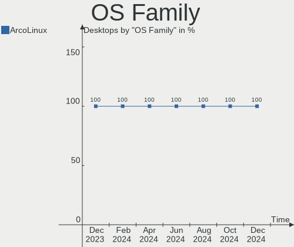
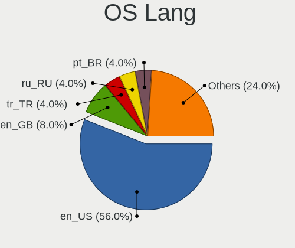
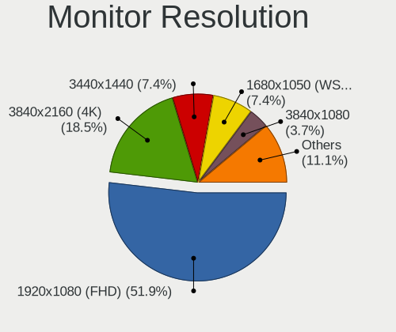
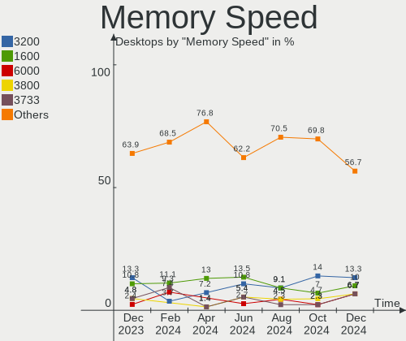

ArcoLinux Hardware Trends (Desktops)
------------------------------------

A project to identify most popular hardware characteristics and track their change
over time based on data collected by ArcoLinux users at https://Linux-Hardware.org.

Anyone can contribute to this report by the [hw-probe](https://github.com/linuxhw/hw-probe) tool:

    sudo -E hw-probe -all -upload

Full-feature report is available here: https://linux-hardware.org/?view=trends&formfactor=desktop

Period: Oct, 2021.

Contents
--------

* [ System ](#system)
  - [ OS                       ](#os)
  - [ OS Family                ](#os-family)
  - [ Kernel                   ](#kernel)
  - [ Kernel Family            ](#kernel-family)
  - [ Kernel Major Ver.        ](#kernel-major-ver)
  - [ Arch                     ](#arch)
  - [ DE                       ](#de)
  - [ Display Server           ](#display-server)
  - [ Display Manager          ](#display-manager)
  - [ OS Lang                  ](#os-lang)
  - [ Boot Mode                ](#boot-mode)
  - [ Filesystem               ](#filesystem)
  - [ Part. scheme             ](#part-scheme)
  - [ Dual Boot with Linux/BSD ](#dual-boot-with-linuxbsd)
  - [ Dual Boot (Win)          ](#dual-boot-win)

* [ Board ](#board)
  - [ Vendor                   ](#vendor)
  - [ Model                    ](#model)
  - [ Model Family             ](#model-family)
  - [ MFG Year                 ](#mfg-year)
  - [ Form Factor              ](#form-factor)
  - [ Secure Boot              ](#secure-boot)
  - [ Coreboot                 ](#coreboot)
  - [ RAM Size                 ](#ram-size)
  - [ RAM Used                 ](#ram-used)
  - [ Total Drives             ](#total-drives)
  - [ Has CD-ROM               ](#has-cd-rom)
  - [ Has Ethernet             ](#has-ethernet)
  - [ Has WiFi                 ](#has-wifi)
  - [ Has Bluetooth            ](#has-bluetooth)

* [ Location ](#location)
  - [ Country                  ](#country)
  - [ City                     ](#city)

* [ Drives ](#drives)
  - [ Drive Vendor             ](#drive-vendor)
  - [ Drive Model              ](#drive-model)
  - [ HDD Vendor               ](#hdd-vendor)
  - [ SSD Vendor               ](#ssd-vendor)
  - [ Drive Kind               ](#drive-kind)
  - [ Drive Connector          ](#drive-connector)
  - [ Drive Size               ](#drive-size)
  - [ Space Total              ](#space-total)
  - [ Space Used               ](#space-used)
  - [ Malfunc. Drives          ](#malfunc-drives)
  - [ Malfunc. Drive Vendor    ](#malfunc-drive-vendor)
  - [ Malfunc. HDD Vendor      ](#malfunc-hdd-vendor)
  - [ Malfunc. Drive Kind      ](#malfunc-drive-kind)
  - [ Failed Drives            ](#failed-drives)
  - [ Failed Drive Vendor      ](#failed-drive-vendor)
  - [ Drive Status             ](#drive-status)

* [ Storage controller ](#storage-controller)
  - [ Storage Vendor           ](#storage-vendor)
  - [ Storage Model            ](#storage-model)
  - [ Storage Kind             ](#storage-kind)

* [ Processor ](#processor)
  - [ CPU Vendor               ](#cpu-vendor)
  - [ CPU Model                ](#cpu-model)
  - [ CPU Model Family         ](#cpu-model-family)
  - [ CPU Cores                ](#cpu-cores)
  - [ CPU Sockets              ](#cpu-sockets)
  - [ CPU Threads              ](#cpu-threads)
  - [ CPU Op-Modes             ](#cpu-op-modes)
  - [ CPU Microcode            ](#cpu-microcode)
  - [ CPU Microarch            ](#cpu-microarch)

* [ Graphics ](#graphics)
  - [ GPU Vendor               ](#gpu-vendor)
  - [ GPU Model                ](#gpu-model)
  - [ GPU Combo                ](#gpu-combo)
  - [ GPU Driver               ](#gpu-driver)
  - [ GPU Memory               ](#gpu-memory)

* [ Monitor ](#monitor)
  - [ Monitor Vendor           ](#monitor-vendor)
  - [ Monitor Model            ](#monitor-model)
  - [ Monitor Resolution       ](#monitor-resolution)
  - [ Monitor Diagonal         ](#monitor-diagonal)
  - [ Monitor Width            ](#monitor-width)
  - [ Aspect Ratio             ](#aspect-ratio)
  - [ Monitor Area             ](#monitor-area)
  - [ Pixel Density            ](#pixel-density)
  - [ Multiple Monitors        ](#multiple-monitors)

* [ Network ](#network)
  - [ Net Controller Vendor    ](#net-controller-vendor)
  - [ Net Controller Model     ](#net-controller-model)
  - [ Wireless Vendor          ](#wireless-vendor)
  - [ Wireless Model           ](#wireless-model)
  - [ Ethernet Vendor          ](#ethernet-vendor)
  - [ Ethernet Model           ](#ethernet-model)
  - [ Net Controller Kind      ](#net-controller-kind)
  - [ Used Controller          ](#used-controller)
  - [ NICs                     ](#nics)
  - [ IPv6                     ](#ipv6)

* [ Bluetooth ](#bluetooth)
  - [ Bluetooth Vendor         ](#bluetooth-vendor)
  - [ Bluetooth Model          ](#bluetooth-model)

* [ Sound ](#sound)
  - [ Sound Vendor             ](#sound-vendor)
  - [ Sound Model              ](#sound-model)

* [ Memory ](#memory)
  - [ Memory Vendor            ](#memory-vendor)
  - [ Memory Model             ](#memory-model)
  - [ Memory Kind              ](#memory-kind)
  - [ Memory Form Factor       ](#memory-form-factor)
  - [ Memory Size              ](#memory-size)
  - [ Memory Speed             ](#memory-speed)

* [ Printers & scanners ](#printers--scanners)
  - [ Printer Vendor           ](#printer-vendor)
  - [ Printer Model            ](#printer-model)
  - [ Scanner Vendor           ](#scanner-vendor)
  - [ Scanner Model            ](#scanner-model)

* [ Camera ](#camera)
  - [ Camera Vendor            ](#camera-vendor)
  - [ Camera Model             ](#camera-model)

* [ Security ](#security)
  - [ Fingerprint Vendor       ](#fingerprint-vendor)
  - [ Fingerprint Model        ](#fingerprint-model)
  - [ Chipcard Vendor          ](#chipcard-vendor)
  - [ Chipcard Model           ](#chipcard-model)

* [ Unsupported ](#unsupported)
  - [ Unsupported Devices      ](#unsupported-devices)
  - [ Unsupported Device Types ](#unsupported-device-types)

System
------

OS
--

Installed operating systems

| Name              | Desktops | Percent |
|-------------------|----------|---------|
| ArcoLinux Rolling | 37       | 100%    |

OS Family
---------

OS without a version

| Name      | Desktops | Percent |
|-----------|----------|---------|
| ArcoLinux | 37       | 100%    |

Kernel
------

Version of the Linux kernel

| Version            | Desktops | Percent |
|--------------------|----------|---------|
| 5.14.14-arch1-1    | 8        | 21.62%  |
| 5.14.12-arch1-1    | 6        | 16.22%  |
| 5.14.11-arch1-1    | 3        | 8.11%   |
| 5.14.9-zen2-1-zen  | 2        | 5.41%   |
| 5.14.9-arch2-1     | 2        | 5.41%   |
| 5.14.8-arch1-1     | 2        | 5.41%   |
| 5.14.11-zen1-1-zen | 2        | 5.41%   |
| 5.10.70-1-lts      | 2        | 5.41%   |
| 5.14.9-xanmod1-1   | 1        | 2.7%    |
| 5.14.8-zen1-1-zen  | 1        | 2.7%    |
| 5.14.7-arch1-1     | 1        | 2.7%    |
| 5.14.14-zen1-1-zen | 1        | 2.7%    |
| 5.14.12-xanmod1-1  | 1        | 2.7%    |
| 5.14.10-zen1-1-zen | 1        | 2.7%    |
| 5.14.10-arch1-1    | 1        | 2.7%    |
| 5.13.13-arch1-1    | 1        | 2.7%    |
| 5.10.71-1-lts      | 1        | 2.7%    |
| 5.10.63-1-lts      | 1        | 2.7%    |

Kernel Family
-------------

Linux kernel without a distro release

| Version | Desktops | Percent |
|---------|----------|---------|
| 5.14.14 | 9        | 24.32%  |
| 5.14.12 | 7        | 18.92%  |
| 5.14.9  | 5        | 13.51%  |
| 5.14.11 | 5        | 13.51%  |
| 5.14.8  | 3        | 8.11%   |
| 5.14.10 | 2        | 5.41%   |
| 5.10.70 | 2        | 5.41%   |
| 5.14.7  | 1        | 2.7%    |
| 5.13.13 | 1        | 2.7%    |
| 5.10.71 | 1        | 2.7%    |
| 5.10.63 | 1        | 2.7%    |

Kernel Major Ver.
-----------------

Linux kernel major version

| Version | Desktops | Percent |
|---------|----------|---------|
| 5.14    | 32       | 86.49%  |
| 5.10    | 4        | 10.81%  |
| 5.13    | 1        | 2.7%    |

Arch
----

OS architecture (x86_64, i586, etc.)

| Name   | Desktops | Percent |
|--------|----------|---------|
| x86_64 | 37       | 100%    |

DE
--

Desktop Environment

| Name           | Desktops | Percent |
|----------------|----------|---------|
| KDE5           | 11       | 29.73%  |
| XFCE           | 10       | 27.03%  |
| xmonad         | 3        | 8.11%   |
| qtile          | 2        | 5.41%   |
| i3             | 2        | 5.41%   |
| awesome        | 2        | 5.41%   |
| X-Cinnamon     | 1        | 2.7%    |
| LXQt           | 1        | 2.7%    |
| i3-with-shmlog | 1        | 2.7%    |
| herbstluftwm   | 1        | 2.7%    |
| GNOME          | 1        | 2.7%    |
| dwm            | 1        | 2.7%    |
| Unknown        | 1        | 2.7%    |

Display Server
--------------

X11 or Wayland

| Name | Desktops | Percent |
|------|----------|---------|
| X11  | 34       | 91.89%  |
| Tty  | 3        | 8.11%   |

Display Manager
---------------

SDDM, LightDM, etc.

| Name    | Desktops | Percent |
|---------|----------|---------|
| SDDM    | 22       | 59.46%  |
| LightDM | 14       | 37.84%  |
| Unknown | 1        | 2.7%    |

OS Lang
-------

Language

| Lang  | Desktops | Percent |
|-------|----------|---------|
| en_US | 22       | 59.46%  |
| en_GB | 6        | 16.22%  |
| en_IN | 2        | 5.41%   |
| en_AU | 2        | 5.41%   |
| pt_BR | 1        | 2.7%    |
| pl_PL | 1        | 2.7%    |
| es_ES | 1        | 2.7%    |
| en_DK | 1        | 2.7%    |
| de_DE | 1        | 2.7%    |

Boot Mode
---------

EFI or BIOS

| Mode | Desktops | Percent |
|------|----------|---------|
| EFI  | 31       | 83.78%  |
| BIOS | 6        | 16.22%  |

Filesystem
----------

Type of filesystem

| Type    | Desktops | Percent |
|---------|----------|---------|
| Ext4    | 27       | 72.97%  |
| Btrfs   | 7        | 18.92%  |
| F2fs    | 2        | 5.41%   |
| Overlay | 1        | 2.7%    |

Part. scheme
------------

Scheme of partitioning

| Type | Desktops | Percent |
|------|----------|---------|
| GPT  | 35       | 94.59%  |
| MBR  | 2        | 5.41%   |

Dual Boot with Linux/BSD
------------------------

Hosting more than one Linux/BSD

| Dual boot | Desktops | Percent |
|-----------|----------|---------|
| No        | 25       | 67.57%  |
| Yes       | 12       | 32.43%  |

Dual Boot (Win)
---------------

Hosting Linux and Windows

| Dual boot | Desktops | Percent |
|-----------|----------|---------|
| Yes       | 20       | 54.05%  |
| No        | 17       | 45.95%  |

Board
-----

Vendor
------

Motherboard manufacturer

| Name                | Desktops | Percent |
|---------------------|----------|---------|
| ASUSTek Computer    | 13       | 35.14%  |
| Gigabyte Technology | 9        | 24.32%  |
| MSI                 | 7        | 18.92%  |
| ASRock              | 4        | 10.81%  |
| Pegatron            | 1        | 2.7%    |
| Hewlett-Packard     | 1        | 2.7%    |
| Dell                | 1        | 2.7%    |
| Acer                | 1        | 2.7%    |

Model
-----

Motherboard model

| Name                            | Desktops | Percent |
|---------------------------------|----------|---------|
| ASUS All Series                 | 3        | 8.11%   |
| MSI MS-7971                     | 2        | 5.41%   |
| Pegatron p2-1110l               | 1        | 2.7%    |
| MSI MS-7D22                     | 1        | 2.7%    |
| MSI MS-7C91                     | 1        | 2.7%    |
| MSI MS-7C02                     | 1        | 2.7%    |
| MSI MS-7B89                     | 1        | 2.7%    |
| MSI MS-7751                     | 1        | 2.7%    |
| HP Desktop M01-F1xxx            | 1        | 2.7%    |
| Gigabyte Z170-Gaming K3         | 1        | 2.7%    |
| Gigabyte X570 AORUS PRO WIFI    | 1        | 2.7%    |
| Gigabyte X570 AORUS MASTER      | 1        | 2.7%    |
| Gigabyte Komputer               | 1        | 2.7%    |
| Gigabyte H370AORUSGAMING3WIFI   | 1        | 2.7%    |
| Gigabyte F2A88XM-D3HP           | 1        | 2.7%    |
| Gigabyte B450M DS3H V2          | 1        | 2.7%    |
| Gigabyte B450 AORUS M           | 1        | 2.7%    |
| Gigabyte B365M GAMING HD        | 1        | 2.7%    |
| Dell Vostro 3888                | 1        | 2.7%    |
| ASUS TUF Z390M-PRO GAMING       | 1        | 2.7%    |
| ASUS STRIX B250F GAMING         | 1        | 2.7%    |
| ASUS ROG STRIX X570-E GAMING    | 1        | 2.7%    |
| ASUS ROG STRIX B460-H GAMING    | 1        | 2.7%    |
| ASUS ROG STRIX B450-F GAMING II | 1        | 2.7%    |
| ASUS ROG Maximus X HERO         | 1        | 2.7%    |
| ASUS ROG CROSSHAIR VIII HERO    | 1        | 2.7%    |
| ASUS PRIME Z590-A               | 1        | 2.7%    |
| ASUS PRIME Z490-A               | 1        | 2.7%    |
| ASUS M4A79XTD EVO               | 1        | 2.7%    |
| ASRock FM2A75M Pro4+            | 1        | 2.7%    |
| ASRock B450M Steel Legend       | 1        | 2.7%    |
| ASRock B360M Performance        | 1        | 2.7%    |
| ASRock 4X4 BOX                  | 1        | 2.7%    |
| Acer Aspire TC-895              | 1        | 2.7%    |

Model Family
------------

Motherboard model prefix

| Name                          | Desktops | Percent |
|-------------------------------|----------|---------|
| ASUS ROG                      | 5        | 13.51%  |
| ASUS All                      | 3        | 8.11%   |
| MSI MS-7971                   | 2        | 5.41%   |
| Gigabyte X570                 | 2        | 5.41%   |
| ASUS PRIME                    | 2        | 5.41%   |
| Pegatron p2-1110l             | 1        | 2.7%    |
| MSI MS-7D22                   | 1        | 2.7%    |
| MSI MS-7C91                   | 1        | 2.7%    |
| MSI MS-7C02                   | 1        | 2.7%    |
| MSI MS-7B89                   | 1        | 2.7%    |
| MSI MS-7751                   | 1        | 2.7%    |
| HP Desktop                    | 1        | 2.7%    |
| Gigabyte Z170-Gaming          | 1        | 2.7%    |
| Gigabyte Komputer             | 1        | 2.7%    |
| Gigabyte H370AORUSGAMING3WIFI | 1        | 2.7%    |
| Gigabyte F2A88XM-D3HP         | 1        | 2.7%    |
| Gigabyte B450M                | 1        | 2.7%    |
| Gigabyte B450                 | 1        | 2.7%    |
| Gigabyte B365M                | 1        | 2.7%    |
| Dell Vostro                   | 1        | 2.7%    |
| ASUS TUF                      | 1        | 2.7%    |
| ASUS STRIX                    | 1        | 2.7%    |
| ASUS M4A79XTD                 | 1        | 2.7%    |
| ASRock FM2A75M                | 1        | 2.7%    |
| ASRock B450M                  | 1        | 2.7%    |
| ASRock B360M                  | 1        | 2.7%    |
| ASRock 4X4                    | 1        | 2.7%    |
| Acer Aspire                   | 1        | 2.7%    |

MFG Year
--------

Motherboard manufacture year

| Year | Desktops | Percent |
|------|----------|---------|
| 2021 | 12       | 32.43%  |
| 2020 | 9        | 24.32%  |
| 2019 | 4        | 10.81%  |
| 2018 | 2        | 5.41%   |
| 2016 | 2        | 5.41%   |
| 2015 | 2        | 5.41%   |
| 2017 | 1        | 2.7%    |
| 2014 | 1        | 2.7%    |
| 2013 | 1        | 2.7%    |
| 2011 | 1        | 2.7%    |
| 2010 | 1        | 2.7%    |
| 2007 | 1        | 2.7%    |

Form Factor
-----------

Physical design of the computer

| Name    | Desktops | Percent |
|---------|----------|---------|
| Desktop | 37       | 100%    |

Secure Boot
-----------

Enabled or disabled

| State    | Desktops | Percent |
|----------|----------|---------|
| Disabled | 37       | 100%    |

Coreboot
--------

Have coreboot on board

| Used | Desktops | Percent |
|------|----------|---------|
| No   | 37       | 100%    |

RAM Size
--------

Total RAM memory

| Size in GB  | Desktops | Percent |
|-------------|----------|---------|
| 16.01-24.0  | 12       | 32.43%  |
| 32.01-64.0  | 9        | 24.32%  |
| 8.01-16.0   | 5        | 13.51%  |
| 64.01-256.0 | 4        | 10.81%  |
| 4.01-8.0    | 2        | 5.41%   |
| 24.01-32.0  | 2        | 5.41%   |
| 1.01-2.0    | 2        | 5.41%   |
| 3.01-4.0    | 1        | 2.7%    |

RAM Used
--------

Used RAM memory

| Used GB    | Desktops | Percent |
|------------|----------|---------|
| 2.01-3.0   | 11       | 29.73%  |
| 4.01-8.0   | 10       | 27.03%  |
| 1.01-2.0   | 9        | 24.32%  |
| 0.51-1.0   | 3        | 8.11%   |
| 3.01-4.0   | 2        | 5.41%   |
| 16.01-24.0 | 1        | 2.7%    |
| 0.01-0.5   | 1        | 2.7%    |

Total Drives
------------

Number of drives on board

| Drives | Desktops | Percent |
|--------|----------|---------|
| 2      | 12       | 32.43%  |
| 3      | 7        | 18.92%  |
| 5      | 5        | 13.51%  |
| 4      | 5        | 13.51%  |
| 1      | 5        | 13.51%  |
| 7      | 2        | 5.41%   |
| 6      | 1        | 2.7%    |

Has CD-ROM
----------

Has CD-ROM on board

| Presented | Desktops | Percent |
|-----------|----------|---------|
| No        | 26       | 70.27%  |
| Yes       | 11       | 29.73%  |

Has Ethernet
------------

Has Ethernet on board

| Presented | Desktops | Percent |
|-----------|----------|---------|
| Yes       | 37       | 100%    |

Has WiFi
--------

Has WiFi module

| Presented | Desktops | Percent |
|-----------|----------|---------|
| No        | 21       | 56.76%  |
| Yes       | 16       | 43.24%  |

Has Bluetooth
-------------

Has Bluetooth module

| Presented | Desktops | Percent |
|-----------|----------|---------|
| No        | 19       | 51.35%  |
| Yes       | 18       | 48.65%  |

Location
--------

Country
-------

Geographic location (country)

| Country     | Desktops | Percent |
|-------------|----------|---------|
| USA         | 7        | 18.92%  |
| UK          | 5        | 13.51%  |
| India       | 3        | 8.11%   |
| Poland      | 2        | 5.41%   |
| Hong Kong   | 2        | 5.41%   |
| Germany     | 2        | 5.41%   |
| Australia   | 2        | 5.41%   |
| Spain       | 1        | 2.7%    |
| Romania     | 1        | 2.7%    |
| Norway      | 1        | 2.7%    |
| Netherlands | 1        | 2.7%    |
| Nepal       | 1        | 2.7%    |
| Indonesia   | 1        | 2.7%    |
| France      | 1        | 2.7%    |
| El Salvador | 1        | 2.7%    |
| Denmark     | 1        | 2.7%    |
| Croatia     | 1        | 2.7%    |
| Canada      | 1        | 2.7%    |
| Bulgaria    | 1        | 2.7%    |
| Brazil      | 1        | 2.7%    |
| Belgium     | 1        | 2.7%    |

City
----

Geographic location (city)

| City                   | Desktops | Percent |
|------------------------|----------|---------|
| Lerwick                | 3        | 8.11%   |
| Central                | 2        | 5.41%   |
| Winschoten             | 1        | 2.7%    |
| Villanueva de la Torre | 1        | 2.7%    |
| Umargam                | 1        | 2.7%    |
| Toulouse               | 1        | 2.7%    |
| Toronto                | 1        | 2.7%    |
| Staten Island          | 1        | 2.7%    |
| Smyrna                 | 1        | 2.7%    |
| San Salvador           | 1        | 2.7%    |
| Pula                   | 1        | 2.7%    |
| Novi Pazar             | 1        | 2.7%    |
| Moelfre                | 1        | 2.7%    |
| Melbourne              | 1        | 2.7%    |
| Louisville             | 1        | 2.7%    |
| Leverkusen             | 1        | 2.7%    |
| Kathmandu              | 1        | 2.7%    |
| Jundia?­               | 1        | 2.7%    |
| Hyderabad              | 1        | 2.7%    |
| Holte                  | 1        | 2.7%    |
| Hamar                  | 1        | 2.7%    |
| Glasgow                | 1        | 2.7%    |
| Gdynia                 | 1        | 2.7%    |
| Gdansk                 | 1        | 2.7%    |
| Duffel                 | 1        | 2.7%    |
| Denpasar               | 1        | 2.7%    |
| Demorest               | 1        | 2.7%    |
| Dallas                 | 1        | 2.7%    |
| Coimbatore             | 1        | 2.7%    |
| Chugiak                | 1        | 2.7%    |
| Carthage               | 1        | 2.7%    |
| Bucharest              | 1        | 2.7%    |
| Brisbane               | 1        | 2.7%    |
| Berlin                 | 1        | 2.7%    |

Drives
------

Drive Vendor
------------

Hard drive vendors

| Vendor              | Desktops | Drives | Percent |
|---------------------|----------|--------|---------|
| WDC                 | 18       | 22     | 20.22%  |
| Samsung Electronics | 15       | 24     | 16.85%  |
| Seagate             | 10       | 12     | 11.24%  |
| Crucial             | 6        | 9      | 6.74%   |
| Toshiba             | 5        | 9      | 5.62%   |
| Kingston            | 4        | 5      | 4.49%   |
| SanDisk             | 3        | 4      | 3.37%   |
| Intel               | 3        | 3      | 3.37%   |
| Gigabyte Technology | 3        | 3      | 3.37%   |
| A-DATA Technology   | 3        | 3      | 3.37%   |
| XPG                 | 2        | 2      | 2.25%   |
| Transcend           | 2        | 2      | 2.25%   |
| SPCC                | 2        | 2      | 2.25%   |
| PNY                 | 2        | 2      | 2.25%   |
| Hitachi             | 2        | 2      | 2.25%   |
| Vaseky              | 1        | 1      | 1.12%   |
| Unknown             | 1        | 1      | 1.12%   |
| SK Hynix            | 1        | 1      | 1.12%   |
| Patriot             | 1        | 1      | 1.12%   |
| KingSpec            | 1        | 1      | 1.12%   |
| HGST                | 1        | 3      | 1.12%   |
| Corsair             | 1        | 1      | 1.12%   |
| Apricorn            | 1        | 1      | 1.12%   |
| AMD                 | 1        | 2      | 1.12%   |

Drive Model
-----------

Hard drive models

| Model                                       | Desktops | Percent |
|---------------------------------------------|----------|---------|
| WDC WD10EZEX-08WN4A0 1TB                    | 3        | 2.88%   |
| Samsung SSD 970 EVO 1TB                     | 3        | 2.88%   |
| Seagate ST1000DM010-2EP102 1TB              | 2        | 1.92%   |
| Samsung SSD 860 EVO 500GB                   | 2        | 1.92%   |
| Samsung SSD 860 EVO 1TB                     | 2        | 1.92%   |
| Kingston SA400S37120G 120GB SSD             | 2        | 1.92%   |
| Intel SSDPEKNW010T8 1TB                     | 2        | 1.92%   |
| Crucial CT500MX500SSD1 500GB                | 2        | 1.92%   |
| Crucial CT2000MX500SSD1 2TB                 | 2        | 1.92%   |
| XPG SPECTRIX S40G 512GB                     | 1        | 0.96%   |
| XPG GAMMIX S5 256GB                         | 1        | 0.96%   |
| WDC WDS500G1X0E-00AFY0 500GB                | 1        | 0.96%   |
| WDC WDS250G1B0C-00S6U0 250GB                | 1        | 0.96%   |
| WDC WDS240G2G0B-00EPW0 240GB SSD            | 1        | 0.96%   |
| WDC WDS100T3X0C-00SJG0 1TB                  | 1        | 0.96%   |
| WDC WDS100T2B0C-00PXH0 1TB                  | 1        | 0.96%   |
| WDC WD6402AAEX-00Z3A0 640GB                 | 1        | 0.96%   |
| WDC WD6401AALS-00L3B2 640GB                 | 1        | 0.96%   |
| WDC WD5000BPVT-60HXZT3 500GB                | 1        | 0.96%   |
| WDC WD5000AAKX-603CA0 500GB                 | 1        | 0.96%   |
| WDC WD5000AAKX-001CA0 500GB                 | 1        | 0.96%   |
| WDC WD5000AAKS-75A7B2 500GB                 | 1        | 0.96%   |
| WDC WD3200BEVT-75A23T0 320GB                | 1        | 0.96%   |
| WDC WD3200AAKS-61L9A0 320GB                 | 1        | 0.96%   |
| WDC WD3200AAJS-56M0A0 320GB                 | 1        | 0.96%   |
| WDC WD3200AAJS-56B4A0 320GB                 | 1        | 0.96%   |
| WDC WD20EFRX-68EUZN0 2TB                    | 1        | 0.96%   |
| WDC WD10EZEX-75M2NA0 1TB                    | 1        | 0.96%   |
| WDC WD10EZEX-00BBHA0 1TB                    | 1        | 0.96%   |
| Vaseky V900/128G 128GB SSD                  | 1        | 0.96%   |
| Unknown SD/MMC/MS PRO 128GB                 | 1        | 0.96%   |
| Transcend TS480GSSD220S 480GB               | 1        | 0.96%   |
| Transcend TS1TSSD230S 1TB                   | 1        | 0.96%   |
| Toshiba TR200 480GB SSD                     | 1        | 0.96%   |
| Toshiba HDWD130 3TB                         | 1        | 0.96%   |
| Toshiba HDWD110 1TB                         | 1        | 0.96%   |
| Toshiba DT01ACA200 2TB                      | 1        | 0.96%   |
| Toshiba DT01ACA100 1TB                      | 1        | 0.96%   |
| SPCC Solid State Disk 256GB                 | 1        | 0.96%   |
| SPCC Solid State Disk 1TB                   | 1        | 0.96%   |
| SK Hynix SC311 SATA 128GB SSD               | 1        | 0.96%   |
| Seagate ST4000VX007-2DT166 4TB              | 1        | 0.96%   |
| Seagate ST4000LM024-2AN17V 4TB              | 1        | 0.96%   |
| Seagate ST380811AS 80GB                     | 1        | 0.96%   |
| Seagate ST3500413AS 500GB                   | 1        | 0.96%   |
| Seagate ST3160023AS 160GB                   | 1        | 0.96%   |
| Seagate ST31500341AS 1TB                    | 1        | 0.96%   |
| Seagate ST31000528AS 1TB                    | 1        | 0.96%   |
| Seagate ST2000DM006-2DM164 2TB              | 1        | 0.96%   |
| Seagate FireCuda 520 SSD ZP500GM30002 500GB | 1        | 0.96%   |
| Seagate Backup+ Desk 8TB                    | 1        | 0.96%   |
| SanDisk SSD PLUS 120GB                      | 1        | 0.96%   |
| SanDisk SDSSDXPS240G 240GB                  | 1        | 0.96%   |
| SanDisk SDSSDA240G 240GB                    | 1        | 0.96%   |
| SanDisk SD8SN8U-128G-1006 128GB SSD         | 1        | 0.96%   |
| Samsung SSD 980 PRO 250GB                   | 1        | 0.96%   |
| Samsung SSD 970 PRO 1TB                     | 1        | 0.96%   |
| Samsung SSD 970 EVO Plus 500GB              | 1        | 0.96%   |
| Samsung SSD 970 EVO Plus 1TB                | 1        | 0.96%   |
| Samsung SSD 870 EVO 2TB                     | 1        | 0.96%   |

HDD Vendor
----------

Hard disk drive vendors

| Vendor              | Desktops | Drives | Percent |
|---------------------|----------|--------|---------|
| WDC                 | 13       | 17     | 41.94%  |
| Seagate             | 8        | 10     | 25.81%  |
| Toshiba             | 4        | 6      | 12.9%   |
| Samsung Electronics | 2        | 2      | 6.45%   |
| Hitachi             | 2        | 2      | 6.45%   |
| Unknown             | 1        | 1      | 3.23%   |
| HGST                | 1        | 3      | 3.23%   |

SSD Vendor
----------

Solid state drive vendors

| Vendor              | Desktops | Drives | Percent |
|---------------------|----------|--------|---------|
| Samsung Electronics | 8        | 11     | 21.62%  |
| Crucial             | 5        | 8      | 13.51%  |
| Kingston            | 4        | 4      | 10.81%  |
| SanDisk             | 3        | 4      | 8.11%   |
| A-DATA Technology   | 3        | 3      | 8.11%   |
| Transcend           | 2        | 2      | 5.41%   |
| SPCC                | 2        | 2      | 5.41%   |
| PNY                 | 2        | 2      | 5.41%   |
| WDC                 | 1        | 1      | 2.7%    |
| Vaseky              | 1        | 1      | 2.7%    |
| Toshiba             | 1        | 3      | 2.7%    |
| SK Hynix            | 1        | 1      | 2.7%    |
| Patriot             | 1        | 1      | 2.7%    |
| KingSpec            | 1        | 1      | 2.7%    |
| Gigabyte Technology | 1        | 1      | 2.7%    |
| AMD                 | 1        | 2      | 2.7%    |

Drive Kind
----------

HDD or SSD

| Kind    | Desktops | Drives | Percent |
|---------|----------|--------|---------|
| SSD     | 27       | 47     | 38.03%  |
| HDD     | 24       | 41     | 33.8%   |
| NVMe    | 18       | 26     | 25.35%  |
| Unknown | 2        | 2      | 2.82%   |

Drive Connector
---------------

SATA, SAS, NVMe, etc.

| Type | Desktops | Drives | Percent |
|------|----------|--------|---------|
| SATA | 33       | 86     | 60%     |
| NVMe | 18       | 26     | 32.73%  |
| SAS  | 4        | 4      | 7.27%   |

Drive Size
----------

Size of hard drive

| Size in TB | Desktops | Drives | Percent |
|------------|----------|--------|---------|
| 0.01-0.5   | 29       | 48     | 51.79%  |
| 0.51-1.0   | 16       | 22     | 28.57%  |
| 1.01-2.0   | 7        | 11     | 12.5%   |
| 2.01-3.0   | 2        | 4      | 3.57%   |
| 3.01-4.0   | 1        | 2      | 1.79%   |
| 4.01-10.0  | 1        | 1      | 1.79%   |

Space Total
-----------

Amount of disk space available on the file system

| Size in GB     | Desktops | Percent |
|----------------|----------|---------|
| 251-500        | 7        | 18.92%  |
| 101-250        | 6        | 16.22%  |
| 501-1000       | 6        | 16.22%  |
| More than 3000 | 5        | 13.51%  |
| 1001-2000      | 5        | 13.51%  |
| 2001-3000      | 3        | 8.11%   |
| 1-20           | 2        | 5.41%   |
| 21-50          | 1        | 2.7%    |
| 51-100         | 1        | 2.7%    |
| Unknown        | 1        | 2.7%    |

Space Used
----------

Amount of used disk space

| Used GB        | Desktops | Percent |
|----------------|----------|---------|
| 1-20           | 8        | 21.62%  |
| 21-50          | 7        | 18.92%  |
| 101-250        | 5        | 13.51%  |
| 51-100         | 5        | 13.51%  |
| 251-500        | 4        | 10.81%  |
| 1001-2000      | 3        | 8.11%   |
| 501-1000       | 3        | 8.11%   |
| More than 3000 | 1        | 2.7%    |
| Unknown        | 1        | 2.7%    |

Malfunc. Drives
---------------

Drive models with a malfunction

| Model                               | Desktops | Drives | Percent |
|-------------------------------------|----------|--------|---------|
| XPG SPECTRIX S40G 512GB             | 1        | 1      | 8.33%   |
| WDC WD5000AAKX-603CA0 500GB         | 1        | 1      | 8.33%   |
| WDC WD5000AAKX-001CA0 500GB         | 1        | 1      | 8.33%   |
| WDC WD3200AAJS-56B4A0 320GB         | 1        | 1      | 8.33%   |
| Transcend TS480GSSD220S 480GB       | 1        | 1      | 8.33%   |
| Transcend TS1TSSD230S 1TB           | 1        | 1      | 8.33%   |
| Seagate ST3500413AS 500GB           | 1        | 1      | 8.33%   |
| Seagate ST3160023AS 160GB           | 1        | 1      | 8.33%   |
| Seagate ST31500341AS 1TB            | 1        | 1      | 8.33%   |
| Samsung Electronics SSD 870 EVO 2TB | 1        | 1      | 8.33%   |
| Kingston SA400S37120G 120GB SSD     | 1        | 1      | 8.33%   |
| Hitachi HDS723020BLA642 2TB         | 1        | 1      | 8.33%   |

Malfunc. Drive Vendor
---------------------

Vendors of faulty drives

| Vendor              | Desktops | Drives | Percent |
|---------------------|----------|--------|---------|
| WDC                 | 3        | 3      | 25%     |
| Seagate             | 3        | 3      | 25%     |
| Transcend           | 2        | 2      | 16.67%  |
| XPG                 | 1        | 1      | 8.33%   |
| Samsung Electronics | 1        | 1      | 8.33%   |
| Kingston            | 1        | 1      | 8.33%   |
| Hitachi             | 1        | 1      | 8.33%   |

Malfunc. HDD Vendor
-------------------

Vendors of faulty HDD drives

| Vendor  | Desktops | Drives | Percent |
|---------|----------|--------|---------|
| WDC     | 3        | 3      | 42.86%  |
| Seagate | 3        | 3      | 42.86%  |
| Hitachi | 1        | 1      | 14.29%  |

Malfunc. Drive Kind
-------------------

Kinds of faulty drives

| Kind | Desktops | Drives | Percent |
|------|----------|--------|---------|
| HDD  | 7        | 7      | 58.33%  |
| SSD  | 4        | 4      | 33.33%  |
| NVMe | 1        | 1      | 8.33%   |

Failed Drives
-------------

Failed drive models

Zero info for selected period =(

Failed Drive Vendor
-------------------

Failed drive vendors

Zero info for selected period =(

Drive Status
------------

Number of failed and malfunc. drives

| Status   | Desktops | Drives | Percent |
|----------|----------|--------|---------|
| Works    | 33       | 97     | 66%     |
| Malfunc  | 12       | 12     | 24%     |
| Detected | 5        | 7      | 10%     |

Storage controller
------------------

Storage Vendor
--------------

Storage controller vendors

| Vendor                      | Desktops | Percent |
|-----------------------------|----------|---------|
| Intel                       | 23       | 38.33%  |
| AMD                         | 15       | 25%     |
| Samsung Electronics         | 8        | 13.33%  |
| Sandisk                     | 4        | 6.67%   |
| Realtek Semiconductor       | 2        | 3.33%   |
| Phison Electronics          | 2        | 3.33%   |
| ASMedia Technology          | 2        | 3.33%   |
| Seagate Technology          | 1        | 1.67%   |
| Micron/Crucial Technology   | 1        | 1.67%   |
| Marvell Technology Group    | 1        | 1.67%   |
| Kingston Technology Company | 1        | 1.67%   |

Storage Model
-------------

Storage controller models

| Model                                                                          | Desktops | Percent |
|--------------------------------------------------------------------------------|----------|---------|
| AMD FCH SATA Controller [AHCI mode]                                            | 10       | 14.08%  |
| AMD 400 Series Chipset SATA Controller                                         | 6        | 8.45%   |
| Samsung NVMe SSD Controller SM981/PM981/PM983                                  | 5        | 7.04%   |
| Intel SSD 660P Series                                                          | 3        | 4.23%   |
| Intel SATA Controller [RAID mode]                                              | 3        | 4.23%   |
| Intel Q170/Q150/B150/H170/H110/Z170/CM236 Chipset SATA Controller [AHCI Mode]  | 3        | 4.23%   |
| Intel Cannon Lake PCH SATA AHCI Controller                                     | 3        | 4.23%   |
| Samsung NVMe SSD Controller PM9A1/PM9A3/980PRO                                 | 2        | 2.82%   |
| Phison E16 PCIe4 NVMe Controller                                               | 2        | 2.82%   |
| Intel C610/X99 series chipset sSATA Controller [AHCI mode]                     | 2        | 2.82%   |
| Intel C610/X99 series chipset 6-Port SATA Controller [AHCI mode]               | 2        | 2.82%   |
| Intel 500 Series Chipset Family SATA AHCI Controller                           | 2        | 2.82%   |
| Intel 400 Series Chipset Family SATA AHCI Controller                           | 2        | 2.82%   |
| Seagate FireCuda 520 SSD                                                       | 1        | 1.41%   |
| Sandisk WD Blue SN550 NVMe SSD                                                 | 1        | 1.41%   |
| Sandisk WD Blue SN500 / PC SN520 NVMe SSD                                      | 1        | 1.41%   |
| Sandisk WD Black SN850                                                         | 1        | 1.41%   |
| Sandisk WD Black SN750 / PC SN730 NVMe SSD                                     | 1        | 1.41%   |
| Samsung NVMe SSD Controller 980                                                | 1        | 1.41%   |
| Realtek RTS5763DL NVMe SSD Controller                                          | 1        | 1.41%   |
| Realtek Realtek Non-Volatile memory controller                                 | 1        | 1.41%   |
| Phison PS5013 E13 NVMe Controller                                              | 1        | 1.41%   |
| Micron/Crucial P1 NVMe PCIe SSD                                                | 1        | 1.41%   |
| Marvell Group 88SE6111/6121 SATA II / PATA Controller                          | 1        | 1.41%   |
| Kingston Company A2000 NVMe SSD                                                | 1        | 1.41%   |
| Intel NM10/ICH7 Family SATA Controller [IDE mode]                              | 1        | 1.41%   |
| Intel Comet Lake PCH-H RAID                                                    | 1        | 1.41%   |
| Intel 8 Series/C220 Series Chipset Family 6-port SATA Controller 1 [AHCI mode] | 1        | 1.41%   |
| Intel 7 Series/C210 Series Chipset Family 4-port SATA Controller [IDE mode]    | 1        | 1.41%   |
| Intel 7 Series/C210 Series Chipset Family 2-port SATA Controller [IDE mode]    | 1        | 1.41%   |
| Intel 6 Series/C200 Series Chipset Family 6 port Desktop SATA AHCI Controller  | 1        | 1.41%   |
| Intel 300 Series Chipset Family SATA RAID Controller                           | 1        | 1.41%   |
| Intel 200 Series PCH SATA controller [AHCI mode]                               | 1        | 1.41%   |
| ASMedia ASM1062 Serial ATA Controller                                          | 1        | 1.41%   |
| ASMedia ASM1061 SATA IDE Controller                                            | 1        | 1.41%   |
| AMD Starship/Matisse Chipset SATA Controller [AHCI mode]                       | 1        | 1.41%   |
| AMD SB7x0/SB8x0/SB9x0 SATA Controller [IDE mode]                               | 1        | 1.41%   |
| AMD SB7x0/SB8x0/SB9x0 IDE Controller                                           | 1        | 1.41%   |
| AMD FCH IDE Controller                                                         | 1        | 1.41%   |

Storage Kind
------------

Kind of storage controller (IDE, SATA, NVMe, SAS, ...)

| Kind | Desktops | Percent |
|------|----------|---------|
| SATA | 30       | 52.63%  |
| NVMe | 18       | 31.58%  |
| RAID | 5        | 8.77%   |
| IDE  | 4        | 7.02%   |

Processor
---------

CPU Vendor
----------

Processor vendors

| Vendor | Desktops | Percent |
|--------|----------|---------|
| Intel  | 22       | 59.46%  |
| AMD    | 15       | 40.54%  |

CPU Model
---------

Processor models

| Model                                           | Desktops | Percent |
|-------------------------------------------------|----------|---------|
| Intel Core i5-10400 CPU @ 2.90GHz               | 2        | 5.41%   |
| AMD Ryzen 9 3900X 12-Core Processor             | 2        | 5.41%   |
| AMD Ryzen 7 3700X 8-Core Processor              | 2        | 5.41%   |
| AMD Ryzen 3 2200G with Radeon Vega Graphics     | 2        | 5.41%   |
| Intel Xeon CPU E5-1660 v3 @ 3.00GHz             | 1        | 2.7%    |
| Intel Pentium Dual CPU E2200 @ 2.20GHz          | 1        | 2.7%    |
| Intel Pentium CPU G630T @ 2.30GHz               | 1        | 2.7%    |
| Intel Core i9-10850K CPU @ 3.60GHz              | 1        | 2.7%    |
| Intel Core i7-8700K CPU @ 3.70GHz               | 1        | 2.7%    |
| Intel Core i7-8700 CPU @ 3.20GHz                | 1        | 2.7%    |
| Intel Core i7-7700K CPU @ 4.20GHz               | 1        | 2.7%    |
| Intel Core i7-6700K CPU @ 4.00GHz               | 1        | 2.7%    |
| Intel Core i7-5960X CPU @ 3.00GHz               | 1        | 2.7%    |
| Intel Core i7-4770 CPU @ 3.40GHz                | 1        | 2.7%    |
| Intel Core i7-3770K CPU @ 3.50GHz               | 1        | 2.7%    |
| Intel Core i7-10700K CPU @ 3.80GHz              | 1        | 2.7%    |
| Intel Core i5-9600K CPU @ 3.70GHz               | 1        | 2.7%    |
| Intel Core i5-9400F CPU @ 2.90GHz               | 1        | 2.7%    |
| Intel Core i5-8400 CPU @ 2.80GHz                | 1        | 2.7%    |
| Intel Core i5-7600K CPU @ 3.80GHz               | 1        | 2.7%    |
| Intel Core i5-6500 CPU @ 3.20GHz                | 1        | 2.7%    |
| Intel Core i3-10100 CPU @ 3.60GHz               | 1        | 2.7%    |
| Intel 11th Gen Core i5-11600KF @ 3.90GHz        | 1        | 2.7%    |
| Intel 11th Gen Core i5-11400 @ 2.60GHz          | 1        | 2.7%    |
| AMD Ryzen 9 5900X 12-Core Processor             | 1        | 2.7%    |
| AMD Ryzen 9 3950X 16-Core Processor             | 1        | 2.7%    |
| AMD Ryzen 7 4800U with Radeon Graphics          | 1        | 2.7%    |
| AMD Ryzen 5 5600X 6-Core Processor              | 1        | 2.7%    |
| AMD Ryzen 5 3600 6-Core Processor               | 1        | 2.7%    |
| AMD Ryzen 5 2600 Six-Core Processor             | 1        | 2.7%    |
| AMD Phenom II X4 B50 Processor                  | 1        | 2.7%    |
| AMD A8-5600K APU with Radeon HD Graphics        | 1        | 2.7%    |
| AMD A10-7860K Radeon R7, 12 Compute Cores 4C+8G | 1        | 2.7%    |

CPU Model Family
----------------

Processor model prefix

| Model              | Desktops | Percent |
|--------------------|----------|---------|
| Intel Core i7      | 8        | 21.62%  |
| Intel Core i5      | 7        | 18.92%  |
| AMD Ryzen 9        | 4        | 10.81%  |
| AMD Ryzen 7        | 3        | 8.11%   |
| AMD Ryzen 5        | 3        | 8.11%   |
| Other              | 2        | 5.41%   |
| AMD Ryzen 3        | 2        | 5.41%   |
| Intel Xeon         | 1        | 2.7%    |
| Intel Pentium Dual | 1        | 2.7%    |
| Intel Pentium      | 1        | 2.7%    |
| Intel Core i9      | 1        | 2.7%    |
| Intel Core i3      | 1        | 2.7%    |
| AMD Phenom II X4   | 1        | 2.7%    |
| AMD A8             | 1        | 2.7%    |
| AMD A10            | 1        | 2.7%    |

CPU Cores
---------

Number of processor cores

| Number | Desktops | Percent |
|--------|----------|---------|
| 6      | 12       | 32.43%  |
| 4      | 10       | 27.03%  |
| 8      | 6        | 16.22%  |
| 2      | 4        | 10.81%  |
| 12     | 3        | 8.11%   |
| 16     | 1        | 2.7%    |
| 10     | 1        | 2.7%    |

CPU Sockets
-----------

Number of sockets

| Number | Desktops | Percent |
|--------|----------|---------|
| 1      | 37       | 100%    |

CPU Threads
-----------

Threads per core (Hyper-Threading)

| Number | Desktops | Percent |
|--------|----------|---------|
| 2      | 27       | 72.97%  |
| 1      | 10       | 27.03%  |

CPU Op-Modes
------------

CPU Operation Modes (32-bit, 64-bit)

| Op mode        | Desktops | Percent |
|----------------|----------|---------|
| 32-bit, 64-bit | 37       | 100%    |

CPU Microcode
-------------

Microcode number

| Number     | Desktops | Percent |
|------------|----------|---------|
| 0x08701021 | 6        | 16.22%  |
| 0x906ea    | 4        | 10.81%  |
| 0xa0653    | 3        | 8.11%   |
| 0x906e9    | 2        | 5.41%   |
| 0x506e3    | 2        | 5.41%   |
| 0x306f2    | 2        | 5.41%   |
| 0x08101016 | 2        | 5.41%   |
| Unknown    | 2        | 5.41%   |
| 0xa0671    | 1        | 2.7%    |
| 0xa0655    | 1        | 2.7%    |
| 0x906ec    | 1        | 2.7%    |
| 0x6fd      | 1        | 2.7%    |
| 0x306c3    | 1        | 2.7%    |
| 0x306a9    | 1        | 2.7%    |
| 0x206a7    | 1        | 2.7%    |
| 0x0a201016 | 1        | 2.7%    |
| 0x0a201009 | 1        | 2.7%    |
| 0x08600103 | 1        | 2.7%    |
| 0x0800820d | 1        | 2.7%    |
| 0x06003106 | 1        | 2.7%    |
| 0x06001119 | 1        | 2.7%    |
| 0x010000db | 1        | 2.7%    |

CPU Microarch
-------------

Microarchitecture

| Name        | Desktops | Percent |
|-------------|----------|---------|
| Zen 2       | 7        | 18.92%  |
| KabyLake    | 7        | 18.92%  |
| CometLake   | 5        | 13.51%  |
| Haswell     | 3        | 8.11%   |
| Zen 3       | 2        | 5.41%   |
| Zen         | 2        | 5.41%   |
| Skylake     | 2        | 5.41%   |
| Zen+        | 1        | 2.7%    |
| Steamroller | 1        | 2.7%    |
| SandyBridge | 1        | 2.7%    |
| Piledriver  | 1        | 2.7%    |
| K10         | 1        | 2.7%    |
| IvyBridge   | 1        | 2.7%    |
| Icelake     | 1        | 2.7%    |
| Core        | 1        | 2.7%    |
| Unknown     | 1        | 2.7%    |

Graphics
--------

GPU Vendor
----------

Vendors of graphics cards

| Vendor | Desktops | Percent |
|--------|----------|---------|
| Nvidia | 20       | 51.28%  |
| AMD    | 11       | 28.21%  |
| Intel  | 8        | 20.51%  |

GPU Model
---------

Graphics card models

| Model                                                                       | Desktops | Percent |
|-----------------------------------------------------------------------------|----------|---------|
| Intel CometLake-S GT2 [UHD Graphics 630]                                    | 4        | 10.26%  |
| Nvidia GA104 [GeForce RTX 3070]                                             | 3        | 7.69%   |
| AMD Navi 21 [Radeon RX 6800/6800 XT / 6900 XT]                              | 3        | 7.69%   |
| Nvidia GP102 [GeForce GTX 1080 Ti]                                          | 2        | 5.13%   |
| AMD Hawaii PRO GL [FirePro W8100]                                           | 2        | 5.13%   |
| Nvidia TU117 [GeForce GTX 1650]                                             | 1        | 2.56%   |
| Nvidia TU116 [GeForce GTX 1660 Ti]                                          | 1        | 2.56%   |
| Nvidia TU116 [GeForce GTX 1650 SUPER]                                       | 1        | 2.56%   |
| Nvidia TU106 [GeForce RTX 2070]                                             | 1        | 2.56%   |
| Nvidia TU106 [GeForce RTX 2060 Rev. A]                                      | 1        | 2.56%   |
| Nvidia TU104 [GeForce RTX 2080 Rev. A]                                      | 1        | 2.56%   |
| Nvidia GP108 [GeForce GT 1030]                                              | 1        | 2.56%   |
| Nvidia GP107 [GeForce GTX 1050]                                             | 1        | 2.56%   |
| Nvidia GP107 [GeForce GTX 1050 Ti]                                          | 1        | 2.56%   |
| Nvidia GP106 [GeForce GTX 1060 6GB]                                         | 1        | 2.56%   |
| Nvidia GP106 [GeForce GTX 1060 3GB]                                         | 1        | 2.56%   |
| Nvidia GP104 [GeForce GTX 1070]                                             | 1        | 2.56%   |
| Nvidia GM204 [GeForce GTX 970]                                              | 1        | 2.56%   |
| Nvidia GK208B [GeForce GT 710]                                              | 1        | 2.56%   |
| Nvidia GK106 [GeForce GTX 660]                                              | 1        | 2.56%   |
| Intel Xeon E3-1200 v3/4th Gen Core Processor Integrated Graphics Controller | 1        | 2.56%   |
| Intel RocketLake-S GT1 [UHD Graphics 730]                                   | 1        | 2.56%   |
| Intel 82945G/GZ Integrated Graphics Controller                              | 1        | 2.56%   |
| Intel 2nd Generation Core Processor Family Integrated Graphics Controller   | 1        | 2.56%   |
| AMD Renoir                                                                  | 1        | 2.56%   |
| AMD Pitcairn PRO [Radeon HD 7850 / R7 265 / R9 270 1024SP]                  | 1        | 2.56%   |
| AMD Navi 10 [Radeon RX 5600 OEM/5600 XT / 5700/5700 XT]                     | 1        | 2.56%   |
| AMD Lexa PRO [Radeon 540/540X/550/550X / RX 540X/550/550X]                  | 1        | 2.56%   |
| AMD Cypress PRO [Radeon HD 5850]                                            | 1        | 2.56%   |
| AMD Baffin [Radeon RX 550 640SP / RX 560/560X]                              | 1        | 2.56%   |

GPU Combo
---------

Combinations of graphics cards

| Name           | Desktops | Percent |
|----------------|----------|---------|
| 1 x Nvidia     | 18       | 48.65%  |
| 1 x AMD        | 11       | 29.73%  |
| 1 x Intel      | 7        | 18.92%  |
| Intel + Nvidia | 1        | 2.7%    |

GPU Driver
----------

Free vs proprietary

| Driver      | Desktops | Percent |
|-------------|----------|---------|
| Proprietary | 19       | 51.35%  |
| Free        | 17       | 45.95%  |
| Unknown     | 1        | 2.7%    |

GPU Memory
----------

Total video memory

| Size in GB | Desktops | Percent |
|------------|----------|---------|
| Unknown    | 10       | 27.03%  |
| 7.01-8.0   | 7        | 18.92%  |
| 3.01-4.0   | 5        | 13.51%  |
| 1.01-2.0   | 5        | 13.51%  |
| 8.01-16.0  | 5        | 13.51%  |
| 5.01-6.0   | 2        | 5.41%   |
| 2.01-3.0   | 1        | 2.7%    |
| 0.51-1.0   | 1        | 2.7%    |
| 0.01-0.5   | 1        | 2.7%    |

Monitor
-------

Monitor Vendor
--------------

Monitor vendors

| Vendor               | Desktops | Percent |
|----------------------|----------|---------|
| Samsung Electronics  | 5        | 11.63%  |
| Ancor Communications | 5        | 11.63%  |
| Goldstar             | 4        | 9.3%    |
| Dell                 | 4        | 9.3%    |
| Hewlett-Packard      | 3        | 6.98%   |
| BenQ                 | 3        | 6.98%   |
| Vestel Elektronik    | 2        | 4.65%   |
| Sony                 | 2        | 4.65%   |
| Philips              | 2        | 4.65%   |
| MSI                  | 2        | 4.65%   |
| ASUSTek Computer     | 2        | 4.65%   |
| AOC                  | 2        | 4.65%   |
| Sceptre Tech         | 1        | 2.33%   |
| NEC Computers        | 1        | 2.33%   |
| Mitsubishi           | 1        | 2.33%   |
| MiTAC                | 1        | 2.33%   |
| Gigabyte Technology  | 1        | 2.33%   |
| Gateway              | 1        | 2.33%   |
| Acer                 | 1        | 2.33%   |

Monitor Model
-------------

Monitor models

| Model                                                                   | Desktops | Percent |
|-------------------------------------------------------------------------|----------|---------|
| Vestel Elektronik 50UHD_LCD_TV VES3700 3840x2160 1872x1053mm 84.6-inch  | 2        | 4.55%   |
| Sony TV SNYE903 1920x1080 1600x900mm 72.3-inch                          | 2        | 4.55%   |
| Ancor Communications ROG PG279Q ACI27EC 2560x1440 598x336mm 27.0-inch   | 2        | 4.55%   |
| Sceptre Tech Sceptre H40 SPT0FF1 1920x1080 575x323mm 26.0-inch          | 1        | 2.27%   |
| Samsung Electronics U28D590 SAM0B80 3840x2160 607x345mm 27.5-inch       | 1        | 2.27%   |
| Samsung Electronics SyncMaster SAM05C6 1920x1080 520x290mm 23.4-inch    | 1        | 2.27%   |
| Samsung Electronics LCD Monitor SAM0D51 1920x1080 1210x680mm 54.6-inch  | 1        | 2.27%   |
| Samsung Electronics LCD Monitor SAM0C3C 1920x1080 700x390mm 31.5-inch   | 1        | 2.27%   |
| Samsung Electronics C24F390 SAM0D2D 1920x1080 521x293mm 23.5-inch       | 1        | 2.27%   |
| Philips PHL 328E9F PHLC181 2560x1440 697x392mm 31.5-inch                | 1        | 2.27%   |
| Philips PHL 276E8V PHLC18F 3840x2160 597x336mm 27.0-inch                | 1        | 2.27%   |
| NEC Computers EA244WMi NEC68D6 1920x1200 520x320mm 24.0-inch            | 1        | 2.27%   |
| MSI MAG342CQRV MSI3DB6 3440x1440 797x333mm 34.0-inch                    | 1        | 2.27%   |
| MSI MAG322CQR MSI3DA7 2560x1440 697x392mm 31.5-inch                     | 1        | 2.27%   |
| Mitsubishi MEUSLCD6 MEL31CE 1920x1080 890x500mm 40.2-inch               | 1        | 2.27%   |
| MiTAC DSGi TV SZM0308 1920x540 708x398mm 32.0-inch                      | 1        | 2.27%   |
| Hewlett-Packard OMEN X 25f HPN360E 1920x1080 540x300mm 24.3-inch        | 1        | 2.27%   |
| Hewlett-Packard LP2475w HWP26F9 1920x1200 546x352mm 25.6-inch           | 1        | 2.27%   |
| Hewlett-Packard 2511 HWP293C 1920x1080 553x311mm 25.0-inch              | 1        | 2.27%   |
| Goldstar ULTRAFINE GSM5BC2 3840x2160 697x392mm 31.5-inch                | 1        | 2.27%   |
| Goldstar ULTRAFINE GSM5BC1 3840x2160 697x392mm 31.5-inch                | 1        | 2.27%   |
| Goldstar QHD GSM772A 2560x1440 697x392mm 31.5-inch                      | 1        | 2.27%   |
| Goldstar HD GSM5ACB 1366x768 410x230mm 18.5-inch                        | 1        | 2.27%   |
| Goldstar 25UM58G GSM5B98 2560x1080 673x284mm 28.8-inch                  | 1        | 2.27%   |
| Gigabyte Technology AORUS FI27Q-P GBT2707 2560x1440 596x335mm 26.9-inch | 1        | 2.27%   |
| Gateway VX930 GWY232D 1600x1200 350x262mm 17.2-inch                     | 1        | 2.27%   |
| Dell U2515H DELD070 2560x1440 553x311mm 25.0-inch                       | 1        | 2.27%   |
| Dell LCD Monitor LNK0001 1920x1080 300x230mm 14.9-inch                  | 1        | 2.27%   |
| Dell E1916HV DELF06C 1366x768 409x230mm 18.5-inch                       | 1        | 2.27%   |
| Dell 2209WA DELF011 1680x1050 474x296mm 22.0-inch                       | 1        | 2.27%   |
| BenQ GW2780 BNQ78E6 1920x1080 598x336mm 27.0-inch                       | 1        | 2.27%   |
| BenQ G2411HD BNQ7825 1920x1080 530x300mm 24.0-inch                      | 1        | 2.27%   |
| BenQ EL2870U BNQ7949 3840x2160 621x341mm 27.9-inch                      | 1        | 2.27%   |
| ASUSTek Computer VP247 AUS24CA 1920x1080 521x293mm 23.5-inch            | 1        | 2.27%   |
| ASUSTek Computer VG27AQL1A AUS2704 2560x1440 596x336mm 26.9-inch        | 1        | 2.27%   |
| AOC U34G2G1 AOC3402 3440x1440 800x330mm 34.1-inch                       | 1        | 2.27%   |
| AOC 2250W AOC2250 1920x1080 477x268mm 21.5-inch                         | 1        | 2.27%   |
| Ancor Communications VS248 ACI2498 1920x1080 531x299mm 24.0-inch        | 1        | 2.27%   |
| Ancor Communications VG248 ACI24A5 1920x1080 531x299mm 24.0-inch        | 1        | 2.27%   |
| Ancor Communications ASUS VG27A ACI27C2 1920x1080 600x340mm 27.2-inch   | 1        | 2.27%   |
| Acer XB271HU A ACR052F 2560x1440 598x336mm 27.0-inch                    | 1        | 2.27%   |

Monitor Resolution
------------------

Monitor screen resolution

| Resolution         | Desktops | Percent |
|--------------------|----------|---------|
| 1920x1080 (FHD)    | 16       | 39.02%  |
| 2560x1440 (QHD)    | 8        | 19.51%  |
| 3840x2160 (4K)     | 6        | 14.63%  |
| 1366x768 (WXGA)    | 3        | 7.32%   |
| 3440x1440          | 2        | 4.88%   |
| 1920x1200 (WUXGA)  | 2        | 4.88%   |
| 2560x1080          | 1        | 2.44%   |
| 1920x540           | 1        | 2.44%   |
| 1680x1050 (WSXGA+) | 1        | 2.44%   |
| 1600x1200          | 1        | 2.44%   |

Monitor Diagonal
----------------

Diagonal size in inches

| Inches | Desktops | Percent |
|--------|----------|---------|
| 27     | 9        | 20.93%  |
| 31     | 5        | 11.63%  |
| 24     | 5        | 11.63%  |
| 25     | 3        | 6.98%   |
| 23     | 3        | 6.98%   |
| 84     | 2        | 4.65%   |
| 72     | 2        | 4.65%   |
| 34     | 2        | 4.65%   |
| 26     | 2        | 4.65%   |
| 18     | 2        | 4.65%   |
| 54     | 1        | 2.33%   |
| 40     | 1        | 2.33%   |
| 39     | 1        | 2.33%   |
| 28     | 1        | 2.33%   |
| 22     | 1        | 2.33%   |
| 21     | 1        | 2.33%   |
| 17     | 1        | 2.33%   |
| 14     | 1        | 2.33%   |

Monitor Width
-------------

Physical width

| Width in mm | Desktops | Percent |
|-------------|----------|---------|
| 501-600     | 17       | 43.59%  |
| 601-700     | 8        | 20.51%  |
| 401-500     | 4        | 10.26%  |
| 1501-2000   | 3        | 7.69%   |
| 801-900     | 2        | 5.13%   |
| 701-800     | 2        | 5.13%   |
| 301-350     | 1        | 2.56%   |
| 201-300     | 1        | 2.56%   |
| 1001-1500   | 1        | 2.56%   |

Aspect Ratio
------------

Proportional relationship between the width and the height

| Ratio | Desktops | Percent |
|-------|----------|---------|
| 16/9  | 29       | 80.56%  |
| 21/9  | 3        | 8.33%   |
| 4/3   | 2        | 5.56%   |
| 16/10 | 2        | 5.56%   |

Monitor Area
------------

Area in inch²

| Area in inch² | Desktops | Percent |
|----------------|----------|---------|
| 301-350        | 9        | 22.5%   |
| 351-500        | 7        | 17.5%   |
| 251-300        | 7        | 17.5%   |
| 201-250        | 6        | 15%     |
| More than 1000 | 4        | 10%     |
| 141-150        | 3        | 7.5%    |
| 501-1000       | 2        | 5%      |
| 151-200        | 1        | 2.5%    |
| 101-110        | 1        | 2.5%    |

Pixel Density
-------------

Pixels per inch

| Density | Desktops | Percent |
|---------|----------|---------|
| 51-100  | 20       | 54.05%  |
| 101-120 | 8        | 21.62%  |
| 1-50    | 4        | 10.81%  |
| 121-160 | 4        | 10.81%  |
| 161-240 | 1        | 2.7%    |

Multiple Monitors
-----------------

Total monitors connected

| Total | Desktops | Percent |
|-------|----------|---------|
| 1     | 25       | 67.57%  |
| 2     | 8        | 21.62%  |
| 3     | 2        | 5.41%   |
| 0     | 2        | 5.41%   |

Network
-------

Net Controller Vendor
---------------------

Controller vendors

| Vendor                    | Desktops | Percent |
|---------------------------|----------|---------|
| Intel                     | 21       | 42%     |
| Realtek Semiconductor     | 20       | 40%     |
| Qualcomm Atheros          | 3        | 6%      |
| TP-Link                   | 1        | 2%      |
| Solarflare Communications | 1        | 2%      |
| Ralink Technology         | 1        | 2%      |
| Emulex                    | 1        | 2%      |
| D-Link System             | 1        | 2%      |
| Broadcom                  | 1        | 2%      |

Net Controller Model
--------------------

Controller models

| Model                                                                      | Desktops | Percent |
|----------------------------------------------------------------------------|----------|---------|
| Realtek RTL8111/8168/8411 PCI Express Gigabit Ethernet Controller          | 15       | 25%     |
| Intel Wi-Fi 6 AX200                                                        | 6        | 10%     |
| Intel I211 Gigabit Network Connection                                      | 6        | 10%     |
| Realtek RTL8125 2.5GbE Controller                                          | 5        | 8.33%   |
| Intel Ethernet Connection (7) I219-V                                       | 3        | 5%      |
| Intel Ethernet Controller I225-V                                           | 2        | 3.33%   |
| Intel Ethernet Connection (2) I219-V                                       | 2        | 3.33%   |
| Intel Ethernet Connection (2) I218-V                                       | 2        | 3.33%   |
| Intel Cannon Lake PCH CNVi WiFi                                            | 2        | 3.33%   |
| TP-Link AC600 wireless Realtek RTL8811AU [Archer T2U Nano]                 | 1        | 1.67%   |
| Solarflare SFC9020 10G Ethernet Controller                                 | 1        | 1.67%   |
| Realtek RTL8821CE 802.11ac PCIe Wireless Network Adapter                   | 1        | 1.67%   |
| Realtek RTL8192CE PCIe Wireless Network Adapter                            | 1        | 1.67%   |
| Realtek 802.11ac NIC                                                       | 1        | 1.67%   |
| Ralink MT7601U Wireless Adapter                                            | 1        | 1.67%   |
| Qualcomm Atheros QCA8171 Gigabit Ethernet                                  | 1        | 1.67%   |
| Qualcomm Atheros Killer E220x Gigabit Ethernet Controller                  | 1        | 1.67%   |
| Qualcomm Atheros AR8152 v2.0 Fast Ethernet                                 | 1        | 1.67%   |
| Intel Wireless 3165                                                        | 1        | 1.67%   |
| Intel Ethernet Connection (12) I219-V                                      | 1        | 1.67%   |
| Intel Ethernet Connection (10) I219-V                                      | 1        | 1.67%   |
| Intel 82579V Gigabit Network Connection                                    | 1        | 1.67%   |
| Intel 82574L Gigabit Network Connection                                    | 1        | 1.67%   |
| Emulex OneConnect 10Gb NIC (be3)                                           | 1        | 1.67%   |
| D-Link System AirPlus G DWL-G122 Wireless Adapter(rev.C1) [Ralink RT2571W] | 1        | 1.67%   |
| Broadcom BCM4360 802.11ac Wireless Network Adapter                         | 1        | 1.67%   |

Wireless Vendor
---------------

Wireless vendors

| Vendor                | Desktops | Percent |
|-----------------------|----------|---------|
| Intel                 | 9        | 56.25%  |
| Realtek Semiconductor | 3        | 18.75%  |
| TP-Link               | 1        | 6.25%   |
| Ralink Technology     | 1        | 6.25%   |
| D-Link System         | 1        | 6.25%   |
| Broadcom              | 1        | 6.25%   |

Wireless Model
--------------

Wireless models

| Model                                                                      | Desktops | Percent |
|----------------------------------------------------------------------------|----------|---------|
| Intel Wi-Fi 6 AX200                                                        | 6        | 37.5%   |
| Intel Cannon Lake PCH CNVi WiFi                                            | 2        | 12.5%   |
| TP-Link AC600 wireless Realtek RTL8811AU [Archer T2U Nano]                 | 1        | 6.25%   |
| Realtek RTL8821CE 802.11ac PCIe Wireless Network Adapter                   | 1        | 6.25%   |
| Realtek RTL8192CE PCIe Wireless Network Adapter                            | 1        | 6.25%   |
| Realtek 802.11ac NIC                                                       | 1        | 6.25%   |
| Ralink MT7601U Wireless Adapter                                            | 1        | 6.25%   |
| Intel Wireless 3165                                                        | 1        | 6.25%   |
| D-Link System AirPlus G DWL-G122 Wireless Adapter(rev.C1) [Ralink RT2571W] | 1        | 6.25%   |
| Broadcom BCM4360 802.11ac Wireless Network Adapter                         | 1        | 6.25%   |

Ethernet Vendor
---------------

Ethernet vendors

| Vendor                    | Desktops | Percent |
|---------------------------|----------|---------|
| Realtek Semiconductor     | 19       | 45.24%  |
| Intel                     | 18       | 42.86%  |
| Qualcomm Atheros          | 3        | 7.14%   |
| Solarflare Communications | 1        | 2.38%   |
| Emulex                    | 1        | 2.38%   |

Ethernet Model
--------------

Ethernet models

| Model                                                             | Desktops | Percent |
|-------------------------------------------------------------------|----------|---------|
| Realtek RTL8111/8168/8411 PCI Express Gigabit Ethernet Controller | 15       | 34.09%  |
| Intel I211 Gigabit Network Connection                             | 6        | 13.64%  |
| Realtek RTL8125 2.5GbE Controller                                 | 5        | 11.36%  |
| Intel Ethernet Connection (7) I219-V                              | 3        | 6.82%   |
| Intel Ethernet Controller I225-V                                  | 2        | 4.55%   |
| Intel Ethernet Connection (2) I219-V                              | 2        | 4.55%   |
| Intel Ethernet Connection (2) I218-V                              | 2        | 4.55%   |
| Solarflare SFC9020 10G Ethernet Controller                        | 1        | 2.27%   |
| Qualcomm Atheros QCA8171 Gigabit Ethernet                         | 1        | 2.27%   |
| Qualcomm Atheros Killer E220x Gigabit Ethernet Controller         | 1        | 2.27%   |
| Qualcomm Atheros AR8152 v2.0 Fast Ethernet                        | 1        | 2.27%   |
| Intel Ethernet Connection (12) I219-V                             | 1        | 2.27%   |
| Intel Ethernet Connection (10) I219-V                             | 1        | 2.27%   |
| Intel 82579V Gigabit Network Connection                           | 1        | 2.27%   |
| Intel 82574L Gigabit Network Connection                           | 1        | 2.27%   |
| Emulex OneConnect 10Gb NIC (be3)                                  | 1        | 2.27%   |

Net Controller Kind
-------------------

Ethernet, WiFi or modem

| Kind     | Desktops | Percent |
|----------|----------|---------|
| Ethernet | 37       | 69.81%  |
| WiFi     | 16       | 30.19%  |

Used Controller
---------------

Currently used network controller

| Kind     | Desktops | Percent |
|----------|----------|---------|
| Ethernet | 33       | 84.62%  |
| WiFi     | 6        | 15.38%  |

NICs
----

Total network controllers on board

| Total | Desktops | Percent |
|-------|----------|---------|
| 1     | 20       | 54.05%  |
| 2     | 12       | 32.43%  |
| 3     | 5        | 13.51%  |

IPv6
----

IPv6 vs IPv4

| Used | Desktops | Percent |
|------|----------|---------|
| No   | 29       | 78.38%  |
| Yes  | 8        | 21.62%  |

Bluetooth
---------

Bluetooth Vendor
----------------

Controller vendors

| Vendor                  | Desktops | Percent |
|-------------------------|----------|---------|
| Intel                   | 10       | 55.56%  |
| Cambridge Silicon Radio | 6        | 33.33%  |
| Realtek Semiconductor   | 1        | 5.56%   |
| ASUSTek Computer        | 1        | 5.56%   |

Bluetooth Model
---------------

Controller models

| Model                                                 | Desktops | Percent |
|-------------------------------------------------------|----------|---------|
| Intel AX200 Bluetooth                                 | 7        | 38.89%  |
| Cambridge Silicon Radio Bluetooth Dongle (HCI mode)   | 6        | 33.33%  |
| Intel Bluetooth 9460/9560 Jefferson Peak (JfP)        | 2        | 11.11%  |
| Realtek  Bluetooth 4.2 Adapter                        | 1        | 5.56%   |
| Intel Bluetooth wireless interface                    | 1        | 5.56%   |
| ASUS Broadcom BCM20702 Single-Chip Bluetooth 4.0 + LE | 1        | 5.56%   |

Sound
-----

Sound Vendor
------------

Sound card vendors

| Vendor                               | Desktops | Percent |
|--------------------------------------|----------|---------|
| Intel                                | 22       | 28.57%  |
| Nvidia                               | 20       | 25.97%  |
| AMD                                  | 19       | 24.68%  |
| Thesycon Systemsoftware & Consulting | 2        | 2.6%    |
| Logitech                             | 2        | 2.6%    |
| Yamaha                               | 1        | 1.3%    |
| Texas Instruments                    | 1        | 1.3%    |
| SteelSeries ApS                      | 1        | 1.3%    |
| SAVITECH                             | 1        | 1.3%    |
| RODE Microphones                     | 1        | 1.3%    |
| Focusrite-Novation                   | 1        | 1.3%    |
| Creative Technology                  | 1        | 1.3%    |
| Creative Labs                        | 1        | 1.3%    |
| Corsair                              | 1        | 1.3%    |
| Cambridge Silicon Radio              | 1        | 1.3%    |
| AudioQuest                           | 1        | 1.3%    |
| Afatech                              | 1        | 1.3%    |

Sound Model
-----------

Sound card models

| Model                                                                      | Desktops | Percent |
|----------------------------------------------------------------------------|----------|---------|
| AMD Starship/Matisse HD Audio Controller                                   | 7        | 8.54%   |
| Intel Comet Lake PCH-V Smart Sound Technology Audio Controller             | 4        | 4.88%   |
| Nvidia GA104 High Definition Audio Controller                              | 3        | 3.66%   |
| Intel Cannon Lake PCH cAVS                                                 | 3        | 3.66%   |
| Intel 200 Series PCH HD Audio                                              | 3        | 3.66%   |
| Intel 100 Series/C230 Series Chipset Family HD Audio Controller            | 3        | 3.66%   |
| AMD Navi 21 HDMI Audio [Radeon RX 6800/6800 XT / 6900 XT]                  | 3        | 3.66%   |
| Thesycon Systemsoftware & Consulting SMSL USB AUDIO                        | 2        | 2.44%   |
| Nvidia TU116 High Definition Audio Controller                              | 2        | 2.44%   |
| Nvidia TU106 High Definition Audio Controller                              | 2        | 2.44%   |
| Nvidia GP107GL High Definition Audio Controller                            | 2        | 2.44%   |
| Nvidia GP106 High Definition Audio Controller                              | 2        | 2.44%   |
| Nvidia GP102 HDMI Audio Controller                                         | 2        | 2.44%   |
| Intel Tiger Lake-H HD Audio Controller                                     | 2        | 2.44%   |
| Intel C610/X99 series chipset HD Audio Controller                          | 2        | 2.44%   |
| AMD Hawaii HDMI Audio [Radeon R9 290/290X / 390/390X]                      | 2        | 2.44%   |
| AMD FCH Azalia Controller                                                  | 2        | 2.44%   |
| AMD Family 17h (Models 10h-1fh) HD Audio Controller                        | 2        | 2.44%   |
| AMD Baffin HDMI/DP Audio [Radeon RX 550 640SP / RX 560/560X]               | 2        | 2.44%   |
| Yamaha MG-XU                                                               | 1        | 1.22%   |
| Texas Instruments Nuforce ?‚?µDAC                                          | 1        | 1.22%   |
| SteelSeries ApS SteelSeries Arctis 7                                       | 1        | 1.22%   |
| SAVITECH SA9023 audio controller                                           | 1        | 1.22%   |
| RODE Microphones RODE AI-1                                                 | 1        | 1.22%   |
| Nvidia TU107 GeForce GTX 1650 High Definition Audio Controller             | 1        | 1.22%   |
| Nvidia TU104 HD Audio Controller                                           | 1        | 1.22%   |
| Nvidia GP108 High Definition Audio Controller                              | 1        | 1.22%   |
| Nvidia GP104 High Definition Audio Controller                              | 1        | 1.22%   |
| Nvidia GM204 High Definition Audio Controller                              | 1        | 1.22%   |
| Nvidia GK208 HDMI/DP Audio Controller                                      | 1        | 1.22%   |
| Nvidia GK106 HDMI Audio Controller                                         | 1        | 1.22%   |
| Logitech USB Headset H540                                                  | 1        | 1.22%   |
| Logitech G633 Gaming Headset                                               | 1        | 1.22%   |
| Intel Xeon E3-1200 v3/4th Gen Core Processor HD Audio Controller           | 1        | 1.22%   |
| Intel NM10/ICH7 Family High Definition Audio Controller                    | 1        | 1.22%   |
| Intel Comet Lake PCH cAVS                                                  | 1        | 1.22%   |
| Intel 8 Series/C220 Series Chipset High Definition Audio Controller        | 1        | 1.22%   |
| Intel 7 Series/C216 Chipset Family High Definition Audio Controller        | 1        | 1.22%   |
| Intel 6 Series/C200 Series Chipset Family High Definition Audio Controller | 1        | 1.22%   |
| Focusrite-Novation Scarlett 2i2 Camera                                     | 1        | 1.22%   |
| Creative Technology Sound Blaster X-Fi Go! Pro                             | 1        | 1.22%   |
| Creative Labs EMU10k1 [Sound Blaster Live! Series]                         | 1        | 1.22%   |
| Corsair Corsair VOID PRO Surround USB Adapter                              | 1        | 1.22%   |
| Cambridge Silicon Radio Audioengine HD3                                    | 1        | 1.22%   |
| AudioQuest DragonFly Cobalt v1.0                                           | 1        | 1.22%   |
| AMD SBx00 Azalia (Intel HDA)                                               | 1        | 1.22%   |
| AMD Oland/Hainan/Cape Verde/Pitcairn HDMI Audio [Radeon HD 7000 Series]    | 1        | 1.22%   |
| AMD Navi 10 HDMI Audio                                                     | 1        | 1.22%   |
| AMD Family 17h (Models 00h-0fh) HD Audio Controller                        | 1        | 1.22%   |
| AMD Cypress HDMI Audio [Radeon HD 5830/5850/5870 / 6850/6870 Rebrand]      | 1        | 1.22%   |
| Afatech GAMDIAS USB Audio Device                                           | 1        | 1.22%   |

Memory
------

Memory Vendor
-------------

Memory module vendors

| Vendor              | Desktops | Percent |
|---------------------|----------|---------|
| Crucial             | 8        | 19.51%  |
| Corsair             | 8        | 19.51%  |
| G.Skill             | 7        | 17.07%  |
| Kingston            | 5        | 12.2%   |
| Unknown             | 3        | 7.32%   |
| Samsung Electronics | 3        | 7.32%   |
| SK Hynix            | 2        | 4.88%   |
| A-DATA Technology   | 2        | 4.88%   |
| Team                | 1        | 2.44%   |
| Micron Technology   | 1        | 2.44%   |
| Kingmax             | 1        | 2.44%   |

Memory Model
------------

Memory module models

| Model                                                      | Desktops | Percent |
|------------------------------------------------------------|----------|---------|
| G.Skill RAM F4-3000C16-8GISB 8GB DIMM DDR4 3200MT/s        | 2        | 4.55%   |
| Unknown RAM Module 4GB DIMM 1600MT/s                       | 1        | 2.27%   |
| Unknown RAM Module 2GB DIMM 1600MT/s                       | 1        | 2.27%   |
| Unknown RAM Module 1GB DIMM 667MT/s                        | 1        | 2.27%   |
| Unknown RAM 1866 CL10 Ser 8192MB DIMM DDR3 800MT/s         | 1        | 2.27%   |
| Team RAM TEAMGROUP-UD4-3200 16384MB DIMM DDR4 3200MT/s     | 1        | 2.27%   |
| SK Hynix RAM Module 16GB DIMM DDR4 3200MT/s                | 1        | 2.27%   |
| SK Hynix RAM HMT41GU6MFR8C-PB 8GB DIMM DDR3 1600MT/s       | 1        | 2.27%   |
| Samsung RAM M378B5773DH0-CH9 2048MB DIMM DDR3 1333MT/s     | 1        | 2.27%   |
| Samsung RAM M378A5244CB0-CWE 4GB DIMM DDR4 3200MT/s        | 1        | 2.27%   |
| Samsung RAM 2400C11 Serie 4GB DIMM DDR3 1600MT/s           | 1        | 2.27%   |
| Micron RAM 16ATF1G64AZ-2G3A2 8GB DIMM DDR4 2400MT/s        | 1        | 2.27%   |
| Kingston RAM Module 8GB DIMM DDR4 2667MT/s                 | 1        | 2.27%   |
| Kingston RAM Module 4GB DIMM DDR4 2667MT/s                 | 1        | 2.27%   |
| Kingston RAM KY7N41-MIE 8GB DIMM DDR4 2666MT/s             | 1        | 2.27%   |
| Kingston RAM KHX3200C18D4/16G 16GB DIMM DDR4 3200MT/s      | 1        | 2.27%   |
| Kingston RAM KHX2133C14/8G 8GB DIMM DDR4 2400MT/s          | 1        | 2.27%   |
| Kingston RAM KHX1600C9D3/4GX 4096MB DIMM DDR3 2400MT/s     | 1        | 2.27%   |
| Kingston RAM 9905471-084.A00LF 8GB DIMM DDR3 1600MT/s      | 1        | 2.27%   |
| Kingmax RAM GLLG42F-DA--------- 8GB DIMM DDR4 2400MT/s     | 1        | 2.27%   |
| G.Skill RAM F4-3600C16-16GTZNC 16GB DIMM DDR4 3600MT/s     | 1        | 2.27%   |
| G.Skill RAM F4-3200C14-8GTZRX 8GB DIMM DDR4 3200MT/s       | 1        | 2.27%   |
| G.Skill RAM F4-2666C15-8GVR 8GB DIMM DDR4 2800MT/s         | 1        | 2.27%   |
| G.Skill RAM F4-2400C15-8GVB 8GB DIMM DDR4 2133MT/s         | 1        | 2.27%   |
| G.Skill RAM F4-2400C15-4GRB 4GB DIMM 2400MT/s              | 1        | 2.27%   |
| Crucial RAM CT8G4DFRA32A.C4FE 8GB DIMM DDR4 3200MT/s       | 1        | 2.27%   |
| Crucial RAM CT16G4DFRA32A.C16FP 16GB DIMM DDR4 3200MT/s    | 1        | 2.27%   |
| Crucial RAM BLT4G3D1608DT1TX0. 4GB DIMM DDR3 1600MT/s      | 1        | 2.27%   |
| Crucial RAM BLS8G4D26BFSTK.8FD 8GB DIMM DDR4 2667MT/s      | 1        | 2.27%   |
| Crucial RAM BLS16G4D30AESE.M16FE 16GB DIMM DDR4 3000MT/s   | 1        | 2.27%   |
| Crucial RAM BL8G36C16U4B.M8FE1 8GB DIMM DDR4 3733MT/s      | 1        | 2.27%   |
| Crucial RAM BL8G32C16U4R.M8FE 8GB DIMM DDR4 2133MT/s       | 1        | 2.27%   |
| Crucial RAM BL32G32C16S4B.M16FB1 32GB SODIMM DDR4 2667MT/s | 1        | 2.27%   |
| Corsair RAM CMW32GX4M2Z2933C16 16GB DIMM DDR4 2667MT/s     | 1        | 2.27%   |
| Corsair RAM CMW16GX4M2C3000C15 8GB DIMM DDR4 3200MT/s      | 1        | 2.27%   |
| Corsair RAM CMV4GX3M1A1333C9 8192MB DIMM DDR3 1600MT/s     | 1        | 2.27%   |
| Corsair RAM CMU64GX4M4C3200C16 16GB DIMM DDR4 3000MT/s     | 1        | 2.27%   |
| Corsair RAM CMK32GX4M2B3200C16 16GB DIMM DDR4 3400MT/s     | 1        | 2.27%   |
| Corsair RAM CMK16GX4M2B3000C15 8GB DIMM DDR4 3466MT/s      | 1        | 2.27%   |
| Corsair RAM CMK16GX4M2A2666C16 8GB DIMM DDR4 3200MT/s      | 1        | 2.27%   |
| Corsair RAM CMK16GX4M2A2133C13 8GB DIMM DDR4 3000MT/s      | 1        | 2.27%   |
| A-DATA RAM DDR4 3200 8GB DIMM DDR4 3200MT/s                | 1        | 2.27%   |
| A-DATA RAM DDR4 2400 2OZ 8GB DIMM DDR4 2400MT/s            | 1        | 2.27%   |

Memory Kind
-----------

Memory module kinds

| Kind    | Desktops | Percent |
|---------|----------|---------|
| DDR4    | 30       | 81.08%  |
| DDR3    | 4        | 10.81%  |
| Unknown | 2        | 5.41%   |
| SDRAM   | 1        | 2.7%    |

Memory Form Factor
------------------

Physical design of the memory module

| Name   | Desktops | Percent |
|--------|----------|---------|
| DIMM   | 36       | 97.3%   |
| SODIMM | 1        | 2.7%    |

Memory Size
-----------

Memory module size

| Size  | Desktops | Percent |
|-------|----------|---------|
| 8192  | 20       | 48.78%  |
| 16384 | 8        | 19.51%  |
| 4096  | 7        | 17.07%  |
| 32768 | 3        | 7.32%   |
| 2048  | 2        | 4.88%   |
| 1024  | 1        | 2.44%   |

Memory Speed
------------

Memory module speed

| Speed | Desktops | Percent |
|-------|----------|---------|
| 3200  | 12       | 30%     |
| 2400  | 6        | 15%     |
| 1600  | 5        | 12.5%   |
| 2667  | 4        | 10%     |
| 3000  | 3        | 7.5%    |
| 2133  | 2        | 5%      |
| 3733  | 1        | 2.5%    |
| 3600  | 1        | 2.5%    |
| 3466  | 1        | 2.5%    |
| 3400  | 1        | 2.5%    |
| 2800  | 1        | 2.5%    |
| 2666  | 1        | 2.5%    |
| 1333  | 1        | 2.5%    |
| 667   | 1        | 2.5%    |

Printers & scanners
-------------------

Printer Vendor
--------------

Printer device vendors

Zero info for selected period =(

Printer Model
-------------

Printer device models

Zero info for selected period =(

Scanner Vendor
--------------

Scanner device vendors

Zero info for selected period =(

Scanner Model
-------------

Scanner device models

Zero info for selected period =(

Camera
------

Camera Vendor
-------------

Camera device vendors

| Vendor   | Desktops | Percent |
|----------|----------|---------|
| Logitech | 4        | 66.67%  |
| Lenovo   | 1        | 16.67%  |
| Apple    | 1        | 16.67%  |

Camera Model
------------

Camera device models

| Model                       | Desktops | Percent |
|-----------------------------|----------|---------|
| Logitech Webcam C270        | 1        | 16.67%  |
| Logitech HD Webcam C910     | 1        | 16.67%  |
| Logitech HD Webcam C615     | 1        | 16.67%  |
| Logitech HD Pro Webcam C920 | 1        | 16.67%  |
| Lenovo 500 RGB Camera       | 1        | 16.67%  |
| Apple iPhone 5/5C/5S/6/SE   | 1        | 16.67%  |

Security
--------

Fingerprint Vendor
------------------

Fingerprint sensor vendors

Zero info for selected period =(

Fingerprint Model
-----------------

Fingerprint sensor models

Zero info for selected period =(

Chipcard Vendor
---------------

Chipcard module vendors

Zero info for selected period =(

Chipcard Model
--------------

Chipcard module models

Zero info for selected period =(

Unsupported
-----------

Unsupported Devices
-------------------

Total unsupported devices on board

| Total | Desktops | Percent |
|-------|----------|---------|
| 0     | 34       | 91.89%  |
| 1     | 2        | 5.41%   |
| 2     | 1        | 2.7%    |

Unsupported Device Types
------------------------

Types of unsupported devices

| Type             | Desktops | Percent |
|------------------|----------|---------|
| Unassigned class | 2        | 50%     |
| Graphics card    | 1        | 25%     |
| Bluetooth        | 1        | 25%     |

