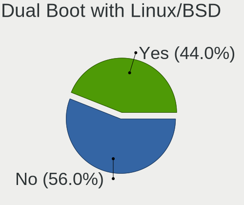
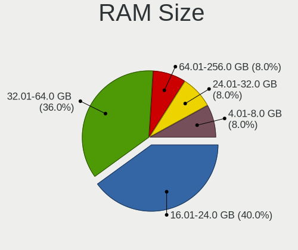
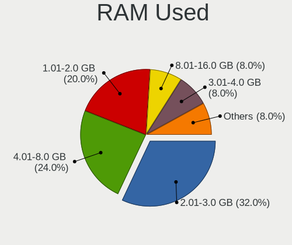
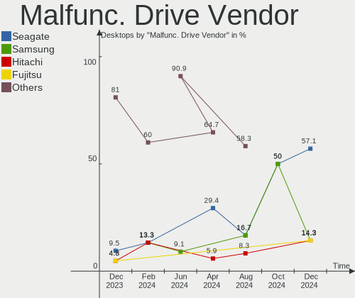
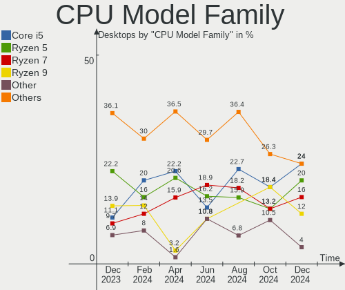
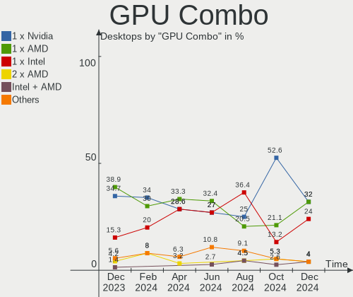
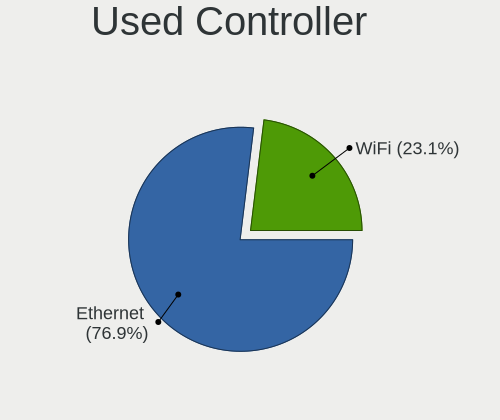
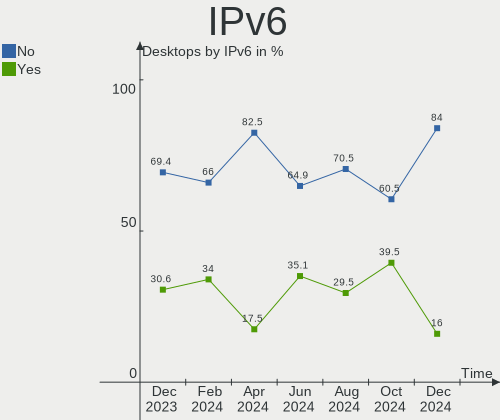
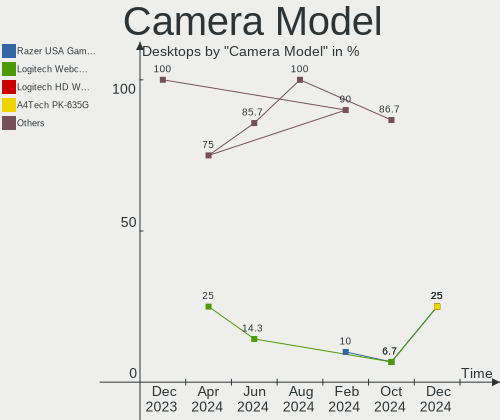
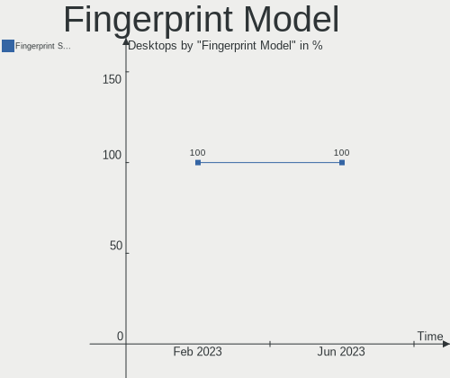

ArcoLinux - Hardware Trends (Desktops)
--------------------------------------

A project to identify most popular hardware characteristics and track their change
over time based on data collected by Linux users at https://Linux-Hardware.org.

Anyone can contribute to this report by the [hw-probe](https://github.com/linuxhw/hw-probe) tool:

    sudo -E hw-probe -all -upload

This report is for one last month. Overall report since the beginning of time: [TestDays](https://github.com/linuxhw/TestDays)

Period: Jun, 2023.

Contents
--------

* [ System ](#system)
  - [ OS                       ](#os)
  - [ OS Family                ](#os-family)
  - [ Kernel                   ](#kernel)
  - [ Kernel Family            ](#kernel-family)
  - [ Kernel Major Ver.        ](#kernel-major-ver)
  - [ Arch                     ](#arch)
  - [ DE                       ](#de)
  - [ Display Server           ](#display-server)
  - [ Display Manager          ](#display-manager)
  - [ OS Lang                  ](#os-lang)
  - [ Boot Mode                ](#boot-mode)
  - [ Filesystem               ](#filesystem)
  - [ Part. scheme             ](#part-scheme)
  - [ Dual Boot with Linux/BSD ](#dual-boot-with-linuxbsd)
  - [ Dual Boot (Win)          ](#dual-boot-win)

* [ Board ](#board)
  - [ Vendor                   ](#vendor)
  - [ Model                    ](#model)
  - [ Model Family             ](#model-family)
  - [ MFG Year                 ](#mfg-year)
  - [ Form Factor              ](#form-factor)
  - [ Secure Boot              ](#secure-boot)
  - [ Coreboot                 ](#coreboot)
  - [ RAM Size                 ](#ram-size)
  - [ RAM Used                 ](#ram-used)
  - [ Total Drives             ](#total-drives)
  - [ Has CD-ROM               ](#has-cd-rom)
  - [ Has Ethernet             ](#has-ethernet)
  - [ Has WiFi                 ](#has-wifi)
  - [ Has Bluetooth            ](#has-bluetooth)

* [ Location ](#location)
  - [ Country                  ](#country)
  - [ City                     ](#city)

* [ Drives ](#drives)
  - [ Drive Vendor             ](#drive-vendor)
  - [ Drive Model              ](#drive-model)
  - [ HDD Vendor               ](#hdd-vendor)
  - [ SSD Vendor               ](#ssd-vendor)
  - [ Drive Kind               ](#drive-kind)
  - [ Drive Connector          ](#drive-connector)
  - [ Drive Size               ](#drive-size)
  - [ Space Total              ](#space-total)
  - [ Space Used               ](#space-used)
  - [ Malfunc. Drives          ](#malfunc-drives)
  - [ Malfunc. Drive Vendor    ](#malfunc-drive-vendor)
  - [ Malfunc. HDD Vendor      ](#malfunc-hdd-vendor)
  - [ Malfunc. Drive Kind      ](#malfunc-drive-kind)
  - [ Failed Drives            ](#failed-drives)
  - [ Failed Drive Vendor      ](#failed-drive-vendor)
  - [ Drive Status             ](#drive-status)

* [ Storage controller ](#storage-controller)
  - [ Storage Vendor           ](#storage-vendor)
  - [ Storage Model            ](#storage-model)
  - [ Storage Kind             ](#storage-kind)

* [ Processor ](#processor)
  - [ CPU Vendor               ](#cpu-vendor)
  - [ CPU Model                ](#cpu-model)
  - [ CPU Model Family         ](#cpu-model-family)
  - [ CPU Cores                ](#cpu-cores)
  - [ CPU Sockets              ](#cpu-sockets)
  - [ CPU Threads              ](#cpu-threads)
  - [ CPU Op-Modes             ](#cpu-op-modes)
  - [ CPU Microcode            ](#cpu-microcode)
  - [ CPU Microarch            ](#cpu-microarch)

* [ Graphics ](#graphics)
  - [ GPU Vendor               ](#gpu-vendor)
  - [ GPU Model                ](#gpu-model)
  - [ GPU Combo                ](#gpu-combo)
  - [ GPU Driver               ](#gpu-driver)
  - [ GPU Memory               ](#gpu-memory)

* [ Monitor ](#monitor)
  - [ Monitor Vendor           ](#monitor-vendor)
  - [ Monitor Model            ](#monitor-model)
  - [ Monitor Resolution       ](#monitor-resolution)
  - [ Monitor Diagonal         ](#monitor-diagonal)
  - [ Monitor Width            ](#monitor-width)
  - [ Aspect Ratio             ](#aspect-ratio)
  - [ Monitor Area             ](#monitor-area)
  - [ Pixel Density            ](#pixel-density)
  - [ Multiple Monitors        ](#multiple-monitors)

* [ Network ](#network)
  - [ Net Controller Vendor    ](#net-controller-vendor)
  - [ Net Controller Model     ](#net-controller-model)
  - [ Wireless Vendor          ](#wireless-vendor)
  - [ Wireless Model           ](#wireless-model)
  - [ Ethernet Vendor          ](#ethernet-vendor)
  - [ Ethernet Model           ](#ethernet-model)
  - [ Net Controller Kind      ](#net-controller-kind)
  - [ Used Controller          ](#used-controller)
  - [ NICs                     ](#nics)
  - [ IPv6                     ](#ipv6)

* [ Bluetooth ](#bluetooth)
  - [ Bluetooth Vendor         ](#bluetooth-vendor)
  - [ Bluetooth Model          ](#bluetooth-model)

* [ Sound ](#sound)
  - [ Sound Vendor             ](#sound-vendor)
  - [ Sound Model              ](#sound-model)

* [ Memory ](#memory)
  - [ Memory Vendor            ](#memory-vendor)
  - [ Memory Model             ](#memory-model)
  - [ Memory Kind              ](#memory-kind)
  - [ Memory Form Factor       ](#memory-form-factor)
  - [ Memory Size              ](#memory-size)
  - [ Memory Speed             ](#memory-speed)

* [ Printers & scanners ](#printers--scanners)
  - [ Printer Vendor           ](#printer-vendor)
  - [ Printer Model            ](#printer-model)
  - [ Scanner Vendor           ](#scanner-vendor)
  - [ Scanner Model            ](#scanner-model)

* [ Camera ](#camera)
  - [ Camera Vendor            ](#camera-vendor)
  - [ Camera Model             ](#camera-model)

* [ Security ](#security)
  - [ Fingerprint Vendor       ](#fingerprint-vendor)
  - [ Fingerprint Model        ](#fingerprint-model)
  - [ Chipcard Vendor          ](#chipcard-vendor)
  - [ Chipcard Model           ](#chipcard-model)

* [ Unsupported ](#unsupported)
  - [ Unsupported Devices      ](#unsupported-devices)
  - [ Unsupported Device Types ](#unsupported-device-types)

System
------

OS
--

Installed operating systems

| Name              | Desktops | Percent |
|-------------------|----------|---------|
| ArcoLinux Rolling | 71       | 97.26%  |
| ArcoLinux         | 2        | 2.74%   |

OS Family
---------

OS without a version

| Name      | Desktops | Percent |
|-----------|----------|---------|
| ArcoLinux | 73       | 100%    |

Kernel
------

Version of the Linux kernel

| Version                        | Desktops | Percent |
|--------------------------------|----------|---------|
| 6.3.9-arch1-1                  | 14       | 19.18%  |
| 6.3.8-arch1-1                  | 8        | 10.96%  |
| 6.3.3-arch1-1                  | 7        | 9.59%   |
| 6.3.7-arch1-1                  | 5        | 6.85%   |
| 6.3.5-arch1-1                  | 5        | 6.85%   |
| 6.3.5-zen1-1-zen               | 4        | 5.48%   |
| 6.1.33-1-lts                   | 4        | 5.48%   |
| 6.3.9-zen1-1-zen               | 3        | 4.11%   |
| 6.3.8-zen1-1-zen               | 3        | 4.11%   |
| 6.3.6-arch1-1                  | 3        | 4.11%   |
| 6.3.3-x64v1-xanmod1-1          | 3        | 4.11%   |
| 6.1.31-1-lts                   | 3        | 4.11%   |
| 6.3.8-x64v1-xanmod1-1          | 1        | 1.37%   |
| 6.3.7-1-cachyos-bore           | 1        | 1.37%   |
| 6.3.5-zen2-1-zen               | 1        | 1.37%   |
| 6.3.1-1-cachyos-eevdf-bore     | 1        | 1.37%   |
| 6.2.6-arch1-1                  | 1        | 1.37%   |
| 6.1.35-1-lts                   | 1        | 1.37%   |
| 6.1.34-1-lts                   | 1        | 1.37%   |
| 6.1.32-1-lts                   | 1        | 1.37%   |
| 5.17.6-arch1-1                 | 1        | 1.37%   |
| 5.15.94-1-lts                  | 1        | 1.37%   |
| 5.15.107.62.realtime1-2-rt-lts | 1        | 1.37%   |

Kernel Family
-------------

Linux kernel without a distro release

| Version     | Desktops | Percent |
|-------------|----------|---------|
| 6.3.9       | 17       | 23.29%  |
| 6.3.8       | 12       | 16.44%  |
| 6.3.5       | 10       | 13.7%   |
| 6.3.3       | 10       | 13.7%   |
| 6.3.7       | 6        | 8.22%   |
| 6.1.33      | 4        | 5.48%   |
| 6.3.6       | 3        | 4.11%   |
| 6.1.31      | 3        | 4.11%   |
| 6.3.1       | 1        | 1.37%   |
| 6.2.6       | 1        | 1.37%   |
| 6.1.35      | 1        | 1.37%   |
| 6.1.34      | 1        | 1.37%   |
| 6.1.32      | 1        | 1.37%   |
| 5.17.6      | 1        | 1.37%   |
| 5.15.94     | 1        | 1.37%   |
| 5.15.107.62 | 1        | 1.37%   |

Kernel Major Ver.
-----------------

Linux kernel major version

| Version  | Desktops | Percent |
|----------|----------|---------|
| 6.3      | 59       | 80.82%  |
| 6.1      | 10       | 13.7%   |
| 6.2      | 1        | 1.37%   |
| 5.17     | 1        | 1.37%   |
| 5.15.107 | 1        | 1.37%   |
| 5.15     | 1        | 1.37%   |

Arch
----

OS architecture (x86_64, i586, etc.)

| Name   | Desktops | Percent |
|--------|----------|---------|
| x86_64 | 73       | 100%    |

DE
--

Desktop Environment

| Name           | Desktops | Percent |
|----------------|----------|---------|
| XFCE           | 26       | 35.62%  |
| KDE5           | 20       | 27.4%   |
| i3             | 6        | 8.22%   |
| GNOME          | 6        | 8.22%   |
| Deepin         | 3        | 4.11%   |
| Cinnamon       | 3        | 4.11%   |
| X-Cinnamon     | 2        | 2.74%   |
| Hyprland       | 2        | 2.74%   |
| sway           | 1        | 1.37%   |
| LXQt           | 1        | 1.37%   |
| i3-with-shmlog | 1        | 1.37%   |
| herbstluftwm   | 1        | 1.37%   |
| awesome        | 1        | 1.37%   |

Display Server
--------------

X11 or Wayland

| Name    | Desktops | Percent |
|---------|----------|---------|
| X11     | 61       | 83.56%  |
| Wayland | 10       | 13.7%   |
| Tty     | 2        | 2.74%   |

Display Manager
---------------

SDDM, LightDM, etc.

| Name    | Desktops | Percent |
|---------|----------|---------|
| SDDM    | 51       | 69.86%  |
| LightDM | 18       | 24.66%  |
| GDM     | 2        | 2.74%   |
| Unknown | 2        | 2.74%   |

OS Lang
-------

Language

| Lang       | Desktops | Percent |
|------------|----------|---------|
| en_US      | 40       | 54.79%  |
| pt_BR      | 6        | 8.22%   |
| en_CA      | 5        | 6.85%   |
| en_GB      | 4        | 5.48%   |
| C          | 4        | 5.48%   |
| es_ES      | 2        | 2.74%   |
| en_ZA      | 2        | 2.74%   |
| uk_UA      | 1        | 1.37%   |
| ru_RU      | 1        | 1.37%   |
| ko_KR      | 1        | 1.37%   |
| fr_FR      | 1        | 1.37%   |
| es_UY.UTF8 | 1        | 1.37%   |
| es_BO      | 1        | 1.37%   |
| en_SG      | 1        | 1.37%   |
| en_IN      | 1        | 1.37%   |
| en_DK      | 1        | 1.37%   |
| de_DE      | 1        | 1.37%   |

Boot Mode
---------

EFI or BIOS

| Mode | Desktops | Percent |
|------|----------|---------|
| EFI  | 59       | 80.82%  |
| BIOS | 14       | 19.18%  |

Filesystem
----------

Type of filesystem

| Type    | Desktops | Percent |
|---------|----------|---------|
| Ext4    | 46       | 63.01%  |
| Btrfs   | 21       | 28.77%  |
| Overlay | 4        | 5.48%   |
| Xfs     | 1        | 1.37%   |
| F2fs    | 1        | 1.37%   |

Part. scheme
------------

Scheme of partitioning

| Type    | Desktops | Percent |
|---------|----------|---------|
| GPT     | 61       | 83.56%  |
| MBR     | 10       | 13.7%   |
| Unknown | 2        | 2.74%   |

Dual Boot with Linux/BSD
------------------------

Hosting more than one Linux/BSD

| Dual boot | Desktops | Percent |
|-----------|----------|---------|
| No        | 50       | 68.49%  |
| Yes       | 23       | 31.51%  |

Dual Boot (Win)
---------------

Hosting Linux and Windows

| Dual boot | Desktops | Percent |
|-----------|----------|---------|
| No        | 40       | 54.79%  |
| Yes       | 33       | 45.21%  |

Board
-----

Vendor
------

Motherboard manufacturer

| Name                | Desktops | Percent |
|---------------------|----------|---------|
| ASUSTek Computer    | 18       | 24.66%  |
| MSI                 | 14       | 19.18%  |
| Gigabyte Technology | 11       | 15.07%  |
| ASRock              | 8        | 10.96%  |
| Hewlett-Packard     | 7        | 9.59%   |
| Dell                | 5        | 6.85%   |
| Intel               | 4        | 5.48%   |
| Win element         | 1        | 1.37%   |
| SYWZ                | 1        | 1.37%   |
| Positivo            | 1        | 1.37%   |
| Lenovo              | 1        | 1.37%   |
| Hardkernel          | 1        | 1.37%   |
| AZW                 | 1        | 1.37%   |

Model
-----

Motherboard model

| Name                                  | Desktops | Percent |
|---------------------------------------|----------|---------|
| MSI MS-7C02                           | 2        | 2.74%   |
| Intel H61                             | 2        | 2.74%   |
| ASUS TUF Gaming X570-PLUS             | 2        | 2.74%   |
| Win element M600                      | 1        | 1.37%   |
| SYWZ S200 Series                      | 1        | 1.37%   |
| Positivo D6200                        | 1        | 1.37%   |
| MSI MS-7C95                           | 1        | 1.37%   |
| MSI MS-7C83                           | 1        | 1.37%   |
| MSI MS-7C56                           | 1        | 1.37%   |
| MSI MS-7C13                           | 1        | 1.37%   |
| MSI MS-7B98                           | 1        | 1.37%   |
| MSI MS-7B86                           | 1        | 1.37%   |
| MSI MS-7B24                           | 1        | 1.37%   |
| MSI MS-7B17                           | 1        | 1.37%   |
| MSI MS-7A39                           | 1        | 1.37%   |
| MSI MS-7976                           | 1        | 1.37%   |
| MSI MS-7885                           | 1        | 1.37%   |
| MSI MPG H410 Trident 3 (MS-B932)      | 1        | 1.37%   |
| Lenovo IdeaCentre 5 14IOB6 90RJ0080US | 1        | 1.37%   |
| Intel X99                             | 1        | 1.37%   |
| Intel H55                             | 1        | 1.37%   |
| HP Z240 Tower Workstation             | 1        | 1.37%   |
| HP ProDesk 400 G6 SFF                 | 1        | 1.37%   |
| HP ProDesk 400 G6 MT                  | 1        | 1.37%   |
| HP OMEN 30L Desktop GT13-1xxx         | 1        | 1.37%   |
| HP EliteDesk 800 G2 TWR               | 1        | 1.37%   |
| HP Compaq dx7300 Slim Tower           | 1        | 1.37%   |
| HP 500-536d                           | 1        | 1.37%   |
| Hardkernel ODROID-H3                  | 1        | 1.37%   |
| Gigabyte Z97X-Gaming 3                | 1        | 1.37%   |
| Gigabyte Z77X-UD5H                    | 1        | 1.37%   |
| Gigabyte Z77X-D3H                     | 1        | 1.37%   |
| Gigabyte Z490 AORUS MASTER            | 1        | 1.37%   |
| Gigabyte X570 AORUS ELITE             | 1        | 1.37%   |
| Gigabyte X470 AORUS ULTRA GAMING      | 1        | 1.37%   |
| Gigabyte H87N-WIFI                    | 1        | 1.37%   |
| Gigabyte GA-78LMT-S2                  | 1        | 1.37%   |
| Gigabyte B550 AORUS PRO AC            | 1        | 1.37%   |
| Gigabyte B450M GAMING                 | 1        | 1.37%   |
| Gigabyte B450M DS3H V2                | 1        | 1.37%   |

Model Family
------------

Motherboard model prefix

| Name                 | Desktops | Percent |
|----------------------|----------|---------|
| ASUS PRIME           | 6        | 8.22%   |
| Dell OptiPlex        | 4        | 5.48%   |
| ASUS ROG             | 4        | 5.48%   |
| ASUS TUF             | 3        | 4.11%   |
| MSI MS-7C02          | 2        | 2.74%   |
| Intel H61            | 2        | 2.74%   |
| HP ProDesk           | 2        | 2.74%   |
| Gigabyte B450M       | 2        | 2.74%   |
| Win element M600     | 1        | 1.37%   |
| SYWZ S200            | 1        | 1.37%   |
| Positivo D6200       | 1        | 1.37%   |
| MSI MS-7C95          | 1        | 1.37%   |
| MSI MS-7C83          | 1        | 1.37%   |
| MSI MS-7C56          | 1        | 1.37%   |
| MSI MS-7C13          | 1        | 1.37%   |
| MSI MS-7B98          | 1        | 1.37%   |
| MSI MS-7B86          | 1        | 1.37%   |
| MSI MS-7B24          | 1        | 1.37%   |
| MSI MS-7B17          | 1        | 1.37%   |
| MSI MS-7A39          | 1        | 1.37%   |
| MSI MS-7976          | 1        | 1.37%   |
| MSI MS-7885          | 1        | 1.37%   |
| MSI MPG              | 1        | 1.37%   |
| Lenovo IdeaCentre    | 1        | 1.37%   |
| Intel X99            | 1        | 1.37%   |
| Intel H55            | 1        | 1.37%   |
| HP Z240              | 1        | 1.37%   |
| HP OMEN              | 1        | 1.37%   |
| HP EliteDesk         | 1        | 1.37%   |
| HP Compaq            | 1        | 1.37%   |
| HP 500-536d          | 1        | 1.37%   |
| Hardkernel ODROID-H3 | 1        | 1.37%   |
| Gigabyte Z97X-Gaming | 1        | 1.37%   |
| Gigabyte Z77X-UD5H   | 1        | 1.37%   |
| Gigabyte Z77X-D3H    | 1        | 1.37%   |
| Gigabyte Z490        | 1        | 1.37%   |
| Gigabyte X570        | 1        | 1.37%   |
| Gigabyte X470        | 1        | 1.37%   |
| Gigabyte H87N-WIFI   | 1        | 1.37%   |
| Gigabyte GA-78LMT-S2 | 1        | 1.37%   |

MFG Year
--------

Motherboard manufacture year

| Year | Desktops | Percent |
|------|----------|---------|
| 2018 | 13       | 17.81%  |
| 2020 | 12       | 16.44%  |
| 2022 | 9        | 12.33%  |
| 2019 | 9        | 12.33%  |
| 2014 | 6        | 8.22%   |
| 2017 | 5        | 6.85%   |
| 2016 | 4        | 5.48%   |
| 2012 | 4        | 5.48%   |
| 2021 | 3        | 4.11%   |
| 2013 | 3        | 4.11%   |
| 2011 | 2        | 2.74%   |
| 2015 | 1        | 1.37%   |
| 2008 | 1        | 1.37%   |
| 2007 | 1        | 1.37%   |

Form Factor
-----------

Physical design of the computer

| Name    | Desktops | Percent |
|---------|----------|---------|
| Desktop | 73       | 100%    |

Secure Boot
-----------

Enabled or disabled

| State    | Desktops | Percent |
|----------|----------|---------|
| Disabled | 73       | 100%    |

Coreboot
--------

Have coreboot on board

| Used | Desktops | Percent |
|------|----------|---------|
| No   | 73       | 100%    |

RAM Size
--------

Total RAM memory

| Size in GB  | Desktops | Percent |
|-------------|----------|---------|
| 16.01-24.0  | 26       | 35.62%  |
| 32.01-64.0  | 21       | 28.77%  |
| 8.01-16.0   | 10       | 13.7%   |
| 64.01-256.0 | 5        | 6.85%   |
| 3.01-4.0    | 4        | 5.48%   |
| 24.01-32.0  | 4        | 5.48%   |
| 4.01-8.0    | 3        | 4.11%   |

RAM Used
--------

Used RAM memory

| Used GB   | Desktops | Percent |
|-----------|----------|---------|
| 1.01-2.0  | 26       | 35.62%  |
| 2.01-3.0  | 18       | 24.66%  |
| 3.01-4.0  | 11       | 15.07%  |
| 4.01-8.0  | 10       | 13.7%   |
| 8.01-16.0 | 4        | 5.48%   |
| 0.51-1.0  | 4        | 5.48%   |

Total Drives
------------

Number of drives on board

| Drives | Desktops | Percent |
|--------|----------|---------|
| 2      | 27       | 36.99%  |
| 1      | 16       | 21.92%  |
| 4      | 11       | 15.07%  |
| 3      | 11       | 15.07%  |
| 5      | 3        | 4.11%   |
| 11     | 2        | 2.74%   |
| 19     | 1        | 1.37%   |
| 7      | 1        | 1.37%   |
| 6      | 1        | 1.37%   |

Has CD-ROM
----------

Has CD-ROM on board

| Presented | Desktops | Percent |
|-----------|----------|---------|
| No        | 54       | 73.97%  |
| Yes       | 19       | 26.03%  |

Has Ethernet
------------

Has Ethernet on board

| Presented | Desktops | Percent |
|-----------|----------|---------|
| Yes       | 73       | 100%    |

Has WiFi
--------

Has WiFi module

| Presented | Desktops | Percent |
|-----------|----------|---------|
| No        | 40       | 54.79%  |
| Yes       | 33       | 45.21%  |

Has Bluetooth
-------------

Has Bluetooth module

| Presented | Desktops | Percent |
|-----------|----------|---------|
| No        | 38       | 52.05%  |
| Yes       | 35       | 47.95%  |

Location
--------

Country
-------

Geographic location (country)

| Country                | Desktops | Percent |
|------------------------|----------|---------|
| USA                    | 20       | 27.4%   |
| Brazil                 | 7        | 9.59%   |
| Canada                 | 6        | 8.22%   |
| UK                     | 5        | 6.85%   |
| Belgium                | 4        | 5.48%   |
| Spain                  | 3        | 4.11%   |
| South Africa           | 2        | 2.74%   |
| Poland                 | 2        | 2.74%   |
| Netherlands            | 2        | 2.74%   |
| France                 | 2        | 2.74%   |
| China                  | 2        | 2.74%   |
| Uruguay                | 1        | 1.37%   |
| Turkey                 | 1        | 1.37%   |
| Thailand               | 1        | 1.37%   |
| Sweden                 | 1        | 1.37%   |
| South Korea            | 1        | 1.37%   |
| Singapore              | 1        | 1.37%   |
| Serbia                 | 1        | 1.37%   |
| Russia                 | 1        | 1.37%   |
| Norway                 | 1        | 1.37%   |
| Malaysia               | 1        | 1.37%   |
| Japan                  | 1        | 1.37%   |
| India                  | 1        | 1.37%   |
| Germany                | 1        | 1.37%   |
| Denmark                | 1        | 1.37%   |
| Czechia                | 1        | 1.37%   |
| Cyprus                 | 1        | 1.37%   |
| Bosnia and Herzegovina | 1        | 1.37%   |
| Bolivia                | 1        | 1.37%   |

City
----

Geographic location (city)

| City                 | Desktops | Percent |
|----------------------|----------|---------|
| Duffel               | 3        | 4.11%   |
| Birmingham           | 2        | 2.74%   |
| Atlanta              | 2        | 2.74%   |
| Zaragoza             | 1        | 1.37%   |
| Yerington            | 1        | 1.37%   |
| Xiamen               | 1        | 1.37%   |
| Winnipeg             | 1        | 1.37%   |
| Warsaw               | 1        | 1.37%   |
| Vicosa               | 1        | 1.37%   |
| Vence                | 1        | 1.37%   |
| Vejle                | 1        | 1.37%   |
| Vancouver            | 1        | 1.37%   |
| Toronto              | 1        | 1.37%   |
| Tokyo                | 1        | 1.37%   |
| Szczecin             | 1        | 1.37%   |
| Subotica             | 1        | 1.37%   |
| Stockholm            | 1        | 1.37%   |
| Singapore            | 1        | 1.37%   |
| Simi Valley          | 1        | 1.37%   |
| Seremban             | 1        | 1.37%   |
| Seattle              | 1        | 1.37%   |
| Sarajevo             | 1        | 1.37%   |
| Sao Paulo            | 1        | 1.37%   |
| San Jose             | 1        | 1.37%   |
| Roscanvel            | 1        | 1.37%   |
| Ribeirao Preto       | 1        | 1.37%   |
| Proletarskiy Gorodok | 1        | 1.37%   |
| Porto Alegre         | 1        | 1.37%   |
| Portland             | 1        | 1.37%   |
| Oslo                 | 1        | 1.37%   |
| Ocean Springs        | 1        | 1.37%   |
| Nicosia              | 1        | 1.37%   |
| New York             | 1        | 1.37%   |
| Naaldwijk            | 1        | 1.37%   |
| Monticello           | 1        | 1.37%   |
| Montevideo           | 1        | 1.37%   |
| Mississauga          | 1        | 1.37%   |
| Maua                 | 1        | 1.37%   |
| Manteca              | 1        | 1.37%   |
| Malmesbury           | 1        | 1.37%   |

Drives
------

Drive Vendor
------------

Hard drive vendors

| Vendor                      | Desktops | Drives | Percent |
|-----------------------------|----------|--------|---------|
| Samsung Electronics         | 29       | 44     | 18.01%  |
| WDC                         | 25       | 32     | 15.53%  |
| Seagate                     | 20       | 29     | 12.42%  |
| Kingston                    | 9        | 13     | 5.59%   |
| Toshiba                     | 7        | 7      | 4.35%   |
| Sandisk                     | 7        | 7      | 4.35%   |
| Phison Electronics          | 5        | 5      | 3.11%   |
| SK hynix                    | 4        | 4      | 2.48%   |
| OCZ                         | 4        | 4      | 2.48%   |
| Crucial                     | 4        | 4      | 2.48%   |
| Silicon Motion              | 3        | 3      | 1.86%   |
| Micron/Crucial Technology   | 3        | 3      | 1.86%   |
| Realtek Semiconductor       | 2        | 2      | 1.24%   |
| PNY                         | 2        | 3      | 1.24%   |
| Plextor                     | 2        | 2      | 1.24%   |
| Hitachi                     | 2        | 2      | 1.24%   |
| HGST                        | 2        | 2      | 1.24%   |
| Timetec                     | 1        | 1      | 0.62%   |
| T-FORCE                     | 1        | 1      | 0.62%   |
| SPCC                        | 1        | 1      | 0.62%   |
| sobetter                    | 1        | 1      | 0.62%   |
| SABRENT                     | 1        | 1      | 0.62%   |
| Rogueware                   | 1        | 1      | 0.62%   |
| RevuAhn                     | 1        | 1      | 0.62%   |
| OCZ-VERTEX3                 | 1        | 1      | 0.62%   |
| Netac                       | 1        | 1      | 0.62%   |
| Micron Technology           | 1        | 5      | 0.62%   |
| MAXIO Technology (Hangzhou) | 1        | 1      | 0.62%   |
| MaxDigital                  | 1        | 1      | 0.62%   |
| Lite-On Technology          | 1        | 1      | 0.62%   |
| Kingston Technology Company | 1        | 1      | 0.62%   |
| KingDian                    | 1        | 1      | 0.62%   |
| JMicron Technology          | 1        | 1      | 0.62%   |
| Intenso                     | 1        | 1      | 0.62%   |
| INTEL SS                    | 1        | 1      | 0.62%   |
| Intel                       | 1        | 2      | 0.62%   |
| HS-SSD-C100                 | 1        | 1      | 0.62%   |
| HPE                         | 1        | 4      | 0.62%   |
| Hewlett-Packard             | 1        | 4      | 0.62%   |
| Gigabyte Technology         | 1        | 1      | 0.62%   |

Drive Model
-----------

Hard drive models

| Model                                                 | Desktops | Percent |
|-------------------------------------------------------|----------|---------|
| Samsung NVMe SSD Controller SM981/PM981/PM983 250GB   | 8        | 4.28%   |
| Samsung NVMe SSD Controller PM9A1/PM9A3/980PRO 2TB    | 6        | 3.21%   |
| Samsung SSD 980 1TB                                   | 3        | 1.6%    |
| Samsung SSD 870 EVO 1TB                               | 3        | 1.6%    |
| Samsung NVMe SSD Controller SM961/PM961/SM963 256GB   | 3        | 1.6%    |
| Micron/Crucial P2 NVMe PCIe SSD 4TB                   | 3        | 1.6%    |
| WDC WD40EFRX-68N32N0 4TB                              | 2        | 1.07%   |
| WDC WD2002FAEX-007BA0 2TB                             | 2        | 1.07%   |
| Toshiba HDWD110 1TB                                   | 2        | 1.07%   |
| Silicon Motion SM2263EN/SM2263XT SSD Controller 256GB | 2        | 1.07%   |
| Seagate ST2000DM008-2FR102 2TB                        | 2        | 1.07%   |
| Samsung SSD 850 PRO 256GB                             | 2        | 1.07%   |
| Phison E12 NVMe Controller 1TB                        | 2        | 1.07%   |
| Kingston SA400S37120G 120GB SSD                       | 2        | 1.07%   |
| WDC WDS500G2B0A-00SM50 500GB SSD                      | 1        | 0.53%   |
| WDC WDS120G2G0A-00JH30 128GB SSD                      | 1        | 0.53%   |
| WDC WDBNCE0010PNC 1TB SSD                             | 1        | 0.53%   |
| WDC WD800JD-60LSA5 80GB                               | 1        | 0.53%   |
| WDC WD5000AAKX-75U6AA0 500GB                          | 1        | 0.53%   |
| WDC WD5000AAKS-00A7B0 500GB                           | 1        | 0.53%   |
| WDC WD40EZRX-00SPEB0 4TB                              | 1        | 0.53%   |
| WDC WD40EFZX-68AWUN0 4TB                              | 1        | 0.53%   |
| WDC WD3200BEVT-75ZCT2 320GB                           | 1        | 0.53%   |
| WDC WD3200AAKS-75L9A0 320GB                           | 1        | 0.53%   |
| WDC WD3200AAJS-60M0A0 320GB                           | 1        | 0.53%   |
| WDC WD30PURX-64P6ZY0 3TB                              | 1        | 0.53%   |
| WDC WD20EZRZ-00Z5HB0 2TB                              | 1        | 0.53%   |
| WDC WD20EZBX-60AYRA0 2TB                              | 1        | 0.53%   |
| WDC WD20EURS-73TLHY0 2TB                              | 1        | 0.53%   |
| WDC WD10SPZX-24Z10 1TB                                | 1        | 0.53%   |
| WDC WD10JPVX-00JC3T0 1TB                              | 1        | 0.53%   |
| WDC WD10JPVT-75A1YT0 1TB                              | 1        | 0.53%   |
| WDC WD10EZEX-08RKKA0 1TB                              | 1        | 0.53%   |
| WDC WD10EARS-22Y5B1 1TB                               | 1        | 0.53%   |
| WDC WD10EADS-114BB1 1TB                               | 1        | 0.53%   |
| WDC WD10EADS-00P8B0 1TB                               | 1        | 0.53%   |
| WDC WD100EMAZ-00WJTA0 10TB                            | 1        | 0.53%   |
| WDC WD Green 2.5 240GB                                | 1        | 0.53%   |
| Toshiba MQ04ABF100 1TB                                | 1        | 0.53%   |
| Toshiba MQ01ABF050 500GB                              | 1        | 0.53%   |

HDD Vendor
----------

Hard disk drive vendors

| Vendor              | Desktops | Drives | Percent |
|---------------------|----------|--------|---------|
| WDC                 | 22       | 28     | 38.6%   |
| Seagate             | 20       | 29     | 35.09%  |
| Toshiba             | 7        | 7      | 12.28%  |
| Samsung Electronics | 3        | 3      | 5.26%   |
| Hitachi             | 2        | 2      | 3.51%   |
| HGST                | 2        | 2      | 3.51%   |
| ASMT                | 1        | 2      | 1.75%   |

SSD Vendor
----------

Solid state drive vendors

| Vendor              | Desktops | Drives | Percent |
|---------------------|----------|--------|---------|
| Samsung Electronics | 14       | 16     | 22.22%  |
| Kingston            | 7        | 10     | 11.11%  |
| WDC                 | 4        | 4      | 6.35%   |
| OCZ                 | 4        | 4      | 6.35%   |
| Crucial             | 4        | 4      | 6.35%   |
| SK hynix            | 3        | 3      | 4.76%   |
| SanDisk             | 3        | 3      | 4.76%   |
| PNY                 | 2        | 3      | 3.17%   |
| Plextor             | 2        | 2      | 3.17%   |
| T-FORCE             | 1        | 1      | 1.59%   |
| SPCC                | 1        | 1      | 1.59%   |
| Rogueware           | 1        | 1      | 1.59%   |
| RevuAhn             | 1        | 1      | 1.59%   |
| OCZ-VERTEX3         | 1        | 1      | 1.59%   |
| Micron Technology   | 1        | 4      | 1.59%   |
| MaxDigital          | 1        | 1      | 1.59%   |
| KingDian            | 1        | 1      | 1.59%   |
| Intenso             | 1        | 1      | 1.59%   |
| INTEL SS            | 1        | 1      | 1.59%   |
| HS-SSD-C100         | 1        | 1      | 1.59%   |
| HPE                 | 1        | 4      | 1.59%   |
| Hewlett-Packard     | 1        | 4      | 1.59%   |
| Gigabyte Technology | 1        | 1      | 1.59%   |
| Corsair             | 1        | 1      | 1.59%   |
| China               | 1        | 2      | 1.59%   |
| Apacer              | 1        | 1      | 1.59%   |
| aigo                | 1        | 1      | 1.59%   |
| Acer                | 1        | 1      | 1.59%   |
| A-DATA Technology   | 1        | 1      | 1.59%   |

Drive Kind
----------

HDD or SSD

| Kind    | Desktops | Drives | Percent |
|---------|----------|--------|---------|
| SSD     | 48       | 79     | 35.82%  |
| HDD     | 44       | 73     | 32.84%  |
| NVMe    | 40       | 56     | 29.85%  |
| Unknown | 2        | 2      | 1.49%   |

Drive Connector
---------------

SATA, SAS, NVMe, etc.

| Type | Desktops | Drives | Percent |
|------|----------|--------|---------|
| SATA | 65       | 143    | 58.56%  |
| NVMe | 40       | 54     | 36.04%  |
| SAS  | 6        | 13     | 5.41%   |

Drive Size
----------

Size of hard drive

| Size in TB | Desktops | Drives | Percent |
|------------|----------|--------|---------|
| 0.01-0.5   | 41       | 68     | 41.41%  |
| 0.51-1.0   | 31       | 41     | 31.31%  |
| 1.01-2.0   | 14       | 23     | 14.14%  |
| 3.01-4.0   | 5        | 12     | 5.05%   |
| 4.01-10.0  | 4        | 4      | 4.04%   |
| 2.01-3.0   | 3        | 3      | 3.03%   |
| 10.01-20.0 | 1        | 1      | 1.01%   |

Space Total
-----------

Amount of disk space available on the file system

| Size in GB     | Desktops | Percent |
|----------------|----------|---------|
| More than 3000 | 17       | 23.29%  |
| 501-1000       | 13       | 17.81%  |
| 251-500        | 9        | 12.33%  |
| 101-250        | 9        | 12.33%  |
| 1001-2000      | 7        | 9.59%   |
| 1-20           | 5        | 6.85%   |
| 2001-3000      | 4        | 5.48%   |
| 51-100         | 4        | 5.48%   |
| Unknown        | 3        | 4.11%   |
| 21-50          | 2        | 2.74%   |

Space Used
----------

Amount of used disk space

| Used GB        | Desktops | Percent |
|----------------|----------|---------|
| 1-20           | 18       | 24.66%  |
| 21-50          | 12       | 16.44%  |
| 101-250        | 12       | 16.44%  |
| 1001-2000      | 6        | 8.22%   |
| 51-100         | 6        | 8.22%   |
| 501-1000       | 5        | 6.85%   |
| More than 3000 | 4        | 5.48%   |
| 251-500        | 4        | 5.48%   |
| 2001-3000      | 3        | 4.11%   |
| Unknown        | 3        | 4.11%   |

Malfunc. Drives
---------------

Drive models with a malfunction

| Model                                                          | Desktops | Drives | Percent |
|----------------------------------------------------------------|----------|--------|---------|
| Samsung Electronics SSD 870 EVO 1TB                            | 2        | 3      | 11.76%  |
| WDC WD2002FAEX-007BA0 2TB                                      | 1        | 1      | 5.88%   |
| WDC WD10EARS-22Y5B1 1TB                                        | 1        | 1      | 5.88%   |
| WDC WD10EADS-114BB1 1TB                                        | 1        | 1      | 5.88%   |
| WDC WD10EADS-00P8B0 1TB                                        | 1        | 1      | 5.88%   |
| Toshiba MQ01ABF050 500GB                                       | 1        | 1      | 5.88%   |
| Toshiba HDWD110 1TB                                            | 1        | 1      | 5.88%   |
| Seagate ST8000VN0022-2EL112 8TB                                | 1        | 1      | 5.88%   |
| Seagate ST3500413AS 500GB                                      | 1        | 1      | 5.88%   |
| Samsung Electronics NVMe SSD Controller PM9A1/PM9A3/980PRO 2TB | 1        | 2      | 5.88%   |
| Realtek Semiconductor RTS5763DL NVMe SSD Controller 512GB      | 1        | 1      | 5.88%   |
| Micron Technology 1100_MTFDDAK1T0TBN 1TB                       | 1        | 4      | 5.88%   |
| Kingston SV300S37A120G 120GB SSD                               | 1        | 1      | 5.88%   |
| HS-SSD-C100 SSD 240G                                           | 1        | 1      | 5.88%   |
| Hitachi HTS543216L9A300 160GB                                  | 1        | 1      | 5.88%   |
| Crucial M4-CT128M4SSD2 128GB                                   | 1        | 1      | 5.88%   |

Malfunc. Drive Vendor
---------------------

Vendors of faulty drives

| Vendor                | Desktops | Drives | Percent |
|-----------------------|----------|--------|---------|
| WDC                   | 4        | 4      | 25%     |
| Toshiba               | 2        | 2      | 12.5%   |
| Seagate               | 2        | 2      | 12.5%   |
| Samsung Electronics   | 2        | 5      | 12.5%   |
| Realtek Semiconductor | 1        | 1      | 6.25%   |
| Micron Technology     | 1        | 4      | 6.25%   |
| Kingston              | 1        | 1      | 6.25%   |
| HS-SSD-C100           | 1        | 1      | 6.25%   |
| Hitachi               | 1        | 1      | 6.25%   |
| Crucial               | 1        | 1      | 6.25%   |

Malfunc. HDD Vendor
-------------------

Vendors of faulty HDD drives

| Vendor  | Desktops | Drives | Percent |
|---------|----------|--------|---------|
| WDC     | 4        | 4      | 44.44%  |
| Toshiba | 2        | 2      | 22.22%  |
| Seagate | 2        | 2      | 22.22%  |
| Hitachi | 1        | 1      | 11.11%  |

Malfunc. Drive Kind
-------------------

Kinds of faulty drives

| Kind | Desktops | Drives | Percent |
|------|----------|--------|---------|
| HDD  | 9        | 9      | 52.94%  |
| SSD  | 6        | 10     | 35.29%  |
| NVMe | 2        | 3      | 11.76%  |

Failed Drives
-------------

Failed drive models

Zero info for selected period =(

Failed Drive Vendor
-------------------

Failed drive vendors

Zero info for selected period =(

Drive Status
------------

Number of failed and malfunc. drives

| Status   | Desktops | Drives | Percent |
|----------|----------|--------|---------|
| Works    | 68       | 162    | 73.12%  |
| Malfunc  | 16       | 22     | 17.2%   |
| Detected | 9        | 26     | 9.68%   |

Storage controller
------------------

Storage Vendor
--------------

Storage controller vendors

| Vendor                      | Desktops | Percent |
|-----------------------------|----------|---------|
| Intel                       | 46       | 36.51%  |
| AMD                         | 27       | 21.43%  |
| Samsung Electronics         | 19       | 15.08%  |
| Phison Electronics          | 5        | 3.97%   |
| SanDisk                     | 4        | 3.17%   |
| Kingston Technology Company | 4        | 3.17%   |
| Silicon Motion              | 3        | 2.38%   |
| Micron/Crucial Technology   | 3        | 2.38%   |
| Marvell Technology Group    | 3        | 2.38%   |
| Realtek Semiconductor       | 2        | 1.59%   |
| ASMedia Technology          | 2        | 1.59%   |
| SK hynix                    | 1        | 0.79%   |
| Silicon Image               | 1        | 0.79%   |
| Netac Technology            | 1        | 0.79%   |
| Micron Technology           | 1        | 0.79%   |
| MAXIO Technology (Hangzhou) | 1        | 0.79%   |
| Lite-On Technology          | 1        | 0.79%   |
| Hewlett-Packard             | 1        | 0.79%   |
| Biwin Storage Technology    | 1        | 0.79%   |

Storage Model
-------------

Storage controller models

| Model                                                                          | Desktops | Percent |
|--------------------------------------------------------------------------------|----------|---------|
| AMD FCH SATA Controller [AHCI mode]                                            | 19       | 13.01%  |
| AMD 400 Series Chipset SATA Controller                                         | 11       | 7.53%   |
| Intel Cannon Lake PCH SATA AHCI Controller                                     | 9        | 6.16%   |
| Samsung NVMe SSD Controller SM981/PM981/PM983                                  | 8        | 5.48%   |
| Samsung NVMe SSD Controller PM9A1/PM9A3/980PRO                                 | 6        | 4.11%   |
| Intel SATA Controller [RAID mode]                                              | 5        | 3.42%   |
| Intel 7 Series/C210 Series Chipset Family 6-port SATA Controller [AHCI mode]   | 5        | 3.42%   |
| Samsung NVMe SSD Controller 980                                                | 4        | 2.74%   |
| AMD 500 Series Chipset SATA Controller                                         | 4        | 2.74%   |
| Samsung NVMe SSD Controller SM961/PM961/SM963                                  | 3        | 2.05%   |
| Micron/Crucial P2 NVMe PCIe SSD                                                | 3        | 2.05%   |
| Intel Q170/Q150/B150/H170/H110/Z170/CM236 Chipset SATA Controller [AHCI Mode]  | 3        | 2.05%   |
| Intel 9 Series Chipset Family SATA Controller [AHCI Mode]                      | 3        | 2.05%   |
| Intel 6 Series/C200 Series Chipset Family 6 port Desktop SATA AHCI Controller  | 3        | 2.05%   |
| Intel 500 Series Chipset Family SATA AHCI Controller                           | 3        | 2.05%   |
| Intel 200 Series PCH SATA controller [AHCI mode]                               | 3        | 2.05%   |
| Silicon Motion SM2263EN/SM2263XT SSD Controller                                | 2        | 1.37%   |
| Phison E12 NVMe Controller                                                     | 2        | 1.37%   |
| Kingston Company FURY Renegade NVMe SSD                                        | 2        | 1.37%   |
| Intel Comet Lake SATA AHCI Controller                                          | 2        | 1.37%   |
| Intel 8 Series/C220 Series Chipset Family 6-port SATA Controller 1 [AHCI mode] | 2        | 1.37%   |
| Intel 400 Series Chipset Family SATA AHCI Controller                           | 2        | 1.37%   |
| ASMedia ASM1062 Serial ATA Controller                                          | 2        | 1.37%   |
| SK hynix Gold P31/BC711/PC711 NVMe Solid State Drive                           | 1        | 0.68%   |
| Silicon Motion SM2262/SM2262EN SSD Controller                                  | 1        | 0.68%   |
| Silicon Image SiI 3114 [SATALink/SATARaid] Serial ATA Controller               | 1        | 0.68%   |
| SanDisk WD Blue SN570 NVMe SSD 2TB                                             | 1        | 0.68%   |
| SanDisk WD Blue SN570 NVMe SSD 1TB                                             | 1        | 0.68%   |
| SanDisk WD Black 2018/SN750 / PC SN720 NVMe SSD                                | 1        | 0.68%   |
| SanDisk Non-Volatile memory controller                                         | 1        | 0.68%   |
| Samsung Electronics Non-Volatile memory controller                             | 1        | 0.68%   |
| Realtek RTS5763DL NVMe SSD Controller                                          | 1        | 0.68%   |
| Realtek NVMe Controller                                                        | 1        | 0.68%   |
| Phison PS5013 E13 NVMe Controller                                              | 1        | 0.68%   |
| Phison E18 PCIe4 NVMe Controller                                               | 1        | 0.68%   |
| Phison E16 PCIe4 NVMe Controller                                               | 1        | 0.68%   |
| Netac Non-Volatile memory controller                                           | 1        | 0.68%   |
| Micron NVMe Storage Controller                                                 | 1        | 0.68%   |
| MAXIO (Hangzhou) NVMe SSD Controller MAP1202                                   | 1        | 0.68%   |
| Marvell Group 88SE9172 SATA III 6Gb/s RAID Controller                          | 1        | 0.68%   |

Storage Kind
------------

Kind of storage controller (IDE, SATA, NVMe, SAS, ...)

| Kind | Desktops | Percent |
|------|----------|---------|
| SATA | 65       | 55.08%  |
| NVMe | 40       | 33.9%   |
| RAID | 9        | 7.63%   |
| IDE  | 4        | 3.39%   |

Processor
---------

CPU Vendor
----------

Processor vendors

| Vendor | Desktops | Percent |
|--------|----------|---------|
| Intel  | 46       | 63.01%  |
| AMD    | 27       | 36.99%  |

CPU Model
---------

Processor models

| Model                                   | Desktops | Percent |
|-----------------------------------------|----------|---------|
| AMD Ryzen 5 2600 Six-Core Processor     | 4        | 5.48%   |
| Intel Core i5-3470 CPU @ 3.20GHz        | 3        | 4.11%   |
| AMD Ryzen 9 5950X 16-Core Processor     | 3        | 4.11%   |
| AMD Ryzen 5 5600X 6-Core Processor      | 3        | 4.11%   |
| Intel Core i7-6700 CPU @ 3.40GHz        | 2        | 2.74%   |
| Intel Core i7-4790K CPU @ 4.00GHz       | 2        | 2.74%   |
| Intel Core i5-2400 CPU @ 3.10GHz        | 2        | 2.74%   |
| Intel Core i3-9100F CPU @ 3.60GHz       | 2        | 2.74%   |
| AMD Ryzen 9 6900HX with Radeon Graphics | 2        | 2.74%   |
| AMD Ryzen 5 3600 6-Core Processor       | 2        | 2.74%   |
| Intel Xeon W-2245 CPU @ 3.90GHz         | 1        | 1.37%   |
| Intel Xeon CPU E5-2630 v3 @ 2.40GHz     | 1        | 1.37%   |
| Intel Pentium Gold G5400 CPU @ 3.70GHz  | 1        | 1.37%   |
| Intel Core i9-8950HK CPU @ 2.90GHz      | 1        | 1.37%   |
| Intel Core i9-10900K CPU @ 3.70GHz      | 1        | 1.37%   |
| Intel Core i7-9700K CPU @ 3.60GHz       | 1        | 1.37%   |
| Intel Core i7-9700 CPU @ 3.00GHz        | 1        | 1.37%   |
| Intel Core i7-7700K CPU @ 4.20GHz       | 1        | 1.37%   |
| Intel Core i7-6700K CPU @ 4.00GHz       | 1        | 1.37%   |
| Intel Core i7-5820K CPU @ 3.30GHz       | 1        | 1.37%   |
| Intel Core i7-3770K CPU @ 3.50GHz       | 1        | 1.37%   |
| Intel Core i7-3770 CPU @ 3.40GHz        | 1        | 1.37%   |
| Intel Core i7-2600K CPU @ 3.40GHz       | 1        | 1.37%   |
| Intel Core i7-10700K CPU @ 3.80GHz      | 1        | 1.37%   |
| Intel Core i7-10700F CPU @ 2.90GHz      | 1        | 1.37%   |
| Intel Core i5-9600K CPU @ 3.70GHz       | 1        | 1.37%   |
| Intel Core i5-9500 CPU @ 3.00GHz        | 1        | 1.37%   |
| Intel Core i5-9400 CPU @ 2.90GHz        | 1        | 1.37%   |
| Intel Core i5-8400 CPU @ 2.80GHz        | 1        | 1.37%   |
| Intel Core i5-6500 CPU @ 3.20GHz        | 1        | 1.37%   |
| Intel Core i5-4690K CPU @ 3.50GHz       | 1        | 1.37%   |
| Intel Core i5-4570T CPU @ 2.90GHz       | 1        | 1.37%   |
| Intel Core i5-3570 CPU @ 3.40GHz        | 1        | 1.37%   |
| Intel Core i5-10400F CPU @ 2.90GHz      | 1        | 1.37%   |
| Intel Core i3-8100 CPU @ 3.60GHz        | 1        | 1.37%   |
| Intel Core i3-4160 CPU @ 3.60GHz        | 1        | 1.37%   |
| Intel Core i3-10105F CPU @ 3.70GHz      | 1        | 1.37%   |
| Intel Core i3-10100F CPU @ 3.60GHz      | 1        | 1.37%   |
| Intel Core i3-10100 CPU @ 3.60GHz       | 1        | 1.37%   |
| Intel Core i3 CPU 530 @ 2.93GHz         | 1        | 1.37%   |

CPU Model Family
----------------

Processor model prefix

| Model              | Desktops | Percent |
|--------------------|----------|---------|
| Intel Core i7      | 14       | 19.18%  |
| Intel Core i5      | 14       | 19.18%  |
| AMD Ryzen 5        | 11       | 15.07%  |
| Intel Core i3      | 8        | 10.96%  |
| AMD Ryzen 9        | 8        | 10.96%  |
| AMD Ryzen 7        | 5        | 6.85%   |
| Other              | 2        | 2.74%   |
| Intel Xeon         | 2        | 2.74%   |
| Intel Core i9      | 2        | 2.74%   |
| AMD FX             | 2        | 2.74%   |
| Intel Pentium Gold | 1        | 1.37%   |
| Intel Core 2 Quad  | 1        | 1.37%   |
| Intel Core 2       | 1        | 1.37%   |
| Intel Celeron      | 1        | 1.37%   |
| AMD Ryzen 3        | 1        | 1.37%   |

CPU Cores
---------

Number of processor cores

| Number | Desktops | Percent |
|--------|----------|---------|
| 4      | 28       | 38.36%  |
| 6      | 17       | 23.29%  |
| 8      | 15       | 20.55%  |
| 2      | 6        | 8.22%   |
| 16     | 4        | 5.48%   |
| 12     | 2        | 2.74%   |
| 10     | 1        | 1.37%   |

CPU Sockets
-----------

Number of sockets

| Number | Desktops | Percent |
|--------|----------|---------|
| 1      | 73       | 100%    |

CPU Threads
-----------

Threads per core (Hyper-Threading)

| Number | Desktops | Percent |
|--------|----------|---------|
| 2      | 53       | 72.6%   |
| 1      | 20       | 27.4%   |

CPU Op-Modes
------------

CPU Operation Modes (32-bit, 64-bit)

| Op mode        | Desktops | Percent |
|----------------|----------|---------|
| 32-bit, 64-bit | 73       | 100%    |

CPU Microcode
-------------

Microcode number

| Number     | Desktops | Percent |
|------------|----------|---------|
| Unknown    | 39       | 53.42%  |
| 0x0800820d | 6        | 8.22%   |
| 0x0a20120a | 3        | 4.11%   |
| 0x08701013 | 3        | 4.11%   |
| 0x00000000 | 3        | 4.11%   |
| 0xa0655    | 2        | 2.74%   |
| 0x0a201016 | 2        | 2.74%   |
| 0x06000852 | 2        | 2.74%   |
| 0x906ea    | 1        | 1.37%   |
| 0x50657    | 1        | 1.37%   |
| 0x306c3    | 1        | 1.37%   |
| 0x306a9    | 1        | 1.37%   |
| 0x206a7    | 1        | 1.37%   |
| 0x1067a    | 1        | 1.37%   |
| 0x0a601203 | 1        | 1.37%   |
| 0x0a404102 | 1        | 1.37%   |
| 0x0a201205 | 1        | 1.37%   |
| 0x08701030 | 1        | 1.37%   |
| 0x08600106 | 1        | 1.37%   |
| 0x0800820b | 1        | 1.37%   |
| 0x08001137 | 1        | 1.37%   |

CPU Microarch
-------------

Microarchitecture

| Name        | Desktops | Percent |
|-------------|----------|---------|
| KabyLake    | 12       | 16.44%  |
| Zen 3       | 9        | 12.33%  |
| Zen+        | 7        | 9.59%   |
| Haswell     | 7        | 9.59%   |
| CometLake   | 7        | 9.59%   |
| IvyBridge   | 6        | 8.22%   |
| Zen 2       | 5        | 6.85%   |
| Skylake     | 5        | 6.85%   |
| SandyBridge | 3        | 4.11%   |
| Unknown     | 3        | 4.11%   |
| Piledriver  | 2        | 2.74%   |
| Icelake     | 2        | 2.74%   |
| Zen         | 1        | 1.37%   |
| Westmere    | 1        | 1.37%   |
| Tremont     | 1        | 1.37%   |
| Penryn      | 1        | 1.37%   |
| Core        | 1        | 1.37%   |

Graphics
--------

GPU Vendor
----------

Vendors of graphics cards

| Vendor | Desktops | Percent |
|--------|----------|---------|
| Nvidia | 31       | 38.75%  |
| AMD    | 26       | 32.5%   |
| Intel  | 23       | 28.75%  |

GPU Model
---------

Graphics card models

| Model                                                                       | Desktops | Percent |
|-----------------------------------------------------------------------------|----------|---------|
| AMD Ellesmere [Radeon RX 470/480/570/570X/580/580X/590]                     | 7        | 8.54%   |
| Nvidia TU106 [GeForce RTX 2060 Rev. A]                                      | 4        | 4.88%   |
| Intel CoffeeLake-S GT2 [UHD Graphics 630]                                   | 4        | 4.88%   |
| Intel Xeon E3-1200 v2/3rd Gen Core processor Graphics Controller            | 3        | 3.66%   |
| Intel HD Graphics 530                                                       | 3        | 3.66%   |
| AMD Navi 24 [Radeon RX 6400/6500 XT/6500M]                                  | 3        | 3.66%   |
| Nvidia TU117 [GeForce GTX 1650]                                             | 2        | 2.44%   |
| Nvidia TU116 [GeForce GTX 1660 Ti]                                          | 2        | 2.44%   |
| Nvidia TU116 [GeForce GTX 1660 SUPER]                                       | 2        | 2.44%   |
| Nvidia GP106 [GeForce GTX 1060 6GB]                                         | 2        | 2.44%   |
| Nvidia GA106 [GeForce RTX 3060 Lite Hash Rate]                              | 2        | 2.44%   |
| Nvidia GA104 [GeForce RTX 3060 Ti Lite Hash Rate]                           | 2        | 2.44%   |
| Intel Xeon E3-1200 v3/4th Gen Core Processor Integrated Graphics Controller | 2        | 2.44%   |
| Intel 2nd Generation Core Processor Family Integrated Graphics Controller   | 2        | 2.44%   |
| AMD Rembrandt [Radeon 680M]                                                 | 2        | 2.44%   |
| AMD Navi 10 [Radeon RX 5600 OEM/5600 XT / 5700/5700 XT]                     | 2        | 2.44%   |
| Nvidia TU106 [GeForce RTX 2070 Rev. A]                                      | 1        | 1.22%   |
| Nvidia TU104GL [Quadro RTX 4000]                                            | 1        | 1.22%   |
| Nvidia TU104 [GeForce RTX 2070 SUPER]                                       | 1        | 1.22%   |
| Nvidia TU104 [GeForce RTX 2060]                                             | 1        | 1.22%   |
| Nvidia GP107GL [Quadro P620]                                                | 1        | 1.22%   |
| Nvidia GP107GL [Quadro P1000]                                               | 1        | 1.22%   |
| Nvidia GP107 [GeForce GTX 1050 Ti]                                          | 1        | 1.22%   |
| Nvidia GP106 [GeForce GTX 1060 3GB]                                         | 1        | 1.22%   |
| Nvidia GP102 [GeForce GTX 1080 Ti]                                          | 1        | 1.22%   |
| Nvidia GM206 [GeForce GTX 960]                                              | 1        | 1.22%   |
| Nvidia GM204 [GeForce GTX 970]                                              | 1        | 1.22%   |
| Nvidia GM107 [GeForce GTX 750]                                              | 1        | 1.22%   |
| Nvidia GA102 [GeForce RTX 3090]                                             | 1        | 1.22%   |
| Nvidia GA102 [GeForce RTX 3080]                                             | 1        | 1.22%   |
| Nvidia GA102 [GeForce RTX 3080 Ti]                                          | 1        | 1.22%   |
| Nvidia GA102 [GeForce RTX 3080 Lite Hash Rate]                              | 1        | 1.22%   |
| Intel JasperLake [UHD Graphics]                                             | 1        | 1.22%   |
| Intel HD Graphics 630                                                       | 1        | 1.22%   |
| Intel Core Processor Integrated Graphics Controller                         | 1        | 1.22%   |
| Intel CometLake-S GT2 [UHD Graphics 630]                                    | 1        | 1.22%   |
| Intel CoffeeLake-S GT1 [UHD Graphics 610]                                   | 1        | 1.22%   |
| Intel CoffeeLake-H GT2 [UHD Graphics 630]                                   | 1        | 1.22%   |
| Intel 82Q963/Q965 Integrated Graphics Controller                            | 1        | 1.22%   |
| Intel 82G33/G31 Express Integrated Graphics Controller                      | 1        | 1.22%   |

GPU Combo
---------

Combinations of graphics cards

| Name           | Desktops | Percent |
|----------------|----------|---------|
| 1 x Nvidia     | 26       | 35.62%  |
| 1 x AMD        | 23       | 31.51%  |
| 1 x Intel      | 16       | 21.92%  |
| Intel + Nvidia | 4        | 5.48%   |
| Intel + AMD    | 2        | 2.74%   |
| 2 x Nvidia     | 1        | 1.37%   |
| 2 x AMD        | 1        | 1.37%   |

GPU Driver
----------

Free vs proprietary

| Driver      | Desktops | Percent |
|-------------|----------|---------|
| Free        | 43       | 58.9%   |
| Proprietary | 28       | 38.36%  |
| Unknown     | 2        | 2.74%   |

GPU Memory
----------

Total video memory

| Size in GB | Desktops | Percent |
|------------|----------|---------|
| Unknown    | 21       | 28.77%  |
| 3.01-4.0   | 14       | 19.18%  |
| 7.01-8.0   | 12       | 16.44%  |
| 5.01-6.0   | 9        | 12.33%  |
| 8.01-16.0  | 6        | 8.22%   |
| 0.51-1.0   | 5        | 6.85%   |
| 1.01-2.0   | 3        | 4.11%   |
| 2.01-3.0   | 2        | 2.74%   |
| 16.01-24.0 | 1        | 1.37%   |

Monitor
-------

Monitor Vendor
--------------

Monitor vendors

| Vendor               | Desktops | Percent |
|----------------------|----------|---------|
| Samsung Electronics  | 11       | 14.86%  |
| Goldstar             | 10       | 13.51%  |
| BenQ                 | 9        | 12.16%  |
| AOC                  | 8        | 10.81%  |
| Acer                 | 8        | 10.81%  |
| Hewlett-Packard      | 4        | 5.41%   |
| Dell                 | 4        | 5.41%   |
| ViewSonic            | 3        | 4.05%   |
| MSI                  | 3        | 4.05%   |
| Ancor Communications | 3        | 4.05%   |
| Lenovo               | 2        | 2.7%    |
| VIE                  | 1        | 1.35%   |
| Sony                 | 1        | 1.35%   |
| Sceptre Tech         | 1        | 1.35%   |
| Positivo             | 1        | 1.35%   |
| HannStar             | 1        | 1.35%   |
| Grundig              | 1        | 1.35%   |
| Gigabyte Technology  | 1        | 1.35%   |
| Denver               | 1        | 1.35%   |
| ASUSTek Computer     | 1        | 1.35%   |

Monitor Model
-------------

Monitor models

| Model                                                                   | Desktops | Percent |
|-------------------------------------------------------------------------|----------|---------|
| Goldstar FULL HD GSM5ABB 1920x1080 480x270mm 21.7-inch                  | 2        | 2.47%   |
| BenQ GW2780 BNQ78E6 1920x1080 598x336mm 27.0-inch                       | 2        | 2.47%   |
| ViewSonic VX2703 SERIES VSCF62B 1920x1080 600x340mm 27.2-inch           | 1        | 1.23%   |
| ViewSonic VX2476 Series VSCD332 1920x1080 530x300mm 24.0-inch           | 1        | 1.23%   |
| ViewSonic VX2233wm-1 VSC1D22 1920x1080 480x270mm 21.7-inch              | 1        | 1.23%   |
| ViewSonic VA1938 Series VSC0626 1366x768 410x230mm 18.5-inch            | 1        | 1.23%   |
| VIE LED MONITOR VIE2302 1920x1080 473x296mm 22.0-inch                   | 1        | 1.23%   |
| Sony TV  *00 SNY4B04 3840x2160                                          | 1        | 1.23%   |
| Sceptre Tech E225W-1920 SPT08D5 1920x1080 443x249mm 20.0-inch           | 1        | 1.23%   |
| Samsung Electronics U32R59x SAM0F96 3840x2160 697x392mm 31.5-inch       | 1        | 1.23%   |
| Samsung Electronics U32J59x SAM0F35 3840x2160 697x392mm 31.5-inch       | 1        | 1.23%   |
| Samsung Electronics SyncMaster SAM0372 1680x1050 440x300mm 21.0-inch    | 1        | 1.23%   |
| Samsung Electronics SMB2440MH SAM06DD 1920x1080                         | 1        | 1.23%   |
| Samsung Electronics S34J55x SAM0F70 3440x1440 800x330mm 34.1-inch       | 1        | 1.23%   |
| Samsung Electronics LCD Monitor SAM7017 3840x2160 1872x1053mm 84.6-inch | 1        | 1.23%   |
| Samsung Electronics LCD Monitor SAM0F13 3840x2160 950x540mm 43.0-inch   | 1        | 1.23%   |
| Samsung Electronics LCD Monitor SAM0DFA 3840x2160 890x500mm 40.2-inch   | 1        | 1.23%   |
| Samsung Electronics LC32G5xT SAM7080 2560x1440 700x400mm 31.7-inch      | 1        | 1.23%   |
| Samsung Electronics C49RG9x SAM0F99 3840x1080 1193x336mm 48.8-inch      | 1        | 1.23%   |
| Samsung Electronics C27FG7x SAM0E42 1920x1080 600x340mm 27.2-inch       | 1        | 1.23%   |
| Samsung Electronics C27F398 SAM0D44 1920x1080 598x336mm 27.0-inch       | 1        | 1.23%   |
| Samsung Electronics C24F390 SAM0D2D 1920x1080 521x293mm 23.5-inch       | 1        | 1.23%   |
| Positivo 22MP55PJ POS5B7A 1920x1080 600x340mm 27.2-inch                 | 1        | 1.23%   |
| MSI MAG301RF MSI3CC5 2560x1080 690x290mm 29.5-inch                      | 1        | 1.23%   |
| MSI MAG272CQR MSI3CA6 2560x1440 598x336mm 27.0-inch                     | 1        | 1.23%   |
| MSI G32C4 MSI3DA6 1920x1080 698x393mm 31.5-inch                         | 1        | 1.23%   |
| Lenovo LT2252p Wide LEN0A0C 1680x1050 470x300mm 22.0-inch               | 1        | 1.23%   |
| Lenovo LEN LI2241wA LEN65A2 1920x1080 477x268mm 21.5-inch               | 1        | 1.23%   |
| Hewlett-Packard LA2405 HWP284B 1920x1200 518x324mm 24.1-inch            | 1        | 1.23%   |
| Hewlett-Packard LA2205 HWP2848 1680x1050 473x296mm 22.0-inch            | 1        | 1.23%   |
| Hewlett-Packard E243i HPN3463 1920x1200 518x324mm 24.1-inch             | 1        | 1.23%   |
| Hewlett-Packard 22er HWP331C 1920x1080 476x267mm 21.5-inch              | 1        | 1.23%   |
| HannStar HG216 HSD1CA3 1680x1050 480x270mm 21.7-inch                    | 1        | 1.23%   |
| Grundig WUXGA GRU4448 1920x1080                                         | 1        | 1.23%   |
| Goldstar WFHD GSM7747 2560x1080 798x334mm 34.1-inch                     | 1        | 1.23%   |
| Goldstar ULTRAWIDE GSM5AE4 2560x1080 677x290mm 29.0-inch                | 1        | 1.23%   |
| Goldstar ULTRAWIDE GSM59F1 2560x1080 673x284mm 28.8-inch                | 1        | 1.23%   |
| Goldstar TV SSCR2 GSMC0C8 3840x2160                                     | 1        | 1.23%   |
| Goldstar LG TV GSMC3A2 1920x1080 700x390mm 31.5-inch                    | 1        | 1.23%   |
| Goldstar HDR WFHD GSM7715 2560x1080 798x334mm 34.1-inch                 | 1        | 1.23%   |

Monitor Resolution
------------------

Monitor screen resolution

| Resolution         | Desktops | Percent |
|--------------------|----------|---------|
| 1920x1080 (FHD)    | 34       | 44.74%  |
| 3840x2160 (4K)     | 11       | 14.47%  |
| 2560x1440 (QHD)    | 10       | 13.16%  |
| 2560x1080          | 5        | 6.58%   |
| 1680x1050 (WSXGA+) | 5        | 6.58%   |
| 1366x768 (WXGA)    | 3        | 3.95%   |
| 1920x1200 (WUXGA)  | 2        | 2.63%   |
| 3840x1080          | 1        | 1.32%   |
| 3440x1440          | 1        | 1.32%   |
| 1600x1200          | 1        | 1.32%   |
| 1440x900 (WXGA+)   | 1        | 1.32%   |
| 1360x768           | 1        | 1.32%   |
| 1280x1024 (SXGA)   | 1        | 1.32%   |

Monitor Diagonal
----------------

Diagonal size in inches

| Inches  | Desktops | Percent |
|---------|----------|---------|
| 27      | 16       | 20.51%  |
| 24      | 12       | 15.38%  |
| 21      | 12       | 15.38%  |
| 31      | 8        | 10.26%  |
| 34      | 4        | 5.13%   |
| 22      | 4        | 5.13%   |
| 18      | 4        | 5.13%   |
| 84      | 3        | 3.85%   |
| 72      | 2        | 2.56%   |
| 29      | 2        | 2.56%   |
| 23      | 2        | 2.56%   |
| 19      | 2        | 2.56%   |
| 54      | 1        | 1.28%   |
| 48      | 1        | 1.28%   |
| 35      | 1        | 1.28%   |
| 32      | 1        | 1.28%   |
| 25      | 1        | 1.28%   |
| 20      | 1        | 1.28%   |
| Unknown | 1        | 1.28%   |

Monitor Width
-------------

Physical width

| Width in mm | Desktops | Percent |
|-------------|----------|---------|
| 501-600     | 28       | 36.36%  |
| 401-500     | 22       | 28.57%  |
| 601-700     | 12       | 15.58%  |
| 701-800     | 5        | 6.49%   |
| 1501-2000   | 5        | 6.49%   |
| 1001-1500   | 2        | 2.6%    |
| 801-900     | 1        | 1.3%    |
| 351-400     | 1        | 1.3%    |
| Unknown     | 1        | 1.3%    |

Aspect Ratio
------------

Proportional relationship between the width and the height

| Ratio | Desktops | Percent |
|-------|----------|---------|
| 16/9  | 51       | 71.83%  |
| 16/10 | 10       | 14.08%  |
| 21/9  | 7        | 9.86%   |
| 5/4   | 1        | 1.41%   |
| 4/3   | 1        | 1.41%   |
| 32/9  | 1        | 1.41%   |

Monitor Area
------------

Area in inch

| Area in inch | Desktops | Percent |
|----------------|----------|---------|
| 201-250        | 22       | 28.57%  |
| 301-350        | 17       | 22.08%  |
| 351-500        | 14       | 18.18%  |
| 251-300        | 7        | 9.09%   |
| More than 1000 | 6        | 7.79%   |
| 151-200        | 5        | 6.49%   |
| 141-150        | 4        | 5.19%   |
| 501-1000       | 1        | 1.3%    |
| Unknown        | 1        | 1.3%    |

Pixel Density
-------------

Pixels per inch

| Density | Desktops | Percent |
|---------|----------|---------|
| 51-100  | 47       | 68.12%  |
| 101-120 | 17       | 24.64%  |
| 161-240 | 2        | 2.9%    |
| 121-160 | 2        | 2.9%    |
| Unknown | 1        | 1.45%   |

Multiple Monitors
-----------------

Total monitors connected

| Total | Desktops | Percent |
|-------|----------|---------|
| 1     | 56       | 76.71%  |
| 2     | 14       | 19.18%  |
| 3     | 2        | 2.74%   |
| 0     | 1        | 1.37%   |

Network
-------

Net Controller Vendor
---------------------

Controller vendors

| Vendor                | Desktops | Percent |
|-----------------------|----------|---------|
| Realtek Semiconductor | 48       | 48%     |
| Intel                 | 35       | 35%     |
| Qualcomm Atheros      | 5        | 5%      |
| MediaTek              | 3        | 3%      |
| Qualcomm              | 2        | 2%      |
| D-Link System         | 2        | 2%      |
| TP-Link               | 1        | 1%      |
| Huawei Technologies   | 1        | 1%      |
| Broadcom Limited      | 1        | 1%      |
| Broadcom              | 1        | 1%      |
| Aquantia              | 1        | 1%      |

Net Controller Model
--------------------

Controller models

| Model                                                             | Desktops | Percent |
|-------------------------------------------------------------------|----------|---------|
| Realtek RTL8111/8168/8411 PCI Express Gigabit Ethernet Controller | 34       | 29.06%  |
| Intel I211 Gigabit Network Connection                             | 6        | 5.13%   |
| Realtek RTL8125 2.5GbE Controller                                 | 4        | 3.42%   |
| Intel Wi-Fi 6 AX200                                               | 4        | 3.42%   |
| Intel Ethernet Controller I225-V                                  | 4        | 3.42%   |
| Realtek RTL810xE PCI Express Fast Ethernet controller             | 3        | 2.56%   |
| MediaTek MT7921K (RZ608) Wi-Fi 6E 80MHz                           | 3        | 2.56%   |
| Intel Ethernet Connection (7) I219-V                              | 3        | 2.56%   |
| Intel Ethernet Connection (2) I219-LM                             | 3        | 2.56%   |
| Realtek RTL88x2bu [AC1200 Techkey]                                | 2        | 1.71%   |
| Realtek RTL8192EU 802.11b/g/n WLAN Adapter                        | 2        | 1.71%   |
| Realtek RTL8188FTV 802.11b/g/n 1T1R 2.4G WLAN Adapter             | 2        | 1.71%   |
| Intel Wi-Fi 6 AX210/AX211/AX411 160MHz                            | 2        | 1.71%   |
| Intel Tiger Lake PCH CNVi WiFi                                    | 2        | 1.71%   |
| Intel Ethernet Connection (14) I219-V                             | 2        | 1.71%   |
| Intel Ethernet Connection (12) I219-V                             | 2        | 1.71%   |
| Intel Dual Band Wireless-AC 3168NGW [Stone Peak]                  | 2        | 1.71%   |
| Intel 82579LM Gigabit Network Connection (Lewisville)             | 2        | 1.71%   |
| D-Link System DGE-528T Gigabit Ethernet Adapter                   | 2        | 1.71%   |
| TP-Link Archer T4U ver.3                                          | 1        | 0.85%   |
| Realtek RTL8822BE 802.11a/b/g/n/ac WiFi adapter                   | 1        | 0.85%   |
| Realtek RTL8723BU 802.11b/g/n WLAN Adapter                        | 1        | 0.85%   |
| Realtek RTL8191SU 802.11n WLAN Adapter                            | 1        | 0.85%   |
| Realtek RTL8188EUS 802.11n Wireless Network Adapter               | 1        | 0.85%   |
| Realtek RTL8188EE Wireless Network Adapter                        | 1        | 0.85%   |
| Realtek RTL8153 Gigabit Ethernet Adapter                          | 1        | 0.85%   |
| Realtek 802.11ac NIC                                              | 1        | 0.85%   |
| Qualcomm Nokia G400 5G                                            | 1        | 0.85%   |
| Qualcomm Atheros Killer E2400 Gigabit Ethernet Controller         | 1        | 0.85%   |
| Qualcomm Atheros Killer E220x Gigabit Ethernet Controller         | 1        | 0.85%   |
| Qualcomm Atheros AR9485 Wireless Network Adapter                  | 1        | 0.85%   |
| Qualcomm Atheros AR9462 Wireless Network Adapter                  | 1        | 0.85%   |
| Qualcomm Atheros AR93xx Wireless Network Adapter                  | 1        | 0.85%   |
| Qualcomm Atheros AR8161 Gigabit Ethernet                          | 1        | 0.85%   |
| Qualcomm Atheros AR8151 v2.0 Gigabit Ethernet                     | 1        | 0.85%   |
| Qualcomm Android                                                  | 1        | 0.85%   |
| Intel Wireless-AC 9260                                            | 1        | 0.85%   |
| Intel Wireless 7260                                               | 1        | 0.85%   |
| Intel Wireless 3165                                               | 1        | 0.85%   |
| Intel I210 Gigabit Network Connection                             | 1        | 0.85%   |

Wireless Vendor
---------------

Wireless vendors

| Vendor                | Desktops | Percent |
|-----------------------|----------|---------|
| Intel                 | 15       | 42.86%  |
| Realtek Semiconductor | 12       | 34.29%  |
| Qualcomm Atheros      | 3        | 8.57%   |
| MediaTek              | 3        | 8.57%   |
| TP-Link               | 1        | 2.86%   |
| Broadcom Limited      | 1        | 2.86%   |

Wireless Model
--------------

Wireless models

| Model                                                      | Desktops | Percent |
|------------------------------------------------------------|----------|---------|
| Intel Wi-Fi 6 AX200                                        | 4        | 11.43%  |
| MediaTek MT7921K (RZ608) Wi-Fi 6E 80MHz                    | 3        | 8.57%   |
| Realtek RTL88x2bu [AC1200 Techkey]                         | 2        | 5.71%   |
| Realtek RTL8192EU 802.11b/g/n WLAN Adapter                 | 2        | 5.71%   |
| Realtek RTL8188FTV 802.11b/g/n 1T1R 2.4G WLAN Adapter      | 2        | 5.71%   |
| Intel Wi-Fi 6 AX210/AX211/AX411 160MHz                     | 2        | 5.71%   |
| Intel Tiger Lake PCH CNVi WiFi                             | 2        | 5.71%   |
| Intel Dual Band Wireless-AC 3168NGW [Stone Peak]           | 2        | 5.71%   |
| TP-Link Archer T4U ver.3                                   | 1        | 2.86%   |
| Realtek RTL8822BE 802.11a/b/g/n/ac WiFi adapter            | 1        | 2.86%   |
| Realtek RTL8723BU 802.11b/g/n WLAN Adapter                 | 1        | 2.86%   |
| Realtek RTL8191SU 802.11n WLAN Adapter                     | 1        | 2.86%   |
| Realtek RTL8188EUS 802.11n Wireless Network Adapter        | 1        | 2.86%   |
| Realtek RTL8188EE Wireless Network Adapter                 | 1        | 2.86%   |
| Realtek 802.11ac NIC                                       | 1        | 2.86%   |
| Qualcomm Atheros AR9485 Wireless Network Adapter           | 1        | 2.86%   |
| Qualcomm Atheros AR9462 Wireless Network Adapter           | 1        | 2.86%   |
| Qualcomm Atheros AR93xx Wireless Network Adapter           | 1        | 2.86%   |
| Intel Wireless-AC 9260                                     | 1        | 2.86%   |
| Intel Wireless 7260                                        | 1        | 2.86%   |
| Intel Wireless 3165                                        | 1        | 2.86%   |
| Intel Comet Lake PCH CNVi WiFi                             | 1        | 2.86%   |
| Intel Cannon Lake PCH CNVi WiFi                            | 1        | 2.86%   |
| Broadcom Limited BCM4360 802.11ac Wireless Network Adapter | 1        | 2.86%   |

Ethernet Vendor
---------------

Ethernet vendors

| Vendor                | Desktops | Percent |
|-----------------------|----------|---------|
| Realtek Semiconductor | 42       | 51.22%  |
| Intel                 | 29       | 35.37%  |
| Qualcomm Atheros      | 4        | 4.88%   |
| Qualcomm              | 2        | 2.44%   |
| D-Link System         | 2        | 2.44%   |
| Huawei Technologies   | 1        | 1.22%   |
| Broadcom              | 1        | 1.22%   |
| Aquantia              | 1        | 1.22%   |

Ethernet Model
--------------

Ethernet models

| Model                                                             | Desktops | Percent |
|-------------------------------------------------------------------|----------|---------|
| Realtek RTL8111/8168/8411 PCI Express Gigabit Ethernet Controller | 34       | 41.46%  |
| Intel I211 Gigabit Network Connection                             | 6        | 7.32%   |
| Realtek RTL8125 2.5GbE Controller                                 | 4        | 4.88%   |
| Intel Ethernet Controller I225-V                                  | 4        | 4.88%   |
| Realtek RTL810xE PCI Express Fast Ethernet controller             | 3        | 3.66%   |
| Intel Ethernet Connection (7) I219-V                              | 3        | 3.66%   |
| Intel Ethernet Connection (2) I219-LM                             | 3        | 3.66%   |
| Intel Ethernet Connection (14) I219-V                             | 2        | 2.44%   |
| Intel Ethernet Connection (12) I219-V                             | 2        | 2.44%   |
| Intel 82579LM Gigabit Network Connection (Lewisville)             | 2        | 2.44%   |
| D-Link System DGE-528T Gigabit Ethernet Adapter                   | 2        | 2.44%   |
| Realtek RTL8153 Gigabit Ethernet Adapter                          | 1        | 1.22%   |
| Qualcomm Nokia G400 5G                                            | 1        | 1.22%   |
| Qualcomm Atheros Killer E2400 Gigabit Ethernet Controller         | 1        | 1.22%   |
| Qualcomm Atheros Killer E220x Gigabit Ethernet Controller         | 1        | 1.22%   |
| Qualcomm Atheros AR8161 Gigabit Ethernet                          | 1        | 1.22%   |
| Qualcomm Atheros AR8151 v2.0 Gigabit Ethernet                     | 1        | 1.22%   |
| Qualcomm Android                                                  | 1        | 1.22%   |
| Intel I210 Gigabit Network Connection                             | 1        | 1.22%   |
| Intel Ethernet Connection I217-V                                  | 1        | 1.22%   |
| Intel Ethernet Connection (5) I219-LM                             | 1        | 1.22%   |
| Intel Ethernet Connection (2) I219-V                              | 1        | 1.22%   |
| Intel Ethernet Connection (2) I218-V                              | 1        | 1.22%   |
| Intel 82579V Gigabit Network Connection                           | 1        | 1.22%   |
| Intel 82566DM Gigabit Network Connection                          | 1        | 1.22%   |
| Huawei LLD-L21                                                    | 1        | 1.22%   |
| Broadcom NetXtreme II BCM5709 Gigabit Ethernet                    | 1        | 1.22%   |
| Aquantia AQC107 NBase-T/IEEE 802.3bz Ethernet Controller [AQtion] | 1        | 1.22%   |

Net Controller Kind
-------------------

Ethernet, WiFi or modem

| Kind     | Desktops | Percent |
|----------|----------|---------|
| Ethernet | 73       | 68.87%  |
| WiFi     | 33       | 31.13%  |

Used Controller
---------------

Currently used network controller

| Kind     | Desktops | Percent |
|----------|----------|---------|
| Ethernet | 56       | 78.87%  |
| WiFi     | 15       | 21.13%  |

NICs
----

Total network controllers on board

| Total | Desktops | Percent |
|-------|----------|---------|
| 1     | 46       | 63.01%  |
| 2     | 23       | 31.51%  |
| 3     | 3        | 4.11%   |
| 4     | 1        | 1.37%   |

IPv6
----

IPv6 vs IPv4

| Used | Desktops | Percent |
|------|----------|---------|
| No   | 49       | 67.12%  |
| Yes  | 24       | 32.88%  |

Bluetooth
---------

Bluetooth Vendor
----------------

Controller vendors

| Vendor                  | Desktops | Percent |
|-------------------------|----------|---------|
| Intel                   | 16       | 45.71%  |
| Cambridge Silicon Radio | 9        | 25.71%  |
| MediaTek                | 3        | 8.57%   |
| ASUSTek Computer        | 2        | 5.71%   |
| TP-Link                 | 1        | 2.86%   |
| Creative Technology     | 1        | 2.86%   |
| Belkin Components       | 1        | 2.86%   |
| Apple                   | 1        | 2.86%   |
| Actions                 | 1        | 2.86%   |

Bluetooth Model
---------------

Controller models

| Model                                                 | Desktops | Percent |
|-------------------------------------------------------|----------|---------|
| Cambridge Silicon Radio Bluetooth Dongle (HCI mode)   | 9        | 25.71%  |
| Intel AX200 Bluetooth                                 | 4        | 11.43%  |
| MediaTek Wireless_Device                              | 3        | 8.57%   |
| Intel Wireless-AC 3168 Bluetooth                      | 3        | 8.57%   |
| Intel Bluetooth wireless interface                    | 2        | 5.71%   |
| Intel Bluetooth 9460/9560 Jefferson Peak (JfP)        | 2        | 5.71%   |
| Intel AX210 Bluetooth                                 | 2        | 5.71%   |
| Intel AX201 Bluetooth                                 | 2        | 5.71%   |
| TP-Link UB500 Adapter                                 | 1        | 2.86%   |
| Intel Wireless-AC 9260 Bluetooth Adapter              | 1        | 2.86%   |
| Creative Bluetooth Audio W2                           | 1        | 2.86%   |
| Belkin Components F8T065BF Mini Bluetooth 4.0 Adapter | 1        | 2.86%   |
| ASUS Broadcom BCM20702A0 Bluetooth                    | 1        | 2.86%   |
| ASUS ASUS USB-BT500                                   | 1        | 2.86%   |
| Apple Bluetooth USB Host Controller                   | 1        | 2.86%   |
| Actions general adapter                               | 1        | 2.86%   |

Sound
-----

Sound Vendor
------------

Sound card vendors

| Vendor                      | Desktops | Percent |
|-----------------------------|----------|---------|
| Intel                       | 45       | 30.41%  |
| AMD                         | 36       | 24.32%  |
| Nvidia                      | 31       | 20.95%  |
| Kingston Technology         | 5        | 3.38%   |
| C-Media Electronics         | 5        | 3.38%   |
| Texas Instruments           | 4        | 2.7%    |
| Razer USA                   | 3        | 2.03%   |
| RODE Microphones            | 2        | 1.35%   |
| ASUSTek Computer            | 2        | 1.35%   |
| XMOS                        | 1        | 0.68%   |
| Unknown                     | 1        | 0.68%   |
| Tenx Technology             | 1        | 0.68%   |
| SteelSeries ApS             | 1        | 0.68%   |
| Shure                       | 1        | 0.68%   |
| SAVITECH                    | 1        | 0.68%   |
| Realtek Semiconductor       | 1        | 0.68%   |
| Logitech                    | 1        | 0.68%   |
| GN Netcom                   | 1        | 0.68%   |
| FiiO Electronics Technology | 1        | 0.68%   |
| BEHRINGER International     | 1        | 0.68%   |
| B & W Group                 | 1        | 0.68%   |
| Audient                     | 1        | 0.68%   |
| Asahi Kasei Microsystems    | 1        | 0.68%   |
| AOKEO                       | 1        | 0.68%   |

Sound Model
-----------

Sound card models

| Model                                                                      | Desktops | Percent |
|----------------------------------------------------------------------------|----------|---------|
| AMD Starship/Matisse HD Audio Controller                                   | 11       | 6.67%   |
| Intel Cannon Lake PCH cAVS                                                 | 8        | 4.85%   |
| AMD Ellesmere HDMI Audio [Radeon RX 470/480 / 570/580/590]                 | 8        | 4.85%   |
| AMD Family 17h (Models 00h-0fh) HD Audio Controller                        | 6        | 3.64%   |
| Nvidia TU106 High Definition Audio Controller                              | 5        | 3.03%   |
| Intel 7 Series/C216 Chipset Family High Definition Audio Controller        | 5        | 3.03%   |
| AMD Navi 21/23 HDMI/DP Audio Controller                                    | 5        | 3.03%   |
| Nvidia TU116 High Definition Audio Controller                              | 4        | 2.42%   |
| Nvidia GA102 High Definition Audio Controller                              | 4        | 2.42%   |
| Intel 9 Series Chipset Family HD Audio Controller                          | 4        | 2.42%   |
| Intel 6 Series/C200 Series Chipset Family High Definition Audio Controller | 4        | 2.42%   |
| Intel 100 Series/C230 Series Chipset Family HD Audio Controller            | 4        | 2.42%   |
| Nvidia TU104 HD Audio Controller                                           | 3        | 1.82%   |
| Nvidia GP107GL High Definition Audio Controller                            | 3        | 1.82%   |
| Nvidia GP106 High Definition Audio Controller                              | 3        | 1.82%   |
| Intel Xeon E3-1200 v3/4th Gen Core Processor HD Audio Controller           | 3        | 1.82%   |
| Intel Comet Lake PCH-V cAVS                                                | 3        | 1.82%   |
| Intel 200 Series PCH HD Audio                                              | 3        | 1.82%   |
| AMD Rembrandt Radeon High Definition Audio Controller                      | 3        | 1.82%   |
| AMD Oland/Hainan/Cape Verde/Pitcairn HDMI Audio [Radeon HD 7000 Series]    | 3        | 1.82%   |
| AMD Family 17h/19h HD Audio Controller                                     | 3        | 1.82%   |
| Texas Instruments PCM2902 Audio Codec                                      | 2        | 1.21%   |
| RODE Microphones RODE NT-USB                                               | 2        | 1.21%   |
| Nvidia TU107 GeForce GTX 1650 High Definition Audio Controller             | 2        | 1.21%   |
| Nvidia GA106 High Definition Audio Controller                              | 2        | 1.21%   |
| Nvidia GA104 High Definition Audio Controller                              | 2        | 1.21%   |
| Kingston Technology HyperX 7.1 Audio                                       | 2        | 1.21%   |
| Intel Tiger Lake-H HD Audio Controller                                     | 2        | 1.21%   |
| Intel Smart Sound Technology (SST) Audio Controller                        | 2        | 1.21%   |
| Intel Comet Lake PCH cAVS                                                  | 2        | 1.21%   |
| Intel 8 Series/C220 Series Chipset High Definition Audio Controller        | 2        | 1.21%   |
| AMD Navi 10 HDMI Audio                                                     | 2        | 1.21%   |
| AMD Baffin HDMI/DP Audio [Radeon RX 550 640SP / RX 560/560X]               | 2        | 1.21%   |
| XMOS iFi (by AMR) HD USB Audio                                             | 1        | 0.61%   |
| Unknown USB PnP Audio Device                                               | 1        | 0.61%   |
| Texas Instruments PCM2900C Audio CODEC                                     | 1        | 0.61%   |
| Texas Instruments PCM2704 16-bit stereo audio DAC                          | 1        | 0.61%   |
| Tenx Technology USB AUDIO                                                  | 1        | 0.61%   |
| SteelSeries ApS Arctis Pro Wireless                                        | 1        | 0.61%   |
| Shure MV7                                                                  | 1        | 0.61%   |

Memory
------

Memory Vendor
-------------

Memory module vendors

| Vendor                       | Desktops | Percent |
|------------------------------|----------|---------|
| Corsair                      | 21       | 25.3%   |
| Kingston                     | 15       | 18.07%  |
| Samsung Electronics          | 8        | 9.64%   |
| G.Skill                      | 8        | 9.64%   |
| Crucial                      | 8        | 9.64%   |
| SK hynix                     | 5        | 6.02%   |
| Unknown                      | 4        | 4.82%   |
| Micron Technology            | 2        | 2.41%   |
| V-Color                      | 1        | 1.2%    |
| Unifosa                      | 1        | 1.2%    |
| Team                         | 1        | 1.2%    |
| Patriot Memory (PDP Systems) | 1        | 1.2%    |
| OLOY                         | 1        | 1.2%    |
| Nanya Technology             | 1        | 1.2%    |
| Kllisre                      | 1        | 1.2%    |
| Hikvision                    | 1        | 1.2%    |
| Golden Empire                | 1        | 1.2%    |
| GLOWAY                       | 1        | 1.2%    |
| A-DATA Technology            | 1        | 1.2%    |
| 04?@                         | 1        | 1.2%    |

Memory Model
------------

Memory module models

| Model                                                                   | Desktops | Percent |
|-------------------------------------------------------------------------|----------|---------|
| Micron RAM 8JTF51264AZ-1G6E1 4GB DIMM DDR3 1600MT/s                     | 2        | 2.2%    |
| G.Skill RAM F4-3600C18-32GTZN 32GB DIMM DDR4 3800MT/s                   | 2        | 2.2%    |
| Crucial RAM CT16G48C40S5.M8A1 16GB SODIMM DDR5 4800MT/s                 | 2        | 2.2%    |
| Corsair RAM CMK16GX4M2B3200C16 8192MB DIMM DDR4 3600MT/s                | 2        | 2.2%    |
| Corsair RAM CMK16GX4M2B3000C15 8GB DIMM DDR4 3533MT/s                   | 2        | 2.2%    |
| V-Color RAM TD48G26S819-VC 8GB DIMM DDR4 2667MT/s                       | 1        | 1.1%    |
| Unknown RAM Module 8GB DIMM DDR3 1866MT/s                               | 1        | 1.1%    |
| Unknown RAM Module 8GB DIMM 1600MT/s                                    | 1        | 1.1%    |
| Unknown RAM Module 4GB DIMM SDRAM                                       | 1        | 1.1%    |
| Unknown RAM Module 2GB DIMM SDRAM                                       | 1        | 1.1%    |
| Unifosa RAM HU564404EP0200 4GB DIMM DDR3 1600MT/s                       | 1        | 1.1%    |
| Team RAM TEAMGROUP-UD3-1600 4GB DIMM DDR3 1600MT/s                      | 1        | 1.1%    |
| SK hynix RAM Module 8GB DIMM DDR4 2667MT/s                              | 1        | 1.1%    |
| SK hynix RAM HMT451U6BFR8A-PB 4096MB DIMM DDR3 1648MT/s                 | 1        | 1.1%    |
| SK hynix RAM HMT451U6AFR8C-PB 4096MB DIMM DDR3 1600MT/s                 | 1        | 1.1%    |
| SK hynix RAM HMA82GR7CJR8N-XN 16GB DIMM DDR4 3200MT/s                   | 1        | 1.1%    |
| SK hynix RAM HMA41GU6AFR8N-TF 8GB DIMM DDR4 2465MT/s                    | 1        | 1.1%    |
| Samsung RAM Module 8GB DIMM DDR4 2133MT/s                               | 1        | 1.1%    |
| Samsung RAM Module 4GB DIMM DDR4 2667MT/s                               | 1        | 1.1%    |
| Samsung RAM M471A2K43CB1-CTD 16GB SODIMM DDR4 8400MT/s                  | 1        | 1.1%    |
| Samsung RAM M471A1K43CB1-CTD 8GB SODIMM DDR4 2667MT/s                   | 1        | 1.1%    |
| Samsung RAM M391B5773DH0-CK0 2GB DIMM DDR3 1600MT/s                     | 1        | 1.1%    |
| Samsung RAM M378B5773DH0-CH9 2GB DIMM DDR3 1333MT/s                     | 1        | 1.1%    |
| Samsung RAM M378B5273CH0-CK0 4096MB DIMM DDR3 2000MT/s                  | 1        | 1.1%    |
| Samsung RAM M378A2K43EB1-CWE 16GB DIMM DDR4 3200MT/s                    | 1        | 1.1%    |
| Patriot Memory (PDP Systems) RAM 3000 C16 Series 8GB DIMM DDR4 2400MT/s | 1        | 1.1%    |
| OLOY RAM CL16-18-18 D4-3000 8GB DIMM DDR4 3200MT/s                      | 1        | 1.1%    |
| Nanya RAM NT512T64U88B0BY-3C 512MB DIMM DDR2 667MT/s                    | 1        | 1.1%    |
| Kllisre RAM D4 8G 8GB DIMM DDR4 2400MT/s                                | 1        | 1.1%    |
| Kingston RAM Module 8GB DIMM DDR4 2133MT/s                              | 1        | 1.1%    |
| Kingston RAM Module 8GB DIMM DDR3                                       | 1        | 1.1%    |
| Kingston RAM Module 16GB DIMM DDR4 3200MT/s                             | 1        | 1.1%    |
| Kingston RAM KP223C-ELD 2GB DIMM DDR3 1600MT/s                          | 1        | 1.1%    |
| Kingston RAM KHX3200C16D4/8GX 8GB DIMM DDR4 3600MT/s                    | 1        | 1.1%    |
| Kingston RAM KHX3000C15D4/8GX 8GB DIMM DDR4 3400MT/s                    | 1        | 1.1%    |
| Kingston RAM KHX2933C17D4/8G 8GB DIMM DDR4 3200MT/s                     | 1        | 1.1%    |
| Kingston RAM KHX2666C16D4/16GX 16GB DIMM DDR4 3000MT/s                  | 1        | 1.1%    |
| Kingston RAM KHX2666C16/8G 8GB DIMM DDR4 3466MT/s                       | 1        | 1.1%    |
| Kingston RAM KHX2666C16/16G 16GB DIMM DDR4 3200MT/s                     | 1        | 1.1%    |
| Kingston RAM KHX2666C15D4/8G 8GB DIMM DDR4 3200MT/s                     | 1        | 1.1%    |

Memory Kind
-----------

Memory module kinds

| Kind    | Desktops | Percent |
|---------|----------|---------|
| DDR4    | 49       | 68.06%  |
| DDR3    | 15       | 20.83%  |
| SDRAM   | 3        | 4.17%   |
| DDR5    | 3        | 4.17%   |
| DDR2    | 1        | 1.39%   |
| Unknown | 1        | 1.39%   |

Memory Form Factor
------------------

Physical design of the memory module

| Name   | Desktops | Percent |
|--------|----------|---------|
| DIMM   | 66       | 92.96%  |
| SODIMM | 5        | 7.04%   |

Memory Size
-----------

Memory module size

| Size  | Desktops | Percent |
|-------|----------|---------|
| 8192  | 40       | 48.78%  |
| 16384 | 20       | 24.39%  |
| 4096  | 12       | 14.63%  |
| 32768 | 5        | 6.1%    |
| 2048  | 4        | 4.88%   |
| 512   | 1        | 1.22%   |

Memory Speed
------------

Memory module speed

| Speed   | Desktops | Percent |
|---------|----------|---------|
| 3200    | 14       | 17.5%   |
| 1600    | 10       | 12.5%   |
| 3600    | 5        | 6.25%   |
| 2667    | 5        | 6.25%   |
| 2400    | 5        | 6.25%   |
| 2133    | 5        | 6.25%   |
| 4800    | 3        | 3.75%   |
| 3400    | 3        | 3.75%   |
| 3000    | 3        | 3.75%   |
| Unknown | 3        | 3.75%   |
| 3800    | 2        | 2.5%    |
| 3733    | 2        | 2.5%    |
| 3533    | 2        | 2.5%    |
| 1867    | 2        | 2.5%    |
| 1333    | 2        | 2.5%    |
| 8400    | 1        | 1.25%   |
| 3666    | 1        | 1.25%   |
| 3534    | 1        | 1.25%   |
| 3466    | 1        | 1.25%   |
| 3333    | 1        | 1.25%   |
| 2933    | 1        | 1.25%   |
| 2747    | 1        | 1.25%   |
| 2465    | 1        | 1.25%   |
| 2000    | 1        | 1.25%   |
| 1866    | 1        | 1.25%   |
| 1800    | 1        | 1.25%   |
| 1648    | 1        | 1.25%   |
| 800     | 1        | 1.25%   |
| 667     | 1        | 1.25%   |

Printers & scanners
-------------------

Printer Vendor
--------------

Printer device vendors

| Vendor                | Desktops | Percent |
|-----------------------|----------|---------|
| Seiko Epson           | 1        | 25%     |
| Samsung Electronics   | 1        | 25%     |
| Lexmark International | 1        | 25%     |
| Hewlett-Packard       | 1        | 25%     |

Printer Model
-------------

Printer device models

| Model                           | Desktops | Percent |
|---------------------------------|----------|---------|
| Seiko Epson XP-240 Series       | 1        | 20%     |
| Samsung SCX-3200 Series         | 1        | 20%     |
| Lexmark International B2236dw   | 1        | 20%     |
| HP LaserJet 1015                | 1        | 20%     |
| HP DeskJet F4100 Printer series | 1        | 20%     |

Scanner Vendor
--------------

Scanner device vendors

Zero info for selected period =(

Scanner Model
-------------

Scanner device models

Zero info for selected period =(

Camera
------

Camera Vendor
-------------

Camera device vendors

| Vendor                        | Desktops | Percent |
|-------------------------------|----------|---------|
| Logitech                      | 3        | 25%     |
| Generalplus Technology        | 2        | 16.67%  |
| Z-Star Microelectronics       | 1        | 8.33%   |
| Sunplus Innovation Technology | 1        | 8.33%   |
| Samsung Electronics           | 1        | 8.33%   |
| Lenovo                        | 1        | 8.33%   |
| Jieli Technology              | 1        | 8.33%   |
| Cubeternet                    | 1        | 8.33%   |
| Apple                         | 1        | 8.33%   |

Camera Model
------------

Camera device models

| Model                                                               | Desktops | Percent |
|---------------------------------------------------------------------|----------|---------|
| Generalplus GENERAL WEBCAM                                          | 2        | 16.67%  |
| Z-Star Venus USB2.0 Camera                                          | 1        | 8.33%   |
| Sunplus Hy HD Camera                                                | 1        | 8.33%   |
| Samsung Galaxy A5 (MTP)                                             | 1        | 8.33%   |
| Logitech Webcam C930e                                               | 1        | 8.33%   |
| Logitech Webcam C270                                                | 1        | 8.33%   |
| Logitech HD Pro Webcam C920                                         | 1        | 8.33%   |
| Lenovo FHD Webcam Audio                                             | 1        | 8.33%   |
| Jieli USB PHY 2.0                                                   | 1        | 8.33%   |
| Cubeternet EtronTech CMOS based eSP570 WebCam [Onyx Titanium TC101] | 1        | 8.33%   |
| Apple iPhone 5/5C/5S/6/SE/7/8/X                                     | 1        | 8.33%   |

Security
--------

Fingerprint Vendor
------------------

Fingerprint sensor vendors

| Vendor                | Desktops | Percent |
|-----------------------|----------|---------|
| LighTuning Technology | 1        | 100%    |

Fingerprint Model
-----------------

Fingerprint sensor models

| Model                         | Desktops | Percent |
|-------------------------------|----------|---------|
| LighTuning Fingerprint Sensor | 1        | 100%    |

Chipcard Vendor
---------------

Chipcard module vendors

Zero info for selected period =(

Chipcard Model
--------------

Chipcard module models

Zero info for selected period =(

Unsupported
-----------

Unsupported Devices
-------------------

Total unsupported devices on board

| Total | Desktops | Percent |
|-------|----------|---------|
| 0     | 66       | 90.41%  |
| 1     | 7        | 9.59%   |

Unsupported Device Types
------------------------

Types of unsupported devices

| Type               | Desktops | Percent |
|--------------------|----------|---------|
| Graphics card      | 3        | 42.86%  |
| Unassigned class   | 2        | 28.57%  |
| Net/wireless       | 1        | 14.29%  |
| Fingerprint reader | 1        | 14.29%  |

