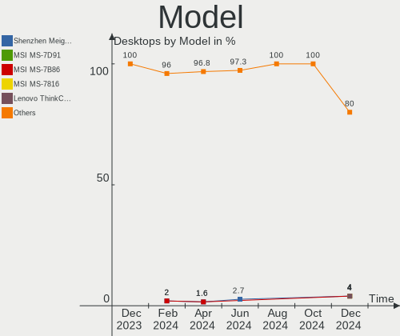
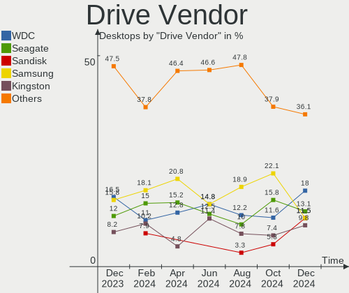
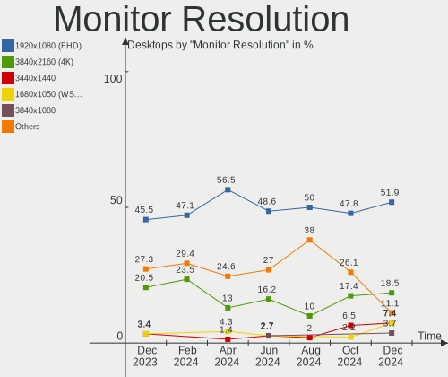
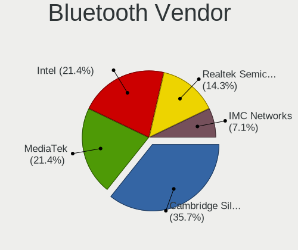

ArcoLinux Hardware Trends (Desktops)
------------------------------------

A project to identify most popular hardware characteristics and track their change
over time based on data collected by ArcoLinux users at https://Linux-Hardware.org.

Anyone can contribute to this report by the [hw-probe](https://github.com/linuxhw/hw-probe) tool:

    sudo -E hw-probe -all -upload

Full-feature report is available here: https://linux-hardware.org/?view=trends

Period: Nov, 2021.

Contents
--------

* [ System ](#system)
  - [ OS                       ](#os)
  - [ OS Family                ](#os-family)
  - [ Kernel                   ](#kernel)
  - [ Kernel Family            ](#kernel-family)
  - [ Kernel Major Ver.        ](#kernel-major-ver)
  - [ Arch                     ](#arch)
  - [ DE                       ](#de)
  - [ Display Server           ](#display-server)
  - [ Display Manager          ](#display-manager)
  - [ OS Lang                  ](#os-lang)
  - [ Boot Mode                ](#boot-mode)
  - [ Filesystem               ](#filesystem)
  - [ Part. scheme             ](#part-scheme)
  - [ Dual Boot with Linux/BSD ](#dual-boot-with-linuxbsd)
  - [ Dual Boot (Win)          ](#dual-boot-win)

* [ Board ](#board)
  - [ Vendor                   ](#vendor)
  - [ Model                    ](#model)
  - [ Model Family             ](#model-family)
  - [ MFG Year                 ](#mfg-year)
  - [ Form Factor              ](#form-factor)
  - [ Secure Boot              ](#secure-boot)
  - [ Coreboot                 ](#coreboot)
  - [ RAM Size                 ](#ram-size)
  - [ RAM Used                 ](#ram-used)
  - [ Total Drives             ](#total-drives)
  - [ Has CD-ROM               ](#has-cd-rom)
  - [ Has Ethernet             ](#has-ethernet)
  - [ Has WiFi                 ](#has-wifi)
  - [ Has Bluetooth            ](#has-bluetooth)

* [ Location ](#location)
  - [ Country                  ](#country)
  - [ City                     ](#city)

* [ Drives ](#drives)
  - [ Drive Vendor             ](#drive-vendor)
  - [ Drive Model              ](#drive-model)
  - [ HDD Vendor               ](#hdd-vendor)
  - [ SSD Vendor               ](#ssd-vendor)
  - [ Drive Kind               ](#drive-kind)
  - [ Drive Connector          ](#drive-connector)
  - [ Drive Size               ](#drive-size)
  - [ Space Total              ](#space-total)
  - [ Space Used               ](#space-used)
  - [ Malfunc. Drives          ](#malfunc-drives)
  - [ Malfunc. Drive Vendor    ](#malfunc-drive-vendor)
  - [ Malfunc. HDD Vendor      ](#malfunc-hdd-vendor)
  - [ Malfunc. Drive Kind      ](#malfunc-drive-kind)
  - [ Failed Drives            ](#failed-drives)
  - [ Failed Drive Vendor      ](#failed-drive-vendor)
  - [ Drive Status             ](#drive-status)

* [ Storage controller ](#storage-controller)
  - [ Storage Vendor           ](#storage-vendor)
  - [ Storage Model            ](#storage-model)
  - [ Storage Kind             ](#storage-kind)

* [ Processor ](#processor)
  - [ CPU Vendor               ](#cpu-vendor)
  - [ CPU Model                ](#cpu-model)
  - [ CPU Model Family         ](#cpu-model-family)
  - [ CPU Cores                ](#cpu-cores)
  - [ CPU Sockets              ](#cpu-sockets)
  - [ CPU Threads              ](#cpu-threads)
  - [ CPU Op-Modes             ](#cpu-op-modes)
  - [ CPU Microcode            ](#cpu-microcode)
  - [ CPU Microarch            ](#cpu-microarch)

* [ Graphics ](#graphics)
  - [ GPU Vendor               ](#gpu-vendor)
  - [ GPU Model                ](#gpu-model)
  - [ GPU Combo                ](#gpu-combo)
  - [ GPU Driver               ](#gpu-driver)
  - [ GPU Memory               ](#gpu-memory)

* [ Monitor ](#monitor)
  - [ Monitor Vendor           ](#monitor-vendor)
  - [ Monitor Model            ](#monitor-model)
  - [ Monitor Resolution       ](#monitor-resolution)
  - [ Monitor Diagonal         ](#monitor-diagonal)
  - [ Monitor Width            ](#monitor-width)
  - [ Aspect Ratio             ](#aspect-ratio)
  - [ Monitor Area             ](#monitor-area)
  - [ Pixel Density            ](#pixel-density)
  - [ Multiple Monitors        ](#multiple-monitors)

* [ Network ](#network)
  - [ Net Controller Vendor    ](#net-controller-vendor)
  - [ Net Controller Model     ](#net-controller-model)
  - [ Wireless Vendor          ](#wireless-vendor)
  - [ Wireless Model           ](#wireless-model)
  - [ Ethernet Vendor          ](#ethernet-vendor)
  - [ Ethernet Model           ](#ethernet-model)
  - [ Net Controller Kind      ](#net-controller-kind)
  - [ Used Controller          ](#used-controller)
  - [ NICs                     ](#nics)
  - [ IPv6                     ](#ipv6)

* [ Bluetooth ](#bluetooth)
  - [ Bluetooth Vendor         ](#bluetooth-vendor)
  - [ Bluetooth Model          ](#bluetooth-model)

* [ Sound ](#sound)
  - [ Sound Vendor             ](#sound-vendor)
  - [ Sound Model              ](#sound-model)

* [ Memory ](#memory)
  - [ Memory Vendor            ](#memory-vendor)
  - [ Memory Model             ](#memory-model)
  - [ Memory Kind              ](#memory-kind)
  - [ Memory Form Factor       ](#memory-form-factor)
  - [ Memory Size              ](#memory-size)
  - [ Memory Speed             ](#memory-speed)

* [ Printers & scanners ](#printers--scanners)
  - [ Printer Vendor           ](#printer-vendor)
  - [ Printer Model            ](#printer-model)
  - [ Scanner Vendor           ](#scanner-vendor)
  - [ Scanner Model            ](#scanner-model)

* [ Camera ](#camera)
  - [ Camera Vendor            ](#camera-vendor)
  - [ Camera Model             ](#camera-model)

* [ Security ](#security)
  - [ Fingerprint Vendor       ](#fingerprint-vendor)
  - [ Fingerprint Model        ](#fingerprint-model)
  - [ Chipcard Vendor          ](#chipcard-vendor)
  - [ Chipcard Model           ](#chipcard-model)

* [ Unsupported ](#unsupported)
  - [ Unsupported Devices      ](#unsupported-devices)
  - [ Unsupported Device Types ](#unsupported-device-types)

System
------

OS
--

Installed operating systems

| Name              | Desktops | Percent |
|-------------------|----------|---------|
| ArcoLinux Rolling | 46       | 100%    |

OS Family
---------

OS without a version

| Name      | Desktops | Percent |
|-----------|----------|---------|
| ArcoLinux | 46       | 100%    |

Kernel
------

Version of the Linux kernel

| Version                      | Desktops | Percent |
|------------------------------|----------|---------|
| 5.15.4-arch1-1               | 8        | 17.39%  |
| 5.15.2-arch1-1               | 7        | 15.22%  |
| 5.14.16-arch1-1              | 6        | 13.04%  |
| 5.15.4-zen1-1-zen            | 3        | 6.52%   |
| 5.14.16-zen1-1-zen           | 3        | 6.52%   |
| 5.15.5-arch1-1               | 2        | 4.35%   |
| 5.15.3-1-clear               | 2        | 4.35%   |
| 5.14.14-arch1-1              | 2        | 4.35%   |
| 5.10.78-1-lts                | 2        | 4.35%   |
| 5.15.5-zen1-1-zen            | 1        | 2.17%   |
| 5.15.4-AMD                   | 1        | 2.17%   |
| 5.15.3-arch1-1               | 1        | 2.17%   |
| 5.15.1-arch1-1               | 1        | 2.17%   |
| 5.15.0-arch1-1               | 1        | 2.17%   |
| 5.14.5-arch1-1               | 1        | 2.17%   |
| 5.14.15-zen1-1-zen           | 1        | 2.17%   |
| 5.14.14-hardened1-1-hardened | 1        | 2.17%   |
| 5.10.82-1-lts                | 1        | 2.17%   |
| 5.10.81-1-lts                | 1        | 2.17%   |
| 5.10.79-1-lts                | 1        | 2.17%   |

Kernel Family
-------------

Linux kernel without a distro release

| Version | Desktops | Percent |
|---------|----------|---------|
| 5.15.4  | 12       | 26.09%  |
| 5.14.16 | 9        | 19.57%  |
| 5.15.2  | 7        | 15.22%  |
| 5.15.5  | 3        | 6.52%   |
| 5.15.3  | 3        | 6.52%   |
| 5.14.14 | 3        | 6.52%   |
| 5.10.78 | 2        | 4.35%   |
| 5.15.1  | 1        | 2.17%   |
| 5.15.0  | 1        | 2.17%   |
| 5.14.5  | 1        | 2.17%   |
| 5.14.15 | 1        | 2.17%   |
| 5.10.82 | 1        | 2.17%   |
| 5.10.81 | 1        | 2.17%   |
| 5.10.79 | 1        | 2.17%   |

Kernel Major Ver.
-----------------

Linux kernel major version

| Version | Desktops | Percent |
|---------|----------|---------|
| 5.15    | 27       | 58.7%   |
| 5.14    | 14       | 30.43%  |
| 5.10    | 5        | 10.87%  |

Arch
----

OS architecture (x86_64, i586, etc.)

| Name   | Desktops | Percent |
|--------|----------|---------|
| x86_64 | 46       | 100%    |

DE
--

Desktop Environment

| Name       | Desktops | Percent |
|------------|----------|---------|
| XFCE       | 15       | 32.61%  |
| KDE5       | 10       | 21.74%  |
| X-Cinnamon | 4        | 8.7%    |
| i3         | 3        | 6.52%   |
| awesome    | 3        | 6.52%   |
| xmonad     | 2        | 4.35%   |
| LeftWM     | 2        | 4.35%   |
| bspwm      | 2        | 4.35%   |
| Unknown    | 2        | 4.35%   |
| qtile      | 1        | 2.17%   |
| MATE       | 1        | 2.17%   |
| dusk       | 1        | 2.17%   |

Display Server
--------------

X11 or Wayland

| Name | Desktops | Percent |
|------|----------|---------|
| X11  | 41       | 89.13%  |
| Tty  | 5        | 10.87%  |

Display Manager
---------------

SDDM, LightDM, etc.

| Name    | Desktops | Percent |
|---------|----------|---------|
| SDDM    | 34       | 73.91%  |
| LightDM | 10       | 21.74%  |
| Unknown | 2        | 4.35%   |

OS Lang
-------

Language

| Lang  | Desktops | Percent |
|-------|----------|---------|
| en_US | 22       | 47.83%  |
| en_GB | 5        | 10.87%  |
| ru_RU | 3        | 6.52%   |
| en_ZA | 3        | 6.52%   |
| es_AR | 2        | 4.35%   |
| de_DE | 2        | 4.35%   |
| pl_PL | 1        | 2.17%   |
| nl_NL | 1        | 2.17%   |
| fr_FR | 1        | 2.17%   |
| fi_FI | 1        | 2.17%   |
| es_ES | 1        | 2.17%   |
| en_IN | 1        | 2.17%   |
| en_IL | 1        | 2.17%   |
| en_CA | 1        | 2.17%   |
| bg_BG | 1        | 2.17%   |

Boot Mode
---------

EFI or BIOS

| Mode | Desktops | Percent |
|------|----------|---------|
| EFI  | 36       | 78.26%  |
| BIOS | 10       | 21.74%  |

Filesystem
----------

Type of filesystem

| Type    | Desktops | Percent |
|---------|----------|---------|
| Ext4    | 34       | 73.91%  |
| Btrfs   | 9        | 19.57%  |
| Xfs     | 2        | 4.35%   |
| Overlay | 1        | 2.17%   |

Part. scheme
------------

Scheme of partitioning

| Type    | Desktops | Percent |
|---------|----------|---------|
| GPT     | 39       | 84.78%  |
| MBR     | 6        | 13.04%  |
| Unknown | 1        | 2.17%   |

Dual Boot with Linux/BSD
------------------------

Hosting more than one Linux/BSD

| Dual boot | Desktops | Percent |
|-----------|----------|---------|
| No        | 34       | 73.91%  |
| Yes       | 12       | 26.09%  |

Dual Boot (Win)
---------------

Hosting Linux and Windows

| Dual boot | Desktops | Percent |
|-----------|----------|---------|
| Yes       | 23       | 50%     |
| No        | 23       | 50%     |

Board
-----

Vendor
------

Motherboard manufacturer

| Name                | Desktops | Percent |
|---------------------|----------|---------|
| ASUSTek Computer    | 17       | 36.96%  |
| MSI                 | 9        | 19.57%  |
| Gigabyte Technology | 8        | 17.39%  |
| ASRock              | 7        | 15.22%  |
| Hewlett-Packard     | 2        | 4.35%   |
| Dell                | 1        | 2.17%   |
| Biostar             | 1        | 2.17%   |
| Acer                | 1        | 2.17%   |

Model
-----

Motherboard model

| Name                            | Desktops | Percent |
|---------------------------------|----------|---------|
| MSI MS-7C91                     | 3        | 6.52%   |
| ASUS TUF GAMING X570-PLUS       | 3        | 6.52%   |
| ASUS ROG STRIX B550-F GAMING    | 2        | 4.35%   |
| ASUS PRIME H310M-K R2.0         | 2        | 4.35%   |
| ASRock B450M Pro4               | 2        | 4.35%   |
| MSI MS-7D22                     | 1        | 2.17%   |
| MSI MS-7C88                     | 1        | 2.17%   |
| MSI MS-7C02                     | 1        | 2.17%   |
| MSI MS-7B89                     | 1        | 2.17%   |
| MSI MS-7B85                     | 1        | 2.17%   |
| MSI MS-7A15                     | 1        | 2.17%   |
| HP Z820 Workstation             | 1        | 2.17%   |
| HP EliteDesk 800 G2 DM 35W      | 1        | 2.17%   |
| Gigabyte X570 AORUS MASTER      | 1        | 2.17%   |
| Gigabyte H81M-S                 | 1        | 2.17%   |
| Gigabyte F2A68HM-H              | 1        | 2.17%   |
| Gigabyte B560M DS3H             | 1        | 2.17%   |
| Gigabyte B550I AORUS PRO AX     | 1        | 2.17%   |
| Gigabyte B450M DS3H             | 1        | 2.17%   |
| Gigabyte B365M GAMING HD        | 1        | 2.17%   |
| Gigabyte 970A-DS3P              | 1        | 2.17%   |
| Dell Inspiron 3670              | 1        | 2.17%   |
| Biostar J3060NH                 | 1        | 2.17%   |
| ASUS ROG STRIX X570-E GAMING    | 1        | 2.17%   |
| ASUS ROG STRIX B450-F GAMING II | 1        | 2.17%   |
| ASUS Rampage III GENE           | 1        | 2.17%   |
| ASUS PRIME Z490-A               | 1        | 2.17%   |
| ASUS PRIME X570-PRO             | 1        | 2.17%   |
| ASUS P8Z77-V LE                 | 1        | 2.17%   |
| ASUS P8Z77-V                    | 1        | 2.17%   |
| ASUS P8Z68-V PRO                | 1        | 2.17%   |
| ASUS P8Z68 DELUXE               | 1        | 2.17%   |
| ASUS All Series                 | 1        | 2.17%   |
| ASRock H81M-DG4                 | 1        | 2.17%   |
| ASRock FM2A78M Pro4+            | 1        | 2.17%   |
| ASRock B450M Steel Legend       | 1        | 2.17%   |
| ASRock B450 Gaming K4           | 1        | 2.17%   |
| ASRock A55M-VS                  | 1        | 2.17%   |
| Acer Predator G3-605            | 1        | 2.17%   |

Model Family
------------

Motherboard model prefix

| Name               | Desktops | Percent |
|--------------------|----------|---------|
| ASUS ROG           | 4        | 8.7%    |
| ASUS PRIME         | 4        | 8.7%    |
| MSI MS-7C91        | 3        | 6.52%   |
| ASUS TUF           | 3        | 6.52%   |
| ASRock B450M       | 3        | 6.52%   |
| ASUS P8Z77-V       | 2        | 4.35%   |
| MSI MS-7D22        | 1        | 2.17%   |
| MSI MS-7C88        | 1        | 2.17%   |
| MSI MS-7C02        | 1        | 2.17%   |
| MSI MS-7B89        | 1        | 2.17%   |
| MSI MS-7B85        | 1        | 2.17%   |
| MSI MS-7A15        | 1        | 2.17%   |
| HP Z820            | 1        | 2.17%   |
| HP EliteDesk       | 1        | 2.17%   |
| Gigabyte X570      | 1        | 2.17%   |
| Gigabyte H81M-S    | 1        | 2.17%   |
| Gigabyte F2A68HM-H | 1        | 2.17%   |
| Gigabyte B560M     | 1        | 2.17%   |
| Gigabyte B550I     | 1        | 2.17%   |
| Gigabyte B450M     | 1        | 2.17%   |
| Gigabyte B365M     | 1        | 2.17%   |
| Gigabyte 970A-DS3P | 1        | 2.17%   |
| Dell Inspiron      | 1        | 2.17%   |
| Biostar J3060NH    | 1        | 2.17%   |
| ASUS Rampage       | 1        | 2.17%   |
| ASUS P8Z68-V       | 1        | 2.17%   |
| ASUS P8Z68         | 1        | 2.17%   |
| ASUS All           | 1        | 2.17%   |
| ASRock H81M-DG4    | 1        | 2.17%   |
| ASRock FM2A78M     | 1        | 2.17%   |
| ASRock B450        | 1        | 2.17%   |
| ASRock A55M-VS     | 1        | 2.17%   |
| Acer Predator      | 1        | 2.17%   |

MFG Year
--------

Motherboard manufacture year

| Year | Desktops | Percent |
|------|----------|---------|
| 2021 | 17       | 36.96%  |
| 2020 | 7        | 15.22%  |
| 2019 | 6        | 13.04%  |
| 2015 | 3        | 6.52%   |
| 2014 | 3        | 6.52%   |
| 2013 | 3        | 6.52%   |
| 2012 | 3        | 6.52%   |
| 2018 | 1        | 2.17%   |
| 2017 | 1        | 2.17%   |
| 2016 | 1        | 2.17%   |
| 2011 | 1        | 2.17%   |

Form Factor
-----------

Physical design of the computer

| Name    | Desktops | Percent |
|---------|----------|---------|
| Desktop | 46       | 100%    |

Secure Boot
-----------

Enabled or disabled

| State    | Desktops | Percent |
|----------|----------|---------|
| Disabled | 46       | 100%    |

Coreboot
--------

Have coreboot on board

| Used | Desktops | Percent |
|------|----------|---------|
| No   | 46       | 100%    |

RAM Size
--------

Total RAM memory

| Size in GB  | Desktops | Percent |
|-------------|----------|---------|
| 16.01-24.0  | 15       | 32.61%  |
| 8.01-16.0   | 13       | 28.26%  |
| 32.01-64.0  | 8        | 17.39%  |
| 4.01-8.0    | 3        | 6.52%   |
| 24.01-32.0  | 3        | 6.52%   |
| 64.01-256.0 | 3        | 6.52%   |
| 3.01-4.0    | 1        | 2.17%   |

RAM Used
--------

Used RAM memory

| Used GB   | Desktops | Percent |
|-----------|----------|---------|
| 2.01-3.0  | 14       | 30.43%  |
| 4.01-8.0  | 10       | 21.74%  |
| 1.01-2.0  | 9        | 19.57%  |
| 3.01-4.0  | 5        | 10.87%  |
| 0.51-1.0  | 5        | 10.87%  |
| 8.01-16.0 | 3        | 6.52%   |

Total Drives
------------

Number of drives on board

| Drives | Desktops | Percent |
|--------|----------|---------|
| 3      | 12       | 26.09%  |
| 2      | 12       | 26.09%  |
| 4      | 10       | 21.74%  |
| 1      | 8        | 17.39%  |
| 0      | 2        | 4.35%   |
| 9      | 1        | 2.17%   |
| 5      | 1        | 2.17%   |

Has CD-ROM
----------

Has CD-ROM on board

| Presented | Desktops | Percent |
|-----------|----------|---------|
| No        | 34       | 73.91%  |
| Yes       | 12       | 26.09%  |

Has Ethernet
------------

Has Ethernet on board

| Presented | Desktops | Percent |
|-----------|----------|---------|
| Yes       | 46       | 100%    |

Has WiFi
--------

Has WiFi module

| Presented | Desktops | Percent |
|-----------|----------|---------|
| No        | 25       | 54.35%  |
| Yes       | 21       | 45.65%  |

Has Bluetooth
-------------

Has Bluetooth module

| Presented | Desktops | Percent |
|-----------|----------|---------|
| Yes       | 25       | 54.35%  |
| No        | 21       | 45.65%  |

Location
--------

Country
-------

Geographic location (country)

| Country      | Desktops | Percent |
|--------------|----------|---------|
| USA          | 8        | 17.39%  |
| UK           | 3        | 6.52%   |
| South Africa | 3        | 6.52%   |
| India        | 3        | 6.52%   |
| Belgium      | 3        | 6.52%   |
| Russia       | 2        | 4.35%   |
| Germany      | 2        | 4.35%   |
| Bulgaria     | 2        | 4.35%   |
| Argentina    | 2        | 4.35%   |
| Ukraine      | 1        | 2.17%   |
| Tunisia      | 1        | 2.17%   |
| Thailand     | 1        | 2.17%   |
| Spain        | 1        | 2.17%   |
| Slovakia     | 1        | 2.17%   |
| Singapore    | 1        | 2.17%   |
| Romania      | 1        | 2.17%   |
| Poland       | 1        | 2.17%   |
| Netherlands  | 1        | 2.17%   |
| Israel       | 1        | 2.17%   |
| Greece       | 1        | 2.17%   |
| France       | 1        | 2.17%   |
| Finland      | 1        | 2.17%   |
| Chile        | 1        | 2.17%   |
| Brazil       | 1        | 2.17%   |
| Belarus      | 1        | 2.17%   |
| Barbados     | 1        | 2.17%   |
| Albania      | 1        | 2.17%   |

City
----

Geographic location (city)

| City                   | Desktops | Percent |
|------------------------|----------|---------|
| Benoni                 | 3        | 6.52%   |
| Wilrijk                | 2        | 4.35%   |
| Warsaw                 | 1        | 2.17%   |
| Timi?™oara             | 1        | 2.17%   |
| Tigre                  | 1        | 2.17%   |
| Tel Aviv               | 1        | 2.17%   |
| Springfield            | 1        | 2.17%   |
| Southampton            | 1        | 2.17%   |
| Sofia                  | 1        | 2.17%   |
| Singapore              | 1        | 2.17%   |
| Shetland Islands       | 1        | 2.17%   |
| Sein?¤joki             | 1        | 2.17%   |
| S??o Paulo             | 1        | 2.17%   |
| Santiago               | 1        | 2.17%   |
| San Miguel de Tucum??n | 1        | 2.17%   |
| Rouans                 | 1        | 2.17%   |
| Pfafftown              | 1        | 2.17%   |
| Perm                   | 1        | 2.17%   |
| Pearl City             | 1        | 2.17%   |
| Novi Pazar             | 1        | 2.17%   |
| New York               | 1        | 2.17%   |
| New Delhi              | 1        | 2.17%   |
| Nakhon Ratchasima      | 1        | 2.17%   |
| Mumbai                 | 1        | 2.17%   |
| Miami                  | 1        | 2.17%   |
| Madrid                 | 1        | 2.17%   |
| London                 | 1        | 2.17%   |
| Las Vegas              | 1        | 2.17%   |
| Klin                   | 1        | 2.17%   |
| Kharkiv                | 1        | 2.17%   |
| Jendouba               | 1        | 2.17%   |
| Gomel                  | 1        | 2.17%   |
| Essingen               | 1        | 2.17%   |
| Elmwood Park           | 1        | 2.17%   |
| Durr?«s                | 1        | 2.17%   |
| Chicago                | 1        | 2.17%   |
| Brussels               | 1        | 2.17%   |
| Bridgetown             | 1        | 2.17%   |
| Brezno                 | 1        | 2.17%   |
| Berlin                 | 1        | 2.17%   |
| Bengaluru              | 1        | 2.17%   |
| Athens                 | 1        | 2.17%   |
| Amsterdam              | 1        | 2.17%   |

Drives
------

Drive Vendor
------------

Hard drive vendors

| Vendor              | Desktops | Drives | Percent |
|---------------------|----------|--------|---------|
| Samsung Electronics | 19       | 31     | 21.35%  |
| Seagate             | 16       | 23     | 17.98%  |
| WDC                 | 14       | 22     | 15.73%  |
| Kingston            | 8        | 8      | 8.99%   |
| Toshiba             | 7        | 7      | 7.87%   |
| Crucial             | 4        | 7      | 4.49%   |
| SanDisk             | 3        | 4      | 3.37%   |
| Intel               | 2        | 2      | 2.25%   |
| Corsair             | 2        | 2      | 2.25%   |
| A-DATA Technology   | 2        | 2      | 2.25%   |
| Transcend           | 1        | 1      | 1.12%   |
| SPCC                | 1        | 1      | 1.12%   |
| SK Hynix            | 1        | 1      | 1.12%   |
| PNY                 | 1        | 1      | 1.12%   |
| Phison              | 1        | 1      | 1.12%   |
| Mushkin             | 1        | 1      | 1.12%   |
| JMicron             | 1        | 1      | 1.12%   |
| Hitachi             | 1        | 1      | 1.12%   |
| GOODRAM             | 1        | 1      | 1.12%   |
| Gigabyte Technology | 1        | 1      | 1.12%   |
| China               | 1        | 1      | 1.12%   |
| addlink             | 1        | 1      | 1.12%   |

Drive Model
-----------

Hard drive models

| Model                                       | Desktops | Percent |
|---------------------------------------------|----------|---------|
| Samsung SSD 860 EVO 500GB                   | 4        | 3.64%   |
| WDC WD5000AAKX-001CA0 500GB                 | 3        | 2.73%   |
| Seagate ST1000DM010-2EP102 1TB              | 3        | 2.73%   |
| Samsung SSD 970 EVO 1TB                     | 3        | 2.73%   |
| Seagate ST2000DM001-1ER164 2TB              | 2        | 1.82%   |
| Seagate ST1000DM003-1CH162 1TB              | 2        | 1.82%   |
| SanDisk SDSSDA240G 240GB                    | 2        | 1.82%   |
| Samsung SSD 860 EVO 1TB                     | 2        | 1.82%   |
| Samsung SSD 850 EVO 500GB                   | 2        | 1.82%   |
| Kingston SA400S37120G 120GB SSD             | 2        | 1.82%   |
| Kingston SA2000M8500G 500GB                 | 2        | 1.82%   |
| Crucial CT1000P1SSD8 1TB                    | 2        | 1.82%   |
| WDC WDS500G2B0A-00SM50 500GB SSD            | 1        | 0.91%   |
| WDC WDS240G2G0B-00EPW0 240GB SSD            | 1        | 0.91%   |
| WDC WDS100T3X0C-00SJG0 1TB                  | 1        | 0.91%   |
| WDC WDS100T2B0A-00SM50 1TB SSD              | 1        | 0.91%   |
| WDC WD5000AAKX-603CA0 500GB                 | 1        | 0.91%   |
| WDC WD5000AAKX-00ERMA0 500GB                | 1        | 0.91%   |
| WDC WD40EZRX-22SPEB0 4TB                    | 1        | 0.91%   |
| WDC WD40EFRX-68N32N0 4TB                    | 1        | 0.91%   |
| WDC WD20EARX-00PASB0 2TB                    | 1        | 0.91%   |
| WDC WD1600AVVS-63L2B0 160GB                 | 1        | 0.91%   |
| WDC WD10EZEX-75WN4A0 1TB                    | 1        | 0.91%   |
| WDC WD10EZEX-22MFCA0 1TB                    | 1        | 0.91%   |
| WDC WD10EZEX-08M2NA0 1TB                    | 1        | 0.91%   |
| WDC WD10EARS-00Y5B1 1TB                     | 1        | 0.91%   |
| Transcend TS480GSSD220S 480GB               | 1        | 0.91%   |
| Toshiba TR150 240GB SSD                     | 1        | 0.91%   |
| Toshiba MQ01ABD100M 1TB                     | 1        | 0.91%   |
| Toshiba MQ01ABD100 1TB                      | 1        | 0.91%   |
| Toshiba HDWE140 4TB                         | 1        | 0.91%   |
| Toshiba HDWD120 2TB                         | 1        | 0.91%   |
| Toshiba DT01ACA200 2TB                      | 1        | 0.91%   |
| Toshiba DT01ACA100 1TB                      | 1        | 0.91%   |
| SPCC M.2 PCIe SSD 1TB                       | 1        | 0.91%   |
| SK Hynix SC311 SATA 128GB SSD               | 1        | 0.91%   |
| Seagate ST8000NM0055-1RM112 8TB             | 1        | 0.91%   |
| Seagate ST3320813AS 320GB                   | 1        | 0.91%   |
| Seagate ST31000528AS 1TB                    | 1        | 0.91%   |
| Seagate ST2000VX000-1ES164 2TB              | 1        | 0.91%   |
| Seagate ST2000DX001-1NS164 2TB              | 1        | 0.91%   |
| Seagate ST2000DM008-2FR102 2TB              | 1        | 0.91%   |
| Seagate ST2000DM001-9YN164 2TB              | 1        | 0.91%   |
| Seagate ST2000DM001-1CH164 2TB              | 1        | 0.91%   |
| Seagate ST1000NC000-1CX162 1TB              | 1        | 0.91%   |
| Seagate ST1000LM014-1EJ164 1TB              | 1        | 0.91%   |
| Seagate ST1000DM003-1ER162 1TB              | 1        | 0.91%   |
| Seagate FireCuda 520 SSD ZP500GM30002 500GB | 1        | 0.91%   |
| Seagate Expansion Desk 8TB                  | 1        | 0.91%   |
| Seagate Expansion 1TB                       | 1        | 0.91%   |
| Seagate BUP Portable 4TB                    | 1        | 0.91%   |
| Sandisk NVMe SSD Drive 1TB                  | 1        | 0.91%   |
| Samsung SSD PM830 mSATA 32GB                | 1        | 0.91%   |
| Samsung SSD 980 PRO 500GB                   | 1        | 0.91%   |
| Samsung SSD 980 PRO 1TB                     | 1        | 0.91%   |
| Samsung SSD 970 EVO Plus 500GB              | 1        | 0.91%   |
| Samsung SSD 970 EVO Plus 2TB                | 1        | 0.91%   |
| Samsung SSD 970 EVO Plus 1TB                | 1        | 0.91%   |
| Samsung SSD 970 EVO 250GB                   | 1        | 0.91%   |
| Samsung SSD 960 EVO 500GB                   | 1        | 0.91%   |

HDD Vendor
----------

Hard disk drive vendors

| Vendor              | Desktops | Drives | Percent |
|---------------------|----------|--------|---------|
| Seagate             | 15       | 22     | 41.67%  |
| WDC                 | 12       | 17     | 33.33%  |
| Toshiba             | 6        | 6      | 16.67%  |
| Samsung Electronics | 2        | 2      | 5.56%   |
| Hitachi             | 1        | 1      | 2.78%   |

SSD Vendor
----------

Solid state drive vendors

| Vendor              | Desktops | Drives | Percent |
|---------------------|----------|--------|---------|
| Samsung Electronics | 13       | 18     | 33.33%  |
| Kingston            | 5        | 5      | 12.82%  |
| Crucial             | 4        | 5      | 10.26%  |
| WDC                 | 3        | 4      | 7.69%   |
| SanDisk             | 2        | 2      | 5.13%   |
| Transcend           | 1        | 1      | 2.56%   |
| Toshiba             | 1        | 1      | 2.56%   |
| SK Hynix            | 1        | 1      | 2.56%   |
| PNY                 | 1        | 1      | 2.56%   |
| Mushkin             | 1        | 1      | 2.56%   |
| JMicron             | 1        | 1      | 2.56%   |
| GOODRAM             | 1        | 1      | 2.56%   |
| Gigabyte Technology | 1        | 1      | 2.56%   |
| Corsair             | 1        | 1      | 2.56%   |
| China               | 1        | 1      | 2.56%   |
| addlink             | 1        | 1      | 2.56%   |
| A-DATA Technology   | 1        | 1      | 2.56%   |

Drive Kind
----------

HDD or SSD

| Kind | Desktops | Drives | Percent |
|------|----------|--------|---------|
| SSD  | 31       | 46     | 39.24%  |
| HDD  | 28       | 48     | 35.44%  |
| NVMe | 20       | 26     | 25.32%  |

Drive Connector
---------------

SATA, SAS, NVMe, etc.

| Type | Desktops | Drives | Percent |
|------|----------|--------|---------|
| SATA | 42       | 89     | 63.64%  |
| NVMe | 20       | 26     | 30.3%   |
| SAS  | 4        | 5      | 6.06%   |

Drive Size
----------

Size of hard drive

| Size in TB | Desktops | Drives | Percent |
|------------|----------|--------|---------|
| 0.01-0.5   | 29       | 38     | 42.65%  |
| 0.51-1.0   | 22       | 32     | 32.35%  |
| 1.01-2.0   | 11       | 13     | 16.18%  |
| 3.01-4.0   | 4        | 9      | 5.88%   |
| 4.01-10.0  | 2        | 2      | 2.94%   |

Space Total
-----------

Amount of disk space available on the file system

| Size in GB     | Desktops | Percent |
|----------------|----------|---------|
| More than 3000 | 10       | 21.74%  |
| 1001-2000      | 9        | 19.57%  |
| 101-250        | 7        | 15.22%  |
| 501-1000       | 7        | 15.22%  |
| 251-500        | 6        | 13.04%  |
| 2001-3000      | 4        | 8.7%    |
| 1-20           | 3        | 6.52%   |

Space Used
----------

Amount of used disk space

| Used GB        | Desktops | Percent |
|----------------|----------|---------|
| 101-250        | 8        | 17.39%  |
| 251-500        | 7        | 15.22%  |
| 1-20           | 7        | 15.22%  |
| 21-50          | 6        | 13.04%  |
| 2001-3000      | 5        | 10.87%  |
| 51-100         | 5        | 10.87%  |
| 1001-2000      | 4        | 8.7%    |
| More than 3000 | 2        | 4.35%   |
| 501-1000       | 2        | 4.35%   |

Malfunc. Drives
---------------

Drive models with a malfunction

| Model                               | Desktops | Drives | Percent |
|-------------------------------------|----------|--------|---------|
| WDC WD5000AAKX-603CA0 500GB         | 1        | 1      | 10%     |
| WDC WD5000AAKX-001CA0 500GB         | 1        | 1      | 10%     |
| WDC WD40EFRX-68N32N0 4TB            | 1        | 4      | 10%     |
| WDC WD1600AVVS-63L2B0 160GB         | 1        | 1      | 10%     |
| Seagate ST3320813AS 320GB           | 1        | 1      | 10%     |
| Seagate ST31000528AS 1TB            | 1        | 1      | 10%     |
| Seagate ST2000DM001-9YN164 2TB      | 1        | 1      | 10%     |
| Seagate ST1000LM014-1EJ164 1TB      | 1        | 1      | 10%     |
| Samsung Electronics SSD 870 EVO 1TB | 1        | 1      | 10%     |
| Samsung Electronics HD154UI 1TB     | 1        | 1      | 10%     |

Malfunc. Drive Vendor
---------------------

Vendors of faulty drives

| Vendor              | Desktops | Drives | Percent |
|---------------------|----------|--------|---------|
| WDC                 | 4        | 7      | 40%     |
| Seagate             | 4        | 4      | 40%     |
| Samsung Electronics | 2        | 2      | 20%     |

Malfunc. HDD Vendor
-------------------

Vendors of faulty HDD drives

| Vendor              | Desktops | Drives | Percent |
|---------------------|----------|--------|---------|
| WDC                 | 4        | 7      | 44.44%  |
| Seagate             | 4        | 4      | 44.44%  |
| Samsung Electronics | 1        | 1      | 11.11%  |

Malfunc. Drive Kind
-------------------

Kinds of faulty drives

| Kind | Desktops | Drives | Percent |
|------|----------|--------|---------|
| HDD  | 9        | 12     | 90%     |
| SSD  | 1        | 1      | 10%     |

Failed Drives
-------------

Failed drive models

Zero info for selected period =(

Failed Drive Vendor
-------------------

Failed drive vendors

Zero info for selected period =(

Drive Status
------------

Number of failed and malfunc. drives

| Status   | Desktops | Drives | Percent |
|----------|----------|--------|---------|
| Works    | 36       | 92     | 65.45%  |
| Malfunc  | 10       | 13     | 18.18%  |
| Detected | 9        | 15     | 16.36%  |

Storage controller
------------------

Storage Vendor
--------------

Storage controller vendors

| Vendor                      | Desktops | Percent |
|-----------------------------|----------|---------|
| AMD                         | 25       | 31.25%  |
| Intel                       | 23       | 28.75%  |
| Samsung Electronics         | 10       | 12.5%   |
| Marvell Technology Group    | 5        | 6.25%   |
| Phison Electronics          | 3        | 3.75%   |
| Kingston Technology Company | 3        | 3.75%   |
| Sandisk                     | 2        | 2.5%    |
| Micron/Crucial Technology   | 2        | 2.5%    |
| JMicron Technology          | 2        | 2.5%    |
| ASMedia Technology          | 2        | 2.5%    |
| Seagate Technology          | 1        | 1.25%   |
| Broadcom / LSI              | 1        | 1.25%   |
| ADATA Technology            | 1        | 1.25%   |

Storage Model
-------------

Storage controller models

| Model                                                                            | Desktops | Percent |
|----------------------------------------------------------------------------------|----------|---------|
| AMD FCH SATA Controller [AHCI mode]                                              | 11       | 12.5%   |
| AMD 400 Series Chipset SATA Controller                                           | 9        | 10.23%  |
| Samsung NVMe SSD Controller SM981/PM981/PM983                                    | 7        | 7.95%   |
| AMD Starship/Matisse Chipset SATA Controller [AHCI mode]                         | 6        | 6.82%   |
| Kingston Company A2000 NVMe SSD                                                  | 3        | 3.41%   |
| Intel 8 Series/C220 Series Chipset Family 6-port SATA Controller 1 [AHCI mode]   | 3        | 3.41%   |
| Intel 200 Series PCH SATA controller [AHCI mode]                                 | 3        | 3.41%   |
| AMD FCH IDE Controller                                                           | 3        | 3.41%   |
| Samsung NVMe SSD Controller PM9A1/PM9A3/980PRO                                   | 2        | 2.27%   |
| Phison E12 NVMe Controller                                                       | 2        | 2.27%   |
| Micron/Crucial P1 NVMe PCIe SSD                                                  | 2        | 2.27%   |
| JMicron JMB362 SATA Controller                                                   | 2        | 2.27%   |
| Intel SSD 660P Series                                                            | 2        | 2.27%   |
| Intel Q170/Q150/B150/H170/H110/Z170/CM236 Chipset SATA Controller [AHCI Mode]    | 2        | 2.27%   |
| Intel 7 Series/C210 Series Chipset Family 6-port SATA Controller [AHCI mode]     | 2        | 2.27%   |
| Intel 6 Series/C200 Series Chipset Family 6 port Desktop SATA AHCI Controller    | 2        | 2.27%   |
| Intel 500 Series Chipset Family SATA AHCI Controller                             | 2        | 2.27%   |
| ASMedia ASM1062 Serial ATA Controller                                            | 2        | 2.27%   |
| Seagate FireCuda 520 SSD                                                         | 1        | 1.14%   |
| Sandisk WD Black SN750 / PC SN730 NVMe SSD                                       | 1        | 1.14%   |
| Sandisk Non-Volatile memory controller                                           | 1        | 1.14%   |
| Samsung NVMe SSD Controller SM961/PM961/SM963                                    | 1        | 1.14%   |
| Phison E16 PCIe4 NVMe Controller                                                 | 1        | 1.14%   |
| Marvell Group 88SE9215 PCIe 2.0 x1 4-port SATA 6 Gb/s Controller                 | 1        | 1.14%   |
| Marvell Group 88SE91A3 SATA-600 Controller                                       | 1        | 1.14%   |
| Marvell Group 88SE9172 SATA 6Gb/s Controller                                     | 1        | 1.14%   |
| Marvell Group 88SE9128 PCIe SATA 6 Gb/s RAID controller with HyperDuo            | 1        | 1.14%   |
| Marvell Group 88SE9120 SATA 6Gb/s Controller                                     | 1        | 1.14%   |
| Intel SATA Controller [RAID mode]                                                | 1        | 1.14%   |
| Intel Comet Lake PCH-H RAID                                                      | 1        | 1.14%   |
| Intel C602 chipset 4-Port SATA Storage Control Unit                              | 1        | 1.14%   |
| Intel C600/X79 series chipset 6-Port SATA AHCI Controller                        | 1        | 1.14%   |
| Intel Atom/Celeron/Pentium Processor x5-E8000/J3xxx/N3xxx Series SATA Controller | 1        | 1.14%   |
| Intel 82801JI (ICH10 Family) SATA AHCI Controller                                | 1        | 1.14%   |
| Intel 8 Series/C220 Series Chipset Family 4-port SATA Controller 1 [IDE mode]    | 1        | 1.14%   |
| Intel 300 Series Chipset Family SATA RAID Controller                             | 1        | 1.14%   |
| Broadcom / LSI SAS2308 PCI-Express Fusion-MPT SAS-2                              | 1        | 1.14%   |
| AMD SB7x0/SB8x0/SB9x0 SATA Controller [IDE mode]                                 | 1        | 1.14%   |
| AMD SB7x0/SB8x0/SB9x0 IDE Controller                                             | 1        | 1.14%   |
| AMD FCH SATA Controller [IDE mode]                                               | 1        | 1.14%   |
| ADATA XPG SX8200 Pro PCIe Gen3x4 M.2 2280 Solid State Drive                      | 1        | 1.14%   |

Storage Kind
------------

Kind of storage controller (IDE, SATA, NVMe, SAS, ...)

| Kind | Desktops | Percent |
|------|----------|---------|
| SATA | 42       | 58.33%  |
| NVMe | 20       | 27.78%  |
| IDE  | 6        | 8.33%   |
| RAID | 3        | 4.17%   |
| SAS  | 1        | 1.39%   |

Processor
---------

CPU Vendor
----------

Processor vendors

| Vendor | Desktops | Percent |
|--------|----------|---------|
| AMD    | 25       | 54.35%  |
| Intel  | 21       | 45.65%  |

CPU Model
---------

Processor models

| Model                                         | Desktops | Percent |
|-----------------------------------------------|----------|---------|
| AMD Ryzen 9 5950X 16-Core Processor           | 3        | 6.52%   |
| AMD Ryzen 7 2700X Eight-Core Processor        | 3        | 6.52%   |
| AMD Ryzen 5 3600 6-Core Processor             | 3        | 6.52%   |
| Intel Core i7-2600K CPU @ 3.40GHz             | 2        | 4.35%   |
| Intel Core i5-9400F CPU @ 2.90GHz             | 2        | 4.35%   |
| Intel Core i5-8400 CPU @ 2.80GHz              | 2        | 4.35%   |
| AMD Ryzen 9 5900X 12-Core Processor           | 2        | 4.35%   |
| AMD Ryzen 9 3900X 12-Core Processor           | 2        | 4.35%   |
| AMD Ryzen 5 5600X 6-Core Processor            | 2        | 4.35%   |
| Intel Xeon CPU X5687 @ 3.60GHz                | 1        | 2.17%   |
| Intel Xeon CPU E5-2667 v2 @ 3.30GHz           | 1        | 2.17%   |
| Intel Pentium CPU G4560 @ 3.50GHz             | 1        | 2.17%   |
| Intel Pentium CPU G3260 @ 3.30GHz             | 1        | 2.17%   |
| Intel Core i7-6700T CPU @ 2.80GHz             | 1        | 2.17%   |
| Intel Core i7-3770K CPU @ 3.50GHz             | 1        | 2.17%   |
| Intel Core i7-10700K CPU @ 3.80GHz            | 1        | 2.17%   |
| Intel Core i5-4670K CPU @ 3.40GHz             | 1        | 2.17%   |
| Intel Core i5-4460 CPU @ 3.20GHz              | 1        | 2.17%   |
| Intel Core i5-3570 CPU @ 3.40GHz              | 1        | 2.17%   |
| Intel Core i5-10400F CPU @ 2.90GHz            | 1        | 2.17%   |
| Intel Core i3-4130 CPU @ 3.40GHz              | 1        | 2.17%   |
| Intel Celeron CPU J3060 @ 1.60GHz             | 1        | 2.17%   |
| Intel 11th Gen Core i5-11600KF @ 3.90GHz      | 1        | 2.17%   |
| Intel 11th Gen Core i5-11400 @ 2.60GHz        | 1        | 2.17%   |
| AMD Ryzen 7 5800X 8-Core Processor            | 1        | 2.17%   |
| AMD Ryzen 7 5700G with Radeon Graphics        | 1        | 2.17%   |
| AMD Ryzen 7 3700X 8-Core Processor            | 1        | 2.17%   |
| AMD Ryzen 5 3600X 6-Core Processor            | 1        | 2.17%   |
| AMD Ryzen 5 2400G with Radeon Vega Graphics   | 1        | 2.17%   |
| AMD Ryzen 3 2200G with Radeon Vega Graphics   | 1        | 2.17%   |
| AMD FX-8320 Eight-Core Processor              | 1        | 2.17%   |
| AMD A6-7400K Radeon R5, 6 Compute Cores 2C+4G | 1        | 2.17%   |
| AMD A4-3300 APU with Radeon HD Graphics       | 1        | 2.17%   |
| AMD A10-7700K APU with Radeon R7 Graphics     | 1        | 2.17%   |

CPU Model Family
----------------

Processor model prefix

| Model         | Desktops | Percent |
|---------------|----------|---------|
| Intel Core i5 | 8        | 17.39%  |
| AMD Ryzen 9   | 7        | 15.22%  |
| AMD Ryzen 5   | 7        | 15.22%  |
| AMD Ryzen 7   | 6        | 13.04%  |
| Intel Core i7 | 5        | 10.87%  |
| Other         | 2        | 4.35%   |
| Intel Xeon    | 2        | 4.35%   |
| Intel Pentium | 2        | 4.35%   |
| Intel Core i3 | 1        | 2.17%   |
| Intel Celeron | 1        | 2.17%   |
| AMD Ryzen 3   | 1        | 2.17%   |
| AMD FX        | 1        | 2.17%   |
| AMD A6        | 1        | 2.17%   |
| AMD A4        | 1        | 2.17%   |
| AMD A10       | 1        | 2.17%   |

CPU Cores
---------

Number of processor cores

| Number | Desktops | Percent |
|--------|----------|---------|
| 6      | 13       | 28.26%  |
| 4      | 11       | 23.91%  |
| 8      | 7        | 15.22%  |
| 2      | 6        | 13.04%  |
| 16     | 4        | 8.7%    |
| 12     | 4        | 8.7%    |
| 1      | 1        | 2.17%   |

CPU Sockets
-----------

Number of sockets

| Number | Desktops | Percent |
|--------|----------|---------|
| 1      | 45       | 97.83%  |
| 2      | 1        | 2.17%   |

CPU Threads
-----------

Threads per core (Hyper-Threading)

| Number | Desktops | Percent |
|--------|----------|---------|
| 2      | 35       | 76.09%  |
| 1      | 11       | 23.91%  |

CPU Op-Modes
------------

CPU Operation Modes (32-bit, 64-bit)

| Op mode        | Desktops | Percent |
|----------------|----------|---------|
| 32-bit, 64-bit | 46       | 100%    |

CPU Microcode
-------------

Microcode number

| Number     | Desktops | Percent |
|------------|----------|---------|
| 0x08701021 | 7        | 15.22%  |
| 0x0a201016 | 5        | 10.87%  |
| 0x306c3    | 4        | 8.7%    |
| 0x906ea    | 3        | 6.52%   |
| 0x0a201009 | 3        | 6.52%   |
| 0x0800820d | 3        | 6.52%   |
| 0xa0671    | 2        | 4.35%   |
| 0x306a9    | 2        | 4.35%   |
| 0x206a7    | 2        | 4.35%   |
| 0xa0655    | 1        | 2.17%   |
| 0xa0653    | 1        | 2.17%   |
| 0x906e9    | 1        | 2.17%   |
| 0x506e3    | 1        | 2.17%   |
| 0x406c4    | 1        | 2.17%   |
| 0x306e4    | 1        | 2.17%   |
| 0x206c2    | 1        | 2.17%   |
| 0x0a50000c | 1        | 2.17%   |
| 0x08101016 | 1        | 2.17%   |
| 0x0810100b | 1        | 2.17%   |
| 0x06003106 | 1        | 2.17%   |
| 0x06003104 | 1        | 2.17%   |
| 0x0600081f | 1        | 2.17%   |
| 0x03000027 | 1        | 2.17%   |
| Unknown    | 1        | 2.17%   |

CPU Microarch
-------------

Microarchitecture

| Name        | Desktops | Percent |
|-------------|----------|---------|
| Zen 3       | 9        | 19.57%  |
| Zen 2       | 7        | 15.22%  |
| KabyLake    | 5        | 10.87%  |
| Haswell     | 4        | 8.7%    |
| Zen+        | 3        | 6.52%   |
| IvyBridge   | 3        | 6.52%   |
| Zen         | 2        | 4.35%   |
| Steamroller | 2        | 4.35%   |
| SandyBridge | 2        | 4.35%   |
| Icelake     | 2        | 4.35%   |
| CometLake   | 2        | 4.35%   |
| Westmere    | 1        | 2.17%   |
| Skylake     | 1        | 2.17%   |
| Silvermont  | 1        | 2.17%   |
| Piledriver  | 1        | 2.17%   |
| K10 Llano   | 1        | 2.17%   |

Graphics
--------

GPU Vendor
----------

Vendors of graphics cards

| Vendor | Desktops | Percent |
|--------|----------|---------|
| Nvidia | 20       | 43.48%  |
| AMD    | 17       | 36.96%  |
| Intel  | 9        | 19.57%  |

GPU Model
---------

Graphics card models

| Model                                                                                    | Desktops | Percent |
|------------------------------------------------------------------------------------------|----------|---------|
| AMD Ellesmere [Radeon RX 470/480/570/570X/580/580X/590]                                  | 5        | 10.64%  |
| AMD Navi 10 [Radeon RX 5600 OEM/5600 XT / 5700/5700 XT]                                  | 3        | 6.38%   |
| Nvidia TU116 [GeForce GTX 1650 SUPER]                                                    | 2        | 4.26%   |
| Nvidia TU106 [GeForce RTX 2060 Rev. A]                                                   | 2        | 4.26%   |
| Nvidia GP107 [GeForce GTX 1050 Ti]                                                       | 2        | 4.26%   |
| Nvidia GP106 [GeForce GTX 1060 6GB]                                                      | 2        | 4.26%   |
| Nvidia GM204 [GeForce GTX 970]                                                           | 2        | 4.26%   |
| Nvidia GK104 [GeForce GTX 770]                                                           | 2        | 4.26%   |
| Intel CoffeeLake-S GT2 [UHD Graphics 630]                                                | 2        | 4.26%   |
| Intel 2nd Generation Core Processor Family Integrated Graphics Controller                | 2        | 4.26%   |
| AMD Raven Ridge [Radeon Vega Series / Radeon Vega Mobile Series]                         | 2        | 4.26%   |
| Nvidia GP108 [GeForce GT 1030]                                                           | 1        | 2.13%   |
| Nvidia GP104 [GeForce GTX 1080]                                                          | 1        | 2.13%   |
| Nvidia GM204 [GeForce GTX 980]                                                           | 1        | 2.13%   |
| Nvidia GM107 [GeForce GTX 750 Ti]                                                        | 1        | 2.13%   |
| Nvidia GM107 [GeForce GTX 745]                                                           | 1        | 2.13%   |
| Nvidia GK208B [GeForce GT 710]                                                           | 1        | 2.13%   |
| Nvidia GK106 [GeForce GTX 660]                                                           | 1        | 2.13%   |
| Nvidia GA102 [GeForce RTX 3080 Ti]                                                       | 1        | 2.13%   |
| Intel Xeon E3-1200 v3/4th Gen Core Processor Integrated Graphics Controller              | 1        | 2.13%   |
| Intel RocketLake-S GT1 [UHD Graphics 730]                                                | 1        | 2.13%   |
| Intel HD Graphics 530                                                                    | 1        | 2.13%   |
| Intel Atom/Celeron/Pentium Processor x5-E8000/J3xxx/N3xxx Integrated Graphics Controller | 1        | 2.13%   |
| Intel 4th Generation Core Processor Family Integrated Graphics Controller                | 1        | 2.13%   |
| AMD SuperSumo [Radeon HD 6410D]                                                          | 1        | 2.13%   |
| AMD Navi 21 [Radeon RX 6800/6800 XT / 6900 XT]                                           | 1        | 2.13%   |
| AMD Navi 14 [Radeon RX 5500/5500M / Pro 5500M]                                           | 1        | 2.13%   |
| AMD Lexa PRO [Radeon 540/540X/550/550X / RX 540X/550/550X]                               | 1        | 2.13%   |
| AMD Kaveri [Radeon R7 Graphics]                                                          | 1        | 2.13%   |
| AMD Kaveri [Radeon R5 Graphics]                                                          | 1        | 2.13%   |
| AMD Hawaii PRO GL [FirePro W8100]                                                        | 1        | 2.13%   |
| AMD Cezanne                                                                              | 1        | 2.13%   |

GPU Combo
---------

Combinations of graphics cards

| Name       | Desktops | Percent |
|------------|----------|---------|
| 1 x Nvidia | 20       | 43.48%  |
| 1 x AMD    | 16       | 34.78%  |
| 1 x Intel  | 7        | 15.22%  |
| Other      | 2        | 4.35%   |
| 2 x AMD    | 1        | 2.17%   |

GPU Driver
----------

Free vs proprietary

| Driver      | Desktops | Percent |
|-------------|----------|---------|
| Free        | 28       | 60.87%  |
| Proprietary | 14       | 30.43%  |
| Unknown     | 4        | 8.7%    |

GPU Memory
----------

Total video memory

| Size in GB | Desktops | Percent |
|------------|----------|---------|
| Unknown    | 13       | 28.26%  |
| 7.01-8.0   | 11       | 23.91%  |
| 3.01-4.0   | 9        | 19.57%  |
| 1.01-2.0   | 4        | 8.7%    |
| 5.01-6.0   | 3        | 6.52%   |
| 0.01-0.5   | 3        | 6.52%   |
| 8.01-16.0  | 2        | 4.35%   |
| 0.51-1.0   | 1        | 2.17%   |

Monitor
-------

Monitor Vendor
--------------

Monitor vendors

| Vendor               | Desktops | Percent |
|----------------------|----------|---------|
| Samsung Electronics  | 7        | 13.73%  |
| Goldstar             | 7        | 13.73%  |
| Dell                 | 7        | 13.73%  |
| Ancor Communications | 5        | 9.8%    |
| Acer                 | 4        | 7.84%   |
| Philips              | 3        | 5.88%   |
| BenQ                 | 3        | 5.88%   |
| AOC                  | 3        | 5.88%   |
| Toshiba              | 2        | 3.92%   |
| Sony                 | 2        | 3.92%   |
| Iiyama               | 2        | 3.92%   |
| Sceptre Tech         | 1        | 1.96%   |
| PEGA                 | 1        | 1.96%   |
| Onkyo                | 1        | 1.96%   |
| Gigabyte Technology  | 1        | 1.96%   |
| Eizo                 | 1        | 1.96%   |
| Denver               | 1        | 1.96%   |

Monitor Model
-------------

Monitor models

| Model                                                                   | Desktops | Percent |
|-------------------------------------------------------------------------|----------|---------|
| BenQ GW2780 BNQ78E6 1920x1080 598x336mm 27.0-inch                       | 2        | 3.92%   |
| Toshiba TV TSB0114 1920x1080 882x498mm 39.9-inch                        | 1        | 1.96%   |
| Toshiba LCD-MONITOR LCD1885 1366x768 410x230mm 18.5-inch                | 1        | 1.96%   |
| Sony TV SNYE903 1920x1080 1600x900mm 72.3-inch                          | 1        | 1.96%   |
| Sony TV SNY9600 1920x540 735x420mm 33.3-inch                            | 1        | 1.96%   |
| Sceptre Tech Sceptre P30 SPT0BCC 2560x1080 690x291mm 29.5-inch          | 1        | 1.96%   |
| Samsung Electronics S27D390 SAM0B67 1920x1080 600x340mm 27.2-inch       | 1        | 1.96%   |
| Samsung Electronics S27C350 SAM0A3D 1920x1080 598x336mm 27.0-inch       | 1        | 1.96%   |
| Samsung Electronics S19B150 SAM0980 1366x768 410x230mm 18.5-inch        | 1        | 1.96%   |
| Samsung Electronics LCD Monitor SAM0DFA 3840x2160 890x500mm 40.2-inch   | 1        | 1.96%   |
| Samsung Electronics C32HG7x SAM0E14 2560x1440 700x390mm 31.5-inch       | 1        | 1.96%   |
| Samsung Electronics C27F390 SAM0D32 1920x1080 600x340mm 27.2-inch       | 1        | 1.96%   |
| Samsung Electronics C24FG7x SAM0E43 1920x1080 532x304mm 24.1-inch       | 1        | 1.96%   |
| Philips PHL 246V5 PHLC0C5 1920x1080 530x300mm 24.0-inch                 | 1        | 1.96%   |
| Philips PHL 223V5 PHLC0CF 1920x1080 480x270mm 21.7-inch                 | 1        | 1.96%   |
| Philips PHL 193V5 PHLC0CD 1366x768 410x230mm 18.5-inch                  | 1        | 1.96%   |
| PEGA Dell 2710 PEG0108 1920x1080                                        | 1        | 1.96%   |
| Onkyo TX-NR515 ONK0C51 1920x1080 1210x680mm 54.6-inch                   | 1        | 1.96%   |
| Iiyama PL2792Q IVM6637 2560x1440 597x336mm 27.0-inch                    | 1        | 1.96%   |
| Iiyama PL2783Q IVM661F 2560x1440 597x336mm 27.0-inch                    | 1        | 1.96%   |
| Goldstar W1942 GSM4B6F 1440x900 408x255mm 18.9-inch                     | 1        | 1.96%   |
| Goldstar W1642 GSM3E86 1360x768 344x194mm 15.5-inch                     | 1        | 1.96%   |
| Goldstar LG ULTRAGEAR GSM5BB4 2560x1440 600x340mm 27.2-inch             | 1        | 1.96%   |
| Goldstar HDR QHD GSM5B96 2560x1440 698x392mm 31.5-inch                  | 1        | 1.96%   |
| Goldstar HDR 4K GSM7707 3840x2160 600x340mm 27.2-inch                   | 1        | 1.96%   |
| Goldstar HD GSM5ACB 1366x768 410x230mm 18.5-inch                        | 1        | 1.96%   |
| Goldstar FULL HD GSM5B55 1920x1080 480x270mm 21.7-inch                  | 1        | 1.96%   |
| Gigabyte Technology AORUS FI27Q-P GBT2707 2560x1440 596x335mm 26.9-inch | 1        | 1.96%   |
| Eizo EV2450 ENC2530 1920x1080 528x297mm 23.9-inch                       | 1        | 1.96%   |
| Denver N27QW LHC2700 2560x1440 597x336mm 27.0-inch                      | 1        | 1.96%   |
| Dell SX2210 DELA046 1920x1080 477x268mm 21.5-inch                       | 1        | 1.96%   |
| Dell P2720DC DELD0FD 2560x1440 597x336mm 27.0-inch                      | 1        | 1.96%   |
| Dell P2720DC DELD0FC 2560x1440 597x336mm 27.0-inch                      | 1        | 1.96%   |
| Dell P2314H DEL4099 1920x1080 510x290mm 23.1-inch                       | 1        | 1.96%   |
| Dell P2010H DEL4055 1600x900 443x249mm 20.0-inch                        | 1        | 1.96%   |
| Dell E2420HS DELF11D 1920x1080 527x296mm 23.8-inch                      | 1        | 1.96%   |
| Dell E2414H DEL4091 1920x1080 530x300mm 24.0-inch                       | 1        | 1.96%   |
| BenQ GL2440H BNQ7889 1920x1080 531x298mm 24.0-inch                      | 1        | 1.96%   |
| AOC 27G2G4 AOC2702 1920x1080 600x340mm 27.2-inch                        | 1        | 1.96%   |
| AOC 24B1W AOC2401 1920x1080 521x293mm 23.5-inch                         | 1        | 1.96%   |
| AOC 2367M AOC2367 1920x1080 510x290mm 23.1-inch                         | 1        | 1.96%   |
| Ancor Communications VS248 ACI2498 1920x1080 531x299mm 24.0-inch        | 1        | 1.96%   |
| Ancor Communications VG248 ACI24A4 1920x1080 530x300mm 24.0-inch        | 1        | 1.96%   |
| Ancor Communications ROG PG279Q ACI27EC 2560x1440 598x336mm 27.0-inch   | 1        | 1.96%   |
| Ancor Communications ASUS VP228 ACI22C3 1920x1080 480x270mm 21.7-inch   | 1        | 1.96%   |
| Ancor Communications ASUS VG27A ACI27C2 1920x1080 600x340mm 27.2-inch   | 1        | 1.96%   |
| Acer XF240H ACR0472 1920x1080 531x299mm 24.0-inch                       | 1        | 1.96%   |
| Acer V246HL ACR0336 1920x1080 531x299mm 24.0-inch                       | 1        | 1.96%   |
| Acer GD245HQ ACR0125 1920x1080 520x290mm 23.4-inch                      | 1        | 1.96%   |
| Acer AT2231 ACR2231 1680x1050 473x300mm 22.1-inch                       | 1        | 1.96%   |

Monitor Resolution
------------------

Monitor screen resolution

| Resolution         | Desktops | Percent |
|--------------------|----------|---------|
| 1920x1080 (FHD)    | 23       | 51.11%  |
| 2560x1440 (QHD)    | 9        | 20%     |
| 1366x768 (WXGA)    | 4        | 8.89%   |
| 3840x2160 (4K)     | 3        | 6.67%   |
| 1680x1050 (WSXGA+) | 2        | 4.44%   |
| 2560x1080          | 1        | 2.22%   |
| 1920x540           | 1        | 2.22%   |
| 1600x900 (HD+)     | 1        | 2.22%   |
| 1360x768           | 1        | 2.22%   |

Monitor Diagonal
----------------

Diagonal size in inches

| Inches  | Desktops | Percent |
|---------|----------|---------|
| 27      | 14       | 29.17%  |
| 24      | 9        | 18.75%  |
| 21      | 4        | 8.33%   |
| 18      | 4        | 8.33%   |
| 23      | 3        | 6.25%   |
| 31      | 2        | 4.17%   |
| 22      | 2        | 4.17%   |
| 84      | 1        | 2.08%   |
| 72      | 1        | 2.08%   |
| 54      | 1        | 2.08%   |
| 39      | 1        | 2.08%   |
| 33      | 1        | 2.08%   |
| 29      | 1        | 2.08%   |
| 26      | 1        | 2.08%   |
| 20      | 1        | 2.08%   |
| 15      | 1        | 2.08%   |
| Unknown | 1        | 2.08%   |

Monitor Width
-------------

Physical width

| Width in mm | Desktops | Percent |
|-------------|----------|---------|
| 501-600     | 24       | 53.33%  |
| 401-500     | 11       | 24.44%  |
| 601-700     | 3        | 6.67%   |
| 1501-2000   | 2        | 4.44%   |
| 801-900     | 1        | 2.22%   |
| 701-800     | 1        | 2.22%   |
| 301-350     | 1        | 2.22%   |
| 1001-1500   | 1        | 2.22%   |
| Unknown     | 1        | 2.22%   |

Aspect Ratio
------------

Proportional relationship between the width and the height

| Ratio | Desktops | Percent |
|-------|----------|---------|
| 16/9  | 39       | 90.7%   |
| 16/10 | 3        | 6.98%   |
| 21/9  | 1        | 2.33%   |

Monitor Area
------------

Area in inch²

| Area in inch² | Desktops | Percent |
|----------------|----------|---------|
| 301-350        | 15       | 32.61%  |
| 201-250        | 14       | 30.43%  |
| 141-150        | 4        | 8.7%    |
| More than 1000 | 3        | 6.52%   |
| 351-500        | 3        | 6.52%   |
| 251-300        | 2        | 4.35%   |
| 151-200        | 2        | 4.35%   |
| 101-110        | 1        | 2.17%   |
| 501-1000       | 1        | 2.17%   |
| Unknown        | 1        | 2.17%   |

Pixel Density
-------------

Pixels per inch

| Density | Desktops | Percent |
|---------|----------|---------|
| 51-100  | 30       | 65.22%  |
| 101-120 | 12       | 26.09%  |
| 1-50    | 2        | 4.35%   |
| 161-240 | 1        | 2.17%   |
| Unknown | 1        | 2.17%   |

Multiple Monitors
-----------------

Total monitors connected

| Total | Desktops | Percent |
|-------|----------|---------|
| 1     | 31       | 67.39%  |
| 2     | 10       | 21.74%  |
| 0     | 4        | 8.7%    |
| 3     | 1        | 2.17%   |

Network
-------

Net Controller Vendor
---------------------

Controller vendors

| Vendor                | Desktops | Percent |
|-----------------------|----------|---------|
| Realtek Semiconductor | 34       | 51.52%  |
| Intel                 | 21       | 31.82%  |
| Ralink Technology     | 3        | 4.55%   |
| Qualcomm Atheros      | 3        | 4.55%   |
| D-Link System         | 2        | 3.03%   |
| TP-Link               | 1        | 1.52%   |
| Qualcomm              | 1        | 1.52%   |
| Microsoft             | 1        | 1.52%   |

Net Controller Model
--------------------

Controller models

| Model                                                             | Desktops | Percent |
|-------------------------------------------------------------------|----------|---------|
| Realtek RTL8111/8168/8411 PCI Express Gigabit Ethernet Controller | 28       | 36.84%  |
| Intel Wi-Fi 6 AX200                                               | 8        | 10.53%  |
| Realtek RTL8125 2.5GbE Controller                                 | 5        | 6.58%   |
| Intel I211 Gigabit Network Connection                             | 5        | 6.58%   |
| Intel Wireless-AC 9260                                            | 3        | 3.95%   |
| Intel Ethernet Controller I225-V                                  | 3        | 3.95%   |
| Realtek RTL8192EE PCIe Wireless Network Adapter                   | 2        | 2.63%   |
| Ralink MT7601U Wireless Adapter                                   | 2        | 2.63%   |
| Intel 82579V Gigabit Network Connection                           | 2        | 2.63%   |
| D-Link System DGE-528T Gigabit Ethernet Adapter                   | 2        | 2.63%   |
| TP-Link AC600 wireless Realtek RTL8811AU [Archer T2U Nano]        | 1        | 1.32%   |
| Realtek RTL8821AE 802.11ac PCIe Wireless Network Adapter          | 1        | 1.32%   |
| Realtek RTL810xE PCI Express Fast Ethernet controller             | 1        | 1.32%   |
| Realtek 802.11ac NIC                                              | 1        | 1.32%   |
| Ralink RT5370 Wireless Adapter                                    | 1        | 1.32%   |
| Qualcomm SM6150-IDP _SN:86979BB5                                  | 1        | 1.32%   |
| Qualcomm Atheros QCA9565 / AR9565 Wireless Network Adapter        | 1        | 1.32%   |
| Qualcomm Atheros QCA8171 Gigabit Ethernet                         | 1        | 1.32%   |
| Qualcomm Atheros AR9485 Wireless Network Adapter                  | 1        | 1.32%   |
| Microsoft XBOX ACC                                                | 1        | 1.32%   |
| Intel Ethernet Connection I217-V                                  | 1        | 1.32%   |
| Intel Ethernet Connection (2) I219-LM                             | 1        | 1.32%   |
| Intel Ethernet Connection (10) I219-V                             | 1        | 1.32%   |
| Intel 82579LM Gigabit Network Connection (Lewisville)             | 1        | 1.32%   |
| Intel 82574L Gigabit Network Connection                           | 1        | 1.32%   |
| Intel 82567V-2 Gigabit Network Connection                         | 1        | 1.32%   |

Wireless Vendor
---------------

Wireless vendors

| Vendor                | Desktops | Percent |
|-----------------------|----------|---------|
| Intel                 | 11       | 50%     |
| Realtek Semiconductor | 4        | 18.18%  |
| Ralink Technology     | 3        | 13.64%  |
| Qualcomm Atheros      | 2        | 9.09%   |
| TP-Link               | 1        | 4.55%   |
| Microsoft             | 1        | 4.55%   |

Wireless Model
--------------

Wireless models

| Model                                                      | Desktops | Percent |
|------------------------------------------------------------|----------|---------|
| Intel Wi-Fi 6 AX200                                        | 8        | 36.36%  |
| Intel Wireless-AC 9260                                     | 3        | 13.64%  |
| Realtek RTL8192EE PCIe Wireless Network Adapter            | 2        | 9.09%   |
| Ralink MT7601U Wireless Adapter                            | 2        | 9.09%   |
| TP-Link AC600 wireless Realtek RTL8811AU [Archer T2U Nano] | 1        | 4.55%   |
| Realtek RTL8821AE 802.11ac PCIe Wireless Network Adapter   | 1        | 4.55%   |
| Realtek 802.11ac NIC                                       | 1        | 4.55%   |
| Ralink RT5370 Wireless Adapter                             | 1        | 4.55%   |
| Qualcomm Atheros QCA9565 / AR9565 Wireless Network Adapter | 1        | 4.55%   |
| Qualcomm Atheros AR9485 Wireless Network Adapter           | 1        | 4.55%   |
| Microsoft XBOX ACC                                         | 1        | 4.55%   |

Ethernet Vendor
---------------

Ethernet vendors

| Vendor                | Desktops | Percent |
|-----------------------|----------|---------|
| Realtek Semiconductor | 32       | 62.75%  |
| Intel                 | 15       | 29.41%  |
| D-Link System         | 2        | 3.92%   |
| Qualcomm Atheros      | 1        | 1.96%   |
| Qualcomm              | 1        | 1.96%   |

Ethernet Model
--------------

Ethernet models

| Model                                                             | Desktops | Percent |
|-------------------------------------------------------------------|----------|---------|
| Realtek RTL8111/8168/8411 PCI Express Gigabit Ethernet Controller | 28       | 51.85%  |
| Realtek RTL8125 2.5GbE Controller                                 | 5        | 9.26%   |
| Intel I211 Gigabit Network Connection                             | 5        | 9.26%   |
| Intel Ethernet Controller I225-V                                  | 3        | 5.56%   |
| Intel 82579V Gigabit Network Connection                           | 2        | 3.7%    |
| D-Link System DGE-528T Gigabit Ethernet Adapter                   | 2        | 3.7%    |
| Realtek RTL810xE PCI Express Fast Ethernet controller             | 1        | 1.85%   |
| Qualcomm SM6150-IDP _SN:86979BB5                                  | 1        | 1.85%   |
| Qualcomm Atheros QCA8171 Gigabit Ethernet                         | 1        | 1.85%   |
| Intel Ethernet Connection I217-V                                  | 1        | 1.85%   |
| Intel Ethernet Connection (2) I219-LM                             | 1        | 1.85%   |
| Intel Ethernet Connection (10) I219-V                             | 1        | 1.85%   |
| Intel 82579LM Gigabit Network Connection (Lewisville)             | 1        | 1.85%   |
| Intel 82574L Gigabit Network Connection                           | 1        | 1.85%   |
| Intel 82567V-2 Gigabit Network Connection                         | 1        | 1.85%   |

Net Controller Kind
-------------------

Ethernet, WiFi or modem

| Kind     | Desktops | Percent |
|----------|----------|---------|
| Ethernet | 46       | 68.66%  |
| WiFi     | 21       | 31.34%  |

Used Controller
---------------

Currently used network controller

| Kind     | Desktops | Percent |
|----------|----------|---------|
| Ethernet | 36       | 78.26%  |
| WiFi     | 10       | 21.74%  |

NICs
----

Total network controllers on board

| Total | Desktops | Percent |
|-------|----------|---------|
| 1     | 25       | 54.35%  |
| 2     | 19       | 41.3%   |
| 3     | 2        | 4.35%   |

IPv6
----

IPv6 vs IPv4

| Used | Desktops | Percent |
|------|----------|---------|
| No   | 37       | 80.43%  |
| Yes  | 9        | 19.57%  |

Bluetooth
---------

Bluetooth Vendor
----------------

Controller vendors

| Vendor                          | Desktops | Percent |
|---------------------------------|----------|---------|
| Intel                           | 11       | 44%     |
| Cambridge Silicon Radio         | 7        | 28%     |
| ASUSTek Computer                | 4        | 16%     |
| Qualcomm Atheros Communications | 1        | 4%      |
| IMC Networks                    | 1        | 4%      |
| HTC (High Tech Computer)        | 1        | 4%      |

Bluetooth Model
---------------

Controller models

| Model                                                                | Desktops | Percent |
|----------------------------------------------------------------------|----------|---------|
| Intel AX200 Bluetooth                                                | 8        | 32%     |
| Cambridge Silicon Radio Bluetooth Dongle (HCI mode)                  | 7        | 28%     |
| Intel Wireless-AC 9260 Bluetooth Adapter                             | 3        | 12%     |
| ASUS Broadcom BCM20702A0 Bluetooth                                   | 2        | 8%      |
| ASUS Bluetooth Adapter                                               | 2        | 8%      |
| Qualcomm Atheros  Bluetooth Device                                   | 1        | 4%      |
| IMC Networks Bluetooth Radio                                         | 1        | 4%      |
| HTC (High Tech Computer) Vive Hub Bluetooth 4.1 (Broadcom BCM920703) | 1        | 4%      |

Sound
-----

Sound Vendor
------------

Sound card vendors

| Vendor                    | Desktops | Percent |
|---------------------------|----------|---------|
| AMD                       | 27       | 30.34%  |
| Intel                     | 21       | 23.6%   |
| Nvidia                    | 20       | 22.47%  |
| Kingston Technology       | 5        | 5.62%   |
| C-Media Electronics       | 4        | 4.49%   |
| Logitech                  | 2        | 2.25%   |
| Sennheiser Communications | 1        | 1.12%   |
| SAVITECH                  | 1        | 1.12%   |
| RODE Microphones          | 1        | 1.12%   |
| Razer USA                 | 1        | 1.12%   |
| Mark of the Unicorn       | 1        | 1.12%   |
| Lautsprecher Teufel       | 1        | 1.12%   |
| Focusrite-Novation        | 1        | 1.12%   |
| Corsair                   | 1        | 1.12%   |
| Cooler Master             | 1        | 1.12%   |
| Blue Microphones          | 1        | 1.12%   |

Sound Model
-----------

Sound card models

| Model                                                                                             | Desktops | Percent |
|---------------------------------------------------------------------------------------------------|----------|---------|
| AMD Starship/Matisse HD Audio Controller                                                          | 15       | 14.15%  |
| AMD Ellesmere HDMI Audio [Radeon RX 470/480 / 570/580/590]                                        | 5        | 4.72%   |
| Intel 8 Series/C220 Series Chipset High Definition Audio Controller                               | 4        | 3.77%   |
| AMD Navi 10 HDMI Audio                                                                            | 4        | 3.77%   |
| Nvidia GM204 High Definition Audio Controller                                                     | 3        | 2.83%   |
| Kingston Technology HyperX 7.1 Audio                                                              | 3        | 2.83%   |
| Intel 200 Series PCH HD Audio                                                                     | 3        | 2.83%   |
| AMD FCH Azalia Controller                                                                         | 3        | 2.83%   |
| AMD Family 17h (Models 10h-1fh) HD Audio Controller                                               | 3        | 2.83%   |
| AMD Family 17h (Models 00h-0fh) HD Audio Controller                                               | 3        | 2.83%   |
| Nvidia TU116 High Definition Audio Controller                                                     | 2        | 1.89%   |
| Nvidia TU106 High Definition Audio Controller                                                     | 2        | 1.89%   |
| Nvidia GP107GL High Definition Audio Controller                                                   | 2        | 1.89%   |
| Nvidia GP106 High Definition Audio Controller                                                     | 2        | 1.89%   |
| Nvidia GM107 High Definition Audio Controller [GeForce 940MX]                                     | 2        | 1.89%   |
| Nvidia GK104 HDMI Audio Controller                                                                | 2        | 1.89%   |
| Intel Tiger Lake-H HD Audio Controller                                                            | 2        | 1.89%   |
| Intel 7 Series/C216 Chipset Family High Definition Audio Controller                               | 2        | 1.89%   |
| Intel 6 Series/C200 Series Chipset Family High Definition Audio Controller                        | 2        | 1.89%   |
| Intel 100 Series/C230 Series Chipset Family HD Audio Controller                                   | 2        | 1.89%   |
| AMD Raven/Raven2/Fenghuang HDMI/DP Audio Controller                                               | 2        | 1.89%   |
| AMD Kaveri HDMI/DP Audio Controller                                                               | 2        | 1.89%   |
| Sennheiser Communications Sennheiser USB headset                                                  | 1        | 0.94%   |
| SAVITECH SA9023 audio controller                                                                  | 1        | 0.94%   |
| SAVITECH ODAC-revB                                                                                | 1        | 0.94%   |
| RODE Microphones RODE NT-USB                                                                      | 1        | 0.94%   |
| Razer USA Razer Seiren Mini                                                                       | 1        | 0.94%   |
| Nvidia GP108 High Definition Audio Controller                                                     | 1        | 0.94%   |
| Nvidia GP104 High Definition Audio Controller                                                     | 1        | 0.94%   |
| Nvidia GK208 HDMI/DP Audio Controller                                                             | 1        | 0.94%   |
| Nvidia GK106 HDMI Audio Controller                                                                | 1        | 0.94%   |
| Nvidia GA102 High Definition Audio Controller                                                     | 1        | 0.94%   |
| Mark of the Unicorn M Series                                                                      | 1        | 0.94%   |
| Logitech USB Headset                                                                              | 1        | 0.94%   |
| Logitech H570e Stereo                                                                             | 1        | 0.94%   |
| Lautsprecher Teufel Teufel Gaming Headset                                                         | 1        | 0.94%   |
| Kingston Technology HyperX QuadCast                                                               | 1        | 0.94%   |
| Kingston Technology HyperX Cloud II Wireless                                                      | 1        | 0.94%   |
| Intel Xeon E3-1200 v3/4th Gen Core Processor HD Audio Controller                                  | 1        | 0.94%   |
| Intel Comet Lake PCH-V cAVS                                                                       | 1        | 0.94%   |
| Intel Comet Lake PCH cAVS                                                                         | 1        | 0.94%   |
| Intel Cannon Lake PCH cAVS                                                                        | 1        | 0.94%   |
| Intel C600/X79 series chipset High Definition Audio Controller                                    | 1        | 0.94%   |
| Intel Atom/Celeron/Pentium Processor x5-E8000/J3xxx/N3xxx Series High Definition Audio Controller | 1        | 0.94%   |
| Intel 82801JI (ICH10 Family) HD Audio Controller                                                  | 1        | 0.94%   |
| Focusrite-Novation Scarlett Solo USB                                                              | 1        | 0.94%   |
| Corsair Corsair HS60 Surround Adapter                                                             | 1        | 0.94%   |
| Cooler Master Sirus Headset                                                                       | 1        | 0.94%   |
| C-Media Electronics XIBERIA                                                                       | 1        | 0.94%   |
| C-Media Electronics Schiit Modi 3                                                                 | 1        | 0.94%   |
| C-Media Electronics Blue Snowball                                                                 | 1        | 0.94%   |
| C-Media Electronics Audio Adapter (Unitek Y-247A)                                                 | 1        | 0.94%   |
| Blue Microphones Yeti Stereo Microphone                                                           | 1        | 0.94%   |
| AMD SBx00 Azalia (Intel HDA)                                                                      | 1        | 0.94%   |
| AMD Renoir Radeon High Definition Audio Controller                                                | 1        | 0.94%   |
| AMD Navi 21 HDMI Audio [Radeon RX 6800/6800 XT / 6900 XT]                                         | 1        | 0.94%   |
| AMD Hawaii HDMI Audio [Radeon R9 290/290X / 390/390X]                                             | 1        | 0.94%   |
| AMD Baffin HDMI/DP Audio [Radeon RX 550 640SP / RX 560/560X]                                      | 1        | 0.94%   |

Memory
------

Memory Vendor
-------------

Memory module vendors

| Vendor              | Desktops | Percent |
|---------------------|----------|---------|
| Corsair             | 12       | 23.08%  |
| Kingston            | 8        | 15.38%  |
| G.Skill             | 6        | 11.54%  |
| Crucial             | 6        | 11.54%  |
| A-DATA Technology   | 4        | 7.69%   |
| Unknown             | 3        | 5.77%   |
| Patriot             | 3        | 5.77%   |
| Team                | 2        | 3.85%   |
| SK Hynix            | 2        | 3.85%   |
| Micron Technology   | 2        | 3.85%   |
| Samsung Electronics | 1        | 1.92%   |
| Lexar Co Limited    | 1        | 1.92%   |
| Kingmax             | 1        | 1.92%   |
| AMD                 | 1        | 1.92%   |

Memory Model
------------

Memory module models

| Model                                                           | Desktops | Percent |
|-----------------------------------------------------------------|----------|---------|
| Patriot RAM PSD48G266681 8GB DIMM DDR4 2934MT/s                 | 2        | 3.57%   |
| G.Skill RAM F4-3000C16-8GISB 8GB DIMM DDR4 3200MT/s             | 2        | 3.57%   |
| Corsair RAM CML8GX3M2A1600C9 4GB DIMM DDR3 1867MT/s             | 2        | 3.57%   |
| Corsair RAM CML16GX3M2A1600C10 8GB DIMM DDR3 1600MT/s           | 2        | 3.57%   |
| Unknown RAM Module 8GB DIMM DDR3 1333MT/s                       | 1        | 1.79%   |
| Unknown RAM Module 4GB DIMM 1333MT/s                            | 1        | 1.79%   |
| Unknown RAM 3000 C16 Series 8192MB DIMM DDR4 2133MT/s           | 1        | 1.79%   |
| Team RAM TEAMGROUP-UD4-3200 8192MB DIMM DDR4 3200MT/s           | 1        | 1.79%   |
| Team RAM TEAMGROUP-UD4-2400 8GB DIMM DDR4 2400MT/s              | 1        | 1.79%   |
| SK Hynix RAM Module 4GB DIMM DDR3 1333MT/s                      | 1        | 1.79%   |
| SK Hynix RAM HMT42GR7BFR4C-RD 16GB DIMM DDR3 1867MT/s           | 1        | 1.79%   |
| Samsung RAM M378A5244CB0-CTD 4GB DIMM DDR4 3334MT/s             | 1        | 1.79%   |
| Samsung RAM M378A1K43DB2-CTD 8GB DIMM DDR4 4333MT/s             | 1        | 1.79%   |
| Patriot RAM PSD38G16002 8GB DIMM DDR3 1600MT/s                  | 1        | 1.79%   |
| Micron RAM 8KTF51264HZ-1G6E1 4GB DIMM DDR3 1600MT/s             | 1        | 1.79%   |
| Micron RAM 16ATF1G64AZ-2G3A2 8GB DIMM DDR4 2400MT/s             | 1        | 1.79%   |
| Lexar Co Limited RAM LD4AU016G-H3200GST 16GB DIMM DDR4 2666MT/s | 1        | 1.79%   |
| Kingston RAM KY7N41-MIE 8GB DIMM DDR4 2666MT/s                  | 1        | 1.79%   |
| Kingston RAM KHX3200C16D4/8GX 8GB DIMM DDR4 3533MT/s            | 1        | 1.79%   |
| Kingston RAM KHX2400C15/8G 8GB DIMM DDR4 2933MT/s               | 1        | 1.79%   |
| Kingston RAM KHX1866C10D3/8G 8GB DIMM DDR3 1867MT/s             | 1        | 1.79%   |
| Kingston RAM KF3600C16D4/16GX 16GB DIMM DDR4 3600MT/s           | 1        | 1.79%   |
| Kingston RAM 99U5584-005.A 4GB DIMM DDR3 1600MT/s               | 1        | 1.79%   |
| Kingston RAM 99U5474-016.A 4GB DIMM DDR3 1333MT/s               | 1        | 1.79%   |
| Kingston RAM 99U5471-038.A00LF 8GB DIMM DDR3 1333MT/s           | 1        | 1.79%   |
| Kingston RAM 99P5474-055.A00LF 4GB DIMM DDR3 1600MT/s           | 1        | 1.79%   |
| Kingmax RAM GLLG42F-DA--------- 8GB DIMM DDR4 2400MT/s          | 1        | 1.79%   |
| G.Skill RAM F4-3600C16-8GTZNC 8GB DIMM DDR4 3800MT/s            | 1        | 1.79%   |
| G.Skill RAM F4-3200C16-16GFX 16GB DIMM DDR4 3200MT/s            | 1        | 1.79%   |
| G.Skill RAM F4-3200C14-8GTZRX 8GB DIMM DDR4 3200MT/s            | 1        | 1.79%   |
| G.Skill RAM F3-1600C8-4GAB 4GB DIMM DDR3 1600MT/s               | 1        | 1.79%   |
| Crucial RAM CT8G4DFRA32A.C4FE 8GB DIMM DDR4 3200MT/s            | 1        | 1.79%   |
| Crucial RAM BLS8G4D32AESBK.M8FE 8GB DIMM DDR4 3200MT/s          | 1        | 1.79%   |
| Crucial RAM BLS8G4D30AESBK.M8FE 8GB DIMM DDR4 3600MT/s          | 1        | 1.79%   |
| Crucial RAM BL8G36C16U4B.M8FE1 8GB DIMM DDR4 3733MT/s           | 1        | 1.79%   |
| Crucial RAM BL8G32C16U4B.M8FE1 8192MB DIMM DDR4 3200MT/s        | 1        | 1.79%   |
| Crucial RAM BL16G32C16U4B.16FE 16GB DIMM DDR4 3200MT/s          | 1        | 1.79%   |
| Corsair RAM Module 8GB SODIMM DDR4 2133MT/s                     | 1        | 1.79%   |
| Corsair RAM CMZ8GX3M1A160 8GB DIMM DDR3 800MT/s                 | 1        | 1.79%   |
| Corsair RAM CMZ4GX3M1A1600C9 4GB DIMM DDR3 1600MT/s             | 1        | 1.79%   |
| Corsair RAM CMW64GX4M2D3600C18 32GB DIMM DDR4 3600MT/s          | 1        | 1.79%   |
| Corsair RAM CMK32GX4M2E3200C16 16GB DIMM DDR4 3200MT/s          | 1        | 1.79%   |
| Corsair RAM CMK32GX4M2D3600C18 16GB DIMM DDR4 3600MT/s          | 1        | 1.79%   |
| Corsair RAM CMK32GX4M2B3200C16 16GB DIMM DDR4 3400MT/s          | 1        | 1.79%   |
| Corsair RAM CMK16GX4M2B3200C16 8GB DIMM DDR4 3600MT/s           | 1        | 1.79%   |
| Corsair RAM CMK16GX4M2A2666C16 8GB DIMM DDR4 3200MT/s           | 1        | 1.79%   |
| Corsair RAM CMD16GX4M2B3000C15 8GB DIMM DDR4 3100MT/s           | 1        | 1.79%   |
| AMD RAM R5S38G1601U2S 8GB DIMM DDR3 1600MT/s                    | 1        | 1.79%   |
| A-DATA RAM Module 8GB DIMM DDR4 2666MT/s                        | 1        | 1.79%   |
| A-DATA RAM Module 4GB DIMM DDR3 1600MT/s                        | 1        | 1.79%   |
| A-DATA RAM Module 4GB DIMM DDR3 1333MT/s                        | 1        | 1.79%   |
| A-DATA RAM DDR4 3200 8GB DIMM DDR4 3200MT/s                     | 1        | 1.79%   |

Memory Kind
-----------

Memory module kinds

| Kind    | Desktops | Percent |
|---------|----------|---------|
| DDR4    | 30       | 66.67%  |
| DDR3    | 14       | 31.11%  |
| Unknown | 1        | 2.22%   |

Memory Form Factor
------------------

Physical design of the memory module

| Name   | Desktops | Percent |
|--------|----------|---------|
| DIMM   | 44       | 97.78%  |
| SODIMM | 1        | 2.22%   |

Memory Size
-----------

Memory module size

| Size  | Desktops | Percent |
|-------|----------|---------|
| 8192  | 26       | 53.06%  |
| 16384 | 10       | 20.41%  |
| 4096  | 10       | 20.41%  |
| 32768 | 3        | 6.12%   |

Memory Speed
------------

Memory module speed

| Speed | Desktops | Percent |
|-------|----------|---------|
| 3200  | 13       | 24.53%  |
| 1600  | 8        | 15.09%  |
| 3600  | 5        | 9.43%   |
| 1333  | 5        | 9.43%   |
| 2666  | 3        | 5.66%   |
| 2400  | 3        | 5.66%   |
| 1867  | 3        | 5.66%   |
| 2934  | 2        | 3.77%   |
| 2133  | 2        | 3.77%   |
| 4333  | 1        | 1.89%   |
| 3800  | 1        | 1.89%   |
| 3733  | 1        | 1.89%   |
| 3533  | 1        | 1.89%   |
| 3400  | 1        | 1.89%   |
| 3334  | 1        | 1.89%   |
| 3100  | 1        | 1.89%   |
| 2933  | 1        | 1.89%   |
| 800   | 1        | 1.89%   |

Printers & scanners
-------------------

Printer Vendor
--------------

Printer device vendors

| Vendor          | Desktops | Percent |
|-----------------|----------|---------|
| Hewlett-Packard | 1        | 50%     |
| Dymo-CoStar     | 1        | 50%     |

Printer Model
-------------

Printer device models

| Model                                  | Desktops | Percent |
|----------------------------------------|----------|---------|
| HP Deskjet 4640 series                 | 1        | 50%     |
| Dymo-CoStar DYMO LabelWriter 450 Turbo | 1        | 50%     |

Scanner Vendor
--------------

Scanner device vendors

Zero info for selected period =(

Scanner Model
-------------

Scanner device models

Zero info for selected period =(

Camera
------

Camera Vendor
-------------

Camera device vendors

| Vendor                        | Desktops | Percent |
|-------------------------------|----------|---------|
| Logitech                      | 3        | 25%     |
| Z-Star Microelectronics       | 1        | 8.33%   |
| Sunplus Innovation Technology | 1        | 8.33%   |
| Razer USA                     | 1        | 8.33%   |
| OmniVision Technologies       | 1        | 8.33%   |
| Microsoft                     | 1        | 8.33%   |
| Microdia                      | 1        | 8.33%   |
| KYE Systems (Mouse Systems)   | 1        | 8.33%   |
| GEMBIRD                       | 1        | 8.33%   |
| Aveo Technology               | 1        | 8.33%   |

Camera Model
------------

Camera device models

| Model                                          | Desktops | Percent |
|------------------------------------------------|----------|---------|
| Z-Star A4 TECH USB2.0 PC Camera J              | 1        | 8.33%   |
| Sunplus FHD Camera Microphone                  | 1        | 8.33%   |
| Razer USA Gaming Webcam [Kiyo]                 | 1        | 8.33%   |
| OmniVision Monitor Webcam                      | 1        | 8.33%   |
| Microsoft LifeCam Cinema                       | 1        | 8.33%   |
| Microdia USB Live camera                       | 1        | 8.33%   |
| Logitech Webcam C930e                          | 1        | 8.33%   |
| Logitech HD Pro Webcam C920                    | 1        | 8.33%   |
| Logitech C922 Pro Stream Webcam                | 1        | 8.33%   |
| KYE Systems (Mouse Systems) Genius FaceCam 320 | 1        | 8.33%   |
| GEMBIRD USB2.0 PC CAMERA                       | 1        | 8.33%   |
| Aveo USB2.0 Camera                             | 1        | 8.33%   |

Security
--------

Fingerprint Vendor
------------------

Fingerprint sensor vendors

Zero info for selected period =(

Fingerprint Model
-----------------

Fingerprint sensor models

Zero info for selected period =(

Chipcard Vendor
---------------

Chipcard module vendors

Zero info for selected period =(

Chipcard Model
--------------

Chipcard module models

Zero info for selected period =(

Unsupported
-----------

Unsupported Devices
-------------------

Total unsupported devices on board

| Total | Desktops | Percent |
|-------|----------|---------|
| 0     | 42       | 91.3%   |
| 1     | 4        | 8.7%    |

Unsupported Device Types
------------------------

Types of unsupported devices

| Type          | Desktops | Percent |
|---------------|----------|---------|
| Graphics card | 3        | 75%     |
| Bluetooth     | 1        | 25%     |

