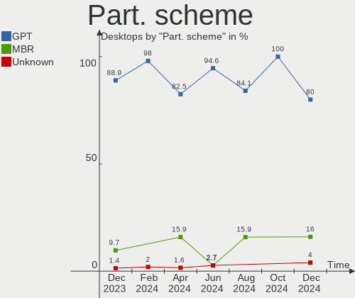
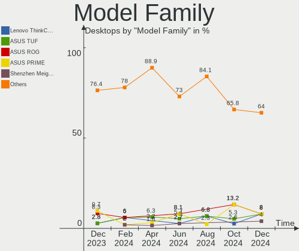
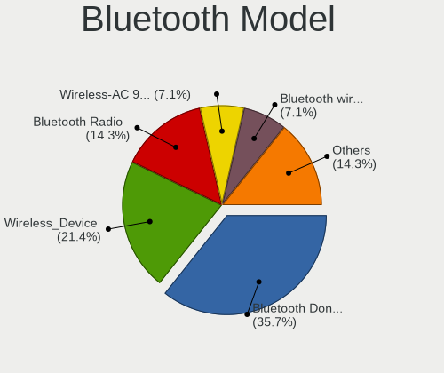

ArcoLinux Hardware Trends (Desktops)
------------------------------------

A project to identify most popular hardware characteristics and track their change
over time based on data collected by ArcoLinux users at https://Linux-Hardware.org.

Anyone can contribute to this report by the [hw-probe](https://github.com/linuxhw/hw-probe) tool:

    sudo -E hw-probe -all -upload

Full-feature report is available here: https://linux-hardware.org/?view=trends

Period: Mar, 2022.

Contents
--------

* [ System ](#system)
  - [ OS                       ](#os)
  - [ OS Family                ](#os-family)
  - [ Kernel                   ](#kernel)
  - [ Kernel Family            ](#kernel-family)
  - [ Kernel Major Ver.        ](#kernel-major-ver)
  - [ Arch                     ](#arch)
  - [ DE                       ](#de)
  - [ Display Server           ](#display-server)
  - [ Display Manager          ](#display-manager)
  - [ OS Lang                  ](#os-lang)
  - [ Boot Mode                ](#boot-mode)
  - [ Filesystem               ](#filesystem)
  - [ Part. scheme             ](#part-scheme)
  - [ Dual Boot with Linux/BSD ](#dual-boot-with-linuxbsd)
  - [ Dual Boot (Win)          ](#dual-boot-win)

* [ Board ](#board)
  - [ Vendor                   ](#vendor)
  - [ Model                    ](#model)
  - [ Model Family             ](#model-family)
  - [ MFG Year                 ](#mfg-year)
  - [ Form Factor              ](#form-factor)
  - [ Secure Boot              ](#secure-boot)
  - [ Coreboot                 ](#coreboot)
  - [ RAM Size                 ](#ram-size)
  - [ RAM Used                 ](#ram-used)
  - [ Total Drives             ](#total-drives)
  - [ Has CD-ROM               ](#has-cd-rom)
  - [ Has Ethernet             ](#has-ethernet)
  - [ Has WiFi                 ](#has-wifi)
  - [ Has Bluetooth            ](#has-bluetooth)

* [ Location ](#location)
  - [ Country                  ](#country)
  - [ City                     ](#city)

* [ Drives ](#drives)
  - [ Drive Vendor             ](#drive-vendor)
  - [ Drive Model              ](#drive-model)
  - [ HDD Vendor               ](#hdd-vendor)
  - [ SSD Vendor               ](#ssd-vendor)
  - [ Drive Kind               ](#drive-kind)
  - [ Drive Connector          ](#drive-connector)
  - [ Drive Size               ](#drive-size)
  - [ Space Total              ](#space-total)
  - [ Space Used               ](#space-used)
  - [ Malfunc. Drives          ](#malfunc-drives)
  - [ Malfunc. Drive Vendor    ](#malfunc-drive-vendor)
  - [ Malfunc. HDD Vendor      ](#malfunc-hdd-vendor)
  - [ Malfunc. Drive Kind      ](#malfunc-drive-kind)
  - [ Failed Drives            ](#failed-drives)
  - [ Failed Drive Vendor      ](#failed-drive-vendor)
  - [ Drive Status             ](#drive-status)

* [ Storage controller ](#storage-controller)
  - [ Storage Vendor           ](#storage-vendor)
  - [ Storage Model            ](#storage-model)
  - [ Storage Kind             ](#storage-kind)

* [ Processor ](#processor)
  - [ CPU Vendor               ](#cpu-vendor)
  - [ CPU Model                ](#cpu-model)
  - [ CPU Model Family         ](#cpu-model-family)
  - [ CPU Cores                ](#cpu-cores)
  - [ CPU Sockets              ](#cpu-sockets)
  - [ CPU Threads              ](#cpu-threads)
  - [ CPU Op-Modes             ](#cpu-op-modes)
  - [ CPU Microcode            ](#cpu-microcode)
  - [ CPU Microarch            ](#cpu-microarch)

* [ Graphics ](#graphics)
  - [ GPU Vendor               ](#gpu-vendor)
  - [ GPU Model                ](#gpu-model)
  - [ GPU Combo                ](#gpu-combo)
  - [ GPU Driver               ](#gpu-driver)
  - [ GPU Memory               ](#gpu-memory)

* [ Monitor ](#monitor)
  - [ Monitor Vendor           ](#monitor-vendor)
  - [ Monitor Model            ](#monitor-model)
  - [ Monitor Resolution       ](#monitor-resolution)
  - [ Monitor Diagonal         ](#monitor-diagonal)
  - [ Monitor Width            ](#monitor-width)
  - [ Aspect Ratio             ](#aspect-ratio)
  - [ Monitor Area             ](#monitor-area)
  - [ Pixel Density            ](#pixel-density)
  - [ Multiple Monitors        ](#multiple-monitors)

* [ Network ](#network)
  - [ Net Controller Vendor    ](#net-controller-vendor)
  - [ Net Controller Model     ](#net-controller-model)
  - [ Wireless Vendor          ](#wireless-vendor)
  - [ Wireless Model           ](#wireless-model)
  - [ Ethernet Vendor          ](#ethernet-vendor)
  - [ Ethernet Model           ](#ethernet-model)
  - [ Net Controller Kind      ](#net-controller-kind)
  - [ Used Controller          ](#used-controller)
  - [ NICs                     ](#nics)
  - [ IPv6                     ](#ipv6)

* [ Bluetooth ](#bluetooth)
  - [ Bluetooth Vendor         ](#bluetooth-vendor)
  - [ Bluetooth Model          ](#bluetooth-model)

* [ Sound ](#sound)
  - [ Sound Vendor             ](#sound-vendor)
  - [ Sound Model              ](#sound-model)

* [ Memory ](#memory)
  - [ Memory Vendor            ](#memory-vendor)
  - [ Memory Model             ](#memory-model)
  - [ Memory Kind              ](#memory-kind)
  - [ Memory Form Factor       ](#memory-form-factor)
  - [ Memory Size              ](#memory-size)
  - [ Memory Speed             ](#memory-speed)

* [ Printers & scanners ](#printers--scanners)
  - [ Printer Vendor           ](#printer-vendor)
  - [ Printer Model            ](#printer-model)
  - [ Scanner Vendor           ](#scanner-vendor)
  - [ Scanner Model            ](#scanner-model)

* [ Camera ](#camera)
  - [ Camera Vendor            ](#camera-vendor)
  - [ Camera Model             ](#camera-model)

* [ Security ](#security)
  - [ Fingerprint Vendor       ](#fingerprint-vendor)
  - [ Fingerprint Model        ](#fingerprint-model)
  - [ Chipcard Vendor          ](#chipcard-vendor)
  - [ Chipcard Model           ](#chipcard-model)

* [ Unsupported ](#unsupported)
  - [ Unsupported Devices      ](#unsupported-devices)
  - [ Unsupported Device Types ](#unsupported-device-types)

System
------

OS
--

Installed operating systems

| Name              | Desktops | Percent |
|-------------------|----------|---------|
| ArcoLinux Rolling | 27       | 96.43%  |
| ArcoLinux         | 1        | 3.57%   |

OS Family
---------

OS without a version

| Name      | Desktops | Percent |
|-----------|----------|---------|
| ArcoLinux | 28       | 100%    |

Kernel
------

Version of the Linux kernel

| Version            | Desktops | Percent |
|--------------------|----------|---------|
| 5.16.11-arch1-1    | 4        | 14.29%  |
| 5.16.16-arch1-1    | 3        | 10.71%  |
| 5.16.16-zen1-1-zen | 2        | 7.14%   |
| 5.16.14-arch1-1    | 2        | 7.14%   |
| 5.16.13-arch1-1    | 2        | 7.14%   |
| 5.16.12-arch1-1    | 2        | 7.14%   |
| 5.15.26-1-lts      | 2        | 7.14%   |
| 5.15.10-arch1-1    | 2        | 7.14%   |
| 5.17.1-arch1-1     | 1        | 3.57%   |
| 5.16.15-zen1-1-zen | 1        | 3.57%   |
| 5.16.15-arch1-1    | 1        | 3.57%   |
| 5.16.14-zen1-1-zen | 1        | 3.57%   |
| 5.16.12-zen1-1-zen | 1        | 3.57%   |
| 5.16.12-lqx1-1-lqx | 1        | 3.57%   |
| 5.16.11-AMD-znver2 | 1        | 3.57%   |
| 5.15.32-1-lts      | 1        | 3.57%   |
| 5.15.31-1-lts      | 1        | 3.57%   |

Kernel Family
-------------

Linux kernel without a distro release

| Version | Desktops | Percent |
|---------|----------|---------|
| 5.16.16 | 5        | 17.86%  |
| 5.16.11 | 5        | 17.86%  |
| 5.16.12 | 4        | 14.29%  |
| 5.16.14 | 3        | 10.71%  |
| 5.16.15 | 2        | 7.14%   |
| 5.16.13 | 2        | 7.14%   |
| 5.15.26 | 2        | 7.14%   |
| 5.15.10 | 2        | 7.14%   |
| 5.17.1  | 1        | 3.57%   |
| 5.15.32 | 1        | 3.57%   |
| 5.15.31 | 1        | 3.57%   |

Kernel Major Ver.
-----------------

Linux kernel major version

| Version | Desktops | Percent |
|---------|----------|---------|
| 5.16    | 21       | 75%     |
| 5.15    | 6        | 21.43%  |
| 5.17    | 1        | 3.57%   |

Arch
----

OS architecture (x86_64, i586, etc.)

| Name   | Desktops | Percent |
|--------|----------|---------|
| x86_64 | 28       | 100%    |

DE
--

Desktop Environment

| Name       | Desktops | Percent |
|------------|----------|---------|
| KDE5       | 7        | 25%     |
| XFCE       | 6        | 21.43%  |
| xmonad     | 3        | 10.71%  |
| X-Cinnamon | 2        | 7.14%   |
| i3         | 2        | 7.14%   |
| awesome    | 2        | 7.14%   |
| LeftWM     | 1        | 3.57%   |
| GNOME      | 1        | 3.57%   |
| dwm        | 1        | 3.57%   |
| Cutefish   | 1        | 3.57%   |
| Cinnamon   | 1        | 3.57%   |
| bspwm      | 1        | 3.57%   |

Display Server
--------------

X11 or Wayland

| Name    | Desktops | Percent |
|---------|----------|---------|
| X11     | 25       | 89.29%  |
| Tty     | 2        | 7.14%   |
| Wayland | 1        | 3.57%   |

Display Manager
---------------

SDDM, LightDM, etc.

| Name    | Desktops | Percent |
|---------|----------|---------|
| SDDM    | 20       | 71.43%  |
| LightDM | 6        | 21.43%  |
| GDM     | 1        | 3.57%   |
| Unknown | 1        | 3.57%   |

OS Lang
-------

Language

| Lang  | Desktops | Percent |
|-------|----------|---------|
| en_US | 21       | 75%     |
| es_ES | 2        | 7.14%   |
| sv_SE | 1        | 3.57%   |
| pl_PL | 1        | 3.57%   |
| nl_NL | 1        | 3.57%   |
| es_AR | 1        | 3.57%   |
| en_GB | 1        | 3.57%   |

Boot Mode
---------

EFI or BIOS

| Mode | Desktops | Percent |
|------|----------|---------|
| EFI  | 23       | 82.14%  |
| BIOS | 5        | 17.86%  |

Filesystem
----------

Type of filesystem

| Type    | Desktops | Percent |
|---------|----------|---------|
| Ext4    | 19       | 67.86%  |
| Btrfs   | 7        | 25%     |
| Overlay | 2        | 7.14%   |

Part. scheme
------------

Scheme of partitioning

| Type    | Desktops | Percent |
|---------|----------|---------|
| GPT     | 25       | 89.29%  |
| MBR     | 2        | 7.14%   |
| Unknown | 1        | 3.57%   |

Dual Boot with Linux/BSD
------------------------

Hosting more than one Linux/BSD

| Dual boot | Desktops | Percent |
|-----------|----------|---------|
| No        | 17       | 60.71%  |
| Yes       | 11       | 39.29%  |

Dual Boot (Win)
---------------

Hosting Linux and Windows

| Dual boot | Desktops | Percent |
|-----------|----------|---------|
| No        | 18       | 64.29%  |
| Yes       | 10       | 35.71%  |

Board
-----

Vendor
------

Motherboard manufacturer

| Name                | Desktops | Percent |
|---------------------|----------|---------|
| MSI                 | 6        | 21.43%  |
| ASUSTek Computer    | 6        | 21.43%  |
| ASRock              | 4        | 14.29%  |
| Gigabyte Technology | 3        | 10.71%  |
| Supermicro          | 2        | 7.14%   |
| Dell                | 2        | 7.14%   |
| Intel               | 1        | 3.57%   |
| Hewlett-Packard     | 1        | 3.57%   |
| Biostar             | 1        | 3.57%   |
| Acer                | 1        | 3.57%   |
| Unknown             | 1        | 3.57%   |

Model
-----

Motherboard model

| Name                            | Desktops | Percent |
|---------------------------------|----------|---------|
| MSI MS-7B98                     | 2        | 7.14%   |
| Unknown                         | 2        | 7.14%   |
| Supermicro SYS-E100-9AP         | 1        | 3.57%   |
| Supermicro SYS-5019A-FTN4       | 1        | 3.57%   |
| MSI MS-7B89                     | 1        | 3.57%   |
| MSI MS-7B86                     | 1        | 3.57%   |
| MSI MS-7A34                     | 1        | 3.57%   |
| MSI MS-7978                     | 1        | 3.57%   |
| HP Desktop M01-F0xxx            | 1        | 3.57%   |
| Gigabyte X570 GAMING X          | 1        | 3.57%   |
| Gigabyte AB350N-Gaming WIFI     | 1        | 3.57%   |
| Gigabyte A520M H                | 1        | 3.57%   |
| Dell OptiPlex 7050              | 1        | 3.57%   |
| Dell OptiPlex 7020              | 1        | 3.57%   |
| Biostar J3060NH                 | 1        | 3.57%   |
| ASUS ROG STRIX B550-F GAMING    | 1        | 3.57%   |
| ASUS PRIME Z490-A               | 1        | 3.57%   |
| ASUS PRIME X570-P               | 1        | 3.57%   |
| ASUS P8Z77-V LE                 | 1        | 3.57%   |
| ASUS CM6870                     | 1        | 3.57%   |
| ASUS 1145991                    | 1        | 3.57%   |
| ASRock Z87 Professional         | 1        | 3.57%   |
| ASRock X399 Taichi              | 1        | 3.57%   |
| ASRock B550 Phantom Gaming 4/ac | 1        | 3.57%   |
| ASRock B450M Steel Legend       | 1        | 3.57%   |
| Acer Predator G3-710            | 1        | 3.57%   |

Model Family
------------

Motherboard model prefix

| Name                      | Desktops | Percent |
|---------------------------|----------|---------|
| MSI MS-7B98               | 2        | 7.14%   |
| Dell OptiPlex             | 2        | 7.14%   |
| ASUS PRIME                | 2        | 7.14%   |
| Unknown                   | 2        | 7.14%   |
| Supermicro SYS-E100-9AP   | 1        | 3.57%   |
| Supermicro SYS-5019A-FTN4 | 1        | 3.57%   |
| MSI MS-7B89               | 1        | 3.57%   |
| MSI MS-7B86               | 1        | 3.57%   |
| MSI MS-7A34               | 1        | 3.57%   |
| MSI MS-7978               | 1        | 3.57%   |
| HP Desktop                | 1        | 3.57%   |
| Gigabyte X570             | 1        | 3.57%   |
| Gigabyte AB350N-Gaming    | 1        | 3.57%   |
| Gigabyte A520M            | 1        | 3.57%   |
| Biostar J3060NH           | 1        | 3.57%   |
| ASUS ROG                  | 1        | 3.57%   |
| ASUS P8Z77-V              | 1        | 3.57%   |
| ASUS CM6870               | 1        | 3.57%   |
| ASUS 1145991              | 1        | 3.57%   |
| ASRock Z87                | 1        | 3.57%   |
| ASRock X399               | 1        | 3.57%   |
| ASRock B550               | 1        | 3.57%   |
| ASRock B450M              | 1        | 3.57%   |
| Acer Predator             | 1        | 3.57%   |

MFG Year
--------

Motherboard manufacture year

| Year | Desktops | Percent |
|------|----------|---------|
| 2019 | 6        | 21.43%  |
| 2020 | 5        | 17.86%  |
| 2015 | 5        | 17.86%  |
| 2018 | 4        | 14.29%  |
| 2017 | 3        | 10.71%  |
| 2021 | 2        | 7.14%   |
| 2012 | 2        | 7.14%   |
| 2016 | 1        | 3.57%   |

Form Factor
-----------

Physical design of the computer

| Name    | Desktops | Percent |
|---------|----------|---------|
| Desktop | 28       | 100%    |

Secure Boot
-----------

Enabled or disabled

| State    | Desktops | Percent |
|----------|----------|---------|
| Disabled | 28       | 100%    |

Coreboot
--------

Have coreboot on board

| Used | Desktops | Percent |
|------|----------|---------|
| No   | 28       | 100%    |

RAM Size
--------

Total RAM memory

| Size in GB  | Desktops | Percent |
|-------------|----------|---------|
| 32.01-64.0  | 8        | 28.57%  |
| 16.01-24.0  | 7        | 25%     |
| 8.01-16.0   | 6        | 21.43%  |
| 4.01-8.0    | 3        | 10.71%  |
| 24.01-32.0  | 3        | 10.71%  |
| 64.01-256.0 | 1        | 3.57%   |

RAM Used
--------

Used RAM memory

| Used GB   | Desktops | Percent |
|-----------|----------|---------|
| 2.01-3.0  | 9        | 32.14%  |
| 4.01-8.0  | 6        | 21.43%  |
| 3.01-4.0  | 6        | 21.43%  |
| 1.01-2.0  | 2        | 7.14%   |
| 8.01-16.0 | 2        | 7.14%   |
| 0.51-1.0  | 2        | 7.14%   |
| 0.01-0.5  | 1        | 3.57%   |

Total Drives
------------

Number of drives on board

| Drives | Desktops | Percent |
|--------|----------|---------|
| 2      | 10       | 35.71%  |
| 1      | 8        | 28.57%  |
| 3      | 5        | 17.86%  |
| 4      | 3        | 10.71%  |
| 8      | 1        | 3.57%   |
| 6      | 1        | 3.57%   |

Has CD-ROM
----------

Has CD-ROM on board

| Presented | Desktops | Percent |
|-----------|----------|---------|
| No        | 21       | 75%     |
| Yes       | 7        | 25%     |

Has Ethernet
------------

Has Ethernet on board

| Presented | Desktops | Percent |
|-----------|----------|---------|
| Yes       | 28       | 100%    |

Has WiFi
--------

Has WiFi module

| Presented | Desktops | Percent |
|-----------|----------|---------|
| No        | 15       | 53.57%  |
| Yes       | 13       | 46.43%  |

Has Bluetooth
-------------

Has Bluetooth module

| Presented | Desktops | Percent |
|-----------|----------|---------|
| No        | 18       | 64.29%  |
| Yes       | 10       | 35.71%  |

Location
--------

Country
-------

Geographic location (country)

| Country     | Desktops | Percent |
|-------------|----------|---------|
| USA         | 11       | 39.29%  |
| Sweden      | 2        | 7.14%   |
| Spain       | 2        | 7.14%   |
| Belgium     | 2        | 7.14%   |
| UK          | 1        | 3.57%   |
| Turkey      | 1        | 3.57%   |
| Poland      | 1        | 3.57%   |
| Netherlands | 1        | 3.57%   |
| Mexico      | 1        | 3.57%   |
| Kenya       | 1        | 3.57%   |
| Indonesia   | 1        | 3.57%   |
| Bulgaria    | 1        | 3.57%   |
| Barbados    | 1        | 3.57%   |
| Bangladesh  | 1        | 3.57%   |
| Argentina   | 1        | 3.57%   |

City
----

Geographic location (city)

| City        | Desktops | Percent |
|-------------|----------|---------|
| Lier        | 2        | 7.14%   |
| Durham      | 2        | 7.14%   |
| Chicago     | 2        | 7.14%   |
| Tucson      | 1        | 3.57%   |
| Seville     | 1        | 3.57%   |
| Sandviken   | 1        | 3.57%   |
| Saeffle     | 1        | 3.57%   |
| Portland    | 1        | 3.57%   |
| Plainfield  | 1        | 3.57%   |
| Novi Pazar  | 1        | 3.57%   |
| Nairobi     | 1        | 3.57%   |
| Mattoon     | 1        | 3.57%   |
| Lodz        | 1        | 3.57%   |
| Jakarta     | 1        | 3.57%   |
| Haarlem     | 1        | 3.57%   |
| Dudley      | 1        | 3.57%   |
| Dhaka       | 1        | 3.57%   |
| Denizli     | 1        | 3.57%   |
| Córdoba    | 1        | 3.57%   |
| Brooklyn    | 1        | 3.57%   |
| Bridgetown  | 1        | 3.57%   |
| Baton Rouge | 1        | 3.57%   |
| Barcelona   | 1        | 3.57%   |
| Atlanta     | 1        | 3.57%   |
| Apodaca     | 1        | 3.57%   |

Drives
------

Drive Vendor
------------

Hard drive vendors

| Vendor              | Desktops | Drives | Percent |
|---------------------|----------|--------|---------|
| WDC                 | 11       | 13     | 18.64%  |
| Seagate             | 9        | 12     | 15.25%  |
| Samsung Electronics | 8        | 11     | 13.56%  |
| Crucial             | 5        | 6      | 8.47%   |
| Toshiba             | 4        | 5      | 6.78%   |
| SanDisk             | 4        | 4      | 6.78%   |
| Kingston            | 3        | 3      | 5.08%   |
| SPCC                | 2        | 2      | 3.39%   |
| XPG                 | 1        | 1      | 1.69%   |
| Unknown             | 1        | 1      | 1.69%   |
| Transcend           | 1        | 1      | 1.69%   |
| Phison Electronics  | 1        | 1      | 1.69%   |
| Phison              | 1        | 1      | 1.69%   |
| LITEON              | 1        | 1      | 1.69%   |
| Intel               | 1        | 1      | 1.69%   |
| HS-SSD-C100         | 1        | 1      | 1.69%   |
| HGST                | 1        | 1      | 1.69%   |
| Gigabyte Technology | 1        | 1      | 1.69%   |
| Drevo               | 1        | 1      | 1.69%   |
| Corsair             | 1        | 1      | 1.69%   |
| ASMedia             | 1        | 1      | 1.69%   |

Drive Model
-----------

Hard drive models

| Model                                       | Desktops | Percent |
|---------------------------------------------|----------|---------|
| Crucial CT1000P1SSD8 1TB                    | 3        | 4.55%   |
| Seagate ST2000DM008-2FR102 2TB              | 2        | 3.03%   |
| Seagate ST1000DM003-1SB102 1TB              | 2        | 3.03%   |
| SanDisk SSD PLUS 240GB                      | 2        | 3.03%   |
| Samsung SSD 970 EVO Plus 500GB              | 2        | 3.03%   |
| Samsung SSD 840 EVO 120GB                   | 2        | 3.03%   |
| XPG GAMMIX S11 Pro 256GB                    | 1        | 1.52%   |
| WDC WDS500G2B0B-00YS70 500GB SSD            | 1        | 1.52%   |
| WDC WDS500G2B0A-00SM50 500GB SSD            | 1        | 1.52%   |
| WDC WDS100T2B0C 1TB                         | 1        | 1.52%   |
| WDC WDBNCE5000PNC 500GB SSD                 | 1        | 1.52%   |
| WDC WD7500BPVT-55HXZT4 752GB                | 1        | 1.52%   |
| WDC WD5000AAKX-603CA0 500GB                 | 1        | 1.52%   |
| WDC WD40EFRX-68N32N0 4TB                    | 1        | 1.52%   |
| WDC WD10EZRX-00D8PB0 1TB                    | 1        | 1.52%   |
| WDC WD10EZEX-08WN4A0 1TB                    | 1        | 1.52%   |
| WDC WD10EZEX-00WN4A0 1TB                    | 1        | 1.52%   |
| WDC WD10EUCX-63YZ1Y0 1TB                    | 1        | 1.52%   |
| WDC WD10EARX-00N0YB0 1TB                    | 1        | 1.52%   |
| Unknown SD/MMC/MS PRO 32GB                  | 1        | 1.52%   |
| Transcend TS480GSSD220S 480GB               | 1        | 1.52%   |
| Toshiba TR150 120GB SSD                     | 1        | 1.52%   |
| Toshiba KXG60ZNV1T02 1TB                    | 1        | 1.52%   |
| Toshiba HDWD110 1TB                         | 1        | 1.52%   |
| Toshiba DT01ACA200 2TB                      | 1        | 1.52%   |
| SPCC Solid State Disk 256GB                 | 1        | 1.52%   |
| SPCC M.2 PCIe SSD 512GB                     | 1        | 1.52%   |
| Seagate ST330006 51NS 3TB                   | 1        | 1.52%   |
| Seagate ST32000542AS 2TB                    | 1        | 1.52%   |
| Seagate ST31000524AS 1TB                    | 1        | 1.52%   |
| Seagate ST3000DM001-1CH166 3TB              | 1        | 1.52%   |
| Seagate ST3000DM 001-1E6166 3TB             | 1        | 1.52%   |
| Seagate ST1000DM010-2EP102 1TB              | 1        | 1.52%   |
| Seagate FireCuda 510 SSD ZP500GM30021 500GB | 1        | 1.52%   |
| Seagate Expansion HDD 5TB                   | 1        | 1.52%   |
| SanDisk SDSSDA480G 480GB                    | 1        | 1.52%   |
| Sandisk NVMe SSD Drive 500GB                | 1        | 1.52%   |
| Samsung SSD 870 QVO 2TB                     | 1        | 1.52%   |
| Samsung SSD 870 EVO 250GB                   | 1        | 1.52%   |
| Samsung SSD 860 EVO 500GB                   | 1        | 1.52%   |
| Samsung SSD 860 EVO 250GB                   | 1        | 1.52%   |
| Samsung SSD 850 EVO 1TB                     | 1        | 1.52%   |
| Samsung SSD 840 EVO 250GB                   | 1        | 1.52%   |
| Samsung HD204UI 2TB                         | 1        | 1.52%   |
| Phison Viper M.2 VPN100 1TB                 | 1        | 1.52%   |
| Phison PCIe SSD 256GB                       | 1        | 1.52%   |
| LITEON CV1-8B256 256GB SSD                  | 1        | 1.52%   |
| Kingston SA400S37240G 240GB SSD             | 1        | 1.52%   |
| Kingston SA400S37120G 120GB SSD             | 1        | 1.52%   |
| Kingston SA400M8240G 240GB SSD              | 1        | 1.52%   |
| Intel SSDPEKNW010T8 1TB                     | 1        | 1.52%   |
| HS-SSD-C100 SSD 240G                        | 1        | 1.52%   |
| HGST HTS721010A9 1TB                        | 1        | 1.52%   |
| Gigabyte GP-ASM2NE2512GTTDR 512GB           | 1        | 1.52%   |
| Drevo X1 pro 480G SSD                       | 1        | 1.52%   |
| Crucial CT500MX500SSD1 500GB                | 1        | 1.52%   |
| Crucial CT250MX500SSD1 250GB                | 1        | 1.52%   |
| Corsair Force MP510 480GB                   | 1        | 1.52%   |
| ASMedia AS2115 240GB                        | 1        | 1.52%   |

HDD Vendor
----------

Hard disk drive vendors

| Vendor              | Desktops | Drives | Percent |
|---------------------|----------|--------|---------|
| Seagate             | 9        | 11     | 39.13%  |
| WDC                 | 8        | 9      | 34.78%  |
| Toshiba             | 2        | 3      | 8.7%    |
| Unknown             | 1        | 1      | 4.35%   |
| Samsung Electronics | 1        | 1      | 4.35%   |
| HGST                | 1        | 1      | 4.35%   |
| ASMedia             | 1        | 1      | 4.35%   |

SSD Vendor
----------

Solid state drive vendors

| Vendor              | Desktops | Drives | Percent |
|---------------------|----------|--------|---------|
| Samsung Electronics | 7        | 8      | 29.17%  |
| WDC                 | 3        | 3      | 12.5%   |
| SanDisk             | 3        | 3      | 12.5%   |
| Kingston            | 3        | 3      | 12.5%   |
| Crucial             | 2        | 2      | 8.33%   |
| Transcend           | 1        | 1      | 4.17%   |
| Toshiba             | 1        | 1      | 4.17%   |
| SPCC                | 1        | 1      | 4.17%   |
| LITEON              | 1        | 1      | 4.17%   |
| HS-SSD-C100         | 1        | 1      | 4.17%   |
| Drevo               | 1        | 1      | 4.17%   |

Drive Kind
----------

HDD or SSD

| Kind | Desktops | Drives | Percent |
|------|----------|--------|---------|
| SSD  | 20       | 25     | 40%     |
| HDD  | 17       | 27     | 34%     |
| NVMe | 13       | 17     | 26%     |

Drive Connector
---------------

SATA, SAS, NVMe, etc.

| Type | Desktops | Drives | Percent |
|------|----------|--------|---------|
| SATA | 23       | 47     | 60.53%  |
| NVMe | 13       | 17     | 34.21%  |
| SAS  | 2        | 5      | 5.26%   |

Drive Size
----------

Size of hard drive

| Size in TB | Desktops | Drives | Percent |
|------------|----------|--------|---------|
| 0.01-0.5   | 19       | 26     | 45.24%  |
| 0.51-1.0   | 13       | 13     | 30.95%  |
| 1.01-2.0   | 6        | 7      | 14.29%  |
| 2.01-3.0   | 2        | 3      | 4.76%   |
| 3.01-4.0   | 1        | 2      | 2.38%   |
| 4.01-10.0  | 1        | 1      | 2.38%   |

Space Total
-----------

Amount of disk space available on the file system

| Size in GB     | Desktops | Percent |
|----------------|----------|---------|
| 1001-2000      | 8        | 28.57%  |
| 501-1000       | 7        | 25%     |
| More than 3000 | 5        | 17.86%  |
| 251-500        | 5        | 17.86%  |
| 2001-3000      | 1        | 3.57%   |
| 101-250        | 1        | 3.57%   |
| 1-20           | 1        | 3.57%   |

Space Used
----------

Amount of used disk space

| Used GB        | Desktops | Percent |
|----------------|----------|---------|
| 101-250        | 6        | 21.43%  |
| 251-500        | 5        | 17.86%  |
| 21-50          | 5        | 17.86%  |
| 501-1000       | 5        | 17.86%  |
| 51-100         | 3        | 10.71%  |
| More than 3000 | 2        | 7.14%   |
| 1-20           | 2        | 7.14%   |

Malfunc. Drives
---------------

Drive models with a malfunction

| Model                                 | Desktops | Drives | Percent |
|---------------------------------------|----------|--------|---------|
| WDC WD7500BPVT-55HXZT4 752GB          | 1        | 1      | 11.11%  |
| WDC WD5000AAKX-603CA0 500GB           | 1        | 1      | 11.11%  |
| WDC WD40EFRX-68N32N0 4TB              | 1        | 2      | 11.11%  |
| WDC WD10EZEX-00WN4A0 1TB              | 1        | 1      | 11.11%  |
| Toshiba DT01ACA200 2TB                | 1        | 2      | 11.11%  |
| Samsung Electronics SSD 840 EVO 120GB | 1        | 1      | 11.11%  |
| HGST HTS721010A9 1TB                  | 1        | 1      | 11.11%  |
| Drevo X1 pro 480G SSD                 | 1        | 1      | 11.11%  |
| ASMedia AS2115 240GB                  | 1        | 1      | 11.11%  |

Malfunc. Drive Vendor
---------------------

Vendors of faulty drives

| Vendor              | Desktops | Drives | Percent |
|---------------------|----------|--------|---------|
| WDC                 | 4        | 5      | 44.44%  |
| Toshiba             | 1        | 2      | 11.11%  |
| Samsung Electronics | 1        | 1      | 11.11%  |
| HGST                | 1        | 1      | 11.11%  |
| Drevo               | 1        | 1      | 11.11%  |
| ASMedia             | 1        | 1      | 11.11%  |

Malfunc. HDD Vendor
-------------------

Vendors of faulty HDD drives

| Vendor  | Desktops | Drives | Percent |
|---------|----------|--------|---------|
| WDC     | 4        | 5      | 57.14%  |
| Toshiba | 1        | 2      | 14.29%  |
| HGST    | 1        | 1      | 14.29%  |
| ASMedia | 1        | 1      | 14.29%  |

Malfunc. Drive Kind
-------------------

Kinds of faulty drives

| Kind | Desktops | Drives | Percent |
|------|----------|--------|---------|
| HDD  | 7        | 9      | 77.78%  |
| SSD  | 2        | 2      | 22.22%  |

Failed Drives
-------------

Failed drive models

Zero info for selected period =(

Failed Drive Vendor
-------------------

Failed drive vendors

Zero info for selected period =(

Drive Status
------------

Number of failed and malfunc. drives

| Status   | Desktops | Drives | Percent |
|----------|----------|--------|---------|
| Works    | 26       | 52     | 68.42%  |
| Malfunc  | 9        | 11     | 23.68%  |
| Detected | 3        | 6      | 7.89%   |

Storage controller
------------------

Storage Vendor
--------------

Storage controller vendors

| Vendor                       | Desktops | Percent |
|------------------------------|----------|---------|
| Intel                        | 16       | 34.78%  |
| AMD                          | 13       | 28.26%  |
| Phison Electronics           | 5        | 10.87%  |
| Micron/Crucial Technology    | 3        | 6.52%   |
| Sandisk                      | 2        | 4.35%   |
| Samsung Electronics          | 2        | 4.35%   |
| Toshiba America Info Systems | 1        | 2.17%   |
| Seagate Technology           | 1        | 2.17%   |
| Marvell Technology Group     | 1        | 2.17%   |
| ASMedia Technology           | 1        | 2.17%   |
| ADATA Technology             | 1        | 2.17%   |

Storage Model
-------------

Storage controller models

| Model                                                                            | Desktops | Percent |
|----------------------------------------------------------------------------------|----------|---------|
| AMD FCH SATA Controller [AHCI mode]                                              | 8        | 14.55%  |
| Phison E12 NVMe Controller                                                       | 5        | 9.09%   |
| AMD 400 Series Chipset SATA Controller                                           | 5        | 9.09%   |
| Micron/Crucial NVMe Controller                                                   | 3        | 5.45%   |
| AMD 500 Series Chipset SATA Controller                                           | 3        | 5.45%   |
| Sandisk WD Blue SN550 NVMe SSD                                                   | 2        | 3.64%   |
| Samsung NVMe SSD Controller SM981/PM981/PM983                                    | 2        | 3.64%   |
| Intel Q170/Q150/B150/H170/H110/Z170/CM236 Chipset SATA Controller [AHCI Mode]    | 2        | 3.64%   |
| Intel Cannon Lake PCH SATA AHCI Controller                                       | 2        | 3.64%   |
| Intel 8 Series/C220 Series Chipset Family 6-port SATA Controller 1 [AHCI mode]   | 2        | 3.64%   |
| Intel 7 Series/C210 Series Chipset Family 6-port SATA Controller [AHCI mode]     | 2        | 3.64%   |
| AMD 300 Series Chipset SATA Controller                                           | 2        | 3.64%   |
| Toshiba America Info Systems XG6 NVMe SSD Controller                             | 1        | 1.82%   |
| Seagate FireCuda 510 SSD                                                         | 1        | 1.82%   |
| Marvell Group 88SE9120 SATA 6Gb/s Controller                                     | 1        | 1.82%   |
| Intel SSD 660P Series                                                            | 1        | 1.82%   |
| Intel Comet Lake PCH-H RAID                                                      | 1        | 1.82%   |
| Intel Celeron N3350/Pentium N4200/Atom E3900 Series SATA AHCI Controller         | 1        | 1.82%   |
| Intel Atom/Celeron/Pentium Processor x5-E8000/J3xxx/N3xxx Series SATA Controller | 1        | 1.82%   |
| Intel Atom Processor C3000 Series SATA Controller 1                              | 1        | 1.82%   |
| Intel Atom Processor C3000 Series SATA Controller 0                              | 1        | 1.82%   |
| Intel 7 Series/C210 Series Chipset Family 4-port SATA Controller [IDE mode]      | 1        | 1.82%   |
| Intel 7 Series/C210 Series Chipset Family 2-port SATA Controller [IDE mode]      | 1        | 1.82%   |
| Intel 5 Series/3400 Series Chipset 4 port SATA IDE Controller                    | 1        | 1.82%   |
| Intel 5 Series/3400 Series Chipset 2 port SATA IDE Controller                    | 1        | 1.82%   |
| Intel 200 Series PCH SATA controller [AHCI mode]                                 | 1        | 1.82%   |
| ASMedia ASM1062 Serial ATA Controller                                            | 1        | 1.82%   |
| AMD X399 Series Chipset SATA Controller                                          | 1        | 1.82%   |
| ADATA XPG SX8200 Pro PCIe Gen3x4 M.2 2280 Solid State Drive                      | 1        | 1.82%   |

Storage Kind
------------

Kind of storage controller (IDE, SATA, NVMe, SAS, ...)

| Kind | Desktops | Percent |
|------|----------|---------|
| SATA | 25       | 60.98%  |
| NVMe | 13       | 31.71%  |
| IDE  | 2        | 4.88%   |
| RAID | 1        | 2.44%   |

Processor
---------

CPU Vendor
----------

Processor vendors

| Vendor | Desktops | Percent |
|--------|----------|---------|
| Intel  | 15       | 53.57%  |
| AMD    | 13       | 46.43%  |

CPU Model
---------

Processor models

| Model                                          | Desktops | Percent |
|------------------------------------------------|----------|---------|
| AMD Ryzen 5 3600 6-Core Processor              | 3        | 10.71%  |
| Intel Core i5-9400F CPU @ 2.90GHz              | 2        | 7.14%   |
| Intel Core i5-6500 CPU @ 3.20GHz               | 2        | 7.14%   |
| AMD Ryzen 7 3700X 8-Core Processor             | 2        | 7.14%   |
| Intel Xeon CPU E5-2689 0 @ 2.60GHz             | 1        | 3.57%   |
| Intel Core i7-6700 CPU @ 3.40GHz               | 1        | 3.57%   |
| Intel Core i7-4790S CPU @ 3.20GHz              | 1        | 3.57%   |
| Intel Core i7-3770K CPU @ 3.50GHz              | 1        | 3.57%   |
| Intel Core i7-3770 CPU @ 3.40GHz               | 1        | 3.57%   |
| Intel Core i7-10700K CPU @ 3.80GHz             | 1        | 3.57%   |
| Intel Core i5-4590 CPU @ 3.30GHz               | 1        | 3.57%   |
| Intel Core i5 CPU 650 @ 3.20GHz                | 1        | 3.57%   |
| Intel Celeron CPU J3060 @ 1.60GHz              | 1        | 3.57%   |
| Intel Atom Processor E3940 @ 1.60GHz           | 1        | 3.57%   |
| Intel Atom CPU C3758 @ 2.20GHz                 | 1        | 3.57%   |
| AMD Ryzen Threadripper 2950X 16-Core Processor | 1        | 3.57%   |
| AMD Ryzen 9 3900X 12-Core Processor            | 1        | 3.57%   |
| AMD Ryzen 5 5600X 6-Core Processor             | 1        | 3.57%   |
| AMD Ryzen 5 3400G with Radeon Vega Graphics    | 1        | 3.57%   |
| AMD Ryzen 5 2600X Six-Core Processor           | 1        | 3.57%   |
| AMD Ryzen 5 1600 Six-Core Processor            | 1        | 3.57%   |
| AMD Ryzen 3 3200G with Radeon Vega Graphics    | 1        | 3.57%   |
| AMD Ryzen 3 2200G with Radeon Vega Graphics    | 1        | 3.57%   |

CPU Model Family
----------------

Processor model prefix

| Model                  | Desktops | Percent |
|------------------------|----------|---------|
| AMD Ryzen 5            | 7        | 25%     |
| Intel Core i5          | 6        | 21.43%  |
| Intel Core i7          | 5        | 17.86%  |
| Intel Atom             | 2        | 7.14%   |
| AMD Ryzen 7            | 2        | 7.14%   |
| AMD Ryzen 3            | 2        | 7.14%   |
| Intel Xeon             | 1        | 3.57%   |
| Intel Celeron          | 1        | 3.57%   |
| AMD Ryzen Threadripper | 1        | 3.57%   |
| AMD Ryzen 9            | 1        | 3.57%   |

CPU Cores
---------

Number of processor cores

| Number | Desktops | Percent |
|--------|----------|---------|
| 4      | 11       | 39.29%  |
| 6      | 8        | 28.57%  |
| 8      | 5        | 17.86%  |
| 2      | 2        | 7.14%   |
| 16     | 1        | 3.57%   |
| 12     | 1        | 3.57%   |

CPU Sockets
-----------

Number of sockets

| Number | Desktops | Percent |
|--------|----------|---------|
| 1      | 28       | 100%    |

CPU Threads
-----------

Threads per core (Hyper-Threading)

| Number | Desktops | Percent |
|--------|----------|---------|
| 2      | 18       | 64.29%  |
| 1      | 10       | 35.71%  |

CPU Op-Modes
------------

CPU Operation Modes (32-bit, 64-bit)

| Op mode        | Desktops | Percent |
|----------------|----------|---------|
| 32-bit, 64-bit | 28       | 100%    |

CPU Microcode
-------------

Microcode number

| Number     | Desktops | Percent |
|------------|----------|---------|
| 0x506e3    | 3        | 10.71%  |
| 0x08701021 | 3        | 10.71%  |
| 0x906ea    | 2        | 7.14%   |
| 0x306c3    | 2        | 7.14%   |
| 0x306a9    | 2        | 7.14%   |
| 0x08108109 | 2        | 7.14%   |
| 0xa0655    | 1        | 3.57%   |
| 0x506f1    | 1        | 3.57%   |
| 0x506c9    | 1        | 3.57%   |
| 0x406c4    | 1        | 3.57%   |
| 0x206d7    | 1        | 3.57%   |
| 0x20655    | 1        | 3.57%   |
| 0x0a201016 | 1        | 3.57%   |
| 0x08701013 | 1        | 3.57%   |
| 0x08701012 | 1        | 3.57%   |
| 0x08101016 | 1        | 3.57%   |
| 0x0800820d | 1        | 3.57%   |
| 0x0800820b | 1        | 3.57%   |
| 0x08001137 | 1        | 3.57%   |
| Unknown    | 1        | 3.57%   |

CPU Microarch
-------------

Microarchitecture

| Name        | Desktops | Percent |
|-------------|----------|---------|
| Zen 2       | 6        | 21.43%  |
| Zen+        | 4        | 14.29%  |
| Skylake     | 3        | 10.71%  |
| Zen         | 2        | 7.14%   |
| KabyLake    | 2        | 7.14%   |
| IvyBridge   | 2        | 7.14%   |
| Haswell     | 2        | 7.14%   |
| Goldmont    | 2        | 7.14%   |
| Zen 3       | 1        | 3.57%   |
| Westmere    | 1        | 3.57%   |
| Silvermont  | 1        | 3.57%   |
| SandyBridge | 1        | 3.57%   |
| CometLake   | 1        | 3.57%   |

Graphics
--------

GPU Vendor
----------

Vendors of graphics cards

| Vendor            | Desktops | Percent |
|-------------------|----------|---------|
| Nvidia            | 14       | 46.67%  |
| AMD               | 9        | 30%     |
| Intel             | 6        | 20%     |
| ASPEED Technology | 1        | 3.33%   |

GPU Model
---------

Graphics card models

| Model                                                                                    | Desktops | Percent |
|------------------------------------------------------------------------------------------|----------|---------|
| Nvidia GP108 [GeForce GT 1030]                                                           | 2        | 6.67%   |
| Nvidia GP106 [GeForce GTX 1060 6GB]                                                      | 2        | 6.67%   |
| Intel Xeon E3-1200 v3/4th Gen Core Processor Integrated Graphics Controller              | 2        | 6.67%   |
| AMD Picasso/Raven 2 [Radeon Vega Series / Radeon Vega Mobile Series]                     | 2        | 6.67%   |
| AMD Ellesmere [Radeon RX 470/480/570/570X/580/580X/590]                                  | 2        | 6.67%   |
| AMD Baffin [Radeon RX 460/560D / Pro 450/455/460/555/555X/560/560X]                      | 2        | 6.67%   |
| Nvidia TU116 [GeForce GTX 1660 Ti]                                                       | 1        | 3.33%   |
| Nvidia TU116 [GeForce GTX 1650 SUPER]                                                    | 1        | 3.33%   |
| Nvidia TU106 [GeForce RTX 2060 Rev. A]                                                   | 1        | 3.33%   |
| Nvidia TU104 [GeForce RTX 2070 SUPER]                                                    | 1        | 3.33%   |
| Nvidia TU102 [GeForce RTX 2080 Ti Rev. A]                                                | 1        | 3.33%   |
| Nvidia GP104 [GeForce GTX 1070]                                                          | 1        | 3.33%   |
| Nvidia GM204 [GeForce GTX 970]                                                           | 1        | 3.33%   |
| Nvidia GM107 [GeForce GTX 750 Ti]                                                        | 1        | 3.33%   |
| Nvidia GK208B [GeForce GT 710]                                                           | 1        | 3.33%   |
| Nvidia GA104 [GeForce RTX 3060 Ti]                                                       | 1        | 3.33%   |
| Intel IvyBridge GT2 [HD Graphics 4000]                                                   | 1        | 3.33%   |
| Intel HD Graphics 530                                                                    | 1        | 3.33%   |
| Intel HD Graphics 500                                                                    | 1        | 3.33%   |
| Intel Atom/Celeron/Pentium Processor x5-E8000/J3xxx/N3xxx Integrated Graphics Controller | 1        | 3.33%   |
| ASPEED Technology ASPEED Graphics Family                                                 | 1        | 3.33%   |
| AMD Raven Ridge [Radeon Vega Series / Radeon Vega Mobile Series]                         | 1        | 3.33%   |
| AMD Navi 10 [Radeon RX 5600 OEM/5600 XT / 5700/5700 XT]                                  | 1        | 3.33%   |
| AMD Lexa PRO [Radeon 540/540X/550/550X / RX 540X/550/550X]                               | 1        | 3.33%   |

GPU Combo
---------

Combinations of graphics cards

| Name           | Desktops | Percent |
|----------------|----------|---------|
| 1 x Nvidia     | 13       | 46.43%  |
| 1 x AMD        | 9        | 32.14%  |
| 1 x Intel      | 4        | 14.29%  |
| Intel + Nvidia | 1        | 3.57%   |
| 1 x ASPEED     | 1        | 3.57%   |

GPU Driver
----------

Free vs proprietary

| Driver      | Desktops | Percent |
|-------------|----------|---------|
| Free        | 15       | 53.57%  |
| Proprietary | 12       | 42.86%  |
| Unknown     | 1        | 3.57%   |

GPU Memory
----------

Total video memory

| Size in GB | Desktops | Percent |
|------------|----------|---------|
| 7.01-8.0   | 6        | 21.43%  |
| 1.01-2.0   | 6        | 21.43%  |
| Unknown    | 6        | 21.43%  |
| 3.01-4.0   | 5        | 17.86%  |
| 5.01-6.0   | 3        | 10.71%  |
| 8.01-16.0  | 1        | 3.57%   |
| 0.01-0.5   | 1        | 3.57%   |

Monitor
-------

Monitor Vendor
--------------

Monitor vendors

| Vendor               | Desktops | Percent |
|----------------------|----------|---------|
| BenQ                 | 5        | 15.63%  |
| Samsung Electronics  | 4        | 12.5%   |
| Acer                 | 4        | 12.5%   |
| Iiyama               | 3        | 9.38%   |
| Goldstar             | 3        | 9.38%   |
| Dell                 | 3        | 9.38%   |
| Vizio                | 1        | 3.13%   |
| VIE                  | 1        | 3.13%   |
| UTV                  | 1        | 3.13%   |
| Sceptre Tech         | 1        | 3.13%   |
| Mi                   | 1        | 3.13%   |
| Hewlett-Packard      | 1        | 3.13%   |
| Belinea              | 1        | 3.13%   |
| ASUSTek Computer     | 1        | 3.13%   |
| AOC                  | 1        | 3.13%   |
| Ancor Communications | 1        | 3.13%   |

Monitor Model
-------------

Monitor models

| Model                                                                 | Desktops | Percent |
|-----------------------------------------------------------------------|----------|---------|
| Samsung Electronics C49RG9x SAM0F99 3840x1080 1193x336mm 48.8-inch    | 2        | 5.88%   |
| BenQ GW2780 BNQ78E6 1920x1080 598x336mm 27.0-inch                     | 2        | 5.88%   |
| Acer V173 ACR0053 1280x1024 338x270mm 17.0-inch                       | 2        | 5.88%   |
| Vizio M322i-B1 VIZ1005 1920x1080 698x392mm 31.5-inch                  | 1        | 2.94%   |
| VIE LED MONITOR VIE2302 1920x1080 473x296mm 22.0-inch                 | 1        | 2.94%   |
| UTV MONITOR UTV0030 1920x1080 580x330mm 26.3-inch                     | 1        | 2.94%   |
| Sceptre Tech F27 SPT0ABF 1920x1080 409x230mm 18.5-inch                | 1        | 2.94%   |
| Samsung Electronics U32J59x SAM0F35 3840x2160 700x390mm 31.5-inch     | 1        | 2.94%   |
| Samsung Electronics S27D850 SAM0BC9 2560x1440 598x336mm 27.0-inch     | 1        | 2.94%   |
| Mi Monitor XMI23C3 1920x1080 530x290mm 23.8-inch                      | 1        | 2.94%   |
| Iiyama PLG2488H IVM6126 1920x1080 530x300mm 24.0-inch                 | 1        | 2.94%   |
| Iiyama PLE2483H IVM6113 1920x1080 531x299mm 24.0-inch                 | 1        | 2.94%   |
| Iiyama PL3271Q IVM761C 2560x1440 700x390mm 31.5-inch                  | 1        | 2.94%   |
| Iiyama PL2409HD IVM560C 1920x1080 521x293mm 23.5-inch                 | 1        | 2.94%   |
| Hewlett-Packard LE2202x HWP2966 1920x1080 476x268mm 21.5-inch         | 1        | 2.94%   |
| Goldstar LG HDR WFHD GSM7714 2560x1080 800x340mm 34.2-inch            | 1        | 2.94%   |
| Goldstar FULL HD GSM5ABB 1920x1080 480x270mm 21.7-inch                | 1        | 2.94%   |
| Goldstar 23MP55 GSM5A23 1920x1080 510x290mm 23.1-inch                 | 1        | 2.94%   |
| Dell SX2210 DELA046 1920x1080 477x268mm 21.5-inch                     | 1        | 2.94%   |
| Dell S2719DGF DELD0E6 2560x1440 600x340mm 27.2-inch                   | 1        | 2.94%   |
| Dell E2216H DELF068 1920x1080 476x268mm 21.5-inch                     | 1        | 2.94%   |
| Dell E2213H DELA08F 1920x1080 480x270mm 21.7-inch                     | 1        | 2.94%   |
| BenQ ZOWIE XL LCD BNQ7F3F 1920x1080 531x298mm 24.0-inch               | 1        | 2.94%   |
| BenQ RL2460H BNQ7F34 1920x1080 530x300mm 24.0-inch                    | 1        | 2.94%   |
| BenQ 241W BNQ76DB 1920x1200 520x330mm 24.2-inch                       | 1        | 2.94%   |
| Belinea 1705 S1 MAX06DA 1280x1024 337x270mm 17.0-inch                 | 1        | 2.94%   |
| ASUSTek Computer VP249 AUS24AF 1920x1080 527x296mm 23.8-inch          | 1        | 2.94%   |
| AOC Q2963 AOC2963 2560x1080 670x280mm 28.6-inch                       | 1        | 2.94%   |
| Ancor Communications ASUS VG27A ACI27C2 1920x1080 598x336mm 27.0-inch | 1        | 2.94%   |
| Acer XG270HU ACR0414 2560x1440 600x340mm 27.2-inch                    | 1        | 2.94%   |
| Acer LCD Monitor CP3271K P 3840x2160                                  | 1        | 2.94%   |

Monitor Resolution
------------------

Monitor screen resolution

| Resolution        | Desktops | Percent |
|-------------------|----------|---------|
| 1920x1080 (FHD)   | 14       | 46.67%  |
| 3840x2160 (4K)    | 4        | 13.33%  |
| 2560x1440 (QHD)   | 4        | 13.33%  |
| 3840x1080         | 2        | 6.67%   |
| 2560x1080         | 2        | 6.67%   |
| 1440x900 (WXGA+)  | 2        | 6.67%   |
| 1920x1200 (WUXGA) | 1        | 3.33%   |
| 1280x1024 (SXGA)  | 1        | 3.33%   |

Monitor Diagonal
----------------

Diagonal size in inches

| Inches  | Desktops | Percent |
|---------|----------|---------|
| 27      | 6        | 18.18%  |
| 24      | 5        | 15.15%  |
| 21      | 5        | 15.15%  |
| 31      | 3        | 9.09%   |
| 23      | 3        | 9.09%   |
| 48      | 2        | 6.06%   |
| 19      | 2        | 6.06%   |
| 84      | 1        | 3.03%   |
| 34      | 1        | 3.03%   |
| 32      | 1        | 3.03%   |
| 28      | 1        | 3.03%   |
| 22      | 1        | 3.03%   |
| 17      | 1        | 3.03%   |
| Unknown | 1        | 3.03%   |

Monitor Width
-------------

Physical width

| Width in mm | Desktops | Percent |
|-------------|----------|---------|
| 501-600     | 12       | 40%     |
| 401-500     | 7        | 23.33%  |
| 601-700     | 4        | 13.33%  |
| 701-800     | 2        | 6.67%   |
| 1001-1500   | 2        | 6.67%   |
| 301-350     | 1        | 3.33%   |
| 1501-2000   | 1        | 3.33%   |
| Unknown     | 1        | 3.33%   |

Aspect Ratio
------------

Proportional relationship between the width and the height

| Ratio   | Desktops | Percent |
|---------|----------|---------|
| 16/9    | 18       | 64.29%  |
| 16/10   | 4        | 14.29%  |
| 32/9    | 2        | 7.14%   |
| 21/9    | 2        | 7.14%   |
| 5/4     | 1        | 3.57%   |
| Unknown | 1        | 3.57%   |

Monitor Area
------------

Area in inch²

| Area in inch² | Desktops | Percent |
|----------------|----------|---------|
| 201-250        | 9        | 29.03%  |
| 301-350        | 6        | 19.35%  |
| 351-500        | 5        | 16.13%  |
| 151-200        | 4        | 12.9%   |
| 251-300        | 2        | 6.45%   |
| 501-1000       | 2        | 6.45%   |
| More than 1000 | 1        | 3.23%   |
| 141-150        | 1        | 3.23%   |
| Unknown        | 1        | 3.23%   |

Pixel Density
-------------

Pixels per inch

| Density | Desktops | Percent |
|---------|----------|---------|
| 51-100  | 18       | 64.29%  |
| 101-120 | 7        | 25%     |
| 121-160 | 2        | 7.14%   |
| Unknown | 1        | 3.57%   |

Multiple Monitors
-----------------

Total monitors connected

| Total | Desktops | Percent |
|-------|----------|---------|
| 1     | 17       | 60.71%  |
| 2     | 10       | 35.71%  |
| 0     | 1        | 3.57%   |

Network
-------

Net Controller Vendor
---------------------

Controller vendors

| Vendor                | Desktops | Percent |
|-----------------------|----------|---------|
| Realtek Semiconductor | 18       | 48.65%  |
| Intel                 | 14       | 37.84%  |
| TP-Link               | 1        | 2.7%    |
| Tenda                 | 1        | 2.7%    |
| Ralink                | 1        | 2.7%    |
| Qualcomm Atheros      | 1        | 2.7%    |
| D-Link System         | 1        | 2.7%    |

Net Controller Model
--------------------

Controller models

| Model                                                             | Desktops | Percent |
|-------------------------------------------------------------------|----------|---------|
| Realtek RTL8111/8168/8411 PCI Express Gigabit Ethernet Controller | 15       | 34.09%  |
| Realtek RTL810xE PCI Express Fast Ethernet controller             | 2        | 4.55%   |
| Realtek 802.11n                                                   | 2        | 4.55%   |
| Intel I211 Gigabit Network Connection                             | 2        | 4.55%   |
| Intel Ethernet Controller I225-V                                  | 2        | 4.55%   |
| Intel Dual Band Wireless-AC 3168NGW [Stone Peak]                  | 2        | 4.55%   |
| Intel 82576 Gigabit Network Connection                            | 2        | 4.55%   |
| TP-Link TL-WN823N v2/v3 [Realtek RTL8192EU]                       | 1        | 2.27%   |
| Tenda U12                                                         | 1        | 2.27%   |
| Realtek RTL8821CE 802.11ac PCIe Wireless Network Adapter          | 1        | 2.27%   |
| Realtek RTL8188EUS 802.11n Wireless Network Adapter               | 1        | 2.27%   |
| Ralink RT3090 Wireless 802.11n 1T/1R PCIe                         | 1        | 2.27%   |
| Qualcomm Atheros Killer E2400 Gigabit Ethernet Controller         | 1        | 2.27%   |
| Intel Wireless 8265 / 8275                                        | 1        | 2.27%   |
| Intel Wireless 8260                                               | 1        | 2.27%   |
| Intel Wireless 7265                                               | 1        | 2.27%   |
| Intel Wireless 3165                                               | 1        | 2.27%   |
| Intel I210 Gigabit Network Connection                             | 1        | 2.27%   |
| Intel Ethernet Connection X553 1GbE                               | 1        | 2.27%   |
| Intel Ethernet Connection I217-V                                  | 1        | 2.27%   |
| Intel Ethernet Connection I217-LM                                 | 1        | 2.27%   |
| Intel Ethernet Connection (7) I219-V                              | 1        | 2.27%   |
| Intel Ethernet Connection (5) I219-LM                             | 1        | 2.27%   |
| D-Link System DGE-528T Gigabit Ethernet Adapter                   | 1        | 2.27%   |

Wireless Vendor
---------------

Wireless vendors

| Vendor                | Desktops | Percent |
|-----------------------|----------|---------|
| Intel                 | 6        | 46.15%  |
| Realtek Semiconductor | 4        | 30.77%  |
| TP-Link               | 1        | 7.69%   |
| Tenda                 | 1        | 7.69%   |
| Ralink                | 1        | 7.69%   |

Wireless Model
--------------

Wireless models

| Model                                                    | Desktops | Percent |
|----------------------------------------------------------|----------|---------|
| Realtek 802.11n                                          | 2        | 15.38%  |
| Intel Dual Band Wireless-AC 3168NGW [Stone Peak]         | 2        | 15.38%  |
| TP-Link TL-WN823N v2/v3 [Realtek RTL8192EU]              | 1        | 7.69%   |
| Tenda U12                                                | 1        | 7.69%   |
| Realtek RTL8821CE 802.11ac PCIe Wireless Network Adapter | 1        | 7.69%   |
| Realtek RTL8188EUS 802.11n Wireless Network Adapter      | 1        | 7.69%   |
| Ralink RT3090 Wireless 802.11n 1T/1R PCIe                | 1        | 7.69%   |
| Intel Wireless 8265 / 8275                               | 1        | 7.69%   |
| Intel Wireless 8260                                      | 1        | 7.69%   |
| Intel Wireless 7265                                      | 1        | 7.69%   |
| Intel Wireless 3165                                      | 1        | 7.69%   |

Ethernet Vendor
---------------

Ethernet vendors

| Vendor                | Desktops | Percent |
|-----------------------|----------|---------|
| Realtek Semiconductor | 17       | 58.62%  |
| Intel                 | 10       | 34.48%  |
| Qualcomm Atheros      | 1        | 3.45%   |
| D-Link System         | 1        | 3.45%   |

Ethernet Model
--------------

Ethernet models

| Model                                                             | Desktops | Percent |
|-------------------------------------------------------------------|----------|---------|
| Realtek RTL8111/8168/8411 PCI Express Gigabit Ethernet Controller | 15       | 48.39%  |
| Realtek RTL810xE PCI Express Fast Ethernet controller             | 2        | 6.45%   |
| Intel I211 Gigabit Network Connection                             | 2        | 6.45%   |
| Intel Ethernet Controller I225-V                                  | 2        | 6.45%   |
| Intel 82576 Gigabit Network Connection                            | 2        | 6.45%   |
| Qualcomm Atheros Killer E2400 Gigabit Ethernet Controller         | 1        | 3.23%   |
| Intel I210 Gigabit Network Connection                             | 1        | 3.23%   |
| Intel Ethernet Connection X553 1GbE                               | 1        | 3.23%   |
| Intel Ethernet Connection I217-V                                  | 1        | 3.23%   |
| Intel Ethernet Connection I217-LM                                 | 1        | 3.23%   |
| Intel Ethernet Connection (7) I219-V                              | 1        | 3.23%   |
| Intel Ethernet Connection (5) I219-LM                             | 1        | 3.23%   |
| D-Link System DGE-528T Gigabit Ethernet Adapter                   | 1        | 3.23%   |

Net Controller Kind
-------------------

Ethernet, WiFi or modem

| Kind     | Desktops | Percent |
|----------|----------|---------|
| Ethernet | 28       | 68.29%  |
| WiFi     | 13       | 31.71%  |

Used Controller
---------------

Currently used network controller

| Kind     | Desktops | Percent |
|----------|----------|---------|
| Ethernet | 24       | 85.71%  |
| WiFi     | 4        | 14.29%  |

NICs
----

Total network controllers on board

| Total | Desktops | Percent |
|-------|----------|---------|
| 1     | 14       | 50%     |
| 2     | 11       | 39.29%  |
| 3     | 2        | 7.14%   |
| 4     | 1        | 3.57%   |

IPv6
----

IPv6 vs IPv4

| Used | Desktops | Percent |
|------|----------|---------|
| No   | 23       | 82.14%  |
| Yes  | 5        | 17.86%  |

Bluetooth
---------

Bluetooth Vendor
----------------

Controller vendors

| Vendor                  | Desktops | Percent |
|-------------------------|----------|---------|
| Intel                   | 6        | 60%     |
| Cambridge Silicon Radio | 2        | 20%     |
| Realtek Semiconductor   | 1        | 10%     |
| Belkin Components       | 1        | 10%     |

Bluetooth Model
---------------

Controller models

| Model                                                 | Desktops | Percent |
|-------------------------------------------------------|----------|---------|
| Intel Bluetooth wireless interface                    | 4        | 40%     |
| Intel Wireless-AC 3168 Bluetooth                      | 2        | 20%     |
| Cambridge Silicon Radio Bluetooth Dongle (HCI mode)   | 2        | 20%     |
| Realtek  Bluetooth 4.2 Adapter                        | 1        | 10%     |
| Belkin Components F8T065BF Mini Bluetooth 4.0 Adapter | 1        | 10%     |

Sound
-----

Sound Vendor
------------

Sound card vendors

| Vendor                  | Desktops | Percent |
|-------------------------|----------|---------|
| AMD                     | 15       | 25.42%  |
| Nvidia                  | 14       | 23.73%  |
| Intel                   | 14       | 23.73%  |
| JMTek                   | 3        | 5.08%   |
| RODE Microphones        | 2        | 3.39%   |
| Kingston Technology     | 2        | 3.39%   |
| Texas Instruments       | 1        | 1.69%   |
| Medeli Electronics      | 1        | 1.69%   |
| Logitech                | 1        | 1.69%   |
| GYROCOM C&C             | 1        | 1.69%   |
| Generalplus Technology  | 1        | 1.69%   |
| Focusrite-Novation      | 1        | 1.69%   |
| Cambridge Silicon Radio | 1        | 1.69%   |
| C-Media Electronics     | 1        | 1.69%   |
| Apple                   | 1        | 1.69%   |

Sound Model
-----------

Sound card models

| Model                                                                                             | Desktops | Percent |
|---------------------------------------------------------------------------------------------------|----------|---------|
| AMD Starship/Matisse HD Audio Controller                                                          | 7        | 10.29%  |
| JMTek USB PnP Audio Device                                                                        | 3        | 4.41%   |
| Intel 7 Series/C216 Chipset Family High Definition Audio Controller                               | 3        | 4.41%   |
| AMD Raven/Raven2/Fenghuang HDMI/DP Audio Controller                                               | 3        | 4.41%   |
| AMD Family 17h/19h HD Audio Controller                                                            | 3        | 4.41%   |
| AMD Family 17h (Models 00h-0fh) HD Audio Controller                                               | 3        | 4.41%   |
| AMD Baffin HDMI/DP Audio [Radeon RX 550 640SP / RX 560/560X]                                      | 3        | 4.41%   |
| RODE Microphones RODE NT-USB                                                                      | 2        | 2.94%   |
| Nvidia TU116 High Definition Audio Controller                                                     | 2        | 2.94%   |
| Nvidia GP108 High Definition Audio Controller                                                     | 2        | 2.94%   |
| Nvidia GP106 High Definition Audio Controller                                                     | 2        | 2.94%   |
| Kingston Technology HyperX 7.1 Audio                                                              | 2        | 2.94%   |
| Intel Xeon E3-1200 v3/4th Gen Core Processor HD Audio Controller                                  | 2        | 2.94%   |
| Intel Cannon Lake PCH cAVS                                                                        | 2        | 2.94%   |
| Intel 8 Series/C220 Series Chipset High Definition Audio Controller                               | 2        | 2.94%   |
| Intel 100 Series/C230 Series Chipset Family HD Audio Controller                                   | 2        | 2.94%   |
| AMD Ellesmere HDMI Audio [Radeon RX 470/480 / 570/580/590]                                        | 2        | 2.94%   |
| Texas Instruments PCM2900C Audio CODEC                                                            | 1        | 1.47%   |
| Nvidia TU106 High Definition Audio Controller                                                     | 1        | 1.47%   |
| Nvidia TU104 HD Audio Controller                                                                  | 1        | 1.47%   |
| Nvidia TU102 High Definition Audio Controller                                                     | 1        | 1.47%   |
| Nvidia GP104 High Definition Audio Controller                                                     | 1        | 1.47%   |
| Nvidia GM204 High Definition Audio Controller                                                     | 1        | 1.47%   |
| Nvidia GM107 High Definition Audio Controller [GeForce 940MX]                                     | 1        | 1.47%   |
| Nvidia GK208 HDMI/DP Audio Controller                                                             | 1        | 1.47%   |
| Nvidia GA104 High Definition Audio Controller                                                     | 1        | 1.47%   |
| Medeli Electronics MU900                                                                          | 1        | 1.47%   |
| Logitech G560 Gaming Speaker                                                                      | 1        | 1.47%   |
| Intel Comet Lake PCH cAVS                                                                         | 1        | 1.47%   |
| Intel Celeron N3350/Pentium N4200/Atom E3900 Series Audio Cluster                                 | 1        | 1.47%   |
| Intel Atom/Celeron/Pentium Processor x5-E8000/J3xxx/N3xxx Series High Definition Audio Controller | 1        | 1.47%   |
| Intel 5 Series/3400 Series Chipset High Definition Audio                                          | 1        | 1.47%   |
| Intel 200 Series PCH HD Audio                                                                     | 1        | 1.47%   |
| GYROCOM C&C Fiio E10                                                                              | 1        | 1.47%   |
| Generalplus Technology USB Audio Device                                                           | 1        | 1.47%   |
| Focusrite-Novation Scarlett Solo (3rd Gen.)                                                       | 1        | 1.47%   |
| Cambridge Silicon Radio Avantree DG60                                                             | 1        | 1.47%   |
| C-Media Electronics Audio Adapter (Unitek Y-247A)                                                 | 1        | 1.47%   |
| Apple USB-C to 3.5mm Headphone Jack Adapter                                                       | 1        | 1.47%   |
| AMD Navi 10 HDMI Audio                                                                            | 1        | 1.47%   |

Memory
------

Memory Vendor
-------------

Memory module vendors

| Vendor              | Desktops | Percent |
|---------------------|----------|---------|
| Corsair             | 9        | 27.27%  |
| G.Skill             | 4        | 12.12%  |
| SK Hynix            | 3        | 9.09%   |
| Kingston            | 3        | 9.09%   |
| Team                | 2        | 6.06%   |
| Samsung Electronics | 2        | 6.06%   |
| Crucial             | 2        | 6.06%   |
| Unknown             | 1        | 3.03%   |
| Silicon Power       | 1        | 3.03%   |
| Ramaxel Technology  | 1        | 3.03%   |
| PNY                 | 1        | 3.03%   |
| Micron Technology   | 1        | 3.03%   |
| atermiter           | 1        | 3.03%   |
| ASint Technology    | 1        | 3.03%   |
| A-DATA Technology   | 1        | 3.03%   |

Memory Model
------------

Memory module models

| Model                                                     | Desktops | Percent |
|-----------------------------------------------------------|----------|---------|
| Corsair RAM CMK8GX4M2A2133C13 4GB DIMM DDR4 2933MT/s      | 2        | 5.26%   |
| Corsair RAM CMK16GX4M2B3000C15 8GB DIMM DDR4 3000MT/s     | 2        | 5.26%   |
| Unknown RAM Module 4GB DIMM SDRAM                         | 1        | 2.63%   |
| Team RAM TEAMGROUP-UD4-3200 8GB DIMM DDR4 3200MT/s        | 1        | 2.63%   |
| Team RAM TEAMGROUP-UD4-2666 8GB DIMM DDR4 2667MT/s        | 1        | 2.63%   |
| SK Hynix RAM HMT451U6BFR8A-PB 4GB DIMM DDR3 1600MT/s      | 1        | 2.63%   |
| SK Hynix RAM HMA82GR7DJR8N-XN 16GB DIMM DDR4 3200MT/s     | 1        | 2.63%   |
| SK Hynix RAM HMA81GS6AFR8N-UH 8GB SODIMM DDR4 2667MT/s    | 1        | 2.63%   |
| Silicon Power RAM SP008GBLFU240B02 8GB DIMM DDR4 2400MT/s | 1        | 2.63%   |
| Samsung RAM M393B5170GB0 4GB DIMM DDR3 1866MT/s           | 1        | 2.63%   |
| Samsung RAM M378B5273DH0-CH9 4GB DIMM DDR3 2133MT/s       | 1        | 2.63%   |
| Ramaxel RAM RMR1870EC58E9F1333 4GB DIMM DDR3 1333MT/s     | 1        | 2.63%   |
| PNY RAM 8GBF1X08LFHH35-12-K 8GB DIMM DDR4 2667MT/s        | 1        | 2.63%   |
| Micron RAM 8KTF51264HZ-1G6E1 4GB DIMM DDR3 1600MT/s       | 1        | 2.63%   |
| Kingston RAM KHX2133C14/8G 8GB DIMM DDR4 2400MT/s         | 1        | 2.63%   |
| Kingston RAM ACR24D4U7S8MB-8 8GB DIMM DDR4 2400MT/s       | 1        | 2.63%   |
| Kingston RAM 9905471-076.A00LF 8GB DIMM DDR3 1333MT/s     | 1        | 2.63%   |
| G.Skill RAM F4-3600C16-8GVKC 8GB DIMM DDR4 3600MT/s       | 1        | 2.63%   |
| G.Skill RAM F4-3200C16-16GSXWB 16GB DIMM DDR4 2133MT/s    | 1        | 2.63%   |
| G.Skill RAM F4-3000C16-8GISB 8GB DIMM DDR4 3200MT/s       | 1        | 2.63%   |
| G.Skill RAM F4-2133C15-8GIS 8GB DIMM DDR4 2133MT/s        | 1        | 2.63%   |
| Crucial RAM CT51264BD160B.C16F 4GB DIMM DDR3 1600MT/s     | 1        | 2.63%   |
| Crucial RAM CT102464BF160B.C16 8GB SODIMM DDR3 1600MT/s   | 1        | 2.63%   |
| Corsair RAM CMWX8GD3200C16W4 8GB DIMM DDR4 3200MT/s       | 1        | 2.63%   |
| Corsair RAM CMT16GX4M2Z3200C16 8GB DIMM DDR4 2133MT/s     | 1        | 2.63%   |
| Corsair RAM CML8GX3M2A1600C9 4GB DIMM DDR3 1867MT/s       | 1        | 2.63%   |
| Corsair RAM CML16GX3M2A1600C10 8GB DIMM DDR3 1600MT/s     | 1        | 2.63%   |
| Corsair RAM CMK32GX4M2B3200C16 16384MB DIMM DDR4 3400MT/s | 1        | 2.63%   |
| Corsair RAM CMK16GX4M2B3200C16 8192MB DIMM DDR4 3600MT/s  | 1        | 2.63%   |
| Corsair RAM CMH16GX4M2E3200C16 8GB DIMM DDR4 3200MT/s     | 1        | 2.63%   |
| Corsair RAM CMD16GX4M2B3200C16 8GB DIMM DDR4 3200MT/s     | 1        | 2.63%   |
| Corsair RAM CM4X8GC3200C16K2E 8GB DIMM DDR4 3200MT/s      | 1        | 2.63%   |
| atermiter RAM Module 4GB DIMM DDR3 1600MT/s               | 1        | 2.63%   |
| ASint RAM SLZ302G08-GGNHC 2GB DIMM DDR3 1600MT/s          | 1        | 2.63%   |
| ASint RAM SLA302G08-GGNHC 4GB DIMM DDR3 1600MT/s          | 1        | 2.63%   |
| A-DATA RAM Module 4GB DIMM DDR3 1600MT/s                  | 1        | 2.63%   |

Memory Kind
-----------

Memory module kinds

| Kind  | Desktops | Percent |
|-------|----------|---------|
| DDR4  | 19       | 70.37%  |
| DDR3  | 7        | 25.93%  |
| SDRAM | 1        | 3.7%    |

Memory Form Factor
------------------

Physical design of the memory module

| Name   | Desktops | Percent |
|--------|----------|---------|
| DIMM   | 25       | 92.59%  |
| SODIMM | 2        | 7.41%   |

Memory Size
-----------

Memory module size

| Size  | Desktops | Percent |
|-------|----------|---------|
| 8192  | 18       | 56.25%  |
| 4096  | 8        | 25%     |
| 16384 | 4        | 12.5%   |
| 32768 | 1        | 3.13%   |
| 2048  | 1        | 3.13%   |

Memory Speed
------------

Memory module speed

| Speed   | Desktops | Percent |
|---------|----------|---------|
| 3200    | 6        | 18.18%  |
| 1600    | 6        | 18.18%  |
| 2667    | 3        | 9.09%   |
| 2400    | 3        | 9.09%   |
| 2133    | 3        | 9.09%   |
| 3600    | 2        | 6.06%   |
| 3466    | 2        | 6.06%   |
| 2933    | 2        | 6.06%   |
| 1333    | 2        | 6.06%   |
| 3400    | 1        | 3.03%   |
| 1867    | 1        | 3.03%   |
| 1866    | 1        | 3.03%   |
| Unknown | 1        | 3.03%   |

Printers & scanners
-------------------

Printer Vendor
--------------

Printer device vendors

| Vendor          | Desktops | Percent |
|-----------------|----------|---------|
| Hewlett-Packard | 1        | 100%    |

Printer Model
-------------

Printer device models

| Model                           | Desktops | Percent |
|---------------------------------|----------|---------|
| HP LaserJet Professional P1102w | 1        | 100%    |

Scanner Vendor
--------------

Scanner device vendors

Zero info for selected period =(

Scanner Model
-------------

Scanner device models

Zero info for selected period =(

Camera
------

Camera Vendor
-------------

Camera device vendors

| Vendor                | Desktops | Percent |
|-----------------------|----------|---------|
| Logitech              | 3        | 42.86%  |
| MacroSilicon          | 1        | 14.29%  |
| Arkmicro Technologies | 1        | 14.29%  |
| ARC International     | 1        | 14.29%  |
| ANYKA                 | 1        | 14.29%  |

Camera Model
------------

Camera device models

| Model                        | Desktops | Percent |
|------------------------------|----------|---------|
| Logitech HD Pro Webcam C920  | 2        | 28.57%  |
| MacroSilicon MiraBox Capture | 1        | 14.29%  |
| Logitech Webcam C930e        | 1        | 14.29%  |
| Arkmicro USB2.0 PC CAMERA    | 1        | 14.29%  |
| ARC International Camera     | 1        | 14.29%  |
| ANYKA V380 FHD Camera        | 1        | 14.29%  |

Security
--------

Fingerprint Vendor
------------------

Fingerprint sensor vendors

Zero info for selected period =(

Fingerprint Model
-----------------

Fingerprint sensor models

Zero info for selected period =(

Chipcard Vendor
---------------

Chipcard module vendors

Zero info for selected period =(

Chipcard Model
--------------

Chipcard module models

Zero info for selected period =(

Unsupported
-----------

Unsupported Devices
-------------------

Total unsupported devices on board

| Total | Desktops | Percent |
|-------|----------|---------|
| 0     | 24       | 85.71%  |
| 1     | 4        | 14.29%  |

Unsupported Device Types
------------------------

Types of unsupported devices

| Type                     | Desktops | Percent |
|--------------------------|----------|---------|
| Graphics card            | 1        | 25%     |
| Communication controller | 1        | 25%     |
| Camera                   | 1        | 25%     |
| Bluetooth                | 1        | 25%     |

