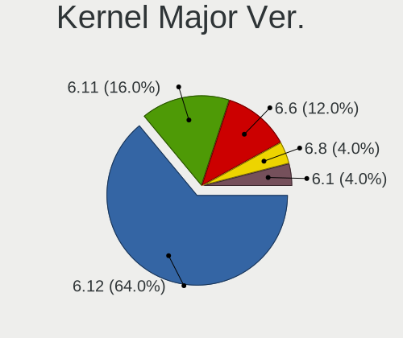
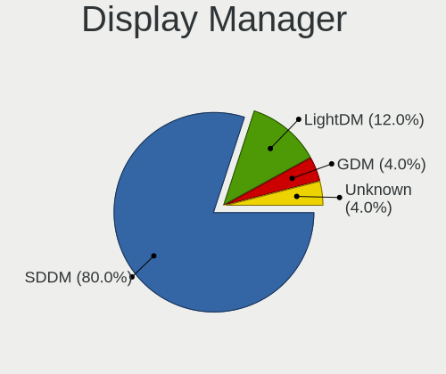
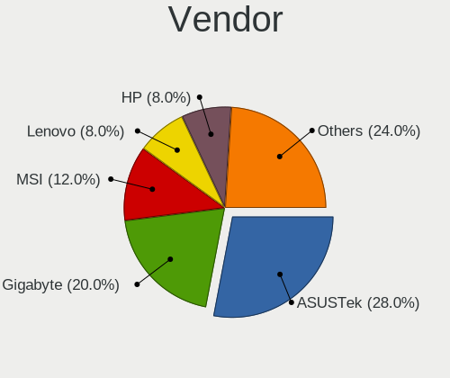
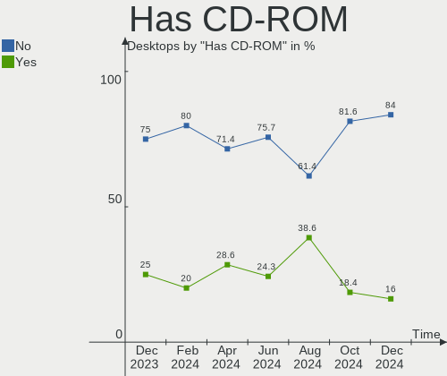
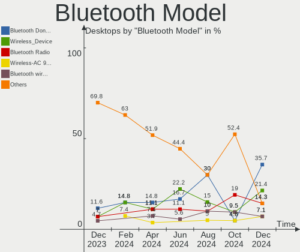
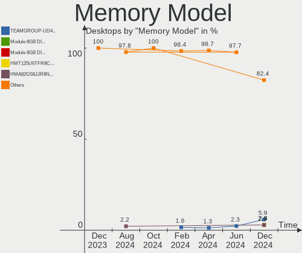
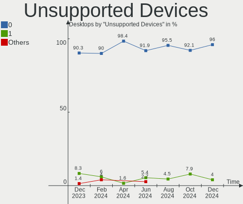

ArcoLinux - Hardware Trends (Desktops)
--------------------------------------

A project to identify most popular hardware characteristics and track their change
over time based on data collected by Linux users at https://Linux-Hardware.org.

Anyone can contribute to this report by the [hw-probe](https://github.com/linuxhw/hw-probe) tool:

    sudo -E hw-probe -all -upload

This report is for one last month. Overall report since the beginning of time: [TestDays](https://github.com/linuxhw/TestDays)

Period: Apr, 2023.

Contents
--------

* [ System ](#system)
  - [ OS                       ](#os)
  - [ OS Family                ](#os-family)
  - [ Kernel                   ](#kernel)
  - [ Kernel Family            ](#kernel-family)
  - [ Kernel Major Ver.        ](#kernel-major-ver)
  - [ Arch                     ](#arch)
  - [ DE                       ](#de)
  - [ Display Server           ](#display-server)
  - [ Display Manager          ](#display-manager)
  - [ OS Lang                  ](#os-lang)
  - [ Boot Mode                ](#boot-mode)
  - [ Filesystem               ](#filesystem)
  - [ Part. scheme             ](#part-scheme)
  - [ Dual Boot with Linux/BSD ](#dual-boot-with-linuxbsd)
  - [ Dual Boot (Win)          ](#dual-boot-win)

* [ Board ](#board)
  - [ Vendor                   ](#vendor)
  - [ Model                    ](#model)
  - [ Model Family             ](#model-family)
  - [ MFG Year                 ](#mfg-year)
  - [ Form Factor              ](#form-factor)
  - [ Secure Boot              ](#secure-boot)
  - [ Coreboot                 ](#coreboot)
  - [ RAM Size                 ](#ram-size)
  - [ RAM Used                 ](#ram-used)
  - [ Total Drives             ](#total-drives)
  - [ Has CD-ROM               ](#has-cd-rom)
  - [ Has Ethernet             ](#has-ethernet)
  - [ Has WiFi                 ](#has-wifi)
  - [ Has Bluetooth            ](#has-bluetooth)

* [ Location ](#location)
  - [ Country                  ](#country)
  - [ City                     ](#city)

* [ Drives ](#drives)
  - [ Drive Vendor             ](#drive-vendor)
  - [ Drive Model              ](#drive-model)
  - [ HDD Vendor               ](#hdd-vendor)
  - [ SSD Vendor               ](#ssd-vendor)
  - [ Drive Kind               ](#drive-kind)
  - [ Drive Connector          ](#drive-connector)
  - [ Drive Size               ](#drive-size)
  - [ Space Total              ](#space-total)
  - [ Space Used               ](#space-used)
  - [ Malfunc. Drives          ](#malfunc-drives)
  - [ Malfunc. Drive Vendor    ](#malfunc-drive-vendor)
  - [ Malfunc. HDD Vendor      ](#malfunc-hdd-vendor)
  - [ Malfunc. Drive Kind      ](#malfunc-drive-kind)
  - [ Failed Drives            ](#failed-drives)
  - [ Failed Drive Vendor      ](#failed-drive-vendor)
  - [ Drive Status             ](#drive-status)

* [ Storage controller ](#storage-controller)
  - [ Storage Vendor           ](#storage-vendor)
  - [ Storage Model            ](#storage-model)
  - [ Storage Kind             ](#storage-kind)

* [ Processor ](#processor)
  - [ CPU Vendor               ](#cpu-vendor)
  - [ CPU Model                ](#cpu-model)
  - [ CPU Model Family         ](#cpu-model-family)
  - [ CPU Cores                ](#cpu-cores)
  - [ CPU Sockets              ](#cpu-sockets)
  - [ CPU Threads              ](#cpu-threads)
  - [ CPU Op-Modes             ](#cpu-op-modes)
  - [ CPU Microcode            ](#cpu-microcode)
  - [ CPU Microarch            ](#cpu-microarch)

* [ Graphics ](#graphics)
  - [ GPU Vendor               ](#gpu-vendor)
  - [ GPU Model                ](#gpu-model)
  - [ GPU Combo                ](#gpu-combo)
  - [ GPU Driver               ](#gpu-driver)
  - [ GPU Memory               ](#gpu-memory)

* [ Monitor ](#monitor)
  - [ Monitor Vendor           ](#monitor-vendor)
  - [ Monitor Model            ](#monitor-model)
  - [ Monitor Resolution       ](#monitor-resolution)
  - [ Monitor Diagonal         ](#monitor-diagonal)
  - [ Monitor Width            ](#monitor-width)
  - [ Aspect Ratio             ](#aspect-ratio)
  - [ Monitor Area             ](#monitor-area)
  - [ Pixel Density            ](#pixel-density)
  - [ Multiple Monitors        ](#multiple-monitors)

* [ Network ](#network)
  - [ Net Controller Vendor    ](#net-controller-vendor)
  - [ Net Controller Model     ](#net-controller-model)
  - [ Wireless Vendor          ](#wireless-vendor)
  - [ Wireless Model           ](#wireless-model)
  - [ Ethernet Vendor          ](#ethernet-vendor)
  - [ Ethernet Model           ](#ethernet-model)
  - [ Net Controller Kind      ](#net-controller-kind)
  - [ Used Controller          ](#used-controller)
  - [ NICs                     ](#nics)
  - [ IPv6                     ](#ipv6)

* [ Bluetooth ](#bluetooth)
  - [ Bluetooth Vendor         ](#bluetooth-vendor)
  - [ Bluetooth Model          ](#bluetooth-model)

* [ Sound ](#sound)
  - [ Sound Vendor             ](#sound-vendor)
  - [ Sound Model              ](#sound-model)

* [ Memory ](#memory)
  - [ Memory Vendor            ](#memory-vendor)
  - [ Memory Model             ](#memory-model)
  - [ Memory Kind              ](#memory-kind)
  - [ Memory Form Factor       ](#memory-form-factor)
  - [ Memory Size              ](#memory-size)
  - [ Memory Speed             ](#memory-speed)

* [ Printers & scanners ](#printers--scanners)
  - [ Printer Vendor           ](#printer-vendor)
  - [ Printer Model            ](#printer-model)
  - [ Scanner Vendor           ](#scanner-vendor)
  - [ Scanner Model            ](#scanner-model)

* [ Camera ](#camera)
  - [ Camera Vendor            ](#camera-vendor)
  - [ Camera Model             ](#camera-model)

* [ Security ](#security)
  - [ Fingerprint Vendor       ](#fingerprint-vendor)
  - [ Fingerprint Model        ](#fingerprint-model)
  - [ Chipcard Vendor          ](#chipcard-vendor)
  - [ Chipcard Model           ](#chipcard-model)

* [ Unsupported ](#unsupported)
  - [ Unsupported Devices      ](#unsupported-devices)
  - [ Unsupported Device Types ](#unsupported-device-types)

System
------

OS
--

Installed operating systems

| Name              | Desktops | Percent |
|-------------------|----------|---------|
| ArcoLinux Rolling | 32       | 96.97%  |
| ArcoLinux         | 1        | 3.03%   |

OS Family
---------

OS without a version

| Name      | Desktops | Percent |
|-----------|----------|---------|
| ArcoLinux | 33       | 100%    |

Kernel
------

Version of the Linux kernel

| Version           | Desktops | Percent |
|-------------------|----------|---------|
| 6.2.11-arch1-1    | 6        | 18.18%  |
| 6.2.12-zen1-1-zen | 5        | 15.15%  |
| 6.2.9-arch1-1     | 3        | 9.09%   |
| 6.2.12-arch1-1    | 3        | 9.09%   |
| 6.2.10-arch1-1    | 3        | 9.09%   |
| 6.2.8-arch1-1     | 2        | 6.06%   |
| 6.2.13-arch1-1    | 2        | 6.06%   |
| 6.2.10-zen1-1-zen | 2        | 6.06%   |
| 6.1.23-1-lts      | 2        | 6.06%   |
| 6.2.9-zen1-1-zen  | 1        | 3.03%   |
| 6.2.11-zen1-1-zen | 1        | 3.03%   |
| 6.2.11-AMD        | 1        | 3.03%   |
| 6.1.25-1-lts      | 1        | 3.03%   |
| 6.0.2-zen1-1-zen  | 1        | 3.03%   |

Kernel Family
-------------

Linux kernel without a distro release

| Version | Desktops | Percent |
|---------|----------|---------|
| 6.2.12  | 8        | 24.24%  |
| 6.2.11  | 8        | 24.24%  |
| 6.2.10  | 5        | 15.15%  |
| 6.2.9   | 4        | 12.12%  |
| 6.2.8   | 2        | 6.06%   |
| 6.2.13  | 2        | 6.06%   |
| 6.1.23  | 2        | 6.06%   |
| 6.1.25  | 1        | 3.03%   |
| 6.0.2   | 1        | 3.03%   |

Kernel Major Ver.
-----------------

Linux kernel major version

| Version | Desktops | Percent |
|---------|----------|---------|
| 6.2     | 29       | 87.88%  |
| 6.1     | 3        | 9.09%   |
| 6.0     | 1        | 3.03%   |

Arch
----

OS architecture (x86_64, i586, etc.)

| Name   | Desktops | Percent |
|--------|----------|---------|
| x86_64 | 33       | 100%    |

DE
--

Desktop Environment

| Name     | Desktops | Percent |
|----------|----------|---------|
| KDE5     | 13       | 39.39%  |
| Hyprland | 9        | 27.27%  |
| XFCE     | 4        | 12.12%  |
| chadwm   | 3        | 9.09%   |
| xmonad   | 1        | 3.03%   |
| dwm      | 1        | 3.03%   |
| bspwm    | 1        | 3.03%   |
| awesome  | 1        | 3.03%   |

Display Server
--------------

X11 or Wayland

| Name    | Desktops | Percent |
|---------|----------|---------|
| X11     | 22       | 66.67%  |
| Wayland | 11       | 33.33%  |

Display Manager
---------------

SDDM, LightDM, etc.

| Name    | Desktops | Percent |
|---------|----------|---------|
| SDDM    | 27       | 81.82%  |
| LightDM | 3        | 9.09%   |
| Unknown | 2        | 6.06%   |
| GDM     | 1        | 3.03%   |

OS Lang
-------

Language

| Lang  | Desktops | Percent |
|-------|----------|---------|
| en_US | 15       | 45.45%  |
| es_ES | 3        | 9.09%   |
| en_GB | 3        | 9.09%   |
| en_CA | 2        | 6.06%   |
| tr_TR | 1        | 3.03%   |
| pl_PL | 1        | 3.03%   |
| nl_NL | 1        | 3.03%   |
| fr_FR | 1        | 3.03%   |
| es_VE | 1        | 3.03%   |
| en_ZA | 1        | 3.03%   |
| en_IN | 1        | 3.03%   |
| en_AU | 1        | 3.03%   |
| ca_AD | 1        | 3.03%   |
| C     | 1        | 3.03%   |

Boot Mode
---------

EFI or BIOS

| Mode | Desktops | Percent |
|------|----------|---------|
| EFI  | 30       | 90.91%  |
| BIOS | 3        | 9.09%   |

Filesystem
----------

Type of filesystem

| Type    | Desktops | Percent |
|---------|----------|---------|
| Ext4    | 18       | 54.55%  |
| Btrfs   | 14       | 42.42%  |
| Overlay | 1        | 3.03%   |

Part. scheme
------------

Scheme of partitioning

| Type    | Desktops | Percent |
|---------|----------|---------|
| GPT     | 31       | 93.94%  |
| MBR     | 1        | 3.03%   |
| Unknown | 1        | 3.03%   |

Dual Boot with Linux/BSD
------------------------

Hosting more than one Linux/BSD

| Dual boot | Desktops | Percent |
|-----------|----------|---------|
| No        | 24       | 72.73%  |
| Yes       | 9        | 27.27%  |

Dual Boot (Win)
---------------

Hosting Linux and Windows

| Dual boot | Desktops | Percent |
|-----------|----------|---------|
| Yes       | 20       | 60.61%  |
| No        | 13       | 39.39%  |

Board
-----

Vendor
------

Motherboard manufacturer

| Name                | Desktops | Percent |
|---------------------|----------|---------|
| ASUSTek Computer    | 14       | 42.42%  |
| Gigabyte Technology | 8        | 24.24%  |
| MSI                 | 5        | 15.15%  |
| Hewlett-Packard     | 1        | 3.03%   |
| Dell                | 1        | 3.03%   |
| Biostar             | 1        | 3.03%   |
| BESSTAR Tech        | 1        | 3.03%   |
| ASRock              | 1        | 3.03%   |
| Unknown             | 1        | 3.03%   |

Model
-----

Motherboard model

| Name                                 | Desktops | Percent |
|--------------------------------------|----------|---------|
| MSI MS-7C91                          | 1        | 3.03%   |
| MSI MS-7C71                          | 1        | 3.03%   |
| MSI MS-7C13                          | 1        | 3.03%   |
| MSI MS-7B89                          | 1        | 3.03%   |
| MSI MS-7A63                          | 1        | 3.03%   |
| HP ProDesk 600 G1 SFF                | 1        | 3.03%   |
| Gigabyte Z270X-Gaming 7              | 1        | 3.03%   |
| Gigabyte X570S AERO G                | 1        | 3.03%   |
| Gigabyte X570 AORUS ELITE            | 1        | 3.03%   |
| Gigabyte X299 AORUS Ultra Gaming Pro | 1        | 3.03%   |
| Gigabyte B85M-D3H                    | 1        | 3.03%   |
| Gigabyte B550M DS3H AC               | 1        | 3.03%   |
| Gigabyte B550 AORUS PRO AC           | 1        | 3.03%   |
| Gigabyte B450 AORUS ELITE            | 1        | 3.03%   |
| Dell OptiPlex 9020                   | 1        | 3.03%   |
| Biostar TZ77B                        | 1        | 3.03%   |
| BESSTAR Tech HX90                    | 1        | 3.03%   |
| ASUS TUF Gaming B460M-PLUS           | 1        | 3.03%   |
| ASUS STRIX Z270H GAMING              | 1        | 3.03%   |
| ASUS ROG STRIX B560-I GAMING WIFI    | 1        | 3.03%   |
| ASUS ROG STRIX B450-F GAMING II      | 1        | 3.03%   |
| ASUS ROG CROSSHAIR VIII IMPACT       | 1        | 3.03%   |
| ASUS ROG CROSSHAIR VIII HERO         | 1        | 3.03%   |
| ASUS PRIME Z490-A                    | 1        | 3.03%   |
| ASUS PRIME Z390-P                    | 1        | 3.03%   |
| ASUS PRIME X570-P                    | 1        | 3.03%   |
| ASUS PRIME X470-PRO                  | 1        | 3.03%   |
| ASUS PRIME H310M-R R2.0              | 1        | 3.03%   |
| ASUS PRIME B550M-A AC                | 1        | 3.03%   |
| ASUS PRIME B350-PLUS                 | 1        | 3.03%   |
| ASUS PRIME A320M-K                   | 1        | 3.03%   |
| ASRock Z690 Extreme                  | 1        | 3.03%   |
| Unknown                              | 1        | 3.03%   |

Model Family
------------

Motherboard model prefix

| Name                  | Desktops | Percent |
|-----------------------|----------|---------|
| ASUS PRIME            | 8        | 24.24%  |
| ASUS ROG              | 4        | 12.12%  |
| MSI MS-7C91           | 1        | 3.03%   |
| MSI MS-7C71           | 1        | 3.03%   |
| MSI MS-7C13           | 1        | 3.03%   |
| MSI MS-7B89           | 1        | 3.03%   |
| MSI MS-7A63           | 1        | 3.03%   |
| HP ProDesk            | 1        | 3.03%   |
| Gigabyte Z270X-Gaming | 1        | 3.03%   |
| Gigabyte X570S        | 1        | 3.03%   |
| Gigabyte X570         | 1        | 3.03%   |
| Gigabyte X299         | 1        | 3.03%   |
| Gigabyte B85M-D3H     | 1        | 3.03%   |
| Gigabyte B550M        | 1        | 3.03%   |
| Gigabyte B550         | 1        | 3.03%   |
| Gigabyte B450         | 1        | 3.03%   |
| Dell OptiPlex         | 1        | 3.03%   |
| Biostar TZ77B         | 1        | 3.03%   |
| BESSTAR Tech HX90     | 1        | 3.03%   |
| ASUS TUF              | 1        | 3.03%   |
| ASUS STRIX            | 1        | 3.03%   |
| ASRock Z690           | 1        | 3.03%   |
| Unknown               | 1        | 3.03%   |

MFG Year
--------

Motherboard manufacture year

| Year | Desktops | Percent |
|------|----------|---------|
| 2020 | 8        | 24.24%  |
| 2017 | 5        | 15.15%  |
| 2019 | 4        | 12.12%  |
| 2018 | 4        | 12.12%  |
| 2022 | 3        | 9.09%   |
| 2021 | 3        | 9.09%   |
| 2013 | 3        | 9.09%   |
| 2023 | 1        | 3.03%   |
| 2016 | 1        | 3.03%   |
| 2012 | 1        | 3.03%   |

Form Factor
-----------

Physical design of the computer

| Name    | Desktops | Percent |
|---------|----------|---------|
| Desktop | 33       | 100%    |

Secure Boot
-----------

Enabled or disabled

| State    | Desktops | Percent |
|----------|----------|---------|
| Disabled | 33       | 100%    |

Coreboot
--------

Have coreboot on board

| Used | Desktops | Percent |
|------|----------|---------|
| No   | 33       | 100%    |

RAM Size
--------

Total RAM memory

| Size in GB  | Desktops | Percent |
|-------------|----------|---------|
| 32.01-64.0  | 13       | 39.39%  |
| 16.01-24.0  | 8        | 24.24%  |
| 64.01-256.0 | 7        | 21.21%  |
| 8.01-16.0   | 4        | 12.12%  |
| 4.01-8.0    | 1        | 3.03%   |

RAM Used
--------

Used RAM memory

| Used GB   | Desktops | Percent |
|-----------|----------|---------|
| 4.01-8.0  | 13       | 39.39%  |
| 3.01-4.0  | 6        | 18.18%  |
| 2.01-3.0  | 6        | 18.18%  |
| 1.01-2.0  | 4        | 12.12%  |
| 8.01-16.0 | 3        | 9.09%   |
| 0.51-1.0  | 1        | 3.03%   |

Total Drives
------------

Number of drives on board

| Drives | Desktops | Percent |
|--------|----------|---------|
| 2      | 10       | 30.3%   |
| 4      | 6        | 18.18%  |
| 3      | 6        | 18.18%  |
| 5      | 4        | 12.12%  |
| 1      | 4        | 12.12%  |
| 7      | 3        | 9.09%   |

Has CD-ROM
----------

Has CD-ROM on board

| Presented | Desktops | Percent |
|-----------|----------|---------|
| No        | 29       | 87.88%  |
| Yes       | 4        | 12.12%  |

Has Ethernet
------------

Has Ethernet on board

| Presented | Desktops | Percent |
|-----------|----------|---------|
| Yes       | 33       | 100%    |

Has WiFi
--------

Has WiFi module

| Presented | Desktops | Percent |
|-----------|----------|---------|
| No        | 17       | 51.52%  |
| Yes       | 16       | 48.48%  |

Has Bluetooth
-------------

Has Bluetooth module

| Presented | Desktops | Percent |
|-----------|----------|---------|
| Yes       | 17       | 51.52%  |
| No        | 16       | 48.48%  |

Location
--------

Country
-------

Geographic location (country)

| Country      | Desktops | Percent |
|--------------|----------|---------|
| USA          | 5        | 15.15%  |
| Spain        | 4        | 12.12%  |
| UK           | 3        | 9.09%   |
| Belgium      | 3        | 9.09%   |
| Turkey       | 2        | 6.06%   |
| Poland       | 2        | 6.06%   |
| Mexico       | 2        | 6.06%   |
| Canada       | 2        | 6.06%   |
| Venezuela    | 1        | 3.03%   |
| Ukraine      | 1        | 3.03%   |
| South Africa | 1        | 3.03%   |
| India        | 1        | 3.03%   |
| Germany      | 1        | 3.03%   |
| France       | 1        | 3.03%   |
| Finland      | 1        | 3.03%   |
| Czechia      | 1        | 3.03%   |
| Bulgaria     | 1        | 3.03%   |
| Austria      | 1        | 3.03%   |

City
----

Geographic location (city)

| City                  | Desktops | Percent |
|-----------------------|----------|---------|
| Duffel                | 2        | 6.06%   |
| Burgos                | 2        | 6.06%   |
| Zacapu                | 1        | 3.03%   |
| Wilrijk               | 1        | 3.03%   |
| Warsaw                | 1        | 3.03%   |
| Vienna                | 1        | 3.03%   |
| Tábor                | 1        | 3.03%   |
| Springfield           | 1        | 3.03%   |
| Sofia                 | 1        | 3.03%   |
| San Luis Potosí City | 1        | 3.03%   |
| Poznan                | 1        | 3.03%   |
| Odesa                 | 1        | 3.03%   |
| Maracaibo             | 1        | 3.03%   |
| Langley               | 1        | 3.03%   |
| Karlsruhe             | 1        | 3.03%   |
| Johannesburg          | 1        | 3.03%   |
| Istanbul              | 1        | 3.03%   |
| Helsinki              | 1        | 3.03%   |
| Haywards Heath        | 1        | 3.03%   |
| Fontenay-le-Comte     | 1        | 3.03%   |
| Eureka                | 1        | 3.03%   |
| Calgary               | 1        | 3.03%   |
| Brooklyn              | 1        | 3.03%   |
| Brentwood             | 1        | 3.03%   |
| Bengaluru             | 1        | 3.03%   |
| Barcelona             | 1        | 3.03%   |
| Badalona              | 1        | 3.03%   |
| Atlanta               | 1        | 3.03%   |
| Antalya               | 1        | 3.03%   |
| Amherst               | 1        | 3.03%   |
| Abingdon              | 1        | 3.03%   |

Drives
------

Drive Vendor
------------

Hard drive vendors

| Vendor                      | Desktops | Drives | Percent |
|-----------------------------|----------|--------|---------|
| Samsung Electronics         | 17       | 26     | 19.32%  |
| WDC                         | 13       | 18     | 14.77%  |
| Seagate                     | 10       | 14     | 11.36%  |
| Kingston                    | 8        | 8      | 9.09%   |
| Sandisk                     | 6        | 7      | 6.82%   |
| Toshiba                     | 4        | 4      | 4.55%   |
| Phison Electronics          | 3        | 3      | 3.41%   |
| Micron/Crucial Technology   | 3        | 5      | 3.41%   |
| Intel                       | 3        | 3      | 3.41%   |
| Hitachi                     | 3        | 3      | 3.41%   |
| Kingston Technology Company | 2        | 2      | 2.27%   |
| Crucial                     | 2        | 3      | 2.27%   |
| A-DATA Technology           | 2        | 2      | 2.27%   |
| SPCC                        | 1        | 1      | 1.14%   |
| SK hynix                    | 1        | 1      | 1.14%   |
| Silicon Motion              | 1        | 1      | 1.14%   |
| Seagate Technology          | 1        | 1      | 1.14%   |
| SABRENT                     | 1        | 1      | 1.14%   |
| PNY                         | 1        | 1      | 1.14%   |
| Mushkin                     | 1        | 1      | 1.14%   |
| Leven                       | 1        | 1      | 1.14%   |
| JMicron Technology          | 1        | 1      | 1.14%   |
| GOODRAM                     | 1        | 1      | 1.14%   |
| External                    | 1        | 1      | 1.14%   |
| BAITITON                    | 1        | 1      | 1.14%   |

Drive Model
-----------

Hard drive models

| Model                                              | Desktops | Percent |
|----------------------------------------------------|----------|---------|
| Samsung NVMe SSD Controller SM981/PM981/PM983 1TB  | 4        | 3.85%   |
| Samsung NVMe SSD Controller PM9A1/PM9A3/980PRO 2TB | 3        | 2.88%   |
| Micron/Crucial P2 NVMe PCIe SSD 1TB                | 3        | 2.88%   |
| Seagate ST2000LM007-1R8174 2TB                     | 2        | 1.92%   |
| Samsung SSD 870 EVO 1TB                            | 2        | 1.92%   |
| Hitachi HDS721010CLA332 1TB                        | 2        | 1.92%   |
| WDC WDS250G2B0A-00SM50 250GB SSD                   | 1        | 0.96%   |
| WDC WDS250G2B0A 250GB SSD                          | 1        | 0.96%   |
| WDC WD80EFBX-68AZZN0 8TB                           | 1        | 0.96%   |
| WDC WD5000KS-00MNB0 500GB                          | 1        | 0.96%   |
| WDC WD5000AAKX-001CA0 500GB                        | 1        | 0.96%   |
| WDC WD5000AAKS-00V2B0 500GB                        | 1        | 0.96%   |
| WDC WD3200AVJS-63B6A0 320GB                        | 1        | 0.96%   |
| WDC WD3200AAJS-22L7A0 320GB                        | 1        | 0.96%   |
| WDC WD30EZRX-00D8PB0 3TB                           | 1        | 0.96%   |
| WDC WD20EZRZ-00Z5HB0 2TB                           | 1        | 0.96%   |
| WDC WD20EZBX-00AYRA0 2TB                           | 1        | 0.96%   |
| WDC WD20EARS-14MVWB0 2TB                           | 1        | 0.96%   |
| WDC WD20EARS-00MVWB0 2TB                           | 1        | 0.96%   |
| WDC WD10EZEX-22MFCA0 1TB                           | 1        | 0.96%   |
| WDC WD10EZEX-08WN4A0 1TB                           | 1        | 0.96%   |
| WDC WD10EZEX-00ER1A0 1TB                           | 1        | 0.96%   |
| WDC WD10EZEX-00BN5A0 1TB                           | 1        | 0.96%   |
| Toshiba THNSNJ128GCSU 128GB SSD                    | 1        | 0.96%   |
| Toshiba MQ01ABD100 1TB                             | 1        | 0.96%   |
| Toshiba HDWD110 1TB                                | 1        | 0.96%   |
| Toshiba DT01ACA050 500GB                           | 1        | 0.96%   |
| SPCC Solid State Disk 1TB                          | 1        | 0.96%   |
| SK hynix C2S3T/240G 240GB SSD                      | 1        | 0.96%   |
| Silicon Motion SM2262/SM2262EN SSD Controller 1TB  | 1        | 0.96%   |
| Seagate FireCuda 510 SSD 250GB                     | 1        | 0.96%   |
| Seagate ST6000DM003-2CY186 6TB                     | 1        | 0.96%   |
| Seagate ST500DM009-2F110A 500GB                    | 1        | 0.96%   |
| Seagate ST4000DM004-2CV104 4TB                     | 1        | 0.96%   |
| Seagate ST3500630AS 500GB                          | 1        | 0.96%   |
| Seagate ST3500413AS 500GB                          | 1        | 0.96%   |
| Seagate ST3500320AS 500GB                          | 1        | 0.96%   |
| Seagate ST3500312CS 500GB                          | 1        | 0.96%   |
| Seagate ST1000DM003-1CH162 1TB                     | 1        | 0.96%   |
| Seagate FireCuda HDD 2TB                           | 1        | 0.96%   |

HDD Vendor
----------

Hard disk drive vendors

| Vendor              | Desktops | Drives | Percent |
|---------------------|----------|--------|---------|
| WDC                 | 12       | 16     | 41.38%  |
| Seagate             | 9        | 13     | 31.03%  |
| Toshiba             | 3        | 3      | 10.34%  |
| Hitachi             | 3        | 3      | 10.34%  |
| Samsung Electronics | 1        | 1      | 3.45%   |
| JMicron Technology  | 1        | 1      | 3.45%   |

SSD Vendor
----------

Solid state drive vendors

| Vendor              | Desktops | Drives | Percent |
|---------------------|----------|--------|---------|
| Samsung Electronics | 13       | 14     | 37.14%  |
| Kingston            | 5        | 5      | 14.29%  |
| SanDisk             | 2        | 2      | 5.71%   |
| Crucial             | 2        | 3      | 5.71%   |
| A-DATA Technology   | 2        | 2      | 5.71%   |
| WDC                 | 1        | 2      | 2.86%   |
| Toshiba             | 1        | 1      | 2.86%   |
| SPCC                | 1        | 1      | 2.86%   |
| SK hynix            | 1        | 1      | 2.86%   |
| PNY                 | 1        | 1      | 2.86%   |
| Mushkin             | 1        | 1      | 2.86%   |
| Leven               | 1        | 1      | 2.86%   |
| Intel               | 1        | 1      | 2.86%   |
| GOODRAM             | 1        | 1      | 2.86%   |
| External            | 1        | 1      | 2.86%   |
| BAITITON            | 1        | 1      | 2.86%   |

Drive Kind
----------

HDD or SSD

| Kind    | Desktops | Drives | Percent |
|---------|----------|--------|---------|
| SSD     | 25       | 38     | 36.76%  |
| NVMe    | 21       | 34     | 30.88%  |
| HDD     | 21       | 37     | 30.88%  |
| Unknown | 1        | 1      | 1.47%   |

Drive Connector
---------------

SATA, SAS, NVMe, etc.

| Type | Desktops | Drives | Percent |
|------|----------|--------|---------|
| SATA | 27       | 71     | 51.92%  |
| NVMe | 21       | 34     | 40.38%  |
| SAS  | 4        | 5      | 7.69%   |

Drive Size
----------

Size of hard drive

| Size in TB | Desktops | Drives | Percent |
|------------|----------|--------|---------|
| 0.01-0.5   | 20       | 34     | 40%     |
| 0.51-1.0   | 17       | 22     | 34%     |
| 1.01-2.0   | 9        | 13     | 18%     |
| 4.01-10.0  | 2        | 2      | 4%      |
| 3.01-4.0   | 1        | 3      | 2%      |
| 2.01-3.0   | 1        | 1      | 2%      |

Space Total
-----------

Amount of disk space available on the file system

| Size in GB     | Desktops | Percent |
|----------------|----------|---------|
| More than 3000 | 14       | 42.42%  |
| 501-1000       | 7        | 21.21%  |
| 101-250        | 4        | 12.12%  |
| 2001-3000      | 3        | 9.09%   |
| 1001-2000      | 3        | 9.09%   |
| 251-500        | 1        | 3.03%   |
| 1-20           | 1        | 3.03%   |

Space Used
----------

Amount of used disk space

| Used GB        | Desktops | Percent |
|----------------|----------|---------|
| 1-20           | 6        | 18.18%  |
| 251-500        | 5        | 15.15%  |
| 101-250        | 5        | 15.15%  |
| 1001-2000      | 5        | 15.15%  |
| More than 3000 | 4        | 12.12%  |
| 501-1000       | 4        | 12.12%  |
| 2001-3000      | 2        | 6.06%   |
| 21-50          | 1        | 3.03%   |
| 51-100         | 1        | 3.03%   |

Malfunc. Drives
---------------

Drive models with a malfunction

| Model                                 | Desktops | Drives | Percent |
|---------------------------------------|----------|--------|---------|
| WDC WD3200AVJS-63B6A0 320GB           | 1        | 1      | 10%     |
| WDC WD3200AAJS-22L7A0 320GB           | 1        | 1      | 10%     |
| WDC WD20EARS-00MVWB0 2TB              | 1        | 2      | 10%     |
| Seagate ST3500630AS 500GB             | 1        | 1      | 10%     |
| Seagate ST3500320AS 500GB             | 1        | 1      | 10%     |
| Samsung Electronics SSD 870 EVO 1TB   | 1        | 1      | 10%     |
| Samsung Electronics SSD 850 EVO 250GB | 1        | 1      | 10%     |
| JMicron Technology Generic 1TB        | 1        | 1      | 10%     |
| Hitachi HDS721050CLA662 500GB         | 1        | 1      | 10%     |
| Hitachi HDS721010CLA332 1TB           | 1        | 1      | 10%     |

Malfunc. Drive Vendor
---------------------

Vendors of faulty drives

| Vendor              | Desktops | Drives | Percent |
|---------------------|----------|--------|---------|
| WDC                 | 3        | 4      | 33.33%  |
| Samsung Electronics | 2        | 2      | 22.22%  |
| Hitachi             | 2        | 2      | 22.22%  |
| Seagate             | 1        | 2      | 11.11%  |
| JMicron Technology  | 1        | 1      | 11.11%  |

Malfunc. HDD Vendor
-------------------

Vendors of faulty HDD drives

| Vendor             | Desktops | Drives | Percent |
|--------------------|----------|--------|---------|
| WDC                | 3        | 4      | 42.86%  |
| Hitachi            | 2        | 2      | 28.57%  |
| Seagate            | 1        | 2      | 14.29%  |
| JMicron Technology | 1        | 1      | 14.29%  |

Malfunc. Drive Kind
-------------------

Kinds of faulty drives

| Kind | Desktops | Drives | Percent |
|------|----------|--------|---------|
| HDD  | 5        | 9      | 71.43%  |
| SSD  | 2        | 2      | 28.57%  |

Failed Drives
-------------

Failed drive models

| Model                       | Desktops | Drives | Percent |
|-----------------------------|----------|--------|---------|
| WDC WD5000AAKX-001CA0 500GB | 1        | 1      | 100%    |

Failed Drive Vendor
-------------------

Failed drive vendors

| Vendor | Desktops | Drives | Percent |
|--------|----------|--------|---------|
| WDC    | 1        | 1      | 100%    |

Drive Status
------------

Number of failed and malfunc. drives

| Status   | Desktops | Drives | Percent |
|----------|----------|--------|---------|
| Works    | 31       | 88     | 72.09%  |
| Malfunc  | 7        | 11     | 16.28%  |
| Detected | 4        | 10     | 9.3%    |
| Failed   | 1        | 1      | 2.33%   |

Storage controller
------------------

Storage Vendor
--------------

Storage controller vendors

| Vendor                      | Desktops | Percent |
|-----------------------------|----------|---------|
| Intel                       | 19       | 31.15%  |
| AMD                         | 16       | 26.23%  |
| Samsung Electronics         | 8        | 13.11%  |
| Kingston Technology Company | 5        | 8.2%    |
| SanDisk                     | 4        | 6.56%   |
| Phison Electronics          | 3        | 4.92%   |
| Micron/Crucial Technology   | 3        | 4.92%   |
| Seagate Technology          | 2        | 3.28%   |
| Silicon Motion              | 1        | 1.64%   |

Storage Model
-------------

Storage controller models

| Model                                                                          | Desktops | Percent |
|--------------------------------------------------------------------------------|----------|---------|
| AMD FCH SATA Controller [AHCI mode]                                            | 12       | 16.9%   |
| Intel 200 Series PCH SATA controller [AHCI mode]                               | 6        | 8.45%   |
| Samsung NVMe SSD Controller SM981/PM981/PM983                                  | 4        | 5.63%   |
| AMD 500 Series Chipset SATA Controller                                         | 4        | 5.63%   |
| AMD 400 Series Chipset SATA Controller                                         | 4        | 5.63%   |
| Samsung NVMe SSD Controller PM9A1/PM9A3/980PRO                                 | 3        | 4.23%   |
| Micron/Crucial P2 NVMe PCIe SSD                                                | 3        | 4.23%   |
| Kingston Company Company Non-Volatile memory controller                        | 3        | 4.23%   |
| SanDisk WD Black SN770 NVMe SSD                                                | 2        | 2.82%   |
| Intel Comet Lake SATA AHCI Controller                                          | 2        | 2.82%   |
| Intel 8 Series/C220 Series Chipset Family 6-port SATA Controller 1 [AHCI mode] | 2        | 2.82%   |
| Silicon Motion SM2262/SM2262EN SSD Controller                                  | 1        | 1.41%   |
| Seagate FireCuda 530 SSD                                                       | 1        | 1.41%   |
| Seagate FireCuda 510 SSD                                                       | 1        | 1.41%   |
| Sandisk Western Digital WD Black SN850X NVMe SSD                               | 1        | 1.41%   |
| SanDisk WD Blue SN570 NVMe SSD 1TB                                             | 1        | 1.41%   |
| SanDisk WD Blue SN550 NVMe SSD                                                 | 1        | 1.41%   |
| Samsung NVMe SSD Controller SM961/PM961/SM963                                  | 1        | 1.41%   |
| Samsung NVMe SSD Controller 980                                                | 1        | 1.41%   |
| Phison E18 PCIe4 NVMe Controller                                               | 1        | 1.41%   |
| Phison E16 PCIe4 NVMe Controller                                               | 1        | 1.41%   |
| Phison E12 NVMe Controller                                                     | 1        | 1.41%   |
| Micron/Crucial P1 NVMe PCIe SSD                                                | 1        | 1.41%   |
| Micron/Crucial NVMe Storage Controller                                         | 1        | 1.41%   |
| Kingston Company NVMe Controller                                               | 1        | 1.41%   |
| Kingston Company A2000 NVMe SSD                                                | 1        | 1.41%   |
| Intel SSD Pro 7600p/760p/E 6100p Series                                        | 1        | 1.41%   |
| Intel SSD 660P Series                                                          | 1        | 1.41%   |
| Intel SATA Controller [RAID mode]                                              | 1        | 1.41%   |
| Intel Cannon Lake PCH SATA AHCI Controller                                     | 1        | 1.41%   |
| Intel Alder Lake-S PCH SATA Controller [AHCI Mode]                             | 1        | 1.41%   |
| Intel 7 Series/C210 Series Chipset Family 6-port SATA Controller [AHCI mode]   | 1        | 1.41%   |
| Intel 6 Series/C200 Series Chipset Family 6 port Desktop SATA AHCI Controller  | 1        | 1.41%   |
| Intel 500 Series Chipset Family SATA AHCI Controller                           | 1        | 1.41%   |
| Intel 400 Series Chipset Family SATA AHCI Controller                           | 1        | 1.41%   |
| AMD FCH SATA Controller D                                                      | 1        | 1.41%   |
| AMD 300 Series Chipset SATA Controller                                         | 1        | 1.41%   |

Storage Kind
------------

Kind of storage controller (IDE, SATA, NVMe, SAS, ...)

| Kind | Desktops | Percent |
|------|----------|---------|
| SATA | 32       | 59.26%  |
| NVMe | 21       | 38.89%  |
| RAID | 1        | 1.85%   |

Processor
---------

CPU Vendor
----------

Processor vendors

| Vendor | Desktops | Percent |
|--------|----------|---------|
| Intel  | 17       | 51.52%  |
| AMD    | 16       | 48.48%  |

CPU Model
---------

Processor models

| Model                                       | Desktops | Percent |
|---------------------------------------------|----------|---------|
| Intel Core i7-7700K CPU @ 4.20GHz           | 3        | 9.09%   |
| Intel Core i3-9100F CPU @ 3.60GHz           | 2        | 6.06%   |
| AMD Ryzen 9 5900X 12-Core Processor         | 2        | 6.06%   |
| AMD Ryzen 7 5700G with Radeon Graphics      | 2        | 6.06%   |
| AMD Ryzen 7 2700X Eight-Core Processor      | 2        | 6.06%   |
| AMD Ryzen 5 5600X 6-Core Processor          | 2        | 6.06%   |
| Intel Core i9-7900X CPU @ 3.30GHz           | 1        | 3.03%   |
| Intel Core i9-10850K CPU @ 3.60GHz          | 1        | 3.03%   |
| Intel Core i7-9700K CPU @ 3.60GHz           | 1        | 3.03%   |
| Intel Core i7-4790 CPU @ 3.60GHz            | 1        | 3.03%   |
| Intel Core i7-3770K CPU @ 3.50GHz           | 1        | 3.03%   |
| Intel Core i7-10700K CPU @ 3.80GHz          | 1        | 3.03%   |
| Intel Core i5-4670 CPU @ 3.40GHz            | 1        | 3.03%   |
| Intel Core i5-4460 CPU @ 3.20GHz            | 1        | 3.03%   |
| Intel Core i5-2500 CPU @ 3.30GHz            | 1        | 3.03%   |
| Intel Core i5-10400F CPU @ 2.90GHz          | 1        | 3.03%   |
| Intel 12th Gen Core i9-12900KF              | 1        | 3.03%   |
| Intel 11th Gen Core i5-11600K @ 3.90GHz     | 1        | 3.03%   |
| AMD Ryzen 9 5950X 16-Core Processor         | 1        | 3.03%   |
| AMD Ryzen 9 5900HX with Radeon Graphics     | 1        | 3.03%   |
| AMD Ryzen 9 3900X 12-Core Processor         | 1        | 3.03%   |
| AMD Ryzen 7 3800X 8-Core Processor          | 1        | 3.03%   |
| AMD Ryzen 7 1800X Eight-Core Processor      | 1        | 3.03%   |
| AMD Ryzen 5 3600 6-Core Processor           | 1        | 3.03%   |
| AMD Ryzen 5 1600 Six-Core Processor         | 1        | 3.03%   |
| AMD Ryzen 3 2200G with Radeon Vega Graphics | 1        | 3.03%   |

CPU Model Family
----------------

Processor model prefix

| Model         | Desktops | Percent |
|---------------|----------|---------|
| Intel Core i7 | 7        | 21.21%  |
| AMD Ryzen 7   | 6        | 18.18%  |
| AMD Ryzen 9   | 5        | 15.15%  |
| Intel Core i5 | 4        | 12.12%  |
| AMD Ryzen 5   | 4        | 12.12%  |
| Other         | 2        | 6.06%   |
| Intel Core i9 | 2        | 6.06%   |
| Intel Core i3 | 2        | 6.06%   |
| AMD Ryzen 3   | 1        | 3.03%   |

CPU Cores
---------

Number of processor cores

| Number | Desktops | Percent |
|--------|----------|---------|
| 4      | 11       | 33.33%  |
| 8      | 9        | 27.27%  |
| 6      | 6        | 18.18%  |
| 12     | 3        | 9.09%   |
| 16     | 2        | 6.06%   |
| 10     | 2        | 6.06%   |

CPU Sockets
-----------

Number of sockets

| Number | Desktops | Percent |
|--------|----------|---------|
| 1      | 33       | 100%    |

CPU Threads
-----------

Threads per core (Hyper-Threading)

| Number | Desktops | Percent |
|--------|----------|---------|
| 2      | 26       | 78.79%  |
| 1      | 7        | 21.21%  |

CPU Op-Modes
------------

CPU Operation Modes (32-bit, 64-bit)

| Op mode        | Desktops | Percent |
|----------------|----------|---------|
| 32-bit, 64-bit | 33       | 100%    |

CPU Microcode
-------------

Microcode number

| Number     | Desktops | Percent |
|------------|----------|---------|
| Unknown    | 17       | 51.52%  |
| 0x0a50000d | 3        | 9.09%   |
| 0x0a201025 | 2        | 6.06%   |
| 0x08701021 | 2        | 6.06%   |
| 0x306c3    | 1        | 3.03%   |
| 0x206a7    | 1        | 3.03%   |
| 0x0a20120a | 1        | 3.03%   |
| 0x0a201016 | 1        | 3.03%   |
| 0x0a201009 | 1        | 3.03%   |
| 0x08101016 | 1        | 3.03%   |
| 0x0800820d | 1        | 3.03%   |
| 0x08001138 | 1        | 3.03%   |
| 0x08001137 | 1        | 3.03%   |

CPU Microarch
-------------

Microarchitecture

| Name             | Desktops | Percent |
|------------------|----------|---------|
| Zen 3            | 8        | 24.24%  |
| KabyLake         | 6        | 18.18%  |
| Zen 2            | 3        | 9.09%   |
| Zen              | 3        | 9.09%   |
| Haswell          | 3        | 9.09%   |
| CometLake        | 3        | 9.09%   |
| Zen+             | 2        | 6.06%   |
| Skylake          | 1        | 3.03%   |
| SandyBridge      | 1        | 3.03%   |
| IvyBridge        | 1        | 3.03%   |
| Icelake          | 1        | 3.03%   |
| Alderlake Hybrid | 1        | 3.03%   |

Graphics
--------

GPU Vendor
----------

Vendors of graphics cards

| Vendor | Desktops | Percent |
|--------|----------|---------|
| Nvidia | 18       | 51.43%  |
| AMD    | 12       | 34.29%  |
| Intel  | 5        | 14.29%  |

GPU Model
---------

Graphics card models

| Model                                                                       | Desktops | Percent |
|-----------------------------------------------------------------------------|----------|---------|
| AMD Ellesmere [Radeon RX 470/480/570/570X/580/580X/590]                     | 4        | 11.11%  |
| Intel Xeon E3-1200 v3/4th Gen Core Processor Integrated Graphics Controller | 3        | 8.33%   |
| AMD Navi 22 [Radeon RX 6700/6700 XT/6750 XT / 6800M/6850M XT]               | 3        | 8.33%   |
| Nvidia TU117 [GeForce GTX 1650]                                             | 2        | 5.56%   |
| Nvidia TU106 [GeForce RTX 2060 Rev. A]                                      | 2        | 5.56%   |
| Nvidia GP107 [GeForce GTX 1050 Ti]                                          | 2        | 5.56%   |
| Nvidia TU104 [GeForce RTX 2080 Rev. A]                                      | 1        | 2.78%   |
| Nvidia TU104 [GeForce RTX 2060]                                             | 1        | 2.78%   |
| Nvidia GP106 [GeForce GTX 1060 6GB]                                         | 1        | 2.78%   |
| Nvidia GP106 [GeForce GTX 1060 3GB]                                         | 1        | 2.78%   |
| Nvidia GP104 [GeForce GTX 1070]                                             | 1        | 2.78%   |
| Nvidia GM204 [GeForce GTX 970]                                              | 1        | 2.78%   |
| Nvidia GF119 [GeForce GT 610]                                               | 1        | 2.78%   |
| Nvidia GA104 [GeForce RTX 3070]                                             | 1        | 2.78%   |
| Nvidia GA104 [GeForce RTX 3060 Ti Lite Hash Rate]                           | 1        | 2.78%   |
| Nvidia GA102 [GeForce RTX 3090]                                             | 1        | 2.78%   |
| Nvidia GA102 [GeForce RTX 3080 Ti]                                          | 1        | 2.78%   |
| Nvidia GA102 [GeForce RTX 3080 Lite Hash Rate]                              | 1        | 2.78%   |
| Intel IvyBridge GT2 [HD Graphics 4000]                                      | 1        | 2.78%   |
| Intel HD Graphics 630                                                       | 1        | 2.78%   |
| AMD Raven Ridge [Radeon Vega Series / Radeon Vega Mobile Series]            | 1        | 2.78%   |
| AMD Navi 31 [Radeon RX 7900 XT/7900 XTX]                                    | 1        | 2.78%   |
| AMD Navi 23 [Radeon RX 6600/6600 XT/6600M]                                  | 1        | 2.78%   |
| AMD Navi 10 [Radeon RX 5600 OEM/5600 XT / 5700/5700 XT]                     | 1        | 2.78%   |
| AMD Cezanne [Radeon Vega Series / Radeon Vega Mobile Series]                | 1        | 2.78%   |
| AMD Bonaire XTX [Radeon R7 260X/360]                                        | 1        | 2.78%   |

GPU Combo
---------

Combinations of graphics cards

| Name           | Desktops | Percent |
|----------------|----------|---------|
| 1 x Nvidia     | 16       | 48.48%  |
| 1 x AMD        | 11       | 33.33%  |
| 1 x Intel      | 3        | 9.09%   |
| Intel + Nvidia | 2        | 6.06%   |
| 2 x AMD        | 1        | 3.03%   |

GPU Driver
----------

Free vs proprietary

| Driver      | Desktops | Percent |
|-------------|----------|---------|
| Proprietary | 17       | 51.52%  |
| Free        | 16       | 48.48%  |

GPU Memory
----------

Total video memory

| Size in GB | Desktops | Percent |
|------------|----------|---------|
| 7.01-8.0   | 10       | 30.3%   |
| Unknown    | 6        | 18.18%  |
| 8.01-16.0  | 5        | 15.15%  |
| 3.01-4.0   | 4        | 12.12%  |
| 5.01-6.0   | 3        | 9.09%   |
| 1.01-2.0   | 2        | 6.06%   |
| 2.01-3.0   | 1        | 3.03%   |
| 16.01-24.0 | 1        | 3.03%   |
| 0.01-0.5   | 1        | 3.03%   |

Monitor
-------

Monitor Vendor
--------------

Monitor vendors

| Vendor               | Desktops | Percent |
|----------------------|----------|---------|
| Samsung Electronics  | 5        | 10.42%  |
| Dell                 | 5        | 10.42%  |
| BenQ                 | 4        | 8.33%   |
| Ancor Communications | 4        | 8.33%   |
| Philips              | 3        | 6.25%   |
| Hewlett-Packard      | 3        | 6.25%   |
| Goldstar             | 3        | 6.25%   |
| Acer                 | 3        | 6.25%   |
| Unknown              | 3        | 6.25%   |
| Sony                 | 2        | 4.17%   |
| MSI                  | 2        | 4.17%   |
| LG Electronics       | 2        | 4.17%   |
| AOC                  | 2        | 4.17%   |
| VMO                  | 1        | 2.08%   |
| Viotek               | 1        | 2.08%   |
| KEB                  | 1        | 2.08%   |
| Iiyama               | 1        | 2.08%   |
| Idek Iiyama          | 1        | 2.08%   |
| eMachines            | 1        | 2.08%   |
| Eizo                 | 1        | 2.08%   |

Monitor Model
-------------

Monitor models

| Model                                                                | Desktops | Percent |
|----------------------------------------------------------------------|----------|---------|
| Unknown                                                              | 3        | 5.56%   |
| VMO LCD QHD 1 VMO1091 2560x1440 597x336mm 27.0-inch                  | 1        | 1.85%   |
| Viotek GN34CW VTK3400 3440x1440 795x334mm 33.9-inch                  | 1        | 1.85%   |
| Sony TV *00 SNYF903 3840x2160 1439x809mm 65.0-inch                   | 1        | 1.85%   |
| Sony LCD Monitor TV 3840x1080                                        | 1        | 1.85%   |
| Samsung Electronics U32R59x SAM0F96 3840x2160 697x392mm 31.5-inch    | 1        | 1.85%   |
| Samsung Electronics SyncMaster SAM027F 1680x1050 474x296mm 22.0-inch | 1        | 1.85%   |
| Samsung Electronics SMB2340 SAM0691 1920x1080 510x287mm 23.0-inch    | 1        | 1.85%   |
| Samsung Electronics S27E450 SAM0CA8 1920x1080 598x336mm 27.0-inch    | 1        | 1.85%   |
| Samsung Electronics LCD Monitor SyncMaster 1680x1050                 | 1        | 1.85%   |
| Samsung Electronics C24F390 SAM0D2C 1920x1080 521x293mm 23.5-inch    | 1        | 1.85%   |
| Philips PHL 276E8F PHLC152 2560x1440 597x336mm 27.0-inch             | 1        | 1.85%   |
| Philips PHL 275C5 PHLC0E4 1920x1080 598x336mm 27.0-inch              | 1        | 1.85%   |
| Philips 190SW PHL086D 1440x900 408x255mm 18.9-inch                   | 1        | 1.85%   |
| MSI MAG341CQ MSI1462 3440x1440 797x333mm 34.0-inch                   | 1        | 1.85%   |
| MSI G271CQP MSI4CC3 2560x1440 600x330mm 27.0-inch                    | 1        | 1.85%   |
| LG Electronics LCD Monitor LG ULTRAGEAR 2560x1440                    | 1        | 1.85%   |
| LG Electronics LCD Monitor LG TV SSCR2 3840x1080                     | 1        | 1.85%   |
| LG Electronics LCD Monitor LG TV                                     | 1        | 1.85%   |
| KEB display KEB0156 2560x1600 300x260mm 15.6-inch                    | 1        | 1.85%   |
| Iiyama PLG2488H IVM6126 1920x1080 531x299mm 24.0-inch                | 1        | 1.85%   |
| Idek Iiyama LCD Monitor PL2474H 3840x1080                            | 1        | 1.85%   |
| Hewlett-Packard w2007 HWP26A7 1680x1050 433x271mm 20.1-inch          | 1        | 1.85%   |
| Hewlett-Packard LCD Monitor Inc. HP 27q 2560x1440                    | 1        | 1.85%   |
| Hewlett-Packard LA2206 HWP2947 1920x1080 477x268mm 21.5-inch         | 1        | 1.85%   |
| Hewlett-Packard LA2006 HWP2943 1600x900 443x249mm 20.0-inch          | 1        | 1.85%   |
| Goldstar ULTRAWIDE GSM76FD 2560x1080 798x334mm 34.1-inch             | 1        | 1.85%   |
| Goldstar ULTRAGEAR GSM5BD3 2560x1440 697x392mm 31.5-inch             | 1        | 1.85%   |
| Goldstar 34GL750 GSM773B 2560x1080 798x334mm 34.1-inch               | 1        | 1.85%   |
| eMachines E182HL EMA0249 1366x768 410x230mm 18.5-inch                | 1        | 1.85%   |
| Eizo EV2450 ENC2530 1920x1080 528x297mm 23.9-inch                    | 1        | 1.85%   |
| Dell U2711 DELA056 1920x1080 597x336mm 27.0-inch                     | 1        | 1.85%   |
| Dell U2410 DELF016 1920x1200 518x324mm 24.1-inch                     | 1        | 1.85%   |
| Dell S2415H DELA0B5 1920x1080 527x296mm 23.8-inch                    | 1        | 1.85%   |
| Dell LCD Monitor U2711 2560x1440                                     | 1        | 1.85%   |
| Dell LCD Monitor P2212H                                              | 1        | 1.85%   |
| Dell E228WFP DELD015 1680x1050 473x296mm 22.0-inch                   | 1        | 1.85%   |
| BenQ LCD Monitor GW2780 3840x1080                                    | 1        | 1.85%   |
| BenQ LCD Monitor GW2780                                              | 1        | 1.85%   |
| BenQ LCD Monitor G2420HD 3840x1080                                   | 1        | 1.85%   |

Monitor Resolution
------------------

Monitor screen resolution

| Resolution         | Desktops | Percent |
|--------------------|----------|---------|
| 1920x1080 (FHD)    | 14       | 29.79%  |
| 2560x1440 (QHD)    | 9        | 19.15%  |
| 3840x1080          | 5        | 10.64%  |
| 3840x2160 (4K)     | 4        | 8.51%   |
| Unknown            | 4        | 8.51%   |
| 3440x1440          | 2        | 4.26%   |
| 2560x1080          | 2        | 4.26%   |
| 1680x1050 (WSXGA+) | 2        | 4.26%   |
| 1440x900 (WXGA+)   | 2        | 4.26%   |
| 1920x1200 (WUXGA)  | 1        | 2.13%   |
| 1600x900 (HD+)     | 1        | 2.13%   |
| 1366x768 (WXGA)    | 1        | 2.13%   |

Monitor Diagonal
----------------

Diagonal size in inches

| Inches  | Desktops | Percent |
|---------|----------|---------|
| Unknown | 11       | 23.91%  |
| 27      | 8        | 17.39%  |
| 24      | 6        | 13.04%  |
| 34      | 3        | 6.52%   |
| 31      | 3        | 6.52%   |
| 23      | 3        | 6.52%   |
| 21      | 3        | 6.52%   |
| 22      | 2        | 4.35%   |
| 20      | 2        | 4.35%   |
| 18      | 2        | 4.35%   |
| 65      | 1        | 2.17%   |
| 19      | 1        | 2.17%   |
| 15      | 1        | 2.17%   |

Monitor Width
-------------

Physical width

| Width in mm | Desktops | Percent |
|-------------|----------|---------|
| 501-600     | 14       | 34.15%  |
| Unknown     | 11       | 26.83%  |
| 401-500     | 7        | 17.07%  |
| 601-700     | 4        | 9.76%   |
| 701-800     | 3        | 7.32%   |
| 201-300     | 1        | 2.44%   |
| 1001-1500   | 1        | 2.44%   |

Aspect Ratio
------------

Proportional relationship between the width and the height

| Ratio   | Desktops | Percent |
|---------|----------|---------|
| 16/9    | 19       | 48.72%  |
| Unknown | 11       | 28.21%  |
| 16/10   | 5        | 12.82%  |
| 21/9    | 3        | 7.69%   |
| 6/5     | 1        | 2.56%   |

Monitor Area
------------

Area in inch²

| Area in inch² | Desktops | Percent |
|----------------|----------|---------|
| 201-250        | 11       | 23.91%  |
| Unknown        | 11       | 23.91%  |
| 301-350        | 8        | 17.39%  |
| 351-500        | 6        | 13.04%  |
| 151-200        | 5        | 10.87%  |
| 251-300        | 2        | 4.35%   |
| More than 1000 | 1        | 2.17%   |
| 141-150        | 1        | 2.17%   |
| 121-130        | 1        | 2.17%   |

Pixel Density
-------------

Pixels per inch

| Density | Desktops | Percent |
|---------|----------|---------|
| 51-100  | 18       | 45%     |
| Unknown | 11       | 27.5%   |
| 101-120 | 8        | 20%     |
| 121-160 | 3        | 7.5%    |

Multiple Monitors
-----------------

Total monitors connected

| Total | Desktops | Percent |
|-------|----------|---------|
| 1     | 18       | 54.55%  |
| 2     | 11       | 33.33%  |
| 3     | 3        | 9.09%   |
| 4     | 1        | 3.03%   |

Network
-------

Net Controller Vendor
---------------------

Controller vendors

| Vendor                | Desktops | Percent |
|-----------------------|----------|---------|
| Realtek Semiconductor | 20       | 41.67%  |
| Intel                 | 20       | 41.67%  |
| Qualcomm Atheros      | 3        | 6.25%   |
| TP-Link               | 2        | 4.17%   |
| Ovislink              | 1        | 2.08%   |
| Microsoft             | 1        | 2.08%   |
| Emulex                | 1        | 2.08%   |

Net Controller Model
--------------------

Controller models

| Model                                                             | Desktops | Percent |
|-------------------------------------------------------------------|----------|---------|
| Realtek RTL8111/8168/8411 PCI Express Gigabit Ethernet Controller | 13       | 23.64%  |
| Realtek RTL8125 2.5GbE Controller                                 | 6        | 10.91%  |
| Intel I211 Gigabit Network Connection                             | 5        | 9.09%   |
| Intel Ethernet Connection (2) I219-V                              | 4        | 7.27%   |
| Intel Wi-Fi 6 AX200                                               | 3        | 5.45%   |
| Intel Ethernet Controller I225-V                                  | 3        | 5.45%   |
| Intel Ethernet Connection I217-LM                                 | 2        | 3.64%   |
| Intel Dual Band Wireless-AC 3168NGW [Stone Peak]                  | 2        | 3.64%   |
| TP-Link Archer T9UH v1 [Realtek RTL8814AU]                        | 1        | 1.82%   |
| TP-Link Archer T4U ver.3                                          | 1        | 1.82%   |
| Realtek RTL8821CE 802.11ac PCIe Wireless Network Adapter          | 1        | 1.82%   |
| Realtek RTL8192CE PCIe Wireless Network Adapter                   | 1        | 1.82%   |
| Realtek RTL8188FTV 802.11b/g/n 1T1R 2.4G WLAN Adapter             | 1        | 1.82%   |
| Realtek RTL810xE PCI Express Fast Ethernet controller             | 1        | 1.82%   |
| Realtek 8821CE PCIe 802.11ac Wireless Network Controller          | 1        | 1.82%   |
| Qualcomm Atheros QCA6174 802.11ac Wireless Network Adapter        | 1        | 1.82%   |
| Qualcomm Atheros Killer E2500 Gigabit Ethernet Controller         | 1        | 1.82%   |
| Qualcomm Atheros AR93xx Wireless Network Adapter                  | 1        | 1.82%   |
| Ovislink AirLive X.USB 802.11abgn [Atheros AR9170+AR9104]         | 1        | 1.82%   |
| Microsoft Xbox Wireless Adapter for Windows                       | 1        | 1.82%   |
| Intel Tiger Lake PCH CNVi WiFi                                    | 1        | 1.82%   |
| Intel Ethernet Connection (17) I219-V                             | 1        | 1.82%   |
| Intel Ethernet Connection (12) I219-V                             | 1        | 1.82%   |
| Intel Comet Lake PCH CNVi WiFi                                    | 1        | 1.82%   |
| Emulex OneConnect 10Gb NIC (be3)                                  | 1        | 1.82%   |

Wireless Vendor
---------------

Wireless vendors

| Vendor                | Desktops | Percent |
|-----------------------|----------|---------|
| Intel                 | 7        | 41.18%  |
| Realtek Semiconductor | 4        | 23.53%  |
| TP-Link               | 2        | 11.76%  |
| Qualcomm Atheros      | 2        | 11.76%  |
| Ovislink              | 1        | 5.88%   |
| Microsoft             | 1        | 5.88%   |

Wireless Model
--------------

Wireless models

| Model                                                      | Desktops | Percent |
|------------------------------------------------------------|----------|---------|
| Intel Wi-Fi 6 AX200                                        | 3        | 17.65%  |
| Intel Dual Band Wireless-AC 3168NGW [Stone Peak]           | 2        | 11.76%  |
| TP-Link Archer T9UH v1 [Realtek RTL8814AU]                 | 1        | 5.88%   |
| TP-Link Archer T4U ver.3                                   | 1        | 5.88%   |
| Realtek RTL8821CE 802.11ac PCIe Wireless Network Adapter   | 1        | 5.88%   |
| Realtek RTL8192CE PCIe Wireless Network Adapter            | 1        | 5.88%   |
| Realtek RTL8188FTV 802.11b/g/n 1T1R 2.4G WLAN Adapter      | 1        | 5.88%   |
| Realtek 8821CE PCIe 802.11ac Wireless Network Controller   | 1        | 5.88%   |
| Qualcomm Atheros QCA6174 802.11ac Wireless Network Adapter | 1        | 5.88%   |
| Qualcomm Atheros AR93xx Wireless Network Adapter           | 1        | 5.88%   |
| Ovislink AirLive X.USB 802.11abgn [Atheros AR9170+AR9104]  | 1        | 5.88%   |
| Microsoft Xbox Wireless Adapter for Windows                | 1        | 5.88%   |
| Intel Tiger Lake PCH CNVi WiFi                             | 1        | 5.88%   |
| Intel Comet Lake PCH CNVi WiFi                             | 1        | 5.88%   |

Ethernet Vendor
---------------

Ethernet vendors

| Vendor                | Desktops | Percent |
|-----------------------|----------|---------|
| Realtek Semiconductor | 19       | 51.35%  |
| Intel                 | 16       | 43.24%  |
| Qualcomm Atheros      | 1        | 2.7%    |
| Emulex                | 1        | 2.7%    |

Ethernet Model
--------------

Ethernet models

| Model                                                             | Desktops | Percent |
|-------------------------------------------------------------------|----------|---------|
| Realtek RTL8111/8168/8411 PCI Express Gigabit Ethernet Controller | 13       | 34.21%  |
| Realtek RTL8125 2.5GbE Controller                                 | 6        | 15.79%  |
| Intel I211 Gigabit Network Connection                             | 5        | 13.16%  |
| Intel Ethernet Connection (2) I219-V                              | 4        | 10.53%  |
| Intel Ethernet Controller I225-V                                  | 3        | 7.89%   |
| Intel Ethernet Connection I217-LM                                 | 2        | 5.26%   |
| Realtek RTL810xE PCI Express Fast Ethernet controller             | 1        | 2.63%   |
| Qualcomm Atheros Killer E2500 Gigabit Ethernet Controller         | 1        | 2.63%   |
| Intel Ethernet Connection (17) I219-V                             | 1        | 2.63%   |
| Intel Ethernet Connection (12) I219-V                             | 1        | 2.63%   |
| Emulex OneConnect 10Gb NIC (be3)                                  | 1        | 2.63%   |

Net Controller Kind
-------------------

Ethernet, WiFi or modem

| Kind     | Desktops | Percent |
|----------|----------|---------|
| Ethernet | 33       | 67.35%  |
| WiFi     | 16       | 32.65%  |

Used Controller
---------------

Currently used network controller

| Kind     | Desktops | Percent |
|----------|----------|---------|
| Ethernet | 28       | 84.85%  |
| WiFi     | 5        | 15.15%  |

NICs
----

Total network controllers on board

| Total | Desktops | Percent |
|-------|----------|---------|
| 1     | 17       | 51.52%  |
| 2     | 14       | 42.42%  |
| 3     | 2        | 6.06%   |

IPv6
----

IPv6 vs IPv4

| Used | Desktops | Percent |
|------|----------|---------|
| No   | 29       | 87.88%  |
| Yes  | 4        | 12.12%  |

Bluetooth
---------

Bluetooth Vendor
----------------

Controller vendors

| Vendor                          | Desktops | Percent |
|---------------------------------|----------|---------|
| Intel                           | 7        | 41.18%  |
| Cambridge Silicon Radio         | 6        | 35.29%  |
| Realtek Semiconductor           | 1        | 5.88%   |
| Qualcomm Atheros Communications | 1        | 5.88%   |
| IMC Networks                    | 1        | 5.88%   |
| ASUSTek Computer                | 1        | 5.88%   |

Bluetooth Model
---------------

Controller models

| Model                                               | Desktops | Percent |
|-----------------------------------------------------|----------|---------|
| Cambridge Silicon Radio Bluetooth Dongle (HCI mode) | 6        | 35.29%  |
| Intel AX200 Bluetooth                               | 3        | 17.65%  |
| Intel Wireless-AC 3168 Bluetooth                    | 2        | 11.76%  |
| Intel AX201 Bluetooth                               | 2        | 11.76%  |
| Realtek Bluetooth Radio                             | 1        | 5.88%   |
| Qualcomm Atheros  Bluetooth Device                  | 1        | 5.88%   |
| IMC Networks Bluetooth Radio                        | 1        | 5.88%   |
| ASUS Broadcom BCM20702A0 Bluetooth                  | 1        | 5.88%   |

Sound
-----

Sound Vendor
------------

Sound card vendors

| Vendor                     | Desktops | Percent |
|----------------------------|----------|---------|
| AMD                        | 19       | 26.76%  |
| Nvidia                     | 18       | 25.35%  |
| Intel                      | 16       | 22.54%  |
| C-Media Electronics        | 4        | 5.63%   |
| Logitech                   | 3        | 4.23%   |
| XMOS                       | 1        | 1.41%   |
| Turtle Beach               | 1        | 1.41%   |
| Samson Technologies        | 1        | 1.41%   |
| RODE Microphones           | 1        | 1.41%   |
| Razer USA                  | 1        | 1.41%   |
| PreSonus Audio Electronics | 1        | 1.41%   |
| Kingston Technology        | 1        | 1.41%   |
| Hewlett-Packard            | 1        | 1.41%   |
| GN Netcom                  | 1        | 1.41%   |
| Focusrite-Novation         | 1        | 1.41%   |
| Elgato Systems             | 1        | 1.41%   |

Sound Model
-----------

Sound card models

| Model                                                                      | Desktops | Percent |
|----------------------------------------------------------------------------|----------|---------|
| AMD Starship/Matisse HD Audio Controller                                   | 8        | 9.41%   |
| Intel 200 Series PCH HD Audio                                              | 5        | 5.88%   |
| AMD Navi 21/23 HDMI/DP Audio Controller                                    | 4        | 4.71%   |
| AMD Family 17h/19h HD Audio Controller                                     | 4        | 4.71%   |
| AMD Family 17h (Models 00h-0fh) HD Audio Controller                        | 4        | 4.71%   |
| AMD Ellesmere HDMI Audio [Radeon RX 470/480 / 570/580/590]                 | 4        | 4.71%   |
| Nvidia GA102 High Definition Audio Controller                              | 3        | 3.53%   |
| Intel Xeon E3-1200 v3/4th Gen Core Processor HD Audio Controller           | 3        | 3.53%   |
| Intel 8 Series/C220 Series Chipset High Definition Audio Controller        | 3        | 3.53%   |
| Nvidia TU107 GeForce GTX 1650 High Definition Audio Controller             | 2        | 2.35%   |
| Nvidia TU106 High Definition Audio Controller                              | 2        | 2.35%   |
| Nvidia TU104 HD Audio Controller                                           | 2        | 2.35%   |
| Nvidia GP107GL High Definition Audio Controller                            | 2        | 2.35%   |
| Nvidia GP106 High Definition Audio Controller                              | 2        | 2.35%   |
| Nvidia GA104 High Definition Audio Controller                              | 2        | 2.35%   |
| Intel Comet Lake PCH cAVS                                                  | 2        | 2.35%   |
| C-Media Electronics Audio Adapter (Unitek Y-247A)                          | 2        | 2.35%   |
| AMD Renoir Radeon High Definition Audio Controller                         | 2        | 2.35%   |
| XMOS iFi (by AMR) HD USB Audio                                             | 1        | 1.18%   |
| Turtle Beach Stealth 700 G2                                                | 1        | 1.18%   |
| Samson Technologies GoMic compact condenser microphone                     | 1        | 1.18%   |
| RODE Microphones RODE NT-USB                                               | 1        | 1.18%   |
| Razer USA Nari Ultimate                                                    | 1        | 1.18%   |
| PreSonus Audio Electronics ioStation 24c                                   | 1        | 1.18%   |
| Nvidia GP104 High Definition Audio Controller                              | 1        | 1.18%   |
| Nvidia GM204 High Definition Audio Controller                              | 1        | 1.18%   |
| Nvidia GF119 HDMI Audio Controller                                         | 1        | 1.18%   |
| Logitech Yeti X WoW Edition                                                | 1        | 1.18%   |
| Logitech G733 Gaming Headset                                               | 1        | 1.18%   |
| Logitech G560 Gaming Speaker                                               | 1        | 1.18%   |
| Kingston Technology HyperX 7.1 Audio                                       | 1        | 1.18%   |
| Intel Tiger Lake-H HD Audio Controller                                     | 1        | 1.18%   |
| Intel Comet Lake PCH-V cAVS                                                | 1        | 1.18%   |
| Intel Cannon Lake PCH cAVS                                                 | 1        | 1.18%   |
| Intel Alder Lake-S HD Audio Controller                                     | 1        | 1.18%   |
| Intel 7 Series/C216 Chipset Family High Definition Audio Controller        | 1        | 1.18%   |
| Intel 6 Series/C200 Series Chipset Family High Definition Audio Controller | 1        | 1.18%   |
| Hewlett-Packard HyperX QuadCast S                                          | 1        | 1.18%   |
| GN Netcom Jabra Speak 710                                                  | 1        | 1.18%   |
| Focusrite-Novation Scarlett 2i2 Camera                                     | 1        | 1.18%   |

Memory
------

Memory Vendor
-------------

Memory module vendors

| Vendor              | Desktops | Percent |
|---------------------|----------|---------|
| Corsair             | 9        | 25%     |
| Crucial             | 7        | 19.44%  |
| Kingston            | 5        | 13.89%  |
| G.Skill             | 4        | 11.11%  |
| SK hynix            | 2        | 5.56%   |
| Samsung Electronics | 2        | 5.56%   |
| Unknown             | 1        | 2.78%   |
| Team                | 1        | 2.78%   |
| Ramaxel Technology  | 1        | 2.78%   |
| Micron Technology   | 1        | 2.78%   |
| GOODRAM             | 1        | 2.78%   |
| A-DATA Technology   | 1        | 2.78%   |
| Unknown             | 1        | 2.78%   |

Memory Model
------------

Memory module models

| Model                                                    | Desktops | Percent |
|----------------------------------------------------------|----------|---------|
| Corsair RAM CMK16GX4M2B3000C15 8192MB DIMM DDR4 3200MT/s | 3        | 8.11%   |
| Crucial RAM BL16G36C16U4B.M8FB1 16GB DIMM DDR4 3800MT/s  | 2        | 5.41%   |
| Corsair RAM CMK16GX4M2E3200C16 8GB DIMM DDR4 3200MT/s    | 2        | 5.41%   |
| Unknown RAM Module 4GB DIMM DDR3 1333MT/s                | 1        | 2.7%    |
| Team RAM TEAMGROUP-UD4-2666 8GB DIMM DDR4 3000MT/s       | 1        | 2.7%    |
| SK hynix RAM HMT41GU6BFR8A-PB 8GB DIMM DDR3 2000MT/s     | 1        | 2.7%    |
| SK hynix RAM HMT41GU6AFR8A-PB 8GB DIMM DDR3 1600MT/s     | 1        | 2.7%    |
| SK hynix RAM DMT451E6BFR8C-PB 4GB DIMM DDR3 1600MT/s     | 1        | 2.7%    |
| Samsung RAM M378B5173QH0-CK0 4GB DIMM DDR3 1600MT/s      | 1        | 2.7%    |
| Samsung RAM M378B1G73EB0-YK0 8GB DIMM DDR3 1600MT/s      | 1        | 2.7%    |
| Ramaxel RAM RMR5030EF68F9W1600 4GB DIMM DDR3 1600MT/s    | 1        | 2.7%    |
| Micron RAM 16ATF1G64AZ-2G3A2 8GB DIMM DDR4 2400MT/s      | 1        | 2.7%    |
| Kingston RAM KHX3200C16D4/16GX 16GB DIMM DDR4 3600MT/s   | 1        | 2.7%    |
| Kingston RAM KF3600C18D4/32GX 32GB DIMM DDR4 3600MT/s    | 1        | 2.7%    |
| Kingston RAM KF3600C16D4/16GX 16GB DIMM DDR4 3600MT/s    | 1        | 2.7%    |
| Kingston RAM KF3200C20S4/32GX 32GB SODIMM DDR4 3200MT/s  | 1        | 2.7%    |
| Kingston RAM CL16-18-18 D4-3000 8GB DIMM DDR4 3000MT/s   | 1        | 2.7%    |
| GOODRAM RAM IRX3000D464L16S/8G 8GB DIMM DDR4 3066MT/s    | 1        | 2.7%    |
| G.Skill RAM F4-3600C17-16GTZKW 16GB DIMM DDR4 3600MT/s   | 1        | 2.7%    |
| G.Skill RAM F4-3600C16-16GVKC 16GB DIMM DDR4 3866MT/s    | 1        | 2.7%    |
| G.Skill RAM F4-3200C16-16GVK 16GB DIMM DDR4 3600MT/s     | 1        | 2.7%    |
| G.Skill RAM F3-10666CL9-8GBXL 8GB DIMM DDR3 2133MT/s     | 1        | 2.7%    |
| Crucial RAM CT16G4DFD824A.M16FJ 16GB DIMM DDR4 2400MT/s  | 1        | 2.7%    |
| Crucial RAM CT102464BA1339.M16 8GB DIMM DDR3 1333MT/s    | 1        | 2.7%    |
| Crucial RAM BLS4G3D1609DS1S00. 4GB DIMM DDR3 1600MT/s    | 1        | 2.7%    |
| Crucial RAM BL8G36C16U4BL.M8FE1 8GB DIMM DDR4 3600MT/s   | 1        | 2.7%    |
| Crucial RAM BL8G36C16U4B.M8FE1 8GB DIMM DDR4 3733MT/s    | 1        | 2.7%    |
| Corsair RAM CMK32GX4M2B3200C16 16GB DIMM DDR4 3400MT/s   | 1        | 2.7%    |
| Corsair RAM CMK16GX4M2D3600C18 8GB DIMM DDR4 3600MT/s    | 1        | 2.7%    |
| Corsair RAM CMK16GX4M2D3000C16 8GB DIMM DDR4 3200MT/s    | 1        | 2.7%    |
| Corsair RAM CMH32GX4M2K4000C18 16GB DIMM DDR4 2133MT/s   | 1        | 2.7%    |
| A-DATA RAM DDR4 3200 8GB DIMM DDR4 3600MT/s              | 1        | 2.7%    |
| Unknown                                                  | 1        | 2.7%    |

Memory Kind
-----------

Memory module kinds

| Kind | Desktops | Percent |
|------|----------|---------|
| DDR4 | 27       | 84.38%  |
| DDR3 | 5        | 15.63%  |

Memory Form Factor
------------------

Physical design of the memory module

| Name   | Desktops | Percent |
|--------|----------|---------|
| DIMM   | 31       | 96.88%  |
| SODIMM | 1        | 3.13%   |

Memory Size
-----------

Memory module size

| Size  | Desktops | Percent |
|-------|----------|---------|
| 8192  | 13       | 40.63%  |
| 16384 | 11       | 34.38%  |
| 32768 | 5        | 15.63%  |
| 4096  | 3        | 9.38%   |

Memory Speed
------------

Memory module speed

| Speed | Desktops | Percent |
|-------|----------|---------|
| 3600  | 7        | 19.44%  |
| 3200  | 4        | 11.11%  |
| 1600  | 4        | 11.11%  |
| 3466  | 3        | 8.33%   |
| 3000  | 3        | 8.33%   |
| 3800  | 2        | 5.56%   |
| 2400  | 2        | 5.56%   |
| 2133  | 2        | 5.56%   |
| 1333  | 2        | 5.56%   |
| 3866  | 1        | 2.78%   |
| 3733  | 1        | 2.78%   |
| 3666  | 1        | 2.78%   |
| 3400  | 1        | 2.78%   |
| 3066  | 1        | 2.78%   |
| 2000  | 1        | 2.78%   |
| 1866  | 1        | 2.78%   |

Printers & scanners
-------------------

Printer Vendor
--------------

Printer device vendors

| Vendor          | Desktops | Percent |
|-----------------|----------|---------|
| Hewlett-Packard | 1        | 100%    |

Printer Model
-------------

Printer device models

| Model                           | Desktops | Percent |
|---------------------------------|----------|---------|
| HP DeskJet F4100 Printer series | 1        | 100%    |

Scanner Vendor
--------------

Scanner device vendors

Zero info for selected period =(

Scanner Model
-------------

Scanner device models

Zero info for selected period =(

Camera
------

Camera Vendor
-------------

Camera device vendors

| Vendor                        | Desktops | Percent |
|-------------------------------|----------|---------|
| Logitech                      | 3        | 50%     |
| Sunplus Innovation Technology | 1        | 16.67%  |
| GEMBIRD                       | 1        | 16.67%  |
| Amba                          | 1        | 16.67%  |

Camera Model
------------

Camera device models

| Model                    | Desktops | Percent |
|--------------------------|----------|---------|
| Logitech Webcam C930e    | 2        | 33.33%  |
| Sunplus YPCendoscope     | 1        | 16.67%  |
| Logitech HD Webcam C510  | 1        | 16.67%  |
| GEMBIRD USB2.0 PC CAMERA | 1        | 16.67%  |
| Amba Insta360 Link       | 1        | 16.67%  |

Security
--------

Fingerprint Vendor
------------------

Fingerprint sensor vendors

Zero info for selected period =(

Fingerprint Model
-----------------

Fingerprint sensor models

Zero info for selected period =(

Chipcard Vendor
---------------

Chipcard module vendors

| Vendor  | Desktops | Percent |
|---------|----------|---------|
| OmniKey | 1        | 100%    |

Chipcard Model
--------------

Chipcard module models

| Model                | Desktops | Percent |
|----------------------|----------|---------|
| OmniKey CardMan 1021 | 1        | 100%    |

Unsupported
-----------

Unsupported Devices
-------------------

Total unsupported devices on board

| Total | Desktops | Percent |
|-------|----------|---------|
| 0     | 30       | 90.91%  |
| 1     | 3        | 9.09%   |

Unsupported Device Types
------------------------

Types of unsupported devices

| Type          | Desktops | Percent |
|---------------|----------|---------|
| Net/wireless  | 1        | 33.33%  |
| Graphics card | 1        | 33.33%  |
| Camera        | 1        | 33.33%  |

