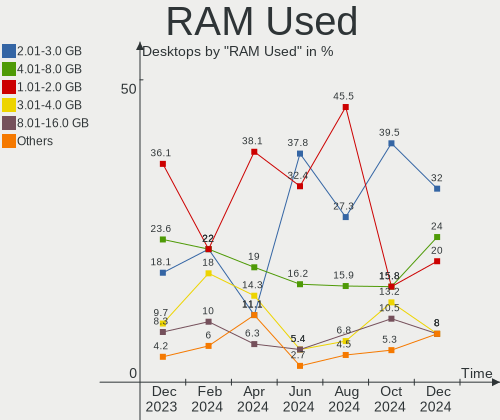
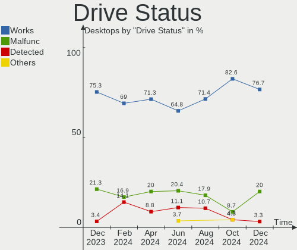
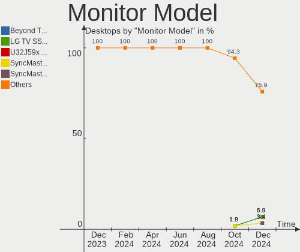
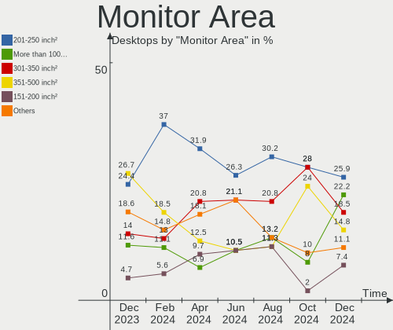

ArcoLinux - Hardware Trends (Desktops)
--------------------------------------

A project to identify most popular hardware characteristics and track their change
over time based on data collected by Linux users at https://Linux-Hardware.org.

Anyone can contribute to this report by the [hw-probe](https://github.com/linuxhw/hw-probe) tool:

    sudo -E hw-probe -all -upload

This report is for one last month. Overall report since the beginning of time: [TestCoverage](https://github.com/linuxhw/TestCoverage)

Period: Aug, 2022.

Contents
--------

* [ System ](#system)
  - [ OS                       ](#os)
  - [ OS Family                ](#os-family)
  - [ Kernel                   ](#kernel)
  - [ Kernel Family            ](#kernel-family)
  - [ Kernel Major Ver.        ](#kernel-major-ver)
  - [ Arch                     ](#arch)
  - [ DE                       ](#de)
  - [ Display Server           ](#display-server)
  - [ Display Manager          ](#display-manager)
  - [ OS Lang                  ](#os-lang)
  - [ Boot Mode                ](#boot-mode)
  - [ Filesystem               ](#filesystem)
  - [ Part. scheme             ](#part-scheme)
  - [ Dual Boot with Linux/BSD ](#dual-boot-with-linuxbsd)
  - [ Dual Boot (Win)          ](#dual-boot-win)

* [ Board ](#board)
  - [ Vendor                   ](#vendor)
  - [ Model                    ](#model)
  - [ Model Family             ](#model-family)
  - [ MFG Year                 ](#mfg-year)
  - [ Form Factor              ](#form-factor)
  - [ Secure Boot              ](#secure-boot)
  - [ Coreboot                 ](#coreboot)
  - [ RAM Size                 ](#ram-size)
  - [ RAM Used                 ](#ram-used)
  - [ Total Drives             ](#total-drives)
  - [ Has CD-ROM               ](#has-cd-rom)
  - [ Has Ethernet             ](#has-ethernet)
  - [ Has WiFi                 ](#has-wifi)
  - [ Has Bluetooth            ](#has-bluetooth)

* [ Location ](#location)
  - [ Country                  ](#country)
  - [ City                     ](#city)

* [ Drives ](#drives)
  - [ Drive Vendor             ](#drive-vendor)
  - [ Drive Model              ](#drive-model)
  - [ HDD Vendor               ](#hdd-vendor)
  - [ SSD Vendor               ](#ssd-vendor)
  - [ Drive Kind               ](#drive-kind)
  - [ Drive Connector          ](#drive-connector)
  - [ Drive Size               ](#drive-size)
  - [ Space Total              ](#space-total)
  - [ Space Used               ](#space-used)
  - [ Malfunc. Drives          ](#malfunc-drives)
  - [ Malfunc. Drive Vendor    ](#malfunc-drive-vendor)
  - [ Malfunc. HDD Vendor      ](#malfunc-hdd-vendor)
  - [ Malfunc. Drive Kind      ](#malfunc-drive-kind)
  - [ Failed Drives            ](#failed-drives)
  - [ Failed Drive Vendor      ](#failed-drive-vendor)
  - [ Drive Status             ](#drive-status)

* [ Storage controller ](#storage-controller)
  - [ Storage Vendor           ](#storage-vendor)
  - [ Storage Model            ](#storage-model)
  - [ Storage Kind             ](#storage-kind)

* [ Processor ](#processor)
  - [ CPU Vendor               ](#cpu-vendor)
  - [ CPU Model                ](#cpu-model)
  - [ CPU Model Family         ](#cpu-model-family)
  - [ CPU Cores                ](#cpu-cores)
  - [ CPU Sockets              ](#cpu-sockets)
  - [ CPU Threads              ](#cpu-threads)
  - [ CPU Op-Modes             ](#cpu-op-modes)
  - [ CPU Microcode            ](#cpu-microcode)
  - [ CPU Microarch            ](#cpu-microarch)

* [ Graphics ](#graphics)
  - [ GPU Vendor               ](#gpu-vendor)
  - [ GPU Model                ](#gpu-model)
  - [ GPU Combo                ](#gpu-combo)
  - [ GPU Driver               ](#gpu-driver)
  - [ GPU Memory               ](#gpu-memory)

* [ Monitor ](#monitor)
  - [ Monitor Vendor           ](#monitor-vendor)
  - [ Monitor Model            ](#monitor-model)
  - [ Monitor Resolution       ](#monitor-resolution)
  - [ Monitor Diagonal         ](#monitor-diagonal)
  - [ Monitor Width            ](#monitor-width)
  - [ Aspect Ratio             ](#aspect-ratio)
  - [ Monitor Area             ](#monitor-area)
  - [ Pixel Density            ](#pixel-density)
  - [ Multiple Monitors        ](#multiple-monitors)

* [ Network ](#network)
  - [ Net Controller Vendor    ](#net-controller-vendor)
  - [ Net Controller Model     ](#net-controller-model)
  - [ Wireless Vendor          ](#wireless-vendor)
  - [ Wireless Model           ](#wireless-model)
  - [ Ethernet Vendor          ](#ethernet-vendor)
  - [ Ethernet Model           ](#ethernet-model)
  - [ Net Controller Kind      ](#net-controller-kind)
  - [ Used Controller          ](#used-controller)
  - [ NICs                     ](#nics)
  - [ IPv6                     ](#ipv6)

* [ Bluetooth ](#bluetooth)
  - [ Bluetooth Vendor         ](#bluetooth-vendor)
  - [ Bluetooth Model          ](#bluetooth-model)

* [ Sound ](#sound)
  - [ Sound Vendor             ](#sound-vendor)
  - [ Sound Model              ](#sound-model)

* [ Memory ](#memory)
  - [ Memory Vendor            ](#memory-vendor)
  - [ Memory Model             ](#memory-model)
  - [ Memory Kind              ](#memory-kind)
  - [ Memory Form Factor       ](#memory-form-factor)
  - [ Memory Size              ](#memory-size)
  - [ Memory Speed             ](#memory-speed)

* [ Printers & scanners ](#printers--scanners)
  - [ Printer Vendor           ](#printer-vendor)
  - [ Printer Model            ](#printer-model)
  - [ Scanner Vendor           ](#scanner-vendor)
  - [ Scanner Model            ](#scanner-model)

* [ Camera ](#camera)
  - [ Camera Vendor            ](#camera-vendor)
  - [ Camera Model             ](#camera-model)

* [ Security ](#security)
  - [ Fingerprint Vendor       ](#fingerprint-vendor)
  - [ Fingerprint Model        ](#fingerprint-model)
  - [ Chipcard Vendor          ](#chipcard-vendor)
  - [ Chipcard Model           ](#chipcard-model)

* [ Unsupported ](#unsupported)
  - [ Unsupported Devices      ](#unsupported-devices)
  - [ Unsupported Device Types ](#unsupported-device-types)

System
------

OS
--

Installed operating systems

| Name              | Desktops | Percent |
|-------------------|----------|---------|
| ArcoLinux Rolling | 16       | 84.21%  |
| ArcoLinux         | 3        | 15.79%  |

OS Family
---------

OS without a version

| Name      | Desktops | Percent |
|-----------|----------|---------|
| ArcoLinux | 19       | 100%    |

Kernel
------

Version of the Linux kernel

| Version            | Desktops | Percent |
|--------------------|----------|---------|
| 5.18.16-arch1-1    | 4        | 21.05%  |
| 5.19.3-arch1-1     | 3        | 15.79%  |
| 5.19.2-arch1-1     | 3        | 15.79%  |
| 5.19.1-arch2-1     | 2        | 10.53%  |
| 5.15.59-2-lts      | 2        | 10.53%  |
| 5.19.5-zen1-1-zen  | 1        | 5.26%   |
| 5.18.16-zen1-1-zen | 1        | 5.26%   |
| 5.18.15-zen1-1-zen | 1        | 5.26%   |
| 5.18.15-arch1-2    | 1        | 5.26%   |
| 5.18.15-arch1-1    | 1        | 5.26%   |

Kernel Family
-------------

Linux kernel without a distro release

| Version | Desktops | Percent |
|---------|----------|---------|
| 5.18.16 | 5        | 26.32%  |
| 5.19.3  | 3        | 15.79%  |
| 5.19.2  | 3        | 15.79%  |
| 5.18.15 | 3        | 15.79%  |
| 5.19.1  | 2        | 10.53%  |
| 5.15.59 | 2        | 10.53%  |
| 5.19.5  | 1        | 5.26%   |

Kernel Major Ver.
-----------------

Linux kernel major version

| Version | Desktops | Percent |
|---------|----------|---------|
| 5.19    | 9        | 47.37%  |
| 5.18    | 8        | 42.11%  |
| 5.15    | 2        | 10.53%  |

Arch
----

OS architecture (x86_64, i586, etc.)

| Name   | Desktops | Percent |
|--------|----------|---------|
| x86_64 | 19       | 100%    |

DE
--

Desktop Environment

| Name           | Desktops | Percent |
|----------------|----------|---------|
| KDE5           | 5        | 26.32%  |
| XFCE           | 4        | 21.05%  |
| qtile          | 2        | 10.53%  |
| awesome        | 2        | 10.53%  |
| LeftWM         | 1        | 5.26%   |
| i3-with-shmlog | 1        | 5.26%   |
| i3             | 1        | 5.26%   |
| herbstluftwm   | 1        | 5.26%   |
| GNOME          | 1        | 5.26%   |
| Deepin         | 1        | 5.26%   |

Display Server
--------------

X11 or Wayland

| Name    | Desktops | Percent |
|---------|----------|---------|
| X11     | 17       | 89.47%  |
| Wayland | 1        | 5.26%   |
| Tty     | 1        | 5.26%   |

Display Manager
---------------

SDDM, LightDM, etc.

| Name    | Desktops | Percent |
|---------|----------|---------|
| SDDM    | 13       | 68.42%  |
| LightDM | 3        | 15.79%  |
| Unknown | 3        | 15.79%  |

OS Lang
-------

Language

| Lang  | Desktops | Percent |
|-------|----------|---------|
| en_US | 14       | 73.68%  |
| fr_FR | 2        | 10.53%  |
| zh_CN | 1        | 5.26%   |
| de_DE | 1        | 5.26%   |
| de_CH | 1        | 5.26%   |

Boot Mode
---------

EFI or BIOS

| Mode | Desktops | Percent |
|------|----------|---------|
| EFI  | 12       | 63.16%  |
| BIOS | 7        | 36.84%  |

Filesystem
----------

Type of filesystem

| Type  | Desktops | Percent |
|-------|----------|---------|
| Ext4  | 15       | 78.95%  |
| Btrfs | 3        | 15.79%  |
| Xfs   | 1        | 5.26%   |

Part. scheme
------------

Scheme of partitioning

| Type    | Desktops | Percent |
|---------|----------|---------|
| GPT     | 15       | 78.95%  |
| Unknown | 3        | 15.79%  |
| MBR     | 1        | 5.26%   |

Dual Boot with Linux/BSD
------------------------

Hosting more than one Linux/BSD

| Dual boot | Desktops | Percent |
|-----------|----------|---------|
| No        | 14       | 73.68%  |
| Yes       | 5        | 26.32%  |

Dual Boot (Win)
---------------

Hosting Linux and Windows

| Dual boot | Desktops | Percent |
|-----------|----------|---------|
| No        | 10       | 52.63%  |
| Yes       | 9        | 47.37%  |

Board
-----

Vendor
------

Motherboard manufacturer

| Name                | Desktops | Percent |
|---------------------|----------|---------|
| Gigabyte Technology | 8        | 42.11%  |
| ASUSTek Computer    | 3        | 15.79%  |
| MSI                 | 2        | 10.53%  |
| Hewlett-Packard     | 2        | 10.53%  |
| Dell                | 2        | 10.53%  |
| ASRock              | 1        | 5.26%   |
| Acer                | 1        | 5.26%   |

Model
-----

Motherboard model

| Name                             | Desktops | Percent |
|----------------------------------|----------|---------|
| MSI MS-7C95                      | 1        | 5.26%   |
| MSI A320M-HDV R4.0               | 1        | 5.26%   |
| HP Z440 Workstation              | 1        | 5.26%   |
| HP ProDesk 600 G4 DM (TAA)       | 1        | 5.26%   |
| Gigabyte Z690 UD DDR4            | 1        | 5.26%   |
| Gigabyte Z390 AORUS ELITE        | 1        | 5.26%   |
| Gigabyte H87-HD3                 | 1        | 5.26%   |
| Gigabyte F2A68HM-DS2             | 1        | 5.26%   |
| Gigabyte B550M AORUS PRO         | 1        | 5.26%   |
| Gigabyte B450M H                 | 1        | 5.26%   |
| Gigabyte B450 AORUS M            | 1        | 5.26%   |
| Gigabyte B365 M AORUS ELITE      | 1        | 5.26%   |
| Dell Precision WorkStation T3500 | 1        | 5.26%   |
| Dell OptiPlex 9010               | 1        | 5.26%   |
| ASUS Z170-A                      | 1        | 5.26%   |
| ASUS TUF Gaming X570-PLUS        | 1        | 5.26%   |
| ASUS PRIME X570-P                | 1        | 5.26%   |
| ASRock B550M Pro4                | 1        | 5.26%   |
| Acer Predator G3-710             | 1        | 5.26%   |

Model Family
------------

Motherboard model prefix

| Name                 | Desktops | Percent |
|----------------------|----------|---------|
| MSI MS-7C95          | 1        | 5.26%   |
| MSI A320M-HDV        | 1        | 5.26%   |
| HP Z440              | 1        | 5.26%   |
| HP ProDesk           | 1        | 5.26%   |
| Gigabyte Z690        | 1        | 5.26%   |
| Gigabyte Z390        | 1        | 5.26%   |
| Gigabyte H87-HD3     | 1        | 5.26%   |
| Gigabyte F2A68HM-DS2 | 1        | 5.26%   |
| Gigabyte B550M       | 1        | 5.26%   |
| Gigabyte B450M       | 1        | 5.26%   |
| Gigabyte B450        | 1        | 5.26%   |
| Gigabyte B365        | 1        | 5.26%   |
| Dell Precision       | 1        | 5.26%   |
| Dell OptiPlex        | 1        | 5.26%   |
| ASUS Z170-A          | 1        | 5.26%   |
| ASUS TUF             | 1        | 5.26%   |
| ASUS PRIME           | 1        | 5.26%   |
| ASRock B550M         | 1        | 5.26%   |
| Acer Predator        | 1        | 5.26%   |

MFG Year
--------

Motherboard manufacture year

| Year | Desktops | Percent |
|------|----------|---------|
| 2019 | 7        | 36.84%  |
| 2020 | 3        | 15.79%  |
| 2015 | 3        | 15.79%  |
| 2021 | 1        | 5.26%   |
| 2018 | 1        | 5.26%   |
| 2014 | 1        | 5.26%   |
| 2013 | 1        | 5.26%   |
| 2012 | 1        | 5.26%   |
| 2011 | 1        | 5.26%   |

Form Factor
-----------

Physical design of the computer

| Name    | Desktops | Percent |
|---------|----------|---------|
| Desktop | 19       | 100%    |

Secure Boot
-----------

Enabled or disabled

| State    | Desktops | Percent |
|----------|----------|---------|
| Disabled | 19       | 100%    |

Coreboot
--------

Have coreboot on board

| Used | Desktops | Percent |
|------|----------|---------|
| No   | 19       | 100%    |

RAM Size
--------

Total RAM memory

| Size in GB  | Desktops | Percent |
|-------------|----------|---------|
| 32.01-64.0  | 7        | 36.84%  |
| 16.01-24.0  | 6        | 31.58%  |
| 8.01-16.0   | 3        | 15.79%  |
| 4.01-8.0    | 1        | 5.26%   |
| 24.01-32.0  | 1        | 5.26%   |
| 64.01-256.0 | 1        | 5.26%   |

RAM Used
--------

Used RAM memory

| Used GB   | Desktops | Percent |
|-----------|----------|---------|
| 2.01-3.0  | 7        | 36.84%  |
| 3.01-4.0  | 5        | 26.32%  |
| 1.01-2.0  | 3        | 15.79%  |
| 4.01-8.0  | 2        | 10.53%  |
| 8.01-16.0 | 1        | 5.26%   |
| 0.51-1.0  | 1        | 5.26%   |

Total Drives
------------

Number of drives on board

| Drives | Desktops | Percent |
|--------|----------|---------|
| 1      | 6        | 31.58%  |
| 2      | 5        | 26.32%  |
| 5      | 3        | 15.79%  |
| 3      | 3        | 15.79%  |
| 4      | 2        | 10.53%  |

Has CD-ROM
----------

Has CD-ROM on board

| Presented | Desktops | Percent |
|-----------|----------|---------|
| No        | 12       | 63.16%  |
| Yes       | 7        | 36.84%  |

Has Ethernet
------------

Has Ethernet on board

| Presented | Desktops | Percent |
|-----------|----------|---------|
| Yes       | 19       | 100%    |

Has WiFi
--------

Has WiFi module

| Presented | Desktops | Percent |
|-----------|----------|---------|
| No        | 13       | 68.42%  |
| Yes       | 6        | 31.58%  |

Has Bluetooth
-------------

Has Bluetooth module

| Presented | Desktops | Percent |
|-----------|----------|---------|
| No        | 12       | 63.16%  |
| Yes       | 7        | 36.84%  |

Location
--------

Country
-------

Geographic location (country)

| Country     | Desktops | Percent |
|-------------|----------|---------|
| USA         | 8        | 42.11%  |
| Germany     | 2        | 10.53%  |
| France      | 2        | 10.53%  |
| Switzerland | 1        | 5.26%   |
| Slovakia    | 1        | 5.26%   |
| Russia      | 1        | 5.26%   |
| Portugal    | 1        | 5.26%   |
| Netherlands | 1        | 5.26%   |
| Kuwait      | 1        | 5.26%   |
| Japan       | 1        | 5.26%   |

City
----

Geographic location (city)

| City                | Desktops | Percent |
|---------------------|----------|---------|
| Houston             | 2        | 10.53%  |
| Verkhnyaya Pyshma   | 1        | 5.26%   |
| Vendrennes          | 1        | 5.26%   |
| Valley Village      | 1        | 5.26%   |
| Trussville          | 1        | 5.26%   |
| Schaffhausen        | 1        | 5.26%   |
| Povoa de Santa Iria | 1        | 5.26%   |
| Lohnberg            | 1        | 5.26%   |
| Kuwait City         | 1        | 5.26%   |
| Hurst               | 1        | 5.26%   |
| Huntington Station  | 1        | 5.26%   |
| Heiwajima           | 1        | 5.26%   |
| Colfax              | 1        | 5.26%   |
| Chatsworth          | 1        | 5.26%   |
| Carpentras          | 1        | 5.26%   |
| Čadca              | 1        | 5.26%   |
| Berlin              | 1        | 5.26%   |
| Amsterdam           | 1        | 5.26%   |

Drives
------

Drive Vendor
------------

Hard drive vendors

| Vendor                      | Desktops | Drives | Percent |
|-----------------------------|----------|--------|---------|
| WDC                         | 8        | 8      | 21.05%  |
| Samsung Electronics         | 8        | 15     | 21.05%  |
| Seagate                     | 5        | 6      | 13.16%  |
| SanDisk                     | 2        | 2      | 5.26%   |
| Micron/Crucial Technology   | 2        | 2      | 5.26%   |
| MAXIO Technology (Hangzhou) | 2        | 2      | 5.26%   |
| Intel                       | 2        | 2      | 5.26%   |
| Crucial                     | 2        | 4      | 5.26%   |
| Unknown                     | 1        | 1      | 2.63%   |
| Toshiba                     | 1        | 1      | 2.63%   |
| SK hynix                    | 1        | 1      | 2.63%   |
| Micron Technology           | 1        | 1      | 2.63%   |
| Kingston                    | 1        | 1      | 2.63%   |
| ADATA Technology            | 1        | 1      | 2.63%   |
| A-DATA Technology           | 1        | 1      | 2.63%   |

Drive Model
-----------

Hard drive models

| Model                                                           | Desktops | Percent |
|-----------------------------------------------------------------|----------|---------|
| Samsung NVMe SSD Controller SM981/PM981/PM983 1TB               | 4        | 8.51%   |
| WDC WD20EZRX-00DC0B0 2TB                                        | 2        | 4.26%   |
| Samsung SSD 850 EVO 500GB                                       | 2        | 4.26%   |
| Crucial CT1000MX500SSD1 1TB                                     | 2        | 4.26%   |
| WDC WDS240G2G0A-00JH30 240GB SSD                                | 1        | 2.13%   |
| WDC WD5000AAKX-753CA1 500GB                                     | 1        | 2.13%   |
| WDC WD5000AAKX-08U6AA0 500GB                                    | 1        | 2.13%   |
| WDC WD20EZRZ-00Z5HB0 2TB                                        | 1        | 2.13%   |
| WDC WD20EFZX-68AWUN0 2TB                                        | 1        | 2.13%   |
| WDC WD10EFRX-68JCSN0 1TB                                        | 1        | 2.13%   |
| Unknown SD/MMC/MS PRO 128GB                                     | 1        | 2.13%   |
| Toshiba DT01ACA200 2TB                                          | 1        | 2.13%   |
| SK hynix SHGP31-1000GM 1TB                                      | 1        | 2.13%   |
| Seagate ST8000DM004-2CX188 8TB                                  | 1        | 2.13%   |
| Seagate ST4000DM004-2CV104 4TB                                  | 1        | 2.13%   |
| Seagate ST3500413AS 500GB                                       | 1        | 2.13%   |
| Seagate ST3250310AS 250GB                                       | 1        | 2.13%   |
| Seagate ST2000DX002-2DV164 2TB                                  | 1        | 2.13%   |
| Seagate ST2000DM006-2DM164 2TB                                  | 1        | 2.13%   |
| Sandisk WD Blue SN550 NVMe SSD 256GB                            | 1        | 2.13%   |
| SanDisk SSD PLUS 240GB                                          | 1        | 2.13%   |
| Samsung SSD PM830 2.5 7mm 128GB                                 | 1        | 2.13%   |
| Samsung SSD 980 1TB                                             | 1        | 2.13%   |
| Samsung SSD 870 QVO 1TB                                         | 1        | 2.13%   |
| Samsung SSD 860 EVO 500GB                                       | 1        | 2.13%   |
| Samsung SSD 850 EVO 250GB                                       | 1        | 2.13%   |
| Samsung SSD 840 EVO 250GB                                       | 1        | 2.13%   |
| Samsung NVMe SSD Controller SM961/PM961/SM963 256GB             | 1        | 2.13%   |
| Samsung NVMe SSD Controller PM9A1/PM9A3/980PRO 1TB              | 1        | 2.13%   |
| Samsung MZHPU256HCGL-000H1 256GB SSD                            | 1        | 2.13%   |
| Micron/Crucial CT1000P5SSD8 1TB                                 | 1        | 2.13%   |
| Micron/Crucial CT1000P1SSD8 1TB                                 | 1        | 2.13%   |
| Micron MTFDDAK256MAM-1K1 256GB SSD                              | 1        | 2.13%   |
| MAXIO (Hangzhou) NVMe SSD Controller MAP1202 1TB                | 1        | 2.13%   |
| MAXIO (Hangzhou) NVMe SSD Controller MAP1001 512GB              | 1        | 2.13%   |
| Kingston SA400S37120G 120GB SSD                                 | 1        | 2.13%   |
| Intel SSDPEKNW010T9 1TB                                         | 1        | 2.13%   |
| Intel SSD 600P Series 512GB                                     | 1        | 2.13%   |
| Crucial CT525MX300SSD1 528GB                                    | 1        | 2.13%   |
| ADATA XPG SX8200 Pro PCIe Gen3x4 M.2 2280 Solid State Drive 1TB | 1        | 2.13%   |
| A-DATA SP900 256GB SSD                                          | 1        | 2.13%   |

HDD Vendor
----------

Hard disk drive vendors

| Vendor  | Desktops | Drives | Percent |
|---------|----------|--------|---------|
| WDC     | 7        | 7      | 50%     |
| Seagate | 5        | 6      | 35.71%  |
| Unknown | 1        | 1      | 7.14%   |
| Toshiba | 1        | 1      | 7.14%   |

SSD Vendor
----------

Solid state drive vendors

| Vendor              | Desktops | Drives | Percent |
|---------------------|----------|--------|---------|
| Samsung Electronics | 4        | 8      | 36.36%  |
| Crucial             | 2        | 4      | 18.18%  |
| WDC                 | 1        | 1      | 9.09%   |
| SanDisk             | 1        | 1      | 9.09%   |
| Micron Technology   | 1        | 1      | 9.09%   |
| Kingston            | 1        | 1      | 9.09%   |
| A-DATA Technology   | 1        | 1      | 9.09%   |

Drive Kind
----------

HDD or SSD

| Kind | Desktops | Drives | Percent |
|------|----------|--------|---------|
| NVMe | 12       | 16     | 35.29%  |
| SSD  | 11       | 17     | 32.35%  |
| HDD  | 11       | 15     | 32.35%  |

Drive Connector
---------------

SATA, SAS, NVMe, etc.

| Type | Desktops | Drives | Percent |
|------|----------|--------|---------|
| SATA | 14       | 31     | 51.85%  |
| NVMe | 12       | 16     | 44.44%  |
| SAS  | 1        | 1      | 3.7%    |

Drive Size
----------

Size of hard drive

| Size in TB | Desktops | Drives | Percent |
|------------|----------|--------|---------|
| 0.01-0.5   | 11       | 17     | 45.83%  |
| 1.01-2.0   | 7        | 7      | 29.17%  |
| 0.51-1.0   | 4        | 6      | 16.67%  |
| 3.01-4.0   | 1        | 1      | 4.17%   |
| 4.01-10.0  | 1        | 1      | 4.17%   |

Space Total
-----------

Amount of disk space available on the file system

| Size in GB     | Desktops | Percent |
|----------------|----------|---------|
| 251-500        | 7        | 36.84%  |
| 101-250        | 4        | 21.05%  |
| More than 3000 | 3        | 15.79%  |
| 501-1000       | 3        | 15.79%  |
| 2001-3000      | 1        | 5.26%   |
| 1001-2000      | 1        | 5.26%   |

Space Used
----------

Amount of used disk space

| Used GB   | Desktops | Percent |
|-----------|----------|---------|
| 101-250   | 6        | 31.58%  |
| 1-20      | 5        | 26.32%  |
| 1001-2000 | 3        | 15.79%  |
| 251-500   | 2        | 10.53%  |
| 51-100    | 2        | 10.53%  |
| 21-50     | 1        | 5.26%   |

Malfunc. Drives
---------------

Drive models with a malfunction

| Model                       | Desktops | Drives | Percent |
|-----------------------------|----------|--------|---------|
| WDC WD5000AAKX-753CA1 500GB | 1        | 1      | 33.33%  |
| WDC WD20EZRX-00DC0B0 2TB    | 1        | 1      | 33.33%  |
| Intel SSD 600P Series 512GB | 1        | 1      | 33.33%  |

Malfunc. Drive Vendor
---------------------

Vendors of faulty drives

| Vendor | Desktops | Drives | Percent |
|--------|----------|--------|---------|
| WDC    | 2        | 2      | 66.67%  |
| Intel  | 1        | 1      | 33.33%  |

Malfunc. HDD Vendor
-------------------

Vendors of faulty HDD drives

| Vendor | Desktops | Drives | Percent |
|--------|----------|--------|---------|
| WDC    | 2        | 2      | 100%    |

Malfunc. Drive Kind
-------------------

Kinds of faulty drives

| Kind | Desktops | Drives | Percent |
|------|----------|--------|---------|
| HDD  | 2        | 2      | 66.67%  |
| NVMe | 1        | 1      | 33.33%  |

Failed Drives
-------------

Failed drive models

Zero info for selected period =(

Failed Drive Vendor
-------------------

Failed drive vendors

Zero info for selected period =(

Drive Status
------------

Number of failed and malfunc. drives

| Status   | Desktops | Drives | Percent |
|----------|----------|--------|---------|
| Works    | 16       | 37     | 69.57%  |
| Detected | 4        | 8      | 17.39%  |
| Malfunc  | 3        | 3      | 13.04%  |

Storage controller
------------------

Storage Vendor
--------------

Storage controller vendors

| Vendor                      | Desktops | Percent |
|-----------------------------|----------|---------|
| Intel                       | 11       | 31.43%  |
| AMD                         | 9        | 25.71%  |
| Samsung Electronics         | 7        | 20%     |
| Micron/Crucial Technology   | 2        | 5.71%   |
| MAXIO Technology (Hangzhou) | 2        | 5.71%   |
| SK hynix                    | 1        | 2.86%   |
| SanDisk                     | 1        | 2.86%   |
| LSI Logic / Symbios Logic   | 1        | 2.86%   |
| ADATA Technology            | 1        | 2.86%   |

Storage Model
-------------

Storage controller models

| Model                                                                          | Desktops | Percent |
|--------------------------------------------------------------------------------|----------|---------|
| Samsung NVMe SSD Controller SM981/PM981/PM983                                  | 4        | 10.26%  |
| Intel SATA Controller [RAID mode]                                              | 4        | 10.26%  |
| AMD FCH SATA Controller [AHCI mode]                                            | 3        | 7.69%   |
| AMD 500 Series Chipset SATA Controller                                         | 3        | 7.69%   |
| Intel Q170/Q150/B150/H170/H110/Z170/CM236 Chipset SATA Controller [AHCI Mode]  | 2        | 5.13%   |
| AMD 400 Series Chipset SATA Controller                                         | 2        | 5.13%   |
| SK hynix Gold P31 SSD                                                          | 1        | 2.56%   |
| SanDisk WD Blue SN550 NVMe SSD                                                 | 1        | 2.56%   |
| Samsung XP941 PCIe SSD                                                         | 1        | 2.56%   |
| Samsung NVMe SSD Controller SM961/PM961/SM963                                  | 1        | 2.56%   |
| Samsung NVMe SSD Controller PM9A1/PM9A3/980PRO                                 | 1        | 2.56%   |
| Samsung NVMe SSD Controller 980                                                | 1        | 2.56%   |
| Micron/Crucial NVMe Controller                                                 | 1        | 2.56%   |
| Micron/Crucial Non-Volatile memory controller                                  | 1        | 2.56%   |
| MAXIO (Hangzhou) NVMe SSD Controller MAP1202                                   | 1        | 2.56%   |
| MAXIO (Hangzhou) NVMe SSD Controller MAP1001                                   | 1        | 2.56%   |
| LSI Logic / Symbios Logic SAS1068E PCI-Express Fusion-MPT SAS                  | 1        | 2.56%   |
| Intel SSD 600P Series                                                          | 1        | 2.56%   |
| Intel Non-Volatile memory controller                                           | 1        | 2.56%   |
| Intel Cannon Lake PCH SATA AHCI Controller                                     | 1        | 2.56%   |
| Intel C610/X99 series chipset sSATA Controller [AHCI mode]                     | 1        | 2.56%   |
| Intel C610/X99 series chipset 6-Port SATA Controller [AHCI mode]               | 1        | 2.56%   |
| Intel Alder Lake-S PCH SATA Controller [AHCI Mode]                             | 1        | 2.56%   |
| Intel 8 Series/C220 Series Chipset Family 6-port SATA Controller 1 [AHCI mode] | 1        | 2.56%   |
| AMD FCH SATA Controller [IDE mode]                                             | 1        | 2.56%   |
| AMD FCH SATA Controller D                                                      | 1        | 2.56%   |
| ADATA XPG SX8200 Pro PCIe Gen3x4 M.2 2280 Solid State Drive                    | 1        | 2.56%   |

Storage Kind
------------

Kind of storage controller (IDE, SATA, NVMe, SAS, ...)

| Kind | Desktops | Percent |
|------|----------|---------|
| SATA | 15       | 46.88%  |
| NVMe | 12       | 37.5%   |
| RAID | 4        | 12.5%   |
| SCSI | 1        | 3.13%   |

Processor
---------

CPU Vendor
----------

Processor vendors

| Vendor | Desktops | Percent |
|--------|----------|---------|
| Intel  | 10       | 52.63%  |
| AMD    | 9        | 47.37%  |

CPU Model
---------

Processor models

| Model                                          | Desktops | Percent |
|------------------------------------------------|----------|---------|
| AMD Ryzen 7 5800X 8-Core Processor             | 3        | 15.79%  |
| AMD Ryzen 5 3600 6-Core Processor              | 3        | 15.79%  |
| Intel Xeon CPU W3550 @ 3.07GHz                 | 1        | 5.26%   |
| Intel Xeon CPU E5-1620 v3 @ 3.50GHz            | 1        | 5.26%   |
| Intel Xeon CPU E3-1240 v3 @ 3.40GHz            | 1        | 5.26%   |
| Intel Core i7-8700T CPU @ 2.40GHz              | 1        | 5.26%   |
| Intel Core i7-7700 CPU @ 3.60GHz               | 1        | 5.26%   |
| Intel Core i7-6700K CPU @ 4.00GHz              | 1        | 5.26%   |
| Intel Core i7-3770 CPU @ 3.40GHz               | 1        | 5.26%   |
| Intel Core i5-9600K CPU @ 3.70GHz              | 1        | 5.26%   |
| Intel Core i3-9100 CPU @ 3.60GHz               | 1        | 5.26%   |
| Intel 12th Gen Core i5-12400                   | 1        | 5.26%   |
| AMD Ryzen 7 3700X 8-Core Processor             | 1        | 5.26%   |
| AMD Ryzen 5 5600G with Radeon Graphics         | 1        | 5.26%   |
| AMD A10-7800 Radeon R7, 12 Compute Cores 4C+8G | 1        | 5.26%   |

CPU Model Family
----------------

Processor model prefix

| Model         | Desktops | Percent |
|---------------|----------|---------|
| Intel Core i7 | 4        | 21.05%  |
| AMD Ryzen 7   | 4        | 21.05%  |
| AMD Ryzen 5   | 4        | 21.05%  |
| Intel Xeon    | 3        | 15.79%  |
| Other         | 1        | 5.26%   |
| Intel Core i5 | 1        | 5.26%   |
| Intel Core i3 | 1        | 5.26%   |
| AMD A10       | 1        | 5.26%   |

CPU Cores
---------

Number of processor cores

| Number | Desktops | Percent |
|--------|----------|---------|
| 6      | 7        | 36.84%  |
| 4      | 7        | 36.84%  |
| 8      | 4        | 21.05%  |
| 2      | 1        | 5.26%   |

CPU Sockets
-----------

Number of sockets

| Number | Desktops | Percent |
|--------|----------|---------|
| 1      | 19       | 100%    |

CPU Threads
-----------

Threads per core (Hyper-Threading)

| Number | Desktops | Percent |
|--------|----------|---------|
| 2      | 16       | 84.21%  |
| 1      | 3        | 15.79%  |

CPU Op-Modes
------------

CPU Operation Modes (32-bit, 64-bit)

| Op mode        | Desktops | Percent |
|----------------|----------|---------|
| 32-bit, 64-bit | 19       | 100%    |

CPU Microcode
-------------

Microcode number

| Number     | Desktops | Percent |
|------------|----------|---------|
| 0x08701021 | 4        | 21.05%  |
| Unknown    | 3        | 15.79%  |
| 0x0a201016 | 2        | 10.53%  |
| 0x906ec    | 1        | 5.26%   |
| 0x906eb    | 1        | 5.26%   |
| 0x906ea    | 1        | 5.26%   |
| 0x906e9    | 1        | 5.26%   |
| 0x90672    | 1        | 5.26%   |
| 0x506e3    | 1        | 5.26%   |
| 0x306f2    | 1        | 5.26%   |
| 0x306a9    | 1        | 5.26%   |
| 0x0a50000d | 1        | 5.26%   |
| 0x0a20120a | 1        | 5.26%   |

CPU Microarch
-------------

Microarchitecture

| Name             | Desktops | Percent |
|------------------|----------|---------|
| Zen 3            | 4        | 21.05%  |
| Zen 2            | 4        | 21.05%  |
| KabyLake         | 4        | 21.05%  |
| Haswell          | 2        | 10.53%  |
| Steamroller      | 1        | 5.26%   |
| Skylake          | 1        | 5.26%   |
| Nehalem          | 1        | 5.26%   |
| IvyBridge        | 1        | 5.26%   |
| Alderlake Hybrid | 1        | 5.26%   |

Graphics
--------

GPU Vendor
----------

Vendors of graphics cards

| Vendor | Desktops | Percent |
|--------|----------|---------|
| Nvidia | 10       | 47.62%  |
| AMD    | 8        | 38.1%   |
| Intel  | 3        | 14.29%  |

GPU Model
---------

Graphics card models

| Model                                                                 | Desktops | Percent |
|-----------------------------------------------------------------------|----------|---------|
| AMD Navi 23 [Radeon RX 6600/6600 XT/6600M]                            | 2        | 8.7%    |
| Nvidia TU116 [GeForce GTX 1660]                                       | 1        | 4.35%   |
| Nvidia GT218 [GeForce 210]                                            | 1        | 4.35%   |
| Nvidia GP106 [GeForce GTX 1060 6GB]                                   | 1        | 4.35%   |
| Nvidia GP104 [GeForce GTX 1080]                                       | 1        | 4.35%   |
| Nvidia GP102 [GeForce GTX 1080 Ti]                                    | 1        | 4.35%   |
| Nvidia GM206 [GeForce GTX 960]                                        | 1        | 4.35%   |
| Nvidia GM107 [GeForce GTX 750 Ti]                                     | 1        | 4.35%   |
| Nvidia GF106GL [Quadro 2000]                                          | 1        | 4.35%   |
| Nvidia GA104 [GeForce RTX 3070 Ti]                                    | 1        | 4.35%   |
| Nvidia GA102 [GeForce RTX 3080 Ti]                                    | 1        | 4.35%   |
| Intel VGA compatible controller                                       | 1        | 4.35%   |
| Intel HD Graphics 530                                                 | 1        | 4.35%   |
| Intel CoffeeLake-S GT2 [UHD Graphics 630]                             | 1        | 4.35%   |
| AMD Oland [Radeon HD 8570 / R5 430 OEM / R7 240/340 / Radeon 520 OEM] | 1        | 4.35%   |
| AMD Navi 24 [Radeon RX 6400 / 6500 XT]                                | 1        | 4.35%   |
| AMD Navi 14 [Radeon RX 5500/5500M / Pro 5500M]                        | 1        | 4.35%   |
| AMD Navi 10 [Radeon RX 5600 OEM/5600 XT / 5700/5700 XT]               | 1        | 4.35%   |
| AMD Lexa XT [Radeon PRO WX 2100]                                      | 1        | 4.35%   |
| AMD Kaveri [Radeon R7 Graphics]                                       | 1        | 4.35%   |
| AMD Ellesmere [Radeon RX 470/480/570/570X/580/580X/590]               | 1        | 4.35%   |
| AMD Cezanne                                                           | 1        | 4.35%   |

GPU Combo
---------

Combinations of graphics cards

| Name           | Desktops | Percent |
|----------------|----------|---------|
| 1 x Nvidia     | 8        | 42.11%  |
| 1 x AMD        | 6        | 31.58%  |
| 2 x AMD        | 2        | 10.53%  |
| Intel + Nvidia | 2        | 10.53%  |
| 1 x Intel      | 1        | 5.26%   |

GPU Driver
----------

Free vs proprietary

| Driver      | Desktops | Percent |
|-------------|----------|---------|
| Proprietary | 10       | 52.63%  |
| Free        | 9        | 47.37%  |

GPU Memory
----------

Total video memory

| Size in GB | Desktops | Percent |
|------------|----------|---------|
| Unknown    | 6        | 31.58%  |
| 7.01-8.0   | 4        | 21.05%  |
| 5.01-6.0   | 3        | 15.79%  |
| 3.01-4.0   | 3        | 15.79%  |
| 1.01-2.0   | 2        | 10.53%  |
| 8.01-16.0  | 1        | 5.26%   |

Monitor
-------

Monitor Vendor
--------------

Monitor vendors

| Vendor               | Desktops | Percent |
|----------------------|----------|---------|
| Goldstar             | 5        | 25%     |
| Samsung Electronics  | 3        | 15%     |
| Hewlett-Packard      | 2        | 10%     |
| Acer                 | 2        | 10%     |
| Unknown              | 1        | 5%      |
| Sony                 | 1        | 5%      |
| MSI                  | 1        | 5%      |
| Microstep            | 1        | 5%      |
| Dell                 | 1        | 5%      |
| ASUSTek Computer     | 1        | 5%      |
| AOC                  | 1        | 5%      |
| Ancor Communications | 1        | 5%      |

Monitor Model
-------------

Monitor models

| Model                                                                 | Desktops | Percent |
|-----------------------------------------------------------------------|----------|---------|
| Goldstar FULL HD GSM5B55 1920x1080 480x270mm 21.7-inch                | 2        | 10%     |
| Unknown LCD Monitor MEC MD20491 1920x1080                             | 1        | 5%      |
| Sony TV  *00 SNY8004 3840x2160 1220x680mm 55.0-inch                   | 1        | 5%      |
| Samsung Electronics SyncMaster SAM04D5 1920x1080                      | 1        | 5%      |
| Samsung Electronics S34J55x SAM0F70 3440x1440 797x333mm 34.0-inch     | 1        | 5%      |
| Samsung Electronics S24D360 SAM0B25 1920x1080 520x290mm 23.4-inch     | 1        | 5%      |
| MSI G27C4 MSI3CA9 1920x1080 598x336mm 27.0-inch                       | 1        | 5%      |
| Microstep LCD Monitor MSI G27C4 1920x1080                             | 1        | 5%      |
| Hewlett-Packard Z27n HWP3217 2560x1440 597x336mm 27.0-inch            | 1        | 5%      |
| Hewlett-Packard L2045w HWP2694 1680x1050 430x270mm 20.0-inch          | 1        | 5%      |
| Goldstar ULTRAWIDE GSM76F9 2560x1080 531x298mm 24.0-inch              | 1        | 5%      |
| Goldstar HDR 4K GSM7750 3840x2160 697x392mm 31.5-inch                 | 1        | 5%      |
| Goldstar FHD GSM5BCA 1920x1080 480x270mm 21.7-inch                    | 1        | 5%      |
| Dell D3218HN DEL200B 1920x1080 698x393mm 31.5-inch                    | 1        | 5%      |
| ASUSTek Computer VG259 AUS25A6 1920x1080 540x300mm 24.3-inch          | 1        | 5%      |
| AOC 24G2W1G4 AOC2402 1920x1080 530x300mm 24.0-inch                    | 1        | 5%      |
| Ancor Communications ASUS PB278 ACI27A3 2560x1440 597x336mm 27.0-inch | 1        | 5%      |
| Acer V277U ACR0679 2560x1440 597x336mm 27.0-inch                      | 1        | 5%      |
| Acer K272HUL ACR0524 2560x1440 598x336mm 27.0-inch                    | 1        | 5%      |

Monitor Resolution
------------------

Monitor screen resolution

| Resolution         | Desktops | Percent |
|--------------------|----------|---------|
| 1920x1080 (FHD)    | 6        | 31.58%  |
| 2560x1440 (QHD)    | 5        | 26.32%  |
| 3840x2160 (4K)     | 4        | 21.05%  |
| 3440x1440          | 1        | 5.26%   |
| 2560x1080          | 1        | 5.26%   |
| 1920x540           | 1        | 5.26%   |
| 1680x1050 (WSXGA+) | 1        | 5.26%   |

Monitor Diagonal
----------------

Diagonal size in inches

| Inches  | Desktops | Percent |
|---------|----------|---------|
| 27      | 5        | 25%     |
| 21      | 3        | 15%     |
| Unknown | 3        | 15%     |
| 34      | 2        | 10%     |
| 31      | 2        | 10%     |
| 24      | 2        | 10%     |
| 65      | 1        | 5%      |
| 23      | 1        | 5%      |
| 20      | 1        | 5%      |

Monitor Width
-------------

Physical width

| Width in mm | Desktops | Percent |
|-------------|----------|---------|
| 501-600     | 8        | 40%     |
| 401-500     | 4        | 20%     |
| Unknown     | 3        | 15%     |
| 701-800     | 2        | 10%     |
| 601-700     | 2        | 10%     |
| 1001-1500   | 1        | 5%      |

Aspect Ratio
------------

Proportional relationship between the width and the height

| Ratio   | Desktops | Percent |
|---------|----------|---------|
| 16/9    | 13       | 68.42%  |
| 21/9    | 2        | 10.53%  |
| Unknown | 2        | 10.53%  |
| 32/9    | 1        | 5.26%   |
| 16/10   | 1        | 5.26%   |

Monitor Area
------------

Area in inch²

| Area in inch² | Desktops | Percent |
|----------------|----------|---------|
| 301-350        | 5        | 25%     |
| 201-250        | 5        | 25%     |
| 351-500        | 4        | 20%     |
| Unknown        | 3        | 15%     |
| More than 1000 | 1        | 5%      |
| 251-300        | 1        | 5%      |
| 151-200        | 1        | 5%      |

Pixel Density
-------------

Pixels per inch

| Density | Desktops | Percent |
|---------|----------|---------|
| 101-120 | 8        | 42.11%  |
| 51-100  | 7        | 36.84%  |
| Unknown | 3        | 15.79%  |
| 121-160 | 1        | 5.26%   |

Multiple Monitors
-----------------

Total monitors connected

| Total | Desktops | Percent |
|-------|----------|---------|
| 1     | 14       | 73.68%  |
| 2     | 3        | 15.79%  |
| 0     | 2        | 10.53%  |

Network
-------

Net Controller Vendor
---------------------

Controller vendors

| Vendor                | Desktops | Percent |
|-----------------------|----------|---------|
| Realtek Semiconductor | 12       | 50%     |
| Intel                 | 10       | 41.67%  |
| NetGear               | 1        | 4.17%   |
| Broadcom              | 1        | 4.17%   |

Net Controller Model
--------------------

Controller models

| Model                                                             | Desktops | Percent |
|-------------------------------------------------------------------|----------|---------|
| Realtek RTL8111/8168/8411 PCI Express Gigabit Ethernet Controller | 11       | 42.31%  |
| Intel Ethernet Connection (2) I219-V                              | 2        | 7.69%   |
| Intel Dual Band Wireless-AC 3168NGW [Stone Peak]                  | 2        | 7.69%   |
| Realtek RTL8169 PCI Gigabit Ethernet Controller                   | 1        | 3.85%   |
| Realtek RTL8125 2.5GbE Controller                                 | 1        | 3.85%   |
| NetGear A6210                                                     | 1        | 3.85%   |
| Intel Wireless-AC 9260                                            | 1        | 3.85%   |
| Intel Wireless 8265 / 8275                                        | 1        | 3.85%   |
| Intel Wireless 7265                                               | 1        | 3.85%   |
| Intel Ethernet Connection (7) I219-V                              | 1        | 3.85%   |
| Intel Ethernet Connection (7) I219-LM                             | 1        | 3.85%   |
| Intel Ethernet Connection (2) I218-LM                             | 1        | 3.85%   |
| Intel 82579LM Gigabit Network Connection (Lewisville)             | 1        | 3.85%   |
| Broadcom NetXtreme BCM5761 Gigabit Ethernet PCIe                  | 1        | 3.85%   |

Wireless Vendor
---------------

Wireless vendors

| Vendor  | Desktops | Percent |
|---------|----------|---------|
| Intel   | 5        | 83.33%  |
| NetGear | 1        | 16.67%  |

Wireless Model
--------------

Wireless models

| Model                                            | Desktops | Percent |
|--------------------------------------------------|----------|---------|
| Intel Dual Band Wireless-AC 3168NGW [Stone Peak] | 2        | 33.33%  |
| NetGear A6210                                    | 1        | 16.67%  |
| Intel Wireless-AC 9260                           | 1        | 16.67%  |
| Intel Wireless 8265 / 8275                       | 1        | 16.67%  |
| Intel Wireless 7265                              | 1        | 16.67%  |

Ethernet Vendor
---------------

Ethernet vendors

| Vendor                | Desktops | Percent |
|-----------------------|----------|---------|
| Realtek Semiconductor | 12       | 63.16%  |
| Intel                 | 6        | 31.58%  |
| Broadcom              | 1        | 5.26%   |

Ethernet Model
--------------

Ethernet models

| Model                                                             | Desktops | Percent |
|-------------------------------------------------------------------|----------|---------|
| Realtek RTL8111/8168/8411 PCI Express Gigabit Ethernet Controller | 11       | 55%     |
| Intel Ethernet Connection (2) I219-V                              | 2        | 10%     |
| Realtek RTL8169 PCI Gigabit Ethernet Controller                   | 1        | 5%      |
| Realtek RTL8125 2.5GbE Controller                                 | 1        | 5%      |
| Intel Ethernet Connection (7) I219-V                              | 1        | 5%      |
| Intel Ethernet Connection (7) I219-LM                             | 1        | 5%      |
| Intel Ethernet Connection (2) I218-LM                             | 1        | 5%      |
| Intel 82579LM Gigabit Network Connection (Lewisville)             | 1        | 5%      |
| Broadcom NetXtreme BCM5761 Gigabit Ethernet PCIe                  | 1        | 5%      |

Net Controller Kind
-------------------

Ethernet, WiFi or modem

| Kind     | Desktops | Percent |
|----------|----------|---------|
| Ethernet | 19       | 76%     |
| WiFi     | 6        | 24%     |

Used Controller
---------------

Currently used network controller

| Kind     | Desktops | Percent |
|----------|----------|---------|
| Ethernet | 15       | 78.95%  |
| WiFi     | 4        | 21.05%  |

NICs
----

Total network controllers on board

| Total | Desktops | Percent |
|-------|----------|---------|
| 1     | 13       | 68.42%  |
| 2     | 6        | 31.58%  |

IPv6
----

IPv6 vs IPv4

| Used | Desktops | Percent |
|------|----------|---------|
| No   | 16       | 84.21%  |
| Yes  | 3        | 15.79%  |

Bluetooth
---------

Bluetooth Vendor
----------------

Controller vendors

| Vendor           | Desktops | Percent |
|------------------|----------|---------|
| Intel            | 5        | 62.5%   |
| ASUSTek Computer | 2        | 25%     |
| SINO WEALTH      | 1        | 12.5%   |

Bluetooth Model
---------------

Controller models

| Model                                    | Desktops | Percent |
|------------------------------------------|----------|---------|
| Intel Wireless-AC 3168 Bluetooth         | 2        | 25%     |
| Intel Bluetooth wireless interface       | 2        | 25%     |
| SINO WEALTH RK Bluetooth Keyboar         | 1        | 12.5%   |
| Intel Wireless-AC 9260 Bluetooth Adapter | 1        | 12.5%   |
| ASUS Broadcom BCM20702A0 Bluetooth       | 1        | 12.5%   |
| ASUS ASUS USB-BT500                      | 1        | 12.5%   |

Sound
-----

Sound Vendor
------------

Sound card vendors

| Vendor | Desktops | Percent |
|--------|----------|---------|
| AMD    | 11       | 35.48%  |
| Nvidia | 10       | 32.26%  |
| Intel  | 9        | 29.03%  |
| RME    | 1        | 3.23%   |

Sound Model
-----------

Sound card models

| Model                                                                   | Desktops | Percent |
|-------------------------------------------------------------------------|----------|---------|
| AMD Starship/Matisse HD Audio Controller                                | 7        | 17.95%  |
| AMD Navi 21/23 HDMI/DP Audio Controller                                 | 3        | 7.69%   |
| Intel Cannon Lake PCH cAVS                                              | 2        | 5.13%   |
| AMD Navi 10 HDMI Audio                                                  | 2        | 5.13%   |
| RME ADI-2 DAC (59920196)                                                | 1        | 2.56%   |
| Nvidia TU116 High Definition Audio Controller                           | 1        | 2.56%   |
| Nvidia High Definition Audio Controller                                 | 1        | 2.56%   |
| Nvidia GP106 High Definition Audio Controller                           | 1        | 2.56%   |
| Nvidia GP104 High Definition Audio Controller                           | 1        | 2.56%   |
| Nvidia GP102 HDMI Audio Controller                                      | 1        | 2.56%   |
| Nvidia GM206 High Definition Audio Controller                           | 1        | 2.56%   |
| Nvidia GM107 High Definition Audio Controller [GeForce 940MX]           | 1        | 2.56%   |
| Nvidia GF106 High Definition Audio Controller                           | 1        | 2.56%   |
| Nvidia GA104 High Definition Audio Controller                           | 1        | 2.56%   |
| Nvidia GA102 High Definition Audio Controller                           | 1        | 2.56%   |
| Intel C610/X99 series chipset HD Audio Controller                       | 1        | 2.56%   |
| Intel Alder Lake-S HD Audio Controller                                  | 1        | 2.56%   |
| Intel 82801JI (ICH10 Family) HD Audio Controller                        | 1        | 2.56%   |
| Intel 8 Series/C220 Series Chipset High Definition Audio Controller     | 1        | 2.56%   |
| Intel 7 Series/C216 Chipset Family High Definition Audio Controller     | 1        | 2.56%   |
| Intel 200 Series PCH HD Audio                                           | 1        | 2.56%   |
| Intel 100 Series/C230 Series Chipset Family HD Audio Controller         | 1        | 2.56%   |
| AMD Renoir Radeon High Definition Audio Controller                      | 1        | 2.56%   |
| AMD Oland/Hainan/Cape Verde/Pitcairn HDMI Audio [Radeon HD 7000 Series] | 1        | 2.56%   |
| AMD Kaveri HDMI/DP Audio Controller                                     | 1        | 2.56%   |
| AMD FCH Azalia Controller                                               | 1        | 2.56%   |
| AMD Family 17h/19h HD Audio Controller                                  | 1        | 2.56%   |
| AMD Ellesmere HDMI Audio [Radeon RX 470/480 / 570/580/590]              | 1        | 2.56%   |
| AMD Baffin HDMI/DP Audio [Radeon RX 550 640SP / RX 560/560X]            | 1        | 2.56%   |

Memory
------

Memory Vendor
-------------

Memory module vendors

| Vendor            | Desktops | Percent |
|-------------------|----------|---------|
| Corsair           | 4        | 25%     |
| Kingston          | 3        | 18.75%  |
| G.Skill           | 3        | 18.75%  |
| SK hynix          | 2        | 12.5%   |
| Micron Technology | 1        | 6.25%   |
| Lexar             | 1        | 6.25%   |
| Crucial           | 1        | 6.25%   |
| A-DATA Technology | 1        | 6.25%   |

Memory Model
------------

Memory module models

| Model                                                  | Desktops | Percent |
|--------------------------------------------------------|----------|---------|
| Corsair RAM CMK32GX4M2B3200C16 16GB DIMM DDR4 3400MT/s | 2        | 11.76%  |
| SK hynix RAM HMA81GU6AFR8N-UH 8GB DIMM DDR4 2400MT/s   | 1        | 5.88%   |
| SK hynix RAM HMA41GR7MFR4N-TF 8GB DIMM 2133MT/s        | 1        | 5.88%   |
| SK hynix RAM HMA41GR7AFR4N-TF 8GB DIMM DDR4 2133MT/s   | 1        | 5.88%   |
| Micron RAM Module 8GB SODIMM DDR4 2667MT/s             | 1        | 5.88%   |
| Lexar RAM LD4AU016G-H3200GST 16GB DIMM DDR4 3200MT/s   | 1        | 5.88%   |
| Kingston RAM KVT8FP-HYC 4GB DIMM DDR3 1600MT/s         | 1        | 5.88%   |
| Kingston RAM KHX3600C17D4/8GX 8GB DIMM DDR4 3600MT/s   | 1        | 5.88%   |
| Kingston RAM KHX2666C15D4/8G 8GB DIMM DDR4 3200MT/s    | 1        | 5.88%   |
| G.Skill RAM F4-3600C18-32GTZN 32GB DIMM DDR4 3600MT/s  | 1        | 5.88%   |
| G.Skill RAM F4-3200C16-8GVRB 8GB DIMM DDR4 3200MT/s    | 1        | 5.88%   |
| G.Skill RAM F4-3200C16-16GIS 16GB DIMM DDR4 3600MT/s   | 1        | 5.88%   |
| Crucial RAM CT102464BD160B.C16 8GB DIMM DDR3 1600MT/s  | 1        | 5.88%   |
| Corsair RAM CMK16GX4M2D3600C18 8GB DIMM DDR4 3600MT/s  | 1        | 5.88%   |
| Corsair RAM CM4X8GD3200C16K2E 8GB DIMM DDR4 3200MT/s   | 1        | 5.88%   |
| A-DATA RAM DDR4 3000 8GB DIMM DDR4 3600MT/s            | 1        | 5.88%   |

Memory Kind
-----------

Memory module kinds

| Kind | Desktops | Percent |
|------|----------|---------|
| DDR4 | 14       | 93.33%  |
| DDR3 | 1        | 6.67%   |

Memory Form Factor
------------------

Physical design of the memory module

| Name   | Desktops | Percent |
|--------|----------|---------|
| DIMM   | 14       | 93.33%  |
| SODIMM | 1        | 6.67%   |

Memory Size
-----------

Memory module size

| Size  | Desktops | Percent |
|-------|----------|---------|
| 8192  | 9        | 56.25%  |
| 16384 | 5        | 31.25%  |
| 32768 | 1        | 6.25%   |
| 4096  | 1        | 6.25%   |

Memory Speed
------------

Memory module speed

| Speed | Desktops | Percent |
|-------|----------|---------|
| 3600  | 5        | 33.33%  |
| 3200  | 4        | 26.67%  |
| 3400  | 2        | 13.33%  |
| 2667  | 1        | 6.67%   |
| 2400  | 1        | 6.67%   |
| 2133  | 1        | 6.67%   |
| 1600  | 1        | 6.67%   |

Printers & scanners
-------------------

Printer Vendor
--------------

Printer device vendors

| Vendor             | Desktops | Percent |
|--------------------|----------|---------|
| Hewlett-Packard    | 1        | 50%     |
| Brother Industries | 1        | 50%     |

Printer Model
-------------

Printer device models

| Model                  | Desktops | Percent |
|------------------------|----------|---------|
| HP DeskJet 3700 series | 1        | 50%     |
| Brother DCP-L3550CDW   | 1        | 50%     |

Scanner Vendor
--------------

Scanner device vendors

Zero info for selected period =(

Scanner Model
-------------

Scanner device models

Zero info for selected period =(

Camera
------

Camera Vendor
-------------

Camera device vendors

| Vendor                      | Desktops | Percent |
|-----------------------------|----------|---------|
| Logitech                    | 1        | 33.33%  |
| KYE Systems (Mouse Systems) | 1        | 33.33%  |
| AVerMedia Technologies      | 1        | 33.33%  |

Camera Model
------------

Camera device models

| Model                                      | Desktops | Percent |
|--------------------------------------------|----------|---------|
| Logitech Webcam C270                       | 1        | 33.33%  |
| KYE Systems (Mouse Systems) PC-LM1E Camera | 1        | 33.33%  |
| AVerMedia Live Streamer CAM 313            | 1        | 33.33%  |

Security
--------

Fingerprint Vendor
------------------

Fingerprint sensor vendors

Zero info for selected period =(

Fingerprint Model
-----------------

Fingerprint sensor models

Zero info for selected period =(

Chipcard Vendor
---------------

Chipcard module vendors

Zero info for selected period =(

Chipcard Model
--------------

Chipcard module models

Zero info for selected period =(

Unsupported
-----------

Unsupported Devices
-------------------

Total unsupported devices on board

| Total | Desktops | Percent |
|-------|----------|---------|
| 0     | 15       | 78.95%  |
| 1     | 4        | 21.05%  |

Unsupported Device Types
------------------------

Types of unsupported devices

| Type                     | Desktops | Percent |
|--------------------------|----------|---------|
| Graphics card            | 2        | 50%     |
| Unassigned class         | 1        | 25%     |
| Communication controller | 1        | 25%     |

