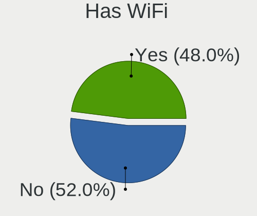
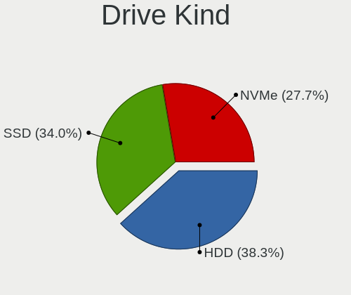

ArcoLinux - Hardware Trends (Desktops)
--------------------------------------

A project to identify most popular hardware characteristics and track their change
over time based on data collected by Linux users at https://Linux-Hardware.org.

Anyone can contribute to this report by the [hw-probe](https://github.com/linuxhw/hw-probe) tool:

    sudo -E hw-probe -all -upload

This report is for one last month. Overall report since the beginning of time: [TestCoverage](https://github.com/linuxhw/TestCoverage)

Period: Jul, 2022.

Contents
--------

* [ System ](#system)
  - [ OS                       ](#os)
  - [ OS Family                ](#os-family)
  - [ Kernel                   ](#kernel)
  - [ Kernel Family            ](#kernel-family)
  - [ Kernel Major Ver.        ](#kernel-major-ver)
  - [ Arch                     ](#arch)
  - [ DE                       ](#de)
  - [ Display Server           ](#display-server)
  - [ Display Manager          ](#display-manager)
  - [ OS Lang                  ](#os-lang)
  - [ Boot Mode                ](#boot-mode)
  - [ Filesystem               ](#filesystem)
  - [ Part. scheme             ](#part-scheme)
  - [ Dual Boot with Linux/BSD ](#dual-boot-with-linuxbsd)
  - [ Dual Boot (Win)          ](#dual-boot-win)

* [ Board ](#board)
  - [ Vendor                   ](#vendor)
  - [ Model                    ](#model)
  - [ Model Family             ](#model-family)
  - [ MFG Year                 ](#mfg-year)
  - [ Form Factor              ](#form-factor)
  - [ Secure Boot              ](#secure-boot)
  - [ Coreboot                 ](#coreboot)
  - [ RAM Size                 ](#ram-size)
  - [ RAM Used                 ](#ram-used)
  - [ Total Drives             ](#total-drives)
  - [ Has CD-ROM               ](#has-cd-rom)
  - [ Has Ethernet             ](#has-ethernet)
  - [ Has WiFi                 ](#has-wifi)
  - [ Has Bluetooth            ](#has-bluetooth)

* [ Location ](#location)
  - [ Country                  ](#country)
  - [ City                     ](#city)

* [ Drives ](#drives)
  - [ Drive Vendor             ](#drive-vendor)
  - [ Drive Model              ](#drive-model)
  - [ HDD Vendor               ](#hdd-vendor)
  - [ SSD Vendor               ](#ssd-vendor)
  - [ Drive Kind               ](#drive-kind)
  - [ Drive Connector          ](#drive-connector)
  - [ Drive Size               ](#drive-size)
  - [ Space Total              ](#space-total)
  - [ Space Used               ](#space-used)
  - [ Malfunc. Drives          ](#malfunc-drives)
  - [ Malfunc. Drive Vendor    ](#malfunc-drive-vendor)
  - [ Malfunc. HDD Vendor      ](#malfunc-hdd-vendor)
  - [ Malfunc. Drive Kind      ](#malfunc-drive-kind)
  - [ Failed Drives            ](#failed-drives)
  - [ Failed Drive Vendor      ](#failed-drive-vendor)
  - [ Drive Status             ](#drive-status)

* [ Storage controller ](#storage-controller)
  - [ Storage Vendor           ](#storage-vendor)
  - [ Storage Model            ](#storage-model)
  - [ Storage Kind             ](#storage-kind)

* [ Processor ](#processor)
  - [ CPU Vendor               ](#cpu-vendor)
  - [ CPU Model                ](#cpu-model)
  - [ CPU Model Family         ](#cpu-model-family)
  - [ CPU Cores                ](#cpu-cores)
  - [ CPU Sockets              ](#cpu-sockets)
  - [ CPU Threads              ](#cpu-threads)
  - [ CPU Op-Modes             ](#cpu-op-modes)
  - [ CPU Microcode            ](#cpu-microcode)
  - [ CPU Microarch            ](#cpu-microarch)

* [ Graphics ](#graphics)
  - [ GPU Vendor               ](#gpu-vendor)
  - [ GPU Model                ](#gpu-model)
  - [ GPU Combo                ](#gpu-combo)
  - [ GPU Driver               ](#gpu-driver)
  - [ GPU Memory               ](#gpu-memory)

* [ Monitor ](#monitor)
  - [ Monitor Vendor           ](#monitor-vendor)
  - [ Monitor Model            ](#monitor-model)
  - [ Monitor Resolution       ](#monitor-resolution)
  - [ Monitor Diagonal         ](#monitor-diagonal)
  - [ Monitor Width            ](#monitor-width)
  - [ Aspect Ratio             ](#aspect-ratio)
  - [ Monitor Area             ](#monitor-area)
  - [ Pixel Density            ](#pixel-density)
  - [ Multiple Monitors        ](#multiple-monitors)

* [ Network ](#network)
  - [ Net Controller Vendor    ](#net-controller-vendor)
  - [ Net Controller Model     ](#net-controller-model)
  - [ Wireless Vendor          ](#wireless-vendor)
  - [ Wireless Model           ](#wireless-model)
  - [ Ethernet Vendor          ](#ethernet-vendor)
  - [ Ethernet Model           ](#ethernet-model)
  - [ Net Controller Kind      ](#net-controller-kind)
  - [ Used Controller          ](#used-controller)
  - [ NICs                     ](#nics)
  - [ IPv6                     ](#ipv6)

* [ Bluetooth ](#bluetooth)
  - [ Bluetooth Vendor         ](#bluetooth-vendor)
  - [ Bluetooth Model          ](#bluetooth-model)

* [ Sound ](#sound)
  - [ Sound Vendor             ](#sound-vendor)
  - [ Sound Model              ](#sound-model)

* [ Memory ](#memory)
  - [ Memory Vendor            ](#memory-vendor)
  - [ Memory Model             ](#memory-model)
  - [ Memory Kind              ](#memory-kind)
  - [ Memory Form Factor       ](#memory-form-factor)
  - [ Memory Size              ](#memory-size)
  - [ Memory Speed             ](#memory-speed)

* [ Printers & scanners ](#printers--scanners)
  - [ Printer Vendor           ](#printer-vendor)
  - [ Printer Model            ](#printer-model)
  - [ Scanner Vendor           ](#scanner-vendor)
  - [ Scanner Model            ](#scanner-model)

* [ Camera ](#camera)
  - [ Camera Vendor            ](#camera-vendor)
  - [ Camera Model             ](#camera-model)

* [ Security ](#security)
  - [ Fingerprint Vendor       ](#fingerprint-vendor)
  - [ Fingerprint Model        ](#fingerprint-model)
  - [ Chipcard Vendor          ](#chipcard-vendor)
  - [ Chipcard Model           ](#chipcard-model)

* [ Unsupported ](#unsupported)
  - [ Unsupported Devices      ](#unsupported-devices)
  - [ Unsupported Device Types ](#unsupported-device-types)

System
------

OS
--

Installed operating systems

| Name              | Desktops | Percent |
|-------------------|----------|---------|
| ArcoLinux Rolling | 12       | 92.31%  |
| ArcoLinux         | 1        | 7.69%   |

OS Family
---------

OS without a version

| Name      | Desktops | Percent |
|-----------|----------|---------|
| ArcoLinux | 13       | 100%    |

Kernel
------

Version of the Linux kernel

| Version            | Desktops | Percent |
|--------------------|----------|---------|
| 5.18.9-arch1-1     | 3        | 23.08%  |
| 5.18.12-arch1-1    | 3        | 23.08%  |
| 5.18.9-zen1-1-zen  | 1        | 7.69%   |
| 5.18.7-zen1-1-zen  | 1        | 7.69%   |
| 5.18.3-arch1-1     | 1        | 7.69%   |
| 5.18.15-arch1-1    | 1        | 7.69%   |
| 5.18.14-arch1-1    | 1        | 7.69%   |
| 5.18.10-zen1-1-zen | 1        | 7.69%   |
| 5.15.51-1-lts      | 1        | 7.69%   |

Kernel Family
-------------

Linux kernel without a distro release

| Version | Desktops | Percent |
|---------|----------|---------|
| 5.18.9  | 4        | 30.77%  |
| 5.18.12 | 3        | 23.08%  |
| 5.18.7  | 1        | 7.69%   |
| 5.18.3  | 1        | 7.69%   |
| 5.18.15 | 1        | 7.69%   |
| 5.18.14 | 1        | 7.69%   |
| 5.18.10 | 1        | 7.69%   |
| 5.15.51 | 1        | 7.69%   |

Kernel Major Ver.
-----------------

Linux kernel major version

| Version | Desktops | Percent |
|---------|----------|---------|
| 5.18    | 12       | 92.31%  |
| 5.15    | 1        | 7.69%   |

Arch
----

OS architecture (x86_64, i586, etc.)

| Name   | Desktops | Percent |
|--------|----------|---------|
| x86_64 | 13       | 100%    |

DE
--

Desktop Environment

| Name       | Desktops | Percent |
|------------|----------|---------|
| KDE5       | 3        | 23.08%  |
| GNOME      | 3        | 23.08%  |
| bspwm      | 2        | 15.38%  |
| xmonad     | 1        | 7.69%   |
| XFCE       | 1        | 7.69%   |
| X-Cinnamon | 1        | 7.69%   |
| qtile      | 1        | 7.69%   |
| i3         | 1        | 7.69%   |

Display Server
--------------

X11 or Wayland

| Name    | Desktops | Percent |
|---------|----------|---------|
| X11     | 12       | 92.31%  |
| Wayland | 1        | 7.69%   |

Display Manager
---------------

SDDM, LightDM, etc.

| Name    | Desktops | Percent |
|---------|----------|---------|
| SDDM    | 9        | 69.23%  |
| LightDM | 2        | 15.38%  |
| GDM     | 1        | 7.69%   |
| Unknown | 1        | 7.69%   |

OS Lang
-------

Language

| Lang  | Desktops | Percent |
|-------|----------|---------|
| en_US | 9        | 69.23%  |
| es_GT | 1        | 7.69%   |
| es_ES | 1        | 7.69%   |
| en_IN | 1        | 7.69%   |
| en_AU | 1        | 7.69%   |

Boot Mode
---------

EFI or BIOS

| Mode | Desktops | Percent |
|------|----------|---------|
| EFI  | 11       | 84.62%  |
| BIOS | 2        | 15.38%  |

Filesystem
----------

Type of filesystem

| Type    | Desktops | Percent |
|---------|----------|---------|
| Ext4    | 8        | 61.54%  |
| Btrfs   | 4        | 30.77%  |
| Overlay | 1        | 7.69%   |

Part. scheme
------------

Scheme of partitioning

| Type    | Desktops | Percent |
|---------|----------|---------|
| GPT     | 11       | 84.62%  |
| MBR     | 1        | 7.69%   |
| Unknown | 1        | 7.69%   |

Dual Boot with Linux/BSD
------------------------

Hosting more than one Linux/BSD

| Dual boot | Desktops | Percent |
|-----------|----------|---------|
| No        | 8        | 61.54%  |
| Yes       | 5        | 38.46%  |

Dual Boot (Win)
---------------

Hosting Linux and Windows

| Dual boot | Desktops | Percent |
|-----------|----------|---------|
| No        | 12       | 92.31%  |
| Yes       | 1        | 7.69%   |

Board
-----

Vendor
------

Motherboard manufacturer

| Name                | Desktops | Percent |
|---------------------|----------|---------|
| ASRock              | 3        | 23.08%  |
| MSI                 | 2        | 15.38%  |
| Gigabyte Technology | 2        | 15.38%  |
| ASUSTek Computer    | 2        | 15.38%  |
| Supermicro          | 1        | 7.69%   |
| Lenovo              | 1        | 7.69%   |
| Hewlett-Packard     | 1        | 7.69%   |
| Biostar             | 1        | 7.69%   |

Model
-----

Motherboard model

| Name                               | Desktops | Percent |
|------------------------------------|----------|---------|
| Supermicro SYS-E100-9AP            | 1        | 7.69%   |
| MSI MS-7C95                        | 1        | 7.69%   |
| MSI MS-7B98                        | 1        | 7.69%   |
| Lenovo ThinkCentre M700 10J0S35C00 | 1        | 7.69%   |
| HP Compaq Elite 8300 SFF           | 1        | 7.69%   |
| Gigabyte X570 AORUS PRO WIFI       | 1        | 7.69%   |
| Gigabyte B450M S2H                 | 1        | 7.69%   |
| Biostar J3060NH                    | 1        | 7.69%   |
| ASUS ROG STRIX B550-F GAMING       | 1        | 7.69%   |
| ASUS EX-B150M-V3                   | 1        | 7.69%   |
| ASRock Z170 Gaming K4              | 1        | 7.69%   |
| ASRock FM2A58M-VG3+ R2.0           | 1        | 7.69%   |
| ASRock B550M Pro4                  | 1        | 7.69%   |

Model Family
------------

Motherboard model prefix

| Name                    | Desktops | Percent |
|-------------------------|----------|---------|
| Supermicro SYS-E100-9AP | 1        | 7.69%   |
| MSI MS-7C95             | 1        | 7.69%   |
| MSI MS-7B98             | 1        | 7.69%   |
| Lenovo ThinkCentre      | 1        | 7.69%   |
| HP Compaq               | 1        | 7.69%   |
| Gigabyte X570           | 1        | 7.69%   |
| Gigabyte B450M          | 1        | 7.69%   |
| Biostar J3060NH         | 1        | 7.69%   |
| ASUS ROG                | 1        | 7.69%   |
| ASUS EX-B150M-V3        | 1        | 7.69%   |
| ASRock Z170             | 1        | 7.69%   |
| ASRock FM2A58M-VG3+     | 1        | 7.69%   |
| ASRock B550M            | 1        | 7.69%   |

MFG Year
--------

Motherboard manufacture year

| Year | Desktops | Percent |
|------|----------|---------|
| 2020 | 4        | 30.77%  |
| 2018 | 3        | 23.08%  |
| 2019 | 1        | 7.69%   |
| 2017 | 1        | 7.69%   |
| 2016 | 1        | 7.69%   |
| 2015 | 1        | 7.69%   |
| 2014 | 1        | 7.69%   |
| 2012 | 1        | 7.69%   |

Form Factor
-----------

Physical design of the computer

| Name    | Desktops | Percent |
|---------|----------|---------|
| Desktop | 13       | 100%    |

Secure Boot
-----------

Enabled or disabled

| State    | Desktops | Percent |
|----------|----------|---------|
| Disabled | 13       | 100%    |

Coreboot
--------

Have coreboot on board

| Used | Desktops | Percent |
|------|----------|---------|
| No   | 13       | 100%    |

RAM Size
--------

Total RAM memory

| Size in GB  | Desktops | Percent |
|-------------|----------|---------|
| 4.01-8.0    | 4        | 30.77%  |
| 32.01-64.0  | 4        | 30.77%  |
| 16.01-24.0  | 4        | 30.77%  |
| 64.01-256.0 | 1        | 7.69%   |

RAM Used
--------

Used RAM memory

| Used GB   | Desktops | Percent |
|-----------|----------|---------|
| 4.01-8.0  | 5        | 38.46%  |
| 3.01-4.0  | 4        | 30.77%  |
| 2.01-3.0  | 2        | 15.38%  |
| 1.01-2.0  | 1        | 7.69%   |
| 8.01-16.0 | 1        | 7.69%   |

Total Drives
------------

Number of drives on board

| Drives | Desktops | Percent |
|--------|----------|---------|
| 1      | 6        | 46.15%  |
| 2      | 3        | 23.08%  |
| 9      | 1        | 7.69%   |
| 6      | 1        | 7.69%   |
| 5      | 1        | 7.69%   |
| 3      | 1        | 7.69%   |

Has CD-ROM
----------

Has CD-ROM on board

| Presented | Desktops | Percent |
|-----------|----------|---------|
| No        | 10       | 76.92%  |
| Yes       | 3        | 23.08%  |

Has Ethernet
------------

Has Ethernet on board

| Presented | Desktops | Percent |
|-----------|----------|---------|
| Yes       | 13       | 100%    |

Has WiFi
--------

Has WiFi module

| Presented | Desktops | Percent |
|-----------|----------|---------|
| No        | 8        | 61.54%  |
| Yes       | 5        | 38.46%  |

Has Bluetooth
-------------

Has Bluetooth module

| Presented | Desktops | Percent |
|-----------|----------|---------|
| No        | 7        | 53.85%  |
| Yes       | 6        | 46.15%  |

Location
--------

Country
-------

Geographic location (country)

| Country   | Desktops | Percent |
|-----------|----------|---------|
| USA       | 4        | 30.77%  |
| Uruguay   | 1        | 7.69%   |
| Turkey    | 1        | 7.69%   |
| Italy     | 1        | 7.69%   |
| India     | 1        | 7.69%   |
| Guatemala | 1        | 7.69%   |
| Germany   | 1        | 7.69%   |
| Brazil    | 1        | 7.69%   |
| Barbados  | 1        | 7.69%   |
| Australia | 1        | 7.69%   |

City
----

Geographic location (city)

| City           | Desktops | Percent |
|----------------|----------|---------|
| Sydney         | 1        | 7.69%   |
| Pune           | 1        | 7.69%   |
| Pittsburgh     | 1        | 7.69%   |
| Montevideo     | 1        | 7.69%   |
| Maracanau      | 1        | 7.69%   |
| Kassel         | 1        | 7.69%   |
| Istanbul       | 1        | 7.69%   |
| Guatemala City | 1        | 7.69%   |
| Gallarate      | 1        | 7.69%   |
| Durham         | 1        | 7.69%   |
| Bridgetown     | 1        | 7.69%   |
| Atlanta        | 1        | 7.69%   |
| Abilene        | 1        | 7.69%   |

Drives
------

Drive Vendor
------------

Hard drive vendors

| Vendor                | Desktops | Drives | Percent |
|-----------------------|----------|--------|---------|
| Seagate               | 4        | 4      | 14.29%  |
| Samsung Electronics   | 4        | 7      | 14.29%  |
| WDC                   | 3        | 6      | 10.71%  |
| Kingston              | 2        | 2      | 7.14%   |
| Crucial               | 2        | 2      | 7.14%   |
| China                 | 2        | 3      | 7.14%   |
| Transcend             | 1        | 1      | 3.57%   |
| Toshiba               | 1        | 1      | 3.57%   |
| Team                  | 1        | 1      | 3.57%   |
| SK hynix              | 1        | 1      | 3.57%   |
| SanDisk               | 1        | 1      | 3.57%   |
| Realtek Semiconductor | 1        | 1      | 3.57%   |
| Realtek               | 1        | 1      | 3.57%   |
| Phison Electronics    | 1        | 1      | 3.57%   |
| LITEONIT              | 1        | 1      | 3.57%   |
| Intel                 | 1        | 1      | 3.57%   |
| Innodisk              | 1        | 1      | 3.57%   |

Drive Model
-----------

Hard drive models

| Model                                       | Desktops | Percent |
|---------------------------------------------|----------|---------|
| Seagate ST2000DM008-2FR102 2TB              | 2        | 5.88%   |
| WDC WDS500G1X0E-00AFY0 500GB                | 1        | 2.94%   |
| WDC WD5000AAKX-00ERMA0 500GB                | 1        | 2.94%   |
| WDC WD20EFRX-68EUZN0 2TB                    | 1        | 2.94%   |
| WDC WD10EZEX-07WN4A0 1TB                    | 1        | 2.94%   |
| WDC WD10EADS-11M2B1 1TB                     | 1        | 2.94%   |
| WDC WD1003FZEX-00K3CA0 1TB                  | 1        | 2.94%   |
| Transcend TS480GSSD220S 480GB               | 1        | 2.94%   |
| Toshiba MQ01ABD100 1TB                      | 1        | 2.94%   |
| Team TM8PS7256G 256GB SSD                   | 1        | 2.94%   |
| SK hynix SHGS31-500GS-2 500GB SSD           | 1        | 2.94%   |
| Seagate ST1000VM002-1SD102 1TB              | 1        | 2.94%   |
| Seagate FireCuda 520 SSD ZP500GM30002 500GB | 1        | 2.94%   |
| SanDisk NVMe SSD Drive 500GB                | 1        | 2.94%   |
| Samsung SSD 970 EVO 1TB                     | 1        | 2.94%   |
| Samsung SSD 960 EVO 250GB                   | 1        | 2.94%   |
| Samsung SSD 860 EVO 500GB                   | 1        | 2.94%   |
| Samsung SSD 860 EVO 250GB                   | 1        | 2.94%   |
| Samsung SSD 850 EVO 250GB                   | 1        | 2.94%   |
| Samsung HD502HJ 500GB                       | 1        | 2.94%   |
| Realtek NVMe SSD Drive 512GB                | 1        | 2.94%   |
| Realtek RTL9210B-CG 500GB                   | 1        | 2.94%   |
| Phison PCIe SSD 500GB                       | 1        | 2.94%   |
| LITEONIT LCS-128M6S 128GB SSD               | 1        | 2.94%   |
| Kingston SA400M8240G 240GB SSD              | 1        | 2.94%   |
| Kingston SA2000M81000G 1TB                  | 1        | 2.94%   |
| Intel SSDSC2KW256G8 256GB                   | 1        | 2.94%   |
| Innodisk M.2 (S80) 3TE7 960GB SSD           | 1        | 2.94%   |
| Crucial CT250MX500SSD1 250GB                | 1        | 2.94%   |
| Crucial CT240BX500SSD1 240GB                | 1        | 2.94%   |
| China SSD 240GB                             | 1        | 2.94%   |
| China SSD 1TB                               | 1        | 2.94%   |
| China ESA3SMH2ISN2BT120GB SSD               | 1        | 2.94%   |

HDD Vendor
----------

Hard disk drive vendors

| Vendor              | Desktops | Drives | Percent |
|---------------------|----------|--------|---------|
| WDC                 | 3        | 5      | 37.5%   |
| Seagate             | 3        | 3      | 37.5%   |
| Toshiba             | 1        | 1      | 12.5%   |
| Samsung Electronics | 1        | 1      | 12.5%   |

SSD Vendor
----------

Solid state drive vendors

| Vendor              | Desktops | Drives | Percent |
|---------------------|----------|--------|---------|
| Samsung Electronics | 2        | 4      | 15.38%  |
| Crucial             | 2        | 2      | 15.38%  |
| China               | 2        | 3      | 15.38%  |
| Transcend           | 1        | 1      | 7.69%   |
| Team                | 1        | 1      | 7.69%   |
| SK hynix            | 1        | 1      | 7.69%   |
| LITEONIT            | 1        | 1      | 7.69%   |
| Kingston            | 1        | 1      | 7.69%   |
| Intel               | 1        | 1      | 7.69%   |
| Innodisk            | 1        | 1      | 7.69%   |

Drive Kind
----------

HDD or SSD

| Kind | Desktops | Drives | Percent |
|------|----------|--------|---------|
| SSD  | 10       | 16     | 45.45%  |
| HDD  | 7        | 10     | 31.82%  |
| NVMe | 5        | 9      | 22.73%  |

Drive Connector
---------------

SATA, SAS, NVMe, etc.

| Type | Desktops | Drives | Percent |
|------|----------|--------|---------|
| SATA | 11       | 26     | 64.71%  |
| NVMe | 5        | 8      | 29.41%  |
| SAS  | 1        | 1      | 5.88%   |

Drive Size
----------

Size of hard drive

| Size in TB | Desktops | Drives | Percent |
|------------|----------|--------|---------|
| 0.01-0.5   | 9        | 16     | 50%     |
| 0.51-1.0   | 6        | 7      | 33.33%  |
| 1.01-2.0   | 3        | 3      | 16.67%  |

Space Total
-----------

Amount of disk space available on the file system

| Size in GB     | Desktops | Percent |
|----------------|----------|---------|
| 2001-3000      | 3        | 23.08%  |
| 501-1000       | 3        | 23.08%  |
| More than 3000 | 2        | 15.38%  |
| 251-500        | 1        | 7.69%   |
| 21-50          | 1        | 7.69%   |
| 101-250        | 1        | 7.69%   |
| 1001-2000      | 1        | 7.69%   |
| Unknown        | 1        | 7.69%   |

Space Used
----------

Amount of used disk space

| Used GB   | Desktops | Percent |
|-----------|----------|---------|
| 251-500   | 4        | 30.77%  |
| 101-250   | 2        | 15.38%  |
| 501-1000  | 2        | 15.38%  |
| 21-50     | 1        | 7.69%   |
| 2001-3000 | 1        | 7.69%   |
| 1-20      | 1        | 7.69%   |
| 51-100    | 1        | 7.69%   |
| Unknown   | 1        | 7.69%   |

Malfunc. Drives
---------------

Drive models with a malfunction

| Model                        | Desktops | Drives | Percent |
|------------------------------|----------|--------|---------|
| WDC WDS500G1X0E-00AFY0 500GB | 1        | 1      | 20%     |
| WDC WD20EFRX-68EUZN0 2TB     | 1        | 1      | 20%     |
| WDC WD10EADS-11M2B1 1TB      | 1        | 1      | 20%     |
| WDC WD1003FZEX-00K3CA0 1TB   | 1        | 1      | 20%     |
| Toshiba MQ01ABD100 1TB       | 1        | 1      | 20%     |

Malfunc. Drive Vendor
---------------------

Vendors of faulty drives

| Vendor  | Desktops | Drives | Percent |
|---------|----------|--------|---------|
| WDC     | 1        | 4      | 50%     |
| Toshiba | 1        | 1      | 50%     |

Malfunc. HDD Vendor
-------------------

Vendors of faulty HDD drives

| Vendor  | Desktops | Drives | Percent |
|---------|----------|--------|---------|
| WDC     | 1        | 3      | 50%     |
| Toshiba | 1        | 1      | 50%     |

Malfunc. Drive Kind
-------------------

Kinds of faulty drives

| Kind | Desktops | Drives | Percent |
|------|----------|--------|---------|
| HDD  | 2        | 4      | 66.67%  |
| NVMe | 1        | 1      | 33.33%  |

Failed Drives
-------------

Failed drive models

Zero info for selected period =(

Failed Drive Vendor
-------------------

Failed drive vendors

Zero info for selected period =(

Drive Status
------------

Number of failed and malfunc. drives

| Status   | Desktops | Drives | Percent |
|----------|----------|--------|---------|
| Works    | 11       | 23     | 73.33%  |
| Detected | 2        | 7      | 13.33%  |
| Malfunc  | 2        | 5      | 13.33%  |

Storage controller
------------------

Storage Vendor
--------------

Storage controller vendors

| Vendor                      | Desktops | Percent |
|-----------------------------|----------|---------|
| Intel                       | 7        | 33.33%  |
| AMD                         | 6        | 28.57%  |
| SanDisk                     | 2        | 9.52%   |
| Samsung Electronics         | 2        | 9.52%   |
| Seagate Technology          | 1        | 4.76%   |
| Realtek Semiconductor       | 1        | 4.76%   |
| Phison Electronics          | 1        | 4.76%   |
| Kingston Technology Company | 1        | 4.76%   |

Storage Model
-------------

Storage controller models

| Model                                                                            | Desktops | Percent |
|----------------------------------------------------------------------------------|----------|---------|
| AMD FCH SATA Controller [AHCI mode]                                              | 4        | 16.67%  |
| Intel Q170/Q150/B150/H170/H110/Z170/CM236 Chipset SATA Controller [AHCI Mode]    | 3        | 12.5%   |
| AMD 500 Series Chipset SATA Controller                                           | 3        | 12.5%   |
| Seagate FireCuda 520 SSD                                                         | 1        | 4.17%   |
| SanDisk WD PC SN810 / Black SN850 NVMe SSD                                       | 1        | 4.17%   |
| SanDisk WD Black SN750 / PC SN730 NVMe SSD                                       | 1        | 4.17%   |
| Samsung NVMe SSD Controller SM981/PM981/PM983                                    | 1        | 4.17%   |
| Samsung NVMe SSD Controller SM961/PM961/SM963                                    | 1        | 4.17%   |
| Realtek Realtek Non-Volatile memory controller                                   | 1        | 4.17%   |
| Phison E12 NVMe Controller                                                       | 1        | 4.17%   |
| Kingston Company A2000 NVMe SSD                                                  | 1        | 4.17%   |
| Intel Celeron N3350/Pentium N4200/Atom E3900 Series SATA AHCI Controller         | 1        | 4.17%   |
| Intel Cannon Lake PCH SATA AHCI Controller                                       | 1        | 4.17%   |
| Intel Atom/Celeron/Pentium Processor x5-E8000/J3xxx/N3xxx Series SATA Controller | 1        | 4.17%   |
| Intel 7 Series/C210 Series Chipset Family 6-port SATA Controller [AHCI mode]     | 1        | 4.17%   |
| AMD FCH IDE Controller                                                           | 1        | 4.17%   |
| AMD 400 Series Chipset SATA Controller                                           | 1        | 4.17%   |

Storage Kind
------------

Kind of storage controller (IDE, SATA, NVMe, SAS, ...)

| Kind | Desktops | Percent |
|------|----------|---------|
| SATA | 13       | 68.42%  |
| NVMe | 5        | 26.32%  |
| IDE  | 1        | 5.26%   |

Processor
---------

CPU Vendor
----------

Processor vendors

| Vendor | Desktops | Percent |
|--------|----------|---------|
| Intel  | 7        | 53.85%  |
| AMD    | 6        | 46.15%  |

CPU Model
---------

Processor models

| Model                                         | Desktops | Percent |
|-----------------------------------------------|----------|---------|
| AMD Ryzen 5 3600 6-Core Processor             | 3        | 23.08%  |
| Intel Genuine CPU 0000 @ 2.40GHz              | 1        | 7.69%   |
| Intel Core i9-9900KF CPU @ 3.60GHz            | 1        | 7.69%   |
| Intel Core i7-7700K CPU @ 4.20GHz             | 1        | 7.69%   |
| Intel Core i5-6500T CPU @ 2.50GHz             | 1        | 7.69%   |
| Intel Core i3-2100T CPU @ 2.50GHz             | 1        | 7.69%   |
| Intel Celeron CPU J3060 @ 1.60GHz             | 1        | 7.69%   |
| Intel Atom Processor E3940 @ 1.60GHz          | 1        | 7.69%   |
| AMD Ryzen 9 3900X 12-Core Processor           | 1        | 7.69%   |
| AMD Ryzen 7 5800X 8-Core Processor            | 1        | 7.69%   |
| AMD A8-7600 Radeon R7, 10 Compute Cores 4C+6G | 1        | 7.69%   |

CPU Model Family
----------------

Processor model prefix

| Model         | Desktops | Percent |
|---------------|----------|---------|
| AMD Ryzen 5   | 3        | 23.08%  |
| Intel Genuine | 1        | 7.69%   |
| Intel Core i9 | 1        | 7.69%   |
| Intel Core i7 | 1        | 7.69%   |
| Intel Core i5 | 1        | 7.69%   |
| Intel Core i3 | 1        | 7.69%   |
| Intel Celeron | 1        | 7.69%   |
| Intel Atom    | 1        | 7.69%   |
| AMD Ryzen 9   | 1        | 7.69%   |
| AMD Ryzen 7   | 1        | 7.69%   |
| AMD A8        | 1        | 7.69%   |

CPU Cores
---------

Number of processor cores

| Number | Desktops | Percent |
|--------|----------|---------|
| 6      | 4        | 30.77%  |
| 4      | 3        | 23.08%  |
| 2      | 3        | 23.08%  |
| 8      | 2        | 15.38%  |
| 12     | 1        | 7.69%   |

CPU Sockets
-----------

Number of sockets

| Number | Desktops | Percent |
|--------|----------|---------|
| 1      | 13       | 100%    |

CPU Threads
-----------

Threads per core (Hyper-Threading)

| Number | Desktops | Percent |
|--------|----------|---------|
| 2      | 10       | 76.92%  |
| 1      | 3        | 23.08%  |

CPU Op-Modes
------------

CPU Operation Modes (32-bit, 64-bit)

| Op mode        | Desktops | Percent |
|----------------|----------|---------|
| 32-bit, 64-bit | 13       | 100%    |

CPU Microcode
-------------

Microcode number

| Number     | Desktops | Percent |
|------------|----------|---------|
| Unknown    | 4        | 30.77%  |
| 0x08701021 | 3        | 23.08%  |
| 0x906ed    | 1        | 7.69%   |
| 0x906ea    | 1        | 7.69%   |
| 0x506e3    | 1        | 7.69%   |
| 0x506ca    | 1        | 7.69%   |
| 0x406c4    | 1        | 7.69%   |
| 0x08701013 | 1        | 7.69%   |

CPU Microarch
-------------

Microarchitecture

| Name        | Desktops | Percent |
|-------------|----------|---------|
| Zen 2       | 4        | 30.77%  |
| KabyLake    | 3        | 23.08%  |
| Zen 3       | 1        | 7.69%   |
| Steamroller | 1        | 7.69%   |
| Skylake     | 1        | 7.69%   |
| Silvermont  | 1        | 7.69%   |
| SandyBridge | 1        | 7.69%   |
| Goldmont    | 1        | 7.69%   |

Graphics
--------

GPU Vendor
----------

Vendors of graphics cards

| Vendor | Desktops | Percent |
|--------|----------|---------|
| Nvidia | 6        | 46.15%  |
| Intel  | 4        | 30.77%  |
| AMD    | 3        | 23.08%  |

GPU Model
---------

Graphics card models

| Model                                                                                    | Desktops | Percent |
|------------------------------------------------------------------------------------------|----------|---------|
| Nvidia TU116 [GeForce GTX 1650 SUPER]                                                    | 1        | 7.69%   |
| Nvidia GP106 [GeForce GTX 1060 3GB]                                                      | 1        | 7.69%   |
| Nvidia GP104 [GeForce GTX 1070]                                                          | 1        | 7.69%   |
| Nvidia GM107 [GeForce GTX 750 Ti]                                                        | 1        | 7.69%   |
| Nvidia GA106 [GeForce RTX 3060]                                                          | 1        | 7.69%   |
| Nvidia GA106 [GeForce RTX 3060 Lite Hash Rate]                                           | 1        | 7.69%   |
| Intel HD Graphics 530                                                                    | 1        | 7.69%   |
| Intel HD Graphics 500                                                                    | 1        | 7.69%   |
| Intel Atom/Celeron/Pentium Processor x5-E8000/J3xxx/N3xxx Integrated Graphics Controller | 1        | 7.69%   |
| Intel 2nd Generation Core Processor Family Integrated Graphics Controller                | 1        | 7.69%   |
| AMD Navi 14 [Radeon RX 5500/5500M / Pro 5500M]                                           | 1        | 7.69%   |
| AMD Kaveri [Radeon R7 Graphics]                                                          | 1        | 7.69%   |
| AMD Ellesmere [Radeon RX 470/480/570/570X/580/580X/590]                                  | 1        | 7.69%   |

GPU Combo
---------

Combinations of graphics cards

| Name       | Desktops | Percent |
|------------|----------|---------|
| 1 x Nvidia | 6        | 46.15%  |
| 1 x Intel  | 4        | 30.77%  |
| 1 x AMD    | 3        | 23.08%  |

GPU Driver
----------

Free vs proprietary

| Driver      | Desktops | Percent |
|-------------|----------|---------|
| Free        | 7        | 53.85%  |
| Proprietary | 6        | 46.15%  |

GPU Memory
----------

Total video memory

| Size in GB | Desktops | Percent |
|------------|----------|---------|
| Unknown    | 5        | 38.46%  |
| 7.01-8.0   | 3        | 23.08%  |
| 8.01-16.0  | 2        | 15.38%  |
| 3.01-4.0   | 1        | 7.69%   |
| 2.01-3.0   | 1        | 7.69%   |
| 1.01-2.0   | 1        | 7.69%   |

Monitor
-------

Monitor Vendor
--------------

Monitor vendors

| Vendor              | Desktops | Percent |
|---------------------|----------|---------|
| Samsung Electronics | 4        | 26.67%  |
| Dell                | 4        | 26.67%  |
| ViewSonic           | 1        | 6.67%   |
| Sceptre             | 1        | 6.67%   |
| Lenovo              | 1        | 6.67%   |
| Goldstar            | 1        | 6.67%   |
| BenQ                | 1        | 6.67%   |
| AOC                 | 1        | 6.67%   |
| Unknown             | 1        | 6.67%   |

Monitor Model
-------------

Monitor models

| Model                                                                | Desktops | Percent |
|----------------------------------------------------------------------|----------|---------|
| ViewSonic VA1917 SERIES VSCAD30 1366x768 410x230mm 18.5-inch         | 1        | 5.26%   |
| Sceptre LCD Monitor F24 3840x1080                                    | 1        | 5.26%   |
| Samsung Electronics SMT22A300 SAM087B 1920x1080 480x270mm 21.7-inch  | 1        | 5.26%   |
| Samsung Electronics SM2333TN SAM06FC 1920x1080 477x268mm 21.5-inch   | 1        | 5.26%   |
| Samsung Electronics LU28R55 SAM1018 3840x2160 632x360mm 28.6-inch    | 1        | 5.26%   |
| Samsung Electronics LU28R55 SAM1016 3840x2160 632x360mm 28.6-inch    | 1        | 5.26%   |
| Samsung Electronics LCD Monitor SAM0B32 1366x768 610x350mm 27.7-inch | 1        | 5.26%   |
| Lenovo LEN E2003bA LEN60BC 1600x900 430x240mm 19.4-inch              | 1        | 5.26%   |
| Goldstar E2240 GSM57A3 1920x1080 477x268mm 21.5-inch                 | 1        | 5.26%   |
| Goldstar 27GL650F GSM5B71 1920x1080 597x336mm 27.0-inch              | 1        | 5.26%   |
| Dell U2414H DELA0A4 1920x1080 530x300mm 24.0-inch                    | 1        | 5.26%   |
| Dell SX2210 DELA046 1920x1080 477x268mm 21.5-inch                    | 1        | 5.26%   |
| Dell SE2417HG DELD08E 1920x1080 521x293mm 23.5-inch                  | 1        | 5.26%   |
| Dell SE2417HG DELD08D 1920x1080 521x293mm 23.5-inch                  | 1        | 5.26%   |
| Dell S2421NX DEL41FC 1920x1080 527x296mm 23.8-inch                   | 1        | 5.26%   |
| BenQ LCD Monitor EX2780Q 3840x2160                                   | 1        | 5.26%   |
| BenQ LCD Monitor EW3280U                                             | 1        | 5.26%   |
| AOC AG271QG AOC2713 2560x1440 600x340mm 27.2-inch                    | 1        | 5.26%   |
| Unknown                                                              | 1        | 5.26%   |

Monitor Resolution
------------------

Monitor screen resolution

| Resolution      | Desktops | Percent |
|-----------------|----------|---------|
| 1920x1080 (FHD) | 7        | 46.67%  |
| 3840x2160 (4K)  | 2        | 13.33%  |
| 1366x768 (WXGA) | 2        | 13.33%  |
| 3840x1080       | 1        | 6.67%   |
| 2560x1440 (QHD) | 1        | 6.67%   |
| 1600x900 (HD+)  | 1        | 6.67%   |
| Unknown         | 1        | 6.67%   |

Monitor Diagonal
----------------

Diagonal size in inches

| Inches  | Desktops | Percent |
|---------|----------|---------|
| 23      | 3        | 20%     |
| 21      | 3        | 20%     |
| 27      | 2        | 13.33%  |
| Unknown | 2        | 13.33%  |
| 40      | 1        | 6.67%   |
| 28      | 1        | 6.67%   |
| 24      | 1        | 6.67%   |
| 19      | 1        | 6.67%   |
| 18      | 1        | 6.67%   |

Monitor Width
-------------

Physical width

| Width in mm | Desktops | Percent |
|-------------|----------|---------|
| 501-600     | 5        | 38.46%  |
| 401-500     | 4        | 30.77%  |
| Unknown     | 2        | 15.38%  |
| 801-900     | 1        | 7.69%   |
| 601-700     | 1        | 7.69%   |

Aspect Ratio
------------

Proportional relationship between the width and the height

| Ratio   | Desktops | Percent |
|---------|----------|---------|
| 16/9    | 10       | 83.33%  |
| Unknown | 2        | 16.67%  |

Monitor Area
------------

Area in inch²

| Area in inch² | Desktops | Percent |
|----------------|----------|---------|
| 201-250        | 6        | 40%     |
| 301-350        | 2        | 13.33%  |
| 151-200        | 2        | 13.33%  |
| Unknown        | 2        | 13.33%  |
| 351-500        | 1        | 6.67%   |
| 141-150        | 1        | 6.67%   |
| 501-1000       | 1        | 6.67%   |

Pixel Density
-------------

Pixels per inch

| Density | Desktops | Percent |
|---------|----------|---------|
| 51-100  | 7        | 46.67%  |
| 101-120 | 4        | 26.67%  |
| Unknown | 2        | 13.33%  |
| 1-50    | 1        | 6.67%   |
| 121-160 | 1        | 6.67%   |

Multiple Monitors
-----------------

Total monitors connected

| Total | Desktops | Percent |
|-------|----------|---------|
| 2     | 7        | 53.85%  |
| 1     | 6        | 46.15%  |

Network
-------

Net Controller Vendor
---------------------

Controller vendors

| Vendor                | Desktops | Percent |
|-----------------------|----------|---------|
| Intel                 | 7        | 41.18%  |
| Realtek Semiconductor | 6        | 35.29%  |
| Ralink Technology     | 2        | 11.76%  |
| Qualcomm Atheros      | 1        | 5.88%   |
| Broadcom              | 1        | 5.88%   |

Net Controller Model
--------------------

Controller models

| Model                                                                         | Desktops | Percent |
|-------------------------------------------------------------------------------|----------|---------|
| Realtek RTL8111/8168/8411 PCI Express Gigabit Ethernet Controller             | 6        | 30%     |
| Realtek RTL8188EUS 802.11n Wireless Network Adapter                           | 1        | 5%      |
| Ralink RT5370 Wireless Adapter                                                | 1        | 5%      |
| Ralink MT7601U Wireless Adapter                                               | 1        | 5%      |
| Qualcomm Atheros Killer E2400 Gigabit Ethernet Controller                     | 1        | 5%      |
| Intel Wi-Fi 6 AX200                                                           | 1        | 5%      |
| Intel I211 Gigabit Network Connection                                         | 1        | 5%      |
| Intel I210 Gigabit Network Connection                                         | 1        | 5%      |
| Intel Ethernet Controller I225-V                                              | 1        | 5%      |
| Intel Ethernet Connection (7) I219-V                                          | 1        | 5%      |
| Intel Ethernet Connection (2) I219-V                                          | 1        | 5%      |
| Intel Dual Band Wireless-AC 3168NGW [Stone Peak]                              | 1        | 5%      |
| Intel 82579LM Gigabit Network Connection (Lewisville)                         | 1        | 5%      |
| Intel 82571EB/82571GB Gigabit Ethernet Controller D0/D1 (copper applications) | 1        | 5%      |
| Broadcom BCM4360 802.11ac Wireless Network Adapter                            | 1        | 5%      |

Wireless Vendor
---------------

Wireless vendors

| Vendor                | Desktops | Percent |
|-----------------------|----------|---------|
| Ralink Technology     | 2        | 33.33%  |
| Intel                 | 2        | 33.33%  |
| Realtek Semiconductor | 1        | 16.67%  |
| Broadcom              | 1        | 16.67%  |

Wireless Model
--------------

Wireless models

| Model                                               | Desktops | Percent |
|-----------------------------------------------------|----------|---------|
| Realtek RTL8188EUS 802.11n Wireless Network Adapter | 1        | 16.67%  |
| Ralink RT5370 Wireless Adapter                      | 1        | 16.67%  |
| Ralink MT7601U Wireless Adapter                     | 1        | 16.67%  |
| Intel Wi-Fi 6 AX200                                 | 1        | 16.67%  |
| Intel Dual Band Wireless-AC 3168NGW [Stone Peak]    | 1        | 16.67%  |
| Broadcom BCM4360 802.11ac Wireless Network Adapter  | 1        | 16.67%  |

Ethernet Vendor
---------------

Ethernet vendors

| Vendor                | Desktops | Percent |
|-----------------------|----------|---------|
| Realtek Semiconductor | 6        | 46.15%  |
| Intel                 | 6        | 46.15%  |
| Qualcomm Atheros      | 1        | 7.69%   |

Ethernet Model
--------------

Ethernet models

| Model                                                                         | Desktops | Percent |
|-------------------------------------------------------------------------------|----------|---------|
| Realtek RTL8111/8168/8411 PCI Express Gigabit Ethernet Controller             | 6        | 42.86%  |
| Qualcomm Atheros Killer E2400 Gigabit Ethernet Controller                     | 1        | 7.14%   |
| Intel I211 Gigabit Network Connection                                         | 1        | 7.14%   |
| Intel I210 Gigabit Network Connection                                         | 1        | 7.14%   |
| Intel Ethernet Controller I225-V                                              | 1        | 7.14%   |
| Intel Ethernet Connection (7) I219-V                                          | 1        | 7.14%   |
| Intel Ethernet Connection (2) I219-V                                          | 1        | 7.14%   |
| Intel 82579LM Gigabit Network Connection (Lewisville)                         | 1        | 7.14%   |
| Intel 82571EB/82571GB Gigabit Ethernet Controller D0/D1 (copper applications) | 1        | 7.14%   |

Net Controller Kind
-------------------

Ethernet, WiFi or modem

| Kind     | Desktops | Percent |
|----------|----------|---------|
| Ethernet | 13       | 68.42%  |
| WiFi     | 6        | 31.58%  |

Used Controller
---------------

Currently used network controller

| Kind     | Desktops | Percent |
|----------|----------|---------|
| Ethernet | 10       | 76.92%  |
| WiFi     | 3        | 23.08%  |

NICs
----

Total network controllers on board

| Total | Desktops | Percent |
|-------|----------|---------|
| 1     | 9        | 69.23%  |
| 2     | 3        | 23.08%  |
| 4     | 1        | 7.69%   |

IPv6
----

IPv6 vs IPv4

| Used | Desktops | Percent |
|------|----------|---------|
| No   | 11       | 84.62%  |
| Yes  | 2        | 15.38%  |

Bluetooth
---------

Bluetooth Vendor
----------------

Controller vendors

| Vendor                  | Desktops | Percent |
|-------------------------|----------|---------|
| Cambridge Silicon Radio | 3        | 50%     |
| Intel                   | 2        | 33.33%  |
| Apple                   | 1        | 16.67%  |

Bluetooth Model
---------------

Controller models

| Model                                               | Desktops | Percent |
|-----------------------------------------------------|----------|---------|
| Cambridge Silicon Radio Bluetooth Dongle (HCI mode) | 3        | 50%     |
| Intel Wireless-AC 3168 Bluetooth                    | 1        | 16.67%  |
| Intel AX200 Bluetooth                               | 1        | 16.67%  |
| Apple Bluetooth USB Host Controller                 | 1        | 16.67%  |

Sound
-----

Sound Vendor
------------

Sound card vendors

| Vendor                               | Desktops | Percent |
|--------------------------------------|----------|---------|
| Intel                                | 7        | 25.93%  |
| Nvidia                               | 6        | 22.22%  |
| AMD                                  | 6        | 22.22%  |
| Thesycon Systemsoftware & Consulting | 1        | 3.7%    |
| Realtek Semiconductor                | 1        | 3.7%    |
| Razer USA                            | 1        | 3.7%    |
| Plantronics                          | 1        | 3.7%    |
| Logitech                             | 1        | 3.7%    |
| JMTek                                | 1        | 3.7%    |
| Creative Technology                  | 1        | 3.7%    |
| C-Media Electronics                  | 1        | 3.7%    |

Sound Model
-----------

Sound card models

| Model                                                                                             | Desktops | Percent |
|---------------------------------------------------------------------------------------------------|----------|---------|
| AMD Starship/Matisse HD Audio Controller                                                          | 5        | 17.24%  |
| Intel 100 Series/C230 Series Chipset Family HD Audio Controller                                   | 3        | 10.34%  |
| Nvidia GA106 High Definition Audio Controller                                                     | 2        | 6.9%    |
| Thesycon Systemsoftware & Consulting DX3 Pro                                                      | 1        | 3.45%   |
| Realtek Semiconductor Realtek USB2.0 Audio                                                        | 1        | 3.45%   |
| Razer USA Nari (Wireless)                                                                         | 1        | 3.45%   |
| Plantronics RIG 800HD                                                                             | 1        | 3.45%   |
| Nvidia TU116 High Definition Audio Controller                                                     | 1        | 3.45%   |
| Nvidia GP106 High Definition Audio Controller                                                     | 1        | 3.45%   |
| Nvidia GP104 High Definition Audio Controller                                                     | 1        | 3.45%   |
| Nvidia GM107 High Definition Audio Controller [GeForce 940MX]                                     | 1        | 3.45%   |
| Logitech USB Headset                                                                              | 1        | 3.45%   |
| JMTek USB PnP Audio Device                                                                        | 1        | 3.45%   |
| Intel Celeron N3350/Pentium N4200/Atom E3900 Series Audio Cluster                                 | 1        | 3.45%   |
| Intel Cannon Lake PCH cAVS                                                                        | 1        | 3.45%   |
| Intel Atom/Celeron/Pentium Processor x5-E8000/J3xxx/N3xxx Series High Definition Audio Controller | 1        | 3.45%   |
| Intel 7 Series/C216 Chipset Family High Definition Audio Controller                               | 1        | 3.45%   |
| Creative Technology SB X-Fi Surround 5.1 Pro                                                      | 1        | 3.45%   |
| C-Media Electronics Antlion USB adapter                                                           | 1        | 3.45%   |
| AMD Navi 10 HDMI Audio                                                                            | 1        | 3.45%   |
| AMD FCH Azalia Controller                                                                         | 1        | 3.45%   |
| AMD Ellesmere HDMI Audio [Radeon RX 470/480 / 570/580/590]                                        | 1        | 3.45%   |

Memory
------

Memory Vendor
-------------

Memory module vendors

| Vendor              | Desktops | Percent |
|---------------------|----------|---------|
| Samsung Electronics | 2        | 14.29%  |
| G.Skill             | 2        | 14.29%  |
| Crucial             | 2        | 14.29%  |
| Corsair             | 2        | 14.29%  |
| Team                | 1        | 7.14%   |
| SK hynix            | 1        | 7.14%   |
| Micron Technology   | 1        | 7.14%   |
| Kingston            | 1        | 7.14%   |
| Innodisk            | 1        | 7.14%   |
| A-DATA Technology   | 1        | 7.14%   |

Memory Model
------------

Memory module models

| Model                                                    | Desktops | Percent |
|----------------------------------------------------------|----------|---------|
| Team RAM TEAMGROUP-UD4-3200 16GB DIMM DDR4 3200MT/s      | 1        | 7.14%   |
| SK hynix RAM HMT325U6EFR8C-PB 2GB DIMM DDR3 1600MT/s     | 1        | 7.14%   |
| Samsung RAM M471A1K43BB0-CPB 8GB SODIMM DDR4 2133MT/s    | 1        | 7.14%   |
| Samsung RAM M378B5173DB0-CK0 4GB DIMM DDR3 1600MT/s      | 1        | 7.14%   |
| Micron RAM 8KTF51264HZ-1G6E1 4GB DIMM DDR3 1600MT/s      | 1        | 7.14%   |
| Kingston RAM HX426C16FB2/8-SP 8GB DIMM DDR4 2667MT/s     | 1        | 7.14%   |
| Innodisk RAM M3ST-8GMSD40E-S168 8GB SODIMM DDR3 1866MT/s | 1        | 7.14%   |
| G.Skill RAM F4-3200C16-8GIS 8GB DIMM DDR4 3200MT/s       | 1        | 7.14%   |
| G.Skill RAM F4-3000C16-8GVRB 8GB DIMM DDR4 3000MT/s      | 1        | 7.14%   |
| Crucial RAM CT16G4DFD824A.C16FBR 16GB DIMM DDR4 2400MT/s | 1        | 7.14%   |
| Crucial RAM CT102464BD160B.M16 8GB DIMM DDR3 1600MT/s    | 1        | 7.14%   |
| Corsair RAM CMW32GX4M2C3200C16 16GB DIMM DDR4 3200MT/s   | 1        | 7.14%   |
| Corsair RAM CMK16GX4M2B3200C16 8GB DIMM DDR4 3600MT/s    | 1        | 7.14%   |
| A-DATA RAM Module 4GB DIMM DDR3 1600MT/s                 | 1        | 7.14%   |

Memory Kind
-----------

Memory module kinds

| Kind | Desktops | Percent |
|------|----------|---------|
| DDR4 | 8        | 66.67%  |
| DDR3 | 4        | 33.33%  |

Memory Form Factor
------------------

Physical design of the memory module

| Name   | Desktops | Percent |
|--------|----------|---------|
| DIMM   | 10       | 83.33%  |
| SODIMM | 2        | 16.67%  |

Memory Size
-----------

Memory module size

| Size  | Desktops | Percent |
|-------|----------|---------|
| 8192  | 7        | 53.85%  |
| 16384 | 2        | 15.38%  |
| 4096  | 2        | 15.38%  |
| 32768 | 1        | 7.69%   |
| 2048  | 1        | 7.69%   |

Memory Speed
------------

Memory module speed

| Speed | Desktops | Percent |
|-------|----------|---------|
| 3200  | 3        | 25%     |
| 1600  | 3        | 25%     |
| 3600  | 1        | 8.33%   |
| 3000  | 1        | 8.33%   |
| 2667  | 1        | 8.33%   |
| 2400  | 1        | 8.33%   |
| 2133  | 1        | 8.33%   |
| 1866  | 1        | 8.33%   |

Printers & scanners
-------------------

Printer Vendor
--------------

Printer device vendors

| Vendor      | Desktops | Percent |
|-------------|----------|---------|
| Seiko Epson | 1        | 100%    |

Printer Model
-------------

Printer device models

| Model                    | Desktops | Percent |
|--------------------------|----------|---------|
| Seiko Epson L3150 Series | 1        | 100%    |

Scanner Vendor
--------------

Scanner device vendors

Zero info for selected period =(

Scanner Model
-------------

Scanner device models

Zero info for selected period =(

Camera
------

Camera Vendor
-------------

Camera device vendors

| Vendor                  | Desktops | Percent |
|-------------------------|----------|---------|
| Unknown                 | 1        | 25%     |
| Sonix Technology        | 1        | 25%     |
| OmniVision Technologies | 1        | 25%     |
| Logitech                | 1        | 25%     |

Camera Model
------------

Camera device models

| Model                         | Desktops | Percent |
|-------------------------------|----------|---------|
| Unknown Integrated RGB Camera | 1        | 25%     |
| Sonix GENERAL WEBCAM          | 1        | 25%     |
| OmniVision Monitor Webcam     | 1        | 25%     |
| Logitech HD Pro Webcam C920   | 1        | 25%     |

Security
--------

Fingerprint Vendor
------------------

Fingerprint sensor vendors

Zero info for selected period =(

Fingerprint Model
-----------------

Fingerprint sensor models

Zero info for selected period =(

Chipcard Vendor
---------------

Chipcard module vendors

| Vendor     | Desktops | Percent |
|------------|----------|---------|
| Clay Logic | 1        | 100%    |

Chipcard Model
--------------

Chipcard module models

| Model                   | Desktops | Percent |
|-------------------------|----------|---------|
| Clay Logic Nitrokey Pro | 1        | 100%    |

Unsupported
-----------

Unsupported Devices
-------------------

Total unsupported devices on board

| Total | Desktops | Percent |
|-------|----------|---------|
| 0     | 12       | 92.31%  |
| 1     | 1        | 7.69%   |

Unsupported Device Types
------------------------

Types of unsupported devices

| Type         | Desktops | Percent |
|--------------|----------|---------|
| Net/wireless | 1        | 100%    |

