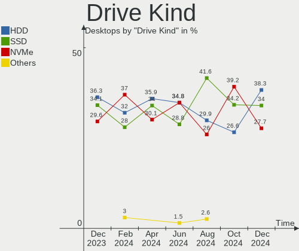
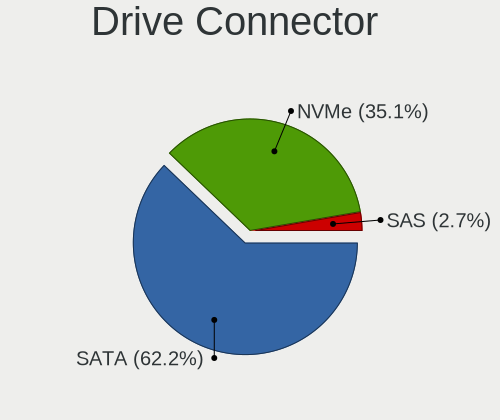
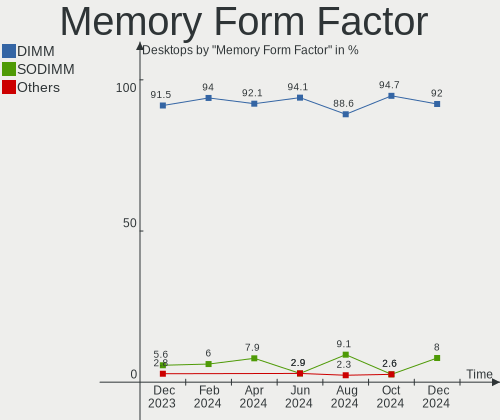

ArcoLinux Hardware Trends (Desktops)
------------------------------------

A project to identify most popular hardware characteristics and track their change
over time based on data collected by ArcoLinux users at https://Linux-Hardware.org.

Anyone can contribute to this report by the [hw-probe](https://github.com/linuxhw/hw-probe) tool:

    sudo -E hw-probe -all -upload

Full-feature report is available here: https://linux-hardware.org/?view=trends

Period: Jan, 2022.

Contents
--------

* [ System ](#system)
  - [ OS                       ](#os)
  - [ OS Family                ](#os-family)
  - [ Kernel                   ](#kernel)
  - [ Kernel Family            ](#kernel-family)
  - [ Kernel Major Ver.        ](#kernel-major-ver)
  - [ Arch                     ](#arch)
  - [ DE                       ](#de)
  - [ Display Server           ](#display-server)
  - [ Display Manager          ](#display-manager)
  - [ OS Lang                  ](#os-lang)
  - [ Boot Mode                ](#boot-mode)
  - [ Filesystem               ](#filesystem)
  - [ Part. scheme             ](#part-scheme)
  - [ Dual Boot with Linux/BSD ](#dual-boot-with-linuxbsd)
  - [ Dual Boot (Win)          ](#dual-boot-win)

* [ Board ](#board)
  - [ Vendor                   ](#vendor)
  - [ Model                    ](#model)
  - [ Model Family             ](#model-family)
  - [ MFG Year                 ](#mfg-year)
  - [ Form Factor              ](#form-factor)
  - [ Secure Boot              ](#secure-boot)
  - [ Coreboot                 ](#coreboot)
  - [ RAM Size                 ](#ram-size)
  - [ RAM Used                 ](#ram-used)
  - [ Total Drives             ](#total-drives)
  - [ Has CD-ROM               ](#has-cd-rom)
  - [ Has Ethernet             ](#has-ethernet)
  - [ Has WiFi                 ](#has-wifi)
  - [ Has Bluetooth            ](#has-bluetooth)

* [ Location ](#location)
  - [ Country                  ](#country)
  - [ City                     ](#city)

* [ Drives ](#drives)
  - [ Drive Vendor             ](#drive-vendor)
  - [ Drive Model              ](#drive-model)
  - [ HDD Vendor               ](#hdd-vendor)
  - [ SSD Vendor               ](#ssd-vendor)
  - [ Drive Kind               ](#drive-kind)
  - [ Drive Connector          ](#drive-connector)
  - [ Drive Size               ](#drive-size)
  - [ Space Total              ](#space-total)
  - [ Space Used               ](#space-used)
  - [ Malfunc. Drives          ](#malfunc-drives)
  - [ Malfunc. Drive Vendor    ](#malfunc-drive-vendor)
  - [ Malfunc. HDD Vendor      ](#malfunc-hdd-vendor)
  - [ Malfunc. Drive Kind      ](#malfunc-drive-kind)
  - [ Failed Drives            ](#failed-drives)
  - [ Failed Drive Vendor      ](#failed-drive-vendor)
  - [ Drive Status             ](#drive-status)

* [ Storage controller ](#storage-controller)
  - [ Storage Vendor           ](#storage-vendor)
  - [ Storage Model            ](#storage-model)
  - [ Storage Kind             ](#storage-kind)

* [ Processor ](#processor)
  - [ CPU Vendor               ](#cpu-vendor)
  - [ CPU Model                ](#cpu-model)
  - [ CPU Model Family         ](#cpu-model-family)
  - [ CPU Cores                ](#cpu-cores)
  - [ CPU Sockets              ](#cpu-sockets)
  - [ CPU Threads              ](#cpu-threads)
  - [ CPU Op-Modes             ](#cpu-op-modes)
  - [ CPU Microcode            ](#cpu-microcode)
  - [ CPU Microarch            ](#cpu-microarch)

* [ Graphics ](#graphics)
  - [ GPU Vendor               ](#gpu-vendor)
  - [ GPU Model                ](#gpu-model)
  - [ GPU Combo                ](#gpu-combo)
  - [ GPU Driver               ](#gpu-driver)
  - [ GPU Memory               ](#gpu-memory)

* [ Monitor ](#monitor)
  - [ Monitor Vendor           ](#monitor-vendor)
  - [ Monitor Model            ](#monitor-model)
  - [ Monitor Resolution       ](#monitor-resolution)
  - [ Monitor Diagonal         ](#monitor-diagonal)
  - [ Monitor Width            ](#monitor-width)
  - [ Aspect Ratio             ](#aspect-ratio)
  - [ Monitor Area             ](#monitor-area)
  - [ Pixel Density            ](#pixel-density)
  - [ Multiple Monitors        ](#multiple-monitors)

* [ Network ](#network)
  - [ Net Controller Vendor    ](#net-controller-vendor)
  - [ Net Controller Model     ](#net-controller-model)
  - [ Wireless Vendor          ](#wireless-vendor)
  - [ Wireless Model           ](#wireless-model)
  - [ Ethernet Vendor          ](#ethernet-vendor)
  - [ Ethernet Model           ](#ethernet-model)
  - [ Net Controller Kind      ](#net-controller-kind)
  - [ Used Controller          ](#used-controller)
  - [ NICs                     ](#nics)
  - [ IPv6                     ](#ipv6)

* [ Bluetooth ](#bluetooth)
  - [ Bluetooth Vendor         ](#bluetooth-vendor)
  - [ Bluetooth Model          ](#bluetooth-model)

* [ Sound ](#sound)
  - [ Sound Vendor             ](#sound-vendor)
  - [ Sound Model              ](#sound-model)

* [ Memory ](#memory)
  - [ Memory Vendor            ](#memory-vendor)
  - [ Memory Model             ](#memory-model)
  - [ Memory Kind              ](#memory-kind)
  - [ Memory Form Factor       ](#memory-form-factor)
  - [ Memory Size              ](#memory-size)
  - [ Memory Speed             ](#memory-speed)

* [ Printers & scanners ](#printers--scanners)
  - [ Printer Vendor           ](#printer-vendor)
  - [ Printer Model            ](#printer-model)
  - [ Scanner Vendor           ](#scanner-vendor)
  - [ Scanner Model            ](#scanner-model)

* [ Camera ](#camera)
  - [ Camera Vendor            ](#camera-vendor)
  - [ Camera Model             ](#camera-model)

* [ Security ](#security)
  - [ Fingerprint Vendor       ](#fingerprint-vendor)
  - [ Fingerprint Model        ](#fingerprint-model)
  - [ Chipcard Vendor          ](#chipcard-vendor)
  - [ Chipcard Model           ](#chipcard-model)

* [ Unsupported ](#unsupported)
  - [ Unsupported Devices      ](#unsupported-devices)
  - [ Unsupported Device Types ](#unsupported-device-types)

System
------

OS
--

Installed operating systems

| Name              | Desktops | Percent |
|-------------------|----------|---------|
| ArcoLinux Rolling | 32       | 94.12%  |
| ArcoLinux         | 2        | 5.88%   |

OS Family
---------

OS without a version

| Name      | Desktops | Percent |
|-----------|----------|---------|
| ArcoLinux | 34       | 100%    |

Kernel
------

Version of the Linux kernel

| Version                      | Desktops | Percent |
|------------------------------|----------|---------|
| 5.16.2-arch1-1               | 6        | 17.65%  |
| 5.15.12-arch1-1              | 5        | 14.71%  |
| 5.15.10-arch1-1              | 5        | 14.71%  |
| 5.16.2-zen1-1-zen            | 2        | 5.88%   |
| 5.16.0-arch1-1               | 2        | 5.88%   |
| 5.15.13-arch1-1              | 2        | 5.88%   |
| 5.15.12-zen1-1-zen           | 2        | 5.88%   |
| 5.16.1-zen1-1-zen            | 1        | 2.94%   |
| 5.16.1-arch1-1               | 1        | 2.94%   |
| 5.16.0-zen1-1-zen            | 1        | 2.94%   |
| 5.15.7-zen1-1-zen            | 1        | 2.94%   |
| 5.15.16-hardened1-1-hardened | 1        | 2.94%   |
| 5.15.15-1-lts                | 1        | 2.94%   |
| 5.15.14-1-lts                | 1        | 2.94%   |
| 5.15.13-zen1-1-zen           | 1        | 2.94%   |
| 5.15.13-xanmod1-1            | 1        | 2.94%   |
| 5.10.61-1-lts                | 1        | 2.94%   |

Kernel Family
-------------

Linux kernel without a distro release

| Version | Desktops | Percent |
|---------|----------|---------|
| 5.16.2  | 8        | 23.53%  |
| 5.15.12 | 7        | 20.59%  |
| 5.15.10 | 5        | 14.71%  |
| 5.15.13 | 4        | 11.76%  |
| 5.16.0  | 3        | 8.82%   |
| 5.16.1  | 2        | 5.88%   |
| 5.15.7  | 1        | 2.94%   |
| 5.15.16 | 1        | 2.94%   |
| 5.15.15 | 1        | 2.94%   |
| 5.15.14 | 1        | 2.94%   |
| 5.10.61 | 1        | 2.94%   |

Kernel Major Ver.
-----------------

Linux kernel major version

| Version | Desktops | Percent |
|---------|----------|---------|
| 5.15    | 20       | 58.82%  |
| 5.16    | 13       | 38.24%  |
| 5.10    | 1        | 2.94%   |

Arch
----

OS architecture (x86_64, i586, etc.)

| Name   | Desktops | Percent |
|--------|----------|---------|
| x86_64 | 34       | 100%    |

DE
--

Desktop Environment

| Name       | Desktops | Percent |
|------------|----------|---------|
| XFCE       | 13       | 38.24%  |
| KDE5       | 11       | 32.35%  |
| awesome    | 5        | 14.71%  |
| xmonad     | 1        | 2.94%   |
| X-Cinnamon | 1        | 2.94%   |
| LXQt       | 1        | 2.94%   |
| i3         | 1        | 2.94%   |
| Cutefish   | 1        | 2.94%   |

Display Server
--------------

X11 or Wayland

| Name    | Desktops | Percent |
|---------|----------|---------|
| X11     | 31       | 91.18%  |
| Tty     | 2        | 5.88%   |
| Wayland | 1        | 2.94%   |

Display Manager
---------------

SDDM, LightDM, etc.

| Name    | Desktops | Percent |
|---------|----------|---------|
| SDDM    | 23       | 67.65%  |
| LightDM | 9        | 26.47%  |
| Unknown | 2        | 5.88%   |

OS Lang
-------

Language

| Lang  | Desktops | Percent |
|-------|----------|---------|
| en_US | 26       | 76.47%  |
| tr_TR | 1        | 2.94%   |
| sv_SE | 1        | 2.94%   |
| pt_PT | 1        | 2.94%   |
| pt_BR | 1        | 2.94%   |
| en_SG | 1        | 2.94%   |
| en_GB | 1        | 2.94%   |
| en_CA | 1        | 2.94%   |
| de_DE | 1        | 2.94%   |

Boot Mode
---------

EFI or BIOS

| Mode | Desktops | Percent |
|------|----------|---------|
| EFI  | 22       | 64.71%  |
| BIOS | 12       | 35.29%  |

Filesystem
----------

Type of filesystem

| Type    | Desktops | Percent |
|---------|----------|---------|
| Ext4    | 27       | 79.41%  |
| Overlay | 4        | 11.76%  |
| Btrfs   | 2        | 5.88%   |
| Unknown | 1        | 2.94%   |

Part. scheme
------------

Scheme of partitioning

| Type    | Desktops | Percent |
|---------|----------|---------|
| GPT     | 24       | 70.59%  |
| MBR     | 7        | 20.59%  |
| Unknown | 3        | 8.82%   |

Dual Boot with Linux/BSD
------------------------

Hosting more than one Linux/BSD

| Dual boot | Desktops | Percent |
|-----------|----------|---------|
| No        | 21       | 61.76%  |
| Yes       | 13       | 38.24%  |

Dual Boot (Win)
---------------

Hosting Linux and Windows

| Dual boot | Desktops | Percent |
|-----------|----------|---------|
| No        | 22       | 64.71%  |
| Yes       | 12       | 35.29%  |

Board
-----

Vendor
------

Motherboard manufacturer

| Name                | Desktops | Percent |
|---------------------|----------|---------|
| Gigabyte Technology | 10       | 29.41%  |
| ASUSTek Computer    | 8        | 23.53%  |
| Hewlett-Packard     | 4        | 11.76%  |
| MSI                 | 3        | 8.82%   |
| Dell                | 3        | 8.82%   |
| ASRock              | 2        | 5.88%   |
| VS Company          | 1        | 2.94%   |
| Lenovo              | 1        | 2.94%   |
| Biostar             | 1        | 2.94%   |
| Unknown             | 1        | 2.94%   |

Model
-----

Motherboard model

| Name                            | Desktops | Percent |
|---------------------------------|----------|---------|
| ASUS ROG STRIX B450-F GAMING II | 2        | 5.88%   |
| VS Company MCP61M               | 1        | 2.94%   |
| MSI MS-7C34                     | 1        | 2.94%   |
| MSI MS-7C02                     | 1        | 2.94%   |
| MSI A320M-HDV R4.0              | 1        | 2.94%   |
| Lenovo ThinkStation S10 6483CTO | 1        | 2.94%   |
| HP Pavilion Desktop PC 570-p0xx | 1        | 2.94%   |
| HP Pavilion Desktop 590-p0xxx   | 1        | 2.94%   |
| HP EliteDesk 800 G4 TWR         | 1        | 2.94%   |
| HP EliteDesk 800 G1 SFF         | 1        | 2.94%   |
| Gigabyte Z390 AORUS PRO WIFI    | 1        | 2.94%   |
| Gigabyte P55-USB3               | 1        | 2.94%   |
| Gigabyte H110M-A                | 1        | 2.94%   |
| Gigabyte GA-970A-UD3            | 1        | 2.94%   |
| Gigabyte B550 AORUS PRO V2      | 1        | 2.94%   |
| Gigabyte B550 AORUS MASTER      | 1        | 2.94%   |
| Gigabyte B450M DS3H V2          | 1        | 2.94%   |
| Gigabyte B450 I AORUS PRO WIFI  | 1        | 2.94%   |
| Gigabyte AB350N-Gaming WIFI     | 1        | 2.94%   |
| Gigabyte A520M S2H              | 1        | 2.94%   |
| Dell XPS 8700                   | 1        | 2.94%   |
| Dell Vostro 270                 | 1        | 2.94%   |
| Dell Inspiron 3470              | 1        | 2.94%   |
| Biostar J3060NH                 | 1        | 2.94%   |
| ASUS ROG CROSSHAIR VIII HERO    | 1        | 2.94%   |
| ASUS PRIME X570-P               | 1        | 2.94%   |
| ASUS PRIME X470-PRO             | 1        | 2.94%   |
| ASUS PRIME B450M-A              | 1        | 2.94%   |
| ASUS P5L8L-SE                   | 1        | 2.94%   |
| ASUS 5939                       | 1        | 2.94%   |
| ASRock P75 Pro3                 | 1        | 2.94%   |
| ASRock A300M-STX                | 1        | 2.94%   |
| Unknown                         | 1        | 2.94%   |

Model Family
------------

Motherboard model prefix

| Name                   | Desktops | Percent |
|------------------------|----------|---------|
| ASUS ROG               | 3        | 8.82%   |
| ASUS PRIME             | 3        | 8.82%   |
| HP Pavilion            | 2        | 5.88%   |
| HP EliteDesk           | 2        | 5.88%   |
| Gigabyte B550          | 2        | 5.88%   |
| VS Company MCP61M      | 1        | 2.94%   |
| MSI MS-7C34            | 1        | 2.94%   |
| MSI MS-7C02            | 1        | 2.94%   |
| MSI A320M-HDV          | 1        | 2.94%   |
| Lenovo ThinkStation    | 1        | 2.94%   |
| Gigabyte Z390          | 1        | 2.94%   |
| Gigabyte P55-USB3      | 1        | 2.94%   |
| Gigabyte H110M-A       | 1        | 2.94%   |
| Gigabyte GA-970A-UD3   | 1        | 2.94%   |
| Gigabyte B450M         | 1        | 2.94%   |
| Gigabyte B450          | 1        | 2.94%   |
| Gigabyte AB350N-Gaming | 1        | 2.94%   |
| Gigabyte A520M         | 1        | 2.94%   |
| Dell XPS               | 1        | 2.94%   |
| Dell Vostro            | 1        | 2.94%   |
| Dell Inspiron          | 1        | 2.94%   |
| Biostar J3060NH        | 1        | 2.94%   |
| ASUS P5L8L-SE          | 1        | 2.94%   |
| ASUS 5939              | 1        | 2.94%   |
| ASRock P75             | 1        | 2.94%   |
| ASRock A300M-STX       | 1        | 2.94%   |
| Unknown                | 1        | 2.94%   |

MFG Year
--------

Motherboard manufacture year

| Year | Desktops | Percent |
|------|----------|---------|
| 2018 | 7        | 20.59%  |
| 2020 | 6        | 17.65%  |
| 2019 | 6        | 17.65%  |
| 2013 | 3        | 8.82%   |
| 2021 | 2        | 5.88%   |
| 2017 | 2        | 5.88%   |
| 2016 | 2        | 5.88%   |
| 2011 | 2        | 5.88%   |
| 2012 | 1        | 2.94%   |
| 2010 | 1        | 2.94%   |
| 2008 | 1        | 2.94%   |
| 2007 | 1        | 2.94%   |

Form Factor
-----------

Physical design of the computer

| Name    | Desktops | Percent |
|---------|----------|---------|
| Desktop | 34       | 100%    |

Secure Boot
-----------

Enabled or disabled

| State    | Desktops | Percent |
|----------|----------|---------|
| Disabled | 34       | 100%    |

Coreboot
--------

Have coreboot on board

| Used | Desktops | Percent |
|------|----------|---------|
| No   | 34       | 100%    |

RAM Size
--------

Total RAM memory

| Size in GB  | Desktops | Percent |
|-------------|----------|---------|
| 16.01-24.0  | 9        | 26.47%  |
| 32.01-64.0  | 7        | 20.59%  |
| 8.01-16.0   | 6        | 17.65%  |
| 4.01-8.0    | 4        | 11.76%  |
| 64.01-256.0 | 4        | 11.76%  |
| 3.01-4.0    | 2        | 5.88%   |
| 24.01-32.0  | 1        | 2.94%   |
| 2.01-3.0    | 1        | 2.94%   |

RAM Used
--------

Used RAM memory

| Used GB    | Desktops | Percent |
|------------|----------|---------|
| 1.01-2.0   | 10       | 29.41%  |
| 2.01-3.0   | 9        | 26.47%  |
| 4.01-8.0   | 5        | 14.71%  |
| 3.01-4.0   | 4        | 11.76%  |
| 8.01-16.0  | 2        | 5.88%   |
| 0.51-1.0   | 2        | 5.88%   |
| 16.01-24.0 | 1        | 2.94%   |
| 0.01-0.5   | 1        | 2.94%   |

Total Drives
------------

Number of drives on board

| Drives | Desktops | Percent |
|--------|----------|---------|
| 2      | 11       | 32.35%  |
| 1      | 8        | 23.53%  |
| 4      | 5        | 14.71%  |
| 3      | 5        | 14.71%  |
| 5      | 3        | 8.82%   |
| 9      | 1        | 2.94%   |
| 7      | 1        | 2.94%   |

Has CD-ROM
----------

Has CD-ROM on board

| Presented | Desktops | Percent |
|-----------|----------|---------|
| No        | 20       | 58.82%  |
| Yes       | 14       | 41.18%  |

Has Ethernet
------------

Has Ethernet on board

| Presented | Desktops | Percent |
|-----------|----------|---------|
| Yes       | 34       | 100%    |

Has WiFi
--------

Has WiFi module

| Presented | Desktops | Percent |
|-----------|----------|---------|
| Yes       | 22       | 64.71%  |
| No        | 12       | 35.29%  |

Has Bluetooth
-------------

Has Bluetooth module

| Presented | Desktops | Percent |
|-----------|----------|---------|
| No        | 18       | 52.94%  |
| Yes       | 16       | 47.06%  |

Location
--------

Country
-------

Geographic location (country)

| Country   | Desktops | Percent |
|-----------|----------|---------|
| USA       | 11       | 32.35%  |
| UK        | 2        | 5.88%   |
| Poland    | 2        | 5.88%   |
| Kenya     | 2        | 5.88%   |
| Greece    | 2        | 5.88%   |
| Canada    | 2        | 5.88%   |
| Brazil    | 2        | 5.88%   |
| Turkey    | 1        | 2.94%   |
| Sweden    | 1        | 2.94%   |
| Serbia    | 1        | 2.94%   |
| Romania   | 1        | 2.94%   |
| Portugal  | 1        | 2.94%   |
| Norway    | 1        | 2.94%   |
| Malaysia  | 1        | 2.94%   |
| Germany   | 1        | 2.94%   |
| Barbados  | 1        | 2.94%   |
| Austria   | 1        | 2.94%   |
| Argentina | 1        | 2.94%   |

City
----

Geographic location (city)

| City                   | Desktops | Percent |
|------------------------|----------|---------|
| Rupert                 | 2        | 5.88%   |
| Nairobi                | 2        | 5.88%   |
| Warsaw                 | 1        | 2.94%   |
| Vienna                 | 1        | 2.94%   |
| Vargem Grande Paulista | 1        | 2.94%   |
| Stittsville            | 1        | 2.94%   |
| Staten Island          | 1        | 2.94%   |
| Shetland Islands       | 1        | 2.94%   |
| Piatra Neam??          | 1        | 2.94%   |
| Olympia                | 1        | 2.94%   |
| Neutraubling           | 1        | 2.94%   |
| Montreal               | 1        | 2.94%   |
| Mattoon                | 1        | 2.94%   |
| Leiria                 | 1        | 2.94%   |
| Kuala Lumpur           | 1        | 2.94%   |
| Kristianstad           | 1        | 2.94%   |
| Janesville             | 1        | 2.94%   |
| Jacksonville           | 1        | 2.94%   |
| Hillsborough           | 1        | 2.94%   |
| Heraklion              | 1        | 2.94%   |
| Gebze                  | 1        | 2.94%   |
| Gdansk                 | 1        | 2.94%   |
| East Longmeadow        | 1        | 2.94%   |
| Cotia                  | 1        | 2.94%   |
| Conroe                 | 1        | 2.94%   |
| Colfax                 | 1        | 2.94%   |
| Chattanooga            | 1        | 2.94%   |
| Buenos Aires           | 1        | 2.94%   |
| Brumunddal             | 1        | 2.94%   |
| Bridgetown             | 1        | 2.94%   |
| Belgrade               | 1        | 2.94%   |
| Athens                 | 1        | 2.94%   |

Drives
------

Drive Vendor
------------

Hard drive vendors

| Vendor                | Desktops | Drives | Percent |
|-----------------------|----------|--------|---------|
| WDC                   | 13       | 16     | 16.67%  |
| Seagate               | 12       | 16     | 15.38%  |
| Samsung Electronics   | 12       | 18     | 15.38%  |
| Kingston              | 5        | 5      | 6.41%   |
| Crucial               | 5        | 7      | 6.41%   |
| Toshiba               | 4        | 4      | 5.13%   |
| Intel                 | 3        | 3      | 3.85%   |
| Unknown               | 2        | 3      | 2.56%   |
| Transcend             | 2        | 2      | 2.56%   |
| Corsair               | 2        | 2      | 2.56%   |
| China                 | 2        | 2      | 2.56%   |
| Unknown               | 2        | 2      | 2.56%   |
| XPG                   | 1        | 1      | 1.28%   |
| Verbatim              | 1        | 1      | 1.28%   |
| Silicon Motion        | 1        | 1      | 1.28%   |
| SanDisk               | 1        | 1      | 1.28%   |
| Sabrent               | 1        | 1      | 1.28%   |
| Realtek Semiconductor | 1        | 1      | 1.28%   |
| PNY                   | 1        | 1      | 1.28%   |
| Phison                | 1        | 1      | 1.28%   |
| Patriot               | 1        | 1      | 1.28%   |
| OEM                   | 1        | 1      | 1.28%   |
| JMicron               | 1        | 1      | 1.28%   |
| Gigabyte Technology   | 1        | 1      | 1.28%   |
| Fujitsu               | 1        | 1      | 1.28%   |
| A-DATA Technology     | 1        | 1      | 1.28%   |

Drive Model
-----------

Hard drive models

| Model                                      | Desktops | Percent |
|--------------------------------------------|----------|---------|
| Seagate ST1000DM010-2EP102 1TB             | 4        | 4.4%    |
| Toshiba DT01ACA100 1TB                     | 2        | 2.2%    |
| Samsung SSD 860 EVO 1TB                    | 2        | 2.2%    |
| Crucial CT500MX500SSD1 500GB               | 2        | 2.2%    |
| Unknown                                    | 2        | 2.2%    |
| XPG GAMMIX S11 Pro 2TB                     | 1        | 1.1%    |
| WDC WDS500G1X0E-00AFY0 500GB               | 1        | 1.1%    |
| WDC WDS240G2G0A-00JH30 240GB SSD           | 1        | 1.1%    |
| WDC WDS200T2B0A-00SM50 2TB SSD             | 1        | 1.1%    |
| WDC WDS100T3X0C-00SJG0 1TB                 | 1        | 1.1%    |
| WDC WD6401AALS-00E3A0 640GB                | 1        | 1.1%    |
| WDC WD5000HHTZ-75N21V0 500GB               | 1        | 1.1%    |
| WDC WD5000AAKX-75U6AA0 500GB               | 1        | 1.1%    |
| WDC WD5000AAKX-00ERMA0 500GB               | 1        | 1.1%    |
| WDC WD3200AAKS-00YGA0 320GB                | 1        | 1.1%    |
| WDC WD3200AAJS-56M0A0 320GB                | 1        | 1.1%    |
| WDC WD30EZRX-00DC0B0 3TB                   | 1        | 1.1%    |
| WDC WD20EARX-00PASB0 2TB                   | 1        | 1.1%    |
| WDC WD2003FZEX-00SRLA0 2TB                 | 1        | 1.1%    |
| WDC WD10EUCX-63YZ1Y0 1TB                   | 1        | 1.1%    |
| WDC WD101EFAX-68LDBN0 10TB                 | 1        | 1.1%    |
| Verbatim Vi550 S3 SSD 512GB                | 1        | 1.1%    |
| Unknown SD/MMC/MS PRO 128GB                | 1        | 1.1%    |
| Unknown SD/MMC 16GB                        | 1        | 1.1%    |
| Unknown M.S./M.S.Pro/HG 16GB               | 1        | 1.1%    |
| Transcend TS480GSSD220S 480GB              | 1        | 1.1%    |
| Transcend TS128GSSD630 128GB               | 1        | 1.1%    |
| Toshiba HDWD240 4TB                        | 1        | 1.1%    |
| Toshiba HDWD110 1TB                        | 1        | 1.1%    |
| Silicon Motion NVMe SSD Drive 250GB        | 1        | 1.1%    |
| Seagate ST8000DM004-2CX188 8TB             | 1        | 1.1%    |
| Seagate ST6000DM003-2CY186 6TB             | 1        | 1.1%    |
| Seagate ST500LT012-1DG142 500GB            | 1        | 1.1%    |
| Seagate ST3500312CS 500GB                  | 1        | 1.1%    |
| Seagate ST2000DM008-2FR102 2TB             | 1        | 1.1%    |
| Seagate ST2000DM001-1E6164 2TB             | 1        | 1.1%    |
| Seagate ST16000NM001G-2KK103 16TB          | 1        | 1.1%    |
| Seagate ST16000NE000-2WX103 16TB           | 1        | 1.1%    |
| Seagate ST1000DM003-9YN162 1TB             | 1        | 1.1%    |
| Seagate ST1000DM003-1ER162 1TB             | 1        | 1.1%    |
| Seagate FireCuda 520 SSD ZP2000GM30002 2TB | 1        | 1.1%    |
| SanDisk SDSSDH31024G 1TB                   | 1        | 1.1%    |
| Samsung SSD 980 PRO 500GB                  | 1        | 1.1%    |
| Samsung SSD 980 PRO 1TB                    | 1        | 1.1%    |
| Samsung SSD 970 EVO Plus 500GB             | 1        | 1.1%    |
| Samsung SSD 970 EVO Plus 1TB               | 1        | 1.1%    |
| Samsung SSD 970 EVO 500GB                  | 1        | 1.1%    |
| Samsung SSD 870 QVO 8TB                    | 1        | 1.1%    |
| Samsung SSD 870 EVO 1TB                    | 1        | 1.1%    |
| Samsung SSD 860 EVO 500GB                  | 1        | 1.1%    |
| Samsung SSD 860 EVO 4TB                    | 1        | 1.1%    |
| Samsung SSD 860 EVO 250GB                  | 1        | 1.1%    |
| Samsung SSD 850 EVO 250GB                  | 1        | 1.1%    |
| Samsung SSD 840 EVO 750GB                  | 1        | 1.1%    |
| Samsung SSD 840 EVO 250GB                  | 1        | 1.1%    |
| Samsung MZVLW128HEGR-000H1 128GB           | 1        | 1.1%    |
| Samsung MZVL21T0HCLR-00B00 1TB             | 1        | 1.1%    |
| Samsung HD502HJ 500GB                      | 1        | 1.1%    |
| Sabrent Rocket-Rugged 512GB                | 1        | 1.1%    |
| Realtek NVMe SSD Drive 512GB               | 1        | 1.1%    |

HDD Vendor
----------

Hard disk drive vendors

| Vendor              | Desktops | Drives | Percent |
|---------------------|----------|--------|---------|
| Seagate             | 12       | 15     | 38.71%  |
| WDC                 | 10       | 12     | 32.26%  |
| Toshiba             | 4        | 4      | 12.9%   |
| Unknown             | 1        | 1      | 3.23%   |
| Samsung Electronics | 1        | 1      | 3.23%   |
| JMicron             | 1        | 1      | 3.23%   |
| Fujitsu             | 1        | 1      | 3.23%   |
| Unknown             | 1        | 1      | 3.23%   |

SSD Vendor
----------

Solid state drive vendors

| Vendor              | Desktops | Drives | Percent |
|---------------------|----------|--------|---------|
| Samsung Electronics | 8        | 10     | 28.57%  |
| Kingston            | 4        | 4      | 14.29%  |
| Crucial             | 3        | 5      | 10.71%  |
| WDC                 | 2        | 2      | 7.14%   |
| Transcend           | 2        | 2      | 7.14%   |
| China               | 2        | 2      | 7.14%   |
| Verbatim            | 1        | 1      | 3.57%   |
| SanDisk             | 1        | 1      | 3.57%   |
| PNY                 | 1        | 1      | 3.57%   |
| Patriot             | 1        | 1      | 3.57%   |
| Intel               | 1        | 1      | 3.57%   |
| Gigabyte Technology | 1        | 1      | 3.57%   |
| Unknown             | 1        | 1      | 3.57%   |

Drive Kind
----------

HDD or SSD

| Kind    | Desktops | Drives | Percent |
|---------|----------|--------|---------|
| HDD     | 25       | 36     | 38.46%  |
| SSD     | 21       | 32     | 32.31%  |
| NVMe    | 17       | 23     | 26.15%  |
| Unknown | 2        | 3      | 3.08%   |

Drive Connector
---------------

SATA, SAS, NVMe, etc.

| Type | Desktops | Drives | Percent |
|------|----------|--------|---------|
| SATA | 33       | 66     | 62.26%  |
| NVMe | 17       | 23     | 32.08%  |
| SAS  | 3        | 5      | 5.66%   |

Drive Size
----------

Size of hard drive

| Size in TB | Desktops | Drives | Percent |
|------------|----------|--------|---------|
| 0.01-0.5   | 19       | 30     | 37.25%  |
| 0.51-1.0   | 17       | 21     | 33.33%  |
| 1.01-2.0   | 6        | 7      | 11.76%  |
| 4.01-10.0  | 4        | 4      | 7.84%   |
| 3.01-4.0   | 2        | 2      | 3.92%   |
| 10.01-20.0 | 2        | 3      | 3.92%   |
| 2.01-3.0   | 1        | 1      | 1.96%   |

Space Total
-----------

Amount of disk space available on the file system

| Size in GB     | Desktops | Percent |
|----------------|----------|---------|
| 251-500        | 7        | 20.59%  |
| 101-250        | 6        | 17.65%  |
| 501-1000       | 6        | 17.65%  |
| 1001-2000      | 4        | 11.76%  |
| 1-20           | 4        | 11.76%  |
| More than 3000 | 2        | 5.88%   |
| 2001-3000      | 2        | 5.88%   |
| Unknown        | 2        | 5.88%   |
| 21-50          | 1        | 2.94%   |

Space Used
----------

Amount of used disk space

| Used GB        | Desktops | Percent |
|----------------|----------|---------|
| 1-20           | 12       | 35.29%  |
| 21-50          | 6        | 17.65%  |
| 251-500        | 4        | 11.76%  |
| 101-250        | 3        | 8.82%   |
| 51-100         | 3        | 8.82%   |
| 501-1000       | 2        | 5.88%   |
| Unknown        | 2        | 5.88%   |
| More than 3000 | 1        | 2.94%   |
| 1001-2000      | 1        | 2.94%   |

Malfunc. Drives
---------------

Drive models with a malfunction

| Model                           | Desktops | Drives | Percent |
|---------------------------------|----------|--------|---------|
| Seagate ST3500312CS 500GB       | 1        | 1      | 16.67%  |
| Seagate ST2000DM001-1E6164 2TB  | 1        | 1      | 16.67%  |
| Seagate ST1000DM003-9YN162 1TB  | 1        | 1      | 16.67%  |
| Seagate ST1000DM003-1ER162 1TB  | 1        | 1      | 16.67%  |
| Kingston SA400S37480G 480GB SSD | 1        | 1      | 16.67%  |
| Unknown                         | 1        | 1      | 16.67%  |

Malfunc. Drive Vendor
---------------------

Vendors of faulty drives

| Vendor   | Desktops | Drives | Percent |
|----------|----------|--------|---------|
| Seagate  | 4        | 4      | 66.67%  |
| Kingston | 1        | 1      | 16.67%  |
| Unknown  | 1        | 1      | 16.67%  |

Malfunc. HDD Vendor
-------------------

Vendors of faulty HDD drives

| Vendor  | Desktops | Drives | Percent |
|---------|----------|--------|---------|
| Seagate | 4        | 4      | 80%     |
| Unknown | 1        | 1      | 20%     |

Malfunc. Drive Kind
-------------------

Kinds of faulty drives

| Kind | Desktops | Drives | Percent |
|------|----------|--------|---------|
| HDD  | 5        | 5      | 83.33%  |
| SSD  | 1        | 1      | 16.67%  |

Failed Drives
-------------

Failed drive models

Zero info for selected period =(

Failed Drive Vendor
-------------------

Failed drive vendors

Zero info for selected period =(

Drive Status
------------

Number of failed and malfunc. drives

| Status   | Desktops | Drives | Percent |
|----------|----------|--------|---------|
| Works    | 26       | 62     | 66.67%  |
| Detected | 7        | 26     | 17.95%  |
| Malfunc  | 6        | 6      | 15.38%  |

Storage controller
------------------

Storage Vendor
--------------

Storage controller vendors

| Vendor                       | Desktops | Percent |
|------------------------------|----------|---------|
| AMD                          | 18       | 31.58%  |
| Intel                        | 17       | 29.82%  |
| Samsung Electronics          | 5        | 8.77%   |
| Phison Electronics           | 3        | 5.26%   |
| Sandisk                      | 2        | 3.51%   |
| Micron/Crucial Technology    | 2        | 3.51%   |
| ADATA Technology             | 2        | 3.51%   |
| Silicon Motion               | 1        | 1.75%   |
| Shenzhen Longsys Electronics | 1        | 1.75%   |
| Seagate Technology           | 1        | 1.75%   |
| Realtek Semiconductor        | 1        | 1.75%   |
| Nvidia                       | 1        | 1.75%   |
| Kingston Technology Company  | 1        | 1.75%   |
| JMicron Technology           | 1        | 1.75%   |
| ASMedia Technology           | 1        | 1.75%   |

Storage Model
-------------

Storage controller models

| Model                                                                            | Desktops | Percent |
|----------------------------------------------------------------------------------|----------|---------|
| AMD FCH SATA Controller [AHCI mode]                                              | 9        | 13.04%  |
| AMD 400 Series Chipset SATA Controller                                           | 7        | 10.14%  |
| Intel Cannon Lake PCH SATA AHCI Controller                                       | 4        | 5.8%    |
| AMD Starship/Matisse Chipset SATA Controller [AHCI mode]                         | 4        | 5.8%    |
| Samsung NVMe SSD Controller SM981/PM981/PM983                                    | 3        | 4.35%   |
| Samsung NVMe SSD Controller PM9A1/PM9A3/980PRO                                   | 3        | 4.35%   |
| Intel 7 Series/C210 Series Chipset Family 6-port SATA Controller [AHCI mode]     | 3        | 4.35%   |
| Phison E16 PCIe4 NVMe Controller                                                 | 2        | 2.9%    |
| Intel 8 Series/C220 Series Chipset Family 6-port SATA Controller 1 [AHCI mode]   | 2        | 2.9%    |
| ADATA XPG SX8200 Pro PCIe Gen3x4 M.2 2280 Solid State Drive                      | 2        | 2.9%    |
| Silicon Motion SM2263EN/SM2263XT SSD Controller                                  | 1        | 1.45%   |
| Shenzhen Longsys SM2263EN/SM2263XT-based OEM SSD                                 | 1        | 1.45%   |
| Seagate FireCuda 520 SSD                                                         | 1        | 1.45%   |
| Sandisk WD PC SN810 / Black SN850 NVMe SSD                                       | 1        | 1.45%   |
| Sandisk WD Black SN750 / PC SN730 NVMe SSD                                       | 1        | 1.45%   |
| Samsung NVMe SSD Controller SM961/PM961/SM963                                    | 1        | 1.45%   |
| Realtek RTS5763DL NVMe SSD Controller                                            | 1        | 1.45%   |
| Phison E18 PCIe4 NVMe Controller                                                 | 1        | 1.45%   |
| Nvidia MCP61 SATA Controller                                                     | 1        | 1.45%   |
| Nvidia MCP61 IDE                                                                 | 1        | 1.45%   |
| Micron/Crucial P2 NVMe PCIe SSD                                                  | 1        | 1.45%   |
| Micron/Crucial P1 NVMe PCIe SSD                                                  | 1        | 1.45%   |
| Kingston Company Company Non-Volatile memory controller                          | 1        | 1.45%   |
| JMicron JMB363 SATA/IDE Controller                                               | 1        | 1.45%   |
| Intel SSD 660P Series                                                            | 1        | 1.45%   |
| Intel Q170/Q150/B150/H170/H110/Z170/CM236 Chipset SATA Controller [AHCI Mode]    | 1        | 1.45%   |
| Intel Optane SSD 900P Series                                                     | 1        | 1.45%   |
| Intel NM10/ICH7 Family SATA Controller [IDE mode]                                | 1        | 1.45%   |
| Intel Atom/Celeron/Pentium Processor x5-E8000/J3xxx/N3xxx Series SATA Controller | 1        | 1.45%   |
| Intel 82801IR/IO/IH (ICH9R/DO/DH) 4 port SATA Controller [IDE mode]              | 1        | 1.45%   |
| Intel 82801I (ICH9 Family) 2 port SATA Controller [IDE mode]                     | 1        | 1.45%   |
| Intel 82801G (ICH7 Family) IDE Controller                                        | 1        | 1.45%   |
| Intel 5 Series/3400 Series Chipset 4 port SATA IDE Controller                    | 1        | 1.45%   |
| Intel 5 Series/3400 Series Chipset 2 port SATA IDE Controller                    | 1        | 1.45%   |
| Intel 200 Series PCH SATA controller [AHCI mode]                                 | 1        | 1.45%   |
| ASMedia ASM1062 Serial ATA Controller                                            | 1        | 1.45%   |
| AMD SB7x0/SB8x0/SB9x0 SATA Controller [IDE mode]                                 | 1        | 1.45%   |
| AMD SB7x0/SB8x0/SB9x0 IDE Controller                                             | 1        | 1.45%   |
| AMD FCH SATA Controller D                                                        | 1        | 1.45%   |
| AMD 300 Series Chipset SATA Controller                                           | 1        | 1.45%   |

Storage Kind
------------

Kind of storage controller (IDE, SATA, NVMe, SAS, ...)

| Kind | Desktops | Percent |
|------|----------|---------|
| SATA | 30       | 57.69%  |
| NVMe | 17       | 32.69%  |
| IDE  | 5        | 9.62%   |

Processor
---------

CPU Vendor
----------

Processor vendors

| Vendor | Desktops | Percent |
|--------|----------|---------|
| AMD    | 19       | 55.88%  |
| Intel  | 15       | 44.12%  |

CPU Model
---------

Processor models

| Model                                       | Desktops | Percent |
|---------------------------------------------|----------|---------|
| AMD Ryzen 5 5600X 6-Core Processor          | 3        | 8.82%   |
| Intel Core i7-8700 CPU @ 3.20GHz            | 2        | 5.88%   |
| AMD Ryzen 9 5950X 16-Core Processor         | 2        | 5.88%   |
| AMD Ryzen 7 5800X 8-Core Processor          | 2        | 5.88%   |
| AMD Ryzen 7 3800X 8-Core Processor          | 2        | 5.88%   |
| Intel Pentium Dual CPU E2180 @ 2.00GHz      | 1        | 2.94%   |
| Intel Pentium CPU G2020 @ 2.90GHz           | 1        | 2.94%   |
| Intel Core i9-9900K CPU @ 3.60GHz           | 1        | 2.94%   |
| Intel Core i7-4790 CPU @ 3.60GHz            | 1        | 2.94%   |
| Intel Core i7-3820 CPU @ 3.60GHz            | 1        | 2.94%   |
| Intel Core i5-8400 CPU @ 2.80GHz            | 1        | 2.94%   |
| Intel Core i5-7400 CPU @ 3.00GHz            | 1        | 2.94%   |
| Intel Core i5-6500 CPU @ 3.20GHz            | 1        | 2.94%   |
| Intel Core i5-4570 CPU @ 3.20GHz            | 1        | 2.94%   |
| Intel Core i5-3570K CPU @ 3.40GHz           | 1        | 2.94%   |
| Intel Core i5 CPU 750 @ 2.67GHz             | 1        | 2.94%   |
| Intel Core 2 Quad CPU Q9400 @ 2.66GHz       | 1        | 2.94%   |
| Intel Celeron CPU J3060 @ 1.60GHz           | 1        | 2.94%   |
| AMD Ryzen 7 5700G with Radeon Graphics      | 1        | 2.94%   |
| AMD Ryzen 7 2700X Eight-Core Processor      | 1        | 2.94%   |
| AMD Ryzen 5 3600 6-Core Processor           | 1        | 2.94%   |
| AMD Ryzen 5 3400G with Radeon Vega Graphics | 1        | 2.94%   |
| AMD Ryzen 5 2600X Six-Core Processor        | 1        | 2.94%   |
| AMD Ryzen 5 2600 Six-Core Processor         | 1        | 2.94%   |
| AMD Ryzen 3 2300X Quad-Core Processor       | 1        | 2.94%   |
| AMD Ryzen 3 2200G with Radeon Vega Graphics | 1        | 2.94%   |
| AMD FX-8300 Eight-Core Processor            | 1        | 2.94%   |
| AMD Athlon II X2 250 Processor              | 1        | 2.94%   |

CPU Model Family
----------------

Processor model prefix

| Model              | Desktops | Percent |
|--------------------|----------|---------|
| AMD Ryzen 5        | 7        | 20.59%  |
| Intel Core i5      | 6        | 17.65%  |
| AMD Ryzen 7        | 6        | 17.65%  |
| Intel Core i7      | 4        | 11.76%  |
| AMD Ryzen 9        | 2        | 5.88%   |
| AMD Ryzen 3        | 2        | 5.88%   |
| Intel Pentium Dual | 1        | 2.94%   |
| Intel Pentium      | 1        | 2.94%   |
| Intel Core i9      | 1        | 2.94%   |
| Intel Core 2 Quad  | 1        | 2.94%   |
| Intel Celeron      | 1        | 2.94%   |
| AMD FX             | 1        | 2.94%   |
| AMD Athlon II X2   | 1        | 2.94%   |

CPU Cores
---------

Number of processor cores

| Number | Desktops | Percent |
|--------|----------|---------|
| 4      | 12       | 35.29%  |
| 6      | 9        | 26.47%  |
| 8      | 7        | 20.59%  |
| 2      | 4        | 11.76%  |
| 16     | 2        | 5.88%   |

CPU Sockets
-----------

Number of sockets

| Number | Desktops | Percent |
|--------|----------|---------|
| 1      | 34       | 100%    |

CPU Threads
-----------

Threads per core (Hyper-Threading)

| Number | Desktops | Percent |
|--------|----------|---------|
| 2      | 21       | 61.76%  |
| 1      | 13       | 38.24%  |

CPU Op-Modes
------------

CPU Operation Modes (32-bit, 64-bit)

| Op mode        | Desktops | Percent |
|----------------|----------|---------|
| 32-bit, 64-bit | 34       | 100%    |

CPU Microcode
-------------

Microcode number

| Number     | Desktops | Percent |
|------------|----------|---------|
| 0x0a201016 | 4        | 11.76%  |
| 0x0800820d | 4        | 11.76%  |
| Unknown    | 4        | 11.76%  |
| 0x906ea    | 3        | 8.82%   |
| 0x0a201009 | 2        | 5.88%   |
| 0x08701021 | 2        | 5.88%   |
| 0x906ed    | 1        | 2.94%   |
| 0x906e9    | 1        | 2.94%   |
| 0x6fd      | 1        | 2.94%   |
| 0x506e3    | 1        | 2.94%   |
| 0x406c4    | 1        | 2.94%   |
| 0x306c3    | 1        | 2.94%   |
| 0x306a9    | 1        | 2.94%   |
| 0x206d7    | 1        | 2.94%   |
| 0x106e5    | 1        | 2.94%   |
| 0x1067a    | 1        | 2.94%   |
| 0x0a50000c | 1        | 2.94%   |
| 0x08108102 | 1        | 2.94%   |
| 0x08101016 | 1        | 2.94%   |
| 0x06000852 | 1        | 2.94%   |
| 0x010000b6 | 1        | 2.94%   |

CPU Microarch
-------------

Microarchitecture

| Name        | Desktops | Percent |
|-------------|----------|---------|
| Zen 3       | 8        | 23.53%  |
| Zen+        | 5        | 14.71%  |
| KabyLake    | 5        | 14.71%  |
| Zen 2       | 3        | 8.82%   |
| IvyBridge   | 2        | 5.88%   |
| Haswell     | 2        | 5.88%   |
| Zen         | 1        | 2.94%   |
| Skylake     | 1        | 2.94%   |
| Silvermont  | 1        | 2.94%   |
| SandyBridge | 1        | 2.94%   |
| Piledriver  | 1        | 2.94%   |
| Penryn      | 1        | 2.94%   |
| Nehalem     | 1        | 2.94%   |
| K10         | 1        | 2.94%   |
| Core        | 1        | 2.94%   |

Graphics
--------

GPU Vendor
----------

Vendors of graphics cards

| Vendor | Desktops | Percent |
|--------|----------|---------|
| Nvidia | 15       | 39.47%  |
| AMD    | 15       | 39.47%  |
| Intel  | 8        | 21.05%  |

GPU Model
---------

Graphics card models

| Model                                                                                    | Desktops | Percent |
|------------------------------------------------------------------------------------------|----------|---------|
| AMD Ellesmere [Radeon RX 470/480/570/570X/580/580X/590]                                  | 5        | 12.5%   |
| Nvidia GK208B [GeForce GT 710]                                                           | 3        | 7.5%    |
| Nvidia TU106 [GeForce RTX 2060 SUPER]                                                    | 2        | 5%      |
| Nvidia GA104 [GeForce RTX 3070]                                                          | 2        | 5%      |
| Intel Xeon E3-1200 v3/4th Gen Core Processor Integrated Graphics Controller              | 2        | 5%      |
| Intel CoffeeLake-S GT2 [UHD Graphics 630]                                                | 2        | 5%      |
| AMD Cape Verde XT [Radeon HD 7770/8760 / R7 250X]                                        | 2        | 5%      |
| Nvidia TU117 [GeForce GTX 1650]                                                          | 1        | 2.5%    |
| Nvidia TU106 [GeForce RTX 2060 Rev. A]                                                   | 1        | 2.5%    |
| Nvidia GP106 [GeForce GTX 1060 3GB]                                                      | 1        | 2.5%    |
| Nvidia GM107 [GeForce GTX 745]                                                           | 1        | 2.5%    |
| Nvidia GK110 [GeForce GTX 780]                                                           | 1        | 2.5%    |
| Nvidia GA106 [GeForce RTX 3060 Lite Hash Rate]                                           | 1        | 2.5%    |
| Nvidia GA104 [GeForce RTX 3070 Lite Hash Rate]                                           | 1        | 2.5%    |
| Nvidia GA102 [GeForce RTX 3090]                                                          | 1        | 2.5%    |
| Nvidia C61 [GeForce 6150SE nForce 430]                                                   | 1        | 2.5%    |
| Intel Xeon E3-1200 v2/3rd Gen Core processor Graphics Controller                         | 1        | 2.5%    |
| Intel HD Graphics 630                                                                    | 1        | 2.5%    |
| Intel Atom/Celeron/Pentium Processor x5-E8000/J3xxx/N3xxx Integrated Graphics Controller | 1        | 2.5%    |
| Intel 82945G/GZ Integrated Graphics Controller                                           | 1        | 2.5%    |
| AMD Tahiti XT [Radeon HD 7970/8970 OEM / R9 280X]                                        | 1        | 2.5%    |
| AMD Raven Ridge [Radeon Vega Series / Radeon Vega Mobile Series]                         | 1        | 2.5%    |
| AMD Picasso/Raven 2 [Radeon Vega Series / Radeon Vega Mobile Series]                     | 1        | 2.5%    |
| AMD Navi 21 [Radeon RX 6800/6800 XT / 6900 XT]                                           | 1        | 2.5%    |
| AMD Navi 14 [Radeon RX 5500/5500M / Pro 5500M]                                           | 1        | 2.5%    |
| AMD Lexa XT [Radeon PRO WX 2100]                                                         | 1        | 2.5%    |
| AMD Hawaii PRO GL [FirePro W8100]                                                        | 1        | 2.5%    |
| AMD Cezanne                                                                              | 1        | 2.5%    |
| AMD Caicos XT [Radeon HD 7470/8470 / R5 235/310 OEM]                                     | 1        | 2.5%    |

GPU Combo
---------

Combinations of graphics cards

| Name           | Desktops | Percent |
|----------------|----------|---------|
| 1 x AMD        | 14       | 41.18%  |
| 1 x Nvidia     | 11       | 32.35%  |
| 1 x Intel      | 5        | 14.71%  |
| Intel + Nvidia | 2        | 5.88%   |
| 2 x Nvidia     | 1        | 2.94%   |
| AMD + Nvidia   | 1        | 2.94%   |

GPU Driver
----------

Free vs proprietary

| Driver      | Desktops | Percent |
|-------------|----------|---------|
| Free        | 23       | 67.65%  |
| Proprietary | 11       | 32.35%  |

GPU Memory
----------

Total video memory

| Size in GB | Desktops | Percent |
|------------|----------|---------|
| Unknown    | 9        | 26.47%  |
| 7.01-8.0   | 8        | 23.53%  |
| 1.01-2.0   | 5        | 14.71%  |
| 0.51-1.0   | 3        | 8.82%   |
| 3.01-4.0   | 2        | 5.88%   |
| 2.01-3.0   | 2        | 5.88%   |
| 8.01-16.0  | 2        | 5.88%   |
| 5.01-6.0   | 1        | 2.94%   |
| 16.01-24.0 | 1        | 2.94%   |
| 0.01-0.5   | 1        | 2.94%   |

Monitor
-------

Monitor Vendor
--------------

Monitor vendors

| Vendor               | Desktops | Percent |
|----------------------|----------|---------|
| Dell                 | 8        | 19.51%  |
| Goldstar             | 5        | 12.2%   |
| Samsung Electronics  | 4        | 9.76%   |
| AOC                  | 3        | 7.32%   |
| Vizio                | 2        | 4.88%   |
| Hewlett-Packard      | 2        | 4.88%   |
| Gigabyte Technology  | 2        | 4.88%   |
| Acer                 | 2        | 4.88%   |
| Vestel Elektronik    | 1        | 2.44%   |
| Unknown              | 1        | 2.44%   |
| Sony                 | 1        | 2.44%   |
| Sceptre Tech         | 1        | 2.44%   |
| Philips              | 1        | 2.44%   |
| Panasonic            | 1        | 2.44%   |
| Nixeus               | 1        | 2.44%   |
| MSI                  | 1        | 2.44%   |
| MiTAC                | 1        | 2.44%   |
| Iiyama               | 1        | 2.44%   |
| Eizo                 | 1        | 2.44%   |
| BenQ                 | 1        | 2.44%   |
| Ancor Communications | 1        | 2.44%   |

Monitor Model
-------------

Monitor models

| Model                                                                 | Desktops | Percent |
|-----------------------------------------------------------------------|----------|---------|
| Samsung Electronics C24F390 SAM0D2C 1920x1080 521x293mm 23.5-inch     | 2        | 4.44%   |
| Vizio E241i-A1 VIZ1005 1920x1080 521x293mm 23.5-inch                  | 1        | 2.22%   |
| Vizio D43n-E1 VIZ1009 1920x1080 953x543mm 43.2-inch                   | 1        | 2.22%   |
| Vestel Elektronik LCD Monitor VES3700 1920x540                        | 1        | 2.22%   |
| Unknown LCD Monitor FFFF 2288x1287 2550x2550mm 142.0-inch             | 1        | 2.22%   |
| Sony TV SNYE903 1920x1080                                             | 1        | 2.22%   |
| Sceptre Tech F27 SPT0ABF 1920x1080 409x230mm 18.5-inch                | 1        | 2.22%   |
| Samsung Electronics SMB1930N SAM0632 1366x768 410x230mm 18.5-inch     | 1        | 2.22%   |
| Samsung Electronics C27FG70 SAM0DC9 1920x1080 598x337mm 27.0-inch     | 1        | 2.22%   |
| Philips LCD Monitor 222EL 1920x1080                                   | 1        | 2.22%   |
| Panasonic TV MEIA296 3840x2160 698x392mm 31.5-inch                    | 1        | 2.22%   |
| Nixeus NX-VUE24 NIX2415 1920x1080 477x268mm 21.5-inch                 | 1        | 2.22%   |
| MSI MAG341CQ MSI1462 3440x1440 800x330mm 34.1-inch                    | 1        | 2.22%   |
| MiTAC DSGi TV SZM0308 1920x1080 880x490mm 39.7-inch                   | 1        | 2.22%   |
| Iiyama PL3493WQ IVM7612 3440x1440 800x345mm 34.3-inch                 | 1        | 2.22%   |
| Hewlett-Packard Z24i HWP309E 1920x1200 518x324mm 24.1-inch            | 1        | 2.22%   |
| Hewlett-Packard w2408 HWP26CF 1920x1200 518x324mm 24.1-inch           | 1        | 2.22%   |
| Goldstar ULTRAWIDE GSM59F1 2560x1080 677x290mm 29.0-inch              | 1        | 2.22%   |
| Goldstar ULTRAGEAR GSM774B 3440x1440 800x335mm 34.1-inch              | 1        | 2.22%   |
| Goldstar LG TV SSCR2 GSMC0C8 3840x2160                                | 1        | 2.22%   |
| Goldstar LG FULL HD GSM5B55 1920x1080 480x270mm 21.7-inch             | 1        | 2.22%   |
| Goldstar L1742 GSM449B 1280x1024 338x270mm 17.0-inch                  | 1        | 2.22%   |
| Goldstar HDR QHD GSM771B 2560x1440 697x392mm 31.5-inch                | 1        | 2.22%   |
| Goldstar 34GL750 GSM773B 2560x1080 800x340mm 34.2-inch                | 1        | 2.22%   |
| Gigabyte Technology M27Q GBT270D 2560x1440 596x335mm 26.9-inch        | 1        | 2.22%   |
| Gigabyte Technology G27QC A GBT2716 2560x1440 597x336mm 27.0-inch     | 1        | 2.22%   |
| Gigabyte Technology AORUS CV27Q GBT2705 2560x1440 596x335mm 26.9-inch | 1        | 2.22%   |
| Eizo S2411W ENC1850 1920x1200 519x324mm 24.1-inch                     | 1        | 2.22%   |
| Dell U2713HM DEL4080 2560x1440 600x340mm 27.2-inch                    | 1        | 2.22%   |
| Dell U2419HC DEL4168 1920x1080 527x296mm 23.8-inch                    | 1        | 2.22%   |
| Dell U2412M DELA07B 1920x1200 520x320mm 24.0-inch                     | 1        | 2.22%   |
| Dell U2312HM DEL4073 1920x1080 510x290mm 23.1-inch                    | 1        | 2.22%   |
| Dell SX2210 DELA046 1920x1080 477x268mm 21.5-inch                     | 1        | 2.22%   |
| Dell SE2717H/HX DELD0A1 1920x1080 600x340mm 27.2-inch                 | 1        | 2.22%   |
| Dell SE2216H DELF071 1920x1080 476x268mm 21.5-inch                    | 1        | 2.22%   |
| Dell S2721D DELA19A 2560x1440 597x336mm 27.0-inch                     | 1        | 2.22%   |
| Dell D3218HN DEL200B 1920x1080 698x393mm 31.5-inch                    | 1        | 2.22%   |
| BenQ G2411HD BNQ7824 1920x1080 531x299mm 24.0-inch                    | 1        | 2.22%   |
| AOC LCD Monitor 24B2W1 1920x1080                                      | 1        | 2.22%   |
| AOC 913W AOC1913 1440x900 408x255mm 18.9-inch                         | 1        | 2.22%   |
| AOC 2470W1M AOC2470 1920x1080 527x296mm 23.8-inch                     | 1        | 2.22%   |
| Ancor Communications VE248 ACI2494 1920x1080 531x299mm 24.0-inch      | 1        | 2.22%   |
| Acer XB273K ACR06B0 3840x2160 598x336mm 27.0-inch                     | 1        | 2.22%   |
| Acer KS271 ACR06FB 1920x1080 598x336mm 27.0-inch                      | 1        | 2.22%   |

Monitor Resolution
------------------

Monitor screen resolution

| Resolution        | Desktops | Percent |
|-------------------|----------|---------|
| 1920x1080 (FHD)   | 17       | 41.46%  |
| 3840x2160 (4K)    | 6        | 14.63%  |
| 2560x1440 (QHD)   | 5        | 12.2%   |
| 3440x1440         | 3        | 7.32%   |
| 1920x1200 (WUXGA) | 3        | 7.32%   |
| 2560x1080         | 2        | 4.88%   |
| 2288x1287         | 1        | 2.44%   |
| 1920x540          | 1        | 2.44%   |
| 1440x900 (WXGA+)  | 1        | 2.44%   |
| 1366x768 (WXGA)   | 1        | 2.44%   |
| 1280x1024 (SXGA)  | 1        | 2.44%   |

Monitor Diagonal
----------------

Diagonal size in inches

| Inches  | Desktops | Percent |
|---------|----------|---------|
| 27      | 7        | 15.91%  |
| 24      | 6        | 13.64%  |
| 34      | 5        | 11.36%  |
| 31      | 4        | 9.09%   |
| 23      | 4        | 9.09%   |
| 21      | 4        | 9.09%   |
| 84      | 2        | 4.55%   |
| 72      | 2        | 4.55%   |
| 18      | 2        | 4.55%   |
| Unknown | 2        | 4.55%   |
| 142     | 1        | 2.27%   |
| 43      | 1        | 2.27%   |
| 39      | 1        | 2.27%   |
| 32      | 1        | 2.27%   |
| 26      | 1        | 2.27%   |
| 17      | 1        | 2.27%   |

Monitor Width
-------------

Physical width

| Width in mm    | Desktops | Percent |
|----------------|----------|---------|
| 501-600        | 14       | 35%     |
| 701-800        | 6        | 15%     |
| 401-500        | 6        | 15%     |
| 601-700        | 4        | 10%     |
| 1501-2000      | 4        | 10%     |
| Unknown        | 2        | 5%      |
| More than 2000 | 1        | 2.5%    |
| 801-900        | 1        | 2.5%    |
| 301-350        | 1        | 2.5%    |
| 901-1000       | 1        | 2.5%    |

Aspect Ratio
------------

Proportional relationship between the width and the height

| Ratio   | Desktops | Percent |
|---------|----------|---------|
| 16/9    | 23       | 63.89%  |
| 21/9    | 5        | 13.89%  |
| 16/10   | 4        | 11.11%  |
| Unknown | 2        | 5.56%   |
| 5/4     | 1        | 2.78%   |
| 1.00    | 1        | 2.78%   |

Monitor Area
------------

Area in inch

| Area in inch | Desktops | Percent |
|----------------|----------|---------|
| 351-500        | 9        | 22.5%   |
| 201-250        | 8        | 20%     |
| 301-350        | 7        | 17.5%   |
| More than 1000 | 4        | 10%     |
| 251-300        | 3        | 7.5%    |
| 151-200        | 3        | 7.5%    |
| 141-150        | 2        | 5%      |
| 501-1000       | 2        | 5%      |
| Unknown        | 2        | 5%      |

Pixel Density
-------------

Pixels per inch

| Density | Desktops | Percent |
|---------|----------|---------|
| 51-100  | 22       | 59.46%  |
| 101-120 | 10       | 27.03%  |
| Unknown | 2        | 5.41%   |
| 1-50    | 1        | 2.7%    |
| 161-240 | 1        | 2.7%    |
| 121-160 | 1        | 2.7%    |

Multiple Monitors
-----------------

Total monitors connected

| Total | Desktops | Percent |
|-------|----------|---------|
| 1     | 21       | 61.76%  |
| 2     | 10       | 29.41%  |
| 3     | 2        | 5.88%   |
| 0     | 1        | 2.94%   |

Network
-------

Net Controller Vendor
---------------------

Controller vendors

| Vendor                | Desktops | Percent |
|-----------------------|----------|---------|
| Realtek Semiconductor | 26       | 50.98%  |
| Intel                 | 16       | 31.37%  |
| Qualcomm Atheros      | 3        | 5.88%   |
| TP-Link               | 1        | 1.96%   |
| Ralink Technology     | 1        | 1.96%   |
| Nvidia                | 1        | 1.96%   |
| Broadcom              | 1        | 1.96%   |
| Aquantia              | 1        | 1.96%   |
| 3Com                  | 1        | 1.96%   |

Net Controller Model
--------------------

Controller models

| Model                                                             | Desktops | Percent |
|-------------------------------------------------------------------|----------|---------|
| Realtek RTL8111/8168/8411 PCI Express Gigabit Ethernet Controller | 20       | 31.75%  |
| Intel I211 Gigabit Network Connection                             | 5        | 7.94%   |
| Intel Wi-Fi 6 AX200                                               | 4        | 6.35%   |
| Realtek RTL8188EUS 802.11n Wireless Network Adapter               | 3        | 4.76%   |
| Realtek RTL8125 2.5GbE Controller                                 | 3        | 4.76%   |
| Realtek RTL8188EE Wireless Network Adapter                        | 2        | 3.17%   |
| Qualcomm Atheros AR9485 Wireless Network Adapter                  | 2        | 3.17%   |
| Intel Dual Band Wireless-AC 3168NGW [Stone Peak]                  | 2        | 3.17%   |
| TP-Link TL-WN722N v2/v3 [Realtek RTL8188EUS]                      | 1        | 1.59%   |
| Realtek RTL8821CE 802.11ac PCIe Wireless Network Adapter          | 1        | 1.59%   |
| Realtek RTL8821AE 802.11ac PCIe Wireless Network Adapter          | 1        | 1.59%   |
| Realtek Killer E3000 2.5GbE Controller                            | 1        | 1.59%   |
| Realtek Killer E2600 Gigabit Ethernet Controller                  | 1        | 1.59%   |
| Realtek 802.11ac NIC                                              | 1        | 1.59%   |
| Ralink MT7601U Wireless Adapter                                   | 1        | 1.59%   |
| Qualcomm Atheros QCA9565 / AR9565 Wireless Network Adapter        | 1        | 1.59%   |
| Nvidia MCP61 Ethernet                                             | 1        | 1.59%   |
| Intel Wireless-AC 9260                                            | 1        | 1.59%   |
| Intel Wireless 8265 / 8275                                        | 1        | 1.59%   |
| Intel Wireless 8260                                               | 1        | 1.59%   |
| Intel Wireless 3165                                               | 1        | 1.59%   |
| Intel Ethernet Connection I217-LM                                 | 1        | 1.59%   |
| Intel Ethernet Connection (7) I219-V                              | 1        | 1.59%   |
| Intel Ethernet Connection (7) I219-LM                             | 1        | 1.59%   |
| Intel Cannon Lake PCH CNVi WiFi                                   | 1        | 1.59%   |
| Intel 82574L Gigabit Network Connection                           | 1        | 1.59%   |
| Broadcom NetXtreme BCM5755 Gigabit Ethernet PCI Express           | 1        | 1.59%   |
| Broadcom NetXtreme BCM5754 Gigabit Ethernet PCI Express           | 1        | 1.59%   |
| Aquantia AQC107 NBase-T/IEEE 802.3bz Ethernet Controller [AQtion] | 1        | 1.59%   |
| 3Com 3c905B 100BaseTX [Cyclone]                                   | 1        | 1.59%   |

Wireless Vendor
---------------

Wireless vendors

| Vendor                | Desktops | Percent |
|-----------------------|----------|---------|
| Intel                 | 11       | 47.83%  |
| Realtek Semiconductor | 7        | 30.43%  |
| Qualcomm Atheros      | 3        | 13.04%  |
| TP-Link               | 1        | 4.35%   |
| Ralink Technology     | 1        | 4.35%   |

Wireless Model
--------------

Wireless models

| Model                                                      | Desktops | Percent |
|------------------------------------------------------------|----------|---------|
| Intel Wi-Fi 6 AX200                                        | 4        | 16.67%  |
| Realtek RTL8188EUS 802.11n Wireless Network Adapter        | 3        | 12.5%   |
| Realtek RTL8188EE Wireless Network Adapter                 | 2        | 8.33%   |
| Qualcomm Atheros AR9485 Wireless Network Adapter           | 2        | 8.33%   |
| Intel Dual Band Wireless-AC 3168NGW [Stone Peak]           | 2        | 8.33%   |
| TP-Link TL-WN722N v2/v3 [Realtek RTL8188EUS]               | 1        | 4.17%   |
| Realtek RTL8821CE 802.11ac PCIe Wireless Network Adapter   | 1        | 4.17%   |
| Realtek RTL8821AE 802.11ac PCIe Wireless Network Adapter   | 1        | 4.17%   |
| Realtek 802.11ac NIC                                       | 1        | 4.17%   |
| Ralink MT7601U Wireless Adapter                            | 1        | 4.17%   |
| Qualcomm Atheros QCA9565 / AR9565 Wireless Network Adapter | 1        | 4.17%   |
| Intel Wireless-AC 9260                                     | 1        | 4.17%   |
| Intel Wireless 8265 / 8275                                 | 1        | 4.17%   |
| Intel Wireless 8260                                        | 1        | 4.17%   |
| Intel Wireless 3165                                        | 1        | 4.17%   |
| Intel Cannon Lake PCH CNVi WiFi                            | 1        | 4.17%   |

Ethernet Vendor
---------------

Ethernet vendors

| Vendor                | Desktops | Percent |
|-----------------------|----------|---------|
| Realtek Semiconductor | 24       | 64.86%  |
| Intel                 | 9        | 24.32%  |
| Nvidia                | 1        | 2.7%    |
| Broadcom              | 1        | 2.7%    |
| Aquantia              | 1        | 2.7%    |
| 3Com                  | 1        | 2.7%    |

Ethernet Model
--------------

Ethernet models

| Model                                                             | Desktops | Percent |
|-------------------------------------------------------------------|----------|---------|
| Realtek RTL8111/8168/8411 PCI Express Gigabit Ethernet Controller | 20       | 51.28%  |
| Intel I211 Gigabit Network Connection                             | 5        | 12.82%  |
| Realtek RTL8125 2.5GbE Controller                                 | 3        | 7.69%   |
| Realtek Killer E3000 2.5GbE Controller                            | 1        | 2.56%   |
| Realtek Killer E2600 Gigabit Ethernet Controller                  | 1        | 2.56%   |
| Nvidia MCP61 Ethernet                                             | 1        | 2.56%   |
| Intel Ethernet Connection I217-LM                                 | 1        | 2.56%   |
| Intel Ethernet Connection (7) I219-V                              | 1        | 2.56%   |
| Intel Ethernet Connection (7) I219-LM                             | 1        | 2.56%   |
| Intel 82574L Gigabit Network Connection                           | 1        | 2.56%   |
| Broadcom NetXtreme BCM5755 Gigabit Ethernet PCI Express           | 1        | 2.56%   |
| Broadcom NetXtreme BCM5754 Gigabit Ethernet PCI Express           | 1        | 2.56%   |
| Aquantia AQC107 NBase-T/IEEE 802.3bz Ethernet Controller [AQtion] | 1        | 2.56%   |
| 3Com 3c905B 100BaseTX [Cyclone]                                   | 1        | 2.56%   |

Net Controller Kind
-------------------

Ethernet, WiFi or modem

| Kind     | Desktops | Percent |
|----------|----------|---------|
| Ethernet | 34       | 60.71%  |
| WiFi     | 22       | 39.29%  |

Used Controller
---------------

Currently used network controller

| Kind     | Desktops | Percent |
|----------|----------|---------|
| Ethernet | 29       | 70.73%  |
| WiFi     | 12       | 29.27%  |

NICs
----

Total network controllers on board

| Total | Desktops | Percent |
|-------|----------|---------|
| 2     | 18       | 52.94%  |
| 1     | 14       | 41.18%  |
| 4     | 1        | 2.94%   |
| 3     | 1        | 2.94%   |

IPv6
----

IPv6 vs IPv4

| Used | Desktops | Percent |
|------|----------|---------|
| No   | 29       | 85.29%  |
| Yes  | 5        | 14.71%  |

Bluetooth
---------

Bluetooth Vendor
----------------

Controller vendors

| Vendor                          | Desktops | Percent |
|---------------------------------|----------|---------|
| Intel                           | 10       | 58.82%  |
| Realtek Semiconductor           | 2        | 11.76%  |
| Qualcomm Atheros Communications | 2        | 11.76%  |
| Cambridge Silicon Radio         | 2        | 11.76%  |
| Broadcom                        | 1        | 5.88%   |

Bluetooth Model
---------------

Controller models

| Model                                               | Desktops | Percent |
|-----------------------------------------------------|----------|---------|
| Intel Bluetooth Device                              | 4        | 23.53%  |
| Intel Wireless-AC 3168 Bluetooth                    | 2        | 11.76%  |
| Intel Bluetooth wireless interface                  | 2        | 11.76%  |
| Cambridge Silicon Radio Bluetooth Dongle (HCI mode) | 2        | 11.76%  |
| Realtek  Bluetooth 4.2 Adapter                      | 1        | 5.88%   |
| Realtek Bluetooth Radio                             | 1        | 5.88%   |
| Qualcomm Atheros  Bluetooth Device                  | 1        | 5.88%   |
| Qualcomm Atheros Bluetooth USB Host Controller      | 1        | 5.88%   |
| Intel Wireless-AC 9260 Bluetooth Adapter            | 1        | 5.88%   |
| Intel Bluetooth 9460/9560 Jefferson Peak (JfP)      | 1        | 5.88%   |
| Broadcom BCM92046DG-CL1ROM Bluetooth 2.1 Adapter    | 1        | 5.88%   |

Sound
-----

Sound Vendor
------------

Sound card vendors

| Vendor              | Desktops | Percent |
|---------------------|----------|---------|
| AMD                 | 23       | 36.51%  |
| Nvidia              | 15       | 23.81%  |
| Intel               | 14       | 22.22%  |
| Creative Labs       | 2        | 3.17%   |
| Corsair             | 2        | 3.17%   |
| Logitech            | 1        | 1.59%   |
| Kingston Technology | 1        | 1.59%   |
| Focusrite-Novation  | 1        | 1.59%   |
| FIFINE Microphones  | 1        | 1.59%   |
| C-Media Electronics | 1        | 1.59%   |
| AudioQuest          | 1        | 1.59%   |
| ASUSTek Computer    | 1        | 1.59%   |

Sound Model
-----------

Sound card models

| Model                                                                                             | Desktops | Percent |
|---------------------------------------------------------------------------------------------------|----------|---------|
| AMD Starship/Matisse HD Audio Controller                                                          | 9        | 11.84%  |
| AMD Ellesmere HDMI Audio [Radeon RX 470/480 / 570/580/590]                                        | 5        | 6.58%   |
| Intel Cannon Lake PCH cAVS                                                                        | 4        | 5.26%   |
| AMD Family 17h (Models 00h-0fh) HD Audio Controller                                               | 4        | 5.26%   |
| Nvidia TU106 High Definition Audio Controller                                                     | 3        | 3.95%   |
| Nvidia GK208 HDMI/DP Audio Controller                                                             | 3        | 3.95%   |
| Nvidia GA104 High Definition Audio Controller                                                     | 3        | 3.95%   |
| AMD Family 17h (Models 10h-1fh) HD Audio Controller                                               | 3        | 3.95%   |
| Intel Xeon E3-1200 v3/4th Gen Core Processor HD Audio Controller                                  | 2        | 2.63%   |
| Intel 8 Series/C220 Series Chipset High Definition Audio Controller                               | 2        | 2.63%   |
| Intel 7 Series/C216 Chipset Family High Definition Audio Controller                               | 2        | 2.63%   |
| AMD Raven/Raven2/Fenghuang HDMI/DP Audio Controller                                               | 2        | 2.63%   |
| AMD Oland/Hainan/Cape Verde/Pitcairn HDMI Audio [Radeon HD 7000 Series]                           | 2        | 2.63%   |
| Nvidia TU107 GeForce GTX 1650 High Definition Audio Controller                                    | 1        | 1.32%   |
| Nvidia MCP61 High Definition Audio                                                                | 1        | 1.32%   |
| Nvidia GP106 High Definition Audio Controller                                                     | 1        | 1.32%   |
| Nvidia GM107 High Definition Audio Controller [GeForce 940MX]                                     | 1        | 1.32%   |
| Nvidia GK110 High Definition Audio Controller                                                     | 1        | 1.32%   |
| Nvidia GA102 High Definition Audio Controller                                                     | 1        | 1.32%   |
| Nvidia Audio device                                                                               | 1        | 1.32%   |
| Logitech USB Headset H540                                                                         | 1        | 1.32%   |
| Kingston Technology HyperX 7.1 Audio                                                              | 1        | 1.32%   |
| Intel NM10/ICH7 Family High Definition Audio Controller                                           | 1        | 1.32%   |
| Intel Atom/Celeron/Pentium Processor x5-E8000/J3xxx/N3xxx Series High Definition Audio Controller | 1        | 1.32%   |
| Intel 82801I (ICH9 Family) HD Audio Controller                                                    | 1        | 1.32%   |
| Intel 5 Series/3400 Series Chipset High Definition Audio                                          | 1        | 1.32%   |
| Intel 200 Series PCH HD Audio                                                                     | 1        | 1.32%   |
| Intel 100 Series/C230 Series Chipset Family HD Audio Controller                                   | 1        | 1.32%   |
| Focusrite-Novation Scarlett Solo (3rd Gen.)                                                       | 1        | 1.32%   |
| FIFINE Microphones FIFINE K678 Microphone                                                         | 1        | 1.32%   |
| Creative Labs CA0108/CA10300 [Sound Blaster Audigy Series]                                        | 1        | 1.32%   |
| Creative Labs CA0106/CA0111 [SB Live!/Audigy/X-Fi Series]                                         | 1        | 1.32%   |
| Corsair VIRTUOSO SE Wireless Gaming Headset                                                       | 1        | 1.32%   |
| Corsair HS70 Pro Wireless Gaming Headset                                                          | 1        | 1.32%   |
| C-Media Electronics Schiit Modi 3                                                                 | 1        | 1.32%   |
| AudioQuest DragonFly Cobalt v1.0                                                                  | 1        | 1.32%   |
| ASUSTek Computer STRIX SOUND CARD                                                                 | 1        | 1.32%   |
| AMD Tahiti HDMI Audio [Radeon HD 7870 XT / 7950/7970]                                             | 1        | 1.32%   |
| AMD SBx00 Azalia (Intel HDA)                                                                      | 1        | 1.32%   |
| AMD Renoir Radeon High Definition Audio Controller                                                | 1        | 1.32%   |
| AMD Navi 21 HDMI Audio [Radeon RX 6800/6800 XT / 6900 XT]                                         | 1        | 1.32%   |
| AMD Navi 10 HDMI Audio                                                                            | 1        | 1.32%   |
| AMD Hawaii HDMI Audio [Radeon R9 290/290X / 390/390X]                                             | 1        | 1.32%   |
| AMD Caicos HDMI Audio [Radeon HD 6450 / 7450/8450/8490 OEM / R5 230/235/235X OEM]                 | 1        | 1.32%   |
| AMD Baffin HDMI/DP Audio [Radeon RX 550 640SP / RX 560/560X]                                      | 1        | 1.32%   |

Memory
------

Memory Vendor
-------------

Memory module vendors

| Vendor              | Desktops | Percent |
|---------------------|----------|---------|
| Crucial             | 5        | 15.15%  |
| Corsair             | 5        | 15.15%  |
| Unknown             | 4        | 12.12%  |
| Kingston            | 4        | 12.12%  |
| G.Skill             | 3        | 9.09%   |
| SK Hynix            | 2        | 6.06%   |
| Samsung Electronics | 2        | 6.06%   |
| A-DATA Technology   | 2        | 6.06%   |
| Team                | 1        | 3.03%   |
| Smart               | 1        | 3.03%   |
| Silicon Power       | 1        | 3.03%   |
| Micron Technology   | 1        | 3.03%   |
| Lexar Co Limited    | 1        | 3.03%   |
| Unknown             | 1        | 3.03%   |

Memory Model
------------

Memory module models

| Model                                                           | Desktops | Percent |
|-----------------------------------------------------------------|----------|---------|
| Unknown RAM Module 8GB DIMM 1333MT/s                            | 1        | 2.86%   |
| Unknown RAM Module 2GB DIMM DDR3 1067MT/s                       | 1        | 2.86%   |
| Unknown RAM Module 2GB DIMM DDR2 667MT/s                        | 1        | 2.86%   |
| Unknown RAM Module 2GB DIMM 533MT/s                             | 1        | 2.86%   |
| Team RAM TEAMGROUP-UD4-3600 16GB DIMM DDR4 3600MT/s             | 1        | 2.86%   |
| Smart RAM SH564128FH8N6TNSQG 4GB DIMM DDR3 1600MT/s             | 1        | 2.86%   |
| SK Hynix RAM HMT41GU6BFR8A-PB 8GB DIMM DDR3 2000MT/s            | 1        | 2.86%   |
| SK Hynix RAM HMA81GU6CJR8N-VK 8GB DIMM DDR4 2667MT/s            | 1        | 2.86%   |
| Silicon Power RAM SP008GBLFU240B02 8GB DIMM DDR4 2400MT/s       | 1        | 2.86%   |
| Samsung RAM Module 8GB DIMM DDR4 2666MT/s                       | 1        | 2.86%   |
| Samsung RAM M378B5273DH0-CK0 4GB DIMM DDR3 2200MT/s             | 1        | 2.86%   |
| Micron RAM 8KTF51264HZ-1G6E1 4GB DIMM DDR3 1600MT/s             | 1        | 2.86%   |
| Lexar Co Limited RAM LD4AU016G-H3200GST 16GB DIMM DDR4 3200MT/s | 1        | 2.86%   |
| Kingston RAM KHX2933C17S4/8G 8GB SODIMM DDR4 2933MT/s           | 1        | 2.86%   |
| Kingston RAM HP24D4U7S8MH-8 8GB DIMM DDR4 2400MT/s              | 1        | 2.86%   |
| Kingston RAM ACR16D3LU1NGG/4G 4GB DIMM DDR3 1600MT/s            | 1        | 2.86%   |
| Kingston RAM 9905474-019.A00LF 2GB DIMM 1333MT/s                | 1        | 2.86%   |
| G.Skill RAM F4-3200C16-8GTZRX 8GB DIMM DDR4 3200MT/s            | 1        | 2.86%   |
| G.Skill RAM F4-3200C16-16GVK 16GB DIMM DDR4 3600MT/s            | 1        | 2.86%   |
| G.Skill RAM F3-12800CL9-4 4GB DIMM DDR3 1600MT/s                | 1        | 2.86%   |
| Crucial RAM CT8G4DFS824A.M8FGM 8GB DIMM DDR4 2400MT/s           | 1        | 2.86%   |
| Crucial RAM CT16G4DFD824A.C16FHD 16GB DIMM DDR4 2400MT/s        | 1        | 2.86%   |
| Crucial RAM CT16G4DFD824A.C16FDD 16GB DIMM DDR4 2400MT/s        | 1        | 2.86%   |
| Crucial RAM CB16GU2400.C16J 16GB DIMM DDR4 2400MT/s             | 1        | 2.86%   |
| Crucial RAM BLS16G4D32AESE.M16FE 16GB DIMM DDR4 3733MT/s        | 1        | 2.86%   |
| Crucial RAM BLS16G4D30AESE.M16FE 16GB DIMM DDR4 3000MT/s        | 1        | 2.86%   |
| Crucial RAM BL8G36C16U4B.M8FE1 8GB DIMM DDR4 3733MT/s           | 1        | 2.86%   |
| Corsair RAM CMT64GX4M4E3200C16 16GB DIMM DDR4 3200MT/s          | 1        | 2.86%   |
| Corsair RAM CMK32GX4M2E3200C16 16GB DIMM DDR4 3200MT/s          | 1        | 2.86%   |
| Corsair RAM CMK16GX4M2Z3200C16 8GB DIMM DDR4 3200MT/s           | 1        | 2.86%   |
| Corsair RAM CMK16GX4M2B3200C16 8GB DIMM DDR4 3600MT/s           | 1        | 2.86%   |
| Corsair RAM CMH32GX4M2D3600C18 16GB DIMM DDR4 3600MT/s          | 1        | 2.86%   |
| A-DATA RAM Module 4GB DIMM DDR3 1600MT/s                        | 1        | 2.86%   |
| A-DATA RAM DDR4 3000 16GB DIMM DDR4 3600MT/s                    | 1        | 2.86%   |
| Unknown                                                         | 1        | 2.86%   |

Memory Kind
-----------

Memory module kinds

| Kind    | Desktops | Percent |
|---------|----------|---------|
| DDR4    | 20       | 64.52%  |
| DDR3    | 7        | 22.58%  |
| Unknown | 3        | 9.68%   |
| DDR2    | 1        | 3.23%   |

Memory Form Factor
------------------

Physical design of the memory module

| Name   | Desktops | Percent |
|--------|----------|---------|
| DIMM   | 29       | 96.67%  |
| SODIMM | 1        | 3.33%   |

Memory Size
-----------

Memory module size

| Size  | Desktops | Percent |
|-------|----------|---------|
| 8192  | 12       | 38.71%  |
| 16384 | 11       | 35.48%  |
| 4096  | 5        | 16.13%  |
| 2048  | 3        | 9.68%   |

Memory Speed
------------

Memory module speed

| Speed | Desktops | Percent |
|-------|----------|---------|
| 3600  | 5        | 15.63%  |
| 3200  | 5        | 15.63%  |
| 2400  | 4        | 12.5%   |
| 1600  | 4        | 12.5%   |
| 3733  | 2        | 6.25%   |
| 1333  | 2        | 6.25%   |
| 3000  | 1        | 3.13%   |
| 2933  | 1        | 3.13%   |
| 2667  | 1        | 3.13%   |
| 2666  | 1        | 3.13%   |
| 2200  | 1        | 3.13%   |
| 2000  | 1        | 3.13%   |
| 1866  | 1        | 3.13%   |
| 1067  | 1        | 3.13%   |
| 667   | 1        | 3.13%   |
| 533   | 1        | 3.13%   |

Printers & scanners
-------------------

Printer Vendor
--------------

Printer device vendors

Zero info for selected period =(

Printer Model
-------------

Printer device models

Zero info for selected period =(

Scanner Vendor
--------------

Scanner device vendors

| Vendor          | Desktops | Percent |
|-----------------|----------|---------|
| Hewlett-Packard | 1        | 100%    |

Scanner Model
-------------

Scanner device models

| Model            | Desktops | Percent |
|------------------|----------|---------|
| HP ScanJet 2200c | 1        | 100%    |

Camera
------

Camera Vendor
-------------

Camera device vendors

| Vendor                  | Desktops | Percent |
|-------------------------|----------|---------|
| Logitech                | 4        | 44.44%  |
| Ruision                 | 1        | 11.11%  |
| OmniVision Technologies | 1        | 11.11%  |
| Microsoft               | 1        | 11.11%  |
| Hewlett-Packard         | 1        | 11.11%  |
| GEMBIRD                 | 1        | 11.11%  |

Camera Model
------------

Camera device models

| Model                           | Desktops | Percent |
|---------------------------------|----------|---------|
| Logitech Webcam C270            | 2        | 22.22%  |
| Ruision UVC Camera              | 1        | 11.11%  |
| OmniVision Monitor Webcam       | 1        | 11.11%  |
| Microsoft LifeCam HD-3000       | 1        | 11.11%  |
| Logitech Webcam C110            | 1        | 11.11%  |
| Logitech C922 Pro Stream Webcam | 1        | 11.11%  |
| HP Webcam HD 2300               | 1        | 11.11%  |
| GEMBIRD USB2.0 PC CAMERA        | 1        | 11.11%  |

Security
--------

Fingerprint Vendor
------------------

Fingerprint sensor vendors

Zero info for selected period =(

Fingerprint Model
-----------------

Fingerprint sensor models

Zero info for selected period =(

Chipcard Vendor
---------------

Chipcard module vendors

| Vendor                | Desktops | Percent |
|-----------------------|----------|---------|
| Gemalto (was Gemplus) | 1        | 100%    |

Chipcard Model
--------------

Chipcard module models

| Model                                             | Desktops | Percent |
|---------------------------------------------------|----------|---------|
| Gemalto (was Gemplus) GemPC Twin SmartCard Reader | 1        | 100%    |

Unsupported
-----------

Unsupported Devices
-------------------

Total unsupported devices on board

| Total | Desktops | Percent |
|-------|----------|---------|
| 0     | 30       | 88.24%  |
| 1     | 4        | 11.76%  |

Unsupported Device Types
------------------------

Types of unsupported devices

| Type          | Desktops | Percent |
|---------------|----------|---------|
| Graphics card | 2        | 66.67%  |
| Net/wireless  | 1        | 33.33%  |

