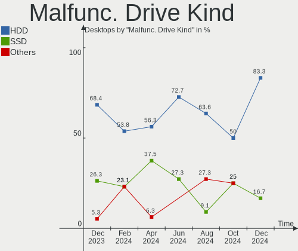
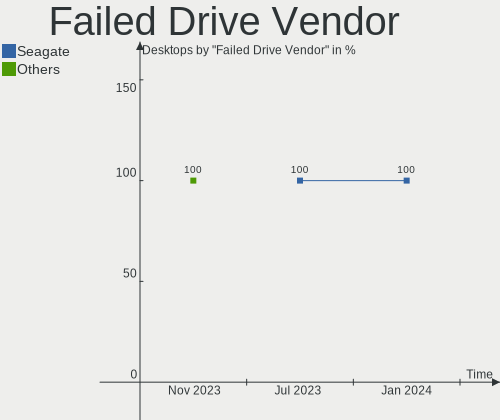
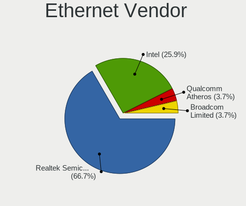
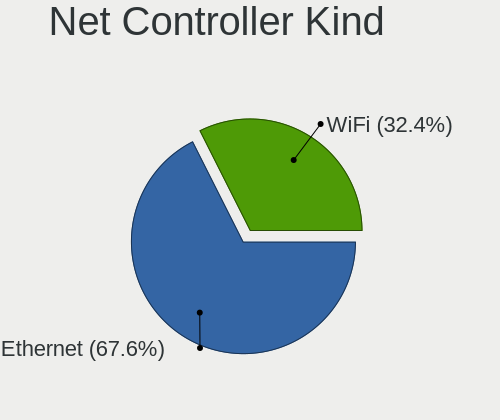

ArcoLinux - Hardware Trends (Desktops)
--------------------------------------

A project to identify most popular hardware characteristics and track their change
over time based on data collected by Linux users at https://Linux-Hardware.org.

Anyone can contribute to this report by the [hw-probe](https://github.com/linuxhw/hw-probe) tool:

    sudo -E hw-probe -all -upload

This report is for one last month. Overall report since the beginning of time: [TestDays](https://github.com/linuxhw/TestDays)

Period: Jul, 2023.

Contents
--------

* [ System ](#system)
  - [ OS                       ](#os)
  - [ OS Family                ](#os-family)
  - [ Kernel                   ](#kernel)
  - [ Kernel Family            ](#kernel-family)
  - [ Kernel Major Ver.        ](#kernel-major-ver)
  - [ Arch                     ](#arch)
  - [ DE                       ](#de)
  - [ Display Server           ](#display-server)
  - [ Display Manager          ](#display-manager)
  - [ OS Lang                  ](#os-lang)
  - [ Boot Mode                ](#boot-mode)
  - [ Filesystem               ](#filesystem)
  - [ Part. scheme             ](#part-scheme)
  - [ Dual Boot with Linux/BSD ](#dual-boot-with-linuxbsd)
  - [ Dual Boot (Win)          ](#dual-boot-win)

* [ Board ](#board)
  - [ Vendor                   ](#vendor)
  - [ Model                    ](#model)
  - [ Model Family             ](#model-family)
  - [ MFG Year                 ](#mfg-year)
  - [ Form Factor              ](#form-factor)
  - [ Secure Boot              ](#secure-boot)
  - [ Coreboot                 ](#coreboot)
  - [ RAM Size                 ](#ram-size)
  - [ RAM Used                 ](#ram-used)
  - [ Total Drives             ](#total-drives)
  - [ Has CD-ROM               ](#has-cd-rom)
  - [ Has Ethernet             ](#has-ethernet)
  - [ Has WiFi                 ](#has-wifi)
  - [ Has Bluetooth            ](#has-bluetooth)

* [ Location ](#location)
  - [ Country                  ](#country)
  - [ City                     ](#city)

* [ Drives ](#drives)
  - [ Drive Vendor             ](#drive-vendor)
  - [ Drive Model              ](#drive-model)
  - [ HDD Vendor               ](#hdd-vendor)
  - [ SSD Vendor               ](#ssd-vendor)
  - [ Drive Kind               ](#drive-kind)
  - [ Drive Connector          ](#drive-connector)
  - [ Drive Size               ](#drive-size)
  - [ Space Total              ](#space-total)
  - [ Space Used               ](#space-used)
  - [ Malfunc. Drives          ](#malfunc-drives)
  - [ Malfunc. Drive Vendor    ](#malfunc-drive-vendor)
  - [ Malfunc. HDD Vendor      ](#malfunc-hdd-vendor)
  - [ Malfunc. Drive Kind      ](#malfunc-drive-kind)
  - [ Failed Drives            ](#failed-drives)
  - [ Failed Drive Vendor      ](#failed-drive-vendor)
  - [ Drive Status             ](#drive-status)

* [ Storage controller ](#storage-controller)
  - [ Storage Vendor           ](#storage-vendor)
  - [ Storage Model            ](#storage-model)
  - [ Storage Kind             ](#storage-kind)

* [ Processor ](#processor)
  - [ CPU Vendor               ](#cpu-vendor)
  - [ CPU Model                ](#cpu-model)
  - [ CPU Model Family         ](#cpu-model-family)
  - [ CPU Cores                ](#cpu-cores)
  - [ CPU Sockets              ](#cpu-sockets)
  - [ CPU Threads              ](#cpu-threads)
  - [ CPU Op-Modes             ](#cpu-op-modes)
  - [ CPU Microcode            ](#cpu-microcode)
  - [ CPU Microarch            ](#cpu-microarch)

* [ Graphics ](#graphics)
  - [ GPU Vendor               ](#gpu-vendor)
  - [ GPU Model                ](#gpu-model)
  - [ GPU Combo                ](#gpu-combo)
  - [ GPU Driver               ](#gpu-driver)
  - [ GPU Memory               ](#gpu-memory)

* [ Monitor ](#monitor)
  - [ Monitor Vendor           ](#monitor-vendor)
  - [ Monitor Model            ](#monitor-model)
  - [ Monitor Resolution       ](#monitor-resolution)
  - [ Monitor Diagonal         ](#monitor-diagonal)
  - [ Monitor Width            ](#monitor-width)
  - [ Aspect Ratio             ](#aspect-ratio)
  - [ Monitor Area             ](#monitor-area)
  - [ Pixel Density            ](#pixel-density)
  - [ Multiple Monitors        ](#multiple-monitors)

* [ Network ](#network)
  - [ Net Controller Vendor    ](#net-controller-vendor)
  - [ Net Controller Model     ](#net-controller-model)
  - [ Wireless Vendor          ](#wireless-vendor)
  - [ Wireless Model           ](#wireless-model)
  - [ Ethernet Vendor          ](#ethernet-vendor)
  - [ Ethernet Model           ](#ethernet-model)
  - [ Net Controller Kind      ](#net-controller-kind)
  - [ Used Controller          ](#used-controller)
  - [ NICs                     ](#nics)
  - [ IPv6                     ](#ipv6)

* [ Bluetooth ](#bluetooth)
  - [ Bluetooth Vendor         ](#bluetooth-vendor)
  - [ Bluetooth Model          ](#bluetooth-model)

* [ Sound ](#sound)
  - [ Sound Vendor             ](#sound-vendor)
  - [ Sound Model              ](#sound-model)

* [ Memory ](#memory)
  - [ Memory Vendor            ](#memory-vendor)
  - [ Memory Model             ](#memory-model)
  - [ Memory Kind              ](#memory-kind)
  - [ Memory Form Factor       ](#memory-form-factor)
  - [ Memory Size              ](#memory-size)
  - [ Memory Speed             ](#memory-speed)

* [ Printers & scanners ](#printers--scanners)
  - [ Printer Vendor           ](#printer-vendor)
  - [ Printer Model            ](#printer-model)
  - [ Scanner Vendor           ](#scanner-vendor)
  - [ Scanner Model            ](#scanner-model)

* [ Camera ](#camera)
  - [ Camera Vendor            ](#camera-vendor)
  - [ Camera Model             ](#camera-model)

* [ Security ](#security)
  - [ Fingerprint Vendor       ](#fingerprint-vendor)
  - [ Fingerprint Model        ](#fingerprint-model)
  - [ Chipcard Vendor          ](#chipcard-vendor)
  - [ Chipcard Model           ](#chipcard-model)

* [ Unsupported ](#unsupported)
  - [ Unsupported Devices      ](#unsupported-devices)
  - [ Unsupported Device Types ](#unsupported-device-types)

System
------

OS
--

Installed operating systems

| Name              | Desktops | Percent |
|-------------------|----------|---------|
| ArcoLinux Rolling | 62       | 96.88%  |
| ArcoLinux         | 2        | 3.13%   |

OS Family
---------

OS without a version

| Name      | Desktops | Percent |
|-----------|----------|---------|
| ArcoLinux | 64       | 100%    |

Kernel
------

Version of the Linux kernel

| Version                    | Desktops | Percent |
|----------------------------|----------|---------|
| 6.3.8-arch1-1              | 7        | 10.94%  |
| 6.4.2-arch1-1              | 6        | 9.38%   |
| 6.4.6-arch1-1              | 3        | 4.69%   |
| 6.4.4-arch1-1              | 3        | 4.69%   |
| 6.4.2-zen1-1-zen           | 3        | 4.69%   |
| 6.4.1-zen1-1-zen           | 3        | 4.69%   |
| 6.4.1-arch2-1              | 3        | 4.69%   |
| 6.4.1-arch1-1              | 3        | 4.69%   |
| 6.3.9-arch1-1              | 3        | 4.69%   |
| 6.1.38-1-lts               | 3        | 4.69%   |
| 6.4.7-arch1-1              | 2        | 3.13%   |
| 6.4.4-zen1-1-zen           | 2        | 3.13%   |
| 6.4.3-zen1-2-zen           | 2        | 3.13%   |
| 6.4.3-arch1-2              | 2        | 3.13%   |
| 6.4.3-arch1-1              | 2        | 3.13%   |
| 6.4.1-zen2-1-zen           | 2        | 3.13%   |
| 6.2.11-arch1-1             | 2        | 3.13%   |
| 6.2.10-arch1-1             | 2        | 3.13%   |
| 6.1.39-1-lts               | 2        | 3.13%   |
| 6.4.6-zen1-1-zen           | 1        | 1.56%   |
| 6.4.5-arch1-1              | 1        | 1.56%   |
| 6.4.4-273-tkg-pds          | 1        | 1.56%   |
| 6.4.2-x64v2-xanmod1-3      | 1        | 1.56%   |
| 6.3.9-zen1-1-zen           | 1        | 1.56%   |
| 6.3.8-x64v1-xanmod1-1      | 1        | 1.56%   |
| 6.3.3-arch1-1              | 1        | 1.56%   |
| 6.3.1-1-cachyos-eevdf-bore | 1        | 1.56%   |
| 6.1.35-1-lts               | 1        | 1.56%   |

Kernel Family
-------------

Linux kernel without a distro release

| Version | Desktops | Percent |
|---------|----------|---------|
| 6.4.1   | 11       | 17.19%  |
| 6.4.2   | 10       | 15.63%  |
| 6.3.8   | 8        | 12.5%   |
| 6.4.4   | 6        | 9.38%   |
| 6.4.3   | 6        | 9.38%   |
| 6.4.6   | 4        | 6.25%   |
| 6.3.9   | 4        | 6.25%   |
| 6.1.38  | 3        | 4.69%   |
| 6.4.7   | 2        | 3.13%   |
| 6.2.11  | 2        | 3.13%   |
| 6.2.10  | 2        | 3.13%   |
| 6.1.39  | 2        | 3.13%   |
| 6.4.5   | 1        | 1.56%   |
| 6.3.3   | 1        | 1.56%   |
| 6.3.1   | 1        | 1.56%   |
| 6.1.35  | 1        | 1.56%   |

Kernel Major Ver.
-----------------

Linux kernel major version

| Version | Desktops | Percent |
|---------|----------|---------|
| 6.4     | 40       | 62.5%   |
| 6.3     | 14       | 21.88%  |
| 6.1     | 6        | 9.38%   |
| 6.2     | 4        | 6.25%   |

Arch
----

OS architecture (x86_64, i586, etc.)

| Name   | Desktops | Percent |
|--------|----------|---------|
| x86_64 | 64       | 100%    |

DE
--

Desktop Environment

| Name       | Desktops | Percent |
|------------|----------|---------|
| XFCE       | 24       | 37.5%   |
| KDE5       | 20       | 31.25%  |
| GNOME      | 6        | 9.38%   |
| Cinnamon   | 5        | 7.81%   |
| Hyprland   | 3        | 4.69%   |
| chadwm     | 3        | 4.69%   |
| X-Cinnamon | 1        | 1.56%   |
| Deepin     | 1        | 1.56%   |
| Budgie     | 1        | 1.56%   |

Display Server
--------------

X11 or Wayland

| Name    | Desktops | Percent |
|---------|----------|---------|
| X11     | 54       | 84.38%  |
| Wayland | 5        | 7.81%   |
| Tty     | 3        | 4.69%   |
| Unknown | 2        | 3.13%   |

Display Manager
---------------

SDDM, LightDM, etc.

| Name    | Desktops | Percent |
|---------|----------|---------|
| SDDM    | 50       | 78.13%  |
| LightDM | 9        | 14.06%  |
| GDM     | 2        | 3.13%   |
| Unknown | 2        | 3.13%   |
| Ly      | 1        | 1.56%   |

OS Lang
-------

Language

| Lang  | Desktops | Percent |
|-------|----------|---------|
| en_US | 35       | 54.69%  |
| C     | 6        | 9.38%   |
| it_IT | 3        | 4.69%   |
| de_DE | 3        | 4.69%   |
| zh_CN | 2        | 3.13%   |
| pt_BR | 2        | 3.13%   |
| en_IN | 2        | 3.13%   |
| en_GB | 2        | 3.13%   |
| ru_UA | 1        | 1.56%   |
| fr_FR | 1        | 1.56%   |
| es_UY | 1        | 1.56%   |
| es_PA | 1        | 1.56%   |
| es_MX | 1        | 1.56%   |
| en_PH | 1        | 1.56%   |
| en_IE | 1        | 1.56%   |
| en_CA | 1        | 1.56%   |
| en_AU | 1        | 1.56%   |

Boot Mode
---------

EFI or BIOS

| Mode | Desktops | Percent |
|------|----------|---------|
| EFI  | 48       | 75%     |
| BIOS | 16       | 25%     |

Filesystem
----------

Type of filesystem

| Type    | Desktops | Percent |
|---------|----------|---------|
| Ext4    | 36       | 56.25%  |
| Btrfs   | 21       | 32.81%  |
| Overlay | 6        | 9.38%   |
| Xfs     | 1        | 1.56%   |

Part. scheme
------------

Scheme of partitioning

| Type    | Desktops | Percent |
|---------|----------|---------|
| GPT     | 56       | 87.5%   |
| MBR     | 6        | 9.38%   |
| Unknown | 2        | 3.13%   |

Dual Boot with Linux/BSD
------------------------

Hosting more than one Linux/BSD

| Dual boot | Desktops | Percent |
|-----------|----------|---------|
| No        | 42       | 65.63%  |
| Yes       | 22       | 34.38%  |

Dual Boot (Win)
---------------

Hosting Linux and Windows

| Dual boot | Desktops | Percent |
|-----------|----------|---------|
| Yes       | 33       | 51.56%  |
| No        | 31       | 48.44%  |

Board
-----

Vendor
------

Motherboard manufacturer

| Name                | Desktops | Percent |
|---------------------|----------|---------|
| ASUSTek Computer    | 21       | 32.81%  |
| MSI                 | 7        | 10.94%  |
| Gigabyte Technology | 7        | 10.94%  |
| ASRock              | 7        | 10.94%  |
| Dell                | 4        | 6.25%   |
| Hewlett-Packard     | 3        | 4.69%   |
| Lenovo              | 2        | 3.13%   |
| Intel               | 2        | 3.13%   |
| Unknown             | 2        | 3.13%   |
| SiS Technology      | 1        | 1.56%   |
| Hardkernel          | 1        | 1.56%   |
| Fujitsu             | 1        | 1.56%   |
| Foxconn             | 1        | 1.56%   |
| Chuwi               | 1        | 1.56%   |
| Biostar             | 1        | 1.56%   |
| BESSTAR Tech        | 1        | 1.56%   |
| Apple               | 1        | 1.56%   |
| Acer                | 1        | 1.56%   |

Model
-----

Motherboard model

| Name                                        | Desktops | Percent |
|---------------------------------------------|----------|---------|
| MSI MS-7C91                                 | 2        | 3.13%   |
| ASUS ROG STRIX B550-E GAMING                | 2        | 3.13%   |
| ASUS All Series                             | 2        | 3.13%   |
| Unknown                                     | 2        | 3.13%   |
| SiS 760                                     | 1        | 1.56%   |
| MSI MS-7C83                                 | 1        | 1.56%   |
| MSI MS-7C02                                 | 1        | 1.56%   |
| MSI MS-7B24                                 | 1        | 1.56%   |
| MSI MS-7A39                                 | 1        | 1.56%   |
| MSI MS-7309                                 | 1        | 1.56%   |
| Lenovo ThinkCentre M900 10FGS0YM01          | 1        | 1.56%   |
| Lenovo IdeaCentre Gaming5 14ACN6 90RW0003MW | 1        | 1.56%   |
| Intel HM570                                 | 1        | 1.56%   |
| Intel H61                                   | 1        | 1.56%   |
| HP ProDesk 600 G1 DM                        | 1        | 1.56%   |
| HP OMEN 30L Desktop GT13-1xxx               | 1        | 1.56%   |
| HP EliteDesk 800 G4 DM 35W (TAA)            | 1        | 1.56%   |
| Hardkernel ODROID-H3                        | 1        | 1.56%   |
| Gigabyte Z390 I AORUS PRO WIFI              | 1        | 1.56%   |
| Gigabyte X570 GAMING X                      | 1        | 1.56%   |
| Gigabyte X570 AORUS MASTER                  | 1        | 1.56%   |
| Gigabyte X570 AORUS ELITE                   | 1        | 1.56%   |
| Gigabyte B550 GAMING X                      | 1        | 1.56%   |
| Gigabyte B450M S2H                          | 1        | 1.56%   |
| Gigabyte 970A-D3P                           | 1        | 1.56%   |
| Fujitsu ESPRIMO P920                        | 1        | 1.56%   |
| Foxconn H81MXV/H81MXV-D                     | 1        | 1.56%   |
| Dell Precision Tower 5810                   | 1        | 1.56%   |
| Dell OptiPlex 9020                          | 1        | 1.56%   |
| Dell OptiPlex 9010                          | 1        | 1.56%   |
| Dell OptiPlex 7040                          | 1        | 1.56%   |
| Chuwi RZBOX                                 | 1        | 1.56%   |
| Biostar A320MH                              | 1        | 1.56%   |
| BESSTAR Tech DMAF5                          | 1        | 1.56%   |
| ASUS TUF Z270 MARK 2                        | 1        | 1.56%   |
| ASUS TUF Gaming X570-PLUS                   | 1        | 1.56%   |
| ASUS TUF B450M-PLUS GAMING                  | 1        | 1.56%   |
| ASUS ROG STRIX X670E-E GAMING WIFI          | 1        | 1.56%   |
| ASUS ROG STRIX X470-F GAMING                | 1        | 1.56%   |
| ASUS ROG STRIX B560-G GAMING WIFI           | 1        | 1.56%   |

Model Family
------------

Motherboard model prefix

| Name                 | Desktops | Percent |
|----------------------|----------|---------|
| ASUS ROG             | 6        | 9.38%   |
| ASUS PRIME           | 6        | 9.38%   |
| Gigabyte X570        | 3        | 4.69%   |
| Dell OptiPlex        | 3        | 4.69%   |
| ASUS TUF             | 3        | 4.69%   |
| MSI MS-7C91          | 2        | 3.13%   |
| ASUS All             | 2        | 3.13%   |
| ASRock B450M         | 2        | 3.13%   |
| Unknown              | 2        | 3.13%   |
| SiS 760              | 1        | 1.56%   |
| MSI MS-7C83          | 1        | 1.56%   |
| MSI MS-7C02          | 1        | 1.56%   |
| MSI MS-7B24          | 1        | 1.56%   |
| MSI MS-7A39          | 1        | 1.56%   |
| MSI MS-7309          | 1        | 1.56%   |
| Lenovo ThinkCentre   | 1        | 1.56%   |
| Lenovo IdeaCentre    | 1        | 1.56%   |
| Intel HM570          | 1        | 1.56%   |
| Intel H61            | 1        | 1.56%   |
| HP ProDesk           | 1        | 1.56%   |
| HP OMEN              | 1        | 1.56%   |
| HP EliteDesk         | 1        | 1.56%   |
| Hardkernel ODROID-H3 | 1        | 1.56%   |
| Gigabyte Z390        | 1        | 1.56%   |
| Gigabyte B550        | 1        | 1.56%   |
| Gigabyte B450M       | 1        | 1.56%   |
| Gigabyte 970A-D3P    | 1        | 1.56%   |
| Fujitsu ESPRIMO      | 1        | 1.56%   |
| Foxconn H81MXV       | 1        | 1.56%   |
| Dell Precision       | 1        | 1.56%   |
| Chuwi RZBOX          | 1        | 1.56%   |
| Biostar A320MH       | 1        | 1.56%   |
| BESSTAR Tech DMAF5   | 1        | 1.56%   |
| ASUS Q170M2          | 1        | 1.56%   |
| ASUS P8Z77-V         | 1        | 1.56%   |
| ASUS M5A78L-M        | 1        | 1.56%   |
| ASUS CROSSHAIR       | 1        | 1.56%   |
| ASRock X570          | 1        | 1.56%   |
| ASRock B550M-HDV     | 1        | 1.56%   |
| ASRock B460M-HDV     | 1        | 1.56%   |

MFG Year
--------

Motherboard manufacture year

| Year | Desktops | Percent |
|------|----------|---------|
| 2018 | 15       | 23.44%  |
| 2020 | 10       | 15.63%  |
| 2022 | 7        | 10.94%  |
| 2017 | 7        | 10.94%  |
| 2019 | 6        | 9.38%   |
| 2021 | 4        | 6.25%   |
| 2014 | 3        | 4.69%   |
| 2013 | 3        | 4.69%   |
| 2016 | 2        | 3.13%   |
| 2023 | 1        | 1.56%   |
| 2015 | 1        | 1.56%   |
| 2012 | 1        | 1.56%   |
| 2011 | 1        | 1.56%   |
| 2010 | 1        | 1.56%   |
| 2006 | 1        | 1.56%   |
| 2004 | 1        | 1.56%   |

Form Factor
-----------

Physical design of the computer

| Name    | Desktops | Percent |
|---------|----------|---------|
| Desktop | 64       | 100%    |

Secure Boot
-----------

Enabled or disabled

| State    | Desktops | Percent |
|----------|----------|---------|
| Disabled | 64       | 100%    |

Coreboot
--------

Have coreboot on board

| Used | Desktops | Percent |
|------|----------|---------|
| No   | 64       | 100%    |

RAM Size
--------

Total RAM memory

| Size in GB  | Desktops | Percent |
|-------------|----------|---------|
| 16.01-24.0  | 22       | 34.38%  |
| 32.01-64.0  | 15       | 23.44%  |
| 8.01-16.0   | 11       | 17.19%  |
| 64.01-256.0 | 7        | 10.94%  |
| 4.01-8.0    | 3        | 4.69%   |
| 3.01-4.0    | 2        | 3.13%   |
| 24.01-32.0  | 2        | 3.13%   |
| 2.01-3.0    | 1        | 1.56%   |
| 1.01-2.0    | 1        | 1.56%   |

RAM Used
--------

Used RAM memory

| Used GB   | Desktops | Percent |
|-----------|----------|---------|
| 2.01-3.0  | 16       | 25%     |
| 3.01-4.0  | 14       | 21.88%  |
| 1.01-2.0  | 13       | 20.31%  |
| 4.01-8.0  | 11       | 17.19%  |
| 8.01-16.0 | 5        | 7.81%   |
| 0.51-1.0  | 4        | 6.25%   |
| 0.01-0.5  | 1        | 1.56%   |

Total Drives
------------

Number of drives on board

| Drives | Desktops | Percent |
|--------|----------|---------|
| 2      | 17       | 26.56%  |
| 3      | 16       | 25%     |
| 1      | 16       | 25%     |
| 4      | 9        | 14.06%  |
| 5      | 6        | 9.38%   |

Has CD-ROM
----------

Has CD-ROM on board

| Presented | Desktops | Percent |
|-----------|----------|---------|
| No        | 49       | 76.56%  |
| Yes       | 15       | 23.44%  |

Has Ethernet
------------

Has Ethernet on board

| Presented | Desktops | Percent |
|-----------|----------|---------|
| Yes       | 64       | 100%    |

Has WiFi
--------

Has WiFi module

| Presented | Desktops | Percent |
|-----------|----------|---------|
| No        | 33       | 51.56%  |
| Yes       | 31       | 48.44%  |

Has Bluetooth
-------------

Has Bluetooth module

| Presented | Desktops | Percent |
|-----------|----------|---------|
| No        | 33       | 51.56%  |
| Yes       | 31       | 48.44%  |

Location
--------

Country
-------

Geographic location (country)

| Country      | Desktops | Percent |
|--------------|----------|---------|
| USA          | 16       | 25%     |
| Germany      | 6        | 9.38%   |
| Brazil       | 5        | 7.81%   |
| Mexico       | 4        | 6.25%   |
| Italy        | 3        | 4.69%   |
| UK           | 2        | 3.13%   |
| Sweden       | 2        | 3.13%   |
| India        | 2        | 3.13%   |
| Czechia      | 2        | 3.13%   |
| Belgium      | 2        | 3.13%   |
| Uruguay      | 1        | 1.56%   |
| Ukraine      | 1        | 1.56%   |
| Turkey       | 1        | 1.56%   |
| Spain        | 1        | 1.56%   |
| Singapore    | 1        | 1.56%   |
| Saudi Arabia | 1        | 1.56%   |
| Russia       | 1        | 1.56%   |
| Romania      | 1        | 1.56%   |
| Philippines  | 1        | 1.56%   |
| Panama       | 1        | 1.56%   |
| Malaysia     | 1        | 1.56%   |
| Luxembourg   | 1        | 1.56%   |
| Ireland      | 1        | 1.56%   |
| Hungary      | 1        | 1.56%   |
| France       | 1        | 1.56%   |
| Finland      | 1        | 1.56%   |
| China        | 1        | 1.56%   |
| Canada       | 1        | 1.56%   |
| Azerbaijan   | 1        | 1.56%   |
| Australia    | 1        | 1.56%   |

City
----

Geographic location (city)

| City                     | Desktops | Percent |
|--------------------------|----------|---------|
| Zapopan                  | 1        | 1.56%   |
| Wichita                  | 1        | 1.56%   |
| Valencia                 | 1        | 1.56%   |
| Tolyatti                 | 1        | 1.56%   |
| Tábor                   | 1        | 1.56%   |
| Sydney                   | 1        | 1.56%   |
| Springfield              | 1        | 1.56%   |
| Singapore                | 1        | 1.56%   |
| Seattle                  | 1        | 1.56%   |
| Schwarzenbek             | 1        | 1.56%   |
| Sao Paulo                | 1        | 1.56%   |
| San Luis Potosí City    | 1        | 1.56%   |
| Saint Paul               | 1        | 1.56%   |
| Rogersville              | 1        | 1.56%   |
| Rockford                 | 1        | 1.56%   |
| Ribeirao Preto           | 1        | 1.56%   |
| Prato                    | 1        | 1.56%   |
| Pierrefonds              | 1        | 1.56%   |
| Phoenix                  | 1        | 1.56%   |
| Panama City              | 1        | 1.56%   |
| Odesa                    | 1        | 1.56%   |
| Ocean Springs            | 1        | 1.56%   |
| Nossa Senhora do Socorro | 1        | 1.56%   |
| Murfreesboro             | 1        | 1.56%   |
| Moore                    | 1        | 1.56%   |
| Monticello               | 1        | 1.56%   |
| Montevideo               | 1        | 1.56%   |
| Mohács                  | 1        | 1.56%   |
| Milan                    | 1        | 1.56%   |
| Mannheim                 | 1        | 1.56%   |
| Malmo                    | 1        | 1.56%   |
| Makkah                   | 1        | 1.56%   |
| Luxembourg               | 1        | 1.56%   |
| Lüdenscheid             | 1        | 1.56%   |
| Lebanon                  | 1        | 1.56%   |
| Lauterbach               | 1        | 1.56%   |
| Kuala Lumpur             | 1        | 1.56%   |
| Kishanganj               | 1        | 1.56%   |
| Katy                     | 1        | 1.56%   |
| Istanbul                 | 1        | 1.56%   |

Drives
------

Drive Vendor
------------

Hard drive vendors

| Vendor                      | Desktops | Drives | Percent |
|-----------------------------|----------|--------|---------|
| Samsung Electronics         | 26       | 35     | 19.12%  |
| WDC                         | 24       | 32     | 17.65%  |
| Seagate                     | 18       | 23     | 13.24%  |
| Sandisk                     | 10       | 12     | 7.35%   |
| Kingston                    | 10       | 12     | 7.35%   |
| Toshiba                     | 7        | 8      | 5.15%   |
| Phison Electronics          | 7        | 7      | 5.15%   |
| Crucial                     | 5        | 5      | 3.68%   |
| Micron/Crucial Technology   | 4        | 4      | 2.94%   |
| SK hynix                    | 3        | 3      | 2.21%   |
| Silicon Motion              | 3        | 3      | 2.21%   |
| PNY                         | 2        | 2      | 1.47%   |
| Kingston Technology Company | 2        | 2      | 1.47%   |
| Hitachi                     | 2        | 2      | 1.47%   |
| Acer                        | 2        | 2      | 1.47%   |
| Unknown                     | 1        | 2      | 0.74%   |
| StarTech                    | 1        | 1      | 0.74%   |
| SCY                         | 1        | 1      | 0.74%   |
| SABRENT                     | 1        | 1      | 0.74%   |
| Realtek Semiconductor       | 1        | 1      | 0.74%   |
| MAXIO Technology (Hangzhou) | 1        | 1      | 0.74%   |
| Intel                       | 1        | 1      | 0.74%   |
| H/W                         | 1        | 3      | 0.74%   |
| Corsair                     | 1        | 1      | 0.74%   |
| China                       | 1        | 1      | 0.74%   |
| ASMT                        | 1        | 2      | 0.74%   |

Drive Model
-----------

Hard drive models

| Model                                                 | Desktops | Percent |
|-------------------------------------------------------|----------|---------|
| Samsung NVMe SSD Controller SM981/PM981/PM983 500GB   | 6        | 3.82%   |
| Kingston SA400S37240G 240GB SSD                       | 4        | 2.55%   |
| Toshiba HDWD110 1TB                                   | 3        | 1.91%   |
| Silicon Motion SM2263EN/SM2263XT SSD Controller 500GB | 3        | 1.91%   |
| Seagate ST2000DM008-2UB102 2TB                        | 3        | 1.91%   |
| Sandisk WD Black SN750 / PC SN730 NVMe SSD 1024GB     | 3        | 1.91%   |
| Samsung SSD 980 1TB                                   | 3        | 1.91%   |
| Samsung SSD 870 EVO 1TB                               | 3        | 1.91%   |
| Samsung NVMe SSD Controller SM961/PM961/SM963 256GB   | 3        | 1.91%   |
| Phison E16 PCIe4 NVMe Controller 1TB                  | 3        | 1.91%   |
| Crucial CT1000MX500SSD1 1TB                           | 3        | 1.91%   |
| WDC WDS500G2B0B-00YS70 500GB SSD                      | 2        | 1.27%   |
| Toshiba DT01ACA050 500GB                              | 2        | 1.27%   |
| Seagate ST4000DM004-2CV104 4TB                        | 2        | 1.27%   |
| Seagate ST3500413AS 500GB                             | 2        | 1.27%   |
| Seagate ST1000LM024 HN-M101MBB 1TB                    | 2        | 1.27%   |
| Seagate ST1000DM010-2EP102 1TB                        | 2        | 1.27%   |
| Seagate Expansion HDD 4TB                             | 2        | 1.27%   |
| Samsung SSD 850 EVO 250GB                             | 2        | 1.27%   |
| Phison E12 NVMe Controller 2TB                        | 2        | 1.27%   |
| Micron/Crucial P2 NVMe PCIe SSD 1TB                   | 2        | 1.27%   |
| Micron/Crucial P1 NVMe PCIe SSD 1TB                   | 2        | 1.27%   |
| Kingston SNV2S500G 500GB                              | 2        | 1.27%   |
| WDC WDS500G2B0A-00SM50 500GB SSD                      | 1        | 0.64%   |
| WDC WDS500G2B0A 500GB SSD                             | 1        | 0.64%   |
| WDC WDS250G2B0A-00SM50 250GB SSD                      | 1        | 0.64%   |
| WDC WDS250G2B0A 250GB SSD                             | 1        | 0.64%   |
| WDC WDS120G2G0A-00JH30 120GB SSD                      | 1        | 0.64%   |
| WDC WDBNCE0010PNC 1TB SSD                             | 1        | 0.64%   |
| WDC WD5000KS-00MNB0 500GB                             | 1        | 0.64%   |
| WDC WD5000BPVT-75HXZT3 500GB                          | 1        | 0.64%   |
| WDC WD5000AZLX-75K2TA0 500GB                          | 1        | 0.64%   |
| WDC WD5000AAKX-083CA1 500GB                           | 1        | 0.64%   |
| WDC WD5000AACS-00G8B1 500GB                           | 1        | 0.64%   |
| WDC WD40EFRX-68N32N0 4TB                              | 1        | 0.64%   |
| WDC WD30EZRZ-22Z5HB0 3TB                              | 1        | 0.64%   |
| WDC WD30EFRX-68EUZN0 3TB                              | 1        | 0.64%   |
| WDC WD2500JB-00REA0 250GB                             | 1        | 0.64%   |
| WDC WD20EZBX-60AYRA0 2TB                              | 1        | 0.64%   |
| WDC WD20EARS-00MVWB0 2TB                              | 1        | 0.64%   |

HDD Vendor
----------

Hard disk drive vendors

| Vendor              | Desktops | Drives | Percent |
|---------------------|----------|--------|---------|
| WDC                 | 18       | 24     | 36%     |
| Seagate             | 17       | 22     | 34%     |
| Toshiba             | 7        | 8      | 14%     |
| Samsung Electronics | 4        | 4      | 8%      |
| Hitachi             | 2        | 2      | 4%      |
| H/W                 | 1        | 3      | 2%      |
| ASMT                | 1        | 2      | 2%      |

SSD Vendor
----------

Solid state drive vendors

| Vendor              | Desktops | Drives | Percent |
|---------------------|----------|--------|---------|
| Samsung Electronics | 13       | 16     | 28.89%  |
| WDC                 | 7        | 8      | 15.56%  |
| Kingston            | 7        | 9      | 15.56%  |
| Crucial             | 5        | 5      | 11.11%  |
| SanDisk             | 4        | 4      | 8.89%   |
| SK hynix            | 2        | 2      | 4.44%   |
| PNY                 | 2        | 2      | 4.44%   |
| Acer                | 2        | 2      | 4.44%   |
| SCY                 | 1        | 1      | 2.22%   |
| Corsair             | 1        | 1      | 2.22%   |
| China               | 1        | 1      | 2.22%   |

Drive Kind
----------

HDD or SSD

| Kind    | Desktops | Drives | Percent |
|---------|----------|--------|---------|
| NVMe    | 37       | 48     | 33.04%  |
| HDD     | 37       | 65     | 33.04%  |
| SSD     | 36       | 51     | 32.14%  |
| Unknown | 2        | 3      | 1.79%   |

Drive Connector
---------------

SATA, SAS, NVMe, etc.

| Type | Desktops | Drives | Percent |
|------|----------|--------|---------|
| SATA | 56       | 110    | 56%     |
| NVMe | 37       | 47     | 37%     |
| SAS  | 7        | 10     | 7%      |

Drive Size
----------

Size of hard drive

| Size in TB | Desktops | Drives | Percent |
|------------|----------|--------|---------|
| 0.01-0.5   | 36       | 52     | 42.35%  |
| 0.51-1.0   | 26       | 37     | 30.59%  |
| 1.01-2.0   | 11       | 11     | 12.94%  |
| 3.01-4.0   | 7        | 11     | 8.24%   |
| 2.01-3.0   | 2        | 2      | 2.35%   |
| 4.01-10.0  | 2        | 2      | 2.35%   |
| 10.01-20.0 | 1        | 1      | 1.18%   |

Space Total
-----------

Amount of disk space available on the file system

| Size in GB     | Desktops | Percent |
|----------------|----------|---------|
| More than 3000 | 18       | 28.13%  |
| 251-500        | 13       | 20.31%  |
| 501-1000       | 11       | 17.19%  |
| 101-250        | 7        | 10.94%  |
| 2001-3000      | 5        | 7.81%   |
| 1001-2000      | 4        | 6.25%   |
| 1-20           | 3        | 4.69%   |
| Unknown        | 3        | 4.69%   |

Space Used
----------

Amount of used disk space

| Used GB        | Desktops | Percent |
|----------------|----------|---------|
| 21-50          | 12       | 18.75%  |
| 1-20           | 12       | 18.75%  |
| 101-250        | 7        | 10.94%  |
| 501-1000       | 7        | 10.94%  |
| 51-100         | 7        | 10.94%  |
| 1001-2000      | 6        | 9.38%   |
| 251-500        | 4        | 6.25%   |
| 2001-3000      | 4        | 6.25%   |
| Unknown        | 3        | 4.69%   |
| More than 3000 | 2        | 3.13%   |

Malfunc. Drives
---------------

Drive models with a malfunction

| Model                                            | Desktops | Drives | Percent |
|--------------------------------------------------|----------|--------|---------|
| Seagate ST3500413AS 500GB                        | 2        | 3      | 9.52%   |
| WDC WD5000AAKX-083CA1 500GB                      | 1        | 1      | 4.76%   |
| WDC WD5000AACS-00G8B1 500GB                      | 1        | 1      | 4.76%   |
| WDC WD30EFRX-68EUZN0 3TB                         | 1        | 1      | 4.76%   |
| WDC WD20EARS-00MVWB0 2TB                         | 1        | 1      | 4.76%   |
| WDC WD2003FYYS-05T9B0 2TB                        | 1        | 1      | 4.76%   |
| WDC WD10EZEX-60ZF5A0 1TB                         | 1        | 1      | 4.76%   |
| WDC WD10EALX-759BA1 1TB                          | 1        | 1      | 4.76%   |
| Toshiba HDWD110 1TB                              | 1        | 1      | 4.76%   |
| Seagate ST500LT012-1DG142 500GB                  | 1        | 1      | 4.76%   |
| Seagate ST4000DM004-2CV104 4TB                   | 1        | 1      | 4.76%   |
| Seagate ST1000LM035-1RK172 1TB                   | 1        | 1      | 4.76%   |
| Seagate ST1000DM003-1CH162 1TB                   | 1        | 1      | 4.76%   |
| Samsung Electronics SSD 870 EVO 1TB              | 1        | 1      | 4.76%   |
| Samsung Electronics MZ7WD480HCGM-00003 480GB SSD | 1        | 1      | 4.76%   |
| Samsung Electronics HM321HI 320GB                | 1        | 1      | 4.76%   |
| Samsung Electronics HD642JJ 640GB                | 1        | 1      | 4.76%   |
| Samsung Electronics HD103SI 1TB                  | 1        | 1      | 4.76%   |
| Hitachi HDP725050GLA360 500GB                    | 1        | 1      | 4.76%   |
| Corsair CSSD-F60GB2 64GB                         | 1        | 1      | 4.76%   |

Malfunc. Drive Vendor
---------------------

Vendors of faulty drives

| Vendor              | Desktops | Drives | Percent |
|---------------------|----------|--------|---------|
| WDC                 | 6        | 7      | 31.58%  |
| Seagate             | 6        | 7      | 31.58%  |
| Samsung Electronics | 4        | 5      | 21.05%  |
| Toshiba             | 1        | 1      | 5.26%   |
| Hitachi             | 1        | 1      | 5.26%   |
| Corsair             | 1        | 1      | 5.26%   |

Malfunc. HDD Vendor
-------------------

Vendors of faulty HDD drives

| Vendor              | Desktops | Drives | Percent |
|---------------------|----------|--------|---------|
| WDC                 | 6        | 7      | 35.29%  |
| Seagate             | 6        | 7      | 35.29%  |
| Samsung Electronics | 3        | 3      | 17.65%  |
| Toshiba             | 1        | 1      | 5.88%   |
| Hitachi             | 1        | 1      | 5.88%   |

Malfunc. Drive Kind
-------------------

Kinds of faulty drives

| Kind | Desktops | Drives | Percent |
|------|----------|--------|---------|
| HDD  | 15       | 19     | 83.33%  |
| SSD  | 3        | 3      | 16.67%  |

Failed Drives
-------------

Failed drive models

| Model                              | Desktops | Drives | Percent |
|------------------------------------|----------|--------|---------|
| Seagate ST1000LM024 HN-M101MBB 1TB | 1        | 1      | 100%    |

Failed Drive Vendor
-------------------

Failed drive vendors

| Vendor  | Desktops | Drives | Percent |
|---------|----------|--------|---------|
| Seagate | 1        | 1      | 100%    |

Drive Status
------------

Number of failed and malfunc. drives

| Status   | Desktops | Drives | Percent |
|----------|----------|--------|---------|
| Works    | 60       | 129    | 70.59%  |
| Malfunc  | 16       | 22     | 18.82%  |
| Detected | 8        | 15     | 9.41%   |
| Failed   | 1        | 1      | 1.18%   |

Storage controller
------------------

Storage Vendor
--------------

Storage controller vendors

| Vendor                           | Desktops | Percent |
|----------------------------------|----------|---------|
| AMD                              | 31       | 29.25%  |
| Intel                            | 30       | 28.3%   |
| Samsung Electronics              | 12       | 11.32%  |
| SanDisk                          | 7        | 6.6%    |
| Phison Electronics               | 7        | 6.6%    |
| Kingston Technology Company      | 5        | 4.72%   |
| Micron/Crucial Technology        | 4        | 3.77%   |
| Silicon Motion                   | 3        | 2.83%   |
| SK hynix                         | 1        | 0.94%   |
| Silicon Integrated Systems [SiS] | 1        | 0.94%   |
| Seagate Technology               | 1        | 0.94%   |
| Realtek Semiconductor            | 1        | 0.94%   |
| Nvidia                           | 1        | 0.94%   |
| MAXIO Technology (Hangzhou)      | 1        | 0.94%   |
| ASMedia Technology               | 1        | 0.94%   |

Storage Model
-------------

Storage controller models

| Model                                                                          | Desktops | Percent |
|--------------------------------------------------------------------------------|----------|---------|
| AMD FCH SATA Controller [AHCI mode]                                            | 20       | 16.13%  |
| AMD 500 Series Chipset SATA Controller                                         | 7        | 5.65%   |
| Samsung NVMe SSD Controller SM981/PM981/PM983                                  | 6        | 4.84%   |
| AMD 400 Series Chipset SATA Controller                                         | 6        | 4.84%   |
| Intel Cannon Lake PCH SATA AHCI Controller                                     | 5        | 4.03%   |
| Intel SATA Controller [RAID mode]                                              | 4        | 3.23%   |
| Silicon Motion SM2263EN/SM2263XT (DRAM-less) NVMe SSD Controllers              | 3        | 2.42%   |
| SanDisk WD Black SN750 / PC SN730 NVMe SSD                                     | 3        | 2.42%   |
| Samsung NVMe SSD Controller SM961/PM961/SM963                                  | 3        | 2.42%   |
| Samsung NVMe SSD Controller 980                                                | 3        | 2.42%   |
| Phison E16 PCIe4 NVMe Controller                                               | 3        | 2.42%   |
| Kingston Company Company Non-Volatile memory controller                        | 3        | 2.42%   |
| Intel 8 Series/C220 Series Chipset Family 6-port SATA Controller 1 [AHCI mode] | 3        | 2.42%   |
| Intel 200 Series PCH SATA controller [AHCI mode]                               | 3        | 2.42%   |
| AMD FCH SATA Controller D                                                      | 3        | 2.42%   |
| Phison E12 NVMe Controller                                                     | 2        | 1.61%   |
| Micron/Crucial P2 [Nick P2] / P3 / P3 Plus NVMe PCIe SSD (DRAM-less)           | 2        | 1.61%   |
| Micron/Crucial P1 NVMe PCIe SSD[Frampton]                                      | 2        | 1.61%   |
| Intel 7 Series/C210 Series Chipset Family 6-port SATA Controller [AHCI mode]   | 2        | 1.61%   |
| Intel 6 Series/C200 Series Chipset Family 6 port Desktop SATA AHCI Controller  | 2        | 1.61%   |
| AMD X370 Series Chipset SATA Controller                                        | 2        | 1.61%   |
| AMD SB7x0/SB8x0/SB9x0 IDE Controller                                           | 2        | 1.61%   |
| SK hynix BC501 NVMe Solid State Drive                                          | 1        | 0.81%   |
| Silicon Integrated Systems [SiS] RAID bus controller 180 SATA/PATA  [SiS]      | 1        | 0.81%   |
| Silicon Integrated Systems [SiS] 5513 IDE Controller                           | 1        | 0.81%   |
| Seagate FireCuda 530 SSD                                                       | 1        | 0.81%   |
| Sandisk Western Digital WD Black SN850X NVMe SSD                               | 1        | 0.81%   |
| SanDisk WD PC SN810 / Black SN850 NVMe SSD                                     | 1        | 0.81%   |
| SanDisk WD Blue SN570 NVMe SSD 1TB                                             | 1        | 0.81%   |
| SanDisk WD Blue SN550 NVMe SSD                                                 | 1        | 0.81%   |
| SanDisk WD Black 2018/SN750 / PC SN720 NVMe SSD                                | 1        | 0.81%   |
| Samsung NVMe SSD Controller S4LV008[Pascal]                                    | 1        | 0.81%   |
| Samsung NVMe SSD Controller PM9A1/PM9A3/980PRO                                 | 1        | 0.81%   |
| Realtek RTS5763DL NVMe SSD Controller                                          | 1        | 0.81%   |
| Phison PS5013 E13 NVMe Controller                                              | 1        | 0.81%   |
| Phison E18 PCIe4 NVMe Controller                                               | 1        | 0.81%   |
| Nvidia MCP61 SATA Controller                                                   | 1        | 0.81%   |
| Nvidia MCP61 IDE                                                               | 1        | 0.81%   |
| MAXIO (Hangzhou) NVMe SSD Controller MAP1202                                   | 1        | 0.81%   |
| Kingston Company NV1 NVMe SSD                                                  | 1        | 0.81%   |

Storage Kind
------------

Kind of storage controller (IDE, SATA, NVMe, SAS, ...)

| Kind | Desktops | Percent |
|------|----------|---------|
| SATA | 54       | 53.47%  |
| NVMe | 37       | 36.63%  |
| RAID | 5        | 4.95%   |
| IDE  | 5        | 4.95%   |

Processor
---------

CPU Vendor
----------

Processor vendors

| Vendor | Desktops | Percent |
|--------|----------|---------|
| AMD    | 33       | 51.56%  |
| Intel  | 31       | 48.44%  |

CPU Model
---------

Processor models

| Model                                   | Desktops | Percent |
|-----------------------------------------|----------|---------|
| AMD Ryzen 5 5600G with Radeon Graphics  | 4        | 6.25%   |
| AMD Ryzen 9 5900X 12-Core Processor     | 3        | 4.69%   |
| Intel Core i5-8400 CPU @ 2.80GHz        | 2        | 3.13%   |
| Intel Core i5-4590 CPU @ 3.30GHz        | 2        | 3.13%   |
| Intel Core i5-3570 CPU @ 3.40GHz        | 2        | 3.13%   |
| AMD Ryzen 9 3900X 12-Core Processor     | 2        | 3.13%   |
| AMD Ryzen 7 5700G with Radeon Graphics  | 2        | 3.13%   |
| AMD Ryzen 5 5600X 6-Core Processor      | 2        | 3.13%   |
| Intel Xeon CPU E5-1650 v2 @ 3.50GHz     | 1        | 1.56%   |
| Intel Xeon CPU E5-1620 v3 @ 3.50GHz     | 1        | 1.56%   |
| Intel Pentium Gold G5400 CPU @ 3.70GHz  | 1        | 1.56%   |
| Intel Genuine CPU 0000 @ 2.60GHz        | 1        | 1.56%   |
| Intel Core i7-8700K CPU @ 3.70GHz       | 1        | 1.56%   |
| Intel Core i7-7700K CPU @ 4.20GHz       | 1        | 1.56%   |
| Intel Core i7-6900K CPU @ 3.20GHz       | 1        | 1.56%   |
| Intel Core i7-6700 CPU @ 3.40GHz        | 1        | 1.56%   |
| Intel Core i7-4770 CPU @ 3.40GHz        | 1        | 1.56%   |
| Intel Core i7-10700K CPU @ 3.80GHz      | 1        | 1.56%   |
| Intel Core i5-8500T CPU @ 2.10GHz       | 1        | 1.56%   |
| Intel Core i5-6600 CPU @ 3.30GHz        | 1        | 1.56%   |
| Intel Core i5-6500 CPU @ 3.20GHz        | 1        | 1.56%   |
| Intel Core i5-4570 CPU @ 3.20GHz        | 1        | 1.56%   |
| Intel Core i5-2500 CPU @ 3.30GHz        | 1        | 1.56%   |
| Intel Core i5-10400F CPU @ 2.90GHz      | 1        | 1.56%   |
| Intel Core i3-9100F CPU @ 3.60GHz       | 1        | 1.56%   |
| Intel Core i3-7100 CPU @ 3.90GHz        | 1        | 1.56%   |
| Intel Core i3-4160 CPU @ 3.60GHz        | 1        | 1.56%   |
| Intel Core i3-2100 CPU @ 3.10GHz        | 1        | 1.56%   |
| Intel Core i3-10100F CPU @ 3.60GHz      | 1        | 1.56%   |
| Intel Celeron N5105 @ 2.00GHz           | 1        | 1.56%   |
| Intel Celeron CPU N3160 @ 1.60GHz       | 1        | 1.56%   |
| Intel 11th Gen Core i7-11700K @ 3.60GHz | 1        | 1.56%   |
| Intel 11th Gen Core i5-11600K @ 3.90GHz | 1        | 1.56%   |
| AMD Ryzen 9 7950X 16-Core Processor     | 1        | 1.56%   |
| AMD Ryzen 9 5900HX with Radeon Graphics | 1        | 1.56%   |
| AMD Ryzen 7 5800X3D 8-Core Processor    | 1        | 1.56%   |
| AMD Ryzen 7 5800H with Radeon Graphics  | 1        | 1.56%   |
| AMD Ryzen 7 2700X Eight-Core Processor  | 1        | 1.56%   |
| AMD Ryzen 7 1700X Eight-Core Processor  | 1        | 1.56%   |
| AMD Ryzen 5 3600X 6-Core Processor      | 1        | 1.56%   |

CPU Model Family
----------------

Processor model prefix

| Model              | Desktops | Percent |
|--------------------|----------|---------|
| Intel Core i5      | 12       | 18.75%  |
| AMD Ryzen 5        | 12       | 18.75%  |
| AMD Ryzen 9        | 7        | 10.94%  |
| Intel Core i7      | 6        | 9.38%   |
| AMD Ryzen 7        | 6        | 9.38%   |
| Intel Core i3      | 5        | 7.81%   |
| AMD Ryzen 3        | 3        | 4.69%   |
| Other              | 2        | 3.13%   |
| Intel Xeon         | 2        | 3.13%   |
| Intel Celeron      | 2        | 3.13%   |
| AMD FX             | 2        | 3.13%   |
| Intel Pentium Gold | 1        | 1.56%   |
| Intel Genuine      | 1        | 1.56%   |
| AMD Athlon 64 X2   | 1        | 1.56%   |
| AMD Athlon 64      | 1        | 1.56%   |
| AMD Athlon         | 1        | 1.56%   |

CPU Cores
---------

Number of processor cores

| Number | Desktops | Percent |
|--------|----------|---------|
| 4      | 22       | 34.38%  |
| 6      | 16       | 25%     |
| 8      | 11       | 17.19%  |
| 2      | 7        | 10.94%  |
| 12     | 5        | 7.81%   |
| 16     | 1        | 1.56%   |
| 3      | 1        | 1.56%   |
| 1      | 1        | 1.56%   |

CPU Sockets
-----------

Number of sockets

| Number | Desktops | Percent |
|--------|----------|---------|
| 1      | 64       | 100%    |

CPU Threads
-----------

Threads per core (Hyper-Threading)

| Number | Desktops | Percent |
|--------|----------|---------|
| 2      | 47       | 73.44%  |
| 1      | 17       | 26.56%  |

CPU Op-Modes
------------

CPU Operation Modes (32-bit, 64-bit)

| Op mode        | Desktops | Percent |
|----------------|----------|---------|
| 32-bit, 64-bit | 64       | 100%    |

CPU Microcode
-------------

Microcode number

| Number     | Desktops | Percent |
|------------|----------|---------|
| Unknown    | 29       | 45.31%  |
| 0x0a50000c | 5        | 7.81%   |
| 0x0a50000d | 3        | 4.69%   |
| 0x08701030 | 3        | 4.69%   |
| 0x0a20120a | 2        | 3.13%   |
| 0x0a201025 | 2        | 3.13%   |
| 0x08108109 | 2        | 3.13%   |
| 0x08001138 | 2        | 3.13%   |
| 0xa0655    | 1        | 1.56%   |
| 0x906ea    | 1        | 1.56%   |
| 0x406c4    | 1        | 1.56%   |
| 0x306c3    | 1        | 1.56%   |
| 0x0a601203 | 1        | 1.56%   |
| 0x0a201205 | 1        | 1.56%   |
| 0x0a201016 | 1        | 1.56%   |
| 0x08701021 | 1        | 1.56%   |
| 0x08600106 | 1        | 1.56%   |
| 0x08108102 | 1        | 1.56%   |
| 0x08101016 | 1        | 1.56%   |
| 0x0800820d | 1        | 1.56%   |
| 0x0800820b | 1        | 1.56%   |
| 0x08001137 | 1        | 1.56%   |
| 0x06000822 | 1        | 1.56%   |
| 0x0600081c | 1        | 1.56%   |

CPU Microarch
-------------

Microarchitecture

| Name        | Desktops | Percent |
|-------------|----------|---------|
| Zen 3       | 14       | 21.88%  |
| KabyLake    | 8        | 12.5%   |
| Haswell     | 6        | 9.38%   |
| Zen+        | 5        | 7.81%   |
| Zen 2       | 5        | 7.81%   |
| Zen         | 4        | 6.25%   |
| Skylake     | 3        | 4.69%   |
| IvyBridge   | 3        | 4.69%   |
| Icelake     | 3        | 4.69%   |
| CometLake   | 3        | 4.69%   |
| SandyBridge | 2        | 3.13%   |
| Piledriver  | 2        | 3.13%   |
| K8 Hammer   | 2        | 3.13%   |
| Tremont     | 1        | 1.56%   |
| Silvermont  | 1        | 1.56%   |
| Broadwell   | 1        | 1.56%   |
| Unknown     | 1        | 1.56%   |

Graphics
--------

GPU Vendor
----------

Vendors of graphics cards

| Vendor | Desktops | Percent |
|--------|----------|---------|
| Nvidia | 28       | 39.44%  |
| AMD    | 27       | 38.03%  |
| Intel  | 16       | 22.54%  |

GPU Model
---------

Graphics card models

| Model                                                                                    | Desktops | Percent |
|------------------------------------------------------------------------------------------|----------|---------|
| AMD Ellesmere [Radeon RX 470/480/570/570X/580/580X/590]                                  | 5        | 6.85%   |
| AMD Cezanne [Radeon Vega Series / Radeon Vega Mobile Series]                             | 5        | 6.85%   |
| Intel Xeon E3-1200 v3/4th Gen Core Processor Integrated Graphics Controller              | 3        | 4.11%   |
| Intel HD Graphics 530                                                                    | 3        | 4.11%   |
| Intel CoffeeLake-S GT2 [UHD Graphics 630]                                                | 3        | 4.11%   |
| AMD Picasso/Raven 2 [Radeon Vega Series / Radeon Vega Mobile Series]                     | 3        | 4.11%   |
| Nvidia TU117 [GeForce GTX 1650]                                                          | 2        | 2.74%   |
| Nvidia TU116 [GeForce GTX 1660 SUPER]                                                    | 2        | 2.74%   |
| Nvidia TU106 [GeForce RTX 2060 Rev. A]                                                   | 2        | 2.74%   |
| Nvidia GP107 [GeForce GTX 1050 Ti]                                                       | 2        | 2.74%   |
| Nvidia GP102 [GeForce GTX 1080 Ti]                                                       | 2        | 2.74%   |
| Nvidia GM206 [GeForce GTX 960]                                                           | 2        | 2.74%   |
| Nvidia GA104 [GeForce RTX 3060 Ti Lite Hash Rate]                                        | 2        | 2.74%   |
| Intel Xeon E3-1200 v2/3rd Gen Core processor Graphics Controller                         | 2        | 2.74%   |
| AMD Navi 24 [Radeon RX 6400/6500 XT/6500M]                                               | 2        | 2.74%   |
| AMD Navi 22 [Radeon RX 6700/6700 XT/6750 XT / 6800M/6850M XT]                            | 2        | 2.74%   |
| AMD Navi 10 [Radeon RX 5600 OEM/5600 XT / 5700/5700 XT]                                  | 2        | 2.74%   |
| Nvidia TU116 [GeForce GTX 1660]                                                          | 1        | 1.37%   |
| Nvidia TU116 [GeForce GTX 1660 Ti]                                                       | 1        | 1.37%   |
| Nvidia TU106 [GeForce RTX 2070]                                                          | 1        | 1.37%   |
| Nvidia TU104 [GeForce RTX 2070 SUPER]                                                    | 1        | 1.37%   |
| Nvidia TU104 [GeForce RTX 2060]                                                          | 1        | 1.37%   |
| Nvidia GP108 [GeForce GT 1010]                                                           | 1        | 1.37%   |
| Nvidia GP106 [GeForce GTX 1060 6GB]                                                      | 1        | 1.37%   |
| Nvidia GP104 [GeForce GTX 1070]                                                          | 1        | 1.37%   |
| Nvidia GP104 [GeForce GTX 1070 Ti]                                                       | 1        | 1.37%   |
| Nvidia GA106 [GeForce RTX 3060 Lite Hash Rate]                                           | 1        | 1.37%   |
| Nvidia GA102 [GeForce RTX 3080 Ti]                                                       | 1        | 1.37%   |
| Nvidia GA102 [GeForce RTX 3080 Lite Hash Rate]                                           | 1        | 1.37%   |
| Nvidia G92 [GeForce 9800 GT]                                                             | 1        | 1.37%   |
| Nvidia G84 [GeForce 8600 GT]                                                             | 1        | 1.37%   |
| Intel JasperLake [UHD Graphics]                                                          | 1        | 1.37%   |
| Intel HD Graphics 630                                                                    | 1        | 1.37%   |
| Intel CoffeeLake-S GT1 [UHD Graphics 610]                                                | 1        | 1.37%   |
| Intel Atom/Celeron/Pentium Processor x5-E8000/J3xxx/N3xxx Integrated Graphics Controller | 1        | 1.37%   |
| Intel 2nd Generation Core Processor Family Integrated Graphics Controller                | 1        | 1.37%   |
| AMD Tahiti LE [Radeon HD 7870 XT]                                                        | 1        | 1.37%   |
| AMD RV530LE [Radeon X1600/X1650 PRO]                                                     | 1        | 1.37%   |
| AMD RV530 [Radeon X1650] (Secondary)                                                     | 1        | 1.37%   |
| AMD RS780L [Radeon 3000]                                                                 | 1        | 1.37%   |

GPU Combo
---------

Combinations of graphics cards

| Name           | Desktops | Percent |
|----------------|----------|---------|
| 1 x AMD        | 22       | 34.38%  |
| 1 x Nvidia     | 21       | 32.81%  |
| 1 x Intel      | 12       | 18.75%  |
| Intel + Nvidia | 4        | 6.25%   |
| 2 x AMD        | 3        | 4.69%   |
| AMD + Nvidia   | 2        | 3.13%   |

GPU Driver
----------

Free vs proprietary

| Driver      | Desktops | Percent |
|-------------|----------|---------|
| Free        | 37       | 57.81%  |
| Proprietary | 26       | 40.63%  |
| Unknown     | 1        | 1.56%   |

GPU Memory
----------

Total video memory

| Size in GB | Desktops | Percent |
|------------|----------|---------|
| Unknown    | 14       | 21.88%  |
| 7.01-8.0   | 11       | 17.19%  |
| 5.01-6.0   | 8        | 12.5%   |
| 3.01-4.0   | 8        | 12.5%   |
| 8.01-16.0  | 7        | 10.94%  |
| 0.01-0.5   | 7        | 10.94%  |
| 1.01-2.0   | 6        | 9.38%   |
| 0.51-1.0   | 2        | 3.13%   |
| 2.01-3.0   | 1        | 1.56%   |

Monitor
-------

Monitor Vendor
--------------

Monitor vendors

| Vendor               | Desktops | Percent |
|----------------------|----------|---------|
| Samsung Electronics  | 11       | 14.29%  |
| Acer                 | 10       | 12.99%  |
| Goldstar             | 8        | 10.39%  |
| BenQ                 | 7        | 9.09%   |
| Dell                 | 6        | 7.79%   |
| Ancor Communications | 4        | 5.19%   |
| AOC                  | 3        | 3.9%    |
| ViewSonic            | 2        | 2.6%    |
| Sceptre Tech         | 2        | 2.6%    |
| Philips              | 2        | 2.6%    |
| MSI                  | 2        | 2.6%    |
| LG Electronics       | 2        | 2.6%    |
| Lenovo               | 2        | 2.6%    |
| Iiyama               | 2        | 2.6%    |
| Hewlett-Packard      | 2        | 2.6%    |
| HannStar             | 2        | 2.6%    |
| VMO                  | 1        | 1.3%    |
| Unknown (XXX)        | 1        | 1.3%    |
| Sony                 | 1        | 1.3%    |
| Lite-On              | 1        | 1.3%    |
| Grundig              | 1        | 1.3%    |
| GAOMON               | 1        | 1.3%    |
| Eizo                 | 1        | 1.3%    |
| Cbox                 | 1        | 1.3%    |
| ASUSTek Computer     | 1        | 1.3%    |
| Unknown              | 1        | 1.3%    |

Monitor Model
-------------

Monitor models

| Model                                                                 | Desktops | Percent |
|-----------------------------------------------------------------------|----------|---------|
| BenQ GW2780 BNQ78E6 1920x1080 598x336mm 27.0-inch                     | 2        | 2.44%   |
| VMO LCD QHD 1 VMO1091 2560x1440 600x340mm 27.2-inch                   | 1        | 1.22%   |
| VMO LCD QHD 1 VMO1091 2560x1440 597x336mm 27.0-inch                   | 1        | 1.22%   |
| ViewSonic VX2458-mhd VSC0437 1920x1080 520x290mm 23.4-inch            | 1        | 1.22%   |
| ViewSonic VA2246 SERIES VSC6F2E 1920x1080 480x270mm 21.7-inch         | 1        | 1.22%   |
| Unknown (XXX) Beyond TV XXX2851 3840x2160 1209x680mm 54.6-inch        | 1        | 1.22%   |
| Sony TV *02 SNYC603 1920x1080 1085x610mm 49.0-inch                    | 1        | 1.22%   |
| Sceptre Tech Sceptre F27 SPT0AD7 1920x1080 600x330mm 27.0-inch        | 1        | 1.22%   |
| Sceptre Tech Sceptre F24 SPT09AB 1920x1080 521x293mm 23.5-inch        | 1        | 1.22%   |
| Sceptre Tech E225W-1920 SPT08D5 1920x1080 443x249mm 20.0-inch         | 1        | 1.22%   |
| Samsung Electronics U28H75x SAM0DFE 3840x2160 608x345mm 27.5-inch     | 1        | 1.22%   |
| Samsung Electronics SA300/SA350 SAM0791 1920x1080 510x287mm 23.0-inch | 1        | 1.22%   |
| Samsung Electronics S24F350 SAM0D20 1920x1080 521x293mm 23.5-inch     | 1        | 1.22%   |
| Samsung Electronics S24D590 SAM0B47 1920x1080 521x293mm 23.5-inch     | 1        | 1.22%   |
| Samsung Electronics S22B370 SAM0899 1920x1080 477x268mm 21.5-inch     | 1        | 1.22%   |
| Samsung Electronics LCD Monitor SAM029F 1920x1080                     | 1        | 1.22%   |
| Samsung Electronics LC27G5xT SAM707A 2560x1440 597x336mm 27.0-inch    | 1        | 1.22%   |
| Samsung Electronics C32JG5x SAM0FDE 2560x1440 697x392mm 31.5-inch     | 1        | 1.22%   |
| Samsung Electronics C32F391 SAM0D34 1920x1080 700x390mm 31.5-inch     | 1        | 1.22%   |
| Samsung Electronics C27F398 SAM0D44 1920x1080 598x336mm 27.0-inch     | 1        | 1.22%   |
| Samsung Electronics C27F390 SAM0D32 1920x1080 598x336mm 27.0-inch     | 1        | 1.22%   |
| Philips PHL 276E8V PHLC18F 3840x2160 597x336mm 27.0-inch              | 1        | 1.22%   |
| Philips 221TE PHLC070 1920x1080 476x268mm 21.5-inch                   | 1        | 1.22%   |
| MSI G32CQ4 MSI3DB5 2560x1440 697x392mm 31.5-inch                      | 1        | 1.22%   |
| MSI G244F MSI3BB4 1920x1080 527x296mm 23.8-inch                       | 1        | 1.22%   |
| Lite-On GC150AT/ATA LTN020E 1024x768 300x230mm 14.9-inch              | 1        | 1.22%   |
| LG Electronics LCD Monitor LG FULL HD 1920x1080                       | 1        | 1.22%   |
| LG Electronics LCD Monitor E2210                                      | 1        | 1.22%   |
| Lenovo T22v-20 LEN61FB 1920x1080 476x268mm 21.5-inch                  | 1        | 1.22%   |
| Lenovo L24i-30 LEN66BD 1920x1080 527x296mm 23.8-inch                  | 1        | 1.22%   |
| Iiyama PLG2488H IVM6126 1920x1080 531x299mm 24.0-inch                 | 1        | 1.22%   |
| Iiyama PL2773HD IVM6606 1920x1080 600x340mm 27.2-inch                 | 1        | 1.22%   |
| Hewlett-Packard N223 HPN3568 1920x1080 480x270mm 21.7-inch            | 1        | 1.22%   |
| Hewlett-Packard 27f HPN354A 1920x1080 598x336mm 27.0-inch             | 1        | 1.22%   |
| HannStar HL225D HSD6311 1920x1080 477x268mm 21.5-inch                 | 1        | 1.22%   |
| HannStar HF229 HSD18B2 1680x1050 480x300mm 22.3-inch                  | 1        | 1.22%   |
| Grundig WUXGA GRU4448 1920x1080                                       | 1        | 1.22%   |
| Goldstar ULTRAWIDE GSM59F1 2560x1080 673x284mm 28.8-inch              | 1        | 1.22%   |
| Goldstar ULTRAGEAR GSM776F 2560x1440 697x392mm 31.5-inch              | 1        | 1.22%   |
| Goldstar TV GSM75F0 1920x1080 700x390mm 31.5-inch                     | 1        | 1.22%   |

Monitor Resolution
------------------

Monitor screen resolution

| Resolution         | Desktops | Percent |
|--------------------|----------|---------|
| 1920x1080 (FHD)    | 45       | 61.64%  |
| 2560x1440 (QHD)    | 9        | 12.33%  |
| 3840x2160 (4K)     | 4        | 5.48%   |
| 2560x1080          | 3        | 4.11%   |
| 1680x1050 (WSXGA+) | 3        | 4.11%   |
| 1440x900 (WXGA+)   | 2        | 2.74%   |
| 5520x1080          | 1        | 1.37%   |
| 2288x1287          | 1        | 1.37%   |
| 1920x1200 (WUXGA)  | 1        | 1.37%   |
| 1600x1200          | 1        | 1.37%   |
| 1366x768 (WXGA)    | 1        | 1.37%   |
| 1024x768 (XGA)     | 1        | 1.37%   |
| Unknown            | 1        | 1.37%   |

Monitor Diagonal
----------------

Diagonal size in inches

| Inches  | Desktops | Percent |
|---------|----------|---------|
| 27      | 13       | 17.33%  |
| 24      | 12       | 16%     |
| 21      | 12       | 16%     |
| 23      | 9        | 12%     |
| 31      | 8        | 10.67%  |
| 34      | 3        | 4%      |
| 22      | 3        | 4%      |
| Unknown | 3        | 4%      |
| 54      | 2        | 2.67%   |
| 19      | 2        | 2.67%   |
| 18      | 2        | 2.67%   |
| 15      | 2        | 2.67%   |
| 49      | 1        | 1.33%   |
| 40      | 1        | 1.33%   |
| 32      | 1        | 1.33%   |
| 20      | 1        | 1.33%   |

Monitor Width
-------------

Physical width

| Width in mm | Desktops | Percent |
|-------------|----------|---------|
| 501-600     | 29       | 40.28%  |
| 401-500     | 19       | 26.39%  |
| 601-700     | 10       | 13.89%  |
| 701-800     | 4        | 5.56%   |
| 1001-1500   | 3        | 4.17%   |
| Unknown     | 3        | 4.17%   |
| 301-350     | 2        | 2.78%   |
| 801-900     | 1        | 1.39%   |
| 351-400     | 1        | 1.39%   |

Aspect Ratio
------------

Proportional relationship between the width and the height

| Ratio   | Desktops | Percent |
|---------|----------|---------|
| 16/9    | 50       | 76.92%  |
| 16/10   | 7        | 10.77%  |
| 21/9    | 3        | 4.62%   |
| 4/3     | 2        | 3.08%   |
| Unknown | 2        | 3.08%   |
| 5/4     | 1        | 1.54%   |

Monitor Area
------------

Area in inch²

| Area in inch² | Desktops | Percent |
|----------------|----------|---------|
| 201-250        | 28       | 37.33%  |
| 301-350        | 13       | 17.33%  |
| 351-500        | 12       | 16%     |
| 151-200        | 7        | 9.33%   |
| 251-300        | 5        | 6.67%   |
| More than 1000 | 3        | 4%      |
| Unknown        | 3        | 4%      |
| 101-110        | 2        | 2.67%   |
| 141-150        | 1        | 1.33%   |
| 501-1000       | 1        | 1.33%   |

Pixel Density
-------------

Pixels per inch

| Density | Desktops | Percent |
|---------|----------|---------|
| 51-100  | 43       | 67.19%  |
| 101-120 | 14       | 21.88%  |
| Unknown | 3        | 4.69%   |
| 161-240 | 2        | 3.13%   |
| 1-50    | 1        | 1.56%   |
| 121-160 | 1        | 1.56%   |

Multiple Monitors
-----------------

Total monitors connected

| Total | Desktops | Percent |
|-------|----------|---------|
| 1     | 39       | 60.94%  |
| 2     | 22       | 34.38%  |
| 3     | 2        | 3.13%   |
| 0     | 1        | 1.56%   |

Network
-------

Net Controller Vendor
---------------------

Controller vendors

| Vendor                           | Desktops | Percent |
|----------------------------------|----------|---------|
| Realtek Semiconductor            | 37       | 40.66%  |
| Intel                            | 35       | 38.46%  |
| Broadcom                         | 3        | 3.3%    |
| Qualcomm Atheros Communications  | 2        | 2.2%    |
| Qualcomm Atheros                 | 2        | 2.2%    |
| Xiaomi                           | 1        | 1.1%    |
| VIA Technologies                 | 1        | 1.1%    |
| T & A Mobile Phones              | 1        | 1.1%    |
| Silicon Integrated Systems [SiS] | 1        | 1.1%    |
| Samsung Electronics              | 1        | 1.1%    |
| Ralink Technology                | 1        | 1.1%    |
| Qualcomm                         | 1        | 1.1%    |
| Nvidia                           | 1        | 1.1%    |
| Motorola PCS                     | 1        | 1.1%    |
| MediaTek                         | 1        | 1.1%    |
| D-Link System                    | 1        | 1.1%    |
| ASIX Electronics                 | 1        | 1.1%    |

Net Controller Model
--------------------

Controller models

| Model                                                             | Desktops | Percent |
|-------------------------------------------------------------------|----------|---------|
| Realtek RTL8111/8168/8411 PCI Express Gigabit Ethernet Controller | 30       | 27.52%  |
| Intel I211 Gigabit Network Connection                             | 8        | 7.34%   |
| Intel Wi-Fi 6 AX200                                               | 7        | 6.42%   |
| Intel Ethernet Controller I225-V                                  | 6        | 5.5%    |
| Realtek RTL8125 2.5GbE Controller                                 | 5        | 4.59%   |
| Intel Ethernet Connection I217-LM                                 | 4        | 3.67%   |
| Intel Ethernet Connection (2) I219-LM                             | 3        | 2.75%   |
| Realtek 802.11ac NIC                                              | 2        | 1.83%   |
| Qualcomm Atheros AR9271 802.11n                                   | 2        | 1.83%   |
| Intel Wireless-AC 9260                                            | 2        | 1.83%   |
| Intel Wi-Fi 6 AX210/AX211/AX411 160MHz                            | 2        | 1.83%   |
| Intel Ethernet Connection (7) I219-V                              | 2        | 1.83%   |
| Intel Ethernet Connection (2) I219-V                              | 2        | 1.83%   |
| Intel 82579V Gigabit Network Connection                           | 2        | 1.83%   |
| Xiaomi MediaTek MT7601U [MI WiFi]                                 | 1        | 0.92%   |
| VIA VT6105/VT6106S [Rhine-III]                                    | 1        | 0.92%   |
| T & A Mobile Phones Alcatel 3X                                    | 1        | 0.92%   |
| Silicon Integrated Systems [SiS] SiS900 PCI Fast Ethernet         | 1        | 0.92%   |
| Samsung Galaxy series, misc. (tethering mode)                     | 1        | 0.92%   |
| Realtek USB 10/100/1G/2.5G LAN                                    | 1        | 0.92%   |
| Realtek RTL88x2bu [AC1200 Techkey]                                | 1        | 0.92%   |
| Realtek RTL8852AE 802.11ax PCIe Wireless Network Adapter          | 1        | 0.92%   |
| Realtek RTL8723BU 802.11b/g/n WLAN Adapter                        | 1        | 0.92%   |
| Realtek RTL8192EE PCIe Wireless Network Adapter                   | 1        | 0.92%   |
| Realtek RTL810xE PCI Express Fast Ethernet controller             | 1        | 0.92%   |
| Realtek 8821CE PCIe 802.11ac Wireless Network Controller          | 1        | 0.92%   |
| Ralink MT7601U Wireless Adapter                                   | 1        | 0.92%   |
| Qualcomm Redmi Note 8                                             | 1        | 0.92%   |
| Qualcomm Atheros AR93xx Wireless Network Adapter                  | 1        | 0.92%   |
| Qualcomm Atheros AR9285 Wireless Network Adapter (PCI-Express)    | 1        | 0.92%   |
| Nvidia MCP61 Ethernet                                             | 1        | 0.92%   |
| Motorola PCS XT1032                                               | 1        | 0.92%   |
| MediaTek MT7921K (RZ608) Wi-Fi 6E 80MHz                           | 1        | 0.92%   |
| Intel Tiger Lake PCH CNVi WiFi                                    | 1        | 0.92%   |
| Intel Ethernet Connection (7) I219-LM                             | 1        | 0.92%   |
| Intel Ethernet Connection (2) I218-V                              | 1        | 0.92%   |
| Intel Ethernet Connection (12) I219-V                             | 1        | 0.92%   |
| Intel Dual Band Wireless-AC 3168NGW [Stone Peak]                  | 1        | 0.92%   |
| Intel Cannon Lake PCH CNVi WiFi                                   | 1        | 0.92%   |
| Intel 82579LM Gigabit Network Connection (Lewisville)             | 1        | 0.92%   |

Wireless Vendor
---------------

Wireless vendors

| Vendor                          | Desktops | Percent |
|---------------------------------|----------|---------|
| Intel                           | 14       | 43.75%  |
| Realtek Semiconductor           | 7        | 21.88%  |
| Broadcom                        | 3        | 9.38%   |
| Qualcomm Atheros Communications | 2        | 6.25%   |
| Qualcomm Atheros                | 2        | 6.25%   |
| Xiaomi                          | 1        | 3.13%   |
| Ralink Technology               | 1        | 3.13%   |
| MediaTek                        | 1        | 3.13%   |
| D-Link System                   | 1        | 3.13%   |

Wireless Model
--------------

Wireless models

| Model                                                                      | Desktops | Percent |
|----------------------------------------------------------------------------|----------|---------|
| Intel Wi-Fi 6 AX200                                                        | 7        | 21.88%  |
| Realtek 802.11ac NIC                                                       | 2        | 6.25%   |
| Qualcomm Atheros AR9271 802.11n                                            | 2        | 6.25%   |
| Intel Wireless-AC 9260                                                     | 2        | 6.25%   |
| Intel Wi-Fi 6 AX210/AX211/AX411 160MHz                                     | 2        | 6.25%   |
| Xiaomi MediaTek MT7601U [MI WiFi]                                          | 1        | 3.13%   |
| Realtek RTL88x2bu [AC1200 Techkey]                                         | 1        | 3.13%   |
| Realtek RTL8852AE 802.11ax PCIe Wireless Network Adapter                   | 1        | 3.13%   |
| Realtek RTL8723BU 802.11b/g/n WLAN Adapter                                 | 1        | 3.13%   |
| Realtek RTL8192EE PCIe Wireless Network Adapter                            | 1        | 3.13%   |
| Realtek 8821CE PCIe 802.11ac Wireless Network Controller                   | 1        | 3.13%   |
| Ralink MT7601U Wireless Adapter                                            | 1        | 3.13%   |
| Qualcomm Atheros AR93xx Wireless Network Adapter                           | 1        | 3.13%   |
| Qualcomm Atheros AR9285 Wireless Network Adapter (PCI-Express)             | 1        | 3.13%   |
| MediaTek MT7921K (RZ608) Wi-Fi 6E 80MHz                                    | 1        | 3.13%   |
| Intel Tiger Lake PCH CNVi WiFi                                             | 1        | 3.13%   |
| Intel Dual Band Wireless-AC 3168NGW [Stone Peak]                           | 1        | 3.13%   |
| Intel Cannon Lake PCH CNVi WiFi                                            | 1        | 3.13%   |
| D-Link System AirPlus G DWL-G122 Wireless Adapter(rev.C1) [Ralink RT2571W] | 1        | 3.13%   |
| Broadcom Network controller                                                | 1        | 3.13%   |
| Broadcom BCM4360 802.11ac Wireless Network Adapter                         | 1        | 3.13%   |
| Broadcom BCM4352 802.11ac Wireless Network Adapter                         | 1        | 3.13%   |

Ethernet Vendor
---------------

Ethernet vendors

| Vendor                           | Desktops | Percent |
|----------------------------------|----------|---------|
| Realtek Semiconductor            | 35       | 47.3%   |
| Intel                            | 30       | 40.54%  |
| VIA Technologies                 | 1        | 1.35%   |
| T & A Mobile Phones              | 1        | 1.35%   |
| Silicon Integrated Systems [SiS] | 1        | 1.35%   |
| Samsung Electronics              | 1        | 1.35%   |
| Qualcomm                         | 1        | 1.35%   |
| Nvidia                           | 1        | 1.35%   |
| Motorola PCS                     | 1        | 1.35%   |
| Broadcom                         | 1        | 1.35%   |
| ASIX Electronics                 | 1        | 1.35%   |

Ethernet Model
--------------

Ethernet models

| Model                                                             | Desktops | Percent |
|-------------------------------------------------------------------|----------|---------|
| Realtek RTL8111/8168/8411 PCI Express Gigabit Ethernet Controller | 30       | 38.96%  |
| Intel I211 Gigabit Network Connection                             | 8        | 10.39%  |
| Intel Ethernet Controller I225-V                                  | 6        | 7.79%   |
| Realtek RTL8125 2.5GbE Controller                                 | 5        | 6.49%   |
| Intel Ethernet Connection I217-LM                                 | 4        | 5.19%   |
| Intel Ethernet Connection (2) I219-LM                             | 3        | 3.9%    |
| Intel Ethernet Connection (7) I219-V                              | 2        | 2.6%    |
| Intel Ethernet Connection (2) I219-V                              | 2        | 2.6%    |
| Intel 82579V Gigabit Network Connection                           | 2        | 2.6%    |
| VIA VT6105/VT6106S [Rhine-III]                                    | 1        | 1.3%    |
| T & A Mobile Phones Alcatel 3X                                    | 1        | 1.3%    |
| Silicon Integrated Systems [SiS] SiS900 PCI Fast Ethernet         | 1        | 1.3%    |
| Samsung Galaxy series, misc. (tethering mode)                     | 1        | 1.3%    |
| Realtek USB 10/100/1G/2.5G LAN                                    | 1        | 1.3%    |
| Realtek RTL810xE PCI Express Fast Ethernet controller             | 1        | 1.3%    |
| Qualcomm Redmi Note 8                                             | 1        | 1.3%    |
| Nvidia MCP61 Ethernet                                             | 1        | 1.3%    |
| Motorola PCS XT1032                                               | 1        | 1.3%    |
| Intel Ethernet Connection (7) I219-LM                             | 1        | 1.3%    |
| Intel Ethernet Connection (2) I218-V                              | 1        | 1.3%    |
| Intel Ethernet Connection (12) I219-V                             | 1        | 1.3%    |
| Intel 82579LM Gigabit Network Connection (Lewisville)             | 1        | 1.3%    |
| Broadcom NetXtreme BCM57762 Gigabit Ethernet PCIe                 | 1        | 1.3%    |
| ASIX AX88772B                                                     | 1        | 1.3%    |

Net Controller Kind
-------------------

Ethernet, WiFi or modem

| Kind     | Desktops | Percent |
|----------|----------|---------|
| Ethernet | 64       | 67.37%  |
| WiFi     | 31       | 32.63%  |

Used Controller
---------------

Currently used network controller

| Kind     | Desktops | Percent |
|----------|----------|---------|
| Ethernet | 55       | 80.88%  |
| WiFi     | 13       | 19.12%  |

NICs
----

Total network controllers on board

| Total | Desktops | Percent |
|-------|----------|---------|
| 1     | 35       | 54.69%  |
| 2     | 23       | 35.94%  |
| 3     | 6        | 9.38%   |

IPv6
----

IPv6 vs IPv4

| Used | Desktops | Percent |
|------|----------|---------|
| No   | 44       | 68.75%  |
| Yes  | 20       | 31.25%  |

Bluetooth
---------

Bluetooth Vendor
----------------

Controller vendors

| Vendor                  | Desktops | Percent |
|-------------------------|----------|---------|
| Intel                   | 15       | 46.88%  |
| Cambridge Silicon Radio | 6        | 18.75%  |
| ASUSTek Computer        | 3        | 9.38%   |
| TP-Link                 | 2        | 6.25%   |
| Realtek Semiconductor   | 2        | 6.25%   |
| MediaTek                | 1        | 3.13%   |
| Creative Technology     | 1        | 3.13%   |
| Broadcom                | 1        | 3.13%   |
| Apple                   | 1        | 3.13%   |

Bluetooth Model
---------------

Controller models

| Model                                               | Desktops | Percent |
|-----------------------------------------------------|----------|---------|
| Intel AX200 Bluetooth                               | 7        | 21.88%  |
| Cambridge Silicon Radio Bluetooth Dongle (HCI mode) | 6        | 18.75%  |
| TP-Link UB500 Adapter                               | 2        | 6.25%   |
| Realtek Bluetooth Radio                             | 2        | 6.25%   |
| Intel Wireless-AC 9260 Bluetooth Adapter            | 2        | 6.25%   |
| Intel Wireless-AC 3168 Bluetooth                    | 2        | 6.25%   |
| Intel AX210 Bluetooth                               | 2        | 6.25%   |
| ASUS ASUS USB-BT500                                 | 2        | 6.25%   |
| MediaTek Wireless_Device                            | 1        | 3.13%   |
| Intel Bluetooth 9460/9560 Jefferson Peak (JfP)      | 1        | 3.13%   |
| Intel AX201 Bluetooth                               | 1        | 3.13%   |
| Creative Bluetooth Audio W2                         | 1        | 3.13%   |
| Broadcom BCM20702A0 Bluetooth 4.0                   | 1        | 3.13%   |
| ASUS Broadcom BCM20702A0 Bluetooth                  | 1        | 3.13%   |
| Apple Bluetooth USB Host Controller                 | 1        | 3.13%   |

Sound
-----

Sound Vendor
------------

Sound card vendors

| Vendor                           | Desktops | Percent |
|----------------------------------|----------|---------|
| AMD                              | 37       | 29.37%  |
| Intel                            | 30       | 23.81%  |
| Nvidia                           | 27       | 21.43%  |
| C-Media Electronics              | 6        | 4.76%   |
| Texas Instruments                | 4        | 3.17%   |
| Logitech                         | 4        | 3.17%   |
| SteelSeries ApS                  | 3        | 2.38%   |
| Razer USA                        | 2        | 1.59%   |
| Focusrite-Novation               | 2        | 1.59%   |
| Yamaha                           | 1        | 0.79%   |
| Turtle Beach                     | 1        | 0.79%   |
| Tenx Technology                  | 1        | 0.79%   |
| Silicon Integrated Systems [SiS] | 1        | 0.79%   |
| RODE Microphones                 | 1        | 0.79%   |
| ROCCAT                           | 1        | 0.79%   |
| Lenovo                           | 1        | 0.79%   |
| Kingston Technology              | 1        | 0.79%   |
| Creative Labs                    | 1        | 0.79%   |
| ASUSTek Computer                 | 1        | 0.79%   |
| Anlya.cn                         | 1        | 0.79%   |

Sound Model
-----------

Sound card models

| Model                                                                      | Desktops | Percent |
|----------------------------------------------------------------------------|----------|---------|
| AMD Family 17h/19h HD Audio Controller                                     | 13       | 8.5%    |
| AMD Starship/Matisse HD Audio Controller                                   | 10       | 6.54%   |
| AMD Renoir Radeon High Definition Audio Controller                         | 8        | 5.23%   |
| Intel Cannon Lake PCH cAVS                                                 | 5        | 3.27%   |
| Intel 8 Series/C220 Series Chipset High Definition Audio Controller        | 5        | 3.27%   |
| AMD Family 17h (Models 00h-0fh) HD Audio Controller                        | 5        | 3.27%   |
| AMD Ellesmere HDMI Audio [Radeon RX 470/480 / 570/580/590]                 | 5        | 3.27%   |
| Nvidia TU116 High Definition Audio Controller                              | 4        | 2.61%   |
| AMD Raven/Raven2/Fenghuang HDMI/DP Audio Controller                        | 4        | 2.61%   |
| AMD Navi 21/23 HDMI/DP Audio Controller                                    | 4        | 2.61%   |
| Texas Instruments PCM2902 Audio Codec                                      | 3        | 1.96%   |
| Nvidia TU106 High Definition Audio Controller                              | 3        | 1.96%   |
| Intel Xeon E3-1200 v3/4th Gen Core Processor HD Audio Controller           | 3        | 1.96%   |
| Intel Tiger Lake-H HD Audio Controller                                     | 3        | 1.96%   |
| Intel 100 Series/C230 Series Chipset Family HD Audio Controller            | 3        | 1.96%   |
| AMD Navi 10 HDMI Audio                                                     | 3        | 1.96%   |
| Razer USA Nommo Chroma                                                     | 2        | 1.31%   |
| Nvidia TU107 GeForce GTX 1650 High Definition Audio Controller             | 2        | 1.31%   |
| Nvidia TU104 HD Audio Controller                                           | 2        | 1.31%   |
| Nvidia GP107GL High Definition Audio Controller                            | 2        | 1.31%   |
| Nvidia GP104 High Definition Audio Controller                              | 2        | 1.31%   |
| Nvidia GP102 HDMI Audio Controller                                         | 2        | 1.31%   |
| Nvidia GM206 High Definition Audio Controller                              | 2        | 1.31%   |
| Nvidia GA104 High Definition Audio Controller                              | 2        | 1.31%   |
| Nvidia GA102 High Definition Audio Controller                              | 2        | 1.31%   |
| Intel Comet Lake PCH-V cAVS                                                | 2        | 1.31%   |
| Intel C610/X99 series chipset HD Audio Controller                          | 2        | 1.31%   |
| Intel 7 Series/C216 Chipset Family High Definition Audio Controller        | 2        | 1.31%   |
| Intel 6 Series/C200 Series Chipset Family High Definition Audio Controller | 2        | 1.31%   |
| Intel 200 Series PCH HD Audio                                              | 2        | 1.31%   |
| C-Media Electronics Blue Snowball                                          | 2        | 1.31%   |
| C-Media Electronics Audio Adapter (Unitek Y-247A)                          | 2        | 1.31%   |
| AMD SBx00 Azalia (Intel HDA)                                               | 2        | 1.31%   |
| AMD Juniper HDMI Audio [Radeon HD 5700 Series]                             | 2        | 1.31%   |
| Yamaha Steinberg UR22mkII                                                  | 1        | 0.65%   |
| Turtle Beach Stealth 700 G2                                                | 1        | 0.65%   |
| Texas Instruments PCM2900C Audio CODEC                                     | 1        | 0.65%   |
| Tenx Technology USB AUDIO                                                  | 1        | 0.65%   |
| SteelSeries ApS SteelSeries Siberia 800                                    | 1        | 0.65%   |
| SteelSeries ApS Arctis Pro Wireless                                        | 1        | 0.65%   |

Memory
------

Memory Vendor
-------------

Memory module vendors

| Vendor              | Desktops | Percent |
|---------------------|----------|---------|
| Corsair             | 14       | 20.59%  |
| Kingston            | 10       | 14.71%  |
| G.Skill             | 9        | 13.24%  |
| Samsung Electronics | 8        | 11.76%  |
| Unknown             | 6        | 8.82%   |
| Crucial             | 6        | 8.82%   |
| SK hynix            | 2        | 2.94%   |
| Micron Technology   | 2        | 2.94%   |
| A-DATA Technology   | 2        | 2.94%   |
| Unknown             | 2        | 2.94%   |
| Unknown (8AF1)      | 1        | 1.47%   |
| Team                | 1        | 1.47%   |
| Ramaxel Technology  | 1        | 1.47%   |
| Patriot             | 1        | 1.47%   |
| Kllisre             | 1        | 1.47%   |
| Kingmax             | 1        | 1.47%   |
| Juhor               | 1        | 1.47%   |

Memory Model
------------

Memory module models

| Model                                                   | Desktops | Percent |
|---------------------------------------------------------|----------|---------|
| Corsair RAM CMK16GX4M2B3200C16 8GB DIMM DDR4 3600MT/s   | 3        | 4.05%   |
| Crucial RAM BL8G36C16U4B.M8FE1 8GB DIMM DDR4 3733MT/s   | 2        | 2.7%    |
| Corsair RAM CMK8GX4M1D3000C16 8GB DIMM DDR4 3200MT/s    | 2        | 2.7%    |
| Corsair RAM CMK16GX4M2B3000C15 8GB DIMM DDR4 3533MT/s   | 2        | 2.7%    |
| Unknown                                                 | 2        | 2.7%    |
| Unknown RAM Module 8GB DIMM 667MT/s                     | 1        | 1.35%   |
| Unknown RAM Module 512MB DIMM                           | 1        | 1.35%   |
| Unknown RAM Module 4GB DIMM DDR3 1333MT/s               | 1        | 1.35%   |
| Unknown RAM Module 2GB DIMM DDR2                        | 1        | 1.35%   |
| Unknown RAM Module 1GB DIMM DDR2                        | 1        | 1.35%   |
| Unknown RAM Module 1GB DIMM                             | 1        | 1.35%   |
| Unknown RAM Module 16GB DIMM DDR3 1866MT/s              | 1        | 1.35%   |
| Unknown RAM 3600 C18 Series 16GB DIMM DDR4 2933MT/s     | 1        | 1.35%   |
| Unknown (8AF1) RAM TSD3/8GB 8GB DIMM DDR3 1333MT/s      | 1        | 1.35%   |
| Team RAM TEAMGROUP-UD4-2666 8GB DIMM DDR4 3000MT/s      | 1        | 1.35%   |
| SK hynix RAM HMA451R7MFR8N-TF 4GB RIMM DDR4 2133MT/s    | 1        | 1.35%   |
| SK hynix RAM HMA41GU6AFR8N-TF 8GB DIMM DDR4 2465MT/s    | 1        | 1.35%   |
| Samsung RAM Module 8GB DIMM DDR4 2133MT/s               | 1        | 1.35%   |
| Samsung RAM Module 4GB DIMM DDR3 1333MT/s               | 1        | 1.35%   |
| Samsung RAM M471B5273CH0-CK0 4GB SODIMM DDR3 1600MT/s   | 1        | 1.35%   |
| Samsung RAM M471B1G73EB0-YK0 8GB SODIMM DDR3 1600MT/s   | 1        | 1.35%   |
| Samsung RAM M471B1G73DB0-YK0 8GB DIMM DDR3 1600MT/s     | 1        | 1.35%   |
| Samsung RAM M378B5273CH0-CK0 4GB DIMM DDR3 2000MT/s     | 1        | 1.35%   |
| Samsung RAM M378B5173QH0-CK0 4GB DIMM DDR3 1600MT/s     | 1        | 1.35%   |
| Samsung RAM M378B5173EB0-CK0 4GB DIMM DDR3 1600MT/s     | 1        | 1.35%   |
| Samsung RAM M378B5173DB0-CK0 4GB DIMM DDR3 1600MT/s     | 1        | 1.35%   |
| Samsung RAM M378A1K43BB1-CWE 8GB DIMM DDR4 2667MT/s     | 1        | 1.35%   |
| Ramaxel RAM RMUA5090KB78HAF2133 8GB DIMM DDR4 2133MT/s  | 1        | 1.35%   |
| Patriot RAM PSD416G320081 16GB DIMM DDR4 3200MT/s       | 1        | 1.35%   |
| Micron RAM Module 8GB SODIMM DDR4 2667MT/s              | 1        | 1.35%   |
| Micron RAM Module 4GB DIMM DDR3 1333MT/s                | 1        | 1.35%   |
| Kllisre RAM D4 8G 8GB DIMM DDR4 2400MT/s                | 1        | 1.35%   |
| Kingston RAM Module 16GB DIMM DDR4 3200MT/s             | 1        | 1.35%   |
| Kingston RAM KHX3200C16D4/16GX 16GB DIMM DDR4 3600MT/s  | 1        | 1.35%   |
| Kingston RAM KHX2933C17D4/8G 8GB DIMM DDR4 3200MT/s     | 1        | 1.35%   |
| Kingston RAM KHX2666C13/16GX 16GB DIMM DDR4 3200MT/s    | 1        | 1.35%   |
| Kingston RAM KHX2400C15S4/16G 16GB SODIMM DDR4 2400MT/s | 1        | 1.35%   |
| Kingston RAM KHX2133C14D4/4G 4GB DIMM DDR4 2933MT/s     | 1        | 1.35%   |
| Kingston RAM KF3600C16D4/16GX 16GB DIMM DDR4 3600MT/s   | 1        | 1.35%   |
| Kingston RAM KF3200C20S4/32GX 32GB SODIMM DDR4 3200MT/s | 1        | 1.35%   |

Memory Kind
-----------

Memory module kinds

| Kind    | Desktops | Percent |
|---------|----------|---------|
| DDR4    | 47       | 75.81%  |
| DDR3    | 11       | 17.74%  |
| Unknown | 2        | 3.23%   |
| DDR5    | 1        | 1.61%   |
| DDR2    | 1        | 1.61%   |

Memory Form Factor
------------------

Physical design of the memory module

| Name   | Desktops | Percent |
|--------|----------|---------|
| DIMM   | 54       | 87.1%   |
| SODIMM | 7        | 11.29%  |
| RIMM   | 1        | 1.61%   |

Memory Size
-----------

Memory module size

| Size  | Desktops | Percent |
|-------|----------|---------|
| 8192  | 36       | 51.43%  |
| 16384 | 13       | 18.57%  |
| 4096  | 10       | 14.29%  |
| 32768 | 7        | 10%     |
| 1024  | 2        | 2.86%   |
| 2048  | 1        | 1.43%   |
| 512   | 1        | 1.43%   |

Memory Speed
------------

Memory module speed

| Speed   | Desktops | Percent |
|---------|----------|---------|
| 3200    | 14       | 20.9%   |
| 3600    | 7        | 10.45%  |
| 1600    | 7        | 10.45%  |
| 2667    | 5        | 7.46%   |
| 2400    | 5        | 7.46%   |
| 2133    | 4        | 5.97%   |
| 3733    | 3        | 4.48%   |
| 1333    | 3        | 4.48%   |
| 3666    | 2        | 2.99%   |
| 3533    | 2        | 2.99%   |
| 1866    | 2        | 2.99%   |
| Unknown | 2        | 2.99%   |
| 6000    | 1        | 1.49%   |
| 3866    | 1        | 1.49%   |
| 3466    | 1        | 1.49%   |
| 3400    | 1        | 1.49%   |
| 3020    | 1        | 1.49%   |
| 3000    | 1        | 1.49%   |
| 2933    | 1        | 1.49%   |
| 2800    | 1        | 1.49%   |
| 2465    | 1        | 1.49%   |
| 2000    | 1        | 1.49%   |
| 667     | 1        | 1.49%   |

Printers & scanners
-------------------

Printer Vendor
--------------

Printer device vendors

Zero info for selected period =(

Printer Model
-------------

Printer device models

Zero info for selected period =(

Scanner Vendor
--------------

Scanner device vendors

Zero info for selected period =(

Scanner Model
-------------

Scanner device models

Zero info for selected period =(

Camera
------

Camera Vendor
-------------

Camera device vendors

| Vendor                        | Desktops | Percent |
|-------------------------------|----------|---------|
| Logitech                      | 6        | 40%     |
| Sunplus Innovation Technology | 1        | 6.67%   |
| Realtek Semiconductor         | 1        | 6.67%   |
| Razer USA                     | 1        | 6.67%   |
| Microdia                      | 1        | 6.67%   |
| Jieli Technology              | 1        | 6.67%   |
| Hopewin Electronic Material   | 1        | 6.67%   |
| GEMBIRD                       | 1        | 6.67%   |
| ARC International             | 1        | 6.67%   |
| Apple                         | 1        | 6.67%   |

Camera Model
------------

Camera device models

| Model                                             | Desktops | Percent |
|---------------------------------------------------|----------|---------|
| Logitech HD Pro Webcam C920                       | 2        | 13.33%  |
| Sunplus HD 720P webcam                            | 1        | 6.67%   |
| Realtek Windows Hello CAM                         | 1        | 6.67%   |
| Razer USA Razer Kiyo Pro                          | 1        | 6.67%   |
| Microdia USB 2.0 Camera                           | 1        | 6.67%   |
| Logitech Webcam C930e                             | 1        | 6.67%   |
| Logitech StreamCam                                | 1        | 6.67%   |
| Logitech HD Webcam C510                           | 1        | 6.67%   |
| Logitech C922 Pro Stream Webcam                   | 1        | 6.67%   |
| Jieli USB PHY 2.0                                 | 1        | 6.67%   |
| Hopewin Electronic Material Integrated RGB Camera | 1        | 6.67%   |
| GEMBIRD Generic UVC 1.00 camera [AppoTech AX2311] | 1        | 6.67%   |
| ARC International Camera                          | 1        | 6.67%   |
| Apple iPhone 5/5C/5S/6/SE/7/8/X                   | 1        | 6.67%   |

Security
--------

Fingerprint Vendor
------------------

Fingerprint sensor vendors

Zero info for selected period =(

Fingerprint Model
-----------------

Fingerprint sensor models

Zero info for selected period =(

Chipcard Vendor
---------------

Chipcard module vendors

Zero info for selected period =(

Chipcard Model
--------------

Chipcard module models

Zero info for selected period =(

Unsupported
-----------

Unsupported Devices
-------------------

Total unsupported devices on board

| Total | Desktops | Percent |
|-------|----------|---------|
| 0     | 59       | 92.19%  |
| 1     | 5        | 7.81%   |

Unsupported Device Types
------------------------

Types of unsupported devices

| Type             | Desktops | Percent |
|------------------|----------|---------|
| Graphics card    | 3        | 60%     |
| Unassigned class | 2        | 40%     |

