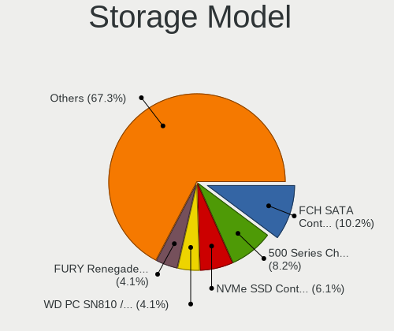
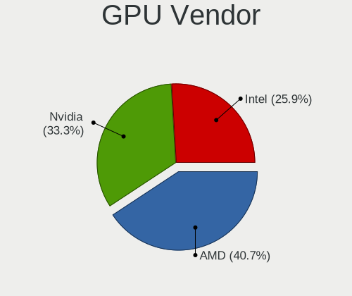
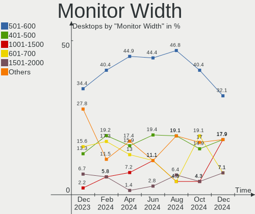
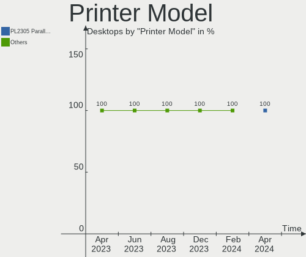
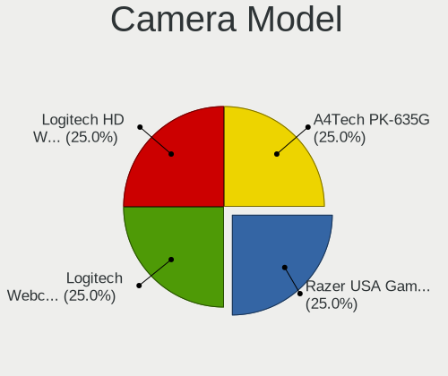
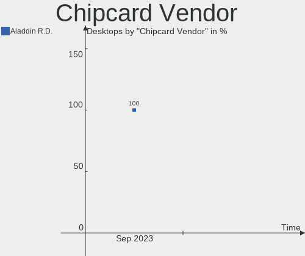
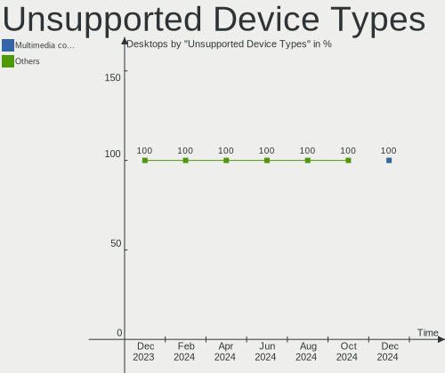

ArcoLinux Hardware Trends (Desktops)
------------------------------------

A project to identify most popular hardware characteristics and track their change
over time based on data collected by ArcoLinux users at https://Linux-Hardware.org.

Anyone can contribute to this report by the [hw-probe](https://github.com/linuxhw/hw-probe) tool:

    sudo -E hw-probe -all -upload

Full-feature report is available here: https://linux-hardware.org/?view=trends&formfactor=desktop

Period: Aug, 2021.

Contents
--------

* [ System ](#system)
  - [ OS                       ](#os)
  - [ OS Family                ](#os-family)
  - [ Kernel                   ](#kernel)
  - [ Kernel Family            ](#kernel-family)
  - [ Kernel Major Ver.        ](#kernel-major-ver)
  - [ Arch                     ](#arch)
  - [ DE                       ](#de)
  - [ Display Server           ](#display-server)
  - [ Display Manager          ](#display-manager)
  - [ OS Lang                  ](#os-lang)
  - [ Boot Mode                ](#boot-mode)
  - [ Filesystem               ](#filesystem)
  - [ Part. scheme             ](#part-scheme)
  - [ Dual Boot with Linux/BSD ](#dual-boot-with-linuxbsd)
  - [ Dual Boot (Win)          ](#dual-boot-win)

* [ Board ](#board)
  - [ Vendor                   ](#vendor)
  - [ Model                    ](#model)
  - [ Model Family             ](#model-family)
  - [ MFG Year                 ](#mfg-year)
  - [ Form Factor              ](#form-factor)
  - [ Secure Boot              ](#secure-boot)
  - [ Coreboot                 ](#coreboot)
  - [ RAM Size                 ](#ram-size)
  - [ RAM Used                 ](#ram-used)
  - [ Total Drives             ](#total-drives)
  - [ Has CD-ROM               ](#has-cd-rom)
  - [ Has Ethernet             ](#has-ethernet)
  - [ Has WiFi                 ](#has-wifi)
  - [ Has Bluetooth            ](#has-bluetooth)

* [ Location ](#location)
  - [ Country                  ](#country)
  - [ City                     ](#city)

* [ Drives ](#drives)
  - [ Drive Vendor             ](#drive-vendor)
  - [ Drive Model              ](#drive-model)
  - [ HDD Vendor               ](#hdd-vendor)
  - [ SSD Vendor               ](#ssd-vendor)
  - [ Drive Kind               ](#drive-kind)
  - [ Drive Connector          ](#drive-connector)
  - [ Drive Size               ](#drive-size)
  - [ Space Total              ](#space-total)
  - [ Space Used               ](#space-used)
  - [ Malfunc. Drives          ](#malfunc-drives)
  - [ Malfunc. Drive Vendor    ](#malfunc-drive-vendor)
  - [ Malfunc. HDD Vendor      ](#malfunc-hdd-vendor)
  - [ Malfunc. Drive Kind      ](#malfunc-drive-kind)
  - [ Failed Drives            ](#failed-drives)
  - [ Failed Drive Vendor      ](#failed-drive-vendor)
  - [ Drive Status             ](#drive-status)

* [ Storage controller ](#storage-controller)
  - [ Storage Vendor           ](#storage-vendor)
  - [ Storage Model            ](#storage-model)
  - [ Storage Kind             ](#storage-kind)

* [ Processor ](#processor)
  - [ CPU Vendor               ](#cpu-vendor)
  - [ CPU Model                ](#cpu-model)
  - [ CPU Model Family         ](#cpu-model-family)
  - [ CPU Cores                ](#cpu-cores)
  - [ CPU Sockets              ](#cpu-sockets)
  - [ CPU Threads              ](#cpu-threads)
  - [ CPU Op-Modes             ](#cpu-op-modes)
  - [ CPU Microcode            ](#cpu-microcode)
  - [ CPU Microarch            ](#cpu-microarch)

* [ Graphics ](#graphics)
  - [ GPU Vendor               ](#gpu-vendor)
  - [ GPU Model                ](#gpu-model)
  - [ GPU Combo                ](#gpu-combo)
  - [ GPU Driver               ](#gpu-driver)
  - [ GPU Memory               ](#gpu-memory)

* [ Monitor ](#monitor)
  - [ Monitor Vendor           ](#monitor-vendor)
  - [ Monitor Model            ](#monitor-model)
  - [ Monitor Resolution       ](#monitor-resolution)
  - [ Monitor Diagonal         ](#monitor-diagonal)
  - [ Monitor Width            ](#monitor-width)
  - [ Aspect Ratio             ](#aspect-ratio)
  - [ Monitor Area             ](#monitor-area)
  - [ Pixel Density            ](#pixel-density)
  - [ Multiple Monitors        ](#multiple-monitors)

* [ Network ](#network)
  - [ Net Controller Vendor    ](#net-controller-vendor)
  - [ Net Controller Model     ](#net-controller-model)
  - [ Wireless Vendor          ](#wireless-vendor)
  - [ Wireless Model           ](#wireless-model)
  - [ Ethernet Vendor          ](#ethernet-vendor)
  - [ Ethernet Model           ](#ethernet-model)
  - [ Net Controller Kind      ](#net-controller-kind)
  - [ Used Controller          ](#used-controller)
  - [ NICs                     ](#nics)
  - [ IPv6                     ](#ipv6)

* [ Bluetooth ](#bluetooth)
  - [ Bluetooth Vendor         ](#bluetooth-vendor)
  - [ Bluetooth Model          ](#bluetooth-model)

* [ Sound ](#sound)
  - [ Sound Vendor             ](#sound-vendor)
  - [ Sound Model              ](#sound-model)

* [ Memory ](#memory)
  - [ Memory Vendor            ](#memory-vendor)
  - [ Memory Model             ](#memory-model)
  - [ Memory Kind              ](#memory-kind)
  - [ Memory Form Factor       ](#memory-form-factor)
  - [ Memory Size              ](#memory-size)
  - [ Memory Speed             ](#memory-speed)

* [ Printers & scanners ](#printers--scanners)
  - [ Printer Vendor           ](#printer-vendor)
  - [ Printer Model            ](#printer-model)
  - [ Scanner Vendor           ](#scanner-vendor)
  - [ Scanner Model            ](#scanner-model)

* [ Camera ](#camera)
  - [ Camera Vendor            ](#camera-vendor)
  - [ Camera Model             ](#camera-model)

* [ Security ](#security)
  - [ Fingerprint Vendor       ](#fingerprint-vendor)
  - [ Fingerprint Model        ](#fingerprint-model)
  - [ Chipcard Vendor          ](#chipcard-vendor)
  - [ Chipcard Model           ](#chipcard-model)

* [ Unsupported ](#unsupported)
  - [ Unsupported Devices      ](#unsupported-devices)
  - [ Unsupported Device Types ](#unsupported-device-types)

System
------

OS
--

Installed operating systems

| Name              | Desktops | Percent |
|-------------------|----------|---------|
| ArcoLinux Rolling | 29       | 100%    |

OS Family
---------

OS without a version

| Name      | Desktops | Percent |
|-----------|----------|---------|
| ArcoLinux | 29       | 100%    |

Kernel
------

Version of the Linux kernel

| Version                      | Desktops | Percent |
|------------------------------|----------|---------|
| 5.13.12-arch1-1              | 7        | 24.14%  |
| 5.13.13-arch1-1              | 6        | 20.69%  |
| 5.13.9-arch1-1               | 2        | 6.9%    |
| 5.13.8-arch1-1               | 2        | 6.9%    |
| 5.13.7-arch1-1               | 2        | 6.9%    |
| 5.13.12-zen1-1-zen           | 2        | 6.9%    |
| 5.13.10-arch1-1              | 2        | 6.9%    |
| 5.13.6-arch1-1               | 1        | 3.45%   |
| 5.13.5-arch1-1               | 1        | 3.45%   |
| 5.12.19-hardened1-1-hardened | 1        | 3.45%   |
| 5.12.1-arch1-1               | 1        | 3.45%   |
| 5.10.61-1-lts                | 1        | 3.45%   |
| 5.10.56-1-lts                | 1        | 3.45%   |

Kernel Family
-------------

Linux kernel without a distro release

| Version | Desktops | Percent |
|---------|----------|---------|
| 5.13.12 | 9        | 31.03%  |
| 5.13.13 | 6        | 20.69%  |
| 5.13.9  | 2        | 6.9%    |
| 5.13.8  | 2        | 6.9%    |
| 5.13.7  | 2        | 6.9%    |
| 5.13.10 | 2        | 6.9%    |
| 5.13.6  | 1        | 3.45%   |
| 5.13.5  | 1        | 3.45%   |
| 5.12.19 | 1        | 3.45%   |
| 5.12.1  | 1        | 3.45%   |
| 5.10.61 | 1        | 3.45%   |
| 5.10.56 | 1        | 3.45%   |

Kernel Major Ver.
-----------------

Linux kernel major version

| Version | Desktops | Percent |
|---------|----------|---------|
| 5.13    | 25       | 86.21%  |
| 5.12    | 2        | 6.9%    |
| 5.10    | 2        | 6.9%    |

Arch
----

OS architecture (x86_64, i586, etc.)

| Name   | Desktops | Percent |
|--------|----------|---------|
| x86_64 | 29       | 100%    |

DE
--

Desktop Environment

| Name       | Desktops | Percent |
|------------|----------|---------|
| XFCE       | 11       | 37.93%  |
| qtile      | 4        | 13.79%  |
| KDE5       | 4        | 13.79%  |
| awesome    | 3        | 10.34%  |
| X-Cinnamon | 2        | 6.9%    |
| i3         | 2        | 6.9%    |
| xmonad     | 1        | 3.45%   |
| dwm        | 1        | 3.45%   |
| bspwm      | 1        | 3.45%   |

Display Server
--------------

X11 or Wayland

| Name | Desktops | Percent |
|------|----------|---------|
| X11  | 26       | 89.66%  |
| Tty  | 3        | 10.34%  |

Display Manager
---------------

SDDM, LightDM, etc.

| Name    | Desktops | Percent |
|---------|----------|---------|
| SDDM    | 24       | 82.76%  |
| LightDM | 3        | 10.34%  |
| TDM     | 1        | 3.45%   |
| Unknown | 1        | 3.45%   |

OS Lang
-------

Language

| Lang  | Desktops | Percent |
|-------|----------|---------|
| en_US | 20       | 68.97%  |
| en_GB | 4        | 13.79%  |
| pt_BR | 1        | 3.45%   |
| pl_PL | 1        | 3.45%   |
| hu_HU | 1        | 3.45%   |
| en_AU | 1        | 3.45%   |
| de_DE | 1        | 3.45%   |

Boot Mode
---------

EFI or BIOS

| Mode | Desktops | Percent |
|------|----------|---------|
| EFI  | 20       | 68.97%  |
| BIOS | 9        | 31.03%  |

Filesystem
----------

Type of filesystem

| Type    | Desktops | Percent |
|---------|----------|---------|
| Ext4    | 18       | 62.07%  |
| Btrfs   | 9        | 31.03%  |
| Xfs     | 1        | 3.45%   |
| Overlay | 1        | 3.45%   |

Part. scheme
------------

Scheme of partitioning

| Type | Desktops | Percent |
|------|----------|---------|
| GPT  | 22       | 75.86%  |
| MBR  | 7        | 24.14%  |

Dual Boot with Linux/BSD
------------------------

Hosting more than one Linux/BSD

| Dual boot | Desktops | Percent |
|-----------|----------|---------|
| No        | 16       | 55.17%  |
| Yes       | 13       | 44.83%  |

Dual Boot (Win)
---------------

Hosting Linux and Windows

| Dual boot | Desktops | Percent |
|-----------|----------|---------|
| Yes       | 15       | 51.72%  |
| No        | 14       | 48.28%  |

Board
-----

Vendor
------

Motherboard manufacturer

| Name                | Desktops | Percent |
|---------------------|----------|---------|
| Gigabyte Technology | 9        | 31.03%  |
| ASUSTek Computer    | 9        | 31.03%  |
| MSI                 | 5        | 17.24%  |
| Medion              | 1        | 3.45%   |
| Intel               | 1        | 3.45%   |
| Foxconn             | 1        | 3.45%   |
| Biostar             | 1        | 3.45%   |
| ASRock              | 1        | 3.45%   |
| Apple               | 1        | 3.45%   |

Model
-----

Motherboard model

| Name                          | Desktops | Percent |
|-------------------------------|----------|---------|
| ASUS TUF GAMING X570-PLUS     | 2        | 6.9%    |
| MSI MS-7C91                   | 1        | 3.45%   |
| MSI MS-7C56                   | 1        | 3.45%   |
| MSI MS-7B77                   | 1        | 3.45%   |
| MSI MS-7978                   | 1        | 3.45%   |
| MSI MS-7971                   | 1        | 3.45%   |
| Medion E62009                 | 1        | 3.45%   |
| Intel X99                     | 1        | 3.45%   |
| Gigabyte Z77X-D3H             | 1        | 3.45%   |
| Gigabyte TRX40 AORUS PRO WIFI | 1        | 3.45%   |
| Gigabyte H370M-D3H            | 1        | 3.45%   |
| Gigabyte H170-D3HP            | 1        | 3.45%   |
| Gigabyte GA-870A-USB3         | 1        | 3.45%   |
| Gigabyte G41M-ES2L            | 1        | 3.45%   |
| Gigabyte G31M-ES2L            | 1        | 3.45%   |
| Gigabyte B365M GAMING HD      | 1        | 3.45%   |
| Gigabyte A520M H              | 1        | 3.45%   |
| Foxconn p6621c                | 1        | 3.45%   |
| Biostar J3060NH               | 1        | 3.45%   |
| ASUS Z170-A                   | 1        | 3.45%   |
| ASUS Z170 PRO GAMING          | 1        | 3.45%   |
| ASUS STRIX B250F GAMING       | 1        | 3.45%   |
| ASUS ROG STRIX Z390-E GAMING  | 1        | 3.45%   |
| ASUS ROG STRIX B550-F GAMING  | 1        | 3.45%   |
| ASUS PRIME Z490-A             | 1        | 3.45%   |
| ASUS P8P67 LE                 | 1        | 3.45%   |
| ASRock X299 Taichi CLX        | 1        | 3.45%   |
| Apple MacPro5,1               | 1        | 3.45%   |

Model Family
------------

Motherboard model prefix

| Name                  | Desktops | Percent |
|-----------------------|----------|---------|
| ASUS TUF              | 2        | 6.9%    |
| ASUS ROG              | 2        | 6.9%    |
| MSI MS-7C91           | 1        | 3.45%   |
| MSI MS-7C56           | 1        | 3.45%   |
| MSI MS-7B77           | 1        | 3.45%   |
| MSI MS-7978           | 1        | 3.45%   |
| MSI MS-7971           | 1        | 3.45%   |
| Medion E62009         | 1        | 3.45%   |
| Intel X99             | 1        | 3.45%   |
| Gigabyte Z77X-D3H     | 1        | 3.45%   |
| Gigabyte TRX40        | 1        | 3.45%   |
| Gigabyte H370M-D3H    | 1        | 3.45%   |
| Gigabyte H170-D3HP    | 1        | 3.45%   |
| Gigabyte GA-870A-USB3 | 1        | 3.45%   |
| Gigabyte G41M-ES2L    | 1        | 3.45%   |
| Gigabyte G31M-ES2L    | 1        | 3.45%   |
| Gigabyte B365M        | 1        | 3.45%   |
| Gigabyte A520M        | 1        | 3.45%   |
| Foxconn p6621c        | 1        | 3.45%   |
| Biostar J3060NH       | 1        | 3.45%   |
| ASUS Z170-A           | 1        | 3.45%   |
| ASUS Z170             | 1        | 3.45%   |
| ASUS STRIX            | 1        | 3.45%   |
| ASUS PRIME            | 1        | 3.45%   |
| ASUS P8P67            | 1        | 3.45%   |
| ASRock X299           | 1        | 3.45%   |
| Apple MacPro5         | 1        | 3.45%   |

MFG Year
--------

Motherboard manufacture year

| Year | Desktops | Percent |
|------|----------|---------|
| 2021 | 6        | 20.69%  |
| 2018 | 5        | 17.24%  |
| 2020 | 4        | 13.79%  |
| 2019 | 4        | 13.79%  |
| 2017 | 2        | 6.9%    |
| 2016 | 2        | 6.9%    |
| 2013 | 2        | 6.9%    |
| 2014 | 1        | 3.45%   |
| 2011 | 1        | 3.45%   |
| 2010 | 1        | 3.45%   |
| 2009 | 1        | 3.45%   |

Form Factor
-----------

Physical design of the computer

| Name    | Desktops | Percent |
|---------|----------|---------|
| Desktop | 29       | 100%    |

Secure Boot
-----------

Enabled or disabled

| State    | Desktops | Percent |
|----------|----------|---------|
| Disabled | 29       | 100%    |

Coreboot
--------

Have coreboot on board

| Used | Desktops | Percent |
|------|----------|---------|
| No   | 29       | 100%    |

RAM Size
--------

Total RAM memory

| Size in GB  | Desktops | Percent |
|-------------|----------|---------|
| 16.01-24.0  | 12       | 41.38%  |
| 32.01-64.0  | 5        | 17.24%  |
| 64.01-256.0 | 4        | 13.79%  |
| 8.01-16.0   | 4        | 13.79%  |
| 3.01-4.0    | 3        | 10.34%  |
| 4.01-8.0    | 1        | 3.45%   |

RAM Used
--------

Used RAM memory

| Used GB   | Desktops | Percent |
|-----------|----------|---------|
| 1.01-2.0  | 7        | 24.14%  |
| 3.01-4.0  | 6        | 20.69%  |
| 2.01-3.0  | 5        | 17.24%  |
| 0.51-1.0  | 4        | 13.79%  |
| 4.01-8.0  | 3        | 10.34%  |
| 8.01-16.0 | 2        | 6.9%    |
| 0.01-0.5  | 2        | 6.9%    |

Total Drives
------------

Number of drives on board

| Drives | Desktops | Percent |
|--------|----------|---------|
| 2      | 10       | 34.48%  |
| 4      | 7        | 24.14%  |
| 3      | 5        | 17.24%  |
| 1      | 4        | 13.79%  |
| 5      | 3        | 10.34%  |

Has CD-ROM
----------

Has CD-ROM on board

| Presented | Desktops | Percent |
|-----------|----------|---------|
| No        | 21       | 72.41%  |
| Yes       | 8        | 27.59%  |

Has Ethernet
------------

Has Ethernet on board

| Presented | Desktops | Percent |
|-----------|----------|---------|
| Yes       | 29       | 100%    |

Has WiFi
--------

Has WiFi module

| Presented | Desktops | Percent |
|-----------|----------|---------|
| No        | 18       | 62.07%  |
| Yes       | 11       | 37.93%  |

Has Bluetooth
-------------

Has Bluetooth module

| Presented | Desktops | Percent |
|-----------|----------|---------|
| No        | 16       | 55.17%  |
| Yes       | 13       | 44.83%  |

Location
--------

Country
-------

Geographic location (country)

| Country     | Desktops | Percent |
|-------------|----------|---------|
| USA         | 7        | 24.14%  |
| UK          | 3        | 10.34%  |
| India       | 2        | 6.9%    |
| Germany     | 2        | 6.9%    |
| Brazil      | 2        | 6.9%    |
| Belgium     | 2        | 6.9%    |
| Romania     | 1        | 3.45%   |
| Poland      | 1        | 3.45%   |
| Panama      | 1        | 3.45%   |
| Netherlands | 1        | 3.45%   |
| Hungary     | 1        | 3.45%   |
| Hong Kong   | 1        | 3.45%   |
| Canada      | 1        | 3.45%   |
| Bulgaria    | 1        | 3.45%   |
| Barbados    | 1        | 3.45%   |
| Australia   | 1        | 3.45%   |
| Argentina   | 1        | 3.45%   |

City
----

Geographic location (city)

| City                  | Desktops | Percent |
|-----------------------|----------|---------|
| Sydney                | 1        | 3.45%   |
| Stuttgart             | 1        | 3.45%   |
| Shumen                | 1        | 3.45%   |
| Sfantu Gheorghe       | 1        | 3.45%   |
| Sebastiao Laranjeiras | 1        | 3.45%   |
| S??o Paulo            | 1        | 3.45%   |
| Penonom?©             | 1        | 3.45%   |
| Norwalk               | 1        | 3.45%   |
| Northampton           | 1        | 3.45%   |
| New York              | 1        | 3.45%   |
| New Delhi             | 1        | 3.45%   |
| Mt. Dora              | 1        | 3.45%   |
| Lerwick               | 1        | 3.45%   |
| Laguna Niguel         | 1        | 3.45%   |
| Kent                  | 1        | 3.45%   |
| Hackney               | 1        | 3.45%   |
| Edmonton              | 1        | 3.45%   |
| Duffel                | 1        | 3.45%   |
| Dombivali             | 1        | 3.45%   |
| Denver                | 1        | 3.45%   |
| D?…browa G??rnicza    | 1        | 3.45%   |
| Central               | 1        | 3.45%   |
| Carthage              | 1        | 3.45%   |
| Buenos Aires          | 1        | 3.45%   |
| Budapest              | 1        | 3.45%   |
| Bridgetown            | 1        | 3.45%   |
| Bergkirchen           | 1        | 3.45%   |
| Beervelde             | 1        | 3.45%   |
| Almelo                | 1        | 3.45%   |

Drives
------

Drive Vendor
------------

Hard drive vendors

| Vendor              | Desktops | Drives | Percent |
|---------------------|----------|--------|---------|
| Samsung Electronics | 12       | 19     | 20.34%  |
| WDC                 | 9        | 14     | 15.25%  |
| Seagate             | 9        | 16     | 15.25%  |
| Crucial             | 6        | 7      | 10.17%  |
| Kingston            | 3        | 3      | 5.08%   |
| Transcend           | 2        | 2      | 3.39%   |
| Toshiba             | 2        | 2      | 3.39%   |
| Phison              | 2        | 2      | 3.39%   |
| Intel               | 2        | 3      | 3.39%   |
| China               | 2        | 4      | 3.39%   |
| A-DATA Technology   | 2        | 2      | 3.39%   |
| XPG                 | 1        | 1      | 1.69%   |
| SPCC                | 1        | 1      | 1.69%   |
| SK Hynix            | 1        | 1      | 1.69%   |
| SanDisk             | 1        | 1      | 1.69%   |
| LaCie               | 1        | 1      | 1.69%   |
| Hitachi             | 1        | 1      | 1.69%   |
| HGST                | 1        | 1      | 1.69%   |
| Apple               | 1        | 1      | 1.69%   |

Drive Model
-----------

Hard drive models

| Model                                    | Desktops | Percent |
|------------------------------------------|----------|---------|
| Seagate ST1000DM010-2EP102 1TB           | 2        | 2.78%   |
| Samsung SSD 970 EVO Plus 1TB             | 2        | 2.78%   |
| Samsung SSD 860 EVO 500GB                | 2        | 2.78%   |
| Kingston SA400S37120G 120GB SSD          | 2        | 2.78%   |
| Crucial CT1000P1SSD8 1TB                 | 2        | 2.78%   |
| XPG GAMMIX S11 Pro 512GB                 | 1        | 1.39%   |
| WDC WDS500G1B0A-00H9H0 500GB SSD         | 1        | 1.39%   |
| WDC WDS480G2G0A-00JH30 480GB SSD         | 1        | 1.39%   |
| WDC WDS250G2B0C-00PXH0 250GB             | 1        | 1.39%   |
| WDC WDS240G2G0A-00JH30 240GB SSD         | 1        | 1.39%   |
| WDC WDS100T2B0C-00PXH0 1TB               | 1        | 1.39%   |
| WDC WD5000AAKX-603CA0 500GB              | 1        | 1.39%   |
| WDC WD5000AAKX-001CA0 500GB              | 1        | 1.39%   |
| WDC WD3200AAKS-61L9A0 320GB              | 1        | 1.39%   |
| WDC WD20PURZ-85AKKY0 2TB                 | 1        | 1.39%   |
| WDC WD10EZRZ-00HTKB0 1TB                 | 1        | 1.39%   |
| WDC WD10EZRX-00L4HB0 1TB                 | 1        | 1.39%   |
| WDC WD10EZEX-08WN4A0 1TB                 | 1        | 1.39%   |
| WDC WD1003FZEX-00K3CA0 1TB               | 1        | 1.39%   |
| Transcend TS512GSSD720 512GB             | 1        | 1.39%   |
| Transcend TS480GSSD220S 480GB            | 1        | 1.39%   |
| Toshiba MQ01ABD100V 1TB                  | 1        | 1.39%   |
| Toshiba DT01ACA100 1TB                   | 1        | 1.39%   |
| SPCC M.2 PCIe SSD 512GB                  | 1        | 1.39%   |
| SK Hynix SC311 SATA 128GB SSD            | 1        | 1.39%   |
| Seagate ST9320423AS 320GB                | 1        | 1.39%   |
| Seagate ST4000DM004-2CV104 4TB           | 1        | 1.39%   |
| Seagate ST3500312CS 500GB                | 1        | 1.39%   |
| Seagate ST3320620AS 320GB                | 1        | 1.39%   |
| Seagate ST3250318AS 250GB                | 1        | 1.39%   |
| Seagate ST2000DX001-1CM164 2TB           | 1        | 1.39%   |
| Seagate ST2000DM008-2FR102 2TB           | 1        | 1.39%   |
| Seagate ST2000DM001-1ER164 2TB           | 1        | 1.39%   |
| Seagate ST1000LM024 HN-M101MBB 1TB       | 1        | 1.39%   |
| SanDisk Cruzer Edge 32GB SSD             | 1        | 1.39%   |
| Samsung SSD PM871 mSATA 256GB            | 1        | 1.39%   |
| Samsung SSD 980 PRO 1TB                  | 1        | 1.39%   |
| Samsung SSD 970 EVO 1TB                  | 1        | 1.39%   |
| Samsung SSD 960 PRO 512GB                | 1        | 1.39%   |
| Samsung SSD 950 PRO 512GB                | 1        | 1.39%   |
| Samsung SSD 950 PRO 256GB                | 1        | 1.39%   |
| Samsung SSD 870 QVO 1TB                  | 1        | 1.39%   |
| Samsung SSD 870 EVO 2TB                  | 1        | 1.39%   |
| Samsung SSD 860 EVO 4TB                  | 1        | 1.39%   |
| Samsung SSD 860 EVO 2TB                  | 1        | 1.39%   |
| Samsung SSD 860 EVO 250GB                | 1        | 1.39%   |
| Samsung SSD 850 EVO 1TB                  | 1        | 1.39%   |
| Samsung SSD 840 PRO Series 128GB         | 1        | 1.39%   |
| Samsung SSD 840 EVO 120GB                | 1        | 1.39%   |
| Samsung HD204UI 2TB                      | 1        | 1.39%   |
| Phison Sabrent Rocket Q 2TB              | 1        | 1.39%   |
| Phison E12-512G-PHISON-SSD-B16-BB1 512GB | 1        | 1.39%   |
| LaCie Mobile Drive 4TB                   | 1        | 1.39%   |
| Kingston SV300S37A120G 120GB SSD         | 1        | 1.39%   |
| Intel SSDPEKNW512G8 512GB                | 1        | 1.39%   |
| Intel SSDPEKNW010T8 1TB                  | 1        | 1.39%   |
| Hitachi HUS724040ALE640 4TB              | 1        | 1.39%   |
| HGST HTS721010A9E630 1TB                 | 1        | 1.39%   |
| Crucial M4-CT128M4SSD2 128GB             | 1        | 1.39%   |
| Crucial CT500P2SSD8 500GB                | 1        | 1.39%   |

HDD Vendor
----------

Hard disk drive vendors

| Vendor              | Desktops | Drives | Percent |
|---------------------|----------|--------|---------|
| Seagate             | 9        | 16     | 45%     |
| WDC                 | 6        | 9      | 30%     |
| Toshiba             | 2        | 2      | 10%     |
| Samsung Electronics | 1        | 1      | 5%      |
| Hitachi             | 1        | 1      | 5%      |
| HGST                | 1        | 1      | 5%      |

SSD Vendor
----------

Solid state drive vendors

| Vendor              | Desktops | Drives | Percent |
|---------------------|----------|--------|---------|
| Samsung Electronics | 9        | 11     | 34.62%  |
| WDC                 | 3        | 3      | 11.54%  |
| Kingston            | 3        | 3      | 11.54%  |
| Crucial             | 3        | 4      | 11.54%  |
| Transcend           | 2        | 2      | 7.69%   |
| China               | 2        | 4      | 7.69%   |
| SK Hynix            | 1        | 1      | 3.85%   |
| SanDisk             | 1        | 1      | 3.85%   |
| Apple               | 1        | 1      | 3.85%   |
| A-DATA Technology   | 1        | 1      | 3.85%   |

Drive Kind
----------

HDD or SSD

| Kind    | Desktops | Drives | Percent |
|---------|----------|--------|---------|
| SSD     | 20       | 31     | 37.04%  |
| HDD     | 18       | 30     | 33.33%  |
| NVMe    | 15       | 20     | 27.78%  |
| Unknown | 1        | 1      | 1.85%   |

Drive Connector
---------------

SATA, SAS, NVMe, etc.

| Type | Desktops | Drives | Percent |
|------|----------|--------|---------|
| SATA | 25       | 59     | 58.14%  |
| NVMe | 15       | 20     | 34.88%  |
| SAS  | 3        | 3      | 6.98%   |

Drive Size
----------

Size of hard drive

| Size in TB | Desktops | Drives | Percent |
|------------|----------|--------|---------|
| 0.01-0.5   | 19       | 29     | 44.19%  |
| 0.51-1.0   | 14       | 17     | 32.56%  |
| 1.01-2.0   | 7        | 12     | 16.28%  |
| 3.01-4.0   | 3        | 3      | 6.98%   |

Space Total
-----------

Amount of disk space available on the file system

| Size in GB     | Desktops | Percent |
|----------------|----------|---------|
| 251-500        | 10       | 34.48%  |
| 2001-3000      | 5        | 17.24%  |
| 101-250        | 5        | 17.24%  |
| More than 3000 | 4        | 13.79%  |
| 1001-2000      | 2        | 6.9%    |
| 501-1000       | 2        | 6.9%    |
| Unknown        | 1        | 3.45%   |

Space Used
----------

Amount of used disk space

| Used GB   | Desktops | Percent |
|-----------|----------|---------|
| 21-50     | 8        | 27.59%  |
| 501-1000  | 8        | 27.59%  |
| 1-20      | 6        | 20.69%  |
| 101-250   | 2        | 6.9%    |
| 51-100    | 2        | 6.9%    |
| 251-500   | 1        | 3.45%   |
| 1001-2000 | 1        | 3.45%   |
| Unknown   | 1        | 3.45%   |

Malfunc. Drives
---------------

Drive models with a malfunction

| Model                              | Desktops | Drives | Percent |
|------------------------------------|----------|--------|---------|
| WDC WD5000AAKX-603CA0 500GB        | 1        | 1      | 16.67%  |
| Transcend TS512GSSD720 512GB       | 1        | 1      | 16.67%  |
| Seagate ST3500312CS 500GB          | 1        | 1      | 16.67%  |
| Seagate ST1000LM024 HN-M101MBB 1TB | 1        | 1      | 16.67%  |
| Seagate ST1000DM010-2EP102 1TB     | 1        | 1      | 16.67%  |
| Kingston SA400S37120G 120GB SSD    | 1        | 1      | 16.67%  |

Malfunc. Drive Vendor
---------------------

Vendors of faulty drives

| Vendor    | Desktops | Drives | Percent |
|-----------|----------|--------|---------|
| Seagate   | 2        | 3      | 40%     |
| WDC       | 1        | 1      | 20%     |
| Transcend | 1        | 1      | 20%     |
| Kingston  | 1        | 1      | 20%     |

Malfunc. HDD Vendor
-------------------

Vendors of faulty HDD drives

| Vendor  | Desktops | Drives | Percent |
|---------|----------|--------|---------|
| Seagate | 2        | 3      | 66.67%  |
| WDC     | 1        | 1      | 33.33%  |

Malfunc. Drive Kind
-------------------

Kinds of faulty drives

| Kind | Desktops | Drives | Percent |
|------|----------|--------|---------|
| HDD  | 3        | 4      | 60%     |
| SSD  | 2        | 2      | 40%     |

Failed Drives
-------------

Failed drive models

Zero info for selected period =(

Failed Drive Vendor
-------------------

Failed drive vendors

Zero info for selected period =(

Drive Status
------------

Number of failed and malfunc. drives

| Status   | Desktops | Drives | Percent |
|----------|----------|--------|---------|
| Works    | 28       | 71     | 75.68%  |
| Malfunc  | 5        | 6      | 13.51%  |
| Detected | 4        | 5      | 10.81%  |

Storage controller
------------------

Storage Vendor
--------------

Storage controller vendors

| Vendor                    | Desktops | Percent |
|---------------------------|----------|---------|
| Intel                     | 20       | 40.82%  |
| AMD                       | 10       | 20.41%  |
| Samsung Electronics       | 5        | 10.2%   |
| Phison Electronics        | 3        | 6.12%   |
| Micron/Crucial Technology | 3        | 6.12%   |
| Sandisk                   | 2        | 4.08%   |
| Marvell Technology Group  | 2        | 4.08%   |
| ASMedia Technology        | 2        | 4.08%   |
| ADATA Technology          | 2        | 4.08%   |

Storage Model
-------------

Storage controller models

| Model                                                                            | Desktops | Percent |
|----------------------------------------------------------------------------------|----------|---------|
| Intel Q170/Q150/B150/H170/H110/Z170/CM236 Chipset SATA Controller [AHCI Mode]    | 5        | 9.26%   |
| AMD Starship/Matisse Chipset SATA Controller [AHCI mode]                         | 4        | 7.41%   |
| Phison E12 NVMe Controller                                                       | 3        | 5.56%   |
| Intel Cannon Lake PCH SATA AHCI Controller                                       | 3        | 5.56%   |
| AMD FCH SATA Controller [AHCI mode]                                              | 3        | 5.56%   |
| Sandisk WD Blue SN550 NVMe SSD                                                   | 2        | 3.7%    |
| Samsung NVMe SSD Controller SM981/PM981/PM983                                    | 2        | 3.7%    |
| Samsung NVMe SSD Controller SM951/PM951                                          | 2        | 3.7%    |
| Micron/Crucial P1 NVMe PCIe SSD                                                  | 2        | 3.7%    |
| Intel SSD 660P Series                                                            | 2        | 3.7%    |
| Intel NM10/ICH7 Family SATA Controller [IDE mode]                                | 2        | 3.7%    |
| Intel 200 Series PCH SATA controller [AHCI mode]                                 | 2        | 3.7%    |
| ASMedia ASM1062 Serial ATA Controller                                            | 2        | 3.7%    |
| AMD SB7x0/SB8x0/SB9x0 SATA Controller [AHCI mode]                                | 2        | 3.7%    |
| ADATA XPG SX8200 Pro PCIe Gen3x4 M.2 2280 Solid State Drive                      | 2        | 3.7%    |
| Samsung NVMe SSD Controller SM961/PM961/SM963                                    | 1        | 1.85%   |
| Samsung NVMe SSD Controller PM9A1/PM9A3/980PRO                                   | 1        | 1.85%   |
| Micron/Crucial P2 NVMe PCIe SSD                                                  | 1        | 1.85%   |
| Marvell Group 88SE9172 SATA 6Gb/s Controller                                     | 1        | 1.85%   |
| Marvell Group 88SE912x SATA 6Gb/s Controller [IDE mode]                          | 1        | 1.85%   |
| Marvell Group 88SE912x IDE Controller                                            | 1        | 1.85%   |
| Intel SATA Controller [RAID mode]                                                | 1        | 1.85%   |
| Intel C610/X99 series chipset sSATA Controller [AHCI mode]                       | 1        | 1.85%   |
| Intel C610/X99 series chipset 6-Port SATA Controller [AHCI mode]                 | 1        | 1.85%   |
| Intel Atom/Celeron/Pentium Processor x5-E8000/J3xxx/N3xxx Series SATA Controller | 1        | 1.85%   |
| Intel 82801JI (ICH10 Family) SATA AHCI Controller                                | 1        | 1.85%   |
| Intel 7 Series/C210 Series Chipset Family 6-port SATA Controller [AHCI mode]     | 1        | 1.85%   |
| Intel 6 Series/C200 Series Chipset Family 6 port Desktop SATA AHCI Controller    | 1        | 1.85%   |
| Intel 400 Series Chipset Family SATA RAID Controller                             | 1        | 1.85%   |
| AMD SB7x0/SB8x0/SB9x0 IDE Controller                                             | 1        | 1.85%   |
| AMD 400 Series Chipset SATA Controller                                           | 1        | 1.85%   |

Storage Kind
------------

Kind of storage controller (IDE, SATA, NVMe, SAS, ...)

| Kind | Desktops | Percent |
|------|----------|---------|
| SATA | 25       | 54.35%  |
| NVMe | 15       | 32.61%  |
| IDE  | 4        | 8.7%    |
| RAID | 2        | 4.35%   |

Processor
---------

CPU Vendor
----------

Processor vendors

| Vendor | Desktops | Percent |
|--------|----------|---------|
| Intel  | 19       | 65.52%  |
| AMD    | 10       | 34.48%  |

CPU Model
---------

Processor models

| Model                                          | Desktops | Percent |
|------------------------------------------------|----------|---------|
| AMD Ryzen 7 3700X 8-Core Processor             | 3        | 10.34%  |
| Intel Core i7-6700K CPU @ 4.00GHz              | 2        | 6.9%    |
| AMD Ryzen 7 5800X 8-Core Processor             | 2        | 6.9%    |
| Intel Xeon CPU X5675 @ 3.07GHz                 | 1        | 3.45%   |
| Intel Xeon CPU E5-2620 v3 @ 2.40GHz            | 1        | 3.45%   |
| Intel Pentium Dual-Core CPU E5300 @ 2.60GHz    | 1        | 3.45%   |
| Intel Core i9-9900K CPU @ 3.60GHz              | 1        | 3.45%   |
| Intel Core i9-10900X CPU @ 3.70GHz             | 1        | 3.45%   |
| Intel Core i7-8700 CPU @ 3.20GHz               | 1        | 3.45%   |
| Intel Core i7-7700K CPU @ 4.20GHz              | 1        | 3.45%   |
| Intel Core i7-3770 CPU @ 3.40GHz               | 1        | 3.45%   |
| Intel Core i7-10700K CPU @ 3.80GHz             | 1        | 3.45%   |
| Intel Core i5-9400 CPU @ 2.90GHz               | 1        | 3.45%   |
| Intel Core i5-8400 CPU @ 2.80GHz               | 1        | 3.45%   |
| Intel Core i5-7600K CPU @ 3.80GHz              | 1        | 3.45%   |
| Intel Core i5-6600 CPU @ 3.30GHz               | 1        | 3.45%   |
| Intel Core i5-6500 CPU @ 3.20GHz               | 1        | 3.45%   |
| Intel Core i5-2400 CPU @ 3.10GHz               | 1        | 3.45%   |
| Intel Core 2 Duo CPU E8500 @ 3.16GHz           | 1        | 3.45%   |
| Intel Celeron CPU J3060 @ 1.60GHz              | 1        | 3.45%   |
| AMD Ryzen Threadripper 3970X 32-Core Processor | 1        | 3.45%   |
| AMD Ryzen 9 5900X 12-Core Processor            | 1        | 3.45%   |
| AMD Ryzen 5 3600 6-Core Processor              | 1        | 3.45%   |
| AMD Phenom II X4 955 Processor                 | 1        | 3.45%   |
| AMD Phenom II X4 830 Processor                 | 1        | 3.45%   |

CPU Model Family
----------------

Processor model prefix

| Model                   | Desktops | Percent |
|-------------------------|----------|---------|
| Intel Core i7           | 6        | 20.69%  |
| Intel Core i5           | 6        | 20.69%  |
| AMD Ryzen 7             | 5        | 17.24%  |
| Intel Xeon              | 2        | 6.9%    |
| Intel Core i9           | 2        | 6.9%    |
| AMD Phenom II X4        | 2        | 6.9%    |
| Intel Pentium Dual-Core | 1        | 3.45%   |
| Intel Core 2 Duo        | 1        | 3.45%   |
| Intel Celeron           | 1        | 3.45%   |
| AMD Ryzen Threadripper  | 1        | 3.45%   |
| AMD Ryzen 9             | 1        | 3.45%   |
| AMD Ryzen 5             | 1        | 3.45%   |

CPU Cores
---------

Number of processor cores

| Number | Desktops | Percent |
|--------|----------|---------|
| 4      | 10       | 34.48%  |
| 8      | 7        | 24.14%  |
| 6      | 5        | 17.24%  |
| 2      | 3        | 10.34%  |
| 12     | 2        | 6.9%    |
| 32     | 1        | 3.45%   |
| 10     | 1        | 3.45%   |

CPU Sockets
-----------

Number of sockets

| Number | Desktops | Percent |
|--------|----------|---------|
| 1      | 28       | 96.55%  |
| 2      | 1        | 3.45%   |

CPU Threads
-----------

Threads per core (Hyper-Threading)

| Number | Desktops | Percent |
|--------|----------|---------|
| 2      | 18       | 62.07%  |
| 1      | 11       | 37.93%  |

CPU Op-Modes
------------

CPU Operation Modes (32-bit, 64-bit)

| Op mode        | Desktops | Percent |
|----------------|----------|---------|
| 32-bit, 64-bit | 29       | 100%    |

CPU Microcode
-------------

Microcode number

| Number     | Desktops | Percent |
|------------|----------|---------|
| 0x506e3    | 4        | 13.79%  |
| 0x08701021 | 4        | 13.79%  |
| 0x906ea    | 3        | 10.34%  |
| 0x0a201009 | 3        | 10.34%  |
| 0x906e9    | 2        | 6.9%    |
| 0x1067a    | 2        | 6.9%    |
| 0x010000c8 | 2        | 6.9%    |
| 0xa0655    | 1        | 3.45%   |
| 0x906ec    | 1        | 3.45%   |
| 0x50657    | 1        | 3.45%   |
| 0x406c4    | 1        | 3.45%   |
| 0x306f2    | 1        | 3.45%   |
| 0x206c2    | 1        | 3.45%   |
| 0x206a7    | 1        | 3.45%   |
| 0x08301025 | 1        | 3.45%   |
| Unknown    | 1        | 3.45%   |

CPU Microarch
-------------

Microarchitecture

| Name        | Desktops | Percent |
|-------------|----------|---------|
| KabyLake    | 6        | 20.69%  |
| Zen 2       | 5        | 17.24%  |
| Skylake     | 5        | 17.24%  |
| Zen 3       | 3        | 10.34%  |
| Penryn      | 2        | 6.9%    |
| K10         | 2        | 6.9%    |
| Westmere    | 1        | 3.45%   |
| Silvermont  | 1        | 3.45%   |
| SandyBridge | 1        | 3.45%   |
| IvyBridge   | 1        | 3.45%   |
| Haswell     | 1        | 3.45%   |
| CometLake   | 1        | 3.45%   |

Graphics
--------

GPU Vendor
----------

Vendors of graphics cards

| Vendor | Desktops | Percent |
|--------|----------|---------|
| Nvidia | 14       | 48.28%  |
| AMD    | 11       | 37.93%  |
| Intel  | 4        | 13.79%  |

GPU Model
---------

Graphics card models

| Model                                                                                    | Desktops | Percent |
|------------------------------------------------------------------------------------------|----------|---------|
| AMD Ellesmere [Radeon RX 470/480/570/570X/580/580X/590]                                  | 3        | 10.34%  |
| Nvidia GP106 [GeForce GTX 1060 6GB]                                                      | 2        | 6.9%    |
| Nvidia GP102 [GeForce GTX 1080 Ti]                                                       | 2        | 6.9%    |
| Intel CometLake-S GT2 [UHD Graphics 630]                                                 | 2        | 6.9%    |
| AMD Navi 21 [Radeon RX 6800/6800 XT / 6900 XT]                                           | 2        | 6.9%    |
| Nvidia TU116 [GeForce GTX 1660]                                                          | 1        | 3.45%   |
| Nvidia TU106 [GeForce RTX 2060 SUPER]                                                    | 1        | 3.45%   |
| Nvidia TU106 [GeForce RTX 2060 Rev. A]                                                   | 1        | 3.45%   |
| Nvidia TU104 [GeForce RTX 2060]                                                          | 1        | 3.45%   |
| Nvidia GP104 [GeForce GTX 1080]                                                          | 1        | 3.45%   |
| Nvidia GP104 [GeForce GTX 1070]                                                          | 1        | 3.45%   |
| Nvidia GM206 [GeForce GTX 960]                                                           | 1        | 3.45%   |
| Nvidia GM204 [GeForce GTX 970]                                                           | 1        | 3.45%   |
| Nvidia GA102 [GeForce RTX 3080]                                                          | 1        | 3.45%   |
| Nvidia G98 [GeForce 8400 GS Rev. 2]                                                      | 1        | 3.45%   |
| Intel Atom/Celeron/Pentium Processor x5-E8000/J3xxx/N3xxx Integrated Graphics Controller | 1        | 3.45%   |
| Intel 4 Series Chipset Integrated Graphics Controller                                    | 1        | 3.45%   |
| AMD Tahiti PRO [Radeon HD 7950/8950 OEM / R9 280]                                        | 1        | 3.45%   |
| AMD RS880 [Radeon HD 4200]                                                               | 1        | 3.45%   |
| AMD Navi 10 [Radeon RX 5600 OEM/5600 XT / 5700/5700 XT]                                  | 1        | 3.45%   |
| AMD Lexa PRO [Radeon 540/540X/550/550X / RX 540X/550/550X]                               | 1        | 3.45%   |
| AMD Hawaii PRO GL [FirePro W8100]                                                        | 1        | 3.45%   |
| AMD Cedar [Radeon HD 5000/6000/7350/8350 Series]                                         | 1        | 3.45%   |

GPU Combo
---------

Combinations of graphics cards

| Name       | Desktops | Percent |
|------------|----------|---------|
| 1 x Nvidia | 14       | 48.28%  |
| 1 x AMD    | 11       | 37.93%  |
| 1 x Intel  | 4        | 13.79%  |

GPU Driver
----------

Free vs proprietary

| Driver      | Desktops | Percent |
|-------------|----------|---------|
| Free        | 15       | 51.72%  |
| Proprietary | 10       | 34.48%  |
| Unknown     | 4        | 13.79%  |

GPU Memory
----------

Total video memory

| Size in GB | Desktops | Percent |
|------------|----------|---------|
| Unknown    | 10       | 34.48%  |
| 7.01-8.0   | 5        | 17.24%  |
| 5.01-6.0   | 4        | 13.79%  |
| 8.01-16.0  | 4        | 13.79%  |
| 3.01-4.0   | 3        | 10.34%  |
| 0.01-0.5   | 2        | 6.9%    |
| 1.01-2.0   | 1        | 3.45%   |

Monitor
-------

Monitor Vendor
--------------

Monitor vendors

| Vendor               | Desktops | Percent |
|----------------------|----------|---------|
| Samsung Electronics  | 5        | 18.52%  |
| Goldstar             | 3        | 11.11%  |
| Dell                 | 3        | 11.11%  |
| BenQ                 | 3        | 11.11%  |
| Ancor Communications | 2        | 7.41%   |
| Acer                 | 2        | 7.41%   |
| Vizio                | 1        | 3.7%    |
| ViewSonic            | 1        | 3.7%    |
| Toshiba              | 1        | 3.7%    |
| SUNNY                | 1        | 3.7%    |
| Sony                 | 1        | 3.7%    |
| Philips              | 1        | 3.7%    |
| Iiyama               | 1        | 3.7%    |
| HXF                  | 1        | 3.7%    |
| AOpen                | 1        | 3.7%    |

Monitor Model
-------------

Monitor models

| Model                                                                  | Desktops | Percent |
|------------------------------------------------------------------------|----------|---------|
| Vizio 320AR VIZ0089 1360x768 477x268mm 21.5-inch                       | 1        | 3.57%   |
| ViewSonic VX3209-2K VSC328E 2560x1440 698x393mm 31.5-inch              | 1        | 3.57%   |
| Toshiba TV TSB0205 1360x768 930x523mm 42.0-inch                        | 1        | 3.57%   |
| SUNNY SUNNY SNN0002 1920x1080 708x398mm 32.0-inch                      | 1        | 3.57%   |
| Sony TV SNYE903 1920x1080 1600x900mm 72.3-inch                         | 1        | 3.57%   |
| Samsung Electronics U32J59x SAM0F52 3840x2160 697x392mm 31.5-inch      | 1        | 3.57%   |
| Samsung Electronics U32J59x SAM0F35 3840x2160 697x392mm 31.5-inch      | 1        | 3.57%   |
| Samsung Electronics U32D970 SAM0BDE 1920x1080 700x390mm 31.5-inch      | 1        | 3.57%   |
| Samsung Electronics SyncMaster SAM01BB 1280x1024 376x301mm 19.0-inch   | 1        | 3.57%   |
| Samsung Electronics S23B350 SAM08D6 1920x1080 510x287mm 23.0-inch      | 1        | 3.57%   |
| Samsung Electronics LCD Monitor SAM090B 1920x1080 1020x570mm 46.0-inch | 1        | 3.57%   |
| Philips PHL 243V7 PHLC155 1920x1080 530x300mm 24.0-inch                | 1        | 3.57%   |
| Iiyama PLG2488H IVM6126 1920x1080 531x299mm 24.0-inch                  | 1        | 3.57%   |
| HXF BM278GW HXF2700 2560x1440 600x330mm 27.0-inch                      | 1        | 3.57%   |
| Goldstar ULTRAWIDE GSM76FE 2560x1080 798x334mm 34.1-inch               | 1        | 3.57%   |
| Goldstar HDR 4K GSM7707 3840x2160 600x340mm 27.2-inch                  | 1        | 3.57%   |
| Goldstar 27GL850 GSM5B7F 2560x1440 597x336mm 27.0-inch                 | 1        | 3.57%   |
| Dell U2414H DELA0A2 1920x1080 527x296mm 23.8-inch                      | 1        | 3.57%   |
| Dell SX2210 DELA046 1920x1080 477x268mm 21.5-inch                      | 1        | 3.57%   |
| Dell P2720DC DELD0FC 2560x1440 597x336mm 27.0-inch                     | 1        | 3.57%   |
| BenQ GW2780 BNQ78E6 1920x1080 598x336mm 27.0-inch                      | 1        | 3.57%   |
| BenQ EW2440L BNQ7938 1920x1080 531x298mm 24.0-inch                     | 1        | 3.57%   |
| BenQ 241W BNQ76DB 1920x1200 520x330mm 24.2-inch                        | 1        | 3.57%   |
| AOpen 22CH1Q AOP06C3 1920x1080 477x268mm 21.5-inch                     | 1        | 3.57%   |
| Ancor Communications ASUS VS247 ACI249A 1920x1080 521x293mm 23.5-inch  | 1        | 3.57%   |
| Ancor Communications ASUS VS228 ACI22FD 1920x1080 476x268mm 21.5-inch  | 1        | 3.57%   |
| Acer KG271 C ACR064E 1920x1080 598x336mm 27.0-inch                     | 1        | 3.57%   |
| Acer EI491CR ACR06D5 3840x1080 1196x336mm 48.9-inch                    | 1        | 3.57%   |

Monitor Resolution
------------------

Monitor screen resolution

| Resolution        | Desktops | Percent |
|-------------------|----------|---------|
| 1920x1080 (FHD)   | 14       | 53.85%  |
| 2560x1440 (QHD)   | 4        | 15.38%  |
| 3840x2160 (4K)    | 3        | 11.54%  |
| 3840x1080         | 1        | 3.85%   |
| 2560x1080         | 1        | 3.85%   |
| 1920x1200 (WUXGA) | 1        | 3.85%   |
| 1360x768          | 1        | 3.85%   |
| 1280x1024 (SXGA)  | 1        | 3.85%   |

Monitor Diagonal
----------------

Diagonal size in inches

| Inches | Desktops | Percent |
|--------|----------|---------|
| 27     | 6        | 23.08%  |
| 31     | 4        | 15.38%  |
| 24     | 4        | 15.38%  |
| 21     | 3        | 11.54%  |
| 72     | 2        | 7.69%   |
| 23     | 2        | 7.69%   |
| 54     | 1        | 3.85%   |
| 52     | 1        | 3.85%   |
| 49     | 1        | 3.85%   |
| 34     | 1        | 3.85%   |
| 19     | 1        | 3.85%   |

Monitor Width
-------------

Physical width

| Width in mm | Desktops | Percent |
|-------------|----------|---------|
| 501-600     | 11       | 44%     |
| 601-700     | 4        | 16%     |
| 401-500     | 3        | 12%     |
| 1001-1500   | 3        | 12%     |
| 1501-2000   | 2        | 8%      |
| 701-800     | 1        | 4%      |
| 351-400     | 1        | 4%      |

Aspect Ratio
------------

Proportional relationship between the width and the height

| Ratio | Desktops | Percent |
|-------|----------|---------|
| 16/9  | 21       | 84%     |
| 5/4   | 1        | 4%      |
| 32/9  | 1        | 4%      |
| 21/9  | 1        | 4%      |
| 16/10 | 1        | 4%      |

Monitor Area
------------

Area in inch²

| Area in inch² | Desktops | Percent |
|----------------|----------|---------|
| 201-250        | 7        | 25.93%  |
| 301-350        | 6        | 22.22%  |
| 351-500        | 5        | 18.52%  |
| More than 1000 | 4        | 14.81%  |
| 151-200        | 3        | 11.11%  |
| 251-300        | 1        | 3.7%    |
| 501-1000       | 1        | 3.7%    |

Pixel Density
-------------

Pixels per inch

| Density | Desktops | Percent |
|---------|----------|---------|
| 51-100  | 10       | 41.67%  |
| 101-120 | 6        | 25%     |
| 1-50    | 5        | 20.83%  |
| 121-160 | 2        | 8.33%   |
| 161-240 | 1        | 4.17%   |

Multiple Monitors
-----------------

Total monitors connected

| Total | Desktops | Percent |
|-------|----------|---------|
| 1     | 17       | 58.62%  |
| 2     | 7        | 24.14%  |
| 0     | 5        | 17.24%  |

Network
-------

Net Controller Vendor
---------------------

Controller vendors

| Vendor                | Desktops | Percent |
|-----------------------|----------|---------|
| Realtek Semiconductor | 15       | 39.47%  |
| Intel                 | 15       | 39.47%  |
| Qualcomm Atheros      | 4        | 10.53%  |
| Broadcom              | 2        | 5.26%   |
| TP-Link               | 1        | 2.63%   |
| Microsoft             | 1        | 2.63%   |

Net Controller Model
--------------------

Controller models

| Model                                                             | Desktops | Percent |
|-------------------------------------------------------------------|----------|---------|
| Realtek RTL8111/8168/8411 PCI Express Gigabit Ethernet Controller | 13       | 28.26%  |
| Intel Ethernet Connection (2) I219-V                              | 5        | 10.87%  |
| Intel Wi-Fi 6 AX200                                               | 4        | 8.7%    |
| Realtek RTL8125 2.5GbE Controller                                 | 2        | 4.35%   |
| Intel Ethernet Controller I225-V                                  | 2        | 4.35%   |
| Intel Ethernet Connection (7) I219-V                              | 2        | 4.35%   |
| Intel Cannon Lake PCH CNVi WiFi                                   | 2        | 4.35%   |
| TP-Link AC600 wireless Realtek RTL8811AU [Archer T2U Nano]        | 1        | 2.17%   |
| Realtek RTL8188CE 802.11b/g/n WiFi Adapter                        | 1        | 2.17%   |
| Realtek RTL810xE PCI Express Fast Ethernet controller             | 1        | 2.17%   |
| Qualcomm Atheros Killer E2500 Gigabit Ethernet Controller         | 1        | 2.17%   |
| Qualcomm Atheros Killer E2400 Gigabit Ethernet Controller         | 1        | 2.17%   |
| Qualcomm Atheros AR8161 Gigabit Ethernet                          | 1        | 2.17%   |
| Qualcomm Atheros AR8131 Gigabit Ethernet                          | 1        | 2.17%   |
| Microsoft XBOX ACC                                                | 1        | 2.17%   |
| Intel Wireless-AC 9260                                            | 1        | 2.17%   |
| Intel Wireless 8265 / 8275                                        | 1        | 2.17%   |
| Intel I211 Gigabit Network Connection                             | 1        | 2.17%   |
| Intel 82599ES 10-Gigabit SFI/SFP+ Network Connection              | 1        | 2.17%   |
| Intel 82574L Gigabit Network Connection                           | 1        | 2.17%   |
| Intel 82571EB/82571GB Gigabit Ethernet Controller (Copper)        | 1        | 2.17%   |
| Broadcom BCM4360 802.11ac Wireless Network Adapter                | 1        | 2.17%   |
| Broadcom BCM4322 802.11a/b/g/n Wireless LAN Controller            | 1        | 2.17%   |

Wireless Vendor
---------------

Wireless vendors

| Vendor                | Desktops | Percent |
|-----------------------|----------|---------|
| Intel                 | 8        | 61.54%  |
| Broadcom              | 2        | 15.38%  |
| TP-Link               | 1        | 7.69%   |
| Realtek Semiconductor | 1        | 7.69%   |
| Microsoft             | 1        | 7.69%   |

Wireless Model
--------------

Wireless models

| Model                                                      | Desktops | Percent |
|------------------------------------------------------------|----------|---------|
| Intel Wi-Fi 6 AX200                                        | 4        | 30.77%  |
| Intel Cannon Lake PCH CNVi WiFi                            | 2        | 15.38%  |
| TP-Link AC600 wireless Realtek RTL8811AU [Archer T2U Nano] | 1        | 7.69%   |
| Realtek RTL8188CE 802.11b/g/n WiFi Adapter                 | 1        | 7.69%   |
| Microsoft XBOX ACC                                         | 1        | 7.69%   |
| Intel Wireless-AC 9260                                     | 1        | 7.69%   |
| Intel Wireless 8265 / 8275                                 | 1        | 7.69%   |
| Broadcom BCM4360 802.11ac Wireless Network Adapter         | 1        | 7.69%   |
| Broadcom BCM4322 802.11a/b/g/n Wireless LAN Controller     | 1        | 7.69%   |

Ethernet Vendor
---------------

Ethernet vendors

| Vendor                | Desktops | Percent |
|-----------------------|----------|---------|
| Realtek Semiconductor | 15       | 50%     |
| Intel                 | 11       | 36.67%  |
| Qualcomm Atheros      | 4        | 13.33%  |

Ethernet Model
--------------

Ethernet models

| Model                                                             | Desktops | Percent |
|-------------------------------------------------------------------|----------|---------|
| Realtek RTL8111/8168/8411 PCI Express Gigabit Ethernet Controller | 13       | 39.39%  |
| Intel Ethernet Connection (2) I219-V                              | 5        | 15.15%  |
| Realtek RTL8125 2.5GbE Controller                                 | 2        | 6.06%   |
| Intel Ethernet Controller I225-V                                  | 2        | 6.06%   |
| Intel Ethernet Connection (7) I219-V                              | 2        | 6.06%   |
| Realtek RTL810xE PCI Express Fast Ethernet controller             | 1        | 3.03%   |
| Qualcomm Atheros Killer E2500 Gigabit Ethernet Controller         | 1        | 3.03%   |
| Qualcomm Atheros Killer E2400 Gigabit Ethernet Controller         | 1        | 3.03%   |
| Qualcomm Atheros AR8161 Gigabit Ethernet                          | 1        | 3.03%   |
| Qualcomm Atheros AR8131 Gigabit Ethernet                          | 1        | 3.03%   |
| Intel I211 Gigabit Network Connection                             | 1        | 3.03%   |
| Intel 82599ES 10-Gigabit SFI/SFP+ Network Connection              | 1        | 3.03%   |
| Intel 82574L Gigabit Network Connection                           | 1        | 3.03%   |
| Intel 82571EB/82571GB Gigabit Ethernet Controller (Copper)        | 1        | 3.03%   |

Net Controller Kind
-------------------

Ethernet, WiFi or modem

| Kind     | Desktops | Percent |
|----------|----------|---------|
| Ethernet | 29       | 72.5%   |
| WiFi     | 11       | 27.5%   |

Used Controller
---------------

Currently used network controller

| Kind     | Desktops | Percent |
|----------|----------|---------|
| Ethernet | 28       | 93.33%  |
| WiFi     | 2        | 6.67%   |

NICs
----

Total network controllers on board

| Total | Desktops | Percent |
|-------|----------|---------|
| 1     | 19       | 65.52%  |
| 2     | 7        | 24.14%  |
| 9     | 1        | 3.45%   |
| 4     | 1        | 3.45%   |
| 3     | 1        | 3.45%   |

IPv6
----

IPv6 vs IPv4

| Used | Desktops | Percent |
|------|----------|---------|
| No   | 18       | 62.07%  |
| Yes  | 11       | 37.93%  |

Bluetooth
---------

Bluetooth Vendor
----------------

Controller vendors

| Vendor                  | Desktops | Percent |
|-------------------------|----------|---------|
| Intel                   | 7        | 53.85%  |
| Cambridge Silicon Radio | 2        | 15.38%  |
| Apple                   | 2        | 15.38%  |
| Broadcom                | 1        | 7.69%   |
| ASUSTek Computer        | 1        | 7.69%   |

Bluetooth Model
---------------

Controller models

| Model                                               | Desktops | Percent |
|-----------------------------------------------------|----------|---------|
| Intel AX200 Bluetooth                               | 3        | 23.08%  |
| Intel Bluetooth 9460/9560 Jefferson Peak (JfP)      | 2        | 15.38%  |
| Cambridge Silicon Radio Bluetooth Dongle (HCI mode) | 2        | 15.38%  |
| Intel Bluetooth wireless interface                  | 1        | 7.69%   |
| Intel Bluetooth Device                              | 1        | 7.69%   |
| Broadcom BCM20702A0 Bluetooth 4.0                   | 1        | 7.69%   |
| ASUS ASUS USB-BT500                                 | 1        | 7.69%   |
| Apple Built-in Bluetooth 2.0+EDR HCI                | 1        | 7.69%   |
| Apple Bluetooth USB Host Controller                 | 1        | 7.69%   |

Sound
-----

Sound Vendor
------------

Sound card vendors

| Vendor                 | Desktops | Percent |
|------------------------|----------|---------|
| Intel                  | 19       | 29.69%  |
| AMD                    | 16       | 25%     |
| Nvidia                 | 13       | 20.31%  |
| Realtek Semiconductor  | 2        | 3.13%   |
| Logitech               | 2        | 3.13%   |
| Yamaha                 | 1        | 1.56%   |
| Texas Instruments      | 1        | 1.56%   |
| Sony                   | 1        | 1.56%   |
| Samson Technologies    | 1        | 1.56%   |
| RODE Microphones       | 1        | 1.56%   |
| JMTek                  | 1        | 1.56%   |
| GYROCOM C&C            | 1        | 1.56%   |
| Giga-Byte Technology   | 1        | 1.56%   |
| Generalplus Technology | 1        | 1.56%   |
| FIFINE Microphones     | 1        | 1.56%   |
| Corsair                | 1        | 1.56%   |
| C-Media Electronics    | 1        | 1.56%   |

Sound Model
-----------

Sound card models

| Model                                                                                             | Desktops | Percent |
|---------------------------------------------------------------------------------------------------|----------|---------|
| AMD Starship/Matisse HD Audio Controller                                                          | 8        | 11.59%  |
| Intel 100 Series/C230 Series Chipset Family HD Audio Controller                                   | 5        | 7.25%   |
| Intel Cannon Lake PCH cAVS                                                                        | 3        | 4.35%   |
| Intel 200 Series PCH HD Audio                                                                     | 3        | 4.35%   |
| AMD Ellesmere HDMI Audio [Radeon RX 470/480 / 570/580/590]                                        | 3        | 4.35%   |
| Realtek Semiconductor USB Audio                                                                   | 2        | 2.9%    |
| Nvidia TU106 High Definition Audio Controller                                                     | 2        | 2.9%    |
| Nvidia GP106 High Definition Audio Controller                                                     | 2        | 2.9%    |
| Nvidia GP104 High Definition Audio Controller                                                     | 2        | 2.9%    |
| Nvidia GP102 HDMI Audio Controller                                                                | 2        | 2.9%    |
| Intel NM10/ICH7 Family High Definition Audio Controller                                           | 2        | 2.9%    |
| AMD SBx00 Azalia (Intel HDA)                                                                      | 2        | 2.9%    |
| AMD Navi 21 HDMI Audio [Radeon RX 6800/6800 XT / 6900 XT]                                         | 2        | 2.9%    |
| Yamaha AG06/AG03                                                                                  | 1        | 1.45%   |
| Texas Instruments PCM2902 Audio Codec                                                             | 1        | 1.45%   |
| Sony DualShock 4 [CUH-ZCT2x]                                                                      | 1        | 1.45%   |
| Samson Technologies Meteor condenser microphone                                                   | 1        | 1.45%   |
| RODE Microphones RODE AI-1                                                                        | 1        | 1.45%   |
| Nvidia TU116 High Definition Audio Controller                                                     | 1        | 1.45%   |
| Nvidia TU104 HD Audio Controller                                                                  | 1        | 1.45%   |
| Nvidia GM206 High Definition Audio Controller                                                     | 1        | 1.45%   |
| Nvidia GM204 High Definition Audio Controller                                                     | 1        | 1.45%   |
| Nvidia GA102 High Definition Audio Controller                                                     | 1        | 1.45%   |
| Logitech PRO X                                                                                    | 1        | 1.45%   |
| Logitech PRO                                                                                      | 1        | 1.45%   |
| JMTek USB PnP Audio Device                                                                        | 1        | 1.45%   |
| Intel Comet Lake PCH cAVS                                                                         | 1        | 1.45%   |
| Intel C610/X99 series chipset HD Audio Controller                                                 | 1        | 1.45%   |
| Intel Atom/Celeron/Pentium Processor x5-E8000/J3xxx/N3xxx Series High Definition Audio Controller | 1        | 1.45%   |
| Intel 82801JI (ICH10 Family) HD Audio Controller                                                  | 1        | 1.45%   |
| Intel 7 Series/C216 Chipset Family High Definition Audio Controller                               | 1        | 1.45%   |
| Intel 6 Series/C200 Series Chipset Family High Definition Audio Controller                        | 1        | 1.45%   |
| GYROCOM C&C Fiio E10                                                                              | 1        | 1.45%   |
| Giga-Byte Technology USB Audio                                                                    | 1        | 1.45%   |
| Generalplus Technology USB Audio Device                                                           | 1        | 1.45%   |
| FIFINE Microphones FIFINE K670 Microphone                                                         | 1        | 1.45%   |
| Corsair Corsair VOID RGB USB Gaming Headset                                                       | 1        | 1.45%   |
| C-Media Electronics Blue Snowball                                                                 | 1        | 1.45%   |
| AMD Tahiti HDMI Audio [Radeon HD 7870 XT / 7950/7970]                                             | 1        | 1.45%   |
| AMD RS880 HDMI Audio [Radeon HD 4200 Series]                                                      | 1        | 1.45%   |
| AMD Navi 10 HDMI Audio                                                                            | 1        | 1.45%   |
| AMD Hawaii HDMI Audio [Radeon R9 290/290X / 390/390X]                                             | 1        | 1.45%   |
| AMD Cedar HDMI Audio [Radeon HD 5400/6300/7300 Series]                                            | 1        | 1.45%   |
| AMD Baffin HDMI/DP Audio [Radeon RX 550 640SP / RX 560/560X]                                      | 1        | 1.45%   |

Memory
------

Memory Vendor
-------------

Memory module vendors

| Vendor              | Desktops | Percent |
|---------------------|----------|---------|
| Corsair             | 7        | 21.88%  |
| Unknown             | 6        | 18.75%  |
| Kingston            | 4        | 12.5%   |
| Micron Technology   | 3        | 9.38%   |
| Team                | 2        | 6.25%   |
| Samsung Electronics | 2        | 6.25%   |
| G.Skill             | 2        | 6.25%   |
| A-DATA Technology   | 2        | 6.25%   |
| SK Hynix            | 1        | 3.13%   |
| Patriot             | 1        | 3.13%   |
| Nanya Technology    | 1        | 3.13%   |
| Crucial             | 1        | 3.13%   |

Memory Model
------------

Memory module models

| Model                                                     | Desktops | Percent |
|-----------------------------------------------------------|----------|---------|
| Unknown RAM Module 2GB DIMM 800MT/s                       | 2        | 5.88%   |
| Corsair RAM CMK32GX4M2B3200C16 16GB DIMM DDR4 3400MT/s    | 2        | 5.88%   |
| Unknown RAM Module 8GB DIMM DDR4 2667MT/s                 | 1        | 2.94%   |
| Unknown RAM Module 4GB DIMM 1600MT/s                      | 1        | 2.94%   |
| Unknown RAM Module 4GB DIMM 1333MT/s                      | 1        | 2.94%   |
| Unknown RAM Module 16GB DIMM DDR4 3600MT/s                | 1        | 2.94%   |
| Unknown RAM Module 16GB DIMM DDR4 2400MT/s                | 1        | 2.94%   |
| Team RAM TEAMGROUP-UD4-3200 8GB DIMM DDR4 3200MT/s        | 1        | 2.94%   |
| Team RAM TEAMGROUP-UD4-3000 8GB DIMM DDR4 3000MT/s        | 1        | 2.94%   |
| SK Hynix RAM HMT125U6DFR8C-H9 2GB DIMM DDR3 1333MT/s      | 1        | 2.94%   |
| Samsung RAM Module 8GB DIMM DDR3 1333MT/s                 | 1        | 2.94%   |
| Samsung RAM M378A1K43CB2-CTD 8GB DIMM DDR4 3200MT/s       | 1        | 2.94%   |
| Patriot RAM 3200 C16 Series 8GB DIMM DDR4 3200MT/s        | 1        | 2.94%   |
| Nanya RAM NT2GC64B8HC0NF-CG 2GB DIMM DDR3 1333MT/s        | 1        | 2.94%   |
| Micron RAM 8KTF51264HZ-1G6E1 4GB DIMM DDR3 1600MT/s       | 1        | 2.94%   |
| Micron RAM 8JTF25664AZ-1G4D1 2GB DIMM DDR3 1333MT/s       | 1        | 2.94%   |
| Micron RAM 16ATF1G64AZ-2G3A2 8GB DIMM DDR4 2400MT/s       | 1        | 2.94%   |
| Kingston RAM KY7N41-MIE 8GB DIMM DDR4 2666MT/s            | 1        | 2.94%   |
| Kingston RAM KHX2400C15/8G 8GB DIMM DDR4 2933MT/s         | 1        | 2.94%   |
| Kingston RAM KHX2133C14D4/4G 4GB DIMM DDR4 2933MT/s       | 1        | 2.94%   |
| Kingston RAM KHX2133C14/8G 8GB DIMM DDR4 2400MT/s         | 1        | 2.94%   |
| Kingston RAM HX424C15FB/8 8GB DIMM DDR4 2400MT/s          | 1        | 2.94%   |
| G.Skill RAM F4-3600C19-8GVRB 8GB DIMM DDR4 2933MT/s       | 1        | 2.94%   |
| G.Skill RAM F4-3400C16-8GTZ 8GB DIMM DDR4 2197MT/s        | 1        | 2.94%   |
| Crucial RAM BLE4G4D26AFEA.8FAD 4GB DIMM DDR4 2667MT/s     | 1        | 2.94%   |
| Corsair RAM CMW32GX4M4C3000C15 8GB DIMM DDR4 3000MT/s     | 1        | 2.94%   |
| Corsair RAM CMK64GX4M2D3600C18 32GB DIMM DDR4 3600MT/s    | 1        | 2.94%   |
| Corsair RAM CMK32GX4M2D3200C16 16384MB DIMM DDR4 3200MT/s | 1        | 2.94%   |
| Corsair RAM CM3X2G1333C9 2GB DIMM DDR3 1333MT/s           | 1        | 2.94%   |
| Corsair RAM CM3B8G2C1600L9L 8GB DIMM DDR3 1800MT/s        | 1        | 2.94%   |
| A-DATA RAM Module 4GB DIMM DDR3 1600MT/s                  | 1        | 2.94%   |
| A-DATA RAM DDR4 2400 2OZ 8GB DIMM DDR4 2400MT/s           | 1        | 2.94%   |

Memory Kind
-----------

Memory module kinds

| Kind    | Desktops | Percent |
|---------|----------|---------|
| DDR4    | 21       | 72.41%  |
| DDR3    | 5        | 17.24%  |
| Unknown | 3        | 10.34%  |

Memory Form Factor
------------------

Physical design of the memory module

| Name | Desktops | Percent |
|------|----------|---------|
| DIMM | 29       | 100%    |

Memory Size
-----------

Memory module size

| Size  | Desktops | Percent |
|-------|----------|---------|
| 8192  | 12       | 41.38%  |
| 16384 | 7        | 24.14%  |
| 4096  | 4        | 13.79%  |
| 2048  | 4        | 13.79%  |
| 32768 | 2        | 6.9%    |

Memory Speed
------------

Memory module speed

| Speed | Desktops | Percent |
|-------|----------|---------|
| 2400  | 5        | 16.13%  |
| 3200  | 4        | 12.9%   |
| 1333  | 4        | 12.9%   |
| 2933  | 3        | 9.68%   |
| 3600  | 2        | 6.45%   |
| 3400  | 2        | 6.45%   |
| 3000  | 2        | 6.45%   |
| 2667  | 2        | 6.45%   |
| 1600  | 2        | 6.45%   |
| 800   | 2        | 6.45%   |
| 2666  | 1        | 3.23%   |
| 2197  | 1        | 3.23%   |
| 1800  | 1        | 3.23%   |

Printers & scanners
-------------------

Printer Vendor
--------------

Printer device vendors

| Vendor              | Desktops | Percent |
|---------------------|----------|---------|
| Samsung Electronics | 1        | 100%    |

Printer Model
-------------

Printer device models

| Model                   | Desktops | Percent |
|-------------------------|----------|---------|
| Samsung SCX-3400 Series | 1        | 100%    |

Scanner Vendor
--------------

Scanner device vendors

Zero info for selected period =(

Scanner Model
-------------

Scanner device models

Zero info for selected period =(

Camera
------

Camera Vendor
-------------

Camera device vendors

| Vendor                   | Desktops | Percent |
|--------------------------|----------|---------|
| Logitech                 | 3        | 33.33%  |
| WaveRider Communications | 1        | 11.11%  |
| Unknown                  | 1        | 11.11%  |
| Ruision                  | 1        | 11.11%  |
| OmniVision Technologies  | 1        | 11.11%  |
| Microsoft                | 1        | 11.11%  |
| Huawei Technologies      | 1        | 11.11%  |

Camera Model
------------

Camera device models

| Model                           | Desktops | Percent |
|---------------------------------|----------|---------|
| WaveRider USB 2.0 Camera        | 1        | 11.11%  |
| Unknown HD camera               | 1        | 11.11%  |
| Ruision UVC Camera              | 1        | 11.11%  |
| OmniVision Monitor Webcam       | 1        | 11.11%  |
| Microsoft LifeCam HD-3000       | 1        | 11.11%  |
| Logitech Webcam C925e           | 1        | 11.11%  |
| Logitech HD Pro Webcam C920     | 1        | 11.11%  |
| Logitech C922 Pro Stream Webcam | 1        | 11.11%  |
| Huawei HiCamera                 | 1        | 11.11%  |

Security
--------

Fingerprint Vendor
------------------

Fingerprint sensor vendors

Zero info for selected period =(

Fingerprint Model
-----------------

Fingerprint sensor models

Zero info for selected period =(

Chipcard Vendor
---------------

Chipcard module vendors

| Vendor      | Desktops | Percent |
|-------------|----------|---------|
| Alcor Micro | 1        | 100%    |

Chipcard Model
--------------

Chipcard module models

| Model                               | Desktops | Percent |
|-------------------------------------|----------|---------|
| Alcor Micro AU9540 Smartcard Reader | 1        | 100%    |

Unsupported
-----------

Unsupported Devices
-------------------

Total unsupported devices on board

| Total | Desktops | Percent |
|-------|----------|---------|
| 0     | 23       | 79.31%  |
| 1     | 4        | 13.79%  |
| 2     | 2        | 6.9%    |

Unsupported Device Types
------------------------

Types of unsupported devices

| Type             | Desktops | Percent |
|------------------|----------|---------|
| Graphics card    | 4        | 50%     |
| Net/wireless     | 2        | 25%     |
| Unassigned class | 1        | 12.5%   |
| Chipcard         | 1        | 12.5%   |

