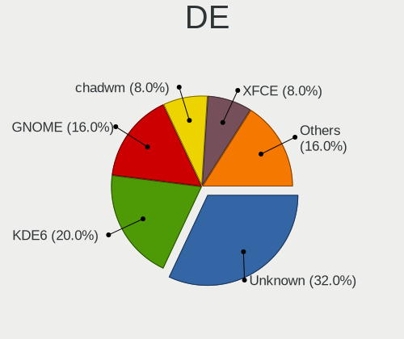
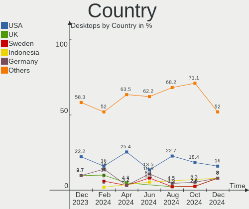
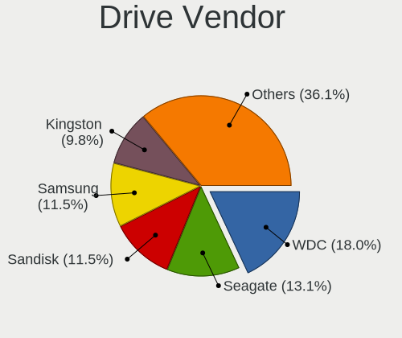
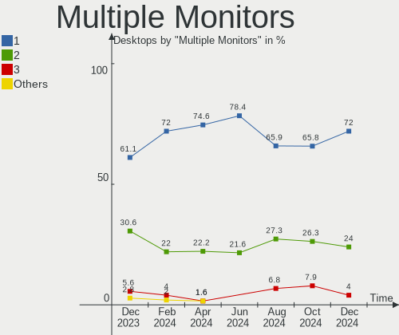
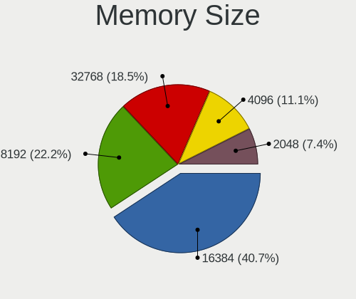

ArcoLinux - Hardware Trends (Desktops)
--------------------------------------

A project to identify most popular hardware characteristics and track their change
over time based on data collected by Linux users at https://Linux-Hardware.org.

Anyone can contribute to this report by the [hw-probe](https://github.com/linuxhw/hw-probe) tool:

    sudo -E hw-probe -all -upload

This report is for one last month. Overall report since the beginning of time: [TestDays](https://github.com/linuxhw/TestDays)

Period: Oct, 2023.

Contents
--------

* [ System ](#system)
  - [ OS                       ](#os)
  - [ OS Family                ](#os-family)
  - [ Kernel                   ](#kernel)
  - [ Kernel Family            ](#kernel-family)
  - [ Kernel Major Ver.        ](#kernel-major-ver)
  - [ Arch                     ](#arch)
  - [ DE                       ](#de)
  - [ Display Server           ](#display-server)
  - [ Display Manager          ](#display-manager)
  - [ OS Lang                  ](#os-lang)
  - [ Boot Mode                ](#boot-mode)
  - [ Filesystem               ](#filesystem)
  - [ Part. scheme             ](#part-scheme)
  - [ Dual Boot with Linux/BSD ](#dual-boot-with-linuxbsd)
  - [ Dual Boot (Win)          ](#dual-boot-win)

* [ Board ](#board)
  - [ Vendor                   ](#vendor)
  - [ Model                    ](#model)
  - [ Model Family             ](#model-family)
  - [ MFG Year                 ](#mfg-year)
  - [ Form Factor              ](#form-factor)
  - [ Secure Boot              ](#secure-boot)
  - [ Coreboot                 ](#coreboot)
  - [ RAM Size                 ](#ram-size)
  - [ RAM Used                 ](#ram-used)
  - [ Total Drives             ](#total-drives)
  - [ Has CD-ROM               ](#has-cd-rom)
  - [ Has Ethernet             ](#has-ethernet)
  - [ Has WiFi                 ](#has-wifi)
  - [ Has Bluetooth            ](#has-bluetooth)

* [ Location ](#location)
  - [ Country                  ](#country)
  - [ City                     ](#city)

* [ Drives ](#drives)
  - [ Drive Vendor             ](#drive-vendor)
  - [ Drive Model              ](#drive-model)
  - [ HDD Vendor               ](#hdd-vendor)
  - [ SSD Vendor               ](#ssd-vendor)
  - [ Drive Kind               ](#drive-kind)
  - [ Drive Connector          ](#drive-connector)
  - [ Drive Size               ](#drive-size)
  - [ Space Total              ](#space-total)
  - [ Space Used               ](#space-used)
  - [ Malfunc. Drives          ](#malfunc-drives)
  - [ Malfunc. Drive Vendor    ](#malfunc-drive-vendor)
  - [ Malfunc. HDD Vendor      ](#malfunc-hdd-vendor)
  - [ Malfunc. Drive Kind      ](#malfunc-drive-kind)
  - [ Failed Drives            ](#failed-drives)
  - [ Failed Drive Vendor      ](#failed-drive-vendor)
  - [ Drive Status             ](#drive-status)

* [ Storage controller ](#storage-controller)
  - [ Storage Vendor           ](#storage-vendor)
  - [ Storage Model            ](#storage-model)
  - [ Storage Kind             ](#storage-kind)

* [ Processor ](#processor)
  - [ CPU Vendor               ](#cpu-vendor)
  - [ CPU Model                ](#cpu-model)
  - [ CPU Model Family         ](#cpu-model-family)
  - [ CPU Cores                ](#cpu-cores)
  - [ CPU Sockets              ](#cpu-sockets)
  - [ CPU Threads              ](#cpu-threads)
  - [ CPU Op-Modes             ](#cpu-op-modes)
  - [ CPU Microcode            ](#cpu-microcode)
  - [ CPU Microarch            ](#cpu-microarch)

* [ Graphics ](#graphics)
  - [ GPU Vendor               ](#gpu-vendor)
  - [ GPU Model                ](#gpu-model)
  - [ GPU Combo                ](#gpu-combo)
  - [ GPU Driver               ](#gpu-driver)
  - [ GPU Memory               ](#gpu-memory)

* [ Monitor ](#monitor)
  - [ Monitor Vendor           ](#monitor-vendor)
  - [ Monitor Model            ](#monitor-model)
  - [ Monitor Resolution       ](#monitor-resolution)
  - [ Monitor Diagonal         ](#monitor-diagonal)
  - [ Monitor Width            ](#monitor-width)
  - [ Aspect Ratio             ](#aspect-ratio)
  - [ Monitor Area             ](#monitor-area)
  - [ Pixel Density            ](#pixel-density)
  - [ Multiple Monitors        ](#multiple-monitors)

* [ Network ](#network)
  - [ Net Controller Vendor    ](#net-controller-vendor)
  - [ Net Controller Model     ](#net-controller-model)
  - [ Wireless Vendor          ](#wireless-vendor)
  - [ Wireless Model           ](#wireless-model)
  - [ Ethernet Vendor          ](#ethernet-vendor)
  - [ Ethernet Model           ](#ethernet-model)
  - [ Net Controller Kind      ](#net-controller-kind)
  - [ Used Controller          ](#used-controller)
  - [ NICs                     ](#nics)
  - [ IPv6                     ](#ipv6)

* [ Bluetooth ](#bluetooth)
  - [ Bluetooth Vendor         ](#bluetooth-vendor)
  - [ Bluetooth Model          ](#bluetooth-model)

* [ Sound ](#sound)
  - [ Sound Vendor             ](#sound-vendor)
  - [ Sound Model              ](#sound-model)

* [ Memory ](#memory)
  - [ Memory Vendor            ](#memory-vendor)
  - [ Memory Model             ](#memory-model)
  - [ Memory Kind              ](#memory-kind)
  - [ Memory Form Factor       ](#memory-form-factor)
  - [ Memory Size              ](#memory-size)
  - [ Memory Speed             ](#memory-speed)

* [ Printers & scanners ](#printers--scanners)
  - [ Printer Vendor           ](#printer-vendor)
  - [ Printer Model            ](#printer-model)
  - [ Scanner Vendor           ](#scanner-vendor)
  - [ Scanner Model            ](#scanner-model)

* [ Camera ](#camera)
  - [ Camera Vendor            ](#camera-vendor)
  - [ Camera Model             ](#camera-model)

* [ Security ](#security)
  - [ Fingerprint Vendor       ](#fingerprint-vendor)
  - [ Fingerprint Model        ](#fingerprint-model)
  - [ Chipcard Vendor          ](#chipcard-vendor)
  - [ Chipcard Model           ](#chipcard-model)

* [ Unsupported ](#unsupported)
  - [ Unsupported Devices      ](#unsupported-devices)
  - [ Unsupported Device Types ](#unsupported-device-types)

System
------

OS
--

Installed operating systems

| Name              | Desktops | Percent |
|-------------------|----------|---------|
| ArcoLinux Rolling | 49       | 100%    |

OS Family
---------

OS without a version

| Name      | Desktops | Percent |
|-----------|----------|---------|
| ArcoLinux | 49       | 100%    |

Kernel
------

Version of the Linux kernel

| Version                    | Desktops | Percent |
|----------------------------|----------|---------|
| 6.5.7-arch1-1              | 10       | 20.41%  |
| 6.5.8-arch1-1              | 5        | 10.2%   |
| 6.5.9-arch2-1              | 4        | 8.16%   |
| 6.5.6-arch2-1              | 4        | 8.16%   |
| 6.5.5-zen1-1-zen           | 3        | 6.12%   |
| 6.5.6-zen2-1-zen           | 2        | 4.08%   |
| 6.5.5-arch1-1              | 2        | 4.08%   |
| 6.4.11-arch1-1             | 2        | 4.08%   |
| 6.1.59-1-lts               | 2        | 4.08%   |
| 6.5.9-zen2-1-zen           | 1        | 2.04%   |
| 6.5.8-zen1-1-zen           | 1        | 2.04%   |
| 6.5.7-zen2-1-zen           | 1        | 2.04%   |
| 6.5.7-zen1-1-zen           | 1        | 2.04%   |
| 6.5.5-hardened1-1-hardened | 1        | 2.04%   |
| 6.5.3-zen1-1-zen           | 1        | 2.04%   |
| 6.5.3-x64v2-xanmod1-1      | 1        | 2.04%   |
| 6.5.3-arch1-1              | 1        | 2.04%   |
| 6.3.8-arch1-1              | 1        | 2.04%   |
| 6.1.58-1-lts               | 1        | 2.04%   |
| 6.1.56-1-lts               | 1        | 2.04%   |
| 6.1.55-1-lts               | 1        | 2.04%   |
| 6.1.53-1-lts               | 1        | 2.04%   |
| 6.1.46-x64v1-xanmod1-1-lts | 1        | 2.04%   |
| 5.16.11-arch1-1            | 1        | 2.04%   |

Kernel Family
-------------

Linux kernel without a distro release

| Version | Desktops | Percent |
|---------|----------|---------|
| 6.5.7   | 12       | 24.49%  |
| 6.5.8   | 6        | 12.24%  |
| 6.5.6   | 6        | 12.24%  |
| 6.5.5   | 6        | 12.24%  |
| 6.5.9   | 5        | 10.2%   |
| 6.5.3   | 3        | 6.12%   |
| 6.4.11  | 2        | 4.08%   |
| 6.1.59  | 2        | 4.08%   |
| 6.3.8   | 1        | 2.04%   |
| 6.1.58  | 1        | 2.04%   |
| 6.1.56  | 1        | 2.04%   |
| 6.1.55  | 1        | 2.04%   |
| 6.1.53  | 1        | 2.04%   |
| 6.1.46  | 1        | 2.04%   |
| 5.16.11 | 1        | 2.04%   |

Kernel Major Ver.
-----------------

Linux kernel major version

| Version | Desktops | Percent |
|---------|----------|---------|
| 6.5     | 38       | 77.55%  |
| 6.1     | 7        | 14.29%  |
| 6.4     | 2        | 4.08%   |
| 6.3     | 1        | 2.04%   |
| 5.16    | 1        | 2.04%   |

Arch
----

OS architecture (x86_64, i586, etc.)

| Name   | Desktops | Percent |
|--------|----------|---------|
| x86_64 | 49       | 100%    |

DE
--

Desktop Environment

| Name          | Desktops | Percent |
|---------------|----------|---------|
| XFCE          | 16       | 32.65%  |
| KDE5          | 11       | 22.45%  |
| GNOME         | 6        | 12.24%  |
| i3            | 5        | 10.2%   |
| Cinnamon      | 3        | 6.12%   |
| Unknown       | 2        | 4.08%   |
| X-Cinnamon    | 1        | 2.04%   |
| LXQt          | 1        | 2.04%   |
| GNOME Classic | 1        | 2.04%   |
| Deepin        | 1        | 2.04%   |
| Budgie        | 1        | 2.04%   |
| awesome       | 1        | 2.04%   |

Display Server
--------------

X11 or Wayland

| Name    | Desktops | Percent |
|---------|----------|---------|
| X11     | 43       | 87.76%  |
| Wayland | 4        | 8.16%   |
| Tty     | 1        | 2.04%   |
| Unknown | 1        | 2.04%   |

Display Manager
---------------

SDDM, LightDM, etc.

| Name    | Desktops | Percent |
|---------|----------|---------|
| SDDM    | 38       | 77.55%  |
| LightDM | 7        | 14.29%  |
| GDM     | 4        | 8.16%   |

OS Lang
-------

Language

| Lang  | Desktops | Percent |
|-------|----------|---------|
| en_US | 19       | 38.78%  |
| pt_BR | 5        | 10.2%   |
| en_GB | 4        | 8.16%   |
| it_IT | 3        | 6.12%   |
| ru_RU | 2        | 4.08%   |
| fr_FR | 2        | 4.08%   |
| en_AU | 2        | 4.08%   |
| zh_CN | 1        | 2.04%   |
| uk_UA | 1        | 2.04%   |
| sv_SE | 1        | 2.04%   |
| nl_NL | 1        | 2.04%   |
| nl_BE | 1        | 2.04%   |
| id_ID | 1        | 2.04%   |
| es_PA | 1        | 2.04%   |
| es_MX | 1        | 2.04%   |
| en_ZA | 1        | 2.04%   |
| en_IN | 1        | 2.04%   |
| en_CA | 1        | 2.04%   |
| C     | 1        | 2.04%   |

Boot Mode
---------

EFI or BIOS

| Mode | Desktops | Percent |
|------|----------|---------|
| EFI  | 40       | 81.63%  |
| BIOS | 9        | 18.37%  |

Filesystem
----------

Type of filesystem

| Type    | Desktops | Percent |
|---------|----------|---------|
| Ext4    | 36       | 73.47%  |
| Btrfs   | 10       | 20.41%  |
| Overlay | 3        | 6.12%   |

Part. scheme
------------

Scheme of partitioning

| Type | Desktops | Percent |
|------|----------|---------|
| GPT  | 46       | 93.88%  |
| MBR  | 3        | 6.12%   |

Dual Boot with Linux/BSD
------------------------

Hosting more than one Linux/BSD

| Dual boot | Desktops | Percent |
|-----------|----------|---------|
| No        | 34       | 69.39%  |
| Yes       | 15       | 30.61%  |

Dual Boot (Win)
---------------

Hosting Linux and Windows

| Dual boot | Desktops | Percent |
|-----------|----------|---------|
| Yes       | 28       | 57.14%  |
| No        | 21       | 42.86%  |

Board
-----

Vendor
------

Motherboard manufacturer

| Name                | Desktops | Percent |
|---------------------|----------|---------|
| Gigabyte Technology | 14       | 28.57%  |
| ASUSTek Computer    | 9        | 18.37%  |
| MSI                 | 4        | 8.16%   |
| Hewlett-Packard     | 4        | 8.16%   |
| Dell                | 4        | 8.16%   |
| Acer                | 4        | 8.16%   |
| ASRock              | 3        | 6.12%   |
| Intel               | 2        | 4.08%   |
| Win element         | 1        | 2.04%   |
| MACHINIST           | 1        | 2.04%   |
| EXPER               | 1        | 2.04%   |
| AMI                 | 1        | 2.04%   |
| Unknown             | 1        | 2.04%   |

Model
-----

Motherboard model

| Name                               | Desktops | Percent |
|------------------------------------|----------|---------|
| Win element M600                   | 1        | 2.04%   |
| MSI MS-7D25                        | 1        | 2.04%   |
| MSI MS-7D09                        | 1        | 2.04%   |
| MSI MS-7C79                        | 1        | 2.04%   |
| MSI MS-7C37                        | 1        | 2.04%   |
| MACHINIST X99-RS9 V2.0             | 1        | 2.04%   |
| Intel HM570                        | 1        | 2.04%   |
| Intel B75                          | 1        | 2.04%   |
| HP ProDesk 600 G1 TWR              | 1        | 2.04%   |
| HP Desktop M01-F1xxx               | 1        | 2.04%   |
| HP Compaq Elite 8300 SFF           | 1        | 2.04%   |
| HP 100-102eom                      | 1        | 2.04%   |
| Gigabyte X570 GAMING X             | 1        | 2.04%   |
| Gigabyte H87N-WIFI                 | 1        | 2.04%   |
| Gigabyte H81M-H                    | 1        | 2.04%   |
| Gigabyte H410M H V3                | 1        | 2.04%   |
| Gigabyte B85N PHOENIX              | 1        | 2.04%   |
| Gigabyte B650 AORUS ELITE AX       | 1        | 2.04%   |
| Gigabyte B550M DS3H                | 1        | 2.04%   |
| Gigabyte B550 AORUS MASTER         | 1        | 2.04%   |
| Gigabyte B550 AORUS ELITE V2       | 1        | 2.04%   |
| Gigabyte B450M DS3H WIFI V2        | 1        | 2.04%   |
| Gigabyte B450M DS3H V2             | 1        | 2.04%   |
| Gigabyte B450 AORUS ELITE          | 1        | 2.04%   |
| Gigabyte AB350M-DS3H V2            | 1        | 2.04%   |
| Gigabyte 990FXA-UD3                | 1        | 2.04%   |
| EXPER ACTION                       | 1        | 2.04%   |
| Dell Vostro 3800                   | 1        | 2.04%   |
| Dell OptiPlex 9010                 | 1        | 2.04%   |
| Dell OptiPlex 780                  | 1        | 2.04%   |
| Dell OptiPlex 5050                 | 1        | 2.04%   |
| ASUS TUF Gaming B450M-PRO II       | 1        | 2.04%   |
| ASUS ROG STRIX X370-F GAMING       | 1        | 2.04%   |
| ASUS ROG STRIX B650E-F GAMING WIFI | 1        | 2.04%   |
| ASUS ROG STRIX B560-I GAMING WIFI  | 1        | 2.04%   |
| ASUS ROG STRIX B560-G GAMING WIFI  | 1        | 2.04%   |
| ASUS ROG Maximus X HERO            | 1        | 2.04%   |
| ASUS ProArt Z690-CREATOR WIFI      | 1        | 2.04%   |
| ASUS PRIME H270-PRO                | 1        | 2.04%   |
| ASUS P8Z68-V GEN3                  | 1        | 2.04%   |

Model Family
------------

Motherboard model prefix

| Name                 | Desktops | Percent |
|----------------------|----------|---------|
| ASUS ROG             | 5        | 10.2%   |
| Dell OptiPlex        | 3        | 6.12%   |
| Gigabyte B550        | 2        | 4.08%   |
| Gigabyte B450M       | 2        | 4.08%   |
| Acer Veriton         | 2        | 4.08%   |
| Win element M600     | 1        | 2.04%   |
| MSI MS-7D25          | 1        | 2.04%   |
| MSI MS-7D09          | 1        | 2.04%   |
| MSI MS-7C79          | 1        | 2.04%   |
| MSI MS-7C37          | 1        | 2.04%   |
| MACHINIST X99-RS9    | 1        | 2.04%   |
| Intel HM570          | 1        | 2.04%   |
| Intel B75            | 1        | 2.04%   |
| HP ProDesk           | 1        | 2.04%   |
| HP Desktop           | 1        | 2.04%   |
| HP Compaq            | 1        | 2.04%   |
| HP 100-102eom        | 1        | 2.04%   |
| Gigabyte X570        | 1        | 2.04%   |
| Gigabyte H87N-WIFI   | 1        | 2.04%   |
| Gigabyte H81M-H      | 1        | 2.04%   |
| Gigabyte H410M       | 1        | 2.04%   |
| Gigabyte B85N        | 1        | 2.04%   |
| Gigabyte B650        | 1        | 2.04%   |
| Gigabyte B550M       | 1        | 2.04%   |
| Gigabyte B450        | 1        | 2.04%   |
| Gigabyte AB350M-DS3H | 1        | 2.04%   |
| Gigabyte 990FXA-UD3  | 1        | 2.04%   |
| EXPER ACTION         | 1        | 2.04%   |
| Dell Vostro          | 1        | 2.04%   |
| ASUS TUF             | 1        | 2.04%   |
| ASUS ProArt          | 1        | 2.04%   |
| ASUS PRIME           | 1        | 2.04%   |
| ASUS P8Z68-V         | 1        | 2.04%   |
| ASRock X670E         | 1        | 2.04%   |
| ASRock B650M         | 1        | 2.04%   |
| ASRock B550M-ITX     | 1        | 2.04%   |
| AMI Intel            | 1        | 2.04%   |
| Acer Predator        | 1        | 2.04%   |
| Acer Nitro           | 1        | 2.04%   |
| Unknown              | 1        | 2.04%   |

MFG Year
--------

Motherboard manufacture year

| Year | Desktops | Percent |
|------|----------|---------|
| 2021 | 9        | 18.37%  |
| 2020 | 9        | 18.37%  |
| 2022 | 7        | 14.29%  |
| 2013 | 7        | 14.29%  |
| 2018 | 5        | 10.2%   |
| 2023 | 2        | 4.08%   |
| 2019 | 2        | 4.08%   |
| 2016 | 2        | 4.08%   |
| 2012 | 2        | 4.08%   |
| 2017 | 1        | 2.04%   |
| 2014 | 1        | 2.04%   |
| 2011 | 1        | 2.04%   |
| 2010 | 1        | 2.04%   |

Form Factor
-----------

Physical design of the computer

| Name    | Desktops | Percent |
|---------|----------|---------|
| Desktop | 49       | 100%    |

Secure Boot
-----------

Enabled or disabled

| State    | Desktops | Percent |
|----------|----------|---------|
| Disabled | 49       | 100%    |

Coreboot
--------

Have coreboot on board

| Used | Desktops | Percent |
|------|----------|---------|
| No   | 49       | 100%    |

RAM Size
--------

Total RAM memory

| Size in GB  | Desktops | Percent |
|-------------|----------|---------|
| 32.01-64.0  | 15       | 30.61%  |
| 16.01-24.0  | 14       | 28.57%  |
| 64.01-256.0 | 6        | 12.24%  |
| 8.01-16.0   | 6        | 12.24%  |
| 4.01-8.0    | 3        | 6.12%   |
| 3.01-4.0    | 3        | 6.12%   |
| 24.01-32.0  | 2        | 4.08%   |

RAM Used
--------

Used RAM memory

| Used GB   | Desktops | Percent |
|-----------|----------|---------|
| 1.01-2.0  | 15       | 30.61%  |
| 2.01-3.0  | 14       | 28.57%  |
| 4.01-8.0  | 9        | 18.37%  |
| 3.01-4.0  | 6        | 12.24%  |
| 8.01-16.0 | 4        | 8.16%   |
| 0.51-1.0  | 1        | 2.04%   |

Total Drives
------------

Number of drives on board

| Drives | Desktops | Percent |
|--------|----------|---------|
| 2      | 13       | 26.53%  |
| 1      | 11       | 22.45%  |
| 3      | 9        | 18.37%  |
| 5      | 5        | 10.2%   |
| 4      | 5        | 10.2%   |
| 6      | 4        | 8.16%   |
| 8      | 1        | 2.04%   |
| 7      | 1        | 2.04%   |

Has CD-ROM
----------

Has CD-ROM on board

| Presented | Desktops | Percent |
|-----------|----------|---------|
| No        | 41       | 83.67%  |
| Yes       | 8        | 16.33%  |

Has Ethernet
------------

Has Ethernet on board

| Presented | Desktops | Percent |
|-----------|----------|---------|
| Yes       | 49       | 100%    |

Has WiFi
--------

Has WiFi module

| Presented | Desktops | Percent |
|-----------|----------|---------|
| Yes       | 31       | 63.27%  |
| No        | 18       | 36.73%  |

Has Bluetooth
-------------

Has Bluetooth module

| Presented | Desktops | Percent |
|-----------|----------|---------|
| Yes       | 30       | 61.22%  |
| No        | 19       | 38.78%  |

Location
--------

Country
-------

Geographic location (country)

| Country      | Desktops | Percent |
|--------------|----------|---------|
| USA          | 8        | 16.33%  |
| Brazil       | 5        | 10.2%   |
| UK           | 3        | 6.12%   |
| Italy        | 3        | 6.12%   |
| Australia    | 3        | 6.12%   |
| Sweden       | 2        | 4.08%   |
| India        | 2        | 4.08%   |
| France       | 2        | 4.08%   |
| China        | 2        | 4.08%   |
| Canada       | 2        | 4.08%   |
| Belgium      | 2        | 4.08%   |
| Turkey       | 1        | 2.04%   |
| South Korea  | 1        | 2.04%   |
| South Africa | 1        | 2.04%   |
| Saudi Arabia | 1        | 2.04%   |
| Russia       | 1        | 2.04%   |
| Romania      | 1        | 2.04%   |
| Panama       | 1        | 2.04%   |
| Pakistan     | 1        | 2.04%   |
| Mexico       | 1        | 2.04%   |
| Kenya        | 1        | 2.04%   |
| Iran         | 1        | 2.04%   |
| Indonesia    | 1        | 2.04%   |
| Germany      | 1        | 2.04%   |
| Egypt        | 1        | 2.04%   |
| Austria      | 1        | 2.04%   |

City
----

Geographic location (city)

| City                   | Desktops | Percent |
|------------------------|----------|---------|
| Adelaide               | 2        | 4.08%   |
| Yangcheon-gu           | 1        | 2.04%   |
| Xiamen                 | 1        | 2.04%   |
| Wilrijk                | 1        | 2.04%   |
| Vienna                 | 1        | 2.04%   |
| Vicosa                 | 1        | 2.04%   |
| Vancouver              | 1        | 2.04%   |
| Terranuova Bracciolini | 1        | 2.04%   |
| Tehran                 | 1        | 2.04%   |
| Stockholm              | 1        | 2.04%   |
| Solna                  | 1        | 2.04%   |
| Sao Paulo              | 1        | 2.04%   |
| San Jose               | 1        | 2.04%   |
| Rudolstadt             | 1        | 2.04%   |
| Rosu                   | 1        | 2.04%   |
| Rio de Janeiro         | 1        | 2.04%   |
| Porto Alegre           | 1        | 2.04%   |
| Perth                  | 1        | 2.04%   |
| Panama City            | 1        | 2.04%   |
| Occhiobello            | 1        | 2.04%   |
| Nairobi                | 1        | 2.04%   |
| Mataram                | 1        | 2.04%   |
| Los Angeles            | 1        | 2.04%   |
| Leicester              | 1        | 2.04%   |
| La Paz                 | 1        | 2.04%   |
| Kudrovo                | 1        | 2.04%   |
| Kortrijk               | 1        | 2.04%   |
| Kolkata                | 1        | 2.04%   |
| Kinston                | 1        | 2.04%   |
| Karachi                | 1        | 2.04%   |
| Johannesburg           | 1        | 2.04%   |
| Jamaica Plain          | 1        | 2.04%   |
| Istanbul               | 1        | 2.04%   |
| Hangzhou               | 1        | 2.04%   |
| Grants Pass            | 1        | 2.04%   |
| Giza                   | 1        | 2.04%   |
| Foggia                 | 1        | 2.04%   |
| Erith                  | 1        | 2.04%   |
| Denham Springs         | 1        | 2.04%   |
| Calgary                | 1        | 2.04%   |

Drives
------

Drive Vendor
------------

Hard drive vendors

| Vendor                       | Desktops | Drives | Percent |
|------------------------------|----------|--------|---------|
| WDC                          | 21       | 24     | 16.28%  |
| Seagate                      | 19       | 27     | 14.73%  |
| Samsung Electronics          | 16       | 21     | 12.4%   |
| Silicon Motion               | 7        | 7      | 5.43%   |
| Sandisk                      | 7        | 7      | 5.43%   |
| Kingston                     | 6        | 6      | 4.65%   |
| Toshiba                      | 5        | 5      | 3.88%   |
| Phison Electronics           | 5        | 6      | 3.88%   |
| A-DATA Technology            | 5        | 6      | 3.88%   |
| Crucial                      | 4        | 4      | 3.1%    |
| China                        | 4        | 4      | 3.1%    |
| Realtek Semiconductor        | 2        | 2      | 1.55%   |
| Lexar                        | 2        | 2      | 1.55%   |
| Apacer                       | 2        | 2      | 1.55%   |
| Unknown                      | 1        | 1      | 0.78%   |
| Transcend                    | 1        | 1      | 0.78%   |
| T-FORCE                      | 1        | 1      | 0.78%   |
| SPCC                         | 1        | 1      | 0.78%   |
| SK hynix                     | 1        | 1      | 0.78%   |
| Shenzhen Longsys Electronics | 1        | 2      | 0.78%   |
| Seagate Technology           | 1        | 1      | 0.78%   |
| SCY                          | 1        | 1      | 0.78%   |
| PNY                          | 1        | 1      | 0.78%   |
| Micron/Crucial Technology    | 1        | 1      | 0.78%   |
| Maxtor                       | 1        | 1      | 0.78%   |
| MAXIO Technology (Hangzhou)  | 1        | 1      | 0.78%   |
| Kingston Technology Company  | 1        | 1      | 0.78%   |
| KingDian                     | 1        | 1      | 0.78%   |
| JMicron Technology           | 1        | 1      | 0.78%   |
| Hitachi                      | 1        | 1      | 0.78%   |
| Hewlett-Packard              | 1        | 1      | 0.78%   |
| Fujitsu                      | 1        | 1      | 0.78%   |
| Colorful                     | 1        | 1      | 0.78%   |
| ASMT                         | 1        | 1      | 0.78%   |
| aigo                         | 1        | 1      | 0.78%   |
| ADATA Technology             | 1        | 1      | 0.78%   |
| ADATA SU                     | 1        | 1      | 0.78%   |
| Acer                         | 1        | 1      | 0.78%   |

Drive Model
-----------

Hard drive models

| Model                                                 | Desktops | Percent |
|-------------------------------------------------------|----------|---------|
| Silicon Motion SM2263EN/SM2263XT SSD Controller 256GB | 5        | 3.52%   |
| Samsung NVMe SSD Controller PM9A1/PM9A3/980PRO 1TB    | 4        | 2.82%   |
| Phison E12 NVMe Controller 1TB                        | 3        | 2.11%   |
| WDC WDS500G2B0A-00SM50 500GB SSD                      | 2        | 1.41%   |
| WDC WD4005FZBX-00K5WB0 4TB                            | 2        | 1.41%   |
| WDC WD20EZAZ-00GGJB0 2TB                              | 2        | 1.41%   |
| WDC WD10EZEX-08WN4A0 1TB                              | 2        | 1.41%   |
| Silicon Motion SM2262/SM2262EN SSD Controller 2TB     | 2        | 1.41%   |
| Seagate ST31000524AS 1TB                              | 2        | 1.41%   |
| Seagate ST1000DM010-2EP102 1TB                        | 2        | 1.41%   |
| Seagate ST1000DM003-1CH162 1TB                        | 2        | 1.41%   |
| Samsung SSD 850 EVO 250GB                             | 2        | 1.41%   |
| Samsung NVMe SSD Controller SM981/PM981/PM983 1TB     | 2        | 1.41%   |
| Kingston SKC3000S1024G 1TB                            | 2        | 1.41%   |
| Kingston SA400S37240G 240GB SSD                       | 2        | 1.41%   |
| WDC WDS250G2B0A-00SM50 250GB SSD                      | 1        | 0.7%    |
| WDC WDBNCE0010PNC 1TB SSD                             | 1        | 0.7%    |
| WDC WD5000LPVX-00V0TT0 500GB                          | 1        | 0.7%    |
| WDC WD5000AAKX-75U6AA0 500GB                          | 1        | 0.7%    |
| WDC WD5000AAKS-00UU3A0 500GB                          | 1        | 0.7%    |
| WDC WD5000AAKS-007AA0 500GB                           | 1        | 0.7%    |
| WDC WD40EZRZ-22GXCB0 4TB                              | 1        | 0.7%    |
| WDC WD40EZAZ-00SF3B0 4TB                              | 1        | 0.7%    |
| WDC WD3200BEVT-75ZCT2 320GB                           | 1        | 0.7%    |
| WDC WD20EZRZ-00Z5HB0 2TB                              | 1        | 0.7%    |
| WDC WD20EZRX-00D8PB0 2TB                              | 1        | 0.7%    |
| WDC WD10EZEX-21WN4A0 1TB                              | 1        | 0.7%    |
| WDC WD10EZEX-08M2NA0 1TB                              | 1        | 0.7%    |
| WDC WD10EZEX-00BN5A0 1TB                              | 1        | 0.7%    |
| WDC WD100EFAX-68LHPN0 10TB                            | 1        | 0.7%    |
| Unknown NVMe SSD Drive 512GB                          | 1        | 0.7%    |
| Transcend TS1TSSD230S 1TB                             | 1        | 0.7%    |
| Toshiba XG6 NVMe SSD Controller 256GB                 | 1        | 0.7%    |
| Toshiba Q300 240GB SSD                                | 1        | 0.7%    |
| Toshiba HDWD120 2TB                                   | 1        | 0.7%    |
| Toshiba DT01ACA100 1TB                                | 1        | 0.7%    |
| Toshiba DT01ACA050 500GB                              | 1        | 0.7%    |
| T-FORCE SSD 1TB                                       | 1        | 0.7%    |
| SPCC Solid State Disk 240GB                           | 1        | 0.7%    |
| SK hynix HFS128G39TND-N210A 128GB SSD                 | 1        | 0.7%    |

HDD Vendor
----------

Hard disk drive vendors

| Vendor              | Desktops | Drives | Percent |
|---------------------|----------|--------|---------|
| Seagate             | 19       | 26     | 41.3%   |
| WDC                 | 18       | 20     | 39.13%  |
| Toshiba             | 3        | 3      | 6.52%   |
| Samsung Electronics | 3        | 3      | 6.52%   |
| Maxtor              | 1        | 1      | 2.17%   |
| Hitachi             | 1        | 1      | 2.17%   |
| Fujitsu             | 1        | 1      | 2.17%   |

SSD Vendor
----------

Solid state drive vendors

| Vendor              | Desktops | Drives | Percent |
|---------------------|----------|--------|---------|
| Samsung Electronics | 8        | 11     | 16.67%  |
| A-DATA Technology   | 5        | 6      | 10.42%  |
| WDC                 | 4        | 4      | 8.33%   |
| Crucial             | 4        | 4      | 8.33%   |
| China               | 4        | 4      | 8.33%   |
| SanDisk             | 3        | 3      | 6.25%   |
| Kingston            | 3        | 3      | 6.25%   |
| Lexar               | 2        | 2      | 4.17%   |
| Apacer              | 2        | 2      | 4.17%   |
| Transcend           | 1        | 1      | 2.08%   |
| Toshiba             | 1        | 1      | 2.08%   |
| T-FORCE             | 1        | 1      | 2.08%   |
| SPCC                | 1        | 1      | 2.08%   |
| SK hynix            | 1        | 1      | 2.08%   |
| SCY                 | 1        | 1      | 2.08%   |
| PNY                 | 1        | 1      | 2.08%   |
| KingDian            | 1        | 1      | 2.08%   |
| Hewlett-Packard     | 1        | 1      | 2.08%   |
| Colorful            | 1        | 1      | 2.08%   |
| aigo                | 1        | 1      | 2.08%   |
| ADATA SU            | 1        | 1      | 2.08%   |
| Acer                | 1        | 1      | 2.08%   |

Drive Kind
----------

HDD or SSD

| Kind | Desktops | Drives | Percent |
|------|----------|--------|---------|
| SSD  | 35       | 52     | 38.04%  |
| HDD  | 33       | 55     | 35.87%  |
| NVMe | 24       | 41     | 26.09%  |

Drive Connector
---------------

SATA, SAS, NVMe, etc.

| Type | Desktops | Drives | Percent |
|------|----------|--------|---------|
| SATA | 44       | 101    | 58.67%  |
| NVMe | 23       | 39     | 30.67%  |
| SAS  | 8        | 8      | 10.67%  |

Drive Size
----------

Size of hard drive

| Size in TB | Desktops | Drives | Percent |
|------------|----------|--------|---------|
| 0.01-0.5   | 31       | 46     | 40.26%  |
| 0.51-1.0   | 23       | 31     | 29.87%  |
| 1.01-2.0   | 12       | 17     | 15.58%  |
| 3.01-4.0   | 5        | 6      | 6.49%   |
| 4.01-10.0  | 3        | 4      | 3.9%    |
| 2.01-3.0   | 2        | 2      | 2.6%    |
| 10.01-20.0 | 1        | 1      | 1.3%    |

Space Total
-----------

Amount of disk space available on the file system

| Size in GB     | Desktops | Percent |
|----------------|----------|---------|
| More than 3000 | 15       | 30.61%  |
| 251-500        | 11       | 22.45%  |
| 501-1000       | 8        | 16.33%  |
| 101-250        | 6        | 12.24%  |
| 1001-2000      | 4        | 8.16%   |
| 2001-3000      | 3        | 6.12%   |
| 51-100         | 1        | 2.04%   |
| Unknown        | 1        | 2.04%   |

Space Used
----------

Amount of used disk space

| Used GB        | Desktops | Percent |
|----------------|----------|---------|
| 1-20           | 10       | 20.41%  |
| 1001-2000      | 9        | 18.37%  |
| 251-500        | 6        | 12.24%  |
| 101-250        | 6        | 12.24%  |
| More than 3000 | 4        | 8.16%   |
| 2001-3000      | 4        | 8.16%   |
| 51-100         | 4        | 8.16%   |
| 501-1000       | 3        | 6.12%   |
| 21-50          | 2        | 4.08%   |
| Unknown        | 1        | 2.04%   |

Malfunc. Drives
---------------

Drive models with a malfunction

| Model                                                 | Desktops | Drives | Percent |
|-------------------------------------------------------|----------|--------|---------|
| WDC WD5000AAKX-75U6AA0 500GB                          | 1        | 1      | 5%      |
| WDC WD5000AAKS-007AA0 500GB                           | 1        | 1      | 5%      |
| WDC WD20EZRX-00D8PB0 2TB                              | 1        | 1      | 5%      |
| Silicon Motion SM2263EN/SM2263XT SSD Controller 256GB | 1        | 1      | 5%      |
| Seagate ST500DM002-1BD142 500GB                       | 1        | 1      | 5%      |
| Seagate ST3500418AS 500GB                             | 1        | 1      | 5%      |
| Seagate ST31000524AS 1TB                              | 1        | 1      | 5%      |
| Seagate ST2000DM001-1ER164 2TB                        | 1        | 2      | 5%      |
| Seagate ST2000DM001-1CH164 2TB                        | 1        | 1      | 5%      |
| Seagate ST1000DM010-2EP102 1TB                        | 1        | 1      | 5%      |
| SanDisk SSD PLUS 1000GB                               | 1        | 1      | 5%      |
| Samsung Electronics SSD 870 EVO 500GB                 | 1        | 1      | 5%      |
| Samsung Electronics HM500JI 500GB                     | 1        | 1      | 5%      |
| Samsung Electronics HD502IJ 500GB                     | 1        | 1      | 5%      |
| Maxtor 6B200M0 208GB                                  | 1        | 1      | 5%      |
| Hitachi HDP725050GLA360 500GB                         | 1        | 1      | 5%      |
| Fujitsu MHZ2320BH G2 320GB                            | 1        | 1      | 5%      |
| Crucial M4-CT128M4SSD2 128GB                          | 1        | 1      | 5%      |
| Colorful SL500 240GB SSD                              | 1        | 1      | 5%      |
| A-DATA Technology SU650 960GB SSD                     | 1        | 2      | 5%      |

Malfunc. Drive Vendor
---------------------

Vendors of faulty drives

| Vendor              | Desktops | Drives | Percent |
|---------------------|----------|--------|---------|
| Seagate             | 6        | 7      | 30%     |
| WDC                 | 3        | 3      | 15%     |
| Samsung Electronics | 3        | 3      | 15%     |
| Silicon Motion      | 1        | 1      | 5%      |
| SanDisk             | 1        | 1      | 5%      |
| Maxtor              | 1        | 1      | 5%      |
| Hitachi             | 1        | 1      | 5%      |
| Fujitsu             | 1        | 1      | 5%      |
| Crucial             | 1        | 1      | 5%      |
| Colorful            | 1        | 1      | 5%      |
| A-DATA Technology   | 1        | 2      | 5%      |

Malfunc. HDD Vendor
-------------------

Vendors of faulty HDD drives

| Vendor              | Desktops | Drives | Percent |
|---------------------|----------|--------|---------|
| Seagate             | 6        | 7      | 42.86%  |
| WDC                 | 3        | 3      | 21.43%  |
| Samsung Electronics | 2        | 2      | 14.29%  |
| Maxtor              | 1        | 1      | 7.14%   |
| Hitachi             | 1        | 1      | 7.14%   |
| Fujitsu             | 1        | 1      | 7.14%   |

Malfunc. Drive Kind
-------------------

Kinds of faulty drives

| Kind | Desktops | Drives | Percent |
|------|----------|--------|---------|
| HDD  | 12       | 15     | 66.67%  |
| SSD  | 5        | 6      | 27.78%  |
| NVMe | 1        | 1      | 5.56%   |

Failed Drives
-------------

Failed drive models

Zero info for selected period =(

Failed Drive Vendor
-------------------

Failed drive vendors

Zero info for selected period =(

Drive Status
------------

Number of failed and malfunc. drives

| Status   | Desktops | Drives | Percent |
|----------|----------|--------|---------|
| Works    | 45       | 116    | 63.38%  |
| Malfunc  | 18       | 22     | 25.35%  |
| Detected | 8        | 10     | 11.27%  |

Storage controller
------------------

Storage Vendor
--------------

Storage controller vendors

| Vendor                       | Desktops | Percent |
|------------------------------|----------|---------|
| Intel                        | 28       | 32.18%  |
| AMD                          | 20       | 22.99%  |
| Silicon Motion               | 7        | 8.05%   |
| Samsung Electronics          | 5        | 5.75%   |
| Phison Electronics           | 5        | 5.75%   |
| SanDisk                      | 4        | 4.6%    |
| Kingston Technology Company  | 4        | 4.6%    |
| Seagate Technology           | 2        | 2.3%    |
| Realtek Semiconductor        | 2        | 2.3%    |
| ASMedia Technology           | 2        | 2.3%    |
| Toshiba America Info Systems | 1        | 1.15%   |
| Shenzhen Longsys Electronics | 1        | 1.15%   |
| Micron/Crucial Technology    | 1        | 1.15%   |
| MAXIO Technology (Hangzhou)  | 1        | 1.15%   |
| Marvell Technology Group     | 1        | 1.15%   |
| JMicron Technology           | 1        | 1.15%   |
| INNOGRIT                     | 1        | 1.15%   |
| ADATA Technology             | 1        | 1.15%   |

Storage Model
-------------

Storage controller models

| Model                                                                          | Desktops | Percent |
|--------------------------------------------------------------------------------|----------|---------|
| AMD FCH SATA Controller [AHCI mode]                                            | 12       | 12.24%  |
| Silicon Motion SM2263EN/SM2263XT (DRAM-less) NVMe SSD Controllers              | 5        | 5.1%    |
| Intel 8 Series/C220 Series Chipset Family 6-port SATA Controller 1 [AHCI mode] | 5        | 5.1%    |
| Intel 500 Series Chipset Family SATA AHCI Controller                           | 5        | 5.1%    |
| AMD 400 Series Chipset SATA Controller                                         | 5        | 5.1%    |
| Samsung NVMe SSD Controller PM9A1/PM9A3/980PRO                                 | 4        | 4.08%   |
| AMD 500 Series Chipset SATA Controller                                         | 4        | 4.08%   |
| Phison E12 NVMe Controller                                                     | 3        | 3.06%   |
| Kingston Company KC3000/FURY Renegade NVMe SSD E18                             | 3        | 3.06%   |
| Intel 200 Series PCH SATA controller [AHCI mode]                               | 3        | 3.06%   |
| Silicon Motion SM2262/SM2262EN SSD Controller                                  | 2        | 2.04%   |
| Samsung NVMe SSD Controller SM981/PM981/PM983                                  | 2        | 2.04%   |
| Realtek RTS5765DL NVMe SSD Controller (DRAM-less)                              | 2        | 2.04%   |
| Intel Alder Lake-S PCH SATA Controller [AHCI Mode]                             | 2        | 2.04%   |
| Intel 7 Series/C210 Series Chipset Family 6-port SATA Controller [AHCI mode]   | 2        | 2.04%   |
| Intel 6 Series/C200 Series Chipset Family 6 port Desktop SATA AHCI Controller  | 2        | 2.04%   |
| ASMedia ASM1062 Serial ATA Controller                                          | 2        | 2.04%   |
| AMD SB7x0/SB8x0/SB9x0 SATA Controller [AHCI mode]                              | 2        | 2.04%   |
| Toshiba America Info Systems XG6 NVMe SSD Controller                           | 1        | 1.02%   |
| Shenzhen Longsys Non-Volatile memory controller                                | 1        | 1.02%   |
| Seagate FireCuda/IronWolf 510 SSD                                              | 1        | 1.02%   |
| Seagate FireCuda 530 SSD                                                       | 1        | 1.02%   |
| SanDisk WD Black SN770 / PC SN740 256GB / PC SN560 (DRAM-less) NVMe SSD        | 1        | 1.02%   |
| SanDisk Ultra 3D / WD Blue SN570 NVMe SSD (DRAM-less)                          | 1        | 1.02%   |
| SanDisk Ultra 3D / WD Blue SN550 NVMe SSD                                      | 1        | 1.02%   |
| SanDisk PC SN735 NVMe SSD (DRAM-less)                                          | 1        | 1.02%   |
| Samsung NVMe SSD Controller SM961/PM961/SM963                                  | 1        | 1.02%   |
| Phison PS5013-E13 PCIe3 NVMe Controller (DRAM-less)                            | 1        | 1.02%   |
| Phison E16 PCIe4 NVMe Controller                                               | 1        | 1.02%   |
| Micron/Crucial P2 [Nick P2] / P3 / P3 Plus NVMe PCIe SSD (DRAM-less)           | 1        | 1.02%   |
| MAXIO (Hangzhou) NVMe SSD Controller MAP1001                                   | 1        | 1.02%   |
| Marvell Group 88SE9172 SATA 6Gb/s Controller                                   | 1        | 1.02%   |
| Kingston Company NV2 NVMe SSD SM2267XT                                         | 1        | 1.02%   |
| JMicron JMB362 SATA Controller                                                 | 1        | 1.02%   |
| Intel Volume Management Device NVMe RAID Controller                            | 1        | 1.02%   |
| Intel Tiger Lake SATA AHCI Controller                                          | 1        | 1.02%   |
| Intel SATA controller                                                          | 1        | 1.02%   |
| Intel Q170/Q150/B150/H170/H110/Z170/CM236 Chipset SATA Controller [AHCI Mode]  | 1        | 1.02%   |
| Intel Comet Lake SATA AHCI Controller                                          | 1        | 1.02%   |
| Intel Comet Lake PCH-H RAID                                                    | 1        | 1.02%   |

Storage Kind
------------

Kind of storage controller (IDE, SATA, NVMe, SAS, ...)

| Kind | Desktops | Percent |
|------|----------|---------|
| SATA | 44       | 60.27%  |
| NVMe | 23       | 31.51%  |
| IDE  | 4        | 5.48%   |
| RAID | 2        | 2.74%   |

Processor
---------

CPU Vendor
----------

Processor vendors

| Vendor | Desktops | Percent |
|--------|----------|---------|
| Intel  | 28       | 57.14%  |
| AMD    | 21       | 42.86%  |

CPU Model
---------

Processor models

| Model                                         | Desktops | Percent |
|-----------------------------------------------|----------|---------|
| Intel Core i7-3770 CPU @ 3.40GHz              | 2        | 4.08%   |
| Intel Core i7-10700K CPU @ 3.80GHz            | 2        | 4.08%   |
| Intel 11th Gen Core i5-11600K @ 3.90GHz       | 2        | 4.08%   |
| AMD Ryzen 9 5900X 12-Core Processor           | 2        | 4.08%   |
| AMD Ryzen 7 3800X 8-Core Processor            | 2        | 4.08%   |
| Intel Xeon CPU E5-2666 v3 @ 2.90GHz           | 1        | 2.04%   |
| Intel N100                                    | 1        | 2.04%   |
| Intel Genuine CPU 0000 @ 2.60GHz              | 1        | 2.04%   |
| Intel Core i7-8700K CPU @ 3.70GHz             | 1        | 2.04%   |
| Intel Core i7-8700 CPU @ 3.20GHz              | 1        | 2.04%   |
| Intel Core i7-7700 CPU @ 3.60GHz              | 1        | 2.04%   |
| Intel Core i7-10700 CPU @ 2.90GHz             | 1        | 2.04%   |
| Intel Core i5-7500 CPU @ 3.40GHz              | 1        | 2.04%   |
| Intel Core i5-6500T CPU @ 2.50GHz             | 1        | 2.04%   |
| Intel Core i5-4570T CPU @ 2.90GHz             | 1        | 2.04%   |
| Intel Core i5-4570S CPU @ 2.90GHz             | 1        | 2.04%   |
| Intel Core i5-3570 CPU @ 3.40GHz              | 1        | 2.04%   |
| Intel Core i5-2500K CPU @ 3.30GHz             | 1        | 2.04%   |
| Intel Core i3-4170 CPU @ 3.70GHz              | 1        | 2.04%   |
| Intel Core i3-4130 CPU @ 3.40GHz              | 1        | 2.04%   |
| Intel Core i3-3250 CPU @ 3.50GHz              | 1        | 2.04%   |
| Intel Core i3-10105 CPU @ 3.70GHz             | 1        | 2.04%   |
| Intel Core i3-10100F CPU @ 3.60GHz            | 1        | 2.04%   |
| Intel Core 2 Duo CPU E7500 @ 2.93GHz          | 1        | 2.04%   |
| Intel Cnre i5-4590S CPU @ 3.00GHz             | 1        | 2.04%   |
| Intel 12th Gen Core i7-12700K                 | 1        | 2.04%   |
| Intel 12th Gen Core i3-12100F                 | 1        | 2.04%   |
| AMD Ryzen 9 7950X3D 16-Core Processor         | 1        | 2.04%   |
| AMD Ryzen 9 7950X 16-Core Processor           | 1        | 2.04%   |
| AMD Ryzen 9 7900X 12-Core Processor           | 1        | 2.04%   |
| AMD Ryzen 9 6900HX with Radeon Graphics       | 1        | 2.04%   |
| AMD Ryzen 7 7700X 8-Core Processor            | 1        | 2.04%   |
| AMD Ryzen 7 4700G with Radeon Graphics        | 1        | 2.04%   |
| AMD Ryzen 7 3750H with Radeon Vega Mobile Gfx | 1        | 2.04%   |
| AMD Ryzen 7 3700X 8-Core Processor            | 1        | 2.04%   |
| AMD Ryzen 7 2700X Eight-Core Processor        | 1        | 2.04%   |
| AMD Ryzen 7 2700 Eight-Core Processor         | 1        | 2.04%   |
| AMD Ryzen 5 5600G with Radeon Graphics        | 1        | 2.04%   |
| AMD Ryzen 5 5600 6-Core Processor             | 1        | 2.04%   |
| AMD Ryzen 5 3600XT 6-Core Processor           | 1        | 2.04%   |

CPU Model Family
----------------

Processor model prefix

| Model            | Desktops | Percent |
|------------------|----------|---------|
| Intel Core i7    | 8        | 16.33%  |
| AMD Ryzen 7      | 8        | 16.33%  |
| Other            | 6        | 12.24%  |
| Intel Core i5    | 6        | 12.24%  |
| AMD Ryzen 9      | 6        | 12.24%  |
| Intel Core i3    | 5        | 10.2%   |
| AMD Ryzen 5      | 5        | 10.2%   |
| Intel Xeon       | 1        | 2.04%   |
| Intel Genuine    | 1        | 2.04%   |
| Intel Core 2 Duo | 1        | 2.04%   |
| AMD FX           | 1        | 2.04%   |
| AMD E1           | 1        | 2.04%   |

CPU Cores
---------

Number of processor cores

| Number | Desktops | Percent |
|--------|----------|---------|
| 4      | 15       | 30.61%  |
| 8      | 12       | 24.49%  |
| 6      | 9        | 18.37%  |
| 2      | 6        | 12.24%  |
| 12     | 4        | 8.16%   |
| 16     | 2        | 4.08%   |
| 10     | 1        | 2.04%   |

CPU Sockets
-----------

Number of sockets

| Number | Desktops | Percent |
|--------|----------|---------|
| 1      | 49       | 100%    |

CPU Threads
-----------

Threads per core (Hyper-Threading)

| Number | Desktops | Percent |
|--------|----------|---------|
| 2      | 39       | 79.59%  |
| 1      | 10       | 20.41%  |

CPU Op-Modes
------------

CPU Operation Modes (32-bit, 64-bit)

| Op mode        | Desktops | Percent |
|----------------|----------|---------|
| 32-bit, 64-bit | 49       | 100%    |

CPU Microcode
-------------

Microcode number

| Number     | Desktops | Percent |
|------------|----------|---------|
| Unknown    | 24       | 48.98%  |
| 0x0a601203 | 3        | 6.12%   |
| 0x08701030 | 3        | 6.12%   |
| 0x08701021 | 3        | 6.12%   |
| 0x306a9    | 2        | 4.08%   |
| 0x0800820d | 2        | 4.08%   |
| 0xa0655    | 1        | 2.04%   |
| 0xa0653    | 1        | 2.04%   |
| 0x906e9    | 1        | 2.04%   |
| 0x0a601201 | 1        | 2.04%   |
| 0x0a50000f | 1        | 2.04%   |
| 0x0a20120a | 1        | 2.04%   |
| 0x0a201025 | 1        | 2.04%   |
| 0x0a201016 | 1        | 2.04%   |
| 0x08600104 | 1        | 2.04%   |
| 0x08108109 | 1        | 2.04%   |
| 0x06000822 | 1        | 2.04%   |
| 0x05000119 | 1        | 2.04%   |

CPU Microarch
-------------

Microarchitecture

| Name             | Desktops | Percent |
|------------------|----------|---------|
| Zen 2            | 7        | 14.29%  |
| Haswell          | 6        | 12.24%  |
| CometLake        | 5        | 10.2%   |
| Unknown          | 5        | 10.2%   |
| Zen 3            | 4        | 8.16%   |
| KabyLake         | 4        | 8.16%   |
| IvyBridge        | 4        | 8.16%   |
| Zen+             | 3        | 6.12%   |
| Icelake          | 3        | 6.12%   |
| Alderlake Hybrid | 2        | 4.08%   |
| Skylake          | 1        | 2.04%   |
| SandyBridge      | 1        | 2.04%   |
| Piledriver       | 1        | 2.04%   |
| Penryn           | 1        | 2.04%   |
| Gracemont        | 1        | 2.04%   |
| Bobcat           | 1        | 2.04%   |

Graphics
--------

GPU Vendor
----------

Vendors of graphics cards

| Vendor | Desktops | Percent |
|--------|----------|---------|
| AMD    | 21       | 41.18%  |
| Nvidia | 18       | 35.29%  |
| Intel  | 12       | 23.53%  |

GPU Model
---------

Graphics card models

| Model                                                                       | Desktops | Percent |
|-----------------------------------------------------------------------------|----------|---------|
| AMD Ellesmere [Radeon RX 470/480/570/570X/580/580X/590]                     | 6        | 11.11%  |
| Intel Xeon E3-1200 v3/4th Gen Core Processor Integrated Graphics Controller | 3        | 5.56%   |
| AMD Raphael                                                                 | 3        | 5.56%   |
| Nvidia GP104 [GeForce GTX 1070]                                             | 2        | 3.7%    |
| Nvidia GA106 [GeForce RTX 3060 Lite Hash Rate]                              | 2        | 3.7%    |
| Nvidia GA102 [GeForce RTX 3080 Lite Hash Rate]                              | 2        | 3.7%    |
| Intel HD Graphics 630                                                       | 2        | 3.7%    |
| AMD Navi 31 [Radeon RX 7900 XT/7900 XTX]                                    | 2        | 3.7%    |
| Nvidia TU116 [GeForce GTX 1660]                                             | 1        | 1.85%   |
| Nvidia TU116 [GeForce GTX 1660 Ti]                                          | 1        | 1.85%   |
| Nvidia TU116 [GeForce GTX 1660 SUPER]                                       | 1        | 1.85%   |
| Nvidia TU106 [GeForce RTX 2060 SUPER]                                       | 1        | 1.85%   |
| Nvidia TU106 [GeForce RTX 2060 Rev. A]                                      | 1        | 1.85%   |
| Nvidia GP107 [GeForce GTX 1050 Ti]                                          | 1        | 1.85%   |
| Nvidia GP106 [GeForce GTX 1060 6GB]                                         | 1        | 1.85%   |
| Nvidia GM206 [GeForce GTX 960]                                              | 1        | 1.85%   |
| Nvidia GM204 [GeForce GTX 980]                                              | 1        | 1.85%   |
| Nvidia GK208B [GeForce GT 710]                                              | 1        | 1.85%   |
| Nvidia GF108 [GeForce GT 730]                                               | 1        | 1.85%   |
| Nvidia GA106 [GeForce RTX 3060]                                             | 1        | 1.85%   |
| Nvidia GA104 [GeForce RTX 3060]                                             | 1        | 1.85%   |
| Intel Xeon E3-1200 v2/3rd Gen Core processor Graphics Controller            | 1        | 1.85%   |
| Intel HD Graphics 530                                                       | 1        | 1.85%   |
| Intel CometLake-S GT2 [UHD Graphics 630]                                    | 1        | 1.85%   |
| Intel AlderLake-S GT1                                                       | 1        | 1.85%   |
| Intel Alder Lake-N [UHD Graphics]                                           | 1        | 1.85%   |
| Intel 4th Generation Core Processor Family Integrated Graphics Controller   | 1        | 1.85%   |
| Intel 4 Series Chipset Integrated Graphics Controller                       | 1        | 1.85%   |
| AMD Wrestler [Radeon HD 7310]                                               | 1        | 1.85%   |
| AMD Turks PRO [Radeon HD 7570]                                              | 1        | 1.85%   |
| AMD Renoir [Radeon RX Vega 6 (Ryzen 4000/5000 Mobile Series)]               | 1        | 1.85%   |
| AMD Rembrandt [Radeon 680M]                                                 | 1        | 1.85%   |
| AMD Polaris 20 XL [Radeon RX 580 2048SP]                                    | 1        | 1.85%   |
| AMD Picasso/Raven 2 [Radeon Vega Series / Radeon Vega Mobile Series]        | 1        | 1.85%   |
| AMD Navi 32 [Radeon RX 7700 XT / 7800 XT]                                   | 1        | 1.85%   |
| AMD Navi 23 [Radeon RX 6600/6600 XT/6600M]                                  | 1        | 1.85%   |
| AMD Navi 22 [Radeon RX 6700/6700 XT/6750 XT / 6800M/6850M XT]               | 1        | 1.85%   |
| AMD Navi 10 [Radeon RX 5600 OEM/5600 XT / 5700/5700 XT]                     | 1        | 1.85%   |
| AMD Cypress PRO [Radeon HD 5850]                                            | 1        | 1.85%   |
| AMD Cezanne [Radeon Vega Series / Radeon Vega Mobile Series]                | 1        | 1.85%   |

GPU Combo
---------

Combinations of graphics cards

| Name           | Desktops | Percent |
|----------------|----------|---------|
| 1 x AMD        | 18       | 36.73%  |
| 1 x Nvidia     | 15       | 30.61%  |
| 1 x Intel      | 10       | 20.41%  |
| 2 x AMD        | 2        | 4.08%   |
| 2 x Nvidia     | 1        | 2.04%   |
| 2 x Intel      | 1        | 2.04%   |
| Intel + Nvidia | 1        | 2.04%   |
| AMD + Nvidia   | 1        | 2.04%   |

GPU Driver
----------

Free vs proprietary

| Driver      | Desktops | Percent |
|-------------|----------|---------|
| Free        | 33       | 67.35%  |
| Proprietary | 16       | 32.65%  |

GPU Memory
----------

Total video memory

| Size in GB | Desktops | Percent |
|------------|----------|---------|
| Unknown    | 14       | 28.57%  |
| 7.01-8.0   | 11       | 22.45%  |
| 8.01-16.0  | 7        | 14.29%  |
| 1.01-2.0   | 4        | 8.16%   |
| 5.01-6.0   | 3        | 6.12%   |
| 3.01-4.0   | 3        | 6.12%   |
| 0.01-0.5   | 3        | 6.12%   |
| 16.01-24.0 | 2        | 4.08%   |
| 0.51-1.0   | 2        | 4.08%   |

Monitor
-------

Monitor Vendor
--------------

Monitor vendors

| Vendor               | Desktops | Percent |
|----------------------|----------|---------|
| Samsung Electronics  | 11       | 18.64%  |
| Hewlett-Packard      | 7        | 11.86%  |
| Dell                 | 6        | 10.17%  |
| Unknown              | 4        | 6.78%   |
| Goldstar             | 4        | 6.78%   |
| AOC                  | 4        | 6.78%   |
| Ancor Communications | 4        | 6.78%   |
| Gigabyte Technology  | 3        | 5.08%   |
| Acer                 | 3        | 5.08%   |
| Philips              | 2        | 3.39%   |
| Xiangye              | 1        | 1.69%   |
| Wacom                | 1        | 1.69%   |
| ViewSonic            | 1        | 1.69%   |
| Unknown (XXX)        | 1        | 1.69%   |
| Sony                 | 1        | 1.69%   |
| Sceptre              | 1        | 1.69%   |
| MiTAC                | 1        | 1.69%   |
| Medion               | 1        | 1.69%   |
| Iiyama               | 1        | 1.69%   |
| HannStar             | 1        | 1.69%   |
| DENON                | 1        | 1.69%   |

Monitor Model
-------------

Monitor models

| Model                                                                 | Desktops | Percent |
|-----------------------------------------------------------------------|----------|---------|
| Unknown LCD Monitor FFFF 2288x1287 2550x2550mm 142.0-inch             | 4        | 6.25%   |
| Xiangye N2408HZ XYE2700 1920x1080 597x336mm 27.0-inch                 | 1        | 1.56%   |
| Wacom One 13 WAC1070 1920x1080 294x166mm 13.3-inch                    | 1        | 1.56%   |
| ViewSonic VX2858Sml VSCD02F 1920x1080 621x341mm 27.9-inch             | 1        | 1.56%   |
| Unknown (XXX) Beyond TV XXX2851 3840x2160 1210x680mm 54.6-inch        | 1        | 1.56%   |
| Sony TV  *00 SNYF303 1920x1080 1220x680mm 55.0-inch                   | 1        | 1.56%   |
| Sceptre LCD Monitor F24                                               | 1        | 1.56%   |
| Samsung Electronics U32J59x SAM0F52 3840x2160 697x392mm 31.5-inch     | 1        | 1.56%   |
| Samsung Electronics T22D390 SAM0B6B 1920x1080 477x268mm 21.5-inch     | 1        | 1.56%   |
| Samsung Electronics SyncMaster SAM0378 1440x900 410x257mm 19.1-inch   | 1        | 1.56%   |
| Samsung Electronics SMB2220N SAM06A2 1920x1080 477x268mm 21.5-inch    | 1        | 1.56%   |
| Samsung Electronics S22C150 SAM0AE5 1920x1080 477x268mm 21.5-inch     | 1        | 1.56%   |
| Samsung Electronics S19D300 SAM0B34 1366x768 410x230mm 18.5-inch      | 1        | 1.56%   |
| Samsung Electronics LS24A600U SAM7161 2560x1440 527x297mm 23.8-inch   | 1        | 1.56%   |
| Samsung Electronics LCD Monitor SAM7016 3840x2160 950x540mm 43.0-inch | 1        | 1.56%   |
| Samsung Electronics LCD Monitor SAM0B30 1920x1080 885x498mm 40.0-inch | 1        | 1.56%   |
| Samsung Electronics LCD Monitor SAM0902 1920x1080 480x270mm 21.7-inch | 1        | 1.56%   |
| Samsung Electronics LCD Monitor C32R50x 3840x1080                     | 1        | 1.56%   |
| Samsung Electronics LC27G7xT SAM105C 2560x1440 597x336mm 27.0-inch    | 1        | 1.56%   |
| Philips PHL 241V8 PHLC212 1920x1080 527x296mm 23.8-inch               | 1        | 1.56%   |
| Philips PHL 221V8 PHLC211 1920x1080 477x268mm 21.5-inch               | 1        | 1.56%   |
| MiTAC Smart TV MTC0030 3840x2160 960x540mm 43.4-inch                  | 1        | 1.56%   |
| Medion MD20444 MED3661 1920x1080 521x293mm 23.5-inch                  | 1        | 1.56%   |
| Iiyama PL2280W IVM561F 1680x1050 474x296mm 22.0-inch                  | 1        | 1.56%   |
| Hewlett-Packard Z22i HWP308B 1920x1080 477x268mm 21.5-inch            | 1        | 1.56%   |
| Hewlett-Packard W2072a HWP3000 1600x900 443x249mm 20.0-inch           | 1        | 1.56%   |
| Hewlett-Packard w1907 HWP26A2 1440x900 408x255mm 18.9-inch            | 1        | 1.56%   |
| Hewlett-Packard LA2405x HWP301F 1920x1200 520x320mm 24.0-inch         | 1        | 1.56%   |
| Hewlett-Packard 27w HPN3494 1920x1080 598x336mm 27.0-inch             | 1        | 1.56%   |
| Hewlett-Packard 27f HPN354B 1920x1080 598x336mm 27.0-inch             | 1        | 1.56%   |
| Hewlett-Packard 27cw HWP3194 1920x1080 598x336mm 27.0-inch            | 1        | 1.56%   |
| HannStar HE247DPB HSD49B7 1920x1080 520x290mm 23.4-inch               | 1        | 1.56%   |
| Goldstar LG ULTRAWIDE GSM59F1 2560x1080 800x340mm 34.2-inch           | 1        | 1.56%   |
| Goldstar LG TV SSCR2 GSMC0C8 3840x2160                                | 1        | 1.56%   |
| Goldstar FULL HD GSM5B55 1920x1080 480x270mm 21.7-inch                | 1        | 1.56%   |
| Goldstar 32inch FHD GSM76F5 1920x1080 698x392mm 31.5-inch             | 1        | 1.56%   |
| Gigabyte Technology M27Q GBT270D 2560x1440 596x335mm 26.9-inch        | 1        | 1.56%   |
| Gigabyte Technology G27Q GBT2709 2560x1440 598x336mm 27.0-inch        | 1        | 1.56%   |
| Gigabyte Technology AORUS FV43U GBT4300 3840x2160 697x392mm 31.5-inch | 1        | 1.56%   |
| DENON AVR DON0063 3840x2160 1420x800mm 64.2-inch                      | 1        | 1.56%   |

Monitor Resolution
------------------

Monitor screen resolution

| Resolution         | Desktops | Percent |
|--------------------|----------|---------|
| 1920x1080 (FHD)    | 25       | 41.67%  |
| 3840x2160 (4K)     | 12       | 20%     |
| 2560x1440 (QHD)    | 7        | 11.67%  |
| 2288x1287          | 4        | 6.67%   |
| 1920x1200 (WUXGA)  | 2        | 3.33%   |
| 1440x900 (WXGA+)   | 2        | 3.33%   |
| 1366x768 (WXGA)    | 2        | 3.33%   |
| 3840x1080          | 1        | 1.67%   |
| 2560x1080          | 1        | 1.67%   |
| 1680x1050 (WSXGA+) | 1        | 1.67%   |
| 1600x900 (HD+)     | 1        | 1.67%   |
| 1600x1200          | 1        | 1.67%   |
| Unknown            | 1        | 1.67%   |

Monitor Diagonal
----------------

Diagonal size in inches

| Inches  | Desktops | Percent |
|---------|----------|---------|
| 27      | 14       | 22.95%  |
| 24      | 10       | 16.39%  |
| 21      | 7        | 11.48%  |
| 31      | 5        | 8.2%    |
| 142     | 4        | 6.56%   |
| 54      | 3        | 4.92%   |
| 72      | 2        | 3.28%   |
| 23      | 2        | 3.28%   |
| 20      | 2        | 3.28%   |
| 19      | 2        | 3.28%   |
| 18      | 2        | 3.28%   |
| 84      | 1        | 1.64%   |
| 75      | 1        | 1.64%   |
| 52      | 1        | 1.64%   |
| 42      | 1        | 1.64%   |
| 34      | 1        | 1.64%   |
| 22      | 1        | 1.64%   |
| 13      | 1        | 1.64%   |
| Unknown | 1        | 1.64%   |

Monitor Width
-------------

Physical width

| Width in mm    | Desktops | Percent |
|----------------|----------|---------|
| 501-600        | 24       | 40%     |
| 401-500        | 14       | 23.33%  |
| 601-700        | 6        | 10%     |
| More than 2000 | 4        | 6.67%   |
| 1501-2000      | 4        | 6.67%   |
| 1001-1500      | 4        | 6.67%   |
| 701-800        | 1        | 1.67%   |
| 201-300        | 1        | 1.67%   |
| 901-1000       | 1        | 1.67%   |
| Unknown        | 1        | 1.67%   |

Aspect Ratio
------------

Proportional relationship between the width and the height

| Ratio   | Desktops | Percent |
|---------|----------|---------|
| 16/9    | 41       | 75.93%  |
| 16/10   | 6        | 11.11%  |
| 1.00    | 4        | 7.41%   |
| 4/3     | 1        | 1.85%   |
| 21/9    | 1        | 1.85%   |
| Unknown | 1        | 1.85%   |

Monitor Area
------------

Area in inch

| Area in inch | Desktops | Percent |
|----------------|----------|---------|
| 301-350        | 14       | 23.73%  |
| 201-250        | 13       | 22.03%  |
| More than 1000 | 11       | 18.64%  |
| 351-500        | 6        | 10.17%  |
| 251-300        | 5        | 8.47%   |
| 151-200        | 5        | 8.47%   |
| 141-150        | 2        | 3.39%   |
| 71-80          | 1        | 1.69%   |
| 501-1000       | 1        | 1.69%   |
| Unknown        | 1        | 1.69%   |

Pixel Density
-------------

Pixels per inch

| Density | Desktops | Percent |
|---------|----------|---------|
| 51-100  | 28       | 50.91%  |
| 101-120 | 12       | 21.82%  |
| 1-50    | 8        | 14.55%  |
| 121-160 | 4        | 7.27%   |
| 161-240 | 2        | 3.64%   |
| Unknown | 1        | 1.82%   |

Multiple Monitors
-----------------

Total monitors connected

| Total | Desktops | Percent |
|-------|----------|---------|
| 1     | 33       | 67.35%  |
| 2     | 12       | 24.49%  |
| 3     | 3        | 6.12%   |
| 0     | 1        | 2.04%   |

Network
-------

Net Controller Vendor
---------------------

Controller vendors

| Vendor                | Desktops | Percent |
|-----------------------|----------|---------|
| Realtek Semiconductor | 34       | 45.33%  |
| Intel                 | 28       | 37.33%  |
| MediaTek              | 4        | 5.33%   |
| TP-Link               | 3        | 4%      |
| Tenda                 | 1        | 1.33%   |
| Ralink Technology     | 1        | 1.33%   |
| Qualcomm Atheros      | 1        | 1.33%   |
| NetGear               | 1        | 1.33%   |
| ASUSTek Computer      | 1        | 1.33%   |
| Aquantia              | 1        | 1.33%   |

Net Controller Model
--------------------

Controller models

| Model                                                                     | Desktops | Percent |
|---------------------------------------------------------------------------|----------|---------|
| Realtek RTL8111/8168/8411 PCI Express Gigabit Ethernet Controller         | 22       | 25.88%  |
| Realtek RTL8125 2.5GbE Controller                                         | 7        | 8.24%   |
| Intel Ethernet Controller I225-V                                          | 5        | 5.88%   |
| Realtek RTL8821CE 802.11ac PCIe Wireless Network Adapter                  | 3        | 3.53%   |
| Intel Wi-Fi 6 AX210/AX211/AX411 160MHz                                    | 3        | 3.53%   |
| Realtek RTL810xE PCI Express Fast Ethernet controller                     | 2        | 2.35%   |
| MediaTek MT7921K (RZ608) Wi-Fi 6E 80MHz                                   | 2        | 2.35%   |
| Intel Wireless 7265                                                       | 2        | 2.35%   |
| Intel Wi-Fi 6 AX200                                                       | 2        | 2.35%   |
| Intel Ethernet Connection I217-V                                          | 2        | 2.35%   |
| Intel Ethernet Connection (2) I219-V                                      | 2        | 2.35%   |
| Intel Comet Lake PCH CNVi WiFi                                            | 2        | 2.35%   |
| Intel 82579LM Gigabit Network Connection (Lewisville)                     | 2        | 2.35%   |
| TP-Link TL-WN821N v5/v6 [RTL8192EU]                                       | 1        | 1.18%   |
| TP-Link Archer T3U [Realtek RTL8812BU]                                    | 1        | 1.18%   |
| TP-Link AC600 wireless Realtek RTL8811AU [Archer T2U Nano]                | 1        | 1.18%   |
| Tenda U12                                                                 | 1        | 1.18%   |
| Realtek RTL8822BE 802.11a/b/g/n/ac WiFi adapter                           | 1        | 1.18%   |
| Realtek RTL8812AE 802.11ac PCIe Wireless Network Adapter                  | 1        | 1.18%   |
| Realtek RTL8188FTV 802.11b/g/n 1T1R 2.4G WLAN Adapter                     | 1        | 1.18%   |
| Realtek RTL8153 Gigabit Ethernet Adapter                                  | 1        | 1.18%   |
| Realtek Killer E3000 2.5GbE Controller                                    | 1        | 1.18%   |
| Realtek Killer E2600 Gigabit Ethernet Controller                          | 1        | 1.18%   |
| Realtek 802.11ac NIC                                                      | 1        | 1.18%   |
| Ralink RT5372 Wireless Adapter                                            | 1        | 1.18%   |
| Qualcomm Atheros AR8152 v2.0 Fast Ethernet                                | 1        | 1.18%   |
| NetGear Nighthawk A7000 802.11ac Wireless Adapter AC1900 [Realtek 8814AU] | 1        | 1.18%   |
| MediaTek WiFi                                                             | 1        | 1.18%   |
| MediaTek MT7922 802.11ax PCI Express Wireless Network Adapter             | 1        | 1.18%   |
| Intel Wireless 7260                                                       | 1        | 1.18%   |
| Intel Tiger Lake PCH CNVi WiFi                                            | 1        | 1.18%   |
| Intel I211 Gigabit Network Connection                                     | 1        | 1.18%   |
| Intel Ethernet Connection I217-LM                                         | 1        | 1.18%   |
| Intel Ethernet Connection (5) I219-V                                      | 1        | 1.18%   |
| Intel Ethernet Connection (14) I219-V                                     | 1        | 1.18%   |
| Intel Dual Band Wireless-AC 3168NGW [Stone Peak]                          | 1        | 1.18%   |
| Intel Cannon Lake PCH CNVi WiFi                                           | 1        | 1.18%   |
| Intel Alder Lake-S PCH CNVi WiFi                                          | 1        | 1.18%   |
| Intel 82579V Gigabit Network Connection                                   | 1        | 1.18%   |
| Intel 82567LM-3 Gigabit Network Connection                                | 1        | 1.18%   |

Wireless Vendor
---------------

Wireless vendors

| Vendor                | Desktops | Percent |
|-----------------------|----------|---------|
| Intel                 | 14       | 43.75%  |
| Realtek Semiconductor | 7        | 21.88%  |
| MediaTek              | 4        | 12.5%   |
| TP-Link               | 3        | 9.38%   |
| Tenda                 | 1        | 3.13%   |
| Ralink Technology     | 1        | 3.13%   |
| NetGear               | 1        | 3.13%   |
| ASUSTek Computer      | 1        | 3.13%   |

Wireless Model
--------------

Wireless models

| Model                                                                     | Desktops | Percent |
|---------------------------------------------------------------------------|----------|---------|
| Realtek RTL8821CE 802.11ac PCIe Wireless Network Adapter                  | 3        | 9.38%   |
| Intel Wi-Fi 6 AX210/AX211/AX411 160MHz                                    | 3        | 9.38%   |
| MediaTek MT7921K (RZ608) Wi-Fi 6E 80MHz                                   | 2        | 6.25%   |
| Intel Wireless 7265                                                       | 2        | 6.25%   |
| Intel Wi-Fi 6 AX200                                                       | 2        | 6.25%   |
| Intel Comet Lake PCH CNVi WiFi                                            | 2        | 6.25%   |
| TP-Link TL-WN821N v5/v6 [RTL8192EU]                                       | 1        | 3.13%   |
| TP-Link Archer T3U [Realtek RTL8812BU]                                    | 1        | 3.13%   |
| TP-Link AC600 wireless Realtek RTL8811AU [Archer T2U Nano]                | 1        | 3.13%   |
| Tenda U12                                                                 | 1        | 3.13%   |
| Realtek RTL8822BE 802.11a/b/g/n/ac WiFi adapter                           | 1        | 3.13%   |
| Realtek RTL8812AE 802.11ac PCIe Wireless Network Adapter                  | 1        | 3.13%   |
| Realtek RTL8188FTV 802.11b/g/n 1T1R 2.4G WLAN Adapter                     | 1        | 3.13%   |
| Realtek 802.11ac NIC                                                      | 1        | 3.13%   |
| Ralink RT5372 Wireless Adapter                                            | 1        | 3.13%   |
| NetGear Nighthawk A7000 802.11ac Wireless Adapter AC1900 [Realtek 8814AU] | 1        | 3.13%   |
| MediaTek WiFi                                                             | 1        | 3.13%   |
| MediaTek MT7922 802.11ax PCI Express Wireless Network Adapter             | 1        | 3.13%   |
| Intel Wireless 7260                                                       | 1        | 3.13%   |
| Intel Tiger Lake PCH CNVi WiFi                                            | 1        | 3.13%   |
| Intel Dual Band Wireless-AC 3168NGW [Stone Peak]                          | 1        | 3.13%   |
| Intel Cannon Lake PCH CNVi WiFi                                           | 1        | 3.13%   |
| Intel Alder Lake-S PCH CNVi WiFi                                          | 1        | 3.13%   |
| ASUS WL-167G v3 802.11n Adapter [Realtek RTL8188SU]                       | 1        | 3.13%   |

Ethernet Vendor
---------------

Ethernet vendors

| Vendor                | Desktops | Percent |
|-----------------------|----------|---------|
| Realtek Semiconductor | 32       | 62.75%  |
| Intel                 | 17       | 33.33%  |
| Qualcomm Atheros      | 1        | 1.96%   |
| Aquantia              | 1        | 1.96%   |

Ethernet Model
--------------

Ethernet models

| Model                                                               | Desktops | Percent |
|---------------------------------------------------------------------|----------|---------|
| Realtek RTL8111/8168/8411 PCI Express Gigabit Ethernet Controller   | 22       | 41.51%  |
| Realtek RTL8125 2.5GbE Controller                                   | 7        | 13.21%  |
| Intel Ethernet Controller I225-V                                    | 5        | 9.43%   |
| Realtek RTL810xE PCI Express Fast Ethernet controller               | 2        | 3.77%   |
| Intel Ethernet Connection I217-V                                    | 2        | 3.77%   |
| Intel Ethernet Connection (2) I219-V                                | 2        | 3.77%   |
| Intel 82579LM Gigabit Network Connection (Lewisville)               | 2        | 3.77%   |
| Realtek RTL8153 Gigabit Ethernet Adapter                            | 1        | 1.89%   |
| Realtek Killer E3000 2.5GbE Controller                              | 1        | 1.89%   |
| Realtek Killer E2600 Gigabit Ethernet Controller                    | 1        | 1.89%   |
| Qualcomm Atheros AR8152 v2.0 Fast Ethernet                          | 1        | 1.89%   |
| Intel I211 Gigabit Network Connection                               | 1        | 1.89%   |
| Intel Ethernet Connection I217-LM                                   | 1        | 1.89%   |
| Intel Ethernet Connection (5) I219-V                                | 1        | 1.89%   |
| Intel Ethernet Connection (14) I219-V                               | 1        | 1.89%   |
| Intel 82579V Gigabit Network Connection                             | 1        | 1.89%   |
| Intel 82567LM-3 Gigabit Network Connection                          | 1        | 1.89%   |
| Aquantia AQC113CS NBase-T/IEEE 802.3bz Ethernet Controller [AQtion] | 1        | 1.89%   |

Net Controller Kind
-------------------

Ethernet, WiFi or modem

| Kind     | Desktops | Percent |
|----------|----------|---------|
| Ethernet | 49       | 61.25%  |
| WiFi     | 31       | 38.75%  |

Used Controller
---------------

Currently used network controller

| Kind     | Desktops | Percent |
|----------|----------|---------|
| Ethernet | 38       | 71.7%   |
| WiFi     | 15       | 28.3%   |

NICs
----

Total network controllers on board

| Total | Desktops | Percent |
|-------|----------|---------|
| 1     | 25       | 51.02%  |
| 2     | 21       | 42.86%  |
| 3     | 3        | 6.12%   |

IPv6
----

IPv6 vs IPv4

| Used | Desktops | Percent |
|------|----------|---------|
| No   | 33       | 67.35%  |
| Yes  | 16       | 32.65%  |

Bluetooth
---------

Bluetooth Vendor
----------------

Controller vendors

| Vendor                  | Desktops | Percent |
|-------------------------|----------|---------|
| Intel                   | 14       | 46.67%  |
| ASUSTek Computer        | 4        | 13.33%  |
| Realtek Semiconductor   | 3        | 10%     |
| MediaTek                | 3        | 10%     |
| Cambridge Silicon Radio | 3        | 10%     |
| TP-Link                 | 1        | 3.33%   |
| Realtek                 | 1        | 3.33%   |
| IMC Networks            | 1        | 3.33%   |

Bluetooth Model
---------------

Controller models

| Model                                               | Desktops | Percent |
|-----------------------------------------------------|----------|---------|
| Intel AX201 Bluetooth                               | 4        | 13.33%  |
| MediaTek Wireless_Device                            | 3        | 10%     |
| Intel Bluetooth wireless interface                  | 3        | 10%     |
| Intel AX210 Bluetooth                               | 3        | 10%     |
| Cambridge Silicon Radio Bluetooth Dongle (HCI mode) | 3        | 10%     |
| Realtek Bluetooth Radio                             | 2        | 6.67%   |
| Intel AX200 Bluetooth                               | 2        | 6.67%   |
| TP-Link UB500 Adapter                               | 1        | 3.33%   |
| Realtek  Bluetooth 4.2 Adapter                      | 1        | 3.33%   |
| Realtek Bluetooth Radio                             | 1        | 3.33%   |
| Intel Wireless-AC 3168 Bluetooth                    | 1        | 3.33%   |
| Intel Bluetooth 9460/9560 Jefferson Peak (JfP)      | 1        | 3.33%   |
| IMC Networks Bluetooth Radio                        | 1        | 3.33%   |
| ASUS Broadcom BCM20702A0 Bluetooth                  | 1        | 3.33%   |
| ASUS Bluetooth Radio                                | 1        | 3.33%   |
| ASUS Bluetooth Adapter                              | 1        | 3.33%   |
| ASUS ASUS USB-BT500                                 | 1        | 3.33%   |

Sound
-----

Sound Vendor
------------

Sound card vendors

| Vendor                  | Desktops | Percent |
|-------------------------|----------|---------|
| Intel                   | 28       | 29.47%  |
| AMD                     | 27       | 28.42%  |
| Nvidia                  | 18       | 18.95%  |
| Texas Instruments       | 2        | 2.11%   |
| Realtek Semiconductor   | 2        | 2.11%   |
| Razer USA               | 2        | 2.11%   |
| JMTek                   | 2        | 2.11%   |
| C-Media Electronics     | 2        | 2.11%   |
| SteelSeries ApS         | 1        | 1.05%   |
| NAE Technologies        | 1        | 1.05%   |
| Logitech                | 1        | 1.05%   |
| Jieli Technology        | 1        | 1.05%   |
| GN Netcom               | 1        | 1.05%   |
| Dell                    | 1        | 1.05%   |
| Creative Technology     | 1        | 1.05%   |
| Blue Microphones        | 1        | 1.05%   |
| BEHRINGER International | 1        | 1.05%   |
| ASUSTek Computer        | 1        | 1.05%   |
| ASRock                  | 1        | 1.05%   |
| A-DATA Technology       | 1        | 1.05%   |

Sound Model
-----------

Sound card models

| Model                                                                      | Desktops | Percent |
|----------------------------------------------------------------------------|----------|---------|
| AMD Starship/Matisse HD Audio Controller                                   | 8        | 7.08%   |
| AMD Ellesmere HDMI Audio [Radeon RX 470/480 / 570/580/590]                 | 7        | 6.19%   |
| Intel 8 Series/C220 Series Chipset High Definition Audio Controller        | 6        | 5.31%   |
| AMD Family 17h/19h HD Audio Controller                                     | 6        | 5.31%   |
| Intel Xeon E3-1200 v3/4th Gen Core Processor HD Audio Controller           | 4        | 3.54%   |
| AMD Rembrandt Radeon High Definition Audio Controller                      | 4        | 3.54%   |
| Nvidia TU116 High Definition Audio Controller                              | 3        | 2.65%   |
| Nvidia GA106 High Definition Audio Controller                              | 3        | 2.65%   |
| Intel Tiger Lake-H HD Audio Controller                                     | 3        | 2.65%   |
| Intel 7 Series/C216 Chipset Family High Definition Audio Controller        | 3        | 2.65%   |
| Intel 200 Series PCH HD Audio                                              | 3        | 2.65%   |
| AMD Navi 31 HDMI/DP Audio                                                  | 3        | 2.65%   |
| Nvidia TU106 High Definition Audio Controller                              | 2        | 1.77%   |
| Nvidia GP104 High Definition Audio Controller                              | 2        | 1.77%   |
| Nvidia GA102 High Definition Audio Controller                              | 2        | 1.77%   |
| Intel Smart Sound Technology (SST) Audio Controller                        | 2        | 1.77%   |
| Intel Comet Lake PCH cAVS                                                  | 2        | 1.77%   |
| Intel Alder Lake-S HD Audio Controller                                     | 2        | 1.77%   |
| Intel 6 Series/C200 Series Chipset Family High Definition Audio Controller | 2        | 1.77%   |
| AMD SBx00 Azalia (Intel HDA)                                               | 2        | 1.77%   |
| AMD Renoir Radeon High Definition Audio Controller                         | 2        | 1.77%   |
| AMD Navi 21/23 HDMI/DP Audio Controller                                    | 2        | 1.77%   |
| AMD Family 17h (Models 00h-0fh) HD Audio Controller                        | 2        | 1.77%   |
| Texas Instruments PCM2902 Audio Codec                                      | 1        | 0.88%   |
| Texas Instruments PCM2900C Audio CODEC                                     | 1        | 0.88%   |
| SteelSeries ApS Arctis Pro Wireless                                        | 1        | 0.88%   |
| Realtek Semiconductor UACDemoV1.0                                          | 1        | 0.88%   |
| Realtek Semiconductor GP20                                                 | 1        | 0.88%   |
| Razer USA Razer Barracuda X                                                | 1        | 0.88%   |
| Razer USA Kraken Tournament Edition                                        | 1        | 0.88%   |
| Nvidia GP107GL High Definition Audio Controller                            | 1        | 0.88%   |
| Nvidia GP106 High Definition Audio Controller                              | 1        | 0.88%   |
| Nvidia GM206 High Definition Audio Controller                              | 1        | 0.88%   |
| Nvidia GM204 High Definition Audio Controller                              | 1        | 0.88%   |
| Nvidia GK208 HDMI/DP Audio Controller                                      | 1        | 0.88%   |
| Nvidia GF119 HDMI Audio Controller                                         | 1        | 0.88%   |
| Nvidia GA104 High Definition Audio Controller                              | 1        | 0.88%   |
| NAE Technologies R-15PM                                                    | 1        | 0.88%   |
| Logitech G560 Gaming Speaker                                               | 1        | 0.88%   |
| JMTek USB PnP Audio Device                                                 | 1        | 0.88%   |

Memory
------

Memory Vendor
-------------

Memory module vendors

| Vendor              | Desktops | Percent |
|---------------------|----------|---------|
| Kingston            | 10       | 18.18%  |
| G.Skill             | 8        | 14.55%  |
| Corsair             | 8        | 14.55%  |
| Crucial             | 7        | 12.73%  |
| Samsung Electronics | 5        | 9.09%   |
| SK hynix            | 4        | 7.27%   |
| Micron Technology   | 4        | 7.27%   |
| Team                | 2        | 3.64%   |
| Unknown             | 1        | 1.82%   |
| Timetec             | 1        | 1.82%   |
| Sesame              | 1        | 1.82%   |
| Nanya Technology    | 1        | 1.82%   |
| Asgard              | 1        | 1.82%   |
| Apacer              | 1        | 1.82%   |
| A-DATA Technology   | 1        | 1.82%   |

Memory Model
------------

Memory module models

| Model                                                   | Desktops | Percent |
|---------------------------------------------------------|----------|---------|
| Kingston RAM KHX3200C16D4/16GX 16GB DIMM DDR4 3600MT/s  | 3        | 5.08%   |
| SK hynix RAM HMT351U6EFR8C-PB 4GB DIMM DDR3 1800MT/s    | 2        | 3.39%   |
| Corsair RAM CMK16GX4M2B3200C16 8GB DIMM DDR4 3600MT/s   | 2        | 3.39%   |
| Unknown RAM Module 16GB SODIMM DDR4 2667MT/s            | 1        | 1.69%   |
| Timetec RAM U8G-1 8GB DIMM DDR3 800MT/s                 | 1        | 1.69%   |
| Team RAM TEAMGROUP-UD4-3200 8192MB DIMM DDR4 3733MT/s   | 1        | 1.69%   |
| Team RAM TEAMGROUP-UD3 8GB DIMM DDR3 1600MT/s           | 1        | 1.69%   |
| SK hynix RAM Module 8GB DIMM DDR4 2666MT/s              | 1        | 1.69%   |
| SK hynix RAM HMT451U6AFR8C-PB 4GB DIMM DDR3 1600MT/s    | 1        | 1.69%   |
| SK hynix RAM HMA851U6AFR6N-UH 4GB DIMM DDR4 2400MT/s    | 1        | 1.69%   |
| Sesame RAM S939A2UGS-ITR.. 8GB DIMM DDR3 1600MT/s       | 1        | 1.69%   |
| Samsung RAM M471A4G43AB1-CWE 32GB SODIMM DDR4 3200MT/s  | 1        | 1.69%   |
| Samsung RAM M471A1K43CB1-CTD 8GB SODIMM DDR4 2667MT/s   | 1        | 1.69%   |
| Samsung RAM M378B5773DH0-CH9 2GB DIMM DDR3 1333MT/s     | 1        | 1.69%   |
| Samsung RAM M378B5273CH0-CK0 4GB DIMM DDR3 2000MT/s     | 1        | 1.69%   |
| Samsung RAM M378B5173QH0-CK0 4GB DIMM DDR3 1600MT/s     | 1        | 1.69%   |
| Samsung RAM M378A1K43BB1-CWE 8GB DIMM DDR4 2667MT/s     | 1        | 1.69%   |
| Nanya RAM M2F8G64CB8HB5N-CG 8GB DIMM DDR3 1333MT/s      | 1        | 1.69%   |
| Micron RAM 4ATF51264AZ-3G2J1 4GB DIMM DDR4 3200MT/s     | 1        | 1.69%   |
| Micron RAM 4ATF1G64AZ-3G2E1 8192MB DIMM DDR4 3200MT/s   | 1        | 1.69%   |
| Micron RAM 16JTF51264AZ-1G6M1 4GB DIMM DDR3 1600MT/s    | 1        | 1.69%   |
| Micron RAM 16ATF2G64AZ-3G2E1 16GB DIMM DDR4 3200MT/s    | 1        | 1.69%   |
| Kingston RAM KHX2133C14/8G 8GB DIMM DDR4 2666MT/s       | 1        | 1.69%   |
| Kingston RAM KHX1866C10D3/4G 4GB DIMM DDR3 1923MT/s     | 1        | 1.69%   |
| Kingston RAM KHX1600C9D3/4GX 4GB DIMM DDR3 1600MT/s     | 1        | 1.69%   |
| Kingston RAM KF552C40-16 16GB DIMM DDR5 5200MT/s        | 1        | 1.69%   |
| Kingston RAM KF3200C16D4/16GX 16GB DIMM DDR4 3200MT/s   | 1        | 1.69%   |
| Kingston RAM 99U5474-026.A00LF 4GB DIMM DDR3 1333MT/s   | 1        | 1.69%   |
| Kingston RAM 99U5471-038.A00LF 8GB DIMM DDR3 1333MT/s   | 1        | 1.69%   |
| Kingston RAM 9905474-050.A00LF 4GB DIMM DDR3 1333MT/s   | 1        | 1.69%   |
| G.Skill RAM F5-6000J3636F16G 16GB DIMM DDR5 6400MT/s    | 1        | 1.69%   |
| G.Skill RAM F5-6000J3040G32G 32GB DIMM DDR5 6000MT/s    | 1        | 1.69%   |
| G.Skill RAM F5-6000J3040F16G 16GB DIMM DDR5 4800MT/s    | 1        | 1.69%   |
| G.Skill RAM F4-3600C18-16GVK 16GB DIMM DDR4 3733MT/s    | 1        | 1.69%   |
| G.Skill RAM F4-3600C16-16GVKC 16GB DIMM DDR4 3866MT/s   | 1        | 1.69%   |
| G.Skill RAM F4-3200C16-8GTZN 8GB DIMM DDR4 3600MT/s     | 1        | 1.69%   |
| G.Skill RAM F4-3200C16-16GVK 16GB DIMM DDR4 3600MT/s    | 1        | 1.69%   |
| G.Skill RAM F3-12800CL10-8GBXL 8GB DIMM DDR3 1600MT/s   | 1        | 1.69%   |
| Crucial RAM CT8G4DFS824A.C8FHD1 8GB DIMM DDR4 3200MT/s  | 1        | 1.69%   |
| Crucial RAM CT8G4DFD824A.C16FDD2 8GB DIMM DDR4 2400MT/s | 1        | 1.69%   |

Memory Kind
-----------

Memory module kinds

| Kind  | Desktops | Percent |
|-------|----------|---------|
| DDR4  | 30       | 62.5%   |
| DDR3  | 11       | 22.92%  |
| DDR5  | 6        | 12.5%   |
| SDRAM | 1        | 2.08%   |

Memory Form Factor
------------------

Physical design of the memory module

| Name   | Desktops | Percent |
|--------|----------|---------|
| DIMM   | 44       | 91.67%  |
| SODIMM | 4        | 8.33%   |

Memory Size
-----------

Memory module size

| Size  | Desktops | Percent |
|-------|----------|---------|
| 8192  | 20       | 38.46%  |
| 16384 | 19       | 36.54%  |
| 4096  | 8        | 15.38%  |
| 32768 | 3        | 5.77%   |
| 49152 | 1        | 1.92%   |
| 2048  | 1        | 1.92%   |

Memory Speed
------------

Memory module speed

| Speed | Desktops | Percent |
|-------|----------|---------|
| 3200  | 10       | 17.86%  |
| 3600  | 8        | 14.29%  |
| 1600  | 5        | 8.93%   |
| 2667  | 4        | 7.14%   |
| 1333  | 4        | 7.14%   |
| 4800  | 3        | 5.36%   |
| 2400  | 3        | 5.36%   |
| 2133  | 3        | 5.36%   |
| 3733  | 2        | 3.57%   |
| 2666  | 2        | 3.57%   |
| 1800  | 2        | 3.57%   |
| 6400  | 1        | 1.79%   |
| 6000  | 1        | 1.79%   |
| 5200  | 1        | 1.79%   |
| 3866  | 1        | 1.79%   |
| 3800  | 1        | 1.79%   |
| 3400  | 1        | 1.79%   |
| 3000  | 1        | 1.79%   |
| 2000  | 1        | 1.79%   |
| 1866  | 1        | 1.79%   |
| 800   | 1        | 1.79%   |

Printers & scanners
-------------------

Printer Vendor
--------------

Printer device vendors

Zero info for selected period =(

Printer Model
-------------

Printer device models

Zero info for selected period =(

Scanner Vendor
--------------

Scanner device vendors

Zero info for selected period =(

Scanner Model
-------------

Scanner device models

Zero info for selected period =(

Camera
------

Camera Vendor
-------------

Camera device vendors

| Vendor                | Desktops | Percent |
|-----------------------|----------|---------|
| Logitech              | 5        | 38.46%  |
| Microdia              | 4        | 30.77%  |
| Realtek Semiconductor | 1        | 7.69%   |
| Owl Labs              | 1        | 7.69%   |
| Microsoft             | 1        | 7.69%   |
| ANYKA                 | 1        | 7.69%   |

Camera Model
------------

Camera device models

| Model                           | Desktops | Percent |
|---------------------------------|----------|---------|
| Microdia Integrated Camera      | 2        | 15.38%  |
| Logitech BRIO Ultra HD Webcam   | 2        | 15.38%  |
| Realtek USB Camera              | 1        | 7.69%   |
| Owl Labs Meeting Owl Pro        | 1        | 7.69%   |
| Microsoft LifeCam Cinema        | 1        | 7.69%   |
| Microdia Sonix USB 2.0 Camera   | 1        | 7.69%   |
| Microdia PC-LM1E                | 1        | 7.69%   |
| Logitech Webcam C270            | 1        | 7.69%   |
| Logitech CrystalCam             | 1        | 7.69%   |
| Logitech C922 Pro Stream Webcam | 1        | 7.69%   |
| ANYKA V380 FHD Camera           | 1        | 7.69%   |

Security
--------

Fingerprint Vendor
------------------

Fingerprint sensor vendors

Zero info for selected period =(

Fingerprint Model
-----------------

Fingerprint sensor models

Zero info for selected period =(

Chipcard Vendor
---------------

Chipcard module vendors

Zero info for selected period =(

Chipcard Model
--------------

Chipcard module models

Zero info for selected period =(

Unsupported
-----------

Unsupported Devices
-------------------

Total unsupported devices on board

| Total | Desktops | Percent |
|-------|----------|---------|
| 0     | 46       | 93.88%  |
| 1     | 3        | 6.12%   |

Unsupported Device Types
------------------------

Types of unsupported devices

| Type          | Desktops | Percent |
|---------------|----------|---------|
| Net/wireless  | 2        | 66.67%  |
| Graphics card | 1        | 33.33%  |

