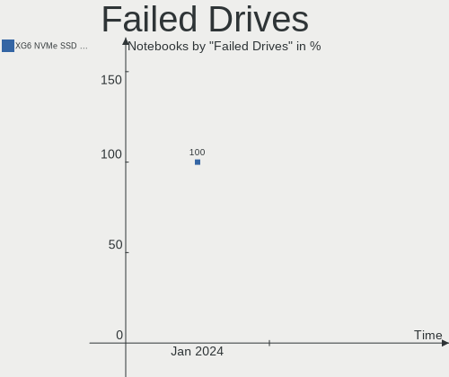
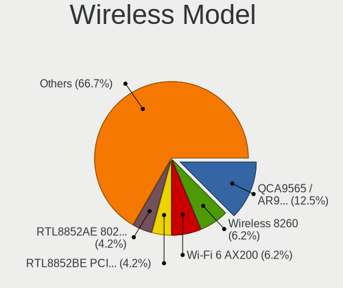
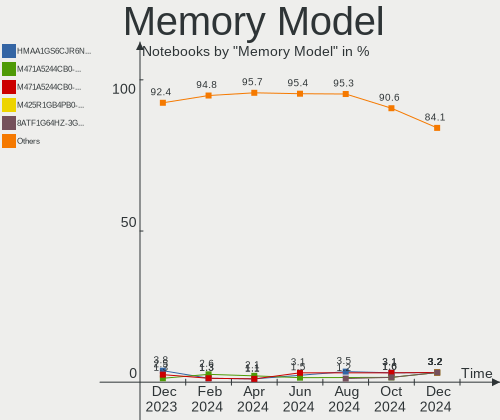
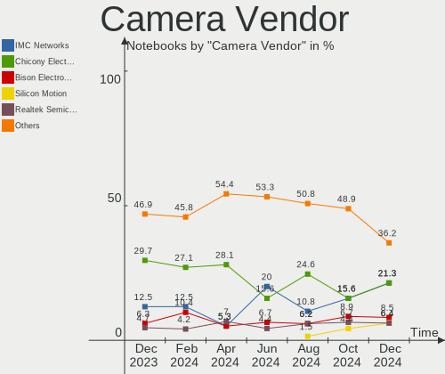

ArcoLinux Hardware Trends (Notebook)
------------------------------------

A project to identify most popular hardware characteristics and track their change
over time based on data collected by ArcoLinux users at https://Linux-Hardware.org.

Anyone can contribute to the study by uploading probes of their computers by
the [hw-probe](https://github.com/linuxhw/hw-probe) tool:

    sudo -E hw-probe -all -upload

Full-feature report is available here: https://linux-hardware.org/?view=trends&formfactor=notebook

Period: Jan, 2021.

Contents
--------

- [ OS                       ](#os)
- [ OS Family                ](#os-family)
- [ Kernel                   ](#kernel)
- [ Kernel Family            ](#kernel-family)
- [ Kernel Major Ver.        ](#kernel-major-ver)
- [ Arch                     ](#arch)
- [ DE                       ](#de)
- [ Display Server           ](#display-server)
- [ Display Manager          ](#display-manager)
- [ OS Lang                  ](#os-lang)
- [ Boot Mode                ](#boot-mode)
- [ Filesystem               ](#filesystem)
- [ Part. scheme             ](#part-scheme)
- [ Dual Boot with Linux/BSD ](#dual-boot-with-linux/bsd)
- [ Dual Boot (Win)          ](#dual-boot-win)
- [ Country                  ](#country)
- [ City                     ](#city)
- [ Vendor                   ](#vendor)
- [ Model                    ](#model)
- [ Model Family             ](#model-family)
- [ MFG Year                 ](#mfg-year)
- [ Form Factor              ](#form-factor)
- [ Secure Boot              ](#secure-boot)
- [ Coreboot                 ](#coreboot)
- [ RAM Size                 ](#ram-size)
- [ RAM Used                 ](#ram-used)
- [ Has CD-ROM               ](#has-cd-rom)
- [ Total Drives             ](#total-drives)
- [ Has Ethernet             ](#has-ethernet)
- [ Drive Vendor             ](#drive-vendor)
- [ Drive Model              ](#drive-model)
- [ HDD Vendor               ](#hdd-vendor)
- [ SSD Vendor               ](#ssd-vendor)
- [ Drive Kind               ](#drive-kind)
- [ Drive Connector          ](#drive-connector)
- [ Drive Size               ](#drive-size)
- [ Space Total              ](#space-total)
- [ Space Used               ](#space-used)
- [ Malfunc. Drives          ](#malfunc-drives)
- [ Malfunc. Drive Vendor    ](#malfunc-drive-vendor)
- [ Malfunc. HDD Vendor      ](#malfunc-hdd-vendor)
- [ Malfunc. Drive Kind      ](#malfunc-drive-kind)
- [ Failed Drives            ](#failed-drives)
- [ Failed Drive Vendor      ](#failed-drive-vendor)
- [ Drive Status             ](#drive-status)
- [ Storage Vendor           ](#storage-vendor)
- [ Storage Model            ](#storage-model)
- [ Storage Kind             ](#storage-kind)
- [ CPU Vendor               ](#cpu-vendor)
- [ CPU Model                ](#cpu-model)
- [ CPU Model Family         ](#cpu-model-family)
- [ CPU Cores                ](#cpu-cores)
- [ CPU Sockets              ](#cpu-sockets)
- [ CPU Threads              ](#cpu-threads)
- [ CPU Op-Modes             ](#cpu-op-modes)
- [ CPU Microcode            ](#cpu-microcode)
- [ CPU Microarch            ](#cpu-microarch)
- [ GPU Vendor               ](#gpu-vendor)
- [ GPU Model                ](#gpu-model)
- [ GPU Combo                ](#gpu-combo)
- [ GPU Driver               ](#gpu-driver)
- [ GPU Memory               ](#gpu-memory)
- [ Monitor Vendor           ](#monitor-vendor)
- [ Monitor Model            ](#monitor-model)
- [ Monitor Resolution       ](#monitor-resolution)
- [ Monitor Diagonal         ](#monitor-diagonal)
- [ Monitor Width            ](#monitor-width)
- [ Aspect Ratio             ](#aspect-ratio)
- [ Monitor Area             ](#monitor-area)
- [ Pixel Density            ](#pixel-density)
- [ Multiple Monitors        ](#multiple-monitors)
- [ Net Controller Vendor    ](#net-controller-vendor)
- [ Net Controller Model     ](#net-controller-model)
- [ Wireless Vendor          ](#wireless-vendor)
- [ Wireless Model           ](#wireless-model)
- [ Ethernet Vendor          ](#ethernet-vendor)
- [ Ethernet Model           ](#ethernet-model)
- [ Net Controller Kind      ](#net-controller-kind)
- [ Used Controller          ](#used-controller)
- [ NICs                     ](#nics)
- [ Memory Vendor            ](#memory-vendor)
- [ Memory Model             ](#memory-model)
- [ Memory Kind              ](#memory-kind)
- [ Memory Form Factor       ](#memory-form-factor)
- [ Memory Size              ](#memory-size)
- [ Memory Speed             ](#memory-speed)
- [ Sound Vendor             ](#sound-vendor)
- [ Sound Model              ](#sound-model)
- [ Camera Vendor            ](#camera-vendor)
- [ Camera Model             ](#camera-model)
- [ Fingerprint Vendor       ](#fingerprint-vendor)
- [ Fingerprint Model        ](#fingerprint-model)
- [ Chipcard Vendor          ](#chipcard-vendor)
- [ Chipcard Model           ](#chipcard-model)
- [ Printer Vendor           ](#printer-vendor)
- [ Printer Model            ](#printer-model)
- [ Scanner Vendor           ](#scanner-vendor)
- [ Scanner Model            ](#scanner-model)
- [ Bluetooth Vendor         ](#bluetooth-vendor)
- [ Bluetooth Model          ](#bluetooth-model)
- [ Unsupported Devices      ](#unsupported-devices)
- [ Unsupported Device Types ](#unsupported-device-types)

OS
--

Installed operating systems

| Name              | Notebooks | Percent |
|-------------------|-----------|---------|
| ArcoLinux Rolling | 24        | 88.89%  |
| ArcoLinux         | 3         | 11.11%  |

OS Family
---------

OS without a version

| Name      | Notebooks | Percent |
|-----------|-----------|---------|
| ArcoLinux | 27        | 100%    |

Kernel
------

Version of the Linux kernel

| Version           | Notebooks | Percent |
|-------------------|-----------|---------|
| 5.10.7-arch1-1    | 4         | 14.81%  |
| 5.10.6-arch1-1    | 4         | 14.81%  |
| 5.9.1-arch1-1     | 3         | 11.11%  |
| 5.10.9-arch1-1    | 3         | 11.11%  |
| 5.10.5-arch1-1    | 3         | 11.11%  |
| 5.4.91-1-lts      | 2         | 7.41%   |
| 5.4.88-1-lts      | 2         | 7.41%   |
| 5.4.87-1-lts      | 1         | 3.7%    |
| 5.10.9-zen1-1-zen | 1         | 3.7%    |
| 5.10.8-arch1-1    | 1         | 3.7%    |
| 5.10.7-zen1-1-zen | 1         | 3.7%    |
| 5.10.4-zen2-1-zen | 1         | 3.7%    |
| 5.10.11-arch1-1   | 1         | 3.7%    |

Kernel Family
-------------

Linux kernel without a distro release

| Version | Notebooks | Percent |
|---------|-----------|---------|
| 5.10.7  | 5         | 18.52%  |
| 5.10.9  | 4         | 14.81%  |
| 5.10.6  | 4         | 14.81%  |
| 5.9.1   | 3         | 11.11%  |
| 5.10.5  | 3         | 11.11%  |
| 5.4.91  | 2         | 7.41%   |
| 5.4.88  | 2         | 7.41%   |
| 5.4.87  | 1         | 3.7%    |
| 5.10.8  | 1         | 3.7%    |
| 5.10.4  | 1         | 3.7%    |
| 5.10.11 | 1         | 3.7%    |

Kernel Major Ver.
-----------------

Linux kernel major version

| Version | Notebooks | Percent |
|---------|-----------|---------|
| 5.10    | 19        | 70.37%  |
| 5.4     | 5         | 18.52%  |
| 5.9     | 3         | 11.11%  |

Arch
----

OS architecture (x86_64, i586, etc.)

| Name   | Notebooks | Percent |
|--------|-----------|---------|
| x86_64 | 27        | 100%    |

DE
--

Desktop Environment

| Name       | Notebooks | Percent |
|------------|-----------|---------|
| XFCE       | 5         | 18.52%  |
| xmonad     | 3         | 11.11%  |
| X-Cinnamon | 3         | 11.11%  |
| i3         | 3         | 11.11%  |
| bspwm      | 3         | 11.11%  |
| KDE5       | 2         | 7.41%   |
| dwm        | 2         | 7.41%   |
| Unknown    | 2         | 7.41%   |
| qtile      | 1         | 3.7%    |
| GNOME      | 1         | 3.7%    |
| dwm-sc     | 1         | 3.7%    |
| Deepin     | 1         | 3.7%    |

Display Server
--------------

X11 or Wayland

| Name | Notebooks | Percent |
|------|-----------|---------|
| X11  | 25        | 92.59%  |
| Tty  | 2         | 7.41%   |

Display Manager
---------------

SDDM, LightDM, etc.

| Name    | Notebooks | Percent |
|---------|-----------|---------|
| TDM     | 21        | 77.78%  |
| Unknown | 4         | 14.81%  |
| LightDM | 2         | 7.41%   |

OS Lang
-------

Language

| Lang  | Notebooks | Percent |
|-------|-----------|---------|
| en_US | 17        | 62.96%  |
| de_DE | 3         | 11.11%  |
| fr_FR | 2         | 7.41%   |
| nl_BE | 1         | 3.7%    |
| fr_CA | 1         | 3.7%    |
| en_IL | 1         | 3.7%    |
| en_GB | 1         | 3.7%    |
| en_CA | 1         | 3.7%    |

Boot Mode
---------

EFI or BIOS

| Mode | Notebooks | Percent |
|------|-----------|---------|
| EFI  | 16        | 59.26%  |
| BIOS | 11        | 40.74%  |

Filesystem
----------

Type of filesystem

| Type    | Notebooks | Percent |
|---------|-----------|---------|
| Ext4    | 25        | 92.59%  |
| Overlay | 2         | 7.41%   |

Part. scheme
------------

Scheme of partitioning

| Type    | Notebooks | Percent |
|---------|-----------|---------|
| GPT     | 18        | 66.67%  |
| MBR     | 6         | 22.22%  |
| Unknown | 3         | 11.11%  |

Dual Boot with Linux/BSD
------------------------

Hosting more than one Linux/BSD

| Dual boot | Notebooks | Percent |
|-----------|-----------|---------|
| No        | 20        | 74.07%  |
| Yes       | 7         | 25.93%  |

Dual Boot (Win)
---------------

Hosting Linux and Windows

| Dual boot | Notebooks | Percent |
|-----------|-----------|---------|
| No        | 16        | 59.26%  |
| Yes       | 11        | 40.74%  |

Country
-------

Geographic location (country)

| Country               | Notebooks | Percent |
|-----------------------|-----------|---------|
| USA                   | 5         | 18.52%  |
| Germany               | 4         | 14.81%  |
| Canada                | 3         | 11.11%  |
| Netherlands           | 2         | 7.41%   |
| France                | 2         | 7.41%   |
| China                 | 2         | 7.41%   |
| UK                    | 1         | 3.7%    |
| Serbia                | 1         | 3.7%    |
| Palestinian Territory | 1         | 3.7%    |
| Norway                | 1         | 3.7%    |
| Libya                 | 1         | 3.7%    |
| Indonesia             | 1         | 3.7%    |
| Hungary               | 1         | 3.7%    |
| Egypt                 | 1         | 3.7%    |
| Belgium               | 1         | 3.7%    |

City
----

Geographic location (city)

| City             | Notebooks | Percent |
|------------------|-----------|---------|
| Bergheim         | 2         | 7.41%   |
| Zhanjiang        | 1         | 3.7%    |
| West Byfleet     | 1         | 3.7%    |
| Waarschoot       | 1         | 3.7%    |
| Trondheim        | 1         | 3.7%    |
| Tripoli          | 1         | 3.7%    |
| Toronto          | 1         | 3.7%    |
| Rouyn-Noranda    | 1         | 3.7%    |
| Paris            | 1         | 3.7%    |
| Nijmegen         | 1         | 3.7%    |
| Nantes           | 1         | 3.7%    |
| Mönchengladbach | 1         | 3.7%    |
| Marstons Mills   | 1         | 3.7%    |
| Kansas City      | 1         | 3.7%    |
| Jakarta          | 1         | 3.7%    |
| Hodmezovasarhely | 1         | 3.7%    |
| Hamburg          | 1         | 3.7%    |
| Gaocheng         | 1         | 3.7%    |
| Denver           | 1         | 3.7%    |
| Dartmouth        | 1         | 3.7%    |
| Dallas           | 1         | 3.7%    |
| Cairo            | 1         | 3.7%    |
| Belgrade         | 1         | 3.7%    |
| Bayt Jala        | 1         | 3.7%    |
| Baton Rouge      | 1         | 3.7%    |
| Amsterdam        | 1         | 3.7%    |

Vendor
------

Motherboard manufacturer

| Name             | Notebooks | Percent |
|------------------|-----------|---------|
| Lenovo           | 11        | 40.74%  |
| Hewlett-Packard  | 5         | 18.52%  |
| Dell             | 4         | 14.81%  |
| ASUSTek Computer | 2         | 7.41%   |
| Acer             | 2         | 7.41%   |
| Medion           | 1         | 3.7%    |
| Google           | 1         | 3.7%    |
| Apple            | 1         | 3.7%    |

Model
-----

Motherboard model

| Name                                 | Notebooks | Percent |
|--------------------------------------|-----------|---------|
| Medion E7222                         | 1         | 3.7%    |
| Lenovo Yoga 900-13ISK 80UE           | 1         | 3.7%    |
| Lenovo Yoga 900-13ISK 80MK           | 1         | 3.7%    |
| Lenovo V155-15API 81V5               | 1         | 3.7%    |
| Lenovo ThinkPad X201 3680KC5         | 1         | 3.7%    |
| Lenovo ThinkPad T61 64659TU          | 1         | 3.7%    |
| Lenovo ThinkPad T440S 20AQ005NUS     | 1         | 3.7%    |
| Lenovo ThinkPad E595 20NFCTO1WW      | 1         | 3.7%    |
| Lenovo RESCUER R720-15IKBN 80WW      | 1         | 3.7%    |
| Lenovo Legion Y7000 2019 PG0 81T0    | 1         | 3.7%    |
| Lenovo IdeaPad S145-14IWL 81MU       | 1         | 3.7%    |
| Lenovo B50-10 80QR                   | 1         | 3.7%    |
| HP ZBook 15 G2                       | 1         | 3.7%    |
| HP Pavilion Notebook                 | 1         | 3.7%    |
| HP ENVY Notebook                     | 1         | 3.7%    |
| HP 250 G7 Notebook PC                | 1         | 3.7%    |
| HP 15                                | 1         | 3.7%    |
| Google Swanky                        | 1         | 3.7%    |
| Dell Latitude E6540                  | 1         | 3.7%    |
| Dell Latitude E6530                  | 1         | 3.7%    |
| Dell Latitude D820                   | 1         | 3.7%    |
| Dell Inspiron 7558                   | 1         | 3.7%    |
| ASUS VivoBook 14_ASUS Laptop X441UAR | 1         | 3.7%    |
| ASUS K56CM                           | 1         | 3.7%    |
| Apple MacBookPro9,2                  | 1         | 3.7%    |
| Acer NU-A515-44-R68D                 | 1         | 3.7%    |
| Acer Aspire VN7-792G                 | 1         | 3.7%    |

Model Family
------------

Motherboard model prefix

| Name                 | Notebooks | Percent |
|----------------------|-----------|---------|
| Lenovo ThinkPad      | 4         | 14.81%  |
| Dell Latitude        | 3         | 11.11%  |
| Lenovo Yoga          | 2         | 7.41%   |
| Medion E7222         | 1         | 3.7%    |
| Lenovo V155-15API    | 1         | 3.7%    |
| Lenovo RESCUER       | 1         | 3.7%    |
| Lenovo Legion        | 1         | 3.7%    |
| Lenovo IdeaPad       | 1         | 3.7%    |
| Lenovo B50-10        | 1         | 3.7%    |
| HP ZBook             | 1         | 3.7%    |
| HP Pavilion          | 1         | 3.7%    |
| HP ENVY              | 1         | 3.7%    |
| HP 250               | 1         | 3.7%    |
| HP 15                | 1         | 3.7%    |
| Google Swanky        | 1         | 3.7%    |
| Dell Inspiron        | 1         | 3.7%    |
| ASUS VivoBook        | 1         | 3.7%    |
| ASUS K56CM           | 1         | 3.7%    |
| Apple MacBookPro9    | 1         | 3.7%    |
| Acer NU-A515-44-R68D | 1         | 3.7%    |
| Acer Aspire          | 1         | 3.7%    |

MFG Year
--------

Motherboard manufacture year

| Year | Notebooks | Percent |
|------|-----------|---------|
| 2020 | 8         | 29.63%  |
| 2016 | 5         | 18.52%  |
| 2019 | 4         | 14.81%  |
| 2012 | 3         | 11.11%  |
| 2018 | 2         | 7.41%   |
| 2015 | 2         | 7.41%   |
| 2017 | 1         | 3.7%    |
| 2010 | 1         | 3.7%    |
| 2008 | 1         | 3.7%    |

Form Factor
-----------

Physical design of the computer

| Name     | Notebooks | Percent |
|----------|-----------|---------|
| Notebook | 27        | 100%    |

Secure Boot
-----------

Enabled or disabled

| State    | Notebooks | Percent |
|----------|-----------|---------|
| Disabled | 27        | 100%    |

Coreboot
--------

Have coreboot on board

| Used | Notebooks | Percent |
|------|-----------|---------|
| No   | 26        | 96.3%   |
| Yes  | 1         | 3.7%    |

RAM Size
--------

Total RAM memory

| Size in GB | Notebooks | Percent |
|------------|-----------|---------|
| 4.01-8.0   | 9         | 33.33%  |
| 3.01-4.0   | 7         | 25.93%  |
| 8.01-16.0  | 6         | 22.22%  |
| 16.01-24.0 | 4         | 14.81%  |
| 2.01-3.0   | 1         | 3.7%    |

RAM Used
--------

Used RAM memory

| Used GB   | Notebooks | Percent |
|-----------|-----------|---------|
| 1.01-2.0  | 9         | 33.33%  |
| 0.51-1.0  | 6         | 22.22%  |
| 2.01-3.0  | 4         | 14.81%  |
| 3.01-4.0  | 3         | 11.11%  |
| 8.01-16.0 | 2         | 7.41%   |
| 0.01-0.5  | 2         | 7.41%   |
| 4.01-8.0  | 1         | 3.7%    |

Has CD-ROM
----------

Has CD-ROM on board

| Presented | Notebooks | Percent |
|-----------|-----------|---------|
| No        | 16        | 59.26%  |
| Yes       | 11        | 40.74%  |

Total Drives
------------

Number of drives on board

| Drives | Notebooks | Percent |
|--------|-----------|---------|
| 1      | 15        | 55.56%  |
| 2      | 9         | 33.33%  |
| 3      | 2         | 7.41%   |
| 0      | 1         | 3.7%    |

Has Ethernet
------------

Has Ethernet on board

| Presented | Notebooks | Percent |
|-----------|-----------|---------|
| Yes       | 22        | 81.48%  |
| No        | 5         | 18.52%  |

Drive Vendor
------------

Hard drive vendors

| Vendor              | Notebooks | Drives | Percent |
|---------------------|-----------|--------|---------|
| Samsung Electronics | 6         | 6      | 16.67%  |
| Seagate             | 5         | 5      | 13.89%  |
| SanDisk             | 5         | 5      | 13.89%  |
| Intel               | 3         | 3      | 8.33%   |
| WDC                 | 2         | 3      | 5.56%   |
| Unknown             | 2         | 3      | 5.56%   |
| SK Hynix            | 2         | 2      | 5.56%   |
| Micron Technology   | 2         | 2      | 5.56%   |
| Kingston            | 2         | 2      | 5.56%   |
| Toshiba             | 1         | 1      | 2.78%   |
| SPCC                | 1         | 1      | 2.78%   |
| PLEXTOR             | 1         | 1      | 2.78%   |
| KESU                | 1         | 1      | 2.78%   |
| HGST                | 1         | 1      | 2.78%   |
| Crucial             | 1         | 1      | 2.78%   |
| Apple               | 1         | 1      | 2.78%   |

Drive Model
-----------

Hard drive models

| Model                                 | Notebooks | Percent |
|---------------------------------------|-----------|---------|
| WDC WD3200BEVT-22ZCT0 320GB           | 1         | 2.63%   |
| WDC WD2500BPVT-22ZEST0 250GB          | 1         | 2.63%   |
| WDC PC SN520 SDAPMUW-256G-1101 256GB  | 1         | 2.63%   |
| Unknown SD/MMC/MS PRO 32GB            | 1         | 2.63%   |
| Unknown MMC Card  32GB                | 1         | 2.63%   |
| Unknown 016GE2  16GB                  | 1         | 2.63%   |
| Toshiba MQ01ABD100 1TB                | 1         | 2.63%   |
| SPCC Solid State Disk 128GB           | 1         | 2.63%   |
| SK Hynix HFS128G3BMND-3210A 128GB SSD | 1         | 2.63%   |
| SK Hynix HFM128GDHTNG-8310A 128GB     | 1         | 2.63%   |
| Seagate ST9320325AS 320GB             | 1         | 2.63%   |
| Seagate ST2000LM003 HN-M201RAD 2TB    | 1         | 2.63%   |
| Seagate ST1000LM035-1RK172 1TB        | 1         | 2.63%   |
| Seagate ST1000LM024 HN-M101MBB 1TB    | 1         | 2.63%   |
| Seagate BUP Slim BK 1TB               | 1         | 2.63%   |
| SanDisk SSD U110 16GB                 | 1         | 2.63%   |
| SanDisk SSD PLUS 120 GB               | 1         | 2.63%   |
| SanDisk SSD PLUS 1000GB               | 1         | 2.63%   |
| SanDisk SSD i100 24GB                 | 1         | 2.63%   |
| SanDisk SD7SN6S-256G-1006 256GB SSD   | 1         | 2.63%   |
| Samsung SSD 970 PRO 512GB             | 1         | 2.63%   |
| Samsung SSD 850 EVO 250GB             | 1         | 2.63%   |
| Samsung MZVPV128HDGM-00000 128GB      | 1         | 2.63%   |
| Samsung MZVLV512HCJH-000L2 512GB      | 1         | 2.63%   |
| Samsung MZNLN256HCHP-000L2 256GB SSD  | 1         | 2.63%   |
| Samsung MZNLF128HCHP-00000 128GB SSD  | 1         | 2.63%   |
| PLEXTOR PX-128M6S 128GB SSD           | 1         | 2.63%   |
| Micron NVMe SSD Drive 256GB           | 1         | 2.63%   |
| Micron MTFDHBA512TCK 512GB            | 1         | 2.63%   |
| Kingston SA400S37120G 120GB SSD       | 1         | 2.63%   |
| Kingston SA2000M8250G 250GB           | 1         | 2.63%   |
| KESU USB 3.0 120GB                    | 1         | 2.63%   |
| Intel SSDSC2CT120A3 120GB             | 1         | 2.63%   |
| Intel SSDSC2BF180A4H 180GB            | 1         | 2.63%   |
| Intel SSDPEKNW010T8 1TB               | 1         | 2.63%   |
| HGST HTS541010A7E630 1TB              | 1         | 2.63%   |
| Crucial CT512M550SSD1 512GB           | 1         | 2.63%   |
| Apple HDD HTS545050A7E362 500GB       | 1         | 2.63%   |

HDD Vendor
----------

Hard disk drive vendors

| Vendor  | Notebooks | Drives | Percent |
|---------|-----------|--------|---------|
| Seagate | 5         | 5      | 50%     |
| WDC     | 1         | 2      | 10%     |
| Toshiba | 1         | 1      | 10%     |
| KESU    | 1         | 1      | 10%     |
| HGST    | 1         | 1      | 10%     |
| Apple   | 1         | 1      | 10%     |

SSD Vendor
----------

Solid state drive vendors

| Vendor              | Notebooks | Drives | Percent |
|---------------------|-----------|--------|---------|
| SanDisk             | 5         | 5      | 33.33%  |
| Samsung Electronics | 3         | 3      | 20%     |
| Intel               | 2         | 2      | 13.33%  |
| SPCC                | 1         | 1      | 6.67%   |
| SK Hynix            | 1         | 1      | 6.67%   |
| PLEXTOR             | 1         | 1      | 6.67%   |
| Kingston            | 1         | 1      | 6.67%   |
| Crucial             | 1         | 1      | 6.67%   |

Drive Kind
----------

HDD or SSD

| Kind    | Notebooks | Drives | Percent |
|---------|-----------|--------|---------|
| SSD     | 13        | 15     | 39.39%  |
| NVMe    | 9         | 9      | 27.27%  |
| HDD     | 9         | 11     | 27.27%  |
| MMC     | 1         | 2      | 3.03%   |
| Unknown | 1         | 1      | 3.03%   |

Drive Connector
---------------

SATA, SAS, NVMe, etc.

| Type | Notebooks | Drives | Percent |
|------|-----------|--------|---------|
| SATA | 19        | 24     | 59.38%  |
| NVMe | 9         | 9      | 28.13%  |
| SAS  | 3         | 3      | 9.38%   |
| MMC  | 1         | 2      | 3.13%   |

Drive Size
----------

Size of hard drive

| Size in TB | Notebooks | Drives | Percent |
|------------|-----------|--------|---------|
| 0.01-0.5   | 15        | 18     | 65.22%  |
| 0.51-1.0   | 7         | 7      | 30.43%  |
| 1.01-2.0   | 1         | 1      | 4.35%   |

Space Total
-----------

Amount of disk space available on the file system

| Size in GB | Notebooks | Percent |
|------------|-----------|---------|
| 101-250    | 13        | 48.15%  |
| 501-1000   | 4         | 14.81%  |
| 251-500    | 2         | 7.41%   |
| 1001-2000  | 2         | 7.41%   |
| 1-20       | 2         | 7.41%   |
| 51-100     | 2         | 7.41%   |
| 21-50      | 1         | 3.7%    |
| Unknown    | 1         | 3.7%    |

Space Used
----------

Amount of used disk space

| Used GB   | Notebooks | Percent |
|-----------|-----------|---------|
| 1-20      | 14        | 51.85%  |
| 21-50     | 7         | 25.93%  |
| 101-250   | 1         | 3.7%    |
| 1001-2000 | 1         | 3.7%    |
| 501-1000  | 1         | 3.7%    |
| 51-100    | 1         | 3.7%    |
| 0         | 1         | 3.7%    |
| Unknown   | 1         | 3.7%    |

Malfunc. Drives
---------------

Drive models with a malfunction

| Model                           | Notebooks | Drives | Percent |
|---------------------------------|-----------|--------|---------|
| SanDisk SSD PLUS 1000GB         | 1         | 1      | 14.29%  |
| SanDisk SSD i100 24GB           | 1         | 1      | 14.29%  |
| PLEXTOR PX-128M6S 128GB SSD     | 1         | 1      | 14.29%  |
| Intel SSDSC2CT120A3 120GB       | 1         | 1      | 14.29%  |
| Intel SSDSC2BF180A4H 180GB      | 1         | 1      | 14.29%  |
| Crucial CT512M550SSD1 512GB     | 1         | 1      | 14.29%  |
| Apple HDD HTS545050A7E362 500GB | 1         | 1      | 14.29%  |

Malfunc. Drive Vendor
---------------------

Vendors of faulty drives

| Vendor  | Notebooks | Drives | Percent |
|---------|-----------|--------|---------|
| SanDisk | 2         | 2      | 28.57%  |
| Intel   | 2         | 2      | 28.57%  |
| PLEXTOR | 1         | 1      | 14.29%  |
| Crucial | 1         | 1      | 14.29%  |
| Apple   | 1         | 1      | 14.29%  |

Malfunc. HDD Vendor
-------------------

Vendors of faulty HDD drives

| Vendor | Notebooks | Drives | Percent |
|--------|-----------|--------|---------|
| Apple  | 1         | 1      | 100%    |

Malfunc. Drive Kind
-------------------

Kinds of faulty drives

| Kind | Notebooks | Drives | Percent |
|------|-----------|--------|---------|
| SSD  | 5         | 6      | 83.33%  |
| HDD  | 1         | 1      | 16.67%  |

Failed Drives
-------------

Failed drive models

| Model                     | Notebooks | Drives | Percent |
|---------------------------|-----------|--------|---------|
| Seagate ST9320325AS 320GB | 1         | 1      | 100%    |

Failed Drive Vendor
-------------------

Failed drive vendors

| Vendor  | Notebooks | Drives | Percent |
|---------|-----------|--------|---------|
| Seagate | 1         | 1      | 100%    |

Drive Status
------------

Number of failed and malfunc. drives

| Status   | Notebooks | Drives | Percent |
|----------|-----------|--------|---------|
| Works    | 17        | 21     | 54.84%  |
| Detected | 7         | 9      | 22.58%  |
| Malfunc  | 6         | 7      | 19.35%  |
| Failed   | 1         | 1      | 3.23%   |

Storage Vendor
--------------

Storage controller vendors

| Vendor                      | Notebooks | Percent |
|-----------------------------|-----------|---------|
| Intel                       | 23        | 69.7%   |
| Samsung Electronics         | 3         | 9.09%   |
| Micron Technology           | 2         | 6.06%   |
| AMD                         | 2         | 6.06%   |
| SK Hynix                    | 1         | 3.03%   |
| Sandisk                     | 1         | 3.03%   |
| Kingston Technology Company | 1         | 3.03%   |

Storage Model
-------------

Storage controller models

| Model                                                                          | Notebooks | Percent |
|--------------------------------------------------------------------------------|-----------|---------|
| Intel Sunrise Point-LP SATA Controller [AHCI mode]                             | 3         | 8.82%   |
| Intel HM170/QM170 Chipset SATA Controller [AHCI Mode]                          | 3         | 8.82%   |
| Intel 82801 Mobile SATA Controller [RAID mode]                                 | 3         | 8.82%   |
| Intel 7 Series Chipset Family 6-port SATA Controller [AHCI mode]               | 3         | 8.82%   |
| Samsung NVMe SSD Controller SM951/PM951                                        | 2         | 5.88%   |
| Micron Non-Volatile memory controller                                          | 2         | 5.88%   |
| Intel 8 Series SATA Controller 1 [AHCI mode]                                   | 2         | 5.88%   |
| AMD FCH SATA Controller [AHCI mode]                                            | 2         | 5.88%   |
| SK Hynix BC501 NVMe Solid State Drive 512GB                                    | 1         | 2.94%   |
| Sandisk PC SN520 NVMe SSD                                                      | 1         | 2.94%   |
| Samsung NVMe SSD Controller SM981/PM981/PM983                                  | 1         | 2.94%   |
| Kingston Company A2000 NVMe SSD                                                | 1         | 2.94%   |
| Intel Wildcat Point-LP SATA Controller [AHCI Mode]                             | 1         | 2.94%   |
| Intel SSD 660P Series                                                          | 1         | 2.94%   |
| Intel Cannon Point-LP SATA Controller [AHCI Mode]                              | 1         | 2.94%   |
| Intel Cannon Lake Mobile PCH SATA AHCI Controller                              | 1         | 2.94%   |
| Intel Atom Processor E3800 Series SATA AHCI Controller                         | 1         | 2.94%   |
| Intel 82801HM/HEM (ICH8M/ICH8M-E) SATA Controller [AHCI mode]                  | 1         | 2.94%   |
| Intel 82801HM/HEM (ICH8M/ICH8M-E) IDE Controller                               | 1         | 2.94%   |
| Intel 82801GBM/GHM (ICH7-M Family) SATA Controller [IDE mode]                  | 1         | 2.94%   |
| Intel 8 Series/C220 Series Chipset Family 6-port SATA Controller 1 [AHCI mode] | 1         | 2.94%   |
| Intel 5 Series/3400 Series Chipset 6 port SATA AHCI Controller                 | 1         | 2.94%   |

Storage Kind
------------

Kind of storage controller (IDE, SATA, NVMe, SAS, ...)

| Kind | Notebooks | Percent |
|------|-----------|---------|
| SATA | 20        | 58.82%  |
| NVMe | 9         | 26.47%  |
| RAID | 3         | 8.82%   |
| IDE  | 2         | 5.88%   |

CPU Vendor
----------

Processor vendors

| Vendor | Notebooks | Percent |
|--------|-----------|---------|
| Intel  | 24        | 88.89%  |
| AMD    | 3         | 11.11%  |

CPU Model
---------

Processor models

| Model                                         | Notebooks | Percent |
|-----------------------------------------------|-----------|---------|
| Intel Core i5-6300HQ CPU @ 2.30GHz            | 2         | 7.41%   |
| Intel Core i3-7020U CPU @ 2.30GHz             | 2         | 7.41%   |
| Intel Pentium CPU N3540 @ 2.16GHz             | 1         | 3.7%    |
| Intel Core i7-9750H CPU @ 2.60GHz             | 1         | 3.7%    |
| Intel Core i7-7700HQ CPU @ 2.80GHz            | 1         | 3.7%    |
| Intel Core i7-6560U CPU @ 2.20GHz             | 1         | 3.7%    |
| Intel Core i7-6500U CPU @ 2.50GHz             | 1         | 3.7%    |
| Intel Core i7-5500U CPU @ 2.40GHz             | 1         | 3.7%    |
| Intel Core i7-4810MQ CPU @ 2.80GHz            | 1         | 3.7%    |
| Intel Core i7-4610M CPU @ 3.00GHz             | 1         | 3.7%    |
| Intel Core i7-3517U CPU @ 1.90GHz             | 1         | 3.7%    |
| Intel Core i5-6200U CPU @ 2.30GHz             | 1         | 3.7%    |
| Intel Core i5-4200U CPU @ 1.60GHz             | 1         | 3.7%    |
| Intel Core i5-3340M CPU @ 2.70GHz             | 1         | 3.7%    |
| Intel Core i5-3210M CPU @ 2.50GHz             | 1         | 3.7%    |
| Intel Core i5 CPU M 520 @ 2.40GHz             | 1         | 3.7%    |
| Intel Core i3-4005U CPU @ 1.70GHz             | 1         | 3.7%    |
| Intel Core i3-2350M CPU @ 2.30GHz             | 1         | 3.7%    |
| Intel Core 2 Duo CPU T8100 @ 2.10GHz          | 1         | 3.7%    |
| Intel Core 2 CPU T5500 @ 1.66GHz              | 1         | 3.7%    |
| Intel Celeron CPU N2840 @ 2.16GHz             | 1         | 3.7%    |
| Intel Celeron CPU 4205U @ 1.80GHz             | 1         | 3.7%    |
| AMD Ryzen 7 3700U with Radeon Vega Mobile Gfx | 1         | 3.7%    |
| AMD Ryzen 5 4500U with Radeon Graphics        | 1         | 3.7%    |
| AMD Ryzen 3 3200U with Radeon Vega Mobile Gfx | 1         | 3.7%    |

CPU Model Family
----------------

Processor model prefix

| Model            | Notebooks | Percent |
|------------------|-----------|---------|
| Intel Core i7    | 8         | 29.63%  |
| Intel Core i5    | 7         | 25.93%  |
| Intel Core i3    | 4         | 14.81%  |
| Intel Celeron    | 2         | 7.41%   |
| Intel Pentium    | 1         | 3.7%    |
| Intel Core 2 Duo | 1         | 3.7%    |
| Intel Core 2     | 1         | 3.7%    |
| AMD Ryzen 7      | 1         | 3.7%    |
| AMD Ryzen 5      | 1         | 3.7%    |
| AMD Ryzen 3      | 1         | 3.7%    |

CPU Cores
---------

Number of processor cores

| Number | Notebooks | Percent |
|--------|-----------|---------|
| 2      | 19        | 70.37%  |
| 4      | 6         | 22.22%  |
| 6      | 2         | 7.41%   |

CPU Sockets
-----------

Number of sockets

| Number | Notebooks | Percent |
|--------|-----------|---------|
| 1      | 27        | 100%    |

CPU Threads
-----------

Threads per core (Hyper-Threading)

| Number | Notebooks | Percent |
|--------|-----------|---------|
| 2      | 19        | 70.37%  |
| 1      | 8         | 29.63%  |

CPU Op-Modes
------------

CPU Operation Modes (32-bit, 64-bit)

| Op mode        | Notebooks | Percent |
|----------------|-----------|---------|
| 32-bit, 64-bit | 27        | 100%    |

CPU Microcode
-------------

Microcode number

| Number     | Notebooks | Percent |
|------------|-----------|---------|
| Unknown    | 5         | 18.52%  |
| 0x306a9    | 3         | 11.11%  |
| 0x406e3    | 2         | 7.41%   |
| 0x40651    | 2         | 7.41%   |
| 0x306c3    | 2         | 7.41%   |
| 0x30678    | 2         | 7.41%   |
| 0x08108102 | 2         | 7.41%   |
| 0x906e9    | 1         | 3.7%    |
| 0x806eb    | 1         | 3.7%    |
| 0x806e9    | 1         | 3.7%    |
| 0x6f6      | 1         | 3.7%    |
| 0x506e3    | 1         | 3.7%    |
| 0x306d4    | 1         | 3.7%    |
| 0x20655    | 1         | 3.7%    |
| 0x10676    | 1         | 3.7%    |
| 0x08600103 | 1         | 3.7%    |

CPU Microarch
-------------

Microarchitecture

| Name        | Notebooks | Percent |
|-------------|-----------|---------|
| Skylake     | 5         | 18.52%  |
| KabyLake    | 5         | 18.52%  |
| Haswell     | 4         | 14.81%  |
| IvyBridge   | 3         | 11.11%  |
| Zen+        | 2         | 7.41%   |
| Silvermont  | 2         | 7.41%   |
| Zen 2       | 1         | 3.7%    |
| Westmere    | 1         | 3.7%    |
| SandyBridge | 1         | 3.7%    |
| Penryn      | 1         | 3.7%    |
| Core        | 1         | 3.7%    |
| Broadwell   | 1         | 3.7%    |

GPU Vendor
----------

Vendors of graphics cards

| Vendor | Notebooks | Percent |
|--------|-----------|---------|
| Intel  | 22        | 66.67%  |
| Nvidia | 7         | 21.21%  |
| AMD    | 4         | 12.12%  |

GPU Model
---------

Graphics card models

| Model                                                                         | Notebooks | Percent |
|-------------------------------------------------------------------------------|-----------|---------|
| Intel 3rd Gen Core processor Graphics Controller                              | 3         | 8.57%   |
| Intel Skylake GT2 [HD Graphics 520]                                           | 2         | 5.71%   |
| Intel HD Graphics 530                                                         | 2         | 5.71%   |
| Intel Haswell-ULT Integrated Graphics Controller                              | 2         | 5.71%   |
| Intel Atom Processor Z36xxx/Z37xxx Series Graphics & Display                  | 2         | 5.71%   |
| AMD Picasso                                                                   | 2         | 5.71%   |
| Nvidia TU117M [GeForce GTX 1650 Mobile / Max-Q]                               | 1         | 2.86%   |
| Nvidia GP107M [GeForce GTX 1050 Mobile]                                       | 1         | 2.86%   |
| Nvidia GM107M [GeForce GTX 960M]                                              | 1         | 2.86%   |
| Nvidia GM107M [GeForce GTX 950M]                                              | 1         | 2.86%   |
| Nvidia GK107GLM [Quadro K1100M]                                               | 1         | 2.86%   |
| Nvidia GF117M [GeForce 610M/710M/810M/820M / GT 620M/625M/630M/720M]          | 1         | 2.86%   |
| Nvidia GF108M [GeForce GT 635M]                                               | 1         | 2.86%   |
| Intel Mobile GM965/GL960 Integrated Graphics Controller (secondary)           | 1         | 2.86%   |
| Intel Mobile GM965/GL960 Integrated Graphics Controller (primary)             | 1         | 2.86%   |
| Intel Mobile 945GM/GMS/GME, 943/940GML Express Integrated Graphics Controller | 1         | 2.86%   |
| Intel Mobile 945GM/GMS, 943/940GML Express Integrated Graphics Controller     | 1         | 2.86%   |
| Intel Kaby Lake-U GT2f Integrated Graphics Controller                         | 1         | 2.86%   |
| Intel Iris Graphics 540                                                       | 1         | 2.86%   |
| Intel HD Graphics 630                                                         | 1         | 2.86%   |
| Intel HD Graphics 620                                                         | 1         | 2.86%   |
| Intel HD Graphics 5500                                                        | 1         | 2.86%   |
| Intel Core Processor Integrated Graphics Controller                           | 1         | 2.86%   |
| Intel Coffee Lake UHD Graphics                                                | 1         | 2.86%   |
| Intel 4th Gen Core Processor Integrated Graphics Controller                   | 1         | 2.86%   |
| Intel 2nd Generation Core Processor Family Integrated Graphics Controller     | 1         | 2.86%   |
| AMD Renoir                                                                    | 1         | 2.86%   |
| AMD Mars XTX [Radeon HD 8790M]                                                | 1         | 2.86%   |

GPU Combo
---------

Combinations of graphics cards

| Name           | Notebooks | Percent |
|----------------|-----------|---------|
| 1 x Intel      | 16        | 59.26%  |
| Intel + Nvidia | 5         | 18.52%  |
| 1 x AMD        | 3         | 11.11%  |
| 1 x Nvidia     | 2         | 7.41%   |
| Intel + AMD    | 1         | 3.7%    |

GPU Driver
----------

Free vs proprietary

| Driver      | Notebooks | Percent |
|-------------|-----------|---------|
| Free        | 24        | 88.89%  |
| Proprietary | 2         | 7.41%   |
| Unknown     | 1         | 3.7%    |

GPU Memory
----------

Total video memory

| Size in GB | Notebooks | Percent |
|------------|-----------|---------|
| Unknown    | 20        | 74.07%  |
| 1.01-2.0   | 5         | 18.52%  |
| 3.01-4.0   | 2         | 7.41%   |

Monitor Vendor
--------------

Monitor vendors

| Vendor              | Notebooks | Percent |
|---------------------|-----------|---------|
| LG Display          | 6         | 19.35%  |
| AU Optronics        | 6         | 19.35%  |
| Samsung Electronics | 5         | 16.13%  |
| Chimei Innolux      | 3         | 9.68%   |
| Lenovo              | 2         | 6.45%   |
| Goldstar            | 2         | 6.45%   |
| BOE                 | 2         | 6.45%   |
| Philips             | 1         | 3.23%   |
| MStar               | 1         | 3.23%   |
| LG Philips          | 1         | 3.23%   |
| Apple               | 1         | 3.23%   |
| AOC                 | 1         | 3.23%   |

Monitor Model
-------------

Monitor models

| Model                                                                 | Notebooks | Percent |
|-----------------------------------------------------------------------|-----------|---------|
| Samsung Electronics LCD Monitor SEC5441 1366x768 344x194mm 15.5-inch  | 1         | 3.23%   |
| Samsung Electronics LCD Monitor SDC5344 1920x1080 344x194mm 15.5-inch | 1         | 3.23%   |
| Samsung Electronics LCD Monitor SDC4951 1366x768 344x194mm 15.5-inch  | 1         | 3.23%   |
| Samsung Electronics LCD Monitor SDC454A 3200x1800 293x165mm 13.2-inch | 1         | 3.23%   |
| Samsung Electronics LCD Monitor SDC415A 3200x1800 293x165mm 13.2-inch | 1         | 3.23%   |
| Philips PHL 273V7 PHLC156 1920x1080 598x336mm 27.0-inch               | 1         | 3.23%   |
| MStar TV_MONITOR MST0030 1440x900 1150x650mm 52.0-inch                | 1         | 3.23%   |
| LG Philips LCD Monitor LPLA900 1280x800 331x207mm 15.4-inch           | 1         | 3.23%   |
| LG Display LCD Monitor LGD065A 1920x1080 344x194mm 15.5-inch          | 1         | 3.23%   |
| LG Display LCD Monitor LGD0590 1920x1080 344x194mm 15.5-inch          | 1         | 3.23%   |
| LG Display LCD Monitor LGD04B7 1366x768 344x194mm 15.5-inch           | 1         | 3.23%   |
| LG Display LCD Monitor LGD04B4 3200x1800 293x165mm 13.2-inch          | 1         | 3.23%   |
| LG Display LCD Monitor LGD046D 1920x1080 309x174mm 14.0-inch          | 1         | 3.23%   |
| LG Display LCD Monitor LGD042D 1920x1080 290x170mm 13.2-inch          | 1         | 3.23%   |
| Lenovo LCD Monitor LEN4050 1280x800 331x207mm 15.4-inch               | 1         | 3.23%   |
| Lenovo LCD Monitor LEN4011 1280x800 261x163mm 12.1-inch               | 1         | 3.23%   |
| Goldstar LCD Monitor GSM580D 1920x1080 510x290mm 23.1-inch            | 1         | 3.23%   |
| Goldstar HDR WQHD GSM7755 3440x1440 820x346mm 35.0-inch               | 1         | 3.23%   |
| Chimei Innolux LCD Monitor CMN15F4 1920x1080 344x193mm 15.5-inch      | 1         | 3.23%   |
| Chimei Innolux LCD Monitor CMN15BA 1920x1080 344x194mm 15.5-inch      | 1         | 3.23%   |
| Chimei Innolux LCD Monitor CMN14D6 1366x768 309x173mm 13.9-inch       | 1         | 3.23%   |
| BOE LCD Monitor BOE06A5 1366x768 344x194mm 15.5-inch                  | 1         | 3.23%   |
| BOE LCD Monitor BOE0648 1920x1080 344x194mm 15.5-inch                 | 1         | 3.23%   |
| AU Optronics LCD Monitor AUO61ED 1920x1080 340x190mm 15.3-inch        | 1         | 3.23%   |
| AU Optronics LCD Monitor AUO45EC 1366x768 340x190mm 15.3-inch         | 1         | 3.23%   |
| AU Optronics LCD Monitor AUO2D3C 1366x768 310x170mm 13.9-inch         | 1         | 3.23%   |
| AU Optronics LCD Monitor AUO21ED 1920x1080 344x194mm 15.5-inch        | 1         | 3.23%   |
| AU Optronics LCD Monitor AUO129E 1600x900 382x214mm 17.2-inch         | 1         | 3.23%   |
| AU Optronics LCD Monitor AUO109D 1920x1080 381x214mm 17.2-inch        | 1         | 3.23%   |
| Apple Color LCD APP9CC7 1280x800 290x180mm 13.4-inch                  | 1         | 3.23%   |
| AOC 2381 AOC2381 1920x1080 509x286mm 23.0-inch                        | 1         | 3.23%   |

Monitor Resolution
------------------

Monitor screen resolution

| Resolution       | Notebooks | Percent |
|------------------|-----------|---------|
| 1920x1080 (FHD)  | 11        | 39.29%  |
| 1366x768 (WXGA)  | 7         | 25%     |
| 1280x800 (WXGA)  | 4         | 14.29%  |
| 3200x1800 (QHD+) | 3         | 10.71%  |
| 3840x2160 (4K)   | 1         | 3.57%   |
| 3440x1440        | 1         | 3.57%   |
| 1600x900 (HD+)   | 1         | 3.57%   |

Monitor Diagonal
----------------

Diagonal size in inches

| Inches | Notebooks | Percent |
|--------|-----------|---------|
| 15     | 15        | 48.39%  |
| 13     | 7         | 22.58%  |
| 23     | 2         | 6.45%   |
| 17     | 2         | 6.45%   |
| 52     | 1         | 3.23%   |
| 35     | 1         | 3.23%   |
| 27     | 1         | 3.23%   |
| 14     | 1         | 3.23%   |
| 12     | 1         | 3.23%   |

Monitor Width
-------------

Physical width

| Width in mm | Notebooks | Percent |
|-------------|-----------|---------|
| 301-350     | 17        | 54.84%  |
| 201-300     | 6         | 19.35%  |
| 501-600     | 3         | 9.68%   |
| 351-400     | 3         | 9.68%   |
| 801-900     | 1         | 3.23%   |
| 1001-1500   | 1         | 3.23%   |

Aspect Ratio
------------

Proportional relationship between the width and the height

| Ratio | Notebooks | Percent |
|-------|-----------|---------|
| 16/9  | 22        | 81.48%  |
| 16/10 | 3         | 11.11%  |
| 3/2   | 1         | 3.7%    |
| 21/9  | 1         | 3.7%    |

Monitor Area
------------

Area in inch²

| Area in inch² | Notebooks | Percent |
|----------------|-----------|---------|
| 101-110        | 15        | 48.39%  |
| 81-90          | 4         | 12.9%   |
| 71-80          | 4         | 12.9%   |
| 201-250        | 2         | 6.45%   |
| 121-130        | 2         | 6.45%   |
| More than 1000 | 1         | 3.23%   |
| 61-70          | 1         | 3.23%   |
| 351-500        | 1         | 3.23%   |
| 301-350        | 1         | 3.23%   |

Pixel Density
-------------

Pixels per inch

| Density       | Notebooks | Percent |
|---------------|-----------|---------|
| 121-160       | 11        | 35.48%  |
| 101-120       | 9         | 29.03%  |
| 51-100        | 6         | 19.35%  |
| More than 240 | 3         | 9.68%   |
| 1-50          | 1         | 3.23%   |
| 161-240       | 1         | 3.23%   |

Multiple Monitors
-----------------

Total monitors connected

| Total | Notebooks | Percent |
|-------|-----------|---------|
| 1     | 21        | 77.78%  |
| 2     | 5         | 18.52%  |
| 0     | 1         | 3.7%    |

Net Controller Vendor
---------------------

Controller vendors

| Vendor                         | Notebooks | Percent |
|--------------------------------|-----------|---------|
| Realtek Semiconductor          | 15        | 39.47%  |
| Intel                          | 14        | 36.84%  |
| Qualcomm Atheros               | 6         | 15.79%  |
| Broadcom Inc. and subsidiaries | 2         | 5.26%   |
| Broadcom                       | 1         | 2.63%   |

Net Controller Model
--------------------

Controller models

| Model                                                                   | Notebooks | Percent |
|-------------------------------------------------------------------------|-----------|---------|
| Realtek RTL8111/8168/8411 PCI Express Gigabit Ethernet Controller       | 10        | 20.41%  |
| Realtek RTL8723BE PCIe Wireless Network Adapter                         | 3         | 6.12%   |
| Realtek RTL810xE PCI Express Fast Ethernet controller                   | 3         | 6.12%   |
| Intel Wireless 7260                                                     | 3         | 6.12%   |
| Realtek RTL8821CE 802.11ac PCIe Wireless Network Adapter                | 2         | 4.08%   |
| Qualcomm Atheros QCA9377 802.11ac Wireless Network Adapter              | 2         | 4.08%   |
| Qualcomm Atheros QCA6174 802.11ac Wireless Network Adapter              | 2         | 4.08%   |
| Intel Wireless 8260                                                     | 2         | 4.08%   |
| Intel Ethernet Connection I217-LM                                       | 2         | 4.08%   |
| Realtek RTL8153 Gigabit Ethernet Adapter                                | 1         | 2.04%   |
| Qualcomm Atheros QCA9565 / AR9565 Wireless Network Adapter              | 1         | 2.04%   |
| Qualcomm Atheros AR9485 Wireless Network Adapter                        | 1         | 2.04%   |
| Intel Wireless-AC 9560 [Jefferson Peak]                                 | 1         | 2.04%   |
| Intel Wireless-AC 9260                                                  | 1         | 2.04%   |
| Intel Wireless 8265 / 8275                                              | 1         | 2.04%   |
| Intel Wireless 7265                                                     | 1         | 2.04%   |
| Intel PRO/Wireless 4965 AG or AGN [Kedron] Network Connection           | 1         | 2.04%   |
| Intel PRO/Wireless 3945ABG [Golan] Network Connection                   | 1         | 2.04%   |
| Intel Ethernet Connection I218-V                                        | 1         | 2.04%   |
| Intel Centrino Advanced-N 6235                                          | 1         | 2.04%   |
| Intel Centrino Advanced-N 6205 [Taylor Peak]                            | 1         | 2.04%   |
| Intel Centrino Advanced-N 6200                                          | 1         | 2.04%   |
| Intel 82579LM Gigabit Network Connection (Lewisville)                   | 1         | 2.04%   |
| Intel 82577LM Gigabit Network Connection                                | 1         | 2.04%   |
| Intel 82566MM Gigabit Network Connection                                | 1         | 2.04%   |
| Broadcom NetXtreme BCM5752 Gigabit Ethernet PCI Express                 | 1         | 2.04%   |
| Broadcom Inc. and subsidiaries NetXtreme BCM57765 Gigabit Ethernet PCIe | 1         | 2.04%   |
| Broadcom Inc. and subsidiaries BCM4331 802.11a/b/g/n                    | 1         | 2.04%   |
| Broadcom Inc. and subsidiaries BCM4311 802.11b/g WLAN                   | 1         | 2.04%   |

Wireless Vendor
---------------

Wireless vendors

| Vendor                         | Notebooks | Percent |
|--------------------------------|-----------|---------|
| Intel                          | 14        | 51.85%  |
| Qualcomm Atheros               | 6         | 22.22%  |
| Realtek Semiconductor          | 5         | 18.52%  |
| Broadcom Inc. and subsidiaries | 2         | 7.41%   |

Wireless Model
--------------

Wireless models

| Model                                                         | Notebooks | Percent |
|---------------------------------------------------------------|-----------|---------|
| Realtek RTL8723BE PCIe Wireless Network Adapter               | 3         | 11.11%  |
| Intel Wireless 7260                                           | 3         | 11.11%  |
| Realtek RTL8821CE 802.11ac PCIe Wireless Network Adapter      | 2         | 7.41%   |
| Qualcomm Atheros QCA9377 802.11ac Wireless Network Adapter    | 2         | 7.41%   |
| Qualcomm Atheros QCA6174 802.11ac Wireless Network Adapter    | 2         | 7.41%   |
| Intel Wireless 8260                                           | 2         | 7.41%   |
| Qualcomm Atheros QCA9565 / AR9565 Wireless Network Adapter    | 1         | 3.7%    |
| Qualcomm Atheros AR9485 Wireless Network Adapter              | 1         | 3.7%    |
| Intel Wireless-AC 9560 [Jefferson Peak]                       | 1         | 3.7%    |
| Intel Wireless-AC 9260                                        | 1         | 3.7%    |
| Intel Wireless 8265 / 8275                                    | 1         | 3.7%    |
| Intel Wireless 7265                                           | 1         | 3.7%    |
| Intel PRO/Wireless 4965 AG or AGN [Kedron] Network Connection | 1         | 3.7%    |
| Intel PRO/Wireless 3945ABG [Golan] Network Connection         | 1         | 3.7%    |
| Intel Centrino Advanced-N 6235                                | 1         | 3.7%    |
| Intel Centrino Advanced-N 6205 [Taylor Peak]                  | 1         | 3.7%    |
| Intel Centrino Advanced-N 6200                                | 1         | 3.7%    |
| Broadcom Inc. and subsidiaries BCM4331 802.11a/b/g/n          | 1         | 3.7%    |
| Broadcom Inc. and subsidiaries BCM4311 802.11b/g WLAN         | 1         | 3.7%    |

Ethernet Vendor
---------------

Ethernet vendors

| Vendor                         | Notebooks | Percent |
|--------------------------------|-----------|---------|
| Realtek Semiconductor          | 14        | 63.64%  |
| Intel                          | 6         | 27.27%  |
| Broadcom Inc. and subsidiaries | 1         | 4.55%   |
| Broadcom                       | 1         | 4.55%   |

Ethernet Model
--------------

Ethernet models

| Model                                                                   | Notebooks | Percent |
|-------------------------------------------------------------------------|-----------|---------|
| Realtek RTL8111/8168/8411 PCI Express Gigabit Ethernet Controller       | 10        | 45.45%  |
| Realtek RTL810xE PCI Express Fast Ethernet controller                   | 3         | 13.64%  |
| Intel Ethernet Connection I217-LM                                       | 2         | 9.09%   |
| Realtek RTL8153 Gigabit Ethernet Adapter                                | 1         | 4.55%   |
| Intel Ethernet Connection I218-V                                        | 1         | 4.55%   |
| Intel 82579LM Gigabit Network Connection (Lewisville)                   | 1         | 4.55%   |
| Intel 82577LM Gigabit Network Connection                                | 1         | 4.55%   |
| Intel 82566MM Gigabit Network Connection                                | 1         | 4.55%   |
| Broadcom NetXtreme BCM5752 Gigabit Ethernet PCI Express                 | 1         | 4.55%   |
| Broadcom Inc. and subsidiaries NetXtreme BCM57765 Gigabit Ethernet PCIe | 1         | 4.55%   |

Net Controller Kind
-------------------

Ethernet, WiFi or modem

| Kind     | Notebooks | Percent |
|----------|-----------|---------|
| WiFi     | 26        | 54.17%  |
| Ethernet | 22        | 45.83%  |

Used Controller
---------------

Currently used network controller

| Kind     | Notebooks | Percent |
|----------|-----------|---------|
| WiFi     | 22        | 78.57%  |
| Ethernet | 6         | 21.43%  |

NICs
----

Total network controllers on board

| Total | Notebooks | Percent |
|-------|-----------|---------|
| 2     | 19        | 70.37%  |
| 1     | 7         | 25.93%  |
| 3     | 1         | 3.7%    |

Memory Vendor
-------------

Memory module vendors

| Vendor              | Notebooks | Percent |
|---------------------|-----------|---------|
| Samsung Electronics | 8         | 28.57%  |
| SK Hynix            | 6         | 21.43%  |
| Micron Technology   | 3         | 10.71%  |
| Kingston            | 3         | 10.71%  |
| Elpida              | 3         | 10.71%  |
| Crucial             | 2         | 7.14%   |
| Unknown             | 1         | 3.57%   |
| Ramaxel Technology  | 1         | 3.57%   |
| Patriot             | 1         | 3.57%   |

Memory Model
------------

Memory module models

| Model                                                        | Notebooks | Percent |
|--------------------------------------------------------------|-----------|---------|
| Samsung RAM M471A5244CB0-CTD 4096MB SODIMM DDR4 2667MT/s     | 2         | 6.67%   |
| Unknown RAM Module 2GB SODIMM DDR2 667MT/s                   | 1         | 3.33%   |
| Unknown RAM Module 1GB SODIMM DDR2 667MT/s                   | 1         | 3.33%   |
| SK Hynix RAM HMT451S6BFR8A-PB 4GB SODIMM DDR3 1600MT/s       | 1         | 3.33%   |
| SK Hynix RAM HMT41GS6BFR8A-PB 8192MB SODIMM DDR3 1600MT/s    | 1         | 3.33%   |
| SK Hynix RAM HMT41GS6AFR8A-PB 8192MB SODIMM DDR3 1600MT/s    | 1         | 3.33%   |
| SK Hynix RAM HMA82GS6CJR8N-VK 16GB SODIMM DDR4 2667MT/s      | 1         | 3.33%   |
| SK Hynix RAM HMA81GS6JJR8N-VK 8192MB SODIMM DDR4 2667MT/s    | 1         | 3.33%   |
| SK Hynix RAM HMA451S6AFR8N-TF 4GB SODIMM DDR4 2133MT/s       | 1         | 3.33%   |
| Samsung RAM M471B5674QH0-YK0 2GB SODIMM DDR3 1600MT/s        | 1         | 3.33%   |
| Samsung RAM M471B5673FH0-CF8 2GB SODIMM DDR3 1067MT/s        | 1         | 3.33%   |
| Samsung RAM M471B5173EB0-YK0 4096MB SODIMM DDR3 1600MT/s     | 1         | 3.33%   |
| Samsung RAM M471B1G73EB0-YK0 8192MB SODIMM DDR3 1600MT/s     | 1         | 3.33%   |
| Samsung RAM M471A5244CB0-CRC 4096MB SODIMM DDR4 2667MT/s     | 1         | 3.33%   |
| Samsung RAM M471A1G43DB0-CRC 4GB SODIMM DDR4 2400MT/s        | 1         | 3.33%   |
| Samsung RAM K4E6E304EB-EGCF 4GB SODIMM LPDDR3 1867MT/s       | 1         | 3.33%   |
| Ramaxel RAM RMSA3260MH78HAF-2666 8192MB SODIMM DDR4 2667MT/s | 1         | 3.33%   |
| Patriot RAM Module 8GB SODIMM DDR3 1600MT/s                  | 1         | 3.33%   |
| Micron RAM 8KTF51264HZ-1G6E1 4GB SODIMM DDR3 1600MT/s        | 1         | 3.33%   |
| Micron RAM 8ATF1G64HZ-2G3B1 8GB SODIMM DDR4 2400MT/s         | 1         | 3.33%   |
| Micron RAM 4ATF51264HZ-2G6E! 4GB SODIMM DDR4 2400MT/s        | 1         | 3.33%   |
| Kingston RAM KHX2400C14S4/8G 8GB SODIMM DDR4 2400MT/s        | 1         | 3.33%   |
| Kingston RAM KHX1600C9S3K2/8GX 4GB SODIMM DDR3 1333MT/s      | 1         | 3.33%   |
| Kingston RAM 99U5295-011.A00LF 2GB SODIMM DDR 667MT/s        | 1         | 3.33%   |
| Elpida RAM Module 8GB SODIMM LPDDR3 1867MT/s                 | 1         | 3.33%   |
| Elpida RAM Module 4GB SODIMM LPDDR3 1600MT/s                 | 1         | 3.33%   |
| Elpida RAM EDJ8416E6MB-GN-F 4GB Chip DDR3 1600MT/s           | 1         | 3.33%   |
| Crucial RAM Module 8GB SODIMM DDR3 1600MT/s                  | 1         | 3.33%   |
| Crucial RAM CT102464BF160B.M16 8GB SODIMM DDR3 1600MT/s      | 1         | 3.33%   |

Memory Kind
-----------

Memory module kinds

| Kind   | Notebooks | Percent |
|--------|-----------|---------|
| DDR3   | 10        | 41.67%  |
| DDR4   | 9         | 37.5%   |
| LPDDR3 | 3         | 12.5%   |
| DDR2   | 2         | 8.33%   |

Memory Form Factor
------------------

Physical design of the memory module

| Name   | Notebooks | Percent |
|--------|-----------|---------|
| SODIMM | 24        | 96%     |
| Chip   | 1         | 4%      |

Memory Size
-----------

Memory module size

| Size  | Notebooks | Percent |
|-------|-----------|---------|
| 8192  | 10        | 40%     |
| 4096  | 9         | 36%     |
| 2048  | 4         | 16%     |
| 16384 | 1         | 4%      |
| 1024  | 1         | 4%      |

Memory Speed
------------

Memory module speed

| Speed | Notebooks | Percent |
|-------|-----------|---------|
| 1600  | 9         | 34.62%  |
| 2667  | 6         | 23.08%  |
| 2400  | 4         | 15.38%  |
| 1867  | 2         | 7.69%   |
| 667   | 2         | 7.69%   |
| 2133  | 1         | 3.85%   |
| 1333  | 1         | 3.85%   |
| 1067  | 1         | 3.85%   |

Sound Vendor
------------

Sound card vendors

| Vendor | Notebooks | Percent |
|--------|-----------|---------|
| Intel  | 24        | 77.42%  |
| Nvidia | 4         | 12.9%   |
| AMD    | 3         | 9.68%   |

Sound Model
-----------

Sound card models

| Model                                                                      | Notebooks | Percent |
|----------------------------------------------------------------------------|-----------|---------|
| Intel Sunrise Point-LP HD Audio                                            | 5         | 13.16%  |
| Intel 7 Series/C216 Chipset Family High Definition Audio Controller        | 4         | 10.53%  |
| AMD Family 17h (Models 10h-1fh) HD Audio Controller                        | 3         | 7.89%   |
| Intel Haswell-ULT HD Audio Controller                                      | 2         | 5.26%   |
| Intel Atom Processor Z36xxx/Z37xxx Series High Definition Audio Controller | 2         | 5.26%   |
| Intel 8 Series/C220 Series Chipset High Definition Audio Controller        | 2         | 5.26%   |
| Intel 8 Series HD Audio Controller                                         | 2         | 5.26%   |
| Intel 100 Series/C230 Series Chipset Family HD Audio Controller            | 2         | 5.26%   |
| AMD Raven/Raven2/Fenghuang HDMI/DP Audio Controller                        | 2         | 5.26%   |
| Nvidia TU107 GeForce GTX 1650 High Definition Audio Controller             | 1         | 2.63%   |
| Nvidia GM107 High Definition Audio Controller [GeForce 940MX]              | 1         | 2.63%   |
| Nvidia GK107 HDMI Audio Controller                                         | 1         | 2.63%   |
| Nvidia GF108 High Definition Audio Controller                              | 1         | 2.63%   |
| Intel Xeon E3-1200 v3/4th Gen Core Processor HD Audio Controller           | 1         | 2.63%   |
| Intel Wildcat Point-LP High Definition Audio Controller                    | 1         | 2.63%   |
| Intel NM10/ICH7 Family High Definition Audio Controller                    | 1         | 2.63%   |
| Intel CM238 HD Audio Controller                                            | 1         | 2.63%   |
| Intel Cannon Point-LP High Definition Audio Controller                     | 1         | 2.63%   |
| Intel Cannon Lake PCH cAVS                                                 | 1         | 2.63%   |
| Intel Broadwell-U Audio Controller                                         | 1         | 2.63%   |
| Intel 82801H (ICH8 Family) HD Audio Controller                             | 1         | 2.63%   |
| Intel 5 Series/3400 Series Chipset High Definition Audio                   | 1         | 2.63%   |
| AMD Renoir Radeon High Definition Audio Controller                         | 1         | 2.63%   |

Camera Vendor
-------------

Camera device vendors

| Vendor                                 | Notebooks | Percent |
|----------------------------------------|-----------|---------|
| Chicony Electronics                    | 6         | 27.27%  |
| IMC Networks                           | 4         | 18.18%  |
| Syntek                                 | 2         | 9.09%   |
| Microdia                               | 2         | 9.09%   |
| Acer                                   | 2         | 9.09%   |
| Sunplus Innovation Technology          | 1         | 4.55%   |
| Realtek Semiconductor                  | 1         | 4.55%   |
| Logitech                               | 1         | 4.55%   |
| Lite-On Technology                     | 1         | 4.55%   |
| Cheng Uei Precision Industry (Foxlink) | 1         | 4.55%   |
| Apple                                  | 1         | 4.55%   |

Camera Model
------------

Camera device models

| Model                                            | Notebooks | Percent |
|--------------------------------------------------|-----------|---------|
| IMC Networks Lenovo EasyCamera                   | 2         | 9.09%   |
| Syntek Lenovo EasyCamera                         | 1         | 4.55%   |
| Syntek Integrated Camera                         | 1         | 4.55%   |
| Sunplus HP Wide Vision HD                        | 1         | 4.55%   |
| Realtek HP Truevision HD integrated webcam       | 1         | 4.55%   |
| Microdia Integrated_Webcam_HD                    | 1         | 4.55%   |
| Microdia Integrated Webcam                       | 1         | 4.55%   |
| Logitech Webcam Pro 9000                         | 1         | 4.55%   |
| Lite-On HP HD Webcam                             | 1         | 4.55%   |
| IMC Networks USB2.0 VGA UVC WebCam               | 1         | 4.55%   |
| IMC Networks USB Camera                          | 1         | 4.55%   |
| Chicony USB 2.0 Camera                           | 1         | 4.55%   |
| Chicony TOSHIBA Web Camera - HD                  | 1         | 4.55%   |
| Chicony Integrated Camera                        | 1         | 4.55%   |
| Chicony HP Truevision HD                         | 1         | 4.55%   |
| Chicony HD WebCam                                | 1         | 4.55%   |
| Chicony HD User Facing                           | 1         | 4.55%   |
| Cheng Uei Precision Industry (Foxlink) HP Webcam | 1         | 4.55%   |
| Apple FaceTime HD Camera                         | 1         | 4.55%   |
| Acer Integrated Camera                           | 1         | 4.55%   |
| Acer EasyCamera                                  | 1         | 4.55%   |

Fingerprint Vendor
------------------

Fingerprint sensor vendors

| Vendor             | Notebooks | Percent |
|--------------------|-----------|---------|
| Validity Sensors   | 3         | 75%     |
| STMicroelectronics | 1         | 25%     |

Fingerprint Model
-----------------

Fingerprint sensor models

| Model                                        | Notebooks | Percent |
|----------------------------------------------|-----------|---------|
| Validity Sensors VFS495 Fingerprint Reader   | 1         | 25%     |
| Validity Sensors VFS 5011 fingerprint sensor | 1         | 25%     |
| Validity Sensors Swipe Fingerprint Sensor    | 1         | 25%     |
| STMicroelectronics Fingerprint Reader        | 1         | 25%     |

Chipcard Vendor
---------------

Chipcard module vendors

| Vendor   | Notebooks | Percent |
|----------|-----------|---------|
| O2 Micro | 1         | 50%     |
| Broadcom | 1         | 50%     |

Chipcard Model
--------------

Chipcard module models

| Model                                                                        | Notebooks | Percent |
|------------------------------------------------------------------------------|-----------|---------|
| O2 Micro Oz776 SmartCard Reader                                              | 1         | 50%     |
| Broadcom BCM5880 Secure Applications Processor with fingerprint touch sensor | 1         | 50%     |

Printer Vendor
--------------

Printer device vendors

Zero info for selected period =(

Printer Model
-------------

Printer device models

Zero info for selected period =(

Scanner Vendor
--------------

Scanner device vendors

Zero info for selected period =(

Scanner Model
-------------

Scanner device models

Zero info for selected period =(

Bluetooth Vendor
----------------

Controller vendors

| Vendor                          | Notebooks | Percent |
|---------------------------------|-----------|---------|
| Intel                           | 10        | 41.67%  |
| Realtek Semiconductor           | 4         | 16.67%  |
| Lite-On Technology              | 3         | 12.5%   |
| Qualcomm Atheros Communications | 2         | 8.33%   |
| Broadcom                        | 2         | 8.33%   |
| IMC Networks                    | 1         | 4.17%   |
| Chicony Electronics             | 1         | 4.17%   |
| Apple                           | 1         | 4.17%   |

Bluetooth Model
---------------

Controller models

| Model                                             | Notebooks | Percent |
|---------------------------------------------------|-----------|---------|
| Intel Bluetooth wireless interface                | 7         | 29.17%  |
| Realtek Bluetooth Radio                           | 3         | 12.5%   |
| Lite-On Bluetooth Device                          | 3         | 12.5%   |
| Qualcomm Atheros  Bluetooth Device                | 2         | 8.33%   |
| Realtek  Bluetooth 4.2 Adapter                    | 1         | 4.17%   |
| Intel Wireless-AC 9260 Bluetooth Adapter          | 1         | 4.17%   |
| Intel Bluetooth Device                            | 1         | 4.17%   |
| Intel Bluetooth 9460/9560 Jefferson Peak (JfP)    | 1         | 4.17%   |
| IMC Networks Atheros AR3012 Bluetooth 4.0 Adapter | 1         | 4.17%   |
| Chicony Bluetooth (RTL8723BE)                     | 1         | 4.17%   |
| Broadcom BCM20702A0 Bluetooth 4.0                 | 1         | 4.17%   |
| Broadcom BCM2045B (BDC-2.1)                       | 1         | 4.17%   |
| Apple Bluetooth USB Host Controller               | 1         | 4.17%   |

Unsupported Devices
-------------------

Total unsupported devices on board

| Total | Notebooks | Percent |
|-------|-----------|---------|
| 0     | 16        | 59.26%  |
| 1     | 11        | 40.74%  |

Unsupported Device Types
------------------------

Types of unsupported devices

| Type               | Notebooks | Percent |
|--------------------|-----------|---------|
| Fingerprint reader | 4         | 36.36%  |
| Graphics card      | 3         | 27.27%  |
| Net/wireless       | 2         | 18.18%  |
| Chipcard           | 2         | 18.18%  |

