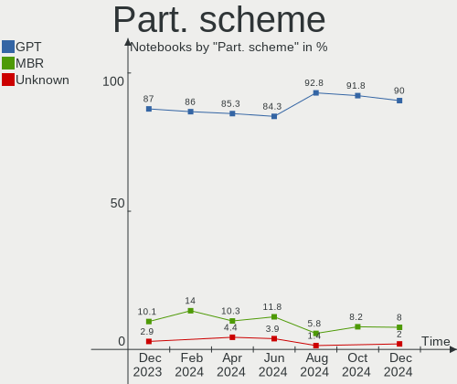
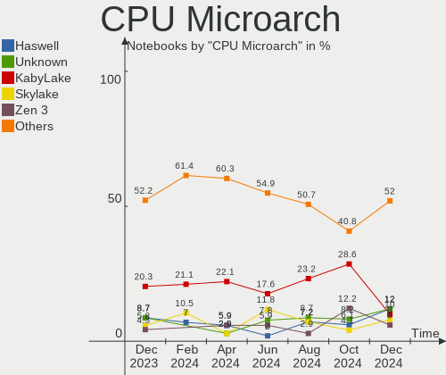
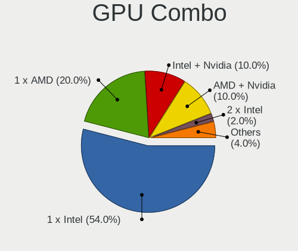
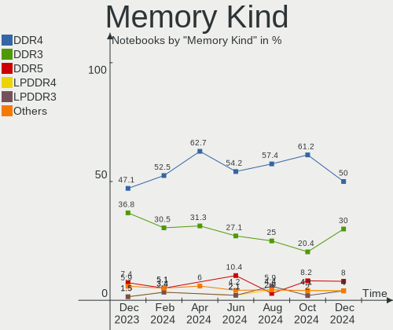
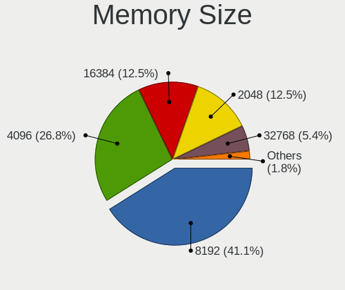

ArcoLinux - Hardware Trends (Notebooks)
---------------------------------------

A project to identify most popular hardware characteristics and track their change
over time based on data collected by Linux users at https://Linux-Hardware.org.

Anyone can contribute to this report by the [hw-probe](https://github.com/linuxhw/hw-probe) tool:

    sudo -E hw-probe -all -upload

This report is for one last month. Overall report since the beginning of time: [TestDays](https://github.com/linuxhw/TestDays)

Period: Dec, 2024.

Contents
--------

* [ System ](#system)
  - [ OS                       ](#os)
  - [ OS Family                ](#os-family)
  - [ Kernel                   ](#kernel)
  - [ Kernel Family            ](#kernel-family)
  - [ Kernel Major Ver.        ](#kernel-major-ver)
  - [ Arch                     ](#arch)
  - [ DE                       ](#de)
  - [ Display Server           ](#display-server)
  - [ Display Manager          ](#display-manager)
  - [ OS Lang                  ](#os-lang)
  - [ Boot Mode                ](#boot-mode)
  - [ Filesystem               ](#filesystem)
  - [ Part. scheme             ](#part-scheme)
  - [ Dual Boot with Linux/BSD ](#dual-boot-with-linuxbsd)
  - [ Dual Boot (Win)          ](#dual-boot-win)

* [ Board ](#board)
  - [ Vendor                   ](#vendor)
  - [ Model                    ](#model)
  - [ Model Family             ](#model-family)
  - [ MFG Year                 ](#mfg-year)
  - [ Form Factor              ](#form-factor)
  - [ Secure Boot              ](#secure-boot)
  - [ Coreboot                 ](#coreboot)
  - [ RAM Size                 ](#ram-size)
  - [ RAM Used                 ](#ram-used)
  - [ Total Drives             ](#total-drives)
  - [ Has CD-ROM               ](#has-cd-rom)
  - [ Has Ethernet             ](#has-ethernet)
  - [ Has WiFi                 ](#has-wifi)
  - [ Has Bluetooth            ](#has-bluetooth)

* [ Location ](#location)
  - [ Country                  ](#country)
  - [ City                     ](#city)

* [ Drives ](#drives)
  - [ Drive Vendor             ](#drive-vendor)
  - [ Drive Model              ](#drive-model)
  - [ HDD Vendor               ](#hdd-vendor)
  - [ SSD Vendor               ](#ssd-vendor)
  - [ Drive Kind               ](#drive-kind)
  - [ Drive Connector          ](#drive-connector)
  - [ Drive Size               ](#drive-size)
  - [ Space Total              ](#space-total)
  - [ Space Used               ](#space-used)
  - [ Malfunc. Drives          ](#malfunc-drives)
  - [ Malfunc. Drive Vendor    ](#malfunc-drive-vendor)
  - [ Malfunc. HDD Vendor      ](#malfunc-hdd-vendor)
  - [ Malfunc. Drive Kind      ](#malfunc-drive-kind)
  - [ Failed Drives            ](#failed-drives)
  - [ Failed Drive Vendor      ](#failed-drive-vendor)
  - [ Drive Status             ](#drive-status)

* [ Storage controller ](#storage-controller)
  - [ Storage Vendor           ](#storage-vendor)
  - [ Storage Model            ](#storage-model)
  - [ Storage Kind             ](#storage-kind)

* [ Processor ](#processor)
  - [ CPU Vendor               ](#cpu-vendor)
  - [ CPU Model                ](#cpu-model)
  - [ CPU Model Family         ](#cpu-model-family)
  - [ CPU Cores                ](#cpu-cores)
  - [ CPU Sockets              ](#cpu-sockets)
  - [ CPU Threads              ](#cpu-threads)
  - [ CPU Op-Modes             ](#cpu-op-modes)
  - [ CPU Microcode            ](#cpu-microcode)
  - [ CPU Microarch            ](#cpu-microarch)

* [ Graphics ](#graphics)
  - [ GPU Vendor               ](#gpu-vendor)
  - [ GPU Model                ](#gpu-model)
  - [ GPU Combo                ](#gpu-combo)
  - [ GPU Driver               ](#gpu-driver)
  - [ GPU Memory               ](#gpu-memory)

* [ Monitor ](#monitor)
  - [ Monitor Vendor           ](#monitor-vendor)
  - [ Monitor Model            ](#monitor-model)
  - [ Monitor Resolution       ](#monitor-resolution)
  - [ Monitor Diagonal         ](#monitor-diagonal)
  - [ Monitor Width            ](#monitor-width)
  - [ Aspect Ratio             ](#aspect-ratio)
  - [ Monitor Area             ](#monitor-area)
  - [ Pixel Density            ](#pixel-density)
  - [ Multiple Monitors        ](#multiple-monitors)

* [ Network ](#network)
  - [ Net Controller Vendor    ](#net-controller-vendor)
  - [ Net Controller Model     ](#net-controller-model)
  - [ Wireless Vendor          ](#wireless-vendor)
  - [ Wireless Model           ](#wireless-model)
  - [ Ethernet Vendor          ](#ethernet-vendor)
  - [ Ethernet Model           ](#ethernet-model)
  - [ Net Controller Kind      ](#net-controller-kind)
  - [ Used Controller          ](#used-controller)
  - [ NICs                     ](#nics)
  - [ IPv6                     ](#ipv6)

* [ Bluetooth ](#bluetooth)
  - [ Bluetooth Vendor         ](#bluetooth-vendor)
  - [ Bluetooth Model          ](#bluetooth-model)

* [ Sound ](#sound)
  - [ Sound Vendor             ](#sound-vendor)
  - [ Sound Model              ](#sound-model)

* [ Memory ](#memory)
  - [ Memory Vendor            ](#memory-vendor)
  - [ Memory Model             ](#memory-model)
  - [ Memory Kind              ](#memory-kind)
  - [ Memory Form Factor       ](#memory-form-factor)
  - [ Memory Size              ](#memory-size)
  - [ Memory Speed             ](#memory-speed)

* [ Printers & scanners ](#printers--scanners)
  - [ Printer Vendor           ](#printer-vendor)
  - [ Printer Model            ](#printer-model)
  - [ Scanner Vendor           ](#scanner-vendor)
  - [ Scanner Model            ](#scanner-model)

* [ Camera ](#camera)
  - [ Camera Vendor            ](#camera-vendor)
  - [ Camera Model             ](#camera-model)

* [ Security ](#security)
  - [ Fingerprint Vendor       ](#fingerprint-vendor)
  - [ Fingerprint Model        ](#fingerprint-model)
  - [ Chipcard Vendor          ](#chipcard-vendor)
  - [ Chipcard Model           ](#chipcard-model)

* [ Unsupported ](#unsupported)
  - [ Unsupported Devices      ](#unsupported-devices)
  - [ Unsupported Device Types ](#unsupported-device-types)

System
------

OS
--

Installed operating systems

| Name              | Notebooks | Percent |
|-------------------|-----------|---------|
| ArcoLinux Rolling | 49        | 98%     |
| ArcoLinux         | 1         | 2%      |

OS Family
---------

OS without a version

| Name      | Notebooks | Percent |
|-----------|-----------|---------|
| ArcoLinux | 50        | 100%    |

Kernel
------

Version of the Linux kernel

| Version                           | Notebooks | Percent |
|-----------------------------------|-----------|---------|
| 6.12.4-zen1-1-zen                 | 11        | 22%     |
| 6.12.1-zen1-1-zen                 | 9         | 18%     |
| 6.12.1-arch1-1                    | 4         | 8%      |
| 6.6.65-1-lts                      | 3         | 6%      |
| 6.6.63-1-lts                      | 3         | 6%      |
| 6.12.4-arch1-1                    | 2         | 4%      |
| 6.11.7-zen1-1-zen                 | 2         | 4%      |
| 6.8.5-zen1-1-zen                  | 1         | 2%      |
| 6.8.5-arch1-1                     | 1         | 2%      |
| 6.7.4-arch1-1                     | 1         | 2%      |
| 6.6.67-1-lts                      | 1         | 2%      |
| 6.12.7-zen1-1-zen                 | 1         | 2%      |
| 6.12.6-x64v3-xanmod1-1-edge-x64v3 | 1         | 2%      |
| 6.12.6-arch1-1                    | 1         | 2%      |
| 6.12.6-1-cachyos                  | 1         | 2%      |
| 6.12.4-1-cachyos                  | 1         | 2%      |
| 6.12.3-arch1-1                    | 1         | 2%      |
| 6.12.1-arch1-1.1-g14              | 1         | 2%      |
| 6.11.7-arch1-1                    | 1         | 2%      |
| 6.11.3-arch1-1                    | 1         | 2%      |
| 6.11.11-hardened1-1-hardened      | 1         | 2%      |
| 6.10.4-zen2-1-zen                 | 1         | 2%      |
| 6.10.10-zen1-1-zen                | 1         | 2%      |

Kernel Family
-------------

Linux kernel without a distro release

| Version | Notebooks | Percent |
|---------|-----------|---------|
| 6.12.4  | 14        | 28%     |
| 6.12.1  | 14        | 28%     |
| 6.6.65  | 3         | 6%      |
| 6.6.63  | 3         | 6%      |
| 6.12.6  | 3         | 6%      |
| 6.11.7  | 3         | 6%      |
| 6.8.5   | 2         | 4%      |
| 6.7.4   | 1         | 2%      |
| 6.6.67  | 1         | 2%      |
| 6.12.7  | 1         | 2%      |
| 6.12.3  | 1         | 2%      |
| 6.11.3  | 1         | 2%      |
| 6.11.11 | 1         | 2%      |
| 6.10.4  | 1         | 2%      |
| 6.10.10 | 1         | 2%      |

Kernel Major Ver.
-----------------

Linux kernel major version

| Version | Notebooks | Percent |
|---------|-----------|---------|
| 6.12    | 33        | 66%     |
| 6.6     | 7         | 14%     |
| 6.11    | 5         | 10%     |
| 6.8     | 2         | 4%      |
| 6.10    | 2         | 4%      |
| 6.7     | 1         | 2%      |

Arch
----

OS architecture (x86_64, i586, etc.)

| Name   | Notebooks | Percent |
|--------|-----------|---------|
| x86_64 | 50        | 100%    |

DE
--

Desktop Environment

| Name     | Notebooks | Percent |
|----------|-----------|---------|
| XFCE     | 21        | 42%     |
| GNOME    | 9         | 18%     |
| KDE6     | 5         | 10%     |
| Hyprland | 4         | 8%      |
| Cinnamon | 4         | 8%      |
| Unknown  | 4         | 8%      |
| qtile    | 1         | 2%      |
| i3       | 1         | 2%      |
| Deepin   | 1         | 2%      |

Display Server
--------------

X11 or Wayland

| Name    | Notebooks | Percent |
|---------|-----------|---------|
| X11     | 34        | 68%     |
| Wayland | 15        | 30%     |
| Unknown | 1         | 2%      |

Display Manager
---------------

SDDM, LightDM, etc.

| Name    | Notebooks | Percent |
|---------|-----------|---------|
| SDDM    | 39        | 78%     |
| LightDM | 10        | 20%     |
| Unknown | 1         | 2%      |

OS Lang
-------

Language

| Lang  | Notebooks | Percent |
|-------|-----------|---------|
| en_US | 22        | 44%     |
| en_GB | 5         | 10%     |
| en_CA | 3         | 6%      |
| es_MX | 2         | 4%      |
| es_ES | 2         | 4%      |
| en_IN | 2         | 4%      |
| de_DE | 2         | 4%      |
| C     | 2         | 4%      |
| ru_RU | 1         | 2%      |
| pt_PT | 1         | 2%      |
| pt_BR | 1         | 2%      |
| nl_NL | 1         | 2%      |
| it_IT | 1         | 2%      |
| es_PA | 1         | 2%      |
| en_HK | 1         | 2%      |
| en_DK | 1         | 2%      |
| en_AU | 1         | 2%      |
| de_CH | 1         | 2%      |

Boot Mode
---------

EFI or BIOS

| Mode | Notebooks | Percent |
|------|-----------|---------|
| EFI  | 44        | 88%     |
| BIOS | 6         | 12%     |

Filesystem
----------

Type of filesystem

| Type    | Notebooks | Percent |
|---------|-----------|---------|
| Ext4    | 33        | 66%     |
| Btrfs   | 13        | 26%     |
| Xfs     | 2         | 4%      |
| Overlay | 2         | 4%      |

Part. scheme
------------

Scheme of partitioning

| Type    | Notebooks | Percent |
|---------|-----------|---------|
| GPT     | 45        | 90%     |
| MBR     | 4         | 8%      |
| Unknown | 1         | 2%      |

Dual Boot with Linux/BSD
------------------------

Hosting more than one Linux/BSD

| Dual boot | Notebooks | Percent |
|-----------|-----------|---------|
| No        | 39        | 78%     |
| Yes       | 11        | 22%     |

Dual Boot (Win)
---------------

Hosting Linux and Windows

| Dual boot | Notebooks | Percent |
|-----------|-----------|---------|
| No        | 40        | 80%     |
| Yes       | 10        | 20%     |

Board
-----

Vendor
------

Motherboard manufacturer

| Name                | Notebooks | Percent |
|---------------------|-----------|---------|
| Lenovo              | 14        | 28%     |
| ASUSTek Computer    | 14        | 28%     |
| Hewlett-Packard     | 4         | 8%      |
| Samsung Electronics | 3         | 6%      |
| Dell                | 2         | 4%      |
| Chuwi               | 2         | 4%      |
| Apple               | 2         | 4%      |
| TUXEDO              | 1         | 2%      |
| Toshiba             | 1         | 2%      |
| Notebook            | 1         | 2%      |
| MSI                 | 1         | 2%      |
| HUAWEI              | 1         | 2%      |
| Google              | 1         | 2%      |
| Framework           | 1         | 2%      |
| Acer                | 1         | 2%      |
| Unknown             | 1         | 2%      |

Model
-----

Motherboard model

| Name                                       | Notebooks | Percent |
|--------------------------------------------|-----------|---------|
| TUXEDO InfinityBook Pro AMD Gen9           | 1         | 2%      |
| Toshiba Satellite C55-B                    | 1         | 2%      |
| Samsung 905S3G/906S3G/915S3G               | 1         | 2%      |
| Samsung 900X3C/900X3D/900X3E/900X4C/900X4D | 1         | 2%      |
| Samsung 530U3BI/530U4BI/530U4BH            | 1         | 2%      |
| Notebook NH5xAx                            | 1         | 2%      |
| MSI GS66 Stealth 10SE                      | 1         | 2%      |
| Lenovo ThinkPad X1 Carbon 6th 20KH006KUK   | 1         | 2%      |
| Lenovo ThinkPad W540 20BHS14J0J            | 1         | 2%      |
| Lenovo ThinkPad T60 1951FDG                | 1         | 2%      |
| Lenovo ThinkPad T560 20FJS1WT00            | 1         | 2%      |
| Lenovo ThinkPad T470s W10DG 20JTS1LS00     | 1         | 2%      |
| Lenovo ThinkPad T430 2349IF8               | 1         | 2%      |
| Lenovo ThinkPad Edge E540 20C600LPMS       | 1         | 2%      |
| Lenovo ThinkPad Edge 031925U               | 1         | 2%      |
| Lenovo ThinkPad A485 20MVS08500            | 1         | 2%      |
| Lenovo ThinkBook 15 G4 IAP 21DJ            | 1         | 2%      |
| Lenovo Legion 5 15ACH6H 82JU               | 1         | 2%      |
| Lenovo IdeaPad 5 Pro 14ACN6 82L7           | 1         | 2%      |
| Lenovo IdeaPad 330-15ICH 81FK              | 1         | 2%      |
| Lenovo IdeaPad 1 15AMN7 82VG               | 1         | 2%      |
| HUAWEI NBLK-WAX9X                          | 1         | 2%      |
| HP Pavilion Laptop 14-dv1xxx               | 1         | 2%      |
| HP Laptop 15-dy1xxx                        | 1         | 2%      |
| HP Laptop 14s-fq1xxx                       | 1         | 2%      |
| HP ENVY 15                                 | 1         | 2%      |
| Google Cyan                                | 1         | 2%      |
| Framework Laptop 13 (AMD Ryzen 7040Series) | 1         | 2%      |
| Dell Latitude E7470                        | 1         | 2%      |
| Dell Inspiron 3542                         | 1         | 2%      |
| Chuwi GemiBook Pro                         | 1         | 2%      |
| Chuwi CoreBook X                           | 1         | 2%      |
| ASUS Zenbook UM5401QAB_UM5401QA            | 1         | 2%      |
| ASUS X553MA                                | 1         | 2%      |
| ASUS X205TA                                | 1         | 2%      |
| ASUS VivoBook_ASUSLaptop X409BA_M409BA     | 1         | 2%      |
| ASUS VivoBook_ASUSLaptop X1704ZA_F1704ZA   | 1         | 2%      |
| ASUS VivoBook 15_ASUS Laptop X540UAR       | 1         | 2%      |
| ASUS VivoBook 14_ASUS Laptop X407UAR       | 1         | 2%      |
| ASUS VivoBook 14_ASUS Laptop X407MA_X407MA | 1         | 2%      |

Model Family
------------

Motherboard model prefix

| Name                | Notebooks | Percent |
|---------------------|-----------|---------|
| Lenovo ThinkPad     | 9         | 18%     |
| ASUS VivoBook       | 5         | 10%     |
| Lenovo IdeaPad      | 3         | 6%      |
| HP Laptop           | 2         | 4%      |
| ASUS ROG            | 2         | 4%      |
| TUXEDO InfinityBook | 1         | 2%      |
| Toshiba Satellite   | 1         | 2%      |
| Samsung 905S3G      | 1         | 2%      |
| Samsung 900X3C      | 1         | 2%      |
| Samsung 530U3BI     | 1         | 2%      |
| Notebook NH5xAx     | 1         | 2%      |
| MSI GS66            | 1         | 2%      |
| Lenovo ThinkBook    | 1         | 2%      |
| Lenovo Legion       | 1         | 2%      |
| HUAWEI NBLK-WAX9X   | 1         | 2%      |
| HP Pavilion         | 1         | 2%      |
| HP ENVY             | 1         | 2%      |
| Google Cyan         | 1         | 2%      |
| Framework Laptop    | 1         | 2%      |
| Dell Latitude       | 1         | 2%      |
| Dell Inspiron       | 1         | 2%      |
| Chuwi GemiBook      | 1         | 2%      |
| Chuwi CoreBook      | 1         | 2%      |
| ASUS Zenbook        | 1         | 2%      |
| ASUS X553MA         | 1         | 2%      |
| ASUS X205TA         | 1         | 2%      |
| ASUS UX305CA        | 1         | 2%      |
| ASUS TUF            | 1         | 2%      |
| ASUS Strix          | 1         | 2%      |
| ASUS ASUS           | 1         | 2%      |
| Apple MacBookAir7   | 1         | 2%      |
| Apple MacBookAir6   | 1         | 2%      |
| Acer Aspire         | 1         | 2%      |
| Unknown             | 1         | 2%      |

MFG Year
--------

Motherboard manufacture year

| Year | Notebooks | Percent |
|------|-----------|---------|
| 2018 | 7         | 14%     |
| 2024 | 5         | 10%     |
| 2021 | 5         | 10%     |
| 2013 | 5         | 10%     |
| 2022 | 4         | 8%      |
| 2020 | 4         | 8%      |
| 2019 | 4         | 8%      |
| 2014 | 4         | 8%      |
| 2023 | 2         | 4%      |
| 2015 | 2         | 4%      |
| 2012 | 2         | 4%      |
| 2010 | 2         | 4%      |
| 2017 | 1         | 2%      |
| 2016 | 1         | 2%      |
| 2007 | 1         | 2%      |
| 2006 | 1         | 2%      |

Form Factor
-----------

Physical design of the computer

| Name     | Notebooks | Percent |
|----------|-----------|---------|
| Notebook | 50        | 100%    |

Secure Boot
-----------

Enabled or disabled

| State    | Notebooks | Percent |
|----------|-----------|---------|
| Disabled | 50        | 100%    |

Coreboot
--------

Have coreboot on board

| Used | Notebooks | Percent |
|------|-----------|---------|
| No   | 49        | 98%     |
| Yes  | 1         | 2%      |

RAM Size
--------

Total RAM memory

| Size in GB  | Notebooks | Percent |
|-------------|-----------|---------|
| 4.01-8.0    | 14        | 28%     |
| 3.01-4.0    | 9         | 18%     |
| 8.01-16.0   | 9         | 18%     |
| 16.01-24.0  | 8         | 16%     |
| 32.01-64.0  | 6         | 12%     |
| 1.01-2.0    | 2         | 4%      |
| 2.01-3.0    | 1         | 2%      |
| 64.01-256.0 | 1         | 2%      |

RAM Used
--------

Used RAM memory

| Used GB  | Notebooks | Percent |
|----------|-----------|---------|
| 1.01-2.0 | 19        | 38%     |
| 2.01-3.0 | 18        | 36%     |
| 4.01-8.0 | 5         | 10%     |
| 3.01-4.0 | 5         | 10%     |
| 0.51-1.0 | 3         | 6%      |

Total Drives
------------

Number of drives on board

| Drives | Notebooks | Percent |
|--------|-----------|---------|
| 1      | 38        | 76%     |
| 2      | 11        | 22%     |
| 3      | 1         | 2%      |

Has CD-ROM
----------

Has CD-ROM on board

| Presented | Notebooks | Percent |
|-----------|-----------|---------|
| No        | 45        | 90%     |
| Yes       | 5         | 10%     |

Has Ethernet
------------

Has Ethernet on board

| Presented | Notebooks | Percent |
|-----------|-----------|---------|
| Yes       | 32        | 64%     |
| No        | 18        | 36%     |

Has WiFi
--------

Has WiFi module

| Presented | Notebooks | Percent |
|-----------|-----------|---------|
| Yes       | 48        | 96%     |
| No        | 2         | 4%      |

Has Bluetooth
-------------

Has Bluetooth module

| Presented | Notebooks | Percent |
|-----------|-----------|---------|
| Yes       | 44        | 88%     |
| No        | 6         | 12%     |

Location
--------

Country
-------

Geographic location (country)

| Country      | Notebooks | Percent |
|--------------|-----------|---------|
| USA          | 9         | 18%     |
| Australia    | 4         | 8%      |
| Spain        | 3         | 6%      |
| Netherlands  | 3         | 6%      |
| India        | 3         | 6%      |
| Canada       | 3         | 6%      |
| UK           | 2         | 4%      |
| Switzerland  | 2         | 4%      |
| Germany      | 2         | 4%      |
| Uzbekistan   | 1         | 2%      |
| Turkey       | 1         | 2%      |
| Sweden       | 1         | 2%      |
| South Africa | 1         | 2%      |
| Serbia       | 1         | 2%      |
| Russia       | 1         | 2%      |
| Portugal     | 1         | 2%      |
| Panama       | 1         | 2%      |
| Morocco      | 1         | 2%      |
| Mexico       | 1         | 2%      |
| Italy        | 1         | 2%      |
| Indonesia    | 1         | 2%      |
| Hong Kong    | 1         | 2%      |
| Greece       | 1         | 2%      |
| Estonia      | 1         | 2%      |
| Denmark      | 1         | 2%      |
| Colombia     | 1         | 2%      |
| Brazil       | 1         | 2%      |
| Bangladesh   | 1         | 2%      |

City
----

Geographic location (city)

| City          | Notebooks | Percent |
|---------------|-----------|---------|
| Sydney        | 3         | 6%      |
| Los Angeles   | 2         | 4%      |
| Basauri       | 2         | 4%      |
| Zurich        | 1         | 2%      |
| Winter Park   | 1         | 2%      |
| Wilhelmshaven | 1         | 2%      |
| Washington    | 1         | 2%      |
| Unterammergau | 1         | 2%      |
| Tunja         | 1         | 2%      |
| Tsuen Wan     | 1         | 2%      |
| Thornhill     | 1         | 2%      |
| Tétouan      | 1         | 2%      |
| Tashkent      | 1         | 2%      |
| Tallinn       | 1         | 2%      |
| Stockholm     | 1         | 2%      |
| Senbag        | 1         | 2%      |
| Samara        | 1         | 2%      |
| Pune          | 1         | 2%      |
| Pretoria      | 1         | 2%      |
| Perugia       | 1         | 2%      |
| Panama City   | 1         | 2%      |
| Oss           | 1         | 2%      |
| Miramar Beach | 1         | 2%      |
| Melbourne     | 1         | 2%      |
| Mazatlán     | 1         | 2%      |
| Mauá         | 1         | 2%      |
| Marysville    | 1         | 2%      |
| Mandeville    | 1         | 2%      |
| Kolding       | 1         | 2%      |
| Kochi         | 1         | 2%      |
| Kessel        | 1         | 2%      |
| Kennewick     | 1         | 2%      |
| Istanbul      | 1         | 2%      |
| Hoog-Keppel   | 1         | 2%      |
| Harleyville   | 1         | 2%      |
| Hamilton      | 1         | 2%      |
| Feltham       | 1         | 2%      |
| Durham        | 1         | 2%      |
| Dietikon      | 1         | 2%      |
| Denpasar      | 1         | 2%      |

Drives
------

Drive Vendor
------------

Hard drive vendors

| Vendor                       | Notebooks | Drives | Percent |
|------------------------------|-----------|--------|---------|
| Samsung Electronics          | 12        | 12     | 20.34%  |
| Sandisk                      | 9         | 12     | 15.25%  |
| Intel                        | 5         | 5      | 8.47%   |
| SK hynix                     | 4         | 4      | 6.78%   |
| Unknown                      | 3         | 3      | 5.08%   |
| Toshiba                      | 3         | 3      | 5.08%   |
| Kingston                     | 3         | 3      | 5.08%   |
| WDC                          | 2         | 2      | 3.39%   |
| Seagate                      | 2         | 2      | 3.39%   |
| KIOXIA                       | 2         | 2      | 3.39%   |
| Crucial                      | 2         | 2      | 3.39%   |
| Apple                        | 2         | 2      | 3.39%   |
| Transcend                    | 1         | 1      | 1.69%   |
| Silicon Motion               | 1         | 1      | 1.69%   |
| ShiJi                        | 1         | 1      | 1.69%   |
| Shenzhen Longsys Electronics | 1         | 1      | 1.69%   |
| Micron Technology            | 1         | 1      | 1.69%   |
| MAXIO Technology (Hangzhou)  | 1         | 1      | 1.69%   |
| Intenso                      | 1         | 1      | 1.69%   |
| HGST                         | 1         | 1      | 1.69%   |
| ADATA Technology             | 1         | 1      | 1.69%   |
| Unknown                      | 1         | 1      | 1.69%   |

Drive Model
-----------

Hard drive models

| Model                                                  | Notebooks | Percent |
|--------------------------------------------------------|-----------|---------|
| Unknown MMC Card  32GB                                 | 2         | 3.28%   |
| Sandisk WD Blue SN550 NVMe SSD 256GB                   | 2         | 3.28%   |
| Sandisk WD Black SN750 / PC SN730 NVMe SSD 512GB       | 2         | 3.28%   |
| Samsung NVMe SSD Controller SM981/PM981/PM983 512GB    | 2         | 3.28%   |
| Intel SSDPEKNU512GZ 512GB                              | 2         | 3.28%   |
| Apple SSD SM0256G 256GB                                | 2         | 3.28%   |
| WDC WD5000BEVT-22A0RT0 500GB                           | 1         | 1.64%   |
| WDC WD Blue SA510 M.2 2280 2TB SSD                     | 1         | 1.64%   |
| Unknown SD/MMC/MS PRO 128GB                            | 1         | 1.64%   |
| Transcend TS240GSSD220S 240GB                          | 1         | 1.64%   |
| Toshiba THNSNJ512GCSU 512GB SSD                        | 1         | 1.64%   |
| Toshiba MQ04ABF100 1TB                                 | 1         | 1.64%   |
| Toshiba MQ01ABF050 500GB                               | 1         | 1.64%   |
| SK hynix SKHynix_HFS256GEJ4X112N 256GB                 | 1         | 1.64%   |
| SK hynix SC311 SATA 256GB SSD                          | 1         | 1.64%   |
| SK hynix BC711 HFM512GD3JX013N 512GB                   | 1         | 1.64%   |
| SK hynix BC511 512GB                                   | 1         | 1.64%   |
| Silicon Motion SM2263EN/SM2263XT SSD Controller 256GB  | 1         | 1.64%   |
| ShiJi SSD 1TB                                          | 1         | 1.64%   |
| Shenzhen Longsys SM2263EN/SM2263XT-based OEM SSD 128GB | 1         | 1.64%   |
| Seagate ST9250315AS 250GB                              | 1         | 1.64%   |
| Seagate ST1000LM035-1RK172 1TB                         | 1         | 1.64%   |
| Sandisk WD_BLACK SN850X 4000GB                         | 1         | 1.64%   |
| Sandisk WD PC SN740 SDDPNQD-512G-1102 512GB            | 1         | 1.64%   |
| Sandisk WD PC SN560 SDDPNQE-1T00-1002 1024GB           | 1         | 1.64%   |
| Sandisk WD Blue SN500 / PC SN520 NVMe SSD 256GB        | 1         | 1.64%   |
| Sandisk WD Black 2018/SN750 / PC SN720 NVMe SSD 512GB  | 1         | 1.64%   |
| SanDisk SDSSDP128G 128GB                               | 1         | 1.64%   |
| SanDisk iSSD P4 16GB                                   | 1         | 1.64%   |
| Samsung SSD 990 EVO 1TB                                | 1         | 1.64%   |
| Samsung SSD 870 QVO 1TB                                | 1         | 1.64%   |
| Samsung SSD 860 EVO M.2 1TB                            | 1         | 1.64%   |
| Samsung SSD 860 EVO 1TB                                | 1         | 1.64%   |
| Samsung SSD 850 EVO 120GB                              | 1         | 1.64%   |
| Samsung NVMe SSD Controller PM9A1/PM9A3/980PRO 512GB   | 1         | 1.64%   |
| Samsung MZMTD128HAFV-000 128GB SSD                     | 1         | 1.64%   |
| Samsung MZMPC256HBGJ-000 256GB SSD                     | 1         | 1.64%   |
| Samsung MZALQ512HALU-000L2 512GB                       | 1         | 1.64%   |
| Samsung MZ7LN512HMJP-000L7 512GB SSD                   | 1         | 1.64%   |
| Micron 2200V_MTFDHBA512TCK 512GB                       | 1         | 1.64%   |

HDD Vendor
----------

Hard disk drive vendors

| Vendor  | Notebooks | Drives | Percent |
|---------|-----------|--------|---------|
| Toshiba | 2         | 2      | 28.57%  |
| Seagate | 2         | 2      | 28.57%  |
| WDC     | 1         | 1      | 14.29%  |
| Unknown | 1         | 1      | 14.29%  |
| HGST    | 1         | 1      | 14.29%  |

SSD Vendor
----------

Solid state drive vendors

| Vendor              | Notebooks | Drives | Percent |
|---------------------|-----------|--------|---------|
| Samsung Electronics | 7         | 7      | 29.17%  |
| Kingston            | 3         | 3      | 12.5%   |
| Intel               | 2         | 2      | 8.33%   |
| Crucial             | 2         | 2      | 8.33%   |
| Apple               | 2         | 2      | 8.33%   |
| WDC                 | 1         | 1      | 4.17%   |
| Transcend           | 1         | 1      | 4.17%   |
| Toshiba             | 1         | 1      | 4.17%   |
| SK hynix            | 1         | 1      | 4.17%   |
| ShiJi               | 1         | 1      | 4.17%   |
| SanDisk             | 1         | 2      | 4.17%   |
| Intenso             | 1         | 1      | 4.17%   |
| Unknown             | 1         | 1      | 4.17%   |

Drive Kind
----------

HDD or SSD

| Kind | Notebooks | Drives | Percent |
|------|-----------|--------|---------|
| NVMe | 25        | 28     | 46.3%   |
| SSD  | 20        | 25     | 37.04%  |
| HDD  | 7         | 7      | 12.96%  |
| MMC  | 2         | 2      | 3.7%    |

Drive Connector
---------------

SATA, SAS, NVMe, etc.

| Type | Notebooks | Drives | Percent |
|------|-----------|--------|---------|
| NVMe | 25        | 28     | 47.17%  |
| SATA | 25        | 31     | 47.17%  |
| MMC  | 2         | 2      | 3.77%   |
| SAS  | 1         | 1      | 1.89%   |

Drive Size
----------

Size of hard drive

| Size in TB | Notebooks | Drives | Percent |
|------------|-----------|--------|---------|
| 0.01-0.5   | 15        | 19     | 53.57%  |
| 0.51-1.0   | 11        | 11     | 39.29%  |
| 1.01-2.0   | 2         | 2      | 7.14%   |

Space Total
-----------

Amount of disk space available on the file system

| Size in GB     | Notebooks | Percent |
|----------------|-----------|---------|
| 101-250        | 12        | 24%     |
| 251-500        | 10        | 20%     |
| 501-1000       | 9         | 18%     |
| More than 3000 | 5         | 10%     |
| 1001-2000      | 4         | 8%      |
| 51-100         | 3         | 6%      |
| 21-50          | 2         | 4%      |
| 2001-3000      | 2         | 4%      |
| Unknown        | 2         | 4%      |
| 1-20           | 1         | 2%      |

Space Used
----------

Amount of used disk space

| Used GB | Notebooks | Percent |
|---------|-----------|---------|
| 1-20    | 15        | 30%     |
| 21-50   | 11        | 22%     |
| 101-250 | 9         | 18%     |
| 251-500 | 8         | 16%     |
| 51-100  | 5         | 10%     |
| Unknown | 2         | 4%      |

Malfunc. Drives
---------------

Drive models with a malfunction

| Model                        | Notebooks | Drives | Percent |
|------------------------------|-----------|--------|---------|
| WDC WD5000BEVT-22A0RT0 500GB | 1         | 1      | 25%     |
| Seagate ST9250315AS 250GB    | 1         | 1      | 25%     |
| SanDisk iSSD P4 16GB         | 1         | 1      | 25%     |
| Intel SSDSC2BF180A4L 180GB   | 1         | 1      | 25%     |

Malfunc. Drive Vendor
---------------------

Vendors of faulty drives

| Vendor  | Notebooks | Drives | Percent |
|---------|-----------|--------|---------|
| WDC     | 1         | 1      | 25%     |
| Seagate | 1         | 1      | 25%     |
| SanDisk | 1         | 1      | 25%     |
| Intel   | 1         | 1      | 25%     |

Malfunc. HDD Vendor
-------------------

Vendors of faulty HDD drives

| Vendor  | Notebooks | Drives | Percent |
|---------|-----------|--------|---------|
| WDC     | 1         | 1      | 50%     |
| Seagate | 1         | 1      | 50%     |

Malfunc. Drive Kind
-------------------

Kinds of faulty drives

| Kind | Notebooks | Drives | Percent |
|------|-----------|--------|---------|
| SSD  | 2         | 2      | 50%     |
| HDD  | 2         | 2      | 50%     |

Failed Drives
-------------

Failed drive models

Zero info for selected period =(

Failed Drive Vendor
-------------------

Failed drive vendors

Zero info for selected period =(

Drive Status
------------

Number of failed and malfunc. drives

| Status   | Notebooks | Drives | Percent |
|----------|-----------|--------|---------|
| Works    | 45        | 53     | 83.33%  |
| Detected | 5         | 5      | 9.26%   |
| Malfunc  | 4         | 4      | 7.41%   |

Storage controller
------------------

Storage Vendor
--------------

Storage controller vendors

| Vendor                       | Notebooks | Percent |
|------------------------------|-----------|---------|
| Intel                        | 28        | 47.46%  |
| SanDisk                      | 8         | 13.56%  |
| Samsung Electronics          | 7         | 11.86%  |
| AMD                          | 6         | 10.17%  |
| SK hynix                     | 3         | 5.08%   |
| KIOXIA                       | 2         | 3.39%   |
| Silicon Motion               | 1         | 1.69%   |
| Shenzhen Longsys Electronics | 1         | 1.69%   |
| Micron Technology            | 1         | 1.69%   |
| MAXIO Technology (Hangzhou)  | 1         | 1.69%   |
| ADATA Technology             | 1         | 1.69%   |

Storage Model
-------------

Storage controller models

| Model                                                                          | Notebooks | Percent |
|--------------------------------------------------------------------------------|-----------|---------|
| AMD FCH SATA Controller [AHCI mode]                                            | 6         | 9.52%   |
| Intel 82801 Mobile SATA Controller [RAID mode]                                 | 4         | 6.35%   |
| Intel Sunrise Point-LP SATA Controller [AHCI mode]                             | 3         | 4.76%   |
| SanDisk WD Black SN770 / PC SN740 256GB / PC SN560 (DRAM-less) NVMe SSD        | 2         | 3.17%   |
| SanDisk Ultra 3D / WD PC SN530, IX SN530, Blue SN550 NVMe SSD (DRAM-less)      | 2         | 3.17%   |
| SanDisk Extreme Pro / WD Black SN750 / PC SN730 / Red SN700 NVMe SSD           | 2         | 3.17%   |
| Samsung S4LN058A01[SSUBX] AHCI SSD Controller (Apple slot)                     | 2         | 3.17%   |
| Samsung NVMe SSD Controller SM981/PM981/PM983                                  | 2         | 3.17%   |
| KIOXIA NVMe SSD Controller BG4 (DRAM-less)                                     | 2         | 3.17%   |
| Intel Volume Management Device NVMe RAID Controller                            | 2         | 3.17%   |
| Intel SSD 670p Series [Keystone Harbor]                                        | 2         | 3.17%   |
| Intel Cannon Lake Mobile PCH SATA AHCI Controller                              | 2         | 3.17%   |
| Intel 8 Series/C220 Series Chipset Family 6-port SATA Controller 1 [AHCI mode] | 2         | 3.17%   |
| Intel 8 Series SATA Controller 1 [AHCI mode]                                   | 2         | 3.17%   |
| Intel 7 Series Chipset Family 6-port SATA Controller [AHCI mode]               | 2         | 3.17%   |
| SK hynix Gold P31/BC711/PC711 NVMe Solid State Drive                           | 1         | 1.59%   |
| SK hynix BC901 NVMe Solid State Drive (DRAM-less)                              | 1         | 1.59%   |
| SK hynix BC511 NVMe SSD                                                        | 1         | 1.59%   |
| Silicon Motion SM2263EN/SM2263XT (DRAM-less) NVMe SSD Controllers              | 1         | 1.59%   |
| Shenzhen Longsys SM2263EN/SM2263XT-based OEM NVME SSD (DRAM-less)              | 1         | 1.59%   |
| SanDisk WD Blue SN500 / PC SN520 x2 M.2 2280 NVMe SSD                          | 1         | 1.59%   |
| Sandisk WD Black SN850X NVMe SSD                                               | 1         | 1.59%   |
| SanDisk Extreme Pro / WD Black 2018/SN750/PC SN720 NVMe SSD                    | 1         | 1.59%   |
| Samsung NVMe SSD Controller PM9C1a (DRAM-less)                                 | 1         | 1.59%   |
| Samsung NVMe SSD Controller PM9A1/PM9A3/980PRO                                 | 1         | 1.59%   |
| Samsung NVMe SSD Controller 980 (DRAM-less)                                    | 1         | 1.59%   |
| Micron 2200S NVMe SSD [Cassandra]                                              | 1         | 1.59%   |
| MAXIO (Hangzhou) NVMe SSD Controller MAP1202 (DRAM-less)                       | 1         | 1.59%   |
| Intel Tiger Lake-LP SATA Controller                                            | 1         | 1.59%   |
| Intel SSD 600P Series                                                          | 1         | 1.59%   |
| Intel Jasper Lake SATA AHCI Controller                                         | 1         | 1.59%   |
| Intel Ice Lake-LP SATA Controller [AHCI mode]                                  | 1         | 1.59%   |
| Intel Celeron/Pentium Silver Processor SATA Controller                         | 1         | 1.59%   |
| Intel Atom Processor E3800 Series SATA AHCI Controller                         | 1         | 1.59%   |
| Intel Alder Lake-P SATA AHCI Controller                                        | 1         | 1.59%   |
| Intel 82801GBM/GHM (ICH7-M Family) SATA Controller [AHCI mode]                 | 1         | 1.59%   |
| Intel 82801G (ICH7 Family) IDE Controller                                      | 1         | 1.59%   |
| Intel 6 Series/C200 Series Chipset Family 6 port Mobile SATA AHCI Controller   | 1         | 1.59%   |
| Intel 5 Series/3400 Series Chipset 4 port SATA AHCI Controller                 | 1         | 1.59%   |
| AMD 400 Series Chipset SATA Controller                                         | 1         | 1.59%   |

Storage Kind
------------

Kind of storage controller (IDE, SATA, NVMe, SAS, ...)

| Kind | Notebooks | Percent |
|------|-----------|---------|
| SATA | 28        | 46.67%  |
| NVMe | 25        | 41.67%  |
| RAID | 6         | 10%     |
| IDE  | 1         | 1.67%   |

Processor
---------

CPU Vendor
----------

Processor vendors

| Vendor | Notebooks | Percent |
|--------|-----------|---------|
| Intel  | 34        | 68%     |
| AMD    | 16        | 32%     |

CPU Model
---------

Processor models

| Model                                           | Notebooks | Percent |
|-------------------------------------------------|-----------|---------|
| Intel Core i5-6300U CPU @ 2.40GHz               | 3         | 6%      |
| Intel Core i3-7020U CPU @ 2.30GHz               | 2         | 4%      |
| AMD Ryzen 9 7845HX with Radeon Graphics         | 2         | 4%      |
| Intel Pentium Silver N5000 CPU @ 1.10GHz        | 1         | 2%      |
| Intel Core m3-6Y30 CPU @ 0.90GHz                | 1         | 2%      |
| Intel Core i7-8750H CPU @ 2.20GHz               | 1         | 2%      |
| Intel Core i7-8550U CPU @ 1.80GHz               | 1         | 2%      |
| Intel Core i7-4800MQ CPU @ 2.70GHz              | 1         | 2%      |
| Intel Core i7-4712MQ CPU @ 2.30GHz              | 1         | 2%      |
| Intel Core i7-4702MQ CPU @ 2.20GHz              | 1         | 2%      |
| Intel Core i7-3740QM CPU @ 2.70GHz              | 1         | 2%      |
| Intel Core i7-3517U CPU @ 1.90GHz               | 1         | 2%      |
| Intel Core i7-10750H CPU @ 2.60GHz              | 1         | 2%      |
| Intel Core i5-8300H CPU @ 2.30GHz               | 1         | 2%      |
| Intel Core i5-5350U CPU @ 1.80GHz               | 1         | 2%      |
| Intel Core i5-4250U CPU @ 1.30GHz               | 1         | 2%      |
| Intel Core i5-4210U CPU @ 1.70GHz               | 1         | 2%      |
| Intel Core i5-2467M CPU @ 1.60GHz               | 1         | 2%      |
| Intel Core i5-1035G1 CPU @ 1.00GHz              | 1         | 2%      |
| Intel Core i3-4005U CPU @ 1.70GHz               | 1         | 2%      |
| Intel Core i3-1005G1 CPU @ 1.20GHz              | 1         | 2%      |
| Intel Core i3 CPU M 370 @ 2.40GHz               | 1         | 2%      |
| Intel Core 2 CPU T5500 @ 1.66GHz                | 1         | 2%      |
| Intel Celeron N5100 @ 1.10GHz                   | 1         | 2%      |
| Intel Celeron CPU N3060 @ 1.60GHz               | 1         | 2%      |
| Intel Celeron CPU N2840 @ 2.16GHz               | 1         | 2%      |
| Intel Atom CPU Z3735F @ 1.33GHz                 | 1         | 2%      |
| Intel 12th Gen Core i7-1255U                    | 1         | 2%      |
| Intel 12th Gen Core i5-12450H                   | 1         | 2%      |
| Intel 12th Gen Core i5-1235U                    | 1         | 2%      |
| Intel 11th Gen Core i7-1185G7 @ 3.00GHz         | 1         | 2%      |
| Intel 11th Gen Core i5-1155G7 @ 2.50GHz         | 1         | 2%      |
| AMD Ryzen 9 3900 12-Core Processor              | 1         | 2%      |
| AMD Ryzen 7 8845HS w/ Radeon 780M Graphics      | 1         | 2%      |
| AMD Ryzen 7 7840U w/ Radeon 780M Graphics       | 1         | 2%      |
| AMD Ryzen 7 5800H with Radeon Graphics          | 1         | 2%      |
| AMD Ryzen 7 4800HS with Radeon Graphics         | 1         | 2%      |
| AMD Ryzen 7 3750H with Radeon Vega Mobile Gfx   | 1         | 2%      |
| AMD Ryzen 5 PRO 2500U w/ Radeon Vega Mobile Gfx | 1         | 2%      |
| AMD Ryzen 5 7520U with Radeon Graphics          | 1         | 2%      |

CPU Model Family
----------------

Processor model prefix

| Model                | Notebooks | Percent |
|----------------------|-----------|---------|
| Intel Core i5        | 9         | 18%     |
| Intel Core i7        | 8         | 16%     |
| Other                | 5         | 10%     |
| Intel Core i3        | 5         | 10%     |
| AMD Ryzen 7          | 5         | 10%     |
| AMD Ryzen 5          | 4         | 8%      |
| Intel Celeron        | 3         | 6%      |
| AMD Ryzen 9          | 3         | 6%      |
| Intel Pentium Silver | 1         | 2%      |
| Intel Core m3        | 1         | 2%      |
| Intel Core 2         | 1         | 2%      |
| Intel Atom           | 1         | 2%      |
| AMD Ryzen 5 PRO      | 1         | 2%      |
| AMD Ryzen 3          | 1         | 2%      |
| AMD Quad-Core        | 1         | 2%      |
| AMD A4               | 1         | 2%      |

CPU Cores
---------

Number of processor cores

| Number | Notebooks | Percent |
|--------|-----------|---------|
| 4      | 18        | 36%     |
| 2      | 18        | 36%     |
| 8      | 5         | 10%     |
| 6      | 4         | 8%      |
| 12     | 3         | 6%      |
| 10     | 2         | 4%      |

CPU Sockets
-----------

Number of sockets

| Number | Notebooks | Percent |
|--------|-----------|---------|
| 1      | 49        | 98%     |
| 2      | 1         | 2%      |

CPU Threads
-----------

Threads per core (Hyper-Threading)

| Number | Notebooks | Percent |
|--------|-----------|---------|
| 2      | 42        | 84%     |
| 1      | 8         | 16%     |

CPU Op-Modes
------------

CPU Operation Modes (32-bit, 64-bit)

| Op mode        | Notebooks | Percent |
|----------------|-----------|---------|
| 32-bit, 64-bit | 50        | 100%    |

CPU Microcode
-------------

Microcode number

| Number     | Notebooks | Percent |
|------------|-----------|---------|
| Unknown    | 48        | 96%     |
| 0x08701034 | 1         | 2%      |
| 0x0700010f | 1         | 2%      |

CPU Microarch
-------------

Microarchitecture

| Name             | Notebooks | Percent |
|------------------|-----------|---------|
| Haswell          | 6         | 12%     |
| Unknown          | 6         | 12%     |
| KabyLake         | 5         | 10%     |
| Skylake          | 4         | 8%      |
| Zen 3            | 3         | 6%      |
| Silvermont       | 3         | 6%      |
| Alderlake Hybrid | 3         | 6%      |
| Zen+             | 2         | 4%      |
| Zen 2            | 2         | 4%      |
| TigerLake        | 2         | 4%      |
| IvyBridge        | 2         | 4%      |
| IceLake          | 2         | 4%      |
| Zen              | 1         | 2%      |
| Westmere         | 1         | 2%      |
| Tremont          | 1         | 2%      |
| SandyBridge      | 1         | 2%      |
| Jaguar           | 1         | 2%      |
| Goldmont plus    | 1         | 2%      |
| Excavator        | 1         | 2%      |
| Core             | 1         | 2%      |
| CometLake        | 1         | 2%      |
| Broadwell        | 1         | 2%      |

Graphics
--------

GPU Vendor
----------

Vendors of graphics cards

| Vendor | Notebooks | Percent |
|--------|-----------|---------|
| Intel  | 34        | 55.74%  |
| AMD    | 16        | 26.23%  |
| Nvidia | 11        | 18.03%  |

GPU Model
---------

Graphics card models

| Model                                                                                    | Notebooks | Percent |
|------------------------------------------------------------------------------------------|-----------|---------|
| Intel Skylake GT2 [HD Graphics 520]                                                      | 3         | 4.84%   |
| Intel Haswell-ULT Integrated Graphics Controller                                         | 3         | 4.84%   |
| Intel 4th Gen Core Processor Integrated Graphics Controller                              | 3         | 4.84%   |
| AMD Cezanne [Radeon Vega Series / Radeon Vega Mobile Series]                             | 3         | 4.84%   |
| Nvidia AD107M [GeForce RTX 4060 Max-Q / Mobile]                                          | 2         | 3.23%   |
| Intel TigerLake-LP GT2 [Iris Xe Graphics]                                                | 2         | 3.23%   |
| Intel Iris Plus Graphics G1 (Ice Lake)                                                   | 2         | 3.23%   |
| Intel HD Graphics 620                                                                    | 2         | 3.23%   |
| Intel CoffeeLake-H GT2 [UHD Graphics 630]                                                | 2         | 3.23%   |
| Intel Atom Processor Z36xxx/Z37xxx Series Graphics & Display                             | 2         | 3.23%   |
| Intel 3rd Gen Core processor Graphics Controller                                         | 2         | 3.23%   |
| AMD Raphael                                                                              | 2         | 3.23%   |
| AMD Picasso/Raven 2 [Radeon Vega Series / Radeon Vega Mobile Series]                     | 2         | 3.23%   |
| Nvidia TU117M [GeForce GTX 1650 Mobile / Max-Q]                                          | 1         | 1.61%   |
| Nvidia TU116M [GeForce GTX 1660 Ti Mobile]                                               | 1         | 1.61%   |
| Nvidia TU106M [GeForce RTX 2070 Mobile / Max-Q Refresh]                                  | 1         | 1.61%   |
| Nvidia TU106M [GeForce RTX 2060 Mobile]                                                  | 1         | 1.61%   |
| Nvidia GP107M [GeForce GTX 1050 Ti Mobile]                                               | 1         | 1.61%   |
| Nvidia GP107M [GeForce GTX 1050 Mobile]                                                  | 1         | 1.61%   |
| Nvidia GK107M [GeForce GT 750M]                                                          | 1         | 1.61%   |
| Nvidia GK107GLM [Quadro K1100M]                                                          | 1         | 1.61%   |
| Nvidia GA106M [GeForce RTX 3060 Mobile / Max-Q]                                          | 1         | 1.61%   |
| Intel UHD Graphics 620                                                                   | 1         | 1.61%   |
| Intel Mobile 945GM/GMS/GME, 943/940GML Express Integrated Graphics Controller            | 1         | 1.61%   |
| Intel Mobile 945GM/GMS, 943/940GML Express Integrated Graphics Controller                | 1         | 1.61%   |
| Intel JasperLake [UHD Graphics]                                                          | 1         | 1.61%   |
| Intel HD Graphics 6000                                                                   | 1         | 1.61%   |
| Intel HD Graphics 515                                                                    | 1         | 1.61%   |
| Intel GeminiLake [UHD Graphics 605]                                                      | 1         | 1.61%   |
| Intel Core Processor Integrated Graphics Controller                                      | 1         | 1.61%   |
| Intel CometLake-H GT2 [UHD Graphics]                                                     | 1         | 1.61%   |
| Intel Atom/Celeron/Pentium Processor x5-E8000/J3xxx/N3xxx Integrated Graphics Controller | 1         | 1.61%   |
| Intel Alder Lake-UP3 GT2 [UHD Graphics]                                                  | 1         | 1.61%   |
| Intel Alder Lake-UP3 GT2 [Iris Xe Graphics]                                              | 1         | 1.61%   |
| Intel Alder Lake-P GT1 [UHD Graphics]                                                    | 1         | 1.61%   |
| Intel 2nd Generation Core Processor Family Integrated Graphics Controller                | 1         | 1.61%   |
| AMD Temash [Radeon HD 8250/8280G]                                                        | 1         | 1.61%   |
| AMD Stoney [Radeon R2/R3/R4/R5 Graphics]                                                 | 1         | 1.61%   |
| AMD Renoir [Radeon Vega Series / Radeon Vega Mobile Series]                              | 1         | 1.61%   |
| AMD Raven Ridge [Radeon Vega Series / Radeon Vega Mobile Series]                         | 1         | 1.61%   |

GPU Combo
---------

Combinations of graphics cards

| Name           | Notebooks | Percent |
|----------------|-----------|---------|
| 1 x Intel      | 27        | 54%     |
| 1 x AMD        | 10        | 20%     |
| Intel + Nvidia | 5         | 10%     |
| AMD + Nvidia   | 5         | 10%     |
| 2 x Intel      | 1         | 2%      |
| 1 x Nvidia     | 1         | 2%      |
| Intel + AMD    | 1         | 2%      |

GPU Driver
----------

Free vs proprietary

| Driver      | Notebooks | Percent |
|-------------|-----------|---------|
| Free        | 38        | 76%     |
| Proprietary | 8         | 16%     |
| Unknown     | 4         | 8%      |

GPU Memory
----------

Total video memory

| Size in GB | Notebooks | Percent |
|------------|-----------|---------|
| Unknown    | 32        | 64%     |
| 0.01-0.5   | 7         | 14%     |
| 1.01-2.0   | 5         | 10%     |
| 0.51-1.0   | 3         | 6%      |
| 7.01-8.0   | 2         | 4%      |
| 8.01-16.0  | 1         | 2%      |

Monitor
-------

Monitor Vendor
--------------

Monitor vendors

| Vendor              | Notebooks | Percent |
|---------------------|-----------|---------|
| BOE                 | 11        | 21.15%  |
| Chimei Innolux      | 10        | 19.23%  |
| AU Optronics        | 10        | 19.23%  |
| LG Display          | 7         | 13.46%  |
| Samsung Electronics | 2         | 3.85%   |
| Apple               | 2         | 3.85%   |
| Sharp               | 1         | 1.92%   |
| Philips             | 1         | 1.92%   |
| PANDA               | 1         | 1.92%   |
| Panasonic           | 1         | 1.92%   |
| Lenovo              | 1         | 1.92%   |
| InfoVision          | 1         | 1.92%   |
| Hewlett-Packard     | 1         | 1.92%   |
| CSW                 | 1         | 1.92%   |
| CSO                 | 1         | 1.92%   |
| ASUSTek Computer    | 1         | 1.92%   |

Monitor Model
-------------

Monitor models

| Model                                                                   | Notebooks | Percent |
|-------------------------------------------------------------------------|-----------|---------|
| Chimei Innolux LCD Monitor CMN14D6 1366x768 309x173mm 13.9-inch         | 3         | 5.77%   |
| Apple Color LCD APP9CDF 1440x900 286x179mm 13.3-inch                    | 2         | 3.85%   |
| Sharp LQ156M1JW03 SHP14C5 1920x1080 344x194mm 15.5-inch                 | 1         | 1.92%   |
| Samsung Electronics LCD Monitor SDC4154 2880x1800 302x189mm 14.0-inch   | 1         | 1.92%   |
| Samsung Electronics LCD Monitor SAM0D43 3840x2160 1872x1053mm 84.6-inch | 1         | 1.92%   |
| Philips PHL 276B9 PHL095D 2560x1440 597x336mm 27.0-inch                 | 1         | 1.92%   |
| PANDA LCD Monitor NCP0050 1920x1080 309x174mm 14.0-inch                 | 1         | 1.92%   |
| Panasonic LCD Monitor MEI96A2 2560x1440 309x173mm 13.9-inch             | 1         | 1.92%   |
| LG Display LCD Monitor LGD063B 1920x1080 382x215mm 17.3-inch            | 1         | 1.92%   |
| LG Display LCD Monitor LGD0625 1920x1080 344x194mm 15.5-inch            | 1         | 1.92%   |
| LG Display LCD Monitor LGD056D 1920x1080 382x215mm 17.3-inch            | 1         | 1.92%   |
| LG Display LCD Monitor LGD04E7 1920x1080 344x194mm 15.5-inch            | 1         | 1.92%   |
| LG Display LCD Monitor LGD03E6 1366x768 345x194mm 15.6-inch             | 1         | 1.92%   |
| LG Display LCD Monitor LGD03B8 1366x768 310x174mm 14.0-inch             | 1         | 1.92%   |
| LG Display LCD Monitor LGD038E 1366x768 344x194mm 15.5-inch             | 1         | 1.92%   |
| Lenovo LCD Monitor LEN4020 1024x768 286x214mm 14.1-inch                 | 1         | 1.92%   |
| InfoVision LCD Monitor IVO057D 1920x1080 309x174mm 14.0-inch            | 1         | 1.92%   |
| Hewlett-Packard L1950 HWP26E7 1280x1024 380x300mm 19.1-inch             | 1         | 1.92%   |
| CSW MNG007QA1-1 CSW1639 1920x1200 344x215mm 16.0-inch                   | 1         | 1.92%   |
| CSO MNH301CA3-1 CSO1702 2560x1440 381x214mm 17.2-inch                   | 1         | 1.92%   |
| Chimei Innolux P140ZKA-BZ1 CMN8C03 2160x1440 296x197mm 14.0-inch        | 1         | 1.92%   |
| Chimei Innolux LCD Monitor CMN15F4 1920x1080 344x193mm 15.5-inch        | 1         | 1.92%   |
| Chimei Innolux LCD Monitor CMN15BF 1366x768 344x193mm 15.5-inch         | 1         | 1.92%   |
| Chimei Innolux LCD Monitor CMN15BB 1920x1080 344x194mm 15.5-inch        | 1         | 1.92%   |
| Chimei Innolux LCD Monitor CMN15AB 1366x768 344x193mm 15.5-inch         | 1         | 1.92%   |
| Chimei Innolux LCD Monitor CMN14C9 1920x1080 309x173mm 13.9-inch        | 1         | 1.92%   |
| Chimei Innolux LCD Monitor CMN142A 1920x1080 309x173mm 13.9-inch        | 1         | 1.92%   |
| BOE NE135A1M-NY1 BOE0CB4 2880x1920 285x190mm 13.5-inch                  | 1         | 1.92%   |
| BOE LCD Monitor BOE0C8E 2560x1600 329x206mm 15.3-inch                   | 1         | 1.92%   |
| BOE LCD Monitor BOE09D1 1920x1080 309x174mm 14.0-inch                   | 1         | 1.92%   |
| BOE LCD Monitor BOE0998 1920x1080 344x194mm 15.5-inch                   | 1         | 1.92%   |
| BOE LCD Monitor BOE08C2 1920x1080 344x194mm 15.5-inch                   | 1         | 1.92%   |
| BOE LCD Monitor BOE0893 2160x1440 296x197mm 14.0-inch                   | 1         | 1.92%   |
| BOE LCD Monitor BOE0877 1920x1080 309x173mm 13.9-inch                   | 1         | 1.92%   |
| BOE LCD Monitor BOE084E 1920x1080 382x215mm 17.3-inch                   | 1         | 1.92%   |
| BOE LCD Monitor BOE0812 1920x1080 344x194mm 15.5-inch                   | 1         | 1.92%   |
| BOE LCD Monitor BOE06A5 1366x768 344x194mm 15.5-inch                    | 1         | 1.92%   |
| BOE LCD Monitor BOE0653 1920x1080 309x173mm 13.9-inch                   | 1         | 1.92%   |
| AU Optronics LCD Monitor AUOE48D 1920x1080 344x194mm 15.5-inch          | 1         | 1.92%   |
| AU Optronics LCD Monitor AUO42EC 1366x768 344x193mm 15.5-inch           | 1         | 1.92%   |

Monitor Resolution
------------------

Monitor screen resolution

| Resolution        | Notebooks | Percent |
|-------------------|-----------|---------|
| 1920x1080 (FHD)   | 21        | 40.38%  |
| 1366x768 (WXGA)   | 14        | 26.92%  |
| 2560x1440 (QHD)   | 4         | 7.69%   |
| 3840x2160 (4K)    | 2         | 3.85%   |
| 2160x1440         | 2         | 3.85%   |
| 1440x900 (WXGA+)  | 2         | 3.85%   |
| 2880x1920         | 1         | 1.92%   |
| 2880x1800         | 1         | 1.92%   |
| 2560x1600         | 1         | 1.92%   |
| 2240x1400         | 1         | 1.92%   |
| 1920x1200 (WUXGA) | 1         | 1.92%   |
| 1280x1024 (SXGA)  | 1         | 1.92%   |
| 1024x768 (XGA)    | 1         | 1.92%   |

Monitor Diagonal
----------------

Diagonal size in inches

| Inches | Notebooks | Percent |
|--------|-----------|---------|
| 15     | 18        | 34.62%  |
| 13     | 13        | 25%     |
| 14     | 9         | 17.31%  |
| 17     | 4         | 7.69%   |
| 31     | 2         | 3.85%   |
| 11     | 2         | 3.85%   |
| 84     | 1         | 1.92%   |
| 27     | 1         | 1.92%   |
| 19     | 1         | 1.92%   |
| 16     | 1         | 1.92%   |

Monitor Width
-------------

Physical width

| Width in mm | Notebooks | Percent |
|-------------|-----------|---------|
| 301-350     | 32        | 61.54%  |
| 201-300     | 11        | 21.15%  |
| 351-400     | 5         | 9.62%   |
| 601-700     | 2         | 3.85%   |
| 501-600     | 1         | 1.92%   |
| 1501-2000   | 1         | 1.92%   |

Aspect Ratio
------------

Proportional relationship between the width and the height

| Ratio | Notebooks | Percent |
|-------|-----------|---------|
| 16/9  | 39        | 78%     |
| 16/10 | 6         | 12%     |
| 3/2   | 3         | 6%      |
| 5/4   | 1         | 2%      |
| 4/3   | 1         | 2%      |

Monitor Area
------------

Area in inch²

| Area in inch² | Notebooks | Percent |
|----------------|-----------|---------|
| 101-110        | 18        | 34.62%  |
| 81-90          | 17        | 32.69%  |
| 71-80          | 4         | 7.69%   |
| 121-130        | 4         | 7.69%   |
| 51-60          | 2         | 3.85%   |
| 351-500        | 2         | 3.85%   |
| More than 1000 | 1         | 1.92%   |
| 301-350        | 1         | 1.92%   |
| 151-200        | 1         | 1.92%   |
| 111-120        | 1         | 1.92%   |
| 91-100         | 1         | 1.92%   |

Pixel Density
-------------

Pixels per inch

| Density       | Notebooks | Percent |
|---------------|-----------|---------|
| 121-160       | 25        | 49.02%  |
| 101-120       | 11        | 21.57%  |
| 161-240       | 7         | 13.73%  |
| 51-100        | 6         | 11.76%  |
| More than 240 | 2         | 3.92%   |

Multiple Monitors
-----------------

Total monitors connected

| Total | Notebooks | Percent |
|-------|-----------|---------|
| 1     | 45        | 90%     |
| 2     | 5         | 10%     |

Network
-------

Net Controller Vendor
---------------------

Controller vendors

| Vendor                                 | Notebooks | Percent |
|----------------------------------------|-----------|---------|
| Realtek Semiconductor                  | 26        | 38.24%  |
| Intel                                  | 26        | 38.24%  |
| Qualcomm Atheros                       | 8         | 11.76%  |
| MediaTek                               | 2         | 2.94%   |
| Broadcom Limited                       | 2         | 2.94%   |
| Suzhou Motorcomm Electronic Technology | 1         | 1.47%   |
| OPPO Electronics                       | 1         | 1.47%   |
| NetGear                                | 1         | 1.47%   |
| ICS Advent                             | 1         | 1.47%   |

Net Controller Model
--------------------

Controller models

| Model                                                                  | Notebooks | Percent |
|------------------------------------------------------------------------|-----------|---------|
| Realtek RTL8111/8168/8211/8411 PCI Express Gigabit Ethernet Controller | 16        | 19.51%  |
| Qualcomm Atheros QCA9565 / AR9565 Wireless Network Adapter             | 6         | 7.32%   |
| Realtek RTL8852BE PCIe 802.11ax Wireless Network Controller            | 3         | 3.66%   |
| Intel Wireless 8260                                                    | 3         | 3.66%   |
| Intel Wi-Fi 6 AX200                                                    | 3         | 3.66%   |
| Intel Ethernet Connection I219-LM                                      | 3         | 3.66%   |
| Realtek RTL8852AE 802.11ax PCIe Wireless Network Adapter               | 2         | 2.44%   |
| Realtek RTL8822CE 802.11ac PCIe Wireless Network Adapter               | 2         | 2.44%   |
| Realtek RTL8821CE 802.11ac PCIe Wireless Network Adapter               | 2         | 2.44%   |
| Realtek RTL810xE PCI Express Fast Ethernet controller                  | 2         | 2.44%   |
| Qualcomm Atheros QCA9377 802.11ac Wireless Network Adapter             | 2         | 2.44%   |
| Intel Wireless 8265 / 8275                                             | 2         | 2.44%   |
| Intel Wireless 7265                                                    | 2         | 2.44%   |
| Intel Wireless 7260                                                    | 2         | 2.44%   |
| Intel Cannon Lake PCH CNVi WiFi                                        | 2         | 2.44%   |
| Intel Alder Lake-P PCH CNVi WiFi                                       | 2         | 2.44%   |
| Broadcom Limited BCM4360 802.11ac Dual Band Wireless Network Adapter   | 2         | 2.44%   |
| Suzhou Motorcomm Electronic YT6801 Gigabit Ethernet Controller         | 1         | 1.22%   |
| Realtek RTL8822BE 802.11a/b/g/n/ac WiFi adapter                        | 1         | 1.22%   |
| Realtek RTL8188CE 802.11b/g/n WiFi Adapter                             | 1         | 1.22%   |
| Realtek RTL8153 Gigabit Ethernet Adapter                               | 1         | 1.22%   |
| Realtek RTL8152 Fast Ethernet Adapter                                  | 1         | 1.22%   |
| OPPO CPH2477                                                           | 1         | 1.22%   |
| NetGear Wireless_Device                                                | 1         | 1.22%   |
| MediaTek MT7922 802.11ax PCI Express Wireless Network Adapter          | 1         | 1.22%   |
| MediaTek MT7921 802.11ax PCI Express Wireless Network Adapter          | 1         | 1.22%   |
| Intel Wireless 3165                                                    | 1         | 1.22%   |
| Intel Wi-Fi 6E(802.11ax) AX210/AX1675* 2x2 [Typhoon Peak]              | 1         | 1.22%   |
| Intel Wi-Fi 6 AX201 160MHz                                             | 1         | 1.22%   |
| Intel PRO/Wireless 3945ABG [Golan] Network Connection                  | 1         | 1.22%   |
| Intel Killer E3100 2.5 Gigabit Ethernet Controller                     | 1         | 1.22%   |
| Intel Ethernet Connection I217-LM                                      | 1         | 1.22%   |
| Intel Ethernet Connection (4) I219-V                                   | 1         | 1.22%   |
| Intel Ethernet Connection (16) I219-V                                  | 1         | 1.22%   |
| Intel Ethernet Connection (13) I219-V                                  | 1         | 1.22%   |
| Intel Comet Lake PCH CNVi WiFi                                         | 1         | 1.22%   |
| Intel Centrino Wireless-N 2230                                         | 1         | 1.22%   |
| Intel Centrino Advanced-N 6235                                         | 1         | 1.22%   |
| Intel Centrino Advanced-N 6230 [Rainbow Peak]                          | 1         | 1.22%   |
| Intel Centrino Advanced-N 6205 [Taylor Peak]                           | 1         | 1.22%   |

Wireless Vendor
---------------

Wireless vendors

| Vendor                | Notebooks | Percent |
|-----------------------|-----------|---------|
| Intel                 | 25        | 52.08%  |
| Realtek Semiconductor | 10        | 20.83%  |
| Qualcomm Atheros      | 8         | 16.67%  |
| MediaTek              | 2         | 4.17%   |
| Broadcom Limited      | 2         | 4.17%   |
| NetGear               | 1         | 2.08%   |

Wireless Model
--------------

Wireless models

| Model                                                                | Notebooks | Percent |
|----------------------------------------------------------------------|-----------|---------|
| Qualcomm Atheros QCA9565 / AR9565 Wireless Network Adapter           | 6         | 12.5%   |
| Intel Wireless 8260                                                  | 3         | 6.25%   |
| Intel Wi-Fi 6 AX200                                                  | 3         | 6.25%   |
| Realtek RTL8852BE PCIe 802.11ax Wireless Network Controller          | 2         | 4.17%   |
| Realtek RTL8852AE 802.11ax PCIe Wireless Network Adapter             | 2         | 4.17%   |
| Realtek RTL8822CE 802.11ac PCIe Wireless Network Adapter             | 2         | 4.17%   |
| Realtek RTL8821CE 802.11ac PCIe Wireless Network Adapter             | 2         | 4.17%   |
| Qualcomm Atheros QCA9377 802.11ac Wireless Network Adapter           | 2         | 4.17%   |
| Intel Wireless 8265 / 8275                                           | 2         | 4.17%   |
| Intel Wireless 7265                                                  | 2         | 4.17%   |
| Intel Wireless 7260                                                  | 2         | 4.17%   |
| Intel Cannon Lake PCH CNVi WiFi                                      | 2         | 4.17%   |
| Intel Alder Lake-P PCH CNVi WiFi                                     | 2         | 4.17%   |
| Broadcom Limited BCM4360 802.11ac Dual Band Wireless Network Adapter | 2         | 4.17%   |
| Realtek RTL8822BE 802.11a/b/g/n/ac WiFi adapter                      | 1         | 2.08%   |
| Realtek RTL8188CE 802.11b/g/n WiFi Adapter                           | 1         | 2.08%   |
| NetGear Wireless_Device                                              | 1         | 2.08%   |
| MediaTek MT7922 802.11ax PCI Express Wireless Network Adapter        | 1         | 2.08%   |
| MediaTek MT7921 802.11ax PCI Express Wireless Network Adapter        | 1         | 2.08%   |
| Intel Wireless 3165                                                  | 1         | 2.08%   |
| Intel Wi-Fi 6E(802.11ax) AX210/AX1675* 2x2 [Typhoon Peak]            | 1         | 2.08%   |
| Intel Wi-Fi 6 AX201 160MHz                                           | 1         | 2.08%   |
| Intel PRO/Wireless 3945ABG [Golan] Network Connection                | 1         | 2.08%   |
| Intel Comet Lake PCH CNVi WiFi                                       | 1         | 2.08%   |
| Intel Centrino Wireless-N 2230                                       | 1         | 2.08%   |
| Intel Centrino Advanced-N 6235                                       | 1         | 2.08%   |
| Intel Centrino Advanced-N 6230 [Rainbow Peak]                        | 1         | 2.08%   |
| Intel Centrino Advanced-N 6205 [Taylor Peak]                         | 1         | 2.08%   |

Ethernet Vendor
---------------

Ethernet vendors

| Vendor                                 | Notebooks | Percent |
|----------------------------------------|-----------|---------|
| Realtek Semiconductor                  | 20        | 60.61%  |
| Intel                                  | 10        | 30.3%   |
| Suzhou Motorcomm Electronic Technology | 1         | 3.03%   |
| OPPO Electronics                       | 1         | 3.03%   |
| ICS Advent                             | 1         | 3.03%   |

Ethernet Model
--------------

Ethernet models

| Model                                                                  | Notebooks | Percent |
|------------------------------------------------------------------------|-----------|---------|
| Realtek RTL8111/8168/8211/8411 PCI Express Gigabit Ethernet Controller | 16        | 47.06%  |
| Intel Ethernet Connection I219-LM                                      | 3         | 8.82%   |
| Realtek RTL810xE PCI Express Fast Ethernet controller                  | 2         | 5.88%   |
| Suzhou Motorcomm Electronic YT6801 Gigabit Ethernet Controller         | 1         | 2.94%   |
| Realtek RTL8852BE PCIe 802.11ax Wireless Network Controller            | 1         | 2.94%   |
| Realtek RTL8153 Gigabit Ethernet Adapter                               | 1         | 2.94%   |
| Realtek RTL8152 Fast Ethernet Adapter                                  | 1         | 2.94%   |
| OPPO CPH2477                                                           | 1         | 2.94%   |
| Intel Killer E3100 2.5 Gigabit Ethernet Controller                     | 1         | 2.94%   |
| Intel Ethernet Connection I217-LM                                      | 1         | 2.94%   |
| Intel Ethernet Connection (4) I219-V                                   | 1         | 2.94%   |
| Intel Ethernet Connection (16) I219-V                                  | 1         | 2.94%   |
| Intel Ethernet Connection (13) I219-V                                  | 1         | 2.94%   |
| Intel 82579LM Gigabit Network Connection (Lewisville)                  | 1         | 2.94%   |
| Intel 82573L Gigabit Ethernet Controller                               | 1         | 2.94%   |
| ICS Advent USB 10/100 LAN                                              | 1         | 2.94%   |

Net Controller Kind
-------------------

Ethernet, WiFi or modem

| Kind     | Notebooks | Percent |
|----------|-----------|---------|
| WiFi     | 48        | 60.76%  |
| Ethernet | 31        | 39.24%  |

Used Controller
---------------

Currently used network controller

| Kind     | Notebooks | Percent |
|----------|-----------|---------|
| WiFi     | 40        | 76.92%  |
| Ethernet | 12        | 23.08%  |

NICs
----

Total network controllers on board

| Total | Notebooks | Percent |
|-------|-----------|---------|
| 2     | 27        | 54%     |
| 1     | 21        | 42%     |
| 3     | 1         | 2%      |
| 0     | 1         | 2%      |

IPv6
----

IPv6 vs IPv4

| Used | Notebooks | Percent |
|------|-----------|---------|
| No   | 33        | 66%     |
| Yes  | 17        | 34%     |

Bluetooth
---------

Bluetooth Vendor
----------------

Controller vendors

| Vendor                          | Notebooks | Percent |
|---------------------------------|-----------|---------|
| Intel                           | 21        | 47.73%  |
| Realtek Semiconductor           | 7         | 15.91%  |
| IMC Networks                    | 4         | 9.09%   |
| Lite-On Technology              | 3         | 6.82%   |
| Qualcomm Atheros Communications | 2         | 4.55%   |
| Apple                           | 2         | 4.55%   |
| Toshiba                         | 1         | 2.27%   |
| Realtek                         | 1         | 2.27%   |
| MediaTek                        | 1         | 2.27%   |
| Broadcom                        | 1         | 2.27%   |
| Actions                         | 1         | 2.27%   |

Bluetooth Model
---------------

Controller models

| Model                                            | Notebooks | Percent |
|--------------------------------------------------|-----------|---------|
| Intel Bluetooth wireless interface               | 8         | 18.18%  |
| Realtek Bluetooth Radio                          | 5         | 11.36%  |
| Intel Bluetooth 9460/9560 Jefferson Peak (JfP)   | 3         | 6.82%   |
| Intel AX201 Bluetooth                            | 3         | 6.82%   |
| Intel AX200 Bluetooth                            | 3         | 6.82%   |
| Lite-On Bluetooth Device                         | 2         | 4.55%   |
| Intel Centrino Bluetooth Wireless Transceiver    | 2         | 4.55%   |
| IMC Networks Bluetooth Radio                     | 2         | 4.55%   |
| Apple Bluetooth USB Host Controller              | 2         | 4.55%   |
| Toshiba Bluetooth Device                         | 1         | 2.27%   |
| Realtek RTL8822BE Bluetooth 4.2 Adapter          | 1         | 2.27%   |
| Realtek  Bluetooth 4.2 Adapter                   | 1         | 2.27%   |
| Realtek Bluetooth Radio                          | 1         | 2.27%   |
| Qualcomm Atheros AR9462 Bluetooth                | 1         | 2.27%   |
| Qualcomm Atheros AR3012 Bluetooth 4.0            | 1         | 2.27%   |
| MediaTek Wireless_Device                         | 1         | 2.27%   |
| Lite-On Qualcomm Atheros QCA9377 Bluetooth       | 1         | 2.27%   |
| Intel Centrino Advanced-N 6230 Bluetooth adapter | 1         | 2.27%   |
| Intel AX210 Bluetooth                            | 1         | 2.27%   |
| IMC Networks Wireless_Device                     | 1         | 2.27%   |
| IMC Networks Bluetooth Device                    | 1         | 2.27%   |
| Broadcom BCM2045B (BDC-2) [Bluetooth Controller] | 1         | 2.27%   |
| Actions general adapter                          | 1         | 2.27%   |

Sound
-----

Sound Vendor
------------

Sound card vendors

| Vendor | Notebooks | Percent |
|--------|-----------|---------|
| Intel  | 33        | 57.89%  |
| AMD    | 16        | 28.07%  |
| Nvidia | 8         | 14.04%  |

Sound Model
-----------

Sound card models

| Model                                                                                             | Notebooks | Percent |
|---------------------------------------------------------------------------------------------------|-----------|---------|
| AMD Family 17h/19h/1ah HD Audio Controller                                                        | 13        | 17.33%  |
| Intel Sunrise Point-LP HD Audio                                                                   | 7         | 9.33%   |
| AMD Renoir Radeon High Definition Audio Controller                                                | 4         | 5.33%   |
| Intel Xeon E3-1200 v3/4th Gen Core Processor HD Audio Controller                                  | 3         | 4%      |
| Intel Haswell-ULT HD Audio Controller                                                             | 3         | 4%      |
| Intel Alder Lake PCH-P High Definition Audio Controller                                           | 3         | 4%      |
| Intel 8 Series/C220 Series Chipset High Definition Audio Controller                               | 3         | 4%      |
| Intel 8 Series HD Audio Controller                                                                | 3         | 4%      |
| AMD Rembrandt Radeon High Definition Audio Controller                                             | 3         | 4%      |
| Nvidia TU106 High Definition Audio Controller                                                     | 2         | 2.67%   |
| Nvidia AD107 High Definition Audio Controller                                                     | 2         | 2.67%   |
| Intel Tiger Lake-LP Smart Sound Technology Audio Controller                                       | 2         | 2.67%   |
| Intel Ice Lake-LP Smart Sound Technology Audio Controller                                         | 2         | 2.67%   |
| Intel Cannon Lake PCH cAVS                                                                        | 2         | 2.67%   |
| Intel 7 Series/C216 Chipset Family High Definition Audio Controller                               | 2         | 2.67%   |
| AMD Raven/Raven2/Fenghuang HDMI/DP Audio Controller                                               | 2         | 2.67%   |
| Nvidia TU116 High Definition Audio Controller                                                     | 1         | 1.33%   |
| Nvidia TU107 GeForce GTX 1650 High Definition Audio Controller                                    | 1         | 1.33%   |
| Nvidia GK107 HDMI Audio Controller                                                                | 1         | 1.33%   |
| Nvidia GA106 High Definition Audio Controller                                                     | 1         | 1.33%   |
| Intel Wildcat Point-LP High Definition Audio Controller                                           | 1         | 1.33%   |
| Intel NM10/ICH7 Family High Definition Audio Controller                                           | 1         | 1.33%   |
| Intel Jasper Lake HD Audio                                                                        | 1         | 1.33%   |
| Intel Comet Lake PCH cAVS                                                                         | 1         | 1.33%   |
| Intel Celeron/Pentium Silver Processor High Definition Audio                                      | 1         | 1.33%   |
| Intel Broadwell-U Audio Controller                                                                | 1         | 1.33%   |
| Intel Atom/Celeron/Pentium Processor x5-E8000/J3xxx/N3xxx Series High Definition Audio Controller | 1         | 1.33%   |
| Intel Atom Processor Z36xxx/Z37xxx Series High Definition Audio Controller                        | 1         | 1.33%   |
| Intel 6 Series/C200 Series Chipset Family High Definition Audio Controller                        | 1         | 1.33%   |
| Intel 5 Series/3400 Series Chipset High Definition Audio                                          | 1         | 1.33%   |
| AMD Starship/Matisse HD Audio Controller                                                          | 1         | 1.33%   |
| AMD Kabini HDMI/DP Audio                                                                          | 1         | 1.33%   |
| AMD High Definition Audio Controller                                                              | 1         | 1.33%   |
| AMD FCH Azalia Controller                                                                         | 1         | 1.33%   |
| AMD Family 15h (Models 60h-6fh) Audio Controller                                                  | 1         | 1.33%   |

Memory
------

Memory Vendor
-------------

Memory module vendors

| Vendor                     | Notebooks | Percent |
|----------------------------|-----------|---------|
| SK hynix                   | 15        | 24.59%  |
| Samsung Electronics        | 15        | 24.59%  |
| Micron Technology          | 9         | 14.75%  |
| Kingston                   | 5         | 8.2%    |
| Unknown                    | 3         | 4.92%   |
| G.Skill                    | 2         | 3.28%   |
| Elpida                     | 2         | 3.28%   |
| Crucial                    | 2         | 3.28%   |
| Corsair                    | 2         | 3.28%   |
| Unknown (0x0FB6)           | 1         | 1.64%   |
| Smart                      | 1         | 1.64%   |
| Silicon Power              | 1         | 1.64%   |
| Shenzhen Jinge Information | 1         | 1.64%   |
| Goldkey                    | 1         | 1.64%   |
| A-DATA Technology          | 1         | 1.64%   |

Memory Model
------------

Memory module models

| Model                                                                      | Notebooks | Percent |
|----------------------------------------------------------------------------|-----------|---------|
| SK hynix RAM HMAA1GS6CJR6N-XN 8GB SODIMM DDR4 3200MT/s                     | 2         | 3.17%   |
| Samsung RAM M471A5244CB0-CTD 4GB SODIMM DDR4 3266MT/s                      | 2         | 3.17%   |
| Samsung RAM M471A5244CB0-CRC 4GB SODIMM DDR4 2667MT/s                      | 2         | 3.17%   |
| Samsung RAM M425R1GB4PB0-CWMOD 8GB SODIMM DDR5 5600MT/s                    | 2         | 3.17%   |
| Micron RAM 8ATF1G64HZ-3G2J1 8GB SODIMM DDR4 3200MT/s                       | 2         | 3.17%   |
| Unknown RAM Module 8GB SODIMM DDR4 3200MT/s                                | 1         | 1.59%   |
| Unknown RAM Module 2GB SODIMM DDR3 1333MT/s                                | 1         | 1.59%   |
| Unknown RAM Module 2GB SODIMM DDR2                                         | 1         | 1.59%   |
| Unknown RAM Module 1GB SODIMM DDR2                                         | 1         | 1.59%   |
| Unknown (0x0FB6) RAM FUCUN16GB3200MHZ 16GB SODIMM DDR4 3200MT/s            | 1         | 1.59%   |
| Smart RAM SH564568FH8NZPHSCR 2GB SODIMM DDR3 1334MT/s                      | 1         | 1.59%   |
| SK hynix RAM Module 4GB SODIMM DDR3 1600MT/s                               | 1         | 1.59%   |
| SK hynix RAM Module 2GB SODIMM DDR3 1600MT/s                               | 1         | 1.59%   |
| SK hynix RAM HMT451S6BFR8A-PB 4096MB SODIMM DDR3 1600MT/s                  | 1         | 1.59%   |
| SK hynix RAM HMT425S6CFR6A-PB 2GB SODIMM DDR3 1600MT/s                     | 1         | 1.59%   |
| SK hynix RAM HMT41GS6BFR8A-PB 8GB SODIMM DDR3 1600MT/s                     | 1         | 1.59%   |
| SK hynix RAM HMT41GS6BFR8A-PB 8GB Chip DDR3 1600MT/s                       | 1         | 1.59%   |
| SK hynix RAM HMT351S6CFR8C-PB 4GB SODIMM DDR3 1600MT/s                     | 1         | 1.59%   |
| SK hynix RAM HMT325S6BFR8C-H9 2048MB SODIMM DDR3 1600MT/s                  | 1         | 1.59%   |
| SK hynix RAM HMA851S6CJR6N-VK 4GB Row Of Chips DDR4 2667MT/s               | 1         | 1.59%   |
| SK hynix RAM HMA851S6AFR6N-TF 4GB SODIMM DDR4 2133MT/s                     | 1         | 1.59%   |
| SK hynix RAM HMA81GS6CJR8N-VK 8GB SODIMM DDR4 2667MT/s                     | 1         | 1.59%   |
| SK hynix RAM H9HCNNNCPMMLXR-NEE 8GB SODIMM LPDDR4 4266MT/s                 | 1         | 1.59%   |
| SK hynix RAM H9CCNNNCLGALAR-NVD 8192MB Row Of Chips LPDDR3 2133MT/s        | 1         | 1.59%   |
| Silicon Power RAM SP004GBSFU240N02 4GB SODIMM DDR4 2400MT/s                | 1         | 1.59%   |
| Shenzhen Jinge Information RAM BRBN2G416G16C2666 16GB SODIMM DDR4 2667MT/s | 1         | 1.59%   |
| Samsung RAM Module 2GB SODIMM LPDDR3 1600MT/s                              | 1         | 1.59%   |
| Samsung RAM M471B5173QH0-YK0 4GB SODIMM DDR3 1600MT/s                      | 1         | 1.59%   |
| Samsung RAM M471B5173DB0-YK0 4GB SODIMM DDR3 1600MT/s                      | 1         | 1.59%   |
| Samsung RAM M471A5244BB0-CRC 4GB SODIMM DDR4 2667MT/s                      | 1         | 1.59%   |
| Samsung RAM M471A1K43EB1-CWE 8GB SODIMM DDR4 3200MT/s                      | 1         | 1.59%   |
| Samsung RAM M471A1K43DB1-CWE 8GB SODIMM DDR4 3200MT/s                      | 1         | 1.59%   |
| Samsung RAM M471A1K43DB1-CTD 8GB SODIMM DDR4 2667MT/s                      | 1         | 1.59%   |
| Samsung RAM M471A1G44BB0-CWE 8GB Row Of Chips DDR4 3200MT/s                | 1         | 1.59%   |
| Samsung RAM K3LKBKB0BM-MGCP 4GB SODIMM LPDDR5 6400MT/s                     | 1         | 1.59%   |
| Micron RAM 8ATF1G64HZ-3G2R1 8GB SODIMM DDR4 3200MT/s                       | 1         | 1.59%   |
| Micron RAM 8ATF1G64HZ-2G6E1 8GB SODIMM DDR4 2667MT/s                       | 1         | 1.59%   |
| Micron RAM 53E1G32D4NQ-046WTE 4GB Row Of Chips LPDDR4 3200MT/s             | 1         | 1.59%   |
| Micron RAM 4ATF51264HZ-2G6E1 4GB SODIMM DDR4 2667MT/s                      | 1         | 1.59%   |
| Micron RAM 4ATF1G64HZ-3G2F1 8GB SODIMM DDR4 3200MT/s                       | 1         | 1.59%   |

Memory Kind
-----------

Memory module kinds

| Kind   | Notebooks | Percent |
|--------|-----------|---------|
| DDR4   | 25        | 50%     |
| DDR3   | 15        | 30%     |
| DDR5   | 4         | 8%      |
| LPDDR4 | 2         | 4%      |
| LPDDR3 | 2         | 4%      |
| LPDDR5 | 1         | 2%      |
| DDR2   | 1         | 2%      |

Memory Form Factor
------------------

Physical design of the memory module

| Name         | Notebooks | Percent |
|--------------|-----------|---------|
| SODIMM       | 45        | 90%     |
| Row Of Chips | 4         | 8%      |
| Chip         | 1         | 2%      |

Memory Size
-----------

Memory module size

| Size  | Notebooks | Percent |
|-------|-----------|---------|
| 8192  | 23        | 41.07%  |
| 4096  | 15        | 26.79%  |
| 16384 | 7         | 12.5%   |
| 2048  | 7         | 12.5%   |
| 32768 | 3         | 5.36%   |
| 1024  | 1         | 1.79%   |

Memory Speed
------------

Memory module speed

| Speed   | Notebooks | Percent |
|---------|-----------|---------|
| 3200    | 14        | 24.56%  |
| 1600    | 14        | 24.56%  |
| 2667    | 11        | 19.3%   |
| 5600    | 4         | 7.02%   |
| 2400    | 3         | 5.26%   |
| 3266    | 2         | 3.51%   |
| 2133    | 2         | 3.51%   |
| 1333    | 2         | 3.51%   |
| 6400    | 1         | 1.75%   |
| 4266    | 1         | 1.75%   |
| 1334    | 1         | 1.75%   |
| 1067    | 1         | 1.75%   |
| Unknown | 1         | 1.75%   |

Printers & scanners
-------------------

Printer Vendor
--------------

Printer device vendors

Zero info for selected period =(

Printer Model
-------------

Printer device models

Zero info for selected period =(

Scanner Vendor
--------------

Scanner device vendors

Zero info for selected period =(

Scanner Model
-------------

Scanner device models

Zero info for selected period =(

Camera
------

Camera Vendor
-------------

Camera device vendors

| Vendor                        | Notebooks | Percent |
|-------------------------------|-----------|---------|
| IMC Networks                  | 10        | 21.28%  |
| Chicony Electronics           | 10        | 21.28%  |
| Bison Electronics             | 4         | 8.51%   |
| Silicon Motion                | 3         | 6.38%   |
| Realtek Semiconductor         | 3         | 6.38%   |
| Suyin                         | 2         | 4.26%   |
| Sunplus Innovation Technology | 2         | 4.26%   |
| Samsung Electronics           | 2         | 4.26%   |
| Quanta                        | 2         | 4.26%   |
| Microdia                      | 2         | 4.26%   |
| Luxvisions Innotech Limited   | 2         | 4.26%   |
| Shine-optics                  | 1         | 2.13%   |
| Lite-On Technology            | 1         | 2.13%   |
| Lenovo                        | 1         | 2.13%   |
| kingcome                      | 1         | 2.13%   |
| Apple                         | 1         | 2.13%   |

Camera Model
------------

Camera device models

| Model                                                   | Notebooks | Percent |
|---------------------------------------------------------|-----------|---------|
| IMC Networks USB2.0 HD UVC WebCam                       | 5         | 10.64%  |
| Chicony Integrated Camera                               | 5         | 10.64%  |
| IMC Networks USB2.0 VGA UVC WebCam                      | 3         | 6.38%   |
| Sunplus HD WebCam                                       | 2         | 4.26%   |
| Samsung Galaxy series, misc. (MTP mode)                 | 2         | 4.26%   |
| Luxvisions Innotech Limited HP TrueVision HD Camera     | 2         | 4.26%   |
| Chicony USB2.0 VGA UVC WebCam                           | 2         | 4.26%   |
| Bison Integrated Camera                                 | 2         | 4.26%   |
| Suyin HP Truevision HD                                  | 1         | 2.13%   |
| Suyin Asus Integrated Webcam                            | 1         | 2.13%   |
| Silicon Motion Webcam SC-13HDL11624N [Namuga Co., Ltd.] | 1         | 2.13%   |
| Silicon Motion WebCam SC-13HDL11431N                    | 1         | 2.13%   |
| Silicon Motion WebCam SC-10HDD13335N                    | 1         | 2.13%   |
| Shine-optics USB2.0 HD UVC WebCam                       | 1         | 2.13%   |
| Realtek USB Camera                                      | 1         | 2.13%   |
| Realtek Integrated_Webcam_HD                            | 1         | 2.13%   |
| Realtek HD WebCam                                       | 1         | 2.13%   |
| Quanta VGA WebCam                                       | 1         | 2.13%   |
| Quanta HP Wide Vision HD Camera                         | 1         | 2.13%   |
| Microdia USB Camera                                     | 1         | 2.13%   |
| Microdia Integrated_Webcam_HD                           | 1         | 2.13%   |
| Lite-On Integrated Camera                               | 1         | 2.13%   |
| Lenovo Integrated Webcam [R5U877]                       | 1         | 2.13%   |
| kingcome FHD WebCam                                     | 1         | 2.13%   |
| IMC Networks ov9734_azurewave_camera                    | 1         | 2.13%   |
| IMC Networks Integrated Camera                          | 1         | 2.13%   |
| Chicony USB2.0 Camera                                   | 1         | 2.13%   |
| Chicony TOSHIBA Web Camera - HD                         | 1         | 2.13%   |
| Chicony EasyCamera                                      | 1         | 2.13%   |
| Bison SunplusIT Integrated Camera                       | 1         | 2.13%   |
| Bison HD Camera                                         | 1         | 2.13%   |
| Apple iPhone 5/5C/5S/6/SE/7/8/X/XR                      | 1         | 2.13%   |

Security
--------

Fingerprint Vendor
------------------

Fingerprint sensor vendors

| Vendor                     | Notebooks | Percent |
|----------------------------|-----------|---------|
| Validity Sensors           | 3         | 37.5%   |
| Elan Microelectronics      | 2         | 25%     |
| Synaptics                  | 1         | 12.5%   |
| STMicroelectronics         | 1         | 12.5%   |
| Shenzhen Goodix Technology | 1         | 12.5%   |

Fingerprint Model
-----------------

Fingerprint sensor models

| Model                                            | Notebooks | Percent |
|--------------------------------------------------|-----------|---------|
| Validity Sensors VFS5011 Fingerprint Reader      | 1         | 12.5%   |
| Validity Sensors Synaptics WBDI                  | 1         | 12.5%   |
| Validity Sensors Swipe Fingerprint Sensor        | 1         | 12.5%   |
| Synaptics Metallica MIS Touch Fingerprint Reader | 1         | 12.5%   |
| STMicroelectronics Fingerprint Reader            | 1         | 12.5%   |
| Shenzhen Goodix  Fingerprint Device              | 1         | 12.5%   |
| Elan ELAN:Fingerprint                            | 1         | 12.5%   |
| Elan ELAN:ARM-M4                                 | 1         | 12.5%   |

Chipcard Vendor
---------------

Chipcard module vendors

| Vendor   | Notebooks | Percent |
|----------|-----------|---------|
| Broadcom | 1         | 100%    |

Chipcard Model
--------------

Chipcard module models

| Model         | Notebooks | Percent |
|---------------|-----------|---------|
| Broadcom 5880 | 1         | 100%    |

Unsupported
-----------

Unsupported Devices
-------------------

Total unsupported devices on board

| Total | Notebooks | Percent |
|-------|-----------|---------|
| 0     | 35        | 70%     |
| 1     | 13        | 26%     |
| 2     | 2         | 4%      |

Unsupported Device Types
------------------------

Types of unsupported devices

| Type                  | Notebooks | Percent |
|-----------------------|-----------|---------|
| Fingerprint reader    | 8         | 47.06%  |
| Graphics card         | 4         | 23.53%  |
| Multimedia controller | 2         | 11.76%  |
| Net/ethernet          | 1         | 5.88%   |
| Chipcard              | 1         | 5.88%   |
| Bluetooth             | 1         | 5.88%   |

