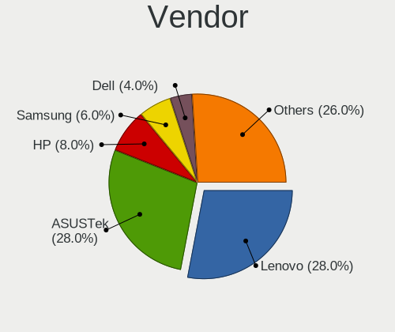
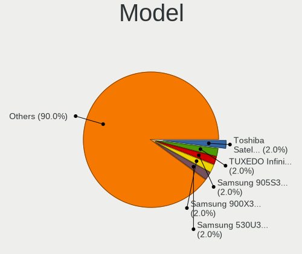
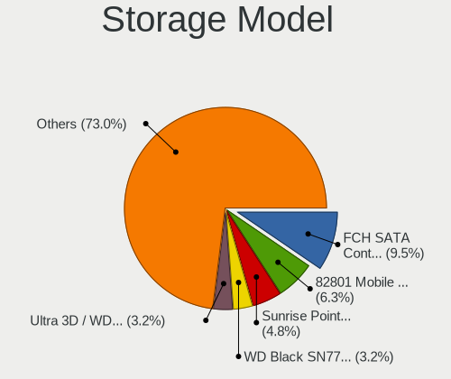
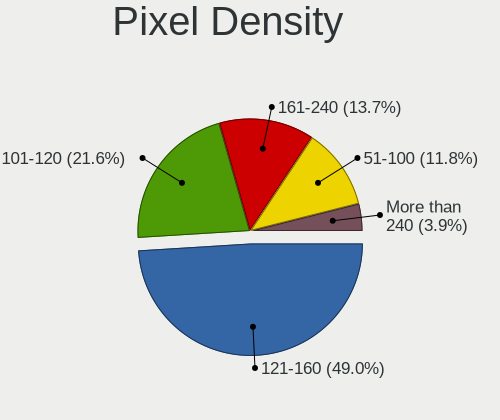
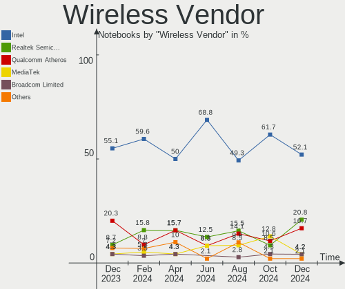
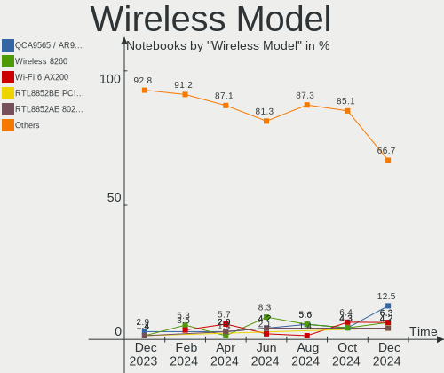
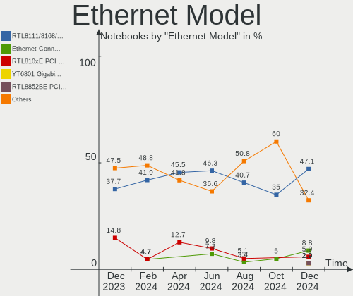
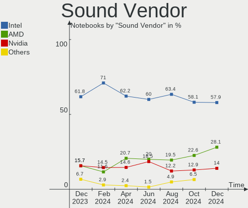
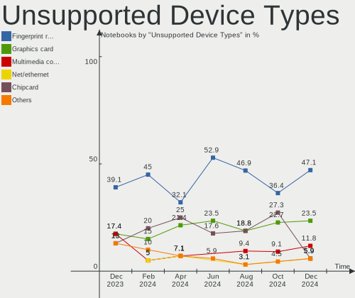

ArcoLinux Hardware Trends (Notebook)
------------------------------------

A project to identify most popular hardware characteristics and track their change
over time based on data collected by ArcoLinux users at https://Linux-Hardware.org.

Anyone can contribute to the study by uploading probes of their computers by
the [hw-probe](https://github.com/linuxhw/hw-probe) tool:

    sudo -E hw-probe -all -upload

Full-feature report is available here: https://linux-hardware.org/?view=trends&formfactor=notebook

Period: Nov, 2020.

Contents
--------

- [ OS                       ](#os)
- [ OS Family                ](#os-family)
- [ Kernel                   ](#kernel)
- [ Kernel Family            ](#kernel-family)
- [ Kernel Major Ver.        ](#kernel-major-ver)
- [ Arch                     ](#arch)
- [ DE                       ](#de)
- [ Display Server           ](#display-server)
- [ Display Manager          ](#display-manager)
- [ OS Lang                  ](#os-lang)
- [ Boot Mode                ](#boot-mode)
- [ Filesystem               ](#filesystem)
- [ Part. scheme             ](#part-scheme)
- [ Dual Boot with Linux/BSD ](#dual-boot-with-linux/bsd)
- [ Dual Boot (Win)          ](#dual-boot-win)
- [ Country                  ](#country)
- [ City                     ](#city)
- [ Vendor                   ](#vendor)
- [ Model                    ](#model)
- [ Model Family             ](#model-family)
- [ MFG Year                 ](#mfg-year)
- [ Form Factor              ](#form-factor)
- [ Secure Boot              ](#secure-boot)
- [ Coreboot                 ](#coreboot)
- [ RAM Size                 ](#ram-size)
- [ RAM Used                 ](#ram-used)
- [ Has CD-ROM               ](#has-cd-rom)
- [ Total Drives             ](#total-drives)
- [ Has Ethernet             ](#has-ethernet)
- [ Drive Vendor             ](#drive-vendor)
- [ Drive Model              ](#drive-model)
- [ HDD Vendor               ](#hdd-vendor)
- [ SSD Vendor               ](#ssd-vendor)
- [ Drive Kind               ](#drive-kind)
- [ Drive Connector          ](#drive-connector)
- [ Drive Size               ](#drive-size)
- [ Space Total              ](#space-total)
- [ Space Used               ](#space-used)
- [ Malfunc. Drives          ](#malfunc-drives)
- [ Malfunc. Drive Vendor    ](#malfunc-drive-vendor)
- [ Malfunc. HDD Vendor      ](#malfunc-hdd-vendor)
- [ Malfunc. Drive Kind      ](#malfunc-drive-kind)
- [ Failed Drives            ](#failed-drives)
- [ Failed Drive Vendor      ](#failed-drive-vendor)
- [ Drive Status             ](#drive-status)
- [ Storage Vendor           ](#storage-vendor)
- [ Storage Model            ](#storage-model)
- [ Storage Kind             ](#storage-kind)
- [ CPU Vendor               ](#cpu-vendor)
- [ CPU Model                ](#cpu-model)
- [ CPU Model Family         ](#cpu-model-family)
- [ CPU Cores                ](#cpu-cores)
- [ CPU Sockets              ](#cpu-sockets)
- [ CPU Threads              ](#cpu-threads)
- [ CPU Op-Modes             ](#cpu-op-modes)
- [ CPU Microcode            ](#cpu-microcode)
- [ CPU Microarch            ](#cpu-microarch)
- [ GPU Vendor               ](#gpu-vendor)
- [ GPU Model                ](#gpu-model)
- [ GPU Combo                ](#gpu-combo)
- [ GPU Driver               ](#gpu-driver)
- [ GPU Memory               ](#gpu-memory)
- [ Monitor Vendor           ](#monitor-vendor)
- [ Monitor Model            ](#monitor-model)
- [ Monitor Resolution       ](#monitor-resolution)
- [ Monitor Diagonal         ](#monitor-diagonal)
- [ Monitor Width            ](#monitor-width)
- [ Aspect Ratio             ](#aspect-ratio)
- [ Monitor Area             ](#monitor-area)
- [ Pixel Density            ](#pixel-density)
- [ Multiple Monitors        ](#multiple-monitors)
- [ Net Controller Vendor    ](#net-controller-vendor)
- [ Net Controller Model     ](#net-controller-model)
- [ Wireless Vendor          ](#wireless-vendor)
- [ Wireless Model           ](#wireless-model)
- [ Ethernet Vendor          ](#ethernet-vendor)
- [ Ethernet Model           ](#ethernet-model)
- [ Net Controller Kind      ](#net-controller-kind)
- [ Used Controller          ](#used-controller)
- [ NICs                     ](#nics)
- [ Memory Vendor            ](#memory-vendor)
- [ Memory Model             ](#memory-model)
- [ Memory Kind              ](#memory-kind)
- [ Memory Form Factor       ](#memory-form-factor)
- [ Memory Size              ](#memory-size)
- [ Memory Speed             ](#memory-speed)
- [ Sound Vendor             ](#sound-vendor)
- [ Sound Model              ](#sound-model)
- [ Camera Vendor            ](#camera-vendor)
- [ Camera Model             ](#camera-model)
- [ Fingerprint Vendor       ](#fingerprint-vendor)
- [ Fingerprint Model        ](#fingerprint-model)
- [ Chipcard Vendor          ](#chipcard-vendor)
- [ Chipcard Model           ](#chipcard-model)
- [ Printer Vendor           ](#printer-vendor)
- [ Printer Model            ](#printer-model)
- [ Scanner Vendor           ](#scanner-vendor)
- [ Scanner Model            ](#scanner-model)
- [ Bluetooth Vendor         ](#bluetooth-vendor)
- [ Bluetooth Model          ](#bluetooth-model)
- [ Unsupported Devices      ](#unsupported-devices)
- [ Unsupported Device Types ](#unsupported-device-types)

OS
--

Installed operating systems

| Name              | Notebooks | Percent |
|-------------------|-----------|---------|
| ArcoLinux Rolling | 31        | 81.58%  |
| ArcoLinux         | 6         | 15.79%  |
| ArcoLinux 20.6.5  | 1         | 2.63%   |

OS Family
---------

OS without a version

| Name      | Notebooks | Percent |
|-----------|-----------|---------|
| ArcoLinux | 38        | 100%    |

Kernel
------

Version of the Linux kernel

| Version                              | Notebooks | Percent |
|--------------------------------------|-----------|---------|
| 5.9.8-arch1-1                        | 7         | 18.42%  |
| 5.9.6-arch1-1                        | 5         | 13.16%  |
| 5.9.10-arch1-1                       | 4         | 10.53%  |
| 5.9.6-zen1-1-zen                     | 3         | 7.89%   |
| 5.9.9-arch1-1                        | 2         | 5.26%   |
| 5.9.8-zen1-1-zen                     | 2         | 5.26%   |
| 5.9.2-arch1-1                        | 2         | 5.26%   |
| 5.9.1-arch1-1                        | 2         | 5.26%   |
| 5.4.79-1-lts                         | 2         | 5.26%   |
| 5.4.75-1-lts                         | 2         | 5.26%   |
| 5.9.9-zen1-1-zen                     | 1         | 2.63%   |
| 5.9.8.a-1-hardened                   | 1         | 2.63%   |
| 5.9.8-AMD-znver2                     | 1         | 2.63%   |
| 5.9.3-arch1-1                        | 1         | 2.63%   |
| 5.9.10-zen1-1-zen                    | 1         | 2.63%   |
| 5.4.78-1-lts                         | 1         | 2.63%   |
| 5.10.0-rc3-1-git-00107-g3d5e28bff7ad | 1         | 2.63%   |

Kernel Family
-------------

Linux kernel without a distro release

| Version | Notebooks | Percent |
|---------|-----------|---------|
| 5.9.8   | 11        | 28.95%  |
| 5.9.6   | 8         | 21.05%  |
| 5.9.10  | 5         | 13.16%  |
| 5.9.9   | 3         | 7.89%   |
| 5.9.2   | 2         | 5.26%   |
| 5.9.1   | 2         | 5.26%   |
| 5.4.79  | 2         | 5.26%   |
| 5.4.75  | 2         | 5.26%   |
| 5.9.3   | 1         | 2.63%   |
| 5.4.78  | 1         | 2.63%   |
| 5.10.0  | 1         | 2.63%   |

Kernel Major Ver.
-----------------

Linux kernel major version

| Version | Notebooks | Percent |
|---------|-----------|---------|
| 5.9     | 32        | 84.21%  |
| 5.4     | 5         | 13.16%  |
| 5.10    | 1         | 2.63%   |

Arch
----

OS architecture (x86_64, i586, etc.)

| Name   | Notebooks | Percent |
|--------|-----------|---------|
| x86_64 | 38        | 100%    |

DE
--

Desktop Environment

| Name     | Notebooks | Percent |
|----------|-----------|---------|
| XFCE     | 15        | 39.47%  |
| KDE5     | 7         | 18.42%  |
| dwm      | 4         | 10.53%  |
| GNOME    | 3         | 7.89%   |
| Deepin   | 3         | 7.89%   |
| Cinnamon | 2         | 5.26%   |
| bspwm    | 2         | 5.26%   |
| qtile    | 1         | 2.63%   |
| i3       | 1         | 2.63%   |

Display Server
--------------

X11 or Wayland

| Name | Notebooks | Percent |
|------|-----------|---------|
| X11  | 37        | 97.37%  |
| Tty  | 1         | 2.63%   |

Display Manager
---------------

SDDM, LightDM, etc.

| Name    | Notebooks | Percent |
|---------|-----------|---------|
| TDM     | 27        | 71.05%  |
| Unknown | 5         | 13.16%  |
| LightDM | 3         | 7.89%   |
| SDDM    | 2         | 5.26%   |
| GDM     | 1         | 2.63%   |

OS Lang
-------

Language

| Lang       | Notebooks | Percent |
|------------|-----------|---------|
| en_US.utf8 | 16        | 42.11%  |
| en_GB.utf8 | 5         | 13.16%  |
| de_DE      | 4         | 10.53%  |
| en_US      | 2         | 5.26%   |
| en_CA      | 2         | 5.26%   |
| de_DE.utf8 | 2         | 5.26%   |
| ru_RU      | 1         | 2.63%   |
| ro_RO      | 1         | 2.63%   |
| pl_PL.utf8 | 1         | 2.63%   |
| fr_FR      | 1         | 2.63%   |
| es_MX.utf8 | 1         | 2.63%   |
| es_ES.utf8 | 1         | 2.63%   |
| es_AR.utf8 | 1         | 2.63%   |

Boot Mode
---------

EFI or BIOS

| Mode | Notebooks | Percent |
|------|-----------|---------|
| EFI  | 24        | 63.16%  |
| BIOS | 14        | 36.84%  |

Filesystem
----------

Type of filesystem

| Type | Notebooks | Percent |
|------|-----------|---------|
| Ext4 | 33        | 86.84%  |
| Xfs  | 4         | 10.53%  |
| F2fs | 1         | 2.63%   |

Part. scheme
------------

Scheme of partitioning

| Type    | Notebooks | Percent |
|---------|-----------|---------|
| GPT     | 24        | 63.16%  |
| MBR     | 9         | 23.68%  |
| Unknown | 5         | 13.16%  |

Dual Boot with Linux/BSD
------------------------

Hosting more than one Linux/BSD

| Dual boot | Notebooks | Percent |
|-----------|-----------|---------|
| No        | 31        | 81.58%  |
| Yes       | 7         | 18.42%  |

Dual Boot (Win)
---------------

Hosting Linux and Windows

| Dual boot | Notebooks | Percent |
|-----------|-----------|---------|
| No        | 29        | 76.32%  |
| Yes       | 9         | 23.68%  |

Country
-------

Geographic location (country)

| Country     | Notebooks | Percent |
|-------------|-----------|---------|
| USA         | 11        | 28.95%  |
| Germany     | 6         | 15.79%  |
| UK          | 3         | 7.89%   |
| Spain       | 2         | 5.26%   |
| Hungary     | 2         | 5.26%   |
| Canada      | 2         | 5.26%   |
| Argentina   | 2         | 5.26%   |
| Turkey      | 1         | 2.63%   |
| Tunisia     | 1         | 2.63%   |
| Switzerland | 1         | 2.63%   |
| Serbia      | 1         | 2.63%   |
| Russia      | 1         | 2.63%   |
| Romania     | 1         | 2.63%   |
| Poland      | 1         | 2.63%   |
| Mexico      | 1         | 2.63%   |
| Hong Kong   | 1         | 2.63%   |
| France      | 1         | 2.63%   |

City
----

Geographic location (city)

| City             | Notebooks | Percent |
|------------------|-----------|---------|
| Berlin           | 3         | 7.89%   |
| Budapest         | 2         | 5.26%   |
| Arcata           | 2         | 5.26%   |
| Zurich           | 1         | 2.63%   |
| Worksop          | 1         | 2.63%   |
| St Petersburg    | 1         | 2.63%   |
| Siegburg         | 1         | 2.63%   |
| Seville          | 1         | 2.63%   |
| Sault Ste. Marie | 1         | 2.63%   |
| Rosstal          | 1         | 2.63%   |
| Plescop          | 1         | 2.63%   |
| Niš             | 1         | 2.63%   |
| Mérida          | 1         | 2.63%   |
| Morganton        | 1         | 2.63%   |
| Mariano Moreno   | 1         | 2.63%   |
| Mansfield        | 1         | 2.63%   |
| Leg Tarnowski    | 1         | 2.63%   |
| Istanbul         | 1         | 2.63%   |
| Hampton          | 1         | 2.63%   |
| Hammam Sousse    | 1         | 2.63%   |
| Haddonfield      | 1         | 2.63%   |
| Gravesend        | 1         | 2.63%   |
| Grande Prairie   | 1         | 2.63%   |
| Forest Lake      | 1         | 2.63%   |
| Elkhorn City     | 1         | 2.63%   |
| Charlotte        | 1         | 2.63%   |
| Central          | 1         | 2.63%   |
| Buenos Aires     | 1         | 2.63%   |
| Bristol          | 1         | 2.63%   |
| Brighton         | 1         | 2.63%   |
| Birkenhead       | 1         | 2.63%   |
| Bergheim         | 1         | 2.63%   |
| Barcelona        | 1         | 2.63%   |
| Arad             | 1         | 2.63%   |

Vendor
------

Motherboard manufacturer

| Name             | Notebooks | Percent |
|------------------|-----------|---------|
| Lenovo           | 14        | 36.84%  |
| Dell             | 6         | 15.79%  |
| ASUSTek Computer | 5         | 13.16%  |
| Hewlett-Packard  | 3         | 7.89%   |
| Timi             | 2         | 5.26%   |
| Acer             | 2         | 5.26%   |
| Toshiba          | 1         | 2.63%   |
| System76         | 1         | 2.63%   |
| Sony             | 1         | 2.63%   |
| Medion           | 1         | 2.63%   |
| Entroware        | 1         | 2.63%   |
| Apple            | 1         | 2.63%   |

Model
-----

Motherboard model

| Name                                     | Notebooks | Percent |
|------------------------------------------|-----------|---------|
| Toshiba Satellite S70-B                  | 1         | 2.63%   |
| Timi TM1709                              | 1         | 2.63%   |
| Timi TM1607                              | 1         | 2.63%   |
| System76 Galago Pro                      | 1         | 2.63%   |
| Sony SVS1511Q9EB                         | 1         | 2.63%   |
| Medion E7212                             | 1         | 2.63%   |
| Lenovo V130-14IGM 81HM                   | 1         | 2.63%   |
| Lenovo ThinkPad X201 3680KC5             | 1         | 2.63%   |
| Lenovo ThinkPad X1 Carbon 6th 20KHCTO1WW | 1         | 2.63%   |
| Lenovo ThinkPad T430 2347AQ9             | 1         | 2.63%   |
| Lenovo ThinkPad T420 423662U             | 1         | 2.63%   |
| Lenovo ThinkPad Edge E531 688526G        | 1         | 2.63%   |
| Lenovo ThinkPad E595 20NF0000GE          | 1         | 2.63%   |
| Lenovo ThinkPad E14 Gen 2 20T6000TPB     | 1         | 2.63%   |
| Lenovo IdeaPad S340-15API 81NC           | 1         | 2.63%   |
| Lenovo IdeaPad S145-15AST 81N3           | 1         | 2.63%   |
| Lenovo IdeaPad L340-17IRH Gaming 81LL    | 1         | 2.63%   |
| Lenovo IdeaPad 320-15ABR 80XS            | 1         | 2.63%   |
| Lenovo G580                              | 1         | 2.63%   |
| Lenovo G560 0679                         | 1         | 2.63%   |
| HP Pavilion Notebook                     | 1         | 2.63%   |
| HP EliteBook 8760w                       | 1         | 2.63%   |
| HP EliteBook 8540p                       | 1         | 2.63%   |
| Entroware Apollo                         | 1         | 2.63%   |
| Dell XPS L421X                           | 1         | 2.63%   |
| Dell Latitude 5480                       | 1         | 2.63%   |
| Dell Latitude 5310                       | 1         | 2.63%   |
| Dell Inspiron N4110                      | 1         | 2.63%   |
| Dell Inspiron 5770                       | 1         | 2.63%   |
| Dell Inspiron 3558                       | 1         | 2.63%   |
| ASUS Strix 17 GL703GE                    | 1         | 2.63%   |
| ASUS ROG Strix G531GT_GL531GT            | 1         | 2.63%   |
| ASUS K52JT                               | 1         | 2.63%   |
| ASUS K501UX                              | 1         | 2.63%   |
| ASUS E403NA                              | 1         | 2.63%   |
| Apple MacBookPro7,1                      | 1         | 2.63%   |
| Acer Aspire E5-532                       | 1         | 2.63%   |
| Acer Aspire E5-523                       | 1         | 2.63%   |

Model Family
------------

Motherboard model prefix

| Name              | Notebooks | Percent |
|-------------------|-----------|---------|
| Lenovo ThinkPad   | 7         | 18.42%  |
| Lenovo IdeaPad    | 4         | 10.53%  |
| Dell Inspiron     | 3         | 7.89%   |
| HP EliteBook      | 2         | 5.26%   |
| Dell Latitude     | 2         | 5.26%   |
| Acer Aspire       | 2         | 5.26%   |
| Toshiba Satellite | 1         | 2.63%   |
| Timi TM1709       | 1         | 2.63%   |
| Timi TM1607       | 1         | 2.63%   |
| System76 Galago   | 1         | 2.63%   |
| Sony SVS1511Q9EB  | 1         | 2.63%   |
| Medion E7212      | 1         | 2.63%   |
| Lenovo V130-14IGM | 1         | 2.63%   |
| Lenovo G580       | 1         | 2.63%   |
| Lenovo G560       | 1         | 2.63%   |
| HP Pavilion       | 1         | 2.63%   |
| Entroware Apollo  | 1         | 2.63%   |
| Dell XPS          | 1         | 2.63%   |
| ASUS Strix        | 1         | 2.63%   |
| ASUS ROG          | 1         | 2.63%   |
| ASUS K52JT        | 1         | 2.63%   |
| ASUS K501UX       | 1         | 2.63%   |
| ASUS E403NA       | 1         | 2.63%   |
| Apple MacBookPro7 | 1         | 2.63%   |

MFG Year
--------

Motherboard manufacture year

| Year | Notebooks | Percent |
|------|-----------|---------|
| 2020 | 8         | 21.05%  |
| 2018 | 6         | 15.79%  |
| 2019 | 5         | 13.16%  |
| 2017 | 4         | 10.53%  |
| 2016 | 3         | 7.89%   |
| 2012 | 3         | 7.89%   |
| 2015 | 2         | 5.26%   |
| 2014 | 2         | 5.26%   |
| 2010 | 2         | 5.26%   |
| 2013 | 1         | 2.63%   |
| 2011 | 1         | 2.63%   |
| 2009 | 1         | 2.63%   |

Form Factor
-----------

Physical design of the computer

| Name     | Notebooks | Percent |
|----------|-----------|---------|
| Notebook | 38        | 100%    |

Secure Boot
-----------

Enabled or disabled

| State    | Notebooks | Percent |
|----------|-----------|---------|
| Disabled | 38        | 100%    |

Coreboot
--------

Have coreboot on board

| Used | Notebooks | Percent |
|------|-----------|---------|
| No   | 38        | 100%    |

RAM Size
--------

Total RAM memory

| Size in GB  | Notebooks | Percent |
|-------------|-----------|---------|
| 16.01-24.0  | 11        | 28.95%  |
| 3.01-4.0    | 10        | 26.32%  |
| 4.01-8.0    | 9         | 23.68%  |
| 8.01-16.0   | 4         | 10.53%  |
| 24.01-32.0  | 2         | 5.26%   |
| 32.01-64.0  | 1         | 2.63%   |
| 64.01-256.0 | 1         | 2.63%   |

RAM Used
--------

Used RAM memory

| Used GB  | Notebooks | Percent |
|----------|-----------|---------|
| 1.01-2.0 | 19        | 50%     |
| 2.01-3.0 | 6         | 15.79%  |
| 0.01-1.0 | 6         | 15.79%  |
| 4.01-8.0 | 4         | 10.53%  |
| 3.01-4.0 | 3         | 7.89%   |

Has CD-ROM
----------

Has CD-ROM on board

| Presented | Notebooks | Percent |
|-----------|-----------|---------|
| No        | 27        | 71.05%  |
| Yes       | 11        | 28.95%  |

Total Drives
------------

Number of drives on board

| Drives | Notebooks | Percent |
|--------|-----------|---------|
| 1      | 21        | 55.26%  |
| 2      | 16        | 42.11%  |
| 3      | 1         | 2.63%   |

Has Ethernet
------------

Has Ethernet on board

| Presented | Notebooks | Percent |
|-----------|-----------|---------|
| Yes       | 35        | 92.11%  |
| No        | 3         | 7.89%   |

Drive Vendor
------------

Hard drive vendors

| Vendor              | Notebooks | Drives | Percent |
|---------------------|-----------|--------|---------|
| Samsung Electronics | 12        | 13     | 22.64%  |
| Toshiba             | 5         | 5      | 9.43%   |
| Seagate             | 5         | 5      | 9.43%   |
| WDC                 | 4         | 4      | 7.55%   |
| SanDisk             | 4         | 4      | 7.55%   |
| Kingston            | 4         | 4      | 7.55%   |
| SK Hynix            | 2         | 2      | 3.77%   |
| LITEONIT            | 2         | 2      | 3.77%   |
| Intel               | 2         | 2      | 3.77%   |
| Crucial             | 2         | 2      | 3.77%   |
| Union Memory        | 1         | 1      | 1.89%   |
| Team                | 1         | 1      | 1.89%   |
| PNY                 | 1         | 1      | 1.89%   |
| Phison              | 1         | 1      | 1.89%   |
| Micron Technology   | 1         | 1      | 1.89%   |
| KIOXIA              | 1         | 1      | 1.89%   |
| JMicron             | 1         | 1      | 1.89%   |
| HGST                | 1         | 1      | 1.89%   |
| DOGFISH             | 1         | 1      | 1.89%   |
| China               | 1         | 1      | 1.89%   |
| A-DATA Technology   | 1         | 1      | 1.89%   |

Drive Model
-----------

Hard drive models

| Model                                | Notebooks | Percent |
|--------------------------------------|-----------|---------|
| Seagate ST1000LM035-1RK172 1TB       | 2         | 3.7%    |
| Samsung SSD 860 EVO 500GB            | 2         | 3.7%    |
| Samsung SSD 850 EVO 500GB            | 2         | 3.7%    |
| WDC WDS120G1G0B-00RC30 120GB SSD     | 1         | 1.85%   |
| WDC WD5000LPCX-24C6HT0 500GB         | 1         | 1.85%   |
| WDC WD5000BPVT-75HXZT1 500GB         | 1         | 1.85%   |
| WDC WD5000BEVT-22A0RT0 500GB         | 1         | 1.85%   |
| Union Memory RPFTJ256PDD2MWX 256GB   | 1         | 1.85%   |
| Toshiba MQ04ABF100 1TB               | 1         | 1.85%   |
| Toshiba MQ01ABD100M 1TB              | 1         | 1.85%   |
| Toshiba MQ01ABD100 1TB               | 1         | 1.85%   |
| Toshiba MK6475GSX 640GB              | 1         | 1.85%   |
| Toshiba KBG40ZNT256G MEMORY 256GB    | 1         | 1.85%   |
| Team T253X2001T 1TB SSD              | 1         | 1.85%   |
| SK Hynix SHGS31-1000GS-2 1TB SSD     | 1         | 1.85%   |
| SK Hynix HFM512GDHTNG-8710B 512GB    | 1         | 1.85%   |
| Seagate ST500LM012 HN-M500MBB 500GB  | 1         | 1.85%   |
| Seagate ST2000LM007-1R8174 2TB       | 1         | 1.85%   |
| Seagate ST1000LM024 HN-M101MBB 1TB   | 1         | 1.85%   |
| SanDisk SSD PLUS 240GB               | 1         | 1.85%   |
| SanDisk SSD PLUS 1000GB              | 1         | 1.85%   |
| SanDisk SDSSDHP256G 256GB            | 1         | 1.85%   |
| SanDisk DF4064  64GB                 | 1         | 1.85%   |
| Samsung SSD 970 EVO 1TB              | 1         | 1.85%   |
| Samsung SSD 960 EVO 500GB            | 1         | 1.85%   |
| Samsung SSD 850 EVO 250GB            | 1         | 1.85%   |
| Samsung Portable SSD T5 500GB        | 1         | 1.85%   |
| Samsung MZVLB1T0HALR-000L7 1TB       | 1         | 1.85%   |
| Samsung MZVLB1T0HALR-000L2 1TB       | 1         | 1.85%   |
| Samsung MZNTY128HDHP-00000 128GB SSD | 1         | 1.85%   |
| Samsung MZNLN128HAHQ-00000 128GB SSD | 1         | 1.85%   |
| Samsung MZNLF128HCHP-00004 128GB SSD | 1         | 1.85%   |
| PNY CS900 240GB SSD                  | 1         | 1.85%   |
| Phison Sabrent Rocket 4.0 1TB        | 1         | 1.85%   |
| Micron 1100_MTFDDAV256TBN 256GB SSD  | 1         | 1.85%   |
| LITEONIT LSS-24L6G 24GB SSD          | 1         | 1.85%   |
| LITEONIT LCT-512M3S 512GB SSD        | 1         | 1.85%   |
| KIOXIA KBG40ZNS256G NVMe 256GB       | 1         | 1.85%   |
| Kingston SUV400S37480G 480GB SSD     | 1         | 1.85%   |
| Kingston SUV400S37240G 240GB SSD     | 1         | 1.85%   |
| Kingston SA400S37480G 480GB SSD      | 1         | 1.85%   |
| Kingston SA400S37240G 240GB SSD      | 1         | 1.85%   |
| JMicron Generic 1TB                  | 1         | 1.85%   |
| Intel SSDSCKKF256G8 SATA 256GB       | 1         | 1.85%   |
| Intel SSDPEKNW512G8L 512GB           | 1         | 1.85%   |
| HGST HTS541010A7E630 1TB             | 1         | 1.85%   |
| DOGFISH SSD 250GB                    | 1         | 1.85%   |
| Crucial CT275MX300SSD1 275GB         | 1         | 1.85%   |
| Crucial CT1000MX500SSD1 1TB          | 1         | 1.85%   |
| China SATA3 120GB SSD                | 1         | 1.85%   |
| A-DATA SP550 480GB SSD               | 1         | 1.85%   |

HDD Vendor
----------

Hard disk drive vendors

| Vendor  | Notebooks | Drives | Percent |
|---------|-----------|--------|---------|
| Seagate | 5         | 5      | 38.46%  |
| Toshiba | 4         | 4      | 30.77%  |
| WDC     | 3         | 3      | 23.08%  |
| HGST    | 1         | 1      | 7.69%   |

SSD Vendor
----------

Solid state drive vendors

| Vendor              | Notebooks | Drives | Percent |
|---------------------|-----------|--------|---------|
| Samsung Electronics | 8         | 9      | 28.57%  |
| Kingston            | 4         | 4      | 14.29%  |
| SanDisk             | 3         | 3      | 10.71%  |
| LITEONIT            | 2         | 2      | 7.14%   |
| Crucial             | 2         | 2      | 7.14%   |
| WDC                 | 1         | 1      | 3.57%   |
| Team                | 1         | 1      | 3.57%   |
| SK Hynix            | 1         | 1      | 3.57%   |
| PNY                 | 1         | 1      | 3.57%   |
| Micron Technology   | 1         | 1      | 3.57%   |
| Intel               | 1         | 1      | 3.57%   |
| DOGFISH             | 1         | 1      | 3.57%   |
| China               | 1         | 1      | 3.57%   |
| A-DATA Technology   | 1         | 1      | 3.57%   |

Drive Kind
----------

HDD or SSD

| Kind | Notebooks | Drives | Percent |
|------|-----------|--------|---------|
| SSD  | 26        | 29     | 53.06%  |
| HDD  | 13        | 13     | 26.53%  |
| NVMe | 9         | 11     | 18.37%  |
| MMC  | 1         | 1      | 2.04%   |

Drive Connector
---------------

SATA, SAS, NVMe, etc.

| Type | Notebooks | Drives | Percent |
|------|-----------|--------|---------|
| SATA | 32        | 41     | 72.73%  |
| NVMe | 9         | 10     | 20.45%  |
| SAS  | 2         | 2      | 4.55%   |
| MMC  | 1         | 1      | 2.27%   |

Drive Size
----------

Size of hard drive

| Size in TB | Notebooks | Drives | Percent |
|------------|-----------|--------|---------|
| 0.01-0.5   | 23        | 28     | 62.16%  |
| 0.51-1.0   | 13        | 13     | 35.14%  |
| 1.01-2.0   | 1         | 1      | 2.7%    |

Space Total
-----------

Amount of disk space available on the file system

| Size in GB | Notebooks | Percent |
|------------|-----------|---------|
| 101-250    | 14        | 36.84%  |
| 251-500    | 8         | 21.05%  |
| 501-1000   | 8         | 21.05%  |
| 1001-2000  | 4         | 10.53%  |
| 51-100     | 2         | 5.26%   |
| 21-50      | 1         | 2.63%   |
| Unknown    | 1         | 2.63%   |

Space Used
----------

Amount of used disk space

| Used GB | Notebooks | Percent |
|---------|-----------|---------|
| 1-20    | 14        | 36.84%  |
| 21-50   | 9         | 23.68%  |
| 51-100  | 7         | 18.42%  |
| 101-250 | 5         | 13.16%  |
| 251-500 | 2         | 5.26%   |
| Unknown | 1         | 2.63%   |

Malfunc. Drives
---------------

Drive models with a malfunction

| Model                            | Notebooks | Drives | Percent |
|----------------------------------|-----------|--------|---------|
| Seagate ST1000LM035-1RK172 1TB   | 1         | 1      | 33.33%  |
| LITEONIT LCT-512M3S 512GB SSD    | 1         | 1      | 33.33%  |
| Kingston SUV400S37240G 240GB SSD | 1         | 1      | 33.33%  |

Malfunc. Drive Vendor
---------------------

Vendors of faulty drives

| Vendor   | Notebooks | Drives | Percent |
|----------|-----------|--------|---------|
| Seagate  | 1         | 1      | 33.33%  |
| LITEONIT | 1         | 1      | 33.33%  |
| Kingston | 1         | 1      | 33.33%  |

Malfunc. HDD Vendor
-------------------

Vendors of faulty HDD drives

| Vendor  | Notebooks | Drives | Percent |
|---------|-----------|--------|---------|
| Seagate | 1         | 1      | 100%    |

Malfunc. Drive Kind
-------------------

Kinds of faulty drives

| Kind | Notebooks | Drives | Percent |
|------|-----------|--------|---------|
| SSD  | 2         | 2      | 66.67%  |
| HDD  | 1         | 1      | 33.33%  |

Failed Drives
-------------

Failed drive models

Zero info for selected period =(

Failed Drive Vendor
-------------------

Failed drive vendors

Zero info for selected period =(

Drive Status
------------

Number of failed and malfunc. drives

| Status   | Notebooks | Drives | Percent |
|----------|-----------|--------|---------|
| Works    | 31        | 42     | 75.61%  |
| Detected | 7         | 9      | 17.07%  |
| Malfunc  | 3         | 3      | 7.32%   |

Storage Vendor
--------------

Storage controller vendors

| Vendor                  | Notebooks | Percent |
|-------------------------|-----------|---------|
| Intel                   | 30        | 66.67%  |
| AMD                     | 5         | 11.11%  |
| Samsung Electronics     | 4         | 8.89%   |
| KIOXIA                  | 2         | 4.44%   |
| Union Memory (Shenzhen) | 1         | 2.22%   |
| SK Hynix                | 1         | 2.22%   |
| Phison Electronics      | 1         | 2.22%   |
| Nvidia                  | 1         | 2.22%   |

Storage Model
-------------

Storage controller models

| Model                                                                            | Notebooks | Percent |
|----------------------------------------------------------------------------------|-----------|---------|
| Intel Sunrise Point-LP SATA Controller [AHCI mode]                               | 8         | 17.78%  |
| Intel 7 Series Chipset Family 6-port SATA Controller [AHCI mode]                 | 5         | 11.11%  |
| AMD FCH SATA Controller [AHCI mode]                                              | 5         | 11.11%  |
| Samsung Electronics NVMe SSD Controller SM981/PM981/PM983                        | 3         | 6.67%   |
| Intel Cannon Lake Mobile PCH SATA AHCI Controller                                | 3         | 6.67%   |
| Intel 6 Series/C200 Series Chipset Family 6 port Mobile SATA AHCI Controller     | 3         | 6.67%   |
| KIOXIA Non-Volatile memory controller                                            | 2         | 4.44%   |
| Intel 5 Series/3400 Series Chipset 6 port SATA AHCI Controller                   | 2         | 4.44%   |
| Intel 5 Series/3400 Series Chipset 4 port SATA AHCI Controller                   | 2         | 4.44%   |
| Union Memory (Shenzhen) Non-Volatile memory controller                           | 1         | 2.22%   |
| SK Hynix BC501 NVMe Solid State Drive 512GB                                      | 1         | 2.22%   |
| Samsung Electronics NVMe SSD Controller SM961/PM961                              | 1         | 2.22%   |
| Phison Electronics E16 PCIe4 NVMe Controller                                     | 1         | 2.22%   |
| Nvidia MCP89 SATA Controller (AHCI mode)                                         | 1         | 2.22%   |
| Intel Wildcat Point-LP SATA Controller [AHCI Mode]                               | 1         | 2.22%   |
| Intel SSD 660P Series                                                            | 1         | 2.22%   |
| Intel SATA controller                                                            | 1         | 2.22%   |
| Intel Celeron N3350/Pentium N4200/Atom E3900 Series SATA AHCI Controller         | 1         | 2.22%   |
| Intel Atom/Celeron/Pentium Processor x5-E8000/J3xxx/N3xxx Series SATA Controller | 1         | 2.22%   |
| Intel 82801IBM/IEM (ICH9M/ICH9M-E) 4 port SATA Controller [AHCI mode]            | 1         | 2.22%   |
| Intel 8 Series/C220 Series Chipset Family 6-port SATA Controller 1 [AHCI mode]   | 1         | 2.22%   |

Storage Kind
------------

Kind of storage controller (IDE, SATA, NVMe, SAS, ...)

| Kind | Notebooks | Percent |
|------|-----------|---------|
| SATA | 35        | 79.55%  |
| NVMe | 9         | 20.45%  |

CPU Vendor
----------

Processor vendors

| Vendor | Notebooks | Percent |
|--------|-----------|---------|
| Intel  | 32        | 84.21%  |
| AMD    | 6         | 15.79%  |

CPU Model
---------

Processor models

| Model                                           | Notebooks | Percent |
|-------------------------------------------------|-----------|---------|
| Intel Core i5-8250U CPU @ 1.60GHz               | 2         | 5.26%   |
| Intel Core i5-2520M CPU @ 2.50GHz               | 2         | 5.26%   |
| AMD Ryzen 7 3700U with Radeon Vega Mobile Gfx   | 2         | 5.26%   |
| Intel Pentium Silver N5000 CPU @ 1.10GHz        | 1         | 2.63%   |
| Intel Pentium Dual-Core CPU T4500 @ 2.30GHz     | 1         | 2.63%   |
| Intel Pentium CPU P6100 @ 2.00GHz               | 1         | 2.63%   |
| Intel Pentium CPU N4200 @ 1.10GHz               | 1         | 2.63%   |
| Intel Pentium CPU N3700 @ 1.60GHz               | 1         | 2.63%   |
| Intel Core m3-7Y30 CPU @ 1.00GHz                | 1         | 2.63%   |
| Intel Core i7-9750H CPU @ 2.60GHz               | 1         | 2.63%   |
| Intel Core i7-8750H CPU @ 2.20GHz               | 1         | 2.63%   |
| Intel Core i7-8650U CPU @ 1.90GHz               | 1         | 2.63%   |
| Intel Core i7-8550U CPU @ 1.80GHz               | 1         | 2.63%   |
| Intel Core i7-7600U CPU @ 2.80GHz               | 1         | 2.63%   |
| Intel Core i7-7500U CPU @ 2.70GHz               | 1         | 2.63%   |
| Intel Core i7-6500U CPU @ 2.50GHz               | 1         | 2.63%   |
| Intel Core i7-4710HQ CPU @ 2.50GHz              | 1         | 2.63%   |
| Intel Core i7-3632QM CPU @ 2.20GHz              | 1         | 2.63%   |
| Intel Core i7-3517U CPU @ 1.90GHz               | 1         | 2.63%   |
| Intel Core i7-2860QM CPU @ 2.50GHz              | 1         | 2.63%   |
| Intel Core i7 CPU Q 840 @ 1.87GHz               | 1         | 2.63%   |
| Intel Core i7 CPU Q 740 @ 1.73GHz               | 1         | 2.63%   |
| Intel Core i5-9300H CPU @ 2.40GHz               | 1         | 2.63%   |
| Intel Core i5-7200U CPU @ 2.50GHz               | 1         | 2.63%   |
| Intel Core i5-10310U CPU @ 1.70GHz              | 1         | 2.63%   |
| Intel Core i5 CPU M 520 @ 2.40GHz               | 1         | 2.63%   |
| Intel Core i3-5015U CPU @ 2.10GHz               | 1         | 2.63%   |
| Intel Core i3-3110M CPU @ 2.40GHz               | 1         | 2.63%   |
| Intel Core i3-2350M CPU @ 2.30GHz               | 1         | 2.63%   |
| Intel Core i3-2310M CPU @ 2.10GHz               | 1         | 2.63%   |
| Intel Core 2 Duo CPU P8600 @ 2.40GHz            | 1         | 2.63%   |
| AMD Ryzen 5 4500U with Radeon Graphics          | 1         | 2.63%   |
| AMD A9-9410 RADEON R5, 5 COMPUTE CORES 2C+3G    | 1         | 2.63%   |
| AMD A6-9225 RADEON R4, 5 COMPUTE CORES 2C+3G    | 1         | 2.63%   |
| AMD A12-9720P RADEON R7, 12 COMPUTE CORES 4C+8G | 1         | 2.63%   |

CPU Model Family
----------------

Processor model prefix

| Model                   | Notebooks | Percent |
|-------------------------|-----------|---------|
| Intel Core i7           | 13        | 34.21%  |
| Intel Core i5           | 8         | 21.05%  |
| Intel Core i3           | 4         | 10.53%  |
| Intel Pentium           | 3         | 7.89%   |
| AMD Ryzen 7             | 2         | 5.26%   |
| Other                   | 1         | 2.63%   |
| Intel Pentium Silver    | 1         | 2.63%   |
| Intel Pentium Dual-Core | 1         | 2.63%   |
| Intel Core m3           | 1         | 2.63%   |
| Intel Core 2 Duo        | 1         | 2.63%   |
| AMD Ryzen 5             | 1         | 2.63%   |
| AMD A6                  | 1         | 2.63%   |
| AMD A12                 | 1         | 2.63%   |

CPU Cores
---------

Number of processor cores

| Number | Notebooks | Percent |
|--------|-----------|---------|
| 2      | 19        | 50%     |
| 4      | 16        | 42.11%  |
| 6      | 3         | 7.89%   |

CPU Sockets
-----------

Number of sockets

| Number | Notebooks | Percent |
|--------|-----------|---------|
| 1      | 38        | 100%    |

CPU Threads
-----------

Threads per core (Hyper-Threading)

| Number | Notebooks | Percent |
|--------|-----------|---------|
| 2      | 29        | 76.32%  |
| 1      | 9         | 23.68%  |

CPU Op-Modes
------------

CPU Operation Modes (32-bit, 64-bit)

| Op mode        | Notebooks | Percent |
|----------------|-----------|---------|
| 32-bit, 64-bit | 38        | 100%    |

CPU Microcode
-------------

Microcode number

| Number     | Notebooks | Percent |
|------------|-----------|---------|
| 0x206a7    | 5         | 13.16%  |
| 0x806ea    | 4         | 10.53%  |
| 0x806e9    | 4         | 10.53%  |
| 0x906ea    | 3         | 7.89%   |
| 0x306a9    | 3         | 7.89%   |
| 0x20655    | 2         | 5.26%   |
| 0x106e5    | 2         | 5.26%   |
| 0x1067a    | 2         | 5.26%   |
| 0x08108102 | 2         | 5.26%   |
| Unknown    | 2         | 5.26%   |
| 0x806ec    | 1         | 2.63%   |
| 0x706a1    | 1         | 2.63%   |
| 0x506c9    | 1         | 2.63%   |
| 0x306d4    | 1         | 2.63%   |
| 0x306c3    | 1         | 2.63%   |
| 0x08600103 | 1         | 2.63%   |
| 0x06006705 | 1         | 2.63%   |
| 0x06006704 | 1         | 2.63%   |
| 0x06006118 | 1         | 2.63%   |

CPU Microarch
-------------

Microarchitecture

| Name          | Notebooks | Percent |
|---------------|-----------|---------|
| KabyLake      | 12        | 31.58%  |
| SandyBridge   | 5         | 13.16%  |
| IvyBridge     | 3         | 7.89%   |
| Excavator     | 3         | 7.89%   |
| Zen+          | 2         | 5.26%   |
| Westmere      | 2         | 5.26%   |
| Penryn        | 2         | 5.26%   |
| Nehalem       | 2         | 5.26%   |
| Zen 2         | 1         | 2.63%   |
| Skylake       | 1         | 2.63%   |
| Silvermont    | 1         | 2.63%   |
| Haswell       | 1         | 2.63%   |
| Goldmont plus | 1         | 2.63%   |
| Goldmont      | 1         | 2.63%   |
| Broadwell     | 1         | 2.63%   |

GPU Vendor
----------

Vendors of graphics cards

| Vendor | Notebooks | Percent |
|--------|-----------|---------|
| Intel  | 28        | 58.33%  |
| Nvidia | 11        | 22.92%  |
| AMD    | 9         | 18.75%  |

GPU Model
---------

Graphics card models

| Model                                                                                    | Notebooks | Percent |
|------------------------------------------------------------------------------------------|-----------|---------|
| Intel UHD Graphics 620                                                                   | 4         | 8.33%   |
| Intel 2nd Generation Core Processor Family Integrated Graphics Controller                | 4         | 8.33%   |
| Intel UHD Graphics 630 (Mobile)                                                          | 3         | 6.25%   |
| Intel HD Graphics 620                                                                    | 3         | 6.25%   |
| Intel 3rd Gen Core processor Graphics Controller                                         | 3         | 6.25%   |
| Nvidia TU117M [GeForce GTX 1650 Mobile / Max-Q]                                          | 2         | 4.17%   |
| Nvidia GF117M [GeForce 610M/710M/810M/820M / GT 620M/625M/630M/720M]                     | 2         | 4.17%   |
| Intel Core Processor Integrated Graphics Controller                                      | 2         | 4.17%   |
| AMD Stoney [Radeon R2/R3/R4/R5 Graphics]                                                 | 2         | 4.17%   |
| AMD Picasso                                                                              | 2         | 4.17%   |
| Nvidia MCP89 [GeForce 320M]                                                              | 1         | 2.08%   |
| Nvidia GP107M [GeForce GTX 1050 Ti Mobile]                                               | 1         | 2.08%   |
| Nvidia GM108M [GeForce MX110]                                                            | 1         | 2.08%   |
| Nvidia GM107M [GeForce GTX 950M]                                                         | 1         | 2.08%   |
| Nvidia GK208M [GeForce GT 740M]                                                          | 1         | 2.08%   |
| Nvidia GF106GLM [Quadro 2000M]                                                           | 1         | 2.08%   |
| Nvidia GF104GLM [Quadro 3000M]                                                           | 1         | 2.08%   |
| Intel UHD Graphics 605                                                                   | 1         | 2.08%   |
| Intel UHD Graphics                                                                       | 1         | 2.08%   |
| Intel Skylake GT2 [HD Graphics 520]                                                      | 1         | 2.08%   |
| Intel Mobile 4 Series Chipset Integrated Graphics Controller                             | 1         | 2.08%   |
| Intel HD Graphics 615                                                                    | 1         | 2.08%   |
| Intel HD Graphics 5500                                                                   | 1         | 2.08%   |
| Intel Celeron N3350/Pentium N4200/Atom E3900 Series Integrated Graphics Controller       | 1         | 2.08%   |
| Intel Atom/Celeron/Pentium Processor x5-E8000/J3xxx/N3xxx Integrated Graphics Controller | 1         | 2.08%   |
| Intel 4th Gen Core Processor Integrated Graphics Controller                              | 1         | 2.08%   |
| AMD Wani [Radeon R5/R6/R7 Graphics]                                                      | 1         | 2.08%   |
| AMD Venus PRO [Radeon HD 8850M / R9 M265X]                                               | 1         | 2.08%   |
| AMD Topaz XT [Radeon R7 M260/M265 / M340/M360 / M440/M445 / 530/535 / 620/625 Mobile]    | 1         | 2.08%   |
| AMD Robson CE [Radeon HD 6370M/7370M]                                                    | 1         | 2.08%   |
| AMD Renoir                                                                               | 1         | 2.08%   |

GPU Combo
---------

Combinations of graphics cards

| Name           | Notebooks | Percent |
|----------------|-----------|---------|
| 1 x Intel      | 18        | 47.37%  |
| Intel + Nvidia | 8         | 21.05%  |
| 1 x AMD        | 7         | 18.42%  |
| 1 x Nvidia     | 3         | 7.89%   |
| Intel + AMD    | 2         | 5.26%   |

GPU Driver
----------

Free vs proprietary

| Driver      | Notebooks | Percent |
|-------------|-----------|---------|
| Free        | 36        | 94.74%  |
| Proprietary | 2         | 5.26%   |

GPU Memory
----------

Total video memory

| Size in GB | Notebooks | Percent |
|------------|-----------|---------|
| Unknown    | 24        | 63.16%  |
| 1.01-2.0   | 6         | 15.79%  |
| 0.01-0.5   | 4         | 10.53%  |
| 0.51-1.0   | 3         | 7.89%   |
| 3.01-4.0   | 1         | 2.63%   |

Monitor Vendor
--------------

Monitor vendors

| Vendor               | Notebooks | Percent |
|----------------------|-----------|---------|
| AU Optronics         | 11        | 25%     |
| LG Display           | 9         | 20.45%  |
| Chimei Innolux       | 7         | 15.91%  |
| BOE                  | 4         | 9.09%   |
| Samsung Electronics  | 2         | 4.55%   |
| PANDA                | 2         | 4.55%   |
| Dell                 | 2         | 4.55%   |
| BenQ                 | 2         | 4.55%   |
| Lenovo               | 1         | 2.27%   |
| Eizo                 | 1         | 2.27%   |
| Apple                | 1         | 2.27%   |
| AOC                  | 1         | 2.27%   |
| Ancor Communications | 1         | 2.27%   |

Monitor Model
-------------

Monitor models

| Model                                                                 | Notebooks | Percent |
|-----------------------------------------------------------------------|-----------|---------|
| Chimei Innolux LCD Monitor CMN14C3 1366x768 309x173mm 13.9-inch       | 2         | 4.55%   |
| Samsung Electronics U28E590 SAM0C4C 3840x2160 608x345mm 27.5-inch     | 1         | 2.27%   |
| Samsung Electronics LCD Monitor SDC424A 3200x1800 293x165mm 13.2-inch | 1         | 2.27%   |
| PANDA LCD Monitor NCP002D 1920x1080 344x194mm 15.5-inch               | 1         | 2.27%   |
| PANDA LCD Monitor NCP002A 1920x1080 344x194mm 15.5-inch               | 1         | 2.27%   |
| LG Display LP156WH2-TLAA LGD0230 1366x768 344x194mm 15.5-inch         | 1         | 2.27%   |
| LG Display LCD Monitor LGD05DB 1920x1080 294x165mm 13.3-inch          | 1         | 2.27%   |
| LG Display LCD Monitor LGD0596 1920x1080 382x215mm 17.3-inch          | 1         | 2.27%   |
| LG Display LCD Monitor LGD0456 1366x768 344x194mm 15.5-inch           | 1         | 2.27%   |
| LG Display LCD Monitor LGD033A 1366x768 340x190mm 15.3-inch           | 1         | 2.27%   |
| LG Display LCD Monitor LGD0335 1366x768 310x174mm 14.0-inch           | 1         | 2.27%   |
| LG Display LCD Monitor LGD0323 1920x1080 345x194mm 15.6-inch          | 1         | 2.27%   |
| LG Display LCD Monitor LGD02E9 1366x768 309x174mm 14.0-inch           | 1         | 2.27%   |
| LG Display LCD Monitor LGD02DC 1366x768 344x194mm 15.5-inch           | 1         | 2.27%   |
| Lenovo LCD Monitor LEN4011 1280x800 261x163mm 12.1-inch               | 1         | 2.27%   |
| Eizo S1931 ENC1833 1280x1024 376x301mm 19.0-inch                      | 1         | 2.27%   |
| Dell SE2719HR DELF115 1920x1080 598x336mm 27.0-inch                   | 1         | 2.27%   |
| Dell S2719NX DELD0DF 1920x1080 598x336mm 27.0-inch                    | 1         | 2.27%   |
| Chimei Innolux LCD Monitor CMN1747 1920x1080 381x214mm 17.2-inch      | 1         | 2.27%   |
| Chimei Innolux LCD Monitor CMN1738 1920x1080 381x214mm 17.2-inch      | 1         | 2.27%   |
| Chimei Innolux LCD Monitor CMN1737 1920x1080 381x214mm 17.2-inch      | 1         | 2.27%   |
| Chimei Innolux LCD Monitor CMN15CA 1366x768 340x190mm 15.3-inch       | 1         | 2.27%   |
| Chimei Innolux LCD Monitor CMN15B9 1920x1080 340x190mm 15.3-inch      | 1         | 2.27%   |
| BOE LCD Monitor BOE06FF 1920x1080 344x194mm 15.5-inch                 | 1         | 2.27%   |
| BOE LCD Monitor BOE0691 1920x1080 280x165mm 12.8-inch                 | 1         | 2.27%   |
| BOE LCD Monitor BOE0675 1366x768 344x194mm 15.5-inch                  | 1         | 2.27%   |
| BOE LCD Monitor BOE0672 1366x768 344x194mm 15.5-inch                  | 1         | 2.27%   |
| BenQ GW2780 BNQ78E6 1920x1080 598x336mm 27.0-inch                     | 1         | 2.27%   |
| BenQ GW2280 BNQ78E8 1920x1080 480x270mm 21.7-inch                     | 1         | 2.27%   |
| AU Optronics LCD Monitor AUO81EC 1366x768 344x193mm 15.5-inch         | 1         | 2.27%   |
| AU Optronics LCD Monitor AUO61ED 1920x1080 340x190mm 15.3-inch        | 1         | 2.27%   |
| AU Optronics LCD Monitor AUO45EC 1366x768 340x190mm 15.3-inch         | 1         | 2.27%   |
| AU Optronics LCD Monitor AUO403D 1920x1080 309x173mm 13.9-inch        | 1         | 2.27%   |
| AU Optronics LCD Monitor AUO313C 1366x768 310x170mm 13.9-inch         | 1         | 2.27%   |
| AU Optronics LCD Monitor AUO2036 2560x1440 309x174mm 14.0-inch        | 1         | 2.27%   |
| AU Optronics LCD Monitor AUO1E3D 1920x1080 309x173mm 13.9-inch        | 1         | 2.27%   |
| AU Optronics LCD Monitor AUO159D 1920x1080 381x214mm 17.2-inch        | 1         | 2.27%   |
| AU Optronics LCD Monitor AUO10ED 1920x1080 344x193mm 15.5-inch        | 1         | 2.27%   |
| AU Optronics LCD Monitor AUO109E 1600x900 382x214mm 17.2-inch         | 1         | 2.27%   |
| AU Optronics LCD Monitor AUO103E 1600x900 310x170mm 13.9-inch         | 1         | 2.27%   |
| Apple LCD Monitor APP9CC3 1280x800 286x179mm 13.3-inch                | 1         | 2.27%   |
| AOC 2770 AOC2770 1920x1080 598x336mm 27.0-inch                        | 1         | 2.27%   |
| Ancor Communications ASUS VE278 ACI27F6 1920x1080 598x336mm 27.0-inch | 1         | 2.27%   |

Monitor Resolution
------------------

Monitor screen resolution

| Resolution       | Notebooks | Percent |
|------------------|-----------|---------|
| 1920x1080 (FHD)  | 18        | 43.9%   |
| 1366x768 (WXGA)  | 14        | 34.15%  |
| 2560x1440 (QHD)  | 2         | 4.88%   |
| 1600x900 (HD+)   | 2         | 4.88%   |
| 1280x800 (WXGA)  | 2         | 4.88%   |
| 3840x2160 (4K)   | 1         | 2.44%   |
| 3200x1800 (QHD+) | 1         | 2.44%   |
| 1280x1024 (SXGA) | 1         | 2.44%   |

Monitor Diagonal
----------------

Diagonal size in inches

| Inches | Notebooks | Percent |
|--------|-----------|---------|
| 15     | 16        | 36.36%  |
| 13     | 7         | 15.91%  |
| 27     | 6         | 13.64%  |
| 17     | 6         | 13.64%  |
| 14     | 5         | 11.36%  |
| 12     | 2         | 4.55%   |
| 21     | 1         | 2.27%   |
| 19     | 1         | 2.27%   |

Monitor Width
-------------

Physical width

| Width in mm | Notebooks | Percent |
|-------------|-----------|---------|
| 301-350     | 25        | 56.82%  |
| 351-400     | 7         | 15.91%  |
| 501-600     | 5         | 11.36%  |
| 201-300     | 5         | 11.36%  |
| 601-700     | 1         | 2.27%   |
| 401-500     | 1         | 2.27%   |

Aspect Ratio
------------

Proportional relationship between the width and the height

| Ratio | Notebooks | Percent |
|-------|-----------|---------|
| 16/9  | 35        | 92.11%  |
| 5/4   | 1         | 2.63%   |
| 3/2   | 1         | 2.63%   |
| 16/10 | 1         | 2.63%   |

Monitor Area
------------

Area in inch²

| Area in inch² | Notebooks | Percent |
|----------------|-----------|---------|
| 101-110        | 16        | 36.36%  |
| 81-90          | 10        | 22.73%  |
| 301-350        | 6         | 13.64%  |
| 121-130        | 6         | 13.64%  |
| 71-80          | 3         | 6.82%   |
| 61-70          | 1         | 2.27%   |
| 201-250        | 1         | 2.27%   |
| 151-200        | 1         | 2.27%   |

Pixel Density
-------------

Pixels per inch

| Density       | Notebooks | Percent |
|---------------|-----------|---------|
| 121-160       | 17        | 38.64%  |
| 101-120       | 17        | 38.64%  |
| 51-100        | 6         | 13.64%  |
| 161-240       | 3         | 6.82%   |
| More than 240 | 1         | 2.27%   |

Multiple Monitors
-----------------

Total monitors connected

| Total | Notebooks | Percent |
|-------|-----------|---------|
| 1     | 31        | 81.58%  |
| 2     | 7         | 18.42%  |

Net Controller Vendor
---------------------

Controller vendors

| Vendor                         | Notebooks | Percent |
|--------------------------------|-----------|---------|
| Realtek Semiconductor          | 25        | 40.98%  |
| Intel                          | 24        | 39.34%  |
| Qualcomm Atheros               | 7         | 11.48%  |
| Broadcom Inc. and subsidiaries | 2         | 3.28%   |
| Marvell Technology Group       | 1         | 1.64%   |
| Lenovo                         | 1         | 1.64%   |
| JMicron Technology             | 1         | 1.64%   |

Net Controller Model
--------------------

Controller models

| Model                                                                        | Notebooks | Percent |
|------------------------------------------------------------------------------|-----------|---------|
| Realtek RTL8111/8168/8411 PCI Express Gigabit Ethernet Controller            | 17        | 22.08%  |
| Realtek RTL810xE PCI Express Fast Ethernet controller                        | 5         | 6.49%   |
| Qualcomm Atheros QCA9377 802.11ac Wireless Network Adapter                   | 5         | 6.49%   |
| Realtek RTL8153 Gigabit Ethernet Adapter                                     | 3         | 3.9%    |
| Intel Wireless 8265 / 8275                                                   | 3         | 3.9%    |
| Intel 82579LM Gigabit Network Connection (Lewisville)                        | 3         | 3.9%    |
| Realtek RTL8821CE 802.11ac PCIe Wireless Network Adapter                     | 2         | 2.6%    |
| Intel Wireless-AC 9560 [Jefferson Peak]                                      | 2         | 2.6%    |
| Intel Wireless 7265                                                          | 2         | 2.6%    |
| Intel Wireless 3160                                                          | 2         | 2.6%    |
| Intel Ethernet Connection (4) I219-LM                                        | 2         | 2.6%    |
| Intel Dual Band Wireless-AC 3168NGW [Stone Peak]                             | 2         | 2.6%    |
| Intel Centrino Advanced-N 6235                                               | 2         | 2.6%    |
| Intel Centrino Advanced-N 6205 [Taylor Peak]                                 | 2         | 2.6%    |
| Intel Centrino Advanced-N 6200                                               | 2         | 2.6%    |
| Intel 82577LM Gigabit Network Connection                                     | 2         | 2.6%    |
| Realtek RTL8822BE 802.11a/b/g/n/ac WiFi adapter                              | 1         | 1.3%    |
| Realtek RTL8821AE 802.11ac PCIe Wireless Network Adapter                     | 1         | 1.3%    |
| Realtek RTL8191SEvB Wireless LAN Controller                                  | 1         | 1.3%    |
| Qualcomm Atheros AR9485 Wireless Network Adapter                             | 1         | 1.3%    |
| Qualcomm Atheros AR9285 Wireless Network Adapter (PCI-Express)               | 1         | 1.3%    |
| Qualcomm Atheros AR8162 Fast Ethernet                                        | 1         | 1.3%    |
| Marvell Group 88E8057 PCI-E Gigabit Ethernet Controller                      | 1         | 1.3%    |
| Lenovo USB-C Dock Ethernet                                                   | 1         | 1.3%    |
| JMicron JMC250 PCI Express Gigabit Ethernet Controller                       | 1         | 1.3%    |
| Intel Wireless 8260                                                          | 1         | 1.3%    |
| Intel Wi-Fi 6 AX200                                                          | 1         | 1.3%    |
| Intel Ethernet Connection (10) I219-LM                                       | 1         | 1.3%    |
| Intel Dual Band Wireless-AC 3165 Plus Bluetooth                              | 1         | 1.3%    |
| Intel Comet Lake PCH-LP CNVi WiFi                                            | 1         | 1.3%    |
| Intel Centrino Wireless-N 2230                                               | 1         | 1.3%    |
| Intel Centrino Wireless-N 1030 [Rainbow Peak]                                | 1         | 1.3%    |
| Intel Centrino Wireless-N + WiMAX 6150                                       | 1         | 1.3%    |
| Intel Centrino Ultimate-N 6300                                               | 1         | 1.3%    |
| Broadcom Inc. and subsidiaries NetXtreme BCM5764M Gigabit Ethernet PCIe      | 1         | 1.3%    |
| Broadcom Inc. and subsidiaries BCM4322 802.11a/b/g/n Wireless LAN Controller | 1         | 1.3%    |
| Broadcom Inc. and subsidiaries BCM4313 802.11bgn Wireless Network Adapter    | 1         | 1.3%    |

Wireless Vendor
---------------

Wireless vendors

| Vendor                         | Notebooks | Percent |
|--------------------------------|-----------|---------|
| Intel                          | 24        | 63.16%  |
| Qualcomm Atheros               | 7         | 18.42%  |
| Realtek Semiconductor          | 5         | 13.16%  |
| Broadcom Inc. and subsidiaries | 2         | 5.26%   |

Wireless Model
--------------

Wireless models

| Model                                                                        | Notebooks | Percent |
|------------------------------------------------------------------------------|-----------|---------|
| Qualcomm Atheros QCA9377 802.11ac Wireless Network Adapter                   | 5         | 12.82%  |
| Intel Wireless 8265 / 8275                                                   | 3         | 7.69%   |
| Realtek RTL8821CE 802.11ac PCIe Wireless Network Adapter                     | 2         | 5.13%   |
| Intel Wireless-AC 9560 [Jefferson Peak]                                      | 2         | 5.13%   |
| Intel Wireless 7265                                                          | 2         | 5.13%   |
| Intel Wireless 3160                                                          | 2         | 5.13%   |
| Intel Dual Band Wireless-AC 3168NGW [Stone Peak]                             | 2         | 5.13%   |
| Intel Centrino Advanced-N 6235                                               | 2         | 5.13%   |
| Intel Centrino Advanced-N 6205 [Taylor Peak]                                 | 2         | 5.13%   |
| Intel Centrino Advanced-N 6200                                               | 2         | 5.13%   |
| Realtek RTL8822BE 802.11a/b/g/n/ac WiFi adapter                              | 1         | 2.56%   |
| Realtek RTL8821AE 802.11ac PCIe Wireless Network Adapter                     | 1         | 2.56%   |
| Realtek RTL8191SEvB Wireless LAN Controller                                  | 1         | 2.56%   |
| Qualcomm Atheros AR9485 Wireless Network Adapter                             | 1         | 2.56%   |
| Qualcomm Atheros AR9285 Wireless Network Adapter (PCI-Express)               | 1         | 2.56%   |
| Intel Wireless 8260                                                          | 1         | 2.56%   |
| Intel Wi-Fi 6 AX200                                                          | 1         | 2.56%   |
| Intel Dual Band Wireless-AC 3165 Plus Bluetooth                              | 1         | 2.56%   |
| Intel Comet Lake PCH-LP CNVi WiFi                                            | 1         | 2.56%   |
| Intel Centrino Wireless-N 2230                                               | 1         | 2.56%   |
| Intel Centrino Wireless-N 1030 [Rainbow Peak]                                | 1         | 2.56%   |
| Intel Centrino Wireless-N + WiMAX 6150                                       | 1         | 2.56%   |
| Intel Centrino Ultimate-N 6300                                               | 1         | 2.56%   |
| Broadcom Inc. and subsidiaries BCM4322 802.11a/b/g/n Wireless LAN Controller | 1         | 2.56%   |
| Broadcom Inc. and subsidiaries BCM4313 802.11bgn Wireless Network Adapter    | 1         | 2.56%   |

Ethernet Vendor
---------------

Ethernet vendors

| Vendor                         | Notebooks | Percent |
|--------------------------------|-----------|---------|
| Realtek Semiconductor          | 24        | 64.86%  |
| Intel                          | 8         | 21.62%  |
| Qualcomm Atheros               | 1         | 2.7%    |
| Marvell Technology Group       | 1         | 2.7%    |
| Lenovo                         | 1         | 2.7%    |
| JMicron Technology             | 1         | 2.7%    |
| Broadcom Inc. and subsidiaries | 1         | 2.7%    |

Ethernet Model
--------------

Ethernet models

| Model                                                                   | Notebooks | Percent |
|-------------------------------------------------------------------------|-----------|---------|
| Realtek RTL8111/8168/8411 PCI Express Gigabit Ethernet Controller       | 17        | 44.74%  |
| Realtek RTL810xE PCI Express Fast Ethernet controller                   | 5         | 13.16%  |
| Realtek RTL8153 Gigabit Ethernet Adapter                                | 3         | 7.89%   |
| Intel 82579LM Gigabit Network Connection (Lewisville)                   | 3         | 7.89%   |
| Intel Ethernet Connection (4) I219-LM                                   | 2         | 5.26%   |
| Intel 82577LM Gigabit Network Connection                                | 2         | 5.26%   |
| Qualcomm Atheros AR8162 Fast Ethernet                                   | 1         | 2.63%   |
| Marvell Group 88E8057 PCI-E Gigabit Ethernet Controller                 | 1         | 2.63%   |
| Lenovo USB-C Dock Ethernet                                              | 1         | 2.63%   |
| JMicron JMC250 PCI Express Gigabit Ethernet Controller                  | 1         | 2.63%   |
| Intel Ethernet Connection (10) I219-LM                                  | 1         | 2.63%   |
| Broadcom Inc. and subsidiaries NetXtreme BCM5764M Gigabit Ethernet PCIe | 1         | 2.63%   |

Net Controller Kind
-------------------

Ethernet, WiFi or modem

| Kind     | Notebooks | Percent |
|----------|-----------|---------|
| WiFi     | 38        | 52.05%  |
| Ethernet | 35        | 47.95%  |

Used Controller
---------------

Currently used network controller

| Kind     | Notebooks | Percent |
|----------|-----------|---------|
| WiFi     | 28        | 60.87%  |
| Ethernet | 18        | 39.13%  |

NICs
----

Total network controllers on board

| Total | Notebooks | Percent |
|-------|-----------|---------|
| 2     | 34        | 89.47%  |
| 1     | 4         | 10.53%  |

Memory Vendor
-------------

Memory module vendors

| Vendor              | Notebooks | Percent |
|---------------------|-----------|---------|
| Samsung Electronics | 15        | 38.46%  |
| SK Hynix            | 7         | 17.95%  |
| Micron Technology   | 4         | 10.26%  |
| Crucial             | 3         | 7.69%   |
| Unknown             | 2         | 5.13%   |
| Kingston            | 2         | 5.13%   |
| Team                | 1         | 2.56%   |
| Nanya Technology    | 1         | 2.56%   |
| Corsair             | 1         | 2.56%   |
| Avant               | 1         | 2.56%   |
| ASint Technology    | 1         | 2.56%   |
| Apacer              | 1         | 2.56%   |

Memory Model
------------

Memory module models

| Model                                                            | Notebooks | Percent |
|------------------------------------------------------------------|-----------|---------|
| Samsung RAM M471B5273DH0-CK0 4096MB SODIMM DDR3 1600MT/s         | 2         | 4.65%   |
| Samsung RAM M471A5244CB0-CTD 4GB SODIMM DDR4 2667MT/s            | 2         | 4.65%   |
| Samsung RAM M471A2K43DB1-CTD 16GB SODIMM DDR4 2667MT/s           | 2         | 4.65%   |
| Samsung RAM M471A1K43CB1-CRC 8GB SODIMM DDR4 2667MT/s            | 2         | 4.65%   |
| Unknown RAM Module 8GB SODIMM DDR3                               | 1         | 2.33%   |
| Unknown RAM Module 4GB SODIMM DDR3                               | 1         | 2.33%   |
| Unknown RAM Module 2GB SODIMM DDR3 1333MT/s                      | 1         | 2.33%   |
| Team RAM TEAMGROUP-SD4-2666 8GB SODIMM DDR4 2667MT/s             | 1         | 2.33%   |
| SK Hynix RAM HYMP125S64CP8-S6 2GB SODIMM DDR2 975MT/s            | 1         | 2.33%   |
| SK Hynix RAM HMT451S6BFR8A-PB 4GB SODIMM DDR3 1600MT/s           | 1         | 2.33%   |
| SK Hynix RAM HMT41GS6BFR8A-PB 8GB SODIMM DDR3 1600MT/s           | 1         | 2.33%   |
| SK Hynix RAM HMT325S6BFR8C-H9 2GB SODIMM DDR3 1600MT/s           | 1         | 2.33%   |
| SK Hynix RAM HMA851S6AFR6N-UH 4GB SODIMM DDR4 2400MT/s           | 1         | 2.33%   |
| SK Hynix RAM HMA82GS6CJR8N-VK 16GB SODIMM DDR4 2667MT/s          | 1         | 2.33%   |
| SK Hynix RAM HMA82GS6AFR8N-UH 16GB SODIMM DDR4 2400MT/s          | 1         | 2.33%   |
| Samsung RAM Module 2GB Row Of Chips LPDDR3 1867MT/s              | 1         | 2.33%   |
| Samsung RAM M471B5673FH0-CF8 2GB SODIMM DDR3 1067MT/s            | 1         | 2.33%   |
| Samsung RAM M471B5273DH0-CH9 4096MB SODIMM DDR3 1334MT/s         | 1         | 2.33%   |
| Samsung RAM M471B5173DB0-YK0 4096MB SODIMM DDR3 1600MT/s         | 1         | 2.33%   |
| Samsung RAM M471B5173BH0-CK0 4GB SODIMM DDR3 1600MT/s            | 1         | 2.33%   |
| Samsung RAM M471B1G73QH0-YK0 8192MB SODIMM DDR3 1600MT/s         | 1         | 2.33%   |
| Samsung RAM M471A5244CB0-CWE 4GB SODIMM DDR4 3200MT/s            | 1         | 2.33%   |
| Samsung RAM M471A5244CB0-CRC 4GB SODIMM DDR4 2667MT/s            | 1         | 2.33%   |
| Samsung RAM M471A1G44AB0-CWE 8GB SODIMM DDR4 3200MT/s            | 1         | 2.33%   |
| Nanya RAM NT8GC64B8HB0NS-DI 8GB SODIMM DDR3 1600MT/s             | 1         | 2.33%   |
| Micron RAM MT52L1G32D4PG-093 8192MB Row Of Chips LPDDR3 2133MT/s | 1         | 2.33%   |
| Micron RAM 8KTF51264HDZ-1G9E1 4GB SODIMM DDR3 1600MT/s           | 1         | 2.33%   |
| Micron RAM 8ATF1G64HZ-2G3H1 8GB SODIMM DDR4 2400MT/s             | 1         | 2.33%   |
| Micron RAM 16KTF1G64HZ-1G6N1 8192MB SODIMM DDR3 1600MT/s         | 1         | 2.33%   |
| Micron RAM 16KTF1G64HZ-1G6E1 8192MB SODIMM DDR3 1600MT/s         | 1         | 2.33%   |
| Kingston RAM ACR21D4S15HAG/8G 8GB SODIMM DDR4 2133MT/s           | 1         | 2.33%   |
| Kingston RAM 99U5428-018.A00LF 8GB SODIMM DDR3 1600MT/s          | 1         | 2.33%   |
| Crucial RAM CT32G4SFD8266.C16FB 32GB SODIMM DDR4 2667MT/s        | 1         | 2.33%   |
| Crucial RAM CT16G4SFD8266 16GB SODIMM DDR4 2400MT/s              | 1         | 2.33%   |
| Crucial RAM CT16G4SFD824A.C16FBD 16GB SODIMM DDR4 2400MT/s       | 1         | 2.33%   |
| Corsair RAM CMSO8GX4M1A2133C15 8GB SODIMM DDR4 2133MT/s          | 1         | 2.33%   |
| Avant RAM J642GU44J9266NL 16GB SODIMM DDR4 2133MT/s              | 1         | 2.33%   |
| ASint RAM SSZ3128M8-EDJEF 2GB SODIMM DDR3 1333MT/s               | 1         | 2.33%   |
| Apacer RAM 78.C2GF2.AU20B 8GB SODIMM DDR4 2400MT/s               | 1         | 2.33%   |

Memory Kind
-----------

Memory module kinds

| Kind   | Notebooks | Percent |
|--------|-----------|---------|
| DDR4   | 16        | 50%     |
| DDR3   | 13        | 40.63%  |
| LPDDR3 | 2         | 6.25%   |
| DDR2   | 1         | 3.13%   |

Memory Form Factor
------------------

Physical design of the memory module

| Name         | Notebooks | Percent |
|--------------|-----------|---------|
| SODIMM       | 30        | 93.75%  |
| Row Of Chips | 2         | 6.25%   |

Memory Size
-----------

Memory module size

| Size  | Notebooks | Percent |
|-------|-----------|---------|
| 8192  | 11        | 31.43%  |
| 4096  | 10        | 28.57%  |
| 16384 | 6         | 17.14%  |
| 2048  | 6         | 17.14%  |
| 32768 | 2         | 5.71%   |

Memory Speed
------------

Memory module speed

| Speed   | Notebooks | Percent |
|---------|-----------|---------|
| 2667    | 9         | 25.71%  |
| 1600    | 8         | 22.86%  |
| 2400    | 5         | 14.29%  |
| 2133    | 4         | 11.43%  |
| 3200    | 2         | 5.71%   |
| 1333    | 2         | 5.71%   |
| 1867    | 1         | 2.86%   |
| 1334    | 1         | 2.86%   |
| 1067    | 1         | 2.86%   |
| 975     | 1         | 2.86%   |
| Unknown | 1         | 2.86%   |

Sound Vendor
------------

Sound card vendors

| Vendor                  | Notebooks | Percent |
|-------------------------|-----------|---------|
| Intel                   | 31        | 67.39%  |
| AMD                     | 7         | 15.22%  |
| Nvidia                  | 5         | 10.87%  |
| VIA Technologies        | 1         | 2.17%   |
| Lenovo                  | 1         | 2.17%   |
| BEHRINGER International | 1         | 2.17%   |

Sound Model
-----------

Sound card models

| Model                                                                                             | Notebooks | Percent |
|---------------------------------------------------------------------------------------------------|-----------|---------|
| Intel Sunrise Point-LP HD Audio                                                                   | 9         | 16.67%  |
| Intel 7 Series/C216 Chipset Family High Definition Audio Controller                               | 5         | 9.26%   |
| Intel 5 Series/3400 Series Chipset High Definition Audio                                          | 4         | 7.41%   |
| Intel Cannon Lake PCH cAVS                                                                        | 3         | 5.56%   |
| Intel 6 Series/C200 Series Chipset Family High Definition Audio Controller                        | 3         | 5.56%   |
| AMD Family 17h (Models 10h-1fh) HD Audio Controller                                               | 3         | 5.56%   |
| AMD Family 15h (Models 60h-6fh) Audio Controller                                                  | 3         | 5.56%   |
| Nvidia TU107 GeForce GTX 1650 High Definition Audio Controller                                    | 2         | 3.7%    |
| AMD Raven/Raven2/Fenghuang HDMI/DP Audio Controller                                               | 2         | 3.7%    |
| AMD High Definition Audio Controller                                                              | 2         | 3.7%    |
| VIA Technologies USB Audio Device                                                                 | 1         | 1.85%   |
| Nvidia MCP89 High Definition Audio                                                                | 1         | 1.85%   |
| Nvidia GF106 High Definition Audio Controller                                                     | 1         | 1.85%   |
| Nvidia GF104 High Definition Audio Controller                                                     | 1         | 1.85%   |
| Lenovo ThinkPad USB-C Dock Gen2 USB Audio                                                         | 1         | 1.85%   |
| Intel Xeon E3-1200 v3/4th Gen Core Processor HD Audio Controller                                  | 1         | 1.85%   |
| Intel Wildcat Point-LP High Definition Audio Controller                                           | 1         | 1.85%   |
| Intel Comet Lake PCH-LP cAVS                                                                      | 1         | 1.85%   |
| Intel Celeron/Pentium Silver Processor High Definition Audio                                      | 1         | 1.85%   |
| Intel Celeron N3350/Pentium N4200/Atom E3900 Series Audio Cluster                                 | 1         | 1.85%   |
| Intel Broadwell-U Audio Controller                                                                | 1         | 1.85%   |
| Intel Atom/Celeron/Pentium Processor x5-E8000/J3xxx/N3xxx Series High Definition Audio Controller | 1         | 1.85%   |
| Intel 82801I (ICH9 Family) HD Audio Controller                                                    | 1         | 1.85%   |
| Intel 8 Series/C220 Series Chipset High Definition Audio Controller                               | 1         | 1.85%   |
| BEHRINGER International UMC404HD 192k                                                             | 1         | 1.85%   |
| AMD Renoir Radeon High Definition Audio Controller                                                | 1         | 1.85%   |
| AMD Kabini HDMI/DP Audio                                                                          | 1         | 1.85%   |
| AMD Cedar HDMI Audio [Radeon HD 5400/6300/7300 Series]                                            | 1         | 1.85%   |

Camera Vendor
-------------

Camera device vendors

| Vendor                                 | Notebooks | Percent |
|----------------------------------------|-----------|---------|
| Chicony Electronics                    | 11        | 32.35%  |
| Realtek Semiconductor                  | 4         | 11.76%  |
| Acer                                   | 4         | 11.76%  |
| Sunplus Innovation Technology          | 3         | 8.82%   |
| IMC Networks                           | 3         | 8.82%   |
| Microdia                               | 2         | 5.88%   |
| Cheng Uei Precision Industry (Foxlink) | 2         | 5.88%   |
| Syntek                                 | 1         | 2.94%   |
| Sonix Technology                       | 1         | 2.94%   |
| Primax Electronics                     | 1         | 2.94%   |
| Lite-On Technology                     | 1         | 2.94%   |
| Apple                                  | 1         | 2.94%   |

Camera Model
------------

Camera device models

| Model                                                                      | Notebooks | Percent |
|----------------------------------------------------------------------------|-----------|---------|
| Chicony Integrated Camera                                                  | 4         | 11.76%  |
| Syntek EasyCamera                                                          | 1         | 2.94%   |
| Sunplus USB2.0 Camera                                                      | 1         | 2.94%   |
| Sunplus Laptop_Integrated_Webcam_HD                                        | 1         | 2.94%   |
| Sunplus Laptop_Integrated_Webcam_1.3M                                      | 1         | 2.94%   |
| Sonix Simplo Webcam                                                        | 1         | 2.94%   |
| Realtek USB Camera                                                         | 1         | 2.94%   |
| Realtek Integrated_Webcam_HD                                               | 1         | 2.94%   |
| Realtek Integrated Camera                                                  | 1         | 2.94%   |
| Realtek HD WebCam                                                          | 1         | 2.94%   |
| Primax HP HD Webcam [Fixed]                                                | 1         | 2.94%   |
| Microdia Integrated_Webcam_HD                                              | 1         | 2.94%   |
| Microdia Integrated Webcam                                                 | 1         | 2.94%   |
| Lite-On Integrated Camera                                                  | 1         | 2.94%   |
| IMC Networks USB2.0 HD UVC WebCam                                          | 1         | 2.94%   |
| IMC Networks Integrated Webcam                                             | 1         | 2.94%   |
| IMC Networks Integrated Camera                                             | 1         | 2.94%   |
| Chicony XiaoMi USB 2.0 Webcam                                              | 1         | 2.94%   |
| Chicony USB2.0 VGA UVC WebCam                                              | 1         | 2.94%   |
| Chicony USB2.0 Camera                                                      | 1         | 2.94%   |
| Chicony TOSHIBA Web Camera - HD                                            | 1         | 2.94%   |
| Chicony Lenovo EasyCamera                                                  | 1         | 2.94%   |
| Chicony HP Webcam [2 MP Macro]                                             | 1         | 2.94%   |
| Chicony HD WebCam                                                          | 1         | 2.94%   |
| Cheng Uei Precision Industry (Foxlink) XiaoMi USB 2.0 Webcam               | 1         | 2.94%   |
| Cheng Uei Precision Industry (Foxlink) HP Wide Vision HD integrated webcam | 1         | 2.94%   |
| Apple Built-in iSight                                                      | 1         | 2.94%   |
| Acer SunplusIT Integrated Camera                                           | 1         | 2.94%   |
| Acer Lenovo Integrated Webcam                                              | 1         | 2.94%   |
| Acer Integrated Camera                                                     | 1         | 2.94%   |
| Acer BisonCam,NB Pro                                                       | 1         | 2.94%   |

Fingerprint Vendor
------------------

Fingerprint sensor vendors

| Vendor                     | Notebooks | Percent |
|----------------------------|-----------|---------|
| Validity Sensors           | 3         | 50%     |
| Synaptics                  | 1         | 16.67%  |
| Shenzhen Goodix Technology | 1         | 16.67%  |
| AuthenTec                  | 1         | 16.67%  |

Fingerprint Model
-----------------

Fingerprint sensor models

| Model                                            | Notebooks | Percent |
|--------------------------------------------------|-----------|---------|
| Validity Sensors VFS5011 Fingerprint Reader      | 1         | 16.67%  |
| Validity Sensors VFS471 Fingerprint Reader       | 1         | 16.67%  |
| Validity Sensors VFS451 Fingerprint Reader       | 1         | 16.67%  |
| Synaptics Metallica MIS Touch Fingerprint Reader | 1         | 16.67%  |
| Shenzhen Goodix  FingerPrint Device              | 1         | 16.67%  |
| AuthenTec AES1660 Fingerprint Sensor             | 1         | 16.67%  |

Chipcard Vendor
---------------

Chipcard module vendors

| Vendor      | Notebooks | Percent |
|-------------|-----------|---------|
| Broadcom    | 1         | 50%     |
| Alcor Micro | 1         | 50%     |

Chipcard Model
--------------

Chipcard module models

| Model                               | Notebooks | Percent |
|-------------------------------------|-----------|---------|
| Broadcom 58200                      | 1         | 50%     |
| Alcor Micro AU9540 Smartcard Reader | 1         | 50%     |

Printer Vendor
--------------

Printer device vendors

Zero info for selected period =(

Printer Model
-------------

Printer device models

Zero info for selected period =(

Scanner Vendor
--------------

Scanner device vendors

Zero info for selected period =(

Scanner Model
-------------

Scanner device models

Zero info for selected period =(

Bluetooth Vendor
----------------

Controller vendors

| Vendor                          | Notebooks | Percent |
|---------------------------------|-----------|---------|
| Intel                           | 19        | 57.58%  |
| Qualcomm Atheros Communications | 4         | 12.12%  |
| Realtek Semiconductor           | 3         | 9.09%   |
| Broadcom                        | 3         | 9.09%   |
| Lite-On Technology              | 1         | 3.03%   |
| Hewlett-Packard                 | 1         | 3.03%   |
| Foxconn / Hon Hai               | 1         | 3.03%   |
| Apple                           | 1         | 3.03%   |

Bluetooth Model
---------------

Controller models

| Model                                            | Notebooks | Percent |
|--------------------------------------------------|-----------|---------|
| Intel Bluetooth wireless interface               | 9         | 27.27%  |
| Qualcomm Atheros  Bluetooth Device               | 3         | 9.09%   |
| Intel Centrino Bluetooth Wireless Transceiver    | 3         | 9.09%   |
| Intel Wireless-AC 3168 Bluetooth                 | 2         | 6.06%   |
| Intel Bluetooth 9460/9560 Jefferson Peak (JfP)   | 2         | 6.06%   |
| Broadcom BCM2045B (BDC-2.1)                      | 2         | 6.06%   |
| Realtek RTL8822BE Bluetooth 4.2 Adapter          | 1         | 3.03%   |
| Realtek RTL8821A Bluetooth                       | 1         | 3.03%   |
| Realtek Bluetooth Radio                          | 1         | 3.03%   |
| Qualcomm Atheros AR3012 Bluetooth 4.0            | 1         | 3.03%   |
| Lite-On Bluetooth Device                         | 1         | 3.03%   |
| Intel Centrino Advanced-N 6230 Bluetooth adapter | 1         | 3.03%   |
| Intel Bluetooth Device                           | 1         | 3.03%   |
| Intel AX200 Bluetooth                            | 1         | 3.03%   |
| HP Broadcom 2070 Bluetooth Combo                 | 1         | 3.03%   |
| Foxconn / Hon Hai Bluetooth Device               | 1         | 3.03%   |
| Broadcom BCM20702 Bluetooth 4.0 [ThinkPad]       | 1         | 3.03%   |
| Apple Bluetooth Host Controller                  | 1         | 3.03%   |

Unsupported Devices
-------------------

Total unsupported devices on board

| Total | Notebooks | Percent |
|-------|-----------|---------|
| 0     | 28        | 73.68%  |
| 1     | 7         | 18.42%  |
| 2     | 3         | 7.89%   |

Unsupported Device Types
------------------------

Types of unsupported devices

| Type               | Notebooks | Percent |
|--------------------|-----------|---------|
| Fingerprint reader | 6         | 46.15%  |
| Graphics card      | 4         | 30.77%  |
| Chipcard           | 2         | 15.38%  |
| Net/wireless       | 1         | 7.69%   |

