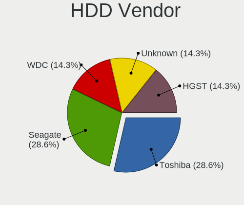
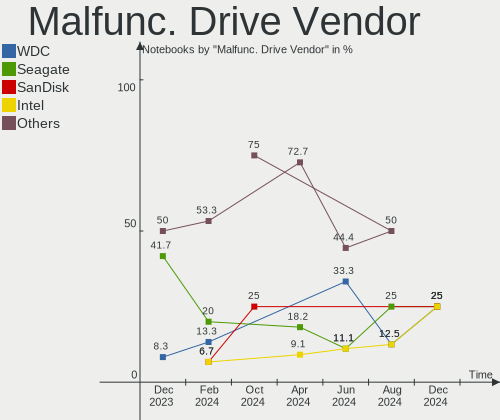
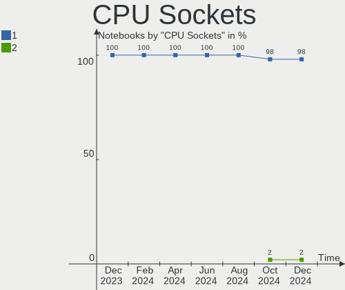
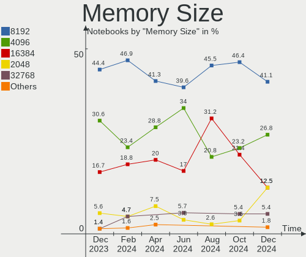

ArcoLinux - Hardware Trends (Notebooks)
---------------------------------------

A project to identify most popular hardware characteristics and track their change
over time based on data collected by Linux users at https://Linux-Hardware.org.

Anyone can contribute to this report by the [hw-probe](https://github.com/linuxhw/hw-probe) tool:

    sudo -E hw-probe -all -upload

This report is for one last month. Overall report since the beginning of time: [TestDays](https://github.com/linuxhw/TestDays)

Period: Oct, 2023.

Contents
--------

* [ System ](#system)
  - [ OS                       ](#os)
  - [ OS Family                ](#os-family)
  - [ Kernel                   ](#kernel)
  - [ Kernel Family            ](#kernel-family)
  - [ Kernel Major Ver.        ](#kernel-major-ver)
  - [ Arch                     ](#arch)
  - [ DE                       ](#de)
  - [ Display Server           ](#display-server)
  - [ Display Manager          ](#display-manager)
  - [ OS Lang                  ](#os-lang)
  - [ Boot Mode                ](#boot-mode)
  - [ Filesystem               ](#filesystem)
  - [ Part. scheme             ](#part-scheme)
  - [ Dual Boot with Linux/BSD ](#dual-boot-with-linuxbsd)
  - [ Dual Boot (Win)          ](#dual-boot-win)

* [ Board ](#board)
  - [ Vendor                   ](#vendor)
  - [ Model                    ](#model)
  - [ Model Family             ](#model-family)
  - [ MFG Year                 ](#mfg-year)
  - [ Form Factor              ](#form-factor)
  - [ Secure Boot              ](#secure-boot)
  - [ Coreboot                 ](#coreboot)
  - [ RAM Size                 ](#ram-size)
  - [ RAM Used                 ](#ram-used)
  - [ Total Drives             ](#total-drives)
  - [ Has CD-ROM               ](#has-cd-rom)
  - [ Has Ethernet             ](#has-ethernet)
  - [ Has WiFi                 ](#has-wifi)
  - [ Has Bluetooth            ](#has-bluetooth)

* [ Location ](#location)
  - [ Country                  ](#country)
  - [ City                     ](#city)

* [ Drives ](#drives)
  - [ Drive Vendor             ](#drive-vendor)
  - [ Drive Model              ](#drive-model)
  - [ HDD Vendor               ](#hdd-vendor)
  - [ SSD Vendor               ](#ssd-vendor)
  - [ Drive Kind               ](#drive-kind)
  - [ Drive Connector          ](#drive-connector)
  - [ Drive Size               ](#drive-size)
  - [ Space Total              ](#space-total)
  - [ Space Used               ](#space-used)
  - [ Malfunc. Drives          ](#malfunc-drives)
  - [ Malfunc. Drive Vendor    ](#malfunc-drive-vendor)
  - [ Malfunc. HDD Vendor      ](#malfunc-hdd-vendor)
  - [ Malfunc. Drive Kind      ](#malfunc-drive-kind)
  - [ Failed Drives            ](#failed-drives)
  - [ Failed Drive Vendor      ](#failed-drive-vendor)
  - [ Drive Status             ](#drive-status)

* [ Storage controller ](#storage-controller)
  - [ Storage Vendor           ](#storage-vendor)
  - [ Storage Model            ](#storage-model)
  - [ Storage Kind             ](#storage-kind)

* [ Processor ](#processor)
  - [ CPU Vendor               ](#cpu-vendor)
  - [ CPU Model                ](#cpu-model)
  - [ CPU Model Family         ](#cpu-model-family)
  - [ CPU Cores                ](#cpu-cores)
  - [ CPU Sockets              ](#cpu-sockets)
  - [ CPU Threads              ](#cpu-threads)
  - [ CPU Op-Modes             ](#cpu-op-modes)
  - [ CPU Microcode            ](#cpu-microcode)
  - [ CPU Microarch            ](#cpu-microarch)

* [ Graphics ](#graphics)
  - [ GPU Vendor               ](#gpu-vendor)
  - [ GPU Model                ](#gpu-model)
  - [ GPU Combo                ](#gpu-combo)
  - [ GPU Driver               ](#gpu-driver)
  - [ GPU Memory               ](#gpu-memory)

* [ Monitor ](#monitor)
  - [ Monitor Vendor           ](#monitor-vendor)
  - [ Monitor Model            ](#monitor-model)
  - [ Monitor Resolution       ](#monitor-resolution)
  - [ Monitor Diagonal         ](#monitor-diagonal)
  - [ Monitor Width            ](#monitor-width)
  - [ Aspect Ratio             ](#aspect-ratio)
  - [ Monitor Area             ](#monitor-area)
  - [ Pixel Density            ](#pixel-density)
  - [ Multiple Monitors        ](#multiple-monitors)

* [ Network ](#network)
  - [ Net Controller Vendor    ](#net-controller-vendor)
  - [ Net Controller Model     ](#net-controller-model)
  - [ Wireless Vendor          ](#wireless-vendor)
  - [ Wireless Model           ](#wireless-model)
  - [ Ethernet Vendor          ](#ethernet-vendor)
  - [ Ethernet Model           ](#ethernet-model)
  - [ Net Controller Kind      ](#net-controller-kind)
  - [ Used Controller          ](#used-controller)
  - [ NICs                     ](#nics)
  - [ IPv6                     ](#ipv6)

* [ Bluetooth ](#bluetooth)
  - [ Bluetooth Vendor         ](#bluetooth-vendor)
  - [ Bluetooth Model          ](#bluetooth-model)

* [ Sound ](#sound)
  - [ Sound Vendor             ](#sound-vendor)
  - [ Sound Model              ](#sound-model)

* [ Memory ](#memory)
  - [ Memory Vendor            ](#memory-vendor)
  - [ Memory Model             ](#memory-model)
  - [ Memory Kind              ](#memory-kind)
  - [ Memory Form Factor       ](#memory-form-factor)
  - [ Memory Size              ](#memory-size)
  - [ Memory Speed             ](#memory-speed)

* [ Printers & scanners ](#printers--scanners)
  - [ Printer Vendor           ](#printer-vendor)
  - [ Printer Model            ](#printer-model)
  - [ Scanner Vendor           ](#scanner-vendor)
  - [ Scanner Model            ](#scanner-model)

* [ Camera ](#camera)
  - [ Camera Vendor            ](#camera-vendor)
  - [ Camera Model             ](#camera-model)

* [ Security ](#security)
  - [ Fingerprint Vendor       ](#fingerprint-vendor)
  - [ Fingerprint Model        ](#fingerprint-model)
  - [ Chipcard Vendor          ](#chipcard-vendor)
  - [ Chipcard Model           ](#chipcard-model)

* [ Unsupported ](#unsupported)
  - [ Unsupported Devices      ](#unsupported-devices)
  - [ Unsupported Device Types ](#unsupported-device-types)

System
------

OS
--

Installed operating systems

| Name              | Notebooks | Percent |
|-------------------|-----------|---------|
| ArcoLinux Rolling | 66        | 97.06%  |
| ArcoLinux         | 2         | 2.94%   |

OS Family
---------

OS without a version

| Name      | Notebooks | Percent |
|-----------|-----------|---------|
| ArcoLinux | 68        | 100%    |

Kernel
------

Version of the Linux kernel

| Version                     | Notebooks | Percent |
|-----------------------------|-----------|---------|
| 6.5.5-arch1-1               | 10        | 14.71%  |
| 6.5.7-arch1-1               | 9         | 13.24%  |
| 6.5.8-arch1-1               | 6         | 8.82%   |
| 6.5.3-arch1-1               | 6         | 8.82%   |
| 6.5.5-zen1-1-zen            | 4         | 5.88%   |
| 6.5.9-arch2-1               | 3         | 4.41%   |
| 6.5.6-arch2-1               | 3         | 4.41%   |
| 6.4.11-arch1-1              | 3         | 4.41%   |
| 6.5.9-zen2-1-zen            | 2         | 2.94%   |
| 6.5.7-zen2-1-zen            | 2         | 2.94%   |
| 6.5.6-zen2-1-zen            | 2         | 2.94%   |
| 6.5.4-arch2-1               | 2         | 2.94%   |
| 6.5.3-x64v2-xanmod1-1       | 2         | 2.94%   |
| 6.3.8-arch1-1               | 2         | 2.94%   |
| 6.1.57-1-lts                | 2         | 2.94%   |
| 6.5.7-zen1-1-zen            | 1         | 1.47%   |
| 6.5.6-lqx1-1-lqx            | 1         | 1.47%   |
| 6.5.2.8.realtime1-1-rt      | 1         | 1.47%   |
| 6.4.12-arch1-1              | 1         | 1.47%   |
| 6.4.11-hardened1-1-hardened | 1         | 1.47%   |
| 6.4.11-arch2-1              | 1         | 1.47%   |
| 6.1.59-1-lts                | 1         | 1.47%   |
| 6.1.58-1-lts                | 1         | 1.47%   |
| 6.1.55-1-lts                | 1         | 1.47%   |
| 6.1.28-1-lts                | 1         | 1.47%   |

Kernel Family
-------------

Linux kernel without a distro release

| Version | Notebooks | Percent |
|---------|-----------|---------|
| 6.5.5   | 14        | 20.59%  |
| 6.5.7   | 12        | 17.65%  |
| 6.5.3   | 8         | 11.76%  |
| 6.5.8   | 6         | 8.82%   |
| 6.5.6   | 6         | 8.82%   |
| 6.5.9   | 5         | 7.35%   |
| 6.4.11  | 5         | 7.35%   |
| 6.5.4   | 2         | 2.94%   |
| 6.3.8   | 2         | 2.94%   |
| 6.1.57  | 2         | 2.94%   |
| 6.5.2.8 | 1         | 1.47%   |
| 6.4.12  | 1         | 1.47%   |
| 6.1.59  | 1         | 1.47%   |
| 6.1.58  | 1         | 1.47%   |
| 6.1.55  | 1         | 1.47%   |
| 6.1.28  | 1         | 1.47%   |

Kernel Major Ver.
-----------------

Linux kernel major version

| Version | Notebooks | Percent |
|---------|-----------|---------|
| 6.5     | 53        | 77.94%  |
| 6.4     | 6         | 8.82%   |
| 6.1     | 6         | 8.82%   |
| 6.3     | 2         | 2.94%   |
| 6.5.2   | 1         | 1.47%   |

Arch
----

OS architecture (x86_64, i586, etc.)

| Name   | Notebooks | Percent |
|--------|-----------|---------|
| x86_64 | 68        | 100%    |

DE
--

Desktop Environment

| Name     | Notebooks | Percent |
|----------|-----------|---------|
| XFCE     | 22        | 32.35%  |
| KDE5     | 22        | 32.35%  |
| GNOME    | 7         | 10.29%  |
| Hyprland | 4         | 5.88%   |
| i3       | 3         | 4.41%   |
| Cinnamon | 2         | 2.94%   |
| Pantheon | 1         | 1.47%   |
| LeftWM   | 1         | 1.47%   |
| Hypr     | 1         | 1.47%   |
| dwm      | 1         | 1.47%   |
| Deepin   | 1         | 1.47%   |
| chadwm   | 1         | 1.47%   |
| bspwm    | 1         | 1.47%   |
| awesome  | 1         | 1.47%   |

Display Server
--------------

X11 or Wayland

| Name    | Notebooks | Percent |
|---------|-----------|---------|
| X11     | 58        | 85.29%  |
| Wayland | 10        | 14.71%  |

Display Manager
---------------

SDDM, LightDM, etc.

| Name    | Notebooks | Percent |
|---------|-----------|---------|
| SDDM    | 59        | 86.76%  |
| LightDM | 6         | 8.82%   |
| Unknown | 2         | 2.94%   |
| GDM     | 1         | 1.47%   |

OS Lang
-------

Language

| Lang  | Notebooks | Percent |
|-------|-----------|---------|
| en_US | 34        | 50%     |
| C     | 5         | 7.35%   |
| it_IT | 4         | 5.88%   |
| en_GB | 4         | 5.88%   |
| en_HK | 3         | 4.41%   |
| de_DE | 3         | 4.41%   |
| ru_RU | 2         | 2.94%   |
| hu_HU | 2         | 2.94%   |
| fr_FR | 2         | 2.94%   |
| es_ES | 2         | 2.94%   |
| uk_UA | 1         | 1.47%   |
| tr_TR | 1         | 1.47%   |
| ro_RO | 1         | 1.47%   |
| pt_PT | 1         | 1.47%   |
| pt_BR | 1         | 1.47%   |
| es_AR | 1         | 1.47%   |
| en_CA | 1         | 1.47%   |

Boot Mode
---------

EFI or BIOS

| Mode | Notebooks | Percent |
|------|-----------|---------|
| EFI  | 50        | 73.53%  |
| BIOS | 18        | 26.47%  |

Filesystem
----------

Type of filesystem

| Type    | Notebooks | Percent |
|---------|-----------|---------|
| Ext4    | 43        | 63.24%  |
| Btrfs   | 17        | 25%     |
| Overlay | 5         | 7.35%   |
| F2fs    | 2         | 2.94%   |
| Xfs     | 1         | 1.47%   |

Part. scheme
------------

Scheme of partitioning

| Type    | Notebooks | Percent |
|---------|-----------|---------|
| GPT     | 56        | 82.35%  |
| MBR     | 10        | 14.71%  |
| Unknown | 2         | 2.94%   |

Dual Boot with Linux/BSD
------------------------

Hosting more than one Linux/BSD

| Dual boot | Notebooks | Percent |
|-----------|-----------|---------|
| No        | 54        | 79.41%  |
| Yes       | 14        | 20.59%  |

Dual Boot (Win)
---------------

Hosting Linux and Windows

| Dual boot | Notebooks | Percent |
|-----------|-----------|---------|
| No        | 45        | 66.18%  |
| Yes       | 23        | 33.82%  |

Board
-----

Vendor
------

Motherboard manufacturer

| Name                | Notebooks | Percent |
|---------------------|-----------|---------|
| Lenovo              | 23        | 33.82%  |
| ASUSTek Computer    | 13        | 19.12%  |
| Hewlett-Packard     | 11        | 16.18%  |
| Dell                | 8         | 11.76%  |
| Samsung Electronics | 3         | 4.41%   |
| Acer                | 2         | 2.94%   |
| Toshiba             | 1         | 1.47%   |
| Razer               | 1         | 1.47%   |
| MSI                 | 1         | 1.47%   |
| Extra Terrestrial   | 1         | 1.47%   |
| BESSTAR Tech        | 1         | 1.47%   |
| BANGHO              | 1         | 1.47%   |
| Apple               | 1         | 1.47%   |
| Unknown             | 1         | 1.47%   |

Model
-----

Motherboard model

| Name                                     | Notebooks | Percent |
|------------------------------------------|-----------|---------|
| Unknown                                  | 2         | 2.94%   |
| Toshiba Satellite C55-C                  | 1         | 1.47%   |
| Samsung 750XED                           | 1         | 1.47%   |
| Samsung 550P5C/550P7C                    | 1         | 1.47%   |
| Samsung 270E5J/2570EJ                    | 1         | 1.47%   |
| Razer Book 13 - RZ09-0357                | 1         | 1.47%   |
| MSI Prestige 15 A10SC                    | 1         | 1.47%   |
| Lenovo XiaoXin Air 15IKBR 81GY           | 1         | 1.47%   |
| Lenovo ThinkPad X230 232578G             | 1         | 1.47%   |
| Lenovo ThinkPad X220 4291C84             | 1         | 1.47%   |
| Lenovo ThinkPad X1 Carbon 6th 20KH006KUK | 1         | 1.47%   |
| Lenovo ThinkPad T490 20N3SDGJ02          | 1         | 1.47%   |
| Lenovo ThinkPad T480 20L50010US          | 1         | 1.47%   |
| Lenovo ThinkPad T480 20L5000AIX          | 1         | 1.47%   |
| Lenovo ThinkPad T430 2349IF8             | 1         | 1.47%   |
| Lenovo ThinkPad P53 20QN0050RT           | 1         | 1.47%   |
| Lenovo ThinkPad L540 20AUS11P00          | 1         | 1.47%   |
| Lenovo ThinkPad E490 20N80006UE          | 1         | 1.47%   |
| Lenovo ThinkPad 3354DSG                  | 1         | 1.47%   |
| Lenovo Legion 5 15ACH6A 82NW             | 1         | 1.47%   |
| Lenovo IdeaPad Y700-17ISK 80Q0           | 1         | 1.47%   |
| Lenovo IdeaPad Y700-15ISK 80NV           | 1         | 1.47%   |
| Lenovo IdeaPad S145-15API 81V7           | 1         | 1.47%   |
| Lenovo IdeaPad L340-15IRH Gaming 81LK    | 1         | 1.47%   |
| Lenovo IdeaPad 5 Pro 14ARH7 82SJ         | 1         | 1.47%   |
| Lenovo IdeaPad 330-15IGM 81D1            | 1         | 1.47%   |
| Lenovo IdeaPad 320-14IKB 80XK            | 1         | 1.47%   |
| Lenovo IdeaPad 3 15ITL05 81X8            | 1         | 1.47%   |
| Lenovo IdeaPad 3 14ITL6 82H7             | 1         | 1.47%   |
| Lenovo Flex 2-15 20405                   | 1         | 1.47%   |
| HP Presario CQ56                         | 1         | 1.47%   |
| HP Pavilion Laptop 15-cs3xxx             | 1         | 1.47%   |
| HP Pavilion Gaming Laptop 15-ec2xxx      | 1         | 1.47%   |
| HP Pavilion g7                           | 1         | 1.47%   |
| HP OMEN by Gaming Laptop 16-n0xxx        | 1         | 1.47%   |
| HP Notebook                              | 1         | 1.47%   |
| HP Laptop 17-by2xxx                      | 1         | 1.47%   |
| HP Laptop 15-da0xxx                      | 1         | 1.47%   |
| HP Laptop 15-bw0xx                       | 1         | 1.47%   |
| HP Folio 13                              | 1         | 1.47%   |

Model Family
------------

Motherboard model prefix

| Name              | Notebooks | Percent |
|-------------------|-----------|---------|
| Lenovo ThinkPad   | 11        | 16.18%  |
| Lenovo IdeaPad    | 9         | 13.24%  |
| HP Pavilion       | 3         | 4.41%   |
| HP Laptop         | 3         | 4.41%   |
| Dell XPS          | 3         | 4.41%   |
| ASUS VivoBook     | 2         | 2.94%   |
| ASUS ASUS         | 2         | 2.94%   |
| Acer Aspire       | 2         | 2.94%   |
| Unknown           | 2         | 2.94%   |
| Toshiba Satellite | 1         | 1.47%   |
| Samsung 750XED    | 1         | 1.47%   |
| Samsung 550P5C    | 1         | 1.47%   |
| Samsung 270E5J    | 1         | 1.47%   |
| Razer Book        | 1         | 1.47%   |
| MSI Prestige      | 1         | 1.47%   |
| Lenovo XiaoXin    | 1         | 1.47%   |
| Lenovo Legion     | 1         | 1.47%   |
| Lenovo Flex       | 1         | 1.47%   |
| HP Presario       | 1         | 1.47%   |
| HP OMEN           | 1         | 1.47%   |
| HP Notebook       | 1         | 1.47%   |
| HP Folio          | 1         | 1.47%   |
| HP 250            | 1         | 1.47%   |
| Dell Vostro       | 1         | 1.47%   |
| Dell Precision    | 1         | 1.47%   |
| Dell Latitude     | 1         | 1.47%   |
| Dell Inspiron     | 1         | 1.47%   |
| Dell G3           | 1         | 1.47%   |
| BESSTAR Tech X400 | 1         | 1.47%   |
| BANGHO MAX        | 1         | 1.47%   |
| ASUS ZenBook      | 1         | 1.47%   |
| ASUS X556UQK      | 1         | 1.47%   |
| ASUS X555UB       | 1         | 1.47%   |
| ASUS X550JX       | 1         | 1.47%   |
| ASUS Strix        | 1         | 1.47%   |
| ASUS ROG          | 1         | 1.47%   |
| ASUS N552VW       | 1         | 1.47%   |
| ASUS K52JB        | 1         | 1.47%   |
| ASUS G750JM       | 1         | 1.47%   |
| Apple MacBookAir6 | 1         | 1.47%   |

MFG Year
--------

Motherboard manufacture year

| Year | Notebooks | Percent |
|------|-----------|---------|
| 2018 | 10        | 14.71%  |
| 2021 | 7         | 10.29%  |
| 2019 | 7         | 10.29%  |
| 2015 | 7         | 10.29%  |
| 2014 | 6         | 8.82%   |
| 2011 | 6         | 8.82%   |
| 2022 | 5         | 7.35%   |
| 2017 | 5         | 7.35%   |
| 2012 | 5         | 7.35%   |
| 2020 | 3         | 4.41%   |
| 2016 | 2         | 2.94%   |
| 2013 | 2         | 2.94%   |
| 2010 | 2         | 2.94%   |
| 2023 | 1         | 1.47%   |

Form Factor
-----------

Physical design of the computer

| Name     | Notebooks | Percent |
|----------|-----------|---------|
| Notebook | 68        | 100%    |

Secure Boot
-----------

Enabled or disabled

| State    | Notebooks | Percent |
|----------|-----------|---------|
| Disabled | 68        | 100%    |

Coreboot
--------

Have coreboot on board

| Used | Notebooks | Percent |
|------|-----------|---------|
| No   | 68        | 100%    |

RAM Size
--------

Total RAM memory

| Size in GB  | Notebooks | Percent |
|-------------|-----------|---------|
| 4.01-8.0    | 23        | 33.82%  |
| 8.01-16.0   | 16        | 23.53%  |
| 32.01-64.0  | 11        | 16.18%  |
| 16.01-24.0  | 10        | 14.71%  |
| 3.01-4.0    | 6         | 8.82%   |
| 64.01-256.0 | 1         | 1.47%   |
| 1.01-2.0    | 1         | 1.47%   |

RAM Used
--------

Used RAM memory

| Used GB   | Notebooks | Percent |
|-----------|-----------|---------|
| 1.01-2.0  | 26        | 38.24%  |
| 2.01-3.0  | 21        | 30.88%  |
| 4.01-8.0  | 10        | 14.71%  |
| 3.01-4.0  | 6         | 8.82%   |
| 0.51-1.0  | 3         | 4.41%   |
| 8.01-16.0 | 2         | 2.94%   |

Total Drives
------------

Number of drives on board

| Drives | Notebooks | Percent |
|--------|-----------|---------|
| 1      | 39        | 57.35%  |
| 2      | 23        | 33.82%  |
| 3      | 6         | 8.82%   |

Has CD-ROM
----------

Has CD-ROM on board

| Presented | Notebooks | Percent |
|-----------|-----------|---------|
| No        | 49        | 72.06%  |
| Yes       | 19        | 27.94%  |

Has Ethernet
------------

Has Ethernet on board

| Presented | Notebooks | Percent |
|-----------|-----------|---------|
| Yes       | 55        | 80.88%  |
| No        | 13        | 19.12%  |

Has WiFi
--------

Has WiFi module

| Presented | Notebooks | Percent |
|-----------|-----------|---------|
| Yes       | 67        | 98.53%  |
| No        | 1         | 1.47%   |

Has Bluetooth
-------------

Has Bluetooth module

| Presented | Notebooks | Percent |
|-----------|-----------|---------|
| Yes       | 63        | 92.65%  |
| No        | 5         | 7.35%   |

Location
--------

Country
-------

Geographic location (country)

| Country     | Notebooks | Percent |
|-------------|-----------|---------|
| USA         | 18        | 26.47%  |
| Italy       | 5         | 7.35%   |
| UK          | 4         | 5.88%   |
| Brazil      | 4         | 5.88%   |
| Spain       | 3         | 4.41%   |
| Romania     | 3         | 4.41%   |
| Hong Kong   | 3         | 4.41%   |
| Turkey      | 2         | 2.94%   |
| Indonesia   | 2         | 2.94%   |
| India       | 2         | 2.94%   |
| Hungary     | 2         | 2.94%   |
| Germany     | 2         | 2.94%   |
| France      | 2         | 2.94%   |
| Argentina   | 2         | 2.94%   |
| Vietnam     | 1         | 1.47%   |
| UAE         | 1         | 1.47%   |
| Sweden      | 1         | 1.47%   |
| Russia      | 1         | 1.47%   |
| Portugal    | 1         | 1.47%   |
| Philippines | 1         | 1.47%   |
| Norway      | 1         | 1.47%   |
| Greece      | 1         | 1.47%   |
| Ghana       | 1         | 1.47%   |
| Estonia     | 1         | 1.47%   |
| Denmark     | 1         | 1.47%   |
| Colombia    | 1         | 1.47%   |
| Canada      | 1         | 1.47%   |
| Armenia     | 1         | 1.47%   |

City
----

Geographic location (city)

| City               | Notebooks | Percent |
|--------------------|-----------|---------|
| Tsuen Wan          | 3         | 4.41%   |
| Charlotte          | 3         | 4.41%   |
| Rio de Janeiro     | 2         | 2.94%   |
| Feltham            | 2         | 2.94%   |
| Budapest           | 2         | 2.94%   |
| Yerevan            | 1         | 1.47%   |
| Windsor            | 1         | 1.47%   |
| Tallinn            | 1         | 1.47%   |
| Southern Pines     | 1         | 1.47%   |
| Solna              | 1         | 1.47%   |
| San Francisco      | 1         | 1.47%   |
| Salvador           | 1         | 1.47%   |
| Salt Lake City     | 1         | 1.47%   |
| Saint-Denis        | 1         | 1.47%   |
| Roswell            | 1         | 1.47%   |
| Rocca Pietore      | 1         | 1.47%   |
| Protvino           | 1         | 1.47%   |
| Peterlee           | 1         | 1.47%   |
| Perugia            | 1         | 1.47%   |
| Pasco              | 1         | 1.47%   |
| Paris              | 1         | 1.47%   |
| Oslo               | 1         | 1.47%   |
| Milan              | 1         | 1.47%   |
| Mendoza            | 1         | 1.47%   |
| Madrid             | 1         | 1.47%   |
| Los Angeles        | 1         | 1.47%   |
| Longview           | 1         | 1.47%   |
| Larissa            | 1         | 1.47%   |
| La Trinidad        | 1         | 1.47%   |
| La Roca del Valles | 1         | 1.47%   |
| Klamath Falls      | 1         | 1.47%   |
| Kansas City        | 1         | 1.47%   |
| Jakarta            | 1         | 1.47%   |
| Istanbul           | 1         | 1.47%   |
| Inverness          | 1         | 1.47%   |
| Hurt               | 1         | 1.47%   |
| Ho Chi Minh City   | 1         | 1.47%   |
| Hanau              | 1         | 1.47%   |
| Fulda              | 1         | 1.47%   |
| Espinho            | 1         | 1.47%   |

Drives
------

Drive Vendor
------------

Hard drive vendors

| Vendor                      | Notebooks | Drives | Percent |
|-----------------------------|-----------|--------|---------|
| Samsung Electronics         | 23        | 24     | 23.23%  |
| WDC                         | 11        | 11     | 11.11%  |
| Kingston                    | 9         | 9      | 9.09%   |
| SK hynix                    | 6         | 8      | 6.06%   |
| Crucial                     | 5         | 5      | 5.05%   |
| Toshiba                     | 4         | 4      | 4.04%   |
| Sandisk                     | 4         | 4      | 4.04%   |
| Micron Technology           | 4         | 4      | 4.04%   |
| Silicon Motion              | 3         | 3      | 3.03%   |
| Seagate                     | 3         | 3      | 3.03%   |
| Intel                       | 3         | 4      | 3.03%   |
| HGST                        | 3         | 3      | 3.03%   |
| Realtek Semiconductor       | 2         | 2      | 2.02%   |
| Apple                       | 2         | 2      | 2.02%   |
| Unknown                     | 1         | 1      | 1.01%   |
| Union Memory (Shenzhen)     | 1         | 1      | 1.01%   |
| TwinMOS                     | 1         | 1      | 1.01%   |
| Team                        | 1         | 1      | 1.01%   |
| ShiJi                       | 1         | 1      | 1.01%   |
| Realtek                     | 1         | 1      | 1.01%   |
| PNY                         | 1         | 1      | 1.01%   |
| Plextor                     | 1         | 1      | 1.01%   |
| LaCie                       | 1         | 1      | 1.01%   |
| KIOXIA                      | 1         | 1      | 1.01%   |
| Kingston Technology Company | 1         | 2      | 1.01%   |
| JMicron Technology          | 1         | 1      | 1.01%   |
| Hewlett-Packard             | 1         | 1      | 1.01%   |
| Gigabyte Technology         | 1         | 1      | 1.01%   |
| EYOTA                       | 1         | 1      | 1.01%   |
| EDILOCA                     | 1         | 1      | 1.01%   |
| Biwin Storage Technology    | 1         | 1      | 1.01%   |

Drive Model
-----------

Hard drive models

| Model                                                 | Notebooks | Percent |
|-------------------------------------------------------|-----------|---------|
| Samsung NVMe SSD Controller SM981/PM981/PM983 1TB     | 5         | 4.95%   |
| Kingston SA400S37480G 480GB SSD                       | 5         | 4.95%   |
| Samsung NVMe SSD Controller PM9A1/PM9A3/980PRO 1TB    | 4         | 3.96%   |
| Toshiba MQ01ABD100 1TB                                | 3         | 2.97%   |
| WDC WD10SPCX-24HWST1 1TB                              | 2         | 1.98%   |
| Silicon Motion SM2263EN/SM2263XT SSD Controller 256GB | 2         | 1.98%   |
| Samsung SSD 850 EVO 250GB                             | 2         | 1.98%   |
| HGST HTS721010A9E630 1TB                              | 2         | 1.98%   |
| Crucial CT480BX500SSD1 480GB                          | 2         | 1.98%   |
| WDC WD5000LUCT-63C26Y0 500GB                          | 1         | 0.99%   |
| WDC WD5000LPCX-24VHAT0 500GB                          | 1         | 0.99%   |
| WDC WD5000BPKX-75HPJT0 500GB                          | 1         | 0.99%   |
| WDC WD5000BPKT-75PK4T0 500GB                          | 1         | 0.99%   |
| WDC WD5000BEVT-22A0RT0 500GB                          | 1         | 0.99%   |
| WDC WD10SPZX-60Z10T0 1TB                              | 1         | 0.99%   |
| WDC WD10SPZX-24Z10T0 1TB                              | 1         | 0.99%   |
| WDC WD10SPZX-24Z10 1TB                                | 1         | 0.99%   |
| WDC WD10SPZX-08Z10 1TB                                | 1         | 0.99%   |
| Unknown MMC Card  256GB                               | 1         | 0.99%   |
| Union Memory (Shenzhen) RPFTJ256PDD2MWX 256GB         | 1         | 0.99%   |
| TwinMOS SSD 1TB                                       | 1         | 0.99%   |
| Toshiba XG4 NVMe SSD Controller 256GB                 | 1         | 0.99%   |
| Team T253512GB SSD                                    | 1         | 0.99%   |
| SK hynix SKHynix_HFS512GDE9X084N 512GB                | 1         | 0.99%   |
| SK hynix SKHynix_HFS001TD9TNG-L5B0B 1TB               | 1         | 0.99%   |
| SK hynix SKHynix_HFM128GD3HX015N 128GB                | 1         | 0.99%   |
| SK hynix PC601A NVMe 1TB                              | 1         | 0.99%   |
| SK hynix HFS128G32TND-N210A 128GB SSD                 | 1         | 0.99%   |
| SK hynix HFM512GD3JX013N 512GB                        | 1         | 0.99%   |
| Silicon Motion SM2262/SM2262EN SSD Controller 2TB     | 1         | 0.99%   |
| ShiJi SSD 1TB                                         | 1         | 0.99%   |
| Seagate ST9320325AS 320GB                             | 1         | 0.99%   |
| Seagate ST2000LM003 HN-M201RAD 2TB                    | 1         | 0.99%   |
| Seagate ST1000LM035-1RK172 1TB                        | 1         | 0.99%   |
| Sandisk WD_BLACK SN770 500GB                          | 1         | 0.99%   |
| Sandisk WD Black 2018/SN750 / PC SN720 NVMe SSD 1TB   | 1         | 0.99%   |
| SanDisk SSD PLUS 480GB                                | 1         | 0.99%   |
| SanDisk Extreme 55AE 1TB SSD                          | 1         | 0.99%   |
| Samsung SSD 870 EVO 500GB                             | 1         | 0.99%   |
| Samsung SSD 870 EVO 250GB                             | 1         | 0.99%   |

HDD Vendor
----------

Hard disk drive vendors

| Vendor  | Notebooks | Drives | Percent |
|---------|-----------|--------|---------|
| WDC     | 11        | 11     | 52.38%  |
| Toshiba | 3         | 3      | 14.29%  |
| Seagate | 3         | 3      | 14.29%  |
| HGST    | 3         | 3      | 14.29%  |
| Apple   | 1         | 1      | 4.76%   |

SSD Vendor
----------

Solid state drive vendors

| Vendor              | Notebooks | Drives | Percent |
|---------------------|-----------|--------|---------|
| Samsung Electronics | 12        | 12     | 27.91%  |
| Kingston            | 9         | 9      | 20.93%  |
| Crucial             | 5         | 5      | 11.63%  |
| SanDisk             | 2         | 2      | 4.65%   |
| Micron Technology   | 2         | 2      | 4.65%   |
| TwinMOS             | 1         | 1      | 2.33%   |
| Team                | 1         | 1      | 2.33%   |
| SK hynix            | 1         | 1      | 2.33%   |
| ShiJi               | 1         | 1      | 2.33%   |
| PNY                 | 1         | 1      | 2.33%   |
| Plextor             | 1         | 1      | 2.33%   |
| LaCie               | 1         | 1      | 2.33%   |
| Intel               | 1         | 1      | 2.33%   |
| Hewlett-Packard     | 1         | 1      | 2.33%   |
| Gigabyte Technology | 1         | 1      | 2.33%   |
| EYOTA               | 1         | 1      | 2.33%   |
| EDILOCA             | 1         | 1      | 2.33%   |
| Apple               | 1         | 1      | 2.33%   |

Drive Kind
----------

HDD or SSD

| Kind | Notebooks | Drives | Percent |
|------|-----------|--------|---------|
| SSD  | 34        | 43     | 40.48%  |
| NVMe | 29        | 39     | 34.52%  |
| HDD  | 20        | 21     | 23.81%  |
| MMC  | 1         | 1      | 1.19%   |

Drive Connector
---------------

SATA, SAS, NVMe, etc.

| Type | Notebooks | Drives | Percent |
|------|-----------|--------|---------|
| SATA | 45        | 61     | 56.96%  |
| NVMe | 28        | 37     | 35.44%  |
| SAS  | 5         | 5      | 6.33%   |
| MMC  | 1         | 1      | 1.27%   |

Drive Size
----------

Size of hard drive

| Size in TB | Notebooks | Drives | Percent |
|------------|-----------|--------|---------|
| 0.01-0.5   | 35        | 43     | 63.64%  |
| 0.51-1.0   | 19        | 20     | 34.55%  |
| 1.01-2.0   | 1         | 1      | 1.82%   |

Space Total
-----------

Amount of disk space available on the file system

| Size in GB     | Notebooks | Percent |
|----------------|-----------|---------|
| 251-500        | 13        | 19.12%  |
| 101-250        | 13        | 19.12%  |
| 501-1000       | 11        | 16.18%  |
| 1001-2000      | 9         | 13.24%  |
| More than 3000 | 6         | 8.82%   |
| 1-20           | 4         | 5.88%   |
| 51-100         | 4         | 5.88%   |
| Unknown        | 4         | 5.88%   |
| 21-50          | 3         | 4.41%   |
| 2001-3000      | 1         | 1.47%   |

Space Used
----------

Amount of used disk space

| Used GB   | Notebooks | Percent |
|-----------|-----------|---------|
| 1-20      | 30        | 44.12%  |
| 21-50     | 12        | 17.65%  |
| 101-250   | 7         | 10.29%  |
| 251-500   | 5         | 7.35%   |
| 501-1000  | 4         | 5.88%   |
| Unknown   | 4         | 5.88%   |
| 1001-2000 | 3         | 4.41%   |
| 51-100    | 3         | 4.41%   |

Malfunc. Drives
---------------

Drive models with a malfunction

| Model                                                   | Notebooks | Drives | Percent |
|---------------------------------------------------------|-----------|--------|---------|
| WDC WD10SPZX-60Z10T0 1TB                                | 1         | 1      | 12.5%   |
| Toshiba MQ01ABD100 1TB                                  | 1         | 1      | 12.5%   |
| Seagate ST9320325AS 320GB                               | 1         | 1      | 12.5%   |
| Realtek Semiconductor RTS5763DL NVMe SSD Controller 1TB | 1         | 1      | 12.5%   |
| Intel SSDSC2BF180A4L 180GB                              | 1         | 1      | 12.5%   |
| HGST HTS725050A7E630 500GB                              | 1         | 1      | 12.5%   |
| HGST HTS721010A9E630 1TB                                | 1         | 1      | 12.5%   |
| Apple HDD HTS545050A7E362 500GB                         | 1         | 1      | 12.5%   |

Malfunc. Drive Vendor
---------------------

Vendors of faulty drives

| Vendor                | Notebooks | Drives | Percent |
|-----------------------|-----------|--------|---------|
| HGST                  | 2         | 2      | 25%     |
| WDC                   | 1         | 1      | 12.5%   |
| Toshiba               | 1         | 1      | 12.5%   |
| Seagate               | 1         | 1      | 12.5%   |
| Realtek Semiconductor | 1         | 1      | 12.5%   |
| Intel                 | 1         | 1      | 12.5%   |
| Apple                 | 1         | 1      | 12.5%   |

Malfunc. HDD Vendor
-------------------

Vendors of faulty HDD drives

| Vendor  | Notebooks | Drives | Percent |
|---------|-----------|--------|---------|
| HGST    | 2         | 2      | 33.33%  |
| WDC     | 1         | 1      | 16.67%  |
| Toshiba | 1         | 1      | 16.67%  |
| Seagate | 1         | 1      | 16.67%  |
| Apple   | 1         | 1      | 16.67%  |

Malfunc. Drive Kind
-------------------

Kinds of faulty drives

| Kind | Notebooks | Drives | Percent |
|------|-----------|--------|---------|
| HDD  | 6         | 6      | 75%     |
| NVMe | 1         | 1      | 12.5%   |
| SSD  | 1         | 1      | 12.5%   |

Failed Drives
-------------

Failed drive models

Zero info for selected period =(

Failed Drive Vendor
-------------------

Failed drive vendors

Zero info for selected period =(

Drive Status
------------

Number of failed and malfunc. drives

| Status   | Notebooks | Drives | Percent |
|----------|-----------|--------|---------|
| Works    | 61        | 88     | 81.33%  |
| Malfunc  | 8         | 8      | 10.67%  |
| Detected | 6         | 8      | 8%      |

Storage controller
------------------

Storage Vendor
--------------

Storage controller vendors

| Vendor                       | Notebooks | Percent |
|------------------------------|-----------|---------|
| Intel                        | 47        | 55.29%  |
| Samsung Electronics          | 11        | 12.94%  |
| AMD                          | 7         | 8.24%   |
| SK hynix                     | 5         | 5.88%   |
| Silicon Motion               | 3         | 3.53%   |
| SanDisk                      | 2         | 2.35%   |
| Realtek Semiconductor        | 2         | 2.35%   |
| Micron Technology            | 2         | 2.35%   |
| Union Memory (Shenzhen)      | 1         | 1.18%   |
| Toshiba America Info Systems | 1         | 1.18%   |
| Marvell Technology Group     | 1         | 1.18%   |
| KIOXIA                       | 1         | 1.18%   |
| Kingston Technology Company  | 1         | 1.18%   |
| Biwin Storage Technology     | 1         | 1.18%   |

Storage Model
-------------

Storage controller models

| Model                                                                          | Notebooks | Percent |
|--------------------------------------------------------------------------------|-----------|---------|
| Intel 82801 Mobile SATA Controller [RAID mode]                                 | 9         | 10%     |
| AMD FCH SATA Controller [AHCI mode]                                            | 7         | 7.78%   |
| Samsung NVMe SSD Controller SM981/PM981/PM983                                  | 5         | 5.56%   |
| Intel 6 Series/C200 Series Chipset Family 6 port Mobile SATA AHCI Controller   | 5         | 5.56%   |
| Samsung NVMe SSD Controller PM9A1/PM9A3/980PRO                                 | 4         | 4.44%   |
| Intel Sunrise Point-LP SATA Controller [AHCI mode]                             | 4         | 4.44%   |
| Intel HM170/QM170 Chipset SATA Controller [AHCI Mode]                          | 4         | 4.44%   |
| Intel 8 Series/C220 Series Chipset Family 6-port SATA Controller 1 [AHCI mode] | 4         | 4.44%   |
| Intel 7 Series Chipset Family 6-port SATA Controller [AHCI mode]               | 4         | 4.44%   |
| SK hynix Gold P31/BC711/PC711 NVMe Solid State Drive                           | 3         | 3.33%   |
| Intel Wildcat Point-LP SATA Controller [AHCI Mode]                             | 3         | 3.33%   |
| Intel Volume Management Device NVMe RAID Controller                            | 3         | 3.33%   |
| Intel Tiger Lake-LP SATA Controller                                            | 3         | 3.33%   |
| Intel Cannon Lake Mobile PCH SATA AHCI Controller                              | 3         | 3.33%   |
| SK hynix PC601 NVMe Solid State Drive                                          | 2         | 2.22%   |
| Silicon Motion SM2263EN/SM2263XT (DRAM-less) NVMe SSD Controllers              | 2         | 2.22%   |
| Samsung NVMe SSD Controller 980 (DRAM-less)                                    | 2         | 2.22%   |
| Intel 8 Series SATA Controller 1 [AHCI mode]                                   | 2         | 2.22%   |
| Union Memory (Shenzhen) AM610 PCIe 3.0 x2 NVMe SSD 128GB, 256GB                | 1         | 1.11%   |
| Toshiba America Info Systems XG4 NVMe SSD Controller                           | 1         | 1.11%   |
| Silicon Motion SM2262/SM2262EN SSD Controller                                  | 1         | 1.11%   |
| SanDisk WD Black SN770 / PC SN740 256GB / PC SN560 (DRAM-less) NVMe SSD        | 1         | 1.11%   |
| SanDisk Extreme Pro / WD Black 2018/SN750/PC SN720 NVMe SSD                    | 1         | 1.11%   |
| Samsung NVMe SSD Controller SM951/PM951                                        | 1         | 1.11%   |
| Realtek RTS5765DL NVMe SSD Controller (DRAM-less)                              | 1         | 1.11%   |
| Realtek RTS5762 NVMe SSD Controller                                            | 1         | 1.11%   |
| Micron 3400 NVMe SSD [Hendrix]                                                 | 1         | 1.11%   |
| Micron 2210 NVMe SSD [Cobain]                                                  | 1         | 1.11%   |
| Marvell Group 88SS9183 PCIe SSD Controller                                     | 1         | 1.11%   |
| KIOXIA NVMe SSD Controller XG8                                                 | 1         | 1.11%   |
| Kingston Company A1000/U-SNS8154P3 x2 NVMe SSD                                 | 1         | 1.11%   |
| Intel SSD 660P Series                                                          | 1         | 1.11%   |
| Intel Optane NVME SSD H10 with Solid State Storage [Teton Glacier]             | 1         | 1.11%   |
| Intel Celeron/Pentium Silver Processor SATA Controller                         | 1         | 1.11%   |
| Intel Cannon Point-LP SATA Controller [AHCI Mode]                              | 1         | 1.11%   |
| Intel Atom Processor E3800 Series SATA AHCI Controller                         | 1         | 1.11%   |
| Intel 82801IBM/IEM (ICH9M/ICH9M-E) 4 port SATA Controller [AHCI mode]          | 1         | 1.11%   |
| Intel 5 Series/3400 Series Chipset 4 port SATA AHCI Controller                 | 1         | 1.11%   |
| Biwin Storage Non-Volatile memory controller                                   | 1         | 1.11%   |

Storage Kind
------------

Kind of storage controller (IDE, SATA, NVMe, SAS, ...)

| Kind | Notebooks | Percent |
|------|-----------|---------|
| SATA | 45        | 52.94%  |
| NVMe | 28        | 32.94%  |
| RAID | 12        | 14.12%  |

Processor
---------

CPU Vendor
----------

Processor vendors

| Vendor | Notebooks | Percent |
|--------|-----------|---------|
| Intel  | 57        | 83.82%  |
| AMD    | 11        | 16.18%  |

CPU Model
---------

Processor models

| Model                                   | Notebooks | Percent |
|-----------------------------------------|-----------|---------|
| Intel Core i7-8550U CPU @ 1.80GHz       | 3         | 4.41%   |
| Intel Core i5-7200U CPU @ 2.50GHz       | 3         | 4.41%   |
| Intel Core i7-8750H CPU @ 2.20GHz       | 2         | 2.94%   |
| Intel Core i7-6700HQ CPU @ 2.60GHz      | 2         | 2.94%   |
| Intel Core i7-6500U CPU @ 2.50GHz       | 2         | 2.94%   |
| Intel Core i5-3320M CPU @ 2.60GHz       | 2         | 2.94%   |
| Intel Core i5-2430M CPU @ 2.40GHz       | 2         | 2.94%   |
| Intel 11th Gen Core i3-1115G4 @ 3.00GHz | 2         | 2.94%   |
| AMD Ryzen 7 4800H with Radeon Graphics  | 2         | 2.94%   |
| AMD Ryzen 5 5600H with Radeon Graphics  | 2         | 2.94%   |
| Intel Core M-5Y10c CPU @ 0.80GHz        | 1         | 1.47%   |
| Intel Core i7-9750H CPU @ 2.60GHz       | 1         | 1.47%   |
| Intel Core i7-8850H CPU @ 2.60GHz       | 1         | 1.47%   |
| Intel Core i7-8665U CPU @ 1.90GHz       | 1         | 1.47%   |
| Intel Core i7-8650U CPU @ 1.90GHz       | 1         | 1.47%   |
| Intel Core i7-7700HQ CPU @ 2.80GHz      | 1         | 1.47%   |
| Intel Core i7-4720HQ CPU @ 2.60GHz      | 1         | 1.47%   |
| Intel Core i7-4710HQ CPU @ 2.50GHz      | 1         | 1.47%   |
| Intel Core i7-4702MQ CPU @ 2.20GHz      | 1         | 1.47%   |
| Intel Core i7-4600M CPU @ 2.90GHz       | 1         | 1.47%   |
| Intel Core i7-4510U CPU @ 2.00GHz       | 1         | 1.47%   |
| Intel Core i7-3520M CPU @ 2.90GHz       | 1         | 1.47%   |
| Intel Core i7-2630QM CPU @ 2.00GHz      | 1         | 1.47%   |
| Intel Core i7-10710U CPU @ 1.10GHz      | 1         | 1.47%   |
| Intel Core i7-1065G7 CPU @ 1.30GHz      | 1         | 1.47%   |
| Intel Core i5-9300H CPU @ 2.40GHz       | 1         | 1.47%   |
| Intel Core i5-8300H CPU @ 2.30GHz       | 1         | 1.47%   |
| Intel Core i5-8265U CPU @ 1.60GHz       | 1         | 1.47%   |
| Intel Core i5-8250U CPU @ 1.60GHz       | 1         | 1.47%   |
| Intel Core i5-6300HQ CPU @ 2.30GHz      | 1         | 1.47%   |
| Intel Core i5-5200U CPU @ 2.20GHz       | 1         | 1.47%   |
| Intel Core i5-4260U CPU @ 1.40GHz       | 1         | 1.47%   |
| Intel Core i5-4210U CPU @ 1.70GHz       | 1         | 1.47%   |
| Intel Core i5-3340M CPU @ 2.70GHz       | 1         | 1.47%   |
| Intel Core i5-3230M CPU @ 2.60GHz       | 1         | 1.47%   |
| Intel Core i5-3210M CPU @ 2.50GHz       | 1         | 1.47%   |
| Intel Core i5-2520M CPU @ 2.50GHz       | 1         | 1.47%   |
| Intel Core i5-2467M CPU @ 1.60GHz       | 1         | 1.47%   |
| Intel Core i5-10210U CPU @ 1.60GHz      | 1         | 1.47%   |
| Intel Core i3-5005U CPU @ 2.00GHz       | 1         | 1.47%   |

CPU Model Family
----------------

Processor model prefix

| Model           | Notebooks | Percent |
|-----------------|-----------|---------|
| Intel Core i7   | 23        | 33.82%  |
| Intel Core i5   | 21        | 30.88%  |
| Other           | 7         | 10.29%  |
| AMD Ryzen 5     | 4         | 5.88%   |
| Intel Core i3   | 3         | 4.41%   |
| Intel Celeron   | 3         | 4.41%   |
| AMD Ryzen 9     | 2         | 2.94%   |
| AMD Ryzen 7     | 2         | 2.94%   |
| Intel Core M    | 1         | 1.47%   |
| AMD Ryzen 3 PRO | 1         | 1.47%   |
| AMD A6          | 1         | 1.47%   |

CPU Cores
---------

Number of processor cores

| Number | Notebooks | Percent |
|--------|-----------|---------|
| 2      | 28        | 41.18%  |
| 4      | 24        | 35.29%  |
| 6      | 9         | 13.24%  |
| 8      | 4         | 5.88%   |
| 1      | 2         | 2.94%   |
| 14     | 1         | 1.47%   |

CPU Sockets
-----------

Number of sockets

| Number | Notebooks | Percent |
|--------|-----------|---------|
| 1      | 68        | 100%    |

CPU Threads
-----------

Threads per core (Hyper-Threading)

| Number | Notebooks | Percent |
|--------|-----------|---------|
| 2      | 62        | 91.18%  |
| 1      | 6         | 8.82%   |

CPU Op-Modes
------------

CPU Operation Modes (32-bit, 64-bit)

| Op mode        | Notebooks | Percent |
|----------------|-----------|---------|
| 32-bit, 64-bit | 68        | 100%    |

CPU Microcode
-------------

Microcode number

| Number     | Notebooks | Percent |
|------------|-----------|---------|
| Unknown    | 51        | 75%     |
| 0x806c1    | 2         | 2.94%   |
| 0x0a404102 | 2         | 2.94%   |
| 0x08600106 | 2         | 2.94%   |
| 0xa0660    | 1         | 1.47%   |
| 0x906e9    | 1         | 1.47%   |
| 0x806ea    | 1         | 1.47%   |
| 0x706e5    | 1         | 1.47%   |
| 0x706a1    | 1         | 1.47%   |
| 0x0a50000d | 1         | 1.47%   |
| 0x0a50000c | 1         | 1.47%   |
| 0x08600104 | 1         | 1.47%   |
| 0x08108102 | 1         | 1.47%   |
| 0x06006705 | 1         | 1.47%   |
| 0x06001116 | 1         | 1.47%   |

CPU Microarch
-------------

Microarchitecture

| Name             | Notebooks | Percent |
|------------------|-----------|---------|
| KabyLake         | 18        | 26.47%  |
| Haswell          | 7         | 10.29%  |
| IvyBridge        | 6         | 8.82%   |
| Skylake          | 5         | 7.35%   |
| SandyBridge      | 5         | 7.35%   |
| TigerLake        | 4         | 5.88%   |
| Zen 3            | 3         | 4.41%   |
| Zen 2            | 3         | 4.41%   |
| Broadwell        | 3         | 4.41%   |
| Unknown          | 3         | 4.41%   |
| IceLake          | 2         | 2.94%   |
| Zen+             | 1         | 1.47%   |
| Westmere         | 1         | 1.47%   |
| Silvermont       | 1         | 1.47%   |
| Piledriver       | 1         | 1.47%   |
| Penryn           | 1         | 1.47%   |
| Goldmont plus    | 1         | 1.47%   |
| Excavator        | 1         | 1.47%   |
| CometLake        | 1         | 1.47%   |
| Alderlake Hybrid | 1         | 1.47%   |

Graphics
--------

GPU Vendor
----------

Vendors of graphics cards

| Vendor | Notebooks | Percent |
|--------|-----------|---------|
| Intel  | 55        | 58.51%  |
| Nvidia | 25        | 26.6%   |
| AMD    | 14        | 14.89%  |

GPU Model
---------

Graphics card models

| Model                                                                     | Notebooks | Percent |
|---------------------------------------------------------------------------|-----------|---------|
| Intel 3rd Gen Core processor Graphics Controller                          | 6         | 6.12%   |
| Intel UHD Graphics 620                                                    | 5         | 5.1%    |
| Intel CoffeeLake-H GT2 [UHD Graphics 630]                                 | 5         | 5.1%    |
| Intel 2nd Generation Core Processor Family Integrated Graphics Controller | 5         | 5.1%    |
| Intel 4th Gen Core Processor Integrated Graphics Controller               | 4         | 4.08%   |
| Nvidia GM107M [GeForce GTX 960M]                                          | 3         | 3.06%   |
| Nvidia GF117M [GeForce 610M/710M/810M/820M / GT 620M/625M/630M/720M]      | 3         | 3.06%   |
| Intel HD Graphics 620                                                     | 3         | 3.06%   |
| Intel HD Graphics 530                                                     | 3         | 3.06%   |
| Intel Haswell-ULT Integrated Graphics Controller                          | 3         | 3.06%   |
| AMD Renoir [Radeon RX Vega 6 (Ryzen 4000/5000 Mobile Series)]             | 3         | 3.06%   |
| AMD Cezanne [Radeon Vega Series / Radeon Vega Mobile Series]              | 3         | 3.06%   |
| Nvidia TU117M [GeForce GTX 1650 Mobile / Max-Q]                           | 2         | 2.04%   |
| Nvidia GP107M [GeForce GTX 1050 Ti Mobile]                                | 2         | 2.04%   |
| Nvidia GP107M [GeForce GTX 1050 Mobile]                                   | 2         | 2.04%   |
| Intel WhiskeyLake-U GT2 [UHD Graphics 620]                                | 2         | 2.04%   |
| Intel TigerLake-LP GT2 [Iris Xe Graphics]                                 | 2         | 2.04%   |
| Intel Tiger Lake-LP GT2 [UHD Graphics G4]                                 | 2         | 2.04%   |
| Intel Skylake GT2 [HD Graphics 520]                                       | 2         | 2.04%   |
| Intel HD Graphics 5500                                                    | 2         | 2.04%   |
| AMD Rembrandt [Radeon 680M]                                               | 2         | 2.04%   |
| Nvidia TU117GLM [Quadro T2000 Mobile / Max-Q]                             | 1         | 1.02%   |
| Nvidia TU116M [GeForce GTX 1660 Ti Mobile]                                | 1         | 1.02%   |
| Nvidia GP108M [GeForce MX250]                                             | 1         | 1.02%   |
| Nvidia GP108M [GeForce MX150]                                             | 1         | 1.02%   |
| Nvidia GP107GLM [Quadro P1000 Mobile]                                     | 1         | 1.02%   |
| Nvidia GM108M [GeForce 940M]                                              | 1         | 1.02%   |
| Nvidia GM108M [GeForce 940MX]                                             | 1         | 1.02%   |
| Nvidia GM108M [GeForce 920MX]                                             | 1         | 1.02%   |
| Nvidia GM107M [GeForce GTX 950M]                                          | 1         | 1.02%   |
| Nvidia GM107M [GeForce GTX 860M]                                          | 1         | 1.02%   |
| Nvidia GF116M [GeForce GT 555M/635M]                                      | 1         | 1.02%   |
| Nvidia GA107M [GeForce RTX 3050 Mobile]                                   | 1         | 1.02%   |
| Nvidia GA106M [GeForce RTX 3060 Mobile / Max-Q]                           | 1         | 1.02%   |
| Intel Mobile 4 Series Chipset Integrated Graphics Controller              | 1         | 1.02%   |
| Intel Iris Plus Graphics G7                                               | 1         | 1.02%   |
| Intel Iris Plus Graphics G1 (Ice Lake)                                    | 1         | 1.02%   |
| Intel HD Graphics 630                                                     | 1         | 1.02%   |
| Intel HD Graphics 5300                                                    | 1         | 1.02%   |
| Intel GeminiLake [UHD Graphics 600]                                       | 1         | 1.02%   |

GPU Combo
---------

Combinations of graphics cards

| Name           | Notebooks | Percent |
|----------------|-----------|---------|
| 1 x Intel      | 31        | 45.59%  |
| Intel + Nvidia | 21        | 30.88%  |
| 1 x AMD        | 5         | 7.35%   |
| 2 x AMD        | 4         | 5.88%   |
| AMD + Nvidia   | 3         | 4.41%   |
| Intel + AMD    | 2         | 2.94%   |
| 2 x Intel      | 1         | 1.47%   |
| 1 x Nvidia     | 1         | 1.47%   |

GPU Driver
----------

Free vs proprietary

| Driver      | Notebooks | Percent |
|-------------|-----------|---------|
| Free        | 54        | 79.41%  |
| Proprietary | 14        | 20.59%  |

GPU Memory
----------

Total video memory

| Size in GB | Notebooks | Percent |
|------------|-----------|---------|
| Unknown    | 46        | 67.65%  |
| 1.01-2.0   | 10        | 14.71%  |
| 0.01-0.5   | 6         | 8.82%   |
| 3.01-4.0   | 3         | 4.41%   |
| 7.01-8.0   | 1         | 1.47%   |
| 5.01-6.0   | 1         | 1.47%   |
| 8.01-16.0  | 1         | 1.47%   |

Monitor
-------

Monitor Vendor
--------------

Monitor vendors

| Vendor               | Notebooks | Percent |
|----------------------|-----------|---------|
| AU Optronics         | 19        | 23.75%  |
| LG Display           | 17        | 21.25%  |
| Chimei Innolux       | 12        | 15%     |
| BOE                  | 9         | 11.25%  |
| Samsung Electronics  | 6         | 7.5%    |
| Sharp                | 3         | 3.75%   |
| Goldstar             | 3         | 3.75%   |
| Dell                 | 2         | 2.5%    |
| Unknown              | 1         | 1.25%   |
| Toshiba              | 1         | 1.25%   |
| Philips              | 1         | 1.25%   |
| Hewlett-Packard      | 1         | 1.25%   |
| ASUSTek Computer     | 1         | 1.25%   |
| Apple                | 1         | 1.25%   |
| AOC                  | 1         | 1.25%   |
| Ancor Communications | 1         | 1.25%   |
| Acer                 | 1         | 1.25%   |

Monitor Model
-------------

Monitor models

| Model                                                                 | Notebooks | Percent |
|-----------------------------------------------------------------------|-----------|---------|
| LG Display LCD Monitor LGD0563 1920x1080 344x194mm 15.5-inch          | 2         | 2.47%   |
| Chimei Innolux LCD Monitor CMN1521 1920x1080 344x193mm 15.5-inch      | 2         | 2.47%   |
| Unknown LCD Monitor FFFF 2288x1287 2550x2550mm 142.0-inch             | 1         | 1.23%   |
| Toshiba TSB-TV TSB0206 1360x768 930x520mm 41.9-inch                   | 1         | 1.23%   |
| Sharp LQ156M1JW25 SHP152C 1920x1080 344x194mm 15.5-inch               | 1         | 1.23%   |
| Sharp LQ134R1JX48 SHP1528 3840x2400 288x180mm 13.4-inch               | 1         | 1.23%   |
| Sharp LCD Monitor SHP1476 3840x2160 346x194mm 15.6-inch               | 1         | 1.23%   |
| Samsung Electronics S19B300 SAM08A5 1366x768 410x230mm 18.5-inch      | 1         | 1.23%   |
| Samsung Electronics LCD Monitor SEC384A 1366x768 344x194mm 15.5-inch  | 1         | 1.23%   |
| Samsung Electronics LCD Monitor SEC3651 1366x768 344x194mm 15.5-inch  | 1         | 1.23%   |
| Samsung Electronics LCD Monitor SEC324A 1366x768 344x194mm 15.5-inch  | 1         | 1.23%   |
| Samsung Electronics LCD Monitor SDC4161 1920x1080 344x194mm 15.5-inch | 1         | 1.23%   |
| Samsung Electronics C32F391 SAM0D34 1920x1080 698x393mm 31.5-inch     | 1         | 1.23%   |
| Philips PHL 193V5 PHLC0CD 1366x768 410x230mm 18.5-inch                | 1         | 1.23%   |
| LG Display LCD Monitor LGD053F 1920x1080 344x194mm 15.5-inch          | 1         | 1.23%   |
| LG Display LCD Monitor LGD0521 1920x1080 309x174mm 14.0-inch          | 1         | 1.23%   |
| LG Display LCD Monitor LGD04E2 1366x768 344x194mm 15.5-inch           | 1         | 1.23%   |
| LG Display LCD Monitor LGD04A7 1920x1080 344x194mm 15.5-inch          | 1         | 1.23%   |
| LG Display LCD Monitor LGD0469 1920x1080 382x215mm 17.3-inch          | 1         | 1.23%   |
| LG Display LCD Monitor LGD0456 1366x768 344x194mm 15.5-inch           | 1         | 1.23%   |
| LG Display LCD Monitor LGD044F 1920x1080 345x194mm 15.6-inch          | 1         | 1.23%   |
| LG Display LCD Monitor LGD03B8 1366x768 310x174mm 14.0-inch           | 1         | 1.23%   |
| LG Display LCD Monitor LGD033E 1366x768 309x174mm 14.0-inch           | 1         | 1.23%   |
| LG Display LCD Monitor LGD033B 1366x768 344x194mm 15.5-inch           | 1         | 1.23%   |
| LG Display LCD Monitor LGD0327 1366x768 309x174mm 14.0-inch           | 1         | 1.23%   |
| LG Display LCD Monitor LGD0312 1366x768 294x166mm 13.3-inch           | 1         | 1.23%   |
| LG Display LCD Monitor LGD02D8 1366x768 277x156mm 12.5-inch           | 1         | 1.23%   |
| LG Display LCD Monitor LGD02D3 1366x768 277x156mm 12.5-inch           | 1         | 1.23%   |
| LG Display LCD Monitor LGD02AC 1366x768 344x194mm 15.5-inch           | 1         | 1.23%   |
| Hewlett-Packard 2311 HWP293A 1920x1080 509x286mm 23.0-inch            | 1         | 1.23%   |
| Goldstar LG ULTRAWIDE GSM59F1 2560x1080 800x340mm 34.2-inch           | 1         | 1.23%   |
| Goldstar IPS QHD GSM5BC3 2560x1440 527x296mm 23.8-inch                | 1         | 1.23%   |
| Goldstar HDR 4K GSM7750 3840x2160 697x392mm 31.5-inch                 | 1         | 1.23%   |
| Dell U2417H DEL40E7 1920x1080 527x296mm 23.8-inch                     | 1         | 1.23%   |
| Dell S2218H DELD0B8 1920x1080 476x268mm 21.5-inch                     | 1         | 1.23%   |
| Chimei Innolux LCD Monitor CMN1747 1920x1080 381x214mm 17.2-inch      | 1         | 1.23%   |
| Chimei Innolux LCD Monitor CMN1733 1600x900 382x215mm 17.3-inch       | 1         | 1.23%   |
| Chimei Innolux LCD Monitor CMN15E8 1920x1080 344x193mm 15.5-inch      | 1         | 1.23%   |
| Chimei Innolux LCD Monitor CMN15E7 1920x1080 344x193mm 15.5-inch      | 1         | 1.23%   |
| Chimei Innolux LCD Monitor CMN15DB 1366x768 344x193mm 15.5-inch       | 1         | 1.23%   |

Monitor Resolution
------------------

Monitor screen resolution

| Resolution       | Notebooks | Percent |
|------------------|-----------|---------|
| 1920x1080 (FHD)  | 34        | 44.16%  |
| 1366x768 (WXGA)  | 27        | 35.06%  |
| 2560x1440 (QHD)  | 5         | 6.49%   |
| 3840x2160 (4K)   | 3         | 3.9%    |
| 1600x900 (HD+)   | 2         | 2.6%    |
| 3840x2400        | 1         | 1.3%    |
| 2880x1800        | 1         | 1.3%    |
| 2560x1080        | 1         | 1.3%    |
| 2288x1287        | 1         | 1.3%    |
| 1920x550         | 1         | 1.3%    |
| 1440x900 (WXGA+) | 1         | 1.3%    |

Monitor Diagonal
----------------

Diagonal size in inches

| Inches  | Notebooks | Percent |
|---------|-----------|---------|
| 15      | 37        | 46.25%  |
| 14      | 9         | 11.25%  |
| 17      | 7         | 8.75%   |
| 13      | 7         | 8.75%   |
| 23      | 3         | 3.75%   |
| 31      | 2         | 2.5%    |
| 18      | 2         | 2.5%    |
| 12      | 2         | 2.5%    |
| 142     | 1         | 1.25%   |
| 74      | 1         | 1.25%   |
| 40      | 1         | 1.25%   |
| 34      | 1         | 1.25%   |
| 32      | 1         | 1.25%   |
| 27      | 1         | 1.25%   |
| 24      | 1         | 1.25%   |
| 21      | 1         | 1.25%   |
| 16      | 1         | 1.25%   |
| 11      | 1         | 1.25%   |
| Unknown | 1         | 1.25%   |

Monitor Width
-------------

Physical width

| Width in mm    | Notebooks | Percent |
|----------------|-----------|---------|
| 301-350        | 49        | 61.25%  |
| 351-400        | 8         | 10%     |
| 201-300        | 7         | 8.75%   |
| 501-600        | 5         | 6.25%   |
| 401-500        | 3         | 3.75%   |
| 701-800        | 2         | 2.5%    |
| 601-700        | 2         | 2.5%    |
| More than 2000 | 1         | 1.25%   |
| 801-900        | 1         | 1.25%   |
| 1501-2000      | 1         | 1.25%   |
| Unknown        | 1         | 1.25%   |

Aspect Ratio
------------

Proportional relationship between the width and the height

| Ratio | Notebooks | Percent |
|-------|-----------|---------|
| 16/9  | 63        | 90%     |
| 16/10 | 4         | 5.71%   |
| 32/9  | 1         | 1.43%   |
| 21/9  | 1         | 1.43%   |
| 1.00  | 1         | 1.43%   |

Monitor Area
------------

Area in inch

| Area in inch | Notebooks | Percent |
|----------------|-----------|---------|
| 101-110        | 38        | 48.1%   |
| 81-90          | 13        | 16.46%  |
| 121-130        | 6         | 7.59%   |
| 201-250        | 5         | 6.33%   |
| 351-500        | 4         | 5.06%   |
| 71-80          | 3         | 3.8%    |
| 61-70          | 2         | 2.53%   |
| 141-150        | 2         | 2.53%   |
| More than 1000 | 1         | 1.27%   |
| 51-60          | 1         | 1.27%   |
| 301-350        | 1         | 1.27%   |
| 131-140        | 1         | 1.27%   |
| 501-1000       | 1         | 1.27%   |
| Unknown        | 1         | 1.27%   |

Pixel Density
-------------

Pixels per inch

| Density       | Notebooks | Percent |
|---------------|-----------|---------|
| 121-160       | 34        | 43.59%  |
| 101-120       | 26        | 33.33%  |
| 51-100        | 9         | 11.54%  |
| More than 240 | 4         | 5.13%   |
| 161-240       | 3         | 3.85%   |
| 1-50          | 1         | 1.28%   |
| Unknown       | 1         | 1.28%   |

Multiple Monitors
-----------------

Total monitors connected

| Total | Notebooks | Percent |
|-------|-----------|---------|
| 1     | 55        | 80.88%  |
| 2     | 12        | 17.65%  |
| 3     | 1         | 1.47%   |

Network
-------

Net Controller Vendor
---------------------

Controller vendors

| Vendor                            | Notebooks | Percent |
|-----------------------------------|-----------|---------|
| Realtek Semiconductor             | 41        | 37.96%  |
| Intel                             | 40        | 37.04%  |
| Qualcomm Atheros                  | 12        | 11.11%  |
| MediaTek                          | 4         | 3.7%    |
| Ericsson Business Mobile Networks | 3         | 2.78%   |
| Broadcom                          | 3         | 2.78%   |
| Ralink                            | 2         | 1.85%   |
| TP-Link                           | 1         | 0.93%   |
| JMicron Technology                | 1         | 0.93%   |
| Broadcom Limited                  | 1         | 0.93%   |

Net Controller Model
--------------------

Controller models

| Model                                                              | Notebooks | Percent |
|--------------------------------------------------------------------|-----------|---------|
| Realtek RTL8111/8168/8411 PCI Express Gigabit Ethernet Controller  | 32        | 24.81%  |
| Realtek RTL810xE PCI Express Fast Ethernet controller              | 7         | 5.43%   |
| Intel 82579LM Gigabit Network Connection (Lewisville)              | 4         | 3.1%    |
| Qualcomm Atheros QCA9377 802.11ac Wireless Network Adapter         | 3         | 2.33%   |
| MediaTek MT7921 802.11ax PCI Express Wireless Network Adapter      | 3         | 2.33%   |
| Intel Wireless-AC 9260                                             | 3         | 2.33%   |
| Intel Wi-Fi 6 AX201                                                | 3         | 2.33%   |
| Intel Wi-Fi 6 AX200                                                | 3         | 2.33%   |
| Intel Cannon Lake PCH CNVi WiFi                                    | 3         | 2.33%   |
| Realtek RTL8822CE 802.11ac PCIe Wireless Network Adapter           | 2         | 1.55%   |
| Realtek RTL8821CE 802.11ac PCIe Wireless Network Adapter           | 2         | 1.55%   |
| Qualcomm Atheros QCA9565 / AR9565 Wireless Network Adapter         | 2         | 1.55%   |
| Qualcomm Atheros AR9462 Wireless Network Adapter                   | 2         | 1.55%   |
| Qualcomm Atheros AR9285 Wireless Network Adapter (PCI-Express)     | 2         | 1.55%   |
| Intel Wireless 8265 / 8275                                         | 2         | 1.55%   |
| Intel Wireless 8260                                                | 2         | 1.55%   |
| Intel Wireless 3165                                                | 2         | 1.55%   |
| Intel Wireless 3160                                                | 2         | 1.55%   |
| Intel Wi-Fi 6 AX210/AX211/AX411 160MHz                             | 2         | 1.55%   |
| Intel Ice Lake-LP PCH CNVi WiFi                                    | 2         | 1.55%   |
| Intel Ethernet Connection (4) I219-V                               | 2         | 1.55%   |
| Intel Centrino Advanced-N 6205 [Taylor Peak]                       | 2         | 1.55%   |
| Intel Alder Lake-P PCH CNVi WiFi                                   | 2         | 1.55%   |
| Ericsson Business Mobile Networks H5321 gw Mobile Broadband Module | 2         | 1.55%   |
| TP-Link TL-WN823N v2/v3 [Realtek RTL8192EU]                        | 1         | 0.78%   |
| Realtek RTL8852AE 802.11ax PCIe Wireless Network Adapter           | 1         | 0.78%   |
| Realtek RTL8821AE 802.11ac PCIe Wireless Network Adapter           | 1         | 0.78%   |
| Realtek RTL8811AU 802.11a/b/g/n/ac WLAN Adapter                    | 1         | 0.78%   |
| Realtek RTL8723BE PCIe Wireless Network Adapter                    | 1         | 0.78%   |
| Realtek RTL8192EE PCIe Wireless Network Adapter                    | 1         | 0.78%   |
| Realtek RTL8188EE Wireless Network Adapter                         | 1         | 0.78%   |
| Realtek RTL8153 Gigabit Ethernet Adapter                           | 1         | 0.78%   |
| Ralink RT5390 Wireless 802.11n 1T/1R PCIe                          | 1         | 0.78%   |
| Ralink RT3290 Wireless 802.11n 1T/1R PCIe                          | 1         | 0.78%   |
| Qualcomm Atheros QCA8171 Gigabit Ethernet                          | 1         | 0.78%   |
| Qualcomm Atheros AR9287 Wireless Network Adapter (PCI-Express)     | 1         | 0.78%   |
| Qualcomm Atheros AR8151 v2.0 Gigabit Ethernet                      | 1         | 0.78%   |
| MediaTek Wiko U316AT                                               | 1         | 0.78%   |
| JMicron JMC250 PCI Express Gigabit Ethernet Controller             | 1         | 0.78%   |
| Intel Wireless 7265                                                | 1         | 0.78%   |

Wireless Vendor
---------------

Wireless vendors

| Vendor                | Notebooks | Percent |
|-----------------------|-----------|---------|
| Intel                 | 39        | 56.52%  |
| Realtek Semiconductor | 10        | 14.49%  |
| Qualcomm Atheros      | 10        | 14.49%  |
| MediaTek              | 3         | 4.35%   |
| Broadcom              | 3         | 4.35%   |
| Ralink                | 2         | 2.9%    |
| TP-Link               | 1         | 1.45%   |
| Broadcom Limited      | 1         | 1.45%   |

Wireless Model
--------------

Wireless models

| Model                                                          | Notebooks | Percent |
|----------------------------------------------------------------|-----------|---------|
| Qualcomm Atheros QCA9377 802.11ac Wireless Network Adapter     | 3         | 4.35%   |
| MediaTek MT7921 802.11ax PCI Express Wireless Network Adapter  | 3         | 4.35%   |
| Intel Wireless-AC 9260                                         | 3         | 4.35%   |
| Intel Wi-Fi 6 AX201                                            | 3         | 4.35%   |
| Intel Wi-Fi 6 AX200                                            | 3         | 4.35%   |
| Intel Cannon Lake PCH CNVi WiFi                                | 3         | 4.35%   |
| Realtek RTL8822CE 802.11ac PCIe Wireless Network Adapter       | 2         | 2.9%    |
| Realtek RTL8821CE 802.11ac PCIe Wireless Network Adapter       | 2         | 2.9%    |
| Qualcomm Atheros QCA9565 / AR9565 Wireless Network Adapter     | 2         | 2.9%    |
| Qualcomm Atheros AR9462 Wireless Network Adapter               | 2         | 2.9%    |
| Qualcomm Atheros AR9285 Wireless Network Adapter (PCI-Express) | 2         | 2.9%    |
| Intel Wireless 8265 / 8275                                     | 2         | 2.9%    |
| Intel Wireless 8260                                            | 2         | 2.9%    |
| Intel Wireless 3165                                            | 2         | 2.9%    |
| Intel Wireless 3160                                            | 2         | 2.9%    |
| Intel Wi-Fi 6 AX210/AX211/AX411 160MHz                         | 2         | 2.9%    |
| Intel Ice Lake-LP PCH CNVi WiFi                                | 2         | 2.9%    |
| Intel Centrino Advanced-N 6205 [Taylor Peak]                   | 2         | 2.9%    |
| Intel Alder Lake-P PCH CNVi WiFi                               | 2         | 2.9%    |
| TP-Link TL-WN823N v2/v3 [Realtek RTL8192EU]                    | 1         | 1.45%   |
| Realtek RTL8852AE 802.11ax PCIe Wireless Network Adapter       | 1         | 1.45%   |
| Realtek RTL8821AE 802.11ac PCIe Wireless Network Adapter       | 1         | 1.45%   |
| Realtek RTL8811AU 802.11a/b/g/n/ac WLAN Adapter                | 1         | 1.45%   |
| Realtek RTL8723BE PCIe Wireless Network Adapter                | 1         | 1.45%   |
| Realtek RTL8192EE PCIe Wireless Network Adapter                | 1         | 1.45%   |
| Realtek RTL8188EE Wireless Network Adapter                     | 1         | 1.45%   |
| Ralink RT5390 Wireless 802.11n 1T/1R PCIe                      | 1         | 1.45%   |
| Ralink RT3290 Wireless 802.11n 1T/1R PCIe                      | 1         | 1.45%   |
| Qualcomm Atheros AR9287 Wireless Network Adapter (PCI-Express) | 1         | 1.45%   |
| Intel Wireless 7265                                            | 1         | 1.45%   |
| Intel Wireless 7260                                            | 1         | 1.45%   |
| Intel Dual Band Wireless-AC 3168NGW [Stone Peak]               | 1         | 1.45%   |
| Intel Dual Band Wireless-AC 3165 Plus Bluetooth                | 1         | 1.45%   |
| Intel Comet Lake PCH-LP CNVi WiFi                              | 1         | 1.45%   |
| Intel Centrino Wireless-N 2230                                 | 1         | 1.45%   |
| Intel Centrino Wireless-N 1030 [Rainbow Peak]                  | 1         | 1.45%   |
| Intel Centrino Wireless-N 1000 [Condor Peak]                   | 1         | 1.45%   |
| Intel Centrino Advanced-N 6235                                 | 1         | 1.45%   |
| Intel Centrino Advanced-N 6230 [Rainbow Peak]                  | 1         | 1.45%   |
| Intel Cannon Point-LP CNVi [Wireless-AC]                       | 1         | 1.45%   |

Ethernet Vendor
---------------

Ethernet vendors

| Vendor                | Notebooks | Percent |
|-----------------------|-----------|---------|
| Realtek Semiconductor | 39        | 70.91%  |
| Intel                 | 12        | 21.82%  |
| Qualcomm Atheros      | 2         | 3.64%   |
| MediaTek              | 1         | 1.82%   |
| JMicron Technology    | 1         | 1.82%   |

Ethernet Model
--------------

Ethernet models

| Model                                                             | Notebooks | Percent |
|-------------------------------------------------------------------|-----------|---------|
| Realtek RTL8111/8168/8411 PCI Express Gigabit Ethernet Controller | 32        | 56.14%  |
| Realtek RTL810xE PCI Express Fast Ethernet controller             | 7         | 12.28%  |
| Intel 82579LM Gigabit Network Connection (Lewisville)             | 4         | 7.02%   |
| Intel Ethernet Connection (4) I219-V                              | 2         | 3.51%   |
| Realtek RTL8153 Gigabit Ethernet Adapter                          | 1         | 1.75%   |
| Qualcomm Atheros QCA8171 Gigabit Ethernet                         | 1         | 1.75%   |
| Qualcomm Atheros AR8151 v2.0 Gigabit Ethernet                     | 1         | 1.75%   |
| MediaTek Wiko U316AT                                              | 1         | 1.75%   |
| JMicron JMC250 PCI Express Gigabit Ethernet Controller            | 1         | 1.75%   |
| Intel I210 Gigabit Network Connection                             | 1         | 1.75%   |
| Intel Ethernet Connection I217-LM                                 | 1         | 1.75%   |
| Intel Ethernet Connection (7) I219-V                              | 1         | 1.75%   |
| Intel Ethernet Connection (7) I219-LM                             | 1         | 1.75%   |
| Intel Ethernet Connection (6) I219-LM                             | 1         | 1.75%   |
| Intel Ethernet Connection (4) I219-LM                             | 1         | 1.75%   |
| Intel Ethernet Connection (13) I219-V                             | 1         | 1.75%   |

Net Controller Kind
-------------------

Ethernet, WiFi or modem

| Kind     | Notebooks | Percent |
|----------|-----------|---------|
| WiFi     | 67        | 53.6%   |
| Ethernet | 55        | 44%     |
| Modem    | 3         | 2.4%    |

Used Controller
---------------

Currently used network controller

| Kind     | Notebooks | Percent |
|----------|-----------|---------|
| WiFi     | 59        | 81.94%  |
| Ethernet | 13        | 18.06%  |

NICs
----

Total network controllers on board

| Total | Notebooks | Percent |
|-------|-----------|---------|
| 2     | 51        | 75%     |
| 1     | 15        | 22.06%  |
| 3     | 2         | 2.94%   |

IPv6
----

IPv6 vs IPv4

| Used | Notebooks | Percent |
|------|-----------|---------|
| No   | 44        | 64.71%  |
| Yes  | 24        | 35.29%  |

Bluetooth
---------

Bluetooth Vendor
----------------

Controller vendors

| Vendor                          | Notebooks | Percent |
|---------------------------------|-----------|---------|
| Intel                           | 35        | 55.56%  |
| Realtek Semiconductor           | 7         | 11.11%  |
| Qualcomm Atheros Communications | 6         | 9.52%   |
| IMC Networks                    | 6         | 9.52%   |
| Lite-On Technology              | 2         | 3.17%   |
| Broadcom                        | 2         | 3.17%   |
| Ralink                          | 1         | 1.59%   |
| Foxconn International           | 1         | 1.59%   |
| Dell                            | 1         | 1.59%   |
| Apple                           | 1         | 1.59%   |
| Actions                         | 1         | 1.59%   |

Bluetooth Model
---------------

Controller models

| Model                                             | Notebooks | Percent |
|---------------------------------------------------|-----------|---------|
| Intel Bluetooth wireless interface                | 10        | 15.87%  |
| Realtek Bluetooth Radio                           | 6         | 9.52%   |
| Intel Bluetooth 9460/9560 Jefferson Peak (JfP)    | 6         | 9.52%   |
| Intel AX201 Bluetooth                             | 6         | 9.52%   |
| Qualcomm Atheros AR3012 Bluetooth 4.0             | 3         | 4.76%   |
| Intel Wireless-AC 9260 Bluetooth Adapter          | 3         | 4.76%   |
| Intel AX200 Bluetooth                             | 3         | 4.76%   |
| IMC Networks Wireless_Device                      | 3         | 4.76%   |
| Qualcomm Atheros  Bluetooth Device                | 2         | 3.17%   |
| Intel Centrino Bluetooth Wireless Transceiver     | 2         | 3.17%   |
| Intel Bluetooth Device                            | 2         | 3.17%   |
| Intel AX210 Bluetooth                             | 2         | 3.17%   |
| Realtek  Bluetooth 4.2 Adapter                    | 1         | 1.59%   |
| Ralink RT3290 Bluetooth                           | 1         | 1.59%   |
| Qualcomm Atheros AR3011 Bluetooth                 | 1         | 1.59%   |
| Lite-On Bluetooth Radio                           | 1         | 1.59%   |
| Lite-On Atheros AR3012 Bluetooth                  | 1         | 1.59%   |
| Intel Wireless-AC 3168 Bluetooth                  | 1         | 1.59%   |
| IMC Networks Bluetooth Radio                      | 1         | 1.59%   |
| IMC Networks Bluetooth Device                     | 1         | 1.59%   |
| IMC Networks BCM20702A0                           | 1         | 1.59%   |
| Foxconn International BCM43142A0 Bluetooth module | 1         | 1.59%   |
| Dell BCM20702A0 Bluetooth Module                  | 1         | 1.59%   |
| Broadcom BCM20702 Bluetooth 4.0 [ThinkPad]        | 1         | 1.59%   |
| Broadcom BCM2045B (BDC-2.1)                       | 1         | 1.59%   |
| Apple Bluetooth USB Host Controller               | 1         | 1.59%   |
| Actions general adapter                           | 1         | 1.59%   |

Sound
-----

Sound Vendor
------------

Sound card vendors

| Vendor                | Notebooks | Percent |
|-----------------------|-----------|---------|
| Intel                 | 57        | 71.25%  |
| AMD                   | 12        | 15%     |
| Nvidia                | 7         | 8.75%   |
| TEAC                  | 1         | 1.25%   |
| Other World Computing | 1         | 1.25%   |
| JMTek                 | 1         | 1.25%   |
| GN Netcom             | 1         | 1.25%   |

Sound Model
-----------

Sound card models

| Model                                                                      | Notebooks | Percent |
|----------------------------------------------------------------------------|-----------|---------|
| Intel Sunrise Point-LP HD Audio                                            | 10        | 9.8%    |
| AMD Family 17h/19h HD Audio Controller                                     | 9         | 8.82%   |
| Intel Cannon Lake PCH cAVS                                                 | 6         | 5.88%   |
| Intel 7 Series/C216 Chipset Family High Definition Audio Controller        | 6         | 5.88%   |
| Intel 6 Series/C200 Series Chipset Family High Definition Audio Controller | 5         | 4.9%    |
| Intel Xeon E3-1200 v3/4th Gen Core Processor HD Audio Controller           | 4         | 3.92%   |
| Intel Tiger Lake-LP Smart Sound Technology Audio Controller                | 4         | 3.92%   |
| Intel 8 Series/C220 Series Chipset High Definition Audio Controller        | 4         | 3.92%   |
| AMD Renoir Radeon High Definition Audio Controller                         | 4         | 3.92%   |
| Intel Wildcat Point-LP High Definition Audio Controller                    | 3         | 2.94%   |
| Intel Haswell-ULT HD Audio Controller                                      | 3         | 2.94%   |
| Intel Broadwell-U Audio Controller                                         | 3         | 2.94%   |
| Intel 8 Series HD Audio Controller                                         | 3         | 2.94%   |
| Intel 100 Series/C230 Series Chipset Family HD Audio Controller            | 3         | 2.94%   |
| AMD Navi 21/23 HDMI/DP Audio Controller                                    | 3         | 2.94%   |
| Nvidia GP107GL High Definition Audio Controller                            | 2         | 1.96%   |
| Intel Ice Lake-LP Smart Sound Technology Audio Controller                  | 2         | 1.96%   |
| Intel Comet Lake PCH-LP cAVS                                               | 2         | 1.96%   |
| Intel Cannon Point-LP High Definition Audio Controller                     | 2         | 1.96%   |
| Intel Alder Lake PCH-P High Definition Audio Controller                    | 2         | 1.96%   |
| AMD Rembrandt Radeon High Definition Audio Controller                      | 2         | 1.96%   |
| TEAC TASCAM US-16x08                                                       | 1         | 0.98%   |
| Other World Computing OWC Thunderbolt 3 Audio Device                       | 1         | 0.98%   |
| Nvidia TU116 High Definition Audio Controller                              | 1         | 0.98%   |
| Nvidia TU107 GeForce GTX 1650 High Definition Audio Controller             | 1         | 0.98%   |
| Nvidia GF116 High Definition Audio Controller                              | 1         | 0.98%   |
| Nvidia GA106 High Definition Audio Controller                              | 1         | 0.98%   |
| Nvidia Audio device                                                        | 1         | 0.98%   |
| JMTek USB PnP Audio Device                                                 | 1         | 0.98%   |
| Intel CM238 HD Audio Controller                                            | 1         | 0.98%   |
| Intel Celeron/Pentium Silver Processor High Definition Audio               | 1         | 0.98%   |
| Intel Atom Processor Z36xxx/Z37xxx Series High Definition Audio Controller | 1         | 0.98%   |
| Intel 82801I (ICH9 Family) HD Audio Controller                             | 1         | 0.98%   |
| Intel 5 Series/3400 Series Chipset High Definition Audio                   | 1         | 0.98%   |
| GN Netcom Jabra SPEAK 510 USB                                              | 1         | 0.98%   |
| AMD Trinity HDMI Audio Controller                                          | 1         | 0.98%   |
| AMD RV710/730 HDMI Audio [Radeon HD 4000 series]                           | 1         | 0.98%   |
| AMD Raven/Raven2/Fenghuang HDMI/DP Audio Controller                        | 1         | 0.98%   |
| AMD High Definition Audio Controller                                       | 1         | 0.98%   |
| AMD FCH Azalia Controller                                                  | 1         | 0.98%   |

Memory
------

Memory Vendor
-------------

Memory module vendors

| Vendor                     | Notebooks | Percent |
|----------------------------|-----------|---------|
| Samsung Electronics        | 29        | 36.25%  |
| SK hynix                   | 18        | 22.5%   |
| Kingston                   | 9         | 11.25%  |
| Micron Technology          | 7         | 8.75%   |
| A-DATA Technology          | 3         | 3.75%   |
| Unknown                    | 2         | 2.5%    |
| Ramaxel Technology         | 2         | 2.5%    |
| Crucial                    | 2         | 2.5%    |
| Team                       | 1         | 1.25%   |
| Smart Brazil               | 1         | 1.25%   |
| Smart                      | 1         | 1.25%   |
| Shenzhen Jinge Information | 1         | 1.25%   |
| PNY                        | 1         | 1.25%   |
| Magnum Tech                | 1         | 1.25%   |
| Kllisre                    | 1         | 1.25%   |
| Corsair                    | 1         | 1.25%   |

Memory Model
------------

Memory module models

| Model                                                                      | Notebooks | Percent |
|----------------------------------------------------------------------------|-----------|---------|
| SK hynix RAM HMT41GS6AFR8A-PB 8GB SODIMM DDR3 1600MT/s                     | 2         | 2.35%   |
| SK hynix RAM HMT351S6CFR8C-PB 4GB SODIMM DDR3 1600MT/s                     | 2         | 2.35%   |
| Samsung RAM M471B5273CH0-CK0 4GB SODIMM DDR3 1600MT/s                      | 2         | 2.35%   |
| Samsung RAM M471B1G73QH0-YK0 8GB SODIMM DDR3 1867MT/s                      | 2         | 2.35%   |
| Samsung RAM M471A5244CB0-CWE 4GB SODIMM DDR4 3200MT/s                      | 2         | 2.35%   |
| Samsung RAM M471A2K43DB1-CTD 16GB SODIMM DDR4 2667MT/s                     | 2         | 2.35%   |
| Samsung RAM M471A1K43DB1-CTD 8GB SODIMM DDR4 2667MT/s                      | 2         | 2.35%   |
| Samsung RAM M471A1G43DB0-CPB 8GB SODIMM DDR4 2667MT/s                      | 2         | 2.35%   |
| Micron RAM 8ATF1G64HZ-3G2J1 8GB SODIMM DDR4 3200MT/s                       | 2         | 2.35%   |
| Unknown RAM Module 8GB SODIMM DDR4 2400MT/s                                | 1         | 1.18%   |
| Unknown RAM Module 8GB SODIMM DDR3 1333MT/s                                | 1         | 1.18%   |
| Team RAM TEAMGROUP-SD4-3200 8GB SODIMM DDR4 3200MT/s                       | 1         | 1.18%   |
| Smart RAM SH5641G8FJ8NWRNSQR 8GB SODIMM DDR3 1600MT/s                      | 1         | 1.18%   |
| Smart Brazil RAM SMS4WEC8C1K0446FCG 8GB SODIMM DDR4 3200MT/s               | 1         | 1.18%   |
| SK hynix RAM Module 2GB SODIMM DDR3 1600MT/s                               | 1         | 1.18%   |
| SK hynix RAM HYMP125S64CP8-S6 2GB SODIMM DDR2 800MT/s                      | 1         | 1.18%   |
| SK hynix RAM HMT451S6CFR6A-PB 4GB SODIMM DDR3 1600MT/s                     | 1         | 1.18%   |
| SK hynix RAM HMT451S6BFR8A-PB 4GB SODIMM DDR3 1600MT/s                     | 1         | 1.18%   |
| SK hynix RAM HMT351S6EFR8A-PB 4GB SODIMM DDR3 1600MT/s                     | 1         | 1.18%   |
| SK hynix RAM HMAA1GS6CJR6N-XN 8GB SODIMM DDR4 3200MT/s                     | 1         | 1.18%   |
| SK hynix RAM HMA851S6DJR6N-XN 4GB SODIMM DDR4 3200MT/s                     | 1         | 1.18%   |
| SK hynix RAM HMA851S6CJR6N-XN 4GB Row Of Chips DDR4 3200MT/s               | 1         | 1.18%   |
| SK hynix RAM HMA82GS6CJR8N-VK 16GB SODIMM DDR4 2667MT/s                    | 1         | 1.18%   |
| SK hynix RAM HMA82GS6AFR8N-UH 16GB SODIMM DDR4 2667MT/s                    | 1         | 1.18%   |
| SK hynix RAM HMA81GS6CJR8N-VK 8GB SODIMM DDR4 2667MT/s                     | 1         | 1.18%   |
| SK hynix RAM HMA81GS6AFR8N-UH 8GB SODIMM DDR4 2667MT/s                     | 1         | 1.18%   |
| SK hynix RAM HMA81GS6AFR8N-UH 8GB SODIMM DDR4 2400MT/s                     | 1         | 1.18%   |
| SK hynix RAM H9CCNNNCLGALAR-NVD 8GB Row Of Chips LPDDR3 2133MT/s           | 1         | 1.18%   |
| Shenzhen Jinge Information RAM BRBN2G416G16C2666 16GB SODIMM DDR4 2667MT/s | 1         | 1.18%   |
| Samsung RAM UBE3D4AA-MGCR 2GB Row Of Chips LPDDR4 4267MT/s                 | 1         | 1.18%   |
| Samsung RAM Module 2GB SODIMM LPDDR3 1600MT/s                              | 1         | 1.18%   |
| Samsung RAM M471B5773DH0-CK0 2GB SODIMM DDR3 1600MT/s                      | 1         | 1.18%   |
| Samsung RAM M471B5273DH0-CK0 4GB SODIMM DDR3 1600MT/s                      | 1         | 1.18%   |
| Samsung RAM M471B5273DH0-CH9 4GB SODIMM DDR3 1334MT/s                      | 1         | 1.18%   |
| Samsung RAM M471B5273CH0-YK0 4GB SODIMM DDR3 1600MT/s                      | 1         | 1.18%   |
| Samsung RAM M471B5173EB0-YK0 4GB SODIMM DDR3 1600MT/s                      | 1         | 1.18%   |
| Samsung RAM M471B5173BH0-CK0 4GB SODIMM DDR3 1600MT/s                      | 1         | 1.18%   |
| Samsung RAM M471B1G73EB0-YK0 8GB SODIMM DDR3 1600MT/s                      | 1         | 1.18%   |
| Samsung RAM M471B1G73DB0-YK0 8GB SODIMM DDR3 1600MT/s                      | 1         | 1.18%   |
| Samsung RAM M471B1G73AH0-CH9 8GB SODIMM DDR3 1333MT/s                      | 1         | 1.18%   |

Memory Kind
-----------

Memory module kinds

| Kind   | Notebooks | Percent |
|--------|-----------|---------|
| DDR4   | 34        | 51.52%  |
| DDR3   | 24        | 36.36%  |
| LPDDR5 | 2         | 3.03%   |
| LPDDR4 | 2         | 3.03%   |
| LPDDR3 | 2         | 3.03%   |
| DDR5   | 1         | 1.52%   |
| DDR2   | 1         | 1.52%   |

Memory Form Factor
------------------

Physical design of the memory module

| Name         | Notebooks | Percent |
|--------------|-----------|---------|
| SODIMM       | 61        | 89.71%  |
| Row Of Chips | 7         | 10.29%  |

Memory Size
-----------

Memory module size

| Size  | Notebooks | Percent |
|-------|-----------|---------|
| 8192  | 35        | 43.75%  |
| 4096  | 22        | 27.5%   |
| 16384 | 14        | 17.5%   |
| 2048  | 6         | 7.5%    |
| 32768 | 3         | 3.75%   |

Memory Speed
------------

Memory module speed

| Speed | Notebooks | Percent |
|-------|-----------|---------|
| 2667  | 21        | 30.43%  |
| 1600  | 20        | 28.99%  |
| 3200  | 12        | 17.39%  |
| 2400  | 3         | 4.35%   |
| 6400  | 2         | 2.9%    |
| 4267  | 2         | 2.9%    |
| 2133  | 2         | 2.9%    |
| 1333  | 2         | 2.9%    |
| 8400  | 1         | 1.45%   |
| 4800  | 1         | 1.45%   |
| 3266  | 1         | 1.45%   |
| 1334  | 1         | 1.45%   |
| 800   | 1         | 1.45%   |

Printers & scanners
-------------------

Printer Vendor
--------------

Printer device vendors

Zero info for selected period =(

Printer Model
-------------

Printer device models

Zero info for selected period =(

Scanner Vendor
--------------

Scanner device vendors

Zero info for selected period =(

Scanner Model
-------------

Scanner device models

Zero info for selected period =(

Camera
------

Camera Vendor
-------------

Camera device vendors

| Vendor                                 | Notebooks | Percent |
|----------------------------------------|-----------|---------|
| IMC Networks                           | 15        | 24.19%  |
| Chicony Electronics                    | 15        | 24.19%  |
| Bison Electronics                      | 7         | 11.29%  |
| Syntek                                 | 5         | 8.06%   |
| Sunplus Innovation Technology          | 4         | 6.45%   |
| Microdia                               | 4         | 6.45%   |
| Realtek Semiconductor                  | 3         | 4.84%   |
| Suyin                                  | 1         | 1.61%   |
| SunplusIT                              | 1         | 1.61%   |
| Sonix Technology                       | 1         | 1.61%   |
| Silicon Motion                         | 1         | 1.61%   |
| Samsung Electronics                    | 1         | 1.61%   |
| Luxvisions Innotech Limited            | 1         | 1.61%   |
| Cheng Uei Precision Industry (Foxlink) | 1         | 1.61%   |
| Apple                                  | 1         | 1.61%   |
| Acer                                   | 1         | 1.61%   |

Camera Model
------------

Camera device models

| Model                                                                      | Notebooks | Percent |
|----------------------------------------------------------------------------|-----------|---------|
| IMC Networks USB2.0 HD UVC WebCam                                          | 5         | 8.06%   |
| IMC Networks Integrated Camera                                             | 5         | 8.06%   |
| Syntek Integrated Camera                                                   | 2         | 3.23%   |
| IMC Networks USB2.0 VGA UVC WebCam                                         | 2         | 3.23%   |
| Chicony Integrated Camera (1280x720@30)                                    | 2         | 3.23%   |
| Chicony Integrated Camera                                                  | 2         | 3.23%   |
| Chicony HP Webcam                                                          | 2         | 3.23%   |
| Chicony HP TrueVision HD Camera                                            | 2         | 3.23%   |
| Chicony HD WebCam                                                          | 2         | 3.23%   |
| Bison Lenovo EasyCamera                                                    | 2         | 3.23%   |
| Syntek Lenovo EasyCamera                                                   | 1         | 1.61%   |
| Syntek Laptop_Integrated_Webcam_1.3M                                       | 1         | 1.61%   |
| Syntek EasyCamera                                                          | 1         | 1.61%   |
| Suyin Integrated_Webcam_HD                                                 | 1         | 1.61%   |
| SunplusIT 720p HD Camera                                                   | 1         | 1.61%   |
| Sunplus Laptop_Integrated_Webcam_FHD                                       | 1         | 1.61%   |
| Sunplus Laptop_Integrated_Webcam_1.3M                                      | 1         | 1.61%   |
| Sunplus Integrated_Webcam_HD                                               | 1         | 1.61%   |
| Sunplus HP TrueVision HD                                                   | 1         | 1.61%   |
| Sonix USB2.0 HD UVC WebCam                                                 | 1         | 1.61%   |
| Silicon Motion WebCam SC-13HDL11939N                                       | 1         | 1.61%   |
| Samsung Galaxy series, misc. (MTP mode)                                    | 1         | 1.61%   |
| Realtek USB Camera                                                         | 1         | 1.61%   |
| Realtek Integrated Webcam                                                  | 1         | 1.61%   |
| Realtek 5M Webcam                                                          | 1         | 1.61%   |
| Microdia Webcam SC-10HDD12636P                                             | 1         | 1.61%   |
| Microdia USB Camera                                                        | 1         | 1.61%   |
| Microdia Laptop_Integrated_Webcam_1.3M                                     | 1         | 1.61%   |
| Microdia Integrated_Webcam_HD                                              | 1         | 1.61%   |
| Luxvisions Innotech Limited HP Wide Vision HD Camera                       | 1         | 1.61%   |
| IMC Networks TOSHIBA Web Camera - HD                                       | 1         | 1.61%   |
| IMC Networks Integrated Webcam                                             | 1         | 1.61%   |
| IMC Networks HP TrueVision HD Camera                                       | 1         | 1.61%   |
| Chicony USB2.0 VGA UVC WebCam                                              | 1         | 1.61%   |
| Chicony USB2.0 HD UVC WebCam                                               | 1         | 1.61%   |
| Chicony ThinkPad T490 Webcam                                               | 1         | 1.61%   |
| Chicony Lenovo Integrated Camera (0.3MP)                                   | 1         | 1.61%   |
| Chicony HP Truevision HD                                                   | 1         | 1.61%   |
| Cheng Uei Precision Industry (Foxlink) HP Wide Vision HD Integrated Webcam | 1         | 1.61%   |
| Bison ThinkPad Integrated Camera                                           | 1         | 1.61%   |

Security
--------

Fingerprint Vendor
------------------

Fingerprint sensor vendors

| Vendor                     | Notebooks | Percent |
|----------------------------|-----------|---------|
| Synaptics                  | 6         | 66.67%  |
| Validity Sensors           | 2         | 22.22%  |
| Shenzhen Goodix Technology | 1         | 11.11%  |

Fingerprint Model
-----------------

Fingerprint sensor models

| Model                                             | Notebooks | Percent |
|---------------------------------------------------|-----------|---------|
| Synaptics Metallica MIS Touch Fingerprint Reader  | 3         | 33.33%  |
| Validity Sensors VFS7552 Touch Fingerprint Sensor | 1         | 11.11%  |
| Validity Sensors VFS5011 Fingerprint Reader       | 1         | 11.11%  |
| Synaptics WBDI Fingerprint Reader USB 086         | 1         | 11.11%  |
| Synaptics Prometheus MIS Touch Fingerprint Reader | 1         | 11.11%  |
| Synaptics Metallica MOH Touch Fingerprint Reader  | 1         | 11.11%  |
| Shenzhen Goodix  FingerPrint Device               | 1         | 11.11%  |

Chipcard Vendor
---------------

Chipcard module vendors

| Vendor      | Notebooks | Percent |
|-------------|-----------|---------|
| Alcor Micro | 3         | 60%     |
| Upek        | 1         | 20%     |
| Broadcom    | 1         | 20%     |

Chipcard Model
--------------

Chipcard module models

| Model                                                      | Notebooks | Percent |
|------------------------------------------------------------|-----------|---------|
| Alcor Micro AU9540 Smartcard Reader                        | 3         | 60%     |
| Upek TouchChip Fingerprint Coprocessor (WBF advanced mode) | 1         | 20%     |
| Broadcom 5880                                              | 1         | 20%     |

Unsupported
-----------

Unsupported Devices
-------------------

Total unsupported devices on board

| Total | Notebooks | Percent |
|-------|-----------|---------|
| 0     | 50        | 73.53%  |
| 1     | 16        | 23.53%  |
| 2     | 2         | 2.94%   |

Unsupported Device Types
------------------------

Types of unsupported devices

| Type                  | Notebooks | Percent |
|-----------------------|-----------|---------|
| Fingerprint reader    | 9         | 42.86%  |
| Chipcard              | 5         | 23.81%  |
| Graphics card         | 4         | 19.05%  |
| Multimedia controller | 1         | 4.76%   |
| Card reader           | 1         | 4.76%   |
| Bluetooth             | 1         | 4.76%   |

