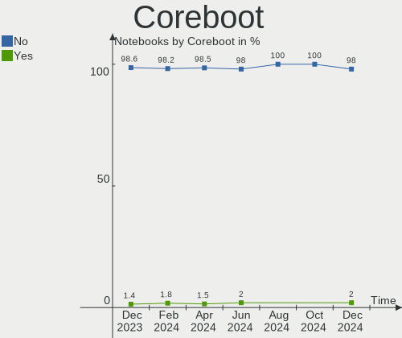
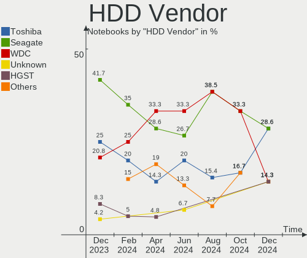
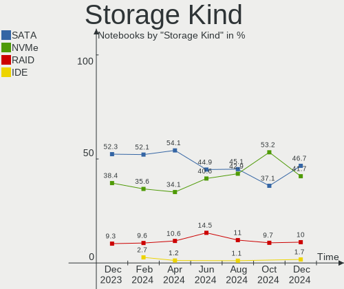

ArcoLinux - Hardware Trends (Notebooks)
---------------------------------------

A project to identify most popular hardware characteristics and track their change
over time based on data collected by Linux users at https://Linux-Hardware.org.

Anyone can contribute to this report by the [hw-probe](https://github.com/linuxhw/hw-probe) tool:

    sudo -E hw-probe -all -upload

This report is for one last month. Overall report since the beginning of time: [TestCoverage](https://github.com/linuxhw/TestCoverage)

Period: May, 2022.

Contents
--------

* [ System ](#system)
  - [ OS                       ](#os)
  - [ OS Family                ](#os-family)
  - [ Kernel                   ](#kernel)
  - [ Kernel Family            ](#kernel-family)
  - [ Kernel Major Ver.        ](#kernel-major-ver)
  - [ Arch                     ](#arch)
  - [ DE                       ](#de)
  - [ Display Server           ](#display-server)
  - [ Display Manager          ](#display-manager)
  - [ OS Lang                  ](#os-lang)
  - [ Boot Mode                ](#boot-mode)
  - [ Filesystem               ](#filesystem)
  - [ Part. scheme             ](#part-scheme)
  - [ Dual Boot with Linux/BSD ](#dual-boot-with-linuxbsd)
  - [ Dual Boot (Win)          ](#dual-boot-win)

* [ Board ](#board)
  - [ Vendor                   ](#vendor)
  - [ Model                    ](#model)
  - [ Model Family             ](#model-family)
  - [ MFG Year                 ](#mfg-year)
  - [ Form Factor              ](#form-factor)
  - [ Secure Boot              ](#secure-boot)
  - [ Coreboot                 ](#coreboot)
  - [ RAM Size                 ](#ram-size)
  - [ RAM Used                 ](#ram-used)
  - [ Total Drives             ](#total-drives)
  - [ Has CD-ROM               ](#has-cd-rom)
  - [ Has Ethernet             ](#has-ethernet)
  - [ Has WiFi                 ](#has-wifi)
  - [ Has Bluetooth            ](#has-bluetooth)

* [ Location ](#location)
  - [ Country                  ](#country)
  - [ City                     ](#city)

* [ Drives ](#drives)
  - [ Drive Vendor             ](#drive-vendor)
  - [ Drive Model              ](#drive-model)
  - [ HDD Vendor               ](#hdd-vendor)
  - [ SSD Vendor               ](#ssd-vendor)
  - [ Drive Kind               ](#drive-kind)
  - [ Drive Connector          ](#drive-connector)
  - [ Drive Size               ](#drive-size)
  - [ Space Total              ](#space-total)
  - [ Space Used               ](#space-used)
  - [ Malfunc. Drives          ](#malfunc-drives)
  - [ Malfunc. Drive Vendor    ](#malfunc-drive-vendor)
  - [ Malfunc. HDD Vendor      ](#malfunc-hdd-vendor)
  - [ Malfunc. Drive Kind      ](#malfunc-drive-kind)
  - [ Failed Drives            ](#failed-drives)
  - [ Failed Drive Vendor      ](#failed-drive-vendor)
  - [ Drive Status             ](#drive-status)

* [ Storage controller ](#storage-controller)
  - [ Storage Vendor           ](#storage-vendor)
  - [ Storage Model            ](#storage-model)
  - [ Storage Kind             ](#storage-kind)

* [ Processor ](#processor)
  - [ CPU Vendor               ](#cpu-vendor)
  - [ CPU Model                ](#cpu-model)
  - [ CPU Model Family         ](#cpu-model-family)
  - [ CPU Cores                ](#cpu-cores)
  - [ CPU Sockets              ](#cpu-sockets)
  - [ CPU Threads              ](#cpu-threads)
  - [ CPU Op-Modes             ](#cpu-op-modes)
  - [ CPU Microcode            ](#cpu-microcode)
  - [ CPU Microarch            ](#cpu-microarch)

* [ Graphics ](#graphics)
  - [ GPU Vendor               ](#gpu-vendor)
  - [ GPU Model                ](#gpu-model)
  - [ GPU Combo                ](#gpu-combo)
  - [ GPU Driver               ](#gpu-driver)
  - [ GPU Memory               ](#gpu-memory)

* [ Monitor ](#monitor)
  - [ Monitor Vendor           ](#monitor-vendor)
  - [ Monitor Model            ](#monitor-model)
  - [ Monitor Resolution       ](#monitor-resolution)
  - [ Monitor Diagonal         ](#monitor-diagonal)
  - [ Monitor Width            ](#monitor-width)
  - [ Aspect Ratio             ](#aspect-ratio)
  - [ Monitor Area             ](#monitor-area)
  - [ Pixel Density            ](#pixel-density)
  - [ Multiple Monitors        ](#multiple-monitors)

* [ Network ](#network)
  - [ Net Controller Vendor    ](#net-controller-vendor)
  - [ Net Controller Model     ](#net-controller-model)
  - [ Wireless Vendor          ](#wireless-vendor)
  - [ Wireless Model           ](#wireless-model)
  - [ Ethernet Vendor          ](#ethernet-vendor)
  - [ Ethernet Model           ](#ethernet-model)
  - [ Net Controller Kind      ](#net-controller-kind)
  - [ Used Controller          ](#used-controller)
  - [ NICs                     ](#nics)
  - [ IPv6                     ](#ipv6)

* [ Bluetooth ](#bluetooth)
  - [ Bluetooth Vendor         ](#bluetooth-vendor)
  - [ Bluetooth Model          ](#bluetooth-model)

* [ Sound ](#sound)
  - [ Sound Vendor             ](#sound-vendor)
  - [ Sound Model              ](#sound-model)

* [ Memory ](#memory)
  - [ Memory Vendor            ](#memory-vendor)
  - [ Memory Model             ](#memory-model)
  - [ Memory Kind              ](#memory-kind)
  - [ Memory Form Factor       ](#memory-form-factor)
  - [ Memory Size              ](#memory-size)
  - [ Memory Speed             ](#memory-speed)

* [ Printers & scanners ](#printers--scanners)
  - [ Printer Vendor           ](#printer-vendor)
  - [ Printer Model            ](#printer-model)
  - [ Scanner Vendor           ](#scanner-vendor)
  - [ Scanner Model            ](#scanner-model)

* [ Camera ](#camera)
  - [ Camera Vendor            ](#camera-vendor)
  - [ Camera Model             ](#camera-model)

* [ Security ](#security)
  - [ Fingerprint Vendor       ](#fingerprint-vendor)
  - [ Fingerprint Model        ](#fingerprint-model)
  - [ Chipcard Vendor          ](#chipcard-vendor)
  - [ Chipcard Model           ](#chipcard-model)

* [ Unsupported ](#unsupported)
  - [ Unsupported Devices      ](#unsupported-devices)
  - [ Unsupported Device Types ](#unsupported-device-types)

System
------

OS
--

Installed operating systems

| Name              | Notebooks | Percent |
|-------------------|-----------|---------|
| ArcoLinux Rolling | 28        | 93.33%  |
| ArcoLinux         | 2         | 6.67%   |

OS Family
---------

OS without a version

| Name      | Notebooks | Percent |
|-----------|-----------|---------|
| ArcoLinux | 30        | 100%    |

Kernel
------

Version of the Linux kernel

| Version           | Notebooks | Percent |
|-------------------|-----------|---------|
| 5.17.5-arch1-1    | 5         | 16.67%  |
| 5.17.9-arch1-1    | 4         | 13.33%  |
| 5.17.8-arch1-1    | 3         | 10%     |
| 5.17.4-arch1-1    | 3         | 10%     |
| 5.15.41-1-lts     | 3         | 10%     |
| 5.15.10-arch1-1   | 3         | 10%     |
| 5.15.37-1-lts     | 2         | 6.67%   |
| 5.18.1-arch1-1    | 1         | 3.33%   |
| 5.17.7-zen1-1-zen | 1         | 3.33%   |
| 5.17.7-arch1-1    | 1         | 3.33%   |
| 5.17.5-arch1-2    | 1         | 3.33%   |
| 5.16.16-arch1-1   | 1         | 3.33%   |
| 5.16.11-arch1-1   | 1         | 3.33%   |
| 5.10.11-arch1-1   | 1         | 3.33%   |

Kernel Family
-------------

Linux kernel without a distro release

| Version | Notebooks | Percent |
|---------|-----------|---------|
| 5.17.5  | 6         | 20%     |
| 5.17.9  | 4         | 13.33%  |
| 5.17.8  | 3         | 10%     |
| 5.17.4  | 3         | 10%     |
| 5.15.41 | 3         | 10%     |
| 5.15.10 | 3         | 10%     |
| 5.17.7  | 2         | 6.67%   |
| 5.15.37 | 2         | 6.67%   |
| 5.18.1  | 1         | 3.33%   |
| 5.16.16 | 1         | 3.33%   |
| 5.16.11 | 1         | 3.33%   |
| 5.10.11 | 1         | 3.33%   |

Kernel Major Ver.
-----------------

Linux kernel major version

| Version | Notebooks | Percent |
|---------|-----------|---------|
| 5.17    | 18        | 60%     |
| 5.15    | 8         | 26.67%  |
| 5.16    | 2         | 6.67%   |
| 5.18    | 1         | 3.33%   |
| 5.10    | 1         | 3.33%   |

Arch
----

OS architecture (x86_64, i586, etc.)

| Name   | Notebooks | Percent |
|--------|-----------|---------|
| x86_64 | 30        | 100%    |

DE
--

Desktop Environment

| Name    | Notebooks | Percent |
|---------|-----------|---------|
| XFCE    | 15        | 50%     |
| KDE5    | 3         | 10%     |
| i3      | 3         | 10%     |
| xmonad  | 2         | 6.67%   |
| LeftWM  | 2         | 6.67%   |
| openbox | 1         | 3.33%   |
| GNOME   | 1         | 3.33%   |
| Deepin  | 1         | 3.33%   |
| cwm     | 1         | 3.33%   |
| awesome | 1         | 3.33%   |

Display Server
--------------

X11 or Wayland

| Name | Notebooks | Percent |
|------|-----------|---------|
| X11  | 30        | 100%    |

Display Manager
---------------

SDDM, LightDM, etc.

| Name    | Notebooks | Percent |
|---------|-----------|---------|
| SDDM    | 19        | 63.33%  |
| LightDM | 9         | 30%     |
| Unknown | 2         | 6.67%   |

OS Lang
-------

Language

| Lang  | Notebooks | Percent |
|-------|-----------|---------|
| en_US | 14        | 46.67%  |
| pt_BR | 2         | 6.67%   |
| fi_FI | 2         | 6.67%   |
| en_ZA | 2         | 6.67%   |
| en_CA | 2         | 6.67%   |
| de_DE | 2         | 6.67%   |
| ja_JP | 1         | 3.33%   |
| it_IT | 1         | 3.33%   |
| fr_FR | 1         | 3.33%   |
| en_IN | 1         | 3.33%   |
| en_IL | 1         | 3.33%   |
| en_GB | 1         | 3.33%   |

Boot Mode
---------

EFI or BIOS

| Mode | Notebooks | Percent |
|------|-----------|---------|
| EFI  | 18        | 60%     |
| BIOS | 12        | 40%     |

Filesystem
----------

Type of filesystem

| Type    | Notebooks | Percent |
|---------|-----------|---------|
| Ext4    | 20        | 66.67%  |
| Btrfs   | 7         | 23.33%  |
| Overlay | 2         | 6.67%   |
| F2fs    | 1         | 3.33%   |

Part. scheme
------------

Scheme of partitioning

| Type    | Notebooks | Percent |
|---------|-----------|---------|
| GPT     | 20        | 66.67%  |
| MBR     | 8         | 26.67%  |
| Unknown | 2         | 6.67%   |

Dual Boot with Linux/BSD
------------------------

Hosting more than one Linux/BSD

| Dual boot | Notebooks | Percent |
|-----------|-----------|---------|
| No        | 20        | 66.67%  |
| Yes       | 10        | 33.33%  |

Dual Boot (Win)
---------------

Hosting Linux and Windows

| Dual boot | Notebooks | Percent |
|-----------|-----------|---------|
| No        | 19        | 63.33%  |
| Yes       | 11        | 36.67%  |

Board
-----

Vendor
------

Motherboard manufacturer

| Name                | Notebooks | Percent |
|---------------------|-----------|---------|
| Lenovo              | 10        | 33.33%  |
| Hewlett-Packard     | 6         | 20%     |
| ASUSTek Computer    | 5         | 16.67%  |
| Toshiba             | 2         | 6.67%   |
| System76            | 1         | 3.33%   |
| Sony                | 1         | 3.33%   |
| Samsung Electronics | 1         | 3.33%   |
| MSI                 | 1         | 3.33%   |
| LG Electronics      | 1         | 3.33%   |
| Alienware           | 1         | 3.33%   |
| Unknown             | 1         | 3.33%   |

Model
-----

Motherboard model

| Name                                   | Notebooks | Percent |
|----------------------------------------|-----------|---------|
| Toshiba Satellite C675                 | 1         | 3.33%   |
| Toshiba PORTEGE R30-A                  | 1         | 3.33%   |
| System76 Oryx Pro                      | 1         | 3.33%   |
| Sony SVE1712C1EW                       | 1         | 3.33%   |
| Samsung 550XDA                         | 1         | 3.33%   |
| MSI GF75 Thin 9SC                      | 1         | 3.33%   |
| LG C500                                | 1         | 3.33%   |
| Lenovo ThinkPad X220 4290LD4           | 1         | 3.33%   |
| Lenovo ThinkPad X200 7458WAY           | 1         | 3.33%   |
| Lenovo ThinkPad X13 Gen 1 20UFCTO1WW   | 1         | 3.33%   |
| Lenovo ThinkPad T470p 20J7S0BR00       | 1         | 3.33%   |
| Lenovo ThinkPad T400 276521G           | 1         | 3.33%   |
| Lenovo ThinkPad T14 Gen 2a 20XKCTO1WW  | 1         | 3.33%   |
| Lenovo ThinkPad L540 20AV0031GE        | 1         | 3.33%   |
| Lenovo IdeaPad S510p 20298             | 1         | 3.33%   |
| Lenovo IdeaPad 510-15IKB 80SV          | 1         | 3.33%   |
| Lenovo IdeaPad 3 15ITL6 82H8           | 1         | 3.33%   |
| HP Pavilion Notebook                   | 1         | 3.33%   |
| HP Laptop 17-cn0xxx                    | 1         | 3.33%   |
| HP Laptop 15-dy2xxx                    | 1         | 3.33%   |
| HP Folio 13                            | 1         | 3.33%   |
| HP EliteBook 840 G3                    | 1         | 3.33%   |
| HP 250 G5 Notebook PC                  | 1         | 3.33%   |
| ASUS VivoBook_ASUSLaptop X510QA_X510QA | 1         | 3.33%   |
| ASUS VivoBook 15_ASUS Laptop X540UBR   | 1         | 3.33%   |
| ASUS TUF Gaming FX505GT_FX505GT        | 1         | 3.33%   |
| ASUS ROG Strix G513IC_G513IC           | 1         | 3.33%   |
| ASUS G752VT                            | 1         | 3.33%   |
| Alienware m15 Ryzen Ed. R5             | 1         | 3.33%   |
| Unknown                                | 1         | 3.33%   |

Model Family
------------

Motherboard model prefix

| Name              | Notebooks | Percent |
|-------------------|-----------|---------|
| Lenovo ThinkPad   | 7         | 23.33%  |
| Lenovo IdeaPad    | 3         | 10%     |
| HP Laptop         | 2         | 6.67%   |
| ASUS VivoBook     | 2         | 6.67%   |
| Toshiba Satellite | 1         | 3.33%   |
| Toshiba PORTEGE   | 1         | 3.33%   |
| System76 Oryx     | 1         | 3.33%   |
| Sony SVE1712C1EW  | 1         | 3.33%   |
| Samsung 550XDA    | 1         | 3.33%   |
| MSI GF75          | 1         | 3.33%   |
| LG C500           | 1         | 3.33%   |
| HP Pavilion       | 1         | 3.33%   |
| HP Folio          | 1         | 3.33%   |
| HP EliteBook      | 1         | 3.33%   |
| HP 250            | 1         | 3.33%   |
| ASUS TUF          | 1         | 3.33%   |
| ASUS ROG          | 1         | 3.33%   |
| ASUS G752VT       | 1         | 3.33%   |
| Alienware m15     | 1         | 3.33%   |
| Unknown           | 1         | 3.33%   |

MFG Year
--------

Motherboard manufacture year

| Year | Notebooks | Percent |
|------|-----------|---------|
| 2021 | 6         | 20%     |
| 2016 | 5         | 16.67%  |
| 2020 | 3         | 10%     |
| 2019 | 3         | 10%     |
| 2011 | 3         | 10%     |
| 2014 | 2         | 6.67%   |
| 2013 | 2         | 6.67%   |
| 2012 | 2         | 6.67%   |
| 2008 | 2         | 6.67%   |
| 2018 | 1         | 3.33%   |
| 2017 | 1         | 3.33%   |

Form Factor
-----------

Physical design of the computer

| Name     | Notebooks | Percent |
|----------|-----------|---------|
| Notebook | 30        | 100%    |

Secure Boot
-----------

Enabled or disabled

| State    | Notebooks | Percent |
|----------|-----------|---------|
| Disabled | 30        | 100%    |

Coreboot
--------

Have coreboot on board

| Used | Notebooks | Percent |
|------|-----------|---------|
| No   | 29        | 96.67%  |
| Yes  | 1         | 3.33%   |

RAM Size
--------

Total RAM memory

| Size in GB | Notebooks | Percent |
|------------|-----------|---------|
| 4.01-8.0   | 10        | 33.33%  |
| 16.01-24.0 | 6         | 20%     |
| 8.01-16.0  | 6         | 20%     |
| 3.01-4.0   | 5         | 16.67%  |
| 32.01-64.0 | 2         | 6.67%   |
| 1.01-2.0   | 1         | 3.33%   |

RAM Used
--------

Used RAM memory

| Used GB   | Notebooks | Percent |
|-----------|-----------|---------|
| 1.01-2.0  | 11        | 36.67%  |
| 2.01-3.0  | 7         | 23.33%  |
| 3.01-4.0  | 5         | 16.67%  |
| 4.01-8.0  | 4         | 13.33%  |
| 0.51-1.0  | 2         | 6.67%   |
| 8.01-16.0 | 1         | 3.33%   |

Total Drives
------------

Number of drives on board

| Drives | Notebooks | Percent |
|--------|-----------|---------|
| 1      | 19        | 63.33%  |
| 2      | 8         | 26.67%  |
| 4      | 3         | 10%     |

Has CD-ROM
----------

Has CD-ROM on board

| Presented | Notebooks | Percent |
|-----------|-----------|---------|
| No        | 20        | 66.67%  |
| Yes       | 10        | 33.33%  |

Has Ethernet
------------

Has Ethernet on board

| Presented | Notebooks | Percent |
|-----------|-----------|---------|
| Yes       | 25        | 83.33%  |
| No        | 5         | 16.67%  |

Has WiFi
--------

Has WiFi module

| Presented | Notebooks | Percent |
|-----------|-----------|---------|
| Yes       | 30        | 100%    |

Has Bluetooth
-------------

Has Bluetooth module

| Presented | Notebooks | Percent |
|-----------|-----------|---------|
| Yes       | 27        | 90%     |
| No        | 3         | 10%     |

Location
--------

Country
-------

Geographic location (country)

| Country      | Notebooks | Percent |
|--------------|-----------|---------|
| USA          | 5         | 16.67%  |
| Germany      | 3         | 10%     |
| Brazil       | 3         | 10%     |
| Ukraine      | 2         | 6.67%   |
| South Africa | 2         | 6.67%   |
| India        | 2         | 6.67%   |
| Finland      | 2         | 6.67%   |
| Canada       | 2         | 6.67%   |
| UK           | 1         | 3.33%   |
| Romania      | 1         | 3.33%   |
| Poland       | 1         | 3.33%   |
| Norway       | 1         | 3.33%   |
| Netherlands  | 1         | 3.33%   |
| Japan        | 1         | 3.33%   |
| Italy        | 1         | 3.33%   |
| Israel       | 1         | 3.33%   |
| France       | 1         | 3.33%   |

City
----

Geographic location (city)

| City            | Notebooks | Percent |
|-----------------|-----------|---------|
| Ivano-Frankivsk | 2         | 6.67%   |
| Helsinki        | 2         | 6.67%   |
| Washington      | 1         | 3.33%   |
| Warsaw          | 1         | 3.33%   |
| Tokyo           | 1         | 3.33%   |
| Tilburg         | 1         | 3.33%   |
| Tel Aviv        | 1         | 3.33%   |
| Spinea          | 1         | 3.33%   |
| Sao Paulo       | 1         | 3.33%   |
| Rio de Janeiro  | 1         | 3.33%   |
| Qualicum Beach  | 1         | 3.33%   |
| Plano           | 1         | 3.33%   |
| Noida           | 1         | 3.33%   |
| Mount Pleasant  | 1         | 3.33%   |
| Mohali          | 1         | 3.33%   |
| Maceió         | 1         | 3.33%   |
| Kollow          | 1         | 3.33%   |
| Kirkland        | 1         | 3.33%   |
| Jacksonville    | 1         | 3.33%   |
| Islington       | 1         | 3.33%   |
| Huntsville      | 1         | 3.33%   |
| Fornebu         | 1         | 3.33%   |
| Durban          | 1         | 3.33%   |
| Duisburg        | 1         | 3.33%   |
| Dortmund        | 1         | 3.33%   |
| Cape Town       | 1         | 3.33%   |
| Berceni         | 1         | 3.33%   |
| Ballee          | 1         | 3.33%   |

Drives
------

Drive Vendor
------------

Hard drive vendors

| Vendor              | Notebooks | Drives | Percent |
|---------------------|-----------|--------|---------|
| WDC                 | 6         | 7      | 15%     |
| Samsung Electronics | 4         | 5      | 10%     |
| Toshiba             | 3         | 3      | 7.5%    |
| Seagate             | 3         | 4      | 7.5%    |
| SanDisk             | 3         | 3      | 7.5%    |
| Kingston            | 3         | 3      | 7.5%    |
| Crucial             | 3         | 4      | 7.5%    |
| SK Hynix            | 2         | 2      | 5%      |
| HGST                | 2         | 2      | 5%      |
| Unknown             | 1         | 1      | 2.5%    |
| SSSTC               | 1         | 1      | 2.5%    |
| Phison              | 1         | 2      | 2.5%    |
| OCZ                 | 1         | 1      | 2.5%    |
| Micron Technology   | 1         | 1      | 2.5%    |
| KIOXIA              | 1         | 1      | 2.5%    |
| Intel               | 1         | 1      | 2.5%    |
| HUAWEI              | 1         | 1      | 2.5%    |
| HPE                 | 1         | 2      | 2.5%    |
| Hitachi             | 1         | 1      | 2.5%    |
| A-DATA Technology   | 1         | 1      | 2.5%    |

Drive Model
-----------

Hard drive models

| Model                                  | Notebooks | Percent |
|----------------------------------------|-----------|---------|
| Toshiba MQ01ABD100 1TB                 | 2         | 4.65%   |
| HGST HTS721010A9E630 1TB               | 2         | 4.65%   |
| WDC WDS500G2B0B-00YS70 500GB SSD       | 1         | 2.33%   |
| WDC WDS500G2B0A 500GB SSD              | 1         | 2.33%   |
| WDC WDS100T2B0C-00PXH0 1TB             | 1         | 2.33%   |
| WDC WD5000BPKX-22HPJT0 500GB           | 1         | 2.33%   |
| WDC WD3200BPVT-22ZEST0 320GB           | 1         | 2.33%   |
| WDC WD20SPZX-22UA7T0 2TB               | 1         | 2.33%   |
| WDC WD10SPZX-80Z10T2 1TB               | 1         | 2.33%   |
| Unknown APPSD  134GB                   | 1         | 2.33%   |
| Toshiba RC100 240GB                    | 1         | 2.33%   |
| SSSTC CL1-8D256 256GB                  | 1         | 2.33%   |
| SK Hynix SKHynix_HFM128GD3HX015N 128GB | 1         | 2.33%   |
| SK Hynix SHGP31-500GM-2 500GB          | 1         | 2.33%   |
| Seagate ST950032 5AS 500GB             | 1         | 2.33%   |
| Seagate ST1000LM035-1RK172 1TB         | 1         | 2.33%   |
| Seagate ST1000LM014-1EJ164 1TB         | 1         | 2.33%   |
| Seagate Expansion 4TB                  | 1         | 2.33%   |
| SanDisk SDSSDA240G 240GB               | 1         | 2.33%   |
| SanDisk SD9SN8W256G1102 256GB SSD      | 1         | 2.33%   |
| SanDisk SD8SN8U-256G-1006 256GB SSD    | 1         | 2.33%   |
| Samsung SSD 840 EVO 500GB              | 1         | 2.33%   |
| Samsung PSSD T7 1TB                    | 1         | 2.33%   |
| Samsung PM991a NVMe 512GB              | 1         | 2.33%   |
| Samsung MZVLW256HEHP-000L7 256GB       | 1         | 2.33%   |
| Samsung MZMPC128HBFU-000H1 128GB SSD   | 1         | 2.33%   |
| Phison Sabrent 1TB                     | 1         | 2.33%   |
| OCZ ARC100 120GB SSD                   | 1         | 2.33%   |
| Micron MTFDHBA512QFD 512GB             | 1         | 2.33%   |
| KIOXIA KBG40ZNV256G 256GB              | 1         | 2.33%   |
| Kingston SKC600256G 256GB SSD          | 1         | 2.33%   |
| Kingston SA400S37240G 240GB SSD        | 1         | 2.33%   |
| Kingston RBUSNS8154P3512GJ 512GB       | 1         | 2.33%   |
| Intel SSDPEKNU512GZ 512GB              | 1         | 2.33%   |
| HUAWEI TF CARD Storage 16GB            | 1         | 2.33%   |
| HPE MK000480GWSSC 480GB                | 1         | 2.33%   |
| Hitachi HTS725032A7E630 320GB          | 1         | 2.33%   |
| Crucial CT250P2SSD8 250GB              | 1         | 2.33%   |
| Crucial CT250MX500SSD1 250GB           | 1         | 2.33%   |
| Crucial CT240M500SSD3 240GB            | 1         | 2.33%   |
| A-DATA SP550 240GB SSD                 | 1         | 2.33%   |

HDD Vendor
----------

Hard disk drive vendors

| Vendor  | Notebooks | Drives | Percent |
|---------|-----------|--------|---------|
| WDC     | 4         | 4      | 33.33%  |
| Seagate | 3         | 4      | 25%     |
| Toshiba | 2         | 2      | 16.67%  |
| HGST    | 2         | 2      | 16.67%  |
| Hitachi | 1         | 1      | 8.33%   |

SSD Vendor
----------

Solid state drive vendors

| Vendor              | Notebooks | Drives | Percent |
|---------------------|-----------|--------|---------|
| SanDisk             | 3         | 3      | 21.43%  |
| Samsung Electronics | 3         | 3      | 21.43%  |
| WDC                 | 2         | 2      | 14.29%  |
| Kingston            | 2         | 2      | 14.29%  |
| Crucial             | 2         | 3      | 14.29%  |
| OCZ                 | 1         | 1      | 7.14%   |
| A-DATA Technology   | 1         | 1      | 7.14%   |

Drive Kind
----------

HDD or SSD

| Kind    | Notebooks | Drives | Percent |
|---------|-----------|--------|---------|
| SSD     | 13        | 15     | 32.5%   |
| NVMe    | 12        | 14     | 30%     |
| HDD     | 12        | 13     | 30%     |
| Unknown | 2         | 3      | 5%      |
| MMC     | 1         | 1      | 2.5%    |

Drive Connector
---------------

SATA, SAS, NVMe, etc.

| Type | Notebooks | Drives | Percent |
|------|-----------|--------|---------|
| SATA | 20        | 27     | 54.05%  |
| NVMe | 12        | 14     | 32.43%  |
| SAS  | 4         | 4      | 10.81%  |
| MMC  | 1         | 1      | 2.7%    |

Drive Size
----------

Size of hard drive

| Size in TB | Notebooks | Drives | Percent |
|------------|-----------|--------|---------|
| 0.01-0.5   | 15        | 18     | 60%     |
| 0.51-1.0   | 8         | 8      | 32%     |
| 3.01-4.0   | 1         | 1      | 4%      |
| 1.01-2.0   | 1         | 1      | 4%      |

Space Total
-----------

Amount of disk space available on the file system

| Size in GB     | Notebooks | Percent |
|----------------|-----------|---------|
| 101-250        | 11        | 36.67%  |
| 251-500        | 8         | 26.67%  |
| 1001-2000      | 4         | 13.33%  |
| 501-1000       | 3         | 10%     |
| 51-100         | 2         | 6.67%   |
| More than 3000 | 1         | 3.33%   |
| 1-20           | 1         | 3.33%   |

Space Used
----------

Amount of used disk space

| Used GB  | Notebooks | Percent |
|----------|-----------|---------|
| 21-50    | 9         | 30%     |
| 1-20     | 7         | 23.33%  |
| 51-100   | 5         | 16.67%  |
| 101-250  | 4         | 13.33%  |
| 251-500  | 3         | 10%     |
| 501-1000 | 2         | 6.67%   |

Malfunc. Drives
---------------

Drive models with a malfunction

| Model                          | Notebooks | Drives | Percent |
|--------------------------------|-----------|--------|---------|
| WDC WD5000BPKX-22HPJT0 500GB   | 1         | 1      | 25%     |
| Toshiba MQ01ABD100 1TB         | 1         | 1      | 25%     |
| Seagate ST1000LM014-1EJ164 1TB | 1         | 1      | 25%     |
| HGST HTS721010A9E630 1TB       | 1         | 1      | 25%     |

Malfunc. Drive Vendor
---------------------

Vendors of faulty drives

| Vendor  | Notebooks | Drives | Percent |
|---------|-----------|--------|---------|
| WDC     | 1         | 1      | 25%     |
| Toshiba | 1         | 1      | 25%     |
| Seagate | 1         | 1      | 25%     |
| HGST    | 1         | 1      | 25%     |

Malfunc. HDD Vendor
-------------------

Vendors of faulty HDD drives

| Vendor  | Notebooks | Drives | Percent |
|---------|-----------|--------|---------|
| WDC     | 1         | 1      | 25%     |
| Toshiba | 1         | 1      | 25%     |
| Seagate | 1         | 1      | 25%     |
| HGST    | 1         | 1      | 25%     |

Malfunc. Drive Kind
-------------------

Kinds of faulty drives

| Kind | Notebooks | Drives | Percent |
|------|-----------|--------|---------|
| HDD  | 4         | 4      | 100%    |

Failed Drives
-------------

Failed drive models

Zero info for selected period =(

Failed Drive Vendor
-------------------

Failed drive vendors

Zero info for selected period =(

Drive Status
------------

Number of failed and malfunc. drives

| Status   | Notebooks | Drives | Percent |
|----------|-----------|--------|---------|
| Works    | 26        | 34     | 72.22%  |
| Detected | 6         | 8      | 16.67%  |
| Malfunc  | 4         | 4      | 11.11%  |

Storage controller
------------------

Storage Vendor
--------------

Storage controller vendors

| Vendor                         | Notebooks | Percent |
|--------------------------------|-----------|---------|
| Intel                          | 25        | 64.1%   |
| SK Hynix                       | 2         | 5.13%   |
| Samsung Electronics            | 2         | 5.13%   |
| AMD                            | 2         | 5.13%   |
| Toshiba America Info Systems   | 1         | 2.56%   |
| Solid State Storage Technology | 1         | 2.56%   |
| Sandisk                        | 1         | 2.56%   |
| Phison Electronics             | 1         | 2.56%   |
| Micron/Crucial Technology      | 1         | 2.56%   |
| Micron Technology              | 1         | 2.56%   |
| KIOXIA                         | 1         | 2.56%   |
| Kingston Technology Company    | 1         | 2.56%   |

Storage Model
-------------

Storage controller models

| Model                                                                          | Notebooks | Percent |
|--------------------------------------------------------------------------------|-----------|---------|
| Intel Sunrise Point-LP SATA Controller [AHCI mode]                             | 5         | 12.5%   |
| Intel 8 Series/C220 Series Chipset Family 6-port SATA Controller 1 [AHCI mode] | 3         | 7.5%    |
| Intel 6 Series/C200 Series Chipset Family 6 port Mobile SATA AHCI Controller   | 3         | 7.5%    |
| SK Hynix Gold P31 SSD                                                          | 2         | 5%      |
| Intel Volume Management Device NVMe RAID Controller                            | 2         | 5%      |
| Intel Tiger Lake-LP SATA Controller [AHCI mode]                                | 2         | 5%      |
| Intel Cannon Lake Mobile PCH SATA AHCI Controller                              | 2         | 5%      |
| Intel 82801IBM/IEM (ICH9M/ICH9M-E) 4 port SATA Controller [AHCI mode]          | 2         | 5%      |
| AMD FCH SATA Controller [AHCI mode]                                            | 2         | 5%      |
| Toshiba America Info Systems BG3 NVMe SSD Controller                           | 1         | 2.5%    |
| Solid State Storage Non-Volatile memory controller                             | 1         | 2.5%    |
| Sandisk WD Blue SN550 NVMe SSD                                                 | 1         | 2.5%    |
| Samsung NVMe SSD Controller SM961/PM961/SM963                                  | 1         | 2.5%    |
| Samsung NVMe SSD Controller 980                                                | 1         | 2.5%    |
| Phison E12 NVMe Controller                                                     | 1         | 2.5%    |
| Micron/Crucial P2 NVMe PCIe SSD                                                | 1         | 2.5%    |
| Micron Non-Volatile memory controller                                          | 1         | 2.5%    |
| KIOXIA Non-Volatile memory controller                                          | 1         | 2.5%    |
| Kingston Company U-SNS8154P3 NVMe SSD                                          | 1         | 2.5%    |
| Intel Q170/Q150/B150/H170/H110/Z170/CM236 Chipset SATA Controller [AHCI Mode]  | 1         | 2.5%    |
| Intel Non-Volatile memory controller                                           | 1         | 2.5%    |
| Intel Celeron/Pentium Silver Processor SATA Controller                         | 1         | 2.5%    |
| Intel 82801 Mobile SATA Controller [RAID mode]                                 | 1         | 2.5%    |
| Intel 8 Series SATA Controller 1 [AHCI mode]                                   | 1         | 2.5%    |
| Intel 7 Series Chipset Family 6-port SATA Controller [AHCI mode]               | 1         | 2.5%    |
| Intel 5 Series/3400 Series Chipset 4 port SATA AHCI Controller                 | 1         | 2.5%    |

Storage Kind
------------

Kind of storage controller (IDE, SATA, NVMe, SAS, ...)

| Kind | Notebooks | Percent |
|------|-----------|---------|
| SATA | 24        | 61.54%  |
| NVMe | 12        | 30.77%  |
| RAID | 3         | 7.69%   |

Processor
---------

CPU Vendor
----------

Processor vendors

| Vendor | Notebooks | Percent |
|--------|-----------|---------|
| Intel  | 25        | 83.33%  |
| AMD    | 5         | 16.67%  |

CPU Model
---------

Processor models

| Model                                           | Notebooks | Percent |
|-------------------------------------------------|-----------|---------|
| Intel Core i7-9750H CPU @ 2.60GHz               | 2         | 6.67%   |
| Intel Core i7-7500U CPU @ 2.70GHz               | 2         | 6.67%   |
| Intel 11th Gen Core i5-1135G7 @ 2.40GHz         | 2         | 6.67%   |
| Intel Pentium Silver N5030 CPU @ 1.10GHz        | 1         | 3.33%   |
| Intel Pentium CPU B980 @ 2.40GHz                | 1         | 3.33%   |
| Intel Pentium CPU B940 @ 2.00GHz                | 1         | 3.33%   |
| Intel Core i7-7700HQ CPU @ 2.80GHz              | 1         | 3.33%   |
| Intel Core i7-6700HQ CPU @ 2.60GHz              | 1         | 3.33%   |
| Intel Core i7-6500U CPU @ 2.50GHz               | 1         | 3.33%   |
| Intel Core i7-4710MQ CPU @ 2.50GHz              | 1         | 3.33%   |
| Intel Core i7-4500U CPU @ 1.80GHz               | 1         | 3.33%   |
| Intel Core i7-2640M CPU @ 2.80GHz               | 1         | 3.33%   |
| Intel Core i5-9300H CPU @ 2.40GHz               | 1         | 3.33%   |
| Intel Core i5-6300U CPU @ 2.40GHz               | 1         | 3.33%   |
| Intel Core i5-6200U CPU @ 2.30GHz               | 1         | 3.33%   |
| Intel Core i5-4210M CPU @ 2.60GHz               | 1         | 3.33%   |
| Intel Core i5-4200M CPU @ 2.50GHz               | 1         | 3.33%   |
| Intel Core i5-2467M CPU @ 1.60GHz               | 1         | 3.33%   |
| Intel Core i3 CPU M 390 @ 2.67GHz               | 1         | 3.33%   |
| Intel Core 2 Duo CPU P8600 @ 2.40GHz            | 1         | 3.33%   |
| Intel Core 2 CPU P8400 @ 2.26GHz                | 1         | 3.33%   |
| Intel 11th Gen Core i3-1115G4 @ 3.00GHz         | 1         | 3.33%   |
| AMD Ryzen 7 PRO 5850U with Radeon Graphics      | 1         | 3.33%   |
| AMD Ryzen 7 PRO 4750U with Radeon Graphics      | 1         | 3.33%   |
| AMD Ryzen 7 5800H with Radeon Graphics          | 1         | 3.33%   |
| AMD Ryzen 7 4800H with Radeon Graphics          | 1         | 3.33%   |
| AMD A12-9720P RADEON R7, 12 COMPUTE CORES 4C+8G | 1         | 3.33%   |

CPU Model Family
----------------

Processor model prefix

| Model                | Notebooks | Percent |
|----------------------|-----------|---------|
| Intel Core i7        | 10        | 33.33%  |
| Intel Core i5        | 6         | 20%     |
| Other                | 3         | 10%     |
| Intel Pentium        | 2         | 6.67%   |
| AMD Ryzen 7 PRO      | 2         | 6.67%   |
| AMD Ryzen 7          | 2         | 6.67%   |
| Intel Pentium Silver | 1         | 3.33%   |
| Intel Core i3        | 1         | 3.33%   |
| Intel Core 2 Duo     | 1         | 3.33%   |
| Intel Core 2         | 1         | 3.33%   |
| AMD A12              | 1         | 3.33%   |

CPU Cores
---------

Number of processor cores

| Number | Notebooks | Percent |
|--------|-----------|---------|
| 2      | 17        | 56.67%  |
| 4      | 7         | 23.33%  |
| 8      | 4         | 13.33%  |
| 6      | 2         | 6.67%   |

CPU Sockets
-----------

Number of sockets

| Number | Notebooks | Percent |
|--------|-----------|---------|
| 1      | 30        | 100%    |

CPU Threads
-----------

Threads per core (Hyper-Threading)

| Number | Notebooks | Percent |
|--------|-----------|---------|
| 2      | 25        | 83.33%  |
| 1      | 5         | 16.67%  |

CPU Op-Modes
------------

CPU Operation Modes (32-bit, 64-bit)

| Op mode        | Notebooks | Percent |
|----------------|-----------|---------|
| 32-bit, 64-bit | 30        | 100%    |

CPU Microcode
-------------

Microcode number

| Number     | Notebooks | Percent |
|------------|-----------|---------|
| Unknown    | 6         | 20%     |
| 0x206a7    | 4         | 13.33%  |
| 0x806c1    | 3         | 10%     |
| 0x806e9    | 2         | 6.67%   |
| 0x406e3    | 2         | 6.67%   |
| 0x306c3    | 2         | 6.67%   |
| 0x08600106 | 2         | 6.67%   |
| 0x906ed    | 1         | 3.33%   |
| 0x906ea    | 1         | 3.33%   |
| 0x706a8    | 1         | 3.33%   |
| 0x506e3    | 1         | 3.33%   |
| 0x40651    | 1         | 3.33%   |
| 0x20655    | 1         | 3.33%   |
| 0x10676    | 1         | 3.33%   |
| 0x0a50000c | 1         | 3.33%   |
| 0x0600611a | 1         | 3.33%   |

CPU Microarch
-------------

Microarchitecture

| Name          | Notebooks | Percent |
|---------------|-----------|---------|
| KabyLake      | 6         | 20%     |
| Skylake       | 4         | 13.33%  |
| SandyBridge   | 4         | 13.33%  |
| Haswell       | 4         | 13.33%  |
| TigerLake     | 3         | 10%     |
| Zen 3         | 2         | 6.67%   |
| Zen 2         | 2         | 6.67%   |
| Penryn        | 2         | 6.67%   |
| Westmere      | 1         | 3.33%   |
| Goldmont plus | 1         | 3.33%   |
| Excavator     | 1         | 3.33%   |

Graphics
--------

GPU Vendor
----------

Vendors of graphics cards

| Vendor | Notebooks | Percent |
|--------|-----------|---------|
| Intel  | 24        | 57.14%  |
| Nvidia | 12        | 28.57%  |
| AMD    | 6         | 14.29%  |

GPU Model
---------

Graphics card models

| Model                                                                     | Notebooks | Percent |
|---------------------------------------------------------------------------|-----------|---------|
| Intel 2nd Generation Core Processor Family Integrated Graphics Controller | 4         | 9.52%   |
| Intel Skylake GT2 [HD Graphics 520]                                       | 3         | 7.14%   |
| Intel CoffeeLake-H GT2 [UHD Graphics 630]                                 | 3         | 7.14%   |
| Intel 4th Gen Core Processor Integrated Graphics Controller               | 3         | 7.14%   |
| Nvidia TU117M [GeForce GTX 1650 Mobile / Max-Q]                           | 2         | 4.76%   |
| Nvidia GM108M [GeForce 940MX]                                             | 2         | 4.76%   |
| Intel TigerLake-LP GT2 [Iris Xe Graphics]                                 | 2         | 4.76%   |
| Intel Mobile 4 Series Chipset Integrated Graphics Controller              | 2         | 4.76%   |
| Intel HD Graphics 620                                                     | 2         | 4.76%   |
| AMD Renoir                                                                | 2         | 4.76%   |
| AMD Cezanne                                                               | 2         | 4.76%   |
| Nvidia TU106M [GeForce RTX 2060 Mobile]                                   | 1         | 2.38%   |
| Nvidia GM204M [GeForce GTX 970M]                                          | 1         | 2.38%   |
| Nvidia GM108M [GeForce MX110]                                             | 1         | 2.38%   |
| Nvidia GM108M [GeForce 940M]                                              | 1         | 2.38%   |
| Nvidia GK104M [GeForce GTX 870M]                                          | 1         | 2.38%   |
| Nvidia GF117M [GeForce 610M/710M/810M/820M / GT 620M/625M/630M/720M]      | 1         | 2.38%   |
| Nvidia GA107M [GeForce RTX 3050 Mobile]                                   | 1         | 2.38%   |
| Nvidia GA104M [GeForce RTX 3070 Mobile / Max-Q]                           | 1         | 2.38%   |
| Intel Tiger Lake UHD Graphics                                             | 1         | 2.38%   |
| Intel HD Graphics 630                                                     | 1         | 2.38%   |
| Intel Haswell-ULT Integrated Graphics Controller                          | 1         | 2.38%   |
| Intel GeminiLake [UHD Graphics 605]                                       | 1         | 2.38%   |
| Intel Core Processor Integrated Graphics Controller                       | 1         | 2.38%   |
| AMD Wani [Radeon R5/R6/R7 Graphics]                                       | 1         | 2.38%   |
| AMD RV620/M82 [Mobility Radeon HD 3450/3470]                              | 1         | 2.38%   |

GPU Combo
---------

Combinations of graphics cards

| Name           | Notebooks | Percent |
|----------------|-----------|---------|
| 1 x Intel      | 14        | 46.67%  |
| Intel + Nvidia | 9         | 30%     |
| 1 x AMD        | 3         | 10%     |
| AMD + Nvidia   | 2         | 6.67%   |
| 1 x Nvidia     | 1         | 3.33%   |
| Intel + AMD    | 1         | 3.33%   |

GPU Driver
----------

Free vs proprietary

| Driver      | Notebooks | Percent |
|-------------|-----------|---------|
| Free        | 24        | 80%     |
| Proprietary | 6         | 20%     |

GPU Memory
----------

Total video memory

| Size in GB | Notebooks | Percent |
|------------|-----------|---------|
| Unknown    | 22        | 73.33%  |
| 0.01-0.5   | 3         | 10%     |
| 0.51-1.0   | 2         | 6.67%   |
| 3.01-4.0   | 1         | 3.33%   |
| 2.01-3.0   | 1         | 3.33%   |
| 1.01-2.0   | 1         | 3.33%   |

Monitor
-------

Monitor Vendor
--------------

Monitor vendors

| Vendor              | Notebooks | Percent |
|---------------------|-----------|---------|
| LG Display          | 7         | 19.44%  |
| AU Optronics        | 7         | 19.44%  |
| Chimei Innolux      | 6         | 16.67%  |
| BOE                 | 4         | 11.11%  |
| Samsung Electronics | 2         | 5.56%   |
| Lenovo              | 2         | 5.56%   |
| Goldstar            | 2         | 5.56%   |
| PANDA               | 1         | 2.78%   |
| Panasonic           | 1         | 2.78%   |
| Medion              | 1         | 2.78%   |
| Hewlett-Packard     | 1         | 2.78%   |
| Belinea             | 1         | 2.78%   |
| AOC                 | 1         | 2.78%   |

Monitor Model
-------------

Monitor models

| Model                                                                | Notebooks | Percent |
|----------------------------------------------------------------------|-----------|---------|
| Chimei Innolux LCD Monitor CMN15F5 1920x1080 344x193mm 15.5-inch     | 2         | 5.56%   |
| Samsung Electronics LCD Monitor SEC544B 1600x900 310x174mm 14.0-inch | 1         | 2.78%   |
| Samsung Electronics LCD Monitor SEC3941 1600x900 382x214mm 17.2-inch | 1         | 2.78%   |
| PANDA LCD Monitor NCP002D 1920x1080 344x194mm 15.5-inch              | 1         | 2.78%   |
| Panasonic VVX16T029D00 MEI96A2 2880x1620 344x193mm 15.5-inch         | 1         | 2.78%   |
| Medion MD20328 MED3941 1600x900 462x272mm 21.1-inch                  | 1         | 2.78%   |
| LG Display LCD Monitor LGD0690 2560x1440 344x194mm 15.5-inch         | 1         | 2.78%   |
| LG Display LCD Monitor LGD060A 1920x1080 294x165mm 13.3-inch         | 1         | 2.78%   |
| LG Display LCD Monitor LGD0533 1920x1080 344x194mm 15.5-inch         | 1         | 2.78%   |
| LG Display LCD Monitor LGD04E8 1920x1080 382x215mm 17.3-inch         | 1         | 2.78%   |
| LG Display LCD Monitor LGD0493 1366x768 344x194mm 15.5-inch          | 1         | 2.78%   |
| LG Display LCD Monitor LGD0312 1366x768 294x166mm 13.3-inch          | 1         | 2.78%   |
| LG Display LCD Monitor LGD02DC 1366x768 344x194mm 15.5-inch          | 1         | 2.78%   |
| Lenovo LCD Monitor LEN4033 1440x900 303x190mm 14.1-inch              | 1         | 2.78%   |
| Lenovo LCD Monitor LEN4010 1280x800 261x163mm 12.1-inch              | 1         | 2.78%   |
| Hewlett-Packard Z24n HWP3211 1920x1200 518x324mm 24.1-inch           | 1         | 2.78%   |
| Goldstar LG HDR 4K GSM7750 3840x2160 700x400mm 31.7-inch             | 1         | 2.78%   |
| Goldstar FULL HD GSM5B55 1920x1080 480x270mm 21.7-inch               | 1         | 2.78%   |
| Chimei Innolux LCD Monitor CMN15B6 1366x768 344x194mm 15.5-inch      | 1         | 2.78%   |
| Chimei Innolux LCD Monitor CMN15B4 1366x768 344x193mm 15.5-inch      | 1         | 2.78%   |
| Chimei Innolux LCD Monitor CMN1526 1920x1080 344x193mm 15.5-inch     | 1         | 2.78%   |
| Chimei Innolux LCD Monitor CMN1355 1366x768 293x165mm 13.2-inch      | 1         | 2.78%   |
| BOE LCD Monitor BOE0954 1600x900 382x215mm 17.3-inch                 | 1         | 2.78%   |
| BOE LCD Monitor BOE090F 1920x1080 344x194mm 15.5-inch                | 1         | 2.78%   |
| BOE LCD Monitor BOE0812 1920x1080 344x194mm 15.5-inch                | 1         | 2.78%   |
| BOE LCD Monitor BOE07B6 1920x1080 382x215mm 17.3-inch                | 1         | 2.78%   |
| Belinea B1925S1W MAX078C 1440x900 410x256mm 19.0-inch                | 1         | 2.78%   |
| AU Optronics LCD Monitor AUO71EC 1366x768 344x193mm 15.5-inch        | 1         | 2.78%   |
| AU Optronics LCD Monitor AUO573D 1920x1080 309x174mm 14.0-inch       | 1         | 2.78%   |
| AU Optronics LCD Monitor AUO429D 1920x1080 382x215mm 17.3-inch       | 1         | 2.78%   |
| AU Optronics LCD Monitor AUO38ED 1920x1080 344x193mm 15.5-inch       | 1         | 2.78%   |
| AU Optronics LCD Monitor AUO2E3C 1366x768 309x173mm 13.9-inch        | 1         | 2.78%   |
| AU Optronics LCD Monitor AUO243D 1920x1080 309x173mm 13.9-inch       | 1         | 2.78%   |
| AU Optronics LCD Monitor AUO106C 1366x768 276x155mm 12.5-inch        | 1         | 2.78%   |
| AOC 27G2G4 AOC2702 1920x1080 598x336mm 27.0-inch                     | 1         | 2.78%   |

Monitor Resolution
------------------

Monitor screen resolution

| Resolution       | Notebooks | Percent |
|------------------|-----------|---------|
| 1920x1080 (FHD)  | 14        | 40%     |
| 1366x768 (WXGA)  | 9         | 25.71%  |
| 3840x2160 (4K)   | 4         | 11.43%  |
| 1600x900 (HD+)   | 4         | 11.43%  |
| 1440x900 (WXGA+) | 2         | 5.71%   |
| 2560x1440 (QHD)  | 1         | 2.86%   |
| 1280x800 (WXGA)  | 1         | 2.86%   |

Monitor Diagonal
----------------

Diagonal size in inches

| Inches | Notebooks | Percent |
|--------|-----------|---------|
| 15     | 14        | 38.89%  |
| 17     | 7         | 19.44%  |
| 13     | 4         | 11.11%  |
| 14     | 3         | 8.33%   |
| 21     | 2         | 5.56%   |
| 12     | 2         | 5.56%   |
| 31     | 1         | 2.78%   |
| 27     | 1         | 2.78%   |
| 24     | 1         | 2.78%   |
| 19     | 1         | 2.78%   |

Monitor Width
-------------

Physical width

| Width in mm | Notebooks | Percent |
|-------------|-----------|---------|
| 301-350     | 18        | 50%     |
| 351-400     | 7         | 19.44%  |
| 201-300     | 5         | 13.89%  |
| 401-500     | 3         | 8.33%   |
| 501-600     | 2         | 5.56%   |
| 601-700     | 1         | 2.78%   |

Aspect Ratio
------------

Proportional relationship between the width and the height

| Ratio | Notebooks | Percent |
|-------|-----------|---------|
| 16/9  | 29        | 87.88%  |
| 16/10 | 4         | 12.12%  |

Monitor Area
------------

Area in inch²

| Area in inch² | Notebooks | Percent |
|----------------|-----------|---------|
| 101-110        | 14        | 38.89%  |
| 121-130        | 7         | 19.44%  |
| 81-90          | 4         | 11.11%  |
| 71-80          | 3         | 8.33%   |
| 61-70          | 2         | 5.56%   |
| 151-200        | 2         | 5.56%   |
| 351-500        | 1         | 2.78%   |
| 301-350        | 1         | 2.78%   |
| 251-300        | 1         | 2.78%   |
| 201-250        | 1         | 2.78%   |

Pixel Density
-------------

Pixels per inch

| Density       | Notebooks | Percent |
|---------------|-----------|---------|
| 121-160       | 17        | 50%     |
| 101-120       | 10        | 29.41%  |
| 51-100        | 4         | 11.76%  |
| 161-240       | 2         | 5.88%   |
| More than 240 | 1         | 2.94%   |

Multiple Monitors
-----------------

Total monitors connected

| Total | Notebooks | Percent |
|-------|-----------|---------|
| 1     | 24        | 80%     |
| 2     | 6         | 20%     |

Network
-------

Net Controller Vendor
---------------------

Controller vendors

| Vendor                | Notebooks | Percent |
|-----------------------|-----------|---------|
| Realtek Semiconductor | 19        | 39.58%  |
| Intel                 | 19        | 39.58%  |
| Qualcomm Atheros      | 5         | 10.42%  |
| Huawei Technologies   | 2         | 4.17%   |
| Sierra Wireless       | 1         | 2.08%   |
| Ralink                | 1         | 2.08%   |
| MEDIATEK              | 1         | 2.08%   |

Net Controller Model
--------------------

Controller models

| Model                                                             | Notebooks | Percent |
|-------------------------------------------------------------------|-----------|---------|
| Realtek RTL8111/8168/8411 PCI Express Gigabit Ethernet Controller | 12        | 20.34%  |
| Intel Wireless 7260                                               | 3         | 5.08%   |
| Intel Cannon Lake PCH CNVi WiFi                                   | 3         | 5.08%   |
| Realtek RTL8821CE 802.11ac PCIe Wireless Network Adapter          | 2         | 3.39%   |
| Realtek RTL810xE PCI Express Fast Ethernet controller             | 2         | 3.39%   |
| Intel Wi-Fi 6 AX201                                               | 2         | 3.39%   |
| Intel Wi-Fi 6 AX200                                               | 2         | 3.39%   |
| Intel Ethernet Connection I217-V                                  | 2         | 3.39%   |
| Intel 82567LM Gigabit Network Connection                          | 2         | 3.39%   |
| Huawei Modem/Networkcard                                          | 2         | 3.39%   |
| Sierra Wireless EM7455                                            | 1         | 1.69%   |
| Realtek RTL8822BE 802.11a/b/g/n/ac WiFi adapter                   | 1         | 1.69%   |
| Realtek RTL8821AE 802.11ac PCIe Wireless Network Adapter          | 1         | 1.69%   |
| Realtek RTL8723BE PCIe Wireless Network Adapter                   | 1         | 1.69%   |
| Realtek RTL8188EUS 802.11n Wireless Network Adapter               | 1         | 1.69%   |
| Realtek RTL8188CE 802.11b/g/n WiFi Adapter                        | 1         | 1.69%   |
| Realtek RTL8125 2.5GbE Controller                                 | 1         | 1.69%   |
| Ralink RT3090 Wireless 802.11n 1T/1R PCIe                         | 1         | 1.69%   |
| Qualcomm Atheros QCA9565 / AR9565 Wireless Network Adapter        | 1         | 1.69%   |
| Qualcomm Atheros QCA9377 802.11ac Wireless Network Adapter        | 1         | 1.69%   |
| Qualcomm Atheros QCA8172 Fast Ethernet                            | 1         | 1.69%   |
| Qualcomm Atheros Killer E220x Gigabit Ethernet Controller         | 1         | 1.69%   |
| Qualcomm Atheros AR9485 Wireless Network Adapter                  | 1         | 1.69%   |
| Qualcomm Atheros AR8132 Fast Ethernet                             | 1         | 1.69%   |
| MEDIATEK MT7921 802.11ax PCI Express Wireless Network Adapter     | 1         | 1.69%   |
| Intel Wireless 8265 / 8275                                        | 1         | 1.69%   |
| Intel Wireless 8260                                               | 1         | 1.69%   |
| Intel Wireless 7265                                               | 1         | 1.69%   |
| Intel Wireless 3165                                               | 1         | 1.69%   |
| Intel Wi-Fi 6 AX210/AX211/AX411 160MHz                            | 1         | 1.69%   |
| Intel Ultimate N WiFi Link 5300                                   | 1         | 1.69%   |
| Intel PRO/Wireless 5100 AGN [Shiloh] Network Connection           | 1         | 1.69%   |
| Intel Ethernet Connection I219-LM                                 | 1         | 1.69%   |
| Intel Ethernet Connection (5) I219-V                              | 1         | 1.69%   |
| Intel Centrino Wireless-N 1030 [Rainbow Peak]                     | 1         | 1.69%   |
| Intel Centrino Advanced-N 6205 [Taylor Peak]                      | 1         | 1.69%   |
| Intel 82579LM Gigabit Network Connection (Lewisville)             | 1         | 1.69%   |

Wireless Vendor
---------------

Wireless vendors

| Vendor                | Notebooks | Percent |
|-----------------------|-----------|---------|
| Intel                 | 19        | 59.38%  |
| Realtek Semiconductor | 7         | 21.88%  |
| Qualcomm Atheros      | 3         | 9.38%   |
| Sierra Wireless       | 1         | 3.13%   |
| Ralink                | 1         | 3.13%   |
| MEDIATEK              | 1         | 3.13%   |

Wireless Model
--------------

Wireless models

| Model                                                         | Notebooks | Percent |
|---------------------------------------------------------------|-----------|---------|
| Intel Wireless 7260                                           | 3         | 9.38%   |
| Intel Cannon Lake PCH CNVi WiFi                               | 3         | 9.38%   |
| Realtek RTL8821CE 802.11ac PCIe Wireless Network Adapter      | 2         | 6.25%   |
| Intel Wi-Fi 6 AX201                                           | 2         | 6.25%   |
| Intel Wi-Fi 6 AX200                                           | 2         | 6.25%   |
| Sierra Wireless EM7455                                        | 1         | 3.13%   |
| Realtek RTL8822BE 802.11a/b/g/n/ac WiFi adapter               | 1         | 3.13%   |
| Realtek RTL8821AE 802.11ac PCIe Wireless Network Adapter      | 1         | 3.13%   |
| Realtek RTL8723BE PCIe Wireless Network Adapter               | 1         | 3.13%   |
| Realtek RTL8188EUS 802.11n Wireless Network Adapter           | 1         | 3.13%   |
| Realtek RTL8188CE 802.11b/g/n WiFi Adapter                    | 1         | 3.13%   |
| Ralink RT3090 Wireless 802.11n 1T/1R PCIe                     | 1         | 3.13%   |
| Qualcomm Atheros QCA9565 / AR9565 Wireless Network Adapter    | 1         | 3.13%   |
| Qualcomm Atheros QCA9377 802.11ac Wireless Network Adapter    | 1         | 3.13%   |
| Qualcomm Atheros AR9485 Wireless Network Adapter              | 1         | 3.13%   |
| MEDIATEK MT7921 802.11ax PCI Express Wireless Network Adapter | 1         | 3.13%   |
| Intel Wireless 8265 / 8275                                    | 1         | 3.13%   |
| Intel Wireless 8260                                           | 1         | 3.13%   |
| Intel Wireless 7265                                           | 1         | 3.13%   |
| Intel Wireless 3165                                           | 1         | 3.13%   |
| Intel Wi-Fi 6 AX210/AX211/AX411 160MHz                        | 1         | 3.13%   |
| Intel Ultimate N WiFi Link 5300                               | 1         | 3.13%   |
| Intel PRO/Wireless 5100 AGN [Shiloh] Network Connection       | 1         | 3.13%   |
| Intel Centrino Wireless-N 1030 [Rainbow Peak]                 | 1         | 3.13%   |
| Intel Centrino Advanced-N 6205 [Taylor Peak]                  | 1         | 3.13%   |

Ethernet Vendor
---------------

Ethernet vendors

| Vendor                | Notebooks | Percent |
|-----------------------|-----------|---------|
| Realtek Semiconductor | 15        | 60%     |
| Intel                 | 7         | 28%     |
| Qualcomm Atheros      | 3         | 12%     |

Ethernet Model
--------------

Ethernet models

| Model                                                             | Notebooks | Percent |
|-------------------------------------------------------------------|-----------|---------|
| Realtek RTL8111/8168/8411 PCI Express Gigabit Ethernet Controller | 12        | 48%     |
| Realtek RTL810xE PCI Express Fast Ethernet controller             | 2         | 8%      |
| Intel Ethernet Connection I217-V                                  | 2         | 8%      |
| Intel 82567LM Gigabit Network Connection                          | 2         | 8%      |
| Realtek RTL8125 2.5GbE Controller                                 | 1         | 4%      |
| Qualcomm Atheros QCA8172 Fast Ethernet                            | 1         | 4%      |
| Qualcomm Atheros Killer E220x Gigabit Ethernet Controller         | 1         | 4%      |
| Qualcomm Atheros AR8132 Fast Ethernet                             | 1         | 4%      |
| Intel Ethernet Connection I219-LM                                 | 1         | 4%      |
| Intel Ethernet Connection (5) I219-V                              | 1         | 4%      |
| Intel 82579LM Gigabit Network Connection (Lewisville)             | 1         | 4%      |

Net Controller Kind
-------------------

Ethernet, WiFi or modem

| Kind     | Notebooks | Percent |
|----------|-----------|---------|
| WiFi     | 30        | 52.63%  |
| Ethernet | 25        | 43.86%  |
| Modem    | 2         | 3.51%   |

Used Controller
---------------

Currently used network controller

| Kind     | Notebooks | Percent |
|----------|-----------|---------|
| WiFi     | 26        | 83.87%  |
| Ethernet | 5         | 16.13%  |

NICs
----

Total network controllers on board

| Total | Notebooks | Percent |
|-------|-----------|---------|
| 2     | 24        | 80%     |
| 1     | 5         | 16.67%  |
| 3     | 1         | 3.33%   |

IPv6
----

IPv6 vs IPv4

| Used | Notebooks | Percent |
|------|-----------|---------|
| No   | 20        | 66.67%  |
| Yes  | 10        | 33.33%  |

Bluetooth
---------

Bluetooth Vendor
----------------

Controller vendors

| Vendor                          | Notebooks | Percent |
|---------------------------------|-----------|---------|
| Intel                           | 15        | 55.56%  |
| Realtek Semiconductor           | 4         | 14.81%  |
| IMC Networks                    | 4         | 14.81%  |
| Broadcom                        | 2         | 7.41%   |
| Qualcomm Atheros Communications | 1         | 3.7%    |
| Foxconn / Hon Hai               | 1         | 3.7%    |

Bluetooth Model
---------------

Controller models

| Model                                              | Notebooks | Percent |
|----------------------------------------------------|-----------|---------|
| Intel Bluetooth wireless interface                 | 6         | 22.22%  |
| Realtek Bluetooth Radio                            | 4         | 14.81%  |
| Intel Bluetooth 9460/9560 Jefferson Peak (JfP)     | 4         | 14.81%  |
| Intel AX200 Bluetooth                              | 2         | 7.41%   |
| IMC Networks Bluetooth Device                      | 2         | 7.41%   |
| Qualcomm Atheros AR3012 Bluetooth 4.0              | 1         | 3.7%    |
| Intel Centrino Advanced-N 6230 Bluetooth adapter   | 1         | 3.7%    |
| Intel AX210 Bluetooth                              | 1         | 3.7%    |
| Intel AX201 Bluetooth                              | 1         | 3.7%    |
| IMC Networks Wireless_Device                       | 1         | 3.7%    |
| IMC Networks Bluetooth Radio                       | 1         | 3.7%    |
| Foxconn / Hon Hai Bluetooth USB Host Controller    | 1         | 3.7%    |
| Broadcom BCM2045B (BDC-2.1) [Bluetooth Controller] | 1         | 3.7%    |
| Broadcom BCM2045B (BDC-2.1)                        | 1         | 3.7%    |

Sound
-----

Sound Vendor
------------

Sound card vendors

| Vendor                 | Notebooks | Percent |
|------------------------|-----------|---------|
| Intel                  | 25        | 65.79%  |
| Nvidia                 | 6         | 15.79%  |
| AMD                    | 5         | 13.16%  |
| Generalplus Technology | 1         | 2.63%   |
| Focusrite-Novation     | 1         | 2.63%   |

Sound Model
-----------

Sound card models

| Model                                                                      | Notebooks | Percent |
|----------------------------------------------------------------------------|-----------|---------|
| Intel Sunrise Point-LP HD Audio                                            | 5         | 11.11%  |
| AMD Family 17h/19h HD Audio Controller                                     | 4         | 8.89%   |
| Intel Tiger Lake-LP Smart Sound Technology Audio Controller                | 3         | 6.67%   |
| Intel Cannon Lake PCH cAVS                                                 | 3         | 6.67%   |
| Intel 8 Series/C220 Series Chipset High Definition Audio Controller        | 3         | 6.67%   |
| Intel 6 Series/C200 Series Chipset Family High Definition Audio Controller | 3         | 6.67%   |
| AMD Renoir Radeon High Definition Audio Controller                         | 3         | 6.67%   |
| Intel Xeon E3-1200 v3/4th Gen Core Processor HD Audio Controller           | 2         | 4.44%   |
| Intel 82801I (ICH9 Family) HD Audio Controller                             | 2         | 4.44%   |
| Nvidia TU107 GeForce GTX 1650 High Definition Audio Controller             | 1         | 2.22%   |
| Nvidia TU106 High Definition Audio Controller                              | 1         | 2.22%   |
| Nvidia GM204 High Definition Audio Controller                              | 1         | 2.22%   |
| Nvidia GK104 HDMI Audio Controller                                         | 1         | 2.22%   |
| Nvidia GA104 High Definition Audio Controller                              | 1         | 2.22%   |
| Nvidia Audio device                                                        | 1         | 2.22%   |
| Intel Haswell-ULT HD Audio Controller                                      | 1         | 2.22%   |
| Intel CM238 HD Audio Controller                                            | 1         | 2.22%   |
| Intel Celeron/Pentium Silver Processor High Definition Audio               | 1         | 2.22%   |
| Intel 8 Series HD Audio Controller                                         | 1         | 2.22%   |
| Intel 7 Series/C216 Chipset Family High Definition Audio Controller        | 1         | 2.22%   |
| Intel 5 Series/3400 Series Chipset High Definition Audio                   | 1         | 2.22%   |
| Intel 100 Series/C230 Series Chipset Family HD Audio Controller            | 1         | 2.22%   |
| Generalplus Technology Usb Audio Device                                    | 1         | 2.22%   |
| Focusrite-Novation Scarlett Solo (3rd Gen.)                                | 1         | 2.22%   |
| AMD Kabini HDMI/DP Audio                                                   | 1         | 2.22%   |
| AMD Family 15h (Models 60h-6fh) Audio Controller                           | 1         | 2.22%   |

Memory
------

Memory Vendor
-------------

Memory module vendors

| Vendor              | Notebooks | Percent |
|---------------------|-----------|---------|
| SK Hynix            | 11        | 34.38%  |
| Samsung Electronics | 9         | 28.13%  |
| Micron Technology   | 3         | 9.38%   |
| Kingston            | 3         | 9.38%   |
| Unknown             | 1         | 3.13%   |
| Team                | 1         | 3.13%   |
| Ramaxel Technology  | 1         | 3.13%   |
| Goldkey             | 1         | 3.13%   |
| Crucial             | 1         | 3.13%   |
| A-DATA Technology   | 1         | 3.13%   |

Memory Model
------------

Memory module models

| Model                                                       | Notebooks | Percent |
|-------------------------------------------------------------|-----------|---------|
| SK Hynix RAM HMT41GS6BFR8A-PB 8GB SODIMM DDR3 1600MT/s      | 2         | 5.88%   |
| Unknown RAM Module 8GB SODIMM DDR4 2667MT/s                 | 1         | 2.94%   |
| Unknown RAM Module 4GB SODIMM DDR4 2400MT/s                 | 1         | 2.94%   |
| Team RAM Elite-1600 8GB SODIMM DDR3 1600MT/s                | 1         | 2.94%   |
| SK Hynix RAM HMT451S6AFR8A-PB 4GB SODIMM DDR3 1600MT/s      | 1         | 2.94%   |
| SK Hynix RAM HMT351S6CFR8C-PB 4GB SODIMM DDR3 1600MT/s      | 1         | 2.94%   |
| SK Hynix RAM HMT125S6TFR8C-G7 2GB SODIMM DDR3 1067MT/s      | 1         | 2.94%   |
| SK Hynix RAM HMAA1GS6CJR6N-XN 8GB SODIMM DDR4 3200MT/s      | 1         | 2.94%   |
| SK Hynix RAM HMA851S6DJR6N-XN 4GB SODIMM DDR4 3200MT/s      | 1         | 2.94%   |
| SK Hynix RAM HMA851S6AFR6N-UH 4GB SODIMM DDR4 2667MT/s      | 1         | 2.94%   |
| SK Hynix RAM HMA851S6AFR6N-TF 4GB SODIMM DDR4 2133MT/s      | 1         | 2.94%   |
| SK Hynix RAM HMA82GS6CJR8N-VK 16GB SODIMM DDR4 2667MT/s     | 1         | 2.94%   |
| SK Hynix RAM HMA81GS6JJR8N-VK 8GB SODIMM DDR4 2667MT/s      | 1         | 2.94%   |
| SK Hynix RAM HMA451S6AFR8N-TF 4GB SODIMM DDR4 2133MT/s      | 1         | 2.94%   |
| Samsung RAM Module 8GB SODIMM DDR4 2133MT/s                 | 1         | 2.94%   |
| Samsung RAM M471B5773DH0-CH9 2GB SODIMM DDR3 1600MT/s       | 1         | 2.94%   |
| Samsung RAM M471B5173QH0-YK0 4GB SODIMM DDR3 1600MT/s       | 1         | 2.94%   |
| Samsung RAM M471B5173BH0-YK0 4GB SODIMM DDR3 1600MT/s       | 1         | 2.94%   |
| Samsung RAM M471A5244BB0-CPB 4GB SODIMM DDR4 2400MT/s       | 1         | 2.94%   |
| Samsung RAM M471A1K43DB1-CWE 8GB SODIMM DDR4 3200MT/s       | 1         | 2.94%   |
| Samsung RAM M471A1K43CB1-CTD 8GB SODIMM DDR4 2667MT/s       | 1         | 2.94%   |
| Samsung RAM M471A1G44AB0-CWE 8GB SODIMM DDR4 3200MT/s       | 1         | 2.94%   |
| Samsung RAM M471A1G43DB0-CPB 8GB SODIMM DDR4 2400MT/s       | 1         | 2.94%   |
| Ramaxel RAM RMSA3270MB86H9F2400 4GB SODIMM DDR4 2400MT/s    | 1         | 2.94%   |
| Micron RAM 8ATF1G64HZ-3G2J1 8GB SODIMM DDR4 3200MT/s        | 1         | 2.94%   |
| Micron RAM 4ATS2G64HZ-3G2B1 16GB SODIMM DDR4 3200MT/s       | 1         | 2.94%   |
| Micron RAM 4ATF51264HZ-3G2J1 4GB Row Of Chips DDR4 3200MT/s | 1         | 2.94%   |
| Kingston RAM 99U5428-063.A00LF 8192MB SODIMM DDR3 1600MT/s  | 1         | 2.94%   |
| Kingston RAM 9905624-004.A00G 4GB SODIMM DDR4 2133MT/s      | 1         | 2.94%   |
| Kingston RAM 9905428-026.A00LF 2GB SODIMM DDR3 1067MT/s     | 1         | 2.94%   |
| Goldkey RAM GKE800SO102408-2666A 8GB SODIMM DDR4 2667MT/s   | 1         | 2.94%   |
| Crucial RAM CT8G4SFRA32A.M8FRS 8GB SODIMM DDR4 3200MT/s     | 1         | 2.94%   |
| A-DATA RAM AM1U16BC4P2-B19N 4GB SODIMM DDR3 1600MT/s        | 1         | 2.94%   |

Memory Kind
-----------

Memory module kinds

| Kind   | Notebooks | Percent |
|--------|-----------|---------|
| DDR4   | 17        | 60.71%  |
| DDR3   | 10        | 35.71%  |
| LPDDR4 | 1         | 3.57%   |

Memory Form Factor
------------------

Physical design of the memory module

| Name         | Notebooks | Percent |
|--------------|-----------|---------|
| SODIMM       | 27        | 96.43%  |
| Row Of Chips | 1         | 3.57%   |

Memory Size
-----------

Memory module size

| Size  | Notebooks | Percent |
|-------|-----------|---------|
| 8192  | 16        | 55.17%  |
| 4096  | 9         | 31.03%  |
| 16384 | 2         | 6.9%    |
| 2048  | 2         | 6.9%    |

Memory Speed
------------

Memory module speed

| Speed | Notebooks | Percent |
|-------|-----------|---------|
| 1600  | 9         | 31.03%  |
| 3200  | 7         | 24.14%  |
| 2667  | 6         | 20.69%  |
| 2400  | 3         | 10.34%  |
| 2133  | 3         | 10.34%  |
| 1067  | 1         | 3.45%   |

Printers & scanners
-------------------

Printer Vendor
--------------

Printer device vendors

Zero info for selected period =(

Printer Model
-------------

Printer device models

Zero info for selected period =(

Scanner Vendor
--------------

Scanner device vendors

Zero info for selected period =(

Scanner Model
-------------

Scanner device models

Zero info for selected period =(

Camera
------

Camera Vendor
-------------

Camera device vendors

| Vendor                                 | Notebooks | Percent |
|----------------------------------------|-----------|---------|
| Chicony Electronics                    | 10        | 34.48%  |
| Acer                                   | 6         | 20.69%  |
| IMC Networks                           | 4         | 13.79%  |
| Cheng Uei Precision Industry (Foxlink) | 2         | 6.9%    |
| WaveRider Communications               | 1         | 3.45%   |
| Sunplus Innovation Technology          | 1         | 3.45%   |
| Samsung Electronics                    | 1         | 3.45%   |
| Realtek Semiconductor                  | 1         | 3.45%   |
| Microdia                               | 1         | 3.45%   |
| Luxvisions Innotech Limited            | 1         | 3.45%   |
| Logitech                               | 1         | 3.45%   |

Camera Model
------------

Camera device models

| Model                                                        | Notebooks | Percent |
|--------------------------------------------------------------|-----------|---------|
| IMC Networks Integrated Camera                               | 2         | 6.9%    |
| Acer Integrated Camera                                       | 2         | 6.9%    |
| WaveRider USB 2.0 Camera                                     | 1         | 3.45%   |
| Sunplus HP TrueVision HD                                     | 1         | 3.45%   |
| Samsung Galaxy A5 (MTP)                                      | 1         | 3.45%   |
| Realtek HP Truevision HD                                     | 1         | 3.45%   |
| Microdia Integrated_Webcam_HD                                | 1         | 3.45%   |
| Luxvisions Innotech Limited HP TrueVision HD Camera          | 1         | 3.45%   |
| Logitech HD Webcam C510                                      | 1         | 3.45%   |
| IMC Networks VGA UVC WebCam                                  | 1         | 3.45%   |
| IMC Networks USB2.0 HD UVC WebCam                            | 1         | 3.45%   |
| Chicony USB2.0 VGA UVC WebCam                                | 1         | 3.45%   |
| Chicony USB2.0 HD UVC WebCam                                 | 1         | 3.45%   |
| Chicony TOSHIBA Web Camera - FHD                             | 1         | 3.45%   |
| Chicony Lenovo Integrated Camera (0.3MP)                     | 1         | 3.45%   |
| Chicony Lenovo EasyCamera                                    | 1         | 3.45%   |
| Chicony Integrated Camera                                    | 1         | 3.45%   |
| Chicony HP Webcam                                            | 1         | 3.45%   |
| Chicony HP TrueVision HD Camera                              | 1         | 3.45%   |
| Chicony HP HD Camera                                         | 1         | 3.45%   |
| Chicony CNF9055 Toshiba Webcam                               | 1         | 3.45%   |
| Cheng Uei Precision Industry (Foxlink) VGA Camera            | 1         | 3.45%   |
| Cheng Uei Precision Industry (Foxlink) USB2.0 UVC VGA WebCam | 1         | 3.45%   |
| Acer USB2.0 Camera                                           | 1         | 3.45%   |
| Acer MSI Integrated Webcam                                   | 1         | 3.45%   |
| Acer EasyCamera                                              | 1         | 3.45%   |
| Acer BisonCam,NB Pro                                         | 1         | 3.45%   |

Security
--------

Fingerprint Vendor
------------------

Fingerprint sensor vendors

| Vendor                | Notebooks | Percent |
|-----------------------|-----------|---------|
| Synaptics             | 3         | 42.86%  |
| Validity Sensors      | 2         | 28.57%  |
| Elan Microelectronics | 1         | 14.29%  |
| AuthenTec             | 1         | 14.29%  |

Fingerprint Model
-----------------

Fingerprint sensor models

| Model                                             | Notebooks | Percent |
|---------------------------------------------------|-----------|---------|
| Synaptics Prometheus MIS Touch Fingerprint Reader | 2         | 28.57%  |
| Validity Sensors VFS495 Fingerprint Reader        | 1         | 14.29%  |
| Validity Sensors Synaptics WBDI                   | 1         | 14.29%  |
| Elan ELAN:ARM-M4                                  | 1         | 14.29%  |
| AuthenTec AES2810                                 | 1         | 14.29%  |
| Unknown                                           | 1         | 14.29%  |

Chipcard Vendor
---------------

Chipcard module vendors

| Vendor      | Notebooks | Percent |
|-------------|-----------|---------|
| O2 Micro    | 1         | 50%     |
| Alcor Micro | 1         | 50%     |

Chipcard Model
--------------

Chipcard module models

| Model                                | Notebooks | Percent |
|--------------------------------------|-----------|---------|
| O2 Micro OZ776 CCID Smartcard Reader | 1         | 50%     |
| Alcor Micro AU9540 Smartcard Reader  | 1         | 50%     |

Unsupported
-----------

Unsupported Devices
-------------------

Total unsupported devices on board

| Total | Notebooks | Percent |
|-------|-----------|---------|
| 0     | 18        | 60%     |
| 1     | 7         | 23.33%  |
| 2     | 5         | 16.67%  |

Unsupported Device Types
------------------------

Types of unsupported devices

| Type               | Notebooks | Percent |
|--------------------|-----------|---------|
| Fingerprint reader | 7         | 43.75%  |
| Camera             | 4         | 25%     |
| Graphics card      | 3         | 18.75%  |
| Chipcard           | 2         | 12.5%   |

