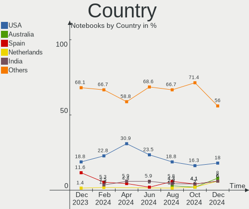
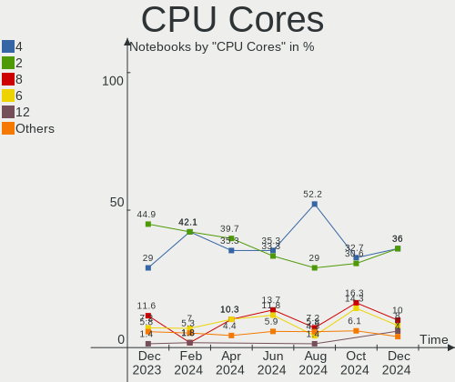
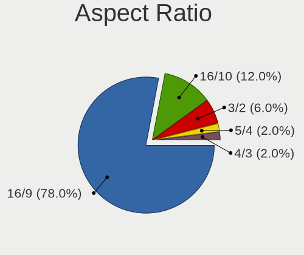
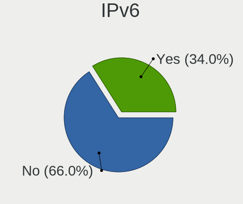
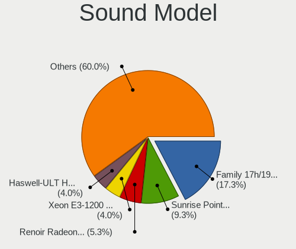
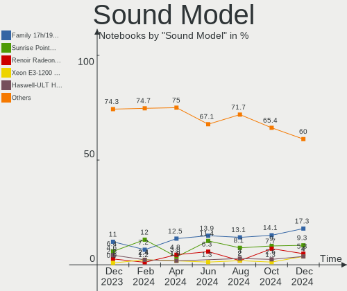
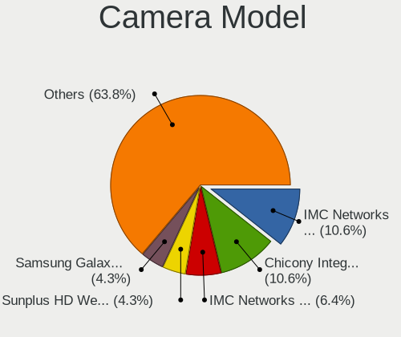

ArcoLinux - Hardware Trends (Notebooks)
---------------------------------------

A project to identify most popular hardware characteristics and track their change
over time based on data collected by Linux users at https://Linux-Hardware.org.

Anyone can contribute to this report by the [hw-probe](https://github.com/linuxhw/hw-probe) tool:

    sudo -E hw-probe -all -upload

This report is for one last month. Overall report since the beginning of time: [TestDays](https://github.com/linuxhw/TestDays)

Period: Apr, 2024.

Contents
--------

* [ System ](#system)
  - [ OS                       ](#os)
  - [ OS Family                ](#os-family)
  - [ Kernel                   ](#kernel)
  - [ Kernel Family            ](#kernel-family)
  - [ Kernel Major Ver.        ](#kernel-major-ver)
  - [ Arch                     ](#arch)
  - [ DE                       ](#de)
  - [ Display Server           ](#display-server)
  - [ Display Manager          ](#display-manager)
  - [ OS Lang                  ](#os-lang)
  - [ Boot Mode                ](#boot-mode)
  - [ Filesystem               ](#filesystem)
  - [ Part. scheme             ](#part-scheme)
  - [ Dual Boot with Linux/BSD ](#dual-boot-with-linuxbsd)
  - [ Dual Boot (Win)          ](#dual-boot-win)

* [ Board ](#board)
  - [ Vendor                   ](#vendor)
  - [ Model                    ](#model)
  - [ Model Family             ](#model-family)
  - [ MFG Year                 ](#mfg-year)
  - [ Form Factor              ](#form-factor)
  - [ Secure Boot              ](#secure-boot)
  - [ Coreboot                 ](#coreboot)
  - [ RAM Size                 ](#ram-size)
  - [ RAM Used                 ](#ram-used)
  - [ Total Drives             ](#total-drives)
  - [ Has CD-ROM               ](#has-cd-rom)
  - [ Has Ethernet             ](#has-ethernet)
  - [ Has WiFi                 ](#has-wifi)
  - [ Has Bluetooth            ](#has-bluetooth)

* [ Location ](#location)
  - [ Country                  ](#country)
  - [ City                     ](#city)

* [ Drives ](#drives)
  - [ Drive Vendor             ](#drive-vendor)
  - [ Drive Model              ](#drive-model)
  - [ HDD Vendor               ](#hdd-vendor)
  - [ SSD Vendor               ](#ssd-vendor)
  - [ Drive Kind               ](#drive-kind)
  - [ Drive Connector          ](#drive-connector)
  - [ Drive Size               ](#drive-size)
  - [ Space Total              ](#space-total)
  - [ Space Used               ](#space-used)
  - [ Malfunc. Drives          ](#malfunc-drives)
  - [ Malfunc. Drive Vendor    ](#malfunc-drive-vendor)
  - [ Malfunc. HDD Vendor      ](#malfunc-hdd-vendor)
  - [ Malfunc. Drive Kind      ](#malfunc-drive-kind)
  - [ Failed Drives            ](#failed-drives)
  - [ Failed Drive Vendor      ](#failed-drive-vendor)
  - [ Drive Status             ](#drive-status)

* [ Storage controller ](#storage-controller)
  - [ Storage Vendor           ](#storage-vendor)
  - [ Storage Model            ](#storage-model)
  - [ Storage Kind             ](#storage-kind)

* [ Processor ](#processor)
  - [ CPU Vendor               ](#cpu-vendor)
  - [ CPU Model                ](#cpu-model)
  - [ CPU Model Family         ](#cpu-model-family)
  - [ CPU Cores                ](#cpu-cores)
  - [ CPU Sockets              ](#cpu-sockets)
  - [ CPU Threads              ](#cpu-threads)
  - [ CPU Op-Modes             ](#cpu-op-modes)
  - [ CPU Microcode            ](#cpu-microcode)
  - [ CPU Microarch            ](#cpu-microarch)

* [ Graphics ](#graphics)
  - [ GPU Vendor               ](#gpu-vendor)
  - [ GPU Model                ](#gpu-model)
  - [ GPU Combo                ](#gpu-combo)
  - [ GPU Driver               ](#gpu-driver)
  - [ GPU Memory               ](#gpu-memory)

* [ Monitor ](#monitor)
  - [ Monitor Vendor           ](#monitor-vendor)
  - [ Monitor Model            ](#monitor-model)
  - [ Monitor Resolution       ](#monitor-resolution)
  - [ Monitor Diagonal         ](#monitor-diagonal)
  - [ Monitor Width            ](#monitor-width)
  - [ Aspect Ratio             ](#aspect-ratio)
  - [ Monitor Area             ](#monitor-area)
  - [ Pixel Density            ](#pixel-density)
  - [ Multiple Monitors        ](#multiple-monitors)

* [ Network ](#network)
  - [ Net Controller Vendor    ](#net-controller-vendor)
  - [ Net Controller Model     ](#net-controller-model)
  - [ Wireless Vendor          ](#wireless-vendor)
  - [ Wireless Model           ](#wireless-model)
  - [ Ethernet Vendor          ](#ethernet-vendor)
  - [ Ethernet Model           ](#ethernet-model)
  - [ Net Controller Kind      ](#net-controller-kind)
  - [ Used Controller          ](#used-controller)
  - [ NICs                     ](#nics)
  - [ IPv6                     ](#ipv6)

* [ Bluetooth ](#bluetooth)
  - [ Bluetooth Vendor         ](#bluetooth-vendor)
  - [ Bluetooth Model          ](#bluetooth-model)

* [ Sound ](#sound)
  - [ Sound Vendor             ](#sound-vendor)
  - [ Sound Model              ](#sound-model)

* [ Memory ](#memory)
  - [ Memory Vendor            ](#memory-vendor)
  - [ Memory Model             ](#memory-model)
  - [ Memory Kind              ](#memory-kind)
  - [ Memory Form Factor       ](#memory-form-factor)
  - [ Memory Size              ](#memory-size)
  - [ Memory Speed             ](#memory-speed)

* [ Printers & scanners ](#printers--scanners)
  - [ Printer Vendor           ](#printer-vendor)
  - [ Printer Model            ](#printer-model)
  - [ Scanner Vendor           ](#scanner-vendor)
  - [ Scanner Model            ](#scanner-model)

* [ Camera ](#camera)
  - [ Camera Vendor            ](#camera-vendor)
  - [ Camera Model             ](#camera-model)

* [ Security ](#security)
  - [ Fingerprint Vendor       ](#fingerprint-vendor)
  - [ Fingerprint Model        ](#fingerprint-model)
  - [ Chipcard Vendor          ](#chipcard-vendor)
  - [ Chipcard Model           ](#chipcard-model)

* [ Unsupported ](#unsupported)
  - [ Unsupported Devices      ](#unsupported-devices)
  - [ Unsupported Device Types ](#unsupported-device-types)

System
------

OS
--

Installed operating systems

| Name              | Notebooks | Percent |
|-------------------|-----------|---------|
| ArcoLinux Rolling | 65        | 95.59%  |
| ArcoLinux         | 3         | 4.41%   |

OS Family
---------

OS without a version

| Name      | Notebooks | Percent |
|-----------|-----------|---------|
| ArcoLinux | 68        | 100%    |

Kernel
------

Version of the Linux kernel

| Version                     | Notebooks | Percent |
|-----------------------------|-----------|---------|
| 6.8.2-arch2-1               | 13        | 19.12%  |
| 6.8.7-arch1-1               | 5         | 7.35%   |
| 6.8.5-arch1-1               | 5         | 7.35%   |
| 6.8.4-arch1-1               | 5         | 7.35%   |
| 6.8.7-zen1-1-zen            | 4         | 5.88%   |
| 6.8.7-1-cachyos             | 4         | 5.88%   |
| 6.7.4-arch1-1               | 4         | 5.88%   |
| 6.6.28-1-lts                | 3         | 4.41%   |
| 6.8.5-zen1-1-zen            | 2         | 2.94%   |
| 6.8.4-zen1-1-zen            | 2         | 2.94%   |
| 6.8.2-zen2-1-zen            | 2         | 2.94%   |
| 6.8.2-arch1-1               | 2         | 2.94%   |
| 6.7.9-arch1-1               | 2         | 2.94%   |
| 6.7.5-arch1-1               | 2         | 2.94%   |
| 6.6.1-arch1-1               | 2         | 2.94%   |
| 6.8.7-zen1-2-zen            | 1         | 1.47%   |
| 6.8.7-arch1-2               | 1         | 1.47%   |
| 6.8.6-arch1-1               | 1         | 1.47%   |
| 6.8.2-zen1-1-zen            | 1         | 1.47%   |
| 6.7.6-arch1-2               | 1         | 1.47%   |
| 6.7.5-273-tkg-linux-tkg-pds | 1         | 1.47%   |
| 6.7.11-hardened1-1-hardened | 1         | 1.47%   |
| 6.7.10-x64v-xanmod1-1       | 1         | 1.47%   |
| 6.6.27-1-lts                | 1         | 1.47%   |
| 6.6.26-1-lts                | 1         | 1.47%   |
| 6.6.24-1-lts                | 1         | 1.47%   |

Kernel Family
-------------

Linux kernel without a distro release

| Version | Notebooks | Percent |
|---------|-----------|---------|
| 6.8.2   | 18        | 26.47%  |
| 6.8.7   | 15        | 22.06%  |
| 6.8.5   | 7         | 10.29%  |
| 6.8.4   | 7         | 10.29%  |
| 6.7.4   | 4         | 5.88%   |
| 6.7.5   | 3         | 4.41%   |
| 6.6.28  | 3         | 4.41%   |
| 6.7.9   | 2         | 2.94%   |
| 6.6.1   | 2         | 2.94%   |
| 6.8.6   | 1         | 1.47%   |
| 6.7.6   | 1         | 1.47%   |
| 6.7.11  | 1         | 1.47%   |
| 6.7.10  | 1         | 1.47%   |
| 6.6.27  | 1         | 1.47%   |
| 6.6.26  | 1         | 1.47%   |
| 6.6.24  | 1         | 1.47%   |

Kernel Major Ver.
-----------------

Linux kernel major version

| Version | Notebooks | Percent |
|---------|-----------|---------|
| 6.8     | 48        | 70.59%  |
| 6.7     | 12        | 17.65%  |
| 6.6     | 8         | 11.76%  |

Arch
----

OS architecture (x86_64, i586, etc.)

| Name   | Notebooks | Percent |
|--------|-----------|---------|
| x86_64 | 68        | 100%    |

DE
--

Desktop Environment

| Name         | Notebooks | Percent |
|--------------|-----------|---------|
| XFCE         | 24        | 35.29%  |
| GNOME        | 10        | 14.71%  |
| Unknown      | 8         | 11.76%  |
| KDE6         | 5         | 7.35%   |
| i3           | 4         | 5.88%   |
| LXQt         | 3         | 4.41%   |
| Cinnamon     | 3         | 4.41%   |
| KDE          | 2         | 2.94%   |
| Hyprland     | 2         | 2.94%   |
| Deepin       | 2         | 2.94%   |
| sway         | 1         | 1.47%   |
| herbstluftwm | 1         | 1.47%   |
| chadwm       | 1         | 1.47%   |
| bspwm        | 1         | 1.47%   |
| awesome      | 1         | 1.47%   |

Display Server
--------------

X11 or Wayland

| Name    | Notebooks | Percent |
|---------|-----------|---------|
| X11     | 38        | 55.88%  |
| Wayland | 26        | 38.24%  |
| Unknown | 3         | 4.41%   |
| Tty     | 1         | 1.47%   |

Display Manager
---------------

SDDM, LightDM, etc.

| Name    | Notebooks | Percent |
|---------|-----------|---------|
| SDDM    | 52        | 76.47%  |
| LightDM | 10        | 14.71%  |
| Unknown | 4         | 5.88%   |
| GDM     | 2         | 2.94%   |

OS Lang
-------

Language

| Lang  | Notebooks | Percent |
|-------|-----------|---------|
| en_US | 35        | 51.47%  |
| pl_PL | 4         | 5.88%   |
| ru_RU | 3         | 4.41%   |
| es_ES | 3         | 4.41%   |
| en_IN | 3         | 4.41%   |
| en_GB | 3         | 4.41%   |
| C     | 3         | 4.41%   |
| pt_BR | 2         | 2.94%   |
| it_IT | 2         | 2.94%   |
| es_MX | 2         | 2.94%   |
| en_HK | 2         | 2.94%   |
| vi_VN | 1         | 1.47%   |
| tr_TR | 1         | 1.47%   |
| sv_SE | 1         | 1.47%   |
| ro_RO | 1         | 1.47%   |
| en_CA | 1         | 1.47%   |
| cs_CZ | 1         | 1.47%   |

Boot Mode
---------

EFI or BIOS

| Mode | Notebooks | Percent |
|------|-----------|---------|
| EFI  | 54        | 79.41%  |
| BIOS | 14        | 20.59%  |

Filesystem
----------

Type of filesystem

| Type    | Notebooks | Percent |
|---------|-----------|---------|
| Ext4    | 50        | 73.53%  |
| Btrfs   | 14        | 20.59%  |
| Overlay | 3         | 4.41%   |
| F2fs    | 1         | 1.47%   |

Part. scheme
------------

Scheme of partitioning

| Type    | Notebooks | Percent |
|---------|-----------|---------|
| GPT     | 58        | 85.29%  |
| MBR     | 7         | 10.29%  |
| Unknown | 3         | 4.41%   |

Dual Boot with Linux/BSD
------------------------

Hosting more than one Linux/BSD

| Dual boot | Notebooks | Percent |
|-----------|-----------|---------|
| No        | 56        | 82.35%  |
| Yes       | 12        | 17.65%  |

Dual Boot (Win)
---------------

Hosting Linux and Windows

| Dual boot | Notebooks | Percent |
|-----------|-----------|---------|
| No        | 44        | 64.71%  |
| Yes       | 24        | 35.29%  |

Board
-----

Vendor
------

Motherboard manufacturer

| Name             | Notebooks | Percent |
|------------------|-----------|---------|
| Lenovo           | 18        | 26.47%  |
| Dell             | 16        | 23.53%  |
| Hewlett-Packard  | 14        | 20.59%  |
| ASUSTek Computer | 4         | 5.88%   |
| Apple            | 3         | 4.41%   |
| Toshiba          | 2         | 2.94%   |
| Acer             | 2         | 2.94%   |
| System76         | 1         | 1.47%   |
| Sony             | 1         | 1.47%   |
| Razer            | 1         | 1.47%   |
| Packard Bell     | 1         | 1.47%   |
| Notebook         | 1         | 1.47%   |
| MSI              | 1         | 1.47%   |
| HUAWEI           | 1         | 1.47%   |
| BESSTAR Tech     | 1         | 1.47%   |
| Unknown          | 1         | 1.47%   |

Model
-----

Motherboard model

| Name                                 | Notebooks | Percent |
|--------------------------------------|-----------|---------|
| Dell Latitude 7490                   | 2         | 2.94%   |
| Toshiba Satellite P55W-C             | 1         | 1.47%   |
| Toshiba Satellite M645               | 1         | 1.47%   |
| System76 Gazelle                     | 1         | 1.47%   |
| Sony SVF1521X1RB                     | 1         | 1.47%   |
| Razer Blade                          | 1         | 1.47%   |
| Packard Bell EasyNote LM98           | 1         | 1.47%   |
| Notebook NP5x_NP6x_NP7xPNP           | 1         | 1.47%   |
| MSI GP63 Leopard 8RE                 | 1         | 1.47%   |
| Lenovo ThinkPad X1 Carbon 3448A47    | 1         | 1.47%   |
| Lenovo ThinkPad T580 20L9CTO1WW      | 1         | 1.47%   |
| Lenovo ThinkPad T540p 20BFS06B05     | 1         | 1.47%   |
| Lenovo ThinkPad T490 20N2005VMX      | 1         | 1.47%   |
| Lenovo ThinkPad T430 2349IF8         | 1         | 1.47%   |
| Lenovo ThinkPad E15 Gen 2 20T8005CUS | 1         | 1.47%   |
| Lenovo ThinkBook 15 G2 ITL 20VE      | 1         | 1.47%   |
| Lenovo Slim Pro 7 14ARP8 83AX        | 1         | 1.47%   |
| Lenovo Legion 5 15ACH6A 82NW         | 1         | 1.47%   |
| Lenovo IdeaPad Y700-17ISK 80Q0       | 1         | 1.47%   |
| Lenovo IdeaPad Slim 1-11AST-05 81VR  | 1         | 1.47%   |
| Lenovo IdeaPad S340-15IWL 81N8       | 1         | 1.47%   |
| Lenovo IdeaPad 330-15ICH 81FK        | 1         | 1.47%   |
| Lenovo IdeaPad 320-14IKB 80XK        | 1         | 1.47%   |
| Lenovo IdeaPad 3 17IML05 81WC        | 1         | 1.47%   |
| Lenovo IdeaPad 110-14IBR 80UJ        | 1         | 1.47%   |
| Lenovo IdeaPad 1 14ADA05 82GW        | 1         | 1.47%   |
| Lenovo G40-30 80FY                   | 1         | 1.47%   |
| HUAWEI KPL-W0X                       | 1         | 1.47%   |
| HP ZBook 15 G5                       | 1         | 1.47%   |
| HP Victus by Gaming Laptop 15-fa1xxx | 1         | 1.47%   |
| HP ProBook 455 G2                    | 1         | 1.47%   |
| HP Presario CQ56                     | 1         | 1.47%   |
| HP Pavilion Laptop 15-eh0xxx         | 1         | 1.47%   |
| HP Pavilion Laptop 14-dv1xxx         | 1         | 1.47%   |
| HP Pavilion Gaming Laptop 15-ec2xxx  | 1         | 1.47%   |
| HP Pavilion g7                       | 1         | 1.47%   |
| HP OMEN Laptop 15-en1001np Renew     | 1         | 1.47%   |
| HP Laptop 17z-ca100                  | 1         | 1.47%   |
| HP Laptop 15s-eq2xxx                 | 1         | 1.47%   |
| HP Folio 13                          | 1         | 1.47%   |

Model Family
------------

Motherboard model prefix

| Name                  | Notebooks | Percent |
|-----------------------|-----------|---------|
| Lenovo IdeaPad        | 8         | 11.76%  |
| Dell Latitude         | 7         | 10.29%  |
| Lenovo ThinkPad       | 6         | 8.82%   |
| HP Pavilion           | 4         | 5.88%   |
| Dell Inspiron         | 4         | 5.88%   |
| Toshiba Satellite     | 2         | 2.94%   |
| HP Laptop             | 2         | 2.94%   |
| System76 Gazelle      | 1         | 1.47%   |
| Sony SVF1521X1RB      | 1         | 1.47%   |
| Razer Blade           | 1         | 1.47%   |
| Packard Bell EasyNote | 1         | 1.47%   |
| Notebook NP5x         | 1         | 1.47%   |
| MSI GP63              | 1         | 1.47%   |
| Lenovo ThinkBook      | 1         | 1.47%   |
| Lenovo Slim           | 1         | 1.47%   |
| Lenovo Legion         | 1         | 1.47%   |
| Lenovo G40-30         | 1         | 1.47%   |
| HUAWEI KPL-W0X        | 1         | 1.47%   |
| HP ZBook              | 1         | 1.47%   |
| HP Victus             | 1         | 1.47%   |
| HP ProBook            | 1         | 1.47%   |
| HP Presario           | 1         | 1.47%   |
| HP OMEN               | 1         | 1.47%   |
| HP Folio              | 1         | 1.47%   |
| HP EliteBook          | 1         | 1.47%   |
| HP 255                | 1         | 1.47%   |
| Dell XPS              | 1         | 1.47%   |
| Dell Vostro           | 1         | 1.47%   |
| Dell System           | 1         | 1.47%   |
| Dell Precision        | 1         | 1.47%   |
| Dell G7               | 1         | 1.47%   |
| BESSTAR Tech X400     | 1         | 1.47%   |
| ASUS X550JX           | 1         | 1.47%   |
| ASUS VivoBook         | 1         | 1.47%   |
| ASUS ROG              | 1         | 1.47%   |
| ASUS N53SV            | 1         | 1.47%   |
| Apple MacBookPro9     | 1         | 1.47%   |
| Apple MacBookPro11    | 1         | 1.47%   |
| Apple MacBookPro10    | 1         | 1.47%   |
| Acer Enduro           | 1         | 1.47%   |

MFG Year
--------

Motherboard manufacture year

| Year | Notebooks | Percent |
|------|-----------|---------|
| 2018 | 11        | 16.18%  |
| 2020 | 9         | 13.24%  |
| 2021 | 8         | 11.76%  |
| 2012 | 6         | 8.82%   |
| 2019 | 5         | 7.35%   |
| 2014 | 5         | 7.35%   |
| 2015 | 4         | 5.88%   |
| 2011 | 4         | 5.88%   |
| 2010 | 4         | 5.88%   |
| 2023 | 3         | 4.41%   |
| 2022 | 3         | 4.41%   |
| 2017 | 3         | 4.41%   |
| 2016 | 1         | 1.47%   |
| 2013 | 1         | 1.47%   |
| 2008 | 1         | 1.47%   |

Form Factor
-----------

Physical design of the computer

| Name     | Notebooks | Percent |
|----------|-----------|---------|
| Notebook | 68        | 100%    |

Secure Boot
-----------

Enabled or disabled

| State    | Notebooks | Percent |
|----------|-----------|---------|
| Disabled | 68        | 100%    |

Coreboot
--------

Have coreboot on board

| Used | Notebooks | Percent |
|------|-----------|---------|
| No   | 67        | 98.53%  |
| Yes  | 1         | 1.47%   |

RAM Size
--------

Total RAM memory

| Size in GB | Notebooks | Percent |
|------------|-----------|---------|
| 4.01-8.0   | 23        | 33.82%  |
| 16.01-24.0 | 16        | 23.53%  |
| 8.01-16.0  | 11        | 16.18%  |
| 3.01-4.0   | 8         | 11.76%  |
| 32.01-64.0 | 7         | 10.29%  |
| 24.01-32.0 | 1         | 1.47%   |
| 2.01-3.0   | 1         | 1.47%   |
| 1.01-2.0   | 1         | 1.47%   |

RAM Used
--------

Used RAM memory

| Used GB   | Notebooks | Percent |
|-----------|-----------|---------|
| 1.01-2.0  | 28        | 41.18%  |
| 2.01-3.0  | 14        | 20.59%  |
| 4.01-8.0  | 9         | 13.24%  |
| 3.01-4.0  | 7         | 10.29%  |
| 8.01-16.0 | 7         | 10.29%  |
| 0.51-1.0  | 3         | 4.41%   |

Total Drives
------------

Number of drives on board

| Drives | Notebooks | Percent |
|--------|-----------|---------|
| 1      | 51        | 75%     |
| 2      | 13        | 19.12%  |
| 3      | 3         | 4.41%   |
| 4      | 1         | 1.47%   |

Has CD-ROM
----------

Has CD-ROM on board

| Presented | Notebooks | Percent |
|-----------|-----------|---------|
| No        | 55        | 80.88%  |
| Yes       | 13        | 19.12%  |

Has Ethernet
------------

Has Ethernet on board

| Presented | Notebooks | Percent |
|-----------|-----------|---------|
| Yes       | 52        | 76.47%  |
| No        | 16        | 23.53%  |

Has WiFi
--------

Has WiFi module

| Presented | Notebooks | Percent |
|-----------|-----------|---------|
| Yes       | 68        | 100%    |

Has Bluetooth
-------------

Has Bluetooth module

| Presented | Notebooks | Percent |
|-----------|-----------|---------|
| Yes       | 63        | 92.65%  |
| No        | 5         | 7.35%   |

Location
--------

Country
-------

Geographic location (country)

| Country     | Notebooks | Percent |
|-------------|-----------|---------|
| USA         | 21        | 30.88%  |
| India       | 4         | 5.88%   |
| UK          | 3         | 4.41%   |
| Spain       | 3         | 4.41%   |
| Russia      | 3         | 4.41%   |
| Poland      | 3         | 4.41%   |
| Italy       | 3         | 4.41%   |
| Brazil      | 3         | 4.41%   |
| Sweden      | 2         | 2.94%   |
| Mexico      | 2         | 2.94%   |
| Hong Kong   | 2         | 2.94%   |
| Czechia     | 2         | 2.94%   |
| Austria     | 2         | 2.94%   |
| Zimbabwe    | 1         | 1.47%   |
| Vietnam     | 1         | 1.47%   |
| Turkey      | 1         | 1.47%   |
| Romania     | 1         | 1.47%   |
| Norway      | 1         | 1.47%   |
| New Zealand | 1         | 1.47%   |
| Kenya       | 1         | 1.47%   |
| Iran        | 1         | 1.47%   |
| Indonesia   | 1         | 1.47%   |
| Greece      | 1         | 1.47%   |
| Germany     | 1         | 1.47%   |
| France      | 1         | 1.47%   |
| Egypt       | 1         | 1.47%   |
| Belgium     | 1         | 1.47%   |
| Argentina   | 1         | 1.47%   |

City
----

Geographic location (city)

| City               | Notebooks | Percent |
|--------------------|-----------|---------|
| Veliky Novgorod    | 2         | 2.94%   |
| Tsuen Wan          | 2         | 2.94%   |
| Prague             | 2         | 2.94%   |
| Zaczernie          | 1         | 1.47%   |
| Xinzo de Limia     | 1         | 1.47%   |
| Whangarei          | 1         | 1.47%   |
| Welwyn Garden City | 1         | 1.47%   |
| Walla Walla        | 1         | 1.47%   |
| Waldport           | 1         | 1.47%   |
| Vienna             | 1         | 1.47%   |
| Varanasi           | 1         | 1.47%   |
| Ulyanovsk          | 1         | 1.47%   |
| Tiruchirappalli    | 1         | 1.47%   |
| Tehran             | 1         | 1.47%   |
| Tampa              | 1         | 1.47%   |
| Szczecin           | 1         | 1.47%   |
| Sturgeon Bay       | 1         | 1.47%   |
| Strömsnäsbruk    | 1         | 1.47%   |
| Stockholm          | 1         | 1.47%   |
| Sosnowiec          | 1         | 1.47%   |
| Seville            | 1         | 1.47%   |
| San Francisco      | 1         | 1.47%   |
| Roseville          | 1         | 1.47%   |
| Roseburg           | 1         | 1.47%   |
| Rochester          | 1         | 1.47%   |
| Rio de Janeiro     | 1         | 1.47%   |
| Richmond           | 1         | 1.47%   |
| Redcar             | 1         | 1.47%   |
| Puebla City        | 1         | 1.47%   |
| Peruibe            | 1         | 1.47%   |
| Perugia            | 1         | 1.47%   |
| Perkasie           | 1         | 1.47%   |
| Patos de Minas     | 1         | 1.47%   |
| Overland Park      | 1         | 1.47%   |
| Oslo               | 1         | 1.47%   |
| Northridge         | 1         | 1.47%   |
| Nashville          | 1         | 1.47%   |
| Nairobi            | 1         | 1.47%   |
| Munuf              | 1         | 1.47%   |
| Milan              | 1         | 1.47%   |

Drives
------

Drive Vendor
------------

Hard drive vendors

| Vendor                    | Notebooks | Drives | Percent |
|---------------------------|-----------|--------|---------|
| Samsung Electronics       | 15        | 16     | 16.85%  |
| SanDisk                   | 12        | 13     | 13.48%  |
| WDC                       | 9         | 9      | 10.11%  |
| Unknown                   | 7         | 7      | 7.87%   |
| Toshiba                   | 6         | 6      | 6.74%   |
| Seagate                   | 6         | 7      | 6.74%   |
| Kingston                  | 4         | 4      | 4.49%   |
| KIOXIA                    | 3         | 3      | 3.37%   |
| Intel                     | 3         | 3      | 3.37%   |
| SK hynix                  | 2         | 2      | 2.25%   |
| Patriot                   | 2         | 2      | 2.25%   |
| Crucial                   | 2         | 2      | 2.25%   |
| Apple                     | 2         | 2      | 2.25%   |
| Team                      | 1         | 1      | 1.12%   |
| ShiJi                     | 1         | 1      | 1.12%   |
| PNY                       | 1         | 1      | 1.12%   |
| Plextor                   | 1         | 1      | 1.12%   |
| Micron/Crucial Technology | 1         | 1      | 1.12%   |
| Micron Technology         | 1         | 1      | 1.12%   |
| LITEONIT                  | 1         | 1      | 1.12%   |
| LITEON                    | 1         | 1      | 1.12%   |
| KingSpec                  | 1         | 1      | 1.12%   |
| Hitachi                   | 1         | 1      | 1.12%   |
| HGST                      | 1         | 1      | 1.12%   |
| General                   | 1         | 1      | 1.12%   |
| Fanxiang                  | 1         | 1      | 1.12%   |
| External                  | 1         | 1      | 1.12%   |
| China                     | 1         | 1      | 1.12%   |
| A-DATA Technology         | 1         | 1      | 1.12%   |

Drive Model
-----------

Hard drive models

| Model                                              | Notebooks | Percent |
|----------------------------------------------------|-----------|---------|
| Samsung NVMe SSD Controller PM9A1/PM9A3/980PRO 1TB | 5         | 5.43%   |
| Unknown MMC Card  64GB                             | 2         | 2.17%   |
| Seagate ST1000LM035-1RK172 1TB                     | 2         | 2.17%   |
| Sandisk WD Blue SN550 NVMe SSD 2TB                 | 2         | 2.17%   |
| Sandisk WD Blue SN500 / PC SN520 NVMe SSD 512GB    | 2         | 2.17%   |
| SanDisk Extreme 55AE 1TB SSD                       | 2         | 2.17%   |
| Samsung SSD 870 EVO 1TB                            | 2         | 2.17%   |
| WDC WDS500G2B0A-00SM50 500GB SSD                   | 1         | 1.09%   |
| WDC WDS480G2G0B-00EPW0 480GB SSD                   | 1         | 1.09%   |
| WDC WD5000LUCT-63C26Y0 500GB                       | 1         | 1.09%   |
| WDC WD5000LPCX-24VHAT0 500GB                       | 1         | 1.09%   |
| WDC WD10SPZX-75Z10T1 1TB                           | 1         | 1.09%   |
| WDC WD10SPZX-24Z10T0 1TB                           | 1         | 1.09%   |
| WDC WD10SPZX-24Z10 1TB                             | 1         | 1.09%   |
| WDC WD10SPZX-08Z10 1TB                             | 1         | 1.09%   |
| WDC WD10SPCX-24HWST1 1TB                           | 1         | 1.09%   |
| Unknown xD/SD/M.S.                                 | 1         | 1.09%   |
| Unknown MMC Card  8GB                              | 1         | 1.09%   |
| Unknown MMC Card  32GB                             | 1         | 1.09%   |
| Unknown MMC Card  197GB                            | 1         | 1.09%   |
| Unknown MMC Card  128GB                            | 1         | 1.09%   |
| Toshiba XG6 NVMe SSD Controller 1024GB             | 1         | 1.09%   |
| Toshiba XG4 NVMe SSD Controller 512GB              | 1         | 1.09%   |
| Toshiba THNSNK256GVN8 M.2 2280 256GB SSD           | 1         | 1.09%   |
| Toshiba MQ01ABD100 1TB                             | 1         | 1.09%   |
| Toshiba MK6475GSX 640GB                            | 1         | 1.09%   |
| Toshiba MK5076GSX 500GB                            | 1         | 1.09%   |
| Team T253X7002T 2TB SSD                            | 1         | 1.09%   |
| SK hynix HFM512GD3JX016N 512GB                     | 1         | 1.09%   |
| SK hynix HFM001TD3JX013N 1024GB                    | 1         | 1.09%   |
| ShiJi SSD 1TB                                      | 1         | 1.09%   |
| Seagate ST9500420AS 500GB                          | 1         | 1.09%   |
| Seagate ST9500325AS 500GB                          | 1         | 1.09%   |
| Seagate ST500LT012-1DG142 500GB                    | 1         | 1.09%   |
| Seagate ST2000LM007-1R8174 2TB                     | 1         | 1.09%   |
| Seagate ST1000LM048-2E7172 1TB                     | 1         | 1.09%   |
| SanDisk X400 M.2 2280 512GB SSD                    | 1         | 1.09%   |
| Sandisk WD Green SN350 1TB                         | 1         | 1.09%   |
| Sandisk WD Blue SN570 1TB                          | 1         | 1.09%   |
| Sandisk WD Black SN750 / PC SN730 NVMe SSD 512GB   | 1         | 1.09%   |

HDD Vendor
----------

Hard disk drive vendors

| Vendor              | Notebooks | Drives | Percent |
|---------------------|-----------|--------|---------|
| WDC                 | 7         | 7      | 35%     |
| Seagate             | 6         | 7      | 30%     |
| Toshiba             | 3         | 3      | 15%     |
| Samsung Electronics | 1         | 1      | 5%      |
| Hitachi             | 1         | 1      | 5%      |
| HGST                | 1         | 1      | 5%      |
| Apple               | 1         | 1      | 5%      |

SSD Vendor
----------

Solid state drive vendors

| Vendor              | Notebooks | Drives | Percent |
|---------------------|-----------|--------|---------|
| Samsung Electronics | 5         | 5      | 15.15%  |
| SanDisk             | 4         | 4      | 12.12%  |
| WDC                 | 2         | 2      | 6.06%   |
| Patriot             | 2         | 2      | 6.06%   |
| Kingston            | 2         | 2      | 6.06%   |
| Intel               | 2         | 2      | 6.06%   |
| Crucial             | 2         | 2      | 6.06%   |
| Toshiba             | 1         | 1      | 3.03%   |
| Team                | 1         | 1      | 3.03%   |
| ShiJi               | 1         | 1      | 3.03%   |
| PNY                 | 1         | 1      | 3.03%   |
| Plextor             | 1         | 1      | 3.03%   |
| Micron Technology   | 1         | 1      | 3.03%   |
| LITEONIT            | 1         | 1      | 3.03%   |
| LITEON              | 1         | 1      | 3.03%   |
| KingSpec            | 1         | 1      | 3.03%   |
| Fanxiang            | 1         | 1      | 3.03%   |
| External            | 1         | 1      | 3.03%   |
| China               | 1         | 1      | 3.03%   |
| Apple               | 1         | 1      | 3.03%   |
| A-DATA Technology   | 1         | 1      | 3.03%   |

Drive Kind
----------

HDD or SSD

| Kind    | Notebooks | Drives | Percent |
|---------|-----------|--------|---------|
| NVMe    | 29        | 30     | 34.52%  |
| SSD     | 28        | 33     | 33.33%  |
| HDD     | 19        | 21     | 22.62%  |
| MMC     | 6         | 6      | 7.14%   |
| Unknown | 2         | 2      | 2.38%   |

Drive Connector
---------------

SATA, SAS, NVMe, etc.

| Type | Notebooks | Drives | Percent |
|------|-----------|--------|---------|
| SATA | 42        | 51     | 51.22%  |
| NVMe | 29        | 30     | 35.37%  |
| MMC  | 6         | 6      | 7.32%   |
| SAS  | 5         | 5      | 6.1%    |

Drive Size
----------

Size of hard drive

| Size in TB | Notebooks | Drives | Percent |
|------------|-----------|--------|---------|
| 0.01-0.5   | 26        | 29     | 55.32%  |
| 0.51-1.0   | 19        | 23     | 40.43%  |
| 1.01-2.0   | 2         | 2      | 4.26%   |

Space Total
-----------

Amount of disk space available on the file system

| Size in GB     | Notebooks | Percent |
|----------------|-----------|---------|
| 251-500        | 20        | 29.41%  |
| 101-250        | 20        | 29.41%  |
| 1001-2000      | 8         | 11.76%  |
| More than 3000 | 6         | 8.82%   |
| 501-1000       | 5         | 7.35%   |
| 21-50          | 3         | 4.41%   |
| 51-100         | 3         | 4.41%   |
| Unknown        | 2         | 2.94%   |
| 1-20           | 1         | 1.47%   |

Space Used
----------

Amount of used disk space

| Used GB        | Notebooks | Percent |
|----------------|-----------|---------|
| 1-20           | 17        | 25%     |
| 51-100         | 13        | 19.12%  |
| 21-50          | 12        | 17.65%  |
| 101-250        | 12        | 17.65%  |
| 251-500        | 7         | 10.29%  |
| 501-1000       | 2         | 2.94%   |
| Unknown        | 2         | 2.94%   |
| More than 3000 | 1         | 1.47%   |
| 2001-3000      | 1         | 1.47%   |
| 1001-2000      | 1         | 1.47%   |

Malfunc. Drives
---------------

Drive models with a malfunction

| Model                                               | Notebooks | Drives | Percent |
|-----------------------------------------------------|-----------|--------|---------|
| Toshiba THNSNK256GVN8 M.2 2280 256GB SSD            | 1         | 1      | 8.33%   |
| Toshiba MQ01ABD100 1TB                              | 1         | 1      | 8.33%   |
| Toshiba MK6475GSX 640GB                             | 1         | 1      | 8.33%   |
| Seagate ST9500420AS 500GB                           | 1         | 1      | 8.33%   |
| Seagate ST9500325AS 500GB                           | 1         | 1      | 8.33%   |
| Seagate ST500LT012-1DG142 500GB                     | 1         | 1      | 8.33%   |
| Samsung Electronics SSD 870 EVO 1TB                 | 1         | 1      | 8.33%   |
| Samsung Electronics HM250HI 250GB                   | 1         | 1      | 8.33%   |
| Micron Technology MTFDDAV256TDL-1AW1ZABHA 256GB SSD | 1         | 1      | 8.33%   |
| LITEON L8H-256V2G-HP 256GB SSD                      | 1         | 1      | 8.33%   |
| Intel SSDSC2BF180A4L 180GB                          | 1         | 1      | 8.33%   |
| Hitachi HTS723212L9A362 120GB                       | 1         | 1      | 8.33%   |

Malfunc. Drive Vendor
---------------------

Vendors of faulty drives

| Vendor              | Notebooks | Drives | Percent |
|---------------------|-----------|--------|---------|
| Toshiba             | 3         | 3      | 27.27%  |
| Seagate             | 2         | 3      | 18.18%  |
| Samsung Electronics | 2         | 2      | 18.18%  |
| Micron Technology   | 1         | 1      | 9.09%   |
| LITEON              | 1         | 1      | 9.09%   |
| Intel               | 1         | 1      | 9.09%   |
| Hitachi             | 1         | 1      | 9.09%   |

Malfunc. HDD Vendor
-------------------

Vendors of faulty HDD drives

| Vendor              | Notebooks | Drives | Percent |
|---------------------|-----------|--------|---------|
| Toshiba             | 2         | 2      | 33.33%  |
| Seagate             | 2         | 3      | 33.33%  |
| Samsung Electronics | 1         | 1      | 16.67%  |
| Hitachi             | 1         | 1      | 16.67%  |

Malfunc. Drive Kind
-------------------

Kinds of faulty drives

| Kind | Notebooks | Drives | Percent |
|------|-----------|--------|---------|
| HDD  | 6         | 7      | 54.55%  |
| SSD  | 5         | 5      | 45.45%  |

Failed Drives
-------------

Failed drive models

Zero info for selected period =(

Failed Drive Vendor
-------------------

Failed drive vendors

Zero info for selected period =(

Drive Status
------------

Number of failed and malfunc. drives

| Status   | Notebooks | Drives | Percent |
|----------|-----------|--------|---------|
| Works    | 52        | 64     | 68.42%  |
| Detected | 14        | 16     | 18.42%  |
| Malfunc  | 10        | 12     | 13.16%  |

Storage controller
------------------

Storage Vendor
--------------

Storage controller vendors

| Vendor                       | Notebooks | Percent |
|------------------------------|-----------|---------|
| Intel                        | 45        | 53.57%  |
| Samsung Electronics          | 11        | 13.1%   |
| SanDisk                      | 9         | 10.71%  |
| AMD                          | 9         | 10.71%  |
| KIOXIA                       | 3         | 3.57%   |
| Toshiba America Info Systems | 2         | 2.38%   |
| SK hynix                     | 2         | 2.38%   |
| Kingston Technology Company  | 2         | 2.38%   |
| Micron/Crucial Technology    | 1         | 1.19%   |

Storage Model
-------------

Storage controller models

| Model                                                                            | Notebooks | Percent |
|----------------------------------------------------------------------------------|-----------|---------|
| AMD FCH SATA Controller [AHCI mode]                                              | 8         | 9.2%    |
| Intel 7 Series Chipset Family 6-port SATA Controller [AHCI mode]                 | 7         | 8.05%   |
| Samsung NVMe SSD Controller PM9A1/PM9A3/980PRO                                   | 5         | 5.75%   |
| Intel 82801 Mobile SATA Controller [RAID mode]                                   | 5         | 5.75%   |
| Intel Tiger Lake-LP SATA Controller                                              | 4         | 4.6%    |
| Intel Cannon Lake Mobile PCH SATA AHCI Controller                                | 4         | 4.6%    |
| Samsung NVMe SSD Controller 980 (DRAM-less)                                      | 3         | 3.45%   |
| Intel Volume Management Device NVMe RAID Controller                              | 3         | 3.45%   |
| Intel 6 Series/C200 Series Chipset Family 6 port Mobile SATA AHCI Controller     | 3         | 3.45%   |
| SK hynix Gold P31/BC711/PC711 NVMe Solid State Drive                             | 2         | 2.3%    |
| SanDisk WD Blue SN500 / PC SN520 x2 M.2 2280 NVMe SSD                            | 2         | 2.3%    |
| SanDisk Ultra 3D / WD Blue SN550 NVMe SSD                                        | 2         | 2.3%    |
| KIOXIA NVMe SSD Controller BG4 (DRAM-less)                                       | 2         | 2.3%    |
| Intel Wildcat Point-LP SATA Controller [AHCI Mode]                               | 2         | 2.3%    |
| Intel Sunrise Point-LP SATA Controller [AHCI mode]                               | 2         | 2.3%    |
| Intel HM170/QM170 Chipset SATA Controller [AHCI Mode]                            | 2         | 2.3%    |
| Intel 82801IBM/IEM (ICH9M/ICH9M-E) 4 port SATA Controller [AHCI mode]            | 2         | 2.3%    |
| Intel 8 Series/C220 Series Chipset Family 6-port SATA Controller 1 [AHCI mode]   | 2         | 2.3%    |
| Intel 5 Series/3400 Series Chipset 4 port SATA AHCI Controller                   | 2         | 2.3%    |
| Toshiba America Info Systems XG6 NVMe SSD Controller                             | 1         | 1.15%   |
| Toshiba America Info Systems XG4 NVMe SSD Controller                             | 1         | 1.15%   |
| SanDisk WD PC SN540 / Green SN350 NVMe SSD 1 TB (DRAM-less)                      | 1         | 1.15%   |
| SanDisk Ultra 3D / WD Blue SN570 NVMe SSD (DRAM-less)                            | 1         | 1.15%   |
| SanDisk IX SN530 NVMe SSD (DRAM-less)                                            | 1         | 1.15%   |
| SanDisk Extreme Pro / WD Black SN750 / PC SN730 / Red SN700 NVMe SSD             | 1         | 1.15%   |
| SanDisk Extreme Pro / WD Black 2018/SN750/PC SN720 NVMe SSD                      | 1         | 1.15%   |
| Samsung S4LN053X01 AHCI SSD Controller(Apple slot)                               | 1         | 1.15%   |
| Samsung NVMe SSD Controller SM981/PM981/PM983                                    | 1         | 1.15%   |
| Samsung NVMe SSD Controller SM951/PM951                                          | 1         | 1.15%   |
| Micron/Crucial P5 Plus NVMe PCIe SSD                                             | 1         | 1.15%   |
| KIOXIA NVMe SSD Controller BG5 (DRAM-less)                                       | 1         | 1.15%   |
| Kingston Company OM8SBP NVMe PCIe SSD (DRAM-less)                                | 1         | 1.15%   |
| Kingston Company NV1 NVMe SSD SM2263XT (DRAM-less)                               | 1         | 1.15%   |
| Intel SSD 670p Series [Keystone Harbor]                                          | 1         | 1.15%   |
| Intel SATA Controller [RAID mode]                                                | 1         | 1.15%   |
| Intel Comet Lake SATA AHCI Controller                                            | 1         | 1.15%   |
| Intel Cannon Point-LP SATA Controller [AHCI Mode]                                | 1         | 1.15%   |
| Intel Atom/Celeron/Pentium Processor x5-E8000/J3xxx/N3xxx Series SATA Controller | 1         | 1.15%   |
| Intel Atom Processor E3800 Series SATA AHCI Controller                           | 1         | 1.15%   |
| Intel Alder Lake-P SATA AHCI Controller                                          | 1         | 1.15%   |

Storage Kind
------------

Kind of storage controller (IDE, SATA, NVMe, SAS, ...)

| Kind | Notebooks | Percent |
|------|-----------|---------|
| SATA | 46        | 54.12%  |
| NVMe | 29        | 34.12%  |
| RAID | 9         | 10.59%  |
| IDE  | 1         | 1.18%   |

Processor
---------

CPU Vendor
----------

Processor vendors

| Vendor | Notebooks | Percent |
|--------|-----------|---------|
| Intel  | 51        | 75%     |
| AMD    | 17        | 25%     |

CPU Model
---------

Processor models

| Model                                   | Notebooks | Percent |
|-----------------------------------------|-----------|---------|
| Intel Core i7-8750H CPU @ 2.20GHz       | 4         | 5.88%   |
| Intel 11th Gen Core i5-1135G7 @ 2.40GHz | 3         | 4.41%   |
| Intel Core i5-8265U CPU @ 1.60GHz       | 2         | 2.94%   |
| AMD Ryzen 7 5800H with Radeon Graphics  | 2         | 2.94%   |
| Intel Pentium CPU T4500 @ 2.30GHz       | 1         | 1.47%   |
| Intel Pentium CPU P6100 @ 2.00GHz       | 1         | 1.47%   |
| Intel Core i7-8650U CPU @ 1.90GHz       | 1         | 1.47%   |
| Intel Core i7-8565U CPU @ 1.80GHz       | 1         | 1.47%   |
| Intel Core i7-7700HQ CPU @ 2.80GHz      | 1         | 1.47%   |
| Intel Core i7-6820HQ CPU @ 2.70GHz      | 1         | 1.47%   |
| Intel Core i7-6700HQ CPU @ 2.60GHz      | 1         | 1.47%   |
| Intel Core i7-5600U CPU @ 2.60GHz       | 1         | 1.47%   |
| Intel Core i7-5500U CPU @ 2.40GHz       | 1         | 1.47%   |
| Intel Core i7-4510U CPU @ 2.00GHz       | 1         | 1.47%   |
| Intel Core i7-3740QM CPU @ 2.70GHz      | 1         | 1.47%   |
| Intel Core i7-3615QM CPU @ 2.30GHz      | 1         | 1.47%   |
| Intel Core i7-3537U CPU @ 2.00GHz       | 1         | 1.47%   |
| Intel Core i7-3520M CPU @ 2.90GHz       | 1         | 1.47%   |
| Intel Core i7-2630QM CPU @ 2.00GHz      | 1         | 1.47%   |
| Intel Core i7-10870H CPU @ 2.20GHz      | 1         | 1.47%   |
| Intel Core i5-8365U CPU @ 1.60GHz       | 1         | 1.47%   |
| Intel Core i5-8350U CPU @ 1.70GHz       | 1         | 1.47%   |
| Intel Core i5-8300H CPU @ 2.30GHz       | 1         | 1.47%   |
| Intel Core i5-8250U CPU @ 1.60GHz       | 1         | 1.47%   |
| Intel Core i5-7200U CPU @ 2.50GHz       | 1         | 1.47%   |
| Intel Core i5-4300M CPU @ 2.60GHz       | 1         | 1.47%   |
| Intel Core i5-4258U CPU @ 2.40GHz       | 1         | 1.47%   |
| Intel Core i5-4200H CPU @ 2.80GHz       | 1         | 1.47%   |
| Intel Core i5-3427U CPU @ 1.80GHz       | 1         | 1.47%   |
| Intel Core i5-3337U CPU @ 1.80GHz       | 1         | 1.47%   |
| Intel Core i5-3210M CPU @ 2.50GHz       | 1         | 1.47%   |
| Intel Core i5-2520M CPU @ 2.50GHz       | 1         | 1.47%   |
| Intel Core i5-2467M CPU @ 1.60GHz       | 1         | 1.47%   |
| Intel Core i5-10210U CPU @ 1.60GHz      | 1         | 1.47%   |
| Intel Core i5 CPU M 480 @ 2.67GHz       | 1         | 1.47%   |
| Intel Core i3-5015U CPU @ 2.10GHz       | 1         | 1.47%   |
| Intel Core i3-2310M CPU @ 2.10GHz       | 1         | 1.47%   |
| Intel Core 2 Duo CPU P8400 @ 2.26GHz    | 1         | 1.47%   |
| Intel Celeron CPU N3060 @ 1.60GHz       | 1         | 1.47%   |
| Intel Celeron CPU N2840 @ 2.16GHz       | 1         | 1.47%   |

CPU Model Family
----------------

Processor model prefix

| Model            | Notebooks | Percent |
|------------------|-----------|---------|
| Intel Core i7    | 18        | 26.47%  |
| Intel Core i5    | 17        | 25%     |
| Other            | 10        | 14.71%  |
| AMD Ryzen 5      | 5         | 7.35%   |
| AMD Ryzen 7      | 4         | 5.88%   |
| Intel Pentium    | 2         | 2.94%   |
| Intel Core i3    | 2         | 2.94%   |
| Intel Celeron    | 2         | 2.94%   |
| AMD A4           | 2         | 2.94%   |
| Intel Core 2 Duo | 1         | 1.47%   |
| AMD Ryzen 9      | 1         | 1.47%   |
| AMD Ryzen 3 PRO  | 1         | 1.47%   |
| AMD Ryzen 3      | 1         | 1.47%   |
| AMD E            | 1         | 1.47%   |
| AMD A10          | 1         | 1.47%   |

CPU Cores
---------

Number of processor cores

| Number | Notebooks | Percent |
|--------|-----------|---------|
| 2      | 27        | 39.71%  |
| 4      | 24        | 35.29%  |
| 8      | 7         | 10.29%  |
| 6      | 7         | 10.29%  |
| 14     | 2         | 2.94%   |
| 1      | 1         | 1.47%   |

CPU Sockets
-----------

Number of sockets

| Number | Notebooks | Percent |
|--------|-----------|---------|
| 1      | 68        | 100%    |

CPU Threads
-----------

Threads per core (Hyper-Threading)

| Number | Notebooks | Percent |
|--------|-----------|---------|
| 2      | 57        | 83.82%  |
| 1      | 11        | 16.18%  |

CPU Op-Modes
------------

CPU Operation Modes (32-bit, 64-bit)

| Op mode        | Notebooks | Percent |
|----------------|-----------|---------|
| 32-bit, 64-bit | 68        | 100%    |

CPU Microcode
-------------

Microcode number

| Number     | Notebooks | Percent |
|------------|-----------|---------|
| Unknown    | 67        | 98.53%  |
| 0x0a50000c | 1         | 1.47%   |

CPU Microarch
-------------

Microarchitecture

| Name             | Notebooks | Percent |
|------------------|-----------|---------|
| KabyLake         | 15        | 22.06%  |
| IvyBridge        | 7         | 10.29%  |
| TigerLake        | 6         | 8.82%   |
| Zen 3            | 4         | 5.88%   |
| SandyBridge      | 4         | 5.88%   |
| Haswell          | 4         | 5.88%   |
| Zen 2            | 3         | 4.41%   |
| Broadwell        | 3         | 4.41%   |
| Alderlake Hybrid | 3         | 4.41%   |
| Zen+             | 2         | 2.94%   |
| Zen              | 2         | 2.94%   |
| Westmere         | 2         | 2.94%   |
| Skylake          | 2         | 2.94%   |
| Silvermont       | 2         | 2.94%   |
| Penryn           | 2         | 2.94%   |
| Excavator        | 2         | 2.94%   |
| Unknown          | 2         | 2.94%   |
| Steamroller      | 1         | 1.47%   |
| CometLake        | 1         | 1.47%   |
| Bobcat           | 1         | 1.47%   |

Graphics
--------

GPU Vendor
----------

Vendors of graphics cards

| Vendor | Notebooks | Percent |
|--------|-----------|---------|
| Intel  | 51        | 56.04%  |
| Nvidia | 23        | 25.27%  |
| AMD    | 17        | 18.68%  |

GPU Model
---------

Graphics card models

| Model                                                                                    | Notebooks | Percent |
|------------------------------------------------------------------------------------------|-----------|---------|
| Intel 3rd Gen Core processor Graphics Controller                                         | 7         | 7.61%   |
| Intel TigerLake-LP GT2 [Iris Xe Graphics]                                                | 6         | 6.52%   |
| Intel CoffeeLake-H GT2 [UHD Graphics 630]                                                | 5         | 5.43%   |
| Intel WhiskeyLake-U GT2 [UHD Graphics 620]                                               | 4         | 4.35%   |
| Intel 2nd Generation Core Processor Family Integrated Graphics Controller                | 4         | 4.35%   |
| AMD Cezanne [Radeon Vega Series / Radeon Vega Mobile Series]                             | 4         | 4.35%   |
| Nvidia GA106M [GeForce RTX 3060 Mobile / Max-Q]                                          | 3         | 3.26%   |
| Intel UHD Graphics 620                                                                   | 3         | 3.26%   |
| Intel HD Graphics 5500                                                                   | 3         | 3.26%   |
| AMD Renoir [Radeon RX Vega 6 (Ryzen 4000/5000 Mobile Series)]                            | 3         | 3.26%   |
| AMD Picasso/Raven 2 [Radeon Vega Series / Radeon Vega Mobile Series]                     | 3         | 3.26%   |
| Nvidia TU117M [GeForce GTX 1650 Mobile / Max-Q]                                          | 2         | 2.17%   |
| Nvidia GP107M [GeForce GTX 1050 Mobile]                                                  | 2         | 2.17%   |
| Nvidia GP106M [GeForce GTX 1060 Mobile]                                                  | 2         | 2.17%   |
| Nvidia GM108M [GeForce 840M]                                                             | 2         | 2.17%   |
| Nvidia GF108M [GeForce GT 540M]                                                          | 2         | 2.17%   |
| Intel Mobile 4 Series Chipset Integrated Graphics Controller                             | 2         | 2.17%   |
| Intel HD Graphics 530                                                                    | 2         | 2.17%   |
| Intel Haswell-ULT Integrated Graphics Controller                                         | 2         | 2.17%   |
| Intel Core Processor Integrated Graphics Controller                                      | 2         | 2.17%   |
| Intel 4th Gen Core Processor Integrated Graphics Controller                              | 2         | 2.17%   |
| AMD Stoney [Radeon R2/R3/R4/R5 Graphics]                                                 | 2         | 2.17%   |
| Nvidia GP108M [GeForce MX330]                                                            | 1         | 1.09%   |
| Nvidia GP107GLM [Quadro P1000 Mobile]                                                    | 1         | 1.09%   |
| Nvidia GP104M [GeForce GTX 1070 Mobile]                                                  | 1         | 1.09%   |
| Nvidia GP104GLM [Quadro P4000 Mobile]                                                    | 1         | 1.09%   |
| Nvidia GM108M [GeForce 920MX]                                                            | 1         | 1.09%   |
| Nvidia GM107M [GeForce GTX 960M]                                                         | 1         | 1.09%   |
| Nvidia GM107M [GeForce GTX 950M]                                                         | 1         | 1.09%   |
| Nvidia GK208M [GeForce GT 740M]                                                          | 1         | 1.09%   |
| Nvidia GK107M [GeForce GT 650M Mac Edition]                                              | 1         | 1.09%   |
| Nvidia GA107M [GeForce RTX 3050 Mobile]                                                  | 1         | 1.09%   |
| Intel Raptor Lake-P [UHD Graphics]                                                       | 1         | 1.09%   |
| Intel Raptor Lake-P [Iris Xe Graphics]                                                   | 1         | 1.09%   |
| Intel HD Graphics 630                                                                    | 1         | 1.09%   |
| Intel HD Graphics 620                                                                    | 1         | 1.09%   |
| Intel CometLake-U GT2 [UHD Graphics]                                                     | 1         | 1.09%   |
| Intel CometLake-H GT2 [UHD Graphics]                                                     | 1         | 1.09%   |
| Intel Atom/Celeron/Pentium Processor x5-E8000/J3xxx/N3xxx Integrated Graphics Controller | 1         | 1.09%   |
| Intel Atom Processor Z36xxx/Z37xxx Series Graphics & Display                             | 1         | 1.09%   |

GPU Combo
---------

Combinations of graphics cards

| Name           | Notebooks | Percent |
|----------------|-----------|---------|
| 1 x Intel      | 29        | 42.65%  |
| Intel + Nvidia | 20        | 29.41%  |
| 1 x AMD        | 13        | 19.12%  |
| AMD + Nvidia   | 3         | 4.41%   |
| 2 x Intel      | 2         | 2.94%   |
| 2 x AMD        | 1         | 1.47%   |

GPU Driver
----------

Free vs proprietary

| Driver      | Notebooks | Percent |
|-------------|-----------|---------|
| Free        | 49        | 72.06%  |
| Proprietary | 15        | 22.06%  |
| Unknown     | 4         | 5.88%   |

GPU Memory
----------

Total video memory

| Size in GB | Notebooks | Percent |
|------------|-----------|---------|
| Unknown    | 48        | 70.59%  |
| 0.01-0.5   | 10        | 14.71%  |
| 7.01-8.0   | 3         | 4.41%   |
| 1.01-2.0   | 3         | 4.41%   |
| 3.01-4.0   | 2         | 2.94%   |
| 0.51-1.0   | 2         | 2.94%   |

Monitor
-------

Monitor Vendor
--------------

Monitor vendors

| Vendor                  | Notebooks | Percent |
|-------------------------|-----------|---------|
| BOE                     | 15        | 18.99%  |
| Chimei Innolux          | 13        | 16.46%  |
| Samsung Electronics     | 11        | 13.92%  |
| AU Optronics            | 11        | 13.92%  |
| LG Display              | 9         | 11.39%  |
| Apple                   | 3         | 3.8%    |
| Sharp                   | 2         | 2.53%   |
| InfoVision              | 2         | 2.53%   |
| Acer                    | 2         | 2.53%   |
| TMX                     | 1         | 1.27%   |
| STA                     | 1         | 1.27%   |
| RGT                     | 1         | 1.27%   |
| PANDA                   | 1         | 1.27%   |
| Lenovo                  | 1         | 1.27%   |
| Insignia                | 1         | 1.27%   |
| Hewlett-Packard         | 1         | 1.27%   |
| Dell                    | 1         | 1.27%   |
| Chi Mei Optoelectronics | 1         | 1.27%   |
| AOC                     | 1         | 1.27%   |
| Ancor Communications    | 1         | 1.27%   |

Monitor Model
-------------

Monitor models

| Model                                                                 | Notebooks | Percent |
|-----------------------------------------------------------------------|-----------|---------|
| Samsung Electronics LCD Monitor SEC5441 1366x768 344x194mm 15.5-inch  | 3         | 3.7%    |
| TMX TL156VDXP01 TMX1560 1920x1080 344x194mm 15.5-inch                 | 1         | 1.23%   |
| STA LCD Monitor STABB81 1920x1080 309x174mm 14.0-inch                 | 1         | 1.23%   |
| Sharp LQ156D1JX01 SHP1414 3840x2160 346x194mm 15.6-inch               | 1         | 1.23%   |
| Sharp LCD Monitor SHP1476 3840x2160 346x194mm 15.6-inch               | 1         | 1.23%   |
| Samsung Electronics SyncMaster SAM0420 1680x1050 474x296mm 22.0-inch  | 1         | 1.23%   |
| Samsung Electronics SyncMaster SAM0025 1152x864 267x200mm 13.1-inch   | 1         | 1.23%   |
| Samsung Electronics S27D590 SAM0BE9 1920x1080 600x340mm 27.2-inch     | 1         | 1.23%   |
| Samsung Electronics S19F350 SAM0D46 1366x768 410x230mm 18.5-inch      | 1         | 1.23%   |
| Samsung Electronics S19D300 SAM0B36 1366x768 410x230mm 18.5-inch      | 1         | 1.23%   |
| Samsung Electronics LCD Monitor SEC544B 1600x900 310x174mm 14.0-inch  | 1         | 1.23%   |
| Samsung Electronics LCD Monitor SEC3354 1600x900 382x215mm 17.3-inch  | 1         | 1.23%   |
| Samsung Electronics LCD Monitor SAM0A7A 1920x1080 480x270mm 21.7-inch | 1         | 1.23%   |
| Samsung Electronics LCD Monitor SAM065F 1360x768                      | 1         | 1.23%   |
| RGT LCD Monitor RGT1352 1920x1080 480x270mm 21.7-inch                 | 1         | 1.23%   |
| PANDA LCD Monitor NCP0036 1920x1080 344x194mm 15.5-inch               | 1         | 1.23%   |
| LG Display LCD Monitor LGD05FE 1920x1080 344x194mm 15.5-inch          | 1         | 1.23%   |
| LG Display LCD Monitor LGD05C0 1920x1080 344x194mm 15.5-inch          | 1         | 1.23%   |
| LG Display LCD Monitor LGD0533 1920x1080 344x194mm 15.5-inch          | 1         | 1.23%   |
| LG Display LCD Monitor LGD0469 1920x1080 382x215mm 17.3-inch          | 1         | 1.23%   |
| LG Display LCD Monitor LGD03B8 1366x768 310x174mm 14.0-inch           | 1         | 1.23%   |
| LG Display LCD Monitor LGD0382 1600x900 309x174mm 14.0-inch           | 1         | 1.23%   |
| LG Display LCD Monitor LGD0365 1600x900 382x215mm 17.3-inch           | 1         | 1.23%   |
| LG Display LCD Monitor LGD0312 1366x768 294x166mm 13.3-inch           | 1         | 1.23%   |
| LG Display LCD Monitor LGD02AC 1366x768 344x194mm 15.5-inch           | 1         | 1.23%   |
| Lenovo LCD Monitor LEN40BA 1920x1080 344x194mm 15.5-inch              | 1         | 1.23%   |
| Insignia DX-32L221A12 BBY3222 1360x768 697x392mm 31.5-inch            | 1         | 1.23%   |
| InfoVision LCD Monitor IVO057D 1920x1080 309x174mm 14.0-inch          | 1         | 1.23%   |
| InfoVision LCD Monitor IVO048E 1366x768 256x144mm 11.6-inch           | 1         | 1.23%   |
| Hewlett-Packard V24 HPN36B5 1920x1080 531x299mm 24.0-inch             | 1         | 1.23%   |
| Dell S2218H DELD0B8 1920x1080 476x268mm 21.5-inch                     | 1         | 1.23%   |
| Chimei Innolux LCD Monitor CMN15F5 1920x1080 344x193mm 15.5-inch      | 1         | 1.23%   |
| Chimei Innolux LCD Monitor CMN15F4 1920x1080 344x193mm 15.5-inch      | 1         | 1.23%   |
| Chimei Innolux LCD Monitor CMN15E5 1920x1080 344x193mm 15.5-inch      | 1         | 1.23%   |
| Chimei Innolux LCD Monitor CMN15DB 1366x768 344x193mm 15.5-inch       | 1         | 1.23%   |
| Chimei Innolux LCD Monitor CMN15D5 1920x1080 344x193mm 15.5-inch      | 1         | 1.23%   |
| Chimei Innolux LCD Monitor CMN15CA 1366x768 344x193mm 15.5-inch       | 1         | 1.23%   |
| Chimei Innolux LCD Monitor CMN15BF 1366x768 344x194mm 15.5-inch       | 1         | 1.23%   |
| Chimei Innolux LCD Monitor CMN15BE 1366x768 344x193mm 15.5-inch       | 1         | 1.23%   |
| Chimei Innolux LCD Monitor CMN15B4 1366x768 344x193mm 15.5-inch       | 1         | 1.23%   |

Monitor Resolution
------------------

Monitor screen resolution

| Resolution         | Notebooks | Percent |
|--------------------|-----------|---------|
| 1920x1080 (FHD)    | 37        | 48.05%  |
| 1366x768 (WXGA)    | 21        | 27.27%  |
| 1600x900 (HD+)     | 5         | 6.49%   |
| 3840x2160 (4K)     | 4         | 5.19%   |
| 2560x1600          | 3         | 3.9%    |
| 1360x768           | 2         | 2.6%    |
| 3200x2000          | 1         | 1.3%    |
| 2880x1800          | 1         | 1.3%    |
| 1680x1050 (WSXGA+) | 1         | 1.3%    |
| 1280x800 (WXGA)    | 1         | 1.3%    |
| 1152x864           | 1         | 1.3%    |

Monitor Diagonal
----------------

Diagonal size in inches

| Inches  | Notebooks | Percent |
|---------|-----------|---------|
| 15      | 35        | 43.21%  |
| 13      | 13        | 16.05%  |
| 14      | 9         | 11.11%  |
| 17      | 7         | 8.64%   |
| 23      | 3         | 3.7%    |
| 27      | 2         | 2.47%   |
| 24      | 2         | 2.47%   |
| 21      | 2         | 2.47%   |
| 18      | 2         | 2.47%   |
| 48      | 1         | 1.23%   |
| 31      | 1         | 1.23%   |
| 22      | 1         | 1.23%   |
| 16      | 1         | 1.23%   |
| 11      | 1         | 1.23%   |
| Unknown | 1         | 1.23%   |

Monitor Width
-------------

Physical width

| Width in mm | Notebooks | Percent |
|-------------|-----------|---------|
| 301-350     | 50        | 62.5%   |
| 351-400     | 10        | 12.5%   |
| 501-600     | 6         | 7.5%    |
| 201-300     | 6         | 7.5%    |
| 401-500     | 5         | 6.25%   |
| 601-700     | 1         | 1.25%   |
| 1001-1500   | 1         | 1.25%   |
| Unknown     | 1         | 1.25%   |

Aspect Ratio
------------

Proportional relationship between the width and the height

| Ratio | Notebooks | Percent |
|-------|-----------|---------|
| 16/9  | 61        | 88.41%  |
| 16/10 | 7         | 10.14%  |
| 4/3   | 1         | 1.45%   |

Monitor Area
------------

Area in inch²

| Area in inch² | Notebooks | Percent |
|----------------|-----------|---------|
| 101-110        | 35        | 44.3%   |
| 81-90          | 17        | 21.52%  |
| 121-130        | 7         | 8.86%   |
| 201-250        | 6         | 7.59%   |
| 71-80          | 3         | 3.8%    |
| 301-350        | 2         | 2.53%   |
| 141-150        | 2         | 2.53%   |
| 91-100         | 2         | 2.53%   |
| More than 1000 | 1         | 1.27%   |
| 51-60          | 1         | 1.27%   |
| 351-500        | 1         | 1.27%   |
| 111-120        | 1         | 1.27%   |
| Unknown        | 1         | 1.27%   |

Pixel Density
-------------

Pixels per inch

| Density       | Notebooks | Percent |
|---------------|-----------|---------|
| 121-160       | 33        | 42.31%  |
| 101-120       | 22        | 28.21%  |
| 51-100        | 11        | 14.1%   |
| 161-240       | 5         | 6.41%   |
| More than 240 | 4         | 5.13%   |
| 1-50          | 2         | 2.56%   |
| Unknown       | 1         | 1.28%   |

Multiple Monitors
-----------------

Total monitors connected

| Total | Notebooks | Percent |
|-------|-----------|---------|
| 1     | 57        | 83.82%  |
| 2     | 10        | 14.71%  |
| 4     | 1         | 1.47%   |

Network
-------

Net Controller Vendor
---------------------

Controller vendors

| Vendor                          | Notebooks | Percent |
|---------------------------------|-----------|---------|
| Realtek Semiconductor           | 35        | 35%     |
| Intel                           | 35        | 35%     |
| Qualcomm Atheros                | 13        | 13%     |
| Broadcom                        | 6         | 6%      |
| MediaTek                        | 4         | 4%      |
| Broadcom Limited                | 3         | 3%      |
| Samsung Electronics             | 1         | 1%      |
| Ralink Technology               | 1         | 1%      |
| Qualcomm Atheros Communications | 1         | 1%      |
| D-Link                          | 1         | 1%      |

Net Controller Model
--------------------

Controller models

| Model                                                                  | Notebooks | Percent |
|------------------------------------------------------------------------|-----------|---------|
| Realtek RTL8111/8168/8211/8411 PCI Express Gigabit Ethernet Controller | 25        | 20%     |
| Realtek RTL810xE PCI Express Fast Ethernet controller                  | 7         | 5.6%    |
| Qualcomm Atheros QCA9377 802.11ac Wireless Network Adapter             | 6         | 4.8%    |
| Intel Wireless 8265 / 8275                                             | 5         | 4%      |
| Realtek RTL8821CE 802.11ac PCIe Wireless Network Adapter               | 4         | 3.2%    |
| Intel Wi-Fi 6 AX201                                                    | 4         | 3.2%    |
| Intel Wi-Fi 6 AX200                                                    | 4         | 3.2%    |
| MediaTek MT7921 802.11ax PCI Express Wireless Network Adapter          | 3         | 2.4%    |
| Intel Cannon Lake PCH CNVi WiFi                                        | 3         | 2.4%    |
| Realtek RTL8852AE 802.11ax PCIe Wireless Network Adapter               | 2         | 1.6%    |
| Qualcomm Atheros QCA9565 / AR9565 Wireless Network Adapter             | 2         | 1.6%    |
| Qualcomm Atheros Killer E2400 Gigabit Ethernet Controller              | 2         | 1.6%    |
| Qualcomm Atheros AR9285 Wireless Network Adapter (PCI-Express)         | 2         | 1.6%    |
| Intel Wireless 7265                                                    | 2         | 1.6%    |
| Intel Wireless 7260                                                    | 2         | 1.6%    |
| Intel Ethernet Connection (4) I219-LM                                  | 2         | 1.6%    |
| Intel Centrino Advanced-N 6205 [Taylor Peak]                           | 2         | 1.6%    |
| Intel Cannon Point-LP CNVi [Wireless-AC]                               | 2         | 1.6%    |
| Intel 82579LM Gigabit Network Connection (Lewisville)                  | 2         | 1.6%    |
| Broadcom BCM43142 802.11b/g/n                                          | 2         | 1.6%    |
| Samsung Galaxy series, misc. (tethering mode)                          | 1         | 0.8%    |
| Realtek RTL8822CE 802.11ac PCIe Wireless Network Adapter               | 1         | 0.8%    |
| Realtek RTL8821AE 802.11ac PCIe Wireless Network Adapter               | 1         | 0.8%    |
| Realtek RTL8723BE PCIe Wireless Network Adapter                        | 1         | 0.8%    |
| Realtek RTL8191SEvA Wireless LAN Controller                            | 1         | 0.8%    |
| Realtek RTL8188CE 802.11b/g/n WiFi Adapter                             | 1         | 0.8%    |
| Realtek RTL8153 Gigabit Ethernet Adapter                               | 1         | 0.8%    |
| Ralink MT7601U Wireless Adapter                                        | 1         | 0.8%    |
| Qualcomm Atheros QCA6174 802.11ac Wireless Network Adapter             | 1         | 0.8%    |
| Qualcomm Atheros AR9271 802.11n                                        | 1         | 0.8%    |
| MediaTek MT7922 802.11ax PCI Express Wireless Network Adapter          | 1         | 0.8%    |
| Intel Wireless 8260                                                    | 1         | 0.8%    |
| Intel Wireless 3165                                                    | 1         | 0.8%    |
| Intel Wireless 3160                                                    | 1         | 0.8%    |
| Intel WiMAX Connection 2400m                                           | 1         | 0.8%    |
| Intel Wi-Fi 5(802.11ac) Wireless-AC 9x6x [Thunder Peak]                | 1         | 0.8%    |
| Intel Raptor Lake PCH CNVi WiFi                                        | 1         | 0.8%    |
| Intel Ethernet Connection I217-LM                                      | 1         | 0.8%    |
| Intel Ethernet Connection (7) I219-LM                                  | 1         | 0.8%    |
| Intel Ethernet Connection (6) I219-V                                   | 1         | 0.8%    |

Wireless Vendor
---------------

Wireless vendors

| Vendor                          | Notebooks | Percent |
|---------------------------------|-----------|---------|
| Intel                           | 35        | 49.3%   |
| Realtek Semiconductor           | 11        | 15.49%  |
| Qualcomm Atheros                | 11        | 15.49%  |
| MediaTek                        | 4         | 5.63%   |
| Broadcom                        | 4         | 5.63%   |
| Broadcom Limited                | 3         | 4.23%   |
| Ralink Technology               | 1         | 1.41%   |
| Qualcomm Atheros Communications | 1         | 1.41%   |
| D-Link                          | 1         | 1.41%   |

Wireless Model
--------------

Wireless models

| Model                                                                | Notebooks | Percent |
|----------------------------------------------------------------------|-----------|---------|
| Qualcomm Atheros QCA9377 802.11ac Wireless Network Adapter           | 6         | 8.45%   |
| Intel Wireless 8265 / 8275                                           | 5         | 7.04%   |
| Realtek RTL8821CE 802.11ac PCIe Wireless Network Adapter             | 4         | 5.63%   |
| Intel Wi-Fi 6 AX201                                                  | 4         | 5.63%   |
| Intel Wi-Fi 6 AX200                                                  | 4         | 5.63%   |
| MediaTek MT7921 802.11ax PCI Express Wireless Network Adapter        | 3         | 4.23%   |
| Intel Cannon Lake PCH CNVi WiFi                                      | 3         | 4.23%   |
| Realtek RTL8852AE 802.11ax PCIe Wireless Network Adapter             | 2         | 2.82%   |
| Qualcomm Atheros QCA9565 / AR9565 Wireless Network Adapter           | 2         | 2.82%   |
| Qualcomm Atheros AR9285 Wireless Network Adapter (PCI-Express)       | 2         | 2.82%   |
| Intel Wireless 7265                                                  | 2         | 2.82%   |
| Intel Wireless 7260                                                  | 2         | 2.82%   |
| Intel Centrino Advanced-N 6205 [Taylor Peak]                         | 2         | 2.82%   |
| Intel Cannon Point-LP CNVi [Wireless-AC]                             | 2         | 2.82%   |
| Broadcom BCM43142 802.11b/g/n                                        | 2         | 2.82%   |
| Realtek RTL8822CE 802.11ac PCIe Wireless Network Adapter             | 1         | 1.41%   |
| Realtek RTL8821AE 802.11ac PCIe Wireless Network Adapter             | 1         | 1.41%   |
| Realtek RTL8723BE PCIe Wireless Network Adapter                      | 1         | 1.41%   |
| Realtek RTL8191SEvA Wireless LAN Controller                          | 1         | 1.41%   |
| Realtek RTL8188CE 802.11b/g/n WiFi Adapter                           | 1         | 1.41%   |
| Ralink MT7601U Wireless Adapter                                      | 1         | 1.41%   |
| Qualcomm Atheros QCA6174 802.11ac Wireless Network Adapter           | 1         | 1.41%   |
| Qualcomm Atheros AR9271 802.11n                                      | 1         | 1.41%   |
| MediaTek MT7922 802.11ax PCI Express Wireless Network Adapter        | 1         | 1.41%   |
| Intel Wireless 8260                                                  | 1         | 1.41%   |
| Intel Wireless 3165                                                  | 1         | 1.41%   |
| Intel Wireless 3160                                                  | 1         | 1.41%   |
| Intel Wi-Fi 5(802.11ac) Wireless-AC 9x6x [Thunder Peak]              | 1         | 1.41%   |
| Intel Raptor Lake PCH CNVi WiFi                                      | 1         | 1.41%   |
| Intel Comet Lake PCH-LP CNVi WiFi                                    | 1         | 1.41%   |
| Intel Comet Lake PCH CNVi WiFi                                       | 1         | 1.41%   |
| Intel Centrino Wireless-N 1030 [Rainbow Peak]                        | 1         | 1.41%   |
| Intel Centrino Wireless-N 1000 [Condor Peak]                         | 1         | 1.41%   |
| Intel Centrino Advanced-N + WiMAX 6250 [Kilmer Peak]                 | 1         | 1.41%   |
| Intel Alder Lake-P PCH CNVi WiFi                                     | 1         | 1.41%   |
| D-Link 11ac Adapter                                                  | 1         | 1.41%   |
| Broadcom Limited BCM4360 802.11ac Dual Band Wireless Network Adapter | 1         | 1.41%   |
| Broadcom Limited BCM4331 802.11a/b/g/n                               | 1         | 1.41%   |
| Broadcom Limited BCM4312 802.11b/g LP-PHY                            | 1         | 1.41%   |
| Broadcom BCM4331 802.11a/b/g/n                                       | 1         | 1.41%   |

Ethernet Vendor
---------------

Ethernet vendors

| Vendor                | Notebooks | Percent |
|-----------------------|-----------|---------|
| Realtek Semiconductor | 33        | 61.11%  |
| Intel                 | 14        | 25.93%  |
| Broadcom              | 4         | 7.41%   |
| Qualcomm Atheros      | 2         | 3.7%    |
| Samsung Electronics   | 1         | 1.85%   |

Ethernet Model
--------------

Ethernet models

| Model                                                                  | Notebooks | Percent |
|------------------------------------------------------------------------|-----------|---------|
| Realtek RTL8111/8168/8211/8411 PCI Express Gigabit Ethernet Controller | 25        | 46.3%   |
| Realtek RTL810xE PCI Express Fast Ethernet controller                  | 7         | 12.96%  |
| Qualcomm Atheros Killer E2400 Gigabit Ethernet Controller              | 2         | 3.7%    |
| Intel Ethernet Connection (4) I219-LM                                  | 2         | 3.7%    |
| Intel 82579LM Gigabit Network Connection (Lewisville)                  | 2         | 3.7%    |
| Samsung Galaxy series, misc. (tethering mode)                          | 1         | 1.85%   |
| Realtek RTL8153 Gigabit Ethernet Adapter                               | 1         | 1.85%   |
| Intel WiMAX Connection 2400m                                           | 1         | 1.85%   |
| Intel Ethernet Connection I217-LM                                      | 1         | 1.85%   |
| Intel Ethernet Connection (7) I219-LM                                  | 1         | 1.85%   |
| Intel Ethernet Connection (6) I219-V                                   | 1         | 1.85%   |
| Intel Ethernet Connection (6) I219-LM                                  | 1         | 1.85%   |
| Intel Ethernet Connection (5) I219-LM                                  | 1         | 1.85%   |
| Intel Ethernet Connection (4) I219-V                                   | 1         | 1.85%   |
| Intel Ethernet Connection (3) I218-LM                                  | 1         | 1.85%   |
| Intel Ethernet Connection (16) I219-V                                  | 1         | 1.85%   |
| Intel Ethernet Connection (13) I219-V                                  | 1         | 1.85%   |
| Broadcom NetXtreme BCM57786 Gigabit Ethernet PCIe                      | 1         | 1.85%   |
| Broadcom NetXtreme BCM57765 Gigabit Ethernet PCIe                      | 1         | 1.85%   |
| Broadcom NetXtreme BCM5761 Gigabit Ethernet PCIe                       | 1         | 1.85%   |
| Broadcom NetLink BCM57780 Gigabit Ethernet PCIe                        | 1         | 1.85%   |

Net Controller Kind
-------------------

Ethernet, WiFi or modem

| Kind     | Notebooks | Percent |
|----------|-----------|---------|
| WiFi     | 68        | 56.67%  |
| Ethernet | 52        | 43.33%  |

Used Controller
---------------

Currently used network controller

| Kind     | Notebooks | Percent |
|----------|-----------|---------|
| WiFi     | 59        | 78.67%  |
| Ethernet | 16        | 21.33%  |

NICs
----

Total network controllers on board

| Total | Notebooks | Percent |
|-------|-----------|---------|
| 2     | 50        | 73.53%  |
| 1     | 17        | 25%     |
| 3     | 1         | 1.47%   |

IPv6
----

IPv6 vs IPv4

| Used | Notebooks | Percent |
|------|-----------|---------|
| No   | 50        | 73.53%  |
| Yes  | 18        | 26.47%  |

Bluetooth
---------

Bluetooth Vendor
----------------

Controller vendors

| Vendor                          | Notebooks | Percent |
|---------------------------------|-----------|---------|
| Intel                           | 31        | 48.44%  |
| Qualcomm Atheros Communications | 9         | 14.06%  |
| Realtek Semiconductor           | 8         | 12.5%   |
| IMC Networks                    | 4         | 6.25%   |
| Apple                           | 3         | 4.69%   |
| Foxconn / Hon Hai               | 2         | 3.13%   |
| Broadcom                        | 2         | 3.13%   |
| Realtek                         | 1         | 1.56%   |
| Lite-On Technology              | 1         | 1.56%   |
| Dell                            | 1         | 1.56%   |
| Cambridge Silicon Radio         | 1         | 1.56%   |
| Actions                         | 1         | 1.56%   |

Bluetooth Model
---------------

Controller models

| Model                                               | Notebooks | Percent |
|-----------------------------------------------------|-----------|---------|
| Intel Bluetooth 9460/9560 Jefferson Peak (JfP)      | 7         | 10.94%  |
| Intel Bluetooth wireless interface                  | 6         | 9.38%   |
| Intel Bluetooth Device                              | 6         | 9.38%   |
| Realtek Bluetooth Radio                             | 5         | 7.81%   |
| Qualcomm Atheros  Bluetooth Device                  | 5         | 7.81%   |
| Intel AX201 Bluetooth                               | 5         | 7.81%   |
| Intel AX200 Bluetooth                               | 4         | 6.25%   |
| Realtek  Bluetooth 4.2 Adapter                      | 3         | 4.69%   |
| IMC Networks Wireless_Device                        | 3         | 4.69%   |
| Apple Bluetooth Host Controller                     | 2         | 3.13%   |
| Realtek Bluetooth Radio                             | 1         | 1.56%   |
| Qualcomm Atheros QCA61x4 Bluetooth 4.0              | 1         | 1.56%   |
| Qualcomm Atheros AR9462 Bluetooth                   | 1         | 1.56%   |
| Qualcomm Atheros AR3012 Bluetooth 4.0               | 1         | 1.56%   |
| Qualcomm Atheros AR3011 Bluetooth                   | 1         | 1.56%   |
| Lite-On Qualcomm Atheros QCA9377 Bluetooth          | 1         | 1.56%   |
| Intel Wireless-AC 9260 Bluetooth Adapter            | 1         | 1.56%   |
| Intel Centrino Advanced-N 6230 Bluetooth adapter    | 1         | 1.56%   |
| Intel AX211 Bluetooth                               | 1         | 1.56%   |
| IMC Networks Bluetooth Radio                        | 1         | 1.56%   |
| Foxconn / Hon Hai Wireless_Device                   | 1         | 1.56%   |
| Foxconn / Hon Hai BCM43142A0                        | 1         | 1.56%   |
| Dell BCM20702A0 Bluetooth Module                    | 1         | 1.56%   |
| Cambridge Silicon Radio Bluetooth Dongle (HCI mode) | 1         | 1.56%   |
| Broadcom BCM43142 Bluetooth 4.0                     | 1         | 1.56%   |
| Broadcom BCM20702 Bluetooth 4.0 [ThinkPad]          | 1         | 1.56%   |
| Apple Bluetooth USB Host Controller                 | 1         | 1.56%   |
| Actions general adapter                             | 1         | 1.56%   |

Sound
-----

Sound Vendor
------------

Sound card vendors

| Vendor   | Notebooks | Percent |
|----------|-----------|---------|
| Intel    | 51        | 62.2%   |
| AMD      | 17        | 20.73%  |
| Nvidia   | 12        | 14.63%  |
| RME      | 1         | 1.22%   |
| Logitech | 1         | 1.22%   |

Sound Model
-----------

Sound card models

| Model                                                                                             | Notebooks | Percent |
|---------------------------------------------------------------------------------------------------|-----------|---------|
| AMD Family 17h/19h HD Audio Controller                                                            | 13        | 12.5%   |
| Intel 7 Series/C216 Chipset Family High Definition Audio Controller                               | 7         | 6.73%   |
| Intel Tiger Lake-LP Smart Sound Technology Audio Controller                                       | 6         | 5.77%   |
| Intel Cannon Lake PCH cAVS                                                                        | 5         | 4.81%   |
| AMD Renoir Radeon High Definition Audio Controller                                                | 5         | 4.81%   |
| Intel Sunrise Point-LP HD Audio                                                                   | 4         | 3.85%   |
| Intel Cannon Point-LP High Definition Audio Controller                                            | 4         | 3.85%   |
| Intel 6 Series/C200 Series Chipset Family High Definition Audio Controller                        | 4         | 3.85%   |
| AMD Raven/Raven2/Fenghuang HDMI/DP Audio Controller                                               | 4         | 3.85%   |
| Nvidia GA106 High Definition Audio Controller                                                     | 3         | 2.88%   |
| Intel Wildcat Point-LP High Definition Audio Controller                                           | 3         | 2.88%   |
| Intel Broadwell-U Audio Controller                                                                | 3         | 2.88%   |
| Nvidia GP106 High Definition Audio Controller                                                     | 2         | 1.92%   |
| Nvidia GP104 High Definition Audio Controller                                                     | 2         | 1.92%   |
| Nvidia GF108 High Definition Audio Controller                                                     | 2         | 1.92%   |
| Intel Xeon E3-1200 v3/4th Gen Core Processor HD Audio Controller                                  | 2         | 1.92%   |
| Intel Raptor Lake-P/U/H cAVS                                                                      | 2         | 1.92%   |
| Intel Haswell-ULT HD Audio Controller                                                             | 2         | 1.92%   |
| Intel CM238 HD Audio Controller                                                                   | 2         | 1.92%   |
| Intel 82801I (ICH9 Family) HD Audio Controller                                                    | 2         | 1.92%   |
| Intel 8 Series/C220 Series Chipset High Definition Audio Controller                               | 2         | 1.92%   |
| Intel 8 Series HD Audio Controller                                                                | 2         | 1.92%   |
| Intel 5 Series/3400 Series Chipset High Definition Audio                                          | 2         | 1.92%   |
| AMD High Definition Audio Controller                                                              | 2         | 1.92%   |
| AMD Family 15h (Models 60h-6fh) Audio Controller                                                  | 2         | 1.92%   |
| RME ADI-2 DAC (56760369)                                                                          | 1         | 0.96%   |
| Nvidia TU107 GeForce GTX 1650 High Definition Audio Controller                                    | 1         | 0.96%   |
| Nvidia GP107GL High Definition Audio Controller                                                   | 1         | 0.96%   |
| Nvidia GK107 HDMI Audio Controller                                                                | 1         | 0.96%   |
| Logitech G432 Gaming Headset                                                                      | 1         | 0.96%   |
| Intel Comet Lake PCH-LP cAVS                                                                      | 1         | 0.96%   |
| Intel Comet Lake PCH cAVS                                                                         | 1         | 0.96%   |
| Intel Atom/Celeron/Pentium Processor x5-E8000/J3xxx/N3xxx Series High Definition Audio Controller | 1         | 0.96%   |
| Intel Atom Processor Z36xxx/Z37xxx Series High Definition Audio Controller                        | 1         | 0.96%   |
| Intel Alder Lake PCH-P High Definition Audio Controller                                           | 1         | 0.96%   |
| Intel 100 Series/C230 Series Chipset Family HD Audio Controller                                   | 1         | 0.96%   |
| AMD Wrestler HDMI Audio                                                                           | 1         | 0.96%   |
| AMD SBx00 Azalia (Intel HDA)                                                                      | 1         | 0.96%   |
| AMD Rembrandt Radeon High Definition Audio Controller                                             | 1         | 0.96%   |
| AMD Navi 21/23 HDMI/DP Audio Controller                                                           | 1         | 0.96%   |

Memory
------

Memory Vendor
-------------

Memory module vendors

| Vendor                     | Notebooks | Percent |
|----------------------------|-----------|---------|
| Samsung Electronics        | 28        | 31.11%  |
| SK hynix                   | 21        | 23.33%  |
| Micron Technology          | 15        | 16.67%  |
| Kingston                   | 12        | 13.33%  |
| Unknown                    | 3         | 3.33%   |
| Ramaxel Technology         | 2         | 2.22%   |
| Nanya Technology           | 2         | 2.22%   |
| SpecTek Incorporated       | 1         | 1.11%   |
| Shenzhen Jinge Information | 1         | 1.11%   |
| Sesame                     | 1         | 1.11%   |
| Neo Forza                  | 1         | 1.11%   |
| HT Micron                  | 1         | 1.11%   |
| Corsair                    | 1         | 1.11%   |
| A-DATA Technology          | 1         | 1.11%   |

Memory Model
------------

Memory module models

| Model                                                                      | Notebooks | Percent |
|----------------------------------------------------------------------------|-----------|---------|
| SK hynix RAM HMA81GS6DJR8N-XN 8192MB SODIMM DDR4 3200MT/s                  | 4         | 4.26%   |
| Samsung RAM M471A1K43CB1-CTD 8GB SODIMM DDR4 2667MT/s                      | 4         | 4.26%   |
| Samsung RAM M471A1G44AB0-CWE 8192MB SODIMM DDR4 3200MT/s                   | 4         | 4.26%   |
| SK hynix RAM Module 4GB SODIMM DDR3 1600MT/s                               | 2         | 2.13%   |
| SK hynix RAM HMA81GS6AFR8N-UH 8GB SODIMM DDR4 2667MT/s                     | 2         | 2.13%   |
| Samsung RAM M471B1G73DB0-YK0 8GB SODIMM DDR3 1600MT/s                      | 2         | 2.13%   |
| Samsung RAM M471A5244CB0-CWE 4GB Row Of Chips DDR4 3200MT/s                | 2         | 2.13%   |
| Samsung RAM M471A5244CB0-CTD 4GB SODIMM DDR4 3266MT/s                      | 2         | 2.13%   |
| Samsung RAM M471A1K43DB1-CTD 8GB SODIMM DDR4 2667MT/s                      | 2         | 2.13%   |
| Samsung RAM M471A1K43CB1-CRC 8GB SODIMM DDR4 2667MT/s                      | 2         | 2.13%   |
| Micron RAM 8ATF1G64HZ-3G2R1 8GB SODIMM DDR4 3200MT/s                       | 2         | 2.13%   |
| Unknown RAM Module 8GB SODIMM DDR4 2667MT/s                                | 1         | 1.06%   |
| Unknown RAM Module 8GB SODIMM DDR3 1600MT/s                                | 1         | 1.06%   |
| Unknown RAM Module 4GB SODIMM DDR3                                         | 1         | 1.06%   |
| SpecTek Incorporated RAM Module 16GB SODIMM DDR4 3200MT/s                  | 1         | 1.06%   |
| SK hynix RAM Module 16GB SODIMM DDR4 3200MT/s                              | 1         | 1.06%   |
| SK hynix RAM HYMP125S64CP8-S6 2GB SODIMM DDR2 800MT/s                      | 1         | 1.06%   |
| SK hynix RAM HMT451S6BFR8A-PB 4GB SODIMM DDR3 1600MT/s                     | 1         | 1.06%   |
| SK hynix RAM HMT41GS6BFR8A-PB 8GB SODIMM DDR3 1600MT/s                     | 1         | 1.06%   |
| SK hynix RAM HMT351S6CFR8C-PB 4GB SODIMM DDR3 1600MT/s                     | 1         | 1.06%   |
| SK hynix RAM HMT325S6CFR8C-H9 2GB SODIMM DDR3 1334MT/s                     | 1         | 1.06%   |
| SK hynix RAM HMT325S6BFR8C-H9 2048MB SODIMM DDR3 1333MT/s                  | 1         | 1.06%   |
| SK hynix RAM HMAA1GS6CJR6N-XN 8GB SODIMM DDR4 3200MT/s                     | 1         | 1.06%   |
| SK hynix RAM HMA851S6CJR6N-XN 4GB SODIMM DDR4 3200MT/s                     | 1         | 1.06%   |
| SK hynix RAM HMA851S6CJR6N-VK 8GB SODIMM DDR4 2667MT/s                     | 1         | 1.06%   |
| SK hynix RAM HMA82GS6AFR8N-UH 16GB SODIMM DDR4 2400MT/s                    | 1         | 1.06%   |
| SK hynix RAM HMA81GS6DJR8N-XN 8GB SODIMM DDR4 3200MT/s                     | 1         | 1.06%   |
| SK hynix RAM HMA81GS6CJR8N-VK 8GB SODIMM DDR4 2667MT/s                     | 1         | 1.06%   |
| Shenzhen Jinge Information RAM BRBN2G416G16C2666 16GB SODIMM DDR4 2667MT/s | 1         | 1.06%   |
| Sesame RAM S939A2SGS-ITR 8GB SODIMM DDR3 2667MT/s                          | 1         | 1.06%   |
| Samsung RAM Module 8GB SODIMM DDR4 2133MT/s                                | 1         | 1.06%   |
| Samsung RAM Module 16GB SODIMM DDR4 2667MT/s                               | 1         | 1.06%   |
| Samsung RAM M471B5773CHS-CH9 2048MB SODIMM DDR3 4199MT/s                   | 1         | 1.06%   |
| Samsung RAM M471B5174BM0-YH9 4GB Chip DDR3 1333MT/s                        | 1         | 1.06%   |
| Samsung RAM M471B5173QH0-YK0 4GB SODIMM DDR3 1600MT/s                      | 1         | 1.06%   |
| Samsung RAM M471B5173EB0-YK0 4GB SODIMM DDR3 1600MT/s                      | 1         | 1.06%   |
| Samsung RAM M471B1G73EB0-YK0 8GB SODIMM DDR3 1600MT/s                      | 1         | 1.06%   |
| Samsung RAM M471A5244CB0-CRC 4GB SODIMM DDR4 2667MT/s                      | 1         | 1.06%   |
| Samsung RAM M471A2K43DB1-CWE 16GB SODIMM DDR4 3200MT/s                     | 1         | 1.06%   |
| Samsung RAM M471A1K43BB1-CTD 8GB SODIMM DDR4 2667MT/s                      | 1         | 1.06%   |

Memory Kind
-----------

Memory module kinds

| Kind   | Notebooks | Percent |
|--------|-----------|---------|
| DDR4   | 42        | 62.69%  |
| DDR3   | 21        | 31.34%  |
| SDRAM  | 2         | 2.99%   |
| LPDDR5 | 1         | 1.49%   |
| DDR2   | 1         | 1.49%   |

Memory Form Factor
------------------

Physical design of the memory module

| Name         | Notebooks | Percent |
|--------------|-----------|---------|
| SODIMM       | 62        | 89.86%  |
| Row Of Chips | 6         | 8.7%    |
| Chip         | 1         | 1.45%   |

Memory Size
-----------

Memory module size

| Size  | Notebooks | Percent |
|-------|-----------|---------|
| 8192  | 35        | 44.87%  |
| 4096  | 23        | 29.49%  |
| 16384 | 12        | 15.38%  |
| 2048  | 6         | 7.69%   |
| 1024  | 2         | 2.56%   |

Memory Speed
------------

Memory module speed

| Speed   | Notebooks | Percent |
|---------|-----------|---------|
| 3200    | 22        | 27.85%  |
| 2667    | 20        | 25.32%  |
| 1600    | 18        | 22.78%  |
| 2400    | 4         | 5.06%   |
| 1334    | 3         | 3.8%    |
| 3266    | 2         | 2.53%   |
| 2133    | 2         | 2.53%   |
| 1333    | 2         | 2.53%   |
| 6400    | 1         | 1.27%   |
| 4199    | 1         | 1.27%   |
| 2048    | 1         | 1.27%   |
| 1866    | 1         | 1.27%   |
| 800     | 1         | 1.27%   |
| Unknown | 1         | 1.27%   |

Printers & scanners
-------------------

Printer Vendor
--------------

Printer device vendors

Zero info for selected period =(

Printer Model
-------------

Printer device models

Zero info for selected period =(

Scanner Vendor
--------------

Scanner device vendors

Zero info for selected period =(

Scanner Model
-------------

Scanner device models

Zero info for selected period =(

Camera
------

Camera Vendor
-------------

Camera device vendors

| Vendor                        | Notebooks | Percent |
|-------------------------------|-----------|---------|
| Chicony Electronics           | 16        | 28.07%  |
| Quanta                        | 7         | 12.28%  |
| Microdia                      | 7         | 12.28%  |
| Sunplus Innovation Technology | 6         | 10.53%  |
| Syntek                        | 4         | 7.02%   |
| Realtek Semiconductor         | 4         | 7.02%   |
| IMC Networks                  | 3         | 5.26%   |
| Bison Electronics             | 3         | 5.26%   |
| Luxvisions Innotech Limited   | 2         | 3.51%   |
| Lite-On Technology            | 2         | 3.51%   |
| Apple                         | 1         | 1.75%   |
| Alcor Micro                   | 1         | 1.75%   |
| Acer                          | 1         | 1.75%   |

Camera Model
------------

Camera device models

| Model                                                | Notebooks | Percent |
|------------------------------------------------------|-----------|---------|
| Sunplus Integrated_Webcam_HD                         | 4         | 7.02%   |
| Realtek Integrated_Webcam_HD                         | 3         | 5.26%   |
| Microdia Integrated_Webcam_HD                        | 3         | 5.26%   |
| Chicony Integrated Camera                            | 3         | 5.26%   |
| Chicony EasyCamera                                   | 3         | 5.26%   |
| Syntek EasyCamera                                    | 2         | 3.51%   |
| Quanta HP Wide Vision HD Camera                      | 2         | 3.51%   |
| Microdia Integrated Webcam                           | 2         | 3.51%   |
| IMC Networks Integrated Camera                       | 2         | 3.51%   |
| Syntek Lenovo EasyCamera                             | 1         | 1.75%   |
| Syntek Integrated Camera                             | 1         | 1.75%   |
| Sunplus Laptop_Integrated_Webcam_FHD                 | 1         | 1.75%   |
| Sunplus HP TrueVision HD                             | 1         | 1.75%   |
| Realtek USB Camera                                   | 1         | 1.75%   |
| Quanta VGA WebCam                                    | 1         | 1.75%   |
| Quanta Laptop_Integrated_Webcam_2HDM                 | 1         | 1.75%   |
| Quanta HP TrueVision HD Camera                       | 1         | 1.75%   |
| Quanta HP HD Camera                                  | 1         | 1.75%   |
| Quanta hm1091_techfront                              | 1         | 1.75%   |
| Microdia USB Camera                                  | 1         | 1.75%   |
| Microdia Dell Laptop Integrated Webcam HD            | 1         | 1.75%   |
| Luxvisions Innotech Limited HP Wide Vision HD Camera | 1         | 1.75%   |
| Luxvisions Innotech Limited HP TrueVision HD Camera  | 1         | 1.75%   |
| Lite-On Integrated Camera                            | 1         | 1.75%   |
| Lite-On HP HD Webcam                                 | 1         | 1.75%   |
| IMC Networks USB2.0 HD UVC WebCam                    | 1         | 1.75%   |
| Chicony USB2.0 Camera                                | 1         | 1.75%   |
| Chicony TOSHIBA Web Camera - HD                      | 1         | 1.75%   |
| Chicony Integrated Camera (1280x720@30)              | 1         | 1.75%   |
| Chicony HP Wide Vision HD Camera                     | 1         | 1.75%   |
| Chicony HP TrueVision HD Camera                      | 1         | 1.75%   |
| Chicony HP HD Camera                                 | 1         | 1.75%   |
| Chicony Front Camera                                 | 1         | 1.75%   |
| Chicony CNF9055 Toshiba Webcam                       | 1         | 1.75%   |
| Chicony 2.0M UVC WebCam                              | 1         | 1.75%   |
| Chicony 1.3M Webcam                                  | 1         | 1.75%   |
| Bison Integrated RGB Camera                          | 1         | 1.75%   |
| Bison HP Webcam-101                                  | 1         | 1.75%   |
| Bison BisonCam,NB Pro                                | 1         | 1.75%   |
| Apple FaceTime HD Camera (Built-in)                  | 1         | 1.75%   |

Security
--------

Fingerprint Vendor
------------------

Fingerprint sensor vendors

| Vendor                     | Notebooks | Percent |
|----------------------------|-----------|---------|
| Validity Sensors           | 3         | 33.33%  |
| Elan Microelectronics      | 3         | 33.33%  |
| Synaptics                  | 2         | 22.22%  |
| Shenzhen Goodix Technology | 1         | 11.11%  |

Fingerprint Model
-----------------

Fingerprint sensor models

| Model                                                                      | Notebooks | Percent |
|----------------------------------------------------------------------------|-----------|---------|
| Elan ELAN:ARM-M4                                                           | 3         | 33.33%  |
| Validity Sensors VFS7552 Touch Fingerprint Sensor                          | 1         | 11.11%  |
| Validity Sensors VFS 5011 fingerprint sensor                               | 1         | 11.11%  |
| Validity Sensors Synaptics VFS7552 Touch Fingerprint Sensor with PurePrint | 1         | 11.11%  |
| Synaptics Prometheus MIS Touch Fingerprint Reader                          | 1         | 11.11%  |
| Synaptics FS7604 Touch Fingerprint Sensor with PurePrint                   | 1         | 11.11%  |
| Shenzhen Goodix  FingerPrint Device                                        | 1         | 11.11%  |

Chipcard Vendor
---------------

Chipcard module vendors

| Vendor   | Notebooks | Percent |
|----------|-----------|---------|
| Broadcom | 5         | 71.43%  |
| Upek     | 1         | 14.29%  |
| O2 Micro | 1         | 14.29%  |

Chipcard Model
--------------

Chipcard module models

| Model                                                                        | Notebooks | Percent |
|------------------------------------------------------------------------------|-----------|---------|
| Broadcom 5880                                                                | 2         | 28.57%  |
| Upek TouchChip Fingerprint Coprocessor (WBF advanced mode)                   | 1         | 14.29%  |
| O2 Micro OZ776 CCID Smartcard Reader                                         | 1         | 14.29%  |
| Broadcom BCM5880 Secure Applications Processor with fingerprint swipe sensor | 1         | 14.29%  |
| Broadcom BCM5880 Secure Applications Processor                               | 1         | 14.29%  |
| Broadcom 58200                                                               | 1         | 14.29%  |

Unsupported
-----------

Unsupported Devices
-------------------

Total unsupported devices on board

| Total | Notebooks | Percent |
|-------|-----------|---------|
| 0     | 44        | 64.71%  |
| 1     | 19        | 27.94%  |
| 2     | 5         | 7.35%   |

Unsupported Device Types
------------------------

Types of unsupported devices

| Type                  | Notebooks | Percent |
|-----------------------|-----------|---------|
| Fingerprint reader    | 9         | 31.03%  |
| Graphics card         | 7         | 24.14%  |
| Chipcard              | 7         | 24.14%  |
| Net/ethernet          | 2         | 6.9%    |
| Multimedia controller | 2         | 6.9%    |
| Storage               | 1         | 3.45%   |
| Net/wireless          | 1         | 3.45%   |

