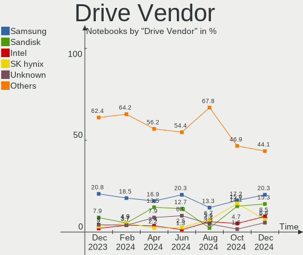
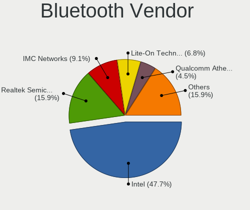

ArcoLinux - Hardware Trends (Notebooks)
---------------------------------------

A project to identify most popular hardware characteristics and track their change
over time based on data collected by Linux users at https://Linux-Hardware.org.

Anyone can contribute to this report by the [hw-probe](https://github.com/linuxhw/hw-probe) tool:

    sudo -E hw-probe -all -upload

This report is for one last month. Overall report since the beginning of time: [TestDays](https://github.com/linuxhw/TestDays)

Period: Sep, 2023.

Contents
--------

* [ System ](#system)
  - [ OS                       ](#os)
  - [ OS Family                ](#os-family)
  - [ Kernel                   ](#kernel)
  - [ Kernel Family            ](#kernel-family)
  - [ Kernel Major Ver.        ](#kernel-major-ver)
  - [ Arch                     ](#arch)
  - [ DE                       ](#de)
  - [ Display Server           ](#display-server)
  - [ Display Manager          ](#display-manager)
  - [ OS Lang                  ](#os-lang)
  - [ Boot Mode                ](#boot-mode)
  - [ Filesystem               ](#filesystem)
  - [ Part. scheme             ](#part-scheme)
  - [ Dual Boot with Linux/BSD ](#dual-boot-with-linuxbsd)
  - [ Dual Boot (Win)          ](#dual-boot-win)

* [ Board ](#board)
  - [ Vendor                   ](#vendor)
  - [ Model                    ](#model)
  - [ Model Family             ](#model-family)
  - [ MFG Year                 ](#mfg-year)
  - [ Form Factor              ](#form-factor)
  - [ Secure Boot              ](#secure-boot)
  - [ Coreboot                 ](#coreboot)
  - [ RAM Size                 ](#ram-size)
  - [ RAM Used                 ](#ram-used)
  - [ Total Drives             ](#total-drives)
  - [ Has CD-ROM               ](#has-cd-rom)
  - [ Has Ethernet             ](#has-ethernet)
  - [ Has WiFi                 ](#has-wifi)
  - [ Has Bluetooth            ](#has-bluetooth)

* [ Location ](#location)
  - [ Country                  ](#country)
  - [ City                     ](#city)

* [ Drives ](#drives)
  - [ Drive Vendor             ](#drive-vendor)
  - [ Drive Model              ](#drive-model)
  - [ HDD Vendor               ](#hdd-vendor)
  - [ SSD Vendor               ](#ssd-vendor)
  - [ Drive Kind               ](#drive-kind)
  - [ Drive Connector          ](#drive-connector)
  - [ Drive Size               ](#drive-size)
  - [ Space Total              ](#space-total)
  - [ Space Used               ](#space-used)
  - [ Malfunc. Drives          ](#malfunc-drives)
  - [ Malfunc. Drive Vendor    ](#malfunc-drive-vendor)
  - [ Malfunc. HDD Vendor      ](#malfunc-hdd-vendor)
  - [ Malfunc. Drive Kind      ](#malfunc-drive-kind)
  - [ Failed Drives            ](#failed-drives)
  - [ Failed Drive Vendor      ](#failed-drive-vendor)
  - [ Drive Status             ](#drive-status)

* [ Storage controller ](#storage-controller)
  - [ Storage Vendor           ](#storage-vendor)
  - [ Storage Model            ](#storage-model)
  - [ Storage Kind             ](#storage-kind)

* [ Processor ](#processor)
  - [ CPU Vendor               ](#cpu-vendor)
  - [ CPU Model                ](#cpu-model)
  - [ CPU Model Family         ](#cpu-model-family)
  - [ CPU Cores                ](#cpu-cores)
  - [ CPU Sockets              ](#cpu-sockets)
  - [ CPU Threads              ](#cpu-threads)
  - [ CPU Op-Modes             ](#cpu-op-modes)
  - [ CPU Microcode            ](#cpu-microcode)
  - [ CPU Microarch            ](#cpu-microarch)

* [ Graphics ](#graphics)
  - [ GPU Vendor               ](#gpu-vendor)
  - [ GPU Model                ](#gpu-model)
  - [ GPU Combo                ](#gpu-combo)
  - [ GPU Driver               ](#gpu-driver)
  - [ GPU Memory               ](#gpu-memory)

* [ Monitor ](#monitor)
  - [ Monitor Vendor           ](#monitor-vendor)
  - [ Monitor Model            ](#monitor-model)
  - [ Monitor Resolution       ](#monitor-resolution)
  - [ Monitor Diagonal         ](#monitor-diagonal)
  - [ Monitor Width            ](#monitor-width)
  - [ Aspect Ratio             ](#aspect-ratio)
  - [ Monitor Area             ](#monitor-area)
  - [ Pixel Density            ](#pixel-density)
  - [ Multiple Monitors        ](#multiple-monitors)

* [ Network ](#network)
  - [ Net Controller Vendor    ](#net-controller-vendor)
  - [ Net Controller Model     ](#net-controller-model)
  - [ Wireless Vendor          ](#wireless-vendor)
  - [ Wireless Model           ](#wireless-model)
  - [ Ethernet Vendor          ](#ethernet-vendor)
  - [ Ethernet Model           ](#ethernet-model)
  - [ Net Controller Kind      ](#net-controller-kind)
  - [ Used Controller          ](#used-controller)
  - [ NICs                     ](#nics)
  - [ IPv6                     ](#ipv6)

* [ Bluetooth ](#bluetooth)
  - [ Bluetooth Vendor         ](#bluetooth-vendor)
  - [ Bluetooth Model          ](#bluetooth-model)

* [ Sound ](#sound)
  - [ Sound Vendor             ](#sound-vendor)
  - [ Sound Model              ](#sound-model)

* [ Memory ](#memory)
  - [ Memory Vendor            ](#memory-vendor)
  - [ Memory Model             ](#memory-model)
  - [ Memory Kind              ](#memory-kind)
  - [ Memory Form Factor       ](#memory-form-factor)
  - [ Memory Size              ](#memory-size)
  - [ Memory Speed             ](#memory-speed)

* [ Printers & scanners ](#printers--scanners)
  - [ Printer Vendor           ](#printer-vendor)
  - [ Printer Model            ](#printer-model)
  - [ Scanner Vendor           ](#scanner-vendor)
  - [ Scanner Model            ](#scanner-model)

* [ Camera ](#camera)
  - [ Camera Vendor            ](#camera-vendor)
  - [ Camera Model             ](#camera-model)

* [ Security ](#security)
  - [ Fingerprint Vendor       ](#fingerprint-vendor)
  - [ Fingerprint Model        ](#fingerprint-model)
  - [ Chipcard Vendor          ](#chipcard-vendor)
  - [ Chipcard Model           ](#chipcard-model)

* [ Unsupported ](#unsupported)
  - [ Unsupported Devices      ](#unsupported-devices)
  - [ Unsupported Device Types ](#unsupported-device-types)

System
------

OS
--

Installed operating systems

| Name              | Notebooks | Percent |
|-------------------|-----------|---------|
| ArcoLinux Rolling | 73        | 98.65%  |
| ArcoLinux         | 1         | 1.35%   |

OS Family
---------

OS without a version

| Name      | Notebooks | Percent |
|-----------|-----------|---------|
| ArcoLinux | 74        | 100%    |

Kernel
------

Version of the Linux kernel

| Version                      | Notebooks | Percent |
|------------------------------|-----------|---------|
| 6.4.12-arch1-1               | 13        | 17.57%  |
| 6.5.3-arch1-1                | 9         | 12.16%  |
| 6.4.11-arch1-1               | 8         | 10.81%  |
| 6.5.4-arch2-1                | 6         | 8.11%   |
| 6.4.12-zen1-1-zen            | 6         | 8.11%   |
| 6.5.5-arch1-1                | 5         | 6.76%   |
| 6.5.2-arch1-1                | 4         | 5.41%   |
| 6.3.8-arch1-1                | 4         | 5.41%   |
| 6.4.11-arch2-1               | 2         | 2.7%    |
| 6.1.54-1-lts                 | 2         | 2.7%    |
| 6.1.53-1-lts                 | 2         | 2.7%    |
| 6.1.52-1-lts                 | 2         | 2.7%    |
| 6.5.5-zen1-1-zen             | 1         | 1.35%   |
| 6.5.4-zen2-1-zen             | 1         | 1.35%   |
| 6.5.3-zen1-1-zen             | 1         | 1.35%   |
| 6.4.9-arch1-1                | 1         | 1.35%   |
| 6.4.3-arch1-1                | 1         | 1.35%   |
| 6.4.11-zen1-1-zen            | 1         | 1.35%   |
| 6.4.10-273-tkg-linux-tkg-pds | 1         | 1.35%   |
| 6.3.1-1-cachyos-eevdf-bore   | 1         | 1.35%   |
| 6.2.9-arch1-1                | 1         | 1.35%   |
| 6.1.53-x64v1-xanmod1-1-lts   | 1         | 1.35%   |
| 6.1.50-1-lts                 | 1         | 1.35%   |

Kernel Family
-------------

Linux kernel without a distro release

| Version | Notebooks | Percent |
|---------|-----------|---------|
| 6.4.12  | 19        | 25.68%  |
| 6.4.11  | 11        | 14.86%  |
| 6.5.3   | 10        | 13.51%  |
| 6.5.4   | 7         | 9.46%   |
| 6.5.5   | 6         | 8.11%   |
| 6.5.2   | 4         | 5.41%   |
| 6.3.8   | 4         | 5.41%   |
| 6.1.53  | 3         | 4.05%   |
| 6.1.54  | 2         | 2.7%    |
| 6.1.52  | 2         | 2.7%    |
| 6.4.9   | 1         | 1.35%   |
| 6.4.3   | 1         | 1.35%   |
| 6.4.10  | 1         | 1.35%   |
| 6.3.1   | 1         | 1.35%   |
| 6.2.9   | 1         | 1.35%   |
| 6.1.50  | 1         | 1.35%   |

Kernel Major Ver.
-----------------

Linux kernel major version

| Version | Notebooks | Percent |
|---------|-----------|---------|
| 6.4     | 33        | 44.59%  |
| 6.5     | 27        | 36.49%  |
| 6.1     | 8         | 10.81%  |
| 6.3     | 5         | 6.76%   |
| 6.2     | 1         | 1.35%   |

Arch
----

OS architecture (x86_64, i586, etc.)

| Name   | Notebooks | Percent |
|--------|-----------|---------|
| x86_64 | 74        | 100%    |

DE
--

Desktop Environment

| Name        | Notebooks | Percent |
|-------------|-----------|---------|
| XFCE        | 22        | 29.73%  |
| KDE5        | 22        | 29.73%  |
| GNOME       | 9         | 12.16%  |
| i3          | 7         | 9.46%   |
| Hyprland    | 3         | 4.05%   |
| Cinnamon    | 2         | 2.7%    |
| chadwm      | 2         | 2.7%    |
| Budgie      | 2         | 2.7%    |
| xmonad      | 1         | 1.35%   |
| XFCE:GNOME: | 1         | 1.35%   |
| X-Cinnamon  | 1         | 1.35%   |
| qtile       | 1         | 1.35%   |
| awesome     | 1         | 1.35%   |

Display Server
--------------

X11 or Wayland

| Name    | Notebooks | Percent |
|---------|-----------|---------|
| X11     | 63        | 85.14%  |
| Wayland | 7         | 9.46%   |
| Unknown | 3         | 4.05%   |
| Tty     | 1         | 1.35%   |

Display Manager
---------------

SDDM, LightDM, etc.

| Name    | Notebooks | Percent |
|---------|-----------|---------|
| SDDM    | 61        | 82.43%  |
| LightDM | 9         | 12.16%  |
| LXDM    | 2         | 2.7%    |
| GDM     | 1         | 1.35%   |
| Unknown | 1         | 1.35%   |

OS Lang
-------

Language

| Lang  | Notebooks | Percent |
|-------|-----------|---------|
| en_US | 33        | 44.59%  |
| en_GB | 6         | 8.11%   |
| ru_RU | 3         | 4.05%   |
| pt_BR | 3         | 4.05%   |
| es_ES | 3         | 4.05%   |
| en_IN | 3         | 4.05%   |
| C     | 3         | 4.05%   |
| it_IT | 2         | 2.7%    |
| es_MX | 2         | 2.7%    |
| en_ZA | 2         | 2.7%    |
| de_DE | 2         | 2.7%    |
| zh_CN | 1         | 1.35%   |
| tr_TR | 1         | 1.35%   |
| th_TH | 1         | 1.35%   |
| sv_SE | 1         | 1.35%   |
| pt_PT | 1         | 1.35%   |
| nl_NL | 1         | 1.35%   |
| id_ID | 1         | 1.35%   |
| fr_CA | 1         | 1.35%   |
| es_PE | 1         | 1.35%   |
| en_HK | 1         | 1.35%   |
| en_CA | 1         | 1.35%   |
| cs_CZ | 1         | 1.35%   |

Boot Mode
---------

EFI or BIOS

| Mode | Notebooks | Percent |
|------|-----------|---------|
| EFI  | 61        | 82.43%  |
| BIOS | 13        | 17.57%  |

Filesystem
----------

Type of filesystem

| Type    | Notebooks | Percent |
|---------|-----------|---------|
| Ext4    | 48        | 64.86%  |
| Btrfs   | 20        | 27.03%  |
| Overlay | 4         | 5.41%   |
| Xfs     | 1         | 1.35%   |
| F2fs    | 1         | 1.35%   |

Part. scheme
------------

Scheme of partitioning

| Type    | Notebooks | Percent |
|---------|-----------|---------|
| GPT     | 65        | 87.84%  |
| MBR     | 8         | 10.81%  |
| Unknown | 1         | 1.35%   |

Dual Boot with Linux/BSD
------------------------

Hosting more than one Linux/BSD

| Dual boot | Notebooks | Percent |
|-----------|-----------|---------|
| No        | 56        | 75.68%  |
| Yes       | 18        | 24.32%  |

Dual Boot (Win)
---------------

Hosting Linux and Windows

| Dual boot | Notebooks | Percent |
|-----------|-----------|---------|
| No        | 40        | 54.05%  |
| Yes       | 34        | 45.95%  |

Board
-----

Vendor
------

Motherboard manufacturer

| Name                | Notebooks | Percent |
|---------------------|-----------|---------|
| Lenovo              | 18        | 24.32%  |
| ASUSTek Computer    | 15        | 20.27%  |
| Dell                | 12        | 16.22%  |
| Hewlett-Packard     | 11        | 14.86%  |
| Acer                | 6         | 8.11%   |
| Apple               | 3         | 4.05%   |
| Chuwi               | 2         | 2.7%    |
| Samsung Electronics | 1         | 1.35%   |
| Razer               | 1         | 1.35%   |
| MSI                 | 1         | 1.35%   |
| Monster             | 1         | 1.35%   |
| Dynabook            | 1         | 1.35%   |
| A-DATA Technology   | 1         | 1.35%   |
| Unknown             | 1         | 1.35%   |

Model
-----

Motherboard model

| Name                                        | Notebooks | Percent |
|---------------------------------------------|-----------|---------|
| Dell XPS 15 9560                            | 2         | 2.7%    |
| Chuwi GemiBook Pro                          | 2         | 2.7%    |
| Acer Aspire E5-575G                         | 2         | 2.7%    |
| Samsung RV413/RV513                         | 1         | 1.35%   |
| Razer Blade                                 | 1         | 1.35%   |
| MSI CR610M                                  | 1         | 1.35%   |
| Monster ABRA A7 V11.3                       | 1         | 1.35%   |
| Lenovo ThinkPad X260 20F5S2WY00             | 1         | 1.35%   |
| Lenovo ThinkPad X230 23252SG                | 1         | 1.35%   |
| Lenovo ThinkPad X1 Carbon Gen 10 21CB00AYMX | 1         | 1.35%   |
| Lenovo ThinkPad X1 Carbon 6th 20KH006KUK    | 1         | 1.35%   |
| Lenovo ThinkPad W541 20EGS24300             | 1         | 1.35%   |
| Lenovo ThinkPad T480 20L6S1FU00             | 1         | 1.35%   |
| Lenovo ThinkPad T470 W10DG 20JNS10501       | 1         | 1.35%   |
| Lenovo ThinkPad T440 20B7S1K400             | 1         | 1.35%   |
| Lenovo ThinkPad T430 2349IF8                | 1         | 1.35%   |
| Lenovo ThinkPad T420 4178AFU                | 1         | 1.35%   |
| Lenovo ThinkPad E490 20N9001RBR             | 1         | 1.35%   |
| Lenovo ThinkPad E15 Gen 2 20TD0005MX        | 1         | 1.35%   |
| Lenovo IdeaPad Y700-15ISK 80NV              | 1         | 1.35%   |
| Lenovo IdeaPad S145-15AST 81N3              | 1         | 1.35%   |
| Lenovo IdeaPad 5 15ARE05 81YQ               | 1         | 1.35%   |
| Lenovo IdeaPad 330-15IGM 81D1               | 1         | 1.35%   |
| Lenovo IdeaPad 3 15ABA7 82RN                | 1         | 1.35%   |
| Lenovo E41-25 81FS                          | 1         | 1.35%   |
| HP ProBook 450 G1                           | 1         | 1.35%   |
| HP Pavilion Notebook                        | 1         | 1.35%   |
| HP Pavilion Laptop 14-dv1xxx                | 1         | 1.35%   |
| HP Pavilion g7                              | 1         | 1.35%   |
| HP OMEN Laptop 15-en0xxx                    | 1         | 1.35%   |
| HP OMEN by Laptop 17-an0xx                  | 1         | 1.35%   |
| HP Laptop 15-dy1xxx                         | 1         | 1.35%   |
| HP Folio 13                                 | 1         | 1.35%   |
| HP ElitePad 1000 G2                         | 1         | 1.35%   |
| HP EliteBook 850 G1                         | 1         | 1.35%   |
| HP 250 G5 Notebook PC                       | 1         | 1.35%   |
| Dynabook Satellite Pro L50-G-193            | 1         | 1.35%   |
| Dell XPS 15 9510                            | 1         | 1.35%   |
| Dell Precision 7520                         | 1         | 1.35%   |
| Dell Latitude E5450                         | 1         | 1.35%   |

Model Family
------------

Motherboard model prefix

| Name                        | Notebooks | Percent |
|-----------------------------|-----------|---------|
| Lenovo ThinkPad             | 12        | 16.22%  |
| Lenovo IdeaPad              | 5         | 6.76%   |
| Dell Inspiron               | 4         | 5.41%   |
| HP Pavilion                 | 3         | 4.05%   |
| Dell XPS                    | 3         | 4.05%   |
| Dell Latitude               | 3         | 4.05%   |
| ASUS VivoBook               | 3         | 4.05%   |
| ASUS ROG                    | 3         | 4.05%   |
| Acer Aspire                 | 3         | 4.05%   |
| HP OMEN                     | 2         | 2.7%    |
| Chuwi GemiBook              | 2         | 2.7%    |
| ASUS ASUS                   | 2         | 2.7%    |
| Apple MacBookPro9           | 2         | 2.7%    |
| Acer Nitro                  | 2         | 2.7%    |
| Samsung RV413               | 1         | 1.35%   |
| Razer Blade                 | 1         | 1.35%   |
| MSI CR610M                  | 1         | 1.35%   |
| Monster ABRA                | 1         | 1.35%   |
| Lenovo E41-25               | 1         | 1.35%   |
| HP ProBook                  | 1         | 1.35%   |
| HP Laptop                   | 1         | 1.35%   |
| HP Folio                    | 1         | 1.35%   |
| HP ElitePad                 | 1         | 1.35%   |
| HP EliteBook                | 1         | 1.35%   |
| HP 250                      | 1         | 1.35%   |
| Dynabook Satellite          | 1         | 1.35%   |
| Dell Precision              | 1         | 1.35%   |
| Dell G3                     | 1         | 1.35%   |
| ASUS X555UB                 | 1         | 1.35%   |
| ASUS X541UVK                | 1         | 1.35%   |
| ASUS N551JW                 | 1         | 1.35%   |
| ASUS K52JB                  | 1         | 1.35%   |
| ASUS K45VM                  | 1         | 1.35%   |
| ASUS GL753VD                | 1         | 1.35%   |
| ASUS G750JW                 | 1         | 1.35%   |
| Apple MacBookPro11          | 1         | 1.35%   |
| Acer Predator               | 1         | 1.35%   |
| A-DATA XENIAXe15TI5G11GXELX | 1         | 1.35%   |
| Unknown                     | 1         | 1.35%   |

MFG Year
--------

Motherboard manufacture year

| Year | Notebooks | Percent |
|------|-----------|---------|
| 2021 | 9         | 12.16%  |
| 2017 | 8         | 10.81%  |
| 2020 | 7         | 9.46%   |
| 2018 | 7         | 9.46%   |
| 2016 | 7         | 9.46%   |
| 2022 | 6         | 8.11%   |
| 2019 | 5         | 6.76%   |
| 2014 | 5         | 6.76%   |
| 2013 | 5         | 6.76%   |
| 2012 | 5         | 6.76%   |
| 2015 | 4         | 5.41%   |
| 2011 | 4         | 5.41%   |
| 2023 | 1         | 1.35%   |
| 2010 | 1         | 1.35%   |

Form Factor
-----------

Physical design of the computer

| Name     | Notebooks | Percent |
|----------|-----------|---------|
| Notebook | 74        | 100%    |

Secure Boot
-----------

Enabled or disabled

| State    | Notebooks | Percent |
|----------|-----------|---------|
| Disabled | 74        | 100%    |

Coreboot
--------

Have coreboot on board

| Used | Notebooks | Percent |
|------|-----------|---------|
| No   | 74        | 100%    |

RAM Size
--------

Total RAM memory

| Size in GB  | Notebooks | Percent |
|-------------|-----------|---------|
| 4.01-8.0    | 23        | 31.08%  |
| 16.01-24.0  | 22        | 29.73%  |
| 3.01-4.0    | 10        | 13.51%  |
| 8.01-16.0   | 9         | 12.16%  |
| 32.01-64.0  | 7         | 9.46%   |
| 64.01-256.0 | 2         | 2.7%    |
| 1.01-2.0    | 1         | 1.35%   |

RAM Used
--------

Used RAM memory

| Used GB   | Notebooks | Percent |
|-----------|-----------|---------|
| 1.01-2.0  | 35        | 47.3%   |
| 2.01-3.0  | 26        | 35.14%  |
| 4.01-8.0  | 6         | 8.11%   |
| 3.01-4.0  | 4         | 5.41%   |
| 0.51-1.0  | 2         | 2.7%    |
| 8.01-16.0 | 1         | 1.35%   |

Total Drives
------------

Number of drives on board

| Drives | Notebooks | Percent |
|--------|-----------|---------|
| 1      | 43        | 58.11%  |
| 2      | 27        | 36.49%  |
| 3      | 4         | 5.41%   |

Has CD-ROM
----------

Has CD-ROM on board

| Presented | Notebooks | Percent |
|-----------|-----------|---------|
| No        | 62        | 83.78%  |
| Yes       | 12        | 16.22%  |

Has Ethernet
------------

Has Ethernet on board

| Presented | Notebooks | Percent |
|-----------|-----------|---------|
| Yes       | 57        | 77.03%  |
| No        | 17        | 22.97%  |

Has WiFi
--------

Has WiFi module

| Presented | Notebooks | Percent |
|-----------|-----------|---------|
| Yes       | 73        | 98.65%  |
| No        | 1         | 1.35%   |

Has Bluetooth
-------------

Has Bluetooth module

| Presented | Notebooks | Percent |
|-----------|-----------|---------|
| Yes       | 71        | 95.95%  |
| No        | 3         | 4.05%   |

Location
--------

Country
-------

Geographic location (country)

| Country      | Notebooks | Percent |
|--------------|-----------|---------|
| USA          | 8         | 10.81%  |
| UK           | 7         | 9.46%   |
| Brazil       | 6         | 8.11%   |
| Turkey       | 5         | 6.76%   |
| Spain        | 4         | 5.41%   |
| Mexico       | 4         | 5.41%   |
| India        | 4         | 5.41%   |
| Germany      | 4         | 5.41%   |
| Iran         | 3         | 4.05%   |
| Sweden       | 2         | 2.7%    |
| South Africa | 2         | 2.7%    |
| Russia       | 2         | 2.7%    |
| Norway       | 2         | 2.7%    |
| Italy        | 2         | 2.7%    |
| Indonesia    | 2         | 2.7%    |
| Czechia      | 2         | 2.7%    |
| Canada       | 2         | 2.7%    |
| Uruguay      | 1         | 1.35%   |
| Thailand     | 1         | 1.35%   |
| Suriname     | 1         | 1.35%   |
| Portugal     | 1         | 1.35%   |
| Poland       | 1         | 1.35%   |
| Peru         | 1         | 1.35%   |
| Netherlands  | 1         | 1.35%   |
| Latvia       | 1         | 1.35%   |
| Hungary      | 1         | 1.35%   |
| Hong Kong    | 1         | 1.35%   |
| Estonia      | 1         | 1.35%   |
| China        | 1         | 1.35%   |
| Austria      | 1         | 1.35%   |

City
----

Geographic location (city)

| City                     | Notebooks | Percent |
|--------------------------|-----------|---------|
| Istanbul                 | 4         | 5.41%   |
| Saltillo                 | 2         | 2.7%    |
| Rio de Janeiro           | 2         | 2.7%    |
| Prague                   | 2         | 2.7%    |
| Feltham                  | 2         | 2.7%    |
| Berlin                   | 2         | 2.7%    |
| Yachats                  | 1         | 1.35%   |
| Wroclaw                  | 1         | 1.35%   |
| Werther                  | 1         | 1.35%   |
| Wausau                   | 1         | 1.35%   |
| Tulungagung              | 1         | 1.35%   |
| Tsuen Wan                | 1         | 1.35%   |
| Trieste                  | 1         | 1.35%   |
| Terni                    | 1         | 1.35%   |
| Tehran                   | 1         | 1.35%   |
| Steinberg                | 1         | 1.35%   |
| Standerton               | 1         | 1.35%   |
| Sierndorf                | 1         | 1.35%   |
| Shenzhen                 | 1         | 1.35%   |
| Sao Paulo                | 1         | 1.35%   |
| Salaberry-de-Valleyfield | 1         | 1.35%   |
| Roswell                  | 1         | 1.35%   |
| Riga                     | 1         | 1.35%   |
| Raipur                   | 1         | 1.35%   |
| Pune                     | 1         | 1.35%   |
| Prestatyn                | 1         | 1.35%   |
| Palamuse                 | 1         | 1.35%   |
| Oslo                     | 1         | 1.35%   |
| Olympia                  | 1         | 1.35%   |
| Norsborg                 | 1         | 1.35%   |
| Nieuw Amsterdam          | 1         | 1.35%   |
| Moscow                   | 1         | 1.35%   |
| Minas                    | 1         | 1.35%   |
| Miami                    | 1         | 1.35%   |
| Merzhausen               | 1         | 1.35%   |
| Mashhad                  | 1         | 1.35%   |
| Madurai                  | 1         | 1.35%   |
| Madrid                   | 1         | 1.35%   |
| Leeuwarden               | 1         | 1.35%   |
| Kudrovo                  | 1         | 1.35%   |

Drives
------

Drive Vendor
------------

Hard drive vendors

| Vendor                      | Notebooks | Drives | Percent |
|-----------------------------|-----------|--------|---------|
| Samsung Electronics         | 24        | 29     | 23.3%   |
| WDC                         | 10        | 10     | 9.71%   |
| Sandisk                     | 7         | 7      | 6.8%    |
| Kingston                    | 6         | 6      | 5.83%   |
| Toshiba                     | 5         | 5      | 4.85%   |
| Seagate                     | 5         | 5      | 4.85%   |
| Intel                       | 5         | 5      | 4.85%   |
| SK hynix                    | 4         | 4      | 3.88%   |
| Crucial                     | 4         | 4      | 3.88%   |
| Unknown                     | 3         | 5      | 2.91%   |
| Micron/Crucial Technology   | 3         | 3      | 2.91%   |
| KIOXIA                      | 3         | 3      | 2.91%   |
| HGST                        | 3         | 3      | 2.91%   |
| Kingston Technology Company | 2         | 2      | 1.94%   |
| Apple                       | 2         | 2      | 1.94%   |
| Silicon Motion              | 1         | 1      | 0.97%   |
| ShiJi                       | 1         | 1      | 0.97%   |
| Plextor                     | 1         | 1      | 0.97%   |
| Micron Technology           | 1         | 1      | 0.97%   |
| LITEON                      | 1         | 1      | 0.97%   |
| Lexar                       | 1         | 1      | 0.97%   |
| Kingmax                     | 1         | 1      | 0.97%   |
| JMicron Technology          | 1         | 1      | 0.97%   |
| Intenso                     | 1         | 1      | 0.97%   |
| GOODRAM                     | 1         | 1      | 0.97%   |
| EYOTA                       | 1         | 1      | 0.97%   |
| CONSISTENT                  | 1         | 1      | 0.97%   |
| Colorful                    | 1         | 1      | 0.97%   |
| China                       | 1         | 1      | 0.97%   |
| AS201                       | 1         | 1      | 0.97%   |
| ADATA Technology            | 1         | 1      | 0.97%   |
| A-DATA Technology           | 1         | 1      | 0.97%   |

Drive Model
-----------

Hard drive models

| Model                                                 | Notebooks | Percent |
|-------------------------------------------------------|-----------|---------|
| Samsung NVMe SSD Controller SM981/PM981/PM983 256GB   | 8         | 7.27%   |
| WDC WD5000LPCX-24VHAT0 500GB                          | 2         | 1.82%   |
| WDC WD10SPZX-21Z10T0 1TB                              | 2         | 1.82%   |
| Unknown MMC Card  64GB                                | 2         | 1.82%   |
| Toshiba MQ01ABD100 1TB                                | 2         | 1.82%   |
| Sandisk PC SN520 NVMe SSD 512GB                       | 2         | 1.82%   |
| Samsung SSD 870 QVO 1TB                               | 2         | 1.82%   |
| Samsung NVMe SSD Controller PM9A1/PM9A3/980PRO 1TB    | 2         | 1.82%   |
| Samsung MZVLQ256HAJD-00000 256GB                      | 2         | 1.82%   |
| Samsung MZVLQ1T0HBLB-00B00 1TB                        | 2         | 1.82%   |
| Micron/Crucial CT1000P5SSD8 1TB                       | 2         | 1.82%   |
| Kingston SA400S37480G 480GB SSD                       | 2         | 1.82%   |
| Intel SSD Pro 7600p/760p/E 6100p Series 1TB           | 2         | 1.82%   |
| HGST HTS721010A9E630 1TB                              | 2         | 1.82%   |
| WDC WD5000LUCT-63C26Y0 500GB                          | 1         | 0.91%   |
| WDC WD5000LPCX-22VHAT0 500GB                          | 1         | 0.91%   |
| WDC WD10SPCX-24HWST1 1TB                              | 1         | 0.91%   |
| WDC WD10JPVX-60JC3T0 1TB                              | 1         | 0.91%   |
| WDC WD10JPCX-24UE4T0 1TB                              | 1         | 0.91%   |
| WDC WD Blue SA510 2.5 500GB                           | 1         | 0.91%   |
| Unknown MMC Card  256GB                               | 1         | 0.91%   |
| Unknown MMC Card  16GB                                | 1         | 0.91%   |
| Unknown MMC Card  128GB                               | 1         | 0.91%   |
| Toshiba XG4 NVMe SSD Controller 512GB                 | 1         | 0.91%   |
| Toshiba MQ01ABF050 500GB                              | 1         | 0.91%   |
| Toshiba KXG50ZNV512G NVMe 512GB                       | 1         | 0.91%   |
| SK hynix PC711 NVMe 512GB                             | 1         | 0.91%   |
| SK hynix PC711 HFS512GDE9X073N 512GB                  | 1         | 0.91%   |
| SK hynix BC511 512GB                                  | 1         | 0.91%   |
| SK hynix BC501 NVMe Solid State Drive 512GB           | 1         | 0.91%   |
| Silicon Motion SM2263EN/SM2263XT SSD Controller 512GB | 1         | 0.91%   |
| ShiJi SSD 1TB                                         | 1         | 0.91%   |
| Seagate ST9500325AS 500GB                             | 1         | 0.91%   |
| Seagate ST9320325AS 320GB                             | 1         | 0.91%   |
| Seagate ST2000LM003 HN-M201RAD 2TB                    | 1         | 0.91%   |
| Seagate ST1000LM048-2E7172 1TB                        | 1         | 0.91%   |
| Seagate ST1000LM024 HN-M101MBB 1TB                    | 1         | 0.91%   |
| Sandisk WD PC SN560 SDDPNQE-1T00-1002 1TB             | 1         | 0.91%   |
| Sandisk WD Blue SN570 1TB                             | 1         | 0.91%   |
| Sandisk WD Blue SN550 NVMe SSD 512GB                  | 1         | 0.91%   |

HDD Vendor
----------

Hard disk drive vendors

| Vendor              | Notebooks | Drives | Percent |
|---------------------|-----------|--------|---------|
| WDC                 | 9         | 9      | 39.13%  |
| Seagate             | 5         | 5      | 21.74%  |
| Toshiba             | 3         | 3      | 13.04%  |
| HGST                | 3         | 3      | 13.04%  |
| Samsung Electronics | 2         | 2      | 8.7%    |
| Apple               | 1         | 1      | 4.35%   |

SSD Vendor
----------

Solid state drive vendors

| Vendor              | Notebooks | Drives | Percent |
|---------------------|-----------|--------|---------|
| Samsung Electronics | 10        | 10     | 26.32%  |
| Kingston            | 6         | 6      | 15.79%  |
| Crucial             | 4         | 4      | 10.53%  |
| SanDisk             | 2         | 2      | 5.26%   |
| WDC                 | 1         | 1      | 2.63%   |
| ShiJi               | 1         | 1      | 2.63%   |
| Plextor             | 1         | 1      | 2.63%   |
| LITEON              | 1         | 1      | 2.63%   |
| Lexar               | 1         | 1      | 2.63%   |
| Kingmax             | 1         | 1      | 2.63%   |
| Intenso             | 1         | 1      | 2.63%   |
| Intel               | 1         | 1      | 2.63%   |
| GOODRAM             | 1         | 1      | 2.63%   |
| EYOTA               | 1         | 1      | 2.63%   |
| CONSISTENT          | 1         | 1      | 2.63%   |
| Colorful            | 1         | 1      | 2.63%   |
| China               | 1         | 1      | 2.63%   |
| AS201               | 1         | 1      | 2.63%   |
| Apple               | 1         | 1      | 2.63%   |
| A-DATA Technology   | 1         | 1      | 2.63%   |

Drive Kind
----------

HDD or SSD

| Kind    | Notebooks | Drives | Percent |
|---------|-----------|--------|---------|
| NVMe    | 38        | 43     | 40.86%  |
| SSD     | 31        | 38     | 33.33%  |
| HDD     | 20        | 23     | 21.51%  |
| MMC     | 3         | 5      | 3.23%   |
| Unknown | 1         | 1      | 1.08%   |

Drive Connector
---------------

SATA, SAS, NVMe, etc.

| Type | Notebooks | Drives | Percent |
|------|-----------|--------|---------|
| SATA | 43        | 59     | 49.43%  |
| NVMe | 38        | 43     | 43.68%  |
| SAS  | 3         | 3      | 3.45%   |
| MMC  | 3         | 5      | 3.45%   |

Drive Size
----------

Size of hard drive

| Size in TB | Notebooks | Drives | Percent |
|------------|-----------|--------|---------|
| 0.01-0.5   | 30        | 37     | 57.69%  |
| 0.51-1.0   | 21        | 23     | 40.38%  |
| 1.01-2.0   | 1         | 1      | 1.92%   |

Space Total
-----------

Amount of disk space available on the file system

| Size in GB     | Notebooks | Percent |
|----------------|-----------|---------|
| 251-500        | 16        | 21.62%  |
| 101-250        | 14        | 18.92%  |
| More than 3000 | 13        | 17.57%  |
| 1001-2000      | 8         | 10.81%  |
| 501-1000       | 7         | 9.46%   |
| 1-20           | 5         | 6.76%   |
| 51-100         | 5         | 6.76%   |
| Unknown        | 4         | 5.41%   |
| 21-50          | 2         | 2.7%    |

Space Used
----------

Amount of used disk space

| Used GB        | Notebooks | Percent |
|----------------|-----------|---------|
| 1-20           | 20        | 27.03%  |
| 21-50          | 17        | 22.97%  |
| 101-250        | 14        | 18.92%  |
| 51-100         | 9         | 12.16%  |
| Unknown        | 4         | 5.41%   |
| 251-500        | 3         | 4.05%   |
| 1001-2000      | 3         | 4.05%   |
| 501-1000       | 3         | 4.05%   |
| More than 3000 | 1         | 1.35%   |

Malfunc. Drives
---------------

Drive models with a malfunction

| Model                                                           | Notebooks | Drives | Percent |
|-----------------------------------------------------------------|-----------|--------|---------|
| WDC WD10JPCX-24UE4T0 1TB                                        | 1         | 1      | 6.67%   |
| Toshiba MQ01ABF050 500GB                                        | 1         | 1      | 6.67%   |
| Toshiba MQ01ABD100 1TB                                          | 1         | 1      | 6.67%   |
| SK hynix PC711 HFS512GDE9X073N 512GB                            | 1         | 1      | 6.67%   |
| Seagate ST9500325AS 500GB                                       | 1         | 1      | 6.67%   |
| Seagate ST9320325AS 320GB                                       | 1         | 1      | 6.67%   |
| Samsung Electronics NVMe SSD Controller SM981/PM981/PM983 256GB | 1         | 1      | 6.67%   |
| Samsung Electronics HM500JI 500GB                               | 1         | 1      | 6.67%   |
| Kingston SUV400S37120G 120GB SSD                                | 1         | 1      | 6.67%   |
| Intel SSDSC2BF180A4L 180GB                                      | 1         | 1      | 6.67%   |
| Intel SSD Pro 7600p/760p/E 6100p Series 1TB                     | 1         | 1      | 6.67%   |
| HGST HTS541075A9E680 752GB                                      | 1         | 1      | 6.67%   |
| Crucial CT525MX300SSD1 528GB                                    | 1         | 1      | 6.67%   |
| Colorful SL500 240GB SSD                                        | 1         | 1      | 6.67%   |
| China G521N256GB                                                | 1         | 1      | 6.67%   |

Malfunc. Drive Vendor
---------------------

Vendors of faulty drives

| Vendor              | Notebooks | Drives | Percent |
|---------------------|-----------|--------|---------|
| Toshiba             | 2         | 2      | 13.33%  |
| Seagate             | 2         | 2      | 13.33%  |
| Samsung Electronics | 2         | 2      | 13.33%  |
| Intel               | 2         | 2      | 13.33%  |
| WDC                 | 1         | 1      | 6.67%   |
| SK hynix            | 1         | 1      | 6.67%   |
| Kingston            | 1         | 1      | 6.67%   |
| HGST                | 1         | 1      | 6.67%   |
| Crucial             | 1         | 1      | 6.67%   |
| Colorful            | 1         | 1      | 6.67%   |
| China               | 1         | 1      | 6.67%   |

Malfunc. HDD Vendor
-------------------

Vendors of faulty HDD drives

| Vendor              | Notebooks | Drives | Percent |
|---------------------|-----------|--------|---------|
| Toshiba             | 2         | 2      | 28.57%  |
| Seagate             | 2         | 2      | 28.57%  |
| WDC                 | 1         | 1      | 14.29%  |
| Samsung Electronics | 1         | 1      | 14.29%  |
| HGST                | 1         | 1      | 14.29%  |

Malfunc. Drive Kind
-------------------

Kinds of faulty drives

| Kind | Notebooks | Drives | Percent |
|------|-----------|--------|---------|
| HDD  | 6         | 7      | 42.86%  |
| SSD  | 5         | 5      | 35.71%  |
| NVMe | 3         | 3      | 21.43%  |

Failed Drives
-------------

Failed drive models

Zero info for selected period =(

Failed Drive Vendor
-------------------

Failed drive vendors

Zero info for selected period =(

Drive Status
------------

Number of failed and malfunc. drives

| Status   | Notebooks | Drives | Percent |
|----------|-----------|--------|---------|
| Works    | 64        | 85     | 76.19%  |
| Malfunc  | 14        | 15     | 16.67%  |
| Detected | 6         | 10     | 7.14%   |

Storage controller
------------------

Storage Vendor
--------------

Storage controller vendors

| Vendor                       | Notebooks | Percent |
|------------------------------|-----------|---------|
| Intel                        | 55        | 55.56%  |
| Samsung Electronics          | 16        | 16.16%  |
| AMD                          | 6         | 6.06%   |
| SanDisk                      | 5         | 5.05%   |
| SK hynix                     | 4         | 4.04%   |
| Micron/Crucial Technology    | 3         | 3.03%   |
| KIOXIA                       | 3         | 3.03%   |
| Toshiba America Info Systems | 2         | 2.02%   |
| Kingston Technology Company  | 2         | 2.02%   |
| Silicon Motion               | 1         | 1.01%   |
| Micron Technology            | 1         | 1.01%   |
| ADATA Technology             | 1         | 1.01%   |

Storage Model
-------------

Storage controller models

| Model                                                                          | Notebooks | Percent |
|--------------------------------------------------------------------------------|-----------|---------|
| Samsung NVMe SSD Controller SM981/PM981/PM983                                  | 8         | 7.62%   |
| Intel Sunrise Point-LP SATA Controller [AHCI mode]                             | 8         | 7.62%   |
| Intel HM170/QM170 Chipset SATA Controller [AHCI Mode]                          | 7         | 6.67%   |
| Intel 7 Series Chipset Family 6-port SATA Controller [AHCI mode]               | 7         | 6.67%   |
| Samsung NVMe SSD Controller 980                                                | 5         | 4.76%   |
| Intel Volume Management Device NVMe RAID Controller                            | 5         | 4.76%   |
| Intel 82801 Mobile SATA Controller [RAID mode]                                 | 5         | 4.76%   |
| AMD FCH SATA Controller [AHCI mode]                                            | 5         | 4.76%   |
| Intel 8 Series/C220 Series Chipset Family 6-port SATA Controller 1 [AHCI mode] | 4         | 3.81%   |
| KIOXIA NVMe SSD Controller BG4 (DRAM-less)                                     | 3         | 2.86%   |
| SK hynix Gold P31/BC711/PC711 NVMe Solid State Drive                           | 2         | 1.9%    |
| SanDisk PC SN520 NVMe SSD                                                      | 2         | 1.9%    |
| Samsung NVMe SSD Controller PM9A1/PM9A3/980PRO                                 | 2         | 1.9%    |
| Micron/Crucial P5 NVMe PCIe SSD[SlashP5]                                       | 2         | 1.9%    |
| Intel Tiger Lake-LP SATA Controller                                            | 2         | 1.9%    |
| Intel SSD DC P4101/Pro 7600p/760p/E 6100p Series                               | 2         | 1.9%    |
| Intel SSD 670p Series [Keystone Harbor]                                        | 2         | 1.9%    |
| Intel Jasper Lake SATA AHCI Controller                                         | 2         | 1.9%    |
| Intel Celeron/Pentium Silver Processor SATA Controller                         | 2         | 1.9%    |
| Intel Cannon Lake Mobile PCH SATA AHCI Controller                              | 2         | 1.9%    |
| Intel 8 Series SATA Controller 1 [AHCI mode]                                   | 2         | 1.9%    |
| Intel 6 Series/C200 Series Chipset Family 6 port Mobile SATA AHCI Controller   | 2         | 1.9%    |
| Toshiba America Info Systems XG5 NVMe SSD Controller                           | 1         | 0.95%   |
| Toshiba America Info Systems XG4 NVMe SSD Controller                           | 1         | 0.95%   |
| SK hynix BC511 NVMe SSD                                                        | 1         | 0.95%   |
| SK hynix BC501 NVMe Solid State Drive                                          | 1         | 0.95%   |
| Silicon Motion SM2263EN/SM2263XT (DRAM-less) NVMe SSD Controllers              | 1         | 0.95%   |
| SanDisk WD Blue SN570 NVMe SSD 1TB                                             | 1         | 0.95%   |
| SanDisk WD Blue SN550 NVMe SSD                                                 | 1         | 0.95%   |
| SanDisk WD Black SN770 / PC SN740 256GB / PC SN560 (DRAM-less) NVMe SSD        | 1         | 0.95%   |
| Samsung S4LN053X01 AHCI SSD Controller(Apple slot)                             | 1         | 0.95%   |
| Samsung NVMe SSD Controller SM951/PM951                                        | 1         | 0.95%   |
| Samsung NVMe SSD Controller S4LV008[Pascal]                                    | 1         | 0.95%   |
| Micron/Crucial P2 [Nick P2] / P3 / P3 Plus NVMe PCIe SSD (DRAM-less)           | 1         | 0.95%   |
| Micron 2200S NVMe SSD [Cassandra]                                              | 1         | 0.95%   |
| Kingston Company U-SNS8154P3 NVMe SSD                                          | 1         | 0.95%   |
| Kingston Company Company Non-Volatile memory controller                        | 1         | 0.95%   |
| Intel Wildcat Point-LP SATA Controller [AHCI Mode]                             | 1         | 0.95%   |
| Intel Tiger Lake SATA AHCI Controller                                          | 1         | 0.95%   |
| Intel Q170/Q150/B150/H170/H110/Z170/CM236 Chipset SATA Controller [AHCI Mode]  | 1         | 0.95%   |

Storage Kind
------------

Kind of storage controller (IDE, SATA, NVMe, SAS, ...)

| Kind | Notebooks | Percent |
|------|-----------|---------|
| SATA | 52        | 52%     |
| NVMe | 38        | 38%     |
| RAID | 10        | 10%     |

Processor
---------

CPU Vendor
----------

Processor vendors

| Vendor | Notebooks | Percent |
|--------|-----------|---------|
| Intel  | 65        | 87.84%  |
| AMD    | 9         | 12.16%  |

CPU Model
---------

Processor models

| Model                                   | Notebooks | Percent |
|-----------------------------------------|-----------|---------|
| Intel Core i7-7700HQ CPU @ 2.80GHz      | 5         | 6.76%   |
| Intel Core i7-7500U CPU @ 2.70GHz       | 3         | 4.05%   |
| Intel Core i3-1005G1 CPU @ 1.20GHz      | 3         | 4.05%   |
| Intel Core i7-6500U CPU @ 2.50GHz       | 2         | 2.7%    |
| Intel Core i5-7200U CPU @ 2.50GHz       | 2         | 2.7%    |
| Intel Core i5-6300U CPU @ 2.40GHz       | 2         | 2.7%    |
| Intel Core i5-3320M CPU @ 2.60GHz       | 2         | 2.7%    |
| Intel Celeron N5100 @ 1.10GHz           | 2         | 2.7%    |
| Intel 11th Gen Core i7-1165G7 @ 2.80GHz | 2         | 2.7%    |
| Intel Xeon CPU E3-1545M v5 @ 2.90GHz    | 1         | 1.35%   |
| Intel Pentium CPU 2020M @ 2.40GHz       | 1         | 1.35%   |
| Intel Core i7-9750H CPU @ 2.60GHz       | 1         | 1.35%   |
| Intel Core i7-8750H CPU @ 2.20GHz       | 1         | 1.35%   |
| Intel Core i7-8650U CPU @ 1.90GHz       | 1         | 1.35%   |
| Intel Core i7-8565U CPU @ 1.80GHz       | 1         | 1.35%   |
| Intel Core i7-8550U CPU @ 1.80GHz       | 1         | 1.35%   |
| Intel Core i7-6700HQ CPU @ 2.60GHz      | 1         | 1.35%   |
| Intel Core i7-4770HQ CPU @ 2.20GHz      | 1         | 1.35%   |
| Intel Core i7-4720HQ CPU @ 2.60GHz      | 1         | 1.35%   |
| Intel Core i7-4710MQ CPU @ 2.50GHz      | 1         | 1.35%   |
| Intel Core i7-4700HQ CPU @ 2.40GHz      | 1         | 1.35%   |
| Intel Core i7-3615QM CPU @ 2.30GHz      | 1         | 1.35%   |
| Intel Core i7-3610QM CPU @ 2.30GHz      | 1         | 1.35%   |
| Intel Core i7-3520M CPU @ 2.90GHz       | 1         | 1.35%   |
| Intel Core i7-2620M CPU @ 2.70GHz       | 1         | 1.35%   |
| Intel Core i7-10750H CPU @ 2.60GHz      | 1         | 1.35%   |
| Intel Core i7-10510U CPU @ 1.80GHz      | 1         | 1.35%   |
| Intel Core i5-9300H CPU @ 2.40GHz       | 1         | 1.35%   |
| Intel Core i5-7300HQ CPU @ 2.50GHz      | 1         | 1.35%   |
| Intel Core i5-5300U CPU @ 2.30GHz       | 1         | 1.35%   |
| Intel Core i5-4300U CPU @ 1.90GHz       | 1         | 1.35%   |
| Intel Core i5-4210U CPU @ 1.70GHz       | 1         | 1.35%   |
| Intel Core i5-4200M CPU @ 2.50GHz       | 1         | 1.35%   |
| Intel Core i5-2467M CPU @ 1.60GHz       | 1         | 1.35%   |
| Intel Core i5-10300H CPU @ 2.50GHz      | 1         | 1.35%   |
| Intel Core i3-8145U CPU @ 2.10GHz       | 1         | 1.35%   |
| Intel Core i3-5005U CPU @ 2.00GHz       | 1         | 1.35%   |
| Intel Core i3-2370M CPU @ 2.40GHz       | 1         | 1.35%   |
| Intel Core i3 CPU M 350 @ 2.27GHz       | 1         | 1.35%   |
| Intel Celeron N4100 CPU @ 1.10GHz       | 1         | 1.35%   |

CPU Model Family
----------------

Processor model prefix

| Model         | Notebooks | Percent |
|---------------|-----------|---------|
| Intel Core i7 | 26        | 35.14%  |
| Intel Core i5 | 14        | 18.92%  |
| Other         | 11        | 14.86%  |
| Intel Core i3 | 7         | 9.46%   |
| Intel Celeron | 5         | 6.76%   |
| AMD Ryzen 7   | 3         | 4.05%   |
| AMD Ryzen 5   | 2         | 2.7%    |
| Intel Xeon    | 1         | 1.35%   |
| Intel Pentium | 1         | 1.35%   |
| Intel Atom    | 1         | 1.35%   |
| AMD Ryzen 9   | 1         | 1.35%   |
| AMD E         | 1         | 1.35%   |
| AMD A6        | 1         | 1.35%   |

CPU Cores
---------

Number of processor cores

| Number | Notebooks | Percent |
|--------|-----------|---------|
| 2      | 31        | 41.89%  |
| 4      | 29        | 39.19%  |
| 8      | 7         | 9.46%   |
| 6      | 5         | 6.76%   |
| 14     | 1         | 1.35%   |
| 12     | 1         | 1.35%   |

CPU Sockets
-----------

Number of sockets

| Number | Notebooks | Percent |
|--------|-----------|---------|
| 1      | 74        | 100%    |

CPU Threads
-----------

Threads per core (Hyper-Threading)

| Number | Notebooks | Percent |
|--------|-----------|---------|
| 2      | 62        | 83.78%  |
| 1      | 12        | 16.22%  |

CPU Op-Modes
------------

CPU Operation Modes (32-bit, 64-bit)

| Op mode        | Notebooks | Percent |
|----------------|-----------|---------|
| 32-bit, 64-bit | 74        | 100%    |

CPU Microcode
-------------

Microcode number

| Number     | Notebooks | Percent |
|------------|-----------|---------|
| Unknown    | 56        | 75.68%  |
| 0x806d1    | 2         | 2.7%    |
| 0x806c1    | 2         | 2.7%    |
| 0x306c3    | 2         | 2.7%    |
| 0x0a50000c | 2         | 2.7%    |
| 0x08600106 | 2         | 2.7%    |
| 0x06006705 | 2         | 2.7%    |
| 0x906e9    | 1         | 1.35%   |
| 0x806e9    | 1         | 1.35%   |
| 0x806c2    | 1         | 1.35%   |
| 0x0a404101 | 1         | 1.35%   |
| 0x08600104 | 1         | 1.35%   |
| 0x05000101 | 1         | 1.35%   |

CPU Microarch
-------------

Microarchitecture

| Name             | Notebooks | Percent |
|------------------|-----------|---------|
| KabyLake         | 19        | 25.68%  |
| Haswell          | 7         | 9.46%   |
| Skylake          | 6         | 8.11%   |
| IvyBridge        | 6         | 8.11%   |
| Icelake          | 6         | 8.11%   |
| TigerLake        | 5         | 6.76%   |
| Zen 2            | 3         | 4.05%   |
| SandyBridge      | 3         | 4.05%   |
| Zen 3            | 2         | 2.7%    |
| Tremont          | 2         | 2.7%    |
| Silvermont       | 2         | 2.7%    |
| Goldmont plus    | 2         | 2.7%    |
| Excavator        | 2         | 2.7%    |
| CometLake        | 2         | 2.7%    |
| Broadwell        | 2         | 2.7%    |
| Unknown          | 2         | 2.7%    |
| Westmere         | 1         | 1.35%   |
| Bobcat           | 1         | 1.35%   |
| Alderlake Hybrid | 1         | 1.35%   |

Graphics
--------

GPU Vendor
----------

Vendors of graphics cards

| Vendor | Notebooks | Percent |
|--------|-----------|---------|
| Intel  | 62        | 59.05%  |
| Nvidia | 30        | 28.57%  |
| AMD    | 13        | 12.38%  |

GPU Model
---------

Graphics card models

| Model                                                                     | Notebooks | Percent |
|---------------------------------------------------------------------------|-----------|---------|
| Intel 3rd Gen Core processor Graphics Controller                          | 6         | 5.71%   |
| Intel TigerLake-LP GT2 [Iris Xe Graphics]                                 | 5         | 4.76%   |
| Intel HD Graphics 630                                                     | 5         | 4.76%   |
| Intel HD Graphics 620                                                     | 5         | 4.76%   |
| Nvidia GM108M [GeForce 940MX]                                             | 4         | 3.81%   |
| Intel Skylake GT2 [HD Graphics 520]                                       | 4         | 3.81%   |
| Intel TigerLake-H GT1 [UHD Graphics]                                      | 3         | 2.86%   |
| Intel Iris Plus Graphics G1 (Ice Lake)                                    | 3         | 2.86%   |
| Intel CoffeeLake-H GT2 [UHD Graphics 630]                                 | 3         | 2.86%   |
| Intel 4th Gen Core Processor Integrated Graphics Controller               | 3         | 2.86%   |
| Intel 2nd Generation Core Processor Family Integrated Graphics Controller | 3         | 2.86%   |
| AMD Renoir                                                                | 3         | 2.86%   |
| Nvidia TU117M [GeForce GTX 1650 Ti Mobile]                                | 2         | 1.9%    |
| Nvidia GP107M [GeForce GTX 1050 Mobile]                                   | 2         | 1.9%    |
| Nvidia GM107M [GeForce GTX 960M]                                          | 2         | 1.9%    |
| Intel WhiskeyLake-U GT2 [UHD Graphics 620]                                | 2         | 1.9%    |
| Intel UHD Graphics 620                                                    | 2         | 1.9%    |
| Intel JasperLake [UHD Graphics]                                           | 2         | 1.9%    |
| Intel HD Graphics 5500                                                    | 2         | 1.9%    |
| Intel Haswell-ULT Integrated Graphics Controller                          | 2         | 1.9%    |
| Intel GeminiLake [UHD Graphics 600]                                       | 2         | 1.9%    |
| Intel CometLake-H GT2 [UHD Graphics]                                      | 2         | 1.9%    |
| Intel Atom Processor Z36xxx/Z37xxx Series Graphics & Display              | 2         | 1.9%    |
| Intel Alder Lake-P Integrated Graphics Controller                         | 2         | 1.9%    |
| AMD Stoney [Radeon R2/R3/R4/R5 Graphics]                                  | 2         | 1.9%    |
| Nvidia TU117M [GeForce GTX 1650 Mobile / Max-Q]                           | 1         | 0.95%   |
| Nvidia TU117M                                                             | 1         | 0.95%   |
| Nvidia TU106M [GeForce RTX 2060 Max-Q]                                    | 1         | 0.95%   |
| Nvidia TU104M [GeForce RTX 2080 Mobile]                                   | 1         | 0.95%   |
| Nvidia GP108M [GeForce MX150]                                             | 1         | 0.95%   |
| Nvidia GP107M [GeForce GTX 1050 Ti Mobile]                                | 1         | 0.95%   |
| Nvidia GP106M [GeForce GTX 1060 Mobile]                                   | 1         | 0.95%   |
| Nvidia GM206GLM [Quadro M2200 Mobile]                                     | 1         | 0.95%   |
| Nvidia GM108M [GeForce 940M]                                              | 1         | 0.95%   |
| Nvidia GM108M [GeForce 920MX]                                             | 1         | 0.95%   |
| Nvidia GK107M [GeForce GT 650M Mac Edition]                               | 1         | 0.95%   |
| Nvidia GK107GLM [Quadro K1100M]                                           | 1         | 0.95%   |
| Nvidia GK106M [GeForce GTX 765M]                                          | 1         | 0.95%   |
| Nvidia GF117M [GeForce 610M/710M/810M/820M / GT 620M/625M/630M/720M]      | 1         | 0.95%   |
| Nvidia GF108M [GeForce GT 620M/630M/635M/640M LE]                         | 1         | 0.95%   |

GPU Combo
---------

Combinations of graphics cards

| Name           | Notebooks | Percent |
|----------------|-----------|---------|
| 1 x Intel      | 35        | 47.3%   |
| Intel + Nvidia | 25        | 33.78%  |
| 1 x AMD        | 7         | 9.46%   |
| AMD + Nvidia   | 4         | 5.41%   |
| Intel + AMD    | 2         | 2.7%    |
| 1 x Nvidia     | 1         | 1.35%   |

GPU Driver
----------

Free vs proprietary

| Driver      | Notebooks | Percent |
|-------------|-----------|---------|
| Free        | 53        | 71.62%  |
| Proprietary | 21        | 28.38%  |

GPU Memory
----------

Total video memory

| Size in GB | Notebooks | Percent |
|------------|-----------|---------|
| Unknown    | 53        | 71.62%  |
| 0.01-0.5   | 9         | 12.16%  |
| 3.01-4.0   | 4         | 5.41%   |
| 1.01-2.0   | 4         | 5.41%   |
| 0.51-1.0   | 2         | 2.7%    |
| 7.01-8.0   | 1         | 1.35%   |
| 5.01-6.0   | 1         | 1.35%   |

Monitor
-------

Monitor Vendor
--------------

Monitor vendors

| Vendor                  | Notebooks | Percent |
|-------------------------|-----------|---------|
| AU Optronics            | 17        | 18.48%  |
| Chimei Innolux          | 15        | 16.3%   |
| BOE                     | 15        | 16.3%   |
| LG Display              | 13        | 14.13%  |
| Samsung Electronics     | 4         | 4.35%   |
| Sharp                   | 3         | 3.26%   |
| Dell                    | 3         | 3.26%   |
| Apple                   | 3         | 3.26%   |
| Unknown                 | 2         | 2.17%   |
| PANDA                   | 2         | 2.17%   |
| Lenovo                  | 2         | 2.17%   |
| Iiyama                  | 2         | 2.17%   |
| Acer                    | 2         | 2.17%   |
| SGT                     | 1         | 1.09%   |
| Philips                 | 1         | 1.09%   |
| MStar                   | 1         | 1.09%   |
| HUAWEI                  | 1         | 1.09%   |
| Hewlett-Packard         | 1         | 1.09%   |
| Goldstar                | 1         | 1.09%   |
| CSO                     | 1         | 1.09%   |
| Chi Mei Optoelectronics | 1         | 1.09%   |
| AOC                     | 1         | 1.09%   |

Monitor Model
-------------

Monitor models

| Model                                                                 | Notebooks | Percent |
|-----------------------------------------------------------------------|-----------|---------|
| Unknown LCD Monitor FFFF 2288x1287 2550x2550mm 142.0-inch             | 2         | 2.13%   |
| Chimei Innolux LCD Monitor CMN1738 1920x1080 381x214mm 17.2-inch      | 2         | 2.13%   |
| AU Optronics LCD Monitor AUO61ED 1920x1080 340x190mm 15.3-inch        | 2         | 2.13%   |
| AU Optronics LCD Monitor AUO2336 2560x1440 309x174mm 14.0-inch        | 2         | 2.13%   |
| Sharp LCD Monitor SHP1476 3840x2160 346x194mm 15.6-inch               | 1         | 1.06%   |
| Sharp LCD Monitor SHP1453 1920x1080 346x194mm 15.6-inch               | 1         | 1.06%   |
| Sharp LCD Monitor SHP143A 3840x2160 346x194mm 15.6-inch               | 1         | 1.06%   |
| SGT '' SGT2380 1920x1080 531x289mm 23.8-inch                          | 1         | 1.06%   |
| Samsung Electronics SA300/SA350 SAM078B 1600x900 443x249mm 20.0-inch  | 1         | 1.06%   |
| Samsung Electronics LCD Monitor SEC3047 1366x768 277x156mm 12.5-inch  | 1         | 1.06%   |
| Samsung Electronics LCD Monitor SDCA029 3840x2160 344x194mm 15.5-inch | 1         | 1.06%   |
| Samsung Electronics LCD Monitor SDC414D 3456x2160 336x210mm 15.6-inch | 1         | 1.06%   |
| Philips PHL 243V5 PHLC0D1 1920x1080 521x293mm 23.5-inch               | 1         | 1.06%   |
| PANDA LCD Monitor NCP004D 1920x1080 344x194mm 15.5-inch               | 1         | 1.06%   |
| PANDA LCD Monitor NCP002D 1920x1080 344x194mm 15.5-inch               | 1         | 1.06%   |
| MStar Demo MST0030 1360x765 1150x650mm 52.0-inch                      | 1         | 1.06%   |
| LG Display LCD Monitor LGD062E 1920x1080 344x194mm 15.5-inch          | 1         | 1.06%   |
| LG Display LCD Monitor LGD0563 1920x1080 344x194mm 15.5-inch          | 1         | 1.06%   |
| LG Display LCD Monitor LGD053F 1920x1080 344x194mm 15.5-inch          | 1         | 1.06%   |
| LG Display LCD Monitor LGD04E8 1920x1080 382x215mm 17.3-inch          | 1         | 1.06%   |
| LG Display LCD Monitor LGD04E2 1366x768 344x194mm 15.5-inch           | 1         | 1.06%   |
| LG Display LCD Monitor LGD046D 1920x1080 309x174mm 14.0-inch          | 1         | 1.06%   |
| LG Display LCD Monitor LGD042C 1920x1080 345x194mm 15.6-inch          | 1         | 1.06%   |
| LG Display LCD Monitor LGD03CD 1366x768 277x156mm 12.5-inch           | 1         | 1.06%   |
| LG Display LCD Monitor LGD03B8 1366x768 310x174mm 14.0-inch           | 1         | 1.06%   |
| LG Display LCD Monitor LGD0395 1366x768 344x194mm 15.5-inch           | 1         | 1.06%   |
| LG Display LCD Monitor LGD0312 1366x768 294x166mm 13.3-inch           | 1         | 1.06%   |
| LG Display LCD Monitor LGD02F8 1366x768 309x174mm 14.0-inch           | 1         | 1.06%   |
| LG Display LCD Monitor LGD02E2 1600x900 310x174mm 14.0-inch           | 1         | 1.06%   |
| Lenovo LEN G25-10 LEN65FE 1920x1080 544x303mm 24.5-inch               | 1         | 1.06%   |
| Lenovo C24-25 LEN66B0 1920x1080 527x296mm 23.8-inch                   | 1         | 1.06%   |
| Iiyama PLX2481H IVM611D 1920x1080 521x293mm 23.5-inch                 | 1         | 1.06%   |
| Iiyama PL2481H IVM610E 1920x1080 521x293mm 23.5-inch                  | 1         | 1.06%   |
| Iiyama PL2474H IVM6146 1920x1080 521x293mm 23.5-inch                  | 1         | 1.06%   |
| HUAWEI SSN-24 HWV6E4E 1920x1080 527x296mm 23.8-inch                   | 1         | 1.06%   |
| Hewlett-Packard LA2206 HWP2948 1920x1080 476x268mm 21.5-inch          | 1         | 1.06%   |
| Goldstar MP59G GSM5B34 1920x1080 480x270mm 21.7-inch                  | 1         | 1.06%   |
| Dell U3011 DEL4065 2560x1600 641x401mm 29.8-inch                      | 1         | 1.06%   |
| Dell U2711 DELA056 1920x1080 600x340mm 27.2-inch                      | 1         | 1.06%   |
| Dell U2414H DELA0A4 1920x1080 527x296mm 23.8-inch                     | 1         | 1.06%   |

Monitor Resolution
------------------

Monitor screen resolution

| Resolution        | Notebooks | Percent |
|-------------------|-----------|---------|
| 1920x1080 (FHD)   | 41        | 47.67%  |
| 1366x768 (WXGA)   | 20        | 23.26%  |
| 2560x1440 (QHD)   | 6         | 6.98%   |
| 3840x2160 (4K)    | 4         | 4.65%   |
| 1600x900 (HD+)    | 4         | 4.65%   |
| 2288x1287         | 2         | 2.33%   |
| 2160x1440         | 2         | 2.33%   |
| 1920x1200 (WUXGA) | 2         | 2.33%   |
| 3456x2160         | 1         | 1.16%   |
| 2880x1800         | 1         | 1.16%   |
| 2560x1600         | 1         | 1.16%   |
| 1440x900 (WXGA+)  | 1         | 1.16%   |
| 1280x800 (WXGA)   | 1         | 1.16%   |

Monitor Diagonal
----------------

Diagonal size in inches

| Inches | Notebooks | Percent |
|--------|-----------|---------|
| 15     | 40        | 43.48%  |
| 14     | 16        | 17.39%  |
| 17     | 7         | 7.61%   |
| 13     | 7         | 7.61%   |
| 23     | 5         | 5.43%   |
| 27     | 3         | 3.26%   |
| 24     | 3         | 3.26%   |
| 142    | 2         | 2.17%   |
| 21     | 2         | 2.17%   |
| 12     | 2         | 2.17%   |
| 52     | 1         | 1.09%   |
| 29     | 1         | 1.09%   |
| 26     | 1         | 1.09%   |
| 20     | 1         | 1.09%   |
| 10     | 1         | 1.09%   |

Monitor Width
-------------

Physical width

| Width in mm    | Notebooks | Percent |
|----------------|-----------|---------|
| 301-350        | 58        | 63.04%  |
| 501-600        | 12        | 13.04%  |
| 201-300        | 8         | 8.7%    |
| 351-400        | 7         | 7.61%   |
| 401-500        | 3         | 3.26%   |
| More than 2000 | 2         | 2.17%   |
| 601-700        | 1         | 1.09%   |
| 1001-1500      | 1         | 1.09%   |

Aspect Ratio
------------

Proportional relationship between the width and the height

| Ratio | Notebooks | Percent |
|-------|-----------|---------|
| 16/9  | 66        | 84.62%  |
| 16/10 | 7         | 8.97%   |
| 3/2   | 2         | 2.56%   |
| 1.00  | 2         | 2.56%   |
| 2.00  | 1         | 1.28%   |

Monitor Area
------------

Area in inch

| Area in inch | Notebooks | Percent |
|----------------|-----------|---------|
| 101-110        | 40        | 43.48%  |
| 81-90          | 21        | 22.83%  |
| 201-250        | 8         | 8.7%    |
| 121-130        | 6         | 6.52%   |
| More than 1000 | 3         | 3.26%   |
| 301-350        | 3         | 3.26%   |
| 71-80          | 2         | 2.17%   |
| 61-70          | 2         | 2.17%   |
| 251-300        | 2         | 2.17%   |
| 151-200        | 2         | 2.17%   |
| 351-500        | 1         | 1.09%   |
| 41-50          | 1         | 1.09%   |
| 131-140        | 1         | 1.09%   |

Pixel Density
-------------

Pixels per inch

| Density       | Notebooks | Percent |
|---------------|-----------|---------|
| 121-160       | 38        | 42.7%   |
| 101-120       | 24        | 26.97%  |
| 161-240       | 10        | 11.24%  |
| 51-100        | 10        | 11.24%  |
| More than 240 | 4         | 4.49%   |
| 1-50          | 3         | 3.37%   |

Multiple Monitors
-----------------

Total monitors connected

| Total | Notebooks | Percent |
|-------|-----------|---------|
| 1     | 57        | 77.03%  |
| 2     | 13        | 17.57%  |
| 3     | 4         | 5.41%   |

Network
-------

Net Controller Vendor
---------------------

Controller vendors

| Vendor                | Notebooks | Percent |
|-----------------------|-----------|---------|
| Intel                 | 43        | 37.07%  |
| Realtek Semiconductor | 42        | 36.21%  |
| Qualcomm Atheros      | 13        | 11.21%  |
| Broadcom              | 6         | 5.17%   |
| MediaTek              | 3         | 2.59%   |
| ASIX Electronics      | 2         | 1.72%   |
| Sierra Wireless       | 1         | 0.86%   |
| Ralink                | 1         | 0.86%   |
| NetGear               | 1         | 0.86%   |
| Microsoft             | 1         | 0.86%   |
| Microchip Technology  | 1         | 0.86%   |
| JMicron Technology    | 1         | 0.86%   |
| Dell                  | 1         | 0.86%   |

Net Controller Model
--------------------

Controller models

| Model                                                             | Notebooks | Percent |
|-------------------------------------------------------------------|-----------|---------|
| Realtek RTL8111/8168/8411 PCI Express Gigabit Ethernet Controller | 27        | 19.85%  |
| Realtek RTL810xE PCI Express Fast Ethernet controller             | 6         | 4.41%   |
| Qualcomm Atheros QCA9377 802.11ac Wireless Network Adapter        | 5         | 3.68%   |
| Intel Wi-Fi 6 AX200                                               | 5         | 3.68%   |
| Intel Wireless 8265 / 8275                                        | 4         | 2.94%   |
| Realtek RTL8821CE 802.11ac PCIe Wireless Network Adapter          | 3         | 2.21%   |
| Qualcomm Atheros QCA6174 802.11ac Wireless Network Adapter        | 3         | 2.21%   |
| MediaTek MT7921 802.11ax PCI Express Wireless Network Adapter     | 3         | 2.21%   |
| Intel Wireless 7265                                               | 3         | 2.21%   |
| Intel Wireless 7260                                               | 3         | 2.21%   |
| Intel Wireless 3165                                               | 3         | 2.21%   |
| Intel Tiger Lake PCH CNVi WiFi                                    | 3         | 2.21%   |
| Intel 82579LM Gigabit Network Connection (Lewisville)             | 3         | 2.21%   |
| Realtek RTL8153 Gigabit Ethernet Adapter                          | 2         | 1.47%   |
| Realtek Killer E2600 Gigabit Ethernet Controller                  | 2         | 1.47%   |
| Intel Wireless 8260                                               | 2         | 1.47%   |
| Intel Wi-Fi 6 AX201                                               | 2         | 1.47%   |
| Intel Ethernet Connection I219-LM                                 | 2         | 1.47%   |
| Intel Ethernet Connection I218-LM                                 | 2         | 1.47%   |
| Intel Dual Band Wireless-AC 3165 Plus Bluetooth                   | 2         | 1.47%   |
| Intel Comet Lake PCH CNVi WiFi                                    | 2         | 1.47%   |
| Intel Centrino Advanced-N 6205 [Taylor Peak]                      | 2         | 1.47%   |
| Intel Cannon Lake PCH CNVi WiFi                                   | 2         | 1.47%   |
| Intel Alder Lake-P PCH CNVi WiFi                                  | 2         | 1.47%   |
| Broadcom NetXtreme BCM57765 Gigabit Ethernet PCIe                 | 2         | 1.47%   |
| Broadcom BCM4331 802.11a/b/g/n                                    | 2         | 1.47%   |
| ASIX AX88179 Gigabit Ethernet                                     | 2         | 1.47%   |
| Sierra Wireless EM7455                                            | 1         | 0.74%   |
| Realtek RTL8852BE PCIe 802.11ax Wireless Network Controller       | 1         | 0.74%   |
| Realtek RTL8822CE 802.11ac PCIe Wireless Network Adapter          | 1         | 0.74%   |
| Realtek RTL8822BE 802.11a/b/g/n/ac WiFi adapter                   | 1         | 0.74%   |
| Realtek RTL8821AE 802.11ac PCIe Wireless Network Adapter          | 1         | 0.74%   |
| Realtek RTL8723DE Wireless Network Adapter                        | 1         | 0.74%   |
| Realtek RTL8723BE PCIe Wireless Network Adapter                   | 1         | 0.74%   |
| Realtek RTL8152 Fast Ethernet Adapter                             | 1         | 0.74%   |
| Ralink RT3290 Wireless 802.11n 1T/1R PCIe                         | 1         | 0.74%   |
| Qualcomm Atheros QCA9565 / AR9565 Wireless Network Adapter        | 1         | 0.74%   |
| Qualcomm Atheros QCA8171 Gigabit Ethernet                         | 1         | 0.74%   |
| Qualcomm Atheros AR9485 Wireless Network Adapter                  | 1         | 0.74%   |
| Qualcomm Atheros AR9287 Wireless Network Adapter (PCI-Express)    | 1         | 0.74%   |

Wireless Vendor
---------------

Wireless vendors

| Vendor                | Notebooks | Percent |
|-----------------------|-----------|---------|
| Intel                 | 42        | 54.55%  |
| Qualcomm Atheros      | 12        | 15.58%  |
| Realtek Semiconductor | 9         | 11.69%  |
| Broadcom              | 6         | 7.79%   |
| MediaTek              | 3         | 3.9%    |
| Sierra Wireless       | 1         | 1.3%    |
| Ralink                | 1         | 1.3%    |
| NetGear               | 1         | 1.3%    |
| Microsoft             | 1         | 1.3%    |
| Dell                  | 1         | 1.3%    |

Wireless Model
--------------

Wireless models

| Model                                                          | Notebooks | Percent |
|----------------------------------------------------------------|-----------|---------|
| Qualcomm Atheros QCA9377 802.11ac Wireless Network Adapter     | 5         | 6.49%   |
| Intel Wi-Fi 6 AX200                                            | 5         | 6.49%   |
| Intel Wireless 8265 / 8275                                     | 4         | 5.19%   |
| Realtek RTL8821CE 802.11ac PCIe Wireless Network Adapter       | 3         | 3.9%    |
| Qualcomm Atheros QCA6174 802.11ac Wireless Network Adapter     | 3         | 3.9%    |
| MediaTek MT7921 802.11ax PCI Express Wireless Network Adapter  | 3         | 3.9%    |
| Intel Wireless 7265                                            | 3         | 3.9%    |
| Intel Wireless 7260                                            | 3         | 3.9%    |
| Intel Wireless 3165                                            | 3         | 3.9%    |
| Intel Tiger Lake PCH CNVi WiFi                                 | 3         | 3.9%    |
| Intel Wireless 8260                                            | 2         | 2.6%    |
| Intel Wi-Fi 6 AX201                                            | 2         | 2.6%    |
| Intel Dual Band Wireless-AC 3165 Plus Bluetooth                | 2         | 2.6%    |
| Intel Comet Lake PCH CNVi WiFi                                 | 2         | 2.6%    |
| Intel Centrino Advanced-N 6205 [Taylor Peak]                   | 2         | 2.6%    |
| Intel Cannon Lake PCH CNVi WiFi                                | 2         | 2.6%    |
| Intel Alder Lake-P PCH CNVi WiFi                               | 2         | 2.6%    |
| Broadcom BCM4331 802.11a/b/g/n                                 | 2         | 2.6%    |
| Sierra Wireless EM7455                                         | 1         | 1.3%    |
| Realtek RTL8852BE PCIe 802.11ax Wireless Network Controller    | 1         | 1.3%    |
| Realtek RTL8822CE 802.11ac PCIe Wireless Network Adapter       | 1         | 1.3%    |
| Realtek RTL8822BE 802.11a/b/g/n/ac WiFi adapter                | 1         | 1.3%    |
| Realtek RTL8821AE 802.11ac PCIe Wireless Network Adapter       | 1         | 1.3%    |
| Realtek RTL8723DE Wireless Network Adapter                     | 1         | 1.3%    |
| Realtek RTL8723BE PCIe Wireless Network Adapter                | 1         | 1.3%    |
| Ralink RT3290 Wireless 802.11n 1T/1R PCIe                      | 1         | 1.3%    |
| Qualcomm Atheros QCA9565 / AR9565 Wireless Network Adapter     | 1         | 1.3%    |
| Qualcomm Atheros AR9485 Wireless Network Adapter               | 1         | 1.3%    |
| Qualcomm Atheros AR9287 Wireless Network Adapter (PCI-Express) | 1         | 1.3%    |
| Qualcomm Atheros AR9285 Wireless Network Adapter (PCI-Express) | 1         | 1.3%    |
| NetGear A6150                                                  | 1         | 1.3%    |
| Microsoft Xbox Wireless Adapter for Windows                    | 1         | 1.3%    |
| Intel Wireless 3160                                            | 1         | 1.3%    |
| Intel Wi-Fi 6 AX201 160MHz                                     | 1         | 1.3%    |
| Intel Dual Band Wireless-AC 3168NGW [Stone Peak]               | 1         | 1.3%    |
| Intel Centrino Wireless-N 135                                  | 1         | 1.3%    |
| Intel Centrino Wireless-N 1030 [Rainbow Peak]                  | 1         | 1.3%    |
| Intel Centrino Wireless-N 1000 [Condor Peak]                   | 1         | 1.3%    |
| Intel Cannon Point-LP CNVi [Wireless-AC]                       | 1         | 1.3%    |
| Dell DW5820e L850-GL                                           | 1         | 1.3%    |

Ethernet Vendor
---------------

Ethernet vendors

| Vendor                | Notebooks | Percent |
|-----------------------|-----------|---------|
| Realtek Semiconductor | 38        | 64.41%  |
| Intel                 | 14        | 23.73%  |
| Broadcom              | 2         | 3.39%   |
| ASIX Electronics      | 2         | 3.39%   |
| Qualcomm Atheros      | 1         | 1.69%   |
| Microchip Technology  | 1         | 1.69%   |
| JMicron Technology    | 1         | 1.69%   |

Ethernet Model
--------------

Ethernet models

| Model                                                             | Notebooks | Percent |
|-------------------------------------------------------------------|-----------|---------|
| Realtek RTL8111/8168/8411 PCI Express Gigabit Ethernet Controller | 27        | 45.76%  |
| Realtek RTL810xE PCI Express Fast Ethernet controller             | 6         | 10.17%  |
| Intel 82579LM Gigabit Network Connection (Lewisville)             | 3         | 5.08%   |
| Realtek RTL8153 Gigabit Ethernet Adapter                          | 2         | 3.39%   |
| Realtek Killer E2600 Gigabit Ethernet Controller                  | 2         | 3.39%   |
| Intel Ethernet Connection I219-LM                                 | 2         | 3.39%   |
| Intel Ethernet Connection I218-LM                                 | 2         | 3.39%   |
| Broadcom NetXtreme BCM57765 Gigabit Ethernet PCIe                 | 2         | 3.39%   |
| ASIX AX88179 Gigabit Ethernet                                     | 2         | 3.39%   |
| Realtek RTL8152 Fast Ethernet Adapter                             | 1         | 1.69%   |
| Qualcomm Atheros QCA8171 Gigabit Ethernet                         | 1         | 1.69%   |
| Microchip SMSC9512/9514 Fast Ethernet Adapter                     | 1         | 1.69%   |
| JMicron JMC250 PCI Express Gigabit Ethernet Controller            | 1         | 1.69%   |
| Intel Ethernet Connection I217-LM                                 | 1         | 1.69%   |
| Intel Ethernet Connection (5) I219-LM                             | 1         | 1.69%   |
| Intel Ethernet Connection (4) I219-V                              | 1         | 1.69%   |
| Intel Ethernet Connection (4) I219-LM                             | 1         | 1.69%   |
| Intel Ethernet Connection (3) I218-LM                             | 1         | 1.69%   |
| Intel Ethernet Connection (14) I219-LM                            | 1         | 1.69%   |
| Intel Ethernet Connection (13) I219-V                             | 1         | 1.69%   |

Net Controller Kind
-------------------

Ethernet, WiFi or modem

| Kind     | Notebooks | Percent |
|----------|-----------|---------|
| WiFi     | 73        | 56.15%  |
| Ethernet | 57        | 43.85%  |

Used Controller
---------------

Currently used network controller

| Kind     | Notebooks | Percent |
|----------|-----------|---------|
| WiFi     | 64        | 82.05%  |
| Ethernet | 14        | 17.95%  |

NICs
----

Total network controllers on board

| Total | Notebooks | Percent |
|-------|-----------|---------|
| 2     | 53        | 71.62%  |
| 1     | 20        | 27.03%  |
| 0     | 1         | 1.35%   |

IPv6
----

IPv6 vs IPv4

| Used | Notebooks | Percent |
|------|-----------|---------|
| No   | 54        | 72.97%  |
| Yes  | 20        | 27.03%  |

Bluetooth
---------

Bluetooth Vendor
----------------

Controller vendors

| Vendor                          | Notebooks | Percent |
|---------------------------------|-----------|---------|
| Intel                           | 39        | 54.93%  |
| IMC Networks                    | 8         | 11.27%  |
| Realtek Semiconductor           | 6         | 8.45%   |
| Qualcomm Atheros Communications | 6         | 8.45%   |
| Broadcom                        | 4         | 5.63%   |
| Lite-On Technology              | 3         | 4.23%   |
| Apple                           | 3         | 4.23%   |
| Ralink                          | 1         | 1.41%   |
| Actions                         | 1         | 1.41%   |

Bluetooth Model
---------------

Controller models

| Model                                            | Notebooks | Percent |
|--------------------------------------------------|-----------|---------|
| Intel Bluetooth wireless interface               | 18        | 25.35%  |
| Intel AX201 Bluetooth                            | 9         | 12.68%  |
| Qualcomm Atheros  Bluetooth Device               | 5         | 7.04%   |
| Intel AX200 Bluetooth                            | 5         | 7.04%   |
| Realtek Bluetooth Radio                          | 4         | 5.63%   |
| IMC Networks Bluetooth Radio                     | 4         | 5.63%   |
| Intel Bluetooth 9460/9560 Jefferson Peak (JfP)   | 3         | 4.23%   |
| IMC Networks Wireless_Device                     | 3         | 4.23%   |
| Lite-On Qualcomm Atheros QCA9377 Bluetooth       | 2         | 2.82%   |
| Apple Bluetooth USB Host Controller              | 2         | 2.82%   |
| Realtek RTL8822BE Bluetooth 4.2 Adapter          | 1         | 1.41%   |
| Realtek  Bluetooth 4.2 Adapter                   | 1         | 1.41%   |
| Ralink RT3290 Bluetooth                          | 1         | 1.41%   |
| Qualcomm Atheros AR3012 Bluetooth                | 1         | 1.41%   |
| Lite-On Bluetooth Device                         | 1         | 1.41%   |
| Intel Wireless-AC 3168 Bluetooth                 | 1         | 1.41%   |
| Intel Centrino Bluetooth Wireless Transceiver    | 1         | 1.41%   |
| Intel Centrino Advanced-N 6230 Bluetooth adapter | 1         | 1.41%   |
| Intel Bluetooth Device                           | 1         | 1.41%   |
| IMC Networks BCM20702A0                          | 1         | 1.41%   |
| Broadcom HP Portable Bumble Bee                  | 1         | 1.41%   |
| Broadcom BCM20702 Bluetooth 4.0 [ThinkPad]       | 1         | 1.41%   |
| Broadcom BCM2070 Bluetooth Device                | 1         | 1.41%   |
| Broadcom BCM2045B (BDC-2.1)                      | 1         | 1.41%   |
| Apple Bluetooth Host Controller                  | 1         | 1.41%   |
| Actions general adapter                          | 1         | 1.41%   |

Sound
-----

Sound Vendor
------------

Sound card vendors

| Vendor              | Notebooks | Percent |
|---------------------|-----------|---------|
| Intel               | 64        | 67.37%  |
| Nvidia              | 17        | 17.89%  |
| AMD                 | 10        | 10.53%  |
| Lenovo              | 1         | 1.05%   |
| DSEA A/S            | 1         | 1.05%   |
| C-Media Electronics | 1         | 1.05%   |
| ASUSTek Computer    | 1         | 1.05%   |

Sound Model
-----------

Sound card models

| Model                                                                      | Notebooks | Percent |
|----------------------------------------------------------------------------|-----------|---------|
| Intel Sunrise Point-LP HD Audio                                            | 11        | 10%     |
| Intel CM238 HD Audio Controller                                            | 7         | 6.36%   |
| Intel 7 Series/C216 Chipset Family High Definition Audio Controller        | 7         | 6.36%   |
| Intel Tiger Lake-LP Smart Sound Technology Audio Controller                | 5         | 4.55%   |
| Intel 8 Series/C220 Series Chipset High Definition Audio Controller        | 5         | 4.55%   |
| AMD Family 17h/19h HD Audio Controller                                     | 5         | 4.55%   |
| Nvidia TU107 GeForce GTX 1650 High Definition Audio Controller             | 4         | 3.64%   |
| AMD Renoir Radeon High Definition Audio Controller                         | 4         | 3.64%   |
| Intel Xeon E3-1200 v3/4th Gen Core Processor HD Audio Controller           | 3         | 2.73%   |
| Intel Tiger Lake-H HD Audio Controller                                     | 3         | 2.73%   |
| Intel Ice Lake-LP Smart Sound Technology Audio Controller                  | 3         | 2.73%   |
| Intel Cannon Lake PCH cAVS                                                 | 3         | 2.73%   |
| Nvidia GK107 HDMI Audio Controller                                         | 2         | 1.82%   |
| Nvidia Audio device                                                        | 2         | 1.82%   |
| Intel Wildcat Point-LP High Definition Audio Controller                    | 2         | 1.82%   |
| Intel Jasper Lake HD Audio                                                 | 2         | 1.82%   |
| Intel Haswell-ULT HD Audio Controller                                      | 2         | 1.82%   |
| Intel Comet Lake PCH cAVS                                                  | 2         | 1.82%   |
| Intel Celeron/Pentium Silver Processor High Definition Audio               | 2         | 1.82%   |
| Intel Cannon Point-LP High Definition Audio Controller                     | 2         | 1.82%   |
| Intel Broadwell-U Audio Controller                                         | 2         | 1.82%   |
| Intel Alder Lake PCH-P High Definition Audio Controller                    | 2         | 1.82%   |
| Intel 8 Series HD Audio Controller                                         | 2         | 1.82%   |
| Intel 6 Series/C200 Series Chipset Family High Definition Audio Controller | 2         | 1.82%   |
| AMD High Definition Audio Controller                                       | 2         | 1.82%   |
| AMD Family 15h (Models 60h-6fh) Audio Controller                           | 2         | 1.82%   |
| Nvidia TU106 High Definition Audio Controller                              | 1         | 0.91%   |
| Nvidia TU104 HD Audio Controller                                           | 1         | 0.91%   |
| Nvidia GP107GL High Definition Audio Controller                            | 1         | 0.91%   |
| Nvidia GP106 High Definition Audio Controller                              | 1         | 0.91%   |
| Nvidia GM206 High Definition Audio Controller                              | 1         | 0.91%   |
| Nvidia GK106 HDMI Audio Controller                                         | 1         | 0.91%   |
| Nvidia GF108 High Definition Audio Controller                              | 1         | 0.91%   |
| Nvidia GA106 High Definition Audio Controller                              | 1         | 0.91%   |
| Nvidia GA104 High Definition Audio Controller                              | 1         | 0.91%   |
| Lenovo ThinkPad USB-C Dock Audio                                           | 1         | 0.91%   |
| Intel Crystal Well HD Audio Controller                                     | 1         | 0.91%   |
| Intel Comet Lake PCH-LP cAVS                                               | 1         | 0.91%   |
| Intel Atom Processor Z36xxx/Z37xxx Series High Definition Audio Controller | 1         | 0.91%   |
| Intel 5 Series/3400 Series Chipset High Definition Audio                   | 1         | 0.91%   |

Memory
------

Memory Vendor
-------------

Memory module vendors

| Vendor                     | Notebooks | Percent |
|----------------------------|-----------|---------|
| SK hynix                   | 22        | 26.19%  |
| Samsung Electronics        | 21        | 25%     |
| Micron Technology          | 16        | 19.05%  |
| Kingston                   | 9         | 10.71%  |
| Crucial                    | 3         | 3.57%   |
| A-DATA Technology          | 3         | 3.57%   |
| Ramaxel Technology         | 2         | 2.38%   |
| Elpida                     | 2         | 2.38%   |
| Unknown                    | 1         | 1.19%   |
| Smart                      | 1         | 1.19%   |
| Shenzhen Jinge Information | 1         | 1.19%   |
| SHARETRONIC                | 1         | 1.19%   |
| High Bridge                | 1         | 1.19%   |
| Corsair                    | 1         | 1.19%   |

Memory Model
------------

Memory module models

| Model                                                                      | Notebooks | Percent |
|----------------------------------------------------------------------------|-----------|---------|
| Samsung RAM M471A1G43DB0-CPB 8GB SODIMM DDR4 2667MT/s                      | 3         | 3.41%   |
| SK hynix RAM HMT351S6CFR8C-PB 4GB SODIMM DDR3 1600MT/s                     | 2         | 2.27%   |
| SK hynix RAM HMA82GS6AFR8N-UH 16GB SODIMM DDR4 2667MT/s                    | 2         | 2.27%   |
| Samsung RAM M471B1G73QH0-YK0 8GB SODIMM DDR3 1867MT/s                      | 2         | 2.27%   |
| Samsung RAM M471B1G73EB0-YK0 8GB SODIMM DDR3 1600MT/s                      | 2         | 2.27%   |
| Samsung RAM M471B1G73DB0-YK0 8GB SODIMM DDR3 1600MT/s                      | 2         | 2.27%   |
| Samsung RAM M471A5244CB0-CWE 4GB SODIMM DDR4 3200MT/s                      | 2         | 2.27%   |
| Samsung RAM M471A1K43DB1-CTD 8GB SODIMM DDR4 2667MT/s                      | 2         | 2.27%   |
| Micron RAM 53E1G32D4NQ-046WTE 1GB Row Of Chips LPDDR4 3200MT/s             | 2         | 2.27%   |
| Unknown RAM Module 4GB SODIMM DDR4 2133MT/s                                | 1         | 1.14%   |
| Smart RAM SF4641G8CK8IEHLSBG 8GB SODIMM DDR4 2667MT/s                      | 1         | 1.14%   |
| SK hynix RAM Module 8GB SODIMM DDR3 1600MT/s                               | 1         | 1.14%   |
| SK hynix RAM Module 4GB SODIMM DDR3 1600MT/s                               | 1         | 1.14%   |
| SK hynix RAM Module 2GB SODIMM DDR3 1066MT/s                               | 1         | 1.14%   |
| SK hynix RAM HMT451S6CFR6A-PB 4GB SODIMM DDR3 1600MT/s                     | 1         | 1.14%   |
| SK hynix RAM HMT451S6BFR8A-PB 4GB SODIMM DDR3 1600MT/s                     | 1         | 1.14%   |
| SK hynix RAM HMT451S6AFR8A-PB 4GB SODIMM DDR3 1600MT/s                     | 1         | 1.14%   |
| SK hynix RAM HMT41GS6AFR8A-PB 8192MB SODIMM DDR3 1600MT/s                  | 1         | 1.14%   |
| SK hynix RAM HMT351S6CFR8C-H9 4GB SODIMM DDR3 1333MT/s                     | 1         | 1.14%   |
| SK hynix RAM HMAA1GS6CJR6N-XN 8GB SODIMM DDR4 3200MT/s                     | 1         | 1.14%   |
| SK hynix RAM HMA851S6DJR6N-XN 4GB SODIMM DDR4 3200MT/s                     | 1         | 1.14%   |
| SK hynix RAM HMA851S6DJR6N-VK 4GB SODIMM DDR4 2667MT/s                     | 1         | 1.14%   |
| SK hynix RAM HMA82GS6DJR8N-XN 16GB SODIMM DDR4 3200MT/s                    | 1         | 1.14%   |
| SK hynix RAM HMA81GS6JJR8N-VK 8GB SODIMM DDR4 2667MT/s                     | 1         | 1.14%   |
| SK hynix RAM HMA81GS6AFR8N-VK 8GB SODIMM DDR4 2667MT/s                     | 1         | 1.14%   |
| SK hynix RAM HMA81GS6AFR8N-UH 8GB SODIMM DDR4 2667MT/s                     | 1         | 1.14%   |
| SK hynix RAM HMA41GS6AFR8N-TF 8GB SODIMM DDR4 2667MT/s                     | 1         | 1.14%   |
| SK hynix RAM H9CCNNNCLGALAR-NVD 8GB Row Of Chips LPDDR3 2133MT/s           | 1         | 1.14%   |
| SK hynix RAM H9CCNNN8GTALAR-NVD 2GB Row Of Chips LPDDR3 2133MT/s           | 1         | 1.14%   |
| Shenzhen Jinge Information RAM BRBN2G416G16C2666 16GB SODIMM DDR4 2667MT/s | 1         | 1.14%   |
| SHARETRONIC RAM Module 8GB SODIMM DDR3 1600MT/s                            | 1         | 1.14%   |
| Samsung RAM M471B5773DH0-CH9 2048MB SODIMM DDR3 1600MT/s                   | 1         | 1.14%   |
| Samsung RAM M471B5173BH0-CK0 4GB SODIMM DDR3 1600MT/s                      | 1         | 1.14%   |
| Samsung RAM M471A5244CB0-CTD 4GB SODIMM DDR4 3266MT/s                      | 1         | 1.14%   |
| Samsung RAM M471A2K43EB1-CWE 16GB SODIMM DDR4 3200MT/s                     | 1         | 1.14%   |
| Samsung RAM M471A2K43CB1-CRC 16GB SODIMM DDR4 2667MT/s                     | 1         | 1.14%   |
| Samsung RAM M471A1K43CB1-CTD 8GB SODIMM DDR4 2667MT/s                      | 1         | 1.14%   |
| Samsung RAM M471A1K43BB1-CRC 8GB SODIMM DDR4 2667MT/s                      | 1         | 1.14%   |
| Samsung RAM M471A1K43BB0-CPB 8GB SODIMM DDR4 2133MT/s                      | 1         | 1.14%   |
| Samsung RAM M471A1G44BB0-CWE 8GB SODIMM DDR4 3200MT/s                      | 1         | 1.14%   |

Memory Kind
-----------

Memory module kinds

| Kind   | Notebooks | Percent |
|--------|-----------|---------|
| DDR4   | 41        | 56.94%  |
| DDR3   | 24        | 33.33%  |
| LPDDR4 | 3         | 4.17%   |
| LPDDR3 | 2         | 2.78%   |
| LPDDR5 | 1         | 1.39%   |
| DDR5   | 1         | 1.39%   |

Memory Form Factor
------------------

Physical design of the memory module

| Name         | Notebooks | Percent |
|--------------|-----------|---------|
| SODIMM       | 65        | 89.04%  |
| Row Of Chips | 8         | 10.96%  |

Memory Size
-----------

Memory module size

| Size  | Notebooks | Percent |
|-------|-----------|---------|
| 8192  | 38        | 49.35%  |
| 4096  | 21        | 27.27%  |
| 16384 | 11        | 14.29%  |
| 2048  | 4         | 5.19%   |
| 32768 | 3         | 3.9%    |

Memory Speed
------------

Memory module speed

| Speed | Notebooks | Percent |
|-------|-----------|---------|
| 2667  | 22        | 28.95%  |
| 1600  | 19        | 25%     |
| 3200  | 17        | 22.37%  |
| 2400  | 5         | 6.58%   |
| 2133  | 5         | 6.58%   |
| 1333  | 3         | 3.95%   |
| 6400  | 1         | 1.32%   |
| 4800  | 1         | 1.32%   |
| 4267  | 1         | 1.32%   |
| 3266  | 1         | 1.32%   |
| 1066  | 1         | 1.32%   |

Printers & scanners
-------------------

Printer Vendor
--------------

Printer device vendors

Zero info for selected period =(

Printer Model
-------------

Printer device models

Zero info for selected period =(

Scanner Vendor
--------------

Scanner device vendors

Zero info for selected period =(

Scanner Model
-------------

Scanner device models

Zero info for selected period =(

Camera
------

Camera Vendor
-------------

Camera device vendors

| Vendor                                 | Notebooks | Percent |
|----------------------------------------|-----------|---------|
| Chicony Electronics                    | 17        | 26.56%  |
| IMC Networks                           | 9         | 14.06%  |
| Sunplus Innovation Technology          | 7         | 10.94%  |
| Quanta                                 | 5         | 7.81%   |
| Microdia                               | 5         | 7.81%   |
| Bison Electronics                      | 4         | 6.25%   |
| Sonix Technology                       | 3         | 4.69%   |
| Cheng Uei Precision Industry (Foxlink) | 3         | 4.69%   |
| Realtek Semiconductor                  | 2         | 3.13%   |
| Luxvisions Innotech Limited            | 2         | 3.13%   |
| Syntek                                 | 1         | 1.56%   |
| Suyin                                  | 1         | 1.56%   |
| Silicon Motion                         | 1         | 1.56%   |
| Samsung Electronics                    | 1         | 1.56%   |
| Logitech                               | 1         | 1.56%   |
| Lite-On Technology                     | 1         | 1.56%   |
| Apple                                  | 1         | 1.56%   |

Camera Model
------------

Camera device models

| Model                                                                      | Notebooks | Percent |
|----------------------------------------------------------------------------|-----------|---------|
| Chicony Integrated Camera                                                  | 6         | 9.23%   |
| Sunplus Integrated_Webcam_HD                                               | 4         | 6.15%   |
| Chicony HD WebCam                                                          | 4         | 6.15%   |
| Sonix USB2.0 HD UVC WebCam                                                 | 3         | 4.62%   |
| Microdia Integrated_Webcam_HD                                              | 3         | 4.62%   |
| IMC Networks USB2.0 VGA UVC WebCam                                         | 3         | 4.62%   |
| Realtek Integrated_Webcam_HD                                               | 2         | 3.08%   |
| Quanta HD User Facing                                                      | 2         | 3.08%   |
| IMC Networks USB2.0 UVC HD Webcam                                          | 2         | 3.08%   |
| IMC Networks Integrated Camera                                             | 2         | 3.08%   |
| Bison Integrated Camera                                                    | 2         | 3.08%   |
| Syntek Integrated Camera                                                   | 1         | 1.54%   |
| Suyin Integrated_Webcam_HD                                                 | 1         | 1.54%   |
| Sunplus Hy HD Camera                                                       | 1         | 1.54%   |
| Sunplus HP TrueVision HD                                                   | 1         | 1.54%   |
| Sunplus Asus Webcam                                                        | 1         | 1.54%   |
| Silicon Motion WebCam SC-0311139N                                          | 1         | 1.54%   |
| Samsung Galaxy series, misc. (MTP mode)                                    | 1         | 1.54%   |
| Quanta HP Wide Vision HD Camera                                            | 1         | 1.54%   |
| Quanta HP TrueVision HD Camera                                             | 1         | 1.54%   |
| Quanta HD Webcam                                                           | 1         | 1.54%   |
| Microdia Webcam Vitade AF                                                  | 1         | 1.54%   |
| Microdia USB Camera                                                        | 1         | 1.54%   |
| Luxvisions Innotech Limited Integrated RGB Camera                          | 1         | 1.54%   |
| Luxvisions Innotech Limited HP Wide Vision HD Camera                       | 1         | 1.54%   |
| Logitech HD Webcam C615                                                    | 1         | 1.54%   |
| Lite-On Integrated Camera                                                  | 1         | 1.54%   |
| IMC Networks USB2.0 HD UVC WebCam                                          | 1         | 1.54%   |
| IMC Networks Integrated Webcam                                             | 1         | 1.54%   |
| Chicony Web Camera - FHD                                                   | 1         | 1.54%   |
| Chicony USB2.0 VGA UVC WebCam                                              | 1         | 1.54%   |
| Chicony Integrated Camera (1280x720@30)                                    | 1         | 1.54%   |
| Chicony HP Wide Vision HD Camera                                           | 1         | 1.54%   |
| Chicony HP Webcam                                                          | 1         | 1.54%   |
| Chicony HP HD Webcam                                                       | 1         | 1.54%   |
| Chicony EasyCamera                                                         | 1         | 1.54%   |
| Cheng Uei Precision Industry (Foxlink) HP Wide Vision HD integrated webcam | 1         | 1.54%   |
| Cheng Uei Precision Industry (Foxlink) HP Truevision HD                    | 1         | 1.54%   |
| Cheng Uei Precision Industry (Foxlink) HP HD Webcam                        | 1         | 1.54%   |
| Bison SunplusIT Integrated Camera                                          | 1         | 1.54%   |

Security
--------

Fingerprint Vendor
------------------

Fingerprint sensor vendors

| Vendor                     | Notebooks | Percent |
|----------------------------|-----------|---------|
| Validity Sensors           | 3         | 30%     |
| Synaptics                  | 3         | 30%     |
| Shenzhen Goodix Technology | 2         | 20%     |
| Upek                       | 1         | 10%     |
| Elan Microelectronics      | 1         | 10%     |

Fingerprint Model
-----------------

Fingerprint sensor models

| Model                                                  | Notebooks | Percent |
|--------------------------------------------------------|-----------|---------|
| Synaptics Metallica MIS Touch Fingerprint Reader       | 2         | 20%     |
| Shenzhen Goodix  FingerPrint Device                    | 2         | 20%     |
| Validity Sensors VFS7552 Touch Fingerprint Sensor      | 1         | 10%     |
| Validity Sensors VFS495 Fingerprint Reader             | 1         | 10%     |
| Validity Sensors Synaptics WBDI                        | 1         | 10%     |
| Upek Biometric Touchchip/Touchstrip Fingerprint Sensor | 1         | 10%     |
| Synaptics Metallica MOH Touch Fingerprint Reader       | 1         | 10%     |
| Elan ELAN:ARM-M4                                       | 1         | 10%     |

Chipcard Vendor
---------------

Chipcard module vendors

| Vendor      | Notebooks | Percent |
|-------------|-----------|---------|
| Alcor Micro | 3         | 60%     |
| Broadcom    | 2         | 40%     |

Chipcard Model
--------------

Chipcard module models

| Model                               | Notebooks | Percent |
|-------------------------------------|-----------|---------|
| Alcor Micro AU9540 Smartcard Reader | 3         | 60%     |
| Broadcom 5880                       | 1         | 20%     |
| Broadcom 58200                      | 1         | 20%     |

Unsupported
-----------

Unsupported Devices
-------------------

Total unsupported devices on board

| Total | Notebooks | Percent |
|-------|-----------|---------|
| 0     | 56        | 75.68%  |
| 1     | 14        | 18.92%  |
| 2     | 4         | 5.41%   |

Unsupported Device Types
------------------------

Types of unsupported devices

| Type                  | Notebooks | Percent |
|-----------------------|-----------|---------|
| Fingerprint reader    | 10        | 47.62%  |
| Chipcard              | 5         | 23.81%  |
| Multimedia controller | 2         | 9.52%   |
| Net/wireless          | 1         | 4.76%   |
| Graphics card         | 1         | 4.76%   |
| Card reader           | 1         | 4.76%   |
| Bluetooth             | 1         | 4.76%   |

