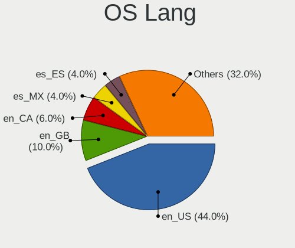
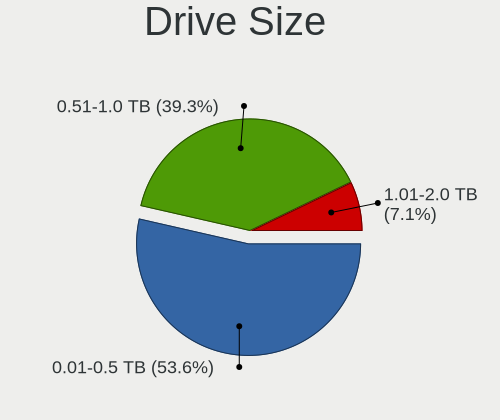
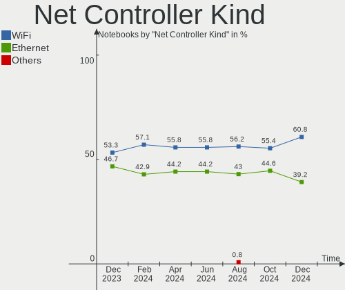

ArcoLinux Hardware Trends (Notebooks)
-------------------------------------

A project to identify most popular hardware characteristics and track their change
over time based on data collected by ArcoLinux users at https://Linux-Hardware.org.

Anyone can contribute to this report by the [hw-probe](https://github.com/linuxhw/hw-probe) tool:

    sudo -E hw-probe -all -upload

Full-feature report is available here: https://linux-hardware.org/?view=trends

Period: Jan, 2022.

Contents
--------

* [ System ](#system)
  - [ OS                       ](#os)
  - [ OS Family                ](#os-family)
  - [ Kernel                   ](#kernel)
  - [ Kernel Family            ](#kernel-family)
  - [ Kernel Major Ver.        ](#kernel-major-ver)
  - [ Arch                     ](#arch)
  - [ DE                       ](#de)
  - [ Display Server           ](#display-server)
  - [ Display Manager          ](#display-manager)
  - [ OS Lang                  ](#os-lang)
  - [ Boot Mode                ](#boot-mode)
  - [ Filesystem               ](#filesystem)
  - [ Part. scheme             ](#part-scheme)
  - [ Dual Boot with Linux/BSD ](#dual-boot-with-linuxbsd)
  - [ Dual Boot (Win)          ](#dual-boot-win)

* [ Board ](#board)
  - [ Vendor                   ](#vendor)
  - [ Model                    ](#model)
  - [ Model Family             ](#model-family)
  - [ MFG Year                 ](#mfg-year)
  - [ Form Factor              ](#form-factor)
  - [ Secure Boot              ](#secure-boot)
  - [ Coreboot                 ](#coreboot)
  - [ RAM Size                 ](#ram-size)
  - [ RAM Used                 ](#ram-used)
  - [ Total Drives             ](#total-drives)
  - [ Has CD-ROM               ](#has-cd-rom)
  - [ Has Ethernet             ](#has-ethernet)
  - [ Has WiFi                 ](#has-wifi)
  - [ Has Bluetooth            ](#has-bluetooth)

* [ Location ](#location)
  - [ Country                  ](#country)
  - [ City                     ](#city)

* [ Drives ](#drives)
  - [ Drive Vendor             ](#drive-vendor)
  - [ Drive Model              ](#drive-model)
  - [ HDD Vendor               ](#hdd-vendor)
  - [ SSD Vendor               ](#ssd-vendor)
  - [ Drive Kind               ](#drive-kind)
  - [ Drive Connector          ](#drive-connector)
  - [ Drive Size               ](#drive-size)
  - [ Space Total              ](#space-total)
  - [ Space Used               ](#space-used)
  - [ Malfunc. Drives          ](#malfunc-drives)
  - [ Malfunc. Drive Vendor    ](#malfunc-drive-vendor)
  - [ Malfunc. HDD Vendor      ](#malfunc-hdd-vendor)
  - [ Malfunc. Drive Kind      ](#malfunc-drive-kind)
  - [ Failed Drives            ](#failed-drives)
  - [ Failed Drive Vendor      ](#failed-drive-vendor)
  - [ Drive Status             ](#drive-status)

* [ Storage controller ](#storage-controller)
  - [ Storage Vendor           ](#storage-vendor)
  - [ Storage Model            ](#storage-model)
  - [ Storage Kind             ](#storage-kind)

* [ Processor ](#processor)
  - [ CPU Vendor               ](#cpu-vendor)
  - [ CPU Model                ](#cpu-model)
  - [ CPU Model Family         ](#cpu-model-family)
  - [ CPU Cores                ](#cpu-cores)
  - [ CPU Sockets              ](#cpu-sockets)
  - [ CPU Threads              ](#cpu-threads)
  - [ CPU Op-Modes             ](#cpu-op-modes)
  - [ CPU Microcode            ](#cpu-microcode)
  - [ CPU Microarch            ](#cpu-microarch)

* [ Graphics ](#graphics)
  - [ GPU Vendor               ](#gpu-vendor)
  - [ GPU Model                ](#gpu-model)
  - [ GPU Combo                ](#gpu-combo)
  - [ GPU Driver               ](#gpu-driver)
  - [ GPU Memory               ](#gpu-memory)

* [ Monitor ](#monitor)
  - [ Monitor Vendor           ](#monitor-vendor)
  - [ Monitor Model            ](#monitor-model)
  - [ Monitor Resolution       ](#monitor-resolution)
  - [ Monitor Diagonal         ](#monitor-diagonal)
  - [ Monitor Width            ](#monitor-width)
  - [ Aspect Ratio             ](#aspect-ratio)
  - [ Monitor Area             ](#monitor-area)
  - [ Pixel Density            ](#pixel-density)
  - [ Multiple Monitors        ](#multiple-monitors)

* [ Network ](#network)
  - [ Net Controller Vendor    ](#net-controller-vendor)
  - [ Net Controller Model     ](#net-controller-model)
  - [ Wireless Vendor          ](#wireless-vendor)
  - [ Wireless Model           ](#wireless-model)
  - [ Ethernet Vendor          ](#ethernet-vendor)
  - [ Ethernet Model           ](#ethernet-model)
  - [ Net Controller Kind      ](#net-controller-kind)
  - [ Used Controller          ](#used-controller)
  - [ NICs                     ](#nics)
  - [ IPv6                     ](#ipv6)

* [ Bluetooth ](#bluetooth)
  - [ Bluetooth Vendor         ](#bluetooth-vendor)
  - [ Bluetooth Model          ](#bluetooth-model)

* [ Sound ](#sound)
  - [ Sound Vendor             ](#sound-vendor)
  - [ Sound Model              ](#sound-model)

* [ Memory ](#memory)
  - [ Memory Vendor            ](#memory-vendor)
  - [ Memory Model             ](#memory-model)
  - [ Memory Kind              ](#memory-kind)
  - [ Memory Form Factor       ](#memory-form-factor)
  - [ Memory Size              ](#memory-size)
  - [ Memory Speed             ](#memory-speed)

* [ Printers & scanners ](#printers--scanners)
  - [ Printer Vendor           ](#printer-vendor)
  - [ Printer Model            ](#printer-model)
  - [ Scanner Vendor           ](#scanner-vendor)
  - [ Scanner Model            ](#scanner-model)

* [ Camera ](#camera)
  - [ Camera Vendor            ](#camera-vendor)
  - [ Camera Model             ](#camera-model)

* [ Security ](#security)
  - [ Fingerprint Vendor       ](#fingerprint-vendor)
  - [ Fingerprint Model        ](#fingerprint-model)
  - [ Chipcard Vendor          ](#chipcard-vendor)
  - [ Chipcard Model           ](#chipcard-model)

* [ Unsupported ](#unsupported)
  - [ Unsupported Devices      ](#unsupported-devices)
  - [ Unsupported Device Types ](#unsupported-device-types)

System
------

OS
--

Installed operating systems

| Name              | Notebooks | Percent |
|-------------------|-----------|---------|
| ArcoLinux Rolling | 34        | 91.89%  |
| ArcoLinux         | 3         | 8.11%   |

OS Family
---------

OS without a version

| Name      | Notebooks | Percent |
|-----------|-----------|---------|
| ArcoLinux | 37        | 100%    |

Kernel
------

Version of the Linux kernel

| Version              | Notebooks | Percent |
|----------------------|-----------|---------|
| 5.15.13-arch1-1      | 7         | 18.92%  |
| 5.15.10-arch1-1      | 6         | 16.22%  |
| 5.16.2-arch1-1       | 5         | 13.51%  |
| 5.15.15-1-lts        | 3         | 8.11%   |
| 5.15.12-arch1-1      | 3         | 8.11%   |
| 5.10.88-2-lts        | 3         | 8.11%   |
| 5.15.16-1-lts        | 2         | 5.41%   |
| 5.14.14-arch1-1      | 2         | 5.41%   |
| 5.16.4-arch1-1       | 1         | 2.7%    |
| 5.16.2-zen1-1-zen    | 1         | 2.7%    |
| 5.16.2-prexan0-rog-1 | 1         | 2.7%    |
| 5.16.0-arch1-1       | 1         | 2.7%    |
| 5.15.14-1-lts        | 1         | 2.7%    |
| 5.10.85-1-lts        | 1         | 2.7%    |

Kernel Family
-------------

Linux kernel without a distro release

| Version | Notebooks | Percent |
|---------|-----------|---------|
| 5.16.2  | 7         | 18.92%  |
| 5.15.13 | 7         | 18.92%  |
| 5.15.10 | 6         | 16.22%  |
| 5.15.15 | 3         | 8.11%   |
| 5.15.12 | 3         | 8.11%   |
| 5.10.88 | 3         | 8.11%   |
| 5.15.16 | 2         | 5.41%   |
| 5.14.14 | 2         | 5.41%   |
| 5.16.4  | 1         | 2.7%    |
| 5.16.0  | 1         | 2.7%    |
| 5.15.14 | 1         | 2.7%    |
| 5.10.85 | 1         | 2.7%    |

Kernel Major Ver.
-----------------

Linux kernel major version

| Version | Notebooks | Percent |
|---------|-----------|---------|
| 5.15    | 22        | 59.46%  |
| 5.16    | 9         | 24.32%  |
| 5.10    | 4         | 10.81%  |
| 5.14    | 2         | 5.41%   |

Arch
----

OS architecture (x86_64, i586, etc.)

| Name   | Notebooks | Percent |
|--------|-----------|---------|
| x86_64 | 37        | 100%    |

DE
--

Desktop Environment

| Name           | Notebooks | Percent |
|----------------|-----------|---------|
| XFCE           | 10        | 27.03%  |
| KDE5           | 9         | 24.32%  |
| X-Cinnamon     | 2         | 5.41%   |
| LeftWM         | 2         | 5.41%   |
| i3             | 2         | 5.41%   |
| Budgie         | 2         | 5.41%   |
| bspwm          | 2         | 5.41%   |
| xmonad         | 1         | 2.7%    |
| spectrwm       | 1         | 2.7%    |
| jwm            | 1         | 2.7%    |
| i3-with-shmlog | 1         | 2.7%    |
| GNOME          | 1         | 2.7%    |
| dwm            | 1         | 2.7%    |
| cwm            | 1         | 2.7%    |
| Cutefish       | 1         | 2.7%    |

Display Server
--------------

X11 or Wayland

| Name | Notebooks | Percent |
|------|-----------|---------|
| X11  | 34        | 91.89%  |
| Tty  | 3         | 8.11%   |

Display Manager
---------------

SDDM, LightDM, etc.

| Name    | Notebooks | Percent |
|---------|-----------|---------|
| SDDM    | 25        | 67.57%  |
| LightDM | 8         | 21.62%  |
| Unknown | 3         | 8.11%   |
| GDM     | 1         | 2.7%    |

OS Lang
-------

Language

| Lang  | Notebooks | Percent |
|-------|-----------|---------|
| en_US | 26        | 70.27%  |
| en_IN | 2         | 5.41%   |
| en_CA | 2         | 5.41%   |
| pl_PL | 1         | 2.7%    |
| nl_NL | 1         | 2.7%    |
| es_AR | 1         | 2.7%    |
| en_NZ | 1         | 2.7%    |
| en_GB | 1         | 2.7%    |
| en_AU | 1         | 2.7%    |
| de_DE | 1         | 2.7%    |

Boot Mode
---------

EFI or BIOS

| Mode | Notebooks | Percent |
|------|-----------|---------|
| EFI  | 22        | 59.46%  |
| BIOS | 15        | 40.54%  |

Filesystem
----------

Type of filesystem

| Type    | Notebooks | Percent |
|---------|-----------|---------|
| Ext4    | 27        | 72.97%  |
| Overlay | 5         | 13.51%  |
| Btrfs   | 5         | 13.51%  |

Part. scheme
------------

Scheme of partitioning

| Type    | Notebooks | Percent |
|---------|-----------|---------|
| GPT     | 24        | 64.86%  |
| MBR     | 10        | 27.03%  |
| Unknown | 3         | 8.11%   |

Dual Boot with Linux/BSD
------------------------

Hosting more than one Linux/BSD

| Dual boot | Notebooks | Percent |
|-----------|-----------|---------|
| No        | 30        | 81.08%  |
| Yes       | 7         | 18.92%  |

Dual Boot (Win)
---------------

Hosting Linux and Windows

| Dual boot | Notebooks | Percent |
|-----------|-----------|---------|
| No        | 26        | 70.27%  |
| Yes       | 11        | 29.73%  |

Board
-----

Vendor
------

Motherboard manufacturer

| Name                | Notebooks | Percent |
|---------------------|-----------|---------|
| Lenovo              | 12        | 32.43%  |
| Dell                | 7         | 18.92%  |
| ASUSTek Computer    | 5         | 13.51%  |
| Hewlett-Packard     | 4         | 10.81%  |
| Toshiba             | 1         | 2.7%    |
| Standard            | 1         | 2.7%    |
| Sony                | 1         | 2.7%    |
| Samsung Electronics | 1         | 2.7%    |
| Monster             | 1         | 2.7%    |
| HUAWEI              | 1         | 2.7%    |
| Fujitsu             | 1         | 2.7%    |
| Casper              | 1         | 2.7%    |
| Acer                | 1         | 2.7%    |

Model
-----

Motherboard model

| Name                                   | Notebooks | Percent |
|----------------------------------------|-----------|---------|
| Toshiba Satellite L640                 | 1         | 2.7%    |
| Standard MB50II                        | 1         | 2.7%    |
| Sony VPCEB2B4E                         | 1         | 2.7%    |
| Samsung 350V5C/351V5C/3540VC/3440VC    | 1         | 2.7%    |
| Monster ABRA A5 V11.1                  | 1         | 2.7%    |
| Lenovo Yoga Slim 7 Pro 14ACH5 O 82N5   | 1         | 2.7%    |
| Lenovo ThinkPad X1 Extreme 20MF000SGE  | 1         | 2.7%    |
| Lenovo ThinkPad T540p 20BE0086MS       | 1         | 2.7%    |
| Lenovo ThinkPad T440s 20ARS06C00       | 1         | 2.7%    |
| Lenovo ThinkPad T420 4180DY4           | 1         | 2.7%    |
| Lenovo ThinkPad T420 4180AJ3           | 1         | 2.7%    |
| Lenovo ThinkPad T14s Gen 1 20T0002JUS  | 1         | 2.7%    |
| Lenovo ThinkPad P51 20HJS2JJ01         | 1         | 2.7%    |
| Lenovo ThinkPad L460 20FVS0QQ00        | 1         | 2.7%    |
| Lenovo ThinkPad E580 20KS005ASC        | 1         | 2.7%    |
| Lenovo IdeaPad Yoga 13 20175           | 1         | 2.7%    |
| Lenovo IdeaPad Y580                    | 1         | 2.7%    |
| HUAWEI KLVL-WXX9                       | 1         | 2.7%    |
| HP ProBook 450 G2                      | 1         | 2.7%    |
| HP ProBook 450 G1                      | 1         | 2.7%    |
| HP Pavilion Gaming Laptop 15-ec0xxx    | 1         | 2.7%    |
| HP 250 G7 Notebook PC                  | 1         | 2.7%    |
| Fujitsu LIFEBOOK S751                  | 1         | 2.7%    |
| Dell XPS 17 9710                       | 1         | 2.7%    |
| Dell XPS 15 9500                       | 1         | 2.7%    |
| Dell XPS 13 7390                       | 1         | 2.7%    |
| Dell Latitude E6510                    | 1         | 2.7%    |
| Dell Latitude E5430 non-vPro           | 1         | 2.7%    |
| Dell Latitude 7480                     | 1         | 2.7%    |
| Dell Inspiron 15 7000 Gaming           | 1         | 2.7%    |
| Casper EXCALIBUR G860                  | 1         | 2.7%    |
| ASUS X580VD                            | 1         | 2.7%    |
| ASUS VivoBook_ASUSLaptop X512FL_X512FL | 1         | 2.7%    |
| ASUS ROG Zephyrus G15 GA503QM_GA503QM  | 1         | 2.7%    |
| ASUS K53E                              | 1         | 2.7%    |
| ASUS 1001PX                            | 1         | 2.7%    |
| Acer Aspire A315-21                    | 1         | 2.7%    |

Model Family
------------

Motherboard model prefix

| Name              | Notebooks | Percent |
|-------------------|-----------|---------|
| Lenovo ThinkPad   | 9         | 24.32%  |
| Dell XPS          | 3         | 8.11%   |
| Dell Latitude     | 3         | 8.11%   |
| Lenovo IdeaPad    | 2         | 5.41%   |
| HP ProBook        | 2         | 5.41%   |
| Toshiba Satellite | 1         | 2.7%    |
| Standard MB50II   | 1         | 2.7%    |
| Sony VPCEB2B4E    | 1         | 2.7%    |
| Samsung 350V5C    | 1         | 2.7%    |
| Monster ABRA      | 1         | 2.7%    |
| Lenovo Yoga       | 1         | 2.7%    |
| HUAWEI KLVL-WXX9  | 1         | 2.7%    |
| HP Pavilion       | 1         | 2.7%    |
| HP 250            | 1         | 2.7%    |
| Fujitsu LIFEBOOK  | 1         | 2.7%    |
| Dell Inspiron     | 1         | 2.7%    |
| Casper EXCALIBUR  | 1         | 2.7%    |
| ASUS X580VD       | 1         | 2.7%    |
| ASUS VivoBook     | 1         | 2.7%    |
| ASUS ROG          | 1         | 2.7%    |
| ASUS K53E         | 1         | 2.7%    |
| ASUS 1001PX       | 1         | 2.7%    |
| Acer Aspire       | 1         | 2.7%    |

MFG Year
--------

Motherboard manufacture year

| Year | Notebooks | Percent |
|------|-----------|---------|
| 2017 | 6         | 16.22%  |
| 2011 | 6         | 16.22%  |
| 2018 | 4         | 10.81%  |
| 2021 | 3         | 8.11%   |
| 2020 | 3         | 8.11%   |
| 2019 | 3         | 8.11%   |
| 2013 | 3         | 8.11%   |
| 2012 | 3         | 8.11%   |
| 2010 | 3         | 8.11%   |
| 2014 | 2         | 5.41%   |
| 2016 | 1         | 2.7%    |

Form Factor
-----------

Physical design of the computer

| Name     | Notebooks | Percent |
|----------|-----------|---------|
| Notebook | 37        | 100%    |

Secure Boot
-----------

Enabled or disabled

| State    | Notebooks | Percent |
|----------|-----------|---------|
| Disabled | 37        | 100%    |

Coreboot
--------

Have coreboot on board

| Used | Notebooks | Percent |
|------|-----------|---------|
| No   | 37        | 100%    |

RAM Size
--------

Total RAM memory

| Size in GB  | Notebooks | Percent |
|-------------|-----------|---------|
| 4.01-8.0    | 14        | 37.84%  |
| 8.01-16.0   | 9         | 24.32%  |
| 16.01-24.0  | 8         | 21.62%  |
| 32.01-64.0  | 2         | 5.41%   |
| 3.01-4.0    | 2         | 5.41%   |
| 64.01-256.0 | 1         | 2.7%    |
| 1.01-2.0    | 1         | 2.7%    |

RAM Used
--------

Used RAM memory

| Used GB   | Notebooks | Percent |
|-----------|-----------|---------|
| 1.01-2.0  | 11        | 29.73%  |
| 2.01-3.0  | 8         | 21.62%  |
| 3.01-4.0  | 7         | 18.92%  |
| 0.51-1.0  | 5         | 13.51%  |
| 4.01-8.0  | 3         | 8.11%   |
| 0.01-0.5  | 2         | 5.41%   |
| 8.01-16.0 | 1         | 2.7%    |

Total Drives
------------

Number of drives on board

| Drives | Notebooks | Percent |
|--------|-----------|---------|
| 1      | 19        | 51.35%  |
| 2      | 16        | 43.24%  |
| 4      | 1         | 2.7%    |
| 3      | 1         | 2.7%    |

Has CD-ROM
----------

Has CD-ROM on board

| Presented | Notebooks | Percent |
|-----------|-----------|---------|
| No        | 27        | 72.97%  |
| Yes       | 10        | 27.03%  |

Has Ethernet
------------

Has Ethernet on board

| Presented | Notebooks | Percent |
|-----------|-----------|---------|
| Yes       | 32        | 86.49%  |
| No        | 5         | 13.51%  |

Has WiFi
--------

Has WiFi module

| Presented | Notebooks | Percent |
|-----------|-----------|---------|
| Yes       | 36        | 97.3%   |
| No        | 1         | 2.7%    |

Has Bluetooth
-------------

Has Bluetooth module

| Presented | Notebooks | Percent |
|-----------|-----------|---------|
| Yes       | 28        | 75.68%  |
| No        | 9         | 24.32%  |

Location
--------

Country
-------

Geographic location (country)

| Country     | Notebooks | Percent |
|-------------|-----------|---------|
| Germany     | 5         | 13.51%  |
| USA         | 4         | 10.81%  |
| Italy       | 3         | 8.11%   |
| Turkey      | 2         | 5.41%   |
| Sweden      | 2         | 5.41%   |
| India       | 2         | 5.41%   |
| Canada      | 2         | 5.41%   |
| Argentina   | 2         | 5.41%   |
| UK          | 1         | 2.7%    |
| Serbia      | 1         | 2.7%    |
| Romania     | 1         | 2.7%    |
| Poland      | 1         | 2.7%    |
| Norway      | 1         | 2.7%    |
| New Zealand | 1         | 2.7%    |
| Netherlands | 1         | 2.7%    |
| Lithuania   | 1         | 2.7%    |
| Hungary     | 1         | 2.7%    |
| Honduras    | 1         | 2.7%    |
| France      | 1         | 2.7%    |
| Egypt       | 1         | 2.7%    |
| Croatia     | 1         | 2.7%    |
| Belgium     | 1         | 2.7%    |
| Australia   | 1         | 2.7%    |

City
----

Geographic location (city)

| City             | Notebooks | Percent |
|------------------|-----------|---------|
| Ankara           | 2         | 5.41%   |
| Akersberga       | 2         | 5.41%   |
| Zagreb           | 1         | 2.7%    |
| Wiesbaden        | 1         | 2.7%    |
| Vilnius          | 1         | 2.7%    |
| Villa Ballester  | 1         | 2.7%    |
| Trieste          | 1         | 2.7%    |
| Templin          | 1         | 2.7%    |
| Stuttgart        | 1         | 2.7%    |
| Sioux Falls      | 1         | 2.7%    |
| Schwarzenberg    | 1         | 2.7%    |
| San Pedro Sula   | 1         | 2.7%    |
| Saetre           | 1         | 2.7%    |
| Quakers Hill     | 1         | 2.7%    |
| Pickering        | 1         | 2.7%    |
| Palmerston North | 1         | 2.7%    |
| Ozimek           | 1         | 2.7%    |
| Orlando          | 1         | 2.7%    |
| Noida            | 1         | 2.7%    |
| Muzaffarpur      | 1         | 2.7%    |
| Maidstone        | 1         | 2.7%    |
| Lokeren          | 1         | 2.7%    |
| Leipzig          | 1         | 2.7%    |
| Houston          | 1         | 2.7%    |
| Hammond          | 1         | 2.7%    |
| Guelph           | 1         | 2.7%    |
| C??rdoba         | 1         | 2.7%    |
| Cameri           | 1         | 2.7%    |
| Cairo            | 1         | 2.7%    |
| Budapest         | 1         | 2.7%    |
| Bucharest        | 1         | 2.7%    |
| Bordeaux         | 1         | 2.7%    |
| Biella           | 1         | 2.7%    |
| Belgrade         | 1         | 2.7%    |
| Amstelveen       | 1         | 2.7%    |

Drives
------

Drive Vendor
------------

Hard drive vendors

| Vendor              | Notebooks | Drives | Percent |
|---------------------|-----------|--------|---------|
| Samsung Electronics | 11        | 11     | 20.37%  |
| WDC                 | 6         | 7      | 11.11%  |
| Seagate             | 6         | 7      | 11.11%  |
| SK Hynix            | 5         | 5      | 9.26%   |
| Toshiba             | 4         | 4      | 7.41%   |
| Sandisk             | 4         | 4      | 7.41%   |
| Crucial             | 3         | 3      | 5.56%   |
| Unknown             | 2         | 2      | 3.7%    |
| Kingston            | 2         | 2      | 3.7%    |
| JMicron             | 2         | 2      | 3.7%    |
| PLEXTOR             | 1         | 1      | 1.85%   |
| Phison              | 1         | 1      | 1.85%   |
| Mushkin             | 1         | 1      | 1.85%   |
| Micron Technology   | 1         | 1      | 1.85%   |
| Lenovo              | 1         | 1      | 1.85%   |
| KingFast            | 1         | 1      | 1.85%   |
| Intel               | 1         | 1      | 1.85%   |
| Hitachi             | 1         | 1      | 1.85%   |
| HGST                | 1         | 1      | 1.85%   |

Drive Model
-----------

Hard drive models

| Model                                 | Notebooks | Percent |
|---------------------------------------|-----------|---------|
| JMicron Generic 128GB                 | 2         | 3.57%   |
| WDC WDS100T2B0A-00SM50 1TB SSD        | 1         | 1.79%   |
| WDC WD6400BEVT-60A0RT0 640GB          | 1         | 1.79%   |
| WDC WD10SPZX-22Z10T0 1TB              | 1         | 1.79%   |
| WDC WD10SPZX-21Z10T0 1TB              | 1         | 1.79%   |
| WDC WD10SPZX-08Z10 1TB                | 1         | 1.79%   |
| WDC WD10SPSX-60A6WT0 1TB              | 1         | 1.79%   |
| WDC PC SN730 SDBPNTY-256G-1006 256GB  | 1         | 1.79%   |
| Unknown SU02G  2GB                    | 1         | 1.79%   |
| Unknown NVMe SSD Drive 1024GB         | 1         | 1.79%   |
| Toshiba RC500 250GB                   | 1         | 1.79%   |
| Toshiba MQ04ABF100 1TB                | 1         | 1.79%   |
| Toshiba MK7575GSX 752GB               | 1         | 1.79%   |
| Toshiba MK5065GSX 500GB               | 1         | 1.79%   |
| SK Hynix SKHynix_HFS001TDE9X084N 1TB  | 1         | 1.79%   |
| SK Hynix SC311 SATA 256GB SSD         | 1         | 1.79%   |
| SK Hynix PC611 NVMe 512GB             | 1         | 1.79%   |
| SK Hynix HFS128G39TND-N210A 128GB SSD | 1         | 1.79%   |
| SK Hynix HFM512GD3JX013N 512GB        | 1         | 1.79%   |
| Seagate ST9750420AS 752GB             | 1         | 1.79%   |
| Seagate ST975042 0AS 752GB            | 1         | 1.79%   |
| Seagate ST9250315AS 250GB             | 1         | 1.79%   |
| Seagate ST500LT012-1DG142 500GB       | 1         | 1.79%   |
| Seagate ST500LM012 HN-M500MBB 500GB   | 1         | 1.79%   |
| Seagate ST1000LM035-1RK172 1TB        | 1         | 1.79%   |
| Seagate Expansion Desk 8TB            | 1         | 1.79%   |
| SanDisk X400 M.2 2280 512GB SSD       | 1         | 1.79%   |
| SanDisk SDSSDP128G 128GB              | 1         | 1.79%   |
| Sandisk NVMe SSD Drive 1TB            | 1         | 1.79%   |
| SanDisk Extreme 55AE 1TB SSD          | 1         | 1.79%   |
| Samsung SSD PM871b 2.5 7mm 256GB      | 1         | 1.79%   |
| Samsung SSD 860 EVO 500GB             | 1         | 1.79%   |
| Samsung SSD 860 EVO 250GB             | 1         | 1.79%   |
| Samsung SSD 850 EVO 500GB             | 1         | 1.79%   |
| Samsung SSD 840 EVO 250GB             | 1         | 1.79%   |
| Samsung NVMe SSD Drive 512GB          | 1         | 1.79%   |
| Samsung MZVLB512HBJQ-000L7 512GB      | 1         | 1.79%   |
| Samsung MZVLB512HAJQ-000L7 512GB      | 1         | 1.79%   |
| Samsung MZNTY128HDHP-000L1 128GB SSD  | 1         | 1.79%   |
| Samsung MZMPC128HBFU-000L1 128GB SSD  | 1         | 1.79%   |
| Samsung MZ7TE128HMGR-00004 128GB SSD  | 1         | 1.79%   |
| PLEXTOR PX-256M6M 256GB SSD           | 1         | 1.79%   |
| Phison 311CD0512GB                    | 1         | 1.79%   |
| Mushkin MKNSSDSR1TB-D8                | 1         | 1.79%   |
| Micron 1100_MTFDDAV256TBN 256GB SSD   | 1         | 1.79%   |
| Lenovo LENSE30256GMSP34MEAT3TA 256GB  | 1         | 1.79%   |
| Kingston SA400S37120G 120GB SSD       | 1         | 1.79%   |
| Kingston RBUSNS8154P3256GJ3 256GB     | 1         | 1.79%   |
| KingFast SSD 240GB                    | 1         | 1.79%   |
| Intel SSDSA2M160G2GC 160GB            | 1         | 1.79%   |
| Hitachi HTS547575A9E384 752GB         | 1         | 1.79%   |
| HGST HTS541010A9E680 1TB              | 1         | 1.79%   |
| Crucial CT500P5SSD8 500GB             | 1         | 1.79%   |
| Crucial CT480BX500SSD1 480GB          | 1         | 1.79%   |
| Crucial CT240BX500SSD1 240GB          | 1         | 1.79%   |

HDD Vendor
----------

Hard disk drive vendors

| Vendor  | Notebooks | Drives | Percent |
|---------|-----------|--------|---------|
| Seagate | 6         | 7      | 37.5%   |
| WDC     | 5         | 5      | 31.25%  |
| Toshiba | 3         | 3      | 18.75%  |
| Hitachi | 1         | 1      | 6.25%   |
| HGST    | 1         | 1      | 6.25%   |

SSD Vendor
----------

Solid state drive vendors

| Vendor              | Notebooks | Drives | Percent |
|---------------------|-----------|--------|---------|
| Samsung Electronics | 8         | 8      | 36.36%  |
| SanDisk             | 3         | 3      | 13.64%  |
| SK Hynix            | 2         | 2      | 9.09%   |
| Crucial             | 2         | 2      | 9.09%   |
| WDC                 | 1         | 1      | 4.55%   |
| PLEXTOR             | 1         | 1      | 4.55%   |
| Mushkin             | 1         | 1      | 4.55%   |
| Micron Technology   | 1         | 1      | 4.55%   |
| Kingston            | 1         | 1      | 4.55%   |
| KingFast            | 1         | 1      | 4.55%   |
| Intel               | 1         | 1      | 4.55%   |

Drive Kind
----------

HDD or SSD

| Kind | Notebooks | Drives | Percent |
|------|-----------|--------|---------|
| SSD  | 20        | 22     | 39.22%  |
| HDD  | 16        | 17     | 31.37%  |
| NVMe | 14        | 16     | 27.45%  |
| MMC  | 1         | 1      | 1.96%   |

Drive Connector
---------------

SATA, SAS, NVMe, etc.

| Type | Notebooks | Drives | Percent |
|------|-----------|--------|---------|
| SATA | 28        | 35     | 62.22%  |
| NVMe | 12        | 14     | 26.67%  |
| SAS  | 4         | 6      | 8.89%   |
| MMC  | 1         | 1      | 2.22%   |

Drive Size
----------

Size of hard drive

| Size in TB | Notebooks | Drives | Percent |
|------------|-----------|--------|---------|
| 0.01-0.5   | 21        | 22     | 58.33%  |
| 0.51-1.0   | 14        | 16     | 38.89%  |
| 4.01-10.0  | 1         | 1      | 2.78%   |

Space Total
-----------

Amount of disk space available on the file system

| Size in GB     | Notebooks | Percent |
|----------------|-----------|---------|
| 251-500        | 11        | 29.73%  |
| 501-1000       | 7         | 18.92%  |
| 1001-2000      | 4         | 10.81%  |
| 1-20           | 4         | 10.81%  |
| Unknown        | 4         | 10.81%  |
| 21-50          | 2         | 5.41%   |
| 101-250        | 2         | 5.41%   |
| 51-100         | 2         | 5.41%   |
| More than 3000 | 1         | 2.7%    |

Space Used
----------

Amount of used disk space

| Used GB   | Notebooks | Percent |
|-----------|-----------|---------|
| 1-20      | 11        | 29.73%  |
| 101-250   | 7         | 18.92%  |
| 21-50     | 5         | 13.51%  |
| 251-500   | 4         | 10.81%  |
| Unknown   | 4         | 10.81%  |
| 51-100    | 3         | 8.11%   |
| 501-1000  | 2         | 5.41%   |
| 1001-2000 | 1         | 2.7%    |

Malfunc. Drives
---------------

Drive models with a malfunction

| Model                         | Notebooks | Drives | Percent |
|-------------------------------|-----------|--------|---------|
| WDC WD6400BEVT-60A0RT0 640GB  | 1         | 1      | 16.67%  |
| Toshiba MK5065GSX 500GB       | 1         | 1      | 16.67%  |
| Seagate ST9250315AS 250GB     | 1         | 1      | 16.67%  |
| Intel SSDSA2M160G2GC 160GB    | 1         | 1      | 16.67%  |
| Hitachi HTS547575A9E384 752GB | 1         | 1      | 16.67%  |
| HGST HTS541010A9E680 1TB      | 1         | 1      | 16.67%  |

Malfunc. Drive Vendor
---------------------

Vendors of faulty drives

| Vendor  | Notebooks | Drives | Percent |
|---------|-----------|--------|---------|
| WDC     | 1         | 1      | 16.67%  |
| Toshiba | 1         | 1      | 16.67%  |
| Seagate | 1         | 1      | 16.67%  |
| Intel   | 1         | 1      | 16.67%  |
| Hitachi | 1         | 1      | 16.67%  |
| HGST    | 1         | 1      | 16.67%  |

Malfunc. HDD Vendor
-------------------

Vendors of faulty HDD drives

| Vendor  | Notebooks | Drives | Percent |
|---------|-----------|--------|---------|
| WDC     | 1         | 1      | 20%     |
| Toshiba | 1         | 1      | 20%     |
| Seagate | 1         | 1      | 20%     |
| Hitachi | 1         | 1      | 20%     |
| HGST    | 1         | 1      | 20%     |

Malfunc. Drive Kind
-------------------

Kinds of faulty drives

| Kind | Notebooks | Drives | Percent |
|------|-----------|--------|---------|
| HDD  | 5         | 5      | 83.33%  |
| SSD  | 1         | 1      | 16.67%  |

Failed Drives
-------------

Failed drive models

Zero info for selected period =(

Failed Drive Vendor
-------------------

Failed drive vendors

Zero info for selected period =(

Drive Status
------------

Number of failed and malfunc. drives

| Status   | Notebooks | Drives | Percent |
|----------|-----------|--------|---------|
| Works    | 30        | 41     | 73.17%  |
| Detected | 6         | 9      | 14.63%  |
| Malfunc  | 5         | 6      | 12.2%   |

Storage controller
------------------

Storage Vendor
--------------

Storage controller vendors

| Vendor                      | Notebooks | Percent |
|-----------------------------|-----------|---------|
| Intel                       | 27        | 62.79%  |
| SK Hynix                    | 3         | 6.98%   |
| Samsung Electronics         | 3         | 6.98%   |
| Sandisk                     | 2         | 4.65%   |
| AMD                         | 2         | 4.65%   |
| Unknown                     | 1         | 2.33%   |
| Phison Electronics          | 1         | 2.33%   |
| Micron/Crucial Technology   | 1         | 2.33%   |
| Lenovo                      | 1         | 2.33%   |
| KIOXIA                      | 1         | 2.33%   |
| Kingston Technology Company | 1         | 2.33%   |

Storage Model
-------------

Storage controller models

| Model                                                                          | Notebooks | Percent |
|--------------------------------------------------------------------------------|-----------|---------|
| Intel 6 Series/C200 Series Chipset Family 6 port Mobile SATA AHCI Controller   | 5         | 11.63%  |
| Intel HM170/QM170 Chipset SATA Controller [AHCI Mode]                          | 4         | 9.3%    |
| Samsung NVMe SSD Controller SM981/PM981/PM983                                  | 3         | 6.98%   |
| Intel Sunrise Point-LP SATA Controller [AHCI mode]                             | 3         | 6.98%   |
| Intel 7 Series Chipset Family 6-port SATA Controller [AHCI mode]               | 3         | 6.98%   |
| SK Hynix Gold P31 SSD                                                          | 2         | 4.65%   |
| Intel 82801 Mobile SATA Controller [RAID mode]                                 | 2         | 4.65%   |
| Intel 8 Series/C220 Series Chipset Family 6-port SATA Controller 1 [AHCI mode] | 2         | 4.65%   |
| Intel 5 Series/3400 Series Chipset 4 port SATA AHCI Controller                 | 2         | 4.65%   |
| AMD FCH SATA Controller [AHCI mode]                                            | 2         | 4.65%   |
| Unknown Non-Volatile memory controller                                         | 1         | 2.33%   |
| SK Hynix Non-Volatile memory controller                                        | 1         | 2.33%   |
| Sandisk WD PC SN810 / Black SN850 NVMe SSD                                     | 1         | 2.33%   |
| Sandisk WD Black SN750 / PC SN730 NVMe SSD                                     | 1         | 2.33%   |
| Phison PS5013 E13 NVMe Controller                                              | 1         | 2.33%   |
| Micron/Crucial Non-Volatile memory controller                                  | 1         | 2.33%   |
| Lenovo Non-Volatile memory controller                                          | 1         | 2.33%   |
| KIOXIA NVMe SSD                                                                | 1         | 2.33%   |
| Kingston Company U-SNS8154P3 NVMe SSD                                          | 1         | 2.33%   |
| Intel Wildcat Point-LP SATA Controller [AHCI Mode]                             | 1         | 2.33%   |
| Intel NM10/ICH7 Family SATA Controller [AHCI mode]                             | 1         | 2.33%   |
| Intel Comet Lake PCH-H RAID                                                    | 1         | 2.33%   |
| Intel Cannon Point-LP SATA Controller [AHCI Mode]                              | 1         | 2.33%   |
| Intel 8 Series SATA Controller 1 [AHCI mode]                                   | 1         | 2.33%   |
| Intel 5 Series/3400 Series Chipset 6 port SATA AHCI Controller                 | 1         | 2.33%   |

Storage Kind
------------

Kind of storage controller (IDE, SATA, NVMe, SAS, ...)

| Kind | Notebooks | Percent |
|------|-----------|---------|
| SATA | 26        | 63.41%  |
| NVMe | 12        | 29.27%  |
| RAID | 3         | 7.32%   |

Processor
---------

CPU Vendor
----------

Processor vendors

| Vendor | Notebooks | Percent |
|--------|-----------|---------|
| Intel  | 32        | 86.49%  |
| AMD    | 5         | 13.51%  |

CPU Model
---------

Processor models

| Model                                         | Notebooks | Percent |
|-----------------------------------------------|-----------|---------|
| Intel Core i7-7700HQ CPU @ 2.80GHz            | 3         | 8.11%   |
| Intel Core i5-2520M CPU @ 2.50GHz             | 3         | 8.11%   |
| Intel Core i7-10510U CPU @ 1.80GHz            | 2         | 5.41%   |
| Intel Core i5-2410M CPU @ 2.30GHz             | 2         | 5.41%   |
| Intel Pentium CPU B970 @ 2.30GHz              | 1         | 2.7%    |
| Intel Core i7-8550U CPU @ 1.80GHz             | 1         | 2.7%    |
| Intel Core i7-7820HQ CPU @ 2.90GHz            | 1         | 2.7%    |
| Intel Core i7-7600U CPU @ 2.80GHz             | 1         | 2.7%    |
| Intel Core i7-4702MQ CPU @ 2.20GHz            | 1         | 2.7%    |
| Intel Core i7-4700MQ CPU @ 2.40GHz            | 1         | 2.7%    |
| Intel Core i7-4600U CPU @ 2.10GHz             | 1         | 2.7%    |
| Intel Core i7-3610QM CPU @ 2.30GHz            | 1         | 2.7%    |
| Intel Core i7-10750H CPU @ 2.60GHz            | 1         | 2.7%    |
| Intel Core i5-8300H CPU @ 2.30GHz             | 1         | 2.7%    |
| Intel Core i5-8265U CPU @ 1.60GHz             | 1         | 2.7%    |
| Intel Core i5-7300HQ CPU @ 2.50GHz            | 1         | 2.7%    |
| Intel Core i5-6300U CPU @ 2.40GHz             | 1         | 2.7%    |
| Intel Core i5-3317U CPU @ 1.70GHz             | 1         | 2.7%    |
| Intel Core i5-3210M CPU @ 2.50GHz             | 1         | 2.7%    |
| Intel Core i5-1035G1 CPU @ 1.00GHz            | 1         | 2.7%    |
| Intel Core i5 CPU M 540 @ 2.53GHz             | 1         | 2.7%    |
| Intel Core i5 CPU M 480 @ 2.67GHz             | 1         | 2.7%    |
| Intel Core i5 CPU M 450 @ 2.40GHz             | 1         | 2.7%    |
| Intel Core i3-5010U CPU @ 2.10GHz             | 1         | 2.7%    |
| Intel Atom CPU N450 @ 1.66GHz                 | 1         | 2.7%    |
| Intel 11th Gen Core i9-11900H @ 2.50GHz       | 1         | 2.7%    |
| AMD Ryzen 7 5800HS with Radeon Graphics       | 1         | 2.7%    |
| AMD Ryzen 7 5800H with Radeon Graphics        | 1         | 2.7%    |
| AMD Ryzen 7 4800H with Radeon Graphics        | 1         | 2.7%    |
| AMD Ryzen 5 3550H with Radeon Vega Mobile Gfx | 1         | 2.7%    |
| AMD A6-9220e RADEON R4, 5 COMPUTE CORES 2C+3G | 1         | 2.7%    |

CPU Model Family
----------------

Processor model prefix

| Model         | Notebooks | Percent |
|---------------|-----------|---------|
| Intel Core i5 | 15        | 40.54%  |
| Intel Core i7 | 13        | 35.14%  |
| AMD Ryzen 7   | 3         | 8.11%   |
| Other         | 1         | 2.7%    |
| Intel Pentium | 1         | 2.7%    |
| Intel Core i3 | 1         | 2.7%    |
| Intel Atom    | 1         | 2.7%    |
| AMD Ryzen 5   | 1         | 2.7%    |
| AMD A6        | 1         | 2.7%    |

CPU Cores
---------

Number of processor cores

| Number | Notebooks | Percent |
|--------|-----------|---------|
| 2      | 16        | 43.24%  |
| 4      | 15        | 40.54%  |
| 8      | 4         | 10.81%  |
| 6      | 1         | 2.7%    |
| 1      | 1         | 2.7%    |

CPU Sockets
-----------

Number of sockets

| Number | Notebooks | Percent |
|--------|-----------|---------|
| 1      | 37        | 100%    |

CPU Threads
-----------

Threads per core (Hyper-Threading)

| Number | Notebooks | Percent |
|--------|-----------|---------|
| 2      | 34        | 91.89%  |
| 1      | 3         | 8.11%   |

CPU Op-Modes
------------

CPU Operation Modes (32-bit, 64-bit)

| Op mode        | Notebooks | Percent |
|----------------|-----------|---------|
| 32-bit, 64-bit | 37        | 100%    |

CPU Microcode
-------------

Microcode number

| Number     | Notebooks | Percent |
|------------|-----------|---------|
| 0x206a7    | 6         | 16.22%  |
| Unknown    | 6         | 16.22%  |
| 0x906e9    | 4         | 10.81%  |
| 0x806ec    | 2         | 5.41%   |
| 0x306c3    | 2         | 5.41%   |
| 0x306a9    | 2         | 5.41%   |
| 0x20655    | 2         | 5.41%   |
| 0xa0652    | 1         | 2.7%    |
| 0x906ea    | 1         | 2.7%    |
| 0x806e9    | 1         | 2.7%    |
| 0x706e5    | 1         | 2.7%    |
| 0x406e3    | 1         | 2.7%    |
| 0x40651    | 1         | 2.7%    |
| 0x20652    | 1         | 2.7%    |
| 0x106ca    | 1         | 2.7%    |
| 0x0a50000c | 1         | 2.7%    |
| 0x0a50000b | 1         | 2.7%    |
| 0x08600106 | 1         | 2.7%    |
| 0x08108109 | 1         | 2.7%    |
| 0x06006705 | 1         | 2.7%    |

CPU Microarch
-------------

Microarchitecture

| Name        | Notebooks | Percent |
|-------------|-----------|---------|
| KabyLake    | 11        | 29.73%  |
| SandyBridge | 6         | 16.22%  |
| Westmere    | 3         | 8.11%   |
| IvyBridge   | 3         | 8.11%   |
| Haswell     | 3         | 8.11%   |
| Zen 3       | 2         | 5.41%   |
| Zen+        | 1         | 2.7%    |
| Zen 2       | 1         | 2.7%    |
| Skylake     | 1         | 2.7%    |
| IceLake     | 1         | 2.7%    |
| Excavator   | 1         | 2.7%    |
| CometLake   | 1         | 2.7%    |
| Broadwell   | 1         | 2.7%    |
| Bonnell     | 1         | 2.7%    |
| Unknown     | 1         | 2.7%    |

Graphics
--------

GPU Vendor
----------

Vendors of graphics cards

| Vendor | Notebooks | Percent |
|--------|-----------|---------|
| Intel  | 30        | 55.56%  |
| Nvidia | 14        | 25.93%  |
| AMD    | 10        | 18.52%  |

GPU Model
---------

Graphics card models

| Model                                                                     | Notebooks | Percent |
|---------------------------------------------------------------------------|-----------|---------|
| Intel 2nd Generation Core Processor Family Integrated Graphics Controller | 6         | 11.11%  |
| Intel HD Graphics 630                                                     | 5         | 9.26%   |
| Intel 3rd Gen Core processor Graphics Controller                          | 3         | 5.56%   |
| Nvidia GP107M [GeForce GTX 1050 Ti Mobile]                                | 2         | 3.7%    |
| Nvidia GP107M [GeForce GTX 1050 Mobile]                                   | 2         | 3.7%    |
| Nvidia GA106M [GeForce RTX 3060 Mobile / Max-Q]                           | 2         | 3.7%    |
| Intel CometLake-U GT2 [UHD Graphics]                                      | 2         | 3.7%    |
| Intel 4th Gen Core Processor Integrated Graphics Controller               | 2         | 3.7%    |
| AMD Cezanne                                                               | 2         | 3.7%    |
| Nvidia TU117M [GeForce GTX 1650 Ti Mobile]                                | 1         | 1.85%   |
| Nvidia TU117M [GeForce GTX 1650 Mobile / Max-Q]                           | 1         | 1.85%   |
| Nvidia GP108M [GeForce MX250]                                             | 1         | 1.85%   |
| Nvidia GP106M [GeForce GTX 1060 Mobile]                                   | 1         | 1.85%   |
| Nvidia GM206GLM [Quadro M2200 Mobile]                                     | 1         | 1.85%   |
| Nvidia GM108M [GeForce MX110]                                             | 1         | 1.85%   |
| Nvidia GK208M [GeForce GT 730M]                                           | 1         | 1.85%   |
| Nvidia GK107M [GeForce GTX 660M]                                          | 1         | 1.85%   |
| Intel WhiskeyLake-U GT2 [UHD Graphics 620]                                | 1         | 1.85%   |
| Intel UHD Graphics 620                                                    | 1         | 1.85%   |
| Intel TigerLake-H GT1 [UHD Graphics]                                      | 1         | 1.85%   |
| Intel Skylake GT2 [HD Graphics 520]                                       | 1         | 1.85%   |
| Intel Iris Plus Graphics G1 (Ice Lake)                                    | 1         | 1.85%   |
| Intel HD Graphics 620                                                     | 1         | 1.85%   |
| Intel HD Graphics 5500                                                    | 1         | 1.85%   |
| Intel Haswell-ULT Integrated Graphics Controller                          | 1         | 1.85%   |
| Intel Core Processor Integrated Graphics Controller                       | 1         | 1.85%   |
| Intel CometLake-H GT2 [UHD Graphics]                                      | 1         | 1.85%   |
| Intel CoffeeLake-H GT2 [UHD Graphics 630]                                 | 1         | 1.85%   |
| Intel Atom Processor D4xx/D5xx/N4xx/N5xx Integrated Graphics Controller   | 1         | 1.85%   |
| AMD Topaz PRO [Radeon R5 M255]                                            | 1         | 1.85%   |
| AMD Stoney [Radeon R2/R3/R4/R5 Graphics]                                  | 1         | 1.85%   |
| AMD Renoir                                                                | 1         | 1.85%   |
| AMD Picasso/Raven 2 [Radeon Vega Series / Radeon Vega Mobile Series]      | 1         | 1.85%   |
| AMD Park [Mobility Radeon HD 5430/5450/5470]                              | 1         | 1.85%   |
| AMD Mars [Radeon HD 8670A/8670M/8750M / R7 M370]                          | 1         | 1.85%   |
| AMD Madison [Mobility Radeon HD 5650/5750 / 6530M/6550M]                  | 1         | 1.85%   |
| AMD Lexa PRO [Radeon 540/540X/550/550X / RX 540X/550/550X]                | 1         | 1.85%   |

GPU Combo
---------

Combinations of graphics cards

| Name           | Notebooks | Percent |
|----------------|-----------|---------|
| 1 x Intel      | 15        | 40.54%  |
| Intel + Nvidia | 12        | 32.43%  |
| 1 x AMD        | 5         | 13.51%  |
| Intel + AMD    | 3         | 8.11%   |
| AMD + Nvidia   | 2         | 5.41%   |

GPU Driver
----------

Free vs proprietary

| Driver      | Notebooks | Percent |
|-------------|-----------|---------|
| Free        | 29        | 78.38%  |
| Proprietary | 8         | 21.62%  |

GPU Memory
----------

Total video memory

| Size in GB | Notebooks | Percent |
|------------|-----------|---------|
| Unknown    | 26        | 70.27%  |
| 1.01-2.0   | 4         | 10.81%  |
| 0.01-0.5   | 4         | 10.81%  |
| 0.51-1.0   | 2         | 5.41%   |
| 3.01-4.0   | 1         | 2.7%    |

Monitor
-------

Monitor Vendor
--------------

Monitor vendors

| Vendor                  | Notebooks | Percent |
|-------------------------|-----------|---------|
| LG Display              | 10        | 23.81%  |
| Chimei Innolux          | 7         | 16.67%  |
| AU Optronics            | 5         | 11.9%   |
| Sharp                   | 3         | 7.14%   |
| Samsung Electronics     | 3         | 7.14%   |
| BOE                     | 3         | 7.14%   |
| Goldstar                | 2         | 4.76%   |
| Sony                    | 1         | 2.38%   |
| Panasonic               | 1         | 2.38%   |
| Lenovo                  | 1         | 2.38%   |
| Hewlett-Packard         | 1         | 2.38%   |
| HannStar                | 1         | 2.38%   |
| Dell                    | 1         | 2.38%   |
| CPT                     | 1         | 2.38%   |
| Chi Mei Optoelectronics | 1         | 2.38%   |
| AOC                     | 1         | 2.38%   |

Monitor Model
-------------

Monitor models

| Model                                                                    | Notebooks | Percent |
|--------------------------------------------------------------------------|-----------|---------|
| Sony LCD Monitor MS_0025 1920x1080 360x200mm 16.2-inch                   | 1         | 2.38%   |
| Sharp LCD Monitor SHP1518 1920x1200 366x229mm 17.0-inch                  | 1         | 2.38%   |
| Sharp LCD Monitor SHP14D1 1920x1200 336x210mm 15.6-inch                  | 1         | 2.38%   |
| Sharp LCD Monitor SHP14AD 3840x2160 294x165mm 13.3-inch                  | 1         | 2.38%   |
| Samsung Electronics LCD Monitor SEC544B 1600x900 344x194mm 15.5-inch     | 1         | 2.38%   |
| Samsung Electronics LCD Monitor SEC3741 1366x768 309x174mm 14.0-inch     | 1         | 2.38%   |
| Samsung Electronics LCD Monitor SDC4152 2880x1800 302x189mm 14.0-inch    | 1         | 2.38%   |
| Panasonic LCD Monitor MEI96A2 2880x1620 344x193mm 15.5-inch              | 1         | 2.38%   |
| LG Display LCD Monitor LGD40A0 1366x768 310x174mm 14.0-inch              | 1         | 2.38%   |
| LG Display LCD Monitor LGD0590 1920x1080 344x194mm 15.5-inch             | 1         | 2.38%   |
| LG Display LCD Monitor LGD0570 1920x1080 344x194mm 15.5-inch             | 1         | 2.38%   |
| LG Display LCD Monitor LGD056D 1920x1080 382x215mm 17.3-inch             | 1         | 2.38%   |
| LG Display LCD Monitor LGD053F 1920x1080 344x194mm 15.5-inch             | 1         | 2.38%   |
| LG Display LCD Monitor LGD04F2 1366x768 309x174mm 14.0-inch              | 1         | 2.38%   |
| LG Display LCD Monitor LGD0360 1600x900 294x166mm 13.3-inch              | 1         | 2.38%   |
| LG Display LCD Monitor LGD02EA 1366x768 309x174mm 14.0-inch              | 1         | 2.38%   |
| LG Display LCD Monitor LGD02DC 1366x768 344x194mm 15.5-inch              | 1         | 2.38%   |
| LG Display LCD Monitor LGD01E9 1920x1080 345x194mm 15.6-inch             | 1         | 2.38%   |
| Lenovo LCD Monitor LEN40BA 1920x1080 344x194mm 15.5-inch                 | 1         | 2.38%   |
| Hewlett-Packard 24f HPN3545 1920x1080 527x296mm 23.8-inch                | 1         | 2.38%   |
| HannStar HSD101PFW2A HSD03E9 1024x600 222x125mm 10.0-inch                | 1         | 2.38%   |
| Goldstar Ultra HD GSM5B09 3840x2160 600x340mm 27.2-inch                  | 1         | 2.38%   |
| Goldstar LG ULTRAGEAR GSM7765 2560x1440 700x390mm 31.5-inch              | 1         | 2.38%   |
| Dell D1918H DEL2005 1366x768 410x230mm 18.5-inch                         | 1         | 2.38%   |
| CPT LCD Monitor CPT14C7 1366x768 344x194mm 15.5-inch                     | 1         | 2.38%   |
| Chimei Innolux LCD Monitor CMN15E8 1920x1080 344x193mm 15.5-inch         | 1         | 2.38%   |
| Chimei Innolux LCD Monitor CMN15DB 1366x768 344x193mm 15.5-inch          | 1         | 2.38%   |
| Chimei Innolux LCD Monitor CMN15BE 1366x768 344x193mm 15.5-inch          | 1         | 2.38%   |
| Chimei Innolux LCD Monitor CMN152A 2560x1440 344x193mm 15.5-inch         | 1         | 2.38%   |
| Chimei Innolux LCD Monitor CMN1515 1920x1080 344x193mm 15.5-inch         | 1         | 2.38%   |
| Chimei Innolux LCD Monitor CMN14D3 1920x1080 309x173mm 13.9-inch         | 1         | 2.38%   |
| Chimei Innolux LCD Monitor CMN14B1 1920x1080 308x173mm 13.9-inch         | 1         | 2.38%   |
| Chi Mei Optoelectronics LCD Monitor CMO15A3 1366x768 344x193mm 15.5-inch | 1         | 2.38%   |
| BOE LCD Monitor BOE095E 1366x768 344x194mm 15.5-inch                     | 1         | 2.38%   |
| BOE LCD Monitor BOE0893 2160x1440 296x197mm 14.0-inch                    | 1         | 2.38%   |
| BOE LCD Monitor BOE07F1 1920x1080 344x193mm 15.5-inch                    | 1         | 2.38%   |
| AU Optronics LCD Monitor AUO61ED 1920x1080 344x194mm 15.5-inch           | 1         | 2.38%   |
| AU Optronics LCD Monitor AUO46EC 1366x768 344x193mm 15.5-inch            | 1         | 2.38%   |
| AU Optronics LCD Monitor AUO403D 1920x1080 309x173mm 13.9-inch           | 1         | 2.38%   |
| AU Optronics LCD Monitor AUO313E 1600x900 309x174mm 14.0-inch            | 1         | 2.38%   |
| AU Optronics LCD Monitor AUO213E 1600x900 309x174mm 14.0-inch            | 1         | 2.38%   |
| AOC 24G2W1G4 AOC2402 1920x1080 527x296mm 23.8-inch                       | 1         | 2.38%   |

Monitor Resolution
------------------

Monitor screen resolution

| Resolution        | Notebooks | Percent |
|-------------------|-----------|---------|
| 1920x1080 (FHD)   | 15        | 36.59%  |
| 1366x768 (WXGA)   | 12        | 29.27%  |
| 1600x900 (HD+)    | 4         | 9.76%   |
| 3840x2160 (4K)    | 3         | 7.32%   |
| 2560x1440 (QHD)   | 2         | 4.88%   |
| 1920x1200 (WUXGA) | 2         | 4.88%   |
| 2880x1800         | 1         | 2.44%   |
| 2160x1440         | 1         | 2.44%   |
| 1024x600          | 1         | 2.44%   |

Monitor Diagonal
----------------

Diagonal size in inches

| Inches | Notebooks | Percent |
|--------|-----------|---------|
| 15     | 18        | 42.86%  |
| 14     | 8         | 19.05%  |
| 17     | 4         | 9.52%   |
| 13     | 4         | 9.52%   |
| 24     | 2         | 4.76%   |
| 31     | 1         | 2.38%   |
| 27     | 1         | 2.38%   |
| 23     | 1         | 2.38%   |
| 21     | 1         | 2.38%   |
| 18     | 1         | 2.38%   |
| 10     | 1         | 2.38%   |

Monitor Width
-------------

Physical width

| Width in mm | Notebooks | Percent |
|-------------|-----------|---------|
| 301-350     | 27        | 64.29%  |
| 501-600     | 4         | 9.52%   |
| 351-400     | 4         | 9.52%   |
| 201-300     | 4         | 9.52%   |
| 401-500     | 2         | 4.76%   |
| 601-700     | 1         | 2.38%   |

Aspect Ratio
------------

Proportional relationship between the width and the height

| Ratio | Notebooks | Percent |
|-------|-----------|---------|
| 16/9  | 33        | 86.84%  |
| 16/10 | 4         | 10.53%  |
| 3/2   | 1         | 2.63%   |

Monitor Area
------------

Area in inch

| Area in inch | Notebooks | Percent |
|----------------|-----------|---------|
| 101-110        | 18        | 42.86%  |
| 81-90          | 10        | 23.81%  |
| 201-250        | 4         | 9.52%   |
| 121-130        | 4         | 9.52%   |
| 71-80          | 2         | 4.76%   |
| 351-500        | 1         | 2.38%   |
| 41-50          | 1         | 2.38%   |
| 301-350        | 1         | 2.38%   |
| 141-150        | 1         | 2.38%   |

Pixel Density
-------------

Pixels per inch

| Density       | Notebooks | Percent |
|---------------|-----------|---------|
| 121-160       | 17        | 40.48%  |
| 101-120       | 12        | 28.57%  |
| 51-100        | 7         | 16.67%  |
| More than 240 | 3         | 7.14%   |
| 161-240       | 3         | 7.14%   |

Multiple Monitors
-----------------

Total monitors connected

| Total | Notebooks | Percent |
|-------|-----------|---------|
| 1     | 32        | 86.49%  |
| 2     | 5         | 13.51%  |

Network
-------

Net Controller Vendor
---------------------

Controller vendors

| Vendor                            | Notebooks | Percent |
|-----------------------------------|-----------|---------|
| Intel                             | 25        | 44.64%  |
| Realtek Semiconductor             | 15        | 26.79%  |
| Qualcomm Atheros                  | 7         | 12.5%   |
| MEDIATEK                          | 2         | 3.57%   |
| Sierra Wireless                   | 1         | 1.79%   |
| Samsung Electronics               | 1         | 1.79%   |
| Marvell Technology Group          | 1         | 1.79%   |
| Ericsson Business Mobile Networks | 1         | 1.79%   |
| Dell                              | 1         | 1.79%   |
| Broadcom                          | 1         | 1.79%   |
| ASIX Electronics                  | 1         | 1.79%   |

Net Controller Model
--------------------

Controller models

| Model                                                                          | Notebooks | Percent |
|--------------------------------------------------------------------------------|-----------|---------|
| Realtek RTL8111/8168/8411 PCI Express Gigabit Ethernet Controller              | 13        | 18.06%  |
| Intel Wireless 8265 / 8275                                                     | 4         | 5.56%   |
| Intel Centrino Advanced-N 6205 [Taylor Peak]                                   | 3         | 4.17%   |
| Intel 82579LM Gigabit Network Connection (Lewisville)                          | 3         | 4.17%   |
| Realtek RTL8822CE 802.11ac PCIe Wireless Network Adapter                       | 2         | 2.78%   |
| MEDIATEK MT7921 802.11ax PCI Express Wireless Network Adapter                  | 2         | 2.78%   |
| Intel Wireless 7260                                                            | 2         | 2.78%   |
| Intel Centrino Ultimate-N 6300                                                 | 2         | 2.78%   |
| Intel Centrino Advanced-N 6200                                                 | 2         | 2.78%   |
| Sierra Wireless MC8305 Modem                                                   | 1         | 1.39%   |
| Samsung GT-I9070 (network tethering, USB debugging enabled)                    | 1         | 1.39%   |
| Realtek RTL8821CE 802.11ac PCIe Wireless Network Adapter                       | 1         | 1.39%   |
| Realtek RTL8723AU 802.11n WLAN Adapter                                         | 1         | 1.39%   |
| Realtek RTL8188CE 802.11b/g/n WiFi Adapter                                     | 1         | 1.39%   |
| Realtek RTL8153 Gigabit Ethernet Adapter                                       | 1         | 1.39%   |
| Qualcomm Atheros QCA9565 / AR9565 Wireless Network Adapter                     | 1         | 1.39%   |
| Qualcomm Atheros QCA9377 802.11ac Wireless Network Adapter                     | 1         | 1.39%   |
| Qualcomm Atheros AR9285 Wireless Network Adapter (PCI-Express)                 | 1         | 1.39%   |
| Qualcomm Atheros AR8161 Gigabit Ethernet                                       | 1         | 1.39%   |
| Qualcomm Atheros AR8152 v1.1 Fast Ethernet                                     | 1         | 1.39%   |
| Qualcomm Atheros AR8151 v2.0 Gigabit Ethernet                                  | 1         | 1.39%   |
| Qualcomm Atheros AR8132 Fast Ethernet                                          | 1         | 1.39%   |
| Qualcomm Atheros AR2427 802.11bg Wireless Network Adapter (PCI-Express)        | 1         | 1.39%   |
| Marvell Group Yukon Optima 88E8059 [PCIe Gigabit Ethernet Controller with AVB] | 1         | 1.39%   |
| Intel Wireless-AC 9260                                                         | 1         | 1.39%   |
| Intel Wireless 8260                                                            | 1         | 1.39%   |
| Intel Wireless 3160                                                            | 1         | 1.39%   |
| Intel Wi-Fi 6 AX200                                                            | 1         | 1.39%   |
| Intel Tiger Lake PCH CNVi WiFi                                                 | 1         | 1.39%   |
| Intel Ethernet Connection I219-LM                                              | 1         | 1.39%   |
| Intel Ethernet Connection I218-LM                                              | 1         | 1.39%   |
| Intel Ethernet Connection I217-LM                                              | 1         | 1.39%   |
| Intel Ethernet Connection (7) I219-V                                           | 1         | 1.39%   |
| Intel Ethernet Connection (5) I219-LM                                          | 1         | 1.39%   |
| Intel Ethernet Connection (4) I219-LM                                          | 1         | 1.39%   |
| Intel Ethernet Connection (10) I219-V                                          | 1         | 1.39%   |
| Intel Dual Band Wireless-AC 3168NGW [Stone Peak]                               | 1         | 1.39%   |
| Intel Dual Band Wireless-AC 3165 Plus Bluetooth                                | 1         | 1.39%   |
| Intel Comet Lake PCH-LP CNVi WiFi                                              | 1         | 1.39%   |
| Intel Comet Lake PCH CNVi WiFi                                                 | 1         | 1.39%   |
| Intel Centrino Wireless-N 1030 [Rainbow Peak]                                  | 1         | 1.39%   |
| Intel Cannon Point-LP CNVi [Wireless-AC]                                       | 1         | 1.39%   |
| Intel Cannon Lake PCH CNVi WiFi                                                | 1         | 1.39%   |
| Intel 82577LM Gigabit Network Connection                                       | 1         | 1.39%   |
| Ericsson Business Mobile Networks N5321 gw                                     | 1         | 1.39%   |
| Dell F3607gw v2 Mobile Broadband Module                                        | 1         | 1.39%   |
| Broadcom NetXtreme BCM5761 Gigabit Ethernet PCIe                               | 1         | 1.39%   |
| ASIX AX88179 Gigabit Ethernet                                                  | 1         | 1.39%   |

Wireless Vendor
---------------

Wireless vendors

| Vendor                | Notebooks | Percent |
|-----------------------|-----------|---------|
| Intel                 | 25        | 67.57%  |
| Realtek Semiconductor | 5         | 13.51%  |
| Qualcomm Atheros      | 4         | 10.81%  |
| MEDIATEK              | 2         | 5.41%   |
| Sierra Wireless       | 1         | 2.7%    |

Wireless Model
--------------

Wireless models

| Model                                                                   | Notebooks | Percent |
|-------------------------------------------------------------------------|-----------|---------|
| Intel Wireless 8265 / 8275                                              | 4         | 10.81%  |
| Intel Centrino Advanced-N 6205 [Taylor Peak]                            | 3         | 8.11%   |
| Realtek RTL8822CE 802.11ac PCIe Wireless Network Adapter                | 2         | 5.41%   |
| MEDIATEK MT7921 802.11ax PCI Express Wireless Network Adapter           | 2         | 5.41%   |
| Intel Wireless 7260                                                     | 2         | 5.41%   |
| Intel Centrino Ultimate-N 6300                                          | 2         | 5.41%   |
| Intel Centrino Advanced-N 6200                                          | 2         | 5.41%   |
| Sierra Wireless MC8305 Modem                                            | 1         | 2.7%    |
| Realtek RTL8821CE 802.11ac PCIe Wireless Network Adapter                | 1         | 2.7%    |
| Realtek RTL8723AU 802.11n WLAN Adapter                                  | 1         | 2.7%    |
| Realtek RTL8188CE 802.11b/g/n WiFi Adapter                              | 1         | 2.7%    |
| Qualcomm Atheros QCA9565 / AR9565 Wireless Network Adapter              | 1         | 2.7%    |
| Qualcomm Atheros QCA9377 802.11ac Wireless Network Adapter              | 1         | 2.7%    |
| Qualcomm Atheros AR9285 Wireless Network Adapter (PCI-Express)          | 1         | 2.7%    |
| Qualcomm Atheros AR2427 802.11bg Wireless Network Adapter (PCI-Express) | 1         | 2.7%    |
| Intel Wireless-AC 9260                                                  | 1         | 2.7%    |
| Intel Wireless 8260                                                     | 1         | 2.7%    |
| Intel Wireless 3160                                                     | 1         | 2.7%    |
| Intel Wi-Fi 6 AX200                                                     | 1         | 2.7%    |
| Intel Tiger Lake PCH CNVi WiFi                                          | 1         | 2.7%    |
| Intel Dual Band Wireless-AC 3168NGW [Stone Peak]                        | 1         | 2.7%    |
| Intel Dual Band Wireless-AC 3165 Plus Bluetooth                         | 1         | 2.7%    |
| Intel Comet Lake PCH-LP CNVi WiFi                                       | 1         | 2.7%    |
| Intel Comet Lake PCH CNVi WiFi                                          | 1         | 2.7%    |
| Intel Centrino Wireless-N 1030 [Rainbow Peak]                           | 1         | 2.7%    |
| Intel Cannon Point-LP CNVi [Wireless-AC]                                | 1         | 2.7%    |
| Intel Cannon Lake PCH CNVi WiFi                                         | 1         | 2.7%    |

Ethernet Vendor
---------------

Ethernet vendors

| Vendor                   | Notebooks | Percent |
|--------------------------|-----------|---------|
| Realtek Semiconductor    | 14        | 42.42%  |
| Intel                    | 11        | 33.33%  |
| Qualcomm Atheros         | 4         | 12.12%  |
| Samsung Electronics      | 1         | 3.03%   |
| Marvell Technology Group | 1         | 3.03%   |
| Broadcom                 | 1         | 3.03%   |
| ASIX Electronics         | 1         | 3.03%   |

Ethernet Model
--------------

Ethernet models

| Model                                                                          | Notebooks | Percent |
|--------------------------------------------------------------------------------|-----------|---------|
| Realtek RTL8111/8168/8411 PCI Express Gigabit Ethernet Controller              | 13        | 39.39%  |
| Intel 82579LM Gigabit Network Connection (Lewisville)                          | 3         | 9.09%   |
| Samsung GT-I9070 (network tethering, USB debugging enabled)                    | 1         | 3.03%   |
| Realtek RTL8153 Gigabit Ethernet Adapter                                       | 1         | 3.03%   |
| Qualcomm Atheros AR8161 Gigabit Ethernet                                       | 1         | 3.03%   |
| Qualcomm Atheros AR8152 v1.1 Fast Ethernet                                     | 1         | 3.03%   |
| Qualcomm Atheros AR8151 v2.0 Gigabit Ethernet                                  | 1         | 3.03%   |
| Qualcomm Atheros AR8132 Fast Ethernet                                          | 1         | 3.03%   |
| Marvell Group Yukon Optima 88E8059 [PCIe Gigabit Ethernet Controller with AVB] | 1         | 3.03%   |
| Intel Ethernet Connection I219-LM                                              | 1         | 3.03%   |
| Intel Ethernet Connection I218-LM                                              | 1         | 3.03%   |
| Intel Ethernet Connection I217-LM                                              | 1         | 3.03%   |
| Intel Ethernet Connection (7) I219-V                                           | 1         | 3.03%   |
| Intel Ethernet Connection (5) I219-LM                                          | 1         | 3.03%   |
| Intel Ethernet Connection (4) I219-LM                                          | 1         | 3.03%   |
| Intel Ethernet Connection (10) I219-V                                          | 1         | 3.03%   |
| Intel 82577LM Gigabit Network Connection                                       | 1         | 3.03%   |
| Broadcom NetXtreme BCM5761 Gigabit Ethernet PCIe                               | 1         | 3.03%   |
| ASIX AX88179 Gigabit Ethernet                                                  | 1         | 3.03%   |

Net Controller Kind
-------------------

Ethernet, WiFi or modem

| Kind     | Notebooks | Percent |
|----------|-----------|---------|
| WiFi     | 36        | 51.43%  |
| Ethernet | 32        | 45.71%  |
| Modem    | 2         | 2.86%   |

Used Controller
---------------

Currently used network controller

| Kind     | Notebooks | Percent |
|----------|-----------|---------|
| WiFi     | 31        | 77.5%   |
| Ethernet | 9         | 22.5%   |

NICs
----

Total network controllers on board

| Total | Notebooks | Percent |
|-------|-----------|---------|
| 2     | 29        | 78.38%  |
| 1     | 7         | 18.92%  |
| 0     | 1         | 2.7%    |

IPv6
----

IPv6 vs IPv4

| Used | Notebooks | Percent |
|------|-----------|---------|
| No   | 27        | 72.97%  |
| Yes  | 10        | 27.03%  |

Bluetooth
---------

Bluetooth Vendor
----------------

Controller vendors

| Vendor                          | Notebooks | Percent |
|---------------------------------|-----------|---------|
| Intel                           | 17        | 60.71%  |
| Realtek Semiconductor           | 2         | 7.14%   |
| Foxconn / Hon Hai               | 2         | 7.14%   |
| Dell                            | 2         | 7.14%   |
| Realtek                         | 1         | 3.57%   |
| Qualcomm Atheros Communications | 1         | 3.57%   |
| Lite-On Technology              | 1         | 3.57%   |
| IMC Networks                    | 1         | 3.57%   |
| Broadcom                        | 1         | 3.57%   |

Bluetooth Model
---------------

Controller models

| Model                                                                               | Notebooks | Percent |
|-------------------------------------------------------------------------------------|-----------|---------|
| Intel Bluetooth Device                                                              | 7         | 25%     |
| Intel Bluetooth wireless interface                                                  | 5         | 17.86%  |
| Intel Bluetooth 9460/9560 Jefferson Peak (JfP)                                      | 2         | 7.14%   |
| Realtek  Bluetooth 4.2 Adapter                                                      | 1         | 3.57%   |
| Realtek Bluetooth Radio                                                             | 1         | 3.57%   |
| Realtek Bluetooth Radio                                                             | 1         | 3.57%   |
| Qualcomm Atheros AR3012 Bluetooth                                                   | 1         | 3.57%   |
| Lite-On Qualcomm Atheros QCA9377 Bluetooth                                          | 1         | 3.57%   |
| Intel Wireless-AC 9260 Bluetooth Adapter                                            | 1         | 3.57%   |
| Intel Wireless-AC 3168 Bluetooth                                                    | 1         | 3.57%   |
| Intel Centrino Advanced-N 6230 Bluetooth adapter                                    | 1         | 3.57%   |
| IMC Networks Wireless_Device                                                        | 1         | 3.57%   |
| Foxconn / Hon Hai Wireless_Device                                                   | 1         | 3.57%   |
| Foxconn / Hon Hai Foxconn T77H114 BCM2070 [Single-Chip Bluetooth 2.1 + EDR Adapter] | 1         | 3.57%   |
| Dell DW375 Bluetooth Module                                                         | 1         | 3.57%   |
| Dell BCM20702A0 Bluetooth Module                                                    | 1         | 3.57%   |
| Broadcom BCM2045B (BDC-2.1)                                                         | 1         | 3.57%   |

Sound
-----

Sound Vendor
------------

Sound card vendors

| Vendor | Notebooks | Percent |
|--------|-----------|---------|
| Intel  | 32        | 66.67%  |
| Nvidia | 8         | 16.67%  |
| AMD    | 7         | 14.58%  |
| Lenovo | 1         | 2.08%   |

Sound Model
-----------

Sound card models

| Model                                                                      | Notebooks | Percent |
|----------------------------------------------------------------------------|-----------|---------|
| Intel CM238 HD Audio Controller                                            | 5         | 9.09%   |
| Intel 6 Series/C200 Series Chipset Family High Definition Audio Controller | 5         | 9.09%   |
| Intel 7 Series/C216 Chipset Family High Definition Audio Controller        | 4         | 7.27%   |
| Nvidia GP107GL High Definition Audio Controller                            | 3         | 5.45%   |
| Intel Sunrise Point-LP HD Audio                                            | 3         | 5.45%   |
| Intel 5 Series/3400 Series Chipset High Definition Audio                   | 3         | 5.45%   |
| AMD Renoir Radeon High Definition Audio Controller                         | 3         | 5.45%   |
| AMD Family 17h (Models 10h-1fh) HD Audio Controller                        | 3         | 5.45%   |
| Nvidia Audio device                                                        | 2         | 3.64%   |
| Intel Xeon E3-1200 v3/4th Gen Core Processor HD Audio Controller           | 2         | 3.64%   |
| Intel Comet Lake PCH-LP cAVS                                               | 2         | 3.64%   |
| Intel 8 Series/C220 Series Chipset High Definition Audio Controller        | 2         | 3.64%   |
| Nvidia TU107 GeForce GTX 1650 High Definition Audio Controller             | 1         | 1.82%   |
| Nvidia GP106 High Definition Audio Controller                              | 1         | 1.82%   |
| Nvidia GM206 High Definition Audio Controller                              | 1         | 1.82%   |
| Lenovo ThinkPad Dock USB Audio                                             | 1         | 1.82%   |
| Intel Wildcat Point-LP High Definition Audio Controller                    | 1         | 1.82%   |
| Intel Tiger Lake-H HD Audio Controller                                     | 1         | 1.82%   |
| Intel NM10/ICH7 Family High Definition Audio Controller                    | 1         | 1.82%   |
| Intel Ice Lake-LP Smart Sound Technology Audio Controller                  | 1         | 1.82%   |
| Intel Haswell-ULT HD Audio Controller                                      | 1         | 1.82%   |
| Intel Comet Lake PCH cAVS                                                  | 1         | 1.82%   |
| Intel Cannon Point-LP High Definition Audio Controller                     | 1         | 1.82%   |
| Intel Cannon Lake PCH cAVS                                                 | 1         | 1.82%   |
| Intel Broadwell-U Audio Controller                                         | 1         | 1.82%   |
| Intel 8 Series HD Audio Controller                                         | 1         | 1.82%   |
| AMD Redwood HDMI Audio [Radeon HD 5000 Series]                             | 1         | 1.82%   |
| AMD High Definition Audio Controller                                       | 1         | 1.82%   |
| AMD Family 15h (Models 60h-6fh) Audio Controller                           | 1         | 1.82%   |
| AMD Cedar HDMI Audio [Radeon HD 5400/6300/7300 Series]                     | 1         | 1.82%   |

Memory
------

Memory Vendor
-------------

Memory module vendors

| Vendor              | Notebooks | Percent |
|---------------------|-----------|---------|
| Samsung Electronics | 15        | 34.88%  |
| SK Hynix            | 9         | 20.93%  |
| Kingston            | 4         | 9.3%    |
| Unknown             | 3         | 6.98%   |
| Micron Technology   | 2         | 4.65%   |
| Elpida              | 2         | 4.65%   |
| Unknown (09D5)      | 1         | 2.33%   |
| Nanya Technology    | 1         | 2.33%   |
| Crucial             | 1         | 2.33%   |
| Corsair             | 1         | 2.33%   |
| Avant               | 1         | 2.33%   |
| Apacer              | 1         | 2.33%   |
| A-DATA Technology   | 1         | 2.33%   |
| Unknown             | 1         | 2.33%   |

Memory Model
------------

Memory module models

| Model                                                            | Notebooks | Percent |
|------------------------------------------------------------------|-----------|---------|
| SK Hynix RAM HMA81GS6AFR8N-UH 8192MB SODIMM DDR4 2667MT/s        | 2         | 4.65%   |
| Samsung RAM M471A1G44AB0-CWE 8192MB SODIMM DDR4 3200MT/s         | 2         | 4.65%   |
| Unknown RAM Module 4GB SODIMM DDR3 1333MT/s                      | 1         | 2.33%   |
| Unknown RAM Module 2GB SODIMM DDR3                               | 1         | 2.33%   |
| Unknown RAM Module 2GB SODIMM DDR2 667MT/s                       | 1         | 2.33%   |
| Unknown (09D5) RAM Module 8GB SODIMM DDR4 2400MT/s               | 1         | 2.33%   |
| SK Hynix RAM HMT351S6EFR8C-PB 4GB SODIMM DDR3 1600MT/s           | 1         | 2.33%   |
| SK Hynix RAM HMT351S6BFR8C-H9 4GB SODIMM DDR3 1334MT/s           | 1         | 2.33%   |
| SK Hynix RAM HMAA1GS6CMR6N-XN 8GB Row Of Chips DDR4 3200MT/s     | 1         | 2.33%   |
| SK Hynix RAM HMA851S6AFR6N-UH 4096MB SODIMM DDR4 2400MT/s        | 1         | 2.33%   |
| SK Hynix RAM HMA82GS6AFR8N-UH 16GB SODIMM DDR4 2667MT/s          | 1         | 2.33%   |
| SK Hynix RAM HMA81GS6JJR8N-VK 8GB SODIMM DDR4 2667MT/s           | 1         | 2.33%   |
| SK Hynix RAM H9CCNNNCLGALAR-NVD 8GB Row Of Chips LPDDR3 2133MT/s | 1         | 2.33%   |
| Samsung RAM M471B5773DH0-CH9 2GB SODIMM DDR3 1600MT/s            | 1         | 2.33%   |
| Samsung RAM M471B5273CH0-CH9 4GB SODIMM DDR3 1334MT/s            | 1         | 2.33%   |
| Samsung RAM M471B5273CH0-CF8 4GB SODIMM DDR3 1067MT/s            | 1         | 2.33%   |
| Samsung RAM M471B5173BH0-CK0 4GB SODIMM DDR3 1600MT/s            | 1         | 2.33%   |
| Samsung RAM M471B1G73QH0-YK0 8192MB SODIMM DDR3 2667MT/s         | 1         | 2.33%   |
| Samsung RAM M471B1G73DB0-YK0 8GB SODIMM DDR3 1600MT/s            | 1         | 2.33%   |
| Samsung RAM M471B1G73BH0-YK0 8GB SODIMM DDR3 1600MT/s            | 1         | 2.33%   |
| Samsung RAM M471A5244CB0-CRC 4096MB SODIMM DDR4 2667MT/s         | 1         | 2.33%   |
| Samsung RAM M471A2K43CB1-CTD 16384MB SODIMM DDR4 2667MT/s        | 1         | 2.33%   |
| Samsung RAM M471A2K43CB1-CRC 16GB SODIMM DDR4 2667MT/s           | 1         | 2.33%   |
| Samsung RAM M471A1K43CB1-CRC 8GB SODIMM DDR4 2667MT/s            | 1         | 2.33%   |
| Samsung RAM M471A1G44AB0-CWE 8GB Row Of Chips DDR4 3200MT/s      | 1         | 2.33%   |
| Samsung RAM M471A1G43EB1-CRC 8GB SODIMM DDR4 2400MT/s            | 1         | 2.33%   |
| Nanya RAM NT4GC64B8HG0NS-CG 4096MB SODIMM DDR3 1334MT/s          | 1         | 2.33%   |
| Micron RAM 4ATF1G64HZ-3G2E1 8GB SODIMM DDR4 3200MT/s             | 1         | 2.33%   |
| Micron RAM 16KTF1G64HZ-1G6E1 8192MB SODIMM DDR3 1600MT/s         | 1         | 2.33%   |
| Kingston RAM Module 8GB SODIMM DDR4 2400MT/s                     | 1         | 2.33%   |
| Kingston RAM HP26D4S9S8HJ-8 8GB SODIMM DDR4 2667MT/s             | 1         | 2.33%   |
| Kingston RAM ACR24D4S7S8MB-4 4096MB SODIMM DDR4 2400MT/s         | 1         | 2.33%   |
| Kingston RAM 99U5428-018.A00LF 8GB SODIMM DDR3 1600MT/s          | 1         | 2.33%   |
| Elpida RAM EDJ8416E6MB-GN-F 4GB Chip DDR3 1600MT/s               | 1         | 2.33%   |
| Elpida RAM EBJ41UF8BCS0-DJ-F 4GB SODIMM DDR3 1334MT/s            | 1         | 2.33%   |
| Crucial RAM CT32G4SFD832A.M16FF 32GB SODIMM DDR4 3200MT/s        | 1         | 2.33%   |
| Corsair RAM CMSX8GX3M1A1600C10 8GB SODIMM DDR3 1600MT/s          | 1         | 2.33%   |
| Avant RAM H641GU97F9333G 8GB SODIMM DDR3 1333MT/s                | 1         | 2.33%   |
| Apacer RAM 78.B2GC9.4210C 4GB SODIMM DDR3 1067MT/s               | 1         | 2.33%   |
| A-DATA RAM AD73I1B1672EG 2GB SODIMM DDR3 1333MT/s                | 1         | 2.33%   |
| Unknown                                                          | 1         | 2.33%   |

Memory Kind
-----------

Memory module kinds

| Kind   | Notebooks | Percent |
|--------|-----------|---------|
| DDR4   | 16        | 47.06%  |
| DDR3   | 16        | 47.06%  |
| LPDDR3 | 1         | 2.94%   |
| DDR2   | 1         | 2.94%   |

Memory Form Factor
------------------

Physical design of the memory module

| Name         | Notebooks | Percent |
|--------------|-----------|---------|
| SODIMM       | 31        | 88.57%  |
| Row Of Chips | 3         | 8.57%   |
| Chip         | 1         | 2.86%   |

Memory Size
-----------

Memory module size

| Size  | Notebooks | Percent |
|-------|-----------|---------|
| 8192  | 19        | 51.35%  |
| 4096  | 10        | 27.03%  |
| 2048  | 4         | 10.81%  |
| 16384 | 3         | 8.11%   |
| 32768 | 1         | 2.7%    |

Memory Speed
------------

Memory module speed

| Speed   | Notebooks | Percent |
|---------|-----------|---------|
| 2667    | 10        | 25%     |
| 1600    | 8         | 20%     |
| 3200    | 5         | 12.5%   |
| 1334    | 5         | 12.5%   |
| 2400    | 4         | 10%     |
| 1333    | 3         | 7.5%    |
| 1067    | 2         | 5%      |
| 2133    | 1         | 2.5%    |
| 667     | 1         | 2.5%    |
| Unknown | 1         | 2.5%    |

Printers & scanners
-------------------

Printer Vendor
--------------

Printer device vendors

Zero info for selected period =(

Printer Model
-------------

Printer device models

Zero info for selected period =(

Scanner Vendor
--------------

Scanner device vendors

Zero info for selected period =(

Scanner Model
-------------

Scanner device models

Zero info for selected period =(

Camera
------

Camera Vendor
-------------

Camera device vendors

| Vendor                                 | Notebooks | Percent |
|----------------------------------------|-----------|---------|
| Chicony Electronics                    | 12        | 37.5%   |
| Microdia                               | 5         | 15.63%  |
| IMC Networks                           | 4         | 12.5%   |
| Realtek Semiconductor                  | 3         | 9.38%   |
| Quanta                                 | 3         | 9.38%   |
| Acer                                   | 3         | 9.38%   |
| Cheng Uei Precision Industry (Foxlink) | 2         | 6.25%   |

Camera Model
------------

Camera device models

| Model                                            | Notebooks | Percent |
|--------------------------------------------------|-----------|---------|
| Chicony Integrated Camera                        | 4         | 12.5%   |
| Acer Integrated Camera                           | 3         | 9.38%   |
| Microdia Integrated_Webcam_HD                    | 2         | 6.25%   |
| Chicony Integrated Camera (1280x720@30)          | 2         | 6.25%   |
| Realtek Integrated_Webcam_HD                     | 1         | 3.13%   |
| Realtek Integrated Webcam_HD                     | 1         | 3.13%   |
| Realtek Integrated Webcam                        | 1         | 3.13%   |
| Quanta VGA WebCam                                | 1         | 3.13%   |
| Quanta USB HD WEBCAM                             | 1         | 3.13%   |
| Quanta HP TrueVision HD Camera                   | 1         | 3.13%   |
| Microdia WebCam SC-13HDL12639P                   | 1         | 3.13%   |
| Microdia Webcam                                  | 1         | 3.13%   |
| Microdia Dell Integrated HD Webcam               | 1         | 3.13%   |
| IMC Networks UVC VGA Webcam                      | 1         | 3.13%   |
| IMC Networks USB2.0 HD UVC WebCam                | 1         | 3.13%   |
| IMC Networks USB 2.0 Camera                      | 1         | 3.13%   |
| IMC Networks Lenovo EasyCamera                   | 1         | 3.13%   |
| Chicony USB2.0 HD UVC WebCam                     | 1         | 3.13%   |
| Chicony USB2.0 Camera                            | 1         | 3.13%   |
| Chicony Lenovo EasyCamera                        | 1         | 3.13%   |
| Chicony HP HD Webcam                             | 1         | 3.13%   |
| Chicony FJ Camera                                | 1         | 3.13%   |
| Chicony CNF9055 Toshiba Webcam                   | 1         | 3.13%   |
| Cheng Uei Precision Industry (Foxlink) HP Webcam | 1         | 3.13%   |
| Cheng Uei Precision Industry (Foxlink) HD Camera | 1         | 3.13%   |

Security
--------

Fingerprint Vendor
------------------

Fingerprint sensor vendors

| Vendor                     | Notebooks | Percent |
|----------------------------|-----------|---------|
| Validity Sensors           | 3         | 37.5%   |
| Synaptics                  | 2         | 25%     |
| Shenzhen Goodix Technology | 2         | 25%     |
| Upek                       | 1         | 12.5%   |

Fingerprint Model
-----------------

Fingerprint sensor models

| Model                                                  | Notebooks | Percent |
|--------------------------------------------------------|-----------|---------|
| Validity Sensors VFS495 Fingerprint Reader             | 1         | 12.5%   |
| Validity Sensors VFS 5011 fingerprint sensor           | 1         | 12.5%   |
| Validity Sensors Synaptics WBDI                        | 1         | 12.5%   |
| Upek Biometric Touchchip/Touchstrip Fingerprint Sensor | 1         | 12.5%   |
| Synaptics Prometheus MIS Touch Fingerprint Reader      | 1         | 12.5%   |
| Synaptics Metallica MOH Touch Fingerprint Reader       | 1         | 12.5%   |
| Shenzhen Goodix  Fingerprint Device                    | 1         | 12.5%   |
| Shenzhen Goodix FingerPrint                            | 1         | 12.5%   |

Chipcard Vendor
---------------

Chipcard module vendors

| Vendor      | Notebooks | Percent |
|-------------|-----------|---------|
| Alcor Micro | 3         | 42.86%  |
| Broadcom    | 2         | 28.57%  |
| O2 Micro    | 1         | 14.29%  |
| Lenovo      | 1         | 14.29%  |

Chipcard Model
--------------

Chipcard module models

| Model                                          | Notebooks | Percent |
|------------------------------------------------|-----------|---------|
| Alcor Micro AU9540 Smartcard Reader            | 3         | 42.86%  |
| O2 Micro OZ776 CCID Smartcard Reader           | 1         | 14.29%  |
| Lenovo Integrated Smart Card Reader            | 1         | 14.29%  |
| Broadcom BCM5880 Secure Applications Processor | 1         | 14.29%  |
| Broadcom 5880                                  | 1         | 14.29%  |

Unsupported
-----------

Unsupported Devices
-------------------

Total unsupported devices on board

| Total | Notebooks | Percent |
|-------|-----------|---------|
| 0     | 21        | 56.76%  |
| 1     | 11        | 29.73%  |
| 2     | 5         | 13.51%  |

Unsupported Device Types
------------------------

Types of unsupported devices

| Type                  | Notebooks | Percent |
|-----------------------|-----------|---------|
| Fingerprint reader    | 8         | 38.1%   |
| Chipcard              | 7         | 33.33%  |
| Graphics card         | 3         | 14.29%  |
| Multimedia controller | 1         | 4.76%   |
| Card reader           | 1         | 4.76%   |
| Camera                | 1         | 4.76%   |

