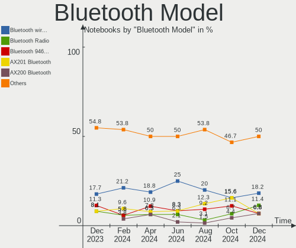

ArcoLinux Hardware Trends (Notebooks)
-------------------------------------

A project to identify most popular hardware characteristics and track their change
over time based on data collected by ArcoLinux users at https://Linux-Hardware.org.

Anyone can contribute to this report by the [hw-probe](https://github.com/linuxhw/hw-probe) tool:

    sudo -E hw-probe -all -upload

Full-feature report is available here: https://linux-hardware.org/?view=trends

Period: Dec, 2021.

Contents
--------

* [ System ](#system)
  - [ OS                       ](#os)
  - [ OS Family                ](#os-family)
  - [ Kernel                   ](#kernel)
  - [ Kernel Family            ](#kernel-family)
  - [ Kernel Major Ver.        ](#kernel-major-ver)
  - [ Arch                     ](#arch)
  - [ DE                       ](#de)
  - [ Display Server           ](#display-server)
  - [ Display Manager          ](#display-manager)
  - [ OS Lang                  ](#os-lang)
  - [ Boot Mode                ](#boot-mode)
  - [ Filesystem               ](#filesystem)
  - [ Part. scheme             ](#part-scheme)
  - [ Dual Boot with Linux/BSD ](#dual-boot-with-linuxbsd)
  - [ Dual Boot (Win)          ](#dual-boot-win)

* [ Board ](#board)
  - [ Vendor                   ](#vendor)
  - [ Model                    ](#model)
  - [ Model Family             ](#model-family)
  - [ MFG Year                 ](#mfg-year)
  - [ Form Factor              ](#form-factor)
  - [ Secure Boot              ](#secure-boot)
  - [ Coreboot                 ](#coreboot)
  - [ RAM Size                 ](#ram-size)
  - [ RAM Used                 ](#ram-used)
  - [ Total Drives             ](#total-drives)
  - [ Has CD-ROM               ](#has-cd-rom)
  - [ Has Ethernet             ](#has-ethernet)
  - [ Has WiFi                 ](#has-wifi)
  - [ Has Bluetooth            ](#has-bluetooth)

* [ Location ](#location)
  - [ Country                  ](#country)
  - [ City                     ](#city)

* [ Drives ](#drives)
  - [ Drive Vendor             ](#drive-vendor)
  - [ Drive Model              ](#drive-model)
  - [ HDD Vendor               ](#hdd-vendor)
  - [ SSD Vendor               ](#ssd-vendor)
  - [ Drive Kind               ](#drive-kind)
  - [ Drive Connector          ](#drive-connector)
  - [ Drive Size               ](#drive-size)
  - [ Space Total              ](#space-total)
  - [ Space Used               ](#space-used)
  - [ Malfunc. Drives          ](#malfunc-drives)
  - [ Malfunc. Drive Vendor    ](#malfunc-drive-vendor)
  - [ Malfunc. HDD Vendor      ](#malfunc-hdd-vendor)
  - [ Malfunc. Drive Kind      ](#malfunc-drive-kind)
  - [ Failed Drives            ](#failed-drives)
  - [ Failed Drive Vendor      ](#failed-drive-vendor)
  - [ Drive Status             ](#drive-status)

* [ Storage controller ](#storage-controller)
  - [ Storage Vendor           ](#storage-vendor)
  - [ Storage Model            ](#storage-model)
  - [ Storage Kind             ](#storage-kind)

* [ Processor ](#processor)
  - [ CPU Vendor               ](#cpu-vendor)
  - [ CPU Model                ](#cpu-model)
  - [ CPU Model Family         ](#cpu-model-family)
  - [ CPU Cores                ](#cpu-cores)
  - [ CPU Sockets              ](#cpu-sockets)
  - [ CPU Threads              ](#cpu-threads)
  - [ CPU Op-Modes             ](#cpu-op-modes)
  - [ CPU Microcode            ](#cpu-microcode)
  - [ CPU Microarch            ](#cpu-microarch)

* [ Graphics ](#graphics)
  - [ GPU Vendor               ](#gpu-vendor)
  - [ GPU Model                ](#gpu-model)
  - [ GPU Combo                ](#gpu-combo)
  - [ GPU Driver               ](#gpu-driver)
  - [ GPU Memory               ](#gpu-memory)

* [ Monitor ](#monitor)
  - [ Monitor Vendor           ](#monitor-vendor)
  - [ Monitor Model            ](#monitor-model)
  - [ Monitor Resolution       ](#monitor-resolution)
  - [ Monitor Diagonal         ](#monitor-diagonal)
  - [ Monitor Width            ](#monitor-width)
  - [ Aspect Ratio             ](#aspect-ratio)
  - [ Monitor Area             ](#monitor-area)
  - [ Pixel Density            ](#pixel-density)
  - [ Multiple Monitors        ](#multiple-monitors)

* [ Network ](#network)
  - [ Net Controller Vendor    ](#net-controller-vendor)
  - [ Net Controller Model     ](#net-controller-model)
  - [ Wireless Vendor          ](#wireless-vendor)
  - [ Wireless Model           ](#wireless-model)
  - [ Ethernet Vendor          ](#ethernet-vendor)
  - [ Ethernet Model           ](#ethernet-model)
  - [ Net Controller Kind      ](#net-controller-kind)
  - [ Used Controller          ](#used-controller)
  - [ NICs                     ](#nics)
  - [ IPv6                     ](#ipv6)

* [ Bluetooth ](#bluetooth)
  - [ Bluetooth Vendor         ](#bluetooth-vendor)
  - [ Bluetooth Model          ](#bluetooth-model)

* [ Sound ](#sound)
  - [ Sound Vendor             ](#sound-vendor)
  - [ Sound Model              ](#sound-model)

* [ Memory ](#memory)
  - [ Memory Vendor            ](#memory-vendor)
  - [ Memory Model             ](#memory-model)
  - [ Memory Kind              ](#memory-kind)
  - [ Memory Form Factor       ](#memory-form-factor)
  - [ Memory Size              ](#memory-size)
  - [ Memory Speed             ](#memory-speed)

* [ Printers & scanners ](#printers--scanners)
  - [ Printer Vendor           ](#printer-vendor)
  - [ Printer Model            ](#printer-model)
  - [ Scanner Vendor           ](#scanner-vendor)
  - [ Scanner Model            ](#scanner-model)

* [ Camera ](#camera)
  - [ Camera Vendor            ](#camera-vendor)
  - [ Camera Model             ](#camera-model)

* [ Security ](#security)
  - [ Fingerprint Vendor       ](#fingerprint-vendor)
  - [ Fingerprint Model        ](#fingerprint-model)
  - [ Chipcard Vendor          ](#chipcard-vendor)
  - [ Chipcard Model           ](#chipcard-model)

* [ Unsupported ](#unsupported)
  - [ Unsupported Devices      ](#unsupported-devices)
  - [ Unsupported Device Types ](#unsupported-device-types)

System
------

OS
--

Installed operating systems

| Name              | Notebooks | Percent |
|-------------------|-----------|---------|
| ArcoLinux Rolling | 73        | 94.81%  |
| ArcoLinux         | 2         | 2.6%    |
| ArcoLinux 20.7.5  | 1         | 1.3%    |
| ArcoLinux 20.6.5  | 1         | 1.3%    |

OS Family
---------

OS without a version

| Name      | Notebooks | Percent |
|-----------|-----------|---------|
| ArcoLinux | 77        | 100%    |

Kernel
------

Version of the Linux kernel

| Version                     | Notebooks | Percent |
|-----------------------------|-----------|---------|
| 5.15.7-arch1-1              | 21        | 27.27%  |
| 5.15.11-arch2-1             | 8         | 10.39%  |
| 5.10.84-1-lts               | 8         | 10.39%  |
| 5.15.10-arch1-1             | 7         | 9.09%   |
| 5.15.6-arch2-1              | 5         | 6.49%   |
| 5.14.14-arch1-1             | 4         | 5.19%   |
| 5.15.7-zen1-1-zen           | 3         | 3.9%    |
| 5.10.87-1-lts               | 3         | 3.9%    |
| 5.10.85-1-lts               | 3         | 3.9%    |
| 5.15.8-arch1-1              | 2         | 2.6%    |
| 5.15.5-arch1-1              | 2         | 2.6%    |
| 5.10.88-2-lts               | 2         | 2.6%    |
| 5.10.79-1-lts               | 2         | 2.6%    |
| 5.15.8-zen1-1-zen           | 1         | 1.3%    |
| 5.15.7-hardened1-1-hardened | 1         | 1.3%    |
| 5.15.6-zen2-1-zen           | 1         | 1.3%    |
| 5.15.12-arch1-1             | 1         | 1.3%    |
| 5.13.13-arch1-1             | 1         | 1.3%    |
| 5.10.83-1-lts               | 1         | 1.3%    |
| 5.10.75-1-lts               | 1         | 1.3%    |

Kernel Family
-------------

Linux kernel without a distro release

| Version | Notebooks | Percent |
|---------|-----------|---------|
| 5.15.7  | 25        | 32.47%  |
| 5.15.11 | 8         | 10.39%  |
| 5.10.84 | 8         | 10.39%  |
| 5.15.10 | 7         | 9.09%   |
| 5.15.6  | 6         | 7.79%   |
| 5.14.14 | 4         | 5.19%   |
| 5.15.8  | 3         | 3.9%    |
| 5.10.87 | 3         | 3.9%    |
| 5.10.85 | 3         | 3.9%    |
| 5.15.5  | 2         | 2.6%    |
| 5.10.88 | 2         | 2.6%    |
| 5.10.79 | 2         | 2.6%    |
| 5.15.12 | 1         | 1.3%    |
| 5.13.13 | 1         | 1.3%    |
| 5.10.83 | 1         | 1.3%    |
| 5.10.75 | 1         | 1.3%    |

Kernel Major Ver.
-----------------

Linux kernel major version

| Version | Notebooks | Percent |
|---------|-----------|---------|
| 5.15    | 52        | 67.53%  |
| 5.10    | 20        | 25.97%  |
| 5.14    | 4         | 5.19%   |
| 5.13    | 1         | 1.3%    |

Arch
----

OS architecture (x86_64, i586, etc.)

| Name   | Notebooks | Percent |
|--------|-----------|---------|
| x86_64 | 77        | 100%    |

DE
--

Desktop Environment

| Name           | Notebooks | Percent |
|----------------|-----------|---------|
| XFCE           | 21        | 27.27%  |
| KDE5           | 16        | 20.78%  |
| i3             | 7         | 9.09%   |
| GNOME          | 6         | 7.79%   |
| qtile          | 5         | 6.49%   |
| xmonad         | 3         | 3.9%    |
| X-Cinnamon     | 3         | 3.9%    |
| bspwm          | 3         | 3.9%    |
| awesome        | 3         | 3.9%    |
| LeftWM         | 2         | 2.6%    |
| Budgie         | 2         | 2.6%    |
| sway           | 1         | 1.3%    |
| MATE           | 1         | 1.3%    |
| i3-with-shmlog | 1         | 1.3%    |
| dwm            | 1         | 1.3%    |
| dusk           | 1         | 1.3%    |
| Deepin         | 1         | 1.3%    |

Display Server
--------------

X11 or Wayland

| Name    | Notebooks | Percent |
|---------|-----------|---------|
| X11     | 70        | 90.91%  |
| Tty     | 6         | 7.79%   |
| Wayland | 1         | 1.3%    |

Display Manager
---------------

SDDM, LightDM, etc.

| Name    | Notebooks | Percent |
|---------|-----------|---------|
| SDDM    | 48        | 62.34%  |
| LightDM | 23        | 29.87%  |
| GDM     | 3         | 3.9%    |
| Unknown | 3         | 3.9%    |

OS Lang
-------

Language

| Lang    | Notebooks | Percent |
|---------|-----------|---------|
| en_US   | 50        | 64.94%  |
| en_GB   | 4         | 5.19%   |
| en_IN   | 3         | 3.9%    |
| en_SG   | 2         | 2.6%    |
| en_IE   | 2         | 2.6%    |
| en_CA   | 2         | 2.6%    |
| en_AU   | 2         | 2.6%    |
| de_DE   | 2         | 2.6%    |
| ru_UA   | 1         | 1.3%    |
| ro_RO   | 1         | 1.3%    |
| it_IT   | 1         | 1.3%    |
| hu_HU   | 1         | 1.3%    |
| fr_FR   | 1         | 1.3%    |
| fr_CH   | 1         | 1.3%    |
| es_MX   | 1         | 1.3%    |
| es_AR   | 1         | 1.3%    |
| cs_CZ   | 1         | 1.3%    |
| Unknown | 1         | 1.3%    |

Boot Mode
---------

EFI or BIOS

| Mode | Notebooks | Percent |
|------|-----------|---------|
| EFI  | 56        | 72.73%  |
| BIOS | 21        | 27.27%  |

Filesystem
----------

Type of filesystem

| Type    | Notebooks | Percent |
|---------|-----------|---------|
| Ext4    | 60        | 77.92%  |
| Btrfs   | 15        | 19.48%  |
| Overlay | 2         | 2.6%    |

Part. scheme
------------

Scheme of partitioning

| Type    | Notebooks | Percent |
|---------|-----------|---------|
| GPT     | 60        | 77.92%  |
| MBR     | 15        | 19.48%  |
| Unknown | 2         | 2.6%    |

Dual Boot with Linux/BSD
------------------------

Hosting more than one Linux/BSD

| Dual boot | Notebooks | Percent |
|-----------|-----------|---------|
| No        | 63        | 81.82%  |
| Yes       | 14        | 18.18%  |

Dual Boot (Win)
---------------

Hosting Linux and Windows

| Dual boot | Notebooks | Percent |
|-----------|-----------|---------|
| No        | 45        | 58.44%  |
| Yes       | 32        | 41.56%  |

Board
-----

Vendor
------

Motherboard manufacturer

| Name             | Notebooks | Percent |
|------------------|-----------|---------|
| Lenovo           | 25        | 32.47%  |
| Dell             | 12        | 15.58%  |
| Acer             | 12        | 15.58%  |
| ASUSTek Computer | 9         | 11.69%  |
| Hewlett-Packard  | 5         | 6.49%   |
| System76         | 2         | 2.6%    |
| MSI              | 2         | 2.6%    |
| Toshiba          | 1         | 1.3%    |
| Timi             | 1         | 1.3%    |
| Teclast          | 1         | 1.3%    |
| Razer            | 1         | 1.3%    |
| Notebook         | 1         | 1.3%    |
| Monster          | 1         | 1.3%    |
| Medion           | 1         | 1.3%    |
| Fujitsu          | 1         | 1.3%    |
| Apple            | 1         | 1.3%    |
| Alienware        | 1         | 1.3%    |

Model
-----

Motherboard model

| Name                                   | Notebooks | Percent |
|----------------------------------------|-----------|---------|
| Acer Aspire E5-575G                    | 2         | 2.6%    |
| Toshiba Satellite C50-B                | 1         | 1.3%    |
| Timi TM1701                            | 1         | 1.3%    |
| Teclast F15S                           | 1         | 1.3%    |
| System76 Galago Pro                    | 1         | 1.3%    |
| System76 Darter Pro                    | 1         | 1.3%    |
| Razer Blade Stealth                    | 1         | 1.3%    |
| Notebook NH5xAx                        | 1         | 1.3%    |
| MSI GE72 6QC                           | 1         | 1.3%    |
| MSI GE63 Raider RGB 8RE                | 1         | 1.3%    |
| Monster ABRA A5 V11.1                  | 1         | 1.3%    |
| Medion E4213 MD99329                   | 1         | 1.3%    |
| Lenovo XiaoXin-15ARE 2020 81YR         | 1         | 1.3%    |
| Lenovo V14-ADA 82C6                    | 1         | 1.3%    |
| Lenovo ThinkPad X250 20CLS2XA00        | 1         | 1.3%    |
| Lenovo ThinkPad X220 42912WA           | 1         | 1.3%    |
| Lenovo ThinkPad X201 3680KC5           | 1         | 1.3%    |
| Lenovo ThinkPad X201 3323LWA           | 1         | 1.3%    |
| Lenovo ThinkPad X200 2024AY7           | 1         | 1.3%    |
| Lenovo ThinkPad W540 20BG0011US        | 1         | 1.3%    |
| Lenovo ThinkPad T550 20CJS0S800        | 1         | 1.3%    |
| Lenovo ThinkPad T540p 20BFS31F00       | 1         | 1.3%    |
| Lenovo ThinkPad T470 W10DG 20JNS0QC0F  | 1         | 1.3%    |
| Lenovo ThinkPad T460 20FMS80M0C        | 1         | 1.3%    |
| Lenovo ThinkPad T430 2349DG5           | 1         | 1.3%    |
| Lenovo ThinkPad T410 2522E38           | 1         | 1.3%    |
| Lenovo ThinkPad T410 2522AC1           | 1         | 1.3%    |
| Lenovo Legion 5 Pro 16ACH6H 82JQ       | 1         | 1.3%    |
| Lenovo IdeaPad Yoga 13 20175           | 1         | 1.3%    |
| Lenovo IdeaPad S340-15IWL 81N8         | 1         | 1.3%    |
| Lenovo IdeaPad S340-14API 81NB         | 1         | 1.3%    |
| Lenovo IdeaPad 510S-14ISK 80TK         | 1         | 1.3%    |
| Lenovo IdeaPad 510-15ISK 80SR          | 1         | 1.3%    |
| Lenovo IdeaPad 5 14ARE05 81YM          | 1         | 1.3%    |
| Lenovo IdeaPad 320-15ABR 80XS          | 1         | 1.3%    |
| Lenovo IdeaPad 310-15IKB 80TV          | 1         | 1.3%    |
| Lenovo G40-45 80E1                     | 1         | 1.3%    |
| HP Pavilion Gaming Laptop 15-ec1xxx    | 1         | 1.3%    |
| HP Notebook                            | 1         | 1.3%    |
| HP Laptop 15s-eq2xxx                   | 1         | 1.3%    |
| HP Laptop 15-da0xxx                    | 1         | 1.3%    |
| HP ENVY Notebook                       | 1         | 1.3%    |
| Fujitsu LIFEBOOK E756                  | 1         | 1.3%    |
| Dell XPS 17 9710                       | 1         | 1.3%    |
| Dell XPS 15 9510                       | 1         | 1.3%    |
| Dell XPS 13 9370                       | 1         | 1.3%    |
| Dell Precision M4800                   | 1         | 1.3%    |
| Dell Precision 5550                    | 1         | 1.3%    |
| Dell Latitude E4310                    | 1         | 1.3%    |
| Dell Latitude 3410                     | 1         | 1.3%    |
| Dell Inspiron 5570                     | 1         | 1.3%    |
| Dell Inspiron 5468                     | 1         | 1.3%    |
| Dell Inspiron 5458                     | 1         | 1.3%    |
| Dell Inspiron 3505                     | 1         | 1.3%    |
| Dell Inspiron 15 7000 Gaming           | 1         | 1.3%    |
| ASUS Zephyrus G GU502DU_GA502DU        | 1         | 1.3%    |
| ASUS X450LD                            | 1         | 1.3%    |
| ASUS VivoBook_ASUSLaptop X531FL_S531FL | 1         | 1.3%    |
| ASUS VivoBook S13 X330FA_S330FA        | 1         | 1.3%    |
| ASUS TUF Gaming FX505DT_FX505DT        | 1         | 1.3%    |

Model Family
------------

Motherboard model prefix

| Name                 | Notebooks | Percent |
|----------------------|-----------|---------|
| Lenovo ThinkPad      | 13        | 16.88%  |
| Acer Aspire          | 9         | 11.69%  |
| Lenovo IdeaPad       | 8         | 10.39%  |
| Dell Inspiron        | 5         | 6.49%   |
| Dell XPS             | 3         | 3.9%    |
| HP Laptop            | 2         | 2.6%    |
| Dell Precision       | 2         | 2.6%    |
| Dell Latitude        | 2         | 2.6%    |
| ASUS VivoBook        | 2         | 2.6%    |
| Toshiba Satellite    | 1         | 1.3%    |
| Timi TM1701          | 1         | 1.3%    |
| Teclast F15S         | 1         | 1.3%    |
| System76 Galago      | 1         | 1.3%    |
| System76 Darter      | 1         | 1.3%    |
| Razer Blade          | 1         | 1.3%    |
| Notebook NH5xAx      | 1         | 1.3%    |
| MSI GE72             | 1         | 1.3%    |
| MSI GE63             | 1         | 1.3%    |
| Monster ABRA         | 1         | 1.3%    |
| Medion E4213         | 1         | 1.3%    |
| Lenovo XiaoXin-15ARE | 1         | 1.3%    |
| Lenovo V14-ADA       | 1         | 1.3%    |
| Lenovo Legion        | 1         | 1.3%    |
| Lenovo G40-45        | 1         | 1.3%    |
| HP Pavilion          | 1         | 1.3%    |
| HP Notebook          | 1         | 1.3%    |
| HP ENVY              | 1         | 1.3%    |
| Fujitsu LIFEBOOK     | 1         | 1.3%    |
| ASUS Zephyrus        | 1         | 1.3%    |
| ASUS X450LD          | 1         | 1.3%    |
| ASUS TUF             | 1         | 1.3%    |
| ASUS K53E            | 1         | 1.3%    |
| ASUS K501UX          | 1         | 1.3%    |
| ASUS G75VW           | 1         | 1.3%    |
| ASUS E502NA          | 1         | 1.3%    |
| Apple MacBookPro11   | 1         | 1.3%    |
| Alienware 15         | 1         | 1.3%    |
| Acer Swift           | 1         | 1.3%    |
| Acer Nitro           | 1         | 1.3%    |
| Acer Extensa         | 1         | 1.3%    |

MFG Year
--------

Motherboard manufacture year

| Year | Notebooks | Percent |
|------|-----------|---------|
| 2021 | 19        | 24.68%  |
| 2020 | 11        | 14.29%  |
| 2018 | 10        | 12.99%  |
| 2017 | 6         | 7.79%   |
| 2015 | 6         | 7.79%   |
| 2019 | 5         | 6.49%   |
| 2016 | 5         | 6.49%   |
| 2012 | 5         | 6.49%   |
| 2009 | 3         | 3.9%    |
| 2014 | 2         | 2.6%    |
| 2013 | 2         | 2.6%    |
| 2011 | 2         | 2.6%    |
| 2010 | 1         | 1.3%    |

Form Factor
-----------

Physical design of the computer

| Name     | Notebooks | Percent |
|----------|-----------|---------|
| Notebook | 77        | 100%    |

Secure Boot
-----------

Enabled or disabled

| State    | Notebooks | Percent |
|----------|-----------|---------|
| Disabled | 77        | 100%    |

Coreboot
--------

Have coreboot on board

| Used | Notebooks | Percent |
|------|-----------|---------|
| No   | 76        | 98.7%   |
| Yes  | 1         | 1.3%    |

RAM Size
--------

Total RAM memory

| Size in GB | Notebooks | Percent |
|------------|-----------|---------|
| 4.01-8.0   | 32        | 41.56%  |
| 3.01-4.0   | 15        | 19.48%  |
| 16.01-24.0 | 13        | 16.88%  |
| 8.01-16.0  | 8         | 10.39%  |
| 32.01-64.0 | 7         | 9.09%   |
| 24.01-32.0 | 2         | 2.6%    |

RAM Used
--------

Used RAM memory

| Used GB   | Notebooks | Percent |
|-----------|-----------|---------|
| 1.01-2.0  | 23        | 29.87%  |
| 2.01-3.0  | 18        | 23.38%  |
| 3.01-4.0  | 13        | 16.88%  |
| 4.01-8.0  | 11        | 14.29%  |
| 0.51-1.0  | 6         | 7.79%   |
| 8.01-16.0 | 3         | 3.9%    |
| 0.01-0.5  | 3         | 3.9%    |

Total Drives
------------

Number of drives on board

| Drives | Notebooks | Percent |
|--------|-----------|---------|
| 1      | 53        | 68.83%  |
| 2      | 18        | 23.38%  |
| 3      | 6         | 7.79%   |

Has CD-ROM
----------

Has CD-ROM on board

| Presented | Notebooks | Percent |
|-----------|-----------|---------|
| No        | 60        | 77.92%  |
| Yes       | 17        | 22.08%  |

Has Ethernet
------------

Has Ethernet on board

| Presented | Notebooks | Percent |
|-----------|-----------|---------|
| Yes       | 64        | 83.12%  |
| No        | 13        | 16.88%  |

Has WiFi
--------

Has WiFi module

| Presented | Notebooks | Percent |
|-----------|-----------|---------|
| Yes       | 77        | 100%    |

Has Bluetooth
-------------

Has Bluetooth module

| Presented | Notebooks | Percent |
|-----------|-----------|---------|
| Yes       | 67        | 87.01%  |
| No        | 10        | 12.99%  |

Location
--------

Country
-------

Geographic location (country)

| Country     | Notebooks | Percent |
|-------------|-----------|---------|
| USA         | 16        | 20.78%  |
| Ukraine     | 4         | 5.19%   |
| India       | 4         | 5.19%   |
| France      | 4         | 5.19%   |
| Netherlands | 3         | 3.9%    |
| Canada      | 3         | 3.9%    |
| Belgium     | 3         | 3.9%    |
| Bangladesh  | 3         | 3.9%    |
| UK          | 2         | 2.6%    |
| Switzerland | 2         | 2.6%    |
| Malaysia    | 2         | 2.6%    |
| Italy       | 2         | 2.6%    |
| Ireland     | 2         | 2.6%    |
| Hungary     | 2         | 2.6%    |
| Germany     | 2         | 2.6%    |
| Australia   | 2         | 2.6%    |
| Algeria     | 2         | 2.6%    |
| Turkey      | 1         | 1.3%    |
| Sweden      | 1         | 1.3%    |
| Singapore   | 1         | 1.3%    |
| Russia      | 1         | 1.3%    |
| Romania     | 1         | 1.3%    |
| Paraguay    | 1         | 1.3%    |
| Morocco     | 1         | 1.3%    |
| Mexico      | 1         | 1.3%    |
| Lebanon     | 1         | 1.3%    |
| Latvia      | 1         | 1.3%    |
| Indonesia   | 1         | 1.3%    |
| Finland     | 1         | 1.3%    |
| Czechia     | 1         | 1.3%    |
| Colombia    | 1         | 1.3%    |
| China       | 1         | 1.3%    |
| Cambodia    | 1         | 1.3%    |
| Bulgaria    | 1         | 1.3%    |
| Brazil      | 1         | 1.3%    |
| Argentina   | 1         | 1.3%    |

City
----

Geographic location (city)

| City                  | Notebooks | Percent |
|-----------------------|-----------|---------|
| Paris                 | 3         | 3.9%    |
| Tongi                 | 2         | 2.6%    |
| Kuala Lumpur          | 2         | 2.6%    |
| Ennis                 | 2         | 2.6%    |
| Dnipro                | 2         | 2.6%    |
| Algiers               | 2         | 2.6%    |
| Wittenbach            | 1         | 1.3%    |
| Winterthur            | 1         | 1.3%    |
| Windsor               | 1         | 1.3%    |
| Wilrijk               | 1         | 1.3%    |
| Wicklow               | 1         | 1.3%    |
| West Covina           | 1         | 1.3%    |
| Washington            | 1         | 1.3%    |
| Vaasa                 | 1         | 1.3%    |
| Trento                | 1         | 1.3%    |
| Sz?©kesfeh?©rv??r     | 1         | 1.3%    |
| Sydney                | 1         | 1.3%    |
| St Petersburg         | 1         | 1.3%    |
| Sofia                 | 1         | 1.3%    |
| Sleman                | 1         | 1.3%    |
| Singapore             | 1         | 1.3%    |
| Sicklerville          | 1         | 1.3%    |
| Shenzhen              | 1         | 1.3%    |
| S??o Lu?­s            | 1         | 1.3%    |
| San Jose              | 1         | 1.3%    |
| Royal Tunbridge Wells | 1         | 1.3%    |
| Rabat                 | 1         | 1.3%    |
| Puyallup              | 1         | 1.3%    |
| Plano                 | 1         | 1.3%    |
| Pickering             | 1         | 1.3%    |
| Phnom Penh            | 1         | 1.3%    |
| Patna                 | 1         | 1.3%    |
| Paso del Rey          | 1         | 1.3%    |
| Ostrava               | 1         | 1.3%    |
| Orizaba               | 1         | 1.3%    |
| Omaha                 | 1         | 1.3%    |
| Ogre                  | 1         | 1.3%    |
| Odessa                | 1         | 1.3%    |
| Murfreesboro          | 1         | 1.3%    |
| Milan                 | 1         | 1.3%    |
| Melbourne             | 1         | 1.3%    |
| Los Banos             | 1         | 1.3%    |
| London                | 1         | 1.3%    |
| Lokeren               | 1         | 1.3%    |
| Lewiston              | 1         | 1.3%    |
| Kyiv                  | 1         | 1.3%    |
| Kolkata               | 1         | 1.3%    |
| Knoxville             | 1         | 1.3%    |
| Karlsruhe             | 1         | 1.3%    |
| Jaipur                | 1         | 1.3%    |
| Idaho Falls           | 1         | 1.3%    |
| Hernandarias          | 1         | 1.3%    |
| Guelph                | 1         | 1.3%    |
| Gleize                | 1         | 1.3%    |
| Eindhoven             | 1         | 1.3%    |
| Eger                  | 1         | 1.3%    |
| Dhaka                 | 1         | 1.3%    |
| Dearborn              | 1         | 1.3%    |
| Dallas                | 1         | 1.3%    |
| Coimbatore            | 1         | 1.3%    |

Drives
------

Drive Vendor
------------

Hard drive vendors

| Vendor              | Notebooks | Drives | Percent |
|---------------------|-----------|--------|---------|
| WDC                 | 23        | 23     | 21.7%   |
| Samsung Electronics | 21        | 21     | 19.81%  |
| Seagate             | 13        | 13     | 12.26%  |
| Toshiba             | 6         | 6      | 5.66%   |
| SK Hynix            | 6         | 6      | 5.66%   |
| SanDisk             | 4         | 4      | 3.77%   |
| HGST                | 4         | 4      | 3.77%   |
| Kingston            | 3         | 3      | 2.83%   |
| A-DATA Technology   | 3         | 3      | 2.83%   |
| Unknown             | 2         | 2      | 1.89%   |
| LITEON              | 2         | 2      | 1.89%   |
| Crucial             | 2         | 3      | 1.89%   |
| China               | 2         | 2      | 1.89%   |
| XPG                 | 1         | 1      | 0.94%   |
| Transcend           | 1         | 1      | 0.94%   |
| SPCC                | 1         | 1      | 0.94%   |
| PNY                 | 1         | 1      | 0.94%   |
| Phison              | 1         | 1      | 0.94%   |
| Mushkin             | 1         | 1      | 0.94%   |
| Micron Technology   | 1         | 1      | 0.94%   |
| LITEONIT            | 1         | 1      | 0.94%   |
| KIOXIA              | 1         | 1      | 0.94%   |
| Intel               | 1         | 1      | 0.94%   |
| HS-SSD-C100         | 1         | 1      | 0.94%   |
| GOODRAM             | 1         | 1      | 0.94%   |
| Corsair             | 1         | 1      | 0.94%   |
| Apple               | 1         | 1      | 0.94%   |
| Unknown             | 1         | 1      | 0.94%   |

Drive Model
-----------

Hard drive models

| Model                                 | Notebooks | Percent |
|---------------------------------------|-----------|---------|
| Seagate ST1000LM035-1RK172 1TB        | 4         | 3.74%   |
| WDC PC SN520 SDAPNUW-512G-1014 512GB  | 2         | 1.87%   |
| Toshiba MQ04ABF100 1TB                | 2         | 1.87%   |
| Toshiba MQ01ABD100 1TB                | 2         | 1.87%   |
| Samsung SSD 970 EVO Plus 500GB        | 2         | 1.87%   |
| XPG GAMMIX S70 BLADE 1TB              | 1         | 0.93%   |
| WDC WDS500G2B0B-00YS70 500GB SSD      | 1         | 0.93%   |
| WDC WDS500G2B0A-00SM50 500GB SSD      | 1         | 0.93%   |
| WDC WDS480G2G0A-00JH30 480GB SSD      | 1         | 0.93%   |
| WDC WDS240G2G0B-00EPW0 240GB SSD      | 1         | 0.93%   |
| WDC WDS240G2G0A-00JH30 240GB SSD      | 1         | 0.93%   |
| WDC WDS100T1X0E-00AFY0 1TB            | 1         | 0.93%   |
| WDC WD6400BEVT-60A0RT0 640GB          | 1         | 0.93%   |
| WDC WD5000LPVX-75V0TT0 500GB          | 1         | 0.93%   |
| WDC WD5000LPVX-22V0TT0 500GB          | 1         | 0.93%   |
| WDC WD5000L 500GB                     | 1         | 0.93%   |
| WDC WD3200BPVT-00JJ5T0 320GB          | 1         | 0.93%   |
| WDC WD3200BEVT-22ZCT0 320GB           | 1         | 0.93%   |
| WDC WD3200BEKT-75PVMT0 320GB          | 1         | 0.93%   |
| WDC WD10SPZX-75Z10T2 1TB              | 1         | 0.93%   |
| WDC WD10SPZX-21Z10T0 1TB              | 1         | 0.93%   |
| WDC WD10JPCX-24UE4T0 1TB              | 1         | 0.93%   |
| WDC PC SN530 SDBPNPZ-512G-1002 512GB  | 1         | 0.93%   |
| WDC PC SN530 SDBPMPZ-256G-1101 256GB  | 1         | 0.93%   |
| WDC PC SN520 SDAPNUW-256G-1002 256GB  | 1         | 0.93%   |
| WDC PC SN520 SDAPNUW-128G             | 1         | 0.93%   |
| WDC PC SN520 SDAPMUW-256G-1101 256GB  | 1         | 0.93%   |
| Unknown SN256  256GB                  | 1         | 0.93%   |
| Unknown MMC Card  128GB               | 1         | 0.93%   |
| Transcend TS256GMTS430S 256GB SSD     | 1         | 0.93%   |
| Toshiba RC500 250GB                   | 1         | 0.93%   |
| Toshiba KXG50ZNV256G NVMe 256GB       | 1         | 0.93%   |
| SPCC Solid State Disk 512GB           | 1         | 0.93%   |
| SK Hynix SC311 SATA 128GB SSD         | 1         | 0.93%   |
| SK Hynix PC711 NVMe 512GB             | 1         | 0.93%   |
| SK Hynix PC711 NVMe 1TB               | 1         | 0.93%   |
| SK Hynix NVMe SSD Drive 512GB         | 1         | 0.93%   |
| SK Hynix HFS128G39TND-N210A 128GB SSD | 1         | 0.93%   |
| SK Hynix HFM512GDJTNG-8310A 512GB     | 1         | 0.93%   |
| Seagate ST9500423AS 500GB             | 1         | 0.93%   |
| Seagate ST9250315AS 250GB             | 1         | 0.93%   |
| Seagate ST500LT012-1DG142 500GB       | 1         | 0.93%   |
| Seagate ST500LM021-1KJ152 500GB       | 1         | 0.93%   |
| Seagate ST2000LM015-2E8174 2TB        | 1         | 0.93%   |
| Seagate ST2000LM007-1R8174 2TB        | 1         | 0.93%   |
| Seagate ST1000LM048-2E7172 1TB        | 1         | 0.93%   |
| Seagate BUP BK 4TB                    | 1         | 0.93%   |
| Seagate Backup+ Hub BK 8TB            | 1         | 0.93%   |
| SanDisk SSD PLUS 240 GB               | 1         | 0.93%   |
| SanDisk SSD PLUS 1000GB               | 1         | 0.93%   |
| SanDisk SDSSDA120G 120GB              | 1         | 0.93%   |
| SanDisk Extreme 55AE 500GB SSD        | 1         | 0.93%   |
| Samsung SSD PM871 mSATA 128GB         | 1         | 0.93%   |
| Samsung SSD 970 EVO 500GB             | 1         | 0.93%   |
| Samsung SSD 870 QVO 2TB               | 1         | 0.93%   |
| Samsung SSD 850 PRO 256GB             | 1         | 0.93%   |
| Samsung SSD 850 EVO 500GB             | 1         | 0.93%   |
| Samsung PM991 NVMe 256GB              | 1         | 0.93%   |
| Samsung MZYTY256HDHP-000L2 256GB SSD  | 1         | 0.93%   |
| Samsung MZVLW256HEHP-000L7 256GB      | 1         | 0.93%   |

HDD Vendor
----------

Hard disk drive vendors

| Vendor  | Notebooks | Drives | Percent |
|---------|-----------|--------|---------|
| Seagate | 12        | 12     | 40%     |
| WDC     | 10        | 10     | 33.33%  |
| Toshiba | 4         | 4      | 13.33%  |
| HGST    | 4         | 4      | 13.33%  |

SSD Vendor
----------

Solid state drive vendors

| Vendor              | Notebooks | Drives | Percent |
|---------------------|-----------|--------|---------|
| Samsung Electronics | 12        | 12     | 29.27%  |
| WDC                 | 5         | 5      | 12.2%   |
| SanDisk             | 4         | 4      | 9.76%   |
| SK Hynix            | 2         | 2      | 4.88%   |
| LITEON              | 2         | 2      | 4.88%   |
| Kingston            | 2         | 2      | 4.88%   |
| China               | 2         | 2      | 4.88%   |
| A-DATA Technology   | 2         | 2      | 4.88%   |
| Transcend           | 1         | 1      | 2.44%   |
| SPCC                | 1         | 1      | 2.44%   |
| PNY                 | 1         | 1      | 2.44%   |
| Micron Technology   | 1         | 1      | 2.44%   |
| LITEONIT            | 1         | 1      | 2.44%   |
| Intel               | 1         | 1      | 2.44%   |
| HS-SSD-C100         | 1         | 1      | 2.44%   |
| GOODRAM             | 1         | 1      | 2.44%   |
| Crucial             | 1         | 1      | 2.44%   |
| Apple               | 1         | 1      | 2.44%   |

Drive Kind
----------

HDD or SSD

| Kind    | Notebooks | Drives | Percent |
|---------|-----------|--------|---------|
| SSD     | 38        | 41     | 38%     |
| NVMe    | 29        | 32     | 29%     |
| HDD     | 29        | 30     | 29%     |
| MMC     | 3         | 3      | 3%      |
| Unknown | 1         | 1      | 1%      |

Drive Connector
---------------

SATA, SAS, NVMe, etc.

| Type | Notebooks | Drives | Percent |
|------|-----------|--------|---------|
| SATA | 54        | 68     | 60%     |
| NVMe | 29        | 32     | 32.22%  |
| SAS  | 4         | 4      | 4.44%   |
| MMC  | 3         | 3      | 3.33%   |

Drive Size
----------

Size of hard drive

| Size in TB | Notebooks | Drives | Percent |
|------------|-----------|--------|---------|
| 0.01-0.5   | 43        | 47     | 64.18%  |
| 0.51-1.0   | 19        | 19     | 28.36%  |
| 1.01-2.0   | 4         | 4      | 5.97%   |
| 3.01-4.0   | 1         | 1      | 1.49%   |

Space Total
-----------

Amount of disk space available on the file system

| Size in GB     | Notebooks | Percent |
|----------------|-----------|---------|
| 101-250        | 22        | 28.57%  |
| 251-500        | 20        | 25.97%  |
| 501-1000       | 10        | 12.99%  |
| 1001-2000      | 8         | 10.39%  |
| 51-100         | 5         | 6.49%   |
| More than 3000 | 4         | 5.19%   |
| 1-20           | 4         | 5.19%   |
| 21-50          | 2         | 2.6%    |
| 2001-3000      | 1         | 1.3%    |
| Unknown        | 1         | 1.3%    |

Space Used
----------

Amount of used disk space

| Used GB        | Notebooks | Percent |
|----------------|-----------|---------|
| 21-50          | 21        | 27.27%  |
| 1-20           | 17        | 22.08%  |
| 101-250        | 15        | 19.48%  |
| 51-100         | 10        | 12.99%  |
| 251-500        | 7         | 9.09%   |
| More than 3000 | 3         | 3.9%    |
| 1001-2000      | 2         | 2.6%    |
| 501-1000       | 1         | 1.3%    |
| Unknown        | 1         | 1.3%    |

Malfunc. Drives
---------------

Drive models with a malfunction

| Model                                          | Notebooks | Drives | Percent |
|------------------------------------------------|-----------|--------|---------|
| WDC WD6400BEVT-60A0RT0 640GB                   | 1         | 1      | 7.14%   |
| WDC WD5000L 500GB                              | 1         | 1      | 7.14%   |
| WDC WD3200BPVT-00JJ5T0 320GB                   | 1         | 1      | 7.14%   |
| WDC WD3200BEVT-22ZCT0 320GB                    | 1         | 1      | 7.14%   |
| WDC WD3200BEKT-75PVMT0 320GB                   | 1         | 1      | 7.14%   |
| Seagate ST9250315AS 250GB                      | 1         | 1      | 7.14%   |
| Seagate ST500LT012-1DG142 500GB                | 1         | 1      | 7.14%   |
| Seagate ST500LM021-1KJ152 500GB                | 1         | 1      | 7.14%   |
| Seagate ST1000LM035-1RK172 1TB                 | 1         | 1      | 7.14%   |
| SanDisk SSD PLUS 1000GB                        | 1         | 1      | 7.14%   |
| Micron Technology 1100_MTFDDAV256TBN 256GB SSD | 1         | 1      | 7.14%   |
| LITEONIT LAT-256M3S 256GB SSD                  | 1         | 1      | 7.14%   |
| Intel SSDSA2M160G2GC 160GB                     | 1         | 1      | 7.14%   |
| Crucial CT1050MX300SSD1 1050GB                 | 1         | 1      | 7.14%   |

Malfunc. Drive Vendor
---------------------

Vendors of faulty drives

| Vendor            | Notebooks | Drives | Percent |
|-------------------|-----------|--------|---------|
| WDC               | 5         | 5      | 35.71%  |
| Seagate           | 4         | 4      | 28.57%  |
| SanDisk           | 1         | 1      | 7.14%   |
| Micron Technology | 1         | 1      | 7.14%   |
| LITEONIT          | 1         | 1      | 7.14%   |
| Intel             | 1         | 1      | 7.14%   |
| Crucial           | 1         | 1      | 7.14%   |

Malfunc. HDD Vendor
-------------------

Vendors of faulty HDD drives

| Vendor  | Notebooks | Drives | Percent |
|---------|-----------|--------|---------|
| WDC     | 5         | 5      | 55.56%  |
| Seagate | 4         | 4      | 44.44%  |

Malfunc. Drive Kind
-------------------

Kinds of faulty drives

| Kind | Notebooks | Drives | Percent |
|------|-----------|--------|---------|
| HDD  | 9         | 9      | 64.29%  |
| SSD  | 5         | 5      | 35.71%  |

Failed Drives
-------------

Failed drive models

Zero info for selected period =(

Failed Drive Vendor
-------------------

Failed drive vendors

Zero info for selected period =(

Drive Status
------------

Number of failed and malfunc. drives

| Status   | Notebooks | Drives | Percent |
|----------|-----------|--------|---------|
| Works    | 64        | 83     | 75.29%  |
| Malfunc  | 13        | 14     | 15.29%  |
| Detected | 8         | 10     | 9.41%   |

Storage controller
------------------

Storage Vendor
--------------

Storage controller vendors

| Vendor                       | Notebooks | Percent |
|------------------------------|-----------|---------|
| Intel                        | 53        | 56.38%  |
| Samsung Electronics          | 10        | 10.64%  |
| Sandisk                      | 8         | 8.51%   |
| AMD                          | 8         | 8.51%   |
| SK Hynix                     | 4         | 4.26%   |
| Phison Electronics           | 2         | 2.13%   |
| Micron/Crucial Technology    | 2         | 2.13%   |
| KIOXIA                       | 2         | 2.13%   |
| Unknown                      | 1         | 1.06%   |
| Toshiba America Info Systems | 1         | 1.06%   |
| Silicon Motion               | 1         | 1.06%   |
| Kingston Technology Company  | 1         | 1.06%   |
| ADATA Technology             | 1         | 1.06%   |

Storage Model
-------------

Storage controller models

| Model                                                                            | Notebooks | Percent |
|----------------------------------------------------------------------------------|-----------|---------|
| Intel Sunrise Point-LP SATA Controller [AHCI mode]                               | 13        | 13.54%  |
| AMD FCH SATA Controller [AHCI mode]                                              | 8         | 8.33%   |
| Samsung NVMe SSD Controller SM981/PM981/PM983                                    | 6         | 6.25%   |
| Intel 82801 Mobile SATA Controller [RAID mode]                                   | 5         | 5.21%   |
| Sandisk WD Blue SN500 / PC SN520 NVMe SSD                                        | 4         | 4.17%   |
| Intel 5 Series/3400 Series Chipset 6 port SATA AHCI Controller                   | 4         | 4.17%   |
| Intel Wildcat Point-LP SATA Controller [AHCI Mode]                               | 3         | 3.13%   |
| Intel HM170/QM170 Chipset SATA Controller [AHCI Mode]                            | 3         | 3.13%   |
| Intel 82801IBM/IEM (ICH9M/ICH9M-E) 4 port SATA Controller [AHCI mode]            | 3         | 3.13%   |
| Intel 7 Series Chipset Family 6-port SATA Controller [AHCI mode]                 | 3         | 3.13%   |
| SK Hynix Gold P31 SSD                                                            | 2         | 2.08%   |
| Samsung NVMe SSD Controller 980                                                  | 2         | 2.08%   |
| Phison E12 NVMe Controller                                                       | 2         | 2.08%   |
| Intel Cannon Point-LP SATA Controller [AHCI Mode]                                | 2         | 2.08%   |
| Intel Cannon Lake Mobile PCH SATA AHCI Controller                                | 2         | 2.08%   |
| Intel Atom/Celeron/Pentium Processor x5-E8000/J3xxx/N3xxx Series SATA Controller | 2         | 2.08%   |
| Intel Atom Processor E3800 Series SATA AHCI Controller                           | 2         | 2.08%   |
| Intel 8 Series/C220 Series Chipset Family 6-port SATA Controller 1 [AHCI mode]   | 2         | 2.08%   |
| Intel 6 Series/C200 Series Chipset Family 6 port Mobile SATA AHCI Controller     | 2         | 2.08%   |
| Unknown Non-Volatile memory controller                                           | 1         | 1.04%   |
| Toshiba America Info Systems Toshiba America Info Non-Volatile memory controller | 1         | 1.04%   |
| SK Hynix BC511                                                                   | 1         | 1.04%   |
| SK Hynix BC501 NVMe Solid State Drive                                            | 1         | 1.04%   |
| Silicon Motion SM2262/SM2262EN SSD Controller                                    | 1         | 1.04%   |
| Sandisk WD PC SN810 / Black SN850 NVMe SSD                                       | 1         | 1.04%   |
| Sandisk WD Blue SN550 NVMe SSD                                                   | 1         | 1.04%   |
| Sandisk PC SN520 NVMe SSD                                                        | 1         | 1.04%   |
| Sandisk Non-Volatile memory controller                                           | 1         | 1.04%   |
| Samsung NVMe SSD Controller SM961/PM961/SM963                                    | 1         | 1.04%   |
| Samsung Apple PCIe SSD                                                           | 1         | 1.04%   |
| Micron/Crucial NVMe Controller                                                   | 1         | 1.04%   |
| Micron/Crucial Non-Volatile memory controller                                    | 1         | 1.04%   |
| KIOXIA NVMe SSD                                                                  | 1         | 1.04%   |
| KIOXIA Non-Volatile memory controller                                            | 1         | 1.04%   |
| Kingston Company U-SNS8154P3 NVMe SSD                                            | 1         | 1.04%   |
| Intel Tiger Lake-LP SATA Controller [AHCI mode]                                  | 1         | 1.04%   |
| Intel Q170/Q150/B150/H170/H110/Z170/CM236 Chipset SATA Controller [AHCI Mode]    | 1         | 1.04%   |
| Intel Mobile 4 Series Chipset PT IDER Controller                                 | 1         | 1.04%   |
| Intel Comet Lake SATA AHCI Controller                                            | 1         | 1.04%   |
| Intel Celeron/Pentium Silver Processor SATA Controller                           | 1         | 1.04%   |
| Intel Celeron N3350/Pentium N4200/Atom E3900 Series SATA AHCI Controller         | 1         | 1.04%   |
| Intel 8 Series SATA Controller 1 [AHCI mode]                                     | 1         | 1.04%   |
| Intel 5 Series/3400 Series Chipset 4 port SATA AHCI Controller                   | 1         | 1.04%   |
| AMD 400 Series Chipset SATA Controller                                           | 1         | 1.04%   |
| ADATA XPG SX8200 Pro PCIe Gen3x4 M.2 2280 Solid State Drive                      | 1         | 1.04%   |

Storage Kind
------------

Kind of storage controller (IDE, SATA, NVMe, SAS, ...)

| Kind | Notebooks | Percent |
|------|-----------|---------|
| SATA | 57        | 61.96%  |
| NVMe | 29        | 31.52%  |
| RAID | 5         | 5.43%   |
| IDE  | 1         | 1.09%   |

Processor
---------

CPU Vendor
----------

Processor vendors

| Vendor | Notebooks | Percent |
|--------|-----------|---------|
| Intel  | 62        | 80.52%  |
| AMD    | 15        | 19.48%  |

CPU Model
---------

Processor models

| Model                                           | Notebooks | Percent |
|-------------------------------------------------|-----------|---------|
| Intel Core i5-8250U CPU @ 1.60GHz               | 5         | 6.49%   |
| Intel Core i5-7200U CPU @ 2.50GHz               | 4         | 5.19%   |
| Intel Core i7-7700HQ CPU @ 2.80GHz              | 3         | 3.9%    |
| Intel Core i7-9750H CPU @ 2.60GHz               | 2         | 2.6%    |
| Intel Core i7-8565U CPU @ 1.80GHz               | 2         | 2.6%    |
| Intel Core i7-6500U CPU @ 2.50GHz               | 2         | 2.6%    |
| Intel Core i5-8265U CPU @ 1.60GHz               | 2         | 2.6%    |
| Intel Core i5-6300U CPU @ 2.40GHz               | 2         | 2.6%    |
| Intel Core i5-6200U CPU @ 2.30GHz               | 2         | 2.6%    |
| Intel Core i5-5300U CPU @ 2.30GHz               | 2         | 2.6%    |
| Intel Core i5 CPU M 560 @ 2.67GHz               | 2         | 2.6%    |
| Intel Core i5 CPU M 520 @ 2.40GHz               | 2         | 2.6%    |
| Intel Celeron CPU N2840 @ 2.16GHz               | 2         | 2.6%    |
| Intel 11th Gen Core i9-11900H @ 2.50GHz         | 2         | 2.6%    |
| AMD Ryzen 5 3500U with Radeon Vega Mobile Gfx   | 2         | 2.6%    |
| Intel Pentium Dual-Core CPU T4300 @ 2.10GHz     | 1         | 1.3%    |
| Intel Pentium CPU N4200 @ 1.10GHz               | 1         | 1.3%    |
| Intel Pentium CPU N3710 @ 1.60GHz               | 1         | 1.3%    |
| Intel Pentium CPU N3700 @ 1.60GHz               | 1         | 1.3%    |
| Intel Core i7-8750H CPU @ 2.20GHz               | 1         | 1.3%    |
| Intel Core i7-8550U CPU @ 1.80GHz               | 1         | 1.3%    |
| Intel Core i7-7500U CPU @ 2.70GHz               | 1         | 1.3%    |
| Intel Core i7-6700HQ CPU @ 2.60GHz              | 1         | 1.3%    |
| Intel Core i7-4910MQ CPU @ 2.90GHz              | 1         | 1.3%    |
| Intel Core i7-4750HQ CPU @ 2.00GHz              | 1         | 1.3%    |
| Intel Core i7-4710MQ CPU @ 2.50GHz              | 1         | 1.3%    |
| Intel Core i7-4700MQ CPU @ 2.40GHz              | 1         | 1.3%    |
| Intel Core i7-3610QM CPU @ 2.30GHz              | 1         | 1.3%    |
| Intel Core i7-10850H CPU @ 2.70GHz              | 1         | 1.3%    |
| Intel Core i7 CPU M 620 @ 2.67GHz               | 1         | 1.3%    |
| Intel Core i5-6267U CPU @ 2.90GHz               | 1         | 1.3%    |
| Intel Core i5-5200U CPU @ 2.20GHz               | 1         | 1.3%    |
| Intel Core i5-4210U CPU @ 1.70GHz               | 1         | 1.3%    |
| Intel Core i5-3360M CPU @ 2.80GHz               | 1         | 1.3%    |
| Intel Core i5-3317U CPU @ 1.70GHz               | 1         | 1.3%    |
| Intel Core i5-2540M CPU @ 2.60GHz               | 1         | 1.3%    |
| Intel Core i5-2410M CPU @ 2.30GHz               | 1         | 1.3%    |
| Intel Core i5-10210U CPU @ 1.60GHz              | 1         | 1.3%    |
| Intel Core i5 CPU M 430 @ 2.27GHz               | 1         | 1.3%    |
| Intel Core 2 Duo CPU T6600 @ 2.20GHz            | 1         | 1.3%    |
| Intel Core 2 Duo CPU P8600 @ 2.40GHz            | 1         | 1.3%    |
| Intel Celeron N4020 CPU @ 1.10GHz               | 1         | 1.3%    |
| Intel 11th Gen Core i7-1165G7 @ 2.80GHz         | 1         | 1.3%    |
| AMD Ryzen 9 3900 12-Core Processor              | 1         | 1.3%    |
| AMD Ryzen 7 5800H with Radeon Graphics          | 1         | 1.3%    |
| AMD Ryzen 7 3750H with Radeon Vega Mobile Gfx   | 1         | 1.3%    |
| AMD Ryzen 5 5500U with Radeon Graphics          | 1         | 1.3%    |
| AMD Ryzen 5 4600U with Radeon Graphics          | 1         | 1.3%    |
| AMD Ryzen 5 4600H with Radeon Graphics          | 1         | 1.3%    |
| AMD Ryzen 5 4500U with Radeon Graphics          | 1         | 1.3%    |
| AMD Ryzen 5 3550H with Radeon Vega Mobile Gfx   | 1         | 1.3%    |
| AMD Ryzen 5 3450U with Radeon Vega Mobile Gfx   | 1         | 1.3%    |
| AMD Ryzen 3 3250U with Radeon Graphics          | 1         | 1.3%    |
| AMD A6-9220e RADEON R4, 5 COMPUTE CORES 2C+3G   | 1         | 1.3%    |
| AMD A6-6310 APU with AMD Radeon R4 Graphics     | 1         | 1.3%    |
| AMD A12-9720P RADEON R7, 12 COMPUTE CORES 4C+8G | 1         | 1.3%    |

CPU Model Family
----------------

Processor model prefix

| Model                   | Notebooks | Percent |
|-------------------------|-----------|---------|
| Intel Core i5           | 30        | 38.96%  |
| Intel Core i7           | 20        | 25.97%  |
| AMD Ryzen 5             | 8         | 10.39%  |
| Other                   | 3         | 3.9%    |
| Intel Pentium           | 3         | 3.9%    |
| Intel Celeron           | 3         | 3.9%    |
| Intel Core 2 Duo        | 2         | 2.6%    |
| AMD Ryzen 7             | 2         | 2.6%    |
| AMD A6                  | 2         | 2.6%    |
| Intel Pentium Dual-Core | 1         | 1.3%    |
| AMD Ryzen 9             | 1         | 1.3%    |
| AMD Ryzen 3             | 1         | 1.3%    |
| AMD A12                 | 1         | 1.3%    |

CPU Cores
---------

Number of processor cores

| Number | Notebooks | Percent |
|--------|-----------|---------|
| 2      | 35        | 45.45%  |
| 4      | 30        | 38.96%  |
| 6      | 8         | 10.39%  |
| 8      | 3         | 3.9%    |
| 12     | 1         | 1.3%    |

CPU Sockets
-----------

Number of sockets

| Number | Notebooks | Percent |
|--------|-----------|---------|
| 1      | 77        | 100%    |

CPU Threads
-----------

Threads per core (Hyper-Threading)

| Number | Notebooks | Percent |
|--------|-----------|---------|
| 2      | 65        | 84.42%  |
| 1      | 12        | 15.58%  |

CPU Op-Modes
------------

CPU Operation Modes (32-bit, 64-bit)

| Op mode        | Notebooks | Percent |
|----------------|-----------|---------|
| 32-bit, 64-bit | 77        | 100%    |

CPU Microcode
-------------

Microcode number

| Number     | Notebooks | Percent |
|------------|-----------|---------|
| 0x406e3    | 7         | 9.09%   |
| 0x806ea    | 6         | 7.79%   |
| 0x806e9    | 5         | 6.49%   |
| 0x20655    | 5         | 6.49%   |
| Unknown    | 5         | 6.49%   |
| 0x906e9    | 3         | 3.9%    |
| 0x806ec    | 3         | 3.9%    |
| 0x306d4    | 3         | 3.9%    |
| 0x306c3    | 3         | 3.9%    |
| 0x08600106 | 3         | 3.9%    |
| 0x08108102 | 3         | 3.9%    |
| 0x906ea    | 2         | 2.6%    |
| 0x806eb    | 2         | 2.6%    |
| 0x806d1    | 2         | 2.6%    |
| 0x306a9    | 2         | 2.6%    |
| 0x30678    | 2         | 2.6%    |
| 0x206a7    | 2         | 2.6%    |
| 0x1067a    | 2         | 2.6%    |
| 0x08108109 | 2         | 2.6%    |
| 0xa0652    | 1         | 1.3%    |
| 0x706a8    | 1         | 1.3%    |
| 0x506c9    | 1         | 1.3%    |
| 0x406c4    | 1         | 1.3%    |
| 0x406c3    | 1         | 1.3%    |
| 0x40661    | 1         | 1.3%    |
| 0x40651    | 1         | 1.3%    |
| 0x20652    | 1         | 1.3%    |
| 0x10676    | 1         | 1.3%    |
| 0x0a50000b | 1         | 1.3%    |
| 0x08701013 | 1         | 1.3%    |
| 0x08608103 | 1         | 1.3%    |
| 0x07030105 | 1         | 1.3%    |
| 0x06006705 | 1         | 1.3%    |
| 0x06006118 | 1         | 1.3%    |

CPU Microarch
-------------

Microarchitecture

| Name          | Notebooks | Percent |
|---------------|-----------|---------|
| KabyLake      | 22        | 28.57%  |
| Skylake       | 8         | 10.39%  |
| Zen+          | 6         | 7.79%   |
| Westmere      | 6         | 7.79%   |
| Haswell       | 5         | 6.49%   |
| Zen 2         | 4         | 5.19%   |
| Silvermont    | 4         | 5.19%   |
| Penryn        | 3         | 3.9%    |
| IvyBridge     | 3         | 3.9%    |
| Broadwell     | 3         | 3.9%    |
| SandyBridge   | 2         | 2.6%    |
| Icelake       | 2         | 2.6%    |
| Excavator     | 2         | 2.6%    |
| Zen 3         | 1         | 1.3%    |
| TigerLake     | 1         | 1.3%    |
| Puma          | 1         | 1.3%    |
| Goldmont plus | 1         | 1.3%    |
| Goldmont      | 1         | 1.3%    |
| CometLake     | 1         | 1.3%    |
| Unknown       | 1         | 1.3%    |

Graphics
--------

GPU Vendor
----------

Vendors of graphics cards

| Vendor | Notebooks | Percent |
|--------|-----------|---------|
| Intel  | 59        | 54.13%  |
| Nvidia | 34        | 31.19%  |
| AMD    | 16        | 14.68%  |

GPU Model
---------

Graphics card models

| Model                                                                                    | Notebooks | Percent |
|------------------------------------------------------------------------------------------|-----------|---------|
| Intel UHD Graphics 620                                                                   | 6         | 5.5%    |
| Intel Skylake GT2 [HD Graphics 520]                                                      | 6         | 5.5%    |
| AMD Picasso/Raven 2 [Radeon Vega Series / Radeon Vega Mobile Series]                     | 6         | 5.5%    |
| Intel HD Graphics 620                                                                    | 5         | 4.59%   |
| Intel Core Processor Integrated Graphics Controller                                      | 5         | 4.59%   |
| Intel WhiskeyLake-U GT2 [UHD Graphics 620]                                               | 4         | 3.67%   |
| Nvidia GM108M [GeForce 940MX]                                                            | 3         | 2.75%   |
| Intel HD Graphics 630                                                                    | 3         | 2.75%   |
| Intel HD Graphics 5500                                                                   | 3         | 2.75%   |
| Intel CoffeeLake-H GT2 [UHD Graphics 630]                                                | 3         | 2.75%   |
| Intel 4th Gen Core Processor Integrated Graphics Controller                              | 3         | 2.75%   |
| AMD Renoir                                                                               | 3         | 2.75%   |
| Nvidia TU117M [GeForce GTX 1650 Mobile / Max-Q]                                          | 2         | 1.83%   |
| Nvidia TU117M                                                                            | 2         | 1.83%   |
| Nvidia TU116M [GeForce GTX 1660 Ti Mobile]                                               | 2         | 1.83%   |
| Nvidia GM107M [GeForce GTX 950M]                                                         | 2         | 1.83%   |
| Nvidia GK208BM [GeForce 920M]                                                            | 2         | 1.83%   |
| Nvidia GK107GLM [Quadro K1100M]                                                          | 2         | 1.83%   |
| Intel TigerLake-H GT1 [UHD Graphics]                                                     | 2         | 1.83%   |
| Intel Mobile 4 Series Chipset Integrated Graphics Controller                             | 2         | 1.83%   |
| Intel Atom/Celeron/Pentium Processor x5-E8000/J3xxx/N3xxx Integrated Graphics Controller | 2         | 1.83%   |
| Intel Atom Processor Z36xxx/Z37xxx Series Graphics & Display                             | 2         | 1.83%   |
| Intel 3rd Gen Core processor Graphics Controller                                         | 2         | 1.83%   |
| Intel 2nd Generation Core Processor Family Integrated Graphics Controller                | 2         | 1.83%   |
| Nvidia TU117GLM [Quadro T1000 Mobile]                                                    | 1         | 0.92%   |
| Nvidia GP108M [GeForce MX250]                                                            | 1         | 0.92%   |
| Nvidia GP108M [GeForce MX150]                                                            | 1         | 0.92%   |
| Nvidia GP107M [GeForce GTX 1050 Ti Mobile]                                               | 1         | 0.92%   |
| Nvidia GP107M [GeForce GTX 1050 Mobile]                                                  | 1         | 0.92%   |
| Nvidia GP106M [GeForce GTX 1060 Mobile]                                                  | 1         | 0.92%   |
| Nvidia GP104BM [GeForce GTX 1070 Mobile]                                                 | 1         | 0.92%   |
| Nvidia GM108M [GeForce MX130]                                                            | 1         | 0.92%   |
| Nvidia GM108M [GeForce MX110]                                                            | 1         | 0.92%   |
| Nvidia GM108M [GeForce 920MX]                                                            | 1         | 0.92%   |
| Nvidia GM107M [GeForce GTX 960M]                                                         | 1         | 0.92%   |
| Nvidia GM107 [GeForce 940MX]                                                             | 1         | 0.92%   |
| Nvidia GK208M [GeForce GT 730M]                                                          | 1         | 0.92%   |
| Nvidia GK107M [GeForce GTX 660M]                                                         | 1         | 0.92%   |
| Nvidia GF117M [GeForce 610M/710M/810M/820M / GT 620M/625M/630M/720M]                     | 1         | 0.92%   |
| Nvidia GA107M [GeForce RTX 3050 Ti Mobile]                                               | 1         | 0.92%   |
| Nvidia GA106M [GeForce RTX 3060 Mobile / Max-Q]                                          | 1         | 0.92%   |
| Nvidia GA104M [GeForce RTX 3070 Mobile / Max-Q]                                          | 1         | 0.92%   |
| Nvidia G98M [GeForce G 105M]                                                             | 1         | 0.92%   |
| Intel TigerLake-LP GT2 [Iris Xe Graphics]                                                | 1         | 0.92%   |
| Intel Iris Graphics 550                                                                  | 1         | 0.92%   |
| Intel HD Graphics 530                                                                    | 1         | 0.92%   |
| Intel Haswell-ULT Integrated Graphics Controller                                         | 1         | 0.92%   |
| Intel GeminiLake [UHD Graphics 600]                                                      | 1         | 0.92%   |
| Intel Crystal Well Integrated Graphics Controller                                        | 1         | 0.92%   |
| Intel CometLake-U GT2 [UHD Graphics]                                                     | 1         | 0.92%   |
| Intel CometLake-H GT2 [UHD Graphics]                                                     | 1         | 0.92%   |
| Intel Celeron N3350/Pentium N4200/Atom E3900 Series Integrated Graphics Controller       | 1         | 0.92%   |
| AMD Wani [Radeon R5/R6/R7 Graphics]                                                      | 1         | 0.92%   |
| AMD Topaz XT [Radeon R7 M260/M265 / M340/M360 / M440/M445 / 530/535 / 620/625 Mobile]    | 1         | 0.92%   |
| AMD Stoney [Radeon R2/R3/R4/R5 Graphics]                                                 | 1         | 0.92%   |
| AMD Park [Mobility Radeon HD 5430/5450/5470]                                             | 1         | 0.92%   |
| AMD Mullins [Radeon R4/R5 Graphics]                                                      | 1         | 0.92%   |
| AMD Lucienne                                                                             | 1         | 0.92%   |
| AMD Cezanne                                                                              | 1         | 0.92%   |

GPU Combo
---------

Combinations of graphics cards

| Name           | Notebooks | Percent |
|----------------|-----------|---------|
| 1 x Intel      | 31        | 40.26%  |
| Intel + Nvidia | 26        | 33.77%  |
| 1 x AMD        | 11        | 14.29%  |
| 1 x Nvidia     | 4         | 5.19%   |
| AMD + Nvidia   | 4         | 5.19%   |
| Intel + AMD    | 1         | 1.3%    |

GPU Driver
----------

Free vs proprietary

| Driver      | Notebooks | Percent |
|-------------|-----------|---------|
| Free        | 52        | 67.53%  |
| Proprietary | 22        | 28.57%  |
| Unknown     | 3         | 3.9%    |

GPU Memory
----------

Total video memory

| Size in GB | Notebooks | Percent |
|------------|-----------|---------|
| Unknown    | 54        | 70.13%  |
| 0.01-0.5   | 10        | 12.99%  |
| 1.01-2.0   | 6         | 7.79%   |
| 3.01-4.0   | 5         | 6.49%   |
| 0.51-1.0   | 2         | 2.6%    |

Monitor
-------

Monitor Vendor
--------------

Monitor vendors

| Vendor                  | Notebooks | Percent |
|-------------------------|-----------|---------|
| Chimei Innolux          | 18        | 19.78%  |
| LG Display              | 13        | 14.29%  |
| BOE                     | 11        | 12.09%  |
| AU Optronics            | 10        | 10.99%  |
| Samsung Electronics     | 7         | 7.69%   |
| Sharp                   | 5         | 5.49%   |
| Lenovo                  | 5         | 5.49%   |
| Goldstar                | 4         | 4.4%    |
| PANDA                   | 3         | 3.3%    |
| BenQ                    | 3         | 3.3%    |
| Sceptre Tech            | 1         | 1.1%    |
| Philips                 | 1         | 1.1%    |
| Panasonic               | 1         | 1.1%    |
| InfoVision              | 1         | 1.1%    |
| Iiyama                  | 1         | 1.1%    |
| Hewlett-Packard         | 1         | 1.1%    |
| Dell                    | 1         | 1.1%    |
| CSO                     | 1         | 1.1%    |
| Chi Mei Optoelectronics | 1         | 1.1%    |
| Apple                   | 1         | 1.1%    |
| AOC                     | 1         | 1.1%    |
| Acer                    | 1         | 1.1%    |

Monitor Model
-------------

Monitor models

| Model                                                                   | Notebooks | Percent |
|-------------------------------------------------------------------------|-----------|---------|
| Sharp LCD Monitor SHP14D1 1920x1200 336x210mm 15.6-inch                 | 2         | 2.2%    |
| Lenovo LCD Monitor LEN4011 1280x800 261x163mm 12.1-inch                 | 2         | 2.2%    |
| Chimei Innolux LCD Monitor CMN15F5 1920x1080 344x193mm 15.5-inch        | 2         | 2.2%    |
| Chimei Innolux LCD Monitor CMN15CA 1366x768 340x190mm 15.3-inch         | 2         | 2.2%    |
| AU Optronics LCD Monitor AUO403D 1920x1080 309x173mm 13.9-inch          | 2         | 2.2%    |
| Sharp LCD Monitor SHP1518 1920x1200 366x229mm 17.0-inch                 | 1         | 1.1%    |
| Sharp LCD Monitor SHP14B8 1920x1080 294x165mm 13.3-inch                 | 1         | 1.1%    |
| Sharp LCD Monitor SHP148B 3840x2160 294x165mm 13.3-inch                 | 1         | 1.1%    |
| Sceptre Tech E248W-1920 SPT099D 1920x1080 443x249mm 20.0-inch           | 1         | 1.1%    |
| Samsung Electronics S22E310 SAM0C2D 1920x1080 477x268mm 21.5-inch       | 1         | 1.1%    |
| Samsung Electronics LCD Monitor SEC5441 1366x768 344x194mm 15.5-inch    | 1         | 1.1%    |
| Samsung Electronics LCD Monitor SEC3050 1366x768 309x174mm 14.0-inch    | 1         | 1.1%    |
| Samsung Electronics LCD Monitor SDC3150 1920x1080 344x194mm 15.5-inch   | 1         | 1.1%    |
| Samsung Electronics LCD Monitor SAM0F09 3840x2160 1872x1053mm 84.6-inch | 1         | 1.1%    |
| Samsung Electronics LCD Monitor SAM0B5C 1920x1080 1212x682mm 54.8-inch  | 1         | 1.1%    |
| Samsung Electronics C24F390 SAM0D2C 1920x1080 520x290mm 23.4-inch       | 1         | 1.1%    |
| Philips PHL 242V8 PHLC219 1920x1080 527x296mm 23.8-inch                 | 1         | 1.1%    |
| PANDA LCD Monitor NCP004D 1920x1080 344x194mm 15.5-inch                 | 1         | 1.1%    |
| PANDA LCD Monitor NCP002D 1920x1080 344x194mm 15.5-inch                 | 1         | 1.1%    |
| PANDA LCD Monitor NCP002B 1920x1080 309x174mm 14.0-inch                 | 1         | 1.1%    |
| Panasonic VVX13F009G00 MEI96A2 1920x1080 290x170mm 13.2-inch            | 1         | 1.1%    |
| LG Display LP156WH2-TLF1 LGD021F 1366x768 344x194mm 15.5-inch           | 1         | 1.1%    |
| LG Display LCD Monitor LGD065A 1920x1080 344x194mm 15.5-inch            | 1         | 1.1%    |
| LG Display LCD Monitor LGD05E5 1920x1080 344x194mm 15.5-inch            | 1         | 1.1%    |
| LG Display LCD Monitor LGD0590 1920x1080 344x194mm 15.5-inch            | 1         | 1.1%    |
| LG Display LCD Monitor LGD053F 1920x1080 344x194mm 15.5-inch            | 1         | 1.1%    |
| LG Display LCD Monitor LGD04A7 1920x1080 340x190mm 15.3-inch            | 1         | 1.1%    |
| LG Display LCD Monitor LGD049B 1920x1080 340x190mm 15.3-inch            | 1         | 1.1%    |
| LG Display LCD Monitor LGD046E 1920x1080 380x210mm 17.1-inch            | 1         | 1.1%    |
| LG Display LCD Monitor LGD044C 1366x768 310x174mm 14.0-inch             | 1         | 1.1%    |
| LG Display LCD Monitor LGD043D 1366x768 344x194mm 15.5-inch             | 1         | 1.1%    |
| LG Display LCD Monitor LGD0360 1600x900 294x166mm 13.3-inch             | 1         | 1.1%    |
| LG Display LCD Monitor LGD02DC 1366x768 344x194mm 15.5-inch             | 1         | 1.1%    |
| LG Display LCD Monitor LGD02D8 1366x768 277x156mm 12.5-inch             | 1         | 1.1%    |
| Lenovo LCD Monitor LEN4036 1440x900 304x190mm 14.1-inch                 | 1         | 1.1%    |
| Lenovo LCD Monitor LEN4035 1280x800 304x190mm 14.1-inch                 | 1         | 1.1%    |
| Lenovo LCD Monitor LEN4010 1280x800 261x163mm 12.1-inch                 | 1         | 1.1%    |
| InfoVision LCD Monitor IVO04E3 1366x768 277x156mm 12.5-inch             | 1         | 1.1%    |
| Iiyama PLE2407HDS IVM560D 1920x1080 521x293mm 23.5-inch                 | 1         | 1.1%    |
| Hewlett-Packard L1908w HWP26F0 1440x900 410x256mm 19.0-inch             | 1         | 1.1%    |
| Goldstar ULTRAWIDE GSM76FA 2560x1080 798x334mm 34.1-inch                | 1         | 1.1%    |
| Goldstar ULTRAWIDE GSM76F9 2560x1080 531x298mm 24.0-inch                | 1         | 1.1%    |
| Goldstar Ultra HD GSM5B09 3840x2160 600x340mm 27.2-inch                 | 1         | 1.1%    |
| Goldstar FULL HD GSM5B55 1920x1080 480x270mm 21.7-inch                  | 1         | 1.1%    |
| Dell S2216H DELD07A 1920x1080 476x268mm 21.5-inch                       | 1         | 1.1%    |
| CSO LCD Monitor CSO1600 2560x1600 345x215mm 16.0-inch                   | 1         | 1.1%    |
| Chimei Innolux LCD Monitor CMN1735 1920x1080 382x215mm 17.3-inch        | 1         | 1.1%    |
| Chimei Innolux LCD Monitor CMN15E8 1920x1080 344x193mm 15.5-inch        | 1         | 1.1%    |
| Chimei Innolux LCD Monitor CMN15DC 1366x768 344x193mm 15.5-inch         | 1         | 1.1%    |
| Chimei Innolux LCD Monitor CMN15DB 1366x768 344x193mm 15.5-inch         | 1         | 1.1%    |
| Chimei Innolux LCD Monitor CMN15D6 1920x1080 344x193mm 15.5-inch        | 1         | 1.1%    |
| Chimei Innolux LCD Monitor CMN15D2 1920x1080 340x190mm 15.3-inch        | 1         | 1.1%    |
| Chimei Innolux LCD Monitor CMN1526 1920x1080 344x193mm 15.5-inch        | 1         | 1.1%    |
| Chimei Innolux LCD Monitor CMN151B 1920x1080 344x193mm 15.5-inch        | 1         | 1.1%    |
| Chimei Innolux LCD Monitor CMN14E5 1920x1080 309x173mm 13.9-inch        | 1         | 1.1%    |
| Chimei Innolux LCD Monitor CMN14C9 1920x1080 309x173mm 13.9-inch        | 1         | 1.1%    |
| Chimei Innolux LCD Monitor CMN1496 1366x768 309x173mm 13.9-inch         | 1         | 1.1%    |
| Chimei Innolux LCD Monitor CMN1490 1366x768 309x173mm 13.9-inch         | 1         | 1.1%    |
| Chimei Innolux LCD Monitor CMN1480 1366x768 310x170mm 13.9-inch         | 1         | 1.1%    |
| Chimei Innolux LCD Monitor CMN1375 1920x1080 293x165mm 13.2-inch        | 1         | 1.1%    |

Monitor Resolution
------------------

Monitor screen resolution

| Resolution        | Notebooks | Percent |
|-------------------|-----------|---------|
| 1920x1080 (FHD)   | 43        | 51.81%  |
| 1366x768 (WXGA)   | 20        | 24.1%   |
| 3840x2160 (4K)    | 5         | 6.02%   |
| 1280x800 (WXGA)   | 4         | 4.82%   |
| 1920x1200 (WUXGA) | 3         | 3.61%   |
| 2560x1080         | 2         | 2.41%   |
| 1600x900 (HD+)    | 2         | 2.41%   |
| 1440x900 (WXGA+)  | 2         | 2.41%   |
| 2880x1800         | 1         | 1.2%    |
| 2560x1600         | 1         | 1.2%    |

Monitor Diagonal
----------------

Diagonal size in inches

| Inches  | Notebooks | Percent |
|---------|-----------|---------|
| 15      | 41        | 45.05%  |
| 14      | 12        | 13.19%  |
| 13      | 9         | 9.89%   |
| 24      | 5         | 5.49%   |
| 12      | 5         | 5.49%   |
| 17      | 4         | 4.4%    |
| 21      | 3         | 3.3%    |
| 34      | 2         | 2.2%    |
| 27      | 2         | 2.2%    |
| 23      | 2         | 2.2%    |
| 84      | 1         | 1.1%    |
| 54      | 1         | 1.1%    |
| 19      | 1         | 1.1%    |
| 18      | 1         | 1.1%    |
| 16      | 1         | 1.1%    |
| Unknown | 1         | 1.1%    |

Monitor Width
-------------

Physical width

| Width in mm | Notebooks | Percent |
|-------------|-----------|---------|
| 301-350     | 58        | 64.44%  |
| 501-600     | 9         | 10%     |
| 201-300     | 9         | 10%     |
| 351-400     | 5         | 5.56%   |
| 401-500     | 4         | 4.44%   |
| 701-800     | 2         | 2.22%   |
| 1501-2000   | 1         | 1.11%   |
| 1001-1500   | 1         | 1.11%   |
| Unknown     | 1         | 1.11%   |

Aspect Ratio
------------

Proportional relationship between the width and the height

| Ratio   | Notebooks | Percent |
|---------|-----------|---------|
| 16/9    | 65        | 82.28%  |
| 16/10   | 9         | 11.39%  |
| 3/2     | 2         | 2.53%   |
| 21/9    | 2         | 2.53%   |
| Unknown | 1         | 1.27%   |

Monitor Area
------------

Area in inch²

| Area in inch² | Notebooks | Percent |
|----------------|-----------|---------|
| 101-110        | 41        | 45.56%  |
| 81-90          | 16        | 17.78%  |
| 201-250        | 8         | 8.89%   |
| 61-70          | 5         | 5.56%   |
| 71-80          | 4         | 4.44%   |
| 121-130        | 4         | 4.44%   |
| More than 1000 | 2         | 2.22%   |
| 351-500        | 2         | 2.22%   |
| 301-350        | 2         | 2.22%   |
| 251-300        | 1         | 1.11%   |
| 151-200        | 1         | 1.11%   |
| 141-150        | 1         | 1.11%   |
| 111-120        | 1         | 1.11%   |
| 91-100         | 1         | 1.11%   |
| Unknown        | 1         | 1.11%   |

Pixel Density
-------------

Pixels per inch

| Density       | Notebooks | Percent |
|---------------|-----------|---------|
| 121-160       | 47        | 52.81%  |
| 101-120       | 21        | 23.6%   |
| 51-100        | 12        | 13.48%  |
| 161-240       | 5         | 5.62%   |
| More than 240 | 2         | 2.25%   |
| 1-50          | 1         | 1.12%   |
| Unknown       | 1         | 1.12%   |

Multiple Monitors
-----------------

Total monitors connected

| Total | Notebooks | Percent |
|-------|-----------|---------|
| 1     | 57        | 74.03%  |
| 2     | 15        | 19.48%  |
| 0     | 3         | 3.9%    |
| 3     | 2         | 2.6%    |

Network
-------

Net Controller Vendor
---------------------

Controller vendors

| Vendor                | Notebooks | Percent |
|-----------------------|-----------|---------|
| Intel                 | 43        | 36.44%  |
| Realtek Semiconductor | 41        | 34.75%  |
| Qualcomm Atheros      | 23        | 19.49%  |
| ASIX Electronics      | 4         | 3.39%   |
| Broadcom              | 3         | 2.54%   |
| Samsung Electronics   | 1         | 0.85%   |
| Qualcomm              | 1         | 0.85%   |
| DisplayLink           | 1         | 0.85%   |
| Dell                  | 1         | 0.85%   |

Net Controller Model
--------------------

Controller models

| Model                                                             | Notebooks | Percent |
|-------------------------------------------------------------------|-----------|---------|
| Realtek RTL8111/8168/8411 PCI Express Gigabit Ethernet Controller | 27        | 18.24%  |
| Qualcomm Atheros QCA9377 802.11ac Wireless Network Adapter        | 11        | 7.43%   |
| Realtek RTL810xE PCI Express Fast Ethernet controller             | 7         | 4.73%   |
| Realtek RTL8822CE 802.11ac PCIe Wireless Network Adapter          | 5         | 3.38%   |
| Intel Wireless 7265                                               | 5         | 3.38%   |
| Intel Wi-Fi 6 AX200                                               | 5         | 3.38%   |
| Intel 82577LM Gigabit Network Connection                          | 5         | 3.38%   |
| Realtek RTL8723BE PCIe Wireless Network Adapter                   | 3         | 2.03%   |
| Qualcomm Atheros QCA6174 802.11ac Wireless Network Adapter        | 3         | 2.03%   |
| Intel Wireless 8265 / 8275                                        | 3         | 2.03%   |
| Intel Wireless 8260                                               | 3         | 2.03%   |
| Intel Wireless 7260                                               | 3         | 2.03%   |
| Intel Ethernet Connection I217-LM                                 | 3         | 2.03%   |
| Intel Centrino Advanced-N 6200                                    | 3         | 2.03%   |
| ASIX AX88179 Gigabit Ethernet                                     | 3         | 2.03%   |
| Realtek RTL8821AE 802.11ac PCIe Wireless Network Adapter          | 2         | 1.35%   |
| Realtek RTL8153 Gigabit Ethernet Adapter                          | 2         | 1.35%   |
| Qualcomm Atheros QCA9565 / AR9565 Wireless Network Adapter        | 2         | 1.35%   |
| Qualcomm Atheros QCA8171 Gigabit Ethernet                         | 2         | 1.35%   |
| Qualcomm Atheros Killer E2500 Gigabit Ethernet Controller         | 2         | 1.35%   |
| Qualcomm Atheros AR9485 Wireless Network Adapter                  | 2         | 1.35%   |
| Qualcomm Atheros AR8151 v2.0 Gigabit Ethernet                     | 2         | 1.35%   |
| Qualcomm Atheros AR8131 Gigabit Ethernet                          | 2         | 1.35%   |
| Intel Wireless 3165                                               | 2         | 1.35%   |
| Intel Tiger Lake PCH CNVi WiFi                                    | 2         | 1.35%   |
| Intel Ethernet Connection I219-LM                                 | 2         | 1.35%   |
| Intel Ethernet Connection (3) I218-LM                             | 2         | 1.35%   |
| Intel Dual Band Wireless-AC 3165 Plus Bluetooth                   | 2         | 1.35%   |
| Intel Centrino Advanced-N 6205 [Taylor Peak]                      | 2         | 1.35%   |
| Intel Cannon Point-LP CNVi [Wireless-AC]                          | 2         | 1.35%   |
| Intel Cannon Lake PCH CNVi WiFi                                   | 2         | 1.35%   |
| Intel 82579LM Gigabit Network Connection (Lewisville)             | 2         | 1.35%   |
| Samsung GT-I9070 (network tethering, USB debugging enabled)       | 1         | 0.68%   |
| Realtek RTL8723DE Wireless Network Adapter                        | 1         | 0.68%   |
| Realtek RTL8723BU 802.11b/g/n WLAN Adapter                        | 1         | 0.68%   |
| Realtek RTL8723AU 802.11n WLAN Adapter                            | 1         | 0.68%   |
| Realtek RTL8191SEvA Wireless LAN Controller                       | 1         | 0.68%   |
| Qualcomm SDM636-QRD _SN:494F4540                                  | 1         | 0.68%   |
| Qualcomm Atheros AR9285 Wireless Network Adapter (PCI-Express)    | 1         | 0.68%   |
| Intel Wireless 3160                                               | 1         | 0.68%   |
| Intel WiFi Link 5100                                              | 1         | 0.68%   |
| Intel Wi-Fi 6 AX201                                               | 1         | 0.68%   |
| Intel Ultimate N WiFi Link 5300                                   | 1         | 0.68%   |
| Intel Ethernet Connection I219-V                                  | 1         | 0.68%   |
| Intel Dual Band Wireless-AC 3168NGW [Stone Peak]                  | 1         | 0.68%   |
| Intel Comet Lake PCH CNVi WiFi                                    | 1         | 0.68%   |
| Intel Centrino Wireless-N 1030 [Rainbow Peak]                     | 1         | 0.68%   |
| Intel Centrino Ultimate-N 6300                                    | 1         | 0.68%   |
| Intel Centrino Advanced-N + WiMAX 6250 [Kilmer Peak]              | 1         | 0.68%   |
| Intel Centrino Advanced-N + WiMAX 6250                            | 1         | 0.68%   |
| Intel 82567LM Gigabit Network Connection                          | 1         | 0.68%   |
| DisplayLink Plugable UD-3900                                      | 1         | 0.68%   |
| Dell F3607gw v2 Mobile Broadband Module                           | 1         | 0.68%   |
| Broadcom NetLink BCM57780 Gigabit Ethernet PCIe                   | 1         | 0.68%   |
| Broadcom BCM4360 802.11ac Wireless Network Adapter                | 1         | 0.68%   |
| Broadcom BCM4331 802.11a/b/g/n                                    | 1         | 0.68%   |
| ASIX AX88772B                                                     | 1         | 0.68%   |

Wireless Vendor
---------------

Wireless vendors

| Vendor                | Notebooks | Percent |
|-----------------------|-----------|---------|
| Intel                 | 43        | 55.13%  |
| Qualcomm Atheros      | 19        | 24.36%  |
| Realtek Semiconductor | 14        | 17.95%  |
| Broadcom              | 2         | 2.56%   |

Wireless Model
--------------

Wireless models

| Model                                                          | Notebooks | Percent |
|----------------------------------------------------------------|-----------|---------|
| Qualcomm Atheros QCA9377 802.11ac Wireless Network Adapter     | 11        | 14.1%   |
| Realtek RTL8822CE 802.11ac PCIe Wireless Network Adapter       | 5         | 6.41%   |
| Intel Wireless 7265                                            | 5         | 6.41%   |
| Intel Wi-Fi 6 AX200                                            | 5         | 6.41%   |
| Realtek RTL8723BE PCIe Wireless Network Adapter                | 3         | 3.85%   |
| Qualcomm Atheros QCA6174 802.11ac Wireless Network Adapter     | 3         | 3.85%   |
| Intel Wireless 8265 / 8275                                     | 3         | 3.85%   |
| Intel Wireless 8260                                            | 3         | 3.85%   |
| Intel Wireless 7260                                            | 3         | 3.85%   |
| Intel Centrino Advanced-N 6200                                 | 3         | 3.85%   |
| Realtek RTL8821AE 802.11ac PCIe Wireless Network Adapter       | 2         | 2.56%   |
| Qualcomm Atheros QCA9565 / AR9565 Wireless Network Adapter     | 2         | 2.56%   |
| Qualcomm Atheros AR9485 Wireless Network Adapter               | 2         | 2.56%   |
| Intel Wireless 3165                                            | 2         | 2.56%   |
| Intel Tiger Lake PCH CNVi WiFi                                 | 2         | 2.56%   |
| Intel Dual Band Wireless-AC 3165 Plus Bluetooth                | 2         | 2.56%   |
| Intel Centrino Advanced-N 6205 [Taylor Peak]                   | 2         | 2.56%   |
| Intel Cannon Point-LP CNVi [Wireless-AC]                       | 2         | 2.56%   |
| Intel Cannon Lake PCH CNVi WiFi                                | 2         | 2.56%   |
| Realtek RTL8723DE Wireless Network Adapter                     | 1         | 1.28%   |
| Realtek RTL8723BU 802.11b/g/n WLAN Adapter                     | 1         | 1.28%   |
| Realtek RTL8723AU 802.11n WLAN Adapter                         | 1         | 1.28%   |
| Realtek RTL8191SEvA Wireless LAN Controller                    | 1         | 1.28%   |
| Qualcomm Atheros AR9285 Wireless Network Adapter (PCI-Express) | 1         | 1.28%   |
| Intel Wireless 3160                                            | 1         | 1.28%   |
| Intel WiFi Link 5100                                           | 1         | 1.28%   |
| Intel Wi-Fi 6 AX201                                            | 1         | 1.28%   |
| Intel Ultimate N WiFi Link 5300                                | 1         | 1.28%   |
| Intel Dual Band Wireless-AC 3168NGW [Stone Peak]               | 1         | 1.28%   |
| Intel Comet Lake PCH CNVi WiFi                                 | 1         | 1.28%   |
| Intel Centrino Wireless-N 1030 [Rainbow Peak]                  | 1         | 1.28%   |
| Intel Centrino Ultimate-N 6300                                 | 1         | 1.28%   |
| Intel Centrino Advanced-N + WiMAX 6250 [Kilmer Peak]           | 1         | 1.28%   |
| Broadcom BCM4360 802.11ac Wireless Network Adapter             | 1         | 1.28%   |
| Broadcom BCM4331 802.11a/b/g/n                                 | 1         | 1.28%   |

Ethernet Vendor
---------------

Ethernet vendors

| Vendor                | Notebooks | Percent |
|-----------------------|-----------|---------|
| Realtek Semiconductor | 36        | 52.94%  |
| Intel                 | 16        | 23.53%  |
| Qualcomm Atheros      | 8         | 11.76%  |
| ASIX Electronics      | 4         | 5.88%   |
| Samsung Electronics   | 1         | 1.47%   |
| Qualcomm              | 1         | 1.47%   |
| DisplayLink           | 1         | 1.47%   |
| Broadcom              | 1         | 1.47%   |

Ethernet Model
--------------

Ethernet models

| Model                                                             | Notebooks | Percent |
|-------------------------------------------------------------------|-----------|---------|
| Realtek RTL8111/8168/8411 PCI Express Gigabit Ethernet Controller | 27        | 39.13%  |
| Realtek RTL810xE PCI Express Fast Ethernet controller             | 7         | 10.14%  |
| Intel 82577LM Gigabit Network Connection                          | 5         | 7.25%   |
| Intel Ethernet Connection I217-LM                                 | 3         | 4.35%   |
| ASIX AX88179 Gigabit Ethernet                                     | 3         | 4.35%   |
| Realtek RTL8153 Gigabit Ethernet Adapter                          | 2         | 2.9%    |
| Qualcomm Atheros QCA8171 Gigabit Ethernet                         | 2         | 2.9%    |
| Qualcomm Atheros Killer E2500 Gigabit Ethernet Controller         | 2         | 2.9%    |
| Qualcomm Atheros AR8151 v2.0 Gigabit Ethernet                     | 2         | 2.9%    |
| Qualcomm Atheros AR8131 Gigabit Ethernet                          | 2         | 2.9%    |
| Intel Ethernet Connection I219-LM                                 | 2         | 2.9%    |
| Intel Ethernet Connection (3) I218-LM                             | 2         | 2.9%    |
| Intel 82579LM Gigabit Network Connection (Lewisville)             | 2         | 2.9%    |
| Samsung GT-I9070 (network tethering, USB debugging enabled)       | 1         | 1.45%   |
| Qualcomm SDM636-QRD _SN:494F4540                                  | 1         | 1.45%   |
| Intel Ethernet Connection I219-V                                  | 1         | 1.45%   |
| Intel Centrino Advanced-N + WiMAX 6250                            | 1         | 1.45%   |
| Intel 82567LM Gigabit Network Connection                          | 1         | 1.45%   |
| DisplayLink Plugable UD-3900                                      | 1         | 1.45%   |
| Broadcom NetLink BCM57780 Gigabit Ethernet PCIe                   | 1         | 1.45%   |
| ASIX AX88772B                                                     | 1         | 1.45%   |

Net Controller Kind
-------------------

Ethernet, WiFi or modem

| Kind     | Notebooks | Percent |
|----------|-----------|---------|
| WiFi     | 78        | 54.55%  |
| Ethernet | 64        | 44.76%  |
| Modem    | 1         | 0.7%    |

Used Controller
---------------

Currently used network controller

| Kind     | Notebooks | Percent |
|----------|-----------|---------|
| WiFi     | 71        | 82.56%  |
| Ethernet | 15        | 17.44%  |

NICs
----

Total network controllers on board

| Total | Notebooks | Percent |
|-------|-----------|---------|
| 2     | 58        | 75.32%  |
| 1     | 18        | 23.38%  |
| 0     | 1         | 1.3%    |

IPv6
----

IPv6 vs IPv4

| Used | Notebooks | Percent |
|------|-----------|---------|
| No   | 59        | 76.62%  |
| Yes  | 18        | 23.38%  |

Bluetooth
---------

Bluetooth Vendor
----------------

Controller vendors

| Vendor                          | Notebooks | Percent |
|---------------------------------|-----------|---------|
| Intel                           | 32        | 47.76%  |
| Realtek Semiconductor           | 10        | 14.93%  |
| Lite-On Technology              | 6         | 8.96%   |
| Broadcom                        | 6         | 8.96%   |
| Qualcomm Atheros Communications | 5         | 7.46%   |
| IMC Networks                    | 3         | 4.48%   |
| Foxconn / Hon Hai               | 2         | 2.99%   |
| Toshiba                         | 1         | 1.49%   |
| Dell                            | 1         | 1.49%   |
| Apple                           | 1         | 1.49%   |

Bluetooth Model
---------------

Controller models

| Model                                              | Notebooks | Percent |
|----------------------------------------------------|-----------|---------|
| Intel Bluetooth Device                             | 13        | 19.4%   |
| Intel Bluetooth wireless interface                 | 12        | 17.91%  |
| Realtek Bluetooth Radio                            | 8         | 11.94%  |
| Qualcomm Atheros  Bluetooth Device                 | 5         | 7.46%   |
| Lite-On Qualcomm Atheros QCA9377 Bluetooth         | 5         | 7.46%   |
| Intel AX200 Bluetooth                              | 5         | 7.46%   |
| Broadcom BCM2045B (BDC-2.1)                        | 3         | 4.48%   |
| Foxconn / Hon Hai Bluetooth Device                 | 2         | 2.99%   |
| Toshiba Bluetooth Device                           | 1         | 1.49%   |
| Realtek RTL8723B Bluetooth                         | 1         | 1.49%   |
| Realtek  Bluetooth 4.2 Adapter                     | 1         | 1.49%   |
| Lite-On Bluetooth Device                           | 1         | 1.49%   |
| Intel Wireless-AC 3168 Bluetooth                   | 1         | 1.49%   |
| Intel Centrino Advanced-N 6230 Bluetooth adapter   | 1         | 1.49%   |
| IMC Networks Bluetooth Radio                       | 1         | 1.49%   |
| IMC Networks Bluetooth Device                      | 1         | 1.49%   |
| IMC Networks Atheros AR3012 Bluetooth 4.0 Adapter  | 1         | 1.49%   |
| Dell DW375 Bluetooth Module                        | 1         | 1.49%   |
| Broadcom Bluetooth                                 | 1         | 1.49%   |
| Broadcom BCM20702 Bluetooth 4.0 [ThinkPad]         | 1         | 1.49%   |
| Broadcom BCM2045B (BDC-2.1) [Bluetooth Controller] | 1         | 1.49%   |
| Apple Bluetooth Host Controller                    | 1         | 1.49%   |

Sound
-----

Sound Vendor
------------

Sound card vendors

| Vendor                | Notebooks | Percent |
|-----------------------|-----------|---------|
| Intel                 | 62        | 60.19%  |
| Nvidia                | 18        | 17.48%  |
| AMD                   | 16        | 15.53%  |
| Kingston Technology   | 2         | 1.94%   |
| GN Netcom             | 2         | 1.94%   |
| Realtek Semiconductor | 1         | 0.97%   |
| Logitech              | 1         | 0.97%   |
| JMTek                 | 1         | 0.97%   |

Sound Model
-----------

Sound card models

| Model                                                                                             | Notebooks | Percent |
|---------------------------------------------------------------------------------------------------|-----------|---------|
| Intel Sunrise Point-LP HD Audio                                                                   | 18        | 14.75%  |
| AMD Family 17h (Models 10h-1fh) HD Audio Controller                                               | 11        | 9.02%   |
| Intel 5 Series/3400 Series Chipset High Definition Audio                                          | 6         | 4.92%   |
| AMD Raven/Raven2/Fenghuang HDMI/DP Audio Controller                                               | 5         | 4.1%    |
| Nvidia TU107 GeForce GTX 1650 High Definition Audio Controller                                    | 4         | 3.28%   |
| Intel Cannon Point-LP High Definition Audio Controller                                            | 4         | 3.28%   |
| Intel 8 Series/C220 Series Chipset High Definition Audio Controller                               | 4         | 3.28%   |
| Nvidia GK107 HDMI Audio Controller                                                                | 3         | 2.46%   |
| Intel Xeon E3-1200 v3/4th Gen Core Processor HD Audio Controller                                  | 3         | 2.46%   |
| Intel Wildcat Point-LP High Definition Audio Controller                                           | 3         | 2.46%   |
| Intel CM238 HD Audio Controller                                                                   | 3         | 2.46%   |
| Intel Cannon Lake PCH cAVS                                                                        | 3         | 2.46%   |
| Intel Broadwell-U Audio Controller                                                                | 3         | 2.46%   |
| Intel 82801I (ICH9 Family) HD Audio Controller                                                    | 3         | 2.46%   |
| Intel 7 Series/C216 Chipset Family High Definition Audio Controller                               | 3         | 2.46%   |
| AMD Renoir Radeon High Definition Audio Controller                                                | 3         | 2.46%   |
| Nvidia TU116 High Definition Audio Controller                                                     | 2         | 1.64%   |
| Nvidia GP107GL High Definition Audio Controller                                                   | 2         | 1.64%   |
| Nvidia GK208 HDMI/DP Audio Controller                                                             | 2         | 1.64%   |
| Intel Tiger Lake-H HD Audio Controller                                                            | 2         | 1.64%   |
| Intel Atom/Celeron/Pentium Processor x5-E8000/J3xxx/N3xxx Series High Definition Audio Controller | 2         | 1.64%   |
| Intel Atom Processor Z36xxx/Z37xxx Series High Definition Audio Controller                        | 2         | 1.64%   |
| Intel 6 Series/C200 Series Chipset Family High Definition Audio Controller                        | 2         | 1.64%   |
| AMD Kabini HDMI/DP Audio                                                                          | 2         | 1.64%   |
| AMD Family 15h (Models 60h-6fh) Audio Controller                                                  | 2         | 1.64%   |
| Realtek Semiconductor KM-HIFI-384KHZ                                                              | 1         | 0.82%   |
| Nvidia GP106 High Definition Audio Controller                                                     | 1         | 0.82%   |
| Nvidia GP104 High Definition Audio Controller                                                     | 1         | 0.82%   |
| Nvidia GM107 High Definition Audio Controller [GeForce 940MX]                                     | 1         | 0.82%   |
| Nvidia GA104 High Definition Audio Controller                                                     | 1         | 0.82%   |
| Nvidia Audio device                                                                               | 1         | 0.82%   |
| Logitech 960 Headset                                                                              | 1         | 0.82%   |
| Kingston Technology HyperX Cloud Alpha S                                                          | 1         | 0.82%   |
| Kingston Technology HyperX 7.1 Audio                                                              | 1         | 0.82%   |
| JMTek USB PnP Audio Device                                                                        | 1         | 0.82%   |
| Intel Tiger Lake-LP Smart Sound Technology Audio Controller                                       | 1         | 0.82%   |
| Intel Haswell-ULT HD Audio Controller                                                             | 1         | 0.82%   |
| Intel Crystal Well HD Audio Controller                                                            | 1         | 0.82%   |
| Intel Comet Lake PCH-LP cAVS                                                                      | 1         | 0.82%   |
| Intel Comet Lake PCH cAVS                                                                         | 1         | 0.82%   |
| Intel Celeron/Pentium Silver Processor High Definition Audio                                      | 1         | 0.82%   |
| Intel Celeron N3350/Pentium N4200/Atom E3900 Series Audio Cluster                                 | 1         | 0.82%   |
| Intel 8 Series HD Audio Controller                                                                | 1         | 0.82%   |
| Intel 100 Series/C230 Series Chipset Family HD Audio Controller                                   | 1         | 0.82%   |
| GN Netcom Jabra Link 380                                                                          | 1         | 0.82%   |
| GN Netcom Jabra LINK 230                                                                          | 1         | 0.82%   |
| AMD Starship/Matisse HD Audio Controller                                                          | 1         | 0.82%   |
| AMD High Definition Audio Controller                                                              | 1         | 0.82%   |
| AMD FCH Azalia Controller                                                                         | 1         | 0.82%   |
| AMD Cedar HDMI Audio [Radeon HD 5400/6300/7300 Series]                                            | 1         | 0.82%   |

Memory
------

Memory Vendor
-------------

Memory module vendors

| Vendor              | Notebooks | Percent |
|---------------------|-----------|---------|
| Samsung Electronics | 28        | 30.77%  |
| SK Hynix            | 19        | 20.88%  |
| Micron Technology   | 16        | 17.58%  |
| Kingston            | 6         | 6.59%   |
| Elpida              | 4         | 4.4%    |
| Crucial             | 4         | 4.4%    |
| Unknown             | 3         | 3.3%    |
| Ramaxel Technology  | 3         | 3.3%    |
| Nanya Technology    | 3         | 3.3%    |
| Transcend           | 2         | 2.2%    |
| Unknown (ABCD)      | 1         | 1.1%    |
| Team                | 1         | 1.1%    |
| Goldkey             | 1         | 1.1%    |

Memory Model
------------

Memory module models

| Model                                                            | Notebooks | Percent |
|------------------------------------------------------------------|-----------|---------|
| SK Hynix RAM HMT351S6BFR8C-H9 4GB SODIMM DDR3 1334MT/s           | 3         | 3.06%   |
| SK Hynix RAM HMA851S6AFR6N-UH 4GB SODIMM DDR4 2400MT/s           | 2         | 2.04%   |
| SK Hynix RAM HMA81GS6AFR8N-UH 8GB SODIMM DDR4 2667MT/s           | 2         | 2.04%   |
| Samsung RAM M471A5244CB0-CRC 4096MB SODIMM DDR4 2667MT/s         | 2         | 2.04%   |
| Samsung RAM M471A2K43DB1-CWE 16384MB SODIMM DDR4 3200MT/s        | 2         | 2.04%   |
| Samsung RAM M471A1K43CB1-CTD 8192MB SODIMM DDR4 2667MT/s         | 2         | 2.04%   |
| Nanya RAM NT4GC64B8HG0NS-CG 4GB SODIMM DDR3 1334MT/s             | 2         | 2.04%   |
| Micron RAM 8ATF1G64HZ-3G2J1 8GB SODIMM DDR4 3200MT/s             | 2         | 2.04%   |
| Micron RAM 4ATF51264HZ-2G6E1 4GB SODIMM DDR4 2667MT/s            | 2         | 2.04%   |
| Micron RAM 4ATF1G64HZ-3G2E1 8GB SODIMM DDR4 3200MT/s             | 2         | 2.04%   |
| Micron RAM 16KTF1G64HZ-1G6E1 8GB SODIMM DDR3 1600MT/s            | 2         | 2.04%   |
| Elpida RAM Module 4GB SODIMM DDR3 1600MT/s                       | 2         | 2.04%   |
| Unknown RAM Module 8GB SODIMM DDR3 1600MT/s                      | 1         | 1.02%   |
| Unknown RAM Module 4GB SODIMM DDR3 1600MT/s                      | 1         | 1.02%   |
| Unknown RAM Module 2GB SODIMM 800MT/s                            | 1         | 1.02%   |
| Unknown RAM Module 1GB SODIMM 800MT/s                            | 1         | 1.02%   |
| Unknown (ABCD) RAM 123456789012345678 2GB SODIMM LPDDR4 2400MT/s | 1         | 1.02%   |
| Transcend RAM JM800QSU-2G 2GB SODIMM DDR2 975MT/s                | 1         | 1.02%   |
| Transcend RAM JM2666HSG-8G 8GB SODIMM DDR4 2667MT/s              | 1         | 1.02%   |
| Team RAM TEAMGROUP-SD4-2666 32GB SODIMM DDR4 2667MT/s            | 1         | 1.02%   |
| SK Hynix RAM HMT451S6BFR8A-PB 4GB SODIMM DDR3 1600MT/s           | 1         | 1.02%   |
| SK Hynix RAM HMT451S6BFR8A-PB 4096MB SODIMM DDR3 1600MT/s        | 1         | 1.02%   |
| SK Hynix RAM HMT41GS6BFR8A-PB 8GB SODIMM DDR3 1600MT/s           | 1         | 1.02%   |
| SK Hynix RAM HMT41GS6AFR8A-PB 8192MB SODIMM DDR3 1600MT/s        | 1         | 1.02%   |
| SK Hynix RAM HMT351S6EFR8A-PB 4GB SODIMM DDR3 1600MT/s           | 1         | 1.02%   |
| SK Hynix RAM HMT351S6CFR8C-PB 4GB SODIMM DDR3 1600MT/s           | 1         | 1.02%   |
| SK Hynix RAM HMT351S6CFR8C-H9 4GB SODIMM DDR3 1334MT/s           | 1         | 1.02%   |
| SK Hynix RAM HMAA2GS6CJR8N-XN 16384MB SODIMM DDR4 3200MT/s       | 1         | 1.02%   |
| SK Hynix RAM HMA851S6JJR6N-VK 4GB SODIMM DDR4 2667MT/s           | 1         | 1.02%   |
| SK Hynix RAM HMA851S6DJR6N-XN 4GB Row Of Chips DDR4 3200MT/s     | 1         | 1.02%   |
| SK Hynix RAM HMA851S6CJR6N-VK 4GB SODIMM DDR4 2667MT/s           | 1         | 1.02%   |
| SK Hynix RAM HMA851S6AFR6N-UH 4096MB SODIMM DDR4 2667MT/s        | 1         | 1.02%   |
| SK Hynix RAM HMA81GS6AFR8N-UH 8192MB SODIMM DDR4 2400MT/s        | 1         | 1.02%   |
| SK Hynix RAM HMA425S6BJR6N-UH 2GB SODIMM DDR4 2667MT/s           | 1         | 1.02%   |
| SK Hynix RAM HMA41GS6AFR8N-TF 8GB SODIMM DDR4 2667MT/s           | 1         | 1.02%   |
| Samsung RAM M471B5673FH0-CF8 2GB SODIMM DDR3 1067MT/s            | 1         | 1.02%   |
| Samsung RAM M471B5673EH1-CF8 2048MB SODIMM DDR3 4199MT/s         | 1         | 1.02%   |
| Samsung RAM M471B5273CH0-CH9 4GB SODIMM DDR3 1334MT/s            | 1         | 1.02%   |
| Samsung RAM M471B5173QH0-YK0 4GB SODIMM DDR3 1600MT/s            | 1         | 1.02%   |
| Samsung RAM M471B5173EB0-YK0 4GB SODIMM DDR3 1600MT/s            | 1         | 1.02%   |
| Samsung RAM M471B5173DB0-YK0 4096MB SODIMM DDR3 1600MT/s         | 1         | 1.02%   |
| Samsung RAM M471B1G73QH0-YK0 8192MB SODIMM DDR3 2667MT/s         | 1         | 1.02%   |
| Samsung RAM M471B1G73DB0-YK0 8192MB SODIMM DDR3 1600MT/s         | 1         | 1.02%   |
| Samsung RAM M471B1G73BH0-YK0 8192MB SODIMM DDR3 1600MT/s         | 1         | 1.02%   |
| Samsung RAM M471A5244CB0-CTD 4GB SODIMM DDR4 3266MT/s            | 1         | 1.02%   |
| Samsung RAM M471A5244BB0-CPB 4096MB SODIMM DDR4 2400MT/s         | 1         | 1.02%   |
| Samsung RAM M471A2K43CB1-CRC 16GB SODIMM DDR4 2667MT/s           | 1         | 1.02%   |
| Samsung RAM M471A2G43AB2-CWE 16GB SODIMM DDR4 3200MT/s           | 1         | 1.02%   |
| Samsung RAM M471A1K43EB1-CWE 8GB SODIMM DDR4 3200MT/s            | 1         | 1.02%   |
| Samsung RAM M471A1K43DB1-CTD 8GB SODIMM DDR4 2667MT/s            | 1         | 1.02%   |
| Samsung RAM M471A1K43BB1-CRC 8GB SODIMM DDR4 2667MT/s            | 1         | 1.02%   |
| Samsung RAM M471A1K43BB0-CPB 8GB SODIMM DDR4 2133MT/s            | 1         | 1.02%   |
| Samsung RAM M471A1G43EB1-CRC 8GB SODIMM DDR4 2400MT/s            | 1         | 1.02%   |
| Samsung RAM M471A1G43DB0-CPB 8GB SODIMM DDR4 2400MT/s            | 1         | 1.02%   |
| Samsung RAM M4 70T5663EH3-CE6 2GB SODIMM DDR2 1639MT/s           | 1         | 1.02%   |
| Samsung RAM K4E6E304EC-EGCG 4096MB Row Of Chips LPDDR3 2133MT/s  | 1         | 1.02%   |
| Samsung RAM K4E6E304EB-EGCG 4096MB Row Of Chips LPDDR3 2133MT/s  | 1         | 1.02%   |
| Ramaxel RAM RMT3160MP68FAF1600 8GB SODIMM DDR3 1600MT/s          | 1         | 1.02%   |
| Ramaxel RAM RMT1970ED48E8F1066 2GB SODIMM DDR3 1066MT/s          | 1         | 1.02%   |
| Ramaxel RAM RMSA3230KE68H9F2133 4GB SODIMM DDR4 2133MT/s         | 1         | 1.02%   |

Memory Kind
-----------

Memory module kinds

| Kind    | Notebooks | Percent |
|---------|-----------|---------|
| DDR4    | 41        | 53.95%  |
| DDR3    | 27        | 35.53%  |
| LPDDR3  | 3         | 3.95%   |
| SDRAM   | 2         | 2.63%   |
| LPDDR4  | 2         | 2.63%   |
| Unknown | 1         | 1.32%   |

Memory Form Factor
------------------

Physical design of the memory module

| Name         | Notebooks | Percent |
|--------------|-----------|---------|
| SODIMM       | 71        | 93.42%  |
| Row Of Chips | 5         | 6.58%   |

Memory Size
-----------

Memory module size

| Size  | Notebooks | Percent |
|-------|-----------|---------|
| 4096  | 34        | 40.96%  |
| 8192  | 30        | 36.14%  |
| 16384 | 9         | 10.84%  |
| 2048  | 7         | 8.43%   |
| 32768 | 2         | 2.41%   |
| 1024  | 1         | 1.2%    |

Memory Speed
------------

Memory module speed

| Speed | Notebooks | Percent |
|-------|-----------|---------|
| 2667  | 23        | 26.74%  |
| 1600  | 19        | 22.09%  |
| 3200  | 13        | 15.12%  |
| 2400  | 11        | 12.79%  |
| 1334  | 6         | 6.98%   |
| 2133  | 5         | 5.81%   |
| 1067  | 2         | 2.33%   |
| 4199  | 1         | 1.16%   |
| 3266  | 1         | 1.16%   |
| 1867  | 1         | 1.16%   |
| 1639  | 1         | 1.16%   |
| 1066  | 1         | 1.16%   |
| 975   | 1         | 1.16%   |
| 800   | 1         | 1.16%   |

Printers & scanners
-------------------

Printer Vendor
--------------

Printer device vendors

| Vendor             | Notebooks | Percent |
|--------------------|-----------|---------|
| Brother Industries | 1         | 100%    |

Printer Model
-------------

Printer device models

| Model                | Notebooks | Percent |
|----------------------|-----------|---------|
| Brother MFC-L3770CDW | 1         | 100%    |

Scanner Vendor
--------------

Scanner device vendors

Zero info for selected period =(

Scanner Model
-------------

Scanner device models

Zero info for selected period =(

Camera
------

Camera Vendor
-------------

Camera device vendors

| Vendor                                 | Notebooks | Percent |
|----------------------------------------|-----------|---------|
| Chicony Electronics                    | 24        | 33.8%   |
| IMC Networks                           | 9         | 12.68%  |
| Realtek Semiconductor                  | 8         | 11.27%  |
| Quanta                                 | 4         | 5.63%   |
| Microdia                               | 4         | 5.63%   |
| Lenovo                                 | 4         | 5.63%   |
| Acer                                   | 4         | 5.63%   |
| Suyin                                  | 3         | 4.23%   |
| Sunplus Innovation Technology          | 3         | 4.23%   |
| Syntek                                 | 2         | 2.82%   |
| Cheng Uei Precision Industry (Foxlink) | 2         | 2.82%   |
| Samsung Electronics                    | 1         | 1.41%   |
| Primax Electronics                     | 1         | 1.41%   |
| Lite-On Technology                     | 1         | 1.41%   |
| Alcor Micro                            | 1         | 1.41%   |

Camera Model
------------

Camera device models

| Model                                                        | Notebooks | Percent |
|--------------------------------------------------------------|-----------|---------|
| Chicony Integrated Camera                                    | 6         | 8.33%   |
| Realtek Integrated_Webcam_HD                                 | 4         | 5.56%   |
| IMC Networks Integrated Camera                               | 4         | 5.56%   |
| Chicony USB2.0 Camera                                        | 4         | 5.56%   |
| Chicony HD WebCam                                            | 4         | 5.56%   |
| Microdia Integrated_Webcam_HD                                | 3         | 4.17%   |
| Chicony USB2.0 VGA UVC WebCam                                | 3         | 4.17%   |
| Suyin Acer/HP Integrated Webcam [CN0314]                     | 2         | 2.78%   |
| Sunplus Integrated_Webcam_HD                                 | 2         | 2.78%   |
| Realtek EasyCamera                                           | 2         | 2.78%   |
| Lenovo Integrated Webcam [R5U877]                            | 2         | 2.78%   |
| Lenovo Integrated Webcam                                     | 2         | 2.78%   |
| Acer Integrated Camera                                       | 2         | 2.78%   |
| Syntek Integrated Camera                                     | 1         | 1.39%   |
| Syntek EasyCamera                                            | 1         | 1.39%   |
| Suyin 1.3M WebCam (notebook emachines E730, Acer sub-brand)  | 1         | 1.39%   |
| Sunplus ASUS Webcam                                          | 1         | 1.39%   |
| Samsung Galaxy A5 (MTP)                                      | 1         | 1.39%   |
| Realtek Integrated Webcam HD                                 | 1         | 1.39%   |
| Realtek HD WebCam                                            | 1         | 1.39%   |
| Quanta VGA WebCam                                            | 1         | 1.39%   |
| Quanta HP TrueVision HD Camera                               | 1         | 1.39%   |
| Quanta HD Webcam                                             | 1         | 1.39%   |
| Quanta HD User Facing                                        | 1         | 1.39%   |
| Primax Dell Laptop Integrated Webcam 2Mpix                   | 1         | 1.39%   |
| Microdia Integrated Webcam                                   | 1         | 1.39%   |
| Lite-On Integrated Camera                                    | 1         | 1.39%   |
| IMC Networks USB2.0 HD UVC WebCam                            | 1         | 1.39%   |
| IMC Networks USB2.0 HD IR UVC WebCam                         | 1         | 1.39%   |
| IMC Networks USB 2.0 Camera                                  | 1         | 1.39%   |
| IMC Networks Lenovo EasyCamera                               | 1         | 1.39%   |
| IMC Networks HP TrueVision HD Camera                         | 1         | 1.39%   |
| Chicony TOSHIBA Web Camera - HD                              | 1         | 1.39%   |
| Chicony thinkpad t430s camera                                | 1         | 1.39%   |
| Chicony Lenovo Integrated Camera (0.3MP)                     | 1         | 1.39%   |
| Chicony Lenovo EasyCamera                                    | 1         | 1.39%   |
| Chicony HP TrueVision HD Camera                              | 1         | 1.39%   |
| Chicony HP TrueVision HD                                     | 1         | 1.39%   |
| Chicony HD User Facing                                       | 1         | 1.39%   |
| Cheng Uei Precision Industry (Foxlink) XiaoMi USB 2.0 Webcam | 1         | 1.39%   |
| Cheng Uei Precision Industry (Foxlink) HP TrueVision HD      | 1         | 1.39%   |
| Cheng Uei Precision Industry (Foxlink) HP IR Camera          | 1         | 1.39%   |
| Alcor Micro USB Camera                                       | 1         | 1.39%   |
| Acer HD Webcam                                               | 1         | 1.39%   |
| Acer EasyCamera                                              | 1         | 1.39%   |

Security
--------

Fingerprint Vendor
------------------

Fingerprint sensor vendors

| Vendor                     | Notebooks | Percent |
|----------------------------|-----------|---------|
| Validity Sensors           | 3         | 33.33%  |
| Shenzhen Goodix Technology | 2         | 22.22%  |
| Upek                       | 1         | 11.11%  |
| LighTuning Technology      | 1         | 11.11%  |
| Elan Microelectronics      | 1         | 11.11%  |
| AuthenTec                  | 1         | 11.11%  |

Fingerprint Model
-----------------

Fingerprint sensor models

| Model                                                  | Notebooks | Percent |
|--------------------------------------------------------|-----------|---------|
| Validity Sensors VFS 5011 fingerprint sensor           | 2         | 22.22%  |
| Validity Sensors Swipe Fingerprint Sensor              | 1         | 11.11%  |
| Upek Biometric Touchchip/Touchstrip Fingerprint Sensor | 1         | 11.11%  |
| Shenzhen Goodix  FingerPrint Device                    | 1         | 11.11%  |
| Shenzhen Goodix FingerPrint                            | 1         | 11.11%  |
| LighTuning EgisTec Touch Fingerprint Sensor            | 1         | 11.11%  |
| Elan ELAN:Fingerprint                                  | 1         | 11.11%  |
| AuthenTec AES1600                                      | 1         | 11.11%  |

Chipcard Vendor
---------------

Chipcard module vendors

| Vendor      | Notebooks | Percent |
|-------------|-----------|---------|
| Broadcom    | 2         | 40%     |
| Upek        | 1         | 20%     |
| O2 Micro    | 1         | 20%     |
| Alcor Micro | 1         | 20%     |

Chipcard Model
--------------

Chipcard module models

| Model                                                                        | Notebooks | Percent |
|------------------------------------------------------------------------------|-----------|---------|
| Upek TouchChip Fingerprint Coprocessor (WBF advanced mode)                   | 1         | 20%     |
| O2 Micro OZ776 CCID Smartcard Reader                                         | 1         | 20%     |
| Broadcom BCM5880 Secure Applications Processor with fingerprint swipe sensor | 1         | 20%     |
| Broadcom BCM5880 Secure Applications Processor                               | 1         | 20%     |
| Alcor Micro AU9540 Smartcard Reader                                          | 1         | 20%     |

Unsupported
-----------

Unsupported Devices
-------------------

Total unsupported devices on board

| Total | Notebooks | Percent |
|-------|-----------|---------|
| 0     | 55        | 71.43%  |
| 1     | 17        | 22.08%  |
| 2     | 5         | 6.49%   |

Unsupported Device Types
------------------------

Types of unsupported devices

| Type                  | Notebooks | Percent |
|-----------------------|-----------|---------|
| Fingerprint reader    | 9         | 33.33%  |
| Graphics card         | 8         | 29.63%  |
| Chipcard              | 5         | 18.52%  |
| Camera                | 2         | 7.41%   |
| Network               | 1         | 3.7%    |
| Net/wireless          | 1         | 3.7%    |
| Multimedia controller | 1         | 3.7%    |

