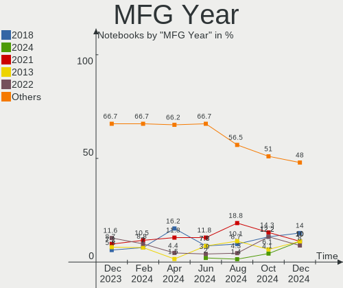
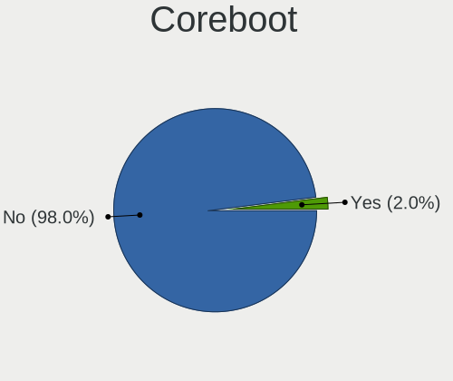
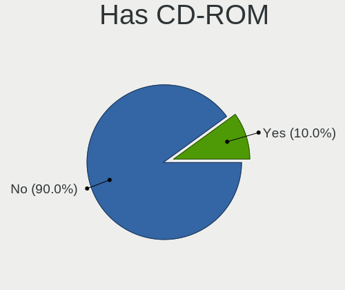
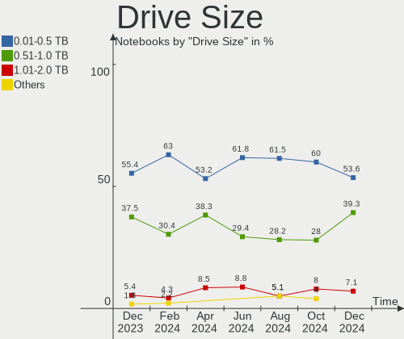
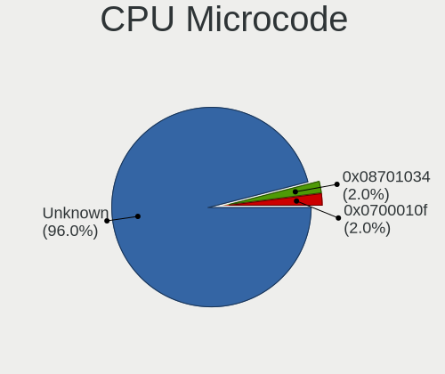

ArcoLinux - Hardware Trends (Notebooks)
---------------------------------------

A project to identify most popular hardware characteristics and track their change
over time based on data collected by Linux users at https://Linux-Hardware.org.

Anyone can contribute to this report by the [hw-probe](https://github.com/linuxhw/hw-probe) tool:

    sudo -E hw-probe -all -upload

This report is for one last month. Overall report since the beginning of time: [TestDays](https://github.com/linuxhw/TestDays)

Period: Mar, 2023.

Contents
--------

* [ System ](#system)
  - [ OS                       ](#os)
  - [ OS Family                ](#os-family)
  - [ Kernel                   ](#kernel)
  - [ Kernel Family            ](#kernel-family)
  - [ Kernel Major Ver.        ](#kernel-major-ver)
  - [ Arch                     ](#arch)
  - [ DE                       ](#de)
  - [ Display Server           ](#display-server)
  - [ Display Manager          ](#display-manager)
  - [ OS Lang                  ](#os-lang)
  - [ Boot Mode                ](#boot-mode)
  - [ Filesystem               ](#filesystem)
  - [ Part. scheme             ](#part-scheme)
  - [ Dual Boot with Linux/BSD ](#dual-boot-with-linuxbsd)
  - [ Dual Boot (Win)          ](#dual-boot-win)

* [ Board ](#board)
  - [ Vendor                   ](#vendor)
  - [ Model                    ](#model)
  - [ Model Family             ](#model-family)
  - [ MFG Year                 ](#mfg-year)
  - [ Form Factor              ](#form-factor)
  - [ Secure Boot              ](#secure-boot)
  - [ Coreboot                 ](#coreboot)
  - [ RAM Size                 ](#ram-size)
  - [ RAM Used                 ](#ram-used)
  - [ Total Drives             ](#total-drives)
  - [ Has CD-ROM               ](#has-cd-rom)
  - [ Has Ethernet             ](#has-ethernet)
  - [ Has WiFi                 ](#has-wifi)
  - [ Has Bluetooth            ](#has-bluetooth)

* [ Location ](#location)
  - [ Country                  ](#country)
  - [ City                     ](#city)

* [ Drives ](#drives)
  - [ Drive Vendor             ](#drive-vendor)
  - [ Drive Model              ](#drive-model)
  - [ HDD Vendor               ](#hdd-vendor)
  - [ SSD Vendor               ](#ssd-vendor)
  - [ Drive Kind               ](#drive-kind)
  - [ Drive Connector          ](#drive-connector)
  - [ Drive Size               ](#drive-size)
  - [ Space Total              ](#space-total)
  - [ Space Used               ](#space-used)
  - [ Malfunc. Drives          ](#malfunc-drives)
  - [ Malfunc. Drive Vendor    ](#malfunc-drive-vendor)
  - [ Malfunc. HDD Vendor      ](#malfunc-hdd-vendor)
  - [ Malfunc. Drive Kind      ](#malfunc-drive-kind)
  - [ Failed Drives            ](#failed-drives)
  - [ Failed Drive Vendor      ](#failed-drive-vendor)
  - [ Drive Status             ](#drive-status)

* [ Storage controller ](#storage-controller)
  - [ Storage Vendor           ](#storage-vendor)
  - [ Storage Model            ](#storage-model)
  - [ Storage Kind             ](#storage-kind)

* [ Processor ](#processor)
  - [ CPU Vendor               ](#cpu-vendor)
  - [ CPU Model                ](#cpu-model)
  - [ CPU Model Family         ](#cpu-model-family)
  - [ CPU Cores                ](#cpu-cores)
  - [ CPU Sockets              ](#cpu-sockets)
  - [ CPU Threads              ](#cpu-threads)
  - [ CPU Op-Modes             ](#cpu-op-modes)
  - [ CPU Microcode            ](#cpu-microcode)
  - [ CPU Microarch            ](#cpu-microarch)

* [ Graphics ](#graphics)
  - [ GPU Vendor               ](#gpu-vendor)
  - [ GPU Model                ](#gpu-model)
  - [ GPU Combo                ](#gpu-combo)
  - [ GPU Driver               ](#gpu-driver)
  - [ GPU Memory               ](#gpu-memory)

* [ Monitor ](#monitor)
  - [ Monitor Vendor           ](#monitor-vendor)
  - [ Monitor Model            ](#monitor-model)
  - [ Monitor Resolution       ](#monitor-resolution)
  - [ Monitor Diagonal         ](#monitor-diagonal)
  - [ Monitor Width            ](#monitor-width)
  - [ Aspect Ratio             ](#aspect-ratio)
  - [ Monitor Area             ](#monitor-area)
  - [ Pixel Density            ](#pixel-density)
  - [ Multiple Monitors        ](#multiple-monitors)

* [ Network ](#network)
  - [ Net Controller Vendor    ](#net-controller-vendor)
  - [ Net Controller Model     ](#net-controller-model)
  - [ Wireless Vendor          ](#wireless-vendor)
  - [ Wireless Model           ](#wireless-model)
  - [ Ethernet Vendor          ](#ethernet-vendor)
  - [ Ethernet Model           ](#ethernet-model)
  - [ Net Controller Kind      ](#net-controller-kind)
  - [ Used Controller          ](#used-controller)
  - [ NICs                     ](#nics)
  - [ IPv6                     ](#ipv6)

* [ Bluetooth ](#bluetooth)
  - [ Bluetooth Vendor         ](#bluetooth-vendor)
  - [ Bluetooth Model          ](#bluetooth-model)

* [ Sound ](#sound)
  - [ Sound Vendor             ](#sound-vendor)
  - [ Sound Model              ](#sound-model)

* [ Memory ](#memory)
  - [ Memory Vendor            ](#memory-vendor)
  - [ Memory Model             ](#memory-model)
  - [ Memory Kind              ](#memory-kind)
  - [ Memory Form Factor       ](#memory-form-factor)
  - [ Memory Size              ](#memory-size)
  - [ Memory Speed             ](#memory-speed)

* [ Printers & scanners ](#printers--scanners)
  - [ Printer Vendor           ](#printer-vendor)
  - [ Printer Model            ](#printer-model)
  - [ Scanner Vendor           ](#scanner-vendor)
  - [ Scanner Model            ](#scanner-model)

* [ Camera ](#camera)
  - [ Camera Vendor            ](#camera-vendor)
  - [ Camera Model             ](#camera-model)

* [ Security ](#security)
  - [ Fingerprint Vendor       ](#fingerprint-vendor)
  - [ Fingerprint Model        ](#fingerprint-model)
  - [ Chipcard Vendor          ](#chipcard-vendor)
  - [ Chipcard Model           ](#chipcard-model)

* [ Unsupported ](#unsupported)
  - [ Unsupported Devices      ](#unsupported-devices)
  - [ Unsupported Device Types ](#unsupported-device-types)

System
------

OS
--

Installed operating systems

| Name              | Notebooks | Percent |
|-------------------|-----------|---------|
| ArcoLinux Rolling | 39        | 95.12%  |
| ArcoLinux         | 2         | 4.88%   |

OS Family
---------

OS without a version

| Name      | Notebooks | Percent |
|-----------|-----------|---------|
| ArcoLinux | 41        | 100%    |

Kernel
------

Version of the Linux kernel

| Version                | Notebooks | Percent |
|------------------------|-----------|---------|
| 6.2.8-arch1-1          | 10        | 24.39%  |
| 6.2.2-arch1-1          | 6         | 14.63%  |
| 6.2.6-arch1-1          | 4         | 9.76%   |
| 6.1.12-arch1-1         | 3         | 7.32%   |
| 6.2.8-zen1-1-zen       | 2         | 4.88%   |
| 6.2.5-arch1-1          | 2         | 4.88%   |
| 6.2.1-arch1-1          | 2         | 4.88%   |
| 6.2.7-arch1-1          | 1         | 2.44%   |
| 6.2.6-zen1-1-zen       | 1         | 2.44%   |
| 6.2.2-zen1-1-zen       | 1         | 2.44%   |
| 6.1.22-1-lts           | 1         | 2.44%   |
| 6.1.21-1-lts           | 1         | 2.44%   |
| 6.1.19-1-lts           | 1         | 2.44%   |
| 6.1.14-1-lts           | 1         | 2.44%   |
| 6.1.11-x64v1-xanmod1-1 | 1         | 2.44%   |
| 6.1.11-arch1-1         | 1         | 2.44%   |
| 6.0.9-arch1-1          | 1         | 2.44%   |
| 6.0.12-arch1-1         | 1         | 2.44%   |
| 5.10.31-1-lts          | 1         | 2.44%   |

Kernel Family
-------------

Linux kernel without a distro release

| Version | Notebooks | Percent |
|---------|-----------|---------|
| 6.2.8   | 12        | 29.27%  |
| 6.2.2   | 7         | 17.07%  |
| 6.2.6   | 5         | 12.2%   |
| 6.1.12  | 3         | 7.32%   |
| 6.2.5   | 2         | 4.88%   |
| 6.2.1   | 2         | 4.88%   |
| 6.1.11  | 2         | 4.88%   |
| 6.2.7   | 1         | 2.44%   |
| 6.1.22  | 1         | 2.44%   |
| 6.1.21  | 1         | 2.44%   |
| 6.1.19  | 1         | 2.44%   |
| 6.1.14  | 1         | 2.44%   |
| 6.0.9   | 1         | 2.44%   |
| 6.0.12  | 1         | 2.44%   |
| 5.10.31 | 1         | 2.44%   |

Kernel Major Ver.
-----------------

Linux kernel major version

| Version | Notebooks | Percent |
|---------|-----------|---------|
| 6.2     | 29        | 70.73%  |
| 6.1     | 9         | 21.95%  |
| 6.0     | 2         | 4.88%   |
| 5.10    | 1         | 2.44%   |

Arch
----

OS architecture (x86_64, i586, etc.)

| Name   | Notebooks | Percent |
|--------|-----------|---------|
| x86_64 | 41        | 100%    |

DE
--

Desktop Environment

| Name       | Notebooks | Percent |
|------------|-----------|---------|
| XFCE       | 17        | 41.46%  |
| KDE5       | 7         | 17.07%  |
| Hyprland   | 4         | 9.76%   |
| awesome    | 4         | 9.76%   |
| GNOME      | 3         | 7.32%   |
| i3         | 2         | 4.88%   |
| X-Cinnamon | 1         | 2.44%   |
| qtile      | 1         | 2.44%   |
| MATE       | 1         | 2.44%   |
| bspwm      | 1         | 2.44%   |

Display Server
--------------

X11 or Wayland

| Name    | Notebooks | Percent |
|---------|-----------|---------|
| X11     | 33        | 80.49%  |
| Wayland | 6         | 14.63%  |
| Tty     | 2         | 4.88%   |

Display Manager
---------------

SDDM, LightDM, etc.

| Name    | Notebooks | Percent |
|---------|-----------|---------|
| SDDM    | 32        | 78.05%  |
| LightDM | 5         | 12.2%   |
| GDM     | 2         | 4.88%   |
| Unknown | 2         | 4.88%   |

OS Lang
-------

Language

| Lang  | Notebooks | Percent |
|-------|-----------|---------|
| en_US | 22        | 53.66%  |
| en_GB | 3         | 7.32%   |
| de_DE | 3         | 7.32%   |
| C     | 3         | 7.32%   |
| pt_BR | 2         | 4.88%   |
| es_ES | 2         | 4.88%   |
| tr_TR | 1         | 2.44%   |
| pl_PL | 1         | 2.44%   |
| it_IT | 1         | 2.44%   |
| fr_FR | 1         | 2.44%   |
| en_IN | 1         | 2.44%   |
| en_CA | 1         | 2.44%   |

Boot Mode
---------

EFI or BIOS

| Mode | Notebooks | Percent |
|------|-----------|---------|
| EFI  | 30        | 73.17%  |
| BIOS | 11        | 26.83%  |

Filesystem
----------

Type of filesystem

| Type    | Notebooks | Percent |
|---------|-----------|---------|
| Ext4    | 27        | 65.85%  |
| Btrfs   | 11        | 26.83%  |
| Overlay | 3         | 7.32%   |

Part. scheme
------------

Scheme of partitioning

| Type    | Notebooks | Percent |
|---------|-----------|---------|
| GPT     | 31        | 75.61%  |
| MBR     | 8         | 19.51%  |
| Unknown | 2         | 4.88%   |

Dual Boot with Linux/BSD
------------------------

Hosting more than one Linux/BSD

| Dual boot | Notebooks | Percent |
|-----------|-----------|---------|
| No        | 27        | 65.85%  |
| Yes       | 14        | 34.15%  |

Dual Boot (Win)
---------------

Hosting Linux and Windows

| Dual boot | Notebooks | Percent |
|-----------|-----------|---------|
| No        | 27        | 65.85%  |
| Yes       | 14        | 34.15%  |

Board
-----

Vendor
------

Motherboard manufacturer

| Name                | Notebooks | Percent |
|---------------------|-----------|---------|
| Lenovo              | 9         | 21.95%  |
| ASUSTek Computer    | 6         | 14.63%  |
| Dell                | 5         | 12.2%   |
| Hewlett-Packard     | 3         | 7.32%   |
| Acer                | 3         | 7.32%   |
| Toshiba             | 2         | 4.88%   |
| System76            | 2         | 4.88%   |
| MSI                 | 2         | 4.88%   |
| Chuwi               | 2         | 4.88%   |
| TUXEDO              | 1         | 2.44%   |
| Sony                | 1         | 2.44%   |
| Samsung Electronics | 1         | 2.44%   |
| Medion              | 1         | 2.44%   |
| LG Electronics      | 1         | 2.44%   |
| HUAWEI              | 1         | 2.44%   |
| Unknown             | 1         | 2.44%   |

Model
-----

Motherboard model

| Name                                        | Notebooks | Percent |
|---------------------------------------------|-----------|---------|
| TUXEDO InfinityBook Pro 14 Gen6             | 1         | 2.44%   |
| Toshiba Satellite C55-A                     | 1         | 2.44%   |
| Toshiba Satellite C50-A510                  | 1         | 2.44%   |
| System76 Pangolin                           | 1         | 2.44%   |
| System76 Oryx Pro                           | 1         | 2.44%   |
| Sony VPCEH10EB                              | 1         | 2.44%   |
| Samsung 300E4A/300E5A/300E7A/3430EA/3530EA  | 1         | 2.44%   |
| MSI GV62 7RE                                | 1         | 2.44%   |
| MSI GT70                                    | 1         | 2.44%   |
| Medion P7624                                | 1         | 2.44%   |
| LG 17Z90P-K.AA78A1                          | 1         | 2.44%   |
| Lenovo Z51-70 80K6                          | 1         | 2.44%   |
| Lenovo V15 G2 ALC 82KD                      | 1         | 2.44%   |
| Lenovo ThinkPad T490s 20NXS0DS00            | 1         | 2.44%   |
| Lenovo ThinkPad T470 W10DG 20JNS15B26       | 1         | 2.44%   |
| Lenovo ThinkPad T410 2522AC1                | 1         | 2.44%   |
| Lenovo ThinkPad Edge S430 33643DG           | 1         | 2.44%   |
| Lenovo IdeaPad S145-15IKB 81XM              | 1         | 2.44%   |
| Lenovo IdeaPad 5 15ALC05 82LN               | 1         | 2.44%   |
| Lenovo E41-25 81FS                          | 1         | 2.44%   |
| HUAWEI KLVL-WXX9                            | 1         | 2.44%   |
| HP Pavilion Laptop 15-eh0xxx                | 1         | 2.44%   |
| HP OMEN by Laptop 15-dc0xxx                 | 1         | 2.44%   |
| HP Laptop 15s-eq2xxx                        | 1         | 2.44%   |
| Dell XPS 13 7390                            | 1         | 2.44%   |
| Dell Latitude 3410                          | 1         | 2.44%   |
| Dell Inspiron 7737                          | 1         | 2.44%   |
| Dell Inspiron 5420                          | 1         | 2.44%   |
| Dell G7 7500                                | 1         | 2.44%   |
| Chuwi HeroBook Air                          | 1         | 2.44%   |
| Chuwi GemiBook Pro                          | 1         | 2.44%   |
| ASUS ZenBook UX425QA_UM425QA                | 1         | 2.44%   |
| ASUS X550LD                                 | 1         | 2.44%   |
| ASUS X540UP                                 | 1         | 2.44%   |
| ASUS VivoBook_ASUSLaptop X421EAY_X413EA     | 1         | 2.44%   |
| ASUS VivoBook_ASUSLaptop M3401QA_M3401QA    | 1         | 2.44%   |
| ASUS ROG Zephyrus Duo 15 SE GX551QS_GX551QS | 1         | 2.44%   |
| Acer Aspire E5-411G                         | 1         | 2.44%   |
| Acer Aspire A715-74G                        | 1         | 2.44%   |
| Acer Aspire A515-45                         | 1         | 2.44%   |

Model Family
------------

Motherboard model prefix

| Name                | Notebooks | Percent |
|---------------------|-----------|---------|
| Lenovo ThinkPad     | 4         | 9.76%   |
| Acer Aspire         | 3         | 7.32%   |
| Toshiba Satellite   | 2         | 4.88%   |
| Lenovo IdeaPad      | 2         | 4.88%   |
| Dell Inspiron       | 2         | 4.88%   |
| ASUS VivoBook       | 2         | 4.88%   |
| TUXEDO InfinityBook | 1         | 2.44%   |
| System76 Pangolin   | 1         | 2.44%   |
| System76 Oryx       | 1         | 2.44%   |
| Sony VPCEH10EB      | 1         | 2.44%   |
| Samsung 300E4A      | 1         | 2.44%   |
| MSI GV62            | 1         | 2.44%   |
| MSI GT70            | 1         | 2.44%   |
| Medion P7624        | 1         | 2.44%   |
| LG 17Z90P-K.AA78A1  | 1         | 2.44%   |
| Lenovo Z51-70       | 1         | 2.44%   |
| Lenovo V15          | 1         | 2.44%   |
| Lenovo E41-25       | 1         | 2.44%   |
| HUAWEI KLVL-WXX9    | 1         | 2.44%   |
| HP Pavilion         | 1         | 2.44%   |
| HP OMEN             | 1         | 2.44%   |
| HP Laptop           | 1         | 2.44%   |
| Dell XPS            | 1         | 2.44%   |
| Dell Latitude       | 1         | 2.44%   |
| Dell G7             | 1         | 2.44%   |
| Chuwi HeroBook      | 1         | 2.44%   |
| Chuwi GemiBook      | 1         | 2.44%   |
| ASUS ZenBook        | 1         | 2.44%   |
| ASUS X550LD         | 1         | 2.44%   |
| ASUS X540UP         | 1         | 2.44%   |
| ASUS ROG            | 1         | 2.44%   |
| Unknown             | 1         | 2.44%   |

MFG Year
--------

Motherboard manufacture year

| Year | Notebooks | Percent |
|------|-----------|---------|
| 2021 | 11        | 26.83%  |
| 2019 | 5         | 12.2%   |
| 2013 | 5         | 12.2%   |
| 2020 | 4         | 9.76%   |
| 2018 | 3         | 7.32%   |
| 2011 | 3         | 7.32%   |
| 2022 | 2         | 4.88%   |
| 2014 | 2         | 4.88%   |
| 2012 | 2         | 4.88%   |
| 2017 | 1         | 2.44%   |
| 2016 | 1         | 2.44%   |
| 2015 | 1         | 2.44%   |
| 2009 | 1         | 2.44%   |

Form Factor
-----------

Physical design of the computer

| Name     | Notebooks | Percent |
|----------|-----------|---------|
| Notebook | 41        | 100%    |

Secure Boot
-----------

Enabled or disabled

| State    | Notebooks | Percent |
|----------|-----------|---------|
| Disabled | 41        | 100%    |

Coreboot
--------

Have coreboot on board

| Used | Notebooks | Percent |
|------|-----------|---------|
| No   | 41        | 100%    |

RAM Size
--------

Total RAM memory

| Size in GB | Notebooks | Percent |
|------------|-----------|---------|
| 4.01-8.0   | 14        | 34.15%  |
| 8.01-16.0  | 9         | 21.95%  |
| 16.01-24.0 | 8         | 19.51%  |
| 32.01-64.0 | 6         | 14.63%  |
| 3.01-4.0   | 4         | 9.76%   |

RAM Used
--------

Used RAM memory

| Used GB   | Notebooks | Percent |
|-----------|-----------|---------|
| 1.01-2.0  | 13        | 31.71%  |
| 4.01-8.0  | 10        | 24.39%  |
| 3.01-4.0  | 7         | 17.07%  |
| 2.01-3.0  | 7         | 17.07%  |
| 0.51-1.0  | 3         | 7.32%   |
| 8.01-16.0 | 1         | 2.44%   |

Total Drives
------------

Number of drives on board

| Drives | Notebooks | Percent |
|--------|-----------|---------|
| 1      | 27        | 65.85%  |
| 2      | 11        | 26.83%  |
| 4      | 2         | 4.88%   |
| 3      | 1         | 2.44%   |

Has CD-ROM
----------

Has CD-ROM on board

| Presented | Notebooks | Percent |
|-----------|-----------|---------|
| No        | 31        | 75.61%  |
| Yes       | 10        | 24.39%  |

Has Ethernet
------------

Has Ethernet on board

| Presented | Notebooks | Percent |
|-----------|-----------|---------|
| Yes       | 30        | 73.17%  |
| No        | 11        | 26.83%  |

Has WiFi
--------

Has WiFi module

| Presented | Notebooks | Percent |
|-----------|-----------|---------|
| Yes       | 41        | 100%    |

Has Bluetooth
-------------

Has Bluetooth module

| Presented | Notebooks | Percent |
|-----------|-----------|---------|
| Yes       | 38        | 92.68%  |
| No        | 3         | 7.32%   |

Location
--------

Country
-------

Geographic location (country)

| Country         | Notebooks | Percent |
|-----------------|-----------|---------|
| USA             | 5         | 12.2%   |
| UK              | 5         | 12.2%   |
| Germany         | 5         | 12.2%   |
| France          | 4         | 9.76%   |
| Brazil          | 3         | 7.32%   |
| Turkey          | 2         | 4.88%   |
| Spain           | 2         | 4.88%   |
| India           | 2         | 4.88%   |
| Belgium         | 2         | 4.88%   |
| Switzerland     | 1         | 2.44%   |
| Sweden          | 1         | 2.44%   |
| Poland          | 1         | 2.44%   |
| North Macedonia | 1         | 2.44%   |
| Netherlands     | 1         | 2.44%   |
| Italy           | 1         | 2.44%   |
| Indonesia       | 1         | 2.44%   |
| Greece          | 1         | 2.44%   |
| Canada          | 1         | 2.44%   |
| Bolivia         | 1         | 2.44%   |
| Austria         | 1         | 2.44%   |

City
----

Geographic location (city)

| City                | Notebooks | Percent |
|---------------------|-----------|---------|
| Paris               | 2         | 4.88%   |
| Duffel              | 2         | 4.88%   |
| Walterboro          | 1         | 2.44%   |
| Vienna              | 1         | 2.44%   |
| Vaxjo               | 1         | 2.44%   |
| Thornhill           | 1         | 2.44%   |
| Stratford-upon-Avon | 1         | 2.44%   |
| Spokane             | 1         | 2.44%   |
| Skopje              | 1         | 2.44%   |
| Seville             | 1         | 2.44%   |
| Sao Paulo           | 1         | 2.44%   |
| Santa Cruz          | 1         | 2.44%   |
| Romilly-sur-Seine   | 1         | 2.44%   |
| Ripon               | 1         | 2.44%   |
| Recife              | 1         | 2.44%   |
| Poway               | 1         | 2.44%   |
| Offenbach           | 1         | 2.44%   |
| Nea Smyrni          | 1         | 2.44%   |
| Madurai             | 1         | 2.44%   |
| Madison             | 1         | 2.44%   |
| Ludwigsburg         | 1         | 2.44%   |
| Lochgilphead        | 1         | 2.44%   |
| Le Port-Marly       | 1         | 2.44%   |
| Kołobrzeg          | 1         | 2.44%   |
| Kolkata             | 1         | 2.44%   |
| Istanbul            | 1         | 2.44%   |
| Houston             | 1         | 2.44%   |
| Hemel Hempstead     | 1         | 2.44%   |
| Helden              | 1         | 2.44%   |
| Gummersbach         | 1         | 2.44%   |
| Gedern              | 1         | 2.44%   |
| Frankfurt am Main   | 1         | 2.44%   |
| Flawil              | 1         | 2.44%   |
| Edinburgh           | 1         | 2.44%   |
| Catania             | 1         | 2.44%   |
| Campinas            | 1         | 2.44%   |
| Bursa               | 1         | 2.44%   |
| Bekasi              | 1         | 2.44%   |
| Barcelona           | 1         | 2.44%   |

Drives
------

Drive Vendor
------------

Hard drive vendors

| Vendor                      | Notebooks | Drives | Percent |
|-----------------------------|-----------|--------|---------|
| Samsung Electronics         | 16        | 16     | 28.07%  |
| WDC                         | 7         | 8      | 12.28%  |
| Seagate                     | 5         | 5      | 8.77%   |
| Sandisk                     | 5         | 5      | 8.77%   |
| Toshiba                     | 3         | 3      | 5.26%   |
| Intel                       | 3         | 3      | 5.26%   |
| HGST                        | 3         | 3      | 5.26%   |
| Unknown                     | 2         | 2      | 3.51%   |
| SK hynix                    | 2         | 2      | 3.51%   |
| Kingston Technology Company | 2         | 2      | 3.51%   |
| Crucial                     | 2         | 3      | 3.51%   |
| Micron Technology           | 1         | 1      | 1.75%   |
| Kingston                    | 1         | 1      | 1.75%   |
| Intenso                     | 1         | 1      | 1.75%   |
| Hitachi                     | 1         | 1      | 1.75%   |
| China                       | 1         | 1      | 1.75%   |
| BIWIN                       | 1         | 1      | 1.75%   |
| AMD                         | 1         | 2      | 1.75%   |

Drive Model
-----------

Hard drive models

| Model                                               | Notebooks | Percent |
|-----------------------------------------------------|-----------|---------|
| Samsung NVMe SSD Controller SM981/PM981/PM983 250GB | 4         | 6.9%    |
| Seagate ST1000LM024 HN-M101MBB 1TB                  | 3         | 5.17%   |
| Toshiba MQ01ABD100 1TB                              | 2         | 3.45%   |
| Sandisk WD Blue SN550 NVMe SSD 256GB                | 2         | 3.45%   |
| Samsung SSD 860 EVO 250GB                           | 2         | 3.45%   |
| Samsung MZALQ512HBLU-00BL2 512GB                    | 2         | 3.45%   |
| HGST HTS721010A9E630 1TB                            | 2         | 3.45%   |
| WDC WDS500G2B0B-00YS70 500GB SSD                    | 1         | 1.72%   |
| WDC WDS120G2G0B-00EPW0 120GB SSD                    | 1         | 1.72%   |
| WDC WDS120G2G0A-00JH30 120GB SSD                    | 1         | 1.72%   |
| WDC WD5000LPCX-24VHAT0 500GB                        | 1         | 1.72%   |
| WDC WD3200BPVT-22JJ5T0 320GB                        | 1         | 1.72%   |
| WDC WD20SPZX-22UA7T0 2TB                            | 1         | 1.72%   |
| WDC WD10SPZX-24Z10 1TB                              | 1         | 1.72%   |
| WDC WD10SPZX-21Z10T0 1TB                            | 1         | 1.72%   |
| Unknown SD/MMC/MS PRO 64GB                          | 1         | 1.72%   |
| Unknown MMC Card  134GB                             | 1         | 1.72%   |
| Toshiba MQ01ABF050 500GB                            | 1         | 1.72%   |
| SK hynix HFM512GD3JX013N 512GB                      | 1         | 1.72%   |
| SK hynix HFM001TD3JX013N 1TB                        | 1         | 1.72%   |
| Seagate ST2000LX001-1RG174 2TB                      | 1         | 1.72%   |
| Seagate ST1000LM 035-1RK172 1TB                     | 1         | 1.72%   |
| Sandisk WD_BLACK SN770 1TB                          | 1         | 1.72%   |
| Sandisk WD Black SN750 / PC SN730 NVMe SSD 1TB      | 1         | 1.72%   |
| SanDisk SSD PLUS 120 GB                             | 1         | 1.72%   |
| Samsung SSD 980 500GB                               | 1         | 1.72%   |
| Samsung SSD 970 EVO 500G                            | 1         | 1.72%   |
| Samsung SSD 860 EVO 1TB                             | 1         | 1.72%   |
| Samsung SSD 850 PRO 256GB                           | 1         | 1.72%   |
| Samsung SSD 850 EVO 120GB                           | 1         | 1.72%   |
| Samsung SSD 840 EVO 500GB                           | 1         | 1.72%   |
| Samsung MZVLQ256HBJD-00BH1 256GB                    | 1         | 1.72%   |
| Samsung MZNLN128HAHQ-00000 128GB SSD                | 1         | 1.72%   |
| Micron 2200_MTFDHBA512TCK 512GB                     | 1         | 1.72%   |
| Kingston Company U-SNS8154P3 NVMe SSD 256GB         | 1         | 1.72%   |
| Kingston Company SNV2S1000G 1TB                     | 1         | 1.72%   |
| Kingston SNVS500G 500GB                             | 1         | 1.72%   |
| Intenso SSD Sata III 1TB                            | 1         | 1.72%   |
| Intel SSDPEKNU512GZH 512GB                          | 1         | 1.72%   |
| Intel SSDPEKNU010TZ 1TB                             | 1         | 1.72%   |

HDD Vendor
----------

Hard disk drive vendors

| Vendor  | Notebooks | Drives | Percent |
|---------|-----------|--------|---------|
| WDC     | 5         | 5      | 27.78%  |
| Seagate | 5         | 5      | 27.78%  |
| Toshiba | 3         | 3      | 16.67%  |
| HGST    | 3         | 3      | 16.67%  |
| Unknown | 1         | 1      | 5.56%   |
| Hitachi | 1         | 1      | 5.56%   |

SSD Vendor
----------

Solid state drive vendors

| Vendor              | Notebooks | Drives | Percent |
|---------------------|-----------|--------|---------|
| Samsung Electronics | 7         | 7      | 43.75%  |
| WDC                 | 3         | 3      | 18.75%  |
| Crucial             | 2         | 3      | 12.5%   |
| SanDisk             | 1         | 1      | 6.25%   |
| Intenso             | 1         | 1      | 6.25%   |
| China               | 1         | 1      | 6.25%   |
| BIWIN               | 1         | 1      | 6.25%   |

Drive Kind
----------

HDD or SSD

| Kind | Notebooks | Drives | Percent |
|------|-----------|--------|---------|
| NVMe | 21        | 24     | 38.89%  |
| HDD  | 18        | 18     | 33.33%  |
| SSD  | 14        | 17     | 25.93%  |
| MMC  | 1         | 1      | 1.85%   |

Drive Connector
---------------

SATA, SAS, NVMe, etc.

| Type | Notebooks | Drives | Percent |
|------|-----------|--------|---------|
| SATA | 24        | 33     | 48.98%  |
| NVMe | 21        | 23     | 42.86%  |
| SAS  | 3         | 3      | 6.12%   |
| MMC  | 1         | 1      | 2.04%   |

Drive Size
----------

Size of hard drive

| Size in TB | Notebooks | Drives | Percent |
|------------|-----------|--------|---------|
| 0.01-0.5   | 15        | 19     | 50%     |
| 0.51-1.0   | 13        | 14     | 43.33%  |
| 1.01-2.0   | 2         | 2      | 6.67%   |

Space Total
-----------

Amount of disk space available on the file system

| Size in GB     | Notebooks | Percent |
|----------------|-----------|---------|
| 101-250        | 9         | 21.95%  |
| More than 3000 | 7         | 17.07%  |
| 501-1000       | 6         | 14.63%  |
| 251-500        | 5         | 12.2%   |
| 51-100         | 4         | 9.76%   |
| 1001-2000      | 3         | 7.32%   |
| 1-20           | 3         | 7.32%   |
| 2001-3000      | 2         | 4.88%   |
| Unknown        | 2         | 4.88%   |

Space Used
----------

Amount of used disk space

| Used GB  | Notebooks | Percent |
|----------|-----------|---------|
| 21-50    | 9         | 21.95%  |
| 1-20     | 8         | 19.51%  |
| 251-500  | 6         | 14.63%  |
| 51-100   | 6         | 14.63%  |
| 101-250  | 5         | 12.2%   |
| 501-1000 | 5         | 12.2%   |
| Unknown  | 2         | 4.88%   |

Malfunc. Drives
---------------

Drive models with a malfunction

| Model                              | Notebooks | Drives | Percent |
|------------------------------------|-----------|--------|---------|
| Seagate ST1000LM024 HN-M101MBB 1TB | 3         | 3      | 37.5%   |
| Toshiba MQ01ABD100 1TB             | 2         | 2      | 25%     |
| Toshiba MQ01ABF050 500GB           | 1         | 1      | 12.5%   |
| Intel SSDPEKNU512GZH 512GB         | 1         | 1      | 12.5%   |
| HGST HTS721010A9E630 1TB           | 1         | 1      | 12.5%   |

Malfunc. Drive Vendor
---------------------

Vendors of faulty drives

| Vendor  | Notebooks | Drives | Percent |
|---------|-----------|--------|---------|
| Toshiba | 3         | 3      | 37.5%   |
| Seagate | 3         | 3      | 37.5%   |
| Intel   | 1         | 1      | 12.5%   |
| HGST    | 1         | 1      | 12.5%   |

Malfunc. HDD Vendor
-------------------

Vendors of faulty HDD drives

| Vendor  | Notebooks | Drives | Percent |
|---------|-----------|--------|---------|
| Toshiba | 3         | 3      | 42.86%  |
| Seagate | 3         | 3      | 42.86%  |
| HGST    | 1         | 1      | 14.29%  |

Malfunc. Drive Kind
-------------------

Kinds of faulty drives

| Kind | Notebooks | Drives | Percent |
|------|-----------|--------|---------|
| HDD  | 7         | 7      | 87.5%   |
| NVMe | 1         | 1      | 12.5%   |

Failed Drives
-------------

Failed drive models

Zero info for selected period =(

Failed Drive Vendor
-------------------

Failed drive vendors

Zero info for selected period =(

Drive Status
------------

Number of failed and malfunc. drives

| Status   | Notebooks | Drives | Percent |
|----------|-----------|--------|---------|
| Works    | 33        | 46     | 71.74%  |
| Malfunc  | 8         | 8      | 17.39%  |
| Detected | 5         | 6      | 10.87%  |

Storage controller
------------------

Storage Vendor
--------------

Storage controller vendors

| Vendor                      | Notebooks | Percent |
|-----------------------------|-----------|---------|
| Intel                       | 27        | 51.92%  |
| Samsung Electronics         | 8         | 15.38%  |
| AMD                         | 7         | 13.46%  |
| SanDisk                     | 4         | 7.69%   |
| Kingston Technology Company | 3         | 5.77%   |
| SK hynix                    | 2         | 3.85%   |
| Micron Technology           | 1         | 1.92%   |

Storage Model
-------------

Storage controller models

| Model                                                                          | Notebooks | Percent |
|--------------------------------------------------------------------------------|-----------|---------|
| AMD FCH SATA Controller [AHCI mode]                                            | 6         | 10.91%  |
| Samsung NVMe SSD Controller SM981/PM981/PM983                                  | 4         | 7.27%   |
| Samsung NVMe SSD Controller 980                                                | 4         | 7.27%   |
| Intel 7 Series Chipset Family 6-port SATA Controller [AHCI mode]               | 3         | 5.45%   |
| Intel 6 Series/C200 Series Chipset Family 6 port Mobile SATA AHCI Controller   | 3         | 5.45%   |
| SK hynix Gold P31/PC711 NVMe Solid State Drive                                 | 2         | 3.64%   |
| SanDisk WD Blue SN550 NVMe SSD                                                 | 2         | 3.64%   |
| Intel Sunrise Point-LP SATA Controller [AHCI mode]                             | 2         | 3.64%   |
| Intel Non-Volatile memory controller                                           | 2         | 3.64%   |
| Intel Cannon Lake Mobile PCH SATA AHCI Controller                              | 2         | 3.64%   |
| Intel 8 Series/C220 Series Chipset Family 6-port SATA Controller 1 [AHCI mode] | 2         | 3.64%   |
| Intel 8 Series SATA Controller 1 [AHCI mode]                                   | 2         | 3.64%   |
| SanDisk WD Black SN750 / PC SN730 NVMe SSD                                     | 1         | 1.82%   |
| SanDisk NVMe Controller                                                        | 1         | 1.82%   |
| Micron NVMe Storage Controller                                                 | 1         | 1.82%   |
| Kingston Company U-SNS8154P3 NVMe SSD                                          | 1         | 1.82%   |
| Kingston Company Company Non-Volatile memory controller                        | 1         | 1.82%   |
| Kingston Company NVMe Controller                                               | 1         | 1.82%   |
| Intel Wildcat Point-LP SATA Controller [AHCI Mode]                             | 1         | 1.82%   |
| Intel Volume Management Device NVMe RAID Controller                            | 1         | 1.82%   |
| Intel SSD 660P Series                                                          | 1         | 1.82%   |
| Intel Jasper Lake SATA AHCI Controller                                         | 1         | 1.82%   |
| Intel HM170/QM170 Chipset SATA Controller [AHCI Mode]                          | 1         | 1.82%   |
| Intel Comet Lake SATA AHCI Controller                                          | 1         | 1.82%   |
| Intel Celeron/Pentium Silver Processor SATA Controller                         | 1         | 1.82%   |
| Intel Atom Processor E3800 Series SATA AHCI Controller                         | 1         | 1.82%   |
| Intel 82801 Mobile SATA Controller [RAID mode]                                 | 1         | 1.82%   |
| Intel 7 Series/C210 Series Chipset Family IDE-r Controller                     | 1         | 1.82%   |
| Intel 7 Series Chipset Family 4-port SATA Controller [IDE mode]                | 1         | 1.82%   |
| Intel 7 Series Chipset Family 2-port SATA Controller [IDE mode]                | 1         | 1.82%   |
| Intel 5 Series/3400 Series Chipset 6 port SATA AHCI Controller                 | 1         | 1.82%   |
| Intel 400 Series Chipset Family SATA AHCI Controller                           | 1         | 1.82%   |
| AMD FCH SATA Controller [RAID Bottom]                                          | 1         | 1.82%   |

Storage Kind
------------

Kind of storage controller (IDE, SATA, NVMe, SAS, ...)

| Kind | Notebooks | Percent |
|------|-----------|---------|
| SATA | 28        | 53.85%  |
| NVMe | 21        | 40.38%  |
| RAID | 2         | 3.85%   |
| IDE  | 1         | 1.92%   |

Processor
---------

CPU Vendor
----------

Processor vendors

| Vendor | Notebooks | Percent |
|--------|-----------|---------|
| Intel  | 30        | 73.17%  |
| AMD    | 11        | 26.83%  |

CPU Model
---------

Processor models

| Model                                      | Notebooks | Percent |
|--------------------------------------------|-----------|---------|
| AMD Ryzen 7 5700U with Radeon Graphics     | 4         | 9.76%   |
| Intel Core i7-9750H CPU @ 2.60GHz          | 2         | 4.88%   |
| Intel Core i5-2430M CPU @ 2.40GHz          | 2         | 4.88%   |
| Intel Core i7-8565U CPU @ 1.80GHz          | 1         | 2.44%   |
| Intel Core i7-7700HQ CPU @ 2.80GHz         | 1         | 2.44%   |
| Intel Core i7-4710MQ CPU @ 2.50GHz         | 1         | 2.44%   |
| Intel Core i7-4510U CPU @ 2.00GHz          | 1         | 2.44%   |
| Intel Core i7-4500U CPU @ 1.80GHz          | 1         | 2.44%   |
| Intel Core i7-3612QM CPU @ 2.10GHz         | 1         | 2.44%   |
| Intel Core i7-3610QM CPU @ 2.30GHz         | 1         | 2.44%   |
| Intel Core i7-3520M CPU @ 2.90GHz          | 1         | 2.44%   |
| Intel Core i7-10750H CPU @ 2.60GHz         | 1         | 2.44%   |
| Intel Core i7-10510U CPU @ 1.80GHz         | 1         | 2.44%   |
| Intel Core i5-8300H CPU @ 2.30GHz          | 1         | 2.44%   |
| Intel Core i5-7200U CPU @ 2.50GHz          | 1         | 2.44%   |
| Intel Core i5-6300U CPU @ 2.40GHz          | 1         | 2.44%   |
| Intel Core i5-5200U CPU @ 2.20GHz          | 1         | 2.44%   |
| Intel Core i5-4200M CPU @ 2.50GHz          | 1         | 2.44%   |
| Intel Core i5-10210U CPU @ 1.60GHz         | 1         | 2.44%   |
| Intel Core i5 CPU M 520 @ 2.40GHz          | 1         | 2.44%   |
| Intel Core i3-8130U CPU @ 2.20GHz          | 1         | 2.44%   |
| Intel Core i3-2310M CPU @ 2.10GHz          | 1         | 2.44%   |
| Intel Celeron N5100 @ 1.10GHz              | 1         | 2.44%   |
| Intel Celeron N4020 CPU @ 1.10GHz          | 1         | 2.44%   |
| Intel Celeron CPU N2840 @ 2.16GHz          | 1         | 2.44%   |
| Intel Celeron CPU 1037U @ 1.80GHz          | 1         | 2.44%   |
| Intel 11th Gen Core i7-1165G7 @ 2.80GHz    | 1         | 2.44%   |
| Intel 11th Gen Core i5-11300H @ 3.10GHz    | 1         | 2.44%   |
| Intel 11th Gen Core i3-1115G4 @ 3.00GHz    | 1         | 2.44%   |
| AMD Ryzen 9 5900HX with Radeon Graphics    | 1         | 2.44%   |
| AMD Ryzen 7 5800H with Radeon Graphics     | 1         | 2.44%   |
| AMD Ryzen 7 4800H with Radeon Graphics     | 1         | 2.44%   |
| AMD Ryzen 5 5600H with Radeon Graphics     | 1         | 2.44%   |
| AMD Ryzen 5 5500U with Radeon Graphics     | 1         | 2.44%   |
| AMD Ryzen 3 4300U with Radeon Graphics     | 1         | 2.44%   |
| AMD PRO A4-4350B R4, 5 COMPUTE CORES 2C+3G | 1         | 2.44%   |

CPU Model Family
----------------

Processor model prefix

| Model         | Notebooks | Percent |
|---------------|-----------|---------|
| Intel Core i7 | 12        | 29.27%  |
| Intel Core i5 | 9         | 21.95%  |
| AMD Ryzen 7   | 6         | 14.63%  |
| Other         | 4         | 9.76%   |
| Intel Celeron | 4         | 9.76%   |
| Intel Core i3 | 2         | 4.88%   |
| AMD Ryzen 5   | 2         | 4.88%   |
| AMD Ryzen 9   | 1         | 2.44%   |
| AMD Ryzen 3   | 1         | 2.44%   |

CPU Cores
---------

Number of processor cores

| Number | Notebooks | Percent |
|--------|-----------|---------|
| 2      | 17        | 41.46%  |
| 4      | 12        | 29.27%  |
| 8      | 7         | 17.07%  |
| 6      | 5         | 12.2%   |

CPU Sockets
-----------

Number of sockets

| Number | Notebooks | Percent |
|--------|-----------|---------|
| 1      | 41        | 100%    |

CPU Threads
-----------

Threads per core (Hyper-Threading)

| Number | Notebooks | Percent |
|--------|-----------|---------|
| 2      | 35        | 85.37%  |
| 1      | 6         | 14.63%  |

CPU Op-Modes
------------

CPU Operation Modes (32-bit, 64-bit)

| Op mode        | Notebooks | Percent |
|----------------|-----------|---------|
| 32-bit, 64-bit | 41        | 100%    |

CPU Microcode
-------------

Microcode number

| Number     | Notebooks | Percent |
|------------|-----------|---------|
| Unknown    | 22        | 53.66%  |
| 0x0a50000c | 3         | 7.32%   |
| 0x08608103 | 3         | 7.32%   |
| 0x806c1    | 2         | 4.88%   |
| 0x08608102 | 2         | 4.88%   |
| 0x906ea    | 1         | 2.44%   |
| 0x806ec    | 1         | 2.44%   |
| 0x806ea    | 1         | 2.44%   |
| 0x706a8    | 1         | 2.44%   |
| 0x40651    | 1         | 2.44%   |
| 0x306a9    | 1         | 2.44%   |
| 0x206a7    | 1         | 2.44%   |
| 0x08600106 | 1         | 2.44%   |
| 0x06006705 | 1         | 2.44%   |

CPU Microarch
-------------

Microarchitecture

| Name          | Notebooks | Percent |
|---------------|-----------|---------|
| KabyLake      | 9         | 21.95%  |
| Unknown       | 5         | 12.2%   |
| IvyBridge     | 4         | 9.76%   |
| Haswell       | 4         | 9.76%   |
| Zen 3         | 3         | 7.32%   |
| TigerLake     | 3         | 7.32%   |
| SandyBridge   | 3         | 7.32%   |
| Zen 2         | 2         | 4.88%   |
| Westmere      | 1         | 2.44%   |
| Tremont       | 1         | 2.44%   |
| Skylake       | 1         | 2.44%   |
| Silvermont    | 1         | 2.44%   |
| Goldmont plus | 1         | 2.44%   |
| Excavator     | 1         | 2.44%   |
| CometLake     | 1         | 2.44%   |
| Broadwell     | 1         | 2.44%   |

Graphics
--------

GPU Vendor
----------

Vendors of graphics cards

| Vendor | Notebooks | Percent |
|--------|-----------|---------|
| Intel  | 30        | 52.63%  |
| Nvidia | 14        | 24.56%  |
| AMD    | 13        | 22.81%  |

GPU Model
---------

Graphics card models

| Model                                                                     | Notebooks | Percent |
|---------------------------------------------------------------------------|-----------|---------|
| AMD Lucienne                                                              | 5         | 8.77%   |
| Intel 3rd Gen Core processor Graphics Controller                          | 4         | 7.02%   |
| Nvidia GF117M [GeForce 610M/710M/810M/820M / GT 620M/625M/630M/720M]      | 3         | 5.26%   |
| Intel CoffeeLake-H GT2 [UHD Graphics 630]                                 | 3         | 5.26%   |
| Intel 2nd Generation Core Processor Family Integrated Graphics Controller | 3         | 5.26%   |
| AMD Cezanne [Radeon Vega Series / Radeon Vega Mobile Series]              | 3         | 5.26%   |
| Nvidia TU106M [GeForce RTX 2060 Mobile]                                   | 2         | 3.51%   |
| Nvidia GF108M [GeForce GT 620M/630M/635M/640M LE]                         | 2         | 3.51%   |
| Intel TigerLake-LP GT2 [Iris Xe Graphics]                                 | 2         | 3.51%   |
| Intel Haswell-ULT Integrated Graphics Controller                          | 2         | 3.51%   |
| Intel CometLake-U GT2 [UHD Graphics]                                      | 2         | 3.51%   |
| Intel 4th Gen Core Processor Integrated Graphics Controller               | 2         | 3.51%   |
| AMD Renoir                                                                | 2         | 3.51%   |
| Nvidia TU117M [GeForce GTX 1650 Mobile / Max-Q]                           | 1         | 1.75%   |
| Nvidia GP107M [GeForce GTX 1050 Ti Mobile]                                | 1         | 1.75%   |
| Nvidia GP106M [GeForce GTX 1060 Mobile]                                   | 1         | 1.75%   |
| Nvidia GK104M [GeForce GTX 870M]                                          | 1         | 1.75%   |
| Nvidia GF119M [GeForce GT 520MX]                                          | 1         | 1.75%   |
| Nvidia GF114M [GeForce GTX 670M]                                          | 1         | 1.75%   |
| Nvidia GA104M [GeForce RTX 3080 Mobile / Max-Q 8GB/16GB]                  | 1         | 1.75%   |
| Intel WhiskeyLake-U GT2 [UHD Graphics 620]                                | 1         | 1.75%   |
| Intel UHD Graphics 620                                                    | 1         | 1.75%   |
| Intel Tiger Lake-LP GT2 [UHD Graphics G4]                                 | 1         | 1.75%   |
| Intel Skylake GT2 [HD Graphics 520]                                       | 1         | 1.75%   |
| Intel JasperLake [UHD Graphics]                                           | 1         | 1.75%   |
| Intel HD Graphics 630                                                     | 1         | 1.75%   |
| Intel HD Graphics 620                                                     | 1         | 1.75%   |
| Intel HD Graphics 5500                                                    | 1         | 1.75%   |
| Intel GeminiLake [UHD Graphics 600]                                       | 1         | 1.75%   |
| Intel Core Processor Integrated Graphics Controller                       | 1         | 1.75%   |
| Intel CometLake-H GT2 [UHD Graphics]                                      | 1         | 1.75%   |
| Intel Atom Processor Z36xxx/Z37xxx Series Graphics & Display              | 1         | 1.75%   |
| AMD Venus XTX [Radeon HD 8890M / R9 M275X/M375X]                          | 1         | 1.75%   |
| AMD Sun LE [Radeon HD 8550M / R5 M230]                                    | 1         | 1.75%   |
| AMD Stoney [Radeon R2/R3/R4/R5 Graphics]                                  | 1         | 1.75%   |

GPU Combo
---------

Combinations of graphics cards

| Name           | Notebooks | Percent |
|----------------|-----------|---------|
| 1 x Intel      | 15        | 36.59%  |
| Intel + Nvidia | 13        | 31.71%  |
| 1 x AMD        | 10        | 24.39%  |
| Intel + AMD    | 2         | 4.88%   |
| AMD + Nvidia   | 1         | 2.44%   |

GPU Driver
----------

Free vs proprietary

| Driver      | Notebooks | Percent |
|-------------|-----------|---------|
| Free        | 31        | 75.61%  |
| Proprietary | 10        | 24.39%  |

GPU Memory
----------

Total video memory

| Size in GB | Notebooks | Percent |
|------------|-----------|---------|
| Unknown    | 27        | 65.85%  |
| 0.01-0.5   | 8         | 19.51%  |
| 5.01-6.0   | 3         | 7.32%   |
| 1.01-2.0   | 3         | 7.32%   |

Monitor
-------

Monitor Vendor
--------------

Monitor vendors

| Vendor                  | Notebooks | Percent |
|-------------------------|-----------|---------|
| Samsung Electronics     | 10        | 19.61%  |
| AU Optronics            | 9         | 17.65%  |
| Chimei Innolux          | 8         | 15.69%  |
| BOE                     | 7         | 13.73%  |
| LG Display              | 6         | 11.76%  |
| PANDA                   | 1         | 1.96%   |
| Panasonic               | 1         | 1.96%   |
| Lenovo                  | 1         | 1.96%   |
| InfoVision              | 1         | 1.96%   |
| Hewlett-Packard         | 1         | 1.96%   |
| Dell                    | 1         | 1.96%   |
| CSO                     | 1         | 1.96%   |
| Chi Mei Optoelectronics | 1         | 1.96%   |
| BenQ                    | 1         | 1.96%   |
| ASUSTek Computer        | 1         | 1.96%   |
| Acer                    | 1         | 1.96%   |

Monitor Model
-------------

Monitor models

| Model                                                                     | Notebooks | Percent |
|---------------------------------------------------------------------------|-----------|---------|
| LG Display LCD Monitor LGD0563 1920x1080 344x194mm 15.5-inch              | 2         | 3.92%   |
| LG Display LCD Monitor LGD033A 1366x768 344x194mm 15.5-inch               | 2         | 3.92%   |
| Samsung Electronics T24B750 SAM095F 1920x1080 531x299mm 24.0-inch         | 1         | 1.96%   |
| Samsung Electronics SA300/SA350 SAM0788 1366x768 410x230mm 18.5-inch      | 1         | 1.96%   |
| Samsung Electronics S27D390 SAM0B67 1920x1080 598x336mm 27.0-inch         | 1         | 1.96%   |
| Samsung Electronics LS32A600U SAM716F 2560x1440 698x393mm 31.5-inch       | 1         | 1.96%   |
| Samsung Electronics LCD Monitor SEC3253 1366x768 344x194mm 15.5-inch      | 1         | 1.96%   |
| Samsung Electronics LCD Monitor SEC324A 1366x768 344x194mm 15.5-inch      | 1         | 1.96%   |
| Samsung Electronics LCD Monitor SDCA029 3840x2160 344x194mm 15.5-inch     | 1         | 1.96%   |
| Samsung Electronics LCD Monitor SDC4154 2880x1800 302x189mm 14.0-inch     | 1         | 1.96%   |
| Samsung Electronics LCD Monitor SDC354A 1366x768 344x194mm 15.5-inch      | 1         | 1.96%   |
| Samsung Electronics C32F391 SAM0D34 1920x1080 698x393mm 31.5-inch         | 1         | 1.96%   |
| PANDA LCD Monitor NCP002B 1920x1080 309x174mm 14.0-inch                   | 1         | 1.96%   |
| Panasonic VVX16T029D00 MEI96A2 2880x1620 344x193mm 15.5-inch              | 1         | 1.96%   |
| LG Display LCD Monitor LGD0695 2560x1600 366x229mm 17.0-inch              | 1         | 1.96%   |
| LG Display LCD Monitor LGD0365 1600x900 382x215mm 17.3-inch               | 1         | 1.96%   |
| Lenovo LCD Monitor LEN4035 1280x800 303x190mm 14.1-inch                   | 1         | 1.96%   |
| InfoVision LCD Monitor IVO061F 1920x1080 344x194mm 15.5-inch              | 1         | 1.96%   |
| Hewlett-Packard V24 HPN36B5 1920x1080 531x299mm 24.0-inch                 | 1         | 1.96%   |
| Dell S2721D DELA199 2560x1440 597x336mm 27.0-inch                         | 1         | 1.96%   |
| CSO LCD Monitor CSO1402 2880x1800 302x188mm 14.0-inch                     | 1         | 1.96%   |
| Chimei Innolux P140ZKA-BZ1 CMN8C02 2160x1440 296x197mm 14.0-inch          | 1         | 1.96%   |
| Chimei Innolux LCD Monitor CMN15FE 1920x1080 344x193mm 15.5-inch          | 1         | 1.96%   |
| Chimei Innolux LCD Monitor CMN15F5 1920x1080 344x193mm 15.5-inch          | 1         | 1.96%   |
| Chimei Innolux LCD Monitor CMN15D6 1920x1080 344x193mm 15.5-inch          | 1         | 1.96%   |
| Chimei Innolux LCD Monitor CMN153B 1920x1080 344x193mm 15.5-inch          | 1         | 1.96%   |
| Chimei Innolux LCD Monitor CMN1502 1920x1080 344x193mm 15.5-inch          | 1         | 1.96%   |
| Chimei Innolux LCD Monitor CMN14D5 1920x1080 309x173mm 13.9-inch          | 1         | 1.96%   |
| Chimei Innolux LCD Monitor CMN1493 1366x768 309x173mm 13.9-inch           | 1         | 1.96%   |
| Chi Mei Optoelectronics LCD Monitor CMO1720 1920x1080 382x215mm 17.3-inch | 1         | 1.96%   |
| BOE LCD Monitor BOE0965 1366x768 256x144mm 11.6-inch                      | 1         | 1.96%   |
| BOE LCD Monitor BOE0947 1920x1080 344x194mm 15.5-inch                     | 1         | 1.96%   |
| BOE LCD Monitor BOE0893 2160x1440 296x197mm 14.0-inch                     | 1         | 1.96%   |
| BOE LCD Monitor BOE085F 3840x1100 340x100mm 14.0-inch                     | 1         | 1.96%   |
| BOE LCD Monitor BOE07F7 1920x1080 309x174mm 14.0-inch                     | 1         | 1.96%   |
| BOE LCD Monitor BOE07C9 1920x1080 309x173mm 13.9-inch                     | 1         | 1.96%   |
| BOE LCD Monitor BOE07B6 1920x1080 382x215mm 17.3-inch                     | 1         | 1.96%   |
| BenQ EW2780 BNQ7952 1920x1080 598x336mm 27.0-inch                         | 1         | 1.96%   |
| AU Optronics LCD Monitor AUOB394 3840x2160 344x194mm 15.5-inch            | 1         | 1.96%   |
| AU Optronics LCD Monitor AUO81EC 1366x768 344x193mm 15.5-inch             | 1         | 1.96%   |

Monitor Resolution
------------------

Monitor screen resolution

| Resolution      | Notebooks | Percent |
|-----------------|-----------|---------|
| 1920x1080 (FHD) | 22        | 46.81%  |
| 1366x768 (WXGA) | 10        | 21.28%  |
| 3840x2160 (4K)  | 3         | 6.38%   |
| 2560x1440 (QHD) | 3         | 6.38%   |
| 2880x1800       | 2         | 4.26%   |
| 2160x1440       | 2         | 4.26%   |
| 1600x900 (HD+)  | 2         | 4.26%   |
| 3840x1100       | 1         | 2.13%   |
| 2560x1600       | 1         | 2.13%   |
| 1280x800 (WXGA) | 1         | 2.13%   |

Monitor Diagonal
----------------

Diagonal size in inches

| Inches | Notebooks | Percent |
|--------|-----------|---------|
| 15     | 19        | 38%     |
| 14     | 10        | 20%     |
| 17     | 6         | 12%     |
| 13     | 5         | 10%     |
| 27     | 3         | 6%      |
| 31     | 2         | 4%      |
| 24     | 2         | 4%      |
| 26     | 1         | 2%      |
| 18     | 1         | 2%      |
| 11     | 1         | 2%      |

Monitor Width
-------------

Physical width

| Width in mm | Notebooks | Percent |
|-------------|-----------|---------|
| 301-350     | 30        | 62.5%   |
| 351-400     | 6         | 12.5%   |
| 501-600     | 5         | 10.42%  |
| 201-300     | 4         | 8.33%   |
| 601-700     | 2         | 4.17%   |
| 401-500     | 1         | 2.08%   |

Aspect Ratio
------------

Proportional relationship between the width and the height

| Ratio | Notebooks | Percent |
|-------|-----------|---------|
| 16/9  | 37        | 84.09%  |
| 16/10 | 4         | 9.09%   |
| 3/2   | 2         | 4.55%   |
| 3.40  | 1         | 2.27%   |

Monitor Area
------------

Area in inch²

| Area in inch² | Notebooks | Percent |
|----------------|-----------|---------|
| 101-110        | 19        | 38%     |
| 81-90          | 13        | 26%     |
| 121-130        | 6         | 12%     |
| 301-350        | 4         | 8%      |
| 51-60          | 2         | 4%      |
| 351-500        | 2         | 4%      |
| 201-250        | 2         | 4%      |
| 71-80          | 1         | 2%      |
| 141-150        | 1         | 2%      |

Pixel Density
-------------

Pixels per inch

| Density       | Notebooks | Percent |
|---------------|-----------|---------|
| 121-160       | 18        | 37.5%   |
| 101-120       | 14        | 29.17%  |
| 51-100        | 7         | 14.58%  |
| More than 240 | 5         | 10.42%  |
| 161-240       | 4         | 8.33%   |

Multiple Monitors
-----------------

Total monitors connected

| Total | Notebooks | Percent |
|-------|-----------|---------|
| 1     | 32        | 78.05%  |
| 2     | 8         | 19.51%  |
| 3     | 1         | 2.44%   |

Network
-------

Net Controller Vendor
---------------------

Controller vendors

| Vendor                | Notebooks | Percent |
|-----------------------|-----------|---------|
| Realtek Semiconductor | 26        | 38.24%  |
| Intel                 | 26        | 38.24%  |
| Qualcomm Atheros      | 12        | 17.65%  |
| TP-Link               | 1         | 1.47%   |
| ROCCAT                | 1         | 1.47%   |
| MediaTek              | 1         | 1.47%   |
| Fibocom               | 1         | 1.47%   |

Net Controller Model
--------------------

Controller models

| Model                                                             | Notebooks | Percent |
|-------------------------------------------------------------------|-----------|---------|
| Realtek RTL8111/8168/8411 PCI Express Gigabit Ethernet Controller | 16        | 21.33%  |
| Intel Wi-Fi 6 AX200                                               | 5         | 6.67%   |
| Intel Wi-Fi 6 AX201                                               | 3         | 4%      |
| Realtek RTL8822CE 802.11ac PCIe Wireless Network Adapter          | 2         | 2.67%   |
| Realtek RTL8821CE 802.11ac PCIe Wireless Network Adapter          | 2         | 2.67%   |
| Realtek RTL8153 Gigabit Ethernet Adapter                          | 2         | 2.67%   |
| Qualcomm Atheros QCA9565 / AR9565 Wireless Network Adapter        | 2         | 2.67%   |
| Qualcomm Atheros Killer E220x Gigabit Ethernet Controller         | 2         | 2.67%   |
| Qualcomm Atheros AR8162 Fast Ethernet                             | 2         | 2.67%   |
| Intel Wireless 7260                                               | 2         | 2.67%   |
| Intel Centrino Wireless-N 2230                                    | 2         | 2.67%   |
| Intel Cannon Lake PCH CNVi WiFi                                   | 2         | 2.67%   |
| TP-Link Archer T3U [Realtek RTL8812BU]                            | 1         | 1.33%   |
| ROCCAT OSA Express Network card                                   | 1         | 1.33%   |
| Realtek RTL8723BE PCIe Wireless Network Adapter                   | 1         | 1.33%   |
| Realtek RTL8188EE Wireless Network Adapter                        | 1         | 1.33%   |
| Realtek RTL810xE PCI Express Fast Ethernet controller             | 1         | 1.33%   |
| Realtek Killer E2500 Gigabit Ethernet Controller                  | 1         | 1.33%   |
| Realtek 802.11n WLAN Adapter                                      | 1         | 1.33%   |
| Realtek 802.11ax WLAN Adapter                                     | 1         | 1.33%   |
| Qualcomm Atheros QCA9377 802.11ac Wireless Network Adapter        | 1         | 1.33%   |
| Qualcomm Atheros QCA8172 Fast Ethernet                            | 1         | 1.33%   |
| Qualcomm Atheros QCA6174 802.11ac Wireless Network Adapter        | 1         | 1.33%   |
| Qualcomm Atheros Killer E2400 Gigabit Ethernet Controller         | 1         | 1.33%   |
| Qualcomm Atheros AR9485 Wireless Network Adapter                  | 1         | 1.33%   |
| Qualcomm Atheros AR9287 Wireless Network Adapter (PCI-Express)    | 1         | 1.33%   |
| Qualcomm Atheros AR9285 Wireless Network Adapter (PCI-Express)    | 1         | 1.33%   |
| Qualcomm Atheros AR8151 v2.0 Gigabit Ethernet                     | 1         | 1.33%   |
| MediaTek MT7921 802.11ax PCI Express Wireless Network Adapter     | 1         | 1.33%   |
| Intel Wireless 8265 / 8275                                        | 1         | 1.33%   |
| Intel Wireless 8260                                               | 1         | 1.33%   |
| Intel Wireless 3165                                               | 1         | 1.33%   |
| Intel Wireless 3160                                               | 1         | 1.33%   |
| Intel Ethernet Connection I219-LM                                 | 1         | 1.33%   |
| Intel Ethernet Connection (6) I219-V                              | 1         | 1.33%   |
| Intel Dual Band Wireless-AC 3168NGW [Stone Peak]                  | 1         | 1.33%   |
| Intel Dual Band Wireless-AC 3165 Plus Bluetooth                   | 1         | 1.33%   |
| Intel Comet Lake PCH-LP CNVi WiFi                                 | 1         | 1.33%   |
| Intel Comet Lake PCH CNVi WiFi                                    | 1         | 1.33%   |
| Intel Centrino Wireless-N 130                                     | 1         | 1.33%   |

Wireless Vendor
---------------

Wireless vendors

| Vendor                | Notebooks | Percent |
|-----------------------|-----------|---------|
| Intel                 | 26        | 59.09%  |
| Realtek Semiconductor | 8         | 18.18%  |
| Qualcomm Atheros      | 7         | 15.91%  |
| TP-Link               | 1         | 2.27%   |
| MediaTek              | 1         | 2.27%   |
| Fibocom               | 1         | 2.27%   |

Wireless Model
--------------

Wireless models

| Model                                                          | Notebooks | Percent |
|----------------------------------------------------------------|-----------|---------|
| Intel Wi-Fi 6 AX200                                            | 5         | 11.36%  |
| Intel Wi-Fi 6 AX201                                            | 3         | 6.82%   |
| Realtek RTL8822CE 802.11ac PCIe Wireless Network Adapter       | 2         | 4.55%   |
| Realtek RTL8821CE 802.11ac PCIe Wireless Network Adapter       | 2         | 4.55%   |
| Qualcomm Atheros QCA9565 / AR9565 Wireless Network Adapter     | 2         | 4.55%   |
| Intel Wireless 7260                                            | 2         | 4.55%   |
| Intel Centrino Wireless-N 2230                                 | 2         | 4.55%   |
| Intel Cannon Lake PCH CNVi WiFi                                | 2         | 4.55%   |
| TP-Link Archer T3U [Realtek RTL8812BU]                         | 1         | 2.27%   |
| Realtek RTL8723BE PCIe Wireless Network Adapter                | 1         | 2.27%   |
| Realtek RTL8188EE Wireless Network Adapter                     | 1         | 2.27%   |
| Realtek 802.11n WLAN Adapter                                   | 1         | 2.27%   |
| Realtek 802.11ax WLAN Adapter                                  | 1         | 2.27%   |
| Qualcomm Atheros QCA9377 802.11ac Wireless Network Adapter     | 1         | 2.27%   |
| Qualcomm Atheros QCA6174 802.11ac Wireless Network Adapter     | 1         | 2.27%   |
| Qualcomm Atheros AR9485 Wireless Network Adapter               | 1         | 2.27%   |
| Qualcomm Atheros AR9287 Wireless Network Adapter (PCI-Express) | 1         | 2.27%   |
| Qualcomm Atheros AR9285 Wireless Network Adapter (PCI-Express) | 1         | 2.27%   |
| MediaTek MT7921 802.11ax PCI Express Wireless Network Adapter  | 1         | 2.27%   |
| Intel Wireless 8265 / 8275                                     | 1         | 2.27%   |
| Intel Wireless 8260                                            | 1         | 2.27%   |
| Intel Wireless 3165                                            | 1         | 2.27%   |
| Intel Wireless 3160                                            | 1         | 2.27%   |
| Intel Dual Band Wireless-AC 3168NGW [Stone Peak]               | 1         | 2.27%   |
| Intel Dual Band Wireless-AC 3165 Plus Bluetooth                | 1         | 2.27%   |
| Intel Comet Lake PCH-LP CNVi WiFi                              | 1         | 2.27%   |
| Intel Comet Lake PCH CNVi WiFi                                 | 1         | 2.27%   |
| Intel Centrino Wireless-N 130                                  | 1         | 2.27%   |
| Intel Centrino Wireless-N 1030 [Rainbow Peak]                  | 1         | 2.27%   |
| Intel Centrino Ultimate-N 6300                                 | 1         | 2.27%   |
| Intel Cannon Point-LP CNVi [Wireless-AC]                       | 1         | 2.27%   |
| Fibocom L830-EB-00 LTE WWAN Modem                              | 1         | 2.27%   |

Ethernet Vendor
---------------

Ethernet vendors

| Vendor                | Notebooks | Percent |
|-----------------------|-----------|---------|
| Realtek Semiconductor | 20        | 66.67%  |
| Qualcomm Atheros      | 7         | 23.33%  |
| Intel                 | 3         | 10%     |

Ethernet Model
--------------

Ethernet models

| Model                                                             | Notebooks | Percent |
|-------------------------------------------------------------------|-----------|---------|
| Realtek RTL8111/8168/8411 PCI Express Gigabit Ethernet Controller | 16        | 53.33%  |
| Realtek RTL8153 Gigabit Ethernet Adapter                          | 2         | 6.67%   |
| Qualcomm Atheros Killer E220x Gigabit Ethernet Controller         | 2         | 6.67%   |
| Qualcomm Atheros AR8162 Fast Ethernet                             | 2         | 6.67%   |
| Realtek RTL810xE PCI Express Fast Ethernet controller             | 1         | 3.33%   |
| Realtek Killer E2500 Gigabit Ethernet Controller                  | 1         | 3.33%   |
| Qualcomm Atheros QCA8172 Fast Ethernet                            | 1         | 3.33%   |
| Qualcomm Atheros Killer E2400 Gigabit Ethernet Controller         | 1         | 3.33%   |
| Qualcomm Atheros AR8151 v2.0 Gigabit Ethernet                     | 1         | 3.33%   |
| Intel Ethernet Connection I219-LM                                 | 1         | 3.33%   |
| Intel Ethernet Connection (6) I219-V                              | 1         | 3.33%   |
| Intel 82577LM Gigabit Network Connection                          | 1         | 3.33%   |

Net Controller Kind
-------------------

Ethernet, WiFi or modem

| Kind     | Notebooks | Percent |
|----------|-----------|---------|
| WiFi     | 41        | 56.94%  |
| Ethernet | 30        | 41.67%  |
| Unknown  | 1         | 1.39%   |

Used Controller
---------------

Currently used network controller

| Kind     | Notebooks | Percent |
|----------|-----------|---------|
| WiFi     | 32        | 76.19%  |
| Ethernet | 10        | 23.81%  |

NICs
----

Total network controllers on board

| Total | Notebooks | Percent |
|-------|-----------|---------|
| 2     | 28        | 68.29%  |
| 1     | 12        | 29.27%  |
| 0     | 1         | 2.44%   |

IPv6
----

IPv6 vs IPv4

| Used | Notebooks | Percent |
|------|-----------|---------|
| No   | 28        | 68.29%  |
| Yes  | 13        | 31.71%  |

Bluetooth
---------

Bluetooth Vendor
----------------

Controller vendors

| Vendor                          | Notebooks | Percent |
|---------------------------------|-----------|---------|
| Intel                           | 24        | 63.16%  |
| Realtek Semiconductor           | 5         | 13.16%  |
| Qualcomm Atheros Communications | 4         | 10.53%  |
| IMC Networks                    | 2         | 5.26%   |
| Toshiba                         | 1         | 2.63%   |
| Realtek                         | 1         | 2.63%   |
| Broadcom                        | 1         | 2.63%   |

Bluetooth Model
---------------

Controller models

| Model                                            | Notebooks | Percent |
|--------------------------------------------------|-----------|---------|
| Intel Bluetooth wireless interface               | 7         | 18.42%  |
| Intel AX201 Bluetooth                            | 5         | 13.16%  |
| Intel AX200 Bluetooth                            | 5         | 13.16%  |
| Realtek Bluetooth Radio                          | 4         | 10.53%  |
| Intel Bluetooth 9460/9560 Jefferson Peak (JfP)   | 3         | 7.89%   |
| Intel Centrino Bluetooth Wireless Transceiver    | 2         | 5.26%   |
| Toshiba Bluetooth Device                         | 1         | 2.63%   |
| Realtek  Bluetooth 4.2 Adapter                   | 1         | 2.63%   |
| Realtek Bluetooth Radio                          | 1         | 2.63%   |
| Qualcomm Atheros  Bluetooth Device               | 1         | 2.63%   |
| Qualcomm Atheros QCA61x4 Bluetooth 4.0           | 1         | 2.63%   |
| Qualcomm Atheros Bluetooth USB Host Controller   | 1         | 2.63%   |
| Qualcomm Atheros AR3011 Bluetooth                | 1         | 2.63%   |
| Intel Wireless-AC 3168 Bluetooth                 | 1         | 2.63%   |
| Intel Centrino Advanced-N 6230 Bluetooth adapter | 1         | 2.63%   |
| IMC Networks Wireless_Device                     | 1         | 2.63%   |
| IMC Networks Bluetooth Device                    | 1         | 2.63%   |
| Broadcom BCM20702A0 Bluetooth 4.0                | 1         | 2.63%   |

Sound
-----

Sound Vendor
------------

Sound card vendors

| Vendor                 | Notebooks | Percent |
|------------------------|-----------|---------|
| Intel                  | 30        | 53.57%  |
| AMD                    | 11        | 19.64%  |
| Nvidia                 | 10        | 17.86%  |
| Logitech               | 1         | 1.79%   |
| Hewlett-Packard        | 1         | 1.79%   |
| Global Sun Technology  | 1         | 1.79%   |
| Generalplus Technology | 1         | 1.79%   |
| C-Media Electronics    | 1         | 1.79%   |

Sound Model
-----------

Sound card models

| Model                                                                      | Notebooks | Percent |
|----------------------------------------------------------------------------|-----------|---------|
| AMD Renoir Radeon High Definition Audio Controller                         | 9         | 13.04%  |
| AMD Family 17h/19h HD Audio Controller                                     | 9         | 13.04%  |
| Intel 7 Series/C216 Chipset Family High Definition Audio Controller        | 4         | 5.8%    |
| Intel Tiger Lake-LP Smart Sound Technology Audio Controller                | 3         | 4.35%   |
| Intel Sunrise Point-LP HD Audio                                            | 3         | 4.35%   |
| Intel Cannon Lake PCH cAVS                                                 | 3         | 4.35%   |
| Intel 6 Series/C200 Series Chipset Family High Definition Audio Controller | 3         | 4.35%   |
| Nvidia TU106 High Definition Audio Controller                              | 2         | 2.9%    |
| Nvidia GF108 High Definition Audio Controller                              | 2         | 2.9%    |
| Intel Haswell-ULT HD Audio Controller                                      | 2         | 2.9%    |
| Intel Comet Lake PCH-LP cAVS                                               | 2         | 2.9%    |
| Intel 8 Series/C220 Series Chipset High Definition Audio Controller        | 2         | 2.9%    |
| Intel 8 Series HD Audio Controller                                         | 2         | 2.9%    |
| Nvidia TU107 GeForce GTX 1650 High Definition Audio Controller             | 1         | 1.45%   |
| Nvidia GP107GL High Definition Audio Controller                            | 1         | 1.45%   |
| Nvidia GP106 High Definition Audio Controller                              | 1         | 1.45%   |
| Nvidia GK104 HDMI Audio Controller                                         | 1         | 1.45%   |
| Nvidia GF114 HDMI Audio Controller                                         | 1         | 1.45%   |
| Nvidia GA104 High Definition Audio Controller                              | 1         | 1.45%   |
| Logitech PRO X Wireless Gaming Headset                                     | 1         | 1.45%   |
| Intel Xeon E3-1200 v3/4th Gen Core Processor HD Audio Controller           | 1         | 1.45%   |
| Intel Wildcat Point-LP High Definition Audio Controller                    | 1         | 1.45%   |
| Intel Jasper Lake HD Audio                                                 | 1         | 1.45%   |
| Intel Comet Lake PCH cAVS                                                  | 1         | 1.45%   |
| Intel CM238 HD Audio Controller                                            | 1         | 1.45%   |
| Intel Celeron/Pentium Silver Processor High Definition Audio               | 1         | 1.45%   |
| Intel Cannon Point-LP High Definition Audio Controller                     | 1         | 1.45%   |
| Intel Broadwell-U Audio Controller                                         | 1         | 1.45%   |
| Intel Atom Processor Z36xxx/Z37xxx Series High Definition Audio Controller | 1         | 1.45%   |
| Intel 5 Series/3400 Series Chipset High Definition Audio                   | 1         | 1.45%   |
| Hewlett-Packard HyperX QuadCast                                            | 1         | 1.45%   |
| Global Sun Technology Sharkoon RUSH ER30                                   | 1         | 1.45%   |
| Generalplus Technology USB Audio Device                                    | 1         | 1.45%   |
| C-Media Electronics Audio Adapter (Unitek Y-247A)                          | 1         | 1.45%   |
| AMD High Definition Audio Controller                                       | 1         | 1.45%   |
| AMD Family 15h (Models 60h-6fh) Audio Controller                           | 1         | 1.45%   |

Memory
------

Memory Vendor
-------------

Memory module vendors

| Vendor              | Notebooks | Percent |
|---------------------|-----------|---------|
| Samsung Electronics | 9         | 19.57%  |
| Micron Technology   | 9         | 19.57%  |
| SK hynix            | 7         | 15.22%  |
| Kingston            | 5         | 10.87%  |
| Ramaxel Technology  | 3         | 6.52%   |
| Crucial             | 3         | 6.52%   |
| Unknown (ABCD)      | 1         | 2.17%   |
| Unknown             | 1         | 2.17%   |
| Timetec             | 1         | 2.17%   |
| Teikon              | 1         | 2.17%   |
| Team                | 1         | 2.17%   |
| Smart Brazil        | 1         | 2.17%   |
| Nanya Technology    | 1         | 2.17%   |
| GOODRAM             | 1         | 2.17%   |
| Goldkey             | 1         | 2.17%   |
| Avant               | 1         | 2.17%   |

Memory Model
------------

Memory module models

| Model                                                            | Notebooks | Percent |
|------------------------------------------------------------------|-----------|---------|
| Samsung RAM M471A1K43DB1-CWE 8GB SODIMM DDR4 3200MT/s            | 2         | 4.17%   |
| Unknown RAM Module 8GB SODIMM DDR3 1600MT/s                      | 1         | 2.08%   |
| Unknown (ABCD) RAM 123456789012345678 2GB SODIMM LPDDR4 2400MT/s | 1         | 2.08%   |
| Timetec RAM SD4-3200 16GB SODIMM DDR4 3200MT/s                   | 1         | 2.08%   |
| Teikon RAM TMT251S6CFR8C-PBHC 4GB SODIMM DDR3 1600MT/s           | 1         | 2.08%   |
| Team RAM Elite-1600 8GB SODIMM DDR3 1600MT/s                     | 1         | 2.08%   |
| Smart Brazil RAM SMS4TDC3C0K0446SCG 4GB SODIMM DDR4 2667MT/s     | 1         | 2.08%   |
| SK hynix RAM HMT451S6MFR8A-PB 4GB SODIMM DDR3 1600MT/s           | 1         | 2.08%   |
| SK hynix RAM HMT351S6EFR8A-PB 4GB SODIMM DDR3 1600MT/s           | 1         | 2.08%   |
| SK hynix RAM HMT351S6CFR8C-H9 4096MB SODIMM DDR3 1333MT/s        | 1         | 2.08%   |
| SK hynix RAM HMAB2GS6AMR6N-XN 16GB SODIMM DDR4 3200MT/s          | 1         | 2.08%   |
| SK hynix RAM HMAA1GS6CJR6N-XN 8GB SODIMM DDR4 3200MT/s           | 1         | 2.08%   |
| SK hynix RAM HMA851S6DJR6N-XN 4GB SODIMM DDR4 3200MT/s           | 1         | 2.08%   |
| SK hynix RAM HMA81GS6CJR8N-XN 8GB SODIMM DDR4 3200MT/s           | 1         | 2.08%   |
| SK hynix RAM H9CCNNNCLGALAR-NVD 8GB Row Of Chips LPDDR3 2133MT/s | 1         | 2.08%   |
| Samsung RAM UBE3D4AA-MGCR 2GB Row Of Chips LPDDR4 4267MT/s       | 1         | 2.08%   |
| Samsung RAM Module 4GB SODIMM DDR3 1600MT/s                      | 1         | 2.08%   |
| Samsung RAM M471B5273DH0-CK0 4GB SODIMM DDR3 1600MT/s            | 1         | 2.08%   |
| Samsung RAM M471B5173QH0-YK0 4GB SODIMM DDR3 1600MT/s            | 1         | 2.08%   |
| Samsung RAM M471B1G73QH0-YK0 8GB SODIMM DDR3 1867MT/s            | 1         | 2.08%   |
| Samsung RAM M471A5244CB0-CWE 4GB SODIMM DDR4 3200MT/s            | 1         | 2.08%   |
| Samsung RAM M471A1K43CB1-CTD 8GB SODIMM DDR4 2667MT/s            | 1         | 2.08%   |
| Samsung RAM M471A1G44AB0-CWE 8GB Row Of Chips DDR4 3200MT/s      | 1         | 2.08%   |
| Ramaxel RAM RMSA3300MH78HBF-2666 16GB SODIMM DDR4 2400MT/s       | 1         | 2.08%   |
| Ramaxel RAM RMSA3260MF68H9F-2666 4GB SODIMM DDR4 2400MT/s        | 1         | 2.08%   |
| Ramaxel RAM RMSA3260KE78HAF-3200 8GB SODIMM DDR4 3200MT/s        | 1         | 2.08%   |
| Nanya RAM M2S4G64CB8HG5N-DI 4GB SODIMM DDR3 1600MT/s             | 1         | 2.08%   |
| Micron RAM MT53E1G32D2NP-046 8GB SODIMM LPDDR4 4266MT/s          | 1         | 2.08%   |
| Micron RAM MT40A1G16RC-062E:B 8GB Row Of Chips DDR4 3200MT/s     | 1         | 2.08%   |
| Micron RAM 8ATF2G64HZ-3G2E2 16GB SODIMM DDR4 3200MT/s            | 1         | 2.08%   |
| Micron RAM 8ATF1G64HZ-2G3B1 8GB SODIMM DDR4 2400MT/s             | 1         | 2.08%   |
| Micron RAM 53E1G32D4NQ-046WTE 4GB Row Of Chips LPDDR4 3200MT/s   | 1         | 2.08%   |
| Micron RAM 4ATS1G64HZ-2G6E1 8GB SODIMM DDR4 2667MT/s             | 1         | 2.08%   |
| Micron RAM 4ATF51264HZ-3G2J1 4GB SODIMM DDR4 3200MT/s            | 1         | 2.08%   |
| Micron RAM 4ATF1G64HZ-3G2E1 8GB SODIMM DDR4 3200MT/s             | 1         | 2.08%   |
| Micron RAM 16ATF2G64HZ-2G6H1 16GB SODIMM DDR4 2667MT/s           | 1         | 2.08%   |
| Kingston RAM TSB16D3LS1KBG/4G 4GB SODIMM DDR3 1600MT/s           | 1         | 2.08%   |
| Kingston RAM MSI24D4S7S8MB-8 8GB SODIMM DDR4 2400MT/s            | 1         | 2.08%   |
| Kingston RAM MSI16D3LS1KBG/8G 8GB SODIMM DDR3 1600MT/s           | 1         | 2.08%   |
| Kingston RAM ACR26D4S9S8ME-8 8GB SODIMM DDR4 2667MT/s            | 1         | 2.08%   |

Memory Kind
-----------

Memory module kinds

| Kind   | Notebooks | Percent |
|--------|-----------|---------|
| DDR4   | 21        | 53.85%  |
| DDR3   | 13        | 33.33%  |
| LPDDR4 | 4         | 10.26%  |
| LPDDR3 | 1         | 2.56%   |

Memory Form Factor
------------------

Physical design of the memory module

| Name         | Notebooks | Percent |
|--------------|-----------|---------|
| SODIMM       | 35        | 87.5%   |
| Row Of Chips | 5         | 12.5%   |

Memory Size
-----------

Memory module size

| Size  | Notebooks | Percent |
|-------|-----------|---------|
| 8192  | 23        | 57.5%   |
| 4096  | 12        | 30%     |
| 16384 | 5         | 12.5%   |

Memory Speed
------------

Memory module speed

| Speed | Notebooks | Percent |
|-------|-----------|---------|
| 3200  | 14        | 34.15%  |
| 1600  | 11        | 26.83%  |
| 2667  | 7         | 17.07%  |
| 2400  | 5         | 12.2%   |
| 4267  | 1         | 2.44%   |
| 4266  | 1         | 2.44%   |
| 2133  | 1         | 2.44%   |
| 1333  | 1         | 2.44%   |

Printers & scanners
-------------------

Printer Vendor
--------------

Printer device vendors

Zero info for selected period =(

Printer Model
-------------

Printer device models

Zero info for selected period =(

Scanner Vendor
--------------

Scanner device vendors

Zero info for selected period =(

Scanner Model
-------------

Scanner device models

Zero info for selected period =(

Camera
------

Camera Vendor
-------------

Camera device vendors

| Vendor                                 | Notebooks | Percent |
|----------------------------------------|-----------|---------|
| Chicony Electronics                    | 11        | 27.5%   |
| Microdia                               | 5         | 12.5%   |
| IMC Networks                           | 3         | 7.5%    |
| Bison Electronics                      | 3         | 7.5%    |
| Acer                                   | 3         | 7.5%    |
| Syntek                                 | 2         | 5%      |
| Realtek Semiconductor                  | 2         | 5%      |
| Luxvisions Innotech Limited            | 2         | 5%      |
| USB Camera                             | 1         | 2.5%    |
| Silicon Motion                         | 1         | 2.5%    |
| Quanta                                 | 1         | 2.5%    |
| Lite-On Technology                     | 1         | 2.5%    |
| Lenovo                                 | 1         | 2.5%    |
| Intel                                  | 1         | 2.5%    |
| Cheng Uei Precision Industry (Foxlink) | 1         | 2.5%    |
| Asuscom Network                        | 1         | 2.5%    |
| Anker                                  | 1         | 2.5%    |

Camera Model
------------

Camera device models

| Model                                                | Notebooks | Percent |
|------------------------------------------------------|-----------|---------|
| Syntek Integrated Camera                             | 2         | 5%      |
| Microdia Integrated_Webcam_HD                        | 2         | 5%      |
| IMC Networks USB2.0 HD UVC WebCam                    | 2         | 5%      |
| Chicony Integrated Camera                            | 2         | 5%      |
| Chicony HD User Facing                               | 2         | 5%      |
| Bison BisonCam, NB Pro                               | 2         | 5%      |
| Acer BisonCam,NB Pro                                 | 2         | 5%      |
| USB Camera USB Camera                                | 1         | 2.5%    |
| Silicon Motion WebCam SC-0311139N                    | 1         | 2.5%    |
| Realtek USB Camera                                   | 1         | 2.5%    |
| Realtek LG Camera                                    | 1         | 2.5%    |
| Quanta USB2.0 HD UVC WebCam                          | 1         | 2.5%    |
| Microdia Webcam Vitade AF                            | 1         | 2.5%    |
| Microdia Laptop_Integrated_Webcam_HD                 | 1         | 2.5%    |
| Microdia Integrated HD Webcam                        | 1         | 2.5%    |
| Luxvisions Innotech Limited HP Wide Vision HD Camera | 1         | 2.5%    |
| Luxvisions Innotech Limited HP TrueVision HD Camera  | 1         | 2.5%    |
| Lite-On HP Wide Vision HD Camera                     | 1         | 2.5%    |
| Lenovo Integrated Webcam [R5U877]                    | 1         | 2.5%    |
| Intel RealSense 3D Camera (Front F200)               | 1         | 2.5%    |
| IMC Networks Integrated Camera                       | 1         | 2.5%    |
| Chicony USB2.0 VGA UVC WebCam                        | 1         | 2.5%    |
| Chicony USB 2.0 Camera                               | 1         | 2.5%    |
| Chicony TOSHIBA Web Camera - HD                      | 1         | 2.5%    |
| Chicony Integrated IR Camera                         | 1         | 2.5%    |
| Chicony Integrated Camera [ThinkPad]                 | 1         | 2.5%    |
| Chicony HD WebCam                                    | 1         | 2.5%    |
| Chicony EasyCamera                                   | 1         | 2.5%    |
| Cheng Uei Precision Industry (Foxlink) HD Camera     | 1         | 2.5%    |
| Bison MSI Integrated Webcam                          | 1         | 2.5%    |
| Asuscom Network REDRAGON Live Camera                 | 1         | 2.5%    |
| Anker PowerConf C300                                 | 1         | 2.5%    |
| Acer Sony Visual Communication Camera                | 1         | 2.5%    |

Security
--------

Fingerprint Vendor
------------------

Fingerprint sensor vendors

| Vendor                     | Notebooks | Percent |
|----------------------------|-----------|---------|
| Synaptics                  | 2         | 28.57%  |
| Shenzhen Goodix Technology | 2         | 28.57%  |
| Validity Sensors           | 1         | 14.29%  |
| LighTuning Technology      | 1         | 14.29%  |
| Elan Microelectronics      | 1         | 14.29%  |

Fingerprint Model
-----------------

Fingerprint sensor models

| Model                                             | Notebooks | Percent |
|---------------------------------------------------|-----------|---------|
| Shenzhen Goodix  FingerPrint Device               | 2         | 28.57%  |
| Validity Sensors Synaptics WBDI                   | 1         | 14.29%  |
| Synaptics UWP WBDI                                | 1         | 14.29%  |
| Synaptics Prometheus MIS Touch Fingerprint Reader | 1         | 14.29%  |
| LighTuning EgisTec Touch Fingerprint Sensor       | 1         | 14.29%  |
| Elan ELAN:ARM-M4                                  | 1         | 14.29%  |

Chipcard Vendor
---------------

Chipcard module vendors

| Vendor      | Notebooks | Percent |
|-------------|-----------|---------|
| Alcor Micro | 1         | 100%    |

Chipcard Model
--------------

Chipcard module models

| Model                               | Notebooks | Percent |
|-------------------------------------|-----------|---------|
| Alcor Micro AU9540 Smartcard Reader | 1         | 100%    |

Unsupported
-----------

Unsupported Devices
-------------------

Total unsupported devices on board

| Total | Notebooks | Percent |
|-------|-----------|---------|
| 0     | 27        | 65.85%  |
| 1     | 12        | 29.27%  |
| 2     | 2         | 4.88%   |

Unsupported Device Types
------------------------

Types of unsupported devices

| Type               | Notebooks | Percent |
|--------------------|-----------|---------|
| Fingerprint reader | 7         | 43.75%  |
| Graphics card      | 5         | 31.25%  |
| Net/wireless       | 1         | 6.25%   |
| Net/ethernet       | 1         | 6.25%   |
| Chipcard           | 1         | 6.25%   |
| Camera             | 1         | 6.25%   |

