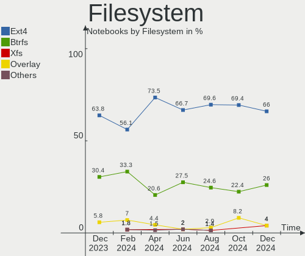
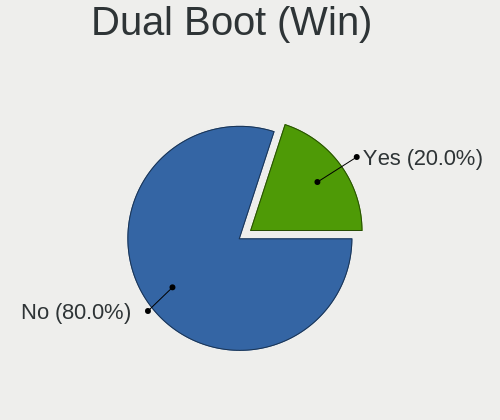
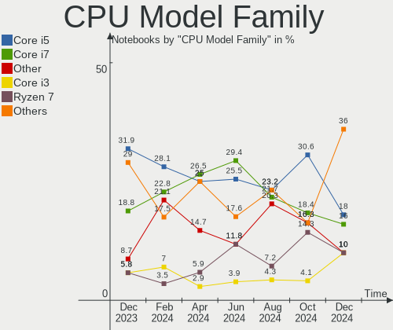
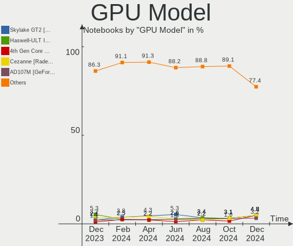
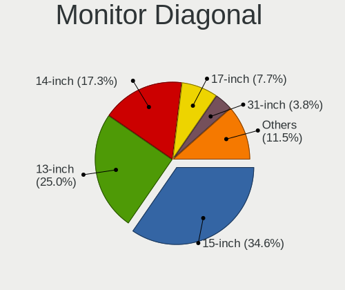

ArcoLinux - Hardware Trends (Notebooks)
---------------------------------------

A project to identify most popular hardware characteristics and track their change
over time based on data collected by Linux users at https://Linux-Hardware.org.

Anyone can contribute to this report by the [hw-probe](https://github.com/linuxhw/hw-probe) tool:

    sudo -E hw-probe -all -upload

This report is for one last month. Overall report since the beginning of time: [TestCoverage](https://github.com/linuxhw/TestCoverage)

Period: Jun, 2022.

Contents
--------

* [ System ](#system)
  - [ OS                       ](#os)
  - [ OS Family                ](#os-family)
  - [ Kernel                   ](#kernel)
  - [ Kernel Family            ](#kernel-family)
  - [ Kernel Major Ver.        ](#kernel-major-ver)
  - [ Arch                     ](#arch)
  - [ DE                       ](#de)
  - [ Display Server           ](#display-server)
  - [ Display Manager          ](#display-manager)
  - [ OS Lang                  ](#os-lang)
  - [ Boot Mode                ](#boot-mode)
  - [ Filesystem               ](#filesystem)
  - [ Part. scheme             ](#part-scheme)
  - [ Dual Boot with Linux/BSD ](#dual-boot-with-linuxbsd)
  - [ Dual Boot (Win)          ](#dual-boot-win)

* [ Board ](#board)
  - [ Vendor                   ](#vendor)
  - [ Model                    ](#model)
  - [ Model Family             ](#model-family)
  - [ MFG Year                 ](#mfg-year)
  - [ Form Factor              ](#form-factor)
  - [ Secure Boot              ](#secure-boot)
  - [ Coreboot                 ](#coreboot)
  - [ RAM Size                 ](#ram-size)
  - [ RAM Used                 ](#ram-used)
  - [ Total Drives             ](#total-drives)
  - [ Has CD-ROM               ](#has-cd-rom)
  - [ Has Ethernet             ](#has-ethernet)
  - [ Has WiFi                 ](#has-wifi)
  - [ Has Bluetooth            ](#has-bluetooth)

* [ Location ](#location)
  - [ Country                  ](#country)
  - [ City                     ](#city)

* [ Drives ](#drives)
  - [ Drive Vendor             ](#drive-vendor)
  - [ Drive Model              ](#drive-model)
  - [ HDD Vendor               ](#hdd-vendor)
  - [ SSD Vendor               ](#ssd-vendor)
  - [ Drive Kind               ](#drive-kind)
  - [ Drive Connector          ](#drive-connector)
  - [ Drive Size               ](#drive-size)
  - [ Space Total              ](#space-total)
  - [ Space Used               ](#space-used)
  - [ Malfunc. Drives          ](#malfunc-drives)
  - [ Malfunc. Drive Vendor    ](#malfunc-drive-vendor)
  - [ Malfunc. HDD Vendor      ](#malfunc-hdd-vendor)
  - [ Malfunc. Drive Kind      ](#malfunc-drive-kind)
  - [ Failed Drives            ](#failed-drives)
  - [ Failed Drive Vendor      ](#failed-drive-vendor)
  - [ Drive Status             ](#drive-status)

* [ Storage controller ](#storage-controller)
  - [ Storage Vendor           ](#storage-vendor)
  - [ Storage Model            ](#storage-model)
  - [ Storage Kind             ](#storage-kind)

* [ Processor ](#processor)
  - [ CPU Vendor               ](#cpu-vendor)
  - [ CPU Model                ](#cpu-model)
  - [ CPU Model Family         ](#cpu-model-family)
  - [ CPU Cores                ](#cpu-cores)
  - [ CPU Sockets              ](#cpu-sockets)
  - [ CPU Threads              ](#cpu-threads)
  - [ CPU Op-Modes             ](#cpu-op-modes)
  - [ CPU Microcode            ](#cpu-microcode)
  - [ CPU Microarch            ](#cpu-microarch)

* [ Graphics ](#graphics)
  - [ GPU Vendor               ](#gpu-vendor)
  - [ GPU Model                ](#gpu-model)
  - [ GPU Combo                ](#gpu-combo)
  - [ GPU Driver               ](#gpu-driver)
  - [ GPU Memory               ](#gpu-memory)

* [ Monitor ](#monitor)
  - [ Monitor Vendor           ](#monitor-vendor)
  - [ Monitor Model            ](#monitor-model)
  - [ Monitor Resolution       ](#monitor-resolution)
  - [ Monitor Diagonal         ](#monitor-diagonal)
  - [ Monitor Width            ](#monitor-width)
  - [ Aspect Ratio             ](#aspect-ratio)
  - [ Monitor Area             ](#monitor-area)
  - [ Pixel Density            ](#pixel-density)
  - [ Multiple Monitors        ](#multiple-monitors)

* [ Network ](#network)
  - [ Net Controller Vendor    ](#net-controller-vendor)
  - [ Net Controller Model     ](#net-controller-model)
  - [ Wireless Vendor          ](#wireless-vendor)
  - [ Wireless Model           ](#wireless-model)
  - [ Ethernet Vendor          ](#ethernet-vendor)
  - [ Ethernet Model           ](#ethernet-model)
  - [ Net Controller Kind      ](#net-controller-kind)
  - [ Used Controller          ](#used-controller)
  - [ NICs                     ](#nics)
  - [ IPv6                     ](#ipv6)

* [ Bluetooth ](#bluetooth)
  - [ Bluetooth Vendor         ](#bluetooth-vendor)
  - [ Bluetooth Model          ](#bluetooth-model)

* [ Sound ](#sound)
  - [ Sound Vendor             ](#sound-vendor)
  - [ Sound Model              ](#sound-model)

* [ Memory ](#memory)
  - [ Memory Vendor            ](#memory-vendor)
  - [ Memory Model             ](#memory-model)
  - [ Memory Kind              ](#memory-kind)
  - [ Memory Form Factor       ](#memory-form-factor)
  - [ Memory Size              ](#memory-size)
  - [ Memory Speed             ](#memory-speed)

* [ Printers & scanners ](#printers--scanners)
  - [ Printer Vendor           ](#printer-vendor)
  - [ Printer Model            ](#printer-model)
  - [ Scanner Vendor           ](#scanner-vendor)
  - [ Scanner Model            ](#scanner-model)

* [ Camera ](#camera)
  - [ Camera Vendor            ](#camera-vendor)
  - [ Camera Model             ](#camera-model)

* [ Security ](#security)
  - [ Fingerprint Vendor       ](#fingerprint-vendor)
  - [ Fingerprint Model        ](#fingerprint-model)
  - [ Chipcard Vendor          ](#chipcard-vendor)
  - [ Chipcard Model           ](#chipcard-model)

* [ Unsupported ](#unsupported)
  - [ Unsupported Devices      ](#unsupported-devices)
  - [ Unsupported Device Types ](#unsupported-device-types)

System
------

OS
--

Installed operating systems

| Name              | Notebooks | Percent |
|-------------------|-----------|---------|
| ArcoLinux Rolling | 29        | 100%    |

OS Family
---------

OS without a version

| Name      | Notebooks | Percent |
|-----------|-----------|---------|
| ArcoLinux | 29        | 100%    |

Kernel
------

Version of the Linux kernel

| Version                 | Notebooks | Percent |
|-------------------------|-----------|---------|
| 5.18.3-arch1-1          | 4         | 13.79%  |
| 5.18.7-arch1-1          | 3         | 10.34%  |
| 5.18.1-arch1-1          | 3         | 10.34%  |
| 5.15.48-1-lts           | 3         | 10.34%  |
| 5.18.5-arch1-1          | 2         | 6.9%    |
| 5.15.49-1-lts           | 2         | 6.9%    |
| 5.15.45-1-lts           | 2         | 6.9%    |
| 5.18.7-zen1-1-zen       | 1         | 3.45%   |
| 5.18.6-arch1-1          | 1         | 3.45%   |
| 5.18.5-zen1-1-zen       | 1         | 3.45%   |
| 5.18.3-zen1-1-zen       | 1         | 3.45%   |
| 5.18.2-arch1-1          | 1         | 3.45%   |
| 5.17.6-arch1-1          | 1         | 3.45%   |
| 5.17.11-xanmod1-1-x64v2 | 1         | 3.45%   |
| 5.16.10-arch1-1         | 1         | 3.45%   |
| 5.15.50-1-lts           | 1         | 3.45%   |
| 5.14.14-arch1-1         | 1         | 3.45%   |

Kernel Family
-------------

Linux kernel without a distro release

| Version | Notebooks | Percent |
|---------|-----------|---------|
| 5.18.3  | 5         | 17.24%  |
| 5.18.7  | 4         | 13.79%  |
| 5.18.5  | 3         | 10.34%  |
| 5.18.1  | 3         | 10.34%  |
| 5.15.48 | 3         | 10.34%  |
| 5.15.49 | 2         | 6.9%    |
| 5.15.45 | 2         | 6.9%    |
| 5.18.6  | 1         | 3.45%   |
| 5.18.2  | 1         | 3.45%   |
| 5.17.6  | 1         | 3.45%   |
| 5.17.11 | 1         | 3.45%   |
| 5.16.10 | 1         | 3.45%   |
| 5.15.50 | 1         | 3.45%   |
| 5.14.14 | 1         | 3.45%   |

Kernel Major Ver.
-----------------

Linux kernel major version

| Version | Notebooks | Percent |
|---------|-----------|---------|
| 5.18    | 17        | 58.62%  |
| 5.15    | 8         | 27.59%  |
| 5.17    | 2         | 6.9%    |
| 5.16    | 1         | 3.45%   |
| 5.14    | 1         | 3.45%   |

Arch
----

OS architecture (x86_64, i586, etc.)

| Name   | Notebooks | Percent |
|--------|-----------|---------|
| x86_64 | 29        | 100%    |

DE
--

Desktop Environment

| Name       | Notebooks | Percent |
|------------|-----------|---------|
| XFCE       | 7         | 24.14%  |
| KDE5       | 6         | 20.69%  |
| X-Cinnamon | 4         | 13.79%  |
| awesome    | 3         | 10.34%  |
| qtile      | 2         | 6.9%    |
| i3         | 2         | 6.9%    |
| GNOME      | 2         | 6.9%    |
| Unity      | 1         | 3.45%   |
| spectrwm   | 1         | 3.45%   |
| Unknown    | 1         | 3.45%   |

Display Server
--------------

X11 or Wayland

| Name    | Notebooks | Percent |
|---------|-----------|---------|
| X11     | 26        | 89.66%  |
| Tty     | 2         | 6.9%    |
| Unknown | 1         | 3.45%   |

Display Manager
---------------

SDDM, LightDM, etc.

| Name    | Notebooks | Percent |
|---------|-----------|---------|
| SDDM    | 15        | 51.72%  |
| LightDM | 12        | 41.38%  |
| GDM     | 1         | 3.45%   |
| Unknown | 1         | 3.45%   |

OS Lang
-------

Language

| Lang  | Notebooks | Percent |
|-------|-----------|---------|
| en_US | 20        | 68.97%  |
| en_IN | 2         | 6.9%    |
| en_GB | 2         | 6.9%    |
| pl_PL | 1         | 3.45%   |
| en_CA | 1         | 3.45%   |
| en_AU | 1         | 3.45%   |
| de_DE | 1         | 3.45%   |
| de_AT | 1         | 3.45%   |

Boot Mode
---------

EFI or BIOS

| Mode | Notebooks | Percent |
|------|-----------|---------|
| EFI  | 25        | 86.21%  |
| BIOS | 4         | 13.79%  |

Filesystem
----------

Type of filesystem

| Type  | Notebooks | Percent |
|-------|-----------|---------|
| Ext4  | 22        | 75.86%  |
| Btrfs | 6         | 20.69%  |
| Xfs   | 1         | 3.45%   |

Part. scheme
------------

Scheme of partitioning

| Type | Notebooks | Percent |
|------|-----------|---------|
| GPT  | 24        | 82.76%  |
| MBR  | 5         | 17.24%  |

Dual Boot with Linux/BSD
------------------------

Hosting more than one Linux/BSD

| Dual boot | Notebooks | Percent |
|-----------|-----------|---------|
| No        | 26        | 89.66%  |
| Yes       | 3         | 10.34%  |

Dual Boot (Win)
---------------

Hosting Linux and Windows

| Dual boot | Notebooks | Percent |
|-----------|-----------|---------|
| No        | 18        | 62.07%  |
| Yes       | 11        | 37.93%  |

Board
-----

Vendor
------

Motherboard manufacturer

| Name                 | Notebooks | Percent |
|----------------------|-----------|---------|
| Lenovo               | 8         | 27.59%  |
| Hewlett-Packard      | 4         | 13.79%  |
| ASUSTek Computer     | 3         | 10.34%  |
| Dell                 | 2         | 6.9%    |
| Acer                 | 2         | 6.9%    |
| Toshiba              | 1         | 3.45%   |
| System76             | 1         | 3.45%   |
| Schenker             | 1         | 3.45%   |
| Razer                | 1         | 3.45%   |
| Notebook             | 1         | 3.45%   |
| MSI                  | 1         | 3.45%   |
| Medion               | 1         | 3.45%   |
| Intel Client Systems | 1         | 3.45%   |
| Casper               | 1         | 3.45%   |
| Apple                | 1         | 3.45%   |

Model
-----

Motherboard model

| Name                                     | Notebooks | Percent |
|------------------------------------------|-----------|---------|
| Toshiba Satellite Pro S300               | 1         | 3.45%   |
| System76 Oryx Pro                        | 1         | 3.45%   |
| Schenker VISION 15 (SVS15E21)            | 1         | 3.45%   |
| Razer Blade                              | 1         | 3.45%   |
| Notebook PA70ES                          | 1         | 3.45%   |
| MSI GL65 Leopard 10SEK                   | 1         | 3.45%   |
| Medion E7214                             | 1         | 3.45%   |
| Lenovo ThinkPad X1 Carbon 4th 20FCS14X04 | 1         | 3.45%   |
| Lenovo ThinkPad T470s 20HGS1D000         | 1         | 3.45%   |
| Lenovo ThinkPad T420 4236EF4             | 1         | 3.45%   |
| Lenovo ThinkPad T420 4180DY4             | 1         | 3.45%   |
| Lenovo ThinkPad E15 Gen 2 20T8000TCK     | 1         | 3.45%   |
| Lenovo Legion Y540-15IRH 81SX            | 1         | 3.45%   |
| Lenovo IdeaPad 330-17ICH 81FL            | 1         | 3.45%   |
| Lenovo B590 20206                        | 1         | 3.45%   |
| Intel Client Systems LAPKC71F            | 1         | 3.45%   |
| HP ZBook Studio G3                       | 1         | 3.45%   |
| HP Laptop 15-da1xxx                      | 1         | 3.45%   |
| HP Laptop 14-dk1xxx                      | 1         | 3.45%   |
| HP EliteBook 840 G3                      | 1         | 3.45%   |
| Dell Latitude 5421                       | 1         | 3.45%   |
| Dell Inspiron 5459                       | 1         | 3.45%   |
| Casper C600 NOTEBOOK DISCRETE            | 1         | 3.45%   |
| ASUS ROG Strix G733ZX_G733ZX             | 1         | 3.45%   |
| ASUS GL703VD                             | 1         | 3.45%   |
| ASUS All Series                          | 1         | 3.45%   |
| Apple MacBookPro5,4                      | 1         | 3.45%   |
| Acer Aspire ES1-571                      | 1         | 3.45%   |
| Acer Aspire E1-572G                      | 1         | 3.45%   |

Model Family
------------

Motherboard model prefix

| Name                          | Notebooks | Percent |
|-------------------------------|-----------|---------|
| Lenovo ThinkPad               | 5         | 17.24%  |
| HP Laptop                     | 2         | 6.9%    |
| Acer Aspire                   | 2         | 6.9%    |
| Toshiba Satellite             | 1         | 3.45%   |
| System76 Oryx                 | 1         | 3.45%   |
| Schenker VISION               | 1         | 3.45%   |
| Razer Blade                   | 1         | 3.45%   |
| Notebook PA70ES               | 1         | 3.45%   |
| MSI GL65                      | 1         | 3.45%   |
| Medion E7214                  | 1         | 3.45%   |
| Lenovo Legion                 | 1         | 3.45%   |
| Lenovo IdeaPad                | 1         | 3.45%   |
| Lenovo B590                   | 1         | 3.45%   |
| Intel Client Systems LAPKC71F | 1         | 3.45%   |
| HP ZBook                      | 1         | 3.45%   |
| HP EliteBook                  | 1         | 3.45%   |
| Dell Latitude                 | 1         | 3.45%   |
| Dell Inspiron                 | 1         | 3.45%   |
| Casper C600                   | 1         | 3.45%   |
| ASUS ROG                      | 1         | 3.45%   |
| ASUS GL703VD                  | 1         | 3.45%   |
| ASUS All                      | 1         | 3.45%   |
| Apple MacBookPro5             | 1         | 3.45%   |

MFG Year
--------

Motherboard manufacture year

| Year | Notebooks | Percent |
|------|-----------|---------|
| 2016 | 5         | 17.24%  |
| 2019 | 4         | 13.79%  |
| 2021 | 3         | 10.34%  |
| 2018 | 3         | 10.34%  |
| 2017 | 3         | 10.34%  |
| 2020 | 2         | 6.9%    |
| 2011 | 2         | 6.9%    |
| 2022 | 1         | 3.45%   |
| 2015 | 1         | 3.45%   |
| 2013 | 1         | 3.45%   |
| 2012 | 1         | 3.45%   |
| 2010 | 1         | 3.45%   |
| 2009 | 1         | 3.45%   |
| 2008 | 1         | 3.45%   |

Form Factor
-----------

Physical design of the computer

| Name     | Notebooks | Percent |
|----------|-----------|---------|
| Notebook | 29        | 100%    |

Secure Boot
-----------

Enabled or disabled

| State    | Notebooks | Percent |
|----------|-----------|---------|
| Disabled | 29        | 100%    |

Coreboot
--------

Have coreboot on board

| Used | Notebooks | Percent |
|------|-----------|---------|
| No   | 29        | 100%    |

RAM Size
--------

Total RAM memory

| Size in GB  | Notebooks | Percent |
|-------------|-----------|---------|
| 16.01-24.0  | 8         | 27.59%  |
| 8.01-16.0   | 6         | 20.69%  |
| 4.01-8.0    | 5         | 17.24%  |
| 3.01-4.0    | 4         | 13.79%  |
| 32.01-64.0  | 3         | 10.34%  |
| 2.01-3.0    | 2         | 6.9%    |
| 64.01-256.0 | 1         | 3.45%   |

RAM Used
--------

Used RAM memory

| Used GB   | Notebooks | Percent |
|-----------|-----------|---------|
| 4.01-8.0  | 8         | 27.59%  |
| 2.01-3.0  | 6         | 20.69%  |
| 1.01-2.0  | 5         | 17.24%  |
| 3.01-4.0  | 4         | 13.79%  |
| 0.51-1.0  | 3         | 10.34%  |
| 8.01-16.0 | 2         | 6.9%    |
| 0.01-0.5  | 1         | 3.45%   |

Total Drives
------------

Number of drives on board

| Drives | Notebooks | Percent |
|--------|-----------|---------|
| 1      | 18        | 62.07%  |
| 2      | 8         | 27.59%  |
| 3      | 2         | 6.9%    |
| 4      | 1         | 3.45%   |

Has CD-ROM
----------

Has CD-ROM on board

| Presented | Notebooks | Percent |
|-----------|-----------|---------|
| No        | 25        | 86.21%  |
| Yes       | 4         | 13.79%  |

Has Ethernet
------------

Has Ethernet on board

| Presented | Notebooks | Percent |
|-----------|-----------|---------|
| Yes       | 27        | 93.1%   |
| No        | 2         | 6.9%    |

Has WiFi
--------

Has WiFi module

| Presented | Notebooks | Percent |
|-----------|-----------|---------|
| Yes       | 28        | 96.55%  |
| No        | 1         | 3.45%   |

Has Bluetooth
-------------

Has Bluetooth module

| Presented | Notebooks | Percent |
|-----------|-----------|---------|
| Yes       | 24        | 82.76%  |
| No        | 5         | 17.24%  |

Location
--------

Country
-------

Geographic location (country)

| Country      | Notebooks | Percent |
|--------------|-----------|---------|
| USA          | 4         | 13.79%  |
| Germany      | 3         | 10.34%  |
| Turkey       | 2         | 6.9%    |
| Poland       | 2         | 6.9%    |
| Netherlands  | 2         | 6.9%    |
| India        | 2         | 6.9%    |
| Canada       | 2         | 6.9%    |
| Belgium      | 2         | 6.9%    |
| Switzerland  | 1         | 3.45%   |
| Sri Lanka    | 1         | 3.45%   |
| Slovakia     | 1         | 3.45%   |
| Saudi Arabia | 1         | 3.45%   |
| Peru         | 1         | 3.45%   |
| Libya        | 1         | 3.45%   |
| Italy        | 1         | 3.45%   |
| France       | 1         | 3.45%   |
| Cyprus       | 1         | 3.45%   |
| Australia    | 1         | 3.45%   |

City
----

Geographic location (city)

| City            | Notebooks | Percent |
|-----------------|-----------|---------|
| Lier            | 2         | 6.9%    |
| Leipzig         | 2         | 6.9%    |
| Zurich          | 1         | 3.45%   |
| Wroclaw         | 1         | 3.45%   |
| Trenčín       | 1         | 3.45%   |
| South Jordan    | 1         | 3.45%   |
| Rosenheim       | 1         | 3.45%   |
| Riyadh          | 1         | 3.45%   |
| Perth           | 1         | 3.45%   |
| Noida           | 1         | 3.45%   |
| Nieuw-Vennep    | 1         | 3.45%   |
| Nicosia         | 1         | 3.45%   |
| Mysłowice      | 1         | 3.45%   |
| Myrtle Beach    | 1         | 3.45%   |
| Mumbai          | 1         | 3.45%   |
| Montevrain      | 1         | 3.45%   |
| Maharagama      | 1         | 3.45%   |
| Louisville      | 1         | 3.45%   |
| London          | 1         | 3.45%   |
| Lima            | 1         | 3.45%   |
| Izmir           | 1         | 3.45%   |
| Houston         | 1         | 3.45%   |
| Greater Sudbury | 1         | 3.45%   |
| Bursa           | 1         | 3.45%   |
| Bologna         | 1         | 3.45%   |
| Benghazi        | 1         | 3.45%   |
| Amsterdam       | 1         | 3.45%   |

Drives
------

Drive Vendor
------------

Hard drive vendors

| Vendor              | Notebooks | Drives | Percent |
|---------------------|-----------|--------|---------|
| WDC                 | 8         | 9      | 19.51%  |
| Samsung Electronics | 5         | 6      | 12.2%   |
| Toshiba             | 4         | 4      | 9.76%   |
| Seagate             | 4         | 4      | 9.76%   |
| Crucial             | 3         | 3      | 7.32%   |
| Unknown             | 2         | 2      | 4.88%   |
| KIOXIA              | 2         | 2      | 4.88%   |
| Hitachi             | 2         | 2      | 4.88%   |
| Gigabyte Technology | 2         | 2      | 4.88%   |
| XrayDisk            | 1         | 1      | 2.44%   |
| UMIS                | 1         | 1      | 2.44%   |
| SanDisk             | 1         | 1      | 2.44%   |
| PNY                 | 1         | 1      | 2.44%   |
| Micron Technology   | 1         | 1      | 2.44%   |
| LITEONIT            | 1         | 1      | 2.44%   |
| KIOXIA-EXCERIA      | 1         | 1      | 2.44%   |
| Intel               | 1         | 1      | 2.44%   |
| HGST                | 1         | 1      | 2.44%   |

Drive Model
-----------

Hard drive models

| Model                                 | Notebooks | Percent |
|---------------------------------------|-----------|---------|
| Seagate ST1000LM035-1RK172 1TB        | 2         | 4.65%   |
| Samsung SSD 850 EVO 120GB             | 2         | 4.65%   |
| XrayDisk SSD 1TB                      | 1         | 2.33%   |
| WDC WDS500G2B0B-00YS70 500GB SSD      | 1         | 2.33%   |
| WDC WDS250G2B0A-00SM50 250GB SSD      | 1         | 2.33%   |
| WDC WDS200T2B0A-00SM50 2TB SSD        | 1         | 2.33%   |
| WDC WDS120G2G0A-00JH30 120GB SSD      | 1         | 2.33%   |
| WDC WDBNCE5000PNC 500GB SSD           | 1         | 2.33%   |
| WDC WD20SPZX-22UA7T0 2TB              | 1         | 2.33%   |
| WDC WD10SPZX-60Z10T1 1TB              | 1         | 2.33%   |
| WDC PC SN730 SDBPNTY-512G-1101 512GB  | 1         | 2.33%   |
| WDC PC SN530 SDBPMPZ-512G-1001 512GB  | 1         | 2.33%   |
| Unknown SD128  128GB                  | 1         | 2.33%   |
| Unknown APPSD  134GB                  | 1         | 2.33%   |
| UMIS RPFTJ128PDD2EWX 128GB            | 1         | 2.33%   |
| Toshiba THNSNJ256GCSU 256GB SSD       | 1         | 2.33%   |
| Toshiba THNSF5256GPU7 256GB           | 1         | 2.33%   |
| Toshiba MQ01ABF050M 500GB             | 1         | 2.33%   |
| Toshiba MQ01ABF050 500GB              | 1         | 2.33%   |
| Seagate ST1000LX015-1U7172 1TB        | 1         | 2.33%   |
| Seagate ST1000LM024 HN-M101MBB 1TB    | 1         | 2.33%   |
| SanDisk X400 M.2 2280 256GB SSD       | 1         | 2.33%   |
| Samsung SSD 970 EVO 1TB               | 1         | 2.33%   |
| Samsung SSD 960 EVO 1TB               | 1         | 2.33%   |
| Samsung SSD 840 EVO 750GB             | 1         | 2.33%   |
| Samsung MZ7TE128HMGR-00004 128GB SSD  | 1         | 2.33%   |
| PNY SSD2SC480G1CS1754D117-514 480GB   | 1         | 2.33%   |
| Micron 3400_MTFDKBA1T0TFH 1TB         | 1         | 2.33%   |
| LITEONIT LCS-256M6S 2.5 7mm 256GB SSD | 1         | 2.33%   |
| KIOXIA-EXCERIA SATA SSD 480GB         | 1         | 2.33%   |
| KIOXIA KXG60ZNV512G NVMe 512GB        | 1         | 2.33%   |
| KIOXIA KBG40ZNV512G 512GB             | 1         | 2.33%   |
| Intel SSDPEKKF256G8H 256GB            | 1         | 2.33%   |
| Hitachi HTS543225L9SA00 250GB         | 1         | 2.33%   |
| Hitachi HDS721010CLA630 1TB           | 1         | 2.33%   |
| HGST HTS545050A7E380 500GB            | 1         | 2.33%   |
| Gigabyte GP-AG4500G 500GB             | 1         | 2.33%   |
| Gigabyte GP-AG42TB                    | 1         | 2.33%   |
| Crucial CT500MX500SSD1 500GB          | 1         | 2.33%   |
| Crucial CT250P2SSD8 250GB             | 1         | 2.33%   |
| Crucial CT2000P5PSSD8 2TB             | 1         | 2.33%   |

HDD Vendor
----------

Hard disk drive vendors

| Vendor  | Notebooks | Drives | Percent |
|---------|-----------|--------|---------|
| Seagate | 4         | 4      | 36.36%  |
| WDC     | 2         | 2      | 18.18%  |
| Toshiba | 2         | 2      | 18.18%  |
| Hitachi | 2         | 2      | 18.18%  |
| HGST    | 1         | 1      | 9.09%   |

SSD Vendor
----------

Solid state drive vendors

| Vendor              | Notebooks | Drives | Percent |
|---------------------|-----------|--------|---------|
| WDC                 | 5         | 5      | 31.25%  |
| Samsung Electronics | 4         | 4      | 25%     |
| XrayDisk            | 1         | 1      | 6.25%   |
| Toshiba             | 1         | 1      | 6.25%   |
| SanDisk             | 1         | 1      | 6.25%   |
| PNY                 | 1         | 1      | 6.25%   |
| LITEONIT            | 1         | 1      | 6.25%   |
| KIOXIA-EXCERIA      | 1         | 1      | 6.25%   |
| Crucial             | 1         | 1      | 6.25%   |

Drive Kind
----------

HDD or SSD

| Kind | Notebooks | Drives | Percent |
|------|-----------|--------|---------|
| SSD  | 15        | 16     | 36.59%  |
| NVMe | 13        | 14     | 31.71%  |
| HDD  | 11        | 11     | 26.83%  |
| MMC  | 2         | 2      | 4.88%   |

Drive Connector
---------------

SATA, SAS, NVMe, etc.

| Type | Notebooks | Drives | Percent |
|------|-----------|--------|---------|
| SATA | 21        | 27     | 58.33%  |
| NVMe | 13        | 14     | 36.11%  |
| MMC  | 2         | 2      | 5.56%   |

Drive Size
----------

Size of hard drive

| Size in TB | Notebooks | Drives | Percent |
|------------|-----------|--------|---------|
| 0.01-0.5   | 14        | 17     | 58.33%  |
| 0.51-1.0   | 8         | 8      | 33.33%  |
| 1.01-2.0   | 2         | 2      | 8.33%   |

Space Total
-----------

Amount of disk space available on the file system

| Size in GB     | Notebooks | Percent |
|----------------|-----------|---------|
| 101-250        | 9         | 31.03%  |
| 251-500        | 5         | 17.24%  |
| More than 3000 | 4         | 13.79%  |
| Unknown        | 3         | 10.34%  |
| 1001-2000      | 2         | 6.9%    |
| 1-20           | 2         | 6.9%    |
| 501-1000       | 2         | 6.9%    |
| 2001-3000      | 1         | 3.45%   |
| 51-100         | 1         | 3.45%   |

Space Used
----------

Amount of used disk space

| Used GB        | Notebooks | Percent |
|----------------|-----------|---------|
| 1-20           | 8         | 27.59%  |
| 21-50          | 5         | 17.24%  |
| 251-500        | 4         | 13.79%  |
| 101-250        | 4         | 13.79%  |
| Unknown        | 3         | 10.34%  |
| 51-100         | 2         | 6.9%    |
| More than 3000 | 1         | 3.45%   |
| 1001-2000      | 1         | 3.45%   |
| 501-1000       | 1         | 3.45%   |

Malfunc. Drives
---------------

Drive models with a malfunction

| Model                          | Notebooks | Drives | Percent |
|--------------------------------|-----------|--------|---------|
| Toshiba MQ01ABF050 500GB       | 1         | 1      | 25%     |
| Seagate ST1000LX015-1U7172 1TB | 1         | 1      | 25%     |
| Hitachi HTS543225L9SA00 250GB  | 1         | 1      | 25%     |
| HGST HTS545050A7E380 500GB     | 1         | 1      | 25%     |

Malfunc. Drive Vendor
---------------------

Vendors of faulty drives

| Vendor  | Notebooks | Drives | Percent |
|---------|-----------|--------|---------|
| Toshiba | 1         | 1      | 25%     |
| Seagate | 1         | 1      | 25%     |
| Hitachi | 1         | 1      | 25%     |
| HGST    | 1         | 1      | 25%     |

Malfunc. HDD Vendor
-------------------

Vendors of faulty HDD drives

| Vendor  | Notebooks | Drives | Percent |
|---------|-----------|--------|---------|
| Toshiba | 1         | 1      | 25%     |
| Seagate | 1         | 1      | 25%     |
| Hitachi | 1         | 1      | 25%     |
| HGST    | 1         | 1      | 25%     |

Malfunc. Drive Kind
-------------------

Kinds of faulty drives

| Kind | Notebooks | Drives | Percent |
|------|-----------|--------|---------|
| HDD  | 4         | 4      | 100%    |

Failed Drives
-------------

Failed drive models

Zero info for selected period =(

Failed Drive Vendor
-------------------

Failed drive vendors

Zero info for selected period =(

Drive Status
------------

Number of failed and malfunc. drives

| Status   | Notebooks | Drives | Percent |
|----------|-----------|--------|---------|
| Works    | 27        | 37     | 81.82%  |
| Malfunc  | 4         | 4      | 12.12%  |
| Detected | 2         | 2      | 6.06%   |

Storage controller
------------------

Storage Vendor
--------------

Storage controller vendors

| Vendor                       | Notebooks | Percent |
|------------------------------|-----------|---------|
| Intel                        | 22        | 59.46%  |
| Toshiba America Info Systems | 2         | 5.41%   |
| SanDisk                      | 2         | 5.41%   |
| Samsung Electronics          | 2         | 5.41%   |
| Phison Electronics           | 2         | 5.41%   |
| Micron/Crucial Technology    | 2         | 5.41%   |
| Union Memory (Shenzhen)      | 1         | 2.7%    |
| Nvidia                       | 1         | 2.7%    |
| Micron Technology            | 1         | 2.7%    |
| KIOXIA                       | 1         | 2.7%    |
| AMD                          | 1         | 2.7%    |

Storage Model
-------------

Storage controller models

| Model                                                                         | Notebooks | Percent |
|-------------------------------------------------------------------------------|-----------|---------|
| Intel Cannon Lake Mobile PCH SATA AHCI Controller                             | 4         | 10.81%  |
| Intel Sunrise Point-LP SATA Controller [AHCI mode]                            | 3         | 8.11%   |
| Phison E16 PCIe4 NVMe Controller                                              | 2         | 5.41%   |
| Intel Volume Management Device NVMe RAID Controller                           | 2         | 5.41%   |
| Intel 82801 Mobile SATA Controller [RAID mode]                                | 2         | 5.41%   |
| Intel 6 Series/C200 Series Chipset Family 6 port Mobile SATA AHCI Controller  | 2         | 5.41%   |
| Union Memory (Shenzhen) Non-Volatile memory controller                        | 1         | 2.7%    |
| Toshiba America Info Systems XG6 NVMe SSD Controller                          | 1         | 2.7%    |
| Toshiba America Info Systems NVMe Controller                                  | 1         | 2.7%    |
| SanDisk WD Black SN750 / PC SN730 NVMe SSD                                    | 1         | 2.7%    |
| SanDisk Non-Volatile memory controller                                        | 1         | 2.7%    |
| Samsung NVMe SSD Controller SM981/PM981/PM983                                 | 1         | 2.7%    |
| Samsung NVMe SSD Controller SM961/PM961/SM963                                 | 1         | 2.7%    |
| Nvidia MCP79 AHCI Controller                                                  | 1         | 2.7%    |
| Micron/Crucial P2 NVMe PCIe SSD                                               | 1         | 2.7%    |
| Micron/Crucial Non-Volatile memory controller                                 | 1         | 2.7%    |
| Micron Non-Volatile memory controller                                         | 1         | 2.7%    |
| KIOXIA Non-Volatile memory controller                                         | 1         | 2.7%    |
| Intel Wildcat Point-LP SATA Controller [AHCI Mode]                            | 1         | 2.7%    |
| Intel SSD Pro 7600p/760p/E 6100p Series                                       | 1         | 2.7%    |
| Intel Q170/Q150/B150/H170/H110/Z170/CM236 Chipset SATA Controller [AHCI Mode] | 1         | 2.7%    |
| Intel 9 Series Chipset Family SATA Controller [AHCI Mode]                     | 1         | 2.7%    |
| Intel 82801IBM/IEM (ICH9M/ICH9M-E) 4 port SATA Controller [AHCI mode]         | 1         | 2.7%    |
| Intel 8 Series SATA Controller 1 [AHCI mode]                                  | 1         | 2.7%    |
| Intel 7 Series Chipset Family 6-port SATA Controller [AHCI mode]              | 1         | 2.7%    |
| Intel 5 Series/3400 Series Chipset 4 port SATA AHCI Controller                | 1         | 2.7%    |
| Intel 400 Series Chipset Family SATA AHCI Controller                          | 1         | 2.7%    |
| AMD FCH SATA Controller [AHCI mode]                                           | 1         | 2.7%    |

Storage Kind
------------

Kind of storage controller (IDE, SATA, NVMe, SAS, ...)

| Kind | Notebooks | Percent |
|------|-----------|---------|
| SATA | 19        | 52.78%  |
| NVMe | 13        | 36.11%  |
| RAID | 4         | 11.11%  |

Processor
---------

CPU Vendor
----------

Processor vendors

| Vendor | Notebooks | Percent |
|--------|-----------|---------|
| Intel  | 27        | 93.1%   |
| AMD    | 2         | 6.9%    |

CPU Model
---------

Processor models

| Model                                   | Notebooks | Percent |
|-----------------------------------------|-----------|---------|
| Intel Core i7-8750H CPU @ 2.20GHz       | 3         | 10.34%  |
| Intel Core i7-9750H CPU @ 2.60GHz       | 2         | 6.9%    |
| Intel Core i5-2520M CPU @ 2.50GHz       | 2         | 6.9%    |
| Intel Core i7-7700HQ CPU @ 2.80GHz      | 1         | 3.45%   |
| Intel Core i7-7600U CPU @ 2.80GHz       | 1         | 3.45%   |
| Intel Core i7-6820HQ CPU @ 2.70GHz      | 1         | 3.45%   |
| Intel Core i7-6600U CPU @ 2.60GHz       | 1         | 3.45%   |
| Intel Core i7-6500U CPU @ 2.50GHz       | 1         | 3.45%   |
| Intel Core i7-4770S CPU @ 3.10GHz       | 1         | 3.45%   |
| Intel Core i7-10750H CPU @ 2.60GHz      | 1         | 3.45%   |
| Intel Core i5-8265U CPU @ 1.60GHz       | 1         | 3.45%   |
| Intel Core i5-6200U CPU @ 2.30GHz       | 1         | 3.45%   |
| Intel Core i5-4200U CPU @ 1.60GHz       | 1         | 3.45%   |
| Intel Core i3-7100U CPU @ 2.40GHz       | 1         | 3.45%   |
| Intel Core i3-5005U CPU @ 2.00GHz       | 1         | 3.45%   |
| Intel Core i3 CPU M 350 @ 2.27GHz       | 1         | 3.45%   |
| Intel Core 2 Duo CPU P8700 @ 2.53GHz    | 1         | 3.45%   |
| Intel Core 2 Duo CPU P8400 @ 2.26GHz    | 1         | 3.45%   |
| Intel Celeron CPU 1000M @ 1.80GHz       | 1         | 3.45%   |
| Intel 12th Gen Core i9-12900H           | 1         | 3.45%   |
| Intel 11th Gen Core i7-11850H @ 2.50GHz | 1         | 3.45%   |
| Intel 11th Gen Core i7-11800H @ 2.30GHz | 1         | 3.45%   |
| Intel 11th Gen Core i7-1165G7 @ 2.80GHz | 1         | 3.45%   |
| AMD Ryzen 7 4700U with Radeon Graphics  | 1         | 3.45%   |
| AMD Ryzen 3 3250U with Radeon Graphics  | 1         | 3.45%   |

CPU Model Family
----------------

Processor model prefix

| Model            | Notebooks | Percent |
|------------------|-----------|---------|
| Intel Core i7    | 12        | 41.38%  |
| Intel Core i5    | 5         | 17.24%  |
| Other            | 4         | 13.79%  |
| Intel Core i3    | 3         | 10.34%  |
| Intel Core 2 Duo | 2         | 6.9%    |
| Intel Celeron    | 1         | 3.45%   |
| AMD Ryzen 7      | 1         | 3.45%   |
| AMD Ryzen 3      | 1         | 3.45%   |

CPU Cores
---------

Number of processor cores

| Number | Notebooks | Percent |
|--------|-----------|---------|
| 2      | 14        | 48.28%  |
| 6      | 6         | 20.69%  |
| 4      | 5         | 17.24%  |
| 8      | 3         | 10.34%  |
| 14     | 1         | 3.45%   |

CPU Sockets
-----------

Number of sockets

| Number | Notebooks | Percent |
|--------|-----------|---------|
| 1      | 29        | 100%    |

CPU Threads
-----------

Threads per core (Hyper-Threading)

| Number | Notebooks | Percent |
|--------|-----------|---------|
| 2      | 25        | 86.21%  |
| 1      | 4         | 13.79%  |

CPU Op-Modes
------------

CPU Operation Modes (32-bit, 64-bit)

| Op mode        | Notebooks | Percent |
|----------------|-----------|---------|
| 32-bit, 64-bit | 29        | 100%    |

CPU Microcode
-------------

Microcode number

| Number     | Notebooks | Percent |
|------------|-----------|---------|
| 0x906ea    | 5         | 17.24%  |
| 0x406e3    | 3         | 10.34%  |
| 0x806e9    | 2         | 6.9%    |
| 0x806d1    | 2         | 6.9%    |
| 0x206a7    | 2         | 6.9%    |
| 0xa0652    | 1         | 3.45%   |
| 0x906e9    | 1         | 3.45%   |
| 0x906a3    | 1         | 3.45%   |
| 0x806ec    | 1         | 3.45%   |
| 0x806c1    | 1         | 3.45%   |
| 0x506e3    | 1         | 3.45%   |
| 0x40651    | 1         | 3.45%   |
| 0x306d4    | 1         | 3.45%   |
| 0x306c3    | 1         | 3.45%   |
| 0x306a9    | 1         | 3.45%   |
| 0x20652    | 1         | 3.45%   |
| 0x1067a    | 1         | 3.45%   |
| 0x10676    | 1         | 3.45%   |
| 0x08600103 | 1         | 3.45%   |
| 0x08108109 | 1         | 3.45%   |

CPU Microarch
-------------

Microarchitecture

| Name             | Notebooks | Percent |
|------------------|-----------|---------|
| KabyLake         | 9         | 31.03%  |
| Skylake          | 4         | 13.79%  |
| SandyBridge      | 2         | 6.9%    |
| Penryn           | 2         | 6.9%    |
| Icelake          | 2         | 6.9%    |
| Haswell          | 2         | 6.9%    |
| Zen+             | 1         | 3.45%   |
| Zen 2            | 1         | 3.45%   |
| Westmere         | 1         | 3.45%   |
| TigerLake        | 1         | 3.45%   |
| IvyBridge        | 1         | 3.45%   |
| CometLake        | 1         | 3.45%   |
| Broadwell        | 1         | 3.45%   |
| Alderlake Hybrid | 1         | 3.45%   |

Graphics
--------

GPU Vendor
----------

Vendors of graphics cards

| Vendor | Notebooks | Percent |
|--------|-----------|---------|
| Intel  | 23        | 60.53%  |
| Nvidia | 11        | 28.95%  |
| AMD    | 4         | 10.53%  |

GPU Model
---------

Graphics card models

| Model                                                                         | Notebooks | Percent |
|-------------------------------------------------------------------------------|-----------|---------|
| Nvidia TU106M [GeForce RTX 2060 Mobile]                                       | 3         | 7.89%   |
| Intel Skylake GT2 [HD Graphics 520]                                           | 3         | 7.89%   |
| Intel CoffeeLake-H GT2 [UHD Graphics 630]                                     | 3         | 7.89%   |
| Intel TigerLake-H GT1 [UHD Graphics]                                          | 2         | 5.26%   |
| Intel HD Graphics 620                                                         | 2         | 5.26%   |
| Intel 2nd Generation Core Processor Family Integrated Graphics Controller     | 2         | 5.26%   |
| Nvidia TU116M [GeForce GTX 1660 Ti Mobile]                                    | 1         | 2.63%   |
| Nvidia GP107M [GeForce GTX 1050 Mobile]                                       | 1         | 2.63%   |
| Nvidia GP106BM [GeForce GTX 1060 Mobile 6GB]                                  | 1         | 2.63%   |
| Nvidia GP102 [GeForce GTX 1080 Ti]                                            | 1         | 2.63%   |
| Nvidia GM108M [GeForce MX110]                                                 | 1         | 2.63%   |
| Nvidia GM108M [GeForce 920MX]                                                 | 1         | 2.63%   |
| Nvidia GA104M [GeForce RTX 3070 Mobile / Max-Q]                               | 1         | 2.63%   |
| Nvidia C79 [GeForce 9400M]                                                    | 1         | 2.63%   |
| Intel WhiskeyLake-U GT2 [UHD Graphics 620]                                    | 1         | 2.63%   |
| Intel TigerLake-LP GT2 [Iris Xe Graphics]                                     | 1         | 2.63%   |
| Intel Mobile 4 Series Chipset Integrated Graphics Controller                  | 1         | 2.63%   |
| Intel HD Graphics 630                                                         | 1         | 2.63%   |
| Intel HD Graphics 5500                                                        | 1         | 2.63%   |
| Intel HD Graphics 530                                                         | 1         | 2.63%   |
| Intel Haswell-ULT Integrated Graphics Controller                              | 1         | 2.63%   |
| Intel Core Processor Integrated Graphics Controller                           | 1         | 2.63%   |
| Intel CometLake-H GT2 [UHD Graphics]                                          | 1         | 2.63%   |
| Intel Alder Lake-P Integrated Graphics Controller                             | 1         | 2.63%   |
| Intel 3rd Gen Core processor Graphics Controller                              | 1         | 2.63%   |
| AMD Sun XT [Radeon HD 8670A/8670M/8690M / R5 M330 / M430 / Radeon 520 Mobile] | 1         | 2.63%   |
| AMD Renoir                                                                    | 1         | 2.63%   |
| AMD Picasso/Raven 2 [Radeon Vega Series / Radeon Vega Mobile Series]          | 1         | 2.63%   |
| AMD Opal XT [Radeon R7 M265/M365X/M465]                                       | 1         | 2.63%   |

GPU Combo
---------

Combinations of graphics cards

| Name           | Notebooks | Percent |
|----------------|-----------|---------|
| 1 x Intel      | 13        | 44.83%  |
| Intel + Nvidia | 7         | 24.14%  |
| 1 x Nvidia     | 4         | 13.79%  |
| Intel + AMD    | 2         | 6.9%    |
| 1 x AMD        | 2         | 6.9%    |
| 2 x Intel      | 1         | 3.45%   |

GPU Driver
----------

Free vs proprietary

| Driver      | Notebooks | Percent |
|-------------|-----------|---------|
| Free        | 21        | 72.41%  |
| Proprietary | 8         | 27.59%  |

GPU Memory
----------

Total video memory

| Size in GB | Notebooks | Percent |
|------------|-----------|---------|
| Unknown    | 18        | 62.07%  |
| 5.01-6.0   | 3         | 10.34%  |
| 1.01-2.0   | 3         | 10.34%  |
| 0.01-0.5   | 3         | 10.34%  |
| 3.01-4.0   | 1         | 3.45%   |
| 8.01-16.0  | 1         | 3.45%   |

Monitor
-------

Monitor Vendor
--------------

Monitor vendors

| Vendor              | Notebooks | Percent |
|---------------------|-----------|---------|
| LG Display          | 9         | 27.27%  |
| AU Optronics        | 8         | 24.24%  |
| BOE                 | 6         | 18.18%  |
| Dell                | 2         | 6.06%   |
| Chimei Innolux      | 2         | 6.06%   |
| Samsung Electronics | 1         | 3.03%   |
| PRO                 | 1         | 3.03%   |
| Philips             | 1         | 3.03%   |
| JRY                 | 1         | 3.03%   |
| Goldstar            | 1         | 3.03%   |
| Apple               | 1         | 3.03%   |

Monitor Model
-------------

Monitor models

| Model                                                                  | Notebooks | Percent |
|------------------------------------------------------------------------|-----------|---------|
| Samsung Electronics LCD Monitor SAM0A7D 1920x1080 1060x626mm 48.5-inch | 1         | 3.03%   |
| PRO TYPE-C PRO40F3 1920x1080 344x193mm 15.5-inch                       | 1         | 3.03%   |
| Philips PHL 243V5 PHLC002 1920x1080 521x293mm 23.5-inch                | 1         | 3.03%   |
| LG Display LCD Monitor LGD40A0 1366x768 310x174mm 14.0-inch            | 1         | 3.03%   |
| LG Display LCD Monitor LGD05E5 1920x1080 340x190mm 15.3-inch           | 1         | 3.03%   |
| LG Display LCD Monitor LGD05C0 1920x1080 344x194mm 15.5-inch           | 1         | 3.03%   |
| LG Display LCD Monitor LGD05B9 1920x1080 382x215mm 17.3-inch           | 1         | 3.03%   |
| LG Display LCD Monitor LGD0502 2560x1440 310x174mm 14.0-inch           | 1         | 3.03%   |
| LG Display LCD Monitor LGD04E8 1920x1080 380x210mm 17.1-inch           | 1         | 3.03%   |
| LG Display LCD Monitor LGD046F 1920x1080 344x194mm 15.5-inch           | 1         | 3.03%   |
| LG Display LCD Monitor LGD0456 1366x768 344x194mm 15.5-inch            | 1         | 3.03%   |
| LG Display LCD Monitor LGD0430 1366x768 345x194mm 15.6-inch            | 1         | 3.03%   |
| JRY HDMI JRY2380 1920x1080 527x296mm 23.8-inch                         | 1         | 3.03%   |
| Goldstar ULTRAWIDE GSM76FA 2560x1080 531x298mm 24.0-inch               | 1         | 3.03%   |
| Dell P2415Q DELA0BE 3840x2160 530x300mm 24.0-inch                      | 1         | 3.03%   |
| Dell 2407WFP DELA017 1920x1200 520x330mm 24.2-inch                     | 1         | 3.03%   |
| Chimei Innolux LCD Monitor CMN1490 1366x768 309x173mm 13.9-inch        | 1         | 3.03%   |
| Chimei Innolux LCD Monitor CMN1400 1920x1080 309x173mm 13.9-inch       | 1         | 3.03%   |
| BOE LCD Monitor BOE0A69 2560x1440 381x214mm 17.2-inch                  | 1         | 3.03%   |
| BOE LCD Monitor BOE0974 2560x1440 344x194mm 15.5-inch                  | 1         | 3.03%   |
| BOE LCD Monitor BOE091D 1920x1080 309x174mm 14.0-inch                  | 1         | 3.03%   |
| BOE LCD Monitor BOE08F5 1920x1080 344x194mm 15.5-inch                  | 1         | 3.03%   |
| BOE LCD Monitor BOE07B6 1920x1080 382x215mm 17.3-inch                  | 1         | 3.03%   |
| BOE LCD Monitor BOE0629 1366x768 309x173mm 13.9-inch                   | 1         | 3.03%   |
| AU Optronics LCD Monitor AUO80ED 1920x1080 344x193mm 15.5-inch         | 1         | 3.03%   |
| AU Optronics LCD Monitor AUO38ED 1920x1080 344x193mm 15.5-inch         | 1         | 3.03%   |
| AU Optronics LCD Monitor AUO319D 1920x1080 380x210mm 17.1-inch         | 1         | 3.03%   |
| AU Optronics LCD Monitor AUO313C 1366x768 309x173mm 13.9-inch          | 1         | 3.03%   |
| AU Optronics LCD Monitor AUO2E8D 1920x1080 344x194mm 15.5-inch         | 1         | 3.03%   |
| AU Optronics LCD Monitor AUO21EC 1366x768 344x193mm 15.5-inch          | 1         | 3.03%   |
| AU Optronics LCD Monitor AUO109E 1600x900 382x214mm 17.2-inch          | 1         | 3.03%   |
| AU Optronics LCD Monitor AUO103D 1920x1080 309x173mm 13.9-inch         | 1         | 3.03%   |
| Apple LCD Monitor APP9CA3 1440x900 331x207mm 15.4-inch                 | 1         | 3.03%   |

Monitor Resolution
------------------

Monitor screen resolution

| Resolution        | Notebooks | Percent |
|-------------------|-----------|---------|
| 1920x1080 (FHD)   | 15        | 50%     |
| 1366x768 (WXGA)   | 7         | 23.33%  |
| 2560x1440 (QHD)   | 3         | 10%     |
| 3840x2160 (4K)    | 1         | 3.33%   |
| 2560x1080         | 1         | 3.33%   |
| 1920x1200 (WUXGA) | 1         | 3.33%   |
| 1600x900 (HD+)    | 1         | 3.33%   |
| 1440x900 (WXGA+)  | 1         | 3.33%   |

Monitor Diagonal
----------------

Diagonal size in inches

| Inches | Notebooks | Percent |
|--------|-----------|---------|
| 15     | 13        | 39.39%  |
| 17     | 6         | 18.18%  |
| 14     | 4         | 12.12%  |
| 13     | 4         | 12.12%  |
| 24     | 2         | 6.06%   |
| 23     | 2         | 6.06%   |
| 48     | 1         | 3.03%   |
| 34     | 1         | 3.03%   |

Monitor Width
-------------

Physical width

| Width in mm | Notebooks | Percent |
|-------------|-----------|---------|
| 301-350     | 21        | 63.64%  |
| 351-400     | 6         | 18.18%  |
| 501-600     | 4         | 12.12%  |
| 701-800     | 1         | 3.03%   |
| 1001-1500   | 1         | 3.03%   |

Aspect Ratio
------------

Proportional relationship between the width and the height

| Ratio | Notebooks | Percent |
|-------|-----------|---------|
| 16/9  | 26        | 89.66%  |
| 16/10 | 2         | 6.9%    |
| 21/9  | 1         | 3.45%   |

Monitor Area
------------

Area in inch²

| Area in inch² | Notebooks | Percent |
|----------------|-----------|---------|
| 101-110        | 13        | 39.39%  |
| 81-90          | 8         | 24.24%  |
| 121-130        | 6         | 18.18%  |
| 201-250        | 3         | 9.09%   |
| More than 1000 | 1         | 3.03%   |
| 351-500        | 1         | 3.03%   |
| 251-300        | 1         | 3.03%   |

Pixel Density
-------------

Pixels per inch

| Density | Notebooks | Percent |
|---------|-----------|---------|
| 121-160 | 15        | 45.45%  |
| 101-120 | 8         | 24.24%  |
| 51-100  | 5         | 15.15%  |
| 161-240 | 4         | 12.12%  |
| 1-50    | 1         | 3.03%   |

Multiple Monitors
-----------------

Total monitors connected

| Total | Notebooks | Percent |
|-------|-----------|---------|
| 1     | 22        | 75.86%  |
| 2     | 6         | 20.69%  |
| 0     | 1         | 3.45%   |

Network
-------

Net Controller Vendor
---------------------

Controller vendors

| Vendor                | Notebooks | Percent |
|-----------------------|-----------|---------|
| Intel                 | 22        | 46.81%  |
| Realtek Semiconductor | 15        | 31.91%  |
| Qualcomm Atheros      | 3         | 6.38%   |
| Broadcom              | 3         | 6.38%   |
| TP-Link               | 1         | 2.13%   |
| Sierra Wireless       | 1         | 2.13%   |
| Samsung Electronics   | 1         | 2.13%   |
| Nvidia                | 1         | 2.13%   |

Net Controller Model
--------------------

Controller models

| Model                                                             | Notebooks | Percent |
|-------------------------------------------------------------------|-----------|---------|
| Realtek RTL8111/8168/8411 PCI Express Gigabit Ethernet Controller | 12        | 20.34%  |
| Intel Cannon Lake PCH CNVi WiFi                                   | 5         | 8.47%   |
| Intel Wireless 8260                                               | 3         | 5.08%   |
| Qualcomm Atheros QCA9565 / AR9565 Wireless Network Adapter        | 2         | 3.39%   |
| Intel Wireless 8265 / 8275                                        | 2         | 3.39%   |
| Intel Tiger Lake PCH CNVi WiFi                                    | 2         | 3.39%   |
| Intel Centrino Advanced-N 6205 [Taylor Peak]                      | 2         | 3.39%   |
| Intel 82579LM Gigabit Network Connection (Lewisville)             | 2         | 3.39%   |
| TP-Link AC600 wireless Realtek RTL8811AU [Archer T2U Nano]        | 1         | 1.69%   |
| Sierra Wireless EM7455                                            | 1         | 1.69%   |
| Samsung GT-I9070 (network tethering, USB debugging enabled)       | 1         | 1.69%   |
| Realtek RTL8821CE 802.11ac PCIe Wireless Network Adapter          | 1         | 1.69%   |
| Realtek RTL8723DE Wireless Network Adapter                        | 1         | 1.69%   |
| Realtek RTL8191SEvB Wireless LAN Controller                       | 1         | 1.69%   |
| Realtek RTL8153 Gigabit Ethernet Adapter                          | 1         | 1.69%   |
| Realtek RTL8125 2.5GbE Controller                                 | 1         | 1.69%   |
| Realtek RTL810xE PCI Express Fast Ethernet controller             | 1         | 1.69%   |
| Qualcomm Atheros AR8131 Gigabit Ethernet                          | 1         | 1.69%   |
| Nvidia MCP79 Ethernet                                             | 1         | 1.69%   |
| Intel Wireless 3165                                               | 1         | 1.69%   |
| Intel Wireless 3160                                               | 1         | 1.69%   |
| Intel WiFi Link 5100                                              | 1         | 1.69%   |
| Intel Wi-Fi 6 AX201                                               | 1         | 1.69%   |
| Intel Wi-Fi 6 AX200                                               | 1         | 1.69%   |
| Intel Ethernet Controller I225-V                                  | 1         | 1.69%   |
| Intel Ethernet Connection I219-V                                  | 1         | 1.69%   |
| Intel Ethernet Connection I219-LM                                 | 1         | 1.69%   |
| Intel Ethernet Connection (4) I219-LM                             | 1         | 1.69%   |
| Intel Ethernet Connection (2) I219-LM                             | 1         | 1.69%   |
| Intel Ethernet Connection (2) I218-V                              | 1         | 1.69%   |
| Intel Ethernet Connection (14) I219-LM                            | 1         | 1.69%   |
| Intel Comet Lake PCH CNVi WiFi                                    | 1         | 1.69%   |
| Intel Alder Lake-P PCH CNVi WiFi                                  | 1         | 1.69%   |
| Intel 82567V Gigabit Network Connection                           | 1         | 1.69%   |
| Broadcom NetXtreme BCM57786 Gigabit Ethernet PCIe                 | 1         | 1.69%   |
| Broadcom BCM4322 802.11a/b/g/n Wireless LAN Controller            | 1         | 1.69%   |
| Broadcom BCM43142 802.11b/g/n                                     | 1         | 1.69%   |

Wireless Vendor
---------------

Wireless vendors

| Vendor                | Notebooks | Percent |
|-----------------------|-----------|---------|
| Intel                 | 21        | 70%     |
| Realtek Semiconductor | 3         | 10%     |
| Qualcomm Atheros      | 2         | 6.67%   |
| Broadcom              | 2         | 6.67%   |
| TP-Link               | 1         | 3.33%   |
| Sierra Wireless       | 1         | 3.33%   |

Wireless Model
--------------

Wireless models

| Model                                                      | Notebooks | Percent |
|------------------------------------------------------------|-----------|---------|
| Intel Cannon Lake PCH CNVi WiFi                            | 5         | 16.67%  |
| Intel Wireless 8260                                        | 3         | 10%     |
| Qualcomm Atheros QCA9565 / AR9565 Wireless Network Adapter | 2         | 6.67%   |
| Intel Wireless 8265 / 8275                                 | 2         | 6.67%   |
| Intel Tiger Lake PCH CNVi WiFi                             | 2         | 6.67%   |
| Intel Centrino Advanced-N 6205 [Taylor Peak]               | 2         | 6.67%   |
| TP-Link AC600 wireless Realtek RTL8811AU [Archer T2U Nano] | 1         | 3.33%   |
| Sierra Wireless EM7455                                     | 1         | 3.33%   |
| Realtek RTL8821CE 802.11ac PCIe Wireless Network Adapter   | 1         | 3.33%   |
| Realtek RTL8723DE Wireless Network Adapter                 | 1         | 3.33%   |
| Realtek RTL8191SEvB Wireless LAN Controller                | 1         | 3.33%   |
| Intel Wireless 3165                                        | 1         | 3.33%   |
| Intel Wireless 3160                                        | 1         | 3.33%   |
| Intel WiFi Link 5100                                       | 1         | 3.33%   |
| Intel Wi-Fi 6 AX201                                        | 1         | 3.33%   |
| Intel Wi-Fi 6 AX200                                        | 1         | 3.33%   |
| Intel Comet Lake PCH CNVi WiFi                             | 1         | 3.33%   |
| Intel Alder Lake-P PCH CNVi WiFi                           | 1         | 3.33%   |
| Broadcom BCM4322 802.11a/b/g/n Wireless LAN Controller     | 1         | 3.33%   |
| Broadcom BCM43142 802.11b/g/n                              | 1         | 3.33%   |

Ethernet Vendor
---------------

Ethernet vendors

| Vendor                | Notebooks | Percent |
|-----------------------|-----------|---------|
| Realtek Semiconductor | 14        | 50%     |
| Intel                 | 10        | 35.71%  |
| Samsung Electronics   | 1         | 3.57%   |
| Qualcomm Atheros      | 1         | 3.57%   |
| Nvidia                | 1         | 3.57%   |
| Broadcom              | 1         | 3.57%   |

Ethernet Model
--------------

Ethernet models

| Model                                                             | Notebooks | Percent |
|-------------------------------------------------------------------|-----------|---------|
| Realtek RTL8111/8168/8411 PCI Express Gigabit Ethernet Controller | 12        | 41.38%  |
| Intel 82579LM Gigabit Network Connection (Lewisville)             | 2         | 6.9%    |
| Samsung GT-I9070 (network tethering, USB debugging enabled)       | 1         | 3.45%   |
| Realtek RTL8153 Gigabit Ethernet Adapter                          | 1         | 3.45%   |
| Realtek RTL8125 2.5GbE Controller                                 | 1         | 3.45%   |
| Realtek RTL810xE PCI Express Fast Ethernet controller             | 1         | 3.45%   |
| Qualcomm Atheros AR8131 Gigabit Ethernet                          | 1         | 3.45%   |
| Nvidia MCP79 Ethernet                                             | 1         | 3.45%   |
| Intel Ethernet Controller I225-V                                  | 1         | 3.45%   |
| Intel Ethernet Connection I219-V                                  | 1         | 3.45%   |
| Intel Ethernet Connection I219-LM                                 | 1         | 3.45%   |
| Intel Ethernet Connection (4) I219-LM                             | 1         | 3.45%   |
| Intel Ethernet Connection (2) I219-LM                             | 1         | 3.45%   |
| Intel Ethernet Connection (2) I218-V                              | 1         | 3.45%   |
| Intel Ethernet Connection (14) I219-LM                            | 1         | 3.45%   |
| Intel 82567V Gigabit Network Connection                           | 1         | 3.45%   |
| Broadcom NetXtreme BCM57786 Gigabit Ethernet PCIe                 | 1         | 3.45%   |

Net Controller Kind
-------------------

Ethernet, WiFi or modem

| Kind     | Notebooks | Percent |
|----------|-----------|---------|
| WiFi     | 28        | 50.91%  |
| Ethernet | 27        | 49.09%  |

Used Controller
---------------

Currently used network controller

| Kind     | Notebooks | Percent |
|----------|-----------|---------|
| WiFi     | 25        | 86.21%  |
| Ethernet | 4         | 13.79%  |

NICs
----

Total network controllers on board

| Total | Notebooks | Percent |
|-------|-----------|---------|
| 2     | 26        | 89.66%  |
| 1     | 3         | 10.34%  |

IPv6
----

IPv6 vs IPv4

| Used | Notebooks | Percent |
|------|-----------|---------|
| No   | 22        | 75.86%  |
| Yes  | 7         | 24.14%  |

Bluetooth
---------

Bluetooth Vendor
----------------

Controller vendors

| Vendor                  | Notebooks | Percent |
|-------------------------|-----------|---------|
| Intel                   | 17        | 70.83%  |
| Lite-On Technology      | 2         | 8.33%   |
| Realtek Semiconductor   | 1         | 4.17%   |
| Foxconn / Hon Hai       | 1         | 4.17%   |
| Cambridge Silicon Radio | 1         | 4.17%   |
| Broadcom                | 1         | 4.17%   |
| Apple                   | 1         | 4.17%   |

Bluetooth Model
---------------

Controller models

| Model                                               | Notebooks | Percent |
|-----------------------------------------------------|-----------|---------|
| Intel Bluetooth wireless interface                  | 6         | 25%     |
| Intel Bluetooth Device                              | 5         | 20.83%  |
| Intel Bluetooth 9460/9560 Jefferson Peak (JfP)      | 5         | 20.83%  |
| Realtek  Bluetooth 4.2 Adapter                      | 1         | 4.17%   |
| Lite-On Broadcom BCM43142A0 Bluetooth Device        | 1         | 4.17%   |
| Lite-On Atheros AR3012 Bluetooth                    | 1         | 4.17%   |
| Intel AX200 Bluetooth                               | 1         | 4.17%   |
| Foxconn / Hon Hai Bluetooth Device                  | 1         | 4.17%   |
| Cambridge Silicon Radio Bluetooth Dongle (HCI mode) | 1         | 4.17%   |
| Broadcom BCM2045B (BDC-2.1)                         | 1         | 4.17%   |
| Apple Bluetooth Host Controller                     | 1         | 4.17%   |

Sound
-----

Sound Vendor
------------

Sound card vendors

| Vendor | Notebooks | Percent |
|--------|-----------|---------|
| Intel  | 26        | 70.27%  |
| Nvidia | 8         | 21.62%  |
| AMD    | 2         | 5.41%   |
| Sony   | 1         | 2.7%    |

Sound Model
-----------

Sound card models

| Model                                                                      | Notebooks | Percent |
|----------------------------------------------------------------------------|-----------|---------|
| Intel Sunrise Point-LP HD Audio                                            | 5         | 12.2%   |
| Intel Cannon Lake PCH cAVS                                                 | 5         | 12.2%   |
| Nvidia TU106 High Definition Audio Controller                              | 3         | 7.32%   |
| Intel Tiger Lake-H HD Audio Controller                                     | 2         | 4.88%   |
| Intel 6 Series/C200 Series Chipset Family High Definition Audio Controller | 2         | 4.88%   |
| AMD Family 17h/19h HD Audio Controller                                     | 2         | 4.88%   |
| Sony DualShock 4 [CUH-ZCT2x]                                               | 1         | 2.44%   |
| Nvidia TU116 High Definition Audio Controller                              | 1         | 2.44%   |
| Nvidia MCP79 High Definition Audio                                         | 1         | 2.44%   |
| Nvidia GP106 High Definition Audio Controller                              | 1         | 2.44%   |
| Nvidia GP102 HDMI Audio Controller                                         | 1         | 2.44%   |
| Nvidia GA104 High Definition Audio Controller                              | 1         | 2.44%   |
| Intel Wildcat Point-LP High Definition Audio Controller                    | 1         | 2.44%   |
| Intel Tiger Lake-LP Smart Sound Technology Audio Controller                | 1         | 2.44%   |
| Intel Haswell-ULT HD Audio Controller                                      | 1         | 2.44%   |
| Intel Comet Lake PCH cAVS                                                  | 1         | 2.44%   |
| Intel CM238 HD Audio Controller                                            | 1         | 2.44%   |
| Intel Cannon Point-LP High Definition Audio Controller                     | 1         | 2.44%   |
| Intel Broadwell-U Audio Controller                                         | 1         | 2.44%   |
| Intel Alder Lake PCH-P High Definition Audio Controller                    | 1         | 2.44%   |
| Intel 9 Series Chipset Family HD Audio Controller                          | 1         | 2.44%   |
| Intel 82801I (ICH9 Family) HD Audio Controller                             | 1         | 2.44%   |
| Intel 8 Series HD Audio Controller                                         | 1         | 2.44%   |
| Intel 7 Series/C216 Chipset Family High Definition Audio Controller        | 1         | 2.44%   |
| Intel 5 Series/3400 Series Chipset High Definition Audio                   | 1         | 2.44%   |
| Intel 100 Series/C230 Series Chipset Family HD Audio Controller            | 1         | 2.44%   |
| AMD Renoir Radeon High Definition Audio Controller                         | 1         | 2.44%   |
| AMD Raven/Raven2/Fenghuang HDMI/DP Audio Controller                        | 1         | 2.44%   |

Memory
------

Memory Vendor
-------------

Memory module vendors

| Vendor              | Notebooks | Percent |
|---------------------|-----------|---------|
| Samsung Electronics | 13        | 35.14%  |
| SK hynix            | 7         | 18.92%  |
| Micron Technology   | 6         | 16.22%  |
| Kingston            | 3         | 8.11%   |
| Crucial             | 2         | 5.41%   |
| Unknown             | 1         | 2.7%    |
| Team                | 1         | 2.7%    |
| Ramaxel Technology  | 1         | 2.7%    |
| Goldkey             | 1         | 2.7%    |
| G.Skill             | 1         | 2.7%    |
| Avant               | 1         | 2.7%    |

Memory Model
------------

Memory module models

| Model                                                       | Notebooks | Percent |
|-------------------------------------------------------------|-----------|---------|
| Samsung RAM M471A1K43DB1-CTD 8GB SODIMM DDR4 2667MT/s       | 2         | 4.88%   |
| Micron RAM 16KTF51264HZ-1G6M1 4GB SODIMM DDR3 1600MT/s      | 2         | 4.88%   |
| Unknown RAM Module 8GB SODIMM DDR3 1600MT/s                 | 1         | 2.44%   |
| Team RAM TEAMGROUP-SD4-2400 16GB SODIMM DDR4 8400MT/s       | 1         | 2.44%   |
| SK hynix RAM Module 8GB SODIMM DDR4 2133MT/s                | 1         | 2.44%   |
| SK hynix RAM Module 2GB SODIMM DDR3 1067MT/s                | 1         | 2.44%   |
| SK hynix RAM HMT451S6BFR8A-PB 4096MB SODIMM DDR3 1600MT/s   | 1         | 2.44%   |
| SK hynix RAM HMT41GS6BFR8A-PB 8GB SODIMM DDR3 1600MT/s      | 1         | 2.44%   |
| SK hynix RAM HMT351S6BFR8C-H9 4GB SODIMM DDR3 1333MT/s      | 1         | 2.44%   |
| SK hynix RAM HMT125S6TFR8C-G7 2GB SODIMM DDR3 1067MT/s      | 1         | 2.44%   |
| SK hynix RAM HMT112S6TFR8C-G7 1GB SODIMM DDR3 1066MT/s      | 1         | 2.44%   |
| SK hynix RAM HMAA1GS6CMR6N-XN 8GB SODIMM DDR4 3200MT/s      | 1         | 2.44%   |
| SK hynix RAM HMA81GS6AFR8N-UH 8GB SODIMM DDR4 2667MT/s      | 1         | 2.44%   |
| Samsung RAM Module 8GB SODIMM DDR4 2133MT/s                 | 1         | 2.44%   |
| Samsung RAM M471B5773DH0-CK0 2GB SODIMM DDR3 1600MT/s       | 1         | 2.44%   |
| Samsung RAM M471B5173EB0-YK0 4GB SODIMM DDR3 1600MT/s       | 1         | 2.44%   |
| Samsung RAM M471A5244CB0-CWE 4GB SODIMM DDR4 3200MT/s       | 1         | 2.44%   |
| Samsung RAM M471A2K43CB1-CRC 16GB SODIMM DDR4 2667MT/s      | 1         | 2.44%   |
| Samsung RAM M471A1K43DB1-CWE 8GB SODIMM DDR4 3200MT/s       | 1         | 2.44%   |
| Samsung RAM M471A1K43CB1-CTD 8GB SODIMM DDR4 2667MT/s       | 1         | 2.44%   |
| Samsung RAM M471A1K43BB1-CRC 8GB SODIMM DDR4 2667MT/s       | 1         | 2.44%   |
| Samsung RAM M425R2GA3BB0-CQKOL 16384MB SODIMM 4800MT/s      | 1         | 2.44%   |
| Samsung RAM M4 70T5663QZ3-CF7 2GB SODIMM DDR2 2048MT/s      | 1         | 2.44%   |
| Samsung RAM M4 70T2864QZ3-CF7 1GB SODIMM DDR2 2048MT/s      | 1         | 2.44%   |
| Samsung RAM K4EBE304EE-EGCF 8GB SODIMM LPDDR3 1867MT/s      | 1         | 2.44%   |
| Samsung RAM K4EBE304EE-EGCF 8GB Chip LPDDR3 1867MT/s        | 1         | 2.44%   |
| Ramaxel RAM RMSA3270ME86H9F-2666 4GB SODIMM DDR4 2667MT/s   | 1         | 2.44%   |
| Micron RAM 8KTF51264HZ-1G6E1 4096MB SODIMM DDR3 1600MT/s    | 1         | 2.44%   |
| Micron RAM 8ATF1G64HZ-3G2R1 8GB SODIMM DDR4 3200MT/s        | 1         | 2.44%   |
| Micron RAM 53E1G32D4NQ-046 2GB Row Of Chips LPDDR4 4267MT/s | 1         | 2.44%   |
| Micron RAM 4ATF51264HZ-2G6E1 4GB SODIMM DDR4 2667MT/s       | 1         | 2.44%   |
| Kingston RAM KHX2666C15S4/16G 16GB SODIMM DDR4 2667MT/s     | 1         | 2.44%   |
| Kingston RAM ACR256X64D3S1333C9 2048MB SODIMM DDR3 1334MT/s | 1         | 2.44%   |
| Kingston RAM ACR16D3LS1NBG/4G 4GB SODIMM DDR3 1600MT/s      | 1         | 2.44%   |
| Goldkey RAM GKE800SO102408-2666A 8GB SODIMM DDR4 2667MT/s   | 1         | 2.44%   |
| G.Skill RAM F3-12800CL9-4GBXL 4GB DIMM DDR3 1867MT/s        | 1         | 2.44%   |
| Crucial RAM CT4G4SFS824A.C8FHP 4GB SODIMM DDR4 2133MT/s     | 1         | 2.44%   |
| Crucial RAM CT32G4SFD832A.M16FF 32GB SODIMM DDR4 3200MT/s   | 1         | 2.44%   |
| Avant RAM H641GU97F9333G 8GB SODIMM DDR3 1333MT/s           | 1         | 2.44%   |

Memory Kind
-----------

Memory module kinds

| Kind    | Notebooks | Percent |
|---------|-----------|---------|
| DDR4    | 16        | 55.17%  |
| DDR3    | 9         | 31.03%  |
| SDRAM   | 1         | 3.45%   |
| LPDDR4  | 1         | 3.45%   |
| LPDDR3  | 1         | 3.45%   |
| Unknown | 1         | 3.45%   |

Memory Form Factor
------------------

Physical design of the memory module

| Name         | Notebooks | Percent |
|--------------|-----------|---------|
| SODIMM       | 27        | 90%     |
| Row Of Chips | 1         | 3.33%   |
| DIMM         | 1         | 3.33%   |
| Chip         | 1         | 3.33%   |

Memory Size
-----------

Memory module size

| Size  | Notebooks | Percent |
|-------|-----------|---------|
| 8192  | 13        | 38.24%  |
| 4096  | 9         | 26.47%  |
| 2048  | 5         | 14.71%  |
| 16384 | 4         | 11.76%  |
| 1024  | 2         | 5.88%   |
| 32768 | 1         | 2.94%   |

Memory Speed
------------

Memory module speed

| Speed | Notebooks | Percent |
|-------|-----------|---------|
| 2667  | 8         | 25.81%  |
| 1600  | 5         | 16.13%  |
| 3200  | 4         | 12.9%   |
| 2133  | 3         | 9.68%   |
| 1867  | 2         | 6.45%   |
| 1067  | 2         | 6.45%   |
| 8400  | 1         | 3.23%   |
| 4800  | 1         | 3.23%   |
| 4267  | 1         | 3.23%   |
| 2048  | 1         | 3.23%   |
| 1334  | 1         | 3.23%   |
| 1333  | 1         | 3.23%   |
| 1066  | 1         | 3.23%   |

Printers & scanners
-------------------

Printer Vendor
--------------

Printer device vendors

Zero info for selected period =(

Printer Model
-------------

Printer device models

Zero info for selected period =(

Scanner Vendor
--------------

Scanner device vendors

Zero info for selected period =(

Scanner Model
-------------

Scanner device models

Zero info for selected period =(

Camera
------

Camera Vendor
-------------

Camera device vendors

| Vendor                                 | Notebooks | Percent |
|----------------------------------------|-----------|---------|
| Chicony Electronics                    | 9         | 34.62%  |
| IMC Networks                           | 4         | 15.38%  |
| Cheng Uei Precision Industry (Foxlink) | 3         | 11.54%  |
| Logitech                               | 2         | 7.69%   |
| Acer                                   | 2         | 7.69%   |
| Suyin                                  | 1         | 3.85%   |
| Sunplus Innovation Technology          | 1         | 3.85%   |
| Realtek Semiconductor                  | 1         | 3.85%   |
| Quanta                                 | 1         | 3.85%   |
| Microdia                               | 1         | 3.85%   |
| Apple                                  | 1         | 3.85%   |

Camera Model
------------

Camera device models

| Model                                                          | Notebooks | Percent |
|----------------------------------------------------------------|-----------|---------|
| IMC Networks Integrated Camera                                 | 3         | 11.54%  |
| Chicony Integrated Camera                                      | 3         | 11.54%  |
| Chicony HD Webcam                                              | 2         | 7.69%   |
| Cheng Uei Precision Industry (Foxlink) HP TrueVision HD Camera | 2         | 7.69%   |
| Suyin Integrated_Webcam_HD                                     | 1         | 3.85%   |
| Sunplus FHD Camera Microphone                                  | 1         | 3.85%   |
| Realtek Acer 640 x 480 laptop camera                           | 1         | 3.85%   |
| Quanta USB HD Webcam                                           | 1         | 3.85%   |
| Microdia Sonix USB 2.0 Camera                                  | 1         | 3.85%   |
| Logitech Webcam Pro 9000                                       | 1         | 3.85%   |
| Logitech HD Pro Webcam C920                                    | 1         | 3.85%   |
| IMC Networks USB2.0 HD UVC WebCam                              | 1         | 3.85%   |
| Chicony USB 2.0 Camera                                         | 1         | 3.85%   |
| Chicony HP HD Camera                                           | 1         | 3.85%   |
| Chicony HD WebCam (Acer)                                       | 1         | 3.85%   |
| Chicony CNA7157                                                | 1         | 3.85%   |
| Cheng Uei Precision Industry (Foxlink) HP HD Camera            | 1         | 3.85%   |
| Apple Built-in iSight                                          | 1         | 3.85%   |
| Acer EasyCamera                                                | 1         | 3.85%   |
| Acer BisonCam,NB Pro                                           | 1         | 3.85%   |

Security
--------

Fingerprint Vendor
------------------

Fingerprint sensor vendors

| Vendor           | Notebooks | Percent |
|------------------|-----------|---------|
| Validity Sensors | 2         | 40%     |
| Synaptics        | 2         | 40%     |
| AuthenTec        | 1         | 20%     |

Fingerprint Model
-----------------

Fingerprint sensor models

| Model                                      | Notebooks | Percent |
|--------------------------------------------|-----------|---------|
| Validity Sensors VFS495 Fingerprint Reader | 1         | 20%     |
| Validity Sensors Synaptics WBDI            | 1         | 20%     |
| Synaptics WBDI Device                      | 1         | 20%     |
| AuthenTec AES1600                          | 1         | 20%     |
| Unknown                                    | 1         | 20%     |

Chipcard Vendor
---------------

Chipcard module vendors

| Vendor   | Notebooks | Percent |
|----------|-----------|---------|
| Broadcom | 1         | 100%    |

Chipcard Model
--------------

Chipcard module models

| Model          | Notebooks | Percent |
|----------------|-----------|---------|
| Broadcom 58200 | 1         | 100%    |

Unsupported
-----------

Unsupported Devices
-------------------

Total unsupported devices on board

| Total | Notebooks | Percent |
|-------|-----------|---------|
| 0     | 21        | 72.41%  |
| 1     | 6         | 20.69%  |
| 2     | 2         | 6.9%    |

Unsupported Device Types
------------------------

Types of unsupported devices

| Type                  | Notebooks | Percent |
|-----------------------|-----------|---------|
| Fingerprint reader    | 4         | 40%     |
| Graphics card         | 2         | 20%     |
| Network               | 1         | 10%     |
| Net/wireless          | 1         | 10%     |
| Multimedia controller | 1         | 10%     |
| Chipcard              | 1         | 10%     |

