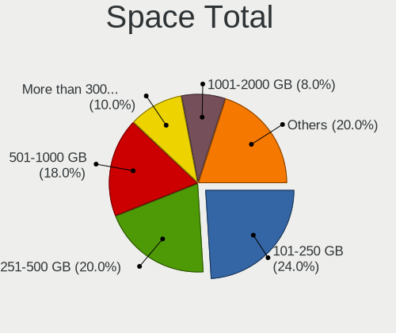
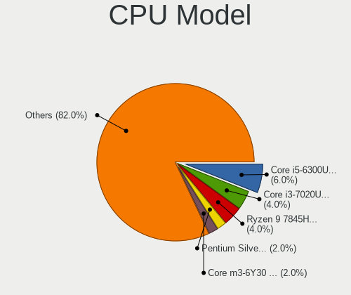
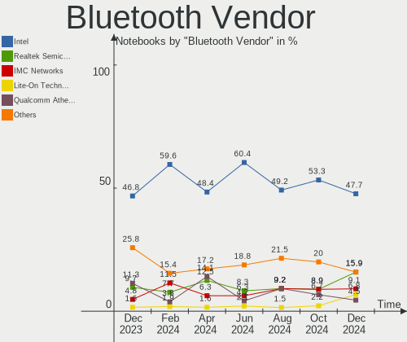
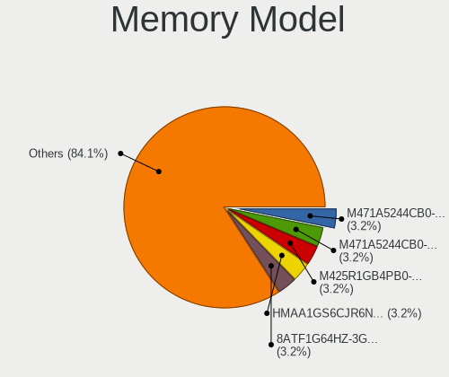

ArcoLinux - Hardware Trends (Notebooks)
---------------------------------------

A project to identify most popular hardware characteristics and track their change
over time based on data collected by Linux users at https://Linux-Hardware.org.

Anyone can contribute to this report by the [hw-probe](https://github.com/linuxhw/hw-probe) tool:

    sudo -E hw-probe -all -upload

This report is for one last month. Overall report since the beginning of time: [TestDays](https://github.com/linuxhw/TestDays)

Period: May, 2023.

Contents
--------

* [ System ](#system)
  - [ OS                       ](#os)
  - [ OS Family                ](#os-family)
  - [ Kernel                   ](#kernel)
  - [ Kernel Family            ](#kernel-family)
  - [ Kernel Major Ver.        ](#kernel-major-ver)
  - [ Arch                     ](#arch)
  - [ DE                       ](#de)
  - [ Display Server           ](#display-server)
  - [ Display Manager          ](#display-manager)
  - [ OS Lang                  ](#os-lang)
  - [ Boot Mode                ](#boot-mode)
  - [ Filesystem               ](#filesystem)
  - [ Part. scheme             ](#part-scheme)
  - [ Dual Boot with Linux/BSD ](#dual-boot-with-linuxbsd)
  - [ Dual Boot (Win)          ](#dual-boot-win)

* [ Board ](#board)
  - [ Vendor                   ](#vendor)
  - [ Model                    ](#model)
  - [ Model Family             ](#model-family)
  - [ MFG Year                 ](#mfg-year)
  - [ Form Factor              ](#form-factor)
  - [ Secure Boot              ](#secure-boot)
  - [ Coreboot                 ](#coreboot)
  - [ RAM Size                 ](#ram-size)
  - [ RAM Used                 ](#ram-used)
  - [ Total Drives             ](#total-drives)
  - [ Has CD-ROM               ](#has-cd-rom)
  - [ Has Ethernet             ](#has-ethernet)
  - [ Has WiFi                 ](#has-wifi)
  - [ Has Bluetooth            ](#has-bluetooth)

* [ Location ](#location)
  - [ Country                  ](#country)
  - [ City                     ](#city)

* [ Drives ](#drives)
  - [ Drive Vendor             ](#drive-vendor)
  - [ Drive Model              ](#drive-model)
  - [ HDD Vendor               ](#hdd-vendor)
  - [ SSD Vendor               ](#ssd-vendor)
  - [ Drive Kind               ](#drive-kind)
  - [ Drive Connector          ](#drive-connector)
  - [ Drive Size               ](#drive-size)
  - [ Space Total              ](#space-total)
  - [ Space Used               ](#space-used)
  - [ Malfunc. Drives          ](#malfunc-drives)
  - [ Malfunc. Drive Vendor    ](#malfunc-drive-vendor)
  - [ Malfunc. HDD Vendor      ](#malfunc-hdd-vendor)
  - [ Malfunc. Drive Kind      ](#malfunc-drive-kind)
  - [ Failed Drives            ](#failed-drives)
  - [ Failed Drive Vendor      ](#failed-drive-vendor)
  - [ Drive Status             ](#drive-status)

* [ Storage controller ](#storage-controller)
  - [ Storage Vendor           ](#storage-vendor)
  - [ Storage Model            ](#storage-model)
  - [ Storage Kind             ](#storage-kind)

* [ Processor ](#processor)
  - [ CPU Vendor               ](#cpu-vendor)
  - [ CPU Model                ](#cpu-model)
  - [ CPU Model Family         ](#cpu-model-family)
  - [ CPU Cores                ](#cpu-cores)
  - [ CPU Sockets              ](#cpu-sockets)
  - [ CPU Threads              ](#cpu-threads)
  - [ CPU Op-Modes             ](#cpu-op-modes)
  - [ CPU Microcode            ](#cpu-microcode)
  - [ CPU Microarch            ](#cpu-microarch)

* [ Graphics ](#graphics)
  - [ GPU Vendor               ](#gpu-vendor)
  - [ GPU Model                ](#gpu-model)
  - [ GPU Combo                ](#gpu-combo)
  - [ GPU Driver               ](#gpu-driver)
  - [ GPU Memory               ](#gpu-memory)

* [ Monitor ](#monitor)
  - [ Monitor Vendor           ](#monitor-vendor)
  - [ Monitor Model            ](#monitor-model)
  - [ Monitor Resolution       ](#monitor-resolution)
  - [ Monitor Diagonal         ](#monitor-diagonal)
  - [ Monitor Width            ](#monitor-width)
  - [ Aspect Ratio             ](#aspect-ratio)
  - [ Monitor Area             ](#monitor-area)
  - [ Pixel Density            ](#pixel-density)
  - [ Multiple Monitors        ](#multiple-monitors)

* [ Network ](#network)
  - [ Net Controller Vendor    ](#net-controller-vendor)
  - [ Net Controller Model     ](#net-controller-model)
  - [ Wireless Vendor          ](#wireless-vendor)
  - [ Wireless Model           ](#wireless-model)
  - [ Ethernet Vendor          ](#ethernet-vendor)
  - [ Ethernet Model           ](#ethernet-model)
  - [ Net Controller Kind      ](#net-controller-kind)
  - [ Used Controller          ](#used-controller)
  - [ NICs                     ](#nics)
  - [ IPv6                     ](#ipv6)

* [ Bluetooth ](#bluetooth)
  - [ Bluetooth Vendor         ](#bluetooth-vendor)
  - [ Bluetooth Model          ](#bluetooth-model)

* [ Sound ](#sound)
  - [ Sound Vendor             ](#sound-vendor)
  - [ Sound Model              ](#sound-model)

* [ Memory ](#memory)
  - [ Memory Vendor            ](#memory-vendor)
  - [ Memory Model             ](#memory-model)
  - [ Memory Kind              ](#memory-kind)
  - [ Memory Form Factor       ](#memory-form-factor)
  - [ Memory Size              ](#memory-size)
  - [ Memory Speed             ](#memory-speed)

* [ Printers & scanners ](#printers--scanners)
  - [ Printer Vendor           ](#printer-vendor)
  - [ Printer Model            ](#printer-model)
  - [ Scanner Vendor           ](#scanner-vendor)
  - [ Scanner Model            ](#scanner-model)

* [ Camera ](#camera)
  - [ Camera Vendor            ](#camera-vendor)
  - [ Camera Model             ](#camera-model)

* [ Security ](#security)
  - [ Fingerprint Vendor       ](#fingerprint-vendor)
  - [ Fingerprint Model        ](#fingerprint-model)
  - [ Chipcard Vendor          ](#chipcard-vendor)
  - [ Chipcard Model           ](#chipcard-model)

* [ Unsupported ](#unsupported)
  - [ Unsupported Devices      ](#unsupported-devices)
  - [ Unsupported Device Types ](#unsupported-device-types)

System
------

OS
--

Installed operating systems

| Name              | Notebooks | Percent |
|-------------------|-----------|---------|
| ArcoLinux Rolling | 63        | 94.03%  |
| ArcoLinux         | 4         | 5.97%   |

OS Family
---------

OS without a version

| Name      | Notebooks | Percent |
|-----------|-----------|---------|
| ArcoLinux | 67        | 100%    |

Kernel
------

Version of the Linux kernel

| Version                       | Notebooks | Percent |
|-------------------------------|-----------|---------|
| 6.3.2-arch1-1                 | 12        | 17.91%  |
| 6.3.1-arch2-1                 | 9         | 13.43%  |
| 6.3.4-arch1-1                 | 8         | 11.94%  |
| 6.3.3-arch1-1                 | 4         | 5.97%   |
| 6.3.1-arch1-1                 | 4         | 5.97%   |
| 6.3.2-zen1-1-zen              | 3         | 4.48%   |
| 6.1.28-1-lts                  | 3         | 4.48%   |
| 6.1.27-1-lts                  | 3         | 4.48%   |
| 6.3.5-arch1-1                 | 2         | 2.99%   |
| 6.3.3-zen1-1-zen              | 2         | 2.99%   |
| 6.2.13-arch1-1                | 2         | 2.99%   |
| 6.2.10-x64v1-xanmod1-1        | 2         | 2.99%   |
| 6.1.30-1-lts                  | 2         | 2.99%   |
| 6.3.5-zen1-1-zen              | 1         | 1.49%   |
| 6.3.4-zen1-1-zen              | 1         | 1.49%   |
| 6.3.4-arch2-1                 | 1         | 1.49%   |
| 6.3.1-zen2-1-zen              | 1         | 1.49%   |
| 6.3.1-zen1-1-zen              | 1         | 1.49%   |
| 6.3.0.11.realtime1-1-rt       | 1         | 1.49%   |
| 6.2.12-arch1-1                | 1         | 1.49%   |
| 6.2.11-arch1-1                | 1         | 1.49%   |
| 6.1.29-1-lts                  | 1         | 1.49%   |
| 6.1.13-x64v2-rt7-xanmod1-1-rt | 1         | 1.49%   |
| 6.0.9-arch1-1                 | 1         | 1.49%   |

Kernel Family
-------------

Linux kernel without a distro release

| Version  | Notebooks | Percent |
|----------|-----------|---------|
| 6.3.2    | 15        | 22.39%  |
| 6.3.1    | 15        | 22.39%  |
| 6.3.4    | 10        | 14.93%  |
| 6.3.3    | 6         | 8.96%   |
| 6.3.5    | 3         | 4.48%   |
| 6.1.28   | 3         | 4.48%   |
| 6.1.27   | 3         | 4.48%   |
| 6.2.13   | 2         | 2.99%   |
| 6.2.10   | 2         | 2.99%   |
| 6.1.30   | 2         | 2.99%   |
| 6.3.0.11 | 1         | 1.49%   |
| 6.2.12   | 1         | 1.49%   |
| 6.2.11   | 1         | 1.49%   |
| 6.1.29   | 1         | 1.49%   |
| 6.1.13   | 1         | 1.49%   |
| 6.0.9    | 1         | 1.49%   |

Kernel Major Ver.
-----------------

Linux kernel major version

| Version | Notebooks | Percent |
|---------|-----------|---------|
| 6.3     | 49        | 73.13%  |
| 6.1     | 10        | 14.93%  |
| 6.2     | 6         | 8.96%   |
| 6.3.0   | 1         | 1.49%   |
| 6.0     | 1         | 1.49%   |

Arch
----

OS architecture (x86_64, i586, etc.)

| Name   | Notebooks | Percent |
|--------|-----------|---------|
| x86_64 | 67        | 100%    |

DE
--

Desktop Environment

| Name     | Notebooks | Percent |
|----------|-----------|---------|
| KDE5     | 24        | 35.82%  |
| XFCE     | 14        | 20.9%   |
| i3       | 8         | 11.94%  |
| GNOME    | 7         | 10.45%  |
| Hyprland | 3         | 4.48%   |
| LeftWM   | 2         | 2.99%   |
| Deepin   | 2         | 2.99%   |
| bspwm    | 2         | 2.99%   |
| awesome  | 2         | 2.99%   |
| MATE     | 1         | 1.49%   |
| ICEWM    | 1         | 1.49%   |
| Cinnamon | 1         | 1.49%   |

Display Server
--------------

X11 or Wayland

| Name    | Notebooks | Percent |
|---------|-----------|---------|
| X11     | 56        | 83.58%  |
| Wayland | 11        | 16.42%  |

Display Manager
---------------

SDDM, LightDM, etc.

| Name    | Notebooks | Percent |
|---------|-----------|---------|
| SDDM    | 45        | 67.16%  |
| LightDM | 14        | 20.9%   |
| Unknown | 4         | 5.97%   |
| GDM     | 3         | 4.48%   |
| LXDM    | 1         | 1.49%   |

OS Lang
-------

Language

| Lang        | Notebooks | Percent |
|-------------|-----------|---------|
| en_US       | 36        | 53.73%  |
| en_GB       | 7         | 10.45%  |
| de_DE       | 5         | 7.46%   |
| zh_CN       | 2         | 2.99%   |
| en_CA       | 2         | 2.99%   |
| en_AU       | 2         | 2.99%   |
| C           | 2         | 2.99%   |
| sv_SE       | 1         | 1.49%   |
| sr_RS@latin | 1         | 1.49%   |
| ru_RU       | 1         | 1.49%   |
| pt_BR       | 1         | 1.49%   |
| nl_NL       | 1         | 1.49%   |
| nl_BE.UTF8  | 1         | 1.49%   |
| hu_HU       | 1         | 1.49%   |
| fr_FR       | 1         | 1.49%   |
| es_MX       | 1         | 1.49%   |
| es_ES       | 1         | 1.49%   |
| en_ZA       | 1         | 1.49%   |

Boot Mode
---------

EFI or BIOS

| Mode | Notebooks | Percent |
|------|-----------|---------|
| EFI  | 50        | 74.63%  |
| BIOS | 17        | 25.37%  |

Filesystem
----------

Type of filesystem

| Type    | Notebooks | Percent |
|---------|-----------|---------|
| Ext4    | 46        | 68.66%  |
| Btrfs   | 19        | 28.36%  |
| Overlay | 2         | 2.99%   |

Part. scheme
------------

Scheme of partitioning

| Type    | Notebooks | Percent |
|---------|-----------|---------|
| GPT     | 52        | 77.61%  |
| MBR     | 11        | 16.42%  |
| Unknown | 4         | 5.97%   |

Dual Boot with Linux/BSD
------------------------

Hosting more than one Linux/BSD

| Dual boot | Notebooks | Percent |
|-----------|-----------|---------|
| No        | 53        | 79.1%   |
| Yes       | 14        | 20.9%   |

Dual Boot (Win)
---------------

Hosting Linux and Windows

| Dual boot | Notebooks | Percent |
|-----------|-----------|---------|
| No        | 46        | 68.66%  |
| Yes       | 21        | 31.34%  |

Board
-----

Vendor
------

Motherboard manufacturer

| Name             | Notebooks | Percent |
|------------------|-----------|---------|
| Lenovo           | 17        | 25.37%  |
| Hewlett-Packard  | 15        | 22.39%  |
| ASUSTek Computer | 15        | 22.39%  |
| Dell             | 6         | 8.96%   |
| Toshiba          | 3         | 4.48%   |
| Acer             | 3         | 4.48%   |
| TUXEDO           | 1         | 1.49%   |
| System76         | 1         | 1.49%   |
| NEC Computers    | 1         | 1.49%   |
| HUAWEI           | 1         | 1.49%   |
| Fujitsu          | 1         | 1.49%   |
| Framework        | 1         | 1.49%   |
| Eluktronics      | 1         | 1.49%   |
| A14CR            | 1         | 1.49%   |

Model
-----

Motherboard model

| Name                                              | Notebooks | Percent |
|---------------------------------------------------|-----------|---------|
| ASUS ASUS TUF Dash F15 FX517ZE_FX517ZE            | 2         | 2.99%   |
| TUXEDO Pulse 15 Gen2                              | 1         | 1.49%   |
| Toshiba TECRA Z40-A                               | 1         | 1.49%   |
| Toshiba Satellite Pro C50-A-1E6                   | 1         | 1.49%   |
| Toshiba Satellite C55-A                           | 1         | 1.49%   |
| System76 Oryx Pro                                 | 1         | 1.49%   |
| NEC Computers PC-VK26TXZCM                        | 1         | 1.49%   |
| Lenovo Yoga 14sITL 2021 82G2                      | 1         | 1.49%   |
| Lenovo ThinkPad X260 20F5S6P801                   | 1         | 1.49%   |
| Lenovo ThinkPad T550 20CJS1V900                   | 1         | 1.49%   |
| Lenovo ThinkPad T550 20CJS0S800                   | 1         | 1.49%   |
| Lenovo ThinkPad T470 W10DG 20JNS10501             | 1         | 1.49%   |
| Lenovo ThinkPad T440 20B7S1MF0D                   | 1         | 1.49%   |
| Lenovo ThinkPad T430 2349GDU                      | 1         | 1.49%   |
| Lenovo ThinkPad T430 2347EA2                      | 1         | 1.49%   |
| Lenovo ThinkPad T15p Gen 3 21DA0009GE             | 1         | 1.49%   |
| Lenovo ThinkPad P72 20MBCTO1WW                    | 1         | 1.49%   |
| Lenovo ThinkBook 13s-IML 20RR                     | 1         | 1.49%   |
| Lenovo IdeaPad Y700-17ISK 80Q0                    | 1         | 1.49%   |
| Lenovo IdeaPad Slim 1-14AST-05 81VS               | 1         | 1.49%   |
| Lenovo IdeaPad Gaming 3 15IHU6 82MG               | 1         | 1.49%   |
| Lenovo IdeaPad 510-15IKB 80SV                     | 1         | 1.49%   |
| Lenovo IdeaPad 310-15IKB 80TV                     | 1         | 1.49%   |
| Lenovo IdeaPad 3 15ITL05 81X8                     | 1         | 1.49%   |
| HUAWEI NBLK-WAX9X                                 | 1         | 1.49%   |
| HP ZBook Firefly 16 inch G9 Mobile Workstation PC | 1         | 1.49%   |
| HP Victus by Gaming Laptop 15-fa0xxx              | 1         | 1.49%   |
| HP ProBook 450 G8 Notebook PC                     | 1         | 1.49%   |
| HP Pavilion Notebook                              | 1         | 1.49%   |
| HP Pavilion Gaming Laptop 15-ec1xxx               | 1         | 1.49%   |
| HP Pavilion dv7                                   | 1         | 1.49%   |
| HP Pavilion 15                                    | 1         | 1.49%   |
| HP OMEN by Laptop 15-ce0xx                        | 1         | 1.49%   |
| HP Laptop 15s-eq2xxx                              | 1         | 1.49%   |
| HP Laptop 15-da0xxx                               | 1         | 1.49%   |
| HP Laptop 14s-cf2xxx                              | 1         | 1.49%   |
| HP ENVY dv6                                       | 1         | 1.49%   |
| HP ENVY 15                                        | 1         | 1.49%   |
| HP EliteBook 8470p                                | 1         | 1.49%   |
| HP EliteBook 840 G2                               | 1         | 1.49%   |

Model Family
------------

Motherboard model prefix

| Name                       | Notebooks | Percent |
|----------------------------|-----------|---------|
| Lenovo ThinkPad            | 9         | 13.43%  |
| Lenovo IdeaPad             | 6         | 8.96%   |
| HP Pavilion                | 4         | 5.97%   |
| HP Laptop                  | 3         | 4.48%   |
| Toshiba Satellite          | 2         | 2.99%   |
| HP ENVY                    | 2         | 2.99%   |
| HP EliteBook               | 2         | 2.99%   |
| Dell Latitude              | 2         | 2.99%   |
| Dell Inspiron              | 2         | 2.99%   |
| ASUS VivoBook              | 2         | 2.99%   |
| ASUS ROG                   | 2         | 2.99%   |
| ASUS ASUS                  | 2         | 2.99%   |
| TUXEDO Pulse               | 1         | 1.49%   |
| Toshiba TECRA              | 1         | 1.49%   |
| System76 Oryx              | 1         | 1.49%   |
| NEC Computers PC-VK26TXZCM | 1         | 1.49%   |
| Lenovo Yoga                | 1         | 1.49%   |
| Lenovo ThinkBook           | 1         | 1.49%   |
| HUAWEI NBLK-WAX9X          | 1         | 1.49%   |
| HP ZBook                   | 1         | 1.49%   |
| HP Victus                  | 1         | 1.49%   |
| HP ProBook                 | 1         | 1.49%   |
| HP OMEN                    | 1         | 1.49%   |
| Fujitsu LIFEBOOK           | 1         | 1.49%   |
| Framework Laptop           | 1         | 1.49%   |
| Eluktronics MAG-15         | 1         | 1.49%   |
| Dell XPS                   | 1         | 1.49%   |
| Dell Precision             | 1         | 1.49%   |
| ASUS Zephyrus              | 1         | 1.49%   |
| ASUS ZenBook               | 1         | 1.49%   |
| ASUS X751LAB               | 1         | 1.49%   |
| ASUS X556UQK               | 1         | 1.49%   |
| ASUS X540SC                | 1         | 1.49%   |
| ASUS UX410UAK              | 1         | 1.49%   |
| ASUS TUF                   | 1         | 1.49%   |
| ASUS K45VM                 | 1         | 1.49%   |
| ASUS G752VT                | 1         | 1.49%   |
| Acer Predator              | 1         | 1.49%   |
| Acer Nitro                 | 1         | 1.49%   |
| Acer Aspire                | 1         | 1.49%   |

MFG Year
--------

Motherboard manufacture year

| Year | Notebooks | Percent |
|------|-----------|---------|
| 2022 | 9         | 13.43%  |
| 2016 | 9         | 13.43%  |
| 2015 | 9         | 13.43%  |
| 2019 | 6         | 8.96%   |
| 2018 | 6         | 8.96%   |
| 2012 | 6         | 8.96%   |
| 2021 | 5         | 7.46%   |
| 2020 | 5         | 7.46%   |
| 2017 | 4         | 5.97%   |
| 2013 | 4         | 5.97%   |
| 2014 | 1         | 1.49%   |
| 2011 | 1         | 1.49%   |
| 2010 | 1         | 1.49%   |
| 2008 | 1         | 1.49%   |

Form Factor
-----------

Physical design of the computer

| Name     | Notebooks | Percent |
|----------|-----------|---------|
| Notebook | 67        | 100%    |

Secure Boot
-----------

Enabled or disabled

| State    | Notebooks | Percent |
|----------|-----------|---------|
| Disabled | 66        | 98.51%  |
| Enabled  | 1         | 1.49%   |

Coreboot
--------

Have coreboot on board

| Used | Notebooks | Percent |
|------|-----------|---------|
| No   | 67        | 100%    |

RAM Size
--------

Total RAM memory

| Size in GB | Notebooks | Percent |
|------------|-----------|---------|
| 4.01-8.0   | 24        | 35.82%  |
| 16.01-24.0 | 14        | 20.9%   |
| 8.01-16.0  | 13        | 19.4%   |
| 32.01-64.0 | 8         | 11.94%  |
| 3.01-4.0   | 7         | 10.45%  |
| 2.01-3.0   | 1         | 1.49%   |

RAM Used
--------

Used RAM memory

| Used GB   | Notebooks | Percent |
|-----------|-----------|---------|
| 1.01-2.0  | 27        | 40.3%   |
| 2.01-3.0  | 18        | 26.87%  |
| 4.01-8.0  | 10        | 14.93%  |
| 3.01-4.0  | 10        | 14.93%  |
| 8.01-16.0 | 2         | 2.99%   |

Total Drives
------------

Number of drives on board

| Drives | Notebooks | Percent |
|--------|-----------|---------|
| 1      | 50        | 74.63%  |
| 2      | 12        | 17.91%  |
| 3      | 3         | 4.48%   |
| 4      | 2         | 2.99%   |

Has CD-ROM
----------

Has CD-ROM on board

| Presented | Notebooks | Percent |
|-----------|-----------|---------|
| No        | 52        | 77.61%  |
| Yes       | 15        | 22.39%  |

Has Ethernet
------------

Has Ethernet on board

| Presented | Notebooks | Percent |
|-----------|-----------|---------|
| Yes       | 57        | 85.07%  |
| No        | 10        | 14.93%  |

Has WiFi
--------

Has WiFi module

| Presented | Notebooks | Percent |
|-----------|-----------|---------|
| Yes       | 66        | 98.51%  |
| No        | 1         | 1.49%   |

Has Bluetooth
-------------

Has Bluetooth module

| Presented | Notebooks | Percent |
|-----------|-----------|---------|
| Yes       | 57        | 85.07%  |
| No        | 10        | 14.93%  |

Location
--------

Country
-------

Geographic location (country)

| Country      | Notebooks | Percent |
|--------------|-----------|---------|
| USA          | 16        | 23.88%  |
| Germany      | 8         | 11.94%  |
| UK           | 5         | 7.46%   |
| Belgium      | 4         | 5.97%   |
| Spain        | 3         | 4.48%   |
| Brazil       | 3         | 4.48%   |
| Australia    | 3         | 4.48%   |
| Sweden       | 2         | 2.99%   |
| China        | 2         | 2.99%   |
| Turkey       | 1         | 1.49%   |
| South Korea  | 1         | 1.49%   |
| South Africa | 1         | 1.49%   |
| Serbia       | 1         | 1.49%   |
| Saudi Arabia | 1         | 1.49%   |
| Russia       | 1         | 1.49%   |
| Peru         | 1         | 1.49%   |
| Netherlands  | 1         | 1.49%   |
| Morocco      | 1         | 1.49%   |
| Mexico       | 1         | 1.49%   |
| Iran         | 1         | 1.49%   |
| Indonesia    | 1         | 1.49%   |
| India        | 1         | 1.49%   |
| Hungary      | 1         | 1.49%   |
| Greece       | 1         | 1.49%   |
| France       | 1         | 1.49%   |
| Canada       | 1         | 1.49%   |
| Bolivia      | 1         | 1.49%   |
| Bangladesh   | 1         | 1.49%   |
| Argentina    | 1         | 1.49%   |
| Algeria      | 1         | 1.49%   |

City
----

Geographic location (city)

| City                 | Notebooks | Percent |
|----------------------|-----------|---------|
| Westerau             | 1         | 1.49%   |
| Valencia             | 1         | 1.49%   |
| Troy                 | 1         | 1.49%   |
| Trabzon              | 1         | 1.49%   |
| Toronto              | 1         | 1.49%   |
| Tehran               | 1         | 1.49%   |
| Sydney               | 1         | 1.49%   |
| Spokane              | 1         | 1.49%   |
| Shanghai             | 1         | 1.49%   |
| Seraing              | 1         | 1.49%   |
| Santa Pola           | 1         | 1.49%   |
| Santa Cruz           | 1         | 1.49%   |
| Saint Paul           | 1         | 1.49%   |
| Rochester            | 1         | 1.49%   |
| Riyadh               | 1         | 1.49%   |
| Rio de Janeiro       | 1         | 1.49%   |
| Riemerling           | 1         | 1.49%   |
| Paros                | 1         | 1.49%   |
| Paris                | 1         | 1.49%   |
| Oudenaarde           | 1         | 1.49%   |
| Ochten               | 1         | 1.49%   |
| Oakland              | 1         | 1.49%   |
| New York             | 1         | 1.49%   |
| Mendoza              | 1         | 1.49%   |
| Melbourne            | 1         | 1.49%   |
| Mannheim             | 1         | 1.49%   |
| Liège               | 1         | 1.49%   |
| Lawley               | 1         | 1.49%   |
| Kouba                | 1         | 1.49%   |
| Kingston upon Thames | 1         | 1.49%   |
| Kansas City          | 1         | 1.49%   |
| Joao Pessoa          | 1         | 1.49%   |
| Jacksonville         | 1         | 1.49%   |
| Ingolstadt           | 1         | 1.49%   |
| Houston              | 1         | 1.49%   |
| Harbin               | 1         | 1.49%   |
| Hanover              | 1         | 1.49%   |
| Hamburg              | 1         | 1.49%   |
| Hackney              | 1         | 1.49%   |
| Granger              | 1         | 1.49%   |

Drives
------

Drive Vendor
------------

Hard drive vendors

| Vendor                      | Notebooks | Drives | Percent |
|-----------------------------|-----------|--------|---------|
| Samsung Electronics         | 18        | 18     | 20%     |
| Seagate                     | 12        | 13     | 13.33%  |
| Toshiba                     | 8         | 8      | 8.89%   |
| Sandisk                     | 8         | 8      | 8.89%   |
| WDC                         | 6         | 6      | 6.67%   |
| SK hynix                    | 6         | 6      | 6.67%   |
| Crucial                     | 5         | 5      | 5.56%   |
| Intel                       | 4         | 4      | 4.44%   |
| Unknown                     | 3         | 3      | 3.33%   |
| Micron Technology           | 3         | 3      | 3.33%   |
| Kingston                    | 3         | 3      | 3.33%   |
| Phison Electronics          | 2         | 3      | 2.22%   |
| LITEON                      | 2         | 2      | 2.22%   |
| Union Memory (Shenzhen)     | 1         | 1      | 1.11%   |
| Team                        | 1         | 1      | 1.11%   |
| Netac                       | 1         | 1      | 1.11%   |
| Micron/Crucial Technology   | 1         | 1      | 1.11%   |
| KIOXIA                      | 1         | 1      | 1.11%   |
| Kingston Technology Company | 1         | 1      | 1.11%   |
| Hitachi                     | 1         | 1      | 1.11%   |
| HGST                        | 1         | 1      | 1.11%   |
| CT500P2S                    | 1         | 1      | 1.11%   |
| A-DATA Technology           | 1         | 1      | 1.11%   |

Drive Model
-----------

Hard drive models

| Model                                               | Notebooks | Percent |
|-----------------------------------------------------|-----------|---------|
| Seagate ST1000LM035-1RK172 1TB                      | 4         | 4.44%   |
| Samsung NVMe SSD Controller SM981/PM981/PM983 256GB | 4         | 4.44%   |
| Unknown MMC Card  64GB                              | 2         | 2.22%   |
| Toshiba MQ01ABD100 1TB                              | 2         | 2.22%   |
| Seagate ST2000LM007-1R8174 2TB                      | 2         | 2.22%   |
| Sandisk WD Blue SN550 NVMe SSD 512GB                | 2         | 2.22%   |
| Sandisk WD Black SN750 / PC SN730 NVMe SSD 256GB    | 2         | 2.22%   |
| Samsung NVMe SSD Controller SM961/PM961/SM963 256GB | 2         | 2.22%   |
| Samsung NVMe SSD Controller PM9A1/PM9A3/980PRO 1TB  | 2         | 2.22%   |
| Intel SSDPEKNU512GZ 512GB                           | 2         | 2.22%   |
| Crucial CT2000MX500SSD1 2TB                         | 2         | 2.22%   |
| WDC WDS100T2G0A-00JH30 1TB SSD                      | 1         | 1.11%   |
| WDC WD3200BEVT-60ZCT1 320GB                         | 1         | 1.11%   |
| WDC WD20SPZX-22UA7T0 2TB                            | 1         | 1.11%   |
| WDC WD10SPZX-75Z10T2 1TB                            | 1         | 1.11%   |
| WDC WD10SPCX-24HWST1 1TB                            | 1         | 1.11%   |
| WDC WD10JPVX-75JC3T0 1TB                            | 1         | 1.11%   |
| Unknown MMC Card  197GB                             | 1         | 1.11%   |
| Union Memory (Shenzhen) RPFTJ128PDD2EWX 128GB       | 1         | 1.11%   |
| Toshiba XG4 NVMe SSD Controller 256GB               | 1         | 1.11%   |
| Toshiba THNSNJ128GMCU 128GB SSD                     | 1         | 1.11%   |
| Toshiba THNSNF128GCSS 128GB SSD                     | 1         | 1.11%   |
| Toshiba MQ04ABF100 1TB                              | 1         | 1.11%   |
| Toshiba MK5076GSX -63 500GB                         | 1         | 1.11%   |
| Toshiba KSG60ZMV256G M.2 2280 256GB SSD             | 1         | 1.11%   |
| Team L5 LITE SSD 240GB                              | 1         | 1.11%   |
| SK hynix SKHynix_HFS512GD9TNI-L2A0B 512GB           | 1         | 1.11%   |
| SK hynix SKHynix_HFM128GD3HX015N 128GB              | 1         | 1.11%   |
| SK hynix SH920 2.5 7MM 256GB SSD                    | 1         | 1.11%   |
| SK hynix SC311 SATA 256G SSD                        | 1         | 1.11%   |
| SK hynix SC308 SATA 128GB SSD                       | 1         | 1.11%   |
| SK hynix HFM001TD3JX013N 1TB                        | 1         | 1.11%   |
| Seagate ST95005620AS 500GB                          | 1         | 1.11%   |
| Seagate ST500LT012-1DG142 500GB                     | 1         | 1.11%   |
| Seagate ST2000LM003 HN-M201RAD 2TB                  | 1         | 1.11%   |
| Seagate ST1000LM048-2E7172 1TB                      | 1         | 1.11%   |
| Seagate OneTouch HDD 2TB                            | 1         | 1.11%   |
| Seagate BUP Slim SL 1TB                             | 1         | 1.11%   |
| Sandisk WD_BLACK SN770 1TB                          | 1         | 1.11%   |
| Sandisk WD Blue SN500 / PC SN520 NVMe SSD 512GB     | 1         | 1.11%   |

HDD Vendor
----------

Hard disk drive vendors

| Vendor  | Notebooks | Drives | Percent |
|---------|-----------|--------|---------|
| Seagate | 12        | 13     | 52.17%  |
| WDC     | 5         | 5      | 21.74%  |
| Toshiba | 4         | 4      | 17.39%  |
| Hitachi | 1         | 1      | 4.35%   |
| HGST    | 1         | 1      | 4.35%   |

SSD Vendor
----------

Solid state drive vendors

| Vendor              | Notebooks | Drives | Percent |
|---------------------|-----------|--------|---------|
| Samsung Electronics | 7         | 7      | 25%     |
| Crucial             | 5         | 5      | 17.86%  |
| Toshiba             | 3         | 3      | 10.71%  |
| SK hynix            | 3         | 3      | 10.71%  |
| LITEON              | 2         | 2      | 7.14%   |
| Kingston            | 2         | 2      | 7.14%   |
| WDC                 | 1         | 1      | 3.57%   |
| Team                | 1         | 1      | 3.57%   |
| SanDisk             | 1         | 1      | 3.57%   |
| Netac               | 1         | 1      | 3.57%   |
| Micron Technology   | 1         | 1      | 3.57%   |
| A-DATA Technology   | 1         | 1      | 3.57%   |

Drive Kind
----------

HDD or SSD

| Kind | Notebooks | Drives | Percent |
|------|-----------|--------|---------|
| NVMe | 33        | 37     | 39.29%  |
| SSD  | 26        | 28     | 30.95%  |
| HDD  | 22        | 24     | 26.19%  |
| MMC  | 3         | 3      | 3.57%   |

Drive Connector
---------------

SATA, SAS, NVMe, etc.

| Type | Notebooks | Drives | Percent |
|------|-----------|--------|---------|
| SATA | 41        | 49     | 51.25%  |
| NVMe | 33        | 36     | 41.25%  |
| SAS  | 3         | 4      | 3.75%   |
| MMC  | 3         | 3      | 3.75%   |

Drive Size
----------

Size of hard drive

| Size in TB | Notebooks | Drives | Percent |
|------------|-----------|--------|---------|
| 0.01-0.5   | 25        | 26     | 50%     |
| 0.51-1.0   | 18        | 19     | 36%     |
| 1.01-2.0   | 7         | 7      | 14%     |

Space Total
-----------

Amount of disk space available on the file system

| Size in GB     | Notebooks | Percent |
|----------------|-----------|---------|
| 251-500        | 13        | 19.4%   |
| 101-250        | 13        | 19.4%   |
| 1001-2000      | 13        | 19.4%   |
| More than 3000 | 8         | 11.94%  |
| 501-1000       | 7         | 10.45%  |
| 1-20           | 4         | 5.97%   |
| Unknown        | 4         | 5.97%   |
| 51-100         | 3         | 4.48%   |
| 21-50          | 1         | 1.49%   |
| 2001-3000      | 1         | 1.49%   |

Space Used
----------

Amount of used disk space

| Used GB   | Notebooks | Percent |
|-----------|-----------|---------|
| 1-20      | 16        | 23.88%  |
| 21-50     | 11        | 16.42%  |
| 101-250   | 11        | 16.42%  |
| 501-1000  | 8         | 11.94%  |
| 251-500   | 6         | 8.96%   |
| 51-100    | 6         | 8.96%   |
| 1001-2000 | 4         | 5.97%   |
| Unknown   | 4         | 5.97%   |
| 2001-3000 | 1         | 1.49%   |

Malfunc. Drives
---------------

Drive models with a malfunction

| Model                                                           | Notebooks | Drives | Percent |
|-----------------------------------------------------------------|-----------|--------|---------|
| Toshiba MQ04ABF100 1TB                                          | 1         | 1      | 9.09%   |
| Toshiba MQ01ABD100 1TB                                          | 1         | 1      | 9.09%   |
| Team L5 LITE SSD 240GB                                          | 1         | 1      | 9.09%   |
| SK hynix SH920 2.5 7MM 256GB SSD                                | 1         | 1      | 9.09%   |
| Seagate ST95005620AS 500GB                                      | 1         | 2      | 9.09%   |
| Seagate ST1000LM048-2E7172 1TB                                  | 1         | 1      | 9.09%   |
| Seagate ST1000LM035-1RK172 1TB                                  | 1         | 1      | 9.09%   |
| SanDisk SD8SNAT128G1002 128GB SSD                               | 1         | 1      | 9.09%   |
| Samsung Electronics NVMe SSD Controller SM981/PM981/PM983 256GB | 1         | 1      | 9.09%   |
| Micron Technology 1100_MTFDDAV256TBN 256GB SSD                  | 1         | 1      | 9.09%   |
| Hitachi HTS542525K9SA00 250GB                                   | 1         | 1      | 9.09%   |

Malfunc. Drive Vendor
---------------------

Vendors of faulty drives

| Vendor              | Notebooks | Drives | Percent |
|---------------------|-----------|--------|---------|
| Seagate             | 3         | 4      | 27.27%  |
| Toshiba             | 2         | 2      | 18.18%  |
| Team                | 1         | 1      | 9.09%   |
| SK hynix            | 1         | 1      | 9.09%   |
| SanDisk             | 1         | 1      | 9.09%   |
| Samsung Electronics | 1         | 1      | 9.09%   |
| Micron Technology   | 1         | 1      | 9.09%   |
| Hitachi             | 1         | 1      | 9.09%   |

Malfunc. HDD Vendor
-------------------

Vendors of faulty HDD drives

| Vendor  | Notebooks | Drives | Percent |
|---------|-----------|--------|---------|
| Seagate | 3         | 4      | 50%     |
| Toshiba | 2         | 2      | 33.33%  |
| Hitachi | 1         | 1      | 16.67%  |

Malfunc. Drive Kind
-------------------

Kinds of faulty drives

| Kind | Notebooks | Drives | Percent |
|------|-----------|--------|---------|
| HDD  | 6         | 7      | 54.55%  |
| SSD  | 4         | 4      | 36.36%  |
| NVMe | 1         | 1      | 9.09%   |

Failed Drives
-------------

Failed drive models

Zero info for selected period =(

Failed Drive Vendor
-------------------

Failed drive vendors

Zero info for selected period =(

Drive Status
------------

Number of failed and malfunc. drives

| Status   | Notebooks | Drives | Percent |
|----------|-----------|--------|---------|
| Works    | 53        | 70     | 71.62%  |
| Malfunc  | 11        | 12     | 14.86%  |
| Detected | 10        | 10     | 13.51%  |

Storage controller
------------------

Storage Vendor
--------------

Storage controller vendors

| Vendor                       | Notebooks | Percent |
|------------------------------|-----------|---------|
| Intel                        | 51        | 58.62%  |
| Samsung Electronics          | 11        | 12.64%  |
| SanDisk                      | 7         | 8.05%   |
| AMD                          | 5         | 5.75%   |
| SK hynix                     | 3         | 3.45%   |
| Phison Electronics           | 2         | 2.3%    |
| Micron Technology            | 2         | 2.3%    |
| Kingston Technology Company  | 2         | 2.3%    |
| Union Memory (Shenzhen)      | 1         | 1.15%   |
| Toshiba America Info Systems | 1         | 1.15%   |
| Micron/Crucial Technology    | 1         | 1.15%   |
| KIOXIA                       | 1         | 1.15%   |

Storage Model
-------------

Storage controller models

| Model                                                                            | Notebooks | Percent |
|----------------------------------------------------------------------------------|-----------|---------|
| Intel Sunrise Point-LP SATA Controller [AHCI mode]                               | 10        | 10.75%  |
| Intel 7 Series Chipset Family 6-port SATA Controller [AHCI mode]                 | 8         | 8.6%    |
| Intel 82801 Mobile SATA Controller [RAID mode]                                   | 7         | 7.53%   |
| Intel Cannon Lake Mobile PCH SATA AHCI Controller                                | 6         | 6.45%   |
| Intel Wildcat Point-LP SATA Controller [AHCI Mode]                               | 5         | 5.38%   |
| Intel Volume Management Device NVMe RAID Controller                              | 5         | 5.38%   |
| Samsung NVMe SSD Controller SM981/PM981/PM983                                    | 4         | 4.3%    |
| AMD FCH SATA Controller [AHCI mode]                                              | 4         | 4.3%    |
| Intel HM170/QM170 Chipset SATA Controller [AHCI Mode]                            | 3         | 3.23%   |
| SK hynix Gold P31/PC711 NVMe Solid State Drive                                   | 2         | 2.15%   |
| SanDisk WD Blue SN550 NVMe SSD                                                   | 2         | 2.15%   |
| SanDisk WD Black SN750 / PC SN730 NVMe SSD                                       | 2         | 2.15%   |
| Samsung NVMe SSD Controller SM961/PM961/SM963                                    | 2         | 2.15%   |
| Samsung NVMe SSD Controller PM9A1/PM9A3/980PRO                                   | 2         | 2.15%   |
| Samsung NVMe SSD Controller 980                                                  | 2         | 2.15%   |
| Micron NVMe Storage Controller                                                   | 2         | 2.15%   |
| Intel Tiger Lake-LP SATA Controller                                              | 2         | 2.15%   |
| Intel Q170/Q150/B150/H170/H110/Z170/CM236 Chipset SATA Controller [AHCI Mode]    | 2         | 2.15%   |
| Intel Non-Volatile memory controller                                             | 2         | 2.15%   |
| Intel 8 Series SATA Controller 1 [AHCI mode]                                     | 2         | 2.15%   |
| Union Memory (Shenzhen) Non-Volatile memory controller                           | 1         | 1.08%   |
| Toshiba America Info Systems XG4 NVMe SSD Controller                             | 1         | 1.08%   |
| SK hynix Non-Volatile memory controller                                          | 1         | 1.08%   |
| SanDisk WD Blue SN500 / PC SN520 NVMe SSD                                        | 1         | 1.08%   |
| SanDisk WD Black SN770 NVMe SSD                                                  | 1         | 1.08%   |
| SanDisk WD Black 2018/SN750 / PC SN720 NVMe SSD                                  | 1         | 1.08%   |
| Samsung NVMe SSD Controller SM951/PM951                                          | 1         | 1.08%   |
| Phison E16 PCIe4 NVMe Controller                                                 | 1         | 1.08%   |
| Phison E12 NVMe Controller                                                       | 1         | 1.08%   |
| Micron/Crucial P2 NVMe PCIe SSD                                                  | 1         | 1.08%   |
| KIOXIA NVMe SSD Controller BG4                                                   | 1         | 1.08%   |
| Kingston Company Company Non-Volatile memory controller                          | 1         | 1.08%   |
| Kingston Company NVMe Controller                                                 | 1         | 1.08%   |
| Intel SSD 665p Series                                                            | 1         | 1.08%   |
| Intel SSD 660P Series                                                            | 1         | 1.08%   |
| Intel Atom/Celeron/Pentium Processor x5-E8000/J3xxx/N3xxx Series SATA Controller | 1         | 1.08%   |
| Intel 8 Series/C220 Series Chipset Family 6-port SATA Controller 1 [AHCI mode]   | 1         | 1.08%   |
| AMD SB7x0/SB8x0/SB9x0 SATA Controller [AHCI mode]                                | 1         | 1.08%   |
| AMD SB7x0/SB8x0/SB9x0 IDE Controller                                             | 1         | 1.08%   |

Storage Kind
------------

Kind of storage controller (IDE, SATA, NVMe, SAS, ...)

| Kind | Notebooks | Percent |
|------|-----------|---------|
| SATA | 45        | 49.45%  |
| NVMe | 33        | 36.26%  |
| RAID | 12        | 13.19%  |
| IDE  | 1         | 1.1%    |

Processor
---------

CPU Vendor
----------

Processor vendors

| Vendor | Notebooks | Percent |
|--------|-----------|---------|
| Intel  | 58        | 86.57%  |
| AMD    | 9         | 13.43%  |

CPU Model
---------

Processor models

| Model                                   | Notebooks | Percent |
|-----------------------------------------|-----------|---------|
| Intel Core i5-7200U CPU @ 2.50GHz       | 4         | 5.97%   |
| Intel Core i7-7700HQ CPU @ 2.80GHz      | 3         | 4.48%   |
| Intel Core i5-5300U CPU @ 2.30GHz       | 3         | 4.48%   |
| Intel Core i5-3320M CPU @ 2.60GHz       | 3         | 4.48%   |
| Intel Core i7-9750H CPU @ 2.60GHz       | 2         | 2.99%   |
| Intel Core i7-8750H CPU @ 2.20GHz       | 2         | 2.99%   |
| Intel Core i7-6700HQ CPU @ 2.60GHz      | 2         | 2.99%   |
| Intel Core i7-3610QM CPU @ 2.30GHz      | 2         | 2.99%   |
| Intel Core i5-6300U CPU @ 2.40GHz       | 2         | 2.99%   |
| Intel Core i5-5200U CPU @ 2.20GHz       | 2         | 2.99%   |
| Intel 12th Gen Core i5-12450H           | 2         | 2.99%   |
| Intel 11th Gen Core i5-1135G7 @ 2.40GHz | 2         | 2.99%   |
| Intel Pentium CPU N3700 @ 1.60GHz       | 1         | 1.49%   |
| Intel Core i7-8850H CPU @ 2.60GHz       | 1         | 1.49%   |
| Intel Core i7-8650U CPU @ 1.90GHz       | 1         | 1.49%   |
| Intel Core i7-8550U CPU @ 1.80GHz       | 1         | 1.49%   |
| Intel Core i7-6920HQ CPU @ 2.90GHz      | 1         | 1.49%   |
| Intel Core i7-6500U CPU @ 2.50GHz       | 1         | 1.49%   |
| Intel Core i7-4702MQ CPU @ 2.20GHz      | 1         | 1.49%   |
| Intel Core i7-3630QM CPU @ 2.40GHz      | 1         | 1.49%   |
| Intel Core i7-10750H CPU @ 2.60GHz      | 1         | 1.49%   |
| Intel Core i5-8300H CPU @ 2.30GHz       | 1         | 1.49%   |
| Intel Core i5-8250U CPU @ 1.60GHz       | 1         | 1.49%   |
| Intel Core i5-6200U CPU @ 2.30GHz       | 1         | 1.49%   |
| Intel Core i5-4300U CPU @ 1.90GHz       | 1         | 1.49%   |
| Intel Core i5-4210M CPU @ 2.60GHz       | 1         | 1.49%   |
| Intel Core i5-4200U CPU @ 1.60GHz       | 1         | 1.49%   |
| Intel Core i5-10210U CPU @ 1.60GHz      | 1         | 1.49%   |
| Intel Core i3-7100U CPU @ 2.40GHz       | 1         | 1.49%   |
| Intel Core i3-6100U CPU @ 2.30GHz       | 1         | 1.49%   |
| Intel Core i3-3110M CPU @ 2.40GHz       | 1         | 1.49%   |
| Intel Core i3-2328M CPU @ 2.20GHz       | 1         | 1.49%   |
| Intel Core i3-10110U CPU @ 2.10GHz      | 1         | 1.49%   |
| Intel Core i3-1005G1 CPU @ 1.20GHz      | 1         | 1.49%   |
| Intel Celeron CPU 1037U @ 1.80GHz       | 1         | 1.49%   |
| Intel 12th Gen Core i7-12700H           | 1         | 1.49%   |
| Intel 12th Gen Core i7-12650H           | 1         | 1.49%   |
| Intel 12th Gen Core i7-1260P            | 1         | 1.49%   |
| Intel 12th Gen Core i7-1255U            | 1         | 1.49%   |
| Intel 11th Gen Core i5-11300H @ 3.10GHz | 1         | 1.49%   |

CPU Model Family
----------------

Processor model prefix

| Model                          | Notebooks | Percent |
|--------------------------------|-----------|---------|
| Intel Core i5                  | 21        | 31.34%  |
| Intel Core i7                  | 19        | 28.36%  |
| Other                          | 12        | 17.91%  |
| Intel Core i3                  | 6         | 8.96%   |
| AMD Ryzen 9                    | 2         | 2.99%   |
| AMD Ryzen 7                    | 2         | 2.99%   |
| AMD Ryzen 5                    | 2         | 2.99%   |
| Intel Pentium                  | 1         | 1.49%   |
| Intel Celeron                  | 1         | 1.49%   |
| AMD Turion X2 Dual-Core Mobile | 1         | 1.49%   |

CPU Cores
---------

Number of processor cores

| Number | Notebooks | Percent |
|--------|-----------|---------|
| 2      | 30        | 44.78%  |
| 4      | 20        | 29.85%  |
| 6      | 8         | 11.94%  |
| 8      | 5         | 7.46%   |
| 10     | 2         | 2.99%   |
| 14     | 1         | 1.49%   |
| 12     | 1         | 1.49%   |

CPU Sockets
-----------

Number of sockets

| Number | Notebooks | Percent |
|--------|-----------|---------|
| 1      | 67        | 100%    |

CPU Threads
-----------

Threads per core (Hyper-Threading)

| Number | Notebooks | Percent |
|--------|-----------|---------|
| 2      | 61        | 91.04%  |
| 1      | 6         | 8.96%   |

CPU Op-Modes
------------

CPU Operation Modes (32-bit, 64-bit)

| Op mode        | Notebooks | Percent |
|----------------|-----------|---------|
| 32-bit, 64-bit | 67        | 100%    |

CPU Microcode
-------------

Microcode number

| Number     | Notebooks | Percent |
|------------|-----------|---------|
| Unknown    | 49        | 73.13%  |
| 0x806ea    | 2         | 2.99%   |
| 0x806c1    | 2         | 2.99%   |
| 0x406e3    | 2         | 2.99%   |
| 0x08608103 | 2         | 2.99%   |
| 0x06006705 | 2         | 2.99%   |
| 0x906ea    | 1         | 1.49%   |
| 0x906a3    | 1         | 1.49%   |
| 0x40651    | 1         | 1.49%   |
| 0x306a9    | 1         | 1.49%   |
| 0x0a50000c | 1         | 1.49%   |
| 0x08600106 | 1         | 1.49%   |
| 0x08108109 | 1         | 1.49%   |
| 0x02000032 | 1         | 1.49%   |

CPU Microarch
-------------

Microarchitecture

| Name             | Notebooks | Percent |
|------------------|-----------|---------|
| KabyLake         | 19        | 28.36%  |
| Skylake          | 8         | 11.94%  |
| IvyBridge        | 8         | 11.94%  |
| Alderlake Hybrid | 6         | 8.96%   |
| Broadwell        | 5         | 7.46%   |
| TigerLake        | 4         | 5.97%   |
| Haswell          | 4         | 5.97%   |
| Zen 2            | 2         | 2.99%   |
| Excavator        | 2         | 2.99%   |
| Unknown          | 2         | 2.99%   |
| Zen+             | 1         | 1.49%   |
| Zen 3            | 1         | 1.49%   |
| Silvermont       | 1         | 1.49%   |
| SandyBridge      | 1         | 1.49%   |
| K8 & K10 hybrid  | 1         | 1.49%   |
| IceLake          | 1         | 1.49%   |
| CometLake        | 1         | 1.49%   |

Graphics
--------

GPU Vendor
----------

Vendors of graphics cards

| Vendor | Notebooks | Percent |
|--------|-----------|---------|
| Intel  | 55        | 56.12%  |
| Nvidia | 31        | 31.63%  |
| AMD    | 12        | 12.24%  |

GPU Model
---------

Graphics card models

| Model                                                                         | Notebooks | Percent |
|-------------------------------------------------------------------------------|-----------|---------|
| Intel 3rd Gen Core processor Graphics Controller                              | 8         | 8.16%   |
| Intel Skylake GT2 [HD Graphics 520]                                           | 5         | 5.1%    |
| Intel HD Graphics 620                                                         | 5         | 5.1%    |
| Intel HD Graphics 5500                                                        | 5         | 5.1%    |
| Intel CoffeeLake-H GT2 [UHD Graphics 630]                                     | 5         | 5.1%    |
| Nvidia GP107M [GeForce GTX 1050 Mobile]                                       | 4         | 4.08%   |
| Intel UHD Graphics 620                                                        | 3         | 3.06%   |
| Intel TigerLake-LP GT2 [Iris Xe Graphics]                                     | 3         | 3.06%   |
| Intel Alder Lake-P GT1 [UHD Graphics]                                         | 3         | 3.06%   |
| Nvidia GM108M [GeForce 940MX]                                                 | 2         | 2.04%   |
| Nvidia GF108M [GeForce GT 620M/630M/635M/640M LE]                             | 2         | 2.04%   |
| Nvidia GA107M [GeForce RTX 3050 Ti Mobile]                                    | 2         | 2.04%   |
| Nvidia GA107M [GeForce RTX 3050 Mobile]                                       | 2         | 2.04%   |
| Intel HD Graphics 630                                                         | 2         | 2.04%   |
| Intel HD Graphics 530                                                         | 2         | 2.04%   |
| Intel Haswell-ULT Integrated Graphics Controller                              | 2         | 2.04%   |
| Intel CometLake-U GT2 [UHD Graphics]                                          | 2         | 2.04%   |
| Intel Alder Lake-P Integrated Graphics Controller                             | 2         | 2.04%   |
| Intel 4th Gen Core Processor Integrated Graphics Controller                   | 2         | 2.04%   |
| AMD Sun XT [Radeon HD 8670A/8670M/8690M / R5 M330 / M430 / Radeon 520 Mobile] | 2         | 2.04%   |
| AMD Stoney [Radeon R2/R3/R4/R5 Graphics]                                      | 2         | 2.04%   |
| AMD Renoir                                                                    | 2         | 2.04%   |
| AMD Lucienne                                                                  | 2         | 2.04%   |
| Nvidia TU117M [GeForce GTX 1650 Ti Mobile]                                    | 1         | 1.02%   |
| Nvidia TU117M [GeForce GTX 1650 Mobile / Max-Q]                               | 1         | 1.02%   |
| Nvidia TU117GLM [T550 Laptop GPU]                                             | 1         | 1.02%   |
| Nvidia TU116M [GeForce GTX 1660 Ti Mobile]                                    | 1         | 1.02%   |
| Nvidia TU106M [GeForce RTX 2070 Mobile / Max-Q Refresh]                       | 1         | 1.02%   |
| Nvidia TU106M [GeForce RTX 2060 Mobile]                                       | 1         | 1.02%   |
| Nvidia TU106M [GeForce RTX 2060 Max-Q]                                        | 1         | 1.02%   |
| Nvidia GP107GLM [Quadro P600 Mobile]                                          | 1         | 1.02%   |
| Nvidia GP106M [GeForce GTX 1060 Mobile]                                       | 1         | 1.02%   |
| Nvidia GP104BM [GeForce GTX 1070 Mobile]                                      | 1         | 1.02%   |
| Nvidia GM204M [GeForce GTX 970M]                                              | 1         | 1.02%   |
| Nvidia GM108M [GeForce MX130]                                                 | 1         | 1.02%   |
| Nvidia GM108M [GeForce MX110]                                                 | 1         | 1.02%   |
| Nvidia GM108M [GeForce 920MX]                                                 | 1         | 1.02%   |
| Nvidia GM108M [GeForce 830M]                                                  | 1         | 1.02%   |
| Nvidia GM107M [GeForce GTX 960M]                                              | 1         | 1.02%   |
| Nvidia GM107 [GeForce 940MX]                                                  | 1         | 1.02%   |

GPU Combo
---------

Combinations of graphics cards

| Name           | Notebooks | Percent |
|----------------|-----------|---------|
| Intel + Nvidia | 26        | 38.81%  |
| 1 x Intel      | 26        | 38.81%  |
| 1 x AMD        | 7         | 10.45%  |
| 1 x Nvidia     | 3         | 4.48%   |
| Intel + AMD    | 3         | 4.48%   |
| AMD + Nvidia   | 2         | 2.99%   |

GPU Driver
----------

Free vs proprietary

| Driver      | Notebooks | Percent |
|-------------|-----------|---------|
| Free        | 47        | 70.15%  |
| Proprietary | 20        | 29.85%  |

GPU Memory
----------

Total video memory

| Size in GB | Notebooks | Percent |
|------------|-----------|---------|
| Unknown    | 47        | 70.15%  |
| 0.01-0.5   | 7         | 10.45%  |
| 3.01-4.0   | 5         | 7.46%   |
| 1.01-2.0   | 4         | 5.97%   |
| 7.01-8.0   | 1         | 1.49%   |
| 5.01-6.0   | 1         | 1.49%   |
| 2.01-3.0   | 1         | 1.49%   |
| 0.51-1.0   | 1         | 1.49%   |

Monitor
-------

Monitor Vendor
--------------

Monitor vendors

| Vendor              | Notebooks | Percent |
|---------------------|-----------|---------|
| AU Optronics        | 16        | 21.05%  |
| LG Display          | 14        | 18.42%  |
| Chimei Innolux      | 14        | 18.42%  |
| BOE                 | 11        | 14.47%  |
| Samsung Electronics | 7         | 9.21%   |
| Sharp               | 2         | 2.63%   |
| Dell                | 2         | 2.63%   |
| CSO                 | 2         | 2.63%   |
| Vizio               | 1         | 1.32%   |
| Philips             | 1         | 1.32%   |
| PANDA               | 1         | 1.32%   |
| Panasonic           | 1         | 1.32%   |
| Iiyama              | 1         | 1.32%   |
| Goldstar            | 1         | 1.32%   |
| Fujitsu Siemens     | 1         | 1.32%   |
| Acer                | 1         | 1.32%   |

Monitor Model
-------------

Monitor models

| Model                                                                 | Notebooks | Percent |
|-----------------------------------------------------------------------|-----------|---------|
| LG Display LCD Monitor LGD0469 1920x1080 382x215mm 17.3-inch          | 2         | 2.6%    |
| Chimei Innolux LCD Monitor CMN153C 1920x1080 344x193mm 15.5-inch      | 2         | 2.6%    |
| AU Optronics LCD Monitor AUO61ED 1920x1080 344x193mm 15.5-inch        | 2         | 2.6%    |
| AU Optronics LCD Monitor AUO38ED 1920x1080 344x193mm 15.5-inch        | 2         | 2.6%    |
| Vizio E231-B1 VIZ0095 1360x768 534x311mm 24.3-inch                    | 1         | 1.3%    |
| Sharp LQ156M1JW09 SHP14D3 1920x1080 344x194mm 15.5-inch               | 1         | 1.3%    |
| Sharp LCD Monitor SHP1476 3840x2160 346x194mm 15.6-inch               | 1         | 1.3%    |
| Samsung Electronics SyncMaster SAM0471 1360x768 344x194mm 15.5-inch   | 1         | 1.3%    |
| Samsung Electronics LCD Monitor SEC5441 1280x800 331x207mm 15.4-inch  | 1         | 1.3%    |
| Samsung Electronics LCD Monitor SEC3959 1366x768 344x194mm 15.5-inch  | 1         | 1.3%    |
| Samsung Electronics LCD Monitor SEC344B 1440x900 367x230mm 17.1-inch  | 1         | 1.3%    |
| Samsung Electronics LCD Monitor SDC4951 1366x768 344x194mm 15.5-inch  | 1         | 1.3%    |
| Samsung Electronics LCD Monitor SDC3150 1920x1080 344x194mm 15.5-inch | 1         | 1.3%    |
| Samsung Electronics LC49G95T SAM7052 3840x1080 1193x336mm 48.8-inch   | 1         | 1.3%    |
| Philips PHL 193V5 PHLC0CD 1366x768 410x230mm 18.5-inch                | 1         | 1.3%    |
| PANDA LCD Monitor NCP0050 1920x1080 309x174mm 14.0-inch               | 1         | 1.3%    |
| Panasonic VVX14T092N00 MEI96A2 2256x1504 285x190mm 13.5-inch          | 1         | 1.3%    |
| LG Display LCD Monitor LGD0563 1920x1080 344x194mm 15.5-inch          | 1         | 1.3%    |
| LG Display LCD Monitor LGD0532 1920x1080 344x194mm 15.5-inch          | 1         | 1.3%    |
| LG Display LCD Monitor LGD0503 1366x768 344x194mm 15.5-inch           | 1         | 1.3%    |
| LG Display LCD Monitor LGD04E8 1920x1080 382x215mm 17.3-inch          | 1         | 1.3%    |
| LG Display LCD Monitor LGD04B9 1920x1080 344x194mm 15.5-inch          | 1         | 1.3%    |
| LG Display LCD Monitor LGD0460 1366x768 344x194mm 15.5-inch           | 1         | 1.3%    |
| LG Display LCD Monitor LGD0435 1600x900 309x174mm 14.0-inch           | 1         | 1.3%    |
| LG Display LCD Monitor LGD03FC 1600x900 309x174mm 14.0-inch           | 1         | 1.3%    |
| LG Display LCD Monitor LGD033B 1366x768 344x194mm 15.5-inch           | 1         | 1.3%    |
| LG Display LCD Monitor LGD033A 1366x768 344x194mm 15.5-inch           | 1         | 1.3%    |
| LG Display LCD Monitor LGD0335 1366x768 310x174mm 14.0-inch           | 1         | 1.3%    |
| LG Display LCD Monitor LGD02F8 1366x768 309x174mm 14.0-inch           | 1         | 1.3%    |
| Iiyama PL2483H IVM6138 1920x1080 531x299mm 24.0-inch                  | 1         | 1.3%    |
| Goldstar FULL HD GSM5B55 1920x1080 480x270mm 21.7-inch                | 1         | 1.3%    |
| Fujitsu Siemens L22W-3 FUS0710 1680x1050 474x296mm 22.0-inch          | 1         | 1.3%    |
| Dell U2412M DELA07A 1920x1200 518x324mm 24.1-inch                     | 1         | 1.3%    |
| Dell S3219D DELD0EE 2560x1440 708x399mm 32.0-inch                     | 1         | 1.3%    |
| Dell S3219D DELD0ED 2560x1440 708x399mm 32.0-inch                     | 1         | 1.3%    |
| CSO LCD Monitor CSO1508 3840x2160 344x194mm 15.5-inch                 | 1         | 1.3%    |
| CSO LCD Monitor CSO1402 2880x1800 302x188mm 14.0-inch                 | 1         | 1.3%    |
| Chimei Innolux LCD Monitor CMN1738 1920x1080 381x214mm 17.2-inch      | 1         | 1.3%    |
| Chimei Innolux LCD Monitor CMN1734 1600x900 382x214mm 17.2-inch       | 1         | 1.3%    |
| Chimei Innolux LCD Monitor CMN15DC 1366x768 344x193mm 15.5-inch       | 1         | 1.3%    |

Monitor Resolution
------------------

Monitor screen resolution

| Resolution         | Notebooks | Percent |
|--------------------|-----------|---------|
| 1920x1080 (FHD)    | 37        | 50.68%  |
| 1366x768 (WXGA)    | 18        | 24.66%  |
| 3840x2160 (4K)     | 4         | 5.48%   |
| 1600x900 (HD+)     | 4         | 5.48%   |
| 2560x1440 (QHD)    | 2         | 2.74%   |
| 1920x1200 (WUXGA)  | 2         | 2.74%   |
| 3840x1080          | 1         | 1.37%   |
| 2880x1800          | 1         | 1.37%   |
| 2256x1504          | 1         | 1.37%   |
| 1680x1050 (WSXGA+) | 1         | 1.37%   |
| 1440x900 (WXGA+)   | 1         | 1.37%   |
| 1360x768           | 1         | 1.37%   |

Monitor Diagonal
----------------

Diagonal size in inches

| Inches | Notebooks | Percent |
|--------|-----------|---------|
| 15     | 37        | 48.68%  |
| 13     | 10        | 13.16%  |
| 17     | 9         | 11.84%  |
| 14     | 9         | 11.84%  |
| 24     | 2         | 2.63%   |
| 18     | 2         | 2.63%   |
| 48     | 1         | 1.32%   |
| 32     | 1         | 1.32%   |
| 31     | 1         | 1.32%   |
| 22     | 1         | 1.32%   |
| 21     | 1         | 1.32%   |
| 16     | 1         | 1.32%   |
| 12     | 1         | 1.32%   |

Monitor Width
-------------

Physical width

| Width in mm | Notebooks | Percent |
|-------------|-----------|---------|
| 301-350     | 53        | 70.67%  |
| 351-400     | 10        | 13.33%  |
| 401-500     | 4         | 5.33%   |
| 201-300     | 3         | 4%      |
| 501-600     | 2         | 2.67%   |
| 701-800     | 1         | 1.33%   |
| 601-700     | 1         | 1.33%   |
| 1001-1500   | 1         | 1.33%   |

Aspect Ratio
------------

Proportional relationship between the width and the height

| Ratio | Notebooks | Percent |
|-------|-----------|---------|
| 16/9  | 62        | 89.86%  |
| 16/10 | 5         | 7.25%   |
| 32/9  | 1         | 1.45%   |
| 3/2   | 1         | 1.45%   |

Monitor Area
------------

Area in inch²

| Area in inch² | Notebooks | Percent |
|----------------|-----------|---------|
| 101-110        | 37        | 48.68%  |
| 81-90          | 18        | 23.68%  |
| 121-130        | 8         | 10.53%  |
| 201-250        | 3         | 3.95%   |
| 351-500        | 2         | 2.63%   |
| 141-150        | 2         | 2.63%   |
| 71-80          | 1         | 1.32%   |
| 61-70          | 1         | 1.32%   |
| 251-300        | 1         | 1.32%   |
| 131-140        | 1         | 1.32%   |
| 111-120        | 1         | 1.32%   |
| 501-1000       | 1         | 1.32%   |

Pixel Density
-------------

Pixels per inch

| Density       | Notebooks | Percent |
|---------------|-----------|---------|
| 121-160       | 39        | 52%     |
| 101-120       | 18        | 24%     |
| 51-100        | 9         | 12%     |
| More than 240 | 4         | 5.33%   |
| 161-240       | 4         | 5.33%   |
| 1-50          | 1         | 1.33%   |

Multiple Monitors
-----------------

Total monitors connected

| Total | Notebooks | Percent |
|-------|-----------|---------|
| 1     | 57        | 85.07%  |
| 2     | 9         | 13.43%  |
| 3     | 1         | 1.49%   |

Network
-------

Net Controller Vendor
---------------------

Controller vendors

| Vendor                | Notebooks | Percent |
|-----------------------|-----------|---------|
| Intel                 | 44        | 42.31%  |
| Realtek Semiconductor | 34        | 32.69%  |
| Qualcomm Atheros      | 12        | 11.54%  |
| Sierra Wireless       | 3         | 2.88%   |
| Samsung Electronics   | 2         | 1.92%   |
| ASIX Electronics      | 2         | 1.92%   |
| Xiaomi                | 1         | 0.96%   |
| T & A Mobile Phones   | 1         | 0.96%   |
| Ralink Technology     | 1         | 0.96%   |
| MediaTek              | 1         | 0.96%   |
| JMicron Technology    | 1         | 0.96%   |
| Hewlett-Packard       | 1         | 0.96%   |
| Broadcom              | 1         | 0.96%   |

Net Controller Model
--------------------

Controller models

| Model                                                                   | Notebooks | Percent |
|-------------------------------------------------------------------------|-----------|---------|
| Realtek RTL8111/8168/8411 PCI Express Gigabit Ethernet Controller       | 23        | 17.56%  |
| Realtek RTL810xE PCI Express Fast Ethernet controller                   | 6         | 4.58%   |
| Intel Wireless 8260                                                     | 6         | 4.58%   |
| Intel Wireless 7265                                                     | 5         | 3.82%   |
| Intel Cannon Lake PCH CNVi WiFi                                         | 5         | 3.82%   |
| Intel Wireless 3160                                                     | 4         | 3.05%   |
| Intel Wi-Fi 6 AX201                                                     | 4         | 3.05%   |
| Intel Alder Lake-P PCH CNVi WiFi                                        | 4         | 3.05%   |
| Qualcomm Atheros QCA9377 802.11ac Wireless Network Adapter              | 3         | 2.29%   |
| Intel Wi-Fi 6 AX200                                                     | 3         | 2.29%   |
| Intel Ethernet Connection (3) I218-LM                                   | 3         | 2.29%   |
| Intel 82579LM Gigabit Network Connection (Lewisville)                   | 3         | 2.29%   |
| Sierra Wireless EM7455                                                  | 2         | 1.53%   |
| Samsung Galaxy series, misc. (tethering mode)                           | 2         | 1.53%   |
| Realtek RTL8822CE 802.11ac PCIe Wireless Network Adapter                | 2         | 1.53%   |
| Realtek RTL8821CE 802.11ac PCIe Wireless Network Adapter                | 2         | 1.53%   |
| Realtek RTL8821AE 802.11ac PCIe Wireless Network Adapter                | 2         | 1.53%   |
| Realtek RTL8723DE Wireless Network Adapter                              | 2         | 1.53%   |
| Realtek RTL8153 Gigabit Ethernet Adapter                                | 2         | 1.53%   |
| Qualcomm Atheros QCA9565 / AR9565 Wireless Network Adapter              | 2         | 1.53%   |
| Qualcomm Atheros QCA6174 802.11ac Wireless Network Adapter              | 2         | 1.53%   |
| Qualcomm Atheros AR9485 Wireless Network Adapter                        | 2         | 1.53%   |
| Intel Wireless 8265 / 8275                                              | 2         | 1.53%   |
| Intel Ethernet Connection I219-LM                                       | 2         | 1.53%   |
| Intel Ethernet Connection (16) I219-LM                                  | 2         | 1.53%   |
| Intel Centrino Advanced-N 6205 [Taylor Peak]                            | 2         | 1.53%   |
| ASIX AX88179 Gigabit Ethernet                                           | 2         | 1.53%   |
| Xiaomi Mi/Redmi series (RNDIS)                                          | 1         | 0.76%   |
| T & A Mobile Phones Alcatel 1                                           | 1         | 0.76%   |
| Sierra Wireless EM7305                                                  | 1         | 0.76%   |
| Realtek RTL8723BE PCIe Wireless Network Adapter                         | 1         | 0.76%   |
| Realtek RTL8188EE Wireless Network Adapter                              | 1         | 0.76%   |
| Ralink MT7601U Wireless Adapter                                         | 1         | 0.76%   |
| Qualcomm Atheros QCA8171 Gigabit Ethernet                               | 1         | 0.76%   |
| Qualcomm Atheros Killer E2400 Gigabit Ethernet Controller               | 1         | 0.76%   |
| Qualcomm Atheros AR9462 Wireless Network Adapter                        | 1         | 0.76%   |
| Qualcomm Atheros AR8162 Fast Ethernet                                   | 1         | 0.76%   |
| Qualcomm Atheros AR242x / AR542x Wireless Network Adapter (PCI-Express) | 1         | 0.76%   |
| MediaTek MT7921 802.11ax PCI Express Wireless Network Adapter           | 1         | 0.76%   |
| JMicron JMC250 PCI Express Gigabit Ethernet Controller                  | 1         | 0.76%   |

Wireless Vendor
---------------

Wireless vendors

| Vendor                | Notebooks | Percent |
|-----------------------|-----------|---------|
| Intel                 | 43        | 60.56%  |
| Qualcomm Atheros      | 11        | 15.49%  |
| Realtek Semiconductor | 10        | 14.08%  |
| Sierra Wireless       | 3         | 4.23%   |
| Ralink Technology     | 1         | 1.41%   |
| MediaTek              | 1         | 1.41%   |
| Hewlett-Packard       | 1         | 1.41%   |
| Broadcom              | 1         | 1.41%   |

Wireless Model
--------------

Wireless models

| Model                                                                   | Notebooks | Percent |
|-------------------------------------------------------------------------|-----------|---------|
| Intel Wireless 8260                                                     | 6         | 8.45%   |
| Intel Wireless 7265                                                     | 5         | 7.04%   |
| Intel Cannon Lake PCH CNVi WiFi                                         | 5         | 7.04%   |
| Intel Wireless 3160                                                     | 4         | 5.63%   |
| Intel Wi-Fi 6 AX201                                                     | 4         | 5.63%   |
| Intel Alder Lake-P PCH CNVi WiFi                                        | 4         | 5.63%   |
| Qualcomm Atheros QCA9377 802.11ac Wireless Network Adapter              | 3         | 4.23%   |
| Intel Wi-Fi 6 AX200                                                     | 3         | 4.23%   |
| Sierra Wireless EM7455                                                  | 2         | 2.82%   |
| Realtek RTL8822CE 802.11ac PCIe Wireless Network Adapter                | 2         | 2.82%   |
| Realtek RTL8821CE 802.11ac PCIe Wireless Network Adapter                | 2         | 2.82%   |
| Realtek RTL8821AE 802.11ac PCIe Wireless Network Adapter                | 2         | 2.82%   |
| Realtek RTL8723DE Wireless Network Adapter                              | 2         | 2.82%   |
| Qualcomm Atheros QCA9565 / AR9565 Wireless Network Adapter              | 2         | 2.82%   |
| Qualcomm Atheros QCA6174 802.11ac Wireless Network Adapter              | 2         | 2.82%   |
| Qualcomm Atheros AR9485 Wireless Network Adapter                        | 2         | 2.82%   |
| Intel Wireless 8265 / 8275                                              | 2         | 2.82%   |
| Intel Centrino Advanced-N 6205 [Taylor Peak]                            | 2         | 2.82%   |
| Sierra Wireless EM7305                                                  | 1         | 1.41%   |
| Realtek RTL8723BE PCIe Wireless Network Adapter                         | 1         | 1.41%   |
| Realtek RTL8188EE Wireless Network Adapter                              | 1         | 1.41%   |
| Ralink MT7601U Wireless Adapter                                         | 1         | 1.41%   |
| Qualcomm Atheros AR9462 Wireless Network Adapter                        | 1         | 1.41%   |
| Qualcomm Atheros AR242x / AR542x Wireless Network Adapter (PCI-Express) | 1         | 1.41%   |
| MediaTek MT7921 802.11ax PCI Express Wireless Network Adapter           | 1         | 1.41%   |
| Intel Wireless 7260                                                     | 1         | 1.41%   |
| Intel WiFi Link 5100                                                    | 1         | 1.41%   |
| Intel Wi-Fi 6 AX210/AX211/AX411 160MHz                                  | 1         | 1.41%   |
| Intel Ice Lake-LP PCH CNVi WiFi                                         | 1         | 1.41%   |
| Intel Comet Lake PCH-LP CNVi WiFi                                       | 1         | 1.41%   |
| Intel Comet Lake PCH CNVi WiFi                                          | 1         | 1.41%   |
| Intel Centrino Wireless-N 2230                                          | 1         | 1.41%   |
| Intel Centrino Ultimate-N 6300                                          | 1         | 1.41%   |
| HP lt4112 Gobi 4G Module Network Device                                 | 1         | 1.41%   |
| Broadcom BCM4313 802.11bgn Wireless Network Adapter                     | 1         | 1.41%   |

Ethernet Vendor
---------------

Ethernet vendors

| Vendor                | Notebooks | Percent |
|-----------------------|-----------|---------|
| Realtek Semiconductor | 31        | 51.67%  |
| Intel                 | 18        | 30%     |
| Qualcomm Atheros      | 3         | 5%      |
| Samsung Electronics   | 2         | 3.33%   |
| ASIX Electronics      | 2         | 3.33%   |
| Xiaomi                | 1         | 1.67%   |
| T & A Mobile Phones   | 1         | 1.67%   |
| JMicron Technology    | 1         | 1.67%   |
| Broadcom              | 1         | 1.67%   |

Ethernet Model
--------------

Ethernet models

| Model                                                             | Notebooks | Percent |
|-------------------------------------------------------------------|-----------|---------|
| Realtek RTL8111/8168/8411 PCI Express Gigabit Ethernet Controller | 23        | 38.33%  |
| Realtek RTL810xE PCI Express Fast Ethernet controller             | 6         | 10%     |
| Intel Ethernet Connection (3) I218-LM                             | 3         | 5%      |
| Intel 82579LM Gigabit Network Connection (Lewisville)             | 3         | 5%      |
| Samsung Galaxy series, misc. (tethering mode)                     | 2         | 3.33%   |
| Realtek RTL8153 Gigabit Ethernet Adapter                          | 2         | 3.33%   |
| Intel Ethernet Connection I219-LM                                 | 2         | 3.33%   |
| Intel Ethernet Connection (16) I219-LM                            | 2         | 3.33%   |
| ASIX AX88179 Gigabit Ethernet                                     | 2         | 3.33%   |
| Xiaomi Mi/Redmi series (RNDIS)                                    | 1         | 1.67%   |
| T & A Mobile Phones Alcatel 1                                     | 1         | 1.67%   |
| Qualcomm Atheros QCA8171 Gigabit Ethernet                         | 1         | 1.67%   |
| Qualcomm Atheros Killer E2400 Gigabit Ethernet Controller         | 1         | 1.67%   |
| Qualcomm Atheros AR8162 Fast Ethernet                             | 1         | 1.67%   |
| JMicron JMC250 PCI Express Gigabit Ethernet Controller            | 1         | 1.67%   |
| Intel Ethernet Connection I219-V                                  | 1         | 1.67%   |
| Intel Ethernet Connection I218-V                                  | 1         | 1.67%   |
| Intel Ethernet Connection I218-LM                                 | 1         | 1.67%   |
| Intel Ethernet Connection I217-V                                  | 1         | 1.67%   |
| Intel Ethernet Connection (7) I219-LM                             | 1         | 1.67%   |
| Intel Ethernet Connection (4) I219-LM                             | 1         | 1.67%   |
| Intel Ethernet Connection (2) I219-LM                             | 1         | 1.67%   |
| Intel Ethernet Connection (16) I219-V                             | 1         | 1.67%   |
| Broadcom NetXtreme BCM5761 Gigabit Ethernet PCIe                  | 1         | 1.67%   |

Net Controller Kind
-------------------

Ethernet, WiFi or modem

| Kind     | Notebooks | Percent |
|----------|-----------|---------|
| WiFi     | 66        | 53.66%  |
| Ethernet | 57        | 46.34%  |

Used Controller
---------------

Currently used network controller

| Kind     | Notebooks | Percent |
|----------|-----------|---------|
| WiFi     | 61        | 84.72%  |
| Ethernet | 11        | 15.28%  |

NICs
----

Total network controllers on board

| Total | Notebooks | Percent |
|-------|-----------|---------|
| 2     | 49        | 73.13%  |
| 1     | 17        | 25.37%  |
| 3     | 1         | 1.49%   |

IPv6
----

IPv6 vs IPv4

| Used | Notebooks | Percent |
|------|-----------|---------|
| No   | 53        | 79.1%   |
| Yes  | 14        | 20.9%   |

Bluetooth
---------

Bluetooth Vendor
----------------

Controller vendors

| Vendor                          | Notebooks | Percent |
|---------------------------------|-----------|---------|
| Intel                           | 37        | 63.79%  |
| Realtek Semiconductor           | 8         | 13.79%  |
| Qualcomm Atheros Communications | 4         | 6.9%    |
| IMC Networks                    | 4         | 6.9%    |
| Broadcom                        | 2         | 3.45%   |
| Toshiba                         | 1         | 1.72%   |
| Realtek                         | 1         | 1.72%   |
| Lite-On Technology              | 1         | 1.72%   |

Bluetooth Model
---------------

Controller models

| Model                                          | Notebooks | Percent |
|------------------------------------------------|-----------|---------|
| Intel Bluetooth wireless interface             | 18        | 31.03%  |
| Intel Bluetooth 9460/9560 Jefferson Peak (JfP) | 7         | 12.07%  |
| Intel AX201 Bluetooth                          | 6         | 10.34%  |
| Realtek Bluetooth Radio                        | 4         | 6.9%    |
| Realtek RTL8821A Bluetooth                     | 2         | 3.45%   |
| Realtek  Bluetooth 4.2 Adapter                 | 2         | 3.45%   |
| Qualcomm Atheros QCA61x4 Bluetooth 4.0         | 2         | 3.45%   |
| Intel Bluetooth Device                         | 2         | 3.45%   |
| Intel AX200 Bluetooth                          | 2         | 3.45%   |
| IMC Networks Bluetooth Device                  | 2         | 3.45%   |
| Toshiba Atheros AR3012 Bluetooth               | 1         | 1.72%   |
| Realtek Bluetooth Radio                        | 1         | 1.72%   |
| Qualcomm Atheros  Bluetooth Device             | 1         | 1.72%   |
| Qualcomm Atheros AR3012 Bluetooth              | 1         | 1.72%   |
| Lite-On Qualcomm Atheros QCA9377 Bluetooth     | 1         | 1.72%   |
| Intel Centrino Bluetooth Wireless Transceiver  | 1         | 1.72%   |
| Intel AX210 Bluetooth                          | 1         | 1.72%   |
| IMC Networks Wireless_Device                   | 1         | 1.72%   |
| IMC Networks Bluetooth Radio                   | 1         | 1.72%   |
| Broadcom HP Portable SoftSailing               | 1         | 1.72%   |
| Broadcom BCM20702 Bluetooth 4.0 [ThinkPad]     | 1         | 1.72%   |

Sound
-----

Sound Vendor
------------

Sound card vendors

| Vendor                 | Notebooks | Percent |
|------------------------|-----------|---------|
| Intel                  | 58        | 62.37%  |
| Nvidia                 | 19        | 20.43%  |
| AMD                    | 10        | 10.75%  |
| Logitech               | 2         | 2.15%   |
| ASUSTek Computer       | 2         | 2.15%   |
| Kingston Technology    | 1         | 1.08%   |
| Generalplus Technology | 1         | 1.08%   |

Sound Model
-----------

Sound card models

| Model                                                                                             | Notebooks | Percent |
|---------------------------------------------------------------------------------------------------|-----------|---------|
| Intel Sunrise Point-LP HD Audio                                                                   | 13        | 11.71%  |
| Intel 7 Series/C216 Chipset Family High Definition Audio Controller                               | 9         | 8.11%   |
| Intel Cannon Lake PCH cAVS                                                                        | 6         | 5.41%   |
| Intel Alder Lake PCH-P High Definition Audio Controller                                           | 6         | 5.41%   |
| AMD Family 17h/19h HD Audio Controller                                                            | 6         | 5.41%   |
| Intel Wildcat Point-LP High Definition Audio Controller                                           | 5         | 4.5%    |
| Intel Broadwell-U Audio Controller                                                                | 5         | 4.5%    |
| Nvidia GP107GL High Definition Audio Controller                                                   | 4         | 3.6%    |
| Intel Tiger Lake-LP Smart Sound Technology Audio Controller                                       | 4         | 3.6%    |
| AMD Renoir Radeon High Definition Audio Controller                                                | 4         | 3.6%    |
| Nvidia TU106 High Definition Audio Controller                                                     | 3         | 2.7%    |
| Intel CM238 HD Audio Controller                                                                   | 3         | 2.7%    |
| Intel 100 Series/C230 Series Chipset Family HD Audio Controller                                   | 3         | 2.7%    |
| Nvidia TU107 GeForce GTX 1650 High Definition Audio Controller                                    | 2         | 1.8%    |
| Nvidia GF108 High Definition Audio Controller                                                     | 2         | 1.8%    |
| Nvidia Audio device                                                                               | 2         | 1.8%    |
| Intel Xeon E3-1200 v3/4th Gen Core Processor HD Audio Controller                                  | 2         | 1.8%    |
| Intel Haswell-ULT HD Audio Controller                                                             | 2         | 1.8%    |
| Intel Comet Lake PCH-LP cAVS                                                                      | 2         | 1.8%    |
| Intel 8 Series/C220 Series Chipset High Definition Audio Controller                               | 2         | 1.8%    |
| Intel 8 Series HD Audio Controller                                                                | 2         | 1.8%    |
| ASUSTek Computer C-Media Audio                                                                    | 2         | 1.8%    |
| AMD High Definition Audio Controller                                                              | 2         | 1.8%    |
| AMD Family 15h (Models 60h-6fh) Audio Controller                                                  | 2         | 1.8%    |
| Nvidia TU116 High Definition Audio Controller                                                     | 1         | 0.9%    |
| Nvidia GP106 High Definition Audio Controller                                                     | 1         | 0.9%    |
| Nvidia GP104 High Definition Audio Controller                                                     | 1         | 0.9%    |
| Nvidia GM204 High Definition Audio Controller                                                     | 1         | 0.9%    |
| Nvidia GM107 High Definition Audio Controller [GeForce 940MX]                                     | 1         | 0.9%    |
| Nvidia GK107 HDMI Audio Controller                                                                | 1         | 0.9%    |
| Logitech G433 Gaming Headset                                                                      | 1         | 0.9%    |
| Logitech Blue Microphones                                                                         | 1         | 0.9%    |
| Kingston Technology HyperX 7.1 Audio                                                              | 1         | 0.9%    |
| Intel USB PnP Sound Device                                                                        | 1         | 0.9%    |
| Intel Ice Lake-LP Smart Sound Technology Audio Controller                                         | 1         | 0.9%    |
| Intel Comet Lake PCH cAVS                                                                         | 1         | 0.9%    |
| Intel Atom/Celeron/Pentium Processor x5-E8000/J3xxx/N3xxx Series High Definition Audio Controller | 1         | 0.9%    |
| Generalplus Technology USB Audio Device                                                           | 1         | 0.9%    |
| AMD SBx00 Azalia (Intel HDA)                                                                      | 1         | 0.9%    |
| AMD RS780 HDMI Audio [Radeon 3000/3100 / HD 3200/3300]                                            | 1         | 0.9%    |

Memory
------

Memory Vendor
-------------

Memory module vendors

| Vendor              | Notebooks | Percent |
|---------------------|-----------|---------|
| Samsung Electronics | 28        | 36.36%  |
| SK hynix            | 24        | 31.17%  |
| Micron Technology   | 10        | 12.99%  |
| Kingston            | 7         | 9.09%   |
| Team                | 2         | 2.6%    |
| Unknown (0x0B5E)    | 1         | 1.3%    |
| Unknown             | 1         | 1.3%    |
| Timetec             | 1         | 1.3%    |
| Ramaxel Technology  | 1         | 1.3%    |
| High Bridge         | 1         | 1.3%    |
| Crucial             | 1         | 1.3%    |

Memory Model
------------

Memory module models

| Model                                                           | Notebooks | Percent |
|-----------------------------------------------------------------|-----------|---------|
| SK hynix RAM HMA81GS6AFR8N-UH 8GB SODIMM DDR4 2667MT/s          | 5         | 6.1%    |
| Samsung RAM M471B1G73DB0-YK0 8GB SODIMM DDR3 1600MT/s           | 3         | 3.66%   |
| Samsung RAM M471A1K43CB1-CRC 8GB SODIMM DDR4 2667MT/s           | 3         | 3.66%   |
| Team RAM TEAMGROUP-SD4-2666 16GB SODIMM DDR4 2667MT/s           | 2         | 2.44%   |
| SK hynix RAM HMT451S6BFR8A-PB 4GB SODIMM DDR3 1600MT/s          | 2         | 2.44%   |
| SK hynix RAM HMT351S6CFR8C-PB 4GB SODIMM DDR3 1600MT/s          | 2         | 2.44%   |
| SK hynix RAM HMA851S6DJR6N-XN 4GB SODIMM DDR4 3200MT/s          | 2         | 2.44%   |
| SK hynix RAM HMA81GS6DJR8N-XN 8GB SODIMM DDR4 3200MT/s          | 2         | 2.44%   |
| Samsung RAM M471B5173DB0-YK0 4GB SODIMM DDR3 1600MT/s           | 2         | 2.44%   |
| Samsung RAM M471B1G73QH0-YK0 8GB SODIMM DDR3 1867MT/s           | 2         | 2.44%   |
| Samsung RAM M471A5244CB0-CWE 4GB SODIMM DDR4 3200MT/s           | 2         | 2.44%   |
| Samsung RAM M471A1G43DB0-CPB 8GB SODIMM DDR4 2667MT/s           | 2         | 2.44%   |
| Micron RAM 4ATF51264HZ-2G3AZ 4GB SODIMM DDR4 2133MT/s           | 2         | 2.44%   |
| Unknown RAM Module 4GB SODIMM DDR3 1333MT/s                     | 1         | 1.22%   |
| Unknown (0x0B5E) RAM HEMA81GS6DJR8N-XN 8GB SODIMM DDR4 3200MT/s | 1         | 1.22%   |
| Timetec RAM SD4-3200 16GB SODIMM DDR4 3200MT/s                  | 1         | 1.22%   |
| SK hynix RAM HMT851S6AMR6A-PB 4GB Chip DDR3 1600MT/s            | 1         | 1.22%   |
| SK hynix RAM HMT451S6DFR8A-PB 4GB SODIMM DDR3 1600MT/s          | 1         | 1.22%   |
| SK hynix RAM HMT451S6CFR6A-PB 4096MB SODIMM DDR3 1600MT/s       | 1         | 1.22%   |
| SK hynix RAM HMT41GS6MFR8C-PB 8GB SODIMM DDR3 1600MT/s          | 1         | 1.22%   |
| SK hynix RAM HMCG78MEBSA092N 16GB SODIMM DDR5 4800MT/s          | 1         | 1.22%   |
| SK hynix RAM HMA851S6CJR6N-XN 4GB Row Of Chips DDR4 3200MT/s    | 1         | 1.22%   |
| SK hynix RAM HMA851S6CJR6N-VK 4GB Row Of Chips DDR4 2667MT/s    | 1         | 1.22%   |
| SK hynix RAM HMA851S6CJR6N-VK 4GB Row Of Chips DDR4 1866MT/s    | 1         | 1.22%   |
| SK hynix RAM HMA82GS6MFR8N-TF 16GB SODIMM DDR4 2133MT/s         | 1         | 1.22%   |
| SK hynix RAM HMA82GS6CJR8N-VK 16GB SODIMM DDR4 2667MT/s         | 1         | 1.22%   |
| SK hynix RAM HMA82GS6AFR8N-UH 16GB SODIMM DDR4 2667MT/s         | 1         | 1.22%   |
| SK hynix RAM H9HCNNNCPMMLXR-NEE 8GB SODIMM LPDDR4 4266MT/s      | 1         | 1.22%   |
| Samsung RAM Module 8GB SODIMM DDR4 3200MT/s                     | 1         | 1.22%   |
| Samsung RAM M471B5673FH0-CH9 2GB SODIMM DDR3 1334MT/s           | 1         | 1.22%   |
| Samsung RAM M471B5173QH0-YK0 4GB SODIMM DDR3 1600MT/s           | 1         | 1.22%   |
| Samsung RAM M471B5173EB0-YK0 4GB SODIMM DDR3 1600MT/s           | 1         | 1.22%   |
| Samsung RAM M471A5143EB1-CRC 4GB SODIMM DDR4 2400MT/s           | 1         | 1.22%   |
| Samsung RAM M471A4G43MB1-CTD 32GB SODIMM DDR4 2667MT/s          | 1         | 1.22%   |
| Samsung RAM M471A2K43EB1-CWE 16GB SODIMM DDR4 3200MT/s          | 1         | 1.22%   |
| Samsung RAM M471A2K43CB1-CTD 16GB SODIMM DDR4 8400MT/s          | 1         | 1.22%   |
| Samsung RAM M471A1K43EB1-CWE 8GB SODIMM DDR4 3200MT/s           | 1         | 1.22%   |
| Samsung RAM M471A1K43DB1-CWE 8GB SODIMM DDR4 3200MT/s           | 1         | 1.22%   |
| Samsung RAM M471A1K43CB1-CWE 8GB SODIMM DDR4 3200MT/s           | 1         | 1.22%   |
| Samsung RAM M471A1K43CB1-CTD 8GB SODIMM DDR4 2667MT/s           | 1         | 1.22%   |

Memory Kind
-----------

Memory module kinds

| Kind   | Notebooks | Percent |
|--------|-----------|---------|
| DDR4   | 38        | 58.46%  |
| DDR3   | 20        | 30.77%  |
| DDR5   | 4         | 6.15%   |
| LPDDR4 | 2         | 3.08%   |
| DDR2   | 1         | 1.54%   |

Memory Form Factor
------------------

Physical design of the memory module

| Name         | Notebooks | Percent |
|--------------|-----------|---------|
| SODIMM       | 61        | 92.42%  |
| Row Of Chips | 4         | 6.06%   |
| Chip         | 1         | 1.52%   |

Memory Size
-----------

Memory module size

| Size  | Notebooks | Percent |
|-------|-----------|---------|
| 8192  | 31        | 41.89%  |
| 4096  | 24        | 32.43%  |
| 16384 | 12        | 16.22%  |
| 32768 | 4         | 5.41%   |
| 2048  | 2         | 2.7%    |
| 1024  | 1         | 1.35%   |

Memory Speed
------------

Memory module speed

| Speed | Notebooks | Percent |
|-------|-----------|---------|
| 2667  | 23        | 32.39%  |
| 1600  | 19        | 26.76%  |
| 3200  | 12        | 16.9%   |
| 4800  | 4         | 5.63%   |
| 2400  | 3         | 4.23%   |
| 2133  | 3         | 4.23%   |
| 8400  | 1         | 1.41%   |
| 4267  | 1         | 1.41%   |
| 4266  | 1         | 1.41%   |
| 1866  | 1         | 1.41%   |
| 1334  | 1         | 1.41%   |
| 1333  | 1         | 1.41%   |
| 667   | 1         | 1.41%   |

Printers & scanners
-------------------

Printer Vendor
--------------

Printer device vendors

Zero info for selected period =(

Printer Model
-------------

Printer device models

Zero info for selected period =(

Scanner Vendor
--------------

Scanner device vendors

Zero info for selected period =(

Scanner Model
-------------

Scanner device models

Zero info for selected period =(

Camera
------

Camera Vendor
-------------

Camera device vendors

| Vendor                        | Notebooks | Percent |
|-------------------------------|-----------|---------|
| Chicony Electronics           | 21        | 34.43%  |
| IMC Networks                  | 10        | 16.39%  |
| Realtek Semiconductor         | 5         | 8.2%    |
| Suyin                         | 4         | 6.56%   |
| Sunplus Innovation Technology | 3         | 4.92%   |
| Quanta                        | 3         | 4.92%   |
| Luxvisions Innotech Limited   | 3         | 4.92%   |
| Lite-On Technology            | 3         | 4.92%   |
| Sonix Technology              | 2         | 3.28%   |
| Microdia                      | 2         | 3.28%   |
| Acer                          | 2         | 3.28%   |
| Syntek                        | 1         | 1.64%   |
| Primax Electronics            | 1         | 1.64%   |
| Bison Electronics             | 1         | 1.64%   |

Camera Model
------------

Camera device models

| Model                                                | Notebooks | Percent |
|------------------------------------------------------|-----------|---------|
| Chicony Integrated Camera                            | 6         | 9.68%   |
| IMC Networks Integrated Camera                       | 4         | 6.45%   |
| IMC Networks USB2.0 HD UVC WebCam                    | 3         | 4.84%   |
| Chicony HD WebCam                                    | 3         | 4.84%   |
| Suyin Integrated_Webcam_HD                           | 2         | 3.23%   |
| Sonix USB2.0 HD UVC WebCam                           | 2         | 3.23%   |
| Luxvisions Innotech Limited HP TrueVision HD Camera  | 2         | 3.23%   |
| IMC Networks USB2.0 VGA UVC WebCam                   | 2         | 3.23%   |
| Chicony USB2.0 VGA UVC WebCam                        | 2         | 3.23%   |
| Chicony USB2.0 HD UVC WebCam                         | 2         | 3.23%   |
| Chicony Integrated IR Camera                         | 2         | 3.23%   |
| Syntek Lenovo EasyCamera                             | 1         | 1.61%   |
| Suyin HP webcam [dv6-1190en]                         | 1         | 1.61%   |
| Suyin HP Truevision HD                               | 1         | 1.61%   |
| Sunplus Integrated_Webcam_HD                         | 1         | 1.61%   |
| Sunplus HP Wide Vision HD                            | 1         | 1.61%   |
| Sunplus Asus Webcam                                  | 1         | 1.61%   |
| Realtek USB Camera                                   | 1         | 1.61%   |
| Realtek Integrated_Webcam_HD                         | 1         | 1.61%   |
| Realtek Integrated Webcam HD                         | 1         | 1.61%   |
| Realtek HP "Truevision HD" laptop camera             | 1         | 1.61%   |
| Realtek EasyCamera                                   | 1         | 1.61%   |
| Quanta HP TrueVision HD Camera                       | 1         | 1.61%   |
| Quanta HP HD Camera                                  | 1         | 1.61%   |
| Quanta HP 5MP Camera                                 | 1         | 1.61%   |
| Primax HP HD Webcam [Fixed]                          | 1         | 1.61%   |
| Microdia Webcam Vitade AF                            | 1         | 1.61%   |
| Microdia Dell Integrated HD Webcam                   | 1         | 1.61%   |
| Luxvisions Innotech Limited HP Wide Vision HD Camera | 1         | 1.61%   |
| Lite-On TOSHIBA Web Camera - HD                      | 1         | 1.61%   |
| Lite-On Integrated Camera                            | 1         | 1.61%   |
| Lite-On HP HD Webcam                                 | 1         | 1.61%   |
| IMC Networks ov9734_azurewave_camera                 | 1         | 1.61%   |
| Chicony TOSHIBA Web Camera - FHD                     | 1         | 1.61%   |
| Chicony thinkpad t430s camera                        | 1         | 1.61%   |
| Chicony Integrated Camera (1280x720@30)              | 1         | 1.61%   |
| Chicony HP Wide Vision HD Camera                     | 1         | 1.61%   |
| Chicony HP Truevision HD                             | 1         | 1.61%   |
| Chicony HD User Facing                               | 1         | 1.61%   |
| Chicony EasyCamera                                   | 1         | 1.61%   |

Security
--------

Fingerprint Vendor
------------------

Fingerprint sensor vendors

| Vendor                     | Notebooks | Percent |
|----------------------------|-----------|---------|
| Validity Sensors           | 8         | 57.14%  |
| Synaptics                  | 4         | 28.57%  |
| Shenzhen Goodix Technology | 1         | 7.14%   |
| Elan Microelectronics      | 1         | 7.14%   |

Fingerprint Model
-----------------

Fingerprint sensor models

| Model                                                    | Notebooks | Percent |
|----------------------------------------------------------|-----------|---------|
| Validity Sensors Swipe Fingerprint Sensor                | 2         | 14.29%  |
| Validity Sensors VFS7552 Touch Fingerprint Sensor        | 1         | 7.14%   |
| Validity Sensors VFS491                                  | 1         | 7.14%   |
| Validity Sensors VFS Fingerprint sensor                  | 1         | 7.14%   |
| Validity Sensors VFS 5011 fingerprint sensor             | 1         | 7.14%   |
| Validity Sensors Synaptics WBDI                          | 1         | 7.14%   |
| Validity Sensors Fingerprint scanner                     | 1         | 7.14%   |
| Synaptics UWP WBDI                                       | 1         | 7.14%   |
| Synaptics Prometheus MIS Touch Fingerprint Reader        | 1         | 7.14%   |
| Synaptics Metallica MIS Touch Fingerprint Reader         | 1         | 7.14%   |
| Synaptics FS7604 Touch Fingerprint Sensor with PurePrint | 1         | 7.14%   |
| Shenzhen Goodix  Fingerprint Device                      | 1         | 7.14%   |
| Elan ELAN:ARM-M4                                         | 1         | 7.14%   |

Chipcard Vendor
---------------

Chipcard module vendors

| Vendor      | Notebooks | Percent |
|-------------|-----------|---------|
| Alcor Micro | 3         | 33.33%  |
| Upek        | 2         | 22.22%  |
| O2 Micro    | 2         | 22.22%  |
| Broadcom    | 2         | 22.22%  |

Chipcard Model
--------------

Chipcard module models

| Model                                                      | Notebooks | Percent |
|------------------------------------------------------------|-----------|---------|
| Alcor Micro AU9540 Smartcard Reader                        | 3         | 33.33%  |
| Upek TouchChip Fingerprint Coprocessor (WBF advanced mode) | 2         | 22.22%  |
| O2 Micro OZ776 CCID Smartcard Reader                       | 2         | 22.22%  |
| Broadcom 5880                                              | 2         | 22.22%  |

Unsupported
-----------

Unsupported Devices
-------------------

Total unsupported devices on board

| Total | Notebooks | Percent |
|-------|-----------|---------|
| 0     | 41        | 61.19%  |
| 1     | 21        | 31.34%  |
| 2     | 5         | 7.46%   |

Unsupported Device Types
------------------------

Types of unsupported devices

| Type                  | Notebooks | Percent |
|-----------------------|-----------|---------|
| Fingerprint reader    | 14        | 45.16%  |
| Chipcard              | 9         | 29.03%  |
| Graphics card         | 4         | 12.9%   |
| Multimedia controller | 2         | 6.45%   |
| Net/wireless          | 1         | 3.23%   |
| Camera                | 1         | 3.23%   |

