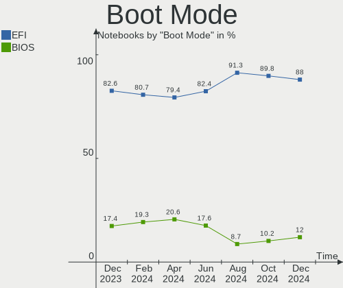
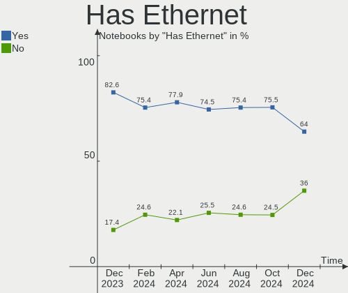
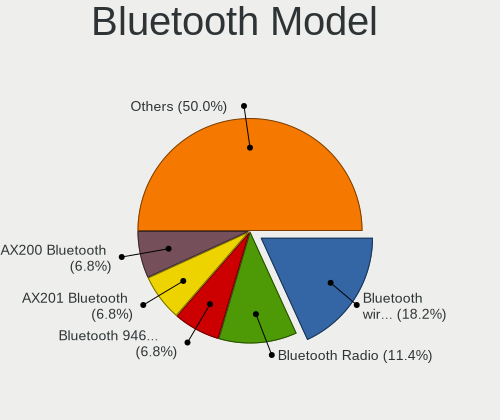
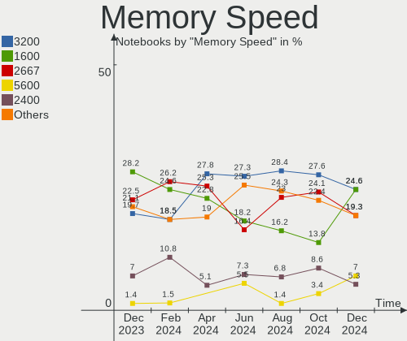

ArcoLinux - Hardware Trends (Notebooks)
---------------------------------------

A project to identify most popular hardware characteristics and track their change
over time based on data collected by Linux users at https://Linux-Hardware.org.

Anyone can contribute to this report by the [hw-probe](https://github.com/linuxhw/hw-probe) tool:

    sudo -E hw-probe -all -upload

This report is for one last month. Overall report since the beginning of time: [TestDays](https://github.com/linuxhw/TestDays)

Period: Dec, 2023.

Contents
--------

* [ System ](#system)
  - [ OS                       ](#os)
  - [ OS Family                ](#os-family)
  - [ Kernel                   ](#kernel)
  - [ Kernel Family            ](#kernel-family)
  - [ Kernel Major Ver.        ](#kernel-major-ver)
  - [ Arch                     ](#arch)
  - [ DE                       ](#de)
  - [ Display Server           ](#display-server)
  - [ Display Manager          ](#display-manager)
  - [ OS Lang                  ](#os-lang)
  - [ Boot Mode                ](#boot-mode)
  - [ Filesystem               ](#filesystem)
  - [ Part. scheme             ](#part-scheme)
  - [ Dual Boot with Linux/BSD ](#dual-boot-with-linuxbsd)
  - [ Dual Boot (Win)          ](#dual-boot-win)

* [ Board ](#board)
  - [ Vendor                   ](#vendor)
  - [ Model                    ](#model)
  - [ Model Family             ](#model-family)
  - [ MFG Year                 ](#mfg-year)
  - [ Form Factor              ](#form-factor)
  - [ Secure Boot              ](#secure-boot)
  - [ Coreboot                 ](#coreboot)
  - [ RAM Size                 ](#ram-size)
  - [ RAM Used                 ](#ram-used)
  - [ Total Drives             ](#total-drives)
  - [ Has CD-ROM               ](#has-cd-rom)
  - [ Has Ethernet             ](#has-ethernet)
  - [ Has WiFi                 ](#has-wifi)
  - [ Has Bluetooth            ](#has-bluetooth)

* [ Location ](#location)
  - [ Country                  ](#country)
  - [ City                     ](#city)

* [ Drives ](#drives)
  - [ Drive Vendor             ](#drive-vendor)
  - [ Drive Model              ](#drive-model)
  - [ HDD Vendor               ](#hdd-vendor)
  - [ SSD Vendor               ](#ssd-vendor)
  - [ Drive Kind               ](#drive-kind)
  - [ Drive Connector          ](#drive-connector)
  - [ Drive Size               ](#drive-size)
  - [ Space Total              ](#space-total)
  - [ Space Used               ](#space-used)
  - [ Malfunc. Drives          ](#malfunc-drives)
  - [ Malfunc. Drive Vendor    ](#malfunc-drive-vendor)
  - [ Malfunc. HDD Vendor      ](#malfunc-hdd-vendor)
  - [ Malfunc. Drive Kind      ](#malfunc-drive-kind)
  - [ Failed Drives            ](#failed-drives)
  - [ Failed Drive Vendor      ](#failed-drive-vendor)
  - [ Drive Status             ](#drive-status)

* [ Storage controller ](#storage-controller)
  - [ Storage Vendor           ](#storage-vendor)
  - [ Storage Model            ](#storage-model)
  - [ Storage Kind             ](#storage-kind)

* [ Processor ](#processor)
  - [ CPU Vendor               ](#cpu-vendor)
  - [ CPU Model                ](#cpu-model)
  - [ CPU Model Family         ](#cpu-model-family)
  - [ CPU Cores                ](#cpu-cores)
  - [ CPU Sockets              ](#cpu-sockets)
  - [ CPU Threads              ](#cpu-threads)
  - [ CPU Op-Modes             ](#cpu-op-modes)
  - [ CPU Microcode            ](#cpu-microcode)
  - [ CPU Microarch            ](#cpu-microarch)

* [ Graphics ](#graphics)
  - [ GPU Vendor               ](#gpu-vendor)
  - [ GPU Model                ](#gpu-model)
  - [ GPU Combo                ](#gpu-combo)
  - [ GPU Driver               ](#gpu-driver)
  - [ GPU Memory               ](#gpu-memory)

* [ Monitor ](#monitor)
  - [ Monitor Vendor           ](#monitor-vendor)
  - [ Monitor Model            ](#monitor-model)
  - [ Monitor Resolution       ](#monitor-resolution)
  - [ Monitor Diagonal         ](#monitor-diagonal)
  - [ Monitor Width            ](#monitor-width)
  - [ Aspect Ratio             ](#aspect-ratio)
  - [ Monitor Area             ](#monitor-area)
  - [ Pixel Density            ](#pixel-density)
  - [ Multiple Monitors        ](#multiple-monitors)

* [ Network ](#network)
  - [ Net Controller Vendor    ](#net-controller-vendor)
  - [ Net Controller Model     ](#net-controller-model)
  - [ Wireless Vendor          ](#wireless-vendor)
  - [ Wireless Model           ](#wireless-model)
  - [ Ethernet Vendor          ](#ethernet-vendor)
  - [ Ethernet Model           ](#ethernet-model)
  - [ Net Controller Kind      ](#net-controller-kind)
  - [ Used Controller          ](#used-controller)
  - [ NICs                     ](#nics)
  - [ IPv6                     ](#ipv6)

* [ Bluetooth ](#bluetooth)
  - [ Bluetooth Vendor         ](#bluetooth-vendor)
  - [ Bluetooth Model          ](#bluetooth-model)

* [ Sound ](#sound)
  - [ Sound Vendor             ](#sound-vendor)
  - [ Sound Model              ](#sound-model)

* [ Memory ](#memory)
  - [ Memory Vendor            ](#memory-vendor)
  - [ Memory Model             ](#memory-model)
  - [ Memory Kind              ](#memory-kind)
  - [ Memory Form Factor       ](#memory-form-factor)
  - [ Memory Size              ](#memory-size)
  - [ Memory Speed             ](#memory-speed)

* [ Printers & scanners ](#printers--scanners)
  - [ Printer Vendor           ](#printer-vendor)
  - [ Printer Model            ](#printer-model)
  - [ Scanner Vendor           ](#scanner-vendor)
  - [ Scanner Model            ](#scanner-model)

* [ Camera ](#camera)
  - [ Camera Vendor            ](#camera-vendor)
  - [ Camera Model             ](#camera-model)

* [ Security ](#security)
  - [ Fingerprint Vendor       ](#fingerprint-vendor)
  - [ Fingerprint Model        ](#fingerprint-model)
  - [ Chipcard Vendor          ](#chipcard-vendor)
  - [ Chipcard Model           ](#chipcard-model)

* [ Unsupported ](#unsupported)
  - [ Unsupported Devices      ](#unsupported-devices)
  - [ Unsupported Device Types ](#unsupported-device-types)

System
------

OS
--

Installed operating systems

| Name              | Notebooks | Percent |
|-------------------|-----------|---------|
| ArcoLinux Rolling | 67        | 97.1%   |
| ArcoLinux         | 2         | 2.9%    |

OS Family
---------

OS without a version

| Name      | Notebooks | Percent |
|-----------|-----------|---------|
| ArcoLinux | 69        | 100%    |

Kernel
------

Version of the Linux kernel

| Version                    | Notebooks | Percent |
|----------------------------|-----------|---------|
| 6.6.7-arch1-1              | 11        | 15.94%  |
| 6.6.1-arch1-1              | 11        | 15.94%  |
| 6.6.3-arch1-1              | 8         | 11.59%  |
| 6.6.4-arch1-1              | 6         | 8.7%    |
| 6.6.8-arch1-1              | 5         | 7.25%   |
| 6.6.7-zen1-1-zen           | 5         | 7.25%   |
| 6.6.8-zen1-1-zen           | 3         | 4.35%   |
| 6.4.11-arch1-1             | 3         | 4.35%   |
| 6.1.69-1-lts               | 2         | 2.9%    |
| 6.1.64-1-lts               | 2         | 2.9%    |
| 6.6.6-zen1-1-zen           | 1         | 1.45%   |
| 6.6.6-arch1-1              | 1         | 1.45%   |
| 6.6.5-zen1-1-zen           | 1         | 1.45%   |
| 6.6.5-arch1-1              | 1         | 1.45%   |
| 6.6.2-arch1-1              | 1         | 1.45%   |
| 6.5.9-arch2-1              | 1         | 1.45%   |
| 6.5.3-arch1-1              | 1         | 1.45%   |
| 6.3.3-arch1-1              | 1         | 1.45%   |
| 6.2.11-1297.native         | 1         | 1.45%   |
| 6.1.68-1-lts               | 1         | 1.45%   |
| 6.1.67-1-lts               | 1         | 1.45%   |
| 6.1.66-x64v1-xanmod1-1-lts | 1         | 1.45%   |
| 6.1.65-1-lts               | 1         | 1.45%   |

Kernel Family
-------------

Linux kernel without a distro release

| Version | Notebooks | Percent |
|---------|-----------|---------|
| 6.6.7   | 16        | 23.19%  |
| 6.6.1   | 11        | 15.94%  |
| 6.6.8   | 8         | 11.59%  |
| 6.6.3   | 8         | 11.59%  |
| 6.6.4   | 6         | 8.7%    |
| 6.4.11  | 3         | 4.35%   |
| 6.6.6   | 2         | 2.9%    |
| 6.6.5   | 2         | 2.9%    |
| 6.1.69  | 2         | 2.9%    |
| 6.1.64  | 2         | 2.9%    |
| 6.6.2   | 1         | 1.45%   |
| 6.5.9   | 1         | 1.45%   |
| 6.5.3   | 1         | 1.45%   |
| 6.3.3   | 1         | 1.45%   |
| 6.2.11  | 1         | 1.45%   |
| 6.1.68  | 1         | 1.45%   |
| 6.1.67  | 1         | 1.45%   |
| 6.1.66  | 1         | 1.45%   |
| 6.1.65  | 1         | 1.45%   |

Kernel Major Ver.
-----------------

Linux kernel major version

| Version | Notebooks | Percent |
|---------|-----------|---------|
| 6.6     | 54        | 78.26%  |
| 6.1     | 8         | 11.59%  |
| 6.4     | 3         | 4.35%   |
| 6.5     | 2         | 2.9%    |
| 6.3     | 1         | 1.45%   |
| 6.2     | 1         | 1.45%   |

Arch
----

OS architecture (x86_64, i586, etc.)

| Name   | Notebooks | Percent |
|--------|-----------|---------|
| x86_64 | 69        | 100%    |

DE
--

Desktop Environment

| Name       | Notebooks | Percent |
|------------|-----------|---------|
| XFCE       | 23        | 33.33%  |
| KDE5       | 19        | 27.54%  |
| Cinnamon   | 9         | 13.04%  |
| GNOME      | 6         | 8.7%    |
| sway       | 2         | 2.9%    |
| i3         | 2         | 2.9%    |
| Deepin     | 2         | 2.9%    |
| X-Cinnamon | 1         | 1.45%   |
| MATE       | 1         | 1.45%   |
| Hyprland   | 1         | 1.45%   |
| Budgie     | 1         | 1.45%   |
| awesome    | 1         | 1.45%   |
| Unknown    | 1         | 1.45%   |

Display Server
--------------

X11 or Wayland

| Name    | Notebooks | Percent |
|---------|-----------|---------|
| X11     | 60        | 86.96%  |
| Wayland | 8         | 11.59%  |
| Unknown | 1         | 1.45%   |

Display Manager
---------------

SDDM, LightDM, etc.

| Name    | Notebooks | Percent |
|---------|-----------|---------|
| SDDM    | 52        | 75.36%  |
| LightDM | 14        | 20.29%  |
| Unknown | 2         | 2.9%    |
| GDM     | 1         | 1.45%   |

OS Lang
-------

Language

| Lang  | Notebooks | Percent |
|-------|-----------|---------|
| en_US | 34        | 49.28%  |
| es_ES | 4         | 5.8%    |
| en_GB | 4         | 5.8%    |
| de_DE | 4         | 5.8%    |
| C     | 4         | 5.8%    |
| ru_RU | 3         | 4.35%   |
| it_IT | 3         | 4.35%   |
| en_HK | 3         | 4.35%   |
| pt_BR | 1         | 1.45%   |
| nl_NL | 1         | 1.45%   |
| nl_BE | 1         | 1.45%   |
| ja_JP | 1         | 1.45%   |
| es_AR | 1         | 1.45%   |
| en_ZW | 1         | 1.45%   |
| en_PH | 1         | 1.45%   |
| en_CA | 1         | 1.45%   |
| de_AT | 1         | 1.45%   |
| bg_BG | 1         | 1.45%   |

Boot Mode
---------

EFI or BIOS

| Mode | Notebooks | Percent |
|------|-----------|---------|
| EFI  | 57        | 82.61%  |
| BIOS | 12        | 17.39%  |

Filesystem
----------

Type of filesystem

| Type    | Notebooks | Percent |
|---------|-----------|---------|
| Ext4    | 44        | 63.77%  |
| Btrfs   | 21        | 30.43%  |
| Overlay | 4         | 5.8%    |

Part. scheme
------------

Scheme of partitioning

| Type    | Notebooks | Percent |
|---------|-----------|---------|
| GPT     | 60        | 86.96%  |
| MBR     | 7         | 10.14%  |
| Unknown | 2         | 2.9%    |

Dual Boot with Linux/BSD
------------------------

Hosting more than one Linux/BSD

| Dual boot | Notebooks | Percent |
|-----------|-----------|---------|
| No        | 45        | 65.22%  |
| Yes       | 24        | 34.78%  |

Dual Boot (Win)
---------------

Hosting Linux and Windows

| Dual boot | Notebooks | Percent |
|-----------|-----------|---------|
| No        | 43        | 62.32%  |
| Yes       | 26        | 37.68%  |

Board
-----

Vendor
------

Motherboard manufacturer

| Name                  | Notebooks | Percent |
|-----------------------|-----------|---------|
| Lenovo                | 23        | 33.33%  |
| Dell                  | 9         | 13.04%  |
| ASUSTek Computer      | 9         | 13.04%  |
| Hewlett-Packard       | 8         | 11.59%  |
| Acer                  | 6         | 8.7%    |
| MSI                   | 3         | 4.35%   |
| Apple                 | 3         | 4.35%   |
| Toshiba               | 1         | 1.45%   |
| System76              | 1         | 1.45%   |
| Razer                 | 1         | 1.45%   |
| Positivo Bahia - VAIO | 1         | 1.45%   |
| Packard Bell          | 1         | 1.45%   |
| NVN-ED01              | 1         | 1.45%   |
| HUAWEI                | 1         | 1.45%   |
| Unknown               | 1         | 1.45%   |

Model
-----

Motherboard model

| Name                                       | Notebooks | Percent |
|--------------------------------------------|-----------|---------|
| Unknown                                    | 2         | 2.9%    |
| Toshiba Satellite C50-A-1HF                | 1         | 1.45%   |
| System76 Gazelle                           | 1         | 1.45%   |
| Razer Blade 15 (2022) - RZ09-0421          | 1         | 1.45%   |
| Positivo Bahia - VAIO VJFE59F11X-B1011H    | 1         | 1.45%   |
| Packard Bell EasyNote TE11HC               | 1         | 1.45%   |
| MSI GS66 Stealth 10SE                      | 1         | 1.45%   |
| MSI CR610M                                 | 1         | 1.45%   |
| MSI Alpha 17 C7VF                          | 1         | 1.45%   |
| Lenovo ThinkPad X220 4286AQ7               | 1         | 1.45%   |
| Lenovo ThinkPad X1 Carbon Gen 8 20U9CTO1WW | 1         | 1.45%   |
| Lenovo ThinkPad T550 20CJS1MW00            | 1         | 1.45%   |
| Lenovo ThinkPad T480s 20L8S5LK0M           | 1         | 1.45%   |
| Lenovo ThinkPad T440 20B70048US            | 1         | 1.45%   |
| Lenovo ThinkPad T440 20B6005BUS            | 1         | 1.45%   |
| Lenovo ThinkPad T420 4178AFU               | 1         | 1.45%   |
| Lenovo ThinkPad T410 2522AC1               | 1         | 1.45%   |
| Lenovo ThinkPad P43s 20RH0021MX            | 1         | 1.45%   |
| Lenovo ThinkPad E585 20KV0010US            | 1         | 1.45%   |
| Lenovo ThinkPad 13 2nd Gen 20J2S0PE00      | 1         | 1.45%   |
| Lenovo ThinkBook 16 G4+ IAP 21CY           | 1         | 1.45%   |
| Lenovo Legion Y545 81Q6                    | 1         | 1.45%   |
| Lenovo Legion Y540-17IRH 81Q4              | 1         | 1.45%   |
| Lenovo Legion 5 15IMH6 82NL                | 1         | 1.45%   |
| Lenovo IdeaPad Y700-17ISK 80Q0             | 1         | 1.45%   |
| Lenovo IdeaPad Gaming 3 15ACH6 82K2        | 1         | 1.45%   |
| Lenovo IdeaPad 5 Pro 14ACN6 82L7           | 1         | 1.45%   |
| Lenovo IdeaPad 330-15ARR 81D2              | 1         | 1.45%   |
| Lenovo IdeaPad 320-15IKB 81BT              | 1         | 1.45%   |
| Lenovo IdeaPad 320-14IKB 80XK              | 1         | 1.45%   |
| Lenovo IdeaPad 110-15ACL 80TJ              | 1         | 1.45%   |
| Lenovo G50-30 80G0                         | 1         | 1.45%   |
| HUAWEI NBLB-WAX9N                          | 1         | 1.45%   |
| HP Pavilion Notebook                       | 1         | 1.45%   |
| HP Pavilion Laptop 14-dv1xxx               | 1         | 1.45%   |
| HP Pavilion Gaming Laptop 15-ec2xxx        | 1         | 1.45%   |
| HP Laptop 15-fd0xxx                        | 1         | 1.45%   |
| HP G60                                     | 1         | 1.45%   |
| HP EliteBook 8460p                         | 1         | 1.45%   |
| HP EliteBook 2740p                         | 1         | 1.45%   |

Model Family
------------

Motherboard model prefix

| Name                                    | Notebooks | Percent |
|-----------------------------------------|-----------|---------|
| Lenovo ThinkPad                         | 11        | 15.94%  |
| Lenovo IdeaPad                          | 7         | 10.14%  |
| Dell Inspiron                           | 7         | 10.14%  |
| Acer Aspire                             | 5         | 7.25%   |
| Lenovo Legion                           | 3         | 4.35%   |
| HP Pavilion                             | 3         | 4.35%   |
| ASUS VivoBook                           | 3         | 4.35%   |
| ASUS ROG                                | 3         | 4.35%   |
| HP EliteBook                            | 2         | 2.9%    |
| Dell Latitude                           | 2         | 2.9%    |
| Unknown                                 | 2         | 2.9%    |
| Toshiba Satellite                       | 1         | 1.45%   |
| System76 Gazelle                        | 1         | 1.45%   |
| Razer Blade                             | 1         | 1.45%   |
| Positivo Bahia - VAIO VJFE59F11X-B1011H | 1         | 1.45%   |
| Packard Bell EasyNote                   | 1         | 1.45%   |
| MSI GS66                                | 1         | 1.45%   |
| MSI CR610M                              | 1         | 1.45%   |
| MSI Alpha                               | 1         | 1.45%   |
| Lenovo ThinkBook                        | 1         | 1.45%   |
| Lenovo G50-30                           | 1         | 1.45%   |
| HUAWEI NBLB-WAX9N                       | 1         | 1.45%   |
| HP Laptop                               | 1         | 1.45%   |
| HP G60                                  | 1         | 1.45%   |
| HP 250                                  | 1         | 1.45%   |
| ASUS Zenbook                            | 1         | 1.45%   |
| ASUS N551VW                             | 1         | 1.45%   |
| ASUS G750JM                             | 1         | 1.45%   |
| Apple MacBookPro11                      | 1         | 1.45%   |
| Apple MacBookAir7                       | 1         | 1.45%   |
| Apple MacBookAir6                       | 1         | 1.45%   |
| Acer Nitro                              | 1         | 1.45%   |

MFG Year
--------

Motherboard manufacture year

| Year | Notebooks | Percent |
|------|-----------|---------|
| 2019 | 9         | 13.04%  |
| 2022 | 8         | 11.59%  |
| 2015 | 7         | 10.14%  |
| 2021 | 6         | 8.7%    |
| 2017 | 5         | 7.25%   |
| 2013 | 5         | 7.25%   |
| 2023 | 4         | 5.8%    |
| 2020 | 4         | 5.8%    |
| 2018 | 4         | 5.8%    |
| 2014 | 4         | 5.8%    |
| 2012 | 4         | 5.8%    |
| 2011 | 4         | 5.8%    |
| 2016 | 2         | 2.9%    |
| 2010 | 1         | 1.45%   |
| 2009 | 1         | 1.45%   |
| 2008 | 1         | 1.45%   |

Form Factor
-----------

Physical design of the computer

| Name     | Notebooks | Percent |
|----------|-----------|---------|
| Notebook | 69        | 100%    |

Secure Boot
-----------

Enabled or disabled

| State    | Notebooks | Percent |
|----------|-----------|---------|
| Disabled | 69        | 100%    |

Coreboot
--------

Have coreboot on board

| Used | Notebooks | Percent |
|------|-----------|---------|
| No   | 68        | 98.55%  |
| Yes  | 1         | 1.45%   |

RAM Size
--------

Total RAM memory

| Size in GB  | Notebooks | Percent |
|-------------|-----------|---------|
| 4.01-8.0    | 22        | 31.88%  |
| 16.01-24.0  | 14        | 20.29%  |
| 3.01-4.0    | 12        | 17.39%  |
| 32.01-64.0  | 9         | 13.04%  |
| 8.01-16.0   | 9         | 13.04%  |
| 24.01-32.0  | 1         | 1.45%   |
| 2.01-3.0    | 1         | 1.45%   |
| 64.01-256.0 | 1         | 1.45%   |

RAM Used
--------

Used RAM memory

| Used GB   | Notebooks | Percent |
|-----------|-----------|---------|
| 1.01-2.0  | 31        | 44.93%  |
| 2.01-3.0  | 21        | 30.43%  |
| 4.01-8.0  | 7         | 10.14%  |
| 3.01-4.0  | 5         | 7.25%   |
| 8.01-16.0 | 3         | 4.35%   |
| 0.51-1.0  | 2         | 2.9%    |

Total Drives
------------

Number of drives on board

| Drives | Notebooks | Percent |
|--------|-----------|---------|
| 1      | 39        | 56.52%  |
| 2      | 25        | 36.23%  |
| 3      | 5         | 7.25%   |

Has CD-ROM
----------

Has CD-ROM on board

| Presented | Notebooks | Percent |
|-----------|-----------|---------|
| No        | 52        | 75.36%  |
| Yes       | 17        | 24.64%  |

Has Ethernet
------------

Has Ethernet on board

| Presented | Notebooks | Percent |
|-----------|-----------|---------|
| Yes       | 55        | 79.71%  |
| No        | 14        | 20.29%  |

Has WiFi
--------

Has WiFi module

| Presented | Notebooks | Percent |
|-----------|-----------|---------|
| Yes       | 69        | 100%    |

Has Bluetooth
-------------

Has Bluetooth module

| Presented | Notebooks | Percent |
|-----------|-----------|---------|
| Yes       | 62        | 89.86%  |
| No        | 7         | 10.14%  |

Location
--------

Country
-------

Geographic location (country)

| Country     | Notebooks | Percent |
|-------------|-----------|---------|
| USA         | 13        | 18.84%  |
| Spain       | 8         | 11.59%  |
| Germany     | 6         | 8.7%    |
| UK          | 4         | 5.8%    |
| Romania     | 4         | 5.8%    |
| Hong Kong   | 4         | 5.8%    |
| Italy       | 3         | 4.35%   |
| Canada      | 2         | 2.9%    |
| Bulgaria    | 2         | 2.9%    |
| Brazil      | 2         | 2.9%    |
| Argentina   | 2         | 2.9%    |
| Zimbabwe    | 1         | 1.45%   |
| Ukraine     | 1         | 1.45%   |
| Thailand    | 1         | 1.45%   |
| Sweden      | 1         | 1.45%   |
| Serbia      | 1         | 1.45%   |
| Russia      | 1         | 1.45%   |
| Philippines | 1         | 1.45%   |
| Netherlands | 1         | 1.45%   |
| Mexico      | 1         | 1.45%   |
| Malaysia    | 1         | 1.45%   |
| Latvia      | 1         | 1.45%   |
| Japan       | 1         | 1.45%   |
| Iran        | 1         | 1.45%   |
| Indonesia   | 1         | 1.45%   |
| Greece      | 1         | 1.45%   |
| Croatia     | 1         | 1.45%   |
| China       | 1         | 1.45%   |
| Belgium     | 1         | 1.45%   |
| Austria     | 1         | 1.45%   |

City
----

Geographic location (city)

| City               | Notebooks | Percent |
|--------------------|-----------|---------|
| Tsuen Wan          | 3         | 4.35%   |
| Barcelona          | 3         | 4.35%   |
| Rome               | 2         | 2.9%    |
| Portsmouth         | 2         | 2.9%    |
| Bucharest          | 2         | 2.9%    |
| Berlin             | 2         | 2.9%    |
| Zarichne           | 1         | 1.45%   |
| Yokohama           | 1         | 1.45%   |
| Yakutsk            | 1         | 1.45%   |
| Xinzo de Limia     | 1         | 1.45%   |
| Wharton            | 1         | 1.45%   |
| Warendorf          | 1         | 1.45%   |
| Walker             | 1         | 1.45%   |
| Virovitica         | 1         | 1.45%   |
| Thessaloniki       | 1         | 1.45%   |
| Summerville        | 1         | 1.45%   |
| Sofia              | 1         | 1.45%   |
| Sidney             | 1         | 1.45%   |
| Seville            | 1         | 1.45%   |
| Satu Mare          | 1         | 1.45%   |
| Sanford            | 1         | 1.45%   |
| Rousse             | 1         | 1.45%   |
| Riga               | 1         | 1.45%   |
| Rho                | 1         | 1.45%   |
| Ravensburg         | 1         | 1.45%   |
| Paspebiac          | 1         | 1.45%   |
| Ormond Beach       | 1         | 1.45%   |
| Norman             | 1         | 1.45%   |
| Nanjing            | 1         | 1.45%   |
| Nakhon Ratchasima  | 1         | 1.45%   |
| Montes Claros      | 1         | 1.45%   |
| Mendoza            | 1         | 1.45%   |
| Malmo              | 1         | 1.45%   |
| Madrid             | 1         | 1.45%   |
| Liverpool          | 1         | 1.45%   |
| Lancing            | 1         | 1.45%   |
| Kuala Lumpur       | 1         | 1.45%   |
| Kowloon            | 1         | 1.45%   |
| Kalamazoo          | 1         | 1.45%   |
| Jardim de Piranhas | 1         | 1.45%   |

Drives
------

Drive Vendor
------------

Hard drive vendors

| Vendor                      | Notebooks | Drives | Percent |
|-----------------------------|-----------|--------|---------|
| Samsung Electronics         | 21        | 22     | 20.79%  |
| Seagate                     | 10        | 10     | 9.9%    |
| Micron Technology           | 9         | 9      | 8.91%   |
| SanDisk                     | 8         | 9      | 7.92%   |
| Toshiba                     | 7         | 7      | 6.93%   |
| Crucial                     | 6         | 6      | 5.94%   |
| WDC                         | 5         | 5      | 4.95%   |
| Unknown                     | 4         | 4      | 3.96%   |
| Kingston                    | 4         | 4      | 3.96%   |
| SK hynix                    | 3         | 3      | 2.97%   |
| KIOXIA                      | 3         | 3      | 2.97%   |
| Apple                       | 3         | 3      | 2.97%   |
| Phison Electronics          | 2         | 2      | 1.98%   |
| Intel                       | 2         | 3      | 1.98%   |
| HGST                        | 2         | 2      | 1.98%   |
| ShiJi                       | 1         | 1      | 0.99%   |
| Ramsta                      | 1         | 1      | 0.99%   |
| PNY                         | 1         | 1      | 0.99%   |
| Netac                       | 1         | 1      | 0.99%   |
| Micron/Crucial Technology   | 1         | 1      | 0.99%   |
| MAXIO Technology (Hangzhou) | 1         | 1      | 0.99%   |
| Kingston Technology Company | 1         | 1      | 0.99%   |
| HPE                         | 1         | 1      | 0.99%   |
| EYOTA                       | 1         | 1      | 0.99%   |
| China                       | 1         | 1      | 0.99%   |
| ADATA Technology            | 1         | 1      | 0.99%   |
| A-DATA Technology           | 1         | 1      | 0.99%   |

Drive Model
-----------

Hard drive models

| Model                                               | Notebooks | Percent |
|-----------------------------------------------------|-----------|---------|
| Samsung NVMe SSD Controller PM9A1/PM9A3/980PRO 2TB  | 4         | 3.85%   |
| Toshiba MQ01ABF050 500GB                            | 3         | 2.88%   |
| Samsung NVMe SSD Controller SM981/PM981/PM983 512GB | 3         | 2.88%   |
| Seagate ST500LT012-1DG142 500GB                     | 2         | 1.92%   |
| Seagate ST1000LM035-1RK172 1TB                      | 2         | 1.92%   |
| Sandisk WD Blue SN550 NVMe SSD 1TB                  | 2         | 1.92%   |
| Sandisk WD Blue SN500 / PC SN520 NVMe SSD 128GB     | 2         | 1.92%   |
| SanDisk SSD U110 16GB                               | 2         | 1.92%   |
| Samsung SSD 870 EVO 500GB                           | 2         | 1.92%   |
| Samsung SSD 860 EVO 1TB                             | 2         | 1.92%   |
| Crucial CT1000BX500SSD1 1TB                         | 2         | 1.92%   |
| WDC WD5000LPVX-22V0TT0 500GB                        | 1         | 0.96%   |
| WDC WD5000LPCX-21VHAT0 500GB                        | 1         | 0.96%   |
| WDC WD10SPZX-24Z10T0 1TB                            | 1         | 0.96%   |
| WDC WD10SPZX-24Z10 1TB                              | 1         | 0.96%   |
| WDC WD10SPCX-24HWST1 1TB                            | 1         | 0.96%   |
| Unknown SD/MMC/MS PRO 512GB                         | 1         | 0.96%   |
| Unknown MMC Card  4GB                               | 1         | 0.96%   |
| Unknown MMC Card  32GB                              | 1         | 0.96%   |
| Unknown MMC Card  128GB                             | 1         | 0.96%   |
| Toshiba THNS128GG4BAAA-NonFDE 128GB SSD             | 1         | 0.96%   |
| Toshiba MQ01ABD100 1TB                              | 1         | 0.96%   |
| Toshiba MK3263GSX 320GB                             | 1         | 0.96%   |
| Toshiba MK2555GSXF 250GB                            | 1         | 0.96%   |
| SK hynix SKHynix_HFS512GD9TNI-L2B0B 512GB           | 1         | 0.96%   |
| SK hynix SKHynix_HFS256GD9TNG-L5B0B 256GB           | 1         | 0.96%   |
| SK hynix BC501 NVMe Solid State Drive 512GB         | 1         | 0.96%   |
| ShiJi SSD 1TB                                       | 1         | 0.96%   |
| Seagate ST9500325AS 500GB                           | 1         | 0.96%   |
| Seagate ST4000LM 024-2AN17V 4TB                     | 1         | 0.96%   |
| Seagate ST2000LM003 HN-M201RAD 2TB                  | 1         | 0.96%   |
| Seagate ST1000LM049-2GH172 1TB                      | 1         | 0.96%   |
| Seagate ST1000LM024 HN-M101MBB 1TB                  | 1         | 0.96%   |
| Seagate ST1000LM 024 HN-M101M 1TB                   | 1         | 0.96%   |
| Sandisk WD Black SN850 1024GB                       | 1         | 0.96%   |
| Sandisk WD Black SN750 / PC SN730 NVMe SSD 2TB      | 1         | 0.96%   |
| SanDisk SD8SN8U-128G-1006 128GB SSD                 | 1         | 0.96%   |
| Samsung SSD PM830 mSATA 32GB                        | 1         | 0.96%   |
| Samsung SSD 980 500GB                               | 1         | 0.96%   |
| Samsung SSD 870 EVO 250GB                           | 1         | 0.96%   |

HDD Vendor
----------

Hard disk drive vendors

| Vendor  | Notebooks | Drives | Percent |
|---------|-----------|--------|---------|
| Seagate | 10        | 10     | 41.67%  |
| Toshiba | 6         | 6      | 25%     |
| WDC     | 5         | 5      | 20.83%  |
| HGST    | 2         | 2      | 8.33%   |
| Unknown | 1         | 1      | 4.17%   |

SSD Vendor
----------

Solid state drive vendors

| Vendor              | Notebooks | Drives | Percent |
|---------------------|-----------|--------|---------|
| Samsung Electronics | 9         | 10     | 25.71%  |
| Crucial             | 6         | 6      | 17.14%  |
| SanDisk             | 3         | 3      | 8.57%   |
| Kingston            | 3         | 3      | 8.57%   |
| Micron Technology   | 2         | 2      | 5.71%   |
| Apple               | 2         | 2      | 5.71%   |
| Toshiba             | 1         | 1      | 2.86%   |
| ShiJi               | 1         | 1      | 2.86%   |
| Ramsta              | 1         | 1      | 2.86%   |
| PNY                 | 1         | 1      | 2.86%   |
| Netac               | 1         | 1      | 2.86%   |
| Intel               | 1         | 1      | 2.86%   |
| HPE                 | 1         | 1      | 2.86%   |
| EYOTA               | 1         | 1      | 2.86%   |
| China               | 1         | 1      | 2.86%   |
| A-DATA Technology   | 1         | 1      | 2.86%   |

Drive Kind
----------

HDD or SSD

| Kind | Notebooks | Drives | Percent |
|------|-----------|--------|---------|
| NVMe | 33        | 41     | 37.5%   |
| SSD  | 30        | 36     | 34.09%  |
| HDD  | 22        | 24     | 25%     |
| MMC  | 3         | 3      | 3.41%   |

Drive Connector
---------------

SATA, SAS, NVMe, etc.

| Type | Notebooks | Drives | Percent |
|------|-----------|--------|---------|
| SATA | 43        | 56     | 52.44%  |
| NVMe | 33        | 41     | 40.24%  |
| SAS  | 3         | 4      | 3.66%   |
| MMC  | 3         | 3      | 3.66%   |

Drive Size
----------

Size of hard drive

| Size in TB | Notebooks | Drives | Percent |
|------------|-----------|--------|---------|
| 0.01-0.5   | 30        | 33     | 53.57%  |
| 0.51-1.0   | 22        | 23     | 39.29%  |
| 1.01-2.0   | 3         | 3      | 5.36%   |
| 3.01-4.0   | 1         | 1      | 1.79%   |

Space Total
-----------

Amount of disk space available on the file system

| Size in GB     | Notebooks | Percent |
|----------------|-----------|---------|
| 101-250        | 13        | 18.84%  |
| More than 3000 | 12        | 17.39%  |
| 251-500        | 11        | 15.94%  |
| 501-1000       | 10        | 14.49%  |
| 51-100         | 7         | 10.14%  |
| 1001-2000      | 6         | 8.7%    |
| 1-20           | 4         | 5.8%    |
| Unknown        | 3         | 4.35%   |
| 21-50          | 2         | 2.9%    |
| 2001-3000      | 1         | 1.45%   |

Space Used
----------

Amount of used disk space

| Used GB        | Notebooks | Percent |
|----------------|-----------|---------|
| 1-20           | 21        | 30.43%  |
| 21-50          | 12        | 17.39%  |
| 101-250        | 10        | 14.49%  |
| 51-100         | 7         | 10.14%  |
| 251-500        | 6         | 8.7%    |
| 501-1000       | 5         | 7.25%   |
| More than 3000 | 4         | 5.8%    |
| Unknown        | 3         | 4.35%   |
| 1001-2000      | 1         | 1.45%   |

Malfunc. Drives
---------------

Drive models with a malfunction

| Model                               | Notebooks | Drives | Percent |
|-------------------------------------|-----------|--------|---------|
| Seagate ST500LT012-1DG142 500GB     | 2         | 2      | 16.67%  |
| WDC WD5000LPVX-22V0TT0 500GB        | 1         | 1      | 8.33%   |
| Toshiba MQ01ABF050 500GB            | 1         | 1      | 8.33%   |
| Toshiba MQ01ABD100 1TB              | 1         | 1      | 8.33%   |
| Toshiba MK3263GSX 320GB             | 1         | 1      | 8.33%   |
| Seagate ST9500325AS 500GB           | 1         | 1      | 8.33%   |
| Seagate ST4000LM 024-2AN17V 4TB     | 1         | 1      | 8.33%   |
| Seagate ST1000LM024 HN-M101MBB 1TB  | 1         | 1      | 8.33%   |
| Samsung Electronics SSD 870 EVO 1TB | 1         | 1      | 8.33%   |
| HGST HTS721010A9E630 1TB            | 1         | 1      | 8.33%   |
| HGST HTS541010A9E680 1TB            | 1         | 1      | 8.33%   |

Malfunc. Drive Vendor
---------------------

Vendors of faulty drives

| Vendor              | Notebooks | Drives | Percent |
|---------------------|-----------|--------|---------|
| Seagate             | 5         | 5      | 41.67%  |
| Toshiba             | 3         | 3      | 25%     |
| HGST                | 2         | 2      | 16.67%  |
| WDC                 | 1         | 1      | 8.33%   |
| Samsung Electronics | 1         | 1      | 8.33%   |

Malfunc. HDD Vendor
-------------------

Vendors of faulty HDD drives

| Vendor  | Notebooks | Drives | Percent |
|---------|-----------|--------|---------|
| Seagate | 5         | 5      | 45.45%  |
| Toshiba | 3         | 3      | 27.27%  |
| HGST    | 2         | 2      | 18.18%  |
| WDC     | 1         | 1      | 9.09%   |

Malfunc. Drive Kind
-------------------

Kinds of faulty drives

| Kind | Notebooks | Drives | Percent |
|------|-----------|--------|---------|
| HDD  | 9         | 11     | 90%     |
| SSD  | 1         | 1      | 10%     |

Failed Drives
-------------

Failed drive models

Zero info for selected period =(

Failed Drive Vendor
-------------------

Failed drive vendors

Zero info for selected period =(

Drive Status
------------

Number of failed and malfunc. drives

| Status   | Notebooks | Drives | Percent |
|----------|-----------|--------|---------|
| Works    | 60        | 84     | 78.95%  |
| Malfunc  | 9         | 12     | 11.84%  |
| Detected | 7         | 8      | 9.21%   |

Storage controller
------------------

Storage Vendor
--------------

Storage controller vendors

| Vendor                      | Notebooks | Percent |
|-----------------------------|-----------|---------|
| Intel                       | 44        | 48.89%  |
| Samsung Electronics         | 13        | 14.44%  |
| Micron Technology           | 7         | 7.78%   |
| AMD                         | 6         | 6.67%   |
| SanDisk                     | 5         | 5.56%   |
| SK hynix                    | 3         | 3.33%   |
| KIOXIA                      | 3         | 3.33%   |
| Phison Electronics          | 2         | 2.22%   |
| Kingston Technology Company | 2         | 2.22%   |
| Micron/Crucial Technology   | 1         | 1.11%   |
| MAXIO Technology (Hangzhou) | 1         | 1.11%   |
| Marvell Technology Group    | 1         | 1.11%   |
| Apple                       | 1         | 1.11%   |
| ADATA Technology            | 1         | 1.11%   |

Storage Model
-------------

Storage controller models

| Model                                                                        | Notebooks | Percent |
|------------------------------------------------------------------------------|-----------|---------|
| AMD FCH SATA Controller [AHCI mode]                                          | 6         | 6.45%   |
| Intel 82801 Mobile SATA Controller [RAID mode]                               | 5         | 5.38%   |
| Samsung NVMe SSD Controller PM9A1/PM9A3/980PRO                               | 4         | 4.3%    |
| Intel 7 Series Chipset Family 6-port SATA Controller [AHCI mode]             | 4         | 4.3%    |
| Intel 6 Series/C200 Series Chipset Family 6 port Mobile SATA AHCI Controller | 4         | 4.3%    |
| Samsung NVMe SSD Controller SM981/PM981/PM983                                | 3         | 3.23%   |
| Samsung NVMe SSD Controller 980 (DRAM-less)                                  | 3         | 3.23%   |
| Intel Volume Management Device NVMe RAID Controller                          | 3         | 3.23%   |
| Intel Sunrise Point-LP SATA Controller [AHCI mode]                           | 3         | 3.23%   |
| Intel Cannon Lake Mobile PCH SATA AHCI Controller                            | 3         | 3.23%   |
| Intel 8 Series SATA Controller 1 [AHCI mode]                                 | 3         | 3.23%   |
| Intel 400 Series Chipset Family SATA AHCI Controller                         | 3         | 3.23%   |
| SanDisk WD Blue SN500 / PC SN520 x2 M.2 2280 NVMe SSD                        | 2         | 2.15%   |
| SanDisk Ultra 3D / WD Blue SN550 NVMe SSD                                    | 2         | 2.15%   |
| Micron 3400 NVMe SSD [Hendrix]                                               | 2         | 2.15%   |
| Micron 2450 NVMe SSD [HendrixV] (DRAM-less)                                  | 2         | 2.15%   |
| Micron 2300 NVMe SSD [Santana]                                               | 2         | 2.15%   |
| KIOXIA NVMe SSD Controller BG4 (DRAM-less)                                   | 2         | 2.15%   |
| Intel Wildcat Point-LP SATA Controller [AHCI Mode]                           | 2         | 2.15%   |
| Intel Tiger Lake-LP SATA Controller                                          | 2         | 2.15%   |
| Intel HM170/QM170 Chipset SATA Controller [AHCI Mode]                        | 2         | 2.15%   |
| Intel Cannon Point-LP SATA Controller [AHCI Mode]                            | 2         | 2.15%   |
| Intel Atom Processor E3800 Series SATA AHCI Controller                       | 2         | 2.15%   |
| Intel 5 Series/3400 Series Chipset 6 port SATA AHCI Controller               | 2         | 2.15%   |
| SK hynix PC611 NVMe Solid State Drive                                        | 1         | 1.08%   |
| SK hynix PC601 NVMe Solid State Drive                                        | 1         | 1.08%   |
| SK hynix BC501 NVMe Solid State Drive                                        | 1         | 1.08%   |
| SanDisk WD PC SN810 / Black SN850 NVMe SSD                                   | 1         | 1.08%   |
| SanDisk Extreme Pro / WD Black SN750 / PC SN730 / Red SN700 NVMe SSD         | 1         | 1.08%   |
| Samsung S4LN053X01 AHCI SSD Controller(Apple slot)                           | 1         | 1.08%   |
| Samsung NVMe SSD Controller SM951/PM951                                      | 1         | 1.08%   |
| Samsung NVMe SSD Controller PM9B1 (DRAM-less)                                | 1         | 1.08%   |
| Phison PS5019-E19 PCIe4 NVMe Controller (DRAM-less)                          | 1         | 1.08%   |
| Phison PS5013-E13 PCIe3 NVMe Controller (DRAM-less)                          | 1         | 1.08%   |
| Micron/Crucial P2 [Nick P2] / P3 / P3 Plus NVMe PCIe SSD (DRAM-less)         | 1         | 1.08%   |
| Micron 2400 NVMe SSD (DRAM-less)                                             | 1         | 1.08%   |
| MAXIO (Hangzhou) NVMe SSD Controller MAP1602                                 | 1         | 1.08%   |
| Marvell Group 88SS9183 PCIe SSD Controller                                   | 1         | 1.08%   |
| KIOXIA NVMe SSD                                                              | 1         | 1.08%   |
| Kingston Company OM3PDP3 NVMe SSD                                            | 1         | 1.08%   |

Storage Kind
------------

Kind of storage controller (IDE, SATA, NVMe, SAS, ...)

| Kind | Notebooks | Percent |
|------|-----------|---------|
| SATA | 45        | 52.33%  |
| NVMe | 33        | 38.37%  |
| RAID | 8         | 9.3%    |

Processor
---------

CPU Vendor
----------

Processor vendors

| Vendor | Notebooks | Percent |
|--------|-----------|---------|
| Intel  | 55        | 79.71%  |
| AMD    | 14        | 20.29%  |

CPU Model
---------

Processor models

| Model                                       | Notebooks | Percent |
|---------------------------------------------|-----------|---------|
| Intel Core i7-6700HQ CPU @ 2.60GHz          | 2         | 2.9%    |
| Intel Core i5-4300U CPU @ 1.90GHz           | 2         | 2.9%    |
| Intel Core i5-2520M CPU @ 2.50GHz           | 2         | 2.9%    |
| Intel Core i5-10210U CPU @ 1.60GHz          | 2         | 2.9%    |
| Intel 12th Gen Core i7-12700H               | 2         | 2.9%    |
| AMD Ryzen 9 6900HX with Radeon Graphics     | 2         | 2.9%    |
| AMD Ryzen 7 5800H with Radeon Graphics      | 2         | 2.9%    |
| Intel Pentium Dual-Core CPU T4300 @ 2.10GHz | 1         | 1.45%   |
| Intel Pentium CPU N3710 @ 1.60GHz           | 1         | 1.45%   |
| Intel Pentium CPU N3540 @ 2.16GHz           | 1         | 1.45%   |
| Intel Pentium CPU B960 @ 2.20GHz            | 1         | 1.45%   |
| Intel Pentium CPU 5405U @ 2.30GHz           | 1         | 1.45%   |
| Intel Pentium CPU 2020M @ 2.40GHz           | 1         | 1.45%   |
| Intel Core i7-9750HF CPU @ 2.60GHz          | 1         | 1.45%   |
| Intel Core i7-9750H CPU @ 2.60GHz           | 1         | 1.45%   |
| Intel Core i7-8565U CPU @ 1.80GHz           | 1         | 1.45%   |
| Intel Core i7-7500U CPU @ 2.70GHz           | 1         | 1.45%   |
| Intel Core i7-6500U CPU @ 2.50GHz           | 1         | 1.45%   |
| Intel Core i7-5600U CPU @ 2.60GHz           | 1         | 1.45%   |
| Intel Core i7-4710HQ CPU @ 2.50GHz          | 1         | 1.45%   |
| Intel Core i7-3610QM CPU @ 2.30GHz          | 1         | 1.45%   |
| Intel Core i7-2620M CPU @ 2.70GHz           | 1         | 1.45%   |
| Intel Core i7-10875H CPU @ 2.30GHz          | 1         | 1.45%   |
| Intel Core i7-10750H CPU @ 2.60GHz          | 1         | 1.45%   |
| Intel Core i5-9300H CPU @ 2.40GHz           | 1         | 1.45%   |
| Intel Core i5-8350U CPU @ 1.70GHz           | 1         | 1.45%   |
| Intel Core i5-8265U CPU @ 1.60GHz           | 1         | 1.45%   |
| Intel Core i5-8250U CPU @ 1.60GHz           | 1         | 1.45%   |
| Intel Core i5-7200U CPU @ 2.50GHz           | 1         | 1.45%   |
| Intel Core i5-5250U CPU @ 1.60GHz           | 1         | 1.45%   |
| Intel Core i5-5200U CPU @ 2.20GHz           | 1         | 1.45%   |
| Intel Core i5-4260U CPU @ 1.40GHz           | 1         | 1.45%   |
| Intel Core i5-4258U CPU @ 2.40GHz           | 1         | 1.45%   |
| Intel Core i5-4200U CPU @ 1.60GHz           | 1         | 1.45%   |
| Intel Core i5-3320M CPU @ 2.60GHz           | 1         | 1.45%   |
| Intel Core i5-2450M CPU @ 2.50GHz           | 1         | 1.45%   |
| Intel Core i5-10500H CPU @ 2.50GHz          | 1         | 1.45%   |
| Intel Core i5-10300H CPU @ 2.50GHz          | 1         | 1.45%   |
| Intel Core i5 CPU M 580 @ 2.67GHz           | 1         | 1.45%   |
| Intel Core i5 CPU M 520 @ 2.40GHz           | 1         | 1.45%   |

CPU Model Family
----------------

Processor model prefix

| Model                   | Notebooks | Percent |
|-------------------------|-----------|---------|
| Intel Core i5           | 22        | 31.88%  |
| Intel Core i7           | 13        | 18.84%  |
| Other                   | 6         | 8.7%    |
| Intel Pentium           | 5         | 7.25%   |
| Intel Core i3           | 4         | 5.8%    |
| Intel Celeron           | 4         | 5.8%    |
| AMD Ryzen 9             | 4         | 5.8%    |
| AMD Ryzen 7             | 4         | 5.8%    |
| AMD Ryzen 5             | 3         | 4.35%   |
| Intel Pentium Dual-Core | 1         | 1.45%   |
| AMD Ryzen 3             | 1         | 1.45%   |
| AMD E2                  | 1         | 1.45%   |
| AMD A8                  | 1         | 1.45%   |

CPU Cores
---------

Number of processor cores

| Number | Notebooks | Percent |
|--------|-----------|---------|
| 2      | 31        | 44.93%  |
| 4      | 20        | 28.99%  |
| 8      | 8         | 11.59%  |
| 6      | 5         | 7.25%   |
| 14     | 3         | 4.35%   |
| 16     | 1         | 1.45%   |
| 12     | 1         | 1.45%   |

CPU Sockets
-----------

Number of sockets

| Number | Notebooks | Percent |
|--------|-----------|---------|
| 1      | 69        | 100%    |

CPU Threads
-----------

Threads per core (Hyper-Threading)

| Number | Notebooks | Percent |
|--------|-----------|---------|
| 2      | 57        | 82.61%  |
| 1      | 12        | 17.39%  |

CPU Op-Modes
------------

CPU Operation Modes (32-bit, 64-bit)

| Op mode        | Notebooks | Percent |
|----------------|-----------|---------|
| 32-bit, 64-bit | 69        | 100%    |

CPU Microcode
-------------

Microcode number

| Number     | Notebooks | Percent |
|------------|-----------|---------|
| Unknown    | 46        | 66.67%  |
| 0x0a404102 | 3         | 4.35%   |
| 0x806c1    | 2         | 2.9%    |
| 0x206a7    | 2         | 2.9%    |
| 0x0a601203 | 2         | 2.9%    |
| 0x0a50000d | 2         | 2.9%    |
| 0x0810100b | 2         | 2.9%    |
| 0xa0652    | 1         | 1.45%   |
| 0x806e9    | 1         | 1.45%   |
| 0x406e3    | 1         | 1.45%   |
| 0x306a9    | 1         | 1.45%   |
| 0x20655    | 1         | 1.45%   |
| 0x0a50000c | 1         | 1.45%   |
| 0x08608104 | 1         | 1.45%   |
| 0x08108109 | 1         | 1.45%   |
| 0x07030106 | 1         | 1.45%   |
| 0x07030105 | 1         | 1.45%   |

CPU Microarch
-------------

Microarchitecture

| Name             | Notebooks | Percent |
|------------------|-----------|---------|
| KabyLake         | 14        | 20.29%  |
| Haswell          | 6         | 8.7%    |
| Unknown          | 6         | 8.7%    |
| SandyBridge      | 5         | 7.25%   |
| IvyBridge        | 5         | 7.25%   |
| Skylake          | 4         | 5.8%    |
| CometLake        | 4         | 5.8%    |
| Zen 3            | 3         | 4.35%   |
| TigerLake        | 3         | 4.35%   |
| Silvermont       | 3         | 4.35%   |
| Broadwell        | 3         | 4.35%   |
| Alderlake Hybrid | 3         | 4.35%   |
| Zen              | 2         | 2.9%    |
| Westmere         | 2         | 2.9%    |
| Puma             | 2         | 2.9%    |
| Zen+             | 1         | 1.45%   |
| Penryn           | 1         | 1.45%   |
| Gracemont        | 1         | 1.45%   |
| Goldmont plus    | 1         | 1.45%   |

Graphics
--------

GPU Vendor
----------

Vendors of graphics cards

| Vendor | Notebooks | Percent |
|--------|-----------|---------|
| Intel  | 53        | 56.38%  |
| Nvidia | 25        | 26.6%   |
| AMD    | 16        | 17.02%  |

GPU Model
---------

Graphics card models

| Model                                                                     | Notebooks | Percent |
|---------------------------------------------------------------------------|-----------|---------|
| Intel Haswell-ULT Integrated Graphics Controller                          | 5         | 5.26%   |
| Intel 3rd Gen Core processor Graphics Controller                          | 5         | 5.26%   |
| Intel 2nd Generation Core Processor Family Integrated Graphics Controller | 5         | 5.26%   |
| Intel CometLake-H GT2 [UHD Graphics]                                      | 4         | 4.21%   |
| Nvidia GA107M [GeForce RTX 3050 Mobile]                                   | 3         | 3.16%   |
| Intel HD Graphics 620                                                     | 3         | 3.16%   |
| Intel Alder Lake-P GT2 [Iris Xe Graphics]                                 | 3         | 3.16%   |
| AMD Rembrandt [Radeon 680M]                                               | 3         | 3.16%   |
| AMD Cezanne [Radeon Vega Series / Radeon Vega Mobile Series]              | 3         | 3.16%   |
| Nvidia TU117M [GeForce GTX 1650 Mobile / Max-Q]                           | 2         | 2.11%   |
| Nvidia TU116M [GeForce GTX 1660 Ti Mobile]                                | 2         | 2.11%   |
| Nvidia TU106M [GeForce RTX 2060 Mobile]                                   | 2         | 2.11%   |
| Nvidia GM107M [GeForce GTX 960M]                                          | 2         | 2.11%   |
| Nvidia GF117M [GeForce 610M/710M/810M/820M / GT 620M/625M/630M/720M]      | 2         | 2.11%   |
| Nvidia GA104 [Geforce RTX 3070 Ti Laptop GPU]                             | 2         | 2.11%   |
| Nvidia AD107M [GeForce RTX 4060 Max-Q / Mobile]                           | 2         | 2.11%   |
| Intel WhiskeyLake-U GT2 [UHD Graphics 620]                                | 2         | 2.11%   |
| Intel Whiskey Lake-U GT1 [UHD Graphics 610]                               | 2         | 2.11%   |
| Intel UHD Graphics 620                                                    | 2         | 2.11%   |
| Intel TigerLake-LP GT2 [Iris Xe Graphics]                                 | 2         | 2.11%   |
| Intel Skylake GT2 [HD Graphics 520]                                       | 2         | 2.11%   |
| Intel HD Graphics 5500                                                    | 2         | 2.11%   |
| Intel HD Graphics 530                                                     | 2         | 2.11%   |
| Intel Core Processor Integrated Graphics Controller                       | 2         | 2.11%   |
| Intel CometLake-U GT2 [UHD Graphics]                                      | 2         | 2.11%   |
| Intel Atom Processor Z36xxx/Z37xxx Series Graphics & Display              | 2         | 2.11%   |
| AMD Raven Ridge [Radeon Vega Series / Radeon Vega Mobile Series]          | 2         | 2.11%   |
| AMD Raphael                                                               | 2         | 2.11%   |
| Nvidia GP108GLM [Quadro P520]                                             | 1         | 1.05%   |
| Nvidia GM108M [GeForce 920MX]                                             | 1         | 1.05%   |
| Nvidia GM107M [GeForce GTX 860M]                                          | 1         | 1.05%   |
| Nvidia GK208M [GeForce GT 740M]                                           | 1         | 1.05%   |
| Nvidia GK208BM [GeForce 920M]                                             | 1         | 1.05%   |
| Nvidia GK107M [GeForce GT 650M]                                           | 1         | 1.05%   |
| Nvidia GA107BM [GeForce RTX 3050 Ti Mobile]                               | 1         | 1.05%   |
| Nvidia GA106M [GeForce RTX 3060 Mobile / Max-Q]                           | 1         | 1.05%   |
| Intel Tiger Lake-LP GT2 [UHD Graphics G4]                                 | 1         | 1.05%   |
| Intel Mobile 4 Series Chipset Integrated Graphics Controller              | 1         | 1.05%   |
| Intel HD Graphics 6000                                                    | 1         | 1.05%   |
| Intel GeminiLake [UHD Graphics 600]                                       | 1         | 1.05%   |

GPU Combo
---------

Combinations of graphics cards

| Name           | Notebooks | Percent |
|----------------|-----------|---------|
| 1 x Intel      | 34        | 49.28%  |
| Intel + Nvidia | 16        | 23.19%  |
| AMD + Nvidia   | 7         | 10.14%  |
| 1 x AMD        | 6         | 8.7%    |
| 1 x Nvidia     | 2         | 2.9%    |
| Intel + AMD    | 2         | 2.9%    |
| 2 x Intel      | 1         | 1.45%   |
| 2 x AMD        | 1         | 1.45%   |

GPU Driver
----------

Free vs proprietary

| Driver      | Notebooks | Percent |
|-------------|-----------|---------|
| Free        | 54        | 78.26%  |
| Proprietary | 15        | 21.74%  |

GPU Memory
----------

Total video memory

| Size in GB | Notebooks | Percent |
|------------|-----------|---------|
| Unknown    | 47        | 68.12%  |
| 0.01-0.5   | 9         | 13.04%  |
| 1.01-2.0   | 5         | 7.25%   |
| 5.01-6.0   | 3         | 4.35%   |
| 3.01-4.0   | 3         | 4.35%   |
| 0.51-1.0   | 2         | 2.9%    |

Monitor
-------

Monitor Vendor
--------------

Monitor vendors

| Vendor                  | Notebooks | Percent |
|-------------------------|-----------|---------|
| BOE                     | 18        | 21.95%  |
| AU Optronics            | 16        | 19.51%  |
| Chimei Innolux          | 8         | 9.76%   |
| LG Display              | 7         | 8.54%   |
| Samsung Electronics     | 5         | 6.1%    |
| PANDA                   | 3         | 3.66%   |
| Apple                   | 3         | 3.66%   |
| Dell                    | 2         | 2.44%   |
| CSO                     | 2         | 2.44%   |
| Acer                    | 2         | 2.44%   |
| Xiaomi                  | 1         | 1.22%   |
| Vizio                   | 1         | 1.22%   |
| TMX                     | 1         | 1.22%   |
| Sony                    | 1         | 1.22%   |
| Sharp                   | 1         | 1.22%   |
| Philips                 | 1         | 1.22%   |
| Panasonic               | 1         | 1.22%   |
| MSI                     | 1         | 1.22%   |
| Mi                      | 1         | 1.22%   |
| Lenovo                  | 1         | 1.22%   |
| InfoVision              | 1         | 1.22%   |
| HUAWEI                  | 1         | 1.22%   |
| Goldstar                | 1         | 1.22%   |
| Chi Mei Optoelectronics | 1         | 1.22%   |
| ASUSTek Computer        | 1         | 1.22%   |
| Ancor Communications    | 1         | 1.22%   |

Monitor Model
-------------

Monitor models

| Model                                                                 | Notebooks | Percent |
|-----------------------------------------------------------------------|-----------|---------|
| PANDA LCD Monitor NCP004D 1920x1080 344x194mm 15.5-inch               | 2         | 2.41%   |
| AU Optronics LCD Monitor AUO38ED 1920x1080 344x193mm 15.5-inch        | 2         | 2.41%   |
| AU Optronics LCD Monitor AUO133D 1920x1080 309x173mm 13.9-inch        | 2         | 2.41%   |
| Xiaomi Mi TV XMD00E1 3840x2160 708x398mm 32.0-inch                    | 1         | 1.2%    |
| Vizio E280-A1 VIZ0095 1360x768 607x345mm 27.5-inch                    | 1         | 1.2%    |
| TMX TL156VDXP0101 TMX1561 1920x1080 344x194mm 15.5-inch               | 1         | 1.2%    |
| Sony TV SNYEF03 1600x900                                              | 1         | 1.2%    |
| Sharp LQ156M1JW03 SHP14C5 1920x1080 344x194mm 15.5-inch               | 1         | 1.2%    |
| Samsung Electronics LCD Monitor SEC5441 1366x768 344x194mm 15.5-inch  | 1         | 1.2%    |
| Samsung Electronics LCD Monitor SDC5441 1366x768 344x194mm 15.5-inch  | 1         | 1.2%    |
| Samsung Electronics LCD Monitor SDC4180 2880x1620 344x194mm 15.5-inch | 1         | 1.2%    |
| Samsung Electronics LCD Monitor SDC4179 2560x1440 344x194mm 15.5-inch | 1         | 1.2%    |
| Samsung Electronics LCD Monitor SDC4171 2880x1800 302x189mm 14.0-inch | 1         | 1.2%    |
| Philips PHL 193V5 PHLC0CD 1366x768 410x230mm 18.5-inch                | 1         | 1.2%    |
| PANDA LCD Monitor NCP002D 1920x1080 344x194mm 15.5-inch               | 1         | 1.2%    |
| Panasonic TDM13O56 MEI96A2 3000x2000 285x190mm 13.5-inch              | 1         | 1.2%    |
| MSI G241V MSI3BA7 1920x1080 527x296mm 23.8-inch                       | 1         | 1.2%    |
| Mi Redmi 238 NFS XMIC003 1920x1080 527x293mm 23.7-inch                | 1         | 1.2%    |
| LG Display LCD Monitor LGD04B3 1920x1080 345x194mm 15.6-inch          | 1         | 1.2%    |
| LG Display LCD Monitor LGD046F 1920x1080 344x194mm 15.5-inch          | 1         | 1.2%    |
| LG Display LCD Monitor LGD0469 1920x1080 382x215mm 17.3-inch          | 1         | 1.2%    |
| LG Display LCD Monitor LGD0468 1366x768 344x194mm 15.5-inch           | 1         | 1.2%    |
| LG Display LCD Monitor LGD0395 1366x768 344x194mm 15.5-inch           | 1         | 1.2%    |
| LG Display LCD Monitor LGD037A 1366x768 277x156mm 12.5-inch           | 1         | 1.2%    |
| LG Display LCD Monitor LGD02E2 1600x900 310x174mm 14.0-inch           | 1         | 1.2%    |
| Lenovo LCD Monitor LEN4035 1280x800 303x189mm 14.1-inch               | 1         | 1.2%    |
| InfoVision LCD Monitor IVO0533 1366x768 293x165mm 13.2-inch           | 1         | 1.2%    |
| HUAWEI XWU-CBA HWV62F5 2560x1440 597x336mm 27.0-inch                  | 1         | 1.2%    |
| Goldstar LG IPS FULLHD GSM5AB8 1920x1080 480x270mm 21.7-inch          | 1         | 1.2%    |
| Dell S2421H DEL41EF 1920x1080 530x300mm 24.0-inch                     | 1         | 1.2%    |
| Dell P2319H DELD0D7 1920x1080 509x286mm 23.0-inch                     | 1         | 1.2%    |
| CSO MNH301CA3-1 CSO1702 2560x1440 381x214mm 17.2-inch                 | 1         | 1.2%    |
| CSO LCD Monitor CSO1402 2880x1800 302x188mm 14.0-inch                 | 1         | 1.2%    |
| Chimei Innolux LCD Monitor CMN175C 1920x1080 381x214mm 17.2-inch      | 1         | 1.2%    |
| Chimei Innolux LCD Monitor CMN1720 1920x1080 382x215mm 17.3-inch      | 1         | 1.2%    |
| Chimei Innolux LCD Monitor CMN15F5 1920x1080 344x193mm 15.5-inch      | 1         | 1.2%    |
| Chimei Innolux LCD Monitor CMN15C9 1366x768 344x193mm 15.5-inch       | 1         | 1.2%    |
| Chimei Innolux LCD Monitor CMN153B 1920x1080 344x193mm 15.5-inch      | 1         | 1.2%    |
| Chimei Innolux LCD Monitor CMN14F2 1920x1080 309x173mm 13.9-inch      | 1         | 1.2%    |
| Chimei Innolux LCD Monitor CMN14C9 1920x1080 309x173mm 13.9-inch      | 1         | 1.2%    |

Monitor Resolution
------------------

Monitor screen resolution

| Resolution       | Notebooks | Percent |
|------------------|-----------|---------|
| 1920x1080 (FHD)  | 38        | 50%     |
| 1366x768 (WXGA)  | 22        | 28.95%  |
| 2560x1440 (QHD)  | 3         | 3.95%   |
| 1600x900 (HD+)   | 3         | 3.95%   |
| 3840x2160 (4K)   | 2         | 2.63%   |
| 2880x1800        | 2         | 2.63%   |
| 2560x1600        | 2         | 2.63%   |
| 1280x800 (WXGA)  | 2         | 2.63%   |
| 2880x1620        | 1         | 1.32%   |
| 1440x900 (WXGA+) | 1         | 1.32%   |

Monitor Diagonal
----------------

Diagonal size in inches

| Inches | Notebooks | Percent |
|--------|-----------|---------|
| 15     | 36        | 44.44%  |
| 13     | 11        | 13.58%  |
| 17     | 10        | 12.35%  |
| 14     | 6         | 7.41%   |
| 23     | 5         | 6.17%   |
| 12     | 3         | 3.7%    |
| 24     | 2         | 2.47%   |
| 72     | 1         | 1.23%   |
| 65     | 1         | 1.23%   |
| 31     | 1         | 1.23%   |
| 27     | 1         | 1.23%   |
| 21     | 1         | 1.23%   |
| 18     | 1         | 1.23%   |
| 16     | 1         | 1.23%   |
| 11     | 1         | 1.23%   |

Monitor Width
-------------

Physical width

| Width in mm | Notebooks | Percent |
|-------------|-----------|---------|
| 301-350     | 50        | 61.73%  |
| 351-400     | 11        | 13.58%  |
| 501-600     | 8         | 9.88%   |
| 201-300     | 7         | 8.64%   |
| 401-500     | 2         | 2.47%   |
| 601-700     | 1         | 1.23%   |
| 1501-2000   | 1         | 1.23%   |
| 1001-1500   | 1         | 1.23%   |

Aspect Ratio
------------

Proportional relationship between the width and the height

| Ratio | Notebooks | Percent |
|-------|-----------|---------|
| 16/9  | 64        | 90.14%  |
| 16/10 | 7         | 9.86%   |

Monitor Area
------------

Area in inch

| Area in inch | Notebooks | Percent |
|----------------|-----------|---------|
| 101-110        | 35        | 43.21%  |
| 81-90          | 15        | 18.52%  |
| 121-130        | 10        | 12.35%  |
| 201-250        | 8         | 9.88%   |
| 61-70          | 3         | 3.7%    |
| More than 1000 | 2         | 2.47%   |
| 71-80          | 2         | 2.47%   |
| 51-60          | 1         | 1.23%   |
| 351-500        | 1         | 1.23%   |
| 301-350        | 1         | 1.23%   |
| 141-150        | 1         | 1.23%   |
| 111-120        | 1         | 1.23%   |
| 91-100         | 1         | 1.23%   |

Pixel Density
-------------

Pixels per inch

| Density       | Notebooks | Percent |
|---------------|-----------|---------|
| 121-160       | 40        | 50%     |
| 101-120       | 20        | 25%     |
| 51-100        | 10        | 12.5%   |
| 161-240       | 5         | 6.25%   |
| More than 240 | 3         | 3.75%   |
| 1-50          | 2         | 2.5%    |

Multiple Monitors
-----------------

Total monitors connected

| Total | Notebooks | Percent |
|-------|-----------|---------|
| 1     | 56        | 81.16%  |
| 2     | 11        | 15.94%  |
| 3     | 2         | 2.9%    |

Network
-------

Net Controller Vendor
---------------------

Controller vendors

| Vendor                | Notebooks | Percent |
|-----------------------|-----------|---------|
| Intel                 | 39        | 35.45%  |
| Realtek Semiconductor | 38        | 34.55%  |
| Qualcomm Atheros      | 15        | 13.64%  |
| MediaTek              | 6         | 5.45%   |
| Broadcom Limited      | 3         | 2.73%   |
| Broadcom              | 3         | 2.73%   |
| Xiaomi                | 1         | 0.91%   |
| Ralink Technology     | 1         | 0.91%   |
| Qualcomm Technologies | 1         | 0.91%   |
| Microsoft             | 1         | 0.91%   |
| Lenovo                | 1         | 0.91%   |
| ASIX Electronics      | 1         | 0.91%   |

Net Controller Model
--------------------

Controller models

| Model                                                                | Notebooks | Percent |
|----------------------------------------------------------------------|-----------|---------|
| Realtek RTL8111/8168/8411 PCI Express Gigabit Ethernet Controller    | 23        | 17.69%  |
| Realtek RTL810xE PCI Express Fast Ethernet controller                | 9         | 6.92%   |
| Qualcomm Atheros QCA9377 802.11ac Wireless Network Adapter           | 6         | 4.62%   |
| MediaTek MT7922 802.11ax PCI Express Wireless Network Adapter        | 4         | 3.08%   |
| Intel Comet Lake PCH CNVi WiFi                                       | 4         | 3.08%   |
| Intel 82579LM Gigabit Network Connection (Lewisville)                | 4         | 3.08%   |
| Realtek RTL8125 2.5GbE Controller                                    | 3         | 2.31%   |
| Intel Wireless 8265 / 8275                                           | 3         | 2.31%   |
| Intel Wireless 7260                                                  | 3         | 2.31%   |
| Intel Wireless 3165                                                  | 3         | 2.31%   |
| Intel Centrino Advanced-N 6205 [Taylor Peak]                         | 3         | 2.31%   |
| Intel Cannon Lake PCH CNVi WiFi                                      | 3         | 2.31%   |
| Broadcom Limited BCM4360 802.11ac Dual Band Wireless Network Adapter | 3         | 2.31%   |
| Qualcomm Atheros QCA9565 / AR9565 Wireless Network Adapter           | 2         | 1.54%   |
| Qualcomm Atheros QCA8171 Gigabit Ethernet                            | 2         | 1.54%   |
| Qualcomm Atheros AR9485 Wireless Network Adapter                     | 2         | 1.54%   |
| MediaTek MT7921 802.11ax PCI Express Wireless Network Adapter        | 2         | 1.54%   |
| Intel Wireless 3160                                                  | 2         | 1.54%   |
| Intel Ethernet Connection I218-LM                                    | 2         | 1.54%   |
| Intel Dual Band Wireless-AC 3168NGW [Stone Peak]                     | 2         | 1.54%   |
| Intel Comet Lake PCH-LP CNVi WiFi                                    | 2         | 1.54%   |
| Intel Cannon Point-LP CNVi [Wireless-AC]                             | 2         | 1.54%   |
| Intel Alder Lake-P PCH CNVi WiFi                                     | 2         | 1.54%   |
| Intel 82577LM Gigabit Network Connection                             | 2         | 1.54%   |
| Xiaomi Mi/Redmi series (RNDIS + ADB)                                 | 1         | 0.77%   |
| Realtek RTL88x2bu [AC1200 Techkey]                                   | 1         | 0.77%   |
| Realtek RTL8852BE PCIe 802.11ax Wireless Network Controller [1T1R]   | 1         | 0.77%   |
| Realtek RTL8852BE PCIe 802.11ax Wireless Network Controller          | 1         | 0.77%   |
| Realtek RTL8852AE 802.11ax PCIe Wireless Network Adapter             | 1         | 0.77%   |
| Realtek RTL8822BE 802.11a/b/g/n/ac WiFi adapter                      | 1         | 0.77%   |
| Realtek RTL8821CE 802.11ac PCIe Wireless Network Adapter             | 1         | 0.77%   |
| Realtek RTL8188EUS 802.11n Wireless Network Adapter                  | 1         | 0.77%   |
| Realtek Killer E2600 Gigabit Ethernet Controller                     | 1         | 0.77%   |
| Ralink MT7610U ("Archer T2U" 2.4G+5G WLAN Adapter                    | 1         | 0.77%   |
| Qualcomm Network controller                                          | 1         | 0.77%   |
| Qualcomm Atheros QCA6174 802.11ac Wireless Network Adapter           | 1         | 0.77%   |
| Qualcomm Atheros AR9462 Wireless Network Adapter                     | 1         | 0.77%   |
| Qualcomm Atheros AR9287 Wireless Network Adapter (PCI-Express)       | 1         | 0.77%   |
| Qualcomm Atheros AR9285 Wireless Network Adapter (PCI-Express)       | 1         | 0.77%   |
| Microsoft Wireless XBox Controller Dongle                            | 1         | 0.77%   |

Wireless Vendor
---------------

Wireless vendors

| Vendor                | Notebooks | Percent |
|-----------------------|-----------|---------|
| Intel                 | 38        | 52.78%  |
| Qualcomm Atheros      | 14        | 19.44%  |
| Realtek Semiconductor | 7         | 9.72%   |
| MediaTek              | 6         | 8.33%   |
| Broadcom Limited      | 3         | 4.17%   |
| Broadcom              | 2         | 2.78%   |
| Ralink Technology     | 1         | 1.39%   |
| Microsoft             | 1         | 1.39%   |

Wireless Model
--------------

Wireless models

| Model                                                                | Notebooks | Percent |
|----------------------------------------------------------------------|-----------|---------|
| Qualcomm Atheros QCA9377 802.11ac Wireless Network Adapter           | 6         | 8.33%   |
| MediaTek MT7922 802.11ax PCI Express Wireless Network Adapter        | 4         | 5.56%   |
| Intel Comet Lake PCH CNVi WiFi                                       | 4         | 5.56%   |
| Intel Wireless 8265 / 8275                                           | 3         | 4.17%   |
| Intel Wireless 7260                                                  | 3         | 4.17%   |
| Intel Wireless 3165                                                  | 3         | 4.17%   |
| Intel Centrino Advanced-N 6205 [Taylor Peak]                         | 3         | 4.17%   |
| Intel Cannon Lake PCH CNVi WiFi                                      | 3         | 4.17%   |
| Broadcom Limited BCM4360 802.11ac Dual Band Wireless Network Adapter | 3         | 4.17%   |
| Qualcomm Atheros QCA9565 / AR9565 Wireless Network Adapter           | 2         | 2.78%   |
| Qualcomm Atheros AR9485 Wireless Network Adapter                     | 2         | 2.78%   |
| MediaTek MT7921 802.11ax PCI Express Wireless Network Adapter        | 2         | 2.78%   |
| Intel Wireless 3160                                                  | 2         | 2.78%   |
| Intel Dual Band Wireless-AC 3168NGW [Stone Peak]                     | 2         | 2.78%   |
| Intel Comet Lake PCH-LP CNVi WiFi                                    | 2         | 2.78%   |
| Intel Cannon Point-LP CNVi [Wireless-AC]                             | 2         | 2.78%   |
| Intel Alder Lake-P PCH CNVi WiFi                                     | 2         | 2.78%   |
| Realtek RTL88x2bu [AC1200 Techkey]                                   | 1         | 1.39%   |
| Realtek RTL8852BE PCIe 802.11ax Wireless Network Controller [1T1R]   | 1         | 1.39%   |
| Realtek RTL8852BE PCIe 802.11ax Wireless Network Controller          | 1         | 1.39%   |
| Realtek RTL8852AE 802.11ax PCIe Wireless Network Adapter             | 1         | 1.39%   |
| Realtek RTL8822BE 802.11a/b/g/n/ac WiFi adapter                      | 1         | 1.39%   |
| Realtek RTL8821CE 802.11ac PCIe Wireless Network Adapter             | 1         | 1.39%   |
| Realtek RTL8188EUS 802.11n Wireless Network Adapter                  | 1         | 1.39%   |
| Ralink MT7610U ("Archer T2U" 2.4G+5G WLAN Adapter                    | 1         | 1.39%   |
| Qualcomm Atheros QCA6174 802.11ac Wireless Network Adapter           | 1         | 1.39%   |
| Qualcomm Atheros AR9462 Wireless Network Adapter                     | 1         | 1.39%   |
| Qualcomm Atheros AR9287 Wireless Network Adapter (PCI-Express)       | 1         | 1.39%   |
| Qualcomm Atheros AR9285 Wireless Network Adapter (PCI-Express)       | 1         | 1.39%   |
| Microsoft Wireless XBox Controller Dongle                            | 1         | 1.39%   |
| Intel Wireless 8260                                                  | 1         | 1.39%   |
| Intel Wireless 7265                                                  | 1         | 1.39%   |
| Intel Wi-Fi 6 AX201                                                  | 1         | 1.39%   |
| Intel Dual Band Wireless-AC 3165 Plus Bluetooth                      | 1         | 1.39%   |
| Intel Centrino Wireless-N 2230                                       | 1         | 1.39%   |
| Intel Centrino Wireless-N 135                                        | 1         | 1.39%   |
| Intel Centrino Wireless-N 1000 [Condor Peak]                         | 1         | 1.39%   |
| Intel Centrino Ultimate-N 6300                                       | 1         | 1.39%   |
| Intel Centrino Advanced-N 6200                                       | 1         | 1.39%   |
| Broadcom BCM4352 802.11ac Dual Band Wireless Network Adapter         | 1         | 1.39%   |

Ethernet Vendor
---------------

Ethernet vendors

| Vendor                | Notebooks | Percent |
|-----------------------|-----------|---------|
| Realtek Semiconductor | 36        | 63.16%  |
| Intel                 | 15        | 26.32%  |
| Qualcomm Atheros      | 2         | 3.51%   |
| Xiaomi                | 1         | 1.75%   |
| Lenovo                | 1         | 1.75%   |
| Broadcom              | 1         | 1.75%   |
| ASIX Electronics      | 1         | 1.75%   |

Ethernet Model
--------------

Ethernet models

| Model                                                             | Notebooks | Percent |
|-------------------------------------------------------------------|-----------|---------|
| Realtek RTL8111/8168/8411 PCI Express Gigabit Ethernet Controller | 23        | 40.35%  |
| Realtek RTL810xE PCI Express Fast Ethernet controller             | 9         | 15.79%  |
| Intel 82579LM Gigabit Network Connection (Lewisville)             | 4         | 7.02%   |
| Realtek RTL8125 2.5GbE Controller                                 | 3         | 5.26%   |
| Qualcomm Atheros QCA8171 Gigabit Ethernet                         | 2         | 3.51%   |
| Intel Ethernet Connection I218-LM                                 | 2         | 3.51%   |
| Intel 82577LM Gigabit Network Connection                          | 2         | 3.51%   |
| Xiaomi Mi/Redmi series (RNDIS + ADB)                              | 1         | 1.75%   |
| Realtek Killer E2600 Gigabit Ethernet Controller                  | 1         | 1.75%   |
| Lenovo USB-C Dock Ethernet                                        | 1         | 1.75%   |
| Intel Killer E3100X 2.5 Gigabit Ethernet Controller               | 1         | 1.75%   |
| Intel Ethernet Connection (6) I219-V                              | 1         | 1.75%   |
| Intel Ethernet Connection (4) I219-LM                             | 1         | 1.75%   |
| Intel Ethernet Connection (3) I218-LM                             | 1         | 1.75%   |
| Intel Ethernet Connection (16) I219-V                             | 1         | 1.75%   |
| Intel Ethernet Connection (13) I219-V                             | 1         | 1.75%   |
| Intel Ethernet Connection (10) I219-V                             | 1         | 1.75%   |
| Broadcom NetLink BCM57785 Gigabit Ethernet PCIe                   | 1         | 1.75%   |
| ASIX AX88179 Gigabit Ethernet                                     | 1         | 1.75%   |

Net Controller Kind
-------------------

Ethernet, WiFi or modem

| Kind     | Notebooks | Percent |
|----------|-----------|---------|
| WiFi     | 69        | 55.2%   |
| Ethernet | 55        | 44%     |
| Unknown  | 1         | 0.8%    |

Used Controller
---------------

Currently used network controller

| Kind     | Notebooks | Percent |
|----------|-----------|---------|
| WiFi     | 60        | 84.51%  |
| Ethernet | 11        | 15.49%  |

NICs
----

Total network controllers on board

| Total | Notebooks | Percent |
|-------|-----------|---------|
| 2     | 54        | 78.26%  |
| 1     | 15        | 21.74%  |

IPv6
----

IPv6 vs IPv4

| Used | Notebooks | Percent |
|------|-----------|---------|
| No   | 44        | 63.77%  |
| Yes  | 25        | 36.23%  |

Bluetooth
---------

Bluetooth Vendor
----------------

Controller vendors

| Vendor                          | Notebooks | Percent |
|---------------------------------|-----------|---------|
| Intel                           | 29        | 46.77%  |
| Qualcomm Atheros Communications | 7         | 11.29%  |
| Foxconn / Hon Hai               | 7         | 11.29%  |
| Realtek Semiconductor           | 6         | 9.68%   |
| IMC Networks                    | 3         | 4.84%   |
| Broadcom                        | 3         | 4.84%   |
| Apple                           | 3         | 4.84%   |
| Hewlett-Packard                 | 2         | 3.23%   |
| Toshiba                         | 1         | 1.61%   |
| Lite-On Technology              | 1         | 1.61%   |

Bluetooth Model
---------------

Controller models

| Model                                          | Notebooks | Percent |
|------------------------------------------------|-----------|---------|
| Intel Bluetooth wireless interface             | 11        | 17.74%  |
| Intel Bluetooth Device                         | 7         | 11.29%  |
| Intel Bluetooth 9460/9560 Jefferson Peak (JfP) | 7         | 11.29%  |
| Realtek Bluetooth Radio                        | 5         | 8.06%   |
| Qualcomm Atheros  Bluetooth Device             | 5         | 8.06%   |
| Foxconn / Hon Hai Wireless_Device              | 4         | 6.45%   |
| Intel Wireless-AC 3168 Bluetooth               | 2         | 3.23%   |
| Intel Centrino Bluetooth Wireless Transceiver  | 2         | 3.23%   |
| HP Broadcom 2070 Bluetooth Combo               | 2         | 3.23%   |
| Foxconn / Hon Hai Bluetooth Device             | 2         | 3.23%   |
| Apple Bluetooth USB Host Controller            | 2         | 3.23%   |
| Toshiba Bluetooth Device                       | 1         | 1.61%   |
| Realtek RTL8822BE Bluetooth 4.2 Adapter        | 1         | 1.61%   |
| Qualcomm Atheros QCA61x4 Bluetooth 4.0         | 1         | 1.61%   |
| Qualcomm Atheros Bluetooth USB Host Controller | 1         | 1.61%   |
| Lite-On Qualcomm Atheros QCA9377 Bluetooth     | 1         | 1.61%   |
| IMC Networks Wireless_Device                   | 1         | 1.61%   |
| IMC Networks Bluetooth Device                  | 1         | 1.61%   |
| IMC Networks BCM20702A0                        | 1         | 1.61%   |
| Foxconn / Hon Hai MediaTek Bluetooth Adapter   | 1         | 1.61%   |
| Broadcom BCM43142A0 Bluetooth 4.0              | 1         | 1.61%   |
| Broadcom BCM20702A0 Bluetooth 4.0              | 1         | 1.61%   |
| Broadcom BCM2045B (BDC-2.1)                    | 1         | 1.61%   |
| Apple Bluetooth Host Controller                | 1         | 1.61%   |

Sound
-----

Sound Vendor
------------

Sound card vendors

| Vendor            | Notebooks | Percent |
|-------------------|-----------|---------|
| Intel             | 55        | 61.8%   |
| Nvidia            | 14        | 15.73%  |
| AMD               | 14        | 15.73%  |
| Texas Instruments | 2         | 2.25%   |
| Lenovo            | 2         | 2.25%   |
| Shure             | 1         | 1.12%   |
| Corsair           | 1         | 1.12%   |

Sound Model
-----------

Sound card models

| Model                                                                                             | Notebooks | Percent |
|---------------------------------------------------------------------------------------------------|-----------|---------|
| AMD Family 17h/19h HD Audio Controller                                                            | 12        | 11.01%  |
| Intel Sunrise Point-LP HD Audio                                                                   | 7         | 6.42%   |
| Intel 7 Series/C216 Chipset Family High Definition Audio Controller                               | 6         | 5.5%    |
| Intel Haswell-ULT HD Audio Controller                                                             | 5         | 4.59%   |
| Intel 8 Series HD Audio Controller                                                                | 5         | 4.59%   |
| Nvidia Audio device                                                                               | 4         | 3.67%   |
| Intel Comet Lake PCH cAVS                                                                         | 4         | 3.67%   |
| Intel Cannon Point-LP High Definition Audio Controller                                            | 4         | 3.67%   |
| Intel 6 Series/C200 Series Chipset Family High Definition Audio Controller                        | 4         | 3.67%   |
| Intel Wildcat Point-LP High Definition Audio Controller                                           | 3         | 2.75%   |
| Intel Tiger Lake-LP Smart Sound Technology Audio Controller                                       | 3         | 2.75%   |
| Intel Cannon Lake PCH cAVS                                                                        | 3         | 2.75%   |
| Intel Broadwell-U Audio Controller                                                                | 3         | 2.75%   |
| Intel Alder Lake PCH-P High Definition Audio Controller                                           | 3         | 2.75%   |
| AMD Renoir Radeon High Definition Audio Controller                                                | 3         | 2.75%   |
| AMD Rembrandt Radeon High Definition Audio Controller                                             | 3         | 2.75%   |
| AMD Raven/Raven2/Fenghuang HDMI/DP Audio Controller                                               | 3         | 2.75%   |
| Texas Instruments PCM2902 Audio Codec                                                             | 2         | 1.83%   |
| Nvidia TU116 High Definition Audio Controller                                                     | 2         | 1.83%   |
| Nvidia TU107 GeForce GTX 1650 High Definition Audio Controller                                    | 2         | 1.83%   |
| Nvidia TU106 High Definition Audio Controller                                                     | 2         | 1.83%   |
| Nvidia GA104 High Definition Audio Controller                                                     | 2         | 1.83%   |
| Lenovo ThinkPad USB-C Dock Gen2 USB Audio                                                         | 2         | 1.83%   |
| Intel Comet Lake PCH-LP cAVS                                                                      | 2         | 1.83%   |
| Intel Atom Processor Z36xxx/Z37xxx Series High Definition Audio Controller                        | 2         | 1.83%   |
| Intel 5 Series/3400 Series Chipset High Definition Audio                                          | 2         | 1.83%   |
| Intel 100 Series/C230 Series Chipset Family HD Audio Controller                                   | 2         | 1.83%   |
| AMD Kabini HDMI/DP Audio                                                                          | 2         | 1.83%   |
| AMD FCH Azalia Controller                                                                         | 2         | 1.83%   |
| Shure Shure MV7                                                                                   | 1         | 0.92%   |
| Nvidia GK208 HDMI/DP Audio Controller                                                             | 1         | 0.92%   |
| Nvidia GA106 High Definition Audio Controller                                                     | 1         | 0.92%   |
| Intel Xeon E3-1200 v3/4th Gen Core Processor HD Audio Controller                                  | 1         | 0.92%   |
| Intel Celeron/Pentium Silver Processor High Definition Audio                                      | 1         | 0.92%   |
| Intel Atom/Celeron/Pentium Processor x5-E8000/J3xxx/N3xxx Series High Definition Audio Controller | 1         | 0.92%   |
| Intel Alder Lake-N HD Graphics SGPC                                                               | 1         | 0.92%   |
| Intel 82801I (ICH9 Family) HD Audio Controller                                                    | 1         | 0.92%   |
| Intel 8 Series/C220 Series Chipset High Definition Audio Controller                               | 1         | 0.92%   |
| Corsair VOID ELITE Wireless Gaming Dongle                                                         | 1         | 0.92%   |

Memory
------

Memory Vendor
-------------

Memory module vendors

| Vendor                     | Notebooks | Percent |
|----------------------------|-----------|---------|
| SK hynix                   | 20        | 27.03%  |
| Samsung Electronics        | 18        | 24.32%  |
| Micron Technology          | 8         | 10.81%  |
| Kingston                   | 8         | 10.81%  |
| Crucial                    | 5         | 6.76%   |
| A-DATA Technology          | 4         | 5.41%   |
| Nanya Technology           | 2         | 2.7%    |
| Unknown (ABCD)             | 1         | 1.35%   |
| Unknown                    | 1         | 1.35%   |
| Shenzhen Jinge Information | 1         | 1.35%   |
| Sesame                     | 1         | 1.35%   |
| Ramaxel Technology         | 1         | 1.35%   |
| Patriot                    | 1         | 1.35%   |
| Neo Forza                  | 1         | 1.35%   |
| G.Skill                    | 1         | 1.35%   |
| Unknown                    | 1         | 1.35%   |

Memory Model
------------

Memory module models

| Model                                                                      | Notebooks | Percent |
|----------------------------------------------------------------------------|-----------|---------|
| SK hynix RAM HMAA1GS6CJR6N-XN 8GB SODIMM DDR4 3200MT/s                     | 3         | 3.8%    |
| SK hynix RAM HMT351S6EFR8A-PB 4GB SODIMM DDR3 1600MT/s                     | 2         | 2.53%   |
| SK hynix RAM HMA851S6DJR6N-XN 4GB SODIMM DDR4 3200MT/s                     | 2         | 2.53%   |
| SK hynix RAM HMA851S6AFR6N-UH 4GB SODIMM DDR4 2400MT/s                     | 2         | 2.53%   |
| Samsung RAM M471B1G73QH0-YK0 8GB SODIMM DDR3 1867MT/s                      | 2         | 2.53%   |
| Samsung RAM M471A5244CB0-CRC 4096MB SODIMM DDR4 2667MT/s                   | 2         | 2.53%   |
| Samsung RAM M471A1K43EB1-CWE 8GB SODIMM DDR4 3200MT/s                      | 2         | 2.53%   |
| Samsung RAM M471A1K43DB1-CTD 8GB SODIMM DDR4 2667MT/s                      | 2         | 2.53%   |
| Samsung RAM M471A1G43DB0-CPB 2GB SODIMM 3200MT/s                           | 2         | 2.53%   |
| Unknown RAM Module 8GB SODIMM DDR3 1600MT/s                                | 1         | 1.27%   |
| Unknown (ABCD) RAM 123456789012345678 2GB SODIMM LPDDR4 2400MT/s           | 1         | 1.27%   |
| SK hynix RAM Module 8GB Row Of Chips LPDDR3 2133MT/s                       | 1         | 1.27%   |
| SK hynix RAM Module 2GB SODIMM DDR3 1600MT/s                               | 1         | 1.27%   |
| SK hynix RAM HMT451S6DFR8A-PB 4GB SODIMM DDR3 1600MT/s                     | 1         | 1.27%   |
| SK hynix RAM HMT451S6BFR8A-PB 4GB SODIMM DDR3 1600MT/s                     | 1         | 1.27%   |
| SK hynix RAM HMT41GS6BFR8A-PB 8GB SODIMM DDR3 1600MT/s                     | 1         | 1.27%   |
| SK hynix RAM HMT41GS6BFR8A-PB 8GB Chip DDR3 1600MT/s                       | 1         | 1.27%   |
| SK hynix RAM HMT351S6CFR8C-H9 4096MB SODIMM DDR3 1333MT/s                  | 1         | 1.27%   |
| SK hynix RAM HMCG78AGBSA095N 16GB SODIMM DDR5 5600MT/s                     | 1         | 1.27%   |
| SK hynix RAM HMAA2GS6AJR8N-XN 16GB SODIMM DDR4 3200MT/s                    | 1         | 1.27%   |
| SK hynix RAM HMA81GS6JJR8N-VK 8GB SODIMM DDR4 2667MT/s                     | 1         | 1.27%   |
| SK hynix RAM H5AN8G6NCJR-VKC 4GB SODIMM DDR4 2667MT/s                      | 1         | 1.27%   |
| Shenzhen Jinge Information RAM BRBN2G416G16C2666 16GB SODIMM DDR4 2667MT/s | 1         | 1.27%   |
| Sesame RAM S939A2SGS-ITR 8GB SODIMM DDR3 2667MT/s                          | 1         | 1.27%   |
| Samsung RAM Module 2GB SODIMM DDR3 1600MT/s                                | 1         | 1.27%   |
| Samsung RAM M471B5773DH0-CH9 2048MB SODIMM DDR3 1600MT/s                   | 1         | 1.27%   |
| Samsung RAM M471B5773CHS-CH9 2GB SODIMM DDR3 4199MT/s                      | 1         | 1.27%   |
| Samsung RAM M471B5273DH0-CH9 4096MB SODIMM DDR3 1334MT/s                   | 1         | 1.27%   |
| Samsung RAM M471A5244CB0-CTD 4GB SODIMM DDR4 3266MT/s                      | 1         | 1.27%   |
| Samsung RAM M471A5244BB0-CRC 4GB SODIMM DDR4 2667MT/s                      | 1         | 1.27%   |
| Samsung RAM M471A2K43DB1-CTD 16GB SODIMM DDR4 2667MT/s                     | 1         | 1.27%   |
| Samsung RAM M471A1K43BB1-CRC 8GB SODIMM DDR4 2667MT/s                      | 1         | 1.27%   |
| Samsung RAM M471A1G44BB0-CWE 8GB SODIMM DDR4 3200MT/s                      | 1         | 1.27%   |
| Samsung RAM M425R1GB4BB0-CQKOL 8GB SODIMM DDR5 4800MT/s                    | 1         | 1.27%   |
| Samsung RAM K3LKCKC@BM-MGCP 4GB Row Of Chips LPDDR5 6400MT/s               | 1         | 1.27%   |
| Ramaxel RAM RMSA3260ME78HAF-2666 8GB SODIMM DDR4 2667MT/s                  | 1         | 1.27%   |
| Patriot RAM PSD44G240082S 4GB SODIMM DDR4 2400MT/s                         | 1         | 1.27%   |
| Neo Forza RAM NMSO416E82-2933E 16GB SODIMM DDR4 2933MT/s                   | 1         | 1.27%   |
| Nanya RAM NT4GC64B8HG0NS-DI 4096MB SODIMM DDR3 1600MT/s                    | 1         | 1.27%   |
| Nanya RAM NT2GC64B88B0NS-CG 2GB SODIMM DDR3 1334MT/s                       | 1         | 1.27%   |

Memory Kind
-----------

Memory module kinds

| Kind   | Notebooks | Percent |
|--------|-----------|---------|
| DDR4   | 32        | 47.06%  |
| DDR3   | 25        | 36.76%  |
| DDR5   | 5         | 7.35%   |
| LPDDR5 | 2         | 2.94%   |
| SDRAM  | 1         | 1.47%   |
| LPDDR4 | 1         | 1.47%   |
| LPDDR3 | 1         | 1.47%   |
| DDR2   | 1         | 1.47%   |

Memory Form Factor
------------------

Physical design of the memory module

| Name         | Notebooks | Percent |
|--------------|-----------|---------|
| SODIMM       | 64        | 95.52%  |
| Row Of Chips | 2         | 2.99%   |
| Chip         | 1         | 1.49%   |

Memory Size
-----------

Memory module size

| Size  | Notebooks | Percent |
|-------|-----------|---------|
| 8192  | 32        | 44.44%  |
| 4096  | 22        | 30.56%  |
| 16384 | 12        | 16.67%  |
| 2048  | 4         | 5.56%   |
| 32768 | 1         | 1.39%   |
| 1024  | 1         | 1.39%   |

Memory Speed
------------

Memory module speed

| Speed | Notebooks | Percent |
|-------|-----------|---------|
| 1600  | 20        | 28.17%  |
| 2667  | 16        | 22.54%  |
| 3200  | 14        | 19.72%  |
| 2400  | 5         | 7.04%   |
| 4800  | 4         | 5.63%   |
| 6400  | 2         | 2.82%   |
| 1334  | 2         | 2.82%   |
| 1333  | 2         | 2.82%   |
| 5600  | 1         | 1.41%   |
| 4199  | 1         | 1.41%   |
| 3266  | 1         | 1.41%   |
| 2933  | 1         | 1.41%   |
| 2133  | 1         | 1.41%   |
| 667   | 1         | 1.41%   |

Printers & scanners
-------------------

Printer Vendor
--------------

Printer device vendors

Zero info for selected period =(

Printer Model
-------------

Printer device models

Zero info for selected period =(

Scanner Vendor
--------------

Scanner device vendors

Zero info for selected period =(

Scanner Model
-------------

Scanner device models

Zero info for selected period =(

Camera
------

Camera Vendor
-------------

Camera device vendors

| Vendor                        | Notebooks | Percent |
|-------------------------------|-----------|---------|
| Chicony Electronics           | 19        | 29.69%  |
| IMC Networks                  | 8         | 12.5%   |
| Microdia                      | 6         | 9.38%   |
| Quanta                        | 5         | 7.81%   |
| Bison Electronics             | 5         | 7.81%   |
| Realtek Semiconductor         | 3         | 4.69%   |
| Lite-On Technology            | 3         | 4.69%   |
| Syntek                        | 2         | 3.13%   |
| Suyin                         | 2         | 3.13%   |
| Sonix Technology              | 2         | 3.13%   |
| Logitech                      | 2         | 3.13%   |
| Sunplus Innovation Technology | 1         | 1.56%   |
| Microsoft                     | 1         | 1.56%   |
| Lenovo                        | 1         | 1.56%   |
| Arkmicro Technologies         | 1         | 1.56%   |
| Alcor Micro                   | 1         | 1.56%   |
| Acer                          | 1         | 1.56%   |
| Unknown                       | 1         | 1.56%   |

Camera Model
------------

Camera device models

| Model                                    | Notebooks | Percent |
|------------------------------------------|-----------|---------|
| Chicony HD WebCam                        | 5         | 7.81%   |
| Chicony Integrated Camera                | 4         | 6.25%   |
| Microdia Integrated_Webcam_HD            | 3         | 4.69%   |
| Lite-On Integrated Camera                | 3         | 4.69%   |
| IMC Networks USB2.0 HD UVC WebCam        | 3         | 4.69%   |
| IMC Networks Integrated Camera           | 3         | 4.69%   |
| Suyin Integrated_Webcam_HD               | 2         | 3.13%   |
| Quanta HD User Facing                    | 2         | 3.13%   |
| Chicony EasyCamera                       | 2         | 3.13%   |
| Syntek Lenovo EasyCamera                 | 1         | 1.56%   |
| Syntek EasyCamera                        | 1         | 1.56%   |
| Sunplus Laptop_Integrated_Webcam_FHD     | 1         | 1.56%   |
| Sonix USB2.0 FHD UVC WebCam              | 1         | 1.56%   |
| Sonix HP Webcam-101                      | 1         | 1.56%   |
| Realtek Integrated Webcam HD             | 1         | 1.56%   |
| Realtek HP Webcam                        | 1         | 1.56%   |
| Realtek HP Truevision HD                 | 1         | 1.56%   |
| Quanta USB2.0 HD UVC WebCam              | 1         | 1.56%   |
| Quanta HP Wide Vision HD Camera          | 1         | 1.56%   |
| Quanta HP TrueVision HD Camera           | 1         | 1.56%   |
| Microsoft LifeCam VX-500 [1357]          | 1         | 1.56%   |
| Microdia USB Camera                      | 1         | 1.56%   |
| Microdia Lenovo EasyCamera               | 1         | 1.56%   |
| Microdia Laptop_Integrated_Webcam_HD     | 1         | 1.56%   |
| Logitech C922 Pro Stream Webcam          | 1         | 1.56%   |
| Logitech C920 PRO HD Webcam              | 1         | 1.56%   |
| Lenovo Integrated Webcam [R5U877]        | 1         | 1.56%   |
| IMC Networks TOSHIBA Web Camera - HD     | 1         | 1.56%   |
| IMC Networks Integrated RGB Camera       | 1         | 1.56%   |
| Chicony USB2.0 HD UVC WebCam             | 1         | 1.56%   |
| Chicony USB2.0 Camera                    | 1         | 1.56%   |
| Chicony Lenovo Integrated Camera (0.3MP) | 1         | 1.56%   |
| Chicony Integrated HP HD Webcam          | 1         | 1.56%   |
| Chicony Integrated Camera (1280x720@30)  | 1         | 1.56%   |
| Chicony HP Webcam [2 MP Macro]           | 1         | 1.56%   |
| Chicony HP True Vision HD Camera         | 1         | 1.56%   |
| Chicony HD WebCam (Asus N-series)        | 1         | 1.56%   |
| Bison SunplusIT Integrated Camera        | 1         | 1.56%   |
| Bison Integrated RGB Camera              | 1         | 1.56%   |
| Bison Integrated Camera                  | 1         | 1.56%   |

Security
--------

Fingerprint Vendor
------------------

Fingerprint sensor vendors

| Vendor                             | Notebooks | Percent |
|------------------------------------|-----------|---------|
| Synaptics                          | 3         | 33.33%  |
| Validity Sensors                   | 2         | 22.22%  |
| Realtek USB2.0 Finger Print Bridge | 2         | 22.22%  |
| Upek                               | 1         | 11.11%  |
| Elan Microelectronics              | 1         | 11.11%  |

Fingerprint Model
-----------------

Fingerprint sensor models

| Model                                                           | Notebooks | Percent |
|-----------------------------------------------------------------|-----------|---------|
| Synaptics Prometheus MIS Touch Fingerprint Reader               | 2         | 22.22%  |
| Realtek USB2.0 Finger Print Bridge FocalTech Fingerprint Device | 2         | 22.22%  |
| Validity Sensors VFS471 Fingerprint Reader                      | 1         | 11.11%  |
| Validity Sensors VFS 5011 fingerprint sensor                    | 1         | 11.11%  |
| Upek Biometric Touchchip/Touchstrip Fingerprint Sensor          | 1         | 11.11%  |
| Synaptics Metallica MIS Touch Fingerprint Reader                | 1         | 11.11%  |
| Elan ELAN:ARM-M4                                                | 1         | 11.11%  |

Chipcard Vendor
---------------

Chipcard module vendors

| Vendor      | Notebooks | Percent |
|-------------|-----------|---------|
| Alcor Micro | 2         | 66.67%  |
| Broadcom    | 1         | 33.33%  |

Chipcard Model
--------------

Chipcard module models

| Model                                          | Notebooks | Percent |
|------------------------------------------------|-----------|---------|
| Alcor Micro AU9540 Smartcard Reader            | 2         | 66.67%  |
| Broadcom BCM5880 Secure Applications Processor | 1         | 33.33%  |

Unsupported
-----------

Unsupported Devices
-------------------

Total unsupported devices on board

| Total | Notebooks | Percent |
|-------|-----------|---------|
| 0     | 51        | 73.91%  |
| 1     | 14        | 20.29%  |
| 2     | 4         | 5.8%    |

Unsupported Device Types
------------------------

Types of unsupported devices

| Type                  | Notebooks | Percent |
|-----------------------|-----------|---------|
| Fingerprint reader    | 9         | 40.91%  |
| Multimedia controller | 4         | 18.18%  |
| Graphics card         | 3         | 13.64%  |
| Chipcard              | 3         | 13.64%  |
| Storage               | 1         | 4.55%   |
| Network               | 1         | 4.55%   |
| Card reader           | 1         | 4.55%   |

