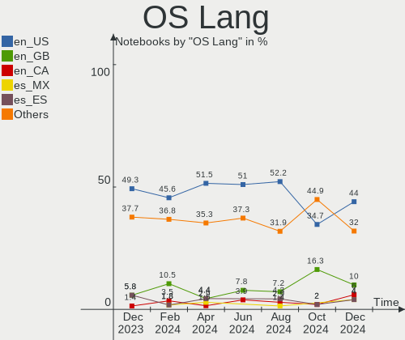
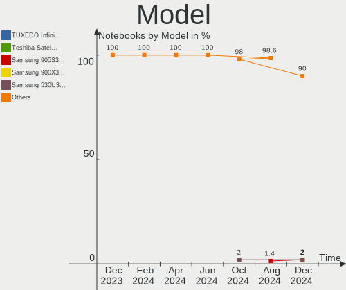
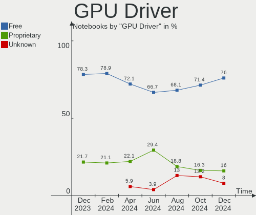
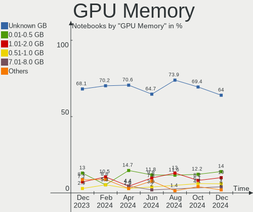
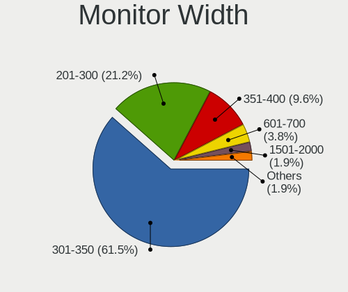

ArcoLinux - Hardware Trends (Notebooks)
---------------------------------------

A project to identify most popular hardware characteristics and track their change
over time based on data collected by Linux users at https://Linux-Hardware.org.

Anyone can contribute to this report by the [hw-probe](https://github.com/linuxhw/hw-probe) tool:

    sudo -E hw-probe -all -upload

This report is for one last month. Overall report since the beginning of time: [TestCoverage](https://github.com/linuxhw/TestCoverage)

Period: Sep, 2022.

Contents
--------

* [ System ](#system)
  - [ OS                       ](#os)
  - [ OS Family                ](#os-family)
  - [ Kernel                   ](#kernel)
  - [ Kernel Family            ](#kernel-family)
  - [ Kernel Major Ver.        ](#kernel-major-ver)
  - [ Arch                     ](#arch)
  - [ DE                       ](#de)
  - [ Display Server           ](#display-server)
  - [ Display Manager          ](#display-manager)
  - [ OS Lang                  ](#os-lang)
  - [ Boot Mode                ](#boot-mode)
  - [ Filesystem               ](#filesystem)
  - [ Part. scheme             ](#part-scheme)
  - [ Dual Boot with Linux/BSD ](#dual-boot-with-linuxbsd)
  - [ Dual Boot (Win)          ](#dual-boot-win)

* [ Board ](#board)
  - [ Vendor                   ](#vendor)
  - [ Model                    ](#model)
  - [ Model Family             ](#model-family)
  - [ MFG Year                 ](#mfg-year)
  - [ Form Factor              ](#form-factor)
  - [ Secure Boot              ](#secure-boot)
  - [ Coreboot                 ](#coreboot)
  - [ RAM Size                 ](#ram-size)
  - [ RAM Used                 ](#ram-used)
  - [ Total Drives             ](#total-drives)
  - [ Has CD-ROM               ](#has-cd-rom)
  - [ Has Ethernet             ](#has-ethernet)
  - [ Has WiFi                 ](#has-wifi)
  - [ Has Bluetooth            ](#has-bluetooth)

* [ Location ](#location)
  - [ Country                  ](#country)
  - [ City                     ](#city)

* [ Drives ](#drives)
  - [ Drive Vendor             ](#drive-vendor)
  - [ Drive Model              ](#drive-model)
  - [ HDD Vendor               ](#hdd-vendor)
  - [ SSD Vendor               ](#ssd-vendor)
  - [ Drive Kind               ](#drive-kind)
  - [ Drive Connector          ](#drive-connector)
  - [ Drive Size               ](#drive-size)
  - [ Space Total              ](#space-total)
  - [ Space Used               ](#space-used)
  - [ Malfunc. Drives          ](#malfunc-drives)
  - [ Malfunc. Drive Vendor    ](#malfunc-drive-vendor)
  - [ Malfunc. HDD Vendor      ](#malfunc-hdd-vendor)
  - [ Malfunc. Drive Kind      ](#malfunc-drive-kind)
  - [ Failed Drives            ](#failed-drives)
  - [ Failed Drive Vendor      ](#failed-drive-vendor)
  - [ Drive Status             ](#drive-status)

* [ Storage controller ](#storage-controller)
  - [ Storage Vendor           ](#storage-vendor)
  - [ Storage Model            ](#storage-model)
  - [ Storage Kind             ](#storage-kind)

* [ Processor ](#processor)
  - [ CPU Vendor               ](#cpu-vendor)
  - [ CPU Model                ](#cpu-model)
  - [ CPU Model Family         ](#cpu-model-family)
  - [ CPU Cores                ](#cpu-cores)
  - [ CPU Sockets              ](#cpu-sockets)
  - [ CPU Threads              ](#cpu-threads)
  - [ CPU Op-Modes             ](#cpu-op-modes)
  - [ CPU Microcode            ](#cpu-microcode)
  - [ CPU Microarch            ](#cpu-microarch)

* [ Graphics ](#graphics)
  - [ GPU Vendor               ](#gpu-vendor)
  - [ GPU Model                ](#gpu-model)
  - [ GPU Combo                ](#gpu-combo)
  - [ GPU Driver               ](#gpu-driver)
  - [ GPU Memory               ](#gpu-memory)

* [ Monitor ](#monitor)
  - [ Monitor Vendor           ](#monitor-vendor)
  - [ Monitor Model            ](#monitor-model)
  - [ Monitor Resolution       ](#monitor-resolution)
  - [ Monitor Diagonal         ](#monitor-diagonal)
  - [ Monitor Width            ](#monitor-width)
  - [ Aspect Ratio             ](#aspect-ratio)
  - [ Monitor Area             ](#monitor-area)
  - [ Pixel Density            ](#pixel-density)
  - [ Multiple Monitors        ](#multiple-monitors)

* [ Network ](#network)
  - [ Net Controller Vendor    ](#net-controller-vendor)
  - [ Net Controller Model     ](#net-controller-model)
  - [ Wireless Vendor          ](#wireless-vendor)
  - [ Wireless Model           ](#wireless-model)
  - [ Ethernet Vendor          ](#ethernet-vendor)
  - [ Ethernet Model           ](#ethernet-model)
  - [ Net Controller Kind      ](#net-controller-kind)
  - [ Used Controller          ](#used-controller)
  - [ NICs                     ](#nics)
  - [ IPv6                     ](#ipv6)

* [ Bluetooth ](#bluetooth)
  - [ Bluetooth Vendor         ](#bluetooth-vendor)
  - [ Bluetooth Model          ](#bluetooth-model)

* [ Sound ](#sound)
  - [ Sound Vendor             ](#sound-vendor)
  - [ Sound Model              ](#sound-model)

* [ Memory ](#memory)
  - [ Memory Vendor            ](#memory-vendor)
  - [ Memory Model             ](#memory-model)
  - [ Memory Kind              ](#memory-kind)
  - [ Memory Form Factor       ](#memory-form-factor)
  - [ Memory Size              ](#memory-size)
  - [ Memory Speed             ](#memory-speed)

* [ Printers & scanners ](#printers--scanners)
  - [ Printer Vendor           ](#printer-vendor)
  - [ Printer Model            ](#printer-model)
  - [ Scanner Vendor           ](#scanner-vendor)
  - [ Scanner Model            ](#scanner-model)

* [ Camera ](#camera)
  - [ Camera Vendor            ](#camera-vendor)
  - [ Camera Model             ](#camera-model)

* [ Security ](#security)
  - [ Fingerprint Vendor       ](#fingerprint-vendor)
  - [ Fingerprint Model        ](#fingerprint-model)
  - [ Chipcard Vendor          ](#chipcard-vendor)
  - [ Chipcard Model           ](#chipcard-model)

* [ Unsupported ](#unsupported)
  - [ Unsupported Devices      ](#unsupported-devices)
  - [ Unsupported Device Types ](#unsupported-device-types)

System
------

OS
--

Installed operating systems

| Name              | Notebooks | Percent |
|-------------------|-----------|---------|
| ArcoLinux Rolling | 16        | 100%    |

OS Family
---------

OS without a version

| Name      | Notebooks | Percent |
|-----------|-----------|---------|
| ArcoLinux | 16        | 100%    |

Kernel
------

Version of the Linux kernel

| Version                 | Notebooks | Percent |
|-------------------------|-----------|---------|
| 5.19.11-arch1-1         | 3         | 18.75%  |
| 5.15.70-1-lts           | 3         | 18.75%  |
| 5.19.7-arch1-1          | 2         | 12.5%   |
| 5.19.6-arch1-1          | 2         | 12.5%   |
| 5.19.10-arch1-1         | 2         | 12.5%   |
| 5.19.9-arch1-1          | 1         | 6.25%   |
| 5.19.7-269-tkg-cfs-llvm | 1         | 6.25%   |
| 5.19.5-arch1-1          | 1         | 6.25%   |
| 5.19.11-xanmod1-1       | 1         | 6.25%   |

Kernel Family
-------------

Linux kernel without a distro release

| Version | Notebooks | Percent |
|---------|-----------|---------|
| 5.19.11 | 4         | 25%     |
| 5.19.7  | 3         | 18.75%  |
| 5.15.70 | 3         | 18.75%  |
| 5.19.6  | 2         | 12.5%   |
| 5.19.10 | 2         | 12.5%   |
| 5.19.9  | 1         | 6.25%   |
| 5.19.5  | 1         | 6.25%   |

Kernel Major Ver.
-----------------

Linux kernel major version

| Version | Notebooks | Percent |
|---------|-----------|---------|
| 5.19    | 13        | 81.25%  |
| 5.15    | 3         | 18.75%  |

Arch
----

OS architecture (x86_64, i586, etc.)

| Name   | Notebooks | Percent |
|--------|-----------|---------|
| x86_64 | 16        | 100%    |

DE
--

Desktop Environment

| Name         | Notebooks | Percent |
|--------------|-----------|---------|
| XFCE         | 3         | 18.75%  |
| KDE5         | 3         | 18.75%  |
| X-Cinnamon   | 2         | 12.5%   |
| i3           | 2         | 12.5%   |
| qtile        | 1         | 6.25%   |
| herbstluftwm | 1         | 6.25%   |
| GNOME        | 1         | 6.25%   |
| Cinnamon     | 1         | 6.25%   |
| awesome      | 1         | 6.25%   |
| Unknown      | 1         | 6.25%   |

Display Server
--------------

X11 or Wayland

| Name | Notebooks | Percent |
|------|-----------|---------|
| X11  | 15        | 93.75%  |
| Tty  | 1         | 6.25%   |

Display Manager
---------------

SDDM, LightDM, etc.

| Name    | Notebooks | Percent |
|---------|-----------|---------|
| SDDM    | 13        | 81.25%  |
| LightDM | 2         | 12.5%   |
| Ly      | 1         | 6.25%   |

OS Lang
-------

Language

| Lang  | Notebooks | Percent |
|-------|-----------|---------|
| en_US | 7         | 43.75%  |
| en_GB | 4         | 25%     |
| pt_BR | 1         | 6.25%   |
| es_ES | 1         | 6.25%   |
| es_AR | 1         | 6.25%   |
| en_CA | 1         | 6.25%   |
| en_AG | 1         | 6.25%   |

Boot Mode
---------

EFI or BIOS

| Mode | Notebooks | Percent |
|------|-----------|---------|
| EFI  | 15        | 93.75%  |
| BIOS | 1         | 6.25%   |

Filesystem
----------

Type of filesystem

| Type  | Notebooks | Percent |
|-------|-----------|---------|
| Ext4  | 11        | 68.75%  |
| Btrfs | 5         | 31.25%  |

Part. scheme
------------

Scheme of partitioning

| Type | Notebooks | Percent |
|------|-----------|---------|
| GPT  | 15        | 93.75%  |
| MBR  | 1         | 6.25%   |

Dual Boot with Linux/BSD
------------------------

Hosting more than one Linux/BSD

| Dual boot | Notebooks | Percent |
|-----------|-----------|---------|
| No        | 12        | 75%     |
| Yes       | 4         | 25%     |

Dual Boot (Win)
---------------

Hosting Linux and Windows

| Dual boot | Notebooks | Percent |
|-----------|-----------|---------|
| Yes       | 10        | 62.5%   |
| No        | 6         | 37.5%   |

Board
-----

Vendor
------

Motherboard manufacturer

| Name                  | Notebooks | Percent |
|-----------------------|-----------|---------|
| Lenovo                | 4         | 25%     |
| ASUSTek Computer      | 4         | 25%     |
| Gigabyte Technology   | 2         | 12.5%   |
| TUXEDO                | 1         | 6.25%   |
| System76              | 1         | 6.25%   |
| Positivo Bahia - VAIO | 1         | 6.25%   |
| Dell                  | 1         | 6.25%   |
| Apple                 | 1         | 6.25%   |
| Acer                  | 1         | 6.25%   |

Model
-----

Motherboard model

| Name                                    | Notebooks | Percent |
|-----------------------------------------|-----------|---------|
| TUXEDO Aura 15 Gen2                     | 1         | 6.25%   |
| System76 Oryx Pro                       | 1         | 6.25%   |
| Positivo Bahia - VAIO VJFE42F11X-XXXXXX | 1         | 6.25%   |
| Lenovo Y520-15IKBN 80WK                 | 1         | 6.25%   |
| Lenovo ThinkPad X260 20F5S6P801         | 1         | 6.25%   |
| Lenovo ThinkBook 13s-IML 20RR           | 1         | 6.25%   |
| Lenovo Legion 5 15ARH05 82B5            | 1         | 6.25%   |
| Gigabyte AORUS 15P YD                   | 1         | 6.25%   |
| Gigabyte AERO 15-SA                     | 1         | 6.25%   |
| Dell Latitude 3410                      | 1         | 6.25%   |
| ASUS ZenBook UX331FA_UX331FA            | 1         | 6.25%   |
| ASUS X580VD                             | 1         | 6.25%   |
| ASUS ROG Strix G531GW_G531GW            | 1         | 6.25%   |
| ASUS E402BA                             | 1         | 6.25%   |
| Apple MacBookAir7,2                     | 1         | 6.25%   |
| Acer Aspire A715-75G                    | 1         | 6.25%   |

Model Family
------------

Motherboard model prefix

| Name                                    | Notebooks | Percent |
|-----------------------------------------|-----------|---------|
| TUXEDO Aura                             | 1         | 6.25%   |
| System76 Oryx                           | 1         | 6.25%   |
| Positivo Bahia - VAIO VJFE42F11X-XXXXXX | 1         | 6.25%   |
| Lenovo Y520-15IKBN                      | 1         | 6.25%   |
| Lenovo ThinkPad                         | 1         | 6.25%   |
| Lenovo ThinkBook                        | 1         | 6.25%   |
| Lenovo Legion                           | 1         | 6.25%   |
| Gigabyte AORUS                          | 1         | 6.25%   |
| Gigabyte AERO                           | 1         | 6.25%   |
| Dell Latitude                           | 1         | 6.25%   |
| ASUS ZenBook                            | 1         | 6.25%   |
| ASUS X580VD                             | 1         | 6.25%   |
| ASUS ROG                                | 1         | 6.25%   |
| ASUS E402BA                             | 1         | 6.25%   |
| Apple MacBookAir7                       | 1         | 6.25%   |
| Acer Aspire                             | 1         | 6.25%   |

MFG Year
--------

Motherboard manufacture year

| Year | Notebooks | Percent |
|------|-----------|---------|
| 2019 | 5         | 31.25%  |
| 2020 | 4         | 25%     |
| 2017 | 3         | 18.75%  |
| 2022 | 1         | 6.25%   |
| 2021 | 1         | 6.25%   |
| 2016 | 1         | 6.25%   |
| 2015 | 1         | 6.25%   |

Form Factor
-----------

Physical design of the computer

| Name     | Notebooks | Percent |
|----------|-----------|---------|
| Notebook | 16        | 100%    |

Secure Boot
-----------

Enabled or disabled

| State    | Notebooks | Percent |
|----------|-----------|---------|
| Disabled | 16        | 100%    |

Coreboot
--------

Have coreboot on board

| Used | Notebooks | Percent |
|------|-----------|---------|
| No   | 16        | 100%    |

RAM Size
--------

Total RAM memory

| Size in GB | Notebooks | Percent |
|------------|-----------|---------|
| 4.01-8.0   | 7         | 43.75%  |
| 32.01-64.0 | 4         | 25%     |
| 16.01-24.0 | 4         | 25%     |
| 8.01-16.0  | 1         | 6.25%   |

RAM Used
--------

Used RAM memory

| Used GB   | Notebooks | Percent |
|-----------|-----------|---------|
| 4.01-8.0  | 6         | 37.5%   |
| 3.01-4.0  | 4         | 25%     |
| 2.01-3.0  | 3         | 18.75%  |
| 1.01-2.0  | 2         | 12.5%   |
| 8.01-16.0 | 1         | 6.25%   |

Total Drives
------------

Number of drives on board

| Drives | Notebooks | Percent |
|--------|-----------|---------|
| 2      | 9         | 56.25%  |
| 1      | 6         | 37.5%   |
| 4      | 1         | 6.25%   |

Has CD-ROM
----------

Has CD-ROM on board

| Presented | Notebooks | Percent |
|-----------|-----------|---------|
| No        | 16        | 100%    |

Has Ethernet
------------

Has Ethernet on board

| Presented | Notebooks | Percent |
|-----------|-----------|---------|
| Yes       | 14        | 87.5%   |
| No        | 2         | 12.5%   |

Has WiFi
--------

Has WiFi module

| Presented | Notebooks | Percent |
|-----------|-----------|---------|
| Yes       | 16        | 100%    |

Has Bluetooth
-------------

Has Bluetooth module

| Presented | Notebooks | Percent |
|-----------|-----------|---------|
| Yes       | 16        | 100%    |

Location
--------

Country
-------

Geographic location (country)

| Country     | Notebooks | Percent |
|-------------|-----------|---------|
| USA         | 3         | 18.75%  |
| Netherlands | 2         | 12.5%   |
| Egypt       | 2         | 12.5%   |
| Belgium     | 2         | 12.5%   |
| UK          | 1         | 6.25%   |
| Turkey      | 1         | 6.25%   |
| Spain       | 1         | 6.25%   |
| Russia      | 1         | 6.25%   |
| Canada      | 1         | 6.25%   |
| Brazil      | 1         | 6.25%   |
| Argentina   | 1         | 6.25%   |

City
----

Geographic location (city)

| City            | Notebooks | Percent |
|-----------------|-----------|---------|
| Alexandria      | 2         | 12.5%   |
| Ochten          | 1         | 6.25%   |
| Moscow          | 1         | 6.25%   |
| Madrid          | 1         | 6.25%   |
| Los Angeles     | 1         | 6.25%   |
| Islington       | 1         | 6.25%   |
| Hulshout        | 1         | 6.25%   |
| Houston         | 1         | 6.25%   |
| Hanover         | 1         | 6.25%   |
| General Pacheco | 1         | 6.25%   |
| Gaziantep       | 1         | 6.25%   |
| Eindhoven       | 1         | 6.25%   |
| Dison           | 1         | 6.25%   |
| Curitiba        | 1         | 6.25%   |
| Calgary         | 1         | 6.25%   |

Drives
------

Drive Vendor
------------

Hard drive vendors

| Vendor                    | Notebooks | Drives | Percent |
|---------------------------|-----------|--------|---------|
| Samsung Electronics       | 6         | 7      | 22.22%  |
| SK hynix                  | 3         | 3      | 11.11%  |
| Sandisk                   | 3         | 3      | 11.11%  |
| Micron/Crucial Technology | 3         | 3      | 11.11%  |
| Intel                     | 3         | 3      | 11.11%  |
| Toshiba                   | 2         | 2      | 7.41%   |
| Phison Electronics        | 2         | 2      | 7.41%   |
| WDC                       | 1         | 1      | 3.7%    |
| Unknown                   | 1         | 1      | 3.7%    |
| Seagate                   | 1         | 1      | 3.7%    |
| JMicron Technology        | 1         | 1      | 3.7%    |
| Apple                     | 1         | 1      | 3.7%    |

Drive Model
-----------

Hard drive models

| Model                                                 | Notebooks | Percent |
|-------------------------------------------------------|-----------|---------|
| Micron/Crucial P2 NVMe PCIe SSD 500GB                 | 3         | 10.71%  |
| Toshiba MQ04ABF100 1TB                                | 2         | 7.14%   |
| WDC WD20SPZX-22UA7T0 2TB                              | 1         | 3.57%   |
| Unknown MMC Card  134GB                               | 1         | 3.57%   |
| SK hynix SH920 2.5 7MM 256GB SSD                      | 1         | 3.57%   |
| SK hynix HFS256G32TND-N210A 256GB SSD                 | 1         | 3.57%   |
| SK hynix BC501 NVMe Solid State Drive 512GB           | 1         | 3.57%   |
| Seagate ST1000LM035-1RK172 1TB                        | 1         | 3.57%   |
| Sandisk WD_BLACK SN770 1TB                            | 1         | 3.57%   |
| Sandisk WD Black SN750 / PC SN730 NVMe SSD 1024GB     | 1         | 3.57%   |
| Sandisk WD Black 2018/SN750 / PC SN720 NVMe SSD 512GB | 1         | 3.57%   |
| Samsung SSD 870 EVO 1TB                               | 1         | 3.57%   |
| Samsung SSD 860 QVO 1TB                               | 1         | 3.57%   |
| Samsung SSD 860 EVO M.2 1TB                           | 1         | 3.57%   |
| Samsung NVMe SSD Controller SM981/PM981/PM983 256GB   | 1         | 3.57%   |
| Samsung NVMe SSD Controller SM961/PM961/SM963 256GB   | 1         | 3.57%   |
| Samsung NVMe SSD Controller PM9A1/PM9A3/980PRO 1024GB | 1         | 3.57%   |
| Samsung MZALQ256HAJD-000L2 256GB                      | 1         | 3.57%   |
| Phison PCIe SSD 240GB                                 | 1         | 3.57%   |
| Phison E16 PCIe4 NVMe Controller 1TB                  | 1         | 3.57%   |
| JMicron Generic 120GB                                 | 1         | 3.57%   |
| Intel SSDSA2CW160G3 160GB                             | 1         | 3.57%   |
| Intel SSD Pro 7600p/760p/E 6100p Series 512GB         | 1         | 3.57%   |
| Intel SSD 660P Series 512GB                           | 1         | 3.57%   |
| Apple SSD SM0128G 121GB                               | 1         | 3.57%   |

HDD Vendor
----------

Hard disk drive vendors

| Vendor  | Notebooks | Drives | Percent |
|---------|-----------|--------|---------|
| Toshiba | 2         | 2      | 50%     |
| WDC     | 1         | 1      | 25%     |
| Seagate | 1         | 1      | 25%     |

SSD Vendor
----------

Solid state drive vendors

| Vendor              | Notebooks | Drives | Percent |
|---------------------|-----------|--------|---------|
| Samsung Electronics | 3         | 3      | 42.86%  |
| SK hynix            | 2         | 2      | 28.57%  |
| Intel               | 1         | 1      | 14.29%  |
| Apple               | 1         | 1      | 14.29%  |

Drive Kind
----------

HDD or SSD

| Kind | Notebooks | Drives | Percent |
|------|-----------|--------|---------|
| NVMe | 11        | 16     | 47.83%  |
| SSD  | 7         | 7      | 30.43%  |
| HDD  | 4         | 4      | 17.39%  |
| MMC  | 1         | 1      | 4.35%   |

Drive Connector
---------------

SATA, SAS, NVMe, etc.

| Type | Notebooks | Drives | Percent |
|------|-----------|--------|---------|
| NVMe | 11        | 15     | 47.83%  |
| SATA | 9         | 10     | 39.13%  |
| SAS  | 2         | 2      | 8.7%    |
| MMC  | 1         | 1      | 4.35%   |

Drive Size
----------

Size of hard drive

| Size in TB | Notebooks | Drives | Percent |
|------------|-----------|--------|---------|
| 0.51-1.0   | 5         | 6      | 50%     |
| 0.01-0.5   | 4         | 4      | 40%     |
| 1.01-2.0   | 1         | 1      | 10%     |

Space Total
-----------

Amount of disk space available on the file system

| Size in GB | Notebooks | Percent |
|------------|-----------|---------|
| 101-250    | 5         | 31.25%  |
| 1001-2000  | 5         | 31.25%  |
| 251-500    | 4         | 25%     |
| 501-1000   | 1         | 6.25%   |
| Unknown    | 1         | 6.25%   |

Space Used
----------

Amount of used disk space

| Used GB  | Notebooks | Percent |
|----------|-----------|---------|
| 101-250  | 4         | 25%     |
| 21-50    | 3         | 18.75%  |
| 1-20     | 3         | 18.75%  |
| 501-1000 | 3         | 18.75%  |
| 251-500  | 1         | 6.25%   |
| 51-100   | 1         | 6.25%   |
| Unknown  | 1         | 6.25%   |

Malfunc. Drives
---------------

Drive models with a malfunction

| Model                                 | Notebooks | Drives | Percent |
|---------------------------------------|-----------|--------|---------|
| SK hynix SH920 2.5 7MM 256GB SSD      | 1         | 1      | 50%     |
| SK hynix HFS256G32TND-N210A 256GB SSD | 1         | 1      | 50%     |

Malfunc. Drive Vendor
---------------------

Vendors of faulty drives

| Vendor   | Notebooks | Drives | Percent |
|----------|-----------|--------|---------|
| SK hynix | 2         | 2      | 100%    |

Malfunc. HDD Vendor
-------------------

Vendors of faulty HDD drives

Zero info for selected period =(

Malfunc. Drive Kind
-------------------

Kinds of faulty drives

| Kind | Notebooks | Drives | Percent |
|------|-----------|--------|---------|
| SSD  | 2         | 2      | 100%    |

Failed Drives
-------------

Failed drive models

Zero info for selected period =(

Failed Drive Vendor
-------------------

Failed drive vendors

Zero info for selected period =(

Drive Status
------------

Number of failed and malfunc. drives

| Status   | Notebooks | Drives | Percent |
|----------|-----------|--------|---------|
| Works    | 14        | 23     | 73.68%  |
| Detected | 3         | 3      | 15.79%  |
| Malfunc  | 2         | 2      | 10.53%  |

Storage controller
------------------

Storage Vendor
--------------

Storage controller vendors

| Vendor                    | Notebooks | Percent |
|---------------------------|-----------|---------|
| Intel                     | 9         | 34.62%  |
| Samsung Electronics       | 5         | 19.23%  |
| SanDisk                   | 3         | 11.54%  |
| Micron/Crucial Technology | 3         | 11.54%  |
| AMD                       | 3         | 11.54%  |
| Phison Electronics        | 2         | 7.69%   |
| SK hynix                  | 1         | 3.85%   |

Storage Model
-------------

Storage controller models

| Model                                                 | Notebooks | Percent |
|-------------------------------------------------------|-----------|---------|
| Micron/Crucial P2 NVMe PCIe SSD                       | 3         | 11.54%  |
| AMD FCH SATA Controller [AHCI mode]                   | 3         | 11.54%  |
| Intel HM170/QM170 Chipset SATA Controller [AHCI Mode] | 2         | 7.69%   |
| Intel Cannon Lake Mobile PCH SATA AHCI Controller     | 2         | 7.69%   |
| SK hynix BC501 NVMe Solid State Drive                 | 1         | 3.85%   |
| SanDisk WD Black SN750 / PC SN730 NVMe SSD            | 1         | 3.85%   |
| SanDisk WD Black 2018/SN750 / PC SN720 NVMe SSD       | 1         | 3.85%   |
| SanDisk Non-Volatile memory controller                | 1         | 3.85%   |
| Samsung NVMe SSD Controller SM981/PM981/PM983         | 1         | 3.85%   |
| Samsung NVMe SSD Controller SM961/PM961/SM963         | 1         | 3.85%   |
| Samsung NVMe SSD Controller PM9A1/PM9A3/980PRO        | 1         | 3.85%   |
| Samsung NVMe SSD Controller 980                       | 1         | 3.85%   |
| Samsung Electronics SATA controller                   | 1         | 3.85%   |
| Phison E18 PCIe4 NVMe Controller                      | 1         | 3.85%   |
| Phison E16 PCIe4 NVMe Controller                      | 1         | 3.85%   |
| Intel Sunrise Point-LP SATA Controller [AHCI mode]    | 1         | 3.85%   |
| Intel SSD Pro 7600p/760p/E 6100p Series               | 1         | 3.85%   |
| Intel SSD 660P Series                                 | 1         | 3.85%   |
| Intel Comet Lake SATA AHCI Controller                 | 1         | 3.85%   |
| Intel Comet Lake PCH-LP SATA RAID Premium Controller  | 1         | 3.85%   |

Storage Kind
------------

Kind of storage controller (IDE, SATA, NVMe, SAS, ...)

| Kind | Notebooks | Percent |
|------|-----------|---------|
| NVMe | 11        | 50%     |
| SATA | 10        | 45.45%  |
| RAID | 1         | 4.55%   |

Processor
---------

CPU Vendor
----------

Processor vendors

| Vendor | Notebooks | Percent |
|--------|-----------|---------|
| Intel  | 13        | 81.25%  |
| AMD    | 3         | 18.75%  |

CPU Model
---------

Processor models

| Model                                        | Notebooks | Percent |
|----------------------------------------------|-----------|---------|
| Intel Core i7-9750H CPU @ 2.60GHz            | 4         | 25%     |
| Intel Core i7-7700HQ CPU @ 2.80GHz           | 2         | 12.5%   |
| Intel Core i7-10510U CPU @ 1.80GHz           | 1         | 6.25%   |
| Intel Core i5-8265U CPU @ 1.60GHz            | 1         | 6.25%   |
| Intel Core i5-6300U CPU @ 2.40GHz            | 1         | 6.25%   |
| Intel Core i5-5350U CPU @ 1.80GHz            | 1         | 6.25%   |
| Intel Core i5-10310U CPU @ 1.70GHz           | 1         | 6.25%   |
| Intel Core i5-10210U CPU @ 1.60GHz           | 1         | 6.25%   |
| Intel 11th Gen Core i7-11800H @ 2.30GHz      | 1         | 6.25%   |
| AMD Ryzen 7 5700U with Radeon Graphics       | 1         | 6.25%   |
| AMD Ryzen 7 4800H with Radeon Graphics       | 1         | 6.25%   |
| AMD A9-9420 RADEON R5, 5 COMPUTE CORES 2C+3G | 1         | 6.25%   |

CPU Model Family
----------------

Processor model prefix

| Model         | Notebooks | Percent |
|---------------|-----------|---------|
| Intel Core i7 | 7         | 43.75%  |
| Intel Core i5 | 5         | 31.25%  |
| Other         | 2         | 12.5%   |
| AMD Ryzen 7   | 2         | 12.5%   |

CPU Cores
---------

Number of processor cores

| Number | Notebooks | Percent |
|--------|-----------|---------|
| 4      | 6         | 37.5%   |
| 6      | 4         | 25%     |
| 8      | 3         | 18.75%  |
| 2      | 3         | 18.75%  |

CPU Sockets
-----------

Number of sockets

| Number | Notebooks | Percent |
|--------|-----------|---------|
| 1      | 16        | 100%    |

CPU Threads
-----------

Threads per core (Hyper-Threading)

| Number | Notebooks | Percent |
|--------|-----------|---------|
| 2      | 15        | 93.75%  |
| 1      | 1         | 6.25%   |

CPU Op-Modes
------------

CPU Operation Modes (32-bit, 64-bit)

| Op mode        | Notebooks | Percent |
|----------------|-----------|---------|
| 32-bit, 64-bit | 16        | 100%    |

CPU Microcode
-------------

Microcode number

| Number     | Notebooks | Percent |
|------------|-----------|---------|
| 0x906ea    | 4         | 25%     |
| 0x906e9    | 2         | 12.5%   |
| Unknown    | 2         | 12.5%   |
| 0x806ec    | 1         | 6.25%   |
| 0x806eb    | 1         | 6.25%   |
| 0x806d1    | 1         | 6.25%   |
| 0x406e3    | 1         | 6.25%   |
| 0x306d4    | 1         | 6.25%   |
| 0x08608103 | 1         | 6.25%   |
| 0x08600106 | 1         | 6.25%   |
| 0x06006704 | 1         | 6.25%   |

CPU Microarch
-------------

Microarchitecture

| Name      | Notebooks | Percent |
|-----------|-----------|---------|
| KabyLake  | 10        | 62.5%   |
| Zen 2     | 1         | 6.25%   |
| Skylake   | 1         | 6.25%   |
| Icelake   | 1         | 6.25%   |
| Excavator | 1         | 6.25%   |
| Broadwell | 1         | 6.25%   |
| Unknown   | 1         | 6.25%   |

Graphics
--------

GPU Vendor
----------

Vendors of graphics cards

| Vendor | Notebooks | Percent |
|--------|-----------|---------|
| Intel  | 13        | 56.52%  |
| Nvidia | 8         | 34.78%  |
| AMD    | 2         | 8.7%    |

GPU Model
---------

Graphics card models

| Model                                                    | Notebooks | Percent |
|----------------------------------------------------------|-----------|---------|
| Intel CoffeeLake-H GT2 [UHD Graphics 630]                | 4         | 17.39%  |
| Intel CometLake-U GT2 [UHD Graphics]                     | 3         | 13.04%  |
| Nvidia TU117M                                            | 2         | 8.7%    |
| Nvidia GP107M [GeForce GTX 1050 Mobile]                  | 2         | 8.7%    |
| Intel HD Graphics 630                                    | 2         | 8.7%    |
| Nvidia TU116M [GeForce GTX 1660 Ti Mobile]               | 1         | 4.35%   |
| Nvidia TU106M [GeForce RTX 2070 Mobile]                  | 1         | 4.35%   |
| Nvidia TU106M [GeForce RTX 2060 Mobile]                  | 1         | 4.35%   |
| Nvidia GA104M [GeForce RTX 3080 Mobile / Max-Q 8GB/16GB] | 1         | 4.35%   |
| Intel WhiskeyLake-U GT2 [UHD Graphics 620]               | 1         | 4.35%   |
| Intel TigerLake-H GT1 [UHD Graphics]                     | 1         | 4.35%   |
| Intel Skylake GT2 [HD Graphics 520]                      | 1         | 4.35%   |
| Intel HD Graphics 6000                                   | 1         | 4.35%   |
| AMD Stoney [Radeon R2/R3/R4/R5 Graphics]                 | 1         | 4.35%   |
| AMD Lucienne                                             | 1         | 4.35%   |

GPU Combo
---------

Combinations of graphics cards

| Name           | Notebooks | Percent |
|----------------|-----------|---------|
| Intel + Nvidia | 7         | 43.75%  |
| 1 x Intel      | 6         | 37.5%   |
| 1 x AMD        | 2         | 12.5%   |
| 1 x Nvidia     | 1         | 6.25%   |

GPU Driver
----------

Free vs proprietary

| Driver      | Notebooks | Percent |
|-------------|-----------|---------|
| Free        | 10        | 62.5%   |
| Proprietary | 6         | 37.5%   |

GPU Memory
----------

Total video memory

| Size in GB | Notebooks | Percent |
|------------|-----------|---------|
| Unknown    | 11        | 68.75%  |
| 3.01-4.0   | 2         | 12.5%   |
| 0.01-0.5   | 2         | 12.5%   |
| 7.01-8.0   | 1         | 6.25%   |

Monitor
-------

Monitor Vendor
--------------

Monitor vendors

| Vendor              | Notebooks | Percent |
|---------------------|-----------|---------|
| BOE                 | 5         | 22.73%  |
| AU Optronics        | 3         | 13.64%  |
| Sharp               | 2         | 9.09%   |
| Samsung Electronics | 2         | 9.09%   |
| LG Display          | 2         | 9.09%   |
| Goldstar            | 2         | 9.09%   |
| PANDA               | 1         | 4.55%   |
| Medion              | 1         | 4.55%   |
| Iiyama              | 1         | 4.55%   |
| Dell                | 1         | 4.55%   |
| Chimei Innolux      | 1         | 4.55%   |
| Apple               | 1         | 4.55%   |

Monitor Model
-------------

Monitor models

| Model                                                                 | Notebooks | Percent |
|-----------------------------------------------------------------------|-----------|---------|
| Sharp LQ156M1JW09 SHP14D3 1920x1080 344x194mm 15.5-inch               | 1         | 4.55%   |
| Sharp LQ156M1JW03 SHP155D 1920x1080 344x194mm 15.5-inch               | 1         | 4.55%   |
| Samsung Electronics LCD Monitor SDCA029 3840x2160 344x194mm 15.5-inch | 1         | 4.55%   |
| Samsung Electronics C24F390 SAM0D2C 1920x1080 521x293mm 23.5-inch     | 1         | 4.55%   |
| PANDA LCD Monitor NCP002B 1920x1080 309x174mm 14.0-inch               | 1         | 4.55%   |
| Medion MD 20889 MED3687 1920x1080 509x286mm 23.0-inch                 | 1         | 4.55%   |
| LG Display LCD Monitor LGD065A 1920x1080 344x194mm 15.5-inch          | 1         | 4.55%   |
| LG Display LCD Monitor LGD0590 1920x1080 344x194mm 15.5-inch          | 1         | 4.55%   |
| Iiyama PLE2407HDS IVM560D 1920x1080 521x293mm 23.5-inch               | 1         | 4.55%   |
| Goldstar FULL HD GSM5B55 1920x1080 480x270mm 21.7-inch                | 1         | 4.55%   |
| Goldstar 27GL650F GSM5B70 1920x1080 531x298mm 24.0-inch               | 1         | 4.55%   |
| Dell P2719H DEL4185 1920x1080 598x336mm 27.0-inch                     | 1         | 4.55%   |
| Chimei Innolux LCD Monitor CMN14A7 1920x1080 308x173mm 13.9-inch      | 1         | 4.55%   |
| BOE LCD Monitor BOE08DF 1920x1080 340x190mm 15.3-inch                 | 1         | 4.55%   |
| BOE LCD Monitor BOE07F6 1920x1080 309x174mm 14.0-inch                 | 1         | 4.55%   |
| BOE LCD Monitor BOE07D7 1920x1080 294x165mm 13.3-inch                 | 1         | 4.55%   |
| BOE LCD Monitor BOE07B6 1920x1080 382x215mm 17.3-inch                 | 1         | 4.55%   |
| BOE LCD Monitor BOE0747 1920x1080 344x194mm 15.5-inch                 | 1         | 4.55%   |
| AU Optronics LCD Monitor AUO61ED 1920x1080 344x194mm 15.5-inch        | 1         | 4.55%   |
| AU Optronics LCD Monitor AUO492D 1920x1080 293x165mm 13.2-inch        | 1         | 4.55%   |
| AU Optronics LCD Monitor AUO226D 1920x1080 276x155mm 12.5-inch        | 1         | 4.55%   |
| Apple Color LCD APPA01B 1440x900 286x179mm 13.3-inch                  | 1         | 4.55%   |

Monitor Resolution
------------------

Monitor screen resolution

| Resolution       | Notebooks | Percent |
|------------------|-----------|---------|
| 1920x1080 (FHD)  | 14        | 82.35%  |
| 3840x2160 (4K)   | 2         | 11.76%  |
| 1440x900 (WXGA+) | 1         | 5.88%   |

Monitor Diagonal
----------------

Diagonal size in inches

| Inches | Notebooks | Percent |
|--------|-----------|---------|
| 15     | 8         | 36.36%  |
| 13     | 4         | 18.18%  |
| 23     | 3         | 13.64%  |
| 14     | 2         | 9.09%   |
| 27     | 1         | 4.55%   |
| 24     | 1         | 4.55%   |
| 21     | 1         | 4.55%   |
| 17     | 1         | 4.55%   |
| 12     | 1         | 4.55%   |

Monitor Width
-------------

Physical width

| Width in mm | Notebooks | Percent |
|-------------|-----------|---------|
| 301-350     | 11        | 50%     |
| 501-600     | 5         | 22.73%  |
| 201-300     | 4         | 18.18%  |
| 401-500     | 1         | 4.55%   |
| 351-400     | 1         | 4.55%   |

Aspect Ratio
------------

Proportional relationship between the width and the height

| Ratio | Notebooks | Percent |
|-------|-----------|---------|
| 16/9  | 15        | 93.75%  |
| 16/10 | 1         | 6.25%   |

Monitor Area
------------

Area in inch²

| Area in inch² | Notebooks | Percent |
|----------------|-----------|---------|
| 101-110        | 7         | 31.82%  |
| 201-250        | 5         | 22.73%  |
| 81-90          | 4         | 18.18%  |
| 71-80          | 2         | 9.09%   |
| 61-70          | 1         | 4.55%   |
| 301-350        | 1         | 4.55%   |
| 121-130        | 1         | 4.55%   |
| 91-100         | 1         | 4.55%   |

Pixel Density
-------------

Pixels per inch

| Density       | Notebooks | Percent |
|---------------|-----------|---------|
| 121-160       | 12        | 54.55%  |
| 51-100        | 5         | 22.73%  |
| 161-240       | 3         | 13.64%  |
| More than 240 | 1         | 4.55%   |
| 101-120       | 1         | 4.55%   |

Multiple Monitors
-----------------

Total monitors connected

| Total | Notebooks | Percent |
|-------|-----------|---------|
| 1     | 10        | 62.5%   |
| 2     | 6         | 37.5%   |

Network
-------

Net Controller Vendor
---------------------

Controller vendors

| Vendor                | Notebooks | Percent |
|-----------------------|-----------|---------|
| Realtek Semiconductor | 13        | 43.33%  |
| Intel                 | 12        | 40%     |
| Qualcomm Atheros      | 2         | 6.67%   |
| Sierra Wireless       | 1         | 3.33%   |
| Samsung Electronics   | 1         | 3.33%   |
| Broadcom Limited      | 1         | 3.33%   |

Net Controller Model
--------------------

Controller models

| Model                                                             | Notebooks | Percent |
|-------------------------------------------------------------------|-----------|---------|
| Realtek RTL8111/8168/8411 PCI Express Gigabit Ethernet Controller | 10        | 31.25%  |
| Intel Wi-Fi 6 AX200                                               | 5         | 15.63%  |
| Intel Wireless 8265 / 8275                                        | 2         | 6.25%   |
| Intel Comet Lake PCH-LP CNVi WiFi                                 | 2         | 6.25%   |
| Intel Cannon Lake PCH CNVi WiFi                                   | 2         | 6.25%   |
| Sierra Wireless EM7455                                            | 1         | 3.13%   |
| Samsung GT-I9070 (network tethering, USB debugging enabled)       | 1         | 3.13%   |
| Realtek RTL8821AE 802.11ac PCIe Wireless Network Adapter          | 1         | 3.13%   |
| Realtek RTL8153 Gigabit Ethernet Adapter                          | 1         | 3.13%   |
| Realtek RTL8125 2.5GbE Controller                                 | 1         | 3.13%   |
| Realtek Killer E2600 Gigabit Ethernet Controller                  | 1         | 3.13%   |
| Qualcomm Atheros QCA9377 802.11ac Wireless Network Adapter        | 1         | 3.13%   |
| Qualcomm Atheros QCA6174 802.11ac Wireless Network Adapter        | 1         | 3.13%   |
| Intel Wireless 8260                                               | 1         | 3.13%   |
| Intel Ethernet Connection I219-LM                                 | 1         | 3.13%   |
| Broadcom Limited BCM4360 802.11ac Wireless Network Adapter        | 1         | 3.13%   |

Wireless Vendor
---------------

Wireless vendors

| Vendor                | Notebooks | Percent |
|-----------------------|-----------|---------|
| Intel                 | 12        | 70.59%  |
| Qualcomm Atheros      | 2         | 11.76%  |
| Sierra Wireless       | 1         | 5.88%   |
| Realtek Semiconductor | 1         | 5.88%   |
| Broadcom Limited      | 1         | 5.88%   |

Wireless Model
--------------

Wireless models

| Model                                                      | Notebooks | Percent |
|------------------------------------------------------------|-----------|---------|
| Intel Wi-Fi 6 AX200                                        | 5         | 29.41%  |
| Intel Wireless 8265 / 8275                                 | 2         | 11.76%  |
| Intel Comet Lake PCH-LP CNVi WiFi                          | 2         | 11.76%  |
| Intel Cannon Lake PCH CNVi WiFi                            | 2         | 11.76%  |
| Sierra Wireless EM7455                                     | 1         | 5.88%   |
| Realtek RTL8821AE 802.11ac PCIe Wireless Network Adapter   | 1         | 5.88%   |
| Qualcomm Atheros QCA9377 802.11ac Wireless Network Adapter | 1         | 5.88%   |
| Qualcomm Atheros QCA6174 802.11ac Wireless Network Adapter | 1         | 5.88%   |
| Intel Wireless 8260                                        | 1         | 5.88%   |
| Broadcom Limited BCM4360 802.11ac Wireless Network Adapter | 1         | 5.88%   |

Ethernet Vendor
---------------

Ethernet vendors

| Vendor                | Notebooks | Percent |
|-----------------------|-----------|---------|
| Realtek Semiconductor | 13        | 86.67%  |
| Samsung Electronics   | 1         | 6.67%   |
| Intel                 | 1         | 6.67%   |

Ethernet Model
--------------

Ethernet models

| Model                                                             | Notebooks | Percent |
|-------------------------------------------------------------------|-----------|---------|
| Realtek RTL8111/8168/8411 PCI Express Gigabit Ethernet Controller | 10        | 66.67%  |
| Samsung GT-I9070 (network tethering, USB debugging enabled)       | 1         | 6.67%   |
| Realtek RTL8153 Gigabit Ethernet Adapter                          | 1         | 6.67%   |
| Realtek RTL8125 2.5GbE Controller                                 | 1         | 6.67%   |
| Realtek Killer E2600 Gigabit Ethernet Controller                  | 1         | 6.67%   |
| Intel Ethernet Connection I219-LM                                 | 1         | 6.67%   |

Net Controller Kind
-------------------

Ethernet, WiFi or modem

| Kind     | Notebooks | Percent |
|----------|-----------|---------|
| WiFi     | 16        | 53.33%  |
| Ethernet | 14        | 46.67%  |

Used Controller
---------------

Currently used network controller

| Kind     | Notebooks | Percent |
|----------|-----------|---------|
| WiFi     | 15        | 78.95%  |
| Ethernet | 4         | 21.05%  |

NICs
----

Total network controllers on board

| Total | Notebooks | Percent |
|-------|-----------|---------|
| 2     | 13        | 81.25%  |
| 1     | 3         | 18.75%  |

IPv6
----

IPv6 vs IPv4

| Used | Notebooks | Percent |
|------|-----------|---------|
| No   | 12        | 75%     |
| Yes  | 4         | 25%     |

Bluetooth
---------

Bluetooth Vendor
----------------

Controller vendors

| Vendor                          | Notebooks | Percent |
|---------------------------------|-----------|---------|
| Intel                           | 12        | 75%     |
| Realtek Semiconductor           | 1         | 6.25%   |
| Qualcomm Atheros Communications | 1         | 6.25%   |
| IMC Networks                    | 1         | 6.25%   |
| Apple                           | 1         | 6.25%   |

Bluetooth Model
---------------

Controller models

| Model                                          | Notebooks | Percent |
|------------------------------------------------|-----------|---------|
| Intel AX200 Bluetooth                          | 5         | 31.25%  |
| Intel Bluetooth 9460/9560 Jefferson Peak (JfP) | 4         | 25%     |
| Intel Bluetooth wireless interface             | 3         | 18.75%  |
| Realtek Bluetooth Radio                        | 1         | 6.25%   |
| Qualcomm Atheros  Bluetooth Device             | 1         | 6.25%   |
| IMC Networks Bluetooth Device                  | 1         | 6.25%   |
| Apple Bluetooth USB Host Controller            | 1         | 6.25%   |

Sound
-----

Sound Vendor
------------

Sound card vendors

| Vendor   | Notebooks | Percent |
|----------|-----------|---------|
| Intel    | 13        | 56.52%  |
| Nvidia   | 6         | 26.09%  |
| AMD      | 3         | 13.04%  |
| Logitech | 1         | 4.35%   |

Sound Model
-----------

Sound card models

| Model                                                          | Notebooks | Percent |
|----------------------------------------------------------------|-----------|---------|
| Intel Cannon Lake PCH cAVS                                     | 4         | 15.38%  |
| Intel Comet Lake PCH-LP cAVS                                   | 3         | 11.54%  |
| Nvidia TU107 GeForce GTX 1650 High Definition Audio Controller | 2         | 7.69%   |
| Nvidia TU106 High Definition Audio Controller                  | 2         | 7.69%   |
| Intel CM238 HD Audio Controller                                | 2         | 7.69%   |
| AMD Family 17h/19h HD Audio Controller                         | 2         | 7.69%   |
| Nvidia TU116 High Definition Audio Controller                  | 1         | 3.85%   |
| Nvidia GA104 High Definition Audio Controller                  | 1         | 3.85%   |
| Logitech [G533 Wireless Headset Dongle]                        | 1         | 3.85%   |
| Intel Wildcat Point-LP High Definition Audio Controller        | 1         | 3.85%   |
| Intel Tiger Lake-H HD Audio Controller                         | 1         | 3.85%   |
| Intel Sunrise Point-LP HD Audio                                | 1         | 3.85%   |
| Intel Cannon Point-LP High Definition Audio Controller         | 1         | 3.85%   |
| Intel Broadwell-U Audio Controller                             | 1         | 3.85%   |
| AMD Renoir Radeon High Definition Audio Controller             | 1         | 3.85%   |
| AMD High Definition Audio Controller                           | 1         | 3.85%   |
| AMD Family 15h (Models 60h-6fh) Audio Controller               | 1         | 3.85%   |

Memory
------

Memory Vendor
-------------

Memory module vendors

| Vendor              | Notebooks | Percent |
|---------------------|-----------|---------|
| Samsung Electronics | 9         | 56.25%  |
| SK hynix            | 3         | 18.75%  |
| Micron Technology   | 2         | 12.5%   |
| Unknown             | 1         | 6.25%   |
| Timetec             | 1         | 6.25%   |

Memory Model
------------

Memory module models

| Model                                                          | Notebooks | Percent |
|----------------------------------------------------------------|-----------|---------|
| Samsung RAM M471A1K43DB1-CWE 8192MB SODIMM DDR4 3200MT/s       | 2         | 12.5%   |
| Samsung RAM M471A1K43DB1-CTD 8GB SODIMM DDR4 2667MT/s          | 2         | 12.5%   |
| Samsung RAM M471A1K43CB1-CRC 8GB SODIMM DDR4 2667MT/s          | 2         | 12.5%   |
| Unknown RAM Module 32GB SODIMM DDR4 2667MT/s                   | 1         | 6.25%   |
| Timetec RAM SD4-3200 16GB SODIMM DDR4 3200MT/s                 | 1         | 6.25%   |
| SK hynix RAM Module 4GB SODIMM DDR3 1600MT/s                   | 1         | 6.25%   |
| SK hynix RAM HMA81GS6DJR8N-XN 8GB SODIMM DDR4 3200MT/s         | 1         | 6.25%   |
| SK hynix RAM HMA81GS6AFR8N-UH 8192MB SODIMM DDR4 2667MT/s      | 1         | 6.25%   |
| Samsung RAM M471A2K43CB1-CTD 16384MB SODIMM DDR4 8400MT/s      | 1         | 6.25%   |
| Samsung RAM M471A2G43AB2-CWE 16GB SODIMM DDR4 3200MT/s         | 1         | 6.25%   |
| Samsung RAM M471A1K43CB1-CTD 8GB SODIMM DDR4 2667MT/s          | 1         | 6.25%   |
| Micron RAM MT52L512M32D2PF-09 4GB Row Of Chips LPDDR3 2133MT/s | 1         | 6.25%   |
| Micron RAM 4KTF51264HZ-1G6A1 4GB SODIMM DDR3 1600MT/s          | 1         | 6.25%   |

Memory Kind
-----------

Memory module kinds

| Kind   | Notebooks | Percent |
|--------|-----------|---------|
| DDR4   | 13        | 81.25%  |
| DDR3   | 2         | 12.5%   |
| LPDDR3 | 1         | 6.25%   |

Memory Form Factor
------------------

Physical design of the memory module

| Name         | Notebooks | Percent |
|--------------|-----------|---------|
| SODIMM       | 15        | 93.75%  |
| Row Of Chips | 1         | 6.25%   |

Memory Size
-----------

Memory module size

| Size  | Notebooks | Percent |
|-------|-----------|---------|
| 8192  | 9         | 56.25%  |
| 16384 | 3         | 18.75%  |
| 4096  | 3         | 18.75%  |
| 32768 | 1         | 6.25%   |

Memory Speed
------------

Memory module speed

| Speed | Notebooks | Percent |
|-------|-----------|---------|
| 2667  | 7         | 43.75%  |
| 3200  | 5         | 31.25%  |
| 1600  | 2         | 12.5%   |
| 8400  | 1         | 6.25%   |
| 2133  | 1         | 6.25%   |

Printers & scanners
-------------------

Printer Vendor
--------------

Printer device vendors

Zero info for selected period =(

Printer Model
-------------

Printer device models

Zero info for selected period =(

Scanner Vendor
--------------

Scanner device vendors

Zero info for selected period =(

Scanner Model
-------------

Scanner device models

Zero info for selected period =(

Camera
------

Camera Vendor
-------------

Camera device vendors

| Vendor                | Notebooks | Percent |
|-----------------------|-----------|---------|
| IMC Networks          | 4         | 28.57%  |
| Chicony Electronics   | 4         | 28.57%  |
| Microdia              | 2         | 14.29%  |
| Acer                  | 2         | 14.29%  |
| Realtek Semiconductor | 1         | 7.14%   |
| Lite-On Technology    | 1         | 7.14%   |

Camera Model
------------

Camera device models

| Model                              | Notebooks | Percent |
|------------------------------------|-----------|---------|
| IMC Networks USB2.0 HD UVC WebCam  | 2         | 14.29%  |
| Acer BisonCam,NB Pro               | 2         | 14.29%  |
| Realtek EasyCamera                 | 1         | 7.14%   |
| Microdia USB 2.0 Camera            | 1         | 7.14%   |
| Microdia Integrated_Webcam_HD      | 1         | 7.14%   |
| Lite-On Integrated Camera          | 1         | 7.14%   |
| IMC Networks USB2.0 VGA UVC WebCam | 1         | 7.14%   |
| IMC Networks Integrated Camera     | 1         | 7.14%   |
| Chicony USB2.0 VGA UVC WebCam      | 1         | 7.14%   |
| Chicony USB2.0 HD UVC WebCam       | 1         | 7.14%   |
| Chicony Integrated Camera          | 1         | 7.14%   |
| Chicony HD User Facing             | 1         | 7.14%   |

Security
--------

Fingerprint Vendor
------------------

Fingerprint sensor vendors

| Vendor    | Notebooks | Percent |
|-----------|-----------|---------|
| Synaptics | 1         | 100%    |

Fingerprint Model
-----------------

Fingerprint sensor models

| Model   | Notebooks | Percent |
|---------|-----------|---------|
| Unknown | 1         | 100%    |

Chipcard Vendor
---------------

Chipcard module vendors

Zero info for selected period =(

Chipcard Model
--------------

Chipcard module models

Zero info for selected period =(

Unsupported
-----------

Unsupported Devices
-------------------

Total unsupported devices on board

| Total | Notebooks | Percent |
|-------|-----------|---------|
| 0     | 13        | 81.25%  |
| 1     | 3         | 18.75%  |

Unsupported Device Types
------------------------

Types of unsupported devices

| Type                  | Notebooks | Percent |
|-----------------------|-----------|---------|
| Multimedia controller | 1         | 33.33%  |
| Graphics card         | 1         | 33.33%  |
| Fingerprint reader    | 1         | 33.33%  |

