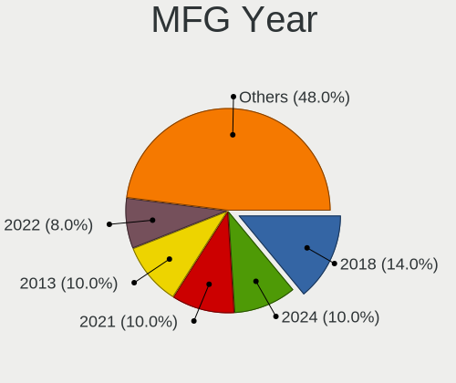
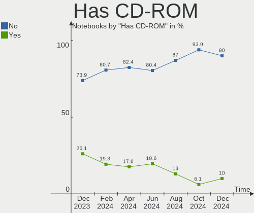
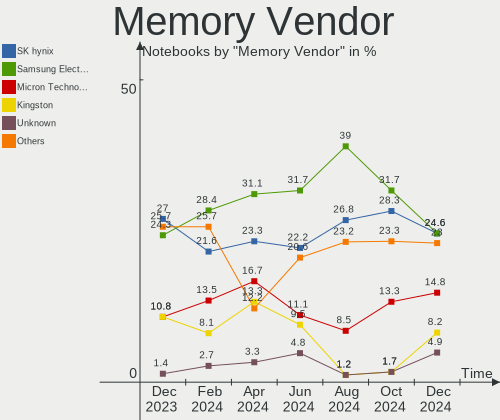

ArcoLinux Hardware Trends (Notebooks)
-------------------------------------

A project to identify most popular hardware characteristics and track their change
over time based on data collected by ArcoLinux users at https://Linux-Hardware.org.

Anyone can contribute to this report by the [hw-probe](https://github.com/linuxhw/hw-probe) tool:

    sudo -E hw-probe -all -upload

Full-feature report is available here: https://linux-hardware.org/?view=trends

Period: Mar, 2022.

Contents
--------

* [ System ](#system)
  - [ OS                       ](#os)
  - [ OS Family                ](#os-family)
  - [ Kernel                   ](#kernel)
  - [ Kernel Family            ](#kernel-family)
  - [ Kernel Major Ver.        ](#kernel-major-ver)
  - [ Arch                     ](#arch)
  - [ DE                       ](#de)
  - [ Display Server           ](#display-server)
  - [ Display Manager          ](#display-manager)
  - [ OS Lang                  ](#os-lang)
  - [ Boot Mode                ](#boot-mode)
  - [ Filesystem               ](#filesystem)
  - [ Part. scheme             ](#part-scheme)
  - [ Dual Boot with Linux/BSD ](#dual-boot-with-linuxbsd)
  - [ Dual Boot (Win)          ](#dual-boot-win)

* [ Board ](#board)
  - [ Vendor                   ](#vendor)
  - [ Model                    ](#model)
  - [ Model Family             ](#model-family)
  - [ MFG Year                 ](#mfg-year)
  - [ Form Factor              ](#form-factor)
  - [ Secure Boot              ](#secure-boot)
  - [ Coreboot                 ](#coreboot)
  - [ RAM Size                 ](#ram-size)
  - [ RAM Used                 ](#ram-used)
  - [ Total Drives             ](#total-drives)
  - [ Has CD-ROM               ](#has-cd-rom)
  - [ Has Ethernet             ](#has-ethernet)
  - [ Has WiFi                 ](#has-wifi)
  - [ Has Bluetooth            ](#has-bluetooth)

* [ Location ](#location)
  - [ Country                  ](#country)
  - [ City                     ](#city)

* [ Drives ](#drives)
  - [ Drive Vendor             ](#drive-vendor)
  - [ Drive Model              ](#drive-model)
  - [ HDD Vendor               ](#hdd-vendor)
  - [ SSD Vendor               ](#ssd-vendor)
  - [ Drive Kind               ](#drive-kind)
  - [ Drive Connector          ](#drive-connector)
  - [ Drive Size               ](#drive-size)
  - [ Space Total              ](#space-total)
  - [ Space Used               ](#space-used)
  - [ Malfunc. Drives          ](#malfunc-drives)
  - [ Malfunc. Drive Vendor    ](#malfunc-drive-vendor)
  - [ Malfunc. HDD Vendor      ](#malfunc-hdd-vendor)
  - [ Malfunc. Drive Kind      ](#malfunc-drive-kind)
  - [ Failed Drives            ](#failed-drives)
  - [ Failed Drive Vendor      ](#failed-drive-vendor)
  - [ Drive Status             ](#drive-status)

* [ Storage controller ](#storage-controller)
  - [ Storage Vendor           ](#storage-vendor)
  - [ Storage Model            ](#storage-model)
  - [ Storage Kind             ](#storage-kind)

* [ Processor ](#processor)
  - [ CPU Vendor               ](#cpu-vendor)
  - [ CPU Model                ](#cpu-model)
  - [ CPU Model Family         ](#cpu-model-family)
  - [ CPU Cores                ](#cpu-cores)
  - [ CPU Sockets              ](#cpu-sockets)
  - [ CPU Threads              ](#cpu-threads)
  - [ CPU Op-Modes             ](#cpu-op-modes)
  - [ CPU Microcode            ](#cpu-microcode)
  - [ CPU Microarch            ](#cpu-microarch)

* [ Graphics ](#graphics)
  - [ GPU Vendor               ](#gpu-vendor)
  - [ GPU Model                ](#gpu-model)
  - [ GPU Combo                ](#gpu-combo)
  - [ GPU Driver               ](#gpu-driver)
  - [ GPU Memory               ](#gpu-memory)

* [ Monitor ](#monitor)
  - [ Monitor Vendor           ](#monitor-vendor)
  - [ Monitor Model            ](#monitor-model)
  - [ Monitor Resolution       ](#monitor-resolution)
  - [ Monitor Diagonal         ](#monitor-diagonal)
  - [ Monitor Width            ](#monitor-width)
  - [ Aspect Ratio             ](#aspect-ratio)
  - [ Monitor Area             ](#monitor-area)
  - [ Pixel Density            ](#pixel-density)
  - [ Multiple Monitors        ](#multiple-monitors)

* [ Network ](#network)
  - [ Net Controller Vendor    ](#net-controller-vendor)
  - [ Net Controller Model     ](#net-controller-model)
  - [ Wireless Vendor          ](#wireless-vendor)
  - [ Wireless Model           ](#wireless-model)
  - [ Ethernet Vendor          ](#ethernet-vendor)
  - [ Ethernet Model           ](#ethernet-model)
  - [ Net Controller Kind      ](#net-controller-kind)
  - [ Used Controller          ](#used-controller)
  - [ NICs                     ](#nics)
  - [ IPv6                     ](#ipv6)

* [ Bluetooth ](#bluetooth)
  - [ Bluetooth Vendor         ](#bluetooth-vendor)
  - [ Bluetooth Model          ](#bluetooth-model)

* [ Sound ](#sound)
  - [ Sound Vendor             ](#sound-vendor)
  - [ Sound Model              ](#sound-model)

* [ Memory ](#memory)
  - [ Memory Vendor            ](#memory-vendor)
  - [ Memory Model             ](#memory-model)
  - [ Memory Kind              ](#memory-kind)
  - [ Memory Form Factor       ](#memory-form-factor)
  - [ Memory Size              ](#memory-size)
  - [ Memory Speed             ](#memory-speed)

* [ Printers & scanners ](#printers--scanners)
  - [ Printer Vendor           ](#printer-vendor)
  - [ Printer Model            ](#printer-model)
  - [ Scanner Vendor           ](#scanner-vendor)
  - [ Scanner Model            ](#scanner-model)

* [ Camera ](#camera)
  - [ Camera Vendor            ](#camera-vendor)
  - [ Camera Model             ](#camera-model)

* [ Security ](#security)
  - [ Fingerprint Vendor       ](#fingerprint-vendor)
  - [ Fingerprint Model        ](#fingerprint-model)
  - [ Chipcard Vendor          ](#chipcard-vendor)
  - [ Chipcard Model           ](#chipcard-model)

* [ Unsupported ](#unsupported)
  - [ Unsupported Devices      ](#unsupported-devices)
  - [ Unsupported Device Types ](#unsupported-device-types)

System
------

OS
--

Installed operating systems

| Name              | Notebooks | Percent |
|-------------------|-----------|---------|
| ArcoLinux Rolling | 22        | 88%     |
| ArcoLinux         | 3         | 12%     |

OS Family
---------

OS without a version

| Name      | Notebooks | Percent |
|-----------|-----------|---------|
| ArcoLinux | 25        | 100%    |

Kernel
------

Version of the Linux kernel

| Version            | Notebooks | Percent |
|--------------------|-----------|---------|
| 5.16.12-arch1-1    | 6         | 24%     |
| 5.16.16-arch1-1    | 4         | 16%     |
| 5.16.15-arch1-1    | 4         | 16%     |
| 5.16.14-arch1-1    | 3         | 12%     |
| 5.16.13-arch1-1    | 2         | 8%      |
| 5.17.1-arch1-1     | 1         | 4%      |
| 5.16.2-arch1-1     | 1         | 4%      |
| 5.16.13-zen1-1-zen | 1         | 4%      |
| 5.16.11-arch1-1    | 1         | 4%      |
| 5.15.11-arch2-1    | 1         | 4%      |
| 5.10.68-1-lts      | 1         | 4%      |

Kernel Family
-------------

Linux kernel without a distro release

| Version | Notebooks | Percent |
|---------|-----------|---------|
| 5.16.12 | 6         | 24%     |
| 5.16.16 | 4         | 16%     |
| 5.16.15 | 4         | 16%     |
| 5.16.14 | 3         | 12%     |
| 5.16.13 | 3         | 12%     |
| 5.17.1  | 1         | 4%      |
| 5.16.2  | 1         | 4%      |
| 5.16.11 | 1         | 4%      |
| 5.15.11 | 1         | 4%      |
| 5.10.68 | 1         | 4%      |

Kernel Major Ver.
-----------------

Linux kernel major version

| Version | Notebooks | Percent |
|---------|-----------|---------|
| 5.16    | 22        | 88%     |
| 5.17    | 1         | 4%      |
| 5.15    | 1         | 4%      |
| 5.10    | 1         | 4%      |

Arch
----

OS architecture (x86_64, i586, etc.)

| Name   | Notebooks | Percent |
|--------|-----------|---------|
| x86_64 | 25        | 100%    |

DE
--

Desktop Environment

| Name       | Notebooks | Percent |
|------------|-----------|---------|
| XFCE       | 9         | 36%     |
| KDE5       | 4         | 16%     |
| i3         | 2         | 8%      |
| Unknown    | 2         | 8%      |
| X-Cinnamon | 1         | 4%      |
| qtile      | 1         | 4%      |
| openbox    | 1         | 4%      |
| MATE       | 1         | 4%      |
| GNOME      | 1         | 4%      |
| dwm        | 1         | 4%      |
| bspwm      | 1         | 4%      |
| awesome    | 1         | 4%      |

Display Server
--------------

X11 or Wayland

| Name    | Notebooks | Percent |
|---------|-----------|---------|
| X11     | 22        | 88%     |
| Tty     | 2         | 8%      |
| Wayland | 1         | 4%      |

Display Manager
---------------

SDDM, LightDM, etc.

| Name    | Notebooks | Percent |
|---------|-----------|---------|
| SDDM    | 13        | 52%     |
| LightDM | 7         | 28%     |
| Unknown | 4         | 16%     |
| GDM     | 1         | 4%      |

OS Lang
-------

Language

| Lang    | Notebooks | Percent |
|---------|-----------|---------|
| en_US   | 14        | 56%     |
| tr_TR   | 1         | 4%      |
| pt_BR   | 1         | 4%      |
| it_IT   | 1         | 4%      |
| en_IN   | 1         | 4%      |
| en_IE   | 1         | 4%      |
| en_GB   | 1         | 4%      |
| en_DK   | 1         | 4%      |
| en_CA   | 1         | 4%      |
| en_AU   | 1         | 4%      |
| da_DK   | 1         | 4%      |
| Unknown | 1         | 4%      |

Boot Mode
---------

EFI or BIOS

| Mode | Notebooks | Percent |
|------|-----------|---------|
| EFI  | 20        | 80%     |
| BIOS | 5         | 20%     |

Filesystem
----------

Type of filesystem

| Type  | Notebooks | Percent |
|-------|-----------|---------|
| Ext4  | 22        | 88%     |
| Btrfs | 2         | 8%      |
| Xfs   | 1         | 4%      |

Part. scheme
------------

Scheme of partitioning

| Type    | Notebooks | Percent |
|---------|-----------|---------|
| GPT     | 21        | 84%     |
| MBR     | 2         | 8%      |
| Unknown | 2         | 8%      |

Dual Boot with Linux/BSD
------------------------

Hosting more than one Linux/BSD

| Dual boot | Notebooks | Percent |
|-----------|-----------|---------|
| No        | 20        | 80%     |
| Yes       | 5         | 20%     |

Dual Boot (Win)
---------------

Hosting Linux and Windows

| Dual boot | Notebooks | Percent |
|-----------|-----------|---------|
| No        | 17        | 68%     |
| Yes       | 8         | 32%     |

Board
-----

Vendor
------

Motherboard manufacturer

| Name                | Notebooks | Percent |
|---------------------|-----------|---------|
| Lenovo              | 9         | 36%     |
| Dell                | 6         | 24%     |
| Hewlett-Packard     | 2         | 8%      |
| ASUSTek Computer    | 2         | 8%      |
| System76            | 1         | 4%      |
| Sony                | 1         | 4%      |
| Samsung Electronics | 1         | 4%      |
| MSI                 | 1         | 4%      |
| HUAWEI              | 1         | 4%      |
| Acer                | 1         | 4%      |

Model
-----

Motherboard model

| Name                                     | Notebooks | Percent |
|------------------------------------------|-----------|---------|
| System76 Oryx Pro                        | 1         | 4%      |
| Sony VPCEH25FM                           | 1         | 4%      |
| Samsung 3570R/370R/470R/450R/510R/4450RV | 1         | 4%      |
| MSI GS66 Stealth 10SE                    | 1         | 4%      |
| Lenovo ThinkPad X260 20F60086MD          | 1         | 4%      |
| Lenovo ThinkPad X1 Nano Gen 1 20UN002PCK | 1         | 4%      |
| Lenovo ThinkPad T460s 20F9S02U00         | 1         | 4%      |
| Lenovo ThinkPad T420 4180MBM             | 1         | 4%      |
| Lenovo ThinkPad T14 Gen 2a 20XKCTO1WW    | 1         | 4%      |
| Lenovo ThinkBook 15 G2 ITL 20VE          | 1         | 4%      |
| Lenovo Legion 5 Pro 16ACH6H 82JQ         | 1         | 4%      |
| Lenovo IdeaPad Gaming 3 15IMH05 81Y4     | 1         | 4%      |
| Lenovo B550 20053                        | 1         | 4%      |
| HUAWEI KLVL-WXX9                         | 1         | 4%      |
| HP Laptop 15-dw0xxx                      | 1         | 4%      |
| HP Laptop 15-da0xxx                      | 1         | 4%      |
| Dell XPS 13 7390                         | 1         | 4%      |
| Dell Precision M4800                     | 1         | 4%      |
| Dell Precision 7540                      | 1         | 4%      |
| Dell Latitude E7240                      | 1         | 4%      |
| Dell Inspiron 7520                       | 1         | 4%      |
| Dell Inspiron 15 7000 Gaming             | 1         | 4%      |
| ASUS ROG Strix G513IC_G513IC             | 1         | 4%      |
| ASUS N550JK                              | 1         | 4%      |
| Acer Aspire A515-52G                     | 1         | 4%      |

Model Family
------------

Motherboard model prefix

| Name             | Notebooks | Percent |
|------------------|-----------|---------|
| Lenovo ThinkPad  | 5         | 20%     |
| HP Laptop        | 2         | 8%      |
| Dell Precision   | 2         | 8%      |
| Dell Inspiron    | 2         | 8%      |
| System76 Oryx    | 1         | 4%      |
| Sony VPCEH25FM   | 1         | 4%      |
| Samsung 3570R    | 1         | 4%      |
| MSI GS66         | 1         | 4%      |
| Lenovo ThinkBook | 1         | 4%      |
| Lenovo Legion    | 1         | 4%      |
| Lenovo IdeaPad   | 1         | 4%      |
| Lenovo B550      | 1         | 4%      |
| HUAWEI KLVL-WXX9 | 1         | 4%      |
| Dell XPS         | 1         | 4%      |
| Dell Latitude    | 1         | 4%      |
| ASUS ROG         | 1         | 4%      |
| ASUS N550JK      | 1         | 4%      |
| Acer Aspire      | 1         | 4%      |

MFG Year
--------

Motherboard manufacture year

| Year | Notebooks | Percent |
|------|-----------|---------|
| 2020 | 5         | 20%     |
| 2019 | 4         | 16%     |
| 2021 | 3         | 12%     |
| 2013 | 3         | 12%     |
| 2018 | 2         | 8%      |
| 2016 | 2         | 8%      |
| 2011 | 2         | 8%      |
| 2017 | 1         | 4%      |
| 2014 | 1         | 4%      |
| 2012 | 1         | 4%      |
| 2010 | 1         | 4%      |

Form Factor
-----------

Physical design of the computer

| Name     | Notebooks | Percent |
|----------|-----------|---------|
| Notebook | 25        | 100%    |

Secure Boot
-----------

Enabled or disabled

| State    | Notebooks | Percent |
|----------|-----------|---------|
| Disabled | 25        | 100%    |

Coreboot
--------

Have coreboot on board

| Used | Notebooks | Percent |
|------|-----------|---------|
| No   | 25        | 100%    |

RAM Size
--------

Total RAM memory

| Size in GB | Notebooks | Percent |
|------------|-----------|---------|
| 16.01-24.0 | 9         | 36%     |
| 4.01-8.0   | 7         | 28%     |
| 8.01-16.0  | 5         | 20%     |
| 32.01-64.0 | 2         | 8%      |
| 3.01-4.0   | 2         | 8%      |

RAM Used
--------

Used RAM memory

| Used GB   | Notebooks | Percent |
|-----------|-----------|---------|
| 2.01-3.0  | 11        | 44%     |
| 1.01-2.0  | 8         | 32%     |
| 4.01-8.0  | 2         | 8%      |
| 0.51-1.0  | 2         | 8%      |
| 3.01-4.0  | 1         | 4%      |
| 8.01-16.0 | 1         | 4%      |

Total Drives
------------

Number of drives on board

| Drives | Notebooks | Percent |
|--------|-----------|---------|
| 1      | 20        | 80%     |
| 2      | 4         | 16%     |
| 3      | 1         | 4%      |

Has CD-ROM
----------

Has CD-ROM on board

| Presented | Notebooks | Percent |
|-----------|-----------|---------|
| No        | 21        | 84%     |
| Yes       | 4         | 16%     |

Has Ethernet
------------

Has Ethernet on board

| Presented | Notebooks | Percent |
|-----------|-----------|---------|
| Yes       | 22        | 88%     |
| No        | 3         | 12%     |

Has WiFi
--------

Has WiFi module

| Presented | Notebooks | Percent |
|-----------|-----------|---------|
| Yes       | 25        | 100%    |

Has Bluetooth
-------------

Has Bluetooth module

| Presented | Notebooks | Percent |
|-----------|-----------|---------|
| Yes       | 22        | 88%     |
| No        | 3         | 12%     |

Location
--------

Country
-------

Geographic location (country)

| Country   | Notebooks | Percent |
|-----------|-----------|---------|
| USA       | 5         | 20%     |
| Italy     | 3         | 12%     |
| Denmark   | 2         | 8%      |
| UK        | 1         | 4%      |
| UAE       | 1         | 4%      |
| Turkey    | 1         | 4%      |
| Sweden    | 1         | 4%      |
| Iran      | 1         | 4%      |
| Indonesia | 1         | 4%      |
| India     | 1         | 4%      |
| Germany   | 1         | 4%      |
| France    | 1         | 4%      |
| Czechia   | 1         | 4%      |
| Croatia   | 1         | 4%      |
| Colombia  | 1         | 4%      |
| Canada    | 1         | 4%      |
| Brazil    | 1         | 4%      |
| Australia | 1         | 4%      |

City
----

Geographic location (city)

| City                | Notebooks | Percent |
|---------------------|-----------|---------|
| Zagreb              | 1         | 4%      |
| Tehran              | 1         | 4%      |
| Sydney              | 1         | 4%      |
| Surrey              | 1         | 4%      |
| St Helens           | 1         | 4%      |
| Purwokerto          | 1         | 4%      |
| Pardubice           | 1         | 4%      |
| Padova              | 1         | 4%      |
| Odense              | 1         | 4%      |
| Montesilvano Marina | 1         | 4%      |
| Minneapolis         | 1         | 4%      |
| Milan               | 1         | 4%      |
| Malmo               | 1         | 4%      |
| Le Relecq-Kerhuon   | 1         | 4%      |
| Houston             | 1         | 4%      |
| Houghton            | 1         | 4%      |
| Farrukhabad         | 1         | 4%      |
| Dubai               | 1         | 4%      |
| Copenhagen          | 1         | 4%      |
| Canoas              | 1         | 4%      |
| Brooklyn            | 1         | 4%      |
| Breitenbrunn        | 1         | 4%      |
| Bogotá             | 1         | 4%      |
| Antalya             | 1         | 4%      |
| Anna                | 1         | 4%      |

Drives
------

Drive Vendor
------------

Hard drive vendors

| Vendor              | Notebooks | Drives | Percent |
|---------------------|-----------|--------|---------|
| WDC                 | 6         | 7      | 18.75%  |
| Toshiba             | 5         | 5      | 15.63%  |
| Samsung Electronics | 5         | 5      | 15.63%  |
| SK Hynix            | 3         | 3      | 9.38%   |
| Kingston            | 3         | 3      | 9.38%   |
| Unknown             | 1         | 1      | 3.13%   |
| SSSTC               | 1         | 1      | 3.13%   |
| SPCC                | 1         | 1      | 3.13%   |
| Seagate             | 1         | 1      | 3.13%   |
| Micron Technology   | 1         | 1      | 3.13%   |
| Intel               | 1         | 1      | 3.13%   |
| Hitachi             | 1         | 1      | 3.13%   |
| HGST                | 1         | 1      | 3.13%   |
| Hewlett-Packard     | 1         | 1      | 3.13%   |
| Crucial             | 1         | 1      | 3.13%   |

Drive Model
-----------

Hard drive models

| Model                                  | Notebooks | Percent |
|----------------------------------------|-----------|---------|
| WDC WD10SPZX-08Z10 1TB                 | 2         | 6.06%   |
| WDC WDS500G2B0B-00YS70 500GB SSD       | 1         | 3.03%   |
| WDC WDS100T2G0A-00JH30 1TB SSD         | 1         | 3.03%   |
| WDC WD20SPZX-22UA7T0 2TB               | 1         | 3.03%   |
| WDC WD10JPVX-75JC3T0 1TB               | 1         | 3.03%   |
| WDC PC SN530 SDBPNPZ-512G-1032 512GB   | 1         | 3.03%   |
| Unknown APPSD  134GB                   | 1         | 3.03%   |
| Toshiba THNSNJ512GDNU 512GB SSD        | 1         | 3.03%   |
| Toshiba MQ04ABF100 1TB                 | 1         | 3.03%   |
| Toshiba MK3261GSY 320GB                | 1         | 3.03%   |
| Toshiba KXG6AZNV512G NVMe SED 512GB    | 1         | 3.03%   |
| Toshiba KBG40ZNT1T02 MEMORY 1TB        | 1         | 3.03%   |
| SSSTC CVB-8D128-HP 128GB SSD           | 1         | 3.03%   |
| SPCC Solid State Disk 120GB            | 1         | 3.03%   |
| SK Hynix SKHynix_HFS001TDE9X084N 1TB   | 1         | 3.03%   |
| SK Hynix SKHynix_HFM512GD3HX015N 512GB | 1         | 3.03%   |
| SK Hynix PC611 NVMe 512GB              | 1         | 3.03%   |
| Seagate ST1000LM024 HN-M101MBB 1TB     | 1         | 3.03%   |
| Samsung SSD PM851 mSATA 256GB          | 1         | 3.03%   |
| Samsung SSD 980 500GB                  | 1         | 3.03%   |
| Samsung SSD 970 EVO Plus 1TB           | 1         | 3.03%   |
| Samsung MZVLB512HBJQ-00000 512GB       | 1         | 3.03%   |
| Samsung MZALQ256HAJD-000L2 256GB       | 1         | 3.03%   |
| Micron 1100_MTFDDAV256TBN 256GB SSD    | 1         | 3.03%   |
| Kingston SUV400S37120G 120GB SSD       | 1         | 3.03%   |
| Kingston SA400S37480G 480GB SSD        | 1         | 3.03%   |
| Kingston SA400M8240G 240GB SSD         | 1         | 3.03%   |
| Intel SSDPEKNU512GZ 512GB              | 1         | 3.03%   |
| Hitachi HTS547564A9E384 640GB          | 1         | 3.03%   |
| HGST HTS545050A7E380 500GB             | 1         | 3.03%   |
| HP External HDD 1TB                    | 1         | 3.03%   |
| Crucial CT250P2SSD8 250GB              | 1         | 3.03%   |

HDD Vendor
----------

Hard disk drive vendors

| Vendor          | Notebooks | Drives | Percent |
|-----------------|-----------|--------|---------|
| WDC             | 4         | 4      | 40%     |
| Toshiba         | 2         | 2      | 20%     |
| Seagate         | 1         | 1      | 10%     |
| Hitachi         | 1         | 1      | 10%     |
| HGST            | 1         | 1      | 10%     |
| Hewlett-Packard | 1         | 1      | 10%     |

SSD Vendor
----------

Solid state drive vendors

| Vendor              | Notebooks | Drives | Percent |
|---------------------|-----------|--------|---------|
| Kingston            | 3         | 3      | 30%     |
| WDC                 | 2         | 2      | 20%     |
| Toshiba             | 1         | 1      | 10%     |
| SSSTC               | 1         | 1      | 10%     |
| SPCC                | 1         | 1      | 10%     |
| Samsung Electronics | 1         | 1      | 10%     |
| Micron Technology   | 1         | 1      | 10%     |

Drive Kind
----------

HDD or SSD

| Kind | Notebooks | Drives | Percent |
|------|-----------|--------|---------|
| NVMe | 11        | 12     | 34.38%  |
| SSD  | 10        | 10     | 31.25%  |
| HDD  | 10        | 10     | 31.25%  |
| MMC  | 1         | 1      | 3.13%   |

Drive Connector
---------------

SATA, SAS, NVMe, etc.

| Type | Notebooks | Drives | Percent |
|------|-----------|--------|---------|
| SATA | 16        | 19     | 55.17%  |
| NVMe | 11        | 12     | 37.93%  |
| SAS  | 1         | 1      | 3.45%   |
| MMC  | 1         | 1      | 3.45%   |

Drive Size
----------

Size of hard drive

| Size in TB | Notebooks | Drives | Percent |
|------------|-----------|--------|---------|
| 0.01-0.5   | 10        | 10     | 52.63%  |
| 0.51-1.0   | 8         | 9      | 42.11%  |
| 1.01-2.0   | 1         | 1      | 5.26%   |

Space Total
-----------

Amount of disk space available on the file system

| Size in GB | Notebooks | Percent |
|------------|-----------|---------|
| 251-500    | 8         | 32%     |
| 101-250    | 5         | 20%     |
| 501-1000   | 5         | 20%     |
| Unknown    | 4         | 16%     |
| 51-100     | 2         | 8%      |
| 1001-2000  | 1         | 4%      |

Space Used
----------

Amount of used disk space

| Used GB | Notebooks | Percent |
|---------|-----------|---------|
| 21-50   | 6         | 24%     |
| 101-250 | 6         | 24%     |
| 1-20    | 6         | 24%     |
| Unknown | 4         | 16%     |
| 51-100  | 2         | 8%      |
| 251-500 | 1         | 4%      |

Malfunc. Drives
---------------

Drive models with a malfunction

| Model                        | Notebooks | Drives | Percent |
|------------------------------|-----------|--------|---------|
| WDC WD10SPZX-08Z10 1TB       | 1         | 1      | 50%     |
| SSSTC CVB-8D128-HP 128GB SSD | 1         | 1      | 50%     |

Malfunc. Drive Vendor
---------------------

Vendors of faulty drives

| Vendor | Notebooks | Drives | Percent |
|--------|-----------|--------|---------|
| WDC    | 1         | 1      | 50%     |
| SSSTC  | 1         | 1      | 50%     |

Malfunc. HDD Vendor
-------------------

Vendors of faulty HDD drives

| Vendor | Notebooks | Drives | Percent |
|--------|-----------|--------|---------|
| WDC    | 1         | 1      | 100%    |

Malfunc. Drive Kind
-------------------

Kinds of faulty drives

| Kind | Notebooks | Drives | Percent |
|------|-----------|--------|---------|
| SSD  | 1         | 1      | 50%     |
| HDD  | 1         | 1      | 50%     |

Failed Drives
-------------

Failed drive models

Zero info for selected period =(

Failed Drive Vendor
-------------------

Failed drive vendors

Zero info for selected period =(

Drive Status
------------

Number of failed and malfunc. drives

| Status   | Notebooks | Drives | Percent |
|----------|-----------|--------|---------|
| Works    | 21        | 26     | 77.78%  |
| Detected | 4         | 5      | 14.81%  |
| Malfunc  | 2         | 2      | 7.41%   |

Storage controller
------------------

Storage Vendor
--------------

Storage controller vendors

| Vendor                       | Notebooks | Percent |
|------------------------------|-----------|---------|
| Intel                        | 19        | 61.29%  |
| Samsung Electronics          | 4         | 12.9%   |
| SK Hynix                     | 3         | 9.68%   |
| Toshiba America Info Systems | 1         | 3.23%   |
| Sandisk                      | 1         | 3.23%   |
| Micron/Crucial Technology    | 1         | 3.23%   |
| KIOXIA                       | 1         | 3.23%   |
| AMD                          | 1         | 3.23%   |

Storage Model
-------------

Storage controller models

| Model                                                                          | Notebooks | Percent |
|--------------------------------------------------------------------------------|-----------|---------|
| Intel 82801 Mobile SATA Controller [RAID mode]                                 | 5         | 16.13%  |
| SK Hynix Gold P31 SSD                                                          | 2         | 6.45%   |
| Samsung NVMe SSD Controller SM981/PM981/PM983                                  | 2         | 6.45%   |
| Samsung NVMe SSD Controller 980                                                | 2         | 6.45%   |
| Intel Sunrise Point-LP SATA Controller [AHCI mode]                             | 2         | 6.45%   |
| Intel Cannon Lake Mobile PCH SATA AHCI Controller                              | 2         | 6.45%   |
| Intel 7 Series Chipset Family 6-port SATA Controller [AHCI mode]               | 2         | 6.45%   |
| Intel 6 Series/C200 Series Chipset Family 6 port Mobile SATA AHCI Controller   | 2         | 6.45%   |
| Toshiba America Info Systems XG6 NVMe SSD Controller                           | 1         | 3.23%   |
| SK Hynix Non-Volatile memory controller                                        | 1         | 3.23%   |
| Sandisk WD Blue SN550 NVMe SSD                                                 | 1         | 3.23%   |
| Micron/Crucial P2 NVMe PCIe SSD                                                | 1         | 3.23%   |
| KIOXIA Non-Volatile memory controller                                          | 1         | 3.23%   |
| Intel Tiger Lake-LP SATA Controller [AHCI mode]                                | 1         | 3.23%   |
| Intel Non-Volatile memory controller                                           | 1         | 3.23%   |
| Intel Celeron/Pentium Silver Processor SATA Controller                         | 1         | 3.23%   |
| Intel 82801IBM/IEM (ICH9M/ICH9M-E) 4 port SATA Controller [AHCI mode]          | 1         | 3.23%   |
| Intel 8 Series/C220 Series Chipset Family 6-port SATA Controller 1 [AHCI mode] | 1         | 3.23%   |
| Intel 400 Series Chipset Family SATA AHCI Controller                           | 1         | 3.23%   |
| AMD FCH SATA Controller [AHCI mode]                                            | 1         | 3.23%   |

Storage Kind
------------

Kind of storage controller (IDE, SATA, NVMe, SAS, ...)

| Kind | Notebooks | Percent |
|------|-----------|---------|
| SATA | 14        | 46.67%  |
| NVMe | 11        | 36.67%  |
| RAID | 5         | 16.67%  |

Processor
---------

CPU Vendor
----------

Processor vendors

| Vendor | Notebooks | Percent |
|--------|-----------|---------|
| Intel  | 21        | 84%     |
| AMD    | 4         | 16%     |

CPU Model
---------

Processor models

| Model                                      | Notebooks | Percent |
|--------------------------------------------|-----------|---------|
| Intel Core i7-10750H CPU @ 2.60GHz         | 2         | 8%      |
| Intel Pentium Silver N5030 CPU @ 1.10GHz   | 1         | 4%      |
| Intel Core i7-9850H CPU @ 2.60GHz          | 1         | 4%      |
| Intel Core i7-9750H CPU @ 2.60GHz          | 1         | 4%      |
| Intel Core i7-7700HQ CPU @ 2.80GHz         | 1         | 4%      |
| Intel Core i7-6600U CPU @ 2.60GHz          | 1         | 4%      |
| Intel Core i7-6500U CPU @ 2.50GHz          | 1         | 4%      |
| Intel Core i7-4810MQ CPU @ 2.80GHz         | 1         | 4%      |
| Intel Core i7-4700HQ CPU @ 2.40GHz         | 1         | 4%      |
| Intel Core i7-10510U CPU @ 1.80GHz         | 1         | 4%      |
| Intel Core i5-8265U CPU @ 1.60GHz          | 1         | 4%      |
| Intel Core i5-8250U CPU @ 1.60GHz          | 1         | 4%      |
| Intel Core i5-4310U CPU @ 2.00GHz          | 1         | 4%      |
| Intel Core i5-3230M CPU @ 2.60GHz          | 1         | 4%      |
| Intel Core i5-3210M CPU @ 2.50GHz          | 1         | 4%      |
| Intel Core i5-2540M CPU @ 2.60GHz          | 1         | 4%      |
| Intel Core i3-2330M CPU @ 2.20GHz          | 1         | 4%      |
| Intel Core 2 Duo CPU T6570 @ 2.10GHz       | 1         | 4%      |
| Intel 11th Gen Core i7-1160G7 @ 1.20GHz    | 1         | 4%      |
| Intel 11th Gen Core i5-1135G7 @ 2.40GHz    | 1         | 4%      |
| AMD Ryzen 7 PRO 5850U with Radeon Graphics | 1         | 4%      |
| AMD Ryzen 7 5800H with Radeon Graphics     | 1         | 4%      |
| AMD Ryzen 7 4800H with Radeon Graphics     | 1         | 4%      |
| AMD Ryzen 5 4600H with Radeon Graphics     | 1         | 4%      |

CPU Model Family
----------------

Processor model prefix

| Model                | Notebooks | Percent |
|----------------------|-----------|---------|
| Intel Core i7        | 10        | 40%     |
| Intel Core i5        | 6         | 24%     |
| Other                | 2         | 8%      |
| AMD Ryzen 7          | 2         | 8%      |
| Intel Pentium Silver | 1         | 4%      |
| Intel Core i3        | 1         | 4%      |
| Intel Core 2 Duo     | 1         | 4%      |
| AMD Ryzen 7 PRO      | 1         | 4%      |
| AMD Ryzen 5          | 1         | 4%      |

CPU Cores
---------

Number of processor cores

| Number | Notebooks | Percent |
|--------|-----------|---------|
| 4      | 9         | 36%     |
| 2      | 8         | 32%     |
| 6      | 5         | 20%     |
| 8      | 3         | 12%     |

CPU Sockets
-----------

Number of sockets

| Number | Notebooks | Percent |
|--------|-----------|---------|
| 1      | 25        | 100%    |

CPU Threads
-----------

Threads per core (Hyper-Threading)

| Number | Notebooks | Percent |
|--------|-----------|---------|
| 2      | 23        | 92%     |
| 1      | 2         | 8%      |

CPU Op-Modes
------------

CPU Operation Modes (32-bit, 64-bit)

| Op mode        | Notebooks | Percent |
|----------------|-----------|---------|
| 32-bit, 64-bit | 25        | 100%    |

CPU Microcode
-------------

Microcode number

| Number     | Notebooks | Percent |
|------------|-----------|---------|
| Unknown    | 4         | 16%     |
| 0x806c1    | 2         | 8%      |
| 0x306c3    | 2         | 8%      |
| 0x206a7    | 2         | 8%      |
| 0x0a50000c | 2         | 8%      |
| 0xa0652    | 1         | 4%      |
| 0x906ed    | 1         | 4%      |
| 0x906ea    | 1         | 4%      |
| 0x906e9    | 1         | 4%      |
| 0x806ec    | 1         | 4%      |
| 0x806ea    | 1         | 4%      |
| 0x706a8    | 1         | 4%      |
| 0x406e3    | 1         | 4%      |
| 0x40651    | 1         | 4%      |
| 0x306a9    | 1         | 4%      |
| 0x1067a    | 1         | 4%      |
| 0x08600106 | 1         | 4%      |
| 0x08600104 | 1         | 4%      |

CPU Microarch
-------------

Microarchitecture

| Name          | Notebooks | Percent |
|---------------|-----------|---------|
| KabyLake      | 6         | 24%     |
| Haswell       | 3         | 12%     |
| Zen 3         | 2         | 8%      |
| Zen 2         | 2         | 8%      |
| TigerLake     | 2         | 8%      |
| Skylake       | 2         | 8%      |
| SandyBridge   | 2         | 8%      |
| IvyBridge     | 2         | 8%      |
| CometLake     | 2         | 8%      |
| Penryn        | 1         | 4%      |
| Goldmont plus | 1         | 4%      |

Graphics
--------

GPU Vendor
----------

Vendors of graphics cards

| Vendor | Notebooks | Percent |
|--------|-----------|---------|
| Intel  | 21        | 55.26%  |
| Nvidia | 10        | 26.32%  |
| AMD    | 7         | 18.42%  |

GPU Model
---------

Graphics card models

| Model                                                                     | Notebooks | Percent |
|---------------------------------------------------------------------------|-----------|---------|
| Nvidia TU106M [GeForce RTX 2060 Mobile]                                   | 2         | 5.26%   |
| Intel Skylake GT2 [HD Graphics 520]                                       | 2         | 5.26%   |
| Intel CometLake-H GT2 [UHD Graphics]                                      | 2         | 5.26%   |
| Intel CoffeeLake-H GT2 [UHD Graphics 630]                                 | 2         | 5.26%   |
| Intel 4th Gen Core Processor Integrated Graphics Controller               | 2         | 5.26%   |
| Intel 3rd Gen Core processor Graphics Controller                          | 2         | 5.26%   |
| Intel 2nd Generation Core Processor Family Integrated Graphics Controller | 2         | 5.26%   |
| AMD Renoir                                                                | 2         | 5.26%   |
| AMD Cezanne                                                               | 2         | 5.26%   |
| Nvidia TU117M [GeForce GTX 1650 Ti Mobile]                                | 1         | 2.63%   |
| Nvidia GP108M [GeForce MX150]                                             | 1         | 2.63%   |
| Nvidia GP107M [GeForce GTX 1050 Ti Mobile]                                | 1         | 2.63%   |
| Nvidia GM108M [GeForce MX110]                                             | 1         | 2.63%   |
| Nvidia GM107M [GeForce GTX 850M]                                          | 1         | 2.63%   |
| Nvidia GK106GLM [Quadro K2100M]                                           | 1         | 2.63%   |
| Nvidia GA107M [GeForce RTX 3050 Mobile]                                   | 1         | 2.63%   |
| Nvidia GA106M [GeForce RTX 3060 Mobile / Max-Q]                           | 1         | 2.63%   |
| Intel WhiskeyLake-U GT2 [UHD Graphics 620]                                | 1         | 2.63%   |
| Intel UHD Graphics 620                                                    | 1         | 2.63%   |
| Intel TigerLake-LP GT2 [Iris Xe Graphics]                                 | 1         | 2.63%   |
| Intel Tiger Lake Iris Xe Graphics                                         | 1         | 2.63%   |
| Intel Mobile 4 Series Chipset Integrated Graphics Controller              | 1         | 2.63%   |
| Intel HD Graphics 630                                                     | 1         | 2.63%   |
| Intel Haswell-ULT Integrated Graphics Controller                          | 1         | 2.63%   |
| Intel GeminiLake [UHD Graphics 605]                                       | 1         | 2.63%   |
| Intel CometLake-U GT2 [UHD Graphics]                                      | 1         | 2.63%   |
| AMD Mars [Radeon HD 8670A/8670M/8750M / R7 M370]                          | 1         | 2.63%   |
| AMD Lexa XT [Radeon PRO WX 3200]                                          | 1         | 2.63%   |
| AMD Chelsea LP [Radeon HD 7730M]                                          | 1         | 2.63%   |

GPU Combo
---------

Combinations of graphics cards

| Name           | Notebooks | Percent |
|----------------|-----------|---------|
| 1 x Intel      | 10        | 40%     |
| Intel + Nvidia | 8         | 32%     |
| Intel + AMD    | 3         | 12%     |
| AMD + Nvidia   | 2         | 8%      |
| 1 x AMD        | 2         | 8%      |

GPU Driver
----------

Free vs proprietary

| Driver      | Notebooks | Percent |
|-------------|-----------|---------|
| Free        | 18        | 72%     |
| Proprietary | 7         | 28%     |

GPU Memory
----------

Total video memory

| Size in GB | Notebooks | Percent |
|------------|-----------|---------|
| Unknown    | 15        | 60%     |
| 3.01-4.0   | 3         | 12%     |
| 1.01-2.0   | 3         | 12%     |
| 0.01-0.5   | 2         | 8%      |
| 5.01-6.0   | 1         | 4%      |
| 0.51-1.0   | 1         | 4%      |

Monitor
-------

Monitor Vendor
--------------

Monitor vendors

| Vendor                  | Notebooks | Percent |
|-------------------------|-----------|---------|
| BOE                     | 7         | 26.92%  |
| Chimei Innolux          | 5         | 19.23%  |
| LG Display              | 4         | 15.38%  |
| AU Optronics            | 3         | 11.54%  |
| Sharp                   | 2         | 7.69%   |
| CSO                     | 2         | 7.69%   |
| Samsung Electronics     | 1         | 3.85%   |
| Chi Mei Optoelectronics | 1         | 3.85%   |
| AOC                     | 1         | 3.85%   |

Monitor Model
-------------

Monitor models

| Model                                                                    | Notebooks | Percent |
|--------------------------------------------------------------------------|-----------|---------|
| Sharp LQ156M1JW03 SHP14C5 1920x1080 344x194mm 15.5-inch                  | 1         | 3.85%   |
| Sharp LCD Monitor SHP14AD 3840x2160 294x165mm 13.3-inch                  | 1         | 3.85%   |
| Samsung Electronics LCD Monitor SEC5448 1920x1080 344x194mm 15.5-inch    | 1         | 3.85%   |
| LG Display LCD Monitor LGD053F 1920x1080 344x194mm 15.5-inch             | 1         | 3.85%   |
| LG Display LCD Monitor LGD04FF 1920x1080 309x174mm 14.0-inch             | 1         | 3.85%   |
| LG Display LCD Monitor LGD046F 1920x1080 345x194mm 15.6-inch             | 1         | 3.85%   |
| LG Display LCD Monitor LGD0323 1920x1080 345x194mm 15.6-inch             | 1         | 3.85%   |
| CSO LCD Monitor CSO1609 2560x1600 345x215mm 16.0-inch                    | 1         | 3.85%   |
| CSO LCD Monitor CSO1303 2160x1350 280x175mm 13.0-inch                    | 1         | 3.85%   |
| Chimei Innolux P140ZKA-BZ1 CMN8C03 2160x1440 296x197mm 14.0-inch         | 1         | 3.85%   |
| Chimei Innolux LCD Monitor CMN15B8 1366x768 340x190mm 15.3-inch          | 1         | 3.85%   |
| Chimei Innolux LCD Monitor CMN15A9 1366x768 344x194mm 15.5-inch          | 1         | 3.85%   |
| Chimei Innolux LCD Monitor CMN1510 1920x1080 344x193mm 15.5-inch         | 1         | 3.85%   |
| Chimei Innolux LCD Monitor CMN1239 1920x1080 276x155mm 12.5-inch         | 1         | 3.85%   |
| Chi Mei Optoelectronics LCD Monitor CMO1571 1366x768 344x193mm 15.5-inch | 1         | 3.85%   |
| BOE LCD Monitor BOE09E0 1366x768 344x194mm 15.5-inch                     | 1         | 3.85%   |
| BOE LCD Monitor BOE090F 1920x1080 344x194mm 15.5-inch                    | 1         | 3.85%   |
| BOE LCD Monitor BOE08E8 1920x1080 344x194mm 15.5-inch                    | 1         | 3.85%   |
| BOE LCD Monitor BOE07DB 1920x1080 309x174mm 14.0-inch                    | 1         | 3.85%   |
| BOE LCD Monitor BOE07B6 1920x1080 382x215mm 17.3-inch                    | 1         | 3.85%   |
| BOE LCD Monitor BOE0700 1920x1080 344x194mm 15.5-inch                    | 1         | 3.85%   |
| BOE LCD Monitor BOE05DA 1366x768 277x156mm 12.5-inch                     | 1         | 3.85%   |
| AU Optronics LCD Monitor AUO70EC 1366x768 344x193mm 15.5-inch            | 1         | 3.85%   |
| AU Optronics LCD Monitor AUO2E8D 1920x1080 344x194mm 15.5-inch           | 1         | 3.85%   |
| AU Optronics LCD Monitor AUO213E 1600x900 309x174mm 14.0-inch            | 1         | 3.85%   |
| AOC 2460 AOC2460 1920x1080 531x299mm 24.0-inch                           | 1         | 3.85%   |

Monitor Resolution
------------------

Monitor screen resolution

| Resolution      | Notebooks | Percent |
|-----------------|-----------|---------|
| 1920x1080 (FHD) | 14        | 56%     |
| 1366x768 (WXGA) | 6         | 24%     |
| 3840x2160 (4K)  | 1         | 4%      |
| 2560x1600       | 1         | 4%      |
| 2160x1440       | 1         | 4%      |
| 2160x1350       | 1         | 4%      |
| 1600x900 (HD+)  | 1         | 4%      |

Monitor Diagonal
----------------

Diagonal size in inches

| Inches | Notebooks | Percent |
|--------|-----------|---------|
| 15     | 14        | 53.85%  |
| 14     | 4         | 15.38%  |
| 13     | 2         | 7.69%   |
| 12     | 2         | 7.69%   |
| 24     | 1         | 3.85%   |
| 18     | 1         | 3.85%   |
| 17     | 1         | 3.85%   |
| 16     | 1         | 3.85%   |

Monitor Width
-------------

Physical width

| Width in mm | Notebooks | Percent |
|-------------|-----------|---------|
| 301-350     | 18        | 69.23%  |
| 201-300     | 5         | 19.23%  |
| 501-600     | 1         | 3.85%   |
| 401-500     | 1         | 3.85%   |
| 351-400     | 1         | 3.85%   |

Aspect Ratio
------------

Proportional relationship between the width and the height

| Ratio | Notebooks | Percent |
|-------|-----------|---------|
| 16/9  | 22        | 84.62%  |
| 16/10 | 3         | 11.54%  |
| 3/2   | 1         | 3.85%   |

Monitor Area
------------

Area in inch²

| Area in inch² | Notebooks | Percent |
|----------------|-----------|---------|
| 101-110        | 14        | 53.85%  |
| 81-90          | 4         | 15.38%  |
| 71-80          | 2         | 7.69%   |
| 61-70          | 2         | 7.69%   |
| 251-300        | 1         | 3.85%   |
| 141-150        | 1         | 3.85%   |
| 121-130        | 1         | 3.85%   |
| 111-120        | 1         | 3.85%   |

Pixel Density
-------------

Pixels per inch

| Density       | Notebooks | Percent |
|---------------|-----------|---------|
| 121-160       | 14        | 53.85%  |
| 101-120       | 5         | 19.23%  |
| 161-240       | 4         | 15.38%  |
| 51-100        | 2         | 7.69%   |
| More than 240 | 1         | 3.85%   |

Multiple Monitors
-----------------

Total monitors connected

| Total | Notebooks | Percent |
|-------|-----------|---------|
| 1     | 24        | 96%     |
| 2     | 1         | 4%      |

Network
-------

Net Controller Vendor
---------------------

Controller vendors

| Vendor                | Notebooks | Percent |
|-----------------------|-----------|---------|
| Intel                 | 16        | 39.02%  |
| Realtek Semiconductor | 15        | 36.59%  |
| Qualcomm Atheros      | 3         | 7.32%   |
| MediaTek              | 2         | 4.88%   |
| Xiaomi                | 1         | 2.44%   |
| Samsung Electronics   | 1         | 2.44%   |
| Broadcom Limited      | 1         | 2.44%   |
| Broadcom              | 1         | 2.44%   |
| ASUSTek Computer      | 1         | 2.44%   |

Net Controller Model
--------------------

Controller models

| Model                                                             | Notebooks | Percent |
|-------------------------------------------------------------------|-----------|---------|
| Realtek RTL8111/8168/8411 PCI Express Gigabit Ethernet Controller | 14        | 28%     |
| Qualcomm Atheros AR9485 Wireless Network Adapter                  | 2         | 4%      |
| MEDIATEK MT7921 802.11ax PCI Express Wireless Network Adapter     | 2         | 4%      |
| Intel Wireless 8260                                               | 2         | 4%      |
| Intel Wi-Fi 6 AX201                                               | 2         | 4%      |
| Intel Wi-Fi 6 AX200                                               | 2         | 4%      |
| Intel Comet Lake PCH CNVi WiFi                                    | 2         | 4%      |
| Xiaomi Mi/Redmi series (RNDIS)                                    | 1         | 2%      |
| Samsung GT-I9070 (network tethering, USB debugging enabled)       | 1         | 2%      |
| Realtek RTL8852AE 802.11ax PCIe Wireless Network Adapter          | 1         | 2%      |
| Realtek RTL8822CE 802.11ac PCIe Wireless Network Adapter          | 1         | 2%      |
| Realtek RTL8821CE 802.11ac PCIe Wireless Network Adapter          | 1         | 2%      |
| Realtek RTL8723DE Wireless Network Adapter                        | 1         | 2%      |
| Qualcomm Atheros QCA9565 / AR9565 Wireless Network Adapter        | 1         | 2%      |
| MediaTek U FEEL                                                   | 1         | 2%      |
| Intel Wireless 3165                                               | 1         | 2%      |
| Intel Ethernet controller                                         | 1         | 2%      |
| Intel Ethernet Connection I219-V                                  | 1         | 2%      |
| Intel Ethernet Connection I219-LM                                 | 1         | 2%      |
| Intel Ethernet Connection I218-LM                                 | 1         | 2%      |
| Intel Ethernet Connection I217-LM                                 | 1         | 2%      |
| Intel Ethernet Connection (7) I219-LM                             | 1         | 2%      |
| Intel Centrino Wireless-N 1000 [Condor Peak]                      | 1         | 2%      |
| Intel Centrino Advanced-N 6235                                    | 1         | 2%      |
| Intel Centrino Advanced-N 6205 [Taylor Peak]                      | 1         | 2%      |
| Intel Cannon Point-LP CNVi [Wireless-AC]                          | 1         | 2%      |
| Intel Cannon Lake PCH CNVi WiFi                                   | 1         | 2%      |
| Intel 82579LM Gigabit Network Connection (Lewisville)             | 1         | 2%      |
| Broadcom NetLink BCM5906M Fast Ethernet PCI Express               | 1         | 2%      |
| Broadcom Limited BCM4352 802.11ac Wireless Network Adapter        | 1         | 2%      |
| ASUS 802.11ac NIC                                                 | 1         | 2%      |

Wireless Vendor
---------------

Wireless vendors

| Vendor                | Notebooks | Percent |
|-----------------------|-----------|---------|
| Intel                 | 14        | 56%     |
| Realtek Semiconductor | 4         | 16%     |
| Qualcomm Atheros      | 3         | 12%     |
| MEDIATEK              | 2         | 8%      |
| Broadcom Limited      | 1         | 4%      |
| ASUSTek Computer      | 1         | 4%      |

Wireless Model
--------------

Wireless models

| Model                                                         | Notebooks | Percent |
|---------------------------------------------------------------|-----------|---------|
| Qualcomm Atheros AR9485 Wireless Network Adapter              | 2         | 8%      |
| MEDIATEK MT7921 802.11ax PCI Express Wireless Network Adapter | 2         | 8%      |
| Intel Wireless 8260                                           | 2         | 8%      |
| Intel Wi-Fi 6 AX201                                           | 2         | 8%      |
| Intel Wi-Fi 6 AX200                                           | 2         | 8%      |
| Intel Comet Lake PCH CNVi WiFi                                | 2         | 8%      |
| Realtek RTL8852AE 802.11ax PCIe Wireless Network Adapter      | 1         | 4%      |
| Realtek RTL8822CE 802.11ac PCIe Wireless Network Adapter      | 1         | 4%      |
| Realtek RTL8821CE 802.11ac PCIe Wireless Network Adapter      | 1         | 4%      |
| Realtek RTL8723DE Wireless Network Adapter                    | 1         | 4%      |
| Qualcomm Atheros QCA9565 / AR9565 Wireless Network Adapter    | 1         | 4%      |
| Intel Wireless 3165                                           | 1         | 4%      |
| Intel Centrino Wireless-N 1000 [Condor Peak]                  | 1         | 4%      |
| Intel Centrino Advanced-N 6235                                | 1         | 4%      |
| Intel Centrino Advanced-N 6205 [Taylor Peak]                  | 1         | 4%      |
| Intel Cannon Point-LP CNVi [Wireless-AC]                      | 1         | 4%      |
| Intel Cannon Lake PCH CNVi WiFi                               | 1         | 4%      |
| Broadcom Limited BCM4352 802.11ac Wireless Network Adapter    | 1         | 4%      |
| ASUS 802.11ac NIC                                             | 1         | 4%      |

Ethernet Vendor
---------------

Ethernet vendors

| Vendor                | Notebooks | Percent |
|-----------------------|-----------|---------|
| Realtek Semiconductor | 14        | 56%     |
| Intel                 | 7         | 28%     |
| Xiaomi                | 1         | 4%      |
| Samsung Electronics   | 1         | 4%      |
| MediaTek              | 1         | 4%      |
| Broadcom              | 1         | 4%      |

Ethernet Model
--------------

Ethernet models

| Model                                                             | Notebooks | Percent |
|-------------------------------------------------------------------|-----------|---------|
| Realtek RTL8111/8168/8411 PCI Express Gigabit Ethernet Controller | 14        | 56%     |
| Xiaomi Mi/Redmi series (RNDIS)                                    | 1         | 4%      |
| Samsung GT-I9070 (network tethering, USB debugging enabled)       | 1         | 4%      |
| MediaTek U FEEL                                                   | 1         | 4%      |
| Intel Ethernet controller                                         | 1         | 4%      |
| Intel Ethernet Connection I219-V                                  | 1         | 4%      |
| Intel Ethernet Connection I219-LM                                 | 1         | 4%      |
| Intel Ethernet Connection I218-LM                                 | 1         | 4%      |
| Intel Ethernet Connection I217-LM                                 | 1         | 4%      |
| Intel Ethernet Connection (7) I219-LM                             | 1         | 4%      |
| Intel 82579LM Gigabit Network Connection (Lewisville)             | 1         | 4%      |
| Broadcom NetLink BCM5906M Fast Ethernet PCI Express               | 1         | 4%      |

Net Controller Kind
-------------------

Ethernet, WiFi or modem

| Kind     | Notebooks | Percent |
|----------|-----------|---------|
| WiFi     | 25        | 53.19%  |
| Ethernet | 22        | 46.81%  |

Used Controller
---------------

Currently used network controller

| Kind     | Notebooks | Percent |
|----------|-----------|---------|
| WiFi     | 24        | 88.89%  |
| Ethernet | 3         | 11.11%  |

NICs
----

Total network controllers on board

| Total | Notebooks | Percent |
|-------|-----------|---------|
| 2     | 20        | 80%     |
| 1     | 4         | 16%     |
| 3     | 1         | 4%      |

IPv6
----

IPv6 vs IPv4

| Used | Notebooks | Percent |
|------|-----------|---------|
| No   | 20        | 80%     |
| Yes  | 5         | 20%     |

Bluetooth
---------

Bluetooth Vendor
----------------

Controller vendors

| Vendor                          | Notebooks | Percent |
|---------------------------------|-----------|---------|
| Intel                           | 12        | 54.55%  |
| Realtek Semiconductor           | 3         | 13.64%  |
| IMC Networks                    | 2         | 9.09%   |
| Broadcom                        | 2         | 9.09%   |
| Realtek                         | 1         | 4.55%   |
| Qualcomm Atheros Communications | 1         | 4.55%   |
| Foxconn / Hon Hai               | 1         | 4.55%   |

Bluetooth Model
---------------

Controller models

| Model                                          | Notebooks | Percent |
|------------------------------------------------|-----------|---------|
| Intel AX201 Bluetooth                          | 4         | 18.18%  |
| Intel Bluetooth wireless interface             | 3         | 13.64%  |
| Realtek  Bluetooth 4.2 Adapter                 | 2         | 9.09%   |
| Intel Bluetooth 9460/9560 Jefferson Peak (JfP) | 2         | 9.09%   |
| Intel AX200 Bluetooth                          | 2         | 9.09%   |
| Realtek Bluetooth Radio                        | 1         | 4.55%   |
| Realtek Bluetooth Radio                        | 1         | 4.55%   |
| Qualcomm Atheros AR9462 Bluetooth              | 1         | 4.55%   |
| Intel Centrino Bluetooth Wireless Transceiver  | 1         | 4.55%   |
| IMC Networks Wireless_Device                   | 1         | 4.55%   |
| IMC Networks Bluetooth USB Host Controller     | 1         | 4.55%   |
| Foxconn / Hon Hai Wireless_Device              | 1         | 4.55%   |
| Broadcom BCM2046 Bluetooth Device              | 1         | 4.55%   |
| Broadcom BCM2045B (BDC-2.1)                    | 1         | 4.55%   |

Sound
-----

Sound Vendor
------------

Sound card vendors

| Vendor | Notebooks | Percent |
|--------|-----------|---------|
| Intel  | 21        | 63.64%  |
| Nvidia | 7         | 21.21%  |
| AMD    | 5         | 15.15%  |

Sound Model
-----------

Sound card models

| Model                                                                      | Notebooks | Percent |
|----------------------------------------------------------------------------|-----------|---------|
| AMD Family 17h/19h HD Audio Controller                                     | 4         | 10.26%  |
| Intel Sunrise Point-LP HD Audio                                            | 3         | 7.69%   |
| AMD Renoir Radeon High Definition Audio Controller                         | 3         | 7.69%   |
| Nvidia TU106 High Definition Audio Controller                              | 2         | 5.13%   |
| Nvidia Audio device                                                        | 2         | 5.13%   |
| Intel Xeon E3-1200 v3/4th Gen Core Processor HD Audio Controller           | 2         | 5.13%   |
| Intel Tiger Lake-LP Smart Sound Technology Audio Controller                | 2         | 5.13%   |
| Intel Comet Lake PCH cAVS                                                  | 2         | 5.13%   |
| Intel Cannon Lake PCH cAVS                                                 | 2         | 5.13%   |
| Intel 8 Series/C220 Series Chipset High Definition Audio Controller        | 2         | 5.13%   |
| Intel 7 Series/C216 Chipset Family High Definition Audio Controller        | 2         | 5.13%   |
| Intel 6 Series/C200 Series Chipset Family High Definition Audio Controller | 2         | 5.13%   |
| Nvidia TU107 GeForce GTX 1650 High Definition Audio Controller             | 1         | 2.56%   |
| Nvidia GP107GL High Definition Audio Controller                            | 1         | 2.56%   |
| Nvidia GK106 HDMI Audio Controller                                         | 1         | 2.56%   |
| Intel Haswell-ULT HD Audio Controller                                      | 1         | 2.56%   |
| Intel Comet Lake PCH-LP cAVS                                               | 1         | 2.56%   |
| Intel CM238 HD Audio Controller                                            | 1         | 2.56%   |
| Intel Celeron/Pentium Silver Processor High Definition Audio               | 1         | 2.56%   |
| Intel Cannon Point-LP High Definition Audio Controller                     | 1         | 2.56%   |
| Intel 82801I (ICH9 Family) HD Audio Controller                             | 1         | 2.56%   |
| Intel 8 Series HD Audio Controller                                         | 1         | 2.56%   |
| AMD Baffin HDMI/DP Audio [Radeon RX 550 640SP / RX 560/560X]               | 1         | 2.56%   |

Memory
------

Memory Vendor
-------------

Memory module vendors

| Vendor              | Notebooks | Percent |
|---------------------|-----------|---------|
| Samsung Electronics | 9         | 33.33%  |
| SK Hynix            | 7         | 25.93%  |
| Unknown             | 3         | 11.11%  |
| Micron Technology   | 3         | 11.11%  |
| Kingston            | 2         | 7.41%   |
| Ramaxel Technology  | 1         | 3.7%    |
| Goldkey             | 1         | 3.7%    |
| Crucial             | 1         | 3.7%    |

Memory Model
------------

Memory module models

| Model                                                            | Notebooks | Percent |
|------------------------------------------------------------------|-----------|---------|
| Unknown RAM Module 4GB SODIMM DDR3                               | 1         | 3.7%    |
| Unknown RAM Module 4GB SODIMM 800MT/s                            | 1         | 3.7%    |
| Unknown RAM Module 4GB Chip DDR4 2133MT/s                        | 1         | 3.7%    |
| SK Hynix RAM HMT41GS6BFR8A-PB 8192MB SODIMM DDR3 1600MT/s        | 1         | 3.7%    |
| SK Hynix RAM HMT351S6CFR8C-PB 4GB SODIMM DDR3 1600MT/s           | 1         | 3.7%    |
| SK Hynix RAM HMAA1GS6CJR6N-XN 8GB Row Of Chips DDR4 3200MT/s     | 1         | 3.7%    |
| SK Hynix RAM HMA851S6CJR6N-VK 4GB SODIMM DDR4 2667MT/s           | 1         | 3.7%    |
| SK Hynix RAM HMA82GS6MFR8N-TF 16GB SODIMM DDR4 2133MT/s          | 1         | 3.7%    |
| SK Hynix RAM HMA81GS6DJR8N-XN 8GB SODIMM DDR4 3200MT/s           | 1         | 3.7%    |
| SK Hynix RAM H9CCNNNCLGALAR-NVD 8GB Row Of Chips LPDDR3 2133MT/s | 1         | 3.7%    |
| Samsung RAM M471B5273DH0-CH9 4096MB SODIMM DDR3 1334MT/s         | 1         | 3.7%    |
| Samsung RAM M471B5173QH0-YK0 4096MB SODIMM DDR3 1600MT/s         | 1         | 3.7%    |
| Samsung RAM M471B5173DB0-YK0 4GB SODIMM DDR3 1600MT/s            | 1         | 3.7%    |
| Samsung RAM M471A5244CB0-CWE 4GB SODIMM DDR4 3200MT/s            | 1         | 3.7%    |
| Samsung RAM M471A2K43CB1-CRC 16384MB SODIMM DDR4 2667MT/s        | 1         | 3.7%    |
| Samsung RAM M471A1K43DB1-CTD 8192MB SODIMM DDR4 2667MT/s         | 1         | 3.7%    |
| Samsung RAM M471A1K43CB1-CTD 8192MB SODIMM DDR4 2667MT/s         | 1         | 3.7%    |
| Samsung RAM M471A1G44AB0-CWE 8GB SODIMM DDR4 3200MT/s            | 1         | 3.7%    |
| Samsung RAM M471A1G44AB0-CTD 8GB Row Of Chips DDR4 2667MT/s      | 1         | 3.7%    |
| Ramaxel RAM RMSA3320MJ78HAF-3200 8GB SODIMM DDR4 3200MT/s        | 1         | 3.7%    |
| Micron RAM Module 2GB Row Of Chips LPDDR4 4267MT/s               | 1         | 3.7%    |
| Micron RAM 8ATF1G64HZ-3G2J1 8GB SODIMM DDR4 3200MT/s             | 1         | 3.7%    |
| Micron RAM 4ATS2G64HZ-3G2B1 16GB SODIMM DDR4 3200MT/s            | 1         | 3.7%    |
| Kingston RAM LV32D4S2S8HD-8 8GB SODIMM DDR4 3200MT/s             | 1         | 3.7%    |
| Kingston RAM ACR16D3LS1KFG/4G 4GB SODIMM DDR3 1600MT/s           | 1         | 3.7%    |
| Goldkey RAM GKE800SO102408-2666A 8GB SODIMM DDR4 2667MT/s        | 1         | 3.7%    |
| Crucial RAM CT8G4SFRA266.M8FR 8GB SODIMM DDR4 2667MT/s           | 1         | 3.7%    |

Memory Kind
-----------

Memory module kinds

| Kind    | Notebooks | Percent |
|---------|-----------|---------|
| DDR4    | 14        | 60.87%  |
| DDR3    | 6         | 26.09%  |
| LPDDR4  | 1         | 4.35%   |
| LPDDR3  | 1         | 4.35%   |
| Unknown | 1         | 4.35%   |

Memory Form Factor
------------------

Physical design of the memory module

| Name         | Notebooks | Percent |
|--------------|-----------|---------|
| SODIMM       | 20        | 80%     |
| Row Of Chips | 4         | 16%     |
| Chip         | 1         | 4%      |

Memory Size
-----------

Memory module size

| Size  | Notebooks | Percent |
|-------|-----------|---------|
| 8192  | 12        | 50%     |
| 4096  | 8         | 33.33%  |
| 16384 | 3         | 12.5%   |
| 2048  | 1         | 4.17%   |

Memory Speed
------------

Memory module speed

| Speed   | Notebooks | Percent |
|---------|-----------|---------|
| 3200    | 7         | 29.17%  |
| 2667    | 6         | 25%     |
| 1600    | 5         | 20.83%  |
| 2133    | 2         | 8.33%   |
| 4267    | 1         | 4.17%   |
| 1334    | 1         | 4.17%   |
| 800     | 1         | 4.17%   |
| Unknown | 1         | 4.17%   |

Printers & scanners
-------------------

Printer Vendor
--------------

Printer device vendors

Zero info for selected period =(

Printer Model
-------------

Printer device models

Zero info for selected period =(

Scanner Vendor
--------------

Scanner device vendors

Zero info for selected period =(

Scanner Model
-------------

Scanner device models

Zero info for selected period =(

Camera
------

Camera Vendor
-------------

Camera device vendors

| Vendor                      | Notebooks | Percent |
|-----------------------------|-----------|---------|
| Chicony Electronics         | 6         | 23.08%  |
| Microdia                    | 5         | 19.23%  |
| IMC Networks                | 4         | 15.38%  |
| Acer                        | 4         | 15.38%  |
| Samsung Electronics         | 3         | 11.54%  |
| Silicon Motion              | 1         | 3.85%   |
| Realtek Semiconductor       | 1         | 3.85%   |
| Quanta                      | 1         | 3.85%   |
| Luxvisions Innotech Limited | 1         | 3.85%   |

Camera Model
------------

Camera device models

| Model                                               | Notebooks | Percent |
|-----------------------------------------------------|-----------|---------|
| Chicony Integrated Camera                           | 4         | 15.38%  |
| Samsung Galaxy series, misc. (MTP mode)             | 3         | 11.54%  |
| Microdia Integrated_Webcam_HD                       | 2         | 7.69%   |
| IMC Networks Integrated Camera                      | 2         | 7.69%   |
| Acer Integrated Camera                              | 2         | 7.69%   |
| Silicon Motion Lenovo EasyCamera                    | 1         | 3.85%   |
| Realtek Integrated_Webcam_HD                        | 1         | 3.85%   |
| Quanta HD Webcam                                    | 1         | 3.85%   |
| Microdia Webcam SC-10HDD12636P                      | 1         | 3.85%   |
| Microdia Laptop_Integrated_Webcam_HD                | 1         | 3.85%   |
| Microdia Integrated Webcam                          | 1         | 3.85%   |
| Luxvisions Innotech Limited HP TrueVision HD Camera | 1         | 3.85%   |
| IMC Networks USB2.0 UVC HD Webcam                   | 1         | 3.85%   |
| IMC Networks HD Camera                              | 1         | 3.85%   |
| Chicony Sony Visual Communication Camera            | 1         | 3.85%   |
| Chicony HP TrueVision HD Camera                     | 1         | 3.85%   |
| Acer HD Camera                                      | 1         | 3.85%   |
| Acer BisonCam,NB Pro                                | 1         | 3.85%   |

Security
--------

Fingerprint Vendor
------------------

Fingerprint sensor vendors

| Vendor                     | Notebooks | Percent |
|----------------------------|-----------|---------|
| Validity Sensors           | 2         | 40%     |
| Synaptics                  | 2         | 40%     |
| Shenzhen Goodix Technology | 1         | 20%     |

Fingerprint Model
-----------------

Fingerprint sensor models

| Model                                             | Notebooks | Percent |
|---------------------------------------------------|-----------|---------|
| Validity Sensors VFS7500 Touch Fingerprint Sensor | 1         | 20%     |
| Validity Sensors VFS 5011 fingerprint sensor      | 1         | 20%     |
| Synaptics Prometheus MIS Touch Fingerprint Reader | 1         | 20%     |
| Shenzhen Goodix  Fingerprint Device               | 1         | 20%     |
| Unknown                                           | 1         | 20%     |

Chipcard Vendor
---------------

Chipcard module vendors

| Vendor      | Notebooks | Percent |
|-------------|-----------|---------|
| Broadcom    | 2         | 50%     |
| Alcor Micro | 2         | 50%     |

Chipcard Model
--------------

Chipcard module models

| Model                                          | Notebooks | Percent |
|------------------------------------------------|-----------|---------|
| Alcor Micro AU9540 Smartcard Reader            | 2         | 50%     |
| Broadcom BCM5880 Secure Applications Processor | 1         | 25%     |
| Broadcom 58200                                 | 1         | 25%     |

Unsupported
-----------

Unsupported Devices
-------------------

Total unsupported devices on board

| Total | Notebooks | Percent |
|-------|-----------|---------|
| 0     | 15        | 60%     |
| 1     | 5         | 20%     |
| 2     | 3         | 12%     |
| 3     | 2         | 8%      |

Unsupported Device Types
------------------------

Types of unsupported devices

| Type                  | Notebooks | Percent |
|-----------------------|-----------|---------|
| Fingerprint reader    | 5         | 29.41%  |
| Chipcard              | 4         | 23.53%  |
| Camera                | 4         | 23.53%  |
| Network               | 1         | 5.88%   |
| Net/wireless          | 1         | 5.88%   |
| Multimedia controller | 1         | 5.88%   |
| Graphics card         | 1         | 5.88%   |

