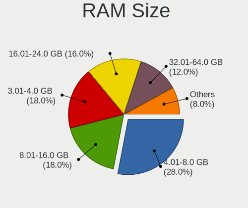
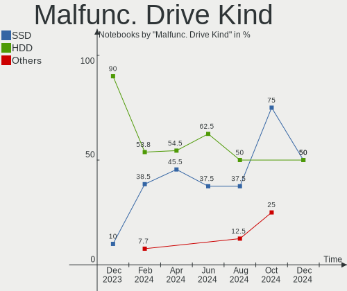

ArcoLinux Hardware Trends (Notebooks)
-------------------------------------

A project to identify most popular hardware characteristics and track their change
over time based on data collected by ArcoLinux users at https://Linux-Hardware.org.

Anyone can contribute to this report by the [hw-probe](https://github.com/linuxhw/hw-probe) tool:

    sudo -E hw-probe -all -upload

Full-feature report is available here: https://linux-hardware.org/?view=trends&formfactor=notebook

Period: Sep, 2021.

Contents
--------

* [ System ](#system)
  - [ OS                       ](#os)
  - [ OS Family                ](#os-family)
  - [ Kernel                   ](#kernel)
  - [ Kernel Family            ](#kernel-family)
  - [ Kernel Major Ver.        ](#kernel-major-ver)
  - [ Arch                     ](#arch)
  - [ DE                       ](#de)
  - [ Display Server           ](#display-server)
  - [ Display Manager          ](#display-manager)
  - [ OS Lang                  ](#os-lang)
  - [ Boot Mode                ](#boot-mode)
  - [ Filesystem               ](#filesystem)
  - [ Part. scheme             ](#part-scheme)
  - [ Dual Boot with Linux/BSD ](#dual-boot-with-linuxbsd)
  - [ Dual Boot (Win)          ](#dual-boot-win)

* [ Board ](#board)
  - [ Vendor                   ](#vendor)
  - [ Model                    ](#model)
  - [ Model Family             ](#model-family)
  - [ MFG Year                 ](#mfg-year)
  - [ Form Factor              ](#form-factor)
  - [ Secure Boot              ](#secure-boot)
  - [ Coreboot                 ](#coreboot)
  - [ RAM Size                 ](#ram-size)
  - [ RAM Used                 ](#ram-used)
  - [ Total Drives             ](#total-drives)
  - [ Has CD-ROM               ](#has-cd-rom)
  - [ Has Ethernet             ](#has-ethernet)
  - [ Has WiFi                 ](#has-wifi)
  - [ Has Bluetooth            ](#has-bluetooth)

* [ Location ](#location)
  - [ Country                  ](#country)
  - [ City                     ](#city)

* [ Drives ](#drives)
  - [ Drive Vendor             ](#drive-vendor)
  - [ Drive Model              ](#drive-model)
  - [ HDD Vendor               ](#hdd-vendor)
  - [ SSD Vendor               ](#ssd-vendor)
  - [ Drive Kind               ](#drive-kind)
  - [ Drive Connector          ](#drive-connector)
  - [ Drive Size               ](#drive-size)
  - [ Space Total              ](#space-total)
  - [ Space Used               ](#space-used)
  - [ Malfunc. Drives          ](#malfunc-drives)
  - [ Malfunc. Drive Vendor    ](#malfunc-drive-vendor)
  - [ Malfunc. HDD Vendor      ](#malfunc-hdd-vendor)
  - [ Malfunc. Drive Kind      ](#malfunc-drive-kind)
  - [ Failed Drives            ](#failed-drives)
  - [ Failed Drive Vendor      ](#failed-drive-vendor)
  - [ Drive Status             ](#drive-status)

* [ Storage controller ](#storage-controller)
  - [ Storage Vendor           ](#storage-vendor)
  - [ Storage Model            ](#storage-model)
  - [ Storage Kind             ](#storage-kind)

* [ Processor ](#processor)
  - [ CPU Vendor               ](#cpu-vendor)
  - [ CPU Model                ](#cpu-model)
  - [ CPU Model Family         ](#cpu-model-family)
  - [ CPU Cores                ](#cpu-cores)
  - [ CPU Sockets              ](#cpu-sockets)
  - [ CPU Threads              ](#cpu-threads)
  - [ CPU Op-Modes             ](#cpu-op-modes)
  - [ CPU Microcode            ](#cpu-microcode)
  - [ CPU Microarch            ](#cpu-microarch)

* [ Graphics ](#graphics)
  - [ GPU Vendor               ](#gpu-vendor)
  - [ GPU Model                ](#gpu-model)
  - [ GPU Combo                ](#gpu-combo)
  - [ GPU Driver               ](#gpu-driver)
  - [ GPU Memory               ](#gpu-memory)

* [ Monitor ](#monitor)
  - [ Monitor Vendor           ](#monitor-vendor)
  - [ Monitor Model            ](#monitor-model)
  - [ Monitor Resolution       ](#monitor-resolution)
  - [ Monitor Diagonal         ](#monitor-diagonal)
  - [ Monitor Width            ](#monitor-width)
  - [ Aspect Ratio             ](#aspect-ratio)
  - [ Monitor Area             ](#monitor-area)
  - [ Pixel Density            ](#pixel-density)
  - [ Multiple Monitors        ](#multiple-monitors)

* [ Network ](#network)
  - [ Net Controller Vendor    ](#net-controller-vendor)
  - [ Net Controller Model     ](#net-controller-model)
  - [ Wireless Vendor          ](#wireless-vendor)
  - [ Wireless Model           ](#wireless-model)
  - [ Ethernet Vendor          ](#ethernet-vendor)
  - [ Ethernet Model           ](#ethernet-model)
  - [ Net Controller Kind      ](#net-controller-kind)
  - [ Used Controller          ](#used-controller)
  - [ NICs                     ](#nics)
  - [ IPv6                     ](#ipv6)

* [ Bluetooth ](#bluetooth)
  - [ Bluetooth Vendor         ](#bluetooth-vendor)
  - [ Bluetooth Model          ](#bluetooth-model)

* [ Sound ](#sound)
  - [ Sound Vendor             ](#sound-vendor)
  - [ Sound Model              ](#sound-model)

* [ Memory ](#memory)
  - [ Memory Vendor            ](#memory-vendor)
  - [ Memory Model             ](#memory-model)
  - [ Memory Kind              ](#memory-kind)
  - [ Memory Form Factor       ](#memory-form-factor)
  - [ Memory Size              ](#memory-size)
  - [ Memory Speed             ](#memory-speed)

* [ Printers & scanners ](#printers--scanners)
  - [ Printer Vendor           ](#printer-vendor)
  - [ Printer Model            ](#printer-model)
  - [ Scanner Vendor           ](#scanner-vendor)
  - [ Scanner Model            ](#scanner-model)

* [ Camera ](#camera)
  - [ Camera Vendor            ](#camera-vendor)
  - [ Camera Model             ](#camera-model)

* [ Security ](#security)
  - [ Fingerprint Vendor       ](#fingerprint-vendor)
  - [ Fingerprint Model        ](#fingerprint-model)
  - [ Chipcard Vendor          ](#chipcard-vendor)
  - [ Chipcard Model           ](#chipcard-model)

* [ Unsupported ](#unsupported)
  - [ Unsupported Devices      ](#unsupported-devices)
  - [ Unsupported Device Types ](#unsupported-device-types)

System
------

OS
--

Installed operating systems

| Name              | Notebooks | Percent |
|-------------------|-----------|---------|
| ArcoLinux Rolling | 43        | 97.73%  |
| ArcoLinux         | 1         | 2.27%   |

OS Family
---------

OS without a version

| Name      | Notebooks | Percent |
|-----------|-----------|---------|
| ArcoLinux | 44        | 100%    |

Kernel
------

Version of the Linux kernel

| Version                 | Notebooks | Percent |
|-------------------------|-----------|---------|
| 5.13.13-arch1-1         | 11        | 25%     |
| 5.14.7-arch1-1          | 5         | 11.36%  |
| 5.14.5-arch1-1          | 4         | 9.09%   |
| 5.14.6-arch1-1          | 2         | 4.55%   |
| 5.14.2-arch1-2          | 2         | 4.55%   |
| 5.13.8-arch1-1          | 2         | 4.55%   |
| 5.10.62-1-lts           | 2         | 4.55%   |
| 5.10.61-1-lts           | 2         | 4.55%   |
| 5.10.60-1-lts           | 2         | 4.55%   |
| 5.14.8-arch1-1          | 1         | 2.27%   |
| 5.14.6-xanmod1-cacule-1 | 1         | 2.27%   |
| 5.14.5-zen2-1-zen       | 1         | 2.27%   |
| 5.14.3-arch1-1          | 1         | 2.27%   |
| 5.14.2-zen1-2-zen       | 1         | 2.27%   |
| 5.13.9-arch1-1          | 1         | 2.27%   |
| 5.12.13-arch1-2         | 1         | 2.27%   |
| 5.10.69-1-lts           | 1         | 2.27%   |
| 5.10.68-1-lts           | 1         | 2.27%   |
| 5.10.67-1-lts           | 1         | 2.27%   |
| 5.10.64-1-lts           | 1         | 2.27%   |
| 5.10.63-1-lts           | 1         | 2.27%   |

Kernel Family
-------------

Linux kernel without a distro release

| Version | Notebooks | Percent |
|---------|-----------|---------|
| 5.13.13 | 11        | 25%     |
| 5.14.7  | 5         | 11.36%  |
| 5.14.5  | 5         | 11.36%  |
| 5.14.6  | 3         | 6.82%   |
| 5.14.2  | 3         | 6.82%   |
| 5.13.8  | 2         | 4.55%   |
| 5.10.62 | 2         | 4.55%   |
| 5.10.61 | 2         | 4.55%   |
| 5.10.60 | 2         | 4.55%   |
| 5.14.8  | 1         | 2.27%   |
| 5.14.3  | 1         | 2.27%   |
| 5.13.9  | 1         | 2.27%   |
| 5.12.13 | 1         | 2.27%   |
| 5.10.69 | 1         | 2.27%   |
| 5.10.68 | 1         | 2.27%   |
| 5.10.67 | 1         | 2.27%   |
| 5.10.64 | 1         | 2.27%   |
| 5.10.63 | 1         | 2.27%   |

Kernel Major Ver.
-----------------

Linux kernel major version

| Version | Notebooks | Percent |
|---------|-----------|---------|
| 5.14    | 18        | 40.91%  |
| 5.13    | 14        | 31.82%  |
| 5.10    | 11        | 25%     |
| 5.12    | 1         | 2.27%   |

Arch
----

OS architecture (x86_64, i586, etc.)

| Name   | Notebooks | Percent |
|--------|-----------|---------|
| x86_64 | 44        | 100%    |

DE
--

Desktop Environment

| Name           | Notebooks | Percent |
|----------------|-----------|---------|
| XFCE           | 16        | 36.36%  |
| KDE5           | 9         | 20.45%  |
| i3             | 6         | 13.64%  |
| xmonad         | 4         | 9.09%   |
| awesome        | 3         | 6.82%   |
| X-Cinnamon     | 1         | 2.27%   |
| qtile          | 1         | 2.27%   |
| MATE           | 1         | 2.27%   |
| KDE            | 1         | 2.27%   |
| i3-with-shmlog | 1         | 2.27%   |
| bspwm          | 1         | 2.27%   |

Display Server
--------------

X11 or Wayland

| Name    | Notebooks | Percent |
|---------|-----------|---------|
| X11     | 42        | 95.45%  |
| Tty     | 1         | 2.27%   |
| Unknown | 1         | 2.27%   |

Display Manager
---------------

SDDM, LightDM, etc.

| Name    | Notebooks | Percent |
|---------|-----------|---------|
| SDDM    | 35        | 79.55%  |
| LightDM | 8         | 18.18%  |
| Unknown | 1         | 2.27%   |

OS Lang
-------

Language

| Lang  | Notebooks | Percent |
|-------|-----------|---------|
| en_US | 31        | 70.45%  |
| es_ES | 2         | 4.55%   |
| en_CA | 2         | 4.55%   |
| de_DE | 2         | 4.55%   |
| ru_RU | 1         | 2.27%   |
| pt_BR | 1         | 2.27%   |
| pl_PL | 1         | 2.27%   |
| nl_BE | 1         | 2.27%   |
| es_VE | 1         | 2.27%   |
| es_AR | 1         | 2.27%   |
| en_GB | 1         | 2.27%   |

Boot Mode
---------

EFI or BIOS

| Mode | Notebooks | Percent |
|------|-----------|---------|
| EFI  | 31        | 70.45%  |
| BIOS | 13        | 29.55%  |

Filesystem
----------

Type of filesystem

| Type    | Notebooks | Percent |
|---------|-----------|---------|
| Ext4    | 27        | 61.36%  |
| Btrfs   | 12        | 27.27%  |
| Overlay | 5         | 11.36%  |

Part. scheme
------------

Scheme of partitioning

| Type    | Notebooks | Percent |
|---------|-----------|---------|
| GPT     | 35        | 79.55%  |
| MBR     | 8         | 18.18%  |
| Unknown | 1         | 2.27%   |

Dual Boot with Linux/BSD
------------------------

Hosting more than one Linux/BSD

| Dual boot | Notebooks | Percent |
|-----------|-----------|---------|
| No        | 36        | 81.82%  |
| Yes       | 8         | 18.18%  |

Dual Boot (Win)
---------------

Hosting Linux and Windows

| Dual boot | Notebooks | Percent |
|-----------|-----------|---------|
| No        | 26        | 59.09%  |
| Yes       | 18        | 40.91%  |

Board
-----

Vendor
------

Motherboard manufacturer

| Name                | Notebooks | Percent |
|---------------------|-----------|---------|
| Lenovo              | 10        | 22.73%  |
| ASUSTek Computer    | 8         | 18.18%  |
| Hewlett-Packard     | 5         | 11.36%  |
| Dell                | 5         | 11.36%  |
| Acer                | 4         | 9.09%   |
| MSI                 | 2         | 4.55%   |
| Toshiba             | 1         | 2.27%   |
| Timi                | 1         | 2.27%   |
| Semp Toshiba        | 1         | 2.27%   |
| Samsung Electronics | 1         | 2.27%   |
| Pegatron            | 1         | 2.27%   |
| Monster             | 1         | 2.27%   |
| LG Electronics      | 1         | 2.27%   |
| Fujitsu             | 1         | 2.27%   |
| Chuwi               | 1         | 2.27%   |
| Apple               | 1         | 2.27%   |

Model
-----

Motherboard model

| Name                                   | Notebooks | Percent |
|----------------------------------------|-----------|---------|
| Toshiba QOSMIO X75-A                   | 1         | 2.27%   |
| Timi TM1607                            | 1         | 2.27%   |
| Semp Toshiba IS 1442                   | 1         | 2.27%   |
| Samsung QX311/QX411/QX412/QX511        | 1         | 2.27%   |
| Pegatron T14AF                         | 1         | 2.27%   |
| MSI GP76 Leopard 10UE                  | 1         | 2.27%   |
| MSI GF63 Thin 10SCSR                   | 1         | 2.27%   |
| Monster ABRA A5 V11.1                  | 1         | 2.27%   |
| LG RD590-K.ADJCRE6                     | 1         | 2.27%   |
| Lenovo ThinkPad W540 20BHS0LA00        | 1         | 2.27%   |
| Lenovo ThinkPad T490 20N3S19L00        | 1         | 2.27%   |
| Lenovo ThinkPad T480s 20L8S02301       | 1         | 2.27%   |
| Lenovo ThinkPad T470 W10DG 20JNS0QC0F  | 1         | 2.27%   |
| Lenovo ThinkPad T450s 20BWS07N00       | 1         | 2.27%   |
| Lenovo ThinkPad T450s 20BWS04K03       | 1         | 2.27%   |
| Lenovo ThinkPad P50 20ENCTO1WW         | 1         | 2.27%   |
| Lenovo ThinkPad E14 Gen 2 20T6000KMX   | 1         | 2.27%   |
| Lenovo Legion 5 Pro 16ACH6H 82JQ       | 1         | 2.27%   |
| Lenovo Legion 5 15ARH05 82B5           | 1         | 2.27%   |
| HP ZBook Studio G3                     | 1         | 2.27%   |
| HP Pavilion dv6                        | 1         | 2.27%   |
| HP Laptop 15q-bu0xx                    | 1         | 2.27%   |
| HP ENVY Laptop 17-cg0xxx               | 1         | 2.27%   |
| HP 250 G6 Notebook PC                  | 1         | 2.27%   |
| Fujitsu LIFEBOOK A357                  | 1         | 2.27%   |
| Dell XPS 15 9560                       | 1         | 2.27%   |
| Dell XPS 13 9300                       | 1         | 2.27%   |
| Dell Latitude E6420                    | 1         | 2.27%   |
| Dell Inspiron 5570                     | 1         | 2.27%   |
| Dell Inspiron 1545                     | 1         | 2.27%   |
| Chuwi GemiBook Pro                     | 1         | 2.27%   |
| ASUS X580VD                            | 1         | 2.27%   |
| ASUS X555QG                            | 1         | 2.27%   |
| ASUS X510UA                            | 1         | 2.27%   |
| ASUS X441SA                            | 1         | 2.27%   |
| ASUS VivoBook_ASUSLaptop X570ZD_X570ZD | 1         | 2.27%   |
| ASUS UX550VE                           | 1         | 2.27%   |
| ASUS UX303LN                           | 1         | 2.27%   |
| ASUS K53E                              | 1         | 2.27%   |
| Apple MacBookAir7,1                    | 1         | 2.27%   |
| Acer Swift SF114-32                    | 1         | 2.27%   |
| Acer Aspire E5-575G                    | 1         | 2.27%   |
| Acer Aspire 7750G                      | 1         | 2.27%   |
| Acer Aspire 5750                       | 1         | 2.27%   |

Model Family
------------

Motherboard model prefix

| Name               | Notebooks | Percent |
|--------------------|-----------|---------|
| Lenovo ThinkPad    | 8         | 18.18%  |
| Acer Aspire        | 3         | 6.82%   |
| Lenovo Legion      | 2         | 4.55%   |
| Dell XPS           | 2         | 4.55%   |
| Dell Inspiron      | 2         | 4.55%   |
| Toshiba QOSMIO     | 1         | 2.27%   |
| Timi TM1607        | 1         | 2.27%   |
| Semp Toshiba IS    | 1         | 2.27%   |
| Samsung QX311      | 1         | 2.27%   |
| Pegatron T14AF     | 1         | 2.27%   |
| MSI GP76           | 1         | 2.27%   |
| MSI GF63           | 1         | 2.27%   |
| Monster ABRA       | 1         | 2.27%   |
| LG RD590-K.ADJCRE6 | 1         | 2.27%   |
| HP ZBook           | 1         | 2.27%   |
| HP Pavilion        | 1         | 2.27%   |
| HP Laptop          | 1         | 2.27%   |
| HP ENVY            | 1         | 2.27%   |
| HP 250             | 1         | 2.27%   |
| Fujitsu LIFEBOOK   | 1         | 2.27%   |
| Dell Latitude      | 1         | 2.27%   |
| Chuwi GemiBook     | 1         | 2.27%   |
| ASUS X580VD        | 1         | 2.27%   |
| ASUS X555QG        | 1         | 2.27%   |
| ASUS X510UA        | 1         | 2.27%   |
| ASUS X441SA        | 1         | 2.27%   |
| ASUS VivoBook      | 1         | 2.27%   |
| ASUS UX550VE       | 1         | 2.27%   |
| ASUS UX303LN       | 1         | 2.27%   |
| ASUS K53E          | 1         | 2.27%   |
| Apple MacBookAir7  | 1         | 2.27%   |
| Acer Swift         | 1         | 2.27%   |

MFG Year
--------

Motherboard manufacture year

| Year | Notebooks | Percent |
|------|-----------|---------|
| 2020 | 9         | 20.45%  |
| 2021 | 7         | 15.91%  |
| 2019 | 7         | 15.91%  |
| 2018 | 4         | 9.09%   |
| 2014 | 4         | 9.09%   |
| 2011 | 4         | 9.09%   |
| 2017 | 3         | 6.82%   |
| 2012 | 2         | 4.55%   |
| 2009 | 2         | 4.55%   |
| 2016 | 1         | 2.27%   |
| 2010 | 1         | 2.27%   |

Form Factor
-----------

Physical design of the computer

| Name     | Notebooks | Percent |
|----------|-----------|---------|
| Notebook | 44        | 100%    |

Secure Boot
-----------

Enabled or disabled

| State    | Notebooks | Percent |
|----------|-----------|---------|
| Disabled | 44        | 100%    |

Coreboot
--------

Have coreboot on board

| Used | Notebooks | Percent |
|------|-----------|---------|
| No   | 44        | 100%    |

RAM Size
--------

Total RAM memory

| Size in GB  | Notebooks | Percent |
|-------------|-----------|---------|
| 16.01-24.0  | 13        | 29.55%  |
| 4.01-8.0    | 10        | 22.73%  |
| 8.01-16.0   | 9         | 20.45%  |
| 3.01-4.0    | 5         | 11.36%  |
| 32.01-64.0  | 2         | 4.55%   |
| 64.01-256.0 | 2         | 4.55%   |
| 1.01-2.0    | 2         | 4.55%   |
| 24.01-32.0  | 1         | 2.27%   |

RAM Used
--------

Used RAM memory

| Used GB    | Notebooks | Percent |
|------------|-----------|---------|
| 1.01-2.0   | 15        | 34.09%  |
| 2.01-3.0   | 11        | 25%     |
| 0.51-1.0   | 7         | 15.91%  |
| 3.01-4.0   | 6         | 13.64%  |
| 4.01-8.0   | 2         | 4.55%   |
| 16.01-24.0 | 2         | 4.55%   |
| 8.01-16.0  | 1         | 2.27%   |

Total Drives
------------

Number of drives on board

| Drives | Notebooks | Percent |
|--------|-----------|---------|
| 1      | 29        | 65.91%  |
| 2      | 13        | 29.55%  |
| 3      | 2         | 4.55%   |

Has CD-ROM
----------

Has CD-ROM on board

| Presented | Notebooks | Percent |
|-----------|-----------|---------|
| No        | 27        | 61.36%  |
| Yes       | 17        | 38.64%  |

Has Ethernet
------------

Has Ethernet on board

| Presented | Notebooks | Percent |
|-----------|-----------|---------|
| Yes       | 36        | 81.82%  |
| No        | 8         | 18.18%  |

Has WiFi
--------

Has WiFi module

| Presented | Notebooks | Percent |
|-----------|-----------|---------|
| Yes       | 44        | 100%    |

Has Bluetooth
-------------

Has Bluetooth module

| Presented | Notebooks | Percent |
|-----------|-----------|---------|
| Yes       | 35        | 79.55%  |
| No        | 9         | 20.45%  |

Location
--------

Country
-------

Geographic location (country)

| Country     | Notebooks | Percent |
|-------------|-----------|---------|
| USA         | 11        | 25%     |
| Germany     | 3         | 6.82%   |
| Canada      | 3         | 6.82%   |
| Spain       | 2         | 4.55%   |
| Netherlands | 2         | 4.55%   |
| India       | 2         | 4.55%   |
| Estonia     | 2         | 4.55%   |
| Venezuela   | 1         | 2.27%   |
| Ukraine     | 1         | 2.27%   |
| UK          | 1         | 2.27%   |
| Turkey      | 1         | 2.27%   |
| Switzerland | 1         | 2.27%   |
| Romania     | 1         | 2.27%   |
| Poland      | 1         | 2.27%   |
| Latvia      | 1         | 2.27%   |
| Italy       | 1         | 2.27%   |
| Ireland     | 1         | 2.27%   |
| Iran        | 1         | 2.27%   |
| Indonesia   | 1         | 2.27%   |
| France      | 1         | 2.27%   |
| Finland     | 1         | 2.27%   |
| Czechia     | 1         | 2.27%   |
| Bulgaria    | 1         | 2.27%   |
| Brazil      | 1         | 2.27%   |
| Belgium     | 1         | 2.27%   |
| Argentina   | 1         | 2.27%   |

City
----

Geographic location (city)

| City                   | Notebooks | Percent |
|------------------------|-----------|---------|
| Tallinn                | 2         | 4.55%   |
| Barneveld              | 2         | 4.55%   |
| Windsor                | 1         | 2.27%   |
| Trenton                | 1         | 2.27%   |
| Timi?™oara             | 1         | 2.27%   |
| Tehran                 | 1         | 2.27%   |
| Spokane                | 1         | 2.27%   |
| Sofia                  | 1         | 2.27%   |
| Seville                | 1         | 2.27%   |
| Scottsdale             | 1         | 2.27%   |
| S??o Bernardo do Campo | 1         | 2.27%   |
| Riga                   | 1         | 2.27%   |
| Plano                  | 1         | 2.27%   |
| Oulu                   | 1         | 2.27%   |
| Nuneaton               | 1         | 2.27%   |
| North Stonington       | 1         | 2.27%   |
| Naples                 | 1         | 2.27%   |
| Mys?‚owice             | 1         | 2.27%   |
| Milan                  | 1         | 2.27%   |
| Maracaibo              | 1         | 2.27%   |
| Lancaster              | 1         | 2.27%   |
| Kassel                 | 1         | 2.27%   |
| Hradec Kr??lov?©       | 1         | 2.27%   |
| Edmonton               | 1         | 2.27%   |
| Durango                | 1         | 2.27%   |
| Dublin                 | 1         | 2.27%   |
| Dortmund               | 1         | 2.27%   |
| Dnipropetrovsk         | 1         | 2.27%   |
| Denton                 | 1         | 2.27%   |
| Denpasar               | 1         | 2.27%   |
| Delhi                  | 1         | 2.27%   |
| Deer Park              | 1         | 2.27%   |
| D??sseldorf            | 1         | 2.27%   |
| Dartmouth              | 1         | 2.27%   |
| Chicago                | 1         | 2.27%   |
| C??rdoba               | 1         | 2.27%   |
| Bruges                 | 1         | 2.27%   |
| Bengaluru              | 1         | 2.27%   |
| Argenteuil             | 1         | 2.27%   |
| Ankara                 | 1         | 2.27%   |
| Affoltern am Albis     | 1         | 2.27%   |
| A Coru?±a              | 1         | 2.27%   |

Drives
------

Drive Vendor
------------

Hard drive vendors

| Vendor              | Notebooks | Drives | Percent |
|---------------------|-----------|--------|---------|
| WDC                 | 10        | 10     | 18.18%  |
| Seagate             | 8         | 9      | 14.55%  |
| Samsung Electronics | 8         | 9      | 14.55%  |
| Toshiba             | 7         | 8      | 12.73%  |
| SanDisk             | 3         | 3      | 5.45%   |
| Crucial             | 3         | 3      | 5.45%   |
| SK Hynix            | 2         | 2      | 3.64%   |
| Micron Technology   | 2         | 2      | 3.64%   |
| Corsair             | 2         | 2      | 3.64%   |
| W800S               | 1         | 1      | 1.82%   |
| Unknown             | 1         | 1      | 1.82%   |
| Transcend           | 1         | 1      | 1.82%   |
| Lexar               | 1         | 1      | 1.82%   |
| Lenovo              | 1         | 1      | 1.82%   |
| KIOXIA              | 1         | 1      | 1.82%   |
| Intel               | 1         | 1      | 1.82%   |
| Hitachi             | 1         | 1      | 1.82%   |
| GOODRAM             | 1         | 1      | 1.82%   |
| Apple               | 1         | 1      | 1.82%   |

Drive Model
-----------

Hard drive models

| Model                                     | Notebooks | Percent |
|-------------------------------------------|-----------|---------|
| Seagate ST1000LM035-1RK172 1TB            | 3         | 5.17%   |
| Toshiba MQ04ABF100 1TB                    | 2         | 3.45%   |
| WDC WDS500G2B0B-00YS70 500GB SSD          | 1         | 1.72%   |
| WDC WDS250G2B0C-00PXH0 250GB              | 1         | 1.72%   |
| WDC WDS100T2B0A-00SM50 1TB SSD            | 1         | 1.72%   |
| WDC WD6400BEVT-60A0RT0 640GB              | 1         | 1.72%   |
| WDC WD10SPZX-21Z10T0 1TB                  | 1         | 1.72%   |
| WDC WD10SPSX-60A6WT0 1TB                  | 1         | 1.72%   |
| WDC WD10JPVX-60JC3T1 1TB                  | 1         | 1.72%   |
| WDC PC SN730 SDBPNTY-512G-1032 512GB      | 1         | 1.72%   |
| WDC PC SN530 SDBPNPZ-1T00-1032 1TB        | 1         | 1.72%   |
| WDC PC SN530 SDBPMPZ-256G-1001 256GB      | 1         | 1.72%   |
| W800S 512GB SSD                           | 1         | 1.72%   |
| Unknown A200-240GB SSD                    | 1         | 1.72%   |
| Transcend TS512GMTS430S 512GB SSD         | 1         | 1.72%   |
| Toshiba THNSNH256GMCT 256GB SSD           | 1         | 1.72%   |
| Toshiba THNSN5512GPUK NVMe 512GB          | 1         | 1.72%   |
| Toshiba RC500 250GB                       | 1         | 1.72%   |
| Toshiba MQ01ABF050 500GB                  | 1         | 1.72%   |
| Toshiba MQ01ABD100 1TB                    | 1         | 1.72%   |
| Toshiba MQ01ABD050V 500GB                 | 1         | 1.72%   |
| SK Hynix SKHynix_HFM512GDHTNI-87A0B 512GB | 1         | 1.72%   |
| SK Hynix HFS128G39TND-N210A 128GB SSD     | 1         | 1.72%   |
| Seagate ST9160314AS 160GB                 | 1         | 1.72%   |
| Seagate ST1000LM048-2E7172 1TB            | 1         | 1.72%   |
| Seagate ST1000LM014-1EJ164 1TB            | 1         | 1.72%   |
| Seagate SSD 250GB                         | 1         | 1.72%   |
| Seagate Expansion 1TB                     | 1         | 1.72%   |
| Seagate BUP BK 4TB                        | 1         | 1.72%   |
| SanDisk X400 M.2 2280 256GB SSD           | 1         | 1.72%   |
| SanDisk SD9SN8W128G1102 128GB SSD         | 1         | 1.72%   |
| SanDisk SD8SN8U-128G-1006 128GB SSD       | 1         | 1.72%   |
| Samsung SSD 970 PRO 512GB                 | 1         | 1.72%   |
| Samsung SSD 970 EVO Plus 1TB              | 1         | 1.72%   |
| Samsung SSD 860 EVO M.2 1TB               | 1         | 1.72%   |
| Samsung MZVLW256HEHP-000L7 256GB          | 1         | 1.72%   |
| Samsung MZVLB512HBJQ-000L7 512GB          | 1         | 1.72%   |
| Samsung MZVLB1T0HBLR-000L2 1TB            | 1         | 1.72%   |
| Samsung MZVKV512HAJH-000L1 512GB          | 1         | 1.72%   |
| Samsung MZNLN128HAHQ-00000 128GB SSD      | 1         | 1.72%   |
| Samsung MZ7TE512HMHP-000L1 512GB SSD      | 1         | 1.72%   |
| Micron 1100_MTFDDAV512TBN 512GB SSD       | 1         | 1.72%   |
| Micron 1100_MTFDDAK512TBN 512GB SSD       | 1         | 1.72%   |
| Lexar 256GB SSD                           | 1         | 1.72%   |
| Lenovo LENSE30256GMSP34MEAT3TA 256GB      | 1         | 1.72%   |
| KIOXIA KBG40ZNV256G 256GB                 | 1         | 1.72%   |
| Intel SSDSA2M160G2GC 160GB                | 1         | 1.72%   |
| Hitachi HTS547575A9E384 752GB             | 1         | 1.72%   |
| GOODRAM SSDPR-CL100-240-G2 240GB          | 1         | 1.72%   |
| Crucial CT500MX500SSD1 500GB              | 1         | 1.72%   |
| Crucial CT480M500SSD1 480GB               | 1         | 1.72%   |
| Crucial CT480BX500SSD1 480GB              | 1         | 1.72%   |
| Corsair MP400 2TB                         | 1         | 1.72%   |
| Corsair Force 3 SSD 240GB                 | 1         | 1.72%   |
| Apple SSD AP0128H 121GB                   | 1         | 1.72%   |

HDD Vendor
----------

Hard disk drive vendors

| Vendor  | Notebooks | Drives | Percent |
|---------|-----------|--------|---------|
| Seagate | 7         | 8      | 41.18%  |
| Toshiba | 5         | 5      | 29.41%  |
| WDC     | 4         | 4      | 23.53%  |
| Hitachi | 1         | 1      | 5.88%   |

SSD Vendor
----------

Solid state drive vendors

| Vendor              | Notebooks | Drives | Percent |
|---------------------|-----------|--------|---------|
| SanDisk             | 3         | 3      | 13.04%  |
| Samsung Electronics | 3         | 3      | 13.04%  |
| Crucial             | 3         | 3      | 13.04%  |
| WDC                 | 2         | 2      | 8.7%    |
| Micron Technology   | 2         | 2      | 8.7%    |
| W800S               | 1         | 1      | 4.35%   |
| Unknown             | 1         | 1      | 4.35%   |
| Transcend           | 1         | 1      | 4.35%   |
| Toshiba             | 1         | 1      | 4.35%   |
| SK Hynix            | 1         | 1      | 4.35%   |
| Seagate             | 1         | 1      | 4.35%   |
| Lexar               | 1         | 1      | 4.35%   |
| Intel               | 1         | 1      | 4.35%   |
| GOODRAM             | 1         | 1      | 4.35%   |
| Corsair             | 1         | 1      | 4.35%   |

Drive Kind
----------

HDD or SSD

| Kind | Notebooks | Drives | Percent |
|------|-----------|--------|---------|
| SSD  | 21        | 23     | 39.62%  |
| HDD  | 17        | 18     | 32.08%  |
| NVMe | 15        | 17     | 28.3%   |

Drive Connector
---------------

SATA, SAS, NVMe, etc.

| Type | Notebooks | Drives | Percent |
|------|-----------|--------|---------|
| SATA | 33        | 39     | 66%     |
| NVMe | 15        | 17     | 30%     |
| SAS  | 2         | 2      | 4%      |

Drive Size
----------

Size of hard drive

| Size in TB | Notebooks | Drives | Percent |
|------------|-----------|--------|---------|
| 0.51-1.0   | 20        | 21     | 50%     |
| 0.01-0.5   | 19        | 19     | 47.5%   |
| 3.01-4.0   | 1         | 1      | 2.5%    |

Space Total
-----------

Amount of disk space available on the file system

| Size in GB     | Notebooks | Percent |
|----------------|-----------|---------|
| 101-250        | 11        | 25%     |
| 251-500        | 7         | 15.91%  |
| More than 3000 | 5         | 11.36%  |
| 1-20           | 5         | 11.36%  |
| 51-100         | 5         | 11.36%  |
| 501-1000       | 4         | 9.09%   |
| 1001-2000      | 3         | 6.82%   |
| 2001-3000      | 2         | 4.55%   |
| Unknown        | 2         | 4.55%   |

Space Used
----------

Amount of used disk space

| Used GB        | Notebooks | Percent |
|----------------|-----------|---------|
| 1-20           | 16        | 36.36%  |
| 21-50          | 9         | 20.45%  |
| 101-250        | 8         | 18.18%  |
| 51-100         | 3         | 6.82%   |
| More than 3000 | 2         | 4.55%   |
| 251-500        | 2         | 4.55%   |
| Unknown        | 2         | 4.55%   |
| 1001-2000      | 1         | 2.27%   |
| 501-1000       | 1         | 2.27%   |

Malfunc. Drives
---------------

Drive models with a malfunction

| Model                                          | Notebooks | Drives | Percent |
|------------------------------------------------|-----------|--------|---------|
| WDC WD6400BEVT-60A0RT0 640GB                   | 1         | 1      | 12.5%   |
| SK Hynix HFS128G39TND-N210A 128GB SSD          | 1         | 1      | 12.5%   |
| Seagate ST9160314AS 160GB                      | 1         | 1      | 12.5%   |
| Seagate ST1000LM035-1RK172 1TB                 | 1         | 1      | 12.5%   |
| Seagate ST1000LM014-1EJ164 1TB                 | 1         | 1      | 12.5%   |
| Micron Technology 1100_MTFDDAV512TBN 512GB SSD | 1         | 1      | 12.5%   |
| Intel SSDSA2M160G2GC 160GB                     | 1         | 1      | 12.5%   |
| Corsair Force 3 SSD 240GB                      | 1         | 1      | 12.5%   |

Malfunc. Drive Vendor
---------------------

Vendors of faulty drives

| Vendor            | Notebooks | Drives | Percent |
|-------------------|-----------|--------|---------|
| Seagate           | 3         | 3      | 37.5%   |
| WDC               | 1         | 1      | 12.5%   |
| SK Hynix          | 1         | 1      | 12.5%   |
| Micron Technology | 1         | 1      | 12.5%   |
| Intel             | 1         | 1      | 12.5%   |
| Corsair           | 1         | 1      | 12.5%   |

Malfunc. HDD Vendor
-------------------

Vendors of faulty HDD drives

| Vendor  | Notebooks | Drives | Percent |
|---------|-----------|--------|---------|
| Seagate | 3         | 3      | 75%     |
| WDC     | 1         | 1      | 25%     |

Malfunc. Drive Kind
-------------------

Kinds of faulty drives

| Kind | Notebooks | Drives | Percent |
|------|-----------|--------|---------|
| SSD  | 4         | 4      | 50%     |
| HDD  | 4         | 4      | 50%     |

Failed Drives
-------------

Failed drive models

Zero info for selected period =(

Failed Drive Vendor
-------------------

Failed drive vendors

Zero info for selected period =(

Drive Status
------------

Number of failed and malfunc. drives

| Status   | Notebooks | Drives | Percent |
|----------|-----------|--------|---------|
| Works    | 36        | 47     | 78.26%  |
| Malfunc  | 7         | 8      | 15.22%  |
| Detected | 3         | 3      | 6.52%   |

Storage controller
------------------

Storage Vendor
--------------

Storage controller vendors

| Vendor                       | Notebooks | Percent |
|------------------------------|-----------|---------|
| Intel                        | 32        | 60.38%  |
| Samsung Electronics          | 5         | 9.43%   |
| AMD                          | 5         | 9.43%   |
| Sandisk                      | 4         | 7.55%   |
| KIOXIA                       | 2         | 3.77%   |
| Toshiba America Info Systems | 1         | 1.89%   |
| SK Hynix                     | 1         | 1.89%   |
| Phison Electronics           | 1         | 1.89%   |
| Lenovo                       | 1         | 1.89%   |
| Apple                        | 1         | 1.89%   |

Storage Model
-------------

Storage controller models

| Model                                                                            | Notebooks | Percent |
|----------------------------------------------------------------------------------|-----------|---------|
| Intel Sunrise Point-LP SATA Controller [AHCI mode]                               | 6         | 11.11%  |
| Intel 6 Series/C200 Series Chipset Family 6 port Mobile SATA AHCI Controller     | 5         | 9.26%   |
| AMD FCH SATA Controller [AHCI mode]                                              | 5         | 9.26%   |
| Samsung NVMe SSD Controller SM981/PM981/PM983                                    | 4         | 7.41%   |
| Intel HM170/QM170 Chipset SATA Controller [AHCI Mode]                            | 4         | 7.41%   |
| Intel 82801 Mobile SATA Controller [RAID mode]                                   | 3         | 5.56%   |
| Sandisk WD Blue SN550 NVMe SSD                                                   | 2         | 3.7%    |
| Intel Wildcat Point-LP SATA Controller [AHCI Mode]                               | 2         | 3.7%    |
| Intel Q170/Q150/B150/H170/H110/Z170/CM236 Chipset SATA Controller [AHCI Mode]    | 2         | 3.7%    |
| Intel Celeron/Pentium Silver Processor SATA Controller                           | 2         | 3.7%    |
| Intel 82801IBM/IEM (ICH9M/ICH9M-E) 2 port SATA Controller [IDE mode]             | 2         | 3.7%    |
| Intel 8 Series/C220 Series Chipset Family 6-port SATA Controller 1 [AHCI mode]   | 2         | 3.7%    |
| Toshiba America Info Systems XG4 NVMe SSD Controller                             | 1         | 1.85%   |
| SK Hynix BC511                                                                   | 1         | 1.85%   |
| Sandisk WD Black SN750 / PC SN730 NVMe SSD                                       | 1         | 1.85%   |
| Sandisk Non-Volatile memory controller                                           | 1         | 1.85%   |
| Samsung NVMe SSD Controller SM961/PM961/SM963                                    | 1         | 1.85%   |
| Samsung NVMe SSD Controller SM951/PM951                                          | 1         | 1.85%   |
| Phison E12 NVMe Controller                                                       | 1         | 1.85%   |
| Lenovo Non-Volatile memory controller                                            | 1         | 1.85%   |
| KIOXIA NVMe SSD                                                                  | 1         | 1.85%   |
| KIOXIA Non-Volatile memory controller                                            | 1         | 1.85%   |
| Intel Atom/Celeron/Pentium Processor x5-E8000/J3xxx/N3xxx Series SATA Controller | 1         | 1.85%   |
| Intel 8 Series SATA Controller 1 [AHCI mode]                                     | 1         | 1.85%   |
| Intel 5 Series/3400 Series Chipset 4 port SATA AHCI Controller                   | 1         | 1.85%   |
| Intel 400 Series Chipset Family SATA AHCI Controller                             | 1         | 1.85%   |
| Apple S1X NVMe Controller                                                        | 1         | 1.85%   |

Storage Kind
------------

Kind of storage controller (IDE, SATA, NVMe, SAS, ...)

| Kind | Notebooks | Percent |
|------|-----------|---------|
| SATA | 32        | 61.54%  |
| NVMe | 15        | 28.85%  |
| RAID | 3         | 5.77%   |
| IDE  | 2         | 3.85%   |

Processor
---------

CPU Vendor
----------

Processor vendors

| Vendor | Notebooks | Percent |
|--------|-----------|---------|
| Intel  | 38        | 86.36%  |
| AMD    | 6         | 13.64%  |

CPU Model
---------

Processor models

| Model                                           | Notebooks | Percent |
|-------------------------------------------------|-----------|---------|
| Intel Core i7-7700HQ CPU @ 2.80GHz              | 4         | 9.09%   |
| Intel Core i5-7200U CPU @ 2.50GHz               | 3         | 6.82%   |
| Intel Core i7-1065G7 CPU @ 1.30GHz              | 2         | 4.55%   |
| Intel Core i5-2410M CPU @ 2.30GHz               | 2         | 4.55%   |
| Intel Core i3-6006U CPU @ 2.00GHz               | 2         | 4.55%   |
| Intel Xeon CPU E3-1505M v5 @ 2.80GHz            | 1         | 2.27%   |
| Intel Pentium Dual-Core CPU T4200 @ 2.00GHz     | 1         | 2.27%   |
| Intel Core m3-7Y30 CPU @ 1.00GHz                | 1         | 2.27%   |
| Intel Core i7-8565U CPU @ 1.80GHz               | 1         | 2.27%   |
| Intel Core i7-8550U CPU @ 1.80GHz               | 1         | 2.27%   |
| Intel Core i7-6820HQ CPU @ 2.70GHz              | 1         | 2.27%   |
| Intel Core i7-5600U CPU @ 2.60GHz               | 1         | 2.27%   |
| Intel Core i7-4800MQ CPU @ 2.70GHz              | 1         | 2.27%   |
| Intel Core i7-4700MQ CPU @ 2.40GHz              | 1         | 2.27%   |
| Intel Core i7-2670QM CPU @ 2.20GHz              | 1         | 2.27%   |
| Intel Core i7-10870H CPU @ 2.20GHz              | 1         | 2.27%   |
| Intel Core i5-8350U CPU @ 1.70GHz               | 1         | 2.27%   |
| Intel Core i5-6300U CPU @ 2.40GHz               | 1         | 2.27%   |
| Intel Core i5-5300U CPU @ 2.30GHz               | 1         | 2.27%   |
| Intel Core i5-5250U CPU @ 1.60GHz               | 1         | 2.27%   |
| Intel Core i5-4210U CPU @ 1.70GHz               | 1         | 2.27%   |
| Intel Core i5-2520M CPU @ 2.50GHz               | 1         | 2.27%   |
| Intel Core i5-2430M CPU @ 2.40GHz               | 1         | 2.27%   |
| Intel Core i5-10300H CPU @ 2.50GHz              | 1         | 2.27%   |
| Intel Core i5 CPU M 460 @ 2.53GHz               | 1         | 2.27%   |
| Intel Core i3-2310M CPU @ 2.10GHz               | 1         | 2.27%   |
| Intel Core 2 Duo CPU T6600 @ 2.20GHz            | 1         | 2.27%   |
| Intel Celeron N4000 CPU @ 1.10GHz               | 1         | 2.27%   |
| Intel Celeron J4125 CPU @ 2.00GHz               | 1         | 2.27%   |
| Intel Celeron CPU N3060 @ 1.60GHz               | 1         | 2.27%   |
| AMD Ryzen 7 5800H with Radeon Graphics          | 1         | 2.27%   |
| AMD Ryzen 7 4800H with Radeon Graphics          | 1         | 2.27%   |
| AMD Ryzen 7 4700U with Radeon Graphics          | 1         | 2.27%   |
| AMD Ryzen 5 2500U with Radeon Vega Mobile Gfx   | 1         | 2.27%   |
| AMD A8-4500M APU with Radeon HD Graphics        | 1         | 2.27%   |
| AMD A10-9620P RADEON R5, 10 COMPUTE CORES 4C+6G | 1         | 2.27%   |

CPU Model Family
----------------

Processor model prefix

| Model                   | Notebooks | Percent |
|-------------------------|-----------|---------|
| Intel Core i7           | 14        | 31.82%  |
| Intel Core i5           | 14        | 31.82%  |
| Intel Core i3           | 3         | 6.82%   |
| Intel Celeron           | 3         | 6.82%   |
| AMD Ryzen 7             | 3         | 6.82%   |
| Intel Xeon              | 1         | 2.27%   |
| Intel Pentium Dual-Core | 1         | 2.27%   |
| Intel Core m3           | 1         | 2.27%   |
| Intel Core 2 Duo        | 1         | 2.27%   |
| AMD Ryzen 5             | 1         | 2.27%   |
| AMD A8                  | 1         | 2.27%   |
| AMD A10                 | 1         | 2.27%   |

CPU Cores
---------

Number of processor cores

| Number | Notebooks | Percent |
|--------|-----------|---------|
| 2      | 23        | 52.27%  |
| 4      | 17        | 38.64%  |
| 8      | 4         | 9.09%   |

CPU Sockets
-----------

Number of sockets

| Number | Notebooks | Percent |
|--------|-----------|---------|
| 1      | 44        | 100%    |

CPU Threads
-----------

Threads per core (Hyper-Threading)

| Number | Notebooks | Percent |
|--------|-----------|---------|
| 2      | 38        | 86.36%  |
| 1      | 6         | 13.64%  |

CPU Op-Modes
------------

CPU Operation Modes (32-bit, 64-bit)

| Op mode        | Notebooks | Percent |
|----------------|-----------|---------|
| 32-bit, 64-bit | 44        | 100%    |

CPU Microcode
-------------

Microcode number

| Number     | Notebooks | Percent |
|------------|-----------|---------|
| 0x206a7    | 5         | 11.36%  |
| 0x906e9    | 4         | 9.09%   |
| 0x806e9    | 4         | 9.09%   |
| 0x406e3    | 3         | 6.82%   |
| 0x306d4    | 3         | 6.82%   |
| Unknown    | 3         | 6.82%   |
| 0xa0652    | 2         | 4.55%   |
| 0x806ea    | 2         | 4.55%   |
| 0x506e3    | 2         | 4.55%   |
| 0x306c3    | 2         | 4.55%   |
| 0x1067a    | 2         | 4.55%   |
| 0x806ec    | 1         | 2.27%   |
| 0x706e5    | 1         | 2.27%   |
| 0x706a8    | 1         | 2.27%   |
| 0x706a1    | 1         | 2.27%   |
| 0x406c4    | 1         | 2.27%   |
| 0x40651    | 1         | 2.27%   |
| 0x20655    | 1         | 2.27%   |
| 0x0a50000b | 1         | 2.27%   |
| 0x08600106 | 1         | 2.27%   |
| 0x08600103 | 1         | 2.27%   |
| 0x0810100b | 1         | 2.27%   |
| 0x06006118 | 1         | 2.27%   |

CPU Microarch
-------------

Microarchitecture

| Name          | Notebooks | Percent |
|---------------|-----------|---------|
| KabyLake      | 11        | 25%     |
| SandyBridge   | 6         | 13.64%  |
| Skylake       | 5         | 11.36%  |
| Haswell       | 3         | 6.82%   |
| Broadwell     | 3         | 6.82%   |
| Zen 2         | 2         | 4.55%   |
| Penryn        | 2         | 4.55%   |
| IceLake       | 2         | 4.55%   |
| Goldmont plus | 2         | 4.55%   |
| CometLake     | 2         | 4.55%   |
| Zen 3         | 1         | 2.27%   |
| Zen           | 1         | 2.27%   |
| Westmere      | 1         | 2.27%   |
| Silvermont    | 1         | 2.27%   |
| Piledriver    | 1         | 2.27%   |
| Excavator     | 1         | 2.27%   |

Graphics
--------

GPU Vendor
----------

Vendors of graphics cards

| Vendor | Notebooks | Percent |
|--------|-----------|---------|
| Intel  | 36        | 60%     |
| Nvidia | 18        | 30%     |
| AMD    | 6         | 10%     |

GPU Model
---------

Graphics card models

| Model                                                                                    | Notebooks | Percent |
|------------------------------------------------------------------------------------------|-----------|---------|
| Intel 2nd Generation Core Processor Family Integrated Graphics Controller                | 6         | 9.84%   |
| Nvidia GP107M [GeForce GTX 1050 Mobile]                                                  | 4         | 6.56%   |
| Intel HD Graphics 630                                                                    | 4         | 6.56%   |
| Intel Skylake GT2 [HD Graphics 520]                                                      | 3         | 4.92%   |
| Intel HD Graphics 620                                                                    | 3         | 4.92%   |
| Intel UHD Graphics 620                                                                   | 2         | 3.28%   |
| Intel Mobile 4 Series Chipset Integrated Graphics Controller                             | 2         | 3.28%   |
| Intel Iris Plus Graphics G7                                                              | 2         | 3.28%   |
| Intel HD Graphics 5500                                                                   | 2         | 3.28%   |
| Intel GeminiLake [UHD Graphics 600]                                                      | 2         | 3.28%   |
| Intel CometLake-H GT2 [UHD Graphics]                                                     | 2         | 3.28%   |
| Intel 4th Gen Core Processor Integrated Graphics Controller                              | 2         | 3.28%   |
| AMD Sun XT [Radeon HD 8670A/8670M/8690M / R5 M330 / M430 / Radeon 520 Mobile]            | 2         | 3.28%   |
| Nvidia TU117M [GeForce GTX 1650 Ti Mobile]                                               | 1         | 1.64%   |
| Nvidia TU117M                                                                            | 1         | 1.64%   |
| Nvidia GT218M [GeForce 310M]                                                             | 1         | 1.64%   |
| Nvidia GP108M [GeForce MX330]                                                            | 1         | 1.64%   |
| Nvidia GP108M [GeForce MX250]                                                            | 1         | 1.64%   |
| Nvidia GP107M [GeForce GTX 1050 Ti Mobile]                                               | 1         | 1.64%   |
| Nvidia GM108M [GeForce 940MX]                                                            | 1         | 1.64%   |
| Nvidia GM108M [GeForce 840M]                                                             | 1         | 1.64%   |
| Nvidia GM107GLM [Quadro M2000M]                                                          | 1         | 1.64%   |
| Nvidia GK106M [GeForce GTX 770M]                                                         | 1         | 1.64%   |
| Nvidia GK106GLM [Quadro K2100M]                                                          | 1         | 1.64%   |
| Nvidia GF108M [GeForce GT 525M]                                                          | 1         | 1.64%   |
| Nvidia GA106M [GeForce RTX 3060 Mobile / Max-Q]                                          | 1         | 1.64%   |
| Nvidia GA104M [GeForce RTX 3070 Mobile / Max-Q]                                          | 1         | 1.64%   |
| Intel WhiskeyLake-U GT2 [UHD Graphics 620]                                               | 1         | 1.64%   |
| Intel HD Graphics 615                                                                    | 1         | 1.64%   |
| Intel HD Graphics 6000                                                                   | 1         | 1.64%   |
| Intel HD Graphics 530                                                                    | 1         | 1.64%   |
| Intel Haswell-ULT Integrated Graphics Controller                                         | 1         | 1.64%   |
| Intel Atom/Celeron/Pentium Processor x5-E8000/J3xxx/N3xxx Integrated Graphics Controller | 1         | 1.64%   |
| AMD Wani [Radeon R5/R6/R7 Graphics]                                                      | 1         | 1.64%   |
| AMD Trinity [Radeon HD 7640G]                                                            | 1         | 1.64%   |
| AMD Thames [Radeon HD 7500M/7600M Series]                                                | 1         | 1.64%   |
| AMD Renoir                                                                               | 1         | 1.64%   |
| AMD Raven Ridge [Radeon Vega Series / Radeon Vega Mobile Series]                         | 1         | 1.64%   |

GPU Combo
---------

Combinations of graphics cards

| Name           | Notebooks | Percent |
|----------------|-----------|---------|
| 1 x Intel      | 21        | 47.73%  |
| Intel + Nvidia | 13        | 29.55%  |
| 1 x Nvidia     | 4         | 9.09%   |
| Intel + AMD    | 2         | 4.55%   |
| 1 x AMD        | 2         | 4.55%   |
| 2 x AMD        | 1         | 2.27%   |
| AMD + Nvidia   | 1         | 2.27%   |

GPU Driver
----------

Free vs proprietary

| Driver      | Notebooks | Percent |
|-------------|-----------|---------|
| Free        | 35        | 79.55%  |
| Proprietary | 9         | 20.45%  |

GPU Memory
----------

Total video memory

| Size in GB | Notebooks | Percent |
|------------|-----------|---------|
| Unknown    | 33        | 75%     |
| 1.01-2.0   | 4         | 9.09%   |
| 3.01-4.0   | 3         | 6.82%   |
| 0.01-0.5   | 2         | 4.55%   |
| 7.01-8.0   | 1         | 2.27%   |
| 0.51-1.0   | 1         | 2.27%   |

Monitor
-------

Monitor Vendor
--------------

Monitor vendors

| Vendor                  | Notebooks | Percent |
|-------------------------|-----------|---------|
| AU Optronics            | 13        | 25%     |
| LG Display              | 9         | 17.31%  |
| Chimei Innolux          | 9         | 17.31%  |
| Dell                    | 3         | 5.77%   |
| BOE                     | 3         | 5.77%   |
| Sharp                   | 2         | 3.85%   |
| Samsung Electronics     | 2         | 3.85%   |
| Chi Mei Optoelectronics | 2         | 3.85%   |
| Panasonic               | 1         | 1.92%   |
| Medion                  | 1         | 1.92%   |
| InnoLux Display         | 1         | 1.92%   |
| InfoVision              | 1         | 1.92%   |
| Iiyama                  | 1         | 1.92%   |
| Hitachi                 | 1         | 1.92%   |
| CSO                     | 1         | 1.92%   |
| Apple                   | 1         | 1.92%   |
| Acer                    | 1         | 1.92%   |

Monitor Model
-------------

Monitor models

| Model                                                                    | Notebooks | Percent |
|--------------------------------------------------------------------------|-----------|---------|
| AU Optronics LCD Monitor AUO38ED 1920x1080 340x190mm 15.3-inch           | 3         | 5.77%   |
| LG Display LCD Monitor LGD04A7 1920x1080 340x190mm 15.3-inch             | 2         | 3.85%   |
| Sharp LCD Monitor SHP14CB 1920x1200 288x180mm 13.4-inch                  | 1         | 1.92%   |
| Sharp LCD Monitor SHP1453 1920x1080 346x194mm 15.6-inch                  | 1         | 1.92%   |
| Samsung Electronics SyncMaster SAM0524 1920x1080 477x268mm 21.5-inch     | 1         | 1.92%   |
| Samsung Electronics LCD Monitor SEC3449 1366x768 309x174mm 14.0-inch     | 1         | 1.92%   |
| Panasonic VVX13F009G00 MEI96A2 1920x1080 290x170mm 13.2-inch             | 1         | 1.92%   |
| Medion MD 20889 MED3687 1920x1080 509x286mm 23.0-inch                    | 1         | 1.92%   |
| LG Display LP156WH2-TLAA LGD0230 1366x768 344x194mm 15.5-inch            | 1         | 1.92%   |
| LG Display LCD Monitor LGD0685 1920x1080 309x174mm 14.0-inch             | 1         | 1.92%   |
| LG Display LCD Monitor LGD0590 1920x1080 344x194mm 15.5-inch             | 1         | 1.92%   |
| LG Display LCD Monitor LGD046F 1920x1080 344x194mm 15.5-inch             | 1         | 1.92%   |
| LG Display LCD Monitor LGD046D 1920x1080 309x174mm 14.0-inch             | 1         | 1.92%   |
| LG Display LCD Monitor LGD034A 1366x768 345x194mm 15.6-inch              | 1         | 1.92%   |
| LG Display LCD Monitor LGD02DC 1366x768 344x194mm 15.5-inch              | 1         | 1.92%   |
| InnoLux Display LCD Monitor INL0001 1366x768 344x194mm 15.5-inch         | 1         | 1.92%   |
| InfoVision LCD Monitor IVO0579 1366x768 310x170mm 13.9-inch              | 1         | 1.92%   |
| Iiyama PL2409HD IVM560C 1920x1080 521x293mm 23.5-inch                    | 1         | 1.92%   |
| Hitachi HISENSE HEC002F 3840x2160 1872x1053mm 84.6-inch                  | 1         | 1.92%   |
| Dell U2713HM DEL4080 2560x1440 597x336mm 27.0-inch                       | 1         | 1.92%   |
| Dell P170S DEL4059 1280x1024 338x270mm 17.0-inch                         | 1         | 1.92%   |
| Dell E2216HV DELF06F 1920x1080 476x268mm 21.5-inch                       | 1         | 1.92%   |
| CSO LCD Monitor CSO1600 2560x1600 340x220mm 15.9-inch                    | 1         | 1.92%   |
| Chimei Innolux P140ZKA-BZ1 CMN8C02 2160x1440 296x197mm 14.0-inch         | 1         | 1.92%   |
| Chimei Innolux LCD Monitor CMN176E 1920x1080 381x214mm 17.2-inch         | 1         | 1.92%   |
| Chimei Innolux LCD Monitor CMN176C 1920x1080 381x214mm 17.2-inch         | 1         | 1.92%   |
| Chimei Innolux LCD Monitor CMN15E8 1920x1080 344x193mm 15.5-inch         | 1         | 1.92%   |
| Chimei Innolux LCD Monitor CMN14F2 1920x1080 309x173mm 13.9-inch         | 1         | 1.92%   |
| Chimei Innolux LCD Monitor CMN14D4 1920x1080 309x173mm 13.9-inch         | 1         | 1.92%   |
| Chimei Innolux LCD Monitor CMN14C9 1920x1080 309x173mm 13.9-inch         | 1         | 1.92%   |
| Chimei Innolux LCD Monitor CMN1493 1366x768 310x170mm 13.9-inch          | 1         | 1.92%   |
| Chimei Innolux LCD Monitor CMN1361 1920x1080 290x170mm 13.2-inch         | 1         | 1.92%   |
| Chi Mei Optoelectronics LCD Monitor CMO1464 1366x768 309x174mm 14.0-inch | 1         | 1.92%   |
| Chi Mei Optoelectronics LCD Monitor CMO1425 1280x800 303x190mm 14.1-inch | 1         | 1.92%   |
| BOE LCD Monitor BOE0957 1920x1080 344x194mm 15.5-inch                    | 1         | 1.92%   |
| BOE LCD Monitor BOE06ED 1920x1080 344x193mm 15.5-inch                    | 1         | 1.92%   |
| BOE LCD Monitor BOE0691 1920x1080 280x165mm 12.8-inch                    | 1         | 1.92%   |
| AU Optronics LCD Monitor AUOD1ED 1920x1080 340x190mm 15.3-inch           | 1         | 1.92%   |
| AU Optronics LCD Monitor AUO71EC 1366x768 340x190mm 15.3-inch            | 1         | 1.92%   |
| AU Optronics LCD Monitor AUO70EC 1366x768 340x190mm 15.3-inch            | 1         | 1.92%   |
| AU Optronics LCD Monitor AUO61ED 1920x1080 340x190mm 15.3-inch           | 1         | 1.92%   |
| AU Optronics LCD Monitor AUO243D 1920x1080 309x173mm 13.9-inch           | 1         | 1.92%   |
| AU Optronics LCD Monitor AUO22EC 1366x768 344x193mm 15.5-inch            | 1         | 1.92%   |
| AU Optronics LCD Monitor AUO21ED 1920x1080 344x194mm 15.5-inch           | 1         | 1.92%   |
| AU Optronics LCD Monitor AUO209D 1920x1080 380x210mm 17.1-inch           | 1         | 1.92%   |
| AU Optronics LCD Monitor AUO139E 1600x900 382x214mm 17.2-inch            | 1         | 1.92%   |
| AU Optronics LCD Monitor AUO133D 1920x1080 309x173mm 13.9-inch           | 1         | 1.92%   |
| Apple Color LCD APP9CF3 1366x768 260x140mm 11.6-inch                     | 1         | 1.92%   |
| Acer KG271 P ACR074F 1920x1080 598x336mm 27.0-inch                       | 1         | 1.92%   |

Monitor Resolution
------------------

Monitor screen resolution

| Resolution        | Notebooks | Percent |
|-------------------|-----------|---------|
| 1920x1080 (FHD)   | 27        | 56.25%  |
| 1366x768 (WXGA)   | 12        | 25%     |
| 3840x2160 (4K)    | 2         | 4.17%   |
| 2560x1600         | 1         | 2.08%   |
| 2560x1440 (QHD)   | 1         | 2.08%   |
| 2160x1440         | 1         | 2.08%   |
| 1920x1200 (WUXGA) | 1         | 2.08%   |
| 1600x900 (HD+)    | 1         | 2.08%   |
| 1280x800 (WXGA)   | 1         | 2.08%   |
| 1280x1024 (SXGA)  | 1         | 2.08%   |

Monitor Diagonal
----------------

Diagonal size in inches

| Inches | Notebooks | Percent |
|--------|-----------|---------|
| 15     | 22        | 42.31%  |
| 14     | 9         | 17.31%  |
| 17     | 6         | 11.54%  |
| 13     | 6         | 11.54%  |
| 27     | 2         | 3.85%   |
| 23     | 2         | 3.85%   |
| 21     | 2         | 3.85%   |
| 84     | 1         | 1.92%   |
| 12     | 1         | 1.92%   |
| 11     | 1         | 1.92%   |

Monitor Width
-------------

Physical width

| Width in mm | Notebooks | Percent |
|-------------|-----------|---------|
| 301-350     | 34        | 66.67%  |
| 351-400     | 5         | 9.8%    |
| 201-300     | 5         | 9.8%    |
| 501-600     | 4         | 7.84%   |
| 401-500     | 2         | 3.92%   |
| 1501-2000   | 1         | 1.96%   |

Aspect Ratio
------------

Proportional relationship between the width and the height

| Ratio | Notebooks | Percent |
|-------|-----------|---------|
| 16/9  | 40        | 88.89%  |
| 3/2   | 2         | 4.44%   |
| 16/10 | 2         | 4.44%   |
| 5/4   | 1         | 2.22%   |

Monitor Area
------------

Area in inch²

| Area in inch² | Notebooks | Percent |
|----------------|-----------|---------|
| 101-110        | 21        | 40.38%  |
| 81-90          | 13        | 25%     |
| 121-130        | 5         | 9.62%   |
| 201-250        | 4         | 7.69%   |
| 71-80          | 3         | 5.77%   |
| 301-350        | 2         | 3.85%   |
| More than 1000 | 1         | 1.92%   |
| 51-60          | 1         | 1.92%   |
| 141-150        | 1         | 1.92%   |
| 111-120        | 1         | 1.92%   |

Pixel Density
-------------

Pixels per inch

| Density       | Notebooks | Percent |
|---------------|-----------|---------|
| 121-160       | 25        | 49.02%  |
| 101-120       | 15        | 29.41%  |
| 161-240       | 5         | 9.8%    |
| 51-100        | 5         | 9.8%    |
| More than 240 | 1         | 1.96%   |

Multiple Monitors
-----------------

Total monitors connected

| Total | Notebooks | Percent |
|-------|-----------|---------|
| 1     | 36        | 81.82%  |
| 2     | 8         | 18.18%  |

Network
-------

Net Controller Vendor
---------------------

Controller vendors

| Vendor                   | Notebooks | Percent |
|--------------------------|-----------|---------|
| Intel                    | 30        | 45.45%  |
| Realtek Semiconductor    | 19        | 28.79%  |
| Qualcomm Atheros         | 11        | 16.67%  |
| Broadcom Limited         | 2         | 3.03%   |
| Broadcom                 | 2         | 3.03%   |
| Microsoft                | 1         | 1.52%   |
| Marvell Technology Group | 1         | 1.52%   |

Net Controller Model
--------------------

Controller models

| Model                                                             | Notebooks | Percent |
|-------------------------------------------------------------------|-----------|---------|
| Realtek RTL8111/8168/8411 PCI Express Gigabit Ethernet Controller | 16        | 19.75%  |
| Intel Wireless 8265 / 8275                                        | 5         | 6.17%   |
| Intel Wireless 8260                                               | 3         | 3.7%    |
| Intel Wireless 7265                                               | 3         | 3.7%    |
| Intel Wireless 7260                                               | 3         | 3.7%    |
| Intel Wi-Fi 6 AX200                                               | 3         | 3.7%    |
| Realtek RTL8153 Gigabit Ethernet Adapter                          | 2         | 2.47%   |
| Realtek RTL810xE PCI Express Fast Ethernet controller             | 2         | 2.47%   |
| Qualcomm Atheros QCA9377 802.11ac Wireless Network Adapter        | 2         | 2.47%   |
| Qualcomm Atheros AR9485 Wireless Network Adapter                  | 2         | 2.47%   |
| Qualcomm Atheros AR8151 v2.0 Gigabit Ethernet                     | 2         | 2.47%   |
| Intel Ice Lake-LP PCH CNVi WiFi                                   | 2         | 2.47%   |
| Intel Ethernet Connection (3) I218-LM                             | 2         | 2.47%   |
| Intel Ethernet Connection (2) I219-LM                             | 2         | 2.47%   |
| Intel Dual Band Wireless-AC 3168NGW [Stone Peak]                  | 2         | 2.47%   |
| Intel Comet Lake PCH CNVi WiFi                                    | 2         | 2.47%   |
| Intel Centrino Advanced-N 6205 [Taylor Peak]                      | 2         | 2.47%   |
| Realtek RTL8852AE 802.11ax PCIe Wireless Network Adapter          | 1         | 1.23%   |
| Realtek RTL8821AE 802.11ac PCIe Wireless Network Adapter          | 1         | 1.23%   |
| Realtek RTL8723DE Wireless Network Adapter                        | 1         | 1.23%   |
| Qualcomm Atheros QCA9565 / AR9565 Wireless Network Adapter        | 1         | 1.23%   |
| Qualcomm Atheros QCA6174 802.11ac Wireless Network Adapter        | 1         | 1.23%   |
| Qualcomm Atheros AR9287 Wireless Network Adapter (PCI-Express)    | 1         | 1.23%   |
| Qualcomm Atheros AR9285 Wireless Network Adapter (PCI-Express)    | 1         | 1.23%   |
| Qualcomm Atheros AR8161 Gigabit Ethernet                          | 1         | 1.23%   |
| Qualcomm Atheros AR8131 Gigabit Ethernet                          | 1         | 1.23%   |
| Microsoft Xbox 360 Wireless Adapter                               | 1         | 1.23%   |
| Marvell Group 88E8040 PCI-E Fast Ethernet Controller              | 1         | 1.23%   |
| Intel Wireless 3165                                               | 1         | 1.23%   |
| Intel Gemini Lake PCH CNVi WiFi                                   | 1         | 1.23%   |
| Intel Ethernet Controller I225-V                                  | 1         | 1.23%   |
| Intel Ethernet Connection I219-LM                                 | 1         | 1.23%   |
| Intel Ethernet Connection I217-LM                                 | 1         | 1.23%   |
| Intel Ethernet Connection (6) I219-V                              | 1         | 1.23%   |
| Intel Ethernet Connection (4) I219-LM                             | 1         | 1.23%   |
| Intel Centrino Wireless-N 1030 [Rainbow Peak]                     | 1         | 1.23%   |
| Intel Centrino Wireless-N 1000 [Condor Peak]                      | 1         | 1.23%   |
| Intel Cannon Point-LP CNVi [Wireless-AC]                          | 1         | 1.23%   |
| Intel 82579LM Gigabit Network Connection (Lewisville)             | 1         | 1.23%   |
| Broadcom NetLink BCM57785 Gigabit Ethernet PCIe                   | 1         | 1.23%   |
| Broadcom Limited BCM4360 802.11ac Wireless Network Adapter        | 1         | 1.23%   |
| Broadcom Limited BCM4312 802.11b/g LP-PHY                         | 1         | 1.23%   |
| Broadcom BCM4313 802.11bgn Wireless Network Adapter               | 1         | 1.23%   |

Wireless Vendor
---------------

Wireless vendors

| Vendor                | Notebooks | Percent |
|-----------------------|-----------|---------|
| Intel                 | 30        | 66.67%  |
| Qualcomm Atheros      | 8         | 17.78%  |
| Realtek Semiconductor | 3         | 6.67%   |
| Broadcom Limited      | 2         | 4.44%   |
| Microsoft             | 1         | 2.22%   |
| Broadcom              | 1         | 2.22%   |

Wireless Model
--------------

Wireless models

| Model                                                          | Notebooks | Percent |
|----------------------------------------------------------------|-----------|---------|
| Intel Wireless 8265 / 8275                                     | 5         | 11.11%  |
| Intel Wireless 8260                                            | 3         | 6.67%   |
| Intel Wireless 7265                                            | 3         | 6.67%   |
| Intel Wireless 7260                                            | 3         | 6.67%   |
| Intel Wi-Fi 6 AX200                                            | 3         | 6.67%   |
| Qualcomm Atheros QCA9377 802.11ac Wireless Network Adapter     | 2         | 4.44%   |
| Qualcomm Atheros AR9485 Wireless Network Adapter               | 2         | 4.44%   |
| Intel Ice Lake-LP PCH CNVi WiFi                                | 2         | 4.44%   |
| Intel Dual Band Wireless-AC 3168NGW [Stone Peak]               | 2         | 4.44%   |
| Intel Comet Lake PCH CNVi WiFi                                 | 2         | 4.44%   |
| Intel Centrino Advanced-N 6205 [Taylor Peak]                   | 2         | 4.44%   |
| Realtek RTL8852AE 802.11ax PCIe Wireless Network Adapter       | 1         | 2.22%   |
| Realtek RTL8821AE 802.11ac PCIe Wireless Network Adapter       | 1         | 2.22%   |
| Realtek RTL8723DE Wireless Network Adapter                     | 1         | 2.22%   |
| Qualcomm Atheros QCA9565 / AR9565 Wireless Network Adapter     | 1         | 2.22%   |
| Qualcomm Atheros QCA6174 802.11ac Wireless Network Adapter     | 1         | 2.22%   |
| Qualcomm Atheros AR9287 Wireless Network Adapter (PCI-Express) | 1         | 2.22%   |
| Qualcomm Atheros AR9285 Wireless Network Adapter (PCI-Express) | 1         | 2.22%   |
| Microsoft Xbox 360 Wireless Adapter                            | 1         | 2.22%   |
| Intel Wireless 3165                                            | 1         | 2.22%   |
| Intel Gemini Lake PCH CNVi WiFi                                | 1         | 2.22%   |
| Intel Centrino Wireless-N 1030 [Rainbow Peak]                  | 1         | 2.22%   |
| Intel Centrino Wireless-N 1000 [Condor Peak]                   | 1         | 2.22%   |
| Intel Cannon Point-LP CNVi [Wireless-AC]                       | 1         | 2.22%   |
| Broadcom Limited BCM4360 802.11ac Wireless Network Adapter     | 1         | 2.22%   |
| Broadcom Limited BCM4312 802.11b/g LP-PHY                      | 1         | 2.22%   |
| Broadcom BCM4313 802.11bgn Wireless Network Adapter            | 1         | 2.22%   |

Ethernet Vendor
---------------

Ethernet vendors

| Vendor                   | Notebooks | Percent |
|--------------------------|-----------|---------|
| Realtek Semiconductor    | 19        | 54.29%  |
| Intel                    | 10        | 28.57%  |
| Qualcomm Atheros         | 4         | 11.43%  |
| Marvell Technology Group | 1         | 2.86%   |
| Broadcom                 | 1         | 2.86%   |

Ethernet Model
--------------

Ethernet models

| Model                                                             | Notebooks | Percent |
|-------------------------------------------------------------------|-----------|---------|
| Realtek RTL8111/8168/8411 PCI Express Gigabit Ethernet Controller | 16        | 44.44%  |
| Realtek RTL8153 Gigabit Ethernet Adapter                          | 2         | 5.56%   |
| Realtek RTL810xE PCI Express Fast Ethernet controller             | 2         | 5.56%   |
| Qualcomm Atheros AR8151 v2.0 Gigabit Ethernet                     | 2         | 5.56%   |
| Intel Ethernet Connection (3) I218-LM                             | 2         | 5.56%   |
| Intel Ethernet Connection (2) I219-LM                             | 2         | 5.56%   |
| Qualcomm Atheros AR8161 Gigabit Ethernet                          | 1         | 2.78%   |
| Qualcomm Atheros AR8131 Gigabit Ethernet                          | 1         | 2.78%   |
| Marvell Group 88E8040 PCI-E Fast Ethernet Controller              | 1         | 2.78%   |
| Intel Ethernet Controller I225-V                                  | 1         | 2.78%   |
| Intel Ethernet Connection I219-LM                                 | 1         | 2.78%   |
| Intel Ethernet Connection I217-LM                                 | 1         | 2.78%   |
| Intel Ethernet Connection (6) I219-V                              | 1         | 2.78%   |
| Intel Ethernet Connection (4) I219-LM                             | 1         | 2.78%   |
| Intel 82579LM Gigabit Network Connection (Lewisville)             | 1         | 2.78%   |
| Broadcom NetLink BCM57785 Gigabit Ethernet PCIe                   | 1         | 2.78%   |

Net Controller Kind
-------------------

Ethernet, WiFi or modem

| Kind     | Notebooks | Percent |
|----------|-----------|---------|
| WiFi     | 44        | 55.7%   |
| Ethernet | 35        | 44.3%   |

Used Controller
---------------

Currently used network controller

| Kind     | Notebooks | Percent |
|----------|-----------|---------|
| WiFi     | 32        | 71.11%  |
| Ethernet | 13        | 28.89%  |

NICs
----

Total network controllers on board

| Total | Notebooks | Percent |
|-------|-----------|---------|
| 2     | 34        | 77.27%  |
| 1     | 10        | 22.73%  |

IPv6
----

IPv6 vs IPv4

| Used | Notebooks | Percent |
|------|-----------|---------|
| No   | 35        | 79.55%  |
| Yes  | 9         | 20.45%  |

Bluetooth
---------

Bluetooth Vendor
----------------

Controller vendors

| Vendor                          | Notebooks | Percent |
|---------------------------------|-----------|---------|
| Intel                           | 24        | 68.57%  |
| IMC Networks                    | 4         | 11.43%  |
| Realtek Semiconductor           | 2         | 5.71%   |
| Qualcomm Atheros Communications | 1         | 2.86%   |
| Lite-On Technology              | 1         | 2.86%   |
| Cambridge Silicon Radio         | 1         | 2.86%   |
| ASUSTek Computer                | 1         | 2.86%   |
| Apple                           | 1         | 2.86%   |

Bluetooth Model
---------------

Controller models

| Model                                               | Notebooks | Percent |
|-----------------------------------------------------|-----------|---------|
| Intel Bluetooth wireless interface                  | 10        | 28.57%  |
| Intel Bluetooth Device                              | 5         | 14.29%  |
| Intel AX201 Bluetooth                               | 4         | 11.43%  |
| Intel AX200 Bluetooth                               | 3         | 8.57%   |
| IMC Networks Bluetooth Device                       | 2         | 5.71%   |
| Realtek  Bluetooth 4.2 Adapter                      | 1         | 2.86%   |
| Realtek Bluetooth Radio                             | 1         | 2.86%   |
| Qualcomm Atheros  Bluetooth Device                  | 1         | 2.86%   |
| Lite-On Qualcomm Atheros QCA9377 Bluetooth          | 1         | 2.86%   |
| Intel Centrino Advanced-N 6230 Bluetooth adapter    | 1         | 2.86%   |
| Intel Bluetooth 9460/9560 Jefferson Peak (JfP)      | 1         | 2.86%   |
| IMC Networks Bluetooth USB Host Controller          | 1         | 2.86%   |
| IMC Networks Bluetooth Radio                        | 1         | 2.86%   |
| Cambridge Silicon Radio Bluetooth Dongle (HCI mode) | 1         | 2.86%   |
| ASUS BT-253 Bluetooth Adapter                       | 1         | 2.86%   |
| Apple Bluetooth USB Host Controller                 | 1         | 2.86%   |

Sound
-----

Sound Vendor
------------

Sound card vendors

| Vendor                   | Notebooks | Percent |
|--------------------------|-----------|---------|
| Intel                    | 38        | 69.09%  |
| Nvidia                   | 9         | 16.36%  |
| AMD                      | 6         | 10.91%  |
| Logitech                 | 1         | 1.82%   |
| Asahi Kasei Microsystems | 1         | 1.82%   |

Sound Model
-----------

Sound card models

| Model                                                                                             | Notebooks | Percent |
|---------------------------------------------------------------------------------------------------|-----------|---------|
| Intel Sunrise Point-LP HD Audio                                                                   | 9         | 13.85%  |
| Intel 6 Series/C200 Series Chipset Family High Definition Audio Controller                        | 6         | 9.23%   |
| Intel CM238 HD Audio Controller                                                                   | 4         | 6.15%   |
| AMD Family 17h (Models 10h-1fh) HD Audio Controller                                               | 4         | 6.15%   |
| Intel Wildcat Point-LP High Definition Audio Controller                                           | 3         | 4.62%   |
| Intel Broadwell-U Audio Controller                                                                | 3         | 4.62%   |
| Nvidia GK106 HDMI Audio Controller                                                                | 2         | 3.08%   |
| Intel Xeon E3-1200 v3/4th Gen Core Processor HD Audio Controller                                  | 2         | 3.08%   |
| Intel Ice Lake-LP Smart Sound Technology Audio Controller                                         | 2         | 3.08%   |
| Intel Comet Lake PCH cAVS                                                                         | 2         | 3.08%   |
| Intel Celeron/Pentium Silver Processor High Definition Audio                                      | 2         | 3.08%   |
| Intel 82801I (ICH9 Family) HD Audio Controller                                                    | 2         | 3.08%   |
| Intel 8 Series/C220 Series Chipset High Definition Audio Controller                               | 2         | 3.08%   |
| Intel 100 Series/C230 Series Chipset Family HD Audio Controller                                   | 2         | 3.08%   |
| Nvidia TU107 GeForce GTX 1650 High Definition Audio Controller                                    | 1         | 1.54%   |
| Nvidia High Definition Audio Controller                                                           | 1         | 1.54%   |
| Nvidia GP107GL High Definition Audio Controller                                                   | 1         | 1.54%   |
| Nvidia GM107 High Definition Audio Controller [GeForce 940MX]                                     | 1         | 1.54%   |
| Nvidia GF108 High Definition Audio Controller                                                     | 1         | 1.54%   |
| Nvidia GA104 High Definition Audio Controller                                                     | 1         | 1.54%   |
| Nvidia Audio device                                                                               | 1         | 1.54%   |
| Logitech V20 portable speakers (USB powered)                                                      | 1         | 1.54%   |
| Intel Haswell-ULT HD Audio Controller                                                             | 1         | 1.54%   |
| Intel Cannon Point-LP High Definition Audio Controller                                            | 1         | 1.54%   |
| Intel Atom/Celeron/Pentium Processor x5-E8000/J3xxx/N3xxx Series High Definition Audio Controller | 1         | 1.54%   |
| Intel 8 Series HD Audio Controller                                                                | 1         | 1.54%   |
| Intel 5 Series/3400 Series Chipset High Definition Audio                                          | 1         | 1.54%   |
| Asahi Kasei Microsystems AK5370 I/F A/D Converter                                                 | 1         | 1.54%   |
| AMD Trinity HDMI Audio Controller                                                                 | 1         | 1.54%   |
| AMD Renoir Radeon High Definition Audio Controller                                                | 1         | 1.54%   |
| AMD Raven/Raven2/Fenghuang HDMI/DP Audio Controller                                               | 1         | 1.54%   |
| AMD Kabini HDMI/DP Audio                                                                          | 1         | 1.54%   |
| AMD FCH Azalia Controller                                                                         | 1         | 1.54%   |
| AMD Family 15h (Models 60h-6fh) Audio Controller                                                  | 1         | 1.54%   |

Memory
------

Memory Vendor
-------------

Memory module vendors

| Vendor              | Notebooks | Percent |
|---------------------|-----------|---------|
| Samsung Electronics | 18        | 34.62%  |
| SK Hynix            | 13        | 25%     |
| Micron Technology   | 5         | 9.62%   |
| Kingston            | 4         | 7.69%   |
| Crucial             | 4         | 7.69%   |
| Unknown             | 3         | 5.77%   |
| Nanya Technology    | 2         | 3.85%   |
| Unknown (ABCD)      | 1         | 1.92%   |
| PNY                 | 1         | 1.92%   |
| Elpida              | 1         | 1.92%   |

Memory Model
------------

Memory module models

| Model                                                            | Notebooks | Percent |
|------------------------------------------------------------------|-----------|---------|
| SK Hynix RAM HMT41GS6BFR8A-PB 8GB SODIMM DDR3 1600MT/s           | 3         | 5%      |
| Samsung RAM M471B5273CH0-CH9 4096MB SODIMM DDR3 1334MT/s         | 3         | 5%      |
| SK Hynix RAM HMT851S6CMR6A-PB 4GB SODIMM DDR3 1600MT/s           | 2         | 3.33%   |
| Samsung RAM M471A5244CB0-CRC 4096MB SODIMM DDR4 2667MT/s         | 2         | 3.33%   |
| Samsung RAM M471A1K43CB1-CRC 8192MB SODIMM DDR4 2667MT/s         | 2         | 3.33%   |
| Samsung RAM M471A1K43BB1-CRC 8GB SODIMM DDR4 2667MT/s            | 2         | 3.33%   |
| Unknown RAM Module 4GB SODIMM DDR4 2400MT/s                      | 1         | 1.67%   |
| Unknown RAM Module 2GB SODIMM DDR2                               | 1         | 1.67%   |
| Unknown RAM Module 16384MB Row Of Chips LPDDR4 3733MT/s          | 1         | 1.67%   |
| Unknown (ABCD) RAM 123456789012345678 3GB SODIMM LPDDR4 2400MT/s | 1         | 1.67%   |
| SK Hynix RAM Module 8GB SODIMM DDR4 2133MT/s                     | 1         | 1.67%   |
| SK Hynix RAM Module 2GB SODIMM DDR3 1600MT/s                     | 1         | 1.67%   |
| SK Hynix RAM HYMP125S64CP8-S6 2GB SODIMM DDR2 975MT/s            | 1         | 1.67%   |
| SK Hynix RAM HMT451S6AFR8A-PB 4096MB SODIMM DDR3 1600MT/s        | 1         | 1.67%   |
| SK Hynix RAM HMT351S6BFR8C-H9 4096MB SODIMM DDR3 1334MT/s        | 1         | 1.67%   |
| SK Hynix RAM HMA851S6AFR6N-UH 4GB SODIMM DDR4 2667MT/s           | 1         | 1.67%   |
| SK Hynix RAM HMA82GS6AFR8N-UH 16384MB SODIMM DDR4 2667MT/s       | 1         | 1.67%   |
| SK Hynix RAM HMA81GS6DJR8N-XN 8192MB SODIMM DDR4 3200MT/s        | 1         | 1.67%   |
| SK Hynix RAM HMA81GS6DJR8N-VK 8GB SODIMM DDR4 2667MT/s           | 1         | 1.67%   |
| SK Hynix RAM HMA81GS6CJR8N-UH 8GB SODIMM DDR4 2400MT/s           | 1         | 1.67%   |
| SK Hynix RAM HMA81GS6AFR8N-UH 8192MB SODIMM DDR4 2667MT/s        | 1         | 1.67%   |
| Samsung RAM M474A2K43BB1-CPB 16GB SODIMM DDR4 2133MT/s           | 1         | 1.67%   |
| Samsung RAM M471B5273DH0-CH9 4096MB SODIMM DDR3 1334MT/s         | 1         | 1.67%   |
| Samsung RAM M471B5173QH0-YK0 4GB SODIMM DDR3 1600MT/s            | 1         | 1.67%   |
| Samsung RAM M471A5244BB0-CRC 4096MB SODIMM DDR4 2667MT/s         | 1         | 1.67%   |
| Samsung RAM M471A4G43AB1-CWE 32GB SODIMM DDR4 3200MT/s           | 1         | 1.67%   |
| Samsung RAM M471A1K44BM0-CRC 8192MB SODIMM DDR4 2400MT/s         | 1         | 1.67%   |
| Samsung RAM M471A1K43DB1-CWE 8192MB SODIMM DDR4 3200MT/s         | 1         | 1.67%   |
| Samsung RAM M471A1K43DB1-CTD 8192MB SODIMM DDR4 2667MT/s         | 1         | 1.67%   |
| Samsung RAM M471A1K43BB1-CTD 8192MB SODIMM DDR4 2667MT/s         | 1         | 1.67%   |
| Samsung RAM M471A1G44AB0-CWE 8GB SODIMM DDR4 3200MT/s            | 1         | 1.67%   |
| Samsung RAM M471A1G43EB1-CRC 8GB SODIMM DDR4 2400MT/s            | 1         | 1.67%   |
| Samsung RAM K3QF3F30BM-AGCF 2048MB Row Of Chips LPDDR3 1867MT/s  | 1         | 1.67%   |
| PNY RAM Module 4GB SODIMM DDR3 1333MT/s                          | 1         | 1.67%   |
| Nanya RAM NT4GC64B8HB0NS-CG 4GB SODIMM DDR3 1334MT/s             | 1         | 1.67%   |
| Nanya RAM NT2GC64B88B0NS-CG 2048MB SODIMM DDR3 1334MT/s          | 1         | 1.67%   |
| Micron RAM Module 4GB SODIMM DDR3 1600MT/s                       | 1         | 1.67%   |
| Micron RAM 8ATF1G64HZ-2G6H1 8GB SODIMM DDR4 2667MT/s             | 1         | 1.67%   |
| Micron RAM 8ATF1G64HZ-2G1B1 8192MB SODIMM DDR4 2400MT/s          | 1         | 1.67%   |
| Micron RAM 4KTF25664HZ-1G9P1 2GB SODIMM DDR3 1776MT/s            | 1         | 1.67%   |
| Micron RAM 18ASF2G72HZ-2G6E1 16GB SODIMM DDR4 2133MT/s           | 1         | 1.67%   |
| Kingston RAM MSI32D4S2S1ME-8 8GB SODIMM DDR4 3200MT/s            | 1         | 1.67%   |
| Kingston RAM HP32D4S2S1ME-8 8GB SODIMM DDR4 3200MT/s             | 1         | 1.67%   |
| Kingston RAM ACR24D4S7S8MB-8 8GB SODIMM DDR4 2400MT/s            | 1         | 1.67%   |
| Kingston RAM 9905700-012.A00G 8GB SODIMM DDR4 2667MT/s           | 1         | 1.67%   |
| Kingston RAM 9905428-155.A00LF 8GB SODIMM DDR3 1600MT/s          | 1         | 1.67%   |
| Kingston RAM 9905428-155.A00G 8GB SODIMM DDR3 1600MT/s           | 1         | 1.67%   |
| Elpida RAM EBJ81UG8EFU0-GN-F 8GB SODIMM DDR3 1600MT/s            | 1         | 1.67%   |
| Crucial RAM CT51264BF160B.C16F 4096MB SODIMM DDR3 1600MT/s       | 1         | 1.67%   |
| Crucial RAM CT4G4SFS824A.M8FF 4GB SODIMM DDR4 2400MT/s           | 1         | 1.67%   |
| Crucial RAM CB8GS2400.C8ET 8192MB SODIMM DDR4 2667MT/s           | 1         | 1.67%   |
| Crucial RAM BL16G26C16S4B.16FD 16GB SODIMM DDR4 2400MT/s         | 1         | 1.67%   |

Memory Kind
-----------

Memory module kinds

| Kind   | Notebooks | Percent |
|--------|-----------|---------|
| DDR4   | 24        | 55.81%  |
| DDR3   | 13        | 30.23%  |
| LPDDR4 | 3         | 6.98%   |
| DDR2   | 2         | 4.65%   |
| LPDDR3 | 1         | 2.33%   |

Memory Form Factor
------------------

Physical design of the memory module

| Name         | Notebooks | Percent |
|--------------|-----------|---------|
| SODIMM       | 40        | 95.24%  |
| Row Of Chips | 2         | 4.76%   |

Memory Size
-----------

Memory module size

| Size  | Notebooks | Percent |
|-------|-----------|---------|
| 8192  | 21        | 44.68%  |
| 4096  | 15        | 31.91%  |
| 2048  | 6         | 12.77%  |
| 16384 | 4         | 8.51%   |
| 32768 | 1         | 2.13%   |

Memory Speed
------------

Memory module speed

| Speed   | Notebooks | Percent |
|---------|-----------|---------|
| 2667    | 12        | 26.09%  |
| 2400    | 9         | 19.57%  |
| 1600    | 7         | 15.22%  |
| 3200    | 5         | 10.87%  |
| 1334    | 5         | 10.87%  |
| 2133    | 2         | 4.35%   |
| 3733    | 1         | 2.17%   |
| 1867    | 1         | 2.17%   |
| 1776    | 1         | 2.17%   |
| 1333    | 1         | 2.17%   |
| 975     | 1         | 2.17%   |
| Unknown | 1         | 2.17%   |

Printers & scanners
-------------------

Printer Vendor
--------------

Printer device vendors

Zero info for selected period =(

Printer Model
-------------

Printer device models

Zero info for selected period =(

Scanner Vendor
--------------

Scanner device vendors

Zero info for selected period =(

Scanner Model
-------------

Scanner device models

Zero info for selected period =(

Camera
------

Camera Vendor
-------------

Camera device vendors

| Vendor                                 | Notebooks | Percent |
|----------------------------------------|-----------|---------|
| Chicony Electronics                    | 7         | 18.42%  |
| Realtek Semiconductor                  | 5         | 13.16%  |
| Acer                                   | 5         | 13.16%  |
| IMC Networks                           | 4         | 10.53%  |
| Suyin                                  | 3         | 7.89%   |
| Cheng Uei Precision Industry (Foxlink) | 3         | 7.89%   |
| Sunplus Innovation Technology          | 2         | 5.26%   |
| Microdia                               | 2         | 5.26%   |
| Lite-On Technology                     | 2         | 5.26%   |
| Syntek                                 | 1         | 2.63%   |
| Sunplus Technology                     | 1         | 2.63%   |
| Silicon Motion                         | 1         | 2.63%   |
| Ricoh                                  | 1         | 2.63%   |
| Apple                                  | 1         | 2.63%   |

Camera Model
------------

Camera device models

| Model                                                   | Notebooks | Percent |
|---------------------------------------------------------|-----------|---------|
| Acer Integrated Camera                                  | 4         | 10.53%  |
| IMC Networks USB2.0 VGA UVC WebCam                      | 3         | 7.89%   |
| Realtek USB2.0 VGA UVC WebCam                           | 2         | 5.26%   |
| Syntek Integrated Camera                                | 1         | 2.63%   |
| Suyin USB2.0 UVC 1.3M WebCam                            | 1         | 2.63%   |
| Suyin LG Webcam                                         | 1         | 2.63%   |
| Suyin Asus Integrated Webcam                            | 1         | 2.63%   |
| Sunplus 1.3M HD WebCam                                  | 1         | 2.63%   |
| Sunplus HP TrueVision HD Camera                         | 1         | 2.63%   |
| Sunplus HD User Facing                                  | 1         | 2.63%   |
| Silicon Motion WebCam SCB-1100N                         | 1         | 2.63%   |
| Ricoh Integrated Webcam                                 | 1         | 2.63%   |
| Realtek Integrated_Webcam_HD                            | 1         | 2.63%   |
| Realtek Integrated Webcam                               | 1         | 2.63%   |
| Realtek HP Webcam                                       | 1         | 2.63%   |
| Microdia Webcam Vitade AF                               | 1         | 2.63%   |
| Microdia Integrated_Webcam_HD                           | 1         | 2.63%   |
| Lite-On TOSHIBA Web Camera - FHD                        | 1         | 2.63%   |
| Lite-On Integrated Camera                               | 1         | 2.63%   |
| IMC Networks USB 2.0 Camera                             | 1         | 2.63%   |
| Chicony USB2.0 HD UVC WebCam                            | 1         | 2.63%   |
| Chicony USB2.0 Camera                                   | 1         | 2.63%   |
| Chicony USB 2.0 Camera                                  | 1         | 2.63%   |
| Chicony Integrated Camera                               | 1         | 2.63%   |
| Chicony HD WebCam                                       | 1         | 2.63%   |
| Chicony FJ Camera                                       | 1         | 2.63%   |
| Chicony 1.3M HD WebCam                                  | 1         | 2.63%   |
| Cheng Uei Precision Industry (Foxlink) XiaoMi Webcam    | 1         | 2.63%   |
| Cheng Uei Precision Industry (Foxlink) HP Truevision HD | 1         | 2.63%   |
| Cheng Uei Precision Industry (Foxlink) HP HD Camera     | 1         | 2.63%   |
| Apple iPhone5/5C/5S/6                                   | 1         | 2.63%   |
| Acer HD Webcam                                          | 1         | 2.63%   |

Security
--------

Fingerprint Vendor
------------------

Fingerprint sensor vendors

| Vendor                     | Notebooks | Percent |
|----------------------------|-----------|---------|
| Validity Sensors           | 4         | 50%     |
| Synaptics                  | 1         | 12.5%   |
| Shenzhen Goodix Technology | 1         | 12.5%   |
| LighTuning Technology      | 1         | 12.5%   |
| Elan Microelectronics      | 1         | 12.5%   |

Fingerprint Model
-----------------

Fingerprint sensor models

| Model                                             | Notebooks | Percent |
|---------------------------------------------------|-----------|---------|
| Validity Sensors VFS7500 Touch Fingerprint Sensor | 1         | 12.5%   |
| Validity Sensors VFS495 Fingerprint Reader        | 1         | 12.5%   |
| Validity Sensors VFS 5011 fingerprint sensor      | 1         | 12.5%   |
| Validity Sensors Fingerprint scanner              | 1         | 12.5%   |
| Synaptics Metallica MIS Touch Fingerprint Reader  | 1         | 12.5%   |
| Shenzhen Goodix FingerPrint                       | 1         | 12.5%   |
| LighTuning EgisTec Touch Fingerprint Sensor       | 1         | 12.5%   |
| Elan ELAN:Fingerprint                             | 1         | 12.5%   |

Chipcard Vendor
---------------

Chipcard module vendors

| Vendor      | Notebooks | Percent |
|-------------|-----------|---------|
| Alcor Micro | 4         | 80%     |
| Broadcom    | 1         | 20%     |

Chipcard Model
--------------

Chipcard module models

| Model                                          | Notebooks | Percent |
|------------------------------------------------|-----------|---------|
| Alcor Micro AU9540 Smartcard Reader            | 4         | 80%     |
| Broadcom BCM5880 Secure Applications Processor | 1         | 20%     |

Unsupported
-----------

Unsupported Devices
-------------------

Total unsupported devices on board

| Total | Notebooks | Percent |
|-------|-----------|---------|
| 0     | 26        | 59.09%  |
| 1     | 13        | 29.55%  |
| 2     | 5         | 11.36%  |

Unsupported Device Types
------------------------

Types of unsupported devices

| Type                  | Notebooks | Percent |
|-----------------------|-----------|---------|
| Graphics card         | 7         | 31.82%  |
| Fingerprint reader    | 7         | 31.82%  |
| Chipcard              | 5         | 22.73%  |
| Storage               | 1         | 4.55%   |
| Net/wireless          | 1         | 4.55%   |
| Multimedia controller | 1         | 4.55%   |

