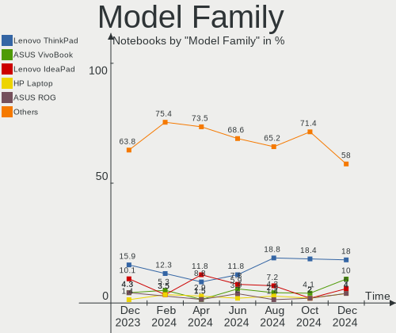
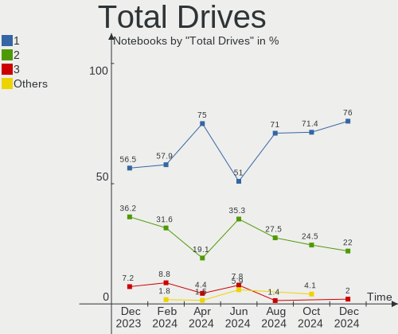
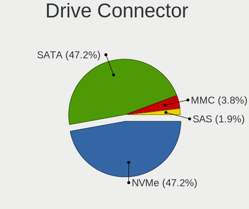
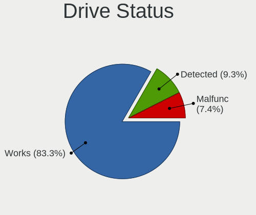
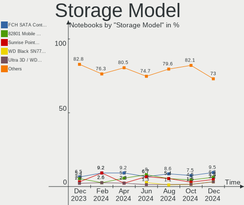

ArcoLinux Hardware Trends (Notebooks)
-------------------------------------

A project to identify most popular hardware characteristics and track their change
over time based on data collected by ArcoLinux users at https://Linux-Hardware.org.

Anyone can contribute to this report by the [hw-probe](https://github.com/linuxhw/hw-probe) tool:

    sudo -E hw-probe -all -upload

Full-feature report is available here: https://linux-hardware.org/?view=trends&formfactor=notebook

Period: Oct, 2021.

Contents
--------

* [ System ](#system)
  - [ OS                       ](#os)
  - [ OS Family                ](#os-family)
  - [ Kernel                   ](#kernel)
  - [ Kernel Family            ](#kernel-family)
  - [ Kernel Major Ver.        ](#kernel-major-ver)
  - [ Arch                     ](#arch)
  - [ DE                       ](#de)
  - [ Display Server           ](#display-server)
  - [ Display Manager          ](#display-manager)
  - [ OS Lang                  ](#os-lang)
  - [ Boot Mode                ](#boot-mode)
  - [ Filesystem               ](#filesystem)
  - [ Part. scheme             ](#part-scheme)
  - [ Dual Boot with Linux/BSD ](#dual-boot-with-linuxbsd)
  - [ Dual Boot (Win)          ](#dual-boot-win)

* [ Board ](#board)
  - [ Vendor                   ](#vendor)
  - [ Model                    ](#model)
  - [ Model Family             ](#model-family)
  - [ MFG Year                 ](#mfg-year)
  - [ Form Factor              ](#form-factor)
  - [ Secure Boot              ](#secure-boot)
  - [ Coreboot                 ](#coreboot)
  - [ RAM Size                 ](#ram-size)
  - [ RAM Used                 ](#ram-used)
  - [ Total Drives             ](#total-drives)
  - [ Has CD-ROM               ](#has-cd-rom)
  - [ Has Ethernet             ](#has-ethernet)
  - [ Has WiFi                 ](#has-wifi)
  - [ Has Bluetooth            ](#has-bluetooth)

* [ Location ](#location)
  - [ Country                  ](#country)
  - [ City                     ](#city)

* [ Drives ](#drives)
  - [ Drive Vendor             ](#drive-vendor)
  - [ Drive Model              ](#drive-model)
  - [ HDD Vendor               ](#hdd-vendor)
  - [ SSD Vendor               ](#ssd-vendor)
  - [ Drive Kind               ](#drive-kind)
  - [ Drive Connector          ](#drive-connector)
  - [ Drive Size               ](#drive-size)
  - [ Space Total              ](#space-total)
  - [ Space Used               ](#space-used)
  - [ Malfunc. Drives          ](#malfunc-drives)
  - [ Malfunc. Drive Vendor    ](#malfunc-drive-vendor)
  - [ Malfunc. HDD Vendor      ](#malfunc-hdd-vendor)
  - [ Malfunc. Drive Kind      ](#malfunc-drive-kind)
  - [ Failed Drives            ](#failed-drives)
  - [ Failed Drive Vendor      ](#failed-drive-vendor)
  - [ Drive Status             ](#drive-status)

* [ Storage controller ](#storage-controller)
  - [ Storage Vendor           ](#storage-vendor)
  - [ Storage Model            ](#storage-model)
  - [ Storage Kind             ](#storage-kind)

* [ Processor ](#processor)
  - [ CPU Vendor               ](#cpu-vendor)
  - [ CPU Model                ](#cpu-model)
  - [ CPU Model Family         ](#cpu-model-family)
  - [ CPU Cores                ](#cpu-cores)
  - [ CPU Sockets              ](#cpu-sockets)
  - [ CPU Threads              ](#cpu-threads)
  - [ CPU Op-Modes             ](#cpu-op-modes)
  - [ CPU Microcode            ](#cpu-microcode)
  - [ CPU Microarch            ](#cpu-microarch)

* [ Graphics ](#graphics)
  - [ GPU Vendor               ](#gpu-vendor)
  - [ GPU Model                ](#gpu-model)
  - [ GPU Combo                ](#gpu-combo)
  - [ GPU Driver               ](#gpu-driver)
  - [ GPU Memory               ](#gpu-memory)

* [ Monitor ](#monitor)
  - [ Monitor Vendor           ](#monitor-vendor)
  - [ Monitor Model            ](#monitor-model)
  - [ Monitor Resolution       ](#monitor-resolution)
  - [ Monitor Diagonal         ](#monitor-diagonal)
  - [ Monitor Width            ](#monitor-width)
  - [ Aspect Ratio             ](#aspect-ratio)
  - [ Monitor Area             ](#monitor-area)
  - [ Pixel Density            ](#pixel-density)
  - [ Multiple Monitors        ](#multiple-monitors)

* [ Network ](#network)
  - [ Net Controller Vendor    ](#net-controller-vendor)
  - [ Net Controller Model     ](#net-controller-model)
  - [ Wireless Vendor          ](#wireless-vendor)
  - [ Wireless Model           ](#wireless-model)
  - [ Ethernet Vendor          ](#ethernet-vendor)
  - [ Ethernet Model           ](#ethernet-model)
  - [ Net Controller Kind      ](#net-controller-kind)
  - [ Used Controller          ](#used-controller)
  - [ NICs                     ](#nics)
  - [ IPv6                     ](#ipv6)

* [ Bluetooth ](#bluetooth)
  - [ Bluetooth Vendor         ](#bluetooth-vendor)
  - [ Bluetooth Model          ](#bluetooth-model)

* [ Sound ](#sound)
  - [ Sound Vendor             ](#sound-vendor)
  - [ Sound Model              ](#sound-model)

* [ Memory ](#memory)
  - [ Memory Vendor            ](#memory-vendor)
  - [ Memory Model             ](#memory-model)
  - [ Memory Kind              ](#memory-kind)
  - [ Memory Form Factor       ](#memory-form-factor)
  - [ Memory Size              ](#memory-size)
  - [ Memory Speed             ](#memory-speed)

* [ Printers & scanners ](#printers--scanners)
  - [ Printer Vendor           ](#printer-vendor)
  - [ Printer Model            ](#printer-model)
  - [ Scanner Vendor           ](#scanner-vendor)
  - [ Scanner Model            ](#scanner-model)

* [ Camera ](#camera)
  - [ Camera Vendor            ](#camera-vendor)
  - [ Camera Model             ](#camera-model)

* [ Security ](#security)
  - [ Fingerprint Vendor       ](#fingerprint-vendor)
  - [ Fingerprint Model        ](#fingerprint-model)
  - [ Chipcard Vendor          ](#chipcard-vendor)
  - [ Chipcard Model           ](#chipcard-model)

* [ Unsupported ](#unsupported)
  - [ Unsupported Devices      ](#unsupported-devices)
  - [ Unsupported Device Types ](#unsupported-device-types)

System
------

OS
--

Installed operating systems

| Name              | Notebooks | Percent |
|-------------------|-----------|---------|
| ArcoLinux Rolling | 37        | 94.87%  |
| ArcoLinux         | 2         | 5.13%   |

OS Family
---------

OS without a version

| Name      | Notebooks | Percent |
|-----------|-----------|---------|
| ArcoLinux | 39        | 100%    |

Kernel
------

Version of the Linux kernel

| Version            | Notebooks | Percent |
|--------------------|-----------|---------|
| 5.14.12-arch1-1    | 12        | 30.77%  |
| 5.14.9-arch2-1     | 6         | 15.38%  |
| 5.14.14-arch1-1    | 5         | 12.82%  |
| 5.13.13-arch1-1    | 3         | 7.69%   |
| 5.14.9-zen2-1-zen  | 2         | 5.13%   |
| 5.14.8-arch1-1     | 2         | 5.13%   |
| 5.14.11-arch1-1    | 2         | 5.13%   |
| 5.14.3-arch1-1     | 1         | 2.56%   |
| 5.14.12-AMD-znver2 | 1         | 2.56%   |
| 5.14.11-zen1-1-zen | 1         | 2.56%   |
| 5.13.8-arch1-1     | 1         | 2.56%   |
| 5.10.73-1-lts      | 1         | 2.56%   |
| 5.10.72-1-lts      | 1         | 2.56%   |
| 5.10.69-1-lts      | 1         | 2.56%   |

Kernel Family
-------------

Linux kernel without a distro release

| Version | Notebooks | Percent |
|---------|-----------|---------|
| 5.14.12 | 13        | 33.33%  |
| 5.14.9  | 8         | 20.51%  |
| 5.14.14 | 5         | 12.82%  |
| 5.14.11 | 3         | 7.69%   |
| 5.13.13 | 3         | 7.69%   |
| 5.14.8  | 2         | 5.13%   |
| 5.14.3  | 1         | 2.56%   |
| 5.13.8  | 1         | 2.56%   |
| 5.10.73 | 1         | 2.56%   |
| 5.10.72 | 1         | 2.56%   |
| 5.10.69 | 1         | 2.56%   |

Kernel Major Ver.
-----------------

Linux kernel major version

| Version | Notebooks | Percent |
|---------|-----------|---------|
| 5.14    | 32        | 82.05%  |
| 5.13    | 4         | 10.26%  |
| 5.10    | 3         | 7.69%   |

Arch
----

OS architecture (x86_64, i586, etc.)

| Name   | Notebooks | Percent |
|--------|-----------|---------|
| x86_64 | 39        | 100%    |

DE
--

Desktop Environment

| Name         | Notebooks | Percent |
|--------------|-----------|---------|
| XFCE         | 9         | 23.08%  |
| i3           | 9         | 23.08%  |
| KDE5         | 7         | 17.95%  |
| qtile        | 3         | 7.69%   |
| GNOME        | 3         | 7.69%   |
| X-Cinnamon   | 2         | 5.13%   |
| bspwm        | 2         | 5.13%   |
| xmonad       | 1         | 2.56%   |
| herbstluftwm | 1         | 2.56%   |
| awesome      | 1         | 2.56%   |
| Unknown      | 1         | 2.56%   |

Display Server
--------------

X11 or Wayland

| Name    | Notebooks | Percent |
|---------|-----------|---------|
| X11     | 38        | 97.44%  |
| Wayland | 1         | 2.56%   |

Display Manager
---------------

SDDM, LightDM, etc.

| Name    | Notebooks | Percent |
|---------|-----------|---------|
| SDDM    | 24        | 61.54%  |
| LightDM | 13        | 33.33%  |
| Unknown | 2         | 5.13%   |

OS Lang
-------

Language

| Lang  | Notebooks | Percent |
|-------|-----------|---------|
| en_US | 19        | 48.72%  |
| en_GB | 5         | 12.82%  |
| en_CA | 2         | 5.13%   |
| en_AU | 2         | 5.13%   |
| de_DE | 2         | 5.13%   |
| zh_CN | 1         | 2.56%   |
| pt_PT | 1         | 2.56%   |
| pt_BR | 1         | 2.56%   |
| ja_JP | 1         | 2.56%   |
| fr_FR | 1         | 2.56%   |
| fr_BE | 1         | 2.56%   |
| es_MX | 1         | 2.56%   |
| el_GR | 1         | 2.56%   |
| C     | 1         | 2.56%   |

Boot Mode
---------

EFI or BIOS

| Mode | Notebooks | Percent |
|------|-----------|---------|
| EFI  | 30        | 76.92%  |
| BIOS | 9         | 23.08%  |

Filesystem
----------

Type of filesystem

| Type    | Notebooks | Percent |
|---------|-----------|---------|
| Ext4    | 32        | 82.05%  |
| Btrfs   | 5         | 12.82%  |
| Overlay | 2         | 5.13%   |

Part. scheme
------------

Scheme of partitioning

| Type    | Notebooks | Percent |
|---------|-----------|---------|
| GPT     | 31        | 79.49%  |
| MBR     | 5         | 12.82%  |
| Unknown | 3         | 7.69%   |

Dual Boot with Linux/BSD
------------------------

Hosting more than one Linux/BSD

| Dual boot | Notebooks | Percent |
|-----------|-----------|---------|
| No        | 29        | 74.36%  |
| Yes       | 10        | 25.64%  |

Dual Boot (Win)
---------------

Hosting Linux and Windows

| Dual boot | Notebooks | Percent |
|-----------|-----------|---------|
| No        | 25        | 64.1%   |
| Yes       | 14        | 35.9%   |

Board
-----

Vendor
------

Motherboard manufacturer

| Name                | Notebooks | Percent |
|---------------------|-----------|---------|
| Dell                | 7         | 17.95%  |
| ASUSTek Computer    | 7         | 17.95%  |
| Lenovo              | 6         | 15.38%  |
| Acer                | 5         | 12.82%  |
| Razer               | 2         | 5.13%   |
| MSI                 | 2         | 5.13%   |
| Hewlett-Packard     | 2         | 5.13%   |
| UNITCOM             | 1         | 2.56%   |
| TUXEDO              | 1         | 2.56%   |
| System76            | 1         | 2.56%   |
| Samsung Electronics | 1         | 2.56%   |
| Monster             | 1         | 2.56%   |
| HUAWEI              | 1         | 2.56%   |
| Apple               | 1         | 2.56%   |
| Alienware           | 1         | 2.56%   |

Model
-----

Motherboard model

| Name                                     | Notebooks | Percent |
|------------------------------------------|-----------|---------|
| Lenovo G50-30 80G0                       | 2         | 5.13%   |
| UNITCOM W55xEU                           | 1         | 2.56%   |
| System76 Pangolin                        | 1         | 2.56%   |
| Samsung 550P5C/550P7C                    | 1         | 2.56%   |
| Razer Blade Stealth                      | 1         | 2.56%   |
| Razer Blade                              | 1         | 2.56%   |
| MSI GS66 Stealth 10SFS                   | 1         | 2.56%   |
| MSI GE63 Raider RGB 8RE                  | 1         | 2.56%   |
| Monster ABRA A5 V11.1                    | 1         | 2.56%   |
| Lenovo Y520-15IKBN 80WK                  | 1         | 2.56%   |
| Lenovo ThinkPad X1 Carbon 5th 20HR002BMX | 1         | 2.56%   |
| Lenovo ThinkPad E15 20RD0011AU           | 1         | 2.56%   |
| Lenovo ThinkBook 14-IIL 20SL             | 1         | 2.56%   |
| HUAWEI WRT-WX9                           | 1         | 2.56%   |
| HP ProBook 450 G3                        | 1         | 2.56%   |
| HP EliteBook 840 G3                      | 1         | 2.56%   |
| Dell XPS 13 9343                         | 1         | 2.56%   |
| Dell Precision M4800                     | 1         | 2.56%   |
| Dell Precision 7510                      | 1         | 2.56%   |
| Dell Latitude E7440                      | 1         | 2.56%   |
| Dell Latitude E6540                      | 1         | 2.56%   |
| Dell Latitude 5410                       | 1         | 2.56%   |
| Dell Inspiron 3520                       | 1         | 2.56%   |
| ASUS X580VD                              | 1         | 2.56%   |
| ASUS X555LD                              | 1         | 2.56%   |
| ASUS VivoBook_ASUS Laptop X510UNO        | 1         | 2.56%   |
| ASUS TUF Gaming FX505DD_FX505DD          | 1         | 2.56%   |
| ASUS N53Jq                               | 1         | 2.56%   |
| ASUS K53E                                | 1         | 2.56%   |
| ASUS ASUS TUF Gaming A15 FA506IV_FA506IV | 1         | 2.56%   |
| Apple MacBookPro8,1                      | 1         | 2.56%   |
| Alienware 17                             | 1         | 2.56%   |
| Acer Nitro AN515-55                      | 1         | 2.56%   |
| Acer Nitro AN515-54                      | 1         | 2.56%   |
| Acer Aspire SW5-173                      | 1         | 2.56%   |
| Acer Aspire E5-575G                      | 1         | 2.56%   |
| Acer Aspire E5-523                       | 1         | 2.56%   |
| Unknown                                  | 1         | 2.56%   |

Model Family
------------

Motherboard model prefix

| Name               | Notebooks | Percent |
|--------------------|-----------|---------|
| Dell Latitude      | 3         | 7.69%   |
| Acer Aspire        | 3         | 7.69%   |
| Razer Blade        | 2         | 5.13%   |
| Lenovo ThinkPad    | 2         | 5.13%   |
| Lenovo G50-30      | 2         | 5.13%   |
| Dell Precision     | 2         | 5.13%   |
| Acer Nitro         | 2         | 5.13%   |
| UNITCOM W55xEU     | 1         | 2.56%   |
| System76 Pangolin  | 1         | 2.56%   |
| Samsung 550P5C     | 1         | 2.56%   |
| MSI GS66           | 1         | 2.56%   |
| MSI GE63           | 1         | 2.56%   |
| Monster ABRA       | 1         | 2.56%   |
| Lenovo Y520-15IKBN | 1         | 2.56%   |
| Lenovo ThinkBook   | 1         | 2.56%   |
| HUAWEI WRT-WX9     | 1         | 2.56%   |
| HP ProBook         | 1         | 2.56%   |
| HP EliteBook       | 1         | 2.56%   |
| Dell XPS           | 1         | 2.56%   |
| Dell Inspiron      | 1         | 2.56%   |
| ASUS X580VD        | 1         | 2.56%   |
| ASUS X555LD        | 1         | 2.56%   |
| ASUS VivoBook      | 1         | 2.56%   |
| ASUS TUF           | 1         | 2.56%   |
| ASUS N53Jq         | 1         | 2.56%   |
| ASUS K53E          | 1         | 2.56%   |
| ASUS ASUS          | 1         | 2.56%   |
| Apple MacBookPro8  | 1         | 2.56%   |
| Alienware 17       | 1         | 2.56%   |
| Unknown            | 1         | 2.56%   |

MFG Year
--------

Motherboard manufacture year

| Year | Notebooks | Percent |
|------|-----------|---------|
| 2019 | 7         | 17.95%  |
| 2018 | 7         | 17.95%  |
| 2021 | 6         | 15.38%  |
| 2020 | 6         | 15.38%  |
| 2014 | 4         | 10.26%  |
| 2017 | 3         | 7.69%   |
| 2012 | 2         | 5.13%   |
| 2016 | 1         | 2.56%   |
| 2015 | 1         | 2.56%   |
| 2013 | 1         | 2.56%   |
| 2011 | 1         | 2.56%   |

Form Factor
-----------

Physical design of the computer

| Name     | Notebooks | Percent |
|----------|-----------|---------|
| Notebook | 39        | 100%    |

Secure Boot
-----------

Enabled or disabled

| State    | Notebooks | Percent |
|----------|-----------|---------|
| Disabled | 39        | 100%    |

Coreboot
--------

Have coreboot on board

| Used | Notebooks | Percent |
|------|-----------|---------|
| No   | 39        | 100%    |

RAM Size
--------

Total RAM memory

| Size in GB  | Notebooks | Percent |
|-------------|-----------|---------|
| 16.01-24.0  | 14        | 35.9%   |
| 4.01-8.0    | 11        | 28.21%  |
| 8.01-16.0   | 5         | 12.82%  |
| 3.01-4.0    | 4         | 10.26%  |
| 32.01-64.0  | 3         | 7.69%   |
| 64.01-256.0 | 1         | 2.56%   |
| 1.01-2.0    | 1         | 2.56%   |

RAM Used
--------

Used RAM memory

| Used GB    | Notebooks | Percent |
|------------|-----------|---------|
| 2.01-3.0   | 13        | 33.33%  |
| 1.01-2.0   | 8         | 20.51%  |
| 3.01-4.0   | 7         | 17.95%  |
| 4.01-8.0   | 6         | 15.38%  |
| 0.51-1.0   | 3         | 7.69%   |
| 24.01-32.0 | 1         | 2.56%   |
| 8.01-16.0  | 1         | 2.56%   |

Total Drives
------------

Number of drives on board

| Drives | Notebooks | Percent |
|--------|-----------|---------|
| 1      | 19        | 48.72%  |
| 2      | 18        | 46.15%  |
| 6      | 1         | 2.56%   |
| 3      | 1         | 2.56%   |

Has CD-ROM
----------

Has CD-ROM on board

| Presented | Notebooks | Percent |
|-----------|-----------|---------|
| No        | 30        | 76.92%  |
| Yes       | 9         | 23.08%  |

Has Ethernet
------------

Has Ethernet on board

| Presented | Notebooks | Percent |
|-----------|-----------|---------|
| Yes       | 33        | 84.62%  |
| No        | 6         | 15.38%  |

Has WiFi
--------

Has WiFi module

| Presented | Notebooks | Percent |
|-----------|-----------|---------|
| Yes       | 38        | 97.44%  |
| No        | 1         | 2.56%   |

Has Bluetooth
-------------

Has Bluetooth module

| Presented | Notebooks | Percent |
|-----------|-----------|---------|
| Yes       | 36        | 92.31%  |
| No        | 3         | 7.69%   |

Location
--------

Country
-------

Geographic location (country)

| Country      | Notebooks | Percent |
|--------------|-----------|---------|
| USA          | 5         | 12.82%  |
| UK           | 4         | 10.26%  |
| Canada       | 3         | 7.69%   |
| Ukraine      | 2         | 5.13%   |
| Turkey       | 2         | 5.13%   |
| Portugal     | 2         | 5.13%   |
| Greece       | 2         | 5.13%   |
| Germany      | 2         | 5.13%   |
| Belgium      | 2         | 5.13%   |
| Australia    | 2         | 5.13%   |
| Vietnam      | 1         | 2.56%   |
| South Africa | 1         | 2.56%   |
| Russia       | 1         | 2.56%   |
| Norway       | 1         | 2.56%   |
| Netherlands  | 1         | 2.56%   |
| Mexico       | 1         | 2.56%   |
| Lithuania    | 1         | 2.56%   |
| Japan        | 1         | 2.56%   |
| India        | 1         | 2.56%   |
| France       | 1         | 2.56%   |
| China        | 1         | 2.56%   |
| Brazil       | 1         | 2.56%   |
| Azerbaijan   | 1         | 2.56%   |

City
----

Geographic location (city)

| City          | Notebooks | Percent |
|---------------|-----------|---------|
| Lisbon        | 2         | 5.13%   |
| Brisbane      | 2         | 5.13%   |
| Villahermosa  | 1         | 2.56%   |
| Tucson        | 1         | 2.56%   |
| Tampa         | 1         | 2.56%   |
| Serres        | 1         | 2.56%   |
| S??o Paulo    | 1         | 2.56%   |
| Rybinsk       | 1         | 2.56%   |
| Rennes        | 1         | 2.56%   |
| Reading       | 1         | 2.56%   |
| Qu?©bec       | 1         | 2.56%   |
| Pune          | 1         | 2.56%   |
| Plano         | 1         | 2.56%   |
| Peterborough  | 1         | 2.56%   |
| Oslo          | 1         | 2.56%   |
| Nerima        | 1         | 2.56%   |
| Nelspruit     | 1         | 2.56%   |
| Middletown    | 1         | 2.56%   |
| Limal         | 1         | 2.56%   |
| Leverkusen    | 1         | 2.56%   |
| Kyiv          | 1         | 2.56%   |
| Klaip?—da     | 1         | 2.56%   |
| Hinchley Wood | 1         | 2.56%   |
| Hanoi         | 1         | 2.56%   |
| Grays         | 1         | 2.56%   |
| Gotha         | 1         | 2.56%   |
| Gooding       | 1         | 2.56%   |
| Enghien       | 1         | 2.56%   |
| Dnipro        | 1         | 2.56%   |
| Dagenham      | 1         | 2.56%   |
| Cambridge     | 1         | 2.56%   |
| Barneveld     | 1         | 2.56%   |
| Baku          | 1         | 2.56%   |
| Athens        | 1         | 2.56%   |
| Aodi          | 1         | 2.56%   |
| Ankara        | 1         | 2.56%   |
| Adana         | 1         | 2.56%   |

Drives
------

Drive Vendor
------------

Hard drive vendors

| Vendor              | Notebooks | Drives | Percent |
|---------------------|-----------|--------|---------|
| Samsung Electronics | 14        | 15     | 23.33%  |
| WDC                 | 9         | 9      | 15%     |
| Seagate             | 9         | 10     | 15%     |
| Toshiba             | 5         | 5      | 8.33%   |
| Kingston            | 4         | 5      | 6.67%   |
| Intel               | 4         | 4      | 6.67%   |
| SanDisk             | 2         | 2      | 3.33%   |
| Micron Technology   | 2         | 2      | 3.33%   |
| Intenso             | 2         | 2      | 3.33%   |
| Unknown             | 1         | 1      | 1.67%   |
| OSCOO               | 1         | 1      | 1.67%   |
| NGFF                | 1         | 1      | 1.67%   |
| Lenovo              | 1         | 1      | 1.67%   |
| KingSpec            | 1         | 1      | 1.67%   |
| JMicron             | 1         | 1      | 1.67%   |
| HGST                | 1         | 1      | 1.67%   |
| GOODRAM             | 1         | 1      | 1.67%   |
| Crucial             | 1         | 1      | 1.67%   |

Drive Model
-----------

Hard drive models

| Model                                    | Notebooks | Percent |
|------------------------------------------|-----------|---------|
| WDC WDS500G2B0A-00SM50 500GB SSD         | 2         | 3.17%   |
| Toshiba MQ04ABF100 1TB                   | 2         | 3.17%   |
| Seagate ST1000LM035-1RK172 1TB           | 2         | 3.17%   |
| Seagate ST1000LM024 HN-M101MBB 1TB       | 2         | 3.17%   |
| Kingston SA400S37480G 480GB SSD          | 2         | 3.17%   |
| WDC WDS100T3X0C-00SJG0 1TB               | 1         | 1.59%   |
| WDC WDS100T2B0A-00SM50 1TB SSD           | 1         | 1.59%   |
| WDC WD6400BEVT-60A0RT0 640GB             | 1         | 1.59%   |
| WDC WD10SPZX-21Z10T0 1TB                 | 1         | 1.59%   |
| WDC PC SN730 SDBPNTY-1T00-1032 1TB       | 1         | 1.59%   |
| WDC PC SN530 SDBPNPZ-512G-1114 512GB     | 1         | 1.59%   |
| WDC PC SN520 SDAPNUW-128G                | 1         | 1.59%   |
| Unknown ED4QT  128GB                     | 1         | 1.59%   |
| Toshiba RC500 250GB                      | 1         | 1.59%   |
| Toshiba MQ01ABD100M 1TB                  | 1         | 1.59%   |
| Toshiba KBG40ZNT512G MEMORY 512GB        | 1         | 1.59%   |
| Seagate ST9500325AS 500GB                | 1         | 1.59%   |
| Seagate ST500LM012 HN-M500MBB 500GB      | 1         | 1.59%   |
| Seagate ST1000LM049-2GH172 1TB           | 1         | 1.59%   |
| Seagate ST1000LM048-2E7172 1TB           | 1         | 1.59%   |
| Seagate Expansion 1TB                    | 1         | 1.59%   |
| Seagate BarraCuda SSD ZA250CM10002 250GB | 1         | 1.59%   |
| SanDisk SSD PLUS 480GB                   | 1         | 1.59%   |
| SanDisk SDSSDH3250G 250GB                | 1         | 1.59%   |
| Samsung SSD PM851 mSATA 256GB            | 1         | 1.59%   |
| Samsung SSD PM851 M.2 2280 128GB         | 1         | 1.59%   |
| Samsung SSD PM851 2.5 7mm 256GB          | 1         | 1.59%   |
| Samsung SSD 970 EVO Plus 500GB           | 1         | 1.59%   |
| Samsung SSD 970 EVO Plus 2TB             | 1         | 1.59%   |
| Samsung SSD 870 EVO 500GB                | 1         | 1.59%   |
| Samsung SSD 860 EVO M.2 1TB              | 1         | 1.59%   |
| Samsung SSD 860 EVO 500GB                | 1         | 1.59%   |
| Samsung SSD 840 Series 500GB             | 1         | 1.59%   |
| Samsung SM963 2.5" NVMe PCIe SSD 250GB   | 1         | 1.59%   |
| Samsung MZVLW128HEGR-000L2 128GB         | 1         | 1.59%   |
| Samsung MZVLB256HAHQ-00000 256GB         | 1         | 1.59%   |
| Samsung MZNLN512HCJH-000H1 512GB SSD     | 1         | 1.59%   |
| Samsung MZNLF128HCHP-00000 128GB SSD     | 1         | 1.59%   |
| Samsung MZALQ512HALU-000L2 512GB         | 1         | 1.59%   |
| OSCOO OSC PCIe 256GB                     | 1         | 1.59%   |
| NGFF 2280 512GB SSD                      | 1         | 1.59%   |
| Micron 2300 NVMe 1024GB                  | 1         | 1.59%   |
| Micron 2200_MTFDHBA512TCK 512GB          | 1         | 1.59%   |
| Lenovo LENSE20256GMSP34MEAT2TA 256GB     | 1         | 1.59%   |
| Kingston SUV500MS240G 240GB SSD          | 1         | 1.59%   |
| Kingston SA400S37960G 960GB SSD          | 1         | 1.59%   |
| Kingston RBUSNS8154P3256GJ3 256GB        | 1         | 1.59%   |
| KingSpec P4-480 480GB SSD                | 1         | 1.59%   |
| JMicron Tech 250GB                       | 1         | 1.59%   |
| Intenso SSD Sata III 120GB               | 1         | 1.59%   |
| Intenso External USB 3.0 4TB             | 1         | 1.59%   |
| Intel SSDSC2BF256A5 SATA 256GB           | 1         | 1.59%   |
| Intel SSDSA2M160G2GC 160GB               | 1         | 1.59%   |
| Intel SSDPEKNW512G8 512GB                | 1         | 1.59%   |
| Intel MEMPEK1J016GA 16GB                 | 1         | 1.59%   |
| HGST HTS721010A9E630 1TB                 | 1         | 1.59%   |
| GOODRAM SSDPR-CL100-240-G2 240GB         | 1         | 1.59%   |
| Crucial CT1000MX500SSD1 1TB              | 1         | 1.59%   |

HDD Vendor
----------

Hard disk drive vendors

| Vendor  | Notebooks | Drives | Percent |
|---------|-----------|--------|---------|
| Seagate | 9         | 9      | 56.25%  |
| Toshiba | 3         | 3      | 18.75%  |
| WDC     | 2         | 2      | 12.5%   |
| Intenso | 1         | 1      | 6.25%   |
| HGST    | 1         | 1      | 6.25%   |

SSD Vendor
----------

Solid state drive vendors

| Vendor              | Notebooks | Drives | Percent |
|---------------------|-----------|--------|---------|
| Samsung Electronics | 8         | 9      | 33.33%  |
| WDC                 | 3         | 3      | 12.5%   |
| Kingston            | 3         | 4      | 12.5%   |
| SanDisk             | 2         | 2      | 8.33%   |
| Intel               | 2         | 2      | 8.33%   |
| Seagate             | 1         | 1      | 4.17%   |
| NGFF                | 1         | 1      | 4.17%   |
| KingSpec            | 1         | 1      | 4.17%   |
| Intenso             | 1         | 1      | 4.17%   |
| GOODRAM             | 1         | 1      | 4.17%   |
| Crucial             | 1         | 1      | 4.17%   |

Drive Kind
----------

HDD or SSD

| Kind    | Notebooks | Drives | Percent |
|---------|-----------|--------|---------|
| SSD     | 22        | 26     | 37.93%  |
| NVMe    | 18        | 19     | 31.03%  |
| HDD     | 16        | 16     | 27.59%  |
| MMC     | 1         | 1      | 1.72%   |
| Unknown | 1         | 1      | 1.72%   |

Drive Connector
---------------

SATA, SAS, NVMe, etc.

| Type | Notebooks | Drives | Percent |
|------|-----------|--------|---------|
| SATA | 30        | 39     | 58.82%  |
| NVMe | 18        | 19     | 35.29%  |
| SAS  | 2         | 4      | 3.92%   |
| MMC  | 1         | 1      | 1.96%   |

Drive Size
----------

Size of hard drive

| Size in TB | Notebooks | Drives | Percent |
|------------|-----------|--------|---------|
| 0.01-0.5   | 19        | 22     | 50%     |
| 0.51-1.0   | 18        | 19     | 47.37%  |
| 3.01-4.0   | 1         | 1      | 2.63%   |

Space Total
-----------

Amount of disk space available on the file system

| Size in GB     | Notebooks | Percent |
|----------------|-----------|---------|
| 251-500        | 9         | 23.08%  |
| 101-250        | 7         | 17.95%  |
| 501-1000       | 7         | 17.95%  |
| 1001-2000      | 6         | 15.38%  |
| 51-100         | 4         | 10.26%  |
| 1-20           | 3         | 7.69%   |
| Unknown        | 2         | 5.13%   |
| More than 3000 | 1         | 2.56%   |

Space Used
----------

Amount of used disk space

| Used GB        | Notebooks | Percent |
|----------------|-----------|---------|
| 1-20           | 9         | 23.08%  |
| 21-50          | 8         | 20.51%  |
| 101-250        | 8         | 20.51%  |
| 251-500        | 6         | 15.38%  |
| 51-100         | 4         | 10.26%  |
| Unknown        | 2         | 5.13%   |
| More than 3000 | 1         | 2.56%   |
| 501-1000       | 1         | 2.56%   |

Malfunc. Drives
---------------

Drive models with a malfunction

| Model                                        | Notebooks | Drives | Percent |
|----------------------------------------------|-----------|--------|---------|
| WDC WD6400BEVT-60A0RT0 640GB                 | 1         | 1      | 14.29%  |
| Seagate ST9500325AS 500GB                    | 1         | 1      | 14.29%  |
| Seagate ST1000LM024 HN-M101MBB 1TB           | 1         | 1      | 14.29%  |
| SanDisk SSD PLUS 480GB                       | 1         | 1      | 14.29%  |
| Samsung Electronics MZVLW128HEGR-000L2 128GB | 1         | 1      | 14.29%  |
| Lenovo LENSE20256GMSP34MEAT2TA 256GB         | 1         | 1      | 14.29%  |
| Intel SSDSA2M160G2GC 160GB                   | 1         | 1      | 14.29%  |

Malfunc. Drive Vendor
---------------------

Vendors of faulty drives

| Vendor              | Notebooks | Drives | Percent |
|---------------------|-----------|--------|---------|
| Seagate             | 2         | 2      | 28.57%  |
| WDC                 | 1         | 1      | 14.29%  |
| SanDisk             | 1         | 1      | 14.29%  |
| Samsung Electronics | 1         | 1      | 14.29%  |
| Lenovo              | 1         | 1      | 14.29%  |
| Intel               | 1         | 1      | 14.29%  |

Malfunc. HDD Vendor
-------------------

Vendors of faulty HDD drives

| Vendor  | Notebooks | Drives | Percent |
|---------|-----------|--------|---------|
| Seagate | 2         | 2      | 66.67%  |
| WDC     | 1         | 1      | 33.33%  |

Malfunc. Drive Kind
-------------------

Kinds of faulty drives

| Kind | Notebooks | Drives | Percent |
|------|-----------|--------|---------|
| HDD  | 3         | 3      | 42.86%  |
| NVMe | 2         | 2      | 28.57%  |
| SSD  | 2         | 2      | 28.57%  |

Failed Drives
-------------

Failed drive models

Zero info for selected period =(

Failed Drive Vendor
-------------------

Failed drive vendors

Zero info for selected period =(

Drive Status
------------

Number of failed and malfunc. drives

| Status   | Notebooks | Drives | Percent |
|----------|-----------|--------|---------|
| Works    | 33        | 47     | 73.33%  |
| Detected | 6         | 9      | 13.33%  |
| Malfunc  | 6         | 7      | 13.33%  |

Storage controller
------------------

Storage Vendor
--------------

Storage controller vendors

| Vendor                      | Notebooks | Percent |
|-----------------------------|-----------|---------|
| Intel                       | 32        | 61.54%  |
| Samsung Electronics         | 6         | 11.54%  |
| Sandisk                     | 4         | 7.69%   |
| AMD                         | 3         | 5.77%   |
| Micron Technology           | 2         | 3.85%   |
| KIOXIA                      | 2         | 3.85%   |
| Silicon Motion              | 1         | 1.92%   |
| Lenovo                      | 1         | 1.92%   |
| Kingston Technology Company | 1         | 1.92%   |

Storage Model
-------------

Storage controller models

| Model                                                                          | Notebooks | Percent |
|--------------------------------------------------------------------------------|-----------|---------|
| Intel Sunrise Point-LP SATA Controller [AHCI mode]                             | 4         | 7.55%   |
| Intel Cannon Lake Mobile PCH SATA AHCI Controller                              | 4         | 7.55%   |
| Samsung NVMe SSD Controller SM981/PM981/PM983                                  | 3         | 5.66%   |
| Intel HM170/QM170 Chipset SATA Controller [AHCI Mode]                          | 3         | 5.66%   |
| Intel 7 Series Chipset Family 6-port SATA Controller [AHCI mode]               | 3         | 5.66%   |
| AMD FCH SATA Controller [AHCI mode]                                            | 3         | 5.66%   |
| Sandisk WD Black SN750 / PC SN730 NVMe SSD                                     | 2         | 3.77%   |
| Samsung NVMe SSD Controller SM961/PM961/SM963                                  | 2         | 3.77%   |
| Micron Non-Volatile memory controller                                          | 2         | 3.77%   |
| Intel Wildcat Point-LP SATA Controller [AHCI Mode]                             | 2         | 3.77%   |
| Intel Comet Lake SATA AHCI Controller                                          | 2         | 3.77%   |
| Intel Atom Processor E3800 Series SATA AHCI Controller                         | 2         | 3.77%   |
| Intel 8 Series SATA Controller 1 [AHCI mode]                                   | 2         | 3.77%   |
| Intel 6 Series/C200 Series Chipset Family 6 port Mobile SATA AHCI Controller   | 2         | 3.77%   |
| Silicon Motion SM2263EN/SM2263XT SSD Controller                                | 1         | 1.89%   |
| Sandisk WD Blue SN550 NVMe SSD                                                 | 1         | 1.89%   |
| Sandisk WD Blue SN500 / PC SN520 NVMe SSD                                      | 1         | 1.89%   |
| Samsung NVMe SSD Controller 980                                                | 1         | 1.89%   |
| Lenovo Non-Volatile memory controller                                          | 1         | 1.89%   |
| KIOXIA NVMe SSD                                                                | 1         | 1.89%   |
| KIOXIA Non-Volatile memory controller                                          | 1         | 1.89%   |
| Kingston Company U-SNS8154P3 NVMe SSD                                          | 1         | 1.89%   |
| Intel SSD 660P Series                                                          | 1         | 1.89%   |
| Intel Q170/Q150/B150/H170/H110/Z170/CM236 Chipset SATA Controller [AHCI Mode]  | 1         | 1.89%   |
| Intel NVMe Optane Memory Series                                                | 1         | 1.89%   |
| Intel Ice Lake-LP SATA Controller [AHCI mode]                                  | 1         | 1.89%   |
| Intel 82801 Mobile SATA Controller [RAID mode]                                 | 1         | 1.89%   |
| Intel 8 Series/C220 Series Chipset Family 6-port SATA Controller 1 [AHCI mode] | 1         | 1.89%   |
| Intel 8 Series Chipset Family 4-port SATA Controller 1 [IDE mode] - Mobile     | 1         | 1.89%   |
| Intel 5 Series/3400 Series Chipset 4 port SATA AHCI Controller                 | 1         | 1.89%   |
| Intel 400 Series Chipset Family SATA AHCI Controller                           | 1         | 1.89%   |

Storage Kind
------------

Kind of storage controller (IDE, SATA, NVMe, SAS, ...)

| Kind | Notebooks | Percent |
|------|-----------|---------|
| SATA | 32        | 61.54%  |
| NVMe | 18        | 34.62%  |
| RAID | 1         | 1.92%   |
| IDE  | 1         | 1.92%   |

Processor
---------

CPU Vendor
----------

Processor vendors

| Vendor | Notebooks | Percent |
|--------|-----------|---------|
| Intel  | 35        | 89.74%  |
| AMD    | 4         | 10.26%  |

CPU Model
---------

Processor models

| Model                                         | Notebooks | Percent |
|-----------------------------------------------|-----------|---------|
| Intel Core i7-8750H CPU @ 2.20GHz             | 3         | 7.69%   |
| Intel Core i7-7700HQ CPU @ 2.80GHz            | 2         | 5.13%   |
| Intel Core i7-4800MQ CPU @ 2.70GHz            | 2         | 5.13%   |
| Intel Celeron CPU N2840 @ 2.16GHz             | 2         | 5.13%   |
| Intel Core M-5Y10c CPU @ 0.80GHz              | 1         | 2.56%   |
| Intel Core i9-10980HK CPU @ 2.40GHz           | 1         | 2.56%   |
| Intel Core i7-8550U CPU @ 1.80GHz             | 1         | 2.56%   |
| Intel Core i7-7500U CPU @ 2.70GHz             | 1         | 2.56%   |
| Intel Core i7-6820HQ CPU @ 2.70GHz            | 1         | 2.56%   |
| Intel Core i7-6500U CPU @ 2.50GHz             | 1         | 2.56%   |
| Intel Core i7-4700MQ CPU @ 2.40GHz            | 1         | 2.56%   |
| Intel Core i7-4510U CPU @ 2.00GHz             | 1         | 2.56%   |
| Intel Core i7-3630QM CPU @ 2.40GHz            | 1         | 2.56%   |
| Intel Core i7-3612QM CPU @ 2.10GHz            | 1         | 2.56%   |
| Intel Core i7-10750H CPU @ 2.60GHz            | 1         | 2.56%   |
| Intel Core i7-1065G7 CPU @ 1.30GHz            | 1         | 2.56%   |
| Intel Core i7-10610U CPU @ 1.80GHz            | 1         | 2.56%   |
| Intel Core i7-10510U CPU @ 1.80GHz            | 1         | 2.56%   |
| Intel Core i7 CPU Q 740 @ 1.73GHz             | 1         | 2.56%   |
| Intel Core i5-8300H CPU @ 2.30GHz             | 1         | 2.56%   |
| Intel Core i5-8265U CPU @ 1.60GHz             | 1         | 2.56%   |
| Intel Core i5-8250U CPU @ 1.60GHz             | 1         | 2.56%   |
| Intel Core i5-7300HQ CPU @ 2.50GHz            | 1         | 2.56%   |
| Intel Core i5-7200U CPU @ 2.50GHz             | 1         | 2.56%   |
| Intel Core i5-6200U CPU @ 2.30GHz             | 1         | 2.56%   |
| Intel Core i5-5200U CPU @ 2.20GHz             | 1         | 2.56%   |
| Intel Core i5-4300U CPU @ 1.90GHz             | 1         | 2.56%   |
| Intel Core i5-3210M CPU @ 2.50GHz             | 1         | 2.56%   |
| Intel Core i5-2435M CPU @ 2.40GHz             | 1         | 2.56%   |
| Intel Core i5-2410M CPU @ 2.30GHz             | 1         | 2.56%   |
| AMD Ryzen 9 4900H with Radeon Graphics        | 1         | 2.56%   |
| AMD Ryzen 7 4700U with Radeon Graphics        | 1         | 2.56%   |
| AMD Ryzen 7 3750H with Radeon Vega Mobile Gfx | 1         | 2.56%   |
| AMD A9-9410 RADEON R5, 5 COMPUTE CORES 2C+3G  | 1         | 2.56%   |

CPU Model Family
----------------

Processor model prefix

| Model         | Notebooks | Percent |
|---------------|-----------|---------|
| Intel Core i7 | 20        | 51.28%  |
| Intel Core i5 | 11        | 28.21%  |
| Intel Celeron | 2         | 5.13%   |
| AMD Ryzen 7   | 2         | 5.13%   |
| Other         | 1         | 2.56%   |
| Intel Core M  | 1         | 2.56%   |
| Intel Core i9 | 1         | 2.56%   |
| AMD Ryzen 9   | 1         | 2.56%   |

CPU Cores
---------

Number of processor cores

| Number | Notebooks | Percent |
|--------|-----------|---------|
| 4      | 18        | 46.15%  |
| 2      | 14        | 35.9%   |
| 6      | 4         | 10.26%  |
| 8      | 3         | 7.69%   |

CPU Sockets
-----------

Number of sockets

| Number | Notebooks | Percent |
|--------|-----------|---------|
| 1      | 39        | 100%    |

CPU Threads
-----------

Threads per core (Hyper-Threading)

| Number | Notebooks | Percent |
|--------|-----------|---------|
| 2      | 34        | 87.18%  |
| 1      | 5         | 12.82%  |

CPU Op-Modes
------------

CPU Operation Modes (32-bit, 64-bit)

| Op mode        | Notebooks | Percent |
|----------------|-----------|---------|
| 32-bit, 64-bit | 39        | 100%    |

CPU Microcode
-------------

Microcode number

| Number     | Notebooks | Percent |
|------------|-----------|---------|
| Unknown    | 5         | 12.82%  |
| 0x906e9    | 3         | 7.69%   |
| 0x306c3    | 3         | 7.69%   |
| 0xa0652    | 2         | 5.13%   |
| 0x906ea    | 2         | 5.13%   |
| 0x806ec    | 2         | 5.13%   |
| 0x806ea    | 2         | 5.13%   |
| 0x806e9    | 2         | 5.13%   |
| 0x406e3    | 2         | 5.13%   |
| 0x306a9    | 2         | 5.13%   |
| 0x30678    | 2         | 5.13%   |
| 0x206a7    | 2         | 5.13%   |
| 0x806eb    | 1         | 2.56%   |
| 0x706e5    | 1         | 2.56%   |
| 0x506e3    | 1         | 2.56%   |
| 0x40651    | 1         | 2.56%   |
| 0x306d4    | 1         | 2.56%   |
| 0x106e5    | 1         | 2.56%   |
| 0x08600106 | 1         | 2.56%   |
| 0x08600104 | 1         | 2.56%   |
| 0x08108102 | 1         | 2.56%   |
| 0x06006704 | 1         | 2.56%   |

CPU Microarch
-------------

Microarchitecture

| Name        | Notebooks | Percent |
|-------------|-----------|---------|
| KabyLake    | 14        | 35.9%   |
| Haswell     | 5         | 12.82%  |
| Skylake     | 3         | 7.69%   |
| IvyBridge   | 3         | 7.69%   |
| Zen 2       | 2         | 5.13%   |
| Silvermont  | 2         | 5.13%   |
| SandyBridge | 2         | 5.13%   |
| CometLake   | 2         | 5.13%   |
| Broadwell   | 2         | 5.13%   |
| Zen+        | 1         | 2.56%   |
| Nehalem     | 1         | 2.56%   |
| IceLake     | 1         | 2.56%   |
| Excavator   | 1         | 2.56%   |

Graphics
--------

GPU Vendor
----------

Vendors of graphics cards

| Vendor | Notebooks | Percent |
|--------|-----------|---------|
| Intel  | 32        | 55.17%  |
| Nvidia | 20        | 34.48%  |
| AMD    | 6         | 10.34%  |

GPU Model
---------

Graphics card models

| Model                                                                     | Notebooks | Percent |
|---------------------------------------------------------------------------|-----------|---------|
| Intel CoffeeLake-H GT2 [UHD Graphics 630]                                 | 4         | 6.9%    |
| Nvidia GP107M [GeForce GTX 1050 Mobile]                                   | 3         | 5.17%   |
| Intel HD Graphics 630                                                     | 3         | 5.17%   |
| Intel 3rd Gen Core processor Graphics Controller                          | 3         | 5.17%   |
| Nvidia TU106M [GeForce RTX 2060 Mobile]                                   | 2         | 3.45%   |
| Nvidia GP107M [GeForce GTX 1050 3 GB Max-Q]                               | 2         | 3.45%   |
| Intel UHD Graphics 620                                                    | 2         | 3.45%   |
| Intel Skylake GT2 [HD Graphics 520]                                       | 2         | 3.45%   |
| Intel HD Graphics 620                                                     | 2         | 3.45%   |
| Intel Haswell-ULT Integrated Graphics Controller                          | 2         | 3.45%   |
| Intel CometLake-U GT2 [UHD Graphics]                                      | 2         | 3.45%   |
| Intel CometLake-H GT2 [UHD Graphics]                                      | 2         | 3.45%   |
| Intel Atom Processor Z36xxx/Z37xxx Series Graphics & Display              | 2         | 3.45%   |
| Intel 2nd Generation Core Processor Family Integrated Graphics Controller | 2         | 3.45%   |
| AMD Renoir                                                                | 2         | 3.45%   |
| Nvidia TU104M [GeForce RTX 2070 SUPER Mobile / Max-Q]                     | 1         | 1.72%   |
| Nvidia GP108M [GeForce MX150]                                             | 1         | 1.72%   |
| Nvidia GP106M [GeForce GTX 1060 Mobile]                                   | 1         | 1.72%   |
| Nvidia GP104M [GeForce GTX 1070 Mobile]                                   | 1         | 1.72%   |
| Nvidia GP104 [GeForce GTX 1080]                                           | 1         | 1.72%   |
| Nvidia GM108M [GeForce 940MX]                                             | 1         | 1.72%   |
| Nvidia GM107GLM [Quadro M1000M]                                           | 1         | 1.72%   |
| Nvidia GK107GLM [Quadro K1100M]                                           | 1         | 1.72%   |
| Nvidia GK106M [GeForce GTX 770M]                                          | 1         | 1.72%   |
| Nvidia GF117M [GeForce 610M/710M/810M/820M / GT 620M/625M/630M/720M]      | 1         | 1.72%   |
| Nvidia GF108M [GeForce GT 620M/630M/635M/640M LE]                         | 1         | 1.72%   |
| Nvidia GF108M [GeForce GT 425M]                                           | 1         | 1.72%   |
| Nvidia GA106M [GeForce RTX 3060 Mobile / Max-Q]                           | 1         | 1.72%   |
| Intel WhiskeyLake-U GT2 [UHD Graphics 620]                                | 1         | 1.72%   |
| Intel Iris Plus Graphics G7                                               | 1         | 1.72%   |
| Intel HD Graphics 5500                                                    | 1         | 1.72%   |
| Intel HD Graphics 5300                                                    | 1         | 1.72%   |
| Intel HD Graphics 530                                                     | 1         | 1.72%   |
| Intel 4th Gen Core Processor Integrated Graphics Controller               | 1         | 1.72%   |
| AMD Stoney [Radeon R2/R3/R4/R5 Graphics]                                  | 1         | 1.72%   |
| AMD Picasso                                                               | 1         | 1.72%   |
| AMD Mars XTX [Radeon HD 8790M]                                            | 1         | 1.72%   |
| AMD Lexa [Radeon 540X/550X/630 / RX 640 / E9171 MCM]                      | 1         | 1.72%   |

GPU Combo
---------

Combinations of graphics cards

| Name           | Notebooks | Percent |
|----------------|-----------|---------|
| Intel + Nvidia | 15        | 38.46%  |
| 1 x Intel      | 15        | 38.46%  |
| 1 x Nvidia     | 3         | 7.69%   |
| Intel + AMD    | 2         | 5.13%   |
| AMD + Nvidia   | 2         | 5.13%   |
| 1 x AMD        | 2         | 5.13%   |

GPU Driver
----------

Free vs proprietary

| Driver      | Notebooks | Percent |
|-------------|-----------|---------|
| Free        | 28        | 71.79%  |
| Proprietary | 11        | 28.21%  |

GPU Memory
----------

Total video memory

| Size in GB | Notebooks | Percent |
|------------|-----------|---------|
| Unknown    | 26        | 66.67%  |
| 1.01-2.0   | 5         | 12.82%  |
| 0.01-0.5   | 4         | 10.26%  |
| 7.01-8.0   | 1         | 2.56%   |
| 5.01-6.0   | 1         | 2.56%   |
| 2.01-3.0   | 1         | 2.56%   |
| 0.51-1.0   | 1         | 2.56%   |

Monitor
-------

Monitor Vendor
--------------

Monitor vendors

| Vendor               | Notebooks | Percent |
|----------------------|-----------|---------|
| AU Optronics         | 11        | 22.45%  |
| LG Display           | 7         | 14.29%  |
| Chimei Innolux       | 7         | 14.29%  |
| Samsung Electronics  | 4         | 8.16%   |
| BOE                  | 4         | 8.16%   |
| Sharp                | 3         | 6.12%   |
| Goldstar             | 3         | 6.12%   |
| PANDA                | 2         | 4.08%   |
| Dell                 | 2         | 4.08%   |
| Medion               | 1         | 2.04%   |
| LGD                  | 1         | 2.04%   |
| Lenovo               | 1         | 2.04%   |
| Daewoo               | 1         | 2.04%   |
| Apple                | 1         | 2.04%   |
| Ancor Communications | 1         | 2.04%   |

Monitor Model
-------------

Monitor models

| Model                                                                 | Notebooks | Percent |
|-----------------------------------------------------------------------|-----------|---------|
| AU Optronics LCD Monitor AUO21ED 1920x1080 344x194mm 15.5-inch        | 3         | 6.12%   |
| AU Optronics LCD Monitor AUO61ED 1920x1080 340x190mm 15.3-inch        | 2         | 4.08%   |
| Sharp LQ156M1JW03 SHP14C5 1920x1080 344x194mm 15.5-inch               | 1         | 2.04%   |
| Sharp LQ133Z1JW26 SHP1493 3200x1800 294x165mm 13.3-inch               | 1         | 2.04%   |
| Sharp LCD Monitor SHP1420 1920x1080 290x170mm 13.2-inch               | 1         | 2.04%   |
| Samsung Electronics SMS27A650 SAM082E 1920x1080 600x340mm 27.2-inch   | 1         | 2.04%   |
| Samsung Electronics LCD Monitor SEC324A 1366x768 344x194mm 15.5-inch  | 1         | 2.04%   |
| Samsung Electronics LCD Monitor SDC4852 3840x2160 340x190mm 15.3-inch | 1         | 2.04%   |
| Samsung Electronics C24F390 SAM0D2C 1920x1080 520x290mm 23.4-inch     | 1         | 2.04%   |
| PANDA LCD Monitor NCP004D 1920x1080 344x194mm 15.5-inch               | 1         | 2.04%   |
| PANDA LCD Monitor NCP002D 1920x1080 344x194mm 15.5-inch               | 1         | 2.04%   |
| Medion MD 20889 MED3687 1920x1080 509x286mm 23.0-inch                 | 1         | 2.04%   |
| LGD LCD Monitor 1920x1080                                             | 1         | 2.04%   |
| LG Display LCD Monitor LGD05E5 1920x1080 344x194mm 15.5-inch          | 1         | 2.04%   |
| LG Display LCD Monitor LGD0590 1920x1080 344x194mm 15.5-inch          | 1         | 2.04%   |
| LG Display LCD Monitor LGD04B9 1920x1080 344x194mm 15.5-inch          | 1         | 2.04%   |
| LG Display LCD Monitor LGD03FF 1920x1080 309x175mm 14.0-inch          | 1         | 2.04%   |
| LG Display LCD Monitor LGD037E 1920x1080 345x194mm 15.6-inch          | 1         | 2.04%   |
| LG Display LCD Monitor LGD02DC 1366x768 344x194mm 15.5-inch           | 1         | 2.04%   |
| LG Display LCD Monitor LGD02DA 1920x1080 380x220mm 17.3-inch          | 1         | 2.04%   |
| Lenovo LCD Monitor LEN40BA 1920x1080 344x194mm 15.5-inch              | 1         | 2.04%   |
| Goldstar HDR WFHD GSM7714 2560x1080 798x334mm 34.1-inch               | 1         | 2.04%   |
| Goldstar FULL HD GSM5B55 1920x1080 480x270mm 21.7-inch                | 1         | 2.04%   |
| Goldstar 20LS3R-ZA GSM4E5F 1360x768 470x280mm 21.5-inch               | 1         | 2.04%   |
| Dell U2717D DEL40EA 2560x1440 600x340mm 27.2-inch                     | 1         | 2.04%   |
| Dell 1704FPV DEL3015 1280x1024 338x270mm 17.0-inch                    | 1         | 2.04%   |
| Daewoo LM2000W DWE2000 1600x900 410x256mm 19.0-inch                   | 1         | 2.04%   |
| Chimei Innolux P130ZDZ-EF1 CMN8201 2160x1440 275x183mm 13.0-inch      | 1         | 2.04%   |
| Chimei Innolux LCD Monitor CMN15D6 1920x1080 344x193mm 15.5-inch      | 1         | 2.04%   |
| Chimei Innolux LCD Monitor CMN15BE 1366x768 340x190mm 15.3-inch       | 1         | 2.04%   |
| Chimei Innolux LCD Monitor CMN15BA 1920x1080 344x194mm 15.5-inch      | 1         | 2.04%   |
| Chimei Innolux LCD Monitor CMN1521 1920x1080 344x193mm 15.5-inch      | 1         | 2.04%   |
| Chimei Innolux LCD Monitor CMN14E7 1920x1080 309x173mm 13.9-inch      | 1         | 2.04%   |
| Chimei Innolux LCD Monitor CMN14D4 1920x1080 309x173mm 13.9-inch      | 1         | 2.04%   |
| BOE LCD Monitor BOE07B6 1920x1080 382x215mm 17.3-inch                 | 1         | 2.04%   |
| BOE LCD Monitor BOE07AF 1920x1080 344x193mm 15.5-inch                 | 1         | 2.04%   |
| BOE LCD Monitor BOE0672 1366x768 344x194mm 15.5-inch                  | 1         | 2.04%   |
| BOE LCD Monitor BOE05B3 1366x768 344x193mm 15.5-inch                  | 1         | 2.04%   |
| AU Optronics LCD Monitor AUO43EC 1366x768 344x193mm 15.5-inch         | 1         | 2.04%   |
| AU Optronics LCD Monitor AUO38ED 1920x1080 340x190mm 15.3-inch        | 1         | 2.04%   |
| AU Optronics LCD Monitor AUO313D 1920x1080 309x174mm 14.0-inch        | 1         | 2.04%   |
| AU Optronics LCD Monitor AUO235C 1366x768 260x140mm 11.6-inch         | 1         | 2.04%   |
| AU Optronics LCD Monitor AUO15ED 1920x1080 344x193mm 15.5-inch        | 1         | 2.04%   |
| AU Optronics LCD Monitor AUO123D 1920x1080 309x173mm 13.9-inch        | 1         | 2.04%   |
| Apple Color LCD APP9CC7 1280x800 290x180mm 13.4-inch                  | 1         | 2.04%   |
| Ancor Communications ASUS VW193D ACI19D5 1440x900 408x255mm 18.9-inch | 1         | 2.04%   |

Monitor Resolution
------------------

Monitor screen resolution

| Resolution       | Notebooks | Percent |
|------------------|-----------|---------|
| 1920x1080 (FHD)  | 27        | 60%     |
| 1366x768 (WXGA)  | 7         | 15.56%  |
| 3840x2160 (4K)   | 2         | 4.44%   |
| 3200x1800 (QHD+) | 1         | 2.22%   |
| 2560x1440 (QHD)  | 1         | 2.22%   |
| 2560x1080        | 1         | 2.22%   |
| 2160x1440        | 1         | 2.22%   |
| 1600x900 (HD+)   | 1         | 2.22%   |
| 1440x900 (WXGA+) | 1         | 2.22%   |
| 1360x768         | 1         | 2.22%   |
| 1280x800 (WXGA)  | 1         | 2.22%   |
| 1280x1024 (SXGA) | 1         | 2.22%   |

Monitor Diagonal
----------------

Diagonal size in inches

| Inches  | Notebooks | Percent |
|---------|-----------|---------|
| 15      | 26        | 53.06%  |
| 13      | 7         | 14.29%  |
| 17      | 3         | 6.12%   |
| 27      | 2         | 4.08%   |
| 23      | 2         | 4.08%   |
| 21      | 2         | 4.08%   |
| 19      | 2         | 4.08%   |
| 14      | 2         | 4.08%   |
| 34      | 1         | 2.04%   |
| 11      | 1         | 2.04%   |
| Unknown | 1         | 2.04%   |

Monitor Width
-------------

Physical width

| Width in mm | Notebooks | Percent |
|-------------|-----------|---------|
| 301-350     | 31        | 64.58%  |
| 201-300     | 5         | 10.42%  |
| 501-600     | 4         | 8.33%   |
| 401-500     | 4         | 8.33%   |
| 351-400     | 2         | 4.17%   |
| 701-800     | 1         | 2.08%   |
| Unknown     | 1         | 2.08%   |

Aspect Ratio
------------

Proportional relationship between the width and the height

| Ratio   | Notebooks | Percent |
|---------|-----------|---------|
| 16/9    | 37        | 84.09%  |
| 16/10   | 3         | 6.82%   |
| 5/4     | 1         | 2.27%   |
| 3/2     | 1         | 2.27%   |
| 21/9    | 1         | 2.27%   |
| Unknown | 1         | 2.27%   |

Monitor Area
------------

Area in inch²

| Area in inch² | Notebooks | Percent |
|----------------|-----------|---------|
| 101-110        | 26        | 53.06%  |
| 81-90          | 6         | 12.24%  |
| 201-250        | 4         | 8.16%   |
| 71-80          | 3         | 6.12%   |
| 301-350        | 2         | 4.08%   |
| 151-200        | 2         | 4.08%   |
| 121-130        | 2         | 4.08%   |
| 51-60          | 1         | 2.04%   |
| 351-500        | 1         | 2.04%   |
| 141-150        | 1         | 2.04%   |
| Unknown        | 1         | 2.04%   |

Pixel Density
-------------

Pixels per inch

| Density       | Notebooks | Percent |
|---------------|-----------|---------|
| 121-160       | 27        | 57.45%  |
| 101-120       | 9         | 19.15%  |
| 51-100        | 7         | 14.89%  |
| 161-240       | 2         | 4.26%   |
| More than 240 | 1         | 2.13%   |
| Unknown       | 1         | 2.13%   |

Multiple Monitors
-----------------

Total monitors connected

| Total | Notebooks | Percent |
|-------|-----------|---------|
| 1     | 31        | 79.49%  |
| 2     | 7         | 17.95%  |
| 3     | 1         | 2.56%   |

Network
-------

Net Controller Vendor
---------------------

Controller vendors

| Vendor                | Notebooks | Percent |
|-----------------------|-----------|---------|
| Intel                 | 26        | 42.62%  |
| Realtek Semiconductor | 21        | 34.43%  |
| Qualcomm Atheros      | 11        | 18.03%  |
| Broadcom              | 2         | 3.28%   |
| Sierra Wireless       | 1         | 1.64%   |

Net Controller Model
--------------------

Controller models

| Model                                                             | Notebooks | Percent |
|-------------------------------------------------------------------|-----------|---------|
| Realtek RTL8111/8168/8411 PCI Express Gigabit Ethernet Controller | 18        | 23.68%  |
| Realtek RTL8153 Gigabit Ethernet Adapter                          | 4         | 5.26%   |
| Intel Wireless 8265 / 8275                                        | 4         | 5.26%   |
| Intel Wi-Fi 6 AX200                                               | 3         | 3.95%   |
| Qualcomm Atheros QCA9565 / AR9565 Wireless Network Adapter        | 2         | 2.63%   |
| Qualcomm Atheros QCA9377 802.11ac Wireless Network Adapter        | 2         | 2.63%   |
| Intel Wireless-AC 9260                                            | 2         | 2.63%   |
| Intel Wireless 8260                                               | 2         | 2.63%   |
| Intel Wireless 7260                                               | 2         | 2.63%   |
| Intel Ethernet Connection I217-LM                                 | 2         | 2.63%   |
| Intel Comet Lake PCH CNVi WiFi                                    | 2         | 2.63%   |
| Intel Cannon Lake PCH CNVi WiFi                                   | 2         | 2.63%   |
| Sierra Wireless EM7455                                            | 1         | 1.32%   |
| Realtek RTL8822CE 802.11ac PCIe Wireless Network Adapter          | 1         | 1.32%   |
| Realtek RTL8821CE 802.11ac PCIe Wireless Network Adapter          | 1         | 1.32%   |
| Realtek RTL8723BE PCIe Wireless Network Adapter                   | 1         | 1.32%   |
| Realtek RTL8188CE 802.11b/g/n WiFi Adapter                        | 1         | 1.32%   |
| Realtek RTL810xE PCI Express Fast Ethernet controller             | 1         | 1.32%   |
| Realtek Killer E2600 Gigabit Ethernet Controller                  | 1         | 1.32%   |
| Qualcomm Atheros QCA6174 802.11ac Wireless Network Adapter        | 1         | 1.32%   |
| Qualcomm Atheros Killer E2500 Gigabit Ethernet Controller         | 1         | 1.32%   |
| Qualcomm Atheros Killer E220x Gigabit Ethernet Controller         | 1         | 1.32%   |
| Qualcomm Atheros AR9485 Wireless Network Adapter                  | 1         | 1.32%   |
| Qualcomm Atheros AR9462 Wireless Network Adapter                  | 1         | 1.32%   |
| Qualcomm Atheros AR9285 Wireless Network Adapter (PCI-Express)    | 1         | 1.32%   |
| Qualcomm Atheros AR8151 v2.0 Gigabit Ethernet                     | 1         | 1.32%   |
| Qualcomm Atheros AR8131 Gigabit Ethernet                          | 1         | 1.32%   |
| Intel Wireless 3165                                               | 1         | 1.32%   |
| Intel Ice Lake-LP PCH CNVi WiFi                                   | 1         | 1.32%   |
| Intel Ethernet controller                                         | 1         | 1.32%   |
| Intel Ethernet Connection I219-V                                  | 1         | 1.32%   |
| Intel Ethernet Connection I218-LM                                 | 1         | 1.32%   |
| Intel Ethernet Connection (4) I219-V                              | 1         | 1.32%   |
| Intel Ethernet Connection (2) I219-LM                             | 1         | 1.32%   |
| Intel Ethernet Connection (10) I219-LM                            | 1         | 1.32%   |
| Intel Dual Band Wireless-AC 3168NGW [Stone Peak]                  | 1         | 1.32%   |
| Intel Comet Lake PCH-LP CNVi WiFi                                 | 1         | 1.32%   |
| Intel Centrino Wireless-N 1030 [Rainbow Peak]                     | 1         | 1.32%   |
| Intel Centrino Advanced-N 6235                                    | 1         | 1.32%   |
| Intel Cannon Point-LP CNVi [Wireless-AC]                          | 1         | 1.32%   |
| Broadcom NetXtreme BCM57765 Gigabit Ethernet PCIe                 | 1         | 1.32%   |
| Broadcom BCM4352 802.11ac Wireless Network Adapter                | 1         | 1.32%   |
| Broadcom BCM4331 802.11a/b/g/n                                    | 1         | 1.32%   |

Wireless Vendor
---------------

Wireless vendors

| Vendor                | Notebooks | Percent |
|-----------------------|-----------|---------|
| Intel                 | 24        | 61.54%  |
| Qualcomm Atheros      | 8         | 20.51%  |
| Realtek Semiconductor | 4         | 10.26%  |
| Broadcom              | 2         | 5.13%   |
| Sierra Wireless       | 1         | 2.56%   |

Wireless Model
--------------

Wireless models

| Model                                                          | Notebooks | Percent |
|----------------------------------------------------------------|-----------|---------|
| Intel Wireless 8265 / 8275                                     | 4         | 10.26%  |
| Intel Wi-Fi 6 AX200                                            | 3         | 7.69%   |
| Qualcomm Atheros QCA9565 / AR9565 Wireless Network Adapter     | 2         | 5.13%   |
| Qualcomm Atheros QCA9377 802.11ac Wireless Network Adapter     | 2         | 5.13%   |
| Intel Wireless-AC 9260                                         | 2         | 5.13%   |
| Intel Wireless 8260                                            | 2         | 5.13%   |
| Intel Wireless 7260                                            | 2         | 5.13%   |
| Intel Comet Lake PCH CNVi WiFi                                 | 2         | 5.13%   |
| Intel Cannon Lake PCH CNVi WiFi                                | 2         | 5.13%   |
| Sierra Wireless EM7455                                         | 1         | 2.56%   |
| Realtek RTL8822CE 802.11ac PCIe Wireless Network Adapter       | 1         | 2.56%   |
| Realtek RTL8821CE 802.11ac PCIe Wireless Network Adapter       | 1         | 2.56%   |
| Realtek RTL8723BE PCIe Wireless Network Adapter                | 1         | 2.56%   |
| Realtek RTL8188CE 802.11b/g/n WiFi Adapter                     | 1         | 2.56%   |
| Qualcomm Atheros QCA6174 802.11ac Wireless Network Adapter     | 1         | 2.56%   |
| Qualcomm Atheros AR9485 Wireless Network Adapter               | 1         | 2.56%   |
| Qualcomm Atheros AR9462 Wireless Network Adapter               | 1         | 2.56%   |
| Qualcomm Atheros AR9285 Wireless Network Adapter (PCI-Express) | 1         | 2.56%   |
| Intel Wireless 3165                                            | 1         | 2.56%   |
| Intel Ice Lake-LP PCH CNVi WiFi                                | 1         | 2.56%   |
| Intel Dual Band Wireless-AC 3168NGW [Stone Peak]               | 1         | 2.56%   |
| Intel Comet Lake PCH-LP CNVi WiFi                              | 1         | 2.56%   |
| Intel Centrino Wireless-N 1030 [Rainbow Peak]                  | 1         | 2.56%   |
| Intel Centrino Advanced-N 6235                                 | 1         | 2.56%   |
| Intel Cannon Point-LP CNVi [Wireless-AC]                       | 1         | 2.56%   |
| Broadcom BCM4352 802.11ac Wireless Network Adapter             | 1         | 2.56%   |
| Broadcom BCM4331 802.11a/b/g/n                                 | 1         | 2.56%   |

Ethernet Vendor
---------------

Ethernet vendors

| Vendor                | Notebooks | Percent |
|-----------------------|-----------|---------|
| Realtek Semiconductor | 21        | 61.76%  |
| Intel                 | 8         | 23.53%  |
| Qualcomm Atheros      | 4         | 11.76%  |
| Broadcom              | 1         | 2.94%   |

Ethernet Model
--------------

Ethernet models

| Model                                                             | Notebooks | Percent |
|-------------------------------------------------------------------|-----------|---------|
| Realtek RTL8111/8168/8411 PCI Express Gigabit Ethernet Controller | 18        | 48.65%  |
| Realtek RTL8153 Gigabit Ethernet Adapter                          | 4         | 10.81%  |
| Intel Ethernet Connection I217-LM                                 | 2         | 5.41%   |
| Realtek RTL810xE PCI Express Fast Ethernet controller             | 1         | 2.7%    |
| Realtek Killer E2600 Gigabit Ethernet Controller                  | 1         | 2.7%    |
| Qualcomm Atheros Killer E2500 Gigabit Ethernet Controller         | 1         | 2.7%    |
| Qualcomm Atheros Killer E220x Gigabit Ethernet Controller         | 1         | 2.7%    |
| Qualcomm Atheros AR8151 v2.0 Gigabit Ethernet                     | 1         | 2.7%    |
| Qualcomm Atheros AR8131 Gigabit Ethernet                          | 1         | 2.7%    |
| Intel Ethernet controller                                         | 1         | 2.7%    |
| Intel Ethernet Connection I219-V                                  | 1         | 2.7%    |
| Intel Ethernet Connection I218-LM                                 | 1         | 2.7%    |
| Intel Ethernet Connection (4) I219-V                              | 1         | 2.7%    |
| Intel Ethernet Connection (2) I219-LM                             | 1         | 2.7%    |
| Intel Ethernet Connection (10) I219-LM                            | 1         | 2.7%    |
| Broadcom NetXtreme BCM57765 Gigabit Ethernet PCIe                 | 1         | 2.7%    |

Net Controller Kind
-------------------

Ethernet, WiFi or modem

| Kind     | Notebooks | Percent |
|----------|-----------|---------|
| WiFi     | 38        | 53.52%  |
| Ethernet | 33        | 46.48%  |

Used Controller
---------------

Currently used network controller

| Kind     | Notebooks | Percent |
|----------|-----------|---------|
| WiFi     | 33        | 73.33%  |
| Ethernet | 12        | 26.67%  |

NICs
----

Total network controllers on board

| Total | Notebooks | Percent |
|-------|-----------|---------|
| 2     | 31        | 79.49%  |
| 1     | 7         | 17.95%  |
| 3     | 1         | 2.56%   |

IPv6
----

IPv6 vs IPv4

| Used | Notebooks | Percent |
|------|-----------|---------|
| No   | 28        | 71.79%  |
| Yes  | 11        | 28.21%  |

Bluetooth
---------

Bluetooth Vendor
----------------

Controller vendors

| Vendor                          | Notebooks | Percent |
|---------------------------------|-----------|---------|
| Intel                           | 24        | 66.67%  |
| Lite-On Technology              | 4         | 11.11%  |
| Qualcomm Atheros Communications | 3         | 8.33%   |
| IMC Networks                    | 3         | 8.33%   |
| Realtek Semiconductor           | 1         | 2.78%   |
| Apple                           | 1         | 2.78%   |

Bluetooth Model
---------------

Controller models

| Model                                          | Notebooks | Percent |
|------------------------------------------------|-----------|---------|
| Intel Bluetooth Device                         | 8         | 22.22%  |
| Intel AX201 Bluetooth                          | 4         | 11.11%  |
| Lite-On Bluetooth Device                       | 3         | 8.33%   |
| Intel Bluetooth wireless interface             | 3         | 8.33%   |
| Intel Bluetooth 9460/9560 Jefferson Peak (JfP) | 3         | 8.33%   |
| Intel AX200 Bluetooth                          | 3         | 8.33%   |
| Intel Wireless-AC 9260 Bluetooth Adapter       | 2         | 5.56%   |
| IMC Networks Bluetooth Radio                   | 2         | 5.56%   |
| Realtek RTL8723B Bluetooth                     | 1         | 2.78%   |
| Qualcomm Atheros  Bluetooth Device             | 1         | 2.78%   |
| Qualcomm Atheros Bluetooth USB Host Controller | 1         | 2.78%   |
| Qualcomm Atheros AR3012 Bluetooth 4.0          | 1         | 2.78%   |
| Lite-On Atheros AR3012 Bluetooth               | 1         | 2.78%   |
| Intel Wireless-AC 3168 Bluetooth               | 1         | 2.78%   |
| IMC Networks BCM20702A0                        | 1         | 2.78%   |
| Apple Bluetooth Host Controller                | 1         | 2.78%   |

Sound
-----

Sound Vendor
------------

Sound card vendors

| Vendor                 | Notebooks | Percent |
|------------------------|-----------|---------|
| Intel                  | 35        | 57.38%  |
| Nvidia                 | 15        | 24.59%  |
| AMD                    | 4         | 6.56%   |
| Realtek Semiconductor  | 1         | 1.64%   |
| Logitech               | 1         | 1.64%   |
| GN Netcom              | 1         | 1.64%   |
| Generalplus Technology | 1         | 1.64%   |
| Focusrite-Novation     | 1         | 1.64%   |
| C-Media Electronics    | 1         | 1.64%   |
| Barco Display Systems  | 1         | 1.64%   |

Sound Model
-----------

Sound card models

| Model                                                                      | Notebooks | Percent |
|----------------------------------------------------------------------------|-----------|---------|
| Intel Sunrise Point-LP HD Audio                                            | 6         | 8.7%    |
| Intel Cannon Lake PCH cAVS                                                 | 4         | 5.8%    |
| Nvidia GP107GL High Definition Audio Controller                            | 3         | 4.35%   |
| Intel CM238 HD Audio Controller                                            | 3         | 4.35%   |
| Intel 8 Series/C220 Series Chipset High Definition Audio Controller        | 3         | 4.35%   |
| Intel 7 Series/C216 Chipset Family High Definition Audio Controller        | 3         | 4.35%   |
| AMD Family 17h (Models 10h-1fh) HD Audio Controller                        | 3         | 4.35%   |
| Nvidia TU106 High Definition Audio Controller                              | 2         | 2.9%    |
| Nvidia GP104 High Definition Audio Controller                              | 2         | 2.9%    |
| Nvidia GF108 High Definition Audio Controller                              | 2         | 2.9%    |
| Intel Wildcat Point-LP High Definition Audio Controller                    | 2         | 2.9%    |
| Intel Haswell-ULT HD Audio Controller                                      | 2         | 2.9%    |
| Intel Comet Lake PCH-LP cAVS                                               | 2         | 2.9%    |
| Intel Comet Lake PCH cAVS                                                  | 2         | 2.9%    |
| Intel Broadwell-U Audio Controller                                         | 2         | 2.9%    |
| Intel Atom Processor Z36xxx/Z37xxx Series High Definition Audio Controller | 2         | 2.9%    |
| Intel 8 Series HD Audio Controller                                         | 2         | 2.9%    |
| Intel 6 Series/C200 Series Chipset Family High Definition Audio Controller | 2         | 2.9%    |
| AMD Renoir Radeon High Definition Audio Controller                         | 2         | 2.9%    |
| Realtek Semiconductor USB Audio                                            | 1         | 1.45%   |
| Nvidia TU104 HD Audio Controller                                           | 1         | 1.45%   |
| Nvidia GP106 High Definition Audio Controller                              | 1         | 1.45%   |
| Nvidia GM107 High Definition Audio Controller [GeForce 940MX]              | 1         | 1.45%   |
| Nvidia GK107 HDMI Audio Controller                                         | 1         | 1.45%   |
| Nvidia GK106 HDMI Audio Controller                                         | 1         | 1.45%   |
| Nvidia Audio device                                                        | 1         | 1.45%   |
| Logitech H600 [Wireless Headset]                                           | 1         | 1.45%   |
| Intel Xeon E3-1200 v3/4th Gen Core Processor HD Audio Controller           | 1         | 1.45%   |
| Intel Ice Lake-LP Smart Sound Technology Audio Controller                  | 1         | 1.45%   |
| Intel Cannon Point-LP High Definition Audio Controller                     | 1         | 1.45%   |
| Intel 5 Series/3400 Series Chipset High Definition Audio                   | 1         | 1.45%   |
| Intel 100 Series/C230 Series Chipset Family HD Audio Controller            | 1         | 1.45%   |
| GN Netcom DELL PRO STEREO HEADSET UC150                                    | 1         | 1.45%   |
| Generalplus Technology Usb Audio Device                                    | 1         | 1.45%   |
| Focusrite-Novation Focusrite Scarlett 2i2 2nd Gen                          | 1         | 1.45%   |
| C-Media Electronics TONOR TC-777 Audio Device                              | 1         | 1.45%   |
| Barco Display Systems USBFC1 X                                             | 1         | 1.45%   |
| AMD High Definition Audio Controller                                       | 1         | 1.45%   |
| AMD Family 15h (Models 60h-6fh) Audio Controller                           | 1         | 1.45%   |

Memory
------

Memory Vendor
-------------

Memory module vendors

| Vendor              | Notebooks | Percent |
|---------------------|-----------|---------|
| Samsung Electronics | 9         | 24.32%  |
| SK Hynix            | 8         | 21.62%  |
| Micron Technology   | 5         | 13.51%  |
| Kingston            | 5         | 13.51%  |
| Unknown             | 2         | 5.41%   |
| Crucial             | 2         | 5.41%   |
| Ramaxel Technology  | 1         | 2.7%    |
| Nanya Technology    | 1         | 2.7%    |
| GOODRAM             | 1         | 2.7%    |
| EUDAR               | 1         | 2.7%    |
| ASint Technology    | 1         | 2.7%    |
| A-DATA Technology   | 1         | 2.7%    |

Memory Model
------------

Memory module models

| Model                                                         | Notebooks | Percent |
|---------------------------------------------------------------|-----------|---------|
| Micron RAM 8ATF1G64HZ-3G2J1 8GB SODIMM DDR4 3200MT/s          | 3         | 7.69%   |
| Unknown RAM Module 8GB SODIMM DDR3 1600MT/s                   | 1         | 2.56%   |
| Unknown RAM Module 4GB SODIMM DDR3 1333MT/s                   | 1         | 2.56%   |
| SK Hynix RAM Module 4GB SODIMM DDR4 2133MT/s                  | 1         | 2.56%   |
| SK Hynix RAM Module 2GB SODIMM DDR3 1600MT/s                  | 1         | 2.56%   |
| SK Hynix RAM HMT425S6AFR6R-PB 2GB Chip DDR3 1600MT/s          | 1         | 2.56%   |
| SK Hynix RAM HMT41GS6BFR8A-PB 8192MB SODIMM DDR3 1600MT/s     | 1         | 2.56%   |
| SK Hynix RAM HMA82GS6JJR8N-VK 16GB SODIMM DDR4 2667MT/s       | 1         | 2.56%   |
| SK Hynix RAM HMA82GS6CJR8N-VK 16GB SODIMM DDR4 2667MT/s       | 1         | 2.56%   |
| SK Hynix RAM HMA81GS6DJR8N-XN 8GB SODIMM DDR4 3200MT/s        | 1         | 2.56%   |
| SK Hynix RAM HMA81GS6AFR8N-UH 8GB SODIMM DDR4 2667MT/s        | 1         | 2.56%   |
| Samsung RAM Module 2GB SODIMM LPDDR3 1600MT/s                 | 1         | 2.56%   |
| Samsung RAM M471B5673FH0-CH9 2048MB SODIMM DDR3 1334MT/s      | 1         | 2.56%   |
| Samsung RAM M471B5273CH0-CH9 4096MB SODIMM DDR3 1334MT/s      | 1         | 2.56%   |
| Samsung RAM M471A2K43EB1-CTD 16GB SODIMM DDR4 2667MT/s        | 1         | 2.56%   |
| Samsung RAM M471A1K43CB1-CTD 8GB SODIMM DDR4 2667MT/s         | 1         | 2.56%   |
| Samsung RAM M471A1K43CB1-CRC 8GB SODIMM DDR4 2667MT/s         | 1         | 2.56%   |
| Samsung RAM M471A1G43EB1-CRC 8GB SODIMM DDR4 2400MT/s         | 1         | 2.56%   |
| Samsung RAM K4E6E304EC-EGCG 4GB Row Of Chips LPDDR3 2133MT/s  | 1         | 2.56%   |
| Samsung RAM K4E6E304EB-EGCF 4GB Row Of Chips LPDDR3 1867MT/s  | 1         | 2.56%   |
| Ramaxel RAM RMSA3300ME78HBF-2666 16384MB SODIMM DDR4 2667MT/s | 1         | 2.56%   |
| Nanya RAM NT4GC64B8HG0NS-DI 4GB SODIMM DDR3 1600MT/s          | 1         | 2.56%   |
| Micron RAM 8ATF51264HZ-2G1B1 4GB SODIMM DDR4 2667MT/s         | 1         | 2.56%   |
| Micron RAM 16ATF2G64HZ-3G2J1 16384MB SODIMM DDR4 3200MT/s     | 1         | 2.56%   |
| Kingston RAM KNWMX1-HYA 4GB SODIMM DDR3 1600MT/s              | 1         | 2.56%   |
| Kingston RAM ACR24D4S7S8MB-8 8GB SODIMM DDR4 2400MT/s         | 1         | 2.56%   |
| Kingston RAM ACR21D4S15HAG/8G 8GB SODIMM DDR4 2133MT/s        | 1         | 2.56%   |
| Kingston RAM 99U5428-101.A00LF 8GB SODIMM DDR3 1600MT/s       | 1         | 2.56%   |
| Kingston RAM 99U5428-018.A00LF 8192MB SODIMM DDR3 1600MT/s    | 1         | 2.56%   |
| Kingston RAM 9905711-032.A00G 8GB SODIMM DDR4 2667MT/s        | 1         | 2.56%   |
| Kingston RAM 9905700-012.A00G 8GB SODIMM DDR4 2667MT/s        | 1         | 2.56%   |
| GOODRAM RAM GR2133S464L15S/8G 8GB SODIMM DDR4 2133MT/s        | 1         | 2.56%   |
| EUDAR RAM MD03EU1184M 4GB SODIMM DDR3 1600MT/s                | 1         | 2.56%   |
| Crucial RAM CT8G4SFRA32A.M8FRS 8GB SODIMM DDR4 3200MT/s       | 1         | 2.56%   |
| Crucial RAM CT32G4SFD832A.C16FE 32GB SODIMM DDR4 3200MT/s     | 1         | 2.56%   |
| ASint RAM SSZ3128M8-EDJEF 2GB SODIMM DDR3 1333MT/s            | 1         | 2.56%   |
| A-DATA RAM AM1U16BC4P2-B19C 4096MB SODIMM DDR3 1600MT/s       | 1         | 2.56%   |

Memory Kind
-----------

Memory module kinds

| Kind   | Notebooks | Percent |
|--------|-----------|---------|
| DDR4   | 19        | 55.88%  |
| DDR3   | 12        | 35.29%  |
| LPDDR3 | 3         | 8.82%   |

Memory Form Factor
------------------

Physical design of the memory module

| Name         | Notebooks | Percent |
|--------------|-----------|---------|
| SODIMM       | 31        | 91.18%  |
| Row Of Chips | 2         | 5.88%   |
| Chip         | 1         | 2.94%   |

Memory Size
-----------

Memory module size

| Size  | Notebooks | Percent |
|-------|-----------|---------|
| 8192  | 15        | 44.12%  |
| 4096  | 9         | 26.47%  |
| 16384 | 5         | 14.71%  |
| 2048  | 4         | 11.76%  |
| 32768 | 1         | 2.94%   |

Memory Speed
------------

Memory module speed

| Speed | Notebooks | Percent |
|-------|-----------|---------|
| 1600  | 10        | 27.78%  |
| 2667  | 9         | 25%     |
| 3200  | 6         | 16.67%  |
| 2133  | 4         | 11.11%  |
| 2400  | 2         | 5.56%   |
| 1334  | 2         | 5.56%   |
| 1333  | 2         | 5.56%   |
| 1867  | 1         | 2.78%   |

Printers & scanners
-------------------

Printer Vendor
--------------

Printer device vendors

Zero info for selected period =(

Printer Model
-------------

Printer device models

Zero info for selected period =(

Scanner Vendor
--------------

Scanner device vendors

Zero info for selected period =(

Scanner Model
-------------

Scanner device models

Zero info for selected period =(

Camera
------

Camera Vendor
-------------

Camera device vendors

| Vendor                                 | Notebooks | Percent |
|----------------------------------------|-----------|---------|
| Chicony Electronics                    | 8         | 21.62%  |
| IMC Networks                           | 6         | 16.22%  |
| Acer                                   | 6         | 16.22%  |
| Realtek Semiconductor                  | 4         | 10.81%  |
| Sunplus Innovation Technology          | 3         | 8.11%   |
| Microdia                               | 3         | 8.11%   |
| Quanta                                 | 2         | 5.41%   |
| Silicon Motion                         | 1         | 2.7%    |
| Logitech                               | 1         | 2.7%    |
| Generalplus Technology                 | 1         | 2.7%    |
| Cheng Uei Precision Industry (Foxlink) | 1         | 2.7%    |
| Apple                                  | 1         | 2.7%    |

Camera Model
------------

Camera device models

| Model                                               | Notebooks | Percent |
|-----------------------------------------------------|-----------|---------|
| Realtek Integrated_Webcam_HD                        | 2         | 5.41%   |
| Microdia Laptop_Integrated_Webcam_HD                | 2         | 5.41%   |
| IMC Networks USB2.0 HD UVC WebCam                   | 2         | 5.41%   |
| Chicony Integrated Camera                           | 2         | 5.41%   |
| Chicony HD WebCam                                   | 2         | 5.41%   |
| Acer BisonCam,NB Pro                                | 2         | 5.41%   |
| Sunplus USB Camera                                  | 1         | 2.7%    |
| Sunplus Laptop Integrated Webcam HD                 | 1         | 2.7%    |
| Sunplus Integrated_Webcam_HD                        | 1         | 2.7%    |
| Silicon Motion WebCam SC-13HDL11939N                | 1         | 2.7%    |
| Realtek HD WebCam                                   | 1         | 2.7%    |
| Realtek 5M Webcam                                   | 1         | 2.7%    |
| Quanta HD Webcam                                    | 1         | 2.7%    |
| Quanta HD User Facing                               | 1         | 2.7%    |
| Microdia Laptop_Integrated_Webcam_FHD               | 1         | 2.7%    |
| Logitech HD Pro Webcam C920                         | 1         | 2.7%    |
| IMC Networks VGA UVC WebCam                         | 1         | 2.7%    |
| IMC Networks USB 2.0 Camera                         | 1         | 2.7%    |
| IMC Networks Lenovo EasyCamera                      | 1         | 2.7%    |
| IMC Networks Integrated Camera                      | 1         | 2.7%    |
| Generalplus GENERAL WEBCAM                          | 1         | 2.7%    |
| Chicony USB2.0 VGA UVC WebCam                       | 1         | 2.7%    |
| Chicony USB2.0 HD UVC WebCam                        | 1         | 2.7%    |
| Chicony USB2.0 Camera                               | 1         | 2.7%    |
| Chicony 2.0M UVC WebCam                             | 1         | 2.7%    |
| Cheng Uei Precision Industry (Foxlink) HP HD Camera | 1         | 2.7%    |
| Apple FaceTime HD Camera                            | 1         | 2.7%    |
| Acer Lenovo EasyCamera                              | 1         | 2.7%    |
| Acer HD Webcam                                      | 1         | 2.7%    |
| Acer HD Camera                                      | 1         | 2.7%    |
| Acer EasyCamera                                     | 1         | 2.7%    |

Security
--------

Fingerprint Vendor
------------------

Fingerprint sensor vendors

| Vendor                     | Notebooks | Percent |
|----------------------------|-----------|---------|
| Validity Sensors           | 2         | 50%     |
| Shenzhen Goodix Technology | 2         | 50%     |

Fingerprint Model
-----------------

Fingerprint sensor models

| Model                                      | Notebooks | Percent |
|--------------------------------------------|-----------|---------|
| Shenzhen Goodix  FingerPrint Device        | 2         | 50%     |
| Validity Sensors VFS495 Fingerprint Reader | 1         | 25%     |
| Validity Sensors Synaptics WBDI            | 1         | 25%     |

Chipcard Vendor
---------------

Chipcard module vendors

| Vendor   | Notebooks | Percent |
|----------|-----------|---------|
| Broadcom | 3         | 100%    |

Chipcard Model
--------------

Chipcard module models

| Model                                          | Notebooks | Percent |
|------------------------------------------------|-----------|---------|
| Broadcom BCM5880 Secure Applications Processor | 1         | 33.33%  |
| Broadcom 5880                                  | 1         | 33.33%  |
| Broadcom 58200                                 | 1         | 33.33%  |

Unsupported
-----------

Unsupported Devices
-------------------

Total unsupported devices on board

| Total | Notebooks | Percent |
|-------|-----------|---------|
| 0     | 28        | 71.79%  |
| 1     | 10        | 25.64%  |
| 2     | 1         | 2.56%   |

Unsupported Device Types
------------------------

Types of unsupported devices

| Type               | Notebooks | Percent |
|--------------------|-----------|---------|
| Graphics card      | 5         | 41.67%  |
| Fingerprint reader | 4         | 33.33%  |
| Chipcard           | 3         | 25%     |

