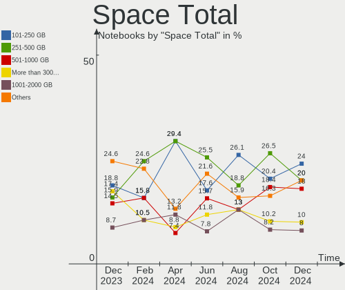
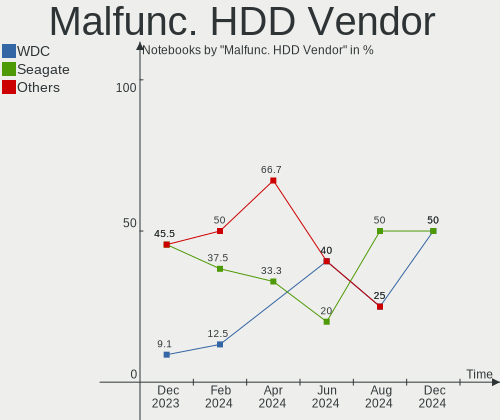
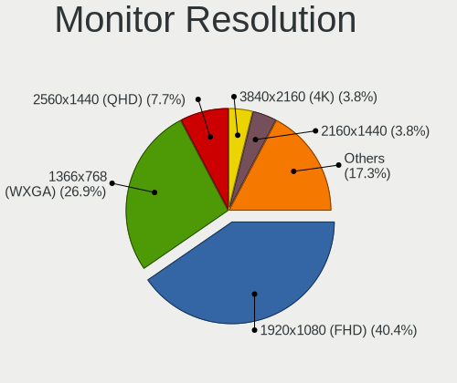
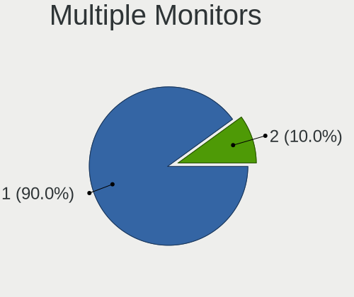
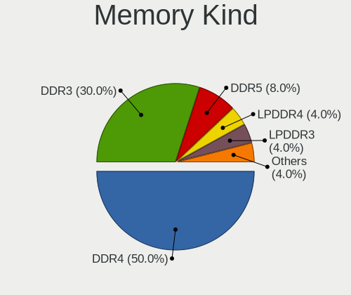

ArcoLinux - Hardware Trends (Notebooks)
---------------------------------------

A project to identify most popular hardware characteristics and track their change
over time based on data collected by Linux users at https://Linux-Hardware.org.

Anyone can contribute to this report by the [hw-probe](https://github.com/linuxhw/hw-probe) tool:

    sudo -E hw-probe -all -upload

This report is for one last month. Overall report since the beginning of time: [TestCoverage](https://github.com/linuxhw/TestCoverage)

Period: Dec, 2022.

Contents
--------

* [ System ](#system)
  - [ OS                       ](#os)
  - [ OS Family                ](#os-family)
  - [ Kernel                   ](#kernel)
  - [ Kernel Family            ](#kernel-family)
  - [ Kernel Major Ver.        ](#kernel-major-ver)
  - [ Arch                     ](#arch)
  - [ DE                       ](#de)
  - [ Display Server           ](#display-server)
  - [ Display Manager          ](#display-manager)
  - [ OS Lang                  ](#os-lang)
  - [ Boot Mode                ](#boot-mode)
  - [ Filesystem               ](#filesystem)
  - [ Part. scheme             ](#part-scheme)
  - [ Dual Boot with Linux/BSD ](#dual-boot-with-linuxbsd)
  - [ Dual Boot (Win)          ](#dual-boot-win)

* [ Board ](#board)
  - [ Vendor                   ](#vendor)
  - [ Model                    ](#model)
  - [ Model Family             ](#model-family)
  - [ MFG Year                 ](#mfg-year)
  - [ Form Factor              ](#form-factor)
  - [ Secure Boot              ](#secure-boot)
  - [ Coreboot                 ](#coreboot)
  - [ RAM Size                 ](#ram-size)
  - [ RAM Used                 ](#ram-used)
  - [ Total Drives             ](#total-drives)
  - [ Has CD-ROM               ](#has-cd-rom)
  - [ Has Ethernet             ](#has-ethernet)
  - [ Has WiFi                 ](#has-wifi)
  - [ Has Bluetooth            ](#has-bluetooth)

* [ Location ](#location)
  - [ Country                  ](#country)
  - [ City                     ](#city)

* [ Drives ](#drives)
  - [ Drive Vendor             ](#drive-vendor)
  - [ Drive Model              ](#drive-model)
  - [ HDD Vendor               ](#hdd-vendor)
  - [ SSD Vendor               ](#ssd-vendor)
  - [ Drive Kind               ](#drive-kind)
  - [ Drive Connector          ](#drive-connector)
  - [ Drive Size               ](#drive-size)
  - [ Space Total              ](#space-total)
  - [ Space Used               ](#space-used)
  - [ Malfunc. Drives          ](#malfunc-drives)
  - [ Malfunc. Drive Vendor    ](#malfunc-drive-vendor)
  - [ Malfunc. HDD Vendor      ](#malfunc-hdd-vendor)
  - [ Malfunc. Drive Kind      ](#malfunc-drive-kind)
  - [ Failed Drives            ](#failed-drives)
  - [ Failed Drive Vendor      ](#failed-drive-vendor)
  - [ Drive Status             ](#drive-status)

* [ Storage controller ](#storage-controller)
  - [ Storage Vendor           ](#storage-vendor)
  - [ Storage Model            ](#storage-model)
  - [ Storage Kind             ](#storage-kind)

* [ Processor ](#processor)
  - [ CPU Vendor               ](#cpu-vendor)
  - [ CPU Model                ](#cpu-model)
  - [ CPU Model Family         ](#cpu-model-family)
  - [ CPU Cores                ](#cpu-cores)
  - [ CPU Sockets              ](#cpu-sockets)
  - [ CPU Threads              ](#cpu-threads)
  - [ CPU Op-Modes             ](#cpu-op-modes)
  - [ CPU Microcode            ](#cpu-microcode)
  - [ CPU Microarch            ](#cpu-microarch)

* [ Graphics ](#graphics)
  - [ GPU Vendor               ](#gpu-vendor)
  - [ GPU Model                ](#gpu-model)
  - [ GPU Combo                ](#gpu-combo)
  - [ GPU Driver               ](#gpu-driver)
  - [ GPU Memory               ](#gpu-memory)

* [ Monitor ](#monitor)
  - [ Monitor Vendor           ](#monitor-vendor)
  - [ Monitor Model            ](#monitor-model)
  - [ Monitor Resolution       ](#monitor-resolution)
  - [ Monitor Diagonal         ](#monitor-diagonal)
  - [ Monitor Width            ](#monitor-width)
  - [ Aspect Ratio             ](#aspect-ratio)
  - [ Monitor Area             ](#monitor-area)
  - [ Pixel Density            ](#pixel-density)
  - [ Multiple Monitors        ](#multiple-monitors)

* [ Network ](#network)
  - [ Net Controller Vendor    ](#net-controller-vendor)
  - [ Net Controller Model     ](#net-controller-model)
  - [ Wireless Vendor          ](#wireless-vendor)
  - [ Wireless Model           ](#wireless-model)
  - [ Ethernet Vendor          ](#ethernet-vendor)
  - [ Ethernet Model           ](#ethernet-model)
  - [ Net Controller Kind      ](#net-controller-kind)
  - [ Used Controller          ](#used-controller)
  - [ NICs                     ](#nics)
  - [ IPv6                     ](#ipv6)

* [ Bluetooth ](#bluetooth)
  - [ Bluetooth Vendor         ](#bluetooth-vendor)
  - [ Bluetooth Model          ](#bluetooth-model)

* [ Sound ](#sound)
  - [ Sound Vendor             ](#sound-vendor)
  - [ Sound Model              ](#sound-model)

* [ Memory ](#memory)
  - [ Memory Vendor            ](#memory-vendor)
  - [ Memory Model             ](#memory-model)
  - [ Memory Kind              ](#memory-kind)
  - [ Memory Form Factor       ](#memory-form-factor)
  - [ Memory Size              ](#memory-size)
  - [ Memory Speed             ](#memory-speed)

* [ Printers & scanners ](#printers--scanners)
  - [ Printer Vendor           ](#printer-vendor)
  - [ Printer Model            ](#printer-model)
  - [ Scanner Vendor           ](#scanner-vendor)
  - [ Scanner Model            ](#scanner-model)

* [ Camera ](#camera)
  - [ Camera Vendor            ](#camera-vendor)
  - [ Camera Model             ](#camera-model)

* [ Security ](#security)
  - [ Fingerprint Vendor       ](#fingerprint-vendor)
  - [ Fingerprint Model        ](#fingerprint-model)
  - [ Chipcard Vendor          ](#chipcard-vendor)
  - [ Chipcard Model           ](#chipcard-model)

* [ Unsupported ](#unsupported)
  - [ Unsupported Devices      ](#unsupported-devices)
  - [ Unsupported Device Types ](#unsupported-device-types)

System
------

OS
--

Installed operating systems

| Name              | Notebooks | Percent |
|-------------------|-----------|---------|
| ArcoLinux Rolling | 19        | 100%    |

OS Family
---------

OS without a version

| Name      | Notebooks | Percent |
|-----------|-----------|---------|
| ArcoLinux | 19        | 100%    |

Kernel
------

Version of the Linux kernel

| Version                     | Notebooks | Percent |
|-----------------------------|-----------|---------|
| 6.0.12-arch1-1              | 4         | 21.05%  |
| 6.1.1-zen1-1-zen            | 3         | 15.79%  |
| 6.0.11-arch1-1              | 3         | 15.79%  |
| 6.1.1-arch1-1               | 2         | 10.53%  |
| 6.0.10-arch2-1              | 2         | 10.53%  |
| 6.0.9-arch1-1               | 1         | 5.26%   |
| 6.0.11-zen1-1-zen           | 1         | 5.26%   |
| 6.0.10-hardened1-1-hardened | 1         | 5.26%   |
| 5.15.81-1-lts               | 1         | 5.26%   |
| 5.13.9-arch1-1              | 1         | 5.26%   |

Kernel Family
-------------

Linux kernel without a distro release

| Version | Notebooks | Percent |
|---------|-----------|---------|
| 6.1.1   | 5         | 26.32%  |
| 6.0.12  | 4         | 21.05%  |
| 6.0.11  | 4         | 21.05%  |
| 6.0.10  | 3         | 15.79%  |
| 6.0.9   | 1         | 5.26%   |
| 5.15.81 | 1         | 5.26%   |
| 5.13.9  | 1         | 5.26%   |

Kernel Major Ver.
-----------------

Linux kernel major version

| Version | Notebooks | Percent |
|---------|-----------|---------|
| 6.0     | 12        | 63.16%  |
| 6.1     | 5         | 26.32%  |
| 5.15    | 1         | 5.26%   |
| 5.13    | 1         | 5.26%   |

Arch
----

OS architecture (x86_64, i586, etc.)

| Name   | Notebooks | Percent |
|--------|-----------|---------|
| x86_64 | 19        | 100%    |

DE
--

Desktop Environment

| Name          | Notebooks | Percent |
|---------------|-----------|---------|
| XFCE          | 6         | 31.58%  |
| KDE5          | 4         | 21.05%  |
| awesome       | 3         | 15.79%  |
| sway          | 1         | 5.26%   |
| qtile         | 1         | 5.26%   |
| LeftWM        | 1         | 5.26%   |
| i3            | 1         | 5.26%   |
| GNOME Classic | 1         | 5.26%   |
| bspwm         | 1         | 5.26%   |

Display Server
--------------

X11 or Wayland

| Name    | Notebooks | Percent |
|---------|-----------|---------|
| X11     | 16        | 84.21%  |
| Wayland | 2         | 10.53%  |
| Tty     | 1         | 5.26%   |

Display Manager
---------------

SDDM, LightDM, etc.

| Name    | Notebooks | Percent |
|---------|-----------|---------|
| SDDM    | 14        | 73.68%  |
| LightDM | 3         | 15.79%  |
| Ly      | 1         | 5.26%   |
| GDM     | 1         | 5.26%   |

OS Lang
-------

Language

| Lang  | Notebooks | Percent |
|-------|-----------|---------|
| en_US | 9         | 47.37%  |
| de_DE | 2         | 10.53%  |
| ru_RU | 1         | 5.26%   |
| pt_BR | 1         | 5.26%   |
| it_IT | 1         | 5.26%   |
| es_ES | 1         | 5.26%   |
| en_ZA | 1         | 5.26%   |
| en_GB | 1         | 5.26%   |
| en_CA | 1         | 5.26%   |
| en_AU | 1         | 5.26%   |

Boot Mode
---------

EFI or BIOS

| Mode | Notebooks | Percent |
|------|-----------|---------|
| EFI  | 14        | 73.68%  |
| BIOS | 5         | 26.32%  |

Filesystem
----------

Type of filesystem

| Type    | Notebooks | Percent |
|---------|-----------|---------|
| Ext4    | 12        | 63.16%  |
| Btrfs   | 6         | 31.58%  |
| Overlay | 1         | 5.26%   |

Part. scheme
------------

Scheme of partitioning

| Type | Notebooks | Percent |
|------|-----------|---------|
| GPT  | 15        | 78.95%  |
| MBR  | 4         | 21.05%  |

Dual Boot with Linux/BSD
------------------------

Hosting more than one Linux/BSD

| Dual boot | Notebooks | Percent |
|-----------|-----------|---------|
| No        | 14        | 73.68%  |
| Yes       | 5         | 26.32%  |

Dual Boot (Win)
---------------

Hosting Linux and Windows

| Dual boot | Notebooks | Percent |
|-----------|-----------|---------|
| No        | 13        | 68.42%  |
| Yes       | 6         | 31.58%  |

Board
-----

Vendor
------

Motherboard manufacturer

| Name             | Notebooks | Percent |
|------------------|-----------|---------|
| MSI              | 3         | 15.79%  |
| Lenovo           | 3         | 15.79%  |
| Hewlett-Packard  | 3         | 15.79%  |
| Dell             | 3         | 15.79%  |
| ASUSTek Computer | 3         | 15.79%  |
| Sony             | 1         | 5.26%   |
| Packard Bell     | 1         | 5.26%   |
| LG Electronics   | 1         | 5.26%   |
| Apple            | 1         | 5.26%   |

Model
-----

Motherboard model

| Name                                   | Notebooks | Percent |
|----------------------------------------|-----------|---------|
| Sony SVF15N26CXB                       | 1         | 5.26%   |
| Packard Bell EasyNote TE69HW           | 1         | 5.26%   |
| MSI Raider GE77HX 12UGS                | 1         | 5.26%   |
| MSI GL75 Leopard 10SDK                 | 1         | 5.26%   |
| MSI GE72VR 6RF                         | 1         | 5.26%   |
| LG C500                                | 1         | 5.26%   |
| Lenovo ThinkPad T14s Gen 2i 20WM00ACIX | 1         | 5.26%   |
| Lenovo Legion 5 15ARH05 82B5           | 1         | 5.26%   |
| Lenovo IdeaPad 5 14ALC05 82LM          | 1         | 5.26%   |
| HP Folio 13                            | 1         | 5.26%   |
| HP EliteBook 850 G1                    | 1         | 5.26%   |
| HP EliteBook 830 G5                    | 1         | 5.26%   |
| Dell Latitude 5580                     | 1         | 5.26%   |
| Dell Inspiron 7580                     | 1         | 5.26%   |
| Dell Inspiron 5502                     | 1         | 5.26%   |
| ASUS X556UQK                           | 1         | 5.26%   |
| ASUS X555QA                            | 1         | 5.26%   |
| ASUS X550MD                            | 1         | 5.26%   |
| Apple MacBookAir6,2                    | 1         | 5.26%   |

Model Family
------------

Motherboard model prefix

| Name                  | Notebooks | Percent |
|-----------------------|-----------|---------|
| HP EliteBook          | 2         | 10.53%  |
| Dell Inspiron         | 2         | 10.53%  |
| Sony SVF15N26CXB      | 1         | 5.26%   |
| Packard Bell EasyNote | 1         | 5.26%   |
| MSI Raider            | 1         | 5.26%   |
| MSI GL75              | 1         | 5.26%   |
| MSI GE72VR            | 1         | 5.26%   |
| LG C500               | 1         | 5.26%   |
| Lenovo ThinkPad       | 1         | 5.26%   |
| Lenovo Legion         | 1         | 5.26%   |
| Lenovo IdeaPad        | 1         | 5.26%   |
| HP Folio              | 1         | 5.26%   |
| Dell Latitude         | 1         | 5.26%   |
| ASUS X556UQK          | 1         | 5.26%   |
| ASUS X555QA           | 1         | 5.26%   |
| ASUS X550MD           | 1         | 5.26%   |
| Apple MacBookAir6     | 1         | 5.26%   |

MFG Year
--------

Motherboard manufacture year

| Year | Notebooks | Percent |
|------|-----------|---------|
| 2020 | 3         | 15.79%  |
| 2014 | 3         | 15.79%  |
| 2021 | 2         | 10.53%  |
| 2017 | 2         | 10.53%  |
| 2016 | 2         | 10.53%  |
| 2013 | 2         | 10.53%  |
| 2011 | 2         | 10.53%  |
| 2022 | 1         | 5.26%   |
| 2019 | 1         | 5.26%   |
| 2018 | 1         | 5.26%   |

Form Factor
-----------

Physical design of the computer

| Name     | Notebooks | Percent |
|----------|-----------|---------|
| Notebook | 19        | 100%    |

Secure Boot
-----------

Enabled or disabled

| State    | Notebooks | Percent |
|----------|-----------|---------|
| Disabled | 19        | 100%    |

Coreboot
--------

Have coreboot on board

| Used | Notebooks | Percent |
|------|-----------|---------|
| No   | 19        | 100%    |

RAM Size
--------

Total RAM memory

| Size in GB  | Notebooks | Percent |
|-------------|-----------|---------|
| 4.01-8.0    | 5         | 26.32%  |
| 16.01-24.0  | 5         | 26.32%  |
| 3.01-4.0    | 4         | 21.05%  |
| 32.01-64.0  | 2         | 10.53%  |
| 8.01-16.0   | 2         | 10.53%  |
| 64.01-256.0 | 1         | 5.26%   |

RAM Used
--------

Used RAM memory

| Used GB   | Notebooks | Percent |
|-----------|-----------|---------|
| 4.01-8.0  | 5         | 26.32%  |
| 3.01-4.0  | 5         | 26.32%  |
| 2.01-3.0  | 5         | 26.32%  |
| 1.01-2.0  | 3         | 15.79%  |
| 8.01-16.0 | 1         | 5.26%   |

Total Drives
------------

Number of drives on board

| Drives | Notebooks | Percent |
|--------|-----------|---------|
| 1      | 13        | 68.42%  |
| 2      | 5         | 26.32%  |
| 3      | 1         | 5.26%   |

Has CD-ROM
----------

Has CD-ROM on board

| Presented | Notebooks | Percent |
|-----------|-----------|---------|
| No        | 16        | 84.21%  |
| Yes       | 3         | 15.79%  |

Has Ethernet
------------

Has Ethernet on board

| Presented | Notebooks | Percent |
|-----------|-----------|---------|
| Yes       | 16        | 84.21%  |
| No        | 3         | 15.79%  |

Has WiFi
--------

Has WiFi module

| Presented | Notebooks | Percent |
|-----------|-----------|---------|
| Yes       | 19        | 100%    |

Has Bluetooth
-------------

Has Bluetooth module

| Presented | Notebooks | Percent |
|-----------|-----------|---------|
| Yes       | 18        | 94.74%  |
| No        | 1         | 5.26%   |

Location
--------

Country
-------

Geographic location (country)

| Country      | Notebooks | Percent |
|--------------|-----------|---------|
| USA          | 3         | 15.79%  |
| Turkey       | 2         | 10.53%  |
| Spain        | 2         | 10.53%  |
| Germany      | 2         | 10.53%  |
| South Africa | 1         | 5.26%   |
| Russia       | 1         | 5.26%   |
| Romania      | 1         | 5.26%   |
| Latvia       | 1         | 5.26%   |
| Italy        | 1         | 5.26%   |
| France       | 1         | 5.26%   |
| Egypt        | 1         | 5.26%   |
| Canada       | 1         | 5.26%   |
| Brazil       | 1         | 5.26%   |
| Australia    | 1         | 5.26%   |

City
----

Geographic location (city)

| City             | Notebooks | Percent |
|------------------|-----------|---------|
| Ventspils        | 1         | 5.26%   |
| Toronto          | 1         | 5.26%   |
| Spokane          | 1         | 5.26%   |
| Schwanewede      | 1         | 5.26%   |
| San Juan de Moro | 1         | 5.26%   |
| Rio de Janeiro   | 1         | 5.26%   |
| Milan            | 1         | 5.26%   |
| Madrid           | 1         | 5.26%   |
| Lyon             | 1         | 5.26%   |
| Lafayette        | 1         | 5.26%   |
| Krasnodar        | 1         | 5.26%   |
| Istanbul         | 1         | 5.26%   |
| Gardena          | 1         | 5.26%   |
| Cluj-Napoca      | 1         | 5.26%   |
| Cape Town        | 1         | 5.26%   |
| Cairo            | 1         | 5.26%   |
| Brisbane         | 1         | 5.26%   |
| Apfeltrach       | 1         | 5.26%   |
| Ankara           | 1         | 5.26%   |

Drives
------

Drive Vendor
------------

Hard drive vendors

| Vendor                    | Notebooks | Drives | Percent |
|---------------------------|-----------|--------|---------|
| Samsung Electronics       | 5         | 7      | 20.83%  |
| WDC                       | 3         | 3      | 12.5%   |
| Toshiba                   | 3         | 3      | 12.5%   |
| Micron Technology         | 3         | 3      | 12.5%   |
| SK hynix                  | 2         | 2      | 8.33%   |
| Sandisk                   | 2         | 2      | 8.33%   |
| Unknown                   | 1         | 1      | 4.17%   |
| PNY                       | 1         | 1      | 4.17%   |
| Pioneer                   | 1         | 1      | 4.17%   |
| Micron/Crucial Technology | 1         | 1      | 4.17%   |
| LaCie                     | 1         | 1      | 4.17%   |
| Apple                     | 1         | 1      | 4.17%   |

Drive Model
-----------

Hard drive models

| Model                                               | Notebooks | Percent |
|-----------------------------------------------------|-----------|---------|
| Samsung NVMe SSD Controller SM981/PM981/PM983 500GB | 2         | 7.69%   |
| WDC WD5000LPVX-80V0TT0 500GB                        | 1         | 3.85%   |
| WDC WD3200BPVT-22ZEST0 320GB                        | 1         | 3.85%   |
| WDC WD Blue SA510 2.5 1000GB SSD                    | 1         | 3.85%   |
| Unknown SD/MMC/MS PRO 64GB                          | 1         | 3.85%   |
| Toshiba THNSNK256GVN8 M.2 2280 256GB SSD            | 1         | 3.85%   |
| Toshiba MQ01ABD100 1TB                              | 1         | 3.85%   |
| Toshiba BG3 NVMe SSD Controller 256GB               | 1         | 3.85%   |
| SK hynix SKHynix_HFS512GDE9X081N 512GB              | 1         | 3.85%   |
| SK hynix HFS128G32TND-N210A 128GB SSD               | 1         | 3.85%   |
| Sandisk WD Blue SN570 1TB                           | 1         | 3.85%   |
| Sandisk WD Black SN750 / PC SN730 NVMe SSD 512GB    | 1         | 3.85%   |
| Samsung SSD 840 EVO 1TB                             | 1         | 3.85%   |
| Samsung NVMe SSD Controller PM9A1/PM9A3/980PRO 2TB  | 1         | 3.85%   |
| Samsung MZVLQ512HALU-00000 512GB                    | 1         | 3.85%   |
| Samsung MZMPC128HBFU-000H1 128GB SSD                | 1         | 3.85%   |
| Samsung M3 Portable 1TB                             | 1         | 3.85%   |
| PNY CS1311 240GB SSD                                | 1         | 3.85%   |
| Pioneer APS-SL3N-120 120GB SSD                      | 1         | 3.85%   |
| Micron/Crucial P2 NVMe PCIe SSD 500GB               | 1         | 3.85%   |
| Micron MTFDHBA512QFD 512GB                          | 1         | 3.85%   |
| Micron 2300 NVMe 1024GB                             | 1         | 3.85%   |
| Micron 1100_MTFDDAK256TBN 256GB SSD                 | 1         | 3.85%   |
| LaCie Rugged Mini USB3 2TB                          | 1         | 3.85%   |
| Apple SSD SD0128F 121GB                             | 1         | 3.85%   |

HDD Vendor
----------

Hard disk drive vendors

| Vendor              | Notebooks | Drives | Percent |
|---------------------|-----------|--------|---------|
| WDC                 | 2         | 2      | 33.33%  |
| Unknown             | 1         | 1      | 16.67%  |
| Toshiba             | 1         | 1      | 16.67%  |
| Samsung Electronics | 1         | 1      | 16.67%  |
| LaCie               | 1         | 1      | 16.67%  |

SSD Vendor
----------

Solid state drive vendors

| Vendor              | Notebooks | Drives | Percent |
|---------------------|-----------|--------|---------|
| Samsung Electronics | 2         | 2      | 22.22%  |
| WDC                 | 1         | 1      | 11.11%  |
| Toshiba             | 1         | 1      | 11.11%  |
| SK hynix            | 1         | 1      | 11.11%  |
| PNY                 | 1         | 1      | 11.11%  |
| Pioneer             | 1         | 1      | 11.11%  |
| Micron Technology   | 1         | 1      | 11.11%  |
| Apple               | 1         | 1      | 11.11%  |

Drive Kind
----------

HDD or SSD

| Kind | Notebooks | Drives | Percent |
|------|-----------|--------|---------|
| NVMe | 9         | 11     | 37.5%   |
| SSD  | 9         | 9      | 37.5%   |
| HDD  | 6         | 6      | 25%     |

Drive Connector
---------------

SATA, SAS, NVMe, etc.

| Type | Notebooks | Drives | Percent |
|------|-----------|--------|---------|
| SATA | 11        | 12     | 47.83%  |
| NVMe | 9         | 11     | 39.13%  |
| SAS  | 3         | 3      | 13.04%  |

Drive Size
----------

Size of hard drive

| Size in TB | Notebooks | Drives | Percent |
|------------|-----------|--------|---------|
| 0.01-0.5   | 10        | 10     | 66.67%  |
| 0.51-1.0   | 4         | 4      | 26.67%  |
| 1.01-2.0   | 1         | 1      | 6.67%   |

Space Total
-----------

Amount of disk space available on the file system

| Size in GB     | Notebooks | Percent |
|----------------|-----------|---------|
| 251-500        | 6         | 31.58%  |
| 101-250        | 4         | 21.05%  |
| More than 3000 | 3         | 15.79%  |
| 1001-2000      | 2         | 10.53%  |
| 501-1000       | 2         | 10.53%  |
| 1-20           | 1         | 5.26%   |
| 51-100         | 1         | 5.26%   |

Space Used
----------

Amount of used disk space

| Used GB        | Notebooks | Percent |
|----------------|-----------|---------|
| 251-500        | 4         | 21.05%  |
| 1-20           | 4         | 21.05%  |
| 101-250        | 3         | 15.79%  |
| 51-100         | 3         | 15.79%  |
| 21-50          | 2         | 10.53%  |
| 501-1000       | 2         | 10.53%  |
| More than 3000 | 1         | 5.26%   |

Malfunc. Drives
---------------

Drive models with a malfunction

| Model                                    | Notebooks | Drives | Percent |
|------------------------------------------|-----------|--------|---------|
| Toshiba THNSNK256GVN8 M.2 2280 256GB SSD | 1         | 1      | 33.33%  |
| SK hynix HFS128G32TND-N210A 128GB SSD    | 1         | 1      | 33.33%  |
| LaCie Rugged Mini USB3 2TB               | 1         | 1      | 33.33%  |

Malfunc. Drive Vendor
---------------------

Vendors of faulty drives

| Vendor   | Notebooks | Drives | Percent |
|----------|-----------|--------|---------|
| Toshiba  | 1         | 1      | 33.33%  |
| SK hynix | 1         | 1      | 33.33%  |
| LaCie    | 1         | 1      | 33.33%  |

Malfunc. HDD Vendor
-------------------

Vendors of faulty HDD drives

| Vendor | Notebooks | Drives | Percent |
|--------|-----------|--------|---------|
| LaCie  | 1         | 1      | 100%    |

Malfunc. Drive Kind
-------------------

Kinds of faulty drives

| Kind | Notebooks | Drives | Percent |
|------|-----------|--------|---------|
| SSD  | 2         | 2      | 66.67%  |
| HDD  | 1         | 1      | 33.33%  |

Failed Drives
-------------

Failed drive models

Zero info for selected period =(

Failed Drive Vendor
-------------------

Failed drive vendors

Zero info for selected period =(

Drive Status
------------

Number of failed and malfunc. drives

| Status   | Notebooks | Drives | Percent |
|----------|-----------|--------|---------|
| Works    | 18        | 22     | 81.82%  |
| Malfunc  | 3         | 3      | 13.64%  |
| Detected | 1         | 1      | 4.55%   |

Storage controller
------------------

Storage Vendor
--------------

Storage controller vendors

| Vendor                       | Notebooks | Percent |
|------------------------------|-----------|---------|
| Intel                        | 12        | 46.15%  |
| Samsung Electronics          | 3         | 11.54%  |
| AMD                          | 3         | 11.54%  |
| SanDisk                      | 2         | 7.69%   |
| Micron Technology            | 2         | 7.69%   |
| Toshiba America Info Systems | 1         | 3.85%   |
| SK hynix                     | 1         | 3.85%   |
| Micron/Crucial Technology    | 1         | 3.85%   |
| Marvell Technology Group     | 1         | 3.85%   |

Storage Model
-------------

Storage controller models

| Model                                                                         | Notebooks | Percent |
|-------------------------------------------------------------------------------|-----------|---------|
| Intel 8 Series SATA Controller 1 [AHCI mode]                                  | 3         | 11.11%  |
| AMD FCH SATA Controller [AHCI mode]                                           | 3         | 11.11%  |
| Samsung NVMe SSD Controller SM981/PM981/PM983                                 | 2         | 7.41%   |
| Micron Non-Volatile memory controller                                         | 2         | 7.41%   |
| Toshiba America Info Systems BG3 NVMe SSD Controller                          | 1         | 3.7%    |
| SK hynix Gold P31/PC711 NVMe Solid State Drive                                | 1         | 3.7%    |
| SanDisk WD Blue SN570 NVMe SSD                                                | 1         | 3.7%    |
| SanDisk WD Black SN750 / PC SN730 NVMe SSD                                    | 1         | 3.7%    |
| Samsung NVMe SSD Controller PM9A1/PM9A3/980PRO                                | 1         | 3.7%    |
| Samsung NVMe SSD Controller 980                                               | 1         | 3.7%    |
| Micron/Crucial P2 NVMe PCIe SSD                                               | 1         | 3.7%    |
| Marvell Group 88SS9183 PCIe SSD Controller                                    | 1         | 3.7%    |
| Intel Volume Management Device NVMe RAID Controller                           | 1         | 3.7%    |
| Intel Sunrise Point-LP SATA Controller [AHCI mode]                            | 1         | 3.7%    |
| Intel Q170/Q150/B150/H170/H110/Z170/CM236 Chipset SATA Controller [AHCI Mode] | 1         | 3.7%    |
| Intel HM170/QM170 Chipset SATA Controller [AHCI Mode]                         | 1         | 3.7%    |
| Intel Cannon Point-LP SATA Controller [AHCI Mode]                             | 1         | 3.7%    |
| Intel Atom Processor E3800 Series SATA AHCI Controller                        | 1         | 3.7%    |
| Intel 6 Series/C200 Series Chipset Family 6 port Mobile SATA AHCI Controller  | 1         | 3.7%    |
| Intel 5 Series/3400 Series Chipset 4 port SATA AHCI Controller                | 1         | 3.7%    |
| Intel 400 Series Chipset Family SATA AHCI Controller                          | 1         | 3.7%    |

Storage Kind
------------

Kind of storage controller (IDE, SATA, NVMe, SAS, ...)

| Kind | Notebooks | Percent |
|------|-----------|---------|
| SATA | 15        | 60%     |
| NVMe | 9         | 36%     |
| RAID | 1         | 4%      |

Processor
---------

CPU Vendor
----------

Processor vendors

| Vendor | Notebooks | Percent |
|--------|-----------|---------|
| Intel  | 16        | 84.21%  |
| AMD    | 3         | 15.79%  |

CPU Model
---------

Processor models

| Model                                           | Notebooks | Percent |
|-------------------------------------------------|-----------|---------|
| Intel Core i7-4500U CPU @ 1.80GHz               | 2         | 10.53%  |
| Intel 11th Gen Core i7-1165G7 @ 2.80GHz         | 2         | 10.53%  |
| Intel Pentium CPU N3540 @ 2.16GHz               | 1         | 5.26%   |
| Intel Core i7-8565U CPU @ 1.80GHz               | 1         | 5.26%   |
| Intel Core i7-6700HQ CPU @ 2.60GHz              | 1         | 5.26%   |
| Intel Core i7-10750H CPU @ 2.60GHz              | 1         | 5.26%   |
| Intel Core i5-8350U CPU @ 1.70GHz               | 1         | 5.26%   |
| Intel Core i5-7300HQ CPU @ 2.50GHz              | 1         | 5.26%   |
| Intel Core i5-7200U CPU @ 2.50GHz               | 1         | 5.26%   |
| Intel Core i5-4250U CPU @ 1.30GHz               | 1         | 5.26%   |
| Intel Core i5-4200U CPU @ 1.60GHz               | 1         | 5.26%   |
| Intel Core i5-2467M CPU @ 1.60GHz               | 1         | 5.26%   |
| Intel Core i3 CPU M 390 @ 2.67GHz               | 1         | 5.26%   |
| Intel 12th Gen Core i7-12800HX                  | 1         | 5.26%   |
| AMD Ryzen 7 5700U with Radeon Graphics          | 1         | 5.26%   |
| AMD Ryzen 7 4800H with Radeon Graphics          | 1         | 5.26%   |
| AMD A12-9720P RADEON R7, 12 COMPUTE CORES 4C+8G | 1         | 5.26%   |

CPU Model Family
----------------

Processor model prefix

| Model         | Notebooks | Percent |
|---------------|-----------|---------|
| Intel Core i5 | 6         | 31.58%  |
| Intel Core i7 | 5         | 26.32%  |
| Other         | 3         | 15.79%  |
| AMD Ryzen 7   | 2         | 10.53%  |
| Intel Pentium | 1         | 5.26%   |
| Intel Core i3 | 1         | 5.26%   |
| AMD A12       | 1         | 5.26%   |

CPU Cores
---------

Number of processor cores

| Number | Notebooks | Percent |
|--------|-----------|---------|
| 2      | 8         | 42.11%  |
| 4      | 7         | 36.84%  |
| 8      | 2         | 10.53%  |
| 16     | 1         | 5.26%   |
| 6      | 1         | 5.26%   |

CPU Sockets
-----------

Number of sockets

| Number | Notebooks | Percent |
|--------|-----------|---------|
| 1      | 19        | 100%    |

CPU Threads
-----------

Threads per core (Hyper-Threading)

| Number | Notebooks | Percent |
|--------|-----------|---------|
| 2      | 17        | 89.47%  |
| 1      | 2         | 10.53%  |

CPU Op-Modes
------------

CPU Operation Modes (32-bit, 64-bit)

| Op mode        | Notebooks | Percent |
|----------------|-----------|---------|
| 32-bit, 64-bit | 19        | 100%    |

CPU Microcode
-------------

Microcode number

| Number     | Notebooks | Percent |
|------------|-----------|---------|
| 0x806c1    | 2         | 10.53%  |
| 0x40651    | 2         | 10.53%  |
| Unknown    | 2         | 10.53%  |
| 0xa0652    | 1         | 5.26%   |
| 0x906e9    | 1         | 5.26%   |
| 0x90672    | 1         | 5.26%   |
| 0x806eb    | 1         | 5.26%   |
| 0x806ea    | 1         | 5.26%   |
| 0x806e9    | 1         | 5.26%   |
| 0x506e3    | 1         | 5.26%   |
| 0x30678    | 1         | 5.26%   |
| 0x206a7    | 1         | 5.26%   |
| 0x20655    | 1         | 5.26%   |
| 0x08608103 | 1         | 5.26%   |
| 0x08600106 | 1         | 5.26%   |
| 0x0600611a | 1         | 5.26%   |

CPU Microarch
-------------

Microarchitecture

| Name             | Notebooks | Percent |
|------------------|-----------|---------|
| KabyLake         | 4         | 21.05%  |
| Haswell          | 4         | 21.05%  |
| TigerLake        | 2         | 10.53%  |
| Zen 2            | 1         | 5.26%   |
| Westmere         | 1         | 5.26%   |
| Skylake          | 1         | 5.26%   |
| Silvermont       | 1         | 5.26%   |
| SandyBridge      | 1         | 5.26%   |
| Excavator        | 1         | 5.26%   |
| CometLake        | 1         | 5.26%   |
| Alderlake Hybrid | 1         | 5.26%   |
| Unknown          | 1         | 5.26%   |

Graphics
--------

GPU Vendor
----------

Vendors of graphics cards

| Vendor | Notebooks | Percent |
|--------|-----------|---------|
| Intel  | 16        | 57.14%  |
| Nvidia | 8         | 28.57%  |
| AMD    | 4         | 14.29%  |

GPU Model
---------

Graphics card models

| Model                                                                     | Notebooks | Percent |
|---------------------------------------------------------------------------|-----------|---------|
| Intel Haswell-ULT Integrated Graphics Controller                          | 4         | 14.29%  |
| Intel TigerLake-LP GT2 [Iris Xe Graphics]                                 | 2         | 7.14%   |
| Nvidia TU117M                                                             | 1         | 3.57%   |
| Nvidia TU116M [GeForce GTX 1660 Ti Mobile]                                | 1         | 3.57%   |
| Nvidia GP108M [GeForce MX150]                                             | 1         | 3.57%   |
| Nvidia GP106M [GeForce GTX 1060 Mobile]                                   | 1         | 3.57%   |
| Nvidia GM108M [GeForce 940MX]                                             | 1         | 3.57%   |
| Nvidia GK208M [GeForce GT 735M]                                           | 1         | 3.57%   |
| Nvidia GF117M [GeForce 610M/710M/810M/820M / GT 620M/625M/630M/720M]      | 1         | 3.57%   |
| Nvidia GA104 [Geforce RTX 3070 Ti Laptop GPU]                             | 1         | 3.57%   |
| Intel WhiskeyLake-U GT2 [UHD Graphics 620]                                | 1         | 3.57%   |
| Intel UHD Graphics 620                                                    | 1         | 3.57%   |
| Intel HD Graphics 630                                                     | 1         | 3.57%   |
| Intel HD Graphics 620                                                     | 1         | 3.57%   |
| Intel HD Graphics 530                                                     | 1         | 3.57%   |
| Intel Core Processor Integrated Graphics Controller                       | 1         | 3.57%   |
| Intel CometLake-H GT2 [UHD Graphics]                                      | 1         | 3.57%   |
| Intel Atom Processor Z36xxx/Z37xxx Series Graphics & Display              | 1         | 3.57%   |
| Intel Alder Lake-HX GT1 [UHD Graphics 770]                                | 1         | 3.57%   |
| Intel 2nd Generation Core Processor Family Integrated Graphics Controller | 1         | 3.57%   |
| AMD Wani [Radeon R5/R6/R7 Graphics]                                       | 1         | 3.57%   |
| AMD Opal XT [Radeon R7 M265/M365X/M465]                                   | 1         | 3.57%   |
| AMD Mars [Radeon HD 8730M]                                                | 1         | 3.57%   |
| AMD Lucienne                                                              | 1         | 3.57%   |

GPU Combo
---------

Combinations of graphics cards

| Name           | Notebooks | Percent |
|----------------|-----------|---------|
| Intel + Nvidia | 7         | 36.84%  |
| 1 x Intel      | 7         | 36.84%  |
| Intel + AMD    | 2         | 10.53%  |
| 1 x AMD        | 2         | 10.53%  |
| 1 x Nvidia     | 1         | 5.26%   |

GPU Driver
----------

Free vs proprietary

| Driver      | Notebooks | Percent |
|-------------|-----------|---------|
| Free        | 15        | 78.95%  |
| Proprietary | 4         | 21.05%  |

GPU Memory
----------

Total video memory

| Size in GB | Notebooks | Percent |
|------------|-----------|---------|
| Unknown    | 12        | 63.16%  |
| 1.01-2.0   | 3         | 15.79%  |
| 0.01-0.5   | 2         | 10.53%  |
| 3.01-4.0   | 1         | 5.26%   |
| 0.51-1.0   | 1         | 5.26%   |

Monitor
-------

Monitor Vendor
--------------

Monitor vendors

| Vendor                  | Notebooks | Percent |
|-------------------------|-----------|---------|
| LG Display              | 6         | 27.27%  |
| AU Optronics            | 5         | 22.73%  |
| Chimei Innolux          | 3         | 13.64%  |
| BOE                     | 3         | 13.64%  |
| Sceptre Tech            | 1         | 4.55%   |
| HKC                     | 1         | 4.55%   |
| Chi Mei Optoelectronics | 1         | 4.55%   |
| BenQ                    | 1         | 4.55%   |
| Apple                   | 1         | 4.55%   |

Monitor Model
-------------

Monitor models

| Model                                                                    | Notebooks | Percent |
|--------------------------------------------------------------------------|-----------|---------|
| AU Optronics LCD Monitor AUO408D 1920x1080 309x174mm 14.0-inch           | 2         | 9.09%   |
| Sceptre Tech Sceptre F24 SPT09AB 1920x1080 530x290mm 23.8-inch           | 1         | 4.55%   |
| LG Display LCD Monitor LGD05F2 1920x1080 344x194mm 15.5-inch             | 1         | 4.55%   |
| LG Display LCD Monitor LGD0546 1920x1080 344x194mm 15.5-inch             | 1         | 4.55%   |
| LG Display LCD Monitor LGD0469 1920x1080 382x215mm 17.3-inch             | 1         | 4.55%   |
| LG Display LCD Monitor LGD03FE 1920x1080 345x194mm 15.6-inch             | 1         | 4.55%   |
| LG Display LCD Monitor LGD0312 1366x768 294x166mm 13.3-inch              | 1         | 4.55%   |
| LG Display LCD Monitor LGD02DC 1366x768 344x194mm 15.5-inch              | 1         | 4.55%   |
| HKC TV HKC3393 1360x768 890x500mm 40.2-inch                              | 1         | 4.55%   |
| Chimei Innolux LCD Monitor CMN176E 1920x1080 381x214mm 17.2-inch         | 1         | 4.55%   |
| Chimei Innolux LCD Monitor CMN15C2 1920x1080 344x194mm 15.5-inch         | 1         | 4.55%   |
| Chimei Innolux LCD Monitor CMN1375 1920x1080 293x165mm 13.2-inch         | 1         | 4.55%   |
| Chi Mei Optoelectronics LCD Monitor CMO15A7 1366x768 344x193mm 15.5-inch | 1         | 4.55%   |
| BOE LCD Monitor BOE09F9 2560x1440 381x214mm 17.2-inch                    | 1         | 4.55%   |
| BOE LCD Monitor BOE08DF 1920x1080 340x190mm 15.3-inch                    | 1         | 4.55%   |
| BOE LCD Monitor BOE078C 1920x1080 344x194mm 15.5-inch                    | 1         | 4.55%   |
| BenQ GW2480 BNQ78E7 1920x1080 527x296mm 23.8-inch                        | 1         | 4.55%   |
| AU Optronics LCD Monitor AUO81EC 1366x768 344x193mm 15.5-inch            | 1         | 4.55%   |
| AU Optronics LCD Monitor AUO71EC 1366x768 344x193mm 15.5-inch            | 1         | 4.55%   |
| AU Optronics LCD Monitor AUO38ED 1920x1080 344x193mm 15.5-inch           | 1         | 4.55%   |
| Apple Color LCD APP9CF0 1440x900 290x180mm 13.4-inch                     | 1         | 4.55%   |

Monitor Resolution
------------------

Monitor screen resolution

| Resolution       | Notebooks | Percent |
|------------------|-----------|---------|
| 1920x1080 (FHD)  | 12        | 60%     |
| 1366x768 (WXGA)  | 5         | 25%     |
| 2560x1440 (QHD)  | 1         | 5%      |
| 1440x900 (WXGA+) | 1         | 5%      |
| 1360x768         | 1         | 5%      |

Monitor Diagonal
----------------

Diagonal size in inches

| Inches | Notebooks | Percent |
|--------|-----------|---------|
| 15     | 11        | 50%     |
| 17     | 3         | 13.64%  |
| 13     | 3         | 13.64%  |
| 14     | 2         | 9.09%   |
| 40     | 1         | 4.55%   |
| 32     | 1         | 4.55%   |
| 24     | 1         | 4.55%   |

Monitor Width
-------------

Physical width

| Width in mm | Notebooks | Percent |
|-------------|-----------|---------|
| 301-350     | 13        | 59.09%  |
| 351-400     | 3         | 13.64%  |
| 201-300     | 3         | 13.64%  |
| 801-900     | 1         | 4.55%   |
| 701-800     | 1         | 4.55%   |
| 501-600     | 1         | 4.55%   |

Aspect Ratio
------------

Proportional relationship between the width and the height

| Ratio | Notebooks | Percent |
|-------|-----------|---------|
| 16/9  | 18        | 94.74%  |
| 16/10 | 1         | 5.26%   |

Monitor Area
------------

Area in inch²

| Area in inch² | Notebooks | Percent |
|----------------|-----------|---------|
| 101-110        | 10        | 45.45%  |
| 81-90          | 3         | 13.64%  |
| 121-130        | 3         | 13.64%  |
| 71-80          | 2         | 9.09%   |
| 351-500        | 1         | 4.55%   |
| 201-250        | 1         | 4.55%   |
| 501-1000       | 1         | 4.55%   |
| 91-100         | 1         | 4.55%   |

Pixel Density
-------------

Pixels per inch

| Density | Notebooks | Percent |
|---------|-----------|---------|
| 121-160 | 12        | 54.55%  |
| 101-120 | 4         | 18.18%  |
| 51-100  | 3         | 13.64%  |
| 161-240 | 2         | 9.09%   |
| 1-50    | 1         | 4.55%   |

Multiple Monitors
-----------------

Total monitors connected

| Total | Notebooks | Percent |
|-------|-----------|---------|
| 1     | 16        | 84.21%  |
| 2     | 3         | 15.79%  |

Network
-------

Net Controller Vendor
---------------------

Controller vendors

| Vendor                | Notebooks | Percent |
|-----------------------|-----------|---------|
| Intel                 | 12        | 35.29%  |
| Realtek Semiconductor | 10        | 29.41%  |
| Qualcomm Atheros      | 5         | 14.71%  |
| Broadcom              | 3         | 8.82%   |
| Ralink Technology     | 1         | 2.94%   |
| Ralink                | 1         | 2.94%   |
| Hewlett-Packard       | 1         | 2.94%   |
| Broadcom Limited      | 1         | 2.94%   |

Net Controller Model
--------------------

Controller models

| Model                                                             | Notebooks | Percent |
|-------------------------------------------------------------------|-----------|---------|
| Realtek RTL8111/8168/8411 PCI Express Gigabit Ethernet Controller | 7         | 18.92%  |
| Intel Wi-Fi 6 AX201                                               | 2         | 5.41%   |
| Realtek RTL8822CE 802.11ac PCIe Wireless Network Adapter          | 1         | 2.7%    |
| Realtek RTL8821AE 802.11ac PCIe Wireless Network Adapter          | 1         | 2.7%    |
| Realtek RTL810xE PCI Express Fast Ethernet controller             | 1         | 2.7%    |
| Realtek Killer E3000 2.5GbE Controller                            | 1         | 2.7%    |
| Ralink RT2870/RT3070 Wireless Adapter                             | 1         | 2.7%    |
| Ralink RT3090 Wireless 802.11n 1T/1R PCIe                         | 1         | 2.7%    |
| Qualcomm Atheros QCA9565 / AR9565 Wireless Network Adapter        | 1         | 2.7%    |
| Qualcomm Atheros QCA9377 802.11ac Wireless Network Adapter        | 1         | 2.7%    |
| Qualcomm Atheros QCA6174 802.11ac Wireless Network Adapter        | 1         | 2.7%    |
| Qualcomm Atheros Killer E2400 Gigabit Ethernet Controller         | 1         | 2.7%    |
| Qualcomm Atheros AR8132 Fast Ethernet                             | 1         | 2.7%    |
| Intel Wireless-AC 9260                                            | 1         | 2.7%    |
| Intel Wireless 8265 / 8275                                        | 1         | 2.7%    |
| Intel Wireless 7260                                               | 1         | 2.7%    |
| Intel Wireless 3165                                               | 1         | 2.7%    |
| Intel Wi-Fi 6 AX200                                               | 1         | 2.7%    |
| Intel Ethernet Connection I218-LM                                 | 1         | 2.7%    |
| Intel Ethernet Connection (5) I219-LM                             | 1         | 2.7%    |
| Intel Ethernet Connection (4) I219-LM                             | 1         | 2.7%    |
| Intel Ethernet Connection (13) I219-V                             | 1         | 2.7%    |
| Intel Comet Lake PCH CNVi WiFi                                    | 1         | 2.7%    |
| Intel Centrino Wireless-N 1030 [Rainbow Peak]                     | 1         | 2.7%    |
| Intel Alder Lake-S PCH CNVi WiFi                                  | 1         | 2.7%    |
| HP lt4112 Gobi 4G Module Network Device                           | 1         | 2.7%    |
| Broadcom NetXtreme BCM57786 Gigabit Ethernet PCIe                 | 1         | 2.7%    |
| Broadcom Limited BCM4360 802.11ac Wireless Network Adapter        | 1         | 2.7%    |
| Broadcom BCM43228 802.11a/b/g/n                                   | 1         | 2.7%    |
| Broadcom BCM43142 802.11b/g/n                                     | 1         | 2.7%    |

Wireless Vendor
---------------

Wireless vendors

| Vendor                | Notebooks | Percent |
|-----------------------|-----------|---------|
| Intel                 | 10        | 47.62%  |
| Qualcomm Atheros      | 3         | 14.29%  |
| Realtek Semiconductor | 2         | 9.52%   |
| Broadcom              | 2         | 9.52%   |
| Ralink Technology     | 1         | 4.76%   |
| Ralink                | 1         | 4.76%   |
| Hewlett-Packard       | 1         | 4.76%   |
| Broadcom Limited      | 1         | 4.76%   |

Wireless Model
--------------

Wireless models

| Model                                                      | Notebooks | Percent |
|------------------------------------------------------------|-----------|---------|
| Intel Wi-Fi 6 AX201                                        | 2         | 9.52%   |
| Realtek RTL8822CE 802.11ac PCIe Wireless Network Adapter   | 1         | 4.76%   |
| Realtek RTL8821AE 802.11ac PCIe Wireless Network Adapter   | 1         | 4.76%   |
| Ralink RT2870/RT3070 Wireless Adapter                      | 1         | 4.76%   |
| Ralink RT3090 Wireless 802.11n 1T/1R PCIe                  | 1         | 4.76%   |
| Qualcomm Atheros QCA9565 / AR9565 Wireless Network Adapter | 1         | 4.76%   |
| Qualcomm Atheros QCA9377 802.11ac Wireless Network Adapter | 1         | 4.76%   |
| Qualcomm Atheros QCA6174 802.11ac Wireless Network Adapter | 1         | 4.76%   |
| Intel Wireless-AC 9260                                     | 1         | 4.76%   |
| Intel Wireless 8265 / 8275                                 | 1         | 4.76%   |
| Intel Wireless 7260                                        | 1         | 4.76%   |
| Intel Wireless 3165                                        | 1         | 4.76%   |
| Intel Wi-Fi 6 AX200                                        | 1         | 4.76%   |
| Intel Comet Lake PCH CNVi WiFi                             | 1         | 4.76%   |
| Intel Centrino Wireless-N 1030 [Rainbow Peak]              | 1         | 4.76%   |
| Intel Alder Lake-S PCH CNVi WiFi                           | 1         | 4.76%   |
| HP lt4112 Gobi 4G Module Network Device                    | 1         | 4.76%   |
| Broadcom Limited BCM4360 802.11ac Wireless Network Adapter | 1         | 4.76%   |
| Broadcom BCM43228 802.11a/b/g/n                            | 1         | 4.76%   |
| Broadcom BCM43142 802.11b/g/n                              | 1         | 4.76%   |

Ethernet Vendor
---------------

Ethernet vendors

| Vendor                | Notebooks | Percent |
|-----------------------|-----------|---------|
| Realtek Semiconductor | 9         | 56.25%  |
| Intel                 | 4         | 25%     |
| Qualcomm Atheros      | 2         | 12.5%   |
| Broadcom              | 1         | 6.25%   |

Ethernet Model
--------------

Ethernet models

| Model                                                             | Notebooks | Percent |
|-------------------------------------------------------------------|-----------|---------|
| Realtek RTL8111/8168/8411 PCI Express Gigabit Ethernet Controller | 7         | 43.75%  |
| Realtek RTL810xE PCI Express Fast Ethernet controller             | 1         | 6.25%   |
| Realtek Killer E3000 2.5GbE Controller                            | 1         | 6.25%   |
| Qualcomm Atheros Killer E2400 Gigabit Ethernet Controller         | 1         | 6.25%   |
| Qualcomm Atheros AR8132 Fast Ethernet                             | 1         | 6.25%   |
| Intel Ethernet Connection I218-LM                                 | 1         | 6.25%   |
| Intel Ethernet Connection (5) I219-LM                             | 1         | 6.25%   |
| Intel Ethernet Connection (4) I219-LM                             | 1         | 6.25%   |
| Intel Ethernet Connection (13) I219-V                             | 1         | 6.25%   |
| Broadcom NetXtreme BCM57786 Gigabit Ethernet PCIe                 | 1         | 6.25%   |

Net Controller Kind
-------------------

Ethernet, WiFi or modem

| Kind     | Notebooks | Percent |
|----------|-----------|---------|
| WiFi     | 19        | 54.29%  |
| Ethernet | 16        | 45.71%  |

Used Controller
---------------

Currently used network controller

| Kind     | Notebooks | Percent |
|----------|-----------|---------|
| WiFi     | 16        | 76.19%  |
| Ethernet | 5         | 23.81%  |

NICs
----

Total network controllers on board

| Total | Notebooks | Percent |
|-------|-----------|---------|
| 2     | 16        | 84.21%  |
| 1     | 3         | 15.79%  |

IPv6
----

IPv6 vs IPv4

| Used | Notebooks | Percent |
|------|-----------|---------|
| No   | 14        | 73.68%  |
| Yes  | 5         | 26.32%  |

Bluetooth
---------

Bluetooth Vendor
----------------

Controller vendors

| Vendor                          | Notebooks | Percent |
|---------------------------------|-----------|---------|
| Intel                           | 9         | 50%     |
| IMC Networks                    | 3         | 16.67%  |
| Realtek Semiconductor           | 1         | 5.56%   |
| Qualcomm Atheros Communications | 1         | 5.56%   |
| Lite-On Technology              | 1         | 5.56%   |
| Foxconn / Hon Hai               | 1         | 5.56%   |
| Broadcom                        | 1         | 5.56%   |
| Apple                           | 1         | 5.56%   |

Bluetooth Model
---------------

Controller models

| Model                                        | Notebooks | Percent |
|----------------------------------------------|-----------|---------|
| Intel Bluetooth wireless interface           | 3         | 16.67%  |
| Intel AX201 Bluetooth                        | 3         | 16.67%  |
| IMC Networks Bluetooth Device                | 2         | 11.11%  |
| Realtek Bluetooth Radio                      | 1         | 5.56%   |
| Qualcomm Atheros  Bluetooth Device           | 1         | 5.56%   |
| Lite-On Broadcom BCM43142A0 Bluetooth Device | 1         | 5.56%   |
| Intel Wireless-AC 9260 Bluetooth Adapter     | 1         | 5.56%   |
| Intel Bluetooth Device                       | 1         | 5.56%   |
| Intel AX200 Bluetooth                        | 1         | 5.56%   |
| IMC Networks Bluetooth Radio                 | 1         | 5.56%   |
| Foxconn / Hon Hai Bluetooth Device           | 1         | 5.56%   |
| Broadcom HP Portable Bumble Bee              | 1         | 5.56%   |
| Apple Bluetooth USB Host Controller          | 1         | 5.56%   |

Sound
-----

Sound Vendor
------------

Sound card vendors

| Vendor | Notebooks | Percent |
|--------|-----------|---------|
| Intel  | 16        | 66.67%  |
| Nvidia | 4         | 16.67%  |
| AMD    | 4         | 16.67%  |

Sound Model
-----------

Sound card models

| Model                                                                      | Notebooks | Percent |
|----------------------------------------------------------------------------|-----------|---------|
| Intel Haswell-ULT HD Audio Controller                                      | 4         | 13.33%  |
| Intel 8 Series HD Audio Controller                                         | 4         | 13.33%  |
| Intel Tiger Lake-LP Smart Sound Technology Audio Controller                | 2         | 6.67%   |
| Intel Sunrise Point-LP HD Audio                                            | 2         | 6.67%   |
| AMD Family 17h/19h HD Audio Controller                                     | 2         | 6.67%   |
| Nvidia TU116 High Definition Audio Controller                              | 1         | 3.33%   |
| Nvidia TU107 GeForce GTX 1650 High Definition Audio Controller             | 1         | 3.33%   |
| Nvidia GP106 High Definition Audio Controller                              | 1         | 3.33%   |
| Nvidia GA104 High Definition Audio Controller                              | 1         | 3.33%   |
| Intel Comet Lake PCH cAVS                                                  | 1         | 3.33%   |
| Intel CM238 HD Audio Controller                                            | 1         | 3.33%   |
| Intel Cannon Point-LP High Definition Audio Controller                     | 1         | 3.33%   |
| Intel Atom Processor Z36xxx/Z37xxx Series High Definition Audio Controller | 1         | 3.33%   |
| Intel Alder Lake-S HD Audio Controller                                     | 1         | 3.33%   |
| Intel 6 Series/C200 Series Chipset Family High Definition Audio Controller | 1         | 3.33%   |
| Intel 5 Series/3400 Series Chipset High Definition Audio                   | 1         | 3.33%   |
| Intel 100 Series/C230 Series Chipset Family HD Audio Controller            | 1         | 3.33%   |
| AMD Renoir Radeon High Definition Audio Controller                         | 1         | 3.33%   |
| AMD Oland/Hainan/Cape Verde/Pitcairn HDMI Audio [Radeon HD 7000 Series]    | 1         | 3.33%   |
| AMD Kabini HDMI/DP Audio                                                   | 1         | 3.33%   |
| AMD Family 15h (Models 60h-6fh) Audio Controller                           | 1         | 3.33%   |

Memory
------

Memory Vendor
-------------

Memory module vendors

| Vendor              | Notebooks | Percent |
|---------------------|-----------|---------|
| SK hynix            | 8         | 36.36%  |
| Samsung Electronics | 4         | 18.18%  |
| Micron Technology   | 3         | 13.64%  |
| Kingston            | 3         | 13.64%  |
| Unknown             | 1         | 4.55%   |
| Patriot             | 1         | 4.55%   |
| Crucial             | 1         | 4.55%   |
| Corsair             | 1         | 4.55%   |

Memory Model
------------

Memory module models

| Model                                                       | Notebooks | Percent |
|-------------------------------------------------------------|-----------|---------|
| SK hynix RAM HMA81GS6MFR8N-TF 8GB SODIMM DDR4 2133MT/s      | 2         | 9.09%   |
| Samsung RAM M471A1K43DB1-CWE 8GB SODIMM DDR4 3200MT/s       | 2         | 9.09%   |
| Unknown RAM Module 8GB SODIMM DDR3                          | 1         | 4.55%   |
| SK hynix RAM Module 2GB SODIMM DDR3 1600MT/s                | 1         | 4.55%   |
| SK hynix RAM HMT451S6BFR8A-PB 4GB SODIMM DDR3 1600MT/s      | 1         | 4.55%   |
| SK hynix RAM HMT351S6CFR8C-PB 4GB SODIMM DDR3 1600MT/s      | 1         | 4.55%   |
| SK hynix RAM HMT125S6TFR8C-G7 2GB SODIMM DDR3 1067MT/s      | 1         | 4.55%   |
| SK hynix RAM HMAA1GS6CJR6N-XN 8GB SODIMM DDR4 3200MT/s      | 1         | 4.55%   |
| SK hynix RAM HMA81GS6CJR8N-VK 8GB SODIMM DDR4 2667MT/s      | 1         | 4.55%   |
| Samsung RAM M471A5244CB0-CWE 4GB Row Of Chips DDR4 3200MT/s | 1         | 4.55%   |
| Samsung RAM M471A5244CB0-CRC 4GB SODIMM DDR4 2667MT/s       | 1         | 4.55%   |
| Patriot RAM 2400 C15 Series 16GB SODIMM DDR4 2667MT/s       | 1         | 4.55%   |
| Micron RAM 53E1G32D2NP-046 2GB Row Of Chips LPDDR4 4267MT/s | 1         | 4.55%   |
| Micron RAM 4ATF51264HZ-2G3B1 4GB SODIMM DDR4 2400MT/s       | 1         | 4.55%   |
| Micron RAM 16KTF1G64HZ-1G6E1 8GB SODIMM DDR3 1600MT/s       | 1         | 4.55%   |
| Kingston RAM ACR16D3LS1NBG/4G 4GB SODIMM DDR3 1600MT/s      | 1         | 4.55%   |
| Kingston RAM 99U5428-018.A00LF 8GB SODIMM DDR3 1600MT/s     | 1         | 4.55%   |
| Kingston RAM 9905428-026.A00LF 2GB SODIMM DDR3 1067MT/s     | 1         | 4.55%   |
| Crucial RAM CT32G48C40S5.M16A1 32GB SODIMM DDR5 4800MT/s    | 1         | 4.55%   |
| Corsair RAM Module 16GB SODIMM DDR4 2400MT/s                | 1         | 4.55%   |

Memory Kind
-----------

Memory module kinds

| Kind   | Notebooks | Percent |
|--------|-----------|---------|
| DDR4   | 10        | 52.63%  |
| DDR3   | 7         | 36.84%  |
| LPDDR4 | 1         | 5.26%   |
| DDR5   | 1         | 5.26%   |

Memory Form Factor
------------------

Physical design of the memory module

| Name         | Notebooks | Percent |
|--------------|-----------|---------|
| SODIMM       | 17        | 89.47%  |
| Row Of Chips | 2         | 10.53%  |

Memory Size
-----------

Memory module size

| Size  | Notebooks | Percent |
|-------|-----------|---------|
| 8192  | 9         | 45%     |
| 4096  | 6         | 30%     |
| 32768 | 2         | 10%     |
| 2048  | 2         | 10%     |
| 16384 | 1         | 5%      |

Memory Speed
------------

Memory module speed

| Speed   | Notebooks | Percent |
|---------|-----------|---------|
| 1600    | 5         | 25%     |
| 3200    | 4         | 20%     |
| 2667    | 3         | 15%     |
| 2400    | 2         | 10%     |
| 2133    | 2         | 10%     |
| 4800    | 1         | 5%      |
| 4267    | 1         | 5%      |
| 1067    | 1         | 5%      |
| Unknown | 1         | 5%      |

Printers & scanners
-------------------

Printer Vendor
--------------

Printer device vendors

Zero info for selected period =(

Printer Model
-------------

Printer device models

Zero info for selected period =(

Scanner Vendor
--------------

Scanner device vendors

Zero info for selected period =(

Scanner Model
-------------

Scanner device models

Zero info for selected period =(

Camera
------

Camera Vendor
-------------

Camera device vendors

| Vendor                                 | Notebooks | Percent |
|----------------------------------------|-----------|---------|
| Realtek Semiconductor                  | 4         | 23.53%  |
| IMC Networks                           | 3         | 17.65%  |
| Chicony Electronics                    | 3         | 17.65%  |
| Sunplus Innovation Technology          | 2         | 11.76%  |
| Cheng Uei Precision Industry (Foxlink) | 2         | 11.76%  |
| Acer                                   | 2         | 11.76%  |
| Syntek                                 | 1         | 5.88%   |

Camera Model
------------

Camera device models

| Model                                                        | Notebooks | Percent |
|--------------------------------------------------------------|-----------|---------|
| Realtek Integrated_Webcam_HD                                 | 2         | 11.76%  |
| IMC Networks USB2.0 VGA UVC WebCam                           | 2         | 11.76%  |
| Syntek Integrated Camera                                     | 1         | 5.88%   |
| Sunplus Integrated_Webcam_HD                                 | 1         | 5.88%   |
| Sunplus HP TrueVision HD                                     | 1         | 5.88%   |
| Realtek USB Camera                                           | 1         | 5.88%   |
| Realtek Front Camera                                         | 1         | 5.88%   |
| IMC Networks Integrated RGB Camera                           | 1         | 5.88%   |
| Chicony Integrated Camera                                    | 1         | 5.88%   |
| Chicony HP HD Webcam                                         | 1         | 5.88%   |
| Chicony HD WebCam (Acer)                                     | 1         | 5.88%   |
| Cheng Uei Precision Industry (Foxlink) Webcam                | 1         | 5.88%   |
| Cheng Uei Precision Industry (Foxlink) USB2.0 UVC VGA WebCam | 1         | 5.88%   |
| Acer Integrated Camera                                       | 1         | 5.88%   |
| Acer BisonCam, NB Pro                                        | 1         | 5.88%   |

Security
--------

Fingerprint Vendor
------------------

Fingerprint sensor vendors

| Vendor           | Notebooks | Percent |
|------------------|-----------|---------|
| Validity Sensors | 2         | 100%    |

Fingerprint Model
-----------------

Fingerprint sensor models

| Model                                                                      | Notebooks | Percent |
|----------------------------------------------------------------------------|-----------|---------|
| Validity Sensors VFS495 Fingerprint Reader                                 | 1         | 50%     |
| Validity Sensors Synaptics VFS7552 Touch Fingerprint Sensor with PurePrint | 1         | 50%     |

Chipcard Vendor
---------------

Chipcard module vendors

| Vendor      | Notebooks | Percent |
|-------------|-----------|---------|
| Alcor Micro | 1         | 100%    |

Chipcard Model
--------------

Chipcard module models

| Model                               | Notebooks | Percent |
|-------------------------------------|-----------|---------|
| Alcor Micro AU9540 Smartcard Reader | 1         | 100%    |

Unsupported
-----------

Unsupported Devices
-------------------

Total unsupported devices on board

| Total | Notebooks | Percent |
|-------|-----------|---------|
| 0     | 14        | 73.68%  |
| 1     | 5         | 26.32%  |

Unsupported Device Types
------------------------

Types of unsupported devices

| Type               | Notebooks | Percent |
|--------------------|-----------|---------|
| Graphics card      | 2         | 40%     |
| Fingerprint reader | 2         | 40%     |
| Chipcard           | 1         | 20%     |

