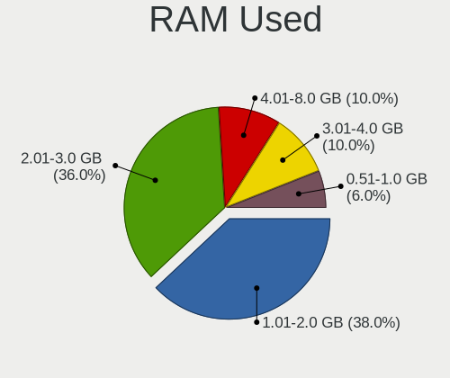
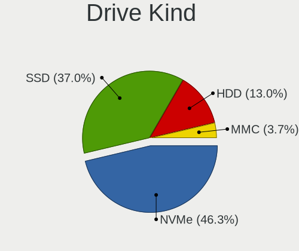
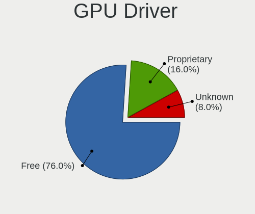
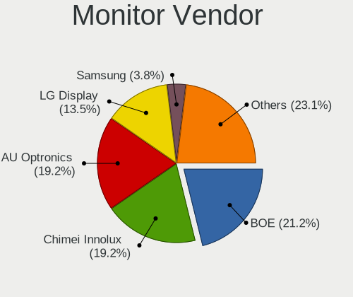
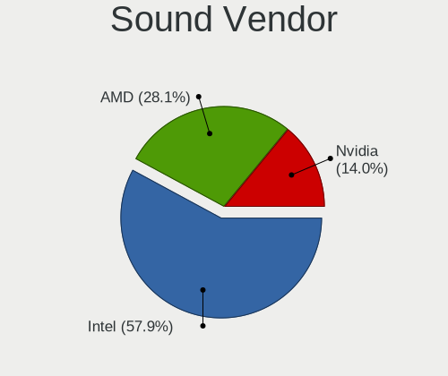
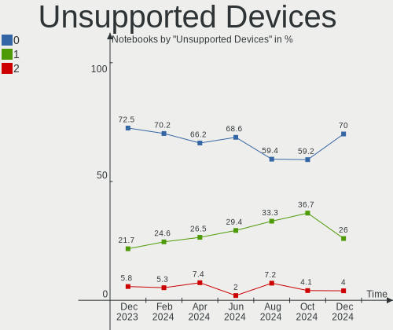

ArcoLinux - Hardware Trends (Notebooks)
---------------------------------------

A project to identify most popular hardware characteristics and track their change
over time based on data collected by Linux users at https://Linux-Hardware.org.

Anyone can contribute to this report by the [hw-probe](https://github.com/linuxhw/hw-probe) tool:

    sudo -E hw-probe -all -upload

This report is for one last month. Overall report since the beginning of time: [TestCoverage](https://github.com/linuxhw/TestCoverage)

Period: Aug, 2022.

Contents
--------

* [ System ](#system)
  - [ OS                       ](#os)
  - [ OS Family                ](#os-family)
  - [ Kernel                   ](#kernel)
  - [ Kernel Family            ](#kernel-family)
  - [ Kernel Major Ver.        ](#kernel-major-ver)
  - [ Arch                     ](#arch)
  - [ DE                       ](#de)
  - [ Display Server           ](#display-server)
  - [ Display Manager          ](#display-manager)
  - [ OS Lang                  ](#os-lang)
  - [ Boot Mode                ](#boot-mode)
  - [ Filesystem               ](#filesystem)
  - [ Part. scheme             ](#part-scheme)
  - [ Dual Boot with Linux/BSD ](#dual-boot-with-linuxbsd)
  - [ Dual Boot (Win)          ](#dual-boot-win)

* [ Board ](#board)
  - [ Vendor                   ](#vendor)
  - [ Model                    ](#model)
  - [ Model Family             ](#model-family)
  - [ MFG Year                 ](#mfg-year)
  - [ Form Factor              ](#form-factor)
  - [ Secure Boot              ](#secure-boot)
  - [ Coreboot                 ](#coreboot)
  - [ RAM Size                 ](#ram-size)
  - [ RAM Used                 ](#ram-used)
  - [ Total Drives             ](#total-drives)
  - [ Has CD-ROM               ](#has-cd-rom)
  - [ Has Ethernet             ](#has-ethernet)
  - [ Has WiFi                 ](#has-wifi)
  - [ Has Bluetooth            ](#has-bluetooth)

* [ Location ](#location)
  - [ Country                  ](#country)
  - [ City                     ](#city)

* [ Drives ](#drives)
  - [ Drive Vendor             ](#drive-vendor)
  - [ Drive Model              ](#drive-model)
  - [ HDD Vendor               ](#hdd-vendor)
  - [ SSD Vendor               ](#ssd-vendor)
  - [ Drive Kind               ](#drive-kind)
  - [ Drive Connector          ](#drive-connector)
  - [ Drive Size               ](#drive-size)
  - [ Space Total              ](#space-total)
  - [ Space Used               ](#space-used)
  - [ Malfunc. Drives          ](#malfunc-drives)
  - [ Malfunc. Drive Vendor    ](#malfunc-drive-vendor)
  - [ Malfunc. HDD Vendor      ](#malfunc-hdd-vendor)
  - [ Malfunc. Drive Kind      ](#malfunc-drive-kind)
  - [ Failed Drives            ](#failed-drives)
  - [ Failed Drive Vendor      ](#failed-drive-vendor)
  - [ Drive Status             ](#drive-status)

* [ Storage controller ](#storage-controller)
  - [ Storage Vendor           ](#storage-vendor)
  - [ Storage Model            ](#storage-model)
  - [ Storage Kind             ](#storage-kind)

* [ Processor ](#processor)
  - [ CPU Vendor               ](#cpu-vendor)
  - [ CPU Model                ](#cpu-model)
  - [ CPU Model Family         ](#cpu-model-family)
  - [ CPU Cores                ](#cpu-cores)
  - [ CPU Sockets              ](#cpu-sockets)
  - [ CPU Threads              ](#cpu-threads)
  - [ CPU Op-Modes             ](#cpu-op-modes)
  - [ CPU Microcode            ](#cpu-microcode)
  - [ CPU Microarch            ](#cpu-microarch)

* [ Graphics ](#graphics)
  - [ GPU Vendor               ](#gpu-vendor)
  - [ GPU Model                ](#gpu-model)
  - [ GPU Combo                ](#gpu-combo)
  - [ GPU Driver               ](#gpu-driver)
  - [ GPU Memory               ](#gpu-memory)

* [ Monitor ](#monitor)
  - [ Monitor Vendor           ](#monitor-vendor)
  - [ Monitor Model            ](#monitor-model)
  - [ Monitor Resolution       ](#monitor-resolution)
  - [ Monitor Diagonal         ](#monitor-diagonal)
  - [ Monitor Width            ](#monitor-width)
  - [ Aspect Ratio             ](#aspect-ratio)
  - [ Monitor Area             ](#monitor-area)
  - [ Pixel Density            ](#pixel-density)
  - [ Multiple Monitors        ](#multiple-monitors)

* [ Network ](#network)
  - [ Net Controller Vendor    ](#net-controller-vendor)
  - [ Net Controller Model     ](#net-controller-model)
  - [ Wireless Vendor          ](#wireless-vendor)
  - [ Wireless Model           ](#wireless-model)
  - [ Ethernet Vendor          ](#ethernet-vendor)
  - [ Ethernet Model           ](#ethernet-model)
  - [ Net Controller Kind      ](#net-controller-kind)
  - [ Used Controller          ](#used-controller)
  - [ NICs                     ](#nics)
  - [ IPv6                     ](#ipv6)

* [ Bluetooth ](#bluetooth)
  - [ Bluetooth Vendor         ](#bluetooth-vendor)
  - [ Bluetooth Model          ](#bluetooth-model)

* [ Sound ](#sound)
  - [ Sound Vendor             ](#sound-vendor)
  - [ Sound Model              ](#sound-model)

* [ Memory ](#memory)
  - [ Memory Vendor            ](#memory-vendor)
  - [ Memory Model             ](#memory-model)
  - [ Memory Kind              ](#memory-kind)
  - [ Memory Form Factor       ](#memory-form-factor)
  - [ Memory Size              ](#memory-size)
  - [ Memory Speed             ](#memory-speed)

* [ Printers & scanners ](#printers--scanners)
  - [ Printer Vendor           ](#printer-vendor)
  - [ Printer Model            ](#printer-model)
  - [ Scanner Vendor           ](#scanner-vendor)
  - [ Scanner Model            ](#scanner-model)

* [ Camera ](#camera)
  - [ Camera Vendor            ](#camera-vendor)
  - [ Camera Model             ](#camera-model)

* [ Security ](#security)
  - [ Fingerprint Vendor       ](#fingerprint-vendor)
  - [ Fingerprint Model        ](#fingerprint-model)
  - [ Chipcard Vendor          ](#chipcard-vendor)
  - [ Chipcard Model           ](#chipcard-model)

* [ Unsupported ](#unsupported)
  - [ Unsupported Devices      ](#unsupported-devices)
  - [ Unsupported Device Types ](#unsupported-device-types)

System
------

OS
--

Installed operating systems

| Name              | Notebooks | Percent |
|-------------------|-----------|---------|
| ArcoLinux Rolling | 21        | 87.5%   |
| ArcoLinux         | 3         | 12.5%   |

OS Family
---------

OS without a version

| Name      | Notebooks | Percent |
|-----------|-----------|---------|
| ArcoLinux | 24        | 100%    |

Kernel
------

Version of the Linux kernel

| Version                      | Notebooks | Percent |
|------------------------------|-----------|---------|
| 5.18.16-arch1-1              | 6         | 25%     |
| 5.19.1-arch2-1               | 3         | 12.5%   |
| 5.19.5-arch1-1               | 1         | 4.17%   |
| 5.19.4-arch1-1               | 1         | 4.17%   |
| 5.19.2-arch1-2               | 1         | 4.17%   |
| 5.19.2-arch1-1               | 1         | 4.17%   |
| 5.19.0-arch1-1               | 1         | 4.17%   |
| 5.18.7-arch1-1               | 1         | 4.17%   |
| 5.18.5-arch1-1               | 1         | 4.17%   |
| 5.18.3-arch1-1               | 1         | 4.17%   |
| 5.18.19-hardened1-2-hardened | 1         | 4.17%   |
| 5.18.15-zen1-1-zen           | 1         | 4.17%   |
| 5.18.15-arch1-2              | 1         | 4.17%   |
| 5.18.15-arch1-1              | 1         | 4.17%   |
| 5.15.63-1-lts                | 1         | 4.17%   |
| 5.15.60-1-lts                | 1         | 4.17%   |
| 5.15.55-2-lts                | 1         | 4.17%   |

Kernel Family
-------------

Linux kernel without a distro release

| Version | Notebooks | Percent |
|---------|-----------|---------|
| 5.18.16 | 6         | 25%     |
| 5.19.1  | 3         | 12.5%   |
| 5.18.15 | 3         | 12.5%   |
| 5.19.2  | 2         | 8.33%   |
| 5.19.5  | 1         | 4.17%   |
| 5.19.4  | 1         | 4.17%   |
| 5.19.0  | 1         | 4.17%   |
| 5.18.7  | 1         | 4.17%   |
| 5.18.5  | 1         | 4.17%   |
| 5.18.3  | 1         | 4.17%   |
| 5.18.19 | 1         | 4.17%   |
| 5.15.63 | 1         | 4.17%   |
| 5.15.60 | 1         | 4.17%   |
| 5.15.55 | 1         | 4.17%   |

Kernel Major Ver.
-----------------

Linux kernel major version

| Version | Notebooks | Percent |
|---------|-----------|---------|
| 5.18    | 13        | 54.17%  |
| 5.19    | 8         | 33.33%  |
| 5.15    | 3         | 12.5%   |

Arch
----

OS architecture (x86_64, i586, etc.)

| Name   | Notebooks | Percent |
|--------|-----------|---------|
| x86_64 | 24        | 100%    |

DE
--

Desktop Environment

| Name       | Notebooks | Percent |
|------------|-----------|---------|
| XFCE       | 9         | 37.5%   |
| KDE5       | 8         | 33.33%  |
| qtile      | 2         | 8.33%   |
| GNOME      | 2         | 8.33%   |
| X-Cinnamon | 1         | 4.17%   |
| dwm        | 1         | 4.17%   |
| bspwm      | 1         | 4.17%   |

Display Server
--------------

X11 or Wayland

| Name    | Notebooks | Percent |
|---------|-----------|---------|
| X11     | 21        | 87.5%   |
| Tty     | 2         | 8.33%   |
| Wayland | 1         | 4.17%   |

Display Manager
---------------

SDDM, LightDM, etc.

| Name    | Notebooks | Percent |
|---------|-----------|---------|
| SDDM    | 12        | 50%     |
| LightDM | 6         | 25%     |
| Unknown | 4         | 16.67%  |
| Ly      | 1         | 4.17%   |
| GDM     | 1         | 4.17%   |

OS Lang
-------

Language

| Lang  | Notebooks | Percent |
|-------|-----------|---------|
| en_US | 18        | 75%     |
| pt_BR | 2         | 8.33%   |
| th_TH | 1         | 4.17%   |
| es_PA | 1         | 4.17%   |
| es_ES | 1         | 4.17%   |
| de_CH | 1         | 4.17%   |

Boot Mode
---------

EFI or BIOS

| Mode | Notebooks | Percent |
|------|-----------|---------|
| EFI  | 16        | 66.67%  |
| BIOS | 8         | 33.33%  |

Filesystem
----------

Type of filesystem

| Type    | Notebooks | Percent |
|---------|-----------|---------|
| Ext4    | 16        | 66.67%  |
| Btrfs   | 7         | 29.17%  |
| Overlay | 1         | 4.17%   |

Part. scheme
------------

Scheme of partitioning

| Type    | Notebooks | Percent |
|---------|-----------|---------|
| GPT     | 17        | 70.83%  |
| Unknown | 5         | 20.83%  |
| MBR     | 2         | 8.33%   |

Dual Boot with Linux/BSD
------------------------

Hosting more than one Linux/BSD

| Dual boot | Notebooks | Percent |
|-----------|-----------|---------|
| No        | 20        | 83.33%  |
| Yes       | 4         | 16.67%  |

Dual Boot (Win)
---------------

Hosting Linux and Windows

| Dual boot | Notebooks | Percent |
|-----------|-----------|---------|
| No        | 18        | 75%     |
| Yes       | 6         | 25%     |

Board
-----

Vendor
------

Motherboard manufacturer

| Name                | Notebooks | Percent |
|---------------------|-----------|---------|
| Lenovo              | 6         | 25%     |
| Hewlett-Packard     | 3         | 12.5%   |
| Dell                | 3         | 12.5%   |
| ASUSTek Computer    | 3         | 12.5%   |
| Chuwi               | 2         | 8.33%   |
| Xplore              | 1         | 4.17%   |
| Sony                | 1         | 4.17%   |
| Shuttle             | 1         | 4.17%   |
| Samsung Electronics | 1         | 4.17%   |
| Casper              | 1         | 4.17%   |
| Acer                | 1         | 4.17%   |
| Unknown             | 1         | 4.17%   |

Model
-----

Motherboard model

| Name                                    | Notebooks | Percent |
|-----------------------------------------|-----------|---------|
| Xplore iX104C5                          | 1         | 4.17%   |
| Sony VPCF120FL                          | 1         | 4.17%   |
| Shuttle DS437                           | 1         | 4.17%   |
| Samsung 550XDA                          | 1         | 4.17%   |
| Lenovo ThinkPad X240 20AL00BNRT         | 1         | 4.17%   |
| Lenovo ThinkPad T550 20CJS1MW00         | 1         | 4.17%   |
| Lenovo ThinkPad L14 Gen 1 20U6A008CD    | 1         | 4.17%   |
| Lenovo Legion 5 15IMH05H 82CF           | 1         | 4.17%   |
| Lenovo Legion 5 15ACH6 82JW             | 1         | 4.17%   |
| Lenovo IdeaPad S340-15API 81NC          | 1         | 4.17%   |
| HP ProBook 450 G1                       | 1         | 4.17%   |
| HP Pavilion Laptop 15-eh1xxx            | 1         | 4.17%   |
| HP EliteBook 8540p                      | 1         | 4.17%   |
| Dell Vostro 3400                        | 1         | 4.17%   |
| Dell Inspiron 5570                      | 1         | 4.17%   |
| Dell G7 7588                            | 1         | 4.17%   |
| Chuwi HeroBook Air                      | 1         | 4.17%   |
| Chuwi GemiBook Pro                      | 1         | 4.17%   |
| Casper C600 NOTEBOOK DISCRETE           | 1         | 4.17%   |
| ASUS VivoBook_ASUS Laptop X505ZA_A505ZA | 1         | 4.17%   |
| ASUS ROG Zephyrus G15 GA502IV_GA502IV   | 1         | 4.17%   |
| ASUS N61Jv                              | 1         | 4.17%   |
| Acer Aspire E5-575G                     | 1         | 4.17%   |
| Unknown                                 | 1         | 4.17%   |

Model Family
------------

Motherboard model prefix

| Name            | Notebooks | Percent |
|-----------------|-----------|---------|
| Lenovo ThinkPad | 3         | 12.5%   |
| Lenovo Legion   | 2         | 8.33%   |
| Xplore iX104C5  | 1         | 4.17%   |
| Sony VPCF120FL  | 1         | 4.17%   |
| Shuttle DS437   | 1         | 4.17%   |
| Samsung 550XDA  | 1         | 4.17%   |
| Lenovo IdeaPad  | 1         | 4.17%   |
| HP ProBook      | 1         | 4.17%   |
| HP Pavilion     | 1         | 4.17%   |
| HP EliteBook    | 1         | 4.17%   |
| Dell Vostro     | 1         | 4.17%   |
| Dell Inspiron   | 1         | 4.17%   |
| Dell G7         | 1         | 4.17%   |
| Chuwi HeroBook  | 1         | 4.17%   |
| Chuwi GemiBook  | 1         | 4.17%   |
| Casper C600     | 1         | 4.17%   |
| ASUS VivoBook   | 1         | 4.17%   |
| ASUS ROG        | 1         | 4.17%   |
| ASUS N61Jv      | 1         | 4.17%   |
| Acer Aspire     | 1         | 4.17%   |
| Unknown         | 1         | 4.17%   |

MFG Year
--------

Motherboard manufacture year

| Year | Notebooks | Percent |
|------|-----------|---------|
| 2021 | 4         | 16.67%  |
| 2020 | 4         | 16.67%  |
| 2010 | 4         | 16.67%  |
| 2013 | 3         | 12.5%   |
| 2018 | 2         | 8.33%   |
| 2017 | 2         | 8.33%   |
| 2022 | 1         | 4.17%   |
| 2019 | 1         | 4.17%   |
| 2016 | 1         | 4.17%   |
| 2015 | 1         | 4.17%   |
| 2012 | 1         | 4.17%   |

Form Factor
-----------

Physical design of the computer

| Name     | Notebooks | Percent |
|----------|-----------|---------|
| Notebook | 24        | 100%    |

Secure Boot
-----------

Enabled or disabled

| State    | Notebooks | Percent |
|----------|-----------|---------|
| Disabled | 24        | 100%    |

Coreboot
--------

Have coreboot on board

| Used | Notebooks | Percent |
|------|-----------|---------|
| No   | 24        | 100%    |

RAM Size
--------

Total RAM memory

| Size in GB | Notebooks | Percent |
|------------|-----------|---------|
| 4.01-8.0   | 10        | 41.67%  |
| 8.01-16.0  | 5         | 20.83%  |
| 3.01-4.0   | 4         | 16.67%  |
| 16.01-24.0 | 3         | 12.5%   |
| 32.01-64.0 | 2         | 8.33%   |

RAM Used
--------

Used RAM memory

| Used GB   | Notebooks | Percent |
|-----------|-----------|---------|
| 1.01-2.0  | 8         | 33.33%  |
| 4.01-8.0  | 5         | 20.83%  |
| 2.01-3.0  | 5         | 20.83%  |
| 3.01-4.0  | 3         | 12.5%   |
| 0.51-1.0  | 2         | 8.33%   |
| 8.01-16.0 | 1         | 4.17%   |

Total Drives
------------

Number of drives on board

| Drives | Notebooks | Percent |
|--------|-----------|---------|
| 1      | 16        | 66.67%  |
| 2      | 6         | 25%     |
| 3      | 2         | 8.33%   |

Has CD-ROM
----------

Has CD-ROM on board

| Presented | Notebooks | Percent |
|-----------|-----------|---------|
| No        | 19        | 79.17%  |
| Yes       | 5         | 20.83%  |

Has Ethernet
------------

Has Ethernet on board

| Presented | Notebooks | Percent |
|-----------|-----------|---------|
| Yes       | 19        | 79.17%  |
| No        | 5         | 20.83%  |

Has WiFi
--------

Has WiFi module

| Presented | Notebooks | Percent |
|-----------|-----------|---------|
| Yes       | 24        | 100%    |

Has Bluetooth
-------------

Has Bluetooth module

| Presented | Notebooks | Percent |
|-----------|-----------|---------|
| Yes       | 20        | 83.33%  |
| No        | 4         | 16.67%  |

Location
--------

Country
-------

Geographic location (country)

| Country     | Notebooks | Percent |
|-------------|-----------|---------|
| Brazil      | 4         | 16.67%  |
| USA         | 3         | 12.5%   |
| Switzerland | 2         | 8.33%   |
| Nepal       | 2         | 8.33%   |
| Turkey      | 1         | 4.17%   |
| Thailand    | 1         | 4.17%   |
| Spain       | 1         | 4.17%   |
| Russia      | 1         | 4.17%   |
| Romania     | 1         | 4.17%   |
| Panama      | 1         | 4.17%   |
| Mexico      | 1         | 4.17%   |
| Latvia      | 1         | 4.17%   |
| Iran        | 1         | 4.17%   |
| India       | 1         | 4.17%   |
| Hong Kong   | 1         | 4.17%   |
| Germany     | 1         | 4.17%   |
| Belgium     | 1         | 4.17%   |

City
----

Geographic location (city)

| City              | Notebooks | Percent |
|-------------------|-----------|---------|
| Sao Luís         | 2         | 8.33%   |
| Zurich            | 1         | 4.17%   |
| Tehran            | 1         | 4.17%   |
| Seville           | 1         | 4.17%   |
| Riga              | 1         | 4.17%   |
| Portsmouth        | 1         | 4.17%   |
| Panama City       | 1         | 4.17%   |
| Overpelt          | 1         | 4.17%   |
| Mumbai            | 1         | 4.17%   |
| Moscow            | 1         | 4.17%   |
| Mérida           | 1         | 4.17%   |
| Kathmandu         | 1         | 4.17%   |
| Juazeiro          | 1         | 4.17%   |
| Houston           | 1         | 4.17%   |
| Frankfurt am Main | 1         | 4.17%   |
| Etzwil            | 1         | 4.17%   |
| Central           | 1         | 4.17%   |
| Bursa             | 1         | 4.17%   |
| Brodosqui         | 1         | 4.17%   |
| Boston            | 1         | 4.17%   |
| Bhaktapur         | 1         | 4.17%   |
| Bangkok           | 1         | 4.17%   |
| Bacau             | 1         | 4.17%   |

Drives
------

Drive Vendor
------------

Hard drive vendors

| Vendor                      | Notebooks | Drives | Percent |
|-----------------------------|-----------|--------|---------|
| WDC                         | 5         | 5      | 14.29%  |
| SanDisk                     | 4         | 4      | 11.43%  |
| Seagate                     | 3         | 3      | 8.57%   |
| Samsung Electronics         | 3         | 3      | 8.57%   |
| Toshiba                     | 2         | 2      | 5.71%   |
| Intel                       | 2         | 2      | 5.71%   |
| Crucial                     | 2         | 2      | 5.71%   |
| USB3.0                      | 1         | 1      | 2.86%   |
| Unknown                     | 1         | 1      | 2.86%   |
| Team                        | 1         | 1      | 2.86%   |
| SK hynix                    | 1         | 1      | 2.86%   |
| Kingston Technology Company | 1         | 1      | 2.86%   |
| Kingston                    | 1         | 1      | 2.86%   |
| Kingmax                     | 1         | 1      | 2.86%   |
| Intenso                     | 1         | 1      | 2.86%   |
| HGST                        | 1         | 1      | 2.86%   |
| BIWIN                       | 1         | 1      | 2.86%   |
| ASMT                        | 1         | 1      | 2.86%   |
| Apple                       | 1         | 1      | 2.86%   |
| ADATA Technology            | 1         | 1      | 2.86%   |
| A-DATA Technology           | 1         | 1      | 2.86%   |

Drive Model
-----------

Hard drive models

| Model                                       | Notebooks | Percent |
|---------------------------------------------|-----------|---------|
| WDC WDS240G2G0A-00JH30 240GB SSD            | 1         | 2.86%   |
| WDC WDS120G2G0A-00JH30 120GB SSD            | 1         | 2.86%   |
| WDC WD2500BEKT-60PVMT0 250GB                | 1         | 2.86%   |
| WDC WD10SPZX-75Z10T2 1TB                    | 1         | 2.86%   |
| WDC PC SN520 SDAPMUW-256G-1101 256GB        | 1         | 2.86%   |
| USB3.0 Super Speed 128GB                    | 1         | 2.86%   |
| Unknown MMC Card  64GB                      | 1         | 2.86%   |
| Toshiba THNSNH128GMCT 128GB SSD             | 1         | 2.86%   |
| Toshiba MQ01ABF050M 500GB                   | 1         | 2.86%   |
| Team TM8PS7256G 256GB SSD                   | 1         | 2.86%   |
| SK hynix SKHynix_HFS512GDE9X084N 512GB      | 1         | 2.86%   |
| Seagate ST1000LM049-2GH172 1TB              | 1         | 2.86%   |
| Seagate ST1000LM035-1RK172 1TB              | 1         | 2.86%   |
| Seagate Basic 2TB                           | 1         | 2.86%   |
| SanDisk X600 M.2 2280 SATA 128GB SSD        | 1         | 2.86%   |
| SanDisk SSD U110 16GB                       | 1         | 2.86%   |
| SanDisk SSD G5 BICS4 500GB                  | 1         | 2.86%   |
| SanDisk SD9SN8W512G1102 512GB SSD           | 1         | 2.86%   |
| Samsung NVMe SSD Drive 256GB                | 1         | 2.86%   |
| Samsung MZVLB512HBJQ-000L7 512GB            | 1         | 2.86%   |
| Samsung MZALQ128HBHQ-000L2 128GB            | 1         | 2.86%   |
| Kingston Company U-SNS8154P3 NVMe SSD 256GB | 1         | 2.86%   |
| Kingston SA400S371TB SSD                    | 1         | 2.86%   |
| Kingmax SSD 240GB                           | 1         | 2.86%   |
| Intenso SSD SATAIII 256GB                   | 1         | 2.86%   |
| Intel SSD 660P Series 512GB                 | 1         | 2.86%   |
| Intel NVMe SSD Drive 512GB                  | 1         | 2.86%   |
| HGST HTS541075A9E680 752GB                  | 1         | 2.86%   |
| Crucial CT480M500SSD1 480GB                 | 1         | 2.86%   |
| Crucial CT2000MX500SSD1 2TB                 | 1         | 2.86%   |
| BIWIN SSD 128GB                             | 1         | 2.86%   |
| ASMT ASM1156-PM 1TB                         | 1         | 2.86%   |
| Apple HDD HTS545050A7E362 500GB             | 1         | 2.86%   |
| ADATA NVMe SSD Drive 256GB                  | 1         | 2.86%   |
| A-DATA IM2P33F3A NVMe 256GB                 | 1         | 2.86%   |

HDD Vendor
----------

Hard disk drive vendors

| Vendor  | Notebooks | Drives | Percent |
|---------|-----------|--------|---------|
| WDC     | 2         | 2      | 22.22%  |
| Seagate | 2         | 2      | 22.22%  |
| USB3.0  | 1         | 1      | 11.11%  |
| Toshiba | 1         | 1      | 11.11%  |
| HGST    | 1         | 1      | 11.11%  |
| ASMT    | 1         | 1      | 11.11%  |
| Apple   | 1         | 1      | 11.11%  |

SSD Vendor
----------

Solid state drive vendors

| Vendor   | Notebooks | Drives | Percent |
|----------|-----------|--------|---------|
| SanDisk  | 4         | 4      | 28.57%  |
| WDC      | 2         | 2      | 14.29%  |
| Crucial  | 2         | 2      | 14.29%  |
| Toshiba  | 1         | 1      | 7.14%   |
| Team     | 1         | 1      | 7.14%   |
| Kingston | 1         | 1      | 7.14%   |
| Kingmax  | 1         | 1      | 7.14%   |
| Intenso  | 1         | 1      | 7.14%   |
| BIWIN    | 1         | 1      | 7.14%   |

Drive Kind
----------

HDD or SSD

| Kind    | Notebooks | Drives | Percent |
|---------|-----------|--------|---------|
| SSD     | 12        | 14     | 37.5%   |
| NVMe    | 9         | 10     | 28.13%  |
| HDD     | 9         | 9      | 28.13%  |
| MMC     | 1         | 1      | 3.13%   |
| Unknown | 1         | 1      | 3.13%   |

Drive Connector
---------------

SATA, SAS, NVMe, etc.

| Type | Notebooks | Drives | Percent |
|------|-----------|--------|---------|
| SATA | 18        | 21     | 58.06%  |
| NVMe | 9         | 10     | 29.03%  |
| SAS  | 3         | 3      | 9.68%   |
| MMC  | 1         | 1      | 3.23%   |

Drive Size
----------

Size of hard drive

| Size in TB | Notebooks | Drives | Percent |
|------------|-----------|--------|---------|
| 0.01-0.5   | 12        | 15     | 60%     |
| 0.51-1.0   | 7         | 7      | 35%     |
| 1.01-2.0   | 1         | 1      | 5%      |

Space Total
-----------

Amount of disk space available on the file system

| Size in GB     | Notebooks | Percent |
|----------------|-----------|---------|
| 101-250        | 7         | 29.17%  |
| 251-500        | 6         | 25%     |
| 1001-2000      | 3         | 12.5%   |
| 501-1000       | 3         | 12.5%   |
| Unknown        | 2         | 8.33%   |
| More than 3000 | 1         | 4.17%   |
| 1-20           | 1         | 4.17%   |
| 51-100         | 1         | 4.17%   |

Space Used
----------

Amount of used disk space

| Used GB        | Notebooks | Percent |
|----------------|-----------|---------|
| 1-20           | 6         | 25%     |
| 21-50          | 5         | 20.83%  |
| 51-100         | 5         | 20.83%  |
| 101-250        | 3         | 12.5%   |
| 251-500        | 2         | 8.33%   |
| Unknown        | 2         | 8.33%   |
| More than 3000 | 1         | 4.17%   |

Malfunc. Drives
---------------

Drive models with a malfunction

| Model                        | Notebooks | Drives | Percent |
|------------------------------|-----------|--------|---------|
| WDC WD2500BEKT-60PVMT0 250GB | 1         | 1      | 33.33%  |
| USB3.0 Super Speed 128GB     | 1         | 1      | 33.33%  |
| HGST HTS541075A9E680 752GB   | 1         | 1      | 33.33%  |

Malfunc. Drive Vendor
---------------------

Vendors of faulty drives

| Vendor | Notebooks | Drives | Percent |
|--------|-----------|--------|---------|
| WDC    | 1         | 1      | 33.33%  |
| USB3.0 | 1         | 1      | 33.33%  |
| HGST   | 1         | 1      | 33.33%  |

Malfunc. HDD Vendor
-------------------

Vendors of faulty HDD drives

| Vendor | Notebooks | Drives | Percent |
|--------|-----------|--------|---------|
| WDC    | 1         | 1      | 33.33%  |
| USB3.0 | 1         | 1      | 33.33%  |
| HGST   | 1         | 1      | 33.33%  |

Malfunc. Drive Kind
-------------------

Kinds of faulty drives

| Kind | Notebooks | Drives | Percent |
|------|-----------|--------|---------|
| HDD  | 3         | 3      | 100%    |

Failed Drives
-------------

Failed drive models

Zero info for selected period =(

Failed Drive Vendor
-------------------

Failed drive vendors

Zero info for selected period =(

Drive Status
------------

Number of failed and malfunc. drives

| Status   | Notebooks | Drives | Percent |
|----------|-----------|--------|---------|
| Works    | 17        | 23     | 60.71%  |
| Detected | 8         | 9      | 28.57%  |
| Malfunc  | 3         | 3      | 10.71%  |

Storage controller
------------------

Storage Vendor
--------------

Storage controller vendors

| Vendor                      | Notebooks | Percent |
|-----------------------------|-----------|---------|
| Intel                       | 20        | 64.52%  |
| AMD                         | 4         | 12.9%   |
| Samsung Electronics         | 3         | 9.68%   |
| SK hynix                    | 1         | 3.23%   |
| SanDisk                     | 1         | 3.23%   |
| Kingston Technology Company | 1         | 3.23%   |
| ADATA Technology            | 1         | 3.23%   |

Storage Model
-------------

Storage controller models

| Model                                                                          | Notebooks | Percent |
|--------------------------------------------------------------------------------|-----------|---------|
| AMD FCH SATA Controller [AHCI mode]                                            | 4         | 12.9%   |
| Intel 5 Series/3400 Series Chipset 6 port SATA AHCI Controller                 | 3         | 9.68%   |
| Samsung NVMe SSD Controller 980                                                | 2         | 6.45%   |
| Intel Tiger Lake-LP SATA Controller                                            | 2         | 6.45%   |
| Intel Sunrise Point-LP SATA Controller [AHCI mode]                             | 2         | 6.45%   |
| Intel 82801 Mobile SATA Controller [RAID mode]                                 | 2         | 6.45%   |
| SK hynix Gold P31 SSD                                                          | 1         | 3.23%   |
| SanDisk PC SN520 NVMe SSD                                                      | 1         | 3.23%   |
| Samsung NVMe SSD Controller SM981/PM981/PM983                                  | 1         | 3.23%   |
| Kingston Company U-SNS8154P3 NVMe SSD                                          | 1         | 3.23%   |
| Intel Wildcat Point-LP SATA Controller [AHCI Mode]                             | 1         | 3.23%   |
| Intel SSD 660P Series                                                          | 1         | 3.23%   |
| Intel Non-Volatile memory controller                                           | 1         | 3.23%   |
| Intel Jasper Lake SATA AHCI Controller                                         | 1         | 3.23%   |
| Intel Celeron/Pentium Silver Processor SATA Controller                         | 1         | 3.23%   |
| Intel Celeron N3350/Pentium N4200/Atom E3900 Series SATA AHCI Controller       | 1         | 3.23%   |
| Intel 8 Series/C220 Series Chipset Family 6-port SATA Controller 1 [AHCI mode] | 1         | 3.23%   |
| Intel 8 Series SATA Controller 1 [AHCI mode]                                   | 1         | 3.23%   |
| Intel 7 Series Chipset Family 6-port SATA Controller [AHCI mode]               | 1         | 3.23%   |
| Intel 5 Series/3400 Series Chipset 4 port SATA AHCI Controller                 | 1         | 3.23%   |
| Intel 400 Series Chipset Family SATA AHCI Controller                           | 1         | 3.23%   |
| ADATA Non-Volatile memory controller                                           | 1         | 3.23%   |

Storage Kind
------------

Kind of storage controller (IDE, SATA, NVMe, SAS, ...)

| Kind | Notebooks | Percent |
|------|-----------|---------|
| SATA | 20        | 64.52%  |
| NVMe | 9         | 29.03%  |
| RAID | 2         | 6.45%   |

Processor
---------

CPU Vendor
----------

Processor vendors

| Vendor | Notebooks | Percent |
|--------|-----------|---------|
| Intel  | 18        | 75%     |
| AMD    | 6         | 25%     |

CPU Model
---------

Processor models

| Model                                         | Notebooks | Percent |
|-----------------------------------------------|-----------|---------|
| Intel Core i7-8750H CPU @ 2.20GHz             | 1         | 4.17%   |
| Intel Core i7-7500U CPU @ 2.70GHz             | 1         | 4.17%   |
| Intel Core i7-5600U CPU @ 2.60GHz             | 1         | 4.17%   |
| Intel Core i7-4600U CPU @ 2.10GHz             | 1         | 4.17%   |
| Intel Core i7-10750H CPU @ 2.60GHz            | 1         | 4.17%   |
| Intel Core i7 CPU U 620 @ 1.07GHz             | 1         | 4.17%   |
| Intel Core i7 CPU Q 740 @ 1.73GHz             | 1         | 4.17%   |
| Intel Core i5-8250U CPU @ 1.60GHz             | 1         | 4.17%   |
| Intel Core i5-4200M CPU @ 2.50GHz             | 1         | 4.17%   |
| Intel Core i5 CPU M 540 @ 2.53GHz             | 1         | 4.17%   |
| Intel Core i5 CPU M 450 @ 2.40GHz             | 1         | 4.17%   |
| Intel Core i3-7100U CPU @ 2.40GHz             | 1         | 4.17%   |
| Intel Celeron N5100 @ 1.10GHz                 | 1         | 4.17%   |
| Intel Celeron N4020 CPU @ 1.10GHz             | 1         | 4.17%   |
| Intel Celeron CPU N3450 @ 1.10GHz             | 1         | 4.17%   |
| Intel Celeron CPU 1037U @ 1.80GHz             | 1         | 4.17%   |
| Intel 11th Gen Core i7-1165G7 @ 2.80GHz       | 1         | 4.17%   |
| Intel 11th Gen Core i5-1135G7 @ 2.40GHz       | 1         | 4.17%   |
| AMD Ryzen 9 4900HS with Radeon Graphics       | 1         | 4.17%   |
| AMD Ryzen 7 PRO 4750U with Radeon Graphics    | 1         | 4.17%   |
| AMD Ryzen 7 5800H with Radeon Graphics        | 1         | 4.17%   |
| AMD Ryzen 7 3700U with Radeon Vega Mobile Gfx | 1         | 4.17%   |
| AMD Ryzen 5 5500U with Radeon Graphics        | 1         | 4.17%   |
| AMD Ryzen 5 2500U with Radeon Vega Mobile Gfx | 1         | 4.17%   |

CPU Model Family
----------------

Processor model prefix

| Model           | Notebooks | Percent |
|-----------------|-----------|---------|
| Intel Core i7   | 7         | 29.17%  |
| Intel Core i5   | 4         | 16.67%  |
| Intel Celeron   | 4         | 16.67%  |
| Other           | 2         | 8.33%   |
| AMD Ryzen 7     | 2         | 8.33%   |
| AMD Ryzen 5     | 2         | 8.33%   |
| Intel Core i3   | 1         | 4.17%   |
| AMD Ryzen 9     | 1         | 4.17%   |
| AMD Ryzen 7 PRO | 1         | 4.17%   |

CPU Cores
---------

Number of processor cores

| Number | Notebooks | Percent |
|--------|-----------|---------|
| 2      | 10        | 41.67%  |
| 4      | 8         | 33.33%  |
| 8      | 3         | 12.5%   |
| 6      | 3         | 12.5%   |

CPU Sockets
-----------

Number of sockets

| Number | Notebooks | Percent |
|--------|-----------|---------|
| 1      | 24        | 100%    |

CPU Threads
-----------

Threads per core (Hyper-Threading)

| Number | Notebooks | Percent |
|--------|-----------|---------|
| 2      | 19        | 79.17%  |
| 1      | 5         | 20.83%  |

CPU Op-Modes
------------

CPU Operation Modes (32-bit, 64-bit)

| Op mode        | Notebooks | Percent |
|----------------|-----------|---------|
| 32-bit, 64-bit | 24        | 100%    |

CPU Microcode
-------------

Microcode number

| Number     | Notebooks | Percent |
|------------|-----------|---------|
| Unknown    | 8         | 33.33%  |
| 0x20655    | 2         | 8.33%   |
| 0xa0652    | 1         | 4.17%   |
| 0x906ea    | 1         | 4.17%   |
| 0x906c0    | 1         | 4.17%   |
| 0x806e9    | 1         | 4.17%   |
| 0x806c1    | 1         | 4.17%   |
| 0x706a8    | 1         | 4.17%   |
| 0x506c9    | 1         | 4.17%   |
| 0x306d4    | 1         | 4.17%   |
| 0x306c3    | 1         | 4.17%   |
| 0x106e5    | 1         | 4.17%   |
| 0x08600106 | 1         | 4.17%   |
| 0x08600104 | 1         | 4.17%   |
| 0x08108102 | 1         | 4.17%   |
| 0x08101007 | 1         | 4.17%   |

CPU Microarch
-------------

Microarchitecture

| Name          | Notebooks | Percent |
|---------------|-----------|---------|
| KabyLake      | 4         | 16.67%  |
| Westmere      | 3         | 12.5%   |
| Zen 2         | 2         | 8.33%   |
| TigerLake     | 2         | 8.33%   |
| Haswell       | 2         | 8.33%   |
| Zen+          | 1         | 4.17%   |
| Zen 3         | 1         | 4.17%   |
| Zen           | 1         | 4.17%   |
| Tremont       | 1         | 4.17%   |
| Nehalem       | 1         | 4.17%   |
| IvyBridge     | 1         | 4.17%   |
| Goldmont plus | 1         | 4.17%   |
| Goldmont      | 1         | 4.17%   |
| CometLake     | 1         | 4.17%   |
| Broadwell     | 1         | 4.17%   |
| Unknown       | 1         | 4.17%   |

Graphics
--------

GPU Vendor
----------

Vendors of graphics cards

| Vendor | Notebooks | Percent |
|--------|-----------|---------|
| Intel  | 15        | 48.39%  |
| Nvidia | 9         | 29.03%  |
| AMD    | 7         | 22.58%  |

GPU Model
---------

Graphics card models

| Model                                                                | Notebooks | Percent |
|----------------------------------------------------------------------|-----------|---------|
| Intel TigerLake-LP GT2 [Iris Xe Graphics]                            | 2         | 6.45%   |
| Intel HD Graphics 620                                                | 2         | 6.45%   |
| Intel Core Processor Integrated Graphics Controller                  | 2         | 6.45%   |
| AMD Renoir                                                           | 2         | 6.45%   |
| Nvidia TU106M [GeForce RTX 2060 Mobile]                              | 1         | 3.23%   |
| Nvidia TU106M [GeForce RTX 2060 Max-Q]                               | 1         | 3.23%   |
| Nvidia GT216M [NVS 5100M]                                            | 1         | 3.23%   |
| Nvidia GT216M [GeForce GT 330M]                                      | 1         | 3.23%   |
| Nvidia GT216M [GeForce GT 325M]                                      | 1         | 3.23%   |
| Nvidia GP106M [GeForce GTX 1060 Mobile]                              | 1         | 3.23%   |
| Nvidia GM108M [GeForce 940MX]                                        | 1         | 3.23%   |
| Nvidia GM108M [GeForce 920MX]                                        | 1         | 3.23%   |
| Nvidia GA107BM [GeForce RTX 3050 Ti Mobile]                          | 1         | 3.23%   |
| Intel UHD Graphics 620                                               | 1         | 3.23%   |
| Intel JasperLake [UHD Graphics]                                      | 1         | 3.23%   |
| Intel HD Graphics 5500                                               | 1         | 3.23%   |
| Intel HD Graphics 500                                                | 1         | 3.23%   |
| Intel Haswell-ULT Integrated Graphics Controller                     | 1         | 3.23%   |
| Intel GeminiLake [UHD Graphics 600]                                  | 1         | 3.23%   |
| Intel CoffeeLake-H GT2 [UHD Graphics 630]                            | 1         | 3.23%   |
| Intel 4th Gen Core Processor Integrated Graphics Controller          | 1         | 3.23%   |
| Intel 3rd Gen Core processor Graphics Controller                     | 1         | 3.23%   |
| AMD Raven Ridge [Radeon Vega Series / Radeon Vega Mobile Series]     | 1         | 3.23%   |
| AMD Picasso/Raven 2 [Radeon Vega Series / Radeon Vega Mobile Series] | 1         | 3.23%   |
| AMD Mars [Radeon HD 8670A/8670M/8750M / R7 M370]                     | 1         | 3.23%   |
| AMD Lucienne                                                         | 1         | 3.23%   |
| AMD Cezanne                                                          | 1         | 3.23%   |

GPU Combo
---------

Combinations of graphics cards

| Name           | Notebooks | Percent |
|----------------|-----------|---------|
| 1 x Intel      | 10        | 41.67%  |
| Intel + Nvidia | 4         | 16.67%  |
| 1 x AMD        | 4         | 16.67%  |
| 1 x Nvidia     | 3         | 12.5%   |
| AMD + Nvidia   | 2         | 8.33%   |
| Intel + AMD    | 1         | 4.17%   |

GPU Driver
----------

Free vs proprietary

| Driver      | Notebooks | Percent |
|-------------|-----------|---------|
| Free        | 20        | 83.33%  |
| Proprietary | 4         | 16.67%  |

GPU Memory
----------

Total video memory

| Size in GB | Notebooks | Percent |
|------------|-----------|---------|
| Unknown    | 15        | 62.5%   |
| 0.51-1.0   | 5         | 20.83%  |
| 0.01-0.5   | 2         | 8.33%   |
| 5.01-6.0   | 1         | 4.17%   |
| 1.01-2.0   | 1         | 4.17%   |

Monitor
-------

Monitor Vendor
--------------

Monitor vendors

| Vendor                  | Notebooks | Percent |
|-------------------------|-----------|---------|
| BOE                     | 6         | 20.69%  |
| Chimei Innolux          | 4         | 13.79%  |
| AU Optronics            | 4         | 13.79%  |
| Samsung Electronics     | 2         | 6.9%    |
| ViewSonic               | 1         | 3.45%   |
| Sony                    | 1         | 3.45%   |
| Sharp                   | 1         | 3.45%   |
| RGT                     | 1         | 3.45%   |
| PANDA                   | 1         | 3.45%   |
| Panasonic               | 1         | 3.45%   |
| LG Display              | 1         | 3.45%   |
| HYD                     | 1         | 3.45%   |
| HannStar                | 1         | 3.45%   |
| Dell                    | 1         | 3.45%   |
| Chi Mei Optoelectronics | 1         | 3.45%   |
| AOC                     | 1         | 3.45%   |
| Acer                    | 1         | 3.45%   |

Monitor Model
-------------

Monitor models

| Model                                                                    | Notebooks | Percent |
|--------------------------------------------------------------------------|-----------|---------|
| BOE LCD Monitor BOE0812 1920x1080 344x194mm 15.5-inch                    | 2         | 6.9%    |
| ViewSonic VSC PJD VSCD934 1920x1080                                      | 1         | 3.45%   |
| Sony LCD Monitor MS_0025 1920x1080 340x190mm 15.3-inch                   | 1         | 3.45%   |
| Sharp LQ156M1JW09 SHP14D3 1920x1080 344x194mm 15.5-inch                  | 1         | 3.45%   |
| Samsung Electronics SA300/SA350 SAM078B 1600x900 443x249mm 20.0-inch     | 1         | 3.45%   |
| Samsung Electronics C27F390 SAM0D32 1920x1080 600x340mm 27.2-inch        | 1         | 3.45%   |
| RGT LCD Monitor RGT1352 1920x1080 480x270mm 21.7-inch                    | 1         | 3.45%   |
| PANDA LCD Monitor NCP002D 1920x1080 344x194mm 15.5-inch                  | 1         | 3.45%   |
| Panasonic LCD Monitor MEI96A2 3840x2160 382x215mm 17.3-inch              | 1         | 3.45%   |
| LG Display LCD Monitor LGD0437 1920x1080 276x156mm 12.5-inch             | 1         | 3.45%   |
| HYD LCD Monitor HYD0834 1024x768 210x158mm 10.3-inch                     | 1         | 3.45%   |
| HannStar HSD160PHW1 HSD0640 1366x768 353x199mm 16.0-inch                 | 1         | 3.45%   |
| Dell P2719H DEL4185 1920x1080 598x336mm 27.0-inch                        | 1         | 3.45%   |
| Chimei Innolux P140ZKA-BZ1 CMN8C02 2160x1440 296x197mm 14.0-inch         | 1         | 3.45%   |
| Chimei Innolux LCD Monitor CMN153B 1920x1080 344x193mm 15.5-inch         | 1         | 3.45%   |
| Chimei Innolux LCD Monitor CMN14D6 1366x768 309x173mm 13.9-inch          | 1         | 3.45%   |
| Chimei Innolux LCD Monitor CMN114C 1366x768 256x144mm 11.6-inch          | 1         | 3.45%   |
| Chi Mei Optoelectronics LCD Monitor CMO1595 1600x900 344x193mm 15.5-inch | 1         | 3.45%   |
| BOE LCD Monitor BOE0965 1366x768 256x144mm 11.6-inch                     | 1         | 3.45%   |
| BOE LCD Monitor BOE08E8 1920x1080 344x194mm 15.5-inch                    | 1         | 3.45%   |
| BOE LCD Monitor BOE08C7 1920x1080 309x174mm 14.0-inch                    | 1         | 3.45%   |
| BOE LCD Monitor BOE06A9 1920x1080 344x193mm 15.5-inch                    | 1         | 3.45%   |
| AU Optronics LCD Monitor AUO70EC 1366x768 344x193mm 15.5-inch            | 1         | 3.45%   |
| AU Optronics LCD Monitor AUO63ED 1920x1080 344x193mm 15.5-inch           | 1         | 3.45%   |
| AU Optronics LCD Monitor AUO5895 1920x1080 344x193mm 15.5-inch           | 1         | 3.45%   |
| AU Optronics LCD Monitor AUO46EC 1366x768 344x193mm 15.5-inch            | 1         | 3.45%   |
| AOC 1970W-1 AOC1970 1366x768 410x230mm 18.5-inch                         | 1         | 3.45%   |
| Acer GR235H ACR02A1 1920x1080 510x287mm 23.0-inch                        | 1         | 3.45%   |

Monitor Resolution
------------------

Monitor screen resolution

| Resolution      | Notebooks | Percent |
|-----------------|-----------|---------|
| 1920x1080 (FHD) | 14        | 53.85%  |
| 1366x768 (WXGA) | 7         | 26.92%  |
| 1600x900 (HD+)  | 2         | 7.69%   |
| 3840x2160 (4K)  | 1         | 3.85%   |
| 2160x1440       | 1         | 3.85%   |
| 1024x768 (XGA)  | 1         | 3.85%   |

Monitor Diagonal
----------------

Diagonal size in inches

| Inches  | Notebooks | Percent |
|---------|-----------|---------|
| 15      | 12        | 41.38%  |
| 27      | 2         | 6.9%    |
| 14      | 2         | 6.9%    |
| 11      | 2         | 6.9%    |
| 24      | 1         | 3.45%   |
| 23      | 1         | 3.45%   |
| 21      | 1         | 3.45%   |
| 20      | 1         | 3.45%   |
| 18      | 1         | 3.45%   |
| 17      | 1         | 3.45%   |
| 16      | 1         | 3.45%   |
| 13      | 1         | 3.45%   |
| 12      | 1         | 3.45%   |
| 10      | 1         | 3.45%   |
| Unknown | 1         | 3.45%   |

Monitor Width
-------------

Physical width

| Width in mm | Notebooks | Percent |
|-------------|-----------|---------|
| 301-350     | 14        | 48.28%  |
| 201-300     | 5         | 17.24%  |
| 501-600     | 4         | 13.79%  |
| 401-500     | 3         | 10.34%  |
| 351-400     | 2         | 6.9%    |
| Unknown     | 1         | 3.45%   |

Aspect Ratio
------------

Proportional relationship between the width and the height

| Ratio | Notebooks | Percent |
|-------|-----------|---------|
| 16/9  | 21        | 91.3%   |
| 4/3   | 1         | 4.35%   |
| 3/2   | 1         | 4.35%   |

Monitor Area
------------

Area in inch²

| Area in inch² | Notebooks | Percent |
|----------------|-----------|---------|
| 101-110        | 13        | 44.83%  |
| 81-90          | 3         | 10.34%  |
| 51-60          | 3         | 10.34%  |
| 201-250        | 3         | 10.34%  |
| 301-350        | 2         | 6.9%    |
| 61-70          | 1         | 3.45%   |
| 151-200        | 1         | 3.45%   |
| 141-150        | 1         | 3.45%   |
| 121-130        | 1         | 3.45%   |
| Unknown        | 1         | 3.45%   |

Pixel Density
-------------

Pixels per inch

| Density       | Notebooks | Percent |
|---------------|-----------|---------|
| 121-160       | 13        | 44.83%  |
| 51-100        | 7         | 24.14%  |
| 101-120       | 5         | 17.24%  |
| 161-240       | 2         | 6.9%    |
| More than 240 | 1         | 3.45%   |
| Unknown       | 1         | 3.45%   |

Multiple Monitors
-----------------

Total monitors connected

| Total | Notebooks | Percent |
|-------|-----------|---------|
| 1     | 18        | 75%     |
| 2     | 4         | 16.67%  |
| 3     | 1         | 4.17%   |
| 0     | 1         | 4.17%   |

Network
-------

Net Controller Vendor
---------------------

Controller vendors

| Vendor                   | Notebooks | Percent |
|--------------------------|-----------|---------|
| Realtek Semiconductor    | 15        | 36.59%  |
| Intel                    | 15        | 36.59%  |
| Qualcomm Atheros         | 6         | 14.63%  |
| vivo                     | 1         | 2.44%   |
| U-Blox                   | 1         | 2.44%   |
| NetGear                  | 1         | 2.44%   |
| Marvell Technology Group | 1         | 2.44%   |
| Broadcom                 | 1         | 2.44%   |

Net Controller Model
--------------------

Controller models

| Model                                                             | Notebooks | Percent |
|-------------------------------------------------------------------|-----------|---------|
| Realtek RTL8111/8168/8411 PCI Express Gigabit Ethernet Controller | 11        | 23.91%  |
| Qualcomm Atheros QCA9377 802.11ac Wireless Network Adapter        | 3         | 6.52%   |
| Intel Wi-Fi 6 AX200                                               | 3         | 6.52%   |
| Realtek 802.11n WLAN Adapter                                      | 2         | 4.35%   |
| Intel Wireless 3165                                               | 2         | 4.35%   |
| Intel Wi-Fi 6 AX201                                               | 2         | 4.35%   |
| Intel Centrino Advanced-N 6200                                    | 2         | 4.35%   |
| vivo 1818                                                         | 1         | 2.17%   |
| U-Blox [u-blox 6]                                                 | 1         | 2.17%   |
| Realtek RTL8821CE 802.11ac PCIe Wireless Network Adapter          | 1         | 2.17%   |
| Realtek RTL8188CE 802.11b/g/n WiFi Adapter                        | 1         | 2.17%   |
| Realtek RTL810xE PCI Express Fast Ethernet controller             | 1         | 2.17%   |
| Qualcomm Atheros QCA9565 / AR9565 Wireless Network Adapter        | 1         | 2.17%   |
| Qualcomm Atheros Killer E2400 Gigabit Ethernet Controller         | 1         | 2.17%   |
| Qualcomm Atheros AR9285 Wireless Network Adapter (PCI-Express)    | 1         | 2.17%   |
| Qualcomm Atheros AR8131 Gigabit Ethernet                          | 1         | 2.17%   |
| NetGear A6210                                                     | 1         | 2.17%   |
| Marvell Group 88E8057 PCI-E Gigabit Ethernet Controller           | 1         | 2.17%   |
| Intel Wireless 8265 / 8275                                        | 1         | 2.17%   |
| Intel Wireless 7265                                               | 1         | 2.17%   |
| Intel Wireless 7260                                               | 1         | 2.17%   |
| Intel Ethernet Connection I218-LM                                 | 1         | 2.17%   |
| Intel Ethernet Connection (3) I218-LM                             | 1         | 2.17%   |
| Intel Comet Lake PCH CNVi WiFi                                    | 1         | 2.17%   |
| Intel Centrino Advanced-N 6205 [Taylor Peak]                      | 1         | 2.17%   |
| Intel Cannon Lake PCH CNVi WiFi                                   | 1         | 2.17%   |
| Intel 82577LM Gigabit Network Connection                          | 1         | 2.17%   |
| Broadcom NetLink BCM57780 Gigabit Ethernet PCIe                   | 1         | 2.17%   |

Wireless Vendor
---------------

Wireless vendors

| Vendor                | Notebooks | Percent |
|-----------------------|-----------|---------|
| Intel                 | 15        | 60%     |
| Qualcomm Atheros      | 5         | 20%     |
| Realtek Semiconductor | 4         | 16%     |
| NetGear               | 1         | 4%      |

Wireless Model
--------------

Wireless models

| Model                                                          | Notebooks | Percent |
|----------------------------------------------------------------|-----------|---------|
| Qualcomm Atheros QCA9377 802.11ac Wireless Network Adapter     | 3         | 12%     |
| Intel Wi-Fi 6 AX200                                            | 3         | 12%     |
| Realtek 802.11n WLAN Adapter                                   | 2         | 8%      |
| Intel Wireless 3165                                            | 2         | 8%      |
| Intel Wi-Fi 6 AX201                                            | 2         | 8%      |
| Intel Centrino Advanced-N 6200                                 | 2         | 8%      |
| Realtek RTL8821CE 802.11ac PCIe Wireless Network Adapter       | 1         | 4%      |
| Realtek RTL8188CE 802.11b/g/n WiFi Adapter                     | 1         | 4%      |
| Qualcomm Atheros QCA9565 / AR9565 Wireless Network Adapter     | 1         | 4%      |
| Qualcomm Atheros AR9285 Wireless Network Adapter (PCI-Express) | 1         | 4%      |
| NetGear A6210                                                  | 1         | 4%      |
| Intel Wireless 8265 / 8275                                     | 1         | 4%      |
| Intel Wireless 7265                                            | 1         | 4%      |
| Intel Wireless 7260                                            | 1         | 4%      |
| Intel Comet Lake PCH CNVi WiFi                                 | 1         | 4%      |
| Intel Centrino Advanced-N 6205 [Taylor Peak]                   | 1         | 4%      |
| Intel Cannon Lake PCH CNVi WiFi                                | 1         | 4%      |

Ethernet Vendor
---------------

Ethernet vendors

| Vendor                   | Notebooks | Percent |
|--------------------------|-----------|---------|
| Realtek Semiconductor    | 12        | 63.16%  |
| Intel                    | 3         | 15.79%  |
| Qualcomm Atheros         | 2         | 10.53%  |
| Marvell Technology Group | 1         | 5.26%   |
| Broadcom                 | 1         | 5.26%   |

Ethernet Model
--------------

Ethernet models

| Model                                                             | Notebooks | Percent |
|-------------------------------------------------------------------|-----------|---------|
| Realtek RTL8111/8168/8411 PCI Express Gigabit Ethernet Controller | 11        | 57.89%  |
| Realtek RTL810xE PCI Express Fast Ethernet controller             | 1         | 5.26%   |
| Qualcomm Atheros Killer E2400 Gigabit Ethernet Controller         | 1         | 5.26%   |
| Qualcomm Atheros AR8131 Gigabit Ethernet                          | 1         | 5.26%   |
| Marvell Group 88E8057 PCI-E Gigabit Ethernet Controller           | 1         | 5.26%   |
| Intel Ethernet Connection I218-LM                                 | 1         | 5.26%   |
| Intel Ethernet Connection (3) I218-LM                             | 1         | 5.26%   |
| Intel 82577LM Gigabit Network Connection                          | 1         | 5.26%   |
| Broadcom NetLink BCM57780 Gigabit Ethernet PCIe                   | 1         | 5.26%   |

Net Controller Kind
-------------------

Ethernet, WiFi or modem

| Kind     | Notebooks | Percent |
|----------|-----------|---------|
| WiFi     | 24        | 53.33%  |
| Ethernet | 19        | 42.22%  |
| Modem    | 1         | 2.22%   |
| Unknown  | 1         | 2.22%   |

Used Controller
---------------

Currently used network controller

| Kind     | Notebooks | Percent |
|----------|-----------|---------|
| WiFi     | 20        | 86.96%  |
| Ethernet | 3         | 13.04%  |

NICs
----

Total network controllers on board

| Total | Notebooks | Percent |
|-------|-----------|---------|
| 2     | 18        | 75%     |
| 1     | 3         | 12.5%   |
| 0     | 2         | 8.33%   |
| 3     | 1         | 4.17%   |

IPv6
----

IPv6 vs IPv4

| Used | Notebooks | Percent |
|------|-----------|---------|
| No   | 17        | 70.83%  |
| Yes  | 7         | 29.17%  |

Bluetooth
---------

Bluetooth Vendor
----------------

Controller vendors

| Vendor                          | Notebooks | Percent |
|---------------------------------|-----------|---------|
| Intel                           | 12        | 60%     |
| Qualcomm Atheros Communications | 3         | 15%     |
| Foxconn / Hon Hai               | 2         | 10%     |
| Realtek Semiconductor           | 1         | 5%      |
| Lite-On Technology              | 1         | 5%      |
| ASUSTek Computer                | 1         | 5%      |

Bluetooth Model
---------------

Controller models

| Model                                                                               | Notebooks | Percent |
|-------------------------------------------------------------------------------------|-----------|---------|
| Intel Bluetooth wireless interface                                                  | 5         | 25%     |
| Intel Bluetooth 9460/9560 Jefferson Peak (JfP)                                      | 3         | 15%     |
| Intel AX200 Bluetooth                                                               | 3         | 15%     |
| Qualcomm Atheros  Bluetooth Device                                                  | 2         | 10%     |
| Realtek Bluetooth Radio                                                             | 1         | 5%      |
| Qualcomm Atheros AR3012 Bluetooth                                                   | 1         | 5%      |
| Lite-On Qualcomm Atheros QCA9377 Bluetooth                                          | 1         | 5%      |
| Intel AX201 Bluetooth                                                               | 1         | 5%      |
| Foxconn / Hon Hai Foxconn T77H114 BCM2070 [Single-Chip Bluetooth 2.1 + EDR Adapter] | 1         | 5%      |
| Foxconn / Hon Hai Broadcom Bluetooth 2.1 Device                                     | 1         | 5%      |
| ASUS BT-183 Bluetooth 2.0+EDR adapter                                               | 1         | 5%      |

Sound
-----

Sound Vendor
------------

Sound card vendors

| Vendor                   | Notebooks | Percent |
|--------------------------|-----------|---------|
| Intel                    | 18        | 54.55%  |
| Nvidia                   | 7         | 21.21%  |
| AMD                      | 6         | 18.18%  |
| Nordic Semiconductor ASA | 1         | 3.03%   |
| BR25                     | 1         | 3.03%   |

Sound Model
-----------

Sound card models

| Model                                                               | Notebooks | Percent |
|---------------------------------------------------------------------|-----------|---------|
| AMD Family 17h/19h HD Audio Controller                              | 6         | 14.63%  |
| Intel 5 Series/3400 Series Chipset High Definition Audio            | 4         | 9.76%   |
| Nvidia GT216 HDMI Audio Controller                                  | 3         | 7.32%   |
| Intel Sunrise Point-LP HD Audio                                     | 3         | 7.32%   |
| AMD Renoir Radeon High Definition Audio Controller                  | 3         | 7.32%   |
| Nvidia TU106 High Definition Audio Controller                       | 2         | 4.88%   |
| Intel Tiger Lake-LP Smart Sound Technology Audio Controller         | 2         | 4.88%   |
| AMD Raven/Raven2/Fenghuang HDMI/DP Audio Controller                 | 2         | 4.88%   |
| Nvidia GP106 High Definition Audio Controller                       | 1         | 2.44%   |
| Nvidia Audio device                                                 | 1         | 2.44%   |
| Nordic Semiconductor ASA Smart Control                              | 1         | 2.44%   |
| Intel Xeon E3-1200 v3/4th Gen Core Processor HD Audio Controller    | 1         | 2.44%   |
| Intel Wildcat Point-LP High Definition Audio Controller             | 1         | 2.44%   |
| Intel Jasper Lake HD Audio                                          | 1         | 2.44%   |
| Intel Haswell-ULT HD Audio Controller                               | 1         | 2.44%   |
| Intel Comet Lake PCH cAVS                                           | 1         | 2.44%   |
| Intel Celeron/Pentium Silver Processor High Definition Audio        | 1         | 2.44%   |
| Intel Celeron N3350/Pentium N4200/Atom E3900 Series Audio Cluster   | 1         | 2.44%   |
| Intel Cannon Lake PCH cAVS                                          | 1         | 2.44%   |
| Intel Broadwell-U Audio Controller                                  | 1         | 2.44%   |
| Intel 8 Series/C220 Series Chipset High Definition Audio Controller | 1         | 2.44%   |
| Intel 8 Series HD Audio Controller                                  | 1         | 2.44%   |
| Intel 7 Series/C216 Chipset Family High Definition Audio Controller | 1         | 2.44%   |
| BR25 USB Composite Device                                           | 1         | 2.44%   |

Memory
------

Memory Vendor
-------------

Memory module vendors

| Vendor              | Notebooks | Percent |
|---------------------|-----------|---------|
| Micron Technology   | 6         | 26.09%  |
| SK hynix            | 5         | 21.74%  |
| Samsung Electronics | 3         | 13.04%  |
| Unknown (ABCD)      | 2         | 8.7%    |
| Unknown             | 2         | 8.7%    |
| A-DATA Technology   | 2         | 8.7%    |
| Crucial             | 1         | 4.35%   |
| ASint Technology    | 1         | 4.35%   |
| Unknown             | 1         | 4.35%   |

Memory Model
------------

Memory module models

| Model                                                               | Notebooks | Percent |
|---------------------------------------------------------------------|-----------|---------|
| Unknown (ABCD) RAM 123456789012345678 2048MB SODIMM LPDDR4 2400MT/s | 2         | 8.33%   |
| Samsung RAM M471A1K43DB1-CTD 8GB SODIMM DDR4 2667MT/s               | 2         | 8.33%   |
| Unknown RAM Module 4GB SODIMM DDR4 2133MT/s                         | 1         | 4.17%   |
| Unknown RAM Module 4GB SODIMM DDR3                                  | 1         | 4.17%   |
| SK hynix RAM HMT41GS6BFR8A-PB 8GB SODIMM DDR3 1600MT/s              | 1         | 4.17%   |
| SK hynix RAM HMT351S6CFR8A-PB 4GB SODIMM DDR3 1600MT/s              | 1         | 4.17%   |
| SK hynix RAM HMT325S6CFR8C-PB 2GB SODIMM DDR3 1600MT/s              | 1         | 4.17%   |
| SK hynix RAM HMAA1GS6CJR6N-XN 8GB SODIMM DDR4 3200MT/s              | 1         | 4.17%   |
| SK hynix RAM HMA81GS6AFR8N-UH 8GB SODIMM DDR4 2667MT/s              | 1         | 4.17%   |
| Samsung RAM M471A5244CB0-CTD 4096MB SODIMM DDR4 3266MT/s            | 1         | 4.17%   |
| Samsung RAM M471A1K43DB1-CWE 8GB SODIMM DDR4 3200MT/s               | 1         | 4.17%   |
| Micron RAM 8JSF25664HZ-1G4D1 2GB SODIMM DDR3 1334MT/s               | 1         | 4.17%   |
| Micron RAM 8ATF1G64HZ-3G2J1 8GB SODIMM DDR4 3200MT/s                | 1         | 4.17%   |
| Micron RAM 8ATF1G64HZ-2G3E1 8GB SODIMM DDR4 2400MT/s                | 1         | 4.17%   |
| Micron RAM 53E1G32D4NQ-046WTE 4GB Row Of Chips LPDDR4 3200MT/s      | 1         | 4.17%   |
| Micron RAM 4ATF1G64HZ-3G2E2 8GB SODIMM DDR4 3200MT/s                | 1         | 4.17%   |
| Micron RAM 16KTF1G64HZ-1G6E1 8GB SODIMM DDR3 1600MT/s               | 1         | 4.17%   |
| Crucial RAM CT4G4SFS824A.C8FHP 4GB SODIMM DDR4 2133MT/s             | 1         | 4.17%   |
| ASint RAM SSZ3128M8-EDJED 2GB SODIMM DDR3 4199MT/s                  | 1         | 4.17%   |
| A-DATA RAM DDR4 2666 16GB SODIMM DDR4 2667MT/s                      | 1         | 4.17%   |
| A-DATA RAM AO1P21FC4R1-B2MS 4GB SODIMM DDR4 2133MT/s                | 1         | 4.17%   |
| Unknown                                                             | 1         | 4.17%   |

Memory Kind
-----------

Memory module kinds

| Kind   | Notebooks | Percent |
|--------|-----------|---------|
| DDR4   | 10        | 52.63%  |
| DDR3   | 5         | 26.32%  |
| LPDDR4 | 3         | 15.79%  |
| SDRAM  | 1         | 5.26%   |

Memory Form Factor
------------------

Physical design of the memory module

| Name         | Notebooks | Percent |
|--------------|-----------|---------|
| SODIMM       | 17        | 94.44%  |
| Row Of Chips | 1         | 5.56%   |

Memory Size
-----------

Memory module size

| Size  | Notebooks | Percent |
|-------|-----------|---------|
| 8192  | 9         | 42.86%  |
| 4096  | 8         | 38.1%   |
| 2048  | 2         | 9.52%   |
| 32768 | 1         | 4.76%   |
| 16384 | 1         | 4.76%   |

Memory Speed
------------

Memory module speed

| Speed   | Notebooks | Percent |
|---------|-----------|---------|
| 3200    | 4         | 19.05%  |
| 2667    | 4         | 19.05%  |
| 1600    | 4         | 19.05%  |
| 2400    | 3         | 14.29%  |
| 2133    | 2         | 9.52%   |
| 4199    | 1         | 4.76%   |
| 3266    | 1         | 4.76%   |
| 1334    | 1         | 4.76%   |
| Unknown | 1         | 4.76%   |

Printers & scanners
-------------------

Printer Vendor
--------------

Printer device vendors

Zero info for selected period =(

Printer Model
-------------

Printer device models

Zero info for selected period =(

Scanner Vendor
--------------

Scanner device vendors

Zero info for selected period =(

Scanner Model
-------------

Scanner device models

Zero info for selected period =(

Camera
------

Camera Vendor
-------------

Camera device vendors

| Vendor                        | Notebooks | Percent |
|-------------------------------|-----------|---------|
| Microdia                      | 3         | 15.79%  |
| Chicony Electronics           | 3         | 15.79%  |
| Sunplus Innovation Technology | 2         | 10.53%  |
| IMC Networks                  | 2         | 10.53%  |
| Acer                          | 2         | 10.53%  |
| Syntek                        | 1         | 5.26%   |
| Suyin                         | 1         | 5.26%   |
| Ricoh                         | 1         | 5.26%   |
| Quanta                        | 1         | 5.26%   |
| Lite-On Technology            | 1         | 5.26%   |
| icSpring                      | 1         | 5.26%   |
| Alcor Micro                   | 1         | 5.26%   |

Camera Model
------------

Camera device models

| Model                                  | Notebooks | Percent |
|----------------------------------------|-----------|---------|
| Microdia Integrated_Webcam_HD          | 2         | 10.53%  |
| Acer Integrated Camera                 | 2         | 10.53%  |
| Syntek Integrated Camera               | 1         | 5.26%   |
| Suyin USB Webcam                       | 1         | 5.26%   |
| Sunplus Integrated_Webcam_HD           | 1         | 5.26%   |
| Sunplus Full HD webcam                 | 1         | 5.26%   |
| Ricoh Sony Visual Communication Camera | 1         | 5.26%   |
| Quanta USB HD Webcam                   | 1         | 5.26%   |
| Microdia Webcam Vitade AF              | 1         | 5.26%   |
| Lite-On Integrated Camera              | 1         | 5.26%   |
| IMC Networks VGA camera                | 1         | 5.26%   |
| IMC Networks USB2.0 VGA UVC WebCam     | 1         | 5.26%   |
| icSpring camera                        | 1         | 5.26%   |
| Chicony HP Wide Vision HD Camera       | 1         | 5.26%   |
| Chicony HP HD Webcam                   | 1         | 5.26%   |
| Chicony HD WebCam                      | 1         | 5.26%   |
| Alcor Micro USB 2.0 Camera             | 1         | 5.26%   |

Security
--------

Fingerprint Vendor
------------------

Fingerprint sensor vendors

| Vendor           | Notebooks | Percent |
|------------------|-----------|---------|
| Validity Sensors | 1         | 50%     |
| Upek             | 1         | 50%     |

Fingerprint Model
-----------------

Fingerprint sensor models

| Model                                                  | Notebooks | Percent |
|--------------------------------------------------------|-----------|---------|
| Validity Sensors VFS 5011 fingerprint sensor           | 1         | 50%     |
| Upek Biometric Touchchip/Touchstrip Fingerprint Sensor | 1         | 50%     |

Chipcard Vendor
---------------

Chipcard module vendors

Zero info for selected period =(

Chipcard Model
--------------

Chipcard module models

Zero info for selected period =(

Unsupported
-----------

Unsupported Devices
-------------------

Total unsupported devices on board

| Total | Notebooks | Percent |
|-------|-----------|---------|
| 0     | 21        | 87.5%   |
| 1     | 3         | 12.5%   |

Unsupported Device Types
------------------------

Types of unsupported devices

| Type               | Notebooks | Percent |
|--------------------|-----------|---------|
| Fingerprint reader | 2         | 66.67%  |
| Graphics card      | 1         | 33.33%  |

