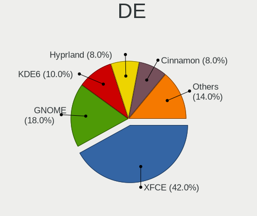
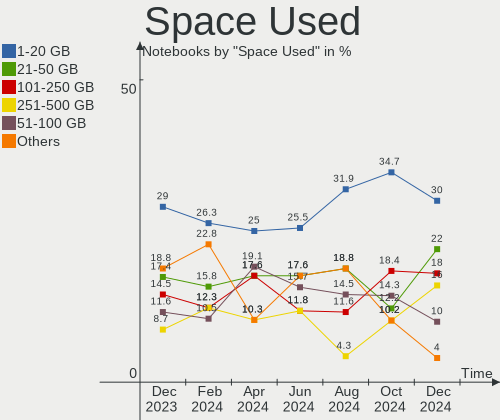
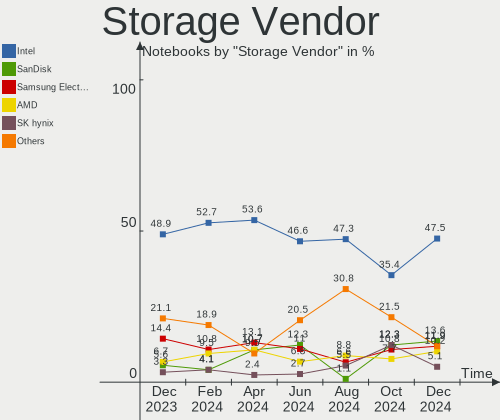

ArcoLinux Hardware Trends (Notebooks)
-------------------------------------

A project to identify most popular hardware characteristics and track their change
over time based on data collected by ArcoLinux users at https://Linux-Hardware.org.

Anyone can contribute to this report by the [hw-probe](https://github.com/linuxhw/hw-probe) tool:

    sudo -E hw-probe -all -upload

Full-feature report is available here: https://linux-hardware.org/?view=trends

Period: Nov, 2021.

Contents
--------

* [ System ](#system)
  - [ OS                       ](#os)
  - [ OS Family                ](#os-family)
  - [ Kernel                   ](#kernel)
  - [ Kernel Family            ](#kernel-family)
  - [ Kernel Major Ver.        ](#kernel-major-ver)
  - [ Arch                     ](#arch)
  - [ DE                       ](#de)
  - [ Display Server           ](#display-server)
  - [ Display Manager          ](#display-manager)
  - [ OS Lang                  ](#os-lang)
  - [ Boot Mode                ](#boot-mode)
  - [ Filesystem               ](#filesystem)
  - [ Part. scheme             ](#part-scheme)
  - [ Dual Boot with Linux/BSD ](#dual-boot-with-linuxbsd)
  - [ Dual Boot (Win)          ](#dual-boot-win)

* [ Board ](#board)
  - [ Vendor                   ](#vendor)
  - [ Model                    ](#model)
  - [ Model Family             ](#model-family)
  - [ MFG Year                 ](#mfg-year)
  - [ Form Factor              ](#form-factor)
  - [ Secure Boot              ](#secure-boot)
  - [ Coreboot                 ](#coreboot)
  - [ RAM Size                 ](#ram-size)
  - [ RAM Used                 ](#ram-used)
  - [ Total Drives             ](#total-drives)
  - [ Has CD-ROM               ](#has-cd-rom)
  - [ Has Ethernet             ](#has-ethernet)
  - [ Has WiFi                 ](#has-wifi)
  - [ Has Bluetooth            ](#has-bluetooth)

* [ Location ](#location)
  - [ Country                  ](#country)
  - [ City                     ](#city)

* [ Drives ](#drives)
  - [ Drive Vendor             ](#drive-vendor)
  - [ Drive Model              ](#drive-model)
  - [ HDD Vendor               ](#hdd-vendor)
  - [ SSD Vendor               ](#ssd-vendor)
  - [ Drive Kind               ](#drive-kind)
  - [ Drive Connector          ](#drive-connector)
  - [ Drive Size               ](#drive-size)
  - [ Space Total              ](#space-total)
  - [ Space Used               ](#space-used)
  - [ Malfunc. Drives          ](#malfunc-drives)
  - [ Malfunc. Drive Vendor    ](#malfunc-drive-vendor)
  - [ Malfunc. HDD Vendor      ](#malfunc-hdd-vendor)
  - [ Malfunc. Drive Kind      ](#malfunc-drive-kind)
  - [ Failed Drives            ](#failed-drives)
  - [ Failed Drive Vendor      ](#failed-drive-vendor)
  - [ Drive Status             ](#drive-status)

* [ Storage controller ](#storage-controller)
  - [ Storage Vendor           ](#storage-vendor)
  - [ Storage Model            ](#storage-model)
  - [ Storage Kind             ](#storage-kind)

* [ Processor ](#processor)
  - [ CPU Vendor               ](#cpu-vendor)
  - [ CPU Model                ](#cpu-model)
  - [ CPU Model Family         ](#cpu-model-family)
  - [ CPU Cores                ](#cpu-cores)
  - [ CPU Sockets              ](#cpu-sockets)
  - [ CPU Threads              ](#cpu-threads)
  - [ CPU Op-Modes             ](#cpu-op-modes)
  - [ CPU Microcode            ](#cpu-microcode)
  - [ CPU Microarch            ](#cpu-microarch)

* [ Graphics ](#graphics)
  - [ GPU Vendor               ](#gpu-vendor)
  - [ GPU Model                ](#gpu-model)
  - [ GPU Combo                ](#gpu-combo)
  - [ GPU Driver               ](#gpu-driver)
  - [ GPU Memory               ](#gpu-memory)

* [ Monitor ](#monitor)
  - [ Monitor Vendor           ](#monitor-vendor)
  - [ Monitor Model            ](#monitor-model)
  - [ Monitor Resolution       ](#monitor-resolution)
  - [ Monitor Diagonal         ](#monitor-diagonal)
  - [ Monitor Width            ](#monitor-width)
  - [ Aspect Ratio             ](#aspect-ratio)
  - [ Monitor Area             ](#monitor-area)
  - [ Pixel Density            ](#pixel-density)
  - [ Multiple Monitors        ](#multiple-monitors)

* [ Network ](#network)
  - [ Net Controller Vendor    ](#net-controller-vendor)
  - [ Net Controller Model     ](#net-controller-model)
  - [ Wireless Vendor          ](#wireless-vendor)
  - [ Wireless Model           ](#wireless-model)
  - [ Ethernet Vendor          ](#ethernet-vendor)
  - [ Ethernet Model           ](#ethernet-model)
  - [ Net Controller Kind      ](#net-controller-kind)
  - [ Used Controller          ](#used-controller)
  - [ NICs                     ](#nics)
  - [ IPv6                     ](#ipv6)

* [ Bluetooth ](#bluetooth)
  - [ Bluetooth Vendor         ](#bluetooth-vendor)
  - [ Bluetooth Model          ](#bluetooth-model)

* [ Sound ](#sound)
  - [ Sound Vendor             ](#sound-vendor)
  - [ Sound Model              ](#sound-model)

* [ Memory ](#memory)
  - [ Memory Vendor            ](#memory-vendor)
  - [ Memory Model             ](#memory-model)
  - [ Memory Kind              ](#memory-kind)
  - [ Memory Form Factor       ](#memory-form-factor)
  - [ Memory Size              ](#memory-size)
  - [ Memory Speed             ](#memory-speed)

* [ Printers & scanners ](#printers--scanners)
  - [ Printer Vendor           ](#printer-vendor)
  - [ Printer Model            ](#printer-model)
  - [ Scanner Vendor           ](#scanner-vendor)
  - [ Scanner Model            ](#scanner-model)

* [ Camera ](#camera)
  - [ Camera Vendor            ](#camera-vendor)
  - [ Camera Model             ](#camera-model)

* [ Security ](#security)
  - [ Fingerprint Vendor       ](#fingerprint-vendor)
  - [ Fingerprint Model        ](#fingerprint-model)
  - [ Chipcard Vendor          ](#chipcard-vendor)
  - [ Chipcard Model           ](#chipcard-model)

* [ Unsupported ](#unsupported)
  - [ Unsupported Devices      ](#unsupported-devices)
  - [ Unsupported Device Types ](#unsupported-device-types)

System
------

OS
--

Installed operating systems

| Name              | Notebooks | Percent |
|-------------------|-----------|---------|
| ArcoLinux Rolling | 37        | 88.1%   |
| ArcoLinux         | 4         | 9.52%   |
| ArcoLinux 20.6.5  | 1         | 2.38%   |

OS Family
---------

OS without a version

| Name      | Notebooks | Percent |
|-----------|-----------|---------|
| ArcoLinux | 42        | 100%    |

Kernel
------

Version of the Linux kernel

| Version            | Notebooks | Percent |
|--------------------|-----------|---------|
| 5.15.5-arch1-1     | 6         | 14.29%  |
| 5.15.4-arch1-1     | 6         | 14.29%  |
| 5.14.15-arch1-1    | 5         | 11.9%   |
| 5.15.2-arch1-1     | 4         | 9.52%   |
| 5.14.14-arch1-1    | 3         | 7.14%   |
| 5.15.3-zen1-1-zen  | 2         | 4.76%   |
| 5.10.80-1-lts      | 2         | 4.76%   |
| 5.15.5-zen1-1-zen  | 1         | 2.38%   |
| 5.15.4-zen1-1-zen  | 1         | 2.38%   |
| 5.15.3-arch1-1     | 1         | 2.38%   |
| 5.15.2-zen1-1-zen  | 1         | 2.38%   |
| 5.15.0-214-tkg-bmq | 1         | 2.38%   |
| 5.14.16-zen1-1-zen | 1         | 2.38%   |
| 5.14.16-arch1-1    | 1         | 2.38%   |
| 5.14.15-zen1-1-zen | 1         | 2.38%   |
| 5.13.13-arch1-1    | 1         | 2.38%   |
| 5.10.82-1-lts      | 1         | 2.38%   |
| 5.10.79-1-lts      | 1         | 2.38%   |
| 5.10.78-1-lts      | 1         | 2.38%   |
| 5.10.77-3-lts      | 1         | 2.38%   |
| 5.10.6-arch1-1     | 1         | 2.38%   |

Kernel Family
-------------

Linux kernel without a distro release

| Version | Notebooks | Percent |
|---------|-----------|---------|
| 5.15.5  | 7         | 16.67%  |
| 5.15.4  | 7         | 16.67%  |
| 5.14.15 | 6         | 14.29%  |
| 5.15.2  | 5         | 11.9%   |
| 5.15.3  | 3         | 7.14%   |
| 5.14.14 | 3         | 7.14%   |
| 5.14.16 | 2         | 4.76%   |
| 5.10.80 | 2         | 4.76%   |
| 5.15.0  | 1         | 2.38%   |
| 5.13.13 | 1         | 2.38%   |
| 5.10.82 | 1         | 2.38%   |
| 5.10.79 | 1         | 2.38%   |
| 5.10.78 | 1         | 2.38%   |
| 5.10.77 | 1         | 2.38%   |
| 5.10.6  | 1         | 2.38%   |

Kernel Major Ver.
-----------------

Linux kernel major version

| Version | Notebooks | Percent |
|---------|-----------|---------|
| 5.15    | 23        | 54.76%  |
| 5.14    | 11        | 26.19%  |
| 5.10    | 7         | 16.67%  |
| 5.13    | 1         | 2.38%   |

Arch
----

OS architecture (x86_64, i586, etc.)

| Name   | Notebooks | Percent |
|--------|-----------|---------|
| x86_64 | 42        | 100%    |

DE
--

Desktop Environment

| Name         | Notebooks | Percent |
|--------------|-----------|---------|
| XFCE         | 14        | 33.33%  |
| KDE5         | 7         | 16.67%  |
| qtile        | 4         | 9.52%   |
| i3           | 4         | 9.52%   |
| xmonad       | 3         | 7.14%   |
| dwm          | 3         | 7.14%   |
| GNOME        | 2         | 4.76%   |
| bspwm        | 2         | 4.76%   |
| awesome      | 2         | 4.76%   |
| herbstluftwm | 1         | 2.38%   |

Display Server
--------------

X11 or Wayland

| Name    | Notebooks | Percent |
|---------|-----------|---------|
| X11     | 39        | 92.86%  |
| Wayland | 2         | 4.76%   |
| Tty     | 1         | 2.38%   |

Display Manager
---------------

SDDM, LightDM, etc.

| Name    | Notebooks | Percent |
|---------|-----------|---------|
| SDDM    | 25        | 59.52%  |
| LightDM | 13        | 30.95%  |
| Unknown | 4         | 9.52%   |

OS Lang
-------

Language

| Lang  | Notebooks | Percent |
|-------|-----------|---------|
| en_US | 30        | 71.43%  |
| es_CL | 2         | 4.76%   |
| en_IN | 2         | 4.76%   |
| sv_SE | 1         | 2.38%   |
| pl_PL | 1         | 2.38%   |
| nb_NO | 1         | 2.38%   |
| es_PY | 1         | 2.38%   |
| es_EC | 1         | 2.38%   |
| en_ZA | 1         | 2.38%   |
| en_IL | 1         | 2.38%   |
| de_DE | 1         | 2.38%   |

Boot Mode
---------

EFI or BIOS

| Mode | Notebooks | Percent |
|------|-----------|---------|
| EFI  | 30        | 71.43%  |
| BIOS | 12        | 28.57%  |

Filesystem
----------

Type of filesystem

| Type    | Notebooks | Percent |
|---------|-----------|---------|
| Ext4    | 25        | 59.52%  |
| Btrfs   | 15        | 35.71%  |
| Overlay | 2         | 4.76%   |

Part. scheme
------------

Scheme of partitioning

| Type    | Notebooks | Percent |
|---------|-----------|---------|
| GPT     | 30        | 71.43%  |
| MBR     | 8         | 19.05%  |
| Unknown | 4         | 9.52%   |

Dual Boot with Linux/BSD
------------------------

Hosting more than one Linux/BSD

| Dual boot | Notebooks | Percent |
|-----------|-----------|---------|
| No        | 36        | 85.71%  |
| Yes       | 6         | 14.29%  |

Dual Boot (Win)
---------------

Hosting Linux and Windows

| Dual boot | Notebooks | Percent |
|-----------|-----------|---------|
| No        | 28        | 66.67%  |
| Yes       | 14        | 33.33%  |

Board
-----

Vendor
------

Motherboard manufacturer

| Name             | Notebooks | Percent |
|------------------|-----------|---------|
| Dell             | 10        | 23.81%  |
| Lenovo           | 9         | 21.43%  |
| Hewlett-Packard  | 7         | 16.67%  |
| ASUSTek Computer | 6         | 14.29%  |
| Apple            | 3         | 7.14%   |
| Acer             | 3         | 7.14%   |
| HUAWEI           | 2         | 4.76%   |
| Notebook         | 1         | 2.38%   |
| MSI              | 1         | 2.38%   |

Model
-----

Motherboard model

| Name                                    | Notebooks | Percent |
|-----------------------------------------|-----------|---------|
| HP Laptop 15s-eq2xxx                    | 2         | 4.76%   |
| Notebook NV4XMB,ME,MZ                   | 1         | 2.38%   |
| MSI Modern 14 B4MW                      | 1         | 2.38%   |
| Lenovo V14-ADA 82C6                     | 1         | 2.38%   |
| Lenovo ThinkPad T550 20CJS0S800         | 1         | 2.38%   |
| Lenovo ThinkPad T470 W10DG 20JNS0QC0F   | 1         | 2.38%   |
| Lenovo ThinkPad T470 20HES01100         | 1         | 2.38%   |
| Lenovo ThinkPad T440p 20AWS3DD1Z        | 1         | 2.38%   |
| Lenovo ThinkPad E15 Gen 2 20TD002RRT    | 1         | 2.38%   |
| Lenovo Legion 5 15ARH05H 82B1           | 1         | 2.38%   |
| Lenovo IdeaPad 320-15ISK 80XH           | 1         | 2.38%   |
| Lenovo IdeaPad 3 14IML05 81WA           | 1         | 2.38%   |
| HUAWEI WRT-WX9                          | 1         | 2.38%   |
| HUAWEI KPL-W0X                          | 1         | 2.38%   |
| HP Pavilion g7                          | 1         | 2.38%   |
| HP Laptop 15-bw0xx                      | 1         | 2.38%   |
| HP Laptop 14q-cs0xxx                    | 1         | 2.38%   |
| HP EliteBook 840 G1                     | 1         | 2.38%   |
| HP 630                                  | 1         | 2.38%   |
| Dell Precision 7510                     | 1         | 2.38%   |
| Dell Precision 5550                     | 1         | 2.38%   |
| Dell Latitude E6440                     | 1         | 2.38%   |
| Dell Latitude E5450                     | 1         | 2.38%   |
| Dell Inspiron 5721                      | 1         | 2.38%   |
| Dell Inspiron 5579                      | 1         | 2.38%   |
| Dell Inspiron 3581                      | 1         | 2.38%   |
| Dell Inspiron 3558                      | 1         | 2.38%   |
| Dell Inspiron 3505                      | 1         | 2.38%   |
| Dell Inspiron 15-3552                   | 1         | 2.38%   |
| ASUS ZenBook UX425JA_UX425JA            | 1         | 2.38%   |
| ASUS X556UQK                            | 1         | 2.38%   |
| ASUS VivoBook_ASUSLaptop X712DAP_M712DA | 1         | 2.38%   |
| ASUS VivoBook_ASUSLaptop X510QR_X510QR  | 1         | 2.38%   |
| ASUS K72Jr                              | 1         | 2.38%   |
| ASUS K53E                               | 1         | 2.38%   |
| Apple MacBookPro11,2                    | 1         | 2.38%   |
| Apple MacBookPro10,1                    | 1         | 2.38%   |
| Apple MacBook5,1                        | 1         | 2.38%   |
| Acer Swift SF314-41                     | 1         | 2.38%   |
| Acer Nitro AN515-44                     | 1         | 2.38%   |
| Acer Aspire ES1-311                     | 1         | 2.38%   |

Model Family
------------

Motherboard model prefix

| Name               | Notebooks | Percent |
|--------------------|-----------|---------|
| Dell Inspiron      | 6         | 14.29%  |
| Lenovo ThinkPad    | 5         | 11.9%   |
| HP Laptop          | 4         | 9.52%   |
| Lenovo IdeaPad     | 2         | 4.76%   |
| Dell Precision     | 2         | 4.76%   |
| Dell Latitude      | 2         | 4.76%   |
| ASUS VivoBook      | 2         | 4.76%   |
| Notebook NV4XMB    | 1         | 2.38%   |
| MSI Modern         | 1         | 2.38%   |
| Lenovo V14-ADA     | 1         | 2.38%   |
| Lenovo Legion      | 1         | 2.38%   |
| HUAWEI WRT-WX9     | 1         | 2.38%   |
| HUAWEI KPL-W0X     | 1         | 2.38%   |
| HP Pavilion        | 1         | 2.38%   |
| HP EliteBook       | 1         | 2.38%   |
| HP 630             | 1         | 2.38%   |
| ASUS ZenBook       | 1         | 2.38%   |
| ASUS X556UQK       | 1         | 2.38%   |
| ASUS K72Jr         | 1         | 2.38%   |
| ASUS K53E          | 1         | 2.38%   |
| Apple MacBookPro11 | 1         | 2.38%   |
| Apple MacBookPro10 | 1         | 2.38%   |
| Apple MacBook5     | 1         | 2.38%   |
| Acer Swift         | 1         | 2.38%   |
| Acer Nitro         | 1         | 2.38%   |
| Acer Aspire        | 1         | 2.38%   |

MFG Year
--------

Motherboard manufacture year

| Year | Notebooks | Percent |
|------|-----------|---------|
| 2021 | 14        | 33.33%  |
| 2020 | 8         | 19.05%  |
| 2019 | 5         | 11.9%   |
| 2018 | 5         | 11.9%   |
| 2017 | 2         | 4.76%   |
| 2014 | 2         | 4.76%   |
| 2011 | 2         | 4.76%   |
| 2016 | 1         | 2.38%   |
| 2015 | 1         | 2.38%   |
| 2012 | 1         | 2.38%   |
| 2009 | 1         | 2.38%   |

Form Factor
-----------

Physical design of the computer

| Name     | Notebooks | Percent |
|----------|-----------|---------|
| Notebook | 42        | 100%    |

Secure Boot
-----------

Enabled or disabled

| State    | Notebooks | Percent |
|----------|-----------|---------|
| Disabled | 42        | 100%    |

Coreboot
--------

Have coreboot on board

| Used | Notebooks | Percent |
|------|-----------|---------|
| No   | 42        | 100%    |

RAM Size
--------

Total RAM memory

| Size in GB | Notebooks | Percent |
|------------|-----------|---------|
| 4.01-8.0   | 23        | 54.76%  |
| 16.01-24.0 | 8         | 19.05%  |
| 8.01-16.0  | 6         | 14.29%  |
| 3.01-4.0   | 3         | 7.14%   |
| 32.01-64.0 | 2         | 4.76%   |

RAM Used
--------

Used RAM memory

| Used GB   | Notebooks | Percent |
|-----------|-----------|---------|
| 1.01-2.0  | 17        | 40.48%  |
| 2.01-3.0  | 14        | 33.33%  |
| 3.01-4.0  | 7         | 16.67%  |
| 4.01-8.0  | 2         | 4.76%   |
| 8.01-16.0 | 1         | 2.38%   |
| 0.51-1.0  | 1         | 2.38%   |

Total Drives
------------

Number of drives on board

| Drives | Notebooks | Percent |
|--------|-----------|---------|
| 1      | 32        | 76.19%  |
| 2      | 10        | 23.81%  |

Has CD-ROM
----------

Has CD-ROM on board

| Presented | Notebooks | Percent |
|-----------|-----------|---------|
| No        | 34        | 80.95%  |
| Yes       | 8         | 19.05%  |

Has Ethernet
------------

Has Ethernet on board

| Presented | Notebooks | Percent |
|-----------|-----------|---------|
| Yes       | 31        | 73.81%  |
| No        | 11        | 26.19%  |

Has WiFi
--------

Has WiFi module

| Presented | Notebooks | Percent |
|-----------|-----------|---------|
| Yes       | 42        | 100%    |

Has Bluetooth
-------------

Has Bluetooth module

| Presented | Notebooks | Percent |
|-----------|-----------|---------|
| Yes       | 38        | 90.48%  |
| No        | 4         | 9.52%   |

Location
--------

Country
-------

Geographic location (country)

| Country      | Notebooks | Percent |
|--------------|-----------|---------|
| USA          | 10        | 23.81%  |
| Germany      | 5         | 11.9%   |
| India        | 4         | 9.52%   |
| Poland       | 2         | 4.76%   |
| Morocco      | 2         | 4.76%   |
| Chile        | 2         | 4.76%   |
| Vietnam      | 1         | 2.38%   |
| Thailand     | 1         | 2.38%   |
| Sweden       | 1         | 2.38%   |
| South Africa | 1         | 2.38%   |
| Slovakia     | 1         | 2.38%   |
| Russia       | 1         | 2.38%   |
| Paraguay     | 1         | 2.38%   |
| Norway       | 1         | 2.38%   |
| Israel       | 1         | 2.38%   |
| Indonesia    | 1         | 2.38%   |
| Greece       | 1         | 2.38%   |
| Estonia      | 1         | 2.38%   |
| Ecuador      | 1         | 2.38%   |
| Canada       | 1         | 2.38%   |
| Bulgaria     | 1         | 2.38%   |
| Belgium      | 1         | 2.38%   |
| Argentina    | 1         | 2.38%   |

City
----

Geographic location (city)

| City                 | Notebooks | Percent |
|----------------------|-----------|---------|
| Windsor              | 1         | 2.38%   |
| Wilrijk              | 1         | 2.38%   |
| West Covina          | 1         | 2.38%   |
| West Columbia        | 1         | 2.38%   |
| Volkach              | 1         | 2.38%   |
| Tulsa                | 1         | 2.38%   |
| Tel Aviv             | 1         | 2.38%   |
| Tallinn              | 1         | 2.38%   |
| Svelvik              | 1         | 2.38%   |
| Stockholm            | 1         | 2.38%   |
| St. Petersburg       | 1         | 2.38%   |
| Spokane              | 1         | 2.38%   |
| Sindanglaya          | 1         | 2.38%   |
| Sarafovo             | 1         | 2.38%   |
| Santiago             | 1         | 2.38%   |
| Pune                 | 1         | 2.38%   |
| Plano                | 1         | 2.38%   |
| Piekary Slaskie      | 1         | 2.38%   |
| Munich               | 1         | 2.38%   |
| Moscow               | 1         | 2.38%   |
| Los ??ngeles         | 1         | 2.38%   |
| Kolkata              | 1         | 2.38%   |
| Hilton               | 1         | 2.38%   |
| Hanoi                | 1         | 2.38%   |
| Hamburg              | 1         | 2.38%   |
| Giessen              | 1         | 2.38%   |
| G?¶ttingen           | 1         | 2.38%   |
| Fort Mill            | 1         | 2.38%   |
| Fes                  | 1         | 2.38%   |
| Escondido            | 1         | 2.38%   |
| Decatur              | 1         | 2.38%   |
| Cz?™stochowa         | 1         | 2.38%   |
| Cuenca               | 1         | 2.38%   |
| Coimbatore           | 1         | 2.38%   |
| Chicago              | 1         | 2.38%   |
| Chiang Mai           | 1         | 2.38%   |
| Casablanca           | 1         | 2.38%   |
| Buenos Aires         | 1         | 2.38%   |
| Bengaluru            | 1         | 2.38%   |
| Banovce nad Bebravou | 1         | 2.38%   |
| Athens               | 1         | 2.38%   |
| Asunci??n            | 1         | 2.38%   |

Drives
------

Drive Vendor
------------

Hard drive vendors

| Vendor              | Notebooks | Drives | Percent |
|---------------------|-----------|--------|---------|
| WDC                 | 13        | 13     | 25.49%  |
| Samsung Electronics | 10        | 11     | 19.61%  |
| Toshiba             | 6         | 6      | 11.76%  |
| Seagate             | 4         | 4      | 7.84%   |
| SK Hynix            | 3         | 3      | 5.88%   |
| Kingston            | 3         | 3      | 5.88%   |
| Intel               | 3         | 3      | 5.88%   |
| LITEON              | 2         | 2      | 3.92%   |
| Apple               | 2         | 2      | 3.92%   |
| Unknown             | 1         | 1      | 1.96%   |
| Patriot             | 1         | 1      | 1.96%   |
| OSCOO               | 1         | 1      | 1.96%   |
| KIOXIA              | 1         | 1      | 1.96%   |
| Unknown             | 1         | 1      | 1.96%   |

Drive Model
-----------

Hard drive models

| Model                                | Notebooks | Percent |
|--------------------------------------|-----------|---------|
| Seagate ST1000LM035-1RK172 1TB       | 2         | 3.85%   |
| Samsung SSD 860 EVO 500GB            | 2         | 3.85%   |
| Kingston SA400S37240G 240GB SSD      | 2         | 3.85%   |
| WDC WDS500G2B0A-00SM50 500GB SSD     | 1         | 1.92%   |
| WDC WDS240G2G0A-00JH30 240GB SSD     | 1         | 1.92%   |
| WDC WDS100T3X0C-00SJG0 1TB           | 1         | 1.92%   |
| WDC WDS100T2G0A-00JH30 1TB SSD       | 1         | 1.92%   |
| WDC WD6400BEVT-60A0RT0 640GB         | 1         | 1.92%   |
| WDC WD5000LPVX-22V0TT0 500GB         | 1         | 1.92%   |
| WDC WD5000LPCX-75VHAT0 500GB         | 1         | 1.92%   |
| WDC WD3200BUCT-63TWBY0 320GB         | 1         | 1.92%   |
| WDC WD10JPVX-60JC3T1 1TB             | 1         | 1.92%   |
| WDC PC SN720 SDAPNTW-512G-1027 512GB | 1         | 1.92%   |
| WDC PC SN530 SDBPNPZ-512G-1006 512GB | 1         | 1.92%   |
| WDC PC SN530 SDBPNPZ-256G-1014 256GB | 1         | 1.92%   |
| WDC PC SN530 SDBPNPZ-256G-1002 256GB | 1         | 1.92%   |
| Unknown MMC Card  4GB                | 1         | 1.92%   |
| Toshiba MQ04ABF100 1TB               | 1         | 1.92%   |
| Toshiba MQ01ACF050 500GB             | 1         | 1.92%   |
| Toshiba MQ01ABD100 1TB               | 1         | 1.92%   |
| Toshiba MK6475GSX 640GB              | 1         | 1.92%   |
| Toshiba MK1237GSX 120GB              | 1         | 1.92%   |
| Toshiba KBG40ZNT256G MEMORY 256GB    | 1         | 1.92%   |
| SK Hynix PC711 NVMe 512GB            | 1         | 1.92%   |
| SK Hynix NVMe SSD Drive 512GB        | 1         | 1.92%   |
| SK Hynix HFM512GDJTNG-8310A 512GB    | 1         | 1.92%   |
| Seagate Portable 5TB                 | 1         | 1.92%   |
| Seagate Backup+ BK 1TB               | 1         | 1.92%   |
| Samsung SSD 980 PRO 500GB            | 1         | 1.92%   |
| Samsung SSD 970 EVO Plus 250GB       | 1         | 1.92%   |
| Samsung SSD 860 EVO 1TB              | 1         | 1.92%   |
| Samsung MZVLW512HMJP-000L7 512GB     | 1         | 1.92%   |
| Samsung MZVLW256HEHP-000L7 256GB     | 1         | 1.92%   |
| Samsung MZVLB1T0HBLR-000L2 1TB       | 1         | 1.92%   |
| Samsung MZALQ256HAJD-000L1 256GB     | 1         | 1.92%   |
| Samsung MZALQ128HBHQ-000L2 128GB     | 1         | 1.92%   |
| Samsung MZ7TE256HMHP-000H1 256GB SSD | 1         | 1.92%   |
| Patriot Burst 120GB SSD              | 1         | 1.92%   |
| OSCOO OSC PCIe 256GB                 | 1         | 1.92%   |
| LITEON LCH-256V2S 256GB SSD          | 1         | 1.92%   |
| LITEON CV8-8E256 256GB SSD           | 1         | 1.92%   |
| KIOXIA KBG40ZNV1T02 1TB              | 1         | 1.92%   |
| Kingston NVMe SSD Drive 256GB        | 1         | 1.92%   |
| Intel SSDSC2BF256A5 SATA 256GB       | 1         | 1.92%   |
| Intel SSDSA2M160G2GC 160GB           | 1         | 1.92%   |
| Intel SSDPEKNW010T8 1TB              | 1         | 1.92%   |
| Apple SSD SM256E 256GB               | 1         | 1.92%   |
| Apple SSD SM0256F 256GB              | 1         | 1.92%   |
| Unknown                              | 1         | 1.92%   |

HDD Vendor
----------

Hard disk drive vendors

| Vendor  | Notebooks | Drives | Percent |
|---------|-----------|--------|---------|
| WDC     | 5         | 5      | 41.67%  |
| Toshiba | 5         | 5      | 41.67%  |
| Seagate | 2         | 2      | 16.67%  |

SSD Vendor
----------

Solid state drive vendors

| Vendor              | Notebooks | Drives | Percent |
|---------------------|-----------|--------|---------|
| Samsung Electronics | 4         | 4      | 25%     |
| WDC                 | 3         | 3      | 18.75%  |
| LITEON              | 2         | 2      | 12.5%   |
| Kingston            | 2         | 2      | 12.5%   |
| Intel               | 2         | 2      | 12.5%   |
| Apple               | 2         | 2      | 12.5%   |
| Patriot             | 1         | 1      | 6.25%   |

Drive Kind
----------

HDD or SSD

| Kind    | Notebooks | Drives | Percent |
|---------|-----------|--------|---------|
| NVMe    | 18        | 20     | 36%     |
| SSD     | 16        | 16     | 32%     |
| HDD     | 12        | 12     | 24%     |
| MMC     | 2         | 2      | 4%      |
| Unknown | 2         | 2      | 4%      |

Drive Connector
---------------

SATA, SAS, NVMe, etc.

| Type | Notebooks | Drives | Percent |
|------|-----------|--------|---------|
| SATA | 27        | 28     | 55.1%   |
| NVMe | 18        | 20     | 36.73%  |
| SAS  | 2         | 2      | 4.08%   |
| MMC  | 2         | 2      | 4.08%   |

Drive Size
----------

Size of hard drive

| Size in TB | Notebooks | Drives | Percent |
|------------|-----------|--------|---------|
| 0.01-0.5   | 19        | 19     | 67.86%  |
| 0.51-1.0   | 9         | 9      | 32.14%  |

Space Total
-----------

Amount of disk space available on the file system

| Size in GB     | Notebooks | Percent |
|----------------|-----------|---------|
| 101-250        | 10        | 23.81%  |
| 501-1000       | 10        | 23.81%  |
| 1001-2000      | 7         | 16.67%  |
| 251-500        | 5         | 11.9%   |
| 2001-3000      | 4         | 9.52%   |
| 1-20           | 3         | 7.14%   |
| More than 3000 | 1         | 2.38%   |
| 51-100         | 1         | 2.38%   |
| Unknown        | 1         | 2.38%   |

Space Used
----------

Amount of used disk space

| Used GB        | Notebooks | Percent |
|----------------|-----------|---------|
| 1-20           | 11        | 26.19%  |
| 21-50          | 8         | 19.05%  |
| 101-250        | 7         | 16.67%  |
| 51-100         | 5         | 11.9%   |
| 501-1000       | 4         | 9.52%   |
| 251-500        | 3         | 7.14%   |
| 1001-2000      | 2         | 4.76%   |
| More than 3000 | 1         | 2.38%   |
| Unknown        | 1         | 2.38%   |

Malfunc. Drives
---------------

Drive models with a malfunction

| Model                        | Notebooks | Drives | Percent |
|------------------------------|-----------|--------|---------|
| WDC WD6400BEVT-60A0RT0 640GB | 1         | 1      | 25%     |
| Toshiba MQ01ACF050 500GB     | 1         | 1      | 25%     |
| Toshiba MK1237GSX 120GB      | 1         | 1      | 25%     |
| Intel SSDSA2M160G2GC 160GB   | 1         | 1      | 25%     |

Malfunc. Drive Vendor
---------------------

Vendors of faulty drives

| Vendor  | Notebooks | Drives | Percent |
|---------|-----------|--------|---------|
| Toshiba | 2         | 2      | 50%     |
| WDC     | 1         | 1      | 25%     |
| Intel   | 1         | 1      | 25%     |

Malfunc. HDD Vendor
-------------------

Vendors of faulty HDD drives

| Vendor  | Notebooks | Drives | Percent |
|---------|-----------|--------|---------|
| Toshiba | 2         | 2      | 66.67%  |
| WDC     | 1         | 1      | 33.33%  |

Malfunc. Drive Kind
-------------------

Kinds of faulty drives

| Kind | Notebooks | Drives | Percent |
|------|-----------|--------|---------|
| HDD  | 3         | 3      | 75%     |
| SSD  | 1         | 1      | 25%     |

Failed Drives
-------------

Failed drive models

Zero info for selected period =(

Failed Drive Vendor
-------------------

Failed drive vendors

Zero info for selected period =(

Drive Status
------------

Number of failed and malfunc. drives

| Status   | Notebooks | Drives | Percent |
|----------|-----------|--------|---------|
| Works    | 35        | 40     | 77.78%  |
| Detected | 7         | 8      | 15.56%  |
| Malfunc  | 3         | 4      | 6.67%   |

Storage controller
------------------

Storage Vendor
--------------

Storage controller vendors

| Vendor                      | Notebooks | Percent |
|-----------------------------|-----------|---------|
| Intel                       | 21        | 42%     |
| AMD                         | 9         | 18%     |
| Samsung Electronics         | 7         | 14%     |
| Sandisk                     | 5         | 10%     |
| SK Hynix                    | 3         | 6%      |
| KIOXIA                      | 2         | 4%      |
| Silicon Motion              | 1         | 2%      |
| Nvidia                      | 1         | 2%      |
| Kingston Technology Company | 1         | 2%      |

Storage Model
-------------

Storage controller models

| Model                                                                            | Notebooks | Percent |
|----------------------------------------------------------------------------------|-----------|---------|
| AMD FCH SATA Controller [AHCI mode]                                              | 9         | 17.31%  |
| Intel 82801 Mobile SATA Controller [RAID mode]                                   | 4         | 7.69%   |
| Sandisk WD Blue SN550 NVMe SSD                                                   | 3         | 5.77%   |
| Intel Sunrise Point-LP SATA Controller [AHCI mode]                               | 3         | 5.77%   |
| Samsung NVMe SSD Controller SM981/PM981/PM983                                    | 2         | 3.85%   |
| Samsung NVMe SSD Controller SM961/PM961/SM963                                    | 2         | 3.85%   |
| Samsung NVMe SSD Controller 980                                                  | 2         | 3.85%   |
| KIOXIA Non-Volatile memory controller                                            | 2         | 3.85%   |
| Intel Wildcat Point-LP SATA Controller [AHCI Mode]                               | 2         | 3.85%   |
| Intel 8 Series/C220 Series Chipset Family 6-port SATA Controller 1 [AHCI mode]   | 2         | 3.85%   |
| Intel 7 Series Chipset Family 6-port SATA Controller [AHCI mode]                 | 2         | 3.85%   |
| Intel 5 Series/3400 Series Chipset 4 port SATA AHCI Controller                   | 2         | 3.85%   |
| SK Hynix Gold P31 SSD                                                            | 1         | 1.92%   |
| SK Hynix BC511                                                                   | 1         | 1.92%   |
| SK Hynix BC501 NVMe Solid State Drive                                            | 1         | 1.92%   |
| Silicon Motion SM2263EN/SM2263XT SSD Controller                                  | 1         | 1.92%   |
| Sandisk WD Black SN750 / PC SN730 NVMe SSD                                       | 1         | 1.92%   |
| Sandisk WD Black 2018/SN750 / PC SN720 NVMe SSD                                  | 1         | 1.92%   |
| Samsung NVMe SSD Controller PM9A1/PM9A3/980PRO                                   | 1         | 1.92%   |
| Samsung Apple PCIe SSD                                                           | 1         | 1.92%   |
| Nvidia MCP79 AHCI Controller                                                     | 1         | 1.92%   |
| Kingston Company U-SNS8154P3 NVMe SSD                                            | 1         | 1.92%   |
| Intel SSD 660P Series                                                            | 1         | 1.92%   |
| Intel Q170/Q150/B150/H170/H110/Z170/CM236 Chipset SATA Controller [AHCI Mode]    | 1         | 1.92%   |
| Intel Comet Lake SATA AHCI Controller                                            | 1         | 1.92%   |
| Intel Atom/Celeron/Pentium Processor x5-E8000/J3xxx/N3xxx Series SATA Controller | 1         | 1.92%   |
| Intel Atom Processor E3800 Series SATA AHCI Controller                           | 1         | 1.92%   |
| Intel 8 Series SATA Controller 1 [AHCI mode]                                     | 1         | 1.92%   |
| Intel 6 Series/C200 Series Chipset Family 6 port Mobile SATA AHCI Controller     | 1         | 1.92%   |

Storage Kind
------------

Kind of storage controller (IDE, SATA, NVMe, SAS, ...)

| Kind | Notebooks | Percent |
|------|-----------|---------|
| SATA | 28        | 56%     |
| NVMe | 18        | 36%     |
| RAID | 4         | 8%      |

Processor
---------

CPU Vendor
----------

Processor vendors

| Vendor | Notebooks | Percent |
|--------|-----------|---------|
| Intel  | 29        | 69.05%  |
| AMD    | 13        | 30.95%  |

CPU Model
---------

Processor models

| Model                                           | Notebooks | Percent |
|-------------------------------------------------|-----------|---------|
| Intel Core i5-7200U CPU @ 2.50GHz               | 2         | 4.76%   |
| Intel Core i5-4300M CPU @ 2.60GHz               | 2         | 4.76%   |
| Intel Core i3-7020U CPU @ 2.30GHz               | 2         | 4.76%   |
| AMD Ryzen 5 5500U with Radeon Graphics          | 2         | 4.76%   |
| AMD Ryzen 3 3250U with Radeon Graphics          | 2         | 4.76%   |
| Intel Pentium CPU N3540 @ 2.16GHz               | 1         | 2.38%   |
| Intel Pentium CPU 6405U @ 2.40GHz               | 1         | 2.38%   |
| Intel Core i7-8565U CPU @ 1.80GHz               | 1         | 2.38%   |
| Intel Core i7-6820HQ CPU @ 2.70GHz              | 1         | 2.38%   |
| Intel Core i7-4770HQ CPU @ 2.20GHz              | 1         | 2.38%   |
| Intel Core i7-3615QM CPU @ 2.30GHz              | 1         | 2.38%   |
| Intel Core i7-3537U CPU @ 2.00GHz               | 1         | 2.38%   |
| Intel Core i7-10750H CPU @ 2.60GHz              | 1         | 2.38%   |
| Intel Core i7-1065G7 CPU @ 1.30GHz              | 1         | 2.38%   |
| Intel Core i5-8250U CPU @ 1.60GHz               | 1         | 2.38%   |
| Intel Core i5-6300U CPU @ 2.40GHz               | 1         | 2.38%   |
| Intel Core i5-5300U CPU @ 2.30GHz               | 1         | 2.38%   |
| Intel Core i5-4310U CPU @ 2.00GHz               | 1         | 2.38%   |
| Intel Core i5-2410M CPU @ 2.30GHz               | 1         | 2.38%   |
| Intel Core i5 CPU M 450 @ 2.40GHz               | 1         | 2.38%   |
| Intel Core i3-6006U CPU @ 2.00GHz               | 1         | 2.38%   |
| Intel Core i3-5015U CPU @ 2.10GHz               | 1         | 2.38%   |
| Intel Core i3-5010U CPU @ 2.10GHz               | 1         | 2.38%   |
| Intel Core i3 CPU M 380 @ 2.53GHz               | 1         | 2.38%   |
| Intel Core 2 Duo CPU P7350 @ 2.00GHz            | 1         | 2.38%   |
| Intel Celeron CPU N3050 @ 1.60GHz               | 1         | 2.38%   |
| Intel 11th Gen Core i7-1165G7 @ 2.80GHz         | 1         | 2.38%   |
| Intel 11th Gen Core i5-1135G7 @ 2.40GHz         | 1         | 2.38%   |
| AMD Ryzen 7 4800H with Radeon Graphics          | 1         | 2.38%   |
| AMD Ryzen 5 4600H with Radeon Graphics          | 1         | 2.38%   |
| AMD Ryzen 5 4500U with Radeon Graphics          | 1         | 2.38%   |
| AMD Ryzen 5 3500U with Radeon Vega Mobile Gfx   | 1         | 2.38%   |
| AMD Ryzen 5 3450U with Radeon Vega Mobile Gfx   | 1         | 2.38%   |
| AMD Ryzen 5 2500U with Radeon Vega Mobile Gfx   | 1         | 2.38%   |
| AMD A6-4400M APU with Radeon HD Graphics        | 1         | 2.38%   |
| AMD A12-9720P RADEON R7, 12 COMPUTE CORES 4C+8G | 1         | 2.38%   |
| AMD A10-9620P RADEON R5, 10 COMPUTE CORES 4C+6G | 1         | 2.38%   |

CPU Model Family
----------------

Processor model prefix

| Model            | Notebooks | Percent |
|------------------|-----------|---------|
| Intel Core i5    | 10        | 23.81%  |
| Intel Core i7    | 7         | 16.67%  |
| AMD Ryzen 5      | 7         | 16.67%  |
| Intel Core i3    | 6         | 14.29%  |
| Other            | 2         | 4.76%   |
| Intel Pentium    | 2         | 4.76%   |
| AMD Ryzen 3      | 2         | 4.76%   |
| Intel Core 2 Duo | 1         | 2.38%   |
| Intel Celeron    | 1         | 2.38%   |
| AMD Ryzen 7      | 1         | 2.38%   |
| AMD A6           | 1         | 2.38%   |
| AMD A12          | 1         | 2.38%   |
| AMD A10          | 1         | 2.38%   |

CPU Cores
---------

Number of processor cores

| Number | Notebooks | Percent |
|--------|-----------|---------|
| 2      | 23        | 54.76%  |
| 4      | 12        | 28.57%  |
| 6      | 5         | 11.9%   |
| 8      | 1         | 2.38%   |
| 1      | 1         | 2.38%   |

CPU Sockets
-----------

Number of sockets

| Number | Notebooks | Percent |
|--------|-----------|---------|
| 1      | 42        | 100%    |

CPU Threads
-----------

Threads per core (Hyper-Threading)

| Number | Notebooks | Percent |
|--------|-----------|---------|
| 2      | 37        | 88.1%   |
| 1      | 5         | 11.9%   |

CPU Op-Modes
------------

CPU Operation Modes (32-bit, 64-bit)

| Op mode        | Notebooks | Percent |
|----------------|-----------|---------|
| 32-bit, 64-bit | 42        | 100%    |

CPU Microcode
-------------

Microcode number

| Number     | Notebooks | Percent |
|------------|-----------|---------|
| Unknown    | 4         | 9.52%   |
| 0x806e9    | 3         | 7.14%   |
| 0x306d4    | 3         | 7.14%   |
| 0x08108109 | 3         | 7.14%   |
| 0x806ea    | 2         | 4.76%   |
| 0x806c1    | 2         | 4.76%   |
| 0x406e3    | 2         | 4.76%   |
| 0x306c3    | 2         | 4.76%   |
| 0x306a9    | 2         | 4.76%   |
| 0x20655    | 2         | 4.76%   |
| 0x08608103 | 2         | 4.76%   |
| 0xa0652    | 1         | 2.38%   |
| 0x806ec    | 1         | 2.38%   |
| 0x806eb    | 1         | 2.38%   |
| 0x706e5    | 1         | 2.38%   |
| 0x506e3    | 1         | 2.38%   |
| 0x406c3    | 1         | 2.38%   |
| 0x40661    | 1         | 2.38%   |
| 0x40651    | 1         | 2.38%   |
| 0x30678    | 1         | 2.38%   |
| 0x206a7    | 1         | 2.38%   |
| 0x10676    | 1         | 2.38%   |
| 0x08600104 | 1         | 2.38%   |
| 0x08600103 | 1         | 2.38%   |
| 0x08101007 | 1         | 2.38%   |
| 0x0600611a | 1         | 2.38%   |

CPU Microarch
-------------

Microarchitecture

| Name        | Notebooks | Percent |
|-------------|-----------|---------|
| KabyLake    | 7         | 16.67%  |
| Zen+        | 4         | 9.52%   |
| Haswell     | 4         | 9.52%   |
| Zen 2       | 3         | 7.14%   |
| Skylake     | 3         | 7.14%   |
| Broadwell   | 3         | 7.14%   |
| Westmere    | 2         | 4.76%   |
| TigerLake   | 2         | 4.76%   |
| Silvermont  | 2         | 4.76%   |
| IvyBridge   | 2         | 4.76%   |
| Excavator   | 2         | 4.76%   |
| Unknown     | 2         | 4.76%   |
| Zen         | 1         | 2.38%   |
| SandyBridge | 1         | 2.38%   |
| Piledriver  | 1         | 2.38%   |
| Penryn      | 1         | 2.38%   |
| IceLake     | 1         | 2.38%   |
| CometLake   | 1         | 2.38%   |

Graphics
--------

GPU Vendor
----------

Vendors of graphics cards

| Vendor | Notebooks | Percent |
|--------|-----------|---------|
| Intel  | 27        | 52.94%  |
| AMD    | 14        | 27.45%  |
| Nvidia | 10        | 19.61%  |

GPU Model
---------

Graphics card models

| Model                                                                                    | Notebooks | Percent |
|------------------------------------------------------------------------------------------|-----------|---------|
| AMD Picasso/Raven 2 [Radeon Vega Series / Radeon Vega Mobile Series]                     | 4         | 7.41%   |
| Intel HD Graphics 620                                                                    | 3         | 5.56%   |
| Intel HD Graphics 5500                                                                   | 3         | 5.56%   |
| Intel TigerLake-LP GT2 [Iris Xe Graphics]                                                | 2         | 3.7%    |
| Intel 4th Gen Core Processor Integrated Graphics Controller                              | 2         | 3.7%    |
| Intel 3rd Gen Core processor Graphics Controller                                         | 2         | 3.7%    |
| AMD Wani [Radeon R5/R6/R7 Graphics]                                                      | 2         | 3.7%    |
| AMD Topaz XT [Radeon R7 M260/M265 / M340/M360 / M440/M445 / 530/535 / 620/625 Mobile]    | 2         | 3.7%    |
| AMD Renoir                                                                               | 2         | 3.7%    |
| AMD Lucienne                                                                             | 2         | 3.7%    |
| Nvidia TU117M [GeForce MX450]                                                            | 1         | 1.85%   |
| Nvidia TU117M [GeForce GTX 1650 Ti Mobile]                                               | 1         | 1.85%   |
| Nvidia TU117M                                                                            | 1         | 1.85%   |
| Nvidia TU117GLM [Quadro T1000 Mobile]                                                    | 1         | 1.85%   |
| Nvidia TU106M [GeForce RTX 2060 Mobile]                                                  | 1         | 1.85%   |
| Nvidia GP108M [GeForce MX150]                                                            | 1         | 1.85%   |
| Nvidia GM108M [GeForce 940MX]                                                            | 1         | 1.85%   |
| Nvidia GM107GLM [Quadro M1000M]                                                          | 1         | 1.85%   |
| Nvidia GK107M [GeForce GT 650M Mac Edition]                                              | 1         | 1.85%   |
| Nvidia C79 [GeForce 9400M]                                                               | 1         | 1.85%   |
| Intel WhiskeyLake-U GT2 [UHD Graphics 620]                                               | 1         | 1.85%   |
| Intel UHD Graphics 620                                                                   | 1         | 1.85%   |
| Intel Skylake GT2 [HD Graphics 520]                                                      | 1         | 1.85%   |
| Intel Kaby Lake-U GT2f HD 620 Graphics Controller                                        | 1         | 1.85%   |
| Intel Iris Plus Graphics G7                                                              | 1         | 1.85%   |
| Intel HD Graphics 530                                                                    | 1         | 1.85%   |
| Intel HD Graphics 520                                                                    | 1         | 1.85%   |
| Intel Haswell-ULT Integrated Graphics Controller                                         | 1         | 1.85%   |
| Intel Crystal Well Integrated Graphics Controller                                        | 1         | 1.85%   |
| Intel Core Processor Integrated Graphics Controller                                      | 1         | 1.85%   |
| Intel CometLake-H GT2 [UHD Graphics]                                                     | 1         | 1.85%   |
| Intel Comet Lake UHD Graphics                                                            | 1         | 1.85%   |
| Intel Atom/Celeron/Pentium Processor x5-E8000/J3xxx/N3xxx Integrated Graphics Controller | 1         | 1.85%   |
| Intel Atom Processor Z36xxx/Z37xxx Series Graphics & Display                             | 1         | 1.85%   |
| Intel 2nd Generation Core Processor Family Integrated Graphics Controller                | 1         | 1.85%   |
| AMD Trinity 2 [Radeon HD 7520G]                                                          | 1         | 1.85%   |
| AMD Thames [Radeon HD 7500M/7600M Series]                                                | 1         | 1.85%   |
| AMD Raven Ridge [Radeon Vega Series / Radeon Vega Mobile Series]                         | 1         | 1.85%   |
| AMD Park [Mobility Radeon HD 5430/5450/5470]                                             | 1         | 1.85%   |
| AMD Mars [Radeon HD 8730M]                                                               | 1         | 1.85%   |

GPU Combo
---------

Combinations of graphics cards

| Name           | Notebooks | Percent |
|----------------|-----------|---------|
| 1 x Intel      | 19        | 45.24%  |
| 1 x AMD        | 9         | 21.43%  |
| Intel + Nvidia | 7         | 16.67%  |
| 2 x AMD        | 3         | 7.14%   |
| 1 x Nvidia     | 2         | 4.76%   |
| Intel + AMD    | 1         | 2.38%   |
| AMD + Nvidia   | 1         | 2.38%   |

GPU Driver
----------

Free vs proprietary

| Driver      | Notebooks | Percent |
|-------------|-----------|---------|
| Free        | 35        | 83.33%  |
| Proprietary | 6         | 14.29%  |
| Unknown     | 1         | 2.38%   |

GPU Memory
----------

Total video memory

| Size in GB | Notebooks | Percent |
|------------|-----------|---------|
| Unknown    | 28        | 66.67%  |
| 1.01-2.0   | 5         | 11.9%   |
| 0.01-0.5   | 5         | 11.9%   |
| 0.51-1.0   | 3         | 7.14%   |
| 5.01-6.0   | 1         | 2.38%   |

Monitor
-------

Monitor Vendor
--------------

Monitor vendors

| Vendor              | Notebooks | Percent |
|---------------------|-----------|---------|
| AU Optronics        | 9         | 19.57%  |
| LG Display          | 8         | 17.39%  |
| Chimei Innolux      | 8         | 17.39%  |
| BOE                 | 8         | 17.39%  |
| Apple               | 3         | 6.52%   |
| Samsung Electronics | 2         | 4.35%   |
| Panasonic           | 2         | 4.35%   |
| ViewSonic           | 1         | 2.17%   |
| Sharp               | 1         | 2.17%   |
| PANDA               | 1         | 2.17%   |
| Lenovo              | 1         | 2.17%   |
| Dell                | 1         | 2.17%   |
| BenQ                | 1         | 2.17%   |

Monitor Model
-------------

Monitor models

| Model                                                                  | Notebooks | Percent |
|------------------------------------------------------------------------|-----------|---------|
| LG Display LCD Monitor LGD045E 1366x768 309x174mm 14.0-inch            | 2         | 4.35%   |
| AU Optronics LCD Monitor AUO243D 1920x1080 309x173mm 13.9-inch         | 2         | 4.35%   |
| ViewSonic VX3276-UHD VSC5138 3840x2160 697x392mm 31.5-inch             | 1         | 2.17%   |
| Sharp LCD Monitor SHP14D1 1920x1200 336x210mm 15.6-inch                | 1         | 2.17%   |
| Samsung Electronics SMBX1950 SAM0714 1366x768 410x230mm 18.5-inch      | 1         | 2.17%   |
| Samsung Electronics LCD Monitor SAM090B 1920x1080 1020x570mm 46.0-inch | 1         | 2.17%   |
| PANDA LCD Monitor NCP0050 1920x1080 309x174mm 14.0-inch                | 1         | 2.17%   |
| Panasonic VVX13F009G00 MEI96A2 1920x1080 290x170mm 13.2-inch           | 1         | 2.17%   |
| Panasonic TV MEIC306 1920x540                                          | 1         | 2.17%   |
| LG Display LCD Monitor LGD05F6 1920x1080 309x174mm 14.0-inch           | 1         | 2.17%   |
| LG Display LCD Monitor LGD04B9 1920x1080 344x194mm 15.5-inch           | 1         | 2.17%   |
| LG Display LCD Monitor LGD03D3 1600x900 309x174mm 14.0-inch            | 1         | 2.17%   |
| LG Display LCD Monitor LGD02F1 1366x768 344x194mm 15.5-inch            | 1         | 2.17%   |
| LG Display LCD Monitor LGD02DC 1366x768 344x194mm 15.5-inch            | 1         | 2.17%   |
| LG Display LCD Monitor LGD02DA 1920x1080 380x220mm 17.3-inch           | 1         | 2.17%   |
| Lenovo LCD Monitor LEN40BA 1920x1080 344x194mm 15.5-inch               | 1         | 2.17%   |
| Dell S2409W DELA039 1920x1080 531x298mm 24.0-inch                      | 1         | 2.17%   |
| Chimei Innolux P130ZDZ-EF1 CMN8201 2160x1440 275x183mm 13.0-inch       | 1         | 2.17%   |
| Chimei Innolux LCD Monitor CMN1733 1600x900 382x215mm 17.3-inch        | 1         | 2.17%   |
| Chimei Innolux LCD Monitor CMN15E7 1920x1080 344x193mm 15.5-inch       | 1         | 2.17%   |
| Chimei Innolux LCD Monitor CMN15E6 1366x768 344x193mm 15.5-inch        | 1         | 2.17%   |
| Chimei Innolux LCD Monitor CMN15CA 1366x768 340x190mm 15.3-inch        | 1         | 2.17%   |
| Chimei Innolux LCD Monitor CMN14D6 1366x768 309x173mm 13.9-inch        | 1         | 2.17%   |
| Chimei Innolux LCD Monitor CMN14D4 1920x1080 309x173mm 13.9-inch       | 1         | 2.17%   |
| Chimei Innolux LCD Monitor CMN1362 1366x768 290x160mm 13.0-inch        | 1         | 2.17%   |
| BOE LCD Monitor BOE097D 1920x1080 344x194mm 15.5-inch                  | 1         | 2.17%   |
| BOE LCD Monitor BOE08DF 1920x1080 344x194mm 15.5-inch                  | 1         | 2.17%   |
| BOE LCD Monitor BOE084E 1920x1080 382x215mm 17.3-inch                  | 1         | 2.17%   |
| BOE LCD Monitor BOE0802 1920x1080 344x193mm 15.5-inch                  | 1         | 2.17%   |
| BOE LCD Monitor BOE06B4 1920x1080 344x194mm 15.5-inch                  | 1         | 2.17%   |
| BOE LCD Monitor BOE06A4 1366x768 344x194mm 15.5-inch                   | 1         | 2.17%   |
| BOE LCD Monitor BOE0696 1366x768 309x173mm 13.9-inch                   | 1         | 2.17%   |
| BOE LCD Monitor BOE0672 1366x768 344x194mm 15.5-inch                   | 1         | 2.17%   |
| BenQ EW2480 BNQ7951 1920x1080 530x300mm 24.0-inch                      | 1         | 2.17%   |
| AU Optronics LCD Monitor AUOA48F 1920x1080 309x174mm 14.0-inch         | 1         | 2.17%   |
| AU Optronics LCD Monitor AUO499F 1920x1080 344x194mm 15.5-inch         | 1         | 2.17%   |
| AU Optronics LCD Monitor AUO45EC 1366x768 340x190mm 15.3-inch          | 1         | 2.17%   |
| AU Optronics LCD Monitor AUO38ED 1920x1080 340x190mm 15.3-inch         | 1         | 2.17%   |
| AU Optronics LCD Monitor AUO21ED 1920x1080 344x194mm 15.5-inch         | 1         | 2.17%   |
| AU Optronics LCD Monitor AUO203D 1920x1080 309x174mm 14.0-inch         | 1         | 2.17%   |
| AU Optronics LCD Monitor AUO103D 1920x1080 310x170mm 13.9-inch         | 1         | 2.17%   |
| Apple LCD Monitor APP9C8C 1280x800 286x179mm 13.3-inch                 | 1         | 2.17%   |
| Apple Color LCD APPA019 2880x1800 330x210mm 15.4-inch                  | 1         | 2.17%   |
| Apple Color LCD APPA00F 2880x1800 331x207mm 15.4-inch                  | 1         | 2.17%   |

Monitor Resolution
------------------

Monitor screen resolution

| Resolution        | Notebooks | Percent |
|-------------------|-----------|---------|
| 1920x1080 (FHD)   | 22        | 50%     |
| 1366x768 (WXGA)   | 12        | 27.27%  |
| 3840x2160 (4K)    | 2         | 4.55%   |
| 2880x1800         | 2         | 4.55%   |
| 1600x900 (HD+)    | 2         | 4.55%   |
| 2160x1440         | 1         | 2.27%   |
| 1920x540          | 1         | 2.27%   |
| 1920x1200 (WUXGA) | 1         | 2.27%   |
| 1280x800 (WXGA)   | 1         | 2.27%   |

Monitor Diagonal
----------------

Diagonal size in inches

| Inches | Notebooks | Percent |
|--------|-----------|---------|
| 15     | 20        | 44.44%  |
| 14     | 9         | 20%     |
| 13     | 7         | 15.56%  |
| 17     | 4         | 8.89%   |
| 24     | 2         | 4.44%   |
| 54     | 1         | 2.22%   |
| 31     | 1         | 2.22%   |
| 18     | 1         | 2.22%   |

Monitor Width
-------------

Physical width

| Width in mm | Notebooks | Percent |
|-------------|-----------|---------|
| 301-350     | 33        | 73.33%  |
| 351-400     | 4         | 8.89%   |
| 201-300     | 3         | 6.67%   |
| 501-600     | 2         | 4.44%   |
| 601-700     | 1         | 2.22%   |
| 401-500     | 1         | 2.22%   |
| 1001-1500   | 1         | 2.22%   |

Aspect Ratio
------------

Proportional relationship between the width and the height

| Ratio | Notebooks | Percent |
|-------|-----------|---------|
| 16/9  | 37        | 88.1%   |
| 16/10 | 4         | 9.52%   |
| 3/2   | 1         | 2.38%   |

Monitor Area
------------

Area in inch²

| Area in inch² | Notebooks | Percent |
|----------------|-----------|---------|
| 101-110        | 20        | 44.44%  |
| 81-90          | 14        | 31.11%  |
| 121-130        | 3         | 6.67%   |
| 71-80          | 2         | 4.44%   |
| 201-250        | 2         | 4.44%   |
| More than 1000 | 1         | 2.22%   |
| 351-500        | 1         | 2.22%   |
| 141-150        | 1         | 2.22%   |
| 131-140        | 1         | 2.22%   |

Pixel Density
-------------

Pixels per inch

| Density       | Notebooks | Percent |
|---------------|-----------|---------|
| 121-160       | 23        | 50%     |
| 101-120       | 14        | 30.43%  |
| 51-100        | 4         | 8.7%    |
| 161-240       | 3         | 6.52%   |
| More than 240 | 1         | 2.17%   |
| 1-50          | 1         | 2.17%   |

Multiple Monitors
-----------------

Total monitors connected

| Total | Notebooks | Percent |
|-------|-----------|---------|
| 1     | 36        | 85.71%  |
| 2     | 4         | 9.52%   |
| 3     | 1         | 2.38%   |
| 0     | 1         | 2.38%   |

Network
-------

Net Controller Vendor
---------------------

Controller vendors

| Vendor                | Notebooks | Percent |
|-----------------------|-----------|---------|
| Realtek Semiconductor | 24        | 40%     |
| Intel                 | 22        | 36.67%  |
| Qualcomm Atheros      | 8         | 13.33%  |
| Broadcom              | 3         | 5%      |
| Ralink                | 1         | 1.67%   |
| Nvidia                | 1         | 1.67%   |
| Broadcom Limited      | 1         | 1.67%   |

Net Controller Model
--------------------

Controller models

| Model                                                             | Notebooks | Percent |
|-------------------------------------------------------------------|-----------|---------|
| Realtek RTL8111/8168/8411 PCI Express Gigabit Ethernet Controller | 9         | 12.16%  |
| Realtek RTL810xE PCI Express Fast Ethernet controller             | 5         | 6.76%   |
| Realtek RTL8153 Gigabit Ethernet Adapter                          | 4         | 5.41%   |
| Intel Wireless 8265 / 8275                                        | 4         | 5.41%   |
| Realtek RTL8822CE 802.11ac PCIe Wireless Network Adapter          | 3         | 4.05%   |
| Qualcomm Atheros QCA9377 802.11ac Wireless Network Adapter        | 3         | 4.05%   |
| Intel Wi-Fi 6 AX200                                               | 3         | 4.05%   |
| Realtek RTL8723DE Wireless Network Adapter                        | 2         | 2.7%    |
| Qualcomm Atheros QCA6174 802.11ac Wireless Network Adapter        | 2         | 2.7%    |
| Intel Wireless 8260                                               | 2         | 2.7%    |
| Intel Wireless 7265                                               | 2         | 2.7%    |
| Intel Ethernet Connection I217-LM                                 | 2         | 2.7%    |
| Intel Ethernet Connection (3) I218-LM                             | 2         | 2.7%    |
| Intel Centrino Advanced-N 6235                                    | 2         | 2.7%    |
| Realtek RTL8821CE 802.11ac PCIe Wireless Network Adapter          | 1         | 1.35%   |
| Realtek RTL8821AE 802.11ac PCIe Wireless Network Adapter          | 1         | 1.35%   |
| Realtek RTL8723BE PCIe Wireless Network Adapter                   | 1         | 1.35%   |
| Realtek RTL8188CE 802.11b/g/n WiFi Adapter                        | 1         | 1.35%   |
| Realtek RTL8152 Fast Ethernet Adapter                             | 1         | 1.35%   |
| Realtek Killer E2600 Gigabit Ethernet Controller                  | 1         | 1.35%   |
| Ralink RT3290 Wireless 802.11n 1T/1R PCIe                         | 1         | 1.35%   |
| Qualcomm Atheros QCA9565 / AR9565 Wireless Network Adapter        | 1         | 1.35%   |
| Qualcomm Atheros AR9285 Wireless Network Adapter (PCI-Express)    | 1         | 1.35%   |
| Qualcomm Atheros AR8151 v2.0 Gigabit Ethernet                     | 1         | 1.35%   |
| Qualcomm Atheros AR8131 Gigabit Ethernet                          | 1         | 1.35%   |
| Nvidia MCP79 Ethernet                                             | 1         | 1.35%   |
| Intel Wireless 7260                                               | 1         | 1.35%   |
| Intel Wireless 3160                                               | 1         | 1.35%   |
| Intel Wi-Fi 6 AX201                                               | 1         | 1.35%   |
| Intel Ice Lake-LP PCH CNVi WiFi                                   | 1         | 1.35%   |
| Intel Ethernet Connection I219-LM                                 | 1         | 1.35%   |
| Intel Ethernet Connection I218-LM                                 | 1         | 1.35%   |
| Intel Ethernet Connection (4) I219-V                              | 1         | 1.35%   |
| Intel Ethernet Connection (2) I219-LM                             | 1         | 1.35%   |
| Intel Comet Lake PCH-LP CNVi WiFi                                 | 1         | 1.35%   |
| Intel Comet Lake PCH CNVi WiFi                                    | 1         | 1.35%   |
| Intel Centrino Wireless-N 2230                                    | 1         | 1.35%   |
| Intel Centrino Wireless-N 1030 [Rainbow Peak]                     | 1         | 1.35%   |
| Intel Cannon Point-LP CNVi [Wireless-AC]                          | 1         | 1.35%   |
| Broadcom NetXtreme BCM57786 Gigabit Ethernet PCIe                 | 1         | 1.35%   |
| Broadcom Limited BCM4331 802.11a/b/g/n                            | 1         | 1.35%   |
| Broadcom BCM4360 802.11ac Wireless Network Adapter                | 1         | 1.35%   |
| Broadcom BCM4322 802.11a/b/g/n Wireless LAN Controller            | 1         | 1.35%   |

Wireless Vendor
---------------

Wireless vendors

| Vendor                | Notebooks | Percent |
|-----------------------|-----------|---------|
| Intel                 | 22        | 52.38%  |
| Realtek Semiconductor | 9         | 21.43%  |
| Qualcomm Atheros      | 7         | 16.67%  |
| Broadcom              | 2         | 4.76%   |
| Ralink                | 1         | 2.38%   |
| Broadcom Limited      | 1         | 2.38%   |

Wireless Model
--------------

Wireless models

| Model                                                          | Notebooks | Percent |
|----------------------------------------------------------------|-----------|---------|
| Intel Wireless 8265 / 8275                                     | 4         | 9.52%   |
| Realtek RTL8822CE 802.11ac PCIe Wireless Network Adapter       | 3         | 7.14%   |
| Qualcomm Atheros QCA9377 802.11ac Wireless Network Adapter     | 3         | 7.14%   |
| Intel Wi-Fi 6 AX200                                            | 3         | 7.14%   |
| Realtek RTL8723DE Wireless Network Adapter                     | 2         | 4.76%   |
| Qualcomm Atheros QCA6174 802.11ac Wireless Network Adapter     | 2         | 4.76%   |
| Intel Wireless 8260                                            | 2         | 4.76%   |
| Intel Wireless 7265                                            | 2         | 4.76%   |
| Intel Centrino Advanced-N 6235                                 | 2         | 4.76%   |
| Realtek RTL8821CE 802.11ac PCIe Wireless Network Adapter       | 1         | 2.38%   |
| Realtek RTL8821AE 802.11ac PCIe Wireless Network Adapter       | 1         | 2.38%   |
| Realtek RTL8723BE PCIe Wireless Network Adapter                | 1         | 2.38%   |
| Realtek RTL8188CE 802.11b/g/n WiFi Adapter                     | 1         | 2.38%   |
| Ralink RT3290 Wireless 802.11n 1T/1R PCIe                      | 1         | 2.38%   |
| Qualcomm Atheros QCA9565 / AR9565 Wireless Network Adapter     | 1         | 2.38%   |
| Qualcomm Atheros AR9285 Wireless Network Adapter (PCI-Express) | 1         | 2.38%   |
| Intel Wireless 7260                                            | 1         | 2.38%   |
| Intel Wireless 3160                                            | 1         | 2.38%   |
| Intel Wi-Fi 6 AX201                                            | 1         | 2.38%   |
| Intel Ice Lake-LP PCH CNVi WiFi                                | 1         | 2.38%   |
| Intel Comet Lake PCH-LP CNVi WiFi                              | 1         | 2.38%   |
| Intel Comet Lake PCH CNVi WiFi                                 | 1         | 2.38%   |
| Intel Centrino Wireless-N 2230                                 | 1         | 2.38%   |
| Intel Centrino Wireless-N 1030 [Rainbow Peak]                  | 1         | 2.38%   |
| Intel Cannon Point-LP CNVi [Wireless-AC]                       | 1         | 2.38%   |
| Broadcom Limited BCM4331 802.11a/b/g/n                         | 1         | 2.38%   |
| Broadcom BCM4360 802.11ac Wireless Network Adapter             | 1         | 2.38%   |
| Broadcom BCM4322 802.11a/b/g/n Wireless LAN Controller         | 1         | 2.38%   |

Ethernet Vendor
---------------

Ethernet vendors

| Vendor                | Notebooks | Percent |
|-----------------------|-----------|---------|
| Realtek Semiconductor | 20        | 62.5%   |
| Intel                 | 8         | 25%     |
| Qualcomm Atheros      | 2         | 6.25%   |
| Nvidia                | 1         | 3.13%   |
| Broadcom              | 1         | 3.13%   |

Ethernet Model
--------------

Ethernet models

| Model                                                             | Notebooks | Percent |
|-------------------------------------------------------------------|-----------|---------|
| Realtek RTL8111/8168/8411 PCI Express Gigabit Ethernet Controller | 9         | 28.13%  |
| Realtek RTL810xE PCI Express Fast Ethernet controller             | 5         | 15.63%  |
| Realtek RTL8153 Gigabit Ethernet Adapter                          | 4         | 12.5%   |
| Intel Ethernet Connection I217-LM                                 | 2         | 6.25%   |
| Intel Ethernet Connection (3) I218-LM                             | 2         | 6.25%   |
| Realtek RTL8152 Fast Ethernet Adapter                             | 1         | 3.13%   |
| Realtek Killer E2600 Gigabit Ethernet Controller                  | 1         | 3.13%   |
| Qualcomm Atheros AR8151 v2.0 Gigabit Ethernet                     | 1         | 3.13%   |
| Qualcomm Atheros AR8131 Gigabit Ethernet                          | 1         | 3.13%   |
| Nvidia MCP79 Ethernet                                             | 1         | 3.13%   |
| Intel Ethernet Connection I219-LM                                 | 1         | 3.13%   |
| Intel Ethernet Connection I218-LM                                 | 1         | 3.13%   |
| Intel Ethernet Connection (4) I219-V                              | 1         | 3.13%   |
| Intel Ethernet Connection (2) I219-LM                             | 1         | 3.13%   |
| Broadcom NetXtreme BCM57786 Gigabit Ethernet PCIe                 | 1         | 3.13%   |

Net Controller Kind
-------------------

Ethernet, WiFi or modem

| Kind     | Notebooks | Percent |
|----------|-----------|---------|
| WiFi     | 42        | 57.53%  |
| Ethernet | 31        | 42.47%  |

Used Controller
---------------

Currently used network controller

| Kind     | Notebooks | Percent |
|----------|-----------|---------|
| WiFi     | 35        | 74.47%  |
| Ethernet | 12        | 25.53%  |

NICs
----

Total network controllers on board

| Total | Notebooks | Percent |
|-------|-----------|---------|
| 2     | 27        | 64.29%  |
| 1     | 15        | 35.71%  |

IPv6
----

IPv6 vs IPv4

| Used | Notebooks | Percent |
|------|-----------|---------|
| No   | 31        | 73.81%  |
| Yes  | 11        | 26.19%  |

Bluetooth
---------

Bluetooth Vendor
----------------

Controller vendors

| Vendor                          | Notebooks | Percent |
|---------------------------------|-----------|---------|
| Intel                           | 20        | 52.63%  |
| Realtek Semiconductor           | 7         | 18.42%  |
| Qualcomm Atheros Communications | 3         | 7.89%   |
| Lite-On Technology              | 2         | 5.26%   |
| IMC Networks                    | 2         | 5.26%   |
| Apple                           | 2         | 5.26%   |
| Ralink                          | 1         | 2.63%   |
| ASUSTek Computer                | 1         | 2.63%   |

Bluetooth Model
---------------

Controller models

| Model                                            | Notebooks | Percent |
|--------------------------------------------------|-----------|---------|
| Intel Bluetooth wireless interface               | 9         | 23.68%  |
| Intel Bluetooth Device                           | 6         | 15.79%  |
| Realtek Bluetooth Radio                          | 4         | 10.53%  |
| Qualcomm Atheros  Bluetooth Device               | 3         | 7.89%   |
| Realtek 802.11n WLAN Adapter                     | 2         | 5.26%   |
| Intel Bluetooth 9460/9560 Jefferson Peak (JfP)   | 2         | 5.26%   |
| Intel AX200 Bluetooth                            | 2         | 5.26%   |
| Apple Bluetooth Host Controller                  | 2         | 5.26%   |
| Realtek RTL8821A Bluetooth                       | 1         | 2.63%   |
| Ralink RT3290 Bluetooth                          | 1         | 2.63%   |
| Lite-On Bluetooth Device                         | 1         | 2.63%   |
| Lite-On Atheros AR3012 Bluetooth                 | 1         | 2.63%   |
| Intel Centrino Advanced-N 6230 Bluetooth adapter | 1         | 2.63%   |
| IMC Networks Bluetooth Radio                     | 1         | 2.63%   |
| IMC Networks Bluetooth Device                    | 1         | 2.63%   |
| ASUS BT-270 Bluetooth Adapter                    | 1         | 2.63%   |

Sound
-----

Sound Vendor
------------

Sound card vendors

| Vendor              | Notebooks | Percent |
|---------------------|-----------|---------|
| Intel               | 28        | 57.14%  |
| AMD                 | 14        | 28.57%  |
| Nvidia              | 5         | 10.2%   |
| GS3                 | 1         | 2.04%   |
| C-Media Electronics | 1         | 2.04%   |

Sound Model
-----------

Sound card models

| Model                                                                                             | Notebooks | Percent |
|---------------------------------------------------------------------------------------------------|-----------|---------|
| AMD Family 17h (Models 10h-1fh) HD Audio Controller                                               | 10        | 14.93%  |
| Intel Sunrise Point-LP HD Audio                                                                   | 7         | 10.45%  |
| AMD Raven/Raven2/Fenghuang HDMI/DP Audio Controller                                               | 5         | 7.46%   |
| Intel Wildcat Point-LP High Definition Audio Controller                                           | 3         | 4.48%   |
| Intel Broadwell-U Audio Controller                                                                | 3         | 4.48%   |
| Intel 8 Series/C220 Series Chipset High Definition Audio Controller                               | 3         | 4.48%   |
| AMD Renoir Radeon High Definition Audio Controller                                                | 3         | 4.48%   |
| Intel Xeon E3-1200 v3/4th Gen Core Processor HD Audio Controller                                  | 2         | 2.99%   |
| Intel Tiger Lake-LP Smart Sound Technology Audio Controller                                       | 2         | 2.99%   |
| Intel 7 Series/C216 Chipset Family High Definition Audio Controller                               | 2         | 2.99%   |
| Intel 5 Series/3400 Series Chipset High Definition Audio                                          | 2         | 2.99%   |
| AMD Kabini HDMI/DP Audio                                                                          | 2         | 2.99%   |
| AMD Family 15h (Models 60h-6fh) Audio Controller                                                  | 2         | 2.99%   |
| Nvidia TU107 GeForce GTX 1650 High Definition Audio Controller                                    | 1         | 1.49%   |
| Nvidia TU106 High Definition Audio Controller                                                     | 1         | 1.49%   |
| Nvidia MCP79 High Definition Audio                                                                | 1         | 1.49%   |
| Nvidia GM107 High Definition Audio Controller [GeForce 940MX]                                     | 1         | 1.49%   |
| Nvidia GK107 HDMI Audio Controller                                                                | 1         | 1.49%   |
| Intel Ice Lake-LP Smart Sound Technology Audio Controller                                         | 1         | 1.49%   |
| Intel Haswell-ULT HD Audio Controller                                                             | 1         | 1.49%   |
| Intel Crystal Well HD Audio Controller                                                            | 1         | 1.49%   |
| Intel Comet Lake PCH-LP cAVS                                                                      | 1         | 1.49%   |
| Intel Comet Lake PCH cAVS                                                                         | 1         | 1.49%   |
| Intel Cannon Point-LP High Definition Audio Controller                                            | 1         | 1.49%   |
| Intel Atom/Celeron/Pentium Processor x5-E8000/J3xxx/N3xxx Series High Definition Audio Controller | 1         | 1.49%   |
| Intel Atom Processor Z36xxx/Z37xxx Series High Definition Audio Controller                        | 1         | 1.49%   |
| Intel 8 Series HD Audio Controller                                                                | 1         | 1.49%   |
| Intel 6 Series/C200 Series Chipset Family High Definition Audio Controller                        | 1         | 1.49%   |
| Intel 100 Series/C230 Series Chipset Family HD Audio Controller                                   | 1         | 1.49%   |
| GS3 GS3                                                                                           | 1         | 1.49%   |
| C-Media Electronics Blue Snowball                                                                 | 1         | 1.49%   |
| AMD Trinity HDMI Audio Controller                                                                 | 1         | 1.49%   |
| AMD FCH Azalia Controller                                                                         | 1         | 1.49%   |
| AMD Cedar HDMI Audio [Radeon HD 5400/6300/7300 Series]                                            | 1         | 1.49%   |

Memory
------

Memory Vendor
-------------

Memory module vendors

| Vendor              | Notebooks | Percent |
|---------------------|-----------|---------|
| Samsung Electronics | 22        | 40.74%  |
| SK Hynix            | 13        | 24.07%  |
| Kingston            | 6         | 11.11%  |
| Micron Technology   | 5         | 9.26%   |
| Crucial             | 2         | 3.7%    |
| A-DATA Technology   | 2         | 3.7%    |
| Saikano             | 1         | 1.85%   |
| Ramaxel Technology  | 1         | 1.85%   |
| CSX                 | 1         | 1.85%   |
| Unknown             | 1         | 1.85%   |

Memory Model
------------

Memory module models

| Model                                                        | Notebooks | Percent |
|--------------------------------------------------------------|-----------|---------|
| Samsung RAM M471A5244CB0-CTD 4GB SODIMM DDR4 3266MT/s        | 3         | 5.45%   |
| Samsung RAM M471A1K43BB1-CRC 8GB SODIMM DDR4 2667MT/s        | 3         | 5.45%   |
| SK Hynix RAM HMT451S6BFR8A-PB 4GB SODIMM DDR3 1600MT/s       | 2         | 3.64%   |
| Samsung RAM M471B5273CH0-CH9 4096MB SODIMM DDR3 1334MT/s     | 2         | 3.64%   |
| Samsung RAM M471B1G73DB0-YK0 8GB SODIMM DDR3 1600MT/s        | 2         | 3.64%   |
| Samsung RAM M471A5244CB0-CWE 4GB Row Of Chips DDR4 3200MT/s  | 2         | 3.64%   |
| A-DATA RAM Module 4GB SODIMM DDR4 2400MT/s                   | 2         | 3.64%   |
| SK Hynix RAM Module 8GB SODIMM DDR3 1600MT/s                 | 1         | 1.82%   |
| SK Hynix RAM Module 4GB SODIMM DDR3 1600MT/s                 | 1         | 1.82%   |
| SK Hynix RAM HMT351S6EFR8C-PB 4GB SODIMM DDR3 1600MT/s       | 1         | 1.82%   |
| SK Hynix RAM HMT351S6BFR8C-H9 4GB SODIMM DDR3 1334MT/s       | 1         | 1.82%   |
| SK Hynix RAM HMAA1GS6CJR6N-XN 8GB SODIMM DDR4 3200MT/s       | 1         | 1.82%   |
| SK Hynix RAM HMA851S6JJR6N-VK 4GB SODIMM DDR4 2667MT/s       | 1         | 1.82%   |
| SK Hynix RAM HMA851S6DJR6N-VK 4GB SODIMM DDR4 2667MT/s       | 1         | 1.82%   |
| SK Hynix RAM HMA851S6CJR6N-VK 4GB SODIMM DDR4 2667MT/s       | 1         | 1.82%   |
| SK Hynix RAM HMA851S6AFR6N-UH 4GB Row Of Chips DDR4 2400MT/s | 1         | 1.82%   |
| SK Hynix RAM HMA451S6AFR8N-TF 4GB SODIMM DDR4 2133MT/s       | 1         | 1.82%   |
| SK Hynix RAM HMA41GS6AFR8N-TF 8192MB SODIMM DDR4 2667MT/s    | 1         | 1.82%   |
| Samsung RAM Module 4GB SODIMM DDR3 1067MT/s                  | 1         | 1.82%   |
| Samsung RAM M471B5273DH0-CH9 4096MB SODIMM DDR3 1334MT/s     | 1         | 1.82%   |
| Samsung RAM M471B5173QH0-YK0 4096MB SODIMM DDR3 1600MT/s     | 1         | 1.82%   |
| Samsung RAM M471B5173EB0-YK0 4096MB SODIMM DDR3 1600MT/s     | 1         | 1.82%   |
| Samsung RAM M471B5173DB0-YK0 4GB SODIMM DDR3 1600MT/s        | 1         | 1.82%   |
| Samsung RAM M471A5244CB0-CRC 4GB SODIMM DDR4 2667MT/s        | 1         | 1.82%   |
| Samsung RAM M471A2K43DB1-CWE 16GB SODIMM DDR4 3200MT/s       | 1         | 1.82%   |
| Samsung RAM M471A1K43EB1-CWE 8192MB SODIMM DDR4 3200MT/s     | 1         | 1.82%   |
| Samsung RAM M471A1K43DB1-CWE 8GB SODIMM DDR4 3200MT/s        | 1         | 1.82%   |
| Samsung RAM K4UBE3D4AA-MGCL 8GB Row Of Chips LPDDR4 4267MT/s | 1         | 1.82%   |
| Samsung RAM K4E6E304EC-EGCG 4GB Row Of Chips LPDDR3 2133MT/s | 1         | 1.82%   |
| Saikano RAM Memory 4GB SODIMM DDR3 1333MT/s                  | 1         | 1.82%   |
| Ramaxel RAM RMSA3260MB78HAF2400 8192MB SODIMM DDR4 2400MT/s  | 1         | 1.82%   |
| Micron RAM 8ATF51264HZ-2G1B1 4GB SODIMM DDR4 2667MT/s        | 1         | 1.82%   |
| Micron RAM 8ATF1G64HZ-3G2J1 8GB SODIMM DDR4 3200MT/s         | 1         | 1.82%   |
| Micron RAM 8ATF1G64HZ-2G6H1 8GB SODIMM DDR4 2667MT/s         | 1         | 1.82%   |
| Micron RAM 8ATF1G64HZ-2G6E1 8GB SODIMM DDR4 2667MT/s         | 1         | 1.82%   |
| Micron RAM 4ATF51264HZ-2G3E1 4096MB SODIMM DDR4 2667MT/s     | 1         | 1.82%   |
| Kingston RAM TSB16D3LS1KBG/4G 4GB SODIMM DDR3 1600MT/s       | 1         | 1.82%   |
| Kingston RAM HP32D4S2S1ME-8 8GB SODIMM DDR4 3200MT/s         | 1         | 1.82%   |
| Kingston RAM ACR512X64D3S13C9G 4GB SODIMM DDR3 1333MT/s      | 1         | 1.82%   |
| Kingston RAM ACR32D4S2S1ME-8 8GB SODIMM DDR4 3200MT/s        | 1         | 1.82%   |
| Kingston RAM 99U5469-045.A00LF 4096MB SODIMM DDR3 1600MT/s   | 1         | 1.82%   |
| Kingston RAM 9905711-032.A00G 8GB SODIMM DDR4 2667MT/s       | 1         | 1.82%   |
| CSX RAM V01D4S88GB1G81G82400 8GB SODIMM DDR4 2400MT/s        | 1         | 1.82%   |
| Crucial RAM CT8G4SFD824A.M16FF 8192MB SODIMM DDR4 2400MT/s   | 1         | 1.82%   |
| Crucial RAM CT32G4SFD832A.M16FB 32GB SODIMM DDR4 3200MT/s    | 1         | 1.82%   |
| Unknown                                                      | 1         | 1.82%   |

Memory Kind
-----------

Memory module kinds

| Kind   | Notebooks | Percent |
|--------|-----------|---------|
| DDR4   | 21        | 55.26%  |
| DDR3   | 15        | 39.47%  |
| LPDDR4 | 1         | 2.63%   |
| LPDDR3 | 1         | 2.63%   |

Memory Form Factor
------------------

Physical design of the memory module

| Name         | Notebooks | Percent |
|--------------|-----------|---------|
| SODIMM       | 35        | 87.5%   |
| Row Of Chips | 5         | 12.5%   |

Memory Size
-----------

Memory module size

| Size  | Notebooks | Percent |
|-------|-----------|---------|
| 4096  | 21        | 51.22%  |
| 8192  | 17        | 41.46%  |
| 32768 | 1         | 2.44%   |
| 16384 | 1         | 2.44%   |
| 64    | 1         | 2.44%   |

Memory Speed
------------

Memory module speed

| Speed | Notebooks | Percent |
|-------|-----------|---------|
| 1600  | 11        | 22.45%  |
| 3200  | 9         | 18.37%  |
| 2667  | 9         | 18.37%  |
| 2400  | 7         | 14.29%  |
| 1334  | 4         | 8.16%   |
| 3266  | 3         | 6.12%   |
| 2133  | 2         | 4.08%   |
| 1333  | 2         | 4.08%   |
| 4267  | 1         | 2.04%   |
| 1067  | 1         | 2.04%   |

Printers & scanners
-------------------

Printer Vendor
--------------

Printer device vendors

Zero info for selected period =(

Printer Model
-------------

Printer device models

Zero info for selected period =(

Scanner Vendor
--------------

Scanner device vendors

Zero info for selected period =(

Scanner Model
-------------

Scanner device models

Zero info for selected period =(

Camera
------

Camera Vendor
-------------

Camera device vendors

| Vendor                        | Notebooks | Percent |
|-------------------------------|-----------|---------|
| Chicony Electronics           | 11        | 26.83%  |
| IMC Networks                  | 8         | 19.51%  |
| Microdia                      | 5         | 12.2%   |
| Quanta                        | 4         | 9.76%   |
| Sunplus Innovation Technology | 3         | 7.32%   |
| Realtek Semiconductor         | 3         | 7.32%   |
| Apple                         | 2         | 4.88%   |
| Acer                          | 2         | 4.88%   |
| Syntek                        | 1         | 2.44%   |
| Logitech                      | 1         | 2.44%   |
| ARC International             | 1         | 2.44%   |

Camera Model
------------

Camera device models

| Model                                | Notebooks | Percent |
|--------------------------------------|-----------|---------|
| Chicony Integrated Camera            | 4         | 9.76%   |
| Sunplus Integrated_Webcam_HD         | 2         | 4.88%   |
| Realtek Integrated_Webcam_HD         | 2         | 4.88%   |
| Quanta HP TrueVision HD Camera       | 2         | 4.88%   |
| Microdia Integrated_Webcam_HD        | 2         | 4.88%   |
| Microdia Integrated Webcam           | 2         | 4.88%   |
| IMC Networks USB2.0 VGA UVC WebCam   | 2         | 4.88%   |
| IMC Networks USB2.0 HD UVC WebCam    | 2         | 4.88%   |
| Acer Integrated Camera               | 2         | 4.88%   |
| Syntek Integrated Camera             | 1         | 2.44%   |
| Sunplus HP TrueVision HD Camera      | 1         | 2.44%   |
| Realtek HD WebCam                    | 1         | 2.44%   |
| Quanta hm1091_techfront              | 1         | 2.44%   |
| Quanta HD User Facing                | 1         | 2.44%   |
| Microdia Laptop_Integrated_Webcam_HD | 1         | 2.44%   |
| Logitech HD Pro Webcam C920          | 1         | 2.44%   |
| IMC Networks USB 2.0 Camera          | 1         | 2.44%   |
| IMC Networks Integrated Webcam       | 1         | 2.44%   |
| IMC Networks Integrated Camera       | 1         | 2.44%   |
| IMC Networks HD Camera               | 1         | 2.44%   |
| Chicony USB2.0 Camera                | 1         | 2.44%   |
| Chicony HP Webcam-101                | 1         | 2.44%   |
| Chicony HP TrueVision HD Camera      | 1         | 2.44%   |
| Chicony HP Truevision HD             | 1         | 2.44%   |
| Chicony HP HD Webcam                 | 1         | 2.44%   |
| Chicony HD WebCam                    | 1         | 2.44%   |
| Chicony EasyCamera                   | 1         | 2.44%   |
| ARC International Camera             | 1         | 2.44%   |
| Apple FaceTime HD Camera (Built-in)  | 1         | 2.44%   |
| Apple Built-in iSight                | 1         | 2.44%   |

Security
--------

Fingerprint Vendor
------------------

Fingerprint sensor vendors

| Vendor                     | Notebooks | Percent |
|----------------------------|-----------|---------|
| Validity Sensors           | 4         | 66.67%  |
| Shenzhen Goodix Technology | 1         | 16.67%  |
| LighTuning Technology      | 1         | 16.67%  |

Fingerprint Model
-----------------

Fingerprint sensor models

| Model                                        | Notebooks | Percent |
|----------------------------------------------|-----------|---------|
| Validity Sensors VFS 5011 fingerprint sensor | 2         | 33.33%  |
| Validity Sensors VFS495 Fingerprint Reader   | 1         | 16.67%  |
| Validity Sensors Synaptics WBDI              | 1         | 16.67%  |
| Shenzhen Goodix FingerPrint                  | 1         | 16.67%  |
| LighTuning EgisTec Touch Fingerprint Sensor  | 1         | 16.67%  |

Chipcard Vendor
---------------

Chipcard module vendors

| Vendor   | Notebooks | Percent |
|----------|-----------|---------|
| Broadcom | 2         | 100%    |

Chipcard Model
--------------

Chipcard module models

| Model                                                                        | Notebooks | Percent |
|------------------------------------------------------------------------------|-----------|---------|
| Broadcom BCM5880 Secure Applications Processor with fingerprint swipe sensor | 1         | 50%     |
| Broadcom 5880                                                                | 1         | 50%     |

Unsupported
-----------

Unsupported Devices
-------------------

Total unsupported devices on board

| Total | Notebooks | Percent |
|-------|-----------|---------|
| 0     | 26        | 61.9%   |
| 1     | 12        | 28.57%  |
| 2     | 4         | 9.52%   |

Unsupported Device Types
------------------------

Types of unsupported devices

| Type                  | Notebooks | Percent |
|-----------------------|-----------|---------|
| Fingerprint reader    | 6         | 30%     |
| Multimedia controller | 5         | 25%     |
| Graphics card         | 2         | 10%     |
| Chipcard              | 2         | 10%     |
| Camera                | 2         | 10%     |
| Net/wireless          | 1         | 5%      |
| Net/ethernet          | 1         | 5%      |
| Card reader           | 1         | 5%      |

