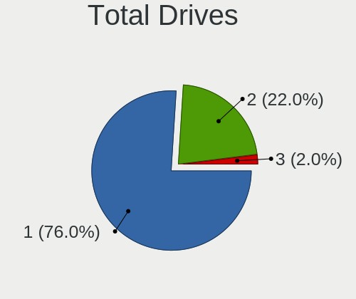
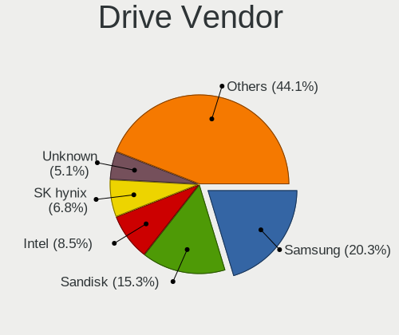
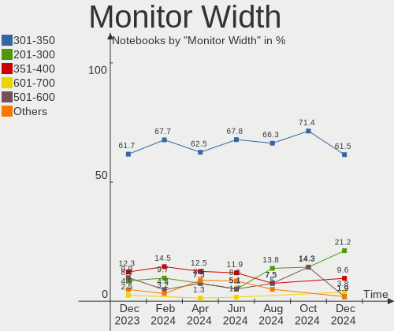
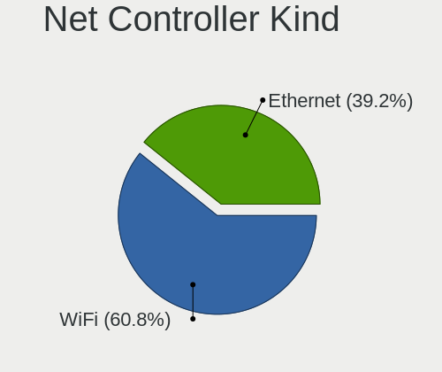
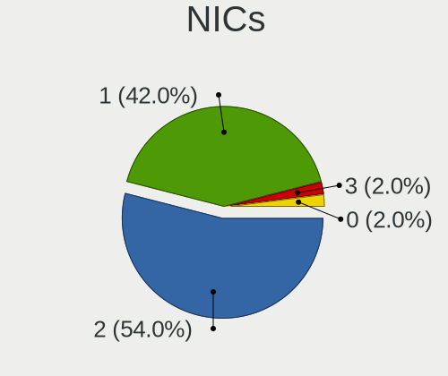
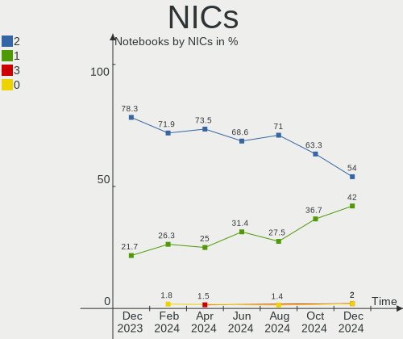
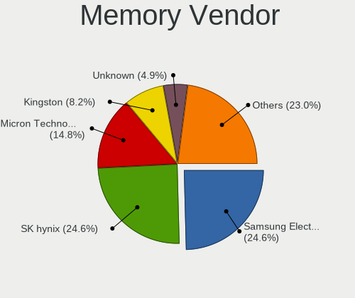
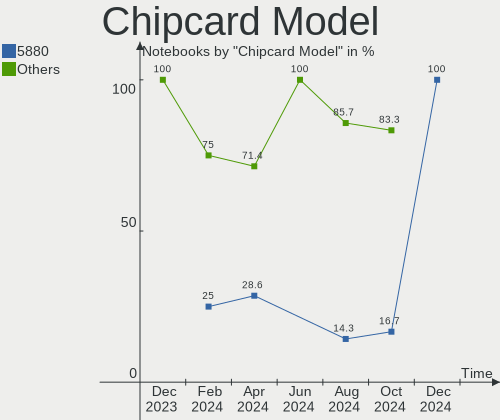

ArcoLinux - Hardware Trends (Notebooks)
---------------------------------------

A project to identify most popular hardware characteristics and track their change
over time based on data collected by Linux users at https://Linux-Hardware.org.

Anyone can contribute to this report by the [hw-probe](https://github.com/linuxhw/hw-probe) tool:

    sudo -E hw-probe -all -upload

This report is for one last month. Overall report since the beginning of time: [TestCoverage](https://github.com/linuxhw/TestCoverage)

Period: Oct, 2022.

Contents
--------

* [ System ](#system)
  - [ OS                       ](#os)
  - [ OS Family                ](#os-family)
  - [ Kernel                   ](#kernel)
  - [ Kernel Family            ](#kernel-family)
  - [ Kernel Major Ver.        ](#kernel-major-ver)
  - [ Arch                     ](#arch)
  - [ DE                       ](#de)
  - [ Display Server           ](#display-server)
  - [ Display Manager          ](#display-manager)
  - [ OS Lang                  ](#os-lang)
  - [ Boot Mode                ](#boot-mode)
  - [ Filesystem               ](#filesystem)
  - [ Part. scheme             ](#part-scheme)
  - [ Dual Boot with Linux/BSD ](#dual-boot-with-linuxbsd)
  - [ Dual Boot (Win)          ](#dual-boot-win)

* [ Board ](#board)
  - [ Vendor                   ](#vendor)
  - [ Model                    ](#model)
  - [ Model Family             ](#model-family)
  - [ MFG Year                 ](#mfg-year)
  - [ Form Factor              ](#form-factor)
  - [ Secure Boot              ](#secure-boot)
  - [ Coreboot                 ](#coreboot)
  - [ RAM Size                 ](#ram-size)
  - [ RAM Used                 ](#ram-used)
  - [ Total Drives             ](#total-drives)
  - [ Has CD-ROM               ](#has-cd-rom)
  - [ Has Ethernet             ](#has-ethernet)
  - [ Has WiFi                 ](#has-wifi)
  - [ Has Bluetooth            ](#has-bluetooth)

* [ Location ](#location)
  - [ Country                  ](#country)
  - [ City                     ](#city)

* [ Drives ](#drives)
  - [ Drive Vendor             ](#drive-vendor)
  - [ Drive Model              ](#drive-model)
  - [ HDD Vendor               ](#hdd-vendor)
  - [ SSD Vendor               ](#ssd-vendor)
  - [ Drive Kind               ](#drive-kind)
  - [ Drive Connector          ](#drive-connector)
  - [ Drive Size               ](#drive-size)
  - [ Space Total              ](#space-total)
  - [ Space Used               ](#space-used)
  - [ Malfunc. Drives          ](#malfunc-drives)
  - [ Malfunc. Drive Vendor    ](#malfunc-drive-vendor)
  - [ Malfunc. HDD Vendor      ](#malfunc-hdd-vendor)
  - [ Malfunc. Drive Kind      ](#malfunc-drive-kind)
  - [ Failed Drives            ](#failed-drives)
  - [ Failed Drive Vendor      ](#failed-drive-vendor)
  - [ Drive Status             ](#drive-status)

* [ Storage controller ](#storage-controller)
  - [ Storage Vendor           ](#storage-vendor)
  - [ Storage Model            ](#storage-model)
  - [ Storage Kind             ](#storage-kind)

* [ Processor ](#processor)
  - [ CPU Vendor               ](#cpu-vendor)
  - [ CPU Model                ](#cpu-model)
  - [ CPU Model Family         ](#cpu-model-family)
  - [ CPU Cores                ](#cpu-cores)
  - [ CPU Sockets              ](#cpu-sockets)
  - [ CPU Threads              ](#cpu-threads)
  - [ CPU Op-Modes             ](#cpu-op-modes)
  - [ CPU Microcode            ](#cpu-microcode)
  - [ CPU Microarch            ](#cpu-microarch)

* [ Graphics ](#graphics)
  - [ GPU Vendor               ](#gpu-vendor)
  - [ GPU Model                ](#gpu-model)
  - [ GPU Combo                ](#gpu-combo)
  - [ GPU Driver               ](#gpu-driver)
  - [ GPU Memory               ](#gpu-memory)

* [ Monitor ](#monitor)
  - [ Monitor Vendor           ](#monitor-vendor)
  - [ Monitor Model            ](#monitor-model)
  - [ Monitor Resolution       ](#monitor-resolution)
  - [ Monitor Diagonal         ](#monitor-diagonal)
  - [ Monitor Width            ](#monitor-width)
  - [ Aspect Ratio             ](#aspect-ratio)
  - [ Monitor Area             ](#monitor-area)
  - [ Pixel Density            ](#pixel-density)
  - [ Multiple Monitors        ](#multiple-monitors)

* [ Network ](#network)
  - [ Net Controller Vendor    ](#net-controller-vendor)
  - [ Net Controller Model     ](#net-controller-model)
  - [ Wireless Vendor          ](#wireless-vendor)
  - [ Wireless Model           ](#wireless-model)
  - [ Ethernet Vendor          ](#ethernet-vendor)
  - [ Ethernet Model           ](#ethernet-model)
  - [ Net Controller Kind      ](#net-controller-kind)
  - [ Used Controller          ](#used-controller)
  - [ NICs                     ](#nics)
  - [ IPv6                     ](#ipv6)

* [ Bluetooth ](#bluetooth)
  - [ Bluetooth Vendor         ](#bluetooth-vendor)
  - [ Bluetooth Model          ](#bluetooth-model)

* [ Sound ](#sound)
  - [ Sound Vendor             ](#sound-vendor)
  - [ Sound Model              ](#sound-model)

* [ Memory ](#memory)
  - [ Memory Vendor            ](#memory-vendor)
  - [ Memory Model             ](#memory-model)
  - [ Memory Kind              ](#memory-kind)
  - [ Memory Form Factor       ](#memory-form-factor)
  - [ Memory Size              ](#memory-size)
  - [ Memory Speed             ](#memory-speed)

* [ Printers & scanners ](#printers--scanners)
  - [ Printer Vendor           ](#printer-vendor)
  - [ Printer Model            ](#printer-model)
  - [ Scanner Vendor           ](#scanner-vendor)
  - [ Scanner Model            ](#scanner-model)

* [ Camera ](#camera)
  - [ Camera Vendor            ](#camera-vendor)
  - [ Camera Model             ](#camera-model)

* [ Security ](#security)
  - [ Fingerprint Vendor       ](#fingerprint-vendor)
  - [ Fingerprint Model        ](#fingerprint-model)
  - [ Chipcard Vendor          ](#chipcard-vendor)
  - [ Chipcard Model           ](#chipcard-model)

* [ Unsupported ](#unsupported)
  - [ Unsupported Devices      ](#unsupported-devices)
  - [ Unsupported Device Types ](#unsupported-device-types)

System
------

OS
--

Installed operating systems

| Name              | Notebooks | Percent |
|-------------------|-----------|---------|
| ArcoLinux Rolling | 35        | 92.11%  |
| ArcoLinux         | 3         | 7.89%   |

OS Family
---------

OS without a version

| Name      | Notebooks | Percent |
|-----------|-----------|---------|
| ArcoLinux | 38        | 100%    |

Kernel
------

Version of the Linux kernel

| Version               | Notebooks | Percent |
|-----------------------|-----------|---------|
| 6.0.2-arch1-1         | 6         | 15.79%  |
| 5.19.13-arch1-1       | 6         | 15.79%  |
| 5.15.74-1-lts         | 4         | 10.53%  |
| 5.19.12-arch1-1       | 3         | 7.89%   |
| 6.0.5-arch1-1         | 2         | 5.26%   |
| 6.0.2-zen1-1-zen      | 2         | 5.26%   |
| 6.0.2-x64v1-xanmod1-1 | 2         | 5.26%   |
| 5.19.11-arch1-1       | 2         | 5.26%   |
| 5.15.71-1-lts         | 2         | 5.26%   |
| 6.0.1-zen2-1-zen      | 1         | 2.63%   |
| 6.0.1-arch2-1         | 1         | 2.63%   |
| 6.0.0-arch1-1         | 1         | 2.63%   |
| 5.19.9-arch1-1        | 1         | 2.63%   |
| 5.17.7-arch1-1        | 1         | 2.63%   |
| 5.15.75-1-lts         | 1         | 2.63%   |
| 5.15.73-1-lts         | 1         | 2.63%   |
| 5.15.72-1-lts         | 1         | 2.63%   |
| 5.14.6-arch1-1        | 1         | 2.63%   |

Kernel Family
-------------

Linux kernel without a distro release

| Version | Notebooks | Percent |
|---------|-----------|---------|
| 6.0.2   | 10        | 26.32%  |
| 5.19.13 | 6         | 15.79%  |
| 5.15.74 | 4         | 10.53%  |
| 5.19.12 | 3         | 7.89%   |
| 6.0.5   | 2         | 5.26%   |
| 6.0.1   | 2         | 5.26%   |
| 5.19.11 | 2         | 5.26%   |
| 5.15.71 | 2         | 5.26%   |
| 6.0.0   | 1         | 2.63%   |
| 5.19.9  | 1         | 2.63%   |
| 5.17.7  | 1         | 2.63%   |
| 5.15.75 | 1         | 2.63%   |
| 5.15.73 | 1         | 2.63%   |
| 5.15.72 | 1         | 2.63%   |
| 5.14.6  | 1         | 2.63%   |

Kernel Major Ver.
-----------------

Linux kernel major version

| Version | Notebooks | Percent |
|---------|-----------|---------|
| 6.0     | 15        | 39.47%  |
| 5.19    | 12        | 31.58%  |
| 5.15    | 9         | 23.68%  |
| 5.17    | 1         | 2.63%   |
| 5.14    | 1         | 2.63%   |

Arch
----

OS architecture (x86_64, i586, etc.)

| Name   | Notebooks | Percent |
|--------|-----------|---------|
| x86_64 | 38        | 100%    |

DE
--

Desktop Environment

| Name       | Notebooks | Percent |
|------------|-----------|---------|
| XFCE       | 12        | 31.58%  |
| KDE5       | 9         | 23.68%  |
| awesome    | 6         | 15.79%  |
| i3         | 3         | 7.89%   |
| GNOME      | 3         | 7.89%   |
| X-Cinnamon | 2         | 5.26%   |
| xmonad     | 1         | 2.63%   |
| ICEWM      | 1         | 2.63%   |
| bspwm      | 1         | 2.63%   |

Display Server
--------------

X11 or Wayland

| Name    | Notebooks | Percent |
|---------|-----------|---------|
| X11     | 34        | 89.47%  |
| Wayland | 3         | 7.89%   |
| Tty     | 1         | 2.63%   |

Display Manager
---------------

SDDM, LightDM, etc.

| Name    | Notebooks | Percent |
|---------|-----------|---------|
| SDDM    | 25        | 65.79%  |
| LightDM | 6         | 15.79%  |
| GDM     | 4         | 10.53%  |
| Unknown | 3         | 7.89%   |

OS Lang
-------

Language

| Lang  | Notebooks | Percent |
|-------|-----------|---------|
| en_US | 17        | 44.74%  |
| en_GB | 4         | 10.53%  |
| de_DE | 3         | 7.89%   |
| en_ZA | 2         | 5.26%   |
| en_IN | 2         | 5.26%   |
| tr_TR | 1         | 2.63%   |
| th_TH | 1         | 2.63%   |
| ru_RU | 1         | 2.63%   |
| pl_PL | 1         | 2.63%   |
| nl_NL | 1         | 2.63%   |
| fr_FR | 1         | 2.63%   |
| es_CO | 1         | 2.63%   |
| en_PH | 1         | 2.63%   |
| de_AT | 1         | 2.63%   |
| C     | 1         | 2.63%   |

Boot Mode
---------

EFI or BIOS

| Mode | Notebooks | Percent |
|------|-----------|---------|
| EFI  | 26        | 68.42%  |
| BIOS | 12        | 31.58%  |

Filesystem
----------

Type of filesystem

| Type    | Notebooks | Percent |
|---------|-----------|---------|
| Ext4    | 29        | 76.32%  |
| Btrfs   | 7         | 18.42%  |
| Xfs     | 1         | 2.63%   |
| Overlay | 1         | 2.63%   |

Part. scheme
------------

Scheme of partitioning

| Type    | Notebooks | Percent |
|---------|-----------|---------|
| GPT     | 27        | 71.05%  |
| MBR     | 8         | 21.05%  |
| Unknown | 3         | 7.89%   |

Dual Boot with Linux/BSD
------------------------

Hosting more than one Linux/BSD

| Dual boot | Notebooks | Percent |
|-----------|-----------|---------|
| No        | 27        | 71.05%  |
| Yes       | 11        | 28.95%  |

Dual Boot (Win)
---------------

Hosting Linux and Windows

| Dual boot | Notebooks | Percent |
|-----------|-----------|---------|
| No        | 22        | 57.89%  |
| Yes       | 16        | 42.11%  |

Board
-----

Vendor
------

Motherboard manufacturer

| Name                | Notebooks | Percent |
|---------------------|-----------|---------|
| Lenovo              | 8         | 21.05%  |
| Dell                | 8         | 21.05%  |
| Hewlett-Packard     | 4         | 10.53%  |
| ASUSTek Computer    | 4         | 10.53%  |
| Acer                | 3         | 7.89%   |
| HUAWEI              | 2         | 5.26%   |
| TUXEDO              | 1         | 2.63%   |
| Toshiba             | 1         | 2.63%   |
| System76            | 1         | 2.63%   |
| Sony                | 1         | 2.63%   |
| Schenker            | 1         | 2.63%   |
| Samsung Electronics | 1         | 2.63%   |
| NEC Computers       | 1         | 2.63%   |
| MSI                 | 1         | 2.63%   |
| LG Electronics      | 1         | 2.63%   |

Model
-----

Motherboard model

| Name                                        | Notebooks | Percent |
|---------------------------------------------|-----------|---------|
| Lenovo IdeaPad 320-15ISK 80XH               | 2         | 5.26%   |
| Dell Latitude 3380                          | 2         | 5.26%   |
| TUXEDO Aura 15 Gen2                         | 1         | 2.63%   |
| Toshiba Satellite L775                      | 1         | 2.63%   |
| System76 Oryx Pro                           | 1         | 2.63%   |
| Sony SVE14A27CXH                            | 1         | 2.63%   |
| Schenker SLIM_13_14_SSL13_14L18             | 1         | 2.63%   |
| Samsung 300E4A/300E5A/300E7A/3430EA/3530EA  | 1         | 2.63%   |
| NEC Computers PC-VK27MXZCG                  | 1         | 2.63%   |
| MSI CR61 3M                                 | 1         | 2.63%   |
| LG C500                                     | 1         | 2.63%   |
| Lenovo ThinkPad X1 Carbon Gen 9 20XWCTO1WW  | 1         | 2.63%   |
| Lenovo ThinkPad X1 Carbon Gen 10 21CBCTO1WW | 1         | 2.63%   |
| Lenovo ThinkPad T450s 20BWA0DW00            | 1         | 2.63%   |
| Lenovo ThinkPad Edge S430 33643DG           | 1         | 2.63%   |
| Lenovo ThinkPad Edge 03193UG                | 1         | 2.63%   |
| Lenovo Legion 5 15IMH05H 81Y6               | 1         | 2.63%   |
| HUAWEI VLT-WX0                              | 1         | 2.63%   |
| HUAWEI HLYL-WXX9                            | 1         | 2.63%   |
| HP Pavilion Laptop 15-cw0xxx                | 1         | 2.63%   |
| HP Pavilion g7                              | 1         | 2.63%   |
| HP Laptop 15s-eq2xxx                        | 1         | 2.63%   |
| HP Laptop 14s-dk1xxx                        | 1         | 2.63%   |
| Dell Vostro 3500                            | 1         | 2.63%   |
| Dell Precision 7530                         | 1         | 2.63%   |
| Dell Latitude E6440                         | 1         | 2.63%   |
| Dell Latitude 3350                          | 1         | 2.63%   |
| Dell Inspiron 7559                          | 1         | 2.63%   |
| Dell Inspiron 5590                          | 1         | 2.63%   |
| ASUS X705UDR                                | 1         | 2.63%   |
| ASUS VivoBook_ASUSLaptop X530FN_S530FN      | 1         | 2.63%   |
| ASUS VivoBook_ASUSLaptop X513UA_M513UA      | 1         | 2.63%   |
| ASUS TUF Gaming FX505DY_FX505DY             | 1         | 2.63%   |
| Acer Aspire E5-575G                         | 1         | 2.63%   |
| Acer Aspire 7720Z                           | 1         | 2.63%   |
| Acer Aspire 5750G                           | 1         | 2.63%   |

Model Family
------------

Motherboard model prefix

| Name                       | Notebooks | Percent |
|----------------------------|-----------|---------|
| Lenovo ThinkPad            | 5         | 13.16%  |
| Dell Latitude              | 4         | 10.53%  |
| Acer Aspire                | 3         | 7.89%   |
| Lenovo IdeaPad             | 2         | 5.26%   |
| HP Pavilion                | 2         | 5.26%   |
| HP Laptop                  | 2         | 5.26%   |
| Dell Inspiron              | 2         | 5.26%   |
| ASUS VivoBook              | 2         | 5.26%   |
| TUXEDO Aura                | 1         | 2.63%   |
| Toshiba Satellite          | 1         | 2.63%   |
| System76 Oryx              | 1         | 2.63%   |
| Sony SVE14A27CXH           | 1         | 2.63%   |
| Schenker SLIM              | 1         | 2.63%   |
| Samsung 300E4A             | 1         | 2.63%   |
| NEC Computers PC-VK27MXZCG | 1         | 2.63%   |
| MSI CR61                   | 1         | 2.63%   |
| LG C500                    | 1         | 2.63%   |
| Lenovo Legion              | 1         | 2.63%   |
| HUAWEI VLT-WX0             | 1         | 2.63%   |
| HUAWEI HLYL-WXX9           | 1         | 2.63%   |
| Dell Vostro                | 1         | 2.63%   |
| Dell Precision             | 1         | 2.63%   |
| ASUS X705UDR               | 1         | 2.63%   |
| ASUS TUF                   | 1         | 2.63%   |

MFG Year
--------

Motherboard manufacture year

| Year | Notebooks | Percent |
|------|-----------|---------|
| 2017 | 5         | 13.16%  |
| 2011 | 5         | 13.16%  |
| 2021 | 4         | 10.53%  |
| 2019 | 4         | 10.53%  |
| 2013 | 4         | 10.53%  |
| 2020 | 3         | 7.89%   |
| 2018 | 3         | 7.89%   |
| 2022 | 2         | 5.26%   |
| 2016 | 2         | 5.26%   |
| 2015 | 2         | 5.26%   |
| 2010 | 2         | 5.26%   |
| 2012 | 1         | 2.63%   |
| 2007 | 1         | 2.63%   |

Form Factor
-----------

Physical design of the computer

| Name     | Notebooks | Percent |
|----------|-----------|---------|
| Notebook | 38        | 100%    |

Secure Boot
-----------

Enabled or disabled

| State    | Notebooks | Percent |
|----------|-----------|---------|
| Disabled | 38        | 100%    |

Coreboot
--------

Have coreboot on board

| Used | Notebooks | Percent |
|------|-----------|---------|
| No   | 38        | 100%    |

RAM Size
--------

Total RAM memory

| Size in GB | Notebooks | Percent |
|------------|-----------|---------|
| 4.01-8.0   | 15        | 39.47%  |
| 8.01-16.0  | 10        | 26.32%  |
| 16.01-24.0 | 8         | 21.05%  |
| 32.01-64.0 | 2         | 5.26%   |
| 3.01-4.0   | 2         | 5.26%   |
| 1.01-2.0   | 1         | 2.63%   |

RAM Used
--------

Used RAM memory

| Used GB   | Notebooks | Percent |
|-----------|-----------|---------|
| 2.01-3.0  | 10        | 26.32%  |
| 4.01-8.0  | 8         | 21.05%  |
| 3.01-4.0  | 8         | 21.05%  |
| 1.01-2.0  | 7         | 18.42%  |
| 0.51-1.0  | 3         | 7.89%   |
| 8.01-16.0 | 2         | 5.26%   |

Total Drives
------------

Number of drives on board

| Drives | Notebooks | Percent |
|--------|-----------|---------|
| 1      | 22        | 57.89%  |
| 2      | 14        | 36.84%  |
| 4      | 1         | 2.63%   |
| 3      | 1         | 2.63%   |

Has CD-ROM
----------

Has CD-ROM on board

| Presented | Notebooks | Percent |
|-----------|-----------|---------|
| No        | 27        | 71.05%  |
| Yes       | 11        | 28.95%  |

Has Ethernet
------------

Has Ethernet on board

| Presented | Notebooks | Percent |
|-----------|-----------|---------|
| Yes       | 31        | 81.58%  |
| No        | 7         | 18.42%  |

Has WiFi
--------

Has WiFi module

| Presented | Notebooks | Percent |
|-----------|-----------|---------|
| Yes       | 38        | 100%    |

Has Bluetooth
-------------

Has Bluetooth module

| Presented | Notebooks | Percent |
|-----------|-----------|---------|
| Yes       | 31        | 81.58%  |
| No        | 7         | 18.42%  |

Location
--------

Country
-------

Geographic location (country)

| Country      | Notebooks | Percent |
|--------------|-----------|---------|
| USA          | 5         | 13.16%  |
| Germany      | 4         | 10.53%  |
| Italy        | 3         | 7.89%   |
| Turkey       | 2         | 5.26%   |
| South Africa | 2         | 5.26%   |
| Poland       | 2         | 5.26%   |
| India        | 2         | 5.26%   |
| Belgium      | 2         | 5.26%   |
| Austria      | 2         | 5.26%   |
| Thailand     | 1         | 2.63%   |
| Switzerland  | 1         | 2.63%   |
| Spain        | 1         | 2.63%   |
| Serbia       | 1         | 2.63%   |
| Philippines  | 1         | 2.63%   |
| Pakistan     | 1         | 2.63%   |
| Netherlands  | 1         | 2.63%   |
| Malaysia     | 1         | 2.63%   |
| Ireland      | 1         | 2.63%   |
| Greece       | 1         | 2.63%   |
| France       | 1         | 2.63%   |
| Colombia     | 1         | 2.63%   |
| Chile        | 1         | 2.63%   |
| Bangladesh   | 1         | 2.63%   |

City
----

Geographic location (city)

| City                     | Notebooks | Percent |
|--------------------------|-----------|---------|
| Vienna                   | 2         | 5.26%   |
| Milan                    | 2         | 5.26%   |
| Torun                    | 1         | 2.63%   |
| Surprise                 | 1         | 2.63%   |
| Steubenville             | 1         | 2.63%   |
| Santiago                 | 1         | 2.63%   |
| San Salvatore Monferrato | 1         | 2.63%   |
| San Jose                 | 1         | 2.63%   |
| Quezon City              | 1         | 2.63%   |
| Ochten                   | 1         | 2.63%   |
| Novi Sad                 | 1         | 2.63%   |
| New York                 | 1         | 2.63%   |
| Marnand                  | 1         | 2.63%   |
| Ludhiana                 | 1         | 2.63%   |
| Lessay                   | 1         | 2.63%   |
| Lahore                   | 1         | 2.63%   |
| Kalisz                   | 1         | 2.63%   |
| Johannesburg             | 1         | 2.63%   |
| Hulshout                 | 1         | 2.63%   |
| Houston                  | 1         | 2.63%   |
| Heraklion                | 1         | 2.63%   |
| George Town              | 1         | 2.63%   |
| Gelsenkirchen            | 1         | 2.63%   |
| Frankfurt am Main        | 1         | 2.63%   |
| Dublin                   | 1         | 2.63%   |
| Dhaka                    | 1         | 2.63%   |
| Cape Town                | 1         | 2.63%   |
| Bursa                    | 1         | 2.63%   |
| Burgkunstadt             | 1         | 2.63%   |
| Brussels                 | 1         | 2.63%   |
| Bogotá                  | 1         | 2.63%   |
| Bergheim                 | 1         | 2.63%   |
| Bengaluru                | 1         | 2.63%   |
| Bangkok                  | 1         | 2.63%   |
| Ankara                   | 1         | 2.63%   |
| Alcobendas               | 1         | 2.63%   |

Drives
------

Drive Vendor
------------

Hard drive vendors

| Vendor                       | Notebooks | Drives | Percent |
|------------------------------|-----------|--------|---------|
| Samsung Electronics          | 11        | 12     | 20.75%  |
| WDC                          | 5         | 6      | 9.43%   |
| Toshiba                      | 5         | 5      | 9.43%   |
| SanDisk                      | 5         | 5      | 9.43%   |
| Crucial                      | 4         | 4      | 7.55%   |
| SK hynix                     | 3         | 3      | 5.66%   |
| Seagate                      | 3         | 3      | 5.66%   |
| Unknown                      | 2         | 2      | 3.77%   |
| Micron Technology            | 2         | 2      | 3.77%   |
| Kingston                     | 2         | 2      | 3.77%   |
| A-DATA Technology            | 2         | 2      | 3.77%   |
| USB3.0                       | 1         | 1      | 1.89%   |
| Shenzhen Longsys Electronics | 1         | 1      | 1.89%   |
| Realtek                      | 1         | 1      | 1.89%   |
| LITEON                       | 1         | 1      | 1.89%   |
| KIOXIA                       | 1         | 1      | 1.89%   |
| Kingmax                      | 1         | 1      | 1.89%   |
| Intel                        | 1         | 1      | 1.89%   |
| HGST                         | 1         | 1      | 1.89%   |
| ADATA Technology             | 1         | 1      | 1.89%   |

Drive Model
-----------

Hard drive models

| Model                                                | Notebooks | Percent |
|------------------------------------------------------|-----------|---------|
| Toshiba MQ04ABF100 1TB                               | 3         | 5.45%   |
| Samsung NVMe SSD Controller SM981/PM981/PM983 500GB  | 3         | 5.45%   |
| Samsung NVMe SSD Controller PM9A1/PM9A3/980PRO 250GB | 2         | 3.64%   |
| Crucial CT1000MX500SSD1 1TB                          | 2         | 3.64%   |
| WDC WDS500G2B0B-00YS70 500GB SSD                     | 1         | 1.82%   |
| WDC WDS120G2G0A-00JH30 120GB SSD                     | 1         | 1.82%   |
| WDC WDS100T2G0A-00JH30 1TB SSD                       | 1         | 1.82%   |
| WDC WD3200BPVT-22ZEST0 320GB                         | 1         | 1.82%   |
| WDC WD20SPZX-22UA7T0 2TB                             | 1         | 1.82%   |
| WDC WD10SPZX-75Z10T3 1TB                             | 1         | 1.82%   |
| USB3.0 Super Speed 1TB                               | 1         | 1.82%   |
| Unknown MMC Card  64GB                               | 1         | 1.82%   |
| Unknown MMC Card  134GB                              | 1         | 1.82%   |
| Toshiba MQ01ABF050 500GB                             | 1         | 1.82%   |
| Toshiba MK1646GSX 160GB                              | 1         | 1.82%   |
| SK hynix SC308 SATA 256GB SSD                        | 1         | 1.82%   |
| SK hynix SC300 2.5 7MM 256GB SSD                     | 1         | 1.82%   |
| SK hynix BC511 256GB                                 | 1         | 1.82%   |
| Shenzhen Longsys TEAM TM8FPD512G 512GB               | 1         | 1.82%   |
| Seagate ST2000LX001-1RG174 2TB                       | 1         | 1.82%   |
| Seagate ST2000LM015-2E8174 2TB                       | 1         | 1.82%   |
| Seagate ST1000LM035-1RK172 1TB                       | 1         | 1.82%   |
| Sandisk WD_BLACK SN770 1TB                           | 1         | 1.82%   |
| Sandisk WD Blue SN570 500GB                          | 1         | 1.82%   |
| SanDisk SSD PLUS 120 GB                              | 1         | 1.82%   |
| SanDisk SSD PLUS 1000GB                              | 1         | 1.82%   |
| SanDisk SDSSDA120G 120GB                             | 1         | 1.82%   |
| Samsung SSD 860 EVO 500GB                            | 1         | 1.82%   |
| Samsung SSD 860 EVO 250GB                            | 1         | 1.82%   |
| Samsung SSD 860 EVO 1TB                              | 1         | 1.82%   |
| Samsung SSD 850 EVO 250GB                            | 1         | 1.82%   |
| Samsung PM981 NVMe 256GB                             | 1         | 1.82%   |
| Samsung MZNLN128HAHQ-000H1 128GB SSD                 | 1         | 1.82%   |
| Samsung MZ7TE512HMHP-000L1 512GB SSD                 | 1         | 1.82%   |
| Realtek RTL9210B-CG 250GB                            | 1         | 1.82%   |
| Micron 2210_MTFDHBA1T0QFD 1TB                        | 1         | 1.82%   |
| Micron 2200V_MTFDHBA512TCK 512GB                     | 1         | 1.82%   |
| LITEON CV8-8E256 256GB SSD                           | 1         | 1.82%   |
| KIOXIA KBG40ZNS512G NVMe 512GB                       | 1         | 1.82%   |
| Kingston SA400S37240G 240GB SSD                      | 1         | 1.82%   |

HDD Vendor
----------

Hard disk drive vendors

| Vendor  | Notebooks | Drives | Percent |
|---------|-----------|--------|---------|
| Toshiba | 5         | 5      | 38.46%  |
| WDC     | 3         | 3      | 23.08%  |
| Seagate | 3         | 3      | 23.08%  |
| USB3.0  | 1         | 1      | 7.69%   |
| HGST    | 1         | 1      | 7.69%   |

SSD Vendor
----------

Solid state drive vendors

| Vendor              | Notebooks | Drives | Percent |
|---------------------|-----------|--------|---------|
| Samsung Electronics | 6         | 6      | 26.09%  |
| Crucial             | 4         | 4      | 17.39%  |
| WDC                 | 3         | 3      | 13.04%  |
| SanDisk             | 3         | 3      | 13.04%  |
| SK hynix            | 2         | 2      | 8.7%    |
| A-DATA Technology   | 2         | 2      | 8.7%    |
| LITEON              | 1         | 1      | 4.35%   |
| Kingston            | 1         | 1      | 4.35%   |
| Kingmax             | 1         | 1      | 4.35%   |

Drive Kind
----------

HDD or SSD

| Kind | Notebooks | Drives | Percent |
|------|-----------|--------|---------|
| SSD  | 21        | 23     | 40.38%  |
| NVMe | 16        | 17     | 30.77%  |
| HDD  | 13        | 13     | 25%     |
| MMC  | 2         | 2      | 3.85%   |

Drive Connector
---------------

SATA, SAS, NVMe, etc.

| Type | Notebooks | Drives | Percent |
|------|-----------|--------|---------|
| SATA | 29        | 35     | 59.18%  |
| NVMe | 16        | 16     | 32.65%  |
| SAS  | 2         | 2      | 4.08%   |
| MMC  | 2         | 2      | 4.08%   |

Drive Size
----------

Size of hard drive

| Size in TB | Notebooks | Drives | Percent |
|------------|-----------|--------|---------|
| 0.01-0.5   | 16        | 18     | 47.06%  |
| 0.51-1.0   | 15        | 15     | 44.12%  |
| 1.01-2.0   | 3         | 3      | 8.82%   |

Space Total
-----------

Amount of disk space available on the file system

| Size in GB     | Notebooks | Percent |
|----------------|-----------|---------|
| 251-500        | 9         | 23.68%  |
| 1001-2000      | 7         | 18.42%  |
| 501-1000       | 6         | 15.79%  |
| 101-250        | 5         | 13.16%  |
| More than 3000 | 4         | 10.53%  |
| 21-50          | 3         | 7.89%   |
| 1-20           | 2         | 5.26%   |
| 51-100         | 1         | 2.63%   |
| Unknown        | 1         | 2.63%   |

Space Used
----------

Amount of used disk space

| Used GB   | Notebooks | Percent |
|-----------|-----------|---------|
| 501-1000  | 8         | 21.05%  |
| 21-50     | 7         | 18.42%  |
| 101-250   | 7         | 18.42%  |
| 1-20      | 6         | 15.79%  |
| 251-500   | 4         | 10.53%  |
| 51-100    | 4         | 10.53%  |
| 1001-2000 | 1         | 2.63%   |
| Unknown   | 1         | 2.63%   |

Malfunc. Drives
---------------

Drive models with a malfunction

| Model                          | Notebooks | Drives | Percent |
|--------------------------------|-----------|--------|---------|
| USB3.0 Super Speed 1TB         | 1         | 1      | 25%     |
| Toshiba MQ01ABF050 500GB       | 1         | 1      | 25%     |
| Seagate ST1000LM035-1RK172 1TB | 1         | 1      | 25%     |
| SanDisk SSD PLUS 1000GB        | 1         | 1      | 25%     |

Malfunc. Drive Vendor
---------------------

Vendors of faulty drives

| Vendor  | Notebooks | Drives | Percent |
|---------|-----------|--------|---------|
| USB3.0  | 1         | 1      | 25%     |
| Toshiba | 1         | 1      | 25%     |
| Seagate | 1         | 1      | 25%     |
| SanDisk | 1         | 1      | 25%     |

Malfunc. HDD Vendor
-------------------

Vendors of faulty HDD drives

| Vendor  | Notebooks | Drives | Percent |
|---------|-----------|--------|---------|
| USB3.0  | 1         | 1      | 33.33%  |
| Toshiba | 1         | 1      | 33.33%  |
| Seagate | 1         | 1      | 33.33%  |

Malfunc. Drive Kind
-------------------

Kinds of faulty drives

| Kind | Notebooks | Drives | Percent |
|------|-----------|--------|---------|
| HDD  | 3         | 3      | 75%     |
| SSD  | 1         | 1      | 25%     |

Failed Drives
-------------

Failed drive models

Zero info for selected period =(

Failed Drive Vendor
-------------------

Failed drive vendors

Zero info for selected period =(

Drive Status
------------

Number of failed and malfunc. drives

| Status   | Notebooks | Drives | Percent |
|----------|-----------|--------|---------|
| Works    | 33        | 44     | 78.57%  |
| Detected | 5         | 7      | 11.9%   |
| Malfunc  | 4         | 4      | 9.52%   |

Storage controller
------------------

Storage Vendor
--------------

Storage controller vendors

| Vendor                       | Notebooks | Percent |
|------------------------------|-----------|---------|
| Intel                        | 27        | 56.25%  |
| Samsung Electronics          | 6         | 12.5%   |
| AMD                          | 6         | 12.5%   |
| SanDisk                      | 2         | 4.17%   |
| Micron Technology            | 2         | 4.17%   |
| SK hynix                     | 1         | 2.08%   |
| Shenzhen Longsys Electronics | 1         | 2.08%   |
| KIOXIA                       | 1         | 2.08%   |
| Kingston Technology Company  | 1         | 2.08%   |
| ADATA Technology             | 1         | 2.08%   |

Storage Model
-------------

Storage controller models

| Model                                                                          | Notebooks | Percent |
|--------------------------------------------------------------------------------|-----------|---------|
| Intel Sunrise Point-LP SATA Controller [AHCI mode]                             | 6         | 11.54%  |
| AMD FCH SATA Controller [AHCI mode]                                            | 6         | 11.54%  |
| Samsung NVMe SSD Controller SM981/PM981/PM983                                  | 4         | 7.69%   |
| Intel 6 Series/C200 Series Chipset Family 6 port Mobile SATA AHCI Controller   | 3         | 5.77%   |
| Samsung NVMe SSD Controller PM9A1/PM9A3/980PRO                                 | 2         | 3.85%   |
| Micron Non-Volatile memory controller                                          | 2         | 3.85%   |
| Intel Wildcat Point-LP SATA Controller [AHCI Mode]                             | 2         | 3.85%   |
| Intel Cannon Point-LP SATA Controller [AHCI Mode]                              | 2         | 3.85%   |
| Intel Cannon Lake Mobile PCH SATA AHCI Controller                              | 2         | 3.85%   |
| Intel 7 Series Chipset Family 6-port SATA Controller [AHCI mode]               | 2         | 3.85%   |
| Intel 5 Series/3400 Series Chipset 4 port SATA AHCI Controller                 | 2         | 3.85%   |
| SK hynix BC511                                                                 | 1         | 1.92%   |
| Shenzhen Longsys Electronics Non-Volatile memory controller                    | 1         | 1.92%   |
| SanDisk WD Blue SN570 NVMe SSD                                                 | 1         | 1.92%   |
| SanDisk Non-Volatile memory controller                                         | 1         | 1.92%   |
| KIOXIA NVMe SSD Controller BG4                                                 | 1         | 1.92%   |
| Kingston Company Company Non-Volatile memory controller                        | 1         | 1.92%   |
| Intel Volume Management Device NVMe RAID Controller                            | 1         | 1.92%   |
| Intel Tiger Lake-LP SATA Controller                                            | 1         | 1.92%   |
| Intel SSD 660P Series                                                          | 1         | 1.92%   |
| Intel HM170/QM170 Chipset SATA Controller [AHCI Mode]                          | 1         | 1.92%   |
| Intel Comet Lake SATA AHCI Controller                                          | 1         | 1.92%   |
| Intel 82801HM/HEM (ICH8M/ICH8M-E) SATA Controller [AHCI mode]                  | 1         | 1.92%   |
| Intel 82801HM/HEM (ICH8M/ICH8M-E) IDE Controller                               | 1         | 1.92%   |
| Intel 82801 Mobile SATA Controller [RAID mode]                                 | 1         | 1.92%   |
| Intel 8 Series/C220 Series Chipset Family 6-port SATA Controller 1 [AHCI mode] | 1         | 1.92%   |
| Intel 7 Series Chipset Family 4-port SATA Controller [IDE mode]                | 1         | 1.92%   |
| Intel 7 Series Chipset Family 2-port SATA Controller [IDE mode]                | 1         | 1.92%   |
| Intel 400 Series Chipset Family SATA AHCI Controller                           | 1         | 1.92%   |
| ADATA XPG SX8200 Pro PCIe Gen3x4 M.2 2280 Solid State Drive                    | 1         | 1.92%   |

Storage Kind
------------

Kind of storage controller (IDE, SATA, NVMe, SAS, ...)

| Kind | Notebooks | Percent |
|------|-----------|---------|
| SATA | 31        | 60.78%  |
| NVMe | 16        | 31.37%  |
| RAID | 2         | 3.92%   |
| IDE  | 2         | 3.92%   |

Processor
---------

CPU Vendor
----------

Processor vendors

| Vendor | Notebooks | Percent |
|--------|-----------|---------|
| Intel  | 29        | 76.32%  |
| AMD    | 9         | 23.68%  |

CPU Model
---------

Processor models

| Model                                         | Notebooks | Percent |
|-----------------------------------------------|-----------|---------|
| Intel Core i3-6006U CPU @ 2.00GHz             | 3         | 7.89%   |
| AMD Ryzen 7 5700U with Radeon Graphics        | 2         | 5.26%   |
| Intel Pentium Dual CPU T2330 @ 1.60GHz        | 1         | 2.63%   |
| Intel Core i7-9750H CPU @ 2.60GHz             | 1         | 2.63%   |
| Intel Core i7-8750H CPU @ 2.20GHz             | 1         | 2.63%   |
| Intel Core i7-8565U CPU @ 1.80GHz             | 1         | 2.63%   |
| Intel Core i7-8550U CPU @ 1.80GHz             | 1         | 2.63%   |
| Intel Core i7-7500U CPU @ 2.70GHz             | 1         | 2.63%   |
| Intel Core i7-5600U CPU @ 2.60GHz             | 1         | 2.63%   |
| Intel Core i7-3632QM CPU @ 2.20GHz            | 1         | 2.63%   |
| Intel Core i7-3520M CPU @ 2.90GHz             | 1         | 2.63%   |
| Intel Core i7-10750H CPU @ 2.60GHz            | 1         | 2.63%   |
| Intel Core i5-8265U CPU @ 1.60GHz             | 1         | 2.63%   |
| Intel Core i5-8250U CPU @ 1.60GHz             | 1         | 2.63%   |
| Intel Core i5-7200U CPU @ 2.50GHz             | 1         | 2.63%   |
| Intel Core i5-6300HQ CPU @ 2.30GHz            | 1         | 2.63%   |
| Intel Core i5-5200U CPU @ 2.20GHz             | 1         | 2.63%   |
| Intel Core i5-4210M CPU @ 2.60GHz             | 1         | 2.63%   |
| Intel Core i5-3340M CPU @ 2.70GHz             | 1         | 2.63%   |
| Intel Core i5-2450M CPU @ 2.50GHz             | 1         | 2.63%   |
| Intel Core i5-2430M CPU @ 2.40GHz             | 1         | 2.63%   |
| Intel Core i5-10210U CPU @ 1.60GHz            | 1         | 2.63%   |
| Intel Core i3-2350M CPU @ 2.30GHz             | 1         | 2.63%   |
| Intel Core i3 CPU M 390 @ 2.67GHz             | 1         | 2.63%   |
| Intel Core i3 CPU M 380 @ 2.53GHz             | 1         | 2.63%   |
| Intel 12th Gen Core i5-1245U                  | 1         | 2.63%   |
| Intel 11th Gen Core i7-1185G7 @ 3.00GHz       | 1         | 2.63%   |
| Intel 11th Gen Core i5-1135G7 @ 2.40GHz       | 1         | 2.63%   |
| AMD Ryzen 5 5500U with Radeon Graphics        | 1         | 2.63%   |
| AMD Ryzen 5 4600H with Radeon Graphics        | 1         | 2.63%   |
| AMD Ryzen 5 3550H with Radeon Vega Mobile Gfx | 1         | 2.63%   |
| AMD Ryzen 5 2500U with Radeon Vega Mobile Gfx | 1         | 2.63%   |
| AMD Ryzen 3 3250U with Radeon Graphics        | 1         | 2.63%   |
| AMD E1-2100 APU with Radeon HD Graphics       | 1         | 2.63%   |
| AMD A6-4400M APU with Radeon HD Graphics      | 1         | 2.63%   |

CPU Model Family
----------------

Processor model prefix

| Model              | Notebooks | Percent |
|--------------------|-----------|---------|
| Intel Core i5      | 10        | 26.32%  |
| Intel Core i7      | 9         | 23.68%  |
| Intel Core i3      | 6         | 15.79%  |
| AMD Ryzen 5        | 4         | 10.53%  |
| Other              | 3         | 7.89%   |
| AMD Ryzen 7        | 2         | 5.26%   |
| Intel Pentium Dual | 1         | 2.63%   |
| AMD Ryzen 3        | 1         | 2.63%   |
| AMD E1             | 1         | 2.63%   |
| AMD A6             | 1         | 2.63%   |

CPU Cores
---------

Number of processor cores

| Number | Notebooks | Percent |
|--------|-----------|---------|
| 2      | 18        | 47.37%  |
| 4      | 11        | 28.95%  |
| 6      | 5         | 13.16%  |
| 8      | 2         | 5.26%   |
| 10     | 1         | 2.63%   |
| 1      | 1         | 2.63%   |

CPU Sockets
-----------

Number of sockets

| Number | Notebooks | Percent |
|--------|-----------|---------|
| 1      | 38        | 100%    |

CPU Threads
-----------

Threads per core (Hyper-Threading)

| Number | Notebooks | Percent |
|--------|-----------|---------|
| 2      | 35        | 92.11%  |
| 1      | 3         | 7.89%   |

CPU Op-Modes
------------

CPU Operation Modes (32-bit, 64-bit)

| Op mode        | Notebooks | Percent |
|----------------|-----------|---------|
| 32-bit, 64-bit | 38        | 100%    |

CPU Microcode
-------------

Microcode number

| Number     | Notebooks | Percent |
|------------|-----------|---------|
| Unknown    | 4         | 10.53%  |
| 0x406e3    | 3         | 7.89%   |
| 0x306a9    | 3         | 7.89%   |
| 0x08608103 | 3         | 7.89%   |
| 0x906ea    | 2         | 5.26%   |
| 0x806ea    | 2         | 5.26%   |
| 0x806c1    | 2         | 5.26%   |
| 0x306d4    | 2         | 5.26%   |
| 0x206a7    | 2         | 5.26%   |
| 0x20655    | 2         | 5.26%   |
| 0xa0652    | 1         | 2.63%   |
| 0x906a4    | 1         | 2.63%   |
| 0x806ec    | 1         | 2.63%   |
| 0x806eb    | 1         | 2.63%   |
| 0x806e9    | 1         | 2.63%   |
| 0x6fd      | 1         | 2.63%   |
| 0x506e3    | 1         | 2.63%   |
| 0x306c3    | 1         | 2.63%   |
| 0x08600104 | 1         | 2.63%   |
| 0x08108109 | 1         | 2.63%   |
| 0x0810100b | 1         | 2.63%   |
| 0x0700010b | 1         | 2.63%   |
| 0x06001116 | 1         | 2.63%   |

CPU Microarch
-------------

Microarchitecture

| Name             | Notebooks | Percent |
|------------------|-----------|---------|
| KabyLake         | 9         | 23.68%  |
| Skylake          | 4         | 10.53%  |
| SandyBridge      | 3         | 7.89%   |
| IvyBridge        | 3         | 7.89%   |
| Unknown          | 3         | 7.89%   |
| Zen+             | 2         | 5.26%   |
| Westmere         | 2         | 5.26%   |
| TigerLake        | 2         | 5.26%   |
| Broadwell        | 2         | 5.26%   |
| Zen 2            | 1         | 2.63%   |
| Zen              | 1         | 2.63%   |
| Piledriver       | 1         | 2.63%   |
| Jaguar           | 1         | 2.63%   |
| Haswell          | 1         | 2.63%   |
| Core             | 1         | 2.63%   |
| CometLake        | 1         | 2.63%   |
| Alderlake Hybrid | 1         | 2.63%   |

Graphics
--------

GPU Vendor
----------

Vendors of graphics cards

| Vendor | Notebooks | Percent |
|--------|-----------|---------|
| Intel  | 28        | 59.57%  |
| AMD    | 10        | 21.28%  |
| Nvidia | 9         | 19.15%  |

GPU Model
---------

Graphics card models

| Model                                                                     | Notebooks | Percent |
|---------------------------------------------------------------------------|-----------|---------|
| Intel 3rd Gen Core processor Graphics Controller                          | 3         | 6%      |
| Intel 2nd Generation Core Processor Family Integrated Graphics Controller | 3         | 6%      |
| AMD Lucienne                                                              | 3         | 6%      |
| Nvidia TU106M [GeForce RTX 2060 Mobile]                                   | 2         | 4%      |
| Intel WhiskeyLake-U GT2 [UHD Graphics 620]                                | 2         | 4%      |
| Intel UHD Graphics 620                                                    | 2         | 4%      |
| Intel TigerLake-LP GT2 [Iris Xe Graphics]                                 | 2         | 4%      |
| Intel HD Graphics 620                                                     | 2         | 4%      |
| Intel HD Graphics 5500                                                    | 2         | 4%      |
| Intel HD Graphics 520                                                     | 2         | 4%      |
| Intel Core Processor Integrated Graphics Controller                       | 2         | 4%      |
| AMD Thames [Radeon HD 7500M/7600M Series]                                 | 2         | 4%      |
| AMD Picasso/Raven 2 [Radeon Vega Series / Radeon Vega Mobile Series]      | 2         | 4%      |
| Nvidia GP108M [GeForce MX150]                                             | 1         | 2%      |
| Nvidia GP107GLM [Quadro P2000 Mobile]                                     | 1         | 2%      |
| Nvidia GM108M [GeForce 940MX]                                             | 1         | 2%      |
| Nvidia GM108M [GeForce 920MX]                                             | 1         | 2%      |
| Nvidia GM107M [GeForce GTX 960M]                                          | 1         | 2%      |
| Nvidia GF119M [GeForce GT 520MX]                                          | 1         | 2%      |
| Nvidia GF108M [GeForce 610M]                                              | 1         | 2%      |
| Intel Skylake GT2 [HD Graphics 520]                                       | 1         | 2%      |
| Intel Mobile GM965/GL960 Integrated Graphics Controller (secondary)       | 1         | 2%      |
| Intel Mobile GM965/GL960 Integrated Graphics Controller (primary)         | 1         | 2%      |
| Intel HD Graphics 530                                                     | 1         | 2%      |
| Intel CometLake-U GT2 [UHD Graphics]                                      | 1         | 2%      |
| Intel CometLake-H GT2 [UHD Graphics]                                      | 1         | 2%      |
| Intel CoffeeLake-H GT2 [UHD Graphics 630]                                 | 1         | 2%      |
| Intel Alder Lake-UP3 GT2 [Iris Xe Graphics]                               | 1         | 2%      |
| Intel 4th Gen Core Processor Integrated Graphics Controller               | 1         | 2%      |
| AMD Trinity 2 [Radeon HD 7520G]                                           | 1         | 2%      |
| AMD Renoir                                                                | 1         | 2%      |
| AMD Raven Ridge [Radeon Vega Series / Radeon Vega Mobile Series]          | 1         | 2%      |
| AMD Kabini [Radeon HD 8210]                                               | 1         | 2%      |
| AMD Baffin [Radeon RX 460/560D / Pro 450/455/460/555/555X/560/560X]       | 1         | 2%      |

GPU Combo
---------

Combinations of graphics cards

| Name           | Notebooks | Percent |
|----------------|-----------|---------|
| 1 x Intel      | 18        | 47.37%  |
| Intel + Nvidia | 8         | 21.05%  |
| 1 x AMD        | 7         | 18.42%  |
| 2 x AMD        | 2         | 5.26%   |
| 2 x Intel      | 1         | 2.63%   |
| 1 x Nvidia     | 1         | 2.63%   |
| Intel + AMD    | 1         | 2.63%   |

GPU Driver
----------

Free vs proprietary

| Driver      | Notebooks | Percent |
|-------------|-----------|---------|
| Free        | 32        | 84.21%  |
| Proprietary | 6         | 15.79%  |

GPU Memory
----------

Total video memory

| Size in GB | Notebooks | Percent |
|------------|-----------|---------|
| Unknown    | 28        | 73.68%  |
| 0.01-0.5   | 6         | 15.79%  |
| 0.51-1.0   | 2         | 5.26%   |
| 3.01-4.0   | 1         | 2.63%   |
| 1.01-2.0   | 1         | 2.63%   |

Monitor
-------

Monitor Vendor
--------------

Monitor vendors

| Vendor                  | Notebooks | Percent |
|-------------------------|-----------|---------|
| AU Optronics            | 12        | 25%     |
| Chimei Innolux          | 7         | 14.58%  |
| BOE                     | 7         | 14.58%  |
| Samsung Electronics     | 6         | 12.5%   |
| LG Display              | 5         | 10.42%  |
| Dell                    | 2         | 4.17%   |
| Philips                 | 1         | 2.08%   |
| PANDA                   | 1         | 2.08%   |
| Lenovo                  | 1         | 2.08%   |
| Hewlett-Packard         | 1         | 2.08%   |
| Goldstar                | 1         | 2.08%   |
| CSO                     | 1         | 2.08%   |
| Chi Mei Optoelectronics | 1         | 2.08%   |
| BenQ                    | 1         | 2.08%   |
| Acer                    | 1         | 2.08%   |

Monitor Model
-------------

Monitor models

| Model                                                                    | Notebooks | Percent |
|--------------------------------------------------------------------------|-----------|---------|
| LG Display LCD Monitor LGD02DC 1366x768 344x194mm 15.5-inch              | 2         | 4.17%   |
| Samsung Electronics T24B750 SAM095F 1920x1080 531x299mm 24.0-inch        | 1         | 2.08%   |
| Samsung Electronics SA300/SA350 SAM078B 1600x900 443x249mm 20.0-inch     | 1         | 2.08%   |
| Samsung Electronics LF22T35 SAM707B 1920x1080 477x268mm 21.5-inch        | 1         | 2.08%   |
| Samsung Electronics LCD Monitor SEC324A 1366x768 344x194mm 15.5-inch     | 1         | 2.08%   |
| Samsung Electronics LCD Monitor SDC544B 1600x900 309x174mm 14.0-inch     | 1         | 2.08%   |
| Samsung Electronics LCD Monitor SDC4161 1920x1080 344x194mm 15.5-inch    | 1         | 2.08%   |
| Philips PHL 278E8Q PHLC161 1920x1080 600x340mm 27.2-inch                 | 1         | 2.08%   |
| PANDA LCD Monitor NCP002D 1920x1080 344x194mm 15.5-inch                  | 1         | 2.08%   |
| LG Display LCD Monitor LGD046D 1920x1080 309x174mm 14.0-inch             | 1         | 2.08%   |
| LG Display LCD Monitor LGD0395 1366x768 344x194mm 15.5-inch              | 1         | 2.08%   |
| LG Display LCD Monitor LGD033B 1366x768 344x194mm 15.5-inch              | 1         | 2.08%   |
| Lenovo LEN T25d-10 LEN61DB 1920x1200 535x339mm 24.9-inch                 | 1         | 2.08%   |
| Hewlett-Packard E24i G4 HPN3690 1920x1200 518x324mm 24.1-inch            | 1         | 2.08%   |
| Goldstar IPS FULLHD GSM5AB8 1920x1080 480x270mm 21.7-inch                | 1         | 2.08%   |
| Dell U2515H DELD072 2560x1440 553x311mm 25.0-inch                        | 1         | 2.08%   |
| Dell S2721D DELA199 2560x1440 597x336mm 27.0-inch                        | 1         | 2.08%   |
| CSO LCD Monitor CSO1403 3840x2400 302x189mm 14.0-inch                    | 1         | 2.08%   |
| Chimei Innolux LCD Monitor CMN1733 1600x900 382x215mm 17.3-inch          | 1         | 2.08%   |
| Chimei Innolux LCD Monitor CMN1604 1920x1080 355x199mm 16.0-inch         | 1         | 2.08%   |
| Chimei Innolux LCD Monitor CMN15FA 1920x1080 344x193mm 15.5-inch         | 1         | 2.08%   |
| Chimei Innolux LCD Monitor CMN15D5 1920x1080 344x193mm 15.5-inch         | 1         | 2.08%   |
| Chimei Innolux LCD Monitor CMN14D2 1920x1080 309x173mm 13.9-inch         | 1         | 2.08%   |
| Chimei Innolux LCD Monitor CMN1417 1920x1200 301x188mm 14.0-inch         | 1         | 2.08%   |
| Chimei Innolux LCD Monitor CMN1352 1366x768 293x165mm 13.2-inch          | 1         | 2.08%   |
| Chi Mei Optoelectronics LCD Monitor CMO1703 1440x900 367x230mm 17.1-inch | 1         | 2.08%   |
| BOE LCD Monitor BOE083C 1920x1080 309x173mm 13.9-inch                    | 1         | 2.08%   |
| BOE LCD Monitor BOE07B6 1920x1080 382x215mm 17.3-inch                    | 1         | 2.08%   |
| BOE LCD Monitor BOE0747 1920x1080 344x194mm 15.5-inch                    | 1         | 2.08%   |
| BOE LCD Monitor BOE0708 1366x768 277x156mm 12.5-inch                     | 1         | 2.08%   |
| BOE LCD Monitor BOE0672 1366x768 344x194mm 15.5-inch                     | 1         | 2.08%   |
| BOE LCD Monitor BOE062F 1920x1080 344x194mm 15.5-inch                    | 1         | 2.08%   |
| BOE LCD Monitor BOE05DF 1366x768 293x165mm 13.2-inch                     | 1         | 2.08%   |
| BenQ EW2480 BNQ7951 1920x1080 527x296mm 23.8-inch                        | 1         | 2.08%   |
| AU Optronics LCD Monitor AUO733C 1366x768 309x173mm 13.9-inch            | 1         | 2.08%   |
| AU Optronics LCD Monitor AUO70EC 1366x768 344x193mm 15.5-inch            | 1         | 2.08%   |
| AU Optronics LCD Monitor AUO63ED 1920x1080 340x190mm 15.3-inch           | 1         | 2.08%   |
| AU Optronics LCD Monitor AUO61ED 1920x1080 344x194mm 15.5-inch           | 1         | 2.08%   |
| AU Optronics LCD Monitor AUO5799 1920x1080 344x194mm 15.5-inch           | 1         | 2.08%   |
| AU Optronics LCD Monitor AUO4199 1920x1080 344x193mm 15.5-inch           | 1         | 2.08%   |

Monitor Resolution
------------------

Monitor screen resolution

| Resolution        | Notebooks | Percent |
|-------------------|-----------|---------|
| 1920x1080 (FHD)   | 20        | 47.62%  |
| 1366x768 (WXGA)   | 12        | 28.57%  |
| 1600x900 (HD+)    | 5         | 11.9%   |
| 2560x1440 (QHD)   | 2         | 4.76%   |
| 3840x2400         | 1         | 2.38%   |
| 1920x1200 (WUXGA) | 1         | 2.38%   |
| 1440x900 (WXGA+)  | 1         | 2.38%   |

Monitor Diagonal
----------------

Diagonal size in inches

| Inches | Notebooks | Percent |
|--------|-----------|---------|
| 15     | 20        | 41.67%  |
| 24     | 5         | 10.42%  |
| 17     | 5         | 10.42%  |
| 14     | 5         | 10.42%  |
| 13     | 5         | 10.42%  |
| 27     | 2         | 4.17%   |
| 21     | 2         | 4.17%   |
| 25     | 1         | 2.08%   |
| 20     | 1         | 2.08%   |
| 16     | 1         | 2.08%   |
| 12     | 1         | 2.08%   |

Monitor Width
-------------

Physical width

| Width in mm | Notebooks | Percent |
|-------------|-----------|---------|
| 301-350     | 28        | 59.57%  |
| 501-600     | 7         | 14.89%  |
| 351-400     | 6         | 12.77%  |
| 401-500     | 3         | 6.38%   |
| 201-300     | 3         | 6.38%   |

Aspect Ratio
------------

Proportional relationship between the width and the height

| Ratio | Notebooks | Percent |
|-------|-----------|---------|
| 16/9  | 35        | 87.5%   |
| 16/10 | 5         | 12.5%   |

Monitor Area
------------

Area in inch²

| Area in inch² | Notebooks | Percent |
|----------------|-----------|---------|
| 101-110        | 21        | 43.75%  |
| 81-90          | 8         | 16.67%  |
| 201-250        | 5         | 10.42%  |
| 251-300        | 3         | 6.25%   |
| 121-130        | 3         | 6.25%   |
| 71-80          | 2         | 4.17%   |
| 301-350        | 2         | 4.17%   |
| 131-140        | 2         | 4.17%   |
| 61-70          | 1         | 2.08%   |
| 151-200        | 1         | 2.08%   |

Pixel Density
-------------

Pixels per inch

| Density       | Notebooks | Percent |
|---------------|-----------|---------|
| 121-160       | 21        | 43.75%  |
| 101-120       | 17        | 35.42%  |
| 51-100        | 8         | 16.67%  |
| More than 240 | 1         | 2.08%   |
| 161-240       | 1         | 2.08%   |

Multiple Monitors
-----------------

Total monitors connected

| Total | Notebooks | Percent |
|-------|-----------|---------|
| 1     | 28        | 73.68%  |
| 2     | 10        | 26.32%  |

Network
-------

Net Controller Vendor
---------------------

Controller vendors

| Vendor                            | Notebooks | Percent |
|-----------------------------------|-----------|---------|
| Realtek Semiconductor             | 27        | 44.26%  |
| Intel                             | 19        | 31.15%  |
| Qualcomm Atheros                  | 7         | 11.48%  |
| Ralink                            | 2         | 3.28%   |
| Broadcom                          | 2         | 3.28%   |
| vivo                              | 1         | 1.64%   |
| Samsung Electronics               | 1         | 1.64%   |
| Ericsson Business Mobile Networks | 1         | 1.64%   |
| ASIX Electronics                  | 1         | 1.64%   |

Net Controller Model
--------------------

Controller models

| Model                                                                   | Notebooks | Percent |
|-------------------------------------------------------------------------|-----------|---------|
| Realtek RTL8111/8168/8411 PCI Express Gigabit Ethernet Controller       | 21        | 28.77%  |
| Realtek RTL8821CE 802.11ac PCIe Wireless Network Adapter                | 5         | 6.85%   |
| Intel Wi-Fi 6 AX200                                                     | 3         | 4.11%   |
| Realtek RTL8821AE 802.11ac PCIe Wireless Network Adapter                | 2         | 2.74%   |
| Realtek RTL8188CE 802.11b/g/n WiFi Adapter                              | 2         | 2.74%   |
| Realtek RTL810xE PCI Express Fast Ethernet controller                   | 2         | 2.74%   |
| Qualcomm Atheros QCA9377 802.11ac Wireless Network Adapter              | 2         | 2.74%   |
| Qualcomm Atheros QCA6174 802.11ac Wireless Network Adapter              | 2         | 2.74%   |
| Intel Wireless 8265 / 8275                                              | 2         | 2.74%   |
| Intel Wireless 7265                                                     | 2         | 2.74%   |
| vivo 1818                                                               | 1         | 1.37%   |
| Samsung GT-I9070 (network tethering, USB debugging enabled)             | 1         | 1.37%   |
| Realtek RTL8822CE 802.11ac PCIe Wireless Network Adapter                | 1         | 1.37%   |
| Realtek RTL8723AE PCIe Wireless Network Adapter                         | 1         | 1.37%   |
| Realtek RTL8153 Gigabit Ethernet Adapter                                | 1         | 1.37%   |
| Ralink RT3290 Wireless 802.11n 1T/1R PCIe                               | 1         | 1.37%   |
| Ralink RT3090 Wireless 802.11n 1T/1R PCIe                               | 1         | 1.37%   |
| Qualcomm Atheros AR8161 Gigabit Ethernet                                | 1         | 1.37%   |
| Qualcomm Atheros AR8132 Fast Ethernet                                   | 1         | 1.37%   |
| Qualcomm Atheros AR242x / AR542x Wireless Network Adapter (PCI-Express) | 1         | 1.37%   |
| Intel Wireless-AC 9260                                                  | 1         | 1.37%   |
| Intel Wireless 7260                                                     | 1         | 1.37%   |
| Intel Wireless 3165                                                     | 1         | 1.37%   |
| Intel Wi-Fi 6 AX201                                                     | 1         | 1.37%   |
| Intel Ethernet Connection I217-LM                                       | 1         | 1.37%   |
| Intel Ethernet Connection (7) I219-LM                                   | 1         | 1.37%   |
| Intel Ethernet Connection (3) I218-LM                                   | 1         | 1.37%   |
| Intel Comet Lake PCH-LP CNVi WiFi                                       | 1         | 1.37%   |
| Intel Comet Lake PCH CNVi WiFi                                          | 1         | 1.37%   |
| Intel Centrino Wireless-N 2230                                          | 1         | 1.37%   |
| Intel Centrino Wireless-N 130                                           | 1         | 1.37%   |
| Intel Centrino Advanced-N 6235                                          | 1         | 1.37%   |
| Intel Centrino Advanced-N 6205 [Taylor Peak]                            | 1         | 1.37%   |
| Intel Cannon Lake PCH CNVi WiFi                                         | 1         | 1.37%   |
| Intel Alder Lake-P PCH CNVi WiFi                                        | 1         | 1.37%   |
| Ericsson Business Mobile Networks H5321 gw Mobile Broadband Driver      | 1         | 1.37%   |
| Broadcom NetLink BCM5787M Gigabit Ethernet PCI Express                  | 1         | 1.37%   |
| Broadcom NetLink BCM57785 Gigabit Ethernet PCIe                         | 1         | 1.37%   |
| Broadcom BCM43227 802.11b/g/n                                           | 1         | 1.37%   |
| ASIX AX88179 Gigabit Ethernet                                           | 1         | 1.37%   |

Wireless Vendor
---------------

Wireless vendors

| Vendor                | Notebooks | Percent |
|-----------------------|-----------|---------|
| Intel                 | 19        | 50%     |
| Realtek Semiconductor | 11        | 28.95%  |
| Qualcomm Atheros      | 5         | 13.16%  |
| Ralink                | 2         | 5.26%   |
| Broadcom              | 1         | 2.63%   |

Wireless Model
--------------

Wireless models

| Model                                                                   | Notebooks | Percent |
|-------------------------------------------------------------------------|-----------|---------|
| Realtek RTL8821CE 802.11ac PCIe Wireless Network Adapter                | 5         | 13.16%  |
| Intel Wi-Fi 6 AX200                                                     | 3         | 7.89%   |
| Realtek RTL8821AE 802.11ac PCIe Wireless Network Adapter                | 2         | 5.26%   |
| Realtek RTL8188CE 802.11b/g/n WiFi Adapter                              | 2         | 5.26%   |
| Qualcomm Atheros QCA9377 802.11ac Wireless Network Adapter              | 2         | 5.26%   |
| Qualcomm Atheros QCA6174 802.11ac Wireless Network Adapter              | 2         | 5.26%   |
| Intel Wireless 8265 / 8275                                              | 2         | 5.26%   |
| Intel Wireless 7265                                                     | 2         | 5.26%   |
| Realtek RTL8822CE 802.11ac PCIe Wireless Network Adapter                | 1         | 2.63%   |
| Realtek RTL8723AE PCIe Wireless Network Adapter                         | 1         | 2.63%   |
| Ralink RT3290 Wireless 802.11n 1T/1R PCIe                               | 1         | 2.63%   |
| Ralink RT3090 Wireless 802.11n 1T/1R PCIe                               | 1         | 2.63%   |
| Qualcomm Atheros AR242x / AR542x Wireless Network Adapter (PCI-Express) | 1         | 2.63%   |
| Intel Wireless-AC 9260                                                  | 1         | 2.63%   |
| Intel Wireless 7260                                                     | 1         | 2.63%   |
| Intel Wireless 3165                                                     | 1         | 2.63%   |
| Intel Wi-Fi 6 AX201                                                     | 1         | 2.63%   |
| Intel Comet Lake PCH-LP CNVi WiFi                                       | 1         | 2.63%   |
| Intel Comet Lake PCH CNVi WiFi                                          | 1         | 2.63%   |
| Intel Centrino Wireless-N 2230                                          | 1         | 2.63%   |
| Intel Centrino Wireless-N 130                                           | 1         | 2.63%   |
| Intel Centrino Advanced-N 6235                                          | 1         | 2.63%   |
| Intel Centrino Advanced-N 6205 [Taylor Peak]                            | 1         | 2.63%   |
| Intel Cannon Lake PCH CNVi WiFi                                         | 1         | 2.63%   |
| Intel Alder Lake-P PCH CNVi WiFi                                        | 1         | 2.63%   |
| Broadcom BCM43227 802.11b/g/n                                           | 1         | 2.63%   |

Ethernet Vendor
---------------

Ethernet vendors

| Vendor                | Notebooks | Percent |
|-----------------------|-----------|---------|
| Realtek Semiconductor | 23        | 71.88%  |
| Intel                 | 3         | 9.38%   |
| Qualcomm Atheros      | 2         | 6.25%   |
| Broadcom              | 2         | 6.25%   |
| Samsung Electronics   | 1         | 3.13%   |
| ASIX Electronics      | 1         | 3.13%   |

Ethernet Model
--------------

Ethernet models

| Model                                                             | Notebooks | Percent |
|-------------------------------------------------------------------|-----------|---------|
| Realtek RTL8111/8168/8411 PCI Express Gigabit Ethernet Controller | 21        | 63.64%  |
| Realtek RTL810xE PCI Express Fast Ethernet controller             | 2         | 6.06%   |
| Samsung GT-I9070 (network tethering, USB debugging enabled)       | 1         | 3.03%   |
| Realtek RTL8153 Gigabit Ethernet Adapter                          | 1         | 3.03%   |
| Qualcomm Atheros AR8161 Gigabit Ethernet                          | 1         | 3.03%   |
| Qualcomm Atheros AR8132 Fast Ethernet                             | 1         | 3.03%   |
| Intel Ethernet Connection I217-LM                                 | 1         | 3.03%   |
| Intel Ethernet Connection (7) I219-LM                             | 1         | 3.03%   |
| Intel Ethernet Connection (3) I218-LM                             | 1         | 3.03%   |
| Broadcom NetLink BCM5787M Gigabit Ethernet PCI Express            | 1         | 3.03%   |
| Broadcom NetLink BCM57785 Gigabit Ethernet PCIe                   | 1         | 3.03%   |
| ASIX AX88179 Gigabit Ethernet                                     | 1         | 3.03%   |

Net Controller Kind
-------------------

Ethernet, WiFi or modem

| Kind     | Notebooks | Percent |
|----------|-----------|---------|
| WiFi     | 38        | 53.52%  |
| Ethernet | 31        | 43.66%  |
| Modem    | 1         | 1.41%   |
| Unknown  | 1         | 1.41%   |

Used Controller
---------------

Currently used network controller

| Kind     | Notebooks | Percent |
|----------|-----------|---------|
| WiFi     | 32        | 80%     |
| Ethernet | 8         | 20%     |

NICs
----

Total network controllers on board

| Total | Notebooks | Percent |
|-------|-----------|---------|
| 2     | 30        | 78.95%  |
| 1     | 8         | 21.05%  |

IPv6
----

IPv6 vs IPv4

| Used | Notebooks | Percent |
|------|-----------|---------|
| No   | 32        | 84.21%  |
| Yes  | 6         | 15.79%  |

Bluetooth
---------

Bluetooth Vendor
----------------

Controller vendors

| Vendor                          | Notebooks | Percent |
|---------------------------------|-----------|---------|
| Intel                           | 15        | 48.39%  |
| Realtek Semiconductor           | 5         | 16.13%  |
| IMC Networks                    | 4         | 12.9%   |
| Qualcomm Atheros Communications | 3         | 9.68%   |
| Realtek                         | 1         | 3.23%   |
| Ralink                          | 1         | 3.23%   |
| Lite-On Technology              | 1         | 3.23%   |
| Broadcom                        | 1         | 3.23%   |

Bluetooth Model
---------------

Controller models

| Model                                            | Notebooks | Percent |
|--------------------------------------------------|-----------|---------|
| Intel Bluetooth wireless interface               | 5         | 16.13%  |
| Qualcomm Atheros  Bluetooth Device               | 3         | 9.68%   |
| Intel AX200 Bluetooth                            | 3         | 9.68%   |
| Realtek RTL8821A Bluetooth                       | 2         | 6.45%   |
| Realtek  Bluetooth 4.2 Adapter                   | 2         | 6.45%   |
| Intel Centrino Bluetooth Wireless Transceiver    | 2         | 6.45%   |
| Intel Bluetooth 9460/9560 Jefferson Peak (JfP)   | 2         | 6.45%   |
| IMC Networks Bluetooth Radio                     | 2         | 6.45%   |
| Realtek Bluetooth Radio                          | 1         | 3.23%   |
| Realtek Bluetooth Radio                          | 1         | 3.23%   |
| Ralink RT3290 Bluetooth                          | 1         | 3.23%   |
| Lite-On Qualcomm Atheros QCA9377 Bluetooth       | 1         | 3.23%   |
| Intel Wireless-AC 9260 Bluetooth Adapter         | 1         | 3.23%   |
| Intel Centrino Advanced-N 6230 Bluetooth adapter | 1         | 3.23%   |
| Intel AX201 Bluetooth                            | 1         | 3.23%   |
| IMC Networks Bluetooth Device                    | 1         | 3.23%   |
| IMC Networks Bluetooth                           | 1         | 3.23%   |
| Broadcom BCM2045B (BDC-2.1)                      | 1         | 3.23%   |

Sound
-----

Sound Vendor
------------

Sound card vendors

| Vendor | Notebooks | Percent |
|--------|-----------|---------|
| Intel  | 29        | 69.05%  |
| AMD    | 9         | 21.43%  |
| Nvidia | 4         | 9.52%   |

Sound Model
-----------

Sound card models

| Model                                                                      | Notebooks | Percent |
|----------------------------------------------------------------------------|-----------|---------|
| Intel Sunrise Point-LP HD Audio                                            | 7         | 12.96%  |
| AMD Family 17h/19h HD Audio Controller                                     | 7         | 12.96%  |
| AMD Renoir Radeon High Definition Audio Controller                         | 4         | 7.41%   |
| Intel 7 Series/C216 Chipset Family High Definition Audio Controller        | 3         | 5.56%   |
| Intel 6 Series/C200 Series Chipset Family High Definition Audio Controller | 3         | 5.56%   |
| AMD Raven/Raven2/Fenghuang HDMI/DP Audio Controller                        | 3         | 5.56%   |
| Nvidia TU106 High Definition Audio Controller                              | 2         | 3.7%    |
| Intel Wildcat Point-LP High Definition Audio Controller                    | 2         | 3.7%    |
| Intel Tiger Lake-LP Smart Sound Technology Audio Controller                | 2         | 3.7%    |
| Intel Cannon Point-LP High Definition Audio Controller                     | 2         | 3.7%    |
| Intel Cannon Lake PCH cAVS                                                 | 2         | 3.7%    |
| Intel Broadwell-U Audio Controller                                         | 2         | 3.7%    |
| Intel 5 Series/3400 Series Chipset High Definition Audio                   | 2         | 3.7%    |
| AMD FCH Azalia Controller                                                  | 2         | 3.7%    |
| Nvidia GP107GL High Definition Audio Controller                            | 1         | 1.85%   |
| Nvidia GF108 High Definition Audio Controller                              | 1         | 1.85%   |
| Intel Xeon E3-1200 v3/4th Gen Core Processor HD Audio Controller           | 1         | 1.85%   |
| Intel Comet Lake PCH-LP cAVS                                               | 1         | 1.85%   |
| Intel Comet Lake PCH cAVS                                                  | 1         | 1.85%   |
| Intel Alder Lake PCH-P High Definition Audio Controller                    | 1         | 1.85%   |
| Intel 82801H (ICH8 Family) HD Audio Controller                             | 1         | 1.85%   |
| Intel 8 Series/C220 Series Chipset High Definition Audio Controller        | 1         | 1.85%   |
| Intel 100 Series/C230 Series Chipset Family HD Audio Controller            | 1         | 1.85%   |
| AMD Trinity HDMI Audio Controller                                          | 1         | 1.85%   |
| AMD Kabini HDMI/DP Audio                                                   | 1         | 1.85%   |

Memory
------

Memory Vendor
-------------

Memory module vendors

| Vendor              | Notebooks | Percent |
|---------------------|-----------|---------|
| SK hynix            | 13        | 28.26%  |
| Samsung Electronics | 13        | 28.26%  |
| Micron Technology   | 5         | 10.87%  |
| Unknown             | 3         | 6.52%   |
| Kingston            | 3         | 6.52%   |
| GOODRAM             | 2         | 4.35%   |
| Timetec             | 1         | 2.17%   |
| Nanya Technology    | 1         | 2.17%   |
| Goldkey             | 1         | 2.17%   |
| CSX                 | 1         | 2.17%   |
| Apacer              | 1         | 2.17%   |
| AMD                 | 1         | 2.17%   |
| A-DATA Technology   | 1         | 2.17%   |

Memory Model
------------

Memory module models

| Model                                                          | Notebooks | Percent |
|----------------------------------------------------------------|-----------|---------|
| SK hynix RAM HMT41GS6BFR8A-PB 8GB SODIMM DDR3 1600MT/s         | 2         | 4.08%   |
| SK hynix RAM HMA81GS6DJR8N-XN 8GB SODIMM DDR4 3200MT/s         | 2         | 4.08%   |
| Samsung RAM M471A5244CB0-CRC 4GB SODIMM DDR4 2667MT/s          | 2         | 4.08%   |
| Samsung RAM M471A1K43DB1-CWE 8GB SODIMM DDR4 3200MT/s          | 2         | 4.08%   |
| Unknown RAM Module 8GB SODIMM DDR3                             | 1         | 2.04%   |
| Unknown RAM Module 4GB SODIMM DDR4 2133MT/s                    | 1         | 2.04%   |
| Unknown RAM Module 4GB SODIMM DDR3 1333MT/s                    | 1         | 2.04%   |
| Timetec RAM SD4-3200 16GB SODIMM DDR4 3200MT/s                 | 1         | 2.04%   |
| SK hynix RAM Module 4GB SODIMM DDR3 1600MT/s                   | 1         | 2.04%   |
| SK hynix RAM HMT41GS6DFR8A-PB 8GB SODIMM DDR3 1600MT/s         | 1         | 2.04%   |
| SK hynix RAM HMT351S6EFR8A-PB 4GB SODIMM DDR3 1600MT/s         | 1         | 2.04%   |
| SK hynix RAM HMT325S6EFR8C-PB 2GB SODIMM DDR3 1600MT/s         | 1         | 2.04%   |
| SK hynix RAM HMT125S6TFR8C-G7 2GB SODIMM DDR3 1067MT/s         | 1         | 2.04%   |
| SK hynix RAM HMA851S6DJR6N-XN 4GB SODIMM DDR4 3200MT/s         | 1         | 2.04%   |
| SK hynix RAM HMA851S6DJR6N-VK 4096MB SODIMM DDR4 2667MT/s      | 1         | 2.04%   |
| SK hynix RAM HMA851S6CJR6N-XN 4GB SODIMM DDR4 3200MT/s         | 1         | 2.04%   |
| SK hynix RAM HMA851S6AFR6N-UH 4GB SODIMM DDR4 2667MT/s         | 1         | 2.04%   |
| SK hynix RAM HMA81GS6AFR8N-UH 8GB SODIMM DDR4 2667MT/s         | 1         | 2.04%   |
| SK hynix RAM HCNNNFAMMLXR-NEE 4GB Row Of Chips LPDDR4 4267MT/s | 1         | 2.04%   |
| Samsung RAM M471B5273DH0-CK0 4GB SODIMM DDR3 1600MT/s          | 1         | 2.04%   |
| Samsung RAM M471B5173EB0-YK0 4GB SODIMM DDR3 1600MT/s          | 1         | 2.04%   |
| Samsung RAM M471A5244CB0-CTD 4GB Row Of Chips DDR4 2667MT/s    | 1         | 2.04%   |
| Samsung RAM M471A1K43CB1-CRC 8GB SODIMM DDR4 2667MT/s          | 1         | 2.04%   |
| Samsung RAM M471A1K43BB1-CRC 8GB SODIMM DDR4 2667MT/s          | 1         | 2.04%   |
| Samsung RAM M471A1G44BB0-CWE 8GB SODIMM DDR4 3200MT/s          | 1         | 2.04%   |
| Samsung RAM M471A1G44AB0-CWE 8GB SODIMM DDR4 3200MT/s          | 1         | 2.04%   |
| Samsung RAM K4E6E304EB-EGCG 4GB Row Of Chips LPDDR3 2133MT/s   | 1         | 2.04%   |
| Samsung RAM K3LKBKB0BM-MGCP 2GB Row Of Chips LPDDR5 6400MT/s   | 1         | 2.04%   |
| Nanya RAM Module 1GB SODIMM DDR2 533MT/s                       | 1         | 2.04%   |
| Micron RAM 8ATF1G64HZ-2G6E1 8GB SODIMM DDR4 2667MT/s           | 1         | 2.04%   |
| Micron RAM 8ATF1G64HZ-2G3H1R 8GB SODIMM DDR4 2400MT/s          | 1         | 2.04%   |
| Micron RAM 4KTF25664HZ-1G6E1 2GB SODIMM DDR3 1600MT/s          | 1         | 2.04%   |
| Micron RAM 4ATF51264HZ-2G3E1 4GB SODIMM DDR4 2667MT/s          | 1         | 2.04%   |
| Micron RAM 16KTF51264HZ-1G6M1 4GB SODIMM DDR3 1600MT/s         | 1         | 2.04%   |
| Kingston RAM MSI16D3LS1KFG/4G 4GB SODIMM DDR3 1600MT/s         | 1         | 2.04%   |
| Kingston RAM MSI16D3LS1KBG/8G 8GB SODIMM DDR3 1600MT/s         | 1         | 2.04%   |
| Kingston RAM HP16D3LS1KFG/4G 4GB SODIMM DDR3 1600MT/s          | 1         | 2.04%   |
| Kingston RAM 9905428-026.A00LF 2GB SODIMM DDR3 1067MT/s        | 1         | 2.04%   |
| GOODRAM RAM GX2400S464L17S/8G-S1 8GB SODIMM DDR4 2400MT/s      | 1         | 2.04%   |
| GOODRAM RAM GR3200S464L22/16G 16GB SODIMM DDR4 3200MT/s        | 1         | 2.04%   |

Memory Kind
-----------

Memory module kinds

| Kind   | Notebooks | Percent |
|--------|-----------|---------|
| DDR4   | 17        | 48.57%  |
| DDR3   | 13        | 37.14%  |
| LPDDR4 | 2         | 5.71%   |
| LPDDR5 | 1         | 2.86%   |
| LPDDR3 | 1         | 2.86%   |
| DDR2   | 1         | 2.86%   |

Memory Form Factor
------------------

Physical design of the memory module

| Name         | Notebooks | Percent |
|--------------|-----------|---------|
| SODIMM       | 31        | 88.57%  |
| Row Of Chips | 4         | 11.43%  |

Memory Size
-----------

Memory module size

| Size  | Notebooks | Percent |
|-------|-----------|---------|
| 8192  | 19        | 44.19%  |
| 4096  | 16        | 37.21%  |
| 2048  | 4         | 9.3%    |
| 16384 | 3         | 6.98%   |
| 1024  | 1         | 2.33%   |

Memory Speed
------------

Memory module speed

| Speed   | Notebooks | Percent |
|---------|-----------|---------|
| 1600    | 10        | 26.32%  |
| 2667    | 9         | 23.68%  |
| 3200    | 8         | 21.05%  |
| 2400    | 3         | 7.89%   |
| 2133    | 2         | 5.26%   |
| 6400    | 1         | 2.63%   |
| 4267    | 1         | 2.63%   |
| 1333    | 1         | 2.63%   |
| 1067    | 1         | 2.63%   |
| 533     | 1         | 2.63%   |
| Unknown | 1         | 2.63%   |

Printers & scanners
-------------------

Printer Vendor
--------------

Printer device vendors

Zero info for selected period =(

Printer Model
-------------

Printer device models

Zero info for selected period =(

Scanner Vendor
--------------

Scanner device vendors

Zero info for selected period =(

Scanner Model
-------------

Scanner device models

Zero info for selected period =(

Camera
------

Camera Vendor
-------------

Camera device vendors

| Vendor                                 | Notebooks | Percent |
|----------------------------------------|-----------|---------|
| Chicony Electronics                    | 7         | 21.88%  |
| Sunplus Innovation Technology          | 5         | 15.63%  |
| Acer                                   | 5         | 15.63%  |
| IMC Networks                           | 4         | 12.5%   |
| Suyin                                  | 2         | 6.25%   |
| Microdia                               | 2         | 6.25%   |
| Cheng Uei Precision Industry (Foxlink) | 2         | 6.25%   |
| Syntek                                 | 1         | 3.13%   |
| Silicon Motion                         | 1         | 3.13%   |
| Realtek Semiconductor                  | 1         | 3.13%   |
| Quanta                                 | 1         | 3.13%   |
| Luxvisions Innotech Limited            | 1         | 3.13%   |

Camera Model
------------

Camera device models

| Model                                                          | Notebooks | Percent |
|----------------------------------------------------------------|-----------|---------|
| Sunplus Integrated_Webcam_HD                                   | 3         | 9.38%   |
| Acer BisonCam,NB Pro                                           | 2         | 6.25%   |
| Syntek Integrated Camera                                       | 1         | 3.13%   |
| Suyin USB 2.0 Webcam Device                                    | 1         | 3.13%   |
| Suyin Acer CrystalEye Webcam                                   | 1         | 3.13%   |
| Sunplus Integrated Webcam                                      | 1         | 3.13%   |
| Sunplus 1.3M HD WebCam                                         | 1         | 3.13%   |
| Silicon Motion WebCam SC-0311139N                              | 1         | 3.13%   |
| Realtek Integrated_Webcam_HD                                   | 1         | 3.13%   |
| Quanta hm1091_techfront                                        | 1         | 3.13%   |
| Microdia Laptop_Integrated_Webcam_HD                           | 1         | 3.13%   |
| Microdia Integrated_Webcam_HD                                  | 1         | 3.13%   |
| Luxvisions Innotech Limited HP TrueVision HD Camera            | 1         | 3.13%   |
| IMC Networks USB2.0 VGA UVC WebCam                             | 1         | 3.13%   |
| IMC Networks USB2.0 HD UVC WebCam                              | 1         | 3.13%   |
| IMC Networks HD Camera                                         | 1         | 3.13%   |
| IMC Networks EasyCamera                                        | 1         | 3.13%   |
| Chicony USB2.0 Camera                                          | 1         | 3.13%   |
| Chicony Integrated Camera [ThinkPad]                           | 1         | 3.13%   |
| Chicony HP Wide Vision HD Camera                               | 1         | 3.13%   |
| Chicony HP Truevision HD                                       | 1         | 3.13%   |
| Chicony HD WebCam                                              | 1         | 3.13%   |
| Chicony EasyCamera                                             | 1         | 3.13%   |
| Chicony CNF9055 Toshiba Webcam                                 | 1         | 3.13%   |
| Cheng Uei Precision Industry (Foxlink) USB2.0 UVC VGA WebCam   | 1         | 3.13%   |
| Cheng Uei Precision Industry (Foxlink) HP TrueVision HD Camera | 1         | 3.13%   |
| Acer Lenovo Integrated Webcam                                  | 1         | 3.13%   |
| Acer Integrated RGB Camera                                     | 1         | 3.13%   |
| Acer Integrated Camera                                         | 1         | 3.13%   |

Security
--------

Fingerprint Vendor
------------------

Fingerprint sensor vendors

| Vendor                     | Notebooks | Percent |
|----------------------------|-----------|---------|
| Elan Microelectronics      | 2         | 40%     |
| Upek                       | 1         | 20%     |
| Synaptics                  | 1         | 20%     |
| Shenzhen Goodix Technology | 1         | 20%     |

Fingerprint Model
-----------------

Fingerprint sensor models

| Model                                                  | Notebooks | Percent |
|--------------------------------------------------------|-----------|---------|
| Upek Biometric Touchchip/Touchstrip Fingerprint Sensor | 1         | 20%     |
| Shenzhen Goodix Fingerprint Reader                     | 1         | 20%     |
| Elan ELAN:Fingerprint                                  | 1         | 20%     |
| Elan ELAN:ARM-M4                                       | 1         | 20%     |
| Unknown                                                | 1         | 20%     |

Chipcard Vendor
---------------

Chipcard module vendors

| Vendor   | Notebooks | Percent |
|----------|-----------|---------|
| Broadcom | 2         | 100%    |

Chipcard Model
--------------

Chipcard module models

| Model                                          | Notebooks | Percent |
|------------------------------------------------|-----------|---------|
| Broadcom BCM5880 Secure Applications Processor | 1         | 50%     |
| Broadcom 5880                                  | 1         | 50%     |

Unsupported
-----------

Unsupported Devices
-------------------

Total unsupported devices on board

| Total | Notebooks | Percent |
|-------|-----------|---------|
| 0     | 26        | 68.42%  |
| 1     | 10        | 26.32%  |
| 2     | 2         | 5.26%   |

Unsupported Device Types
------------------------

Types of unsupported devices

| Type               | Notebooks | Percent |
|--------------------|-----------|---------|
| Fingerprint reader | 5         | 35.71%  |
| Graphics card      | 3         | 21.43%  |
| Chipcard           | 2         | 14.29%  |
| Wireless           | 1         | 7.14%   |
| Net/ethernet       | 1         | 7.14%   |
| Camera             | 1         | 7.14%   |
| Bluetooth          | 1         | 7.14%   |

