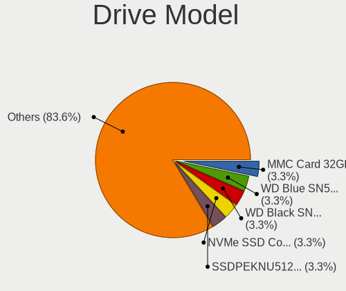
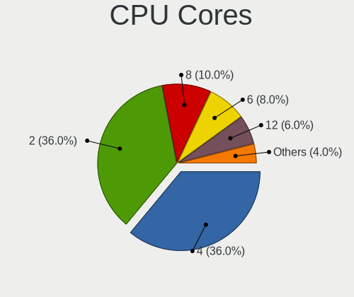
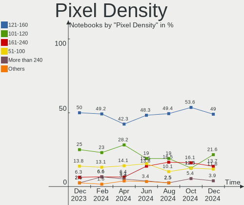

ArcoLinux Hardware Trends (Notebooks)
-------------------------------------

A project to identify most popular hardware characteristics and track their change
over time based on data collected by Linux users at https://Linux-Hardware.org.

Anyone can contribute to this report by the [hw-probe](https://github.com/linuxhw/hw-probe) tool:

    sudo -E hw-probe -all -upload

Full-feature report is available here: https://linux-hardware.org/?view=trends&formfactor=notebook

Period: Jul, 2021.

Contents
--------

* [ System ](#system)
  - [ OS                       ](#os)
  - [ OS Family                ](#os-family)
  - [ Kernel                   ](#kernel)
  - [ Kernel Family            ](#kernel-family)
  - [ Kernel Major Ver.        ](#kernel-major-ver)
  - [ Arch                     ](#arch)
  - [ DE                       ](#de)
  - [ Display Server           ](#display-server)
  - [ Display Manager          ](#display-manager)
  - [ OS Lang                  ](#os-lang)
  - [ Boot Mode                ](#boot-mode)
  - [ Filesystem               ](#filesystem)
  - [ Part. scheme             ](#part-scheme)
  - [ Dual Boot with Linux/BSD ](#dual-boot-with-linuxbsd)
  - [ Dual Boot (Win)          ](#dual-boot-win)

* [ Board ](#board)
  - [ Vendor                   ](#vendor)
  - [ Model                    ](#model)
  - [ Model Family             ](#model-family)
  - [ MFG Year                 ](#mfg-year)
  - [ Form Factor              ](#form-factor)
  - [ Secure Boot              ](#secure-boot)
  - [ Coreboot                 ](#coreboot)
  - [ RAM Size                 ](#ram-size)
  - [ RAM Used                 ](#ram-used)
  - [ Total Drives             ](#total-drives)
  - [ Has CD-ROM               ](#has-cd-rom)
  - [ Has Ethernet             ](#has-ethernet)
  - [ Has WiFi                 ](#has-wifi)
  - [ Has Bluetooth            ](#has-bluetooth)

* [ Location ](#location)
  - [ Country                  ](#country)
  - [ City                     ](#city)

* [ Drives ](#drives)
  - [ Drive Vendor             ](#drive-vendor)
  - [ Drive Model              ](#drive-model)
  - [ HDD Vendor               ](#hdd-vendor)
  - [ SSD Vendor               ](#ssd-vendor)
  - [ Drive Kind               ](#drive-kind)
  - [ Drive Connector          ](#drive-connector)
  - [ Drive Size               ](#drive-size)
  - [ Space Total              ](#space-total)
  - [ Space Used               ](#space-used)
  - [ Malfunc. Drives          ](#malfunc-drives)
  - [ Malfunc. Drive Vendor    ](#malfunc-drive-vendor)
  - [ Malfunc. HDD Vendor      ](#malfunc-hdd-vendor)
  - [ Malfunc. Drive Kind      ](#malfunc-drive-kind)
  - [ Failed Drives            ](#failed-drives)
  - [ Failed Drive Vendor      ](#failed-drive-vendor)
  - [ Drive Status             ](#drive-status)

* [ Storage controller ](#storage-controller)
  - [ Storage Vendor           ](#storage-vendor)
  - [ Storage Model            ](#storage-model)
  - [ Storage Kind             ](#storage-kind)

* [ Processor ](#processor)
  - [ CPU Vendor               ](#cpu-vendor)
  - [ CPU Model                ](#cpu-model)
  - [ CPU Model Family         ](#cpu-model-family)
  - [ CPU Cores                ](#cpu-cores)
  - [ CPU Sockets              ](#cpu-sockets)
  - [ CPU Threads              ](#cpu-threads)
  - [ CPU Op-Modes             ](#cpu-op-modes)
  - [ CPU Microcode            ](#cpu-microcode)
  - [ CPU Microarch            ](#cpu-microarch)

* [ Graphics ](#graphics)
  - [ GPU Vendor               ](#gpu-vendor)
  - [ GPU Model                ](#gpu-model)
  - [ GPU Combo                ](#gpu-combo)
  - [ GPU Driver               ](#gpu-driver)
  - [ GPU Memory               ](#gpu-memory)

* [ Monitor ](#monitor)
  - [ Monitor Vendor           ](#monitor-vendor)
  - [ Monitor Model            ](#monitor-model)
  - [ Monitor Resolution       ](#monitor-resolution)
  - [ Monitor Diagonal         ](#monitor-diagonal)
  - [ Monitor Width            ](#monitor-width)
  - [ Aspect Ratio             ](#aspect-ratio)
  - [ Monitor Area             ](#monitor-area)
  - [ Pixel Density            ](#pixel-density)
  - [ Multiple Monitors        ](#multiple-monitors)

* [ Network ](#network)
  - [ Net Controller Vendor    ](#net-controller-vendor)
  - [ Net Controller Model     ](#net-controller-model)
  - [ Wireless Vendor          ](#wireless-vendor)
  - [ Wireless Model           ](#wireless-model)
  - [ Ethernet Vendor          ](#ethernet-vendor)
  - [ Ethernet Model           ](#ethernet-model)
  - [ Net Controller Kind      ](#net-controller-kind)
  - [ Used Controller          ](#used-controller)
  - [ NICs                     ](#nics)
  - [ IPv6                     ](#ipv6)

* [ Bluetooth ](#bluetooth)
  - [ Bluetooth Vendor         ](#bluetooth-vendor)
  - [ Bluetooth Model          ](#bluetooth-model)

* [ Sound ](#sound)
  - [ Sound Vendor             ](#sound-vendor)
  - [ Sound Model              ](#sound-model)

* [ Memory ](#memory)
  - [ Memory Vendor            ](#memory-vendor)
  - [ Memory Model             ](#memory-model)
  - [ Memory Kind              ](#memory-kind)
  - [ Memory Form Factor       ](#memory-form-factor)
  - [ Memory Size              ](#memory-size)
  - [ Memory Speed             ](#memory-speed)

* [ Printers & scanners ](#printers-&-scanners)
  - [ Printer Vendor           ](#printer-vendor)
  - [ Printer Model            ](#printer-model)
  - [ Scanner Vendor           ](#scanner-vendor)
  - [ Scanner Model            ](#scanner-model)

* [ Camera ](#camera)
  - [ Camera Vendor            ](#camera-vendor)
  - [ Camera Model             ](#camera-model)

* [ Security ](#security)
  - [ Fingerprint Vendor       ](#fingerprint-vendor)
  - [ Fingerprint Model        ](#fingerprint-model)
  - [ Chipcard Vendor          ](#chipcard-vendor)
  - [ Chipcard Model           ](#chipcard-model)

* [ Unsupported ](#unsupported)
  - [ Unsupported Devices      ](#unsupported-devices)
  - [ Unsupported Device Types ](#unsupported-device-types)

System
------

OS
--

Installed operating systems

| Name              | Notebooks | Percent |
|-------------------|-----------|---------|
| ArcoLinux Rolling | 26        | 76.47%  |
| ArcoLinux         | 8         | 23.53%  |

OS Family
---------

OS without a version

| Name      | Notebooks | Percent |
|-----------|-----------|---------|
| ArcoLinux | 34        | 100%    |

Kernel
------

Version of the Linux kernel

| Version            | Notebooks | Percent |
|--------------------|-----------|---------|
| 5.12.15-arch1-1    | 8         | 23.53%  |
| 5.12.14-arch1-1    | 8         | 23.53%  |
| 5.13.5-arch1-1     | 3         | 8.82%   |
| 5.10.52-1-lts      | 3         | 8.82%   |
| 5.12.12-arch1-1    | 2         | 5.88%   |
| 5.10.47-1-lts      | 2         | 5.88%   |
| 5.13.6-arch1-1     | 1         | 2.94%   |
| 5.13.5-zen1-1-zen  | 1         | 2.94%   |
| 5.12.15-zen1-1-zen | 1         | 2.94%   |
| 5.12.13-arch1-2    | 1         | 2.94%   |
| 5.10.49-1-lts      | 1         | 2.94%   |
| 5.10.48-1-lts      | 1         | 2.94%   |
| 5.10.44-1-lts      | 1         | 2.94%   |
| 5.10.43-1-lts      | 1         | 2.94%   |

Kernel Family
-------------

Linux kernel without a distro release

| Version | Notebooks | Percent |
|---------|-----------|---------|
| 5.12.15 | 9         | 26.47%  |
| 5.12.14 | 8         | 23.53%  |
| 5.13.5  | 4         | 11.76%  |
| 5.10.52 | 3         | 8.82%   |
| 5.12.12 | 2         | 5.88%   |
| 5.10.47 | 2         | 5.88%   |
| 5.13.6  | 1         | 2.94%   |
| 5.12.13 | 1         | 2.94%   |
| 5.10.49 | 1         | 2.94%   |
| 5.10.48 | 1         | 2.94%   |
| 5.10.44 | 1         | 2.94%   |
| 5.10.43 | 1         | 2.94%   |

Kernel Major Ver.
-----------------

Linux kernel major version

| Version | Notebooks | Percent |
|---------|-----------|---------|
| 5.12    | 20        | 58.82%  |
| 5.10    | 9         | 26.47%  |
| 5.13    | 5         | 14.71%  |

Arch
----

OS architecture (x86_64, i586, etc.)

| Name   | Notebooks | Percent |
|--------|-----------|---------|
| x86_64 | 34        | 100%    |

DE
--

Desktop Environment

| Name           | Notebooks | Percent |
|----------------|-----------|---------|
| XFCE           | 8         | 23.53%  |
| KDE5           | 5         | 14.71%  |
| i3             | 4         | 11.76%  |
| KDE            | 3         | 8.82%   |
| X-Cinnamon     | 2         | 5.88%   |
| qtile          | 2         | 5.88%   |
| LXQt           | 2         | 5.88%   |
| awesome        | 2         | 5.88%   |
| xmonad         | 1         | 2.94%   |
| i3-with-shmlog | 1         | 2.94%   |
| herbstluftwm   | 1         | 2.94%   |
| GNOME          | 1         | 2.94%   |
| Budgie         | 1         | 2.94%   |
| bspwm          | 1         | 2.94%   |

Display Server
--------------

X11 or Wayland

| Name | Notebooks | Percent |
|------|-----------|---------|
| X11  | 33        | 97.06%  |
| Tty  | 1         | 2.94%   |

Display Manager
---------------

SDDM, LightDM, etc.

| Name    | Notebooks | Percent |
|---------|-----------|---------|
| SDDM    | 21        | 61.76%  |
| Unknown | 8         | 23.53%  |
| TDM     | 5         | 14.71%  |

OS Lang
-------

Language

| Lang  | Notebooks | Percent |
|-------|-----------|---------|
| en_US | 17        | 50%     |
| en_GB | 4         | 11.76%  |
| de_DE | 3         | 8.82%   |
| ru_RU | 2         | 5.88%   |
| en_IN | 2         | 5.88%   |
| pt_BR | 1         | 2.94%   |
| es_AR | 1         | 2.94%   |
| en_SG | 1         | 2.94%   |
| en_DK | 1         | 2.94%   |
| en_CA | 1         | 2.94%   |
| en_AU | 1         | 2.94%   |

Boot Mode
---------

EFI or BIOS

| Mode | Notebooks | Percent |
|------|-----------|---------|
| EFI  | 23        | 67.65%  |
| BIOS | 11        | 32.35%  |

Filesystem
----------

Type of filesystem

| Type    | Notebooks | Percent |
|---------|-----------|---------|
| Ext4    | 24        | 70.59%  |
| Btrfs   | 8         | 23.53%  |
| Xfs     | 1         | 2.94%   |
| Overlay | 1         | 2.94%   |

Part. scheme
------------

Scheme of partitioning

| Type    | Notebooks | Percent |
|---------|-----------|---------|
| GPT     | 24        | 70.59%  |
| Unknown | 8         | 23.53%  |
| MBR     | 2         | 5.88%   |

Dual Boot with Linux/BSD
------------------------

Hosting more than one Linux/BSD

| Dual boot | Notebooks | Percent |
|-----------|-----------|---------|
| No        | 29        | 85.29%  |
| Yes       | 5         | 14.71%  |

Dual Boot (Win)
---------------

Hosting Linux and Windows

| Dual boot | Notebooks | Percent |
|-----------|-----------|---------|
| No        | 22        | 64.71%  |
| Yes       | 12        | 35.29%  |

Board
-----

Vendor
------

Motherboard manufacturer

| Name             | Notebooks | Percent |
|------------------|-----------|---------|
| Lenovo           | 7         | 20.59%  |
| Dell             | 6         | 17.65%  |
| ASUSTek Computer | 6         | 17.65%  |
| Hewlett-Packard  | 5         | 14.71%  |
| Acer             | 3         | 8.82%   |
| Fujitsu          | 2         | 5.88%   |
| Apple            | 2         | 5.88%   |
| Notebook         | 1         | 2.94%   |
| MSI              | 1         | 2.94%   |
| Unknown          | 1         | 2.94%   |

Model
-----

Motherboard model

| Name                                     | Notebooks | Percent |
|------------------------------------------|-----------|---------|
| Lenovo IdeaPad 5 14ARE05 81YM            | 2         | 5.88%   |
| Notebook P95_HP                          | 1         | 2.94%   |
| MSI GP63 Leopard 8RE                     | 1         | 2.94%   |
| Lenovo ThinkPad X1 Carbon 7th 20QDCTO1WW | 1         | 2.94%   |
| Lenovo ThinkPad T440p 20AWX5140J         | 1         | 2.94%   |
| Lenovo Legion 5 Pro 16ACH6H 82JQ         | 1         | 2.94%   |
| Lenovo Legion 5 15ARH05 82B5             | 1         | 2.94%   |
| Lenovo Legion 5 15ACH6H 82JU             | 1         | 2.94%   |
| HP Stream Notebook PC 13                 | 1         | 2.94%   |
| HP Notebook                              | 1         | 2.94%   |
| HP Laptop 15-da0xxx                      | 1         | 2.94%   |
| HP Compaq Presario CQ40                  | 1         | 2.94%   |
| HP 250 G1                                | 1         | 2.94%   |
| Fujitsu LIFEBOOK T902                    | 1         | 2.94%   |
| Fujitsu LIFEBOOK S751                    | 1         | 2.94%   |
| Dell XPS 13 9360                         | 1         | 2.94%   |
| Dell Vostro 5568                         | 1         | 2.94%   |
| Dell Precision 7520                      | 1         | 2.94%   |
| Dell Latitude 7480                       | 1         | 2.94%   |
| Dell Latitude 7370                       | 1         | 2.94%   |
| Dell Latitude 5410                       | 1         | 2.94%   |
| ASUS X510UNR                             | 1         | 2.94%   |
| ASUS VivoBook_ASUSLaptop X512FA_X512FA   | 1         | 2.94%   |
| ASUS TUF Gaming FX505DT_FX505DT          | 1         | 2.94%   |
| ASUS ROG Strix G712LV_G712LV             | 1         | 2.94%   |
| ASUS Q550LF                              | 1         | 2.94%   |
| ASUS K53E                                | 1         | 2.94%   |
| Apple MacBookPro9,2                      | 1         | 2.94%   |
| Apple MacBookPro11,5                     | 1         | 2.94%   |
| Acer Swift SF314-41G                     | 1         | 2.94%   |
| Acer Aspire E5-575G                      | 1         | 2.94%   |
| Acer Aspire E5-573G                      | 1         | 2.94%   |
| Unknown                                  | 1         | 2.94%   |

Model Family
------------

Motherboard model prefix

| Name               | Notebooks | Percent |
|--------------------|-----------|---------|
| Lenovo Legion      | 3         | 8.82%   |
| Dell Latitude      | 3         | 8.82%   |
| Lenovo ThinkPad    | 2         | 5.88%   |
| Lenovo IdeaPad     | 2         | 5.88%   |
| Fujitsu LIFEBOOK   | 2         | 5.88%   |
| Acer Aspire        | 2         | 5.88%   |
| Notebook P95       | 1         | 2.94%   |
| MSI GP63           | 1         | 2.94%   |
| HP Stream          | 1         | 2.94%   |
| HP Notebook        | 1         | 2.94%   |
| HP Laptop          | 1         | 2.94%   |
| HP Compaq          | 1         | 2.94%   |
| HP 250             | 1         | 2.94%   |
| Dell XPS           | 1         | 2.94%   |
| Dell Vostro        | 1         | 2.94%   |
| Dell Precision     | 1         | 2.94%   |
| ASUS X510UNR       | 1         | 2.94%   |
| ASUS VivoBook      | 1         | 2.94%   |
| ASUS TUF           | 1         | 2.94%   |
| ASUS ROG           | 1         | 2.94%   |
| ASUS Q550LF        | 1         | 2.94%   |
| ASUS K53E          | 1         | 2.94%   |
| Apple MacBookPro9  | 1         | 2.94%   |
| Apple MacBookPro11 | 1         | 2.94%   |
| Acer Swift         | 1         | 2.94%   |
| Unknown            | 1         | 2.94%   |

MFG Year
--------

Motherboard manufacture year

| Year | Notebooks | Percent |
|------|-----------|---------|
| 2021 | 8         | 23.53%  |
| 2020 | 6         | 17.65%  |
| 2017 | 5         | 14.71%  |
| 2019 | 4         | 11.76%  |
| 2018 | 3         | 8.82%   |
| 2013 | 2         | 5.88%   |
| 2016 | 1         | 2.94%   |
| 2015 | 1         | 2.94%   |
| 2014 | 1         | 2.94%   |
| 2012 | 1         | 2.94%   |
| 2011 | 1         | 2.94%   |
| 2009 | 1         | 2.94%   |

Form Factor
-----------

Physical design of the computer

| Name     | Notebooks | Percent |
|----------|-----------|---------|
| Notebook | 34        | 100%    |

Secure Boot
-----------

Enabled or disabled

| State    | Notebooks | Percent |
|----------|-----------|---------|
| Disabled | 34        | 100%    |

Coreboot
--------

Have coreboot on board

| Used | Notebooks | Percent |
|------|-----------|---------|
| No   | 34        | 100%    |

RAM Size
--------

Total RAM memory

| Size in GB | Notebooks | Percent |
|------------|-----------|---------|
| 16.01-24.0 | 12        | 35.29%  |
| 4.01-8.0   | 9         | 26.47%  |
| 8.01-16.0  | 7         | 20.59%  |
| 32.01-64.0 | 2         | 5.88%   |
| 3.01-4.0   | 2         | 5.88%   |
| 1.01-2.0   | 2         | 5.88%   |

RAM Used
--------

Used RAM memory

| Used GB   | Notebooks | Percent |
|-----------|-----------|---------|
| 1.01-2.0  | 13        | 38.24%  |
| 3.01-4.0  | 7         | 20.59%  |
| 2.01-3.0  | 6         | 17.65%  |
| 4.01-8.0  | 4         | 11.76%  |
| 0.51-1.0  | 2         | 5.88%   |
| 8.01-16.0 | 1         | 2.94%   |
| 0.01-0.5  | 1         | 2.94%   |

Total Drives
------------

Number of drives on board

| Drives | Notebooks | Percent |
|--------|-----------|---------|
| 1      | 19        | 55.88%  |
| 2      | 14        | 41.18%  |
| 3      | 1         | 2.94%   |

Has CD-ROM
----------

Has CD-ROM on board

| Presented | Notebooks | Percent |
|-----------|-----------|---------|
| No        | 25        | 73.53%  |
| Yes       | 9         | 26.47%  |

Has Ethernet
------------

Has Ethernet on board

| Presented | Notebooks | Percent |
|-----------|-----------|---------|
| Yes       | 26        | 76.47%  |
| No        | 8         | 23.53%  |

Has WiFi
--------

Has WiFi module

| Presented | Notebooks | Percent |
|-----------|-----------|---------|
| Yes       | 34        | 100%    |

Has Bluetooth
-------------

Has Bluetooth module

| Presented | Notebooks | Percent |
|-----------|-----------|---------|
| Yes       | 29        | 85.29%  |
| No        | 5         | 14.71%  |

Location
--------

Country
-------

Geographic location (country)

| Country     | Notebooks | Percent |
|-------------|-----------|---------|
| USA         | 6         | 17.65%  |
| India       | 4         | 11.76%  |
| Germany     | 4         | 11.76%  |
| UK          | 2         | 5.88%   |
| Russia      | 2         | 5.88%   |
| Poland      | 2         | 5.88%   |
| Bangladesh  | 2         | 5.88%   |
| Vietnam     | 1         | 2.94%   |
| Ukraine     | 1         | 2.94%   |
| Switzerland | 1         | 2.94%   |
| Singapore   | 1         | 2.94%   |
| Guatemala   | 1         | 2.94%   |
| Denmark     | 1         | 2.94%   |
| Czechia     | 1         | 2.94%   |
| Canada      | 1         | 2.94%   |
| Brazil      | 1         | 2.94%   |
| Bahrain     | 1         | 2.94%   |
| Australia   | 1         | 2.94%   |
| Argentina   | 1         | 2.94%   |

City
----

Geographic location (city)

| City                 | Notebooks | Percent |
|----------------------|-----------|---------|
| Mumbai               | 2         | 5.88%   |
| Yekaterinburg        | 1         | 2.94%   |
| Wroclaw              | 1         | 2.94%   |
| Wiesbaden            | 1         | 2.94%   |
| Walla Walla          | 1         | 2.94%   |
| Vorbach              | 1         | 2.94%   |
| Sydney               | 1         | 2.94%   |
| Stuttgart            | 1         | 2.94%   |
| Singapore            | 1         | 2.94%   |
| Sao Lourenco da Mata | 1         | 2.94%   |
| Rangpur              | 1         | 2.94%   |
| Poznan               | 1         | 2.94%   |
| Portland             | 1         | 2.94%   |
| Plano                | 1         | 2.94%   |
| Old Town             | 1         | 2.94%   |
| North Charleston     | 1         | 2.94%   |
| Nha Trang            | 1         | 2.94%   |
| Moscow               | 1         | 2.94%   |
| Mississauga          | 1         | 2.94%   |
| Menzingen            | 1         | 2.94%   |
| Manama               | 1         | 2.94%   |
| Lancaster            | 1         | 2.94%   |
| Kolkata              | 1         | 2.94%   |
| Kannur               | 1         | 2.94%   |
| Ingeniero Jacobacci  | 1         | 2.94%   |
| Half Moon Bay        | 1         | 2.94%   |
| Guatemala City       | 1         | 2.94%   |
| Dnipropetrovsk       | 1         | 2.94%   |
| Dhaka                | 1         | 2.94%   |
| Denver               | 1         | 2.94%   |
| Dagenham             | 1         | 2.94%   |
| Bergheim             | 1         | 2.94%   |
| Aarhus               | 1         | 2.94%   |

Drives
------

Drive Vendor
------------

Hard drive vendors

| Vendor              | Notebooks | Drives | Percent |
|---------------------|-----------|--------|---------|
| Samsung Electronics | 9         | 9      | 18.75%  |
| Seagate             | 6         | 6      | 12.5%   |
| Intel               | 5         | 5      | 10.42%  |
| WDC                 | 4         | 5      | 8.33%   |
| SK Hynix            | 3         | 3      | 6.25%   |
| Kingston            | 3         | 3      | 6.25%   |
| HGST                | 3         | 3      | 6.25%   |
| Unknown             | 2         | 4      | 4.17%   |
| Toshiba             | 2         | 2      | 4.17%   |
| Sandisk             | 2         | 3      | 4.17%   |
| Micron Technology   | 2         | 2      | 4.17%   |
| Crucial             | 2         | 2      | 4.17%   |
| PNY                 | 1         | 1      | 2.08%   |
| Hitachi             | 1         | 1      | 2.08%   |
| GOODRAM             | 1         | 1      | 2.08%   |
| Apple               | 1         | 1      | 2.08%   |
| A-DATA Technology   | 1         | 1      | 2.08%   |

Drive Model
-----------

Hard drive models

| Model                                     | Notebooks | Percent |
|-------------------------------------------|-----------|---------|
| Toshiba MQ04ABF100 1TB                    | 2         | 3.85%   |
| Seagate ST1000LM035-1RK172 1TB            | 2         | 3.85%   |
| WDC WDS120G2G0B-00EPW0 120GB SSD          | 1         | 1.92%   |
| WDC WD6400BEVT-60A0RT0 640GB              | 1         | 1.92%   |
| WDC WD10SPZX-24Z10T0 1TB                  | 1         | 1.92%   |
| WDC WD10SPZX-22Z10T1 1TB                  | 1         | 1.92%   |
| WDC WD10SPZX-08Z10 1TB                    | 1         | 1.92%   |
| Unknown SD16G  16GB                       | 1         | 1.92%   |
| Unknown MMC Card  32GB                    | 1         | 1.92%   |
| Unknown MMC Card  16GB                    | 1         | 1.92%   |
| Unknown BGND3R  32GB                      | 1         | 1.92%   |
| SK Hynix SKHynix_HFS256GD9TNI-L2A0B 256GB | 1         | 1.92%   |
| SK Hynix SKHynix_HFM256GDHTNI-87A0B 256GB | 1         | 1.92%   |
| SK Hynix HFM512GDJTNG-8310A 512GB         | 1         | 1.92%   |
| Seagate ST9250315AS 250GB                 | 1         | 1.92%   |
| Seagate ST320LT0 07-9ZV142 320GB          | 1         | 1.92%   |
| Seagate ST1000LM024 HN-M101MBB 1TB        | 1         | 1.92%   |
| Seagate Expansion Desk 3TB                | 1         | 1.92%   |
| Sandisk NVMe SSD Drive 500GB              | 1         | 1.92%   |
| Sandisk NVMe SSD Drive 256GB              | 1         | 1.92%   |
| Sandisk NVMe SSD Drive 1024GB             | 1         | 1.92%   |
| Samsung SSD 970 EVO 1TB                   | 1         | 1.92%   |
| Samsung SSD 860 QVO 1TB                   | 1         | 1.92%   |
| Samsung SSD 860 EVO 500GB                 | 1         | 1.92%   |
| Samsung SSD 860 EVO 250GB                 | 1         | 1.92%   |
| Samsung SSD 860 EVO 1TB                   | 1         | 1.92%   |
| Samsung SSD 840 EVO 250GB                 | 1         | 1.92%   |
| Samsung SM961 NVMe 512GB                  | 1         | 1.92%   |
| Samsung NVMe SSD Drive 2TB                | 1         | 1.92%   |
| Samsung MZALQ512HALU-000L2 512GB          | 1         | 1.92%   |
| PNY CS900 500GB SSD                       | 1         | 1.92%   |
| Micron NVMe SSD Drive 512GB               | 1         | 1.92%   |
| Micron 1100 SATA 512GB SSD                | 1         | 1.92%   |
| Kingston SV300S37A240G 240GB SSD          | 1         | 1.92%   |
| Kingston SNVS1000GB 1TB                   | 1         | 1.92%   |
| Kingston RBUSNS8154P3256GJ3 256GB         | 1         | 1.92%   |
| Intel SSDSA2M160G2GC 160GB                | 1         | 1.92%   |
| Intel SSDPEKNW512G8 512GB                 | 1         | 1.92%   |
| Intel SSDPEKKW512G8 512GB                 | 1         | 1.92%   |
| Intel SSDPEKKW256G7 256GB                 | 1         | 1.92%   |
| Intel NVMe SSD Drive 512GB                | 1         | 1.92%   |
| Hitachi HTS543232A7A384 320GB             | 1         | 1.92%   |
| HGST TOURO Mobile 1TB                     | 1         | 1.92%   |
| HGST HTS721010A9E630 1TB                  | 1         | 1.92%   |
| HGST HTS545050A7E380 500GB                | 1         | 1.92%   |
| GOODRAM SSDPR-CL100-240-G2 240GB          | 1         | 1.92%   |
| Crucial CT250MX500SSD4 250GB              | 1         | 1.92%   |
| Crucial CT1000MX500SSD1 1TB               | 1         | 1.92%   |
| Apple SSD SM1024G 1TB                     | 1         | 1.92%   |
| A-DATA IM2P33F3A NVMe 512GB               | 1         | 1.92%   |

HDD Vendor
----------

Hard disk drive vendors

| Vendor  | Notebooks | Drives | Percent |
|---------|-----------|--------|---------|
| Seagate | 6         | 6      | 37.5%   |
| WDC     | 4         | 4      | 25%     |
| HGST    | 3         | 3      | 18.75%  |
| Toshiba | 2         | 2      | 12.5%   |
| Hitachi | 1         | 1      | 6.25%   |

SSD Vendor
----------

Solid state drive vendors

| Vendor              | Notebooks | Drives | Percent |
|---------------------|-----------|--------|---------|
| Samsung Electronics | 5         | 5      | 35.71%  |
| Crucial             | 2         | 2      | 14.29%  |
| WDC                 | 1         | 1      | 7.14%   |
| PNY                 | 1         | 1      | 7.14%   |
| Micron Technology   | 1         | 1      | 7.14%   |
| Kingston            | 1         | 1      | 7.14%   |
| Intel               | 1         | 1      | 7.14%   |
| GOODRAM             | 1         | 1      | 7.14%   |
| Apple               | 1         | 1      | 7.14%   |

Drive Kind
----------

HDD or SSD

| Kind | Notebooks | Drives | Percent |
|------|-----------|--------|---------|
| NVMe | 16        | 18     | 34.04%  |
| HDD  | 16        | 16     | 34.04%  |
| SSD  | 13        | 14     | 27.66%  |
| MMC  | 2         | 4      | 4.26%   |

Drive Connector
---------------

SATA, SAS, NVMe, etc.

| Type | Notebooks | Drives | Percent |
|------|-----------|--------|---------|
| SATA | 22        | 26     | 50%     |
| NVMe | 16        | 18     | 36.36%  |
| SAS  | 4         | 4      | 9.09%   |
| MMC  | 2         | 4      | 4.55%   |

Drive Size
----------

Size of hard drive

| Size in TB | Notebooks | Drives | Percent |
|------------|-----------|--------|---------|
| 0.51-1.0   | 16        | 16     | 55.17%  |
| 0.01-0.5   | 12        | 13     | 41.38%  |
| 2.01-3.0   | 1         | 1      | 3.45%   |

Space Total
-----------

Amount of disk space available on the file system

| Size in GB     | Notebooks | Percent |
|----------------|-----------|---------|
| 501-1000       | 8         | 23.53%  |
| 251-500        | 7         | 20.59%  |
| 101-250        | 7         | 20.59%  |
| Unknown        | 4         | 11.76%  |
| 1001-2000      | 3         | 8.82%   |
| More than 3000 | 2         | 5.88%   |
| 21-50          | 2         | 5.88%   |
| 51-100         | 1         | 2.94%   |

Space Used
----------

Amount of used disk space

| Used GB        | Notebooks | Percent |
|----------------|-----------|---------|
| 21-50          | 9         | 26.47%  |
| 101-250        | 7         | 20.59%  |
| 51-100         | 5         | 14.71%  |
| Unknown        | 4         | 11.76%  |
| 1-20           | 3         | 8.82%   |
| More than 3000 | 2         | 5.88%   |
| 251-500        | 2         | 5.88%   |
| 501-1000       | 2         | 5.88%   |

Malfunc. Drives
---------------

Drive models with a malfunction

| Model                                 | Notebooks | Drives | Percent |
|---------------------------------------|-----------|--------|---------|
| WDC WD6400BEVT-60A0RT0 640GB          | 1         | 1      | 14.29%  |
| WDC WD10SPZX-24Z10T0 1TB              | 1         | 1      | 14.29%  |
| Toshiba MQ04ABF100 1TB                | 1         | 1      | 14.29%  |
| Seagate ST1000LM024 HN-M101MBB 1TB    | 1         | 1      | 14.29%  |
| Micron Technology 1100 SATA 512GB SSD | 1         | 1      | 14.29%  |
| Intel SSDSA2M160G2GC 160GB            | 1         | 1      | 14.29%  |
| HGST HTS545050A7E380 500GB            | 1         | 1      | 14.29%  |

Malfunc. Drive Vendor
---------------------

Vendors of faulty drives

| Vendor            | Notebooks | Drives | Percent |
|-------------------|-----------|--------|---------|
| WDC               | 2         | 2      | 28.57%  |
| Toshiba           | 1         | 1      | 14.29%  |
| Seagate           | 1         | 1      | 14.29%  |
| Micron Technology | 1         | 1      | 14.29%  |
| Intel             | 1         | 1      | 14.29%  |
| HGST              | 1         | 1      | 14.29%  |

Malfunc. HDD Vendor
-------------------

Vendors of faulty HDD drives

| Vendor  | Notebooks | Drives | Percent |
|---------|-----------|--------|---------|
| WDC     | 2         | 2      | 40%     |
| Toshiba | 1         | 1      | 20%     |
| Seagate | 1         | 1      | 20%     |
| HGST    | 1         | 1      | 20%     |

Malfunc. Drive Kind
-------------------

Kinds of faulty drives

| Kind | Notebooks | Drives | Percent |
|------|-----------|--------|---------|
| HDD  | 5         | 5      | 71.43%  |
| SSD  | 2         | 2      | 28.57%  |

Failed Drives
-------------

Failed drive models

Zero info for selected period =(

Failed Drive Vendor
-------------------

Failed drive vendors

Zero info for selected period =(

Drive Status
------------

Number of failed and malfunc. drives

| Status   | Notebooks | Drives | Percent |
|----------|-----------|--------|---------|
| Works    | 20        | 26     | 55.56%  |
| Detected | 10        | 19     | 27.78%  |
| Malfunc  | 6         | 7      | 16.67%  |

Storage controller
------------------

Storage Vendor
--------------

Storage controller vendors

| Vendor                      | Notebooks | Percent |
|-----------------------------|-----------|---------|
| Intel                       | 23        | 56.1%   |
| Samsung Electronics         | 5         | 12.2%   |
| AMD                         | 4         | 9.76%   |
| SK Hynix                    | 3         | 7.32%   |
| Sandisk                     | 2         | 4.88%   |
| Kingston Technology Company | 2         | 4.88%   |
| Micron Technology           | 1         | 2.44%   |
| ADATA Technology            | 1         | 2.44%   |

Storage Model
-------------

Storage controller models

| Model                                                                          | Notebooks | Percent |
|--------------------------------------------------------------------------------|-----------|---------|
| Intel Sunrise Point-LP SATA Controller [AHCI mode]                             | 4         | 9.09%   |
| AMD FCH SATA Controller [AHCI mode]                                            | 4         | 9.09%   |
| Intel 7 Series Chipset Family 6-port SATA Controller [AHCI mode]               | 3         | 6.82%   |
| Samsung NVMe SSD Controller SM981/PM981/PM983                                  | 2         | 4.55%   |
| Intel Wildcat Point-LP SATA Controller [AHCI Mode]                             | 2         | 4.55%   |
| Intel SSD 660P Series                                                          | 2         | 4.55%   |
| Intel 82801 Mobile SATA Controller [RAID mode]                                 | 2         | 4.55%   |
| Intel 6 Series/C200 Series Chipset Family 6 port Mobile SATA AHCI Controller   | 2         | 4.55%   |
| SK Hynix Non-Volatile memory controller                                        | 1         | 2.27%   |
| SK Hynix BC511                                                                 | 1         | 2.27%   |
| SK Hynix BC501 NVMe Solid State Drive                                          | 1         | 2.27%   |
| Sandisk WD Blue SN550 NVMe SSD                                                 | 1         | 2.27%   |
| Sandisk WD Blue SN500 / PC SN520 NVMe SSD                                      | 1         | 2.27%   |
| Sandisk WD Black SN750 / PC SN730 NVMe SSD                                     | 1         | 2.27%   |
| Samsung NVMe SSD Controller SM961/PM961/SM963                                  | 1         | 2.27%   |
| Samsung NVMe Controller                                                        | 1         | 2.27%   |
| Samsung Electronics SATA controller                                            | 1         | 2.27%   |
| Micron Non-Volatile memory controller                                          | 1         | 2.27%   |
| Kingston Company U-SNS8154P3 NVMe SSD                                          | 1         | 2.27%   |
| Kingston Company Company Non-Volatile memory controller                        | 1         | 2.27%   |
| Intel SSD Pro 7600p/760p/E 6100p Series                                        | 1         | 2.27%   |
| Intel SSD 600P Series                                                          | 1         | 2.27%   |
| Intel Q170/Q150/B150/H170/H110/Z170/CM236 Chipset SATA Controller [AHCI Mode]  | 1         | 2.27%   |
| Intel HM170/QM170 Chipset SATA Controller [AHCI Mode]                          | 1         | 2.27%   |
| Intel Comet Lake SATA AHCI Controller                                          | 1         | 2.27%   |
| Intel Cannon Point-LP SATA Controller [AHCI Mode]                              | 1         | 2.27%   |
| Intel Cannon Lake Mobile PCH SATA AHCI Controller                              | 1         | 2.27%   |
| Intel 82801IBM/IEM (ICH9M/ICH9M-E) 4 port SATA Controller [AHCI mode]          | 1         | 2.27%   |
| Intel 8 Series/C220 Series Chipset Family 6-port SATA Controller 1 [AHCI mode] | 1         | 2.27%   |
| Intel 8 Series SATA Controller 1 [AHCI mode]                                   | 1         | 2.27%   |
| ADATA Non-Volatile memory controller                                           | 1         | 2.27%   |

Storage Kind
------------

Kind of storage controller (IDE, SATA, NVMe, SAS, ...)

| Kind | Notebooks | Percent |
|------|-----------|---------|
| SATA | 24        | 57.14%  |
| NVMe | 16        | 38.1%   |
| RAID | 2         | 4.76%   |

Processor
---------

CPU Vendor
----------

Processor vendors

| Vendor | Notebooks | Percent |
|--------|-----------|---------|
| Intel  | 27        | 79.41%  |
| AMD    | 7         | 20.59%  |

CPU Model
---------

Processor models

| Model                                         | Notebooks | Percent |
|-----------------------------------------------|-----------|---------|
| Intel Core i5-7200U CPU @ 2.50GHz             | 3         | 8.82%   |
| Intel Core i5-8250U CPU @ 1.60GHz             | 2         | 5.88%   |
| AMD Ryzen 7 5800H with Radeon Graphics        | 2         | 5.88%   |
| AMD Ryzen 7 4700U with Radeon Graphics        | 2         | 5.88%   |
| Intel Xeon CPU E3-1505M v6 @ 3.00GHz          | 1         | 2.94%   |
| Intel Pentium Dual-Core CPU T4200 @ 2.00GHz   | 1         | 2.94%   |
| Intel Pentium CPU 2020M @ 2.40GHz             | 1         | 2.94%   |
| Intel Core m7-6Y75 CPU @ 1.20GHz              | 1         | 2.94%   |
| Intel Core i7-8750H CPU @ 2.20GHz             | 1         | 2.94%   |
| Intel Core i7-8565U CPU @ 1.80GHz             | 1         | 2.94%   |
| Intel Core i7-8550U CPU @ 1.80GHz             | 1         | 2.94%   |
| Intel Core i7-7700HQ CPU @ 2.80GHz            | 1         | 2.94%   |
| Intel Core i7-7600U CPU @ 2.80GHz             | 1         | 2.94%   |
| Intel Core i7-4980HQ CPU @ 2.80GHz            | 1         | 2.94%   |
| Intel Core i7-4600M CPU @ 2.90GHz             | 1         | 2.94%   |
| Intel Core i7-4500U CPU @ 1.80GHz             | 1         | 2.94%   |
| Intel Core i7-10750H CPU @ 2.60GHz            | 1         | 2.94%   |
| Intel Core i7-10610U CPU @ 1.80GHz            | 1         | 2.94%   |
| Intel Core i5-8265U CPU @ 1.60GHz             | 1         | 2.94%   |
| Intel Core i5-5200U CPU @ 2.20GHz             | 1         | 2.94%   |
| Intel Core i5-3340M CPU @ 2.70GHz             | 1         | 2.94%   |
| Intel Core i5-3210M CPU @ 2.50GHz             | 1         | 2.94%   |
| Intel Core i5-2520M CPU @ 2.50GHz             | 1         | 2.94%   |
| Intel Core i5-2410M CPU @ 2.30GHz             | 1         | 2.94%   |
| Intel Core i3-5005U CPU @ 2.00GHz             | 1         | 2.94%   |
| Intel Celeron CPU N2840 @ 2.16GHz             | 1         | 2.94%   |
| AMD Ryzen 7 4800H with Radeon Graphics        | 1         | 2.94%   |
| AMD Ryzen 5 3550H with Radeon Vega Mobile Gfx | 1         | 2.94%   |
| AMD Ryzen 5 3500U with Radeon Vega Mobile Gfx | 1         | 2.94%   |

CPU Model Family
----------------

Processor model prefix

| Model                   | Notebooks | Percent |
|-------------------------|-----------|---------|
| Intel Core i5           | 11        | 32.35%  |
| Intel Core i7           | 10        | 29.41%  |
| AMD Ryzen 7             | 5         | 14.71%  |
| AMD Ryzen 5             | 2         | 5.88%   |
| Intel Xeon              | 1         | 2.94%   |
| Intel Pentium Dual-Core | 1         | 2.94%   |
| Intel Pentium           | 1         | 2.94%   |
| Intel Core m7           | 1         | 2.94%   |
| Intel Core i3           | 1         | 2.94%   |
| Intel Celeron           | 1         | 2.94%   |

CPU Cores
---------

Number of processor cores

| Number | Notebooks | Percent |
|--------|-----------|---------|
| 2      | 16        | 47.06%  |
| 4      | 11        | 32.35%  |
| 8      | 5         | 14.71%  |
| 6      | 2         | 5.88%   |

CPU Sockets
-----------

Number of sockets

| Number | Notebooks | Percent |
|--------|-----------|---------|
| 1      | 34        | 100%    |

CPU Threads
-----------

Threads per core (Hyper-Threading)

| Number | Notebooks | Percent |
|--------|-----------|---------|
| 2      | 29        | 85.29%  |
| 1      | 5         | 14.71%  |

CPU Op-Modes
------------

CPU Operation Modes (32-bit, 64-bit)

| Op mode        | Notebooks | Percent |
|----------------|-----------|---------|
| 32-bit, 64-bit | 34        | 100%    |

CPU Microcode
-------------

Microcode number

| Number     | Notebooks | Percent |
|------------|-----------|---------|
| Unknown    | 9         | 26.47%  |
| 0x806ea    | 3         | 8.82%   |
| 0x806e9    | 3         | 8.82%   |
| 0x906e9    | 2         | 5.88%   |
| 0x806ec    | 2         | 5.88%   |
| 0x306d4    | 2         | 5.88%   |
| 0x206a7    | 2         | 5.88%   |
| 0x08600106 | 2         | 5.88%   |
| 0x406e3    | 1         | 2.94%   |
| 0x40661    | 1         | 2.94%   |
| 0x40651    | 1         | 2.94%   |
| 0x306a9    | 1         | 2.94%   |
| 0x30678    | 1         | 2.94%   |
| 0x0a50000b | 1         | 2.94%   |
| 0x08600104 | 1         | 2.94%   |
| 0x08108109 | 1         | 2.94%   |
| 0x08108102 | 1         | 2.94%   |

CPU Microarch
-------------

Microarchitecture

| Name        | Notebooks | Percent |
|-------------|-----------|---------|
| KabyLake    | 13        | 38.24%  |
| Zen 2       | 3         | 8.82%   |
| IvyBridge   | 3         | 8.82%   |
| Haswell     | 3         | 8.82%   |
| Zen+        | 2         | 5.88%   |
| Zen 3       | 2         | 5.88%   |
| SandyBridge | 2         | 5.88%   |
| Broadwell   | 2         | 5.88%   |
| Skylake     | 1         | 2.94%   |
| Silvermont  | 1         | 2.94%   |
| Penryn      | 1         | 2.94%   |
| CometLake   | 1         | 2.94%   |

Graphics
--------

GPU Vendor
----------

Vendors of graphics cards

| Vendor | Notebooks | Percent |
|--------|-----------|---------|
| Intel  | 26        | 59.09%  |
| Nvidia | 13        | 29.55%  |
| AMD    | 5         | 11.36%  |

GPU Model
---------

Graphics card models

| Model                                                                     | Notebooks | Percent |
|---------------------------------------------------------------------------|-----------|---------|
| Intel HD Graphics 620                                                     | 4         | 8.89%   |
| Intel UHD Graphics 620                                                    | 3         | 6.67%   |
| Intel 3rd Gen Core processor Graphics Controller                          | 3         | 6.67%   |
| Nvidia GP106M [GeForce GTX 1060 Mobile]                                   | 2         | 4.44%   |
| Nvidia GA106M [GeForce RTX 3060 Mobile / Max-Q]                           | 2         | 4.44%   |
| Intel WhiskeyLake-U GT2 [UHD Graphics 620]                                | 2         | 4.44%   |
| Intel HD Graphics 5500                                                    | 2         | 4.44%   |
| Intel 2nd Generation Core Processor Family Integrated Graphics Controller | 2         | 4.44%   |
| AMD Renoir                                                                | 2         | 4.44%   |
| AMD Picasso                                                               | 2         | 4.44%   |
| Nvidia TU117M [GeForce GTX 1650 Ti Mobile]                                | 1         | 2.22%   |
| Nvidia TU117M [GeForce GTX 1650 Mobile / Max-Q]                           | 1         | 2.22%   |
| Nvidia TU106M [GeForce RTX 2060 Mobile]                                   | 1         | 2.22%   |
| Nvidia GP108M [GeForce MX150]                                             | 1         | 2.22%   |
| Nvidia GM108M [GeForce MX110]                                             | 1         | 2.22%   |
| Nvidia GM108M [GeForce 940M]                                              | 1         | 2.22%   |
| Nvidia GM108M [GeForce 940MX]                                             | 1         | 2.22%   |
| Nvidia GK208M [GeForce GT 730M]                                           | 1         | 2.22%   |
| Nvidia GK107M [GeForce GT 745M]                                           | 1         | 2.22%   |
| Intel Mobile 4 Series Chipset Integrated Graphics Controller              | 1         | 2.22%   |
| Intel HD Graphics P630                                                    | 1         | 2.22%   |
| Intel HD Graphics 630                                                     | 1         | 2.22%   |
| Intel HD Graphics 515                                                     | 1         | 2.22%   |
| Intel Haswell-ULT Integrated Graphics Controller                          | 1         | 2.22%   |
| Intel CometLake-U GT2 [UHD Graphics]                                      | 1         | 2.22%   |
| Intel CometLake-H GT2 [UHD Graphics]                                      | 1         | 2.22%   |
| Intel CoffeeLake-H GT2 [UHD Graphics 630]                                 | 1         | 2.22%   |
| Intel Atom Processor Z36xxx/Z37xxx Series Graphics & Display              | 1         | 2.22%   |
| Intel 4th Gen Core Processor Integrated Graphics Controller               | 1         | 2.22%   |
| AMD Venus XT [Radeon HD 8870M / R9 M270X/M370X]                           | 1         | 2.22%   |
| AMD Lexa [Radeon 540X/550X/630 / RX 640 / E9171 MCM]                      | 1         | 2.22%   |

GPU Combo
---------

Combinations of graphics cards

| Name           | Notebooks | Percent |
|----------------|-----------|---------|
| 1 x Intel      | 17        | 50%     |
| Intel + Nvidia | 9         | 26.47%  |
| 1 x Nvidia     | 3         | 8.82%   |
| 1 x AMD        | 3         | 8.82%   |
| 2 x AMD        | 1         | 2.94%   |
| AMD + Nvidia   | 1         | 2.94%   |

GPU Driver
----------

Free vs proprietary

| Driver      | Notebooks | Percent |
|-------------|-----------|---------|
| Free        | 31        | 91.18%  |
| Proprietary | 3         | 8.82%   |

GPU Memory
----------

Total video memory

| Size in GB | Notebooks | Percent |
|------------|-----------|---------|
| Unknown    | 26        | 76.47%  |
| 1.01-2.0   | 3         | 8.82%   |
| 0.01-0.5   | 3         | 8.82%   |
| 5.01-6.0   | 2         | 5.88%   |

Monitor
-------

Monitor Vendor
--------------

Monitor vendors

| Vendor               | Notebooks | Percent |
|----------------------|-----------|---------|
| LG Display           | 11        | 27.5%   |
| BOE                  | 6         | 15%     |
| AU Optronics         | 5         | 12.5%   |
| Samsung Electronics  | 4         | 10%     |
| Chimei Innolux       | 4         | 10%     |
| Apple                | 2         | 5%      |
| Westinghouse         | 1         | 2.5%    |
| Sharp                | 1         | 2.5%    |
| Sceptre Tech         | 1         | 2.5%    |
| Philips              | 1         | 2.5%    |
| PANDA                | 1         | 2.5%    |
| Packard Bell         | 1         | 2.5%    |
| Goldstar             | 1         | 2.5%    |
| Ancor Communications | 1         | 2.5%    |

Monitor Model
-------------

Monitor models

| Model                                                                 | Notebooks | Percent |
|-----------------------------------------------------------------------|-----------|---------|
| AU Optronics LCD Monitor AUO38ED 1920x1080 340x190mm 15.3-inch        | 3         | 7.5%    |
| LG Display LCD Monitor LGD0533 1920x1080 344x194mm 15.5-inch          | 2         | 5%      |
| Chimei Innolux LCD Monitor CMN15F5 1920x1080 344x193mm 15.5-inch      | 2         | 5%      |
| Westinghouse WD24FT1360 WET0015 1920x1080 530x290mm 23.8-inch         | 1         | 2.5%    |
| Sharp LCD Monitor SHP1449 1920x1080 294x165mm 13.3-inch               | 1         | 2.5%    |
| Sceptre Tech X325BV-FHDU SPT3202 1920x1080 880x490mm 39.7-inch        | 1         | 2.5%    |
| Samsung Electronics LCD Monitor SEC325A 1366x768 344x194mm 15.5-inch  | 1         | 2.5%    |
| Samsung Electronics LCD Monitor SDC8A4D 1920x1080 293x165mm 13.2-inch | 1         | 2.5%    |
| Samsung Electronics LCD Monitor SDC324C 1920x1080 344x194mm 15.5-inch | 1         | 2.5%    |
| Samsung Electronics C34J79x SAM0F1E 3440x1440 797x333mm 34.0-inch     | 1         | 2.5%    |
| Philips PHL 273V7 PHLC156 1920x1080 598x336mm 27.0-inch               | 1         | 2.5%    |
| PANDA LCD Monitor NCP002D 1920x1080 344x194mm 15.5-inch               | 1         | 2.5%    |
| Packard Bell Maestro226DX PKB036D 1920x1080 476x268mm 21.5-inch       | 1         | 2.5%    |
| LG Display LCD Monitor LGD065B 1920x1080 382x215mm 17.3-inch          | 1         | 2.5%    |
| LG Display LCD Monitor LGD05F6 1920x1080 309x174mm 14.0-inch          | 1         | 2.5%    |
| LG Display LCD Monitor LGD05EE 2560x1440 309x174mm 14.0-inch          | 1         | 2.5%    |
| LG Display LCD Monitor LGD0543 2560x1440 310x174mm 14.0-inch          | 1         | 2.5%    |
| LG Display LCD Monitor LGD03FC 1600x900 309x174mm 14.0-inch           | 1         | 2.5%    |
| LG Display LCD Monitor LGD0380 1600x900 294x166mm 13.3-inch           | 1         | 2.5%    |
| LG Display LCD Monitor LGD02EA 1366x768 309x174mm 14.0-inch           | 1         | 2.5%    |
| LG Display LCD Monitor LGD02DC 1366x768 344x194mm 15.5-inch           | 1         | 2.5%    |
| LG Display LCD Monitor LGD027E 1280x800 304x190mm 14.1-inch           | 1         | 2.5%    |
| Goldstar LCD Monitor GSM580D 1920x1080 510x290mm 23.1-inch            | 1         | 2.5%    |
| Chimei Innolux LCD Monitor CMN14E5 1920x1080 309x173mm 13.9-inch      | 1         | 2.5%    |
| Chimei Innolux LCD Monitor CMN14C0 1920x1080 308x173mm 13.9-inch      | 1         | 2.5%    |
| BOE LCD Monitor BOE08E8 1920x1080 340x190mm 15.3-inch                 | 1         | 2.5%    |
| BOE LCD Monitor BOE08D7 1920x1080 309x174mm 14.0-inch                 | 1         | 2.5%    |
| BOE LCD Monitor BOE0826 1920x1080 344x193mm 15.5-inch                 | 1         | 2.5%    |
| BOE LCD Monitor BOE07BB 1920x1080 309x173mm 13.9-inch                 | 1         | 2.5%    |
| BOE LCD Monitor BOE06A4 1366x768 344x194mm 15.5-inch                  | 1         | 2.5%    |
| BOE LCD Monitor BOE0687 1920x1080 344x193mm 15.5-inch                 | 1         | 2.5%    |
| AU Optronics LCD Monitor AUOD1ED 1920x1080 340x190mm 15.3-inch        | 1         | 2.5%    |
| AU Optronics LCD Monitor AUO312C 1366x768 293x164mm 13.2-inch         | 1         | 2.5%    |
| Apple Color LCD APPA02E 2880x1800 331x207mm 15.4-inch                 | 1         | 2.5%    |
| Apple Color LCD APP9CC7 1280x800 290x180mm 13.4-inch                  | 1         | 2.5%    |
| Ancor Communications ASUS VP228 ACI22C3 1920x1080 480x270mm 21.7-inch | 1         | 2.5%    |

Monitor Resolution
------------------

Monitor screen resolution

| Resolution      | Notebooks | Percent |
|-----------------|-----------|---------|
| 1920x1080 (FHD) | 23        | 63.89%  |
| 1366x768 (WXGA) | 5         | 13.89%  |
| 2560x1440 (QHD) | 2         | 5.56%   |
| 1600x900 (HD+)  | 2         | 5.56%   |
| 1280x800 (WXGA) | 2         | 5.56%   |
| 3440x1440       | 1         | 2.78%   |
| 2880x1800       | 1         | 2.78%   |

Monitor Diagonal
----------------

Diagonal size in inches

| Inches | Notebooks | Percent |
|--------|-----------|---------|
| 15     | 17        | 43.59%  |
| 13     | 8         | 20.51%  |
| 14     | 7         | 17.95%  |
| 21     | 2         | 5.13%   |
| 39     | 1         | 2.56%   |
| 34     | 1         | 2.56%   |
| 27     | 1         | 2.56%   |
| 23     | 1         | 2.56%   |
| 17     | 1         | 2.56%   |

Monitor Width
-------------

Physical width

| Width in mm | Notebooks | Percent |
|-------------|-----------|---------|
| 301-350     | 27        | 69.23%  |
| 201-300     | 5         | 12.82%  |
| 501-600     | 2         | 5.13%   |
| 401-500     | 2         | 5.13%   |
| 801-900     | 1         | 2.56%   |
| 701-800     | 1         | 2.56%   |
| 351-400     | 1         | 2.56%   |

Aspect Ratio
------------

Proportional relationship between the width and the height

| Ratio | Notebooks | Percent |
|-------|-----------|---------|
| 16/9  | 30        | 88.24%  |
| 16/10 | 3         | 8.82%   |
| 21/9  | 1         | 2.94%   |

Monitor Area
------------

Area in inch

| Area in inch | Notebooks | Percent |
|----------------|-----------|---------|
| 101-110        | 16        | 41.03%  |
| 81-90          | 11        | 28.21%  |
| 71-80          | 4         | 10.26%  |
| 201-250        | 3         | 7.69%   |
| 351-500        | 1         | 2.56%   |
| 301-350        | 1         | 2.56%   |
| 121-130        | 1         | 2.56%   |
| 501-1000       | 1         | 2.56%   |
| 91-100         | 1         | 2.56%   |

Pixel Density
-------------

Pixels per inch

| Density | Notebooks | Percent |
|---------|-----------|---------|
| 121-160 | 21        | 55.26%  |
| 101-120 | 10        | 26.32%  |
| 161-240 | 5         | 13.16%  |
| 51-100  | 2         | 5.26%   |

Multiple Monitors
-----------------

Total monitors connected

| Total | Notebooks | Percent |
|-------|-----------|---------|
| 1     | 28        | 82.35%  |
| 2     | 4         | 11.76%  |
| 3     | 1         | 2.94%   |
| 0     | 1         | 2.94%   |

Network
-------

Net Controller Vendor
---------------------

Controller vendors

| Vendor                | Notebooks | Percent |
|-----------------------|-----------|---------|
| Intel                 | 20        | 37.04%  |
| Realtek Semiconductor | 18        | 33.33%  |
| Qualcomm Atheros      | 6         | 11.11%  |
| Broadcom              | 4         | 7.41%   |
| TP-Link               | 2         | 3.7%    |
| Dell                  | 2         | 3.7%    |
| Sierra Wireless       | 1         | 1.85%   |
| Ralink Technology     | 1         | 1.85%   |

Net Controller Model
--------------------

Controller models

| Model                                                             | Notebooks | Percent |
|-------------------------------------------------------------------|-----------|---------|
| Realtek RTL8111/8168/8411 PCI Express Gigabit Ethernet Controller | 13        | 20%     |
| Realtek RTL8822CE 802.11ac PCIe Wireless Network Adapter          | 3         | 4.62%   |
| Realtek RTL810xE PCI Express Fast Ethernet controller             | 2         | 3.08%   |
| Qualcomm Atheros QCA9377 802.11ac Wireless Network Adapter        | 2         | 3.08%   |
| Intel Wireless 8265 / 8275                                        | 2         | 3.08%   |
| Intel Wireless 8260                                               | 2         | 3.08%   |
| Intel Wireless 7260                                               | 2         | 3.08%   |
| Intel Wi-Fi 6 AX200                                               | 2         | 3.08%   |
| Intel Dual Band Wireless-AC 3168NGW [Stone Peak]                  | 2         | 3.08%   |
| Intel Centrino Advanced-N 6205 [Taylor Peak]                      | 2         | 3.08%   |
| Intel 82579LM Gigabit Network Connection (Lewisville)             | 2         | 3.08%   |
| Dell DW5811e Snapdragon????? X7 LTE                              | 2         | 3.08%   |
| TP-Link UE300 10/100/1000 LAN (ethernet mode) [Realtek RTL8153]   | 1         | 1.54%   |
| TP-Link 802.11ac NIC                                              | 1         | 1.54%   |
| Sierra Wireless MC8305 Modem                                      | 1         | 1.54%   |
| Realtek RTL8723DE Wireless Network Adapter                        | 1         | 1.54%   |
| Realtek RTL8723BE PCIe Wireless Network Adapter                   | 1         | 1.54%   |
| Realtek RTL8153 Gigabit Ethernet Adapter                          | 1         | 1.54%   |
| Realtek Realtek Network controller                                | 1         | 1.54%   |
| Ralink RT5572 Wireless Adapter                                    | 1         | 1.54%   |
| Qualcomm Atheros QCA9565 / AR9565 Wireless Network Adapter        | 1         | 1.54%   |
| Qualcomm Atheros QCA6174 802.11ac Wireless Network Adapter        | 1         | 1.54%   |
| Qualcomm Atheros Killer E2400 Gigabit Ethernet Controller         | 1         | 1.54%   |
| Qualcomm Atheros AR8151 v2.0 Gigabit Ethernet                     | 1         | 1.54%   |
| Intel Wireless-AC 9260                                            | 1         | 1.54%   |
| Intel Wireless 3165                                               | 1         | 1.54%   |
| Intel Ethernet Connection I217-LM                                 | 1         | 1.54%   |
| Intel Ethernet Connection (6) I219-V                              | 1         | 1.54%   |
| Intel Ethernet Connection (5) I219-LM                             | 1         | 1.54%   |
| Intel Ethernet Connection (4) I219-LM                             | 1         | 1.54%   |
| Intel Ethernet Connection (10) I219-LM                            | 1         | 1.54%   |
| Intel Comet Lake PCH-LP CNVi WiFi                                 | 1         | 1.54%   |
| Intel Comet Lake PCH CNVi WiFi                                    | 1         | 1.54%   |
| Intel Centrino Wireless-N 1030 [Rainbow Peak]                     | 1         | 1.54%   |
| Intel Cannon Point-LP CNVi [Wireless-AC]                          | 1         | 1.54%   |
| Intel Cannon Lake PCH CNVi WiFi                                   | 1         | 1.54%   |
| Broadcom NetXtreme BCM57765 Gigabit Ethernet PCIe                 | 1         | 1.54%   |
| Broadcom BCM43602 802.11ac Wireless LAN SoC                       | 1         | 1.54%   |
| Broadcom BCM4331 802.11a/b/g/n                                    | 1         | 1.54%   |
| Broadcom BCM43142 802.11b/g/n                                     | 1         | 1.54%   |
| Broadcom BCM4312 802.11b/g LP-PHY                                 | 1         | 1.54%   |

Wireless Vendor
---------------

Wireless vendors

| Vendor                | Notebooks | Percent |
|-----------------------|-----------|---------|
| Intel                 | 19        | 50%     |
| Realtek Semiconductor | 6         | 15.79%  |
| Qualcomm Atheros      | 4         | 10.53%  |
| Broadcom              | 4         | 10.53%  |
| Dell                  | 2         | 5.26%   |
| TP-Link               | 1         | 2.63%   |
| Sierra Wireless       | 1         | 2.63%   |
| Ralink Technology     | 1         | 2.63%   |

Wireless Model
--------------

Wireless models

| Model                                                      | Notebooks | Percent |
|------------------------------------------------------------|-----------|---------|
| Realtek RTL8822CE 802.11ac PCIe Wireless Network Adapter   | 3         | 7.89%   |
| Qualcomm Atheros QCA9377 802.11ac Wireless Network Adapter | 2         | 5.26%   |
| Intel Wireless 8265 / 8275                                 | 2         | 5.26%   |
| Intel Wireless 8260                                        | 2         | 5.26%   |
| Intel Wireless 7260                                        | 2         | 5.26%   |
| Intel Wi-Fi 6 AX200                                        | 2         | 5.26%   |
| Intel Dual Band Wireless-AC 3168NGW [Stone Peak]           | 2         | 5.26%   |
| Intel Centrino Advanced-N 6205 [Taylor Peak]               | 2         | 5.26%   |
| Dell DW5811e Snapdragon????? X7 LTE                       | 2         | 5.26%   |
| TP-Link 802.11ac NIC                                       | 1         | 2.63%   |
| Sierra Wireless MC8305 Modem                               | 1         | 2.63%   |
| Realtek RTL8723DE Wireless Network Adapter                 | 1         | 2.63%   |
| Realtek RTL8723BE PCIe Wireless Network Adapter            | 1         | 2.63%   |
| Realtek Realtek Network controller                         | 1         | 2.63%   |
| Ralink RT5572 Wireless Adapter                             | 1         | 2.63%   |
| Qualcomm Atheros QCA9565 / AR9565 Wireless Network Adapter | 1         | 2.63%   |
| Qualcomm Atheros QCA6174 802.11ac Wireless Network Adapter | 1         | 2.63%   |
| Intel Wireless-AC 9260                                     | 1         | 2.63%   |
| Intel Wireless 3165                                        | 1         | 2.63%   |
| Intel Comet Lake PCH-LP CNVi WiFi                          | 1         | 2.63%   |
| Intel Comet Lake PCH CNVi WiFi                             | 1         | 2.63%   |
| Intel Centrino Wireless-N 1030 [Rainbow Peak]              | 1         | 2.63%   |
| Intel Cannon Point-LP CNVi [Wireless-AC]                   | 1         | 2.63%   |
| Intel Cannon Lake PCH CNVi WiFi                            | 1         | 2.63%   |
| Broadcom BCM43602 802.11ac Wireless LAN SoC                | 1         | 2.63%   |
| Broadcom BCM4331 802.11a/b/g/n                             | 1         | 2.63%   |
| Broadcom BCM43142 802.11b/g/n                              | 1         | 2.63%   |
| Broadcom BCM4312 802.11b/g LP-PHY                          | 1         | 2.63%   |

Ethernet Vendor
---------------

Ethernet vendors

| Vendor                | Notebooks | Percent |
|-----------------------|-----------|---------|
| Realtek Semiconductor | 16        | 59.26%  |
| Intel                 | 7         | 25.93%  |
| Qualcomm Atheros      | 2         | 7.41%   |
| TP-Link               | 1         | 3.7%    |
| Broadcom              | 1         | 3.7%    |

Ethernet Model
--------------

Ethernet models

| Model                                                             | Notebooks | Percent |
|-------------------------------------------------------------------|-----------|---------|
| Realtek RTL8111/8168/8411 PCI Express Gigabit Ethernet Controller | 13        | 48.15%  |
| Realtek RTL810xE PCI Express Fast Ethernet controller             | 2         | 7.41%   |
| Intel 82579LM Gigabit Network Connection (Lewisville)             | 2         | 7.41%   |
| TP-Link UE300 10/100/1000 LAN (ethernet mode) [Realtek RTL8153]   | 1         | 3.7%    |
| Realtek RTL8153 Gigabit Ethernet Adapter                          | 1         | 3.7%    |
| Qualcomm Atheros Killer E2400 Gigabit Ethernet Controller         | 1         | 3.7%    |
| Qualcomm Atheros AR8151 v2.0 Gigabit Ethernet                     | 1         | 3.7%    |
| Intel Ethernet Connection I217-LM                                 | 1         | 3.7%    |
| Intel Ethernet Connection (6) I219-V                              | 1         | 3.7%    |
| Intel Ethernet Connection (5) I219-LM                             | 1         | 3.7%    |
| Intel Ethernet Connection (4) I219-LM                             | 1         | 3.7%    |
| Intel Ethernet Connection (10) I219-LM                            | 1         | 3.7%    |
| Broadcom NetXtreme BCM57765 Gigabit Ethernet PCIe                 | 1         | 3.7%    |

Net Controller Kind
-------------------

Ethernet, WiFi or modem

| Kind     | Notebooks | Percent |
|----------|-----------|---------|
| WiFi     | 34        | 56.67%  |
| Ethernet | 26        | 43.33%  |

Used Controller
---------------

Currently used network controller

| Kind     | Notebooks | Percent |
|----------|-----------|---------|
| WiFi     | 32        | 78.05%  |
| Ethernet | 9         | 21.95%  |

NICs
----

Total network controllers on board

| Total | Notebooks | Percent |
|-------|-----------|---------|
| 2     | 24        | 70.59%  |
| 1     | 10        | 29.41%  |

IPv6
----

IPv6 vs IPv4

| Used | Notebooks | Percent |
|------|-----------|---------|
| No   | 22        | 64.71%  |
| Yes  | 12        | 35.29%  |

Bluetooth
---------

Bluetooth Vendor
----------------

Controller vendors

| Vendor                          | Notebooks | Percent |
|---------------------------------|-----------|---------|
| Intel                           | 14        | 48.28%  |
| Realtek Semiconductor           | 5         | 17.24%  |
| Lite-On Technology              | 2         | 6.9%    |
| IMC Networks                    | 2         | 6.9%    |
| Apple                           | 2         | 6.9%    |
| Qualcomm Atheros Communications | 1         | 3.45%   |
| Foxconn / Hon Hai               | 1         | 3.45%   |
| Broadcom                        | 1         | 3.45%   |
| ASUSTek Computer                | 1         | 3.45%   |

Bluetooth Model
---------------

Controller models

| Model                                            | Notebooks | Percent |
|--------------------------------------------------|-----------|---------|
| Intel Bluetooth wireless interface               | 5         | 17.24%  |
| Realtek Bluetooth Radio                          | 4         | 13.79%  |
| Intel Bluetooth 9460/9560 Jefferson Peak (JfP)   | 2         | 6.9%    |
| Intel AX201 Bluetooth                            | 2         | 6.9%    |
| Intel AX200 Bluetooth                            | 2         | 6.9%    |
| Realtek  Bluetooth 4.2 Adapter                   | 1         | 3.45%   |
| Qualcomm Atheros  Bluetooth Device               | 1         | 3.45%   |
| Lite-On Qualcomm Atheros QCA9377 Bluetooth       | 1         | 3.45%   |
| Lite-On Bluetooth Device                         | 1         | 3.45%   |
| Intel Wireless-AC 9260 Bluetooth Adapter         | 1         | 3.45%   |
| Intel Wireless-AC 3168 Bluetooth                 | 1         | 3.45%   |
| Intel Centrino Advanced-N 6230 Bluetooth adapter | 1         | 3.45%   |
| IMC Networks Bluetooth Radio                     | 1         | 3.45%   |
| IMC Networks Bluetooth Device                    | 1         | 3.45%   |
| Foxconn / Hon Hai BCM20702A0                     | 1         | 3.45%   |
| Broadcom BCM43142A0 Bluetooth Device             | 1         | 3.45%   |
| ASUS Broadcom BCM20702A0 Bluetooth               | 1         | 3.45%   |
| Apple Bluetooth USB Host Controller              | 1         | 3.45%   |
| Apple Bluetooth Host Controller                  | 1         | 3.45%   |

Sound
-----

Sound Vendor
------------

Sound card vendors

| Vendor                | Notebooks | Percent |
|-----------------------|-----------|---------|
| Intel                 | 27        | 61.36%  |
| Nvidia                | 8         | 18.18%  |
| AMD                   | 8         | 18.18%  |
| Realtek Semiconductor | 1         | 2.27%   |

Sound Model
-----------

Sound card models

| Model                                                                      | Notebooks | Percent |
|----------------------------------------------------------------------------|-----------|---------|
| Intel Sunrise Point-LP HD Audio                                            | 8         | 15.69%  |
| AMD Family 17h (Models 10h-1fh) HD Audio Controller                        | 7         | 13.73%  |
| Intel 7 Series/C216 Chipset Family High Definition Audio Controller        | 3         | 5.88%   |
| Nvidia TU107 GeForce GTX 1650 High Definition Audio Controller             | 2         | 3.92%   |
| Nvidia GP106 High Definition Audio Controller                              | 2         | 3.92%   |
| Nvidia Audio device                                                        | 2         | 3.92%   |
| Intel Wildcat Point-LP High Definition Audio Controller                    | 2         | 3.92%   |
| Intel CM238 HD Audio Controller                                            | 2         | 3.92%   |
| Intel Cannon Point-LP High Definition Audio Controller                     | 2         | 3.92%   |
| Intel Broadwell-U Audio Controller                                         | 2         | 3.92%   |
| Intel 8 Series/C220 Series Chipset High Definition Audio Controller        | 2         | 3.92%   |
| Intel 6 Series/C200 Series Chipset Family High Definition Audio Controller | 2         | 3.92%   |
| AMD Renoir Radeon High Definition Audio Controller                         | 2         | 3.92%   |
| Realtek Semiconductor USB Audio                                            | 1         | 1.96%   |
| Nvidia TU106 High Definition Audio Controller                              | 1         | 1.96%   |
| Nvidia GK208 HDMI/DP Audio Controller                                      | 1         | 1.96%   |
| Intel Xeon E3-1200 v3/4th Gen Core Processor HD Audio Controller           | 1         | 1.96%   |
| Intel Haswell-ULT HD Audio Controller                                      | 1         | 1.96%   |
| Intel Comet Lake PCH-LP cAVS                                               | 1         | 1.96%   |
| Intel Comet Lake PCH cAVS                                                  | 1         | 1.96%   |
| Intel Cannon Lake PCH cAVS                                                 | 1         | 1.96%   |
| Intel Atom Processor Z36xxx/Z37xxx Series High Definition Audio Controller | 1         | 1.96%   |
| Intel 82801I (ICH9 Family) HD Audio Controller                             | 1         | 1.96%   |
| Intel 8 Series HD Audio Controller                                         | 1         | 1.96%   |
| AMD Raven/Raven2/Fenghuang HDMI/DP Audio Controller                        | 1         | 1.96%   |
| AMD Oland/Hainan/Cape Verde/Pitcairn HDMI Audio [Radeon HD 7000 Series]    | 1         | 1.96%   |

Memory
------

Memory Vendor
-------------

Memory module vendors

| Vendor              | Notebooks | Percent |
|---------------------|-----------|---------|
| Samsung Electronics | 7         | 21.21%  |
| SK Hynix            | 6         | 18.18%  |
| Micron Technology   | 6         | 18.18%  |
| Kingston            | 5         | 15.15%  |
| Crucial             | 4         | 12.12%  |
| Unknown             | 2         | 6.06%   |
| Ramaxel Technology  | 1         | 3.03%   |
| GOODRAM             | 1         | 3.03%   |
| A-DATA Technology   | 1         | 3.03%   |

Memory Model
------------

Memory module models

| Model                                                             | Notebooks | Percent |
|-------------------------------------------------------------------|-----------|---------|
| Unknown RAM Module 8GB SODIMM LPDDR3 1600MT/s                     | 1         | 2.86%   |
| Unknown RAM Module 4GB SODIMM DDR3 1333MT/s                       | 1         | 2.86%   |
| SK Hynix RAM Module 8GB SODIMM DDR3 1600MT/s                      | 1         | 2.86%   |
| SK Hynix RAM HMT451S6AFR8A-PB 4GB SODIMM DDR3 1600MT/s            | 1         | 2.86%   |
| SK Hynix RAM HMT351S6BFR8C-H9 4GB SODIMM DDR3 1334MT/s            | 1         | 2.86%   |
| SK Hynix RAM HMA851S6CJR6N-VK 4GB SODIMM DDR4 2667MT/s            | 1         | 2.86%   |
| SK Hynix RAM HMA81GS6AFR8N-UH 8GB SODIMM DDR4 2667MT/s            | 1         | 2.86%   |
| SK Hynix RAM HMA81GS6AFR8N-UH 8GB SODIMM DDR4 2400MT/s            | 1         | 2.86%   |
| Samsung RAM M471B5273CH0-CH9 4096MB SODIMM DDR3 1334MT/s          | 1         | 2.86%   |
| Samsung RAM M471B1G73QH0-YK0 8GB SODIMM DDR3 1600MT/s             | 1         | 2.86%   |
| Samsung RAM M471B1G73EB0-YK0 8192MB SODIMM DDR3 1600MT/s          | 1         | 2.86%   |
| Samsung RAM M471A5244CB0-CRC 4GB SODIMM DDR4 2667MT/s             | 1         | 2.86%   |
| Samsung RAM M471A2K43DB1-CWE 16GB SODIMM DDR4 3200MT/s            | 1         | 2.86%   |
| Samsung RAM M471A1G44AB0-CWE 8GB SODIMM DDR4 3200MT/s             | 1         | 2.86%   |
| Samsung RAM M471A1G43EB1-CPB 8GB SODIMM DDR4 2133MT/s             | 1         | 2.86%   |
| Ramaxel RAM RMSA3260NA78HAF-2400 8GB SODIMM DDR4 2400MT/s         | 1         | 2.86%   |
| Micron RAM MT52L512M32D2PF-10 4096MB Row Of Chips LPDDR3 1867MT/s | 1         | 2.86%   |
| Micron RAM 8ATF1G64HZ-3G2J1 8GB SODIMM DDR4 3200MT/s              | 1         | 2.86%   |
| Micron RAM 8ATF1G64HZ-2G3H1 8GB SODIMM DDR4 2400MT/s              | 1         | 2.86%   |
| Micron RAM 4KTF25664HZ-1G6E1 2GB SODIMM DDR3 1600MT/s             | 1         | 2.86%   |
| Micron RAM 4ATF1G64HZ-3G2E1 8192MB SODIMM DDR4 3200MT/s           | 1         | 2.86%   |
| Micron RAM 16ATF2G64HZ-2G3E1 16GB SODIMM DDR4 2667MT/s            | 1         | 2.86%   |
| Kingston RAM LV32D4S2S8HD-8 8GB SODIMM DDR4 3200MT/s              | 1         | 2.86%   |
| Kingston RAM KN2M64-ETB 8GB SODIMM DDR3 1600MT/s                  | 1         | 2.86%   |
| Kingston RAM HP16D3LS1KBGH/4G 4GB SODIMM DDR3 1600MT/s            | 1         | 2.86%   |
| Kingston RAM ACR26D4S9S1ME-4 4GB SODIMM DDR4 2667MT/s             | 1         | 2.86%   |
| Kingston RAM ACR24D4S7S8MB-8 8GB SODIMM DDR4 2400MT/s             | 1         | 2.86%   |
| Kingston RAM 9905700-012.A00G 8GB SODIMM DDR4 2667MT/s            | 1         | 2.86%   |
| GOODRAM RAM GR3200S464L22S/16G 16GB SODIMM DDR4 3200MT/s          | 1         | 2.86%   |
| Crucial RAM CT8G4SFD824A.C16FF 8GB SODIMM DDR4 2667MT/s           | 1         | 2.86%   |
| Crucial RAM CT4G4SFS824A.C8FF 4GB SODIMM DDR4 2400MT/s            | 1         | 2.86%   |
| Crucial RAM CT16G4SFRA32A.C8FB 16384MB SODIMM DDR4 3200MT/s       | 1         | 2.86%   |
| Crucial RAM CT16G4SFD824A.C16FHD 16GB SODIMM DDR4 2400MT/s        | 1         | 2.86%   |
| Crucial RAM CB16GS2400.C16E 16GB SODIMM DDR4 2400MT/s             | 1         | 2.86%   |
| A-DATA RAM AM1L16BC4R1-B1GS 4GB SODIMM DDR3 1600MT/s              | 1         | 2.86%   |

Memory Kind
-----------

Memory module kinds

| Kind   | Notebooks | Percent |
|--------|-----------|---------|
| DDR4   | 16        | 59.26%  |
| DDR3   | 9         | 33.33%  |
| LPDDR3 | 2         | 7.41%   |

Memory Form Factor
------------------

Physical design of the memory module

| Name         | Notebooks | Percent |
|--------------|-----------|---------|
| SODIMM       | 26        | 96.3%   |
| Row Of Chips | 1         | 3.7%    |

Memory Size
-----------

Memory module size

| Size  | Notebooks | Percent |
|-------|-----------|---------|
| 8192  | 13        | 44.83%  |
| 4096  | 9         | 31.03%  |
| 16384 | 6         | 20.69%  |
| 2048  | 1         | 3.45%   |

Memory Speed
------------

Memory module speed

| Speed | Notebooks | Percent |
|-------|-----------|---------|
| 1600  | 8         | 25%     |
| 3200  | 7         | 21.88%  |
| 2667  | 6         | 18.75%  |
| 2400  | 6         | 18.75%  |
| 1334  | 2         | 6.25%   |
| 2133  | 1         | 3.13%   |
| 1867  | 1         | 3.13%   |
| 1333  | 1         | 3.13%   |

Printers & scanners
-------------------

Printer Vendor
--------------

Printer device vendors

Zero info for selected period =(

Printer Model
-------------

Printer device models

Zero info for selected period =(

Scanner Vendor
--------------

Scanner device vendors

Zero info for selected period =(

Scanner Model
-------------

Scanner device models

Zero info for selected period =(

Camera
------

Camera Vendor
-------------

Camera device vendors

| Vendor                        | Notebooks | Percent |
|-------------------------------|-----------|---------|
| Chicony Electronics           | 9         | 32.14%  |
| IMC Networks                  | 5         | 17.86%  |
| Acer                          | 4         | 14.29%  |
| Realtek Semiconductor         | 3         | 10.71%  |
| Sunplus Innovation Technology | 2         | 7.14%   |
| Syntek                        | 1         | 3.57%   |
| Suyin                         | 1         | 3.57%   |
| Silicon Motion                | 1         | 3.57%   |
| Microdia                      | 1         | 3.57%   |
| Apple                         | 1         | 3.57%   |

Camera Model
------------

Camera device models

| Model                                    | Notebooks | Percent |
|------------------------------------------|-----------|---------|
| Realtek Integrated_Webcam_HD             | 2         | 7.14%   |
| IMC Networks USB2.0 HD UVC WebCam        | 2         | 7.14%   |
| Chicony Integrated Camera                | 2         | 7.14%   |
| Chicony HP Truevision HD                 | 2         | 7.14%   |
| Chicony HD WebCam                        | 2         | 7.14%   |
| Chicony FJ Camera                        | 2         | 7.14%   |
| Syntek USB Camera Device                 | 1         | 3.57%   |
| Suyin HP TrueVision HD Integrated Webcam | 1         | 3.57%   |
| Sunplus Integrated_Webcam_HD             | 1         | 3.57%   |
| Sunplus HD WebCam                        | 1         | 3.57%   |
| Silicon Motion Endoscope camera          | 1         | 3.57%   |
| Realtek Integrated Webcam_HD             | 1         | 3.57%   |
| Microdia Integrated_Webcam_HD            | 1         | 3.57%   |
| IMC Networks USB2.0 VGA UVC WebCam       | 1         | 3.57%   |
| IMC Networks USB 2.0 Camera              | 1         | 3.57%   |
| IMC Networks Integrated Camera           | 1         | 3.57%   |
| Chicony HP TrueVision HD Camera          | 1         | 3.57%   |
| Apple FaceTime HD Camera                 | 1         | 3.57%   |
| Acer SunplusIT INC. Integrated Camera    | 1         | 3.57%   |
| Acer Integrated Camera                   | 1         | 3.57%   |
| Acer HD Webcam                           | 1         | 3.57%   |
| Acer BisonCam, NB Pro                    | 1         | 3.57%   |

Security
--------

Fingerprint Vendor
------------------

Fingerprint sensor vendors

| Vendor                | Notebooks | Percent |
|-----------------------|-----------|---------|
| Validity Sensors      | 2         | 33.33%  |
| Synaptics             | 2         | 33.33%  |
| LighTuning Technology | 1         | 16.67%  |
| AuthenTec             | 1         | 16.67%  |

Fingerprint Model
-----------------

Fingerprint sensor models

| Model                                             | Notebooks | Percent |
|---------------------------------------------------|-----------|---------|
| Validity Sensors VFS5011 Fingerprint Reader       | 1         | 16.67%  |
| Validity Sensors VFS 5011 fingerprint sensor      | 1         | 16.67%  |
| Synaptics WBDI Device                             | 1         | 16.67%  |
| Synaptics Prometheus MIS Touch Fingerprint Reader | 1         | 16.67%  |
| LighTuning EgisTec Touch Fingerprint Sensor       | 1         | 16.67%  |
| AuthenTec Fingerprint Sensor                      | 1         | 16.67%  |

Chipcard Vendor
---------------

Chipcard module vendors

| Vendor   | Notebooks | Percent |
|----------|-----------|---------|
| Broadcom | 4         | 66.67%  |
| O2 Micro | 2         | 33.33%  |

Chipcard Model
--------------

Chipcard module models

| Model                                | Notebooks | Percent |
|--------------------------------------|-----------|---------|
| Broadcom 5880                        | 3         | 50%     |
| O2 Micro OZ776 CCID Smartcard Reader | 2         | 33.33%  |
| Broadcom 58200                       | 1         | 16.67%  |

Unsupported
-----------

Unsupported Devices
-------------------

Total unsupported devices on board

| Total | Notebooks | Percent |
|-------|-----------|---------|
| 0     | 19        | 55.88%  |
| 1     | 13        | 38.24%  |
| 2     | 2         | 5.88%   |

Unsupported Device Types
------------------------

Types of unsupported devices

| Type               | Notebooks | Percent |
|--------------------|-----------|---------|
| Fingerprint reader | 6         | 35.29%  |
| Chipcard           | 6         | 35.29%  |
| Graphics card      | 4         | 23.53%  |
| Net/wireless       | 1         | 5.88%   |

