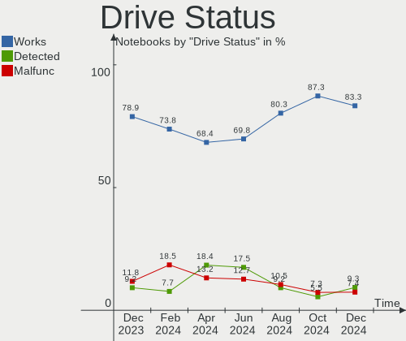
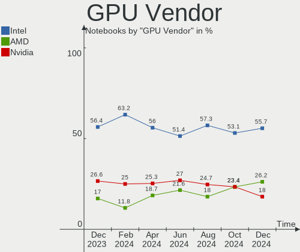
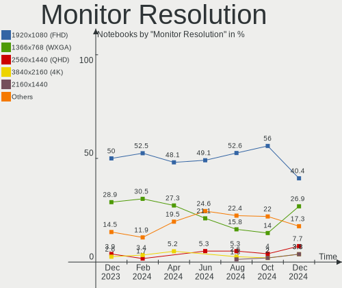

ArcoLinux - Hardware Trends (Notebooks)
---------------------------------------

A project to identify most popular hardware characteristics and track their change
over time based on data collected by Linux users at https://Linux-Hardware.org.

Anyone can contribute to this report by the [hw-probe](https://github.com/linuxhw/hw-probe) tool:

    sudo -E hw-probe -all -upload

This report is for one last month. Overall report since the beginning of time: [TestDays](https://github.com/linuxhw/TestDays)

Period: Aug, 2023.

Contents
--------

* [ System ](#system)
  - [ OS                       ](#os)
  - [ OS Family                ](#os-family)
  - [ Kernel                   ](#kernel)
  - [ Kernel Family            ](#kernel-family)
  - [ Kernel Major Ver.        ](#kernel-major-ver)
  - [ Arch                     ](#arch)
  - [ DE                       ](#de)
  - [ Display Server           ](#display-server)
  - [ Display Manager          ](#display-manager)
  - [ OS Lang                  ](#os-lang)
  - [ Boot Mode                ](#boot-mode)
  - [ Filesystem               ](#filesystem)
  - [ Part. scheme             ](#part-scheme)
  - [ Dual Boot with Linux/BSD ](#dual-boot-with-linuxbsd)
  - [ Dual Boot (Win)          ](#dual-boot-win)

* [ Board ](#board)
  - [ Vendor                   ](#vendor)
  - [ Model                    ](#model)
  - [ Model Family             ](#model-family)
  - [ MFG Year                 ](#mfg-year)
  - [ Form Factor              ](#form-factor)
  - [ Secure Boot              ](#secure-boot)
  - [ Coreboot                 ](#coreboot)
  - [ RAM Size                 ](#ram-size)
  - [ RAM Used                 ](#ram-used)
  - [ Total Drives             ](#total-drives)
  - [ Has CD-ROM               ](#has-cd-rom)
  - [ Has Ethernet             ](#has-ethernet)
  - [ Has WiFi                 ](#has-wifi)
  - [ Has Bluetooth            ](#has-bluetooth)

* [ Location ](#location)
  - [ Country                  ](#country)
  - [ City                     ](#city)

* [ Drives ](#drives)
  - [ Drive Vendor             ](#drive-vendor)
  - [ Drive Model              ](#drive-model)
  - [ HDD Vendor               ](#hdd-vendor)
  - [ SSD Vendor               ](#ssd-vendor)
  - [ Drive Kind               ](#drive-kind)
  - [ Drive Connector          ](#drive-connector)
  - [ Drive Size               ](#drive-size)
  - [ Space Total              ](#space-total)
  - [ Space Used               ](#space-used)
  - [ Malfunc. Drives          ](#malfunc-drives)
  - [ Malfunc. Drive Vendor    ](#malfunc-drive-vendor)
  - [ Malfunc. HDD Vendor      ](#malfunc-hdd-vendor)
  - [ Malfunc. Drive Kind      ](#malfunc-drive-kind)
  - [ Failed Drives            ](#failed-drives)
  - [ Failed Drive Vendor      ](#failed-drive-vendor)
  - [ Drive Status             ](#drive-status)

* [ Storage controller ](#storage-controller)
  - [ Storage Vendor           ](#storage-vendor)
  - [ Storage Model            ](#storage-model)
  - [ Storage Kind             ](#storage-kind)

* [ Processor ](#processor)
  - [ CPU Vendor               ](#cpu-vendor)
  - [ CPU Model                ](#cpu-model)
  - [ CPU Model Family         ](#cpu-model-family)
  - [ CPU Cores                ](#cpu-cores)
  - [ CPU Sockets              ](#cpu-sockets)
  - [ CPU Threads              ](#cpu-threads)
  - [ CPU Op-Modes             ](#cpu-op-modes)
  - [ CPU Microcode            ](#cpu-microcode)
  - [ CPU Microarch            ](#cpu-microarch)

* [ Graphics ](#graphics)
  - [ GPU Vendor               ](#gpu-vendor)
  - [ GPU Model                ](#gpu-model)
  - [ GPU Combo                ](#gpu-combo)
  - [ GPU Driver               ](#gpu-driver)
  - [ GPU Memory               ](#gpu-memory)

* [ Monitor ](#monitor)
  - [ Monitor Vendor           ](#monitor-vendor)
  - [ Monitor Model            ](#monitor-model)
  - [ Monitor Resolution       ](#monitor-resolution)
  - [ Monitor Diagonal         ](#monitor-diagonal)
  - [ Monitor Width            ](#monitor-width)
  - [ Aspect Ratio             ](#aspect-ratio)
  - [ Monitor Area             ](#monitor-area)
  - [ Pixel Density            ](#pixel-density)
  - [ Multiple Monitors        ](#multiple-monitors)

* [ Network ](#network)
  - [ Net Controller Vendor    ](#net-controller-vendor)
  - [ Net Controller Model     ](#net-controller-model)
  - [ Wireless Vendor          ](#wireless-vendor)
  - [ Wireless Model           ](#wireless-model)
  - [ Ethernet Vendor          ](#ethernet-vendor)
  - [ Ethernet Model           ](#ethernet-model)
  - [ Net Controller Kind      ](#net-controller-kind)
  - [ Used Controller          ](#used-controller)
  - [ NICs                     ](#nics)
  - [ IPv6                     ](#ipv6)

* [ Bluetooth ](#bluetooth)
  - [ Bluetooth Vendor         ](#bluetooth-vendor)
  - [ Bluetooth Model          ](#bluetooth-model)

* [ Sound ](#sound)
  - [ Sound Vendor             ](#sound-vendor)
  - [ Sound Model              ](#sound-model)

* [ Memory ](#memory)
  - [ Memory Vendor            ](#memory-vendor)
  - [ Memory Model             ](#memory-model)
  - [ Memory Kind              ](#memory-kind)
  - [ Memory Form Factor       ](#memory-form-factor)
  - [ Memory Size              ](#memory-size)
  - [ Memory Speed             ](#memory-speed)

* [ Printers & scanners ](#printers--scanners)
  - [ Printer Vendor           ](#printer-vendor)
  - [ Printer Model            ](#printer-model)
  - [ Scanner Vendor           ](#scanner-vendor)
  - [ Scanner Model            ](#scanner-model)

* [ Camera ](#camera)
  - [ Camera Vendor            ](#camera-vendor)
  - [ Camera Model             ](#camera-model)

* [ Security ](#security)
  - [ Fingerprint Vendor       ](#fingerprint-vendor)
  - [ Fingerprint Model        ](#fingerprint-model)
  - [ Chipcard Vendor          ](#chipcard-vendor)
  - [ Chipcard Model           ](#chipcard-model)

* [ Unsupported ](#unsupported)
  - [ Unsupported Devices      ](#unsupported-devices)
  - [ Unsupported Device Types ](#unsupported-device-types)

System
------

OS
--

Installed operating systems

| Name              | Notebooks | Percent |
|-------------------|-----------|---------|
| ArcoLinux Rolling | 80        | 98.77%  |
| ArcoLinux         | 1         | 1.23%   |

OS Family
---------

OS without a version

| Name      | Notebooks | Percent |
|-----------|-----------|---------|
| ArcoLinux | 81        | 100%    |

Kernel
------

Version of the Linux kernel

| Version               | Notebooks | Percent |
|-----------------------|-----------|---------|
| 6.4.12-arch1-1        | 10        | 12.35%  |
| 6.4.8-arch1-1         | 8         | 9.88%   |
| 6.4.10-arch1-1        | 8         | 9.88%   |
| 6.4.11-arch2-1        | 7         | 8.64%   |
| 6.3.8-arch1-1         | 4         | 4.94%   |
| 6.1.44-1-lts          | 4         | 4.94%   |
| 6.4.7-arch1-2         | 3         | 3.7%    |
| 6.4.9-zen1-1-zen      | 2         | 2.47%   |
| 6.4.9-arch1-1         | 2         | 2.47%   |
| 6.4.8-zen1-1-zen      | 2         | 2.47%   |
| 6.4.2-x64v2-xanmod1-3 | 2         | 2.47%   |
| 6.4.12-zen1-1-zen     | 2         | 2.47%   |
| 6.4.11-zen2-1-zen     | 2         | 2.47%   |
| 6.1.48-1-lts          | 2         | 2.47%   |
| 6.1.39-2-lts          | 2         | 2.47%   |
| 6.1.39-1-lts          | 2         | 2.47%   |
| 6.1.34-1-lts          | 2         | 2.47%   |
| 6.4.7-zen1-2-zen      | 1         | 1.23%   |
| 6.4.7-zen1-1-zen      | 1         | 1.23%   |
| 6.4.7-arch1-3         | 1         | 1.23%   |
| 6.4.7-arch1-1-g14     | 1         | 1.23%   |
| 6.4.7-273-tkg-cfs     | 1         | 1.23%   |
| 6.4.4-arch1-1         | 1         | 1.23%   |
| 6.4.11-arch1-1        | 1         | 1.23%   |
| 6.4.10-zen2-1-zen     | 1         | 1.23%   |
| 6.3.8-zen1-1-zen      | 1         | 1.23%   |
| 6.3.5-arch1-1         | 1         | 1.23%   |
| 6.3.3-arch1-1         | 1         | 1.23%   |
| 6.2.10-arch1-1        | 1         | 1.23%   |
| 6.1.47-1-lts          | 1         | 1.23%   |
| 6.1.45-1-lts          | 1         | 1.23%   |
| 6.1.39-3-lts          | 1         | 1.23%   |
| 6.1.31-1-lts          | 1         | 1.23%   |
| 5.15.28-1-lts         | 1         | 1.23%   |

Kernel Family
-------------

Linux kernel without a distro release

| Version | Notebooks | Percent |
|---------|-----------|---------|
| 6.4.12  | 12        | 14.81%  |
| 6.4.8   | 10        | 12.35%  |
| 6.4.11  | 10        | 12.35%  |
| 6.4.10  | 9         | 11.11%  |
| 6.4.7   | 8         | 9.88%   |
| 6.3.8   | 5         | 6.17%   |
| 6.1.39  | 5         | 6.17%   |
| 6.4.9   | 4         | 4.94%   |
| 6.1.44  | 4         | 4.94%   |
| 6.4.2   | 2         | 2.47%   |
| 6.1.48  | 2         | 2.47%   |
| 6.1.34  | 2         | 2.47%   |
| 6.4.4   | 1         | 1.23%   |
| 6.3.5   | 1         | 1.23%   |
| 6.3.3   | 1         | 1.23%   |
| 6.2.10  | 1         | 1.23%   |
| 6.1.47  | 1         | 1.23%   |
| 6.1.45  | 1         | 1.23%   |
| 6.1.31  | 1         | 1.23%   |
| 5.15.28 | 1         | 1.23%   |

Kernel Major Ver.
-----------------

Linux kernel major version

| Version | Notebooks | Percent |
|---------|-----------|---------|
| 6.4     | 56        | 69.14%  |
| 6.1     | 16        | 19.75%  |
| 6.3     | 7         | 8.64%   |
| 6.2     | 1         | 1.23%   |
| 5.15    | 1         | 1.23%   |

Arch
----

OS architecture (x86_64, i586, etc.)

| Name   | Notebooks | Percent |
|--------|-----------|---------|
| x86_64 | 81        | 100%    |

DE
--

Desktop Environment

| Name     | Notebooks | Percent |
|----------|-----------|---------|
| XFCE     | 36        | 44.44%  |
| KDE5     | 17        | 20.99%  |
| i3       | 10        | 12.35%  |
| GNOME    | 5         | 6.17%   |
| Cinnamon | 5         | 6.17%   |
| Deepin   | 2         | 2.47%   |
| chadwm   | 2         | 2.47%   |
| qtile    | 1         | 1.23%   |
| Hyprland | 1         | 1.23%   |
| Budgie   | 1         | 1.23%   |
| Unknown  | 1         | 1.23%   |

Display Server
--------------

X11 or Wayland

| Name    | Notebooks | Percent |
|---------|-----------|---------|
| X11     | 70        | 86.42%  |
| Wayland | 8         | 9.88%   |
| Unknown | 3         | 3.7%    |

Display Manager
---------------

SDDM, LightDM, etc.

| Name    | Notebooks | Percent |
|---------|-----------|---------|
| SDDM    | 63        | 77.78%  |
| LightDM | 11        | 13.58%  |
| GDM     | 5         | 6.17%   |
| LXDM    | 1         | 1.23%   |
| Unknown | 1         | 1.23%   |

OS Lang
-------

Language

| Lang  | Notebooks | Percent |
|-------|-----------|---------|
| en_US | 41        | 50.62%  |
| en_GB | 8         | 9.88%   |
| de_DE | 5         | 6.17%   |
| es_MX | 3         | 3.7%    |
| pt_BR | 2         | 2.47%   |
| hu_HU | 2         | 2.47%   |
| fr_FR | 2         | 2.47%   |
| es_ES | 2         | 2.47%   |
| en_IN | 2         | 2.47%   |
| en_CA | 2         | 2.47%   |
| tr_TR | 1         | 1.23%   |
| th_TH | 1         | 1.23%   |
| sv_SE | 1         | 1.23%   |
| ru_RU | 1         | 1.23%   |
| ja_JP | 1         | 1.23%   |
| it_IT | 1         | 1.23%   |
| fr_BE | 1         | 1.23%   |
| es_CL | 1         | 1.23%   |
| en_HK | 1         | 1.23%   |
| en_AU | 1         | 1.23%   |
| da_DK | 1         | 1.23%   |
| C     | 1         | 1.23%   |

Boot Mode
---------

EFI or BIOS

| Mode | Notebooks | Percent |
|------|-----------|---------|
| EFI  | 64        | 79.01%  |
| BIOS | 17        | 20.99%  |

Filesystem
----------

Type of filesystem

| Type    | Notebooks | Percent |
|---------|-----------|---------|
| Ext4    | 55        | 67.9%   |
| Btrfs   | 25        | 30.86%  |
| Overlay | 1         | 1.23%   |

Part. scheme
------------

Scheme of partitioning

| Type    | Notebooks | Percent |
|---------|-----------|---------|
| GPT     | 67        | 82.72%  |
| MBR     | 13        | 16.05%  |
| Unknown | 1         | 1.23%   |

Dual Boot with Linux/BSD
------------------------

Hosting more than one Linux/BSD

| Dual boot | Notebooks | Percent |
|-----------|-----------|---------|
| No        | 59        | 72.84%  |
| Yes       | 22        | 27.16%  |

Dual Boot (Win)
---------------

Hosting Linux and Windows

| Dual boot | Notebooks | Percent |
|-----------|-----------|---------|
| No        | 52        | 64.2%   |
| Yes       | 29        | 35.8%   |

Board
-----

Vendor
------

Motherboard manufacturer

| Name                | Notebooks | Percent |
|---------------------|-----------|---------|
| Lenovo              | 23        | 28.4%   |
| Hewlett-Packard     | 15        | 18.52%  |
| Dell                | 13        | 16.05%  |
| ASUSTek Computer    | 9         | 11.11%  |
| Acer                | 4         | 4.94%   |
| Toshiba             | 3         | 3.7%    |
| Apple               | 3         | 3.7%    |
| Samsung Electronics | 2         | 2.47%   |
| System76            | 1         | 1.23%   |
| Sony                | 1         | 1.23%   |
| Razer               | 1         | 1.23%   |
| Notebook            | 1         | 1.23%   |
| MSI                 | 1         | 1.23%   |
| Monster             | 1         | 1.23%   |
| Insyde              | 1         | 1.23%   |
| Chuwi               | 1         | 1.23%   |
| Unknown             | 1         | 1.23%   |

Model
-----

Motherboard model

| Name                                                                                     | Notebooks | Percent |
|------------------------------------------------------------------------------------------|-----------|---------|
| Dell XPS 15 9560                                                                         | 2         | 2.47%   |
| Apple MacBookPro9,2                                                                      | 2         | 2.47%   |
| Toshiba Satellite Pro C50-A-1E6                                                          | 1         | 1.23%   |
| Toshiba Satellite L55-B                                                                  | 1         | 1.23%   |
| Toshiba Satellite C50-A510                                                               | 1         | 1.23%   |
| System76 Gazelle                                                                         | 1         | 1.23%   |
| Sony SVE1712W1EB                                                                         | 1         | 1.23%   |
| Samsung R530/R730/R540                                                                   | 1         | 1.23%   |
| Samsung 355V4C/355V4X/355V5C/355V5X/356V4C/356V4X/356V5C/356V5X/3445VC/3445VX/3545VC/354 | 1         | 1.23%   |
| Razer Blade 14 - RZ09-0370                                                               | 1         | 1.23%   |
| Notebook N141CU                                                                          | 1         | 1.23%   |
| MSI GL73 8RC                                                                             | 1         | 1.23%   |
| Monster ABRA A5 V17.2                                                                    | 1         | 1.23%   |
| Lenovo Y50-70 20378                                                                      | 1         | 1.23%   |
| Lenovo ThinkPad X240 20AL00C6UK                                                          | 1         | 1.23%   |
| Lenovo ThinkPad X220 4291C84                                                             | 1         | 1.23%   |
| Lenovo ThinkPad T490 20N2004EGE                                                          | 1         | 1.23%   |
| Lenovo ThinkPad T470s W10DG 20JTS0VG02                                                   | 1         | 1.23%   |
| Lenovo ThinkPad T470 W10DG 20JNS01R27                                                    | 1         | 1.23%   |
| Lenovo ThinkPad T440p 20AN007BIV                                                         | 1         | 1.23%   |
| Lenovo ThinkPad T430 2349IF8                                                             | 1         | 1.23%   |
| Lenovo ThinkPad T420 4180AP3                                                             | 1         | 1.23%   |
| Lenovo ThinkPad T410 2522AC1                                                             | 1         | 1.23%   |
| Lenovo ThinkPad P53s 20N6S00B00                                                          | 1         | 1.23%   |
| Lenovo ThinkPad A475 20KMS0K20S                                                          | 1         | 1.23%   |
| Lenovo ThinkBook 15 G4 IAP 21DJ                                                          | 1         | 1.23%   |
| Lenovo ThinkBook 15 G3 ACL 21A4                                                          | 1         | 1.23%   |
| Lenovo Legion Y920-17IKB Laptop 80YW                                                     | 1         | 1.23%   |
| Lenovo Legion 5 Pro 16ITH6 82JF                                                          | 1         | 1.23%   |
| Lenovo Legion 5 15ACH6 82JW                                                              | 1         | 1.23%   |
| Lenovo IdeaPad Y700-17ISK 80Q0                                                           | 1         | 1.23%   |
| Lenovo IdeaPad S145-15IWL 81MV                                                           | 1         | 1.23%   |
| Lenovo IdeaPad 5 Pro 14ACN6 82L7                                                         | 1         | 1.23%   |
| Lenovo IdeaPad 3 15IAU7 82RK                                                             | 1         | 1.23%   |
| Lenovo IdeaPad 3 14ITL6 82H7                                                             | 1         | 1.23%   |
| Lenovo IdeaPad 110-17ACL 80UM                                                            | 1         | 1.23%   |
| Insyde BayTrail                                                                          | 1         | 1.23%   |
| HP ZBook Firefly 15 G7 Mobile Workstation                                                | 1         | 1.23%   |
| HP ZBook Firefly 14 inch G8 Mobile Workstation PC                                        | 1         | 1.23%   |
| HP ZBook 17 G3                                                                           | 1         | 1.23%   |

Model Family
------------

Motherboard model prefix

| Name               | Notebooks | Percent |
|--------------------|-----------|---------|
| Lenovo ThinkPad    | 11        | 13.58%  |
| Lenovo IdeaPad     | 6         | 7.41%   |
| Dell Inspiron      | 6         | 7.41%   |
| HP Pavilion        | 5         | 6.17%   |
| Toshiba Satellite  | 3         | 3.7%    |
| Lenovo Legion      | 3         | 3.7%    |
| HP ZBook           | 3         | 3.7%    |
| Dell XPS           | 3         | 3.7%    |
| Lenovo ThinkBook   | 2         | 2.47%   |
| HP EliteBook       | 2         | 2.47%   |
| Dell G15           | 2         | 2.47%   |
| ASUS VivoBook      | 2         | 2.47%   |
| ASUS ROG           | 2         | 2.47%   |
| Apple MacBookPro9  | 2         | 2.47%   |
| Acer Aspire        | 2         | 2.47%   |
| System76 Gazelle   | 1         | 1.23%   |
| Sony SVE1712W1EB   | 1         | 1.23%   |
| Samsung R530       | 1         | 1.23%   |
| Samsung 355V4C     | 1         | 1.23%   |
| Razer Blade        | 1         | 1.23%   |
| Notebook N141CU    | 1         | 1.23%   |
| MSI GL73           | 1         | 1.23%   |
| Monster ABRA       | 1         | 1.23%   |
| Lenovo Y50-70      | 1         | 1.23%   |
| Insyde BayTrail    | 1         | 1.23%   |
| HP Victus          | 1         | 1.23%   |
| HP Notebook        | 1         | 1.23%   |
| HP Laptop          | 1         | 1.23%   |
| HP Folio           | 1         | 1.23%   |
| HP Compaq          | 1         | 1.23%   |
| Dell System        | 1         | 1.23%   |
| Dell G3            | 1         | 1.23%   |
| Chuwi GemiBook     | 1         | 1.23%   |
| ASUS X541UAK       | 1         | 1.23%   |
| ASUS K53E          | 1         | 1.23%   |
| ASUS GL552JX       | 1         | 1.23%   |
| ASUS G750JM        | 1         | 1.23%   |
| ASUS ASUS          | 1         | 1.23%   |
| Apple MacBookPro12 | 1         | 1.23%   |
| Acer TravelMate    | 1         | 1.23%   |

MFG Year
--------

Motherboard manufacture year

| Year | Notebooks | Percent |
|------|-----------|---------|
| 2021 | 13        | 16.05%  |
| 2022 | 8         | 9.88%   |
| 2011 | 7         | 8.64%   |
| 2018 | 6         | 7.41%   |
| 2017 | 6         | 7.41%   |
| 2016 | 6         | 7.41%   |
| 2015 | 6         | 7.41%   |
| 2014 | 6         | 7.41%   |
| 2012 | 6         | 7.41%   |
| 2019 | 5         | 6.17%   |
| 2013 | 4         | 4.94%   |
| 2020 | 3         | 3.7%    |
| 2023 | 2         | 2.47%   |
| 2010 | 2         | 2.47%   |
| 2009 | 1         | 1.23%   |

Form Factor
-----------

Physical design of the computer

| Name     | Notebooks | Percent |
|----------|-----------|---------|
| Notebook | 81        | 100%    |

Secure Boot
-----------

Enabled or disabled

| State    | Notebooks | Percent |
|----------|-----------|---------|
| Disabled | 81        | 100%    |

Coreboot
--------

Have coreboot on board

| Used | Notebooks | Percent |
|------|-----------|---------|
| No   | 80        | 98.77%  |
| Yes  | 1         | 1.23%   |

RAM Size
--------

Total RAM memory

| Size in GB | Notebooks | Percent |
|------------|-----------|---------|
| 4.01-8.0   | 29        | 35.8%   |
| 16.01-24.0 | 26        | 32.1%   |
| 8.01-16.0  | 14        | 17.28%  |
| 32.01-64.0 | 7         | 8.64%   |
| 3.01-4.0   | 3         | 3.7%    |
| 24.01-32.0 | 1         | 1.23%   |
| 1.01-2.0   | 1         | 1.23%   |

RAM Used
--------

Used RAM memory

| Used GB   | Notebooks | Percent |
|-----------|-----------|---------|
| 1.01-2.0  | 34        | 41.98%  |
| 2.01-3.0  | 21        | 25.93%  |
| 3.01-4.0  | 14        | 17.28%  |
| 4.01-8.0  | 8         | 9.88%   |
| 8.01-16.0 | 2         | 2.47%   |
| 0.51-1.0  | 2         | 2.47%   |

Total Drives
------------

Number of drives on board

| Drives | Notebooks | Percent |
|--------|-----------|---------|
| 1      | 55        | 67.9%   |
| 2      | 21        | 25.93%  |
| 3      | 5         | 6.17%   |

Has CD-ROM
----------

Has CD-ROM on board

| Presented | Notebooks | Percent |
|-----------|-----------|---------|
| No        | 64        | 79.01%  |
| Yes       | 17        | 20.99%  |

Has Ethernet
------------

Has Ethernet on board

| Presented | Notebooks | Percent |
|-----------|-----------|---------|
| Yes       | 65        | 80.25%  |
| No        | 16        | 19.75%  |

Has WiFi
--------

Has WiFi module

| Presented | Notebooks | Percent |
|-----------|-----------|---------|
| Yes       | 77        | 95.06%  |
| No        | 4         | 4.94%   |

Has Bluetooth
-------------

Has Bluetooth module

| Presented | Notebooks | Percent |
|-----------|-----------|---------|
| Yes       | 70        | 86.42%  |
| No        | 11        | 13.58%  |

Location
--------

Country
-------

Geographic location (country)

| Country   | Notebooks | Percent |
|-----------|-----------|---------|
| USA       | 13        | 16.05%  |
| Germany   | 7         | 8.64%   |
| UK        | 5         | 6.17%   |
| Canada    | 4         | 4.94%   |
| Brazil    | 4         | 4.94%   |
| Spain     | 3         | 3.7%    |
| India     | 3         | 3.7%    |
| France    | 3         | 3.7%    |
| Turkey    | 2         | 2.47%   |
| Romania   | 2         | 2.47%   |
| Malaysia  | 2         | 2.47%   |
| Italy     | 2         | 2.47%   |
| Finland   | 2         | 2.47%   |
| Chile     | 2         | 2.47%   |
| Australia | 2         | 2.47%   |
| Argentina | 2         | 2.47%   |
| Tunisia   | 1         | 1.23%   |
| Thailand  | 1         | 1.23%   |
| Sweden    | 1         | 1.23%   |
| Singapore | 1         | 1.23%   |
| Russia    | 1         | 1.23%   |
| Pakistan  | 1         | 1.23%   |
| Nepal     | 1         | 1.23%   |
| Mexico    | 1         | 1.23%   |
| Lebanon   | 1         | 1.23%   |
| Japan     | 1         | 1.23%   |
| Israel    | 1         | 1.23%   |
| Iran      | 1         | 1.23%   |
| Indonesia | 1         | 1.23%   |
| Hungary   | 1         | 1.23%   |
| Hong Kong | 1         | 1.23%   |
| Greece    | 1         | 1.23%   |
| Ethiopia  | 1         | 1.23%   |
| Denmark   | 1         | 1.23%   |
| Czechia   | 1         | 1.23%   |
| Bulgaria  | 1         | 1.23%   |
| Bolivia   | 1         | 1.23%   |
| Belgium   | 1         | 1.23%   |
| Austria   | 1         | 1.23%   |

City
----

Geographic location (city)

| City                | Notebooks | Percent |
|---------------------|-----------|---------|
| Los Angeles         | 2         | 2.47%   |
| Feltham             | 2         | 2.47%   |
| Amarillo            | 2         | 2.47%   |
| Yokohama            | 1         | 1.23%   |
| Yakutsk             | 1         | 1.23%   |
| Yachats             | 1         | 1.23%   |
| Vienna              | 1         | 1.23%   |
| Tunnel Hill         | 1         | 1.23%   |
| Tunis               | 1         | 1.23%   |
| Tsuen Wan           | 1         | 1.23%   |
| Toronto             | 1         | 1.23%   |
| Toenisvorst         | 1         | 1.23%   |
| Timișoara          | 1         | 1.23%   |
| Teresopolis         | 1         | 1.23%   |
| Tehran              | 1         | 1.23%   |
| Tampere             | 1         | 1.23%   |
| Stockholm           | 1         | 1.23%   |
| Southwark           | 1         | 1.23%   |
| Singapore           | 1         | 1.23%   |
| Simi Valley         | 1         | 1.23%   |
| Santiago            | 1         | 1.23%   |
| Rio de Janeiro      | 1         | 1.23%   |
| Repentigny          | 1         | 1.23%   |
| Rancagua            | 1         | 1.23%   |
| Raipur              | 1         | 1.23%   |
| Quilmes             | 1         | 1.23%   |
| Quetta              | 1         | 1.23%   |
| Pune                | 1         | 1.23%   |
| Presidente Prudente | 1         | 1.23%   |
| Prague              | 1         | 1.23%   |
| Portland            | 1         | 1.23%   |
| Porcia              | 1         | 1.23%   |
| Pokhara             | 1         | 1.23%   |
| Plovdiv             | 1         | 1.23%   |
| Perugia             | 1         | 1.23%   |
| Oshawa              | 1         | 1.23%   |
| Mendoza             | 1         | 1.23%   |
| Manises             | 1         | 1.23%   |
| Madrid              | 1         | 1.23%   |
| Longueuil           | 1         | 1.23%   |

Drives
------

Drive Vendor
------------

Hard drive vendors

| Vendor                      | Notebooks | Drives | Percent |
|-----------------------------|-----------|--------|---------|
| Samsung Electronics         | 24        | 26     | 21.82%  |
| WDC                         | 11        | 12     | 10%     |
| Toshiba                     | 9         | 9      | 8.18%   |
| Sandisk                     | 8         | 8      | 7.27%   |
| Seagate                     | 7         | 7      | 6.36%   |
| Kingston                    | 6         | 6      | 5.45%   |
| Crucial                     | 6         | 6      | 5.45%   |
| Intel                       | 4         | 5      | 3.64%   |
| Unknown                     | 3         | 3      | 2.73%   |
| SK hynix                    | 3         | 3      | 2.73%   |
| PNY                         | 2         | 2      | 1.82%   |
| KIOXIA                      | 2         | 2      | 1.82%   |
| Kingston Technology Company | 2         | 2      | 1.82%   |
| Apple                       | 2         | 2      | 1.82%   |
| Zheino                      | 1         | 1      | 0.91%   |
| ValueTech                   | 1         | 1      | 0.91%   |
| Union Memory (Shenzhen)     | 1         | 1      | 0.91%   |
| Timetec                     | 1         | 1      | 0.91%   |
| Team                        | 1         | 1      | 0.91%   |
| Silicon Motion              | 1         | 1      | 0.91%   |
| ShiJi                       | 1         | 1      | 0.91%   |
| Realtek Semiconductor       | 1         | 1      | 0.91%   |
| Phison Electronics          | 1         | 1      | 0.91%   |
| Micron/Crucial Technology   | 1         | 1      | 0.91%   |
| Micron Technology           | 1         | 1      | 0.91%   |
| MAXIO Technology (Hangzhou) | 1         | 1      | 0.91%   |
| LITEON                      | 1         | 1      | 0.91%   |
| Lexar                       | 1         | 1      | 0.91%   |
| Kingmax                     | 1         | 1      | 0.91%   |
| Intenso                     | 1         | 1      | 0.91%   |
| HI-LEVEL                    | 1         | 1      | 0.91%   |
| HGST                        | 1         | 1      | 0.91%   |
| EYOTA                       | 1         | 1      | 0.91%   |
| CONSISTENT                  | 1         | 1      | 0.91%   |
| Colorful                    | 1         | 1      | 0.91%   |

Drive Model
-----------

Hard drive models

| Model                                                 | Notebooks | Percent |
|-------------------------------------------------------|-----------|---------|
| Samsung NVMe SSD Controller SM981/PM981/PM983 500GB   | 5         | 4.42%   |
| Toshiba XG4 NVMe SSD Controller 256GB                 | 3         | 2.65%   |
| Sandisk WD Black SN750 / PC SN730 NVMe SSD 1024GB     | 3         | 2.65%   |
| Samsung SSD 860 EVO 1TB                               | 2         | 1.77%   |
| Samsung SSD 850 EVO 250GB                             | 2         | 1.77%   |
| Samsung NVMe SSD Controller PM9A1/PM9A3/980PRO 1024GB | 2         | 1.77%   |
| Samsung MZALQ512HBLU-00BL2 512GB                      | 2         | 1.77%   |
| Kingston SA400S37480G 480GB SSD                       | 2         | 1.77%   |
| Intel SSDPEKNU512GZ 512GB                             | 2         | 1.77%   |
| Zheino CHN MSATAQ3 120 120GB SSD                      | 1         | 0.88%   |
| WDC WDS500G2B0B-00YS70 500GB SSD                      | 1         | 0.88%   |
| WDC WDS240G2G0B-00EPW0 240GB SSD                      | 1         | 0.88%   |
| WDC WDS240G2G0A-00JH30 240GB SSD                      | 1         | 0.88%   |
| WDC WD7500BPVT-55HXZT3 752GB                          | 1         | 0.88%   |
| WDC WD5000LPLX-75ZNTT0 500GB                          | 1         | 0.88%   |
| WDC WD5000BPKX-75HPJT0 500GB                          | 1         | 0.88%   |
| WDC WD10SPZX-60Z10T0 1TB                              | 1         | 0.88%   |
| WDC WD10SPZX-17Z10T1 1TB                              | 1         | 0.88%   |
| WDC WD10SPCX-24HWST1 1TB                              | 1         | 0.88%   |
| WDC WD10JPVX-75JC3T0 1TB                              | 1         | 0.88%   |
| WDC WD10JPVX-60JC3T0 1TB                              | 1         | 0.88%   |
| WDC WD10JPCX-24UE4T0 1TB                              | 1         | 0.88%   |
| ValueTech SSD 256GB                                   | 1         | 0.88%   |
| Unknown NVMe SSD Drive 1TB                            | 1         | 0.88%   |
| Unknown MMC Card  32GB                                | 1         | 0.88%   |
| Unknown MMC Card  197GB                               | 1         | 0.88%   |
| Union Memory (Shenzhen) UMIS RPJTJ512MGE1QDY 512GB    | 1         | 0.88%   |
| Toshiba XG6 NVMe SSD Controller 1024GB                | 1         | 0.88%   |
| Toshiba THNS128GG4BAAA-NonFDE 128GB SSD               | 1         | 0.88%   |
| Toshiba MQ04ABF100 1TB                                | 1         | 0.88%   |
| Toshiba MQ01ABF050 500GB                              | 1         | 0.88%   |
| Toshiba MQ01ABD100 1TB                                | 1         | 0.88%   |
| Toshiba KXG50ZNV512G NVMe 512GB                       | 1         | 0.88%   |
| Timetec 30TT253X2-512G SSD                            | 1         | 0.88%   |
| Team TM8PS7512G 512GB SSD                             | 1         | 0.88%   |
| SK hynix SKHynix_HFS512GDE9X084N 512GB                | 1         | 0.88%   |
| SK hynix PC711 HFS512GDE9X073N 512GB                  | 1         | 0.88%   |
| SK hynix BC711 NVMe 512GB                             | 1         | 0.88%   |
| Silicon Motion SM2263EN/SM2263XT SSD Controller 256GB | 1         | 0.88%   |
| ShiJi SSD 1TB                                         | 1         | 0.88%   |

HDD Vendor
----------

Hard disk drive vendors

| Vendor              | Notebooks | Drives | Percent |
|---------------------|-----------|--------|---------|
| WDC                 | 9         | 9      | 42.86%  |
| Seagate             | 6         | 6      | 28.57%  |
| Toshiba             | 3         | 3      | 14.29%  |
| Samsung Electronics | 1         | 1      | 4.76%   |
| HGST                | 1         | 1      | 4.76%   |
| Apple               | 1         | 1      | 4.76%   |

SSD Vendor
----------

Solid state drive vendors

| Vendor              | Notebooks | Drives | Percent |
|---------------------|-----------|--------|---------|
| Samsung Electronics | 12        | 12     | 26.67%  |
| Crucial             | 6         | 6      | 13.33%  |
| Kingston            | 5         | 5      | 11.11%  |
| WDC                 | 3         | 3      | 6.67%   |
| SanDisk             | 2         | 2      | 4.44%   |
| PNY                 | 2         | 2      | 4.44%   |
| Zheino              | 1         | 1      | 2.22%   |
| ValueTech           | 1         | 1      | 2.22%   |
| Toshiba             | 1         | 1      | 2.22%   |
| Timetec             | 1         | 1      | 2.22%   |
| Team                | 1         | 1      | 2.22%   |
| ShiJi               | 1         | 1      | 2.22%   |
| LITEON              | 1         | 1      | 2.22%   |
| Kingmax             | 1         | 1      | 2.22%   |
| Intenso             | 1         | 1      | 2.22%   |
| Intel               | 1         | 1      | 2.22%   |
| HI-LEVEL            | 1         | 1      | 2.22%   |
| EYOTA               | 1         | 1      | 2.22%   |
| CONSISTENT          | 1         | 1      | 2.22%   |
| Colorful            | 1         | 1      | 2.22%   |
| Apple               | 1         | 1      | 2.22%   |

Drive Kind
----------

HDD or SSD

| Kind    | Notebooks | Drives | Percent |
|---------|-----------|--------|---------|
| NVMe    | 39        | 44     | 38.61%  |
| SSD     | 38        | 45     | 37.62%  |
| HDD     | 20        | 21     | 19.8%   |
| MMC     | 2         | 2      | 1.98%   |
| Unknown | 2         | 2      | 1.98%   |

Drive Connector
---------------

SATA, SAS, NVMe, etc.

| Type | Notebooks | Drives | Percent |
|------|-----------|--------|---------|
| SATA | 47        | 62     | 50%     |
| NVMe | 39        | 44     | 41.49%  |
| SAS  | 6         | 6      | 6.38%   |
| MMC  | 2         | 2      | 2.13%   |

Drive Size
----------

Size of hard drive

| Size in TB | Notebooks | Drives | Percent |
|------------|-----------|--------|---------|
| 0.01-0.5   | 32        | 38     | 54.24%  |
| 0.51-1.0   | 24        | 25     | 40.68%  |
| 1.01-2.0   | 3         | 3      | 5.08%   |

Space Total
-----------

Amount of disk space available on the file system

| Size in GB     | Notebooks | Percent |
|----------------|-----------|---------|
| 251-500        | 21        | 25.93%  |
| 101-250        | 13        | 16.05%  |
| 501-1000       | 13        | 16.05%  |
| 1001-2000      | 10        | 12.35%  |
| 51-100         | 8         | 9.88%   |
| More than 3000 | 7         | 8.64%   |
| Unknown        | 3         | 3.7%    |
| 21-50          | 2         | 2.47%   |
| 2001-3000      | 2         | 2.47%   |
| 1-20           | 2         | 2.47%   |

Space Used
----------

Amount of used disk space

| Used GB   | Notebooks | Percent |
|-----------|-----------|---------|
| 1-20      | 22        | 27.16%  |
| 101-250   | 16        | 19.75%  |
| 21-50     | 14        | 17.28%  |
| 51-100    | 10        | 12.35%  |
| 251-500   | 7         | 8.64%   |
| 501-1000  | 6         | 7.41%   |
| 1001-2000 | 3         | 3.7%    |
| Unknown   | 3         | 3.7%    |

Malfunc. Drives
---------------

Drive models with a malfunction

| Model                                | Notebooks | Drives | Percent |
|--------------------------------------|-----------|--------|---------|
| WDC WD7500BPVT-55HXZT3 752GB         | 1         | 1      | 14.29%  |
| Toshiba MQ01ABF050 500GB             | 1         | 1      | 14.29%  |
| SK hynix PC711 HFS512GDE9X073N 512GB | 1         | 1      | 14.29%  |
| Seagate ST9750420AS 752GB            | 1         | 1      | 14.29%  |
| Seagate ST500LT012-1DG142 500GB      | 1         | 1      | 14.29%  |
| Intel SSDSC2BF180A4L 180GB           | 1         | 1      | 14.29%  |
| Colorful SL500 240GB SSD             | 1         | 1      | 14.29%  |

Malfunc. Drive Vendor
---------------------

Vendors of faulty drives

| Vendor   | Notebooks | Drives | Percent |
|----------|-----------|--------|---------|
| Seagate  | 2         | 2      | 28.57%  |
| WDC      | 1         | 1      | 14.29%  |
| Toshiba  | 1         | 1      | 14.29%  |
| SK hynix | 1         | 1      | 14.29%  |
| Intel    | 1         | 1      | 14.29%  |
| Colorful | 1         | 1      | 14.29%  |

Malfunc. HDD Vendor
-------------------

Vendors of faulty HDD drives

| Vendor  | Notebooks | Drives | Percent |
|---------|-----------|--------|---------|
| Seagate | 2         | 2      | 50%     |
| WDC     | 1         | 1      | 25%     |
| Toshiba | 1         | 1      | 25%     |

Malfunc. Drive Kind
-------------------

Kinds of faulty drives

| Kind | Notebooks | Drives | Percent |
|------|-----------|--------|---------|
| HDD  | 4         | 4      | 57.14%  |
| SSD  | 2         | 2      | 28.57%  |
| NVMe | 1         | 1      | 14.29%  |

Failed Drives
-------------

Failed drive models

Zero info for selected period =(

Failed Drive Vendor
-------------------

Failed drive vendors

Zero info for selected period =(

Drive Status
------------

Number of failed and malfunc. drives

| Status   | Notebooks | Drives | Percent |
|----------|-----------|--------|---------|
| Works    | 74        | 98     | 83.15%  |
| Detected | 8         | 9      | 8.99%   |
| Malfunc  | 7         | 7      | 7.87%   |

Storage controller
------------------

Storage Vendor
--------------

Storage controller vendors

| Vendor                       | Notebooks | Percent |
|------------------------------|-----------|---------|
| Intel                        | 57        | 53.77%  |
| Samsung Electronics          | 13        | 12.26%  |
| AMD                          | 9         | 8.49%   |
| SanDisk                      | 6         | 5.66%   |
| Toshiba America Info Systems | 5         | 4.72%   |
| SK hynix                     | 3         | 2.83%   |
| Kingston Technology Company  | 3         | 2.83%   |
| KIOXIA                       | 2         | 1.89%   |
| Union Memory (Shenzhen)      | 1         | 0.94%   |
| TenaFe                       | 1         | 0.94%   |
| Silicon Motion               | 1         | 0.94%   |
| Realtek Semiconductor        | 1         | 0.94%   |
| Phison Electronics           | 1         | 0.94%   |
| Micron/Crucial Technology    | 1         | 0.94%   |
| Micron Technology            | 1         | 0.94%   |
| MAXIO Technology (Hangzhou)  | 1         | 0.94%   |

Storage Model
-------------

Storage controller models

| Model                                                                          | Notebooks | Percent |
|--------------------------------------------------------------------------------|-----------|---------|
| AMD FCH SATA Controller [AHCI mode]                                            | 9         | 8.11%   |
| Intel 6 Series/C200 Series Chipset Family 6 port Mobile SATA AHCI Controller   | 6         | 5.41%   |
| Samsung NVMe SSD Controller SM981/PM981/PM983                                  | 5         | 4.5%    |
| Intel Volume Management Device NVMe RAID Controller                            | 5         | 4.5%    |
| Intel Sunrise Point-LP SATA Controller [AHCI mode]                             | 5         | 4.5%    |
| Intel 8 Series/C220 Series Chipset Family 6-port SATA Controller 1 [AHCI mode] | 5         | 4.5%    |
| Intel 7 Series Chipset Family 6-port SATA Controller [AHCI mode]               | 5         | 4.5%    |
| Intel 82801 Mobile SATA Controller [RAID mode]                                 | 4         | 3.6%    |
| Toshiba America Info Systems XG4 NVMe SSD Controller                           | 3         | 2.7%    |
| SK hynix Gold P31/BC711/PC711 NVMe Solid State Drive                           | 3         | 2.7%    |
| SanDisk WD Black SN750 / PC SN730 NVMe SSD                                     | 3         | 2.7%    |
| Samsung NVMe SSD Controller 980                                                | 3         | 2.7%    |
| Intel Tiger Lake-LP SATA Controller                                            | 3         | 2.7%    |
| Intel Tiger Lake SATA AHCI Controller                                          | 3         | 2.7%    |
| Intel HM170/QM170 Chipset SATA Controller [AHCI Mode]                          | 3         | 2.7%    |
| Samsung NVMe SSD Controller PM9A1/PM9A3/980PRO                                 | 2         | 1.8%    |
| Intel Wildcat Point-LP SATA Controller [AHCI Mode]                             | 2         | 1.8%    |
| Intel SSD 670p Series [Keystone Harbor]                                        | 2         | 1.8%    |
| Intel Q170/Q150/B150/H170/H110/Z170/CM236 Chipset SATA Controller [AHCI Mode]  | 2         | 1.8%    |
| Intel Cannon Point-LP SATA Controller [AHCI Mode]                              | 2         | 1.8%    |
| Intel Alder Lake-P SATA AHCI Controller                                        | 2         | 1.8%    |
| Intel 8 Series SATA Controller 1 [AHCI mode]                                   | 2         | 1.8%    |
| Intel 5 Series/3400 Series Chipset 6 port SATA AHCI Controller                 | 2         | 1.8%    |
| Union Memory (Shenzhen) AM630 PCIe 4.0 x4 NVMe SSD Controller                  | 1         | 0.9%    |
| Toshiba America Info Systems XG6 NVMe SSD Controller                           | 1         | 0.9%    |
| Toshiba America Info Systems XG5 NVMe SSD Controller                           | 1         | 0.9%    |
| TenaFe TC2200/TC2201 NVMe Controller (DRAM-less)                               | 1         | 0.9%    |
| Silicon Motion SM2263EN/SM2263XT (DRAM-less) NVMe SSD Controllers              | 1         | 0.9%    |
| SanDisk WD Blue SN570 NVMe SSD 1TB                                             | 1         | 0.9%    |
| SanDisk WD Blue SN550 NVMe SSD                                                 | 1         | 0.9%    |
| SanDisk WD Black SN770 / PC SN740 256GB / PC SN560 (DRAM-less) NVMe SSD        | 1         | 0.9%    |
| Samsung S4LN053X01 AHCI SSD Controller(Apple slot)                             | 1         | 0.9%    |
| Samsung NVMe SSD Controller SM961/PM961/SM963                                  | 1         | 0.9%    |
| Samsung NVMe SSD Controller SM951/PM951                                        | 1         | 0.9%    |
| Samsung NVMe SSD Controller PM9B1                                              | 1         | 0.9%    |
| Realtek RTS5765DL NVMe SSD Controller (DRAM-less)                              | 1         | 0.9%    |
| Phison E12 NVMe Controller                                                     | 1         | 0.9%    |
| Micron/Crucial P2 [Nick P2] / P3 / P3 Plus NVMe PCIe SSD (DRAM-less)           | 1         | 0.9%    |
| Micron 2210 NVMe SSD [Cobain]                                                  | 1         | 0.9%    |
| MAXIO (Hangzhou) NVMe SSD Controller MAP1202                                   | 1         | 0.9%    |

Storage Kind
------------

Kind of storage controller (IDE, SATA, NVMe, SAS, ...)

| Kind | Notebooks | Percent |
|------|-----------|---------|
| SATA | 59        | 55.14%  |
| NVMe | 39        | 36.45%  |
| RAID | 9         | 8.41%   |

Processor
---------

CPU Vendor
----------

Processor vendors

| Vendor | Notebooks | Percent |
|--------|-----------|---------|
| Intel  | 66        | 81.48%  |
| AMD    | 15        | 18.52%  |

CPU Model
---------

Processor models

| Model                                    | Notebooks | Percent |
|------------------------------------------|-----------|---------|
| Intel Core i7-7700HQ CPU @ 2.80GHz       | 3         | 3.7%    |
| Intel Core i7-8750H CPU @ 2.20GHz        | 2         | 2.47%   |
| Intel Core i7-4710HQ CPU @ 2.50GHz       | 2         | 2.47%   |
| Intel Core i7-10510U CPU @ 1.80GHz       | 2         | 2.47%   |
| Intel Core i5-8265U CPU @ 1.60GHz        | 2         | 2.47%   |
| Intel Core i5-7200U CPU @ 2.50GHz        | 2         | 2.47%   |
| Intel Core i5-4200M CPU @ 2.50GHz        | 2         | 2.47%   |
| Intel Core i5-2520M CPU @ 2.50GHz        | 2         | 2.47%   |
| Intel 12th Gen Core i7-1255U             | 2         | 2.47%   |
| Intel 11th Gen Core i7-11800H @ 2.30GHz  | 2         | 2.47%   |
| Intel 11th Gen Core i7-1165G7 @ 2.80GHz  | 2         | 2.47%   |
| Intel 11th Gen Core i5-1135G7 @ 2.40GHz  | 2         | 2.47%   |
| AMD Ryzen 9 5900HX with Radeon Graphics  | 2         | 2.47%   |
| AMD Ryzen 7 5800H with Radeon Graphics   | 2         | 2.47%   |
| AMD A6-4400M APU with Radeon HD Graphics | 2         | 2.47%   |
| Intel Pentium CPU N3710 @ 1.60GHz        | 1         | 1.23%   |
| Intel Core i7-8665U CPU @ 1.90GHz        | 1         | 1.23%   |
| Intel Core i7-8550U CPU @ 1.80GHz        | 1         | 1.23%   |
| Intel Core i7-7820HK CPU @ 2.90GHz       | 1         | 1.23%   |
| Intel Core i7-7500U CPU @ 2.70GHz        | 1         | 1.23%   |
| Intel Core i7-6820HQ CPU @ 2.70GHz       | 1         | 1.23%   |
| Intel Core i7-6700HQ CPU @ 2.60GHz       | 1         | 1.23%   |
| Intel Core i7-6600U CPU @ 2.60GHz        | 1         | 1.23%   |
| Intel Core i7-6500U CPU @ 2.50GHz        | 1         | 1.23%   |
| Intel Core i7-4720HQ CPU @ 2.60GHz       | 1         | 1.23%   |
| Intel Core i7-4600U CPU @ 2.10GHz        | 1         | 1.23%   |
| Intel Core i7-3632QM CPU @ 2.20GHz       | 1         | 1.23%   |
| Intel Core i7-3610QM CPU @ 2.30GHz       | 1         | 1.23%   |
| Intel Core i7-3520M CPU @ 2.90GHz        | 1         | 1.23%   |
| Intel Core i7-2630QM CPU @ 2.00GHz       | 1         | 1.23%   |
| Intel Core i7-10875H CPU @ 2.30GHz       | 1         | 1.23%   |
| Intel Core i5-7300HQ CPU @ 2.50GHz       | 1         | 1.23%   |
| Intel Core i5-6300U CPU @ 2.40GHz        | 1         | 1.23%   |
| Intel Core i5-5257U CPU @ 2.70GHz        | 1         | 1.23%   |
| Intel Core i5-5200U CPU @ 2.20GHz        | 1         | 1.23%   |
| Intel Core i5-4210U CPU @ 1.70GHz        | 1         | 1.23%   |
| Intel Core i5-3340M CPU @ 2.70GHz        | 1         | 1.23%   |
| Intel Core i5-3320M CPU @ 2.60GHz        | 1         | 1.23%   |
| Intel Core i5-3210M CPU @ 2.50GHz        | 1         | 1.23%   |
| Intel Core i5-2467M CPU @ 1.60GHz        | 1         | 1.23%   |

CPU Model Family
----------------

Processor model prefix

| Model         | Notebooks | Percent |
|---------------|-----------|---------|
| Intel Core i7 | 24        | 29.63%  |
| Intel Core i5 | 20        | 24.69%  |
| Other         | 15        | 18.52%  |
| AMD Ryzen 7   | 4         | 4.94%   |
| Intel Core i3 | 3         | 3.7%    |
| Intel Celeron | 3         | 3.7%    |
| AMD A6        | 3         | 3.7%    |
| AMD Ryzen 9   | 2         | 2.47%   |
| AMD Ryzen 5   | 2         | 2.47%   |
| AMD Ryzen 3   | 2         | 2.47%   |
| Intel Pentium | 1         | 1.23%   |
| Intel Atom    | 1         | 1.23%   |
| AMD E1        | 1         | 1.23%   |

CPU Cores
---------

Number of processor cores

| Number | Notebooks | Percent |
|--------|-----------|---------|
| 4      | 32        | 39.51%  |
| 2      | 29        | 35.8%   |
| 8      | 9         | 11.11%  |
| 6      | 4         | 4.94%   |
| 14     | 2         | 2.47%   |
| 10     | 2         | 2.47%   |
| 1      | 2         | 2.47%   |
| 12     | 1         | 1.23%   |

CPU Sockets
-----------

Number of sockets

| Number | Notebooks | Percent |
|--------|-----------|---------|
| 1      | 81        | 100%    |

CPU Threads
-----------

Threads per core (Hyper-Threading)

| Number | Notebooks | Percent |
|--------|-----------|---------|
| 2      | 72        | 88.89%  |
| 1      | 9         | 11.11%  |

CPU Op-Modes
------------

CPU Operation Modes (32-bit, 64-bit)

| Op mode        | Notebooks | Percent |
|----------------|-----------|---------|
| 32-bit, 64-bit | 81        | 100%    |

CPU Microcode
-------------

Microcode number

| Number     | Notebooks | Percent |
|------------|-----------|---------|
| Unknown    | 50        | 61.73%  |
| 0x806d1    | 3         | 3.7%    |
| 0x306c3    | 3         | 3.7%    |
| 0x0a50000c | 3         | 3.7%    |
| 0x806ec    | 2         | 2.47%   |
| 0x306a9    | 2         | 2.47%   |
| 0x206a7    | 2         | 2.47%   |
| 0x0a50000d | 2         | 2.47%   |
| 0x08608103 | 2         | 2.47%   |
| 0x06001116 | 2         | 2.47%   |
| 0x806e9    | 1         | 1.23%   |
| 0x806c2    | 1         | 1.23%   |
| 0x806c1    | 1         | 1.23%   |
| 0x306d4    | 1         | 1.23%   |
| 0x0a404101 | 1         | 1.23%   |
| 0x08108109 | 1         | 1.23%   |
| 0x0810100b | 1         | 1.23%   |
| 0x07030105 | 1         | 1.23%   |
| 0x0700010f | 1         | 1.23%   |
| 0x0600611a | 1         | 1.23%   |

CPU Microarch
-------------

Microarchitecture

| Name             | Notebooks | Percent |
|------------------|-----------|---------|
| KabyLake         | 17        | 20.99%  |
| Haswell          | 7         | 8.64%   |
| TigerLake        | 6         | 7.41%   |
| SandyBridge      | 6         | 7.41%   |
| IvyBridge        | 6         | 7.41%   |
| Zen 3            | 5         | 6.17%   |
| Skylake          | 5         | 6.17%   |
| Alderlake Hybrid | 4         | 4.94%   |
| Unknown          | 4         | 4.94%   |
| Westmere         | 3         | 3.7%    |
| Silvermont       | 3         | 3.7%    |
| Icelake          | 3         | 3.7%    |
| Broadwell        | 3         | 3.7%    |
| Piledriver       | 2         | 2.47%   |
| Zen+             | 1         | 1.23%   |
| Zen              | 1         | 1.23%   |
| Tremont          | 1         | 1.23%   |
| Puma             | 1         | 1.23%   |
| Jaguar           | 1         | 1.23%   |
| Excavator        | 1         | 1.23%   |
| CometLake        | 1         | 1.23%   |

Graphics
--------

GPU Vendor
----------

Vendors of graphics cards

| Vendor | Notebooks | Percent |
|--------|-----------|---------|
| Intel  | 63        | 55.75%  |
| Nvidia | 32        | 28.32%  |
| AMD    | 18        | 15.93%  |

GPU Model
---------

Graphics card models

| Model                                                                     | Notebooks | Percent |
|---------------------------------------------------------------------------|-----------|---------|
| Intel TigerLake-LP GT2 [Iris Xe Graphics]                                 | 6         | 5.22%   |
| Intel 2nd Generation Core Processor Family Integrated Graphics Controller | 6         | 5.22%   |
| Intel 4th Gen Core Processor Integrated Graphics Controller               | 5         | 4.35%   |
| Intel 3rd Gen Core processor Graphics Controller                          | 5         | 4.35%   |
| AMD Cezanne [Radeon Vega Series / Radeon Vega Mobile Series]              | 5         | 4.35%   |
| Nvidia GP107M [GeForce GTX 1050 Mobile]                                   | 3         | 2.61%   |
| Nvidia GF117M [GeForce 610M/710M/810M/820M / GT 620M/625M/630M/720M]      | 3         | 2.61%   |
| Nvidia GA107M [GeForce RTX 3050 Ti Mobile]                                | 3         | 2.61%   |
| Nvidia GA107M [GeForce RTX 3050 Mobile]                                   | 3         | 2.61%   |
| Intel WhiskeyLake-U GT2 [UHD Graphics 620]                                | 3         | 2.61%   |
| Intel TigerLake-H GT1 [UHD Graphics]                                      | 3         | 2.61%   |
| Intel Skylake GT2 [HD Graphics 520]                                       | 3         | 2.61%   |
| Intel HD Graphics 630                                                     | 3         | 2.61%   |
| Intel HD Graphics 620                                                     | 3         | 2.61%   |
| Intel Core Processor Integrated Graphics Controller                       | 3         | 2.61%   |
| Nvidia GP107M [GeForce GTX 1050 Ti Mobile]                                | 2         | 1.74%   |
| Nvidia GP104BM [GeForce GTX 1070 Mobile]                                  | 2         | 1.74%   |
| Nvidia GM108M [GeForce 940MX]                                             | 2         | 1.74%   |
| Nvidia GM107M [GeForce GTX 860M]                                          | 2         | 1.74%   |
| Nvidia GA107BM [GeForce RTX 3050 Mobile]                                  | 2         | 1.74%   |
| Intel HD Graphics 5500                                                    | 2         | 1.74%   |
| Intel HD Graphics 530                                                     | 2         | 1.74%   |
| Intel Haswell-ULT Integrated Graphics Controller                          | 2         | 1.74%   |
| Intel CometLake-U GT2 [UHD Graphics]                                      | 2         | 1.74%   |
| Intel CoffeeLake-H GT2 [UHD Graphics 630]                                 | 2         | 1.74%   |
| Intel Atom Processor Z36xxx/Z37xxx Series Graphics & Display              | 2         | 1.74%   |
| Intel Alder Lake-UP3 GT2 [Iris Xe Graphics]                               | 2         | 1.74%   |
| Intel Alder Lake-P Integrated Graphics Controller                         | 2         | 1.74%   |
| AMD Trinity 2 [Radeon HD 7520G]                                           | 2         | 1.74%   |
| AMD Lucienne                                                              | 2         | 1.74%   |
| Nvidia TU104M [GeForce RTX 2070 SUPER Mobile / Max-Q]                     | 1         | 0.87%   |
| Nvidia GP108GLM [Quadro P520]                                             | 1         | 0.87%   |
| Nvidia GP107M [GeForce MX350]                                             | 1         | 0.87%   |
| Nvidia GM204GLM [Quadro M5000M / M5000 SE]                                | 1         | 0.87%   |
| Nvidia GM108M [GeForce MX110]                                             | 1         | 0.87%   |
| Nvidia GM107M [GeForce GTX 960M]                                          | 1         | 0.87%   |
| Nvidia GM107M [GeForce GTX 950M]                                          | 1         | 0.87%   |
| Nvidia GF108M [GeForce GT 540M]                                           | 1         | 0.87%   |
| Nvidia GA107BM [GeForce RTX 3050 Ti Mobile]                               | 1         | 0.87%   |
| Nvidia GA106M [GeForce RTX 3060 Mobile / Max-Q]                           | 1         | 0.87%   |

GPU Combo
---------

Combinations of graphics cards

| Name           | Notebooks | Percent |
|----------------|-----------|---------|
| 1 x Intel      | 35        | 43.21%  |
| Intel + Nvidia | 26        | 32.1%   |
| 1 x AMD        | 10        | 12.35%  |
| AMD + Nvidia   | 4         | 4.94%   |
| 2 x AMD        | 2         | 2.47%   |
| 1 x Nvidia     | 2         | 2.47%   |
| Intel + AMD    | 2         | 2.47%   |

GPU Driver
----------

Free vs proprietary

| Driver      | Notebooks | Percent |
|-------------|-----------|---------|
| Free        | 60        | 74.07%  |
| Proprietary | 21        | 25.93%  |

GPU Memory
----------

Total video memory

| Size in GB | Notebooks | Percent |
|------------|-----------|---------|
| Unknown    | 52        | 64.2%   |
| 3.01-4.0   | 9         | 11.11%  |
| 0.01-0.5   | 8         | 9.88%   |
| 1.01-2.0   | 7         | 8.64%   |
| 7.01-8.0   | 2         | 2.47%   |
| 0.51-1.0   | 2         | 2.47%   |
| 8.01-16.0  | 1         | 1.23%   |

Monitor
-------

Monitor Vendor
--------------

Monitor vendors

| Vendor               | Notebooks | Percent |
|----------------------|-----------|---------|
| AU Optronics         | 21        | 21.65%  |
| LG Display           | 17        | 17.53%  |
| BOE                  | 15        | 15.46%  |
| Chimei Innolux       | 12        | 12.37%  |
| Sharp                | 4         | 4.12%   |
| Samsung Electronics  | 4         | 4.12%   |
| Dell                 | 4         | 4.12%   |
| Goldstar             | 3         | 3.09%   |
| Apple                | 3         | 3.09%   |
| Hewlett-Packard      | 2         | 2.06%   |
| CSO                  | 2         | 2.06%   |
| Unknown              | 1         | 1.03%   |
| SGT                  | 1         | 1.03%   |
| PANDA                | 1         | 1.03%   |
| Lenovo               | 1         | 1.03%   |
| InfoVision           | 1         | 1.03%   |
| HKC                  | 1         | 1.03%   |
| ASUSTek Computer     | 1         | 1.03%   |
| AOpen                | 1         | 1.03%   |
| AOC                  | 1         | 1.03%   |
| Ancor Communications | 1         | 1.03%   |

Monitor Model
-------------

Monitor models

| Model                                                                | Notebooks | Percent |
|----------------------------------------------------------------------|-----------|---------|
| LG Display LCD Monitor LGD0469 1920x1080 382x215mm 17.3-inch         | 3         | 3.09%   |
| AU Optronics LCD Monitor AUOE48D 1920x1080 344x194mm 15.5-inch       | 3         | 3.09%   |
| Sharp LCD Monitor SHP1476 3840x2160 346x194mm 15.6-inch              | 2         | 2.06%   |
| LG Display LCD Monitor LGD053F 1920x1080 344x194mm 15.5-inch         | 2         | 2.06%   |
| LG Display LCD Monitor LGD0521 1920x1080 309x174mm 14.0-inch         | 2         | 2.06%   |
| Chimei Innolux LCD Monitor CMN14D4 1920x1080 309x173mm 13.9-inch     | 2         | 2.06%   |
| BOE LCD Monitor BOE0910 1920x1080 344x194mm 15.5-inch                | 2         | 2.06%   |
| Apple Color LCD APP9CC7 1280x800 286x179mm 13.3-inch                 | 2         | 2.06%   |
| Unknown LCD Monitor FFFF 2288x1287 2550x2550mm 142.0-inch            | 1         | 1.03%   |
| Sharp LQ156M1JW25 SHP152C 1920x1080 344x194mm 15.5-inch              | 1         | 1.03%   |
| Sharp LQ140M1JW49 SHP1523 1920x1080 309x174mm 14.0-inch              | 1         | 1.03%   |
| SGT '' SGT2380 1920x1080 531x289mm 23.8-inch                         | 1         | 1.03%   |
| Samsung Electronics SA300/SA350 SAM078B 1600x900 443x249mm 20.0-inch | 1         | 1.03%   |
| Samsung Electronics S24R35xFZ SAM71A8 1920x1080 530x300mm 24.0-inch  | 1         | 1.03%   |
| Samsung Electronics LCD Monitor SEC5441 1280x800 331x207mm 15.4-inch | 1         | 1.03%   |
| Samsung Electronics LCD Monitor SDC4852 1366x768 344x194mm 15.5-inch | 1         | 1.03%   |
| PANDA LCD Monitor NCP005F 1920x1080 344x194mm 15.5-inch              | 1         | 1.03%   |
| LG Display LCD Monitor LGD064C 1920x1080 344x194mm 15.5-inch         | 1         | 1.03%   |
| LG Display LCD Monitor LGD0608 1920x1080 309x174mm 14.0-inch         | 1         | 1.03%   |
| LG Display LCD Monitor LGD0484 1366x768 344x194mm 15.5-inch          | 1         | 1.03%   |
| LG Display LCD Monitor LGD0437 1920x1080 276x156mm 12.5-inch         | 1         | 1.03%   |
| LG Display LCD Monitor LGD03B8 1366x768 310x174mm 14.0-inch          | 1         | 1.03%   |
| LG Display LCD Monitor LGD033B 1366x768 344x194mm 15.5-inch          | 1         | 1.03%   |
| LG Display LCD Monitor LGD033A 1366x768 344x194mm 15.5-inch          | 1         | 1.03%   |
| LG Display LCD Monitor LGD0312 1366x768 294x166mm 13.3-inch          | 1         | 1.03%   |
| LG Display LCD Monitor LGD02F2 1366x768 344x194mm 15.5-inch          | 1         | 1.03%   |
| LG Display LCD Monitor LGD02D3 1366x768 277x156mm 12.5-inch          | 1         | 1.03%   |
| Lenovo LCD Monitor LEN4035 1280x800 303x190mm 14.1-inch              | 1         | 1.03%   |
| InfoVision LCD Monitor IVO057D 1920x1080 309x174mm 14.0-inch         | 1         | 1.03%   |
| HKC 24E4 HKC2413 1920x1080 526x296mm 23.8-inch                       | 1         | 1.03%   |
| Hewlett-Packard LV1561w HWP2837 1366x768 344x194mm 15.5-inch         | 1         | 1.03%   |
| Hewlett-Packard 2311 HWP293A 1920x1080 509x286mm 23.0-inch           | 1         | 1.03%   |
| Goldstar ULTRAGEAR GSM5BB4 2560x1440 597x336mm 27.0-inch             | 1         | 1.03%   |
| Goldstar HDR WFHD GSM7714 2560x1080 798x334mm 34.1-inch              | 1         | 1.03%   |
| Goldstar 2D HD LG TV GSM59CA 1366x768 510x290mm 23.1-inch            | 1         | 1.03%   |
| Dell S2722QC DELA1D0 3840x2160 597x336mm 27.0-inch                   | 1         | 1.03%   |
| Dell S2716DG DELA0D0 2560x1440 598x336mm 27.0-inch                   | 1         | 1.03%   |
| Dell P2414H DELA09A 1920x1080 527x297mm 23.8-inch                    | 1         | 1.03%   |
| Dell P2319H DELD0D7 1920x1080 509x286mm 23.0-inch                    | 1         | 1.03%   |
| CSO LCD Monitor CSO1606 2560x1600 345x215mm 16.0-inch                | 1         | 1.03%   |

Monitor Resolution
------------------

Monitor screen resolution

| Resolution      | Notebooks | Percent |
|-----------------|-----------|---------|
| 1920x1080 (FHD) | 42        | 46.67%  |
| 1366x768 (WXGA) | 25        | 27.78%  |
| 3840x2160 (4K)  | 5         | 5.56%   |
| 2560x1440 (QHD) | 4         | 4.44%   |
| 1280x800 (WXGA) | 4         | 4.44%   |
| 1600x900 (HD+)  | 3         | 3.33%   |
| 2560x1600       | 2         | 2.22%   |
| 2880x1800       | 1         | 1.11%   |
| 2560x1080       | 1         | 1.11%   |
| 2288x1287       | 1         | 1.11%   |
| 2240x1400       | 1         | 1.11%   |
| 2160x1440       | 1         | 1.11%   |

Monitor Diagonal
----------------

Diagonal size in inches

| Inches | Notebooks | Percent |
|--------|-----------|---------|
| 15     | 42        | 43.3%   |
| 14     | 13        | 13.4%   |
| 17     | 11        | 11.34%  |
| 13     | 9         | 9.28%   |
| 23     | 5         | 5.15%   |
| 27     | 4         | 4.12%   |
| 12     | 3         | 3.09%   |
| 26     | 2         | 2.06%   |
| 24     | 2         | 2.06%   |
| 21     | 2         | 2.06%   |
| 142    | 1         | 1.03%   |
| 34     | 1         | 1.03%   |
| 20     | 1         | 1.03%   |
| 16     | 1         | 1.03%   |

Monitor Width
-------------

Physical width

| Width in mm    | Notebooks | Percent |
|----------------|-----------|---------|
| 301-350        | 58        | 59.79%  |
| 501-600        | 13        | 13.4%   |
| 351-400        | 12        | 12.37%  |
| 201-300        | 9         | 9.28%   |
| 401-500        | 3         | 3.09%   |
| More than 2000 | 1         | 1.03%   |
| 701-800        | 1         | 1.03%   |

Aspect Ratio
------------

Proportional relationship between the width and the height

| Ratio | Notebooks | Percent |
|-------|-----------|---------|
| 16/9  | 71        | 85.54%  |
| 16/10 | 8         | 9.64%   |
| 3/2   | 1         | 1.2%    |
| 21/9  | 1         | 1.2%    |
| 2.00  | 1         | 1.2%    |
| 1.00  | 1         | 1.2%    |

Monitor Area
------------

Area in inch²

| Area in inch² | Notebooks | Percent |
|----------------|-----------|---------|
| 101-110        | 42        | 43.3%   |
| 81-90          | 20        | 20.62%  |
| 121-130        | 10        | 10.31%  |
| 201-250        | 7         | 7.22%   |
| 301-350        | 5         | 5.15%   |
| 61-70          | 3         | 3.09%   |
| 151-200        | 3         | 3.09%   |
| 71-80          | 2         | 2.06%   |
| More than 1000 | 1         | 1.03%   |
| 351-500        | 1         | 1.03%   |
| 251-300        | 1         | 1.03%   |
| 131-140        | 1         | 1.03%   |
| 111-120        | 1         | 1.03%   |

Pixel Density
-------------

Pixels per inch

| Density       | Notebooks | Percent |
|---------------|-----------|---------|
| 121-160       | 39        | 42.39%  |
| 101-120       | 29        | 31.52%  |
| 51-100        | 12        | 13.04%  |
| 161-240       | 7         | 7.61%   |
| More than 240 | 4         | 4.35%   |
| 1-50          | 1         | 1.09%   |

Multiple Monitors
-----------------

Total monitors connected

| Total | Notebooks | Percent |
|-------|-----------|---------|
| 1     | 63        | 77.78%  |
| 2     | 17        | 20.99%  |
| 3     | 1         | 1.23%   |

Network
-------

Net Controller Vendor
---------------------

Controller vendors

| Vendor                            | Notebooks | Percent |
|-----------------------------------|-----------|---------|
| Realtek Semiconductor             | 45        | 37.19%  |
| Intel                             | 38        | 31.4%   |
| Qualcomm Atheros                  | 20        | 16.53%  |
| MediaTek                          | 4         | 3.31%   |
| Broadcom                          | 4         | 3.31%   |
| Ralink                            | 2         | 1.65%   |
| DisplayLink                       | 2         | 1.65%   |
| Sierra Wireless                   | 1         | 0.83%   |
| Samsung Electronics               | 1         | 0.83%   |
| Ralink Technology                 | 1         | 0.83%   |
| Marvell Technology Group          | 1         | 0.83%   |
| Fibocom                           | 1         | 0.83%   |
| Ericsson Business Mobile Networks | 1         | 0.83%   |

Net Controller Model
--------------------

Controller models

| Model                                                             | Notebooks | Percent |
|-------------------------------------------------------------------|-----------|---------|
| Realtek RTL8111/8168/8411 PCI Express Gigabit Ethernet Controller | 26        | 17.45%  |
| Realtek RTL810xE PCI Express Fast Ethernet controller             | 10        | 6.71%   |
| Realtek RTL8821CE 802.11ac PCIe Wireless Network Adapter          | 4         | 2.68%   |
| Realtek RTL8153 Gigabit Ethernet Adapter                          | 4         | 2.68%   |
| Qualcomm Atheros QCA9377 802.11ac Wireless Network Adapter        | 4         | 2.68%   |
| Qualcomm Atheros QCA6174 802.11ac Wireless Network Adapter        | 4         | 2.68%   |
| MediaTek MT7921 802.11ax PCI Express Wireless Network Adapter     | 4         | 2.68%   |
| Intel Wireless 8260                                               | 4         | 2.68%   |
| Realtek RTL8723BE PCIe Wireless Network Adapter                   | 3         | 2.01%   |
| Qualcomm Atheros QCA8171 Gigabit Ethernet                         | 3         | 2.01%   |
| Qualcomm Atheros AR9485 Wireless Network Adapter                  | 3         | 2.01%   |
| Intel Wireless 7265                                               | 3         | 2.01%   |
| Intel Wireless 3165                                               | 3         | 2.01%   |
| Intel Wi-Fi 6 AX201                                               | 3         | 2.01%   |
| Intel 82579LM Gigabit Network Connection (Lewisville)             | 3         | 2.01%   |
| Qualcomm Atheros AR9462 Wireless Network Adapter                  | 2         | 1.34%   |
| Qualcomm Atheros AR9285 Wireless Network Adapter (PCI-Express)    | 2         | 1.34%   |
| Intel Wireless 7260                                               | 2         | 1.34%   |
| Intel Wireless 3160                                               | 2         | 1.34%   |
| Intel Wi-Fi 6 AX210/AX211/AX411 160MHz                            | 2         | 1.34%   |
| Intel Tiger Lake PCH CNVi WiFi                                    | 2         | 1.34%   |
| Intel Ethernet Connection I219-LM                                 | 2         | 1.34%   |
| Intel Comet Lake PCH-LP CNVi WiFi                                 | 2         | 1.34%   |
| Intel Centrino Wireless-N 1030 [Rainbow Peak]                     | 2         | 1.34%   |
| Intel Centrino Advanced-N 6205 [Taylor Peak]                      | 2         | 1.34%   |
| Intel Cannon Point-LP CNVi [Wireless-AC]                          | 2         | 1.34%   |
| Intel Alder Lake-P PCH CNVi WiFi                                  | 2         | 1.34%   |
| Intel 82577LM Gigabit Network Connection                          | 2         | 1.34%   |
| Broadcom NetXtreme BCM57765 Gigabit Ethernet PCIe                 | 2         | 1.34%   |
| Broadcom BCM4331 802.11a/b/g/n                                    | 2         | 1.34%   |
| Sierra Wireless EM7345 4G LTE                                     | 1         | 0.67%   |
| Samsung Galaxy series, misc. (tethering mode)                     | 1         | 0.67%   |
| Realtek RTL8852BE PCIe 802.11ax Wireless Network Controller       | 1         | 0.67%   |
| Realtek RTL8852AE 802.11ax PCIe Wireless Network Adapter          | 1         | 0.67%   |
| Realtek RTL8822BE 802.11a/b/g/n/ac WiFi adapter                   | 1         | 0.67%   |
| Realtek RTL8821AE 802.11ac PCIe Wireless Network Adapter          | 1         | 0.67%   |
| Realtek RTL8188EE Wireless Network Adapter                        | 1         | 0.67%   |
| Ralink MT7601U Wireless Adapter                                   | 1         | 0.67%   |
| Ralink RT5390 Wireless 802.11n 1T/1R PCIe                         | 1         | 0.67%   |
| Ralink RT3290 Wireless 802.11n 1T/1R PCIe                         | 1         | 0.67%   |

Wireless Vendor
---------------

Wireless vendors

| Vendor                | Notebooks | Percent |
|-----------------------|-----------|---------|
| Intel                 | 38        | 47.5%   |
| Qualcomm Atheros      | 17        | 21.25%  |
| Realtek Semiconductor | 12        | 15%     |
| MediaTek              | 4         | 5%      |
| Broadcom              | 4         | 5%      |
| Ralink                | 2         | 2.5%    |
| Sierra Wireless       | 1         | 1.25%   |
| Ralink Technology     | 1         | 1.25%   |
| Fibocom               | 1         | 1.25%   |

Wireless Model
--------------

Wireless models

| Model                                                          | Notebooks | Percent |
|----------------------------------------------------------------|-----------|---------|
| Realtek RTL8821CE 802.11ac PCIe Wireless Network Adapter       | 4         | 5%      |
| Qualcomm Atheros QCA9377 802.11ac Wireless Network Adapter     | 4         | 5%      |
| Qualcomm Atheros QCA6174 802.11ac Wireless Network Adapter     | 4         | 5%      |
| MediaTek MT7921 802.11ax PCI Express Wireless Network Adapter  | 4         | 5%      |
| Intel Wireless 8260                                            | 4         | 5%      |
| Realtek RTL8723BE PCIe Wireless Network Adapter                | 3         | 3.75%   |
| Qualcomm Atheros AR9485 Wireless Network Adapter               | 3         | 3.75%   |
| Intel Wireless 7265                                            | 3         | 3.75%   |
| Intel Wireless 3165                                            | 3         | 3.75%   |
| Intel Wi-Fi 6 AX201                                            | 3         | 3.75%   |
| Qualcomm Atheros AR9462 Wireless Network Adapter               | 2         | 2.5%    |
| Qualcomm Atheros AR9285 Wireless Network Adapter (PCI-Express) | 2         | 2.5%    |
| Intel Wireless 7260                                            | 2         | 2.5%    |
| Intel Wireless 3160                                            | 2         | 2.5%    |
| Intel Wi-Fi 6 AX210/AX211/AX411 160MHz                         | 2         | 2.5%    |
| Intel Tiger Lake PCH CNVi WiFi                                 | 2         | 2.5%    |
| Intel Comet Lake PCH-LP CNVi WiFi                              | 2         | 2.5%    |
| Intel Centrino Wireless-N 1030 [Rainbow Peak]                  | 2         | 2.5%    |
| Intel Centrino Advanced-N 6205 [Taylor Peak]                   | 2         | 2.5%    |
| Intel Cannon Point-LP CNVi [Wireless-AC]                       | 2         | 2.5%    |
| Intel Alder Lake-P PCH CNVi WiFi                               | 2         | 2.5%    |
| Broadcom BCM4331 802.11a/b/g/n                                 | 2         | 2.5%    |
| Sierra Wireless EM7345 4G LTE                                  | 1         | 1.25%   |
| Realtek RTL8852BE PCIe 802.11ax Wireless Network Controller    | 1         | 1.25%   |
| Realtek RTL8852AE 802.11ax PCIe Wireless Network Adapter       | 1         | 1.25%   |
| Realtek RTL8822BE 802.11a/b/g/n/ac WiFi adapter                | 1         | 1.25%   |
| Realtek RTL8821AE 802.11ac PCIe Wireless Network Adapter       | 1         | 1.25%   |
| Realtek RTL8188EE Wireless Network Adapter                     | 1         | 1.25%   |
| Ralink MT7601U Wireless Adapter                                | 1         | 1.25%   |
| Ralink RT5390 Wireless 802.11n 1T/1R PCIe                      | 1         | 1.25%   |
| Ralink RT3290 Wireless 802.11n 1T/1R PCIe                      | 1         | 1.25%   |
| Qualcomm Atheros QCA9565 / AR9565 Wireless Network Adapter     | 1         | 1.25%   |
| Qualcomm Atheros AR9287 Wireless Network Adapter (PCI-Express) | 1         | 1.25%   |
| Intel Wi-Fi 6 AX200                                            | 1         | 1.25%   |
| Intel Dual Band Wireless-AC 3168NGW [Stone Peak]               | 1         | 1.25%   |
| Intel Comet Lake PCH CNVi WiFi                                 | 1         | 1.25%   |
| Intel Centrino Wireless-N 1000 [Condor Peak]                   | 1         | 1.25%   |
| Intel Centrino Ultimate-N 6300                                 | 1         | 1.25%   |
| Intel Centrino Advanced-N 6200                                 | 1         | 1.25%   |
| Intel Cannon Lake PCH CNVi WiFi                                | 1         | 1.25%   |

Ethernet Vendor
---------------

Ethernet vendors

| Vendor                   | Notebooks | Percent |
|--------------------------|-----------|---------|
| Realtek Semiconductor    | 40        | 58.82%  |
| Intel                    | 15        | 22.06%  |
| Qualcomm Atheros         | 7         | 10.29%  |
| DisplayLink              | 2         | 2.94%   |
| Broadcom                 | 2         | 2.94%   |
| Samsung Electronics      | 1         | 1.47%   |
| Marvell Technology Group | 1         | 1.47%   |

Ethernet Model
--------------

Ethernet models

| Model                                                             | Notebooks | Percent |
|-------------------------------------------------------------------|-----------|---------|
| Realtek RTL8111/8168/8411 PCI Express Gigabit Ethernet Controller | 26        | 38.24%  |
| Realtek RTL810xE PCI Express Fast Ethernet controller             | 10        | 14.71%  |
| Realtek RTL8153 Gigabit Ethernet Adapter                          | 4         | 5.88%   |
| Qualcomm Atheros QCA8171 Gigabit Ethernet                         | 3         | 4.41%   |
| Intel 82579LM Gigabit Network Connection (Lewisville)             | 3         | 4.41%   |
| Intel Ethernet Connection I219-LM                                 | 2         | 2.94%   |
| Intel 82577LM Gigabit Network Connection                          | 2         | 2.94%   |
| Broadcom NetXtreme BCM57765 Gigabit Ethernet PCIe                 | 2         | 2.94%   |
| Samsung Galaxy series, misc. (tethering mode)                     | 1         | 1.47%   |
| Qualcomm Atheros QCA8172 Fast Ethernet                            | 1         | 1.47%   |
| Qualcomm Atheros Killer E2500 Gigabit Ethernet Controller         | 1         | 1.47%   |
| Qualcomm Atheros Killer E2400 Gigabit Ethernet Controller         | 1         | 1.47%   |
| Qualcomm Atheros AR8151 v2.0 Gigabit Ethernet                     | 1         | 1.47%   |
| Marvell Group 88E8040 PCI-E Fast Ethernet Controller              | 1         | 1.47%   |
| Intel Ethernet Connection I218-LM                                 | 1         | 1.47%   |
| Intel Ethernet Connection I217-LM                                 | 1         | 1.47%   |
| Intel Ethernet Connection (6) I219-V                              | 1         | 1.47%   |
| Intel Ethernet Connection (6) I219-LM                             | 1         | 1.47%   |
| Intel Ethernet Connection (3) I218-LM                             | 1         | 1.47%   |
| Intel Ethernet Connection (2) I219-LM                             | 1         | 1.47%   |
| Intel Ethernet Connection (16) I219-V                             | 1         | 1.47%   |
| Intel Ethernet Connection (13) I219-V                             | 1         | 1.47%   |
| DisplayLink Targus USB3 DV4K DOCK w PD60W                         | 1         | 1.47%   |
| DisplayLink Dell Universal Dock D6000                             | 1         | 1.47%   |

Net Controller Kind
-------------------

Ethernet, WiFi or modem

| Kind     | Notebooks | Percent |
|----------|-----------|---------|
| WiFi     | 77        | 53.85%  |
| Ethernet | 65        | 45.45%  |
| Modem    | 1         | 0.7%    |

Used Controller
---------------

Currently used network controller

| Kind     | Notebooks | Percent |
|----------|-----------|---------|
| WiFi     | 60        | 72.29%  |
| Ethernet | 23        | 27.71%  |

NICs
----

Total network controllers on board

| Total | Notebooks | Percent |
|-------|-----------|---------|
| 2     | 58        | 71.6%   |
| 1     | 22        | 27.16%  |
| 0     | 1         | 1.23%   |

IPv6
----

IPv6 vs IPv4

| Used | Notebooks | Percent |
|------|-----------|---------|
| No   | 56        | 69.14%  |
| Yes  | 25        | 30.86%  |

Bluetooth
---------

Bluetooth Vendor
----------------

Controller vendors

| Vendor                          | Notebooks | Percent |
|---------------------------------|-----------|---------|
| Intel                           | 31        | 44.29%  |
| Realtek Semiconductor           | 11        | 15.71%  |
| Qualcomm Atheros Communications | 9         | 12.86%  |
| IMC Networks                    | 6         | 8.57%   |
| Apple                           | 3         | 4.29%   |
| Toshiba                         | 2         | 2.86%   |
| Cambridge Silicon Radio         | 2         | 2.86%   |
| Broadcom                        | 2         | 2.86%   |
| Ralink                          | 1         | 1.43%   |
| Lite-On Technology              | 1         | 1.43%   |
| Hewlett-Packard                 | 1         | 1.43%   |
| Foxconn / Hon Hai               | 1         | 1.43%   |

Bluetooth Model
---------------

Controller models

| Model                                               | Notebooks | Percent |
|-----------------------------------------------------|-----------|---------|
| Intel Bluetooth wireless interface                  | 13        | 18.57%  |
| Realtek Bluetooth Radio                             | 8         | 11.43%  |
| Intel AX201 Bluetooth                               | 7         | 10%     |
| Intel Bluetooth 9460/9560 Jefferson Peak (JfP)      | 5         | 7.14%   |
| Qualcomm Atheros  Bluetooth Device                  | 4         | 5.71%   |
| IMC Networks Wireless_Device                        | 4         | 5.71%   |
| Qualcomm Atheros QCA61x4 Bluetooth 4.0              | 3         | 4.29%   |
| Qualcomm Atheros AR3012 Bluetooth 4.0               | 2         | 2.86%   |
| Intel Centrino Advanced-N 6230 Bluetooth adapter    | 2         | 2.86%   |
| Intel Bluetooth Device                              | 2         | 2.86%   |
| Cambridge Silicon Radio Bluetooth Dongle (HCI mode) | 2         | 2.86%   |
| Apple Bluetooth USB Host Controller                 | 2         | 2.86%   |
| Toshiba Bluetooth Device                            | 1         | 1.43%   |
| Toshiba Atheros AR3012 Bluetooth                    | 1         | 1.43%   |
| Realtek RTL8822BE Bluetooth 4.2 Adapter             | 1         | 1.43%   |
| Realtek RTL8821A Bluetooth                          | 1         | 1.43%   |
| Realtek  Bluetooth 4.2 Adapter                      | 1         | 1.43%   |
| Ralink RT3290 Bluetooth                             | 1         | 1.43%   |
| Lite-On Qualcomm Atheros QCA9377 Bluetooth          | 1         | 1.43%   |
| Intel AX210 Bluetooth                               | 1         | 1.43%   |
| Intel AX200 Bluetooth                               | 1         | 1.43%   |
| IMC Networks Bluetooth Radio                        | 1         | 1.43%   |
| IMC Networks BCM20702A0                             | 1         | 1.43%   |
| HP Broadcom 2070 Bluetooth Combo                    | 1         | 1.43%   |
| Foxconn / Hon Hai Bluetooth USB Host Controller     | 1         | 1.43%   |
| Broadcom BCM20702A0 Bluetooth 4.0                   | 1         | 1.43%   |
| Broadcom BCM2045B (BDC-2.1)                         | 1         | 1.43%   |
| Apple Bluetooth Host Controller                     | 1         | 1.43%   |

Sound
-----

Sound Vendor
------------

Sound card vendors

| Vendor                 | Notebooks | Percent |
|------------------------|-----------|---------|
| Intel                  | 65        | 64.36%  |
| Nvidia                 | 15        | 14.85%  |
| AMD                    | 15        | 14.85%  |
| Yamaha                 | 1         | 0.99%   |
| Realtek Semiconductor  | 1         | 0.99%   |
| Logitech               | 1         | 0.99%   |
| Generalplus Technology | 1         | 0.99%   |
| Corsair                | 1         | 0.99%   |
| ASUSTek Computer       | 1         | 0.99%   |

Sound Model
-----------

Sound card models

| Model                                                                                             | Notebooks | Percent |
|---------------------------------------------------------------------------------------------------|-----------|---------|
| AMD Family 17h/19h HD Audio Controller                                                            | 9         | 7.26%   |
| Nvidia Audio device                                                                               | 7         | 5.65%   |
| Intel Sunrise Point-LP HD Audio                                                                   | 7         | 5.65%   |
| Intel Tiger Lake-LP Smart Sound Technology Audio Controller                                       | 6         | 4.84%   |
| Intel 7 Series/C216 Chipset Family High Definition Audio Controller                               | 6         | 4.84%   |
| Intel 6 Series/C200 Series Chipset Family High Definition Audio Controller                        | 6         | 4.84%   |
| Intel Xeon E3-1200 v3/4th Gen Core Processor HD Audio Controller                                  | 5         | 4.03%   |
| Intel CM238 HD Audio Controller                                                                   | 5         | 4.03%   |
| Intel 8 Series/C220 Series Chipset High Definition Audio Controller                               | 5         | 4.03%   |
| AMD Renoir Radeon High Definition Audio Controller                                                | 5         | 4.03%   |
| Intel Cannon Point-LP High Definition Audio Controller                                            | 4         | 3.23%   |
| Intel Alder Lake PCH-P High Definition Audio Controller                                           | 4         | 3.23%   |
| AMD FCH Azalia Controller                                                                         | 4         | 3.23%   |
| Intel Wildcat Point-LP High Definition Audio Controller                                           | 3         | 2.42%   |
| Intel Tiger Lake-H HD Audio Controller                                                            | 3         | 2.42%   |
| Intel Broadwell-U Audio Controller                                                                | 3         | 2.42%   |
| Intel 5 Series/3400 Series Chipset High Definition Audio                                          | 3         | 2.42%   |
| AMD Kabini HDMI/DP Audio                                                                          | 3         | 2.42%   |
| Nvidia GP107GL High Definition Audio Controller                                                   | 2         | 1.61%   |
| Nvidia GP104 High Definition Audio Controller                                                     | 2         | 1.61%   |
| Intel Haswell-ULT HD Audio Controller                                                             | 2         | 1.61%   |
| Intel Comet Lake PCH-LP cAVS                                                                      | 2         | 1.61%   |
| Intel Cannon Lake PCH cAVS                                                                        | 2         | 1.61%   |
| Intel 8 Series HD Audio Controller                                                                | 2         | 1.61%   |
| Intel 100 Series/C230 Series Chipset Family HD Audio Controller                                   | 2         | 1.61%   |
| AMD Trinity HDMI Audio Controller                                                                 | 2         | 1.61%   |
| AMD Raven/Raven2/Fenghuang HDMI/DP Audio Controller                                               | 2         | 1.61%   |
| Yamaha Steinberg UR22mkII                                                                         | 1         | 0.81%   |
| Realtek Semiconductor USB Audio                                                                   | 1         | 0.81%   |
| Nvidia TU104 HD Audio Controller                                                                  | 1         | 0.81%   |
| Nvidia GM204 High Definition Audio Controller                                                     | 1         | 0.81%   |
| Nvidia GF108 High Definition Audio Controller                                                     | 1         | 0.81%   |
| Nvidia GA106 High Definition Audio Controller                                                     | 1         | 0.81%   |
| Logitech G433 Gaming Headset                                                                      | 1         | 0.81%   |
| Intel Raptor Lake-P/U/H cAVS                                                                      | 1         | 0.81%   |
| Intel Jasper Lake HD Audio                                                                        | 1         | 0.81%   |
| Intel Comet Lake PCH cAVS                                                                         | 1         | 0.81%   |
| Intel Atom/Celeron/Pentium Processor x5-E8000/J3xxx/N3xxx Series High Definition Audio Controller | 1         | 0.81%   |
| Intel Atom Processor Z36xxx/Z37xxx Series High Definition Audio Controller                        | 1         | 0.81%   |
| Generalplus Technology USB Audio Device                                                           | 1         | 0.81%   |

Memory
------

Memory Vendor
-------------

Memory module vendors

| Vendor                     | Notebooks | Percent |
|----------------------------|-----------|---------|
| Samsung Electronics        | 29        | 29.59%  |
| SK hynix                   | 28        | 28.57%  |
| Micron Technology          | 12        | 12.24%  |
| Unknown                    | 5         | 5.1%    |
| Kingston                   | 5         | 5.1%    |
| Crucial                    | 4         | 4.08%   |
| Timetec                    | 3         | 3.06%   |
| Ramaxel Technology         | 2         | 2.04%   |
| A-DATA Technology          | 2         | 2.04%   |
| Unknown (0E97)             | 1         | 1.02%   |
| Shenzhen Jinge Information | 1         | 1.02%   |
| Neo Forza                  | 1         | 1.02%   |
| Nanya Technology           | 1         | 1.02%   |
| G.Skill                    | 1         | 1.02%   |
| ASint Technology           | 1         | 1.02%   |
| Apacer                     | 1         | 1.02%   |
| Unknown                    | 1         | 1.02%   |

Memory Model
------------

Memory module models

| Model                                                        | Notebooks | Percent |
|--------------------------------------------------------------|-----------|---------|
| SK hynix RAM HMT351S6CFR8C-PB 4GB SODIMM DDR3 1600MT/s       | 3         | 2.94%   |
| SK hynix RAM HMA81GS6AFR8N-UH 8GB SODIMM DDR4 2667MT/s       | 3         | 2.94%   |
| SK hynix RAM HMT451S6BFR8A-PB 4GB SODIMM DDR3 1600MT/s       | 2         | 1.96%   |
| SK hynix RAM HMT325S6BFR8C-H9 2GB SODIMM DDR3 1333MT/s       | 2         | 1.96%   |
| SK hynix RAM HMA851S6DJR6N-XN 4GB SODIMM DDR4 3200MT/s       | 2         | 1.96%   |
| Samsung RAM M471B5273DH0-CK0 4GB SODIMM DDR3 1600MT/s        | 2         | 1.96%   |
| Samsung RAM M471B1G73QH0-YK0 8GB SODIMM DDR3 1867MT/s        | 2         | 1.96%   |
| Samsung RAM M471B1G73EB0-YK0 8GB SODIMM DDR3 1600MT/s        | 2         | 1.96%   |
| Samsung RAM M471A1K43EB1-CWE 8GB SODIMM DDR4 3200MT/s        | 2         | 1.96%   |
| Samsung RAM M471A1G44AB0-CWE 8GB SODIMM DDR4 3200MT/s        | 2         | 1.96%   |
| Samsung RAM M471A1G44AB0-CWE 8GB Row Of Chips DDR4 3200MT/s  | 2         | 1.96%   |
| Samsung RAM M471A1G43DB0-CPB 8GB SODIMM DDR4 2667MT/s        | 2         | 1.96%   |
| Samsung RAM M425R1GB4BB0-CQKOL 8GB SODIMM DDR5 4800MT/s      | 2         | 1.96%   |
| Micron RAM 4ATF51264HZ-2G6E1 4GB SODIMM DDR4 2667MT/s        | 2         | 1.96%   |
| Unknown RAM WHS84S8AZAS 8192MB SODIMM DDR4 2667MT/s          | 1         | 0.98%   |
| Unknown RAM Module 8GB SODIMM DDR4 2400MT/s                  | 1         | 0.98%   |
| Unknown RAM Module 8GB SODIMM DDR3 1600MT/s                  | 1         | 0.98%   |
| Unknown RAM Module 4GB SODIMM DDR4 2133MT/s                  | 1         | 0.98%   |
| Unknown RAM Module 2GB SODIMM DDR3 1333MT/s                  | 1         | 0.98%   |
| Unknown (0E97) RAM StoreSkill 16GB SODIMM DDR4 2667MT/s      | 1         | 0.98%   |
| Timetec RAM SD3-1600 8GB SODIMM DDR3 1600MT/s                | 1         | 0.98%   |
| Timetec RAM SD3-1333 8GB SODIMM DDR3 1333MT/s                | 1         | 0.98%   |
| Timetec RAM S8G-1600 8GB SODIMM DDR3 1600MT/s                | 1         | 0.98%   |
| Timetec RAM S4G-1600 4GB SODIMM DDR3 1600MT/s                | 1         | 0.98%   |
| SK hynix RAM Module 8GB SODIMM DDR4 3200MT/s                 | 1         | 0.98%   |
| SK hynix RAM Module 4GB SODIMM DDR3 1867MT/s                 | 1         | 0.98%   |
| SK hynix RAM Module 4GB SODIMM DDR3 1600MT/s                 | 1         | 0.98%   |
| SK hynix RAM Module 32GB SODIMM DDR4 3200MT/s                | 1         | 0.98%   |
| SK hynix RAM Module 16GB SODIMM DDR4 2667MT/s                | 1         | 0.98%   |
| SK hynix RAM HMT451S6MFR8A-PB 4GB SODIMM DDR3 1600MT/s       | 1         | 0.98%   |
| SK hynix RAM HMT451S6CFR6A-PB 4096MB SODIMM DDR3 1600MT/s    | 1         | 0.98%   |
| SK hynix RAM HMT41GS6AFR8A-PB 8GB SODIMM DDR3 1600MT/s       | 1         | 0.98%   |
| SK hynix RAM HMT351S6EFR8A-PB 4GB SODIMM DDR3 1600MT/s       | 1         | 0.98%   |
| SK hynix RAM HMT351S6BFR8C-H9 4GB SODIMM DDR3 1333MT/s       | 1         | 0.98%   |
| SK hynix RAM HMCG66MEBSA092N 8GB SODIMM DDR5 4800MT/s        | 1         | 0.98%   |
| SK hynix RAM HMAA51S6AMR6N-UH 8GB Row Of Chips DDR4 2400MT/s | 1         | 0.98%   |
| SK hynix RAM HMAA1GS6CJR6N-XN 8GB SODIMM DDR4 3200MT/s       | 1         | 0.98%   |
| SK hynix RAM HMA851S6DJR6N-XN 4GB Row Of Chips DDR4 3200MT/s | 1         | 0.98%   |
| SK hynix RAM HMA82GS6AFR8N-UH 16GB SODIMM DDR4 2667MT/s      | 1         | 0.98%   |
| SK hynix RAM HMA81GS6JJR8N-VK 8GB SODIMM DDR4 2667MT/s       | 1         | 0.98%   |

Memory Kind
-----------

Memory module kinds

| Kind   | Notebooks | Percent |
|--------|-----------|---------|
| DDR4   | 43        | 53.75%  |
| DDR3   | 33        | 41.25%  |
| DDR5   | 3         | 3.75%   |
| LPDDR4 | 1         | 1.25%   |

Memory Form Factor
------------------

Physical design of the memory module

| Name         | Notebooks | Percent |
|--------------|-----------|---------|
| SODIMM       | 77        | 91.67%  |
| Row Of Chips | 7         | 8.33%   |

Memory Size
-----------

Memory module size

| Size  | Notebooks | Percent |
|-------|-----------|---------|
| 8192  | 47        | 52.81%  |
| 4096  | 23        | 25.84%  |
| 16384 | 12        | 13.48%  |
| 2048  | 5         | 5.62%   |
| 32768 | 2         | 2.25%   |

Memory Speed
------------

Memory module speed

| Speed | Notebooks | Percent |
|-------|-----------|---------|
| 1600  | 27        | 32.53%  |
| 2667  | 22        | 26.51%  |
| 3200  | 19        | 22.89%  |
| 2400  | 4         | 4.82%   |
| 1333  | 4         | 4.82%   |
| 4800  | 3         | 3.61%   |
| 2133  | 2         | 2.41%   |
| 1867  | 1         | 1.2%    |
| 1334  | 1         | 1.2%    |

Printers & scanners
-------------------

Printer Vendor
--------------

Printer device vendors

Zero info for selected period =(

Printer Model
-------------

Printer device models

Zero info for selected period =(

Scanner Vendor
--------------

Scanner device vendors

Zero info for selected period =(

Scanner Model
-------------

Scanner device models

Zero info for selected period =(

Camera
------

Camera Vendor
-------------

Camera device vendors

| Vendor                                 | Notebooks | Percent |
|----------------------------------------|-----------|---------|
| Chicony Electronics                    | 22        | 29.73%  |
| Bison Electronics                      | 10        | 13.51%  |
| Microdia                               | 9         | 12.16%  |
| IMC Networks                           | 6         | 8.11%   |
| Quanta                                 | 5         | 6.76%   |
| Sunplus Innovation Technology          | 4         | 5.41%   |
| Syntek                                 | 2         | 2.7%    |
| Sonix Technology                       | 2         | 2.7%    |
| Luxvisions Innotech Limited            | 2         | 2.7%    |
| Apple                                  | 2         | 2.7%    |
| Suyin                                  | 1         | 1.35%   |
| Silicon Motion                         | 1         | 1.35%   |
| Samsung Electronics                    | 1         | 1.35%   |
| Realtek Semiconductor                  | 1         | 1.35%   |
| Lite-On Technology                     | 1         | 1.35%   |
| Lenovo                                 | 1         | 1.35%   |
| HTC (High Tech Computer)               | 1         | 1.35%   |
| DigiTech                               | 1         | 1.35%   |
| Cheng Uei Precision Industry (Foxlink) | 1         | 1.35%   |
| Alcor Micro                            | 1         | 1.35%   |

Camera Model
------------

Camera device models

| Model                                                | Notebooks | Percent |
|------------------------------------------------------|-----------|---------|
| Microdia Integrated_Webcam_HD                        | 5         | 6.76%   |
| Chicony Integrated Camera                            | 5         | 6.76%   |
| IMC Networks Integrated Camera                       | 4         | 5.41%   |
| Chicony HD WebCam                                    | 4         | 5.41%   |
| Bison Integrated Camera                              | 3         | 4.05%   |
| Sunplus Integrated_Webcam_HD                         | 2         | 2.7%    |
| Sonix USB2.0 HD UVC WebCam                           | 2         | 2.7%    |
| Quanta HP HD Camera                                  | 2         | 2.7%    |
| Chicony USB2.0 Camera                                | 2         | 2.7%    |
| Chicony TOSHIBA Web Camera - HD                      | 2         | 2.7%    |
| Chicony HP Truevision HD                             | 2         | 2.7%    |
| Bison SunplusIT INC. Integrated Camera               | 2         | 2.7%    |
| Bison Lenovo EasyCamera                              | 2         | 2.7%    |
| Syntek Lenovo EasyCamera                             | 1         | 1.35%   |
| Syntek EasyCamera                                    | 1         | 1.35%   |
| Suyin Integrated_Webcam_HD                           | 1         | 1.35%   |
| Sunplus Laptop_Integrated_Webcam_1.3M                | 1         | 1.35%   |
| Sunplus HP TrueVision HD                             | 1         | 1.35%   |
| Silicon Motion WebCam SC-13HDL11939N                 | 1         | 1.35%   |
| Samsung Galaxy series, misc. (MTP mode)              | 1         | 1.35%   |
| Realtek Integrated Webcam                            | 1         | 1.35%   |
| Quanta Laptop_Integrated_Webcam_2HDM                 | 1         | 1.35%   |
| Quanta HP Wide Vision HD Camera                      | 1         | 1.35%   |
| Quanta HP TrueVision HD Camera                       | 1         | 1.35%   |
| Microdia Webcam Vitade AF                            | 1         | 1.35%   |
| Microdia USB Camera                                  | 1         | 1.35%   |
| Microdia Integrated_Webcam_FHD                       | 1         | 1.35%   |
| Microdia Integrated Webcam HD                        | 1         | 1.35%   |
| Luxvisions Innotech Limited HP Wide Vision HD Camera | 1         | 1.35%   |
| Luxvisions Innotech Limited HP HD Camera             | 1         | 1.35%   |
| Lite-On TOSHIBA Web Camera - HD                      | 1         | 1.35%   |
| Lenovo Integrated Webcam [R5U877]                    | 1         | 1.35%   |
| IMC Networks USB2.0 VGA UVC WebCam                   | 1         | 1.35%   |
| IMC Networks USB 2.0 Camera                          | 1         | 1.35%   |
| HTC (High Tech Computer) Desire 601                  | 1         | 1.35%   |
| DigiTech USB 2.0 PC Camera                           | 1         | 1.35%   |
| Chicony USB2.0 HD UVC WebCam                         | 1         | 1.35%   |
| Chicony ThinkPad T490 Webcam                         | 1         | 1.35%   |
| Chicony Lenovo Integrated Camera (0.3MP)             | 1         | 1.35%   |
| Chicony HP Wide Vision HD Camera                     | 1         | 1.35%   |

Security
--------

Fingerprint Vendor
------------------

Fingerprint sensor vendors

| Vendor                | Notebooks | Percent |
|-----------------------|-----------|---------|
| Validity Sensors      | 7         | 46.67%  |
| Synaptics             | 5         | 33.33%  |
| Elan Microelectronics | 2         | 13.33%  |
| LighTuning Technology | 1         | 6.67%   |

Fingerprint Model
-----------------

Fingerprint sensor models

| Model                                                     | Notebooks | Percent |
|-----------------------------------------------------------|-----------|---------|
| Validity Sensors VFS7552 Touch Fingerprint Sensor         | 2         | 13.33%  |
| Validity Sensors VFS 5011 fingerprint sensor              | 2         | 13.33%  |
| Validity Sensors Synaptics WBDI                           | 2         | 13.33%  |
| Synaptics Prometheus MIS Touch Fingerprint Reader         | 2         | 13.33%  |
| Synaptics FS7604 Touch Fingerprint Sensor with PurePrint  | 2         | 13.33%  |
| Validity Sensors VFS451 Fingerprint Reader                | 1         | 6.67%   |
| Synaptics  FS7604 Touch Fingerprint Sensor with PurePrint | 1         | 6.67%   |
| LighTuning ES603 Swipe Fingerprint Sensor                 | 1         | 6.67%   |
| Elan ELAN:Fingerprint                                     | 1         | 6.67%   |
| Elan ELAN:ARM-M4                                          | 1         | 6.67%   |

Chipcard Vendor
---------------

Chipcard module vendors

| Vendor      | Notebooks | Percent |
|-------------|-----------|---------|
| Alcor Micro | 3         | 100%    |

Chipcard Model
--------------

Chipcard module models

| Model                               | Notebooks | Percent |
|-------------------------------------|-----------|---------|
| Alcor Micro AU9540 Smartcard Reader | 3         | 100%    |

Unsupported
-----------

Unsupported Devices
-------------------

Total unsupported devices on board

| Total | Notebooks | Percent |
|-------|-----------|---------|
| 0     | 58        | 71.6%   |
| 1     | 18        | 22.22%  |
| 2     | 5         | 6.17%   |

Unsupported Device Types
------------------------

Types of unsupported devices

| Type                  | Notebooks | Percent |
|-----------------------|-----------|---------|
| Fingerprint reader    | 15        | 57.69%  |
| Graphics card         | 3         | 11.54%  |
| Chipcard              | 3         | 11.54%  |
| Card reader           | 2         | 7.69%   |
| Net/wireless          | 1         | 3.85%   |
| Multimedia controller | 1         | 3.85%   |
| Bluetooth             | 1         | 3.85%   |

