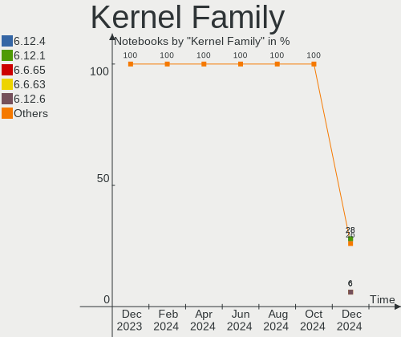
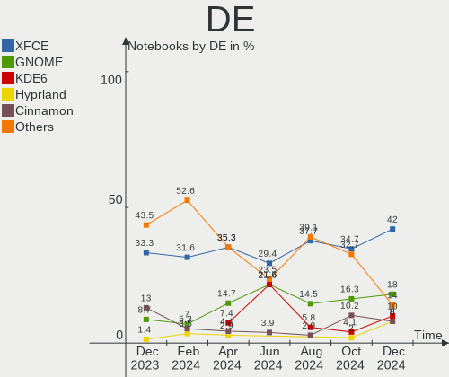
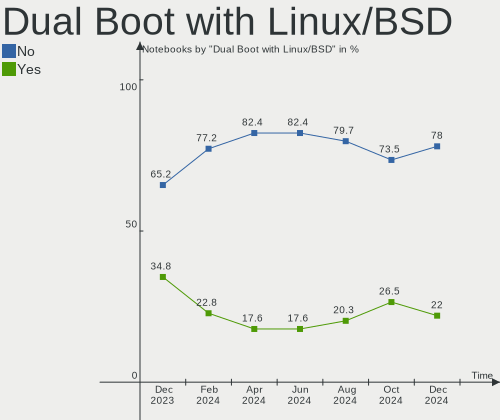
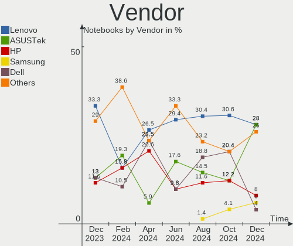
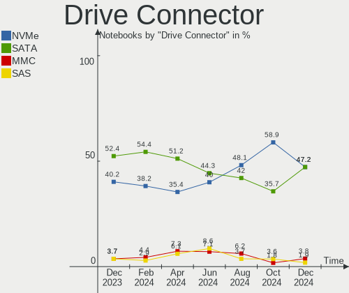
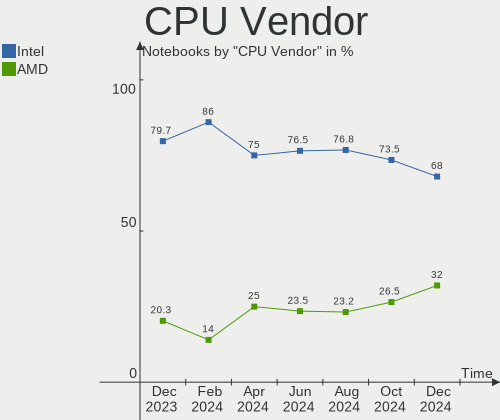
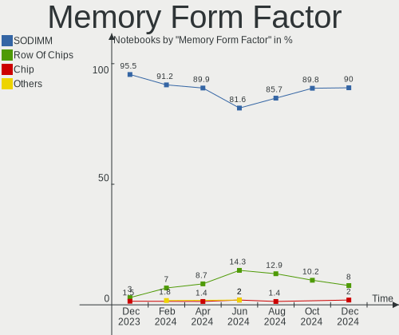
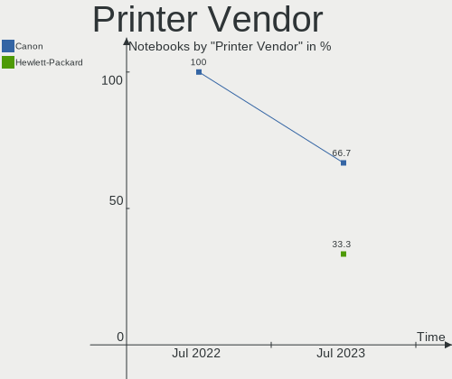
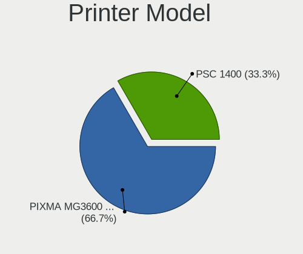
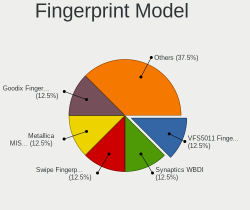

ArcoLinux - Hardware Trends (Notebooks)
---------------------------------------

A project to identify most popular hardware characteristics and track their change
over time based on data collected by Linux users at https://Linux-Hardware.org.

Anyone can contribute to this report by the [hw-probe](https://github.com/linuxhw/hw-probe) tool:

    sudo -E hw-probe -all -upload

This report is for one last month. Overall report since the beginning of time: [TestDays](https://github.com/linuxhw/TestDays)

Period: Jul, 2023.

Contents
--------

* [ System ](#system)
  - [ OS                       ](#os)
  - [ OS Family                ](#os-family)
  - [ Kernel                   ](#kernel)
  - [ Kernel Family            ](#kernel-family)
  - [ Kernel Major Ver.        ](#kernel-major-ver)
  - [ Arch                     ](#arch)
  - [ DE                       ](#de)
  - [ Display Server           ](#display-server)
  - [ Display Manager          ](#display-manager)
  - [ OS Lang                  ](#os-lang)
  - [ Boot Mode                ](#boot-mode)
  - [ Filesystem               ](#filesystem)
  - [ Part. scheme             ](#part-scheme)
  - [ Dual Boot with Linux/BSD ](#dual-boot-with-linuxbsd)
  - [ Dual Boot (Win)          ](#dual-boot-win)

* [ Board ](#board)
  - [ Vendor                   ](#vendor)
  - [ Model                    ](#model)
  - [ Model Family             ](#model-family)
  - [ MFG Year                 ](#mfg-year)
  - [ Form Factor              ](#form-factor)
  - [ Secure Boot              ](#secure-boot)
  - [ Coreboot                 ](#coreboot)
  - [ RAM Size                 ](#ram-size)
  - [ RAM Used                 ](#ram-used)
  - [ Total Drives             ](#total-drives)
  - [ Has CD-ROM               ](#has-cd-rom)
  - [ Has Ethernet             ](#has-ethernet)
  - [ Has WiFi                 ](#has-wifi)
  - [ Has Bluetooth            ](#has-bluetooth)

* [ Location ](#location)
  - [ Country                  ](#country)
  - [ City                     ](#city)

* [ Drives ](#drives)
  - [ Drive Vendor             ](#drive-vendor)
  - [ Drive Model              ](#drive-model)
  - [ HDD Vendor               ](#hdd-vendor)
  - [ SSD Vendor               ](#ssd-vendor)
  - [ Drive Kind               ](#drive-kind)
  - [ Drive Connector          ](#drive-connector)
  - [ Drive Size               ](#drive-size)
  - [ Space Total              ](#space-total)
  - [ Space Used               ](#space-used)
  - [ Malfunc. Drives          ](#malfunc-drives)
  - [ Malfunc. Drive Vendor    ](#malfunc-drive-vendor)
  - [ Malfunc. HDD Vendor      ](#malfunc-hdd-vendor)
  - [ Malfunc. Drive Kind      ](#malfunc-drive-kind)
  - [ Failed Drives            ](#failed-drives)
  - [ Failed Drive Vendor      ](#failed-drive-vendor)
  - [ Drive Status             ](#drive-status)

* [ Storage controller ](#storage-controller)
  - [ Storage Vendor           ](#storage-vendor)
  - [ Storage Model            ](#storage-model)
  - [ Storage Kind             ](#storage-kind)

* [ Processor ](#processor)
  - [ CPU Vendor               ](#cpu-vendor)
  - [ CPU Model                ](#cpu-model)
  - [ CPU Model Family         ](#cpu-model-family)
  - [ CPU Cores                ](#cpu-cores)
  - [ CPU Sockets              ](#cpu-sockets)
  - [ CPU Threads              ](#cpu-threads)
  - [ CPU Op-Modes             ](#cpu-op-modes)
  - [ CPU Microcode            ](#cpu-microcode)
  - [ CPU Microarch            ](#cpu-microarch)

* [ Graphics ](#graphics)
  - [ GPU Vendor               ](#gpu-vendor)
  - [ GPU Model                ](#gpu-model)
  - [ GPU Combo                ](#gpu-combo)
  - [ GPU Driver               ](#gpu-driver)
  - [ GPU Memory               ](#gpu-memory)

* [ Monitor ](#monitor)
  - [ Monitor Vendor           ](#monitor-vendor)
  - [ Monitor Model            ](#monitor-model)
  - [ Monitor Resolution       ](#monitor-resolution)
  - [ Monitor Diagonal         ](#monitor-diagonal)
  - [ Monitor Width            ](#monitor-width)
  - [ Aspect Ratio             ](#aspect-ratio)
  - [ Monitor Area             ](#monitor-area)
  - [ Pixel Density            ](#pixel-density)
  - [ Multiple Monitors        ](#multiple-monitors)

* [ Network ](#network)
  - [ Net Controller Vendor    ](#net-controller-vendor)
  - [ Net Controller Model     ](#net-controller-model)
  - [ Wireless Vendor          ](#wireless-vendor)
  - [ Wireless Model           ](#wireless-model)
  - [ Ethernet Vendor          ](#ethernet-vendor)
  - [ Ethernet Model           ](#ethernet-model)
  - [ Net Controller Kind      ](#net-controller-kind)
  - [ Used Controller          ](#used-controller)
  - [ NICs                     ](#nics)
  - [ IPv6                     ](#ipv6)

* [ Bluetooth ](#bluetooth)
  - [ Bluetooth Vendor         ](#bluetooth-vendor)
  - [ Bluetooth Model          ](#bluetooth-model)

* [ Sound ](#sound)
  - [ Sound Vendor             ](#sound-vendor)
  - [ Sound Model              ](#sound-model)

* [ Memory ](#memory)
  - [ Memory Vendor            ](#memory-vendor)
  - [ Memory Model             ](#memory-model)
  - [ Memory Kind              ](#memory-kind)
  - [ Memory Form Factor       ](#memory-form-factor)
  - [ Memory Size              ](#memory-size)
  - [ Memory Speed             ](#memory-speed)

* [ Printers & scanners ](#printers--scanners)
  - [ Printer Vendor           ](#printer-vendor)
  - [ Printer Model            ](#printer-model)
  - [ Scanner Vendor           ](#scanner-vendor)
  - [ Scanner Model            ](#scanner-model)

* [ Camera ](#camera)
  - [ Camera Vendor            ](#camera-vendor)
  - [ Camera Model             ](#camera-model)

* [ Security ](#security)
  - [ Fingerprint Vendor       ](#fingerprint-vendor)
  - [ Fingerprint Model        ](#fingerprint-model)
  - [ Chipcard Vendor          ](#chipcard-vendor)
  - [ Chipcard Model           ](#chipcard-model)

* [ Unsupported ](#unsupported)
  - [ Unsupported Devices      ](#unsupported-devices)
  - [ Unsupported Device Types ](#unsupported-device-types)

System
------

OS
--

Installed operating systems

| Name              | Notebooks | Percent |
|-------------------|-----------|---------|
| ArcoLinux Rolling | 58        | 96.67%  |
| ArcoLinux         | 2         | 3.33%   |

OS Family
---------

OS without a version

| Name      | Notebooks | Percent |
|-----------|-----------|---------|
| ArcoLinux | 60        | 100%    |

Kernel
------

Version of the Linux kernel

| Version                        | Notebooks | Percent |
|--------------------------------|-----------|---------|
| 6.4.3-arch1-1                  | 9         | 15%     |
| 6.3.9-arch1-1                  | 5         | 8.33%   |
| 6.1.39-1-lts                   | 5         | 8.33%   |
| 6.4.6-arch1-1                  | 3         | 5%      |
| 6.4.3-arch1-2                  | 3         | 5%      |
| 6.4.2-arch1-1                  | 3         | 5%      |
| 6.4.7-arch1-1                  | 2         | 3.33%   |
| 6.4.3-zen1-1-zen               | 2         | 3.33%   |
| 6.4.2-x64v2-xanmod1-3          | 2         | 3.33%   |
| 6.4.1-zen2-1-zen               | 2         | 3.33%   |
| 6.4.1-arch1-1                  | 2         | 3.33%   |
| 6.3.8-zen1-1-zen               | 2         | 3.33%   |
| 6.3.3-arch1-1                  | 2         | 3.33%   |
| 6.1.38-1-lts                   | 2         | 3.33%   |
| 6.1.33-x64v2-rt11-xanmod1-1-rt | 2         | 3.33%   |
| 6.4.6-zen1-1-zen               | 1         | 1.67%   |
| 6.4.5-arch1-1                  | 1         | 1.67%   |
| 6.4.4-zen1-1-zen               | 1         | 1.67%   |
| 6.4.4-arch1-1                  | 1         | 1.67%   |
| 6.4.2-zen1-1-zen               | 1         | 1.67%   |
| 6.4.2-273-tkg-pds              | 1         | 1.67%   |
| 6.4.1-arch2-1                  | 1         | 1.67%   |
| 6.3.8-x64v1-xanmod1-1          | 1         | 1.67%   |
| 6.3.8-arch1-1                  | 1         | 1.67%   |
| 6.3.5-zen1-1-zen               | 1         | 1.67%   |
| 6.3.5-arch1-1                  | 1         | 1.67%   |
| 6.3.3.15.realtime2-1-rt        | 1         | 1.67%   |
| 6.2.11-arch1-1                 | 1         | 1.67%   |
| 6.1.38-2-lts                   | 1         | 1.67%   |

Kernel Family
-------------

Linux kernel without a distro release

| Version  | Notebooks | Percent |
|----------|-----------|---------|
| 6.4.3    | 14        | 23.33%  |
| 6.4.2    | 7         | 11.67%  |
| 6.4.1    | 5         | 8.33%   |
| 6.3.9    | 5         | 8.33%   |
| 6.1.39   | 5         | 8.33%   |
| 6.4.6    | 4         | 6.67%   |
| 6.3.8    | 4         | 6.67%   |
| 6.1.38   | 3         | 5%      |
| 6.4.7    | 2         | 3.33%   |
| 6.4.4    | 2         | 3.33%   |
| 6.3.5    | 2         | 3.33%   |
| 6.3.3    | 2         | 3.33%   |
| 6.1.33   | 2         | 3.33%   |
| 6.4.5    | 1         | 1.67%   |
| 6.3.3.15 | 1         | 1.67%   |
| 6.2.11   | 1         | 1.67%   |

Kernel Major Ver.
-----------------

Linux kernel major version

| Version | Notebooks | Percent |
|---------|-----------|---------|
| 6.4     | 35        | 58.33%  |
| 6.3     | 13        | 21.67%  |
| 6.1     | 10        | 16.67%  |
| 6.3.3   | 1         | 1.67%   |
| 6.2     | 1         | 1.67%   |

Arch
----

OS architecture (x86_64, i586, etc.)

| Name   | Notebooks | Percent |
|--------|-----------|---------|
| x86_64 | 60        | 100%    |

DE
--

Desktop Environment

| Name     | Notebooks | Percent |
|----------|-----------|---------|
| XFCE     | 22        | 36.67%  |
| KDE5     | 14        | 23.33%  |
| Cinnamon | 7         | 11.67%  |
| i3       | 4         | 6.67%   |
| GNOME    | 4         | 6.67%   |
| river    | 1         | 1.67%   |
| qtile    | 1         | 1.67%   |
| MATE     | 1         | 1.67%   |
| LXQt     | 1         | 1.67%   |
| Hyprland | 1         | 1.67%   |
| Deepin   | 1         | 1.67%   |
| Budgie   | 1         | 1.67%   |
| bspwm    | 1         | 1.67%   |
| awesome  | 1         | 1.67%   |

Display Server
--------------

X11 or Wayland

| Name    | Notebooks | Percent |
|---------|-----------|---------|
| X11     | 48        | 80%     |
| Wayland | 8         | 13.33%  |
| Unknown | 4         | 6.67%   |

Display Manager
---------------

SDDM, LightDM, etc.

| Name    | Notebooks | Percent |
|---------|-----------|---------|
| SDDM    | 38        | 63.33%  |
| LightDM | 16        | 26.67%  |
| GDM     | 3         | 5%      |
| Unknown | 2         | 3.33%   |
| Ly      | 1         | 1.67%   |

OS Lang
-------

Language

| Lang  | Notebooks | Percent |
|-------|-----------|---------|
| en_US | 33        | 55%     |
| en_GB | 5         | 8.33%   |
| pt_BR | 4         | 6.67%   |
| it_IT | 2         | 3.33%   |
| es_ES | 2         | 3.33%   |
| en_PH | 2         | 3.33%   |
| de_DE | 2         | 3.33%   |
| zh_CN | 1         | 1.67%   |
| uk_UA | 1         | 1.67%   |
| ja_JP | 1         | 1.67%   |
| hu_HU | 1         | 1.67%   |
| fr_FR | 1         | 1.67%   |
| es_MX | 1         | 1.67%   |
| en_IN | 1         | 1.67%   |
| en_HK | 1         | 1.67%   |
| en_AU | 1         | 1.67%   |
| C     | 1         | 1.67%   |

Boot Mode
---------

EFI or BIOS

| Mode | Notebooks | Percent |
|------|-----------|---------|
| EFI  | 44        | 73.33%  |
| BIOS | 16        | 26.67%  |

Filesystem
----------

Type of filesystem

| Type    | Notebooks | Percent |
|---------|-----------|---------|
| Ext4    | 44        | 73.33%  |
| Btrfs   | 15        | 25%     |
| Overlay | 1         | 1.67%   |

Part. scheme
------------

Scheme of partitioning

| Type    | Notebooks | Percent |
|---------|-----------|---------|
| GPT     | 49        | 81.67%  |
| MBR     | 9         | 15%     |
| Unknown | 2         | 3.33%   |

Dual Boot with Linux/BSD
------------------------

Hosting more than one Linux/BSD

| Dual boot | Notebooks | Percent |
|-----------|-----------|---------|
| No        | 46        | 76.67%  |
| Yes       | 14        | 23.33%  |

Dual Boot (Win)
---------------

Hosting Linux and Windows

| Dual boot | Notebooks | Percent |
|-----------|-----------|---------|
| No        | 42        | 70%     |
| Yes       | 18        | 30%     |

Board
-----

Vendor
------

Motherboard manufacturer

| Name                | Notebooks | Percent |
|---------------------|-----------|---------|
| Lenovo              | 16        | 26.67%  |
| Dell                | 14        | 23.33%  |
| Hewlett-Packard     | 8         | 13.33%  |
| ASUSTek Computer    | 7         | 11.67%  |
| Apple               | 3         | 5%      |
| Google              | 2         | 3.33%   |
| Unknown             | 2         | 3.33%   |
| Toshiba             | 1         | 1.67%   |
| Samsung Electronics | 1         | 1.67%   |
| Notebook            | 1         | 1.67%   |
| MSI                 | 1         | 1.67%   |
| HUAWEI              | 1         | 1.67%   |
| Fujitsu             | 1         | 1.67%   |
| Chuwi               | 1         | 1.67%   |
| Acer                | 1         | 1.67%   |

Model
-----

Motherboard model

| Name                                     | Notebooks | Percent |
|------------------------------------------|-----------|---------|
| HP Folio 13                              | 2         | 3.33%   |
| Unknown                                  | 2         | 3.33%   |
| Toshiba Satellite Pro C50-A-1E6          | 1         | 1.67%   |
| Samsung 535U3C                           | 1         | 1.67%   |
| Notebook N141CU                          | 1         | 1.67%   |
| MSI Alpha 15 B5EEK                       | 1         | 1.67%   |
| Lenovo ThinkPad X280 20KES73S06          | 1         | 1.67%   |
| Lenovo ThinkPad X230 232578G             | 1         | 1.67%   |
| Lenovo ThinkPad X1 Carbon 4th 20FCS14X04 | 1         | 1.67%   |
| Lenovo ThinkPad T480 20L5000BGE          | 1         | 1.67%   |
| Lenovo ThinkPad T430 2349IF8             | 1         | 1.67%   |
| Lenovo ThinkPad T14 Gen 3 21AHCTO1WW     | 1         | 1.67%   |
| Lenovo ThinkBook 15 G4 IAP 21DJ          | 1         | 1.67%   |
| Lenovo ThinkBook 15 G3 ACL 21A4          | 1         | 1.67%   |
| Lenovo Slim 7 16IAH7 82VB                | 1         | 1.67%   |
| Lenovo Legion R9000X 2021 82HN           | 1         | 1.67%   |
| Lenovo IdeaPad Y700-17ISK 80Q0           | 1         | 1.67%   |
| Lenovo IdeaPad 5 Pro 14ACN6 82L7         | 1         | 1.67%   |
| Lenovo IdeaPad 3 15ITL05 81X8            | 1         | 1.67%   |
| Lenovo IdeaPad 3 15ADA05 81W1            | 1         | 1.67%   |
| Lenovo IdeaPad 3 14ALC6 82KT             | 1         | 1.67%   |
| Lenovo G580 20150                        | 1         | 1.67%   |
| HUAWEI HLYL-WXX9                         | 1         | 1.67%   |
| HP Pavilion Sleekbook 14 PC              | 1         | 1.67%   |
| HP Pavilion Laptop 15-cw0xxx             | 1         | 1.67%   |
| HP Pavilion Laptop 14-bf0xx              | 1         | 1.67%   |
| HP Laptop 15-fc0xxx                      | 1         | 1.67%   |
| HP Laptop 15-bw0xx                       | 1         | 1.67%   |
| HP G62                                   | 1         | 1.67%   |
| Google Kip                               | 1         | 1.67%   |
| Google Dragonair                         | 1         | 1.67%   |
| Fujitsu LIFEBOOK T902                    | 1         | 1.67%   |
| Dell Latitude E7440                      | 1         | 1.67%   |
| Dell Latitude E6230                      | 1         | 1.67%   |
| Dell Latitude 5580                       | 1         | 1.67%   |
| Dell Latitude 5480                       | 1         | 1.67%   |
| Dell Latitude 5410                       | 1         | 1.67%   |
| Dell Latitude 3380                       | 1         | 1.67%   |
| Dell Inspiron 7573                       | 1         | 1.67%   |
| Dell Inspiron 5765                       | 1         | 1.67%   |

Model Family
------------

Motherboard model prefix

| Name              | Notebooks | Percent |
|-------------------|-----------|---------|
| Lenovo ThinkPad   | 6         | 10%     |
| Dell Latitude     | 6         | 10%     |
| Lenovo IdeaPad    | 5         | 8.33%   |
| Dell Inspiron     | 5         | 8.33%   |
| HP Pavilion       | 3         | 5%      |
| Lenovo ThinkBook  | 2         | 3.33%   |
| HP Laptop         | 2         | 3.33%   |
| HP Folio          | 2         | 3.33%   |
| Dell G3           | 2         | 3.33%   |
| ASUS VivoBook     | 2         | 3.33%   |
| Unknown           | 2         | 3.33%   |
| Toshiba Satellite | 1         | 1.67%   |
| Samsung 535U3C    | 1         | 1.67%   |
| Notebook N141CU   | 1         | 1.67%   |
| MSI Alpha         | 1         | 1.67%   |
| Lenovo Slim       | 1         | 1.67%   |
| Lenovo Legion     | 1         | 1.67%   |
| Lenovo G580       | 1         | 1.67%   |
| HUAWEI HLYL-WXX9  | 1         | 1.67%   |
| HP G62            | 1         | 1.67%   |
| Google Kip        | 1         | 1.67%   |
| Google Dragonair  | 1         | 1.67%   |
| Fujitsu LIFEBOOK  | 1         | 1.67%   |
| Dell G15          | 1         | 1.67%   |
| Chuwi GemiBook    | 1         | 1.67%   |
| ASUS Zephyrus     | 1         | 1.67%   |
| ASUS Zenbook      | 1         | 1.67%   |
| ASUS ProArt       | 1         | 1.67%   |
| ASUS N61Jv        | 1         | 1.67%   |
| ASUS ASUS         | 1         | 1.67%   |
| Apple MacBookPro9 | 1         | 1.67%   |
| Apple MacBookAir6 | 1         | 1.67%   |
| Apple MacBookAir1 | 1         | 1.67%   |
| Acer Aspire       | 1         | 1.67%   |

MFG Year
--------

Motherboard manufacture year

| Year | Notebooks | Percent |
|------|-----------|---------|
| 2022 | 9         | 15%     |
| 2012 | 9         | 15%     |
| 2021 | 8         | 13.33%  |
| 2018 | 8         | 13.33%  |
| 2017 | 7         | 11.67%  |
| 2020 | 5         | 8.33%   |
| 2013 | 3         | 5%      |
| 2023 | 2         | 3.33%   |
| 2015 | 2         | 3.33%   |
| 2011 | 2         | 3.33%   |
| 2010 | 2         | 3.33%   |
| 2019 | 1         | 1.67%   |
| 2016 | 1         | 1.67%   |
| 2008 | 1         | 1.67%   |

Form Factor
-----------

Physical design of the computer

| Name     | Notebooks | Percent |
|----------|-----------|---------|
| Notebook | 60        | 100%    |

Secure Boot
-----------

Enabled or disabled

| State    | Notebooks | Percent |
|----------|-----------|---------|
| Disabled | 60        | 100%    |

Coreboot
--------

Have coreboot on board

| Used | Notebooks | Percent |
|------|-----------|---------|
| No   | 58        | 96.67%  |
| Yes  | 2         | 3.33%   |

RAM Size
--------

Total RAM memory

| Size in GB  | Notebooks | Percent |
|-------------|-----------|---------|
| 4.01-8.0    | 21        | 35%     |
| 16.01-24.0  | 14        | 23.33%  |
| 32.01-64.0  | 8         | 13.33%  |
| 3.01-4.0    | 8         | 13.33%  |
| 8.01-16.0   | 7         | 11.67%  |
| 64.01-256.0 | 1         | 1.67%   |
| 1.01-2.0    | 1         | 1.67%   |

RAM Used
--------

Used RAM memory

| Used GB    | Notebooks | Percent |
|------------|-----------|---------|
| 1.01-2.0   | 22        | 36.67%  |
| 2.01-3.0   | 17        | 28.33%  |
| 3.01-4.0   | 10        | 16.67%  |
| 4.01-8.0   | 7         | 11.67%  |
| 8.01-16.0  | 2         | 3.33%   |
| 16.01-24.0 | 1         | 1.67%   |
| 0.51-1.0   | 1         | 1.67%   |

Total Drives
------------

Number of drives on board

| Drives | Notebooks | Percent |
|--------|-----------|---------|
| 1      | 39        | 65%     |
| 2      | 18        | 30%     |
| 3      | 2         | 3.33%   |
| 4      | 1         | 1.67%   |

Has CD-ROM
----------

Has CD-ROM on board

| Presented | Notebooks | Percent |
|-----------|-----------|---------|
| No        | 54        | 90%     |
| Yes       | 6         | 10%     |

Has Ethernet
------------

Has Ethernet on board

| Presented | Notebooks | Percent |
|-----------|-----------|---------|
| Yes       | 47        | 78.33%  |
| No        | 13        | 21.67%  |

Has WiFi
--------

Has WiFi module

| Presented | Notebooks | Percent |
|-----------|-----------|---------|
| Yes       | 59        | 98.33%  |
| No        | 1         | 1.67%   |

Has Bluetooth
-------------

Has Bluetooth module

| Presented | Notebooks | Percent |
|-----------|-----------|---------|
| Yes       | 54        | 90%     |
| No        | 6         | 10%     |

Location
--------

Country
-------

Geographic location (country)

| Country     | Notebooks | Percent |
|-------------|-----------|---------|
| USA         | 13        | 21.67%  |
| Brazil      | 5         | 8.33%   |
| Spain       | 4         | 6.67%   |
| Germany     | 4         | 6.67%   |
| Philippines | 3         | 5%      |
| Mexico      | 3         | 5%      |
| Italy       | 3         | 5%      |
| Sweden      | 2         | 3.33%   |
| Iraq        | 2         | 3.33%   |
| Hong Kong   | 2         | 3.33%   |
| Czechia     | 2         | 3.33%   |
| Australia   | 2         | 3.33%   |
| Vietnam     | 1         | 1.67%   |
| UK          | 1         | 1.67%   |
| Uganda      | 1         | 1.67%   |
| Turkey      | 1         | 1.67%   |
| Kuwait      | 1         | 1.67%   |
| Japan       | 1         | 1.67%   |
| Iran        | 1         | 1.67%   |
| Indonesia   | 1         | 1.67%   |
| India       | 1         | 1.67%   |
| Hungary     | 1         | 1.67%   |
| France      | 1         | 1.67%   |
| Canada      | 1         | 1.67%   |
| Bulgaria    | 1         | 1.67%   |
| Belgium     | 1         | 1.67%   |
| Argentina   | 1         | 1.67%   |

City
----

Geographic location (city)

| City                        | Notebooks | Percent |
|-----------------------------|-----------|---------|
| Rio de Janeiro              | 2         | 3.33%   |
| Prague                      | 2         | 3.33%   |
| Berlin                      | 2         | 3.33%   |
| Amarillo                    | 2         | 3.33%   |
| Yokohama                    | 1         | 1.67%   |
| Tsuen Wan                   | 1         | 1.67%   |
| Townsville                  | 1         | 1.67%   |
| Toronto                     | 1         | 1.67%   |
| Toeroekbalint               | 1         | 1.67%   |
| Tlaxcala City               | 1         | 1.67%   |
| Teresopolis                 | 1         | 1.67%   |
| Tehran                      | 1         | 1.67%   |
| Spanga                      | 1         | 1.67%   |
| Sorrento                    | 1         | 1.67%   |
| Simi Valley                 | 1         | 1.67%   |
| San Sebastián de los Reyes | 1         | 1.67%   |
| Reggio Calabria             | 1         | 1.67%   |
| Presidente Prudente         | 1         | 1.67%   |
| Portland                    | 1         | 1.67%   |
| Plovdiv                     | 1         | 1.67%   |
| Paris                       | 1         | 1.67%   |
| Ormond Beach                | 1         | 1.67%   |
| New York                    | 1         | 1.67%   |
| Mosul                       | 1         | 1.67%   |
| Mexico City                 | 1         | 1.67%   |
| Mendoza                     | 1         | 1.67%   |
| Melbourne                   | 1         | 1.67%   |
| Marl                        | 1         | 1.67%   |
| Manises                     | 1         | 1.67%   |
| Manila                      | 1         | 1.67%   |
| Malmo                       | 1         | 1.67%   |
| Makati City                 | 1         | 1.67%   |
| Madrid                      | 1         | 1.67%   |
| Liège                      | 1         | 1.67%   |
| Leipzig                     | 1         | 1.67%   |
| Legazpi                     | 1         | 1.67%   |
| Kuwait City                 | 1         | 1.67%   |
| Kingston upon Thames        | 1         | 1.67%   |
| Kampala                     | 1         | 1.67%   |
| Jacksonville                | 1         | 1.67%   |

Drives
------

Drive Vendor
------------

Hard drive vendors

| Vendor                      | Notebooks | Drives | Percent |
|-----------------------------|-----------|--------|---------|
| Samsung Electronics         | 24        | 26     | 29.63%  |
| WDC                         | 7         | 8      | 8.64%   |
| Intel                       | 6         | 6      | 7.41%   |
| Unknown                     | 4         | 5      | 4.94%   |
| Toshiba                     | 4         | 4      | 4.94%   |
| Seagate                     | 4         | 4      | 4.94%   |
| SanDisk                     | 4         | 4      | 4.94%   |
| Kingston                    | 4         | 4      | 4.94%   |
| Micron Technology           | 3         | 3      | 3.7%    |
| Apple                       | 3         | 3      | 3.7%    |
| Crucial                     | 2         | 2      | 2.47%   |
| Zheino                      | 1         | 1      | 1.23%   |
| Yangtze Memory Technologies | 1         | 1      | 1.23%   |
| Yangtze Memory              | 1         | 1      | 1.23%   |
| Verbatim                    | 1         | 1      | 1.23%   |
| TO Exter                    | 1         | 1      | 1.23%   |
| SK hynix                    | 1         | 1      | 1.23%   |
| ShiJi                       | 1         | 1      | 1.23%   |
| Realtek Semiconductor       | 1         | 1      | 1.23%   |
| Phison Electronics          | 1         | 1      | 1.23%   |
| MAXIO Technology (Hangzhou) | 1         | 1      | 1.23%   |
| LITEONIT                    | 1         | 1      | 1.23%   |
| Kingston Technology Company | 1         | 1      | 1.23%   |
| JMicron Technology          | 1         | 1      | 1.23%   |
| Intenso                     | 1         | 1      | 1.23%   |
| China                       | 1         | 1      | 1.23%   |
| Unknown                     | 1         | 1      | 1.23%   |

Drive Model
-----------

Hard drive models

| Model                                               | Notebooks | Percent |
|-----------------------------------------------------|-----------|---------|
| Samsung NVMe SSD Controller SM981/PM981/PM983 500GB | 6         | 7.14%   |
| Samsung MZALQ512HBLU-00BL2 512GB                    | 3         | 3.57%   |
| Samsung MZMPC128HBFU-000H1 128GB SSD                | 2         | 2.38%   |
| Samsung M3 Portable 1TB                             | 2         | 2.38%   |
| Micron 2210_MTFDHBA512QFD 512GB                     | 2         | 2.38%   |
| Intel SSDPEKNU512GZ 512GB                           | 2         | 2.38%   |
| Intel SSD Pro 7600p/760p/E 6100p Series 1TB         | 2         | 2.38%   |
| Zheino CHN mSATAM3 256 256GB SSD                    | 1         | 1.19%   |
| Yangtze Memory ZHITAI PC005 Active 1TB              | 1         | 1.19%   |
| Yangtze Memory ZHITAI TiPlus5000 2TB                | 1         | 1.19%   |
| WDC WDS500G2B0B-00YS70 500GB SSD                    | 1         | 1.19%   |
| WDC WDS240G2G0B-00EPW0 240GB SSD                    | 1         | 1.19%   |
| WDC WDS100T2G0A-00JH30 1TB SSD                      | 1         | 1.19%   |
| WDC WD5000LPLX-75ZNTT0 500GB                        | 1         | 1.19%   |
| WDC WD5000BEVT-16ZAT0 500GB                         | 1         | 1.19%   |
| WDC WD3200BPVT-22JJ5T0 320GB                        | 1         | 1.19%   |
| WDC WD10SPZX-60Z10T0 1TB                            | 1         | 1.19%   |
| WDC WD10SPCX-24HWST1 1TB                            | 1         | 1.19%   |
| Verbatim Vi560 SATA III M.2 SSD 512GB               | 1         | 1.19%   |
| Unknown NVMe SSD Drive 1TB                          | 1         | 1.19%   |
| Unknown MMC Card  64GB                              | 1         | 1.19%   |
| Unknown MMC Card  32GB                              | 1         | 1.19%   |
| Unknown MMC Card  128GB                             | 1         | 1.19%   |
| Toshiba NVMe Controller 128GB                       | 1         | 1.19%   |
| Toshiba MQ01ABD100 1TB                              | 1         | 1.19%   |
| Toshiba KSG60ZMV512G M.2 2280 512GB SSD             | 1         | 1.19%   |
| Toshiba KSG60ZMV256G M.2 2280 256GB SSD             | 1         | 1.19%   |
| TO Exter nal USB 3.0 1TB                            | 1         | 1.19%   |
| SK hynix SKHynix_HFM128GD3HX015N 128GB              | 1         | 1.19%   |
| ShiJi SSD 1TB                                       | 1         | 1.19%   |
| Seagate ST500LM012 HN-M500MBB 500GB                 | 1         | 1.19%   |
| Seagate ST2000LM003 HN-M201RAD 2TB                  | 1         | 1.19%   |
| Seagate ST1000LM048-2E7172 1TB                      | 1         | 1.19%   |
| Seagate ST1000LM035-1RK172 1TB                      | 1         | 1.19%   |
| Sandisk WD PC SN740 SDDPNQD-512G-1006 512GB         | 1         | 1.19%   |
| Sandisk WD Black 2018/SN750 / PC SN720 NVMe SSD 1TB | 1         | 1.19%   |
| SanDisk SDSSDH3 500G                                | 1         | 1.19%   |
| SanDisk SDSSDA120G 120GB                            | 1         | 1.19%   |
| Samsung SSD PM830 FDE 2. 256GB                      | 1         | 1.19%   |
| Samsung SSD 870 EVO 500GB                           | 1         | 1.19%   |

HDD Vendor
----------

Hard disk drive vendors

| Vendor              | Notebooks | Drives | Percent |
|---------------------|-----------|--------|---------|
| WDC                 | 5         | 5      | 35.71%  |
| Seagate             | 4         | 4      | 28.57%  |
| Samsung Electronics | 2         | 2      | 14.29%  |
| Apple               | 2         | 2      | 14.29%  |
| Toshiba             | 1         | 1      | 7.14%   |

SSD Vendor
----------

Solid state drive vendors

| Vendor              | Notebooks | Drives | Percent |
|---------------------|-----------|--------|---------|
| Samsung Electronics | 10        | 10     | 30.3%   |
| WDC                 | 3         | 3      | 9.09%   |
| Kingston            | 3         | 3      | 9.09%   |
| Toshiba             | 2         | 2      | 6.06%   |
| SanDisk             | 2         | 2      | 6.06%   |
| Intel               | 2         | 2      | 6.06%   |
| Crucial             | 2         | 2      | 6.06%   |
| Zheino              | 1         | 1      | 3.03%   |
| Verbatim            | 1         | 1      | 3.03%   |
| TO Exter            | 1         | 1      | 3.03%   |
| ShiJi               | 1         | 1      | 3.03%   |
| LITEONIT            | 1         | 1      | 3.03%   |
| Intenso             | 1         | 1      | 3.03%   |
| China               | 1         | 1      | 3.03%   |
| Apple               | 1         | 1      | 3.03%   |
| Unknown             | 1         | 1      | 3.03%   |

Drive Kind
----------

HDD or SSD

| Kind    | Notebooks | Drives | Percent |
|---------|-----------|--------|---------|
| NVMe    | 29        | 33     | 39.73%  |
| SSD     | 27        | 33     | 36.99%  |
| HDD     | 13        | 14     | 17.81%  |
| MMC     | 3         | 4      | 4.11%   |
| Unknown | 1         | 1      | 1.37%   |

Drive Connector
---------------

SATA, SAS, NVMe, etc.

| Type | Notebooks | Drives | Percent |
|------|-----------|--------|---------|
| SATA | 34        | 42     | 47.89%  |
| NVMe | 29        | 33     | 40.85%  |
| SAS  | 5         | 6      | 7.04%   |
| MMC  | 3         | 4      | 4.23%   |

Drive Size
----------

Size of hard drive

| Size in TB | Notebooks | Drives | Percent |
|------------|-----------|--------|---------|
| 0.01-0.5   | 24        | 31     | 61.54%  |
| 0.51-1.0   | 13        | 14     | 33.33%  |
| 1.01-2.0   | 2         | 2      | 5.13%   |

Space Total
-----------

Amount of disk space available on the file system

| Size in GB     | Notebooks | Percent |
|----------------|-----------|---------|
| 251-500        | 18        | 30%     |
| 101-250        | 12        | 20%     |
| 1001-2000      | 9         | 15%     |
| 501-1000       | 8         | 13.33%  |
| Unknown        | 5         | 8.33%   |
| 21-50          | 2         | 3.33%   |
| 2001-3000      | 2         | 3.33%   |
| 1-20           | 2         | 3.33%   |
| More than 3000 | 1         | 1.67%   |
| 51-100         | 1         | 1.67%   |

Space Used
----------

Amount of used disk space

| Used GB   | Notebooks | Percent |
|-----------|-----------|---------|
| 101-250   | 16        | 26.67%  |
| 1-20      | 12        | 20%     |
| 251-500   | 8         | 13.33%  |
| 51-100    | 7         | 11.67%  |
| 501-1000  | 6         | 10%     |
| 21-50     | 5         | 8.33%   |
| Unknown   | 5         | 8.33%   |
| 1001-2000 | 1         | 1.67%   |

Malfunc. Drives
---------------

Drive models with a malfunction

| Model                                   | Notebooks | Drives | Percent |
|-----------------------------------------|-----------|--------|---------|
| WDC WD5000BEVT-16ZAT0 500GB             | 1         | 1      | 20%     |
| WDC WD3200BPVT-22JJ5T0 320GB            | 1         | 1      | 20%     |
| Toshiba KSG60ZMV256G M.2 2280 256GB SSD | 1         | 1      | 20%     |
| Intel SSDSC2BF180A4L 180GB              | 1         | 1      | 20%     |
| Unknown                                 | 1         | 1      | 20%     |

Malfunc. Drive Vendor
---------------------

Vendors of faulty drives

| Vendor  | Notebooks | Drives | Percent |
|---------|-----------|--------|---------|
| WDC     | 2         | 2      | 40%     |
| Toshiba | 1         | 1      | 20%     |
| Intel   | 1         | 1      | 20%     |
| Unknown | 1         | 1      | 20%     |

Malfunc. HDD Vendor
-------------------

Vendors of faulty HDD drives

| Vendor | Notebooks | Drives | Percent |
|--------|-----------|--------|---------|
| WDC    | 2         | 2      | 100%    |

Malfunc. Drive Kind
-------------------

Kinds of faulty drives

| Kind | Notebooks | Drives | Percent |
|------|-----------|--------|---------|
| SSD  | 3         | 3      | 60%     |
| HDD  | 2         | 2      | 40%     |

Failed Drives
-------------

Failed drive models

Zero info for selected period =(

Failed Drive Vendor
-------------------

Failed drive vendors

Zero info for selected period =(

Drive Status
------------

Number of failed and malfunc. drives

| Status   | Notebooks | Drives | Percent |
|----------|-----------|--------|---------|
| Works    | 52        | 70     | 81.25%  |
| Detected | 7         | 10     | 10.94%  |
| Malfunc  | 5         | 5      | 7.81%   |

Storage controller
------------------

Storage Vendor
--------------

Storage controller vendors

| Vendor                       | Notebooks | Percent |
|------------------------------|-----------|---------|
| Intel                        | 38        | 51.35%  |
| Samsung Electronics          | 14        | 18.92%  |
| AMD                          | 7         | 9.46%   |
| Micron Technology            | 3         | 4.05%   |
| SanDisk                      | 2         | 2.7%    |
| Kingston Technology Company  | 2         | 2.7%    |
| Yangtze Memory Technologies  | 1         | 1.35%   |
| Toshiba America Info Systems | 1         | 1.35%   |
| TenaFe                       | 1         | 1.35%   |
| SK hynix                     | 1         | 1.35%   |
| Realtek Semiconductor        | 1         | 1.35%   |
| Phison Electronics           | 1         | 1.35%   |
| MAXIO Technology (Hangzhou)  | 1         | 1.35%   |
| Marvell Technology Group     | 1         | 1.35%   |

Storage Model
-------------

Storage controller models

| Model                                                                         | Notebooks | Percent |
|-------------------------------------------------------------------------------|-----------|---------|
| Intel 7 Series Chipset Family 6-port SATA Controller [AHCI mode]              | 7         | 8.86%   |
| AMD FCH SATA Controller [AHCI mode]                                           | 7         | 8.86%   |
| Samsung NVMe SSD Controller SM981/PM981/PM983                                 | 6         | 7.59%   |
| Intel 82801 Mobile SATA Controller [RAID mode]                                | 6         | 7.59%   |
| Samsung NVMe SSD Controller 980                                               | 5         | 6.33%   |
| Intel Sunrise Point-LP SATA Controller [AHCI mode]                            | 4         | 5.06%   |
| Intel Tiger Lake-LP SATA Controller                                           | 3         | 3.8%    |
| Intel Comet Lake SATA AHCI Controller                                         | 3         | 3.8%    |
| Micron 2210 NVMe SSD [Cobain]                                                 | 2         | 2.53%   |
| Intel Volume Management Device NVMe RAID Controller                           | 2         | 2.53%   |
| Intel SSD DC P4101/Pro 7600p/760p/E 6100p Series                              | 2         | 2.53%   |
| Intel SSD 670p Series [Keystone Harbor]                                       | 2         | 2.53%   |
| Intel Cannon Lake Mobile PCH SATA AHCI Controller                             | 2         | 2.53%   |
| Intel 6 Series/C200 Series Chipset Family 6 port Mobile SATA AHCI Controller  | 2         | 2.53%   |
| Intel 5 Series/3400 Series Chipset 4 port SATA AHCI Controller                | 2         | 2.53%   |
| Yangtze Memory ZHITAI TiPro5000 NVMe SSD                                      | 1         | 1.27%   |
| Yangtze Memory ZHITAI PC005 NVMe SSD                                          | 1         | 1.27%   |
| Toshiba America Info Systems XG3 NVMe SSD Controller                          | 1         | 1.27%   |
| TenaFe TC2200/TC2201 NVMe Controller (DRAM-less)                              | 1         | 1.27%   |
| SK hynix Gold P31/BC711/PC711 NVMe Solid State Drive                          | 1         | 1.27%   |
| SanDisk WD Black SN770 / PC SN740 256GB / PC SN560 (DRAM-less) NVMe SSD       | 1         | 1.27%   |
| SanDisk WD Black 2018/SN750 / PC SN720 NVMe SSD                               | 1         | 1.27%   |
| Samsung NVMe SSD Controller SM961/PM961/SM963                                 | 1         | 1.27%   |
| Samsung NVMe SSD Controller SM951/PM951                                       | 1         | 1.27%   |
| Samsung NVMe SSD Controller PM9A1/PM9A3/980PRO                                | 1         | 1.27%   |
| Realtek RTS5765DL NVMe SSD Controller (DRAM-less)                             | 1         | 1.27%   |
| Phison E12 NVMe Controller                                                    | 1         | 1.27%   |
| Micron 2300 NVMe SSD [Santana]                                                | 1         | 1.27%   |
| MAXIO (Hangzhou) NVMe SSD Controller MAP1202                                  | 1         | 1.27%   |
| Marvell Group 88SS9183 PCIe SSD Controller                                    | 1         | 1.27%   |
| Kingston Company U-SNS8154P3 NVMe SSD                                         | 1         | 1.27%   |
| Kingston Company OM8PCP Design-In PCIe 3 NVMe SSD (DRAM-less)                 | 1         | 1.27%   |
| Intel Q170/Q150/B150/H170/H110/Z170/CM236 Chipset SATA Controller [AHCI Mode] | 1         | 1.27%   |
| Intel Jasper Lake SATA AHCI Controller                                        | 1         | 1.27%   |
| Intel HM170/QM170 Chipset SATA Controller [AHCI Mode]                         | 1         | 1.27%   |
| Intel Cannon Point-LP SATA Controller [AHCI Mode]                             | 1         | 1.27%   |
| Intel 82801HM/HEM (ICH8M/ICH8M-E) SATA Controller [AHCI mode]                 | 1         | 1.27%   |
| Intel 82801HM/HEM (ICH8M/ICH8M-E) IDE Controller                              | 1         | 1.27%   |
| Intel 400 Series Chipset Family SATA AHCI Controller                          | 1         | 1.27%   |

Storage Kind
------------

Kind of storage controller (IDE, SATA, NVMe, SAS, ...)

| Kind | Notebooks | Percent |
|------|-----------|---------|
| SATA | 37        | 49.33%  |
| NVMe | 29        | 38.67%  |
| RAID | 8         | 10.67%  |
| IDE  | 1         | 1.33%   |

Processor
---------

CPU Vendor
----------

Processor vendors

| Vendor | Notebooks | Percent |
|--------|-----------|---------|
| Intel  | 46        | 76.67%  |
| AMD    | 14        | 23.33%  |

CPU Model
---------

Processor models

| Model                                   | Notebooks | Percent |
|-----------------------------------------|-----------|---------|
| Intel Core i7-8750H CPU @ 2.20GHz       | 3         | 5%      |
| Intel Core i7-8550U CPU @ 1.80GHz       | 2         | 3.33%   |
| Intel Core i7-3520M CPU @ 2.90GHz       | 2         | 3.33%   |
| Intel Core i5-7200U CPU @ 2.50GHz       | 2         | 3.33%   |
| Intel Core i5-3320M CPU @ 2.60GHz       | 2         | 3.33%   |
| Intel Core i5-2467M CPU @ 1.60GHz       | 2         | 3.33%   |
| Intel 11th Gen Core i7-1165G7 @ 2.80GHz | 2         | 3.33%   |
| AMD Ryzen 5 5500U with Radeon Graphics  | 2         | 3.33%   |
| Intel Xeon E-2276M CPU @ 2.80GHz        | 1         | 1.67%   |
| Intel Pentium CPU B960 @ 2.20GHz        | 1         | 1.67%   |
| Intel Core i7-7820HQ CPU @ 2.90GHz      | 1         | 1.67%   |
| Intel Core i7-6700HQ CPU @ 2.60GHz      | 1         | 1.67%   |
| Intel Core i7-6600U CPU @ 2.60GHz       | 1         | 1.67%   |
| Intel Core i7-6500U CPU @ 2.50GHz       | 1         | 1.67%   |
| Intel Core i7-3610QM CPU @ 2.30GHz      | 1         | 1.67%   |
| Intel Core i7-10610U CPU @ 1.80GHz      | 1         | 1.67%   |
| Intel Core i7-10510U CPU @ 1.80GHz      | 1         | 1.67%   |
| Intel Core i5-7300U CPU @ 2.60GHz       | 1         | 1.67%   |
| Intel Core i5-7300HQ CPU @ 2.50GHz      | 1         | 1.67%   |
| Intel Core i5-4310U CPU @ 2.00GHz       | 1         | 1.67%   |
| Intel Core i5-4260U CPU @ 1.40GHz       | 1         | 1.67%   |
| Intel Core i5-3340M CPU @ 2.70GHz       | 1         | 1.67%   |
| Intel Core i5-3317U CPU @ 1.70GHz       | 1         | 1.67%   |
| Intel Core i5-10300H CPU @ 2.50GHz      | 1         | 1.67%   |
| Intel Core i5 CPU M 480 @ 2.67GHz       | 1         | 1.67%   |
| Intel Core i5 CPU M 450 @ 2.40GHz       | 1         | 1.67%   |
| Intel Core i3-7100U CPU @ 2.40GHz       | 1         | 1.67%   |
| Intel Core i3-10110U CPU @ 2.10GHz      | 1         | 1.67%   |
| Intel Core 2 Duo CPU P7700 @ 1.80GHz    | 1         | 1.67%   |
| Intel Celeron N5100 @ 1.10GHz           | 1         | 1.67%   |
| Intel Celeron CPU N2840 @ 2.16GHz       | 1         | 1.67%   |
| Intel Celeron CPU 4205U @ 1.80GHz       | 1         | 1.67%   |
| Intel Celeron CPU 1000M @ 1.80GHz       | 1         | 1.67%   |
| Intel 12th Gen Core i7-12700H           | 1         | 1.67%   |
| Intel 12th Gen Core i7-1260P            | 1         | 1.67%   |
| Intel 12th Gen Core i7-1255U            | 1         | 1.67%   |
| Intel 12th Gen Core i5-12500H           | 1         | 1.67%   |
| Intel 11th Gen Core i7-1185G7 @ 3.00GHz | 1         | 1.67%   |
| Intel 11th Gen Core i3-1115G4 @ 3.00GHz | 1         | 1.67%   |
| AMD Ryzen 7 5800H with Radeon Graphics  | 1         | 1.67%   |

CPU Model Family
----------------

Processor model prefix

| Model            | Notebooks | Percent |
|------------------|-----------|---------|
| Intel Core i5    | 15        | 25%     |
| Intel Core i7    | 14        | 23.33%  |
| Other            | 10        | 16.67%  |
| AMD Ryzen 5      | 7         | 11.67%  |
| Intel Celeron    | 4         | 6.67%   |
| Intel Core i3    | 2         | 3.33%   |
| AMD Ryzen 7      | 2         | 3.33%   |
| AMD Ryzen 3      | 2         | 3.33%   |
| Intel Xeon       | 1         | 1.67%   |
| Intel Pentium    | 1         | 1.67%   |
| Intel Core 2 Duo | 1         | 1.67%   |
| AMD A6           | 1         | 1.67%   |

CPU Cores
---------

Number of processor cores

| Number | Notebooks | Percent |
|--------|-----------|---------|
| 2      | 27        | 45%     |
| 4      | 16        | 26.67%  |
| 6      | 10        | 16.67%  |
| 12     | 2         | 3.33%   |
| 8      | 2         | 3.33%   |
| 14     | 1         | 1.67%   |
| 10     | 1         | 1.67%   |
| 1      | 1         | 1.67%   |

CPU Sockets
-----------

Number of sockets

| Number | Notebooks | Percent |
|--------|-----------|---------|
| 1      | 60        | 100%    |

CPU Threads
-----------

Threads per core (Hyper-Threading)

| Number | Notebooks | Percent |
|--------|-----------|---------|
| 2      | 50        | 83.33%  |
| 1      | 10        | 16.67%  |

CPU Op-Modes
------------

CPU Operation Modes (32-bit, 64-bit)

| Op mode        | Notebooks | Percent |
|----------------|-----------|---------|
| 32-bit, 64-bit | 60        | 100%    |

CPU Microcode
-------------

Microcode number

| Number     | Notebooks | Percent |
|------------|-----------|---------|
| Unknown    | 41        | 68.33%  |
| 0x0a50000c | 3         | 5%      |
| 0x08608103 | 2         | 3.33%   |
| 0x906ea    | 1         | 1.67%   |
| 0x806ea    | 1         | 1.67%   |
| 0x806c1    | 1         | 1.67%   |
| 0x6fb      | 1         | 1.67%   |
| 0x40651    | 1         | 1.67%   |
| 0x306a9    | 1         | 1.67%   |
| 0x0a50000d | 1         | 1.67%   |
| 0x08600106 | 1         | 1.67%   |
| 0x08600104 | 1         | 1.67%   |
| 0x08108109 | 1         | 1.67%   |
| 0x0810100b | 1         | 1.67%   |
| 0x06006705 | 1         | 1.67%   |
| 0x06006704 | 1         | 1.67%   |
| 0x0600110f | 1         | 1.67%   |

CPU Microarch
-------------

Microarchitecture

| Name             | Notebooks | Percent |
|------------------|-----------|---------|
| KabyLake         | 16        | 26.67%  |
| IvyBridge        | 8         | 13.33%  |
| Zen 3            | 4         | 6.67%   |
| TigerLake        | 4         | 6.67%   |
| Alderlake Hybrid | 4         | 6.67%   |
| Skylake          | 3         | 5%      |
| SandyBridge      | 3         | 5%      |
| Unknown          | 3         | 5%      |
| Zen 2            | 2         | 3.33%   |
| Westmere         | 2         | 3.33%   |
| Haswell          | 2         | 3.33%   |
| Excavator        | 2         | 3.33%   |
| Zen+             | 1         | 1.67%   |
| Zen              | 1         | 1.67%   |
| Tremont          | 1         | 1.67%   |
| Silvermont       | 1         | 1.67%   |
| Piledriver       | 1         | 1.67%   |
| Core             | 1         | 1.67%   |
| CometLake        | 1         | 1.67%   |

Graphics
--------

GPU Vendor
----------

Vendors of graphics cards

| Vendor | Notebooks | Percent |
|--------|-----------|---------|
| Intel  | 46        | 63.89%  |
| AMD    | 14        | 19.44%  |
| Nvidia | 12        | 16.67%  |

GPU Model
---------

Graphics card models

| Model                                                                         | Notebooks | Percent |
|-------------------------------------------------------------------------------|-----------|---------|
| Intel 3rd Gen Core processor Graphics Controller                              | 8         | 10.53%  |
| Intel HD Graphics 620                                                         | 4         | 5.26%   |
| Intel CoffeeLake-H GT2 [UHD Graphics 630]                                     | 4         | 5.26%   |
| Intel TigerLake-LP GT2 [Iris Xe Graphics]                                     | 3         | 3.95%   |
| Intel CometLake-U GT2 [UHD Graphics]                                          | 3         | 3.95%   |
| Intel Alder Lake-P Integrated Graphics Controller                             | 3         | 3.95%   |
| Intel 2nd Generation Core Processor Family Integrated Graphics Controller     | 3         | 3.95%   |
| AMD Cezanne [Radeon Vega Series / Radeon Vega Mobile Series]                  | 3         | 3.95%   |
| Nvidia GP107M [GeForce GTX 1050 Ti Mobile]                                    | 2         | 2.63%   |
| Nvidia GP106M [GeForce GTX 1060 Mobile]                                       | 2         | 2.63%   |
| Intel UHD Graphics 620                                                        | 2         | 2.63%   |
| Intel Skylake GT2 [HD Graphics 520]                                           | 2         | 2.63%   |
| Intel HD Graphics 630                                                         | 2         | 2.63%   |
| Intel Haswell-ULT Integrated Graphics Controller                              | 2         | 2.63%   |
| Intel Core Processor Integrated Graphics Controller                           | 2         | 2.63%   |
| AMD Sun XT [Radeon HD 8670A/8670M/8690M / R5 M330 / M430 / Radeon 520 Mobile] | 2         | 2.63%   |
| AMD Stoney [Radeon R2/R3/R4/R5 Graphics]                                      | 2         | 2.63%   |
| AMD Lucienne                                                                  | 2         | 2.63%   |
| Nvidia TU117M                                                                 | 1         | 1.32%   |
| Nvidia TU106M [GeForce RTX 2060 Max-Q]                                        | 1         | 1.32%   |
| Nvidia TU104GLM [Quadro RTX 5000 Mobile / Max-Q]                              | 1         | 1.32%   |
| Nvidia GT216M [GeForce GT 325M]                                               | 1         | 1.32%   |
| Nvidia GP108M [GeForce MX150]                                                 | 1         | 1.32%   |
| Nvidia GM107M [GeForce GTX 960M]                                              | 1         | 1.32%   |
| Nvidia GM107 [GeForce 940MX]                                                  | 1         | 1.32%   |
| Nvidia GA107BM [GeForce RTX 3050 Mobile]                                      | 1         | 1.32%   |
| Intel Whiskey Lake-U GT1 [UHD Graphics 610]                                   | 1         | 1.32%   |
| Intel Tiger Lake-LP GT2 [UHD Graphics G4]                                     | 1         | 1.32%   |
| Intel Mobile GM965/GL960 Integrated Graphics Controller (secondary)           | 1         | 1.32%   |
| Intel Mobile GM965/GL960 Integrated Graphics Controller (primary)             | 1         | 1.32%   |
| Intel JasperLake [UHD Graphics]                                               | 1         | 1.32%   |
| Intel HD Graphics 530                                                         | 1         | 1.32%   |
| Intel DG2 [Arc A370M]                                                         | 1         | 1.32%   |
| Intel CometLake-H GT2 [UHD Graphics]                                          | 1         | 1.32%   |
| Intel Atom Processor Z36xxx/Z37xxx Series Graphics & Display                  | 1         | 1.32%   |
| Intel Alder Lake-UP3 GT2 [Iris Xe Graphics]                                   | 1         | 1.32%   |
| AMD Trinity [Radeon HD 7500G]                                                 | 1         | 1.32%   |
| AMD Renoir                                                                    | 1         | 1.32%   |
| AMD Raven Ridge [Radeon Vega Series / Radeon Vega Mobile Series]              | 1         | 1.32%   |
| AMD Picasso/Raven 2 [Radeon Vega Series / Radeon Vega Mobile Series]          | 1         | 1.32%   |

GPU Combo
---------

Combinations of graphics cards

| Name           | Notebooks | Percent |
|----------------|-----------|---------|
| 1 x Intel      | 32        | 53.33%  |
| Intel + Nvidia | 11        | 18.33%  |
| 1 x AMD        | 11        | 18.33%  |
| 2 x Intel      | 2         | 3.33%   |
| 2 x AMD        | 2         | 3.33%   |
| 1 x Nvidia     | 1         | 1.67%   |
| Intel + AMD    | 1         | 1.67%   |

GPU Driver
----------

Free vs proprietary

| Driver      | Notebooks | Percent |
|-------------|-----------|---------|
| Free        | 52        | 86.67%  |
| Proprietary | 8         | 13.33%  |

GPU Memory
----------

Total video memory

| Size in GB | Notebooks | Percent |
|------------|-----------|---------|
| Unknown    | 42        | 70%     |
| 0.01-0.5   | 5         | 8.33%   |
| 1.01-2.0   | 4         | 6.67%   |
| 3.01-4.0   | 3         | 5%      |
| 0.51-1.0   | 3         | 5%      |
| 5.01-6.0   | 2         | 3.33%   |
| 7.01-8.0   | 1         | 1.67%   |

Monitor
-------

Monitor Vendor
--------------

Monitor vendors

| Vendor                  | Notebooks | Percent |
|-------------------------|-----------|---------|
| Chimei Innolux          | 14        | 20.29%  |
| LG Display              | 12        | 17.39%  |
| AU Optronics            | 11        | 15.94%  |
| BOE                     | 9         | 13.04%  |
| Samsung Electronics     | 6         | 8.7%    |
| Goldstar                | 3         | 4.35%   |
| Apple                   | 3         | 4.35%   |
| PANDA                   | 2         | 2.9%    |
| HannStar                | 2         | 2.9%    |
| CSO                     | 2         | 2.9%    |
| Chi Mei Optoelectronics | 2         | 2.9%    |
| Toshiba                 | 1         | 1.45%   |
| GameMax                 | 1         | 1.45%   |
| Dell                    | 1         | 1.45%   |

Monitor Model
-------------

Monitor models

| Model                                                                    | Notebooks | Percent |
|--------------------------------------------------------------------------|-----------|---------|
| LG Display LCD Monitor LGD053F 1920x1080 344x194mm 15.5-inch             | 2         | 2.9%    |
| LG Display LCD Monitor LGD0312 1366x768 294x166mm 13.3-inch              | 2         | 2.9%    |
| Chi Mei Optoelectronics LCD Monitor CMO1592 1366x768 344x193mm 15.5-inch | 2         | 2.9%    |
| BOE LCD Monitor BOE0812 1920x1080 344x194mm 15.5-inch                    | 2         | 2.9%    |
| AU Optronics LCD Monitor AUOE48D 1920x1080 344x194mm 15.5-inch           | 2         | 2.9%    |
| AU Optronics LCD Monitor AUO61ED 1920x1080 344x193mm 15.5-inch           | 2         | 2.9%    |
| Toshiba ScreenXpert TSB8888 1080x2160                                    | 1         | 1.45%   |
| Samsung Electronics LF24T35 SAM707D 1920x1080 528x297mm 23.9-inch        | 1         | 1.45%   |
| Samsung Electronics LCD Monitor SEC3246 1366x768 293x165mm 13.2-inch     | 1         | 1.45%   |
| Samsung Electronics LCD Monitor SDC4171 2880x1800 302x189mm 14.0-inch    | 1         | 1.45%   |
| Samsung Electronics LCD Monitor SAM7103 3840x2160 700x390mm 31.5-inch    | 1         | 1.45%   |
| Samsung Electronics LC49G95T SAM7052 3840x1080 1193x336mm 48.8-inch      | 1         | 1.45%   |
| Samsung Electronics C27F390 SAM0D32 1920x1080 598x336mm 27.0-inch        | 1         | 1.45%   |
| PANDA LCD Monitor NCP0067 1920x1080 309x174mm 14.0-inch                  | 1         | 1.45%   |
| PANDA LCD Monitor NCP004D 1920x1080 344x194mm 15.5-inch                  | 1         | 1.45%   |
| LG Display LCD Monitor LGD069C 1920x1080 309x174mm 14.0-inch             | 1         | 1.45%   |
| LG Display LCD Monitor LGD064E 1920x1080 309x174mm 14.0-inch             | 1         | 1.45%   |
| LG Display LCD Monitor LGD0502 2560x1440 310x174mm 14.0-inch             | 1         | 1.45%   |
| LG Display LCD Monitor LGD0469 1920x1080 382x215mm 17.3-inch             | 1         | 1.45%   |
| LG Display LCD Monitor LGD03B8 1366x768 310x174mm 14.0-inch              | 1         | 1.45%   |
| LG Display LCD Monitor LGD0380 1600x900 294x166mm 13.3-inch              | 1         | 1.45%   |
| LG Display LCD Monitor LGD033B 1366x768 344x194mm 15.5-inch              | 1         | 1.45%   |
| LG Display LCD Monitor LGD02D8 1366x768 277x156mm 12.5-inch              | 1         | 1.45%   |
| HannStar LCD Monitor HSD1702 1920x1200 365x228mm 16.9-inch               | 1         | 1.45%   |
| HannStar HSD160PHW1 HSD0640 1366x768 353x199mm 16.0-inch                 | 1         | 1.45%   |
| Goldstar ULTRAWIDE GSM76F9 2560x1080 531x298mm 24.0-inch                 | 1         | 1.45%   |
| Goldstar QHD GSM7729 2560x1440 697x392mm 31.5-inch                       | 1         | 1.45%   |
| Goldstar LG HDR WFHD GSM7714 2560x1080 800x340mm 34.2-inch               | 1         | 1.45%   |
| GameMax GMX32C165Q GMX3201 2560x1440 700x390mm 31.5-inch                 | 1         | 1.45%   |
| Dell P2319H DELD0D7 1920x1080 510x290mm 23.1-inch                        | 1         | 1.45%   |
| CSO LCD Monitor CSO160F 2560x1600 345x215mm 16.0-inch                    | 1         | 1.45%   |
| CSO LCD Monitor CSO1402 2880x1800 302x188mm 14.0-inch                    | 1         | 1.45%   |
| Chimei Innolux P140ZKA-BZ1 CMN8C02 2160x1440 296x197mm 14.0-inch         | 1         | 1.45%   |
| Chimei Innolux LCD Monitor CMN1745 1600x900 382x214mm 17.2-inch          | 1         | 1.45%   |
| Chimei Innolux LCD Monitor CMN1738 1920x1080 381x214mm 17.2-inch         | 1         | 1.45%   |
| Chimei Innolux LCD Monitor CMN1604 1920x1080 355x199mm 16.0-inch         | 1         | 1.45%   |
| Chimei Innolux LCD Monitor CMN15DC 1366x768 344x193mm 15.5-inch          | 1         | 1.45%   |
| Chimei Innolux LCD Monitor CMN1542 1366x768 344x193mm 15.5-inch          | 1         | 1.45%   |
| Chimei Innolux LCD Monitor CMN1522 1920x1080 344x193mm 15.5-inch         | 1         | 1.45%   |
| Chimei Innolux LCD Monitor CMN1521 1920x1080 344x193mm 15.5-inch         | 1         | 1.45%   |

Monitor Resolution
------------------

Monitor screen resolution

| Resolution         | Notebooks | Percent |
|--------------------|-----------|---------|
| 1920x1080 (FHD)    | 26        | 39.39%  |
| 1366x768 (WXGA)    | 19        | 28.79%  |
| 2560x1440 (QHD)    | 4         | 6.06%   |
| 2880x1800          | 2         | 3.03%   |
| 2560x1080          | 2         | 3.03%   |
| 1920x1200 (WUXGA)  | 2         | 3.03%   |
| 1600x900 (HD+)     | 2         | 3.03%   |
| 1280x800 (WXGA)    | 2         | 3.03%   |
| 3840x2160 (4K)     | 1         | 1.52%   |
| 3840x1080          | 1         | 1.52%   |
| 2560x1600          | 1         | 1.52%   |
| 2160x1440          | 1         | 1.52%   |
| 1680x1050 (WSXGA+) | 1         | 1.52%   |
| 1440x900 (WXGA+)   | 1         | 1.52%   |
| 1280x1024 (SXGA)   | 1         | 1.52%   |

Monitor Diagonal
----------------

Diagonal size in inches

| Inches | Notebooks | Percent |
|--------|-----------|---------|
| 15     | 24        | 34.78%  |
| 14     | 11        | 15.94%  |
| 13     | 11        | 15.94%  |
| 17     | 4         | 5.8%    |
| 16     | 4         | 5.8%    |
| 12     | 4         | 5.8%    |
| 34     | 2         | 2.9%    |
| 31     | 2         | 2.9%    |
| 48     | 1         | 1.45%   |
| 43     | 1         | 1.45%   |
| 40     | 1         | 1.45%   |
| 26     | 1         | 1.45%   |
| 24     | 1         | 1.45%   |
| 23     | 1         | 1.45%   |
| 11     | 1         | 1.45%   |

Monitor Width
-------------

Physical width

| Width in mm | Notebooks | Percent |
|-------------|-----------|---------|
| 301-350     | 40        | 57.97%  |
| 201-300     | 12        | 17.39%  |
| 351-400     | 7         | 10.14%  |
| 501-600     | 3         | 4.35%   |
| 701-800     | 2         | 2.9%    |
| 601-700     | 2         | 2.9%    |
| 801-900     | 1         | 1.45%   |
| 1001-1500   | 1         | 1.45%   |
| 901-1000    | 1         | 1.45%   |

Aspect Ratio
------------

Proportional relationship between the width and the height

| Ratio | Notebooks | Percent |
|-------|-----------|---------|
| 16/9  | 51        | 78.46%  |
| 16/10 | 9         | 13.85%  |
| 21/9  | 2         | 3.08%   |
| 4/3   | 1         | 1.54%   |
| 32/9  | 1         | 1.54%   |
| 3/2   | 1         | 1.54%   |

Monitor Area
------------

Area in inch²

| Area in inch² | Notebooks | Percent |
|----------------|-----------|---------|
| 101-110        | 25        | 36.23%  |
| 81-90          | 19        | 27.54%  |
| 121-130        | 5         | 7.25%   |
| 61-70          | 4         | 5.8%    |
| 351-500        | 4         | 5.8%    |
| 71-80          | 3         | 4.35%   |
| 501-1000       | 3         | 4.35%   |
| 201-250        | 2         | 2.9%    |
| 51-60          | 1         | 1.45%   |
| 301-350        | 1         | 1.45%   |
| 111-120        | 1         | 1.45%   |
| 91-100         | 1         | 1.45%   |

Pixel Density
-------------

Pixels per inch

| Density       | Notebooks | Percent |
|---------------|-----------|---------|
| 121-160       | 33        | 48.53%  |
| 101-120       | 16        | 23.53%  |
| 51-100        | 11        | 16.18%  |
| 161-240       | 6         | 8.82%   |
| More than 240 | 2         | 2.94%   |

Multiple Monitors
-----------------

Total monitors connected

| Total | Notebooks | Percent |
|-------|-----------|---------|
| 1     | 49        | 81.67%  |
| 2     | 10        | 16.67%  |
| 3     | 1         | 1.67%   |

Network
-------

Net Controller Vendor
---------------------

Controller vendors

| Vendor                            | Notebooks | Percent |
|-----------------------------------|-----------|---------|
| Intel                             | 35        | 37.23%  |
| Realtek Semiconductor             | 30        | 31.91%  |
| Qualcomm Atheros                  | 13        | 13.83%  |
| MediaTek                          | 4         | 4.26%   |
| Ralink                            | 2         | 2.13%   |
| DisplayLink                       | 2         | 2.13%   |
| Broadcom Limited                  | 2         | 2.13%   |
| Broadcom                          | 2         | 2.13%   |
| Samsung Electronics               | 1         | 1.06%   |
| Qualcomm                          | 1         | 1.06%   |
| Microsoft                         | 1         | 1.06%   |
| Ericsson Business Mobile Networks | 1         | 1.06%   |

Net Controller Model
--------------------

Controller models

| Model                                                             | Notebooks | Percent |
|-------------------------------------------------------------------|-----------|---------|
| Realtek RTL8111/8168/8411 PCI Express Gigabit Ethernet Controller | 17        | 15.18%  |
| Realtek RTL810xE PCI Express Fast Ethernet controller             | 5         | 4.46%   |
| Qualcomm Atheros QCA6174 802.11ac Wireless Network Adapter        | 5         | 4.46%   |
| Realtek RTL8153 Gigabit Ethernet Adapter                          | 4         | 3.57%   |
| Intel Wireless 8265 / 8275                                        | 4         | 3.57%   |
| Qualcomm Atheros AR9462 Wireless Network Adapter                  | 3         | 2.68%   |
| Intel Wireless 3165                                               | 3         | 2.68%   |
| Intel Wi-Fi 6 AX200                                               | 3         | 2.68%   |
| Intel Centrino Advanced-N 6205 [Taylor Peak]                      | 3         | 2.68%   |
| Intel Alder Lake-P PCH CNVi WiFi                                  | 3         | 2.68%   |
| Intel 82579LM Gigabit Network Connection (Lewisville)             | 3         | 2.68%   |
| Realtek RTL8822CE 802.11ac PCIe Wireless Network Adapter          | 2         | 1.79%   |
| Realtek RTL8821CE 802.11ac PCIe Wireless Network Adapter          | 2         | 1.79%   |
| Qualcomm Atheros QCA9377 802.11ac Wireless Network Adapter        | 2         | 1.79%   |
| MediaTek MT7921 802.11ax PCI Express Wireless Network Adapter     | 2         | 1.79%   |
| Intel Wireless 8260                                               | 2         | 1.79%   |
| Intel Wireless 7265                                               | 2         | 1.79%   |
| Intel Wireless 7260                                               | 2         | 1.79%   |
| Intel Wi-Fi 6 AX210/AX211/AX411 160MHz                            | 2         | 1.79%   |
| Intel Ethernet Connection (4) I219-V                              | 2         | 1.79%   |
| Intel Ethernet Connection (16) I219-V                             | 2         | 1.79%   |
| Intel Comet Lake PCH-LP CNVi WiFi                                 | 2         | 1.79%   |
| Intel Centrino Wireless-N 1030 [Rainbow Peak]                     | 2         | 1.79%   |
| Intel Cannon Lake PCH CNVi WiFi                                   | 2         | 1.79%   |
| DisplayLink Dell Universal Dock D6000                             | 2         | 1.79%   |
| Samsung Galaxy series, misc. (tethering mode)                     | 1         | 0.89%   |
| Realtek USB 10/100/1G/2.5G LAN                                    | 1         | 0.89%   |
| Realtek RTL8852BE PCIe 802.11ax Wireless Network Controller       | 1         | 0.89%   |
| Realtek RTL8125 2.5GbE Controller                                 | 1         | 0.89%   |
| Ralink RT3290 Wireless 802.11n 1T/1R PCIe                         | 1         | 0.89%   |
| Ralink RT3090 Wireless 802.11n 1T/1R PCIe                         | 1         | 0.89%   |
| Qualcomm Redmi Note 8                                             | 1         | 0.89%   |
| Qualcomm Atheros QCA8171 Gigabit Ethernet                         | 1         | 0.89%   |
| Qualcomm Atheros AR93xx Wireless Network Adapter                  | 1         | 0.89%   |
| Qualcomm Atheros AR9285 Wireless Network Adapter (PCI-Express)    | 1         | 0.89%   |
| Qualcomm Atheros AR8162 Fast Ethernet                             | 1         | 0.89%   |
| Qualcomm Atheros AR8131 Gigabit Ethernet                          | 1         | 0.89%   |
| Microsoft Xbox 360 Wireless Adapter                               | 1         | 0.89%   |
| MediaTek MT7922 802.11ax PCI Express Wireless Network Adapter     | 1         | 0.89%   |
| MediaTek MT7921K (RZ608) Wi-Fi 6E 80MHz                           | 1         | 0.89%   |

Wireless Vendor
---------------

Wireless vendors

| Vendor                | Notebooks | Percent |
|-----------------------|-----------|---------|
| Intel                 | 33        | 55%     |
| Qualcomm Atheros      | 12        | 20%     |
| Realtek Semiconductor | 5         | 8.33%   |
| MediaTek              | 4         | 6.67%   |
| Ralink                | 2         | 3.33%   |
| Broadcom Limited      | 2         | 3.33%   |
| Microsoft             | 1         | 1.67%   |
| Broadcom              | 1         | 1.67%   |

Wireless Model
--------------

Wireless models

| Model                                                          | Notebooks | Percent |
|----------------------------------------------------------------|-----------|---------|
| Qualcomm Atheros QCA6174 802.11ac Wireless Network Adapter     | 5         | 8.2%    |
| Intel Wireless 8265 / 8275                                     | 4         | 6.56%   |
| Qualcomm Atheros AR9462 Wireless Network Adapter               | 3         | 4.92%   |
| Intel Wireless 3165                                            | 3         | 4.92%   |
| Intel Wi-Fi 6 AX200                                            | 3         | 4.92%   |
| Intel Centrino Advanced-N 6205 [Taylor Peak]                   | 3         | 4.92%   |
| Intel Alder Lake-P PCH CNVi WiFi                               | 3         | 4.92%   |
| Realtek RTL8822CE 802.11ac PCIe Wireless Network Adapter       | 2         | 3.28%   |
| Realtek RTL8821CE 802.11ac PCIe Wireless Network Adapter       | 2         | 3.28%   |
| Qualcomm Atheros QCA9377 802.11ac Wireless Network Adapter     | 2         | 3.28%   |
| MediaTek MT7921 802.11ax PCI Express Wireless Network Adapter  | 2         | 3.28%   |
| Intel Wireless 8260                                            | 2         | 3.28%   |
| Intel Wireless 7265                                            | 2         | 3.28%   |
| Intel Wireless 7260                                            | 2         | 3.28%   |
| Intel Wi-Fi 6 AX210/AX211/AX411 160MHz                         | 2         | 3.28%   |
| Intel Comet Lake PCH-LP CNVi WiFi                              | 2         | 3.28%   |
| Intel Centrino Wireless-N 1030 [Rainbow Peak]                  | 2         | 3.28%   |
| Intel Cannon Lake PCH CNVi WiFi                                | 2         | 3.28%   |
| Realtek RTL8852BE PCIe 802.11ax Wireless Network Controller    | 1         | 1.64%   |
| Ralink RT3290 Wireless 802.11n 1T/1R PCIe                      | 1         | 1.64%   |
| Ralink RT3090 Wireless 802.11n 1T/1R PCIe                      | 1         | 1.64%   |
| Qualcomm Atheros AR93xx Wireless Network Adapter               | 1         | 1.64%   |
| Qualcomm Atheros AR9285 Wireless Network Adapter (PCI-Express) | 1         | 1.64%   |
| Microsoft Xbox 360 Wireless Adapter                            | 1         | 1.64%   |
| MediaTek MT7922 802.11ax PCI Express Wireless Network Adapter  | 1         | 1.64%   |
| MediaTek MT7921K (RZ608) Wi-Fi 6E 80MHz                        | 1         | 1.64%   |
| Intel Wireless Gigabit 17265                                   | 1         | 1.64%   |
| Intel Wireless 3160                                            | 1         | 1.64%   |
| Intel Wi-Fi 6 AX201                                            | 1         | 1.64%   |
| Intel Dual Band Wireless-AC 3168NGW [Stone Peak]               | 1         | 1.64%   |
| Broadcom Limited BCM4360 802.11ac Wireless Network Adapter     | 1         | 1.64%   |
| Broadcom Limited BCM4313 802.11bgn Wireless Network Adapter    | 1         | 1.64%   |
| Broadcom BCM4331 802.11a/b/g/n                                 | 1         | 1.64%   |

Ethernet Vendor
---------------

Ethernet vendors

| Vendor                | Notebooks | Percent |
|-----------------------|-----------|---------|
| Realtek Semiconductor | 27        | 55.1%   |
| Intel                 | 13        | 26.53%  |
| Qualcomm Atheros      | 3         | 6.12%   |
| DisplayLink           | 2         | 4.08%   |
| Broadcom              | 2         | 4.08%   |
| Samsung Electronics   | 1         | 2.04%   |
| Qualcomm              | 1         | 2.04%   |

Ethernet Model
--------------

Ethernet models

| Model                                                             | Notebooks | Percent |
|-------------------------------------------------------------------|-----------|---------|
| Realtek RTL8111/8168/8411 PCI Express Gigabit Ethernet Controller | 17        | 34%     |
| Realtek RTL810xE PCI Express Fast Ethernet controller             | 5         | 10%     |
| Realtek RTL8153 Gigabit Ethernet Adapter                          | 4         | 8%      |
| Intel 82579LM Gigabit Network Connection (Lewisville)             | 3         | 6%      |
| Intel Ethernet Connection (4) I219-V                              | 2         | 4%      |
| Intel Ethernet Connection (16) I219-V                             | 2         | 4%      |
| DisplayLink Dell Universal Dock D6000                             | 2         | 4%      |
| Samsung Galaxy series, misc. (tethering mode)                     | 1         | 2%      |
| Realtek USB 10/100/1G/2.5G LAN                                    | 1         | 2%      |
| Realtek RTL8125 2.5GbE Controller                                 | 1         | 2%      |
| Qualcomm Redmi Note 8                                             | 1         | 2%      |
| Qualcomm Atheros QCA8171 Gigabit Ethernet                         | 1         | 2%      |
| Qualcomm Atheros AR8162 Fast Ethernet                             | 1         | 2%      |
| Qualcomm Atheros AR8131 Gigabit Ethernet                          | 1         | 2%      |
| Intel Ethernet Connection I218-LM                                 | 1         | 2%      |
| Intel Ethernet Connection (7) I219-LM                             | 1         | 2%      |
| Intel Ethernet Connection (5) I219-LM                             | 1         | 2%      |
| Intel Ethernet Connection (4) I219-LM                             | 1         | 2%      |
| Intel Ethernet Connection (13) I219-V                             | 1         | 2%      |
| Intel Ethernet Connection (10) I219-LM                            | 1         | 2%      |
| Broadcom NetXtreme BCM57765 Gigabit Ethernet PCIe                 | 1         | 2%      |
| Broadcom NetLink BCM57785 Gigabit Ethernet PCIe                   | 1         | 2%      |

Net Controller Kind
-------------------

Ethernet, WiFi or modem

| Kind     | Notebooks | Percent |
|----------|-----------|---------|
| WiFi     | 59        | 55.66%  |
| Ethernet | 46        | 43.4%   |
| Modem    | 1         | 0.94%   |

Used Controller
---------------

Currently used network controller

| Kind     | Notebooks | Percent |
|----------|-----------|---------|
| WiFi     | 47        | 79.66%  |
| Ethernet | 12        | 20.34%  |

NICs
----

Total network controllers on board

| Total | Notebooks | Percent |
|-------|-----------|---------|
| 2     | 38        | 63.33%  |
| 1     | 19        | 31.67%  |
| 3     | 2         | 3.33%   |
| 0     | 1         | 1.67%   |

IPv6
----

IPv6 vs IPv4

| Used | Notebooks | Percent |
|------|-----------|---------|
| No   | 41        | 68.33%  |
| Yes  | 19        | 31.67%  |

Bluetooth
---------

Bluetooth Vendor
----------------

Controller vendors

| Vendor                          | Notebooks | Percent |
|---------------------------------|-----------|---------|
| Intel                           | 27        | 50%     |
| Qualcomm Atheros Communications | 8         | 14.81%  |
| Foxconn / Hon Hai               | 4         | 7.41%   |
| Realtek Semiconductor           | 3         | 5.56%   |
| IMC Networks                    | 3         | 5.56%   |
| Apple                           | 2         | 3.7%    |
| Toshiba                         | 1         | 1.85%   |
| Realtek                         | 1         | 1.85%   |
| Ralink Technology               | 1         | 1.85%   |
| Ralink                          | 1         | 1.85%   |
| MediaTek                        | 1         | 1.85%   |
| Broadcom                        | 1         | 1.85%   |
| ASUSTek Computer                | 1         | 1.85%   |

Bluetooth Model
---------------

Controller models

| Model                                            | Notebooks | Percent |
|--------------------------------------------------|-----------|---------|
| Intel Bluetooth wireless interface               | 12        | 22.22%  |
| Qualcomm Atheros  Bluetooth Device               | 5         | 9.26%   |
| Intel Bluetooth 9460/9560 Jefferson Peak (JfP)   | 4         | 7.41%   |
| Intel AX200 Bluetooth                            | 3         | 5.56%   |
| Realtek Bluetooth Radio                          | 2         | 3.7%    |
| Qualcomm Atheros QCA61x4 Bluetooth 4.0           | 2         | 3.7%    |
| Intel Centrino Advanced-N 6230 Bluetooth adapter | 2         | 3.7%    |
| Intel Bluetooth Device                           | 2         | 3.7%    |
| Intel AX201 Bluetooth                            | 2         | 3.7%    |
| IMC Networks Wireless_Device                     | 2         | 3.7%    |
| Apple Bluetooth USB Host Controller              | 2         | 3.7%    |
| Toshiba Atheros AR3012 Bluetooth                 | 1         | 1.85%   |
| Realtek  Bluetooth 4.2 Adapter                   | 1         | 1.85%   |
| Realtek 802.11ac WLAN Adapter                    | 1         | 1.85%   |
| Ralink Motorola BC4 Bluetooth 3.0+HS Adapter     | 1         | 1.85%   |
| Ralink RT3290 Bluetooth                          | 1         | 1.85%   |
| Qualcomm Atheros AR3012 Bluetooth 4.0            | 1         | 1.85%   |
| MediaTek Wireless_Device                         | 1         | 1.85%   |
| Intel Wireless-AC 3168 Bluetooth                 | 1         | 1.85%   |
| Intel AX210 Bluetooth                            | 1         | 1.85%   |
| IMC Networks Bluetooth Radio                     | 1         | 1.85%   |
| Foxconn / Hon Hai MediaTek Bluetooth Adapter     | 1         | 1.85%   |
| Foxconn / Hon Hai Broadcom BCM20702 Bluetooth    | 1         | 1.85%   |
| Foxconn / Hon Hai Bluetooth Device               | 1         | 1.85%   |
| Foxconn / Hon Hai BCM20702A0                     | 1         | 1.85%   |
| Broadcom BCM20702 Bluetooth 4.0 [ThinkPad]       | 1         | 1.85%   |
| ASUS BT-183 Bluetooth 2.0+EDR adapter            | 1         | 1.85%   |

Sound
-----

Sound Vendor
------------

Sound card vendors

| Vendor    | Notebooks | Percent |
|-----------|-----------|---------|
| Intel     | 46        | 64.79%  |
| AMD       | 14        | 19.72%  |
| Nvidia    | 10        | 14.08%  |
| GN Netcom | 1         | 1.41%   |

Sound Model
-----------

Sound card models

| Model                                                                      | Notebooks | Percent |
|----------------------------------------------------------------------------|-----------|---------|
| AMD Family 17h/19h HD Audio Controller                                     | 11        | 12.64%  |
| Intel 7 Series/C216 Chipset Family High Definition Audio Controller        | 9         | 10.34%  |
| Intel Sunrise Point-LP HD Audio                                            | 8         | 9.2%    |
| AMD Renoir Radeon High Definition Audio Controller                         | 7         | 8.05%   |
| Intel Tiger Lake-LP Smart Sound Technology Audio Controller                | 4         | 4.6%    |
| Intel Cannon Lake PCH cAVS                                                 | 4         | 4.6%    |
| Intel Alder Lake PCH-P High Definition Audio Controller                    | 4         | 4.6%    |
| Intel Comet Lake PCH-LP cAVS                                               | 3         | 3.45%   |
| Nvidia GP107GL High Definition Audio Controller                            | 2         | 2.3%    |
| Nvidia GP106 High Definition Audio Controller                              | 2         | 2.3%    |
| Intel Haswell-ULT HD Audio Controller                                      | 2         | 2.3%    |
| Intel CM238 HD Audio Controller                                            | 2         | 2.3%    |
| Intel 8 Series HD Audio Controller                                         | 2         | 2.3%    |
| Intel 6 Series/C200 Series Chipset Family High Definition Audio Controller | 2         | 2.3%    |
| Intel 5 Series/3400 Series Chipset High Definition Audio                   | 2         | 2.3%    |
| AMD Raven/Raven2/Fenghuang HDMI/DP Audio Controller                        | 2         | 2.3%    |
| AMD High Definition Audio Controller                                       | 2         | 2.3%    |
| AMD Family 15h (Models 60h-6fh) Audio Controller                           | 2         | 2.3%    |
| Nvidia TU107 GeForce GTX 1650 High Definition Audio Controller             | 1         | 1.15%   |
| Nvidia TU106 High Definition Audio Controller                              | 1         | 1.15%   |
| Nvidia TU104 HD Audio Controller                                           | 1         | 1.15%   |
| Nvidia GT216 HDMI Audio Controller                                         | 1         | 1.15%   |
| Nvidia GM107 High Definition Audio Controller [GeForce 940MX]              | 1         | 1.15%   |
| Nvidia Audio device                                                        | 1         | 1.15%   |
| Intel Jasper Lake HD Audio                                                 | 1         | 1.15%   |
| Intel Comet Lake PCH cAVS                                                  | 1         | 1.15%   |
| Intel Cannon Point-LP High Definition Audio Controller                     | 1         | 1.15%   |
| Intel Atom Processor Z36xxx/Z37xxx Series High Definition Audio Controller | 1         | 1.15%   |
| Intel 82801H (ICH8 Family) HD Audio Controller                             | 1         | 1.15%   |
| Intel 100 Series/C230 Series Chipset Family HD Audio Controller            | 1         | 1.15%   |
| GN Netcom Jabra Link 370                                                   | 1         | 1.15%   |
| AMD Trinity HDMI Audio Controller                                          | 1         | 1.15%   |
| AMD Rembrandt Radeon High Definition Audio Controller                      | 1         | 1.15%   |
| AMD Navi 21/23 HDMI/DP Audio Controller                                    | 1         | 1.15%   |
| AMD FCH Azalia Controller                                                  | 1         | 1.15%   |

Memory
------

Memory Vendor
-------------

Memory module vendors

| Vendor                     | Notebooks | Percent |
|----------------------------|-----------|---------|
| SK hynix                   | 22        | 30.99%  |
| Samsung Electronics        | 19        | 26.76%  |
| Micron Technology          | 10        | 14.08%  |
| Unknown                    | 6         | 8.45%   |
| Kingston                   | 3         | 4.23%   |
| Crucial                    | 3         | 4.23%   |
| Smart                      | 1         | 1.41%   |
| Shenzhen Jinge Information | 1         | 1.41%   |
| Ramaxel Technology         | 1         | 1.41%   |
| PKI                        | 1         | 1.41%   |
| G.Skill                    | 1         | 1.41%   |
| ASint Technology           | 1         | 1.41%   |
| Apacer                     | 1         | 1.41%   |
| A-DATA Technology          | 1         | 1.41%   |

Memory Model
------------

Memory module models

| Model                                                                      | Notebooks | Percent |
|----------------------------------------------------------------------------|-----------|---------|
| SK hynix RAM HMT351S6CFR8C-PB 4GB SODIMM DDR3 1600MT/s                     | 4         | 5.26%   |
| Samsung RAM M471B5273DH0-CH9 4GB SODIMM DDR3 1334MT/s                      | 2         | 2.63%   |
| Samsung RAM M471A1G43DB0-CPB 8GB SODIMM DDR4 2667MT/s                      | 2         | 2.63%   |
| Unknown RAM Module 8GB SODIMM DDR4 3200MT/s                                | 1         | 1.32%   |
| Unknown RAM Module 8GB SODIMM DDR4 2400MT/s                                | 1         | 1.32%   |
| Unknown RAM Module 4GB SODIMM DDR4 2133MT/s                                | 1         | 1.32%   |
| Unknown RAM Module 4GB SODIMM DDR3 667MT/s                                 | 1         | 1.32%   |
| Unknown RAM Module 4GB SODIMM DDR3 1333MT/s                                | 1         | 1.32%   |
| Unknown RAM Module 1GB SODIMM DDR2 667MT/s                                 | 1         | 1.32%   |
| Smart RAM SH564568FH8NZPHSCR 2GB SODIMM DDR3 1333MT/s                      | 1         | 1.32%   |
| SK hynix RAM Module 4GB SODIMM DDR3 1600MT/s                               | 1         | 1.32%   |
| SK hynix RAM Module 2GB SODIMM DDR3 1600MT/s                               | 1         | 1.32%   |
| SK hynix RAM HMT425S6AFR6A-PB 2GB SODIMM DDR3 3200MT/s                     | 1         | 1.32%   |
| SK hynix RAM HMT41GS6BFR8A-PB 8GB SODIMM DDR3 1600MT/s                     | 1         | 1.32%   |
| SK hynix RAM HMT351S6EFR8C-PB 4GB SODIMM DDR3 1600MT/s                     | 1         | 1.32%   |
| SK hynix RAM HMT351S6EFR8A-PB 4GB SODIMM DDR3 1600MT/s                     | 1         | 1.32%   |
| SK hynix RAM HMT325S6CFR8C-PB 2GB SODIMM DDR3 1600MT/s                     | 1         | 1.32%   |
| SK hynix RAM HMT325S6BFR8C-H9 2GB SODIMM 1600MT/s                          | 1         | 1.32%   |
| SK hynix RAM HMCG66MEBSA092N 8GB SODIMM DDR5 4800MT/s                      | 1         | 1.32%   |
| SK hynix RAM HMAA1GS6CJR6N-XN 8GB SODIMM DDR4 3200MT/s                     | 1         | 1.32%   |
| SK hynix RAM HMA851S6DJR6N-XN 4GB SODIMM DDR4 3200MT/s                     | 1         | 1.32%   |
| SK hynix RAM HMA851S6CJR6N-XN 4GB Row Of Chips DDR4 3200MT/s               | 1         | 1.32%   |
| SK hynix RAM HMA851S6AFR6N-UH 4096MB SODIMM DDR4 2400MT/s                  | 1         | 1.32%   |
| SK hynix RAM HMA82GS6DJR8N-XN 16GB SODIMM DDR4 3200MT/s                    | 1         | 1.32%   |
| SK hynix RAM HMA82GS6CJR8N-VK 16GB SODIMM DDR4 2667MT/s                    | 1         | 1.32%   |
| SK hynix RAM HMA81GS6MFR8N-UH 8GB SODIMM DDR4 2400MT/s                     | 1         | 1.32%   |
| SK hynix RAM HMA81GS6AFR8N-VK 8GB SODIMM DDR4 2667MT/s                     | 1         | 1.32%   |
| SK hynix RAM HMA81GS6AFR8N-UH 8GB SODIMM DDR4 2667MT/s                     | 1         | 1.32%   |
| SK hynix RAM H9HCNNNCPMMLXR-NEE 8GB SODIMM LPDDR4 4266MT/s                 | 1         | 1.32%   |
| Shenzhen Jinge Information RAM BRBN2G416G16C2666 16GB SODIMM DDR4 2667MT/s | 1         | 1.32%   |
| Samsung RAM M471B5173QH0-YK0 4096MB SODIMM DDR3 1600MT/s                   | 1         | 1.32%   |
| Samsung RAM M471B1G73BH0-YK0 8GB SODIMM DDR3 1600MT/s                      | 1         | 1.32%   |
| Samsung RAM M471A5244CB0-CTD 4GB Row Of Chips DDR4 2667MT/s                | 1         | 1.32%   |
| Samsung RAM M471A5244CB0-CRC 4GB SODIMM DDR4 2667MT/s                      | 1         | 1.32%   |
| Samsung RAM M471A2K43CB1-CRC 16GB SODIMM DDR4 2667MT/s                     | 1         | 1.32%   |
| Samsung RAM M471A2G44BM0-CWE 16GB SODIMM DDR4 3200MT/s                     | 1         | 1.32%   |
| Samsung RAM M471A2G44AM0-CWE 16GB Row Of Chips DDR4 3200MT/s               | 1         | 1.32%   |
| Samsung RAM M471A2G43BB2-CWE 16GB SODIMM DDR4 3200MT/s                     | 1         | 1.32%   |
| Samsung RAM M471A1K43DB1-CTD 8GB SODIMM DDR4 2667MT/s                      | 1         | 1.32%   |
| Samsung RAM M471A1K43CB1-CTD 8GB SODIMM DDR4 2667MT/s                      | 1         | 1.32%   |

Memory Kind
-----------

Memory module kinds

| Kind   | Notebooks | Percent |
|--------|-----------|---------|
| DDR4   | 33        | 55.93%  |
| DDR3   | 18        | 30.51%  |
| LPDDR5 | 2         | 3.39%   |
| LPDDR4 | 2         | 3.39%   |
| SDRAM  | 1         | 1.69%   |
| LPDDR3 | 1         | 1.69%   |
| DDR5   | 1         | 1.69%   |
| DDR2   | 1         | 1.69%   |

Memory Form Factor
------------------

Physical design of the memory module

| Name         | Notebooks | Percent |
|--------------|-----------|---------|
| SODIMM       | 53        | 82.81%  |
| Row Of Chips | 9         | 14.06%  |
| Chip         | 1         | 1.56%   |
| Unknown      | 1         | 1.56%   |

Memory Size
-----------

Memory module size

| Size  | Notebooks | Percent |
|-------|-----------|---------|
| 8192  | 27        | 41.54%  |
| 4096  | 20        | 30.77%  |
| 16384 | 10        | 15.38%  |
| 2048  | 6         | 9.23%   |
| 32768 | 1         | 1.54%   |
| 1024  | 1         | 1.54%   |

Memory Speed
------------

Memory module speed

| Speed | Notebooks | Percent |
|-------|-----------|---------|
| 3200  | 16        | 24.62%  |
| 1600  | 14        | 21.54%  |
| 2667  | 13        | 20%     |
| 2400  | 7         | 10.77%  |
| 1334  | 3         | 4.62%   |
| 667   | 2         | 3.08%   |
| 6400  | 1         | 1.54%   |
| 5500  | 1         | 1.54%   |
| 4800  | 1         | 1.54%   |
| 4266  | 1         | 1.54%   |
| 4199  | 1         | 1.54%   |
| 2133  | 1         | 1.54%   |
| 1867  | 1         | 1.54%   |
| 1333  | 1         | 1.54%   |
| 1200  | 1         | 1.54%   |
| 1067  | 1         | 1.54%   |

Printers & scanners
-------------------

Printer Vendor
--------------

Printer device vendors

| Vendor          | Notebooks | Percent |
|-----------------|-----------|---------|
| Canon           | 2         | 66.67%  |
| Hewlett-Packard | 1         | 33.33%  |

Printer Model
-------------

Printer device models

| Model                     | Notebooks | Percent |
|---------------------------|-----------|---------|
| Canon PIXMA MG3600 Series | 2         | 66.67%  |
| HP PSC 1400               | 1         | 33.33%  |

Scanner Vendor
--------------

Scanner device vendors

Zero info for selected period =(

Scanner Model
-------------

Scanner device models

Zero info for selected period =(

Camera
------

Camera Vendor
-------------

Camera device vendors

| Vendor                                 | Notebooks | Percent |
|----------------------------------------|-----------|---------|
| IMC Networks                           | 8         | 14.55%  |
| Chicony Electronics                    | 8         | 14.55%  |
| Microdia                               | 7         | 12.73%  |
| Sunplus Innovation Technology          | 5         | 9.09%   |
| Realtek Semiconductor                  | 4         | 7.27%   |
| Quanta                                 | 3         | 5.45%   |
| Cheng Uei Precision Industry (Foxlink) | 3         | 5.45%   |
| Bison Electronics                      | 3         | 5.45%   |
| Sonix Technology                       | 2         | 3.64%   |
| Apple                                  | 2         | 3.64%   |
| Acer                                   | 2         | 3.64%   |
| Z-Star Microelectronics                | 1         | 1.82%   |
| Syntek                                 | 1         | 1.82%   |
| Suyin                                  | 1         | 1.82%   |
| Silicon Motion                         | 1         | 1.82%   |
| Samsung Electronics                    | 1         | 1.82%   |
| Luxvisions Innotech Limited            | 1         | 1.82%   |
| Lite-On Technology                     | 1         | 1.82%   |
| Google                                 | 1         | 1.82%   |

Camera Model
------------

Camera device models

| Model                                                           | Notebooks | Percent |
|-----------------------------------------------------------------|-----------|---------|
| Microdia Integrated_Webcam_HD                                   | 4         | 7.14%   |
| IMC Networks Integrated Camera                                  | 4         | 7.14%   |
| IMC Networks USB2.0 HD UVC WebCam                               | 3         | 5.36%   |
| Sunplus Integrated_Webcam_HD                                    | 2         | 3.57%   |
| Sunplus HP TrueVision HD                                        | 2         | 3.57%   |
| Sonix USB2.0 HD UVC WebCam                                      | 2         | 3.57%   |
| Realtek Integrated_Webcam_HD                                    | 2         | 3.57%   |
| Chicony Integrated Camera                                       | 2         | 3.57%   |
| Z-Star Vega USB 2.0 Camera.                                     | 1         | 1.79%   |
| Syntek Lenovo EasyCamera                                        | 1         | 1.79%   |
| Suyin Integrated_Webcam_HD                                      | 1         | 1.79%   |
| Sunplus HD WebCam                                               | 1         | 1.79%   |
| Silicon Motion WebCam SC-13HDL11431N                            | 1         | 1.79%   |
| Samsung Galaxy series, misc. (MTP mode)                         | 1         | 1.79%   |
| Realtek Integrated Webcam HD                                    | 1         | 1.79%   |
| Realtek Integrated Webcam                                       | 1         | 1.79%   |
| Quanta USB2.0 HD UVC WebCam                                     | 1         | 1.79%   |
| Quanta HP TrueVision HD Webcam                                  | 1         | 1.79%   |
| Quanta HP TrueVision HD Camera                                  | 1         | 1.79%   |
| Microdia Webcam Vitade AF                                       | 1         | 1.79%   |
| Microdia USB Camera                                             | 1         | 1.79%   |
| Microdia Integrated Webcam                                      | 1         | 1.79%   |
| Luxvisions Innotech Limited Integrated RGB Camera               | 1         | 1.79%   |
| Lite-On TOSHIBA Web Camera - HD                                 | 1         | 1.79%   |
| IMC Networks HD Camera                                          | 1         | 1.79%   |
| Google Nexus/Pixel Device (MTP + debug)                         | 1         | 1.79%   |
| Chicony USB2.0 Camera                                           | 1         | 1.79%   |
| Chicony Integrated Camera (1280x720@30)                         | 1         | 1.79%   |
| Chicony HP Wide Vision HD Camera                                | 1         | 1.79%   |
| Chicony HP Wide Vision FHD Camera                               | 1         | 1.79%   |
| Chicony HP Truevision HD                                        | 1         | 1.79%   |
| Chicony FJ Camera                                               | 1         | 1.79%   |
| Cheng Uei Precision Industry (Foxlink) HP Wide Vision HD Camera | 1         | 1.79%   |
| Cheng Uei Precision Industry (Foxlink) HP Webcam-101            | 1         | 1.79%   |
| Cheng Uei Precision Industry (Foxlink) HP True Vision HD Camera | 1         | 1.79%   |
| Bison ThinkPad Integrated Camera                                | 1         | 1.79%   |
| Bison SunplusIT Integrated Camera                               | 1         | 1.79%   |
| Bison Lenovo Integrated Webcam                                  | 1         | 1.79%   |
| Bison Integrated IR Camera                                      | 1         | 1.79%   |
| Apple iPhone 5/5C/5S/6/SE/7/8/X                                 | 1         | 1.79%   |

Security
--------

Fingerprint Vendor
------------------

Fingerprint sensor vendors

| Vendor                     | Notebooks | Percent |
|----------------------------|-----------|---------|
| Synaptics                  | 2         | 50%     |
| Shenzhen Goodix Technology | 2         | 50%     |

Fingerprint Model
-----------------

Fingerprint sensor models

| Model                                            | Notebooks | Percent |
|--------------------------------------------------|-----------|---------|
| Synaptics Metallica MIS Touch Fingerprint Reader | 2         | 50%     |
| Shenzhen Goodix  FingerPrint Device              | 1         | 25%     |
| Shenzhen Goodix Fingerprint Reader               | 1         | 25%     |

Chipcard Vendor
---------------

Chipcard module vendors

| Vendor      | Notebooks | Percent |
|-------------|-----------|---------|
| Broadcom    | 3         | 60%     |
| Upek        | 1         | 20%     |
| Alcor Micro | 1         | 20%     |

Chipcard Model
--------------

Chipcard module models

| Model                                                      | Notebooks | Percent |
|------------------------------------------------------------|-----------|---------|
| Broadcom 5880                                              | 2         | 40%     |
| Upek TouchChip Fingerprint Coprocessor (WBF advanced mode) | 1         | 20%     |
| Broadcom 58200                                             | 1         | 20%     |
| Alcor Micro AU9540 Smartcard Reader                        | 1         | 20%     |

Unsupported
-----------

Unsupported Devices
-------------------

Total unsupported devices on board

| Total | Notebooks | Percent |
|-------|-----------|---------|
| 0     | 44        | 73.33%  |
| 1     | 16        | 26.67%  |

Unsupported Device Types
------------------------

Types of unsupported devices

| Type                  | Notebooks | Percent |
|-----------------------|-----------|---------|
| Chipcard              | 5         | 31.25%  |
| Fingerprint reader    | 4         | 25%     |
| Camera                | 2         | 12.5%   |
| Network               | 1         | 6.25%   |
| Net/ethernet          | 1         | 6.25%   |
| Multimedia controller | 1         | 6.25%   |
| Graphics card         | 1         | 6.25%   |
| Bluetooth             | 1         | 6.25%   |

