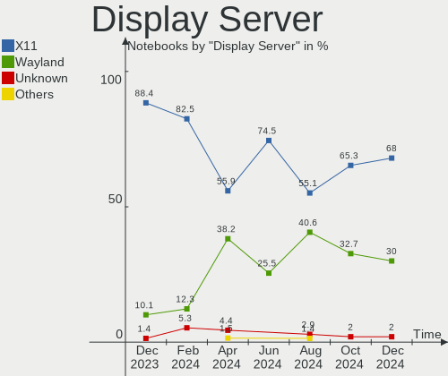
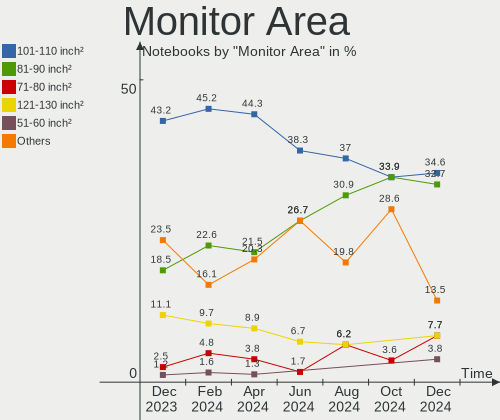
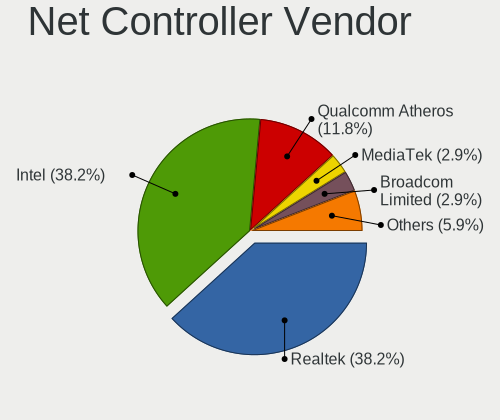
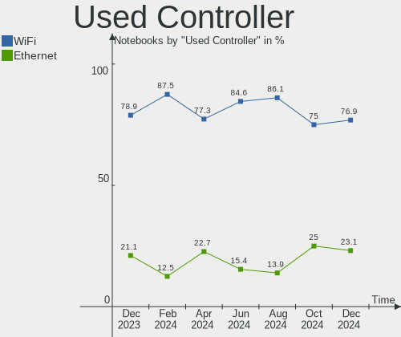
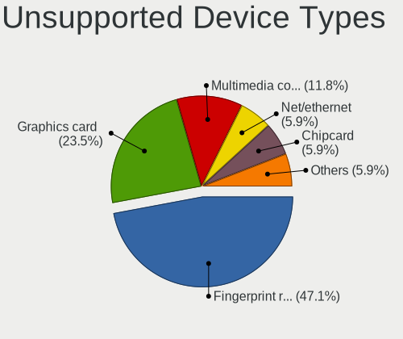

ArcoLinux - Hardware Trends (Notebooks)
---------------------------------------

A project to identify most popular hardware characteristics and track their change
over time based on data collected by Linux users at https://Linux-Hardware.org.

Anyone can contribute to this report by the [hw-probe](https://github.com/linuxhw/hw-probe) tool:

    sudo -E hw-probe -all -upload

This report is for one last month. Overall report since the beginning of time: [TestDays](https://github.com/linuxhw/TestDays)

Period: Nov, 2023.

Contents
--------

* [ System ](#system)
  - [ OS                       ](#os)
  - [ OS Family                ](#os-family)
  - [ Kernel                   ](#kernel)
  - [ Kernel Family            ](#kernel-family)
  - [ Kernel Major Ver.        ](#kernel-major-ver)
  - [ Arch                     ](#arch)
  - [ DE                       ](#de)
  - [ Display Server           ](#display-server)
  - [ Display Manager          ](#display-manager)
  - [ OS Lang                  ](#os-lang)
  - [ Boot Mode                ](#boot-mode)
  - [ Filesystem               ](#filesystem)
  - [ Part. scheme             ](#part-scheme)
  - [ Dual Boot with Linux/BSD ](#dual-boot-with-linuxbsd)
  - [ Dual Boot (Win)          ](#dual-boot-win)

* [ Board ](#board)
  - [ Vendor                   ](#vendor)
  - [ Model                    ](#model)
  - [ Model Family             ](#model-family)
  - [ MFG Year                 ](#mfg-year)
  - [ Form Factor              ](#form-factor)
  - [ Secure Boot              ](#secure-boot)
  - [ Coreboot                 ](#coreboot)
  - [ RAM Size                 ](#ram-size)
  - [ RAM Used                 ](#ram-used)
  - [ Total Drives             ](#total-drives)
  - [ Has CD-ROM               ](#has-cd-rom)
  - [ Has Ethernet             ](#has-ethernet)
  - [ Has WiFi                 ](#has-wifi)
  - [ Has Bluetooth            ](#has-bluetooth)

* [ Location ](#location)
  - [ Country                  ](#country)
  - [ City                     ](#city)

* [ Drives ](#drives)
  - [ Drive Vendor             ](#drive-vendor)
  - [ Drive Model              ](#drive-model)
  - [ HDD Vendor               ](#hdd-vendor)
  - [ SSD Vendor               ](#ssd-vendor)
  - [ Drive Kind               ](#drive-kind)
  - [ Drive Connector          ](#drive-connector)
  - [ Drive Size               ](#drive-size)
  - [ Space Total              ](#space-total)
  - [ Space Used               ](#space-used)
  - [ Malfunc. Drives          ](#malfunc-drives)
  - [ Malfunc. Drive Vendor    ](#malfunc-drive-vendor)
  - [ Malfunc. HDD Vendor      ](#malfunc-hdd-vendor)
  - [ Malfunc. Drive Kind      ](#malfunc-drive-kind)
  - [ Failed Drives            ](#failed-drives)
  - [ Failed Drive Vendor      ](#failed-drive-vendor)
  - [ Drive Status             ](#drive-status)

* [ Storage controller ](#storage-controller)
  - [ Storage Vendor           ](#storage-vendor)
  - [ Storage Model            ](#storage-model)
  - [ Storage Kind             ](#storage-kind)

* [ Processor ](#processor)
  - [ CPU Vendor               ](#cpu-vendor)
  - [ CPU Model                ](#cpu-model)
  - [ CPU Model Family         ](#cpu-model-family)
  - [ CPU Cores                ](#cpu-cores)
  - [ CPU Sockets              ](#cpu-sockets)
  - [ CPU Threads              ](#cpu-threads)
  - [ CPU Op-Modes             ](#cpu-op-modes)
  - [ CPU Microcode            ](#cpu-microcode)
  - [ CPU Microarch            ](#cpu-microarch)

* [ Graphics ](#graphics)
  - [ GPU Vendor               ](#gpu-vendor)
  - [ GPU Model                ](#gpu-model)
  - [ GPU Combo                ](#gpu-combo)
  - [ GPU Driver               ](#gpu-driver)
  - [ GPU Memory               ](#gpu-memory)

* [ Monitor ](#monitor)
  - [ Monitor Vendor           ](#monitor-vendor)
  - [ Monitor Model            ](#monitor-model)
  - [ Monitor Resolution       ](#monitor-resolution)
  - [ Monitor Diagonal         ](#monitor-diagonal)
  - [ Monitor Width            ](#monitor-width)
  - [ Aspect Ratio             ](#aspect-ratio)
  - [ Monitor Area             ](#monitor-area)
  - [ Pixel Density            ](#pixel-density)
  - [ Multiple Monitors        ](#multiple-monitors)

* [ Network ](#network)
  - [ Net Controller Vendor    ](#net-controller-vendor)
  - [ Net Controller Model     ](#net-controller-model)
  - [ Wireless Vendor          ](#wireless-vendor)
  - [ Wireless Model           ](#wireless-model)
  - [ Ethernet Vendor          ](#ethernet-vendor)
  - [ Ethernet Model           ](#ethernet-model)
  - [ Net Controller Kind      ](#net-controller-kind)
  - [ Used Controller          ](#used-controller)
  - [ NICs                     ](#nics)
  - [ IPv6                     ](#ipv6)

* [ Bluetooth ](#bluetooth)
  - [ Bluetooth Vendor         ](#bluetooth-vendor)
  - [ Bluetooth Model          ](#bluetooth-model)

* [ Sound ](#sound)
  - [ Sound Vendor             ](#sound-vendor)
  - [ Sound Model              ](#sound-model)

* [ Memory ](#memory)
  - [ Memory Vendor            ](#memory-vendor)
  - [ Memory Model             ](#memory-model)
  - [ Memory Kind              ](#memory-kind)
  - [ Memory Form Factor       ](#memory-form-factor)
  - [ Memory Size              ](#memory-size)
  - [ Memory Speed             ](#memory-speed)

* [ Printers & scanners ](#printers--scanners)
  - [ Printer Vendor           ](#printer-vendor)
  - [ Printer Model            ](#printer-model)
  - [ Scanner Vendor           ](#scanner-vendor)
  - [ Scanner Model            ](#scanner-model)

* [ Camera ](#camera)
  - [ Camera Vendor            ](#camera-vendor)
  - [ Camera Model             ](#camera-model)

* [ Security ](#security)
  - [ Fingerprint Vendor       ](#fingerprint-vendor)
  - [ Fingerprint Model        ](#fingerprint-model)
  - [ Chipcard Vendor          ](#chipcard-vendor)
  - [ Chipcard Model           ](#chipcard-model)

* [ Unsupported ](#unsupported)
  - [ Unsupported Devices      ](#unsupported-devices)
  - [ Unsupported Device Types ](#unsupported-device-types)

System
------

OS
--

Installed operating systems

| Name              | Notebooks | Percent |
|-------------------|-----------|---------|
| ArcoLinux Rolling | 67        | 94.37%  |
| ArcoLinux         | 4         | 5.63%   |

OS Family
---------

OS without a version

| Name      | Notebooks | Percent |
|-----------|-----------|---------|
| ArcoLinux | 71        | 100%    |

Kernel
------

Version of the Linux kernel

| Version                     | Notebooks | Percent |
|-----------------------------|-----------|---------|
| 6.5.9-arch2-1               | 14        | 19.72%  |
| 6.5.8-arch1-1               | 14        | 19.72%  |
| 6.6.1-arch1-1               | 11        | 15.49%  |
| 6.6.2-arch1-1               | 4         | 5.63%   |
| 6.1.62-1-lts                | 4         | 5.63%   |
| 6.4.11-arch1-1              | 3         | 4.23%   |
| 6.1.63-1-lts                | 3         | 4.23%   |
| 6.6.3-arch1-1               | 2         | 2.82%   |
| 6.6.1-zen1-1-zen            | 2         | 2.82%   |
| 6.5.3-x64v2-xanmod1-1       | 2         | 2.82%   |
| 6.5.10-hardened1-1-hardened | 2         | 2.82%   |
| 6.4.12-zen1-1-zen           | 2         | 2.82%   |
| 6.1.61-1-lts                | 2         | 2.82%   |
| 6.5.9-zen2-1-zen            | 1         | 1.41%   |
| 6.5.7-arch1-1               | 1         | 1.41%   |
| 6.5.11-lqx1-1-lqx           | 1         | 1.41%   |
| 6.4.11-arch2-1              | 1         | 1.41%   |
| 6.2.11-1297.native          | 1         | 1.41%   |
| 6.1.59-1-lts                | 1         | 1.41%   |

Kernel Family
-------------

Linux kernel without a distro release

| Version | Notebooks | Percent |
|---------|-----------|---------|
| 6.5.9   | 15        | 21.13%  |
| 6.5.8   | 14        | 19.72%  |
| 6.6.1   | 13        | 18.31%  |
| 6.6.2   | 4         | 5.63%   |
| 6.4.11  | 4         | 5.63%   |
| 6.1.62  | 4         | 5.63%   |
| 6.1.63  | 3         | 4.23%   |
| 6.6.3   | 2         | 2.82%   |
| 6.5.3   | 2         | 2.82%   |
| 6.5.10  | 2         | 2.82%   |
| 6.4.12  | 2         | 2.82%   |
| 6.1.61  | 2         | 2.82%   |
| 6.5.7   | 1         | 1.41%   |
| 6.5.11  | 1         | 1.41%   |
| 6.2.11  | 1         | 1.41%   |
| 6.1.59  | 1         | 1.41%   |

Kernel Major Ver.
-----------------

Linux kernel major version

| Version | Notebooks | Percent |
|---------|-----------|---------|
| 6.5     | 35        | 49.3%   |
| 6.6     | 19        | 26.76%  |
| 6.1     | 10        | 14.08%  |
| 6.4     | 6         | 8.45%   |
| 6.2     | 1         | 1.41%   |

Arch
----

OS architecture (x86_64, i586, etc.)

| Name   | Notebooks | Percent |
|--------|-----------|---------|
| x86_64 | 71        | 100%    |

DE
--

Desktop Environment

| Name     | Notebooks | Percent |
|----------|-----------|---------|
| XFCE     | 26        | 36.62%  |
| KDE5     | 19        | 26.76%  |
| GNOME    | 6         | 8.45%   |
| i3       | 4         | 5.63%   |
| Cinnamon | 4         | 5.63%   |
| Hyprland | 3         | 4.23%   |
| qtile    | 2         | 2.82%   |
| Deepin   | 2         | 2.82%   |
| chadwm   | 2         | 2.82%   |
| LXQt     | 1         | 1.41%   |
| LeftWM   | 1         | 1.41%   |
| Budgie   | 1         | 1.41%   |

Display Server
--------------

X11 or Wayland

| Name    | Notebooks | Percent |
|---------|-----------|---------|
| X11     | 61        | 85.92%  |
| Wayland | 7         | 9.86%   |
| Unknown | 3         | 4.23%   |

Display Manager
---------------

SDDM, LightDM, etc.

| Name    | Notebooks | Percent |
|---------|-----------|---------|
| SDDM    | 51        | 71.83%  |
| LightDM | 11        | 15.49%  |
| GDM     | 4         | 5.63%   |
| Unknown | 4         | 5.63%   |
| Ly      | 1         | 1.41%   |

OS Lang
-------

Language

| Lang  | Notebooks | Percent |
|-------|-----------|---------|
| en_US | 36        | 50.7%   |
| en_GB | 7         | 9.86%   |
| C     | 6         | 8.45%   |
| en_AU | 3         | 4.23%   |
| zh_CN | 2         | 2.82%   |
| it_IT | 2         | 2.82%   |
| en_ZA | 2         | 2.82%   |
| en_CA | 2         | 2.82%   |
| de_DE | 2         | 2.82%   |
| uk_UA | 1         | 1.41%   |
| pt_BR | 1         | 1.41%   |
| pl_PL | 1         | 1.41%   |
| es_MX | 1         | 1.41%   |
| es_ES | 1         | 1.41%   |
| en_SG | 1         | 1.41%   |
| en_IE | 1         | 1.41%   |
| en_HK | 1         | 1.41%   |
| de_AT | 1         | 1.41%   |

Boot Mode
---------

EFI or BIOS

| Mode | Notebooks | Percent |
|------|-----------|---------|
| EFI  | 57        | 80.28%  |
| BIOS | 14        | 19.72%  |

Filesystem
----------

Type of filesystem

| Type    | Notebooks | Percent |
|---------|-----------|---------|
| Ext4    | 46        | 64.79%  |
| Btrfs   | 18        | 25.35%  |
| Overlay | 6         | 8.45%   |
| F2fs    | 1         | 1.41%   |

Part. scheme
------------

Scheme of partitioning

| Type    | Notebooks | Percent |
|---------|-----------|---------|
| GPT     | 58        | 81.69%  |
| MBR     | 9         | 12.68%  |
| Unknown | 4         | 5.63%   |

Dual Boot with Linux/BSD
------------------------

Hosting more than one Linux/BSD

| Dual boot | Notebooks | Percent |
|-----------|-----------|---------|
| No        | 59        | 83.1%   |
| Yes       | 12        | 16.9%   |

Dual Boot (Win)
---------------

Hosting Linux and Windows

| Dual boot | Notebooks | Percent |
|-----------|-----------|---------|
| No        | 47        | 66.2%   |
| Yes       | 24        | 33.8%   |

Board
-----

Vendor
------

Motherboard manufacturer

| Name             | Notebooks | Percent |
|------------------|-----------|---------|
| Lenovo           | 16        | 22.54%  |
| Dell             | 13        | 18.31%  |
| ASUSTek Computer | 12        | 16.9%   |
| Hewlett-Packard  | 8         | 11.27%  |
| MSI              | 7         | 9.86%   |
| Apple            | 3         | 4.23%   |
| Acer             | 3         | 4.23%   |
| HUAWEI           | 2         | 2.82%   |
| Razer            | 1         | 1.41%   |
| Monster          | 1         | 1.41%   |
| MACHENIKE        | 1         | 1.41%   |
| Google           | 1         | 1.41%   |
| Fujitsu          | 1         | 1.41%   |
| COM1             | 1         | 1.41%   |
| Unknown          | 1         | 1.41%   |

Model
-----

Motherboard model

| Name                                    | Notebooks | Percent |
|-----------------------------------------|-----------|---------|
| Razer Blade                             | 1         | 1.41%   |
| MSI Prestige 15 A10SC                   | 1         | 1.41%   |
| MSI Prestige 14H B12UCX                 | 1         | 1.41%   |
| MSI Modern 14 B4MW                      | 1         | 1.41%   |
| MSI GS66 Stealth 10SF                   | 1         | 1.41%   |
| MSI GF75 Thin 9SC                       | 1         | 1.41%   |
| MSI GF65 Thin 10UE                      | 1         | 1.41%   |
| MSI CR610M                              | 1         | 1.41%   |
| Monster ABRA A5 V17.2                   | 1         | 1.41%   |
| MACHENIKE L16W                          | 1         | 1.41%   |
| Lenovo Z50-75 80EC                      | 1         | 1.41%   |
| Lenovo Y520-15IKBN 80WK                 | 1         | 1.41%   |
| Lenovo ThinkPad X250 20CM001UUK         | 1         | 1.41%   |
| Lenovo ThinkPad T550 20CJS1MW00         | 1         | 1.41%   |
| Lenovo ThinkPad T540p 20BFS5DV00        | 1         | 1.41%   |
| Lenovo ThinkPad T540p 20BE00AKZA        | 1         | 1.41%   |
| Lenovo ThinkPad T510 4314RBS            | 1         | 1.41%   |
| Lenovo ThinkPad T480s 20L8SA3Q00        | 1         | 1.41%   |
| Lenovo ThinkPad T470p 20J6000TAD        | 1         | 1.41%   |
| Lenovo ThinkPad L540 20AUS11P00         | 1         | 1.41%   |
| Lenovo ThinkBook 13s-IML 20RR           | 1         | 1.41%   |
| Lenovo Legion Y545 81Q6                 | 1         | 1.41%   |
| Lenovo Legion R9000P2021H 82JQ          | 1         | 1.41%   |
| Lenovo Legion 7 16ITHg6 82K6            | 1         | 1.41%   |
| Lenovo IdeaPad Y700-17ISK 80Q0          | 1         | 1.41%   |
| Lenovo IdeaPad 330-15IGM 81D1           | 1         | 1.41%   |
| HUAWEI NBLB-WAX9N                       | 1         | 1.41%   |
| HUAWEI KPL-W0X                          | 1         | 1.41%   |
| HP ProBook 650 G1                       | 1         | 1.41%   |
| HP ProBook 450 G7                       | 1         | 1.41%   |
| HP Pavilion g6                          | 1         | 1.41%   |
| HP OMEN Laptop 15-en1xxx                | 1         | 1.41%   |
| HP Laptop 15s-eq2xxx                    | 1         | 1.41%   |
| HP Laptop 14s-dq2xxx                    | 1         | 1.41%   |
| HP EliteBook 860 16 inch G9 Notebook PC | 1         | 1.41%   |
| HP 2000                                 | 1         | 1.41%   |
| Google Droid                            | 1         | 1.41%   |
| Fujitsu LIFEBOOK U759                   | 1         | 1.41%   |
| Dell XPS L521X                          | 1         | 1.41%   |
| Dell XPS 15 9560                        | 1         | 1.41%   |

Model Family
------------

Motherboard model prefix

| Name               | Notebooks | Percent |
|--------------------|-----------|---------|
| Lenovo ThinkPad    | 8         | 11.27%  |
| Dell Latitude      | 6         | 8.45%   |
| ASUS VivoBook      | 6         | 8.45%   |
| Lenovo Legion      | 3         | 4.23%   |
| MSI Prestige       | 2         | 2.82%   |
| Lenovo IdeaPad     | 2         | 2.82%   |
| HP ProBook         | 2         | 2.82%   |
| HP Laptop          | 2         | 2.82%   |
| Dell XPS           | 2         | 2.82%   |
| Acer Aspire        | 2         | 2.82%   |
| Razer Blade        | 1         | 1.41%   |
| MSI Modern         | 1         | 1.41%   |
| MSI GS66           | 1         | 1.41%   |
| MSI GF75           | 1         | 1.41%   |
| MSI GF65           | 1         | 1.41%   |
| MSI CR610M         | 1         | 1.41%   |
| Monster ABRA       | 1         | 1.41%   |
| MACHENIKE L16W     | 1         | 1.41%   |
| Lenovo Z50-75      | 1         | 1.41%   |
| Lenovo Y520-15IKBN | 1         | 1.41%   |
| Lenovo ThinkBook   | 1         | 1.41%   |
| HUAWEI NBLB-WAX9N  | 1         | 1.41%   |
| HUAWEI KPL-W0X     | 1         | 1.41%   |
| HP Pavilion        | 1         | 1.41%   |
| HP OMEN            | 1         | 1.41%   |
| HP EliteBook       | 1         | 1.41%   |
| HP 2000            | 1         | 1.41%   |
| Google Droid       | 1         | 1.41%   |
| Fujitsu LIFEBOOK   | 1         | 1.41%   |
| Dell Vostro        | 1         | 1.41%   |
| Dell Precision     | 1         | 1.41%   |
| Dell Inspiron      | 1         | 1.41%   |
| Dell G3            | 1         | 1.41%   |
| Dell 500           | 1         | 1.41%   |
| COM1 NBINF-X5-9G5  | 1         | 1.41%   |
| ASUS X542URR       | 1         | 1.41%   |
| ASUS X541UAK       | 1         | 1.41%   |
| ASUS TUF           | 1         | 1.41%   |
| ASUS K55VD         | 1         | 1.41%   |
| ASUS GL552VX       | 1         | 1.41%   |

MFG Year
--------

Motherboard manufacture year

| Year | Notebooks | Percent |
|------|-----------|---------|
| 2019 | 9         | 12.68%  |
| 2021 | 8         | 11.27%  |
| 2020 | 7         | 9.86%   |
| 2018 | 7         | 9.86%   |
| 2013 | 7         | 9.86%   |
| 2017 | 5         | 7.04%   |
| 2023 | 4         | 5.63%   |
| 2022 | 4         | 5.63%   |
| 2015 | 4         | 5.63%   |
| 2014 | 4         | 5.63%   |
| 2011 | 4         | 5.63%   |
| 2012 | 3         | 4.23%   |
| 2016 | 2         | 2.82%   |
| 2010 | 1         | 1.41%   |
| 2009 | 1         | 1.41%   |
| 2008 | 1         | 1.41%   |

Form Factor
-----------

Physical design of the computer

| Name     | Notebooks | Percent |
|----------|-----------|---------|
| Notebook | 71        | 100%    |

Secure Boot
-----------

Enabled or disabled

| State    | Notebooks | Percent |
|----------|-----------|---------|
| Disabled | 70        | 98.59%  |
| Enabled  | 1         | 1.41%   |

Coreboot
--------

Have coreboot on board

| Used | Notebooks | Percent |
|------|-----------|---------|
| No   | 70        | 98.59%  |
| Yes  | 1         | 1.41%   |

RAM Size
--------

Total RAM memory

| Size in GB  | Notebooks | Percent |
|-------------|-----------|---------|
| 16.01-24.0  | 25        | 35.21%  |
| 4.01-8.0    | 18        | 25.35%  |
| 32.01-64.0  | 10        | 14.08%  |
| 3.01-4.0    | 8         | 11.27%  |
| 8.01-16.0   | 5         | 7.04%   |
| 64.01-256.0 | 3         | 4.23%   |
| 24.01-32.0  | 1         | 1.41%   |
| 2.01-3.0    | 1         | 1.41%   |

RAM Used
--------

Used RAM memory

| Used GB   | Notebooks | Percent |
|-----------|-----------|---------|
| 1.01-2.0  | 30        | 42.25%  |
| 2.01-3.0  | 16        | 22.54%  |
| 4.01-8.0  | 9         | 12.68%  |
| 3.01-4.0  | 8         | 11.27%  |
| 8.01-16.0 | 6         | 8.45%   |
| 0.51-1.0  | 2         | 2.82%   |

Total Drives
------------

Number of drives on board

| Drives | Notebooks | Percent |
|--------|-----------|---------|
| 1      | 43        | 60.56%  |
| 2      | 22        | 30.99%  |
| 3      | 6         | 8.45%   |

Has CD-ROM
----------

Has CD-ROM on board

| Presented | Notebooks | Percent |
|-----------|-----------|---------|
| No        | 58        | 81.69%  |
| Yes       | 13        | 18.31%  |

Has Ethernet
------------

Has Ethernet on board

| Presented | Notebooks | Percent |
|-----------|-----------|---------|
| Yes       | 54        | 76.06%  |
| No        | 17        | 23.94%  |

Has WiFi
--------

Has WiFi module

| Presented | Notebooks | Percent |
|-----------|-----------|---------|
| Yes       | 71        | 100%    |

Has Bluetooth
-------------

Has Bluetooth module

| Presented | Notebooks | Percent |
|-----------|-----------|---------|
| Yes       | 62        | 87.32%  |
| No        | 9         | 12.68%  |

Location
--------

Country
-------

Geographic location (country)

| Country      | Notebooks | Percent |
|--------------|-----------|---------|
| USA          | 15        | 21.13%  |
| Germany      | 5         | 7.04%   |
| UK           | 4         | 5.63%   |
| Turkey       | 3         | 4.23%   |
| Romania      | 3         | 4.23%   |
| Italy        | 3         | 4.23%   |
| Canada       | 3         | 4.23%   |
| Brazil       | 3         | 4.23%   |
| Australia    | 3         | 4.23%   |
| Spain        | 2         | 2.82%   |
| South Africa | 2         | 2.82%   |
| Russia       | 2         | 2.82%   |
| Norway       | 2         | 2.82%   |
| France       | 2         | 2.82%   |
| China        | 2         | 2.82%   |
| Bulgaria     | 2         | 2.82%   |
| Vietnam      | 1         | 1.41%   |
| Uruguay      | 1         | 1.41%   |
| Ukraine      | 1         | 1.41%   |
| Singapore    | 1         | 1.41%   |
| Puerto Rico  | 1         | 1.41%   |
| Portugal     | 1         | 1.41%   |
| Poland       | 1         | 1.41%   |
| Iran         | 1         | 1.41%   |
| India        | 1         | 1.41%   |
| Hong Kong    | 1         | 1.41%   |
| Greece       | 1         | 1.41%   |
| Finland      | 1         | 1.41%   |
| Belgium      | 1         | 1.41%   |
| Austria      | 1         | 1.41%   |
| Argentina    | 1         | 1.41%   |

City
----

Geographic location (city)

| City                  | Notebooks | Percent |
|-----------------------|-----------|---------|
| Toronto               | 2         | 2.82%   |
| Istanbul              | 2         | 2.82%   |
| Franca                | 2         | 2.82%   |
| Charlotte             | 2         | 2.82%   |
| Bucharest             | 2         | 2.82%   |
| Wiesbaden             | 1         | 1.41%   |
| West Hartford         | 1         | 1.41%   |
| Warsaw                | 1         | 1.41%   |
| Walker                | 1         | 1.41%   |
| Vienna                | 1         | 1.41%   |
| Valencia              | 1         | 1.41%   |
| Tsuen Wan             | 1         | 1.41%   |
| Trabzon               | 1         | 1.41%   |
| Timișoara            | 1         | 1.41%   |
| Tehran                | 1         | 1.41%   |
| Sydney                | 1         | 1.41%   |
| Sofia                 | 1         | 1.41%   |
| Singapore             | 1         | 1.41%   |
| Shanghai              | 1         | 1.41%   |
| Schwäbisch Hall      | 1         | 1.41%   |
| Sao Bernardo do Campo | 1         | 1.41%   |
| Sandnes               | 1         | 1.41%   |
| San Francisco         | 1         | 1.41%   |
| Roswell               | 1         | 1.41%   |
| Rio Grande            | 1         | 1.41%   |
| Paros                 | 1         | 1.41%   |
| Oulu                  | 1         | 1.41%   |
| Oslo                  | 1         | 1.41%   |
| Oklahoma City         | 1         | 1.41%   |
| Novy Urengoy          | 1         | 1.41%   |
| Norman                | 1         | 1.41%   |
| Nizhniy Novgorod      | 1         | 1.41%   |
| Modimolle             | 1         | 1.41%   |
| Mesa                  | 1         | 1.41%   |
| Mendoza               | 1         | 1.41%   |
| Mainz                 | 1         | 1.41%   |
| Madrid                | 1         | 1.41%   |
| Lviv                  | 1         | 1.41%   |
| Los Angeles           | 1         | 1.41%   |
| Kochi                 | 1         | 1.41%   |

Drives
------

Drive Vendor
------------

Hard drive vendors

| Vendor                         | Notebooks | Drives | Percent |
|--------------------------------|-----------|--------|---------|
| Samsung Electronics            | 17        | 18     | 17.35%  |
| Sandisk                        | 9         | 9      | 9.18%   |
| Seagate                        | 8         | 8      | 8.16%   |
| WDC                            | 7         | 7      | 7.14%   |
| Toshiba                        | 6         | 6      | 6.12%   |
| Unknown                        | 5         | 5      | 5.1%    |
| Kingston                       | 5         | 6      | 5.1%    |
| Micron Technology              | 4         | 4      | 4.08%   |
| Kingston Technology Company    | 4         | 5      | 4.08%   |
| SK hynix                       | 3         | 3      | 3.06%   |
| Silicon Motion                 | 3         | 3      | 3.06%   |
| Intel                          | 3         | 4      | 3.06%   |
| Hitachi                        | 3         | 3      | 3.06%   |
| HGST                           | 3         | 4      | 3.06%   |
| MAXIO Technology (Hangzhou)    | 2         | 2      | 2.04%   |
| Crucial                        | 2         | 2      | 2.04%   |
| Transcend                      | 1         | 1      | 1.02%   |
| TO Exter                       | 1         | 1      | 1.02%   |
| Solid State Storage Technology | 1         | 1      | 1.02%   |
| ShiJi                          | 1         | 1      | 1.02%   |
| PNY                            | 1         | 1      | 1.02%   |
| Phison Electronics             | 1         | 1      | 1.02%   |
| KIOXIA                         | 1         | 1      | 1.02%   |
| JMicron Technology             | 1         | 1      | 1.02%   |
| Intenso                        | 1         | 1      | 1.02%   |
| GeIL                           | 1         | 1      | 1.02%   |
| Dogfish                        | 1         | 1      | 1.02%   |
| China                          | 1         | 1      | 1.02%   |
| Apple                          | 1         | 1      | 1.02%   |
| ADATA Technology               | 1         | 2      | 1.02%   |

Drive Model
-----------

Hard drive models

| Model                                                 | Notebooks | Percent |
|-------------------------------------------------------|-----------|---------|
| Seagate ST1000LM035-1RK172 1TB                        | 4         | 4%      |
| Samsung NVMe SSD Controller SM981/PM981/PM983 250GB   | 3         | 3%      |
| Samsung NVMe SSD Controller PM9A1/PM9A3/980PRO 2TB    | 3         | 3%      |
| Unknown MMC Card  128GB                               | 2         | 2%      |
| Toshiba MQ01ABD100 1TB                                | 2         | 2%      |
| Silicon Motion SM2263EN/SM2263XT SSD Controller 256GB | 2         | 2%      |
| Sandisk WD Blue SN550 NVMe SSD 512GB                  | 2         | 2%      |
| MAXIO (Hangzhou) NVMe SSD Controller MAP1202 1024GB   | 2         | 2%      |
| Kingston Company U-SNS8154P3 NVMe SSD 256GB           | 2         | 2%      |
| Kingston Company SNV2S1000G 1TB                       | 2         | 2%      |
| Kingston SA400S37480G 480GB SSD                       | 2         | 2%      |
| HGST HTS721010A9E630 1TB                              | 2         | 2%      |
| WDC WDS480G2G0B-00EPW0 480GB SSD                      | 1         | 1%      |
| WDC WDS240G2G0A-00JH30 240GB SSD                      | 1         | 1%      |
| WDC WD7500BPVX-22JC3T0 752GB                          | 1         | 1%      |
| WDC WD5000LPCX-24VHAT0 500GB                          | 1         | 1%      |
| WDC WD5000BPKX-75HPJT0 500GB                          | 1         | 1%      |
| WDC WD5000BEVT-22A0RT0 500GB                          | 1         | 1%      |
| WDC WD10SPCX-24HWST1 1TB                              | 1         | 1%      |
| Unknown MMC Card  32GB                                | 1         | 1%      |
| Unknown MMC Card  256GB                               | 1         | 1%      |
| Unknown MMC Card  197GB                               | 1         | 1%      |
| Transcend TS240GJDM520 240GB SSD                      | 1         | 1%      |
| Toshiba XG4 NVMe SSD Controller 512GB                 | 1         | 1%      |
| Toshiba MQ01ABF050 500GB                              | 1         | 1%      |
| Toshiba KSG60ZMV256G M.2 2280 256GB SSD               | 1         | 1%      |
| Toshiba BG3 NVMe SSD Controller 128GB                 | 1         | 1%      |
| TO Exter nal USB 3.0 1TB                              | 1         | 1%      |
| Solid State Storage SSSTC CL4-8D512 512GB             | 1         | 1%      |
| SK hynix BC711 HFM256GD3JX013N 256GB                  | 1         | 1%      |
| SK hynix BC511 HFM512GDJTNI-82A0A 512GB               | 1         | 1%      |
| SK hynix BC501 NVMe Solid State Drive 512GB           | 1         | 1%      |
| Silicon Motion SM2262/SM2262EN SSD Controller 1TB     | 1         | 1%      |
| ShiJi SSD 1TB                                         | 1         | 1%      |
| Seagate ST9500325AS 500GB                             | 1         | 1%      |
| Seagate ST500LT012-9WS142 500GB                       | 1         | 1%      |
| Seagate ST1000LM049-2GH172 1TB                        | 1         | 1%      |
| Seagate ST1000LM024 HN-M101MBB 1TB                    | 1         | 1%      |
| Sandisk WD_BLACK SN770 2TB                            | 1         | 1%      |
| Sandisk WD PC SN740 SDDPNQD-512G-1006 512GB           | 1         | 1%      |

HDD Vendor
----------

Hard disk drive vendors

| Vendor   | Notebooks | Drives | Percent |
|----------|-----------|--------|---------|
| Seagate  | 8         | 8      | 34.78%  |
| WDC      | 5         | 5      | 21.74%  |
| Toshiba  | 3         | 3      | 13.04%  |
| Hitachi  | 3         | 3      | 13.04%  |
| HGST     | 3         | 4      | 13.04%  |
| TO Exter | 1         | 1      | 4.35%   |

SSD Vendor
----------

Solid state drive vendors

| Vendor              | Notebooks | Drives | Percent |
|---------------------|-----------|--------|---------|
| Samsung Electronics | 7         | 7      | 25%     |
| Kingston            | 4         | 4      | 14.29%  |
| WDC                 | 2         | 2      | 7.14%   |
| SanDisk             | 2         | 2      | 7.14%   |
| Crucial             | 2         | 2      | 7.14%   |
| Transcend           | 1         | 1      | 3.57%   |
| Toshiba             | 1         | 1      | 3.57%   |
| ShiJi               | 1         | 1      | 3.57%   |
| PNY                 | 1         | 1      | 3.57%   |
| Micron Technology   | 1         | 1      | 3.57%   |
| Intenso             | 1         | 1      | 3.57%   |
| Intel               | 1         | 1      | 3.57%   |
| GeIL                | 1         | 1      | 3.57%   |
| Dogfish             | 1         | 1      | 3.57%   |
| China               | 1         | 1      | 3.57%   |
| Apple               | 1         | 1      | 3.57%   |

Drive Kind
----------

HDD or SSD

| Kind    | Notebooks | Drives | Percent |
|---------|-----------|--------|---------|
| NVMe    | 38        | 46     | 41.76%  |
| SSD     | 25        | 28     | 27.47%  |
| HDD     | 22        | 24     | 24.18%  |
| MMC     | 5         | 5      | 5.49%   |
| Unknown | 1         | 1      | 1.1%    |

Drive Connector
---------------

SATA, SAS, NVMe, etc.

| Type | Notebooks | Drives | Percent |
|------|-----------|--------|---------|
| NVMe | 38        | 46     | 43.68%  |
| SATA | 38        | 47     | 43.68%  |
| SAS  | 6         | 6      | 6.9%    |
| MMC  | 5         | 5      | 5.75%   |

Drive Size
----------

Size of hard drive

| Size in TB | Notebooks | Drives | Percent |
|------------|-----------|--------|---------|
| 0.01-0.5   | 26        | 31     | 59.09%  |
| 0.51-1.0   | 18        | 21     | 40.91%  |

Space Total
-----------

Amount of disk space available on the file system

| Size in GB     | Notebooks | Percent |
|----------------|-----------|---------|
| 251-500        | 15        | 21.13%  |
| 101-250        | 15        | 21.13%  |
| 501-1000       | 11        | 15.49%  |
| More than 3000 | 8         | 11.27%  |
| 1001-2000      | 8         | 11.27%  |
| 1-20           | 5         | 7.04%   |
| Unknown        | 4         | 5.63%   |
| 2001-3000      | 3         | 4.23%   |
| 51-100         | 2         | 2.82%   |

Space Used
----------

Amount of used disk space

| Used GB        | Notebooks | Percent |
|----------------|-----------|---------|
| 1-20           | 20        | 28.17%  |
| 21-50          | 15        | 21.13%  |
| 251-500        | 9         | 12.68%  |
| 101-250        | 9         | 12.68%  |
| 501-1000       | 8         | 11.27%  |
| Unknown        | 4         | 5.63%   |
| 51-100         | 3         | 4.23%   |
| 1001-2000      | 2         | 2.82%   |
| More than 3000 | 1         | 1.41%   |

Malfunc. Drives
---------------

Drive models with a malfunction

| Model                                                           | Notebooks | Drives | Percent |
|-----------------------------------------------------------------|-----------|--------|---------|
| WDC WDS240G2G0A-00JH30 240GB SSD                                | 1         | 1      | 8.33%   |
| Toshiba MQ01ABF050 500GB                                        | 1         | 1      | 8.33%   |
| Toshiba MQ01ABD100 1TB                                          | 1         | 1      | 8.33%   |
| Toshiba KSG60ZMV256G M.2 2280 256GB SSD                         | 1         | 1      | 8.33%   |
| Seagate ST9500325AS 500GB                                       | 1         | 1      | 8.33%   |
| Sandisk WD Blue SN550 NVMe SSD 512GB                            | 1         | 1      | 8.33%   |
| Samsung Electronics SSD 870 EVO 1TB                             | 1         | 1      | 8.33%   |
| Samsung Electronics NVMe SSD Controller SM981/PM981/PM983 250GB | 1         | 1      | 8.33%   |
| Hitachi HTS723232L9SA60 320GB                                   | 1         | 1      | 8.33%   |
| HGST HTS725032A7E630 320GB                                      | 1         | 1      | 8.33%   |
| HGST HTS721010A9E630 1TB                                        | 1         | 1      | 8.33%   |
| Crucial CT240M500SSD1 240GB                                     | 1         | 1      | 8.33%   |

Malfunc. Drive Vendor
---------------------

Vendors of faulty drives

| Vendor              | Notebooks | Drives | Percent |
|---------------------|-----------|--------|---------|
| Toshiba             | 3         | 3      | 25%     |
| Samsung Electronics | 2         | 2      | 16.67%  |
| HGST                | 2         | 2      | 16.67%  |
| WDC                 | 1         | 1      | 8.33%   |
| Seagate             | 1         | 1      | 8.33%   |
| Sandisk             | 1         | 1      | 8.33%   |
| Hitachi             | 1         | 1      | 8.33%   |
| Crucial             | 1         | 1      | 8.33%   |

Malfunc. HDD Vendor
-------------------

Vendors of faulty HDD drives

| Vendor  | Notebooks | Drives | Percent |
|---------|-----------|--------|---------|
| Toshiba | 2         | 2      | 33.33%  |
| HGST    | 2         | 2      | 33.33%  |
| Seagate | 1         | 1      | 16.67%  |
| Hitachi | 1         | 1      | 16.67%  |

Malfunc. Drive Kind
-------------------

Kinds of faulty drives

| Kind | Notebooks | Drives | Percent |
|------|-----------|--------|---------|
| HDD  | 5         | 6      | 45.45%  |
| SSD  | 4         | 4      | 36.36%  |
| NVMe | 2         | 2      | 18.18%  |

Failed Drives
-------------

Failed drive models

Zero info for selected period =(

Failed Drive Vendor
-------------------

Failed drive vendors

Zero info for selected period =(

Drive Status
------------

Number of failed and malfunc. drives

| Status   | Notebooks | Drives | Percent |
|----------|-----------|--------|---------|
| Works    | 55        | 76     | 69.62%  |
| Detected | 14        | 16     | 17.72%  |
| Malfunc  | 10        | 12     | 12.66%  |

Storage controller
------------------

Storage Vendor
--------------

Storage controller vendors

| Vendor                         | Notebooks | Percent |
|--------------------------------|-----------|---------|
| Intel                          | 44        | 46.81%  |
| Samsung Electronics            | 10        | 10.64%  |
| AMD                            | 9         | 9.57%   |
| SanDisk                        | 7         | 7.45%   |
| Kingston Technology Company    | 6         | 6.38%   |
| SK hynix                       | 3         | 3.19%   |
| Silicon Motion                 | 3         | 3.19%   |
| Micron Technology              | 3         | 3.19%   |
| Toshiba America Info Systems   | 2         | 2.13%   |
| MAXIO Technology (Hangzhou)    | 2         | 2.13%   |
| Solid State Storage Technology | 1         | 1.06%   |
| Phison Electronics             | 1         | 1.06%   |
| Marvell Technology Group       | 1         | 1.06%   |
| KIOXIA                         | 1         | 1.06%   |
| ADATA Technology               | 1         | 1.06%   |

Storage Model
-------------

Storage controller models

| Model                                                                          | Notebooks | Percent |
|--------------------------------------------------------------------------------|-----------|---------|
| AMD FCH SATA Controller [AHCI mode]                                            | 9         | 9.38%   |
| Intel 82801 Mobile SATA Controller [RAID mode]                                 | 7         | 7.29%   |
| Intel HM170/QM170 Chipset SATA Controller [AHCI Mode]                          | 5         | 5.21%   |
| Intel 8 Series/C220 Series Chipset Family 6-port SATA Controller 1 [AHCI mode] | 5         | 5.21%   |
| Intel Cannon Lake Mobile PCH SATA AHCI Controller                              | 4         | 4.17%   |
| Samsung NVMe SSD Controller SM981/PM981/PM983                                  | 3         | 3.13%   |
| Samsung NVMe SSD Controller PM9A1/PM9A3/980PRO                                 | 3         | 3.13%   |
| Kingston Company NV2 NVMe SSD SM2267XT                                         | 3         | 3.13%   |
| Intel Sunrise Point-LP SATA Controller [AHCI mode]                             | 3         | 3.13%   |
| Intel 7 Series Chipset Family 6-port SATA Controller [AHCI mode]               | 3         | 3.13%   |
| Silicon Motion SM2263EN/SM2263XT (DRAM-less) NVMe SSD Controllers              | 2         | 2.08%   |
| SanDisk WD Black SN770 / PC SN740 256GB / PC SN560 (DRAM-less) NVMe SSD        | 2         | 2.08%   |
| SanDisk Ultra 3D / WD Blue SN550 NVMe SSD                                      | 2         | 2.08%   |
| Samsung NVMe SSD Controller PM9B1 (DRAM-less)                                  | 2         | 2.08%   |
| MAXIO (Hangzhou) NVMe SSD Controller MAP1202                                   | 2         | 2.08%   |
| Kingston Company A1000/U-SNS8154P3 x2 NVMe SSD                                 | 2         | 2.08%   |
| Intel Wildcat Point-LP SATA Controller [AHCI Mode]                             | 2         | 2.08%   |
| Intel Tiger Lake-LP SATA Controller                                            | 2         | 2.08%   |
| Intel Tiger Lake SATA AHCI Controller                                          | 2         | 2.08%   |
| Intel Comet Lake SATA AHCI Controller                                          | 2         | 2.08%   |
| Intel 6 Series/C200 Series Chipset Family 6 port Mobile SATA AHCI Controller   | 2         | 2.08%   |
| Toshiba America Info Systems XG4 NVMe SSD Controller                           | 1         | 1.04%   |
| Toshiba America Info Systems BG3 x2 NVMe SSD Controller (DRAM-less)            | 1         | 1.04%   |
| Solid State Storage CL4-8D512 NVMe SSD M.2 (DRAM-less)                         | 1         | 1.04%   |
| SK hynix Gold P31/BC711/PC711 NVMe Solid State Drive                           | 1         | 1.04%   |
| SK hynix BC511 NVMe SSD                                                        | 1         | 1.04%   |
| SK hynix BC501 NVMe Solid State Drive                                          | 1         | 1.04%   |
| Silicon Motion SM2262/SM2262EN SSD Controller                                  | 1         | 1.04%   |
| SanDisk WD Blue SN500 / PC SN520 x2 M.2 2280 NVMe SSD                          | 1         | 1.04%   |
| Sandisk PC SN740 NVMe SSD (DRAM-less)                                          | 1         | 1.04%   |
| SanDisk Extreme Pro / WD Black SN750 / PC SN730 / Red SN700 NVMe SSD           | 1         | 1.04%   |
| Samsung NVMe SSD Controller SM951/PM951                                        | 1         | 1.04%   |
| Samsung NVMe SSD Controller 980 (DRAM-less)                                    | 1         | 1.04%   |
| Phison PS5013-E13 PCIe3 NVMe Controller (DRAM-less)                            | 1         | 1.04%   |
| Micron 3400 NVMe SSD [Hendrix]                                                 | 1         | 1.04%   |
| Micron 2400 NVMe SSD (DRAM-less)                                               | 1         | 1.04%   |
| Micron 2300 NVMe SSD [Santana]                                                 | 1         | 1.04%   |
| Marvell Group 88SS9183 PCIe SSD Controller                                     | 1         | 1.04%   |
| KIOXIA NVMe SSD Controller BG4 (DRAM-less)                                     | 1         | 1.04%   |
| Kingston Company NV1 NVMe SSD SM2263XT                                         | 1         | 1.04%   |

Storage Kind
------------

Kind of storage controller (IDE, SATA, NVMe, SAS, ...)

| Kind | Notebooks | Percent |
|------|-----------|---------|
| SATA | 44        | 48.35%  |
| NVMe | 38        | 41.76%  |
| RAID | 8         | 8.79%   |
| IDE  | 1         | 1.1%    |

Processor
---------

CPU Vendor
----------

Processor vendors

| Vendor | Notebooks | Percent |
|--------|-----------|---------|
| Intel  | 59        | 83.1%   |
| AMD    | 12        | 16.9%   |

CPU Model
---------

Processor models

| Model                              | Notebooks | Percent |
|------------------------------------|-----------|---------|
| Intel Core i7-9750H CPU @ 2.60GHz  | 4         | 5.63%   |
| Intel Core i7-7700HQ CPU @ 2.80GHz | 3         | 4.23%   |
| Intel Core i5-10210U CPU @ 1.60GHz | 3         | 4.23%   |
| Intel Core i7-5600U CPU @ 2.60GHz  | 2         | 2.82%   |
| Intel Core i7-4710MQ CPU @ 2.50GHz | 2         | 2.82%   |
| Intel Core i7-10750H CPU @ 2.60GHz | 2         | 2.82%   |
| Intel Core i5-8350U CPU @ 1.70GHz  | 2         | 2.82%   |
| Intel Core i5-8265U CPU @ 1.60GHz  | 2         | 2.82%   |
| Intel Core i5 CPU M 540 @ 2.53GHz  | 2         | 2.82%   |
| Intel Pentium CPU 2020M @ 2.40GHz  | 1         | 1.41%   |
| Intel Pentium 3556U @ 1.70GHz      | 1         | 1.41%   |
| Intel Core i7-8750H CPU @ 2.20GHz  | 1         | 1.41%   |
| Intel Core i7-8665U CPU @ 1.90GHz  | 1         | 1.41%   |
| Intel Core i7-8650U CPU @ 1.90GHz  | 1         | 1.41%   |
| Intel Core i7-8550U CPU @ 1.80GHz  | 1         | 1.41%   |
| Intel Core i7-6700HQ CPU @ 2.60GHz | 1         | 1.41%   |
| Intel Core i7-4700HQ CPU @ 2.40GHz | 1         | 1.41%   |
| Intel Core i7-4600M CPU @ 2.90GHz  | 1         | 1.41%   |
| Intel Core i7-10710U CPU @ 1.10GHz | 1         | 1.41%   |
| Intel Core i5-7300U CPU @ 2.60GHz  | 1         | 1.41%   |
| Intel Core i5-6300HQ CPU @ 2.30GHz | 1         | 1.41%   |
| Intel Core i5-5300U CPU @ 2.30GHz  | 1         | 1.41%   |
| Intel Core i5-4258U CPU @ 2.40GHz  | 1         | 1.41%   |
| Intel Core i5-4210M CPU @ 2.60GHz  | 1         | 1.41%   |
| Intel Core i5-4200M CPU @ 2.50GHz  | 1         | 1.41%   |
| Intel Core i5-3340M CPU @ 2.70GHz  | 1         | 1.41%   |
| Intel Core i5-3320M CPU @ 2.60GHz  | 1         | 1.41%   |
| Intel Core i5-3317U CPU @ 1.70GHz  | 1         | 1.41%   |
| Intel Core i5-3210M CPU @ 2.50GHz  | 1         | 1.41%   |
| Intel Core i5-2520M CPU @ 2.50GHz  | 1         | 1.41%   |
| Intel Core i5-2410M CPU @ 2.30GHz  | 1         | 1.41%   |
| Intel Core i5-1035G1 CPU @ 1.00GHz | 1         | 1.41%   |
| Intel Core i3-7100U CPU @ 2.40GHz  | 1         | 1.41%   |
| Intel Celeron N4100 CPU @ 1.10GHz  | 1         | 1.41%   |
| Intel Celeron N4020 CPU @ 1.10GHz  | 1         | 1.41%   |
| Intel Celeron CPU 560 @ 2.13GHz    | 1         | 1.41%   |
| Intel 13th Gen Core i7-1360P       | 1         | 1.41%   |
| Intel 13th Gen Core i5-13500H      | 1         | 1.41%   |
| Intel 12th Gen Core i7-12700H      | 1         | 1.41%   |
| Intel 12th Gen Core i7-1255U       | 1         | 1.41%   |

CPU Model Family
----------------

Processor model prefix

| Model         | Notebooks | Percent |
|---------------|-----------|---------|
| Intel Core i5 | 22        | 30.99%  |
| Intel Core i7 | 21        | 29.58%  |
| Other         | 10        | 14.08%  |
| AMD Ryzen 5   | 5         | 7.04%   |
| Intel Celeron | 3         | 4.23%   |
| AMD Ryzen 7   | 3         | 4.23%   |
| Intel Pentium | 2         | 2.82%   |
| Intel Core i3 | 1         | 1.41%   |
| AMD Ryzen 3   | 1         | 1.41%   |
| AMD E2        | 1         | 1.41%   |
| AMD A6        | 1         | 1.41%   |
| AMD A10       | 1         | 1.41%   |

CPU Cores
---------

Number of processor cores

| Number | Notebooks | Percent |
|--------|-----------|---------|
| 4      | 26        | 36.62%  |
| 2      | 24        | 33.8%   |
| 6      | 12        | 16.9%   |
| 8      | 4         | 5.63%   |
| 12     | 2         | 2.82%   |
| 14     | 1         | 1.41%   |
| 10     | 1         | 1.41%   |
| 1      | 1         | 1.41%   |

CPU Sockets
-----------

Number of sockets

| Number | Notebooks | Percent |
|--------|-----------|---------|
| 1      | 71        | 100%    |

CPU Threads
-----------

Threads per core (Hyper-Threading)

| Number | Notebooks | Percent |
|--------|-----------|---------|
| 2      | 62        | 87.32%  |
| 1      | 9         | 12.68%  |

CPU Op-Modes
------------

CPU Operation Modes (32-bit, 64-bit)

| Op mode        | Notebooks | Percent |
|----------------|-----------|---------|
| 32-bit, 64-bit | 71        | 100%    |

CPU Microcode
-------------

Microcode number

| Number     | Notebooks | Percent |
|------------|-----------|---------|
| Unknown    | 55        | 77.46%  |
| 0x08108109 | 2         | 2.82%   |
| 0xa0660    | 1         | 1.41%   |
| 0x806ea    | 1         | 1.41%   |
| 0x706a1    | 1         | 1.41%   |
| 0x306a9    | 1         | 1.41%   |
| 0x0a50000d | 1         | 1.41%   |
| 0x0a50000c | 1         | 1.41%   |
| 0x0a404102 | 1         | 1.41%   |
| 0x08608103 | 1         | 1.41%   |
| 0x08600104 | 1         | 1.41%   |
| 0x08108102 | 1         | 1.41%   |
| 0x08101007 | 1         | 1.41%   |
| 0x06003106 | 1         | 1.41%   |
| 0x0500010d | 1         | 1.41%   |
| 0x03000027 | 1         | 1.41%   |

CPU Microarch
-------------

Microarchitecture

| Name             | Notebooks | Percent |
|------------------|-----------|---------|
| KabyLake         | 20        | 28.17%  |
| Haswell          | 8         | 11.27%  |
| IvyBridge        | 5         | 7.04%   |
| Alderlake Hybrid | 5         | 7.04%   |
| Zen+             | 3         | 4.23%   |
| TigerLake        | 3         | 4.23%   |
| Icelake          | 3         | 4.23%   |
| CometLake        | 3         | 4.23%   |
| Broadwell        | 3         | 4.23%   |
| Zen 3            | 2         | 2.82%   |
| Westmere         | 2         | 2.82%   |
| Skylake          | 2         | 2.82%   |
| SandyBridge      | 2         | 2.82%   |
| Goldmont plus    | 2         | 2.82%   |
| Unknown          | 2         | 2.82%   |
| Zen 2            | 1         | 1.41%   |
| Zen              | 1         | 1.41%   |
| Steamroller      | 1         | 1.41%   |
| K10 Llano        | 1         | 1.41%   |
| Core             | 1         | 1.41%   |
| Bobcat           | 1         | 1.41%   |

Graphics
--------

GPU Vendor
----------

Vendors of graphics cards

| Vendor | Notebooks | Percent |
|--------|-----------|---------|
| Intel  | 58        | 57.43%  |
| Nvidia | 30        | 29.7%   |
| AMD    | 13        | 12.87%  |

GPU Model
---------

Graphics card models

| Model                                                                     | Notebooks | Percent |
|---------------------------------------------------------------------------|-----------|---------|
| Intel 4th Gen Core Processor Integrated Graphics Controller               | 6         | 5.77%   |
| Intel 3rd Gen Core processor Graphics Controller                          | 5         | 4.81%   |
| Nvidia GA106M [GeForce RTX 3060 Mobile / Max-Q]                           | 4         | 3.85%   |
| Intel UHD Graphics 620                                                    | 4         | 3.85%   |
| Intel CoffeeLake-H GT2 [UHD Graphics 630]                                 | 4         | 3.85%   |
| Nvidia TU117M [GeForce GTX 1650 Mobile / Max-Q]                           | 3         | 2.88%   |
| Intel WhiskeyLake-U GT2 [UHD Graphics 620]                                | 3         | 2.88%   |
| Intel HD Graphics 630                                                     | 3         | 2.88%   |
| Intel HD Graphics 5500                                                    | 3         | 2.88%   |
| Intel CometLake-U GT2 [UHD Graphics]                                      | 3         | 2.88%   |
| AMD Picasso/Raven 2 [Radeon Vega Series / Radeon Vega Mobile Series]      | 3         | 2.88%   |
| Nvidia TU116M [GeForce GTX 1660 Ti Mobile]                                | 2         | 1.92%   |
| Nvidia GP107M [GeForce GTX 1050 Mobile]                                   | 2         | 1.92%   |
| Nvidia GK208M [GeForce GT 730M]                                           | 2         | 1.92%   |
| Nvidia GA107M [GeForce RTX 2050]                                          | 2         | 1.92%   |
| Intel TigerLake-LP GT2 [Iris Xe Graphics]                                 | 2         | 1.92%   |
| Intel TigerLake-H GT1 [UHD Graphics]                                      | 2         | 1.92%   |
| Intel Raptor Lake-P [Iris Xe Graphics]                                    | 2         | 1.92%   |
| Intel HD Graphics 620                                                     | 2         | 1.92%   |
| Intel HD Graphics 530                                                     | 2         | 1.92%   |
| Intel Haswell-ULT Integrated Graphics Controller                          | 2         | 1.92%   |
| Intel GeminiLake [UHD Graphics 600]                                       | 2         | 1.92%   |
| Intel Core Processor Integrated Graphics Controller                       | 2         | 1.92%   |
| Intel CometLake-H GT2 [UHD Graphics]                                      | 2         | 1.92%   |
| Intel 2nd Generation Core Processor Family Integrated Graphics Controller | 2         | 1.92%   |
| Nvidia TU106M [GeForce RTX 2070 Mobile / Max-Q Refresh]                   | 1         | 0.96%   |
| Nvidia TU104M [GeForce RTX 2080 Mobile]                                   | 1         | 0.96%   |
| Nvidia GT216M [GeForce GT 330M]                                           | 1         | 0.96%   |
| Nvidia GP108BM [GeForce MX250]                                            | 1         | 0.96%   |
| Nvidia GP106M [GeForce GTX 1060 Mobile]                                   | 1         | 0.96%   |
| Nvidia GM108M [GeForce MX130]                                             | 1         | 0.96%   |
| Nvidia GM108M [GeForce 940MX]                                             | 1         | 0.96%   |
| Nvidia GM108M [GeForce 930MX]                                             | 1         | 0.96%   |
| Nvidia GM107M [GeForce GTX 960M]                                          | 1         | 0.96%   |
| Nvidia GM107M [GeForce GTX 950M]                                          | 1         | 0.96%   |
| Nvidia GK104M [GeForce GTX 870M]                                          | 1         | 0.96%   |
| Nvidia GF119M [GeForce 610M]                                              | 1         | 0.96%   |
| Nvidia GF117M [GeForce 610M/710M/810M/820M / GT 620M/625M/630M/720M]      | 1         | 0.96%   |
| Nvidia GA107M [GeForce RTX 3050 Ti Mobile]                                | 1         | 0.96%   |
| Nvidia GA104M [GeForce RTX 3070 Mobile / Max-Q]                           | 1         | 0.96%   |

GPU Combo
---------

Combinations of graphics cards

| Name           | Notebooks | Percent |
|----------------|-----------|---------|
| 1 x Intel      | 29        | 40.85%  |
| Intel + Nvidia | 25        | 35.21%  |
| 1 x AMD        | 7         | 9.86%   |
| AMD + Nvidia   | 3         | 4.23%   |
| 2 x Intel      | 2         | 2.82%   |
| 1 x Nvidia     | 2         | 2.82%   |
| Intel + AMD    | 2         | 2.82%   |
| 2 x AMD        | 1         | 1.41%   |

GPU Driver
----------

Free vs proprietary

| Driver      | Notebooks | Percent |
|-------------|-----------|---------|
| Free        | 56        | 78.87%  |
| Proprietary | 15        | 21.13%  |

GPU Memory
----------

Total video memory

| Size in GB | Notebooks | Percent |
|------------|-----------|---------|
| Unknown    | 44        | 61.97%  |
| 0.01-0.5   | 7         | 9.86%   |
| 0.51-1.0   | 5         | 7.04%   |
| 5.01-6.0   | 4         | 5.63%   |
| 3.01-4.0   | 4         | 5.63%   |
| 1.01-2.0   | 4         | 5.63%   |
| 7.01-8.0   | 2         | 2.82%   |
| 2.01-3.0   | 1         | 1.41%   |

Monitor
-------

Monitor Vendor
--------------

Monitor vendors

| Vendor              | Notebooks | Percent |
|---------------------|-----------|---------|
| BOE                 | 18        | 21.43%  |
| AU Optronics        | 18        | 21.43%  |
| LG Display          | 10        | 11.9%   |
| Chimei Innolux      | 10        | 11.9%   |
| Samsung Electronics | 9         | 10.71%  |
| Apple               | 3         | 3.57%   |
| Sharp               | 2         | 2.38%   |
| Hewlett-Packard     | 2         | 2.38%   |
| CSO                 | 2         | 2.38%   |
| Philips             | 1         | 1.19%   |
| Panasonic           | 1         | 1.19%   |
| Lenovo              | 1         | 1.19%   |
| Iiyama              | 1         | 1.19%   |
| Goldstar            | 1         | 1.19%   |
| DMS                 | 1         | 1.19%   |
| Dell                | 1         | 1.19%   |
| ASUSTek Computer    | 1         | 1.19%   |
| AOC                 | 1         | 1.19%   |
| Acer                | 1         | 1.19%   |

Monitor Model
-------------

Monitor models

| Model                                                                   | Notebooks | Percent |
|-------------------------------------------------------------------------|-----------|---------|
| LG Display LCD Monitor LGD062E 1920x1080 344x194mm 15.5-inch            | 2         | 2.35%   |
| AU Optronics LCD Monitor AUO26EC 1366x768 344x193mm 15.5-inch           | 2         | 2.35%   |
| Sharp LQ156M1JW03 SHP14C5 1920x1080 344x194mm 15.5-inch                 | 1         | 1.18%   |
| Sharp LCD Monitor SHP1476 3840x2160 346x194mm 15.6-inch                 | 1         | 1.18%   |
| Samsung Electronics S20D300 SAM0BDB 1366x768 432x240mm 19.5-inch        | 1         | 1.18%   |
| Samsung Electronics LCD Monitor SEC5441 1366x768 309x174mm 14.0-inch    | 1         | 1.18%   |
| Samsung Electronics LCD Monitor SEC315A 1366x768 344x194mm 15.5-inch    | 1         | 1.18%   |
| Samsung Electronics LCD Monitor SDCA029 3840x2160 344x194mm 15.5-inch   | 1         | 1.18%   |
| Samsung Electronics LCD Monitor SDC4851 1366x768 344x194mm 15.5-inch    | 1         | 1.18%   |
| Samsung Electronics LCD Monitor SDC4180 2880x1620 344x194mm 15.5-inch   | 1         | 1.18%   |
| Samsung Electronics LCD Monitor SDC416D 2880x1800 312x195mm 14.5-inch   | 1         | 1.18%   |
| Samsung Electronics LCD Monitor SAM0FEE 3840x2160 1872x1053mm 84.6-inch | 1         | 1.18%   |
| Samsung Electronics LCD Monitor SAM0902 1920x1080 700x390mm 31.5-inch   | 1         | 1.18%   |
| Philips PHL 216V6 PHLC10D 1920x1080 419x262mm 19.5-inch                 | 1         | 1.18%   |
| Panasonic LCD Monitor MEI96A2 2880x1620 344x193mm 15.5-inch             | 1         | 1.18%   |
| LG Display LCD Monitor LGD05FE 1920x1080 344x194mm 15.5-inch            | 1         | 1.18%   |
| LG Display LCD Monitor LGD059D 1920x1080 309x174mm 14.0-inch            | 1         | 1.18%   |
| LG Display LCD Monitor LGD0521 1920x1080 309x174mm 14.0-inch            | 1         | 1.18%   |
| LG Display LCD Monitor LGD046F 1920x1080 344x194mm 15.5-inch            | 1         | 1.18%   |
| LG Display LCD Monitor LGD0469 1920x1080 382x215mm 17.3-inch            | 1         | 1.18%   |
| LG Display LCD Monitor LGD03ED 1366x768 277x156mm 12.5-inch             | 1         | 1.18%   |
| LG Display LCD Monitor LGD0395 1366x768 344x194mm 15.5-inch             | 1         | 1.18%   |
| LG Display LCD Monitor LGD02F2 1366x768 344x194mm 15.5-inch             | 1         | 1.18%   |
| Lenovo LCD Monitor LEN40B0 1366x768 344x193mm 15.5-inch                 | 1         | 1.18%   |
| Iiyama PL2740QS IVM6664 2560x1440 597x336mm 27.0-inch                   | 1         | 1.18%   |
| Hewlett-Packard E223 HPN345E 1920x1080 476x268mm 21.5-inch              | 1         | 1.18%   |
| Hewlett-Packard 2311 HWP293A 1920x1080 509x286mm 23.0-inch              | 1         | 1.18%   |
| Goldstar HDR WFHD GSM7715 2560x1080 798x334mm 34.1-inch                 | 1         | 1.18%   |
| DMS px241A1 DMS2380 1920x1080 520x310mm 23.8-inch                       | 1         | 1.18%   |
| Dell U3011 DEL4065 2560x1600 641x401mm 29.8-inch                        | 1         | 1.18%   |
| Dell U3011 DEL4064 1920x1200 640x400mm 29.7-inch                        | 1         | 1.18%   |
| CSO LCD Monitor CSO1606 2560x1600 345x215mm 16.0-inch                   | 1         | 1.18%   |
| CSO LCD Monitor CSO1600 2560x1600 340x220mm 15.9-inch                   | 1         | 1.18%   |
| Chimei Innolux LCD Monitor CMN1738 1920x1080 381x214mm 17.2-inch        | 1         | 1.18%   |
| Chimei Innolux LCD Monitor CMN1612 1920x1200 344x215mm 16.0-inch        | 1         | 1.18%   |
| Chimei Innolux LCD Monitor CMN15F5 1920x1080 344x193mm 15.5-inch        | 1         | 1.18%   |
| Chimei Innolux LCD Monitor CMN15E8 1920x1080 344x193mm 15.5-inch        | 1         | 1.18%   |
| Chimei Innolux LCD Monitor CMN15DB 1366x768 344x193mm 15.5-inch         | 1         | 1.18%   |
| Chimei Innolux LCD Monitor CMN15CB 1920x1080 344x193mm 15.5-inch        | 1         | 1.18%   |
| Chimei Innolux LCD Monitor CMN15C4 1920x1080 344x193mm 15.5-inch        | 1         | 1.18%   |

Monitor Resolution
------------------

Monitor screen resolution

| Resolution        | Notebooks | Percent |
|-------------------|-----------|---------|
| 1920x1080 (FHD)   | 43        | 53.75%  |
| 1366x768 (WXGA)   | 18        | 22.5%   |
| 2560x1600         | 5         | 6.25%   |
| 3840x2160 (4K)    | 4         | 5%      |
| 1920x1200 (WUXGA) | 4         | 5%      |
| 2880x1800         | 1         | 1.25%   |
| 2880x1620         | 1         | 1.25%   |
| 2560x1440 (QHD)   | 1         | 1.25%   |
| 2560x1080         | 1         | 1.25%   |
| 1440x900 (WXGA+)  | 1         | 1.25%   |
| 1280x800 (WXGA)   | 1         | 1.25%   |

Monitor Diagonal
----------------

Diagonal size in inches

| Inches | Notebooks | Percent |
|--------|-----------|---------|
| 15     | 40        | 47.62%  |
| 17     | 8         | 9.52%   |
| 14     | 8         | 9.52%   |
| 13     | 8         | 9.52%   |
| 23     | 4         | 4.76%   |
| 16     | 4         | 4.76%   |
| 19     | 2         | 2.38%   |
| 12     | 2         | 2.38%   |
| 84     | 1         | 1.19%   |
| 54     | 1         | 1.19%   |
| 34     | 1         | 1.19%   |
| 29     | 1         | 1.19%   |
| 27     | 1         | 1.19%   |
| 24     | 1         | 1.19%   |
| 21     | 1         | 1.19%   |
| 11     | 1         | 1.19%   |

Monitor Width
-------------

Physical width

| Width in mm | Notebooks | Percent |
|-------------|-----------|---------|
| 301-350     | 57        | 67.86%  |
| 351-400     | 9         | 10.71%  |
| 501-600     | 6         | 7.14%   |
| 201-300     | 5         | 5.95%   |
| 401-500     | 3         | 3.57%   |
| 701-800     | 1         | 1.19%   |
| 601-700     | 1         | 1.19%   |
| 1501-2000   | 1         | 1.19%   |
| 1001-1500   | 1         | 1.19%   |

Aspect Ratio
------------

Proportional relationship between the width and the height

| Ratio | Notebooks | Percent |
|-------|-----------|---------|
| 16/9  | 63        | 82.89%  |
| 16/10 | 11        | 14.47%  |
| 3/2   | 1         | 1.32%   |
| 21/9  | 1         | 1.32%   |

Monitor Area
------------

Area in inch²

| Area in inch² | Notebooks | Percent |
|----------------|-----------|---------|
| 101-110        | 38        | 45.24%  |
| 81-90          | 13        | 15.48%  |
| 121-130        | 8         | 9.52%   |
| 201-250        | 5         | 5.95%   |
| 111-120        | 5         | 5.95%   |
| 151-200        | 3         | 3.57%   |
| More than 1000 | 2         | 2.38%   |
| 71-80          | 2         | 2.38%   |
| 61-70          | 2         | 2.38%   |
| 351-500        | 2         | 2.38%   |
| 91-100         | 2         | 2.38%   |
| 51-60          | 1         | 1.19%   |
| 301-350        | 1         | 1.19%   |

Pixel Density
-------------

Pixels per inch

| Density       | Notebooks | Percent |
|---------------|-----------|---------|
| 121-160       | 42        | 50%     |
| 101-120       | 19        | 22.62%  |
| 51-100        | 11        | 13.1%   |
| 161-240       | 8         | 9.52%   |
| More than 240 | 3         | 3.57%   |
| 1-50          | 1         | 1.19%   |

Multiple Monitors
-----------------

Total monitors connected

| Total | Notebooks | Percent |
|-------|-----------|---------|
| 1     | 59        | 83.1%   |
| 2     | 10        | 14.08%  |
| 3     | 2         | 2.82%   |

Network
-------

Net Controller Vendor
---------------------

Controller vendors

| Vendor                   | Notebooks | Percent |
|--------------------------|-----------|---------|
| Intel                    | 50        | 45.45%  |
| Realtek Semiconductor    | 33        | 30%     |
| Qualcomm Atheros         | 10        | 9.09%   |
| Broadcom                 | 6         | 5.45%   |
| Broadcom Limited         | 2         | 1.82%   |
| Xiaomi                   | 1         | 0.91%   |
| TP-Link                  | 1         | 0.91%   |
| Sierra Wireless          | 1         | 0.91%   |
| MediaTek                 | 1         | 0.91%   |
| Marvell Technology Group | 1         | 0.91%   |
| InterBiometrics          | 1         | 0.91%   |
| Huawei Technologies      | 1         | 0.91%   |
| Dell                     | 1         | 0.91%   |
| ASIX Electronics         | 1         | 0.91%   |

Net Controller Model
--------------------

Controller models

| Model                                                             | Notebooks | Percent |
|-------------------------------------------------------------------|-----------|---------|
| Realtek RTL8111/8168/8411 PCI Express Gigabit Ethernet Controller | 20        | 15.38%  |
| Intel Wireless 8265 / 8275                                        | 8         | 6.15%   |
| Realtek RTL810xE PCI Express Fast Ethernet controller             | 5         | 3.85%   |
| Intel Wi-Fi 6 AX200                                               | 4         | 3.08%   |
| Intel Ethernet Connection I217-LM                                 | 4         | 3.08%   |
| Intel Ethernet Connection (4) I219-LM                             | 4         | 3.08%   |
| Intel Comet Lake PCH-LP CNVi WiFi                                 | 4         | 3.08%   |
| Intel Cannon Lake PCH CNVi WiFi                                   | 4         | 3.08%   |
| Realtek RTL8822CE 802.11ac PCIe Wireless Network Adapter          | 3         | 2.31%   |
| Realtek RTL8821CE 802.11ac PCIe Wireless Network Adapter          | 3         | 2.31%   |
| Qualcomm Atheros AR9485 Wireless Network Adapter                  | 3         | 2.31%   |
| Intel Wireless 7265                                               | 3         | 2.31%   |
| Intel Wireless 7260                                               | 3         | 2.31%   |
| Intel Ethernet Connection (3) I218-LM                             | 3         | 2.31%   |
| Intel Alder Lake-P PCH CNVi WiFi                                  | 3         | 2.31%   |
| Realtek RTL8153 Gigabit Ethernet Adapter                          | 2         | 1.54%   |
| Qualcomm Atheros QCA9565 / AR9565 Wireless Network Adapter        | 2         | 1.54%   |
| Qualcomm Atheros QCA9377 802.11ac Wireless Network Adapter        | 2         | 1.54%   |
| Intel Wireless 8260                                               | 2         | 1.54%   |
| Intel Tiger Lake PCH CNVi WiFi                                    | 2         | 1.54%   |
| Intel Raptor Lake PCH CNVi WiFi                                   | 2         | 1.54%   |
| Intel Comet Lake PCH CNVi WiFi                                    | 2         | 1.54%   |
| Intel Cannon Point-LP CNVi [Wireless-AC]                          | 2         | 1.54%   |
| Broadcom BCM43224 802.11a/b/g/n                                   | 2         | 1.54%   |
| Xiaomi Mi/Redmi series (RNDIS + ADB)                              | 1         | 0.77%   |
| TP-Link TL-WN823N v2/v3 [Realtek RTL8192EU]                       | 1         | 0.77%   |
| Sierra Wireless EM7455                                            | 1         | 0.77%   |
| Realtek RTL8723BE PCIe Wireless Network Adapter                   | 1         | 0.77%   |
| Realtek RTL8125 2.5GbE Controller                                 | 1         | 0.77%   |
| Qualcomm Atheros QCA8171 Gigabit Ethernet                         | 1         | 0.77%   |
| Qualcomm Atheros AR9462 Wireless Network Adapter                  | 1         | 0.77%   |
| Qualcomm Atheros AR9287 Wireless Network Adapter (PCI-Express)    | 1         | 0.77%   |
| MediaTek MT7922 802.11ax PCI Express Wireless Network Adapter     | 1         | 0.77%   |
| Marvell Group 88E8040 PCI-E Fast Ethernet Controller              | 1         | 0.77%   |
| InterBiometrics Dygma Shortcut Keyboard                           | 1         | 0.77%   |
| Intel Wireless 3165                                               | 1         | 0.77%   |
| Intel Wi-Fi 6 AX201                                               | 1         | 0.77%   |
| Intel PRO/Wireless 3945ABG [Golan] Network Connection             | 1         | 0.77%   |
| Intel Killer E3100X 2.5 Gigabit Ethernet Controller               | 1         | 0.77%   |
| Intel Gemini Lake PCH CNVi WiFi                                   | 1         | 0.77%   |

Wireless Vendor
---------------

Wireless vendors

| Vendor                | Notebooks | Percent |
|-----------------------|-----------|---------|
| Intel                 | 48        | 64.86%  |
| Qualcomm Atheros      | 9         | 12.16%  |
| Realtek Semiconductor | 7         | 9.46%   |
| Broadcom              | 4         | 5.41%   |
| Broadcom Limited      | 2         | 2.7%    |
| TP-Link               | 1         | 1.35%   |
| Sierra Wireless       | 1         | 1.35%   |
| MediaTek              | 1         | 1.35%   |
| Dell                  | 1         | 1.35%   |

Wireless Model
--------------

Wireless models

| Model                                                                | Notebooks | Percent |
|----------------------------------------------------------------------|-----------|---------|
| Intel Wireless 8265 / 8275                                           | 8         | 10.81%  |
| Intel Wi-Fi 6 AX200                                                  | 4         | 5.41%   |
| Intel Comet Lake PCH-LP CNVi WiFi                                    | 4         | 5.41%   |
| Intel Cannon Lake PCH CNVi WiFi                                      | 4         | 5.41%   |
| Realtek RTL8822CE 802.11ac PCIe Wireless Network Adapter             | 3         | 4.05%   |
| Realtek RTL8821CE 802.11ac PCIe Wireless Network Adapter             | 3         | 4.05%   |
| Qualcomm Atheros AR9485 Wireless Network Adapter                     | 3         | 4.05%   |
| Intel Wireless 7265                                                  | 3         | 4.05%   |
| Intel Wireless 7260                                                  | 3         | 4.05%   |
| Intel Alder Lake-P PCH CNVi WiFi                                     | 3         | 4.05%   |
| Qualcomm Atheros QCA9565 / AR9565 Wireless Network Adapter           | 2         | 2.7%    |
| Qualcomm Atheros QCA9377 802.11ac Wireless Network Adapter           | 2         | 2.7%    |
| Intel Wireless 8260                                                  | 2         | 2.7%    |
| Intel Tiger Lake PCH CNVi WiFi                                       | 2         | 2.7%    |
| Intel Raptor Lake PCH CNVi WiFi                                      | 2         | 2.7%    |
| Intel Comet Lake PCH CNVi WiFi                                       | 2         | 2.7%    |
| Intel Cannon Point-LP CNVi [Wireless-AC]                             | 2         | 2.7%    |
| Broadcom BCM43224 802.11a/b/g/n                                      | 2         | 2.7%    |
| TP-Link TL-WN823N v2/v3 [Realtek RTL8192EU]                          | 1         | 1.35%   |
| Sierra Wireless EM7455                                               | 1         | 1.35%   |
| Realtek RTL8723BE PCIe Wireless Network Adapter                      | 1         | 1.35%   |
| Qualcomm Atheros AR9462 Wireless Network Adapter                     | 1         | 1.35%   |
| Qualcomm Atheros AR9287 Wireless Network Adapter (PCI-Express)       | 1         | 1.35%   |
| MediaTek MT7922 802.11ax PCI Express Wireless Network Adapter        | 1         | 1.35%   |
| Intel Wireless 3165                                                  | 1         | 1.35%   |
| Intel Wi-Fi 6 AX201                                                  | 1         | 1.35%   |
| Intel PRO/Wireless 3945ABG [Golan] Network Connection                | 1         | 1.35%   |
| Intel Gemini Lake PCH CNVi WiFi                                      | 1         | 1.35%   |
| Intel Dual Band Wireless-AC 3165 Plus Bluetooth                      | 1         | 1.35%   |
| Intel Centrino Wireless-N 135                                        | 1         | 1.35%   |
| Intel Centrino Advanced-N 6235                                       | 1         | 1.35%   |
| Intel Centrino Advanced-N 6205 [Taylor Peak]                         | 1         | 1.35%   |
| Intel Centrino Advanced-N 6200                                       | 1         | 1.35%   |
| Dell DW5811e Snapdragon™ X7 LTE                                 | 1         | 1.35%   |
| Broadcom Limited BCM4360 802.11ac Dual Band Wireless Network Adapter | 1         | 1.35%   |
| Broadcom Limited BCM4352 802.11ac Dual Band Wireless Network Adapter | 1         | 1.35%   |
| Broadcom BCM4352 802.11ac Dual Band Wireless Network Adapter         | 1         | 1.35%   |
| Broadcom BCM43228 802.11a/b/g/n                                      | 1         | 1.35%   |

Ethernet Vendor
---------------

Ethernet vendors

| Vendor                   | Notebooks | Percent |
|--------------------------|-----------|---------|
| Realtek Semiconductor    | 28        | 51.85%  |
| Intel                    | 19        | 35.19%  |
| Broadcom                 | 3         | 5.56%   |
| Xiaomi                   | 1         | 1.85%   |
| Qualcomm Atheros         | 1         | 1.85%   |
| Marvell Technology Group | 1         | 1.85%   |
| ASIX Electronics         | 1         | 1.85%   |

Ethernet Model
--------------

Ethernet models

| Model                                                             | Notebooks | Percent |
|-------------------------------------------------------------------|-----------|---------|
| Realtek RTL8111/8168/8411 PCI Express Gigabit Ethernet Controller | 20        | 37.04%  |
| Realtek RTL810xE PCI Express Fast Ethernet controller             | 5         | 9.26%   |
| Intel Ethernet Connection I217-LM                                 | 4         | 7.41%   |
| Intel Ethernet Connection (4) I219-LM                             | 4         | 7.41%   |
| Intel Ethernet Connection (3) I218-LM                             | 3         | 5.56%   |
| Realtek RTL8153 Gigabit Ethernet Adapter                          | 2         | 3.7%    |
| Xiaomi Mi/Redmi series (RNDIS + ADB)                              | 1         | 1.85%   |
| Realtek RTL8125 2.5GbE Controller                                 | 1         | 1.85%   |
| Qualcomm Atheros QCA8171 Gigabit Ethernet                         | 1         | 1.85%   |
| Marvell Group 88E8040 PCI-E Fast Ethernet Controller              | 1         | 1.85%   |
| Intel Killer E3100X 2.5 Gigabit Ethernet Controller               | 1         | 1.85%   |
| Intel Ethernet Connection I217-V                                  | 1         | 1.85%   |
| Intel Ethernet Connection (6) I219-LM                             | 1         | 1.85%   |
| Intel Ethernet Connection (5) I219-V                              | 1         | 1.85%   |
| Intel Ethernet Connection (16) I219-V                             | 1         | 1.85%   |
| Intel Ethernet Connection (13) I219-V                             | 1         | 1.85%   |
| Intel 82579LM Gigabit Network Connection (Lewisville)             | 1         | 1.85%   |
| Intel 82577LM Gigabit Network Connection                          | 1         | 1.85%   |
| Broadcom NetXtreme BCM57786 Gigabit Ethernet PCIe                 | 1         | 1.85%   |
| Broadcom NetXtreme BCM5764M Gigabit Ethernet PCIe                 | 1         | 1.85%   |
| Broadcom NetLink BCM57785 Gigabit Ethernet PCIe                   | 1         | 1.85%   |
| ASIX AX88179 Gigabit Ethernet                                     | 1         | 1.85%   |

Net Controller Kind
-------------------

Ethernet, WiFi or modem

| Kind     | Notebooks | Percent |
|----------|-----------|---------|
| WiFi     | 71        | 56.35%  |
| Ethernet | 53        | 42.06%  |
| Modem    | 2         | 1.59%   |

Used Controller
---------------

Currently used network controller

| Kind     | Notebooks | Percent |
|----------|-----------|---------|
| WiFi     | 59        | 80.82%  |
| Ethernet | 14        | 19.18%  |

NICs
----

Total network controllers on board

| Total | Notebooks | Percent |
|-------|-----------|---------|
| 2     | 50        | 70.42%  |
| 1     | 21        | 29.58%  |

IPv6
----

IPv6 vs IPv4

| Used | Notebooks | Percent |
|------|-----------|---------|
| No   | 45        | 63.38%  |
| Yes  | 26        | 36.62%  |

Bluetooth
---------

Bluetooth Vendor
----------------

Controller vendors

| Vendor                          | Notebooks | Percent |
|---------------------------------|-----------|---------|
| Intel                           | 41        | 66.13%  |
| IMC Networks                    | 5         | 8.06%   |
| Qualcomm Atheros Communications | 4         | 6.45%   |
| Realtek Semiconductor           | 3         | 4.84%   |
| Apple                           | 3         | 4.84%   |
| Dell                            | 2         | 3.23%   |
| Broadcom                        | 2         | 3.23%   |
| Lite-On Technology              | 1         | 1.61%   |
| Foxconn / Hon Hai               | 1         | 1.61%   |

Bluetooth Model
---------------

Controller models

| Model                                          | Notebooks | Percent |
|------------------------------------------------|-----------|---------|
| Intel Bluetooth wireless interface             | 15        | 24.19%  |
| Intel Bluetooth 9460/9560 Jefferson Peak (JfP) | 10        | 16.13%  |
| Intel AX201 Bluetooth                          | 7         | 11.29%  |
| Intel Bluetooth Device                         | 4         | 6.45%   |
| Intel AX200 Bluetooth                          | 4         | 6.45%   |
| IMC Networks Bluetooth Radio                   | 4         | 6.45%   |
| Realtek Bluetooth Radio                        | 2         | 3.23%   |
| Qualcomm Atheros AR3012 Bluetooth 4.0          | 2         | 3.23%   |
| Apple Bluetooth Host Controller                | 2         | 3.23%   |
| Realtek 802.11ac WLAN Adapter                  | 1         | 1.61%   |
| Qualcomm Atheros  Bluetooth Device             | 1         | 1.61%   |
| Qualcomm Atheros Bluetooth                     | 1         | 1.61%   |
| Lite-On Atheros AR3012 Bluetooth               | 1         | 1.61%   |
| Intel Centrino Bluetooth Wireless Transceiver  | 1         | 1.61%   |
| IMC Networks BCM20702A0                        | 1         | 1.61%   |
| Foxconn / Hon Hai Wireless_Device              | 1         | 1.61%   |
| Dell Wireless 355 Bluetooth                    | 1         | 1.61%   |
| Dell Broadcom BCM20702A0 Bluetooth             | 1         | 1.61%   |
| Broadcom HP Portable Bumble Bee                | 1         | 1.61%   |
| Broadcom BCM2045B (BDC-2.1)                    | 1         | 1.61%   |
| Apple Built-in Bluetooth 2.0+EDR HCI           | 1         | 1.61%   |

Sound
-----

Sound Vendor
------------

Sound card vendors

| Vendor              | Notebooks | Percent |
|---------------------|-----------|---------|
| Intel               | 59        | 62.77%  |
| Nvidia              | 14        | 14.89%  |
| AMD                 | 13        | 13.83%  |
| Logitech            | 2         | 2.13%   |
| Trust               | 1         | 1.06%   |
| JMTek               | 1         | 1.06%   |
| Fujitsu             | 1         | 1.06%   |
| DSEA A/S            | 1         | 1.06%   |
| C-Media Electronics | 1         | 1.06%   |
| Anlya.cn            | 1         | 1.06%   |

Sound Model
-----------

Sound card models

| Model                                                                      | Notebooks | Percent |
|----------------------------------------------------------------------------|-----------|---------|
| AMD Family 17h/19h HD Audio Controller                                     | 9         | 7.83%   |
| Intel Xeon E3-1200 v3/4th Gen Core Processor HD Audio Controller           | 6         | 5.22%   |
| Intel Sunrise Point-LP HD Audio                                            | 6         | 5.22%   |
| Intel 8 Series/C220 Series Chipset High Definition Audio Controller        | 6         | 5.22%   |
| Intel Cannon Lake PCH cAVS                                                 | 5         | 4.35%   |
| Intel 7 Series/C216 Chipset Family High Definition Audio Controller        | 5         | 4.35%   |
| Nvidia GA106 High Definition Audio Controller                              | 4         | 3.48%   |
| Intel Comet Lake PCH-LP cAVS                                               | 4         | 3.48%   |
| Intel Wildcat Point-LP High Definition Audio Controller                    | 3         | 2.61%   |
| Intel Tiger Lake-LP Smart Sound Technology Audio Controller                | 3         | 2.61%   |
| Intel CM238 HD Audio Controller                                            | 3         | 2.61%   |
| Intel Cannon Point-LP High Definition Audio Controller                     | 3         | 2.61%   |
| Intel Broadwell-U Audio Controller                                         | 3         | 2.61%   |
| Intel Alder Lake PCH-P High Definition Audio Controller                    | 3         | 2.61%   |
| AMD Raven/Raven2/Fenghuang HDMI/DP Audio Controller                        | 3         | 2.61%   |
| AMD FCH Azalia Controller                                                  | 3         | 2.61%   |
| Nvidia TU116 High Definition Audio Controller                              | 2         | 1.74%   |
| Intel Tiger Lake-H HD Audio Controller                                     | 2         | 1.74%   |
| Intel Raptor Lake-P/U/H cAVS                                               | 2         | 1.74%   |
| Intel Haswell-ULT HD Audio Controller                                      | 2         | 1.74%   |
| Intel Comet Lake PCH cAVS                                                  | 2         | 1.74%   |
| Intel Celeron/Pentium Silver Processor High Definition Audio               | 2         | 1.74%   |
| Intel 8 Series HD Audio Controller                                         | 2         | 1.74%   |
| Intel 6 Series/C200 Series Chipset Family High Definition Audio Controller | 2         | 1.74%   |
| Intel 5 Series/3400 Series Chipset High Definition Audio                   | 2         | 1.74%   |
| Intel 100 Series/C230 Series Chipset Family HD Audio Controller            | 2         | 1.74%   |
| AMD Renoir Radeon High Definition Audio Controller                         | 2         | 1.74%   |
| Trust Trust PC Headset                                                     | 1         | 0.87%   |
| Nvidia TU107 GeForce GTX 1650 High Definition Audio Controller             | 1         | 0.87%   |
| Nvidia TU106 High Definition Audio Controller                              | 1         | 0.87%   |
| Nvidia TU104 HD Audio Controller                                           | 1         | 0.87%   |
| Nvidia GT216 HDMI Audio Controller                                         | 1         | 0.87%   |
| Nvidia GP106 High Definition Audio Controller                              | 1         | 0.87%   |
| Nvidia GK208 HDMI/DP Audio Controller                                      | 1         | 0.87%   |
| Nvidia GA104 High Definition Audio Controller                              | 1         | 0.87%   |
| Nvidia Audio device                                                        | 1         | 0.87%   |
| Logitech Logitech G PRO X Gaming Headset                                   | 1         | 0.87%   |
| Logitech 960 Headset                                                       | 1         | 0.87%   |
| JMTek Sharkoon SB1                                                         | 1         | 0.87%   |
| Intel Ice Lake-LP Smart Sound Technology Audio Controller                  | 1         | 0.87%   |

Memory
------

Memory Vendor
-------------

Memory module vendors

| Vendor                     | Notebooks | Percent |
|----------------------------|-----------|---------|
| Samsung Electronics        | 21        | 25.61%  |
| SK hynix                   | 20        | 24.39%  |
| Kingston                   | 13        | 15.85%  |
| Micron Technology          | 8         | 9.76%   |
| Elpida                     | 2         | 2.44%   |
| Crucial                    | 2         | 2.44%   |
| A-DATA Technology          | 2         | 2.44%   |
| Unknown                    | 2         | 2.44%   |
| Unknown                    | 1         | 1.22%   |
| Shenzhen Jinge Information | 1         | 1.22%   |
| Sesame                     | 1         | 1.22%   |
| Qumo                       | 1         | 1.22%   |
| Juhor                      | 1         | 1.22%   |
| G.Skill                    | 1         | 1.22%   |
| ff                         | 1         | 1.22%   |
| Corsair                    | 1         | 1.22%   |
| Axiom                      | 1         | 1.22%   |
| ASint Technology           | 1         | 1.22%   |
| AMD                        | 1         | 1.22%   |
| 4ea5                       | 1         | 1.22%   |

Memory Model
------------

Memory module models

| Model                                                                      | Notebooks | Percent |
|----------------------------------------------------------------------------|-----------|---------|
| SK hynix RAM HMT41GS6BFR8A-PB 8GB SODIMM DDR3 1600MT/s                     | 3         | 3.53%   |
| SK hynix RAM HMT451S6BFR8A-PB 4GB SODIMM DDR3 1600MT/s                     | 2         | 2.35%   |
| SK hynix RAM HMA81GS6AFR8N-UH 8GB SODIMM DDR4 2667MT/s                     | 2         | 2.35%   |
| SK hynix RAM H9JCNNNCP3MLYR-N6E 2GB Row Of Chips LPDDR5 6400MT/s           | 2         | 2.35%   |
| Samsung RAM M471B1G73DB0-YK0 8GB SODIMM DDR3 1600MT/s                      | 2         | 2.35%   |
| Samsung RAM M471A1K43DB1-CWE 8GB SODIMM DDR4 3200MT/s                      | 2         | 2.35%   |
| Samsung RAM M471A1K43CB1-CTD 8GB SODIMM DDR4 2667MT/s                      | 2         | 2.35%   |
| Samsung RAM M471A1G44AB0-CWE 8GB SODIMM DDR4 3200MT/s                      | 2         | 2.35%   |
| Unknown                                                                    | 2         | 2.35%   |
| Unknown RAM WHS84S8AZAS 8192MB SODIMM DDR4 2667MT/s                        | 1         | 1.18%   |
| SK hynix RAM Module 4GB SODIMM DDR3 1600MT/s                               | 1         | 1.18%   |
| SK hynix RAM HMT41GS6AFR8A-PB 8GB SODIMM DDR3 1600MT/s                     | 1         | 1.18%   |
| SK hynix RAM HMT351S6EFR8A-PB 4GB SODIMM DDR3 1600MT/s                     | 1         | 1.18%   |
| SK hynix RAM HMT351S6EFR8A-PB 4096MB SODIMM DDR3 1600MT/s                  | 1         | 1.18%   |
| SK hynix RAM HMT351S6CFR8C-PB 4GB SODIMM DDR3 1600MT/s                     | 1         | 1.18%   |
| SK hynix RAM HMA851S6JJR6N-VK 4GB SODIMM DDR4 2667MT/s                     | 1         | 1.18%   |
| SK hynix RAM HMA851S6CJR6N-VK 4GB SODIMM DDR4 2667MT/s                     | 1         | 1.18%   |
| SK hynix RAM HMA82GS6CJR8N-VK 16GB SODIMM DDR4 2667MT/s                    | 1         | 1.18%   |
| SK hynix RAM HMA81GS6DJR8N-XN 8GB SODIMM DDR4 3200MT/s                     | 1         | 1.18%   |
| SK hynix RAM HMA81GS6AFR8N-VK 8GB SODIMM DDR4 2667MT/s                     | 1         | 1.18%   |
| SK hynix RAM H9HCNNN8KUMLHR-NME 1GB LPDDR4 2400MT/s                        | 1         | 1.18%   |
| SK hynix RAM H5AN8G6NCJR-VKC 4GB SODIMM DDR4 2667MT/s                      | 1         | 1.18%   |
| Shenzhen Jinge Information RAM BRBN2G416G16C2666 16GB SODIMM DDR4 2667MT/s | 1         | 1.18%   |
| Sesame RAM S939A2SGS-ITR 8GB SODIMM DDR3 2667MT/s                          | 1         | 1.18%   |
| Samsung RAM Module 8GB SODIMM DDR5 4800MT/s                                | 1         | 1.18%   |
| Samsung RAM M471B5773DH0-CH9 2GB SODIMM DDR3 1600MT/s                      | 1         | 1.18%   |
| Samsung RAM M471A5244CB0-CWE 4GB SODIMM DDR4 3200MT/s                      | 1         | 1.18%   |
| Samsung RAM M471A5244CB0-CTD 4GB SODIMM DDR4 3266MT/s                      | 1         | 1.18%   |
| Samsung RAM M471A2K43EB1-CTD 16GB SODIMM DDR4 2667MT/s                     | 1         | 1.18%   |
| Samsung RAM M471A2K43DB1-CTD 16GB SODIMM DDR4 2667MT/s                     | 1         | 1.18%   |
| Samsung RAM M471A2K43CB1-CRC 16GB SODIMM DDR4 2667MT/s                     | 1         | 1.18%   |
| Samsung RAM M471A1K43EB1-CWE 8GB SODIMM DDR4 3200MT/s                      | 1         | 1.18%   |
| Samsung RAM M471A1K43DB1-CTD 8GB SODIMM DDR4 2667MT/s                      | 1         | 1.18%   |
| Samsung RAM M471A1K43CB1-CRC 8GB SODIMM DDR4 2667MT/s                      | 1         | 1.18%   |
| Samsung RAM M471A1K43BB1-CRC 8192MB SODIMM DDR4 2667MT/s                   | 1         | 1.18%   |
| Samsung RAM M471A1G43DB0-CPB 8GB SODIMM DDR4 3200MT/s                      | 1         | 1.18%   |
| Samsung RAM M425R4GA3BB0-CQKOL 32GB SODIMM DDR5 4800MT/s                   | 1         | 1.18%   |
| Samsung RAM M4 70T2864QZ3-CE6 1GB SODIMM DDR 1639MT/s                      | 1         | 1.18%   |
| Qumo RAM Module 4GB SODIMM DDR3 1334MT/s                                   | 1         | 1.18%   |
| Micron RAM MTC8C1084S1SC48BA1 16GB SODIMM DDR5 4800MT/s                    | 1         | 1.18%   |

Memory Kind
-----------

Memory module kinds

| Kind   | Notebooks | Percent |
|--------|-----------|---------|
| DDR4   | 39        | 58.21%  |
| DDR3   | 20        | 29.85%  |
| LPDDR5 | 3         | 4.48%   |
| DDR5   | 3         | 4.48%   |
| SDRAM  | 1         | 1.49%   |
| LPDDR4 | 1         | 1.49%   |

Memory Form Factor
------------------

Physical design of the memory module

| Name         | Notebooks | Percent |
|--------------|-----------|---------|
| SODIMM       | 62        | 92.54%  |
| Row Of Chips | 4         | 5.97%   |
| Unknown      | 1         | 1.49%   |

Memory Size
-----------

Memory module size

| Size  | Notebooks | Percent |
|-------|-----------|---------|
| 8192  | 30        | 41.67%  |
| 4096  | 17        | 23.61%  |
| 16384 | 15        | 20.83%  |
| 2048  | 5         | 6.94%   |
| 32768 | 3         | 4.17%   |
| 1024  | 2         | 2.78%   |

Memory Speed
------------

Memory module speed

| Speed | Notebooks | Percent |
|-------|-----------|---------|
| 2667  | 24        | 33.8%   |
| 1600  | 17        | 23.94%  |
| 3200  | 12        | 16.9%   |
| 2400  | 5         | 7.04%   |
| 6400  | 3         | 4.23%   |
| 4800  | 3         | 4.23%   |
| 1334  | 2         | 2.82%   |
| 3266  | 1         | 1.41%   |
| 2048  | 1         | 1.41%   |
| 1639  | 1         | 1.41%   |
| 1333  | 1         | 1.41%   |
| 1067  | 1         | 1.41%   |

Printers & scanners
-------------------

Printer Vendor
--------------

Printer device vendors

Zero info for selected period =(

Printer Model
-------------

Printer device models

Zero info for selected period =(

Scanner Vendor
--------------

Scanner device vendors

Zero info for selected period =(

Scanner Model
-------------

Scanner device models

Zero info for selected period =(

Camera
------

Camera Vendor
-------------

Camera device vendors

| Vendor                                 | Notebooks | Percent |
|----------------------------------------|-----------|---------|
| IMC Networks                           | 11        | 17.74%  |
| Chicony Electronics                    | 10        | 16.13%  |
| Sunplus Innovation Technology          | 7         | 11.29%  |
| Microdia                               | 6         | 9.68%   |
| Bison Electronics                      | 6         | 9.68%   |
| Quanta                                 | 5         | 8.06%   |
| Lite-On Technology                     | 3         | 4.84%   |
| Samsung Electronics                    | 2         | 3.23%   |
| Realtek Semiconductor                  | 2         | 3.23%   |
| Cheng Uei Precision Industry (Foxlink) | 2         | 3.23%   |
| Apple                                  | 2         | 3.23%   |
| Syntek                                 | 1         | 1.61%   |
| Suyin                                  | 1         | 1.61%   |
| Sonix Technology                       | 1         | 1.61%   |
| Lenovo                                 | 1         | 1.61%   |
| Google                                 | 1         | 1.61%   |
| Alcor Micro                            | 1         | 1.61%   |

Camera Model
------------

Camera device models

| Model                                                                      | Notebooks | Percent |
|----------------------------------------------------------------------------|-----------|---------|
| IMC Networks USB2.0 VGA UVC WebCam                                         | 5         | 8.06%   |
| Sunplus Integrated_Webcam_HD                                               | 3         | 4.84%   |
| Lite-On Integrated Camera                                                  | 3         | 4.84%   |
| IMC Networks USB2.0 HD UVC WebCam                                          | 3         | 4.84%   |
| IMC Networks Integrated Camera                                             | 3         | 4.84%   |
| Samsung Galaxy series, misc. (MTP mode)                                    | 2         | 3.23%   |
| Quanta HP TrueVision HD Camera                                             | 2         | 3.23%   |
| Microdia Integrated_Webcam_HD                                              | 2         | 3.23%   |
| Chicony Integrated Camera                                                  | 2         | 3.23%   |
| Chicony HD Webcam                                                          | 2         | 3.23%   |
| Bison EasyCamera                                                           | 2         | 3.23%   |
| Syntek Lenovo EasyCamera                                                   | 1         | 1.61%   |
| Suyin HP TrueVision HD Integrated Webcam                                   | 1         | 1.61%   |
| Sunplus Laptop_Integrated_Webcam_FHD                                       | 1         | 1.61%   |
| Sunplus Laptop_Integrated_Webcam_1.3M                                      | 1         | 1.61%   |
| Sunplus Laptop Integrated Webcam HD                                        | 1         | 1.61%   |
| Sunplus Asus Webcam                                                        | 1         | 1.61%   |
| Sonix USB2.0 FHD UVC WebCam                                                | 1         | 1.61%   |
| Realtek USB Camera                                                         | 1         | 1.61%   |
| Realtek Integrated Webcam HD                                               | 1         | 1.61%   |
| Quanta HP Wide Vision HD Camera                                            | 1         | 1.61%   |
| Quanta HP 5MP Camera                                                       | 1         | 1.61%   |
| Quanta hm1091_techfront                                                    | 1         | 1.61%   |
| Microdia Webcam Vitade AF                                                  | 1         | 1.61%   |
| Microdia USB Camera                                                        | 1         | 1.61%   |
| Microdia Integrated_Webcam_FHD                                             | 1         | 1.61%   |
| Microdia Integrated Webcam                                                 | 1         | 1.61%   |
| Lenovo Integrated Webcam [R5U877]                                          | 1         | 1.61%   |
| Google Nexus/Pixel Device (MTP + debug)                                    | 1         | 1.61%   |
| Chicony USB2.0 HD UVC WebCam                                               | 1         | 1.61%   |
| Chicony USB2.0 Camera                                                      | 1         | 1.61%   |
| Chicony HP HD Webcam                                                       | 1         | 1.61%   |
| Chicony HD WebCam (Acer)                                                   | 1         | 1.61%   |
| Chicony HD User Facing                                                     | 1         | 1.61%   |
| Chicony FJ Camera                                                          | 1         | 1.61%   |
| Cheng Uei Precision Industry (Foxlink) HP Wide Vision HD Integrated Webcam | 1         | 1.61%   |
| Cheng Uei Precision Industry (Foxlink) HP Webcam-101                       | 1         | 1.61%   |
| Bison SunplusIT Integrated Camera                                          | 1         | 1.61%   |
| Bison Lenovo EasyCamera                                                    | 1         | 1.61%   |
| Bison HD Webcam                                                            | 1         | 1.61%   |

Security
--------

Fingerprint Vendor
------------------

Fingerprint sensor vendors

| Vendor                             | Notebooks | Percent |
|------------------------------------|-----------|---------|
| Synaptics                          | 3         | 37.5%   |
| Validity Sensors                   | 2         | 25%     |
| Upek                               | 1         | 12.5%   |
| Realtek USB2.0 Finger Print Bridge | 1         | 12.5%   |
| LighTuning Technology              | 1         | 12.5%   |

Fingerprint Model
-----------------

Fingerprint sensor models

| Model                                                           | Notebooks | Percent |
|-----------------------------------------------------------------|-----------|---------|
| Validity Sensors VFS7552 Touch Fingerprint Sensor               | 1         | 12.5%   |
| Validity Sensors VFS 5011 fingerprint sensor                    | 1         | 12.5%   |
| Upek Biometric Touchchip/Touchstrip Fingerprint Sensor          | 1         | 12.5%   |
| Synaptics WBDI Fingerprint Reader USB 086                       | 1         | 12.5%   |
| Synaptics  FS7604 Touch Fingerprint Sensor with PurePrint       | 1         | 12.5%   |
| Synaptics Metallica MIS Touch Fingerprint Reader                | 1         | 12.5%   |
| Realtek USB2.0 Finger Print Bridge FocalTech Fingerprint Device | 1         | 12.5%   |
| LighTuning EgisTec Touch Fingerprint Sensor                     | 1         | 12.5%   |

Chipcard Vendor
---------------

Chipcard module vendors

| Vendor      | Notebooks | Percent |
|-------------|-----------|---------|
| Alcor Micro | 6         | 54.55%  |
| Broadcom    | 5         | 45.45%  |

Chipcard Model
--------------

Chipcard module models

| Model                                          | Notebooks | Percent |
|------------------------------------------------|-----------|---------|
| Alcor Micro AU9540 Smartcard Reader            | 6         | 54.55%  |
| Broadcom 5880                                  | 3         | 27.27%  |
| Broadcom BCM5880 Secure Applications Processor | 2         | 18.18%  |

Unsupported
-----------

Unsupported Devices
-------------------

Total unsupported devices on board

| Total | Notebooks | Percent |
|-------|-----------|---------|
| 0     | 47        | 66.2%   |
| 1     | 21        | 29.58%  |
| 2     | 3         | 4.23%   |

Unsupported Device Types
------------------------

Types of unsupported devices

| Type               | Notebooks | Percent |
|--------------------|-----------|---------|
| Chipcard           | 11        | 39.29%  |
| Fingerprint reader | 8         | 28.57%  |
| Graphics card      | 5         | 17.86%  |
| Storage            | 1         | 3.57%   |
| Net/wireless       | 1         | 3.57%   |
| Card reader        | 1         | 3.57%   |
| Camera             | 1         | 3.57%   |

