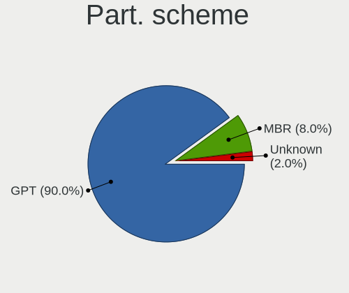
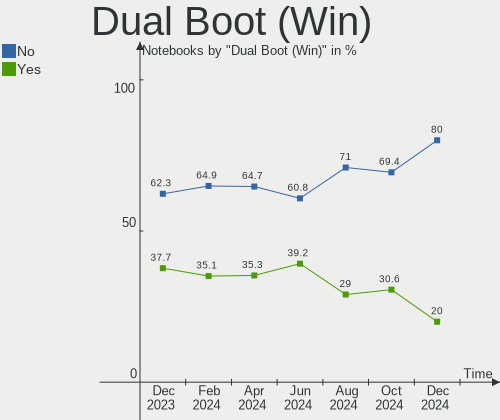
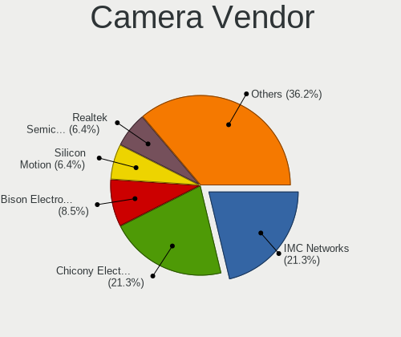

ArcoLinux - Hardware Trends (Notebooks)
---------------------------------------

A project to identify most popular hardware characteristics and track their change
over time based on data collected by Linux users at https://Linux-Hardware.org.

Anyone can contribute to this report by the [hw-probe](https://github.com/linuxhw/hw-probe) tool:

    sudo -E hw-probe -all -upload

This report is for one last month. Overall report since the beginning of time: [TestCoverage](https://github.com/linuxhw/TestCoverage)

Period: Jan, 2023.

Contents
--------

* [ System ](#system)
  - [ OS                       ](#os)
  - [ OS Family                ](#os-family)
  - [ Kernel                   ](#kernel)
  - [ Kernel Family            ](#kernel-family)
  - [ Kernel Major Ver.        ](#kernel-major-ver)
  - [ Arch                     ](#arch)
  - [ DE                       ](#de)
  - [ Display Server           ](#display-server)
  - [ Display Manager          ](#display-manager)
  - [ OS Lang                  ](#os-lang)
  - [ Boot Mode                ](#boot-mode)
  - [ Filesystem               ](#filesystem)
  - [ Part. scheme             ](#part-scheme)
  - [ Dual Boot with Linux/BSD ](#dual-boot-with-linuxbsd)
  - [ Dual Boot (Win)          ](#dual-boot-win)

* [ Board ](#board)
  - [ Vendor                   ](#vendor)
  - [ Model                    ](#model)
  - [ Model Family             ](#model-family)
  - [ MFG Year                 ](#mfg-year)
  - [ Form Factor              ](#form-factor)
  - [ Secure Boot              ](#secure-boot)
  - [ Coreboot                 ](#coreboot)
  - [ RAM Size                 ](#ram-size)
  - [ RAM Used                 ](#ram-used)
  - [ Total Drives             ](#total-drives)
  - [ Has CD-ROM               ](#has-cd-rom)
  - [ Has Ethernet             ](#has-ethernet)
  - [ Has WiFi                 ](#has-wifi)
  - [ Has Bluetooth            ](#has-bluetooth)

* [ Location ](#location)
  - [ Country                  ](#country)
  - [ City                     ](#city)

* [ Drives ](#drives)
  - [ Drive Vendor             ](#drive-vendor)
  - [ Drive Model              ](#drive-model)
  - [ HDD Vendor               ](#hdd-vendor)
  - [ SSD Vendor               ](#ssd-vendor)
  - [ Drive Kind               ](#drive-kind)
  - [ Drive Connector          ](#drive-connector)
  - [ Drive Size               ](#drive-size)
  - [ Space Total              ](#space-total)
  - [ Space Used               ](#space-used)
  - [ Malfunc. Drives          ](#malfunc-drives)
  - [ Malfunc. Drive Vendor    ](#malfunc-drive-vendor)
  - [ Malfunc. HDD Vendor      ](#malfunc-hdd-vendor)
  - [ Malfunc. Drive Kind      ](#malfunc-drive-kind)
  - [ Failed Drives            ](#failed-drives)
  - [ Failed Drive Vendor      ](#failed-drive-vendor)
  - [ Drive Status             ](#drive-status)

* [ Storage controller ](#storage-controller)
  - [ Storage Vendor           ](#storage-vendor)
  - [ Storage Model            ](#storage-model)
  - [ Storage Kind             ](#storage-kind)

* [ Processor ](#processor)
  - [ CPU Vendor               ](#cpu-vendor)
  - [ CPU Model                ](#cpu-model)
  - [ CPU Model Family         ](#cpu-model-family)
  - [ CPU Cores                ](#cpu-cores)
  - [ CPU Sockets              ](#cpu-sockets)
  - [ CPU Threads              ](#cpu-threads)
  - [ CPU Op-Modes             ](#cpu-op-modes)
  - [ CPU Microcode            ](#cpu-microcode)
  - [ CPU Microarch            ](#cpu-microarch)

* [ Graphics ](#graphics)
  - [ GPU Vendor               ](#gpu-vendor)
  - [ GPU Model                ](#gpu-model)
  - [ GPU Combo                ](#gpu-combo)
  - [ GPU Driver               ](#gpu-driver)
  - [ GPU Memory               ](#gpu-memory)

* [ Monitor ](#monitor)
  - [ Monitor Vendor           ](#monitor-vendor)
  - [ Monitor Model            ](#monitor-model)
  - [ Monitor Resolution       ](#monitor-resolution)
  - [ Monitor Diagonal         ](#monitor-diagonal)
  - [ Monitor Width            ](#monitor-width)
  - [ Aspect Ratio             ](#aspect-ratio)
  - [ Monitor Area             ](#monitor-area)
  - [ Pixel Density            ](#pixel-density)
  - [ Multiple Monitors        ](#multiple-monitors)

* [ Network ](#network)
  - [ Net Controller Vendor    ](#net-controller-vendor)
  - [ Net Controller Model     ](#net-controller-model)
  - [ Wireless Vendor          ](#wireless-vendor)
  - [ Wireless Model           ](#wireless-model)
  - [ Ethernet Vendor          ](#ethernet-vendor)
  - [ Ethernet Model           ](#ethernet-model)
  - [ Net Controller Kind      ](#net-controller-kind)
  - [ Used Controller          ](#used-controller)
  - [ NICs                     ](#nics)
  - [ IPv6                     ](#ipv6)

* [ Bluetooth ](#bluetooth)
  - [ Bluetooth Vendor         ](#bluetooth-vendor)
  - [ Bluetooth Model          ](#bluetooth-model)

* [ Sound ](#sound)
  - [ Sound Vendor             ](#sound-vendor)
  - [ Sound Model              ](#sound-model)

* [ Memory ](#memory)
  - [ Memory Vendor            ](#memory-vendor)
  - [ Memory Model             ](#memory-model)
  - [ Memory Kind              ](#memory-kind)
  - [ Memory Form Factor       ](#memory-form-factor)
  - [ Memory Size              ](#memory-size)
  - [ Memory Speed             ](#memory-speed)

* [ Printers & scanners ](#printers--scanners)
  - [ Printer Vendor           ](#printer-vendor)
  - [ Printer Model            ](#printer-model)
  - [ Scanner Vendor           ](#scanner-vendor)
  - [ Scanner Model            ](#scanner-model)

* [ Camera ](#camera)
  - [ Camera Vendor            ](#camera-vendor)
  - [ Camera Model             ](#camera-model)

* [ Security ](#security)
  - [ Fingerprint Vendor       ](#fingerprint-vendor)
  - [ Fingerprint Model        ](#fingerprint-model)
  - [ Chipcard Vendor          ](#chipcard-vendor)
  - [ Chipcard Model           ](#chipcard-model)

* [ Unsupported ](#unsupported)
  - [ Unsupported Devices      ](#unsupported-devices)
  - [ Unsupported Device Types ](#unsupported-device-types)

System
------

OS
--

Installed operating systems

| Name              | Notebooks | Percent |
|-------------------|-----------|---------|
| ArcoLinux Rolling | 32        | 94.12%  |
| ArcoLinux         | 2         | 5.88%   |

OS Family
---------

OS without a version

| Name      | Notebooks | Percent |
|-----------|-----------|---------|
| ArcoLinux | 34        | 100%    |

Kernel
------

Version of the Linux kernel

| Version          | Notebooks | Percent |
|------------------|-----------|---------|
| 6.1.7-arch1-1    | 4         | 11.76%  |
| 6.1.6-arch1-3    | 4         | 11.76%  |
| 6.1.2-arch1-1    | 4         | 11.76%  |
| 6.1.1-arch1-1    | 4         | 11.76%  |
| 6.1.4-arch1-1    | 3         | 8.82%   |
| 6.1.3-arch1-1    | 3         | 8.82%   |
| 6.1.6-arch1-1    | 2         | 5.88%   |
| 6.1.5-arch2-1    | 2         | 5.88%   |
| 5.15.89-1-lts    | 2         | 5.88%   |
| 6.1.7-zen1-1-zen | 1         | 2.94%   |
| 6.1.6-zen1-2-zen | 1         | 2.94%   |
| 6.1.3-zen1-1-zen | 1         | 2.94%   |
| 5.16.16-arch1-1  | 1         | 2.94%   |
| 5.15.86-1-lts    | 1         | 2.94%   |
| 5.15.64-1-lts    | 1         | 2.94%   |

Kernel Family
-------------

Linux kernel without a distro release

| Version | Notebooks | Percent |
|---------|-----------|---------|
| 6.1.6   | 7         | 20.59%  |
| 6.1.7   | 5         | 14.71%  |
| 6.1.3   | 4         | 11.76%  |
| 6.1.2   | 4         | 11.76%  |
| 6.1.1   | 4         | 11.76%  |
| 6.1.4   | 3         | 8.82%   |
| 6.1.5   | 2         | 5.88%   |
| 5.15.89 | 2         | 5.88%   |
| 5.16.16 | 1         | 2.94%   |
| 5.15.86 | 1         | 2.94%   |
| 5.15.64 | 1         | 2.94%   |

Kernel Major Ver.
-----------------

Linux kernel major version

| Version | Notebooks | Percent |
|---------|-----------|---------|
| 6.1     | 29        | 85.29%  |
| 5.15    | 4         | 11.76%  |
| 5.16    | 1         | 2.94%   |

Arch
----

OS architecture (x86_64, i586, etc.)

| Name   | Notebooks | Percent |
|--------|-----------|---------|
| x86_64 | 34        | 100%    |

DE
--

Desktop Environment

| Name         | Notebooks | Percent |
|--------------|-----------|---------|
| XFCE         | 10        | 29.41%  |
| X-Cinnamon   | 3         | 8.82%   |
| KDE5         | 3         | 8.82%   |
| i3           | 3         | 8.82%   |
| awesome      | 3         | 8.82%   |
| xmonad       | 2         | 5.88%   |
| GNOME        | 2         | 5.88%   |
| dwm          | 2         | 5.88%   |
| sway         | 1         | 2.94%   |
| MATE         | 1         | 2.94%   |
| LXQt         | 1         | 2.94%   |
| LeftWM       | 1         | 2.94%   |
| Hyprland     | 1         | 2.94%   |
| herbstluftwm | 1         | 2.94%   |

Display Server
--------------

X11 or Wayland

| Name    | Notebooks | Percent |
|---------|-----------|---------|
| X11     | 30        | 88.24%  |
| Wayland | 4         | 11.76%  |

Display Manager
---------------

SDDM, LightDM, etc.

| Name    | Notebooks | Percent |
|---------|-----------|---------|
| SDDM    | 23        | 67.65%  |
| LightDM | 6         | 17.65%  |
| GDM     | 3         | 8.82%   |
| Unknown | 2         | 5.88%   |

OS Lang
-------

Language

| Lang  | Notebooks | Percent |
|-------|-----------|---------|
| en_US | 17        | 50%     |
| es_ES | 3         | 8.82%   |
| en_GB | 3         | 8.82%   |
| pt_BR | 2         | 5.88%   |
| es_MX | 2         | 5.88%   |
| en_IN | 2         | 5.88%   |
| en_CA | 2         | 5.88%   |
| pl_PL | 1         | 2.94%   |
| en_NZ | 1         | 2.94%   |
| en_AU | 1         | 2.94%   |

Boot Mode
---------

EFI or BIOS

| Mode | Notebooks | Percent |
|------|-----------|---------|
| EFI  | 28        | 82.35%  |
| BIOS | 6         | 17.65%  |

Filesystem
----------

Type of filesystem

| Type  | Notebooks | Percent |
|-------|-----------|---------|
| Ext4  | 24        | 70.59%  |
| Btrfs | 10        | 29.41%  |

Part. scheme
------------

Scheme of partitioning

| Type    | Notebooks | Percent |
|---------|-----------|---------|
| GPT     | 27        | 79.41%  |
| MBR     | 5         | 14.71%  |
| Unknown | 2         | 5.88%   |

Dual Boot with Linux/BSD
------------------------

Hosting more than one Linux/BSD

| Dual boot | Notebooks | Percent |
|-----------|-----------|---------|
| No        | 26        | 76.47%  |
| Yes       | 8         | 23.53%  |

Dual Boot (Win)
---------------

Hosting Linux and Windows

| Dual boot | Notebooks | Percent |
|-----------|-----------|---------|
| No        | 20        | 58.82%  |
| Yes       | 14        | 41.18%  |

Board
-----

Vendor
------

Motherboard manufacturer

| Name             | Notebooks | Percent |
|------------------|-----------|---------|
| Lenovo           | 7         | 20.59%  |
| Hewlett-Packard  | 5         | 14.71%  |
| Dell             | 5         | 14.71%  |
| ASUSTek Computer | 4         | 11.76%  |
| Acer             | 3         | 8.82%   |
| System76         | 2         | 5.88%   |
| MSI              | 2         | 5.88%   |
| Chuwi            | 2         | 5.88%   |
| Toshiba          | 1         | 2.94%   |
| Timi             | 1         | 2.94%   |
| Apple            | 1         | 2.94%   |
| Alienware        | 1         | 2.94%   |

Model
-----

Motherboard model

| Name                                     | Notebooks | Percent |
|------------------------------------------|-----------|---------|
| Chuwi GemiBook Pro                       | 2         | 5.88%   |
| Toshiba Satellite Pro C50-A-1E6          | 1         | 2.94%   |
| Timi TM1701                              | 1         | 2.94%   |
| System76 Pangolin                        | 1         | 2.94%   |
| System76 Oryx Pro                        | 1         | 2.94%   |
| MSI Raider GE76 12UHS                    | 1         | 2.94%   |
| MSI GL65 Leopard 10SFK                   | 1         | 2.94%   |
| Lenovo ThinkPad X220 4291QZ1             | 1         | 2.94%   |
| Lenovo ThinkPad P1 20MDCTO1WW            | 1         | 2.94%   |
| Lenovo ThinkPad E14 Gen 2 20T6000KMX     | 1         | 2.94%   |
| Lenovo IdeaPad 5 15ITL05 82FG            | 1         | 2.94%   |
| Lenovo IdeaPad 5 14ARE05 81YM            | 1         | 2.94%   |
| Lenovo IdeaPad 320-15ISK 80XH            | 1         | 2.94%   |
| Lenovo IdeaPad 320-14AST 80XU            | 1         | 2.94%   |
| HP Pavilion Laptop 15-cw0xxx             | 1         | 2.94%   |
| HP Pavilion Gaming Laptop 15-cx0xxx      | 1         | 2.94%   |
| HP Folio 13                              | 1         | 2.94%   |
| HP ENVY Notebook                         | 1         | 2.94%   |
| HP ENVY 15                               | 1         | 2.94%   |
| Dell Precision M3800                     | 1         | 2.94%   |
| Dell Precision 7740                      | 1         | 2.94%   |
| Dell Latitude E5400                      | 1         | 2.94%   |
| Dell Latitude 7480                       | 1         | 2.94%   |
| Dell Inspiron 7472                       | 1         | 2.94%   |
| ASUS Zephyrus G GU502DU_GA502DU          | 1         | 2.94%   |
| ASUS ZenBook UX434FAC_UX434FA            | 1         | 2.94%   |
| ASUS VivoBook_ASUSLaptop M3500QA_M3500QA | 1         | 2.94%   |
| ASUS ROG Strix G532LWS_G532LWS           | 1         | 2.94%   |
| Apple MacBookPro6,2                      | 1         | 2.94%   |
| Alienware M17xR4                         | 1         | 2.94%   |
| Acer Predator G9-793                     | 1         | 2.94%   |
| Acer Aspire A715-75G                     | 1         | 2.94%   |
| Acer Aspire A515-52G                     | 1         | 2.94%   |

Model Family
------------

Motherboard model prefix

| Name              | Notebooks | Percent |
|-------------------|-----------|---------|
| Lenovo IdeaPad    | 4         | 11.76%  |
| Lenovo ThinkPad   | 3         | 8.82%   |
| HP Pavilion       | 2         | 5.88%   |
| HP ENVY           | 2         | 5.88%   |
| Dell Precision    | 2         | 5.88%   |
| Dell Latitude     | 2         | 5.88%   |
| Chuwi GemiBook    | 2         | 5.88%   |
| Acer Aspire       | 2         | 5.88%   |
| Toshiba Satellite | 1         | 2.94%   |
| Timi TM1701       | 1         | 2.94%   |
| System76 Pangolin | 1         | 2.94%   |
| System76 Oryx     | 1         | 2.94%   |
| MSI Raider        | 1         | 2.94%   |
| MSI GL65          | 1         | 2.94%   |
| HP Folio          | 1         | 2.94%   |
| Dell Inspiron     | 1         | 2.94%   |
| ASUS Zephyrus     | 1         | 2.94%   |
| ASUS ZenBook      | 1         | 2.94%   |
| ASUS VivoBook     | 1         | 2.94%   |
| ASUS ROG          | 1         | 2.94%   |
| Apple MacBookPro6 | 1         | 2.94%   |
| Alienware M17xR4  | 1         | 2.94%   |
| Acer Predator     | 1         | 2.94%   |

MFG Year
--------

Motherboard manufacture year

| Year | Notebooks | Percent |
|------|-----------|---------|
| 2020 | 5         | 14.71%  |
| 2019 | 5         | 14.71%  |
| 2018 | 5         | 14.71%  |
| 2021 | 4         | 11.76%  |
| 2017 | 4         | 11.76%  |
| 2022 | 2         | 5.88%   |
| 2013 | 2         | 5.88%   |
| 2011 | 2         | 5.88%   |
| 2010 | 2         | 5.88%   |
| 2016 | 1         | 2.94%   |
| 2012 | 1         | 2.94%   |
| 2008 | 1         | 2.94%   |

Form Factor
-----------

Physical design of the computer

| Name     | Notebooks | Percent |
|----------|-----------|---------|
| Notebook | 34        | 100%    |

Secure Boot
-----------

Enabled or disabled

| State    | Notebooks | Percent |
|----------|-----------|---------|
| Disabled | 34        | 100%    |

Coreboot
--------

Have coreboot on board

| Used | Notebooks | Percent |
|------|-----------|---------|
| No   | 34        | 100%    |

RAM Size
--------

Total RAM memory

| Size in GB  | Notebooks | Percent |
|-------------|-----------|---------|
| 8.01-16.0   | 12        | 35.29%  |
| 16.01-24.0  | 8         | 23.53%  |
| 4.01-8.0    | 6         | 17.65%  |
| 32.01-64.0  | 4         | 11.76%  |
| 3.01-4.0    | 2         | 5.88%   |
| 64.01-256.0 | 2         | 5.88%   |

RAM Used
--------

Used RAM memory

| Used GB  | Notebooks | Percent |
|----------|-----------|---------|
| 3.01-4.0 | 10        | 29.41%  |
| 2.01-3.0 | 10        | 29.41%  |
| 4.01-8.0 | 7         | 20.59%  |
| 1.01-2.0 | 7         | 20.59%  |

Total Drives
------------

Number of drives on board

| Drives | Notebooks | Percent |
|--------|-----------|---------|
| 1      | 18        | 52.94%  |
| 2      | 11        | 32.35%  |
| 3      | 4         | 11.76%  |
| 4      | 1         | 2.94%   |

Has CD-ROM
----------

Has CD-ROM on board

| Presented | Notebooks | Percent |
|-----------|-----------|---------|
| No        | 29        | 85.29%  |
| Yes       | 5         | 14.71%  |

Has Ethernet
------------

Has Ethernet on board

| Presented | Notebooks | Percent |
|-----------|-----------|---------|
| Yes       | 27        | 79.41%  |
| No        | 7         | 20.59%  |

Has WiFi
--------

Has WiFi module

| Presented | Notebooks | Percent |
|-----------|-----------|---------|
| Yes       | 33        | 97.06%  |
| No        | 1         | 2.94%   |

Has Bluetooth
-------------

Has Bluetooth module

| Presented | Notebooks | Percent |
|-----------|-----------|---------|
| Yes       | 33        | 97.06%  |
| No        | 1         | 2.94%   |

Location
--------

Country
-------

Geographic location (country)

| Country     | Notebooks | Percent |
|-------------|-----------|---------|
| USA         | 7         | 20.59%  |
| Spain       | 4         | 11.76%  |
| UK          | 2         | 5.88%   |
| India       | 2         | 5.88%   |
| Colombia    | 2         | 5.88%   |
| Canada      | 2         | 5.88%   |
| Brazil      | 2         | 5.88%   |
| Russia      | 1         | 2.94%   |
| Romania     | 1         | 2.94%   |
| Portugal    | 1         | 2.94%   |
| Poland      | 1         | 2.94%   |
| New Zealand | 1         | 2.94%   |
| Netherlands | 1         | 2.94%   |
| Mexico      | 1         | 2.94%   |
| Malaysia    | 1         | 2.94%   |
| Indonesia   | 1         | 2.94%   |
| Estonia     | 1         | 2.94%   |
| Ecuador     | 1         | 2.94%   |
| Chile       | 1         | 2.94%   |
| Australia   | 1         | 2.94%   |

City
----

Geographic location (city)

| City           | Notebooks | Percent |
|----------------|-----------|---------|
| Seville        | 2         | 5.88%   |
| Villavicencio  | 1         | 2.94%   |
| Twinsburg      | 1         | 2.94%   |
| Tallinn        | 1         | 2.94%   |
| Southampton    | 1         | 2.94%   |
| Santiago       | 1         | 2.94%   |
| Rio de Janeiro | 1         | 2.94%   |
| Rimbey         | 1         | 2.94%   |
| Quito          | 1         | 2.94%   |
| Odivelas       | 1         | 2.94%   |
| Moscow         | 1         | 2.94%   |
| Montreal       | 1         | 2.94%   |
| Mexico City    | 1         | 2.94%   |
| Madrid         | 1         | 2.94%   |
| Lucknow        | 1         | 2.94%   |
| Loveland       | 1         | 2.94%   |
| Lodz           | 1         | 2.94%   |
| Leland         | 1         | 2.94%   |
| Lansing        | 1         | 2.94%   |
| Jakarta        | 1         | 2.94%   |
| Ipoh           | 1         | 2.94%   |
| Houston        | 1         | 2.94%   |
| Eindhoven      | 1         | 2.94%   |
| Delhi          | 1         | 2.94%   |
| City of London | 1         | 2.94%   |
| Cambridge      | 1         | 2.94%   |
| Brunswick      | 1         | 2.94%   |
| Brisbane       | 1         | 2.94%   |
| Bogotá        | 1         | 2.94%   |
| Bilbao         | 1         | 2.94%   |
| Bebedouro      | 1         | 2.94%   |
| Auckland       | 1         | 2.94%   |
| Arad           | 1         | 2.94%   |

Drives
------

Drive Vendor
------------

Hard drive vendors

| Vendor                      | Notebooks | Drives | Percent |
|-----------------------------|-----------|--------|---------|
| Samsung Electronics         | 10        | 11     | 18.87%  |
| Seagate                     | 8         | 8      | 15.09%  |
| WDC                         | 4         | 5      | 7.55%   |
| Sandisk                     | 4         | 4      | 7.55%   |
| Toshiba                     | 3         | 3      | 5.66%   |
| Kingston Technology Company | 3         | 3      | 5.66%   |
| Intel                       | 3         | 5      | 5.66%   |
| Unknown                     | 2         | 2      | 3.77%   |
| SK hynix                    | 2         | 2      | 3.77%   |
| Micron Technology           | 2         | 2      | 3.77%   |
| Kingston                    | 2         | 2      | 3.77%   |
| Crucial                     | 2         | 2      | 3.77%   |
| Phison Electronics          | 1         | 1      | 1.89%   |
| Netac                       | 1         | 1      | 1.89%   |
| Micron/Crucial Technology   | 1         | 1      | 1.89%   |
| LITEONIT                    | 1         | 1      | 1.89%   |
| LITEON                      | 1         | 1      | 1.89%   |
| HGST                        | 1         | 1      | 1.89%   |
| Hewlett-Packard             | 1         | 1      | 1.89%   |
| Colorful                    | 1         | 1      | 1.89%   |

Drive Model
-----------

Hard drive models

| Model                                               | Notebooks | Percent |
|-----------------------------------------------------|-----------|---------|
| Samsung NVMe SSD Controller SM981/PM981/PM983 500GB | 4         | 7.14%   |
| Seagate ST2000LM007-1R8174 2TB                      | 3         | 5.36%   |
| WDC WD20SPZX-22UA7T0 2TB                            | 2         | 3.57%   |
| Samsung MZALQ512HALU-000L2 512GB                    | 2         | 3.57%   |
| Kingston Company U-SNS8154P3 NVMe SSD 256GB         | 2         | 3.57%   |
| Intel SSD 660P Series 512GB                         | 2         | 3.57%   |
| WDC WDS500G2B0B-00YS70 500GB SSD                    | 1         | 1.79%   |
| WDC WDBNCE0010PNC 1TB SSD                           | 1         | 1.79%   |
| WDC WD10SPZX-60Z10T0 1TB                            | 1         | 1.79%   |
| Unknown SD128  128GB                                | 1         | 1.79%   |
| Unknown MMC Card  134GB                             | 1         | 1.79%   |
| Toshiba XG6 NVMe SSD Controller 512GB               | 1         | 1.79%   |
| Toshiba MQ04ABF100 1TB                              | 1         | 1.79%   |
| Toshiba MQ01ABD100 1TB                              | 1         | 1.79%   |
| SK hynix HFM512GD3JX013N 512GB                      | 1         | 1.79%   |
| SK hynix BC501 NVMe Solid State Drive 512GB         | 1         | 1.79%   |
| Seagate ST1000LM035-1RK172 1TB                      | 1         | 1.79%   |
| Seagate ST1000LM024 HN-M101MBB 1TB                  | 1         | 1.79%   |
| Seagate ST1000LM014-1EJ164 1TB                      | 1         | 1.79%   |
| Seagate One Touch HDD 5TB                           | 1         | 1.79%   |
| Seagate Expansion 240GB                             | 1         | 1.79%   |
| Sandisk WD_BLACK SN770 1TB                          | 1         | 1.79%   |
| Sandisk WDC WDS500G2B0C-00PXH0 500GB                | 1         | 1.79%   |
| Sandisk WDC PC SN530 SDBPMPZ-256G-1001 256GB        | 1         | 1.79%   |
| Sandisk WD Blue SN550 NVMe SSD 1TB                  | 1         | 1.79%   |
| Samsung SSD PM851 mSATA 128GB                       | 1         | 1.79%   |
| Samsung SSD 870 EVO 500GB                           | 1         | 1.79%   |
| Samsung NVMe SSD Controller SM961/PM961/SM963 256GB | 1         | 1.79%   |
| Samsung MZNLN128HAHQ-000H1 128GB SSD                | 1         | 1.79%   |
| Samsung MZMPC128HBFU-000H1 128GB SSD                | 1         | 1.79%   |
| Phison E16 PCIe4 NVMe Controller 2TB                | 1         | 1.79%   |
| Netac NVMe SSD 512GB                                | 1         | 1.79%   |
| Micron/Crucial P1 NVMe PCIe SSD 1TB                 | 1         | 1.79%   |
| Micron 3400_MTFDKBA1T0TFH 1TB                       | 1         | 1.79%   |
| Micron 1100 SATA 256GB SSD                          | 1         | 1.79%   |
| LITEONIT LMT-128L9M-11 MSATA 128GB SSD              | 1         | 1.79%   |
| LITEON CV1-8B256 256GB SSD                          | 1         | 1.79%   |
| Kingston Company A2000 NVMe SSD 1TB                 | 1         | 1.79%   |
| Kingston SNVS250G 250GB                             | 1         | 1.79%   |
| Kingston SNVS1000GB 1TB                             | 1         | 1.79%   |

HDD Vendor
----------

Hard disk drive vendors

| Vendor  | Notebooks | Drives | Percent |
|---------|-----------|--------|---------|
| Seagate | 8         | 8      | 57.14%  |
| WDC     | 3         | 3      | 21.43%  |
| Toshiba | 2         | 2      | 14.29%  |
| HGST    | 1         | 1      | 7.14%   |

SSD Vendor
----------

Solid state drive vendors

| Vendor              | Notebooks | Drives | Percent |
|---------------------|-----------|--------|---------|
| Samsung Electronics | 3         | 4      | 25%     |
| WDC                 | 2         | 2      | 16.67%  |
| Crucial             | 2         | 2      | 16.67%  |
| Micron Technology   | 1         | 1      | 8.33%   |
| LITEONIT            | 1         | 1      | 8.33%   |
| LITEON              | 1         | 1      | 8.33%   |
| Hewlett-Packard     | 1         | 1      | 8.33%   |
| Colorful            | 1         | 1      | 8.33%   |

Drive Kind
----------

HDD or SSD

| Kind | Notebooks | Drives | Percent |
|------|-----------|--------|---------|
| NVMe | 20        | 28     | 42.55%  |
| HDD  | 14        | 14     | 29.79%  |
| SSD  | 11        | 13     | 23.4%   |
| MMC  | 2         | 2      | 4.26%   |

Drive Connector
---------------

SATA, SAS, NVMe, etc.

| Type | Notebooks | Drives | Percent |
|------|-----------|--------|---------|
| NVMe | 20        | 28     | 46.51%  |
| SATA | 19        | 25     | 44.19%  |
| SAS  | 2         | 2      | 4.65%   |
| MMC  | 2         | 2      | 4.65%   |

Drive Size
----------

Size of hard drive

| Size in TB | Notebooks | Drives | Percent |
|------------|-----------|--------|---------|
| 0.01-0.5   | 12        | 13     | 46.15%  |
| 0.51-1.0   | 8         | 8      | 30.77%  |
| 1.01-2.0   | 5         | 5      | 19.23%  |
| 4.01-10.0  | 1         | 1      | 3.85%   |

Space Total
-----------

Amount of disk space available on the file system

| Size in GB     | Notebooks | Percent |
|----------------|-----------|---------|
| 251-500        | 9         | 26.47%  |
| More than 3000 | 8         | 23.53%  |
| 101-250        | 8         | 23.53%  |
| 501-1000       | 5         | 14.71%  |
| 1001-2000      | 2         | 5.88%   |
| 51-100         | 1         | 2.94%   |
| Unknown        | 1         | 2.94%   |

Space Used
----------

Amount of used disk space

| Used GB        | Notebooks | Percent |
|----------------|-----------|---------|
| 101-250        | 13        | 38.24%  |
| 21-50          | 4         | 11.76%  |
| 1-20           | 4         | 11.76%  |
| 51-100         | 4         | 11.76%  |
| More than 3000 | 2         | 5.88%   |
| 251-500        | 2         | 5.88%   |
| 1001-2000      | 2         | 5.88%   |
| 2001-3000      | 1         | 2.94%   |
| 501-1000       | 1         | 2.94%   |
| Unknown        | 1         | 2.94%   |

Malfunc. Drives
---------------

Drive models with a malfunction

| Model                                          | Notebooks | Drives | Percent |
|------------------------------------------------|-----------|--------|---------|
| Toshiba MQ01ABD100 1TB                         | 1         | 1      | 25%     |
| Seagate ST1000LM024 HN-M101MBB 1TB             | 1         | 1      | 25%     |
| Micron/Crucial Technology P1 NVMe PCIe SSD 1TB | 1         | 1      | 25%     |
| HGST HTS725050A7E630 500GB                     | 1         | 1      | 25%     |

Malfunc. Drive Vendor
---------------------

Vendors of faulty drives

| Vendor                    | Notebooks | Drives | Percent |
|---------------------------|-----------|--------|---------|
| Toshiba                   | 1         | 1      | 25%     |
| Seagate                   | 1         | 1      | 25%     |
| Micron/Crucial Technology | 1         | 1      | 25%     |
| HGST                      | 1         | 1      | 25%     |

Malfunc. HDD Vendor
-------------------

Vendors of faulty HDD drives

| Vendor  | Notebooks | Drives | Percent |
|---------|-----------|--------|---------|
| Toshiba | 1         | 1      | 33.33%  |
| Seagate | 1         | 1      | 33.33%  |
| HGST    | 1         | 1      | 33.33%  |

Malfunc. Drive Kind
-------------------

Kinds of faulty drives

| Kind | Notebooks | Drives | Percent |
|------|-----------|--------|---------|
| HDD  | 3         | 3      | 75%     |
| NVMe | 1         | 1      | 25%     |

Failed Drives
-------------

Failed drive models

Zero info for selected period =(

Failed Drive Vendor
-------------------

Failed drive vendors

Zero info for selected period =(

Drive Status
------------

Number of failed and malfunc. drives

| Status   | Notebooks | Drives | Percent |
|----------|-----------|--------|---------|
| Works    | 29        | 47     | 76.32%  |
| Detected | 5         | 6      | 13.16%  |
| Malfunc  | 4         | 4      | 10.53%  |

Storage controller
------------------

Storage Vendor
--------------

Storage controller vendors

| Vendor                       | Notebooks | Percent |
|------------------------------|-----------|---------|
| Intel                        | 23        | 45.1%   |
| Samsung Electronics          | 7         | 13.73%  |
| SanDisk                      | 5         | 9.8%    |
| Kingston Technology Company  | 5         | 9.8%    |
| AMD                          | 4         | 7.84%   |
| SK hynix                     | 2         | 3.92%   |
| Toshiba America Info Systems | 1         | 1.96%   |
| Phison Electronics           | 1         | 1.96%   |
| Netac Technology             | 1         | 1.96%   |
| Micron/Crucial Technology    | 1         | 1.96%   |
| Micron Technology            | 1         | 1.96%   |

Storage Model
-------------

Storage controller models

| Model                                                                          | Notebooks | Percent |
|--------------------------------------------------------------------------------|-----------|---------|
| Samsung NVMe SSD Controller SM981/PM981/PM983                                  | 4         | 7.55%   |
| Intel Sunrise Point-LP SATA Controller [AHCI mode]                             | 4         | 7.55%   |
| AMD FCH SATA Controller [AHCI mode]                                            | 4         | 7.55%   |
| SanDisk Non-Volatile memory controller                                         | 3         | 5.66%   |
| Intel 82801 Mobile SATA Controller [RAID mode]                                 | 3         | 5.66%   |
| Samsung NVMe SSD Controller 980                                                | 2         | 3.77%   |
| Kingston Company U-SNS8154P3 NVMe SSD                                          | 2         | 3.77%   |
| Kingston Company Company Non-Volatile memory controller                        | 2         | 3.77%   |
| Intel SSD 660P Series                                                          | 2         | 3.77%   |
| Intel Jasper Lake SATA AHCI Controller                                         | 2         | 3.77%   |
| Intel Cannon Lake Mobile PCH SATA AHCI Controller                              | 2         | 3.77%   |
| Intel 8 Series/C220 Series Chipset Family 6-port SATA Controller 1 [AHCI mode] | 2         | 3.77%   |
| Intel 6 Series/C200 Series Chipset Family 6 port Mobile SATA AHCI Controller   | 2         | 3.77%   |
| Toshiba America Info Systems XG6 NVMe SSD Controller                           | 1         | 1.89%   |
| SK hynix Gold P31/PC711 NVMe Solid State Drive                                 | 1         | 1.89%   |
| SK hynix BC501 NVMe Solid State Drive                                          | 1         | 1.89%   |
| SanDisk WD Blue SN550 NVMe SSD                                                 | 1         | 1.89%   |
| SanDisk WD Blue SN500 / PC SN520 NVMe SSD                                      | 1         | 1.89%   |
| Samsung NVMe SSD Controller SM961/PM961/SM963                                  | 1         | 1.89%   |
| Phison E16 PCIe4 NVMe Controller                                               | 1         | 1.89%   |
| Netac Non-Volatile memory controller                                           | 1         | 1.89%   |
| Micron/Crucial P1 NVMe PCIe SSD                                                | 1         | 1.89%   |
| Micron Non-Volatile memory controller                                          | 1         | 1.89%   |
| Kingston Company A2000 NVMe SSD                                                | 1         | 1.89%   |
| Intel Volume Management Device NVMe RAID Controller                            | 1         | 1.89%   |
| Intel Tiger Lake-LP SATA Controller                                            | 1         | 1.89%   |
| Intel Non-Volatile memory controller                                           | 1         | 1.89%   |
| Intel Cannon Point-LP SATA Controller [AHCI Mode]                              | 1         | 1.89%   |
| Intel 82801IBM/IEM (ICH9M/ICH9M-E) 4 port SATA Controller [AHCI mode]          | 1         | 1.89%   |
| Intel 7 Series Chipset Family 6-port SATA Controller [AHCI mode]               | 1         | 1.89%   |
| Intel 5 Series/3400 Series Chipset 4 port SATA AHCI Controller                 | 1         | 1.89%   |
| Intel 400 Series Chipset Family SATA AHCI Controller                           | 1         | 1.89%   |

Storage Kind
------------

Kind of storage controller (IDE, SATA, NVMe, SAS, ...)

| Kind | Notebooks | Percent |
|------|-----------|---------|
| SATA | 22        | 46.81%  |
| NVMe | 21        | 44.68%  |
| RAID | 4         | 8.51%   |

Processor
---------

CPU Vendor
----------

Processor vendors

| Vendor | Notebooks | Percent |
|--------|-----------|---------|
| Intel  | 27        | 79.41%  |
| AMD    | 7         | 20.59%  |

CPU Model
---------

Processor models

| Model                                         | Notebooks | Percent |
|-----------------------------------------------|-----------|---------|
| Intel Core i7-9750H CPU @ 2.60GHz             | 2         | 5.88%   |
| Intel Celeron N5100 @ 1.10GHz                 | 2         | 5.88%   |
| Intel Xeon E-2286M CPU @ 2.40GHz              | 1         | 2.94%   |
| Intel Core i7-8750H CPU @ 2.20GHz             | 1         | 2.94%   |
| Intel Core i7-8550U CPU @ 1.80GHz             | 1         | 2.94%   |
| Intel Core i7-7700HQ CPU @ 2.80GHz            | 1         | 2.94%   |
| Intel Core i7-4702MQ CPU @ 2.20GHz            | 1         | 2.94%   |
| Intel Core i7-4702HQ CPU @ 2.20GHz            | 1         | 2.94%   |
| Intel Core i7-3740QM CPU @ 2.70GHz            | 1         | 2.94%   |
| Intel Core i7-3610QM CPU @ 2.30GHz            | 1         | 2.94%   |
| Intel Core i7-2620M CPU @ 2.70GHz             | 1         | 2.94%   |
| Intel Core i7-10875H CPU @ 2.30GHz            | 1         | 2.94%   |
| Intel Core i7-10750H CPU @ 2.60GHz            | 1         | 2.94%   |
| Intel Core i7-10510U CPU @ 1.80GHz            | 1         | 2.94%   |
| Intel Core i5-8300H CPU @ 2.30GHz             | 1         | 2.94%   |
| Intel Core i5-8265U CPU @ 1.60GHz             | 1         | 2.94%   |
| Intel Core i5-8250U CPU @ 1.60GHz             | 1         | 2.94%   |
| Intel Core i5-6300U CPU @ 2.40GHz             | 1         | 2.94%   |
| Intel Core i5-6200U CPU @ 2.30GHz             | 1         | 2.94%   |
| Intel Core i5-2467M CPU @ 1.60GHz             | 1         | 2.94%   |
| Intel Core i5 CPU M 520 @ 2.40GHz             | 1         | 2.94%   |
| Intel Core i3-6006U CPU @ 2.00GHz             | 1         | 2.94%   |
| Intel Core 2 Duo CPU T7250 @ 2.00GHz          | 1         | 2.94%   |
| Intel 12th Gen Core i7-12700H                 | 1         | 2.94%   |
| Intel 11th Gen Core i7-1165G7 @ 2.80GHz       | 1         | 2.94%   |
| AMD Ryzen 7 5800H with Radeon Graphics        | 1         | 2.94%   |
| AMD Ryzen 7 5700U with Radeon Graphics        | 1         | 2.94%   |
| AMD Ryzen 7 4700U with Radeon Graphics        | 1         | 2.94%   |
| AMD Ryzen 7 3750H with Radeon Vega Mobile Gfx | 1         | 2.94%   |
| AMD Ryzen 5 4500U with Radeon Graphics        | 1         | 2.94%   |
| AMD Ryzen 5 2500U with Radeon Vega Mobile Gfx | 1         | 2.94%   |
| AMD A9-9420 RADEON R5, 5 COMPUTE CORES 2C+3G  | 1         | 2.94%   |

CPU Model Family
----------------

Processor model prefix

| Model            | Notebooks | Percent |
|------------------|-----------|---------|
| Intel Core i7    | 13        | 38.24%  |
| Intel Core i5    | 7         | 20.59%  |
| AMD Ryzen 7      | 4         | 11.76%  |
| Other            | 3         | 8.82%   |
| Intel Celeron    | 2         | 5.88%   |
| AMD Ryzen 5      | 2         | 5.88%   |
| Intel Xeon       | 1         | 2.94%   |
| Intel Core i3    | 1         | 2.94%   |
| Intel Core 2 Duo | 1         | 2.94%   |

CPU Cores
---------

Number of processor cores

| Number | Notebooks | Percent |
|--------|-----------|---------|
| 4      | 15        | 44.12%  |
| 2      | 8         | 23.53%  |
| 8      | 5         | 14.71%  |
| 6      | 5         | 14.71%  |
| 14     | 1         | 2.94%   |

CPU Sockets
-----------

Number of sockets

| Number | Notebooks | Percent |
|--------|-----------|---------|
| 1      | 34        | 100%    |

CPU Threads
-----------

Threads per core (Hyper-Threading)

| Number | Notebooks | Percent |
|--------|-----------|---------|
| 2      | 28        | 82.35%  |
| 1      | 6         | 17.65%  |

CPU Op-Modes
------------

CPU Operation Modes (32-bit, 64-bit)

| Op mode        | Notebooks | Percent |
|----------------|-----------|---------|
| 32-bit, 64-bit | 34        | 100%    |

CPU Microcode
-------------

Microcode number

| Number     | Notebooks | Percent |
|------------|-----------|---------|
| 0x906ea    | 4         | 11.76%  |
| Unknown    | 4         | 11.76%  |
| 0x406e3    | 3         | 8.82%   |
| 0xa0652    | 2         | 5.88%   |
| 0x906c0    | 2         | 5.88%   |
| 0x306c3    | 2         | 5.88%   |
| 0x906ed    | 1         | 2.94%   |
| 0x906e9    | 1         | 2.94%   |
| 0x906a3    | 1         | 2.94%   |
| 0x806ec    | 1         | 2.94%   |
| 0x806eb    | 1         | 2.94%   |
| 0x806c1    | 1         | 2.94%   |
| 0x6fd      | 1         | 2.94%   |
| 0x306a9    | 1         | 2.94%   |
| 0x206a7    | 1         | 2.94%   |
| 0x20655    | 1         | 2.94%   |
| 0x0a50000c | 1         | 2.94%   |
| 0x08608103 | 1         | 2.94%   |
| 0x08600106 | 1         | 2.94%   |
| 0x08600103 | 1         | 2.94%   |
| 0x08108102 | 1         | 2.94%   |
| 0x0810100b | 1         | 2.94%   |
| 0x06006704 | 1         | 2.94%   |

CPU Microarch
-------------

Microarchitecture

| Name             | Notebooks | Percent |
|------------------|-----------|---------|
| KabyLake         | 10        | 29.41%  |
| Skylake          | 3         | 8.82%   |
| Zen 2            | 2         | 5.88%   |
| Tremont          | 2         | 5.88%   |
| SandyBridge      | 2         | 5.88%   |
| IvyBridge        | 2         | 5.88%   |
| Haswell          | 2         | 5.88%   |
| CometLake        | 2         | 5.88%   |
| Zen+             | 1         | 2.94%   |
| Zen 3            | 1         | 2.94%   |
| Zen              | 1         | 2.94%   |
| Westmere         | 1         | 2.94%   |
| TigerLake        | 1         | 2.94%   |
| Excavator        | 1         | 2.94%   |
| Core             | 1         | 2.94%   |
| Alderlake Hybrid | 1         | 2.94%   |
| Unknown          | 1         | 2.94%   |

Graphics
--------

GPU Vendor
----------

Vendors of graphics cards

| Vendor | Notebooks | Percent |
|--------|-----------|---------|
| Intel  | 24        | 48%     |
| Nvidia | 19        | 38%     |
| AMD    | 7         | 14%     |

GPU Model
---------

Graphics card models

| Model                                                                     | Notebooks | Percent |
|---------------------------------------------------------------------------|-----------|---------|
| Intel CoffeeLake-H GT2 [UHD Graphics 630]                                 | 4         | 8%      |
| Nvidia GP108M [GeForce MX150]                                             | 2         | 4%      |
| Intel UHD Graphics 620                                                    | 2         | 4%      |
| Intel Skylake GT2 [HD Graphics 520]                                       | 2         | 4%      |
| Intel JasperLake [UHD Graphics]                                           | 2         | 4%      |
| Intel CometLake-H GT2 [UHD Graphics]                                      | 2         | 4%      |
| Intel 4th Gen Core Processor Integrated Graphics Controller               | 2         | 4%      |
| Intel 2nd Generation Core Processor Family Integrated Graphics Controller | 2         | 4%      |
| AMD Renoir                                                                | 2         | 4%      |
| Nvidia TU117M [GeForce MX450]                                             | 1         | 2%      |
| Nvidia TU117M                                                             | 1         | 2%      |
| Nvidia TU116M [GeForce GTX 1660 Ti Mobile]                                | 1         | 2%      |
| Nvidia TU106M [GeForce RTX 2070 Mobile / Max-Q Refresh]                   | 1         | 2%      |
| Nvidia TU106M [GeForce RTX 2060 Mobile]                                   | 1         | 2%      |
| Nvidia TU106GLM [Quadro RTX 3000 Mobile / Max-Q]                          | 1         | 2%      |
| Nvidia TU104M [GeForce RTX 2070 SUPER Mobile / Max-Q]                     | 1         | 2%      |
| Nvidia GT216M [GeForce GT 330M]                                           | 1         | 2%      |
| Nvidia GP107M [GeForce GTX 1050 Mobile]                                   | 1         | 2%      |
| Nvidia GP107GLM [Quadro P1000 Mobile]                                     | 1         | 2%      |
| Nvidia GP104BM [GeForce GTX 1070 Mobile]                                  | 1         | 2%      |
| Nvidia GM108M [GeForce MX130]                                             | 1         | 2%      |
| Nvidia GM108M [GeForce 920MX]                                             | 1         | 2%      |
| Nvidia GK107M [GeForce GT 750M]                                           | 1         | 2%      |
| Nvidia GK107GLM [Quadro K1100M]                                           | 1         | 2%      |
| Nvidia GK104M [GeForce GTX 680M]                                          | 1         | 2%      |
| Nvidia GA103M [GeForce RTX 3080 Ti Mobile]                                | 1         | 2%      |
| Intel WhiskeyLake-U GT2 [UHD Graphics 620]                                | 1         | 2%      |
| Intel TigerLake-LP GT2 [Iris Xe Graphics]                                 | 1         | 2%      |
| Intel Mobile 4 Series Chipset Integrated Graphics Controller              | 1         | 2%      |
| Intel HD Graphics 520                                                     | 1         | 2%      |
| Intel Core Processor Integrated Graphics Controller                       | 1         | 2%      |
| Intel CometLake-U GT2 [UHD Graphics]                                      | 1         | 2%      |
| Intel Alder Lake-P Integrated Graphics Controller                         | 1         | 2%      |
| Intel 3rd Gen Core processor Graphics Controller                          | 1         | 2%      |
| AMD Stoney [Radeon R2/R3/R4/R5 Graphics]                                  | 1         | 2%      |
| AMD Raven Ridge [Radeon Vega Series / Radeon Vega Mobile Series]          | 1         | 2%      |
| AMD Picasso/Raven 2 [Radeon Vega Series / Radeon Vega Mobile Series]      | 1         | 2%      |
| AMD Lucienne                                                              | 1         | 2%      |
| AMD Cezanne [Radeon Vega Series / Radeon Vega Mobile Series]              | 1         | 2%      |

GPU Combo
---------

Combinations of graphics cards

| Name           | Notebooks | Percent |
|----------------|-----------|---------|
| Intel + Nvidia | 15        | 44.12%  |
| 1 x Intel      | 8         | 23.53%  |
| 1 x AMD        | 6         | 17.65%  |
| 1 x Nvidia     | 3         | 8.82%   |
| 2 x Intel      | 1         | 2.94%   |
| AMD + Nvidia   | 1         | 2.94%   |

GPU Driver
----------

Free vs proprietary

| Driver      | Notebooks | Percent |
|-------------|-----------|---------|
| Free        | 24        | 70.59%  |
| Proprietary | 10        | 29.41%  |

GPU Memory
----------

Total video memory

| Size in GB | Notebooks | Percent |
|------------|-----------|---------|
| Unknown    | 18        | 52.94%  |
| 0.01-0.5   | 6         | 17.65%  |
| 5.01-6.0   | 3         | 8.82%   |
| 3.01-4.0   | 2         | 5.88%   |
| 1.01-2.0   | 2         | 5.88%   |
| 7.01-8.0   | 1         | 2.94%   |
| 8.01-16.0  | 1         | 2.94%   |
| 0.51-1.0   | 1         | 2.94%   |

Monitor
-------

Monitor Vendor
--------------

Monitor vendors

| Vendor              | Notebooks | Percent |
|---------------------|-----------|---------|
| BOE                 | 11        | 24.44%  |
| LG Display          | 7         | 15.56%  |
| Samsung Electronics | 5         | 11.11%  |
| Chimei Innolux      | 5         | 11.11%  |
| AU Optronics        | 3         | 6.67%   |
| Sharp               | 2         | 4.44%   |
| Toshiba             | 1         | 2.22%   |
| PANDA               | 1         | 2.22%   |
| LG Philips          | 1         | 2.22%   |
| Lenovo              | 1         | 2.22%   |
| InfoVision          | 1         | 2.22%   |
| Iiyama              | 1         | 2.22%   |
| HUAWEI              | 1         | 2.22%   |
| Hewlett-Packard     | 1         | 2.22%   |
| BenQ                | 1         | 2.22%   |
| Apple               | 1         | 2.22%   |
| AOC                 | 1         | 2.22%   |
| Acer                | 1         | 2.22%   |

Monitor Model
-------------

Monitor models

| Model                                                                   | Notebooks | Percent |
|-------------------------------------------------------------------------|-----------|---------|
| Chimei Innolux P140ZKA-BZ1 CMN8C02 2160x1440 296x197mm 14.0-inch        | 2         | 4.44%   |
| Toshiba ScreenXpert TSB8888 1080x2160                                   | 1         | 2.22%   |
| Sharp LQ173M1JW08 SHP1544 1920x1080 382x215mm 17.3-inch                 | 1         | 2.22%   |
| Sharp LCD Monitor SHP13F8 3200x1800 346x194mm 15.6-inch                 | 1         | 2.22%   |
| Samsung Electronics S24R35xFZ SAM71A8 1920x1080 527x296mm 23.8-inch     | 1         | 2.22%   |
| Samsung Electronics LF22T35 SAM707B 1920x1080 477x268mm 21.5-inch       | 1         | 2.22%   |
| Samsung Electronics LCD Monitor SDC4161 1920x1080 344x194mm 15.5-inch   | 1         | 2.22%   |
| Samsung Electronics LCD Monitor SAM0F17 3840x2160 1872x1053mm 84.6-inch | 1         | 2.22%   |
| Samsung Electronics 173HT02-T01 SEC5044 1920x1080 382x215mm 17.3-inch   | 1         | 2.22%   |
| PANDA LCD Monitor NCP0036 1920x1080 344x194mm 15.5-inch                 | 1         | 2.22%   |
| LG Philips LCD Monitor LPL012B 1280x800 304x190mm 14.1-inch             | 1         | 2.22%   |
| LG Display LCD Monitor LGD0685 1920x1080 309x174mm 14.0-inch            | 1         | 2.22%   |
| LG Display LCD Monitor LGD065A 1920x1080 344x194mm 15.5-inch            | 1         | 2.22%   |
| LG Display LCD Monitor LGD0625 1920x1080 344x194mm 15.5-inch            | 1         | 2.22%   |
| LG Display LCD Monitor LGD0469 1920x1080 380x210mm 17.1-inch            | 1         | 2.22%   |
| LG Display LCD Monitor LGD033B 1366x768 344x194mm 15.5-inch             | 1         | 2.22%   |
| LG Display LCD Monitor LGD0312 1366x768 294x166mm 13.3-inch             | 1         | 2.22%   |
| LG Display LCD Monitor LGD02D3 1366x768 277x156mm 12.5-inch             | 1         | 2.22%   |
| Lenovo Q24i-1L LEN66C0 1920x1080 527x296mm 23.8-inch                    | 1         | 2.22%   |
| InfoVision LCD Monitor IVO061F 1920x1080 344x194mm 15.5-inch            | 1         | 2.22%   |
| Iiyama PL2792QN IVM6656 2560x1440 597x336mm 27.0-inch                   | 1         | 2.22%   |
| HUAWEI XWU-CBA HWV62F5 2560x1440 597x336mm 27.0-inch                    | 1         | 2.22%   |
| Hewlett-Packard V24i HPN36AC 1920x1080 527x296mm 23.8-inch              | 1         | 2.22%   |
| Chimei Innolux LCD Monitor CMN15FA 1920x1080 344x193mm 15.5-inch        | 1         | 2.22%   |
| Chimei Innolux LCD Monitor CMN15F5 1920x1080 344x193mm 15.5-inch        | 1         | 2.22%   |
| Chimei Innolux LCD Monitor CMN14C8 1920x1080 309x173mm 13.9-inch        | 1         | 2.22%   |
| BOE LCD Monitor BOE094A 1920x1080 344x194mm 15.5-inch                   | 1         | 2.22%   |
| BOE LCD Monitor BOE08D7 1920x1080 309x174mm 14.0-inch                   | 1         | 2.22%   |
| BOE LCD Monitor BOE07E9 1920x1080 309x174mm 14.0-inch                   | 1         | 2.22%   |
| BOE LCD Monitor BOE07B6 1920x1080 382x215mm 17.3-inch                   | 1         | 2.22%   |
| BOE LCD Monitor BOE07A1 1920x1080 344x193mm 15.5-inch                   | 1         | 2.22%   |
| BOE LCD Monitor BOE0792 1920x1080 344x194mm 15.5-inch                   | 1         | 2.22%   |
| BOE LCD Monitor BOE0747 1920x1080 344x194mm 15.5-inch                   | 1         | 2.22%   |
| BOE LCD Monitor BOE0729 1920x1080 344x193mm 15.5-inch                   | 1         | 2.22%   |
| BOE LCD Monitor BOE06BD 1366x768 309x173mm 13.9-inch                    | 1         | 2.22%   |
| BOE LCD Monitor BOE0638 1920x1080 309x173mm 13.9-inch                   | 1         | 2.22%   |
| BOE LCD Monitor BOE0618 1366x768 277x156mm 12.5-inch                    | 1         | 2.22%   |
| BenQ ZOWIE XL LCD BNQ7F58 1920x1080 540x300mm 24.3-inch                 | 1         | 2.22%   |
| AU Optronics LCD Monitor AUOBC8C 1920x1080 344x193mm 15.5-inch          | 1         | 2.22%   |
| AU Optronics LCD Monitor AUO333D 1920x1080 309x174mm 14.0-inch          | 1         | 2.22%   |

Monitor Resolution
------------------

Monitor screen resolution

| Resolution       | Notebooks | Percent |
|------------------|-----------|---------|
| 1920x1080 (FHD)  | 24        | 63.16%  |
| 1366x768 (WXGA)  | 5         | 13.16%  |
| 2560x1440 (QHD)  | 2         | 5.26%   |
| 2160x1440        | 2         | 5.26%   |
| 3840x2160 (4K)   | 1         | 2.63%   |
| 3200x1800 (QHD+) | 1         | 2.63%   |
| 1440x900 (WXGA+) | 1         | 2.63%   |
| 1280x800 (WXGA)  | 1         | 2.63%   |
| 1280x1024 (SXGA) | 1         | 2.63%   |

Monitor Diagonal
----------------

Diagonal size in inches

| Inches | Notebooks | Percent |
|--------|-----------|---------|
| 15     | 16        | 36.36%  |
| 14     | 7         | 15.91%  |
| 17     | 5         | 11.36%  |
| 13     | 4         | 9.09%   |
| 24     | 3         | 6.82%   |
| 27     | 2         | 4.55%   |
| 23     | 2         | 4.55%   |
| 12     | 2         | 4.55%   |
| 84     | 1         | 2.27%   |
| 26     | 1         | 2.27%   |
| 21     | 1         | 2.27%   |

Monitor Width
-------------

Physical width

| Width in mm | Notebooks | Percent |
|-------------|-----------|---------|
| 301-350     | 24        | 54.55%  |
| 501-600     | 8         | 18.18%  |
| 351-400     | 5         | 11.36%  |
| 201-300     | 5         | 11.36%  |
| 401-500     | 1         | 2.27%   |
| 1501-2000   | 1         | 2.27%   |

Aspect Ratio
------------

Proportional relationship between the width and the height

| Ratio | Notebooks | Percent |
|-------|-----------|---------|
| 16/9  | 30        | 85.71%  |
| 3/2   | 2         | 5.71%   |
| 16/10 | 2         | 5.71%   |
| 4/3   | 1         | 2.86%   |

Monitor Area
------------

Area in inch²

| Area in inch² | Notebooks | Percent |
|----------------|-----------|---------|
| 101-110        | 16        | 35.56%  |
| 81-90          | 10        | 22.22%  |
| 201-250        | 6         | 13.33%  |
| 121-130        | 5         | 11.11%  |
| 301-350        | 3         | 6.67%   |
| 61-70          | 2         | 4.44%   |
| More than 1000 | 1         | 2.22%   |
| 71-80          | 1         | 2.22%   |
| 251-300        | 1         | 2.22%   |

Pixel Density
-------------

Pixels per inch

| Density | Notebooks | Percent |
|---------|-----------|---------|
| 121-160 | 26        | 59.09%  |
| 101-120 | 8         | 18.18%  |
| 51-100  | 7         | 15.91%  |
| 161-240 | 3         | 6.82%   |

Multiple Monitors
-----------------

Total monitors connected

| Total | Notebooks | Percent |
|-------|-----------|---------|
| 1     | 24        | 70.59%  |
| 2     | 9         | 26.47%  |
| 3     | 1         | 2.94%   |

Network
-------

Net Controller Vendor
---------------------

Controller vendors

| Vendor                | Notebooks | Percent |
|-----------------------|-----------|---------|
| Intel                 | 24        | 45.28%  |
| Realtek Semiconductor | 16        | 30.19%  |
| Qualcomm Atheros      | 6         | 11.32%  |
| TP-Link               | 3         | 5.66%   |
| Samsung Electronics   | 1         | 1.89%   |
| MediaTek              | 1         | 1.89%   |
| Broadcom Limited      | 1         | 1.89%   |
| Broadcom              | 1         | 1.89%   |

Net Controller Model
--------------------

Controller models

| Model                                                             | Notebooks | Percent |
|-------------------------------------------------------------------|-----------|---------|
| Realtek RTL8111/8168/8411 PCI Express Gigabit Ethernet Controller | 14        | 22.58%  |
| Intel Wi-Fi 6 AX200                                               | 4         | 6.45%   |
| Qualcomm Atheros QCA6174 802.11ac Wireless Network Adapter        | 3         | 4.84%   |
| Intel Cannon Lake PCH CNVi WiFi                                   | 3         | 4.84%   |
| TP-Link UE300 10/100/1000 LAN (ethernet mode) [Realtek RTL8153]   | 2         | 3.23%   |
| Realtek RTL8821CE 802.11ac PCIe Wireless Network Adapter          | 2         | 3.23%   |
| Intel Wireless 8265 / 8275                                        | 2         | 3.23%   |
| Intel Wireless 7265                                               | 2         | 3.23%   |
| Intel Wireless 7260                                               | 2         | 3.23%   |
| Intel Comet Lake PCH CNVi WiFi                                    | 2         | 3.23%   |
| TP-Link TL-WN722N v2/v3 [Realtek RTL8188EUS]                      | 1         | 1.61%   |
| Samsung Galaxy series, misc. (tethering mode)                     | 1         | 1.61%   |
| Realtek RTL8821AE 802.11ac PCIe Wireless Network Adapter          | 1         | 1.61%   |
| Realtek RTL810xE PCI Express Fast Ethernet controller             | 1         | 1.61%   |
| Realtek Killer E3000 2.5GbE Controller                            | 1         | 1.61%   |
| Qualcomm Atheros QCA9377 802.11ac Wireless Network Adapter        | 1         | 1.61%   |
| Qualcomm Atheros QCA8171 Gigabit Ethernet                         | 1         | 1.61%   |
| Qualcomm Atheros Killer E2400 Gigabit Ethernet Controller         | 1         | 1.61%   |
| Qualcomm Atheros AR9462 Wireless Network Adapter                  | 1         | 1.61%   |
| Qualcomm Atheros AR8151 v2.0 Gigabit Ethernet                     | 1         | 1.61%   |
| MediaTek MT7921 802.11ax PCI Express Wireless Network Adapter     | 1         | 1.61%   |
| Intel Wireless 3165                                               | 1         | 1.61%   |
| Intel Wi-Fi 6 AX201                                               | 1         | 1.61%   |
| Intel Ethernet Connection (7) I219-V                              | 1         | 1.61%   |
| Intel Ethernet Connection (7) I219-LM                             | 1         | 1.61%   |
| Intel Ethernet Connection (4) I219-LM                             | 1         | 1.61%   |
| Intel Comet Lake PCH-LP CNVi WiFi                                 | 1         | 1.61%   |
| Intel Centrino Wireless-N 2230                                    | 1         | 1.61%   |
| Intel Centrino Wireless-N 1030 [Rainbow Peak]                     | 1         | 1.61%   |
| Intel Centrino Advanced-N 6205 [Taylor Peak]                      | 1         | 1.61%   |
| Intel Cannon Point-LP CNVi [Wireless-AC]                          | 1         | 1.61%   |
| Intel Alder Lake-P PCH CNVi WiFi                                  | 1         | 1.61%   |
| Intel 82579LM Gigabit Network Connection (Lewisville)             | 1         | 1.61%   |
| Broadcom NetXtreme BCM5764M Gigabit Ethernet PCIe                 | 1         | 1.61%   |
| Broadcom Limited NetXtreme BCM5761e Gigabit Ethernet PCIe         | 1         | 1.61%   |
| Broadcom BCM43224 802.11a/b/g/n                                   | 1         | 1.61%   |

Wireless Vendor
---------------

Wireless vendors

| Vendor                | Notebooks | Percent |
|-----------------------|-----------|---------|
| Intel                 | 23        | 67.65%  |
| Qualcomm Atheros      | 5         | 14.71%  |
| Realtek Semiconductor | 3         | 8.82%   |
| TP-Link               | 1         | 2.94%   |
| MediaTek              | 1         | 2.94%   |
| Broadcom              | 1         | 2.94%   |

Wireless Model
--------------

Wireless models

| Model                                                         | Notebooks | Percent |
|---------------------------------------------------------------|-----------|---------|
| Intel Wi-Fi 6 AX200                                           | 4         | 11.76%  |
| Qualcomm Atheros QCA6174 802.11ac Wireless Network Adapter    | 3         | 8.82%   |
| Intel Cannon Lake PCH CNVi WiFi                               | 3         | 8.82%   |
| Realtek RTL8821CE 802.11ac PCIe Wireless Network Adapter      | 2         | 5.88%   |
| Intel Wireless 8265 / 8275                                    | 2         | 5.88%   |
| Intel Wireless 7265                                           | 2         | 5.88%   |
| Intel Wireless 7260                                           | 2         | 5.88%   |
| Intel Comet Lake PCH CNVi WiFi                                | 2         | 5.88%   |
| TP-Link TL-WN722N v2/v3 [Realtek RTL8188EUS]                  | 1         | 2.94%   |
| Realtek RTL8821AE 802.11ac PCIe Wireless Network Adapter      | 1         | 2.94%   |
| Qualcomm Atheros QCA9377 802.11ac Wireless Network Adapter    | 1         | 2.94%   |
| Qualcomm Atheros AR9462 Wireless Network Adapter              | 1         | 2.94%   |
| MediaTek MT7921 802.11ax PCI Express Wireless Network Adapter | 1         | 2.94%   |
| Intel Wireless 3165                                           | 1         | 2.94%   |
| Intel Wi-Fi 6 AX201                                           | 1         | 2.94%   |
| Intel Comet Lake PCH-LP CNVi WiFi                             | 1         | 2.94%   |
| Intel Centrino Wireless-N 2230                                | 1         | 2.94%   |
| Intel Centrino Wireless-N 1030 [Rainbow Peak]                 | 1         | 2.94%   |
| Intel Centrino Advanced-N 6205 [Taylor Peak]                  | 1         | 2.94%   |
| Intel Cannon Point-LP CNVi [Wireless-AC]                      | 1         | 2.94%   |
| Intel Alder Lake-P PCH CNVi WiFi                              | 1         | 2.94%   |
| Broadcom BCM43224 802.11a/b/g/n                               | 1         | 2.94%   |

Ethernet Vendor
---------------

Ethernet vendors

| Vendor                | Notebooks | Percent |
|-----------------------|-----------|---------|
| Realtek Semiconductor | 16        | 57.14%  |
| Intel                 | 4         | 14.29%  |
| Qualcomm Atheros      | 3         | 10.71%  |
| TP-Link               | 2         | 7.14%   |
| Samsung Electronics   | 1         | 3.57%   |
| Broadcom Limited      | 1         | 3.57%   |
| Broadcom              | 1         | 3.57%   |

Ethernet Model
--------------

Ethernet models

| Model                                                             | Notebooks | Percent |
|-------------------------------------------------------------------|-----------|---------|
| Realtek RTL8111/8168/8411 PCI Express Gigabit Ethernet Controller | 14        | 50%     |
| TP-Link UE300 10/100/1000 LAN (ethernet mode) [Realtek RTL8153]   | 2         | 7.14%   |
| Samsung Galaxy series, misc. (tethering mode)                     | 1         | 3.57%   |
| Realtek RTL810xE PCI Express Fast Ethernet controller             | 1         | 3.57%   |
| Realtek Killer E3000 2.5GbE Controller                            | 1         | 3.57%   |
| Qualcomm Atheros QCA8171 Gigabit Ethernet                         | 1         | 3.57%   |
| Qualcomm Atheros Killer E2400 Gigabit Ethernet Controller         | 1         | 3.57%   |
| Qualcomm Atheros AR8151 v2.0 Gigabit Ethernet                     | 1         | 3.57%   |
| Intel Ethernet Connection (7) I219-V                              | 1         | 3.57%   |
| Intel Ethernet Connection (7) I219-LM                             | 1         | 3.57%   |
| Intel Ethernet Connection (4) I219-LM                             | 1         | 3.57%   |
| Intel 82579LM Gigabit Network Connection (Lewisville)             | 1         | 3.57%   |
| Broadcom NetXtreme BCM5764M Gigabit Ethernet PCIe                 | 1         | 3.57%   |
| Broadcom Limited NetXtreme BCM5761e Gigabit Ethernet PCIe         | 1         | 3.57%   |

Net Controller Kind
-------------------

Ethernet, WiFi or modem

| Kind     | Notebooks | Percent |
|----------|-----------|---------|
| WiFi     | 33        | 55%     |
| Ethernet | 27        | 45%     |

Used Controller
---------------

Currently used network controller

| Kind     | Notebooks | Percent |
|----------|-----------|---------|
| WiFi     | 26        | 70.27%  |
| Ethernet | 11        | 29.73%  |

NICs
----

Total network controllers on board

| Total | Notebooks | Percent |
|-------|-----------|---------|
| 2     | 25        | 73.53%  |
| 1     | 8         | 23.53%  |
| 0     | 1         | 2.94%   |

IPv6
----

IPv6 vs IPv4

| Used | Notebooks | Percent |
|------|-----------|---------|
| No   | 22        | 64.71%  |
| Yes  | 12        | 35.29%  |

Bluetooth
---------

Bluetooth Vendor
----------------

Controller vendors

| Vendor                          | Notebooks | Percent |
|---------------------------------|-----------|---------|
| Intel                           | 22        | 66.67%  |
| Qualcomm Atheros Communications | 4         | 12.12%  |
| Realtek Semiconductor           | 2         | 6.06%   |
| IMC Networks                    | 2         | 6.06%   |
| Toshiba                         | 1         | 3.03%   |
| Broadcom                        | 1         | 3.03%   |
| Apple                           | 1         | 3.03%   |

Bluetooth Model
---------------

Controller models

| Model                                          | Notebooks | Percent |
|------------------------------------------------|-----------|---------|
| Intel Bluetooth wireless interface             | 8         | 24.24%  |
| Intel Bluetooth Device                         | 5         | 15.15%  |
| Intel Bluetooth 9460/9560 Jefferson Peak (JfP) | 4         | 12.12%  |
| Intel AX200 Bluetooth                          | 4         | 12.12%  |
| Qualcomm Atheros  Bluetooth Device             | 3         | 9.09%   |
| Toshiba Atheros AR3012 Bluetooth               | 1         | 3.03%   |
| Realtek RTL8821A Bluetooth                     | 1         | 3.03%   |
| Realtek  Bluetooth 4.2 Adapter                 | 1         | 3.03%   |
| Qualcomm Atheros QCA61x4 Bluetooth 4.0         | 1         | 3.03%   |
| Intel Centrino Bluetooth Wireless Transceiver  | 1         | 3.03%   |
| IMC Networks Wireless_Device                   | 1         | 3.03%   |
| IMC Networks Bluetooth Radio                   | 1         | 3.03%   |
| Broadcom BCM2045B (BDC-2.1)                    | 1         | 3.03%   |
| Apple Bluetooth Host Controller                | 1         | 3.03%   |

Sound
-----

Sound Vendor
------------

Sound card vendors

| Vendor              | Notebooks | Percent |
|---------------------|-----------|---------|
| Intel               | 27        | 54%     |
| Nvidia              | 12        | 24%     |
| AMD                 | 7         | 14%     |
| Samson Technologies | 1         | 2%      |
| Plantronics         | 1         | 2%      |
| Logitech            | 1         | 2%      |
| C-Media Electronics | 1         | 2%      |

Sound Model
-----------

Sound card models

| Model                                                                      | Notebooks | Percent |
|----------------------------------------------------------------------------|-----------|---------|
| AMD Family 17h/19h HD Audio Controller                                     | 6         | 10%     |
| Intel Sunrise Point-LP HD Audio                                            | 5         | 8.33%   |
| Intel Cannon Lake PCH cAVS                                                 | 5         | 8.33%   |
| AMD Renoir Radeon High Definition Audio Controller                         | 4         | 6.67%   |
| Nvidia TU106 High Definition Audio Controller                              | 3         | 5%      |
| Nvidia GP107GL High Definition Audio Controller                            | 2         | 3.33%   |
| Intel Xeon E3-1200 v3/4th Gen Core Processor HD Audio Controller           | 2         | 3.33%   |
| Intel Jasper Lake HD Audio                                                 | 2         | 3.33%   |
| Intel Comet Lake PCH cAVS                                                  | 2         | 3.33%   |
| Intel 8 Series/C220 Series Chipset High Definition Audio Controller        | 2         | 3.33%   |
| Intel 7 Series/C216 Chipset Family High Definition Audio Controller        | 2         | 3.33%   |
| Intel 6 Series/C200 Series Chipset Family High Definition Audio Controller | 2         | 3.33%   |
| AMD Raven/Raven2/Fenghuang HDMI/DP Audio Controller                        | 2         | 3.33%   |
| Samson Technologies C01U Pro condenser microphone                          | 1         | 1.67%   |
| Plantronics BT600                                                          | 1         | 1.67%   |
| Nvidia TU116 High Definition Audio Controller                              | 1         | 1.67%   |
| Nvidia TU107 GeForce GTX 1650 High Definition Audio Controller             | 1         | 1.67%   |
| Nvidia TU104 HD Audio Controller                                           | 1         | 1.67%   |
| Nvidia stereo controller                                                   | 1         | 1.67%   |
| Nvidia GT216 HDMI Audio Controller                                         | 1         | 1.67%   |
| Nvidia GP104 High Definition Audio Controller                              | 1         | 1.67%   |
| Nvidia GK104 HDMI Audio Controller                                         | 1         | 1.67%   |
| Nvidia Audio device                                                        | 1         | 1.67%   |
| Logitech G433 Gaming Headset                                               | 1         | 1.67%   |
| Intel Tiger Lake-LP Smart Sound Technology Audio Controller                | 1         | 1.67%   |
| Intel Comet Lake PCH-LP cAVS                                               | 1         | 1.67%   |
| Intel CM238 HD Audio Controller                                            | 1         | 1.67%   |
| Intel Cannon Point-LP High Definition Audio Controller                     | 1         | 1.67%   |
| Intel Alder Lake PCH-P High Definition Audio Controller                    | 1         | 1.67%   |
| Intel 82801I (ICH9 Family) HD Audio Controller                             | 1         | 1.67%   |
| Intel 5 Series/3400 Series Chipset High Definition Audio                   | 1         | 1.67%   |
| C-Media Electronics USB Advanced Audio Device                              | 1         | 1.67%   |
| AMD High Definition Audio Controller                                       | 1         | 1.67%   |
| AMD Family 15h (Models 60h-6fh) Audio Controller                           | 1         | 1.67%   |

Memory
------

Memory Vendor
-------------

Memory module vendors

| Vendor              | Notebooks | Percent |
|---------------------|-----------|---------|
| Samsung Electronics | 12        | 33.33%  |
| Micron Technology   | 11        | 30.56%  |
| SK hynix            | 6         | 16.67%  |
| Crucial             | 3         | 8.33%   |
| Unknown             | 1         | 2.78%   |
| Timetec             | 1         | 2.78%   |
| Corsair             | 1         | 2.78%   |
| Apacer              | 1         | 2.78%   |

Memory Model
------------

Memory module models

| Model                                                          | Notebooks | Percent |
|----------------------------------------------------------------|-----------|---------|
| Samsung RAM M471A1K43DB1-CTD 8GB SODIMM DDR4 2667MT/s          | 2         | 5.26%   |
| Samsung RAM M471A1G44AB0-CWE 8GB SODIMM DDR4 3200MT/s          | 2         | 5.26%   |
| Micron RAM 8ATF1G64HZ-2G6E1 8GB SODIMM DDR4 2667MT/s           | 2         | 5.26%   |
| Micron RAM 53E1G32D4NQ-046WTE 4GB Row Of Chips LPDDR4 3200MT/s | 2         | 5.26%   |
| Unknown RAM Module 4GB SODIMM DDR4 2133MT/s                    | 1         | 2.63%   |
| Timetec RAM SD4-3200 16GB SODIMM DDR4 3200MT/s                 | 1         | 2.63%   |
| SK hynix RAM HMT41GS6BFR8A-PB 8GB SODIMM DDR3 1600MT/s         | 1         | 2.63%   |
| SK hynix RAM HMT351S6EFR8A-PB 4GB SODIMM DDR3 1600MT/s         | 1         | 2.63%   |
| SK hynix RAM HMT351S6CFR8C-H9 4GB SODIMM DDR3 1333MT/s         | 1         | 2.63%   |
| SK hynix RAM HMA82GS6CJR8N-VK 16GB SODIMM DDR4 2667MT/s        | 1         | 2.63%   |
| SK hynix RAM HMA82GS6AFR8N-UH 16GB SODIMM DDR4 2667MT/s        | 1         | 2.63%   |
| SK hynix RAM HMA81GS6DJR8N-VK 8GB SODIMM DDR4 2667MT/s         | 1         | 2.63%   |
| Samsung RAM M471B1G73DB0-YK0 8GB SODIMM DDR3 1600MT/s          | 1         | 2.63%   |
| Samsung RAM M471A5244CB0-CRC 4GB SODIMM DDR4 2667MT/s          | 1         | 2.63%   |
| Samsung RAM M471A5244BB0-CRC 4GB SODIMM DDR4 2667MT/s          | 1         | 2.63%   |
| Samsung RAM M471A2K43BB1-CRC 16GB SODIMM DDR4 2400MT/s         | 1         | 2.63%   |
| Samsung RAM M471A1K43DB1-CWE 8GB SODIMM DDR4 3200MT/s          | 1         | 2.63%   |
| Samsung RAM M471A1K43CB1-CTD 8GB SODIMM DDR4 2667MT/s          | 1         | 2.63%   |
| Samsung RAM M471A1K43BB1-CRC 8GB SODIMM DDR4 2667MT/s          | 1         | 2.63%   |
| Samsung RAM M471A1K43BB0-CPB 8GB SODIMM DDR4 2133MT/s          | 1         | 2.63%   |
| Samsung RAM M471A1G44AB0-CWE 8GB Row Of Chips DDR4 3200MT/s    | 1         | 2.63%   |
| Samsung RAM M425R2GA3BB0-CQKOL 16GB SODIMM DDR5 4800MT/s       | 1         | 2.63%   |
| Micron RAM MT52L1G32D4PG-093 8GB Row Of Chips LPDDR3 2133MT/s  | 1         | 2.63%   |
| Micron RAM LX8GDDR3LS1600 8GB SODIMM DDR3 1600MT/s             | 1         | 2.63%   |
| Micron RAM 8KTF51264HZ-1G6N1 4GB SODIMM DDR3 1600MT/s          | 1         | 2.63%   |
| Micron RAM 8ATF1G64HZ-2G3H1R 8GB SODIMM DDR4 2400MT/s          | 1         | 2.63%   |
| Micron RAM 4ATF1G64HZ-3G2E1 8GB SODIMM DDR4 3200MT/s           | 1         | 2.63%   |
| Micron RAM 16KTF1G64HZ-1G6E1 8GB SODIMM DDR3 1600MT/s          | 1         | 2.63%   |
| Micron RAM 16ATF4G64HZ-2G6B2 32GB SODIMM DDR4 2667MT/s         | 1         | 2.63%   |
| Crucial RAM CT8G4SFS824A.C8FE 8GB SODIMM DDR4 2667MT/s         | 1         | 2.63%   |
| Crucial RAM CT51264AC800.C16FC 4GB SODIMM DDR2 800MT/s         | 1         | 2.63%   |
| Crucial RAM CT32G4SFD832A.C16FE 32GB SODIMM DDR4 3200MT/s      | 1         | 2.63%   |
| Corsair RAM Module 4GB SODIMM DDR3 1067MT/s                    | 1         | 2.63%   |
| Apacer RAM D22.23263S.002 16GB SODIMM DDR4 2667MT/s            | 1         | 2.63%   |

Memory Kind
-----------

Memory module kinds

| Kind   | Notebooks | Percent |
|--------|-----------|---------|
| DDR4   | 21        | 65.63%  |
| DDR3   | 6         | 18.75%  |
| LPDDR4 | 2         | 6.25%   |
| LPDDR3 | 1         | 3.13%   |
| DDR5   | 1         | 3.13%   |
| DDR2   | 1         | 3.13%   |

Memory Form Factor
------------------

Physical design of the memory module

| Name         | Notebooks | Percent |
|--------------|-----------|---------|
| SODIMM       | 28        | 87.5%   |
| Row Of Chips | 4         | 12.5%   |

Memory Size
-----------

Memory module size

| Size  | Notebooks | Percent |
|-------|-----------|---------|
| 8192  | 17        | 48.57%  |
| 4096  | 9         | 25.71%  |
| 16384 | 7         | 20%     |
| 32768 | 2         | 5.71%   |

Memory Speed
------------

Memory module speed

| Speed | Notebooks | Percent |
|-------|-----------|---------|
| 2667  | 12        | 36.36%  |
| 3200  | 8         | 24.24%  |
| 1600  | 4         | 12.12%  |
| 2133  | 3         | 9.09%   |
| 2400  | 2         | 6.06%   |
| 4800  | 1         | 3.03%   |
| 1333  | 1         | 3.03%   |
| 1067  | 1         | 3.03%   |
| 800   | 1         | 3.03%   |

Printers & scanners
-------------------

Printer Vendor
--------------

Printer device vendors

Zero info for selected period =(

Printer Model
-------------

Printer device models

Zero info for selected period =(

Scanner Vendor
--------------

Scanner device vendors

Zero info for selected period =(

Scanner Model
-------------

Scanner device models

Zero info for selected period =(

Camera
------

Camera Vendor
-------------

Camera device vendors

| Vendor                        | Notebooks | Percent |
|-------------------------------|-----------|---------|
| Chicony Electronics           | 10        | 32.26%  |
| Realtek Semiconductor         | 5         | 16.13%  |
| Acer                          | 5         | 16.13%  |
| Microdia                      | 3         | 9.68%   |
| IMC Networks                  | 3         | 9.68%   |
| Syntek                        | 1         | 3.23%   |
| Sunplus Innovation Technology | 1         | 3.23%   |
| Samsung Electronics           | 1         | 3.23%   |
| Lite-On Technology            | 1         | 3.23%   |
| Apple                         | 1         | 3.23%   |

Camera Model
------------

Camera device models

| Model                                    | Notebooks | Percent |
|------------------------------------------|-----------|---------|
| Chicony Integrated Camera                | 3         | 9.68%   |
| Microdia Webcam Vitade AF                | 2         | 6.45%   |
| Chicony HP Wide Vision HD Camera         | 2         | 6.45%   |
| Chicony HD WebCam                        | 2         | 6.45%   |
| Acer BisonCam,NB Pro                     | 2         | 6.45%   |
| Syntek EasyCamera                        | 1         | 3.23%   |
| Sunplus HP TrueVision HD                 | 1         | 3.23%   |
| Samsung Galaxy A5 (MTP)                  | 1         | 3.23%   |
| Realtek Integrated_Webcam_HD             | 1         | 3.23%   |
| Realtek Integrated Webcam HD             | 1         | 3.23%   |
| Realtek Integrated Webcam                | 1         | 3.23%   |
| Realtek HP Truevision HD                 | 1         | 3.23%   |
| Realtek HP "Truevision HD" laptop camera | 1         | 3.23%   |
| Microdia Integrated_Webcam_HD            | 1         | 3.23%   |
| Lite-On TOSHIBA Web Camera - HD          | 1         | 3.23%   |
| IMC Networks USB2.0 HD UVC WebCam        | 1         | 3.23%   |
| IMC Networks USB2.0 HD IR UVC WebCam     | 1         | 3.23%   |
| IMC Networks Integrated Camera           | 1         | 3.23%   |
| Chicony XiaoMi USB 2.0 Webcam            | 1         | 3.23%   |
| Chicony Lenovo Integrated Camera (0.3MP) | 1         | 3.23%   |
| Chicony HD User Facing                   | 1         | 3.23%   |
| Apple Built-in iSight                    | 1         | 3.23%   |
| Acer Integrated Camera                   | 1         | 3.23%   |
| Acer HD Webcam                           | 1         | 3.23%   |
| Acer EasyCamera                          | 1         | 3.23%   |

Security
--------

Fingerprint Vendor
------------------

Fingerprint sensor vendors

| Vendor                     | Notebooks | Percent |
|----------------------------|-----------|---------|
| Validity Sensors           | 2         | 28.57%  |
| Synaptics                  | 2         | 28.57%  |
| Upek                       | 1         | 14.29%  |
| Shenzhen Goodix Technology | 1         | 14.29%  |
| Elan Microelectronics      | 1         | 14.29%  |

Fingerprint Model
-----------------

Fingerprint sensor models

| Model                                                  | Notebooks | Percent |
|--------------------------------------------------------|-----------|---------|
| Validity Sensors Swipe Fingerprint Sensor              | 2         | 28.57%  |
| Upek Biometric Touchchip/Touchstrip Fingerprint Sensor | 1         | 14.29%  |
| Synaptics Metallica MIS Touch Fingerprint Reader       | 1         | 14.29%  |
| Shenzhen Goodix  FingerPrint Device                    | 1         | 14.29%  |
| Elan ELAN:Fingerprint                                  | 1         | 14.29%  |
| Unknown                                                | 1         | 14.29%  |

Chipcard Vendor
---------------

Chipcard module vendors

| Vendor   | Notebooks | Percent |
|----------|-----------|---------|
| Broadcom | 2         | 100%    |

Chipcard Model
--------------

Chipcard module models

| Model          | Notebooks | Percent |
|----------------|-----------|---------|
| Broadcom 5880  | 1         | 50%     |
| Broadcom 58200 | 1         | 50%     |

Unsupported
-----------

Unsupported Devices
-------------------

Total unsupported devices on board

| Total | Notebooks | Percent |
|-------|-----------|---------|
| 0     | 17        | 50%     |
| 1     | 16        | 47.06%  |
| 2     | 1         | 2.94%   |

Unsupported Device Types
------------------------

Types of unsupported devices

| Type               | Notebooks | Percent |
|--------------------|-----------|---------|
| Fingerprint reader | 7         | 38.89%  |
| Graphics card      | 4         | 22.22%  |
| Net/wireless       | 2         | 11.11%  |
| Chipcard           | 2         | 11.11%  |
| Camera             | 2         | 11.11%  |
| Storage/nvme       | 1         | 5.56%   |

