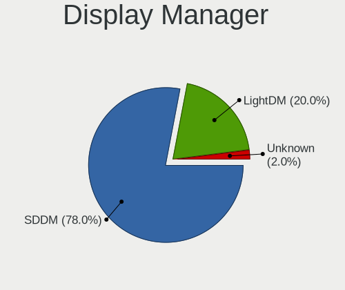
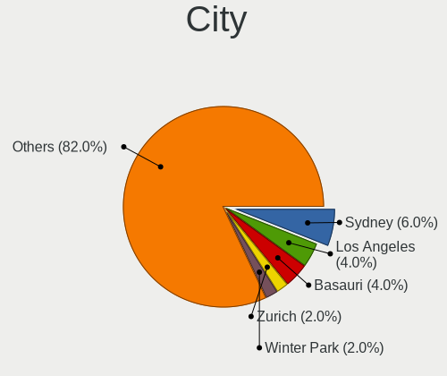
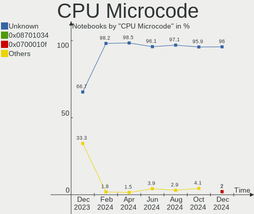
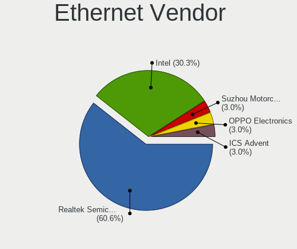
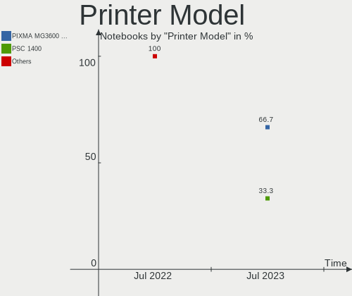
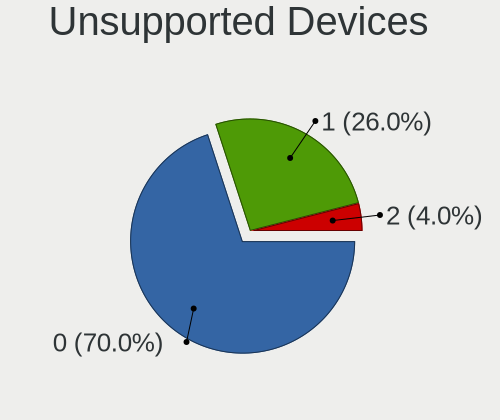

ArcoLinux Hardware Trends (Notebooks)
-------------------------------------

A project to identify most popular hardware characteristics and track their change
over time based on data collected by ArcoLinux users at https://Linux-Hardware.org.

Anyone can contribute to this report by the [hw-probe](https://github.com/linuxhw/hw-probe) tool:

    sudo -E hw-probe -all -upload

This report is for one last month. Overall report since the beginning of time: [TestCoverage](https://github.com/linuxhw/TestCoverage)

Period: Apr, 2022.

Contents
--------

* [ System ](#system)
  - [ OS                       ](#os)
  - [ OS Family                ](#os-family)
  - [ Kernel                   ](#kernel)
  - [ Kernel Family            ](#kernel-family)
  - [ Kernel Major Ver.        ](#kernel-major-ver)
  - [ Arch                     ](#arch)
  - [ DE                       ](#de)
  - [ Display Server           ](#display-server)
  - [ Display Manager          ](#display-manager)
  - [ OS Lang                  ](#os-lang)
  - [ Boot Mode                ](#boot-mode)
  - [ Filesystem               ](#filesystem)
  - [ Part. scheme             ](#part-scheme)
  - [ Dual Boot with Linux/BSD ](#dual-boot-with-linuxbsd)
  - [ Dual Boot (Win)          ](#dual-boot-win)

* [ Board ](#board)
  - [ Vendor                   ](#vendor)
  - [ Model                    ](#model)
  - [ Model Family             ](#model-family)
  - [ MFG Year                 ](#mfg-year)
  - [ Form Factor              ](#form-factor)
  - [ Secure Boot              ](#secure-boot)
  - [ Coreboot                 ](#coreboot)
  - [ RAM Size                 ](#ram-size)
  - [ RAM Used                 ](#ram-used)
  - [ Total Drives             ](#total-drives)
  - [ Has CD-ROM               ](#has-cd-rom)
  - [ Has Ethernet             ](#has-ethernet)
  - [ Has WiFi                 ](#has-wifi)
  - [ Has Bluetooth            ](#has-bluetooth)

* [ Location ](#location)
  - [ Country                  ](#country)
  - [ City                     ](#city)

* [ Drives ](#drives)
  - [ Drive Vendor             ](#drive-vendor)
  - [ Drive Model              ](#drive-model)
  - [ HDD Vendor               ](#hdd-vendor)
  - [ SSD Vendor               ](#ssd-vendor)
  - [ Drive Kind               ](#drive-kind)
  - [ Drive Connector          ](#drive-connector)
  - [ Drive Size               ](#drive-size)
  - [ Space Total              ](#space-total)
  - [ Space Used               ](#space-used)
  - [ Malfunc. Drives          ](#malfunc-drives)
  - [ Malfunc. Drive Vendor    ](#malfunc-drive-vendor)
  - [ Malfunc. HDD Vendor      ](#malfunc-hdd-vendor)
  - [ Malfunc. Drive Kind      ](#malfunc-drive-kind)
  - [ Failed Drives            ](#failed-drives)
  - [ Failed Drive Vendor      ](#failed-drive-vendor)
  - [ Drive Status             ](#drive-status)

* [ Storage controller ](#storage-controller)
  - [ Storage Vendor           ](#storage-vendor)
  - [ Storage Model            ](#storage-model)
  - [ Storage Kind             ](#storage-kind)

* [ Processor ](#processor)
  - [ CPU Vendor               ](#cpu-vendor)
  - [ CPU Model                ](#cpu-model)
  - [ CPU Model Family         ](#cpu-model-family)
  - [ CPU Cores                ](#cpu-cores)
  - [ CPU Sockets              ](#cpu-sockets)
  - [ CPU Threads              ](#cpu-threads)
  - [ CPU Op-Modes             ](#cpu-op-modes)
  - [ CPU Microcode            ](#cpu-microcode)
  - [ CPU Microarch            ](#cpu-microarch)

* [ Graphics ](#graphics)
  - [ GPU Vendor               ](#gpu-vendor)
  - [ GPU Model                ](#gpu-model)
  - [ GPU Combo                ](#gpu-combo)
  - [ GPU Driver               ](#gpu-driver)
  - [ GPU Memory               ](#gpu-memory)

* [ Monitor ](#monitor)
  - [ Monitor Vendor           ](#monitor-vendor)
  - [ Monitor Model            ](#monitor-model)
  - [ Monitor Resolution       ](#monitor-resolution)
  - [ Monitor Diagonal         ](#monitor-diagonal)
  - [ Monitor Width            ](#monitor-width)
  - [ Aspect Ratio             ](#aspect-ratio)
  - [ Monitor Area             ](#monitor-area)
  - [ Pixel Density            ](#pixel-density)
  - [ Multiple Monitors        ](#multiple-monitors)

* [ Network ](#network)
  - [ Net Controller Vendor    ](#net-controller-vendor)
  - [ Net Controller Model     ](#net-controller-model)
  - [ Wireless Vendor          ](#wireless-vendor)
  - [ Wireless Model           ](#wireless-model)
  - [ Ethernet Vendor          ](#ethernet-vendor)
  - [ Ethernet Model           ](#ethernet-model)
  - [ Net Controller Kind      ](#net-controller-kind)
  - [ Used Controller          ](#used-controller)
  - [ NICs                     ](#nics)
  - [ IPv6                     ](#ipv6)

* [ Bluetooth ](#bluetooth)
  - [ Bluetooth Vendor         ](#bluetooth-vendor)
  - [ Bluetooth Model          ](#bluetooth-model)

* [ Sound ](#sound)
  - [ Sound Vendor             ](#sound-vendor)
  - [ Sound Model              ](#sound-model)

* [ Memory ](#memory)
  - [ Memory Vendor            ](#memory-vendor)
  - [ Memory Model             ](#memory-model)
  - [ Memory Kind              ](#memory-kind)
  - [ Memory Form Factor       ](#memory-form-factor)
  - [ Memory Size              ](#memory-size)
  - [ Memory Speed             ](#memory-speed)

* [ Printers & scanners ](#printers--scanners)
  - [ Printer Vendor           ](#printer-vendor)
  - [ Printer Model            ](#printer-model)
  - [ Scanner Vendor           ](#scanner-vendor)
  - [ Scanner Model            ](#scanner-model)

* [ Camera ](#camera)
  - [ Camera Vendor            ](#camera-vendor)
  - [ Camera Model             ](#camera-model)

* [ Security ](#security)
  - [ Fingerprint Vendor       ](#fingerprint-vendor)
  - [ Fingerprint Model        ](#fingerprint-model)
  - [ Chipcard Vendor          ](#chipcard-vendor)
  - [ Chipcard Model           ](#chipcard-model)

* [ Unsupported ](#unsupported)
  - [ Unsupported Devices      ](#unsupported-devices)
  - [ Unsupported Device Types ](#unsupported-device-types)

System
------

OS
--

Installed operating systems

| Name              | Notebooks | Percent |
|-------------------|-----------|---------|
| ArcoLinux Rolling | 27        | 90%     |
| ArcoLinux         | 3         | 10%     |

OS Family
---------

OS without a version

| Name      | Notebooks | Percent |
|-----------|-----------|---------|
| ArcoLinux | 30        | 100%    |

Kernel
------

Version of the Linux kernel

| Version           | Notebooks | Percent |
|-------------------|-----------|---------|
| 5.17.1-arch1-1    | 11        | 36.67%  |
| 5.17.4-arch1-1    | 4         | 13.33%  |
| 5.17.3-zen1-1-zen | 2         | 6.67%   |
| 5.17.3-arch1-1    | 2         | 6.67%   |
| 5.17.1-zen1-1-zen | 2         | 6.67%   |
| 5.15.33-1-lts     | 2         | 6.67%   |
| 5.15.32-1-lts     | 2         | 6.67%   |
| 5.17.5-arch1-1    | 1         | 3.33%   |
| 5.17.2-arch3-1    | 1         | 3.33%   |
| 5.17.1-arch1-1.1  | 1         | 3.33%   |
| 5.16.16-arch1-1   | 1         | 3.33%   |
| 5.15.30-1-lts     | 1         | 3.33%   |

Kernel Family
-------------

Linux kernel without a distro release

| Version | Notebooks | Percent |
|---------|-----------|---------|
| 5.17.1  | 14        | 46.67%  |
| 5.17.4  | 4         | 13.33%  |
| 5.17.3  | 4         | 13.33%  |
| 5.15.33 | 2         | 6.67%   |
| 5.15.32 | 2         | 6.67%   |
| 5.17.5  | 1         | 3.33%   |
| 5.17.2  | 1         | 3.33%   |
| 5.16.16 | 1         | 3.33%   |
| 5.15.30 | 1         | 3.33%   |

Kernel Major Ver.
-----------------

Linux kernel major version

| Version | Notebooks | Percent |
|---------|-----------|---------|
| 5.17    | 24        | 80%     |
| 5.15    | 5         | 16.67%  |
| 5.16    | 1         | 3.33%   |

Arch
----

OS architecture (x86_64, i586, etc.)

| Name   | Notebooks | Percent |
|--------|-----------|---------|
| x86_64 | 30        | 100%    |

DE
--

Desktop Environment

| Name         | Notebooks | Percent |
|--------------|-----------|---------|
| XFCE         | 10        | 33.33%  |
| KDE5         | 5         | 16.67%  |
| i3           | 3         | 10%     |
| LeftWM       | 2         | 6.67%   |
| GNOME        | 2         | 6.67%   |
| awesome      | 2         | 6.67%   |
| X-Cinnamon   | 1         | 3.33%   |
| Unity        | 1         | 3.33%   |
| qtile        | 1         | 3.33%   |
| MATE         | 1         | 3.33%   |
| herbstluftwm | 1         | 3.33%   |
| bspwm        | 1         | 3.33%   |

Display Server
--------------

X11 or Wayland

| Name    | Notebooks | Percent |
|---------|-----------|---------|
| X11     | 27        | 90%     |
| Wayland | 3         | 10%     |

Display Manager
---------------

SDDM, LightDM, etc.

| Name    | Notebooks | Percent |
|---------|-----------|---------|
| SDDM    | 16        | 53.33%  |
| LightDM | 9         | 30%     |
| Unknown | 4         | 13.33%  |
| Ly      | 1         | 3.33%   |

OS Lang
-------

Language

| Lang  | Notebooks | Percent |
|-------|-----------|---------|
| en_US | 13        | 43.33%  |
| de_DE | 5         | 16.67%  |
| en_GB | 3         | 10%     |
| nl_NL | 1         | 3.33%   |
| fr_FR | 1         | 3.33%   |
| es_CO | 1         | 3.33%   |
| en_IN | 1         | 3.33%   |
| en_IE | 1         | 3.33%   |
| en_HK | 1         | 3.33%   |
| en_DK | 1         | 3.33%   |
| en_CA | 1         | 3.33%   |
| en_AU | 1         | 3.33%   |

Boot Mode
---------

EFI or BIOS

| Mode | Notebooks | Percent |
|------|-----------|---------|
| EFI  | 22        | 73.33%  |
| BIOS | 8         | 26.67%  |

Filesystem
----------

Type of filesystem

| Type    | Notebooks | Percent |
|---------|-----------|---------|
| Ext4    | 20        | 66.67%  |
| Btrfs   | 7         | 23.33%  |
| Xfs     | 1         | 3.33%   |
| Overlay | 1         | 3.33%   |
| F2fs    | 1         | 3.33%   |

Part. scheme
------------

Scheme of partitioning

| Type    | Notebooks | Percent |
|---------|-----------|---------|
| GPT     | 24        | 80%     |
| MBR     | 3         | 10%     |
| Unknown | 3         | 10%     |

Dual Boot with Linux/BSD
------------------------

Hosting more than one Linux/BSD

| Dual boot | Notebooks | Percent |
|-----------|-----------|---------|
| No        | 27        | 90%     |
| Yes       | 3         | 10%     |

Dual Boot (Win)
---------------

Hosting Linux and Windows

| Dual boot | Notebooks | Percent |
|-----------|-----------|---------|
| No        | 21        | 70%     |
| Yes       | 9         | 30%     |

Board
-----

Vendor
------

Motherboard manufacturer

| Name             | Notebooks | Percent |
|------------------|-----------|---------|
| Lenovo           | 11        | 36.67%  |
| Hewlett-Packard  | 6         | 20%     |
| Dell             | 5         | 16.67%  |
| ASUSTek Computer | 4         | 13.33%  |
| System76         | 1         | 3.33%   |
| Sony             | 1         | 3.33%   |
| Notebook         | 1         | 3.33%   |
| Apple            | 1         | 3.33%   |

Model
-----

Motherboard model

| Name                                  | Notebooks | Percent |
|---------------------------------------|-----------|---------|
| System76 Oryx Pro                     | 1         | 3.33%   |
| Sony SVE1712C1EW                      | 1         | 3.33%   |
| Notebook P65_P67RGRERA                | 1         | 3.33%   |
| Lenovo ThinkPad X220 4291IU6          | 1         | 3.33%   |
| Lenovo ThinkPad T480s 20L7001SGE      | 1         | 3.33%   |
| Lenovo ThinkPad T460 20FMS07000       | 1         | 3.33%   |
| Lenovo ThinkPad T410 2522AC1          | 1         | 3.33%   |
| Lenovo IdeaPad L340-15IRH Gaming 81LK | 1         | 3.33%   |
| Lenovo IdeaPad 5 15ARE05 81YQ         | 1         | 3.33%   |
| Lenovo IdeaPad 330-15ICH 81FK         | 1         | 3.33%   |
| Lenovo IdeaPad 320-15IKB 80YH         | 1         | 3.33%   |
| Lenovo IdeaPad 320-15IKB 80XL         | 1         | 3.33%   |
| Lenovo IdeaPad 310-15ISK 80SM         | 1         | 3.33%   |
| Lenovo IdeaPad 310-14ISK 80SL         | 1         | 3.33%   |
| HP ProBook 470 G2                     | 1         | 3.33%   |
| HP ProBook 4430s                      | 1         | 3.33%   |
| HP Pavilion g7                        | 1         | 3.33%   |
| HP Laptop 15s-gr0xxx                  | 1         | 3.33%   |
| HP Laptop 15s-eq2xxx                  | 1         | 3.33%   |
| HP EliteBook 820 G3                   | 1         | 3.33%   |
| Dell Latitude E7250                   | 1         | 3.33%   |
| Dell Latitude E6430                   | 1         | 3.33%   |
| Dell Latitude E6230                   | 1         | 3.33%   |
| Dell Latitude 5421                    | 1         | 3.33%   |
| Dell Latitude 3380                    | 1         | 3.33%   |
| ASUS VivoBook_ASUSLaptop X512UF       | 1         | 3.33%   |
| ASUS TUF Gaming FX705GM_FX705GM       | 1         | 3.33%   |
| ASUS TUF Gaming FX705GD_FX705GD       | 1         | 3.33%   |
| ASUS G752VSK                          | 1         | 3.33%   |
| Apple MacBookPro11,1                  | 1         | 3.33%   |

Model Family
------------

Motherboard model prefix

| Name               | Notebooks | Percent |
|--------------------|-----------|---------|
| Lenovo IdeaPad     | 7         | 23.33%  |
| Dell Latitude      | 5         | 16.67%  |
| Lenovo ThinkPad    | 4         | 13.33%  |
| HP ProBook         | 2         | 6.67%   |
| HP Laptop          | 2         | 6.67%   |
| ASUS TUF           | 2         | 6.67%   |
| System76 Oryx      | 1         | 3.33%   |
| Sony SVE1712C1EW   | 1         | 3.33%   |
| Notebook P65       | 1         | 3.33%   |
| HP Pavilion        | 1         | 3.33%   |
| HP EliteBook       | 1         | 3.33%   |
| ASUS VivoBook      | 1         | 3.33%   |
| ASUS G752VSK       | 1         | 3.33%   |
| Apple MacBookPro11 | 1         | 3.33%   |

MFG Year
--------

Motherboard manufacture year

| Year | Notebooks | Percent |
|------|-----------|---------|
| 2019 | 4         | 13.33%  |
| 2017 | 4         | 13.33%  |
| 2016 | 4         | 13.33%  |
| 2020 | 3         | 10%     |
| 2012 | 3         | 10%     |
| 2011 | 3         | 10%     |
| 2021 | 2         | 6.67%   |
| 2018 | 2         | 6.67%   |
| 2015 | 2         | 6.67%   |
| 2014 | 2         | 6.67%   |
| 2009 | 1         | 3.33%   |

Form Factor
-----------

Physical design of the computer

| Name     | Notebooks | Percent |
|----------|-----------|---------|
| Notebook | 30        | 100%    |

Secure Boot
-----------

Enabled or disabled

| State    | Notebooks | Percent |
|----------|-----------|---------|
| Disabled | 30        | 100%    |

Coreboot
--------

Have coreboot on board

| Used | Notebooks | Percent |
|------|-----------|---------|
| No   | 30        | 100%    |

RAM Size
--------

Total RAM memory

| Size in GB  | Notebooks | Percent |
|-------------|-----------|---------|
| 4.01-8.0    | 13        | 43.33%  |
| 16.01-24.0  | 7         | 23.33%  |
| 3.01-4.0    | 4         | 13.33%  |
| 8.01-16.0   | 3         | 10%     |
| 32.01-64.0  | 1         | 3.33%   |
| 24.01-32.0  | 1         | 3.33%   |
| 64.01-256.0 | 1         | 3.33%   |

RAM Used
--------

Used RAM memory

| Used GB  | Notebooks | Percent |
|----------|-----------|---------|
| 2.01-3.0 | 13        | 43.33%  |
| 1.01-2.0 | 11        | 36.67%  |
| 4.01-8.0 | 3         | 10%     |
| 0.51-1.0 | 2         | 6.67%   |
| 3.01-4.0 | 1         | 3.33%   |

Total Drives
------------

Number of drives on board

| Drives | Notebooks | Percent |
|--------|-----------|---------|
| 1      | 21        | 70%     |
| 2      | 8         | 26.67%  |
| 4      | 1         | 3.33%   |

Has CD-ROM
----------

Has CD-ROM on board

| Presented | Notebooks | Percent |
|-----------|-----------|---------|
| No        | 21        | 70%     |
| Yes       | 9         | 30%     |

Has Ethernet
------------

Has Ethernet on board

| Presented | Notebooks | Percent |
|-----------|-----------|---------|
| Yes       | 27        | 90%     |
| No        | 3         | 10%     |

Has WiFi
--------

Has WiFi module

| Presented | Notebooks | Percent |
|-----------|-----------|---------|
| Yes       | 30        | 100%    |

Has Bluetooth
-------------

Has Bluetooth module

| Presented | Notebooks | Percent |
|-----------|-----------|---------|
| Yes       | 26        | 86.67%  |
| No        | 4         | 13.33%  |

Location
--------

Country
-------

Geographic location (country)

| Country     | Notebooks | Percent |
|-------------|-----------|---------|
| Germany     | 6         | 20%     |
| Netherlands | 3         | 10%     |
| UK          | 2         | 6.67%   |
| Greece      | 2         | 6.67%   |
| Belgium     | 2         | 6.67%   |
| USA         | 1         | 3.33%   |
| Slovenia    | 1         | 3.33%   |
| Portugal    | 1         | 3.33%   |
| Poland      | 1         | 3.33%   |
| Norway      | 1         | 3.33%   |
| Mexico      | 1         | 3.33%   |
| Italy       | 1         | 3.33%   |
| Ireland     | 1         | 3.33%   |
| India       | 1         | 3.33%   |
| Hong Kong   | 1         | 3.33%   |
| Denmark     | 1         | 3.33%   |
| Colombia    | 1         | 3.33%   |
| Canada      | 1         | 3.33%   |
| Brazil      | 1         | 3.33%   |
| Australia   | 1         | 3.33%   |

City
----

Geographic location (city)

| City              | Notebooks | Percent |
|-------------------|-----------|---------|
| Kollow            | 2         | 6.67%   |
| Wroclaw           | 1         | 3.33%   |
| Winnipeg          | 1         | 3.33%   |
| Thessaloniki      | 1         | 3.33%   |
| Sydney            | 1         | 3.33%   |
| Solbergelva       | 1         | 3.33%   |
| Scandicci         | 1         | 3.33%   |
| Sao Joao del Rei  | 1         | 3.33%   |
| Portlaoise        | 1         | 3.33%   |
| Plano             | 1         | 3.33%   |
| Ochten            | 1         | 3.33%   |
| Meise             | 1         | 3.33%   |
| Lokeren           | 1         | 3.33%   |
| Ljubljana         | 1         | 3.33%   |
| Lisbon            | 1         | 3.33%   |
| Leeds             | 1         | 3.33%   |
| Ibague            | 1         | 3.33%   |
| Gorssel           | 1         | 3.33%   |
| Frankfurt am Main | 1         | 3.33%   |
| Esbjerg           | 1         | 3.33%   |
| Eppelborn         | 1         | 3.33%   |
| Edinburgh         | 1         | 3.33%   |
| Doetinchem        | 1         | 3.33%   |
| Cologne           | 1         | 3.33%   |
| Chennai           | 1         | 3.33%   |
| Central           | 1         | 3.33%   |
| Berlin            | 1         | 3.33%   |
| Athens            | 1         | 3.33%   |
| Agua Prieta       | 1         | 3.33%   |

Drives
------

Drive Vendor
------------

Hard drive vendors

| Vendor              | Notebooks | Drives | Percent |
|---------------------|-----------|--------|---------|
| WDC                 | 8         | 9      | 20%     |
| Samsung Electronics | 5         | 5      | 12.5%   |
| Toshiba             | 4         | 4      | 10%     |
| Crucial             | 4         | 4      | 10%     |
| Unknown             | 3         | 3      | 7.5%    |
| SK Hynix            | 3         | 3      | 7.5%    |
| Kingston            | 3         | 3      | 7.5%    |
| Seagate             | 2         | 2      | 5%      |
| SanDisk             | 2         | 2      | 5%      |
| LITEON              | 1         | 1      | 2.5%    |
| KIOXIA              | 1         | 1      | 2.5%    |
| Intel               | 1         | 1      | 2.5%    |
| HGST                | 1         | 1      | 2.5%    |
| Apple               | 1         | 1      | 2.5%    |
| A-DATA Technology   | 1         | 1      | 2.5%    |

Drive Model
-----------

Hard drive models

| Model                                | Notebooks | Percent |
|--------------------------------------|-----------|---------|
| WDC WD20SPZX-22UA7T0 2TB             | 2         | 4.88%   |
| Toshiba MQ04ABF100 1TB               | 2         | 4.88%   |
| Crucial CT480BX500SSD1 480GB         | 2         | 4.88%   |
| WDC WDS500G2B0B-00YS70 500GB SSD     | 1         | 2.44%   |
| WDC WDS500G2B0A-00SM50 500GB SSD     | 1         | 2.44%   |
| WDC WDS200T2B0C-00PXH0 2TB           | 1         | 2.44%   |
| WDC WD1200BEVS-60LAT0 120GB          | 1         | 2.44%   |
| WDC WD10SPZX-80Z10T2 1TB             | 1         | 2.44%   |
| WDC WD10JPCX-24UE4T0 1TB             | 1         | 2.44%   |
| WDC PC SN520 SDAPNUW-256G-1002 256GB | 1         | 2.44%   |
| Unknown SU04G  4GB                   | 1         | 2.44%   |
| Unknown SD128  128GB                 | 1         | 2.44%   |
| Unknown APPSD  134GB                 | 1         | 2.44%   |
| Toshiba MQ01ABF050 500GB             | 1         | 2.44%   |
| Toshiba MQ01ABD100 1TB               | 1         | 2.44%   |
| SK Hynix SC308 SATA 128GB SSD        | 1         | 2.44%   |
| SK Hynix SC210 mSATA 256GB SSD       | 1         | 2.44%   |
| SK Hynix HFS256GD9TNG-62A0A 256GB    | 1         | 2.44%   |
| Seagate ST1000LM048-2E7172 1TB       | 1         | 2.44%   |
| Seagate ST1000LM035-1RK172 1TB       | 1         | 2.44%   |
| SanDisk SD9SN8W256G1102 256GB SSD    | 1         | 2.44%   |
| SanDisk SD8SN8U-128G-1006 128GB SSD  | 1         | 2.44%   |
| Samsung SSD 860 EVO 1TB              | 1         | 2.44%   |
| Samsung SSD 850 EVO 500GB            | 1         | 2.44%   |
| Samsung MZVLB512HBJQ-000L2 512GB     | 1         | 2.44%   |
| Samsung MZVKW512HMJP-00000 512GB     | 1         | 2.44%   |
| Samsung MZ7LN256HMJP-000L7 256GB SSD | 1         | 2.44%   |
| LITEON CL1-4D128 128GB               | 1         | 2.44%   |
| KIOXIA KXG60ZNV512G NVMe 512GB       | 1         | 2.44%   |
| Kingston SA400S37480G 480GB SSD      | 1         | 2.44%   |
| Kingston SA400S37240G 240GB SSD      | 1         | 2.44%   |
| Kingston OM8SBP3512K-AH 512GB        | 1         | 2.44%   |
| Intel SSDSC2CW180A3 180GB            | 1         | 2.44%   |
| HGST HTS721010A9E630 1TB             | 1         | 2.44%   |
| Crucial CT250P2SSD8 250GB            | 1         | 2.44%   |
| Crucial CT1000MX500SSD4 1TB          | 1         | 2.44%   |
| Apple SSD SM0256F 256GB              | 1         | 2.44%   |
| A-DATA SU800 128GB SSD               | 1         | 2.44%   |

HDD Vendor
----------

Hard disk drive vendors

| Vendor  | Notebooks | Drives | Percent |
|---------|-----------|--------|---------|
| WDC     | 5         | 5      | 41.67%  |
| Toshiba | 4         | 4      | 33.33%  |
| Seagate | 2         | 2      | 16.67%  |
| HGST    | 1         | 1      | 8.33%   |

SSD Vendor
----------

Solid state drive vendors

| Vendor              | Notebooks | Drives | Percent |
|---------------------|-----------|--------|---------|
| Samsung Electronics | 3         | 3      | 17.65%  |
| Crucial             | 3         | 3      | 17.65%  |
| WDC                 | 2         | 2      | 11.76%  |
| SK Hynix            | 2         | 2      | 11.76%  |
| SanDisk             | 2         | 2      | 11.76%  |
| Kingston            | 2         | 2      | 11.76%  |
| Intel               | 1         | 1      | 5.88%   |
| Apple               | 1         | 1      | 5.88%   |
| A-DATA Technology   | 1         | 1      | 5.88%   |

Drive Kind
----------

HDD or SSD

| Kind | Notebooks | Drives | Percent |
|------|-----------|--------|---------|
| SSD  | 17        | 17     | 41.46%  |
| HDD  | 12        | 12     | 29.27%  |
| NVMe | 9         | 9      | 21.95%  |
| MMC  | 3         | 3      | 7.32%   |

Drive Connector
---------------

SATA, SAS, NVMe, etc.

| Type | Notebooks | Drives | Percent |
|------|-----------|--------|---------|
| SATA | 25        | 29     | 67.57%  |
| NVMe | 9         | 9      | 24.32%  |
| MMC  | 3         | 3      | 8.11%   |

Drive Size
----------

Size of hard drive

| Size in TB | Notebooks | Drives | Percent |
|------------|-----------|--------|---------|
| 0.01-0.5   | 17        | 17     | 58.62%  |
| 0.51-1.0   | 10        | 10     | 34.48%  |
| 1.01-2.0   | 2         | 2      | 6.9%    |

Space Total
-----------

Amount of disk space available on the file system

| Size in GB     | Notebooks | Percent |
|----------------|-----------|---------|
| 101-250        | 10        | 33.33%  |
| 251-500        | 6         | 20%     |
| 1001-2000      | 4         | 13.33%  |
| 501-1000       | 4         | 13.33%  |
| More than 3000 | 2         | 6.67%   |
| Unknown        | 2         | 6.67%   |
| 21-50          | 1         | 3.33%   |
| 2001-3000      | 1         | 3.33%   |

Space Used
----------

Amount of used disk space

| Used GB   | Notebooks | Percent |
|-----------|-----------|---------|
| 1-20      | 10        | 33.33%  |
| 101-250   | 7         | 23.33%  |
| 51-100    | 6         | 20%     |
| 251-500   | 2         | 6.67%   |
| 21-50     | 2         | 6.67%   |
| Unknown   | 2         | 6.67%   |
| 1001-2000 | 1         | 3.33%   |

Malfunc. Drives
---------------

Drive models with a malfunction

| Model                               | Notebooks | Drives | Percent |
|-------------------------------------|-----------|--------|---------|
| WDC WD10JPCX-24UE4T0 1TB            | 1         | 1      | 33.33%  |
| Toshiba MQ01ABD100 1TB              | 1         | 1      | 33.33%  |
| Samsung Electronics SSD 860 EVO 1TB | 1         | 1      | 33.33%  |

Malfunc. Drive Vendor
---------------------

Vendors of faulty drives

| Vendor              | Notebooks | Drives | Percent |
|---------------------|-----------|--------|---------|
| WDC                 | 1         | 1      | 33.33%  |
| Toshiba             | 1         | 1      | 33.33%  |
| Samsung Electronics | 1         | 1      | 33.33%  |

Malfunc. HDD Vendor
-------------------

Vendors of faulty HDD drives

| Vendor  | Notebooks | Drives | Percent |
|---------|-----------|--------|---------|
| WDC     | 1         | 1      | 50%     |
| Toshiba | 1         | 1      | 50%     |

Malfunc. Drive Kind
-------------------

Kinds of faulty drives

| Kind | Notebooks | Drives | Percent |
|------|-----------|--------|---------|
| HDD  | 2         | 2      | 66.67%  |
| SSD  | 1         | 1      | 33.33%  |

Failed Drives
-------------

Failed drive models

| Model                    | Notebooks | Drives | Percent |
|--------------------------|-----------|--------|---------|
| HGST HTS721010A9E630 1TB | 1         | 1      | 100%    |

Failed Drive Vendor
-------------------

Failed drive vendors

| Vendor | Notebooks | Drives | Percent |
|--------|-----------|--------|---------|
| HGST   | 1         | 1      | 100%    |

Drive Status
------------

Number of failed and malfunc. drives

| Status   | Notebooks | Drives | Percent |
|----------|-----------|--------|---------|
| Works    | 25        | 31     | 71.43%  |
| Detected | 6         | 6      | 17.14%  |
| Malfunc  | 3         | 3      | 8.57%   |
| Failed   | 1         | 1      | 2.86%   |

Storage controller
------------------

Storage Vendor
--------------

Storage controller vendors

| Vendor                       | Notebooks | Percent |
|------------------------------|-----------|---------|
| Intel                        | 24        | 64.86%  |
| Samsung Electronics          | 3         | 8.11%   |
| AMD                          | 3         | 8.11%   |
| Sandisk                      | 2         | 5.41%   |
| Toshiba America Info Systems | 1         | 2.7%    |
| SK Hynix                     | 1         | 2.7%    |
| Micron/Crucial Technology    | 1         | 2.7%    |
| Lite-On Technology           | 1         | 2.7%    |
| Kingston Technology Company  | 1         | 2.7%    |

Storage Model
-------------

Storage controller models

| Model                                                                         | Notebooks | Percent |
|-------------------------------------------------------------------------------|-----------|---------|
| Intel Sunrise Point-LP SATA Controller [AHCI mode]                            | 6         | 16.22%  |
| Intel 82801 Mobile SATA Controller [RAID mode]                                | 6         | 16.22%  |
| Intel Cannon Lake Mobile PCH SATA AHCI Controller                             | 4         | 10.81%  |
| AMD FCH SATA Controller [AHCI mode]                                           | 3         | 8.11%   |
| Intel 6 Series/C200 Series Chipset Family 6 port Mobile SATA AHCI Controller  | 2         | 5.41%   |
| Toshiba America Info Systems XG6 NVMe SSD Controller                          | 1         | 2.7%    |
| SK Hynix PC401 NVMe Solid State Drive 256GB                                   | 1         | 2.7%    |
| Sandisk WD Blue SN500 / PC SN520 NVMe SSD                                     | 1         | 2.7%    |
| Sandisk Non-Volatile memory controller                                        | 1         | 2.7%    |
| Samsung NVMe SSD Controller SM981/PM981/PM983                                 | 1         | 2.7%    |
| Samsung NVMe SSD Controller SM961/PM961/SM963                                 | 1         | 2.7%    |
| Samsung Apple PCIe SSD                                                        | 1         | 2.7%    |
| Micron/Crucial P2 NVMe PCIe SSD                                               | 1         | 2.7%    |
| Lite-On NVMe Controller                                                       | 1         | 2.7%    |
| Kingston Company Company Non-Volatile memory controller                       | 1         | 2.7%    |
| Intel Volume Management Device NVMe RAID Controller                           | 1         | 2.7%    |
| Intel Q170/Q150/B150/H170/H110/Z170/CM236 Chipset SATA Controller [AHCI Mode] | 1         | 2.7%    |
| Intel HM170/QM170 Chipset SATA Controller [AHCI Mode]                         | 1         | 2.7%    |
| Intel 8 Series SATA Controller 1 [AHCI mode]                                  | 1         | 2.7%    |
| Intel 7 Series Chipset Family 6-port SATA Controller [AHCI mode]              | 1         | 2.7%    |
| Intel 5 Series/3400 Series Chipset 6 port SATA AHCI Controller                | 1         | 2.7%    |

Storage Kind
------------

Kind of storage controller (IDE, SATA, NVMe, SAS, ...)

| Kind | Notebooks | Percent |
|------|-----------|---------|
| SATA | 21        | 56.76%  |
| NVMe | 9         | 24.32%  |
| RAID | 7         | 18.92%  |

Processor
---------

CPU Vendor
----------

Processor vendors

| Vendor | Notebooks | Percent |
|--------|-----------|---------|
| Intel  | 26        | 86.67%  |
| AMD    | 4         | 13.33%  |

CPU Model
---------

Processor models

| Model                                    | Notebooks | Percent |
|------------------------------------------|-----------|---------|
| Intel Core i7-8750H CPU @ 2.20GHz        | 2         | 6.67%   |
| Intel Core i5-6200U CPU @ 2.30GHz        | 2         | 6.67%   |
| Intel Pentium CPU B980 @ 2.40GHz         | 1         | 3.33%   |
| Intel Core i7-9750H CPU @ 2.60GHz        | 1         | 3.33%   |
| Intel Core i7-8550U CPU @ 1.80GHz        | 1         | 3.33%   |
| Intel Core i7-7700HQ CPU @ 2.80GHz       | 1         | 3.33%   |
| Intel Core i7-6700HQ CPU @ 2.60GHz       | 1         | 3.33%   |
| Intel Core i7-6500U CPU @ 2.50GHz        | 1         | 3.33%   |
| Intel Core i7-5600U CPU @ 2.60GHz        | 1         | 3.33%   |
| Intel Core i5-9300HF CPU @ 2.40GHz       | 1         | 3.33%   |
| Intel Core i5-8300H CPU @ 2.30GHz        | 1         | 3.33%   |
| Intel Core i5-8250U CPU @ 1.60GHz        | 1         | 3.33%   |
| Intel Core i5-7200U CPU @ 2.50GHz        | 1         | 3.33%   |
| Intel Core i5-6300U CPU @ 2.40GHz        | 1         | 3.33%   |
| Intel Core i5-4258U CPU @ 2.40GHz        | 1         | 3.33%   |
| Intel Core i5-4210U CPU @ 1.70GHz        | 1         | 3.33%   |
| Intel Core i5-3340M CPU @ 2.70GHz        | 1         | 3.33%   |
| Intel Core i5-3320M CPU @ 2.60GHz        | 1         | 3.33%   |
| Intel Core i5-2520M CPU @ 2.50GHz        | 1         | 3.33%   |
| Intel Core i5 CPU M 520 @ 2.40GHz        | 1         | 3.33%   |
| Intel Core i3-7100U CPU @ 2.40GHz        | 1         | 3.33%   |
| Intel Core i3-6006U CPU @ 2.00GHz        | 1         | 3.33%   |
| Intel Core i3-2350M CPU @ 2.30GHz        | 1         | 3.33%   |
| Intel 11th Gen Core i7-11850H @ 2.50GHz  | 1         | 3.33%   |
| AMD Ryzen 7 4800U with Radeon Graphics   | 1         | 3.33%   |
| AMD Ryzen 5 5500U with Radeon Graphics   | 1         | 3.33%   |
| AMD Ryzen 3 3250U with Radeon Graphics   | 1         | 3.33%   |
| AMD A6-4400M APU with Radeon HD Graphics | 1         | 3.33%   |

CPU Model Family
----------------

Processor model prefix

| Model         | Notebooks | Percent |
|---------------|-----------|---------|
| Intel Core i5 | 13        | 43.33%  |
| Intel Core i7 | 8         | 26.67%  |
| Intel Core i3 | 3         | 10%     |
| Other         | 1         | 3.33%   |
| Intel Pentium | 1         | 3.33%   |
| AMD Ryzen 7   | 1         | 3.33%   |
| AMD Ryzen 5   | 1         | 3.33%   |
| AMD Ryzen 3   | 1         | 3.33%   |
| AMD A6        | 1         | 3.33%   |

CPU Cores
---------

Number of processor cores

| Number | Notebooks | Percent |
|--------|-----------|---------|
| 2      | 17        | 56.67%  |
| 4      | 6         | 20%     |
| 6      | 4         | 13.33%  |
| 8      | 2         | 6.67%   |
| 1      | 1         | 3.33%   |

CPU Sockets
-----------

Number of sockets

| Number | Notebooks | Percent |
|--------|-----------|---------|
| 1      | 30        | 100%    |

CPU Threads
-----------

Threads per core (Hyper-Threading)

| Number | Notebooks | Percent |
|--------|-----------|---------|
| 2      | 29        | 96.67%  |
| 1      | 1         | 3.33%   |

CPU Op-Modes
------------

CPU Operation Modes (32-bit, 64-bit)

| Op mode        | Notebooks | Percent |
|----------------|-----------|---------|
| 32-bit, 64-bit | 30        | 100%    |

CPU Microcode
-------------

Microcode number

| Number     | Notebooks | Percent |
|------------|-----------|---------|
| 0x406e3    | 5         | 16.67%  |
| 0x906ea    | 4         | 13.33%  |
| Unknown    | 4         | 13.33%  |
| 0x206a7    | 3         | 10%     |
| 0x806ea    | 2         | 6.67%   |
| 0x806e9    | 2         | 6.67%   |
| 0x40651    | 2         | 6.67%   |
| 0x906e9    | 1         | 3.33%   |
| 0x806d1    | 1         | 3.33%   |
| 0x506e3    | 1         | 3.33%   |
| 0x306a9    | 1         | 3.33%   |
| 0x08608103 | 1         | 3.33%   |
| 0x08600106 | 1         | 3.33%   |
| 0x08108109 | 1         | 3.33%   |
| 0x06001116 | 1         | 3.33%   |

CPU Microarch
-------------

Microarchitecture

| Name        | Notebooks | Percent |
|-------------|-----------|---------|
| KabyLake    | 10        | 33.33%  |
| Skylake     | 6         | 20%     |
| SandyBridge | 3         | 10%     |
| IvyBridge   | 2         | 6.67%   |
| Haswell     | 2         | 6.67%   |
| Zen+        | 1         | 3.33%   |
| Zen 2       | 1         | 3.33%   |
| Westmere    | 1         | 3.33%   |
| Piledriver  | 1         | 3.33%   |
| Icelake     | 1         | 3.33%   |
| Broadwell   | 1         | 3.33%   |
| Unknown     | 1         | 3.33%   |

Graphics
--------

GPU Vendor
----------

Vendors of graphics cards

| Vendor | Notebooks | Percent |
|--------|-----------|---------|
| Intel  | 24        | 61.54%  |
| Nvidia | 10        | 25.64%  |
| AMD    | 5         | 12.82%  |

GPU Model
---------

Graphics card models

| Model                                                                     | Notebooks | Percent |
|---------------------------------------------------------------------------|-----------|---------|
| Intel Skylake GT2 [HD Graphics 520]                                       | 5         | 12.5%   |
| Intel CoffeeLake-H GT2 [UHD Graphics 630]                                 | 4         | 10%     |
| Intel 2nd Generation Core Processor Family Integrated Graphics Controller | 3         | 7.5%    |
| Nvidia GP107M [GeForce GTX 1050 Mobile]                                   | 2         | 5%      |
| Intel UHD Graphics 620                                                    | 2         | 5%      |
| Intel HD Graphics 620                                                     | 2         | 5%      |
| Intel Haswell-ULT Integrated Graphics Controller                          | 2         | 5%      |
| Intel 3rd Gen Core processor Graphics Controller                          | 2         | 5%      |
| Nvidia TU106M [GeForce RTX 2060 Mobile]                                   | 1         | 2.5%    |
| Nvidia GP107M [GeForce GTX 1050 3 GB Max-Q]                               | 1         | 2.5%    |
| Nvidia GP106M [GeForce GTX 1060 Mobile]                                   | 1         | 2.5%    |
| Nvidia GP104BM [GeForce GTX 1070 Mobile]                                  | 1         | 2.5%    |
| Nvidia GM204M [GeForce GTX 970M]                                          | 1         | 2.5%    |
| Nvidia GM108M [GeForce MX130]                                             | 1         | 2.5%    |
| Nvidia GM108M [GeForce 940MX]                                             | 1         | 2.5%    |
| Nvidia GM108M [GeForce 920MX]                                             | 1         | 2.5%    |
| Intel TigerLake-H GT1 [UHD Graphics]                                      | 1         | 2.5%    |
| Intel HD Graphics 5500                                                    | 1         | 2.5%    |
| Intel HD Graphics 530                                                     | 1         | 2.5%    |
| Intel Core Processor Integrated Graphics Controller                       | 1         | 2.5%    |
| AMD Trinity 2 [Radeon HD 7520G]                                           | 1         | 2.5%    |
| AMD Topaz PRO [Radeon R5 M255]                                            | 1         | 2.5%    |
| AMD Thames [Radeon HD 7500M/7600M Series]                                 | 1         | 2.5%    |
| AMD Renoir                                                                | 1         | 2.5%    |
| AMD Picasso/Raven 2 [Radeon Vega Series / Radeon Vega Mobile Series]      | 1         | 2.5%    |
| AMD Lucienne                                                              | 1         | 2.5%    |

GPU Combo
---------

Combinations of graphics cards

| Name           | Notebooks | Percent |
|----------------|-----------|---------|
| 1 x Intel      | 15        | 50%     |
| Intel + Nvidia | 8         | 26.67%  |
| 1 x AMD        | 3         | 10%     |
| 1 x Nvidia     | 2         | 6.67%   |
| 2 x AMD        | 1         | 3.33%   |
| Intel + AMD    | 1         | 3.33%   |

GPU Driver
----------

Free vs proprietary

| Driver      | Notebooks | Percent |
|-------------|-----------|---------|
| Free        | 25        | 83.33%  |
| Proprietary | 5         | 16.67%  |

GPU Memory
----------

Total video memory

| Size in GB | Notebooks | Percent |
|------------|-----------|---------|
| Unknown    | 20        | 66.67%  |
| 1.01-2.0   | 3         | 10%     |
| 0.01-0.5   | 3         | 10%     |
| 7.01-8.0   | 1         | 3.33%   |
| 5.01-6.0   | 1         | 3.33%   |
| 3.01-4.0   | 1         | 3.33%   |
| 0.51-1.0   | 1         | 3.33%   |

Monitor
-------

Monitor Vendor
--------------

Monitor vendors

| Vendor              | Notebooks | Percent |
|---------------------|-----------|---------|
| LG Display          | 7         | 18.92%  |
| Chimei Innolux      | 7         | 18.92%  |
| AU Optronics        | 7         | 18.92%  |
| BOE                 | 5         | 13.51%  |
| Samsung Electronics | 2         | 5.41%   |
| Philips             | 1         | 2.7%    |
| MSI                 | 1         | 2.7%    |
| Lenovo              | 1         | 2.7%    |
| InnoLux Display     | 1         | 2.7%    |
| Hewlett-Packard     | 1         | 2.7%    |
| Fujitsu Siemens     | 1         | 2.7%    |
| Dell                | 1         | 2.7%    |
| Apple               | 1         | 2.7%    |
| Acer                | 1         | 2.7%    |

Monitor Model
-------------

Monitor models

| Model                                                                 | Notebooks | Percent |
|-----------------------------------------------------------------------|-----------|---------|
| Samsung Electronics LCD Monitor SEC3941 1600x900 382x214mm 17.2-inch  | 1         | 2.7%    |
| Samsung Electronics LCD Monitor SAM090B 1920x1080 700x390mm 31.5-inch | 1         | 2.7%    |
| Philips PHL 243S7 PHL090F 1920x1080 530x300mm 24.0-inch               | 1         | 2.7%    |
| MSI G24C6 MSI3BA0 1920x1080 520x290mm 23.4-inch                       | 1         | 2.7%    |
| LG Display LCD Monitor LGD0521 1920x1080 309x174mm 14.0-inch          | 1         | 2.7%    |
| LG Display LCD Monitor LGD04FA 1366x768 309x174mm 14.0-inch           | 1         | 2.7%    |
| LG Display LCD Monitor LGD04E8 1920x1080 380x210mm 17.1-inch          | 1         | 2.7%    |
| LG Display LCD Monitor LGD0498 1366x768 277x156mm 12.5-inch           | 1         | 2.7%    |
| LG Display LCD Monitor LGD046F 1920x1080 344x194mm 15.5-inch          | 1         | 2.7%    |
| LG Display LCD Monitor LGD0450 1366x768 277x156mm 12.5-inch           | 1         | 2.7%    |
| LG Display LCD Monitor LGD02D8 1366x768 277x156mm 12.5-inch           | 1         | 2.7%    |
| Lenovo LCD Monitor LEN4035 1280x800 303x190mm 14.1-inch               | 1         | 2.7%    |
| InnoLux Display LCD Monitor INL0028 1366x768 309x174mm 14.0-inch      | 1         | 2.7%    |
| Hewlett-Packard 2309 HWP2821 1920x1080 510x287mm 23.0-inch            | 1         | 2.7%    |
| Fujitsu Siemens LSL 3230T FUS07A7 1920x1080 509x286mm 23.0-inch       | 1         | 2.7%    |
| Dell P2314H DEL4098 1920x1080 509x286mm 23.0-inch                     | 1         | 2.7%    |
| Chimei Innolux LCD Monitor CMN1733 1600x900 382x215mm 17.3-inch       | 1         | 2.7%    |
| Chimei Innolux LCD Monitor CMN1731 1600x900 382x215mm 17.3-inch       | 1         | 2.7%    |
| Chimei Innolux LCD Monitor CMN15F5 1920x1080 344x193mm 15.5-inch      | 1         | 2.7%    |
| Chimei Innolux LCD Monitor CMN15DB 1366x768 344x193mm 15.5-inch       | 1         | 2.7%    |
| Chimei Innolux LCD Monitor CMN15D5 1920x1080 344x193mm 15.5-inch      | 1         | 2.7%    |
| Chimei Innolux LCD Monitor CMN14C9 1920x1080 309x173mm 13.9-inch      | 1         | 2.7%    |
| Chimei Innolux LCD Monitor CMN1352 1366x768 293x165mm 13.2-inch       | 1         | 2.7%    |
| BOE LCD Monitor BOE094A 1920x1080 344x194mm 15.5-inch                 | 1         | 2.7%    |
| BOE LCD Monitor BOE091D 1920x1080 309x174mm 14.0-inch                 | 1         | 2.7%    |
| BOE LCD Monitor BOE08B9 1920x1080 344x194mm 15.5-inch                 | 1         | 2.7%    |
| BOE LCD Monitor BOE07B6 1920x1080 382x215mm 17.3-inch                 | 1         | 2.7%    |
| BOE LCD Monitor BOE0700 1920x1080 340x190mm 15.3-inch                 | 1         | 2.7%    |
| AU Optronics LCD Monitor AUO70EC 1366x768 344x193mm 15.5-inch         | 1         | 2.7%    |
| AU Optronics LCD Monitor AUO5799 1920x1080 344x194mm 15.5-inch        | 1         | 2.7%    |
| AU Optronics LCD Monitor AUO429D 1920x1080 382x215mm 17.3-inch        | 1         | 2.7%    |
| AU Optronics LCD Monitor AUO40ED 1920x1080 344x193mm 15.5-inch        | 1         | 2.7%    |
| AU Optronics LCD Monitor AUO409D 1920x1080 382x215mm 17.3-inch        | 1         | 2.7%    |
| AU Optronics LCD Monitor AUO313E 1600x900 309x174mm 14.0-inch         | 1         | 2.7%    |
| AU Optronics LCD Monitor AUO106C 1366x768 277x156mm 12.5-inch         | 1         | 2.7%    |
| Apple Color LCD APPA018 2560x1600 286x179mm 13.3-inch                 | 1         | 2.7%    |
| Acer VG271 ACR06E2 1920x1080 598x336mm 27.0-inch                      | 1         | 2.7%    |

Monitor Resolution
------------------

Monitor screen resolution

| Resolution      | Notebooks | Percent |
|-----------------|-----------|---------|
| 1920x1080 (FHD) | 18        | 54.55%  |
| 1366x768 (WXGA) | 9         | 27.27%  |
| 1600x900 (HD+)  | 4         | 12.12%  |
| 2560x1600       | 1         | 3.03%   |
| 1280x800 (WXGA) | 1         | 3.03%   |

Monitor Diagonal
----------------

Diagonal size in inches

| Inches | Notebooks | Percent |
|--------|-----------|---------|
| 15     | 10        | 27.03%  |
| 17     | 7         | 18.92%  |
| 14     | 6         | 16.22%  |
| 23     | 4         | 10.81%  |
| 12     | 4         | 10.81%  |
| 13     | 3         | 8.11%   |
| 54     | 1         | 2.7%    |
| 27     | 1         | 2.7%    |
| 24     | 1         | 2.7%    |

Monitor Width
-------------

Physical width

| Width in mm | Notebooks | Percent |
|-------------|-----------|---------|
| 301-350     | 17        | 47.22%  |
| 351-400     | 7         | 19.44%  |
| 201-300     | 6         | 16.67%  |
| 501-600     | 5         | 13.89%  |
| 1001-1500   | 1         | 2.78%   |

Aspect Ratio
------------

Proportional relationship between the width and the height

| Ratio | Notebooks | Percent |
|-------|-----------|---------|
| 16/9  | 29        | 93.55%  |
| 16/10 | 2         | 6.45%   |

Monitor Area
------------

Area in inch

| Area in inch | Notebooks | Percent |
|----------------|-----------|---------|
| 101-110        | 9         | 25%     |
| 81-90          | 7         | 19.44%  |
| 121-130        | 5         | 13.89%  |
| 61-70          | 4         | 11.11%  |
| 201-250        | 4         | 11.11%  |
| 71-80          | 2         | 5.56%   |
| 131-140        | 2         | 5.56%   |
| More than 1000 | 1         | 2.78%   |
| 301-350        | 1         | 2.78%   |
| 91-100         | 1         | 2.78%   |

Pixel Density
-------------

Pixels per inch

| Density | Notebooks | Percent |
|---------|-----------|---------|
| 121-160 | 20        | 55.56%  |
| 101-120 | 9         | 25%     |
| 51-100  | 5         | 13.89%  |
| 1-50    | 1         | 2.78%   |
| 161-240 | 1         | 2.78%   |

Multiple Monitors
-----------------

Total monitors connected

| Total | Notebooks | Percent |
|-------|-----------|---------|
| 1     | 23        | 76.67%  |
| 2     | 6         | 20%     |
| 3     | 1         | 3.33%   |

Network
-------

Net Controller Vendor
---------------------

Controller vendors

| Vendor                | Notebooks | Percent |
|-----------------------|-----------|---------|
| Realtek Semiconductor | 19        | 41.3%   |
| Intel                 | 18        | 39.13%  |
| Qualcomm Atheros      | 5         | 10.87%  |
| Dell                  | 2         | 4.35%   |
| Ralink                | 1         | 2.17%   |
| Broadcom Limited      | 1         | 2.17%   |

Net Controller Model
--------------------

Controller models

| Model                                                             | Notebooks | Percent |
|-------------------------------------------------------------------|-----------|---------|
| Realtek RTL8111/8168/8411 PCI Express Gigabit Ethernet Controller | 16        | 26.67%  |
| Intel Cannon Lake PCH CNVi WiFi                                   | 4         | 6.67%   |
| Realtek RTL8821CE 802.11ac PCIe Wireless Network Adapter          | 3         | 5%      |
| Qualcomm Atheros QCA9377 802.11ac Wireless Network Adapter        | 3         | 5%      |
| Intel Wireless 8260                                               | 3         | 5%      |
| Intel 82579LM Gigabit Network Connection (Lewisville)             | 3         | 5%      |
| Realtek RTL8153 Gigabit Ethernet Adapter                          | 2         | 3.33%   |
| Intel Dual Band Wireless-AC 3165 Plus Bluetooth                   | 2         | 3.33%   |
| Intel Centrino Ultimate-N 6300                                    | 2         | 3.33%   |
| Intel Centrino Advanced-N 6205 [Taylor Peak]                      | 2         | 3.33%   |
| Realtek RTL8723BE PCIe Wireless Network Adapter                   | 1         | 1.67%   |
| Realtek RTL8188CE 802.11b/g/n WiFi Adapter                        | 1         | 1.67%   |
| Realtek RTL810xE PCI Express Fast Ethernet controller             | 1         | 1.67%   |
| Ralink RT3290 Wireless 802.11n 1T/1R PCIe                         | 1         | 1.67%   |
| Qualcomm Atheros QCA6174 802.11ac Wireless Network Adapter        | 1         | 1.67%   |
| Qualcomm Atheros AR9485 Wireless Network Adapter                  | 1         | 1.67%   |
| Intel Wireless 8265 / 8275                                        | 1         | 1.67%   |
| Intel Wireless 7265                                               | 1         | 1.67%   |
| Intel Wireless 3160                                               | 1         | 1.67%   |
| Intel Wi-Fi 6 AX200                                               | 1         | 1.67%   |
| Intel Tiger Lake PCH CNVi WiFi                                    | 1         | 1.67%   |
| Intel Ethernet Connection I219-V                                  | 1         | 1.67%   |
| Intel Ethernet Connection I219-LM                                 | 1         | 1.67%   |
| Intel Ethernet Connection (4) I219-V                              | 1         | 1.67%   |
| Intel Ethernet Connection (3) I218-LM                             | 1         | 1.67%   |
| Intel Ethernet Connection (14) I219-LM                            | 1         | 1.67%   |
| Intel 82577LM Gigabit Network Connection                          | 1         | 1.67%   |
| Dell DW5820e L850-GL                                              | 1         | 1.67%   |
| Dell DW5560 miniPCIe HSPA+ Mobile Broadband Modem                 | 1         | 1.67%   |
| Broadcom Limited BCM4360 802.11ac Wireless Network Adapter        | 1         | 1.67%   |

Wireless Vendor
---------------

Wireless vendors

| Vendor                | Notebooks | Percent |
|-----------------------|-----------|---------|
| Intel                 | 18        | 58.06%  |
| Realtek Semiconductor | 5         | 16.13%  |
| Qualcomm Atheros      | 5         | 16.13%  |
| Ralink                | 1         | 3.23%   |
| Dell                  | 1         | 3.23%   |
| Broadcom Limited      | 1         | 3.23%   |

Wireless Model
--------------

Wireless models

| Model                                                      | Notebooks | Percent |
|------------------------------------------------------------|-----------|---------|
| Intel Cannon Lake PCH CNVi WiFi                            | 4         | 12.9%   |
| Realtek RTL8821CE 802.11ac PCIe Wireless Network Adapter   | 3         | 9.68%   |
| Qualcomm Atheros QCA9377 802.11ac Wireless Network Adapter | 3         | 9.68%   |
| Intel Wireless 8260                                        | 3         | 9.68%   |
| Intel Dual Band Wireless-AC 3165 Plus Bluetooth            | 2         | 6.45%   |
| Intel Centrino Ultimate-N 6300                             | 2         | 6.45%   |
| Intel Centrino Advanced-N 6205 [Taylor Peak]               | 2         | 6.45%   |
| Realtek RTL8723BE PCIe Wireless Network Adapter            | 1         | 3.23%   |
| Realtek RTL8188CE 802.11b/g/n WiFi Adapter                 | 1         | 3.23%   |
| Ralink RT3290 Wireless 802.11n 1T/1R PCIe                  | 1         | 3.23%   |
| Qualcomm Atheros QCA6174 802.11ac Wireless Network Adapter | 1         | 3.23%   |
| Qualcomm Atheros AR9485 Wireless Network Adapter           | 1         | 3.23%   |
| Intel Wireless 8265 / 8275                                 | 1         | 3.23%   |
| Intel Wireless 7265                                        | 1         | 3.23%   |
| Intel Wireless 3160                                        | 1         | 3.23%   |
| Intel Wi-Fi 6 AX200                                        | 1         | 3.23%   |
| Intel Tiger Lake PCH CNVi WiFi                             | 1         | 3.23%   |
| Dell DW5820e L850-GL                                       | 1         | 3.23%   |
| Broadcom Limited BCM4360 802.11ac Wireless Network Adapter | 1         | 3.23%   |

Ethernet Vendor
---------------

Ethernet vendors

| Vendor                | Notebooks | Percent |
|-----------------------|-----------|---------|
| Realtek Semiconductor | 18        | 66.67%  |
| Intel                 | 9         | 33.33%  |

Ethernet Model
--------------

Ethernet models

| Model                                                             | Notebooks | Percent |
|-------------------------------------------------------------------|-----------|---------|
| Realtek RTL8111/8168/8411 PCI Express Gigabit Ethernet Controller | 16        | 57.14%  |
| Intel 82579LM Gigabit Network Connection (Lewisville)             | 3         | 10.71%  |
| Realtek RTL8153 Gigabit Ethernet Adapter                          | 2         | 7.14%   |
| Realtek RTL810xE PCI Express Fast Ethernet controller             | 1         | 3.57%   |
| Intel Ethernet Connection I219-V                                  | 1         | 3.57%   |
| Intel Ethernet Connection I219-LM                                 | 1         | 3.57%   |
| Intel Ethernet Connection (4) I219-V                              | 1         | 3.57%   |
| Intel Ethernet Connection (3) I218-LM                             | 1         | 3.57%   |
| Intel Ethernet Connection (14) I219-LM                            | 1         | 3.57%   |
| Intel 82577LM Gigabit Network Connection                          | 1         | 3.57%   |

Net Controller Kind
-------------------

Ethernet, WiFi or modem

| Kind     | Notebooks | Percent |
|----------|-----------|---------|
| WiFi     | 30        | 51.72%  |
| Ethernet | 27        | 46.55%  |
| Modem    | 1         | 1.72%   |

Used Controller
---------------

Currently used network controller

| Kind     | Notebooks | Percent |
|----------|-----------|---------|
| WiFi     | 26        | 86.67%  |
| Ethernet | 4         | 13.33%  |

NICs
----

Total network controllers on board

| Total | Notebooks | Percent |
|-------|-----------|---------|
| 2     | 26        | 86.67%  |
| 1     | 4         | 13.33%  |

IPv6
----

IPv6 vs IPv4

| Used | Notebooks | Percent |
|------|-----------|---------|
| No   | 18        | 60%     |
| Yes  | 12        | 40%     |

Bluetooth
---------

Bluetooth Vendor
----------------

Controller vendors

| Vendor                          | Notebooks | Percent |
|---------------------------------|-----------|---------|
| Intel                           | 13        | 50%     |
| Realtek Semiconductor           | 5         | 19.23%  |
| Qualcomm Atheros Communications | 2         | 7.69%   |
| Ralink                          | 1         | 3.85%   |
| IMC Networks                    | 1         | 3.85%   |
| Foxconn / Hon Hai               | 1         | 3.85%   |
| Dell                            | 1         | 3.85%   |
| Broadcom                        | 1         | 3.85%   |
| Apple                           | 1         | 3.85%   |

Bluetooth Model
---------------

Controller models

| Model                                           | Notebooks | Percent |
|-------------------------------------------------|-----------|---------|
| Intel Bluetooth wireless interface              | 7         | 26.92%  |
| Intel Bluetooth 9460/9560 Jefferson Peak (JfP)  | 4         | 15.38%  |
| Realtek Bluetooth Radio                         | 3         | 11.54%  |
| Qualcomm Atheros  Bluetooth Device              | 2         | 7.69%   |
| Realtek  Bluetooth 4.2 Adapter                  | 1         | 3.85%   |
| Realtek CSR BS8510                              | 1         | 3.85%   |
| Ralink RT3290 Bluetooth                         | 1         | 3.85%   |
| Intel Bluetooth Device                          | 1         | 3.85%   |
| Intel AX200 Bluetooth                           | 1         | 3.85%   |
| IMC Networks Bluetooth Device                   | 1         | 3.85%   |
| Foxconn / Hon Hai Bluetooth USB Host Controller | 1         | 3.85%   |
| Dell BCM20702A0 Bluetooth Module                | 1         | 3.85%   |
| Broadcom BCM2045B (BDC-2.1)                     | 1         | 3.85%   |
| Apple Bluetooth USB Host Controller             | 1         | 3.85%   |

Sound
-----

Sound Vendor
------------

Sound card vendors

| Vendor                  | Notebooks | Percent |
|-------------------------|-----------|---------|
| Intel                   | 26        | 66.67%  |
| Nvidia                  | 6         | 15.38%  |
| AMD                     | 4         | 10.26%  |
| Samson Technologies     | 1         | 2.56%   |
| Kingston Technology     | 1         | 2.56%   |
| BEHRINGER International | 1         | 2.56%   |

Sound Model
-----------

Sound card models

| Model                                                                      | Notebooks | Percent |
|----------------------------------------------------------------------------|-----------|---------|
| Intel Sunrise Point-LP HD Audio                                            | 9         | 19.57%  |
| Intel Cannon Lake PCH cAVS                                                 | 5         | 10.87%  |
| Intel 7 Series/C216 Chipset Family High Definition Audio Controller        | 3         | 6.52%   |
| AMD Family 17h/19h HD Audio Controller                                     | 3         | 6.52%   |
| Nvidia GP107GL High Definition Audio Controller                            | 2         | 4.35%   |
| Intel Haswell-ULT HD Audio Controller                                      | 2         | 4.35%   |
| Intel 8 Series HD Audio Controller                                         | 2         | 4.35%   |
| Intel 6 Series/C200 Series Chipset Family High Definition Audio Controller | 2         | 4.35%   |
| AMD Renoir Radeon High Definition Audio Controller                         | 2         | 4.35%   |
| Samson Technologies C01U condenser microphone                              | 1         | 2.17%   |
| Nvidia TU106 High Definition Audio Controller                              | 1         | 2.17%   |
| Nvidia GP106 High Definition Audio Controller                              | 1         | 2.17%   |
| Nvidia GP104 High Definition Audio Controller                              | 1         | 2.17%   |
| Nvidia GM204 High Definition Audio Controller                              | 1         | 2.17%   |
| Kingston Technology HyperX 7.1 Audio                                       | 1         | 2.17%   |
| Intel Wildcat Point-LP High Definition Audio Controller                    | 1         | 2.17%   |
| Intel Tiger Lake-H HD Audio Controller                                     | 1         | 2.17%   |
| Intel CM238 HD Audio Controller                                            | 1         | 2.17%   |
| Intel Broadwell-U Audio Controller                                         | 1         | 2.17%   |
| Intel 5 Series/3400 Series Chipset High Definition Audio                   | 1         | 2.17%   |
| Intel 100 Series/C230 Series Chipset Family HD Audio Controller            | 1         | 2.17%   |
| BEHRINGER International UMC404HD 192k                                      | 1         | 2.17%   |
| AMD Trinity HDMI Audio Controller                                          | 1         | 2.17%   |
| AMD Raven/Raven2/Fenghuang HDMI/DP Audio Controller                        | 1         | 2.17%   |
| AMD FCH Azalia Controller                                                  | 1         | 2.17%   |

Memory
------

Memory Vendor
-------------

Memory module vendors

| Vendor              | Notebooks | Percent |
|---------------------|-----------|---------|
| Samsung Electronics | 12        | 35.29%  |
| SK Hynix            | 7         | 20.59%  |
| Micron Technology   | 4         | 11.76%  |
| Crucial             | 4         | 11.76%  |
| Kingston            | 3         | 8.82%   |
| Ramaxel Technology  | 2         | 5.88%   |
| Goldkey             | 1         | 2.94%   |
| A-DATA Technology   | 1         | 2.94%   |

Memory Model
------------

Memory module models

| Model                                                       | Notebooks | Percent |
|-------------------------------------------------------------|-----------|---------|
| Samsung RAM M471A5244CB0-CRC 4GB SODIMM DDR4 2667MT/s       | 3         | 8.33%   |
| Samsung RAM M471A5244BB0-CPB 4GB SODIMM DDR4 2400MT/s       | 2         | 5.56%   |
| SK Hynix RAM Module 16GB SODIMM DDR4 2400MT/s               | 1         | 2.78%   |
| SK Hynix RAM HMT451S6AFR8A-PB 4GB SODIMM DDR3 1600MT/s      | 1         | 2.78%   |
| SK Hynix RAM HMT351S6EFR8A-PB 4096MB SODIMM DDR3 1600MT/s   | 1         | 2.78%   |
| SK Hynix RAM HMT351S6CFR8C-PB 4GB SODIMM DDR3 1600MT/s      | 1         | 2.78%   |
| SK Hynix RAM HMA851S6AFR6N-UH 4096MB SODIMM DDR4 2667MT/s   | 1         | 2.78%   |
| SK Hynix RAM HMA81GS6DJR8N-XN 8GB SODIMM DDR4 3200MT/s      | 1         | 2.78%   |
| SK Hynix RAM HMA81GS6CJR8N-VK 8192MB SODIMM DDR4 2667MT/s   | 1         | 2.78%   |
| Samsung RAM Module 8GB SODIMM DDR4 2133MT/s                 | 1         | 2.78%   |
| Samsung RAM M471B2873EH1-CF8 1GB SODIMM DDR3 1067MT/s       | 1         | 2.78%   |
| Samsung RAM M471A5244CB0-CTD 4096MB SODIMM DDR4 3266MT/s    | 1         | 2.78%   |
| Samsung RAM M471A2K43CB1-CTD 16GB SODIMM DDR4 2667MT/s      | 1         | 2.78%   |
| Samsung RAM M471A2K43BB1-CRC 16GB SODIMM DDR4 2400MT/s      | 1         | 2.78%   |
| Samsung RAM M471A1K43CB1-CRC 8GB SODIMM DDR4 2667MT/s       | 1         | 2.78%   |
| Samsung RAM M471A1K43BB1-CRC 8192MB SODIMM DDR4 2667MT/s    | 1         | 2.78%   |
| Samsung RAM M471A1G44AB0-CWE 8GB Row Of Chips DDR4 3200MT/s | 1         | 2.78%   |
| Ramaxel RAM RMT3160MP68FAF1600 8GB SODIMM DDR3 1600MT/s     | 1         | 2.78%   |
| Ramaxel RAM RMSA3230KE68H9F2133 4GB SODIMM DDR4 2133MT/s    | 1         | 2.78%   |
| Micron RAM Module 4GB SODIMM DDR3 1600MT/s                  | 1         | 2.78%   |
| Micron RAM 4KTF25664HZ-1G6E1 2GB SODIMM DDR3 1600MT/s       | 1         | 2.78%   |
| Micron RAM 4ATF1G64HZ-3G2E2 8GB SODIMM DDR4 3200MT/s        | 1         | 2.78%   |
| Micron RAM 16KTF51264HZ-1G6M1 4096MB SODIMM DDR3 1600MT/s   | 1         | 2.78%   |
| Kingston RAM KHX2133C13S4/8G 8GB SODIMM DDR4 2133MT/s       | 1         | 2.78%   |
| Kingston RAM 99U5663-007.A00G 16GB SODIMM DDR4 2667MT/s     | 1         | 2.78%   |
| Kingston RAM 9905428-073.A00LF 4GB SODIMM DDR3 1334MT/s     | 1         | 2.78%   |
| Kingston RAM 9905428-051.A00LF 4GB SODIMM DDR3 1334MT/s     | 1         | 2.78%   |
| Goldkey RAM GKE800SO102408-2666A 8GB SODIMM DDR4 2667MT/s   | 1         | 2.78%   |
| Crucial RAM CT4G4SFS824A.C8FBR2 4GB SODIMM DDR4 2133MT/s    | 1         | 2.78%   |
| Crucial RAM CT32G4SFD832A.M16FF 32GB SODIMM DDR4 3200MT/s   | 1         | 2.78%   |
| Crucial RAM CT102464BF160B.M16 8GB SODIMM DDR3 1600MT/s     | 1         | 2.78%   |
| Crucial RAM CB8GS2666.C8ET 8GB SODIMM DDR4 2667MT/s         | 1         | 2.78%   |
| A-DATA RAM AM1U16BC4P2-B19N 4GB SODIMM DDR3 1600MT/s        | 1         | 2.78%   |

Memory Kind
-----------

Memory module kinds

| Kind   | Notebooks | Percent |
|--------|-----------|---------|
| DDR4   | 18        | 66.67%  |
| DDR3   | 8         | 29.63%  |
| LPDDR4 | 1         | 3.7%    |

Memory Form Factor
------------------

Physical design of the memory module

| Name         | Notebooks | Percent |
|--------------|-----------|---------|
| SODIMM       | 26        | 96.3%   |
| Row Of Chips | 1         | 3.7%    |

Memory Size
-----------

Memory module size

| Size  | Notebooks | Percent |
|-------|-----------|---------|
| 8192  | 12        | 38.71%  |
| 4096  | 12        | 38.71%  |
| 16384 | 4         | 12.9%   |
| 32768 | 1         | 3.23%   |
| 2048  | 1         | 3.23%   |
| 1024  | 1         | 3.23%   |

Memory Speed
------------

Memory module speed

| Speed | Notebooks | Percent |
|-------|-----------|---------|
| 2667  | 9         | 29.03%  |
| 1600  | 7         | 22.58%  |
| 3200  | 4         | 12.9%   |
| 2400  | 4         | 12.9%   |
| 2133  | 4         | 12.9%   |
| 3266  | 1         | 3.23%   |
| 1334  | 1         | 3.23%   |
| 1067  | 1         | 3.23%   |

Printers & scanners
-------------------

Printer Vendor
--------------

Printer device vendors

| Vendor | Notebooks | Percent |
|--------|-----------|---------|
| MIIIW  | 1         | 100%    |

Printer Model
-------------

Printer device models

| Model                      | Notebooks | Percent |
|----------------------------|-----------|---------|
| MIIIW MW Keyboard Air Mini | 1         | 100%    |

Scanner Vendor
--------------

Scanner device vendors

Zero info for selected period =(

Scanner Model
-------------

Scanner device models

Zero info for selected period =(

Camera
------

Camera Vendor
-------------

Camera device vendors

| Vendor                        | Notebooks | Percent |
|-------------------------------|-----------|---------|
| Chicony Electronics           | 7         | 24.14%  |
| Acer                          | 6         | 20.69%  |
| Sunplus Innovation Technology | 3         | 10.34%  |
| Microdia                      | 3         | 10.34%  |
| IMC Networks                  | 3         | 10.34%  |
| Luxvisions Innotech Limited   | 2         | 6.9%    |
| Syntek                        | 1         | 3.45%   |
| Realtek Semiconductor         | 1         | 3.45%   |
| Logitech                      | 1         | 3.45%   |
| Lite-On Technology            | 1         | 3.45%   |
| Lenovo                        | 1         | 3.45%   |

Camera Model
------------

Camera device models

| Model                                               | Notebooks | Percent |
|-----------------------------------------------------|-----------|---------|
| IMC Networks USB2.0 HD UVC WebCam                   | 3         | 10.34%  |
| Luxvisions Innotech Limited HP TrueVision HD Camera | 2         | 6.9%    |
| Chicony EasyCamera                                  | 2         | 6.9%    |
| Acer EasyCamera                                     | 2         | 6.9%    |
| Syntek EasyCamera                                   | 1         | 3.45%   |
| Sunplus Laptop Integrated Webcam HD                 | 1         | 3.45%   |
| Sunplus Integrated_Webcam_HD                        | 1         | 3.45%   |
| Sunplus HP Universal Camera                         | 1         | 3.45%   |
| Realtek USB2.0 HD UVC WebCam                        | 1         | 3.45%   |
| Microdia Integrated_Webcam_HD                       | 1         | 3.45%   |
| Microdia Integrated Webcam                          | 1         | 3.45%   |
| Microdia Dell Integrated HD Webcam                  | 1         | 3.45%   |
| Logitech C922 Pro Stream Webcam                     | 1         | 3.45%   |
| Lite-On Integrated Camera                           | 1         | 3.45%   |
| Lenovo Integrated Webcam [R5U877]                   | 1         | 3.45%   |
| Chicony Lenovo Integrated Camera (0.3MP)            | 1         | 3.45%   |
| Chicony Integrated Camera                           | 1         | 3.45%   |
| Chicony HP Truevision HD                            | 1         | 3.45%   |
| Chicony HP HD Webcam                                | 1         | 3.45%   |
| Chicony HP HD Camera                                | 1         | 3.45%   |
| Acer USB2.0 Camera                                  | 1         | 3.45%   |
| Acer Integrated Camera                              | 1         | 3.45%   |
| Acer BisonCam,NB Pro                                | 1         | 3.45%   |
| Acer BisonCam, NB Pro                               | 1         | 3.45%   |

Security
--------

Fingerprint Vendor
------------------

Fingerprint sensor vendors

| Vendor                     | Notebooks | Percent |
|----------------------------|-----------|---------|
| Validity Sensors           | 1         | 16.67%  |
| Upek                       | 1         | 16.67%  |
| Synaptics                  | 1         | 16.67%  |
| Shenzhen Goodix Technology | 1         | 16.67%  |
| LighTuning Technology      | 1         | 16.67%  |
| Elan Microelectronics      | 1         | 16.67%  |

Fingerprint Model
-----------------

Fingerprint sensor models

| Model                                                  | Notebooks | Percent |
|--------------------------------------------------------|-----------|---------|
| Validity Sensors VFS471 Fingerprint Reader             | 1         | 16.67%  |
| Upek Biometric Touchchip/Touchstrip Fingerprint Sensor | 1         | 16.67%  |
| Shenzhen Goodix  FingerPrint Device                    | 1         | 16.67%  |
| LighTuning ES603 Swipe Fingerprint Sensor              | 1         | 16.67%  |
| Elan ELAN:ARM-M4                                       | 1         | 16.67%  |
| Unknown                                                | 1         | 16.67%  |

Chipcard Vendor
---------------

Chipcard module vendors

| Vendor      | Notebooks | Percent |
|-------------|-----------|---------|
| Broadcom    | 3         | 75%     |
| Alcor Micro | 1         | 25%     |

Chipcard Model
--------------

Chipcard module models

| Model                                                                        | Notebooks | Percent |
|------------------------------------------------------------------------------|-----------|---------|
| Broadcom BCM5880 Secure Applications Processor with fingerprint swipe sensor | 2         | 50%     |
| Broadcom 58200                                                               | 1         | 25%     |
| Alcor Micro AU9540 Smartcard Reader                                          | 1         | 25%     |

Unsupported
-----------

Unsupported Devices
-------------------

Total unsupported devices on board

| Total | Notebooks | Percent |
|-------|-----------|---------|
| 0     | 18        | 60%     |
| 1     | 11        | 36.67%  |
| 2     | 1         | 3.33%   |

Unsupported Device Types
------------------------

Types of unsupported devices

| Type               | Notebooks | Percent |
|--------------------|-----------|---------|
| Fingerprint reader | 6         | 50%     |
| Chipcard           | 4         | 33.33%  |
| Graphics card      | 1         | 8.33%   |
| Bluetooth          | 1         | 8.33%   |

