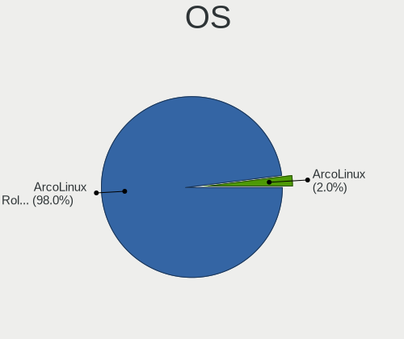
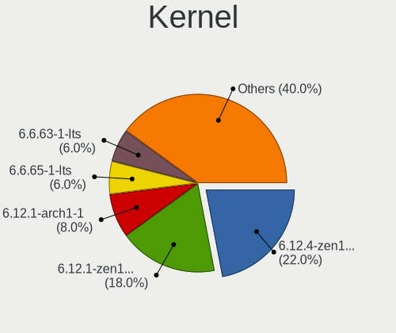
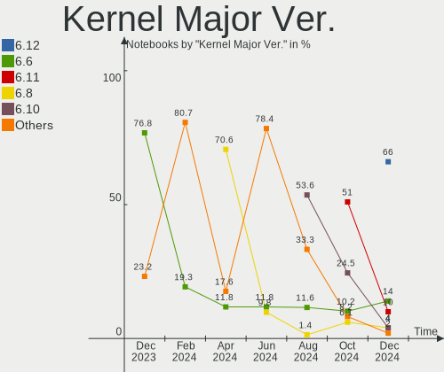
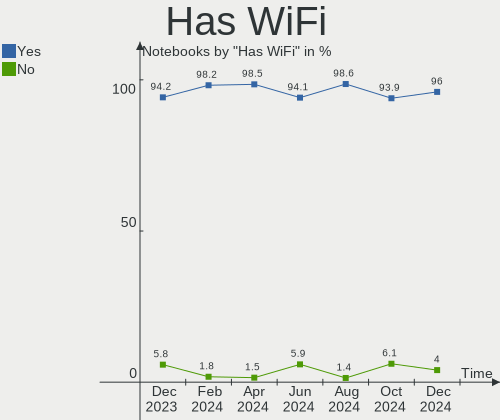
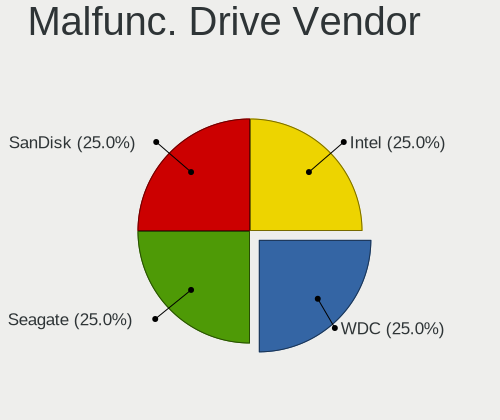
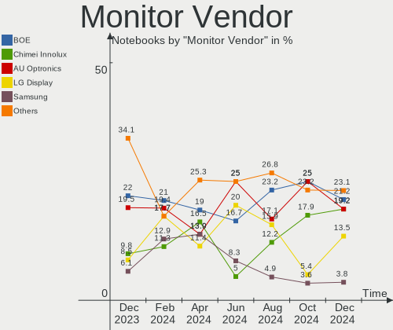
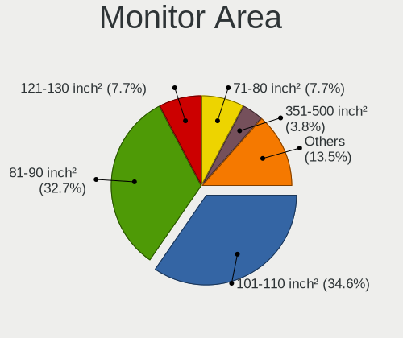

ArcoLinux Hardware Trends (Notebooks)
-------------------------------------

A project to identify most popular hardware characteristics and track their change
over time based on data collected by ArcoLinux users at https://Linux-Hardware.org.

Anyone can contribute to this report by the [hw-probe](https://github.com/linuxhw/hw-probe) tool:

    sudo -E hw-probe -all -upload

Full-feature report is available here: https://linux-hardware.org/?view=trends&formfactor=notebook

Period: Aug, 2021.

Contents
--------

* [ System ](#system)
  - [ OS                       ](#os)
  - [ OS Family                ](#os-family)
  - [ Kernel                   ](#kernel)
  - [ Kernel Family            ](#kernel-family)
  - [ Kernel Major Ver.        ](#kernel-major-ver)
  - [ Arch                     ](#arch)
  - [ DE                       ](#de)
  - [ Display Server           ](#display-server)
  - [ Display Manager          ](#display-manager)
  - [ OS Lang                  ](#os-lang)
  - [ Boot Mode                ](#boot-mode)
  - [ Filesystem               ](#filesystem)
  - [ Part. scheme             ](#part-scheme)
  - [ Dual Boot with Linux/BSD ](#dual-boot-with-linuxbsd)
  - [ Dual Boot (Win)          ](#dual-boot-win)

* [ Board ](#board)
  - [ Vendor                   ](#vendor)
  - [ Model                    ](#model)
  - [ Model Family             ](#model-family)
  - [ MFG Year                 ](#mfg-year)
  - [ Form Factor              ](#form-factor)
  - [ Secure Boot              ](#secure-boot)
  - [ Coreboot                 ](#coreboot)
  - [ RAM Size                 ](#ram-size)
  - [ RAM Used                 ](#ram-used)
  - [ Total Drives             ](#total-drives)
  - [ Has CD-ROM               ](#has-cd-rom)
  - [ Has Ethernet             ](#has-ethernet)
  - [ Has WiFi                 ](#has-wifi)
  - [ Has Bluetooth            ](#has-bluetooth)

* [ Location ](#location)
  - [ Country                  ](#country)
  - [ City                     ](#city)

* [ Drives ](#drives)
  - [ Drive Vendor             ](#drive-vendor)
  - [ Drive Model              ](#drive-model)
  - [ HDD Vendor               ](#hdd-vendor)
  - [ SSD Vendor               ](#ssd-vendor)
  - [ Drive Kind               ](#drive-kind)
  - [ Drive Connector          ](#drive-connector)
  - [ Drive Size               ](#drive-size)
  - [ Space Total              ](#space-total)
  - [ Space Used               ](#space-used)
  - [ Malfunc. Drives          ](#malfunc-drives)
  - [ Malfunc. Drive Vendor    ](#malfunc-drive-vendor)
  - [ Malfunc. HDD Vendor      ](#malfunc-hdd-vendor)
  - [ Malfunc. Drive Kind      ](#malfunc-drive-kind)
  - [ Failed Drives            ](#failed-drives)
  - [ Failed Drive Vendor      ](#failed-drive-vendor)
  - [ Drive Status             ](#drive-status)

* [ Storage controller ](#storage-controller)
  - [ Storage Vendor           ](#storage-vendor)
  - [ Storage Model            ](#storage-model)
  - [ Storage Kind             ](#storage-kind)

* [ Processor ](#processor)
  - [ CPU Vendor               ](#cpu-vendor)
  - [ CPU Model                ](#cpu-model)
  - [ CPU Model Family         ](#cpu-model-family)
  - [ CPU Cores                ](#cpu-cores)
  - [ CPU Sockets              ](#cpu-sockets)
  - [ CPU Threads              ](#cpu-threads)
  - [ CPU Op-Modes             ](#cpu-op-modes)
  - [ CPU Microcode            ](#cpu-microcode)
  - [ CPU Microarch            ](#cpu-microarch)

* [ Graphics ](#graphics)
  - [ GPU Vendor               ](#gpu-vendor)
  - [ GPU Model                ](#gpu-model)
  - [ GPU Combo                ](#gpu-combo)
  - [ GPU Driver               ](#gpu-driver)
  - [ GPU Memory               ](#gpu-memory)

* [ Monitor ](#monitor)
  - [ Monitor Vendor           ](#monitor-vendor)
  - [ Monitor Model            ](#monitor-model)
  - [ Monitor Resolution       ](#monitor-resolution)
  - [ Monitor Diagonal         ](#monitor-diagonal)
  - [ Monitor Width            ](#monitor-width)
  - [ Aspect Ratio             ](#aspect-ratio)
  - [ Monitor Area             ](#monitor-area)
  - [ Pixel Density            ](#pixel-density)
  - [ Multiple Monitors        ](#multiple-monitors)

* [ Network ](#network)
  - [ Net Controller Vendor    ](#net-controller-vendor)
  - [ Net Controller Model     ](#net-controller-model)
  - [ Wireless Vendor          ](#wireless-vendor)
  - [ Wireless Model           ](#wireless-model)
  - [ Ethernet Vendor          ](#ethernet-vendor)
  - [ Ethernet Model           ](#ethernet-model)
  - [ Net Controller Kind      ](#net-controller-kind)
  - [ Used Controller          ](#used-controller)
  - [ NICs                     ](#nics)
  - [ IPv6                     ](#ipv6)

* [ Bluetooth ](#bluetooth)
  - [ Bluetooth Vendor         ](#bluetooth-vendor)
  - [ Bluetooth Model          ](#bluetooth-model)

* [ Sound ](#sound)
  - [ Sound Vendor             ](#sound-vendor)
  - [ Sound Model              ](#sound-model)

* [ Memory ](#memory)
  - [ Memory Vendor            ](#memory-vendor)
  - [ Memory Model             ](#memory-model)
  - [ Memory Kind              ](#memory-kind)
  - [ Memory Form Factor       ](#memory-form-factor)
  - [ Memory Size              ](#memory-size)
  - [ Memory Speed             ](#memory-speed)

* [ Printers & scanners ](#printers--scanners)
  - [ Printer Vendor           ](#printer-vendor)
  - [ Printer Model            ](#printer-model)
  - [ Scanner Vendor           ](#scanner-vendor)
  - [ Scanner Model            ](#scanner-model)

* [ Camera ](#camera)
  - [ Camera Vendor            ](#camera-vendor)
  - [ Camera Model             ](#camera-model)

* [ Security ](#security)
  - [ Fingerprint Vendor       ](#fingerprint-vendor)
  - [ Fingerprint Model        ](#fingerprint-model)
  - [ Chipcard Vendor          ](#chipcard-vendor)
  - [ Chipcard Model           ](#chipcard-model)

* [ Unsupported ](#unsupported)
  - [ Unsupported Devices      ](#unsupported-devices)
  - [ Unsupported Device Types ](#unsupported-device-types)

System
------

OS
--

Installed operating systems

| Name              | Notebooks | Percent |
|-------------------|-----------|---------|
| ArcoLinux Rolling | 45        | 86.54%  |
| ArcoLinux         | 7         | 13.46%  |

OS Family
---------

OS without a version

| Name      | Notebooks | Percent |
|-----------|-----------|---------|
| ArcoLinux | 52        | 100%    |

Kernel
------

Version of the Linux kernel

| Version           | Notebooks | Percent |
|-------------------|-----------|---------|
| 5.13.12-arch1-1   | 13        | 25%     |
| 5.10.56-1-lts     | 5         | 9.62%   |
| 5.13.8-arch1-1    | 4         | 7.69%   |
| 5.13.6-arch1-1    | 4         | 7.69%   |
| 5.13.10-arch1-1   | 4         | 7.69%   |
| 5.13.9-arch1-1    | 3         | 5.77%   |
| 5.13.7-arch1-1    | 3         | 5.77%   |
| 5.13.13-arch1-1   | 3         | 5.77%   |
| 5.10.60-1-lts     | 3         | 5.77%   |
| 5.13.4-arch1-1    | 2         | 3.85%   |
| 5.13.9-zen1-1-zen | 1         | 1.92%   |
| 5.13.6-zen1-1-zen | 1         | 1.92%   |
| 5.12.15-arch1-1   | 1         | 1.92%   |
| 5.12.13-arch1-2   | 1         | 1.92%   |
| 5.10.61-1-lts     | 1         | 1.92%   |
| 5.10.6-arch1-1    | 1         | 1.92%   |
| 5.10.55-1-lts     | 1         | 1.92%   |
| 5.10.54-1-lts     | 1         | 1.92%   |

Kernel Family
-------------

Linux kernel without a distro release

| Version | Notebooks | Percent |
|---------|-----------|---------|
| 5.13.12 | 13        | 25%     |
| 5.13.6  | 5         | 9.62%   |
| 5.10.56 | 5         | 9.62%   |
| 5.13.9  | 4         | 7.69%   |
| 5.13.8  | 4         | 7.69%   |
| 5.13.10 | 4         | 7.69%   |
| 5.13.7  | 3         | 5.77%   |
| 5.13.13 | 3         | 5.77%   |
| 5.10.60 | 3         | 5.77%   |
| 5.13.4  | 2         | 3.85%   |
| 5.12.15 | 1         | 1.92%   |
| 5.12.13 | 1         | 1.92%   |
| 5.10.61 | 1         | 1.92%   |
| 5.10.6  | 1         | 1.92%   |
| 5.10.55 | 1         | 1.92%   |
| 5.10.54 | 1         | 1.92%   |

Kernel Major Ver.
-----------------

Linux kernel major version

| Version | Notebooks | Percent |
|---------|-----------|---------|
| 5.13    | 38        | 73.08%  |
| 5.10    | 12        | 23.08%  |
| 5.12    | 2         | 3.85%   |

Arch
----

OS architecture (x86_64, i586, etc.)

| Name   | Notebooks | Percent |
|--------|-----------|---------|
| x86_64 | 52        | 100%    |

DE
--

Desktop Environment

| Name         | Notebooks | Percent |
|--------------|-----------|---------|
| XFCE         | 13        | 25%     |
| qtile        | 6         | 11.54%  |
| awesome      | 6         | 11.54%  |
| i3           | 4         | 7.69%   |
| GNOME        | 4         | 7.69%   |
| xmonad       | 3         | 5.77%   |
| X-Cinnamon   | 3         | 5.77%   |
| KDE5         | 3         | 5.77%   |
| KDE          | 3         | 5.77%   |
| bspwm        | 3         | 5.77%   |
| dwm          | 2         | 3.85%   |
| herbstluftwm | 1         | 1.92%   |
| Budgie       | 1         | 1.92%   |

Display Server
--------------

X11 or Wayland

| Name    | Notebooks | Percent |
|---------|-----------|---------|
| X11     | 50        | 96.15%  |
| Wayland | 1         | 1.92%   |
| Tty     | 1         | 1.92%   |

Display Manager
---------------

SDDM, LightDM, etc.

| Name    | Notebooks | Percent |
|---------|-----------|---------|
| SDDM    | 26        | 50%     |
| TDM     | 11        | 21.15%  |
| Unknown | 7         | 13.46%  |
| LightDM | 4         | 7.69%   |
| GDM     | 2         | 3.85%   |
| XDM     | 1         | 1.92%   |
| LXDM    | 1         | 1.92%   |

OS Lang
-------

Language

| Lang  | Notebooks | Percent |
|-------|-----------|---------|
| en_US | 29        | 55.77%  |
| en_GB | 8         | 15.38%  |
| fr_FR | 3         | 5.77%   |
| en_IN | 3         | 5.77%   |
| ru_RU | 2         | 3.85%   |
| de_DE | 2         | 3.85%   |
| hu_HU | 1         | 1.92%   |
| fr_BE | 1         | 1.92%   |
| es_ES | 1         | 1.92%   |
| en_CA | 1         | 1.92%   |
| de_ch | 1         | 1.92%   |

Boot Mode
---------

EFI or BIOS

| Mode | Notebooks | Percent |
|------|-----------|---------|
| EFI  | 31        | 59.62%  |
| BIOS | 21        | 40.38%  |

Filesystem
----------

Type of filesystem

| Type    | Notebooks | Percent |
|---------|-----------|---------|
| Ext4    | 38        | 73.08%  |
| Btrfs   | 12        | 23.08%  |
| Overlay | 2         | 3.85%   |

Part. scheme
------------

Scheme of partitioning

| Type    | Notebooks | Percent |
|---------|-----------|---------|
| GPT     | 33        | 63.46%  |
| MBR     | 12        | 23.08%  |
| Unknown | 7         | 13.46%  |

Dual Boot with Linux/BSD
------------------------

Hosting more than one Linux/BSD

| Dual boot | Notebooks | Percent |
|-----------|-----------|---------|
| No        | 48        | 92.31%  |
| Yes       | 4         | 7.69%   |

Dual Boot (Win)
---------------

Hosting Linux and Windows

| Dual boot | Notebooks | Percent |
|-----------|-----------|---------|
| No        | 37        | 71.15%  |
| Yes       | 15        | 28.85%  |

Board
-----

Vendor
------

Motherboard manufacturer

| Name             | Notebooks | Percent |
|------------------|-----------|---------|
| Lenovo           | 17        | 32.69%  |
| ASUSTek Computer | 9         | 17.31%  |
| Hewlett-Packard  | 8         | 15.38%  |
| Dell             | 5         | 9.62%   |
| Acer             | 3         | 5.77%   |
| Apple            | 2         | 3.85%   |
| TUXEDO           | 1         | 1.92%   |
| Timi             | 1         | 1.92%   |
| System76         | 1         | 1.92%   |
| Razer            | 1         | 1.92%   |
| MSI              | 1         | 1.92%   |
| Fujitsu          | 1         | 1.92%   |
| Eluktronics      | 1         | 1.92%   |
| AZW              | 1         | 1.92%   |

Model
-----

Motherboard model

| Name                                       | Notebooks | Percent |
|--------------------------------------------|-----------|---------|
| TUXEDO BC1510 1710                         | 1         | 1.92%   |
| Timi TM1607                                | 1         | 1.92%   |
| System76 Gazelle                           | 1         | 1.92%   |
| Razer Blade                                | 1         | 1.92%   |
| MSI Modern 14 B4MW                         | 1         | 1.92%   |
| Lenovo ThinkPad X250 20CLS1LC1K            | 1         | 1.92%   |
| Lenovo ThinkPad X201 3626GWG               | 1         | 1.92%   |
| Lenovo ThinkPad X1 Carbon Gen 9 20XW005NMX | 1         | 1.92%   |
| Lenovo ThinkPad W541 20EF001TMS            | 1         | 1.92%   |
| Lenovo ThinkPad W541 20EF0000US            | 1         | 1.92%   |
| Lenovo ThinkPad T61 7661ZLF                | 1         | 1.92%   |
| Lenovo ThinkPad T510 4384GFG               | 1         | 1.92%   |
| Lenovo ThinkPad T440 20B70048US            | 1         | 1.92%   |
| Lenovo ThinkPad T410s 2924AM7              | 1         | 1.92%   |
| Lenovo ThinkPad P51 20HHCTO1WW             | 1         | 1.92%   |
| Lenovo ThinkPad E14 20RA0016FR             | 1         | 1.92%   |
| Lenovo Legion Y530-15ICH 81FV              | 1         | 1.92%   |
| Lenovo IdeaPad L340-15API 81LW             | 1         | 1.92%   |
| Lenovo IdeaPad FLEX-14API 81SS             | 1         | 1.92%   |
| Lenovo IdeaPad 520-15IKB 81BF              | 1         | 1.92%   |
| Lenovo IdeaPad 510-15IKB 80SV              | 1         | 1.92%   |
| Lenovo IdeaPad 330-17IKB 81DM              | 1         | 1.92%   |
| HP Pavilion Gaming Laptop 15-ec0xxx        | 1         | 1.92%   |
| HP Pavilion Gaming Laptop 15-dk0001ua      | 1         | 1.92%   |
| HP Laptop 15q-bu1xx                        | 1         | 1.92%   |
| HP Laptop 15-db0xxx                        | 1         | 1.92%   |
| HP Laptop 15-da0xxx                        | 1         | 1.92%   |
| HP Laptop 15-bw0xx                         | 1         | 1.92%   |
| HP ENVY Laptop 17-cg0xxx                   | 1         | 1.92%   |
| HP EliteBook 840 G3                        | 1         | 1.92%   |
| Fujitsu LIFEBOOK E756                      | 1         | 1.92%   |
| Eluktronics MAG-15 2070                    | 1         | 1.92%   |
| Dell XPS 15 9500                           | 1         | 1.92%   |
| Dell XPS 15 7590                           | 1         | 1.92%   |
| Dell Vostro 3500                           | 1         | 1.92%   |
| Dell Inspiron 5579                         | 1         | 1.92%   |
| Dell Inspiron 15-5568                      | 1         | 1.92%   |
| AZW SEi                                    | 1         | 1.92%   |
| ASUS X580VD                                | 1         | 1.92%   |
| ASUS X556UA                                | 1         | 1.92%   |
| ASUS X441SA                                | 1         | 1.92%   |
| ASUS VivoBook_ASUSLaptop X515JF_X515JF     | 1         | 1.92%   |
| ASUS ROG Zephyrus G14 GA401QM_GA401QM      | 1         | 1.92%   |
| ASUS K53SD                                 | 1         | 1.92%   |
| ASUS K53E                                  | 1         | 1.92%   |
| ASUS G750JX                                | 1         | 1.92%   |
| ASUS E200HA                                | 1         | 1.92%   |
| Apple MacBookPro9,2                        | 1         | 1.92%   |
| Apple MacBookPro11,1                       | 1         | 1.92%   |
| Acer Nitro AN517-52                        | 1         | 1.92%   |
| Acer Nitro AN515-53                        | 1         | 1.92%   |
| Acer Aspire 7741                           | 1         | 1.92%   |

Model Family
------------

Motherboard model prefix

| Name               | Notebooks | Percent |
|--------------------|-----------|---------|
| Lenovo ThinkPad    | 11        | 21.15%  |
| Lenovo IdeaPad     | 5         | 9.62%   |
| HP Laptop          | 4         | 7.69%   |
| HP Pavilion        | 2         | 3.85%   |
| Dell XPS           | 2         | 3.85%   |
| Dell Inspiron      | 2         | 3.85%   |
| Acer Nitro         | 2         | 3.85%   |
| TUXEDO BC1510      | 1         | 1.92%   |
| Timi TM1607        | 1         | 1.92%   |
| System76 Gazelle   | 1         | 1.92%   |
| Razer Blade        | 1         | 1.92%   |
| MSI Modern         | 1         | 1.92%   |
| Lenovo Legion      | 1         | 1.92%   |
| HP ENVY            | 1         | 1.92%   |
| HP EliteBook       | 1         | 1.92%   |
| Fujitsu LIFEBOOK   | 1         | 1.92%   |
| Eluktronics MAG-15 | 1         | 1.92%   |
| Dell Vostro        | 1         | 1.92%   |
| AZW SEi            | 1         | 1.92%   |
| ASUS X580VD        | 1         | 1.92%   |
| ASUS X556UA        | 1         | 1.92%   |
| ASUS X441SA        | 1         | 1.92%   |
| ASUS VivoBook      | 1         | 1.92%   |
| ASUS ROG           | 1         | 1.92%   |
| ASUS K53SD         | 1         | 1.92%   |
| ASUS K53E          | 1         | 1.92%   |
| ASUS G750JX        | 1         | 1.92%   |
| ASUS E200HA        | 1         | 1.92%   |
| Apple MacBookPro9  | 1         | 1.92%   |
| Apple MacBookPro11 | 1         | 1.92%   |
| Acer Aspire        | 1         | 1.92%   |

MFG Year
--------

Motherboard manufacture year

| Year | Notebooks | Percent |
|------|-----------|---------|
| 2020 | 13        | 25%     |
| 2021 | 11        | 21.15%  |
| 2019 | 8         | 15.38%  |
| 2018 | 6         | 11.54%  |
| 2016 | 3         | 5.77%   |
| 2012 | 3         | 5.77%   |
| 2017 | 2         | 3.85%   |
| 2010 | 2         | 3.85%   |
| 2014 | 1         | 1.92%   |
| 2013 | 1         | 1.92%   |
| 2011 | 1         | 1.92%   |
| 2008 | 1         | 1.92%   |

Form Factor
-----------

Physical design of the computer

| Name     | Notebooks | Percent |
|----------|-----------|---------|
| Notebook | 52        | 100%    |

Secure Boot
-----------

Enabled or disabled

| State    | Notebooks | Percent |
|----------|-----------|---------|
| Disabled | 52        | 100%    |

Coreboot
--------

Have coreboot on board

| Used | Notebooks | Percent |
|------|-----------|---------|
| No   | 51        | 98.08%  |
| Yes  | 1         | 1.92%   |

RAM Size
--------

Total RAM memory

| Size in GB | Notebooks | Percent |
|------------|-----------|---------|
| 4.01-8.0   | 16        | 30.77%  |
| 16.01-24.0 | 13        | 25%     |
| 8.01-16.0  | 10        | 19.23%  |
| 3.01-4.0   | 7         | 13.46%  |
| 32.01-64.0 | 3         | 5.77%   |
| 24.01-32.0 | 1         | 1.92%   |
| 2.01-3.0   | 1         | 1.92%   |
| 1.01-2.0   | 1         | 1.92%   |

RAM Used
--------

Used RAM memory

| Used GB   | Notebooks | Percent |
|-----------|-----------|---------|
| 1.01-2.0  | 21        | 40.38%  |
| 2.01-3.0  | 14        | 26.92%  |
| 3.01-4.0  | 6         | 11.54%  |
| 4.01-8.0  | 5         | 9.62%   |
| 0.51-1.0  | 5         | 9.62%   |
| 8.01-16.0 | 1         | 1.92%   |

Total Drives
------------

Number of drives on board

| Drives | Notebooks | Percent |
|--------|-----------|---------|
| 1      | 35        | 67.31%  |
| 2      | 16        | 30.77%  |
| 3      | 1         | 1.92%   |

Has CD-ROM
----------

Has CD-ROM on board

| Presented | Notebooks | Percent |
|-----------|-----------|---------|
| No        | 41        | 78.85%  |
| Yes       | 11        | 21.15%  |

Has Ethernet
------------

Has Ethernet on board

| Presented | Notebooks | Percent |
|-----------|-----------|---------|
| Yes       | 41        | 78.85%  |
| No        | 11        | 21.15%  |

Has WiFi
--------

Has WiFi module

| Presented | Notebooks | Percent |
|-----------|-----------|---------|
| Yes       | 51        | 98.08%  |
| No        | 1         | 1.92%   |

Has Bluetooth
-------------

Has Bluetooth module

| Presented | Notebooks | Percent |
|-----------|-----------|---------|
| Yes       | 48        | 92.31%  |
| No        | 4         | 7.69%   |

Location
--------

Country
-------

Geographic location (country)

| Country                | Notebooks | Percent |
|------------------------|-----------|---------|
| USA                    | 9         | 17.31%  |
| UK                     | 6         | 11.54%  |
| India                  | 5         | 9.62%   |
| Germany                | 4         | 7.69%   |
| Switzerland            | 2         | 3.85%   |
| Sweden                 | 2         | 3.85%   |
| France                 | 2         | 3.85%   |
| Estonia                | 2         | 3.85%   |
| Canada                 | 2         | 3.85%   |
| Ukraine                | 1         | 1.92%   |
| Spain                  | 1         | 1.92%   |
| Russia                 | 1         | 1.92%   |
| Poland                 | 1         | 1.92%   |
| Netherlands            | 1         | 1.92%   |
| Lebanon                | 1         | 1.92%   |
| Ivory Coast            | 1         | 1.92%   |
| Indonesia              | 1         | 1.92%   |
| Hungary                | 1         | 1.92%   |
| Finland                | 1         | 1.92%   |
| Egypt                  | 1         | 1.92%   |
| Colombia               | 1         | 1.92%   |
| Bulgaria               | 1         | 1.92%   |
| Brazil                 | 1         | 1.92%   |
| Bosnia and Herzegovina | 1         | 1.92%   |
| Belgium                | 1         | 1.92%   |
| Bangladesh             | 1         | 1.92%   |
| Australia              | 1         | 1.92%   |

City
----

Geographic location (city)

| City                   | Notebooks | Percent |
|------------------------|-----------|---------|
| Tallinn                | 2         | 3.85%   |
| Kolkata                | 2         | 3.85%   |
| Zurich                 | 1         | 1.92%   |
| Yuma                   | 1         | 1.92%   |
| York                   | 1         | 1.92%   |
| West Columbia          | 1         | 1.92%   |
| Warsaw                 | 1         | 1.92%   |
| Vorbach                | 1         | 1.92%   |
| Volgograd              | 1         | 1.92%   |
| Voglans                | 1         | 1.92%   |
| Tucson                 | 1         | 1.92%   |
| Tanta                  | 1         | 1.92%   |
| Stoke-on-Trent         | 1         | 1.92%   |
| Spokane                | 1         | 1.92%   |
| Sidon                  | 1         | 1.92%   |
| Scottsdale             | 1         | 1.92%   |
| Schwalbach am Taunus   | 1         | 1.92%   |
| Santiago de Compostela | 1         | 1.92%   |
| Pune                   | 1         | 1.92%   |
| Porto Alegre           | 1         | 1.92%   |
| Plano                  | 1         | 1.92%   |
| Ottignies              | 1         | 1.92%   |
| Nagykoros              | 1         | 1.92%   |
| Machhagan              | 1         | 1.92%   |
| London                 | 1         | 1.92%   |
| Levis                  | 1         | 1.92%   |
| Kherson                | 1         | 1.92%   |
| Jaipur                 | 1         | 1.92%   |
| Helsinki               | 1         | 1.92%   |
| Hackleton              | 1         | 1.92%   |
| Grimsby                | 1         | 1.92%   |
| Faerjestaden           | 1         | 1.92%   |
| Everett                | 1         | 1.92%   |
| Enid                   | 1         | 1.92%   |
| Edmonton               | 1         | 1.92%   |
| Denpasar               | 1         | 1.92%   |
| Clyde North            | 1         | 1.92%   |
| Chittagong             | 1         | 1.92%   |
| Charlotte              | 1         | 1.92%   |
| Canvey Island          | 1         | 1.92%   |
| Burgas                 | 1         | 1.92%   |
| Bogot??                | 1         | 1.92%   |
| Blaisy-Bas             | 1         | 1.92%   |
| Bern                   | 1         | 1.92%   |
| Berlin                 | 1         | 1.92%   |
| Bergheim               | 1         | 1.92%   |
| Barneveld              | 1         | 1.92%   |
| Banja Luka             | 1         | 1.92%   |
| Bagarmossen            | 1         | 1.92%   |
| Abidjan                | 1         | 1.92%   |

Drives
------

Drive Vendor
------------

Hard drive vendors

| Vendor              | Notebooks | Drives | Percent |
|---------------------|-----------|--------|---------|
| Samsung Electronics | 13        | 13     | 18.31%  |
| Toshiba             | 10        | 10     | 14.08%  |
| WDC                 | 9         | 9      | 12.68%  |
| Seagate             | 6         | 6      | 8.45%   |
| Kingston            | 4         | 4      | 5.63%   |
| Intel               | 4         | 4      | 5.63%   |
| Micron Technology   | 3         | 3      | 4.23%   |
| Crucial             | 3         | 3      | 4.23%   |
| Silicon Motion      | 2         | 3      | 2.82%   |
| PNY                 | 2         | 2      | 2.82%   |
| KIOXIA              | 2         | 2      | 2.82%   |
| HGST                | 2         | 2      | 2.82%   |
| Unknown             | 1         | 1      | 1.41%   |
| Union Memory        | 1         | 1      | 1.41%   |
| SK Hynix            | 1         | 1      | 1.41%   |
| SanDisk             | 1         | 1      | 1.41%   |
| Phison              | 1         | 1      | 1.41%   |
| Mushkin             | 1         | 1      | 1.41%   |
| LITEONIT            | 1         | 1      | 1.41%   |
| Lexar               | 1         | 1      | 1.41%   |
| KingSpec            | 1         | 1      | 1.41%   |
| Apple               | 1         | 1      | 1.41%   |
| A-DATA Technology   | 1         | 1      | 1.41%   |

Drive Model
-----------

Hard drive models

| Model                                    | Notebooks | Percent |
|------------------------------------------|-----------|---------|
| Samsung SSD 860 EVO 500GB                | 3         | 4.17%   |
| Toshiba MQ04ABF100 1TB                   | 2         | 2.78%   |
| Toshiba MQ01ABD100 1TB                   | 2         | 2.78%   |
| Seagate ST1000LM049-2GH172 1TB           | 2         | 2.78%   |
| Seagate ST1000LM035-1RK172 1TB           | 2         | 2.78%   |
| Crucial CT1000MX500SSD1 1TB              | 2         | 2.78%   |
| WDC WDBNCE5000PNC 500GB SSD              | 1         | 1.39%   |
| WDC WD6400BEVT-60A0RT0 640GB             | 1         | 1.39%   |
| WDC WD5000BPVT-22HXZT1 500GB             | 1         | 1.39%   |
| WDC WD10SPZX-75Z10T2 1TB                 | 1         | 1.39%   |
| WDC WD10SPZX-60Z10T0 1TB                 | 1         | 1.39%   |
| WDC WD10SPSX-60A6WT0 1TB                 | 1         | 1.39%   |
| WDC WD10JPCX-24UE4T0 1TB                 | 1         | 1.39%   |
| WDC PC SN530 SDBPNPZ-512G-1014 512GB     | 1         | 1.39%   |
| WDC PC SN530 NVMe 512GB                  | 1         | 1.39%   |
| Unknown HBG4a2  32GB                     | 1         | 1.39%   |
| Union Memory UMIS RPJTJ256MED1OWX 256GB  | 1         | 1.39%   |
| Toshiba THNSNK256GCS8 SATA 256GB SSD     | 1         | 1.39%   |
| Toshiba THNS128GG4BAAA-NonFDE 128GB SSD  | 1         | 1.39%   |
| Toshiba MQ01ABF050 500GB                 | 1         | 1.39%   |
| Toshiba MK1665GSX 160GB                  | 1         | 1.39%   |
| Toshiba KXG60ZNV256G 256GB               | 1         | 1.39%   |
| Toshiba KBG30ZMV256G KIOXIA 256GB        | 1         | 1.39%   |
| SK Hynix HFM001TD3JX013N 1TB             | 1         | 1.39%   |
| Silicon Motion SPT256L2-2IAS7G2 256GB    | 1         | 1.39%   |
| Silicon Motion NVMe SSD Drive 256GB      | 1         | 1.39%   |
| Silicon Motion NVME SSD 512GB            | 1         | 1.39%   |
| Seagate ST9500420AS 500GB                | 1         | 1.39%   |
| Seagate ST1000LM024 HN-M101MBB 1TB       | 1         | 1.39%   |
| SanDisk SSD U110 16GB                    | 1         | 1.39%   |
| Samsung SSD 970 EVO Plus 1TB             | 1         | 1.39%   |
| Samsung SSD 860 EVO M.2 250GB            | 1         | 1.39%   |
| Samsung SSD 860 EVO M.2 1TB              | 1         | 1.39%   |
| Samsung SSD 860 EVO 250GB                | 1         | 1.39%   |
| Samsung PSSD T7 500GB                    | 1         | 1.39%   |
| Samsung NVMe SSD Drive 512GB             | 1         | 1.39%   |
| Samsung MZNTY128HDHP-00000 128GB SSD     | 1         | 1.39%   |
| Samsung MZNLN256HAJQ-000L2 256GB SSD     | 1         | 1.39%   |
| Samsung MZ7TY256HDHP-00007 256GB SSD     | 1         | 1.39%   |
| Samsung MZ7LN256HCHP-000L7 256GB SSD     | 1         | 1.39%   |
| PNY ELITE PSSD 480GB                     | 1         | 1.39%   |
| PNY CS900 240GB SSD                      | 1         | 1.39%   |
| Phison NVMe SSD Drive 960GB              | 1         | 1.39%   |
| Mushkin MKNSSDHL1TB-D8                   | 1         | 1.39%   |
| Micron MTFDDAV256MBF-1AN15ABHA 256GB SSD | 1         | 1.39%   |
| Micron 2300 NVMe 1024GB                  | 1         | 1.39%   |
| Micron 2200S NVMe 1024GB                 | 1         | 1.39%   |
| LITEONIT LCM-256M3S 256GB SSD            | 1         | 1.39%   |
| Lexar 128GB SSD                          | 1         | 1.39%   |
| KIOXIA KXG7AZNV512G LA 512GB             | 1         | 1.39%   |
| KIOXIA KBG40ZNV256G 256GB                | 1         | 1.39%   |
| Kingston SUV500M8960G 960GB SSD          | 1         | 1.39%   |
| Kingston SKC600512G 512GB SSD            | 1         | 1.39%   |
| Kingston SA400S37480G 480GB SSD          | 1         | 1.39%   |
| Kingston NVMe SSD Drive 256GB            | 1         | 1.39%   |
| KingSpec NT-256 256GB SSD                | 1         | 1.39%   |
| Intel SSDSC2BA200G3 200GB                | 1         | 1.39%   |
| Intel SSDSA2M160G2GC 160GB               | 1         | 1.39%   |
| Intel SSDSA2BW160G3H 160GB               | 1         | 1.39%   |
| Intel SSDPEKNW512G8L 512GB               | 1         | 1.39%   |

HDD Vendor
----------

Hard disk drive vendors

| Vendor  | Notebooks | Drives | Percent |
|---------|-----------|--------|---------|
| WDC     | 6         | 6      | 30%     |
| Toshiba | 6         | 6      | 30%     |
| Seagate | 6         | 6      | 30%     |
| HGST    | 2         | 2      | 10%     |

SSD Vendor
----------

Solid state drive vendors

| Vendor              | Notebooks | Drives | Percent |
|---------------------|-----------|--------|---------|
| Samsung Electronics | 11        | 11     | 35.48%  |
| Kingston            | 3         | 3      | 9.68%   |
| Intel               | 3         | 3      | 9.68%   |
| Crucial             | 3         | 3      | 9.68%   |
| Toshiba             | 2         | 2      | 6.45%   |
| PNY                 | 2         | 2      | 6.45%   |
| WDC                 | 1         | 1      | 3.23%   |
| SanDisk             | 1         | 1      | 3.23%   |
| Micron Technology   | 1         | 1      | 3.23%   |
| LITEONIT            | 1         | 1      | 3.23%   |
| Lexar               | 1         | 1      | 3.23%   |
| KingSpec            | 1         | 1      | 3.23%   |
| Apple               | 1         | 1      | 3.23%   |

Drive Kind
----------

HDD or SSD

| Kind | Notebooks | Drives | Percent |
|------|-----------|--------|---------|
| SSD  | 25        | 31     | 39.06%  |
| HDD  | 20        | 20     | 31.25%  |
| NVMe | 18        | 20     | 28.13%  |
| MMC  | 1         | 1      | 1.56%   |

Drive Connector
---------------

SATA, SAS, NVMe, etc.

| Type | Notebooks | Drives | Percent |
|------|-----------|--------|---------|
| SATA | 38        | 49     | 64.41%  |
| NVMe | 18        | 20     | 30.51%  |
| SAS  | 2         | 2      | 3.39%   |
| MMC  | 1         | 1      | 1.69%   |

Drive Size
----------

Size of hard drive

| Size in TB | Notebooks | Drives | Percent |
|------------|-----------|--------|---------|
| 0.01-0.5   | 26        | 31     | 60.47%  |
| 0.51-1.0   | 17        | 20     | 39.53%  |

Space Total
-----------

Amount of disk space available on the file system

| Size in GB     | Notebooks | Percent |
|----------------|-----------|---------|
| 251-500        | 16        | 30.77%  |
| 101-250        | 13        | 25%     |
| 501-1000       | 10        | 19.23%  |
| 1001-2000      | 7         | 13.46%  |
| More than 3000 | 3         | 5.77%   |
| 1-20           | 1         | 1.92%   |
| 51-100         | 1         | 1.92%   |
| Unknown        | 1         | 1.92%   |

Space Used
----------

Amount of used disk space

| Used GB  | Notebooks | Percent |
|----------|-----------|---------|
| 1-20     | 17        | 32.69%  |
| 101-250  | 12        | 23.08%  |
| 21-50    | 11        | 21.15%  |
| 251-500  | 4         | 7.69%   |
| 51-100   | 4         | 7.69%   |
| 501-1000 | 3         | 5.77%   |
| Unknown  | 1         | 1.92%   |

Malfunc. Drives
---------------

Drive models with a malfunction

| Model                                | Notebooks | Drives | Percent |
|--------------------------------------|-----------|--------|---------|
| WDC WD6400BEVT-60A0RT0 640GB         | 1         | 1      | 10%     |
| WDC WD5000BPVT-22HXZT1 500GB         | 1         | 1      | 10%     |
| Toshiba THNSNK256GCS8 SATA 256GB SSD | 1         | 1      | 10%     |
| Toshiba MQ04ABF100 1TB               | 1         | 1      | 10%     |
| Toshiba MQ01ABD100 1TB               | 1         | 1      | 10%     |
| Seagate ST9500420AS 500GB            | 1         | 1      | 10%     |
| Kingston SUV500M8960G 960GB SSD      | 1         | 1      | 10%     |
| Intel SSDSA2M160G2GC 160GB           | 1         | 1      | 10%     |
| HGST HTS725050A7E630 500GB           | 1         | 1      | 10%     |
| HGST HTS541010A9E680 1TB             | 1         | 1      | 10%     |

Malfunc. Drive Vendor
---------------------

Vendors of faulty drives

| Vendor   | Notebooks | Drives | Percent |
|----------|-----------|--------|---------|
| Toshiba  | 3         | 3      | 30%     |
| WDC      | 2         | 2      | 20%     |
| HGST     | 2         | 2      | 20%     |
| Seagate  | 1         | 1      | 10%     |
| Kingston | 1         | 1      | 10%     |
| Intel    | 1         | 1      | 10%     |

Malfunc. HDD Vendor
-------------------

Vendors of faulty HDD drives

| Vendor  | Notebooks | Drives | Percent |
|---------|-----------|--------|---------|
| WDC     | 2         | 2      | 28.57%  |
| Toshiba | 2         | 2      | 28.57%  |
| HGST    | 2         | 2      | 28.57%  |
| Seagate | 1         | 1      | 14.29%  |

Malfunc. Drive Kind
-------------------

Kinds of faulty drives

| Kind | Notebooks | Drives | Percent |
|------|-----------|--------|---------|
| HDD  | 7         | 7      | 70%     |
| SSD  | 3         | 3      | 30%     |

Failed Drives
-------------

Failed drive models

Zero info for selected period =(

Failed Drive Vendor
-------------------

Failed drive vendors

Zero info for selected period =(

Drive Status
------------

Number of failed and malfunc. drives

| Status   | Notebooks | Drives | Percent |
|----------|-----------|--------|---------|
| Works    | 37        | 49     | 62.71%  |
| Detected | 13        | 13     | 22.03%  |
| Malfunc  | 9         | 10     | 15.25%  |

Storage controller
------------------

Storage Vendor
--------------

Storage controller vendors

| Vendor                       | Notebooks | Percent |
|------------------------------|-----------|---------|
| Intel                        | 40        | 61.54%  |
| AMD                          | 6         | 9.23%   |
| Silicon Motion               | 3         | 4.62%   |
| Toshiba America Info Systems | 2         | 3.08%   |
| Sandisk                      | 2         | 3.08%   |
| Samsung Electronics          | 2         | 3.08%   |
| Micron Technology            | 2         | 3.08%   |
| KIOXIA                       | 2         | 3.08%   |
| Union Memory (Shenzhen)      | 1         | 1.54%   |
| SK Hynix                     | 1         | 1.54%   |
| Phison Electronics           | 1         | 1.54%   |
| Marvell Technology Group     | 1         | 1.54%   |
| Kingston Technology Company  | 1         | 1.54%   |
| ADATA Technology             | 1         | 1.54%   |

Storage Model
-------------

Storage controller models

| Model                                                                            | Notebooks | Percent |
|----------------------------------------------------------------------------------|-----------|---------|
| Intel Sunrise Point-LP SATA Controller [AHCI mode]                               | 10        | 15.15%  |
| AMD FCH SATA Controller [AHCI mode]                                              | 6         | 9.09%   |
| Intel Cannon Lake Mobile PCH SATA AHCI Controller                                | 5         | 7.58%   |
| Intel 82801 Mobile SATA Controller [RAID mode]                                   | 4         | 6.06%   |
| Silicon Motion SM2263EN/SM2263XT SSD Controller                                  | 3         | 4.55%   |
| Intel 8 Series/C220 Series Chipset Family 6-port SATA Controller 1 [AHCI mode]   | 3         | 4.55%   |
| Intel 5 Series/3400 Series Chipset 6 port SATA AHCI Controller                   | 3         | 4.55%   |
| Micron Non-Volatile memory controller                                            | 2         | 3.03%   |
| KIOXIA Non-Volatile memory controller                                            | 2         | 3.03%   |
| Intel 6 Series/C200 Series Chipset Family 6 port Mobile SATA AHCI Controller     | 2         | 3.03%   |
| Union Memory (Shenzhen) Non-Volatile memory controller                           | 1         | 1.52%   |
| Toshiba America Info Systems XG6 NVMe SSD Controller                             | 1         | 1.52%   |
| Toshiba America Info Systems BG3 NVMe SSD Controller                             | 1         | 1.52%   |
| SK Hynix NVMe SSD Controller                                                     | 1         | 1.52%   |
| Sandisk WD Blue SN550 NVMe SSD                                                   | 1         | 1.52%   |
| Sandisk Non-Volatile memory controller                                           | 1         | 1.52%   |
| Samsung NVMe SSD Controller SM981/PM981/PM983                                    | 1         | 1.52%   |
| Samsung NVMe SSD Controller SM961/PM961/SM963                                    | 1         | 1.52%   |
| Phison E12 NVMe Controller                                                       | 1         | 1.52%   |
| Marvell Group 88SS9183 PCIe SSD Controller                                       | 1         | 1.52%   |
| Kingston Company U-SNS8154P3 NVMe SSD                                            | 1         | 1.52%   |
| Intel Wildcat Point-LP SATA Controller [AHCI Mode]                               | 1         | 1.52%   |
| Intel Tiger Lake-LP SATA Controller [AHCI mode]                                  | 1         | 1.52%   |
| Intel SSD 660P Series                                                            | 1         | 1.52%   |
| Intel HM170/QM170 Chipset SATA Controller [AHCI Mode]                            | 1         | 1.52%   |
| Intel Comet Lake SATA AHCI Controller                                            | 1         | 1.52%   |
| Intel Cannon Point-LP SATA Controller [AHCI Mode]                                | 1         | 1.52%   |
| Intel Atom/Celeron/Pentium Processor x5-E8000/J3xxx/N3xxx Series SATA Controller | 1         | 1.52%   |
| Intel 82801HM/HEM (ICH8M/ICH8M-E) SATA Controller [AHCI mode]                    | 1         | 1.52%   |
| Intel 82801HM/HEM (ICH8M/ICH8M-E) IDE Controller                                 | 1         | 1.52%   |
| Intel 8 Series SATA Controller 1 [AHCI mode]                                     | 1         | 1.52%   |
| Intel 7 Series Chipset Family 6-port SATA Controller [AHCI mode]                 | 1         | 1.52%   |
| Intel 500 Series Chipset Family SATA AHCI Controller                             | 1         | 1.52%   |
| Intel 5 Series/3400 Series Chipset 4 port SATA AHCI Controller                   | 1         | 1.52%   |
| Intel 400 Series Chipset Family SATA AHCI Controller                             | 1         | 1.52%   |
| ADATA XPG SX8200 Pro PCIe Gen3x4 M.2 2280 Solid State Drive                      | 1         | 1.52%   |

Storage Kind
------------

Kind of storage controller (IDE, SATA, NVMe, SAS, ...)

| Kind | Notebooks | Percent |
|------|-----------|---------|
| SATA | 42        | 64.62%  |
| NVMe | 18        | 27.69%  |
| RAID | 4         | 6.15%   |
| IDE  | 1         | 1.54%   |

Processor
---------

CPU Vendor
----------

Processor vendors

| Vendor | Notebooks | Percent |
|--------|-----------|---------|
| Intel  | 45        | 86.54%  |
| AMD    | 7         | 13.46%  |

CPU Model
---------

Processor models

| Model                                         | Notebooks | Percent |
|-----------------------------------------------|-----------|---------|
| Intel Core i5-8250U CPU @ 1.60GHz             | 4         | 7.69%   |
| Intel Core i7-9750H CPU @ 2.60GHz             | 3         | 5.77%   |
| Intel Core i7-7700HQ CPU @ 2.80GHz            | 2         | 3.85%   |
| Intel Core i5-8300H CPU @ 2.30GHz             | 2         | 3.85%   |
| Intel Core i5-6200U CPU @ 2.30GHz             | 2         | 3.85%   |
| Intel 11th Gen Core i7-1165G7 @ 2.80GHz       | 2         | 3.85%   |
| AMD Ryzen 3 3200U with Radeon Vega Mobile Gfx | 2         | 3.85%   |
| Intel Core m3-7Y30 CPU @ 1.00GHz              | 1         | 1.92%   |
| Intel Core i7-8750H CPU @ 2.20GHz             | 1         | 1.92%   |
| Intel Core i7-6500U CPU @ 2.50GHz             | 1         | 1.92%   |
| Intel Core i7-4910MQ CPU @ 2.90GHz            | 1         | 1.92%   |
| Intel Core i7-4710MQ CPU @ 2.50GHz            | 1         | 1.92%   |
| Intel Core i7-4700HQ CPU @ 2.40GHz            | 1         | 1.92%   |
| Intel Core i7-2670QM CPU @ 2.20GHz            | 1         | 1.92%   |
| Intel Core i7-10750H CPU @ 2.60GHz            | 1         | 1.92%   |
| Intel Core i7-1065G7 CPU @ 1.30GHz            | 1         | 1.92%   |
| Intel Core i7 CPU M 620 @ 2.67GHz             | 1         | 1.92%   |
| Intel Core i5-9300H CPU @ 2.40GHz             | 1         | 1.92%   |
| Intel Core i5-8259U CPU @ 2.30GHz             | 1         | 1.92%   |
| Intel Core i5-7200U CPU @ 2.50GHz             | 1         | 1.92%   |
| Intel Core i5-6300U CPU @ 2.40GHz             | 1         | 1.92%   |
| Intel Core i5-5300U CPU @ 2.30GHz             | 1         | 1.92%   |
| Intel Core i5-4300U CPU @ 1.90GHz             | 1         | 1.92%   |
| Intel Core i5-4258U CPU @ 2.40GHz             | 1         | 1.92%   |
| Intel Core i5-3210M CPU @ 2.50GHz             | 1         | 1.92%   |
| Intel Core i5-2410M CPU @ 2.30GHz             | 1         | 1.92%   |
| Intel Core i5-1035G1 CPU @ 1.00GHz            | 1         | 1.92%   |
| Intel Core i5-10300H CPU @ 2.50GHz            | 1         | 1.92%   |
| Intel Core i5-10210U CPU @ 1.60GHz            | 1         | 1.92%   |
| Intel Core i5 CPU M 540 @ 2.53GHz             | 1         | 1.92%   |
| Intel Core i5 CPU M 520 @ 2.40GHz             | 1         | 1.92%   |
| Intel Core i3-8130U CPU @ 2.20GHz             | 1         | 1.92%   |
| Intel Core i3 CPU M 380 @ 2.53GHz             | 1         | 1.92%   |
| Intel Core 2 Duo CPU T7500 @ 2.20GHz          | 1         | 1.92%   |
| Intel Celeron CPU N3060 @ 1.60GHz             | 1         | 1.92%   |
| Intel Atom x5-Z8350 CPU @ 1.44GHz             | 1         | 1.92%   |
| Intel 11th Gen Core i7-11800H @ 2.30GHz       | 1         | 1.92%   |
| AMD Ryzen 9 5900HS with Radeon Graphics       | 1         | 1.92%   |
| AMD Ryzen 5 4500U with Radeon Graphics        | 1         | 1.92%   |
| AMD Ryzen 5 3550H with Radeon Vega Mobile Gfx | 1         | 1.92%   |
| AMD A6-9220 RADEON R4, 5 COMPUTE CORES 2C+3G  | 1         | 1.92%   |
| AMD A4-9125 RADEON R3, 4 COMPUTE CORES 2C+2G  | 1         | 1.92%   |

CPU Model Family
----------------

Processor model prefix

| Model            | Notebooks | Percent |
|------------------|-----------|---------|
| Intel Core i5    | 22        | 42.31%  |
| Intel Core i7    | 14        | 26.92%  |
| Other            | 3         | 5.77%   |
| Intel Core i3    | 2         | 3.85%   |
| AMD Ryzen 5      | 2         | 3.85%   |
| AMD Ryzen 3      | 2         | 3.85%   |
| Intel Core m3    | 1         | 1.92%   |
| Intel Core 2 Duo | 1         | 1.92%   |
| Intel Celeron    | 1         | 1.92%   |
| Intel Atom       | 1         | 1.92%   |
| AMD Ryzen 9      | 1         | 1.92%   |
| AMD A6           | 1         | 1.92%   |
| AMD A4           | 1         | 1.92%   |

CPU Cores
---------

Number of processor cores

| Number | Notebooks | Percent |
|--------|-----------|---------|
| 4      | 22        | 42.31%  |
| 2      | 22        | 42.31%  |
| 6      | 6         | 11.54%  |
| 8      | 2         | 3.85%   |

CPU Sockets
-----------

Number of sockets

| Number | Notebooks | Percent |
|--------|-----------|---------|
| 1      | 52        | 100%    |

CPU Threads
-----------

Threads per core (Hyper-Threading)

| Number | Notebooks | Percent |
|--------|-----------|---------|
| 2      | 46        | 88.46%  |
| 1      | 6         | 11.54%  |

CPU Op-Modes
------------

CPU Operation Modes (32-bit, 64-bit)

| Op mode        | Notebooks | Percent |
|----------------|-----------|---------|
| 32-bit, 64-bit | 52        | 100%    |

CPU Microcode
-------------

Microcode number

| Number     | Notebooks | Percent |
|------------|-----------|---------|
| Unknown    | 9         | 17.31%  |
| 0x806ea    | 6         | 11.54%  |
| 0x906ea    | 5         | 9.62%   |
| 0x406e3    | 4         | 7.69%   |
| 0x306c3    | 3         | 5.77%   |
| 0x20655    | 3         | 5.77%   |
| 0xa0652    | 2         | 3.85%   |
| 0x806c1    | 2         | 3.85%   |
| 0x706e5    | 2         | 3.85%   |
| 0x406c4    | 2         | 3.85%   |
| 0x40651    | 2         | 3.85%   |
| 0x08108102 | 2         | 3.85%   |
| 0x906e9    | 1         | 1.92%   |
| 0x806ec    | 1         | 1.92%   |
| 0x806e9    | 1         | 1.92%   |
| 0x806d1    | 1         | 1.92%   |
| 0x6fb      | 1         | 1.92%   |
| 0x306d4    | 1         | 1.92%   |
| 0x206a7    | 1         | 1.92%   |
| 0x20652    | 1         | 1.92%   |
| 0x0a50000c | 1         | 1.92%   |
| 0x06006705 | 1         | 1.92%   |

CPU Microarch
-------------

Microarchitecture

| Name        | Notebooks | Percent |
|-------------|-----------|---------|
| KabyLake    | 18        | 34.62%  |
| Haswell     | 5         | 9.62%   |
| Westmere    | 4         | 7.69%   |
| Skylake     | 4         | 7.69%   |
| Zen+        | 3         | 5.77%   |
| IceLake     | 3         | 5.77%   |
| TigerLake   | 2         | 3.85%   |
| Silvermont  | 2         | 3.85%   |
| SandyBridge | 2         | 3.85%   |
| Excavator   | 2         | 3.85%   |
| CometLake   | 2         | 3.85%   |
| Zen 3       | 1         | 1.92%   |
| Zen 2       | 1         | 1.92%   |
| IvyBridge   | 1         | 1.92%   |
| Core        | 1         | 1.92%   |
| Broadwell   | 1         | 1.92%   |

Graphics
--------

GPU Vendor
----------

Vendors of graphics cards

| Vendor | Notebooks | Percent |
|--------|-----------|---------|
| Intel  | 44        | 58.67%  |
| Nvidia | 23        | 30.67%  |
| AMD    | 8         | 10.67%  |

GPU Model
---------

Graphics card models

| Model                                                                                    | Notebooks | Percent |
|------------------------------------------------------------------------------------------|-----------|---------|
| Intel CoffeeLake-H GT2 [UHD Graphics 630]                                                | 7         | 9.21%   |
| Intel UHD Graphics 620                                                                   | 5         | 6.58%   |
| Intel Skylake GT2 [HD Graphics 520]                                                      | 4         | 5.26%   |
| Intel Core Processor Integrated Graphics Controller                                      | 4         | 5.26%   |
| Nvidia GP107M [GeForce GTX 1050 Mobile]                                                  | 3         | 3.95%   |
| AMD Picasso                                                                              | 3         | 3.95%   |
| Nvidia TU117M [GeForce GTX 1650 Mobile / Max-Q]                                          | 2         | 2.63%   |
| Nvidia GK107GLM [Quadro K1100M]                                                          | 2         | 2.63%   |
| Nvidia GA106M [GeForce RTX 3060 Mobile / Max-Q]                                          | 2         | 2.63%   |
| Intel TigerLake-LP GT2 [Iris Xe Graphics]                                                | 2         | 2.63%   |
| Intel HD Graphics 630                                                                    | 2         | 2.63%   |
| Intel Haswell-ULT Integrated Graphics Controller                                         | 2         | 2.63%   |
| Intel CometLake-H GT2 [UHD Graphics]                                                     | 2         | 2.63%   |
| Intel Atom/Celeron/Pentium Processor x5-E8000/J3xxx/N3xxx Integrated Graphics Controller | 2         | 2.63%   |
| Intel 4th Gen Core Processor Integrated Graphics Controller                              | 2         | 2.63%   |
| Intel 2nd Generation Core Processor Family Integrated Graphics Controller                | 2         | 2.63%   |
| AMD Stoney [Radeon R2/R3/R4/R5 Graphics]                                                 | 2         | 2.63%   |
| Nvidia TU117M [GeForce GTX 1650 Ti Mobile]                                               | 1         | 1.32%   |
| Nvidia TU106M [GeForce RTX 2070 Mobile]                                                  | 1         | 1.32%   |
| Nvidia GT218M [NVS 3100M]                                                                | 1         | 1.32%   |
| Nvidia GP108M [GeForce MX330]                                                            | 1         | 1.32%   |
| Nvidia GP108M [GeForce MX150]                                                            | 1         | 1.32%   |
| Nvidia GP107M [GeForce GTX 1050 3 GB Max-Q]                                              | 1         | 1.32%   |
| Nvidia GP104M [GeForce GTX 1070 Mobile]                                                  | 1         | 1.32%   |
| Nvidia GM108M [GeForce MX130]                                                            | 1         | 1.32%   |
| Nvidia GM108M [GeForce MX110]                                                            | 1         | 1.32%   |
| Nvidia GM108M [GeForce 940MX]                                                            | 1         | 1.32%   |
| Nvidia GM107GLM [Quadro M1200 Mobile]                                                    | 1         | 1.32%   |
| Nvidia GK106M [GeForce GTX 770M]                                                         | 1         | 1.32%   |
| Nvidia GF119M [GeForce 610M]                                                             | 1         | 1.32%   |
| Nvidia GA107M [GeForce RTX 3050 Mobile]                                                  | 1         | 1.32%   |
| Intel TigerLake-H GT1 [UHD Graphics]                                                     | 1         | 1.32%   |
| Intel Mobile GM965/GL960 Integrated Graphics Controller (secondary)                      | 1         | 1.32%   |
| Intel Mobile GM965/GL960 Integrated Graphics Controller (primary)                        | 1         | 1.32%   |
| Intel Iris Plus Graphics G7                                                              | 1         | 1.32%   |
| Intel Iris Plus Graphics G1 (Ice Lake)                                                   | 1         | 1.32%   |
| Intel HD Graphics 620                                                                    | 1         | 1.32%   |
| Intel HD Graphics 615                                                                    | 1         | 1.32%   |
| Intel HD Graphics 5500                                                                   | 1         | 1.32%   |
| Intel CometLake-U GT2 [UHD Graphics]                                                     | 1         | 1.32%   |
| Intel CoffeeLake-U GT3e [Iris Plus Graphics 655]                                         | 1         | 1.32%   |
| Intel 3rd Gen Core processor Graphics Controller                                         | 1         | 1.32%   |
| AMD Sun XT [Radeon HD 8670A/8670M/8690M / R5 M330 / M430 / Radeon 520 Mobile]            | 1         | 1.32%   |
| AMD Renoir                                                                               | 1         | 1.32%   |
| AMD Cezanne                                                                              | 1         | 1.32%   |

GPU Combo
---------

Combinations of graphics cards

| Name           | Notebooks | Percent |
|----------------|-----------|---------|
| 1 x Intel      | 24        | 46.15%  |
| Intel + Nvidia | 19        | 36.54%  |
| 1 x AMD        | 5         | 9.62%   |
| AMD + Nvidia   | 2         | 3.85%   |
| 1 x Nvidia     | 1         | 1.92%   |
| Intel + AMD    | 1         | 1.92%   |

GPU Driver
----------

Free vs proprietary

| Driver      | Notebooks | Percent |
|-------------|-----------|---------|
| Free        | 41        | 78.85%  |
| Proprietary | 11        | 21.15%  |

GPU Memory
----------

Total video memory

| Size in GB | Notebooks | Percent |
|------------|-----------|---------|
| Unknown    | 42        | 80.77%  |
| 1.01-2.0   | 4         | 7.69%   |
| 0.01-0.5   | 3         | 5.77%   |
| 3.01-4.0   | 2         | 3.85%   |
| 2.01-3.0   | 1         | 1.92%   |

Monitor
-------

Monitor Vendor
--------------

Monitor vendors

| Vendor                  | Notebooks | Percent |
|-------------------------|-----------|---------|
| AU Optronics            | 14        | 22.58%  |
| LG Display              | 9         | 14.52%  |
| BOE                     | 9         | 14.52%  |
| Chimei Innolux          | 7         | 11.29%  |
| Samsung Electronics     | 4         | 6.45%   |
| Lenovo                  | 4         | 6.45%   |
| Goldstar                | 4         | 6.45%   |
| Sharp                   | 2         | 3.23%   |
| Dell                    | 2         | 3.23%   |
| Apple                   | 2         | 3.23%   |
| Seiki                   | 1         | 1.61%   |
| Medion                  | 1         | 1.61%   |
| CSO                     | 1         | 1.61%   |
| Chi Mei Optoelectronics | 1         | 1.61%   |
| ASUSTek Computer        | 1         | 1.61%   |

Monitor Model
-------------

Monitor models

| Model                                                                     | Notebooks | Percent |
|---------------------------------------------------------------------------|-----------|---------|
| LG Display LCD Monitor LGD05E5 1920x1080 344x194mm 15.5-inch              | 2         | 3.23%   |
| Chimei Innolux LCD Monitor CMN14D4 1920x1080 309x173mm 13.9-inch          | 2         | 3.23%   |
| AU Optronics LCD Monitor AUO61ED 1920x1080 340x190mm 15.3-inch            | 2         | 3.23%   |
| AU Optronics LCD Monitor AUO21ED 1920x1080 344x194mm 15.5-inch            | 2         | 3.23%   |
| Sharp LQ140M1JW49 SHP1523 1920x1080 309x174mm 14.0-inch                   | 1         | 1.61%   |
| Sharp LCD Monitor SHP14D0 3840x2400 336x210mm 15.6-inch                   | 1         | 1.61%   |
| Seiki SE42UMS SEK0030 3840x2160 698x393mm 31.5-inch                       | 1         | 1.61%   |
| Samsung Electronics SyncMaster SAM05D5 1360x768                           | 1         | 1.61%   |
| Samsung Electronics LCD Monitor SDC3150 1920x1080 344x194mm 15.5-inch     | 1         | 1.61%   |
| Samsung Electronics Color LCD SDCA029 2160x1440 252x168mm 11.9-inch       | 1         | 1.61%   |
| Samsung Electronics C34H89x SAM0E25 3440x1440 797x333mm 34.0-inch         | 1         | 1.61%   |
| Medion MD 20889 MED3687 1920x1080 509x286mm 23.0-inch                     | 1         | 1.61%   |
| LG Display LCD Monitor LGD065B 1920x1080 382x215mm 17.3-inch              | 1         | 1.61%   |
| LG Display LCD Monitor LGD05D8 1920x1080 344x194mm 15.5-inch              | 1         | 1.61%   |
| LG Display LCD Monitor LGD05C0 1920x1080 344x194mm 15.5-inch              | 1         | 1.61%   |
| LG Display LCD Monitor LGD0590 1920x1080 344x194mm 15.5-inch              | 1         | 1.61%   |
| LG Display LCD Monitor LGD056D 1920x1080 380x210mm 17.1-inch              | 1         | 1.61%   |
| LG Display LCD Monitor LGD04E2 1366x768 344x194mm 15.5-inch               | 1         | 1.61%   |
| LG Display LCD Monitor LGD02DC 1366x768 344x194mm 15.5-inch               | 1         | 1.61%   |
| Lenovo LCD Monitor LEN40B1 1600x900 344x194mm 15.5-inch                   | 1         | 1.61%   |
| Lenovo LCD Monitor LEN4036 1440x900 304x190mm 14.1-inch                   | 1         | 1.61%   |
| Lenovo LCD Monitor LEN4033 1440x900 304x190mm 14.1-inch                   | 1         | 1.61%   |
| Lenovo LCD Monitor LEN4011 1280x800 261x163mm 12.1-inch                   | 1         | 1.61%   |
| Goldstar ULTRAWIDE GSM76FC 3840x1600 874x366mm 37.3-inch                  | 1         | 1.61%   |
| Goldstar LG ULTRAWIDE GSM59F1 1920x1080 580x240mm 24.7-inch               | 1         | 1.61%   |
| Goldstar HDR WFHD GSM7714 2560x1080 798x334mm 34.1-inch                   | 1         | 1.61%   |
| Goldstar HD GSM5ACB 1366x768 410x230mm 18.5-inch                          | 1         | 1.61%   |
| Dell U2415 DELA0BA 1920x1080 518x324mm 24.1-inch                          | 1         | 1.61%   |
| Dell S2721NX DEL4200 1920x1080 600x340mm 27.2-inch                        | 1         | 1.61%   |
| CSO LCD Monitor CSO1404 1920x1200 302x189mm 14.0-inch                     | 1         | 1.61%   |
| Chimei Innolux LCD Monitor CMN176C 1920x1080 381x214mm 17.2-inch          | 1         | 1.61%   |
| Chimei Innolux LCD Monitor CMN15F5 1920x1080 344x193mm 15.5-inch          | 1         | 1.61%   |
| Chimei Innolux LCD Monitor CMN1493 1366x768 310x170mm 13.9-inch           | 1         | 1.61%   |
| Chimei Innolux LCD Monitor CMN1482 1600x900 309x174mm 14.0-inch           | 1         | 1.61%   |
| Chimei Innolux LCD Monitor CMN1130 1366x768 256x144mm 11.6-inch           | 1         | 1.61%   |
| Chi Mei Optoelectronics LCD Monitor CMO1720 1920x1080 382x215mm 17.3-inch | 1         | 1.61%   |
| BOE LCD Monitor BOE08D7 1920x1080 309x174mm 14.0-inch                     | 1         | 1.61%   |
| BOE LCD Monitor BOE08BE 1920x1080 382x215mm 17.3-inch                     | 1         | 1.61%   |
| BOE LCD Monitor BOE0852 1920x1080 344x194mm 15.5-inch                     | 1         | 1.61%   |
| BOE LCD Monitor BOE084D 1920x1080 344x193mm 15.5-inch                     | 1         | 1.61%   |
| BOE LCD Monitor BOE0812 1920x1080 344x194mm 15.5-inch                     | 1         | 1.61%   |
| BOE LCD Monitor BOE06B4 1920x1080 344x194mm 15.5-inch                     | 1         | 1.61%   |
| BOE LCD Monitor BOE0691 1920x1080 280x165mm 12.8-inch                     | 1         | 1.61%   |
| BOE LCD Monitor BOE0687 1920x1080 344x193mm 15.5-inch                     | 1         | 1.61%   |
| BOE LCD Monitor BOE065E 1920x1080 344x194mm 15.5-inch                     | 1         | 1.61%   |
| AU Optronics LCD Monitor AUO71EC 1366x768 340x190mm 15.3-inch             | 1         | 1.61%   |
| AU Optronics LCD Monitor AUO70EC 1366x768 340x190mm 15.3-inch             | 1         | 1.61%   |
| AU Optronics LCD Monitor AUO42ED 1920x1080 344x193mm 15.5-inch            | 1         | 1.61%   |
| AU Optronics LCD Monitor AUO38ED 1920x1080 340x190mm 15.3-inch            | 1         | 1.61%   |
| AU Optronics LCD Monitor AUO26EC 1366x768 344x193mm 15.5-inch             | 1         | 1.61%   |
| AU Optronics LCD Monitor AUO23ED 1920x1080 344x193mm 15.5-inch            | 1         | 1.61%   |
| AU Optronics LCD Monitor AUO139E 1600x900 382x214mm 17.2-inch             | 1         | 1.61%   |
| AU Optronics LCD Monitor AUO123D 1920x1080 309x173mm 13.9-inch            | 1         | 1.61%   |
| AU Optronics LCD Monitor AUO10ED 1920x1080 344x193mm 15.5-inch            | 1         | 1.61%   |
| AU Optronics LCD Monitor AUO106C 1366x768 277x156mm 12.5-inch             | 1         | 1.61%   |
| ASUSTek Computer PA278QV AUS2701 2560x1440 597x336mm 27.0-inch            | 1         | 1.61%   |
| Apple Color LCD APPA018 2560x1600 286x179mm 13.3-inch                     | 1         | 1.61%   |
| Apple Color LCD APP9CC7 1280x800 290x180mm 13.4-inch                      | 1         | 1.61%   |

Monitor Resolution
------------------

Monitor screen resolution

| Resolution        | Notebooks | Percent |
|-------------------|-----------|---------|
| 1920x1080 (FHD)   | 33        | 55%     |
| 1366x768 (WXGA)   | 9         | 15%     |
| 1600x900 (HD+)    | 3         | 5%      |
| 3840x2160 (4K)    | 2         | 3.33%   |
| 2560x1080         | 2         | 3.33%   |
| 1440x900 (WXGA+)  | 2         | 3.33%   |
| 1280x800 (WXGA)   | 2         | 3.33%   |
| 3840x2400         | 1         | 1.67%   |
| 3840x1600         | 1         | 1.67%   |
| 3440x1440         | 1         | 1.67%   |
| 2560x1600         | 1         | 1.67%   |
| 2560x1440 (QHD)   | 1         | 1.67%   |
| 1920x1200 (WUXGA) | 1         | 1.67%   |
| 1360x768          | 1         | 1.67%   |

Monitor Diagonal
----------------

Diagonal size in inches

| Inches  | Notebooks | Percent |
|---------|-----------|---------|
| 15      | 29        | 46.77%  |
| 14      | 7         | 11.29%  |
| 17      | 6         | 9.68%   |
| 13      | 5         | 8.06%   |
| 34      | 3         | 4.84%   |
| 12      | 3         | 4.84%   |
| 27      | 2         | 3.23%   |
| 37      | 1         | 1.61%   |
| 31      | 1         | 1.61%   |
| 24      | 1         | 1.61%   |
| 23      | 1         | 1.61%   |
| 18      | 1         | 1.61%   |
| 11      | 1         | 1.61%   |
| Unknown | 1         | 1.61%   |

Monitor Width
-------------

Physical width

| Width in mm | Notebooks | Percent |
|-------------|-----------|---------|
| 301-350     | 39        | 62.9%   |
| 351-400     | 6         | 9.68%   |
| 201-300     | 6         | 9.68%   |
| 501-600     | 4         | 6.45%   |
| 701-800     | 3         | 4.84%   |
| 801-900     | 1         | 1.61%   |
| 601-700     | 1         | 1.61%   |
| 401-500     | 1         | 1.61%   |
| Unknown     | 1         | 1.61%   |

Aspect Ratio
------------

Proportional relationship between the width and the height

| Ratio | Notebooks | Percent |
|-------|-----------|---------|
| 16/9  | 45        | 80.36%  |
| 16/10 | 6         | 10.71%  |
| 21/9  | 4         | 7.14%   |
| 3/2   | 1         | 1.79%   |

Monitor Area
------------

Area in inch

| Area in inch | Notebooks | Percent |
|----------------|-----------|---------|
| 101-110        | 29        | 46.77%  |
| 81-90          | 11        | 17.74%  |
| 121-130        | 6         | 9.68%   |
| 351-500        | 5         | 8.06%   |
| 71-80          | 2         | 3.23%   |
| 61-70          | 2         | 3.23%   |
| 301-350        | 2         | 3.23%   |
| 51-60          | 1         | 1.61%   |
| 251-300        | 1         | 1.61%   |
| 201-250        | 1         | 1.61%   |
| 141-150        | 1         | 1.61%   |
| Unknown        | 1         | 1.61%   |

Pixel Density
-------------

Pixels per inch

| Density       | Notebooks | Percent |
|---------------|-----------|---------|
| 121-160       | 38        | 61.29%  |
| 101-120       | 12        | 19.35%  |
| 51-100        | 6         | 9.68%   |
| 161-240       | 3         | 4.84%   |
| More than 240 | 2         | 3.23%   |
| Unknown       | 1         | 1.61%   |

Multiple Monitors
-----------------

Total monitors connected

| Total | Notebooks | Percent |
|-------|-----------|---------|
| 1     | 43        | 82.69%  |
| 2     | 8         | 15.38%  |
| 3     | 1         | 1.92%   |

Network
-------

Net Controller Vendor
---------------------

Controller vendors

| Vendor                | Notebooks | Percent |
|-----------------------|-----------|---------|
| Intel                 | 32        | 43.24%  |
| Realtek Semiconductor | 24        | 32.43%  |
| Qualcomm Atheros      | 12        | 16.22%  |
| Broadcom              | 3         | 4.05%   |
| TP-Link               | 2         | 2.7%    |
| Broadcom Limited      | 1         | 1.35%   |

Net Controller Model
--------------------

Controller models

| Model                                                             | Notebooks | Percent |
|-------------------------------------------------------------------|-----------|---------|
| Realtek RTL8111/8168/8411 PCI Express Gigabit Ethernet Controller | 20        | 21.05%  |
| Qualcomm Atheros QCA9377 802.11ac Wireless Network Adapter        | 6         | 6.32%   |
| Intel Wi-Fi 6 AX200                                               | 5         | 5.26%   |
| Realtek RTL8153 Gigabit Ethernet Adapter                          | 3         | 3.16%   |
| Intel Wireless 8260                                               | 3         | 3.16%   |
| Intel Wireless 7260                                               | 3         | 3.16%   |
| Intel Centrino Ultimate-N 6300                                    | 3         | 3.16%   |
| Intel 82577LM Gigabit Network Connection                          | 3         | 3.16%   |
| TP-Link TL-WN722N v2/v3 [Realtek RTL8188EUS]                      | 2         | 2.11%   |
| Realtek RTL8822CE 802.11ac PCIe Wireless Network Adapter          | 2         | 2.11%   |
| Realtek RTL8821CE 802.11ac PCIe Wireless Network Adapter          | 2         | 2.11%   |
| Realtek RTL8723DE Wireless Network Adapter                        | 2         | 2.11%   |
| Qualcomm Atheros AR8151 v2.0 Gigabit Ethernet                     | 2         | 2.11%   |
| Intel Wireless 8265 / 8275                                        | 2         | 2.11%   |
| Intel Ethernet Connection I217-LM                                 | 2         | 2.11%   |
| Intel Comet Lake PCH CNVi WiFi                                    | 2         | 2.11%   |
| Intel Cannon Lake PCH CNVi WiFi                                   | 2         | 2.11%   |
| Realtek RTL8822BE 802.11a/b/g/n/ac WiFi adapter                   | 1         | 1.05%   |
| Realtek RTL8723BE PCIe Wireless Network Adapter                   | 1         | 1.05%   |
| Realtek RTL810xE PCI Express Fast Ethernet controller             | 1         | 1.05%   |
| Realtek Killer E2600 Gigabit Ethernet Controller                  | 1         | 1.05%   |
| Qualcomm Atheros QCA9565 / AR9565 Wireless Network Adapter        | 1         | 1.05%   |
| Qualcomm Atheros QCA8171 Gigabit Ethernet                         | 1         | 1.05%   |
| Qualcomm Atheros QCA6174 802.11ac Wireless Network Adapter        | 1         | 1.05%   |
| Qualcomm Atheros AR9287 Wireless Network Adapter (PCI-Express)    | 1         | 1.05%   |
| Intel Wireless-AC 9260                                            | 1         | 1.05%   |
| Intel Wireless 7265                                               | 1         | 1.05%   |
| Intel Wireless 3165                                               | 1         | 1.05%   |
| Intel Wi-Fi 6 AX201                                               | 1         | 1.05%   |
| Intel Tiger Lake PCH CNVi WiFi                                    | 1         | 1.05%   |
| Intel PRO/Wireless 4965 AG or AGN [Kedron] Network Connection     | 1         | 1.05%   |
| Intel Ice Lake-LP PCH CNVi WiFi                                   | 1         | 1.05%   |
| Intel Ethernet Connection I219-V                                  | 1         | 1.05%   |
| Intel Ethernet Connection I219-LM                                 | 1         | 1.05%   |
| Intel Ethernet Connection I218-LM                                 | 1         | 1.05%   |
| Intel Ethernet Connection (5) I219-V                              | 1         | 1.05%   |
| Intel Ethernet Connection (3) I218-LM                             | 1         | 1.05%   |
| Intel Dual Band Wireless-AC 3168NGW [Stone Peak]                  | 1         | 1.05%   |
| Intel Dual Band Wireless-AC 3165 Plus Bluetooth                   | 1         | 1.05%   |
| Intel Comet Lake PCH-LP CNVi WiFi                                 | 1         | 1.05%   |
| Intel Centrino Wireless-N 1030 [Rainbow Peak]                     | 1         | 1.05%   |
| Intel Centrino Wireless-N 100                                     | 1         | 1.05%   |
| Intel 82566MM Gigabit Network Connection                          | 1         | 1.05%   |
| Broadcom NetXtreme BCM57765 Gigabit Ethernet PCIe                 | 1         | 1.05%   |
| Broadcom NetLink BCM57780 Gigabit Ethernet PCIe                   | 1         | 1.05%   |
| Broadcom Limited BCM4360 802.11ac Wireless Network Adapter        | 1         | 1.05%   |
| Broadcom BCM4352 802.11ac Wireless Network Adapter                | 1         | 1.05%   |
| Broadcom BCM4331 802.11a/b/g/n                                    | 1         | 1.05%   |

Wireless Vendor
---------------

Wireless vendors

| Vendor                | Notebooks | Percent |
|-----------------------|-----------|---------|
| Intel                 | 32        | 60.38%  |
| Qualcomm Atheros      | 9         | 16.98%  |
| Realtek Semiconductor | 7         | 13.21%  |
| TP-Link               | 2         | 3.77%   |
| Broadcom              | 2         | 3.77%   |
| Broadcom Limited      | 1         | 1.89%   |

Wireless Model
--------------

Wireless models

| Model                                                          | Notebooks | Percent |
|----------------------------------------------------------------|-----------|---------|
| Qualcomm Atheros QCA9377 802.11ac Wireless Network Adapter     | 6         | 11.32%  |
| Intel Wi-Fi 6 AX200                                            | 5         | 9.43%   |
| Intel Wireless 8260                                            | 3         | 5.66%   |
| Intel Wireless 7260                                            | 3         | 5.66%   |
| Intel Centrino Ultimate-N 6300                                 | 3         | 5.66%   |
| TP-Link TL-WN722N v2/v3 [Realtek RTL8188EUS]                   | 2         | 3.77%   |
| Realtek RTL8821CE 802.11ac PCIe Wireless Network Adapter       | 2         | 3.77%   |
| Realtek RTL8723DE Wireless Network Adapter                     | 2         | 3.77%   |
| Intel Wireless 8265 / 8275                                     | 2         | 3.77%   |
| Intel Comet Lake PCH CNVi WiFi                                 | 2         | 3.77%   |
| Intel Cannon Lake PCH CNVi WiFi                                | 2         | 3.77%   |
| Realtek RTL8822CE 802.11ac PCIe Wireless Network Adapter       | 1         | 1.89%   |
| Realtek RTL8822BE 802.11a/b/g/n/ac WiFi adapter                | 1         | 1.89%   |
| Realtek RTL8723BE PCIe Wireless Network Adapter                | 1         | 1.89%   |
| Qualcomm Atheros QCA9565 / AR9565 Wireless Network Adapter     | 1         | 1.89%   |
| Qualcomm Atheros QCA6174 802.11ac Wireless Network Adapter     | 1         | 1.89%   |
| Qualcomm Atheros AR9287 Wireless Network Adapter (PCI-Express) | 1         | 1.89%   |
| Intel Wireless-AC 9260                                         | 1         | 1.89%   |
| Intel Wireless 7265                                            | 1         | 1.89%   |
| Intel Wireless 3165                                            | 1         | 1.89%   |
| Intel Wi-Fi 6 AX201                                            | 1         | 1.89%   |
| Intel Tiger Lake PCH CNVi WiFi                                 | 1         | 1.89%   |
| Intel PRO/Wireless 4965 AG or AGN [Kedron] Network Connection  | 1         | 1.89%   |
| Intel Ice Lake-LP PCH CNVi WiFi                                | 1         | 1.89%   |
| Intel Dual Band Wireless-AC 3168NGW [Stone Peak]               | 1         | 1.89%   |
| Intel Dual Band Wireless-AC 3165 Plus Bluetooth                | 1         | 1.89%   |
| Intel Comet Lake PCH-LP CNVi WiFi                              | 1         | 1.89%   |
| Intel Centrino Wireless-N 1030 [Rainbow Peak]                  | 1         | 1.89%   |
| Intel Centrino Wireless-N 100                                  | 1         | 1.89%   |
| Broadcom Limited BCM4360 802.11ac Wireless Network Adapter     | 1         | 1.89%   |
| Broadcom BCM4352 802.11ac Wireless Network Adapter             | 1         | 1.89%   |
| Broadcom BCM4331 802.11a/b/g/n                                 | 1         | 1.89%   |

Ethernet Vendor
---------------

Ethernet vendors

| Vendor                | Notebooks | Percent |
|-----------------------|-----------|---------|
| Realtek Semiconductor | 24        | 60%     |
| Intel                 | 11        | 27.5%   |
| Qualcomm Atheros      | 3         | 7.5%    |
| Broadcom              | 2         | 5%      |

Ethernet Model
--------------

Ethernet models

| Model                                                             | Notebooks | Percent |
|-------------------------------------------------------------------|-----------|---------|
| Realtek RTL8111/8168/8411 PCI Express Gigabit Ethernet Controller | 20        | 47.62%  |
| Realtek RTL8153 Gigabit Ethernet Adapter                          | 3         | 7.14%   |
| Intel 82577LM Gigabit Network Connection                          | 3         | 7.14%   |
| Qualcomm Atheros AR8151 v2.0 Gigabit Ethernet                     | 2         | 4.76%   |
| Intel Ethernet Connection I217-LM                                 | 2         | 4.76%   |
| Realtek RTL8822CE 802.11ac PCIe Wireless Network Adapter          | 1         | 2.38%   |
| Realtek RTL810xE PCI Express Fast Ethernet controller             | 1         | 2.38%   |
| Realtek Killer E2600 Gigabit Ethernet Controller                  | 1         | 2.38%   |
| Qualcomm Atheros QCA8171 Gigabit Ethernet                         | 1         | 2.38%   |
| Intel Ethernet Connection I219-V                                  | 1         | 2.38%   |
| Intel Ethernet Connection I219-LM                                 | 1         | 2.38%   |
| Intel Ethernet Connection I218-LM                                 | 1         | 2.38%   |
| Intel Ethernet Connection (5) I219-V                              | 1         | 2.38%   |
| Intel Ethernet Connection (3) I218-LM                             | 1         | 2.38%   |
| Intel 82566MM Gigabit Network Connection                          | 1         | 2.38%   |
| Broadcom NetXtreme BCM57765 Gigabit Ethernet PCIe                 | 1         | 2.38%   |
| Broadcom NetLink BCM57780 Gigabit Ethernet PCIe                   | 1         | 2.38%   |

Net Controller Kind
-------------------

Ethernet, WiFi or modem

| Kind     | Notebooks | Percent |
|----------|-----------|---------|
| WiFi     | 51        | 56.04%  |
| Ethernet | 40        | 43.96%  |

Used Controller
---------------

Currently used network controller

| Kind     | Notebooks | Percent |
|----------|-----------|---------|
| WiFi     | 47        | 79.66%  |
| Ethernet | 12        | 20.34%  |

NICs
----

Total network controllers on board

| Total | Notebooks | Percent |
|-------|-----------|---------|
| 2     | 38        | 73.08%  |
| 1     | 14        | 26.92%  |

IPv6
----

IPv6 vs IPv4

| Used | Notebooks | Percent |
|------|-----------|---------|
| No   | 40        | 76.92%  |
| Yes  | 12        | 23.08%  |

Bluetooth
---------

Bluetooth Vendor
----------------

Controller vendors

| Vendor                          | Notebooks | Percent |
|---------------------------------|-----------|---------|
| Intel                           | 25        | 51.02%  |
| Realtek Semiconductor           | 6         | 12.24%  |
| Qualcomm Atheros Communications | 6         | 12.24%  |
| IMC Networks                    | 5         | 10.2%   |
| Broadcom                        | 4         | 8.16%   |
| Apple                           | 2         | 4.08%   |
| Cambridge Silicon Radio         | 1         | 2.04%   |

Bluetooth Model
---------------

Controller models

| Model                                               | Notebooks | Percent |
|-----------------------------------------------------|-----------|---------|
| Intel Bluetooth wireless interface                  | 9         | 18.37%  |
| Intel Bluetooth Device                              | 7         | 14.29%  |
| Qualcomm Atheros  Bluetooth Device                  | 6         | 12.24%  |
| Intel AX200 Bluetooth                               | 5         | 10.2%   |
| Realtek Bluetooth Radio                             | 3         | 6.12%   |
| Broadcom BCM2045B (BDC-2.1)                         | 3         | 6.12%   |
| Realtek 802.11n WLAN Adapter                        | 2         | 4.08%   |
| Intel Bluetooth 9460/9560 Jefferson Peak (JfP)      | 2         | 4.08%   |
| IMC Networks Bluetooth Radio                        | 2         | 4.08%   |
| IMC Networks Bluetooth Device                       | 2         | 4.08%   |
| Realtek  Bluetooth 4.2 Adapter                      | 1         | 2.04%   |
| Intel Wireless-AC 3168 Bluetooth                    | 1         | 2.04%   |
| Intel Centrino Advanced-N 6230 Bluetooth adapter    | 1         | 2.04%   |
| IMC Networks BCM20702A0                             | 1         | 2.04%   |
| Cambridge Silicon Radio Bluetooth Dongle (HCI mode) | 1         | 2.04%   |
| Broadcom BCM2045B (BDC-2) [Bluetooth Controller]    | 1         | 2.04%   |
| Apple Bluetooth USB Host Controller                 | 1         | 2.04%   |
| Apple Bluetooth Host Controller                     | 1         | 2.04%   |

Sound
-----

Sound Vendor
------------

Sound card vendors

| Vendor              | Notebooks | Percent |
|---------------------|-----------|---------|
| Intel               | 44        | 63.77%  |
| Nvidia              | 15        | 21.74%  |
| AMD                 | 7         | 10.14%  |
| SteelSeries ApS     | 1         | 1.45%   |
| Mark of the Unicorn | 1         | 1.45%   |
| Logitech            | 1         | 1.45%   |

Sound Model
-----------

Sound card models

| Model                                                                                             | Notebooks | Percent |
|---------------------------------------------------------------------------------------------------|-----------|---------|
| Intel Sunrise Point-LP HD Audio                                                                   | 11        | 13.75%  |
| Intel Cannon Lake PCH cAVS                                                                        | 7         | 8.75%   |
| AMD Family 17h (Models 10h-1fh) HD Audio Controller                                               | 5         | 6.25%   |
| Intel 5 Series/3400 Series Chipset High Definition Audio                                          | 4         | 5%      |
| Nvidia GP107GL High Definition Audio Controller                                                   | 3         | 3.75%   |
| Nvidia Audio device                                                                               | 3         | 3.75%   |
| Intel 8 Series/C220 Series Chipset High Definition Audio Controller                               | 3         | 3.75%   |
| Nvidia GK107 HDMI Audio Controller                                                                | 2         | 2.5%    |
| Intel Xeon E3-1200 v3/4th Gen Core Processor HD Audio Controller                                  | 2         | 2.5%    |
| Intel Tiger Lake-LP Smart Sound Technology Audio Controller                                       | 2         | 2.5%    |
| Intel Ice Lake-LP Smart Sound Technology Audio Controller                                         | 2         | 2.5%    |
| Intel Haswell-ULT HD Audio Controller                                                             | 2         | 2.5%    |
| Intel Comet Lake PCH cAVS                                                                         | 2         | 2.5%    |
| Intel CM238 HD Audio Controller                                                                   | 2         | 2.5%    |
| Intel 8 Series HD Audio Controller                                                                | 2         | 2.5%    |
| Intel 6 Series/C200 Series Chipset Family High Definition Audio Controller                        | 2         | 2.5%    |
| AMD Renoir Radeon High Definition Audio Controller                                                | 2         | 2.5%    |
| AMD Raven/Raven2/Fenghuang HDMI/DP Audio Controller                                               | 2         | 2.5%    |
| AMD High Definition Audio Controller                                                              | 2         | 2.5%    |
| AMD Family 15h (Models 60h-6fh) Audio Controller                                                  | 2         | 2.5%    |
| SteelSeries ApS SteelSeries Arctis 7                                                              | 1         | 1.25%   |
| Nvidia TU116 High Definition Audio Controller                                                     | 1         | 1.25%   |
| Nvidia TU107 GeForce GTX 1650 High Definition Audio Controller                                    | 1         | 1.25%   |
| Nvidia TU106 High Definition Audio Controller                                                     | 1         | 1.25%   |
| Nvidia High Definition Audio Controller                                                           | 1         | 1.25%   |
| Nvidia GP104 High Definition Audio Controller                                                     | 1         | 1.25%   |
| Nvidia GM107 High Definition Audio Controller [GeForce 940MX]                                     | 1         | 1.25%   |
| Nvidia GK106 HDMI Audio Controller                                                                | 1         | 1.25%   |
| Mark of the Unicorn M Series                                                                      | 1         | 1.25%   |
| Logitech G635 Gaming Headset                                                                      | 1         | 1.25%   |
| Intel Wildcat Point-LP High Definition Audio Controller                                           | 1         | 1.25%   |
| Intel Tiger Lake-H HD Audio Controller                                                            | 1         | 1.25%   |
| Intel Comet Lake PCH-LP cAVS                                                                      | 1         | 1.25%   |
| Intel Cannon Point-LP High Definition Audio Controller                                            | 1         | 1.25%   |
| Intel Broadwell-U Audio Controller                                                                | 1         | 1.25%   |
| Intel Atom/Celeron/Pentium Processor x5-E8000/J3xxx/N3xxx Series High Definition Audio Controller | 1         | 1.25%   |
| Intel 82801H (ICH8 Family) HD Audio Controller                                                    | 1         | 1.25%   |
| Intel 7 Series/C216 Chipset Family High Definition Audio Controller                               | 1         | 1.25%   |

Memory
------

Memory Vendor
-------------

Memory module vendors

| Vendor              | Notebooks | Percent |
|---------------------|-----------|---------|
| Samsung Electronics | 20        | 35.71%  |
| SK Hynix            | 13        | 23.21%  |
| Micron Technology   | 5         | 8.93%   |
| Unknown             | 4         | 7.14%   |
| Kingston            | 4         | 7.14%   |
| Ramaxel Technology  | 3         | 5.36%   |
| Crucial             | 2         | 3.57%   |
| Patriot             | 1         | 1.79%   |
| Neo Forza           | 1         | 1.79%   |
| Nanya Technology    | 1         | 1.79%   |
| Avant               | 1         | 1.79%   |
| A-DATA Technology   | 1         | 1.79%   |

Memory Model
------------

Memory module models

| Model                                                           | Notebooks | Percent |
|-----------------------------------------------------------------|-----------|---------|
| Samsung RAM M471B5273CH0-CH9 4096MB SODIMM DDR3 1334MT/s        | 3         | 5.17%   |
| Samsung RAM M471A1K43CB1-CRC 8192MB SODIMM DDR4 2667MT/s        | 3         | 5.17%   |
| SK Hynix RAM HMT451S6AFR8A-PB 4GB SODIMM DDR3 1600MT/s          | 2         | 3.45%   |
| SK Hynix RAM HMA81GS6AFR8N-UH 8GB SODIMM DDR4 2667MT/s          | 2         | 3.45%   |
| Samsung RAM M471A5244CB0-CTD 4096MB SODIMM DDR4 2667MT/s        | 2         | 3.45%   |
| Samsung RAM M471A5244CB0-CRC 4GB SODIMM DDR4 2667MT/s           | 2         | 3.45%   |
| Samsung RAM M471A1K43DB1-CWE 8GB SODIMM DDR4 3200MT/s           | 2         | 3.45%   |
| Samsung RAM M471A1K43CB1-CTD 8192MB SODIMM DDR4 2667MT/s        | 2         | 3.45%   |
| Unknown RAM Module 8GB SODIMM DDR3 1600MT/s                     | 1         | 1.72%   |
| Unknown RAM Module 4GB SODIMM DDR3 1600MT/s                     | 1         | 1.72%   |
| Unknown RAM Module 2GB SODIMM DDR2 667MT/s                      | 1         | 1.72%   |
| Unknown RAM Module 1GB SODIMM DDR2 667MT/s                      | 1         | 1.72%   |
| Unknown RAM DDR4 16GB 2666MHz 16GB SODIMM DDR4 2667MT/s         | 1         | 1.72%   |
| SK Hynix RAM HMT451S6CFR6A-PB 4GB SODIMM DDR3 1600MT/s          | 1         | 1.72%   |
| SK Hynix RAM HMT351S6EFR8C-PB 4GB SODIMM DDR3 1600MT/s          | 1         | 1.72%   |
| SK Hynix RAM HMT351S6EFR8A-PB 4GB Chip DDR3 1600MT/s            | 1         | 1.72%   |
| SK Hynix RAM HMA851S6JJR6N-VK 4GB SODIMM DDR4 2667MT/s          | 1         | 1.72%   |
| SK Hynix RAM HMA851S6CJR6N-VK 4096MB SODIMM DDR4 2667MT/s       | 1         | 1.72%   |
| SK Hynix RAM HMA81GS6DJR8N-XN 8GB SODIMM DDR4 3200MT/s          | 1         | 1.72%   |
| SK Hynix RAM HMA81GS6CJR8N-VK 8GB SODIMM DDR4 2667MT/s          | 1         | 1.72%   |
| SK Hynix RAM HMA41GS6AFR8N-TF 8GB SODIMM DDR4 2667MT/s          | 1         | 1.72%   |
| SK Hynix RAM 9CCNNNBKTMLBR-NUD 2GB Row Of Chips LPDDR3 1867MT/s | 1         | 1.72%   |
| Samsung RAM Module 8GB SODIMM DDR4 2133MT/s                     | 1         | 1.72%   |
| Samsung RAM M471B5673FH0-CF8 2GB SODIMM DDR3 1067MT/s           | 1         | 1.72%   |
| Samsung RAM M471B5173QH0-YK0 4GB SODIMM DDR3 1600MT/s           | 1         | 1.72%   |
| Samsung RAM M471B1G73EB0-YK0 8192MB SODIMM DDR3 1600MT/s        | 1         | 1.72%   |
| Samsung RAM M471A1K43DB1-CTD 8192MB SODIMM DDR4 2667MT/s        | 1         | 1.72%   |
| Samsung RAM M471A1K43BB1-CRC 8192MB SODIMM DDR4 2667MT/s        | 1         | 1.72%   |
| Samsung RAM M471A1G44AB0-CWE 8GB SODIMM DDR4 3200MT/s           | 1         | 1.72%   |
| Ramaxel RAM RMT1970ED48E8F1066 2GB SODIMM DDR3 1066MT/s         | 1         | 1.72%   |
| Ramaxel RAM RMSA3270MB86H9F2400 4GB SODIMM DDR4 2400MT/s        | 1         | 1.72%   |
| Ramaxel RAM RMSA3260NA78HAF-2400 8GB SODIMM DDR4 2400MT/s       | 1         | 1.72%   |
| Patriot RAM PSD38G1600L2S 8GB SODIMM DDR3 1600MT/s              | 1         | 1.72%   |
| Neo Forza RAM NMSO416E82-3200E 16GB SODIMM DDR4 3200MT/s        | 1         | 1.72%   |
| Nanya RAM NT2GC64B8HC0NS-CG 2GB SODIMM DDR3 1334MT/s            | 1         | 1.72%   |
| Micron RAM Module 2GB SODIMM DDR3 1600MT/s                      | 1         | 1.72%   |
| Micron RAM 8ATF51264HZ-2G1B1 4GB SODIMM DDR4 2667MT/s           | 1         | 1.72%   |
| Micron RAM 53E1G32D2NP-046 2GB Row Of Chips LPDDR4 4267MT/s     | 1         | 1.72%   |
| Micron RAM 4KTF25664HZ-1G9P1 2GB SODIMM DDR3 1776MT/s           | 1         | 1.72%   |
| Micron RAM 16ATF4G64HZ-2G6B2 32GB SODIMM DDR4 2667MT/s          | 1         | 1.72%   |
| Kingston RAM HP32D4S2S1ME-8 8GB SODIMM DDR4 3200MT/s            | 1         | 1.72%   |
| Kingston RAM HP26D4S9S8HJ-8 8GB SODIMM DDR4 2667MT/s            | 1         | 1.72%   |
| Kingston RAM 9905428-427.A00LF 8GB SODIMM DDR3 1600MT/s         | 1         | 1.72%   |
| Kingston RAM 9905428-051.A00LF 4GB SODIMM DDR3 1334MT/s         | 1         | 1.72%   |
| Crucial RAM CT8G4SFS824A.M8FE 8GB SODIMM DDR4 2667MT/s          | 1         | 1.72%   |
| Crucial RAM CB8GS2666.C8JT 8GB SODIMM DDR4 2667MT/s             | 1         | 1.72%   |
| Avant RAM J642GU42J9266NF 16GB SODIMM DDR4 2667MT/s             | 1         | 1.72%   |
| A-DATA RAM AM1P26KC8T1-BAAS 8GB SODIMM DDR4 2667MT/s            | 1         | 1.72%   |

Memory Kind
-----------

Memory module kinds

| Kind   | Notebooks | Percent |
|--------|-----------|---------|
| DDR4   | 28        | 62.22%  |
| DDR3   | 14        | 31.11%  |
| LPDDR4 | 1         | 2.22%   |
| LPDDR3 | 1         | 2.22%   |
| DDR2   | 1         | 2.22%   |

Memory Form Factor
------------------

Physical design of the memory module

| Name         | Notebooks | Percent |
|--------------|-----------|---------|
| SODIMM       | 42        | 93.33%  |
| Row Of Chips | 2         | 4.44%   |
| Chip         | 1         | 2.22%   |

Memory Size
-----------

Memory module size

| Size  | Notebooks | Percent |
|-------|-----------|---------|
| 8192  | 23        | 46%     |
| 4096  | 14        | 28%     |
| 2048  | 8         | 16%     |
| 16384 | 3         | 6%      |
| 32768 | 1         | 2%      |
| 1024  | 1         | 2%      |

Memory Speed
------------

Memory module speed

| Speed | Notebooks | Percent |
|-------|-----------|---------|
| 2667  | 21        | 43.75%  |
| 1600  | 8         | 16.67%  |
| 3200  | 6         | 12.5%   |
| 1334  | 4         | 8.33%   |
| 2400  | 2         | 4.17%   |
| 4267  | 1         | 2.08%   |
| 2133  | 1         | 2.08%   |
| 1867  | 1         | 2.08%   |
| 1776  | 1         | 2.08%   |
| 1067  | 1         | 2.08%   |
| 1066  | 1         | 2.08%   |
| 667   | 1         | 2.08%   |

Printers & scanners
-------------------

Printer Vendor
--------------

Printer device vendors

Zero info for selected period =(

Printer Model
-------------

Printer device models

Zero info for selected period =(

Scanner Vendor
--------------

Scanner device vendors

Zero info for selected period =(

Scanner Model
-------------

Scanner device models

Zero info for selected period =(

Camera
------

Camera Vendor
-------------

Camera device vendors

| Vendor                                 | Notebooks | Percent |
|----------------------------------------|-----------|---------|
| Chicony Electronics                    | 11        | 22.45%  |
| Realtek Semiconductor                  | 6         | 12.24%  |
| IMC Networks                           | 6         | 12.24%  |
| Cheng Uei Precision Industry (Foxlink) | 5         | 10.2%   |
| Acer                                   | 5         | 10.2%   |
| Syntek                                 | 3         | 6.12%   |
| Lenovo                                 | 3         | 6.12%   |
| Sunplus Innovation Technology          | 2         | 4.08%   |
| Quanta                                 | 2         | 4.08%   |
| Microdia                               | 2         | 4.08%   |
| Apple                                  | 2         | 4.08%   |
| Lite-On Technology                     | 1         | 2.04%   |
| Alcor Micro                            | 1         | 2.04%   |

Camera Model
------------

Camera device models

| Model                                                                      | Notebooks | Percent |
|----------------------------------------------------------------------------|-----------|---------|
| Syntek Integrated Camera                                                   | 3         | 6.12%   |
| Chicony Integrated Camera                                                  | 3         | 6.12%   |
| Realtek USB2.0 VGA UVC WebCam                                              | 2         | 4.08%   |
| Realtek Integrated_Webcam_HD                                               | 2         | 4.08%   |
| Quanta HD User Facing                                                      | 2         | 4.08%   |
| Microdia Integrated_Webcam_HD                                              | 2         | 4.08%   |
| Lenovo Integrated Webcam [R5U877]                                          | 2         | 4.08%   |
| Cheng Uei Precision Industry (Foxlink) HP Webcam                           | 2         | 4.08%   |
| Sunplus USB Camera                                                         | 1         | 2.04%   |
| Sunplus Full HD webcam                                                     | 1         | 2.04%   |
| Realtek USB Camera                                                         | 1         | 2.04%   |
| Realtek Integrated Webcam HD                                               | 1         | 2.04%   |
| Lite-On Integrated Camera                                                  | 1         | 2.04%   |
| Lenovo Integrated Webcam                                                   | 1         | 2.04%   |
| IMC Networks USB2.0 VGA UVC WebCam                                         | 1         | 2.04%   |
| IMC Networks USB2.0 UVC HD Webcam                                          | 1         | 2.04%   |
| IMC Networks USB 2.0 Camera                                                | 1         | 2.04%   |
| IMC Networks Integrated Camera                                             | 1         | 2.04%   |
| IMC Networks HP TrueVision HD Camera                                       | 1         | 2.04%   |
| IMC Networks EasyCamera                                                    | 1         | 2.04%   |
| Chicony USB2.0 HD UVC WebCam                                               | 1         | 2.04%   |
| Chicony USB2.0 Camera                                                      | 1         | 2.04%   |
| Chicony HP Wide Vision HD Camera                                           | 1         | 2.04%   |
| Chicony HP TrueVision HD Camera                                            | 1         | 2.04%   |
| Chicony HP HD Camera                                                       | 1         | 2.04%   |
| Chicony HD Webcam                                                          | 1         | 2.04%   |
| Chicony EasyCamera                                                         | 1         | 2.04%   |
| Chicony 1.3M Webcam                                                        | 1         | 2.04%   |
| Cheng Uei Precision Industry (Foxlink) XiaoMi Webcam                       | 1         | 2.04%   |
| Cheng Uei Precision Industry (Foxlink) HP Wide Vision HD Integrated Webcam | 1         | 2.04%   |
| Cheng Uei Precision Industry (Foxlink) HP TrueVision HD Camera             | 1         | 2.04%   |
| Apple iPhone 5/5C/5S/6/SE                                                  | 1         | 2.04%   |
| Apple FaceTime HD Camera                                                   | 1         | 2.04%   |
| Alcor Micro Asus Integrated Webcam                                         | 1         | 2.04%   |
| Acer SunplusIT Integrated Camera                                           | 1         | 2.04%   |
| Acer Integrated Camera                                                     | 1         | 2.04%   |
| Acer HD Webcam                                                             | 1         | 2.04%   |
| Acer EasyCamera                                                            | 1         | 2.04%   |
| Acer BisonCam,NB Pro                                                       | 1         | 2.04%   |

Security
--------

Fingerprint Vendor
------------------

Fingerprint sensor vendors

| Vendor                     | Notebooks | Percent |
|----------------------------|-----------|---------|
| Validity Sensors           | 6         | 60%     |
| Upek                       | 2         | 20%     |
| Synaptics                  | 1         | 10%     |
| Shenzhen Goodix Technology | 1         | 10%     |

Fingerprint Model
-----------------

Fingerprint sensor models

| Model                                                  | Notebooks | Percent |
|--------------------------------------------------------|-----------|---------|
| Validity Sensors VFS 5011 fingerprint sensor           | 3         | 30%     |
| Upek Biometric Touchchip/Touchstrip Fingerprint Sensor | 2         | 20%     |
| Validity Sensors VFS495 Fingerprint Reader             | 1         | 10%     |
| Validity Sensors Synaptics WBDI                        | 1         | 10%     |
| Validity Sensors Swipe Fingerprint Sensor              | 1         | 10%     |
| Synaptics  WBDI                                        | 1         | 10%     |
| Shenzhen Goodix FingerPrint                            | 1         | 10%     |

Chipcard Vendor
---------------

Chipcard module vendors

| Vendor      | Notebooks | Percent |
|-------------|-----------|---------|
| Lenovo      | 2         | 50%     |
| O2 Micro    | 1         | 25%     |
| Alcor Micro | 1         | 25%     |

Chipcard Model
--------------

Chipcard module models

| Model                                | Notebooks | Percent |
|--------------------------------------|-----------|---------|
| Lenovo Integrated Smart Card Reader  | 2         | 50%     |
| O2 Micro OZ776 CCID Smartcard Reader | 1         | 25%     |
| Alcor Micro AU9540 Smartcard Reader  | 1         | 25%     |

Unsupported
-----------

Unsupported Devices
-------------------

Total unsupported devices on board

| Total | Notebooks | Percent |
|-------|-----------|---------|
| 0     | 32        | 61.54%  |
| 1     | 14        | 26.92%  |
| 2     | 6         | 11.54%  |

Unsupported Device Types
------------------------

Types of unsupported devices

| Type                  | Notebooks | Percent |
|-----------------------|-----------|---------|
| Fingerprint reader    | 10        | 38.46%  |
| Graphics card         | 8         | 30.77%  |
| Chipcard              | 4         | 15.38%  |
| Multimedia controller | 2         | 7.69%   |
| Net/wireless          | 1         | 3.85%   |
| Dvb card              | 1         | 3.85%   |

