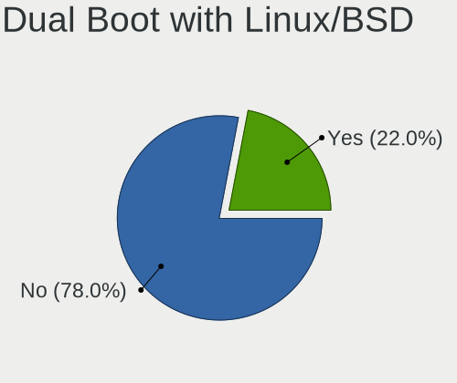
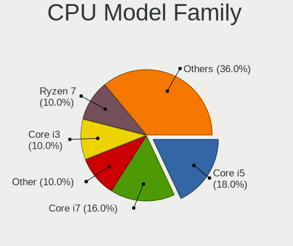
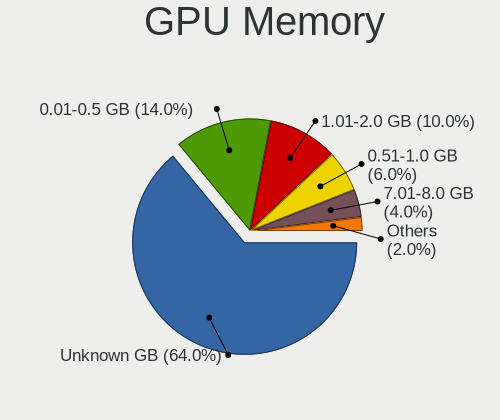
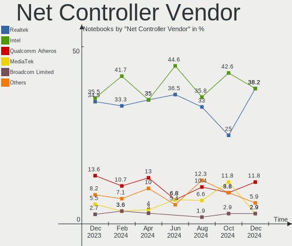
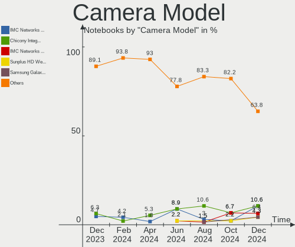

ArcoLinux - Hardware Trends (Notebooks)
---------------------------------------

A project to identify most popular hardware characteristics and track their change
over time based on data collected by Linux users at https://Linux-Hardware.org.

Anyone can contribute to this report by the [hw-probe](https://github.com/linuxhw/hw-probe) tool:

    sudo -E hw-probe -all -upload

This report is for one last month. Overall report since the beginning of time: [TestDays](https://github.com/linuxhw/TestDays)

Period: Apr, 2023.

Contents
--------

* [ System ](#system)
  - [ OS                       ](#os)
  - [ OS Family                ](#os-family)
  - [ Kernel                   ](#kernel)
  - [ Kernel Family            ](#kernel-family)
  - [ Kernel Major Ver.        ](#kernel-major-ver)
  - [ Arch                     ](#arch)
  - [ DE                       ](#de)
  - [ Display Server           ](#display-server)
  - [ Display Manager          ](#display-manager)
  - [ OS Lang                  ](#os-lang)
  - [ Boot Mode                ](#boot-mode)
  - [ Filesystem               ](#filesystem)
  - [ Part. scheme             ](#part-scheme)
  - [ Dual Boot with Linux/BSD ](#dual-boot-with-linuxbsd)
  - [ Dual Boot (Win)          ](#dual-boot-win)

* [ Board ](#board)
  - [ Vendor                   ](#vendor)
  - [ Model                    ](#model)
  - [ Model Family             ](#model-family)
  - [ MFG Year                 ](#mfg-year)
  - [ Form Factor              ](#form-factor)
  - [ Secure Boot              ](#secure-boot)
  - [ Coreboot                 ](#coreboot)
  - [ RAM Size                 ](#ram-size)
  - [ RAM Used                 ](#ram-used)
  - [ Total Drives             ](#total-drives)
  - [ Has CD-ROM               ](#has-cd-rom)
  - [ Has Ethernet             ](#has-ethernet)
  - [ Has WiFi                 ](#has-wifi)
  - [ Has Bluetooth            ](#has-bluetooth)

* [ Location ](#location)
  - [ Country                  ](#country)
  - [ City                     ](#city)

* [ Drives ](#drives)
  - [ Drive Vendor             ](#drive-vendor)
  - [ Drive Model              ](#drive-model)
  - [ HDD Vendor               ](#hdd-vendor)
  - [ SSD Vendor               ](#ssd-vendor)
  - [ Drive Kind               ](#drive-kind)
  - [ Drive Connector          ](#drive-connector)
  - [ Drive Size               ](#drive-size)
  - [ Space Total              ](#space-total)
  - [ Space Used               ](#space-used)
  - [ Malfunc. Drives          ](#malfunc-drives)
  - [ Malfunc. Drive Vendor    ](#malfunc-drive-vendor)
  - [ Malfunc. HDD Vendor      ](#malfunc-hdd-vendor)
  - [ Malfunc. Drive Kind      ](#malfunc-drive-kind)
  - [ Failed Drives            ](#failed-drives)
  - [ Failed Drive Vendor      ](#failed-drive-vendor)
  - [ Drive Status             ](#drive-status)

* [ Storage controller ](#storage-controller)
  - [ Storage Vendor           ](#storage-vendor)
  - [ Storage Model            ](#storage-model)
  - [ Storage Kind             ](#storage-kind)

* [ Processor ](#processor)
  - [ CPU Vendor               ](#cpu-vendor)
  - [ CPU Model                ](#cpu-model)
  - [ CPU Model Family         ](#cpu-model-family)
  - [ CPU Cores                ](#cpu-cores)
  - [ CPU Sockets              ](#cpu-sockets)
  - [ CPU Threads              ](#cpu-threads)
  - [ CPU Op-Modes             ](#cpu-op-modes)
  - [ CPU Microcode            ](#cpu-microcode)
  - [ CPU Microarch            ](#cpu-microarch)

* [ Graphics ](#graphics)
  - [ GPU Vendor               ](#gpu-vendor)
  - [ GPU Model                ](#gpu-model)
  - [ GPU Combo                ](#gpu-combo)
  - [ GPU Driver               ](#gpu-driver)
  - [ GPU Memory               ](#gpu-memory)

* [ Monitor ](#monitor)
  - [ Monitor Vendor           ](#monitor-vendor)
  - [ Monitor Model            ](#monitor-model)
  - [ Monitor Resolution       ](#monitor-resolution)
  - [ Monitor Diagonal         ](#monitor-diagonal)
  - [ Monitor Width            ](#monitor-width)
  - [ Aspect Ratio             ](#aspect-ratio)
  - [ Monitor Area             ](#monitor-area)
  - [ Pixel Density            ](#pixel-density)
  - [ Multiple Monitors        ](#multiple-monitors)

* [ Network ](#network)
  - [ Net Controller Vendor    ](#net-controller-vendor)
  - [ Net Controller Model     ](#net-controller-model)
  - [ Wireless Vendor          ](#wireless-vendor)
  - [ Wireless Model           ](#wireless-model)
  - [ Ethernet Vendor          ](#ethernet-vendor)
  - [ Ethernet Model           ](#ethernet-model)
  - [ Net Controller Kind      ](#net-controller-kind)
  - [ Used Controller          ](#used-controller)
  - [ NICs                     ](#nics)
  - [ IPv6                     ](#ipv6)

* [ Bluetooth ](#bluetooth)
  - [ Bluetooth Vendor         ](#bluetooth-vendor)
  - [ Bluetooth Model          ](#bluetooth-model)

* [ Sound ](#sound)
  - [ Sound Vendor             ](#sound-vendor)
  - [ Sound Model              ](#sound-model)

* [ Memory ](#memory)
  - [ Memory Vendor            ](#memory-vendor)
  - [ Memory Model             ](#memory-model)
  - [ Memory Kind              ](#memory-kind)
  - [ Memory Form Factor       ](#memory-form-factor)
  - [ Memory Size              ](#memory-size)
  - [ Memory Speed             ](#memory-speed)

* [ Printers & scanners ](#printers--scanners)
  - [ Printer Vendor           ](#printer-vendor)
  - [ Printer Model            ](#printer-model)
  - [ Scanner Vendor           ](#scanner-vendor)
  - [ Scanner Model            ](#scanner-model)

* [ Camera ](#camera)
  - [ Camera Vendor            ](#camera-vendor)
  - [ Camera Model             ](#camera-model)

* [ Security ](#security)
  - [ Fingerprint Vendor       ](#fingerprint-vendor)
  - [ Fingerprint Model        ](#fingerprint-model)
  - [ Chipcard Vendor          ](#chipcard-vendor)
  - [ Chipcard Model           ](#chipcard-model)

* [ Unsupported ](#unsupported)
  - [ Unsupported Devices      ](#unsupported-devices)
  - [ Unsupported Device Types ](#unsupported-device-types)

System
------

OS
--

Installed operating systems

| Name              | Notebooks | Percent |
|-------------------|-----------|---------|
| ArcoLinux Rolling | 34        | 97.14%  |
| ArcoLinux         | 1         | 2.86%   |

OS Family
---------

OS without a version

| Name      | Notebooks | Percent |
|-----------|-----------|---------|
| ArcoLinux | 35        | 100%    |

Kernel
------

Version of the Linux kernel

| Version               | Notebooks | Percent |
|-----------------------|-----------|---------|
| 6.2.11-arch1-1        | 12        | 34.29%  |
| 6.2.10-arch1-1        | 4         | 11.43%  |
| 6.2.9-arch1-1         | 3         | 8.57%   |
| 6.2.13-arch1-1        | 3         | 8.57%   |
| 6.2.8-arch1-1         | 2         | 5.71%   |
| 6.2.12-zen1-1-zen     | 2         | 5.71%   |
| 6.2.12-arch1-1        | 2         | 5.71%   |
| 6.1.24-1-lts          | 2         | 5.71%   |
| 6.2.9-zen1-1-zen      | 1         | 2.86%   |
| 6.2.7-x64v1-xanmod1-1 | 1         | 2.86%   |
| 6.2.11-zen1-1-zen     | 1         | 2.86%   |
| 6.1.25-1-lts          | 1         | 2.86%   |
| 6.1.11-arch1-1        | 1         | 2.86%   |

Kernel Family
-------------

Linux kernel without a distro release

| Version | Notebooks | Percent |
|---------|-----------|---------|
| 6.2.11  | 13        | 37.14%  |
| 6.2.9   | 4         | 11.43%  |
| 6.2.12  | 4         | 11.43%  |
| 6.2.10  | 4         | 11.43%  |
| 6.2.13  | 3         | 8.57%   |
| 6.2.8   | 2         | 5.71%   |
| 6.1.24  | 2         | 5.71%   |
| 6.2.7   | 1         | 2.86%   |
| 6.1.25  | 1         | 2.86%   |
| 6.1.11  | 1         | 2.86%   |

Kernel Major Ver.
-----------------

Linux kernel major version

| Version | Notebooks | Percent |
|---------|-----------|---------|
| 6.2     | 31        | 88.57%  |
| 6.1     | 4         | 11.43%  |

Arch
----

OS architecture (x86_64, i586, etc.)

| Name   | Notebooks | Percent |
|--------|-----------|---------|
| x86_64 | 35        | 100%    |

DE
--

Desktop Environment

| Name           | Notebooks | Percent |
|----------------|-----------|---------|
| XFCE           | 8         | 22.86%  |
| KDE5           | 7         | 20%     |
| hyprland       | 4         | 11.43%  |
| GNOME          | 4         | 11.43%  |
| chadwm         | 3         | 8.57%   |
| bspwm          | 2         | 5.71%   |
| xmonad         | 1         | 2.86%   |
| MATE           | 1         | 2.86%   |
| i3-with-shmlog | 1         | 2.86%   |
| i3             | 1         | 2.86%   |
| herbstluftwm   | 1         | 2.86%   |
| dwm            | 1         | 2.86%   |
| awesome        | 1         | 2.86%   |

Display Server
--------------

X11 or Wayland

| Name    | Notebooks | Percent |
|---------|-----------|---------|
| X11     | 24        | 68.57%  |
| Wayland | 10        | 28.57%  |
| Tty     | 1         | 2.86%   |

Display Manager
---------------

SDDM, LightDM, etc.

| Name    | Notebooks | Percent |
|---------|-----------|---------|
| SDDM    | 27        | 77.14%  |
| GDM     | 4         | 11.43%  |
| LightDM | 2         | 5.71%   |
| Unknown | 2         | 5.71%   |

OS Lang
-------

Language

| Lang  | Notebooks | Percent |
|-------|-----------|---------|
| en_US | 17        | 48.57%  |
| en_IN | 4         | 11.43%  |
| en_GB | 3         | 8.57%   |
| en_AU | 2         | 5.71%   |
| de_DE | 2         | 5.71%   |
| th_TH | 1         | 2.86%   |
| pt_BR | 1         | 2.86%   |
| it_IT | 1         | 2.86%   |
| fr_CA | 1         | 2.86%   |
| fr_BE | 1         | 2.86%   |
| es_MX | 1         | 2.86%   |
| en_AG | 1         | 2.86%   |

Boot Mode
---------

EFI or BIOS

| Mode | Notebooks | Percent |
|------|-----------|---------|
| EFI  | 27        | 77.14%  |
| BIOS | 8         | 22.86%  |

Filesystem
----------

Type of filesystem

| Type  | Notebooks | Percent |
|-------|-----------|---------|
| Ext4  | 29        | 82.86%  |
| Btrfs | 6         | 17.14%  |

Part. scheme
------------

Scheme of partitioning

| Type    | Notebooks | Percent |
|---------|-----------|---------|
| GPT     | 29        | 82.86%  |
| MBR     | 5         | 14.29%  |
| Unknown | 1         | 2.86%   |

Dual Boot with Linux/BSD
------------------------

Hosting more than one Linux/BSD

| Dual boot | Notebooks | Percent |
|-----------|-----------|---------|
| No        | 28        | 80%     |
| Yes       | 7         | 20%     |

Dual Boot (Win)
---------------

Hosting Linux and Windows

| Dual boot | Notebooks | Percent |
|-----------|-----------|---------|
| No        | 22        | 62.86%  |
| Yes       | 13        | 37.14%  |

Board
-----

Vendor
------

Motherboard manufacturer

| Name             | Notebooks | Percent |
|------------------|-----------|---------|
| Lenovo           | 9         | 25.71%  |
| Dell             | 7         | 20%     |
| Hewlett-Packard  | 6         | 17.14%  |
| Acer             | 5         | 14.29%  |
| ASUSTek Computer | 4         | 11.43%  |
| System76         | 1         | 2.86%   |
| Packard Bell     | 1         | 2.86%   |
| HUAWEI           | 1         | 2.86%   |
| Unknown          | 1         | 2.86%   |

Model
-----

Motherboard model

| Name                                        | Notebooks | Percent |
|---------------------------------------------|-----------|---------|
| System76 Oryx Pro                           | 1         | 2.86%   |
| Packard Bell EasyNote TSX62HR               | 1         | 2.86%   |
| Lenovo V15 G2 ALC 82KD                      | 1         | 2.86%   |
| Lenovo ThinkPad X1 Extreme Gen 3 20TLS0UV00 | 1         | 2.86%   |
| Lenovo ThinkPad T14 Gen 1 20UDCTO1WW        | 1         | 2.86%   |
| Lenovo Legion Y540-15IRH-PG0 81SY           | 1         | 2.86%   |
| Lenovo Legion 7 16ACHg6 82N6                | 1         | 2.86%   |
| Lenovo IdeaPad 3 15ADA05 81W1               | 1         | 2.86%   |
| Lenovo IdeaPad 3 14ITL05 81X7               | 1         | 2.86%   |
| Lenovo IdeaPad 3 14ALC6 82KT                | 1         | 2.86%   |
| Lenovo E41-25 81FS                          | 1         | 2.86%   |
| HUAWEI NBLB-WAX9N                           | 1         | 2.86%   |
| HP Pavilion Laptop 15-eh0xxx                | 1         | 2.86%   |
| HP Pavilion Gaming Laptop 15-ec1xxx         | 1         | 2.86%   |
| HP Pavilion Gaming Laptop 15-dk2xxx         | 1         | 2.86%   |
| HP Pavilion dv7                             | 1         | 2.86%   |
| HP Pavilion dv4                             | 1         | 2.86%   |
| HP ENVY 15                                  | 1         | 2.86%   |
| Dell Latitude E6440                         | 1         | 2.86%   |
| Dell Latitude 3590                          | 1         | 2.86%   |
| Dell Latitude 3510                          | 1         | 2.86%   |
| Dell Inspiron 5759                          | 1         | 2.86%   |
| Dell Inspiron 5566                          | 1         | 2.86%   |
| Dell Inspiron 5548                          | 1         | 2.86%   |
| Dell Inspiron 3558                          | 1         | 2.86%   |
| ASUS Zenbook UX7602ZM                       | 1         | 2.86%   |
| ASUS VivoBook_ASUSLaptop X412DAP_F412DA     | 1         | 2.86%   |
| ASUS VivoBook 15_ASUS Laptop X540UBR        | 1         | 2.86%   |
| ASUS K54C                                   | 1         | 2.86%   |
| Acer Swift SF114-32                         | 1         | 2.86%   |
| Acer Predator G9-793                        | 1         | 2.86%   |
| Acer Aspire E5-575G                         | 1         | 2.86%   |
| Acer Aspire A715-42G                        | 1         | 2.86%   |
| Acer Aspire A514-54G                        | 1         | 2.86%   |
| Unknown                                     | 1         | 2.86%   |

Model Family
------------

Motherboard model prefix

| Name                  | Notebooks | Percent |
|-----------------------|-----------|---------|
| HP Pavilion           | 5         | 14.29%  |
| Dell Inspiron         | 4         | 11.43%  |
| Lenovo IdeaPad        | 3         | 8.57%   |
| Dell Latitude         | 3         | 8.57%   |
| Acer Aspire           | 3         | 8.57%   |
| Lenovo ThinkPad       | 2         | 5.71%   |
| Lenovo Legion         | 2         | 5.71%   |
| ASUS VivoBook         | 2         | 5.71%   |
| System76 Oryx         | 1         | 2.86%   |
| Packard Bell EasyNote | 1         | 2.86%   |
| Lenovo V15            | 1         | 2.86%   |
| Lenovo E41-25         | 1         | 2.86%   |
| HUAWEI NBLB-WAX9N     | 1         | 2.86%   |
| HP ENVY               | 1         | 2.86%   |
| ASUS Zenbook          | 1         | 2.86%   |
| ASUS K54C             | 1         | 2.86%   |
| Acer Swift            | 1         | 2.86%   |
| Acer Predator         | 1         | 2.86%   |
| Unknown               | 1         | 2.86%   |

MFG Year
--------

Motherboard manufacture year

| Year | Notebooks | Percent |
|------|-----------|---------|
| 2020 | 8         | 22.86%  |
| 2021 | 7         | 20%     |
| 2018 | 4         | 11.43%  |
| 2019 | 3         | 8.57%   |
| 2016 | 3         | 8.57%   |
| 2015 | 3         | 8.57%   |
| 2011 | 2         | 5.71%   |
| 2008 | 2         | 5.71%   |
| 2022 | 1         | 2.86%   |
| 2013 | 1         | 2.86%   |
| 2010 | 1         | 2.86%   |

Form Factor
-----------

Physical design of the computer

| Name     | Notebooks | Percent |
|----------|-----------|---------|
| Notebook | 35        | 100%    |

Secure Boot
-----------

Enabled or disabled

| State    | Notebooks | Percent |
|----------|-----------|---------|
| Disabled | 35        | 100%    |

Coreboot
--------

Have coreboot on board

| Used | Notebooks | Percent |
|------|-----------|---------|
| No   | 35        | 100%    |

RAM Size
--------

Total RAM memory

| Size in GB  | Notebooks | Percent |
|-------------|-----------|---------|
| 4.01-8.0    | 15        | 42.86%  |
| 32.01-64.0  | 5         | 14.29%  |
| 8.01-16.0   | 5         | 14.29%  |
| 3.01-4.0    | 3         | 8.57%   |
| 16.01-24.0  | 3         | 8.57%   |
| 64.01-256.0 | 2         | 5.71%   |
| 2.01-3.0    | 1         | 2.86%   |
| 1.01-2.0    | 1         | 2.86%   |

RAM Used
--------

Used RAM memory

| Used GB    | Notebooks | Percent |
|------------|-----------|---------|
| 2.01-3.0   | 10        | 28.57%  |
| 1.01-2.0   | 9         | 25.71%  |
| 4.01-8.0   | 6         | 17.14%  |
| 3.01-4.0   | 5         | 14.29%  |
| 0.51-1.0   | 4         | 11.43%  |
| 16.01-24.0 | 1         | 2.86%   |

Total Drives
------------

Number of drives on board

| Drives | Notebooks | Percent |
|--------|-----------|---------|
| 1      | 21        | 60%     |
| 2      | 10        | 28.57%  |
| 3      | 3         | 8.57%   |
| 6      | 1         | 2.86%   |

Has CD-ROM
----------

Has CD-ROM on board

| Presented | Notebooks | Percent |
|-----------|-----------|---------|
| No        | 29        | 82.86%  |
| Yes       | 6         | 17.14%  |

Has Ethernet
------------

Has Ethernet on board

| Presented | Notebooks | Percent |
|-----------|-----------|---------|
| Yes       | 26        | 74.29%  |
| No        | 9         | 25.71%  |

Has WiFi
--------

Has WiFi module

| Presented | Notebooks | Percent |
|-----------|-----------|---------|
| Yes       | 35        | 100%    |

Has Bluetooth
-------------

Has Bluetooth module

| Presented | Notebooks | Percent |
|-----------|-----------|---------|
| Yes       | 32        | 91.43%  |
| No        | 3         | 8.57%   |

Location
--------

Country
-------

Geographic location (country)

| Country     | Notebooks | Percent |
|-------------|-----------|---------|
| USA         | 10        | 28.57%  |
| India       | 5         | 14.29%  |
| Germany     | 4         | 11.43%  |
| Indonesia   | 2         | 5.71%   |
| Belgium     | 2         | 5.71%   |
| Australia   | 2         | 5.71%   |
| UK          | 1         | 2.86%   |
| Turkey      | 1         | 2.86%   |
| Thailand    | 1         | 2.86%   |
| Philippines | 1         | 2.86%   |
| Mexico      | 1         | 2.86%   |
| Italy       | 1         | 2.86%   |
| Iran        | 1         | 2.86%   |
| Greece      | 1         | 2.86%   |
| Canada      | 1         | 2.86%   |
| Brazil      | 1         | 2.86%   |

City
----

Geographic location (city)

| City              | Notebooks | Percent |
|-------------------|-----------|---------|
| Brussels          | 2         | 5.71%   |
| Thessaloniki      | 1         | 2.86%   |
| Schwarzenbek      | 1         | 2.86%   |
| Puebla City       | 1         | 2.86%   |
| Plano             | 1         | 2.86%   |
| Palembang         | 1         | 2.86%   |
| Palakkad          | 1         | 2.86%   |
| Oklahoma City     | 1         | 2.86%   |
| Nuremberg         | 1         | 2.86%   |
| Norman            | 1         | 2.86%   |
| New York          | 1         | 2.86%   |
| Mission           | 1         | 2.86%   |
| Mineral           | 1         | 2.86%   |
| Kiziklibucak      | 1         | 2.86%   |
| Juazeiro do Norte | 1         | 2.86%   |
| Jember            | 1         | 2.86%   |
| Isfahan           | 1         | 2.86%   |
| Indore            | 1         | 2.86%   |
| Hyderabad         | 1         | 2.86%   |
| Houston           | 1         | 2.86%   |
| Hamburg           | 1         | 2.86%   |
| Farnham           | 1         | 2.86%   |
| Cologne           | 1         | 2.86%   |
| Chennai           | 1         | 2.86%   |
| Central Coast     | 1         | 2.86%   |
| Casina            | 1         | 2.86%   |
| Brisbane          | 1         | 2.86%   |
| Bradford          | 1         | 2.86%   |
| Bengaluru         | 1         | 2.86%   |
| Bangkok           | 1         | 2.86%   |
| Baltimore         | 1         | 2.86%   |
| Baguio City       | 1         | 2.86%   |
| Atlanta           | 1         | 2.86%   |
| Amarillo          | 1         | 2.86%   |

Drives
------

Drive Vendor
------------

Hard drive vendors

| Vendor                      | Notebooks | Drives | Percent |
|-----------------------------|-----------|--------|---------|
| Seagate                     | 8         | 10     | 15.69%  |
| WDC                         | 7         | 7      | 13.73%  |
| Samsung Electronics         | 7         | 7      | 13.73%  |
| SK hynix                    | 4         | 5      | 7.84%   |
| Sandisk                     | 3         | 4      | 5.88%   |
| Crucial                     | 3         | 3      | 5.88%   |
| Toshiba                     | 2         | 2      | 3.92%   |
| Phison Electronics          | 2         | 2      | 3.92%   |
| KIOXIA                      | 2         | 2      | 3.92%   |
| Kingston                    | 2         | 2      | 3.92%   |
| Unknown                     | 1         | 2      | 1.96%   |
| Union Memory                | 1         | 1      | 1.96%   |
| SPCC                        | 1         | 1      | 1.96%   |
| Micron/Crucial Technology   | 1         | 1      | 1.96%   |
| LITEON                      | 1         | 1      | 1.96%   |
| Kingston Technology Company | 1         | 1      | 1.96%   |
| Kingmax                     | 1         | 1      | 1.96%   |
| Intel                       | 1         | 1      | 1.96%   |
| Hitachi                     | 1         | 1      | 1.96%   |
| External                    | 1         | 1      | 1.96%   |
| China                       | 1         | 1      | 1.96%   |

Drive Model
-----------

Hard drive models

| Model                                              | Notebooks | Percent |
|----------------------------------------------------|-----------|---------|
| Seagate ST1000LM035-1RK172 970GB                   | 3         | 5.56%   |
| Toshiba MQ01ABD100 1TB                             | 2         | 3.7%    |
| WDC WDS120G2G0A-00JH30 120GB SSD                   | 1         | 1.85%   |
| WDC WD5000LPCX-24VHAT0 500GB                       | 1         | 1.85%   |
| WDC WD5000LPCX-24C6HT0 500GB                       | 1         | 1.85%   |
| WDC WD3200BEVT-60ZCT1 320GB                        | 1         | 1.85%   |
| WDC WD3200BEKT-60F3T1 320GB                        | 1         | 1.85%   |
| WDC WD20SPZX-22UA7T0 2TB                           | 1         | 1.85%   |
| WDC WD10JPVX-75JC3T0 1TB                           | 1         | 1.85%   |
| Unknown MMC Card  32GB                             | 1         | 1.85%   |
| Unknown MMC Card  128GB                            | 1         | 1.85%   |
| Union Memory UMIS RPJTJ256MEE1OWX 256GB            | 1         | 1.85%   |
| SPCC Solid State Disk 512GB                        | 1         | 1.85%   |
| SK hynix SKHynix_HFS001TDE9X084N 1024GB            | 1         | 1.85%   |
| SK hynix SKHynix_HFS001TD9TNI-L2B0B 1TB            | 1         | 1.85%   |
| SK hynix SHGP31-2000GM 2TB                         | 1         | 1.85%   |
| SK hynix PC711 HFS512GDE9X073N 512GB               | 1         | 1.85%   |
| SK hynix HFM512GD3JX016N 512GB                     | 1         | 1.85%   |
| Seagate ST500LM000-1EJ162 500GB                    | 1         | 1.85%   |
| Seagate ST2000LM007-1R8174 2TB                     | 1         | 1.85%   |
| Seagate ST2000LM003 HN-M201RAD 2TB                 | 1         | 1.85%   |
| Seagate One Touch SSD 1TB                          | 1         | 1.85%   |
| Seagate FireCuda HDD 2TB                           | 1         | 1.85%   |
| Seagate Expansion 4TB                              | 1         | 1.85%   |
| Sandisk WD_BLACK SN770 1TB                         | 1         | 1.85%   |
| Sandisk PC SN520 NVMe SSD 512GB                    | 1         | 1.85%   |
| SanDisk Extreme 55AE 1TB SSD                       | 1         | 1.85%   |
| Samsung SSD 870 EVO 1TB                            | 1         | 1.85%   |
| Samsung PM991 NVMe 256GB                           | 1         | 1.85%   |
| Samsung NVMe SSD Controller SM981/PM981/PM983 1TB  | 1         | 1.85%   |
| Samsung NVMe SSD Controller PM9A1/PM9A3/980PRO 2TB | 1         | 1.85%   |
| Samsung MZVLQ512HALU-000H1 512GB                   | 1         | 1.85%   |
| Samsung MZVLQ256HAJD-00000 256GB                   | 1         | 1.85%   |
| Samsung MZALQ512HBLU-00BL2 512GB                   | 1         | 1.85%   |
| Phison PS5013 E13 NVMe Controller 500GB            | 1         | 1.85%   |
| Phison E12 NVMe Controller 512GB                   | 1         | 1.85%   |
| Micron/Crucial P2 NVMe PCIe SSD 1TB                | 1         | 1.85%   |
| LITEON CV1-8B256 256GB SSD                         | 1         | 1.85%   |
| KIOXIA NVMe SSD 1TB                                | 1         | 1.85%   |
| KIOXIA KBG40ZNT256G TOSHIBA MEMORY 256GB           | 1         | 1.85%   |

HDD Vendor
----------

Hard disk drive vendors

| Vendor  | Notebooks | Drives | Percent |
|---------|-----------|--------|---------|
| Seagate | 8         | 8      | 47.06%  |
| WDC     | 6         | 6      | 35.29%  |
| Toshiba | 2         | 2      | 11.76%  |
| Hitachi | 1         | 1      | 5.88%   |

SSD Vendor
----------

Solid state drive vendors

| Vendor              | Notebooks | Drives | Percent |
|---------------------|-----------|--------|---------|
| Crucial             | 3         | 3      | 23.08%  |
| WDC                 | 1         | 1      | 7.69%   |
| SPCC                | 1         | 1      | 7.69%   |
| Seagate             | 1         | 2      | 7.69%   |
| SanDisk             | 1         | 2      | 7.69%   |
| Samsung Electronics | 1         | 1      | 7.69%   |
| LITEON              | 1         | 1      | 7.69%   |
| Kingston            | 1         | 1      | 7.69%   |
| Kingmax             | 1         | 1      | 7.69%   |
| External            | 1         | 1      | 7.69%   |
| China               | 1         | 1      | 7.69%   |

Drive Kind
----------

HDD or SSD

| Kind | Notebooks | Drives | Percent |
|------|-----------|--------|---------|
| NVMe | 19        | 22     | 40.43%  |
| HDD  | 17        | 17     | 36.17%  |
| SSD  | 10        | 15     | 21.28%  |
| MMC  | 1         | 2      | 2.13%   |

Drive Connector
---------------

SATA, SAS, NVMe, etc.

| Type | Notebooks | Drives | Percent |
|------|-----------|--------|---------|
| SATA | 21        | 25     | 47.73%  |
| NVMe | 19        | 22     | 43.18%  |
| SAS  | 3         | 7      | 6.82%   |
| MMC  | 1         | 2      | 2.27%   |

Drive Size
----------

Size of hard drive

| Size in TB | Notebooks | Drives | Percent |
|------------|-----------|--------|---------|
| 0.51-1.0   | 12        | 15     | 42.86%  |
| 0.01-0.5   | 10        | 11     | 35.71%  |
| 1.01-2.0   | 5         | 5      | 17.86%  |
| 3.01-4.0   | 1         | 1      | 3.57%   |

Space Total
-----------

Amount of disk space available on the file system

| Size in GB     | Notebooks | Percent |
|----------------|-----------|---------|
| 101-250        | 9         | 25.71%  |
| 501-1000       | 8         | 22.86%  |
| 251-500        | 6         | 17.14%  |
| 1001-2000      | 6         | 17.14%  |
| More than 3000 | 3         | 8.57%   |
| 21-50          | 1         | 2.86%   |
| 51-100         | 1         | 2.86%   |
| Unknown        | 1         | 2.86%   |

Space Used
----------

Amount of used disk space

| Used GB   | Notebooks | Percent |
|-----------|-----------|---------|
| 1-20      | 11        | 31.43%  |
| 21-50     | 7         | 20%     |
| 101-250   | 6         | 17.14%  |
| 501-1000  | 4         | 11.43%  |
| 51-100    | 4         | 11.43%  |
| 1001-2000 | 2         | 5.71%   |
| Unknown   | 1         | 2.86%   |

Malfunc. Drives
---------------

Drive models with a malfunction

| Model                            | Notebooks | Drives | Percent |
|----------------------------------|-----------|--------|---------|
| WDC WD5000LPCX-24C6HT0 500GB     | 1         | 1      | 25%     |
| Toshiba MQ01ABD100 1TB           | 1         | 1      | 25%     |
| Seagate ST1000LM035-1RK172 970GB | 1         | 1      | 25%     |
| Hitachi HTS547575A9E384 752GB    | 1         | 1      | 25%     |

Malfunc. Drive Vendor
---------------------

Vendors of faulty drives

| Vendor  | Notebooks | Drives | Percent |
|---------|-----------|--------|---------|
| WDC     | 1         | 1      | 25%     |
| Toshiba | 1         | 1      | 25%     |
| Seagate | 1         | 1      | 25%     |
| Hitachi | 1         | 1      | 25%     |

Malfunc. HDD Vendor
-------------------

Vendors of faulty HDD drives

| Vendor  | Notebooks | Drives | Percent |
|---------|-----------|--------|---------|
| WDC     | 1         | 1      | 25%     |
| Toshiba | 1         | 1      | 25%     |
| Seagate | 1         | 1      | 25%     |
| Hitachi | 1         | 1      | 25%     |

Malfunc. Drive Kind
-------------------

Kinds of faulty drives

| Kind | Notebooks | Drives | Percent |
|------|-----------|--------|---------|
| HDD  | 4         | 4      | 100%    |

Failed Drives
-------------

Failed drive models

Zero info for selected period =(

Failed Drive Vendor
-------------------

Failed drive vendors

Zero info for selected period =(

Drive Status
------------

Number of failed and malfunc. drives

| Status   | Notebooks | Drives | Percent |
|----------|-----------|--------|---------|
| Works    | 30        | 42     | 78.95%  |
| Detected | 4         | 10     | 10.53%  |
| Malfunc  | 4         | 4      | 10.53%  |

Storage controller
------------------

Storage Vendor
--------------

Storage controller vendors

| Vendor                      | Notebooks | Percent |
|-----------------------------|-----------|---------|
| Intel                       | 21        | 42%     |
| AMD                         | 9         | 18%     |
| Samsung Electronics         | 6         | 12%     |
| SK hynix                    | 4         | 8%      |
| SanDisk                     | 2         | 4%      |
| Phison Electronics          | 2         | 4%      |
| KIOXIA                      | 2         | 4%      |
| Kingston Technology Company | 2         | 4%      |
| Union Memory (Shenzhen)     | 1         | 2%      |
| Micron/Crucial Technology   | 1         | 2%      |

Storage Model
-------------

Storage controller models

| Model                                                                          | Notebooks | Percent |
|--------------------------------------------------------------------------------|-----------|---------|
| AMD FCH SATA Controller [AHCI mode]                                            | 7         | 12.96%  |
| Intel Sunrise Point-LP SATA Controller [AHCI mode]                             | 5         | 9.26%   |
| Samsung NVMe SSD Controller 980                                                | 4         | 7.41%   |
| SK hynix Gold P31/PC711 NVMe Solid State Drive                                 | 3         | 5.56%   |
| Intel Volume Management Device NVMe RAID Controller                            | 3         | 5.56%   |
| Intel Tiger Lake-LP SATA Controller                                            | 3         | 5.56%   |
| Intel Wildcat Point-LP SATA Controller [AHCI Mode]                             | 2         | 3.7%    |
| Intel Comet Lake SATA AHCI Controller                                          | 2         | 3.7%    |
| Intel Cannon Lake Mobile PCH SATA AHCI Controller                              | 2         | 3.7%    |
| Intel 82801 Mobile SATA Controller [RAID mode]                                 | 2         | 3.7%    |
| Intel 6 Series/C200 Series Chipset Family 6 port Mobile SATA AHCI Controller   | 2         | 3.7%    |
| AMD SB7x0/SB8x0/SB9x0 SATA Controller [AHCI mode]                              | 2         | 3.7%    |
| Union Memory (Shenzhen) Non-Volatile memory controller                         | 1         | 1.85%   |
| SK hynix Non-Volatile memory controller                                        | 1         | 1.85%   |
| SanDisk WD Black SN770 NVMe SSD                                                | 1         | 1.85%   |
| SanDisk PC SN520 NVMe SSD                                                      | 1         | 1.85%   |
| Samsung NVMe SSD Controller SM981/PM981/PM983                                  | 1         | 1.85%   |
| Samsung NVMe SSD Controller PM9A1/PM9A3/980PRO                                 | 1         | 1.85%   |
| Phison PS5013 E13 NVMe Controller                                              | 1         | 1.85%   |
| Phison E12 NVMe Controller                                                     | 1         | 1.85%   |
| Micron/Crucial P2 NVMe PCIe SSD                                                | 1         | 1.85%   |
| KIOXIA NVMe SSD Controller BG4                                                 | 1         | 1.85%   |
| KIOXIA NVMe SSD                                                                | 1         | 1.85%   |
| Kingston Company U-SNS8154P3 NVMe SSD                                          | 1         | 1.85%   |
| Kingston Company NVMe Controller                                               | 1         | 1.85%   |
| Intel Non-Volatile memory controller                                           | 1         | 1.85%   |
| Intel Celeron/Pentium Silver Processor SATA Controller                         | 1         | 1.85%   |
| Intel 8 Series/C220 Series Chipset Family 6-port SATA Controller 1 [AHCI mode] | 1         | 1.85%   |
| AMD SB7x0/SB8x0/SB9x0 IDE Controller                                           | 1         | 1.85%   |

Storage Kind
------------

Kind of storage controller (IDE, SATA, NVMe, SAS, ...)

| Kind | Notebooks | Percent |
|------|-----------|---------|
| SATA | 27        | 51.92%  |
| NVMe | 19        | 36.54%  |
| RAID | 5         | 9.62%   |
| IDE  | 1         | 1.92%   |

Processor
---------

CPU Vendor
----------

Processor vendors

| Vendor | Notebooks | Percent |
|--------|-----------|---------|
| Intel  | 23        | 65.71%  |
| AMD    | 12        | 34.29%  |

CPU Model
---------

Processor models

| Model                                         | Notebooks | Percent |
|-----------------------------------------------|-----------|---------|
| Intel Core i7-8550U CPU @ 1.80GHz             | 2         | 5.71%   |
| Intel Core i5-10210U CPU @ 1.60GHz            | 2         | 5.71%   |
| Intel 11th Gen Core i3-1115G4 @ 3.00GHz       | 2         | 5.71%   |
| AMD Ryzen 5 5500U with Radeon Graphics        | 2         | 5.71%   |
| Intel Pentium Silver N5000 CPU @ 1.10GHz      | 1         | 2.86%   |
| Intel Core i7-9750H CPU @ 2.60GHz             | 1         | 2.86%   |
| Intel Core i7-7700HQ CPU @ 2.80GHz            | 1         | 2.86%   |
| Intel Core i7-7500U CPU @ 2.70GHz             | 1         | 2.86%   |
| Intel Core i7-6500U CPU @ 2.50GHz             | 1         | 2.86%   |
| Intel Core i7-4702MQ CPU @ 2.20GHz            | 1         | 2.86%   |
| Intel Core i7-10750H CPU @ 2.60GHz            | 1         | 2.86%   |
| Intel Core i5-9300H CPU @ 2.40GHz             | 1         | 2.86%   |
| Intel Core i5-7200U CPU @ 2.50GHz             | 1         | 2.86%   |
| Intel Core i5-5200U CPU @ 2.20GHz             | 1         | 2.86%   |
| Intel Core i5-4210M CPU @ 2.60GHz             | 1         | 2.86%   |
| Intel Core i5-2450M CPU @ 2.50GHz             | 1         | 2.86%   |
| Intel Core i3-5015U CPU @ 2.10GHz             | 1         | 2.86%   |
| Intel Core i3-2330M CPU @ 2.20GHz             | 1         | 2.86%   |
| Intel Atom x5-Z8350 CPU @ 1.44GHz             | 1         | 2.86%   |
| Intel 12th Gen Core i9-12900H                 | 1         | 2.86%   |
| Intel 11th Gen Core i5-11300H @ 3.10GHz       | 1         | 2.86%   |
| AMD Turion X2 Dual-Core Mobile RM-74          | 1         | 2.86%   |
| AMD Turion II Dual-Core Mobile M500           | 1         | 2.86%   |
| AMD Ryzen 9 5900HX with Radeon Graphics       | 1         | 2.86%   |
| AMD Ryzen 7 5700U with Radeon Graphics        | 1         | 2.86%   |
| AMD Ryzen 5 PRO 4650U with Radeon Graphics    | 1         | 2.86%   |
| AMD Ryzen 5 4600H with Radeon Graphics        | 1         | 2.86%   |
| AMD Ryzen 5 4500U with Radeon Graphics        | 1         | 2.86%   |
| AMD Ryzen 5 3500U with Radeon Vega Mobile Gfx | 1         | 2.86%   |
| AMD Ryzen 3 3250U with Radeon Graphics        | 1         | 2.86%   |
| AMD PRO A4-4350B R4, 5 COMPUTE CORES 2C+3G    | 1         | 2.86%   |

CPU Model Family
----------------

Processor model prefix

| Model                          | Notebooks | Percent |
|--------------------------------|-----------|---------|
| Intel Core i7                  | 8         | 22.86%  |
| Intel Core i5                  | 7         | 20%     |
| Other                          | 5         | 14.29%  |
| AMD Ryzen 5                    | 5         | 14.29%  |
| Intel Core i3                  | 2         | 5.71%   |
| Intel Pentium Silver           | 1         | 2.86%   |
| Intel Atom                     | 1         | 2.86%   |
| AMD Turion X2 Dual-Core Mobile | 1         | 2.86%   |
| AMD Turion II Dual-Core        | 1         | 2.86%   |
| AMD Ryzen 9                    | 1         | 2.86%   |
| AMD Ryzen 7                    | 1         | 2.86%   |
| AMD Ryzen 5 PRO                | 1         | 2.86%   |
| AMD Ryzen 3                    | 1         | 2.86%   |

CPU Cores
---------

Number of processor cores

| Number | Notebooks | Percent |
|--------|-----------|---------|
| 2      | 14        | 40%     |
| 4      | 11        | 31.43%  |
| 6      | 7         | 20%     |
| 8      | 2         | 5.71%   |
| 14     | 1         | 2.86%   |

CPU Sockets
-----------

Number of sockets

| Number | Notebooks | Percent |
|--------|-----------|---------|
| 1      | 35        | 100%    |

CPU Threads
-----------

Threads per core (Hyper-Threading)

| Number | Notebooks | Percent |
|--------|-----------|---------|
| 2      | 29        | 82.86%  |
| 1      | 6         | 17.14%  |

CPU Op-Modes
------------

CPU Operation Modes (32-bit, 64-bit)

| Op mode        | Notebooks | Percent |
|----------------|-----------|---------|
| 32-bit, 64-bit | 35        | 100%    |

CPU Microcode
-------------

Microcode number

| Number     | Notebooks | Percent |
|------------|-----------|---------|
| Unknown    | 22        | 62.86%  |
| 0x08608103 | 3         | 8.57%   |
| 0x08600106 | 3         | 8.57%   |
| 0xa0652    | 1         | 2.86%   |
| 0x806ec    | 1         | 2.86%   |
| 0x306d4    | 1         | 2.86%   |
| 0x0a50000c | 1         | 2.86%   |
| 0x08108109 | 1         | 2.86%   |
| 0x06006705 | 1         | 2.86%   |
| 0x02000032 | 1         | 2.86%   |

CPU Microarch
-------------

Microarchitecture

| Name             | Notebooks | Percent |
|------------------|-----------|---------|
| KabyLake         | 9         | 25.71%  |
| Zen 2            | 3         | 8.57%   |
| TigerLake        | 3         | 8.57%   |
| Unknown          | 3         | 8.57%   |
| Zen+             | 2         | 5.71%   |
| SandyBridge      | 2         | 5.71%   |
| Haswell          | 2         | 5.71%   |
| Broadwell        | 2         | 5.71%   |
| Zen 3            | 1         | 2.86%   |
| Skylake          | 1         | 2.86%   |
| Silvermont       | 1         | 2.86%   |
| K8 & K10 hybrid  | 1         | 2.86%   |
| K10              | 1         | 2.86%   |
| Goldmont plus    | 1         | 2.86%   |
| Excavator        | 1         | 2.86%   |
| CometLake        | 1         | 2.86%   |
| Alderlake Hybrid | 1         | 2.86%   |

Graphics
--------

GPU Vendor
----------

Vendors of graphics cards

| Vendor | Notebooks | Percent |
|--------|-----------|---------|
| Intel  | 21        | 44.68%  |
| Nvidia | 13        | 27.66%  |
| AMD    | 13        | 27.66%  |

GPU Model
---------

Graphics card models

| Model                                                                                    | Notebooks | Percent |
|------------------------------------------------------------------------------------------|-----------|---------|
| Nvidia TU117M [GeForce GTX 1650 Mobile / Max-Q]                                          | 3         | 6.38%   |
| AMD Renoir                                                                               | 3         | 6.38%   |
| AMD Lucienne                                                                             | 3         | 6.38%   |
| Intel UHD Graphics 620                                                                   | 2         | 4.26%   |
| Intel Tiger Lake-LP GT2 [UHD Graphics G4]                                                | 2         | 4.26%   |
| Intel HD Graphics 620                                                                    | 2         | 4.26%   |
| Intel HD Graphics 5500                                                                   | 2         | 4.26%   |
| Intel CometLake-U GT2 [UHD Graphics]                                                     | 2         | 4.26%   |
| Intel 4th Gen Core Processor Integrated Graphics Controller                              | 2         | 4.26%   |
| Intel 2nd Generation Core Processor Family Integrated Graphics Controller                | 2         | 4.26%   |
| AMD Picasso/Raven 2 [Radeon Vega Series / Radeon Vega Mobile Series]                     | 2         | 4.26%   |
| Nvidia TU117M [GeForce GTX 1650 Ti Mobile]                                               | 1         | 2.13%   |
| Nvidia TU117M                                                                            | 1         | 2.13%   |
| Nvidia TU106M [GeForce RTX 2060 Mobile]                                                  | 1         | 2.13%   |
| Nvidia GP107M [GeForce MX350]                                                            | 1         | 2.13%   |
| Nvidia GP104BM [GeForce GTX 1070 Mobile]                                                 | 1         | 2.13%   |
| Nvidia GM108M [GeForce MX110]                                                            | 1         | 2.13%   |
| Nvidia GM108M [GeForce 940MX]                                                            | 1         | 2.13%   |
| Nvidia GK107M [GeForce GT 750M]                                                          | 1         | 2.13%   |
| Nvidia GA106M [GeForce RTX 3060 Mobile / Max-Q]                                          | 1         | 2.13%   |
| Nvidia GA104M [GeForce RTX 3080 Mobile / Max-Q 8GB/16GB]                                 | 1         | 2.13%   |
| Intel TigerLake-LP GT2 [Iris Xe Graphics]                                                | 1         | 2.13%   |
| Intel Skylake GT2 [HD Graphics 520]                                                      | 1         | 2.13%   |
| Intel GeminiLake [UHD Graphics 605]                                                      | 1         | 2.13%   |
| Intel CometLake-H GT2 [UHD Graphics]                                                     | 1         | 2.13%   |
| Intel CoffeeLake-H GT2 [UHD Graphics 630]                                                | 1         | 2.13%   |
| Intel Atom/Celeron/Pentium Processor x5-E8000/J3xxx/N3xxx Integrated Graphics Controller | 1         | 2.13%   |
| Intel Alder Lake-P Integrated Graphics Controller                                        | 1         | 2.13%   |
| AMD Topaz XT [Radeon R7 M260/M265 / M340/M360 / M440/M445 / 530/535 / 620/625 Mobile]    | 1         | 2.13%   |
| AMD Sun XT [Radeon HD 8670A/8670M/8690M / R5 M330 / M430 / Radeon 520 Mobile]            | 1         | 2.13%   |
| AMD Stoney [Radeon R2/R3/R4/R5 Graphics]                                                 | 1         | 2.13%   |
| AMD RS880M [Mobility Radeon HD 4225/4250]                                                | 1         | 2.13%   |
| AMD RS780M [Mobility Radeon HD 3200]                                                     | 1         | 2.13%   |

GPU Combo
---------

Combinations of graphics cards

| Name           | Notebooks | Percent |
|----------------|-----------|---------|
| 1 x Intel      | 11        | 31.43%  |
| 1 x AMD        | 9         | 25.71%  |
| Intel + Nvidia | 8         | 22.86%  |
| 1 x Nvidia     | 3         | 8.57%   |
| Intel + AMD    | 2         | 5.71%   |
| AMD + Nvidia   | 2         | 5.71%   |

GPU Driver
----------

Free vs proprietary

| Driver      | Notebooks | Percent |
|-------------|-----------|---------|
| Free        | 26        | 74.29%  |
| Proprietary | 9         | 25.71%  |

GPU Memory
----------

Total video memory

| Size in GB | Notebooks | Percent |
|------------|-----------|---------|
| Unknown    | 15        | 42.86%  |
| 0.01-0.5   | 7         | 20%     |
| 1.01-2.0   | 5         | 14.29%  |
| 3.01-4.0   | 4         | 11.43%  |
| 5.01-6.0   | 2         | 5.71%   |
| 7.01-8.0   | 1         | 2.86%   |
| 8.01-16.0  | 1         | 2.86%   |

Monitor
-------

Monitor Vendor
--------------

Monitor vendors

| Vendor                  | Notebooks | Percent |
|-------------------------|-----------|---------|
| AU Optronics            | 8         | 19.05%  |
| Chimei Innolux          | 6         | 14.29%  |
| BOE                     | 6         | 14.29%  |
| Samsung Electronics     | 5         | 11.9%   |
| LG Display              | 5         | 11.9%   |
| WST                     | 1         | 2.38%   |
| ViewSonic               | 1         | 2.38%   |
| Unknown                 | 1         | 2.38%   |
| KTC                     | 1         | 2.38%   |
| Goldstar                | 1         | 2.38%   |
| Fujitsu Siemens         | 1         | 2.38%   |
| Dell                    | 1         | 2.38%   |
| Chi Mei Optoelectronics | 1         | 2.38%   |
| BOE Technology Group    | 1         | 2.38%   |
| Ancor Communications    | 1         | 2.38%   |
| Acer                    | 1         | 2.38%   |
| Unknown                 | 1         | 2.38%   |

Monitor Model
-------------

Monitor models

| Model                                                                    | Notebooks | Percent |
|--------------------------------------------------------------------------|-----------|---------|
| WST LCD Monitor WST1400 1920x1080 310x170mm 13.9-inch                    | 1         | 2.33%   |
| ViewSonic VSC PJD VSCD934 1920x1080                                      | 1         | 2.33%   |
| Unknown LCD Monitor CSO 2560x1600                                        | 1         | 2.33%   |
| Samsung Electronics SA300/SA350 SAM078B 1600x900 443x249mm 20.0-inch     | 1         | 2.33%   |
| Samsung Electronics Odyssey G8 SAM71EC 3840x2160 697x392mm 31.5-inch     | 1         | 2.33%   |
| Samsung Electronics LCD Monitor SEC5142 1280x800 303x190mm 14.1-inch     | 1         | 2.33%   |
| Samsung Electronics LCD Monitor SEC344B 1440x900 367x230mm 17.1-inch     | 1         | 2.33%   |
| Samsung Electronics LCD Monitor SDC544B 1600x900 309x174mm 14.0-inch     | 1         | 2.33%   |
| Samsung Electronics LCD Monitor SDC415D 3840x2400 344x215mm 16.0-inch    | 1         | 2.33%   |
| LG Display LCD Monitor LGD069C 1920x1080 309x174mm 14.0-inch             | 1         | 2.33%   |
| LG Display LCD Monitor LGD062F 1920x1080 344x194mm 15.5-inch             | 1         | 2.33%   |
| LG Display LCD Monitor LGD0608 1920x1080 309x174mm 14.0-inch             | 1         | 2.33%   |
| LG Display LCD Monitor LGD05F2 1920x1080 344x194mm 15.5-inch             | 1         | 2.33%   |
| LG Display LCD Monitor LGD02DC 1366x768 344x194mm 15.5-inch              | 1         | 2.33%   |
| KTC Onn TV KTCDD07 1920x1080 698x392mm 31.5-inch                         | 1         | 2.33%   |
| Goldstar FULL HD GSM5B55 1920x1080 480x270mm 21.7-inch                   | 1         | 2.33%   |
| Fujitsu Siemens LSL 3230T FUS07A5 1920x1080 509x286mm 23.0-inch          | 1         | 2.33%   |
| Dell SE2416H DELD082 1920x1080 527x296mm 23.8-inch                       | 1         | 2.33%   |
| Chimei Innolux LCD Monitor CMN15E8 1920x1080 344x193mm 15.5-inch         | 1         | 2.33%   |
| Chimei Innolux LCD Monitor CMN15DB 1366x768 344x193mm 15.5-inch          | 1         | 2.33%   |
| Chimei Innolux LCD Monitor CMN15BB 1920x1080 344x194mm 15.5-inch         | 1         | 2.33%   |
| Chimei Innolux LCD Monitor CMN150D 1920x1080 344x193mm 15.5-inch         | 1         | 2.33%   |
| Chimei Innolux LCD Monitor CMN150C 1920x1080 344x193mm 15.5-inch         | 1         | 2.33%   |
| Chimei Innolux LCD Monitor CMN1404 1920x1080 309x173mm 13.9-inch         | 1         | 2.33%   |
| Chi Mei Optoelectronics LCD Monitor CMO1592 1366x768 344x193mm 15.5-inch | 1         | 2.33%   |
| BOE Technology Group LCD Monitor 1920x1080                               | 1         | 2.33%   |
| BOE LCD Monitor BOE08F2 1920x1080 310x174mm 14.0-inch                    | 1         | 2.33%   |
| BOE LCD Monitor BOE08D5 1920x1080 344x194mm 15.5-inch                    | 1         | 2.33%   |
| BOE LCD Monitor BOE0812 1920x1080 344x194mm 15.5-inch                    | 1         | 2.33%   |
| BOE LCD Monitor BOE07F6 1920x1080 309x174mm 14.0-inch                    | 1         | 2.33%   |
| BOE LCD Monitor BOE07B6 1920x1080 382x215mm 17.3-inch                    | 1         | 2.33%   |
| BOE LCD Monitor BOE0671 1366x768 344x194mm 15.5-inch                     | 1         | 2.33%   |
| AU Optronics LCD Monitor AUODF87 1920x1080 344x193mm 15.5-inch           | 1         | 2.33%   |
| AU Optronics LCD Monitor AUO70EC 1366x768 344x193mm 15.5-inch            | 1         | 2.33%   |
| AU Optronics LCD Monitor AUO403D 1920x1080 309x174mm 14.0-inch           | 1         | 2.33%   |
| AU Optronics LCD Monitor AUO38ED 1920x1080 344x193mm 15.5-inch           | 1         | 2.33%   |
| AU Optronics LCD Monitor AUO2E3C 1366x768 309x173mm 13.9-inch            | 1         | 2.33%   |
| AU Optronics LCD Monitor AUO11EC 1366x768 344x193mm 15.5-inch            | 1         | 2.33%   |
| AU Optronics LCD Monitor AUO119D 1920x1080 381x214mm 17.2-inch           | 1         | 2.33%   |
| AU Optronics LCD Monitor AUO10EC 1366x768 344x193mm 15.5-inch            | 1         | 2.33%   |

Monitor Resolution
------------------

Monitor screen resolution

| Resolution       | Notebooks | Percent |
|------------------|-----------|---------|
| 1920x1080 (FHD)  | 26        | 61.9%   |
| 1366x768 (WXGA)  | 8         | 19.05%  |
| 3840x2160 (4K)   | 2         | 4.76%   |
| 1600x900 (HD+)   | 2         | 4.76%   |
| 3840x2400        | 1         | 2.38%   |
| 2560x1600        | 1         | 2.38%   |
| 1440x900 (WXGA+) | 1         | 2.38%   |
| 1280x800 (WXGA)  | 1         | 2.38%   |

Monitor Diagonal
----------------

Diagonal size in inches

| Inches  | Notebooks | Percent |
|---------|-----------|---------|
| 15      | 17        | 39.53%  |
| 14      | 7         | 16.28%  |
| Unknown | 4         | 9.3%    |
| 24      | 3         | 6.98%   |
| 17      | 3         | 6.98%   |
| 13      | 3         | 6.98%   |
| 31      | 2         | 4.65%   |
| 23      | 1         | 2.33%   |
| 21      | 1         | 2.33%   |
| 20      | 1         | 2.33%   |
| 16      | 1         | 2.33%   |

Monitor Width
-------------

Physical width

| Width in mm | Notebooks | Percent |
|-------------|-----------|---------|
| 301-350     | 28        | 65.12%  |
| 501-600     | 4         | 9.3%    |
| Unknown     | 4         | 9.3%    |
| 351-400     | 3         | 6.98%   |
| 601-700     | 2         | 4.65%   |
| 401-500     | 2         | 4.65%   |

Aspect Ratio
------------

Proportional relationship between the width and the height

| Ratio   | Notebooks | Percent |
|---------|-----------|---------|
| 16/9    | 30        | 83.33%  |
| 16/10   | 3         | 8.33%   |
| Unknown | 3         | 8.33%   |

Monitor Area
------------

Area in inch

| Area in inch | Notebooks | Percent |
|----------------|-----------|---------|
| 101-110        | 17        | 39.53%  |
| 81-90          | 10        | 23.26%  |
| 201-250        | 5         | 11.63%  |
| Unknown        | 4         | 9.3%    |
| 351-500        | 2         | 4.65%   |
| 121-130        | 2         | 4.65%   |
| 151-200        | 1         | 2.33%   |
| 131-140        | 1         | 2.33%   |
| 111-120        | 1         | 2.33%   |

Pixel Density
-------------

Pixels per inch

| Density       | Notebooks | Percent |
|---------------|-----------|---------|
| 121-160       | 21        | 50%     |
| 101-120       | 9         | 21.43%  |
| 51-100        | 7         | 16.67%  |
| Unknown       | 4         | 9.52%   |
| More than 240 | 1         | 2.38%   |

Multiple Monitors
-----------------

Total monitors connected

| Total | Notebooks | Percent |
|-------|-----------|---------|
| 1     | 28        | 80%     |
| 2     | 6         | 17.14%  |
| 3     | 1         | 2.86%   |

Network
-------

Net Controller Vendor
---------------------

Controller vendors

| Vendor                | Notebooks | Percent |
|-----------------------|-----------|---------|
| Realtek Semiconductor | 25        | 43.86%  |
| Intel                 | 16        | 28.07%  |
| Qualcomm Atheros      | 11        | 19.3%   |
| MediaTek              | 3         | 5.26%   |
| Broadcom              | 1         | 1.75%   |
| Android               | 1         | 1.75%   |

Net Controller Model
--------------------

Controller models

| Model                                                                   | Notebooks | Percent |
|-------------------------------------------------------------------------|-----------|---------|
| Realtek RTL8111/8168/8411 PCI Express Gigabit Ethernet Controller       | 15        | 24.19%  |
| Realtek RTL810xE PCI Express Fast Ethernet controller                   | 6         | 9.68%   |
| Qualcomm Atheros QCA6174 802.11ac Wireless Network Adapter              | 4         | 6.45%   |
| Intel Wi-Fi 6 AX200                                                     | 4         | 6.45%   |
| Realtek RTL8822CE 802.11ac PCIe Wireless Network Adapter                | 3         | 4.84%   |
| Intel Wireless 3160                                                     | 3         | 4.84%   |
| Qualcomm Atheros QCA9377 802.11ac Wireless Network Adapter              | 2         | 3.23%   |
| MediaTek MT7921 802.11ax PCI Express Wireless Network Adapter           | 2         | 3.23%   |
| Intel Cannon Lake PCH CNVi WiFi                                         | 2         | 3.23%   |
| Realtek RTL8852AE WiFi 6 802.11ax PCIe Adapter                          | 1         | 1.61%   |
| Realtek RTL8821CE 802.11ac PCIe Wireless Network Adapter                | 1         | 1.61%   |
| Realtek RTL8153 Gigabit Ethernet Adapter                                | 1         | 1.61%   |
| Realtek 802.11ac NIC                                                    | 1         | 1.61%   |
| Qualcomm Atheros QCA9565 / AR9565 Wireless Network Adapter              | 1         | 1.61%   |
| Qualcomm Atheros Killer E2400 Gigabit Ethernet Controller               | 1         | 1.61%   |
| Qualcomm Atheros AR9287 Wireless Network Adapter (PCI-Express)          | 1         | 1.61%   |
| Qualcomm Atheros AR9285 Wireless Network Adapter (PCI-Express)          | 1         | 1.61%   |
| Qualcomm Atheros AR8151 v2.0 Gigabit Ethernet                           | 1         | 1.61%   |
| Qualcomm Atheros AR242x / AR542x Wireless Network Adapter (PCI-Express) | 1         | 1.61%   |
| MediaTek MT7630e 802.11bgn Wireless Network Adapter                     | 1         | 1.61%   |
| Intel Wi-Fi 6 AX201                                                     | 1         | 1.61%   |
| Intel Gemini Lake PCH CNVi WiFi                                         | 1         | 1.61%   |
| Intel Ethernet Connection I217-LM                                       | 1         | 1.61%   |
| Intel Comet Lake PCH-LP CNVi WiFi                                       | 1         | 1.61%   |
| Intel Comet Lake PCH CNVi WiFi                                          | 1         | 1.61%   |
| Intel Centrino Wireless-N 2230                                          | 1         | 1.61%   |
| Intel Centrino Advanced-N 6235                                          | 1         | 1.61%   |
| Intel Alder Lake-P PCH CNVi WiFi                                        | 1         | 1.61%   |
| Broadcom NetLink BCM57785 Gigabit Ethernet PCIe                         | 1         | 1.61%   |
| Android Android                                                         | 1         | 1.61%   |

Wireless Vendor
---------------

Wireless vendors

| Vendor                | Notebooks | Percent |
|-----------------------|-----------|---------|
| Intel                 | 16        | 45.71%  |
| Qualcomm Atheros      | 10        | 28.57%  |
| Realtek Semiconductor | 6         | 17.14%  |
| MediaTek              | 3         | 8.57%   |

Wireless Model
--------------

Wireless models

| Model                                                                   | Notebooks | Percent |
|-------------------------------------------------------------------------|-----------|---------|
| Qualcomm Atheros QCA6174 802.11ac Wireless Network Adapter              | 4         | 11.43%  |
| Intel Wi-Fi 6 AX200                                                     | 4         | 11.43%  |
| Realtek RTL8822CE 802.11ac PCIe Wireless Network Adapter                | 3         | 8.57%   |
| Intel Wireless 3160                                                     | 3         | 8.57%   |
| Qualcomm Atheros QCA9377 802.11ac Wireless Network Adapter              | 2         | 5.71%   |
| MediaTek MT7921 802.11ax PCI Express Wireless Network Adapter           | 2         | 5.71%   |
| Intel Cannon Lake PCH CNVi WiFi                                         | 2         | 5.71%   |
| Realtek RTL8852AE WiFi 6 802.11ax PCIe Adapter                          | 1         | 2.86%   |
| Realtek RTL8821CE 802.11ac PCIe Wireless Network Adapter                | 1         | 2.86%   |
| Realtek 802.11ac NIC                                                    | 1         | 2.86%   |
| Qualcomm Atheros QCA9565 / AR9565 Wireless Network Adapter              | 1         | 2.86%   |
| Qualcomm Atheros AR9287 Wireless Network Adapter (PCI-Express)          | 1         | 2.86%   |
| Qualcomm Atheros AR9285 Wireless Network Adapter (PCI-Express)          | 1         | 2.86%   |
| Qualcomm Atheros AR242x / AR542x Wireless Network Adapter (PCI-Express) | 1         | 2.86%   |
| MediaTek MT7630e 802.11bgn Wireless Network Adapter                     | 1         | 2.86%   |
| Intel Wi-Fi 6 AX201                                                     | 1         | 2.86%   |
| Intel Gemini Lake PCH CNVi WiFi                                         | 1         | 2.86%   |
| Intel Comet Lake PCH-LP CNVi WiFi                                       | 1         | 2.86%   |
| Intel Comet Lake PCH CNVi WiFi                                          | 1         | 2.86%   |
| Intel Centrino Wireless-N 2230                                          | 1         | 2.86%   |
| Intel Centrino Advanced-N 6235                                          | 1         | 2.86%   |
| Intel Alder Lake-P PCH CNVi WiFi                                        | 1         | 2.86%   |

Ethernet Vendor
---------------

Ethernet vendors

| Vendor                | Notebooks | Percent |
|-----------------------|-----------|---------|
| Realtek Semiconductor | 22        | 84.62%  |
| Qualcomm Atheros      | 2         | 7.69%   |
| Intel                 | 1         | 3.85%   |
| Broadcom              | 1         | 3.85%   |

Ethernet Model
--------------

Ethernet models

| Model                                                             | Notebooks | Percent |
|-------------------------------------------------------------------|-----------|---------|
| Realtek RTL8111/8168/8411 PCI Express Gigabit Ethernet Controller | 15        | 57.69%  |
| Realtek RTL810xE PCI Express Fast Ethernet controller             | 6         | 23.08%  |
| Realtek RTL8153 Gigabit Ethernet Adapter                          | 1         | 3.85%   |
| Qualcomm Atheros Killer E2400 Gigabit Ethernet Controller         | 1         | 3.85%   |
| Qualcomm Atheros AR8151 v2.0 Gigabit Ethernet                     | 1         | 3.85%   |
| Intel Ethernet Connection I217-LM                                 | 1         | 3.85%   |
| Broadcom NetLink BCM57785 Gigabit Ethernet PCIe                   | 1         | 3.85%   |

Net Controller Kind
-------------------

Ethernet, WiFi or modem

| Kind     | Notebooks | Percent |
|----------|-----------|---------|
| WiFi     | 35        | 56.45%  |
| Ethernet | 26        | 41.94%  |
| Unknown  | 1         | 1.61%   |

Used Controller
---------------

Currently used network controller

| Kind     | Notebooks | Percent |
|----------|-----------|---------|
| WiFi     | 32        | 91.43%  |
| Ethernet | 3         | 8.57%   |

NICs
----

Total network controllers on board

| Total | Notebooks | Percent |
|-------|-----------|---------|
| 2     | 23        | 65.71%  |
| 1     | 11        | 31.43%  |
| 3     | 1         | 2.86%   |

IPv6
----

IPv6 vs IPv4

| Used | Notebooks | Percent |
|------|-----------|---------|
| No   | 24        | 68.57%  |
| Yes  | 11        | 31.43%  |

Bluetooth
---------

Bluetooth Vendor
----------------

Controller vendors

| Vendor                          | Notebooks | Percent |
|---------------------------------|-----------|---------|
| Intel                           | 16        | 48.48%  |
| Qualcomm Atheros Communications | 6         | 18.18%  |
| Realtek Semiconductor           | 3         | 9.09%   |
| Lite-On Technology              | 3         | 9.09%   |
| Foxconn / Hon Hai               | 2         | 6.06%   |
| MediaTek                        | 1         | 3.03%   |
| IMC Networks                    | 1         | 3.03%   |
| ASUSTek Computer                | 1         | 3.03%   |

Bluetooth Model
---------------

Controller models

| Model                                           | Notebooks | Percent |
|-------------------------------------------------|-----------|---------|
| Qualcomm Atheros  Bluetooth Device              | 6         | 18.18%  |
| Intel Bluetooth 9460/9560 Jefferson Peak (JfP)  | 5         | 15.15%  |
| Intel AX200 Bluetooth                           | 4         | 12.12%  |
| Realtek Bluetooth Radio                         | 3         | 9.09%   |
| Intel Bluetooth wireless interface              | 3         | 9.09%   |
| Intel Centrino Bluetooth Wireless Transceiver   | 2         | 6.06%   |
| MediaTek MT7630e Bluetooth Adapter              | 1         | 3.03%   |
| Lite-On Wireless_Device                         | 1         | 3.03%   |
| Lite-On Qualcomm Atheros QCA9377 Bluetooth      | 1         | 3.03%   |
| Lite-On Bluetooth Radio                         | 1         | 3.03%   |
| Intel Bluetooth Device                          | 1         | 3.03%   |
| Intel AX201 Bluetooth                           | 1         | 3.03%   |
| IMC Networks Bluetooth Radio                    | 1         | 3.03%   |
| Foxconn / Hon Hai Wireless_Device               | 1         | 3.03%   |
| Foxconn / Hon Hai Bluetooth USB Host Controller | 1         | 3.03%   |
| ASUS ASUS USB-BT500                             | 1         | 3.03%   |

Sound
-----

Sound Vendor
------------

Sound card vendors

| Vendor              | Notebooks | Percent |
|---------------------|-----------|---------|
| Intel               | 22        | 48.89%  |
| AMD                 | 12        | 26.67%  |
| Nvidia              | 7         | 15.56%  |
| Razer USA           | 1         | 2.22%   |
| Logitech            | 1         | 2.22%   |
| Lenovo              | 1         | 2.22%   |
| C-Media Electronics | 1         | 2.22%   |

Sound Model
-----------

Sound card models

| Model                                                                      | Notebooks | Percent |
|----------------------------------------------------------------------------|-----------|---------|
| AMD Family 17h/19h HD Audio Controller                                     | 9         | 15%     |
| Intel Sunrise Point-LP HD Audio                                            | 5         | 8.33%   |
| AMD Renoir Radeon High Definition Audio Controller                         | 5         | 8.33%   |
| Nvidia TU107 GeForce GTX 1650 High Definition Audio Controller             | 3         | 5%      |
| Intel Tiger Lake-LP Smart Sound Technology Audio Controller                | 3         | 5%      |
| Intel Xeon E3-1200 v3/4th Gen Core Processor HD Audio Controller           | 2         | 3.33%   |
| Intel Wildcat Point-LP High Definition Audio Controller                    | 2         | 3.33%   |
| Intel Comet Lake PCH-LP cAVS                                               | 2         | 3.33%   |
| Intel Cannon Lake PCH cAVS                                                 | 2         | 3.33%   |
| Intel Broadwell-U Audio Controller                                         | 2         | 3.33%   |
| Intel 8 Series/C220 Series Chipset High Definition Audio Controller        | 2         | 3.33%   |
| Intel 6 Series/C200 Series Chipset Family High Definition Audio Controller | 2         | 3.33%   |
| AMD SBx00 Azalia (Intel HDA)                                               | 2         | 3.33%   |
| AMD Raven/Raven2/Fenghuang HDMI/DP Audio Controller                        | 2         | 3.33%   |
| Razer USA RZ19-0229 Gaming Microphone                                      | 1         | 1.67%   |
| Razer USA Razer Leviathan V2 X                                             | 1         | 1.67%   |
| Nvidia TU106 High Definition Audio Controller                              | 1         | 1.67%   |
| Nvidia GP104 High Definition Audio Controller                              | 1         | 1.67%   |
| Nvidia GA106 High Definition Audio Controller                              | 1         | 1.67%   |
| Nvidia GA104 High Definition Audio Controller                              | 1         | 1.67%   |
| Logitech G433 Gaming Headset                                               | 1         | 1.67%   |
| Lenovo ThinkPad Thunderbolt 3 Dock USB Audio                               | 1         | 1.67%   |
| Intel Comet Lake PCH cAVS                                                  | 1         | 1.67%   |
| Intel CM238 HD Audio Controller                                            | 1         | 1.67%   |
| Intel Celeron/Pentium Silver Processor High Definition Audio               | 1         | 1.67%   |
| Intel Alder Lake PCH-P High Definition Audio Controller                    | 1         | 1.67%   |
| C-Media Electronics Audio Adapter (Unitek Y-247A)                          | 1         | 1.67%   |
| AMD RS880 HDMI Audio [Radeon HD 4200 Series]                               | 1         | 1.67%   |
| AMD RS780 HDMI Audio [Radeon 3000/3100 / HD 3200/3300]                     | 1         | 1.67%   |
| AMD High Definition Audio Controller                                       | 1         | 1.67%   |
| AMD Family 15h (Models 60h-6fh) Audio Controller                           | 1         | 1.67%   |

Memory
------

Memory Vendor
-------------

Memory module vendors

| Vendor              | Notebooks | Percent |
|---------------------|-----------|---------|
| SK hynix            | 9         | 21.43%  |
| Samsung Electronics | 9         | 21.43%  |
| Micron Technology   | 7         | 16.67%  |
| Crucial             | 5         | 11.9%   |
| Kingston            | 3         | 7.14%   |
| Unknown             | 2         | 4.76%   |
| A-DATA Technology   | 2         | 4.76%   |
| Timetec             | 1         | 2.38%   |
| Teikon              | 1         | 2.38%   |
| Ramaxel Technology  | 1         | 2.38%   |
| PNY                 | 1         | 2.38%   |
| G.Skill             | 1         | 2.38%   |

Memory Model
------------

Memory module models

| Model                                                        | Notebooks | Percent |
|--------------------------------------------------------------|-----------|---------|
| SK hynix RAM HMA81GS6DJR8N-XN 8GB SODIMM DDR4 3200MT/s       | 2         | 4.17%   |
| Samsung RAM M471A5244CB0-CWE 4GB SODIMM DDR4 3200MT/s        | 2         | 4.17%   |
| Micron RAM 4ATF51264HZ-3G2J1 4GB SODIMM DDR4 3200MT/s        | 2         | 4.17%   |
| Unknown RAM Module 4GB SODIMM DDR4 2400MT/s                  | 1         | 2.08%   |
| Unknown RAM Module 4GB SODIMM DDR4 2133MT/s                  | 1         | 2.08%   |
| Timetec RAM SD4-3200 16GB SODIMM DDR4 3200MT/s               | 1         | 2.08%   |
| Teikon RAM TMA851S6AFR6N-UHHC 4GB SODIMM DDR4 2400MT/s       | 1         | 2.08%   |
| SK hynix RAM Module 2GB SODIMM DDR3 1066MT/s                 | 1         | 2.08%   |
| SK hynix RAM HMT451S6BFR8A-PB 4GB SODIMM DDR3 1600MT/s       | 1         | 2.08%   |
| SK hynix RAM HMT451S6AFR8A-PB 4GB SODIMM DDR3 1600MT/s       | 1         | 2.08%   |
| SK hynix RAM HMT325S6CFR8C-H9 2GB SODIMM DDR3 1333MT/s       | 1         | 2.08%   |
| SK hynix RAM HMAB2GS6AMR6N-XN 16GB SODIMM DDR4 3200MT/s      | 1         | 2.08%   |
| SK hynix RAM HMA82GS6DJR8N-XN 16GB SODIMM DDR4 3200MT/s      | 1         | 2.08%   |
| SK hynix RAM HMA82GS6AFR8N-UH 16GB SODIMM DDR4 2667MT/s      | 1         | 2.08%   |
| SK hynix RAM H9JCNNNFA5MLYR-N6E 4096MB Row Of Chips 6400MT/s | 1         | 2.08%   |
| Samsung RAM M471B5273DH0-CH9 4GB SODIMM DDR3 1334MT/s        | 1         | 2.08%   |
| Samsung RAM M471B5173EB0-YK0 4GB SODIMM DDR3 1600MT/s        | 1         | 2.08%   |
| Samsung RAM M471A5244CB0-CWE 4GB Row Of Chips DDR4 3200MT/s  | 1         | 2.08%   |
| Samsung RAM M471A5244CB0-CTD 4GB SODIMM DDR4 3266MT/s        | 1         | 2.08%   |
| Samsung RAM M471A1K43CB1-CRC 8GB SODIMM DDR4 2667MT/s        | 1         | 2.08%   |
| Samsung RAM M471A1G44AB0-CWE 8GB Row Of Chips DDR4 3200MT/s  | 1         | 2.08%   |
| Samsung RAM M4 70T5663QZ3-CE6 2GB SODIMM DDR2 667MT/s        | 1         | 2.08%   |
| Samsung RAM M4 70T2953EZ3-CE6 1GB SODIMM DDR2 667MT/s        | 1         | 2.08%   |
| Samsung RAM K4A8G165WC-BCTD 4GB SODIMM DDR4 2667MT/s         | 1         | 2.08%   |
| Ramaxel RAM RMSA3260MF68H9F-2666 4GB SODIMM DDR4 2400MT/s    | 1         | 2.08%   |
| PNY RAM M4S16S681LJJJ43-12 16GB SODIMM DDR4 2667MT/s         | 1         | 2.08%   |
| Micron RAM 4ATF51264HZ-3G2J1 4GB Row Of Chips DDR4 3200MT/s  | 1         | 2.08%   |
| Micron RAM 4ATF51264HZ-3G2E1 4GB SODIMM DDR4 3200MT/s        | 1         | 2.08%   |
| Micron RAM 4ATF51264HZ-2G3E1 4GB SODIMM DDR4 2667MT/s        | 1         | 2.08%   |
| Micron RAM 4ATF1G64HZ-3G2E2 8GB SODIMM DDR4 3200MT/s         | 1         | 2.08%   |
| Micron RAM 16KTF1G64HZ-1G6E1 8192MB SODIMM DDR3 1600MT/s     | 1         | 2.08%   |
| Micron RAM 16HTF25664HY-800G1 2GB SODIMM DDR2 2048MT/s       | 1         | 2.08%   |
| Micron RAM 16ATF4G64HZ-3G2E1 32GB SODIMM DDR4 3200MT/s       | 1         | 2.08%   |
| Kingston RAM KTX3GV-ETB 2GB SODIMM DDR3 1600MT/s             | 1         | 2.08%   |
| Kingston RAM KNWMX1-ETB 4GB SODIMM DDR3 1600MT/s             | 1         | 2.08%   |
| Kingston RAM KN2M64-ETB 8GB SODIMM DDR3 1600MT/s             | 1         | 2.08%   |
| Kingston RAM HP32D4S2S1ME-4 4GB SODIMM DDR4 3200MT/s         | 1         | 2.08%   |
| G.Skill RAM F4-3200C22-8GRS 8GB SODIMM DDR4 3200MT/s         | 1         | 2.08%   |
| Crucial RAM CT8G4SFS824A.C8FR 8GB SODIMM DDR4 2400MT/s       | 1         | 2.08%   |
| Crucial RAM CT8G4SFRA32A.M4FF 8GB SODIMM DDR4 3200MT/s       | 1         | 2.08%   |

Memory Kind
-----------

Memory module kinds

| Kind   | Notebooks | Percent |
|--------|-----------|---------|
| DDR4   | 23        | 67.65%  |
| DDR3   | 8         | 23.53%  |
| SDRAM  | 1         | 2.94%   |
| LPDDR5 | 1         | 2.94%   |
| DDR2   | 1         | 2.94%   |

Memory Form Factor
------------------

Physical design of the memory module

| Name         | Notebooks | Percent |
|--------------|-----------|---------|
| SODIMM       | 33        | 89.19%  |
| Row Of Chips | 4         | 10.81%  |

Memory Size
-----------

Memory module size

| Size  | Notebooks | Percent |
|-------|-----------|---------|
| 4096  | 17        | 41.46%  |
| 8192  | 11        | 26.83%  |
| 16384 | 5         | 12.2%   |
| 2048  | 5         | 12.2%   |
| 32768 | 2         | 4.88%   |
| 1024  | 1         | 2.44%   |

Memory Speed
------------

Memory module speed

| Speed | Notebooks | Percent |
|-------|-----------|---------|
| 3200  | 13        | 36.11%  |
| 1600  | 6         | 16.67%  |
| 2667  | 5         | 13.89%  |
| 2400  | 4         | 11.11%  |
| 6400  | 1         | 2.78%   |
| 3266  | 1         | 2.78%   |
| 2133  | 1         | 2.78%   |
| 2048  | 1         | 2.78%   |
| 1334  | 1         | 2.78%   |
| 1333  | 1         | 2.78%   |
| 1066  | 1         | 2.78%   |
| 667   | 1         | 2.78%   |

Printers & scanners
-------------------

Printer Vendor
--------------

Printer device vendors

Zero info for selected period =(

Printer Model
-------------

Printer device models

Zero info for selected period =(

Scanner Vendor
--------------

Scanner device vendors

Zero info for selected period =(

Scanner Model
-------------

Scanner device models

Zero info for selected period =(

Camera
------

Camera Vendor
-------------

Camera device vendors

| Vendor                        | Notebooks | Percent |
|-------------------------------|-----------|---------|
| Chicony Electronics           | 9         | 25%     |
| IMC Networks                  | 6         | 16.67%  |
| Suyin                         | 3         | 8.33%   |
| Quanta                        | 3         | 8.33%   |
| Microdia                      | 3         | 8.33%   |
| Syntek                        | 2         | 5.56%   |
| Realtek Semiconductor         | 2         | 5.56%   |
| Sunplus Innovation Technology | 1         | 2.78%   |
| Magic Control Technology      | 1         | 2.78%   |
| Luxvisions Innotech Limited   | 1         | 2.78%   |
| Logitech                      | 1         | 2.78%   |
| Lite-On Technology            | 1         | 2.78%   |
| Bison Electronics             | 1         | 2.78%   |
| Alcor Micro                   | 1         | 2.78%   |
| Acer                          | 1         | 2.78%   |

Camera Model
------------

Camera device models

| Model                                                | Notebooks | Percent |
|------------------------------------------------------|-----------|---------|
| IMC Networks Integrated Camera                       | 3         | 8.33%   |
| Chicony Integrated Camera                            | 3         | 8.33%   |
| Chicony HD WebCam                                    | 3         | 8.33%   |
| Realtek Integrated_Webcam_HD                         | 2         | 5.56%   |
| Syntek USB Camera Device                             | 1         | 2.78%   |
| Syntek Integrated Camera                             | 1         | 2.78%   |
| Suyin Integrated_Webcam_HD                           | 1         | 2.78%   |
| Suyin HP webcam [dv6-1190en]                         | 1         | 2.78%   |
| Suyin HP Truevision HD                               | 1         | 2.78%   |
| Sunplus Integrated_Webcam_HD                         | 1         | 2.78%   |
| Quanta HP TrueVision HD Camera                       | 1         | 2.78%   |
| Quanta HD User Facing                                | 1         | 2.78%   |
| Quanta HD Camera                                     | 1         | 2.78%   |
| Microdia Laptop_Integrated_Webcam_HD                 | 1         | 2.78%   |
| Microdia Integrated_Webcam_HD                        | 1         | 2.78%   |
| Microdia Integrated Webcam                           | 1         | 2.78%   |
| Magic Control j5create 360 Meeting Webcam            | 1         | 2.78%   |
| Luxvisions Innotech Limited HP Wide Vision HD Camera | 1         | 2.78%   |
| Logitech StreamCam                                   | 1         | 2.78%   |
| Lite-On HP Wide Vision HD Camera                     | 1         | 2.78%   |
| IMC Networks USB2.0 VGA UVC WebCam                   | 1         | 2.78%   |
| IMC Networks USB2.0 HD UVC WebCam                    | 1         | 2.78%   |
| IMC Networks USB2.0 FHD UVC WebCam                   | 1         | 2.78%   |
| Chicony HD User Facing                               | 1         | 2.78%   |
| Chicony EasyCamera                                   | 1         | 2.78%   |
| Chicony 1.3M HD WebCam                               | 1         | 2.78%   |
| Bison BisonCam,NB Pro                                | 1         | 2.78%   |
| Alcor Micro Asus Integrated Webcam                   | 1         | 2.78%   |
| Acer Integrated Camera                               | 1         | 2.78%   |

Security
--------

Fingerprint Vendor
------------------

Fingerprint sensor vendors

| Vendor                | Notebooks | Percent |
|-----------------------|-----------|---------|
| Synaptics             | 3         | 50%     |
| Validity Sensors      | 1         | 16.67%  |
| LighTuning Technology | 1         | 16.67%  |
| Elan Microelectronics | 1         | 16.67%  |

Fingerprint Model
-----------------

Fingerprint sensor models

| Model                                             | Notebooks | Percent |
|---------------------------------------------------|-----------|---------|
| Synaptics Prometheus MIS Touch Fingerprint Reader | 2         | 33.33%  |
| Validity Sensors Swipe Fingerprint Sensor         | 1         | 16.67%  |
| Synaptics UWP WBDI                                | 1         | 16.67%  |
| LighTuning EgisTec Touch Fingerprint Sensor       | 1         | 16.67%  |
| Elan ELAN:Fingerprint                             | 1         | 16.67%  |

Chipcard Vendor
---------------

Chipcard module vendors

| Vendor      | Notebooks | Percent |
|-------------|-----------|---------|
| Broadcom    | 1         | 50%     |
| Alcor Micro | 1         | 50%     |

Chipcard Model
--------------

Chipcard module models

| Model                                          | Notebooks | Percent |
|------------------------------------------------|-----------|---------|
| Broadcom BCM5880 Secure Applications Processor | 1         | 50%     |
| Alcor Micro AU9540 Smartcard Reader            | 1         | 50%     |

Unsupported
-----------

Unsupported Devices
-------------------

Total unsupported devices on board

| Total | Notebooks | Percent |
|-------|-----------|---------|
| 0     | 27        | 77.14%  |
| 1     | 7         | 20%     |
| 2     | 1         | 2.86%   |

Unsupported Device Types
------------------------

Types of unsupported devices

| Type               | Notebooks | Percent |
|--------------------|-----------|---------|
| Fingerprint reader | 6         | 66.67%  |
| Chipcard           | 2         | 22.22%  |
| Bluetooth          | 1         | 11.11%  |

