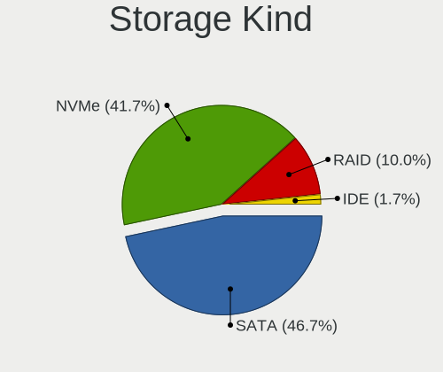
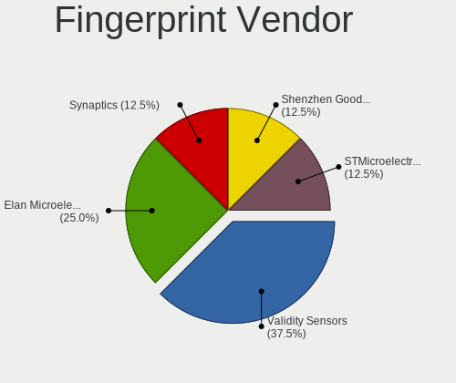

ArcoLinux - Hardware Trends (Notebooks)
---------------------------------------

A project to identify most popular hardware characteristics and track their change
over time based on data collected by Linux users at https://Linux-Hardware.org.

Anyone can contribute to this report by the [hw-probe](https://github.com/linuxhw/hw-probe) tool:

    sudo -E hw-probe -all -upload

This report is for one last month. Overall report since the beginning of time: [TestDays](https://github.com/linuxhw/TestDays)

Period: Jun, 2023.

Contents
--------

* [ System ](#system)
  - [ OS                       ](#os)
  - [ OS Family                ](#os-family)
  - [ Kernel                   ](#kernel)
  - [ Kernel Family            ](#kernel-family)
  - [ Kernel Major Ver.        ](#kernel-major-ver)
  - [ Arch                     ](#arch)
  - [ DE                       ](#de)
  - [ Display Server           ](#display-server)
  - [ Display Manager          ](#display-manager)
  - [ OS Lang                  ](#os-lang)
  - [ Boot Mode                ](#boot-mode)
  - [ Filesystem               ](#filesystem)
  - [ Part. scheme             ](#part-scheme)
  - [ Dual Boot with Linux/BSD ](#dual-boot-with-linuxbsd)
  - [ Dual Boot (Win)          ](#dual-boot-win)

* [ Board ](#board)
  - [ Vendor                   ](#vendor)
  - [ Model                    ](#model)
  - [ Model Family             ](#model-family)
  - [ MFG Year                 ](#mfg-year)
  - [ Form Factor              ](#form-factor)
  - [ Secure Boot              ](#secure-boot)
  - [ Coreboot                 ](#coreboot)
  - [ RAM Size                 ](#ram-size)
  - [ RAM Used                 ](#ram-used)
  - [ Total Drives             ](#total-drives)
  - [ Has CD-ROM               ](#has-cd-rom)
  - [ Has Ethernet             ](#has-ethernet)
  - [ Has WiFi                 ](#has-wifi)
  - [ Has Bluetooth            ](#has-bluetooth)

* [ Location ](#location)
  - [ Country                  ](#country)
  - [ City                     ](#city)

* [ Drives ](#drives)
  - [ Drive Vendor             ](#drive-vendor)
  - [ Drive Model              ](#drive-model)
  - [ HDD Vendor               ](#hdd-vendor)
  - [ SSD Vendor               ](#ssd-vendor)
  - [ Drive Kind               ](#drive-kind)
  - [ Drive Connector          ](#drive-connector)
  - [ Drive Size               ](#drive-size)
  - [ Space Total              ](#space-total)
  - [ Space Used               ](#space-used)
  - [ Malfunc. Drives          ](#malfunc-drives)
  - [ Malfunc. Drive Vendor    ](#malfunc-drive-vendor)
  - [ Malfunc. HDD Vendor      ](#malfunc-hdd-vendor)
  - [ Malfunc. Drive Kind      ](#malfunc-drive-kind)
  - [ Failed Drives            ](#failed-drives)
  - [ Failed Drive Vendor      ](#failed-drive-vendor)
  - [ Drive Status             ](#drive-status)

* [ Storage controller ](#storage-controller)
  - [ Storage Vendor           ](#storage-vendor)
  - [ Storage Model            ](#storage-model)
  - [ Storage Kind             ](#storage-kind)

* [ Processor ](#processor)
  - [ CPU Vendor               ](#cpu-vendor)
  - [ CPU Model                ](#cpu-model)
  - [ CPU Model Family         ](#cpu-model-family)
  - [ CPU Cores                ](#cpu-cores)
  - [ CPU Sockets              ](#cpu-sockets)
  - [ CPU Threads              ](#cpu-threads)
  - [ CPU Op-Modes             ](#cpu-op-modes)
  - [ CPU Microcode            ](#cpu-microcode)
  - [ CPU Microarch            ](#cpu-microarch)

* [ Graphics ](#graphics)
  - [ GPU Vendor               ](#gpu-vendor)
  - [ GPU Model                ](#gpu-model)
  - [ GPU Combo                ](#gpu-combo)
  - [ GPU Driver               ](#gpu-driver)
  - [ GPU Memory               ](#gpu-memory)

* [ Monitor ](#monitor)
  - [ Monitor Vendor           ](#monitor-vendor)
  - [ Monitor Model            ](#monitor-model)
  - [ Monitor Resolution       ](#monitor-resolution)
  - [ Monitor Diagonal         ](#monitor-diagonal)
  - [ Monitor Width            ](#monitor-width)
  - [ Aspect Ratio             ](#aspect-ratio)
  - [ Monitor Area             ](#monitor-area)
  - [ Pixel Density            ](#pixel-density)
  - [ Multiple Monitors        ](#multiple-monitors)

* [ Network ](#network)
  - [ Net Controller Vendor    ](#net-controller-vendor)
  - [ Net Controller Model     ](#net-controller-model)
  - [ Wireless Vendor          ](#wireless-vendor)
  - [ Wireless Model           ](#wireless-model)
  - [ Ethernet Vendor          ](#ethernet-vendor)
  - [ Ethernet Model           ](#ethernet-model)
  - [ Net Controller Kind      ](#net-controller-kind)
  - [ Used Controller          ](#used-controller)
  - [ NICs                     ](#nics)
  - [ IPv6                     ](#ipv6)

* [ Bluetooth ](#bluetooth)
  - [ Bluetooth Vendor         ](#bluetooth-vendor)
  - [ Bluetooth Model          ](#bluetooth-model)

* [ Sound ](#sound)
  - [ Sound Vendor             ](#sound-vendor)
  - [ Sound Model              ](#sound-model)

* [ Memory ](#memory)
  - [ Memory Vendor            ](#memory-vendor)
  - [ Memory Model             ](#memory-model)
  - [ Memory Kind              ](#memory-kind)
  - [ Memory Form Factor       ](#memory-form-factor)
  - [ Memory Size              ](#memory-size)
  - [ Memory Speed             ](#memory-speed)

* [ Printers & scanners ](#printers--scanners)
  - [ Printer Vendor           ](#printer-vendor)
  - [ Printer Model            ](#printer-model)
  - [ Scanner Vendor           ](#scanner-vendor)
  - [ Scanner Model            ](#scanner-model)

* [ Camera ](#camera)
  - [ Camera Vendor            ](#camera-vendor)
  - [ Camera Model             ](#camera-model)

* [ Security ](#security)
  - [ Fingerprint Vendor       ](#fingerprint-vendor)
  - [ Fingerprint Model        ](#fingerprint-model)
  - [ Chipcard Vendor          ](#chipcard-vendor)
  - [ Chipcard Model           ](#chipcard-model)

* [ Unsupported ](#unsupported)
  - [ Unsupported Devices      ](#unsupported-devices)
  - [ Unsupported Device Types ](#unsupported-device-types)

System
------

OS
--

Installed operating systems

| Name              | Notebooks | Percent |
|-------------------|-----------|---------|
| ArcoLinux Rolling | 73        | 98.65%  |
| ArcoLinux         | 1         | 1.35%   |

OS Family
---------

OS without a version

| Name      | Notebooks | Percent |
|-----------|-----------|---------|
| ArcoLinux | 74        | 100%    |

Kernel
------

Version of the Linux kernel

| Version                                                | Notebooks | Percent |
|--------------------------------------------------------|-----------|---------|
| 6.3.7-arch1-1                                          | 12        | 16.22%  |
| 6.3.6-arch1-1                                          | 10        | 13.51%  |
| 6.3.9-arch1-1                                          | 8         | 10.81%  |
| 6.3.5-arch1-1                                          | 6         | 8.11%   |
| 6.3.8-arch1-1                                          | 5         | 6.76%   |
| 6.1.35-1-lts                                           | 5         | 6.76%   |
| 6.3.8-zen1-1-zen                                       | 4         | 5.41%   |
| 6.2.10-x64v1-xanmod1-1                                 | 3         | 4.05%   |
| 6.1.33-1-lts                                           | 3         | 4.05%   |
| 6.3.7-zen1-1-zen                                       | 2         | 2.7%    |
| 6.3.6-zen1-1-zen                                       | 2         | 2.7%    |
| 6.3.5-zen1-1-zen                                       | 2         | 2.7%    |
| 6.3.3-arch1-1                                          | 2         | 2.7%    |
| 6.1.31-1-lts                                           | 2         | 2.7%    |
| 6.4.0-rc5-next-20230609-1-next-git-08413-g53ab6975c12d | 1         | 1.35%   |
| 6.3.8-x64v1-xanmod1-1                                  | 1         | 1.35%   |
| 6.3.4-arch2-1                                          | 1         | 1.35%   |
| 6.3.4-arch1-1                                          | 1         | 1.35%   |
| 6.3.3-x64v1-xanmod1-1                                  | 1         | 1.35%   |
| 6.1.31-hardened1-1-hardened                            | 1         | 1.35%   |
| 6.1.29-1-lts                                           | 1         | 1.35%   |
| 6.1.28-x64v2-rt10-xanmod1-1-rt                         | 1         | 1.35%   |

Kernel Family
-------------

Linux kernel without a distro release

| Version | Notebooks | Percent |
|---------|-----------|---------|
| 6.3.7   | 14        | 18.92%  |
| 6.3.6   | 12        | 16.22%  |
| 6.3.8   | 10        | 13.51%  |
| 6.3.9   | 8         | 10.81%  |
| 6.3.5   | 8         | 10.81%  |
| 6.1.35  | 5         | 6.76%   |
| 6.3.3   | 3         | 4.05%   |
| 6.2.10  | 3         | 4.05%   |
| 6.1.33  | 3         | 4.05%   |
| 6.1.31  | 3         | 4.05%   |
| 6.3.4   | 2         | 2.7%    |
| 6.4.0   | 1         | 1.35%   |
| 6.1.29  | 1         | 1.35%   |
| 6.1.28  | 1         | 1.35%   |

Kernel Major Ver.
-----------------

Linux kernel major version

| Version | Notebooks | Percent |
|---------|-----------|---------|
| 6.3     | 57        | 77.03%  |
| 6.1     | 13        | 17.57%  |
| 6.2     | 3         | 4.05%   |
| 6.4     | 1         | 1.35%   |

Arch
----

OS architecture (x86_64, i586, etc.)

| Name   | Notebooks | Percent |
|--------|-----------|---------|
| x86_64 | 74        | 100%    |

DE
--

Desktop Environment

| Name     | Notebooks | Percent |
|----------|-----------|---------|
| XFCE     | 26        | 35.14%  |
| KDE5     | 25        | 33.78%  |
| i3       | 8         | 10.81%  |
| Cinnamon | 4         | 5.41%   |
| Hyprland | 3         | 4.05%   |
| awesome  | 2         | 2.7%    |
| MATE     | 1         | 1.35%   |
| LeftWM   | 1         | 1.35%   |
| Hypr     | 1         | 1.35%   |
| GNOME    | 1         | 1.35%   |
| chadwm   | 1         | 1.35%   |
| Budgie   | 1         | 1.35%   |

Display Server
--------------

X11 or Wayland

| Name    | Notebooks | Percent |
|---------|-----------|---------|
| X11     | 67        | 90.54%  |
| Wayland | 5         | 6.76%   |
| Tty     | 1         | 1.35%   |
| Unknown | 1         | 1.35%   |

Display Manager
---------------

SDDM, LightDM, etc.

| Name    | Notebooks | Percent |
|---------|-----------|---------|
| SDDM    | 56        | 75.68%  |
| LightDM | 13        | 17.57%  |
| GDM     | 3         | 4.05%   |
| LXDM    | 1         | 1.35%   |
| Unknown | 1         | 1.35%   |

OS Lang
-------

Language

| Lang  | Notebooks | Percent |
|-------|-----------|---------|
| en_US | 39        | 52.7%   |
| en_GB | 8         | 10.81%  |
| en_IN | 6         | 8.11%   |
| ru_RU | 4         | 5.41%   |
| de_DE | 3         | 4.05%   |
| C     | 2         | 2.7%    |
| tr_TR | 1         | 1.35%   |
| sv_SE | 1         | 1.35%   |
| pl_PL | 1         | 1.35%   |
| hu_HU | 1         | 1.35%   |
| es_MX | 1         | 1.35%   |
| es_ES | 1         | 1.35%   |
| en_PH | 1         | 1.35%   |
| en_IE | 1         | 1.35%   |
| en_HK | 1         | 1.35%   |
| en_AU | 1         | 1.35%   |
| el_GR | 1         | 1.35%   |
| bg_BG | 1         | 1.35%   |

Boot Mode
---------

EFI or BIOS

| Mode | Notebooks | Percent |
|------|-----------|---------|
| EFI  | 63        | 85.14%  |
| BIOS | 11        | 14.86%  |

Filesystem
----------

Type of filesystem

| Type    | Notebooks | Percent |
|---------|-----------|---------|
| Ext4    | 52        | 70.27%  |
| Btrfs   | 19        | 25.68%  |
| Overlay | 2         | 2.7%    |
| Xfs     | 1         | 1.35%   |

Part. scheme
------------

Scheme of partitioning

| Type    | Notebooks | Percent |
|---------|-----------|---------|
| GPT     | 66        | 89.19%  |
| MBR     | 7         | 9.46%   |
| Unknown | 1         | 1.35%   |

Dual Boot with Linux/BSD
------------------------

Hosting more than one Linux/BSD

| Dual boot | Notebooks | Percent |
|-----------|-----------|---------|
| No        | 59        | 79.73%  |
| Yes       | 15        | 20.27%  |

Dual Boot (Win)
---------------

Hosting Linux and Windows

| Dual boot | Notebooks | Percent |
|-----------|-----------|---------|
| No        | 51        | 68.92%  |
| Yes       | 23        | 31.08%  |

Board
-----

Vendor
------

Motherboard manufacturer

| Name             | Notebooks | Percent |
|------------------|-----------|---------|
| Lenovo           | 20        | 27.03%  |
| Hewlett-Packard  | 11        | 14.86%  |
| ASUSTek Computer | 11        | 14.86%  |
| Dell             | 9         | 12.16%  |
| Acer             | 5         | 6.76%   |
| MSI              | 4         | 5.41%   |
| Apple            | 3         | 4.05%   |
| Toshiba          | 2         | 2.7%    |
| Unknown          | 2         | 2.7%    |
| TECNO            | 1         | 1.35%   |
| Sony             | 1         | 1.35%   |
| Razer            | 1         | 1.35%   |
| HUAWEI           | 1         | 1.35%   |
| Fujitsu          | 1         | 1.35%   |
| Emdoor           | 1         | 1.35%   |
| AZW              | 1         | 1.35%   |

Model
-----

Motherboard model

| Name                                            | Notebooks | Percent |
|-------------------------------------------------|-----------|---------|
| ASUS TUF Gaming FX505DT_FX505DT                 | 2         | 2.7%    |
| Unknown                                         | 2         | 2.7%    |
| Toshiba Satellite Pro C50-A-1E6                 | 1         | 1.35%   |
| Toshiba Satellite L305                          | 1         | 1.35%   |
| TECNO MEGABOOK T1                               | 1         | 1.35%   |
| Sony SVE1712C1EW                                | 1         | 1.35%   |
| Razer Blade Stealth 13 (Early 2020) - RZ09-0310 | 1         | 1.35%   |
| MSI Katana GF66 11SC                            | 1         | 1.35%   |
| MSI GS66 Stealth 10SF                           | 1         | 1.35%   |
| MSI GP72MVR 7RGX                                | 1         | 1.35%   |
| MSI GL73 8RD                                    | 1         | 1.35%   |
| Lenovo V15 G3 ABA 82TV                          | 1         | 1.35%   |
| Lenovo V15 G2 ALC 82KD                          | 1         | 1.35%   |
| Lenovo ThinkPad X250 20CMCTO1WW                 | 1         | 1.35%   |
| Lenovo ThinkPad X230 2325SLU                    | 1         | 1.35%   |
| Lenovo ThinkPad X1 Carbon Gen 10 21CB00AYMX     | 1         | 1.35%   |
| Lenovo ThinkPad T450 20BUS1BW01                 | 1         | 1.35%   |
| Lenovo ThinkPad T440 20B6005RUS                 | 1         | 1.35%   |
| Lenovo ThinkPad T430 2349GDU                    | 1         | 1.35%   |
| Lenovo ThinkPad T15 Gen 2i 20W4000NRT           | 1         | 1.35%   |
| Lenovo Legion 5 15IMH05H 81Y6                   | 1         | 1.35%   |
| Lenovo IdeaPad Gaming 3 15IHU6 82MG             | 1         | 1.35%   |
| Lenovo IdeaPad 510-15IKB 80SV                   | 1         | 1.35%   |
| Lenovo IdeaPad 5 Pro 14ACN6 82L7                | 1         | 1.35%   |
| Lenovo IdeaPad 5 15ITL05 82FG                   | 1         | 1.35%   |
| Lenovo IdeaPad 330-14IGM 81D0                   | 1         | 1.35%   |
| Lenovo IdeaPad 3 15ITL05 81X8                   | 1         | 1.35%   |
| Lenovo IdeaPad 110-17ACL 80UM                   | 1         | 1.35%   |
| Lenovo IdeaPad 1 14ADA05 82GW                   | 1         | 1.35%   |
| Lenovo G585 20137                               | 1         | 1.35%   |
| Lenovo E41-25 81FS                              | 1         | 1.35%   |
| HUAWEI KLVL-WXX9                                | 1         | 1.35%   |
| HP ZBook 15 G3                                  | 1         | 1.35%   |
| HP Pavilion Laptop 15-eh0xxx                    | 1         | 1.35%   |
| HP Pavilion Laptop 15-cs1xxx                    | 1         | 1.35%   |
| HP Pavilion Laptop 14-bf0xx                     | 1         | 1.35%   |
| HP Pavilion Gaming Laptop 15-ec2xxx             | 1         | 1.35%   |
| HP Pavilion g6                                  | 1         | 1.35%   |
| HP OMEN by Laptop 15t-en000                     | 1         | 1.35%   |
| HP Notebook                                     | 1         | 1.35%   |

Model Family
------------

Motherboard model prefix

| Name              | Notebooks | Percent |
|-------------------|-----------|---------|
| Lenovo IdeaPad    | 8         | 10.81%  |
| Lenovo ThinkPad   | 7         | 9.46%   |
| HP Pavilion       | 5         | 6.76%   |
| Dell Inspiron     | 4         | 5.41%   |
| HP Laptop         | 3         | 4.05%   |
| ASUS TUF          | 3         | 4.05%   |
| Toshiba Satellite | 2         | 2.7%    |
| Lenovo V15        | 2         | 2.7%    |
| Dell Latitude     | 2         | 2.7%    |
| ASUS VivoBook     | 2         | 2.7%    |
| ASUS ASUS         | 2         | 2.7%    |
| Acer Nitro        | 2         | 2.7%    |
| Acer Aspire       | 2         | 2.7%    |
| Unknown           | 2         | 2.7%    |
| TECNO MEGABOOK    | 1         | 1.35%   |
| Sony SVE1712C1EW  | 1         | 1.35%   |
| Razer Blade       | 1         | 1.35%   |
| MSI Katana        | 1         | 1.35%   |
| MSI GS66          | 1         | 1.35%   |
| MSI GP72MVR       | 1         | 1.35%   |
| MSI GL73          | 1         | 1.35%   |
| Lenovo Legion     | 1         | 1.35%   |
| Lenovo G585       | 1         | 1.35%   |
| Lenovo E41-25     | 1         | 1.35%   |
| HUAWEI KLVL-WXX9  | 1         | 1.35%   |
| HP ZBook          | 1         | 1.35%   |
| HP OMEN           | 1         | 1.35%   |
| HP Notebook       | 1         | 1.35%   |
| Fujitsu LIFEBOOK  | 1         | 1.35%   |
| Emdoor AG958      | 1         | 1.35%   |
| Dell Precision    | 1         | 1.35%   |
| Dell G5           | 1         | 1.35%   |
| Dell G15          | 1         | 1.35%   |
| AZW GT-R          | 1         | 1.35%   |
| ASUS X550CC       | 1         | 1.35%   |
| ASUS X540LA       | 1         | 1.35%   |
| ASUS ROG          | 1         | 1.35%   |
| ASUS G750JM       | 1         | 1.35%   |
| Apple MacBookPro9 | 1         | 1.35%   |
| Apple MacBookAir7 | 1         | 1.35%   |

MFG Year
--------

Motherboard manufacture year

| Year | Notebooks | Percent |
|------|-----------|---------|
| 2021 | 13        | 17.57%  |
| 2020 | 13        | 17.57%  |
| 2022 | 6         | 8.11%   |
| 2018 | 6         | 8.11%   |
| 2012 | 6         | 8.11%   |
| 2016 | 5         | 6.76%   |
| 2015 | 5         | 6.76%   |
| 2019 | 4         | 5.41%   |
| 2013 | 4         | 5.41%   |
| 2014 | 3         | 4.05%   |
| 2011 | 3         | 4.05%   |
| 2023 | 2         | 2.7%    |
| 2017 | 2         | 2.7%    |
| 2010 | 1         | 1.35%   |
| 2008 | 1         | 1.35%   |

Form Factor
-----------

Physical design of the computer

| Name     | Notebooks | Percent |
|----------|-----------|---------|
| Notebook | 74        | 100%    |

Secure Boot
-----------

Enabled or disabled

| State    | Notebooks | Percent |
|----------|-----------|---------|
| Disabled | 74        | 100%    |

Coreboot
--------

Have coreboot on board

| Used | Notebooks | Percent |
|------|-----------|---------|
| No   | 74        | 100%    |

RAM Size
--------

Total RAM memory

| Size in GB  | Notebooks | Percent |
|-------------|-----------|---------|
| 4.01-8.0    | 25        | 33.78%  |
| 16.01-24.0  | 22        | 29.73%  |
| 8.01-16.0   | 10        | 13.51%  |
| 3.01-4.0    | 9         | 12.16%  |
| 32.01-64.0  | 4         | 5.41%   |
| 24.01-32.0  | 2         | 2.7%    |
| 64.01-256.0 | 2         | 2.7%    |

RAM Used
--------

Used RAM memory

| Used GB   | Notebooks | Percent |
|-----------|-----------|---------|
| 1.01-2.0  | 24        | 32.43%  |
| 2.01-3.0  | 20        | 27.03%  |
| 4.01-8.0  | 14        | 18.92%  |
| 3.01-4.0  | 9         | 12.16%  |
| 0.51-1.0  | 4         | 5.41%   |
| 8.01-16.0 | 3         | 4.05%   |

Total Drives
------------

Number of drives on board

| Drives | Notebooks | Percent |
|--------|-----------|---------|
| 1      | 51        | 68.92%  |
| 2      | 20        | 27.03%  |
| 3      | 2         | 2.7%    |
| 4      | 1         | 1.35%   |

Has CD-ROM
----------

Has CD-ROM on board

| Presented | Notebooks | Percent |
|-----------|-----------|---------|
| No        | 65        | 87.84%  |
| Yes       | 9         | 12.16%  |

Has Ethernet
------------

Has Ethernet on board

| Presented | Notebooks | Percent |
|-----------|-----------|---------|
| Yes       | 56        | 75.68%  |
| No        | 18        | 24.32%  |

Has WiFi
--------

Has WiFi module

| Presented | Notebooks | Percent |
|-----------|-----------|---------|
| Yes       | 74        | 100%    |

Has Bluetooth
-------------

Has Bluetooth module

| Presented | Notebooks | Percent |
|-----------|-----------|---------|
| Yes       | 68        | 91.89%  |
| No        | 6         | 8.11%   |

Location
--------

Country
-------

Geographic location (country)

| Country     | Notebooks | Percent |
|-------------|-----------|---------|
| USA         | 20        | 27.03%  |
| India       | 8         | 10.81%  |
| UK          | 5         | 6.76%   |
| Russia      | 5         | 6.76%   |
| Germany     | 4         | 5.41%   |
| Sweden      | 3         | 4.05%   |
| Poland      | 3         | 4.05%   |
| Turkey      | 2         | 2.7%    |
| Malaysia    | 2         | 2.7%    |
| Bulgaria    | 2         | 2.7%    |
| Brazil      | 2         | 2.7%    |
| Spain       | 1         | 1.35%   |
| Slovakia    | 1         | 1.35%   |
| Romania     | 1         | 1.35%   |
| Portugal    | 1         | 1.35%   |
| Philippines | 1         | 1.35%   |
| Norway      | 1         | 1.35%   |
| Netherlands | 1         | 1.35%   |
| Mexico      | 1         | 1.35%   |
| Malta       | 1         | 1.35%   |
| Lithuania   | 1         | 1.35%   |
| Hungary     | 1         | 1.35%   |
| Hong Kong   | 1         | 1.35%   |
| Greece      | 1         | 1.35%   |
| France      | 1         | 1.35%   |
| Finland     | 1         | 1.35%   |
| Belgium     | 1         | 1.35%   |
| Bangladesh  | 1         | 1.35%   |
| Australia   | 1         | 1.35%   |

City
----

Geographic location (city)

| City                | Notebooks | Percent |
|---------------------|-----------|---------|
| St Petersburg       | 3         | 4.05%   |
| New York            | 2         | 2.7%    |
| Hyderabad           | 2         | 2.7%    |
| Chennai             | 2         | 2.7%    |
| Berlin              | 2         | 2.7%    |
| Yachats             | 1         | 1.35%   |
| Willits             | 1         | 1.35%   |
| Wiesbaden           | 1         | 1.35%   |
| West Palm Beach     | 1         | 1.35%   |
| Washington          | 1         | 1.35%   |
| Warwick             | 1         | 1.35%   |
| Warsaw              | 1         | 1.35%   |
| Vilnius             | 1         | 1.35%   |
| Tsuen Wan           | 1         | 1.35%   |
| Toeroekbalint       | 1         | 1.35%   |
| Syracuse            | 1         | 1.35%   |
| Swieqi              | 1         | 1.35%   |
| Svilengrad          | 1         | 1.35%   |
| Sungai Petani       | 1         | 1.35%   |
| Stockholm           | 1         | 1.35%   |
| Steinberg           | 1         | 1.35%   |
| Schwarzenbek        | 1         | 1.35%   |
| Santa Barbara       | 1         | 1.35%   |
| Sandviken           | 1         | 1.35%   |
| Samara              | 1         | 1.35%   |
| Ranaghat            | 1         | 1.35%   |
| Ramos Arizpe        | 1         | 1.35%   |
| Quezon City         | 1         | 1.35%   |
| Presidente Prudente | 1         | 1.35%   |
| Plovdiv             | 1         | 1.35%   |
| Pendleton           | 1         | 1.35%   |
| Olympia             | 1         | 1.35%   |
| Novi                | 1         | 1.35%   |
| Mijas               | 1         | 1.35%   |
| Michalowice         | 1         | 1.35%   |
| McAllen             | 1         | 1.35%   |
| Massillon           | 1         | 1.35%   |
| Malmo               | 1         | 1.35%   |
| Kuttippuram         | 1         | 1.35%   |
| Kuala Lumpur        | 1         | 1.35%   |

Drives
------

Drive Vendor
------------

Hard drive vendors

| Vendor                    | Notebooks | Drives | Percent |
|---------------------------|-----------|--------|---------|
| Samsung Electronics       | 29        | 29     | 29.59%  |
| Seagate                   | 8         | 9      | 8.16%   |
| Sandisk                   | 8         | 8      | 8.16%   |
| SK hynix                  | 5         | 6      | 5.1%    |
| Kingston                  | 5         | 6      | 5.1%    |
| WDC                       | 4         | 4      | 4.08%   |
| Unknown                   | 4         | 4      | 4.08%   |
| Micron Technology         | 3         | 3      | 3.06%   |
| KIOXIA                    | 3         | 3      | 3.06%   |
| Intel                     | 3         | 3      | 3.06%   |
| HGST                      | 3         | 3      | 3.06%   |
| Apple                     | 3         | 3      | 3.06%   |
| Transcend                 | 2         | 2      | 2.04%   |
| Toshiba                   | 2         | 2      | 2.04%   |
| Hitachi                   | 2         | 2      | 2.04%   |
| Unknown                   | 2         | 2      | 2.04%   |
| Verbatim                  | 1         | 1      | 1.02%   |
| StoreJet                  | 1         | 1      | 1.02%   |
| SPCC                      | 1         | 1      | 1.02%   |
| ShiJi                     | 1         | 1      | 1.02%   |
| SABRENT                   | 1         | 1      | 1.02%   |
| OWC                       | 1         | 1      | 1.02%   |
| Micron/Crucial Technology | 1         | 1      | 1.02%   |
| Hewlett-Packard           | 1         | 1      | 1.02%   |
| GOODRAM                   | 1         | 1      | 1.02%   |
| Fujitsu                   | 1         | 1      | 1.02%   |
| Crucial                   | 1         | 1      | 1.02%   |
| ADATA Technology          | 1         | 1      | 1.02%   |

Drive Model
-----------

Hard drive models

| Model                                               | Notebooks | Percent |
|-----------------------------------------------------|-----------|---------|
| Samsung NVMe SSD Controller SM981/PM981/PM983 250GB | 4         | 4.04%   |
| Seagate ST1000LM035-1RK172 1TB                      | 3         | 3.03%   |
| Sandisk WD Blue SN550 NVMe SSD 1TB                  | 3         | 3.03%   |
| Sandisk WD Black SN750 / PC SN730 NVMe SSD 500GB    | 3         | 3.03%   |
| Samsung SSD 850 EVO 250GB                           | 3         | 3.03%   |
| KIOXIA KBG40ZNV256G 256GB                           | 3         | 3.03%   |
| Toshiba MQ01ABD100 1TB                              | 2         | 2.02%   |
| SK hynix BC511 256GB                                | 2         | 2.02%   |
| Samsung SSD 870 EVO 1TB                             | 2         | 2.02%   |
| Samsung NVMe SSD Controller SM961/PM961/SM963 256GB | 2         | 2.02%   |
| Samsung MZALQ512HBLU-00BL2 512GB                    | 2         | 2.02%   |
| Intel SSD 660P Series 512GB                         | 2         | 2.02%   |
| Unknown                                             | 2         | 2.02%   |
| WDC WDS250G2B0A-00SM50 250GB SSD                    | 1         | 1.01%   |
| WDC WD5000LPCX-24VHAT0 500GB                        | 1         | 1.01%   |
| WDC WD10SPZX-17Z10T1 1TB                            | 1         | 1.01%   |
| WDC WD10JPCX-24UE4T0 1TB                            | 1         | 1.01%   |
| Verbatim Vi560 SATA III M.2 SSD 512GB               | 1         | 1.01%   |
| Unknown SD/MMC/MS PRO 250GB                         | 1         | 1.01%   |
| Unknown NVMe SSD Drive 1TB                          | 1         | 1.01%   |
| Unknown MMC Card  64GB                              | 1         | 1.01%   |
| Unknown MMC Card  32GB                              | 1         | 1.01%   |
| Transcend TS512GMTS430S 512GB SSD                   | 1         | 1.01%   |
| Transcend TS256GSSD230S 256GB                       | 1         | 1.01%   |
| StoreJet TS4TESD380C 4TB                            | 1         | 1.01%   |
| SPCC M.2 SSD 256GB                                  | 1         | 1.01%   |
| SK hynix SKHynix_HFS512GDE9X081N 512GB              | 1         | 1.01%   |
| SK hynix SKHynix_HFM128GD3HX015N 128GB              | 1         | 1.01%   |
| SK hynix HFM001TD3JX013N 1TB                        | 1         | 1.01%   |
| SK hynix BC511 NVMe 512GB                           | 1         | 1.01%   |
| ShiJi SSD 1TB                                       | 1         | 1.01%   |
| Seagate ST500LM000-1EJ162 500GB                     | 1         | 1.01%   |
| Seagate ST2000LM003 HN-M201RAD 2TB                  | 1         | 1.01%   |
| Seagate ST2000DM 008-2FR102 2TB                     | 1         | 1.01%   |
| Seagate ST1000LM048-2E7172 1TB                      | 1         | 1.01%   |
| Seagate BUP Slim BK 1TB                             | 1         | 1.01%   |
| Sandisk WD Blue SN500 / PC SN520 NVMe SSD 500GB     | 1         | 1.01%   |
| Sandisk PC SN530 NVMe WDC 256GB                     | 1         | 1.01%   |
| Samsung SSD 980 500GB                               | 1         | 1.01%   |
| Samsung SSD 980 1TB                                 | 1         | 1.01%   |

HDD Vendor
----------

Hard disk drive vendors

| Vendor  | Notebooks | Drives | Percent |
|---------|-----------|--------|---------|
| Seagate | 8         | 9      | 38.1%   |
| WDC     | 3         | 3      | 14.29%  |
| HGST    | 3         | 3      | 14.29%  |
| Toshiba | 2         | 2      | 9.52%   |
| Hitachi | 2         | 2      | 9.52%   |
| Unknown | 1         | 1      | 4.76%   |
| Fujitsu | 1         | 1      | 4.76%   |
| Apple   | 1         | 1      | 4.76%   |

SSD Vendor
----------

Solid state drive vendors

| Vendor              | Notebooks | Drives | Percent |
|---------------------|-----------|--------|---------|
| Samsung Electronics | 14        | 14     | 45.16%  |
| Kingston            | 4         | 4      | 12.9%   |
| Transcend           | 2         | 2      | 6.45%   |
| Apple               | 2         | 2      | 6.45%   |
| WDC                 | 1         | 1      | 3.23%   |
| Verbatim            | 1         | 1      | 3.23%   |
| SPCC                | 1         | 1      | 3.23%   |
| ShiJi               | 1         | 1      | 3.23%   |
| OWC                 | 1         | 1      | 3.23%   |
| Hewlett-Packard     | 1         | 1      | 3.23%   |
| GOODRAM             | 1         | 1      | 3.23%   |
| Crucial             | 1         | 1      | 3.23%   |
| Unknown             | 1         | 1      | 3.23%   |

Drive Kind
----------

HDD or SSD

| Kind    | Notebooks | Drives | Percent |
|---------|-----------|--------|---------|
| NVMe    | 39        | 43     | 43.82%  |
| SSD     | 28        | 31     | 31.46%  |
| HDD     | 17        | 22     | 19.1%   |
| MMC     | 3         | 3      | 3.37%   |
| Unknown | 2         | 2      | 2.25%   |

Drive Connector
---------------

SATA, SAS, NVMe, etc.

| Type | Notebooks | Drives | Percent |
|------|-----------|--------|---------|
| NVMe | 39        | 43     | 46.99%  |
| SATA | 37        | 48     | 44.58%  |
| SAS  | 4         | 7      | 4.82%   |
| MMC  | 3         | 3      | 3.61%   |

Drive Size
----------

Size of hard drive

| Size in TB | Notebooks | Drives | Percent |
|------------|-----------|--------|---------|
| 0.01-0.5   | 24        | 27     | 51.06%  |
| 0.51-1.0   | 20        | 22     | 42.55%  |
| 1.01-2.0   | 3         | 4      | 6.38%   |

Space Total
-----------

Amount of disk space available on the file system

| Size in GB     | Notebooks | Percent |
|----------------|-----------|---------|
| 251-500        | 16        | 21.62%  |
| 101-250        | 14        | 18.92%  |
| 501-1000       | 12        | 16.22%  |
| More than 3000 | 9         | 12.16%  |
| 1001-2000      | 7         | 9.46%   |
| 51-100         | 5         | 6.76%   |
| Unknown        | 5         | 6.76%   |
| 21-50          | 3         | 4.05%   |
| 2001-3000      | 2         | 2.7%    |
| 1-20           | 1         | 1.35%   |

Space Used
----------

Amount of used disk space

| Used GB        | Notebooks | Percent |
|----------------|-----------|---------|
| 101-250        | 18        | 24.32%  |
| 1-20           | 18        | 24.32%  |
| 251-500        | 9         | 12.16%  |
| 21-50          | 9         | 12.16%  |
| 51-100         | 7         | 9.46%   |
| Unknown        | 5         | 6.76%   |
| 501-1000       | 4         | 5.41%   |
| More than 3000 | 2         | 2.7%    |
| 1001-2000      | 1         | 1.35%   |
| 0              | 1         | 1.35%   |

Malfunc. Drives
---------------

Drive models with a malfunction

| Model                               | Notebooks | Drives | Percent |
|-------------------------------------|-----------|--------|---------|
| Toshiba MQ01ABD100 1TB              | 2         | 2      | 40%     |
| Samsung Electronics SSD 870 EVO 1TB | 1         | 1      | 20%     |
| Kingston SUV400S37120G 120GB SSD    | 1         | 1      | 20%     |
| Hitachi HTS547575A9E384 752GB       | 1         | 1      | 20%     |

Malfunc. Drive Vendor
---------------------

Vendors of faulty drives

| Vendor              | Notebooks | Drives | Percent |
|---------------------|-----------|--------|---------|
| Toshiba             | 2         | 2      | 40%     |
| Samsung Electronics | 1         | 1      | 20%     |
| Kingston            | 1         | 1      | 20%     |
| Hitachi             | 1         | 1      | 20%     |

Malfunc. HDD Vendor
-------------------

Vendors of faulty HDD drives

| Vendor  | Notebooks | Drives | Percent |
|---------|-----------|--------|---------|
| Toshiba | 2         | 2      | 66.67%  |
| Hitachi | 1         | 1      | 33.33%  |

Malfunc. Drive Kind
-------------------

Kinds of faulty drives

| Kind | Notebooks | Drives | Percent |
|------|-----------|--------|---------|
| HDD  | 3         | 3      | 60%     |
| SSD  | 2         | 2      | 40%     |

Failed Drives
-------------

Failed drive models

Zero info for selected period =(

Failed Drive Vendor
-------------------

Failed drive vendors

Zero info for selected period =(

Drive Status
------------

Number of failed and malfunc. drives

| Status   | Notebooks | Drives | Percent |
|----------|-----------|--------|---------|
| Works    | 68        | 86     | 83.95%  |
| Detected | 9         | 10     | 11.11%  |
| Malfunc  | 4         | 5      | 4.94%   |

Storage controller
------------------

Storage Vendor
--------------

Storage controller vendors

| Vendor                      | Notebooks | Percent |
|-----------------------------|-----------|---------|
| Intel                       | 45        | 45.92%  |
| Samsung Electronics         | 16        | 16.33%  |
| AMD                         | 12        | 12.24%  |
| SanDisk                     | 8         | 8.16%   |
| SK hynix                    | 5         | 5.1%    |
| Micron Technology           | 3         | 3.06%   |
| KIOXIA                      | 3         | 3.06%   |
| TenaFe                      | 1         | 1.02%   |
| Micron/Crucial Technology   | 1         | 1.02%   |
| Marvell Technology Group    | 1         | 1.02%   |
| Kingston Technology Company | 1         | 1.02%   |
| ASMedia Technology          | 1         | 1.02%   |
| ADATA Technology            | 1         | 1.02%   |

Storage Model
-------------

Storage controller models

| Model                                                                          | Notebooks | Percent |
|--------------------------------------------------------------------------------|-----------|---------|
| AMD FCH SATA Controller [AHCI mode]                                            | 12        | 11.65%  |
| Samsung NVMe SSD Controller 980                                                | 7         | 6.8%    |
| Intel Tiger Lake-LP SATA Controller                                            | 6         | 5.83%   |
| Intel Sunrise Point-LP SATA Controller [AHCI mode]                             | 6         | 5.83%   |
| Intel 7 Series Chipset Family 6-port SATA Controller [AHCI mode]               | 6         | 5.83%   |
| Intel Volume Management Device NVMe RAID Controller                            | 5         | 4.85%   |
| Intel 82801 Mobile SATA Controller [RAID mode]                                 | 5         | 4.85%   |
| Samsung NVMe SSD Controller SM981/PM981/PM983                                  | 4         | 3.88%   |
| SK hynix Gold P31/BC711/PC711 NVMe Solid State Drive                           | 3         | 2.91%   |
| SanDisk WD Blue SN550 NVMe SSD                                                 | 3         | 2.91%   |
| SanDisk WD Black SN750 / PC SN730 NVMe SSD                                     | 3         | 2.91%   |
| KIOXIA NVMe SSD Controller BG4                                                 | 3         | 2.91%   |
| SK hynix BC511 NVMe SSD                                                        | 2         | 1.94%   |
| Samsung NVMe SSD Controller SM961/PM961/SM963                                  | 2         | 1.94%   |
| Intel Wildcat Point-LP SATA Controller [AHCI Mode]                             | 2         | 1.94%   |
| Intel SSD 660P Series                                                          | 2         | 1.94%   |
| Intel Q170/Q150/B150/H170/H110/Z170/CM236 Chipset SATA Controller [AHCI Mode]  | 2         | 1.94%   |
| Intel Celeron/Pentium Silver Processor SATA Controller                         | 2         | 1.94%   |
| Intel 8 Series SATA Controller 1 [AHCI mode]                                   | 2         | 1.94%   |
| Intel 6 Series/C200 Series Chipset Family 6 port Mobile SATA AHCI Controller   | 2         | 1.94%   |
| Intel 400 Series Chipset Family SATA AHCI Controller                           | 2         | 1.94%   |
| TenaFe Non-Volatile memory controller                                          | 1         | 0.97%   |
| SanDisk WD Blue SN500 / PC SN520 NVMe SSD                                      | 1         | 0.97%   |
| SanDisk PC SN530 NVMe SSD (DRAM-less)                                          | 1         | 0.97%   |
| Samsung NVMe SSD Controller PM9B1                                              | 1         | 0.97%   |
| Samsung NVMe SSD Controller PM9A1/PM9A3/980PRO                                 | 1         | 0.97%   |
| Samsung Electronics SATA controller                                            | 1         | 0.97%   |
| Micron/Crucial P2 NVMe PCIe SSD                                                | 1         | 0.97%   |
| Micron NVMe Storage Controller                                                 | 1         | 0.97%   |
| Micron 2450 NVMe SSD (DRAM-less)                                               | 1         | 0.97%   |
| Micron 2200S NVMe SSD                                                          | 1         | 0.97%   |
| Marvell Group 88SS9183 PCIe SSD Controller                                     | 1         | 0.97%   |
| Kingston Company FURY Renegade NVMe SSD                                        | 1         | 0.97%   |
| Intel Tiger Lake SATA AHCI Controller                                          | 1         | 0.97%   |
| Intel Non-Volatile memory controller                                           | 1         | 0.97%   |
| Intel HM170/QM170 Chipset SATA Controller [AHCI Mode]                          | 1         | 0.97%   |
| Intel Cannon Lake Mobile PCH SATA AHCI Controller                              | 1         | 0.97%   |
| Intel Alder Lake-P SATA AHCI Controller                                        | 1         | 0.97%   |
| Intel 82801IBM/IEM (ICH9M/ICH9M-E) 4 port SATA Controller [AHCI mode]          | 1         | 0.97%   |
| Intel 8 Series/C220 Series Chipset Family 6-port SATA Controller 1 [AHCI mode] | 1         | 0.97%   |

Storage Kind
------------

Kind of storage controller (IDE, SATA, NVMe, SAS, ...)

| Kind | Notebooks | Percent |
|------|-----------|---------|
| SATA | 51        | 51%     |
| NVMe | 39        | 39%     |
| RAID | 10        | 10%     |

Processor
---------

CPU Vendor
----------

Processor vendors

| Vendor | Notebooks | Percent |
|--------|-----------|---------|
| Intel  | 52        | 70.27%  |
| AMD    | 22        | 29.73%  |

CPU Model
---------

Processor models

| Model                                         | Notebooks | Percent |
|-----------------------------------------------|-----------|---------|
| Intel Core i5-3320M CPU @ 2.60GHz             | 3         | 4.05%   |
| Intel 11th Gen Core i5-1135G7 @ 2.40GHz       | 3         | 4.05%   |
| AMD Ryzen 5 3550H with Radeon Vega Mobile Gfx | 3         | 4.05%   |
| Intel Core i7-8750H CPU @ 2.20GHz             | 2         | 2.7%    |
| Intel Core i7-10750H CPU @ 2.60GHz            | 2         | 2.7%    |
| Intel Core i5-7200U CPU @ 2.50GHz             | 2         | 2.7%    |
| Intel Core i5-2520M CPU @ 2.50GHz             | 2         | 2.7%    |
| Intel Core i3-7100U CPU @ 2.40GHz             | 2         | 2.7%    |
| Intel 11th Gen Core i3-1115G4 @ 3.00GHz       | 2         | 2.7%    |
| AMD Ryzen 7 4800H with Radeon Graphics        | 2         | 2.7%    |
| AMD Ryzen 5 4600H with Radeon Graphics        | 2         | 2.7%    |
| AMD Ryzen 3 3250U with Radeon Graphics        | 2         | 2.7%    |
| Intel Pentium CPU B980 @ 2.40GHz              | 1         | 1.35%   |
| Intel Pentium CPU 2117U @ 1.80GHz             | 1         | 1.35%   |
| Intel Core i7-8565U CPU @ 1.80GHz             | 1         | 1.35%   |
| Intel Core i7-7700HQ CPU @ 2.80GHz            | 1         | 1.35%   |
| Intel Core i7-7500U CPU @ 2.70GHz             | 1         | 1.35%   |
| Intel Core i7-6920HQ CPU @ 2.90GHz            | 1         | 1.35%   |
| Intel Core i7-6820HQ CPU @ 2.70GHz            | 1         | 1.35%   |
| Intel Core i7-6500U CPU @ 2.50GHz             | 1         | 1.35%   |
| Intel Core i7-5600U CPU @ 2.60GHz             | 1         | 1.35%   |
| Intel Core i7-4710HQ CPU @ 2.50GHz            | 1         | 1.35%   |
| Intel Core i7-3610QM CPU @ 2.30GHz            | 1         | 1.35%   |
| Intel Core i7-3520M CPU @ 2.90GHz             | 1         | 1.35%   |
| Intel Core i7-1065G7 CPU @ 1.30GHz            | 1         | 1.35%   |
| Intel Core i5-8300H CPU @ 2.30GHz             | 1         | 1.35%   |
| Intel Core i5-5350U CPU @ 1.80GHz             | 1         | 1.35%   |
| Intel Core i5-5200U CPU @ 2.20GHz             | 1         | 1.35%   |
| Intel Core i5-4300U CPU @ 1.90GHz             | 1         | 1.35%   |
| Intel Core i5-4250U CPU @ 1.30GHz             | 1         | 1.35%   |
| Intel Core i5-1035G1 CPU @ 1.00GHz            | 1         | 1.35%   |
| Intel Core i5-10300H CPU @ 2.50GHz            | 1         | 1.35%   |
| Intel Core i5 CPU M 540 @ 2.53GHz             | 1         | 1.35%   |
| Intel Core i3-4005U CPU @ 1.70GHz             | 1         | 1.35%   |
| Intel Core i3-1005G1 CPU @ 1.20GHz            | 1         | 1.35%   |
| Intel Core 2 Duo CPU P7350 @ 2.00GHz          | 1         | 1.35%   |
| Intel Celeron N4120 CPU @ 1.10GHz             | 1         | 1.35%   |
| Intel Celeron N4000 CPU @ 1.10GHz             | 1         | 1.35%   |
| Intel 12th Gen Core i7-1260P                  | 1         | 1.35%   |
| Intel 12th Gen Core i5-12500H                 | 1         | 1.35%   |

CPU Model Family
----------------

Processor model prefix

| Model            | Notebooks | Percent |
|------------------|-----------|---------|
| Other            | 15        | 20.27%  |
| Intel Core i7    | 15        | 20.27%  |
| Intel Core i5    | 15        | 20.27%  |
| AMD Ryzen 5      | 9         | 12.16%  |
| Intel Core i3    | 4         | 5.41%   |
| AMD Ryzen 3      | 4         | 5.41%   |
| AMD Ryzen 7      | 3         | 4.05%   |
| Intel Pentium    | 2         | 2.7%    |
| Intel Celeron    | 2         | 2.7%    |
| Intel Core 2 Duo | 1         | 1.35%   |
| AMD Ryzen 9      | 1         | 1.35%   |
| AMD E2           | 1         | 1.35%   |
| AMD E1           | 1         | 1.35%   |
| AMD A6           | 1         | 1.35%   |

CPU Cores
---------

Number of processor cores

| Number | Notebooks | Percent |
|--------|-----------|---------|
| 2      | 32        | 43.24%  |
| 4      | 24        | 32.43%  |
| 6      | 11        | 14.86%  |
| 8      | 4         | 5.41%   |
| 12     | 2         | 2.7%    |
| 10     | 1         | 1.35%   |

CPU Sockets
-----------

Number of sockets

| Number | Notebooks | Percent |
|--------|-----------|---------|
| 1      | 74        | 100%    |

CPU Threads
-----------

Threads per core (Hyper-Threading)

| Number | Notebooks | Percent |
|--------|-----------|---------|
| 2      | 63        | 85.14%  |
| 1      | 11        | 14.86%  |

CPU Op-Modes
------------

CPU Operation Modes (32-bit, 64-bit)

| Op mode        | Notebooks | Percent |
|----------------|-----------|---------|
| 32-bit, 64-bit | 74        | 100%    |

CPU Microcode
-------------

Microcode number

| Number     | Notebooks | Percent |
|------------|-----------|---------|
| Unknown    | 44        | 59.46%  |
| 0x08600106 | 3         | 4.05%   |
| 0x08108109 | 3         | 4.05%   |
| 0x0a50000d | 2         | 2.7%    |
| 0x0a50000c | 2         | 2.7%    |
| 0x08600103 | 2         | 2.7%    |
| 0x08108102 | 2         | 2.7%    |
| 0xa0652    | 1         | 1.35%   |
| 0x806e9    | 1         | 1.35%   |
| 0x806d1    | 1         | 1.35%   |
| 0x806c1    | 1         | 1.35%   |
| 0x706e5    | 1         | 1.35%   |
| 0x306d4    | 1         | 1.35%   |
| 0x306a9    | 1         | 1.35%   |
| 0x20652    | 1         | 1.35%   |
| 0x0a404102 | 1         | 1.35%   |
| 0x08608104 | 1         | 1.35%   |
| 0x08608103 | 1         | 1.35%   |
| 0x08200103 | 1         | 1.35%   |
| 0x07030105 | 1         | 1.35%   |
| 0x06006705 | 1         | 1.35%   |
| 0x05000119 | 1         | 1.35%   |
| 0x0500010d | 1         | 1.35%   |

CPU Microarch
-------------

Microarchitecture

| Name             | Notebooks | Percent |
|------------------|-----------|---------|
| KabyLake         | 10        | 13.51%  |
| TigerLake        | 9         | 12.16%  |
| IvyBridge        | 6         | 8.11%   |
| Zen+             | 5         | 6.76%   |
| Zen 2            | 5         | 6.76%   |
| Zen 3            | 4         | 5.41%   |
| Icelake          | 4         | 5.41%   |
| Haswell          | 4         | 5.41%   |
| Skylake          | 3         | 4.05%   |
| SandyBridge      | 3         | 4.05%   |
| CometLake        | 3         | 4.05%   |
| Broadwell        | 3         | 4.05%   |
| Alderlake Hybrid | 3         | 4.05%   |
| Unknown          | 3         | 4.05%   |
| Goldmont plus    | 2         | 2.7%    |
| Bobcat           | 2         | 2.7%    |
| Zen              | 1         | 1.35%   |
| Westmere         | 1         | 1.35%   |
| Puma             | 1         | 1.35%   |
| Penryn           | 1         | 1.35%   |
| Excavator        | 1         | 1.35%   |

Graphics
--------

GPU Vendor
----------

Vendors of graphics cards

| Vendor | Notebooks | Percent |
|--------|-----------|---------|
| Intel  | 51        | 50%     |
| Nvidia | 26        | 25.49%  |
| AMD    | 25        | 24.51%  |

GPU Model
---------

Graphics card models

| Model                                                                     | Notebooks | Percent |
|---------------------------------------------------------------------------|-----------|---------|
| Intel TigerLake-LP GT2 [Iris Xe Graphics]                                 | 7         | 6.73%   |
| Intel 3rd Gen Core processor Graphics Controller                          | 6         | 5.77%   |
| AMD Picasso/Raven 2 [Radeon Vega Series / Radeon Vega Mobile Series]      | 6         | 5.77%   |
| Intel HD Graphics 620                                                     | 5         | 4.81%   |
| AMD Renoir                                                                | 5         | 4.81%   |
| Nvidia TU117M [GeForce GTX 1650 Mobile / Max-Q]                           | 4         | 3.85%   |
| Nvidia TU117M [GeForce GTX 1650 Ti Mobile]                                | 3         | 2.88%   |
| Intel Haswell-ULT Integrated Graphics Controller                          | 3         | 2.88%   |
| Intel CometLake-H GT2 [UHD Graphics]                                      | 3         | 2.88%   |
| Intel CoffeeLake-H GT2 [UHD Graphics 630]                                 | 3         | 2.88%   |
| Intel 2nd Generation Core Processor Family Integrated Graphics Controller | 3         | 2.88%   |
| AMD Cezanne [Radeon Vega Series / Radeon Vega Mobile Series]              | 3         | 2.88%   |
| Nvidia GP107M [GeForce GTX 1050 Ti Mobile]                                | 2         | 1.92%   |
| Nvidia GP107M [GeForce GTX 1050 Mobile]                                   | 2         | 1.92%   |
| Nvidia GM108M [GeForce 940MX]                                             | 2         | 1.92%   |
| Nvidia GA106M [GeForce RTX 3060 Mobile / Max-Q]                           | 2         | 1.92%   |
| Intel Tiger Lake-LP GT2 [UHD Graphics G4]                                 | 2         | 1.92%   |
| Intel Iris Plus Graphics G1 (Ice Lake)                                    | 2         | 1.92%   |
| Intel HD Graphics 5500                                                    | 2         | 1.92%   |
| Intel GeminiLake [UHD Graphics 600]                                       | 2         | 1.92%   |
| Intel Alder Lake-P Integrated Graphics Controller                         | 2         | 1.92%   |
| AMD Lucienne                                                              | 2         | 1.92%   |
| Nvidia TU117M [GeForce MX450]                                             | 1         | 0.96%   |
| Nvidia TU117M                                                             | 1         | 0.96%   |
| Nvidia TU106M [GeForce RTX 2070 Mobile / Max-Q Refresh]                   | 1         | 0.96%   |
| Nvidia TU106M [GeForce RTX 2060 Mobile]                                   | 1         | 0.96%   |
| Nvidia GP108M [GeForce MX330]                                             | 1         | 0.96%   |
| Nvidia GP104M [GeForce GTX 1070 Mobile]                                   | 1         | 0.96%   |
| Nvidia GM107M [GeForce GTX 860M]                                          | 1         | 0.96%   |
| Nvidia GM107GLM [Quadro M2000M]                                           | 1         | 0.96%   |
| Nvidia GF117M [GeForce 610M/710M/810M/820M / GT 620M/625M/630M/720M]      | 1         | 0.96%   |
| Nvidia GA107M [GeForce RTX 3050 Mobile]                                   | 1         | 0.96%   |
| Nvidia GA107BM [GeForce RTX 3050 Mobile]                                  | 1         | 0.96%   |
| Intel WhiskeyLake-U GT2 [UHD Graphics 620]                                | 1         | 0.96%   |
| Intel TigerLake-H GT1 [UHD Graphics]                                      | 1         | 0.96%   |
| Intel Skylake GT2 [HD Graphics 520]                                       | 1         | 0.96%   |
| Intel Mobile 4 Series Chipset Integrated Graphics Controller              | 1         | 0.96%   |
| Intel Iris Plus Graphics G7                                               | 1         | 0.96%   |
| Intel HD Graphics 630                                                     | 1         | 0.96%   |
| Intel HD Graphics 6000                                                    | 1         | 0.96%   |

GPU Combo
---------

Combinations of graphics cards

| Name           | Notebooks | Percent |
|----------------|-----------|---------|
| 1 x Intel      | 28        | 37.84%  |
| Intel + Nvidia | 19        | 25.68%  |
| 1 x AMD        | 14        | 18.92%  |
| AMD + Nvidia   | 6         | 8.11%   |
| Intel + AMD    | 3         | 4.05%   |
| 2 x AMD        | 2         | 2.7%    |
| 2 x Intel      | 1         | 1.35%   |
| 1 x Nvidia     | 1         | 1.35%   |

GPU Driver
----------

Free vs proprietary

| Driver      | Notebooks | Percent |
|-------------|-----------|---------|
| Free        | 57        | 77.03%  |
| Proprietary | 16        | 21.62%  |
| Unknown     | 1         | 1.35%   |

GPU Memory
----------

Total video memory

| Size in GB | Notebooks | Percent |
|------------|-----------|---------|
| Unknown    | 44        | 59.46%  |
| 0.01-0.5   | 10        | 13.51%  |
| 3.01-4.0   | 8         | 10.81%  |
| 1.01-2.0   | 6         | 8.11%   |
| 0.51-1.0   | 3         | 4.05%   |
| 5.01-6.0   | 2         | 2.7%    |
| 7.01-8.0   | 1         | 1.35%   |

Monitor
-------

Monitor Vendor
--------------

Monitor vendors

| Vendor                  | Notebooks | Percent |
|-------------------------|-----------|---------|
| BOE                     | 17        | 19.32%  |
| AU Optronics            | 14        | 15.91%  |
| Chimei Innolux          | 13        | 14.77%  |
| LG Display              | 9         | 10.23%  |
| Samsung Electronics     | 8         | 9.09%   |
| PANDA                   | 5         | 5.68%   |
| Dell                    | 4         | 4.55%   |
| Sharp                   | 3         | 3.41%   |
| Apple                   | 3         | 3.41%   |
| CSO                     | 2         | 2.27%   |
| Acer                    | 2         | 2.27%   |
| Sceptre Tech            | 1         | 1.14%   |
| LG Philips              | 1         | 1.14%   |
| InfoVision              | 1         | 1.14%   |
| Hewlett-Packard         | 1         | 1.14%   |
| Goldstar                | 1         | 1.14%   |
| Eizo                    | 1         | 1.14%   |
| Chi Mei Optoelectronics | 1         | 1.14%   |
| AOC                     | 1         | 1.14%   |

Monitor Model
-------------

Monitor models

| Model                                                                 | Notebooks | Percent |
|-----------------------------------------------------------------------|-----------|---------|
| PANDA LCD Monitor NCP004D 1920x1080 344x194mm 15.5-inch               | 2         | 2.22%   |
| PANDA LCD Monitor NCP0036 1920x1080 344x194mm 15.5-inch               | 2         | 2.22%   |
| BOE LCD Monitor BOE08D5 1920x1080 344x194mm 15.5-inch                 | 2         | 2.22%   |
| Sharp LQ156M1JW03 SHP14C5 1920x1080 344x194mm 15.5-inch               | 1         | 1.11%   |
| Sharp LQ140M1JW49 SHP1523 1920x1080 309x174mm 14.0-inch               | 1         | 1.11%   |
| Sharp LQ133M1JW46 SHP14F2 1920x1080 294x165mm 13.3-inch               | 1         | 1.11%   |
| Sceptre Tech Sceptre F24 SPT09AB 1920x1080 530x290mm 23.8-inch        | 1         | 1.11%   |
| Samsung Electronics LS32A70 SAM7165 3840x2160 700x400mm 31.7-inch     | 1         | 1.11%   |
| Samsung Electronics LF24T35 SAM707D 1920x1080 530x300mm 24.0-inch     | 1         | 1.11%   |
| Samsung Electronics LCD Monitor SEC5441 1366x768 293x165mm 13.2-inch  | 1         | 1.11%   |
| Samsung Electronics LCD Monitor SEC3941 1600x900 382x214mm 17.2-inch  | 1         | 1.11%   |
| Samsung Electronics LCD Monitor SEC315A 1366x768 344x194mm 15.5-inch  | 1         | 1.11%   |
| Samsung Electronics LCD Monitor SAM0902 1920x1080 890x500mm 40.2-inch | 1         | 1.11%   |
| Samsung Electronics C34J79x SAM0F1C 3440x1440 800x330mm 34.1-inch     | 1         | 1.11%   |
| Samsung Electronics C24F390 SAM0D2C 1920x1080 521x293mm 23.5-inch     | 1         | 1.11%   |
| PANDA LCD Monitor NCP0040 1920x1080 344x194mm 15.5-inch               | 1         | 1.11%   |
| LG Philips LP154WX4-TLC8 LPL0120 1280x800 331x207mm 15.4-inch         | 1         | 1.11%   |
| LG Display LCD Monitor LGD0657 1920x1080 344x194mm 15.5-inch          | 1         | 1.11%   |
| LG Display LCD Monitor LGD05F2 1920x1080 344x194mm 15.5-inch          | 1         | 1.11%   |
| LG Display LCD Monitor LGD0563 1920x1080 344x194mm 15.5-inch          | 1         | 1.11%   |
| LG Display LCD Monitor LGD04B9 1920x1080 344x194mm 15.5-inch          | 1         | 1.11%   |
| LG Display LCD Monitor LGD0479 1920x1080 309x174mm 14.0-inch          | 1         | 1.11%   |
| LG Display LCD Monitor LGD0437 1920x1080 276x156mm 12.5-inch          | 1         | 1.11%   |
| LG Display LCD Monitor LGD033B 1366x768 344x194mm 15.5-inch           | 1         | 1.11%   |
| LG Display LCD Monitor LGD02EA 1366x768 309x174mm 14.0-inch           | 1         | 1.11%   |
| LG Display LCD Monitor LGD02D8 1366x768 277x156mm 12.5-inch           | 1         | 1.11%   |
| InfoVision LCD Monitor IVO061F 1920x1080 344x194mm 15.5-inch          | 1         | 1.11%   |
| Hewlett-Packard M22f FHD HPN3704 1920x1080 476x267mm 21.5-inch        | 1         | 1.11%   |
| Goldstar HDR WFHD GSM7714 2560x1080 798x334mm 34.1-inch               | 1         | 1.11%   |
| Eizo FG2421 ENC2457 1920x1080 522x294mm 23.6-inch                     | 1         | 1.11%   |
| Dell U2417H DEL40E8 1920x1080 527x296mm 23.8-inch                     | 1         | 1.11%   |
| Dell SE2417HG DELD08D 1920x1080 520x290mm 23.4-inch                   | 1         | 1.11%   |
| Dell S3219D DELD0EE 2560x1440 708x399mm 32.0-inch                     | 1         | 1.11%   |
| Dell S3219D DELD0ED 2560x1440 708x399mm 32.0-inch                     | 1         | 1.11%   |
| Dell P2417H DELA0DC 1920x1080 527x296mm 23.8-inch                     | 1         | 1.11%   |
| Dell E2414H DEL4091 1920x1080 531x299mm 24.0-inch                     | 1         | 1.11%   |
| CSO LCD Monitor CSO1404 1920x1200 302x189mm 14.0-inch                 | 1         | 1.11%   |
| CSO LCD Monitor CSO1402 2880x1800 302x188mm 14.0-inch                 | 1         | 1.11%   |
| Chimei Innolux LCD Monitor CMN176F 1920x1080 381x214mm 17.2-inch      | 1         | 1.11%   |
| Chimei Innolux LCD Monitor CMN1747 1920x1080 381x214mm 17.2-inch      | 1         | 1.11%   |

Monitor Resolution
------------------

Monitor screen resolution

| Resolution        | Notebooks | Percent |
|-------------------|-----------|---------|
| 1920x1080 (FHD)   | 51        | 62.96%  |
| 1366x768 (WXGA)   | 16        | 19.75%  |
| 2560x1440 (QHD)   | 2         | 2.47%   |
| 1600x900 (HD+)    | 2         | 2.47%   |
| 1440x900 (WXGA+)  | 2         | 2.47%   |
| 1280x800 (WXGA)   | 2         | 2.47%   |
| 3840x2160 (4K)    | 1         | 1.23%   |
| 3440x1440         | 1         | 1.23%   |
| 2880x1800         | 1         | 1.23%   |
| 2560x1080         | 1         | 1.23%   |
| 2160x1440         | 1         | 1.23%   |
| 1920x1200 (WUXGA) | 1         | 1.23%   |

Monitor Diagonal
----------------

Diagonal size in inches

| Inches | Notebooks | Percent |
|--------|-----------|---------|
| 15     | 43        | 48.86%  |
| 14     | 10        | 11.36%  |
| 13     | 8         | 9.09%   |
| 17     | 7         | 7.95%   |
| 23     | 5         | 5.68%   |
| 24     | 3         | 3.41%   |
| 12     | 3         | 3.41%   |
| 34     | 2         | 2.27%   |
| 32     | 2         | 2.27%   |
| 21     | 2         | 2.27%   |
| 54     | 1         | 1.14%   |
| 31     | 1         | 1.14%   |
| 16     | 1         | 1.14%   |

Monitor Width
-------------

Physical width

| Width in mm | Notebooks | Percent |
|-------------|-----------|---------|
| 301-350     | 55        | 62.5%   |
| 351-400     | 9         | 10.23%  |
| 501-600     | 8         | 9.09%   |
| 201-300     | 8         | 9.09%   |
| 701-800     | 4         | 4.55%   |
| 401-500     | 2         | 2.27%   |
| 601-700     | 1         | 1.14%   |
| 1001-1500   | 1         | 1.14%   |

Aspect Ratio
------------

Proportional relationship between the width and the height

| Ratio | Notebooks | Percent |
|-------|-----------|---------|
| 16/9  | 66        | 88%     |
| 16/10 | 6         | 8%      |
| 21/9  | 2         | 2.67%   |
| 3/2   | 1         | 1.33%   |

Monitor Area
------------

Area in inch

| Area in inch | Notebooks | Percent |
|----------------|-----------|---------|
| 101-110        | 44        | 50%     |
| 81-90          | 16        | 18.18%  |
| 201-250        | 8         | 9.09%   |
| 121-130        | 7         | 7.95%   |
| 351-500        | 5         | 5.68%   |
| 61-70          | 3         | 3.41%   |
| 71-80          | 2         | 2.27%   |
| 151-200        | 2         | 2.27%   |
| More than 1000 | 1         | 1.14%   |

Pixel Density
-------------

Pixels per inch

| Density       | Notebooks | Percent |
|---------------|-----------|---------|
| 121-160       | 48        | 56.47%  |
| 101-120       | 17        | 20%     |
| 51-100        | 13        | 15.29%  |
| 161-240       | 5         | 5.88%   |
| More than 240 | 1         | 1.18%   |
| 1-50          | 1         | 1.18%   |

Multiple Monitors
-----------------

Total monitors connected

| Total | Notebooks | Percent |
|-------|-----------|---------|
| 1     | 56        | 75.68%  |
| 2     | 15        | 20.27%  |
| 3     | 2         | 2.7%    |
| 0     | 1         | 1.35%   |

Network
-------

Net Controller Vendor
---------------------

Controller vendors

| Vendor                | Notebooks | Percent |
|-----------------------|-----------|---------|
| Realtek Semiconductor | 43        | 38.39%  |
| Intel                 | 42        | 37.5%   |
| Qualcomm Atheros      | 14        | 12.5%   |
| MediaTek              | 4         | 3.57%   |
| Broadcom Limited      | 3         | 2.68%   |
| Samsung Electronics   | 2         | 1.79%   |
| Broadcom              | 2         | 1.79%   |
| Xiaomi                | 1         | 0.89%   |
| Sierra Wireless       | 1         | 0.89%   |

Net Controller Model
--------------------

Controller models

| Model                                                             | Notebooks | Percent |
|-------------------------------------------------------------------|-----------|---------|
| Realtek RTL8111/8168/8411 PCI Express Gigabit Ethernet Controller | 26        | 19.26%  |
| Realtek RTL810xE PCI Express Fast Ethernet controller             | 9         | 6.67%   |
| Intel Wi-Fi 6 AX201                                               | 6         | 4.44%   |
| Realtek RTL8822CE 802.11ac PCIe Wireless Network Adapter          | 5         | 3.7%    |
| Realtek RTL8821CE 802.11ac PCIe Wireless Network Adapter          | 4         | 2.96%   |
| Qualcomm Atheros AR9485 Wireless Network Adapter                  | 4         | 2.96%   |
| Intel Wireless 3165                                               | 4         | 2.96%   |
| Intel Centrino Advanced-N 6205 [Taylor Peak]                      | 4         | 2.96%   |
| Intel 82579LM Gigabit Network Connection (Lewisville)             | 4         | 2.96%   |
| Qualcomm Atheros QCA9377 802.11ac Wireless Network Adapter        | 3         | 2.22%   |
| Qualcomm Atheros QCA8171 Gigabit Ethernet                         | 3         | 2.22%   |
| MediaTek MT7921 802.11ax PCI Express Wireless Network Adapter     | 3         | 2.22%   |
| Intel Wi-Fi 6 AX200                                               | 3         | 2.22%   |
| Intel Dual Band Wireless-AC 3168NGW [Stone Peak]                  | 3         | 2.22%   |
| Intel Cannon Lake PCH CNVi WiFi                                   | 3         | 2.22%   |
| Realtek RTL8153 Gigabit Ethernet Adapter                          | 2         | 1.48%   |
| Qualcomm Atheros QCA6174 802.11ac Wireless Network Adapter        | 2         | 1.48%   |
| Intel Wireless 8260                                               | 2         | 1.48%   |
| Intel Wireless 7265                                               | 2         | 1.48%   |
| Intel Wireless 7260                                               | 2         | 1.48%   |
| Intel Ice Lake-LP PCH CNVi WiFi                                   | 2         | 1.48%   |
| Intel Ethernet Connection (2) I219-LM                             | 2         | 1.48%   |
| Intel Ethernet Connection (13) I219-V                             | 2         | 1.48%   |
| Intel Comet Lake PCH CNVi WiFi                                    | 2         | 1.48%   |
| Intel Alder Lake-P PCH CNVi WiFi                                  | 2         | 1.48%   |
| Broadcom Limited BCM4360 802.11ac Wireless Network Adapter        | 2         | 1.48%   |
| Xiaomi Mi/Redmi series (RNDIS + ADB)                              | 1         | 0.74%   |
| Sierra Wireless MC8305                                            | 1         | 0.74%   |
| Samsung GT-I9070 (network tethering, USB debugging enabled)       | 1         | 0.74%   |
| Samsung Galaxy series, misc. (tethering mode)                     | 1         | 0.74%   |
| Realtek RTL8852AE WiFi 6 802.11ax PCIe Adapter                    | 1         | 0.74%   |
| Realtek RTL8852AE 802.11ax PCIe Wireless Network Adapter          | 1         | 0.74%   |
| Realtek RTL8821AE 802.11ac PCIe Wireless Network Adapter          | 1         | 0.74%   |
| Realtek RTL8723DE Wireless Network Adapter                        | 1         | 0.74%   |
| Realtek RTL8188FTV 802.11b/g/n 1T1R 2.4G WLAN Adapter             | 1         | 0.74%   |
| Realtek Killer E2600 Gigabit Ethernet Controller                  | 1         | 0.74%   |
| Qualcomm Atheros QCA9565 / AR9565 Wireless Network Adapter        | 1         | 0.74%   |
| Qualcomm Atheros Killer E2500 Gigabit Ethernet Controller         | 1         | 0.74%   |
| Qualcomm Atheros AR9462 Wireless Network Adapter                  | 1         | 0.74%   |
| MediaTek MT7921K (RZ608) Wi-Fi 6E 80MHz                           | 1         | 0.74%   |

Wireless Vendor
---------------

Wireless vendors

| Vendor                | Notebooks | Percent |
|-----------------------|-----------|---------|
| Intel                 | 42        | 56%     |
| Realtek Semiconductor | 13        | 17.33%  |
| Qualcomm Atheros      | 11        | 14.67%  |
| MediaTek              | 4         | 5.33%   |
| Broadcom Limited      | 2         | 2.67%   |
| Broadcom              | 2         | 2.67%   |
| Sierra Wireless       | 1         | 1.33%   |

Wireless Model
--------------

Wireless models

| Model                                                         | Notebooks | Percent |
|---------------------------------------------------------------|-----------|---------|
| Intel Wi-Fi 6 AX201                                           | 6         | 7.89%   |
| Realtek RTL8822CE 802.11ac PCIe Wireless Network Adapter      | 5         | 6.58%   |
| Realtek RTL8821CE 802.11ac PCIe Wireless Network Adapter      | 4         | 5.26%   |
| Qualcomm Atheros AR9485 Wireless Network Adapter              | 4         | 5.26%   |
| Intel Wireless 3165                                           | 4         | 5.26%   |
| Intel Centrino Advanced-N 6205 [Taylor Peak]                  | 4         | 5.26%   |
| Qualcomm Atheros QCA9377 802.11ac Wireless Network Adapter    | 3         | 3.95%   |
| MediaTek MT7921 802.11ax PCI Express Wireless Network Adapter | 3         | 3.95%   |
| Intel Wi-Fi 6 AX200                                           | 3         | 3.95%   |
| Intel Dual Band Wireless-AC 3168NGW [Stone Peak]              | 3         | 3.95%   |
| Intel Cannon Lake PCH CNVi WiFi                               | 3         | 3.95%   |
| Qualcomm Atheros QCA6174 802.11ac Wireless Network Adapter    | 2         | 2.63%   |
| Intel Wireless 8260                                           | 2         | 2.63%   |
| Intel Wireless 7265                                           | 2         | 2.63%   |
| Intel Wireless 7260                                           | 2         | 2.63%   |
| Intel Ice Lake-LP PCH CNVi WiFi                               | 2         | 2.63%   |
| Intel Comet Lake PCH CNVi WiFi                                | 2         | 2.63%   |
| Intel Alder Lake-P PCH CNVi WiFi                              | 2         | 2.63%   |
| Broadcom Limited BCM4360 802.11ac Wireless Network Adapter    | 2         | 2.63%   |
| Sierra Wireless MC8305                                        | 1         | 1.32%   |
| Realtek RTL8852AE WiFi 6 802.11ax PCIe Adapter                | 1         | 1.32%   |
| Realtek RTL8852AE 802.11ax PCIe Wireless Network Adapter      | 1         | 1.32%   |
| Realtek RTL8821AE 802.11ac PCIe Wireless Network Adapter      | 1         | 1.32%   |
| Realtek RTL8723DE Wireless Network Adapter                    | 1         | 1.32%   |
| Realtek RTL8188FTV 802.11b/g/n 1T1R 2.4G WLAN Adapter         | 1         | 1.32%   |
| Qualcomm Atheros QCA9565 / AR9565 Wireless Network Adapter    | 1         | 1.32%   |
| Qualcomm Atheros AR9462 Wireless Network Adapter              | 1         | 1.32%   |
| MediaTek MT7921K (RZ608) Wi-Fi 6E 80MHz                       | 1         | 1.32%   |
| Intel Wireless 3160                                           | 1         | 1.32%   |
| Intel WiFi Link 5100                                          | 1         | 1.32%   |
| Intel Wi-Fi 6 AX210/AX211/AX411 160MHz                        | 1         | 1.32%   |
| Intel Tiger Lake PCH CNVi WiFi                                | 1         | 1.32%   |
| Intel Dual Band Wireless-AC 3165 Plus Bluetooth               | 1         | 1.32%   |
| Intel Centrino Advanced-N 6200                                | 1         | 1.32%   |
| Intel Cannon Point-LP CNVi [Wireless-AC]                      | 1         | 1.32%   |
| Broadcom BCM4352 802.11ac Wireless Network Adapter            | 1         | 1.32%   |
| Broadcom BCM4331 802.11a/b/g/n                                | 1         | 1.32%   |

Ethernet Vendor
---------------

Ethernet vendors

| Vendor                | Notebooks | Percent |
|-----------------------|-----------|---------|
| Realtek Semiconductor | 36        | 64.29%  |
| Intel                 | 12        | 21.43%  |
| Qualcomm Atheros      | 4         | 7.14%   |
| Xiaomi                | 1         | 1.79%   |
| Samsung Electronics   | 1         | 1.79%   |
| Broadcom Limited      | 1         | 1.79%   |
| Broadcom              | 1         | 1.79%   |

Ethernet Model
--------------

Ethernet models

| Model                                                             | Notebooks | Percent |
|-------------------------------------------------------------------|-----------|---------|
| Realtek RTL8111/8168/8411 PCI Express Gigabit Ethernet Controller | 26        | 44.83%  |
| Realtek RTL810xE PCI Express Fast Ethernet controller             | 9         | 15.52%  |
| Intel 82579LM Gigabit Network Connection (Lewisville)             | 4         | 6.9%    |
| Qualcomm Atheros QCA8171 Gigabit Ethernet                         | 3         | 5.17%   |
| Realtek RTL8153 Gigabit Ethernet Adapter                          | 2         | 3.45%   |
| Intel Ethernet Connection (2) I219-LM                             | 2         | 3.45%   |
| Intel Ethernet Connection (13) I219-V                             | 2         | 3.45%   |
| Xiaomi Mi/Redmi series (RNDIS + ADB)                              | 1         | 1.72%   |
| Samsung Galaxy series, misc. (tethering mode)                     | 1         | 1.72%   |
| Realtek Killer E2600 Gigabit Ethernet Controller                  | 1         | 1.72%   |
| Qualcomm Atheros Killer E2500 Gigabit Ethernet Controller         | 1         | 1.72%   |
| Intel Killer E3100 2.5 Gigabit Ethernet Controller                | 1         | 1.72%   |
| Intel Ethernet Connection I218-LM                                 | 1         | 1.72%   |
| Intel Ethernet Connection (3) I218-V                              | 1         | 1.72%   |
| Intel Ethernet Connection (3) I218-LM                             | 1         | 1.72%   |
| Broadcom NetXtreme BCM57765 Gigabit Ethernet PCIe                 | 1         | 1.72%   |
| Broadcom Limited NetXtreme BCM57760 Gigabit Ethernet PCIe         | 1         | 1.72%   |

Net Controller Kind
-------------------

Ethernet, WiFi or modem

| Kind     | Notebooks | Percent |
|----------|-----------|---------|
| WiFi     | 74        | 56.92%  |
| Ethernet | 55        | 42.31%  |
| Modem    | 1         | 0.77%   |

Used Controller
---------------

Currently used network controller

| Kind     | Notebooks | Percent |
|----------|-----------|---------|
| WiFi     | 61        | 81.33%  |
| Ethernet | 14        | 18.67%  |

NICs
----

Total network controllers on board

| Total | Notebooks | Percent |
|-------|-----------|---------|
| 2     | 53        | 71.62%  |
| 1     | 20        | 27.03%  |
| 3     | 1         | 1.35%   |

IPv6
----

IPv6 vs IPv4

| Used | Notebooks | Percent |
|------|-----------|---------|
| No   | 49        | 66.22%  |
| Yes  | 25        | 33.78%  |

Bluetooth
---------

Bluetooth Vendor
----------------

Controller vendors

| Vendor                          | Notebooks | Percent |
|---------------------------------|-----------|---------|
| Intel                           | 35        | 51.47%  |
| Realtek Semiconductor           | 9         | 13.24%  |
| IMC Networks                    | 8         | 11.76%  |
| Qualcomm Atheros Communications | 5         | 7.35%   |
| Apple                           | 3         | 4.41%   |
| Lite-On Technology              | 2         | 2.94%   |
| Foxconn / Hon Hai               | 2         | 2.94%   |
| Toshiba                         | 1         | 1.47%   |
| Realtek                         | 1         | 1.47%   |
| MediaTek                        | 1         | 1.47%   |
| Broadcom                        | 1         | 1.47%   |

Bluetooth Model
---------------

Controller models

| Model                                             | Notebooks | Percent |
|---------------------------------------------------|-----------|---------|
| Intel Bluetooth wireless interface                | 11        | 16.18%  |
| Intel AX201 Bluetooth                             | 9         | 13.24%  |
| Intel Bluetooth 9460/9560 Jefferson Peak (JfP)    | 7         | 10.29%  |
| Realtek Bluetooth Radio                           | 5         | 7.35%   |
| Realtek  Bluetooth 4.2 Adapter                    | 3         | 4.41%   |
| Intel Wireless-AC 3168 Bluetooth                  | 3         | 4.41%   |
| Intel AX200 Bluetooth                             | 3         | 4.41%   |
| IMC Networks Bluetooth Radio                      | 3         | 4.41%   |
| Apple Bluetooth USB Host Controller               | 3         | 4.41%   |
| Qualcomm Atheros  Bluetooth Device                | 2         | 2.94%   |
| Qualcomm Atheros QCA61x4 Bluetooth 4.0            | 2         | 2.94%   |
| IMC Networks Wireless_Device                      | 2         | 2.94%   |
| Toshiba Atheros AR3012 Bluetooth                  | 1         | 1.47%   |
| Realtek RTL8821A Bluetooth                        | 1         | 1.47%   |
| Realtek Bluetooth Radio                           | 1         | 1.47%   |
| Qualcomm Atheros AR3012 Bluetooth 4.0             | 1         | 1.47%   |
| MediaTek Wireless_Device                          | 1         | 1.47%   |
| Lite-On Wireless_Device                           | 1         | 1.47%   |
| Lite-On Qualcomm Atheros QCA9377 Bluetooth        | 1         | 1.47%   |
| Intel Bluetooth Device                            | 1         | 1.47%   |
| Intel AX210 Bluetooth                             | 1         | 1.47%   |
| IMC Networks Bluetooth Device                     | 1         | 1.47%   |
| IMC Networks BCM20702A0                           | 1         | 1.47%   |
| IMC Networks Atheros AR3012 Bluetooth 4.0 Adapter | 1         | 1.47%   |
| Foxconn / Hon Hai Bluetooth USB Host Controller   | 1         | 1.47%   |
| Foxconn / Hon Hai Acer Bluetooth module           | 1         | 1.47%   |
| Broadcom BCM20702 Bluetooth 4.0 [ThinkPad]        | 1         | 1.47%   |

Sound
-----

Sound Vendor
------------

Sound card vendors

| Vendor                 | Notebooks | Percent |
|------------------------|-----------|---------|
| Intel                  | 52        | 54.74%  |
| AMD                    | 23        | 24.21%  |
| Nvidia                 | 16        | 16.84%  |
| Texas Instruments      | 1         | 1.05%   |
| Logitech               | 1         | 1.05%   |
| Generalplus Technology | 1         | 1.05%   |
| Focusrite-Novation     | 1         | 1.05%   |

Sound Model
-----------

Sound card models

| Model                                                                      | Notebooks | Percent |
|----------------------------------------------------------------------------|-----------|---------|
| AMD Family 17h/19h HD Audio Controller                                     | 18        | 14.88%  |
| Intel Tiger Lake-LP Smart Sound Technology Audio Controller                | 9         | 7.44%   |
| AMD Renoir Radeon High Definition Audio Controller                         | 8         | 6.61%   |
| Intel 7 Series/C216 Chipset Family High Definition Audio Controller        | 7         | 5.79%   |
| Intel Sunrise Point-LP HD Audio                                            | 6         | 4.96%   |
| Nvidia TU107 GeForce GTX 1650 High Definition Audio Controller             | 5         | 4.13%   |
| AMD Raven/Raven2/Fenghuang HDMI/DP Audio Controller                        | 4         | 3.31%   |
| Nvidia GP107GL High Definition Audio Controller                            | 3         | 2.48%   |
| Intel Wildcat Point-LP High Definition Audio Controller                    | 3         | 2.48%   |
| Intel Ice Lake-LP Smart Sound Technology Audio Controller                  | 3         | 2.48%   |
| Intel Haswell-ULT HD Audio Controller                                      | 3         | 2.48%   |
| Intel Comet Lake PCH cAVS                                                  | 3         | 2.48%   |
| Intel Cannon Lake PCH cAVS                                                 | 3         | 2.48%   |
| Intel Broadwell-U Audio Controller                                         | 3         | 2.48%   |
| Intel Alder Lake PCH-P High Definition Audio Controller                    | 3         | 2.48%   |
| Intel 8 Series HD Audio Controller                                         | 3         | 2.48%   |
| AMD FCH Azalia Controller                                                  | 3         | 2.48%   |
| Nvidia TU106 High Definition Audio Controller                              | 2         | 1.65%   |
| Nvidia GA106 High Definition Audio Controller                              | 2         | 1.65%   |
| Nvidia Audio device                                                        | 2         | 1.65%   |
| Intel Celeron/Pentium Silver Processor High Definition Audio               | 2         | 1.65%   |
| Intel 6 Series/C200 Series Chipset Family High Definition Audio Controller | 2         | 1.65%   |
| Intel 100 Series/C230 Series Chipset Family HD Audio Controller            | 2         | 1.65%   |
| AMD Wrestler HDMI Audio                                                    | 2         | 1.65%   |
| Texas Instruments PCM2900C Audio CODEC                                     | 1         | 0.83%   |
| Nvidia GP104 High Definition Audio Controller                              | 1         | 0.83%   |
| Nvidia GM107 High Definition Audio Controller [GeForce 940MX]              | 1         | 0.83%   |
| Logitech Blue Microphones                                                  | 1         | 0.83%   |
| Intel Xeon E3-1200 v3/4th Gen Core Processor HD Audio Controller           | 1         | 0.83%   |
| Intel Tiger Lake-H HD Audio Controller                                     | 1         | 0.83%   |
| Intel CM238 HD Audio Controller                                            | 1         | 0.83%   |
| Intel Cannon Point-LP High Definition Audio Controller                     | 1         | 0.83%   |
| Intel 82801I (ICH9 Family) HD Audio Controller                             | 1         | 0.83%   |
| Intel 8 Series/C220 Series Chipset High Definition Audio Controller        | 1         | 0.83%   |
| Intel 5 Series/3400 Series Chipset High Definition Audio                   | 1         | 0.83%   |
| Generalplus Technology USB Audio Device                                    | 1         | 0.83%   |
| Focusrite-Novation Scarlett 2i4 USB                                        | 1         | 0.83%   |
| AMD Rembrandt Radeon High Definition Audio Controller                      | 1         | 0.83%   |
| AMD Oland/Hainan/Cape Verde/Pitcairn HDMI Audio [Radeon HD 7000 Series]    | 1         | 0.83%   |
| AMD Navi 21/23 HDMI/DP Audio Controller                                    | 1         | 0.83%   |

Memory
------

Memory Vendor
-------------

Memory module vendors

| Vendor                     | Notebooks | Percent |
|----------------------------|-----------|---------|
| Samsung Electronics        | 22        | 25.29%  |
| Micron Technology          | 18        | 20.69%  |
| SK hynix                   | 16        | 18.39%  |
| Kingston                   | 8         | 9.2%    |
| Ramaxel Technology         | 4         | 4.6%    |
| Crucial                    | 4         | 4.6%    |
| Corsair                    | 3         | 3.45%   |
| Unknown                    | 2         | 2.3%    |
| Elpida                     | 2         | 2.3%    |
| A-DATA Technology          | 2         | 2.3%    |
| Unknown (ABCD)             | 1         | 1.15%   |
| Unknown (0x0B5E)           | 1         | 1.15%   |
| Shenzhen Jinge Information | 1         | 1.15%   |
| Sesame                     | 1         | 1.15%   |
| PNY                        | 1         | 1.15%   |
| G.Skill                    | 1         | 1.15%   |

Memory Model
------------

Memory module models

| Model                                                                      | Notebooks | Percent |
|----------------------------------------------------------------------------|-----------|---------|
| Samsung RAM M471A1G44AB0-CWE 8GB SODIMM DDR4 3200MT/s                      | 3         | 3.19%   |
| Micron RAM 8ATF1G64HZ-3G2J1 8GB SODIMM DDR4 3200MT/s                       | 3         | 3.19%   |
| SK hynix RAM Module 4GB SODIMM DDR3 1600MT/s                               | 2         | 2.13%   |
| SK hynix RAM HMT351S6BFR8C-H9 4GB SODIMM DDR3 1334MT/s                     | 2         | 2.13%   |
| SK hynix RAM HMA81GS6DJR8N-XN 8GB SODIMM DDR4 3200MT/s                     | 2         | 2.13%   |
| Samsung RAM M471B5173EB0-YK0 4096MB SODIMM DDR3 1600MT/s                   | 2         | 2.13%   |
| Samsung RAM M471A5244CB0-CRC 4GB SODIMM DDR4 2667MT/s                      | 2         | 2.13%   |
| Micron RAM 8ATF1G64HZ-3G2R1 8GB SODIMM DDR4 3200MT/s                       | 2         | 2.13%   |
| Micron RAM 16KTF1G64HZ-1G6E1 8GB SODIMM DDR3 1600MT/s                      | 2         | 2.13%   |
| Corsair RAM CMSX16GX4M2A2666C18 8GB SODIMM DDR4 2667MT/s                   | 2         | 2.13%   |
| Unknown RAM Module 8GB SODIMM DDR4 3200MT/s                                | 1         | 1.06%   |
| Unknown RAM Module 4GB SODIMM DDR3 1333MT/s                                | 1         | 1.06%   |
| Unknown (ABCD) RAM 123456789012345678 3GB SODIMM LPDDR4 2400MT/s           | 1         | 1.06%   |
| Unknown (0x0B5E) RAM HEMA81GS6DJR8N-XN 8GB SODIMM DDR4 3200MT/s            | 1         | 1.06%   |
| SK hynix RAM HMT451S6AFR8A-PB 4GB SODIMM DDR3 1600MT/s                     | 1         | 1.06%   |
| SK hynix RAM HMT351S6EFR8C-PB 4GB SODIMM DDR3 1600MT/s                     | 1         | 1.06%   |
| SK hynix RAM HMT351S6EFR8A-PB 4GB SODIMM DDR3 1600MT/s                     | 1         | 1.06%   |
| SK hynix RAM HMT351S6CFR8C-PB 4GB SODIMM DDR3 1600MT/s                     | 1         | 1.06%   |
| SK hynix RAM HMCG66MEBSA092N 8GB SODIMM DDR5 4800MT/s                      | 1         | 1.06%   |
| SK hynix RAM HMAA1GS6CJR6N-XN 8GB SODIMM DDR4 3200MT/s                     | 1         | 1.06%   |
| SK hynix RAM HMA851S6DJR6N-XN 4GB SODIMM DDR4 3200MT/s                     | 1         | 1.06%   |
| SK hynix RAM HMA851S6CJR6N-XN 4GB Row Of Chips DDR4 3200MT/s               | 1         | 1.06%   |
| SK hynix RAM HMA82GS6MFR8N-TF 16GB SODIMM DDR4 2133MT/s                    | 1         | 1.06%   |
| SK hynix RAM HMA81GS6JJR8N-VK 8GB SODIMM DDR4 2667MT/s                     | 1         | 1.06%   |
| SK hynix RAM HMA81GS6CJR8N-XN 8GB SODIMM DDR4 3200MT/s                     | 1         | 1.06%   |
| Shenzhen Jinge Information RAM BRBN2G416G16C2666 16GB SODIMM DDR4 2667MT/s | 1         | 1.06%   |
| Sesame RAM S939A2SGS-ITR 8GB SODIMM DDR3 2667MT/s                          | 1         | 1.06%   |
| Samsung RAM Module 16GB SODIMM DDR4 2133MT/s                               | 1         | 1.06%   |
| Samsung RAM M471B5173DB0-YK0 4GB SODIMM DDR3 1600MT/s                      | 1         | 1.06%   |
| Samsung RAM M471B1G73QH0-YK0 8GB SODIMM DDR3 1867MT/s                      | 1         | 1.06%   |
| Samsung RAM M471B1G73EB0-YK0 8GB SODIMM DDR3 1600MT/s                      | 1         | 1.06%   |
| Samsung RAM M471A5244CB0-CWE 4GB SODIMM DDR4 3200MT/s                      | 1         | 1.06%   |
| Samsung RAM M471A5244CB0-CWE 4GB Row Of Chips DDR4 3200MT/s                | 1         | 1.06%   |
| Samsung RAM M471A5143EB1-CRC 4GB SODIMM DDR4 2400MT/s                      | 1         | 1.06%   |
| Samsung RAM M471A4G43AB1-CWE 32GB SODIMM DDR4 3200MT/s                     | 1         | 1.06%   |
| Samsung RAM M471A2K43CB1-CTD 16GB SODIMM DDR4 8400MT/s                     | 1         | 1.06%   |
| Samsung RAM M471A2G44AM0-CWE 16GB SODIMM DDR4 3200MT/s                     | 1         | 1.06%   |
| Samsung RAM M471A1K43EB1-CWE 8GB SODIMM DDR4 3200MT/s                      | 1         | 1.06%   |
| Samsung RAM M471A1K43DB1-CWE 8GB SODIMM DDR4 3200MT/s                      | 1         | 1.06%   |
| Samsung RAM M471A1K43CB1-CTD 8GB SODIMM DDR4 2667MT/s                      | 1         | 1.06%   |

Memory Kind
-----------

Memory module kinds

| Kind   | Notebooks | Percent |
|--------|-----------|---------|
| DDR4   | 46        | 62.16%  |
| DDR3   | 20        | 27.03%  |
| LPDDR4 | 3         | 4.05%   |
| DDR5   | 2         | 2.7%    |
| SDRAM  | 1         | 1.35%   |
| LPDDR5 | 1         | 1.35%   |
| DDR2   | 1         | 1.35%   |

Memory Form Factor
------------------

Physical design of the memory module

| Name         | Notebooks | Percent |
|--------------|-----------|---------|
| SODIMM       | 66        | 89.19%  |
| Row Of Chips | 8         | 10.81%  |

Memory Size
-----------

Memory module size

| Size  | Notebooks | Percent |
|-------|-----------|---------|
| 8192  | 39        | 51.32%  |
| 4096  | 20        | 26.32%  |
| 16384 | 10        | 13.16%  |
| 2048  | 4         | 5.26%   |
| 32768 | 3         | 3.95%   |

Memory Speed
------------

Memory module speed

| Speed | Notebooks | Percent |
|-------|-----------|---------|
| 3200  | 26        | 32.5%   |
| 1600  | 17        | 21.25%  |
| 2667  | 15        | 18.75%  |
| 2400  | 7         | 8.75%   |
| 2133  | 3         | 3.75%   |
| 4800  | 2         | 2.5%    |
| 1334  | 2         | 2.5%    |
| 8400  | 1         | 1.25%   |
| 6400  | 1         | 1.25%   |
| 4267  | 1         | 1.25%   |
| 4199  | 1         | 1.25%   |
| 3733  | 1         | 1.25%   |
| 2134  | 1         | 1.25%   |
| 1333  | 1         | 1.25%   |
| 800   | 1         | 1.25%   |

Printers & scanners
-------------------

Printer Vendor
--------------

Printer device vendors

Zero info for selected period =(

Printer Model
-------------

Printer device models

Zero info for selected period =(

Scanner Vendor
--------------

Scanner device vendors

Zero info for selected period =(

Scanner Model
-------------

Scanner device models

Zero info for selected period =(

Camera
------

Camera Vendor
-------------

Camera device vendors

| Vendor                                 | Notebooks | Percent |
|----------------------------------------|-----------|---------|
| Chicony Electronics                    | 18        | 25.71%  |
| IMC Networks                           | 13        | 18.57%  |
| Bison Electronics                      | 6         | 8.57%   |
| Microdia                               | 5         | 7.14%   |
| Realtek Semiconductor                  | 4         | 5.71%   |
| Luxvisions Innotech Limited            | 4         | 5.71%   |
| Acer                                   | 4         | 5.71%   |
| Sunplus Innovation Technology          | 3         | 4.29%   |
| Quanta                                 | 3         | 4.29%   |
| Lite-On Technology                     | 3         | 4.29%   |
| Syntek                                 | 1         | 1.43%   |
| Suyin                                  | 1         | 1.43%   |
| SunplusIT                              | 1         | 1.43%   |
| Sonix Technology                       | 1         | 1.43%   |
| Logitech                               | 1         | 1.43%   |
| Cheng Uei Precision Industry (Foxlink) | 1         | 1.43%   |
| Apple                                  | 1         | 1.43%   |

Camera Model
------------

Camera device models

| Model                                                | Notebooks | Percent |
|------------------------------------------------------|-----------|---------|
| IMC Networks Integrated Camera                       | 5         | 7.14%   |
| Chicony Integrated Camera                            | 5         | 7.14%   |
| IMC Networks USB2.0 HD UVC WebCam                    | 4         | 5.71%   |
| Realtek Integrated_Webcam_HD                         | 2         | 2.86%   |
| Quanta HP TrueVision HD Camera                       | 2         | 2.86%   |
| Microdia Integrated_Webcam_HD                        | 2         | 2.86%   |
| Luxvisions Innotech Limited HP Wide Vision HD Camera | 2         | 2.86%   |
| Chicony EasyCamera                                   | 2         | 2.86%   |
| Bison Integrated Camera                              | 2         | 2.86%   |
| Acer HD Webcam                                       | 2         | 2.86%   |
| Syntek EasyCamera                                    | 1         | 1.43%   |
| Suyin Integrated_Webcam_HD                           | 1         | 1.43%   |
| SunplusIT USB Camera                                 | 1         | 1.43%   |
| Sunplus Laptop_Integrated_Webcam_FHD                 | 1         | 1.43%   |
| Sunplus Integrated_Webcam_HD                         | 1         | 1.43%   |
| Sunplus HP Truevision HD                             | 1         | 1.43%   |
| Sonix USB2.0 HD UVC WebCam                           | 1         | 1.43%   |
| Realtek Integrated Webcam                            | 1         | 1.43%   |
| Realtek EasyCamera                                   | 1         | 1.43%   |
| Quanta HD Webcam                                     | 1         | 1.43%   |
| Microdia Webcam Vitade AF                            | 1         | 1.43%   |
| Microdia USB Camera                                  | 1         | 1.43%   |
| Microdia Integrated Camera                           | 1         | 1.43%   |
| Luxvisions Innotech Limited Integrated RGB Camera    | 1         | 1.43%   |
| Luxvisions Innotech Limited HP TrueVision HD Camera  | 1         | 1.43%   |
| Logitech QuickCam Pro 9000                           | 1         | 1.43%   |
| Lite-On TOSHIBA Web Camera - HD                      | 1         | 1.43%   |
| Lite-On HP Wide Vision FHD Camera                    | 1         | 1.43%   |
| Lite-On HP HD Camera                                 | 1         | 1.43%   |
| IMC Networks XHC Camera                              | 1         | 1.43%   |
| IMC Networks USB2.0 VGA UVC WebCam                   | 1         | 1.43%   |
| IMC Networks USB2.0 UVC HD Webcam                    | 1         | 1.43%   |
| IMC Networks HD Camera                               | 1         | 1.43%   |
| Chicony USB2.0 VGA UVC WebCam                        | 1         | 1.43%   |
| Chicony USB2.0 HD UVC WebCam                         | 1         | 1.43%   |
| Chicony Lenovo EasyCamera                            | 1         | 1.43%   |
| Chicony HP Wide Vision FHD Camera                    | 1         | 1.43%   |
| Chicony HP TrueVision HD Camera                      | 1         | 1.43%   |
| Chicony HD WebCam                                    | 1         | 1.43%   |
| Chicony HD User Facing                               | 1         | 1.43%   |

Security
--------

Fingerprint Vendor
------------------

Fingerprint sensor vendors

| Vendor                     | Notebooks | Percent |
|----------------------------|-----------|---------|
| Shenzhen Goodix Technology | 2         | 33.33%  |
| Validity Sensors           | 1         | 16.67%  |
| Synaptics                  | 1         | 16.67%  |
| LighTuning Technology      | 1         | 16.67%  |
| Elan Microelectronics      | 1         | 16.67%  |

Fingerprint Model
-----------------

Fingerprint sensor models

| Model                                             | Notebooks | Percent |
|---------------------------------------------------|-----------|---------|
| Shenzhen Goodix  FingerPrint Device               | 2         | 33.33%  |
| Validity Sensors VFS 5011 fingerprint sensor      | 1         | 16.67%  |
| Synaptics Prometheus MIS Touch Fingerprint Reader | 1         | 16.67%  |
| LighTuning Fingerprint Reader                     | 1         | 16.67%  |
| Elan ELAN:ARM-M4                                  | 1         | 16.67%  |

Chipcard Vendor
---------------

Chipcard module vendors

| Vendor      | Notebooks | Percent |
|-------------|-----------|---------|
| Broadcom    | 2         | 40%     |
| Upek        | 1         | 20%     |
| O2 Micro    | 1         | 20%     |
| Alcor Micro | 1         | 20%     |

Chipcard Model
--------------

Chipcard module models

| Model                                                      | Notebooks | Percent |
|------------------------------------------------------------|-----------|---------|
| Upek TouchChip Fingerprint Coprocessor (WBF advanced mode) | 1         | 20%     |
| O2 Micro OZ776 CCID Smartcard Reader                       | 1         | 20%     |
| Broadcom BCM5880 Secure Applications Processor             | 1         | 20%     |
| Broadcom 5880                                              | 1         | 20%     |
| Alcor Micro AU9540 Smartcard Reader                        | 1         | 20%     |

Unsupported
-----------

Unsupported Devices
-------------------

Total unsupported devices on board

| Total | Notebooks | Percent |
|-------|-----------|---------|
| 0     | 57        | 77.03%  |
| 1     | 14        | 18.92%  |
| 2     | 3         | 4.05%   |

Unsupported Device Types
------------------------

Types of unsupported devices

| Type                  | Notebooks | Percent |
|-----------------------|-----------|---------|
| Graphics card         | 7         | 33.33%  |
| Fingerprint reader    | 6         | 28.57%  |
| Chipcard              | 5         | 23.81%  |
| Multimedia controller | 2         | 9.52%   |
| Storage               | 1         | 4.76%   |

