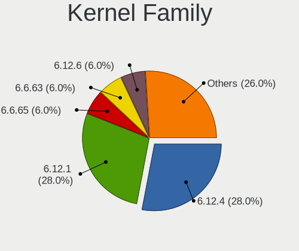
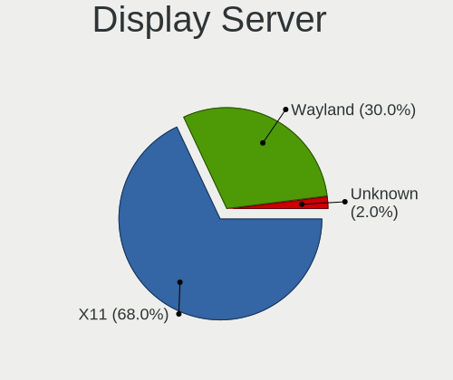
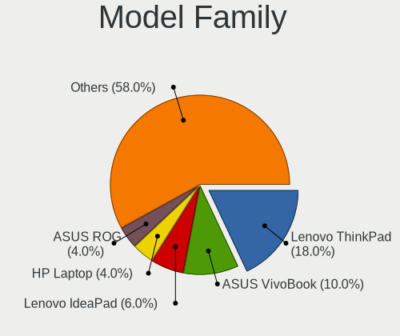
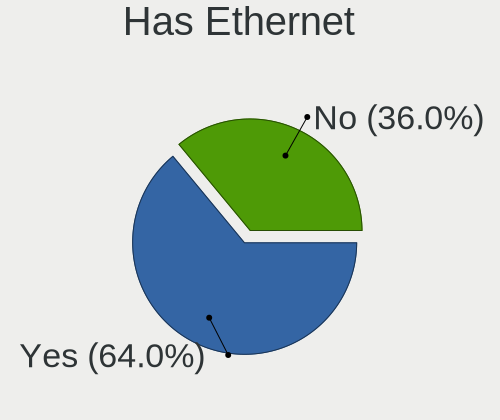
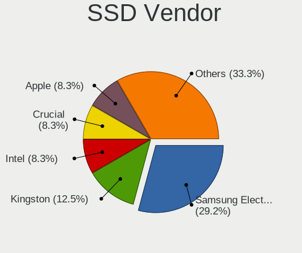
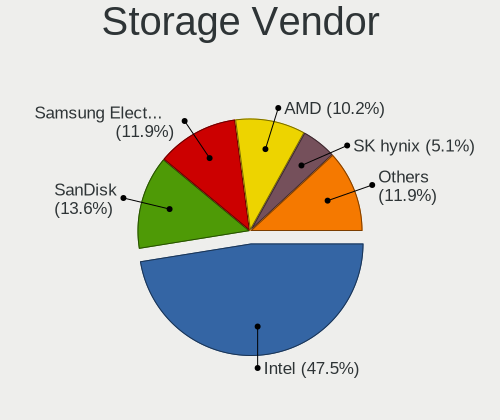
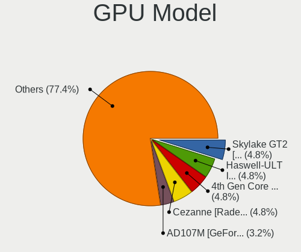
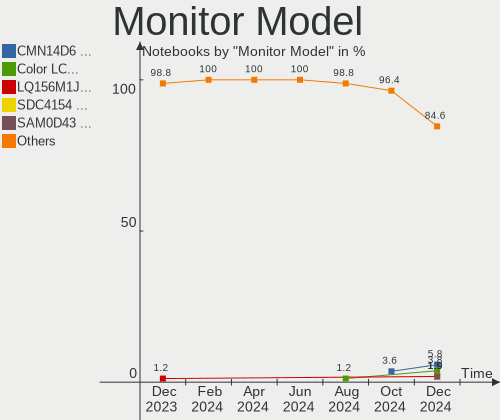
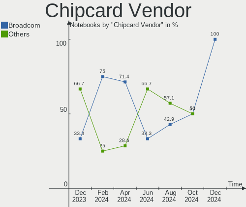

ArcoLinux - Hardware Trends (Notebooks)
---------------------------------------

A project to identify most popular hardware characteristics and track their change
over time based on data collected by Linux users at https://Linux-Hardware.org.

Anyone can contribute to this report by the [hw-probe](https://github.com/linuxhw/hw-probe) tool:

    sudo -E hw-probe -all -upload

This report is for one last month. Overall report since the beginning of time: [TestDays](https://github.com/linuxhw/TestDays)

Period: Feb, 2023.

Contents
--------

* [ System ](#system)
  - [ OS                       ](#os)
  - [ OS Family                ](#os-family)
  - [ Kernel                   ](#kernel)
  - [ Kernel Family            ](#kernel-family)
  - [ Kernel Major Ver.        ](#kernel-major-ver)
  - [ Arch                     ](#arch)
  - [ DE                       ](#de)
  - [ Display Server           ](#display-server)
  - [ Display Manager          ](#display-manager)
  - [ OS Lang                  ](#os-lang)
  - [ Boot Mode                ](#boot-mode)
  - [ Filesystem               ](#filesystem)
  - [ Part. scheme             ](#part-scheme)
  - [ Dual Boot with Linux/BSD ](#dual-boot-with-linuxbsd)
  - [ Dual Boot (Win)          ](#dual-boot-win)

* [ Board ](#board)
  - [ Vendor                   ](#vendor)
  - [ Model                    ](#model)
  - [ Model Family             ](#model-family)
  - [ MFG Year                 ](#mfg-year)
  - [ Form Factor              ](#form-factor)
  - [ Secure Boot              ](#secure-boot)
  - [ Coreboot                 ](#coreboot)
  - [ RAM Size                 ](#ram-size)
  - [ RAM Used                 ](#ram-used)
  - [ Total Drives             ](#total-drives)
  - [ Has CD-ROM               ](#has-cd-rom)
  - [ Has Ethernet             ](#has-ethernet)
  - [ Has WiFi                 ](#has-wifi)
  - [ Has Bluetooth            ](#has-bluetooth)

* [ Location ](#location)
  - [ Country                  ](#country)
  - [ City                     ](#city)

* [ Drives ](#drives)
  - [ Drive Vendor             ](#drive-vendor)
  - [ Drive Model              ](#drive-model)
  - [ HDD Vendor               ](#hdd-vendor)
  - [ SSD Vendor               ](#ssd-vendor)
  - [ Drive Kind               ](#drive-kind)
  - [ Drive Connector          ](#drive-connector)
  - [ Drive Size               ](#drive-size)
  - [ Space Total              ](#space-total)
  - [ Space Used               ](#space-used)
  - [ Malfunc. Drives          ](#malfunc-drives)
  - [ Malfunc. Drive Vendor    ](#malfunc-drive-vendor)
  - [ Malfunc. HDD Vendor      ](#malfunc-hdd-vendor)
  - [ Malfunc. Drive Kind      ](#malfunc-drive-kind)
  - [ Failed Drives            ](#failed-drives)
  - [ Failed Drive Vendor      ](#failed-drive-vendor)
  - [ Drive Status             ](#drive-status)

* [ Storage controller ](#storage-controller)
  - [ Storage Vendor           ](#storage-vendor)
  - [ Storage Model            ](#storage-model)
  - [ Storage Kind             ](#storage-kind)

* [ Processor ](#processor)
  - [ CPU Vendor               ](#cpu-vendor)
  - [ CPU Model                ](#cpu-model)
  - [ CPU Model Family         ](#cpu-model-family)
  - [ CPU Cores                ](#cpu-cores)
  - [ CPU Sockets              ](#cpu-sockets)
  - [ CPU Threads              ](#cpu-threads)
  - [ CPU Op-Modes             ](#cpu-op-modes)
  - [ CPU Microcode            ](#cpu-microcode)
  - [ CPU Microarch            ](#cpu-microarch)

* [ Graphics ](#graphics)
  - [ GPU Vendor               ](#gpu-vendor)
  - [ GPU Model                ](#gpu-model)
  - [ GPU Combo                ](#gpu-combo)
  - [ GPU Driver               ](#gpu-driver)
  - [ GPU Memory               ](#gpu-memory)

* [ Monitor ](#monitor)
  - [ Monitor Vendor           ](#monitor-vendor)
  - [ Monitor Model            ](#monitor-model)
  - [ Monitor Resolution       ](#monitor-resolution)
  - [ Monitor Diagonal         ](#monitor-diagonal)
  - [ Monitor Width            ](#monitor-width)
  - [ Aspect Ratio             ](#aspect-ratio)
  - [ Monitor Area             ](#monitor-area)
  - [ Pixel Density            ](#pixel-density)
  - [ Multiple Monitors        ](#multiple-monitors)

* [ Network ](#network)
  - [ Net Controller Vendor    ](#net-controller-vendor)
  - [ Net Controller Model     ](#net-controller-model)
  - [ Wireless Vendor          ](#wireless-vendor)
  - [ Wireless Model           ](#wireless-model)
  - [ Ethernet Vendor          ](#ethernet-vendor)
  - [ Ethernet Model           ](#ethernet-model)
  - [ Net Controller Kind      ](#net-controller-kind)
  - [ Used Controller          ](#used-controller)
  - [ NICs                     ](#nics)
  - [ IPv6                     ](#ipv6)

* [ Bluetooth ](#bluetooth)
  - [ Bluetooth Vendor         ](#bluetooth-vendor)
  - [ Bluetooth Model          ](#bluetooth-model)

* [ Sound ](#sound)
  - [ Sound Vendor             ](#sound-vendor)
  - [ Sound Model              ](#sound-model)

* [ Memory ](#memory)
  - [ Memory Vendor            ](#memory-vendor)
  - [ Memory Model             ](#memory-model)
  - [ Memory Kind              ](#memory-kind)
  - [ Memory Form Factor       ](#memory-form-factor)
  - [ Memory Size              ](#memory-size)
  - [ Memory Speed             ](#memory-speed)

* [ Printers & scanners ](#printers--scanners)
  - [ Printer Vendor           ](#printer-vendor)
  - [ Printer Model            ](#printer-model)
  - [ Scanner Vendor           ](#scanner-vendor)
  - [ Scanner Model            ](#scanner-model)

* [ Camera ](#camera)
  - [ Camera Vendor            ](#camera-vendor)
  - [ Camera Model             ](#camera-model)

* [ Security ](#security)
  - [ Fingerprint Vendor       ](#fingerprint-vendor)
  - [ Fingerprint Model        ](#fingerprint-model)
  - [ Chipcard Vendor          ](#chipcard-vendor)
  - [ Chipcard Model           ](#chipcard-model)

* [ Unsupported ](#unsupported)
  - [ Unsupported Devices      ](#unsupported-devices)
  - [ Unsupported Device Types ](#unsupported-device-types)

System
------

OS
--

Installed operating systems

| Name              | Notebooks | Percent |
|-------------------|-----------|---------|
| ArcoLinux Rolling | 23        | 88.46%  |
| ArcoLinux         | 3         | 11.54%  |

OS Family
---------

OS without a version

| Name      | Notebooks | Percent |
|-----------|-----------|---------|
| ArcoLinux | 26        | 100%    |

Kernel
------

Version of the Linux kernel

| Version                | Notebooks | Percent |
|------------------------|-----------|---------|
| 6.1.12-arch1-1         | 9         | 34.62%  |
| 6.1.9-arch1-1          | 4         | 15.38%  |
| 6.1.10-arch1-1         | 4         | 15.38%  |
| 6.1.9-arch1-2          | 2         | 7.69%   |
| 6.1.12-zen1-1-zen      | 2         | 7.69%   |
| 6.2.1-arch1-1          | 1         | 3.85%   |
| 6.1.11-x64v1-xanmod1-1 | 1         | 3.85%   |
| 6.1.11-arch1-1         | 1         | 3.85%   |
| 5.15.91-4-lts          | 1         | 3.85%   |
| 5.15.91-1-lts          | 1         | 3.85%   |

Kernel Family
-------------

Linux kernel without a distro release

| Version | Notebooks | Percent |
|---------|-----------|---------|
| 6.1.12  | 11        | 42.31%  |
| 6.1.9   | 6         | 23.08%  |
| 6.1.10  | 4         | 15.38%  |
| 6.1.11  | 2         | 7.69%   |
| 5.15.91 | 2         | 7.69%   |
| 6.2.1   | 1         | 3.85%   |

Kernel Major Ver.
-----------------

Linux kernel major version

| Version | Notebooks | Percent |
|---------|-----------|---------|
| 6.1     | 23        | 88.46%  |
| 5.15    | 2         | 7.69%   |
| 6.2     | 1         | 3.85%   |

Arch
----

OS architecture (x86_64, i586, etc.)

| Name   | Notebooks | Percent |
|--------|-----------|---------|
| x86_64 | 26        | 100%    |

DE
--

Desktop Environment

| Name       | Notebooks | Percent |
|------------|-----------|---------|
| XFCE       | 8         | 30.77%  |
| KDE5       | 5         | 19.23%  |
| Hyprland   | 5         | 19.23%  |
| qtile      | 2         | 7.69%   |
| chadwm     | 2         | 7.69%   |
| X-Cinnamon | 1         | 3.85%   |
| i3         | 1         | 3.85%   |
| GNOME      | 1         | 3.85%   |
| awesome    | 1         | 3.85%   |

Display Server
--------------

X11 or Wayland

| Name    | Notebooks | Percent |
|---------|-----------|---------|
| X11     | 21        | 80.77%  |
| Wayland | 5         | 19.23%  |

Display Manager
---------------

SDDM, LightDM, etc.

| Name    | Notebooks | Percent |
|---------|-----------|---------|
| SDDM    | 20        | 76.92%  |
| LightDM | 3         | 11.54%  |
| Unknown | 3         | 11.54%  |

OS Lang
-------

Language

| Lang  | Notebooks | Percent |
|-------|-----------|---------|
| en_US | 15        | 57.69%  |
| de_DE | 5         | 19.23%  |
| ru_RU | 1         | 3.85%   |
| pl_PL | 1         | 3.85%   |
| hr_HR | 1         | 3.85%   |
| es_ES | 1         | 3.85%   |
| en_GB | 1         | 3.85%   |
| en_CA | 1         | 3.85%   |

Boot Mode
---------

EFI or BIOS

| Mode | Notebooks | Percent |
|------|-----------|---------|
| EFI  | 22        | 84.62%  |
| BIOS | 4         | 15.38%  |

Filesystem
----------

Type of filesystem

| Type  | Notebooks | Percent |
|-------|-----------|---------|
| Ext4  | 19        | 73.08%  |
| Btrfs | 7         | 26.92%  |

Part. scheme
------------

Scheme of partitioning

| Type    | Notebooks | Percent |
|---------|-----------|---------|
| GPT     | 22        | 84.62%  |
| Unknown | 3         | 11.54%  |
| MBR     | 1         | 3.85%   |

Dual Boot with Linux/BSD
------------------------

Hosting more than one Linux/BSD

| Dual boot | Notebooks | Percent |
|-----------|-----------|---------|
| No        | 18        | 69.23%  |
| Yes       | 8         | 30.77%  |

Dual Boot (Win)
---------------

Hosting Linux and Windows

| Dual boot | Notebooks | Percent |
|-----------|-----------|---------|
| No        | 17        | 65.38%  |
| Yes       | 9         | 34.62%  |

Board
-----

Vendor
------

Motherboard manufacturer

| Name             | Notebooks | Percent |
|------------------|-----------|---------|
| Lenovo           | 8         | 30.77%  |
| Hewlett-Packard  | 5         | 19.23%  |
| ASUSTek Computer | 4         | 15.38%  |
| Acer             | 3         | 11.54%  |
| Dell             | 2         | 7.69%   |
| Toshiba          | 1         | 3.85%   |
| System76         | 1         | 3.85%   |
| Monster          | 1         | 3.85%   |
| Chuwi            | 1         | 3.85%   |

Model
-----

Motherboard model

| Name                                     | Notebooks | Percent |
|------------------------------------------|-----------|---------|
| Toshiba Satellite L70-B                  | 1         | 3.85%   |
| System76 Oryx Pro                        | 1         | 3.85%   |
| Monster TULPAR T5 V20.1                  | 1         | 3.85%   |
| Lenovo ThinkPad T460 20FMS35H02          | 1         | 3.85%   |
| Lenovo ThinkPad T460 20FMS07000          | 1         | 3.85%   |
| Lenovo ThinkPad P53 20QNS00X00           | 1         | 3.85%   |
| Lenovo ThinkPad L470 20J4003WGE          | 1         | 3.85%   |
| Lenovo ThinkPad L14 Gen 1 20U5004JPB     | 1         | 3.85%   |
| Lenovo Legion S7 15ACH6 82K8             | 1         | 3.85%   |
| Lenovo Legion 7 16ARHA7 82UH             | 1         | 3.85%   |
| Lenovo IdeaPad 310-15IKB 80TV            | 1         | 3.85%   |
| HP ZBook Studio G3                       | 1         | 3.85%   |
| HP Pavilion dv7                          | 1         | 3.85%   |
| HP OMEN by Laptop 17-cb0xxx              | 1         | 3.85%   |
| HP ENVY 15                               | 1         | 3.85%   |
| HP EliteBook 840 G4                      | 1         | 3.85%   |
| Dell XPS 17 9710                         | 1         | 3.85%   |
| Dell Inspiron 3558                       | 1         | 3.85%   |
| Chuwi GemiBook Pro                       | 1         | 3.85%   |
| ASUS Zenbook UM3402YA_UM3402YA           | 1         | 3.85%   |
| ASUS X55VD                               | 1         | 3.85%   |
| ASUS ROG Strix G532LWS_G532LWS           | 1         | 3.85%   |
| ASUS ASUS TUF Gaming F15 FX506LH_FX506LH | 1         | 3.85%   |
| Acer Swift SF314-43                      | 1         | 3.85%   |
| Acer Predator PH315-52                   | 1         | 3.85%   |
| Acer Aspire A515-51                      | 1         | 3.85%   |

Model Family
------------

Motherboard model prefix

| Name              | Notebooks | Percent |
|-------------------|-----------|---------|
| Lenovo ThinkPad   | 5         | 19.23%  |
| Lenovo Legion     | 2         | 7.69%   |
| Toshiba Satellite | 1         | 3.85%   |
| System76 Oryx     | 1         | 3.85%   |
| Monster TULPAR    | 1         | 3.85%   |
| Lenovo IdeaPad    | 1         | 3.85%   |
| HP ZBook          | 1         | 3.85%   |
| HP Pavilion       | 1         | 3.85%   |
| HP OMEN           | 1         | 3.85%   |
| HP ENVY           | 1         | 3.85%   |
| HP EliteBook      | 1         | 3.85%   |
| Dell XPS          | 1         | 3.85%   |
| Dell Inspiron     | 1         | 3.85%   |
| Chuwi GemiBook    | 1         | 3.85%   |
| ASUS Zenbook      | 1         | 3.85%   |
| ASUS X55VD        | 1         | 3.85%   |
| ASUS ROG          | 1         | 3.85%   |
| ASUS ASUS         | 1         | 3.85%   |
| Acer Swift        | 1         | 3.85%   |
| Acer Predator     | 1         | 3.85%   |
| Acer Aspire       | 1         | 3.85%   |

MFG Year
--------

Motherboard manufacture year

| Year | Notebooks | Percent |
|------|-----------|---------|
| 2021 | 6         | 23.08%  |
| 2019 | 4         | 15.38%  |
| 2016 | 4         | 15.38%  |
| 2017 | 3         | 11.54%  |
| 2022 | 2         | 7.69%   |
| 2020 | 2         | 7.69%   |
| 2015 | 1         | 3.85%   |
| 2014 | 1         | 3.85%   |
| 2012 | 1         | 3.85%   |
| 2010 | 1         | 3.85%   |
| 2008 | 1         | 3.85%   |

Form Factor
-----------

Physical design of the computer

| Name     | Notebooks | Percent |
|----------|-----------|---------|
| Notebook | 26        | 100%    |

Secure Boot
-----------

Enabled or disabled

| State    | Notebooks | Percent |
|----------|-----------|---------|
| Disabled | 26        | 100%    |

Coreboot
--------

Have coreboot on board

| Used | Notebooks | Percent |
|------|-----------|---------|
| No   | 26        | 100%    |

RAM Size
--------

Total RAM memory

| Size in GB  | Notebooks | Percent |
|-------------|-----------|---------|
| 16.01-24.0  | 9         | 34.62%  |
| 8.01-16.0   | 8         | 30.77%  |
| 4.01-8.0    | 4         | 15.38%  |
| 32.01-64.0  | 3         | 11.54%  |
| 24.01-32.0  | 1         | 3.85%   |
| 64.01-256.0 | 1         | 3.85%   |

RAM Used
--------

Used RAM memory

| Used GB   | Notebooks | Percent |
|-----------|-----------|---------|
| 2.01-3.0  | 8         | 30.77%  |
| 4.01-8.0  | 7         | 26.92%  |
| 3.01-4.0  | 4         | 15.38%  |
| 1.01-2.0  | 4         | 15.38%  |
| 8.01-16.0 | 2         | 7.69%   |
| 0.51-1.0  | 1         | 3.85%   |

Total Drives
------------

Number of drives on board

| Drives | Notebooks | Percent |
|--------|-----------|---------|
| 1      | 13        | 50%     |
| 2      | 10        | 38.46%  |
| 3      | 2         | 7.69%   |
| 4      | 1         | 3.85%   |

Has CD-ROM
----------

Has CD-ROM on board

| Presented | Notebooks | Percent |
|-----------|-----------|---------|
| No        | 24        | 92.31%  |
| Yes       | 2         | 7.69%   |

Has Ethernet
------------

Has Ethernet on board

| Presented | Notebooks | Percent |
|-----------|-----------|---------|
| Yes       | 21        | 80.77%  |
| No        | 5         | 19.23%  |

Has WiFi
--------

Has WiFi module

| Presented | Notebooks | Percent |
|-----------|-----------|---------|
| Yes       | 25        | 96.15%  |
| No        | 1         | 3.85%   |

Has Bluetooth
-------------

Has Bluetooth module

| Presented | Notebooks | Percent |
|-----------|-----------|---------|
| Yes       | 25        | 96.15%  |
| No        | 1         | 3.85%   |

Location
--------

Country
-------

Geographic location (country)

| Country     | Notebooks | Percent |
|-------------|-----------|---------|
| Germany     | 5         | 19.23%  |
| USA         | 4         | 15.38%  |
| Spain       | 2         | 7.69%   |
| Poland      | 2         | 7.69%   |
| Netherlands | 2         | 7.69%   |
| Vietnam     | 1         | 3.85%   |
| Turkey      | 1         | 3.85%   |
| Sweden      | 1         | 3.85%   |
| Russia      | 1         | 3.85%   |
| Romania     | 1         | 3.85%   |
| Pakistan    | 1         | 3.85%   |
| Malaysia    | 1         | 3.85%   |
| France      | 1         | 3.85%   |
| Croatia     | 1         | 3.85%   |
| Canada      | 1         | 3.85%   |
| Algeria     | 1         | 3.85%   |

City
----

Geographic location (city)

| City         | Notebooks | Percent |
|--------------|-----------|---------|
| Eindhoven    | 2         | 7.69%   |
| Vaslui       | 1         | 3.85%   |
| Solna        | 1         | 3.85%   |
| Skawina      | 1         | 3.85%   |
| Seville      | 1         | 3.85%   |
| Schwarzenbek | 1         | 3.85%   |
| Saint Paul   | 1         | 3.85%   |
| Pula         | 1         | 3.85%   |
| Piney Flats  | 1         | 3.85%   |
| Phoenix      | 1         | 3.85%   |
| Oropesa      | 1         | 3.85%   |
| Oldenburg    | 1         | 3.85%   |
| Mysłowice   | 1         | 3.85%   |
| Munich       | 1         | 3.85%   |
| Marseille    | 1         | 3.85%   |
| Markham      | 1         | 3.85%   |
| Krumbach     | 1         | 3.85%   |
| Izmir        | 1         | 3.85%   |
| Islamabad    | 1         | 3.85%   |
| Ipoh         | 1         | 3.85%   |
| Houston      | 1         | 3.85%   |
| Hanoi        | 1         | 3.85%   |
| Bryansk      | 1         | 3.85%   |
| Berlin       | 1         | 3.85%   |
| Algiers      | 1         | 3.85%   |

Drives
------

Drive Vendor
------------

Hard drive vendors

| Vendor                      | Notebooks | Drives | Percent |
|-----------------------------|-----------|--------|---------|
| Samsung Electronics         | 10        | 11     | 25%     |
| SanDisk                     | 4         | 4      | 10%     |
| WDC                         | 3         | 4      | 7.5%    |
| Unknown                     | 2         | 2      | 5%      |
| SK hynix                    | 2         | 2      | 5%      |
| Seagate                     | 2         | 2      | 5%      |
| Micron/Crucial Technology   | 2         | 2      | 5%      |
| Kingston                    | 2         | 2      | 5%      |
| Intenso                     | 2         | 2      | 5%      |
| Intel                       | 2         | 3      | 5%      |
| Crucial                     | 2         | 2      | 5%      |
| SSK                         | 1         | 1      | 2.5%    |
| Realtek Semiconductor       | 1         | 1      | 2.5%    |
| Plextor                     | 1         | 1      | 2.5%    |
| Micron Technology           | 1         | 1      | 2.5%    |
| Kingston Technology Company | 1         | 1      | 2.5%    |
| HS256E                      | 1         | 1      | 2.5%    |
| A-DATA Technology           | 1         | 1      | 2.5%    |

Drive Model
-----------

Hard drive models

| Model                                                | Notebooks | Percent |
|------------------------------------------------------|-----------|---------|
| Samsung NVMe SSD Controller SM981/PM981/PM983 250GB  | 4         | 9.76%   |
| Samsung NVMe SSD Controller PM9A1/PM9A3/980PRO 960GB | 3         | 7.32%   |
| WDC WDS500G2B0B-00YS70 500GB SSD                     | 1         | 2.44%   |
| WDC WD5000LPCX-24C6HT0 500GB                         | 1         | 2.44%   |
| WDC WD20SPZX-22UA7T0 2TB                             | 1         | 2.44%   |
| WDC WD10SPZX-21Z10T0 1TB                             | 1         | 2.44%   |
| Unknown MMC Card  134GB                              | 1         | 2.44%   |
| Unknown MMC Card  128GB                              | 1         | 2.44%   |
| SSK Disk 1TB                                         | 1         | 2.44%   |
| SK hynix SKHynix_HFS512GDE9X084N 512GB               | 1         | 2.44%   |
| SK hynix HFS256G39TND-N210A 256GB SSD                | 1         | 2.44%   |
| Seagate ST1000LM049-2GH172 1TB                       | 1         | 2.44%   |
| Seagate ST1000LM035-1RK172 1TB                       | 1         | 2.44%   |
| SanDisk X400 M.2 2280 256GB SSD                      | 1         | 2.44%   |
| Sandisk WD_BLACK SN850X 1000GB                       | 1         | 2.44%   |
| Sandisk WD_BLACK SN770 1TB                           | 1         | 2.44%   |
| Sandisk WD Black SN750 / PC SN730 NVMe SSD 512GB     | 1         | 2.44%   |
| Samsung SSD 860 EVO 250GB                            | 1         | 2.44%   |
| Samsung NVMe SSD Controller SM961/PM961/SM963 512GB  | 1         | 2.44%   |
| Samsung MZ7LN256HMJP-000L7 256GB SSD                 | 1         | 2.44%   |
| Realtek RTS5763DL NVMe SSD Controller 4TB            | 1         | 2.44%   |
| Plextor PX-256M6V 256GB SSD                          | 1         | 2.44%   |
| Micron/Crucial P2 NVMe PCIe SSD 1TB                  | 1         | 2.44%   |
| Micron/Crucial P1 NVMe PCIe SSD 500GB                | 1         | 2.44%   |
| Micron 2210_MTFDHBA512QFD 512GB                      | 1         | 2.44%   |
| Kingston Company U-SNS8154P3 NVMe SSD 256GB          | 1         | 2.44%   |
| Kingston SKC600MS1024G 1TB SSD                       | 1         | 2.44%   |
| Kingston SA400S37480G 480GB SSD                      | 1         | 2.44%   |
| Intenso SSD Sata III 1TB                             | 1         | 2.44%   |
| Intenso SSD 240GB                                    | 1         | 2.44%   |
| Intel SSDPEKNU010TZ 1TB                              | 1         | 2.44%   |
| Intel SSD 660P Series 1024GB                         | 1         | 2.44%   |
| HS256E SSD 256GB                                     | 1         | 2.44%   |
| Crucial CT2000MX500SSD1 2TB                          | 1         | 2.44%   |
| Crucial CT1000MX500SSD1 1TB                          | 1         | 2.44%   |
| A-DATA SU720 1TB SSD                                 | 1         | 2.44%   |

HDD Vendor
----------

Hard disk drive vendors

| Vendor  | Notebooks | Drives | Percent |
|---------|-----------|--------|---------|
| WDC     | 3         | 3      | 60%     |
| Seagate | 2         | 2      | 40%     |

SSD Vendor
----------

Solid state drive vendors

| Vendor              | Notebooks | Drives | Percent |
|---------------------|-----------|--------|---------|
| Samsung Electronics | 2         | 2      | 14.29%  |
| Kingston            | 2         | 2      | 14.29%  |
| Intenso             | 2         | 2      | 14.29%  |
| Crucial             | 2         | 2      | 14.29%  |
| WDC                 | 1         | 1      | 7.14%   |
| SK hynix            | 1         | 1      | 7.14%   |
| SanDisk             | 1         | 1      | 7.14%   |
| Plextor             | 1         | 1      | 7.14%   |
| HS256E              | 1         | 1      | 7.14%   |
| A-DATA Technology   | 1         | 1      | 7.14%   |

Drive Kind
----------

HDD or SSD

| Kind    | Notebooks | Drives | Percent |
|---------|-----------|--------|---------|
| NVMe    | 16        | 21     | 45.71%  |
| SSD     | 12        | 14     | 34.29%  |
| HDD     | 4         | 5      | 11.43%  |
| MMC     | 2         | 2      | 5.71%   |
| Unknown | 1         | 1      | 2.86%   |

Drive Connector
---------------

SATA, SAS, NVMe, etc.

| Type | Notebooks | Drives | Percent |
|------|-----------|--------|---------|
| NVMe | 16        | 21     | 50%     |
| SATA | 13        | 19     | 40.63%  |
| MMC  | 2         | 2      | 6.25%   |
| SAS  | 1         | 1      | 3.13%   |

Drive Size
----------

Size of hard drive

| Size in TB | Notebooks | Drives | Percent |
|------------|-----------|--------|---------|
| 0.01-0.5   | 8         | 10     | 50%     |
| 0.51-1.0   | 6         | 7      | 37.5%   |
| 1.01-2.0   | 2         | 2      | 12.5%   |

Space Total
-----------

Amount of disk space available on the file system

| Size in GB     | Notebooks | Percent |
|----------------|-----------|---------|
| 101-250        | 6         | 23.08%  |
| 251-500        | 5         | 19.23%  |
| 1001-2000      | 5         | 19.23%  |
| More than 3000 | 4         | 15.38%  |
| 501-1000       | 2         | 7.69%   |
| Unknown        | 2         | 7.69%   |
| 2001-3000      | 1         | 3.85%   |
| 51-100         | 1         | 3.85%   |

Space Used
----------

Amount of used disk space

| Used GB   | Notebooks | Percent |
|-----------|-----------|---------|
| 1-20      | 6         | 23.08%  |
| 101-250   | 5         | 19.23%  |
| 51-100    | 4         | 15.38%  |
| 501-1000  | 3         | 11.54%  |
| 21-50     | 2         | 7.69%   |
| 1001-2000 | 2         | 7.69%   |
| Unknown   | 2         | 7.69%   |
| 251-500   | 1         | 3.85%   |
| 2001-3000 | 1         | 3.85%   |

Malfunc. Drives
---------------

Drive models with a malfunction

| Model                                            | Notebooks | Drives | Percent |
|--------------------------------------------------|-----------|--------|---------|
| Micron/Crucial Technology P1 NVMe PCIe SSD 500GB | 1         | 1      | 100%    |

Malfunc. Drive Vendor
---------------------

Vendors of faulty drives

| Vendor                    | Notebooks | Drives | Percent |
|---------------------------|-----------|--------|---------|
| Micron/Crucial Technology | 1         | 1      | 100%    |

Malfunc. HDD Vendor
-------------------

Vendors of faulty HDD drives

Zero info for selected period =(

Malfunc. Drive Kind
-------------------

Kinds of faulty drives

| Kind | Notebooks | Drives | Percent |
|------|-----------|--------|---------|
| NVMe | 1         | 1      | 100%    |

Failed Drives
-------------

Failed drive models

Zero info for selected period =(

Failed Drive Vendor
-------------------

Failed drive vendors

Zero info for selected period =(

Drive Status
------------

Number of failed and malfunc. drives

| Status   | Notebooks | Drives | Percent |
|----------|-----------|--------|---------|
| Works    | 23        | 34     | 76.67%  |
| Detected | 6         | 8      | 20%     |
| Malfunc  | 1         | 1      | 3.33%   |

Storage controller
------------------

Storage Vendor
--------------

Storage controller vendors

| Vendor                      | Notebooks | Percent |
|-----------------------------|-----------|---------|
| Intel                       | 20        | 52.63%  |
| Samsung Electronics         | 8         | 21.05%  |
| SanDisk                     | 3         | 7.89%   |
| Micron/Crucial Technology   | 2         | 5.26%   |
| SK hynix                    | 1         | 2.63%   |
| Realtek Semiconductor       | 1         | 2.63%   |
| Micron Technology           | 1         | 2.63%   |
| Kingston Technology Company | 1         | 2.63%   |
| AMD                         | 1         | 2.63%   |

Storage Model
-------------

Storage controller models

| Model                                                                          | Notebooks | Percent |
|--------------------------------------------------------------------------------|-----------|---------|
| Intel Sunrise Point-LP SATA Controller [AHCI mode]                             | 6         | 15.79%  |
| Samsung NVMe SSD Controller SM981/PM981/PM983                                  | 4         | 10.53%  |
| Samsung NVMe SSD Controller PM9A1/PM9A3/980PRO                                 | 3         | 7.89%   |
| SanDisk Non-Volatile memory controller                                         | 2         | 5.26%   |
| Intel Cannon Lake Mobile PCH SATA AHCI Controller                              | 2         | 5.26%   |
| Intel 82801 Mobile SATA Controller [RAID mode]                                 | 2         | 5.26%   |
| Intel 400 Series Chipset Family SATA AHCI Controller                           | 2         | 5.26%   |
| SK hynix Gold P31/PC711 NVMe Solid State Drive                                 | 1         | 2.63%   |
| SanDisk WD Black SN750 / PC SN730 NVMe SSD                                     | 1         | 2.63%   |
| Samsung NVMe SSD Controller SM961/PM961/SM963                                  | 1         | 2.63%   |
| Realtek RTS5763DL NVMe SSD Controller                                          | 1         | 2.63%   |
| Micron/Crucial P2 NVMe PCIe SSD                                                | 1         | 2.63%   |
| Micron/Crucial P1 NVMe PCIe SSD                                                | 1         | 2.63%   |
| Micron Non-Volatile memory controller                                          | 1         | 2.63%   |
| Kingston Company U-SNS8154P3 NVMe SSD                                          | 1         | 2.63%   |
| Intel Wildcat Point-LP SATA Controller [AHCI Mode]                             | 1         | 2.63%   |
| Intel SSD 660P Series                                                          | 1         | 2.63%   |
| Intel Q170/Q150/B150/H170/H110/Z170/CM236 Chipset SATA Controller [AHCI Mode]  | 1         | 2.63%   |
| Intel Non-Volatile memory controller                                           | 1         | 2.63%   |
| Intel Jasper Lake SATA AHCI Controller                                         | 1         | 2.63%   |
| Intel 8 Series/C220 Series Chipset Family 6-port SATA Controller 1 [AHCI mode] | 1         | 2.63%   |
| Intel 7 Series Chipset Family 6-port SATA Controller [AHCI mode]               | 1         | 2.63%   |
| Intel 6 Series/C200 Series Chipset Family 6 port Mobile SATA AHCI Controller   | 1         | 2.63%   |
| AMD FCH SATA Controller [AHCI mode]                                            | 1         | 2.63%   |

Storage Kind
------------

Kind of storage controller (IDE, SATA, NVMe, SAS, ...)

| Kind | Notebooks | Percent |
|------|-----------|---------|
| SATA | 17        | 48.57%  |
| NVMe | 16        | 45.71%  |
| RAID | 2         | 5.71%   |

Processor
---------

CPU Vendor
----------

Processor vendors

| Vendor | Notebooks | Percent |
|--------|-----------|---------|
| Intel  | 21        | 80.77%  |
| AMD    | 5         | 19.23%  |

CPU Model
---------

Processor models

| Model                                      | Notebooks | Percent |
|--------------------------------------------|-----------|---------|
| Intel Core i7-9750H CPU @ 2.60GHz          | 4         | 15.38%  |
| Intel Core i5-6300U CPU @ 2.40GHz          | 2         | 7.69%   |
| Intel Pentium CPU 2020M @ 2.40GHz          | 1         | 3.85%   |
| Intel Core i7-7500U CPU @ 2.70GHz          | 1         | 3.85%   |
| Intel Core i7-6820HQ CPU @ 2.70GHz         | 1         | 3.85%   |
| Intel Core i7-4710HQ CPU @ 2.50GHz         | 1         | 3.85%   |
| Intel Core i7-4702MQ CPU @ 2.20GHz         | 1         | 3.85%   |
| Intel Core i7-10875H CPU @ 2.30GHz         | 1         | 3.85%   |
| Intel Core i7-10750H CPU @ 2.60GHz         | 1         | 3.85%   |
| Intel Core i5-7300U CPU @ 2.60GHz          | 1         | 3.85%   |
| Intel Core i5-7200U CPU @ 2.50GHz          | 1         | 3.85%   |
| Intel Core i5-5200U CPU @ 2.20GHz          | 1         | 3.85%   |
| Intel Core i5-2410M CPU @ 2.30GHz          | 1         | 3.85%   |
| Intel Core i5-10300H CPU @ 2.50GHz         | 1         | 3.85%   |
| Intel Core i3-7020U CPU @ 2.30GHz          | 1         | 3.85%   |
| Intel Celeron N5100 @ 1.10GHz              | 1         | 3.85%   |
| Intel 11th Gen Core i7-11800H @ 2.30GHz    | 1         | 3.85%   |
| AMD Ryzen 9 6900HX with Radeon Graphics    | 1         | 3.85%   |
| AMD Ryzen 7 5825U with Radeon Graphics     | 1         | 3.85%   |
| AMD Ryzen 7 5800H with Radeon Graphics     | 1         | 3.85%   |
| AMD Ryzen 7 5700U with Radeon Graphics     | 1         | 3.85%   |
| AMD Ryzen 5 PRO 4650U with Radeon Graphics | 1         | 3.85%   |

CPU Model Family
----------------

Processor model prefix

| Model           | Notebooks | Percent |
|-----------------|-----------|---------|
| Intel Core i7   | 10        | 38.46%  |
| Intel Core i5   | 7         | 26.92%  |
| AMD Ryzen 7     | 3         | 11.54%  |
| Other           | 1         | 3.85%   |
| Intel Pentium   | 1         | 3.85%   |
| Intel Core i3   | 1         | 3.85%   |
| Intel Celeron   | 1         | 3.85%   |
| AMD Ryzen 9     | 1         | 3.85%   |
| AMD Ryzen 5 PRO | 1         | 3.85%   |

CPU Cores
---------

Number of processor cores

| Number | Notebooks | Percent |
|--------|-----------|---------|
| 2      | 9         | 34.62%  |
| 8      | 6         | 23.08%  |
| 6      | 6         | 23.08%  |
| 4      | 5         | 19.23%  |

CPU Sockets
-----------

Number of sockets

| Number | Notebooks | Percent |
|--------|-----------|---------|
| 1      | 26        | 100%    |

CPU Threads
-----------

Threads per core (Hyper-Threading)

| Number | Notebooks | Percent |
|--------|-----------|---------|
| 2      | 24        | 92.31%  |
| 1      | 2         | 7.69%   |

CPU Op-Modes
------------

CPU Operation Modes (32-bit, 64-bit)

| Op mode        | Notebooks | Percent |
|----------------|-----------|---------|
| 32-bit, 64-bit | 26        | 100%    |

CPU Microcode
-------------

Microcode number

| Number     | Notebooks | Percent |
|------------|-----------|---------|
| 0x906ea    | 4         | 15.38%  |
| 0xa0652    | 3         | 11.54%  |
| 0x806e9    | 3         | 11.54%  |
| Unknown    | 3         | 11.54%  |
| 0x406e3    | 2         | 7.69%   |
| 0x306c3    | 2         | 7.69%   |
| 0x0a50000c | 2         | 7.69%   |
| 0x906c0    | 1         | 3.85%   |
| 0x806d1    | 1         | 3.85%   |
| 0x506e3    | 1         | 3.85%   |
| 0x306d4    | 1         | 3.85%   |
| 0x306a9    | 1         | 3.85%   |
| 0x0a404102 | 1         | 3.85%   |
| 0x08600106 | 1         | 3.85%   |

CPU Microarch
-------------

Microarchitecture

| Name        | Notebooks | Percent |
|-------------|-----------|---------|
| KabyLake    | 8         | 30.77%  |
| Skylake     | 3         | 11.54%  |
| CometLake   | 3         | 11.54%  |
| Zen 3       | 2         | 7.69%   |
| Haswell     | 2         | 7.69%   |
| Unknown     | 2         | 7.69%   |
| Zen 2       | 1         | 3.85%   |
| Tremont     | 1         | 3.85%   |
| SandyBridge | 1         | 3.85%   |
| IvyBridge   | 1         | 3.85%   |
| Icelake     | 1         | 3.85%   |
| Broadwell   | 1         | 3.85%   |

Graphics
--------

GPU Vendor
----------

Vendors of graphics cards

| Vendor | Notebooks | Percent |
|--------|-----------|---------|
| Intel  | 20        | 50%     |
| Nvidia | 13        | 32.5%   |
| AMD    | 7         | 17.5%   |

GPU Model
---------

Graphics card models

| Model                                                                         | Notebooks | Percent |
|-------------------------------------------------------------------------------|-----------|---------|
| Intel HD Graphics 620                                                         | 4         | 9.76%   |
| Nvidia TU106M [GeForce RTX 2060 Mobile]                                       | 3         | 7.32%   |
| Intel CometLake-H GT2 [UHD Graphics]                                          | 3         | 7.32%   |
| Intel CoffeeLake-H GT2 [UHD Graphics 630]                                     | 3         | 7.32%   |
| Intel Skylake GT2 [HD Graphics 520]                                           | 2         | 4.88%   |
| Intel 4th Gen Core Processor Integrated Graphics Controller                   | 2         | 4.88%   |
| Nvidia TU117M                                                                 | 1         | 2.44%   |
| Nvidia TU117GLM [Quadro T2000 Mobile / Max-Q]                                 | 1         | 2.44%   |
| Nvidia TU106BM [GeForce RTX 2070 Mobile / Max-Q]                              | 1         | 2.44%   |
| Nvidia TU104M [GeForce RTX 2070 SUPER Mobile / Max-Q]                         | 1         | 2.44%   |
| Nvidia GM108M [GeForce 920MX]                                                 | 1         | 2.44%   |
| Nvidia GK208BM [GeForce 920M]                                                 | 1         | 2.44%   |
| Nvidia GK107M [GeForce GT 750M]                                               | 1         | 2.44%   |
| Nvidia GF119M [GeForce 610M]                                                  | 1         | 2.44%   |
| Nvidia GA107M [GeForce RTX 3050 Mobile]                                       | 1         | 2.44%   |
| Nvidia GA106M [GeForce RTX 3060 Mobile / Max-Q]                               | 1         | 2.44%   |
| Intel TigerLake-H GT1 [UHD Graphics]                                          | 1         | 2.44%   |
| Intel JasperLake [UHD Graphics]                                               | 1         | 2.44%   |
| Intel HD Graphics 5500                                                        | 1         | 2.44%   |
| Intel HD Graphics 530                                                         | 1         | 2.44%   |
| Intel 3rd Gen Core processor Graphics Controller                              | 1         | 2.44%   |
| Intel 2nd Generation Core Processor Family Integrated Graphics Controller     | 1         | 2.44%   |
| AMD Whistler [Radeon HD 6730M/6770M/7690M XT]                                 | 1         | 2.44%   |
| AMD Sun XT [Radeon HD 8670A/8670M/8690M / R5 M330 / M430 / Radeon 520 Mobile] | 1         | 2.44%   |
| AMD Renoir                                                                    | 1         | 2.44%   |
| AMD Rembrandt [Radeon 680M]                                                   | 1         | 2.44%   |
| AMD Navi 22 [Radeon RX 6700/6700 XT/6750 XT / 6800M/6850M XT]                 | 1         | 2.44%   |
| AMD Lucienne                                                                  | 1         | 2.44%   |
| AMD Cezanne [Radeon Vega Series / Radeon Vega Mobile Series]                  | 1         | 2.44%   |
| AMD Barcelo                                                                   | 1         | 2.44%   |

GPU Combo
---------

Combinations of graphics cards

| Name           | Notebooks | Percent |
|----------------|-----------|---------|
| Intel + Nvidia | 11        | 42.31%  |
| 1 x Intel      | 7         | 26.92%  |
| 1 x AMD        | 3         | 11.54%  |
| Intel + AMD    | 2         | 7.69%   |
| 2 x AMD        | 1         | 3.85%   |
| 1 x Nvidia     | 1         | 3.85%   |
| AMD + Nvidia   | 1         | 3.85%   |

GPU Driver
----------

Free vs proprietary

| Driver      | Notebooks | Percent |
|-------------|-----------|---------|
| Free        | 17        | 65.38%  |
| Proprietary | 9         | 34.62%  |

GPU Memory
----------

Total video memory

| Size in GB | Notebooks | Percent |
|------------|-----------|---------|
| Unknown    | 16        | 61.54%  |
| 5.01-6.0   | 3         | 11.54%  |
| 0.01-0.5   | 3         | 11.54%  |
| 1.01-2.0   | 2         | 7.69%   |
| 7.01-8.0   | 1         | 3.85%   |
| 8.01-16.0  | 1         | 3.85%   |

Monitor
-------

Monitor Vendor
--------------

Monitor vendors

| Vendor              | Notebooks | Percent |
|---------------------|-----------|---------|
| LG Display          | 6         | 16.22%  |
| BOE                 | 6         | 16.22%  |
| Chimei Innolux      | 4         | 10.81%  |
| AU Optronics        | 4         | 10.81%  |
| Samsung Electronics | 3         | 8.11%   |
| Dell                | 3         | 8.11%   |
| PANDA               | 2         | 5.41%   |
| Acer                | 2         | 5.41%   |
| Sharp               | 1         | 2.7%    |
| Philips             | 1         | 2.7%    |
| LG Electronics      | 1         | 2.7%    |
| Iiyama              | 1         | 2.7%    |
| Eizo                | 1         | 2.7%    |
| CSO                 | 1         | 2.7%    |
| Unknown             | 1         | 2.7%    |

Monitor Model
-------------

Monitor models

| Model                                                                 | Notebooks | Percent |
|-----------------------------------------------------------------------|-----------|---------|
| Sharp LCD Monitor SHP1517 3840x2400 366x229mm 17.0-inch               | 1         | 2.7%    |
| Samsung Electronics S24R35xFZ SAM71A8 1920x1080 527x296mm 23.8-inch   | 1         | 2.7%    |
| Samsung Electronics LU28R55 SAM1015 3840x2160 632x360mm 28.6-inch     | 1         | 2.7%    |
| Samsung Electronics LCD Monitor SDC4171 2880x1800 302x189mm 14.0-inch | 1         | 2.7%    |
| Philips PHL 242E1GJ PHLC244 1920x1080 527x296mm 23.8-inch             | 1         | 2.7%    |
| PANDA LCD Monitor NCP004D 1920x1080 344x194mm 15.5-inch               | 1         | 2.7%    |
| PANDA LCD Monitor NCP004B 1920x1080 344x194mm 15.5-inch               | 1         | 2.7%    |
| LG Electronics LCD Monitor E2350                                      | 1         | 2.7%    |
| LG Display LCD Monitor LGD0551 1920x1080 309x174mm 14.0-inch          | 1         | 2.7%    |
| LG Display LCD Monitor LGD0521 1920x1080 309x174mm 14.0-inch          | 1         | 2.7%    |
| LG Display LCD Monitor LGD046F 1920x1080 344x194mm 15.5-inch          | 1         | 2.7%    |
| LG Display LCD Monitor LGD0396 1600x900 382x215mm 17.3-inch           | 1         | 2.7%    |
| LG Display LCD Monitor LGD038E 1366x768 344x194mm 15.5-inch           | 1         | 2.7%    |
| LG Display LCD Monitor LGD027A 1600x900 382x215mm 17.3-inch           | 1         | 2.7%    |
| Iiyama PL2792H IVM664F 1920x1080 598x336mm 27.0-inch                  | 1         | 2.7%    |
| Eizo EV2450 ENC2531 1920x1080 528x297mm 23.9-inch                     | 1         | 2.7%    |
| Dell SE2216H DELF071 1920x1080 476x268mm 21.5-inch                    | 1         | 2.7%    |
| Dell S2421HN DEL41F1 1920x1080 527x296mm 23.8-inch                    | 1         | 2.7%    |
| Dell P2213 DELF042 1680x1050 473x296mm 22.0-inch                      | 1         | 2.7%    |
| CSO LCD Monitor CSO1610 2560x1600 345x215mm 16.0-inch                 | 1         | 2.7%    |
| Chimei Innolux P140ZKA-BZ1 CMN8C02 2160x1440 296x197mm 14.0-inch      | 1         | 2.7%    |
| Chimei Innolux LCD Monitor CMN15E8 1920x1080 344x193mm 15.5-inch      | 1         | 2.7%    |
| Chimei Innolux LCD Monitor CMN15DC 1366x768 344x193mm 15.5-inch       | 1         | 2.7%    |
| Chimei Innolux LCD Monitor CMN15BB 1920x1080 344x194mm 15.5-inch      | 1         | 2.7%    |
| BOE LCD Monitor BOE08C7 1920x1080 309x174mm 14.0-inch                 | 1         | 2.7%    |
| BOE LCD Monitor BOE0853 1920x1080 344x194mm 15.5-inch                 | 1         | 2.7%    |
| BOE LCD Monitor BOE07B6 1920x1080 382x215mm 17.3-inch                 | 1         | 2.7%    |
| BOE LCD Monitor BOE06B3 1920x1080                                     | 1         | 2.7%    |
| BOE LCD Monitor BOE0672 1366x768 344x194mm 15.5-inch                  | 1         | 2.7%    |
| BOE LCD Monitor BOE0615 1366x768 309x173mm 13.9-inch                  | 1         | 2.7%    |
| AU Optronics LCD Monitor AUOBC8C 1920x1080 344x193mm 15.5-inch        | 1         | 2.7%    |
| AU Optronics LCD Monitor AUO5895 1920x1080 344x193mm 15.5-inch        | 1         | 2.7%    |
| AU Optronics LCD Monitor AUO403D 1920x1080 309x173mm 13.9-inch        | 1         | 2.7%    |
| AU Optronics LCD Monitor AUO1136 2560x1440 309x174mm 14.0-inch        | 1         | 2.7%    |
| Acer V193HQ ACR006D 1366x768 410x230mm 18.5-inch                      | 1         | 2.7%    |
| Acer LCD Monitor XR342CK                                              | 1         | 2.7%    |
| Unknown                                                               | 1         | 2.7%    |

Monitor Resolution
------------------

Monitor screen resolution

| Resolution         | Notebooks | Percent |
|--------------------|-----------|---------|
| 1920x1080 (FHD)    | 15        | 50%     |
| 1366x768 (WXGA)    | 4         | 13.33%  |
| 1600x900 (HD+)     | 2         | 6.67%   |
| 7280x1440          | 1         | 3.33%   |
| 3840x2400          | 1         | 3.33%   |
| 3840x2160 (4K)     | 1         | 3.33%   |
| 2880x1800          | 1         | 3.33%   |
| 2560x1600          | 1         | 3.33%   |
| 2560x1440 (QHD)    | 1         | 3.33%   |
| 2160x1440          | 1         | 3.33%   |
| 1680x1050 (WSXGA+) | 1         | 3.33%   |
| Unknown            | 1         | 3.33%   |

Monitor Diagonal
----------------

Diagonal size in inches

| Inches  | Notebooks | Percent |
|---------|-----------|---------|
| 15      | 11        | 31.43%  |
| 14      | 7         | 20%     |
| 17      | 4         | 11.43%  |
| 24      | 2         | 5.71%   |
| 23      | 2         | 5.71%   |
| 13      | 2         | 5.71%   |
| 28      | 1         | 2.86%   |
| 27      | 1         | 2.86%   |
| 22      | 1         | 2.86%   |
| 21      | 1         | 2.86%   |
| 18      | 1         | 2.86%   |
| 16      | 1         | 2.86%   |
| Unknown | 1         | 2.86%   |

Monitor Width
-------------

Physical width

| Width in mm | Notebooks | Percent |
|-------------|-----------|---------|
| 301-350     | 20        | 57.14%  |
| 501-600     | 5         | 14.29%  |
| 351-400     | 4         | 11.43%  |
| 401-500     | 3         | 8.57%   |
| 601-700     | 1         | 2.86%   |
| 201-300     | 1         | 2.86%   |
| Unknown     | 1         | 2.86%   |

Aspect Ratio
------------

Proportional relationship between the width and the height

| Ratio   | Notebooks | Percent |
|---------|-----------|---------|
| 16/9    | 21        | 80.77%  |
| 16/10   | 3         | 11.54%  |
| 3/2     | 1         | 3.85%   |
| Unknown | 1         | 3.85%   |

Monitor Area
------------

Area in inch²

| Area in inch² | Notebooks | Percent |
|----------------|-----------|---------|
| 101-110        | 11        | 31.43%  |
| 81-90          | 9         | 25.71%  |
| 201-250        | 6         | 17.14%  |
| 121-130        | 4         | 11.43%  |
| 351-500        | 1         | 2.86%   |
| 301-350        | 1         | 2.86%   |
| 141-150        | 1         | 2.86%   |
| 111-120        | 1         | 2.86%   |
| Unknown        | 1         | 2.86%   |

Pixel Density
-------------

Pixels per inch

| Density       | Notebooks | Percent |
|---------------|-----------|---------|
| 121-160       | 14        | 41.18%  |
| 101-120       | 7         | 20.59%  |
| 51-100        | 7         | 20.59%  |
| 161-240       | 3         | 8.82%   |
| More than 240 | 2         | 5.88%   |
| Unknown       | 1         | 2.94%   |

Multiple Monitors
-----------------

Total monitors connected

| Total | Notebooks | Percent |
|-------|-----------|---------|
| 1     | 16        | 61.54%  |
| 2     | 9         | 34.62%  |
| 3     | 1         | 3.85%   |

Network
-------

Net Controller Vendor
---------------------

Controller vendors

| Vendor                | Notebooks | Percent |
|-----------------------|-----------|---------|
| Intel                 | 16        | 37.21%  |
| Realtek Semiconductor | 13        | 30.23%  |
| MediaTek              | 5         | 11.63%  |
| Qualcomm Atheros      | 3         | 6.98%   |
| Sierra Wireless       | 1         | 2.33%   |
| Ralink                | 1         | 2.33%   |
| Lenovo                | 1         | 2.33%   |
| FIBOCOM               | 1         | 2.33%   |
| DisplayLink           | 1         | 2.33%   |
| Broadcom              | 1         | 2.33%   |

Net Controller Model
--------------------

Controller models

| Model                                                             | Notebooks | Percent |
|-------------------------------------------------------------------|-----------|---------|
| Realtek RTL8111/8168/8411 PCI Express Gigabit Ethernet Controller | 11        | 21.15%  |
| MediaTek MT7921 802.11ax PCI Express Wireless Network Adapter     | 3         | 5.77%   |
| Intel Wireless 8260                                               | 3         | 5.77%   |
| Realtek RTL8153 Gigabit Ethernet Adapter                          | 2         | 3.85%   |
| Intel Wireless 8265 / 8275                                        | 2         | 3.85%   |
| Intel Wireless 3160                                               | 2         | 3.85%   |
| Intel Wi-Fi 6 AX200                                               | 2         | 3.85%   |
| Intel Ethernet Connection I219-LM                                 | 2         | 3.85%   |
| Intel Comet Lake PCH CNVi WiFi                                    | 2         | 3.85%   |
| Intel Cannon Lake PCH CNVi WiFi                                   | 2         | 3.85%   |
| Sierra Wireless EM7455                                            | 1         | 1.92%   |
| Realtek RTL8852AE 802.11ax PCIe Wireless Network Adapter          | 1         | 1.92%   |
| Realtek RTL8821AE 802.11ac PCIe Wireless Network Adapter          | 1         | 1.92%   |
| Realtek RTL8125 2.5GbE Controller                                 | 1         | 1.92%   |
| Ralink RT5390 Wireless 802.11n 1T/1R PCIe                         | 1         | 1.92%   |
| Qualcomm Atheros QCA9377 802.11ac Wireless Network Adapter        | 1         | 1.92%   |
| Qualcomm Atheros Killer E2500 Gigabit Ethernet Controller         | 1         | 1.92%   |
| Qualcomm Atheros AR8161 Gigabit Ethernet                          | 1         | 1.92%   |
| MediaTek WLAN controller                                          | 1         | 1.92%   |
| MediaTek MT7922 802.11ax PCI Express Wireless Network Adapter     | 1         | 1.92%   |
| Lenovo Hydra Force Sensor                                         | 1         | 1.92%   |
| Intel Wireless 3165                                               | 1         | 1.92%   |
| Intel Tiger Lake PCH CNVi WiFi                                    | 1         | 1.92%   |
| Intel Ethernet Connection (7) I219-V                              | 1         | 1.92%   |
| Intel Ethernet Connection (4) I219-V                              | 1         | 1.92%   |
| Intel Ethernet Connection (4) I219-LM                             | 1         | 1.92%   |
| Intel Ethernet Connection (2) I219-LM                             | 1         | 1.92%   |
| Intel Centrino Wireless-N 2230                                    | 1         | 1.92%   |
| FIBOCOM L831-EAU                                                  | 1         | 1.92%   |
| DisplayLink ThinkPad USB 3.0 Ultra Dock                           | 1         | 1.92%   |
| Broadcom BCM4313 802.11bgn Wireless Network Adapter               | 1         | 1.92%   |

Wireless Vendor
---------------

Wireless vendors

| Vendor                | Notebooks | Percent |
|-----------------------|-----------|---------|
| Intel                 | 16        | 59.26%  |
| MediaTek              | 4         | 14.81%  |
| Realtek Semiconductor | 2         | 7.41%   |
| Sierra Wireless       | 1         | 3.7%    |
| Ralink                | 1         | 3.7%    |
| Qualcomm Atheros      | 1         | 3.7%    |
| FIBOCOM               | 1         | 3.7%    |
| Broadcom              | 1         | 3.7%    |

Wireless Model
--------------

Wireless models

| Model                                                         | Notebooks | Percent |
|---------------------------------------------------------------|-----------|---------|
| Intel Wireless 8260                                           | 3         | 11.11%  |
| MediaTek MT7921 802.11ax PCI Express Wireless Network Adapter | 2         | 7.41%   |
| Intel Wireless 8265 / 8275                                    | 2         | 7.41%   |
| Intel Wireless 3160                                           | 2         | 7.41%   |
| Intel Wi-Fi 6 AX200                                           | 2         | 7.41%   |
| Intel Comet Lake PCH CNVi WiFi                                | 2         | 7.41%   |
| Intel Cannon Lake PCH CNVi WiFi                               | 2         | 7.41%   |
| Sierra Wireless EM7455                                        | 1         | 3.7%    |
| Realtek RTL8852AE 802.11ax PCIe Wireless Network Adapter      | 1         | 3.7%    |
| Realtek RTL8821AE 802.11ac PCIe Wireless Network Adapter      | 1         | 3.7%    |
| Ralink RT5390 Wireless 802.11n 1T/1R PCIe                     | 1         | 3.7%    |
| Qualcomm Atheros QCA9377 802.11ac Wireless Network Adapter    | 1         | 3.7%    |
| MediaTek WLAN controller                                      | 1         | 3.7%    |
| MediaTek MT7922 802.11ax PCI Express Wireless Network Adapter | 1         | 3.7%    |
| Intel Wireless 3165                                           | 1         | 3.7%    |
| Intel Tiger Lake PCH CNVi WiFi                                | 1         | 3.7%    |
| Intel Centrino Wireless-N 2230                                | 1         | 3.7%    |
| FIBOCOM L831-EAU                                              | 1         | 3.7%    |
| Broadcom BCM4313 802.11bgn Wireless Network Adapter           | 1         | 3.7%    |

Ethernet Vendor
---------------

Ethernet vendors

| Vendor                | Notebooks | Percent |
|-----------------------|-----------|---------|
| Realtek Semiconductor | 13        | 56.52%  |
| Intel                 | 6         | 26.09%  |
| Qualcomm Atheros      | 2         | 8.7%    |
| MediaTek              | 1         | 4.35%   |
| DisplayLink           | 1         | 4.35%   |

Ethernet Model
--------------

Ethernet models

| Model                                                             | Notebooks | Percent |
|-------------------------------------------------------------------|-----------|---------|
| Realtek RTL8111/8168/8411 PCI Express Gigabit Ethernet Controller | 11        | 45.83%  |
| Realtek RTL8153 Gigabit Ethernet Adapter                          | 2         | 8.33%   |
| Intel Ethernet Connection I219-LM                                 | 2         | 8.33%   |
| Realtek RTL8125 2.5GbE Controller                                 | 1         | 4.17%   |
| Qualcomm Atheros Killer E2500 Gigabit Ethernet Controller         | 1         | 4.17%   |
| Qualcomm Atheros AR8161 Gigabit Ethernet                          | 1         | 4.17%   |
| MediaTek MT7921 802.11ax PCI Express Wireless Network Adapter     | 1         | 4.17%   |
| Intel Ethernet Connection (7) I219-V                              | 1         | 4.17%   |
| Intel Ethernet Connection (4) I219-V                              | 1         | 4.17%   |
| Intel Ethernet Connection (4) I219-LM                             | 1         | 4.17%   |
| Intel Ethernet Connection (2) I219-LM                             | 1         | 4.17%   |
| DisplayLink ThinkPad USB 3.0 Ultra Dock                           | 1         | 4.17%   |

Net Controller Kind
-------------------

Ethernet, WiFi or modem

| Kind     | Notebooks | Percent |
|----------|-----------|---------|
| WiFi     | 25        | 53.19%  |
| Ethernet | 21        | 44.68%  |
| Modem    | 1         | 2.13%   |

Used Controller
---------------

Currently used network controller

| Kind     | Notebooks | Percent |
|----------|-----------|---------|
| WiFi     | 20        | 71.43%  |
| Ethernet | 8         | 28.57%  |

NICs
----

Total network controllers on board

| Total | Notebooks | Percent |
|-------|-----------|---------|
| 2     | 20        | 76.92%  |
| 1     | 6         | 23.08%  |

IPv6
----

IPv6 vs IPv4

| Used | Notebooks | Percent |
|------|-----------|---------|
| No   | 20        | 76.92%  |
| Yes  | 6         | 23.08%  |

Bluetooth
---------

Bluetooth Vendor
----------------

Controller vendors

| Vendor                | Notebooks | Percent |
|-----------------------|-----------|---------|
| Intel                 | 16        | 64%     |
| Realtek Semiconductor | 2         | 8%      |
| Lite-On Technology    | 2         | 8%      |
| IMC Networks          | 2         | 8%      |
| Foxconn / Hon Hai     | 2         | 8%      |
| Broadcom              | 1         | 4%      |

Bluetooth Model
---------------

Controller models

| Model                                          | Notebooks | Percent |
|------------------------------------------------|-----------|---------|
| Intel Bluetooth wireless interface             | 8         | 32%     |
| Intel AX201 Bluetooth                          | 3         | 12%     |
| Intel Bluetooth 9460/9560 Jefferson Peak (JfP) | 2         | 8%      |
| Intel AX200 Bluetooth                          | 2         | 8%      |
| IMC Networks Wireless_Device                   | 2         | 8%      |
| Foxconn / Hon Hai Wireless_Device              | 2         | 8%      |
| Realtek RTL8821A Bluetooth                     | 1         | 4%      |
| Realtek Bluetooth Radio                        | 1         | 4%      |
| Lite-On Wireless_Device                        | 1         | 4%      |
| Lite-On Qualcomm Atheros QCA9377 Bluetooth     | 1         | 4%      |
| Intel Centrino Bluetooth Wireless Transceiver  | 1         | 4%      |
| Broadcom BCM20702A0 Bluetooth 4.0              | 1         | 4%      |

Sound
-----

Sound Vendor
------------

Sound card vendors

| Vendor  | Notebooks | Percent |
|---------|-----------|---------|
| Intel   | 21        | 60%     |
| Nvidia  | 8         | 22.86%  |
| AMD     | 5         | 14.29%  |
| Corsair | 1         | 2.86%   |

Sound Model
-----------

Sound card models

| Model                                                                      | Notebooks | Percent |
|----------------------------------------------------------------------------|-----------|---------|
| Intel Sunrise Point-LP HD Audio                                            | 6         | 13.95%  |
| AMD Family 17h/19h HD Audio Controller                                     | 5         | 11.63%  |
| Nvidia TU106 High Definition Audio Controller                              | 4         | 9.3%    |
| Intel Cannon Lake PCH cAVS                                                 | 4         | 9.3%    |
| Intel Comet Lake PCH cAVS                                                  | 3         | 6.98%   |
| AMD Renoir Radeon High Definition Audio Controller                         | 3         | 6.98%   |
| Nvidia TU107 GeForce GTX 1650 High Definition Audio Controller             | 2         | 4.65%   |
| Intel Xeon E3-1200 v3/4th Gen Core Processor HD Audio Controller           | 2         | 4.65%   |
| Intel 8 Series/C220 Series Chipset High Definition Audio Controller        | 2         | 4.65%   |
| Nvidia TU104 HD Audio Controller                                           | 1         | 2.33%   |
| Nvidia GK208 HDMI/DP Audio Controller                                      | 1         | 2.33%   |
| Intel Wildcat Point-LP High Definition Audio Controller                    | 1         | 2.33%   |
| Intel Tiger Lake-H HD Audio Controller                                     | 1         | 2.33%   |
| Intel Jasper Lake HD Audio                                                 | 1         | 2.33%   |
| Intel Broadwell-U Audio Controller                                         | 1         | 2.33%   |
| Intel 7 Series/C216 Chipset Family High Definition Audio Controller        | 1         | 2.33%   |
| Intel 6 Series/C200 Series Chipset Family High Definition Audio Controller | 1         | 2.33%   |
| Intel 100 Series/C230 Series Chipset Family HD Audio Controller            | 1         | 2.33%   |
| Corsair HS70 Pro Wireless Gaming Headset                                   | 1         | 2.33%   |
| AMD Rembrandt Radeon High Definition Audio Controller                      | 1         | 2.33%   |
| AMD Navi 21/23 HDMI/DP Audio Controller                                    | 1         | 2.33%   |

Memory
------

Memory Vendor
-------------

Memory module vendors

| Vendor              | Notebooks | Percent |
|---------------------|-----------|---------|
| Micron Technology   | 9         | 30%     |
| Samsung Electronics | 6         | 20%     |
| SK hynix            | 3         | 10%     |
| Ramaxel Technology  | 3         | 10%     |
| Kingston            | 2         | 6.67%   |
| Crucial             | 2         | 6.67%   |
| Timetec             | 1         | 3.33%   |
| Team                | 1         | 3.33%   |
| Smart               | 1         | 3.33%   |
| GOODRAM             | 1         | 3.33%   |
| Apacer              | 1         | 3.33%   |

Memory Model
------------

Memory module models

| Model                                                          | Notebooks | Percent |
|----------------------------------------------------------------|-----------|---------|
| SK hynix RAM Module 8GB SODIMM DDR4 2133MT/s                   | 2         | 6.45%   |
| Micron RAM 16ATF2G64HZ-3G2J1 16GB SODIMM DDR4 3200MT/s         | 2         | 6.45%   |
| Timetec RAM SD4-3200 16GB SODIMM DDR4 3200MT/s                 | 1         | 3.23%   |
| Team RAM TEAMGROUP-SD4-2666 16GB SODIMM DDR4 2667MT/s          | 1         | 3.23%   |
| Smart RAM SF4642G8CK8IEHLSBG 16GB SODIMM DDR4 2667MT/s         | 1         | 3.23%   |
| SK hynix RAM HMT451S6BFR8A-PB 4GB SODIMM DDR3 1600MT/s         | 1         | 3.23%   |
| Samsung RAM M471B1G73QH0-YK0 8GB SODIMM DDR3 1867MT/s          | 1         | 3.23%   |
| Samsung RAM M471B1G73DB0-YK0 8192MB SODIMM DDR3 1600MT/s       | 1         | 3.23%   |
| Samsung RAM M471A1K43DB1-CWE 8GB SODIMM DDR4 3200MT/s          | 1         | 3.23%   |
| Samsung RAM M471A1G44AB0-CWE 8GB SODIMM DDR4 3200MT/s          | 1         | 3.23%   |
| Samsung RAM M471A1G44AB0-CWE 8GB Row Of Chips DDR4 3200MT/s    | 1         | 3.23%   |
| Samsung RAM M425R2GA3BB0-CQKOL 16GB SODIMM DDR5 4800MT/s       | 1         | 3.23%   |
| Samsung RAM HMT41GS6MFR8C-PB 8GB SODIMM DDR3 1600MT/s          | 1         | 3.23%   |
| Ramaxel RAM RMT3170MP68F9F1600 4GB SODIMM DDR3 1600MT/s        | 1         | 3.23%   |
| Ramaxel RAM RMT3160MP68FAF1600 8192MB SODIMM DDR3 1600MT/s     | 1         | 3.23%   |
| Ramaxel RAM RMSA3260MH78HAF-2666 8GB SODIMM DDR4 2667MT/s      | 1         | 3.23%   |
| Micron RAM MT53E1G32D2NP-046 8GB SODIMM LPDDR4 4266MT/s        | 1         | 3.23%   |
| Micron RAM 8KTF5126 4HZ-1G6D1 4GB SODIMM DDR3 1600MT/s         | 1         | 3.23%   |
| Micron RAM 8ATF1G64HZ-3G2R1 8GB SODIMM DDR4 3200MT/s           | 1         | 3.23%   |
| Micron RAM 8ATF1G64HZ-3G2J1 8GB SODIMM DDR4 3200MT/s           | 1         | 3.23%   |
| Micron RAM 53E1G32D4NQ-046WTE 4GB Row Of Chips LPDDR4 3200MT/s | 1         | 3.23%   |
| Micron RAM 4ATF51264HZ-2G3AZ 4GB SODIMM DDR4 2133MT/s          | 1         | 3.23%   |
| Micron RAM 16KTF1G64HZ-1G6E1 8GB SODIMM DDR3 1600MT/s          | 1         | 3.23%   |
| Kingston RAM 99U5428-017.A00LF 8GB SODIMM DDR3 1600MT/s        | 1         | 3.23%   |
| Kingston RAM 9905624-032.A00G 8GB SODIMM DDR4 2400MT/s         | 1         | 3.23%   |
| GOODRAM RAM GR3200S464L22S/8G 8GB SODIMM DDR4 3200MT/s         | 1         | 3.23%   |
| Crucial RAM CT8G4SFS824A.C8FE 8GB SODIMM DDR4 2667MT/s         | 1         | 3.23%   |
| Crucial RAM CT32G4SFD832A.C16FE 32GB SODIMM DDR4 3200MT/s      | 1         | 3.23%   |
| Apacer RAM D22.23263S.002 16GB SODIMM DDR4 2667MT/s            | 1         | 3.23%   |

Memory Kind
-----------

Memory module kinds

| Kind   | Notebooks | Percent |
|--------|-----------|---------|
| DDR4   | 14        | 60.87%  |
| DDR3   | 6         | 26.09%  |
| LPDDR4 | 2         | 8.7%    |
| DDR5   | 1         | 4.35%   |

Memory Form Factor
------------------

Physical design of the memory module

| Name         | Notebooks | Percent |
|--------------|-----------|---------|
| SODIMM       | 22        | 91.67%  |
| Row Of Chips | 2         | 8.33%   |

Memory Size
-----------

Memory module size

| Size  | Notebooks | Percent |
|-------|-----------|---------|
| 8192  | 13        | 52%     |
| 16384 | 6         | 24%     |
| 4096  | 4         | 16%     |
| 32768 | 2         | 8%      |

Memory Speed
------------

Memory module speed

| Speed | Notebooks | Percent |
|-------|-----------|---------|
| 3200  | 9         | 34.62%  |
| 1600  | 6         | 23.08%  |
| 2667  | 5         | 19.23%  |
| 2133  | 3         | 11.54%  |
| 4800  | 1         | 3.85%   |
| 4266  | 1         | 3.85%   |
| 2400  | 1         | 3.85%   |

Printers & scanners
-------------------

Printer Vendor
--------------

Printer device vendors

Zero info for selected period =(

Printer Model
-------------

Printer device models

Zero info for selected period =(

Scanner Vendor
--------------

Scanner device vendors

Zero info for selected period =(

Scanner Model
-------------

Scanner device models

Zero info for selected period =(

Camera
------

Camera Vendor
-------------

Camera device vendors

| Vendor                                 | Notebooks | Percent |
|----------------------------------------|-----------|---------|
| Chicony Electronics                    | 7         | 28%     |
| Quanta                                 | 4         | 16%     |
| Suyin                                  | 2         | 8%      |
| Sunplus Innovation Technology          | 2         | 8%      |
| Sonix Technology                       | 2         | 8%      |
| Bison Electronics                      | 2         | 8%      |
| Acer                                   | 2         | 8%      |
| Samsung Electronics                    | 1         | 4%      |
| Microdia                               | 1         | 4%      |
| IMC Networks                           | 1         | 4%      |
| Cheng Uei Precision Industry (Foxlink) | 1         | 4%      |

Camera Model
------------

Camera device models

| Model                                               | Notebooks | Percent |
|-----------------------------------------------------|-----------|---------|
| Chicony Integrated Camera                           | 3         | 12%     |
| Quanta HD User Facing                               | 2         | 8%      |
| Suyin HP TrueVision HD Integrated Webcam            | 1         | 4%      |
| Suyin HP Truevision HD                              | 1         | 4%      |
| Sunplus Integrated_Webcam_HD                        | 1         | 4%      |
| Sunplus Canyon CNS CWC5 Webcam                      | 1         | 4%      |
| Sonix USB2.0 HD UVC WebCam                          | 1         | 4%      |
| Sonix USB2.0 FHD UVC WebCam                         | 1         | 4%      |
| Samsung Galaxy A5 (MTP)                             | 1         | 4%      |
| Quanta HP Wide Vision HD Camera                     | 1         | 4%      |
| Quanta HD Webcam                                    | 1         | 4%      |
| Microdia Webcam Vitade AF                           | 1         | 4%      |
| IMC Networks Integrated Camera                      | 1         | 4%      |
| Chicony UVC 1.00 device HD UVC WebCam               | 1         | 4%      |
| Chicony TOSHIBA Web Camera - HD                     | 1         | 4%      |
| Chicony HP HD Camera                                | 1         | 4%      |
| Chicony HD Webcam                                   | 1         | 4%      |
| Cheng Uei Precision Industry (Foxlink) HP HD Camera | 1         | 4%      |
| Bison Integrated Camera                             | 1         | 4%      |
| Bison EasyCamera                                    | 1         | 4%      |
| Acer ThinkPad P50 Integrated Camera                 | 1         | 4%      |
| Acer BisonCam,NB Pro                                | 1         | 4%      |

Security
--------

Fingerprint Vendor
------------------

Fingerprint sensor vendors

| Vendor                     | Notebooks | Percent |
|----------------------------|-----------|---------|
| Validity Sensors           | 6         | 60%     |
| Synaptics                  | 2         | 20%     |
| Shenzhen Goodix Technology | 2         | 20%     |

Fingerprint Model
-----------------

Fingerprint sensor models

| Model                                             | Notebooks | Percent |
|---------------------------------------------------|-----------|---------|
| Validity Sensors VFS495 Fingerprint Reader        | 2         | 20%     |
| Validity Sensors VFS5011 Fingerprint Reader       | 1         | 10%     |
| Validity Sensors VFS 5011 fingerprint sensor      | 1         | 10%     |
| Validity Sensors Swipe Fingerprint Sensor         | 1         | 10%     |
| Validity Sensors Fingerprint scanner              | 1         | 10%     |
| Synaptics Prometheus MIS Touch Fingerprint Reader | 1         | 10%     |
| Shenzhen Goodix  FingerPrint Device               | 1         | 10%     |
| Shenzhen Goodix Fingerprint Reader                | 1         | 10%     |
| Unknown                                           | 1         | 10%     |

Chipcard Vendor
---------------

Chipcard module vendors

| Vendor      | Notebooks | Percent |
|-------------|-----------|---------|
| Alcor Micro | 3         | 100%    |

Chipcard Model
--------------

Chipcard module models

| Model                               | Notebooks | Percent |
|-------------------------------------|-----------|---------|
| Alcor Micro AU9540 Smartcard Reader | 3         | 100%    |

Unsupported
-----------

Unsupported Devices
-------------------

Total unsupported devices on board

| Total | Notebooks | Percent |
|-------|-----------|---------|
| 1     | 11        | 42.31%  |
| 0     | 11        | 42.31%  |
| 2     | 4         | 15.38%  |

Unsupported Device Types
------------------------

Types of unsupported devices

| Type               | Notebooks | Percent |
|--------------------|-----------|---------|
| Fingerprint reader | 10        | 52.63%  |
| Graphics card      | 3         | 15.79%  |
| Chipcard           | 3         | 15.79%  |
| Camera             | 2         | 10.53%  |
| Bluetooth          | 1         | 5.26%   |

