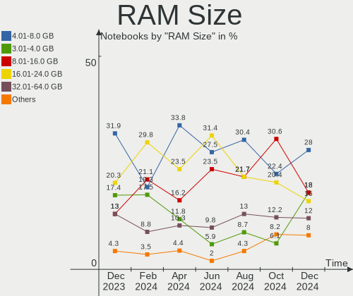
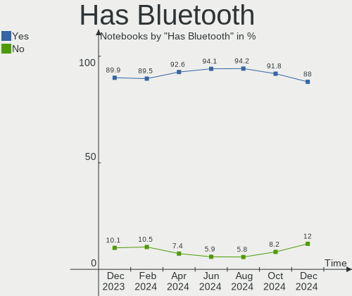
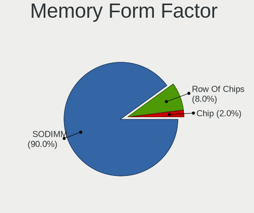
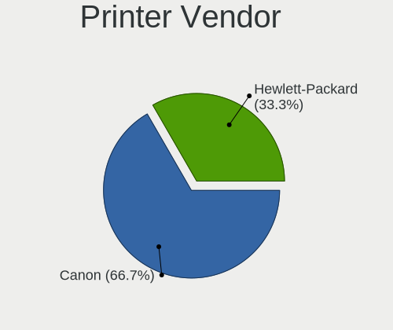

ArcoLinux - Hardware Trends (Notebooks)
---------------------------------------

A project to identify most popular hardware characteristics and track their change
over time based on data collected by Linux users at https://Linux-Hardware.org.

Anyone can contribute to this report by the [hw-probe](https://github.com/linuxhw/hw-probe) tool:

    sudo -E hw-probe -all -upload

This report is for one last month. Overall report since the beginning of time: [TestCoverage](https://github.com/linuxhw/TestCoverage)

Period: Jul, 2022.

Contents
--------

* [ System ](#system)
  - [ OS                       ](#os)
  - [ OS Family                ](#os-family)
  - [ Kernel                   ](#kernel)
  - [ Kernel Family            ](#kernel-family)
  - [ Kernel Major Ver.        ](#kernel-major-ver)
  - [ Arch                     ](#arch)
  - [ DE                       ](#de)
  - [ Display Server           ](#display-server)
  - [ Display Manager          ](#display-manager)
  - [ OS Lang                  ](#os-lang)
  - [ Boot Mode                ](#boot-mode)
  - [ Filesystem               ](#filesystem)
  - [ Part. scheme             ](#part-scheme)
  - [ Dual Boot with Linux/BSD ](#dual-boot-with-linuxbsd)
  - [ Dual Boot (Win)          ](#dual-boot-win)

* [ Board ](#board)
  - [ Vendor                   ](#vendor)
  - [ Model                    ](#model)
  - [ Model Family             ](#model-family)
  - [ MFG Year                 ](#mfg-year)
  - [ Form Factor              ](#form-factor)
  - [ Secure Boot              ](#secure-boot)
  - [ Coreboot                 ](#coreboot)
  - [ RAM Size                 ](#ram-size)
  - [ RAM Used                 ](#ram-used)
  - [ Total Drives             ](#total-drives)
  - [ Has CD-ROM               ](#has-cd-rom)
  - [ Has Ethernet             ](#has-ethernet)
  - [ Has WiFi                 ](#has-wifi)
  - [ Has Bluetooth            ](#has-bluetooth)

* [ Location ](#location)
  - [ Country                  ](#country)
  - [ City                     ](#city)

* [ Drives ](#drives)
  - [ Drive Vendor             ](#drive-vendor)
  - [ Drive Model              ](#drive-model)
  - [ HDD Vendor               ](#hdd-vendor)
  - [ SSD Vendor               ](#ssd-vendor)
  - [ Drive Kind               ](#drive-kind)
  - [ Drive Connector          ](#drive-connector)
  - [ Drive Size               ](#drive-size)
  - [ Space Total              ](#space-total)
  - [ Space Used               ](#space-used)
  - [ Malfunc. Drives          ](#malfunc-drives)
  - [ Malfunc. Drive Vendor    ](#malfunc-drive-vendor)
  - [ Malfunc. HDD Vendor      ](#malfunc-hdd-vendor)
  - [ Malfunc. Drive Kind      ](#malfunc-drive-kind)
  - [ Failed Drives            ](#failed-drives)
  - [ Failed Drive Vendor      ](#failed-drive-vendor)
  - [ Drive Status             ](#drive-status)

* [ Storage controller ](#storage-controller)
  - [ Storage Vendor           ](#storage-vendor)
  - [ Storage Model            ](#storage-model)
  - [ Storage Kind             ](#storage-kind)

* [ Processor ](#processor)
  - [ CPU Vendor               ](#cpu-vendor)
  - [ CPU Model                ](#cpu-model)
  - [ CPU Model Family         ](#cpu-model-family)
  - [ CPU Cores                ](#cpu-cores)
  - [ CPU Sockets              ](#cpu-sockets)
  - [ CPU Threads              ](#cpu-threads)
  - [ CPU Op-Modes             ](#cpu-op-modes)
  - [ CPU Microcode            ](#cpu-microcode)
  - [ CPU Microarch            ](#cpu-microarch)

* [ Graphics ](#graphics)
  - [ GPU Vendor               ](#gpu-vendor)
  - [ GPU Model                ](#gpu-model)
  - [ GPU Combo                ](#gpu-combo)
  - [ GPU Driver               ](#gpu-driver)
  - [ GPU Memory               ](#gpu-memory)

* [ Monitor ](#monitor)
  - [ Monitor Vendor           ](#monitor-vendor)
  - [ Monitor Model            ](#monitor-model)
  - [ Monitor Resolution       ](#monitor-resolution)
  - [ Monitor Diagonal         ](#monitor-diagonal)
  - [ Monitor Width            ](#monitor-width)
  - [ Aspect Ratio             ](#aspect-ratio)
  - [ Monitor Area             ](#monitor-area)
  - [ Pixel Density            ](#pixel-density)
  - [ Multiple Monitors        ](#multiple-monitors)

* [ Network ](#network)
  - [ Net Controller Vendor    ](#net-controller-vendor)
  - [ Net Controller Model     ](#net-controller-model)
  - [ Wireless Vendor          ](#wireless-vendor)
  - [ Wireless Model           ](#wireless-model)
  - [ Ethernet Vendor          ](#ethernet-vendor)
  - [ Ethernet Model           ](#ethernet-model)
  - [ Net Controller Kind      ](#net-controller-kind)
  - [ Used Controller          ](#used-controller)
  - [ NICs                     ](#nics)
  - [ IPv6                     ](#ipv6)

* [ Bluetooth ](#bluetooth)
  - [ Bluetooth Vendor         ](#bluetooth-vendor)
  - [ Bluetooth Model          ](#bluetooth-model)

* [ Sound ](#sound)
  - [ Sound Vendor             ](#sound-vendor)
  - [ Sound Model              ](#sound-model)

* [ Memory ](#memory)
  - [ Memory Vendor            ](#memory-vendor)
  - [ Memory Model             ](#memory-model)
  - [ Memory Kind              ](#memory-kind)
  - [ Memory Form Factor       ](#memory-form-factor)
  - [ Memory Size              ](#memory-size)
  - [ Memory Speed             ](#memory-speed)

* [ Printers & scanners ](#printers--scanners)
  - [ Printer Vendor           ](#printer-vendor)
  - [ Printer Model            ](#printer-model)
  - [ Scanner Vendor           ](#scanner-vendor)
  - [ Scanner Model            ](#scanner-model)

* [ Camera ](#camera)
  - [ Camera Vendor            ](#camera-vendor)
  - [ Camera Model             ](#camera-model)

* [ Security ](#security)
  - [ Fingerprint Vendor       ](#fingerprint-vendor)
  - [ Fingerprint Model        ](#fingerprint-model)
  - [ Chipcard Vendor          ](#chipcard-vendor)
  - [ Chipcard Model           ](#chipcard-model)

* [ Unsupported ](#unsupported)
  - [ Unsupported Devices      ](#unsupported-devices)
  - [ Unsupported Device Types ](#unsupported-device-types)

System
------

OS
--

Installed operating systems

| Name              | Notebooks | Percent |
|-------------------|-----------|---------|
| ArcoLinux Rolling | 15        | 93.75%  |
| ArcoLinux         | 1         | 6.25%   |

OS Family
---------

OS without a version

| Name      | Notebooks | Percent |
|-----------|-----------|---------|
| ArcoLinux | 16        | 100%    |

Kernel
------

Version of the Linux kernel

| Version            | Notebooks | Percent |
|--------------------|-----------|---------|
| 5.18.12-arch1-1    | 2         | 12.5%   |
| 5.18.11-arch1-1    | 2         | 12.5%   |
| 5.17.6-arch1-1     | 2         | 12.5%   |
| 5.18.9-arch1-1     | 1         | 6.25%   |
| 5.18.8-arch1-1     | 1         | 6.25%   |
| 5.18.3-arch1-1     | 1         | 6.25%   |
| 5.18.15-arch1-1    | 1         | 6.25%   |
| 5.18.14-arch1-1    | 1         | 6.25%   |
| 5.18.13-zen1-1-zen | 1         | 6.25%   |
| 5.18.13-arch1-1    | 1         | 6.25%   |
| 5.18.10-zen1-1-zen | 1         | 6.25%   |
| 5.18.10-arch1-1    | 1         | 6.25%   |
| 5.18.1-arch1-1     | 1         | 6.25%   |

Kernel Family
-------------

Linux kernel without a distro release

| Version | Notebooks | Percent |
|---------|-----------|---------|
| 5.18.13 | 2         | 12.5%   |
| 5.18.12 | 2         | 12.5%   |
| 5.18.11 | 2         | 12.5%   |
| 5.18.10 | 2         | 12.5%   |
| 5.17.6  | 2         | 12.5%   |
| 5.18.9  | 1         | 6.25%   |
| 5.18.8  | 1         | 6.25%   |
| 5.18.3  | 1         | 6.25%   |
| 5.18.15 | 1         | 6.25%   |
| 5.18.14 | 1         | 6.25%   |
| 5.18.1  | 1         | 6.25%   |

Kernel Major Ver.
-----------------

Linux kernel major version

| Version | Notebooks | Percent |
|---------|-----------|---------|
| 5.18    | 14        | 87.5%   |
| 5.17    | 2         | 12.5%   |

Arch
----

OS architecture (x86_64, i586, etc.)

| Name   | Notebooks | Percent |
|--------|-----------|---------|
| x86_64 | 16        | 100%    |

DE
--

Desktop Environment

| Name    | Notebooks | Percent |
|---------|-----------|---------|
| XFCE    | 7         | 43.75%  |
| KDE5    | 4         | 25%     |
| awesome | 2         | 12.5%   |
| qtile   | 1         | 6.25%   |
| i3      | 1         | 6.25%   |
| bspwm   | 1         | 6.25%   |

Display Server
--------------

X11 or Wayland

| Name    | Notebooks | Percent |
|---------|-----------|---------|
| X11     | 15        | 93.75%  |
| Unknown | 1         | 6.25%   |

Display Manager
---------------

SDDM, LightDM, etc.

| Name    | Notebooks | Percent |
|---------|-----------|---------|
| SDDM    | 12        | 75%     |
| LightDM | 3         | 18.75%  |
| Unknown | 1         | 6.25%   |

OS Lang
-------

Language

| Lang  | Notebooks | Percent |
|-------|-----------|---------|
| en_US | 12        | 75%     |
| tr_TR | 1         | 6.25%   |
| es_ES | 1         | 6.25%   |
| en_PH | 1         | 6.25%   |
| en_IN | 1         | 6.25%   |

Boot Mode
---------

EFI or BIOS

| Mode | Notebooks | Percent |
|------|-----------|---------|
| EFI  | 13        | 81.25%  |
| BIOS | 3         | 18.75%  |

Filesystem
----------

Type of filesystem

| Type    | Notebooks | Percent |
|---------|-----------|---------|
| Ext4    | 10        | 62.5%   |
| Btrfs   | 4         | 25%     |
| Overlay | 2         | 12.5%   |

Part. scheme
------------

Scheme of partitioning

| Type    | Notebooks | Percent |
|---------|-----------|---------|
| GPT     | 12        | 75%     |
| MBR     | 3         | 18.75%  |
| Unknown | 1         | 6.25%   |

Dual Boot with Linux/BSD
------------------------

Hosting more than one Linux/BSD

| Dual boot | Notebooks | Percent |
|-----------|-----------|---------|
| No        | 13        | 81.25%  |
| Yes       | 3         | 18.75%  |

Dual Boot (Win)
---------------

Hosting Linux and Windows

| Dual boot | Notebooks | Percent |
|-----------|-----------|---------|
| No        | 9         | 56.25%  |
| Yes       | 7         | 43.75%  |

Board
-----

Vendor
------

Motherboard manufacturer

| Name             | Notebooks | Percent |
|------------------|-----------|---------|
| Hewlett-Packard  | 5         | 31.25%  |
| Dell             | 4         | 25%     |
| ASUSTek Computer | 2         | 12.5%   |
| Acer             | 2         | 12.5%   |
| System76         | 1         | 6.25%   |
| Lenovo           | 1         | 6.25%   |
| Chuwi            | 1         | 6.25%   |

Model
-----

Motherboard model

| Name                            | Notebooks | Percent |
|---------------------------------|-----------|---------|
| System76 Oryx Pro               | 1         | 6.25%   |
| Lenovo IdeaPad S340-15IWL 81N8  | 1         | 6.25%   |
| HP Pavilion Notebook            | 1         | 6.25%   |
| HP Pavilion Laptop 15-eh0xxx    | 1         | 6.25%   |
| HP Notebook                     | 1         | 6.25%   |
| HP Laptop 15-da1xxx             | 1         | 6.25%   |
| Dell Vostro 15 3510             | 1         | 6.25%   |
| Dell Inspiron N5050             | 1         | 6.25%   |
| Dell Inspiron 5558              | 1         | 6.25%   |
| Dell Inspiron 14 5401           | 1         | 6.25%   |
| Chuwi GemiBook Pro              | 1         | 6.25%   |
| ASUS Zephyrus M GU502GU_GU502GU | 1         | 6.25%   |
| ASUS S551LN                     | 1         | 6.25%   |
| Acer Aspire V5-571G             | 1         | 6.25%   |
| Acer Aspire E5-576G             | 1         | 6.25%   |
| Unknown                         | 1         | 6.25%   |

Model Family
------------

Motherboard model prefix

| Name           | Notebooks | Percent |
|----------------|-----------|---------|
| Dell Inspiron  | 3         | 18.75%  |
| HP Pavilion    | 2         | 12.5%   |
| Acer Aspire    | 2         | 12.5%   |
| System76 Oryx  | 1         | 6.25%   |
| Lenovo IdeaPad | 1         | 6.25%   |
| HP Notebook    | 1         | 6.25%   |
| HP Laptop      | 1         | 6.25%   |
| Dell Vostro    | 1         | 6.25%   |
| Chuwi GemiBook | 1         | 6.25%   |
| ASUS Zephyrus  | 1         | 6.25%   |
| ASUS S551LN    | 1         | 6.25%   |
| Unknown        | 1         | 6.25%   |

MFG Year
--------

Motherboard manufacture year

| Year | Notebooks | Percent |
|------|-----------|---------|
| 2019 | 4         | 25%     |
| 2021 | 2         | 12.5%   |
| 2020 | 2         | 12.5%   |
| 2017 | 2         | 12.5%   |
| 2012 | 2         | 12.5%   |
| 2018 | 1         | 6.25%   |
| 2015 | 1         | 6.25%   |
| 2014 | 1         | 6.25%   |
| 2011 | 1         | 6.25%   |

Form Factor
-----------

Physical design of the computer

| Name     | Notebooks | Percent |
|----------|-----------|---------|
| Notebook | 16        | 100%    |

Secure Boot
-----------

Enabled or disabled

| State    | Notebooks | Percent |
|----------|-----------|---------|
| Disabled | 16        | 100%    |

Coreboot
--------

Have coreboot on board

| Used | Notebooks | Percent |
|------|-----------|---------|
| No   | 16        | 100%    |

RAM Size
--------

Total RAM memory

| Size in GB | Notebooks | Percent |
|------------|-----------|---------|
| 4.01-8.0   | 5         | 31.25%  |
| 16.01-24.0 | 5         | 31.25%  |
| 3.01-4.0   | 4         | 25%     |
| 8.01-16.0  | 2         | 12.5%   |

RAM Used
--------

Used RAM memory

| Used GB   | Notebooks | Percent |
|-----------|-----------|---------|
| 4.01-8.0  | 4         | 25%     |
| 2.01-3.0  | 3         | 18.75%  |
| 1.01-2.0  | 3         | 18.75%  |
| 0.51-1.0  | 3         | 18.75%  |
| 3.01-4.0  | 2         | 12.5%   |
| 8.01-16.0 | 1         | 6.25%   |

Total Drives
------------

Number of drives on board

| Drives | Notebooks | Percent |
|--------|-----------|---------|
| 1      | 10        | 62.5%   |
| 2      | 4         | 25%     |
| 4      | 1         | 6.25%   |
| 3      | 1         | 6.25%   |

Has CD-ROM
----------

Has CD-ROM on board

| Presented | Notebooks | Percent |
|-----------|-----------|---------|
| No        | 11        | 68.75%  |
| Yes       | 5         | 31.25%  |

Has Ethernet
------------

Has Ethernet on board

| Presented | Notebooks | Percent |
|-----------|-----------|---------|
| Yes       | 12        | 75%     |
| No        | 4         | 25%     |

Has WiFi
--------

Has WiFi module

| Presented | Notebooks | Percent |
|-----------|-----------|---------|
| Yes       | 16        | 100%    |

Has Bluetooth
-------------

Has Bluetooth module

| Presented | Notebooks | Percent |
|-----------|-----------|---------|
| Yes       | 13        | 81.25%  |
| No        | 3         | 18.75%  |

Location
--------

Country
-------

Geographic location (country)

| Country     | Notebooks | Percent |
|-------------|-----------|---------|
| USA         | 5         | 31.25%  |
| Russia      | 3         | 18.75%  |
| Turkey      | 2         | 12.5%   |
| UK          | 1         | 6.25%   |
| Spain       | 1         | 6.25%   |
| Philippines | 1         | 6.25%   |
| Italy       | 1         | 6.25%   |
| India       | 1         | 6.25%   |
| Czechia     | 1         | 6.25%   |

City
----

Geographic location (city)

| City             | Notebooks | Percent |
|------------------|-----------|---------|
| Ufa              | 2         | 12.5%   |
| Yalova           | 1         | 6.25%   |
| Turin            | 1         | 6.25%   |
| Stockton-on-Tees | 1         | 6.25%   |
| Seville          | 1         | 6.25%   |
| Prague           | 1         | 6.25%   |
| Phoenix          | 1         | 6.25%   |
| Noida            | 1         | 6.25%   |
| Lake Cormorant   | 1         | 6.25%   |
| Kazan’         | 1         | 6.25%   |
| İzmit           | 1         | 6.25%   |
| Gustine          | 1         | 6.25%   |
| Duncanville      | 1         | 6.25%   |
| Baton Rouge      | 1         | 6.25%   |
| Bais City        | 1         | 6.25%   |

Drives
------

Drive Vendor
------------

Hard drive vendors

| Vendor              | Notebooks | Drives | Percent |
|---------------------|-----------|--------|---------|
| Seagate             | 5         | 5      | 22.73%  |
| WDC                 | 3         | 4      | 13.64%  |
| Kingston            | 3         | 4      | 13.64%  |
| Samsung Electronics | 2         | 2      | 9.09%   |
| HGST                | 2         | 2      | 9.09%   |
| Unknown             | 1         | 1      | 4.55%   |
| SK hynix            | 1         | 1      | 4.55%   |
| SanDisk             | 1         | 1      | 4.55%   |
| Patriot             | 1         | 1      | 4.55%   |
| KIOXIA              | 1         | 1      | 4.55%   |
| Intel               | 1         | 1      | 4.55%   |
| Crucial             | 1         | 1      | 4.55%   |

Drive Model
-----------

Hard drive models

| Model                                | Notebooks | Percent |
|--------------------------------------|-----------|---------|
| HGST HTS545050A7E680 500GB           | 2         | 8.33%   |
| WDC WDS500G2B0B-00YS70 500GB SSD     | 1         | 4.17%   |
| WDC WDBNCE5000PNC 500GB SSD          | 1         | 4.17%   |
| WDC WD20SPZX-22UA7T0 2TB             | 1         | 4.17%   |
| WDC WD10SPZX-21Z10T0 1TB             | 1         | 4.17%   |
| Unknown APPSD  134GB                 | 1         | 4.17%   |
| SK hynix BC511 NVMe 256GB            | 1         | 4.17%   |
| Seagate ST9500325AS 500GB            | 1         | 4.17%   |
| Seagate ST750LX003-1AC154 752GB      | 1         | 4.17%   |
| Seagate ST500LT012-9WS142 500GB      | 1         | 4.17%   |
| Seagate ST320LT020-9YG142 320GB      | 1         | 4.17%   |
| Seagate ST1000LM035-1RK172 1TB       | 1         | 4.17%   |
| SanDisk Extreme 55AE 2TB SSD         | 1         | 4.17%   |
| Samsung SSD 870 EVO 500GB            | 1         | 4.17%   |
| Samsung MZVLQ256HBJD-00BH1 256GB     | 1         | 4.17%   |
| Patriot Burst 480GB SSD              | 1         | 4.17%   |
| KIOXIA KBG40ZNS512G NVMe 512GB       | 1         | 4.17%   |
| Kingston SA400S37240G 240GB SSD      | 1         | 4.17%   |
| Kingston SA400S371TB SSD             | 1         | 4.17%   |
| Kingston RBUSNS8180S3128GI 128GB SSD | 1         | 4.17%   |
| Kingston RBUSNS8154P3256GJ 256GB     | 1         | 4.17%   |
| Intel SSDPEKNW512G8 512GB            | 1         | 4.17%   |
| Crucial CT250P2SSD8 250GB            | 1         | 4.17%   |

HDD Vendor
----------

Hard disk drive vendors

| Vendor  | Notebooks | Drives | Percent |
|---------|-----------|--------|---------|
| Seagate | 5         | 5      | 55.56%  |
| WDC     | 2         | 2      | 22.22%  |
| HGST    | 2         | 2      | 22.22%  |

SSD Vendor
----------

Solid state drive vendors

| Vendor              | Notebooks | Drives | Percent |
|---------------------|-----------|--------|---------|
| Kingston            | 3         | 3      | 37.5%   |
| WDC                 | 2         | 2      | 25%     |
| SanDisk             | 1         | 1      | 12.5%   |
| Samsung Electronics | 1         | 1      | 12.5%   |
| Patriot             | 1         | 1      | 12.5%   |

Drive Kind
----------

HDD or SSD

| Kind | Notebooks | Drives | Percent |
|------|-----------|--------|---------|
| HDD  | 9         | 9      | 39.13%  |
| SSD  | 7         | 8      | 30.43%  |
| NVMe | 6         | 6      | 26.09%  |
| MMC  | 1         | 1      | 4.35%   |

Drive Connector
---------------

SATA, SAS, NVMe, etc.

| Type | Notebooks | Drives | Percent |
|------|-----------|--------|---------|
| SATA | 11        | 16     | 57.89%  |
| NVMe | 6         | 6      | 31.58%  |
| SAS  | 1         | 1      | 5.26%   |
| MMC  | 1         | 1      | 5.26%   |

Drive Size
----------

Size of hard drive

| Size in TB | Notebooks | Drives | Percent |
|------------|-----------|--------|---------|
| 0.01-0.5   | 9         | 11     | 60%     |
| 0.51-1.0   | 4         | 4      | 26.67%  |
| 1.01-2.0   | 2         | 2      | 13.33%  |

Space Total
-----------

Amount of disk space available on the file system

| Size in GB     | Notebooks | Percent |
|----------------|-----------|---------|
| 101-250        | 4         | 25%     |
| 1001-2000      | 4         | 25%     |
| 251-500        | 3         | 18.75%  |
| 1-20           | 2         | 12.5%   |
| Unknown        | 2         | 12.5%   |
| More than 3000 | 1         | 6.25%   |

Space Used
----------

Amount of used disk space

| Used GB   | Notebooks | Percent |
|-----------|-----------|---------|
| 1-20      | 5         | 31.25%  |
| 21-50     | 2         | 12.5%   |
| 101-250   | 2         | 12.5%   |
| 501-1000  | 2         | 12.5%   |
| Unknown   | 2         | 12.5%   |
| 251-500   | 1         | 6.25%   |
| 1001-2000 | 1         | 6.25%   |
| 51-100    | 1         | 6.25%   |

Malfunc. Drives
---------------

Drive models with a malfunction

| Model                           | Notebooks | Drives | Percent |
|---------------------------------|-----------|--------|---------|
| Seagate ST9500325AS 500GB       | 1         | 1      | 25%     |
| Seagate ST500LT012-9WS142 500GB | 1         | 1      | 25%     |
| Seagate ST320LT020-9YG142 320GB | 1         | 1      | 25%     |
| HGST HTS545050A7E680 500GB      | 1         | 1      | 25%     |

Malfunc. Drive Vendor
---------------------

Vendors of faulty drives

| Vendor  | Notebooks | Drives | Percent |
|---------|-----------|--------|---------|
| Seagate | 3         | 3      | 75%     |
| HGST    | 1         | 1      | 25%     |

Malfunc. HDD Vendor
-------------------

Vendors of faulty HDD drives

| Vendor  | Notebooks | Drives | Percent |
|---------|-----------|--------|---------|
| Seagate | 3         | 3      | 75%     |
| HGST    | 1         | 1      | 25%     |

Malfunc. Drive Kind
-------------------

Kinds of faulty drives

| Kind | Notebooks | Drives | Percent |
|------|-----------|--------|---------|
| HDD  | 4         | 4      | 100%    |

Failed Drives
-------------

Failed drive models

Zero info for selected period =(

Failed Drive Vendor
-------------------

Failed drive vendors

Zero info for selected period =(

Drive Status
------------

Number of failed and malfunc. drives

| Status   | Notebooks | Drives | Percent |
|----------|-----------|--------|---------|
| Works    | 10        | 16     | 58.82%  |
| Malfunc  | 4         | 4      | 23.53%  |
| Detected | 3         | 4      | 17.65%  |

Storage controller
------------------

Storage Vendor
--------------

Storage controller vendors

| Vendor                      | Notebooks | Percent |
|-----------------------------|-----------|---------|
| Intel                       | 13        | 68.42%  |
| SK hynix                    | 1         | 5.26%   |
| Samsung Electronics         | 1         | 5.26%   |
| Micron/Crucial Technology   | 1         | 5.26%   |
| KIOXIA                      | 1         | 5.26%   |
| Kingston Technology Company | 1         | 5.26%   |
| AMD                         | 1         | 5.26%   |

Storage Model
-------------

Storage controller models

| Model                                                                        | Notebooks | Percent |
|------------------------------------------------------------------------------|-----------|---------|
| Intel Sunrise Point-LP SATA Controller [AHCI mode]                           | 2         | 10.53%  |
| Intel 82801 Mobile SATA Controller [RAID mode]                               | 2         | 10.53%  |
| Intel 7 Series Chipset Family 6-port SATA Controller [AHCI mode]             | 2         | 10.53%  |
| SK hynix BC511                                                               | 1         | 5.26%   |
| Samsung NVMe SSD Controller 980                                              | 1         | 5.26%   |
| Micron/Crucial P2 NVMe PCIe SSD                                              | 1         | 5.26%   |
| KIOXIA NVMe SSD Controller BG4                                               | 1         | 5.26%   |
| Kingston Company U-SNS8154P3 NVMe SSD                                        | 1         | 5.26%   |
| Intel Wildcat Point-LP SATA Controller [AHCI Mode]                           | 1         | 5.26%   |
| Intel Tiger Lake-LP SATA Controller                                          | 1         | 5.26%   |
| Intel SSD 660P Series                                                        | 1         | 5.26%   |
| Intel Jasper Lake SATA AHCI Controller                                       | 1         | 5.26%   |
| Intel Cannon Lake Mobile PCH SATA AHCI Controller                            | 1         | 5.26%   |
| Intel 8 Series SATA Controller 1 [AHCI mode]                                 | 1         | 5.26%   |
| Intel 6 Series/C200 Series Chipset Family 6 port Mobile SATA AHCI Controller | 1         | 5.26%   |
| AMD FCH SATA Controller [AHCI mode]                                          | 1         | 5.26%   |

Storage Kind
------------

Kind of storage controller (IDE, SATA, NVMe, SAS, ...)

| Kind | Notebooks | Percent |
|------|-----------|---------|
| SATA | 11        | 57.89%  |
| NVMe | 6         | 31.58%  |
| RAID | 2         | 10.53%  |

Processor
---------

CPU Vendor
----------

Processor vendors

| Vendor | Notebooks | Percent |
|--------|-----------|---------|
| Intel  | 14        | 87.5%   |
| AMD    | 2         | 12.5%   |

CPU Model
---------

Processor models

| Model                                       | Notebooks | Percent |
|---------------------------------------------|-----------|---------|
| Intel Core i7-9750H CPU @ 2.60GHz           | 2         | 12.5%   |
| Intel Core i7-8565U CPU @ 1.80GHz           | 1         | 6.25%   |
| Intel Core i5-8265U CPU @ 1.60GHz           | 1         | 6.25%   |
| Intel Core i5-6200U CPU @ 2.30GHz           | 1         | 6.25%   |
| Intel Core i5-4200U CPU @ 1.60GHz           | 1         | 6.25%   |
| Intel Core i5-3210M CPU @ 2.50GHz           | 1         | 6.25%   |
| Intel Core i3-6006U CPU @ 2.00GHz           | 1         | 6.25%   |
| Intel Core i3-5005U CPU @ 2.00GHz           | 1         | 6.25%   |
| Intel Core i3-2367M CPU @ 1.40GHz           | 1         | 6.25%   |
| Intel Core i3-2350M CPU @ 2.30GHz           | 1         | 6.25%   |
| Intel Core i3-1005G1 CPU @ 1.20GHz          | 1         | 6.25%   |
| Intel Celeron N5100 @ 1.10GHz               | 1         | 6.25%   |
| Intel 11th Gen Core i5-1135G7 @ 2.40GHz     | 1         | 6.25%   |
| AMD Ryzen 3 4300U with Radeon Graphics      | 1         | 6.25%   |
| AMD A6-7310 APU with AMD Radeon R4 Graphics | 1         | 6.25%   |

CPU Model Family
----------------

Processor model prefix

| Model         | Notebooks | Percent |
|---------------|-----------|---------|
| Intel Core i3 | 5         | 31.25%  |
| Intel Core i5 | 4         | 25%     |
| Intel Core i7 | 3         | 18.75%  |
| Other         | 1         | 6.25%   |
| Intel Celeron | 1         | 6.25%   |
| AMD Ryzen 3   | 1         | 6.25%   |
| AMD A6        | 1         | 6.25%   |

CPU Cores
---------

Number of processor cores

| Number | Notebooks | Percent |
|--------|-----------|---------|
| 2      | 8         | 50%     |
| 4      | 6         | 37.5%   |
| 6      | 2         | 12.5%   |

CPU Sockets
-----------

Number of sockets

| Number | Notebooks | Percent |
|--------|-----------|---------|
| 1      | 16        | 100%    |

CPU Threads
-----------

Threads per core (Hyper-Threading)

| Number | Notebooks | Percent |
|--------|-----------|---------|
| 2      | 13        | 81.25%  |
| 1      | 3         | 18.75%  |

CPU Op-Modes
------------

CPU Operation Modes (32-bit, 64-bit)

| Op mode        | Notebooks | Percent |
|----------------|-----------|---------|
| 32-bit, 64-bit | 16        | 100%    |

CPU Microcode
-------------

Microcode number

| Number     | Notebooks | Percent |
|------------|-----------|---------|
| 0x906ea    | 2         | 12.5%   |
| 0x806ec    | 2         | 12.5%   |
| 0x206a7    | 2         | 12.5%   |
| 0x906c0    | 1         | 6.25%   |
| 0x806c1    | 1         | 6.25%   |
| 0x706e5    | 1         | 6.25%   |
| 0x406e3    | 1         | 6.25%   |
| 0x40651    | 1         | 6.25%   |
| 0x306d4    | 1         | 6.25%   |
| 0x306a9    | 1         | 6.25%   |
| 0x08600106 | 1         | 6.25%   |
| 0x07030105 | 1         | 6.25%   |
| Unknown    | 1         | 6.25%   |

CPU Microarch
-------------

Microarchitecture

| Name        | Notebooks | Percent |
|-------------|-----------|---------|
| KabyLake    | 4         | 25%     |
| Skylake     | 2         | 12.5%   |
| SandyBridge | 2         | 12.5%   |
| Zen 2       | 1         | 6.25%   |
| Tremont     | 1         | 6.25%   |
| TigerLake   | 1         | 6.25%   |
| Puma        | 1         | 6.25%   |
| IvyBridge   | 1         | 6.25%   |
| IceLake     | 1         | 6.25%   |
| Haswell     | 1         | 6.25%   |
| Broadwell   | 1         | 6.25%   |

Graphics
--------

GPU Vendor
----------

Vendors of graphics cards

| Vendor | Notebooks | Percent |
|--------|-----------|---------|
| Intel  | 14        | 60.87%  |
| Nvidia | 6         | 26.09%  |
| AMD    | 3         | 13.04%  |

GPU Model
---------

Graphics card models

| Model                                                                     | Notebooks | Percent |
|---------------------------------------------------------------------------|-----------|---------|
| Intel WhiskeyLake-U GT2 [UHD Graphics 620]                                | 2         | 8.7%    |
| Intel Skylake GT2 [HD Graphics 520]                                       | 2         | 8.7%    |
| Intel CoffeeLake-H GT2 [UHD Graphics 630]                                 | 2         | 8.7%    |
| Intel 2nd Generation Core Processor Family Integrated Graphics Controller | 2         | 8.7%    |
| Nvidia TU116M [GeForce GTX 1660 Ti Mobile]                                | 1         | 4.35%   |
| Nvidia TU106M [GeForce RTX 2060 Mobile]                                   | 1         | 4.35%   |
| Nvidia GM108M [GeForce MX110]                                             | 1         | 4.35%   |
| Nvidia GM108M [GeForce 940MX]                                             | 1         | 4.35%   |
| Nvidia GM108M [GeForce 840M]                                              | 1         | 4.35%   |
| Nvidia GF117M [GeForce 610M/710M/810M/820M / GT 620M/625M/630M/720M]      | 1         | 4.35%   |
| Intel TigerLake-LP GT2 [Iris Xe Graphics]                                 | 1         | 4.35%   |
| Intel JasperLake [UHD Graphics]                                           | 1         | 4.35%   |
| Intel Iris Plus Graphics G1 (Ice Lake)                                    | 1         | 4.35%   |
| Intel HD Graphics 5500                                                    | 1         | 4.35%   |
| Intel Haswell-ULT Integrated Graphics Controller                          | 1         | 4.35%   |
| Intel 3rd Gen Core processor Graphics Controller                          | 1         | 4.35%   |
| AMD Renoir                                                                | 1         | 4.35%   |
| AMD Mullins [Radeon R4/R5 Graphics]                                       | 1         | 4.35%   |
| AMD Heathrow PRO [Radeon HD 7850M/8850M]                                  | 1         | 4.35%   |

GPU Combo
---------

Combinations of graphics cards

| Name           | Notebooks | Percent |
|----------------|-----------|---------|
| 1 x Intel      | 7         | 43.75%  |
| Intel + Nvidia | 6         | 37.5%   |
| 1 x AMD        | 2         | 12.5%   |
| Intel + AMD    | 1         | 6.25%   |

GPU Driver
----------

Free vs proprietary

| Driver      | Notebooks | Percent |
|-------------|-----------|---------|
| Free        | 12        | 75%     |
| Proprietary | 4         | 25%     |

GPU Memory
----------

Total video memory

| Size in GB | Notebooks | Percent |
|------------|-----------|---------|
| Unknown    | 12        | 75%     |
| 0.01-0.5   | 2         | 12.5%   |
| 5.01-6.0   | 1         | 6.25%   |
| 0.51-1.0   | 1         | 6.25%   |

Monitor
-------

Monitor Vendor
--------------

Monitor vendors

| Vendor              | Notebooks | Percent |
|---------------------|-----------|---------|
| AU Optronics        | 5         | 29.41%  |
| BOE                 | 4         | 23.53%  |
| LG Display          | 3         | 17.65%  |
| Chimei Innolux      | 3         | 17.65%  |
| Samsung Electronics | 1         | 5.88%   |
| Insignia            | 1         | 5.88%   |

Monitor Model
-------------

Monitor models

| Model                                                                | Notebooks | Percent |
|----------------------------------------------------------------------|-----------|---------|
| Samsung Electronics LCD Monitor SDC4E51 1366x768 344x194mm 15.5-inch | 1         | 5.88%   |
| LG Display LCD Monitor LGD0625 1920x1080 344x194mm 15.5-inch         | 1         | 5.88%   |
| LG Display LCD Monitor LGD0484 1366x768 344x194mm 15.5-inch          | 1         | 5.88%   |
| LG Display LCD Monitor LGD02DC 1366x768 344x194mm 15.5-inch          | 1         | 5.88%   |
| Insignia NS-50L240A13 BBY0042 1920x1080 1090x610mm 49.2-inch         | 1         | 5.88%   |
| Chimei Innolux P140ZKA-BZ1 CMN8C02 2160x1440 296x197mm 14.0-inch     | 1         | 5.88%   |
| Chimei Innolux LCD Monitor CMN15F5 1920x1080 344x193mm 15.5-inch     | 1         | 5.88%   |
| Chimei Innolux LCD Monitor CMN15D5 1920x1080 344x193mm 15.5-inch     | 1         | 5.88%   |
| BOE LCD Monitor BOE097D 1920x1080 344x194mm 15.5-inch                | 1         | 5.88%   |
| BOE LCD Monitor BOE0947 1920x1080 344x194mm 15.5-inch                | 1         | 5.88%   |
| BOE LCD Monitor BOE07B6 1920x1080 382x215mm 17.3-inch                | 1         | 5.88%   |
| BOE LCD Monitor BOE06A4 1366x768 344x194mm 15.5-inch                 | 1         | 5.88%   |
| AU Optronics LCD Monitor AUO47EC 1366x768 344x193mm 15.5-inch        | 1         | 5.88%   |
| AU Optronics LCD Monitor AUO45EC 1366x768 344x193mm 15.5-inch        | 1         | 5.88%   |
| AU Optronics LCD Monitor AUO453D 1920x1080 309x174mm 14.0-inch       | 1         | 5.88%   |
| AU Optronics LCD Monitor AUO38ED 1920x1080 344x193mm 15.5-inch       | 1         | 5.88%   |
| AU Optronics LCD Monitor AUO219D 1920x1080 381x214mm 17.2-inch       | 1         | 5.88%   |

Monitor Resolution
------------------

Monitor screen resolution

| Resolution      | Notebooks | Percent |
|-----------------|-----------|---------|
| 1920x1080 (FHD) | 10        | 58.82%  |
| 1366x768 (WXGA) | 6         | 35.29%  |
| 2160x1440       | 1         | 5.88%   |

Monitor Diagonal
----------------

Diagonal size in inches

| Inches | Notebooks | Percent |
|--------|-----------|---------|
| 15     | 12        | 70.59%  |
| 17     | 2         | 11.76%  |
| 14     | 2         | 11.76%  |
| 49     | 1         | 5.88%   |

Monitor Width
-------------

Physical width

| Width in mm | Notebooks | Percent |
|-------------|-----------|---------|
| 301-350     | 13        | 76.47%  |
| 351-400     | 2         | 11.76%  |
| 201-300     | 1         | 5.88%   |
| 1001-1500   | 1         | 5.88%   |

Aspect Ratio
------------

Proportional relationship between the width and the height

| Ratio | Notebooks | Percent |
|-------|-----------|---------|
| 16/9  | 15        | 93.75%  |
| 3/2   | 1         | 6.25%   |

Monitor Area
------------

Area in inch²

| Area in inch² | Notebooks | Percent |
|----------------|-----------|---------|
| 101-110        | 12        | 70.59%  |
| 81-90          | 2         | 11.76%  |
| 121-130        | 2         | 11.76%  |
| More than 1000 | 1         | 5.88%   |

Pixel Density
-------------

Pixels per inch

| Density | Notebooks | Percent |
|---------|-----------|---------|
| 121-160 | 9         | 52.94%  |
| 101-120 | 6         | 35.29%  |
| 1-50    | 1         | 5.88%   |
| 161-240 | 1         | 5.88%   |

Multiple Monitors
-----------------

Total monitors connected

| Total | Notebooks | Percent |
|-------|-----------|---------|
| 1     | 15        | 93.75%  |
| 2     | 1         | 6.25%   |

Network
-------

Net Controller Vendor
---------------------

Controller vendors

| Vendor                | Notebooks | Percent |
|-----------------------|-----------|---------|
| Realtek Semiconductor | 12        | 44.44%  |
| Intel                 | 8         | 29.63%  |
| Qualcomm Atheros      | 4         | 14.81%  |
| Samsung Electronics   | 1         | 3.7%    |
| MediaTek              | 1         | 3.7%    |
| Broadcom Limited      | 1         | 3.7%    |

Net Controller Model
--------------------

Controller models

| Model                                                             | Notebooks | Percent |
|-------------------------------------------------------------------|-----------|---------|
| Realtek RTL8111/8168/8411 PCI Express Gigabit Ethernet Controller | 7         | 24.14%  |
| Realtek RTL810xE PCI Express Fast Ethernet controller             | 4         | 13.79%  |
| Qualcomm Atheros QCA9377 802.11ac Wireless Network Adapter        | 2         | 6.9%    |
| Intel Wireless 3165                                               | 2         | 6.9%    |
| Intel Cannon Lake PCH CNVi WiFi                                   | 2         | 6.9%    |
| Samsung GT-I9070 (network tethering, USB debugging enabled)       | 1         | 3.45%   |
| Realtek RTL8821CE 802.11ac PCIe Wireless Network Adapter          | 1         | 3.45%   |
| Realtek RTL8723DE Wireless Network Adapter                        | 1         | 3.45%   |
| Realtek RTL8188EE Wireless Network Adapter                        | 1         | 3.45%   |
| Qualcomm Atheros AR9462 Wireless Network Adapter                  | 1         | 3.45%   |
| Qualcomm Atheros AR8151 v2.0 Gigabit Ethernet                     | 1         | 3.45%   |
| MediaTek MT7630e 802.11bgn Wireless Network Adapter               | 1         | 3.45%   |
| Intel Wireless 3160                                               | 1         | 3.45%   |
| Intel Wi-Fi 6 AX201                                               | 1         | 3.45%   |
| Intel Ice Lake-LP PCH CNVi WiFi                                   | 1         | 3.45%   |
| Intel Centrino Advanced-N 6235                                    | 1         | 3.45%   |
| Broadcom Limited BCM4313 802.11bgn Wireless Network Adapter       | 1         | 3.45%   |

Wireless Vendor
---------------

Wireless vendors

| Vendor                | Notebooks | Percent |
|-----------------------|-----------|---------|
| Intel                 | 8         | 50%     |
| Realtek Semiconductor | 3         | 18.75%  |
| Qualcomm Atheros      | 3         | 18.75%  |
| MediaTek              | 1         | 6.25%   |
| Broadcom Limited      | 1         | 6.25%   |

Wireless Model
--------------

Wireless models

| Model                                                       | Notebooks | Percent |
|-------------------------------------------------------------|-----------|---------|
| Qualcomm Atheros QCA9377 802.11ac Wireless Network Adapter  | 2         | 12.5%   |
| Intel Wireless 3165                                         | 2         | 12.5%   |
| Intel Cannon Lake PCH CNVi WiFi                             | 2         | 12.5%   |
| Realtek RTL8821CE 802.11ac PCIe Wireless Network Adapter    | 1         | 6.25%   |
| Realtek RTL8723DE Wireless Network Adapter                  | 1         | 6.25%   |
| Realtek RTL8188EE Wireless Network Adapter                  | 1         | 6.25%   |
| Qualcomm Atheros AR9462 Wireless Network Adapter            | 1         | 6.25%   |
| MediaTek MT7630e 802.11bgn Wireless Network Adapter         | 1         | 6.25%   |
| Intel Wireless 3160                                         | 1         | 6.25%   |
| Intel Wi-Fi 6 AX201                                         | 1         | 6.25%   |
| Intel Ice Lake-LP PCH CNVi WiFi                             | 1         | 6.25%   |
| Intel Centrino Advanced-N 6235                              | 1         | 6.25%   |
| Broadcom Limited BCM4313 802.11bgn Wireless Network Adapter | 1         | 6.25%   |

Ethernet Vendor
---------------

Ethernet vendors

| Vendor                | Notebooks | Percent |
|-----------------------|-----------|---------|
| Realtek Semiconductor | 11        | 84.62%  |
| Samsung Electronics   | 1         | 7.69%   |
| Qualcomm Atheros      | 1         | 7.69%   |

Ethernet Model
--------------

Ethernet models

| Model                                                             | Notebooks | Percent |
|-------------------------------------------------------------------|-----------|---------|
| Realtek RTL8111/8168/8411 PCI Express Gigabit Ethernet Controller | 7         | 53.85%  |
| Realtek RTL810xE PCI Express Fast Ethernet controller             | 4         | 30.77%  |
| Samsung GT-I9070 (network tethering, USB debugging enabled)       | 1         | 7.69%   |
| Qualcomm Atheros AR8151 v2.0 Gigabit Ethernet                     | 1         | 7.69%   |

Net Controller Kind
-------------------

Ethernet, WiFi or modem

| Kind     | Notebooks | Percent |
|----------|-----------|---------|
| WiFi     | 16        | 57.14%  |
| Ethernet | 12        | 42.86%  |

Used Controller
---------------

Currently used network controller

| Kind     | Notebooks | Percent |
|----------|-----------|---------|
| WiFi     | 13        | 86.67%  |
| Ethernet | 2         | 13.33%  |

NICs
----

Total network controllers on board

| Total | Notebooks | Percent |
|-------|-----------|---------|
| 2     | 12        | 75%     |
| 1     | 4         | 25%     |

IPv6
----

IPv6 vs IPv4

| Used | Notebooks | Percent |
|------|-----------|---------|
| No   | 13        | 81.25%  |
| Yes  | 3         | 18.75%  |

Bluetooth
---------

Bluetooth Vendor
----------------

Controller vendors

| Vendor                          | Notebooks | Percent |
|---------------------------------|-----------|---------|
| Intel                           | 7         | 53.85%  |
| Realtek Semiconductor           | 1         | 7.69%   |
| Qualcomm Atheros Communications | 1         | 7.69%   |
| Lite-On Technology              | 1         | 7.69%   |
| Foxconn / Hon Hai               | 1         | 7.69%   |
| Cambridge Silicon Radio         | 1         | 7.69%   |
| Broadcom                        | 1         | 7.69%   |

Bluetooth Model
---------------

Controller models

| Model                                               | Notebooks | Percent |
|-----------------------------------------------------|-----------|---------|
| Intel Bluetooth 9460/9560 Jefferson Peak (JfP)      | 4         | 30.77%  |
| Intel Bluetooth wireless interface                  | 3         | 23.08%  |
| Realtek  Bluetooth 4.2 Adapter                      | 1         | 7.69%   |
| Qualcomm Atheros  Bluetooth Device                  | 1         | 7.69%   |
| Lite-On Qualcomm Atheros QCA9377 Bluetooth          | 1         | 7.69%   |
| Foxconn / Hon Hai BT                                | 1         | 7.69%   |
| Cambridge Silicon Radio Bluetooth Dongle (HCI mode) | 1         | 7.69%   |
| Broadcom BCM2070 Bluetooth 2.1 + EDR                | 1         | 7.69%   |

Sound
-----

Sound Vendor
------------

Sound card vendors

| Vendor                | Notebooks | Percent |
|-----------------------|-----------|---------|
| Intel                 | 14        | 70%     |
| Nvidia                | 2         | 10%     |
| AMD                   | 2         | 10%     |
| Realtek Semiconductor | 1         | 5%      |
| Microchip Technology  | 1         | 5%      |

Sound Model
-----------

Sound card models

| Model                                                                      | Notebooks | Percent |
|----------------------------------------------------------------------------|-----------|---------|
| Intel Sunrise Point-LP HD Audio                                            | 2         | 8.33%   |
| Intel Cannon Point-LP High Definition Audio Controller                     | 2         | 8.33%   |
| Intel Cannon Lake PCH cAVS                                                 | 2         | 8.33%   |
| Intel 7 Series/C216 Chipset Family High Definition Audio Controller        | 2         | 8.33%   |
| Realtek Semiconductor TX-384Khz Hifi Type-C Audio                          | 1         | 4.17%   |
| Nvidia TU116 High Definition Audio Controller                              | 1         | 4.17%   |
| Nvidia TU106 High Definition Audio Controller                              | 1         | 4.17%   |
| Microchip Technology HP Wireless Audio Adapter                             | 1         | 4.17%   |
| Intel Wildcat Point-LP High Definition Audio Controller                    | 1         | 4.17%   |
| Intel Tiger Lake-LP Smart Sound Technology Audio Controller                | 1         | 4.17%   |
| Intel Jasper Lake HD Audio                                                 | 1         | 4.17%   |
| Intel Ice Lake-LP Smart Sound Technology Audio Controller                  | 1         | 4.17%   |
| Intel Haswell-ULT HD Audio Controller                                      | 1         | 4.17%   |
| Intel Broadwell-U Audio Controller                                         | 1         | 4.17%   |
| Intel 8 Series HD Audio Controller                                         | 1         | 4.17%   |
| Intel 6 Series/C200 Series Chipset Family High Definition Audio Controller | 1         | 4.17%   |
| AMD Renoir Radeon High Definition Audio Controller                         | 1         | 4.17%   |
| AMD Kabini HDMI/DP Audio                                                   | 1         | 4.17%   |
| AMD FCH Azalia Controller                                                  | 1         | 4.17%   |
| AMD Family 17h/19h HD Audio Controller                                     | 1         | 4.17%   |

Memory
------

Memory Vendor
-------------

Memory module vendors

| Vendor              | Notebooks | Percent |
|---------------------|-----------|---------|
| Micron Technology   | 5         | 27.78%  |
| SK hynix            | 4         | 22.22%  |
| Samsung Electronics | 4         | 22.22%  |
| Kingston            | 3         | 16.67%  |
| Goldkey             | 1         | 5.56%   |
| AMD                 | 1         | 5.56%   |

Memory Model
------------

Memory module models

| Model                                                          | Notebooks | Percent |
|----------------------------------------------------------------|-----------|---------|
| Micron RAM 4ATF51264HZ-2G6E1 4GB SODIMM DDR4 2667MT/s          | 2         | 10%     |
| SK hynix RAM HMT425S6AFR6A-PB 2GB SODIMM DDR3 1600MT/s         | 1         | 5%      |
| SK hynix RAM HMT351S6CFR8C-PB 4GB SODIMM DDR3 1600MT/s         | 1         | 5%      |
| SK hynix RAM HMT351S6CFR8C-H9 4GB SODIMM DDR3 1333MT/s         | 1         | 5%      |
| SK hynix RAM HMA851S6DJR6N-XN 4GB SODIMM DDR4 3200MT/s         | 1         | 5%      |
| SK hynix RAM HMA81GS6CJR8N-XN 8GB SODIMM DDR4 3200MT/s         | 1         | 5%      |
| Samsung RAM M471B5173EB0-YK0 4GB SODIMM DDR3 1600MT/s          | 1         | 5%      |
| Samsung RAM M471A5244CB0-CTD 4096MB SODIMM DDR4 3266MT/s       | 1         | 5%      |
| Samsung RAM M471A2G43AB1-CTD 16GB SODIMM DDR4 2667MT/s         | 1         | 5%      |
| Samsung RAM M471A1K43DB1-CTD 8192MB SODIMM DDR4 2667MT/s       | 1         | 5%      |
| Micron RAM Module 4GB SODIMM DDR3 1600MT/s                     | 1         | 5%      |
| Micron RAM 53E1G32D4NQ-046WTE 4GB Row Of Chips LPDDR4 3200MT/s | 1         | 5%      |
| Micron RAM 4ATF1G64HZ-3G2F1 8GB SODIMM DDR4 3200MT/s           | 1         | 5%      |
| Kingston RAM KX830D-ELC 4GB SODIMM DDR3 1333MT/s               | 1         | 5%      |
| Kingston RAM ACR16D3LS1KBGR/4G 4GB SODIMM DDR3 1600MT/s        | 1         | 5%      |
| Kingston RAM 99U5428-101.A00LF 8GB SODIMM DDR3 1600MT/s        | 1         | 5%      |
| Kingston RAM 99U5428-100.A00LF 8GB SODIMM DDR3 1600MT/s        | 1         | 5%      |
| Goldkey RAM GKE800SO102408-2666A 8GB SODIMM DDR4 2667MT/s      | 1         | 5%      |
| AMD RAM R538G1601S2SL 8GB SODIMM DDR3 1600MT/s                 | 1         | 5%      |

Memory Kind
-----------

Memory module kinds

| Kind   | Notebooks | Percent |
|--------|-----------|---------|
| DDR4   | 7         | 46.67%  |
| DDR3   | 7         | 46.67%  |
| LPDDR4 | 1         | 6.67%   |

Memory Form Factor
------------------

Physical design of the memory module

| Name         | Notebooks | Percent |
|--------------|-----------|---------|
| SODIMM       | 14        | 93.33%  |
| Row Of Chips | 1         | 6.67%   |

Memory Size
-----------

Memory module size

| Size  | Notebooks | Percent |
|-------|-----------|---------|
| 4096  | 10        | 55.56%  |
| 8192  | 6         | 33.33%  |
| 16384 | 1         | 5.56%   |
| 2048  | 1         | 5.56%   |

Memory Speed
------------

Memory module speed

| Speed | Notebooks | Percent |
|-------|-----------|---------|
| 1600  | 6         | 33.33%  |
| 2667  | 5         | 27.78%  |
| 3200  | 4         | 22.22%  |
| 1333  | 2         | 11.11%  |
| 3266  | 1         | 5.56%   |

Printers & scanners
-------------------

Printer Vendor
--------------

Printer device vendors

| Vendor | Notebooks | Percent |
|--------|-----------|---------|
| Canon  | 1         | 100%    |

Printer Model
-------------

Printer device models

| Model              | Notebooks | Percent |
|--------------------|-----------|---------|
| Canon G2000 series | 1         | 100%    |

Scanner Vendor
--------------

Scanner device vendors

Zero info for selected period =(

Scanner Model
-------------

Scanner device models

Zero info for selected period =(

Camera
------

Camera Vendor
-------------

Camera device vendors

| Vendor                                 | Notebooks | Percent |
|----------------------------------------|-----------|---------|
| Microdia                               | 3         | 20%     |
| Chicony Electronics                    | 3         | 20%     |
| IMC Networks                           | 2         | 13.33%  |
| Cheng Uei Precision Industry (Foxlink) | 2         | 13.33%  |
| Suyin                                  | 1         | 6.67%   |
| Realtek Semiconductor                  | 1         | 6.67%   |
| Luxvisions Innotech Limited            | 1         | 6.67%   |
| Importek                               | 1         | 6.67%   |
| Acer                                   | 1         | 6.67%   |

Camera Model
------------

Camera device models

| Model                                                                 | Notebooks | Percent |
|-----------------------------------------------------------------------|-----------|---------|
| Chicony HD WebCam                                                     | 2         | 13.33%  |
| Suyin Integrated_Webcam_HD                                            | 1         | 6.67%   |
| Realtek Integrated_Webcam_HD                                          | 1         | 6.67%   |
| Microdia Laptop_Integrated_Webcam_7645BB9590586C77DC683CD9114697FF.3M | 1         | 6.67%   |
| Microdia Integrated_Webcam_HD                                         | 1         | 6.67%   |
| Microdia Amcrest AWC2198 USB Webcam                                   | 1         | 6.67%   |
| Luxvisions Innotech Limited HP Wide Vision HD Camera                  | 1         | 6.67%   |
| Importek HP TrueVision HD                                             | 1         | 6.67%   |
| IMC Networks USB2.0 UVC HD Webcam                                     | 1         | 6.67%   |
| IMC Networks Integrated Camera                                        | 1         | 6.67%   |
| Chicony HP Webcam                                                     | 1         | 6.67%   |
| Cheng Uei Precision Industry (Foxlink) HP TrueVision HD Camera        | 1         | 6.67%   |
| Cheng Uei Precision Industry (Foxlink) HP Truevision HD               | 1         | 6.67%   |
| Acer BisonCam,NB Pro                                                  | 1         | 6.67%   |

Security
--------

Fingerprint Vendor
------------------

Fingerprint sensor vendors

| Vendor                | Notebooks | Percent |
|-----------------------|-----------|---------|
| Synaptics             | 1         | 50%     |
| Elan Microelectronics | 1         | 50%     |

Fingerprint Model
-----------------

Fingerprint sensor models

| Model            | Notebooks | Percent |
|------------------|-----------|---------|
| Elan ELAN:ARM-M4 | 1         | 50%     |
| Unknown          | 1         | 50%     |

Chipcard Vendor
---------------

Chipcard module vendors

Zero info for selected period =(

Chipcard Model
--------------

Chipcard module models

Zero info for selected period =(

Unsupported
-----------

Unsupported Devices
-------------------

Total unsupported devices on board

| Total | Notebooks | Percent |
|-------|-----------|---------|
| 0     | 12        | 75%     |
| 1     | 4         | 25%     |

Unsupported Device Types
------------------------

Types of unsupported devices

| Type               | Notebooks | Percent |
|--------------------|-----------|---------|
| Fingerprint reader | 2         | 50%     |
| Graphics card      | 1         | 25%     |
| Bluetooth          | 1         | 25%     |

