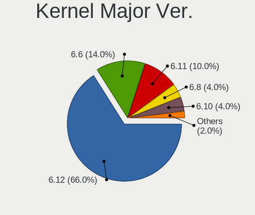
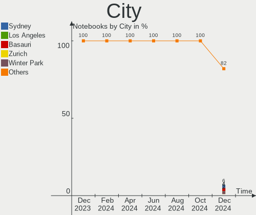
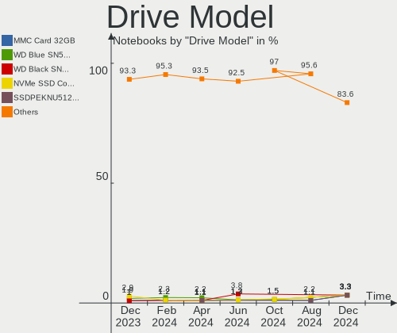
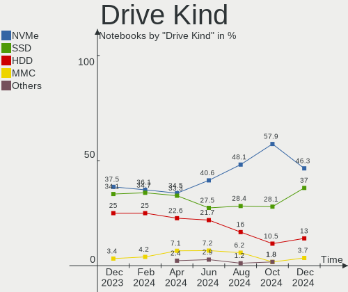
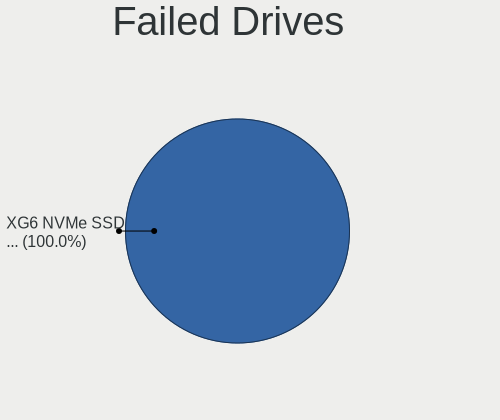
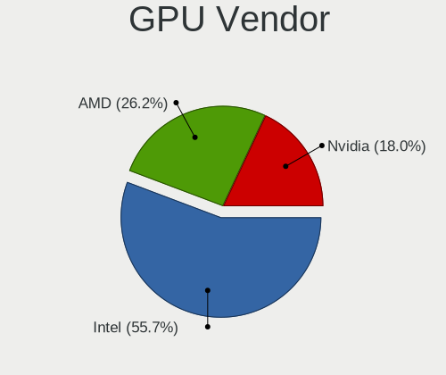
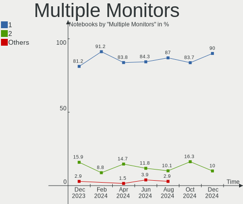

ArcoLinux - Hardware Trends (Notebooks)
---------------------------------------

A project to identify most popular hardware characteristics and track their change
over time based on data collected by Linux users at https://Linux-Hardware.org.

Anyone can contribute to this report by the [hw-probe](https://github.com/linuxhw/hw-probe) tool:

    sudo -E hw-probe -all -upload

This report is for one last month. Overall report since the beginning of time: [TestDays](https://github.com/linuxhw/TestDays)

Period: Jan, 2024.

Contents
--------

* [ System ](#system)
  - [ OS                       ](#os)
  - [ OS Family                ](#os-family)
  - [ Kernel                   ](#kernel)
  - [ Kernel Family            ](#kernel-family)
  - [ Kernel Major Ver.        ](#kernel-major-ver)
  - [ Arch                     ](#arch)
  - [ DE                       ](#de)
  - [ Display Server           ](#display-server)
  - [ Display Manager          ](#display-manager)
  - [ OS Lang                  ](#os-lang)
  - [ Boot Mode                ](#boot-mode)
  - [ Filesystem               ](#filesystem)
  - [ Part. scheme             ](#part-scheme)
  - [ Dual Boot with Linux/BSD ](#dual-boot-with-linuxbsd)
  - [ Dual Boot (Win)          ](#dual-boot-win)

* [ Board ](#board)
  - [ Vendor                   ](#vendor)
  - [ Model                    ](#model)
  - [ Model Family             ](#model-family)
  - [ MFG Year                 ](#mfg-year)
  - [ Form Factor              ](#form-factor)
  - [ Secure Boot              ](#secure-boot)
  - [ Coreboot                 ](#coreboot)
  - [ RAM Size                 ](#ram-size)
  - [ RAM Used                 ](#ram-used)
  - [ Total Drives             ](#total-drives)
  - [ Has CD-ROM               ](#has-cd-rom)
  - [ Has Ethernet             ](#has-ethernet)
  - [ Has WiFi                 ](#has-wifi)
  - [ Has Bluetooth            ](#has-bluetooth)

* [ Location ](#location)
  - [ Country                  ](#country)
  - [ City                     ](#city)

* [ Drives ](#drives)
  - [ Drive Vendor             ](#drive-vendor)
  - [ Drive Model              ](#drive-model)
  - [ HDD Vendor               ](#hdd-vendor)
  - [ SSD Vendor               ](#ssd-vendor)
  - [ Drive Kind               ](#drive-kind)
  - [ Drive Connector          ](#drive-connector)
  - [ Drive Size               ](#drive-size)
  - [ Space Total              ](#space-total)
  - [ Space Used               ](#space-used)
  - [ Malfunc. Drives          ](#malfunc-drives)
  - [ Malfunc. Drive Vendor    ](#malfunc-drive-vendor)
  - [ Malfunc. HDD Vendor      ](#malfunc-hdd-vendor)
  - [ Malfunc. Drive Kind      ](#malfunc-drive-kind)
  - [ Failed Drives            ](#failed-drives)
  - [ Failed Drive Vendor      ](#failed-drive-vendor)
  - [ Drive Status             ](#drive-status)

* [ Storage controller ](#storage-controller)
  - [ Storage Vendor           ](#storage-vendor)
  - [ Storage Model            ](#storage-model)
  - [ Storage Kind             ](#storage-kind)

* [ Processor ](#processor)
  - [ CPU Vendor               ](#cpu-vendor)
  - [ CPU Model                ](#cpu-model)
  - [ CPU Model Family         ](#cpu-model-family)
  - [ CPU Cores                ](#cpu-cores)
  - [ CPU Sockets              ](#cpu-sockets)
  - [ CPU Threads              ](#cpu-threads)
  - [ CPU Op-Modes             ](#cpu-op-modes)
  - [ CPU Microcode            ](#cpu-microcode)
  - [ CPU Microarch            ](#cpu-microarch)

* [ Graphics ](#graphics)
  - [ GPU Vendor               ](#gpu-vendor)
  - [ GPU Model                ](#gpu-model)
  - [ GPU Combo                ](#gpu-combo)
  - [ GPU Driver               ](#gpu-driver)
  - [ GPU Memory               ](#gpu-memory)

* [ Monitor ](#monitor)
  - [ Monitor Vendor           ](#monitor-vendor)
  - [ Monitor Model            ](#monitor-model)
  - [ Monitor Resolution       ](#monitor-resolution)
  - [ Monitor Diagonal         ](#monitor-diagonal)
  - [ Monitor Width            ](#monitor-width)
  - [ Aspect Ratio             ](#aspect-ratio)
  - [ Monitor Area             ](#monitor-area)
  - [ Pixel Density            ](#pixel-density)
  - [ Multiple Monitors        ](#multiple-monitors)

* [ Network ](#network)
  - [ Net Controller Vendor    ](#net-controller-vendor)
  - [ Net Controller Model     ](#net-controller-model)
  - [ Wireless Vendor          ](#wireless-vendor)
  - [ Wireless Model           ](#wireless-model)
  - [ Ethernet Vendor          ](#ethernet-vendor)
  - [ Ethernet Model           ](#ethernet-model)
  - [ Net Controller Kind      ](#net-controller-kind)
  - [ Used Controller          ](#used-controller)
  - [ NICs                     ](#nics)
  - [ IPv6                     ](#ipv6)

* [ Bluetooth ](#bluetooth)
  - [ Bluetooth Vendor         ](#bluetooth-vendor)
  - [ Bluetooth Model          ](#bluetooth-model)

* [ Sound ](#sound)
  - [ Sound Vendor             ](#sound-vendor)
  - [ Sound Model              ](#sound-model)

* [ Memory ](#memory)
  - [ Memory Vendor            ](#memory-vendor)
  - [ Memory Model             ](#memory-model)
  - [ Memory Kind              ](#memory-kind)
  - [ Memory Form Factor       ](#memory-form-factor)
  - [ Memory Size              ](#memory-size)
  - [ Memory Speed             ](#memory-speed)

* [ Printers & scanners ](#printers--scanners)
  - [ Printer Vendor           ](#printer-vendor)
  - [ Printer Model            ](#printer-model)
  - [ Scanner Vendor           ](#scanner-vendor)
  - [ Scanner Model            ](#scanner-model)

* [ Camera ](#camera)
  - [ Camera Vendor            ](#camera-vendor)
  - [ Camera Model             ](#camera-model)

* [ Security ](#security)
  - [ Fingerprint Vendor       ](#fingerprint-vendor)
  - [ Fingerprint Model        ](#fingerprint-model)
  - [ Chipcard Vendor          ](#chipcard-vendor)
  - [ Chipcard Model           ](#chipcard-model)

* [ Unsupported ](#unsupported)
  - [ Unsupported Devices      ](#unsupported-devices)
  - [ Unsupported Device Types ](#unsupported-device-types)

System
------

OS
--

Installed operating systems

| Name              | Notebooks | Percent |
|-------------------|-----------|---------|
| ArcoLinux Rolling | 74        | 98.67%  |
| ArcoLinux         | 1         | 1.33%   |

OS Family
---------

OS without a version

| Name      | Notebooks | Percent |
|-----------|-----------|---------|
| ArcoLinux | 75        | 100%    |

Kernel
------

Version of the Linux kernel

| Version                     | Notebooks | Percent |
|-----------------------------|-----------|---------|
| 6.6.1-arch1-1               | 13        | 17.33%  |
| 6.6.8-arch1-1               | 10        | 13.33%  |
| 6.7.0-arch3-1               | 8         | 10.67%  |
| 6.6.10-arch1-1              | 5         | 6.67%   |
| 6.6.8-zen1-1-zen            | 4         | 5.33%   |
| 6.6.10-zen1-1-zen           | 4         | 5.33%   |
| 6.7.2-arch1-1               | 3         | 4%      |
| 6.7.1-arch1-1               | 3         | 4%      |
| 6.6.9-arch1-1               | 3         | 4%      |
| 6.7.0-zen3-1-zen            | 2         | 2.67%   |
| 6.6.9-zen1-1-zen            | 2         | 2.67%   |
| 6.6.14-1-lts                | 2         | 2.67%   |
| 6.5.8-arch1-1               | 2         | 2.67%   |
| 6.6.7-arch1-1               | 1         | 1.33%   |
| 6.6.5-x64v2-xanmod1-1       | 1         | 1.33%   |
| 6.6.4-arch1-1               | 1         | 1.33%   |
| 6.6.3-arch1-1               | 1         | 1.33%   |
| 6.6.13-hardened1-1-hardened | 1         | 1.33%   |
| 6.6.11-hardened1-1-hardened | 1         | 1.33%   |
| 6.6.11-1-lts                | 1         | 1.33%   |
| 6.5.9-arch2-1               | 1         | 1.33%   |
| 6.4.11-arch1-1              | 1         | 1.33%   |
| 6.3.8-arch1-1               | 1         | 1.33%   |
| 6.1.58-1-lts                | 1         | 1.33%   |
| 5.18.3-arch1-1              | 1         | 1.33%   |
| 5.15.10-arch1-1             | 1         | 1.33%   |
| 5.13.8-arch1-1              | 1         | 1.33%   |

Kernel Family
-------------

Linux kernel without a distro release

| Version | Notebooks | Percent |
|---------|-----------|---------|
| 6.6.8   | 14        | 18.67%  |
| 6.6.1   | 13        | 17.33%  |
| 6.7.0   | 10        | 13.33%  |
| 6.6.10  | 9         | 12%     |
| 6.6.9   | 5         | 6.67%   |
| 6.7.2   | 3         | 4%      |
| 6.7.1   | 3         | 4%      |
| 6.6.14  | 2         | 2.67%   |
| 6.6.11  | 2         | 2.67%   |
| 6.5.8   | 2         | 2.67%   |
| 6.6.7   | 1         | 1.33%   |
| 6.6.5   | 1         | 1.33%   |
| 6.6.4   | 1         | 1.33%   |
| 6.6.3   | 1         | 1.33%   |
| 6.6.13  | 1         | 1.33%   |
| 6.5.9   | 1         | 1.33%   |
| 6.4.11  | 1         | 1.33%   |
| 6.3.8   | 1         | 1.33%   |
| 6.1.58  | 1         | 1.33%   |
| 5.18.3  | 1         | 1.33%   |
| 5.15.10 | 1         | 1.33%   |
| 5.13.8  | 1         | 1.33%   |

Kernel Major Ver.
-----------------

Linux kernel major version

| Version | Notebooks | Percent |
|---------|-----------|---------|
| 6.6     | 50        | 66.67%  |
| 6.7     | 16        | 21.33%  |
| 6.5     | 3         | 4%      |
| 6.4     | 1         | 1.33%   |
| 6.3     | 1         | 1.33%   |
| 6.1     | 1         | 1.33%   |
| 5.18    | 1         | 1.33%   |
| 5.15    | 1         | 1.33%   |
| 5.13    | 1         | 1.33%   |

Arch
----

OS architecture (x86_64, i586, etc.)

| Name   | Notebooks | Percent |
|--------|-----------|---------|
| x86_64 | 75        | 100%    |

DE
--

Desktop Environment

| Name         | Notebooks | Percent |
|--------------|-----------|---------|
| XFCE         | 34        | 45.33%  |
| KDE5         | 16        | 21.33%  |
| GNOME        | 5         | 6.67%   |
| Deepin       | 4         | 5.33%   |
| Cinnamon     | 4         | 5.33%   |
| wayfire      | 2         | 2.67%   |
| i3           | 2         | 2.67%   |
| Hyprland     | 2         | 2.67%   |
| X-Cinnamon   | 1         | 1.33%   |
| LXQt         | 1         | 1.33%   |
| herbstluftwm | 1         | 1.33%   |
| Budgie       | 1         | 1.33%   |
| awesome      | 1         | 1.33%   |
| Unknown      | 1         | 1.33%   |

Display Server
--------------

X11 or Wayland

| Name    | Notebooks | Percent |
|---------|-----------|---------|
| X11     | 65        | 86.67%  |
| Wayland | 9         | 12%     |
| Tty     | 1         | 1.33%   |

Display Manager
---------------

SDDM, LightDM, etc.

| Name    | Notebooks | Percent |
|---------|-----------|---------|
| SDDM    | 56        | 74.67%  |
| LightDM | 15        | 20%     |
| GDM     | 2         | 2.67%   |
| LXDM    | 1         | 1.33%   |
| Unknown | 1         | 1.33%   |

OS Lang
-------

Language

| Lang  | Notebooks | Percent |
|-------|-----------|---------|
| en_US | 38        | 50.67%  |
| de_DE | 5         | 6.67%   |
| C     | 5         | 6.67%   |
| es_ES | 4         | 5.33%   |
| en_GB | 4         | 5.33%   |
| en_CA | 3         | 4%      |
| ru_RU | 2         | 2.67%   |
| en_ZA | 2         | 2.67%   |
| th_TH | 1         | 1.33%   |
| pt_BR | 1         | 1.33%   |
| nl_NL | 1         | 1.33%   |
| it_IT | 1         | 1.33%   |
| id_ID | 1         | 1.33%   |
| fr_FR | 1         | 1.33%   |
| es_MX | 1         | 1.33%   |
| es_AR | 1         | 1.33%   |
| en_IN | 1         | 1.33%   |
| en_HK | 1         | 1.33%   |
| en_AU | 1         | 1.33%   |
| de_AT | 1         | 1.33%   |

Boot Mode
---------

EFI or BIOS

| Mode | Notebooks | Percent |
|------|-----------|---------|
| EFI  | 54        | 72%     |
| BIOS | 21        | 28%     |

Filesystem
----------

Type of filesystem

| Type     | Notebooks | Percent |
|----------|-----------|---------|
| Ext4     | 45        | 60%     |
| Btrfs    | 22        | 29.33%  |
| Overlay  | 7         | 9.33%   |
| Reiserfs | 1         | 1.33%   |

Part. scheme
------------

Scheme of partitioning

| Type    | Notebooks | Percent |
|---------|-----------|---------|
| GPT     | 57        | 76%     |
| MBR     | 17        | 22.67%  |
| Unknown | 1         | 1.33%   |

Dual Boot with Linux/BSD
------------------------

Hosting more than one Linux/BSD

| Dual boot | Notebooks | Percent |
|-----------|-----------|---------|
| No        | 55        | 73.33%  |
| Yes       | 20        | 26.67%  |

Dual Boot (Win)
---------------

Hosting Linux and Windows

| Dual boot | Notebooks | Percent |
|-----------|-----------|---------|
| No        | 39        | 52%     |
| Yes       | 36        | 48%     |

Board
-----

Vendor
------

Motherboard manufacturer

| Name                | Notebooks | Percent |
|---------------------|-----------|---------|
| Lenovo              | 18        | 24%     |
| Dell                | 14        | 18.67%  |
| Hewlett-Packard     | 12        | 16%     |
| ASUSTek Computer    | 11        | 14.67%  |
| Acer                | 6         | 8%      |
| Apple               | 2         | 2.67%   |
| Toshiba             | 1         | 1.33%   |
| Samsung Electronics | 1         | 1.33%   |
| PC Specialist       | 1         | 1.33%   |
| NVN-ED01            | 1         | 1.33%   |
| NEC Computers       | 1         | 1.33%   |
| MSI                 | 1         | 1.33%   |
| MouseComputer       | 1         | 1.33%   |
| ELUKTRONICS         | 1         | 1.33%   |
| Dynabook            | 1         | 1.33%   |
| Digitek             | 1         | 1.33%   |
| Alienware           | 1         | 1.33%   |
| Unknown             | 1         | 1.33%   |

Model
-----

Motherboard model

| Name                                           | Notebooks | Percent |
|------------------------------------------------|-----------|---------|
| Unknown                                        | 3         | 4%      |
| Dell Latitude 7490                             | 2         | 2.67%   |
| Toshiba Satellite L855                         | 1         | 1.33%   |
| Samsung 530U3BI/530U4BI/530U4BH                | 1         | 1.33%   |
| PC Specialist GK5NPFO                          | 1         | 1.33%   |
| NEC Computers PC-VK27MXZCG                     | 1         | 1.33%   |
| MSI Cyborg 15 A13VE                            | 1         | 1.33%   |
| MouseComputer N150RF1                          | 1         | 1.33%   |
| Lenovo ThinkPad X250 20CM004XUK                | 1         | 1.33%   |
| Lenovo ThinkPad X250 20CLS60800                | 1         | 1.33%   |
| Lenovo ThinkPad X1 Carbon 6th (PRC) 20KH002FUS | 1         | 1.33%   |
| Lenovo ThinkPad W540 20BHS0620V                | 1         | 1.33%   |
| Lenovo ThinkPad T520 4242RM9                   | 1         | 1.33%   |
| Lenovo ThinkPad T450s 20BWS0PJ00               | 1         | 1.33%   |
| Lenovo ThinkPad T430 2349IF8                   | 1         | 1.33%   |
| Lenovo ThinkPad T420 4236MBU                   | 1         | 1.33%   |
| Lenovo ThinkPad T420 4180PV4                   | 1         | 1.33%   |
| Lenovo ThinkPad T410 25184QG                   | 1         | 1.33%   |
| Lenovo ThinkPad T15p Gen 3 21DA000TRA          | 1         | 1.33%   |
| Lenovo ThinkPad T14 Gen 2i 20W1SB7J00          | 1         | 1.33%   |
| Lenovo ThinkBook 15 G3 ACL 21A4                | 1         | 1.33%   |
| Lenovo Legion Y545 81Q6                        | 1         | 1.33%   |
| Lenovo IdeaPad Gaming 3 15ACH6 82K2            | 1         | 1.33%   |
| Lenovo IdeaPad 310-15ISK 80SM                  | 1         | 1.33%   |
| Lenovo G575 4383                               | 1         | 1.33%   |
| Lenovo G400 20235                              | 1         | 1.33%   |
| HP ZBook 15 G2                                 | 1         | 1.33%   |
| HP ProBook 650 G1                              | 1         | 1.33%   |
| HP Pavilion Notebook                           | 1         | 1.33%   |
| HP Pavilion Laptop 14-dv1xxx                   | 1         | 1.33%   |
| HP Pavilion Gaming Laptop 15-ec2xxx            | 1         | 1.33%   |
| HP Pavilion Gaming Laptop 15-ec1xxx            | 1         | 1.33%   |
| HP Pavilion dv7                                | 1         | 1.33%   |
| HP OMEN by Laptop 17-an0xx                     | 1         | 1.33%   |
| HP OMEN by Laptop 15-dc1xxx                    | 1         | 1.33%   |
| HP Folio 13                                    | 1         | 1.33%   |
| HP EliteBook 8470p                             | 1         | 1.33%   |
| HP 15                                          | 1         | 1.33%   |
| ELUKTRONICS PROMETHEUS                         | 1         | 1.33%   |
| Dynabook Satellite Pro L50-G-193               | 1         | 1.33%   |

Model Family
------------

Motherboard model prefix

| Name                       | Notebooks | Percent |
|----------------------------|-----------|---------|
| Lenovo ThinkPad            | 12        | 16%     |
| Dell Latitude              | 6         | 8%      |
| Dell Inspiron              | 6         | 8%      |
| HP Pavilion                | 5         | 6.67%   |
| Acer Aspire                | 5         | 6.67%   |
| Unknown                    | 3         | 4%      |
| Lenovo IdeaPad             | 2         | 2.67%   |
| HP OMEN                    | 2         | 2.67%   |
| ASUS VivoBook              | 2         | 2.67%   |
| ASUS TUF                   | 2         | 2.67%   |
| ASUS ASUS                  | 2         | 2.67%   |
| Toshiba Satellite          | 1         | 1.33%   |
| Samsung 530U3BI            | 1         | 1.33%   |
| PC Specialist GK5NPFO      | 1         | 1.33%   |
| NEC Computers PC-VK27MXZCG | 1         | 1.33%   |
| MSI Cyborg                 | 1         | 1.33%   |
| MouseComputer N150RF1      | 1         | 1.33%   |
| Lenovo ThinkBook           | 1         | 1.33%   |
| Lenovo Legion              | 1         | 1.33%   |
| Lenovo G575                | 1         | 1.33%   |
| Lenovo G400                | 1         | 1.33%   |
| HP ZBook                   | 1         | 1.33%   |
| HP ProBook                 | 1         | 1.33%   |
| HP Folio                   | 1         | 1.33%   |
| HP EliteBook               | 1         | 1.33%   |
| HP 15                      | 1         | 1.33%   |
| ELUKTRONICS PROMETHEUS     | 1         | 1.33%   |
| Dynabook Satellite         | 1         | 1.33%   |
| Digitek Z156               | 1         | 1.33%   |
| Dell System                | 1         | 1.33%   |
| Dell Precision             | 1         | 1.33%   |
| ASUS ZenBook               | 1         | 1.33%   |
| ASUS ROG                   | 1         | 1.33%   |
| ASUS N550JK                | 1         | 1.33%   |
| ASUS G750JW                | 1         | 1.33%   |
| Apple MacBookPro9          | 1         | 1.33%   |
| Apple MacBookPro11         | 1         | 1.33%   |
| Alienware x14              | 1         | 1.33%   |
| Acer Predator              | 1         | 1.33%   |

MFG Year
--------

Motherboard manufacture year

| Year | Notebooks | Percent |
|------|-----------|---------|
| 2011 | 9         | 12%     |
| 2022 | 7         | 9.33%   |
| 2021 | 7         | 9.33%   |
| 2019 | 7         | 9.33%   |
| 2013 | 7         | 9.33%   |
| 2012 | 7         | 9.33%   |
| 2023 | 5         | 6.67%   |
| 2020 | 5         | 6.67%   |
| 2018 | 5         | 6.67%   |
| 2015 | 5         | 6.67%   |
| 2014 | 4         | 5.33%   |
| 2016 | 3         | 4%      |
| 2017 | 2         | 2.67%   |
| 2009 | 1         | 1.33%   |
| 2008 | 1         | 1.33%   |

Form Factor
-----------

Physical design of the computer

| Name     | Notebooks | Percent |
|----------|-----------|---------|
| Notebook | 75        | 100%    |

Secure Boot
-----------

Enabled or disabled

| State    | Notebooks | Percent |
|----------|-----------|---------|
| Disabled | 75        | 100%    |

Coreboot
--------

Have coreboot on board

| Used | Notebooks | Percent |
|------|-----------|---------|
| No   | 75        | 100%    |

RAM Size
--------

Total RAM memory

| Size in GB  | Notebooks | Percent |
|-------------|-----------|---------|
| 4.01-8.0    | 26        | 34.67%  |
| 16.01-24.0  | 20        | 26.67%  |
| 8.01-16.0   | 10        | 13.33%  |
| 3.01-4.0    | 8         | 10.67%  |
| 32.01-64.0  | 7         | 9.33%   |
| 64.01-256.0 | 3         | 4%      |
| 2.01-3.0    | 1         | 1.33%   |

RAM Used
--------

Used RAM memory

| Used GB   | Notebooks | Percent |
|-----------|-----------|---------|
| 1.01-2.0  | 34        | 45.33%  |
| 3.01-4.0  | 12        | 16%     |
| 2.01-3.0  | 12        | 16%     |
| 4.01-8.0  | 11        | 14.67%  |
| 8.01-16.0 | 3         | 4%      |
| 0.51-1.0  | 3         | 4%      |

Total Drives
------------

Number of drives on board

| Drives | Notebooks | Percent |
|--------|-----------|---------|
| 1      | 45        | 60%     |
| 2      | 24        | 32%     |
| 3      | 4         | 5.33%   |
| 4      | 1         | 1.33%   |
| 0      | 1         | 1.33%   |

Has CD-ROM
----------

Has CD-ROM on board

| Presented | Notebooks | Percent |
|-----------|-----------|---------|
| No        | 54        | 72%     |
| Yes       | 21        | 28%     |

Has Ethernet
------------

Has Ethernet on board

| Presented | Notebooks | Percent |
|-----------|-----------|---------|
| Yes       | 66        | 88%     |
| No        | 9         | 12%     |

Has WiFi
--------

Has WiFi module

| Presented | Notebooks | Percent |
|-----------|-----------|---------|
| Yes       | 75        | 100%    |

Has Bluetooth
-------------

Has Bluetooth module

| Presented | Notebooks | Percent |
|-----------|-----------|---------|
| Yes       | 66        | 88%     |
| No        | 9         | 12%     |

Location
--------

Country
-------

Geographic location (country)

| Country      | Notebooks | Percent |
|--------------|-----------|---------|
| USA          | 17        | 22.67%  |
| Germany      | 6         | 8%      |
| Spain        | 5         | 6.67%   |
| UK           | 4         | 5.33%   |
| Canada       | 4         | 5.33%   |
| Russia       | 3         | 4%      |
| Belgium      | 3         | 4%      |
| South Africa | 2         | 2.67%   |
| Romania      | 2         | 2.67%   |
| Mexico       | 2         | 2.67%   |
| Indonesia    | 2         | 2.67%   |
| India        | 2         | 2.67%   |
| Egypt        | 2         | 2.67%   |
| Thailand     | 1         | 1.33%   |
| South Korea  | 1         | 1.33%   |
| Qatar        | 1         | 1.33%   |
| Portugal     | 1         | 1.33%   |
| Poland       | 1         | 1.33%   |
| Netherlands  | 1         | 1.33%   |
| Moldova      | 1         | 1.33%   |
| Malaysia     | 1         | 1.33%   |
| Lithuania    | 1         | 1.33%   |
| Lebanon      | 1         | 1.33%   |
| Italy        | 1         | 1.33%   |
| Iraq         | 1         | 1.33%   |
| Hong Kong    | 1         | 1.33%   |
| Georgia      | 1         | 1.33%   |
| France       | 1         | 1.33%   |
| Finland      | 1         | 1.33%   |
| Brazil       | 1         | 1.33%   |
| Benin        | 1         | 1.33%   |
| Austria      | 1         | 1.33%   |
| Australia    | 1         | 1.33%   |
| Argentina    | 1         | 1.33%   |

City
----

Geographic location (city)

| City           | Notebooks | Percent |
|----------------|-----------|---------|
| Munich         | 3         | 4%      |
| Kalamazoo      | 3         | 4%      |
| Barcelona      | 2         | 2.67%   |
| Yulee          | 1         | 1.33%   |
| Worthing       | 1         | 1.33%   |
| Winnipeg       | 1         | 1.33%   |
| Walker         | 1         | 1.33%   |
| Volgograd      | 1         | 1.33%   |
| Vilnius        | 1         | 1.33%   |
| Tsuen Wan      | 1         | 1.33%   |
| Toronto        | 1         | 1.33%   |
| Tilton         | 1         | 1.33%   |
| Terni          | 1         | 1.33%   |
| Tbilisi        | 1         | 1.33%   |
| Tampa          | 1         | 1.33%   |
| Sungai Petani  | 1         | 1.33%   |
| Smithtown      | 1         | 1.33%   |
| San Francisco  | 1         | 1.33%   |
| Salzburg       | 1         | 1.33%   |
| Saint-Anselme  | 1         | 1.33%   |
| Roseburg       | 1         | 1.33%   |
| Rio de Janeiro | 1         | 1.33%   |
| Qina           | 1         | 1.33%   |
| Porvoo         | 1         | 1.33%   |
| Porto          | 1         | 1.33%   |
| Pondok Pinang  | 1         | 1.33%   |
| Pittsburgh     | 1         | 1.33%   |
| Perm           | 1         | 1.33%   |
| Oudtshoorn     | 1         | 1.33%   |
| Norman         | 1         | 1.33%   |
| Nerja          | 1         | 1.33%   |
| Myans          | 1         | 1.33%   |
| Montreal       | 1         | 1.33%   |
| Modimolle      | 1         | 1.33%   |
| Mainz          | 1         | 1.33%   |
| Liverpool      | 1         | 1.33%   |
| Kurgan         | 1         | 1.33%   |
| Heerlen        | 1         | 1.33%   |
| Gwangju        | 1         | 1.33%   |
| Guadalajara    | 1         | 1.33%   |

Drives
------

Drive Vendor
------------

Hard drive vendors

| Vendor                      | Notebooks | Drives | Percent |
|-----------------------------|-----------|--------|---------|
| Samsung Electronics         | 19        | 19     | 17.76%  |
| Seagate                     | 14        | 14     | 13.08%  |
| Sandisk                     | 11        | 11     | 10.28%  |
| WDC                         | 10        | 10     | 9.35%   |
| Kingston                    | 9         | 9      | 8.41%   |
| Toshiba                     | 8         | 8      | 7.48%   |
| Intel                       | 8         | 10     | 7.48%   |
| Micron Technology           | 4         | 4      | 3.74%   |
| SK hynix                    | 2         | 2      | 1.87%   |
| Phison Electronics          | 2         | 2      | 1.87%   |
| MAXIO Technology (Hangzhou) | 2         | 2      | 1.87%   |
| Hitachi                     | 2         | 2      | 1.87%   |
| HGST                        | 2         | 2      | 1.87%   |
| China                       | 2         | 2      | 1.87%   |
| SPCC                        | 1         | 1      | 0.93%   |
| ShiJi                       | 1         | 1      | 0.93%   |
| Rogueware                   | 1         | 1      | 0.93%   |
| Phison                      | 1         | 1      | 0.93%   |
| Micron/Crucial Technology   | 1         | 1      | 0.93%   |
| KIOXIA                      | 1         | 1      | 0.93%   |
| Kingmax                     | 1         | 1      | 0.93%   |
| JMicron Technology          | 1         | 1      | 0.93%   |
| GOODRAM                     | 1         | 1      | 0.93%   |
| EYOTA                       | 1         | 1      | 0.93%   |
| Colorful                    | 1         | 1      | 0.93%   |
| Apple                       | 1         | 1      | 0.93%   |

Drive Model
-----------

Hard drive models

| Model                                             | Notebooks | Percent |
|---------------------------------------------------|-----------|---------|
| Seagate ST1000LM035-1RK172 1TB                    | 4         | 3.67%   |
| Toshiba XG6 NVMe SSD Controller 256GB             | 2         | 1.83%   |
| Seagate ST2000LM003 HN-M201RAD 2TB                | 2         | 1.83%   |
| Seagate ST1000LM049-2GH172 1TB                    | 2         | 1.83%   |
| Seagate ST1000LM024 HN-M101MBB 1TB                | 2         | 1.83%   |
| Sandisk WD Blue SN550 NVMe SSD 512GB              | 2         | 1.83%   |
| SanDisk SSD PLUS 120GB                            | 2         | 1.83%   |
| Samsung SSD 860 EVO 1TB                           | 2         | 1.83%   |
| Samsung NVMe SSD Controller SM981/PM981/PM983 1TB | 2         | 1.83%   |
| Samsung MZALQ512HBLU-00BL2 512GB                  | 2         | 1.83%   |
| Kingston SNVS1000G 1TB                            | 2         | 1.83%   |
| Intel SSD 660P Series 1024GB                      | 2         | 1.83%   |
| WDC WDS500G2B0A-00SM50 500GB SSD                  | 1         | 0.92%   |
| WDC WDS120G2G0A-00JH30 120GB SSD                  | 1         | 0.92%   |
| WDC WD5000LPCX-60VHAT0 500GB                      | 1         | 0.92%   |
| WDC WD3200BPVT-22JJ5T0 320GB                      | 1         | 0.92%   |
| WDC WD3200BEVT-08A23T1 320GB                      | 1         | 0.92%   |
| WDC WD10SPZX-60Z10T0 1TB                          | 1         | 0.92%   |
| WDC WD10SPZX-22Z10T1 1TB                          | 1         | 0.92%   |
| WDC WD10SPCX-60KHST0 1TB                          | 1         | 0.92%   |
| WDC WD10SPCX-22HWST0 1TB                          | 1         | 0.92%   |
| WDC WD10JPVX-75JC3T0 1TB                          | 1         | 0.92%   |
| Toshiba XG4 NVMe SSD Controller 512GB             | 1         | 0.92%   |
| Toshiba THNSNK256GVN8 M.2 2280 256GB SSD          | 1         | 0.92%   |
| Toshiba MQ01ABF050 500GB                          | 1         | 0.92%   |
| Toshiba MQ01ABD100 1TB                            | 1         | 0.92%   |
| Toshiba MK6475GSX 640GB                           | 1         | 0.92%   |
| Toshiba MK5059GSXP 500GB                          | 1         | 0.92%   |
| SPCC M.2 SSD 1TB                                  | 1         | 0.92%   |
| SK hynix SKHynix_HFS001TDE9X081N 1TB              | 1         | 0.92%   |
| SK hynix BC501 NVMe Solid State Drive 512GB       | 1         | 0.92%   |
| ShiJi SSD 1TB                                     | 1         | 0.92%   |
| Seagate ST9500420AS 500GB                         | 1         | 0.92%   |
| Seagate ST500LT012-1DG142 500GB                   | 1         | 0.92%   |
| Seagate Expansion Desk 8TB                        | 1         | 0.92%   |
| Seagate BUP Slim Mac SL 2TB                       | 1         | 0.92%   |
| Sandisk WD Blue SN500 / PC SN520 NVMe SSD 512GB   | 1         | 0.92%   |
| Sandisk WD Black SN850 1024GB                     | 1         | 0.92%   |
| Sandisk WD Black SN750 / PC SN730 NVMe SSD 512GB  | 1         | 0.92%   |
| SanDisk SSD PLUS 1000GB                           | 1         | 0.92%   |

HDD Vendor
----------

Hard disk drive vendors

| Vendor  | Notebooks | Drives | Percent |
|---------|-----------|--------|---------|
| Seagate | 14        | 14     | 46.67%  |
| WDC     | 8         | 8      | 26.67%  |
| Toshiba | 4         | 4      | 13.33%  |
| Hitachi | 2         | 2      | 6.67%   |
| HGST    | 2         | 2      | 6.67%   |

SSD Vendor
----------

Solid state drive vendors

| Vendor              | Notebooks | Drives | Percent |
|---------------------|-----------|--------|---------|
| Samsung Electronics | 11        | 11     | 30.56%  |
| SanDisk             | 4         | 4      | 11.11%  |
| Kingston            | 4         | 4      | 11.11%  |
| Intel               | 3         | 3      | 8.33%   |
| WDC                 | 2         | 2      | 5.56%   |
| China               | 2         | 2      | 5.56%   |
| Toshiba             | 1         | 1      | 2.78%   |
| SPCC                | 1         | 1      | 2.78%   |
| ShiJi               | 1         | 1      | 2.78%   |
| Rogueware           | 1         | 1      | 2.78%   |
| Phison              | 1         | 1      | 2.78%   |
| Kingmax             | 1         | 1      | 2.78%   |
| GOODRAM             | 1         | 1      | 2.78%   |
| EYOTA               | 1         | 1      | 2.78%   |
| Colorful            | 1         | 1      | 2.78%   |
| Apple               | 1         | 1      | 2.78%   |

Drive Kind
----------

HDD or SSD

| Kind    | Notebooks | Drives | Percent |
|---------|-----------|--------|---------|
| NVMe    | 33        | 42     | 35.87%  |
| HDD     | 30        | 30     | 32.61%  |
| SSD     | 28        | 36     | 30.43%  |
| Unknown | 1         | 1      | 1.09%   |

Drive Connector
---------------

SATA, SAS, NVMe, etc.

| Type | Notebooks | Drives | Percent |
|------|-----------|--------|---------|
| SATA | 51        | 64     | 58.62%  |
| NVMe | 33        | 42     | 37.93%  |
| SAS  | 3         | 3      | 3.45%   |

Drive Size
----------

Size of hard drive

| Size in TB | Notebooks | Drives | Percent |
|------------|-----------|--------|---------|
| 0.01-0.5   | 30        | 36     | 51.72%  |
| 0.51-1.0   | 24        | 26     | 41.38%  |
| 1.01-2.0   | 3         | 3      | 5.17%   |
| 4.01-10.0  | 1         | 1      | 1.72%   |

Space Total
-----------

Amount of disk space available on the file system

| Size in GB     | Notebooks | Percent |
|----------------|-----------|---------|
| 101-250        | 16        | 21.33%  |
| 251-500        | 14        | 18.67%  |
| More than 3000 | 13        | 17.33%  |
| 501-1000       | 9         | 12%     |
| 1001-2000      | 7         | 9.33%   |
| 1-20           | 7         | 9.33%   |
| 51-100         | 5         | 6.67%   |
| Unknown        | 2         | 2.67%   |
| 21-50          | 1         | 1.33%   |
| 2001-3000      | 1         | 1.33%   |

Space Used
----------

Amount of used disk space

| Used GB        | Notebooks | Percent |
|----------------|-----------|---------|
| 1-20           | 27        | 36%     |
| 101-250        | 16        | 21.33%  |
| 21-50          | 10        | 13.33%  |
| 51-100         | 10        | 13.33%  |
| 501-1000       | 4         | 5.33%   |
| More than 3000 | 3         | 4%      |
| 251-500        | 2         | 2.67%   |
| Unknown        | 2         | 2.67%   |
| 1001-2000      | 1         | 1.33%   |

Malfunc. Drives
---------------

Drive models with a malfunction

| Model                                    | Notebooks | Drives | Percent |
|------------------------------------------|-----------|--------|---------|
| SanDisk SSD PLUS 120GB                   | 2         | 2      | 10.53%  |
| WDC WDS500G2B0A-00SM50 500GB SSD         | 1         | 1      | 5.26%   |
| WDC WD5000LPCX-60VHAT0 500GB             | 1         | 1      | 5.26%   |
| WDC WD3200BPVT-22JJ5T0 320GB             | 1         | 1      | 5.26%   |
| WDC WD3200BEVT-08A23T1 320GB             | 1         | 1      | 5.26%   |
| WDC WD10SPCX-22HWST0 1TB                 | 1         | 1      | 5.26%   |
| Toshiba THNSNK256GVN8 M.2 2280 256GB SSD | 1         | 1      | 5.26%   |
| Toshiba MQ01ABD100 1TB                   | 1         | 1      | 5.26%   |
| Toshiba MK6475GSX 640GB                  | 1         | 1      | 5.26%   |
| Seagate ST2000LM003 HN-M201RAD 2TB       | 1         | 1      | 5.26%   |
| Seagate ST1000LM049-2GH172 1TB           | 1         | 1      | 5.26%   |
| SanDisk SSD PLUS 1000GB                  | 1         | 1      | 5.26%   |
| Samsung Electronics SSD 870 EVO 1TB      | 1         | 1      | 5.26%   |
| Intel SSDSC2BF360A5L 360GB               | 1         | 1      | 5.26%   |
| Intel SSDSC2BF180A4L 180GB               | 1         | 1      | 5.26%   |
| HGST HTS725032A7E630 320GB               | 1         | 1      | 5.26%   |
| HGST HTS541010A9E680 1TB                 | 1         | 1      | 5.26%   |
| Colorful SL500 240GB SSD                 | 1         | 1      | 5.26%   |

Malfunc. Drive Vendor
---------------------

Vendors of faulty drives

| Vendor              | Notebooks | Drives | Percent |
|---------------------|-----------|--------|---------|
| WDC                 | 5         | 5      | 26.32%  |
| Toshiba             | 3         | 3      | 15.79%  |
| SanDisk             | 3         | 3      | 15.79%  |
| Seagate             | 2         | 2      | 10.53%  |
| Intel               | 2         | 2      | 10.53%  |
| HGST                | 2         | 2      | 10.53%  |
| Samsung Electronics | 1         | 1      | 5.26%   |
| Colorful            | 1         | 1      | 5.26%   |

Malfunc. HDD Vendor
-------------------

Vendors of faulty HDD drives

| Vendor  | Notebooks | Drives | Percent |
|---------|-----------|--------|---------|
| WDC     | 4         | 4      | 40%     |
| Toshiba | 2         | 2      | 20%     |
| Seagate | 2         | 2      | 20%     |
| HGST    | 2         | 2      | 20%     |

Malfunc. Drive Kind
-------------------

Kinds of faulty drives

| Kind | Notebooks | Drives | Percent |
|------|-----------|--------|---------|
| HDD  | 10        | 10     | 52.63%  |
| SSD  | 9         | 9      | 47.37%  |

Failed Drives
-------------

Failed drive models

| Model                                 | Notebooks | Drives | Percent |
|---------------------------------------|-----------|--------|---------|
| Toshiba XG6 NVMe SSD Controller 256GB | 1         | 1      | 100%    |

Failed Drive Vendor
-------------------

Failed drive vendors

| Vendor  | Notebooks | Drives | Percent |
|---------|-----------|--------|---------|
| Toshiba | 1         | 1      | 100%    |

Drive Status
------------

Number of failed and malfunc. drives

| Status   | Notebooks | Drives | Percent |
|----------|-----------|--------|---------|
| Works    | 60        | 84     | 71.43%  |
| Malfunc  | 18        | 19     | 21.43%  |
| Detected | 5         | 5      | 5.95%   |
| Failed   | 1         | 1      | 1.19%   |

Storage controller
------------------

Storage Vendor
--------------

Storage controller vendors

| Vendor                       | Notebooks | Percent |
|------------------------------|-----------|---------|
| Intel                        | 55        | 54.46%  |
| AMD                          | 10        | 9.9%    |
| Samsung Electronics          | 9         | 8.91%   |
| SanDisk                      | 7         | 6.93%   |
| Kingston Technology Company  | 5         | 4.95%   |
| Micron Technology            | 4         | 3.96%   |
| Toshiba America Info Systems | 3         | 2.97%   |
| SK hynix                     | 2         | 1.98%   |
| Phison Electronics           | 2         | 1.98%   |
| MAXIO Technology (Hangzhou)  | 2         | 1.98%   |
| Micron/Crucial Technology    | 1         | 0.99%   |
| KIOXIA                       | 1         | 0.99%   |

Storage Model
-------------

Storage controller models

| Model                                                                          | Notebooks | Percent |
|--------------------------------------------------------------------------------|-----------|---------|
| Intel 82801 Mobile SATA Controller [RAID mode]                                 | 7         | 6.67%   |
| Intel 7 Series Chipset Family 6-port SATA Controller [AHCI mode]               | 7         | 6.67%   |
| Intel 6 Series/C200 Series Chipset Family 6 port Mobile SATA AHCI Controller   | 7         | 6.67%   |
| AMD FCH SATA Controller [AHCI mode]                                            | 7         | 6.67%   |
| Intel 8 Series/C220 Series Chipset Family 6-port SATA Controller 1 [AHCI mode] | 6         | 5.71%   |
| Intel Sunrise Point-LP SATA Controller [AHCI mode]                             | 5         | 4.76%   |
| Samsung NVMe SSD Controller 980 (DRAM-less)                                    | 3         | 2.86%   |
| Kingston Company NV1 NVMe SSD SM2263XT (DRAM-less)                             | 3         | 2.86%   |
| Intel Wildcat Point-LP SATA Controller [AHCI Mode]                             | 3         | 2.86%   |
| Intel Volume Management Device NVMe RAID Controller                            | 3         | 2.86%   |
| Intel Cannon Lake Mobile PCH SATA AHCI Controller                              | 3         | 2.86%   |
| Toshiba America Info Systems XG6 NVMe SSD Controller                           | 2         | 1.9%    |
| SanDisk Ultra 3D / WD Blue SN550 NVMe SSD                                      | 2         | 1.9%    |
| Samsung NVMe SSD Controller SM981/PM981/PM983                                  | 2         | 1.9%    |
| Intel Tiger Lake-LP SATA Controller                                            | 2         | 1.9%    |
| Intel SSD 660P Series                                                          | 2         | 1.9%    |
| Intel Optane NVME SSD H10 with Solid State Storage [Teton Glacier]             | 2         | 1.9%    |
| Intel HM170/QM170 Chipset SATA Controller [AHCI Mode]                          | 2         | 1.9%    |
| Intel 5 Series/3400 Series Chipset 6 port SATA AHCI Controller                 | 2         | 1.9%    |
| AMD SB7x0/SB8x0/SB9x0 SATA Controller [AHCI mode]                              | 2         | 1.9%    |
| Toshiba America Info Systems XG4 NVMe SSD Controller                           | 1         | 0.95%   |
| SK hynix Gold P31/BC711/PC711 NVMe Solid State Drive                           | 1         | 0.95%   |
| SK hynix BC501 NVMe Solid State Drive                                          | 1         | 0.95%   |
| SanDisk WD PC SN810 / Black SN850 NVMe SSD                                     | 1         | 0.95%   |
| SanDisk WD Blue SN500 / PC SN520 x2 M.2 2280 NVMe SSD                          | 1         | 0.95%   |
| SanDisk PC SN520 x2 M.2 2230 NVMe SSD                                          | 1         | 0.95%   |
| SanDisk IX SN530 NVMe SSD (DRAM-less)                                          | 1         | 0.95%   |
| SanDisk Extreme Pro / WD Black SN750 / PC SN730 / Red SN700 NVMe SSD           | 1         | 0.95%   |
| Samsung S4LN053X01 AHCI SSD Controller(Apple slot)                             | 1         | 0.95%   |
| Samsung NVMe SSD Controller SM961/PM961/SM963                                  | 1         | 0.95%   |
| Samsung NVMe SSD Controller S4LV008[Pascal]                                    | 1         | 0.95%   |
| Samsung NVMe SSD Controller PM9A1/PM9A3/980PRO                                 | 1         | 0.95%   |
| Phison PS5013-E13 PCIe3 NVMe Controller (DRAM-less)                            | 1         | 0.95%   |
| Phison E12 NVMe Controller                                                     | 1         | 0.95%   |
| Micron/Crucial P2 [Nick P2] / P3 / P3 Plus NVMe PCIe SSD (DRAM-less)           | 1         | 0.95%   |
| Micron 3400 NVMe SSD [Hendrix]                                                 | 1         | 0.95%   |
| Micron 2450 NVMe SSD [HendrixV] (DRAM-less)                                    | 1         | 0.95%   |
| Micron 2400 NVMe SSD (DRAM-less)                                               | 1         | 0.95%   |
| Micron 2300 NVMe SSD [Santana]                                                 | 1         | 0.95%   |
| MAXIO (Hangzhou) NVMe SSD Controller MAP1602 (DRAM-less)                       | 1         | 0.95%   |

Storage Kind
------------

Kind of storage controller (IDE, SATA, NVMe, SAS, ...)

| Kind | Notebooks | Percent |
|------|-----------|---------|
| SATA | 54        | 55.1%   |
| NVMe | 33        | 33.67%  |
| RAID | 11        | 11.22%  |

Processor
---------

CPU Vendor
----------

Processor vendors

| Vendor | Notebooks | Percent |
|--------|-----------|---------|
| Intel  | 61        | 81.33%  |
| AMD    | 14        | 18.67%  |

CPU Model
---------

Processor models

| Model                                   | Notebooks | Percent |
|-----------------------------------------|-----------|---------|
| Intel Core i5-2520M CPU @ 2.50GHz       | 3         | 4%      |
| Intel Core i7-9750H CPU @ 2.60GHz       | 2         | 2.67%   |
| Intel Core i7-8750H CPU @ 2.20GHz       | 2         | 2.67%   |
| Intel Core i7-8650U CPU @ 1.90GHz       | 2         | 2.67%   |
| Intel Core i7-6700HQ CPU @ 2.60GHz      | 2         | 2.67%   |
| Intel Core i7-4702MQ CPU @ 2.20GHz      | 2         | 2.67%   |
| Intel Core i5-5300U CPU @ 2.30GHz       | 2         | 2.67%   |
| Intel 12th Gen Core i7-12700H           | 2         | 2.67%   |
| Intel 11th Gen Core i7-1185G7 @ 3.00GHz | 2         | 2.67%   |
| Intel 11th Gen Core i5-1135G7 @ 2.40GHz | 2         | 2.67%   |
| AMD Ryzen 5 4600H with Radeon Graphics  | 2         | 2.67%   |
| Intel Pentium CPU N3520 @ 2.16GHz       | 1         | 1.33%   |
| Intel Pentium CPU 2020M @ 2.40GHz       | 1         | 1.33%   |
| Intel Core i7-7820HQ CPU @ 2.90GHz      | 1         | 1.33%   |
| Intel Core i7-7700HQ CPU @ 2.80GHz      | 1         | 1.33%   |
| Intel Core i7-7500U CPU @ 2.70GHz       | 1         | 1.33%   |
| Intel Core i7-6500U CPU @ 2.50GHz       | 1         | 1.33%   |
| Intel Core i7-5600U CPU @ 2.60GHz       | 1         | 1.33%   |
| Intel Core i7-4800MQ CPU @ 2.70GHz      | 1         | 1.33%   |
| Intel Core i7-4710HQ CPU @ 2.50GHz      | 1         | 1.33%   |
| Intel Core i7-4700HQ CPU @ 2.40GHz      | 1         | 1.33%   |
| Intel Core i7-4500U CPU @ 1.80GHz       | 1         | 1.33%   |
| Intel Core i7-3740QM CPU @ 2.70GHz      | 1         | 1.33%   |
| Intel Core i7-2630QM CPU @ 2.00GHz      | 1         | 1.33%   |
| Intel Core i7-1065G7 CPU @ 1.30GHz      | 1         | 1.33%   |
| Intel Core i7-10510U CPU @ 1.80GHz      | 1         | 1.33%   |
| Intel Core i5-8365U CPU @ 1.60GHz       | 1         | 1.33%   |
| Intel Core i5-8350U CPU @ 1.70GHz       | 1         | 1.33%   |
| Intel Core i5-8265U CPU @ 1.60GHz       | 1         | 1.33%   |
| Intel Core i5-6300U CPU @ 2.40GHz       | 1         | 1.33%   |
| Intel Core i5-4258U CPU @ 2.40GHz       | 1         | 1.33%   |
| Intel Core i5-4200M CPU @ 2.50GHz       | 1         | 1.33%   |
| Intel Core i5-3360M CPU @ 2.80GHz       | 1         | 1.33%   |
| Intel Core i5-3340M CPU @ 2.70GHz       | 1         | 1.33%   |
| Intel Core i5-3320M CPU @ 2.60GHz       | 1         | 1.33%   |
| Intel Core i5-3230M CPU @ 2.60GHz       | 1         | 1.33%   |
| Intel Core i5-3210M CPU @ 2.50GHz       | 1         | 1.33%   |
| Intel Core i5-2540M CPU @ 2.60GHz       | 1         | 1.33%   |
| Intel Core i5-2467M CPU @ 1.60GHz       | 1         | 1.33%   |
| Intel Core i5-1035G1 CPU @ 1.00GHz      | 1         | 1.33%   |

CPU Model Family
----------------

Processor model prefix

| Model                   | Notebooks | Percent |
|-------------------------|-----------|---------|
| Intel Core i7           | 23        | 30.67%  |
| Intel Core i5           | 20        | 26.67%  |
| Other                   | 10        | 13.33%  |
| AMD Ryzen 5             | 5         | 6.67%   |
| AMD Ryzen 7             | 4         | 5.33%   |
| Intel Core i3           | 3         | 4%      |
| Intel Celeron           | 3         | 4%      |
| Intel Pentium           | 2         | 2.67%   |
| AMD Ryzen 9             | 2         | 2.67%   |
| AMD Turion II Dual-Core | 1         | 1.33%   |
| AMD E                   | 1         | 1.33%   |
| AMD A8                  | 1         | 1.33%   |

CPU Cores
---------

Number of processor cores

| Number | Notebooks | Percent |
|--------|-----------|---------|
| 4      | 29        | 38.67%  |
| 2      | 28        | 37.33%  |
| 6      | 8         | 10.67%  |
| 8      | 5         | 6.67%   |
| 14     | 2         | 2.67%   |
| 24     | 1         | 1.33%   |
| 16     | 1         | 1.33%   |
| 10     | 1         | 1.33%   |

CPU Sockets
-----------

Number of sockets

| Number | Notebooks | Percent |
|--------|-----------|---------|
| 1      | 75        | 100%    |

CPU Threads
-----------

Threads per core (Hyper-Threading)

| Number | Notebooks | Percent |
|--------|-----------|---------|
| 2      | 67        | 89.33%  |
| 1      | 8         | 10.67%  |

CPU Op-Modes
------------

CPU Operation Modes (32-bit, 64-bit)

| Op mode        | Notebooks | Percent |
|----------------|-----------|---------|
| 32-bit, 64-bit | 75        | 100%    |

CPU Microcode
-------------

Microcode number

| Number     | Notebooks | Percent |
|------------|-----------|---------|
| Unknown    | 62        | 82.67%  |
| 0x206a7    | 2         | 2.67%   |
| 0x08600106 | 2         | 2.67%   |
| 0x0a601203 | 1         | 1.33%   |
| 0x0a50000d | 1         | 1.33%   |
| 0x0a50000c | 1         | 1.33%   |
| 0x0a404102 | 1         | 1.33%   |
| 0x08608103 | 1         | 1.33%   |
| 0x08600103 | 1         | 1.33%   |
| 0x08108109 | 1         | 1.33%   |
| 0x07030106 | 1         | 1.33%   |
| 0x05000029 | 1         | 1.33%   |

CPU Microarch
-------------

Microarchitecture

| Name             | Notebooks | Percent |
|------------------|-----------|---------|
| KabyLake         | 13        | 17.33%  |
| IvyBridge        | 8         | 10.67%  |
| Haswell          | 8         | 10.67%  |
| SandyBridge      | 7         | 9.33%   |
| TigerLake        | 6         | 8%      |
| Skylake          | 5         | 6.67%   |
| Unknown          | 5         | 6.67%   |
| Alderlake Hybrid | 4         | 5.33%   |
| Zen 2            | 3         | 4%      |
| Broadwell        | 3         | 4%      |
| Zen 3            | 2         | 2.67%   |
| Westmere         | 2         | 2.67%   |
| IceLake          | 2         | 2.67%   |
| Zen+             | 1         | 1.33%   |
| Tremont          | 1         | 1.33%   |
| Silvermont       | 1         | 1.33%   |
| Puma             | 1         | 1.33%   |
| K10              | 1         | 1.33%   |
| Goldmont plus    | 1         | 1.33%   |
| Bobcat           | 1         | 1.33%   |

Graphics
--------

GPU Vendor
----------

Vendors of graphics cards

| Vendor | Notebooks | Percent |
|--------|-----------|---------|
| Intel  | 55        | 52.88%  |
| Nvidia | 32        | 30.77%  |
| AMD    | 17        | 16.35%  |

GPU Model
---------

Graphics card models

| Model                                                                     | Notebooks | Percent |
|---------------------------------------------------------------------------|-----------|---------|
| Intel 3rd Gen Core processor Graphics Controller                          | 7         | 6.67%   |
| Intel 2nd Generation Core Processor Family Integrated Graphics Controller | 7         | 6.67%   |
| Intel TigerLake-LP GT2 [Iris Xe Graphics]                                 | 6         | 5.71%   |
| Intel 4th Gen Core Processor Integrated Graphics Controller               | 5         | 4.76%   |
| Nvidia GA107M [GeForce RTX 3050 Mobile]                                   | 3         | 2.86%   |
| Intel UHD Graphics 620                                                    | 3         | 2.86%   |
| Intel Skylake GT2 [HD Graphics 520]                                       | 3         | 2.86%   |
| Intel HD Graphics 5500                                                    | 3         | 2.86%   |
| AMD Renoir [Radeon RX Vega 6 (Ryzen 4000/5000 Mobile Series)]             | 3         | 2.86%   |
| Nvidia TU117M [GeForce GTX 1650 Mobile / Max-Q]                           | 2         | 1.9%    |
| Nvidia TU116M [GeForce GTX 1660 Ti Mobile]                                | 2         | 1.9%    |
| Nvidia GP107M [GeForce GTX 1050 Mobile]                                   | 2         | 1.9%    |
| Nvidia GK107M [GeForce GT 750M]                                           | 2         | 1.9%    |
| Intel WhiskeyLake-U GT2 [UHD Graphics 620]                                | 2         | 1.9%    |
| Intel HD Graphics 530                                                     | 2         | 1.9%    |
| Intel Haswell-ULT Integrated Graphics Controller                          | 2         | 1.9%    |
| Intel Core Processor Integrated Graphics Controller                       | 2         | 1.9%    |
| Intel CoffeeLake-H GT2 [UHD Graphics 630]                                 | 2         | 1.9%    |
| AMD Rembrandt [Radeon 680M]                                               | 2         | 1.9%    |
| AMD Lucienne                                                              | 2         | 1.9%    |
| AMD Cezanne [Radeon Vega Series / Radeon Vega Mobile Series]              | 2         | 1.9%    |
| Nvidia TU116M [GeForce GTX 1650 Ti Mobile]                                | 1         | 0.95%   |
| Nvidia GP108M [GeForce MX330]                                             | 1         | 0.95%   |
| Nvidia GP108M [GeForce MX230]                                             | 1         | 0.95%   |
| Nvidia GP104GLM [Quadro P4000 Mobile]                                     | 1         | 0.95%   |
| Nvidia GP104BM [GeForce GTX 1070 Mobile]                                  | 1         | 0.95%   |
| Nvidia GM206M [GeForce GTX 965M]                                          | 1         | 0.95%   |
| Nvidia GM204M [GeForce GTX 980M]                                          | 1         | 0.95%   |
| Nvidia GM108M [GeForce 940MX]                                             | 1         | 0.95%   |
| Nvidia GM108M [GeForce 920MX]                                             | 1         | 0.95%   |
| Nvidia GM107M [GeForce GTX 850M]                                          | 1         | 0.95%   |
| Nvidia GK107GLM [Quadro K1100M]                                           | 1         | 0.95%   |
| Nvidia GK106M [GeForce GTX 765M]                                          | 1         | 0.95%   |
| Nvidia GK106GLM [Quadro K2100M]                                           | 1         | 0.95%   |
| Nvidia GF119M [Quadro NVS 4200M]                                          | 1         | 0.95%   |
| Nvidia GF108M [GeForce GT 540M]                                           | 1         | 0.95%   |
| Nvidia GA107M [GeForce RTX 3050 Ti Mobile]                                | 1         | 0.95%   |
| Nvidia GA107BM [GeForce RTX 3050 Ti Mobile]                               | 1         | 0.95%   |
| Nvidia GA106M [GeForce RTX 3060 Mobile / Max-Q]                           | 1         | 0.95%   |
| Nvidia GA104 [Geforce RTX 3070 Ti Laptop GPU]                             | 1         | 0.95%   |

GPU Combo
---------

Combinations of graphics cards

| Name           | Notebooks | Percent |
|----------------|-----------|---------|
| 1 x Intel      | 33        | 44%     |
| Intel + Nvidia | 20        | 26.67%  |
| AMD + Nvidia   | 7         | 9.33%   |
| 1 x AMD        | 7         | 9.33%   |
| 1 x Nvidia     | 5         | 6.67%   |
| Intel + AMD    | 2         | 2.67%   |
| 2 x AMD        | 1         | 1.33%   |

GPU Driver
----------

Free vs proprietary

| Driver      | Notebooks | Percent |
|-------------|-----------|---------|
| Free        | 54        | 72%     |
| Proprietary | 19        | 25.33%  |
| Unknown     | 2         | 2.67%   |

GPU Memory
----------

Total video memory

| Size in GB | Notebooks | Percent |
|------------|-----------|---------|
| Unknown    | 51        | 68%     |
| 0.01-0.5   | 7         | 9.33%   |
| 3.01-4.0   | 6         | 8%      |
| 7.01-8.0   | 3         | 4%      |
| 1.01-2.0   | 3         | 4%      |
| 0.51-1.0   | 3         | 4%      |
| 5.01-6.0   | 2         | 2.67%   |

Monitor
-------

Monitor Vendor
--------------

Monitor vendors

| Vendor                  | Notebooks | Percent |
|-------------------------|-----------|---------|
| AU Optronics            | 20        | 25%     |
| BOE                     | 13        | 16.25%  |
| Chimei Innolux          | 11        | 13.75%  |
| LG Display              | 10        | 12.5%   |
| Samsung Electronics     | 8         | 10%     |
| Lenovo                  | 3         | 3.75%   |
| PANDA                   | 2         | 2.5%    |
| Apple                   | 2         | 2.5%    |
| ViewSonic               | 1         | 1.25%   |
| TMX                     | 1         | 1.25%   |
| Sharp                   | 1         | 1.25%   |
| Sceptre Tech            | 1         | 1.25%   |
| Philips                 | 1         | 1.25%   |
| HannStar                | 1         | 1.25%   |
| Goldstar                | 1         | 1.25%   |
| Dell                    | 1         | 1.25%   |
| Chi Mei Optoelectronics | 1         | 1.25%   |
| BenQ                    | 1         | 1.25%   |
| Acer                    | 1         | 1.25%   |

Monitor Model
-------------

Monitor models

| Model                                                                 | Notebooks | Percent |
|-----------------------------------------------------------------------|-----------|---------|
| Samsung Electronics LCD Monitor SEC5441 1366x768 344x194mm 15.5-inch  | 2         | 2.47%   |
| LG Display LCD Monitor LGD0563 1920x1080 344x194mm 15.5-inch          | 2         | 2.47%   |
| Chimei Innolux LCD Monitor CMN1515 1920x1080 344x193mm 15.5-inch      | 2         | 2.47%   |
| BOE LCD Monitor BOE0812 1920x1080 344x194mm 15.5-inch                 | 2         | 2.47%   |
| AU Optronics LCD Monitor AUO22EC 1366x768 344x193mm 15.5-inch         | 2         | 2.47%   |
| AU Optronics LCD Monitor AUO133D 1920x1080 309x173mm 13.9-inch        | 2         | 2.47%   |
| AU Optronics LCD Monitor AUO106C 1366x768 276x155mm 12.5-inch         | 2         | 2.47%   |
| ViewSonic VP2458 VSC5337 1920x1080 530x300mm 24.0-inch                | 1         | 1.23%   |
| TMX TL156VDXP0101 TMX1561 1920x1080 344x194mm 15.5-inch               | 1         | 1.23%   |
| Sharp LCD Monitor SHP154D 1920x1080 309x174mm 14.0-inch               | 1         | 1.23%   |
| Sceptre Tech Sceptre O34 SPT8542 3440x1440 797x334mm 34.0-inch        | 1         | 1.23%   |
| Sceptre Tech Sceptre F27 SPT0AD7 1920x1080 600x330mm 27.0-inch        | 1         | 1.23%   |
| Samsung Electronics SA300/SA350 SAM078B 1600x900 443x249mm 20.0-inch  | 1         | 1.23%   |
| Samsung Electronics LCD Monitor SEC3150 1366x768 344x193mm 15.5-inch  | 1         | 1.23%   |
| Samsung Electronics LCD Monitor SEC304C 1366x768 309x174mm 14.0-inch  | 1         | 1.23%   |
| Samsung Electronics LCD Monitor SDC4851 1366x768 344x194mm 15.5-inch  | 1         | 1.23%   |
| Samsung Electronics LCD Monitor SDC4180 2880x1620 344x194mm 15.5-inch | 1         | 1.23%   |
| Samsung Electronics LCD Monitor SDC324C 1920x1080 344x194mm 15.5-inch | 1         | 1.23%   |
| Philips PHL 276E9Q PHLC17B 1920x1080 600x340mm 27.2-inch              | 1         | 1.23%   |
| PANDA LCD Monitor NCP004D 1920x1080 344x194mm 15.5-inch               | 1         | 1.23%   |
| PANDA LCD Monitor NCP0036 1920x1080 344x194mm 15.5-inch               | 1         | 1.23%   |
| LG Display LCD Monitor LGD05E6 1920x1080 344x194mm 15.5-inch          | 1         | 1.23%   |
| LG Display LCD Monitor LGD04B3 1920x1080 345x194mm 15.6-inch          | 1         | 1.23%   |
| LG Display LCD Monitor LGD03ED 1366x768 277x156mm 12.5-inch           | 1         | 1.23%   |
| LG Display LCD Monitor LGD03B8 1366x768 310x174mm 14.0-inch           | 1         | 1.23%   |
| LG Display LCD Monitor LGD033C 1366x768 309x174mm 14.0-inch           | 1         | 1.23%   |
| LG Display LCD Monitor LGD033B 1366x768 344x194mm 15.5-inch           | 1         | 1.23%   |
| LG Display LCD Monitor LGD0312 1366x768 294x166mm 13.3-inch           | 1         | 1.23%   |
| LG Display LCD Monitor LGD0306 1600x900 310x174mm 14.0-inch           | 1         | 1.23%   |
| Lenovo T24i-2L LEN62B0 1920x1080 527x296mm 23.8-inch                  | 1         | 1.23%   |
| Lenovo LCD Monitor LEN40B1 1600x900 344x193mm 15.5-inch               | 1         | 1.23%   |
| Lenovo LCD Monitor LEN4035 1280x800 304x190mm 14.1-inch               | 1         | 1.23%   |
| HannStar HZ281H HSD6735 1920x1200 593x371mm 27.5-inch                 | 1         | 1.23%   |
| Goldstar MONITOR GSM59C6 1920x1080 509x286mm 23.0-inch                | 1         | 1.23%   |
| Dell U2713HM DEL4080 2560x1440 597x336mm 27.0-inch                    | 1         | 1.23%   |
| Chimei Innolux LCD Monitor CMN1738 1920x1080 381x214mm 17.2-inch      | 1         | 1.23%   |
| Chimei Innolux LCD Monitor CMN1735 1920x1080 382x215mm 17.3-inch      | 1         | 1.23%   |
| Chimei Innolux LCD Monitor CMN15E7 1920x1080 344x193mm 15.5-inch      | 1         | 1.23%   |
| Chimei Innolux LCD Monitor CMN15C4 1920x1080 344x193mm 15.5-inch      | 1         | 1.23%   |
| Chimei Innolux LCD Monitor CMN15C2 1920x1080 344x194mm 15.5-inch      | 1         | 1.23%   |

Monitor Resolution
------------------

Monitor screen resolution

| Resolution        | Notebooks | Percent |
|-------------------|-----------|---------|
| 1920x1080 (FHD)   | 46        | 59.74%  |
| 1366x768 (WXGA)   | 18        | 23.38%  |
| 1600x900 (HD+)    | 5         | 6.49%   |
| 2560x1440 (QHD)   | 2         | 2.6%    |
| 1280x800 (WXGA)   | 2         | 2.6%    |
| 3440x1440         | 1         | 1.3%    |
| 2880x1620         | 1         | 1.3%    |
| 2560x1600         | 1         | 1.3%    |
| 1920x1200 (WUXGA) | 1         | 1.3%    |

Monitor Diagonal
----------------

Diagonal size in inches

| Inches | Notebooks | Percent |
|--------|-----------|---------|
| 15     | 45        | 55.56%  |
| 14     | 10        | 12.35%  |
| 13     | 7         | 8.64%   |
| 27     | 5         | 6.17%   |
| 17     | 5         | 6.17%   |
| 23     | 3         | 3.7%    |
| 12     | 3         | 3.7%    |
| 34     | 1         | 1.23%   |
| 24     | 1         | 1.23%   |
| 20     | 1         | 1.23%   |

Monitor Width
-------------

Physical width

| Width in mm | Notebooks | Percent |
|-------------|-----------|---------|
| 301-350     | 56        | 70%     |
| 501-600     | 8         | 10%     |
| 351-400     | 8         | 10%     |
| 201-300     | 6         | 7.5%    |
| 701-800     | 1         | 1.25%   |
| 401-500     | 1         | 1.25%   |

Aspect Ratio
------------

Proportional relationship between the width and the height

| Ratio | Notebooks | Percent |
|-------|-----------|---------|
| 16/9  | 68        | 93.15%  |
| 16/10 | 4         | 5.48%   |
| 21/9  | 1         | 1.37%   |

Monitor Area
------------

Area in inch

| Area in inch | Notebooks | Percent |
|----------------|-----------|---------|
| 101-110        | 43        | 53.09%  |
| 81-90          | 15        | 18.52%  |
| 301-350        | 5         | 6.17%   |
| 121-130        | 5         | 6.17%   |
| 201-250        | 4         | 4.94%   |
| 61-70          | 3         | 3.7%    |
| 71-80          | 2         | 2.47%   |
| 91-100         | 2         | 2.47%   |
| 351-500        | 1         | 1.23%   |
| 151-200        | 1         | 1.23%   |

Pixel Density
-------------

Pixels per inch

| Density | Notebooks | Percent |
|---------|-----------|---------|
| 121-160 | 47        | 59.49%  |
| 101-120 | 17        | 21.52%  |
| 51-100  | 12        | 15.19%  |
| 161-240 | 3         | 3.8%    |

Multiple Monitors
-----------------

Total monitors connected

| Total | Notebooks | Percent |
|-------|-----------|---------|
| 1     | 66        | 88%     |
| 2     | 8         | 10.67%  |
| 3     | 1         | 1.33%   |

Network
-------

Net Controller Vendor
---------------------

Controller vendors

| Vendor                            | Notebooks | Percent |
|-----------------------------------|-----------|---------|
| Intel                             | 49        | 40.5%   |
| Realtek Semiconductor             | 39        | 32.23%  |
| Qualcomm Atheros                  | 13        | 10.74%  |
| MediaTek                          | 7         | 5.79%   |
| Broadcom                          | 6         | 4.96%   |
| Broadcom Limited                  | 2         | 1.65%   |
| TP-Link                           | 1         | 0.83%   |
| Sierra Wireless                   | 1         | 0.83%   |
| OPPO Electronics                  | 1         | 0.83%   |
| ICS Advent                        | 1         | 0.83%   |
| Ericsson Business Mobile Networks | 1         | 0.83%   |

Net Controller Model
--------------------

Controller models

| Model                                                                  | Notebooks | Percent |
|------------------------------------------------------------------------|-----------|---------|
| Realtek RTL8111/8168/8211/8411 PCI Express Gigabit Ethernet Controller | 25        | 17.12%  |
| Intel 82579LM Gigabit Network Connection (Lewisville)                  | 7         | 4.79%   |
| Realtek RTL810xE PCI Express Fast Ethernet controller                  | 6         | 4.11%   |
| Intel Wi-Fi 6 AX200                                                    | 5         | 3.42%   |
| Qualcomm Atheros QCA9377 802.11ac Wireless Network Adapter             | 4         | 2.74%   |
| MediaTek MT7921 802.11ax PCI Express Wireless Network Adapter          | 4         | 2.74%   |
| Intel Wireless 8265 / 8275                                             | 4         | 2.74%   |
| Intel Wireless 7265                                                    | 4         | 2.74%   |
| Intel Wireless 7260                                                    | 4         | 2.74%   |
| Intel Wi-Fi 6 AX201                                                    | 4         | 2.74%   |
| Intel Centrino Advanced-N 6205 [Taylor Peak]                           | 4         | 2.74%   |
| Realtek RTL8125 2.5GbE Controller                                      | 3         | 2.05%   |
| Qualcomm Atheros AR9462 Wireless Network Adapter                       | 3         | 2.05%   |
| Intel Ethernet Connection (4) I219-LM                                  | 3         | 2.05%   |
| Intel Ethernet Connection (3) I218-LM                                  | 3         | 2.05%   |
| Intel Cannon Lake PCH CNVi WiFi                                        | 3         | 2.05%   |
| Qualcomm Atheros AR9285 Wireless Network Adapter (PCI-Express)         | 2         | 1.37%   |
| MediaTek MT7922 802.11ax PCI Express Wireless Network Adapter          | 2         | 1.37%   |
| Intel Wireless 8260                                                    | 2         | 1.37%   |
| Intel Wireless 3165                                                    | 2         | 1.37%   |
| Intel Ethernet Connection I217-LM                                      | 2         | 1.37%   |
| Intel Centrino Wireless-N 1030 [Rainbow Peak]                          | 2         | 1.37%   |
| Intel Centrino Wireless-N 1000 [Condor Peak]                           | 2         | 1.37%   |
| Intel Alder Lake-P PCH CNVi WiFi                                       | 2         | 1.37%   |
| TP-Link TL-WN823N v2/v3 [Realtek RTL8192EU]                            | 1         | 0.68%   |
| Sierra Wireless EM7345 4G LTE                                          | 1         | 0.68%   |
| Realtek RTL8852AE 802.11ax PCIe Wireless Network Adapter               | 1         | 0.68%   |
| Realtek RTL8822CE 802.11ac PCIe Wireless Network Adapter               | 1         | 0.68%   |
| Realtek RTL8821CE 802.11ac PCIe Wireless Network Adapter               | 1         | 0.68%   |
| Realtek RTL8188EE Wireless Network Adapter                             | 1         | 0.68%   |
| Realtek RTL8188CE 802.11b/g/n WiFi Adapter                             | 1         | 0.68%   |
| Realtek PCIe GbE Family Controller                                     | 1         | 0.68%   |
| Realtek 802.11ac NIC                                                   | 1         | 0.68%   |
| Qualcomm Atheros QCA8172 Fast Ethernet                                 | 1         | 0.68%   |
| Qualcomm Atheros QCA6174 802.11ac Wireless Network Adapter             | 1         | 0.68%   |
| Qualcomm Atheros Killer E2400 Gigabit Ethernet Controller              | 1         | 0.68%   |
| Qualcomm Atheros AR9485 Wireless Network Adapter                       | 1         | 0.68%   |
| Qualcomm Atheros AR8162 Fast Ethernet                                  | 1         | 0.68%   |
| Qualcomm Atheros AR8152 v2.0 Fast Ethernet                             | 1         | 0.68%   |
| OPPO SM8350-IDP _SN:361A1B3C                                           | 1         | 0.68%   |

Wireless Vendor
---------------

Wireless vendors

| Vendor                | Notebooks | Percent |
|-----------------------|-----------|---------|
| Intel                 | 46        | 58.97%  |
| Qualcomm Atheros      | 11        | 14.1%   |
| MediaTek              | 7         | 8.97%   |
| Realtek Semiconductor | 6         | 7.69%   |
| Broadcom              | 5         | 6.41%   |
| TP-Link               | 1         | 1.28%   |
| Sierra Wireless       | 1         | 1.28%   |
| Broadcom Limited      | 1         | 1.28%   |

Wireless Model
--------------

Wireless models

| Model                                                                | Notebooks | Percent |
|----------------------------------------------------------------------|-----------|---------|
| Intel Wi-Fi 6 AX200                                                  | 5         | 6.41%   |
| Qualcomm Atheros QCA9377 802.11ac Wireless Network Adapter           | 4         | 5.13%   |
| MediaTek MT7921 802.11ax PCI Express Wireless Network Adapter        | 4         | 5.13%   |
| Intel Wireless 8265 / 8275                                           | 4         | 5.13%   |
| Intel Wireless 7265                                                  | 4         | 5.13%   |
| Intel Wireless 7260                                                  | 4         | 5.13%   |
| Intel Wi-Fi 6 AX201                                                  | 4         | 5.13%   |
| Intel Centrino Advanced-N 6205 [Taylor Peak]                         | 4         | 5.13%   |
| Qualcomm Atheros AR9462 Wireless Network Adapter                     | 3         | 3.85%   |
| Intel Cannon Lake PCH CNVi WiFi                                      | 3         | 3.85%   |
| Qualcomm Atheros AR9285 Wireless Network Adapter (PCI-Express)       | 2         | 2.56%   |
| MediaTek MT7922 802.11ax PCI Express Wireless Network Adapter        | 2         | 2.56%   |
| Intel Wireless 8260                                                  | 2         | 2.56%   |
| Intel Wireless 3165                                                  | 2         | 2.56%   |
| Intel Centrino Wireless-N 1030 [Rainbow Peak]                        | 2         | 2.56%   |
| Intel Centrino Wireless-N 1000 [Condor Peak]                         | 2         | 2.56%   |
| Intel Alder Lake-P PCH CNVi WiFi                                     | 2         | 2.56%   |
| TP-Link TL-WN823N v2/v3 [Realtek RTL8192EU]                          | 1         | 1.28%   |
| Sierra Wireless EM7345 4G LTE                                        | 1         | 1.28%   |
| Realtek RTL8852AE 802.11ax PCIe Wireless Network Adapter             | 1         | 1.28%   |
| Realtek RTL8822CE 802.11ac PCIe Wireless Network Adapter             | 1         | 1.28%   |
| Realtek RTL8821CE 802.11ac PCIe Wireless Network Adapter             | 1         | 1.28%   |
| Realtek RTL8188EE Wireless Network Adapter                           | 1         | 1.28%   |
| Realtek RTL8188CE 802.11b/g/n WiFi Adapter                           | 1         | 1.28%   |
| Realtek 802.11ac NIC                                                 | 1         | 1.28%   |
| Qualcomm Atheros QCA6174 802.11ac Wireless Network Adapter           | 1         | 1.28%   |
| Qualcomm Atheros AR9485 Wireless Network Adapter                     | 1         | 1.28%   |
| MediaTek MT7921K (RZ608) Wi-Fi 6E 80MHz                              | 1         | 1.28%   |
| Intel Wireless 3160                                                  | 1         | 1.28%   |
| Intel Raptor Lake-S PCH CNVi WiFi                                    | 1         | 1.28%   |
| Intel Raptor Lake PCH CNVi WiFi                                      | 1         | 1.28%   |
| Intel Dual Band Wireless-AC 3168NGW [Stone Peak]                     | 1         | 1.28%   |
| Intel Centrino Wireless-N 135                                        | 1         | 1.28%   |
| Intel Centrino Ultimate-N 6300                                       | 1         | 1.28%   |
| Intel Centrino Advanced-N 6230 [Rainbow Peak]                        | 1         | 1.28%   |
| Intel Cannon Point-LP CNVi [Wireless-AC]                             | 1         | 1.28%   |
| Broadcom Limited BCM4360 802.11ac Dual Band Wireless Network Adapter | 1         | 1.28%   |
| Broadcom BCM4352 802.11ac Dual Band Wireless Network Adapter         | 1         | 1.28%   |
| Broadcom BCM4331 802.11a/b/g/n                                       | 1         | 1.28%   |
| Broadcom BCM43228 802.11a/b/g/n                                      | 1         | 1.28%   |

Ethernet Vendor
---------------

Ethernet vendors

| Vendor                | Notebooks | Percent |
|-----------------------|-----------|---------|
| Realtek Semiconductor | 35        | 52.24%  |
| Intel                 | 23        | 34.33%  |
| Qualcomm Atheros      | 4         | 5.97%   |
| Broadcom              | 2         | 2.99%   |
| OPPO Electronics      | 1         | 1.49%   |
| ICS Advent            | 1         | 1.49%   |
| Broadcom Limited      | 1         | 1.49%   |

Ethernet Model
--------------

Ethernet models

| Model                                                                  | Notebooks | Percent |
|------------------------------------------------------------------------|-----------|---------|
| Realtek RTL8111/8168/8211/8411 PCI Express Gigabit Ethernet Controller | 25        | 37.31%  |
| Intel 82579LM Gigabit Network Connection (Lewisville)                  | 7         | 10.45%  |
| Realtek RTL810xE PCI Express Fast Ethernet controller                  | 6         | 8.96%   |
| Realtek RTL8125 2.5GbE Controller                                      | 3         | 4.48%   |
| Intel Ethernet Connection (4) I219-LM                                  | 3         | 4.48%   |
| Intel Ethernet Connection (3) I218-LM                                  | 3         | 4.48%   |
| Intel Ethernet Connection I217-LM                                      | 2         | 2.99%   |
| Realtek PCIe GbE Family Controller                                     | 1         | 1.49%   |
| Qualcomm Atheros QCA8172 Fast Ethernet                                 | 1         | 1.49%   |
| Qualcomm Atheros Killer E2400 Gigabit Ethernet Controller              | 1         | 1.49%   |
| Qualcomm Atheros AR8162 Fast Ethernet                                  | 1         | 1.49%   |
| Qualcomm Atheros AR8152 v2.0 Fast Ethernet                             | 1         | 1.49%   |
| OPPO SM8350-IDP _SN:361A1B3C                                           | 1         | 1.49%   |
| Intel Ethernet Controller I225-V                                       | 1         | 1.49%   |
| Intel Ethernet Connection I219-LM                                      | 1         | 1.49%   |
| Intel Ethernet Connection I217-V                                       | 1         | 1.49%   |
| Intel Ethernet Connection (6) I219-LM                                  | 1         | 1.49%   |
| Intel Ethernet Connection (5) I219-LM                                  | 1         | 1.49%   |
| Intel Ethernet Connection (16) I219-V                                  | 1         | 1.49%   |
| Intel Ethernet Connection (13) I219-V                                  | 1         | 1.49%   |
| Intel 82577LM Gigabit Network Connection                               | 1         | 1.49%   |
| ICS Advent USB 10/100 LAN                                              | 1         | 1.49%   |
| Broadcom NetXtreme BCM57765 Gigabit Ethernet PCIe                      | 1         | 1.49%   |
| Broadcom NetLink BCM57785 Gigabit Ethernet PCIe                        | 1         | 1.49%   |
| Broadcom Limited NetLink BCM57780 Gigabit Ethernet PCIe                | 1         | 1.49%   |

Net Controller Kind
-------------------

Ethernet, WiFi or modem

| Kind     | Notebooks | Percent |
|----------|-----------|---------|
| WiFi     | 75        | 52.82%  |
| Ethernet | 66        | 46.48%  |
| Modem    | 1         | 0.7%    |

Used Controller
---------------

Currently used network controller

| Kind     | Notebooks | Percent |
|----------|-----------|---------|
| WiFi     | 61        | 81.33%  |
| Ethernet | 14        | 18.67%  |

NICs
----

Total network controllers on board

| Total | Notebooks | Percent |
|-------|-----------|---------|
| 2     | 65        | 86.67%  |
| 1     | 10        | 13.33%  |

IPv6
----

IPv6 vs IPv4

| Used | Notebooks | Percent |
|------|-----------|---------|
| No   | 47        | 62.67%  |
| Yes  | 28        | 37.33%  |

Bluetooth
---------

Bluetooth Vendor
----------------

Controller vendors

| Vendor                          | Notebooks | Percent |
|---------------------------------|-----------|---------|
| Intel                           | 37        | 55.22%  |
| Foxconn / Hon Hai               | 6         | 8.96%   |
| Broadcom                        | 6         | 8.96%   |
| IMC Networks                    | 5         | 7.46%   |
| Qualcomm Atheros Communications | 4         | 5.97%   |
| Realtek Semiconductor           | 2         | 2.99%   |
| Lite-On Technology              | 2         | 2.99%   |
| Apple                           | 2         | 2.99%   |
| MediaTek                        | 1         | 1.49%   |
| Cambridge Silicon Radio         | 1         | 1.49%   |
| Actions                         | 1         | 1.49%   |

Bluetooth Model
---------------

Controller models

| Model                                               | Notebooks | Percent |
|-----------------------------------------------------|-----------|---------|
| Intel Bluetooth wireless interface                  | 16        | 23.88%  |
| Intel Bluetooth Device                              | 5         | 7.46%   |
| Intel Bluetooth 9460/9560 Jefferson Peak (JfP)      | 5         | 7.46%   |
| Intel AX200 Bluetooth                               | 5         | 7.46%   |
| Intel AX201 Bluetooth                               | 4         | 5.97%   |
| Foxconn / Hon Hai Wireless_Device                   | 4         | 5.97%   |
| Qualcomm Atheros  Bluetooth Device                  | 3         | 4.48%   |
| Broadcom BCM2045B (BDC-2.1)                         | 3         | 4.48%   |
| IMC Networks Wireless_Device                        | 2         | 2.99%   |
| Foxconn / Hon Hai Bluetooth Device                  | 2         | 2.99%   |
| Realtek Bluetooth Radio                             | 1         | 1.49%   |
| Realtek 802.11ac WLAN Adapter                       | 1         | 1.49%   |
| Qualcomm Atheros QCA61x4 Bluetooth 4.0              | 1         | 1.49%   |
| MediaTek Wireless_Device                            | 1         | 1.49%   |
| Lite-On Qualcomm Atheros QCA9377 Bluetooth          | 1         | 1.49%   |
| Lite-On Bluetooth Device                            | 1         | 1.49%   |
| Intel Wireless-AC 3168 Bluetooth                    | 1         | 1.49%   |
| Intel Centrino Bluetooth Wireless Transceiver       | 1         | 1.49%   |
| IMC Networks Bluetooth USB Host Controller          | 1         | 1.49%   |
| IMC Networks Bluetooth Radio                        | 1         | 1.49%   |
| IMC Networks BCM20702A0                             | 1         | 1.49%   |
| Cambridge Silicon Radio Bluetooth Dongle (HCI mode) | 1         | 1.49%   |
| Broadcom HP Portable SoftSailing                    | 1         | 1.49%   |
| Broadcom HP Portable Bumble Bee                     | 1         | 1.49%   |
| Broadcom BCM43142A0 Bluetooth 4.0                   | 1         | 1.49%   |
| Apple Bluetooth USB Host Controller                 | 1         | 1.49%   |
| Apple Bluetooth Host Controller                     | 1         | 1.49%   |
| Actions general adapter                             | 1         | 1.49%   |

Sound
-----

Sound Vendor
------------

Sound card vendors

| Vendor                                       | Notebooks | Percent |
|----------------------------------------------|-----------|---------|
| Intel                                        | 60        | 57.69%  |
| Nvidia                                       | 22        | 21.15%  |
| AMD                                          | 15        | 14.42%  |
| Texas Instruments                            | 2         | 1.92%   |
| Zoran Co. Personal Media Division (Nogatech) | 1         | 0.96%   |
| Native Instruments                           | 1         | 0.96%   |
| Logitech                                     | 1         | 0.96%   |
| C-Media Electronics                          | 1         | 0.96%   |
| ASUSTek Computer                             | 1         | 0.96%   |

Sound Model
-----------

Sound card models

| Model                                                                      | Notebooks | Percent |
|----------------------------------------------------------------------------|-----------|---------|
| AMD Family 17h/19h HD Audio Controller                                     | 10        | 8.2%    |
| Intel 7 Series/C216 Chipset Family High Definition Audio Controller        | 8         | 6.56%   |
| Intel Sunrise Point-LP HD Audio                                            | 7         | 5.74%   |
| Intel 6 Series/C200 Series Chipset Family High Definition Audio Controller | 7         | 5.74%   |
| Intel Tiger Lake-LP Smart Sound Technology Audio Controller                | 6         | 4.92%   |
| Nvidia Audio device                                                        | 5         | 4.1%    |
| Intel 8 Series/C220 Series Chipset High Definition Audio Controller        | 5         | 4.1%    |
| Intel Xeon E3-1200 v3/4th Gen Core Processor HD Audio Controller           | 4         | 3.28%   |
| Intel Cannon Lake PCH cAVS                                                 | 4         | 3.28%   |
| AMD Renoir Radeon High Definition Audio Controller                         | 4         | 3.28%   |
| Nvidia TU116 High Definition Audio Controller                              | 3         | 2.46%   |
| Intel Wildcat Point-LP High Definition Audio Controller                    | 3         | 2.46%   |
| Intel Broadwell-U Audio Controller                                         | 3         | 2.46%   |
| Texas Instruments PCM2902 Audio Codec                                      | 2         | 1.64%   |
| Nvidia TU107 GeForce GTX 1650 High Definition Audio Controller             | 2         | 1.64%   |
| Nvidia GP104 High Definition Audio Controller                              | 2         | 1.64%   |
| Nvidia GK106 HDMI Audio Controller                                         | 2         | 1.64%   |
| Intel Ice Lake-LP Smart Sound Technology Audio Controller                  | 2         | 1.64%   |
| Intel Haswell-ULT HD Audio Controller                                      | 2         | 1.64%   |
| Intel CM238 HD Audio Controller                                            | 2         | 1.64%   |
| Intel Cannon Point-LP High Definition Audio Controller                     | 2         | 1.64%   |
| Intel Alder Lake PCH-P High Definition Audio Controller                    | 2         | 1.64%   |
| Intel 8 Series HD Audio Controller                                         | 2         | 1.64%   |
| Intel 5 Series/3400 Series Chipset High Definition Audio                   | 2         | 1.64%   |
| Intel 100 Series/C230 Series Chipset Family HD Audio Controller            | 2         | 1.64%   |
| AMD SBx00 Azalia (Intel HDA)                                               | 2         | 1.64%   |
| AMD Rembrandt Radeon High Definition Audio Controller                      | 2         | 1.64%   |
| Zoran Co. Personal Media Division (Nogatech) USB Audio and HID             | 1         | 0.82%   |
| Nvidia GP107GL High Definition Audio Controller                            | 1         | 0.82%   |
| Nvidia GM206 High Definition Audio Controller                              | 1         | 0.82%   |
| Nvidia GM204 High Definition Audio Controller                              | 1         | 0.82%   |
| Nvidia GK107 HDMI Audio Controller                                         | 1         | 0.82%   |
| Nvidia GF119 HDMI Audio Controller                                         | 1         | 0.82%   |
| Nvidia GF108 High Definition Audio Controller                              | 1         | 0.82%   |
| Nvidia GA106 High Definition Audio Controller                              | 1         | 0.82%   |
| Nvidia GA104 High Definition Audio Controller                              | 1         | 0.82%   |
| Native Instruments Komplete Audio 6                                        | 1         | 0.82%   |
| Logitech G733 Gaming Headset                                               | 1         | 0.82%   |
| Intel Raptor Lake-P/U/H cAVS                                               | 1         | 0.82%   |
| Intel Raptor Lake High Definition Audio Controller                         | 1         | 0.82%   |

Memory
------

Memory Vendor
-------------

Memory module vendors

| Vendor                       | Notebooks | Percent |
|------------------------------|-----------|---------|
| Samsung Electronics          | 27        | 28.13%  |
| SK hynix                     | 26        | 27.08%  |
| Micron Technology            | 13        | 13.54%  |
| Kingston                     | 5         | 5.21%   |
| Crucial                      | 4         | 4.17%   |
| Unknown                      | 3         | 3.13%   |
| Ramaxel Technology           | 3         | 3.13%   |
| Corsair                      | 3         | 3.13%   |
| G.Skill                      | 2         | 2.08%   |
| Apacer                       | 2         | 2.08%   |
| A-DATA Technology            | 2         | 2.08%   |
| Unknown (ABCD)               | 1         | 1.04%   |
| Shenzhen Jinge Information   | 1         | 1.04%   |
| SHARETRONIC                  | 1         | 1.04%   |
| Sesame                       | 1         | 1.04%   |
| Patriot Memory (PDP Systems) | 1         | 1.04%   |
| Elpida                       | 1         | 1.04%   |

Memory Model
------------

Memory module models

| Model                                                                      | Notebooks | Percent |
|----------------------------------------------------------------------------|-----------|---------|
| SK hynix RAM HMT351S6CFR8C-PB 4GB SODIMM DDR3 1600MT/s                     | 3         | 3.03%   |
| Samsung RAM M471B5273DH0-CH9 4GB SODIMM DDR3 1334MT/s                      | 3         | 3.03%   |
| SK hynix RAM HMT41GS6BFR8A-PB 8GB SODIMM DDR3 1600MT/s                     | 2         | 2.02%   |
| SK hynix RAM HMT351S6EFR8A-PB 4096MB SODIMM DDR3 1600MT/s                  | 2         | 2.02%   |
| Samsung RAM M471B1G73QH0-YK0 8GB SODIMM DDR3 1600MT/s                      | 2         | 2.02%   |
| Samsung RAM M471A1K43DB1-CTD 8GB SODIMM DDR4 2667MT/s                      | 2         | 2.02%   |
| Samsung RAM M471A1K43CB1-CRC 8GB SODIMM DDR4 2667MT/s                      | 2         | 2.02%   |
| Samsung RAM M471A1G44AB0-CWE 8GB SODIMM DDR4 3200MT/s                      | 2         | 2.02%   |
| Crucial RAM CT102464BF160B.M16 8GB SODIMM DDR3 1600MT/s                    | 2         | 2.02%   |
| Unknown RAM Module 8GB SODIMM DDR3 1333MT/s                                | 1         | 1.01%   |
| Unknown RAM Module 4GB SODIMM DDR4 2133MT/s                                | 1         | 1.01%   |
| Unknown RAM Module 2GB SODIMM                                              | 1         | 1.01%   |
| Unknown (ABCD) RAM 123456789012345678 2048MB SODIMM LPDDR4 2400MT/s        | 1         | 1.01%   |
| SK hynix RAM imation 32GB SODIMM DDR4 3200MT/s                             | 1         | 1.01%   |
| SK hynix RAM HMT451S6MFR8A-PB 4GB SODIMM DDR3 1600MT/s                     | 1         | 1.01%   |
| SK hynix RAM HMT451S6MFR6A-PB 4GB SODIMM DDR3 1600MT/s                     | 1         | 1.01%   |
| SK hynix RAM HMT451S6BFR8A-PB 4GB SODIMM DDR3 1600MT/s                     | 1         | 1.01%   |
| SK hynix RAM HMT41GS6AFR8A-PB 8GB SODIMM DDR3 1600MT/s                     | 1         | 1.01%   |
| SK hynix RAM HMT351S6BFR8C-H9 4GB SODIMM DDR3 1333MT/s                     | 1         | 1.01%   |
| SK hynix RAM HMT325S6EFR8C-PB 2GB SODIMM DDR3 1600MT/s                     | 1         | 1.01%   |
| SK hynix RAM HMT325S6BFR8C-H9 2GB SODIMM DDR3 1600MT/s                     | 1         | 1.01%   |
| SK hynix RAM HMT325S6BFR8C-H9 2GB SODIMM DDR3 1333MT/s                     | 1         | 1.01%   |
| SK hynix RAM HMCG66AGBSA092N 8GB SODIMM DDR5 5600MT/s                      | 1         | 1.01%   |
| SK hynix RAM HMA851S6DJR6N-XN 4GB SODIMM DDR4 3200MT/s                     | 1         | 1.01%   |
| SK hynix RAM HMA82GS6JJR8N-VK 16GB SODIMM DDR4 2667MT/s                    | 1         | 1.01%   |
| SK hynix RAM HMA82GS6AFR8N-UH 16GB SODIMM DDR4 2667MT/s                    | 1         | 1.01%   |
| SK hynix RAM HMA81GS6DJR8N-VK 8GB SODIMM DDR4 2667MT/s                     | 1         | 1.01%   |
| SK hynix RAM HMA81GS6CJR8N-VK 8GB SODIMM DDR4 2667MT/s                     | 1         | 1.01%   |
| SK hynix RAM HMA81GS6AFR8N-UH 8GB SODIMM DDR4 2667MT/s                     | 1         | 1.01%   |
| SK hynix RAM HMA41GS6AFR8N-TF 8GB SODIMM DDR4 2667MT/s                     | 1         | 1.01%   |
| SK hynix RAM H9JCNNNCP3MLYR-N6E 2GB Row Of Chips LPDDR5 6400MT/s           | 1         | 1.01%   |
| SK hynix RAM GKE800SO51208-2133AH 8GB SODIMM DDR4 2133MT/s                 | 1         | 1.01%   |
| SK hynix RAM 53D512M64D4RQ-046 8GB Row Of Chips LPDDR4 4267MT/s            | 1         | 1.01%   |
| Shenzhen Jinge Information RAM BRBN2G416G16C2666 16GB SODIMM DDR4 2667MT/s | 1         | 1.01%   |
| SHARETRONIC RAM Module 2GB SODIMM DDR3 1600MT/s                            | 1         | 1.01%   |
| Sesame RAM S939A2SGS-ITR 8GB SODIMM DDR3 2667MT/s                          | 1         | 1.01%   |
| Samsung RAM Module 8GB SODIMM DDR3 1600MT/s                                | 1         | 1.01%   |
| Samsung RAM M471B5773CHS-CH9 2048MB SODIMM DDR3 4199MT/s                   | 1         | 1.01%   |
| Samsung RAM M471B5273CH0-CH9 4GB SODIMM DDR3 1334MT/s                      | 1         | 1.01%   |
| Samsung RAM M471B5173EB0-YK0 4GB SODIMM DDR3 1600MT/s                      | 1         | 1.01%   |

Memory Kind
-----------

Memory module kinds

| Kind    | Notebooks | Percent |
|---------|-----------|---------|
| DDR4    | 32        | 41.56%  |
| DDR3    | 31        | 40.26%  |
| DDR5    | 6         | 7.79%   |
| LPDDR4  | 3         | 3.9%    |
| SDRAM   | 1         | 1.3%    |
| LPDDR5  | 1         | 1.3%    |
| LPDDR3  | 1         | 1.3%    |
| DDR2    | 1         | 1.3%    |
| Unknown | 1         | 1.3%    |

Memory Form Factor
------------------

Physical design of the memory module

| Name         | Notebooks | Percent |
|--------------|-----------|---------|
| SODIMM       | 70        | 92.11%  |
| Row Of Chips | 5         | 6.58%   |
| DIMM         | 1         | 1.32%   |

Memory Size
-----------

Memory module size

| Size  | Notebooks | Percent |
|-------|-----------|---------|
| 8192  | 41        | 48.81%  |
| 4096  | 20        | 23.81%  |
| 16384 | 12        | 14.29%  |
| 2048  | 7         | 8.33%   |
| 32768 | 4         | 4.76%   |

Memory Speed
------------

Memory module speed

| Speed   | Notebooks | Percent |
|---------|-----------|---------|
| 1600    | 23        | 28.05%  |
| 2667    | 16        | 19.51%  |
| 3200    | 12        | 14.63%  |
| 1334    | 6         | 7.32%   |
| 2400    | 4         | 4.88%   |
| 2133    | 4         | 4.88%   |
| 4800    | 3         | 3.66%   |
| 1333    | 3         | 3.66%   |
| 5600    | 2         | 2.44%   |
| 4267    | 2         | 2.44%   |
| 8400    | 1         | 1.22%   |
| 6400    | 1         | 1.22%   |
| 5200    | 1         | 1.22%   |
| 4199    | 1         | 1.22%   |
| 1067    | 1         | 1.22%   |
| 800     | 1         | 1.22%   |
| Unknown | 1         | 1.22%   |

Printers & scanners
-------------------

Printer Vendor
--------------

Printer device vendors

Zero info for selected period =(

Printer Model
-------------

Printer device models

Zero info for selected period =(

Scanner Vendor
--------------

Scanner device vendors

Zero info for selected period =(

Scanner Model
-------------

Scanner device models

Zero info for selected period =(

Camera
------

Camera Vendor
-------------

Camera device vendors

| Vendor                                 | Notebooks | Percent |
|----------------------------------------|-----------|---------|
| Chicony Electronics                    | 12        | 17.65%  |
| Sunplus Innovation Technology          | 7         | 10.29%  |
| Realtek Semiconductor                  | 6         | 8.82%   |
| IMC Networks                           | 6         | 8.82%   |
| Quanta                                 | 5         | 7.35%   |
| Microdia                               | 5         | 7.35%   |
| Suyin                                  | 3         | 4.41%   |
| Luxvisions Innotech Limited            | 3         | 4.41%   |
| Lite-On Technology                     | 3         | 4.41%   |
| Bison Electronics                      | 3         | 4.41%   |
| Sonix Technology                       | 2         | 2.94%   |
| Apple                                  | 2         | 2.94%   |
| USB Camera                             | 1         | 1.47%   |
| Syntek                                 | 1         | 1.47%   |
| Silicon Motion                         | 1         | 1.47%   |
| Samsung Electronics                    | 1         | 1.47%   |
| Razer USA                              | 1         | 1.47%   |
| Lenovo                                 | 1         | 1.47%   |
| Importek                               | 1         | 1.47%   |
| Google                                 | 1         | 1.47%   |
| Cheng Uei Precision Industry (Foxlink) | 1         | 1.47%   |
| Alcor Micro                            | 1         | 1.47%   |
| Acer                                   | 1         | 1.47%   |

Camera Model
------------

Camera device models

| Model                                               | Notebooks | Percent |
|-----------------------------------------------------|-----------|---------|
| Sunplus Integrated_Webcam_HD                        | 3         | 4.41%   |
| Microdia Integrated_Webcam_HD                       | 3         | 4.41%   |
| Lite-On Integrated Camera                           | 3         | 4.41%   |
| Chicony Integrated Camera                           | 3         | 4.41%   |
| Chicony HD WebCam                                   | 3         | 4.41%   |
| Sunplus HD WebCam                                   | 2         | 2.94%   |
| Realtek Integrated_Webcam_HD                        | 2         | 2.94%   |
| Luxvisions Innotech Limited Integrated Camera       | 2         | 2.94%   |
| IMC Networks USB2.0 HD UVC WebCam                   | 2         | 2.94%   |
| IMC Networks Integrated Camera                      | 2         | 2.94%   |
| Bison Integrated Camera                             | 2         | 2.94%   |
| USB Camera USB Camera                               | 1         | 1.47%   |
| Syntek Lenovo EasyCamera                            | 1         | 1.47%   |
| Suyin Integrated_Webcam_HD                          | 1         | 1.47%   |
| Suyin Integrated Webcam                             | 1         | 1.47%   |
| Suyin HD WebCam                                     | 1         | 1.47%   |
| Sunplus Laptop_Integrated_Webcam_FHD                | 1         | 1.47%   |
| Sunplus HP TrueVision HD                            | 1         | 1.47%   |
| Sonix USB2.0 HD UVC WebCam                          | 1         | 1.47%   |
| Sonix USB2.0 FHD UVC WebCam                         | 1         | 1.47%   |
| Silicon Motion WebCam SC-13HDL11431N                | 1         | 1.47%   |
| Samsung Galaxy series, misc. (MTP mode)             | 1         | 1.47%   |
| Realtek HP Wide Vision FHD Camera                   | 1         | 1.47%   |
| Realtek HP Truevision HD                            | 1         | 1.47%   |
| Realtek HD Webcam - Realtek                         | 1         | 1.47%   |
| Realtek EasyCamera                                  | 1         | 1.47%   |
| Razer USA Razer Kiyo Pro                            | 1         | 1.47%   |
| Quanta VGA WebCam                                   | 1         | 1.47%   |
| Quanta Laptop_Integrated_Webcam_2HDM                | 1         | 1.47%   |
| Quanta HP Wide Vision HD Camera                     | 1         | 1.47%   |
| Quanta HP Webcam                                    | 1         | 1.47%   |
| Quanta HP TrueVision HD Camera                      | 1         | 1.47%   |
| Microdia USB Camera                                 | 1         | 1.47%   |
| Microdia Laptop_Integrated_Webcam_E4HD              | 1         | 1.47%   |
| Luxvisions Innotech Limited HP TrueVision HD Camera | 1         | 1.47%   |
| Lenovo Integrated Webcam [R5U877]                   | 1         | 1.47%   |
| Importek TOSHIBA Web Camera - HD                    | 1         | 1.47%   |
| IMC Networks USB2.0 VGA UVC WebCam                  | 1         | 1.47%   |
| IMC Networks USB2.0 UVC HD Webcam                   | 1         | 1.47%   |
| Google Nexus/Pixel Device (MTP + debug)             | 1         | 1.47%   |

Security
--------

Fingerprint Vendor
------------------

Fingerprint sensor vendors

| Vendor                             | Notebooks | Percent |
|------------------------------------|-----------|---------|
| Validity Sensors                   | 4         | 40%     |
| Upek                               | 2         | 20%     |
| Synaptics                          | 2         | 20%     |
| Realtek USB2.0 Finger Print Bridge | 1         | 10%     |
| Elan Microelectronics              | 1         | 10%     |

Fingerprint Model
-----------------

Fingerprint sensor models

| Model                                                           | Notebooks | Percent |
|-----------------------------------------------------------------|-----------|---------|
| Upek Biometric Touchchip/Touchstrip Fingerprint Sensor          | 2         | 20%     |
| Validity Sensors VFS495 Fingerprint Reader                      | 1         | 10%     |
| Validity Sensors VFS491                                         | 1         | 10%     |
| Validity Sensors VFS301 Fingerprint Reader                      | 1         | 10%     |
| Validity Sensors VFS 5011 fingerprint sensor                    | 1         | 10%     |
| Synaptics Prometheus MIS Touch Fingerprint Reader               | 1         | 10%     |
| Synaptics Metallica MIS Touch Fingerprint Reader                | 1         | 10%     |
| Realtek USB2.0 Finger Print Bridge FocalTech Fingerprint Device | 1         | 10%     |
| Elan ELAN:ARM-M4                                                | 1         | 10%     |

Chipcard Vendor
---------------

Chipcard module vendors

| Vendor      | Notebooks | Percent |
|-------------|-----------|---------|
| Broadcom    | 4         | 44.44%  |
| Alcor Micro | 4         | 44.44%  |
| Lenovo      | 1         | 11.11%  |

Chipcard Model
--------------

Chipcard module models

| Model                                          | Notebooks | Percent |
|------------------------------------------------|-----------|---------|
| Alcor Micro AU9540 Smartcard Reader            | 4         | 44.44%  |
| Broadcom 5880                                  | 3         | 33.33%  |
| Lenovo Integrated Smart Card Reader            | 1         | 11.11%  |
| Broadcom BCM5880 Secure Applications Processor | 1         | 11.11%  |

Unsupported
-----------

Unsupported Devices
-------------------

Total unsupported devices on board

| Total | Notebooks | Percent |
|-------|-----------|---------|
| 0     | 50        | 66.67%  |
| 1     | 19        | 25.33%  |
| 2     | 6         | 8%      |

Unsupported Device Types
------------------------

Types of unsupported devices

| Type                  | Notebooks | Percent |
|-----------------------|-----------|---------|
| Fingerprint reader    | 10        | 32.26%  |
| Chipcard              | 9         | 29.03%  |
| Graphics card         | 7         | 22.58%  |
| Multimedia controller | 3         | 9.68%   |
| Storage               | 1         | 3.23%   |
| Camera                | 1         | 3.23%   |

