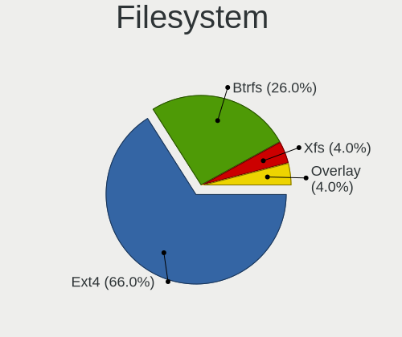
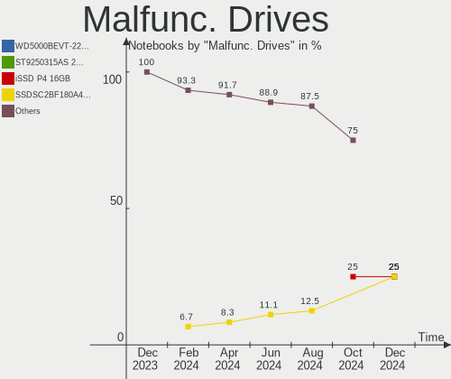
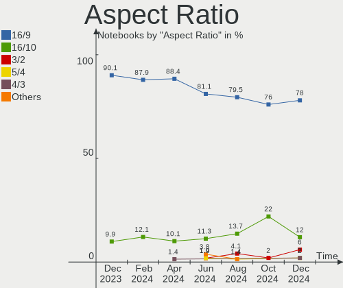
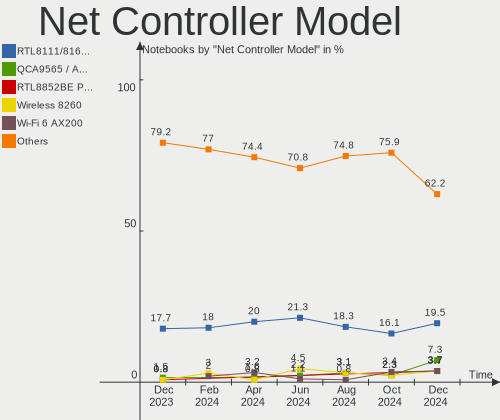
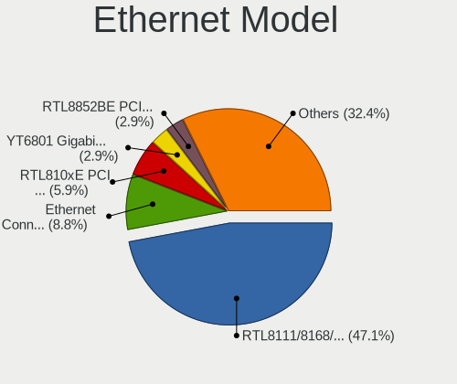
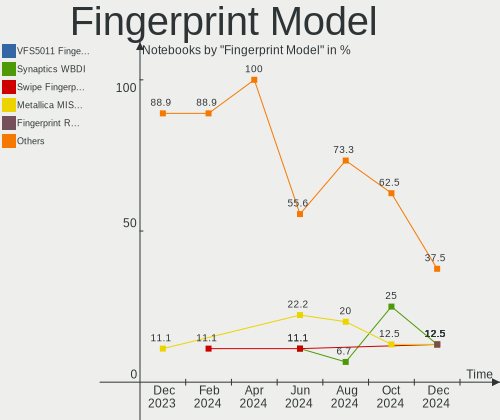

ArcoLinux - Hardware Trends (Notebooks)
---------------------------------------

A project to identify most popular hardware characteristics and track their change
over time based on data collected by Linux users at https://Linux-Hardware.org.

Anyone can contribute to this report by the [hw-probe](https://github.com/linuxhw/hw-probe) tool:

    sudo -E hw-probe -all -upload

This report is for one last month. Overall report since the beginning of time: [TestCoverage](https://github.com/linuxhw/TestCoverage)

Period: Nov, 2022.

Contents
--------

* [ System ](#system)
  - [ OS                       ](#os)
  - [ OS Family                ](#os-family)
  - [ Kernel                   ](#kernel)
  - [ Kernel Family            ](#kernel-family)
  - [ Kernel Major Ver.        ](#kernel-major-ver)
  - [ Arch                     ](#arch)
  - [ DE                       ](#de)
  - [ Display Server           ](#display-server)
  - [ Display Manager          ](#display-manager)
  - [ OS Lang                  ](#os-lang)
  - [ Boot Mode                ](#boot-mode)
  - [ Filesystem               ](#filesystem)
  - [ Part. scheme             ](#part-scheme)
  - [ Dual Boot with Linux/BSD ](#dual-boot-with-linuxbsd)
  - [ Dual Boot (Win)          ](#dual-boot-win)

* [ Board ](#board)
  - [ Vendor                   ](#vendor)
  - [ Model                    ](#model)
  - [ Model Family             ](#model-family)
  - [ MFG Year                 ](#mfg-year)
  - [ Form Factor              ](#form-factor)
  - [ Secure Boot              ](#secure-boot)
  - [ Coreboot                 ](#coreboot)
  - [ RAM Size                 ](#ram-size)
  - [ RAM Used                 ](#ram-used)
  - [ Total Drives             ](#total-drives)
  - [ Has CD-ROM               ](#has-cd-rom)
  - [ Has Ethernet             ](#has-ethernet)
  - [ Has WiFi                 ](#has-wifi)
  - [ Has Bluetooth            ](#has-bluetooth)

* [ Location ](#location)
  - [ Country                  ](#country)
  - [ City                     ](#city)

* [ Drives ](#drives)
  - [ Drive Vendor             ](#drive-vendor)
  - [ Drive Model              ](#drive-model)
  - [ HDD Vendor               ](#hdd-vendor)
  - [ SSD Vendor               ](#ssd-vendor)
  - [ Drive Kind               ](#drive-kind)
  - [ Drive Connector          ](#drive-connector)
  - [ Drive Size               ](#drive-size)
  - [ Space Total              ](#space-total)
  - [ Space Used               ](#space-used)
  - [ Malfunc. Drives          ](#malfunc-drives)
  - [ Malfunc. Drive Vendor    ](#malfunc-drive-vendor)
  - [ Malfunc. HDD Vendor      ](#malfunc-hdd-vendor)
  - [ Malfunc. Drive Kind      ](#malfunc-drive-kind)
  - [ Failed Drives            ](#failed-drives)
  - [ Failed Drive Vendor      ](#failed-drive-vendor)
  - [ Drive Status             ](#drive-status)

* [ Storage controller ](#storage-controller)
  - [ Storage Vendor           ](#storage-vendor)
  - [ Storage Model            ](#storage-model)
  - [ Storage Kind             ](#storage-kind)

* [ Processor ](#processor)
  - [ CPU Vendor               ](#cpu-vendor)
  - [ CPU Model                ](#cpu-model)
  - [ CPU Model Family         ](#cpu-model-family)
  - [ CPU Cores                ](#cpu-cores)
  - [ CPU Sockets              ](#cpu-sockets)
  - [ CPU Threads              ](#cpu-threads)
  - [ CPU Op-Modes             ](#cpu-op-modes)
  - [ CPU Microcode            ](#cpu-microcode)
  - [ CPU Microarch            ](#cpu-microarch)

* [ Graphics ](#graphics)
  - [ GPU Vendor               ](#gpu-vendor)
  - [ GPU Model                ](#gpu-model)
  - [ GPU Combo                ](#gpu-combo)
  - [ GPU Driver               ](#gpu-driver)
  - [ GPU Memory               ](#gpu-memory)

* [ Monitor ](#monitor)
  - [ Monitor Vendor           ](#monitor-vendor)
  - [ Monitor Model            ](#monitor-model)
  - [ Monitor Resolution       ](#monitor-resolution)
  - [ Monitor Diagonal         ](#monitor-diagonal)
  - [ Monitor Width            ](#monitor-width)
  - [ Aspect Ratio             ](#aspect-ratio)
  - [ Monitor Area             ](#monitor-area)
  - [ Pixel Density            ](#pixel-density)
  - [ Multiple Monitors        ](#multiple-monitors)

* [ Network ](#network)
  - [ Net Controller Vendor    ](#net-controller-vendor)
  - [ Net Controller Model     ](#net-controller-model)
  - [ Wireless Vendor          ](#wireless-vendor)
  - [ Wireless Model           ](#wireless-model)
  - [ Ethernet Vendor          ](#ethernet-vendor)
  - [ Ethernet Model           ](#ethernet-model)
  - [ Net Controller Kind      ](#net-controller-kind)
  - [ Used Controller          ](#used-controller)
  - [ NICs                     ](#nics)
  - [ IPv6                     ](#ipv6)

* [ Bluetooth ](#bluetooth)
  - [ Bluetooth Vendor         ](#bluetooth-vendor)
  - [ Bluetooth Model          ](#bluetooth-model)

* [ Sound ](#sound)
  - [ Sound Vendor             ](#sound-vendor)
  - [ Sound Model              ](#sound-model)

* [ Memory ](#memory)
  - [ Memory Vendor            ](#memory-vendor)
  - [ Memory Model             ](#memory-model)
  - [ Memory Kind              ](#memory-kind)
  - [ Memory Form Factor       ](#memory-form-factor)
  - [ Memory Size              ](#memory-size)
  - [ Memory Speed             ](#memory-speed)

* [ Printers & scanners ](#printers--scanners)
  - [ Printer Vendor           ](#printer-vendor)
  - [ Printer Model            ](#printer-model)
  - [ Scanner Vendor           ](#scanner-vendor)
  - [ Scanner Model            ](#scanner-model)

* [ Camera ](#camera)
  - [ Camera Vendor            ](#camera-vendor)
  - [ Camera Model             ](#camera-model)

* [ Security ](#security)
  - [ Fingerprint Vendor       ](#fingerprint-vendor)
  - [ Fingerprint Model        ](#fingerprint-model)
  - [ Chipcard Vendor          ](#chipcard-vendor)
  - [ Chipcard Model           ](#chipcard-model)

* [ Unsupported ](#unsupported)
  - [ Unsupported Devices      ](#unsupported-devices)
  - [ Unsupported Device Types ](#unsupported-device-types)

System
------

OS
--

Installed operating systems

| Name              | Notebooks | Percent |
|-------------------|-----------|---------|
| ArcoLinux Rolling | 27        | 87.1%   |
| ArcoLinux         | 4         | 12.9%   |

OS Family
---------

OS without a version

| Name      | Notebooks | Percent |
|-----------|-----------|---------|
| ArcoLinux | 31        | 100%    |

Kernel
------

Version of the Linux kernel

| Version               | Notebooks | Percent |
|-----------------------|-----------|---------|
| 6.0.8-arch1-1         | 8         | 25.81%  |
| 6.0.7-arch1-1         | 5         | 16.13%  |
| 6.0.6-arch1-1         | 4         | 12.9%   |
| 6.0.10-arch2-1        | 4         | 12.9%   |
| 6.0.9-arch1-1         | 2         | 6.45%   |
| 6.0.8-zen1-1-zen      | 2         | 6.45%   |
| 6.0.7-zen1-1-zen      | 2         | 6.45%   |
| 6.0.2-x64v2-xanmod1-1 | 1         | 3.23%   |
| 6.0.1-arch2-1         | 1         | 3.23%   |
| 5.19.9-arch1-1        | 1         | 3.23%   |
| 5.18.9-arch1-1        | 1         | 3.23%   |

Kernel Family
-------------

Linux kernel without a distro release

| Version | Notebooks | Percent |
|---------|-----------|---------|
| 6.0.8   | 10        | 32.26%  |
| 6.0.7   | 7         | 22.58%  |
| 6.0.6   | 4         | 12.9%   |
| 6.0.10  | 4         | 12.9%   |
| 6.0.9   | 2         | 6.45%   |
| 6.0.2   | 1         | 3.23%   |
| 6.0.1   | 1         | 3.23%   |
| 5.19.9  | 1         | 3.23%   |
| 5.18.9  | 1         | 3.23%   |

Kernel Major Ver.
-----------------

Linux kernel major version

| Version | Notebooks | Percent |
|---------|-----------|---------|
| 6.0     | 29        | 93.55%  |
| 5.19    | 1         | 3.23%   |
| 5.18    | 1         | 3.23%   |

Arch
----

OS architecture (x86_64, i586, etc.)

| Name   | Notebooks | Percent |
|--------|-----------|---------|
| x86_64 | 31        | 100%    |

DE
--

Desktop Environment

| Name    | Notebooks | Percent |
|---------|-----------|---------|
| XFCE    | 9         | 29.03%  |
| KDE5    | 5         | 16.13%  |
| i3      | 3         | 9.68%   |
| GNOME   | 3         | 9.68%   |
| MATE    | 2         | 6.45%   |
| LeftWM  | 2         | 6.45%   |
| bspwm   | 2         | 6.45%   |
| awesome | 2         | 6.45%   |
| xmonad  | 1         | 3.23%   |
| sway    | 1         | 3.23%   |
| Unknown | 1         | 3.23%   |

Display Server
--------------

X11 or Wayland

| Name    | Notebooks | Percent |
|---------|-----------|---------|
| X11     | 29        | 93.55%  |
| Wayland | 2         | 6.45%   |

Display Manager
---------------

SDDM, LightDM, etc.

| Name    | Notebooks | Percent |
|---------|-----------|---------|
| SDDM    | 20        | 64.52%  |
| LightDM | 5         | 16.13%  |
| Unknown | 5         | 16.13%  |
| GDM     | 1         | 3.23%   |

OS Lang
-------

Language

| Lang  | Notebooks | Percent |
|-------|-----------|---------|
| en_US | 19        | 61.29%  |
| de_DE | 3         | 9.68%   |
| nb_NO | 1         | 3.23%   |
| es_UY | 1         | 3.23%   |
| es_PE | 1         | 3.23%   |
| es_AR | 1         | 3.23%   |
| en_ZA | 1         | 3.23%   |
| en_IN | 1         | 3.23%   |
| en_GB | 1         | 3.23%   |
| en_CA | 1         | 3.23%   |
| C     | 1         | 3.23%   |

Boot Mode
---------

EFI or BIOS

| Mode | Notebooks | Percent |
|------|-----------|---------|
| EFI  | 21        | 67.74%  |
| BIOS | 10        | 32.26%  |

Filesystem
----------

Type of filesystem

| Type  | Notebooks | Percent |
|-------|-----------|---------|
| Ext4  | 20        | 64.52%  |
| Btrfs | 9         | 29.03%  |
| Xfs   | 1         | 3.23%   |
| Tmpfs | 1         | 3.23%   |

Part. scheme
------------

Scheme of partitioning

| Type    | Notebooks | Percent |
|---------|-----------|---------|
| GPT     | 23        | 74.19%  |
| MBR     | 4         | 12.9%   |
| Unknown | 4         | 12.9%   |

Dual Boot with Linux/BSD
------------------------

Hosting more than one Linux/BSD

| Dual boot | Notebooks | Percent |
|-----------|-----------|---------|
| No        | 24        | 77.42%  |
| Yes       | 7         | 22.58%  |

Dual Boot (Win)
---------------

Hosting Linux and Windows

| Dual boot | Notebooks | Percent |
|-----------|-----------|---------|
| No        | 21        | 67.74%  |
| Yes       | 10        | 32.26%  |

Board
-----

Vendor
------

Motherboard manufacturer

| Name             | Notebooks | Percent |
|------------------|-----------|---------|
| Hewlett-Packard  | 8         | 25.81%  |
| Dell             | 5         | 16.13%  |
| Lenovo           | 4         | 12.9%   |
| HUAWEI           | 2         | 6.45%   |
| ASUSTek Computer | 2         | 6.45%   |
| TUXEDO           | 1         | 3.23%   |
| Toshiba          | 1         | 3.23%   |
| Timi             | 1         | 3.23%   |
| System76         | 1         | 3.23%   |
| MSI              | 1         | 3.23%   |
| Fujitsu          | 1         | 3.23%   |
| CSL-Computer     | 1         | 3.23%   |
| Apple            | 1         | 3.23%   |
| Alienware        | 1         | 3.23%   |
| Acer             | 1         | 3.23%   |

Model
-----

Motherboard model

| Name                                 | Notebooks | Percent |
|--------------------------------------|-----------|---------|
| HP EliteBook 840 G2                  | 2         | 6.45%   |
| TUXEDO Aura 15 Gen2                  | 1         | 3.23%   |
| Toshiba Satellite L775               | 1         | 3.23%   |
| Timi RedmiBook Pro 15S               | 1         | 3.23%   |
| System76 Oryx Pro                    | 1         | 3.23%   |
| MSI Katana GF76 11UD                 | 1         | 3.23%   |
| Lenovo ThinkPad X270 20HNS03B00      | 1         | 3.23%   |
| Lenovo ThinkPad X240 20AMA0W706      | 1         | 3.23%   |
| Lenovo ThinkPad T14 Gen 1 20UDCTO1WW | 1         | 3.23%   |
| Lenovo B51-80 80LM                   | 1         | 3.23%   |
| HUAWEI KLVL-WXX9                     | 1         | 3.23%   |
| HUAWEI HLYL-WXX9                     | 1         | 3.23%   |
| HP Victus by Laptop 16-e0xxx         | 1         | 3.23%   |
| HP Pavilion Gaming Laptop 15-ec0xxx  | 1         | 3.23%   |
| HP Pavilion dv6                      | 1         | 3.23%   |
| HP Laptop 15-da0xxx                  | 1         | 3.23%   |
| HP EliteBook 840 G1                  | 1         | 3.23%   |
| HP 250 G7 Notebook PC                | 1         | 3.23%   |
| Fujitsu LIFEBOOK U759                | 1         | 3.23%   |
| Dell XPS 15 9570                     | 1         | 3.23%   |
| Dell Vostro 3550                     | 1         | 3.23%   |
| Dell Precision 3571                  | 1         | 3.23%   |
| Dell Latitude E5470                  | 1         | 3.23%   |
| Dell Latitude 3380                   | 1         | 3.23%   |
| CSL-Computer R Evolve C14i           | 1         | 3.23%   |
| ASUS Zephyrus S GX531GS_GX531GS      | 1         | 3.23%   |
| ASUS K52Jc                           | 1         | 3.23%   |
| Apple MacBookPro9,2                  | 1         | 3.23%   |
| Alienware 14                         | 1         | 3.23%   |
| Acer Aspire E1-571                   | 1         | 3.23%   |

Model Family
------------

Motherboard model prefix

| Name              | Notebooks | Percent |
|-------------------|-----------|---------|
| Lenovo ThinkPad   | 3         | 9.68%   |
| HP EliteBook      | 3         | 9.68%   |
| HP Pavilion       | 2         | 6.45%   |
| Dell Latitude     | 2         | 6.45%   |
| TUXEDO Aura       | 1         | 3.23%   |
| Toshiba Satellite | 1         | 3.23%   |
| Timi RedmiBook    | 1         | 3.23%   |
| System76 Oryx     | 1         | 3.23%   |
| MSI Katana        | 1         | 3.23%   |
| Lenovo B51-80     | 1         | 3.23%   |
| HUAWEI KLVL-WXX9  | 1         | 3.23%   |
| HUAWEI HLYL-WXX9  | 1         | 3.23%   |
| HP Victus         | 1         | 3.23%   |
| HP Laptop         | 1         | 3.23%   |
| HP 250            | 1         | 3.23%   |
| Fujitsu LIFEBOOK  | 1         | 3.23%   |
| Dell XPS          | 1         | 3.23%   |
| Dell Vostro       | 1         | 3.23%   |
| Dell Precision    | 1         | 3.23%   |
| CSL-Computer R    | 1         | 3.23%   |
| ASUS Zephyrus     | 1         | 3.23%   |
| ASUS K52Jc        | 1         | 3.23%   |
| Apple MacBookPro9 | 1         | 3.23%   |
| Alienware 14      | 1         | 3.23%   |
| Acer Aspire       | 1         | 3.23%   |

MFG Year
--------

Motherboard manufacture year

| Year | Notebooks | Percent |
|------|-----------|---------|
| 2021 | 4         | 12.9%   |
| 2019 | 4         | 12.9%   |
| 2020 | 3         | 9.68%   |
| 2018 | 3         | 9.68%   |
| 2015 | 3         | 9.68%   |
| 2013 | 3         | 9.68%   |
| 2022 | 2         | 6.45%   |
| 2017 | 2         | 6.45%   |
| 2012 | 2         | 6.45%   |
| 2011 | 2         | 6.45%   |
| 2016 | 1         | 3.23%   |
| 2010 | 1         | 3.23%   |
| 2008 | 1         | 3.23%   |

Form Factor
-----------

Physical design of the computer

| Name     | Notebooks | Percent |
|----------|-----------|---------|
| Notebook | 31        | 100%    |

Secure Boot
-----------

Enabled or disabled

| State    | Notebooks | Percent |
|----------|-----------|---------|
| Disabled | 31        | 100%    |

Coreboot
--------

Have coreboot on board

| Used | Notebooks | Percent |
|------|-----------|---------|
| No   | 31        | 100%    |

RAM Size
--------

Total RAM memory

| Size in GB | Notebooks | Percent |
|------------|-----------|---------|
| 4.01-8.0   | 11        | 35.48%  |
| 3.01-4.0   | 7         | 22.58%  |
| 8.01-16.0  | 5         | 16.13%  |
| 32.01-64.0 | 4         | 12.9%   |
| 16.01-24.0 | 4         | 12.9%   |

RAM Used
--------

Used RAM memory

| Used GB   | Notebooks | Percent |
|-----------|-----------|---------|
| 1.01-2.0  | 15        | 48.39%  |
| 4.01-8.0  | 6         | 19.35%  |
| 2.01-3.0  | 5         | 16.13%  |
| 3.01-4.0  | 3         | 9.68%   |
| 8.01-16.0 | 1         | 3.23%   |
| 0.51-1.0  | 1         | 3.23%   |

Total Drives
------------

Number of drives on board

| Drives | Notebooks | Percent |
|--------|-----------|---------|
| 1      | 23        | 74.19%  |
| 2      | 7         | 22.58%  |
| 3      | 1         | 3.23%   |

Has CD-ROM
----------

Has CD-ROM on board

| Presented | Notebooks | Percent |
|-----------|-----------|---------|
| No        | 24        | 77.42%  |
| Yes       | 7         | 22.58%  |

Has Ethernet
------------

Has Ethernet on board

| Presented | Notebooks | Percent |
|-----------|-----------|---------|
| Yes       | 26        | 83.87%  |
| No        | 5         | 16.13%  |

Has WiFi
--------

Has WiFi module

| Presented | Notebooks | Percent |
|-----------|-----------|---------|
| Yes       | 31        | 100%    |

Has Bluetooth
-------------

Has Bluetooth module

| Presented | Notebooks | Percent |
|-----------|-----------|---------|
| Yes       | 27        | 87.1%   |
| No        | 4         | 12.9%   |

Location
--------

Country
-------

Geographic location (country)

| Country         | Notebooks | Percent |
|-----------------|-----------|---------|
| USA             | 8         | 25.81%  |
| India           | 3         | 9.68%   |
| Germany         | 3         | 9.68%   |
| Venezuela       | 1         | 3.23%   |
| Uruguay         | 1         | 3.23%   |
| Sweden          | 1         | 3.23%   |
| South Africa    | 1         | 3.23%   |
| Singapore       | 1         | 3.23%   |
| Russia          | 1         | 3.23%   |
| Romania         | 1         | 3.23%   |
| Peru            | 1         | 3.23%   |
| Norway          | 1         | 3.23%   |
| North Macedonia | 1         | 3.23%   |
| Netherlands     | 1         | 3.23%   |
| Italy           | 1         | 3.23%   |
| Greece          | 1         | 3.23%   |
| Estonia         | 1         | 3.23%   |
| Canada          | 1         | 3.23%   |
| Belgium         | 1         | 3.23%   |
| Argentina       | 1         | 3.23%   |

City
----

Geographic location (city)

| City                 | Notebooks | Percent |
|----------------------|-----------|---------|
| Weimar               | 1         | 3.23%   |
| Walhalla             | 1         | 3.23%   |
| Waldport             | 1         | 3.23%   |
| Vapi                 | 1         | 3.23%   |
| Tallinn              | 1         | 3.23%   |
| Surprise             | 1         | 3.23%   |
| Surat                | 1         | 3.23%   |
| Somerset West        | 1         | 3.23%   |
| Singapore            | 1         | 3.23%   |
| Røyken Municipality | 1         | 3.23%   |
| Örebro              | 1         | 3.23%   |
| Newport              | 1         | 3.23%   |
| Munich               | 1         | 3.23%   |
| Moscow               | 1         | 3.23%   |
| Montevideo           | 1         | 3.23%   |
| Maracaibo            | 1         | 3.23%   |
| London               | 1         | 3.23%   |
| Ica                  | 1         | 3.23%   |
| Hulshout             | 1         | 3.23%   |
| Houston              | 1         | 3.23%   |
| Gurgaon              | 1         | 3.23%   |
| Gelsenkirchen        | 1         | 3.23%   |
| Detroit              | 1         | 3.23%   |
| Des Moines           | 1         | 3.23%   |
| Chios                | 1         | 3.23%   |
| Buenos Aires         | 1         | 3.23%   |
| Botosani             | 1         | 3.23%   |
| Auburn               | 1         | 3.23%   |
| Amsterdam            | 1         | 3.23%   |
| Alzano Lombardo      | 1         | 3.23%   |
| Unknown              | 1         | 3.23%   |

Drives
------

Drive Vendor
------------

Hard drive vendors

| Vendor                      | Notebooks | Drives | Percent |
|-----------------------------|-----------|--------|---------|
| WDC                         | 6         | 7      | 16.22%  |
| Samsung Electronics         | 5         | 5      | 13.51%  |
| SK hynix                    | 3         | 3      | 8.11%   |
| Seagate                     | 3         | 3      | 8.11%   |
| Sandisk                     | 3         | 3      | 8.11%   |
| Unknown                     | 2         | 2      | 5.41%   |
| Toshiba                     | 2         | 2      | 5.41%   |
| KIOXIA                      | 2         | 2      | 5.41%   |
| Kingston Technology Company | 2         | 2      | 5.41%   |
| Hitachi                     | 2         | 2      | 5.41%   |
| SPCC                        | 1         | 1      | 2.7%    |
| Realtek Semiconductor       | 1         | 1      | 2.7%    |
| PNY                         | 1         | 1      | 2.7%    |
| Netac                       | 1         | 1      | 2.7%    |
| Hewlett-Packard             | 1         | 1      | 2.7%    |
| Crucial                     | 1         | 1      | 2.7%    |
| Apple                       | 1         | 1      | 2.7%    |

Drive Model
-----------

Hard drive models

| Model                                                | Notebooks | Percent |
|------------------------------------------------------|-----------|---------|
| WDC WDS500G2B0B-00YS70 500GB SSD                     | 2         | 5.26%   |
| Samsung NVMe SSD Controller SM981/PM981/PM983 1TB    | 2         | 5.26%   |
| WDC WD5000LPVX-22V0TT0 500GB                         | 1         | 2.63%   |
| WDC WD3200BEKT-75PVMT1 320GB                         | 1         | 2.63%   |
| WDC WD20SPZX-22UA7T0 2TB                             | 1         | 2.63%   |
| WDC WD10SPZX-60Z10T0 1TB                             | 1         | 2.63%   |
| WDC PC SA530 SDASN8Y-256G-1006 256GB SSD             | 1         | 2.63%   |
| Unknown MMC Card  64GB                               | 1         | 2.63%   |
| Unknown MMC Card  16GB                               | 1         | 2.63%   |
| Toshiba MQ04ABF100 1TB                               | 1         | 2.63%   |
| Toshiba KXG50ZNV1T02 NVMe 1024GB                     | 1         | 2.63%   |
| SPCC Solid State Disk 256GB                          | 1         | 2.63%   |
| SK hynix SC308 SATA 256GB SSD                        | 1         | 2.63%   |
| SK hynix PC801 NVMe 1TB                              | 1         | 2.63%   |
| SK hynix PC711 HFS512GDE9X073N 512GB                 | 1         | 2.63%   |
| Seagate ST9320325AS 320GB                            | 1         | 2.63%   |
| Seagate ST1000LM048-2E7172 1TB                       | 1         | 2.63%   |
| Seagate ST1000LM024 HN-M101MBB 1TB                   | 1         | 2.63%   |
| Sandisk WD_BLACK SN770 1TB                           | 1         | 2.63%   |
| Sandisk WD Blue SN550 NVMe SSD 1TB                   | 1         | 2.63%   |
| Sandisk WD Black SN750 / PC SN730 NVMe SSD 1024GB    | 1         | 2.63%   |
| Samsung SSD 850 EVO 250GB                            | 1         | 2.63%   |
| Samsung NVMe SSD Controller SM961/PM961/SM963 250GB  | 1         | 2.63%   |
| Samsung NVMe SSD Controller PM9A1/PM9A3/980PRO 250GB | 1         | 2.63%   |
| Realtek ADATA SX6000LNP 128GB                        | 1         | 2.63%   |
| PNY CS900 240GB SSD                                  | 1         | 2.63%   |
| Netac SSD 360GB                                      | 1         | 2.63%   |
| KIOXIA KBG40ZNV512G 512GB                            | 1         | 2.63%   |
| KIOXIA KBG40ZNT256G TOSHIBA MEMORY 256GB             | 1         | 2.63%   |
| Kingston Company U-SNS8154P3 NVMe SSD 256GB          | 1         | 2.63%   |
| Kingston Company OM3PDP3 NVMe SSD 256GB              | 1         | 2.63%   |
| Hitachi HTS725032A9A364 320GB                        | 1         | 2.63%   |
| Hitachi HTS547564A9E384 640GB                        | 1         | 2.63%   |
| HP SSD S700 1TB                                      | 1         | 2.63%   |
| Crucial CT2050MX300SSD1 2TB                          | 1         | 2.63%   |
| Apple HDD ST750LM022 752GB                           | 1         | 2.63%   |

HDD Vendor
----------

Hard disk drive vendors

| Vendor  | Notebooks | Drives | Percent |
|---------|-----------|--------|---------|
| WDC     | 4         | 4      | 36.36%  |
| Seagate | 3         | 3      | 27.27%  |
| Hitachi | 2         | 2      | 18.18%  |
| Toshiba | 1         | 1      | 9.09%   |
| Apple   | 1         | 1      | 9.09%   |

SSD Vendor
----------

Solid state drive vendors

| Vendor              | Notebooks | Drives | Percent |
|---------------------|-----------|--------|---------|
| WDC                 | 3         | 3      | 30%     |
| SPCC                | 1         | 1      | 10%     |
| SK hynix            | 1         | 1      | 10%     |
| Samsung Electronics | 1         | 1      | 10%     |
| PNY                 | 1         | 1      | 10%     |
| Netac               | 1         | 1      | 10%     |
| Hewlett-Packard     | 1         | 1      | 10%     |
| Crucial             | 1         | 1      | 10%     |

Drive Kind
----------

HDD or SSD

| Kind | Notebooks | Drives | Percent |
|------|-----------|--------|---------|
| NVMe | 15        | 15     | 40.54%  |
| SSD  | 10        | 10     | 27.03%  |
| HDD  | 10        | 11     | 27.03%  |
| MMC  | 2         | 2      | 5.41%   |

Drive Connector
---------------

SATA, SAS, NVMe, etc.

| Type | Notebooks | Drives | Percent |
|------|-----------|--------|---------|
| SATA | 19        | 21     | 52.78%  |
| NVMe | 15        | 15     | 41.67%  |
| MMC  | 2         | 2      | 5.56%   |

Drive Size
----------

Size of hard drive

| Size in TB | Notebooks | Drives | Percent |
|------------|-----------|--------|---------|
| 0.01-0.5   | 12        | 12     | 60%     |
| 0.51-1.0   | 6         | 7      | 30%     |
| 1.01-2.0   | 2         | 2      | 10%     |

Space Total
-----------

Amount of disk space available on the file system

| Size in GB     | Notebooks | Percent |
|----------------|-----------|---------|
| 101-250        | 10        | 32.26%  |
| 251-500        | 9         | 29.03%  |
| More than 3000 | 4         | 12.9%   |
| 501-1000       | 3         | 9.68%   |
| 1001-2000      | 2         | 6.45%   |
| Unknown        | 2         | 6.45%   |
| 21-50          | 1         | 3.23%   |

Space Used
----------

Amount of used disk space

| Used GB  | Notebooks | Percent |
|----------|-----------|---------|
| 1-20     | 8         | 25.81%  |
| 51-100   | 8         | 25.81%  |
| 21-50    | 4         | 12.9%   |
| 101-250  | 4         | 12.9%   |
| 501-1000 | 4         | 12.9%   |
| Unknown  | 2         | 6.45%   |
| 251-500  | 1         | 3.23%   |

Malfunc. Drives
---------------

Drive models with a malfunction

| Model                                             | Notebooks | Drives | Percent |
|---------------------------------------------------|-----------|--------|---------|
| WDC PC SA530 SDASN8Y-256G-1006 256GB SSD          | 1         | 1      | 20%     |
| SK hynix PC711 HFS512GDE9X073N 512GB              | 1         | 1      | 20%     |
| Seagate ST9320325AS 320GB                         | 1         | 1      | 20%     |
| Sandisk WD Black SN750 / PC SN730 NVMe SSD 1024GB | 1         | 1      | 20%     |
| Hitachi HTS547564A9E384 640GB                     | 1         | 1      | 20%     |

Malfunc. Drive Vendor
---------------------

Vendors of faulty drives

| Vendor   | Notebooks | Drives | Percent |
|----------|-----------|--------|---------|
| WDC      | 1         | 1      | 20%     |
| SK hynix | 1         | 1      | 20%     |
| Seagate  | 1         | 1      | 20%     |
| Sandisk  | 1         | 1      | 20%     |
| Hitachi  | 1         | 1      | 20%     |

Malfunc. HDD Vendor
-------------------

Vendors of faulty HDD drives

| Vendor  | Notebooks | Drives | Percent |
|---------|-----------|--------|---------|
| Seagate | 1         | 1      | 50%     |
| Hitachi | 1         | 1      | 50%     |

Malfunc. Drive Kind
-------------------

Kinds of faulty drives

| Kind | Notebooks | Drives | Percent |
|------|-----------|--------|---------|
| NVMe | 2         | 2      | 40%     |
| HDD  | 2         | 2      | 40%     |
| SSD  | 1         | 1      | 20%     |

Failed Drives
-------------

Failed drive models

Zero info for selected period =(

Failed Drive Vendor
-------------------

Failed drive vendors

Zero info for selected period =(

Drive Status
------------

Number of failed and malfunc. drives

| Status   | Notebooks | Drives | Percent |
|----------|-----------|--------|---------|
| Works    | 21        | 25     | 63.64%  |
| Detected | 7         | 8      | 21.21%  |
| Malfunc  | 5         | 5      | 15.15%  |

Storage controller
------------------

Storage Vendor
--------------

Storage controller vendors

| Vendor                       | Notebooks | Percent |
|------------------------------|-----------|---------|
| Intel                        | 21        | 53.85%  |
| Samsung Electronics          | 4         | 10.26%  |
| SanDisk                      | 3         | 7.69%   |
| AMD                          | 3         | 7.69%   |
| SK hynix                     | 2         | 5.13%   |
| KIOXIA                       | 2         | 5.13%   |
| Kingston Technology Company  | 2         | 5.13%   |
| Toshiba America Info Systems | 1         | 2.56%   |
| Realtek Semiconductor        | 1         | 2.56%   |

Storage Model
-------------

Storage controller models

| Model                                                                          | Notebooks | Percent |
|--------------------------------------------------------------------------------|-----------|---------|
| Intel 6 Series/C200 Series Chipset Family 6 port Mobile SATA AHCI Controller   | 3         | 7.5%    |
| AMD FCH SATA Controller [AHCI mode]                                            | 3         | 7.5%    |
| Samsung NVMe SSD Controller SM981/PM981/PM983                                  | 2         | 5%      |
| KIOXIA NVMe SSD Controller BG4                                                 | 2         | 5%      |
| Intel Wildcat Point-LP SATA Controller [AHCI Mode]                             | 2         | 5%      |
| Intel Sunrise Point-LP SATA Controller [AHCI mode]                             | 2         | 5%      |
| Intel Celeron/Pentium Silver Processor SATA Controller                         | 2         | 5%      |
| Intel Cannon Lake Mobile PCH SATA AHCI Controller                              | 2         | 5%      |
| Intel 82801 Mobile SATA Controller [RAID mode]                                 | 2         | 5%      |
| Intel 8 Series SATA Controller 1 [AHCI mode]                                   | 2         | 5%      |
| Intel 7 Series Chipset Family 6-port SATA Controller [AHCI mode]               | 2         | 5%      |
| Toshiba America Info Systems XG5 NVMe SSD Controller                           | 1         | 2.5%    |
| SK hynix Non-Volatile memory controller                                        | 1         | 2.5%    |
| SK hynix Gold P31/PC711 NVMe Solid State Drive                                 | 1         | 2.5%    |
| SanDisk WD Blue SN550 NVMe SSD                                                 | 1         | 2.5%    |
| SanDisk WD Black SN750 / PC SN730 NVMe SSD                                     | 1         | 2.5%    |
| SanDisk Non-Volatile memory controller                                         | 1         | 2.5%    |
| Samsung NVMe SSD Controller SM961/PM961/SM963                                  | 1         | 2.5%    |
| Samsung NVMe SSD Controller PM9A1/PM9A3/980PRO                                 | 1         | 2.5%    |
| Realtek Realtek Non-Volatile memory controller                                 | 1         | 2.5%    |
| Kingston Company U-SNS8154P3 NVMe SSD                                          | 1         | 2.5%    |
| Kingston Company OM3PDP3 NVMe SSD                                              | 1         | 2.5%    |
| Intel Volume Management Device NVMe RAID Controller                            | 1         | 2.5%    |
| Intel Alder Lake-P SATA AHCI Controller                                        | 1         | 2.5%    |
| Intel 8 Series/C220 Series Chipset Family 6-port SATA Controller 1 [AHCI mode] | 1         | 2.5%    |
| Intel 500 Series Chipset Family SATA AHCI Controller                           | 1         | 2.5%    |
| Intel 5 Series/3400 Series Chipset 4 port SATA AHCI Controller                 | 1         | 2.5%    |

Storage Kind
------------

Kind of storage controller (IDE, SATA, NVMe, SAS, ...)

| Kind | Notebooks | Percent |
|------|-----------|---------|
| SATA | 22        | 55%     |
| NVMe | 15        | 37.5%   |
| RAID | 3         | 7.5%    |

Processor
---------

CPU Vendor
----------

Processor vendors

| Vendor | Notebooks | Percent |
|--------|-----------|---------|
| Intel  | 24        | 77.42%  |
| AMD    | 7         | 22.58%  |

CPU Model
---------

Processor models

| Model                                         | Notebooks | Percent |
|-----------------------------------------------|-----------|---------|
| Intel Core i5-4200U CPU @ 1.60GHz             | 2         | 6.45%   |
| Intel Core i9-8950HK CPU @ 2.90GHz            | 1         | 3.23%   |
| Intel Core i7-9750H CPU @ 2.60GHz             | 1         | 3.23%   |
| Intel Core i7-8750H CPU @ 2.20GHz             | 1         | 3.23%   |
| Intel Core i7-8665U CPU @ 1.90GHz             | 1         | 3.23%   |
| Intel Core i7-3520M CPU @ 2.90GHz             | 1         | 3.23%   |
| Intel Core i5-7300U CPU @ 2.60GHz             | 1         | 3.23%   |
| Intel Core i5-7200U CPU @ 2.50GHz             | 1         | 3.23%   |
| Intel Core i5-6300U CPU @ 2.40GHz             | 1         | 3.23%   |
| Intel Core i5-5300U CPU @ 2.30GHz             | 1         | 3.23%   |
| Intel Core i5-5200U CPU @ 2.20GHz             | 1         | 3.23%   |
| Intel Core i5-4200M CPU @ 2.50GHz             | 1         | 3.23%   |
| Intel Core i5-2430M CPU @ 2.40GHz             | 1         | 3.23%   |
| Intel Core i5-2410M CPU @ 2.30GHz             | 1         | 3.23%   |
| Intel Core i3-6100U CPU @ 2.30GHz             | 1         | 3.23%   |
| Intel Core i3-3110M CPU @ 2.40GHz             | 1         | 3.23%   |
| Intel Core i3-2350M CPU @ 2.30GHz             | 1         | 3.23%   |
| Intel Core i3-1005G1 CPU @ 1.20GHz            | 1         | 3.23%   |
| Intel Core i3 CPU M 350 @ 2.27GHz             | 1         | 3.23%   |
| Intel Celeron N4120 CPU @ 1.10GHz             | 1         | 3.23%   |
| Intel Celeron N4000 CPU @ 1.10GHz             | 1         | 3.23%   |
| Intel 12th Gen Core i7-12700H                 | 1         | 3.23%   |
| Intel 11th Gen Core i7-11800H @ 2.30GHz       | 1         | 3.23%   |
| AMD Ryzen 7 PRO 4750U with Radeon Graphics    | 1         | 3.23%   |
| AMD Ryzen 7 5800H with Radeon Graphics        | 1         | 3.23%   |
| AMD Ryzen 7 5700U with Radeon Graphics        | 1         | 3.23%   |
| AMD Ryzen 7 4800H with Radeon Graphics        | 1         | 3.23%   |
| AMD Ryzen 5 5600H with Radeon Graphics        | 1         | 3.23%   |
| AMD Ryzen 5 4600H with Radeon Graphics        | 1         | 3.23%   |
| AMD Ryzen 5 3550H with Radeon Vega Mobile Gfx | 1         | 3.23%   |

CPU Model Family
----------------

Processor model prefix

| Model           | Notebooks | Percent |
|-----------------|-----------|---------|
| Intel Core i5   | 10        | 32.26%  |
| Intel Core i3   | 5         | 16.13%  |
| Intel Core i7   | 4         | 12.9%   |
| AMD Ryzen 7     | 3         | 9.68%   |
| AMD Ryzen 5     | 3         | 9.68%   |
| Other           | 2         | 6.45%   |
| Intel Celeron   | 2         | 6.45%   |
| Intel Core i9   | 1         | 3.23%   |
| AMD Ryzen 7 PRO | 1         | 3.23%   |

CPU Cores
---------

Number of processor cores

| Number | Notebooks | Percent |
|--------|-----------|---------|
| 2      | 17        | 54.84%  |
| 8      | 5         | 16.13%  |
| 6      | 5         | 16.13%  |
| 4      | 3         | 9.68%   |
| 14     | 1         | 3.23%   |

CPU Sockets
-----------

Number of sockets

| Number | Notebooks | Percent |
|--------|-----------|---------|
| 1      | 31        | 100%    |

CPU Threads
-----------

Threads per core (Hyper-Threading)

| Number | Notebooks | Percent |
|--------|-----------|---------|
| 2      | 28        | 90.32%  |
| 1      | 3         | 9.68%   |

CPU Op-Modes
------------

CPU Operation Modes (32-bit, 64-bit)

| Op mode        | Notebooks | Percent |
|----------------|-----------|---------|
| 32-bit, 64-bit | 31        | 100%    |

CPU Microcode
-------------

Microcode number

| Number     | Notebooks | Percent |
|------------|-----------|---------|
| Unknown    | 6         | 19.35%  |
| 0x206a7    | 3         | 9.68%   |
| 0x906ea    | 2         | 6.45%   |
| 0x406e3    | 2         | 6.45%   |
| 0x40651    | 2         | 6.45%   |
| 0x0a50000c | 2         | 6.45%   |
| 0x906a3    | 1         | 3.23%   |
| 0x806ec    | 1         | 3.23%   |
| 0x806e9    | 1         | 3.23%   |
| 0x806d1    | 1         | 3.23%   |
| 0x706e5    | 1         | 3.23%   |
| 0x706a8    | 1         | 3.23%   |
| 0x706a1    | 1         | 3.23%   |
| 0x306d4    | 1         | 3.23%   |
| 0x306a9    | 1         | 3.23%   |
| 0x20652    | 1         | 3.23%   |
| 0x08608103 | 1         | 3.23%   |
| 0x08600106 | 1         | 3.23%   |
| 0x08600104 | 1         | 3.23%   |
| 0x08108109 | 1         | 3.23%   |

CPU Microarch
-------------

Microarchitecture

| Name             | Notebooks | Percent |
|------------------|-----------|---------|
| KabyLake         | 6         | 19.35%  |
| Zen 2            | 3         | 9.68%   |
| SandyBridge      | 3         | 9.68%   |
| Haswell          | 3         | 9.68%   |
| Zen 3            | 2         | 6.45%   |
| Skylake          | 2         | 6.45%   |
| IvyBridge        | 2         | 6.45%   |
| Goldmont plus    | 2         | 6.45%   |
| Broadwell        | 2         | 6.45%   |
| Unknown          | 2         | 6.45%   |
| Zen+             | 1         | 3.23%   |
| Westmere         | 1         | 3.23%   |
| IceLake          | 1         | 3.23%   |
| Alderlake Hybrid | 1         | 3.23%   |

Graphics
--------

GPU Vendor
----------

Vendors of graphics cards

| Vendor | Notebooks | Percent |
|--------|-----------|---------|
| Intel  | 24        | 58.54%  |
| AMD    | 9         | 21.95%  |
| Nvidia | 8         | 19.51%  |

GPU Model
---------

Graphics card models

| Model                                                                         | Notebooks | Percent |
|-------------------------------------------------------------------------------|-----------|---------|
| Intel CoffeeLake-H GT2 [UHD Graphics 630]                                     | 3         | 7.32%   |
| Intel 2nd Generation Core Processor Family Integrated Graphics Controller     | 3         | 7.32%   |
| AMD Renoir                                                                    | 3         | 7.32%   |
| Nvidia TU117M [GeForce GTX 1650 Mobile / Max-Q]                               | 2         | 4.88%   |
| Intel Skylake GT2 [HD Graphics 520]                                           | 2         | 4.88%   |
| Intel HD Graphics 620                                                         | 2         | 4.88%   |
| Intel HD Graphics 5500                                                        | 2         | 4.88%   |
| Intel Haswell-ULT Integrated Graphics Controller                              | 2         | 4.88%   |
| Intel GeminiLake [UHD Graphics 600]                                           | 2         | 4.88%   |
| Intel 3rd Gen Core processor Graphics Controller                              | 2         | 4.88%   |
| AMD Cezanne [Radeon Vega Series / Radeon Vega Mobile Series]                  | 2         | 4.88%   |
| Nvidia TU106M [GeForce RTX 2060 Mobile]                                       | 1         | 2.44%   |
| Nvidia GP107M [GeForce GTX 1050 Ti Mobile]                                    | 1         | 2.44%   |
| Nvidia GP104M [GeForce GTX 1070 Mobile]                                       | 1         | 2.44%   |
| Nvidia GK107M [GeForce GT 750M]                                               | 1         | 2.44%   |
| Nvidia GA107M [GeForce RTX 3050 Ti Mobile]                                    | 1         | 2.44%   |
| Nvidia GA107GLM [RTX A1000 Laptop GPU]                                        | 1         | 2.44%   |
| Intel WhiskeyLake-U GT2 [UHD Graphics 620]                                    | 1         | 2.44%   |
| Intel TigerLake-H GT1 [UHD Graphics]                                          | 1         | 2.44%   |
| Intel Iris Plus Graphics G1 (Ice Lake)                                        | 1         | 2.44%   |
| Intel Core Processor Integrated Graphics Controller                           | 1         | 2.44%   |
| Intel Alder Lake-P Integrated Graphics Controller                             | 1         | 2.44%   |
| Intel 4th Gen Core Processor Integrated Graphics Controller                   | 1         | 2.44%   |
| AMD Sun XT [Radeon HD 8670A/8670M/8690M / R5 M330 / M430 / Radeon 520 Mobile] | 1         | 2.44%   |
| AMD Seymour [Radeon HD 6400M/7400M Series]                                    | 1         | 2.44%   |
| AMD Picasso/Raven 2 [Radeon Vega Series / Radeon Vega Mobile Series]          | 1         | 2.44%   |
| AMD Lucienne                                                                  | 1         | 2.44%   |

GPU Combo
---------

Combinations of graphics cards

| Name           | Notebooks | Percent |
|----------------|-----------|---------|
| 1 x Intel      | 16        | 51.61%  |
| Intel + Nvidia | 6         | 19.35%  |
| 1 x AMD        | 5         | 16.13%  |
| Intel + AMD    | 2         | 6.45%   |
| AMD + Nvidia   | 2         | 6.45%   |

GPU Driver
----------

Free vs proprietary

| Driver      | Notebooks | Percent |
|-------------|-----------|---------|
| Free        | 27        | 87.1%   |
| Proprietary | 4         | 12.9%   |

GPU Memory
----------

Total video memory

| Size in GB | Notebooks | Percent |
|------------|-----------|---------|
| Unknown    | 21        | 67.74%  |
| 0.01-0.5   | 4         | 12.9%   |
| 3.01-4.0   | 2         | 6.45%   |
| 0.51-1.0   | 2         | 6.45%   |
| 5.01-6.0   | 1         | 3.23%   |
| 1.01-2.0   | 1         | 3.23%   |

Monitor
-------

Monitor Vendor
--------------

Monitor vendors

| Vendor                  | Notebooks | Percent |
|-------------------------|-----------|---------|
| BOE                     | 8         | 23.53%  |
| AU Optronics            | 7         | 20.59%  |
| LG Display              | 6         | 17.65%  |
| Samsung Electronics     | 2         | 5.88%   |
| Chi Mei Optoelectronics | 2         | 5.88%   |
| TMX                     | 1         | 2.94%   |
| SKY                     | 1         | 2.94%   |
| Sharp                   | 1         | 2.94%   |
| PANDA                   | 1         | 2.94%   |
| Goldstar                | 1         | 2.94%   |
| Dell                    | 1         | 2.94%   |
| Chimei Innolux          | 1         | 2.94%   |
| BenQ                    | 1         | 2.94%   |
| Apple                   | 1         | 2.94%   |

Monitor Model
-------------

Monitor models

| Model                                                                    | Notebooks | Percent |
|--------------------------------------------------------------------------|-----------|---------|
| TMX TL156VDXP01 TMX1560 1920x1080 344x194mm 15.5-inch                    | 1         | 2.94%   |
| SKY TV-monitor SKY1801 3840x2160 708x398mm 32.0-inch                     | 1         | 2.94%   |
| Sharp LCD Monitor SHP148D 3840x2160 344x194mm 15.5-inch                  | 1         | 2.94%   |
| Samsung Electronics LCD Monitor SEC4251 1366x768 344x194mm 15.5-inch     | 1         | 2.94%   |
| Samsung Electronics LCD Monitor SDC484E 1600x900 309x174mm 14.0-inch     | 1         | 2.94%   |
| PANDA LCD Monitor NCP0040 1920x1080 344x194mm 15.5-inch                  | 1         | 2.94%   |
| LG Display LCD Monitor LGD0709 1920x1080 344x194mm 15.5-inch             | 1         | 2.94%   |
| LG Display LCD Monitor LGD04B1 1366x768 310x174mm 14.0-inch              | 1         | 2.94%   |
| LG Display LCD Monitor LGD046F 1920x1080 345x194mm 15.6-inch             | 1         | 2.94%   |
| LG Display LCD Monitor LGD03F7 1366x768 344x194mm 15.5-inch              | 1         | 2.94%   |
| LG Display LCD Monitor LGD03D7 1366x768 309x174mm 14.0-inch              | 1         | 2.94%   |
| LG Display LCD Monitor LGD03CD 1366x768 277x156mm 12.5-inch              | 1         | 2.94%   |
| Goldstar HDR WFHD GSM7715 2560x1080 798x334mm 34.1-inch                  | 1         | 2.94%   |
| Dell U2515H DELD072 2560x1440 553x311mm 25.0-inch                        | 1         | 2.94%   |
| Chimei Innolux LCD Monitor CMN1604 1920x1080 355x199mm 16.0-inch         | 1         | 2.94%   |
| Chi Mei Optoelectronics LCD Monitor CMO15A3 1366x768 344x193mm 15.5-inch | 1         | 2.94%   |
| Chi Mei Optoelectronics LCD Monitor CMO1593 1366x768 344x193mm 15.5-inch | 1         | 2.94%   |
| BOE LCD Monitor BOE09F1 1920x1080 355x200mm 16.0-inch                    | 1         | 2.94%   |
| BOE LCD Monitor BOE095E 1366x768 344x194mm 15.5-inch                     | 1         | 2.94%   |
| BOE LCD Monitor BOE0893 2160x1440 296x197mm 14.0-inch                    | 1         | 2.94%   |
| BOE LCD Monitor BOE07DB 1920x1080 309x174mm 14.0-inch                    | 1         | 2.94%   |
| BOE LCD Monitor BOE07B6 1920x1080 382x215mm 17.3-inch                    | 1         | 2.94%   |
| BOE LCD Monitor BOE0747 1920x1080 344x194mm 15.5-inch                    | 1         | 2.94%   |
| BOE LCD Monitor BOE0708 1366x768 277x156mm 12.5-inch                     | 1         | 2.94%   |
| BOE LCD Monitor BOE06A5 1366x768 344x194mm 15.5-inch                     | 1         | 2.94%   |
| BenQ ZOWIE XL LCD BNQ7F3F 1920x1080 531x298mm 24.0-inch                  | 1         | 2.94%   |
| AU Optronics LCD Monitor AUO978F 1920x1080 382x215mm 17.3-inch           | 1         | 2.94%   |
| AU Optronics LCD Monitor AUO82ED 1920x1080 344x194mm 15.5-inch           | 1         | 2.94%   |
| AU Optronics LCD Monitor AUO46EC 1366x768 344x193mm 15.5-inch            | 1         | 2.94%   |
| AU Optronics LCD Monitor AUO423D 1920x1080 309x173mm 13.9-inch           | 1         | 2.94%   |
| AU Optronics LCD Monitor AUO139E 1600x900 382x214mm 17.2-inch            | 1         | 2.94%   |
| AU Optronics LCD Monitor AUO133D 1920x1080 309x173mm 13.9-inch           | 1         | 2.94%   |
| AU Optronics LCD Monitor AUO106C 1366x768 276x155mm 12.5-inch            | 1         | 2.94%   |
| Apple Color LCD APP9CC7 1280x800 286x179mm 13.3-inch                     | 1         | 2.94%   |

Monitor Resolution
------------------

Monitor screen resolution

| Resolution      | Notebooks | Percent |
|-----------------|-----------|---------|
| 1920x1080 (FHD) | 13        | 38.24%  |
| 1366x768 (WXGA) | 12        | 35.29%  |
| 3840x2160 (4K)  | 2         | 5.88%   |
| 1600x900 (HD+)  | 2         | 5.88%   |
| 3200x2000       | 1         | 2.94%   |
| 2560x1440 (QHD) | 1         | 2.94%   |
| 2560x1080       | 1         | 2.94%   |
| 2160x1440       | 1         | 2.94%   |
| 1280x800 (WXGA) | 1         | 2.94%   |

Monitor Diagonal
----------------

Diagonal size in inches

| Inches | Notebooks | Percent |
|--------|-----------|---------|
| 15     | 14        | 41.18%  |
| 14     | 5         | 14.71%  |
| 17     | 3         | 8.82%   |
| 13     | 3         | 8.82%   |
| 12     | 3         | 8.82%   |
| 16     | 2         | 5.88%   |
| 34     | 1         | 2.94%   |
| 32     | 1         | 2.94%   |
| 25     | 1         | 2.94%   |
| 24     | 1         | 2.94%   |

Monitor Width
-------------

Physical width

| Width in mm | Notebooks | Percent |
|-------------|-----------|---------|
| 301-350     | 20        | 58.82%  |
| 351-400     | 5         | 14.71%  |
| 201-300     | 5         | 14.71%  |
| 701-800     | 2         | 5.88%   |
| 501-600     | 2         | 5.88%   |

Aspect Ratio
------------

Proportional relationship between the width and the height

| Ratio | Notebooks | Percent |
|-------|-----------|---------|
| 16/9  | 28        | 87.5%   |
| 16/10 | 2         | 6.25%   |
| 3/2   | 1         | 3.13%   |
| 21/9  | 1         | 3.13%   |

Monitor Area
------------

Area in inch²

| Area in inch² | Notebooks | Percent |
|----------------|-----------|---------|
| 101-110        | 16        | 47.06%  |
| 81-90          | 8         | 23.53%  |
| 61-70          | 3         | 8.82%   |
| 121-130        | 3         | 8.82%   |
| 351-500        | 2         | 5.88%   |
| 251-300        | 1         | 2.94%   |
| 201-250        | 1         | 2.94%   |

Pixel Density
-------------

Pixels per inch

| Density       | Notebooks | Percent |
|---------------|-----------|---------|
| 121-160       | 17        | 50%     |
| 101-120       | 11        | 32.35%  |
| 51-100        | 3         | 8.82%   |
| More than 240 | 2         | 5.88%   |
| 161-240       | 1         | 2.94%   |

Multiple Monitors
-----------------

Total monitors connected

| Total | Notebooks | Percent |
|-------|-----------|---------|
| 1     | 26        | 83.87%  |
| 2     | 5         | 16.13%  |

Network
-------

Net Controller Vendor
---------------------

Controller vendors

| Vendor                            | Notebooks | Percent |
|-----------------------------------|-----------|---------|
| Realtek Semiconductor             | 17        | 36.96%  |
| Intel                             | 16        | 34.78%  |
| Qualcomm Atheros                  | 4         | 8.7%    |
| Broadcom                          | 3         | 6.52%   |
| Samsung Electronics               | 1         | 2.17%   |
| Novatel Wireless                  | 1         | 2.17%   |
| JMicron Technology                | 1         | 2.17%   |
| Hewlett-Packard                   | 1         | 2.17%   |
| Ericsson Business Mobile Networks | 1         | 2.17%   |
| Dell                              | 1         | 2.17%   |

Net Controller Model
--------------------

Controller models

| Model                                                             | Notebooks | Percent |
|-------------------------------------------------------------------|-----------|---------|
| Realtek RTL8111/8168/8411 PCI Express Gigabit Ethernet Controller | 12        | 19.67%  |
| Realtek RTL8822CE 802.11ac PCIe Wireless Network Adapter          | 3         | 4.92%   |
| Realtek RTL8852AE 802.11ax PCIe Wireless Network Adapter          | 2         | 3.28%   |
| Realtek RTL8821CE 802.11ac PCIe Wireless Network Adapter          | 2         | 3.28%   |
| Intel Wireless 7265                                               | 2         | 3.28%   |
| Intel Wireless 7260                                               | 2         | 3.28%   |
| Intel Wi-Fi 6 AX200                                               | 2         | 3.28%   |
| Intel Ethernet Connection I218-LM                                 | 2         | 3.28%   |
| Intel Ethernet Connection (3) I218-LM                             | 2         | 3.28%   |
| Intel Cannon Lake PCH CNVi WiFi                                   | 2         | 3.28%   |
| Samsung GT-I9070 (network tethering, USB debugging enabled)       | 1         | 1.64%   |
| Realtek RTL8723DE Wireless Network Adapter                        | 1         | 1.64%   |
| Realtek RTL8188CE 802.11b/g/n WiFi Adapter                        | 1         | 1.64%   |
| Realtek RTL8153 Gigabit Ethernet Adapter                          | 1         | 1.64%   |
| Realtek RTL810xE PCI Express Fast Ethernet controller             | 1         | 1.64%   |
| Qualcomm Atheros QCA6174 802.11ac Wireless Network Adapter        | 1         | 1.64%   |
| Qualcomm Atheros Killer E220x Gigabit Ethernet Controller         | 1         | 1.64%   |
| Qualcomm Atheros AR9485 Wireless Network Adapter                  | 1         | 1.64%   |
| Qualcomm Atheros AR9462 Wireless Network Adapter                  | 1         | 1.64%   |
| Qualcomm Atheros AR9285 Wireless Network Adapter (PCI-Express)    | 1         | 1.64%   |
| Novatel Wireless M2000                                            | 1         | 1.64%   |
| JMicron JMC250 PCI Express Gigabit Ethernet Controller            | 1         | 1.64%   |
| Intel Wireless-AC 9260                                            | 1         | 1.64%   |
| Intel Wireless 8265 / 8275                                        | 1         | 1.64%   |
| Intel Wireless 8260                                               | 1         | 1.64%   |
| Intel Tiger Lake PCH CNVi WiFi                                    | 1         | 1.64%   |
| Intel Ethernet Connection (6) I219-LM                             | 1         | 1.64%   |
| Intel Ethernet Connection (4) I219-LM                             | 1         | 1.64%   |
| Intel Ethernet Connection (16) I219-LM                            | 1         | 1.64%   |
| Intel Dual Band Wireless-AC 3165 Plus Bluetooth                   | 1         | 1.64%   |
| Intel Centrino Wireless-N 1030 [Rainbow Peak]                     | 1         | 1.64%   |
| Intel Cannon Point-LP CNVi [Wireless-AC]                          | 1         | 1.64%   |
| Intel Alder Lake-P PCH CNVi WiFi                                  | 1         | 1.64%   |
| HP lt4112 Gobi 4G Module Network Device                           | 1         | 1.64%   |
| Ericsson Business Mobile Networks N5321 gw                        | 1         | 1.64%   |
| Dell DW5820e L850-GL                                              | 1         | 1.64%   |
| Broadcom NetXtreme BCM57765 Gigabit Ethernet PCIe                 | 1         | 1.64%   |
| Broadcom NetLink BCM57785 Gigabit Ethernet PCIe                   | 1         | 1.64%   |
| Broadcom BCM4331 802.11a/b/g/n                                    | 1         | 1.64%   |
| Broadcom BCM4313 802.11bgn Wireless Network Adapter               | 1         | 1.64%   |

Wireless Vendor
---------------

Wireless vendors

| Vendor                | Notebooks | Percent |
|-----------------------|-----------|---------|
| Intel                 | 16        | 48.48%  |
| Realtek Semiconductor | 9         | 27.27%  |
| Qualcomm Atheros      | 4         | 12.12%  |
| Broadcom              | 2         | 6.06%   |
| Hewlett-Packard       | 1         | 3.03%   |
| Dell                  | 1         | 3.03%   |

Wireless Model
--------------

Wireless models

| Model                                                          | Notebooks | Percent |
|----------------------------------------------------------------|-----------|---------|
| Realtek RTL8822CE 802.11ac PCIe Wireless Network Adapter       | 3         | 9.09%   |
| Realtek RTL8852AE 802.11ax PCIe Wireless Network Adapter       | 2         | 6.06%   |
| Realtek RTL8821CE 802.11ac PCIe Wireless Network Adapter       | 2         | 6.06%   |
| Intel Wireless 7265                                            | 2         | 6.06%   |
| Intel Wireless 7260                                            | 2         | 6.06%   |
| Intel Wi-Fi 6 AX200                                            | 2         | 6.06%   |
| Intel Cannon Lake PCH CNVi WiFi                                | 2         | 6.06%   |
| Realtek RTL8723DE Wireless Network Adapter                     | 1         | 3.03%   |
| Realtek RTL8188CE 802.11b/g/n WiFi Adapter                     | 1         | 3.03%   |
| Qualcomm Atheros QCA6174 802.11ac Wireless Network Adapter     | 1         | 3.03%   |
| Qualcomm Atheros AR9485 Wireless Network Adapter               | 1         | 3.03%   |
| Qualcomm Atheros AR9462 Wireless Network Adapter               | 1         | 3.03%   |
| Qualcomm Atheros AR9285 Wireless Network Adapter (PCI-Express) | 1         | 3.03%   |
| Intel Wireless-AC 9260                                         | 1         | 3.03%   |
| Intel Wireless 8265 / 8275                                     | 1         | 3.03%   |
| Intel Wireless 8260                                            | 1         | 3.03%   |
| Intel Tiger Lake PCH CNVi WiFi                                 | 1         | 3.03%   |
| Intel Dual Band Wireless-AC 3165 Plus Bluetooth                | 1         | 3.03%   |
| Intel Centrino Wireless-N 1030 [Rainbow Peak]                  | 1         | 3.03%   |
| Intel Cannon Point-LP CNVi [Wireless-AC]                       | 1         | 3.03%   |
| Intel Alder Lake-P PCH CNVi WiFi                               | 1         | 3.03%   |
| HP lt4112 Gobi 4G Module Network Device                        | 1         | 3.03%   |
| Dell DW5820e L850-GL                                           | 1         | 3.03%   |
| Broadcom BCM4331 802.11a/b/g/n                                 | 1         | 3.03%   |
| Broadcom BCM4313 802.11bgn Wireless Network Adapter            | 1         | 3.03%   |

Ethernet Vendor
---------------

Ethernet vendors

| Vendor                | Notebooks | Percent |
|-----------------------|-----------|---------|
| Realtek Semiconductor | 14        | 51.85%  |
| Intel                 | 7         | 25.93%  |
| Broadcom              | 2         | 7.41%   |
| Samsung Electronics   | 1         | 3.7%    |
| Qualcomm Atheros      | 1         | 3.7%    |
| Novatel Wireless      | 1         | 3.7%    |
| JMicron Technology    | 1         | 3.7%    |

Ethernet Model
--------------

Ethernet models

| Model                                                             | Notebooks | Percent |
|-------------------------------------------------------------------|-----------|---------|
| Realtek RTL8111/8168/8411 PCI Express Gigabit Ethernet Controller | 12        | 44.44%  |
| Intel Ethernet Connection I218-LM                                 | 2         | 7.41%   |
| Intel Ethernet Connection (3) I218-LM                             | 2         | 7.41%   |
| Samsung GT-I9070 (network tethering, USB debugging enabled)       | 1         | 3.7%    |
| Realtek RTL8153 Gigabit Ethernet Adapter                          | 1         | 3.7%    |
| Realtek RTL810xE PCI Express Fast Ethernet controller             | 1         | 3.7%    |
| Qualcomm Atheros Killer E220x Gigabit Ethernet Controller         | 1         | 3.7%    |
| Novatel Wireless M2000                                            | 1         | 3.7%    |
| JMicron JMC250 PCI Express Gigabit Ethernet Controller            | 1         | 3.7%    |
| Intel Ethernet Connection (6) I219-LM                             | 1         | 3.7%    |
| Intel Ethernet Connection (4) I219-LM                             | 1         | 3.7%    |
| Intel Ethernet Connection (16) I219-LM                            | 1         | 3.7%    |
| Broadcom NetXtreme BCM57765 Gigabit Ethernet PCIe                 | 1         | 3.7%    |
| Broadcom NetLink BCM57785 Gigabit Ethernet PCIe                   | 1         | 3.7%    |

Net Controller Kind
-------------------

Ethernet, WiFi or modem

| Kind     | Notebooks | Percent |
|----------|-----------|---------|
| WiFi     | 31        | 53.45%  |
| Ethernet | 26        | 44.83%  |
| Modem    | 1         | 1.72%   |

Used Controller
---------------

Currently used network controller

| Kind     | Notebooks | Percent |
|----------|-----------|---------|
| WiFi     | 29        | 82.86%  |
| Ethernet | 6         | 17.14%  |

NICs
----

Total network controllers on board

| Total | Notebooks | Percent |
|-------|-----------|---------|
| 2     | 23        | 74.19%  |
| 1     | 7         | 22.58%  |
| 3     | 1         | 3.23%   |

IPv6
----

IPv6 vs IPv4

| Used | Notebooks | Percent |
|------|-----------|---------|
| No   | 25        | 80.65%  |
| Yes  | 6         | 19.35%  |

Bluetooth
---------

Bluetooth Vendor
----------------

Controller vendors

| Vendor                          | Notebooks | Percent |
|---------------------------------|-----------|---------|
| Intel                           | 16        | 59.26%  |
| Realtek Semiconductor           | 5         | 18.52%  |
| Realtek                         | 2         | 7.41%   |
| Qualcomm Atheros Communications | 2         | 7.41%   |
| Opticis                         | 1         | 3.7%    |
| Apple                           | 1         | 3.7%    |

Bluetooth Model
---------------

Controller models

| Model                                            | Notebooks | Percent |
|--------------------------------------------------|-----------|---------|
| Intel Bluetooth wireless interface               | 7         | 25.93%  |
| Realtek Bluetooth Radio                          | 3         | 11.11%  |
| Intel Bluetooth 9460/9560 Jefferson Peak (JfP)   | 3         | 11.11%  |
| Realtek  Bluetooth 4.2 Adapter                   | 2         | 7.41%   |
| Realtek Bluetooth Radio                          | 2         | 7.41%   |
| Intel AX200 Bluetooth                            | 2         | 7.41%   |
| Qualcomm Atheros  Bluetooth Device               | 1         | 3.7%    |
| Qualcomm Atheros AR3012 Bluetooth 4.0            | 1         | 3.7%    |
| Opticis Bluetooth Radio                          | 1         | 3.7%    |
| Intel Wireless-AC 9260 Bluetooth Adapter         | 1         | 3.7%    |
| Intel Centrino Advanced-N 6230 Bluetooth adapter | 1         | 3.7%    |
| Intel Bluetooth Device                           | 1         | 3.7%    |
| Intel AX201 Bluetooth                            | 1         | 3.7%    |
| Apple Bluetooth USB Host Controller              | 1         | 3.7%    |

Sound
-----

Sound Vendor
------------

Sound card vendors

| Vendor  | Notebooks | Percent |
|---------|-----------|---------|
| Intel   | 24        | 64.86%  |
| AMD     | 7         | 18.92%  |
| Nvidia  | 5         | 13.51%  |
| Fujitsu | 1         | 2.7%    |

Sound Model
-----------

Sound card models

| Model                                                                      | Notebooks | Percent |
|----------------------------------------------------------------------------|-----------|---------|
| AMD Renoir Radeon High Definition Audio Controller                         | 6         | 12.77%  |
| AMD Family 17h/19h HD Audio Controller                                     | 6         | 12.77%  |
| Intel Sunrise Point-LP HD Audio                                            | 4         | 8.51%   |
| Intel Cannon Lake PCH cAVS                                                 | 3         | 6.38%   |
| Intel 6 Series/C200 Series Chipset Family High Definition Audio Controller | 3         | 6.38%   |
| Nvidia TU107 GeForce GTX 1650 High Definition Audio Controller             | 2         | 4.26%   |
| Intel Wildcat Point-LP High Definition Audio Controller                    | 2         | 4.26%   |
| Intel Haswell-ULT HD Audio Controller                                      | 2         | 4.26%   |
| Intel Celeron/Pentium Silver Processor High Definition Audio               | 2         | 4.26%   |
| Intel Broadwell-U Audio Controller                                         | 2         | 4.26%   |
| Intel 8 Series HD Audio Controller                                         | 2         | 4.26%   |
| Intel 7 Series/C216 Chipset Family High Definition Audio Controller        | 2         | 4.26%   |
| Nvidia TU106 High Definition Audio Controller                              | 1         | 2.13%   |
| Nvidia GP104 High Definition Audio Controller                              | 1         | 2.13%   |
| Nvidia GK107 HDMI Audio Controller                                         | 1         | 2.13%   |
| Intel Xeon E3-1200 v3/4th Gen Core Processor HD Audio Controller           | 1         | 2.13%   |
| Intel Tiger Lake-H HD Audio Controller                                     | 1         | 2.13%   |
| Intel Ice Lake-LP Smart Sound Technology Audio Controller                  | 1         | 2.13%   |
| Intel Cannon Point-LP High Definition Audio Controller                     | 1         | 2.13%   |
| Intel Alder Lake PCH-P High Definition Audio Controller                    | 1         | 2.13%   |
| Intel 8 Series/C220 Series Chipset High Definition Audio Controller        | 1         | 2.13%   |
| Intel 5 Series/3400 Series Chipset High Definition Audio                   | 1         | 2.13%   |
| Fujitsu USB Audio                                                          | 1         | 2.13%   |

Memory
------

Memory Vendor
-------------

Memory module vendors

| Vendor              | Notebooks | Percent |
|---------------------|-----------|---------|
| Samsung Electronics | 11        | 34.38%  |
| SK hynix            | 8         | 25%     |
| Micron Technology   | 3         | 9.38%   |
| Kingston            | 3         | 9.38%   |
| Unknown (ABCD)      | 1         | 3.13%   |
| Transcend           | 1         | 3.13%   |
| Timetec             | 1         | 3.13%   |
| Ramaxel Technology  | 1         | 3.13%   |
| Elpida              | 1         | 3.13%   |
| CSX                 | 1         | 3.13%   |
| Crucial             | 1         | 3.13%   |

Memory Model
------------

Memory module models

| Model                                                            | Notebooks | Percent |
|------------------------------------------------------------------|-----------|---------|
| Samsung RAM M471B5173EB0-YK0 4GB SODIMM DDR3 1600MT/s            | 2         | 6.06%   |
| Samsung RAM M471A1K43EB1-CWE 8GB SODIMM DDR4 3200MT/s            | 2         | 6.06%   |
| Unknown (ABCD) RAM 123456789012345678 2GB SODIMM LPDDR4 2400MT/s | 1         | 3.03%   |
| Transcend RAM TS512MSK64V3H 4GB SODIMM DDR3 1333MT/s             | 1         | 3.03%   |
| Timetec RAM SD4-3200 16GB SODIMM DDR4 3200MT/s                   | 1         | 3.03%   |
| SK hynix RAM Module 4GB SODIMM DDR3 1600MT/s                     | 1         | 3.03%   |
| SK hynix RAM HMT451S6BFR8A-PB 4GB SODIMM DDR3 1600MT/s           | 1         | 3.03%   |
| SK hynix RAM HMT351S6BFR8C-H9 4GB SODIMM 1334MT/s                | 1         | 3.03%   |
| SK hynix RAM HMT325S6BFR8C-H9 2GB SODIMM DDR3 1600MT/s           | 1         | 3.03%   |
| SK hynix RAM HMCG88MEBSA092N 32GB SODIMM DDR5 4800MT/s           | 1         | 3.03%   |
| SK hynix RAM HMAB2GS6AMR6N-XN 16GB SODIMM DDR4 3200MT/s          | 1         | 3.03%   |
| SK hynix RAM HMA82GS6CJR8N-VK 16GB SODIMM DDR4 2667MT/s          | 1         | 3.03%   |
| SK hynix RAM HMA41GS6AFR8N-TF 8GB SODIMM DDR4 2667MT/s           | 1         | 3.03%   |
| Samsung RAM M471B5773DH0-CH9 2GB SODIMM DDR3 1600MT/s            | 1         | 3.03%   |
| Samsung RAM M471B5173QH0-YK0 4GB SODIMM DDR3 1600MT/s            | 1         | 3.03%   |
| Samsung RAM M471A5244CB0-CTD 4GB SODIMM DDR4 3266MT/s            | 1         | 3.03%   |
| Samsung RAM M471A5244CB0-CTD 4GB Row Of Chips DDR4 2667MT/s      | 1         | 3.03%   |
| Samsung RAM M471A1K43DB1-CWE 8192MB SODIMM DDR4 3200MT/s         | 1         | 3.03%   |
| Samsung RAM M471A1K43CB1-CRC 8GB SODIMM DDR4 2667MT/s            | 1         | 3.03%   |
| Samsung RAM M471A1G44AB0-CWE 8GB Row Of Chips DDR4 3200MT/s      | 1         | 3.03%   |
| Ramaxel RAM RMT3020EC58E9F1333 4GB SODIMM DDR3 4199MT/s          | 1         | 3.03%   |
| Micron RAM 8ATF1G64HZ-2G3H1R 8GB SODIMM DDR4 2400MT/s            | 1         | 3.03%   |
| Micron RAM 4ATF51264HZ-3G2J1 4GB SODIMM DDR4 3200MT/s            | 1         | 3.03%   |
| Micron RAM 16ATF2G64HZ-2G6E1 16GB SODIMM DDR4 2667MT/s           | 1         | 3.03%   |
| Kingston RAM HP26D4S9S8HJ-8 8GB SODIMM DDR4 2667MT/s             | 1         | 3.03%   |
| Kingston RAM ASU1333D3S9DR8/2G 2GB SODIMM DDR3 1333MT/s          | 1         | 3.03%   |
| Kingston RAM ACR16D3LS1NGG/4G 4GB SODIMM DDR3 1600MT/s           | 1         | 3.03%   |
| Kingston RAM 99U5428-046.A00LF 4GB SODIMM DDR3 1333MT/s          | 1         | 3.03%   |
| Elpida RAM EBJ21UE8BDS0-DJ-F 2048MB SODIMM DDR3 1334MT/s         | 1         | 3.03%   |
| CSX RAM V01D4S88GB1G81G83200 8GB SODIMM DDR4 3200MT/s            | 1         | 3.03%   |
| Crucial RAM CT8G4SFRA266.M8FRS 8GB SODIMM DDR4 2667MT/s          | 1         | 3.03%   |

Memory Kind
-----------

Memory module kinds

| Kind   | Notebooks | Percent |
|--------|-----------|---------|
| DDR4   | 15        | 53.57%  |
| DDR3   | 10        | 35.71%  |
| SDRAM  | 1         | 3.57%   |
| LPDDR4 | 1         | 3.57%   |
| DDR5   | 1         | 3.57%   |

Memory Form Factor
------------------

Physical design of the memory module

| Name         | Notebooks | Percent |
|--------------|-----------|---------|
| SODIMM       | 25        | 92.59%  |
| Row Of Chips | 2         | 7.41%   |

Memory Size
-----------

Memory module size

| Size  | Notebooks | Percent |
|-------|-----------|---------|
| 4096  | 12        | 41.38%  |
| 8192  | 10        | 34.48%  |
| 16384 | 4         | 13.79%  |
| 2048  | 2         | 6.9%    |
| 32768 | 1         | 3.45%   |

Memory Speed
------------

Memory module speed

| Speed | Notebooks | Percent |
|-------|-----------|---------|
| 1600  | 8         | 26.67%  |
| 3200  | 7         | 23.33%  |
| 2667  | 6         | 20%     |
| 2400  | 2         | 6.67%   |
| 1334  | 2         | 6.67%   |
| 1333  | 2         | 6.67%   |
| 4800  | 1         | 3.33%   |
| 4199  | 1         | 3.33%   |
| 3266  | 1         | 3.33%   |

Printers & scanners
-------------------

Printer Vendor
--------------

Printer device vendors

Zero info for selected period =(

Printer Model
-------------

Printer device models

Zero info for selected period =(

Scanner Vendor
--------------

Scanner device vendors

Zero info for selected period =(

Scanner Model
-------------

Scanner device models

Zero info for selected period =(

Camera
------

Camera Vendor
-------------

Camera device vendors

| Vendor                                 | Notebooks | Percent |
|----------------------------------------|-----------|---------|
| Chicony Electronics                    | 8         | 28.57%  |
| Sunplus Innovation Technology          | 3         | 10.71%  |
| Microdia                               | 3         | 10.71%  |
| Lite-On Technology                     | 3         | 10.71%  |
| Acer                                   | 3         | 10.71%  |
| Quanta                                 | 2         | 7.14%   |
| IMC Networks                           | 2         | 7.14%   |
| Ricoh                                  | 1         | 3.57%   |
| Realtek Semiconductor                  | 1         | 3.57%   |
| Cheng Uei Precision Industry (Foxlink) | 1         | 3.57%   |
| Apple                                  | 1         | 3.57%   |

Camera Model
------------

Camera device models

| Model                                            | Notebooks | Percent |
|--------------------------------------------------|-----------|---------|
| Lite-On Integrated Camera                        | 2         | 7.14%   |
| Acer BisonCam,NB Pro                             | 2         | 7.14%   |
| Sunplus XiaoMi USB 2.0 Webcam                    | 1         | 3.57%   |
| Sunplus Laptop Integrated Webcam FHD             | 1         | 3.57%   |
| Sunplus HD WebCam                                | 1         | 3.57%   |
| Ricoh Laptop_Integrated_Webcam_FHD               | 1         | 3.57%   |
| Realtek Integrated_Webcam_HD                     | 1         | 3.57%   |
| Quanta HP Wide Vision HD Camera                  | 1         | 3.57%   |
| Quanta HP TrueVision HD Camera                   | 1         | 3.57%   |
| Microdia Sonix USB 2.0 Camera                    | 1         | 3.57%   |
| Microdia Integrated_Webcam_HD                    | 1         | 3.57%   |
| Microdia Integrated_Webcam_FHD                   | 1         | 3.57%   |
| Lite-On HP HD Webcam                             | 1         | 3.57%   |
| IMC Networks USB2.0 HD UVC WebCam                | 1         | 3.57%   |
| IMC Networks ov9734_azurewave_camera             | 1         | 3.57%   |
| Chicony USB2.0 0.3M UVC WebCam                   | 1         | 3.57%   |
| Chicony Lenovo EasyCamera                        | 1         | 3.57%   |
| Chicony Integrated Camera                        | 1         | 3.57%   |
| Chicony HP Webcam                                | 1         | 3.57%   |
| Chicony HP TrueVision HD Camera                  | 1         | 3.57%   |
| Chicony HP TrueVision HD                         | 1         | 3.57%   |
| Chicony FJ Camera                                | 1         | 3.57%   |
| Chicony CNF9055 Toshiba Webcam                   | 1         | 3.57%   |
| Cheng Uei Precision Industry (Foxlink) HD Camera | 1         | 3.57%   |
| Apple FaceTime HD Camera                         | 1         | 3.57%   |
| Acer HD Webcam                                   | 1         | 3.57%   |

Security
--------

Fingerprint Vendor
------------------

Fingerprint sensor vendors

| Vendor                     | Notebooks | Percent |
|----------------------------|-----------|---------|
| Validity Sensors           | 5         | 55.56%  |
| Synaptics                  | 2         | 22.22%  |
| Shenzhen Goodix Technology | 2         | 22.22%  |

Fingerprint Model
-----------------

Fingerprint sensor models

| Model                                             | Notebooks | Percent |
|---------------------------------------------------|-----------|---------|
| Validity Sensors VFS5011 Fingerprint Reader       | 2         | 22.22%  |
| Validity Sensors VFS495 Fingerprint Reader        | 1         | 11.11%  |
| Validity Sensors VFS 5011 fingerprint sensor      | 1         | 11.11%  |
| Validity Sensors Fingerprint scanner              | 1         | 11.11%  |
| Synaptics Prometheus MIS Touch Fingerprint Reader | 1         | 11.11%  |
| Shenzhen Goodix  Fingerprint Device               | 1         | 11.11%  |
| Shenzhen Goodix Fingerprint Reader                | 1         | 11.11%  |
| Unknown                                           | 1         | 11.11%  |

Chipcard Vendor
---------------

Chipcard module vendors

| Vendor      | Notebooks | Percent |
|-------------|-----------|---------|
| Alcor Micro | 3         | 60%     |
| Broadcom    | 2         | 40%     |

Chipcard Model
--------------

Chipcard module models

| Model                               | Notebooks | Percent |
|-------------------------------------|-----------|---------|
| Alcor Micro AU9540 Smartcard Reader | 3         | 60%     |
| Broadcom 5880                       | 1         | 20%     |
| Broadcom 58200                      | 1         | 20%     |

Unsupported
-----------

Unsupported Devices
-------------------

Total unsupported devices on board

| Total | Notebooks | Percent |
|-------|-----------|---------|
| 0     | 16        | 51.61%  |
| 1     | 13        | 41.94%  |
| 4     | 1         | 3.23%   |
| 2     | 1         | 3.23%   |

Unsupported Device Types
------------------------

Types of unsupported devices

| Type               | Notebooks | Percent |
|--------------------|-----------|---------|
| Fingerprint reader | 9         | 52.94%  |
| Chipcard           | 5         | 29.41%  |
| Graphics card      | 2         | 11.76%  |
| Net/wireless       | 1         | 5.88%   |

