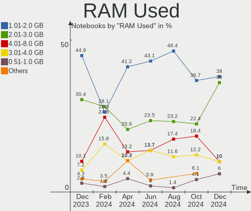
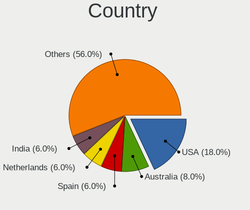
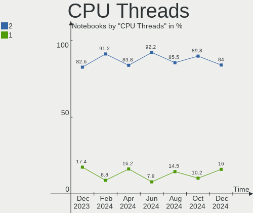

ArcoLinux Hardware Trends (Notebooks)
-------------------------------------

A project to identify most popular hardware characteristics and track their change
over time based on data collected by ArcoLinux users at https://Linux-Hardware.org.

Anyone can contribute to this report by the [hw-probe](https://github.com/linuxhw/hw-probe) tool:

    sudo -E hw-probe -all -upload

Full-feature report is available here: https://linux-hardware.org/?view=trends

Period: Feb, 2022.

Contents
--------

* [ System ](#system)
  - [ OS                       ](#os)
  - [ OS Family                ](#os-family)
  - [ Kernel                   ](#kernel)
  - [ Kernel Family            ](#kernel-family)
  - [ Kernel Major Ver.        ](#kernel-major-ver)
  - [ Arch                     ](#arch)
  - [ DE                       ](#de)
  - [ Display Server           ](#display-server)
  - [ Display Manager          ](#display-manager)
  - [ OS Lang                  ](#os-lang)
  - [ Boot Mode                ](#boot-mode)
  - [ Filesystem               ](#filesystem)
  - [ Part. scheme             ](#part-scheme)
  - [ Dual Boot with Linux/BSD ](#dual-boot-with-linuxbsd)
  - [ Dual Boot (Win)          ](#dual-boot-win)

* [ Board ](#board)
  - [ Vendor                   ](#vendor)
  - [ Model                    ](#model)
  - [ Model Family             ](#model-family)
  - [ MFG Year                 ](#mfg-year)
  - [ Form Factor              ](#form-factor)
  - [ Secure Boot              ](#secure-boot)
  - [ Coreboot                 ](#coreboot)
  - [ RAM Size                 ](#ram-size)
  - [ RAM Used                 ](#ram-used)
  - [ Total Drives             ](#total-drives)
  - [ Has CD-ROM               ](#has-cd-rom)
  - [ Has Ethernet             ](#has-ethernet)
  - [ Has WiFi                 ](#has-wifi)
  - [ Has Bluetooth            ](#has-bluetooth)

* [ Location ](#location)
  - [ Country                  ](#country)
  - [ City                     ](#city)

* [ Drives ](#drives)
  - [ Drive Vendor             ](#drive-vendor)
  - [ Drive Model              ](#drive-model)
  - [ HDD Vendor               ](#hdd-vendor)
  - [ SSD Vendor               ](#ssd-vendor)
  - [ Drive Kind               ](#drive-kind)
  - [ Drive Connector          ](#drive-connector)
  - [ Drive Size               ](#drive-size)
  - [ Space Total              ](#space-total)
  - [ Space Used               ](#space-used)
  - [ Malfunc. Drives          ](#malfunc-drives)
  - [ Malfunc. Drive Vendor    ](#malfunc-drive-vendor)
  - [ Malfunc. HDD Vendor      ](#malfunc-hdd-vendor)
  - [ Malfunc. Drive Kind      ](#malfunc-drive-kind)
  - [ Failed Drives            ](#failed-drives)
  - [ Failed Drive Vendor      ](#failed-drive-vendor)
  - [ Drive Status             ](#drive-status)

* [ Storage controller ](#storage-controller)
  - [ Storage Vendor           ](#storage-vendor)
  - [ Storage Model            ](#storage-model)
  - [ Storage Kind             ](#storage-kind)

* [ Processor ](#processor)
  - [ CPU Vendor               ](#cpu-vendor)
  - [ CPU Model                ](#cpu-model)
  - [ CPU Model Family         ](#cpu-model-family)
  - [ CPU Cores                ](#cpu-cores)
  - [ CPU Sockets              ](#cpu-sockets)
  - [ CPU Threads              ](#cpu-threads)
  - [ CPU Op-Modes             ](#cpu-op-modes)
  - [ CPU Microcode            ](#cpu-microcode)
  - [ CPU Microarch            ](#cpu-microarch)

* [ Graphics ](#graphics)
  - [ GPU Vendor               ](#gpu-vendor)
  - [ GPU Model                ](#gpu-model)
  - [ GPU Combo                ](#gpu-combo)
  - [ GPU Driver               ](#gpu-driver)
  - [ GPU Memory               ](#gpu-memory)

* [ Monitor ](#monitor)
  - [ Monitor Vendor           ](#monitor-vendor)
  - [ Monitor Model            ](#monitor-model)
  - [ Monitor Resolution       ](#monitor-resolution)
  - [ Monitor Diagonal         ](#monitor-diagonal)
  - [ Monitor Width            ](#monitor-width)
  - [ Aspect Ratio             ](#aspect-ratio)
  - [ Monitor Area             ](#monitor-area)
  - [ Pixel Density            ](#pixel-density)
  - [ Multiple Monitors        ](#multiple-monitors)

* [ Network ](#network)
  - [ Net Controller Vendor    ](#net-controller-vendor)
  - [ Net Controller Model     ](#net-controller-model)
  - [ Wireless Vendor          ](#wireless-vendor)
  - [ Wireless Model           ](#wireless-model)
  - [ Ethernet Vendor          ](#ethernet-vendor)
  - [ Ethernet Model           ](#ethernet-model)
  - [ Net Controller Kind      ](#net-controller-kind)
  - [ Used Controller          ](#used-controller)
  - [ NICs                     ](#nics)
  - [ IPv6                     ](#ipv6)

* [ Bluetooth ](#bluetooth)
  - [ Bluetooth Vendor         ](#bluetooth-vendor)
  - [ Bluetooth Model          ](#bluetooth-model)

* [ Sound ](#sound)
  - [ Sound Vendor             ](#sound-vendor)
  - [ Sound Model              ](#sound-model)

* [ Memory ](#memory)
  - [ Memory Vendor            ](#memory-vendor)
  - [ Memory Model             ](#memory-model)
  - [ Memory Kind              ](#memory-kind)
  - [ Memory Form Factor       ](#memory-form-factor)
  - [ Memory Size              ](#memory-size)
  - [ Memory Speed             ](#memory-speed)

* [ Printers & scanners ](#printers--scanners)
  - [ Printer Vendor           ](#printer-vendor)
  - [ Printer Model            ](#printer-model)
  - [ Scanner Vendor           ](#scanner-vendor)
  - [ Scanner Model            ](#scanner-model)

* [ Camera ](#camera)
  - [ Camera Vendor            ](#camera-vendor)
  - [ Camera Model             ](#camera-model)

* [ Security ](#security)
  - [ Fingerprint Vendor       ](#fingerprint-vendor)
  - [ Fingerprint Model        ](#fingerprint-model)
  - [ Chipcard Vendor          ](#chipcard-vendor)
  - [ Chipcard Model           ](#chipcard-model)

* [ Unsupported ](#unsupported)
  - [ Unsupported Devices      ](#unsupported-devices)
  - [ Unsupported Device Types ](#unsupported-device-types)

System
------

OS
--

Installed operating systems

| Name              | Notebooks | Percent |
|-------------------|-----------|---------|
| ArcoLinux Rolling | 35        | 89.74%  |
| ArcoLinux         | 4         | 10.26%  |

OS Family
---------

OS without a version

| Name      | Notebooks | Percent |
|-----------|-----------|---------|
| ArcoLinux | 39        | 100%    |

Kernel
------

Version of the Linux kernel

| Version               | Notebooks | Percent |
|-----------------------|-----------|---------|
| 5.16.10-arch1-1       | 7         | 17.95%  |
| 5.16.8-arch1-1        | 4         | 10.26%  |
| 5.16.5-arch1-1        | 4         | 10.26%  |
| 5.16.9-arch1-1        | 3         | 7.69%   |
| 5.16.4-arch1-1        | 3         | 7.69%   |
| 5.16.11-arch1-1       | 3         | 7.69%   |
| 5.15.10-arch1-1       | 3         | 7.69%   |
| 5.4.181-1-lts54       | 1         | 2.56%   |
| 5.17.0-rc4-1-mainline | 1         | 2.56%   |
| 5.16.8-zen1-1-zen     | 1         | 2.56%   |
| 5.16.7-arch1-1        | 1         | 2.56%   |
| 5.16.5-zen1-1-zen     | 1         | 2.56%   |
| 5.16.2-arch1-1        | 1         | 2.56%   |
| 5.16.11-zen1-1-zen    | 1         | 2.56%   |
| 5.16.10-zen1-1-zen    | 1         | 2.56%   |
| 5.15.24-1-lts         | 1         | 2.56%   |
| 5.15.21-1-lts         | 1         | 2.56%   |
| 5.15.19-1-lts         | 1         | 2.56%   |
| 5.15.13-arch1-1       | 1         | 2.56%   |

Kernel Family
-------------

Linux kernel without a distro release

| Version | Notebooks | Percent |
|---------|-----------|---------|
| 5.16.10 | 8         | 20.51%  |
| 5.16.8  | 5         | 12.82%  |
| 5.16.5  | 5         | 12.82%  |
| 5.16.11 | 4         | 10.26%  |
| 5.16.9  | 3         | 7.69%   |
| 5.16.4  | 3         | 7.69%   |
| 5.15.10 | 3         | 7.69%   |
| 5.4.181 | 1         | 2.56%   |
| 5.17.0  | 1         | 2.56%   |
| 5.16.7  | 1         | 2.56%   |
| 5.16.2  | 1         | 2.56%   |
| 5.15.24 | 1         | 2.56%   |
| 5.15.21 | 1         | 2.56%   |
| 5.15.19 | 1         | 2.56%   |
| 5.15.13 | 1         | 2.56%   |

Kernel Major Ver.
-----------------

Linux kernel major version

| Version | Notebooks | Percent |
|---------|-----------|---------|
| 5.16    | 30        | 76.92%  |
| 5.15    | 7         | 17.95%  |
| 5.4     | 1         | 2.56%   |
| 5.17    | 1         | 2.56%   |

Arch
----

OS architecture (x86_64, i586, etc.)

| Name   | Notebooks | Percent |
|--------|-----------|---------|
| x86_64 | 39        | 100%    |

DE
--

Desktop Environment

| Name       | Notebooks | Percent |
|------------|-----------|---------|
| XFCE       | 11        | 28.21%  |
| KDE5       | 9         | 23.08%  |
| i3         | 7         | 17.95%  |
| awesome    | 3         | 7.69%   |
| X-Cinnamon | 2         | 5.13%   |
| bspwm      | 2         | 5.13%   |
| qtile      | 1         | 2.56%   |
| openbox    | 1         | 2.56%   |
| LeftWM     | 1         | 2.56%   |
| GNOME      | 1         | 2.56%   |
| dwm        | 1         | 2.56%   |

Display Server
--------------

X11 or Wayland

| Name | Notebooks | Percent |
|------|-----------|---------|
| X11  | 36        | 92.31%  |
| Tty  | 3         | 7.69%   |

Display Manager
---------------

SDDM, LightDM, etc.

| Name    | Notebooks | Percent |
|---------|-----------|---------|
| SDDM    | 24        | 61.54%  |
| LightDM | 10        | 25.64%  |
| Unknown | 5         | 12.82%  |

OS Lang
-------

Language

| Lang  | Notebooks | Percent |
|-------|-----------|---------|
| en_US | 24        | 61.54%  |
| en_CA | 4         | 10.26%  |
| en_IN | 2         | 5.13%   |
| de_DE | 2         | 5.13%   |
| ru_UA | 1         | 2.56%   |
| hu_HU | 1         | 2.56%   |
| fr_CA | 1         | 2.56%   |
| es_ES | 1         | 2.56%   |
| en_GB | 1         | 2.56%   |
| en_AU | 1         | 2.56%   |
| el_GR | 1         | 2.56%   |

Boot Mode
---------

EFI or BIOS

| Mode | Notebooks | Percent |
|------|-----------|---------|
| EFI  | 26        | 66.67%  |
| BIOS | 13        | 33.33%  |

Filesystem
----------

Type of filesystem

| Type    | Notebooks | Percent |
|---------|-----------|---------|
| Ext4    | 31        | 79.49%  |
| Btrfs   | 6         | 15.38%  |
| Overlay | 2         | 5.13%   |

Part. scheme
------------

Scheme of partitioning

| Type    | Notebooks | Percent |
|---------|-----------|---------|
| GPT     | 25        | 64.1%   |
| MBR     | 9         | 23.08%  |
| Unknown | 5         | 12.82%  |

Dual Boot with Linux/BSD
------------------------

Hosting more than one Linux/BSD

| Dual boot | Notebooks | Percent |
|-----------|-----------|---------|
| No        | 30        | 76.92%  |
| Yes       | 9         | 23.08%  |

Dual Boot (Win)
---------------

Hosting Linux and Windows

| Dual boot | Notebooks | Percent |
|-----------|-----------|---------|
| No        | 21        | 53.85%  |
| Yes       | 18        | 46.15%  |

Board
-----

Vendor
------

Motherboard manufacturer

| Name             | Notebooks | Percent |
|------------------|-----------|---------|
| Lenovo           | 12        | 30.77%  |
| Dell             | 7         | 17.95%  |
| ASUSTek Computer | 7         | 17.95%  |
| Hewlett-Packard  | 3         | 7.69%   |
| Acer             | 3         | 7.69%   |
| Razer            | 1         | 2.56%   |
| Notebook         | 1         | 2.56%   |
| HUAWEI           | 1         | 2.56%   |
| Fujitsu          | 1         | 2.56%   |
| Compal           | 1         | 2.56%   |
| Casper           | 1         | 2.56%   |
| Apple            | 1         | 2.56%   |

Model
-----

Motherboard model

| Name                                               | Notebooks | Percent |
|----------------------------------------------------|-----------|---------|
| Razer Blade 15 Base Model (Early 2020) - RZ09-0328 | 1         | 2.56%   |
| Notebook PA70ES                                    | 1         | 2.56%   |
| Lenovo V15-IIL 82C5                                | 1         | 2.56%   |
| Lenovo ThinkPad X1 Extreme Gen 3 20TK001GUS        | 1         | 2.56%   |
| Lenovo ThinkPad X1 Carbon 2nd 20A8S04N1H           | 1         | 2.56%   |
| Lenovo ThinkPad W510 4389BB4                       | 1         | 2.56%   |
| Lenovo ThinkPad T420 4180DY4                       | 1         | 2.56%   |
| Lenovo ThinkPad T14 Gen 1 20UDCTO1WW               | 1         | 2.56%   |
| Lenovo ThinkPad S430 68852BU                       | 1         | 2.56%   |
| Lenovo ThinkPad R61/R61i 8934A7F                   | 1         | 2.56%   |
| Lenovo ThinkPad P14s Gen 2a 21A0000CMH             | 1         | 2.56%   |
| Lenovo ThinkPad E14 Gen 2 20TA0018AD               | 1         | 2.56%   |
| Lenovo IdeaPad Slim 7 Pro 14IHU5 82QT              | 1         | 2.56%   |
| Lenovo IdeaPad Flex-14API 81SS                     | 1         | 2.56%   |
| HUAWEI KLVL-WXX9                                   | 1         | 2.56%   |
| HP ZBook 15 G5                                     | 1         | 2.56%   |
| HP Pavilion Gaming Laptop 15-dk2xxx                | 1         | 2.56%   |
| HP 255 G7 Notebook PC                              | 1         | 2.56%   |
| Fujitsu LIFEBOOK E756                              | 1         | 2.56%   |
| Dell XPS 15 9570                                   | 1         | 2.56%   |
| Dell Precision 5550                                | 1         | 2.56%   |
| Dell Latitude E7240                                | 1         | 2.56%   |
| Dell Latitude E5430 non-vPro                       | 1         | 2.56%   |
| Dell Latitude E5400                                | 1         | 2.56%   |
| Dell Inspiron 5567                                 | 1         | 2.56%   |
| Dell Inspiron 15-3567                              | 1         | 2.56%   |
| Compal PBL21                                       | 1         | 2.56%   |
| Casper C600 NOTEBOOK DISCRETE                      | 1         | 2.56%   |
| ASUS X750LN                                        | 1         | 2.56%   |
| ASUS VivoBook_ASUSLaptop X515DAP_M515DA            | 1         | 2.56%   |
| ASUS VivoBook_ASUSLaptop X509DA_D509DA             | 1         | 2.56%   |
| ASUS VivoBook_ASUS Laptop E210MA_L210MA            | 1         | 2.56%   |
| ASUS ROG Strix G513IC_G513IC                       | 1         | 2.56%   |
| ASUS K54L                                          | 1         | 2.56%   |
| ASUS K53E                                          | 1         | 2.56%   |
| Apple MacBookPro11,2                               | 1         | 2.56%   |
| Acer Nitro AN515-54                                | 1         | 2.56%   |
| Acer Aspire V3-771                                 | 1         | 2.56%   |
| Acer Aspire A515-41G                               | 1         | 2.56%   |

Model Family
------------

Motherboard model prefix

| Name               | Notebooks | Percent |
|--------------------|-----------|---------|
| Lenovo ThinkPad    | 9         | 23.08%  |
| Dell Latitude      | 3         | 7.69%   |
| ASUS VivoBook      | 3         | 7.69%   |
| Lenovo IdeaPad     | 2         | 5.13%   |
| Dell Inspiron      | 2         | 5.13%   |
| Acer Aspire        | 2         | 5.13%   |
| Razer Blade        | 1         | 2.56%   |
| Notebook PA70ES    | 1         | 2.56%   |
| Lenovo V15-IIL     | 1         | 2.56%   |
| HUAWEI KLVL-WXX9   | 1         | 2.56%   |
| HP ZBook           | 1         | 2.56%   |
| HP Pavilion        | 1         | 2.56%   |
| HP 255             | 1         | 2.56%   |
| Fujitsu LIFEBOOK   | 1         | 2.56%   |
| Dell XPS           | 1         | 2.56%   |
| Dell Precision     | 1         | 2.56%   |
| Compal PBL21       | 1         | 2.56%   |
| Casper C600        | 1         | 2.56%   |
| ASUS X750LN        | 1         | 2.56%   |
| ASUS ROG           | 1         | 2.56%   |
| ASUS K54L          | 1         | 2.56%   |
| ASUS K53E          | 1         | 2.56%   |
| Apple MacBookPro11 | 1         | 2.56%   |
| Acer Nitro         | 1         | 2.56%   |

MFG Year
--------

Motherboard manufacture year

| Year | Notebooks | Percent |
|------|-----------|---------|
| 2020 | 8         | 20.51%  |
| 2021 | 5         | 12.82%  |
| 2018 | 4         | 10.26%  |
| 2016 | 4         | 10.26%  |
| 2011 | 4         | 10.26%  |
| 2019 | 3         | 7.69%   |
| 2017 | 2         | 5.13%   |
| 2014 | 2         | 5.13%   |
| 2013 | 2         | 5.13%   |
| 2012 | 2         | 5.13%   |
| 2010 | 1         | 2.56%   |
| 2008 | 1         | 2.56%   |
| 2007 | 1         | 2.56%   |

Form Factor
-----------

Physical design of the computer

| Name     | Notebooks | Percent |
|----------|-----------|---------|
| Notebook | 39        | 100%    |

Secure Boot
-----------

Enabled or disabled

| State    | Notebooks | Percent |
|----------|-----------|---------|
| Disabled | 39        | 100%    |

Coreboot
--------

Have coreboot on board

| Used | Notebooks | Percent |
|------|-----------|---------|
| No   | 39        | 100%    |

RAM Size
--------

Total RAM memory

| Size in GB | Notebooks | Percent |
|------------|-----------|---------|
| 4.01-8.0   | 10        | 25.64%  |
| 16.01-24.0 | 9         | 23.08%  |
| 8.01-16.0  | 9         | 23.08%  |
| 3.01-4.0   | 7         | 17.95%  |
| 32.01-64.0 | 4         | 10.26%  |

RAM Used
--------

Used RAM memory

| Used GB   | Notebooks | Percent |
|-----------|-----------|---------|
| 2.01-3.0  | 15        | 38.46%  |
| 1.01-2.0  | 13        | 33.33%  |
| 4.01-8.0  | 4         | 10.26%  |
| 0.51-1.0  | 4         | 10.26%  |
| 8.01-16.0 | 2         | 5.13%   |
| 3.01-4.0  | 1         | 2.56%   |

Total Drives
------------

Number of drives on board

| Drives | Notebooks | Percent |
|--------|-----------|---------|
| 1      | 24        | 61.54%  |
| 2      | 14        | 35.9%   |
| 3      | 1         | 2.56%   |

Has CD-ROM
----------

Has CD-ROM on board

| Presented | Notebooks | Percent |
|-----------|-----------|---------|
| No        | 29        | 74.36%  |
| Yes       | 10        | 25.64%  |

Has Ethernet
------------

Has Ethernet on board

| Presented | Notebooks | Percent |
|-----------|-----------|---------|
| Yes       | 29        | 74.36%  |
| No        | 10        | 25.64%  |

Has WiFi
--------

Has WiFi module

| Presented | Notebooks | Percent |
|-----------|-----------|---------|
| Yes       | 39        | 100%    |

Has Bluetooth
-------------

Has Bluetooth module

| Presented | Notebooks | Percent |
|-----------|-----------|---------|
| Yes       | 35        | 89.74%  |
| No        | 4         | 10.26%  |

Location
--------

Country
-------

Geographic location (country)

| Country                | Notebooks | Percent |
|------------------------|-----------|---------|
| USA                    | 7         | 17.95%  |
| Canada                 | 5         | 12.82%  |
| India                  | 3         | 7.69%   |
| Germany                | 3         | 7.69%   |
| Spain                  | 2         | 5.13%   |
| Indonesia              | 2         | 5.13%   |
| Ukraine                | 1         | 2.56%   |
| UAE                    | 1         | 2.56%   |
| Turkey                 | 1         | 2.56%   |
| Slovenia               | 1         | 2.56%   |
| Portugal               | 1         | 2.56%   |
| Norway                 | 1         | 2.56%   |
| Netherlands            | 1         | 2.56%   |
| Lithuania              | 1         | 2.56%   |
| Hungary                | 1         | 2.56%   |
| Greece                 | 1         | 2.56%   |
| Georgia                | 1         | 2.56%   |
| France                 | 1         | 2.56%   |
| Cuba                   | 1         | 2.56%   |
| Bulgaria               | 1         | 2.56%   |
| Bosnia and Herzegovina | 1         | 2.56%   |
| Belgium                | 1         | 2.56%   |
| Australia              | 1         | 2.56%   |

City
----

Geographic location (city)

| City                     | Notebooks | Percent |
|--------------------------|-----------|---------|
| Madrid                   | 2         | 5.13%   |
| Whitby                   | 1         | 2.56%   |
| Walnut Creek             | 1         | 2.56%   |
| Toronto                  | 1         | 2.56%   |
| Svilengrad               | 1         | 2.56%   |
| Surabaya                 | 1         | 2.56%   |
| Srebrenik                | 1         | 2.56%   |
| Šiauliai                | 1         | 2.56%   |
| Salaberry-de-Valleyfield | 1         | 2.56%   |
| Rexburg                  | 1         | 2.56%   |
| Queens                   | 1         | 2.56%   |
| Paris                    | 1         | 2.56%   |
| Oslo                     | 1         | 2.56%   |
| Nieuw-Vennep             | 1         | 2.56%   |
| Newcastle                | 1         | 2.56%   |
| Narasapuram              | 1         | 2.56%   |
| Münster               | 1         | 2.56%   |
| Ljubljana                | 1         | 2.56%   |
| Lethbridge               | 1         | 2.56%   |
| LaSalle                  | 1         | 2.56%   |
| Kyiv                     | 1         | 2.56%   |
| K'alak'i T'bilisi        | 1         | 2.56%   |
| Jaszbereny               | 1         | 2.56%   |
| Houston                  | 1         | 2.56%   |
| High Point               | 1         | 2.56%   |
| Havana                   | 1         | 2.56%   |
| Grimbergen               | 1         | 2.56%   |
| Frankfurt am Main        | 1         | 2.56%   |
| Fort Collins             | 1         | 2.56%   |
| Farrukhabad              | 1         | 2.56%   |
| Dubai                    | 1         | 2.56%   |
| Butte                    | 1         | 2.56%   |
| Bursa                    | 1         | 2.56%   |
| Berlin                   | 1         | 2.56%   |
| Bengaluru                | 1         | 2.56%   |
| Bagusan                  | 1         | 2.56%   |
| Athens                   | 1         | 2.56%   |
| Almada                   | 1         | 2.56%   |

Drives
------

Drive Vendor
------------

Hard drive vendors

| Vendor              | Notebooks | Drives | Percent |
|---------------------|-----------|--------|---------|
| Samsung Electronics | 13        | 15     | 25.49%  |
| WDC                 | 10        | 11     | 19.61%  |
| Seagate             | 6         | 6      | 11.76%  |
| SK Hynix            | 5         | 5      | 9.8%    |
| HGST                | 3         | 3      | 5.88%   |
| Toshiba             | 2         | 2      | 3.92%   |
| Kingston            | 2         | 2      | 3.92%   |
| Intel               | 2         | 2      | 3.92%   |
| Unknown             | 1         | 1      | 1.96%   |
| SPCC                | 1         | 1      | 1.96%   |
| SanDisk             | 1         | 1      | 1.96%   |
| Phison              | 1         | 1      | 1.96%   |
| LITEONIT            | 1         | 1      | 1.96%   |
| Hewlett-Packard     | 1         | 1      | 1.96%   |
| Gigabyte Technology | 1         | 1      | 1.96%   |
| Apple               | 1         | 1      | 1.96%   |

Drive Model
-----------

Hard drive models

| Model                                     | Notebooks | Percent |
|-------------------------------------------|-----------|---------|
| Seagate ST1000LM049-2GH172 1TB            | 2         | 3.7%    |
| HGST HTS545050A7E680 500GB                | 2         | 3.7%    |
| WDC WD7500BPVT-60HXZT3 752GB              | 1         | 1.85%   |
| WDC WD7500BPVT-22HXZT3 752GB              | 1         | 1.85%   |
| WDC WD6400BEVT-60A0RT0 640GB              | 1         | 1.85%   |
| WDC WD3200LPVX-75V0TT0 320GB              | 1         | 1.85%   |
| WDC WD10SPZX-80Z10T2 1TB                  | 1         | 1.85%   |
| WDC WD10SPZX-75Z10T2 1TB                  | 1         | 1.85%   |
| WDC WD10SPZX-60Z10T0 1TB                  | 1         | 1.85%   |
| WDC PC SN730 SDBPNTY-1T00-1101 1TB        | 1         | 1.85%   |
| WDC PC SN720 SDAPNTW-256G-1101 256GB      | 1         | 1.85%   |
| WDC PC SN530 SDBPNPZ-256G-1002 256GB      | 1         | 1.85%   |
| WDC PC SN520 SDAPNUW-256G-1202 256GB      | 1         | 1.85%   |
| Unknown DA4064  64GB                      | 1         | 1.85%   |
| Toshiba MQ01ABD100 1TB                    | 1         | 1.85%   |
| Toshiba MK5076GSX 500GB                   | 1         | 1.85%   |
| SPCC 2.5 SSD 512GB                        | 1         | 1.85%   |
| SK Hynix SKHynix_HFS512GDE9X081N 512GB    | 1         | 1.85%   |
| SK Hynix SKHynix_HFS001TD9TNI-L2B0B 1TB   | 1         | 1.85%   |
| SK Hynix SKHynix_HFM512GDHTNI-87A0B 512GB | 1         | 1.85%   |
| SK Hynix SKHynix_HFM256GD3HX015N 256GB    | 1         | 1.85%   |
| SK Hynix PC711 NVMe 512GB                 | 1         | 1.85%   |
| Seagate ST9320325AS 320GB                 | 1         | 1.85%   |
| Seagate ST1000LM048-2E7172 1TB            | 1         | 1.85%   |
| Seagate ST1000LM035-1RK172 1TB            | 1         | 1.85%   |
| Seagate ST1000LM024 HN-M101MBB 1TB        | 1         | 1.85%   |
| SanDisk Extreme 55AE 500GB SSD            | 1         | 1.85%   |
| Samsung SSD PM851 mSATA 256GB             | 1         | 1.85%   |
| Samsung SSD 980 1TB                       | 1         | 1.85%   |
| Samsung SSD 970 EVO Plus 1TB              | 1         | 1.85%   |
| Samsung SSD 960 EVO 1TB                   | 1         | 1.85%   |
| Samsung SSD 950 PRO 512GB                 | 1         | 1.85%   |
| Samsung SSD 870 QVO 1TB                   | 1         | 1.85%   |
| Samsung SSD 850 EVO 250GB                 | 1         | 1.85%   |
| Samsung SSD 840 EVO 750GB                 | 1         | 1.85%   |
| Samsung MZVLQ512HALU-000H1 512GB          | 1         | 1.85%   |
| Samsung MZVLB512HBJQ-00A00 512GB          | 1         | 1.85%   |
| Samsung MZVLB512HBJQ-000L7 512GB          | 1         | 1.85%   |
| Samsung MZVLB512HAJQ-000H1 512GB          | 1         | 1.85%   |
| Samsung MZ7TY256HDHP-00007 256GB SSD      | 1         | 1.85%   |
| Samsung MZ7TE128HMGR-00004 128GB SSD      | 1         | 1.85%   |
| Samsung MZ7LN256HCHP-000L7 256GB SSD      | 1         | 1.85%   |
| Phison 311CD0512GB                        | 1         | 1.85%   |
| LITEONIT LGT-256M6G 256GB SSD             | 1         | 1.85%   |
| Kingston SV300S37A240G 240GB SSD          | 1         | 1.85%   |
| Kingston RBUSNS8154P3256GJ1 256GB         | 1         | 1.85%   |
| Intel SSDSA2M160G2GC 160GB                | 1         | 1.85%   |
| Intel SSDPEKNU512GZ 512GB                 | 1         | 1.85%   |
| HGST HTS725050A7E630 500GB                | 1         | 1.85%   |
| HP External HDD 1TB                       | 1         | 1.85%   |
| Gigabyte GP-AG42TB                        | 1         | 1.85%   |
| Apple SSD SM0256F 256GB                   | 1         | 1.85%   |

HDD Vendor
----------

Hard disk drive vendors

| Vendor          | Notebooks | Drives | Percent |
|-----------------|-----------|--------|---------|
| WDC             | 7         | 7      | 36.84%  |
| Seagate         | 6         | 6      | 31.58%  |
| HGST            | 3         | 3      | 15.79%  |
| Toshiba         | 2         | 2      | 10.53%  |
| Hewlett-Packard | 1         | 1      | 5.26%   |

SSD Vendor
----------

Solid state drive vendors

| Vendor              | Notebooks | Drives | Percent |
|---------------------|-----------|--------|---------|
| Samsung Electronics | 7         | 7      | 53.85%  |
| SPCC                | 1         | 1      | 7.69%   |
| SanDisk             | 1         | 1      | 7.69%   |
| LITEONIT            | 1         | 1      | 7.69%   |
| Kingston            | 1         | 1      | 7.69%   |
| Intel               | 1         | 1      | 7.69%   |
| Apple               | 1         | 1      | 7.69%   |

Drive Kind
----------

HDD or SSD

| Kind | Notebooks | Drives | Percent |
|------|-----------|--------|---------|
| HDD  | 18        | 19     | 39.13%  |
| NVMe | 17        | 21     | 36.96%  |
| SSD  | 10        | 13     | 21.74%  |
| MMC  | 1         | 1      | 2.17%   |

Drive Connector
---------------

SATA, SAS, NVMe, etc.

| Type | Notebooks | Drives | Percent |
|------|-----------|--------|---------|
| SATA | 25        | 30     | 55.56%  |
| NVMe | 17        | 21     | 37.78%  |
| SAS  | 2         | 2      | 4.44%   |
| MMC  | 1         | 1      | 2.22%   |

Drive Size
----------

Size of hard drive

| Size in TB | Notebooks | Drives | Percent |
|------------|-----------|--------|---------|
| 0.51-1.0   | 16        | 16     | 53.33%  |
| 0.01-0.5   | 14        | 16     | 46.67%  |

Space Total
-----------

Amount of disk space available on the file system

| Size in GB     | Notebooks | Percent |
|----------------|-----------|---------|
| 251-500        | 16        | 41.03%  |
| 101-250        | 7         | 17.95%  |
| 501-1000       | 6         | 15.38%  |
| 51-100         | 6         | 15.38%  |
| 1-20           | 2         | 5.13%   |
| More than 3000 | 1         | 2.56%   |
| 1001-2000      | 1         | 2.56%   |

Space Used
----------

Amount of used disk space

| Used GB        | Notebooks | Percent |
|----------------|-----------|---------|
| 1-20           | 16        | 41.03%  |
| 21-50          | 10        | 25.64%  |
| 101-250        | 7         | 17.95%  |
| 51-100         | 3         | 7.69%   |
| 251-500        | 2         | 5.13%   |
| More than 3000 | 1         | 2.56%   |

Malfunc. Drives
---------------

Drive models with a malfunction

| Model                              | Notebooks | Drives | Percent |
|------------------------------------|-----------|--------|---------|
| WDC WD6400BEVT-60A0RT0 640GB       | 1         | 1      | 14.29%  |
| Seagate ST9320325AS 320GB          | 1         | 1      | 14.29%  |
| Seagate ST1000LM049-2GH172 1TB     | 1         | 1      | 14.29%  |
| Seagate ST1000LM024 HN-M101MBB 1TB | 1         | 1      | 14.29%  |
| Intel SSDSA2M160G2GC 160GB         | 1         | 1      | 14.29%  |
| HGST HTS725050A7E630 500GB         | 1         | 1      | 14.29%  |
| HGST HTS545050A7E680 500GB         | 1         | 1      | 14.29%  |

Malfunc. Drive Vendor
---------------------

Vendors of faulty drives

| Vendor  | Notebooks | Drives | Percent |
|---------|-----------|--------|---------|
| Seagate | 3         | 3      | 42.86%  |
| HGST    | 2         | 2      | 28.57%  |
| WDC     | 1         | 1      | 14.29%  |
| Intel   | 1         | 1      | 14.29%  |

Malfunc. HDD Vendor
-------------------

Vendors of faulty HDD drives

| Vendor  | Notebooks | Drives | Percent |
|---------|-----------|--------|---------|
| Seagate | 3         | 3      | 50%     |
| HGST    | 2         | 2      | 33.33%  |
| WDC     | 1         | 1      | 16.67%  |

Malfunc. Drive Kind
-------------------

Kinds of faulty drives

| Kind | Notebooks | Drives | Percent |
|------|-----------|--------|---------|
| HDD  | 6         | 6      | 85.71%  |
| SSD  | 1         | 1      | 14.29%  |

Failed Drives
-------------

Failed drive models

| Model                      | Notebooks | Drives | Percent |
|----------------------------|-----------|--------|---------|
| HGST HTS545050A7E680 500GB | 1         | 1      | 100%    |

Failed Drive Vendor
-------------------

Failed drive vendors

| Vendor | Notebooks | Drives | Percent |
|--------|-----------|--------|---------|
| HGST   | 1         | 1      | 100%    |

Drive Status
------------

Number of failed and malfunc. drives

| Status   | Notebooks | Drives | Percent |
|----------|-----------|--------|---------|
| Works    | 27        | 37     | 64.29%  |
| Detected | 8         | 9      | 19.05%  |
| Malfunc  | 6         | 7      | 14.29%  |
| Failed   | 1         | 1      | 2.38%   |

Storage controller
------------------

Storage Vendor
--------------

Storage controller vendors

| Vendor                      | Notebooks | Percent |
|-----------------------------|-----------|---------|
| Intel                       | 25        | 51.02%  |
| Samsung Electronics         | 8         | 16.33%  |
| SK Hynix                    | 5         | 10.2%   |
| Sandisk                     | 4         | 8.16%   |
| AMD                         | 4         | 8.16%   |
| Phison Electronics          | 2         | 4.08%   |
| Kingston Technology Company | 1         | 2.04%   |

Storage Model
-------------

Storage controller models

| Model                                                                                  | Notebooks | Percent |
|----------------------------------------------------------------------------------------|-----------|---------|
| Samsung NVMe SSD Controller SM981/PM981/PM983                                          | 4         | 7.55%   |
| Intel Sunrise Point-LP SATA Controller [AHCI mode]                                     | 4         | 7.55%   |
| AMD FCH SATA Controller [AHCI mode]                                                    | 4         | 7.55%   |
| SK Hynix Gold P31 SSD                                                                  | 3         | 5.66%   |
| Intel Cannon Lake Mobile PCH SATA AHCI Controller                                      | 3         | 5.66%   |
| Intel 82801 Mobile SATA Controller [RAID mode]                                         | 3         | 5.66%   |
| Intel 6 Series/C200 Series Chipset Family 6 port Mobile SATA AHCI Controller           | 3         | 5.66%   |
| Samsung NVMe SSD Controller 980                                                        | 2         | 3.77%   |
| Intel 8 Series SATA Controller 1 [AHCI mode]                                           | 2         | 3.77%   |
| Intel 7 Series Chipset Family 6-port SATA Controller [AHCI mode]                       | 2         | 3.77%   |
| SK Hynix Non-Volatile memory controller                                                | 1         | 1.89%   |
| SK Hynix BC511                                                                         | 1         | 1.89%   |
| Sandisk WD Blue SN550 NVMe SSD                                                         | 1         | 1.89%   |
| Sandisk WD Blue SN500 / PC SN520 NVMe SSD                                              | 1         | 1.89%   |
| Sandisk WD Black SN750 / PC SN730 NVMe SSD                                             | 1         | 1.89%   |
| Sandisk WD Black 2018/SN750 / PC SN720 NVMe SSD                                        | 1         | 1.89%   |
| Samsung NVMe SSD Controller SM961/PM961/SM963                                          | 1         | 1.89%   |
| Samsung NVMe SSD Controller SM951/PM951                                                | 1         | 1.89%   |
| Samsung Apple PCIe SSD                                                                 | 1         | 1.89%   |
| Phison PS5013 E13 NVMe Controller                                                      | 1         | 1.89%   |
| Phison E16 PCIe4 NVMe Controller                                                       | 1         | 1.89%   |
| Kingston Company U-SNS8154P3 NVMe SSD                                                  | 1         | 1.89%   |
| Intel Volume Management Device NVMe RAID Controller                                    | 1         | 1.89%   |
| Intel Tiger Lake-LP SATA Controller [AHCI mode]                                        | 1         | 1.89%   |
| Intel Non-Volatile memory controller                                                   | 1         | 1.89%   |
| Intel Ice Lake-LP SATA Controller [AHCI mode]                                          | 1         | 1.89%   |
| Intel Celeron/Pentium Silver Processor SATA Controller                                 | 1         | 1.89%   |
| Intel 82801IBM/IEM (ICH9M/ICH9M-E) 4 port SATA Controller [AHCI mode]                  | 1         | 1.89%   |
| Intel 82801HM/HEM (ICH8M/ICH8M-E) SATA Controller [AHCI mode]                          | 1         | 1.89%   |
| Intel 82801HM/HEM (ICH8M/ICH8M-E) IDE Controller                                       | 1         | 1.89%   |
| Intel 6 Series/C200 Series Chipset Family Mobile SATA Controller (IDE mode, ports 4-5) | 1         | 1.89%   |
| Intel 6 Series/C200 Series Chipset Family Mobile SATA Controller (IDE mode, ports 0-3) | 1         | 1.89%   |
| Intel 5 Series/3400 Series Chipset 6 port SATA AHCI Controller                         | 1         | 1.89%   |

Storage Kind
------------

Kind of storage controller (IDE, SATA, NVMe, SAS, ...)

| Kind | Notebooks | Percent |
|------|-----------|---------|
| SATA | 25        | 52.08%  |
| NVMe | 17        | 35.42%  |
| RAID | 4         | 8.33%   |
| IDE  | 2         | 4.17%   |

Processor
---------

CPU Vendor
----------

Processor vendors

| Vendor | Notebooks | Percent |
|--------|-----------|---------|
| Intel  | 30        | 76.92%  |
| AMD    | 9         | 23.08%  |

CPU Model
---------

Processor models

| Model                                           | Notebooks | Percent |
|-------------------------------------------------|-----------|---------|
| Intel Core i7-8750H CPU @ 2.20GHz               | 2         | 5.13%   |
| Intel Core i7-10850H CPU @ 2.70GHz              | 2         | 5.13%   |
| Intel Core i5-3230M CPU @ 2.60GHz               | 2         | 5.13%   |
| AMD Ryzen 7 4800H with Radeon Graphics          | 2         | 5.13%   |
| AMD Ryzen 5 3500U with Radeon Vega Mobile Gfx   | 2         | 5.13%   |
| Intel Pentium CPU B950 @ 2.10GHz                | 1         | 2.56%   |
| Intel Core i7-8850H CPU @ 2.60GHz               | 1         | 2.56%   |
| Intel Core i7-7500U CPU @ 2.70GHz               | 1         | 2.56%   |
| Intel Core i7-4770HQ CPU @ 2.20GHz              | 1         | 2.56%   |
| Intel Core i7-4600U CPU @ 2.10GHz               | 1         | 2.56%   |
| Intel Core i7-4500U CPU @ 1.80GHz               | 1         | 2.56%   |
| Intel Core i7-10750H CPU @ 2.60GHz              | 1         | 2.56%   |
| Intel Core i7 CPU Q 720 @ 1.60GHz               | 1         | 2.56%   |
| Intel Core i5-9300H CPU @ 2.40GHz               | 1         | 2.56%   |
| Intel Core i5-6200U CPU @ 2.30GHz               | 1         | 2.56%   |
| Intel Core i5-4310U CPU @ 2.00GHz               | 1         | 2.56%   |
| Intel Core i5-3340M CPU @ 2.70GHz               | 1         | 2.56%   |
| Intel Core i5-2520M CPU @ 2.50GHz               | 1         | 2.56%   |
| Intel Core i5-2430M CPU @ 2.40GHz               | 1         | 2.56%   |
| Intel Core i5-2410M CPU @ 2.30GHz               | 1         | 2.56%   |
| Intel Core i5-1035G1 CPU @ 1.00GHz              | 1         | 2.56%   |
| Intel Core i3-7100U CPU @ 2.40GHz               | 1         | 2.56%   |
| Intel Core i3-6006U CPU @ 2.00GHz               | 1         | 2.56%   |
| Intel Core 2 Duo CPU T7250 @ 2.00GHz            | 1         | 2.56%   |
| Intel Core 2 Duo CPU T7100 @ 1.80GHz            | 1         | 2.56%   |
| Intel Celeron N4020 CPU @ 1.10GHz               | 1         | 2.56%   |
| Intel 11th Gen Core i7-11370H @ 3.30GHz         | 1         | 2.56%   |
| Intel 11th Gen Core i5-1135G7 @ 2.40GHz         | 1         | 2.56%   |
| Intel 11th Gen Core i5-11300H @ 3.10GHz         | 1         | 2.56%   |
| AMD Ryzen 7 PRO 5850U with Radeon Graphics      | 1         | 2.56%   |
| AMD Ryzen 7 PRO 4750U with Radeon Graphics      | 1         | 2.56%   |
| AMD Ryzen 3 3250U with Radeon Graphics          | 1         | 2.56%   |
| AMD A4-9125 RADEON R3, 4 COMPUTE CORES 2C+2G    | 1         | 2.56%   |
| AMD A12-9720P RADEON R7, 12 COMPUTE CORES 4C+8G | 1         | 2.56%   |

CPU Model Family
----------------

Processor model prefix

| Model            | Notebooks | Percent |
|------------------|-----------|---------|
| Intel Core i7    | 11        | 28.21%  |
| Intel Core i5    | 10        | 25.64%  |
| Other            | 3         | 7.69%   |
| Intel Core i3    | 2         | 5.13%   |
| Intel Core 2 Duo | 2         | 5.13%   |
| AMD Ryzen 7 PRO  | 2         | 5.13%   |
| AMD Ryzen 7      | 2         | 5.13%   |
| AMD Ryzen 5      | 2         | 5.13%   |
| Intel Pentium    | 1         | 2.56%   |
| Intel Celeron    | 1         | 2.56%   |
| AMD Ryzen 3      | 1         | 2.56%   |
| AMD A4           | 1         | 2.56%   |
| AMD A12          | 1         | 2.56%   |

CPU Cores
---------

Number of processor cores

| Number | Notebooks | Percent |
|--------|-----------|---------|
| 2      | 20        | 51.28%  |
| 4      | 9         | 23.08%  |
| 6      | 6         | 15.38%  |
| 8      | 4         | 10.26%  |

CPU Sockets
-----------

Number of sockets

| Number | Notebooks | Percent |
|--------|-----------|---------|
| 1      | 39        | 100%    |

CPU Threads
-----------

Threads per core (Hyper-Threading)

| Number | Notebooks | Percent |
|--------|-----------|---------|
| 2      | 34        | 87.18%  |
| 1      | 5         | 12.82%  |

CPU Op-Modes
------------

CPU Operation Modes (32-bit, 64-bit)

| Op mode        | Notebooks | Percent |
|----------------|-----------|---------|
| 32-bit, 64-bit | 39        | 100%    |

CPU Microcode
-------------

Microcode number

| Number     | Notebooks | Percent |
|------------|-----------|---------|
| Unknown    | 6         | 15.38%  |
| 0x906ea    | 4         | 10.26%  |
| 0xa0652    | 3         | 7.69%   |
| 0x806c1    | 3         | 7.69%   |
| 0x40651    | 3         | 7.69%   |
| 0x306a9    | 3         | 7.69%   |
| 0x206a7    | 3         | 7.69%   |
| 0x08600106 | 3         | 7.69%   |
| 0x08108109 | 2         | 5.13%   |
| 0x806e9    | 1         | 2.56%   |
| 0x706e5    | 1         | 2.56%   |
| 0x706a8    | 1         | 2.56%   |
| 0x6fd      | 1         | 2.56%   |
| 0x406e3    | 1         | 2.56%   |
| 0x40661    | 1         | 2.56%   |
| 0x106e5    | 1         | 2.56%   |
| 0x08108102 | 1         | 2.56%   |
| 0x06006705 | 1         | 2.56%   |

CPU Microarch
-------------

Microarchitecture

| Name          | Notebooks | Percent |
|---------------|-----------|---------|
| KabyLake      | 6         | 15.38%  |
| SandyBridge   | 4         | 10.26%  |
| Haswell       | 4         | 10.26%  |
| Zen+          | 3         | 7.69%   |
| Zen 2         | 3         | 7.69%   |
| TigerLake     | 3         | 7.69%   |
| IvyBridge     | 3         | 7.69%   |
| CometLake     | 3         | 7.69%   |
| Skylake       | 2         | 5.13%   |
| Excavator     | 2         | 5.13%   |
| Core          | 2         | 5.13%   |
| Zen 3         | 1         | 2.56%   |
| Nehalem       | 1         | 2.56%   |
| IceLake       | 1         | 2.56%   |
| Goldmont plus | 1         | 2.56%   |

Graphics
--------

GPU Vendor
----------

Vendors of graphics cards

| Vendor | Notebooks | Percent |
|--------|-----------|---------|
| Intel  | 28        | 53.85%  |
| Nvidia | 14        | 26.92%  |
| AMD    | 10        | 19.23%  |

GPU Model
---------

Graphics card models

| Model                                                                                 | Notebooks | Percent |
|---------------------------------------------------------------------------------------|-----------|---------|
| Intel CoffeeLake-H GT2 [UHD Graphics 630]                                             | 4         | 7.41%   |
| Intel TigerLake-LP GT2 [Iris Xe Graphics]                                             | 3         | 5.56%   |
| Intel Haswell-ULT Integrated Graphics Controller                                      | 3         | 5.56%   |
| Intel CometLake-H GT2 [UHD Graphics]                                                  | 3         | 5.56%   |
| Intel 3rd Gen Core processor Graphics Controller                                      | 3         | 5.56%   |
| Intel 2nd Generation Core Processor Family Integrated Graphics Controller             | 3         | 5.56%   |
| AMD Renoir                                                                            | 3         | 5.56%   |
| AMD Picasso/Raven 2 [Radeon Vega Series / Radeon Vega Mobile Series]                  | 3         | 5.56%   |
| Nvidia GA107M [GeForce RTX 3050 Mobile]                                               | 2         | 3.7%    |
| Intel Skylake GT2 [HD Graphics 520]                                                   | 2         | 3.7%    |
| Intel HD Graphics 620                                                                 | 2         | 3.7%    |
| Nvidia TU117M [GeForce GTX 1650 Ti Mobile]                                            | 1         | 1.85%   |
| Nvidia TU117GLM [Quadro T1000 Mobile]                                                 | 1         | 1.85%   |
| Nvidia TU106M [GeForce RTX 2060 Mobile]                                               | 1         | 1.85%   |
| Nvidia GT216GLM [Quadro FX 880M]                                                      | 1         | 1.85%   |
| Nvidia GP107M [GeForce GTX 1050 Ti Mobile]                                            | 1         | 1.85%   |
| Nvidia GP107M [GeForce GTX 1050 3 GB Max-Q]                                           | 1         | 1.85%   |
| Nvidia GP107GLM [Quadro P2000 Mobile]                                                 | 1         | 1.85%   |
| Nvidia GP106M [GeForce GTX 1060 Mobile]                                               | 1         | 1.85%   |
| Nvidia GM108M [GeForce 920MX]                                                         | 1         | 1.85%   |
| Nvidia GM108M [GeForce 840M]                                                          | 1         | 1.85%   |
| Nvidia GK107M [GeForce GT 730M]                                                       | 1         | 1.85%   |
| Nvidia GF108M [GeForce GT 540M]                                                       | 1         | 1.85%   |
| Intel Mobile GM965/GL960 Integrated Graphics Controller (secondary)                   | 1         | 1.85%   |
| Intel Mobile GM965/GL960 Integrated Graphics Controller (primary)                     | 1         | 1.85%   |
| Intel Mobile 4 Series Chipset Integrated Graphics Controller                          | 1         | 1.85%   |
| Intel Iris Plus Graphics G1 (Ice Lake)                                                | 1         | 1.85%   |
| Intel GeminiLake [UHD Graphics 600]                                                   | 1         | 1.85%   |
| Intel Crystal Well Integrated Graphics Controller                                     | 1         | 1.85%   |
| AMD Wani [Radeon R5/R6/R7 Graphics]                                                   | 1         | 1.85%   |
| AMD Topaz XT [Radeon R7 M260/M265 / M340/M360 / M440/M445 / 530/535 / 620/625 Mobile] | 1         | 1.85%   |
| AMD Stoney [Radeon R2/R3/R4/R5 Graphics]                                              | 1         | 1.85%   |
| AMD Lexa PRO [Radeon 540/540X/550/550X / RX 540X/550/550X]                            | 1         | 1.85%   |
| AMD Cezanne                                                                           | 1         | 1.85%   |

GPU Combo
---------

Combinations of graphics cards

| Name           | Notebooks | Percent |
|----------------|-----------|---------|
| 1 x Intel      | 16        | 41.03%  |
| Intel + Nvidia | 11        | 28.21%  |
| 1 x AMD        | 7         | 17.95%  |
| 1 x Nvidia     | 2         | 5.13%   |
| 2 x AMD        | 1         | 2.56%   |
| Intel + AMD    | 1         | 2.56%   |
| AMD + Nvidia   | 1         | 2.56%   |

GPU Driver
----------

Free vs proprietary

| Driver      | Notebooks | Percent |
|-------------|-----------|---------|
| Free        | 26        | 66.67%  |
| Proprietary | 12        | 30.77%  |
| Unknown     | 1         | 2.56%   |

GPU Memory
----------

Total video memory

| Size in GB | Notebooks | Percent |
|------------|-----------|---------|
| Unknown    | 30        | 76.92%  |
| 1.01-2.0   | 4         | 10.26%  |
| 0.01-0.5   | 4         | 10.26%  |
| 3.01-4.0   | 1         | 2.56%   |

Monitor
-------

Monitor Vendor
--------------

Monitor vendors

| Vendor                  | Notebooks | Percent |
|-------------------------|-----------|---------|
| BOE                     | 9         | 18.75%  |
| LG Display              | 7         | 14.58%  |
| Chimei Innolux          | 7         | 14.58%  |
| AU Optronics            | 4         | 8.33%   |
| Samsung Electronics     | 3         | 6.25%   |
| Dell                    | 3         | 6.25%   |
| Sharp                   | 2         | 4.17%   |
| Goldstar                | 2         | 4.17%   |
| VIE                     | 1         | 2.08%   |
| Sony                    | 1         | 2.08%   |
| PANDA                   | 1         | 2.08%   |
| LG Philips              | 1         | 2.08%   |
| Lenovo                  | 1         | 2.08%   |
| Hewlett-Packard         | 1         | 2.08%   |
| CSO                     | 1         | 2.08%   |
| Chi Mei Optoelectronics | 1         | 2.08%   |
| BenQ                    | 1         | 2.08%   |
| ASUSTek Computer        | 1         | 2.08%   |
| Apple                   | 1         | 2.08%   |

Monitor Model
-------------

Monitor models

| Model                                                                     | Notebooks | Percent |
|---------------------------------------------------------------------------|-----------|---------|
| LG Display LCD Monitor LGD02DC 1366x768 344x194mm 15.5-inch               | 2         | 4.17%   |
| VIE A2256 VIE2150 1920x1080 368x207mm 16.6-inch                           | 1         | 2.08%   |
| Sony TV SNYEE01 1920x1080                                                 | 1         | 2.08%   |
| Sharp LCD Monitor SHP14D1 1920x1200 336x210mm 15.6-inch                   | 1         | 2.08%   |
| Sharp LCD Monitor SHP149A 1920x1080 344x194mm 15.5-inch                   | 1         | 2.08%   |
| Samsung Electronics S24C300 SAM0A24 1920x1080 531x299mm 24.0-inch         | 1         | 2.08%   |
| Samsung Electronics LCD Monitor SEC5441 1366x768 344x194mm 15.5-inch      | 1         | 2.08%   |
| Samsung Electronics LCD Monitor SDC3150 1920x1080 344x194mm 15.5-inch     | 1         | 2.08%   |
| PANDA LCD Monitor NCP0058 1920x1080 344x194mm 15.5-inch                   | 1         | 2.08%   |
| LG Philips LCD Monitor LPL012B 1280x800 304x190mm 14.1-inch               | 1         | 2.08%   |
| LG Display LCD Monitor LGD40A0 1366x768 310x174mm 14.0-inch               | 1         | 2.08%   |
| LG Display LCD Monitor LGD05FA 1920x1080 309x174mm 14.0-inch              | 1         | 2.08%   |
| LG Display LCD Monitor LGD0419 2560x1440 310x174mm 14.0-inch              | 1         | 2.08%   |
| LG Display LCD Monitor LGD0391 1600x900 382x215mm 17.3-inch               | 1         | 2.08%   |
| LG Display LCD Monitor LGD02F1 1366x768 344x194mm 15.5-inch               | 1         | 2.08%   |
| Lenovo LCD Monitor LEN4050 1280x800 331x207mm 15.4-inch                   | 1         | 2.08%   |
| Hewlett-Packard 24es HWP3320 1920x1080 527x296mm 23.8-inch                | 1         | 2.08%   |
| Goldstar ULTRAWIDE GSM76FA 2560x1080 531x298mm 24.0-inch                  | 1         | 2.08%   |
| Goldstar 2D FHD TV GSM59C6 1920x1080 509x286mm 23.0-inch                  | 1         | 2.08%   |
| Dell U2719DX DEL41A4 2560x1440 597x336mm 27.0-inch                        | 1         | 2.08%   |
| Dell P2719H DEL4184 1920x1080 598x336mm 27.0-inch                         | 1         | 2.08%   |
| Dell E228WFP DELD014 1680x1050 473x296mm 22.0-inch                        | 1         | 2.08%   |
| CSO LCD Monitor CSO1402 2880x1800 302x188mm 14.0-inch                     | 1         | 2.08%   |
| Chimei Innolux LCD Monitor CMN15F5 1920x1080 344x193mm 15.5-inch          | 1         | 2.08%   |
| Chimei Innolux LCD Monitor CMN15E8 1920x1080 344x193mm 15.5-inch          | 1         | 2.08%   |
| Chimei Innolux LCD Monitor CMN15DB 1366x768 344x193mm 15.5-inch           | 1         | 2.08%   |
| Chimei Innolux LCD Monitor CMN15C6 1366x768 344x193mm 15.5-inch           | 1         | 2.08%   |
| Chimei Innolux LCD Monitor CMN15B8 1366x768 344x194mm 15.5-inch           | 1         | 2.08%   |
| Chimei Innolux LCD Monitor CMN14D4 1920x1080 309x173mm 13.9-inch          | 1         | 2.08%   |
| Chimei Innolux LCD Monitor CMN1132 1366x768 256x144mm 11.6-inch           | 1         | 2.08%   |
| Chi Mei Optoelectronics LCD Monitor CMO1720 1920x1080 382x215mm 17.3-inch | 1         | 2.08%   |
| BOE LCD Monitor BOE09CC 1920x1080 344x194mm 15.5-inch                     | 1         | 2.08%   |
| BOE LCD Monitor BOE090F 1920x1080 344x194mm 15.5-inch                     | 1         | 2.08%   |
| BOE LCD Monitor BOE08EC 3840x2160 344x194mm 15.5-inch                     | 1         | 2.08%   |
| BOE LCD Monitor BOE0893 2160x1440 296x197mm 14.0-inch                     | 1         | 2.08%   |
| BOE LCD Monitor BOE0812 1920x1080 344x194mm 15.5-inch                     | 1         | 2.08%   |
| BOE LCD Monitor BOE0804 1920x1080 344x193mm 15.5-inch                     | 1         | 2.08%   |
| BOE LCD Monitor BOE0690 1920x1080 344x193mm 15.5-inch                     | 1         | 2.08%   |
| BOE LCD Monitor BOE0672 1366x768 344x194mm 15.5-inch                      | 1         | 2.08%   |
| BOE LCD Monitor BOE05DA 1366x768 277x156mm 12.5-inch                      | 1         | 2.08%   |
| BenQ EX2510 BNQ7F7D 1920x1080 544x303mm 24.5-inch                         | 1         | 2.08%   |
| AU Optronics LCD Monitor AUO403D 1920x1080 309x174mm 14.0-inch            | 1         | 2.08%   |
| AU Optronics LCD Monitor AUO323D 1920x1080 309x174mm 14.0-inch            | 1         | 2.08%   |
| AU Optronics LCD Monitor AUO319D 1920x1080 382x214mm 17.2-inch            | 1         | 2.08%   |
| AU Optronics LCD Monitor AUO24ED 1920x1080 344x193mm 15.5-inch            | 1         | 2.08%   |
| ASUSTek Computer VG245 AUS24A1 1920x1080 531x299mm 24.0-inch              | 1         | 2.08%   |
| Apple Color LCD APPA022 2880x1800 331x207mm 15.4-inch                     | 1         | 2.08%   |

Monitor Resolution
------------------

Monitor screen resolution

| Resolution         | Notebooks | Percent |
|--------------------|-----------|---------|
| 1920x1080 (FHD)    | 19        | 45.24%  |
| 1366x768 (WXGA)    | 11        | 26.19%  |
| 2880x1800          | 2         | 4.76%   |
| 2560x1440 (QHD)    | 2         | 4.76%   |
| 1280x800 (WXGA)    | 2         | 4.76%   |
| 3840x2160 (4K)     | 1         | 2.38%   |
| 2560x1080          | 1         | 2.38%   |
| 2160x1440          | 1         | 2.38%   |
| 1920x1200 (WUXGA)  | 1         | 2.38%   |
| 1680x1050 (WSXGA+) | 1         | 2.38%   |
| 1600x900 (HD+)     | 1         | 2.38%   |

Monitor Diagonal
----------------

Diagonal size in inches

| Inches | Notebooks | Percent |
|--------|-----------|---------|
| 15     | 23        | 48.94%  |
| 14     | 8         | 17.02%  |
| 24     | 3         | 6.38%   |
| 17     | 3         | 6.38%   |
| 27     | 2         | 4.26%   |
| 72     | 1         | 2.13%   |
| 34     | 1         | 2.13%   |
| 23     | 1         | 2.13%   |
| 22     | 1         | 2.13%   |
| 16     | 1         | 2.13%   |
| 13     | 1         | 2.13%   |
| 12     | 1         | 2.13%   |
| 11     | 1         | 2.13%   |

Monitor Width
-------------

Physical width

| Width in mm | Notebooks | Percent |
|-------------|-----------|---------|
| 301-350     | 30        | 65.22%  |
| 501-600     | 5         | 10.87%  |
| 351-400     | 5         | 10.87%  |
| 201-300     | 3         | 6.52%   |
| 701-800     | 1         | 2.17%   |
| 401-500     | 1         | 2.17%   |
| 1501-2000   | 1         | 2.17%   |

Aspect Ratio
------------

Proportional relationship between the width and the height

| Ratio | Notebooks | Percent |
|-------|-----------|---------|
| 16/9  | 34        | 82.93%  |
| 16/10 | 5         | 12.2%   |
| 3/2   | 1         | 2.44%   |
| 21/9  | 1         | 2.44%   |

Monitor Area
------------

Area in inch²

| Area in inch² | Notebooks | Percent |
|----------------|-----------|---------|
| 101-110        | 23        | 48.94%  |
| 81-90          | 9         | 19.15%  |
| 201-250        | 4         | 8.51%   |
| 121-130        | 3         | 6.38%   |
| 301-350        | 2         | 4.26%   |
| More than 1000 | 1         | 2.13%   |
| 61-70          | 1         | 2.13%   |
| 51-60          | 1         | 2.13%   |
| 351-500        | 1         | 2.13%   |
| 251-300        | 1         | 2.13%   |
| 111-120        | 1         | 2.13%   |

Pixel Density
-------------

Pixels per inch

| Density       | Notebooks | Percent |
|---------------|-----------|---------|
| 121-160       | 21        | 46.67%  |
| 101-120       | 11        | 24.44%  |
| 51-100        | 7         | 15.56%  |
| 161-240       | 3         | 6.67%   |
| More than 240 | 2         | 4.44%   |
| 1-50          | 1         | 2.22%   |

Multiple Monitors
-----------------

Total monitors connected

| Total | Notebooks | Percent |
|-------|-----------|---------|
| 1     | 30        | 76.92%  |
| 2     | 6         | 15.38%  |
| 3     | 2         | 5.13%   |
| 0     | 1         | 2.56%   |

Network
-------

Net Controller Vendor
---------------------

Controller vendors

| Vendor                | Notebooks | Percent |
|-----------------------|-----------|---------|
| Realtek Semiconductor | 22        | 36.67%  |
| Intel                 | 22        | 36.67%  |
| Qualcomm Atheros      | 7         | 11.67%  |
| Broadcom              | 4         | 6.67%   |
| Broadcom Limited      | 2         | 3.33%   |
| Samsung Electronics   | 1         | 1.67%   |
| Ralink Technology     | 1         | 1.67%   |
| MEDIATEK              | 1         | 1.67%   |

Net Controller Model
--------------------

Controller models

| Model                                                             | Notebooks | Percent |
|-------------------------------------------------------------------|-----------|---------|
| Realtek RTL8111/8168/8411 PCI Express Gigabit Ethernet Controller | 14        | 19.72%  |
| Realtek RTL8821CE 802.11ac PCIe Wireless Network Adapter          | 4         | 5.63%   |
| Qualcomm Atheros AR8151 v2.0 Gigabit Ethernet                     | 3         | 4.23%   |
| Intel Comet Lake PCH CNVi WiFi                                    | 3         | 4.23%   |
| Realtek RTL8153 Gigabit Ethernet Adapter                          | 2         | 2.82%   |
| Realtek RTL810xE PCI Express Fast Ethernet controller             | 2         | 2.82%   |
| Qualcomm Atheros QCA9377 802.11ac Wireless Network Adapter        | 2         | 2.82%   |
| Intel Wireless 7260                                               | 2         | 2.82%   |
| Intel Wireless 3165                                               | 2         | 2.82%   |
| Intel Wi-Fi 6 AX201                                               | 2         | 2.82%   |
| Intel Wi-Fi 6 AX200                                               | 2         | 2.82%   |
| Intel Ethernet Connection I218-LM                                 | 2         | 2.82%   |
| Intel Centrino Advanced-N 6205 [Taylor Peak]                      | 2         | 2.82%   |
| Intel Cannon Lake PCH CNVi WiFi                                   | 2         | 2.82%   |
| Samsung GT-I9070 (network tethering, USB debugging enabled)       | 1         | 1.41%   |
| Realtek RTL8852AE 802.11ax PCIe Wireless Network Adapter          | 1         | 1.41%   |
| Realtek RTL8822CE 802.11ac PCIe Wireless Network Adapter          | 1         | 1.41%   |
| Realtek RTL8822BE 802.11a/b/g/n/ac WiFi adapter                   | 1         | 1.41%   |
| Realtek Realtek Network controller                                | 1         | 1.41%   |
| Ralink RT2870/RT3070 Wireless Adapter                             | 1         | 1.41%   |
| Qualcomm Atheros QCA6174 802.11ac Wireless Network Adapter        | 1         | 1.41%   |
| Qualcomm Atheros AR9485 Wireless Network Adapter                  | 1         | 1.41%   |
| Qualcomm Atheros AR9462 Wireless Network Adapter                  | 1         | 1.41%   |
| Qualcomm Atheros AR9285 Wireless Network Adapter (PCI-Express)    | 1         | 1.41%   |
| MEDIATEK MT7921 802.11ax PCI Express Wireless Network Adapter     | 1         | 1.41%   |
| Intel Wireless 8260                                               | 1         | 1.41%   |
| Intel Wireless 7265                                               | 1         | 1.41%   |
| Intel PRO/Wireless 3945ABG [Golan] Network Connection             | 1         | 1.41%   |
| Intel Ice Lake-LP PCH CNVi WiFi                                   | 1         | 1.41%   |
| Intel Ethernet Connection I219-V                                  | 1         | 1.41%   |
| Intel Ethernet Connection (7) I219-LM                             | 1         | 1.41%   |
| Intel Centrino Wireless-N 1030 [Rainbow Peak]                     | 1         | 1.41%   |
| Intel Centrino Ultimate-N 6300                                    | 1         | 1.41%   |
| Intel 82579LM Gigabit Network Connection (Lewisville)             | 1         | 1.41%   |
| Intel 82577LM Gigabit Network Connection                          | 1         | 1.41%   |
| Broadcom NetXtreme BCM5761 Gigabit Ethernet PCIe                  | 1         | 1.41%   |
| Broadcom NetLink BCM5787M Gigabit Ethernet PCI Express            | 1         | 1.41%   |
| Broadcom Limited NetXtreme BCM5761e Gigabit Ethernet PCIe         | 1         | 1.41%   |
| Broadcom Limited BCM4313 802.11bgn Wireless Network Adapter       | 1         | 1.41%   |
| Broadcom BCM4360 802.11ac Wireless Network Adapter                | 1         | 1.41%   |
| Broadcom BCM43142 802.11b/g/n                                     | 1         | 1.41%   |

Wireless Vendor
---------------

Wireless vendors

| Vendor                | Notebooks | Percent |
|-----------------------|-----------|---------|
| Intel                 | 21        | 52.5%   |
| Realtek Semiconductor | 8         | 20%     |
| Qualcomm Atheros      | 6         | 15%     |
| Broadcom              | 2         | 5%      |
| Ralink Technology     | 1         | 2.5%    |
| MEDIATEK              | 1         | 2.5%    |
| Broadcom Limited      | 1         | 2.5%    |

Wireless Model
--------------

Wireless models

| Model                                                          | Notebooks | Percent |
|----------------------------------------------------------------|-----------|---------|
| Realtek RTL8821CE 802.11ac PCIe Wireless Network Adapter       | 4         | 10%     |
| Intel Comet Lake PCH CNVi WiFi                                 | 3         | 7.5%    |
| Qualcomm Atheros QCA9377 802.11ac Wireless Network Adapter     | 2         | 5%      |
| Intel Wireless 7260                                            | 2         | 5%      |
| Intel Wireless 3165                                            | 2         | 5%      |
| Intel Wi-Fi 6 AX201                                            | 2         | 5%      |
| Intel Wi-Fi 6 AX200                                            | 2         | 5%      |
| Intel Centrino Advanced-N 6205 [Taylor Peak]                   | 2         | 5%      |
| Intel Cannon Lake PCH CNVi WiFi                                | 2         | 5%      |
| Realtek RTL8852AE 802.11ax PCIe Wireless Network Adapter       | 1         | 2.5%    |
| Realtek RTL8822CE 802.11ac PCIe Wireless Network Adapter       | 1         | 2.5%    |
| Realtek RTL8822BE 802.11a/b/g/n/ac WiFi adapter                | 1         | 2.5%    |
| Realtek Realtek Network controller                             | 1         | 2.5%    |
| Ralink RT2870/RT3070 Wireless Adapter                          | 1         | 2.5%    |
| Qualcomm Atheros QCA6174 802.11ac Wireless Network Adapter     | 1         | 2.5%    |
| Qualcomm Atheros AR9485 Wireless Network Adapter               | 1         | 2.5%    |
| Qualcomm Atheros AR9462 Wireless Network Adapter               | 1         | 2.5%    |
| Qualcomm Atheros AR9285 Wireless Network Adapter (PCI-Express) | 1         | 2.5%    |
| MEDIATEK MT7921 802.11ax PCI Express Wireless Network Adapter  | 1         | 2.5%    |
| Intel Wireless 8260                                            | 1         | 2.5%    |
| Intel Wireless 7265                                            | 1         | 2.5%    |
| Intel PRO/Wireless 3945ABG [Golan] Network Connection          | 1         | 2.5%    |
| Intel Ice Lake-LP PCH CNVi WiFi                                | 1         | 2.5%    |
| Intel Centrino Wireless-N 1030 [Rainbow Peak]                  | 1         | 2.5%    |
| Intel Centrino Ultimate-N 6300                                 | 1         | 2.5%    |
| Broadcom Limited BCM4313 802.11bgn Wireless Network Adapter    | 1         | 2.5%    |
| Broadcom BCM4360 802.11ac Wireless Network Adapter             | 1         | 2.5%    |
| Broadcom BCM43142 802.11b/g/n                                  | 1         | 2.5%    |

Ethernet Vendor
---------------

Ethernet vendors

| Vendor                | Notebooks | Percent |
|-----------------------|-----------|---------|
| Realtek Semiconductor | 17        | 56.67%  |
| Intel                 | 6         | 20%     |
| Qualcomm Atheros      | 3         | 10%     |
| Broadcom              | 2         | 6.67%   |
| Samsung Electronics   | 1         | 3.33%   |
| Broadcom Limited      | 1         | 3.33%   |

Ethernet Model
--------------

Ethernet models

| Model                                                             | Notebooks | Percent |
|-------------------------------------------------------------------|-----------|---------|
| Realtek RTL8111/8168/8411 PCI Express Gigabit Ethernet Controller | 14        | 45.16%  |
| Qualcomm Atheros AR8151 v2.0 Gigabit Ethernet                     | 3         | 9.68%   |
| Realtek RTL8153 Gigabit Ethernet Adapter                          | 2         | 6.45%   |
| Realtek RTL810xE PCI Express Fast Ethernet controller             | 2         | 6.45%   |
| Intel Ethernet Connection I218-LM                                 | 2         | 6.45%   |
| Samsung GT-I9070 (network tethering, USB debugging enabled)       | 1         | 3.23%   |
| Intel Ethernet Connection I219-V                                  | 1         | 3.23%   |
| Intel Ethernet Connection (7) I219-LM                             | 1         | 3.23%   |
| Intel 82579LM Gigabit Network Connection (Lewisville)             | 1         | 3.23%   |
| Intel 82577LM Gigabit Network Connection                          | 1         | 3.23%   |
| Broadcom NetXtreme BCM5761 Gigabit Ethernet PCIe                  | 1         | 3.23%   |
| Broadcom NetLink BCM5787M Gigabit Ethernet PCI Express            | 1         | 3.23%   |
| Broadcom Limited NetXtreme BCM5761e Gigabit Ethernet PCIe         | 1         | 3.23%   |

Net Controller Kind
-------------------

Ethernet, WiFi or modem

| Kind     | Notebooks | Percent |
|----------|-----------|---------|
| WiFi     | 39        | 57.35%  |
| Ethernet | 29        | 42.65%  |

Used Controller
---------------

Currently used network controller

| Kind     | Notebooks | Percent |
|----------|-----------|---------|
| WiFi     | 36        | 81.82%  |
| Ethernet | 8         | 18.18%  |

NICs
----

Total network controllers on board

| Total | Notebooks | Percent |
|-------|-----------|---------|
| 2     | 26        | 66.67%  |
| 1     | 11        | 28.21%  |
| 3     | 2         | 5.13%   |

IPv6
----

IPv6 vs IPv4

| Used | Notebooks | Percent |
|------|-----------|---------|
| No   | 25        | 64.1%   |
| Yes  | 14        | 35.9%   |

Bluetooth
---------

Bluetooth Vendor
----------------

Controller vendors

| Vendor                          | Notebooks | Percent |
|---------------------------------|-----------|---------|
| Intel                           | 17        | 48.57%  |
| Realtek Semiconductor           | 4         | 11.43%  |
| Qualcomm Atheros Communications | 3         | 8.57%   |
| Lite-On Technology              | 3         | 8.57%   |
| IMC Networks                    | 3         | 8.57%   |
| Broadcom                        | 2         | 5.71%   |
| Realtek                         | 1         | 2.86%   |
| Dell                            | 1         | 2.86%   |
| Apple                           | 1         | 2.86%   |

Bluetooth Model
---------------

Controller models

| Model                                        | Notebooks | Percent |
|----------------------------------------------|-----------|---------|
| Intel Bluetooth wireless interface           | 5         | 14.29%  |
| Intel Bluetooth Device                       | 5         | 14.29%  |
| Intel AX201 Bluetooth                        | 5         | 14.29%  |
| Realtek Bluetooth Radio                      | 3         | 8.57%   |
| Qualcomm Atheros  Bluetooth Device           | 2         | 5.71%   |
| Lite-On Bluetooth Device                     | 2         | 5.71%   |
| Intel AX200 Bluetooth                        | 2         | 5.71%   |
| IMC Networks Bluetooth Radio                 | 2         | 5.71%   |
| Realtek  Bluetooth 4.2 Adapter               | 1         | 2.86%   |
| Realtek Bluetooth Radio                      | 1         | 2.86%   |
| Qualcomm Atheros AR3011 Bluetooth            | 1         | 2.86%   |
| Lite-On Broadcom BCM43142A0 Bluetooth Device | 1         | 2.86%   |
| IMC Networks Wireless_Device                 | 1         | 2.86%   |
| Dell BCM20702A0                              | 1         | 2.86%   |
| Broadcom BCM2070 Bluetooth Device            | 1         | 2.86%   |
| Broadcom BCM2045B (BDC-2.1)                  | 1         | 2.86%   |
| Apple Bluetooth Host Controller              | 1         | 2.86%   |

Sound
-----

Sound Vendor
------------

Sound card vendors

| Vendor                    | Notebooks | Percent |
|---------------------------|-----------|---------|
| Intel                     | 30        | 60%     |
| AMD                       | 9         | 18%     |
| Nvidia                    | 8         | 16%     |
| Sennheiser Communications | 1         | 2%      |
| Samsung Electronics       | 1         | 2%      |
| Realtek Semiconductor     | 1         | 2%      |

Sound Model
-----------

Sound card models

| Model                                                                      | Notebooks | Percent |
|----------------------------------------------------------------------------|-----------|---------|
| AMD Family 17h/19h HD Audio Controller                                     | 6         | 9.68%   |
| Intel Sunrise Point-LP HD Audio                                            | 4         | 6.45%   |
| Intel Cannon Lake PCH cAVS                                                 | 4         | 6.45%   |
| Intel 6 Series/C200 Series Chipset Family High Definition Audio Controller | 4         | 6.45%   |
| AMD Renoir Radeon High Definition Audio Controller                         | 4         | 6.45%   |
| Intel Tiger Lake-LP Smart Sound Technology Audio Controller                | 3         | 4.84%   |
| Intel Haswell-ULT HD Audio Controller                                      | 3         | 4.84%   |
| Intel Comet Lake PCH cAVS                                                  | 3         | 4.84%   |
| Intel 8 Series HD Audio Controller                                         | 3         | 4.84%   |
| Intel 7 Series/C216 Chipset Family High Definition Audio Controller        | 3         | 4.84%   |
| AMD Raven/Raven2/Fenghuang HDMI/DP Audio Controller                        | 3         | 4.84%   |
| Nvidia GP107GL High Definition Audio Controller                            | 2         | 3.23%   |
| AMD Family 15h (Models 60h-6fh) Audio Controller                           | 2         | 3.23%   |
| Sennheiser Communications Sennheiser USB headset                           | 1         | 1.61%   |
| Samsung Electronics USBC Headset                                           | 1         | 1.61%   |
| Realtek Semiconductor USB Audio                                            | 1         | 1.61%   |
| Nvidia TU107 GeForce GTX 1650 High Definition Audio Controller             | 1         | 1.61%   |
| Nvidia TU106 High Definition Audio Controller                              | 1         | 1.61%   |
| Nvidia GT216 HDMI Audio Controller                                         | 1         | 1.61%   |
| Nvidia GP106 High Definition Audio Controller                              | 1         | 1.61%   |
| Nvidia GF108 High Definition Audio Controller                              | 1         | 1.61%   |
| Nvidia Audio device                                                        | 1         | 1.61%   |
| Intel Ice Lake-LP Smart Sound Technology Audio Controller                  | 1         | 1.61%   |
| Intel Crystal Well HD Audio Controller                                     | 1         | 1.61%   |
| Intel Celeron/Pentium Silver Processor High Definition Audio               | 1         | 1.61%   |
| Intel 82801I (ICH9 Family) HD Audio Controller                             | 1         | 1.61%   |
| Intel 82801H (ICH8 Family) HD Audio Controller                             | 1         | 1.61%   |
| Intel 8 Series/C220 Series Chipset High Definition Audio Controller        | 1         | 1.61%   |
| Intel 5 Series/3400 Series Chipset High Definition Audio                   | 1         | 1.61%   |
| AMD Kabini HDMI/DP Audio                                                   | 1         | 1.61%   |
| AMD High Definition Audio Controller                                       | 1         | 1.61%   |

Memory
------

Memory Vendor
-------------

Memory module vendors

| Vendor              | Notebooks | Percent |
|---------------------|-----------|---------|
| Samsung Electronics | 14        | 35.9%   |
| SK Hynix            | 10        | 25.64%  |
| Micron Technology   | 3         | 7.69%   |
| Crucial             | 2         | 5.13%   |
| Unknown             | 1         | 2.56%   |
| Team                | 1         | 2.56%   |
| Silicon Power       | 1         | 2.56%   |
| Patriot             | 1         | 2.56%   |
| Kingston            | 1         | 2.56%   |
| G.Skill             | 1         | 2.56%   |
| Corsair             | 1         | 2.56%   |
| Avant               | 1         | 2.56%   |
| Apacer              | 1         | 2.56%   |
| A-DATA Technology   | 1         | 2.56%   |

Memory Model
------------

Memory module models

| Model                                                       | Notebooks | Percent |
|-------------------------------------------------------------|-----------|---------|
| Samsung RAM M471A5244CB0-CTD 4096MB SODIMM DDR4 3266MT/s    | 2         | 5%      |
| Samsung RAM M471A1K43DB1-CWE 8GB SODIMM DDR4 3200MT/s       | 2         | 5%      |
| Unknown RAM Module 8GB SODIMM DDR4 3200MT/s                 | 1         | 2.5%    |
| Team RAM TEAMGROUP-SD4-2400 8GB SODIMM DDR4 8400MT/s        | 1         | 2.5%    |
| SK Hynix RAM Module 8GB SODIMM DDR3 1600MT/s                | 1         | 2.5%    |
| SK Hynix RAM HMT851S6AMR6R-PB N0 4GB Chip DDR3 1600MT/s     | 1         | 2.5%    |
| SK Hynix RAM HMT351S6EFR8C-PB 4GB SODIMM DDR3 1600MT/s      | 1         | 2.5%    |
| SK Hynix RAM HMT351S6CFR8C-PB 4GB SODIMM DDR3 1600MT/s      | 1         | 2.5%    |
| SK Hynix RAM HMT351S6CFR8A-H9 4GB SODIMM DDR3 1333MT/s      | 1         | 2.5%    |
| SK Hynix RAM HMT351S6BFR8C-H9 4GB SODIMM DDR3 1333MT/s      | 1         | 2.5%    |
| SK Hynix RAM HMAB2GS6AMR6N-XN 16GB SODIMM DDR4 3200MT/s     | 1         | 2.5%    |
| SK Hynix RAM HMA851S6JJR6N-VK 4GB SODIMM DDR4 2667MT/s      | 1         | 2.5%    |
| SK Hynix RAM HMA81GS6JJR8N-VK 8GB SODIMM DDR4 2667MT/s      | 1         | 2.5%    |
| SK Hynix RAM HMA81GS6JJR8N-VK 8192MB SODIMM DDR4 2667MT/s   | 1         | 2.5%    |
| SK Hynix RAM HMA81GS6AFR8N-UH 8192MB SODIMM DDR4 2667MT/s   | 1         | 2.5%    |
| Silicon Power RAM SP008GLSTU160N02 8GB SODIMM DDR3 1600MT/s | 1         | 2.5%    |
| Samsung RAM UBE3D4AA-MGCR 2GB Row Of Chips LPDDR4 4267MT/s  | 1         | 2.5%    |
| Samsung RAM Module 16GB SODIMM DDR4 2667MT/s                | 1         | 2.5%    |
| Samsung RAM M471B5273CH0-CH9 4GB SODIMM DDR3 1334MT/s       | 1         | 2.5%    |
| Samsung RAM M471B5173QH0-YK0 4096MB SODIMM DDR3 1600MT/s    | 1         | 2.5%    |
| Samsung RAM M471B5173DB0-YK0 4GB SODIMM DDR3 1600MT/s       | 1         | 2.5%    |
| Samsung RAM M471A4G43AB1-CWE 32GB SODIMM DDR4 3200MT/s      | 1         | 2.5%    |
| Samsung RAM M471A2K43DB1-CWE 16GB SODIMM DDR4 3200MT/s      | 1         | 2.5%    |
| Samsung RAM M471A2G44AM0-CWE 16GB SODIMM DDR4 3200MT/s      | 1         | 2.5%    |
| Samsung RAM M471A1G44AB0-CWE 8GB Row Of Chips DDR4 3200MT/s | 1         | 2.5%    |
| Samsung RAM K4F8E304HB-MGCj 4GB SODIMM DDR4 2400MT/s        | 1         | 2.5%    |
| Patriot RAM PSD34G160082S 4GB SODIMM DDR3 1600MT/s          | 1         | 2.5%    |
| Micron RAM 8ATF1G64HZ-3G2J1 8192MB SODIMM DDR4 3200MT/s     | 1         | 2.5%    |
| Micron RAM 4ATF51264HZ-3G2J1 4GB Row Of Chips DDR4 3200MT/s | 1         | 2.5%    |
| Micron RAM 4ATF51264HZ-2G6E1 4GB SODIMM DDR4 2667MT/s       | 1         | 2.5%    |
| Kingston RAM ACR16D3LS1KFG/4G 4GB SODIMM DDR3 1600MT/s      | 1         | 2.5%    |
| G.Skill RAM F4-2666C18-16GRS 16GB SODIMM DDR4 2667MT/s      | 1         | 2.5%    |
| Crucial RAM CT51264AC800.C16FC 4GB SODIMM DDR2 800MT/s      | 1         | 2.5%    |
| Crucial RAM CT4G4SFS824A.C8FHP 4GB SODIMM DDR4 2133MT/s     | 1         | 2.5%    |
| Corsair RAM CMSX8GX4M1A2666C18 8GB SODIMM DDR4 2667MT/s     | 1         | 2.5%    |
| Avant RAM H641GU97F9333G 8GB SODIMM DDR3 1333MT/s           | 1         | 2.5%    |
| Apacer RAM D22.23263S.002 16GB SODIMM DDR4 2667MT/s         | 1         | 2.5%    |
| A-DATA RAM AO1P24HC8T1-BQXS 8GB SODIMM DDR4 2400MT/s        | 1         | 2.5%    |

Memory Kind
-----------

Memory module kinds

| Kind   | Notebooks | Percent |
|--------|-----------|---------|
| DDR4   | 20        | 58.82%  |
| DDR3   | 11        | 32.35%  |
| LPDDR4 | 2         | 5.88%   |
| DDR2   | 1         | 2.94%   |

Memory Form Factor
------------------

Physical design of the memory module

| Name         | Notebooks | Percent |
|--------------|-----------|---------|
| SODIMM       | 31        | 88.57%  |
| Row Of Chips | 3         | 8.57%   |
| Chip         | 1         | 2.86%   |

Memory Size
-----------

Memory module size

| Size  | Notebooks | Percent |
|-------|-----------|---------|
| 4096  | 16        | 43.24%  |
| 8192  | 13        | 35.14%  |
| 16384 | 7         | 18.92%  |
| 32768 | 1         | 2.7%    |

Memory Speed
------------

Memory module speed

| Speed | Notebooks | Percent |
|-------|-----------|---------|
| 3200  | 10        | 27.78%  |
| 1600  | 8         | 22.22%  |
| 2667  | 7         | 19.44%  |
| 3266  | 2         | 5.56%   |
| 2400  | 2         | 5.56%   |
| 1333  | 2         | 5.56%   |
| 8400  | 1         | 2.78%   |
| 4267  | 1         | 2.78%   |
| 2133  | 1         | 2.78%   |
| 1334  | 1         | 2.78%   |
| 800   | 1         | 2.78%   |

Printers & scanners
-------------------

Printer Vendor
--------------

Printer device vendors

Zero info for selected period =(

Printer Model
-------------

Printer device models

Zero info for selected period =(

Scanner Vendor
--------------

Scanner device vendors

Zero info for selected period =(

Scanner Model
-------------

Scanner device models

Zero info for selected period =(

Camera
------

Camera Vendor
-------------

Camera device vendors

| Vendor                                 | Notebooks | Percent |
|----------------------------------------|-----------|---------|
| Chicony Electronics                    | 10        | 27.78%  |
| IMC Networks                           | 8         | 22.22%  |
| Quanta                                 | 4         | 11.11%  |
| Realtek Semiconductor                  | 3         | 8.33%   |
| Sunplus Innovation Technology          | 2         | 5.56%   |
| Microdia                               | 2         | 5.56%   |
| Cheng Uei Precision Industry (Foxlink) | 2         | 5.56%   |
| Syntek                                 | 1         | 2.78%   |
| Microsoft                              | 1         | 2.78%   |
| Logitech                               | 1         | 2.78%   |
| Lenovo                                 | 1         | 2.78%   |
| Apple                                  | 1         | 2.78%   |

Camera Model
------------

Camera device models

| Model                                               | Notebooks | Percent |
|-----------------------------------------------------|-----------|---------|
| Chicony Integrated Camera                           | 8         | 22.22%  |
| IMC Networks USB2.0 VGA UVC WebCam                  | 3         | 8.33%   |
| Quanta HD Webcam                                    | 2         | 5.56%   |
| IMC Networks Integrated Camera                      | 2         | 5.56%   |
| Syntek USB Video Device                             | 1         | 2.78%   |
| Sunplus Integrated_Webcam_HD                        | 1         | 2.78%   |
| Sunplus HD WebCam                                   | 1         | 2.78%   |
| Realtek Integrated_Webcam_HD                        | 1         | 2.78%   |
| Realtek Integrated Webcam                           | 1         | 2.78%   |
| Realtek Asus laptop camera                          | 1         | 2.78%   |
| Quanta USB HD Webcam                                | 1         | 2.78%   |
| Quanta HP Wide Vision HD Camera                     | 1         | 2.78%   |
| Microsoft Microsoft LifeCam HD-6000 for Notebooks | 1         | 2.78%   |
| Microdia Integrated_Webcam_HD                       | 1         | 2.78%   |
| Microdia Dell Integrated HD Webcam                  | 1         | 2.78%   |
| Logitech Webcam C200                                | 1         | 2.78%   |
| Lenovo Integrated Webcam [R5U877]                   | 1         | 2.78%   |
| IMC Networks UVC VGA Webcam                         | 1         | 2.78%   |
| IMC Networks USB Camera                             | 1         | 2.78%   |
| IMC Networks USB 2.0 Camera                         | 1         | 2.78%   |
| Chicony USB 2.0 Camera                              | 1         | 2.78%   |
| Chicony HP Webcam                                   | 1         | 2.78%   |
| Cheng Uei Precision Industry (Foxlink) Webcam       | 1         | 2.78%   |
| Cheng Uei Precision Industry (Foxlink) HD Camera    | 1         | 2.78%   |
| Apple iPhone 5/5C/5S/6/SE                           | 1         | 2.78%   |

Security
--------

Fingerprint Vendor
------------------

Fingerprint sensor vendors

| Vendor                     | Notebooks | Percent |
|----------------------------|-----------|---------|
| Synaptics                  | 4         | 36.36%  |
| Validity Sensors           | 3         | 27.27%  |
| Shenzhen Goodix Technology | 3         | 27.27%  |
| Upek                       | 1         | 9.09%   |

Fingerprint Model
-----------------

Fingerprint sensor models

| Model                                                                      | Notebooks | Percent |
|----------------------------------------------------------------------------|-----------|---------|
| Synaptics Prometheus MIS Touch Fingerprint Reader                          | 3         | 27.27%  |
| Validity Sensors VFS 5011 fingerprint sensor                               | 1         | 9.09%   |
| Validity Sensors Synaptics VFS7552 Touch Fingerprint Sensor with PurePrint | 1         | 9.09%   |
| Validity Sensors Swipe Fingerprint Sensor                                  | 1         | 9.09%   |
| Upek Biometric Touchchip/Touchstrip Fingerprint Sensor                     | 1         | 9.09%   |
| Synaptics WBDI Device                                                      | 1         | 9.09%   |
| Shenzhen Goodix  Fingerprint Device                                        | 1         | 9.09%   |
| Shenzhen Goodix Fingerprint Reader                                         | 1         | 9.09%   |
| Shenzhen Goodix FingerPrint                                                | 1         | 9.09%   |

Chipcard Vendor
---------------

Chipcard module vendors

| Vendor      | Notebooks | Percent |
|-------------|-----------|---------|
| O2 Micro    | 1         | 33.33%  |
| Lenovo      | 1         | 33.33%  |
| Alcor Micro | 1         | 33.33%  |

Chipcard Model
--------------

Chipcard module models

| Model                                | Notebooks | Percent |
|--------------------------------------|-----------|---------|
| O2 Micro OZ776 CCID Smartcard Reader | 1         | 33.33%  |
| Lenovo Integrated Smart Card Reader  | 1         | 33.33%  |
| Alcor Micro AU9540 Smartcard Reader  | 1         | 33.33%  |

Unsupported
-----------

Unsupported Devices
-------------------

Total unsupported devices on board

| Total | Notebooks | Percent |
|-------|-----------|---------|
| 0     | 24        | 61.54%  |
| 1     | 11        | 28.21%  |
| 2     | 4         | 10.26%  |

Unsupported Device Types
------------------------

Types of unsupported devices

| Type                  | Notebooks | Percent |
|-----------------------|-----------|---------|
| Fingerprint reader    | 11        | 57.89%  |
| Chipcard              | 3         | 15.79%  |
| Graphics card         | 2         | 10.53%  |
| Camera                | 2         | 10.53%  |
| Multimedia controller | 1         | 5.26%   |

