ArcoLinux - Hardware Trends
---------------------------

A project to identify most popular hardware characteristics and track their change
over time based on data collected by Linux users at https://Linux-Hardware.org.

Anyone can contribute to this report by the [hw-probe](https://github.com/linuxhw/hw-probe) tool:

    sudo -E hw-probe -all -upload

This is a report for all computer types. See also reports for [desktops](/Dist/ArcoLinux/Desktop/README.md) and [notebooks](/Dist/ArcoLinux/Notebook/README.md).

This report is for one last month. Overall report since the beginning of time: [TestDays](https://github.com/linuxhw/TestDays)

Period: Dec, 2025.

Contents
--------

* [ System ](#system)
  - [ OS                       ](#os)
  - [ OS Family                ](#os-family)
  - [ Kernel                   ](#kernel)
  - [ Kernel Family            ](#kernel-family)
  - [ Kernel Major Ver.        ](#kernel-major-ver)
  - [ Arch                     ](#arch)
  - [ DE                       ](#de)
  - [ Display Server           ](#display-server)
  - [ Display Manager          ](#display-manager)
  - [ OS Lang                  ](#os-lang)
  - [ Boot Mode                ](#boot-mode)
  - [ Filesystem               ](#filesystem)
  - [ Part. scheme             ](#part-scheme)
  - [ Dual Boot with Linux/BSD ](#dual-boot-with-linuxbsd)
  - [ Dual Boot (Win)          ](#dual-boot-win)

* [ Board ](#board)
  - [ Vendor                   ](#vendor)
  - [ Model                    ](#model)
  - [ Model Family             ](#model-family)
  - [ MFG Year                 ](#mfg-year)
  - [ Form Factor              ](#form-factor)
  - [ Secure Boot              ](#secure-boot)
  - [ Coreboot                 ](#coreboot)
  - [ RAM Size                 ](#ram-size)
  - [ RAM Used                 ](#ram-used)
  - [ Total Drives             ](#total-drives)
  - [ Has CD-ROM               ](#has-cd-rom)
  - [ Has Ethernet             ](#has-ethernet)
  - [ Has WiFi                 ](#has-wifi)
  - [ Has Bluetooth            ](#has-bluetooth)

* [ Location ](#location)
  - [ Country                  ](#country)
  - [ City                     ](#city)

* [ Drives ](#drives)
  - [ Drive Vendor             ](#drive-vendor)
  - [ Drive Model              ](#drive-model)
  - [ HDD Vendor               ](#hdd-vendor)
  - [ SSD Vendor               ](#ssd-vendor)
  - [ Drive Kind               ](#drive-kind)
  - [ Drive Connector          ](#drive-connector)
  - [ Drive Size               ](#drive-size)
  - [ Space Total              ](#space-total)
  - [ Space Used               ](#space-used)
  - [ Malfunc. Drives          ](#malfunc-drives)
  - [ Malfunc. Drive Vendor    ](#malfunc-drive-vendor)
  - [ Malfunc. HDD Vendor      ](#malfunc-hdd-vendor)
  - [ Malfunc. Drive Kind      ](#malfunc-drive-kind)
  - [ Failed Drives            ](#failed-drives)
  - [ Failed Drive Vendor      ](#failed-drive-vendor)
  - [ Drive Status             ](#drive-status)

* [ Storage controller ](#storage-controller)
  - [ Storage Vendor           ](#storage-vendor)
  - [ Storage Model            ](#storage-model)
  - [ Storage Kind             ](#storage-kind)

* [ Processor ](#processor)
  - [ CPU Vendor               ](#cpu-vendor)
  - [ CPU Model                ](#cpu-model)
  - [ CPU Model Family         ](#cpu-model-family)
  - [ CPU Cores                ](#cpu-cores)
  - [ CPU Sockets              ](#cpu-sockets)
  - [ CPU Threads              ](#cpu-threads)
  - [ CPU Op-Modes             ](#cpu-op-modes)
  - [ CPU Microcode            ](#cpu-microcode)
  - [ CPU Microarch            ](#cpu-microarch)

* [ Graphics ](#graphics)
  - [ GPU Vendor               ](#gpu-vendor)
  - [ GPU Model                ](#gpu-model)
  - [ GPU Combo                ](#gpu-combo)
  - [ GPU Driver               ](#gpu-driver)
  - [ GPU Memory               ](#gpu-memory)

* [ Monitor ](#monitor)
  - [ Monitor Vendor           ](#monitor-vendor)
  - [ Monitor Model            ](#monitor-model)
  - [ Monitor Resolution       ](#monitor-resolution)
  - [ Monitor Diagonal         ](#monitor-diagonal)
  - [ Monitor Width            ](#monitor-width)
  - [ Aspect Ratio             ](#aspect-ratio)
  - [ Monitor Area             ](#monitor-area)
  - [ Pixel Density            ](#pixel-density)
  - [ Multiple Monitors        ](#multiple-monitors)

* [ Network ](#network)
  - [ Net Controller Vendor    ](#net-controller-vendor)
  - [ Net Controller Model     ](#net-controller-model)
  - [ Wireless Vendor          ](#wireless-vendor)
  - [ Wireless Model           ](#wireless-model)
  - [ Ethernet Vendor          ](#ethernet-vendor)
  - [ Ethernet Model           ](#ethernet-model)
  - [ Net Controller Kind      ](#net-controller-kind)
  - [ Used Controller          ](#used-controller)
  - [ NICs                     ](#nics)
  - [ IPv6                     ](#ipv6)

* [ Bluetooth ](#bluetooth)
  - [ Bluetooth Vendor         ](#bluetooth-vendor)
  - [ Bluetooth Model          ](#bluetooth-model)

* [ Sound ](#sound)
  - [ Sound Vendor             ](#sound-vendor)
  - [ Sound Model              ](#sound-model)

* [ Memory ](#memory)
  - [ Memory Vendor            ](#memory-vendor)
  - [ Memory Model             ](#memory-model)
  - [ Memory Kind              ](#memory-kind)
  - [ Memory Form Factor       ](#memory-form-factor)
  - [ Memory Size              ](#memory-size)
  - [ Memory Speed             ](#memory-speed)

* [ Printers & scanners ](#printers--scanners)
  - [ Printer Vendor           ](#printer-vendor)
  - [ Printer Model            ](#printer-model)
  - [ Scanner Vendor           ](#scanner-vendor)
  - [ Scanner Model            ](#scanner-model)

* [ Camera ](#camera)
  - [ Camera Vendor            ](#camera-vendor)
  - [ Camera Model             ](#camera-model)

* [ Security ](#security)
  - [ Fingerprint Vendor       ](#fingerprint-vendor)
  - [ Fingerprint Model        ](#fingerprint-model)
  - [ Chipcard Vendor          ](#chipcard-vendor)
  - [ Chipcard Model           ](#chipcard-model)

* [ Unsupported ](#unsupported)
  - [ Unsupported Devices      ](#unsupported-devices)
  - [ Unsupported Device Types ](#unsupported-device-types)

System
------

OS
--

Installed operating systems

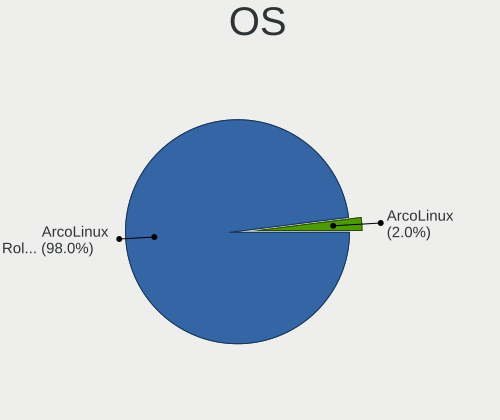

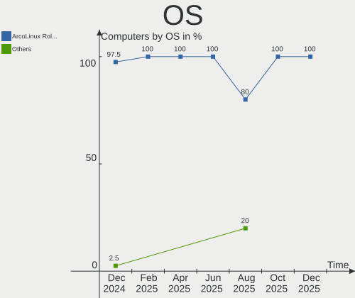

| Name              | Computers | Percent |
|-------------------|-----------|---------|
| ArcoLinux Rolling | 2         | 100%    |

OS Family
---------

OS without a version

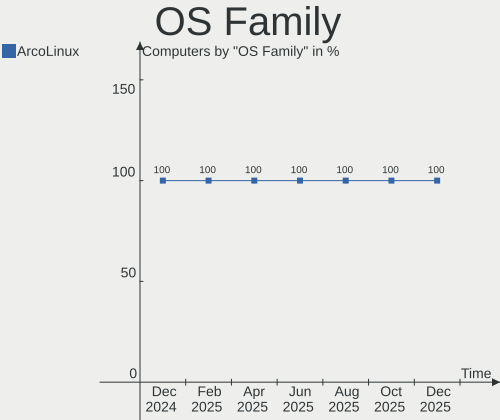

| Name      | Computers | Percent |
|-----------|-----------|---------|
| ArcoLinux | 2         | 100%    |

Kernel
------

Version of the Linux kernel

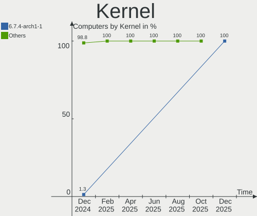

| Version       | Computers | Percent |
|---------------|-----------|---------|
| 6.7.4-arch1-1 | 2         | 100%    |

Kernel Family
-------------

Linux kernel without a distro release

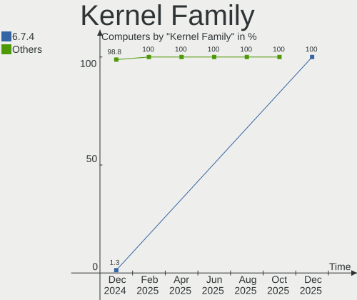

| Version | Computers | Percent |
|---------|-----------|---------|
| 6.7.4   | 2         | 100%    |

Kernel Major Ver.
-----------------

Linux kernel major version

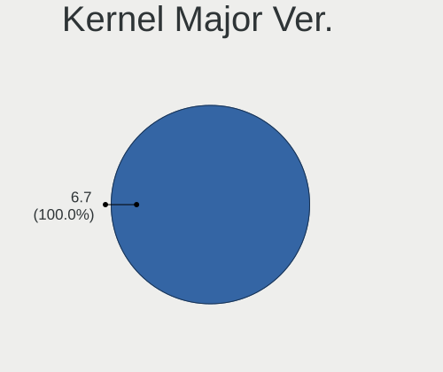

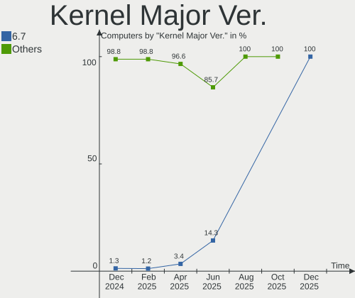

| Version | Computers | Percent |
|---------|-----------|---------|
| 6.7     | 2         | 100%    |

Arch
----

OS architecture (x86_64, i586, etc.)

| Name   | Computers | Percent |
|--------|-----------|---------|
| x86_64 | 2         | 100%    |

DE
--

Desktop Environment

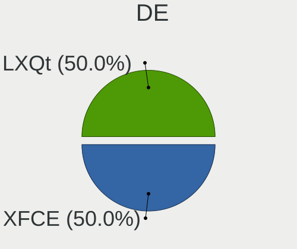

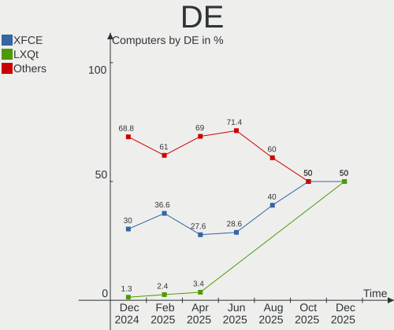

| Name | Computers | Percent |
|------|-----------|---------|
| XFCE | 1         | 50%     |
| LXQt | 1         | 50%     |

Display Server
--------------

X11 or Wayland

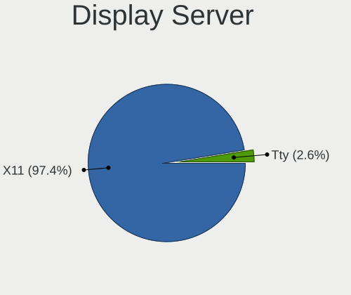

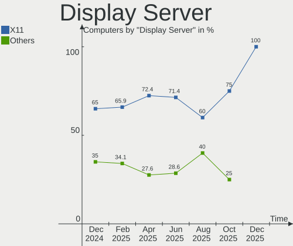

| Name | Computers | Percent |
|------|-----------|---------|
| X11  | 2         | 100%    |

Display Manager
---------------

SDDM, LightDM, etc.

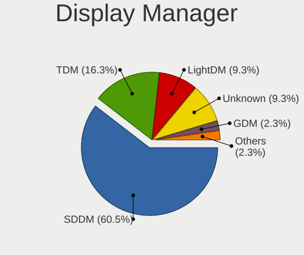

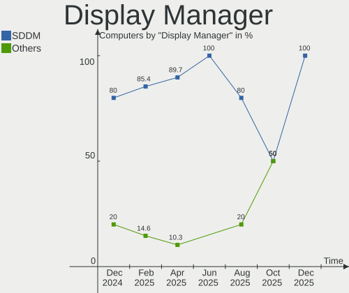

| Name | Computers | Percent |
|------|-----------|---------|
| SDDM | 2         | 100%    |

OS Lang
-------

Language

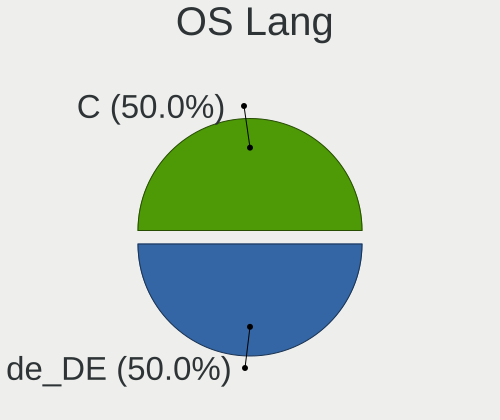

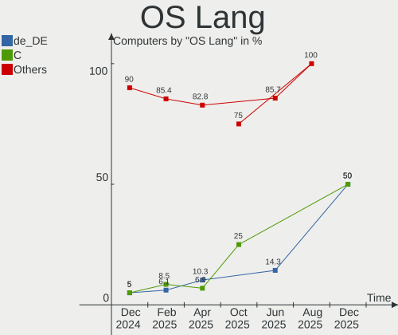

| Lang  | Computers | Percent |
|-------|-----------|---------|
| de_DE | 1         | 50%     |
| C     | 1         | 50%     |

Boot Mode
---------

EFI or BIOS

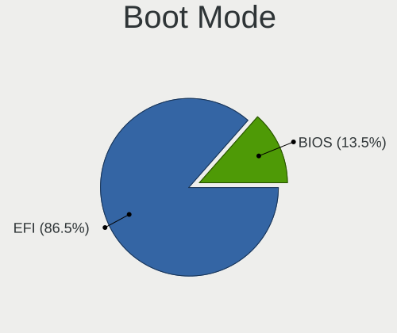

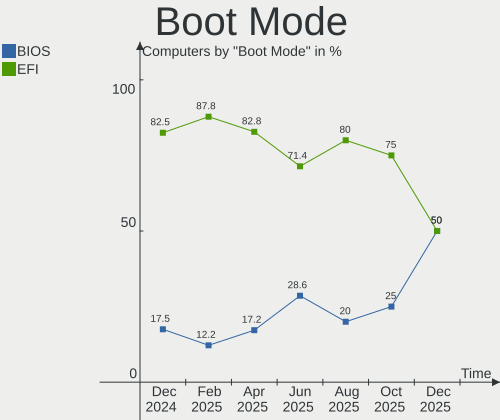

| Mode | Computers | Percent |
|------|-----------|---------|
| BIOS | 1         | 50%     |
| EFI  | 1         | 50%     |

Filesystem
----------

Type of filesystem

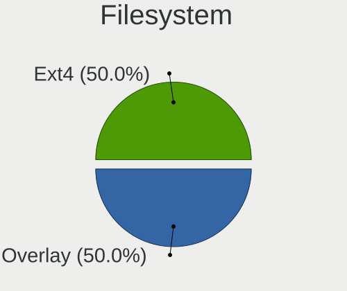

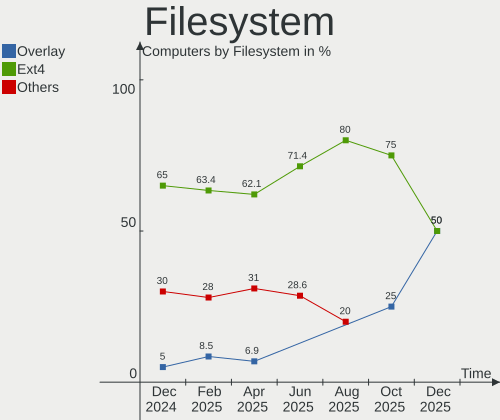

| Type    | Computers | Percent |
|---------|-----------|---------|
| Overlay | 1         | 50%     |
| Ext4    | 1         | 50%     |

Part. scheme
------------

Scheme of partitioning

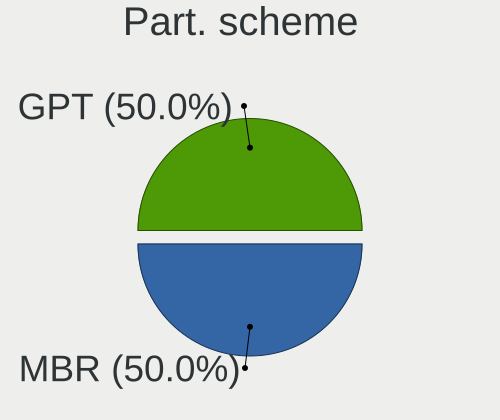

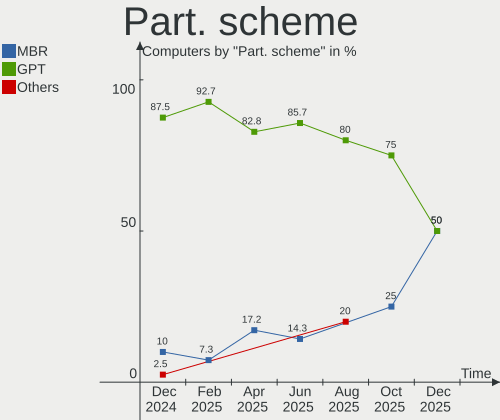

| Type | Computers | Percent |
|------|-----------|---------|
| MBR  | 1         | 50%     |
| GPT  | 1         | 50%     |

Dual Boot with Linux/BSD
------------------------

Hosting more than one Linux/BSD

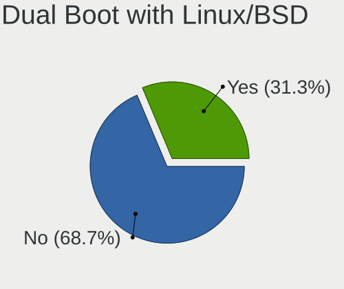

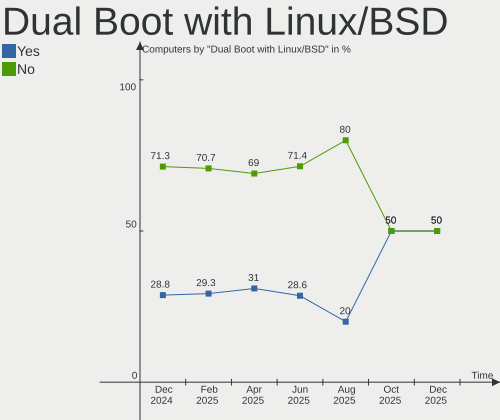

| Dual boot | Computers | Percent |
|-----------|-----------|---------|
| Yes       | 1         | 50%     |
| No        | 1         | 50%     |

Dual Boot (Win)
---------------

Hosting Linux and Windows

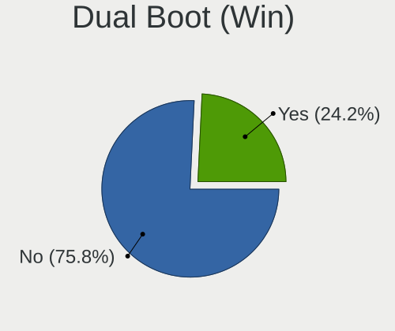

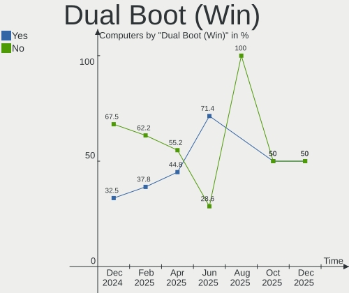

| Dual boot | Computers | Percent |
|-----------|-----------|---------|
| Yes       | 1         | 50%     |
| No        | 1         | 50%     |

Board
-----

Vendor
------

Motherboard manufacturer

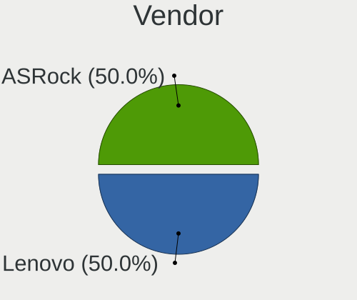

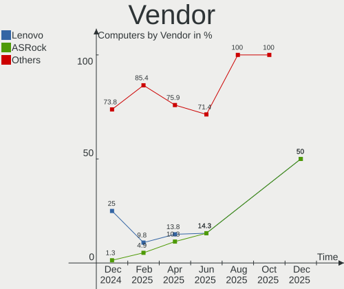

| Name   | Computers | Percent |
|--------|-----------|---------|
| Lenovo | 1         | 50%     |
| ASRock | 1         | 50%     |

Model
-----

Motherboard model

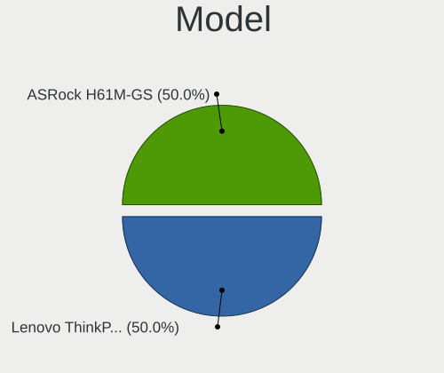

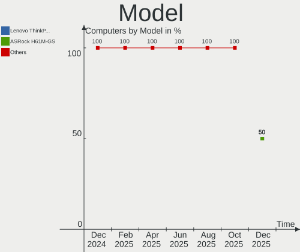

| Name                         | Computers | Percent |
|------------------------------|-----------|---------|
| Lenovo ThinkPad R500 27149VG | 1         | 50%     |
| ASRock H61M-GS               | 1         | 50%     |

Model Family
------------

Motherboard model prefix

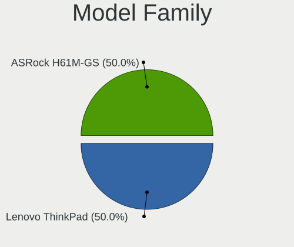

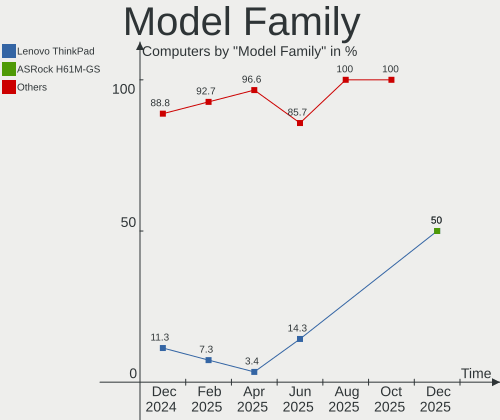

| Name            | Computers | Percent |
|-----------------|-----------|---------|
| Lenovo ThinkPad | 1         | 50%     |
| ASRock H61M-GS  | 1         | 50%     |

MFG Year
--------

Motherboard manufacture year

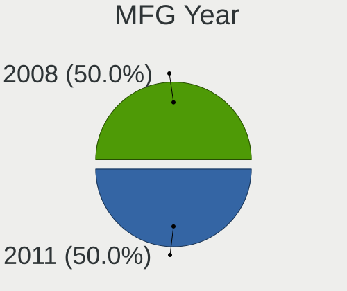

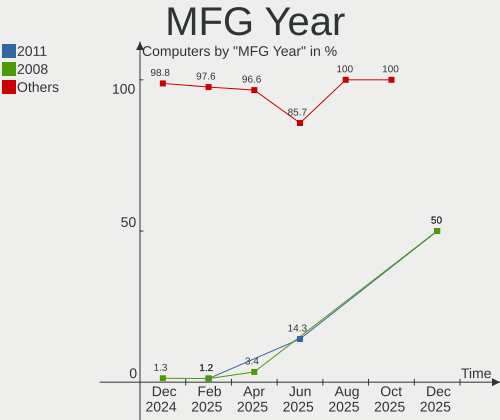

| Year | Computers | Percent |
|------|-----------|---------|
| 2011 | 1         | 50%     |
| 2008 | 1         | 50%     |

Form Factor
-----------

Physical design of the computer

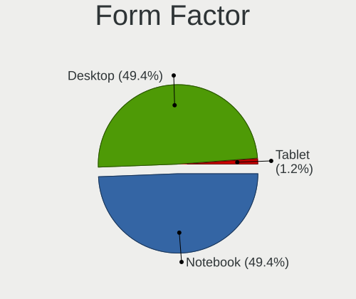

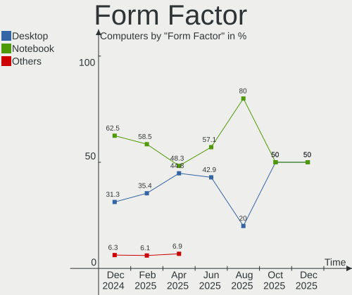

| Name     | Computers | Percent |
|----------|-----------|---------|
| Desktop  | 1         | 50%     |
| Notebook | 1         | 50%     |

Secure Boot
-----------

Enabled or disabled

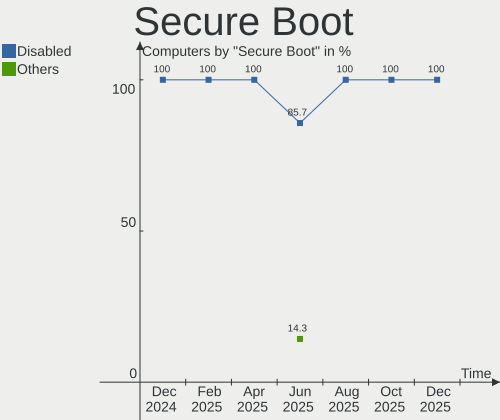

| State    | Computers | Percent |
|----------|-----------|---------|
| Disabled | 2         | 100%    |

Coreboot
--------

Have coreboot on board

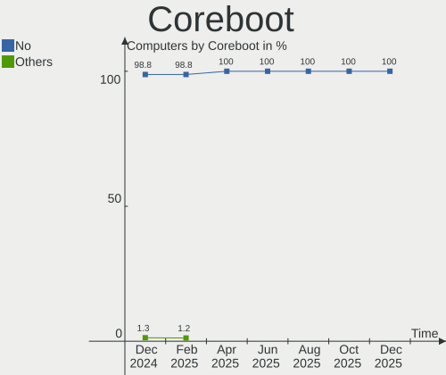

| Used | Computers | Percent |
|------|-----------|---------|
| No   | 2         | 100%    |

RAM Size
--------

Total RAM memory

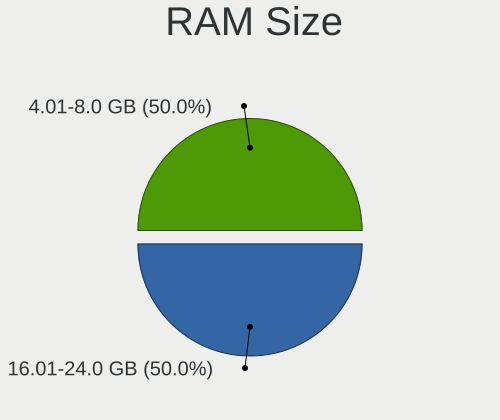

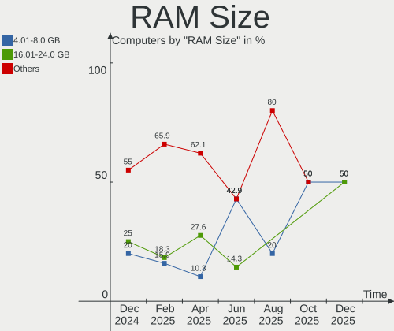

| Size in GB | Computers | Percent |
|------------|-----------|---------|
| 4.01-8.0   | 1         | 50%     |
| 16.01-24.0 | 1         | 50%     |

RAM Used
--------

Used RAM memory

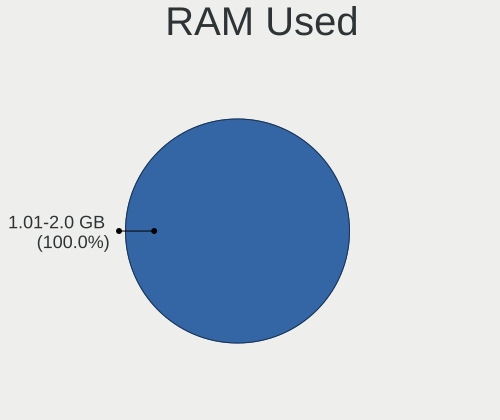

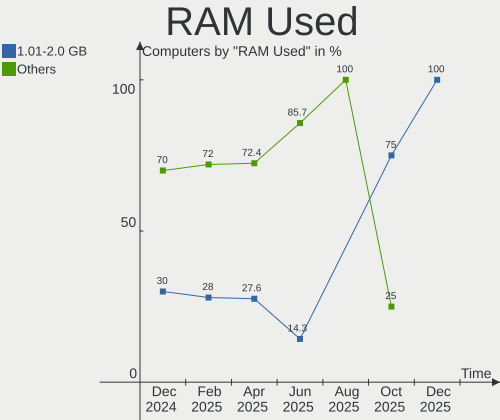

| Used GB  | Computers | Percent |
|----------|-----------|---------|
| 1.01-2.0 | 2         | 100%    |

Total Drives
------------

Number of drives on board

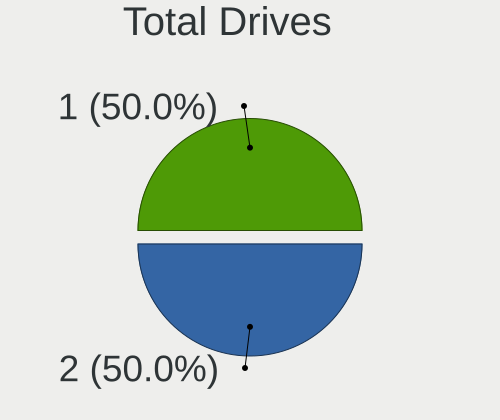

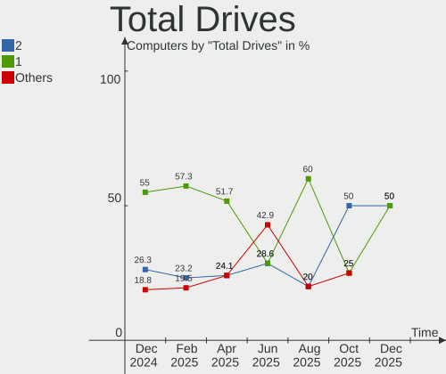

| Drives | Computers | Percent |
|--------|-----------|---------|
| 2      | 1         | 50%     |
| 1      | 1         | 50%     |

Has CD-ROM
----------

Has CD-ROM on board

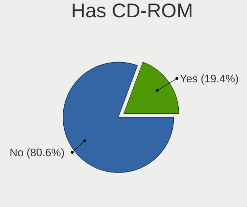

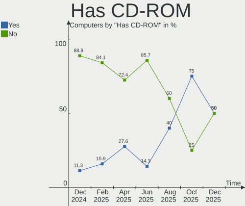

| Presented | Computers | Percent |
|-----------|-----------|---------|
| Yes       | 1         | 50%     |
| No        | 1         | 50%     |

Has Ethernet
------------

Has Ethernet on board

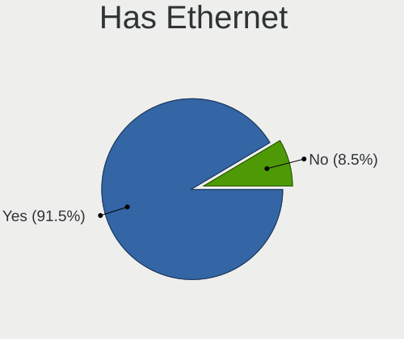

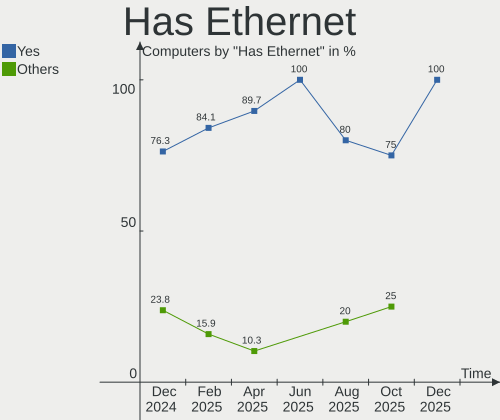

| Presented | Computers | Percent |
|-----------|-----------|---------|
| Yes       | 2         | 100%    |

Has WiFi
--------

Has WiFi module

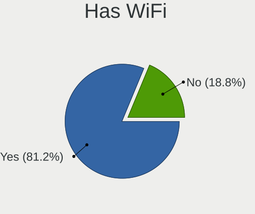

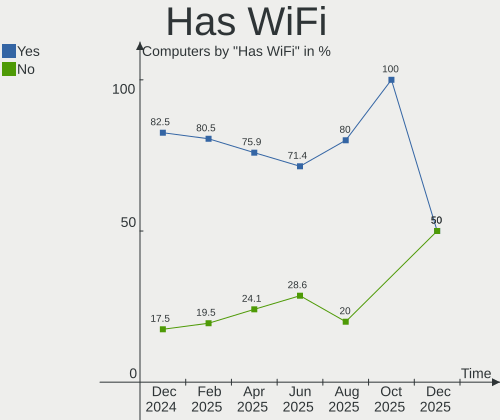

| Presented | Computers | Percent |
|-----------|-----------|---------|
| Yes       | 1         | 50%     |
| No        | 1         | 50%     |

Has Bluetooth
-------------

Has Bluetooth module

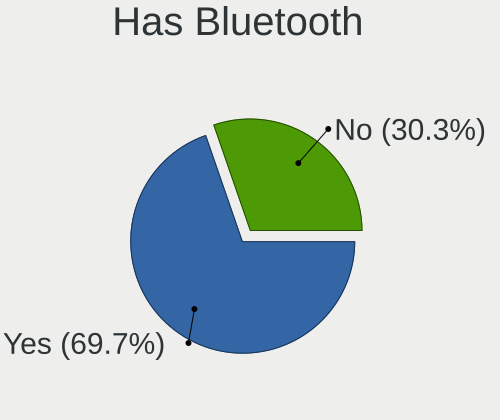

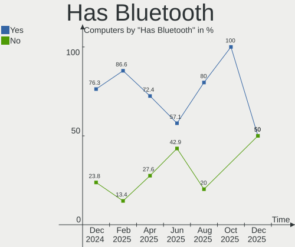

| Presented | Computers | Percent |
|-----------|-----------|---------|
| Yes       | 1         | 50%     |
| No        | 1         | 50%     |

Location
--------

Country
-------

Geographic location (country)

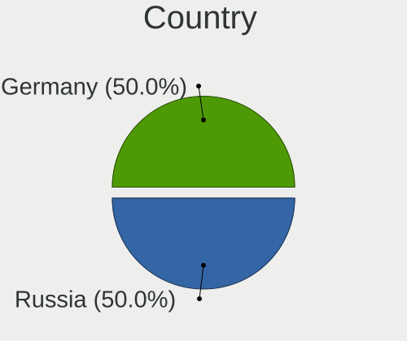

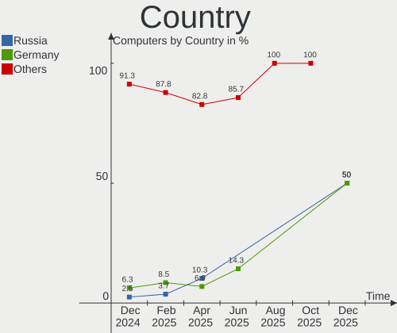

| Country | Computers | Percent |
|---------|-----------|---------|
| Russia  | 1         | 50%     |
| Germany | 1         | 50%     |

City
----

Geographic location (city)

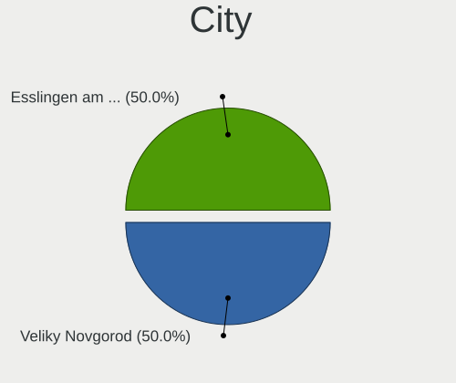

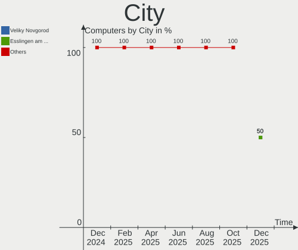

| City                | Computers | Percent |
|---------------------|-----------|---------|
| Veliky Novgorod     | 1         | 50%     |
| Esslingen am Neckar | 1         | 50%     |

Drives
------

Drive Vendor
------------

Hard drive vendors

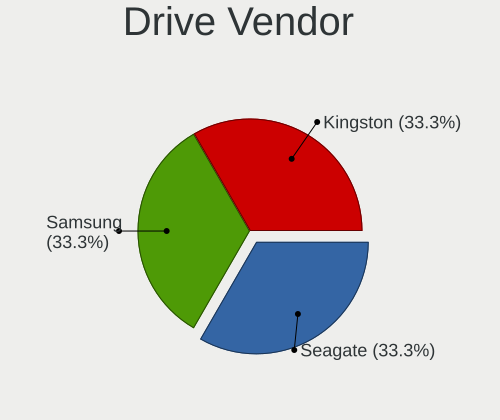

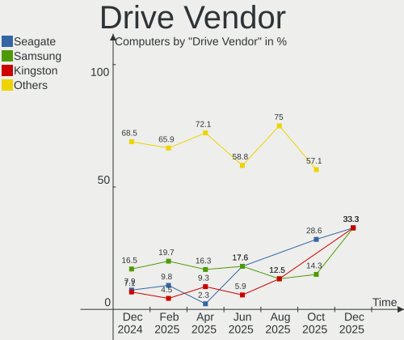

| Vendor              | Computers | Drives | Percent |
|---------------------|-----------|--------|---------|
| Seagate             | 1         | 1      | 33.33%  |
| Samsung Electronics | 1         | 1      | 33.33%  |
| Kingston            | 1         | 1      | 33.33%  |

Drive Model
-----------

Hard drive models

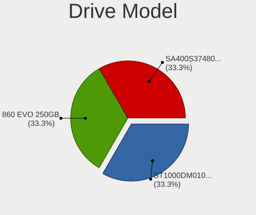

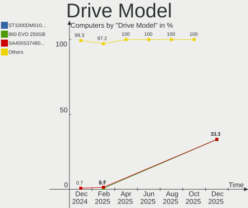

| Model                           | Computers | Percent |
|---------------------------------|-----------|---------|
| Seagate ST1000DM010-2EP102 1TB  | 1         | 33.33%  |
| Samsung SSD 860 EVO 250GB       | 1         | 33.33%  |
| Kingston SA400S37480G 480GB SSD | 1         | 33.33%  |

HDD Vendor
----------

Hard disk drive vendors

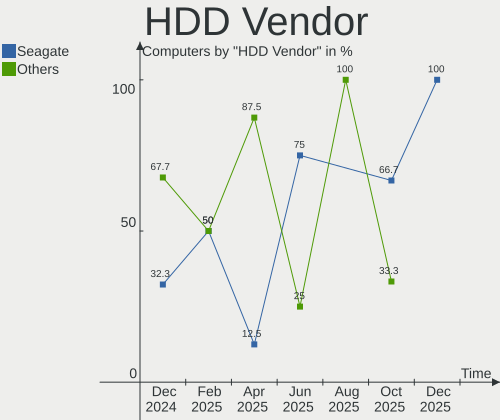

| Vendor  | Computers | Drives | Percent |
|---------|-----------|--------|---------|
| Seagate | 1         | 1      | 100%    |

SSD Vendor
----------

Solid state drive vendors

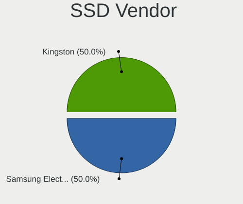

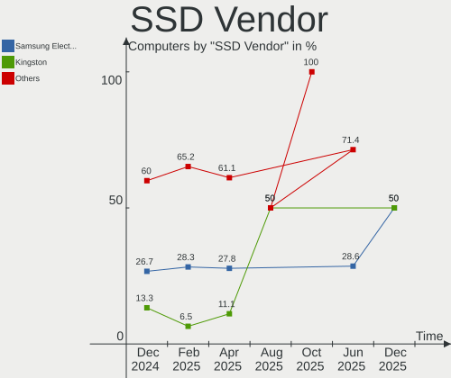

| Vendor              | Computers | Drives | Percent |
|---------------------|-----------|--------|---------|
| Samsung Electronics | 1         | 1      | 50%     |
| Kingston            | 1         | 1      | 50%     |

Drive Kind
----------

HDD or SSD

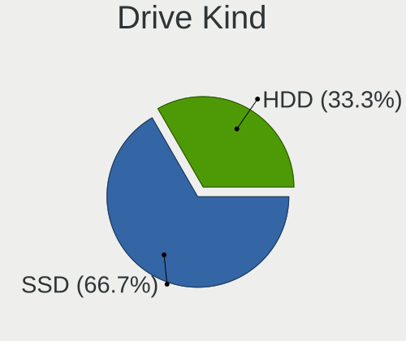

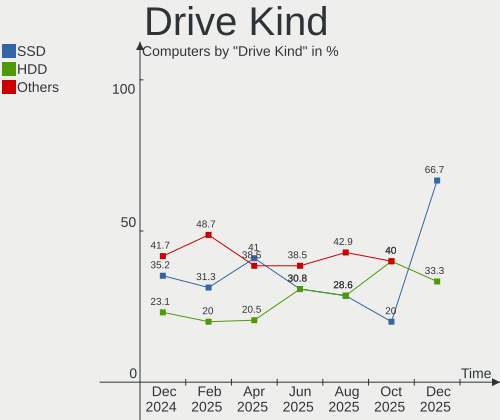

| Kind | Computers | Drives | Percent |
|------|-----------|--------|---------|
| SSD  | 2         | 2      | 66.67%  |
| HDD  | 1         | 1      | 33.33%  |

Drive Connector
---------------

SATA, SAS, NVMe, etc.

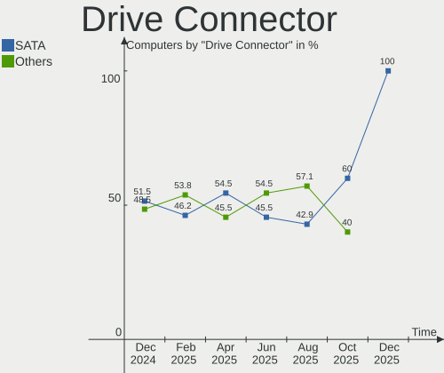

| Type | Computers | Drives | Percent |
|------|-----------|--------|---------|
| SATA | 2         | 3      | 100%    |

Drive Size
----------

Size of hard drive

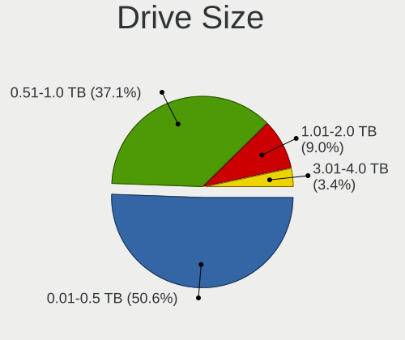

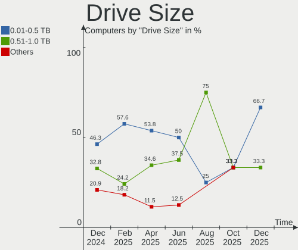

| Size in TB | Computers | Drives | Percent |
|------------|-----------|--------|---------|
| 0.01-0.5   | 2         | 2      | 66.67%  |
| 0.51-1.0   | 1         | 1      | 33.33%  |

Space Total
-----------

Amount of disk space available on the file system

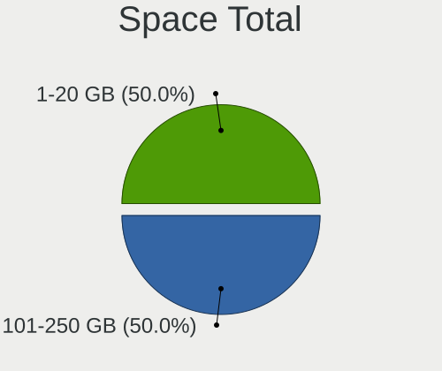

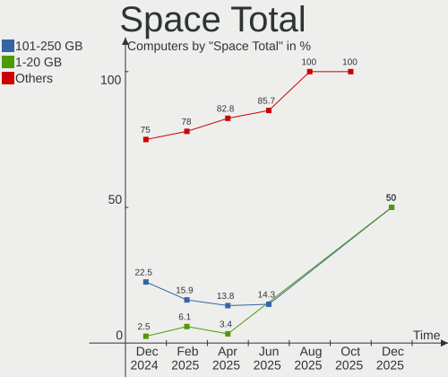

| Size in GB | Computers | Percent |
|------------|-----------|---------|
| 101-250    | 1         | 50%     |
| 1-20       | 1         | 50%     |

Space Used
----------

Amount of used disk space

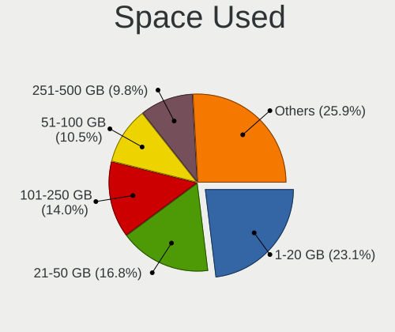

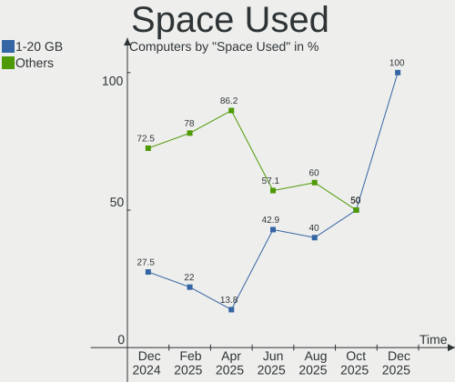

| Used GB | Computers | Percent |
|---------|-----------|---------|
| 1-20    | 2         | 100%    |

Malfunc. Drives
---------------

Drive models with a malfunction

Zero info for selected period =(

Malfunc. Drive Vendor
---------------------

Vendors of faulty drives

Zero info for selected period =(

Malfunc. HDD Vendor
-------------------

Vendors of faulty HDD drives

Zero info for selected period =(

Malfunc. Drive Kind
-------------------

Kinds of faulty drives

Zero info for selected period =(

Failed Drives
-------------

Failed drive models

Zero info for selected period =(

Failed Drive Vendor
-------------------

Failed drive vendors

Zero info for selected period =(

Drive Status
------------

Number of failed and malfunc. drives

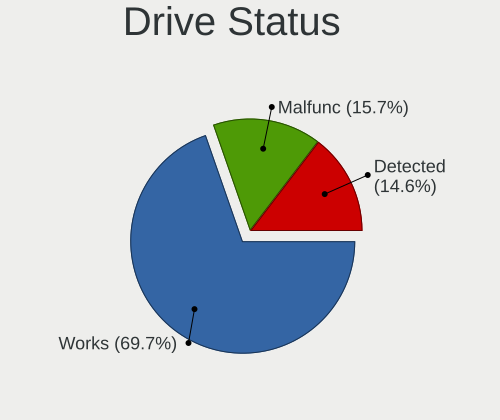

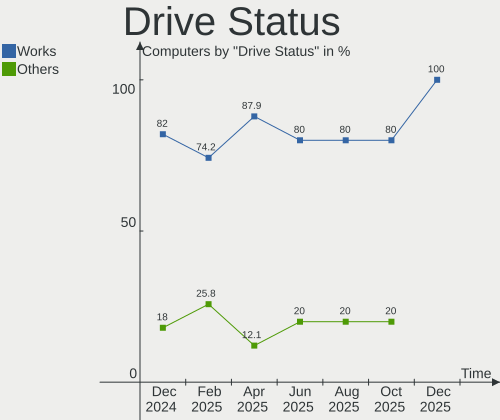

| Status | Computers | Drives | Percent |
|--------|-----------|--------|---------|
| Works  | 2         | 3      | 100%    |

Storage controller
------------------

Storage Vendor
--------------

Storage controller vendors

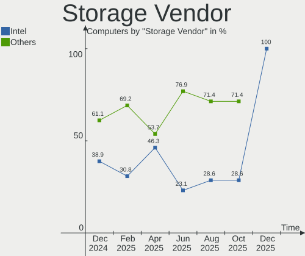

| Vendor | Computers | Percent |
|--------|-----------|---------|
| Intel  | 2         | 100%    |

Storage Model
-------------

Storage controller models

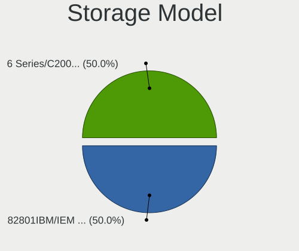

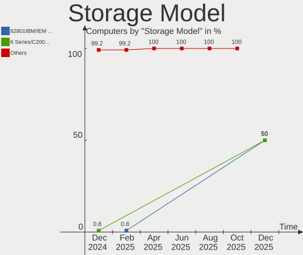

| Model                                                                         | Computers | Percent |
|-------------------------------------------------------------------------------|-----------|---------|
| Intel 82801IBM/IEM (ICH9M/ICH9M-E) 4 port SATA Controller [AHCI mode]         | 1         | 50%     |
| Intel 6 Series/C200 Series Chipset Family 6 port Desktop SATA AHCI Controller | 1         | 50%     |

Storage Kind
------------

Kind of storage controller (IDE, SATA, NVMe, SAS, ...)

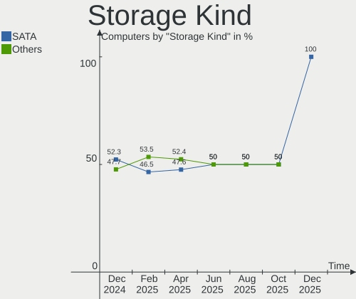

| Kind | Computers | Percent |
|------|-----------|---------|
| SATA | 2         | 100%    |

Processor
---------

CPU Vendor
----------

Processor vendors

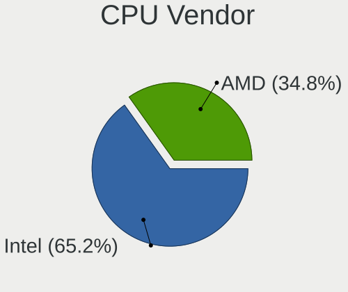

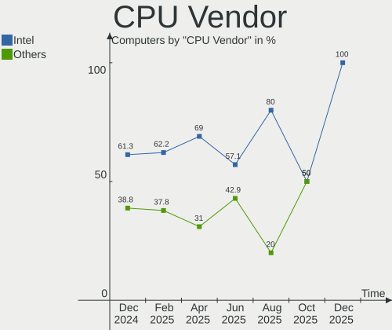

| Vendor | Computers | Percent |
|--------|-----------|---------|
| Intel  | 2         | 100%    |

CPU Model
---------

Processor models

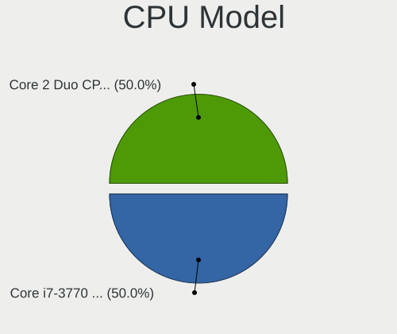

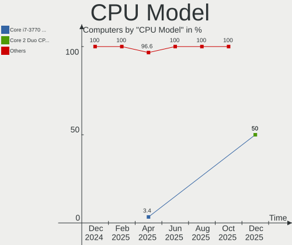

| Model                                | Computers | Percent |
|--------------------------------------|-----------|---------|
| Intel Core i7-3770 CPU @ 3.40GHz     | 1         | 50%     |
| Intel Core 2 Duo CPU T5870 @ 2.00GHz | 1         | 50%     |

CPU Model Family
----------------

Processor model prefix

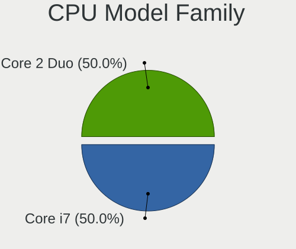

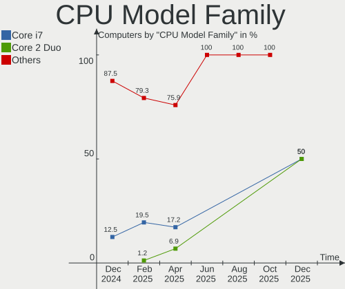

| Model            | Computers | Percent |
|------------------|-----------|---------|
| Intel Core i7    | 1         | 50%     |
| Intel Core 2 Duo | 1         | 50%     |

CPU Cores
---------

Number of processor cores

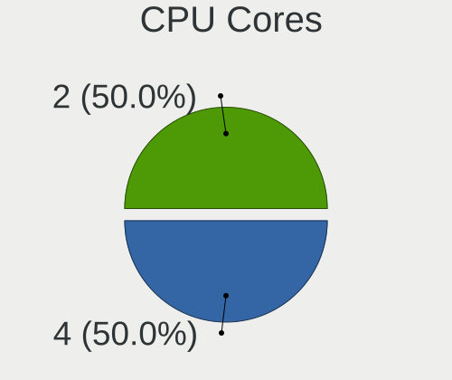

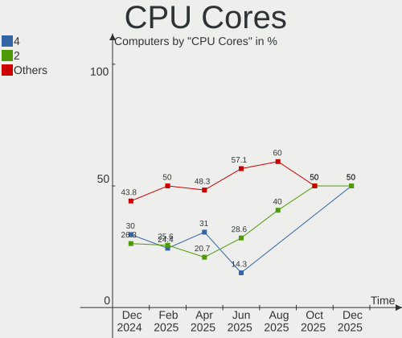

| Number | Computers | Percent |
|--------|-----------|---------|
| 4      | 1         | 50%     |
| 2      | 1         | 50%     |

CPU Sockets
-----------

Number of sockets

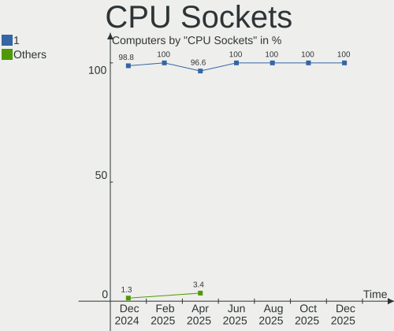

| Number | Computers | Percent |
|--------|-----------|---------|
| 1      | 2         | 100%    |

CPU Threads
-----------

Threads per core (Hyper-Threading)

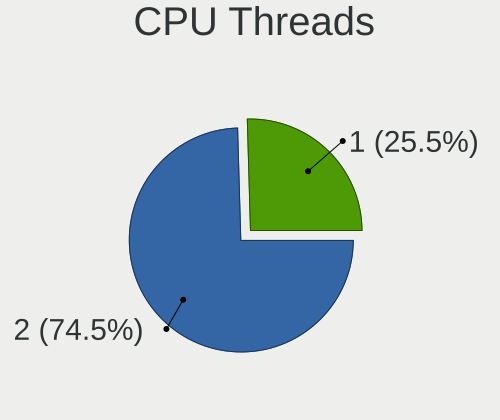

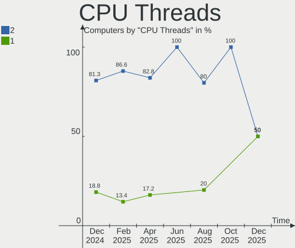

| Number | Computers | Percent |
|--------|-----------|---------|
| 2      | 1         | 50%     |
| 1      | 1         | 50%     |

CPU Op-Modes
------------

CPU Operation Modes (32-bit, 64-bit)

| Op mode        | Computers | Percent |
|----------------|-----------|---------|
| 32-bit, 64-bit | 2         | 100%    |

CPU Microcode
-------------

Microcode number

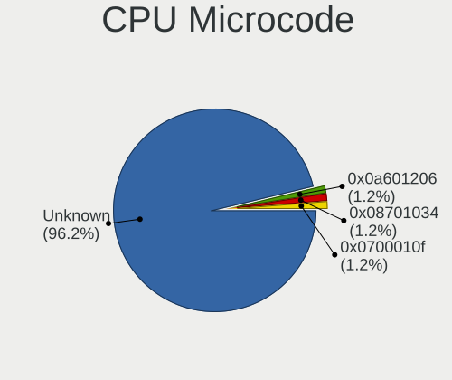

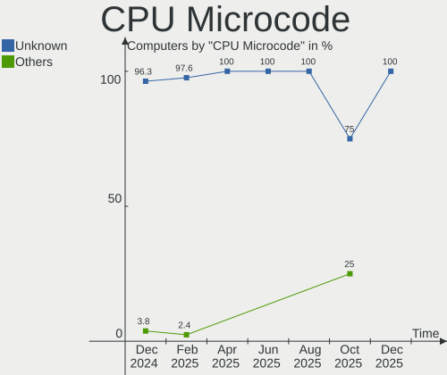

| Number  | Computers | Percent |
|---------|-----------|---------|
| Unknown | 2         | 100%    |

CPU Microarch
-------------

Microarchitecture

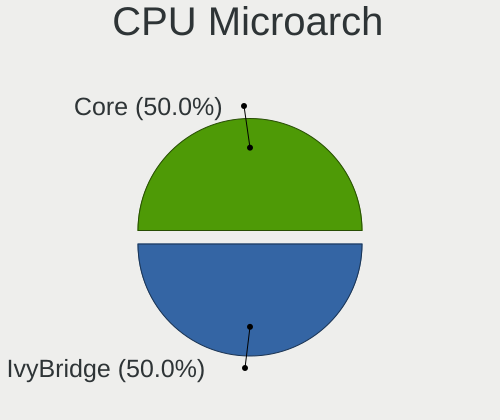

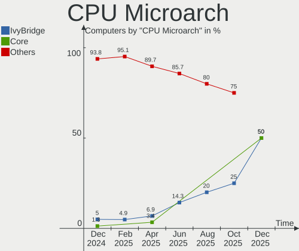

| Name      | Computers | Percent |
|-----------|-----------|---------|
| IvyBridge | 1         | 50%     |
| Core      | 1         | 50%     |

Graphics
--------

GPU Vendor
----------

Vendors of graphics cards

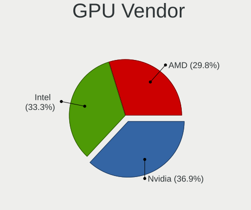

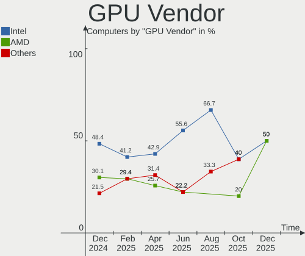

| Vendor | Computers | Percent |
|--------|-----------|---------|
| Intel  | 1         | 50%     |
| AMD    | 1         | 50%     |

GPU Model
---------

Graphics card models

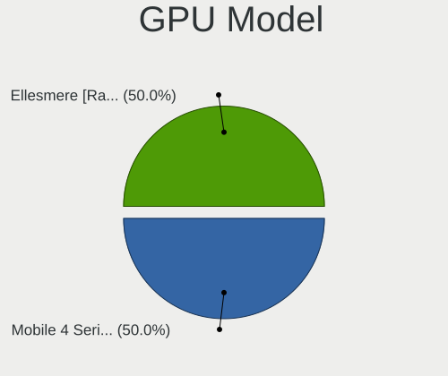

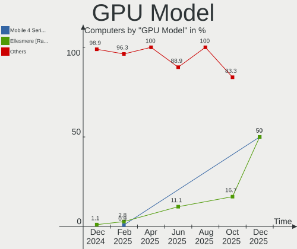

| Model                                                        | Computers | Percent |
|--------------------------------------------------------------|-----------|---------|
| Intel Mobile 4 Series Chipset Integrated Graphics Controller | 1         | 50%     |
| AMD Ellesmere [Radeon RX 470/480/570/570X/580/580X/590]      | 1         | 50%     |

GPU Combo
---------

Combinations of graphics cards

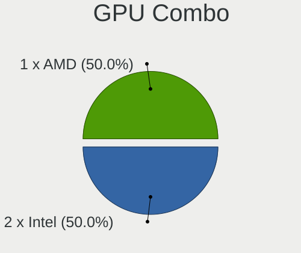

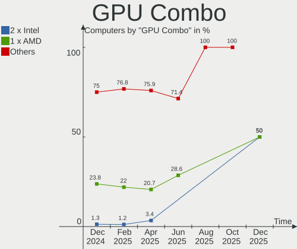

| Name      | Computers | Percent |
|-----------|-----------|---------|
| 2 x Intel | 1         | 50%     |
| 1 x AMD   | 1         | 50%     |

GPU Driver
----------

Free vs proprietary

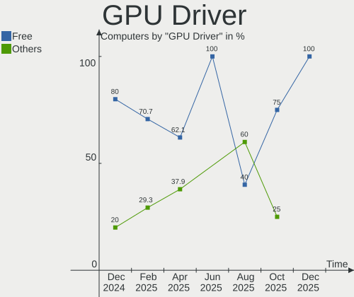

| Driver | Computers | Percent |
|--------|-----------|---------|
| Free   | 2         | 100%    |

GPU Memory
----------

Total video memory

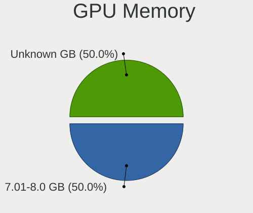

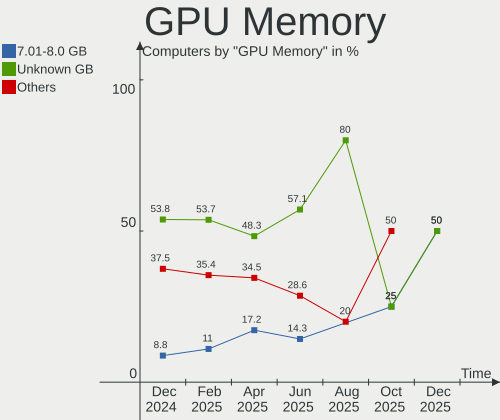

| Size in GB | Computers | Percent |
|------------|-----------|---------|
| 7.01-8.0   | 1         | 50%     |
| Unknown    | 1         | 50%     |

Monitor
-------

Monitor Vendor
--------------

Monitor vendors

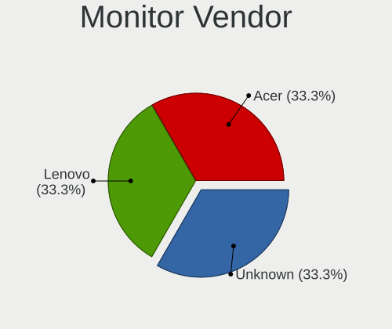

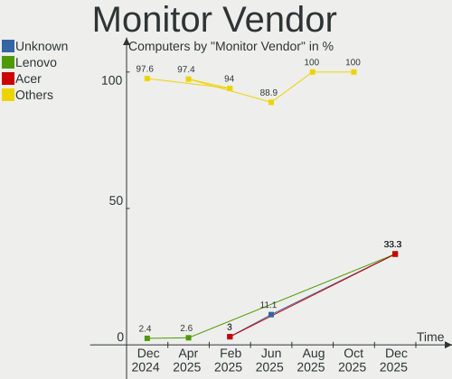

| Vendor  | Computers | Percent |
|---------|-----------|---------|
| Unknown | 1         | 33.33%  |
| Lenovo  | 1         | 33.33%  |
| Acer    | 1         | 33.33%  |

Monitor Model
-------------

Monitor models

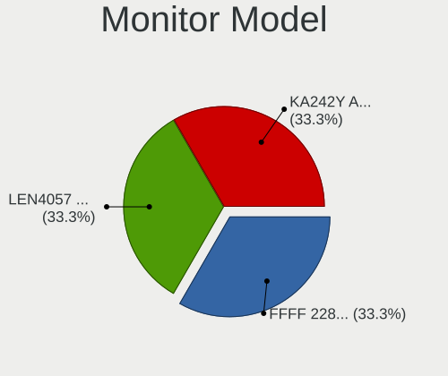

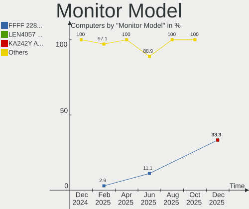

| Model                                                     | Computers | Percent |
|-----------------------------------------------------------|-----------|---------|
| Unknown LCD Monitor FFFF 2288x1287 2550x2550mm 142.0-inch | 1         | 33.33%  |
| Lenovo LCD Monitor LEN4057 1280x800 331x207mm 15.4-inch   | 1         | 33.33%  |
| Acer KA242Y ACR0729 1920x1080 530x300mm 24.0-inch         | 1         | 33.33%  |

Monitor Resolution
------------------

Monitor screen resolution

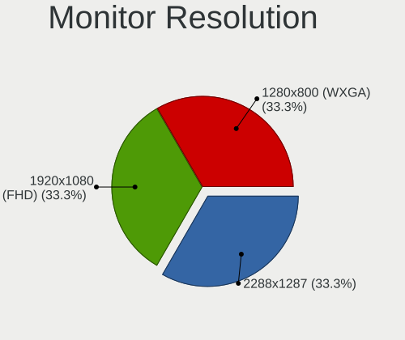

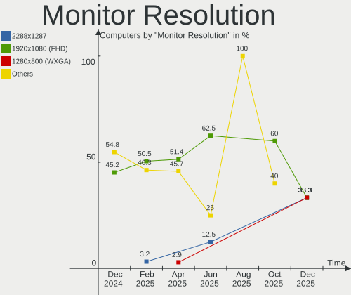

| Resolution      | Computers | Percent |
|-----------------|-----------|---------|
| 2288x1287       | 1         | 33.33%  |
| 1920x1080 (FHD) | 1         | 33.33%  |
| 1280x800 (WXGA) | 1         | 33.33%  |

Monitor Diagonal
----------------

Diagonal size in inches

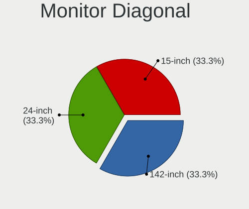

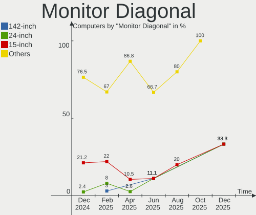

| Inches | Computers | Percent |
|--------|-----------|---------|
| 142    | 1         | 33.33%  |
| 24     | 1         | 33.33%  |
| 15     | 1         | 33.33%  |

Monitor Width
-------------

Physical width

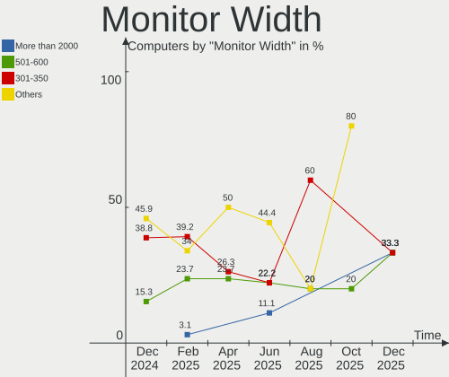

| Width in mm    | Computers | Percent |
|----------------|-----------|---------|
| More than 2000 | 1         | 33.33%  |
| 501-600        | 1         | 33.33%  |
| 301-350        | 1         | 33.33%  |

Aspect Ratio
------------

Proportional relationship between the width and the height

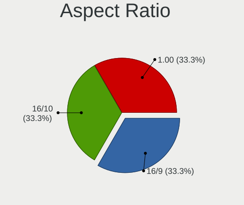

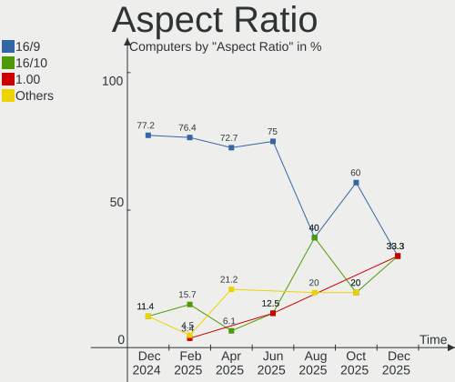

| Ratio | Computers | Percent |
|-------|-----------|---------|
| 16/9  | 1         | 33.33%  |
| 16/10 | 1         | 33.33%  |
| 1.00  | 1         | 33.33%  |

Monitor Area
------------

Area in inch²

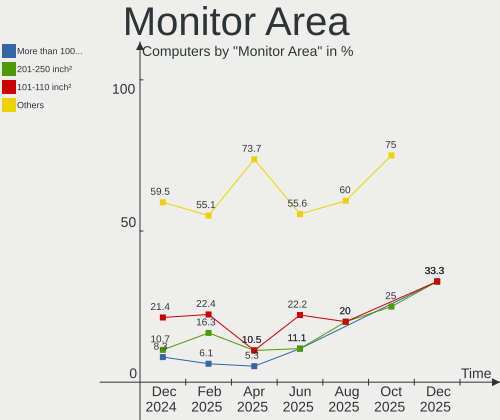

| Area in inch² | Computers | Percent |
|----------------|-----------|---------|
| More than 1000 | 1         | 33.33%  |
| 201-250        | 1         | 33.33%  |
| 101-110        | 1         | 33.33%  |

Pixel Density
-------------

Pixels per inch

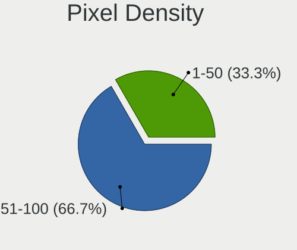

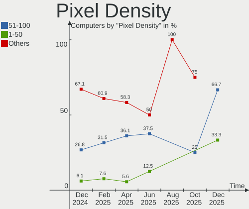

| Density | Computers | Percent |
|---------|-----------|---------|
| 51-100  | 2         | 66.67%  |
| 1-50    | 1         | 33.33%  |

Multiple Monitors
-----------------

Total monitors connected

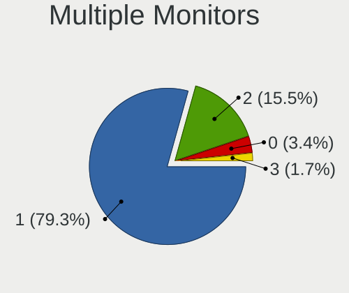

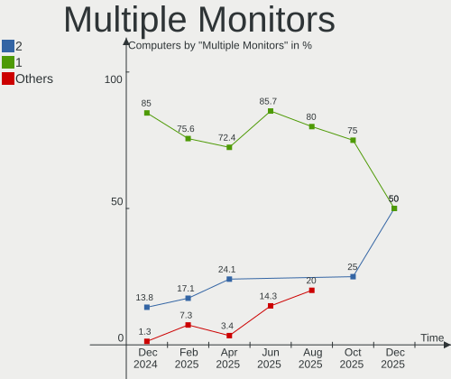

| Total | Computers | Percent |
|-------|-----------|---------|
| 2     | 1         | 50%     |
| 1     | 1         | 50%     |

Network
-------

Net Controller Vendor
---------------------

Controller vendors

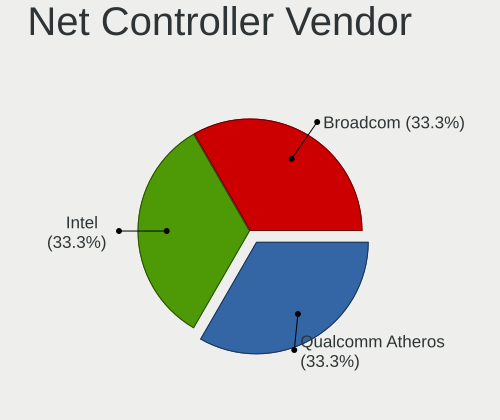

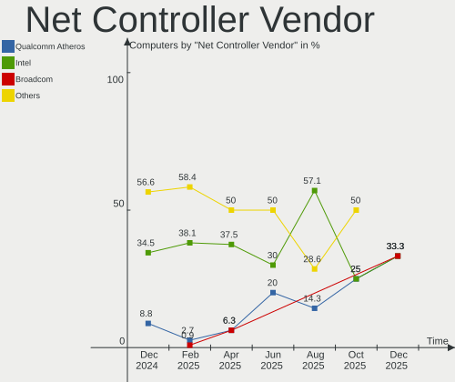

| Vendor           | Computers | Percent |
|------------------|-----------|---------|
| Qualcomm Atheros | 1         | 33.33%  |
| Intel            | 1         | 33.33%  |
| Broadcom         | 1         | 33.33%  |

Net Controller Model
--------------------

Controller models

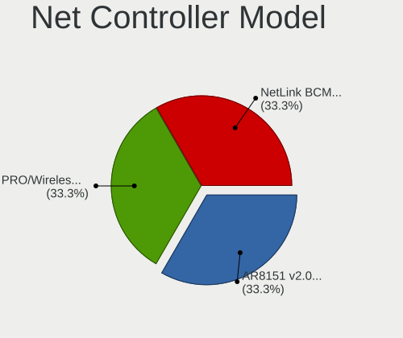

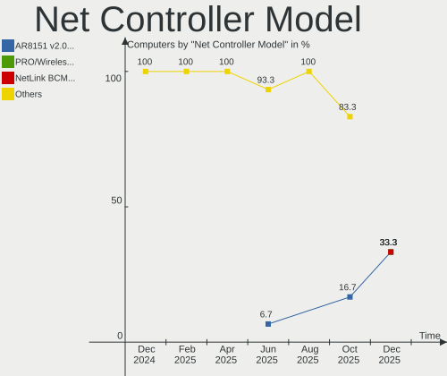

| Model                                                   | Computers | Percent |
|---------------------------------------------------------|-----------|---------|
| Qualcomm Atheros AR8151 v2.0 Gigabit Ethernet           | 1         | 33.33%  |
| Intel PRO/Wireless 5100 AGN [Shiloh] Network Connection | 1         | 33.33%  |
| Broadcom NetLink BCM5787M Gigabit Ethernet PCI Express  | 1         | 33.33%  |

Wireless Vendor
---------------

Wireless vendors

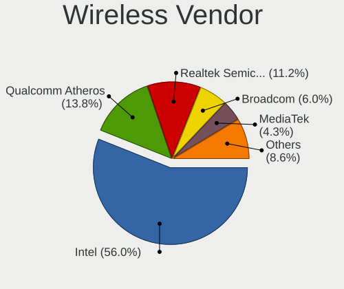

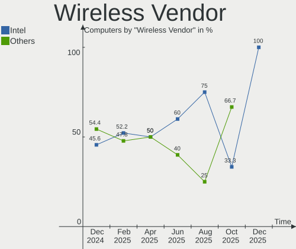

| Vendor | Computers | Percent |
|--------|-----------|---------|
| Intel  | 1         | 100%    |

Wireless Model
--------------

Wireless models

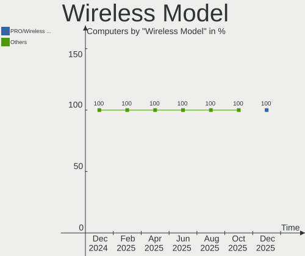

| Model                                                   | Computers | Percent |
|---------------------------------------------------------|-----------|---------|
| Intel PRO/Wireless 5100 AGN [Shiloh] Network Connection | 1         | 100%    |

Ethernet Vendor
---------------

Ethernet vendors

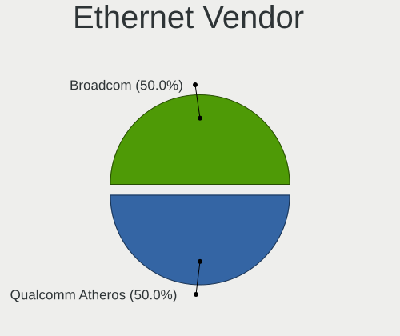

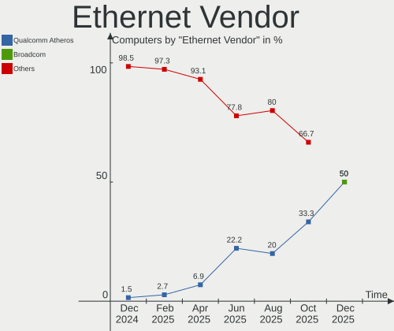

| Vendor           | Computers | Percent |
|------------------|-----------|---------|
| Qualcomm Atheros | 1         | 50%     |
| Broadcom         | 1         | 50%     |

Ethernet Model
--------------

Ethernet models

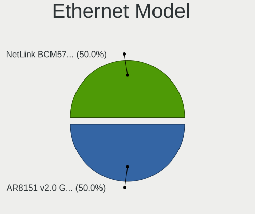

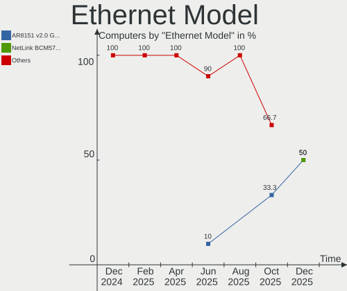

| Model                                                  | Computers | Percent |
|--------------------------------------------------------|-----------|---------|
| Qualcomm Atheros AR8151 v2.0 Gigabit Ethernet          | 1         | 50%     |
| Broadcom NetLink BCM5787M Gigabit Ethernet PCI Express | 1         | 50%     |

Net Controller Kind
-------------------

Ethernet, WiFi or modem

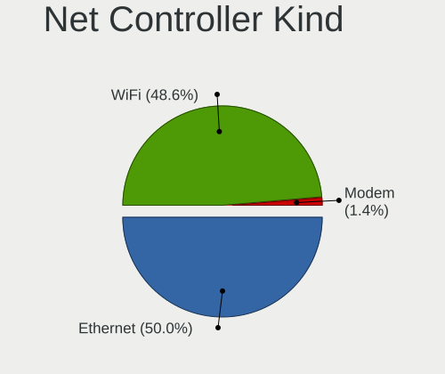

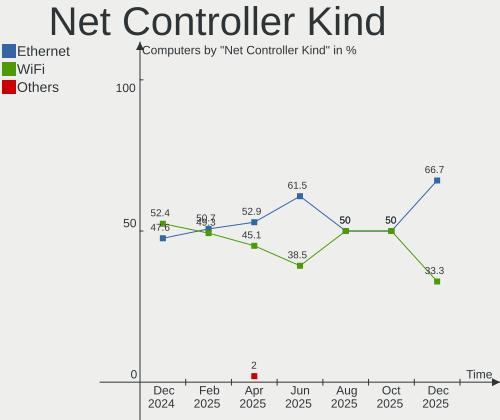

| Kind     | Computers | Percent |
|----------|-----------|---------|
| Ethernet | 2         | 66.67%  |
| WiFi     | 1         | 33.33%  |

Used Controller
---------------

Currently used network controller

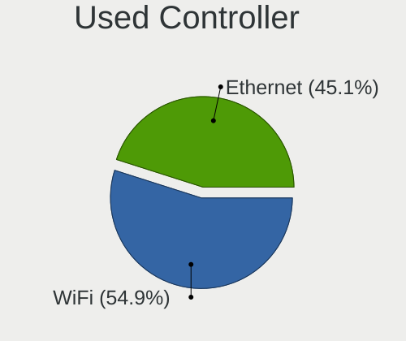

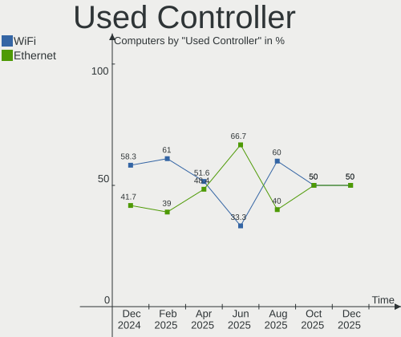

| Kind     | Computers | Percent |
|----------|-----------|---------|
| WiFi     | 1         | 50%     |
| Ethernet | 1         | 50%     |

NICs
----

Total network controllers on board

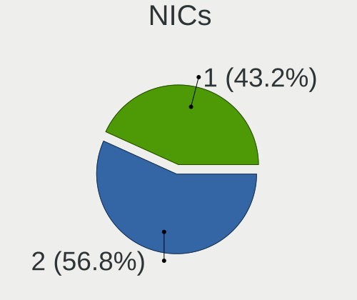

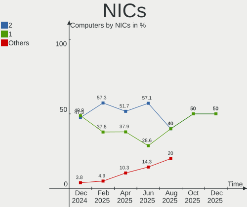

| Total | Computers | Percent |
|-------|-----------|---------|
| 2     | 1         | 50%     |
| 1     | 1         | 50%     |

IPv6
----

IPv6 vs IPv4

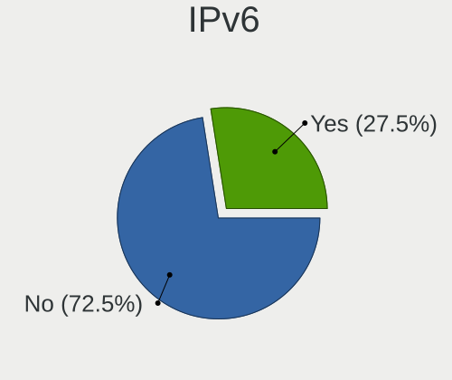

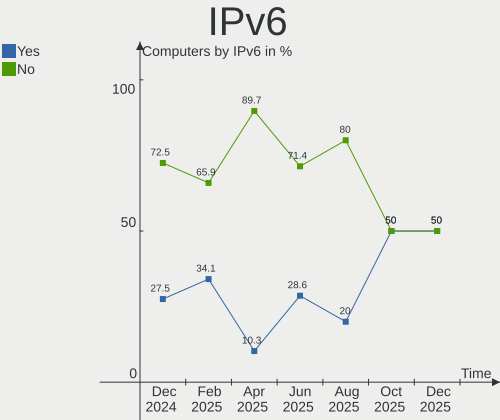

| Used | Computers | Percent |
|------|-----------|---------|
| Yes  | 1         | 50%     |
| No   | 1         | 50%     |

Bluetooth
---------

Bluetooth Vendor
----------------

Controller vendors

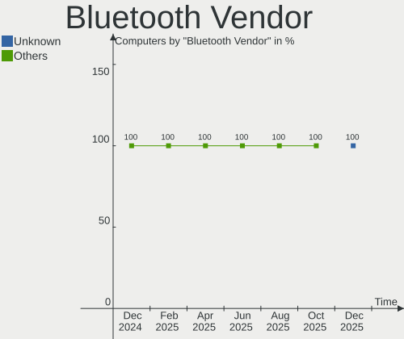

| Vendor  | Computers | Percent |
|---------|-----------|---------|
| Unknown | 1         | 100%    |

Bluetooth Model
---------------

Controller models

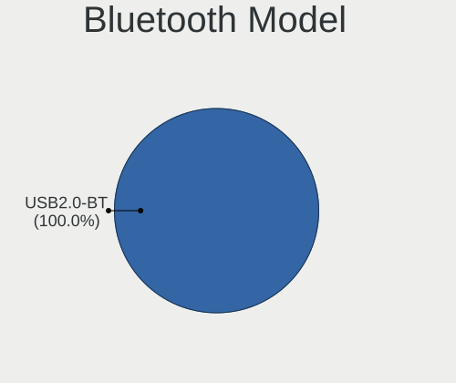

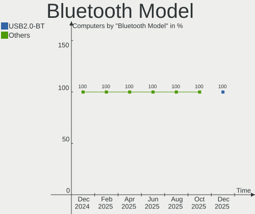

| Model   | Computers | Percent |
|---------|-----------|---------|
| Unknown | 1         | 100%    |

Sound
-----

Sound Vendor
------------

Sound card vendors

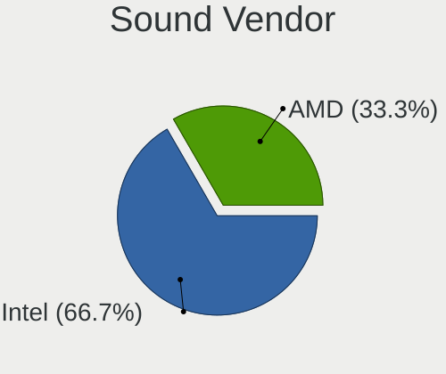

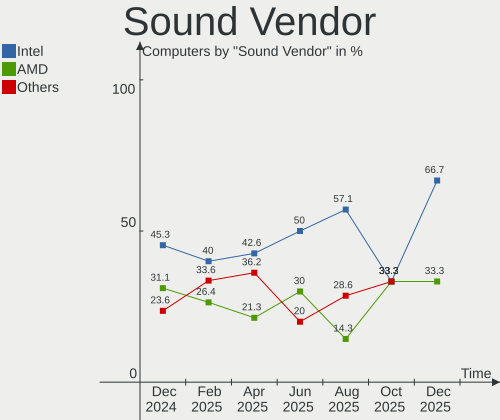

| Vendor | Computers | Percent |
|--------|-----------|---------|
| Intel  | 2         | 66.67%  |
| AMD    | 1         | 33.33%  |

Sound Model
-----------

Sound card models

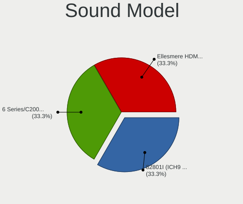

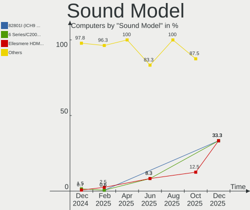

| Model                                                                      | Computers | Percent |
|----------------------------------------------------------------------------|-----------|---------|
| Intel 82801I (ICH9 Family) HD Audio Controller                             | 1         | 33.33%  |
| Intel 6 Series/C200 Series Chipset Family High Definition Audio Controller | 1         | 33.33%  |
| AMD Ellesmere HDMI Audio [Radeon RX 470/480 / 570/580/590]                 | 1         | 33.33%  |

Memory
------

Memory Vendor
-------------

Memory module vendors

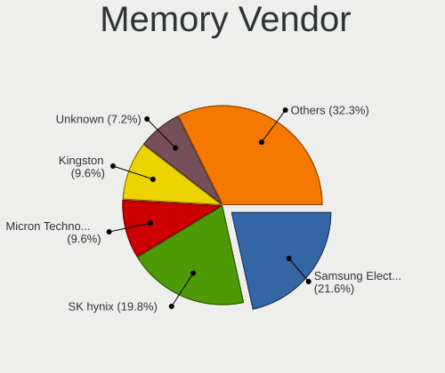

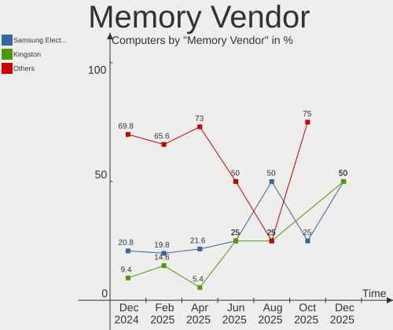

| Vendor              | Computers | Percent |
|---------------------|-----------|---------|
| Samsung Electronics | 1         | 50%     |
| Kingston            | 1         | 50%     |

Memory Model
------------

Memory module models

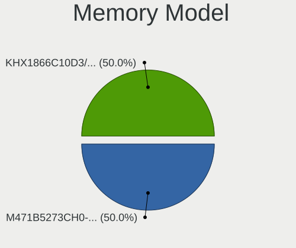

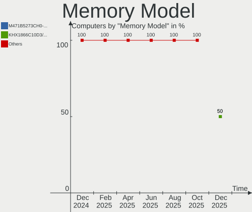

| Model                                                 | Computers | Percent |
|-------------------------------------------------------|-----------|---------|
| Samsung RAM M471B5273CH0-CF8 4GB SODIMM DDR3 1333MT/s | 1         | 50%     |
| Kingston RAM KHX1866C10D3/8G 8GB DIMM DDR3 1867MT/s   | 1         | 50%     |

Memory Kind
-----------

Memory module kinds

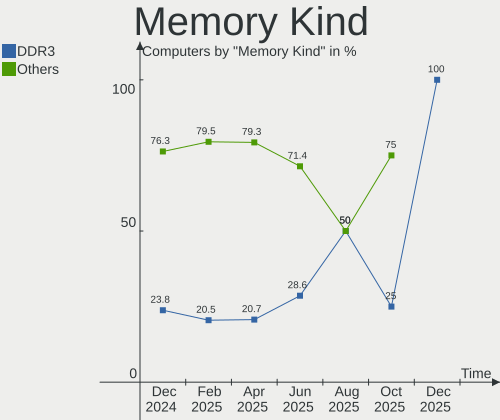

| Kind | Computers | Percent |
|------|-----------|---------|
| DDR3 | 2         | 100%    |

Memory Form Factor
------------------

Physical design of the memory module

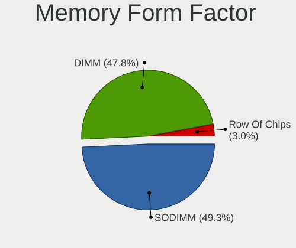

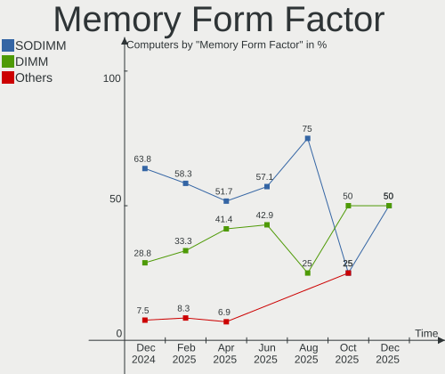

| Name   | Computers | Percent |
|--------|-----------|---------|
| SODIMM | 1         | 50%     |
| DIMM   | 1         | 50%     |

Memory Size
-----------

Memory module size

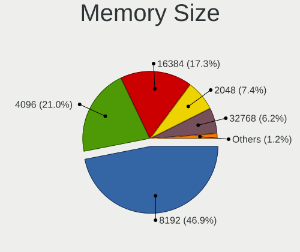

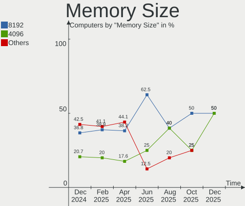

| Size | Computers | Percent |
|------|-----------|---------|
| 8192 | 1         | 50%     |
| 4096 | 1         | 50%     |

Memory Speed
------------

Memory module speed

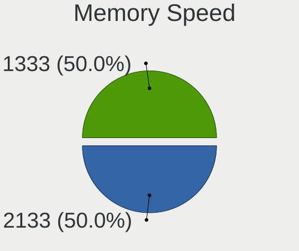

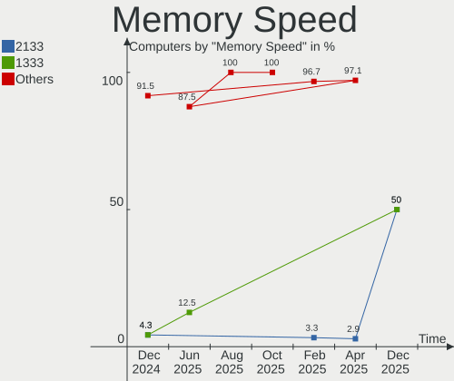

| Speed | Computers | Percent |
|-------|-----------|---------|
| 2133  | 1         | 50%     |
| 1333  | 1         | 50%     |

Printers & scanners
-------------------

Printer Vendor
--------------

Printer device vendors

Zero info for selected period =(

Printer Model
-------------

Printer device models

Zero info for selected period =(

Scanner Vendor
--------------

Scanner device vendors

Zero info for selected period =(

Scanner Model
-------------

Scanner device models

Zero info for selected period =(

Camera
------

Camera Vendor
-------------

Camera device vendors

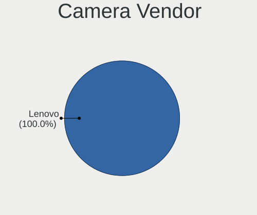

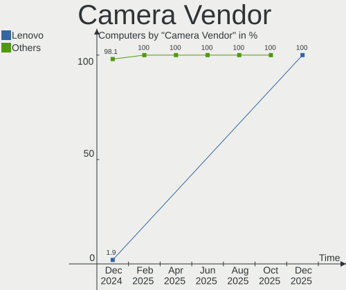

| Vendor | Computers | Percent |
|--------|-----------|---------|
| Lenovo | 1         | 100%    |

Camera Model
------------

Camera device models

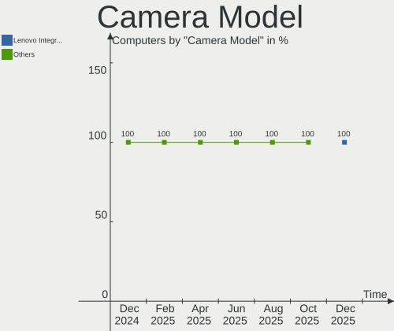

| Model                    | Computers | Percent |
|--------------------------|-----------|---------|
| Lenovo Integrated Webcam | 1         | 100%    |

Security
--------

Fingerprint Vendor
------------------

Fingerprint sensor vendors

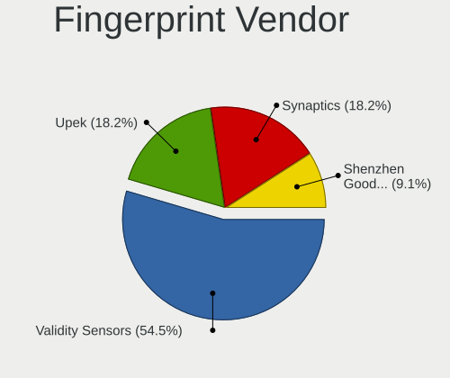

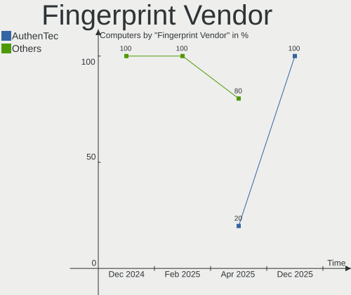

| Vendor    | Computers | Percent |
|-----------|-----------|---------|
| AuthenTec | 1         | 100%    |

Fingerprint Model
-----------------

Fingerprint sensor models

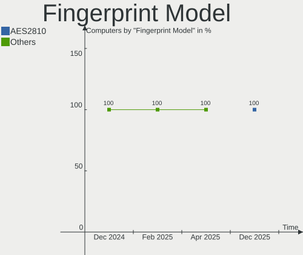

| Model             | Computers | Percent |
|-------------------|-----------|---------|
| AuthenTec AES2810 | 1         | 100%    |

Chipcard Vendor
---------------

Chipcard module vendors

Zero info for selected period =(

Chipcard Model
--------------

Chipcard module models

Zero info for selected period =(

Unsupported
-----------

Unsupported Devices
-------------------

Total unsupported devices on board

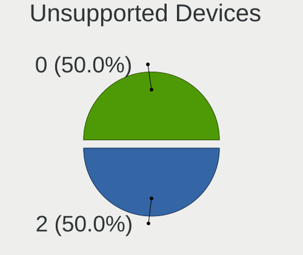

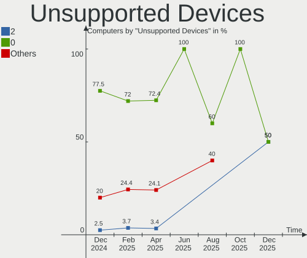

| Total | Computers | Percent |
|-------|-----------|---------|
| 2     | 1         | 50%     |
| 0     | 1         | 50%     |

Unsupported Device Types
------------------------

Types of unsupported devices

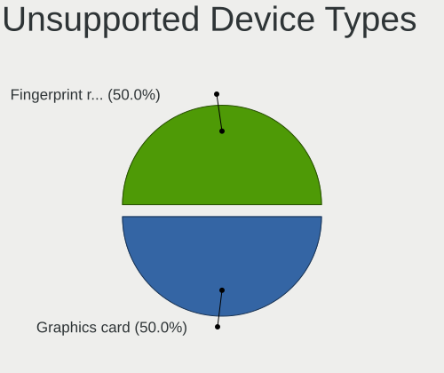

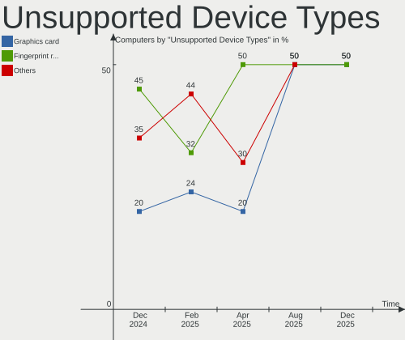

| Type               | Computers | Percent |
|--------------------|-----------|---------|
| Graphics card      | 1         | 50%     |
| Fingerprint reader | 1         | 50%     |

