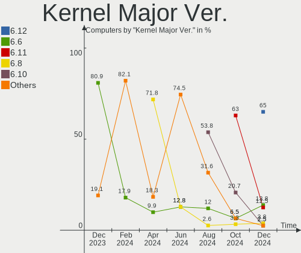
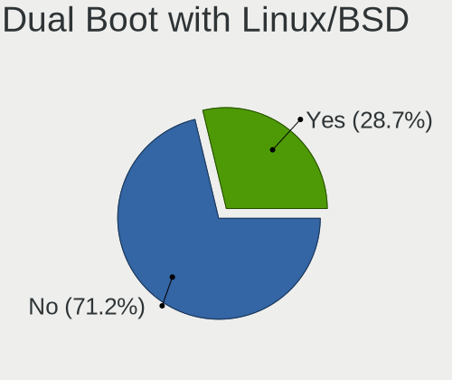
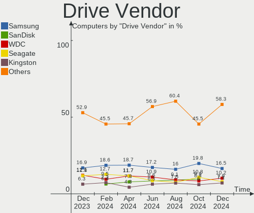
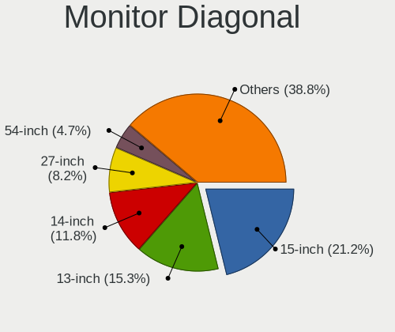
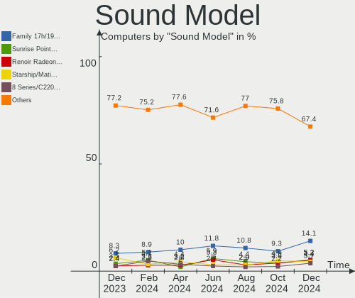
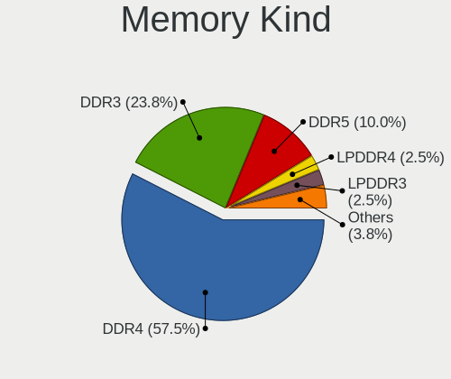
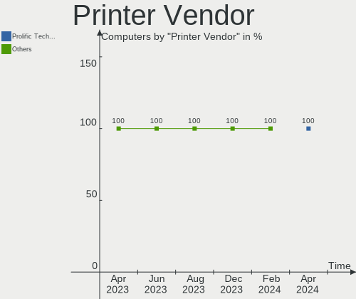

ArcoLinux - Hardware Trends
---------------------------

A project to identify most popular hardware characteristics and track their change
over time based on data collected by Linux users at https://Linux-Hardware.org.

Anyone can contribute to this report by the [hw-probe](https://github.com/linuxhw/hw-probe) tool:

    sudo -E hw-probe -all -upload

This is a report for all computer types. See also reports for [desktops](/Dist/ArcoLinux/Desktop/README.md) and [notebooks](/Dist/ArcoLinux/Notebook/README.md).

This report is for one last month. Overall report since the beginning of time: [TestDays](https://github.com/linuxhw/TestDays)

Period: Aug, 2023.

Contents
--------

* [ System ](#system)
  - [ OS                       ](#os)
  - [ OS Family                ](#os-family)
  - [ Kernel                   ](#kernel)
  - [ Kernel Family            ](#kernel-family)
  - [ Kernel Major Ver.        ](#kernel-major-ver)
  - [ Arch                     ](#arch)
  - [ DE                       ](#de)
  - [ Display Server           ](#display-server)
  - [ Display Manager          ](#display-manager)
  - [ OS Lang                  ](#os-lang)
  - [ Boot Mode                ](#boot-mode)
  - [ Filesystem               ](#filesystem)
  - [ Part. scheme             ](#part-scheme)
  - [ Dual Boot with Linux/BSD ](#dual-boot-with-linuxbsd)
  - [ Dual Boot (Win)          ](#dual-boot-win)

* [ Board ](#board)
  - [ Vendor                   ](#vendor)
  - [ Model                    ](#model)
  - [ Model Family             ](#model-family)
  - [ MFG Year                 ](#mfg-year)
  - [ Form Factor              ](#form-factor)
  - [ Secure Boot              ](#secure-boot)
  - [ Coreboot                 ](#coreboot)
  - [ RAM Size                 ](#ram-size)
  - [ RAM Used                 ](#ram-used)
  - [ Total Drives             ](#total-drives)
  - [ Has CD-ROM               ](#has-cd-rom)
  - [ Has Ethernet             ](#has-ethernet)
  - [ Has WiFi                 ](#has-wifi)
  - [ Has Bluetooth            ](#has-bluetooth)

* [ Location ](#location)
  - [ Country                  ](#country)
  - [ City                     ](#city)

* [ Drives ](#drives)
  - [ Drive Vendor             ](#drive-vendor)
  - [ Drive Model              ](#drive-model)
  - [ HDD Vendor               ](#hdd-vendor)
  - [ SSD Vendor               ](#ssd-vendor)
  - [ Drive Kind               ](#drive-kind)
  - [ Drive Connector          ](#drive-connector)
  - [ Drive Size               ](#drive-size)
  - [ Space Total              ](#space-total)
  - [ Space Used               ](#space-used)
  - [ Malfunc. Drives          ](#malfunc-drives)
  - [ Malfunc. Drive Vendor    ](#malfunc-drive-vendor)
  - [ Malfunc. HDD Vendor      ](#malfunc-hdd-vendor)
  - [ Malfunc. Drive Kind      ](#malfunc-drive-kind)
  - [ Failed Drives            ](#failed-drives)
  - [ Failed Drive Vendor      ](#failed-drive-vendor)
  - [ Drive Status             ](#drive-status)

* [ Storage controller ](#storage-controller)
  - [ Storage Vendor           ](#storage-vendor)
  - [ Storage Model            ](#storage-model)
  - [ Storage Kind             ](#storage-kind)

* [ Processor ](#processor)
  - [ CPU Vendor               ](#cpu-vendor)
  - [ CPU Model                ](#cpu-model)
  - [ CPU Model Family         ](#cpu-model-family)
  - [ CPU Cores                ](#cpu-cores)
  - [ CPU Sockets              ](#cpu-sockets)
  - [ CPU Threads              ](#cpu-threads)
  - [ CPU Op-Modes             ](#cpu-op-modes)
  - [ CPU Microcode            ](#cpu-microcode)
  - [ CPU Microarch            ](#cpu-microarch)

* [ Graphics ](#graphics)
  - [ GPU Vendor               ](#gpu-vendor)
  - [ GPU Model                ](#gpu-model)
  - [ GPU Combo                ](#gpu-combo)
  - [ GPU Driver               ](#gpu-driver)
  - [ GPU Memory               ](#gpu-memory)

* [ Monitor ](#monitor)
  - [ Monitor Vendor           ](#monitor-vendor)
  - [ Monitor Model            ](#monitor-model)
  - [ Monitor Resolution       ](#monitor-resolution)
  - [ Monitor Diagonal         ](#monitor-diagonal)
  - [ Monitor Width            ](#monitor-width)
  - [ Aspect Ratio             ](#aspect-ratio)
  - [ Monitor Area             ](#monitor-area)
  - [ Pixel Density            ](#pixel-density)
  - [ Multiple Monitors        ](#multiple-monitors)

* [ Network ](#network)
  - [ Net Controller Vendor    ](#net-controller-vendor)
  - [ Net Controller Model     ](#net-controller-model)
  - [ Wireless Vendor          ](#wireless-vendor)
  - [ Wireless Model           ](#wireless-model)
  - [ Ethernet Vendor          ](#ethernet-vendor)
  - [ Ethernet Model           ](#ethernet-model)
  - [ Net Controller Kind      ](#net-controller-kind)
  - [ Used Controller          ](#used-controller)
  - [ NICs                     ](#nics)
  - [ IPv6                     ](#ipv6)

* [ Bluetooth ](#bluetooth)
  - [ Bluetooth Vendor         ](#bluetooth-vendor)
  - [ Bluetooth Model          ](#bluetooth-model)

* [ Sound ](#sound)
  - [ Sound Vendor             ](#sound-vendor)
  - [ Sound Model              ](#sound-model)

* [ Memory ](#memory)
  - [ Memory Vendor            ](#memory-vendor)
  - [ Memory Model             ](#memory-model)
  - [ Memory Kind              ](#memory-kind)
  - [ Memory Form Factor       ](#memory-form-factor)
  - [ Memory Size              ](#memory-size)
  - [ Memory Speed             ](#memory-speed)

* [ Printers & scanners ](#printers--scanners)
  - [ Printer Vendor           ](#printer-vendor)
  - [ Printer Model            ](#printer-model)
  - [ Scanner Vendor           ](#scanner-vendor)
  - [ Scanner Model            ](#scanner-model)

* [ Camera ](#camera)
  - [ Camera Vendor            ](#camera-vendor)
  - [ Camera Model             ](#camera-model)

* [ Security ](#security)
  - [ Fingerprint Vendor       ](#fingerprint-vendor)
  - [ Fingerprint Model        ](#fingerprint-model)
  - [ Chipcard Vendor          ](#chipcard-vendor)
  - [ Chipcard Model           ](#chipcard-model)

* [ Unsupported ](#unsupported)
  - [ Unsupported Devices      ](#unsupported-devices)
  - [ Unsupported Device Types ](#unsupported-device-types)

System
------

OS
--

Installed operating systems

| Name              | Computers | Percent |
|-------------------|-----------|---------|
| ArcoLinux Rolling | 147       | 98%     |
| ArcoLinux         | 3         | 2%      |

OS Family
---------

OS without a version

| Name      | Computers | Percent |
|-----------|-----------|---------|
| ArcoLinux | 150       | 100%    |

Kernel
------

Version of the Linux kernel

| Version                 | Computers | Percent |
|-------------------------|-----------|---------|
| 6.4.10-arch1-1          | 18        | 12%     |
| 6.4.12-arch1-1          | 15        | 10%     |
| 6.4.11-arch2-1          | 15        | 10%     |
| 6.4.8-arch1-1           | 14        | 9.33%   |
| 6.3.8-arch1-1           | 8         | 5.33%   |
| 6.4.9-arch1-1           | 4         | 2.67%   |
| 6.4.7-zen1-1-zen        | 4         | 2.67%   |
| 6.4.7-arch1-2           | 4         | 2.67%   |
| 6.4.2-x64v2-xanmod1-3   | 4         | 2.67%   |
| 6.4.11-arch1-1          | 4         | 2.67%   |
| 6.1.44-1-lts            | 4         | 2.67%   |
| 6.1.39-2-lts            | 4         | 2.67%   |
| 6.4.8-zen1-1-zen        | 3         | 2%      |
| 6.4.12-zen1-1-zen       | 3         | 2%      |
| 6.4.11-zen2-1-zen       | 3         | 2%      |
| 6.1.39-3-lts            | 3         | 2%      |
| 6.4.9-zen1-1-zen        | 2         | 1.33%   |
| 6.4.7-zen1-2-zen        | 2         | 1.33%   |
| 6.4.7-arch1-3           | 2         | 1.33%   |
| 6.4.4-arch1-1           | 2         | 1.33%   |
| 6.3.8-zen1-1-zen        | 2         | 1.33%   |
| 6.3.3-arch1-1           | 2         | 1.33%   |
| 6.2.10-arch1-1          | 2         | 1.33%   |
| 6.1.49-1-lts            | 2         | 1.33%   |
| 6.1.48-1-lts            | 2         | 1.33%   |
| 6.1.45-1-lts            | 2         | 1.33%   |
| 6.1.39-1-lts            | 2         | 1.33%   |
| 6.1.34-1-lts            | 2         | 1.33%   |
| 6.4.8-1-cachyos         | 1         | 0.67%   |
| 6.4.7-arch1-1-g14       | 1         | 0.67%   |
| 6.4.7-arch1-1           | 1         | 0.67%   |
| 6.4.7-273-tkg-cfs       | 1         | 0.67%   |
| 6.4.6-arch1-1           | 1         | 0.67%   |
| 6.4.10-zen2-1-zen       | 1         | 0.67%   |
| 6.3.8-x64v1-xanmod1-1   | 1         | 0.67%   |
| 6.3.5-arch1-1           | 1         | 0.67%   |
| 6.3.3.15.realtime2-4-rt | 1         | 0.67%   |
| 6.2.11-arch1-1          | 1         | 0.67%   |
| 6.1.47-1-lts            | 1         | 0.67%   |
| 6.1.46-1-lts            | 1         | 0.67%   |

Kernel Family
-------------

Linux kernel without a distro release

| Version  | Computers | Percent |
|----------|-----------|---------|
| 6.4.11   | 22        | 14.67%  |
| 6.4.10   | 19        | 12.67%  |
| 6.4.8    | 18        | 12%     |
| 6.4.12   | 18        | 12%     |
| 6.4.7    | 15        | 10%     |
| 6.3.8    | 11        | 7.33%   |
| 6.1.39   | 9         | 6%      |
| 6.4.9    | 6         | 4%      |
| 6.4.2    | 4         | 2.67%   |
| 6.1.44   | 4         | 2.67%   |
| 6.4.4    | 2         | 1.33%   |
| 6.3.3    | 2         | 1.33%   |
| 6.2.10   | 2         | 1.33%   |
| 6.1.49   | 2         | 1.33%   |
| 6.1.48   | 2         | 1.33%   |
| 6.1.45   | 2         | 1.33%   |
| 6.1.34   | 2         | 1.33%   |
| 6.4.6    | 1         | 0.67%   |
| 6.3.5    | 1         | 0.67%   |
| 6.3.3.15 | 1         | 0.67%   |
| 6.2.11   | 1         | 0.67%   |
| 6.1.47   | 1         | 0.67%   |
| 6.1.46   | 1         | 0.67%   |
| 6.1.38   | 1         | 0.67%   |
| 6.1.33   | 1         | 0.67%   |
| 6.1.31   | 1         | 0.67%   |
| 5.15.28  | 1         | 0.67%   |

Kernel Major Ver.
-----------------

Linux kernel major version

| Version | Computers | Percent |
|---------|-----------|---------|
| 6.4     | 105       | 70%     |
| 6.1     | 26        | 17.33%  |
| 6.3     | 14        | 9.33%   |
| 6.2     | 3         | 2%      |
| 6.3.3   | 1         | 0.67%   |
| 5.15    | 1         | 0.67%   |

Arch
----

OS architecture (x86_64, i586, etc.)

| Name   | Computers | Percent |
|--------|-----------|---------|
| x86_64 | 150       | 100%    |

DE
--

Desktop Environment

| Name     | Computers | Percent |
|----------|-----------|---------|
| XFCE     | 58        | 38.67%  |
| KDE5     | 34        | 22.67%  |
| i3       | 16        | 10.67%  |
| Cinnamon | 10        | 6.67%   |
| GNOME    | 8         | 5.33%   |
| Hyprland | 5         | 3.33%   |
| Deepin   | 4         | 2.67%   |
| Budgie   | 4         | 2.67%   |
| qtile    | 3         | 2%      |
| chadwm   | 2         | 1.33%   |
| sway     | 1         | 0.67%   |
| LXQt     | 1         | 0.67%   |
| Hypr     | 1         | 0.67%   |
| bspwm    | 1         | 0.67%   |
| awesome  | 1         | 0.67%   |
| Unknown  | 1         | 0.67%   |

Display Server
--------------

X11 or Wayland

| Name    | Computers | Percent |
|---------|-----------|---------|
| X11     | 129       | 86%     |
| Wayland | 16        | 10.67%  |
| Unknown | 4         | 2.67%   |
| Tty     | 1         | 0.67%   |

Display Manager
---------------

SDDM, LightDM, etc.

| Name    | Computers | Percent |
|---------|-----------|---------|
| SDDM    | 121       | 80.67%  |
| LightDM | 20        | 13.33%  |
| GDM     | 5         | 3.33%   |
| Unknown | 3         | 2%      |
| LXDM    | 1         | 0.67%   |

OS Lang
-------

Language

| Lang  | Computers | Percent |
|-------|-----------|---------|
| en_US | 76        | 50.67%  |
| en_GB | 10        | 6.67%   |
| de_DE | 8         | 5.33%   |
| ru_RU | 6         | 4%      |
| fr_FR | 5         | 3.33%   |
| en_AU | 5         | 3.33%   |
| pt_BR | 4         | 2.67%   |
| es_MX | 4         | 2.67%   |
| hu_HU | 3         | 2%      |
| es_ES | 3         | 2%      |
| en_CA | 3         | 2%      |
| C     | 3         | 2%      |
| tr_TR | 2         | 1.33%   |
| ja_JP | 2         | 1.33%   |
| en_IN | 2         | 1.33%   |
| da_DK | 2         | 1.33%   |
| zh_CN | 1         | 0.67%   |
| th_TH | 1         | 0.67%   |
| sv_SE | 1         | 0.67%   |
| it_IT | 1         | 0.67%   |
| fr_BE | 1         | 0.67%   |
| es_VE | 1         | 0.67%   |
| es_UY | 1         | 0.67%   |
| es_CL | 1         | 0.67%   |
| en_ZA | 1         | 0.67%   |
| en_IL | 1         | 0.67%   |
| en_HK | 1         | 0.67%   |
| cs_CZ | 1         | 0.67%   |

Boot Mode
---------

EFI or BIOS

| Mode | Computers | Percent |
|------|-----------|---------|
| EFI  | 120       | 80%     |
| BIOS | 30        | 20%     |

Filesystem
----------

Type of filesystem

| Type    | Computers | Percent |
|---------|-----------|---------|
| Ext4    | 94        | 62.67%  |
| Btrfs   | 50        | 33.33%  |
| Overlay | 3         | 2%      |
| Xfs     | 2         | 1.33%   |
| F2fs    | 1         | 0.67%   |

Part. scheme
------------

Scheme of partitioning

| Type    | Computers | Percent |
|---------|-----------|---------|
| GPT     | 128       | 85.33%  |
| MBR     | 19        | 12.67%  |
| Unknown | 3         | 2%      |

Dual Boot with Linux/BSD
------------------------

Hosting more than one Linux/BSD

| Dual boot | Computers | Percent |
|-----------|-----------|---------|
| No        | 103       | 68.67%  |
| Yes       | 47        | 31.33%  |

Dual Boot (Win)
---------------

Hosting Linux and Windows

| Dual boot | Computers | Percent |
|-----------|-----------|---------|
| No        | 79        | 52.67%  |
| Yes       | 71        | 47.33%  |

Board
-----

Vendor
------

Motherboard manufacturer

| Name                | Computers | Percent |
|---------------------|-----------|---------|
| ASUSTek Computer    | 29        | 19.33%  |
| Lenovo              | 25        | 16.67%  |
| Hewlett-Packard     | 23        | 15.33%  |
| Dell                | 18        | 12%     |
| MSI                 | 9         | 6%      |
| Gigabyte Technology | 9         | 6%      |
| ASRock              | 7         | 4.67%   |
| Acer                | 5         | 3.33%   |
| Toshiba             | 3         | 2%      |
| Apple               | 3         | 2%      |
| Samsung Electronics | 2         | 1.33%   |
| Intel               | 2         | 1.33%   |
| AZW                 | 2         | 1.33%   |
| Unknown             | 2         | 1.33%   |
| SZMZ                | 1         | 0.67%   |
| System76            | 1         | 0.67%   |
| Sony                | 1         | 0.67%   |
| Razer               | 1         | 0.67%   |
| Positivo            | 1         | 0.67%   |
| Notebook            | 1         | 0.67%   |
| Monster             | 1         | 0.67%   |
| Microsoft           | 1         | 0.67%   |
| Insyde              | 1         | 0.67%   |
| Chuwi               | 1         | 0.67%   |
| AMI                 | 1         | 0.67%   |

Model
-----

Motherboard model

| Name                                                                                     | Computers | Percent |
|------------------------------------------------------------------------------------------|-----------|---------|
| HP Z240 Tower Workstation                                                                | 2         | 1.33%   |
| Gigabyte X570 AORUS MASTER                                                               | 2         | 1.33%   |
| Dell XPS 15 9560                                                                         | 2         | 1.33%   |
| AZW SER                                                                                  | 2         | 1.33%   |
| ASUS PRIME A320M-K                                                                       | 2         | 1.33%   |
| Apple MacBookPro9,2                                                                      | 2         | 1.33%   |
| Unknown                                                                                  | 2         | 1.33%   |
| Toshiba Satellite Pro C50-A-1E6                                                          | 1         | 0.67%   |
| Toshiba Satellite L55-B                                                                  | 1         | 0.67%   |
| Toshiba Satellite C50-A510                                                               | 1         | 0.67%   |
| SZMZ X99M-G2                                                                             | 1         | 0.67%   |
| System76 Gazelle                                                                         | 1         | 0.67%   |
| Sony SVE1712W1EB                                                                         | 1         | 0.67%   |
| Samsung R530/R730/R540                                                                   | 1         | 0.67%   |
| Samsung 355V4C/355V4X/355V5C/355V5X/356V4C/356V4X/356V5C/356V5X/3445VC/3445VX/3545VC/354 | 1         | 0.67%   |
| Razer Blade 14 - RZ09-0370                                                               | 1         | 0.67%   |
| Positivo D6200                                                                           | 1         | 0.67%   |
| Notebook N141CU                                                                          | 1         | 0.67%   |
| MSI PPPPP-CCC#MMMMMMMM                                                                   | 1         | 0.67%   |
| MSI MS-7C94                                                                              | 1         | 0.67%   |
| MSI MS-7C56                                                                              | 1         | 0.67%   |
| MSI MS-7C37                                                                              | 1         | 0.67%   |
| MSI MS-7C02                                                                              | 1         | 0.67%   |
| MSI MS-7B79                                                                              | 1         | 0.67%   |
| MSI MS-7850                                                                              | 1         | 0.67%   |
| MSI Mr. Gamer X-Treme GTX 680 R2                                                         | 1         | 0.67%   |
| MSI GL73 8RC                                                                             | 1         | 0.67%   |
| Monster ABRA A5 V17.2                                                                    | 1         | 0.67%   |
| Microsoft Surface Pro 4                                                                  | 1         | 0.67%   |
| Lenovo Y50-70 20378                                                                      | 1         | 0.67%   |
| Lenovo ThinkPad X240 20AL00C6UK                                                          | 1         | 0.67%   |
| Lenovo ThinkPad X220 4291C84                                                             | 1         | 0.67%   |
| Lenovo ThinkPad T490 20N2004EGE                                                          | 1         | 0.67%   |
| Lenovo ThinkPad T470s W10DG 20JTS0VG02                                                   | 1         | 0.67%   |
| Lenovo ThinkPad T470 W10DG 20JNS01R27                                                    | 1         | 0.67%   |
| Lenovo ThinkPad T440p 20AN007BIV                                                         | 1         | 0.67%   |
| Lenovo ThinkPad T430 2349IF8                                                             | 1         | 0.67%   |
| Lenovo ThinkPad T420 4180AP3                                                             | 1         | 0.67%   |
| Lenovo ThinkPad T410 2522AC1                                                             | 1         | 0.67%   |
| Lenovo ThinkPad P53s 20N6S00B00                                                          | 1         | 0.67%   |

Model Family
------------

Motherboard model prefix

| Name                   | Computers | Percent |
|------------------------|-----------|---------|
| Lenovo ThinkPad        | 11        | 7.33%   |
| ASUS ROG               | 7         | 4.67%   |
| Lenovo IdeaPad         | 6         | 4%      |
| Dell Inspiron          | 6         | 4%      |
| HP Pavilion            | 5         | 3.33%   |
| Lenovo Legion          | 4         | 2.67%   |
| Dell OptiPlex          | 4         | 2.67%   |
| ASUS PRIME             | 4         | 2.67%   |
| Toshiba Satellite      | 3         | 2%      |
| HP ZBook               | 3         | 2%      |
| Dell XPS               | 3         | 2%      |
| ASUS VivoBook          | 3         | 2%      |
| ASUS TUF               | 3         | 2%      |
| Acer Aspire            | 3         | 2%      |
| Lenovo ThinkBook       | 2         | 1.33%   |
| HP Z240                | 2         | 1.33%   |
| HP ProDesk             | 2         | 1.33%   |
| HP EliteBook           | 2         | 1.33%   |
| Gigabyte Z390          | 2         | 1.33%   |
| Gigabyte X570          | 2         | 1.33%   |
| Dell G15               | 2         | 1.33%   |
| AZW SER                | 2         | 1.33%   |
| Apple MacBookPro9      | 2         | 1.33%   |
| Unknown                | 2         | 1.33%   |
| SZMZ X99M-G2           | 1         | 0.67%   |
| System76 Gazelle       | 1         | 0.67%   |
| Sony SVE1712W1EB       | 1         | 0.67%   |
| Samsung R530           | 1         | 0.67%   |
| Samsung 355V4C         | 1         | 0.67%   |
| Razer Blade            | 1         | 0.67%   |
| Positivo D6200         | 1         | 0.67%   |
| Notebook N141CU        | 1         | 0.67%   |
| MSI PPPPP-CCC#MMMMMMMM | 1         | 0.67%   |
| MSI MS-7C94            | 1         | 0.67%   |
| MSI MS-7C56            | 1         | 0.67%   |
| MSI MS-7C37            | 1         | 0.67%   |
| MSI MS-7C02            | 1         | 0.67%   |
| MSI MS-7B79            | 1         | 0.67%   |
| MSI MS-7850            | 1         | 0.67%   |
| MSI Mr.                | 1         | 0.67%   |

MFG Year
--------

Motherboard manufacture year

| Year | Computers | Percent |
|------|-----------|---------|
| 2021 | 21        | 14%     |
| 2019 | 15        | 10%     |
| 2017 | 14        | 9.33%   |
| 2022 | 12        | 8%      |
| 2020 | 12        | 8%      |
| 2018 | 12        | 8%      |
| 2016 | 11        | 7.33%   |
| 2011 | 11        | 7.33%   |
| 2012 | 9         | 6%      |
| 2014 | 8         | 5.33%   |
| 2013 | 8         | 5.33%   |
| 2023 | 6         | 4%      |
| 2015 | 6         | 4%      |
| 2010 | 3         | 2%      |
| 2009 | 1         | 0.67%   |
| 2008 | 1         | 0.67%   |

Form Factor
-----------

Physical design of the computer

| Name        | Computers | Percent |
|-------------|-----------|---------|
| Notebook    | 81        | 54%     |
| Desktop     | 59        | 39.33%  |
| Mini pc     | 6         | 4%      |
| Convertible | 2         | 1.33%   |
| Tablet      | 1         | 0.67%   |
| Server      | 1         | 0.67%   |

Secure Boot
-----------

Enabled or disabled

| State    | Computers | Percent |
|----------|-----------|---------|
| Disabled | 150       | 100%    |

Coreboot
--------

Have coreboot on board

| Used | Computers | Percent |
|------|-----------|---------|
| No   | 149       | 99.33%  |
| Yes  | 1         | 0.67%   |

RAM Size
--------

Total RAM memory

| Size in GB  | Computers | Percent |
|-------------|-----------|---------|
| 16.01-24.0  | 45        | 30%     |
| 4.01-8.0    | 35        | 23.33%  |
| 32.01-64.0  | 27        | 18%     |
| 8.01-16.0   | 22        | 14.67%  |
| 24.01-32.0  | 7         | 4.67%   |
| 64.01-256.0 | 7         | 4.67%   |
| 3.01-4.0    | 6         | 4%      |
| 1.01-2.0    | 1         | 0.67%   |

RAM Used
--------

Used RAM memory

| Used GB   | Computers | Percent |
|-----------|-----------|---------|
| 1.01-2.0  | 58        | 38.67%  |
| 2.01-3.0  | 36        | 24%     |
| 3.01-4.0  | 30        | 20%     |
| 4.01-8.0  | 17        | 11.33%  |
| 8.01-16.0 | 5         | 3.33%   |
| 0.51-1.0  | 4         | 2.67%   |

Total Drives
------------

Number of drives on board

| Drives | Computers | Percent |
|--------|-----------|---------|
| 1      | 79        | 52.67%  |
| 2      | 40        | 26.67%  |
| 3      | 12        | 8%      |
| 4      | 9         | 6%      |
| 6      | 3         | 2%      |
| 5      | 3         | 2%      |
| 7      | 2         | 1.33%   |
| 11     | 1         | 0.67%   |
| 10     | 1         | 0.67%   |

Has CD-ROM
----------

Has CD-ROM on board

| Presented | Computers | Percent |
|-----------|-----------|---------|
| No        | 118       | 78.67%  |
| Yes       | 32        | 21.33%  |

Has Ethernet
------------

Has Ethernet on board

| Presented | Computers | Percent |
|-----------|-----------|---------|
| Yes       | 131       | 87.33%  |
| No        | 19        | 12.67%  |

Has WiFi
--------

Has WiFi module

| Presented | Computers | Percent |
|-----------|-----------|---------|
| Yes       | 114       | 76%     |
| No        | 36        | 24%     |

Has Bluetooth
-------------

Has Bluetooth module

| Presented | Computers | Percent |
|-----------|-----------|---------|
| Yes       | 108       | 72%     |
| No        | 42        | 28%     |

Location
--------

Country
-------

Geographic location (country)

| Country      | Computers | Percent |
|--------------|-----------|---------|
| USA          | 28        | 18.67%  |
| Germany      | 12        | 8%      |
| UK           | 7         | 4.67%   |
| France       | 7         | 4.67%   |
| Brazil       | 7         | 4.67%   |
| Australia    | 7         | 4.67%   |
| Russia       | 6         | 4%      |
| Spain        | 5         | 3.33%   |
| Canada       | 5         | 3.33%   |
| Romania      | 4         | 2.67%   |
| Turkey       | 3         | 2%      |
| Sweden       | 3         | 2%      |
| Mexico       | 3         | 2%      |
| India        | 3         | 2%      |
| Bolivia      | 3         | 2%      |
| Argentina    | 3         | 2%      |
| Venezuela    | 2         | 1.33%   |
| Thailand     | 2         | 1.33%   |
| Malaysia     | 2         | 1.33%   |
| Japan        | 2         | 1.33%   |
| Italy        | 2         | 1.33%   |
| Israel       | 2         | 1.33%   |
| Hungary      | 2         | 1.33%   |
| Finland      | 2         | 1.33%   |
| Denmark      | 2         | 1.33%   |
| Czechia      | 2         | 1.33%   |
| Chile        | 2         | 1.33%   |
| Uruguay      | 1         | 0.67%   |
| Tunisia      | 1         | 0.67%   |
| South Korea  | 1         | 0.67%   |
| South Africa | 1         | 0.67%   |
| Slovenia     | 1         | 0.67%   |
| Singapore    | 1         | 0.67%   |
| Portugal     | 1         | 0.67%   |
| Poland       | 1         | 0.67%   |
| Pakistan     | 1         | 0.67%   |
| Norway       | 1         | 0.67%   |
| Nepal        | 1         | 0.67%   |
| Lebanon      | 1         | 0.67%   |
| Ireland      | 1         | 0.67%   |

City
----

Geographic location (city)

| City         | Computers | Percent |
|--------------|-----------|---------|
| Teresopolis  | 2         | 1.33%   |
| Stockholm    | 2         | 1.33%   |
| Melbourne    | 2         | 1.33%   |
| Los Angeles  | 2         | 1.33%   |
| Lincoln      | 2         | 1.33%   |
| La Paz       | 2         | 1.33%   |
| Feltham      | 2         | 1.33%   |
| Budapest     | 2         | 1.33%   |
| Brisbane     | 2         | 1.33%   |
| Bangkok      | 2         | 1.33%   |
| Amarillo     | 2         | 1.33%   |
| Zapopan      | 1         | 0.67%   |
| Yokosuka     | 1         | 0.67%   |
| Yokohama     | 1         | 0.67%   |
| Yangcheon-gu | 1         | 0.67%   |
| Yakutsk      | 1         | 0.67%   |
| Yachats      | 1         | 0.67%   |
| Woodway      | 1         | 0.67%   |
| Wharton      | 1         | 0.67%   |
| Voronezh     | 1         | 0.67%   |
| Vienna       | 1         | 0.67%   |
| Vicosa       | 1         | 0.67%   |
| Valencia     | 1         | 0.67%   |
| Uberlândia  | 1         | 0.67%   |
| Tunnel Hill  | 1         | 0.67%   |
| Tunis        | 1         | 0.67%   |
| Tsuen Wan    | 1         | 0.67%   |
| Toronto      | 1         | 0.67%   |
| Toenisvorst  | 1         | 0.67%   |
| Timișoara   | 1         | 0.67%   |
| Tehran       | 1         | 0.67%   |
| Tampere      | 1         | 0.67%   |
| Tamarac      | 1         | 0.67%   |
| Sydney       | 1         | 0.67%   |
| Stuttgart    | 1         | 0.67%   |
| Spokane      | 1         | 0.67%   |
| Southwark    | 1         | 0.67%   |
| Smolensk     | 1         | 0.67%   |
| Singapore    | 1         | 0.67%   |
| Simi Valley  | 1         | 0.67%   |

Drives
------

Drive Vendor
------------

Hard drive vendors

| Vendor                      | Computers | Drives | Percent |
|-----------------------------|-----------|--------|---------|
| Samsung Electronics         | 48        | 60     | 18.53%  |
| WDC                         | 36        | 49     | 13.9%   |
| Seagate                     | 29        | 38     | 11.2%   |
| Sandisk                     | 18        | 18     | 6.95%   |
| Kingston                    | 18        | 21     | 6.95%   |
| Toshiba                     | 13        | 14     | 5.02%   |
| Crucial                     | 11        | 11     | 4.25%   |
| Phison Electronics          | 7         | 7      | 2.7%    |
| Kingston Technology Company | 7         | 7      | 2.7%    |
| Intel                       | 7         | 8      | 2.7%    |
| Unknown                     | 5         | 5      | 1.93%   |
| SK hynix                    | 4         | 4      | 1.54%   |
| Silicon Motion              | 4         | 5      | 1.54%   |
| Micron/Crucial Technology   | 4         | 4      | 1.54%   |
| Hitachi                     | 4         | 4      | 1.54%   |
| Realtek Semiconductor       | 2         | 2      | 0.77%   |
| PNY                         | 2         | 2      | 0.77%   |
| Patriot                     | 2         | 2      | 0.77%   |
| Micron Technology           | 2         | 2      | 0.77%   |
| KIOXIA                      | 2         | 2      | 0.77%   |
| Intenso                     | 2         | 2      | 0.77%   |
| Apple                       | 2         | 2      | 0.77%   |
| ADATA Technology            | 2         | 2      | 0.77%   |
| A-DATA Technology           | 2         | 3      | 0.77%   |
| Zheino                      | 1         | 1      | 0.39%   |
| ValueTech                   | 1         | 1      | 0.39%   |
| Union Memory (Shenzhen)     | 1         | 1      | 0.39%   |
| Timetec                     | 1         | 1      | 0.39%   |
| Team                        | 1         | 1      | 0.39%   |
| sobetter                    | 1         | 1      | 0.39%   |
| ShiJi                       | 1         | 1      | 0.39%   |
| SABRENT                     | 1         | 1      | 0.39%   |
| OXYBR                       | 1         | 1      | 0.39%   |
| OCZ                         | 1         | 1      | 0.39%   |
| Maxtor                      | 1         | 1      | 0.39%   |
| Maxone                      | 1         | 1      | 0.39%   |
| MAXIO Technology (Hangzhou) | 1         | 1      | 0.39%   |
| LITEON                      | 1         | 1      | 0.39%   |
| Lexar                       | 1         | 1      | 0.39%   |
| Kingmax                     | 1         | 1      | 0.39%   |

Drive Model
-----------

Hard drive models

| Model                                                 | Computers | Percent |
|-------------------------------------------------------|-----------|---------|
| Samsung NVMe SSD Controller SM981/PM981/PM983 500GB   | 11        | 3.78%   |
| Kingston SA400S37480G 480GB SSD                       | 6         | 2.06%   |
| Samsung SSD 850 EVO 250GB                             | 4         | 1.37%   |
| Samsung NVMe SSD Controller PM9A1/PM9A3/980PRO 1024GB | 4         | 1.37%   |
| Phison E12 NVMe Controller 256GB                      | 4         | 1.37%   |
| Micron/Crucial P2 NVMe PCIe SSD 1TB                   | 4         | 1.37%   |
| Kingston Company A2000 NVMe SSD 1TB                   | 4         | 1.37%   |
| Kingston SA400S37240G 240GB SSD                       | 4         | 1.37%   |
| WDC WD10EZEX-08WN4A0 1TB                              | 3         | 1.03%   |
| Toshiba XG4 NVMe SSD Controller 256GB                 | 3         | 1.03%   |
| Silicon Motion SM2263EN/SM2263XT SSD Controller 256GB | 3         | 1.03%   |
| Seagate ST1000DM003-1CH162 1TB                        | 3         | 1.03%   |
| Sandisk WD Black SN750 / PC SN730 NVMe SSD 1024GB     | 3         | 1.03%   |
| Samsung NVMe SSD Controller SM961/PM961/SM963 1024GB  | 3         | 1.03%   |
| Samsung NVMe SSD Controller SM951/PM951 256GB         | 3         | 1.03%   |
| WDC WDS500G2B0B-00YS70 500GB SSD                      | 2         | 0.69%   |
| WDC WDS240G2G0A-00JH30 240GB SSD                      | 2         | 0.69%   |
| WDC WD40EZRX-00SPEB0 4TB                              | 2         | 0.69%   |
| WDC WD10JPVX-60JC3T0 1TB                              | 2         | 0.69%   |
| WDC WD10EZRX-00L4HB0 1TB                              | 2         | 0.69%   |
| Toshiba XG6 NVMe SSD Controller 1024GB                | 2         | 0.69%   |
| Toshiba MQ01ABD100 1TB                                | 2         | 0.69%   |
| Seagate ST9750420AS 752GB                             | 2         | 0.69%   |
| Seagate ST2000DM008-2FR102 2TB                        | 2         | 0.69%   |
| Seagate Expansion 2TB                                 | 2         | 0.69%   |
| Sandisk WD Blue SN550 NVMe SSD 250GB                  | 2         | 0.69%   |
| Samsung SSD 980 1TB                                   | 2         | 0.69%   |
| Samsung SSD 860 EVO 1TB                               | 2         | 0.69%   |
| Samsung SSD 840 PRO Series 128GB                      | 2         | 0.69%   |
| Samsung MZALQ512HBLU-00BL2 512GB                      | 2         | 0.69%   |
| Realtek SPCC M.2 PCIe SSD 512GB                       | 2         | 0.69%   |
| Intel SSDPEKNU512GZ 512GB                             | 2         | 0.69%   |
| Intel SSD 660P Series 512GB                           | 2         | 0.69%   |
| Crucial CT480BX500SSD1 480GB                          | 2         | 0.69%   |
| Crucial CT2000MX500SSD1 2TB                           | 2         | 0.69%   |
| Crucial CT1000BX500SSD1 1TB                           | 2         | 0.69%   |
| Zheino CHN MSATAQ3 120 120GB SSD                      | 1         | 0.34%   |
| WDC WDS500G2B0A-00SM50 500GB SSD                      | 1         | 0.34%   |
| WDC WDS480G2G0B-00EPW0 480GB SSD                      | 1         | 0.34%   |
| WDC WDS250G2B0B-00YS70 250GB SSD                      | 1         | 0.34%   |

HDD Vendor
----------

Hard disk drive vendors

| Vendor              | Computers | Drives | Percent |
|---------------------|-----------|--------|---------|
| Seagate             | 28        | 36     | 37.33%  |
| WDC                 | 27        | 37     | 36%     |
| Toshiba             | 6         | 7      | 8%      |
| Samsung Electronics | 4         | 4      | 5.33%   |
| Hitachi             | 4         | 4      | 5.33%   |
| SABRENT             | 1         | 1      | 1.33%   |
| Maxtor              | 1         | 1      | 1.33%   |
| Maxone              | 1         | 1      | 1.33%   |
| HGST                | 1         | 1      | 1.33%   |
| H/W                 | 1         | 3      | 1.33%   |
| Apple               | 1         | 1      | 1.33%   |

SSD Vendor
----------

Solid state drive vendors

| Vendor              | Computers | Drives | Percent |
|---------------------|-----------|--------|---------|
| Samsung Electronics | 23        | 25     | 23.71%  |
| Kingston            | 15        | 17     | 15.46%  |
| WDC                 | 11        | 12     | 11.34%  |
| Crucial             | 11        | 11     | 11.34%  |
| SanDisk             | 7         | 7      | 7.22%   |
| PNY                 | 2         | 2      | 2.06%   |
| Patriot             | 2         | 2      | 2.06%   |
| Intenso             | 2         | 2      | 2.06%   |
| Intel               | 2         | 2      | 2.06%   |
| A-DATA Technology   | 2         | 3      | 2.06%   |
| Zheino              | 1         | 1      | 1.03%   |
| ValueTech           | 1         | 1      | 1.03%   |
| Toshiba             | 1         | 1      | 1.03%   |
| Timetec             | 1         | 1      | 1.03%   |
| Team                | 1         | 1      | 1.03%   |
| ShiJi               | 1         | 1      | 1.03%   |
| Seagate             | 1         | 1      | 1.03%   |
| OXYBR               | 1         | 1      | 1.03%   |
| OCZ                 | 1         | 1      | 1.03%   |
| Micron Technology   | 1         | 1      | 1.03%   |
| LITEON              | 1         | 1      | 1.03%   |
| Kingmax             | 1         | 1      | 1.03%   |
| JMicron Technology  | 1         | 1      | 1.03%   |
| HI-LEVEL            | 1         | 1      | 1.03%   |
| EYOTA               | 1         | 1      | 1.03%   |
| Corsair             | 1         | 1      | 1.03%   |
| CONSISTENT          | 1         | 1      | 1.03%   |
| Colorful            | 1         | 1      | 1.03%   |
| Apple               | 1         | 1      | 1.03%   |
| Apacer              | 1         | 1      | 1.03%   |

Drive Kind
----------

HDD or SSD

| Kind    | Computers | Drives | Percent |
|---------|-----------|--------|---------|
| NVMe    | 80        | 96     | 35.87%  |
| SSD     | 77        | 103    | 34.53%  |
| HDD     | 59        | 96     | 26.46%  |
| Unknown | 4         | 4      | 1.79%   |
| MMC     | 3         | 3      | 1.35%   |

Drive Connector
---------------

SATA, SAS, NVMe, etc.

| Type | Computers | Drives | Percent |
|------|-----------|--------|---------|
| SATA | 99        | 185    | 50%     |
| NVMe | 80        | 96     | 40.4%   |
| SAS  | 16        | 18     | 8.08%   |
| MMC  | 3         | 3      | 1.52%   |

Drive Size
----------

Size of hard drive

| Size in TB | Computers | Drives | Percent |
|------------|-----------|--------|---------|
| 0.01-0.5   | 71        | 94     | 46.71%  |
| 0.51-1.0   | 54        | 69     | 35.53%  |
| 1.01-2.0   | 18        | 23     | 11.84%  |
| 2.01-3.0   | 4         | 5      | 2.63%   |
| 3.01-4.0   | 3         | 5      | 1.97%   |
| 4.01-10.0  | 2         | 3      | 1.32%   |

Space Total
-----------

Amount of disk space available on the file system

| Size in GB     | Computers | Percent |
|----------------|-----------|---------|
| 251-500        | 35        | 23.33%  |
| 101-250        | 24        | 16%     |
| 501-1000       | 24        | 16%     |
| More than 3000 | 23        | 15.33%  |
| 1001-2000      | 15        | 10%     |
| 51-100         | 10        | 6.67%   |
| 2001-3000      | 8         | 5.33%   |
| Unknown        | 5         | 3.33%   |
| 1-20           | 4         | 2.67%   |
| 21-50          | 2         | 1.33%   |

Space Used
----------

Amount of used disk space

| Used GB        | Computers | Percent |
|----------------|-----------|---------|
| 1-20           | 38        | 25.33%  |
| 101-250        | 29        | 19.33%  |
| 21-50          | 27        | 18%     |
| 51-100         | 16        | 10.67%  |
| 251-500        | 13        | 8.67%   |
| 501-1000       | 10        | 6.67%   |
| 1001-2000      | 8         | 5.33%   |
| Unknown        | 5         | 3.33%   |
| More than 3000 | 3         | 2%      |
| 2001-3000      | 1         | 0.67%   |

Malfunc. Drives
---------------

Drive models with a malfunction

| Model                                 | Computers | Drives | Percent |
|---------------------------------------|-----------|--------|---------|
| Seagate ST1000DM003-1CH162 1TB        | 3         | 3      | 8.82%   |
| WDC WD7500BPVT-55HXZT3 752GB          | 1         | 1      | 2.94%   |
| WDC WD6400AAKS-22A7B2 640GB           | 1         | 1      | 2.94%   |
| WDC WD5000AACS-00G8B1 500GB           | 1         | 1      | 2.94%   |
| WDC WD40EZRX-00SPEB0 4TB              | 1         | 1      | 2.94%   |
| WDC WD30EFRX-68EUZN0 3TB              | 1         | 1      | 2.94%   |
| WDC WD20EARS-00MVWB0 2TB              | 1         | 2      | 2.94%   |
| WDC WD10EZRX-00L4HB0 1TB              | 1         | 1      | 2.94%   |
| WDC WD10EARS-22Y5B1 1TB               | 1         | 1      | 2.94%   |
| Toshiba MQ01ABF050 500GB              | 1         | 1      | 2.94%   |
| SK hynix PC711 HFS512GDE9X073N 512GB  | 1         | 1      | 2.94%   |
| Seagate STM31000528AS 1TB             | 1         | 1      | 2.94%   |
| Seagate ST9750420AS 752GB             | 1         | 1      | 2.94%   |
| Seagate ST500LT012-1DG142 500GB       | 1         | 1      | 2.94%   |
| Seagate ST500DM002-1SB10A 500GB       | 1         | 1      | 2.94%   |
| Seagate ST3500630AS 500GB             | 1         | 1      | 2.94%   |
| Seagate ST3500414CS 500GB             | 1         | 1      | 2.94%   |
| Seagate ST3500320AS 500GB             | 1         | 1      | 2.94%   |
| SanDisk SSD PLUS 1000GB               | 1         | 1      | 2.94%   |
| SanDisk SD8SBAT128G1122 128GB SSD     | 1         | 1      | 2.94%   |
| Samsung Electronics SSD 870 EVO 1TB   | 1         | 1      | 2.94%   |
| Samsung Electronics SSD 850 EVO 250GB | 1         | 1      | 2.94%   |
| Samsung Electronics HD642JJ 640GB     | 1         | 1      | 2.94%   |
| Maxtor STM3250310AS 250GB             | 1         | 1      | 2.94%   |
| Kingston SA400S37480G 480GB SSD       | 1         | 1      | 2.94%   |
| Intel SSDSC2BW240A4 240GB             | 1         | 1      | 2.94%   |
| Intel SSDSC2BF180A4L 180GB            | 1         | 1      | 2.94%   |
| Hitachi HTS543225A7A384 250GB         | 1         | 1      | 2.94%   |
| Hitachi HDS721010CLA332 1TB           | 1         | 1      | 2.94%   |
| Crucial CT2000MX500SSD1 2TB           | 1         | 1      | 2.94%   |
| Corsair CSSD-F60GB2 64GB              | 1         | 1      | 2.94%   |
| Colorful SL500 240GB SSD              | 1         | 1      | 2.94%   |

Malfunc. Drive Vendor
---------------------

Vendors of faulty drives

| Vendor              | Computers | Drives | Percent |
|---------------------|-----------|--------|---------|
| Seagate             | 9         | 10     | 28.13%  |
| WDC                 | 8         | 9      | 25%     |
| SanDisk             | 2         | 2      | 6.25%   |
| Samsung Electronics | 2         | 3      | 6.25%   |
| Intel               | 2         | 2      | 6.25%   |
| Hitachi             | 2         | 2      | 6.25%   |
| Toshiba             | 1         | 1      | 3.13%   |
| SK hynix            | 1         | 1      | 3.13%   |
| Maxtor              | 1         | 1      | 3.13%   |
| Kingston            | 1         | 1      | 3.13%   |
| Crucial             | 1         | 1      | 3.13%   |
| Corsair             | 1         | 1      | 3.13%   |
| Colorful            | 1         | 1      | 3.13%   |

Malfunc. HDD Vendor
-------------------

Vendors of faulty HDD drives

| Vendor              | Computers | Drives | Percent |
|---------------------|-----------|--------|---------|
| Seagate             | 9         | 10     | 40.91%  |
| WDC                 | 8         | 9      | 36.36%  |
| Hitachi             | 2         | 2      | 9.09%   |
| Toshiba             | 1         | 1      | 4.55%   |
| Samsung Electronics | 1         | 1      | 4.55%   |
| Maxtor              | 1         | 1      | 4.55%   |

Malfunc. Drive Kind
-------------------

Kinds of faulty drives

| Kind | Computers | Drives | Percent |
|------|-----------|--------|---------|
| HDD  | 18        | 24     | 64.29%  |
| SSD  | 9         | 10     | 32.14%  |
| NVMe | 1         | 1      | 3.57%   |

Failed Drives
-------------

Failed drive models

Zero info for selected period =(

Failed Drive Vendor
-------------------

Failed drive vendors

Zero info for selected period =(

Drive Status
------------

Number of failed and malfunc. drives

| Status   | Computers | Drives | Percent |
|----------|-----------|--------|---------|
| Works    | 134       | 238    | 75.71%  |
| Malfunc  | 25        | 35     | 14.12%  |
| Detected | 18        | 29     | 10.17%  |

Storage controller
------------------

Storage Vendor
--------------

Storage controller vendors

| Vendor                       | Computers | Percent |
|------------------------------|-----------|---------|
| Intel                        | 97        | 43.89%  |
| AMD                          | 33        | 14.93%  |
| Samsung Electronics          | 27        | 12.22%  |
| SanDisk                      | 11        | 4.98%   |
| Kingston Technology Company  | 11        | 4.98%   |
| Phison Electronics           | 7         | 3.17%   |
| Toshiba America Info Systems | 6         | 2.71%   |
| SK hynix                     | 4         | 1.81%   |
| Silicon Motion               | 4         | 1.81%   |
| Micron/Crucial Technology    | 4         | 1.81%   |
| ASMedia Technology           | 3         | 1.36%   |
| Realtek Semiconductor        | 2         | 0.9%    |
| KIOXIA                       | 2         | 0.9%    |
| ADATA Technology             | 2         | 0.9%    |
| Union Memory (Shenzhen)      | 1         | 0.45%   |
| TenaFe                       | 1         | 0.45%   |
| Silicon Image                | 1         | 0.45%   |
| Nvidia                       | 1         | 0.45%   |
| Micron Technology            | 1         | 0.45%   |
| MAXIO Technology (Hangzhou)  | 1         | 0.45%   |
| Marvell Technology Group     | 1         | 0.45%   |
| INNOGRIT                     | 1         | 0.45%   |

Storage Model
-------------

Storage controller models

| Model                                                                          | Computers | Percent |
|--------------------------------------------------------------------------------|-----------|---------|
| AMD FCH SATA Controller [AHCI mode]                                            | 22        | 9.21%   |
| Samsung NVMe SSD Controller SM981/PM981/PM983                                  | 11        | 4.6%    |
| Intel 8 Series/C220 Series Chipset Family 6-port SATA Controller 1 [AHCI mode] | 8         | 3.35%   |
| Intel Volume Management Device NVMe RAID Controller                            | 7         | 2.93%   |
| Samsung NVMe SSD Controller 980                                                | 6         | 2.51%   |
| Intel Sunrise Point-LP SATA Controller [AHCI mode]                             | 6         | 2.51%   |
| Intel Q170/Q150/B150/H170/H110/Z170/CM236 Chipset SATA Controller [AHCI Mode]  | 6         | 2.51%   |
| Intel 6 Series/C200 Series Chipset Family 6 port Mobile SATA AHCI Controller   | 6         | 2.51%   |
| Intel 7 Series Chipset Family 6-port SATA Controller [AHCI mode]               | 5         | 2.09%   |
| Intel 200 Series PCH SATA controller [AHCI mode]                               | 5         | 2.09%   |
| SK hynix Gold P31/BC711/PC711 NVMe Solid State Drive                           | 4         | 1.67%   |
| Samsung NVMe SSD Controller PM9A1/PM9A3/980PRO                                 | 4         | 1.67%   |
| Phison E12 NVMe Controller                                                     | 4         | 1.67%   |
| Micron/Crucial P2 [Nick P2] / P3 / P3 Plus NVMe PCIe SSD (DRAM-less)           | 4         | 1.67%   |
| Kingston Company A2000 NVMe SSD                                                | 4         | 1.67%   |
| Intel SATA Controller [RAID mode]                                              | 4         | 1.67%   |
| Intel Cannon Lake PCH SATA AHCI Controller                                     | 4         | 1.67%   |
| Intel 82801 Mobile SATA Controller [RAID mode]                                 | 4         | 1.67%   |
| AMD 500 Series Chipset SATA Controller                                         | 4         | 1.67%   |
| AMD 400 Series Chipset SATA Controller                                         | 4         | 1.67%   |
| Toshiba America Info Systems XG4 NVMe SSD Controller                           | 3         | 1.26%   |
| Silicon Motion SM2263EN/SM2263XT (DRAM-less) NVMe SSD Controllers              | 3         | 1.26%   |
| SanDisk WD Blue SN570 NVMe SSD 1TB                                             | 3         | 1.26%   |
| SanDisk WD Black SN750 / PC SN730 NVMe SSD                                     | 3         | 1.26%   |
| Samsung NVMe SSD Controller SM961/PM961/SM963                                  | 3         | 1.26%   |
| Samsung NVMe SSD Controller SM951/PM951                                        | 3         | 1.26%   |
| Kingston Company Company Non-Volatile memory controller                        | 3         | 1.26%   |
| Intel Tiger Lake-LP SATA Controller                                            | 3         | 1.26%   |
| Intel Tiger Lake SATA AHCI Controller                                          | 3         | 1.26%   |
| Intel SSD 670p Series [Keystone Harbor]                                        | 3         | 1.26%   |
| Intel HM170/QM170 Chipset SATA Controller [AHCI Mode]                          | 3         | 1.26%   |
| Intel Alder Lake-S PCH SATA Controller [AHCI Mode]                             | 3         | 1.26%   |
| Intel 7 Series/C210 Series Chipset Family 6-port SATA Controller [AHCI mode]   | 3         | 1.26%   |
| Intel 5 Series/3400 Series Chipset 6 port SATA AHCI Controller                 | 3         | 1.26%   |
| Intel 400 Series Chipset Family SATA AHCI Controller                           | 3         | 1.26%   |
| ASMedia ASM1062 Serial ATA Controller                                          | 3         | 1.26%   |
| Toshiba America Info Systems XG6 NVMe SSD Controller                           | 2         | 0.84%   |
| SanDisk WD Blue SN550 NVMe SSD                                                 | 2         | 0.84%   |
| Realtek RTS5765DL NVMe SSD Controller (DRAM-less)                              | 2         | 0.84%   |
| Intel Wildcat Point-LP SATA Controller [AHCI Mode]                             | 2         | 0.84%   |

Storage Kind
------------

Kind of storage controller (IDE, SATA, NVMe, SAS, ...)

| Kind | Computers | Percent |
|------|-----------|---------|
| SATA | 114       | 52.29%  |
| NVMe | 80        | 36.7%   |
| RAID | 19        | 8.72%   |
| IDE  | 4         | 1.83%   |
| SAS  | 1         | 0.46%   |

Processor
---------

CPU Vendor
----------

Processor vendors

| Vendor | Computers | Percent |
|--------|-----------|---------|
| Intel  | 107       | 71.33%  |
| AMD    | 43        | 28.67%  |

CPU Model
---------

Processor models

| Model                                    | Computers | Percent |
|------------------------------------------|-----------|---------|
| Intel Core i7-7700HQ CPU @ 2.80GHz       | 3         | 2%      |
| AMD Ryzen 9 3900X 12-Core Processor      | 3         | 2%      |
| AMD Ryzen 7 5800X 8-Core Processor       | 3         | 2%      |
| AMD Ryzen 7 5800H with Radeon Graphics   | 3         | 2%      |
| Intel Core i7-8750H CPU @ 2.20GHz        | 2         | 1.33%   |
| Intel Core i7-6700 CPU @ 3.40GHz         | 2         | 1.33%   |
| Intel Core i7-4710HQ CPU @ 2.50GHz       | 2         | 1.33%   |
| Intel Core i7-10510U CPU @ 1.80GHz       | 2         | 1.33%   |
| Intel Core i5-8265U CPU @ 1.60GHz        | 2         | 1.33%   |
| Intel Core i5-7200U CPU @ 2.50GHz        | 2         | 1.33%   |
| Intel Core i5-6500T CPU @ 2.50GHz        | 2         | 1.33%   |
| Intel Core i5-6500 CPU @ 3.20GHz         | 2         | 1.33%   |
| Intel Core i5-6300U CPU @ 2.40GHz        | 2         | 1.33%   |
| Intel Core i5-4200M CPU @ 2.50GHz        | 2         | 1.33%   |
| Intel Core i5-2520M CPU @ 2.50GHz        | 2         | 1.33%   |
| Intel 12th Gen Core i7-12700H            | 2         | 1.33%   |
| Intel 12th Gen Core i7-1255U             | 2         | 1.33%   |
| Intel 11th Gen Core i7-11800H @ 2.30GHz  | 2         | 1.33%   |
| Intel 11th Gen Core i7-1165G7 @ 2.80GHz  | 2         | 1.33%   |
| Intel 11th Gen Core i5-1135G7 @ 2.40GHz  | 2         | 1.33%   |
| AMD Ryzen 9 5900HX with Radeon Graphics  | 2         | 1.33%   |
| AMD Ryzen 5 5600G with Radeon Graphics   | 2         | 1.33%   |
| AMD Ryzen 5 3600 6-Core Processor        | 2         | 1.33%   |
| AMD A6-4400M APU with Radeon HD Graphics | 2         | 1.33%   |
| Intel Xeon CPU E5450 @ 3.00GHz           | 1         | 0.67%   |
| Intel Xeon CPU E5-2667 v2 @ 3.30GHz      | 1         | 0.67%   |
| Intel Xeon CPU E5-2660 v3 @ 2.60GHz      | 1         | 0.67%   |
| Intel Xeon CPU E5-2609 0 @ 2.40GHz       | 1         | 0.67%   |
| Intel Pentium Gold G5400 CPU @ 3.70GHz   | 1         | 0.67%   |
| Intel Pentium CPU N3710 @ 1.60GHz        | 1         | 0.67%   |
| Intel Core i9-9900KF CPU @ 3.60GHz       | 1         | 0.67%   |
| Intel Core i9-7900X CPU @ 3.30GHz        | 1         | 0.67%   |
| Intel Core i7-8700K CPU @ 3.70GHz        | 1         | 0.67%   |
| Intel Core i7-8665U CPU @ 1.90GHz        | 1         | 0.67%   |
| Intel Core i7-8650U CPU @ 1.90GHz        | 1         | 0.67%   |
| Intel Core i7-8550U CPU @ 1.80GHz        | 1         | 0.67%   |
| Intel Core i7-7820HK CPU @ 2.90GHz       | 1         | 0.67%   |
| Intel Core i7-7500U CPU @ 2.70GHz        | 1         | 0.67%   |
| Intel Core i7-6820HQ CPU @ 2.70GHz       | 1         | 0.67%   |
| Intel Core i7-6700HQ CPU @ 2.60GHz       | 1         | 0.67%   |

CPU Model Family
----------------

Processor model prefix

| Model              | Computers | Percent |
|--------------------|-----------|---------|
| Intel Core i5      | 37        | 24.67%  |
| Intel Core i7      | 32        | 21.33%  |
| Other              | 19        | 12.67%  |
| AMD Ryzen 7        | 13        | 8.67%   |
| AMD Ryzen 5        | 10        | 6.67%   |
| AMD Ryzen 9        | 8         | 5.33%   |
| Intel Core i3      | 6         | 4%      |
| Intel Xeon         | 4         | 2.67%   |
| Intel Celeron      | 4         | 2.67%   |
| AMD A6             | 4         | 2.67%   |
| AMD Ryzen 3        | 3         | 2%      |
| Intel Core i9      | 2         | 1.33%   |
| Intel Atom         | 2         | 1.33%   |
| Intel Pentium Gold | 1         | 0.67%   |
| Intel Pentium      | 1         | 0.67%   |
| AMD Ryzen 5 PRO    | 1         | 0.67%   |
| AMD Phenom II X4   | 1         | 0.67%   |
| AMD E1             | 1         | 0.67%   |
| AMD Athlon II X2   | 1         | 0.67%   |

CPU Cores
---------

Number of processor cores

| Number | Computers | Percent |
|--------|-----------|---------|
| 4      | 58        | 38.67%  |
| 2      | 35        | 23.33%  |
| 8      | 20        | 13.33%  |
| 6      | 19        | 12.67%  |
| 12     | 7         | 4.67%   |
| 10     | 4         | 2.67%   |
| 14     | 3         | 2%      |
| 1      | 2         | 1.33%   |
| 24     | 1         | 0.67%   |
| 16     | 1         | 0.67%   |

CPU Sockets
-----------

Number of sockets

| Number | Computers | Percent |
|--------|-----------|---------|
| 1      | 149       | 99.33%  |
| 2      | 1         | 0.67%   |

CPU Threads
-----------

Threads per core (Hyper-Threading)

| Number | Computers | Percent |
|--------|-----------|---------|
| 2      | 120       | 80%     |
| 1      | 30        | 20%     |

CPU Op-Modes
------------

CPU Operation Modes (32-bit, 64-bit)

| Op mode        | Computers | Percent |
|----------------|-----------|---------|
| 32-bit, 64-bit | 150       | 100%    |

CPU Microcode
-------------

Microcode number

| Number     | Computers | Percent |
|------------|-----------|---------|
| Unknown    | 86        | 57.33%  |
| 0x0a50000d | 4         | 2.67%   |
| 0x806d1    | 3         | 2%      |
| 0x306c3    | 3         | 2%      |
| 0x0a50000c | 3         | 2%      |
| 0x0a201025 | 3         | 2%      |
| 0x08701021 | 3         | 2%      |
| 0x08108109 | 3         | 2%      |
| 0xa0653    | 2         | 1.33%   |
| 0x90672    | 2         | 1.33%   |
| 0x806ec    | 2         | 1.33%   |
| 0x306a9    | 2         | 1.33%   |
| 0x206a7    | 2         | 1.33%   |
| 0x0a601203 | 2         | 1.33%   |
| 0x08701013 | 2         | 1.33%   |
| 0x08608103 | 2         | 1.33%   |
| 0x0800820d | 2         | 1.33%   |
| 0x06001116 | 2         | 1.33%   |
| 0x906ec    | 1         | 0.67%   |
| 0x906eb    | 1         | 0.67%   |
| 0x906ea    | 1         | 0.67%   |
| 0x806ea    | 1         | 0.67%   |
| 0x806e9    | 1         | 0.67%   |
| 0x806c2    | 1         | 0.67%   |
| 0x806c1    | 1         | 0.67%   |
| 0x306d4    | 1         | 0.67%   |
| 0x0a404102 | 1         | 0.67%   |
| 0x0a404101 | 1         | 0.67%   |
| 0x0a201204 | 1         | 0.67%   |
| 0x0a201016 | 1         | 0.67%   |
| 0x08701030 | 1         | 0.67%   |
| 0x08600106 | 1         | 0.67%   |
| 0x0810100b | 1         | 0.67%   |
| 0x08101007 | 1         | 0.67%   |
| 0x07030105 | 1         | 0.67%   |
| 0x0700010f | 1         | 0.67%   |
| 0x0600611a | 1         | 0.67%   |
| 0x03000014 | 1         | 0.67%   |
| 0x010000c8 | 1         | 0.67%   |
| 0x010000b6 | 1         | 0.67%   |

CPU Microarch
-------------

Microarchitecture

| Name             | Computers | Percent |
|------------------|-----------|---------|
| KabyLake         | 26        | 17.33%  |
| Skylake          | 14        | 9.33%   |
| Zen 3            | 13        | 8.67%   |
| Haswell          | 11        | 7.33%   |
| IvyBridge        | 10        | 6.67%   |
| SandyBridge      | 9         | 6%      |
| Zen 2            | 8         | 5.33%   |
| Alderlake Hybrid | 8         | 5.33%   |
| Unknown          | 7         | 4.67%   |
| Zen+             | 6         | 4%      |
| TigerLake        | 6         | 4%      |
| CometLake        | 5         | 3.33%   |
| Silvermont       | 4         | 2.67%   |
| Westmere         | 3         | 2%      |
| Icelake          | 3         | 2%      |
| Broadwell        | 3         | 2%      |
| Zen              | 2         | 1.33%   |
| Piledriver       | 2         | 1.33%   |
| K10              | 2         | 1.33%   |
| Tremont          | 1         | 0.67%   |
| Puma             | 1         | 0.67%   |
| Penryn           | 1         | 0.67%   |
| Nehalem          | 1         | 0.67%   |
| K10 Llano        | 1         | 0.67%   |
| Jaguar           | 1         | 0.67%   |
| Goldmont plus    | 1         | 0.67%   |
| Excavator        | 1         | 0.67%   |

Graphics
--------

GPU Vendor
----------

Vendors of graphics cards

| Vendor                     | Computers | Percent |
|----------------------------|-----------|---------|
| Intel                      | 82        | 44.57%  |
| Nvidia                     | 62        | 33.7%   |
| AMD                        | 39        | 21.2%   |
| Matrox Electronics Systems | 1         | 0.54%   |

GPU Model
---------

Graphics card models

| Model                                                                                    | Computers | Percent |
|------------------------------------------------------------------------------------------|-----------|---------|
| Intel 2nd Generation Core Processor Family Integrated Graphics Controller                | 7         | 3.72%   |
| Intel TigerLake-LP GT2 [Iris Xe Graphics]                                                | 6         | 3.19%   |
| Intel HD Graphics 530                                                                    | 6         | 3.19%   |
| AMD Cezanne [Radeon Vega Series / Radeon Vega Mobile Series]                             | 6         | 3.19%   |
| Intel 4th Gen Core Processor Integrated Graphics Controller                              | 5         | 2.66%   |
| Intel 3rd Gen Core processor Graphics Controller                                         | 5         | 2.66%   |
| Intel Skylake GT2 [HD Graphics 520]                                                      | 4         | 2.13%   |
| Intel HD Graphics 630                                                                    | 4         | 2.13%   |
| AMD Picasso/Raven 2 [Radeon Vega Series / Radeon Vega Mobile Series]                     | 4         | 2.13%   |
| Nvidia GP107M [GeForce GTX 1050 Mobile]                                                  | 3         | 1.6%    |
| Nvidia GP106 [GeForce GTX 1060 6GB]                                                      | 3         | 1.6%    |
| Nvidia GF117M [GeForce 610M/710M/810M/820M / GT 620M/625M/630M/720M]                     | 3         | 1.6%    |
| Nvidia GA107M [GeForce RTX 3050 Ti Mobile]                                               | 3         | 1.6%    |
| Nvidia GA107M [GeForce RTX 3050 Mobile]                                                  | 3         | 1.6%    |
| Intel WhiskeyLake-U GT2 [UHD Graphics 620]                                               | 3         | 1.6%    |
| Intel TigerLake-H GT1 [UHD Graphics]                                                     | 3         | 1.6%    |
| Intel HD Graphics 620                                                                    | 3         | 1.6%    |
| Intel Core Processor Integrated Graphics Controller                                      | 3         | 1.6%    |
| Intel Alder Lake-P Integrated Graphics Controller                                        | 3         | 1.6%    |
| Nvidia TU104 [GeForce RTX 2080 SUPER]                                                    | 2         | 1.06%   |
| Nvidia TU104 [GeForce RTX 2080 Rev. A]                                                   | 2         | 1.06%   |
| Nvidia GP107M [GeForce GTX 1050 Ti Mobile]                                               | 2         | 1.06%   |
| Nvidia GP104BM [GeForce GTX 1070 Mobile]                                                 | 2         | 1.06%   |
| Nvidia GM206 [GeForce GTX 960]                                                           | 2         | 1.06%   |
| Nvidia GM108M [GeForce 940MX]                                                            | 2         | 1.06%   |
| Nvidia GM107M [GeForce GTX 860M]                                                         | 2         | 1.06%   |
| Nvidia GA107BM [GeForce RTX 3050 Mobile]                                                 | 2         | 1.06%   |
| Nvidia GA106 [GeForce RTX 3060 Lite Hash Rate]                                           | 2         | 1.06%   |
| Nvidia GA104 [GeForce RTX 3060 Ti Lite Hash Rate]                                        | 2         | 1.06%   |
| Nvidia GA102 [GeForce RTX 3080 Lite Hash Rate]                                           | 2         | 1.06%   |
| Intel Xeon E3-1200 v2/3rd Gen Core processor Graphics Controller                         | 2         | 1.06%   |
| Intel UHD Graphics 620                                                                   | 2         | 1.06%   |
| Intel HD Graphics 5500                                                                   | 2         | 1.06%   |
| Intel Haswell-ULT Integrated Graphics Controller                                         | 2         | 1.06%   |
| Intel CometLake-U GT2 [UHD Graphics]                                                     | 2         | 1.06%   |
| Intel CometLake-S GT2 [UHD Graphics 630]                                                 | 2         | 1.06%   |
| Intel CoffeeLake-S GT2 [UHD Graphics 630]                                                | 2         | 1.06%   |
| Intel CoffeeLake-H GT2 [UHD Graphics 630]                                                | 2         | 1.06%   |
| Intel Atom/Celeron/Pentium Processor x5-E8000/J3xxx/N3xxx Integrated Graphics Controller | 2         | 1.06%   |
| Intel Atom Processor Z36xxx/Z37xxx Series Graphics & Display                             | 2         | 1.06%   |

GPU Combo
---------

Combinations of graphics cards

| Name           | Computers | Percent |
|----------------|-----------|---------|
| 1 x Intel      | 52        | 34.67%  |
| 1 x Nvidia     | 31        | 20.67%  |
| 1 x AMD        | 28        | 18.67%  |
| Intel + Nvidia | 27        | 18%     |
| 2 x AMD        | 4         | 2.67%   |
| AMD + Nvidia   | 4         | 2.67%   |
| Intel + AMD    | 3         | 2%      |
| 1 x Matrox     | 1         | 0.67%   |

GPU Driver
----------

Free vs proprietary

| Driver      | Computers | Percent |
|-------------|-----------|---------|
| Free        | 100       | 66.67%  |
| Proprietary | 50        | 33.33%  |

GPU Memory
----------

Total video memory

| Size in GB | Computers | Percent |
|------------|-----------|---------|
| Unknown    | 72        | 48%     |
| 7.01-8.0   | 18        | 12%     |
| 1.01-2.0   | 13        | 8.67%   |
| 3.01-4.0   | 12        | 8%      |
| 0.01-0.5   | 10        | 6.67%   |
| 8.01-16.0  | 8         | 5.33%   |
| 5.01-6.0   | 7         | 4.67%   |
| 0.51-1.0   | 4         | 2.67%   |
| 2.01-3.0   | 3         | 2%      |
| 16.01-24.0 | 2         | 1.33%   |
| 4.01-5.0   | 1         | 0.67%   |

Monitor
-------

Monitor Vendor
--------------

Monitor vendors

| Vendor               | Computers | Percent |
|----------------------|-----------|---------|
| AU Optronics         | 22        | 12.15%  |
| Samsung Electronics  | 17        | 9.39%   |
| LG Display           | 17        | 9.39%   |
| Goldstar             | 16        | 8.84%   |
| BOE                  | 15        | 8.29%   |
| Dell                 | 14        | 7.73%   |
| Chimei Innolux       | 12        | 6.63%   |
| ASUSTek Computer     | 5         | 2.76%   |
| Sharp                | 4         | 2.21%   |
| Philips              | 4         | 2.21%   |
| AOC                  | 4         | 2.21%   |
| Acer                 | 4         | 2.21%   |
| ViewSonic            | 3         | 1.66%   |
| Iiyama               | 3         | 1.66%   |
| Hewlett-Packard      | 3         | 1.66%   |
| Apple                | 3         | 1.66%   |
| Unknown              | 2         | 1.1%    |
| Sony                 | 2         | 1.1%    |
| LG Electronics       | 2         | 1.1%    |
| CSO                  | 2         | 1.1%    |
| Compal               | 2         | 1.1%    |
| BenQ                 | 2         | 1.1%    |
| Ancor Communications | 2         | 1.1%    |
| Xiangye              | 1         | 0.55%   |
| Vizio                | 1         | 0.55%   |
| Toshiba              | 1         | 0.55%   |
| SKG                  | 1         | 0.55%   |
| SGT                  | 1         | 0.55%   |
| PRISM+               | 1         | 0.55%   |
| Positivo             | 1         | 0.55%   |
| PANDA                | 1         | 0.55%   |
| MSI                  | 1         | 0.55%   |
| Lenovo               | 1         | 0.55%   |
| Insignia             | 1         | 0.55%   |
| InfoVision           | 1         | 0.55%   |
| Huion                | 1         | 0.55%   |
| HKC                  | 1         | 0.55%   |
| HannStar             | 1         | 0.55%   |
| Grundig              | 1         | 0.55%   |
| Gigabyte Technology  | 1         | 0.55%   |

Monitor Model
-------------

Monitor models

| Model                                                                 | Computers | Percent |
|-----------------------------------------------------------------------|-----------|---------|
| LG Display LCD Monitor LGD0469 1920x1080 382x215mm 17.3-inch          | 3         | 1.62%   |
| AU Optronics LCD Monitor AUOE48D 1920x1080 344x194mm 15.5-inch        | 3         | 1.62%   |
| Unknown LCD Monitor FFFF 2288x1287 2550x2550mm 142.0-inch             | 2         | 1.08%   |
| Sharp LCD Monitor SHP1476 3840x2160 346x194mm 15.6-inch               | 2         | 1.08%   |
| LG Display LCD Monitor LGD053F 1920x1080 344x194mm 15.5-inch          | 2         | 1.08%   |
| LG Display LCD Monitor LGD0521 1920x1080 309x174mm 14.0-inch          | 2         | 1.08%   |
| Goldstar ULTRAWIDE GSM76FE 2560x1080 798x334mm 34.1-inch              | 2         | 1.08%   |
| Goldstar HDR WFHD GSM7714 2560x1080 798x334mm 34.1-inch               | 2         | 1.08%   |
| Goldstar HDR 4K GSM7706 3840x2160 600x340mm 27.2-inch                 | 2         | 1.08%   |
| Chimei Innolux LCD Monitor CMN14D4 1920x1080 309x173mm 13.9-inch      | 2         | 1.08%   |
| BOE LCD Monitor BOE0910 1920x1080 344x194mm 15.5-inch                 | 2         | 1.08%   |
| ASUSTek Computer VG245 AUS24A1 1920x1080 531x299mm 24.0-inch          | 2         | 1.08%   |
| Apple Color LCD APP9CC7 1280x800 286x179mm 13.3-inch                  | 2         | 1.08%   |
| Xiangye N2408HZ XYE2700 1920x1080 597x336mm 27.0-inch                 | 1         | 0.54%   |
| Vizio E260MV VIZ0062 1920x1080 580x320mm 26.1-inch                    | 1         | 0.54%   |
| ViewSonic VX2450 SERIES VSCE226 1920x1080 525x297mm 23.7-inch         | 1         | 0.54%   |
| ViewSonic VX2433wm VSC3822 1920x1080 520x290mm 23.4-inch              | 1         | 0.54%   |
| ViewSonic VX2370 SERIES VSC342C 1920x1080 509x286mm 23.0-inch         | 1         | 0.54%   |
| Toshiba LCD-MONITOR LCDE980 1440x900 408x255mm 18.9-inch              | 1         | 0.54%   |
| Sony TV *02 SNYC603 1920x1080 1085x610mm 49.0-inch                    | 1         | 0.54%   |
| Sony onn. TV SNY050A 1920x1080 930x520mm 41.9-inch                    | 1         | 0.54%   |
| SKG DEXP DF24H1 SKG2413 1920x1080 597x336mm 27.0-inch                 | 1         | 0.54%   |
| Sharp LQ156M1JW25 SHP152C 1920x1080 344x194mm 15.5-inch               | 1         | 0.54%   |
| Sharp LQ140M1JW49 SHP1523 1920x1080 309x174mm 14.0-inch               | 1         | 0.54%   |
| SGT '' SGT2380 1920x1080 531x289mm 23.8-inch                          | 1         | 0.54%   |
| Samsung Electronics U32R59x SAM0F96 3840x2160 700x390mm 31.5-inch     | 1         | 0.54%   |
| Samsung Electronics U32J59x SAM0F35 3840x2160 697x392mm 31.5-inch     | 1         | 0.54%   |
| Samsung Electronics SyncMaster SAM055E 1920x1080 510x290mm 23.1-inch  | 1         | 0.54%   |
| Samsung Electronics SyncMaster SAM0303 1680x1050 494x320mm 23.2-inch  | 1         | 0.54%   |
| Samsung Electronics SMT27A550 SAM07B6 1920x1080 600x340mm 27.2-inch   | 1         | 0.54%   |
| Samsung Electronics SA300/SA350 SAM078B 1600x900 443x249mm 20.0-inch  | 1         | 0.54%   |
| Samsung Electronics S34J55x SAM0F70 3440x1440 797x333mm 34.0-inch     | 1         | 0.54%   |
| Samsung Electronics S27C350 SAM0A3E 1920x1080 598x336mm 27.0-inch     | 1         | 0.54%   |
| Samsung Electronics S24R35xFZ SAM71A8 1920x1080 530x300mm 24.0-inch   | 1         | 0.54%   |
| Samsung Electronics S24F350 SAM0D20 1920x1080 521x293mm 23.5-inch     | 1         | 0.54%   |
| Samsung Electronics S22F350 SAM0D1B 1920x1080 477x268mm 21.5-inch     | 1         | 0.54%   |
| Samsung Electronics LCD Monitor SEC5441 1280x800 331x207mm 15.4-inch  | 1         | 0.54%   |
| Samsung Electronics LCD Monitor SDC4852 1366x768 344x194mm 15.5-inch  | 1         | 0.54%   |
| Samsung Electronics LCD Monitor SDC4171 2880x1800 302x189mm 14.0-inch | 1         | 0.54%   |
| Samsung Electronics LCD Monitor SDC3853 2736x1824 260x173mm 12.3-inch | 1         | 0.54%   |

Monitor Resolution
------------------

Monitor screen resolution

| Resolution         | Computers | Percent |
|--------------------|-----------|---------|
| 1920x1080 (FHD)    | 81        | 47.93%  |
| 1366x768 (WXGA)    | 25        | 14.79%  |
| 3840x2160 (4K)     | 14        | 8.28%   |
| 2560x1440 (QHD)    | 13        | 7.69%   |
| 2560x1080          | 6         | 3.55%   |
| 1600x900 (HD+)     | 4         | 2.37%   |
| 1280x800 (WXGA)    | 4         | 2.37%   |
| 3440x1440          | 2         | 1.18%   |
| 2880x1800          | 2         | 1.18%   |
| 2560x1600          | 2         | 1.18%   |
| 2288x1287          | 2         | 1.18%   |
| 1680x1050 (WSXGA+) | 2         | 1.18%   |
| 1440x900 (WXGA+)   | 2         | 1.18%   |
| Unknown            | 2         | 1.18%   |
| 4480x1080          | 1         | 0.59%   |
| 3840x2524          | 1         | 0.59%   |
| 3840x1080          | 1         | 0.59%   |
| 2944x1080          | 1         | 0.59%   |
| 2736x1824          | 1         | 0.59%   |
| 2240x1400          | 1         | 0.59%   |
| 2160x1440          | 1         | 0.59%   |
| 1280x1024 (SXGA)   | 1         | 0.59%   |

Monitor Diagonal
----------------

Diagonal size in inches

| Inches  | Computers | Percent |
|---------|-----------|---------|
| 15      | 43        | 24.16%  |
| 27      | 22        | 12.36%  |
| 24      | 16        | 8.99%   |
| 14      | 14        | 7.87%   |
| 23      | 12        | 6.74%   |
| 17      | 12        | 6.74%   |
| 13      | 9         | 5.06%   |
| 34      | 8         | 4.49%   |
| 31      | 7         | 3.93%   |
| 21      | 7         | 3.93%   |
| 12      | 4         | 2.25%   |
| 26      | 3         | 1.69%   |
| 18      | 3         | 1.69%   |
| Unknown | 3         | 1.69%   |
| 142     | 2         | 1.12%   |
| 54      | 2         | 1.12%   |
| 19      | 2         | 1.12%   |
| 16      | 2         | 1.12%   |
| 49      | 1         | 0.56%   |
| 48      | 1         | 0.56%   |
| 41      | 1         | 0.56%   |
| 40      | 1         | 0.56%   |
| 32      | 1         | 0.56%   |
| 22      | 1         | 0.56%   |
| 20      | 1         | 0.56%   |

Monitor Width
-------------

Physical width

| Width in mm    | Computers | Percent |
|----------------|-----------|---------|
| 301-350        | 62        | 35.23%  |
| 501-600        | 50        | 28.41%  |
| 401-500        | 13        | 7.39%   |
| 351-400        | 13        | 7.39%   |
| 201-300        | 10        | 5.68%   |
| 701-800        | 8         | 4.55%   |
| 601-700        | 8         | 4.55%   |
| 1001-1500      | 4         | 2.27%   |
| Unknown        | 3         | 1.7%    |
| More than 2000 | 2         | 1.14%   |
| 801-900        | 2         | 1.14%   |
| 901-1000       | 1         | 0.57%   |

Aspect Ratio
------------

Proportional relationship between the width and the height

| Ratio   | Computers | Percent |
|---------|-----------|---------|
| 16/9    | 121       | 78.57%  |
| 16/10   | 12        | 7.79%   |
| 21/9    | 8         | 5.19%   |
| 3/2     | 3         | 1.95%   |
| Unknown | 3         | 1.95%   |
| 1.00    | 2         | 1.3%    |
| 6/5     | 1         | 0.65%   |
| 5/4     | 1         | 0.65%   |
| 4/3     | 1         | 0.65%   |
| 32/9    | 1         | 0.65%   |
| 2.00    | 1         | 0.65%   |

Monitor Area
------------

Area in inch²

| Area in inch² | Computers | Percent |
|----------------|-----------|---------|
| 101-110        | 43        | 24.43%  |
| 201-250        | 29        | 16.48%  |
| 301-350        | 23        | 13.07%  |
| 81-90          | 21        | 11.93%  |
| 351-500        | 15        | 8.52%   |
| 151-200        | 10        | 5.68%   |
| 121-130        | 10        | 5.68%   |
| More than 1000 | 5         | 2.84%   |
| 61-70          | 4         | 2.27%   |
| 251-300        | 4         | 2.27%   |
| 501-1000       | 3         | 1.7%    |
| Unknown        | 3         | 1.7%    |
| 71-80          | 2         | 1.14%   |
| 131-140        | 2         | 1.14%   |
| 141-150        | 1         | 0.57%   |
| 111-120        | 1         | 0.57%   |

Pixel Density
-------------

Pixels per inch

| Density       | Computers | Percent |
|---------------|-----------|---------|
| 51-100        | 55        | 33.33%  |
| 121-160       | 43        | 26.06%  |
| 101-120       | 41        | 24.85%  |
| 161-240       | 12        | 7.27%   |
| More than 240 | 6         | 3.64%   |
| 1-50          | 5         | 3.03%   |
| Unknown       | 3         | 1.82%   |

Multiple Monitors
-----------------

Total monitors connected

| Total | Computers | Percent |
|-------|-----------|---------|
| 1     | 110       | 73.33%  |
| 2     | 36        | 24%     |
| 3     | 3         | 2%      |
| 0     | 1         | 0.67%   |

Network
-------

Net Controller Vendor
---------------------

Controller vendors

| Vendor                            | Computers | Percent |
|-----------------------------------|-----------|---------|
| Realtek Semiconductor             | 90        | 40.18%  |
| Intel                             | 78        | 34.82%  |
| Qualcomm Atheros                  | 25        | 11.16%  |
| MediaTek                          | 6         | 2.68%   |
| Broadcom                          | 5         | 2.23%   |
| Ralink Technology                 | 3         | 1.34%   |
| Marvell Technology Group          | 3         | 1.34%   |
| TP-Link                           | 2         | 0.89%   |
| Ralink                            | 2         | 0.89%   |
| DisplayLink                       | 2         | 0.89%   |
| D-Link System                     | 2         | 0.89%   |
| Sierra Wireless                   | 1         | 0.45%   |
| Samsung Electronics               | 1         | 0.45%   |
| Qualcomm Atheros Communications   | 1         | 0.45%   |
| Nvidia                            | 1         | 0.45%   |
| Fibocom                           | 1         | 0.45%   |
| Ericsson Business Mobile Networks | 1         | 0.45%   |

Net Controller Model
--------------------

Controller models

| Model                                                             | Computers | Percent |
|-------------------------------------------------------------------|-----------|---------|
| Realtek RTL8111/8168/8411 PCI Express Gigabit Ethernet Controller | 58        | 21.8%   |
| Intel Wi-Fi 6 AX200                                               | 11        | 4.14%   |
| Realtek RTL810xE PCI Express Fast Ethernet controller             | 10        | 3.76%   |
| Realtek RTL8125 2.5GbE Controller                                 | 8         | 3.01%   |
| Intel I211 Gigabit Network Connection                             | 7         | 2.63%   |
| Intel Ethernet Connection (2) I219-LM                             | 6         | 2.26%   |
| Intel 82579LM Gigabit Network Connection (Lewisville)             | 6         | 2.26%   |
| Realtek RTL8821CE 802.11ac PCIe Wireless Network Adapter          | 5         | 1.88%   |
| Realtek RTL8153 Gigabit Ethernet Adapter                          | 5         | 1.88%   |
| Qualcomm Atheros QCA6174 802.11ac Wireless Network Adapter        | 5         | 1.88%   |
| MediaTek MT7921 802.11ax PCI Express Wireless Network Adapter     | 5         | 1.88%   |
| Intel Wireless 8260                                               | 5         | 1.88%   |
| Qualcomm Atheros QCA9377 802.11ac Wireless Network Adapter        | 4         | 1.5%    |
| Intel Tiger Lake PCH CNVi WiFi                                    | 4         | 1.5%    |
| Realtek RTL8822BE 802.11a/b/g/n/ac WiFi adapter                   | 3         | 1.13%   |
| Realtek RTL8723BE PCIe Wireless Network Adapter                   | 3         | 1.13%   |
| Qualcomm Atheros QCA8171 Gigabit Ethernet                         | 3         | 1.13%   |
| Qualcomm Atheros AR9485 Wireless Network Adapter                  | 3         | 1.13%   |
| Intel Wireless 7265                                               | 3         | 1.13%   |
| Intel Wireless 3165                                               | 3         | 1.13%   |
| Intel Wi-Fi 6 AX210/AX211/AX411 160MHz                            | 3         | 1.13%   |
| Intel Wi-Fi 6 AX201                                               | 3         | 1.13%   |
| Intel Ethernet Controller I225-V                                  | 3         | 1.13%   |
| Intel Ethernet Connection I219-LM                                 | 3         | 1.13%   |
| Intel Ethernet Connection (2) I219-V                              | 3         | 1.13%   |
| Realtek RTL8188EE Wireless Network Adapter                        | 2         | 0.75%   |
| Ralink MT7601U Wireless Adapter                                   | 2         | 0.75%   |
| Qualcomm Atheros AR9462 Wireless Network Adapter                  | 2         | 0.75%   |
| Qualcomm Atheros AR93xx Wireless Network Adapter                  | 2         | 0.75%   |
| Qualcomm Atheros AR9285 Wireless Network Adapter (PCI-Express)    | 2         | 0.75%   |
| Qualcomm Atheros AR8151 v2.0 Gigabit Ethernet                     | 2         | 0.75%   |
| Intel Wireless 7260                                               | 2         | 0.75%   |
| Intel Wireless 3160                                               | 2         | 0.75%   |
| Intel Ethernet Connection I217-LM                                 | 2         | 0.75%   |
| Intel Ethernet Connection (7) I219-V                              | 2         | 0.75%   |
| Intel Dual Band Wireless-AC 3168NGW [Stone Peak]                  | 2         | 0.75%   |
| Intel Comet Lake PCH-LP CNVi WiFi                                 | 2         | 0.75%   |
| Intel Centrino Wireless-N 1030 [Rainbow Peak]                     | 2         | 0.75%   |
| Intel Centrino Advanced-N 6205 [Taylor Peak]                      | 2         | 0.75%   |
| Intel Cannon Point-LP CNVi [Wireless-AC]                          | 2         | 0.75%   |

Wireless Vendor
---------------

Wireless vendors

| Vendor                          | Computers | Percent |
|---------------------------------|-----------|---------|
| Intel                           | 57        | 47.5%   |
| Qualcomm Atheros                | 21        | 17.5%   |
| Realtek Semiconductor           | 19        | 15.83%  |
| MediaTek                        | 6         | 5%      |
| Broadcom                        | 5         | 4.17%   |
| Ralink Technology               | 3         | 2.5%    |
| TP-Link                         | 2         | 1.67%   |
| Ralink                          | 2         | 1.67%   |
| Sierra Wireless                 | 1         | 0.83%   |
| Qualcomm Atheros Communications | 1         | 0.83%   |
| Marvell Technology Group        | 1         | 0.83%   |
| Fibocom                         | 1         | 0.83%   |
| D-Link System                   | 1         | 0.83%   |

Wireless Model
--------------

Wireless models

| Model                                                          | Computers | Percent |
|----------------------------------------------------------------|-----------|---------|
| Intel Wi-Fi 6 AX200                                            | 11        | 9.17%   |
| Realtek RTL8821CE 802.11ac PCIe Wireless Network Adapter       | 5         | 4.17%   |
| Qualcomm Atheros QCA6174 802.11ac Wireless Network Adapter     | 5         | 4.17%   |
| MediaTek MT7921 802.11ax PCI Express Wireless Network Adapter  | 5         | 4.17%   |
| Intel Wireless 8260                                            | 5         | 4.17%   |
| Qualcomm Atheros QCA9377 802.11ac Wireless Network Adapter     | 4         | 3.33%   |
| Intel Tiger Lake PCH CNVi WiFi                                 | 4         | 3.33%   |
| Realtek RTL8822BE 802.11a/b/g/n/ac WiFi adapter                | 3         | 2.5%    |
| Realtek RTL8723BE PCIe Wireless Network Adapter                | 3         | 2.5%    |
| Qualcomm Atheros AR9485 Wireless Network Adapter               | 3         | 2.5%    |
| Intel Wireless 7265                                            | 3         | 2.5%    |
| Intel Wireless 3165                                            | 3         | 2.5%    |
| Intel Wi-Fi 6 AX210/AX211/AX411 160MHz                         | 3         | 2.5%    |
| Intel Wi-Fi 6 AX201                                            | 3         | 2.5%    |
| Realtek RTL8188EE Wireless Network Adapter                     | 2         | 1.67%   |
| Ralink MT7601U Wireless Adapter                                | 2         | 1.67%   |
| Qualcomm Atheros AR9462 Wireless Network Adapter               | 2         | 1.67%   |
| Qualcomm Atheros AR93xx Wireless Network Adapter               | 2         | 1.67%   |
| Qualcomm Atheros AR9285 Wireless Network Adapter (PCI-Express) | 2         | 1.67%   |
| Intel Wireless 7260                                            | 2         | 1.67%   |
| Intel Wireless 3160                                            | 2         | 1.67%   |
| Intel Dual Band Wireless-AC 3168NGW [Stone Peak]               | 2         | 1.67%   |
| Intel Comet Lake PCH-LP CNVi WiFi                              | 2         | 1.67%   |
| Intel Centrino Wireless-N 1030 [Rainbow Peak]                  | 2         | 1.67%   |
| Intel Centrino Advanced-N 6205 [Taylor Peak]                   | 2         | 1.67%   |
| Intel Cannon Point-LP CNVi [Wireless-AC]                       | 2         | 1.67%   |
| Intel Alder Lake-S PCH CNVi WiFi                               | 2         | 1.67%   |
| Intel Alder Lake-P PCH CNVi WiFi                               | 2         | 1.67%   |
| Broadcom BCM4331 802.11a/b/g/n                                 | 2         | 1.67%   |
| TP-Link TL-WN823N v2/v3 [Realtek RTL8192EU]                    | 1         | 0.83%   |
| TP-Link 802.11n NIC                                            | 1         | 0.83%   |
| Sierra Wireless EM7345 4G LTE                                  | 1         | 0.83%   |
| Realtek RTL8852BE PCIe 802.11ax Wireless Network Controller    | 1         | 0.83%   |
| Realtek RTL8852AE 802.11ax PCIe Wireless Network Adapter       | 1         | 0.83%   |
| Realtek RTL8822CE 802.11ac PCIe Wireless Network Adapter       | 1         | 0.83%   |
| Realtek RTL8821AE 802.11ac PCIe Wireless Network Adapter       | 1         | 0.83%   |
| Realtek RTL8192EE PCIe Wireless Network Adapter                | 1         | 0.83%   |
| Realtek RTL8188CUS 802.11n WLAN Adapter                        | 1         | 0.83%   |
| Ralink RT5572 Wireless Adapter                                 | 1         | 0.83%   |
| Ralink RT5390 Wireless 802.11n 1T/1R PCIe                      | 1         | 0.83%   |

Ethernet Vendor
---------------

Ethernet vendors

| Vendor                   | Computers | Percent |
|--------------------------|-----------|---------|
| Realtek Semiconductor    | 81        | 57.04%  |
| Intel                    | 44        | 30.99%  |
| Qualcomm Atheros         | 8         | 5.63%   |
| Marvell Technology Group | 2         | 1.41%   |
| DisplayLink              | 2         | 1.41%   |
| Broadcom                 | 2         | 1.41%   |
| Samsung Electronics      | 1         | 0.7%    |
| Nvidia                   | 1         | 0.7%    |
| D-Link System            | 1         | 0.7%    |

Ethernet Model
--------------

Ethernet models

| Model                                                             | Computers | Percent |
|-------------------------------------------------------------------|-----------|---------|
| Realtek RTL8111/8168/8411 PCI Express Gigabit Ethernet Controller | 58        | 40%     |
| Realtek RTL810xE PCI Express Fast Ethernet controller             | 10        | 6.9%    |
| Realtek RTL8125 2.5GbE Controller                                 | 8         | 5.52%   |
| Intel I211 Gigabit Network Connection                             | 7         | 4.83%   |
| Intel Ethernet Connection (2) I219-LM                             | 6         | 4.14%   |
| Intel 82579LM Gigabit Network Connection (Lewisville)             | 6         | 4.14%   |
| Realtek RTL8153 Gigabit Ethernet Adapter                          | 5         | 3.45%   |
| Qualcomm Atheros QCA8171 Gigabit Ethernet                         | 3         | 2.07%   |
| Intel Ethernet Controller I225-V                                  | 3         | 2.07%   |
| Intel Ethernet Connection I219-LM                                 | 3         | 2.07%   |
| Intel Ethernet Connection (2) I219-V                              | 3         | 2.07%   |
| Qualcomm Atheros AR8151 v2.0 Gigabit Ethernet                     | 2         | 1.38%   |
| Intel Ethernet Connection I217-LM                                 | 2         | 1.38%   |
| Intel Ethernet Connection (7) I219-V                              | 2         | 1.38%   |
| Intel 82577LM Gigabit Network Connection                          | 2         | 1.38%   |
| Broadcom NetXtreme BCM57765 Gigabit Ethernet PCIe                 | 2         | 1.38%   |
| Samsung Galaxy series, misc. (tethering mode)                     | 1         | 0.69%   |
| Realtek RTL8152 Fast Ethernet Adapter                             | 1         | 0.69%   |
| Qualcomm Atheros QCA8172 Fast Ethernet                            | 1         | 0.69%   |
| Qualcomm Atheros Killer E2500 Gigabit Ethernet Controller         | 1         | 0.69%   |
| Qualcomm Atheros Killer E2400 Gigabit Ethernet Controller         | 1         | 0.69%   |
| Nvidia MCP61 Ethernet                                             | 1         | 0.69%   |
| Marvell Group 88E8056 PCI-E Gigabit Ethernet Controller           | 1         | 0.69%   |
| Marvell Group 88E8040 PCI-E Fast Ethernet Controller              | 1         | 0.69%   |
| Marvell Group 88E8001 Gigabit Ethernet Controller                 | 1         | 0.69%   |
| Intel I350 Gigabit Network Connection                             | 1         | 0.69%   |
| Intel Ethernet Connection I218-LM                                 | 1         | 0.69%   |
| Intel Ethernet Connection (6) I219-V                              | 1         | 0.69%   |
| Intel Ethernet Connection (6) I219-LM                             | 1         | 0.69%   |
| Intel Ethernet Connection (5) I219-LM                             | 1         | 0.69%   |
| Intel Ethernet Connection (3) I218-LM                             | 1         | 0.69%   |
| Intel Ethernet Connection (16) I219-V                             | 1         | 0.69%   |
| Intel Ethernet Connection (14) I219-LM                            | 1         | 0.69%   |
| Intel Ethernet Connection (13) I219-V                             | 1         | 0.69%   |
| Intel Ethernet Connection (12) I219-V                             | 1         | 0.69%   |
| Intel 82574L Gigabit Network Connection                           | 1         | 0.69%   |
| DisplayLink Targus USB3 DV4K DOCK w PD60W                         | 1         | 0.69%   |
| DisplayLink Dell Universal Dock D6000                             | 1         | 0.69%   |
| D-Link System DGE-528T Gigabit Ethernet Adapter                   | 1         | 0.69%   |

Net Controller Kind
-------------------

Ethernet, WiFi or modem

| Kind     | Computers | Percent |
|----------|-----------|---------|
| Ethernet | 131       | 53.25%  |
| WiFi     | 114       | 46.34%  |
| Modem    | 1         | 0.41%   |

Used Controller
---------------

Currently used network controller

| Kind     | Computers | Percent |
|----------|-----------|---------|
| WiFi     | 78        | 50.65%  |
| Ethernet | 76        | 49.35%  |

NICs
----

Total network controllers on board

| Total | Computers | Percent |
|-------|-----------|---------|
| 2     | 88        | 58.67%  |
| 1     | 56        | 37.33%  |
| 3     | 5         | 3.33%   |
| 0     | 1         | 0.67%   |

IPv6
----

IPv6 vs IPv4

| Used | Computers | Percent |
|------|-----------|---------|
| No   | 100       | 66.67%  |
| Yes  | 50        | 33.33%  |

Bluetooth
---------

Bluetooth Vendor
----------------

Controller vendors

| Vendor                          | Computers | Percent |
|---------------------------------|-----------|---------|
| Intel                           | 49        | 45.37%  |
| Realtek Semiconductor           | 16        | 14.81%  |
| Qualcomm Atheros Communications | 10        | 9.26%   |
| Cambridge Silicon Radio         | 8         | 7.41%   |
| IMC Networks                    | 7         | 6.48%   |
| ASUSTek Computer                | 4         | 3.7%    |
| Apple                           | 3         | 2.78%   |
| Toshiba                         | 2         | 1.85%   |
| MediaTek                        | 2         | 1.85%   |
| Broadcom                        | 2         | 1.85%   |
| Ralink                          | 1         | 0.93%   |
| Marvell Semiconductor           | 1         | 0.93%   |
| Lite-On Technology              | 1         | 0.93%   |
| Hewlett-Packard                 | 1         | 0.93%   |
| Foxconn / Hon Hai               | 1         | 0.93%   |

Bluetooth Model
---------------

Controller models

| Model                                               | Computers | Percent |
|-----------------------------------------------------|-----------|---------|
| Intel Bluetooth wireless interface                  | 14        | 12.96%  |
| Realtek Bluetooth Radio                             | 12        | 11.11%  |
| Intel AX201 Bluetooth                               | 10        | 9.26%   |
| Intel AX200 Bluetooth                               | 10        | 9.26%   |
| Cambridge Silicon Radio Bluetooth Dongle (HCI mode) | 8         | 7.41%   |
| Intel Bluetooth 9460/9560 Jefferson Peak (JfP)      | 6         | 5.56%   |
| IMC Networks Wireless_Device                        | 5         | 4.63%   |
| Qualcomm Atheros  Bluetooth Device                  | 4         | 3.7%    |
| Qualcomm Atheros QCA61x4 Bluetooth 4.0              | 4         | 3.7%    |
| Intel Bluetooth Device                              | 4         | 3.7%    |
| ASUS ASUS USB-BT500                                 | 3         | 2.78%   |
| Realtek  Bluetooth 4.2 Adapter                      | 2         | 1.85%   |
| Qualcomm Atheros AR3012 Bluetooth 4.0               | 2         | 1.85%   |
| MediaTek Wireless_Device                            | 2         | 1.85%   |
| Intel Centrino Advanced-N 6230 Bluetooth adapter    | 2         | 1.85%   |
| Intel AX210 Bluetooth                               | 2         | 1.85%   |
| Apple Bluetooth USB Host Controller                 | 2         | 1.85%   |
| Toshiba Bluetooth Device                            | 1         | 0.93%   |
| Toshiba Atheros AR3012 Bluetooth                    | 1         | 0.93%   |
| Realtek RTL8822BE Bluetooth 4.2 Adapter             | 1         | 0.93%   |
| Realtek RTL8821A Bluetooth                          | 1         | 0.93%   |
| Ralink RT3290 Bluetooth                             | 1         | 0.93%   |
| Marvell Bluetooth and Wireless LAN Composite        | 1         | 0.93%   |
| Lite-On Qualcomm Atheros QCA9377 Bluetooth          | 1         | 0.93%   |
| Intel Wireless-AC 9260 Bluetooth Adapter            | 1         | 0.93%   |
| IMC Networks Bluetooth Radio                        | 1         | 0.93%   |
| IMC Networks BCM20702A0                             | 1         | 0.93%   |
| HP Broadcom 2070 Bluetooth Combo                    | 1         | 0.93%   |
| Foxconn / Hon Hai Bluetooth USB Host Controller     | 1         | 0.93%   |
| Broadcom BCM20702A0 Bluetooth 4.0                   | 1         | 0.93%   |
| Broadcom BCM2045B (BDC-2.1)                         | 1         | 0.93%   |
| ASUS Bluetooth Radio                                | 1         | 0.93%   |
| Apple Bluetooth Host Controller                     | 1         | 0.93%   |

Sound
-----

Sound Vendor
------------

Sound card vendors

| Vendor                 | Computers | Percent |
|------------------------|-----------|---------|
| Intel                  | 104       | 43.88%  |
| AMD                    | 49        | 20.68%  |
| Nvidia                 | 46        | 19.41%  |
| Texas Instruments      | 4         | 1.69%   |
| Logitech               | 4         | 1.69%   |
| C-Media Electronics    | 4         | 1.69%   |
| Razer USA              | 3         | 1.27%   |
| ASUSTek Computer       | 3         | 1.27%   |
| SteelSeries ApS        | 2         | 0.84%   |
| Realtek Semiconductor  | 2         | 0.84%   |
| JMTek                  | 2         | 0.84%   |
| Focusrite-Novation     | 2         | 0.84%   |
| Yamaha                 | 1         | 0.42%   |
| XMOS                   | 1         | 0.42%   |
| Samson Technologies    | 1         | 0.42%   |
| Mark of the Unicorn    | 1         | 0.42%   |
| Kingston Technology    | 1         | 0.42%   |
| GN Netcom              | 1         | 0.42%   |
| Giga-Byte Technology   | 1         | 0.42%   |
| Generalplus Technology | 1         | 0.42%   |
| DSEA A/S               | 1         | 0.42%   |
| Corsair                | 1         | 0.42%   |
| Audient                | 1         | 0.42%   |
| A4Tech                 | 1         | 0.42%   |

Sound Model
-----------

Sound card models

| Model                                                                      | Computers | Percent |
|----------------------------------------------------------------------------|-----------|---------|
| AMD Family 17h/19h HD Audio Controller                                     | 20        | 7.14%   |
| AMD Starship/Matisse HD Audio Controller                                   | 12        | 4.29%   |
| Intel Sunrise Point-LP HD Audio                                            | 9         | 3.21%   |
| Intel 7 Series/C216 Chipset Family High Definition Audio Controller        | 9         | 3.21%   |
| Intel 100 Series/C230 Series Chipset Family HD Audio Controller            | 9         | 3.21%   |
| AMD Renoir Radeon High Definition Audio Controller                         | 9         | 3.21%   |
| Nvidia Audio device                                                        | 8         | 2.86%   |
| Intel 8 Series/C220 Series Chipset High Definition Audio Controller        | 8         | 2.86%   |
| Intel 6 Series/C200 Series Chipset Family High Definition Audio Controller | 8         | 2.86%   |
| Nvidia TU104 HD Audio Controller                                           | 7         | 2.5%    |
| Intel Xeon E3-1200 v3/4th Gen Core Processor HD Audio Controller           | 6         | 2.14%   |
| Intel Tiger Lake-LP Smart Sound Technology Audio Controller                | 6         | 2.14%   |
| Intel Cannon Lake PCH cAVS                                                 | 6         | 2.14%   |
| AMD Raven/Raven2/Fenghuang HDMI/DP Audio Controller                        | 6         | 2.14%   |
| Intel CM238 HD Audio Controller                                            | 5         | 1.79%   |
| Intel Alder Lake PCH-P High Definition Audio Controller                    | 5         | 1.79%   |
| Intel 200 Series PCH HD Audio                                              | 5         | 1.79%   |
| AMD FCH Azalia Controller                                                  | 5         | 1.79%   |
| Nvidia GP107GL High Definition Audio Controller                            | 4         | 1.43%   |
| Nvidia GP106 High Definition Audio Controller                              | 4         | 1.43%   |
| Nvidia GA104 High Definition Audio Controller                              | 4         | 1.43%   |
| Intel Cannon Point-LP High Definition Audio Controller                     | 4         | 1.43%   |
| Intel 5 Series/3400 Series Chipset High Definition Audio                   | 4         | 1.43%   |
| AMD Navi 10 HDMI Audio                                                     | 4         | 1.43%   |
| Nvidia GP104 High Definition Audio Controller                              | 3         | 1.07%   |
| Nvidia GA106 High Definition Audio Controller                              | 3         | 1.07%   |
| Intel Wildcat Point-LP High Definition Audio Controller                    | 3         | 1.07%   |
| Intel Tiger Lake-H HD Audio Controller                                     | 3         | 1.07%   |
| Intel Broadwell-U Audio Controller                                         | 3         | 1.07%   |
| Intel Alder Lake-S HD Audio Controller                                     | 3         | 1.07%   |
| AMD Rembrandt Radeon High Definition Audio Controller                      | 3         | 1.07%   |
| AMD Navi 21/23 HDMI/DP Audio Controller                                    | 3         | 1.07%   |
| AMD Kabini HDMI/DP Audio                                                   | 3         | 1.07%   |
| Texas Instruments PCM2902 Audio Codec                                      | 2         | 0.71%   |
| Nvidia TU116 High Definition Audio Controller                              | 2         | 0.71%   |
| Nvidia GM206 High Definition Audio Controller                              | 2         | 0.71%   |
| Nvidia GA102 High Definition Audio Controller                              | 2         | 0.71%   |
| Intel Smart Sound Technology (SST) Audio Controller                        | 2         | 0.71%   |
| Intel Haswell-ULT HD Audio Controller                                      | 2         | 0.71%   |
| Intel Comet Lake PCH-V cAVS                                                | 2         | 0.71%   |

Memory
------

Memory Vendor
-------------

Memory module vendors

| Vendor                     | Computers | Percent |
|----------------------------|-----------|---------|
| Samsung Electronics        | 36        | 21.56%  |
| SK hynix                   | 33        | 19.76%  |
| Micron Technology          | 16        | 9.58%   |
| Kingston                   | 16        | 9.58%   |
| Unknown                    | 12        | 7.19%   |
| Corsair                    | 12        | 7.19%   |
| G.Skill                    | 8         | 4.79%   |
| Crucial                    | 8         | 4.79%   |
| A-DATA Technology          | 5         | 2.99%   |
| Timetec                    | 3         | 1.8%    |
| Ramaxel Technology         | 3         | 1.8%    |
| Unknown                    | 2         | 1.2%    |
| Unknown (89F7)             | 1         | 0.6%    |
| Unknown (0E97)             | 1         | 0.6%    |
| Shenzhen Jinge Information | 1         | 0.6%    |
| Patriot                    | 1         | 0.6%    |
| Neo Forza                  | 1         | 0.6%    |
| Nanya Technology           | 1         | 0.6%    |
| KLEVV                      | 1         | 0.6%    |
| Hewlett-Packard            | 1         | 0.6%    |
| GOODRAM                    | 1         | 0.6%    |
| Golden Empire              | 1         | 0.6%    |
| ASint Technology           | 1         | 0.6%    |
| Apacer                     | 1         | 0.6%    |
| 9801AD80                   | 1         | 0.6%    |

Memory Model
------------

Memory module models

| Model                                                       | Computers | Percent |
|-------------------------------------------------------------|-----------|---------|
| SK hynix RAM HMT351S6CFR8C-PB 4GB SODIMM DDR3 1600MT/s      | 3         | 1.63%   |
| SK hynix RAM HMA81GS6AFR8N-UH 8GB SODIMM DDR4 2667MT/s      | 3         | 1.63%   |
| Samsung RAM M471B1G73EB0-YK0 8GB SODIMM DDR3 1600MT/s       | 3         | 1.63%   |
| Unknown RAM Module 4GB DIMM DDR3 1333MT/s                   | 2         | 1.09%   |
| SK hynix RAM HMT451S6BFR8A-PB 4GB SODIMM DDR3 1600MT/s      | 2         | 1.09%   |
| SK hynix RAM HMT325S6BFR8C-H9 2GB SODIMM DDR3 1333MT/s      | 2         | 1.09%   |
| SK hynix RAM HMA851S6DJR6N-XN 4GB SODIMM DDR4 3200MT/s      | 2         | 1.09%   |
| Samsung RAM M471B5273DH0-CK0 4GB SODIMM DDR3 1600MT/s       | 2         | 1.09%   |
| Samsung RAM M471B1G73QH0-YK0 8GB SODIMM DDR3 1867MT/s       | 2         | 1.09%   |
| Samsung RAM M471A1K43EB1-CWE 8GB SODIMM DDR4 3200MT/s       | 2         | 1.09%   |
| Samsung RAM M471A1G44AB0-CWE 8GB SODIMM DDR4 3200MT/s       | 2         | 1.09%   |
| Samsung RAM M471A1G44AB0-CWE 8GB Row Of Chips DDR4 3200MT/s | 2         | 1.09%   |
| Samsung RAM M471A1G43DB0-CPB 8GB SODIMM DDR4 2667MT/s       | 2         | 1.09%   |
| Samsung RAM M425R1GB4BB0-CQKOL 8GB SODIMM DDR5 4800MT/s     | 2         | 1.09%   |
| Micron RAM Module 8GB SODIMM DDR4 3200MT/s                  | 2         | 1.09%   |
| Micron RAM 8ATF1G64HZ-3G2R1 8GB SODIMM DDR4 3200MT/s        | 2         | 1.09%   |
| Micron RAM 4ATF51264HZ-2G6E1 4GB SODIMM DDR4 2667MT/s       | 2         | 1.09%   |
| Kingston RAM KHX2133C14D4/4G 4GB DIMM DDR4 2933MT/s         | 2         | 1.09%   |
| G.Skill RAM F4-3200C16-16GTZR 16GB DIMM DDR4 3333MT/s       | 2         | 1.09%   |
| Corsair RAM CMK32GX4M2B3200C16 16GB DIMM DDR4 3400MT/s      | 2         | 1.09%   |
| Corsair RAM CMK32GX4M2B3000C15 16GB DIMM DDR4 3000MT/s      | 2         | 1.09%   |
| Unknown                                                     | 2         | 1.09%   |
| Unknown RAM WHS84S8AZAS 8192MB SODIMM DDR4 2667MT/s         | 1         | 0.54%   |
| Unknown RAM Module 8GB SODIMM DDR4 2400MT/s                 | 1         | 0.54%   |
| Unknown RAM Module 8GB SODIMM DDR3 1600MT/s                 | 1         | 0.54%   |
| Unknown RAM Module 8GB DIMM DDR4 2667MT/s                   | 1         | 0.54%   |
| Unknown RAM Module 4GB SODIMM DDR4 2133MT/s                 | 1         | 0.54%   |
| Unknown RAM Module 4GB DIMM DDR4 2133MT/s                   | 1         | 0.54%   |
| Unknown RAM Module 4GB DIMM DDR3 1600MT/s                   | 1         | 0.54%   |
| Unknown RAM Module 4GB DIMM 400MT/s                         | 1         | 0.54%   |
| Unknown RAM Module 4GB DIMM 1600MT/s                        | 1         | 0.54%   |
| Unknown RAM Module 2GB SODIMM DDR3 1333MT/s                 | 1         | 0.54%   |
| Unknown RAM Module 1GB DIMM DDR2 1066MT/s                   | 1         | 0.54%   |
| Unknown (89F7) RAM Module 8GB DIMM DDR3 1600MT/s            | 1         | 0.54%   |
| Unknown (0E97) RAM StoreSkill 16GB SODIMM DDR4 2667MT/s     | 1         | 0.54%   |
| Timetec RAM SD3-1600 8GB SODIMM DDR3 1600MT/s               | 1         | 0.54%   |
| Timetec RAM SD3-1333 8GB SODIMM DDR3 1333MT/s               | 1         | 0.54%   |
| Timetec RAM S8G-1600 8GB SODIMM DDR3 1600MT/s               | 1         | 0.54%   |
| Timetec RAM S4G-1600 4GB SODIMM DDR3 1600MT/s               | 1         | 0.54%   |
| SK hynix RAM Module 8GB SODIMM DDR4 3200MT/s                | 1         | 0.54%   |

Memory Kind
-----------

Memory module kinds

| Kind    | Computers | Percent |
|---------|-----------|---------|
| DDR4    | 88        | 60.27%  |
| DDR3    | 46        | 31.51%  |
| DDR5    | 7         | 4.79%   |
| Unknown | 2         | 1.37%   |
| LPDDR4  | 1         | 0.68%   |
| LPDDR3  | 1         | 0.68%   |
| DDR2    | 1         | 0.68%   |

Memory Form Factor
------------------

Physical design of the memory module

| Name         | Computers | Percent |
|--------------|-----------|---------|
| SODIMM       | 88        | 58.67%  |
| DIMM         | 54        | 36%     |
| Row Of Chips | 8         | 5.33%   |

Memory Size
-----------

Memory module size

| Size  | Computers | Percent |
|-------|-----------|---------|
| 8192  | 77        | 48.13%  |
| 4096  | 37        | 23.13%  |
| 16384 | 31        | 19.38%  |
| 32768 | 7         | 4.38%   |
| 2048  | 6         | 3.75%   |
| 49152 | 1         | 0.63%   |
| 1024  | 1         | 0.63%   |

Memory Speed
------------

Memory module speed

| Speed | Computers | Percent |
|-------|-----------|---------|
| 1600  | 34        | 21.79%  |
| 3200  | 33        | 21.15%  |
| 2667  | 28        | 17.95%  |
| 2133  | 10        | 6.41%   |
| 1333  | 9         | 5.77%   |
| 2400  | 8         | 5.13%   |
| 3600  | 7         | 4.49%   |
| 4800  | 5         | 3.21%   |
| 3400  | 3         | 1.92%   |
| 3000  | 3         | 1.92%   |
| 2933  | 3         | 1.92%   |
| 3333  | 2         | 1.28%   |
| 1867  | 2         | 1.28%   |
| 6000  | 1         | 0.64%   |
| 5040  | 1         | 0.64%   |
| 3800  | 1         | 0.64%   |
| 3020  | 1         | 0.64%   |
| 2000  | 1         | 0.64%   |
| 1866  | 1         | 0.64%   |
| 1334  | 1         | 0.64%   |
| 1066  | 1         | 0.64%   |
| 400   | 1         | 0.64%   |

Printers & scanners
-------------------

Printer Vendor
--------------

Printer device vendors

| Vendor          | Computers | Percent |
|-----------------|-----------|---------|
| Hewlett-Packard | 1         | 100%    |

Printer Model
-------------

Printer device models

| Model               | Computers | Percent |
|---------------------|-----------|---------|
| HP ENVY 6400 series | 1         | 100%    |

Scanner Vendor
--------------

Scanner device vendors

| Vendor | Computers | Percent |
|--------|-----------|---------|
| Canon  | 1         | 100%    |

Scanner Model
-------------

Scanner device models

| Model                   | Computers | Percent |
|-------------------------|-----------|---------|
| Canon CanoScan LiDE 200 | 1         | 100%    |

Camera
------

Camera Vendor
-------------

Camera device vendors

| Vendor                                 | Computers | Percent |
|----------------------------------------|-----------|---------|
| Chicony Electronics                    | 22        | 23.4%   |
| Logitech                               | 10        | 10.64%  |
| Bison Electronics                      | 10        | 10.64%  |
| Microdia                               | 9         | 9.57%   |
| Sunplus Innovation Technology          | 6         | 6.38%   |
| IMC Networks                           | 6         | 6.38%   |
| Quanta                                 | 5         | 5.32%   |
| Sonix Technology                       | 3         | 3.19%   |
| Apple                                  | 3         | 3.19%   |
| Syntek                                 | 2         | 2.13%   |
| Silicon Motion                         | 2         | 2.13%   |
| Realtek Semiconductor                  | 2         | 2.13%   |
| Luxvisions Innotech Limited            | 2         | 2.13%   |
| Suyin                                  | 1         | 1.06%   |
| Samsung Electronics                    | 1         | 1.06%   |
| Microsoft                              | 1         | 1.06%   |
| Lite-On Technology                     | 1         | 1.06%   |
| Lenovo                                 | 1         | 1.06%   |
| HTC (High Tech Computer)               | 1         | 1.06%   |
| GEMBIRD                                | 1         | 1.06%   |
| Fifine K420                            | 1         | 1.06%   |
| DigiTech                               | 1         | 1.06%   |
| Cubeternet                             | 1         | 1.06%   |
| Cheng Uei Precision Industry (Foxlink) | 1         | 1.06%   |
| Alcor Micro                            | 1         | 1.06%   |

Camera Model
------------

Camera device models

| Model                                                | Computers | Percent |
|------------------------------------------------------|-----------|---------|
| Microdia Integrated_Webcam_HD                        | 5         | 5.32%   |
| Chicony Integrated Camera                            | 5         | 5.32%   |
| Logitech C922 Pro Stream Webcam                      | 4         | 4.26%   |
| IMC Networks Integrated Camera                       | 4         | 4.26%   |
| Chicony HD WebCam                                    | 4         | 4.26%   |
| Bison Integrated Camera                              | 3         | 3.19%   |
| Sunplus Integrated_Webcam_HD                         | 2         | 2.13%   |
| Sonix USB2.0 HD UVC WebCam                           | 2         | 2.13%   |
| Quanta HP HD Camera                                  | 2         | 2.13%   |
| Chicony USB2.0 Camera                                | 2         | 2.13%   |
| Chicony TOSHIBA Web Camera - HD                      | 2         | 2.13%   |
| Chicony HP Truevision HD                             | 2         | 2.13%   |
| Bison SunplusIT INC. Integrated Camera               | 2         | 2.13%   |
| Bison Lenovo EasyCamera                              | 2         | 2.13%   |
| Apple iPhone 5/5C/5S/6/SE/7/8/X                      | 2         | 2.13%   |
| Syntek Lenovo EasyCamera                             | 1         | 1.06%   |
| Syntek EasyCamera                                    | 1         | 1.06%   |
| Suyin Integrated_Webcam_HD                           | 1         | 1.06%   |
| Sunplus Laptop_Integrated_Webcam_1.3M                | 1         | 1.06%   |
| Sunplus HP TrueVision HD                             | 1         | 1.06%   |
| Sunplus HD 720P webcam                               | 1         | 1.06%   |
| Sunplus FHD Camera Microphone                        | 1         | 1.06%   |
| Sonix USB2.0 FHD UVC WebCam                          | 1         | 1.06%   |
| Silicon Motion WebCam SC-13HDL11939N                 | 1         | 1.06%   |
| Silicon Motion SM731 Camera                          | 1         | 1.06%   |
| Samsung Galaxy series, misc. (MTP mode)              | 1         | 1.06%   |
| Realtek Integrated Webcam                            | 1         | 1.06%   |
| Realtek HP Wide Vision FHD Camera                    | 1         | 1.06%   |
| Quanta Laptop_Integrated_Webcam_2HDM                 | 1         | 1.06%   |
| Quanta HP Wide Vision HD Camera                      | 1         | 1.06%   |
| Quanta HP TrueVision HD Camera                       | 1         | 1.06%   |
| Microsoft LifeCam HD-3000                            | 1         | 1.06%   |
| Microdia Webcam Vitade AF                            | 1         | 1.06%   |
| Microdia USB Camera                                  | 1         | 1.06%   |
| Microdia Integrated_Webcam_FHD                       | 1         | 1.06%   |
| Microdia Integrated Webcam HD                        | 1         | 1.06%   |
| Luxvisions Innotech Limited HP Wide Vision HD Camera | 1         | 1.06%   |
| Luxvisions Innotech Limited HP HD Camera             | 1         | 1.06%   |
| Logitech Webcam C270                                 | 1         | 1.06%   |
| Logitech QuickCam Pro for Notebooks                  | 1         | 1.06%   |

Security
--------

Fingerprint Vendor
------------------

Fingerprint sensor vendors

| Vendor                             | Computers | Percent |
|------------------------------------|-----------|---------|
| Validity Sensors                   | 7         | 43.75%  |
| Synaptics                          | 5         | 31.25%  |
| Elan Microelectronics              | 2         | 12.5%   |
| Realtek USB2.0 Finger Print Bridge | 1         | 6.25%   |
| LighTuning Technology              | 1         | 6.25%   |

Fingerprint Model
-----------------

Fingerprint sensor models

| Model                                                           | Computers | Percent |
|-----------------------------------------------------------------|-----------|---------|
| Validity Sensors VFS7552 Touch Fingerprint Sensor               | 2         | 12.5%   |
| Validity Sensors VFS 5011 fingerprint sensor                    | 2         | 12.5%   |
| Validity Sensors Synaptics WBDI                                 | 2         | 12.5%   |
| Synaptics Prometheus MIS Touch Fingerprint Reader               | 2         | 12.5%   |
| Synaptics FS7604 Touch Fingerprint Sensor with PurePrint        | 2         | 12.5%   |
| Validity Sensors VFS451 Fingerprint Reader                      | 1         | 6.25%   |
| Synaptics  FS7604 Touch Fingerprint Sensor with PurePrint       | 1         | 6.25%   |
| Realtek USB2.0 Finger Print Bridge FocalTech Fingerprint Device | 1         | 6.25%   |
| LighTuning ES603 Swipe Fingerprint Sensor                       | 1         | 6.25%   |
| Elan ELAN:Fingerprint                                           | 1         | 6.25%   |
| Elan ELAN:ARM-M4                                                | 1         | 6.25%   |

Chipcard Vendor
---------------

Chipcard module vendors

| Vendor      | Computers | Percent |
|-------------|-----------|---------|
| Alcor Micro | 3         | 100%    |

Chipcard Model
--------------

Chipcard module models

| Model                               | Computers | Percent |
|-------------------------------------|-----------|---------|
| Alcor Micro AU9540 Smartcard Reader | 3         | 100%    |

Unsupported
-----------

Unsupported Devices
-------------------

Total unsupported devices on board

| Total | Computers | Percent |
|-------|-----------|---------|
| 0     | 124       | 82.67%  |
| 1     | 21        | 14%     |
| 2     | 5         | 3.33%   |

Unsupported Device Types
------------------------

Types of unsupported devices

| Type                     | Computers | Percent |
|--------------------------|-----------|---------|
| Fingerprint reader       | 16        | 55.17%  |
| Graphics card            | 3         | 10.34%  |
| Chipcard                 | 3         | 10.34%  |
| Card reader              | 2         | 6.9%    |
| Unassigned class         | 1         | 3.45%   |
| Net/wireless             | 1         | 3.45%   |
| Multimedia controller    | 1         | 3.45%   |
| Communication controller | 1         | 3.45%   |
| Bluetooth                | 1         | 3.45%   |

