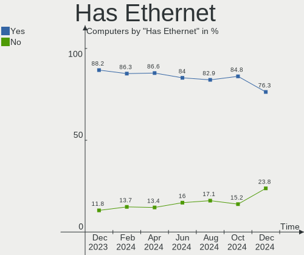
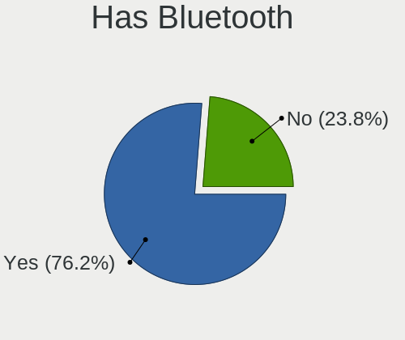
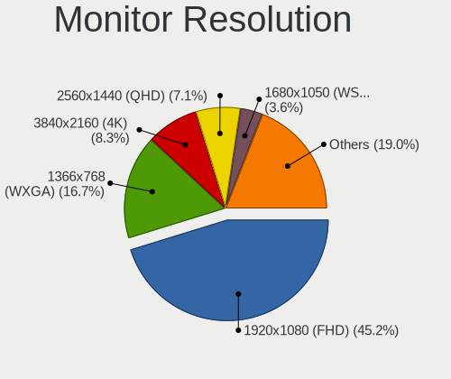
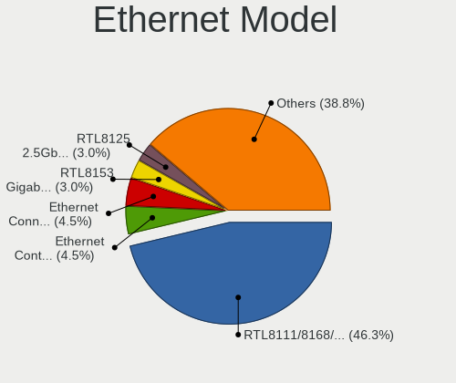
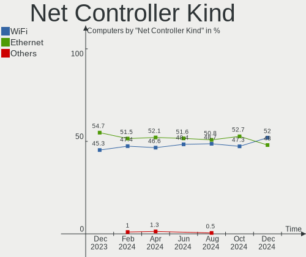

ArcoLinux - Hardware Trends
---------------------------

A project to identify most popular hardware characteristics and track their change
over time based on data collected by Linux users at https://Linux-Hardware.org.

Anyone can contribute to this report by the [hw-probe](https://github.com/linuxhw/hw-probe) tool:

    sudo -E hw-probe -all -upload

This is a report for all computer types. See also reports for [desktops](/Dist/ArcoLinux/Desktop/README.md) and [notebooks](/Dist/ArcoLinux/Notebook/README.md).

This report is for one last month. Overall report since the beginning of time: [TestDays](https://github.com/linuxhw/TestDays)

Period: Jul, 2023.

Contents
--------

* [ System ](#system)
  - [ OS                       ](#os)
  - [ OS Family                ](#os-family)
  - [ Kernel                   ](#kernel)
  - [ Kernel Family            ](#kernel-family)
  - [ Kernel Major Ver.        ](#kernel-major-ver)
  - [ Arch                     ](#arch)
  - [ DE                       ](#de)
  - [ Display Server           ](#display-server)
  - [ Display Manager          ](#display-manager)
  - [ OS Lang                  ](#os-lang)
  - [ Boot Mode                ](#boot-mode)
  - [ Filesystem               ](#filesystem)
  - [ Part. scheme             ](#part-scheme)
  - [ Dual Boot with Linux/BSD ](#dual-boot-with-linuxbsd)
  - [ Dual Boot (Win)          ](#dual-boot-win)

* [ Board ](#board)
  - [ Vendor                   ](#vendor)
  - [ Model                    ](#model)
  - [ Model Family             ](#model-family)
  - [ MFG Year                 ](#mfg-year)
  - [ Form Factor              ](#form-factor)
  - [ Secure Boot              ](#secure-boot)
  - [ Coreboot                 ](#coreboot)
  - [ RAM Size                 ](#ram-size)
  - [ RAM Used                 ](#ram-used)
  - [ Total Drives             ](#total-drives)
  - [ Has CD-ROM               ](#has-cd-rom)
  - [ Has Ethernet             ](#has-ethernet)
  - [ Has WiFi                 ](#has-wifi)
  - [ Has Bluetooth            ](#has-bluetooth)

* [ Location ](#location)
  - [ Country                  ](#country)
  - [ City                     ](#city)

* [ Drives ](#drives)
  - [ Drive Vendor             ](#drive-vendor)
  - [ Drive Model              ](#drive-model)
  - [ HDD Vendor               ](#hdd-vendor)
  - [ SSD Vendor               ](#ssd-vendor)
  - [ Drive Kind               ](#drive-kind)
  - [ Drive Connector          ](#drive-connector)
  - [ Drive Size               ](#drive-size)
  - [ Space Total              ](#space-total)
  - [ Space Used               ](#space-used)
  - [ Malfunc. Drives          ](#malfunc-drives)
  - [ Malfunc. Drive Vendor    ](#malfunc-drive-vendor)
  - [ Malfunc. HDD Vendor      ](#malfunc-hdd-vendor)
  - [ Malfunc. Drive Kind      ](#malfunc-drive-kind)
  - [ Failed Drives            ](#failed-drives)
  - [ Failed Drive Vendor      ](#failed-drive-vendor)
  - [ Drive Status             ](#drive-status)

* [ Storage controller ](#storage-controller)
  - [ Storage Vendor           ](#storage-vendor)
  - [ Storage Model            ](#storage-model)
  - [ Storage Kind             ](#storage-kind)

* [ Processor ](#processor)
  - [ CPU Vendor               ](#cpu-vendor)
  - [ CPU Model                ](#cpu-model)
  - [ CPU Model Family         ](#cpu-model-family)
  - [ CPU Cores                ](#cpu-cores)
  - [ CPU Sockets              ](#cpu-sockets)
  - [ CPU Threads              ](#cpu-threads)
  - [ CPU Op-Modes             ](#cpu-op-modes)
  - [ CPU Microcode            ](#cpu-microcode)
  - [ CPU Microarch            ](#cpu-microarch)

* [ Graphics ](#graphics)
  - [ GPU Vendor               ](#gpu-vendor)
  - [ GPU Model                ](#gpu-model)
  - [ GPU Combo                ](#gpu-combo)
  - [ GPU Driver               ](#gpu-driver)
  - [ GPU Memory               ](#gpu-memory)

* [ Monitor ](#monitor)
  - [ Monitor Vendor           ](#monitor-vendor)
  - [ Monitor Model            ](#monitor-model)
  - [ Monitor Resolution       ](#monitor-resolution)
  - [ Monitor Diagonal         ](#monitor-diagonal)
  - [ Monitor Width            ](#monitor-width)
  - [ Aspect Ratio             ](#aspect-ratio)
  - [ Monitor Area             ](#monitor-area)
  - [ Pixel Density            ](#pixel-density)
  - [ Multiple Monitors        ](#multiple-monitors)

* [ Network ](#network)
  - [ Net Controller Vendor    ](#net-controller-vendor)
  - [ Net Controller Model     ](#net-controller-model)
  - [ Wireless Vendor          ](#wireless-vendor)
  - [ Wireless Model           ](#wireless-model)
  - [ Ethernet Vendor          ](#ethernet-vendor)
  - [ Ethernet Model           ](#ethernet-model)
  - [ Net Controller Kind      ](#net-controller-kind)
  - [ Used Controller          ](#used-controller)
  - [ NICs                     ](#nics)
  - [ IPv6                     ](#ipv6)

* [ Bluetooth ](#bluetooth)
  - [ Bluetooth Vendor         ](#bluetooth-vendor)
  - [ Bluetooth Model          ](#bluetooth-model)

* [ Sound ](#sound)
  - [ Sound Vendor             ](#sound-vendor)
  - [ Sound Model              ](#sound-model)

* [ Memory ](#memory)
  - [ Memory Vendor            ](#memory-vendor)
  - [ Memory Model             ](#memory-model)
  - [ Memory Kind              ](#memory-kind)
  - [ Memory Form Factor       ](#memory-form-factor)
  - [ Memory Size              ](#memory-size)
  - [ Memory Speed             ](#memory-speed)

* [ Printers & scanners ](#printers--scanners)
  - [ Printer Vendor           ](#printer-vendor)
  - [ Printer Model            ](#printer-model)
  - [ Scanner Vendor           ](#scanner-vendor)
  - [ Scanner Model            ](#scanner-model)

* [ Camera ](#camera)
  - [ Camera Vendor            ](#camera-vendor)
  - [ Camera Model             ](#camera-model)

* [ Security ](#security)
  - [ Fingerprint Vendor       ](#fingerprint-vendor)
  - [ Fingerprint Model        ](#fingerprint-model)
  - [ Chipcard Vendor          ](#chipcard-vendor)
  - [ Chipcard Model           ](#chipcard-model)

* [ Unsupported ](#unsupported)
  - [ Unsupported Devices      ](#unsupported-devices)
  - [ Unsupported Device Types ](#unsupported-device-types)

System
------

OS
--

Installed operating systems

| Name              | Computers | Percent |
|-------------------|-----------|---------|
| ArcoLinux Rolling | 132       | 97.06%  |
| ArcoLinux         | 4         | 2.94%   |

OS Family
---------

OS without a version

| Name      | Computers | Percent |
|-----------|-----------|---------|
| ArcoLinux | 136       | 100%    |

Kernel
------

Version of the Linux kernel

| Version                        | Computers | Percent |
|--------------------------------|-----------|---------|
| 6.4.3-arch1-1                  | 11        | 8.09%   |
| 6.4.2-arch1-1                  | 10        | 7.35%   |
| 6.3.9-arch1-1                  | 8         | 5.88%   |
| 6.3.8-arch1-1                  | 8         | 5.88%   |
| 6.4.6-arch1-1                  | 7         | 5.15%   |
| 6.1.39-1-lts                   | 7         | 5.15%   |
| 6.4.3-arch1-2                  | 6         | 4.41%   |
| 6.4.1-arch1-1                  | 6         | 4.41%   |
| 6.1.38-1-lts                   | 6         | 4.41%   |
| 6.4.7-arch1-1                  | 5         | 3.68%   |
| 6.4.2-zen1-1-zen               | 5         | 3.68%   |
| 6.4.4-arch1-1                  | 4         | 2.94%   |
| 6.4.1-zen2-1-zen               | 4         | 2.94%   |
| 6.4.1-arch2-1                  | 4         | 2.94%   |
| 6.4.4-zen1-1-zen               | 3         | 2.21%   |
| 6.4.3-zen1-1-zen               | 3         | 2.21%   |
| 6.4.2-x64v2-xanmod1-3          | 3         | 2.21%   |
| 6.4.1-zen1-1-zen               | 3         | 2.21%   |
| 6.3.3-arch1-1                  | 3         | 2.21%   |
| 6.2.11-arch1-1                 | 3         | 2.21%   |
| 6.1.33-x64v2-rt11-xanmod1-1-rt | 3         | 2.21%   |
| 6.4.6-zen1-1-zen               | 2         | 1.47%   |
| 6.4.5-arch1-1                  | 2         | 1.47%   |
| 6.4.3-zen1-2-zen               | 2         | 1.47%   |
| 6.3.8-zen1-1-zen               | 2         | 1.47%   |
| 6.3.8-x64v1-xanmod1-1          | 2         | 1.47%   |
| 6.2.10-arch1-1                 | 2         | 1.47%   |
| 6.4.4-273-tkg-pds              | 1         | 0.74%   |
| 6.4.2-273-tkg-pds              | 1         | 0.74%   |
| 6.3.9-zen1-1-zen               | 1         | 0.74%   |
| 6.3.5-zen1-1-zen               | 1         | 0.74%   |
| 6.3.5-arch1-1                  | 1         | 0.74%   |
| 6.3.3.15.realtime2-1-rt        | 1         | 0.74%   |
| 6.3.1-1-cachyos-eevdf-bore     | 1         | 0.74%   |
| 6.2.10-x64v1-xanmod1-1         | 1         | 0.74%   |
| 6.1.38-2-lts                   | 1         | 0.74%   |
| 6.1.37-1-lts                   | 1         | 0.74%   |
| 6.1.35-1-lts                   | 1         | 0.74%   |
| 6.1.33-1-lts                   | 1         | 0.74%   |

Kernel Family
-------------

Linux kernel without a distro release

| Version  | Computers | Percent |
|----------|-----------|---------|
| 6.4.3    | 22        | 16.18%  |
| 6.4.2    | 19        | 13.97%  |
| 6.4.1    | 17        | 12.5%   |
| 6.3.8    | 12        | 8.82%   |
| 6.4.6    | 9         | 6.62%   |
| 6.3.9    | 9         | 6.62%   |
| 6.4.4    | 8         | 5.88%   |
| 6.1.39   | 7         | 5.15%   |
| 6.1.38   | 7         | 5.15%   |
| 6.4.7    | 5         | 3.68%   |
| 6.1.33   | 4         | 2.94%   |
| 6.3.3    | 3         | 2.21%   |
| 6.2.11   | 3         | 2.21%   |
| 6.2.10   | 3         | 2.21%   |
| 6.4.5    | 2         | 1.47%   |
| 6.3.5    | 2         | 1.47%   |
| 6.3.3.15 | 1         | 0.74%   |
| 6.3.1    | 1         | 0.74%   |
| 6.1.37   | 1         | 0.74%   |
| 6.1.35   | 1         | 0.74%   |

Kernel Major Ver.
-----------------

Linux kernel major version

| Version | Computers | Percent |
|---------|-----------|---------|
| 6.4     | 82        | 60.29%  |
| 6.3     | 27        | 19.85%  |
| 6.1     | 20        | 14.71%  |
| 6.2     | 6         | 4.41%   |
| 6.3.3   | 1         | 0.74%   |

Arch
----

OS architecture (x86_64, i586, etc.)

| Name   | Computers | Percent |
|--------|-----------|---------|
| x86_64 | 136       | 100%    |

DE
--

Desktop Environment

| Name       | Computers | Percent |
|------------|-----------|---------|
| XFCE       | 52        | 38.24%  |
| KDE5       | 36        | 26.47%  |
| Cinnamon   | 14        | 10.29%  |
| GNOME      | 10        | 7.35%   |
| i3         | 6         | 4.41%   |
| Hyprland   | 4         | 2.94%   |
| chadwm     | 3         | 2.21%   |
| Deepin     | 2         | 1.47%   |
| Budgie     | 2         | 1.47%   |
| X-Cinnamon | 1         | 0.74%   |
| river      | 1         | 0.74%   |
| qtile      | 1         | 0.74%   |
| MATE       | 1         | 0.74%   |
| LXQt       | 1         | 0.74%   |
| bspwm      | 1         | 0.74%   |
| awesome    | 1         | 0.74%   |

Display Server
--------------

X11 or Wayland

| Name    | Computers | Percent |
|---------|-----------|---------|
| X11     | 113       | 83.09%  |
| Wayland | 13        | 9.56%   |
| Unknown | 7         | 5.15%   |
| Tty     | 3         | 2.21%   |

Display Manager
---------------

SDDM, LightDM, etc.

| Name    | Computers | Percent |
|---------|-----------|---------|
| SDDM    | 96        | 70.59%  |
| LightDM | 29        | 21.32%  |
| GDM     | 5         | 3.68%   |
| Unknown | 4         | 2.94%   |
| Ly      | 2         | 1.47%   |

OS Lang
-------

Language

| Lang  | Computers | Percent |
|-------|-----------|---------|
| en_US | 76        | 55.88%  |
| en_GB | 8         | 5.88%   |
| C     | 7         | 5.15%   |
| pt_BR | 6         | 4.41%   |
| it_IT | 5         | 3.68%   |
| de_DE | 5         | 3.68%   |
| en_IN | 4         | 2.94%   |
| zh_CN | 3         | 2.21%   |
| en_PH | 3         | 2.21%   |
| en_AU | 3         | 2.21%   |
| ja_JP | 2         | 1.47%   |
| fr_FR | 2         | 1.47%   |
| es_MX | 2         | 1.47%   |
| es_ES | 2         | 1.47%   |
| uk_UA | 1         | 0.74%   |
| ru_UA | 1         | 0.74%   |
| hu_HU | 1         | 0.74%   |
| es_UY | 1         | 0.74%   |
| es_PA | 1         | 0.74%   |
| en_IE | 1         | 0.74%   |
| en_HK | 1         | 0.74%   |
| en_CA | 1         | 0.74%   |

Boot Mode
---------

EFI or BIOS

| Mode | Computers | Percent |
|------|-----------|---------|
| EFI  | 103       | 75.74%  |
| BIOS | 33        | 24.26%  |

Filesystem
----------

Type of filesystem

| Type    | Computers | Percent |
|---------|-----------|---------|
| Ext4    | 88        | 64.71%  |
| Btrfs   | 40        | 29.41%  |
| Overlay | 7         | 5.15%   |
| Xfs     | 1         | 0.74%   |

Part. scheme
------------

Scheme of partitioning

| Type    | Computers | Percent |
|---------|-----------|---------|
| GPT     | 117       | 86.03%  |
| MBR     | 15        | 11.03%  |
| Unknown | 4         | 2.94%   |

Dual Boot with Linux/BSD
------------------------

Hosting more than one Linux/BSD

| Dual boot | Computers | Percent |
|-----------|-----------|---------|
| No        | 96        | 70.59%  |
| Yes       | 40        | 29.41%  |

Dual Boot (Win)
---------------

Hosting Linux and Windows

| Dual boot | Computers | Percent |
|-----------|-----------|---------|
| No        | 77        | 56.62%  |
| Yes       | 59        | 43.38%  |

Board
-----

Vendor
------

Motherboard manufacturer

| Name                | Computers | Percent |
|---------------------|-----------|---------|
| ASUSTek Computer    | 29        | 21.32%  |
| Lenovo              | 20        | 14.71%  |
| Dell                | 19        | 13.97%  |
| Hewlett-Packard     | 13        | 9.56%   |
| MSI                 | 8         | 5.88%   |
| Gigabyte Technology | 7         | 5.15%   |
| ASRock              | 7         | 5.15%   |
| Apple               | 4         | 2.94%   |
| Unknown             | 4         | 2.94%   |
| Acer                | 3         | 2.21%   |
| Intel               | 2         | 1.47%   |
| Google              | 2         | 1.47%   |
| Fujitsu             | 2         | 1.47%   |
| Chuwi               | 2         | 1.47%   |
| AZW                 | 2         | 1.47%   |
| Toshiba             | 1         | 0.74%   |
| SiS Technology      | 1         | 0.74%   |
| Samsung Electronics | 1         | 0.74%   |
| Notebook            | 1         | 0.74%   |
| HUAWEI              | 1         | 0.74%   |
| Hardkernel          | 1         | 0.74%   |
| Foxconn             | 1         | 0.74%   |
| CompuLab            | 1         | 0.74%   |
| Biostar             | 1         | 0.74%   |
| BESSTAR Tech        | 1         | 0.74%   |
| ATOPNUC             | 1         | 0.74%   |
| Acidanthera         | 1         | 0.74%   |

Model
-----

Motherboard model

| Name                                        | Computers | Percent |
|---------------------------------------------|-----------|---------|
| Unknown                                     | 4         | 2.94%   |
| MSI MS-7C91                                 | 2         | 1.47%   |
| HP Folio 13                                 | 2         | 1.47%   |
| AZW SER                                     | 2         | 1.47%   |
| ASUS ROG STRIX B550-E GAMING                | 2         | 1.47%   |
| ASUS All Series                             | 2         | 1.47%   |
| Toshiba Satellite Pro C50-A-1E6             | 1         | 0.74%   |
| SiS 760                                     | 1         | 0.74%   |
| Samsung 535U3C                              | 1         | 0.74%   |
| Notebook N141CU                             | 1         | 0.74%   |
| MSI MS-7C83                                 | 1         | 0.74%   |
| MSI MS-7C02                                 | 1         | 0.74%   |
| MSI MS-7B24                                 | 1         | 0.74%   |
| MSI MS-7A39                                 | 1         | 0.74%   |
| MSI MS-7309                                 | 1         | 0.74%   |
| MSI Alpha 15 B5EEK                          | 1         | 0.74%   |
| Lenovo ThinkPad X280 20KES73S06             | 1         | 0.74%   |
| Lenovo ThinkPad X230 232578G                | 1         | 0.74%   |
| Lenovo ThinkPad X1 Carbon 4th 20FCS14X04    | 1         | 0.74%   |
| Lenovo ThinkPad T480 20L5000BGE             | 1         | 0.74%   |
| Lenovo ThinkPad T430 2349IF8                | 1         | 0.74%   |
| Lenovo ThinkPad T14 Gen 3 21AHCTO1WW        | 1         | 0.74%   |
| Lenovo ThinkPad L380 Yoga 20M7000JUS        | 1         | 0.74%   |
| Lenovo ThinkCentre M900 10FGS0YM01          | 1         | 0.74%   |
| Lenovo ThinkCentre M70q Gen 3 11T300B5MH    | 1         | 0.74%   |
| Lenovo ThinkBook 15 G4 IAP 21DJ             | 1         | 0.74%   |
| Lenovo ThinkBook 15 G3 ACL 21A4             | 1         | 0.74%   |
| Lenovo Slim 7 16IAH7 82VB                   | 1         | 0.74%   |
| Lenovo Legion R9000X 2021 82HN              | 1         | 0.74%   |
| Lenovo IdeaPad Y700-17ISK 80Q0              | 1         | 0.74%   |
| Lenovo IdeaPad 5 Pro 14ACN6 82L7            | 1         | 0.74%   |
| Lenovo IdeaPad 3 15ITL05 81X8               | 1         | 0.74%   |
| Lenovo IdeaPad 3 15ADA05 81W1               | 1         | 0.74%   |
| Lenovo IdeaPad 3 14ALC6 82KT                | 1         | 0.74%   |
| Lenovo IdeaCentre Gaming5 14ACN6 90RW0003MW | 1         | 0.74%   |
| Lenovo G580 20150                           | 1         | 0.74%   |
| Intel HM570                                 | 1         | 0.74%   |
| Intel H61                                   | 1         | 0.74%   |
| HUAWEI HLYL-WXX9                            | 1         | 0.74%   |
| HP ZBook Studio x360 G5                     | 1         | 0.74%   |

Model Family
------------

Motherboard model prefix

| Name               | Computers | Percent |
|--------------------|-----------|---------|
| Lenovo ThinkPad    | 7         | 5.15%   |
| Dell Latitude      | 6         | 4.41%   |
| Dell Inspiron      | 6         | 4.41%   |
| ASUS ROG           | 6         | 4.41%   |
| ASUS PRIME         | 6         | 4.41%   |
| Lenovo IdeaPad     | 5         | 3.68%   |
| HP Pavilion        | 4         | 2.94%   |
| Unknown            | 4         | 2.94%   |
| Gigabyte X570      | 3         | 2.21%   |
| Dell OptiPlex      | 3         | 2.21%   |
| ASUS TUF           | 3         | 2.21%   |
| MSI MS-7C91        | 2         | 1.47%   |
| Lenovo ThinkCentre | 2         | 1.47%   |
| Lenovo ThinkBook   | 2         | 1.47%   |
| HP Laptop          | 2         | 1.47%   |
| HP Folio           | 2         | 1.47%   |
| Dell G3            | 2         | 1.47%   |
| AZW SER            | 2         | 1.47%   |
| ASUS VivoBook      | 2         | 1.47%   |
| ASUS All           | 2         | 1.47%   |
| ASRock B450M       | 2         | 1.47%   |
| Toshiba Satellite  | 1         | 0.74%   |
| SiS 760            | 1         | 0.74%   |
| Samsung 535U3C     | 1         | 0.74%   |
| Notebook N141CU    | 1         | 0.74%   |
| MSI MS-7C83        | 1         | 0.74%   |
| MSI MS-7C02        | 1         | 0.74%   |
| MSI MS-7B24        | 1         | 0.74%   |
| MSI MS-7A39        | 1         | 0.74%   |
| MSI MS-7309        | 1         | 0.74%   |
| MSI Alpha          | 1         | 0.74%   |
| Lenovo Slim        | 1         | 0.74%   |
| Lenovo Legion      | 1         | 0.74%   |
| Lenovo IdeaCentre  | 1         | 0.74%   |
| Lenovo G580        | 1         | 0.74%   |
| Intel HM570        | 1         | 0.74%   |
| Intel H61          | 1         | 0.74%   |
| HUAWEI HLYL-WXX9   | 1         | 0.74%   |
| HP ZBook           | 1         | 0.74%   |
| HP ProDesk         | 1         | 0.74%   |

MFG Year
--------

Motherboard manufacture year

| Year | Computers | Percent |
|------|-----------|---------|
| 2018 | 24        | 17.65%  |
| 2022 | 18        | 13.24%  |
| 2020 | 16        | 11.76%  |
| 2021 | 14        | 10.29%  |
| 2017 | 14        | 10.29%  |
| 2012 | 10        | 7.35%   |
| 2019 | 9         | 6.62%   |
| 2013 | 6         | 4.41%   |
| 2023 | 5         | 3.68%   |
| 2016 | 5         | 3.68%   |
| 2015 | 3         | 2.21%   |
| 2014 | 3         | 2.21%   |
| 2011 | 3         | 2.21%   |
| 2010 | 3         | 2.21%   |
| 2008 | 1         | 0.74%   |
| 2006 | 1         | 0.74%   |
| 2004 | 1         | 0.74%   |

Form Factor
-----------

Physical design of the computer

| Name        | Computers | Percent |
|-------------|-----------|---------|
| Desktop     | 64        | 47.06%  |
| Notebook    | 60        | 44.12%  |
| Mini pc     | 6         | 4.41%   |
| Convertible | 4         | 2.94%   |
| Tablet      | 1         | 0.74%   |
| All in one  | 1         | 0.74%   |

Secure Boot
-----------

Enabled or disabled

| State    | Computers | Percent |
|----------|-----------|---------|
| Disabled | 136       | 100%    |

Coreboot
--------

Have coreboot on board

| Used | Computers | Percent |
|------|-----------|---------|
| No   | 134       | 98.53%  |
| Yes  | 2         | 1.47%   |

RAM Size
--------

Total RAM memory

| Size in GB  | Computers | Percent |
|-------------|-----------|---------|
| 16.01-24.0  | 37        | 27.21%  |
| 4.01-8.0    | 28        | 20.59%  |
| 32.01-64.0  | 25        | 18.38%  |
| 8.01-16.0   | 21        | 15.44%  |
| 3.01-4.0    | 10        | 7.35%   |
| 64.01-256.0 | 9         | 6.62%   |
| 1.01-2.0    | 3         | 2.21%   |
| 24.01-32.0  | 2         | 1.47%   |
| 2.01-3.0    | 1         | 0.74%   |

RAM Used
--------

Used RAM memory

| Used GB    | Computers | Percent |
|------------|-----------|---------|
| 1.01-2.0   | 42        | 30.88%  |
| 2.01-3.0   | 34        | 25%     |
| 3.01-4.0   | 25        | 18.38%  |
| 4.01-8.0   | 18        | 13.24%  |
| 8.01-16.0  | 8         | 5.88%   |
| 0.51-1.0   | 6         | 4.41%   |
| 16.01-24.0 | 2         | 1.47%   |
| 0.01-0.5   | 1         | 0.74%   |

Total Drives
------------

Number of drives on board

| Drives | Computers | Percent |
|--------|-----------|---------|
| 1      | 62        | 45.59%  |
| 2      | 38        | 27.94%  |
| 3      | 19        | 13.97%  |
| 4      | 10        | 7.35%   |
| 5      | 7         | 5.15%   |

Has CD-ROM
----------

Has CD-ROM on board

| Presented | Computers | Percent |
|-----------|-----------|---------|
| No        | 115       | 84.56%  |
| Yes       | 21        | 15.44%  |

Has Ethernet
------------

Has Ethernet on board

| Presented | Computers | Percent |
|-----------|-----------|---------|
| Yes       | 120       | 88.24%  |
| No        | 16        | 11.76%  |

Has WiFi
--------

Has WiFi module

| Presented | Computers | Percent |
|-----------|-----------|---------|
| Yes       | 99        | 72.79%  |
| No        | 37        | 27.21%  |

Has Bluetooth
-------------

Has Bluetooth module

| Presented | Computers | Percent |
|-----------|-----------|---------|
| Yes       | 94        | 69.12%  |
| No        | 42        | 30.88%  |

Location
--------

Country
-------

Geographic location (country)

| Country      | Computers | Percent |
|--------------|-----------|---------|
| USA          | 34        | 25%     |
| Brazil       | 11        | 8.09%   |
| Germany      | 10        | 7.35%   |
| Mexico       | 7         | 5.15%   |
| Italy        | 6         | 4.41%   |
| Spain        | 5         | 3.68%   |
| UK           | 4         | 2.94%   |
| Sweden       | 4         | 2.94%   |
| Philippines  | 4         | 2.94%   |
| India        | 4         | 2.94%   |
| Czechia      | 4         | 2.94%   |
| Australia    | 4         | 2.94%   |
| Belgium      | 3         | 2.21%   |
| Turkey       | 2         | 1.47%   |
| Russia       | 2         | 1.47%   |
| Japan        | 2         | 1.47%   |
| Iraq         | 2         | 1.47%   |
| Hungary      | 2         | 1.47%   |
| Hong Kong    | 2         | 1.47%   |
| France       | 2         | 1.47%   |
| Canada       | 2         | 1.47%   |
| Vietnam      | 1         | 0.74%   |
| Uruguay      | 1         | 0.74%   |
| Ukraine      | 1         | 0.74%   |
| Uganda       | 1         | 0.74%   |
| Singapore    | 1         | 0.74%   |
| Saudi Arabia | 1         | 0.74%   |
| Romania      | 1         | 0.74%   |
| Panama       | 1         | 0.74%   |
| Netherlands  | 1         | 0.74%   |
| Malaysia     | 1         | 0.74%   |
| Luxembourg   | 1         | 0.74%   |
| Kuwait       | 1         | 0.74%   |
| Ireland      | 1         | 0.74%   |
| Iran         | 1         | 0.74%   |
| Indonesia    | 1         | 0.74%   |
| Finland      | 1         | 0.74%   |
| China        | 1         | 0.74%   |
| Bulgaria     | 1         | 0.74%   |
| Azerbaijan   | 1         | 0.74%   |

City
----

Geographic location (city)

| City                        | Computers | Percent |
|-----------------------------|-----------|---------|
| Sydney                      | 2         | 1.47%   |
| Rio de Janeiro              | 2         | 1.47%   |
| Prague                      | 2         | 1.47%   |
| Malmo                       | 2         | 1.47%   |
| Istanbul                    | 2         | 1.47%   |
| Hyderabad                   | 2         | 1.47%   |
| Berlin                      | 2         | 1.47%   |
| Amarillo                    | 2         | 1.47%   |
| Zapopan                     | 1         | 0.74%   |
| Yokosuka                    | 1         | 0.74%   |
| Yokohama                    | 1         | 0.74%   |
| Wichita                     | 1         | 0.74%   |
| Valencia                    | 1         | 0.74%   |
| Tsuen Wan                   | 1         | 0.74%   |
| Townsville                  | 1         | 0.74%   |
| Toronto                     | 1         | 0.74%   |
| Tolyatti                    | 1         | 0.74%   |
| Toeroekbalint               | 1         | 0.74%   |
| Tlaxcala City               | 1         | 0.74%   |
| Teresopolis                 | 1         | 0.74%   |
| Tehran                      | 1         | 0.74%   |
| Tábor                      | 1         | 0.74%   |
| Syracuse                    | 1         | 0.74%   |
| Springfield                 | 1         | 0.74%   |
| Spanga                      | 1         | 0.74%   |
| Sorrento                    | 1         | 0.74%   |
| Singapore                   | 1         | 0.74%   |
| Simi Valley                 | 1         | 0.74%   |
| Seattle                     | 1         | 0.74%   |
| Schwarzenbek                | 1         | 0.74%   |
| Sao Paulo                   | 1         | 0.74%   |
| San Sebastián de los Reyes | 1         | 0.74%   |
| San Luis Potosí City       | 1         | 0.74%   |
| Saint Paul                  | 1         | 0.74%   |
| Rogersville                 | 1         | 0.74%   |
| Rockford                    | 1         | 0.74%   |
| Ribeirao Preto              | 1         | 0.74%   |
| Reggio Calabria             | 1         | 0.74%   |
| Pune                        | 1         | 0.74%   |
| Presidente Prudente         | 1         | 0.74%   |

Drives
------

Drive Vendor
------------

Hard drive vendors

| Vendor                      | Computers | Drives | Percent |
|-----------------------------|-----------|--------|---------|
| Samsung Electronics         | 53        | 67     | 22.55%  |
| WDC                         | 32        | 41     | 13.62%  |
| Seagate                     | 22        | 27     | 9.36%   |
| Sandisk                     | 17        | 19     | 7.23%   |
| Kingston                    | 16        | 18     | 6.81%   |
| Toshiba                     | 12        | 13     | 5.11%   |
| Phison Electronics          | 9         | 9      | 3.83%   |
| Crucial                     | 8         | 8      | 3.4%    |
| Intel                       | 7         | 7      | 2.98%   |
| Unknown                     | 6         | 9      | 2.55%   |
| Micron/Crucial Technology   | 5         | 5      | 2.13%   |
| SK hynix                    | 4         | 4      | 1.7%    |
| Silicon Motion              | 3         | 3      | 1.28%   |
| PNY                         | 3         | 3      | 1.28%   |
| Micron Technology           | 3         | 3      | 1.28%   |
| Kingston Technology Company | 3         | 3      | 1.28%   |
| Apple                       | 3         | 3      | 1.28%   |
| SCY                         | 2         | 2      | 0.85%   |
| SABRENT                     | 2         | 2      | 0.85%   |
| Realtek Semiconductor       | 2         | 2      | 0.85%   |
| MAXIO Technology (Hangzhou) | 2         | 2      | 0.85%   |
| Hitachi                     | 2         | 2      | 0.85%   |
| China                       | 2         | 2      | 0.85%   |
| Acer                        | 2         | 2      | 0.85%   |
| Zheino                      | 1         | 1      | 0.43%   |
| Yangtze Memory Technologies | 1         | 1      | 0.43%   |
| Yangtze Memory              | 1         | 1      | 0.43%   |
| Verbatim                    | 1         | 1      | 0.43%   |
| TO Exter                    | 1         | 1      | 0.43%   |
| StarTech                    | 1         | 1      | 0.43%   |
| ShiJi                       | 1         | 1      | 0.43%   |
| PNY CS90                    | 1         | 1      | 0.43%   |
| LITEONIT                    | 1         | 1      | 0.43%   |
| JMicron Technology          | 1         | 1      | 0.43%   |
| Intenso                     | 1         | 1      | 0.43%   |
| H/W                         | 1         | 3      | 0.43%   |
| Corsair                     | 1         | 1      | 0.43%   |
| ASMT                        | 1         | 2      | 0.43%   |
| Unknown                     | 1         | 1      | 0.43%   |

Drive Model
-----------

Hard drive models

| Model                                                 | Computers | Percent |
|-------------------------------------------------------|-----------|---------|
| Samsung NVMe SSD Controller SM981/PM981/PM983 500GB   | 14        | 5.34%   |
| Kingston SA400S37240G 240GB SSD                       | 5         | 1.91%   |
| Samsung NVMe SSD Controller SM961/PM961/SM963 256GB   | 4         | 1.53%   |
| Phison E12 NVMe Controller 2TB                        | 4         | 1.53%   |
| WDC WDS500G2B0B-00YS70 500GB SSD                      | 3         | 1.15%   |
| Toshiba HDWD110 1TB                                   | 3         | 1.15%   |
| Silicon Motion SM2263EN/SM2263XT SSD Controller 500GB | 3         | 1.15%   |
| Seagate ST2000DM008-2UB102 2TB                        | 3         | 1.15%   |
| Sandisk WD Black SN750 / PC SN730 NVMe SSD 1024GB     | 3         | 1.15%   |
| Samsung SSD 980 1TB                                   | 3         | 1.15%   |
| Samsung SSD 870 EVO 1TB                               | 3         | 1.15%   |
| Samsung SSD 850 EVO 250GB                             | 3         | 1.15%   |
| Samsung NVMe SSD Controller PM9A1/PM9A3/980PRO 1TB    | 3         | 1.15%   |
| Samsung MZALQ512HBLU-00BL2 512GB                      | 3         | 1.15%   |
| Phison E16 PCIe4 NVMe Controller 1TB                  | 3         | 1.15%   |
| Micron/Crucial P2 NVMe PCIe SSD 1TB                   | 3         | 1.15%   |
| Intel SSD Pro 7600p/760p/E 6100p Series 1TB           | 3         | 1.15%   |
| Crucial CT1000MX500SSD1 1TB                           | 3         | 1.15%   |
| Unknown MMC Card  32GB                                | 2         | 0.76%   |
| Toshiba MQ01ABD100 1TB                                | 2         | 0.76%   |
| Toshiba DT01ACA050 500GB                              | 2         | 0.76%   |
| Seagate ST4000DM004-2CV104 4TB                        | 2         | 0.76%   |
| Seagate ST3500413AS 500GB                             | 2         | 0.76%   |
| Seagate ST1000LM035-1RK172 1TB                        | 2         | 0.76%   |
| Seagate ST1000LM024 HN-M101MBB 1TB                    | 2         | 0.76%   |
| Seagate ST1000DM010-2EP102 1TB                        | 2         | 0.76%   |
| Seagate Expansion HDD 4TB                             | 2         | 0.76%   |
| Sandisk WD Blue SN550 NVMe SSD 250GB                  | 2         | 0.76%   |
| Sandisk WD Black 2018/SN750 / PC SN720 NVMe SSD 1TB   | 2         | 0.76%   |
| Samsung SSD 870 QVO 1TB                               | 2         | 0.76%   |
| Samsung SSD 870 EVO 500GB                             | 2         | 0.76%   |
| Samsung SSD 850 EVO 120GB                             | 2         | 0.76%   |
| Samsung SSD 750 EVO 120GB                             | 2         | 0.76%   |
| Samsung MZMPC128HBFU-000H1 128GB SSD                  | 2         | 0.76%   |
| Samsung M3 Portable 1TB                               | 2         | 0.76%   |
| SABRENT Disk 1TB                                      | 2         | 0.76%   |
| Micron/Crucial P1 NVMe PCIe SSD 1TB                   | 2         | 0.76%   |
| Micron 2210_MTFDHBA512QFD 512GB                       | 2         | 0.76%   |
| MAXIO (Hangzhou) NVMe SSD Controller MAP1202 256GB    | 2         | 0.76%   |
| Kingston SNV2S500G 500GB                              | 2         | 0.76%   |

HDD Vendor
----------

Hard disk drive vendors

| Vendor              | Computers | Drives | Percent |
|---------------------|-----------|--------|---------|
| WDC                 | 23        | 29     | 35.94%  |
| Seagate             | 21        | 26     | 32.81%  |
| Toshiba             | 8         | 9      | 12.5%   |
| Samsung Electronics | 6         | 6      | 9.38%   |
| Hitachi             | 2         | 2      | 3.13%   |
| Apple               | 2         | 2      | 3.13%   |
| H/W                 | 1         | 3      | 1.56%   |
| ASMT                | 1         | 2      | 1.56%   |

SSD Vendor
----------

Solid state drive vendors

| Vendor              | Computers | Drives | Percent |
|---------------------|-----------|--------|---------|
| Samsung Electronics | 25        | 28     | 28.74%  |
| Kingston            | 12        | 14     | 13.79%  |
| WDC                 | 11        | 12     | 12.64%  |
| Crucial             | 8         | 8      | 9.2%    |
| SanDisk             | 6         | 6      | 6.9%    |
| PNY                 | 3         | 3      | 3.45%   |
| Toshiba             | 2         | 2      | 2.3%    |
| SK hynix            | 2         | 2      | 2.3%    |
| SCY                 | 2         | 2      | 2.3%    |
| Intel               | 2         | 2      | 2.3%    |
| China               | 2         | 2      | 2.3%    |
| Acer                | 2         | 2      | 2.3%    |
| Zheino              | 1         | 1      | 1.15%   |
| Verbatim            | 1         | 1      | 1.15%   |
| TO Exter            | 1         | 1      | 1.15%   |
| ShiJi               | 1         | 1      | 1.15%   |
| PNY CS90            | 1         | 1      | 1.15%   |
| LITEONIT            | 1         | 1      | 1.15%   |
| Intenso             | 1         | 1      | 1.15%   |
| Corsair             | 1         | 1      | 1.15%   |
| Apple               | 1         | 1      | 1.15%   |
| Unknown             | 1         | 1      | 1.15%   |

Drive Kind
----------

HDD or SSD

| Kind    | Computers | Drives | Percent |
|---------|-----------|--------|---------|
| NVMe    | 75        | 92     | 37.31%  |
| SSD     | 69        | 93     | 34.33%  |
| HDD     | 50        | 79     | 24.88%  |
| MMC     | 4         | 6      | 1.99%   |
| Unknown | 3         | 4      | 1.49%   |

Drive Connector
---------------

SATA, SAS, NVMe, etc.

| Type | Computers | Drives | Percent |
|------|-----------|--------|---------|
| SATA | 96        | 160    | 51.34%  |
| NVMe | 74        | 90     | 39.57%  |
| SAS  | 13        | 18     | 6.95%   |
| MMC  | 4         | 6      | 2.14%   |

Drive Size
----------

Size of hard drive

| Size in TB | Computers | Drives | Percent |
|------------|-----------|--------|---------|
| 0.01-0.5   | 64        | 90     | 49.23%  |
| 0.51-1.0   | 40        | 52     | 30.77%  |
| 1.01-2.0   | 14        | 14     | 10.77%  |
| 3.01-4.0   | 7         | 11     | 5.38%   |
| 2.01-3.0   | 2         | 2      | 1.54%   |
| 4.01-10.0  | 2         | 2      | 1.54%   |
| 10.01-20.0 | 1         | 1      | 0.77%   |

Space Total
-----------

Amount of disk space available on the file system

| Size in GB     | Computers | Percent |
|----------------|-----------|---------|
| 251-500        | 33        | 24.26%  |
| More than 3000 | 22        | 16.18%  |
| 101-250        | 22        | 16.18%  |
| 501-1000       | 19        | 13.97%  |
| 1001-2000      | 13        | 9.56%   |
| Unknown        | 9         | 6.62%   |
| 2001-3000      | 8         | 5.88%   |
| 1-20           | 5         | 3.68%   |
| 21-50          | 4         | 2.94%   |
| 51-100         | 1         | 0.74%   |

Space Used
----------

Amount of used disk space

| Used GB        | Computers | Percent |
|----------------|-----------|---------|
| 1-20           | 27        | 19.85%  |
| 101-250        | 26        | 19.12%  |
| 21-50          | 20        | 14.71%  |
| 501-1000       | 14        | 10.29%  |
| 51-100         | 14        | 10.29%  |
| 251-500        | 13        | 9.56%   |
| Unknown        | 9         | 6.62%   |
| 1001-2000      | 7         | 5.15%   |
| 2001-3000      | 4         | 2.94%   |
| More than 3000 | 2         | 1.47%   |

Malfunc. Drives
---------------

Drive models with a malfunction

| Model                                            | Computers | Drives | Percent |
|--------------------------------------------------|-----------|--------|---------|
| Seagate ST3500413AS 500GB                        | 2         | 3      | 6.9%    |
| WDC WDS240G2G0A-00JH30 240GB SSD                 | 1         | 1      | 3.45%   |
| WDC WD5000BEVT-16ZAT0 500GB                      | 1         | 1      | 3.45%   |
| WDC WD5000AAKX-083CA1 500GB                      | 1         | 1      | 3.45%   |
| WDC WD5000AACS-00G8B1 500GB                      | 1         | 1      | 3.45%   |
| WDC WD3200BPVT-22JJ5T0 320GB                     | 1         | 1      | 3.45%   |
| WDC WD30EFRX-68EUZN0 3TB                         | 1         | 1      | 3.45%   |
| WDC WD20EARS-00MVWB0 2TB                         | 1         | 1      | 3.45%   |
| WDC WD2003FYYS-05T9B0 2TB                        | 1         | 1      | 3.45%   |
| WDC WD10EZEX-60ZF5A0 1TB                         | 1         | 1      | 3.45%   |
| WDC WD10EALX-759BA1 1TB                          | 1         | 1      | 3.45%   |
| Toshiba KSG60ZMV256G M.2 2280 256GB SSD          | 1         | 1      | 3.45%   |
| Toshiba HDWD110 1TB                              | 1         | 1      | 3.45%   |
| Seagate ST500LT012-1DG142 500GB                  | 1         | 1      | 3.45%   |
| Seagate ST4000DM004-2CV104 4TB                   | 1         | 1      | 3.45%   |
| Seagate ST1000LM035-1RK172 1TB                   | 1         | 1      | 3.45%   |
| Seagate ST1000DM003-1CH162 1TB                   | 1         | 1      | 3.45%   |
| Samsung Electronics SSD 870 EVO 1TB              | 1         | 1      | 3.45%   |
| Samsung Electronics MZ7WD480HCGM-00003 480GB SSD | 1         | 1      | 3.45%   |
| Samsung Electronics HM321HI 320GB                | 1         | 1      | 3.45%   |
| Samsung Electronics HD642JJ 640GB                | 1         | 1      | 3.45%   |
| Samsung Electronics HD103SI 1TB                  | 1         | 1      | 3.45%   |
| Kingston SMS200S330G 32GB SSD                    | 1         | 1      | 3.45%   |
| Kingston SA400S37120G 120GB SSD                  | 1         | 1      | 3.45%   |
| Intel SSDSC2BF180A4L 180GB                       | 1         | 1      | 3.45%   |
| Hitachi HDP725050GLA360 500GB                    | 1         | 1      | 3.45%   |
| Corsair CSSD-F60GB2 64GB                         | 1         | 1      | 3.45%   |
| Unknown                                          | 1         | 1      | 3.45%   |

Malfunc. Drive Vendor
---------------------

Vendors of faulty drives

| Vendor              | Computers | Drives | Percent |
|---------------------|-----------|--------|---------|
| WDC                 | 9         | 10     | 33.33%  |
| Seagate             | 6         | 7      | 22.22%  |
| Samsung Electronics | 4         | 5      | 14.81%  |
| Toshiba             | 2         | 2      | 7.41%   |
| Kingston            | 2         | 2      | 7.41%   |
| Intel               | 1         | 1      | 3.7%    |
| Hitachi             | 1         | 1      | 3.7%    |
| Corsair             | 1         | 1      | 3.7%    |
| Unknown             | 1         | 1      | 3.7%    |

Malfunc. HDD Vendor
-------------------

Vendors of faulty HDD drives

| Vendor              | Computers | Drives | Percent |
|---------------------|-----------|--------|---------|
| WDC                 | 8         | 9      | 42.11%  |
| Seagate             | 6         | 7      | 31.58%  |
| Samsung Electronics | 3         | 3      | 15.79%  |
| Toshiba             | 1         | 1      | 5.26%   |
| Hitachi             | 1         | 1      | 5.26%   |

Malfunc. Drive Kind
-------------------

Kinds of faulty drives

| Kind | Computers | Drives | Percent |
|------|-----------|--------|---------|
| HDD  | 17        | 21     | 68%     |
| SSD  | 8         | 9      | 32%     |

Failed Drives
-------------

Failed drive models

| Model                              | Computers | Drives | Percent |
|------------------------------------|-----------|--------|---------|
| Seagate ST1000LM024 HN-M101MBB 1TB | 1         | 1      | 100%    |

Failed Drive Vendor
-------------------

Failed drive vendors

| Vendor  | Computers | Drives | Percent |
|---------|-----------|--------|---------|
| Seagate | 1         | 1      | 100%    |

Drive Status
------------

Number of failed and malfunc. drives

| Status   | Computers | Drives | Percent |
|----------|-----------|--------|---------|
| Works    | 123       | 215    | 75%     |
| Malfunc  | 23        | 30     | 14.02%  |
| Detected | 17        | 28     | 10.37%  |
| Failed   | 1         | 1      | 0.61%   |

Storage controller
------------------

Storage Vendor
--------------

Storage controller vendors

| Vendor                           | Computers | Percent |
|----------------------------------|-----------|---------|
| Intel                            | 73        | 36.87%  |
| AMD                              | 42        | 21.21%  |
| Samsung Electronics              | 29        | 14.65%  |
| SanDisk                          | 12        | 6.06%   |
| Phison Electronics               | 9         | 4.55%   |
| Kingston Technology Company      | 7         | 3.54%   |
| Micron/Crucial Technology        | 5         | 2.53%   |
| Silicon Motion                   | 3         | 1.52%   |
| Micron Technology                | 3         | 1.52%   |
| Toshiba America Info Systems     | 2         | 1.01%   |
| SK hynix                         | 2         | 1.01%   |
| Realtek Semiconductor            | 2         | 1.01%   |
| MAXIO Technology (Hangzhou)      | 2         | 1.01%   |
| Yangtze Memory Technologies      | 1         | 0.51%   |
| TenaFe                           | 1         | 0.51%   |
| Silicon Integrated Systems [SiS] | 1         | 0.51%   |
| Seagate Technology               | 1         | 0.51%   |
| Nvidia                           | 1         | 0.51%   |
| Marvell Technology Group         | 1         | 0.51%   |
| ASMedia Technology               | 1         | 0.51%   |

Storage Model
-------------

Storage controller models

| Model                                                                          | Computers | Percent |
|--------------------------------------------------------------------------------|-----------|---------|
| AMD FCH SATA Controller [AHCI mode]                                            | 31        | 13.96%  |
| Samsung NVMe SSD Controller SM981/PM981/PM983                                  | 14        | 6.31%   |
| Samsung NVMe SSD Controller 980                                                | 9         | 4.05%   |
| Intel 82801 Mobile SATA Controller [RAID mode]                                 | 7         | 3.15%   |
| Intel 7 Series Chipset Family 6-port SATA Controller [AHCI mode]               | 7         | 3.15%   |
| AMD 500 Series Chipset SATA Controller                                         | 7         | 3.15%   |
| AMD 400 Series Chipset SATA Controller                                         | 6         | 2.7%    |
| Intel Comet Lake SATA AHCI Controller                                          | 5         | 2.25%   |
| Intel Cannon Lake PCH SATA AHCI Controller                                     | 5         | 2.25%   |
| Samsung NVMe SSD Controller SM961/PM961/SM963                                  | 4         | 1.8%    |
| Phison E12 NVMe Controller                                                     | 4         | 1.8%    |
| Intel Sunrise Point-LP SATA Controller [AHCI mode]                             | 4         | 1.8%    |
| Intel SATA Controller [RAID mode]                                              | 4         | 1.8%    |
| Silicon Motion SM2263EN/SM2263XT (DRAM-less) NVMe SSD Controllers              | 3         | 1.35%   |
| SanDisk WD Black SN750 / PC SN730 NVMe SSD                                     | 3         | 1.35%   |
| Samsung NVMe SSD Controller PM9A1/PM9A3/980PRO                                 | 3         | 1.35%   |
| Phison E16 PCIe4 NVMe Controller                                               | 3         | 1.35%   |
| Micron/Crucial P2 [Nick P2] / P3 / P3 Plus NVMe PCIe SSD (DRAM-less)           | 3         | 1.35%   |
| Kingston Company Company Non-Volatile memory controller                        | 3         | 1.35%   |
| Intel Tiger Lake-LP SATA Controller                                            | 3         | 1.35%   |
| Intel SSD DC P4101/Pro 7600p/760p/E 6100p Series                               | 3         | 1.35%   |
| Intel Cannon Lake Mobile PCH SATA AHCI Controller                              | 3         | 1.35%   |
| Intel 8 Series/C220 Series Chipset Family 6-port SATA Controller 1 [AHCI mode] | 3         | 1.35%   |
| Intel 200 Series PCH SATA controller [AHCI mode]                               | 3         | 1.35%   |
| AMD FCH SATA Controller D                                                      | 3         | 1.35%   |
| SanDisk WD Blue SN550 NVMe SSD                                                 | 2         | 0.9%    |
| SanDisk WD Black SN770 / PC SN740 256GB / PC SN560 (DRAM-less) NVMe SSD        | 2         | 0.9%    |
| SanDisk WD Black 2018/SN750 / PC SN720 NVMe SSD                                | 2         | 0.9%    |
| Micron/Crucial P1 NVMe PCIe SSD[Frampton]                                      | 2         | 0.9%    |
| Micron 2210 NVMe SSD [Cobain]                                                  | 2         | 0.9%    |
| MAXIO (Hangzhou) NVMe SSD Controller MAP1202                                   | 2         | 0.9%    |
| Intel Volume Management Device NVMe RAID Controller                            | 2         | 0.9%    |
| Intel SSD 670p Series [Keystone Harbor]                                        | 2         | 0.9%    |
| Intel Q170/Q150/B150/H170/H110/Z170/CM236 Chipset SATA Controller [AHCI Mode]  | 2         | 0.9%    |
| Intel Jasper Lake SATA AHCI Controller                                         | 2         | 0.9%    |
| Intel Cannon Point-LP SATA Controller [AHCI Mode]                              | 2         | 0.9%    |
| Intel 7 Series/C210 Series Chipset Family 6-port SATA Controller [AHCI mode]   | 2         | 0.9%    |
| Intel 6 Series/C200 Series Chipset Family 6 port Mobile SATA AHCI Controller   | 2         | 0.9%    |
| Intel 6 Series/C200 Series Chipset Family 6 port Desktop SATA AHCI Controller  | 2         | 0.9%    |
| Intel 5 Series/3400 Series Chipset 4 port SATA AHCI Controller                 | 2         | 0.9%    |

Storage Kind
------------

Kind of storage controller (IDE, SATA, NVMe, SAS, ...)

| Kind | Computers | Percent |
|------|-----------|---------|
| SATA | 99        | 51.3%   |
| NVMe | 74        | 38.34%  |
| RAID | 14        | 7.25%   |
| IDE  | 6         | 3.11%   |

Processor
---------

CPU Vendor
----------

Processor vendors

| Vendor | Computers | Percent |
|--------|-----------|---------|
| Intel  | 84        | 61.76%  |
| AMD    | 52        | 38.24%  |

CPU Model
---------

Processor models

| Model                                        | Computers | Percent |
|----------------------------------------------|-----------|---------|
| AMD Ryzen 7 5800H with Radeon Graphics       | 4         | 2.94%   |
| AMD Ryzen 5 5600G with Radeon Graphics       | 4         | 2.94%   |
| Intel Core i7-8750H CPU @ 2.20GHz            | 3         | 2.21%   |
| Intel Core i7-8550U CPU @ 1.80GHz            | 3         | 2.21%   |
| AMD Ryzen 9 5900X 12-Core Processor          | 3         | 2.21%   |
| Intel Core i7-3520M CPU @ 2.90GHz            | 2         | 1.47%   |
| Intel Core i5-8400 CPU @ 2.80GHz             | 2         | 1.47%   |
| Intel Core i5-7200U CPU @ 2.50GHz            | 2         | 1.47%   |
| Intel Core i5-4590 CPU @ 3.30GHz             | 2         | 1.47%   |
| Intel Core i5-3570 CPU @ 3.40GHz             | 2         | 1.47%   |
| Intel Core i5-3320M CPU @ 2.60GHz            | 2         | 1.47%   |
| Intel Core i5-2467M CPU @ 1.60GHz            | 2         | 1.47%   |
| Intel 11th Gen Core i7-1165G7 @ 2.80GHz      | 2         | 1.47%   |
| AMD Ryzen 9 3900X 12-Core Processor          | 2         | 1.47%   |
| AMD Ryzen 7 5700G with Radeon Graphics       | 2         | 1.47%   |
| AMD Ryzen 5 5600X 6-Core Processor           | 2         | 1.47%   |
| AMD Ryzen 5 5500U with Radeon Graphics       | 2         | 1.47%   |
| AMD A9-9400 RADEON R5, 5 COMPUTE CORES 2C+3G | 2         | 1.47%   |
| Intel Xeon E-2276M CPU @ 2.80GHz             | 1         | 0.74%   |
| Intel Xeon CPU E5-1650 v2 @ 3.50GHz          | 1         | 0.74%   |
| Intel Xeon CPU E5-1620 v3 @ 3.50GHz          | 1         | 0.74%   |
| Intel Pentium Gold G5400 CPU @ 3.70GHz       | 1         | 0.74%   |
| Intel Pentium CPU B960 @ 2.20GHz             | 1         | 0.74%   |
| Intel Genuine CPU 0000 @ 2.60GHz             | 1         | 0.74%   |
| Intel Core i9-8950HK CPU @ 2.90GHz           | 1         | 0.74%   |
| Intel Core i7-8700K CPU @ 3.70GHz            | 1         | 0.74%   |
| Intel Core i7-7820HQ CPU @ 2.90GHz           | 1         | 0.74%   |
| Intel Core i7-7700K CPU @ 4.20GHz            | 1         | 0.74%   |
| Intel Core i7-6900K CPU @ 3.20GHz            | 1         | 0.74%   |
| Intel Core i7-6700HQ CPU @ 2.60GHz           | 1         | 0.74%   |
| Intel Core i7-6700 CPU @ 3.40GHz             | 1         | 0.74%   |
| Intel Core i7-6600U CPU @ 2.60GHz            | 1         | 0.74%   |
| Intel Core i7-6500U CPU @ 2.50GHz            | 1         | 0.74%   |
| Intel Core i7-4770 CPU @ 3.40GHz             | 1         | 0.74%   |
| Intel Core i7-3610QM CPU @ 2.30GHz           | 1         | 0.74%   |
| Intel Core i7-10700KF CPU @ 3.80GHz          | 1         | 0.74%   |
| Intel Core i7-10700K CPU @ 3.80GHz           | 1         | 0.74%   |
| Intel Core i7-10610U CPU @ 1.80GHz           | 1         | 0.74%   |
| Intel Core i7-10510U CPU @ 1.80GHz           | 1         | 0.74%   |
| Intel Core i5-8500T CPU @ 2.10GHz            | 1         | 0.74%   |

CPU Model Family
----------------

Processor model prefix

| Model              | Computers | Percent |
|--------------------|-----------|---------|
| Intel Core i5      | 29        | 21.32%  |
| Intel Core i7      | 22        | 16.18%  |
| AMD Ryzen 5        | 19        | 13.97%  |
| Other              | 14        | 10.29%  |
| AMD Ryzen 7        | 11        | 8.09%   |
| Intel Core i3      | 7         | 5.15%   |
| AMD Ryzen 9        | 7         | 5.15%   |
| Intel Celeron      | 6         | 4.41%   |
| AMD Ryzen 3        | 5         | 3.68%   |
| Intel Xeon         | 3         | 2.21%   |
| AMD FX             | 2         | 1.47%   |
| Intel Pentium Gold | 1         | 0.74%   |
| Intel Pentium      | 1         | 0.74%   |
| Intel Genuine      | 1         | 0.74%   |
| Intel Core i9      | 1         | 0.74%   |
| Intel Core 2 Duo   | 1         | 0.74%   |
| Intel Atom         | 1         | 0.74%   |
| AMD Athlon 64 X2   | 1         | 0.74%   |
| AMD Athlon 64      | 1         | 0.74%   |
| AMD Athlon         | 1         | 0.74%   |
| AMD A6             | 1         | 0.74%   |
| AMD A10            | 1         | 0.74%   |

CPU Cores
---------

Number of processor cores

| Number | Computers | Percent |
|--------|-----------|---------|
| 4      | 43        | 31.62%  |
| 2      | 35        | 25.74%  |
| 6      | 28        | 20.59%  |
| 8      | 17        | 12.5%   |
| 12     | 7         | 5.15%   |
| 1      | 2         | 1.47%   |
| 16     | 1         | 0.74%   |
| 14     | 1         | 0.74%   |
| 10     | 1         | 0.74%   |
| 3      | 1         | 0.74%   |

CPU Sockets
-----------

Number of sockets

| Number | Computers | Percent |
|--------|-----------|---------|
| 1      | 136       | 100%    |

CPU Threads
-----------

Threads per core (Hyper-Threading)

| Number | Computers | Percent |
|--------|-----------|---------|
| 2      | 106       | 77.94%  |
| 1      | 30        | 22.06%  |

CPU Op-Modes
------------

CPU Operation Modes (32-bit, 64-bit)

| Op mode        | Computers | Percent |
|----------------|-----------|---------|
| 32-bit, 64-bit | 136       | 100%    |

CPU Microcode
-------------

Microcode number

| Number     | Computers | Percent |
|------------|-----------|---------|
| Unknown    | 74        | 54.41%  |
| 0x0a50000c | 8         | 5.88%   |
| 0x0a50000d | 6         | 4.41%   |
| 0x08701030 | 3         | 2.21%   |
| 0x08608103 | 3         | 2.21%   |
| 0x08108109 | 3         | 2.21%   |
| 0xa0655    | 2         | 1.47%   |
| 0x906ea    | 2         | 1.47%   |
| 0x406c4    | 2         | 1.47%   |
| 0x0a20120a | 2         | 1.47%   |
| 0x0a201025 | 2         | 1.47%   |
| 0x08600106 | 2         | 1.47%   |
| 0x08001138 | 2         | 1.47%   |
| 0x06006705 | 2         | 1.47%   |
| 0x806ec    | 1         | 0.74%   |
| 0x806ea    | 1         | 0.74%   |
| 0x806c1    | 1         | 0.74%   |
| 0x6fb      | 1         | 0.74%   |
| 0x40651    | 1         | 0.74%   |
| 0x306c3    | 1         | 0.74%   |
| 0x306a9    | 1         | 0.74%   |
| 0x0a601203 | 1         | 0.74%   |
| 0x0a201205 | 1         | 0.74%   |
| 0x0a201016 | 1         | 0.74%   |
| 0x08701021 | 1         | 0.74%   |
| 0x08600104 | 1         | 0.74%   |
| 0x08108102 | 1         | 0.74%   |
| 0x08101016 | 1         | 0.74%   |
| 0x0810100b | 1         | 0.74%   |
| 0x0800820d | 1         | 0.74%   |
| 0x0800820b | 1         | 0.74%   |
| 0x08001137 | 1         | 0.74%   |
| 0x07030105 | 1         | 0.74%   |
| 0x06006704 | 1         | 0.74%   |
| 0x0600110f | 1         | 0.74%   |
| 0x06000822 | 1         | 0.74%   |
| 0x0600081c | 1         | 0.74%   |

CPU Microarch
-------------

Microarchitecture

| Name             | Computers | Percent |
|------------------|-----------|---------|
| KabyLake         | 28        | 20.59%  |
| Zen 3            | 20        | 14.71%  |
| IvyBridge        | 11        | 8.09%   |
| Haswell          | 8         | 5.88%   |
| Zen 2            | 7         | 5.15%   |
| Zen+             | 6         | 4.41%   |
| Skylake          | 6         | 4.41%   |
| Zen              | 5         | 3.68%   |
| SandyBridge      | 5         | 3.68%   |
| CometLake        | 5         | 3.68%   |
| Alderlake Hybrid | 5         | 3.68%   |
| Unknown          | 5         | 3.68%   |
| TigerLake        | 4         | 2.94%   |
| Silvermont       | 3         | 2.21%   |
| Piledriver       | 3         | 2.21%   |
| Icelake          | 3         | 2.21%   |
| Excavator        | 3         | 2.21%   |
| Westmere         | 2         | 1.47%   |
| Tremont          | 2         | 1.47%   |
| K8 Hammer        | 2         | 1.47%   |
| Puma             | 1         | 0.74%   |
| Core             | 1         | 0.74%   |
| Broadwell        | 1         | 0.74%   |

Graphics
--------

GPU Vendor
----------

Vendors of graphics cards

| Vendor | Computers | Percent |
|--------|-----------|---------|
| Intel  | 68        | 43.59%  |
| AMD    | 47        | 30.13%  |
| Nvidia | 41        | 26.28%  |

GPU Model
---------

Graphics card models

| Model                                                                                    | Computers | Percent |
|------------------------------------------------------------------------------------------|-----------|---------|
| AMD Cezanne [Radeon Vega Series / Radeon Vega Mobile Series]                             | 10        | 6.17%   |
| Intel 3rd Gen Core processor Graphics Controller                                         | 8         | 4.94%   |
| AMD Ellesmere [Radeon RX 470/480/570/570X/580/580X/590]                                  | 6         | 3.7%    |
| Intel CoffeeLake-H GT2 [UHD Graphics 630]                                                | 5         | 3.09%   |
| Intel HD Graphics 620                                                                    | 4         | 2.47%   |
| Intel HD Graphics 530                                                                    | 4         | 2.47%   |
| Intel CometLake-U GT2 [UHD Graphics]                                                     | 4         | 2.47%   |
| Intel 2nd Generation Core Processor Family Integrated Graphics Controller                | 4         | 2.47%   |
| AMD Picasso/Raven 2 [Radeon Vega Series / Radeon Vega Mobile Series]                     | 4         | 2.47%   |
| Intel Xeon E3-1200 v3/4th Gen Core Processor Integrated Graphics Controller              | 3         | 1.85%   |
| Intel UHD Graphics 620                                                                   | 3         | 1.85%   |
| Intel TigerLake-LP GT2 [Iris Xe Graphics]                                                | 3         | 1.85%   |
| Intel HD Graphics 630                                                                    | 3         | 1.85%   |
| Intel CoffeeLake-S GT2 [UHD Graphics 630]                                                | 3         | 1.85%   |
| Intel Alder Lake-P Integrated Graphics Controller                                        | 3         | 1.85%   |
| AMD Stoney [Radeon R2/R3/R4/R5 Graphics]                                                 | 3         | 1.85%   |
| AMD Lucienne                                                                             | 3         | 1.85%   |
| Nvidia TU117 [GeForce GTX 1650]                                                          | 2         | 1.23%   |
| Nvidia TU116 [GeForce GTX 1660 SUPER]                                                    | 2         | 1.23%   |
| Nvidia TU106 [GeForce RTX 2060 Rev. A]                                                   | 2         | 1.23%   |
| Nvidia GP107M [GeForce GTX 1050 Ti Mobile]                                               | 2         | 1.23%   |
| Nvidia GP107 [GeForce GTX 1050 Ti]                                                       | 2         | 1.23%   |
| Nvidia GP106M [GeForce GTX 1060 Mobile]                                                  | 2         | 1.23%   |
| Nvidia GP102 [GeForce GTX 1080 Ti]                                                       | 2         | 1.23%   |
| Nvidia GM206 [GeForce GTX 960]                                                           | 2         | 1.23%   |
| Nvidia GA104 [GeForce RTX 3060 Ti Lite Hash Rate]                                        | 2         | 1.23%   |
| Intel Xeon E3-1200 v2/3rd Gen Core processor Graphics Controller                         | 2         | 1.23%   |
| Intel Skylake GT2 [HD Graphics 520]                                                      | 2         | 1.23%   |
| Intel JasperLake [UHD Graphics]                                                          | 2         | 1.23%   |
| Intel Haswell-ULT Integrated Graphics Controller                                         | 2         | 1.23%   |
| Intel Core Processor Integrated Graphics Controller                                      | 2         | 1.23%   |
| Intel Atom/Celeron/Pentium Processor x5-E8000/J3xxx/N3xxx Integrated Graphics Controller | 2         | 1.23%   |
| AMD Sun XT [Radeon HD 8670A/8670M/8690M / R5 M330 / M430 / Radeon 520 Mobile]            | 2         | 1.23%   |
| AMD Raven Ridge [Radeon Vega Series / Radeon Vega Mobile Series]                         | 2         | 1.23%   |
| AMD Navi 24 [Radeon RX 6400/6500 XT/6500M]                                               | 2         | 1.23%   |
| AMD Navi 22 [Radeon RX 6700/6700 XT/6750 XT / 6800M/6850M XT]                            | 2         | 1.23%   |
| AMD Navi 10 [Radeon RX 5600 OEM/5600 XT / 5700/5700 XT]                                  | 2         | 1.23%   |
| Nvidia TU117M                                                                            | 1         | 0.62%   |
| Nvidia TU116 [GeForce GTX 1660]                                                          | 1         | 0.62%   |
| Nvidia TU116 [GeForce GTX 1660 Ti]                                                       | 1         | 0.62%   |

GPU Combo
---------

Combinations of graphics cards

| Name           | Computers | Percent |
|----------------|-----------|---------|
| 1 x Intel      | 49        | 36.03%  |
| 1 x AMD        | 39        | 28.68%  |
| 1 x Nvidia     | 22        | 16.18%  |
| Intel + Nvidia | 16        | 11.76%  |
| 2 x AMD        | 5         | 3.68%   |
| 2 x Intel      | 2         | 1.47%   |
| AMD + Nvidia   | 2         | 1.47%   |
| Intel + AMD    | 1         | 0.74%   |

GPU Driver
----------

Free vs proprietary

| Driver      | Computers | Percent |
|-------------|-----------|---------|
| Free        | 101       | 74.26%  |
| Proprietary | 34        | 25%     |
| Unknown     | 1         | 0.74%   |

GPU Memory
----------

Total video memory

| Size in GB | Computers | Percent |
|------------|-----------|---------|
| Unknown    | 61        | 44.85%  |
| 0.01-0.5   | 15        | 11.03%  |
| 7.01-8.0   | 13        | 9.56%   |
| 3.01-4.0   | 12        | 8.82%   |
| 5.01-6.0   | 10        | 7.35%   |
| 1.01-2.0   | 10        | 7.35%   |
| 8.01-16.0  | 7         | 5.15%   |
| 0.51-1.0   | 5         | 3.68%   |
| 2.01-3.0   | 3         | 2.21%   |

Monitor
-------

Monitor Vendor
--------------

Monitor vendors

| Vendor                  | Computers | Percent |
|-------------------------|-----------|---------|
| Samsung Electronics     | 19        | 12.1%   |
| Chimei Innolux          | 14        | 8.92%   |
| LG Display              | 13        | 8.28%   |
| AU Optronics            | 12        | 7.64%   |
| Goldstar                | 11        | 7.01%   |
| BOE                     | 11        | 7.01%   |
| Acer                    | 10        | 6.37%   |
| Dell                    | 7         | 4.46%   |
| BenQ                    | 7         | 4.46%   |
| HannStar                | 4         | 2.55%   |
| Ancor Communications    | 4         | 2.55%   |
| Iiyama                  | 3         | 1.91%   |
| Apple                   | 3         | 1.91%   |
| AOC                     | 3         | 1.91%   |
| ViewSonic               | 2         | 1.27%   |
| Sceptre Tech            | 2         | 1.27%   |
| Philips                 | 2         | 1.27%   |
| PANDA                   | 2         | 1.27%   |
| MSI                     | 2         | 1.27%   |
| LG Electronics          | 2         | 1.27%   |
| Lenovo                  | 2         | 1.27%   |
| Hewlett-Packard         | 2         | 1.27%   |
| CSO                     | 2         | 1.27%   |
| Chi Mei Optoelectronics | 2         | 1.27%   |
| ASUSTek Computer        | 2         | 1.27%   |
| VMO                     | 1         | 0.64%   |
| Unknown (XXX)           | 1         | 0.64%   |
| Toshiba                 | 1         | 0.64%   |
| Sony                    | 1         | 0.64%   |
| Sharp                   | 1         | 0.64%   |
| MStar                   | 1         | 0.64%   |
| Lite-On                 | 1         | 0.64%   |
| Grundig                 | 1         | 0.64%   |
| GAOMON                  | 1         | 0.64%   |
| GameMax                 | 1         | 0.64%   |
| Epson                   | 1         | 0.64%   |
| Eizo                    | 1         | 0.64%   |
| Cbox                    | 1         | 0.64%   |
| Unknown                 | 1         | 0.64%   |

Monitor Model
-------------

Monitor models

| Model                                                                    | Computers | Percent |
|--------------------------------------------------------------------------|-----------|---------|
| Samsung Electronics C27F390 SAM0D32 1920x1080 598x336mm 27.0-inch        | 2         | 1.22%   |
| LG Display LCD Monitor LGD053F 1920x1080 344x194mm 15.5-inch             | 2         | 1.22%   |
| LG Display LCD Monitor LGD0312 1366x768 294x166mm 13.3-inch              | 2         | 1.22%   |
| Chi Mei Optoelectronics LCD Monitor CMO1592 1366x768 344x193mm 15.5-inch | 2         | 1.22%   |
| BOE LCD Monitor BOE0812 1920x1080 344x194mm 15.5-inch                    | 2         | 1.22%   |
| BenQ GW2780 BNQ78E6 1920x1080 598x336mm 27.0-inch                        | 2         | 1.22%   |
| AU Optronics LCD Monitor AUOE48D 1920x1080 344x194mm 15.5-inch           | 2         | 1.22%   |
| AU Optronics LCD Monitor AUO61ED 1920x1080 344x193mm 15.5-inch           | 2         | 1.22%   |
| VMO LCD QHD 1 VMO1091 2560x1440 600x340mm 27.2-inch                      | 1         | 0.61%   |
| VMO LCD QHD 1 VMO1091 2560x1440 597x336mm 27.0-inch                      | 1         | 0.61%   |
| ViewSonic VX2458-mhd VSC0437 1920x1080 520x290mm 23.4-inch               | 1         | 0.61%   |
| ViewSonic VA2246 SERIES VSC6F2E 1920x1080 480x270mm 21.7-inch            | 1         | 0.61%   |
| Unknown (XXX) Beyond TV XXX2851 3840x2160 1209x680mm 54.6-inch           | 1         | 0.61%   |
| Toshiba ScreenXpert TSB8888 1080x2160                                    | 1         | 0.61%   |
| Sony TV *02 SNYC603 1920x1080 1085x610mm 49.0-inch                       | 1         | 0.61%   |
| Sharp HDMI SHP0FD0 1360x768                                              | 1         | 0.61%   |
| Sceptre Tech Sceptre F27 SPT0AD7 1920x1080 600x330mm 27.0-inch           | 1         | 0.61%   |
| Sceptre Tech Sceptre F24 SPT09AB 1920x1080 521x293mm 23.5-inch           | 1         | 0.61%   |
| Sceptre Tech E225W-1920 SPT08D5 1920x1080 443x249mm 20.0-inch            | 1         | 0.61%   |
| Samsung Electronics U28H75x SAM0DFE 3840x2160 608x345mm 27.5-inch        | 1         | 0.61%   |
| Samsung Electronics SA300/SA350 SAM0791 1920x1080 510x287mm 23.0-inch    | 1         | 0.61%   |
| Samsung Electronics S24F350 SAM0D20 1920x1080 521x293mm 23.5-inch        | 1         | 0.61%   |
| Samsung Electronics S24D590 SAM0B47 1920x1080 521x293mm 23.5-inch        | 1         | 0.61%   |
| Samsung Electronics S22B370 SAM0899 1920x1080 477x268mm 21.5-inch        | 1         | 0.61%   |
| Samsung Electronics LS32A70 SAM7166 3840x2160 698x393mm 31.5-inch        | 1         | 0.61%   |
| Samsung Electronics LS32A70 SAM7165 3840x2160 698x393mm 31.5-inch        | 1         | 0.61%   |
| Samsung Electronics LF24T35 SAM707D 1920x1080 528x297mm 23.9-inch        | 1         | 0.61%   |
| Samsung Electronics LCD Monitor SEC3246 1366x768 293x165mm 13.2-inch     | 1         | 0.61%   |
| Samsung Electronics LCD Monitor SDC4171 2880x1800 302x189mm 14.0-inch    | 1         | 0.61%   |
| Samsung Electronics LCD Monitor SAM7245 1920x1080 600x340mm 27.2-inch    | 1         | 0.61%   |
| Samsung Electronics LCD Monitor SAM7103 3840x2160 700x390mm 31.5-inch    | 1         | 0.61%   |
| Samsung Electronics LCD Monitor SAM029F 1920x1080                        | 1         | 0.61%   |
| Samsung Electronics LC49G95T SAM7052 3840x1080 1193x336mm 48.8-inch      | 1         | 0.61%   |
| Samsung Electronics LC27G5xT SAM707A 2560x1440 597x336mm 27.0-inch       | 1         | 0.61%   |
| Samsung Electronics C32JG5x SAM0FDF 2560x1440 697x392mm 31.5-inch        | 1         | 0.61%   |
| Samsung Electronics C32JG5x SAM0FDE 2560x1440 697x392mm 31.5-inch        | 1         | 0.61%   |
| Samsung Electronics C32F391 SAM0D34 1920x1080 700x390mm 31.5-inch        | 1         | 0.61%   |
| Samsung Electronics C27F398 SAM0D44 1920x1080 598x336mm 27.0-inch        | 1         | 0.61%   |
| Philips PHL 276E8V PHLC18F 3840x2160 597x336mm 27.0-inch                 | 1         | 0.61%   |
| Philips 221TE PHLC070 1920x1080 476x268mm 21.5-inch                      | 1         | 0.61%   |

Monitor Resolution
------------------

Monitor screen resolution

| Resolution         | Computers | Percent |
|--------------------|-----------|---------|
| 1920x1080 (FHD)    | 78        | 51.66%  |
| 1366x768 (WXGA)    | 20        | 13.25%  |
| 2560x1440 (QHD)    | 15        | 9.93%   |
| 3840x2160 (4K)     | 7         | 4.64%   |
| 2560x1080          | 5         | 3.31%   |
| 1680x1050 (WSXGA+) | 4         | 2.65%   |
| 1920x1200 (WUXGA)  | 3         | 1.99%   |
| 1440x900 (WXGA+)   | 3         | 1.99%   |
| 2880x1800          | 2         | 1.32%   |
| 1600x900 (HD+)     | 2         | 1.32%   |
| 1280x800 (WXGA)    | 2         | 1.32%   |
| 5520x1080          | 1         | 0.66%   |
| 3840x1080          | 1         | 0.66%   |
| 2560x1600          | 1         | 0.66%   |
| 2288x1287          | 1         | 0.66%   |
| 2160x1440          | 1         | 0.66%   |
| 1600x1200          | 1         | 0.66%   |
| 1360x768           | 1         | 0.66%   |
| 1280x1024 (SXGA)   | 1         | 0.66%   |
| 1024x768 (XGA)     | 1         | 0.66%   |
| Unknown            | 1         | 0.66%   |

Monitor Diagonal
----------------

Diagonal size in inches

| Inches  | Computers | Percent |
|---------|-----------|---------|
| 15      | 27        | 17.31%  |
| 27      | 14        | 8.97%   |
| 21      | 14        | 8.97%   |
| 24      | 13        | 8.33%   |
| 14      | 13        | 8.33%   |
| 31      | 12        | 7.69%   |
| 13      | 12        | 7.69%   |
| 23      | 10        | 6.41%   |
| 34      | 5         | 3.21%   |
| 17      | 4         | 2.56%   |
| 16      | 4         | 2.56%   |
| 12      | 4         | 2.56%   |
| Unknown | 4         | 2.56%   |
| 54      | 3         | 1.92%   |
| 22      | 3         | 1.92%   |
| 40      | 2         | 1.28%   |
| 19      | 2         | 1.28%   |
| 18      | 2         | 1.28%   |
| 52      | 1         | 0.64%   |
| 49      | 1         | 0.64%   |
| 48      | 1         | 0.64%   |
| 43      | 1         | 0.64%   |
| 32      | 1         | 0.64%   |
| 26      | 1         | 0.64%   |
| 20      | 1         | 0.64%   |
| 11      | 1         | 0.64%   |

Monitor Width
-------------

Physical width

| Width in mm | Computers | Percent |
|-------------|-----------|---------|
| 301-350     | 45        | 29.41%  |
| 501-600     | 33        | 21.57%  |
| 401-500     | 21        | 13.73%  |
| 601-700     | 14        | 9.15%   |
| 201-300     | 13        | 8.5%    |
| 351-400     | 8         | 5.23%   |
| 701-800     | 6         | 3.92%   |
| 1001-1500   | 6         | 3.92%   |
| Unknown     | 4         | 2.61%   |
| 801-900     | 2         | 1.31%   |
| 901-1000    | 1         | 0.65%   |

Aspect Ratio
------------

Proportional relationship between the width and the height

| Ratio   | Computers | Percent |
|---------|-----------|---------|
| 16/9    | 112       | 79.43%  |
| 16/10   | 16        | 11.35%  |
| 21/9    | 5         | 3.55%   |
| 4/3     | 3         | 2.13%   |
| Unknown | 2         | 1.42%   |
| 5/4     | 1         | 0.71%   |
| 32/9    | 1         | 0.71%   |
| 3/2     | 1         | 0.71%   |

Monitor Area
------------

Area in inch²

| Area in inch² | Computers | Percent |
|----------------|-----------|---------|
| 201-250        | 31        | 19.87%  |
| 101-110        | 28        | 17.95%  |
| 81-90          | 21        | 13.46%  |
| 351-500        | 18        | 11.54%  |
| 301-350        | 15        | 9.62%   |
| 151-200        | 8         | 5.13%   |
| More than 1000 | 5         | 3.21%   |
| 251-300        | 5         | 3.21%   |
| 121-130        | 5         | 3.21%   |
| 71-80          | 4         | 2.56%   |
| 61-70          | 4         | 2.56%   |
| 501-1000       | 4         | 2.56%   |
| Unknown        | 4         | 2.56%   |
| 51-60          | 1         | 0.64%   |
| 141-150        | 1         | 0.64%   |
| 111-120        | 1         | 0.64%   |
| 91-100         | 1         | 0.64%   |

Pixel Density
-------------

Pixels per inch

| Density       | Computers | Percent |
|---------------|-----------|---------|
| 51-100        | 55        | 38.19%  |
| 121-160       | 38        | 26.39%  |
| 101-120       | 33        | 22.92%  |
| 161-240       | 9         | 6.25%   |
| Unknown       | 4         | 2.78%   |
| 1-50          | 3         | 2.08%   |
| More than 240 | 2         | 1.39%   |

Multiple Monitors
-----------------

Total monitors connected

| Total | Computers | Percent |
|-------|-----------|---------|
| 1     | 98        | 72.06%  |
| 2     | 34        | 25%     |
| 3     | 3         | 2.21%   |
| 0     | 1         | 0.74%   |

Network
-------

Net Controller Vendor
---------------------

Controller vendors

| Vendor                            | Computers | Percent |
|-----------------------------------|-----------|---------|
| Intel                             | 80        | 39.8%   |
| Realtek Semiconductor             | 72        | 35.82%  |
| Qualcomm Atheros                  | 15        | 7.46%   |
| MediaTek                          | 5         | 2.49%   |
| Broadcom                          | 5         | 2.49%   |
| Qualcomm                          | 3         | 1.49%   |
| Samsung Electronics               | 2         | 1%      |
| Ralink                            | 2         | 1%      |
| Qualcomm Atheros Communications   | 2         | 1%      |
| DisplayLink                       | 2         | 1%      |
| Broadcom Limited                  | 2         | 1%      |
| Xiaomi                            | 1         | 0.5%    |
| VIA Technologies                  | 1         | 0.5%    |
| T & A Mobile Phones               | 1         | 0.5%    |
| Silicon Integrated Systems [SiS]  | 1         | 0.5%    |
| Ralink Technology                 | 1         | 0.5%    |
| Nvidia                            | 1         | 0.5%    |
| Motorola PCS                      | 1         | 0.5%    |
| Microsoft                         | 1         | 0.5%    |
| Ericsson Business Mobile Networks | 1         | 0.5%    |
| D-Link System                     | 1         | 0.5%    |
| ASIX Electronics                  | 1         | 0.5%    |

Net Controller Model
--------------------

Controller models

| Model                                                             | Computers | Percent |
|-------------------------------------------------------------------|-----------|---------|
| Realtek RTL8111/8168/8411 PCI Express Gigabit Ethernet Controller | 50        | 20.83%  |
| Intel Wi-Fi 6 AX200                                               | 13        | 5.42%   |
| Intel I211 Gigabit Network Connection                             | 9         | 3.75%   |
| Intel Ethernet Controller I225-V                                  | 7         | 2.92%   |
| Realtek RTL8125 2.5GbE Controller                                 | 6         | 2.5%    |
| Realtek RTL810xE PCI Express Fast Ethernet controller             | 6         | 2.5%    |
| Qualcomm Atheros QCA6174 802.11ac Wireless Network Adapter        | 5         | 2.08%   |
| Intel Wireless 8265 / 8275                                        | 5         | 2.08%   |
| Realtek RTL8153 Gigabit Ethernet Adapter                          | 4         | 1.67%   |
| Intel Wi-Fi 6 AX210/AX211/AX411 160MHz                            | 4         | 1.67%   |
| Intel Ethernet Connection I217-LM                                 | 4         | 1.67%   |
| Intel Cannon Lake PCH CNVi WiFi                                   | 4         | 1.67%   |
| Intel 82579LM Gigabit Network Connection (Lewisville)             | 4         | 1.67%   |
| Realtek RTL8822CE 802.11ac PCIe Wireless Network Adapter          | 3         | 1.25%   |
| Qualcomm Atheros AR9462 Wireless Network Adapter                  | 3         | 1.25%   |
| Intel Wireless 3165                                               | 3         | 1.25%   |
| Intel Ethernet Connection (7) I219-V                              | 3         | 1.25%   |
| Intel Ethernet Connection (4) I219-V                              | 3         | 1.25%   |
| Intel Ethernet Connection (2) I219-LM                             | 3         | 1.25%   |
| Intel Comet Lake PCH-LP CNVi WiFi                                 | 3         | 1.25%   |
| Intel Centrino Advanced-N 6205 [Taylor Peak]                      | 3         | 1.25%   |
| Intel Alder Lake-P PCH CNVi WiFi                                  | 3         | 1.25%   |
| Samsung Galaxy series, misc. (tethering mode)                     | 2         | 0.83%   |
| Realtek USB 10/100/1G/2.5G LAN                                    | 2         | 0.83%   |
| Realtek RTL8821CE 802.11ac PCIe Wireless Network Adapter          | 2         | 0.83%   |
| Realtek 802.11ac NIC                                              | 2         | 0.83%   |
| Qualcomm Redmi Note 8                                             | 2         | 0.83%   |
| Qualcomm Atheros QCA9377 802.11ac Wireless Network Adapter        | 2         | 0.83%   |
| Qualcomm Atheros AR9271 802.11n                                   | 2         | 0.83%   |
| Qualcomm Atheros AR93xx Wireless Network Adapter                  | 2         | 0.83%   |
| Qualcomm Atheros AR9285 Wireless Network Adapter (PCI-Express)    | 2         | 0.83%   |
| MediaTek MT7921K (RZ608) Wi-Fi 6E 80MHz                           | 2         | 0.83%   |
| MediaTek MT7921 802.11ax PCI Express Wireless Network Adapter     | 2         | 0.83%   |
| Intel Wireless-AC 9260                                            | 2         | 0.83%   |
| Intel Wireless 8260                                               | 2         | 0.83%   |
| Intel Wireless 7265                                               | 2         | 0.83%   |
| Intel Wireless 7260                                               | 2         | 0.83%   |
| Intel Ethernet Connection (7) I219-LM                             | 2         | 0.83%   |
| Intel Ethernet Connection (2) I219-V                              | 2         | 0.83%   |
| Intel Ethernet Connection (16) I219-V                             | 2         | 0.83%   |

Wireless Vendor
---------------

Wireless vendors

| Vendor                          | Computers | Percent |
|---------------------------------|-----------|---------|
| Intel                           | 55        | 54.46%  |
| Qualcomm Atheros                | 14        | 13.86%  |
| Realtek Semiconductor           | 13        | 12.87%  |
| MediaTek                        | 5         | 4.95%   |
| Broadcom                        | 4         | 3.96%   |
| Ralink                          | 2         | 1.98%   |
| Qualcomm Atheros Communications | 2         | 1.98%   |
| Broadcom Limited                | 2         | 1.98%   |
| Xiaomi                          | 1         | 0.99%   |
| Ralink Technology               | 1         | 0.99%   |
| Microsoft                       | 1         | 0.99%   |
| D-Link System                   | 1         | 0.99%   |

Wireless Model
--------------

Wireless models

| Model                                                          | Computers | Percent |
|----------------------------------------------------------------|-----------|---------|
| Intel Wi-Fi 6 AX200                                            | 13        | 12.75%  |
| Qualcomm Atheros QCA6174 802.11ac Wireless Network Adapter     | 5         | 4.9%    |
| Intel Wireless 8265 / 8275                                     | 5         | 4.9%    |
| Intel Wi-Fi 6 AX210/AX211/AX411 160MHz                         | 4         | 3.92%   |
| Intel Cannon Lake PCH CNVi WiFi                                | 4         | 3.92%   |
| Realtek RTL8822CE 802.11ac PCIe Wireless Network Adapter       | 3         | 2.94%   |
| Qualcomm Atheros AR9462 Wireless Network Adapter               | 3         | 2.94%   |
| Intel Wireless 3165                                            | 3         | 2.94%   |
| Intel Comet Lake PCH-LP CNVi WiFi                              | 3         | 2.94%   |
| Intel Centrino Advanced-N 6205 [Taylor Peak]                   | 3         | 2.94%   |
| Intel Alder Lake-P PCH CNVi WiFi                               | 3         | 2.94%   |
| Realtek RTL8821CE 802.11ac PCIe Wireless Network Adapter       | 2         | 1.96%   |
| Realtek 802.11ac NIC                                           | 2         | 1.96%   |
| Qualcomm Atheros QCA9377 802.11ac Wireless Network Adapter     | 2         | 1.96%   |
| Qualcomm Atheros AR9271 802.11n                                | 2         | 1.96%   |
| Qualcomm Atheros AR93xx Wireless Network Adapter               | 2         | 1.96%   |
| Qualcomm Atheros AR9285 Wireless Network Adapter (PCI-Express) | 2         | 1.96%   |
| MediaTek MT7921K (RZ608) Wi-Fi 6E 80MHz                        | 2         | 1.96%   |
| MediaTek MT7921 802.11ax PCI Express Wireless Network Adapter  | 2         | 1.96%   |
| Intel Wireless-AC 9260                                         | 2         | 1.96%   |
| Intel Wireless 8260                                            | 2         | 1.96%   |
| Intel Wireless 7265                                            | 2         | 1.96%   |
| Intel Wireless 7260                                            | 2         | 1.96%   |
| Intel Dual Band Wireless-AC 3168NGW [Stone Peak]               | 2         | 1.96%   |
| Intel Centrino Wireless-N 1030 [Rainbow Peak]                  | 2         | 1.96%   |
| Xiaomi MediaTek MT7601U [MI WiFi]                              | 1         | 0.98%   |
| Realtek RTL88x2bu [AC1200 Techkey]                             | 1         | 0.98%   |
| Realtek RTL8852BE PCIe 802.11ax Wireless Network Controller    | 1         | 0.98%   |
| Realtek RTL8852AE 802.11ax PCIe Wireless Network Adapter       | 1         | 0.98%   |
| Realtek RTL8723BU 802.11b/g/n WLAN Adapter                     | 1         | 0.98%   |
| Realtek RTL8192EE PCIe Wireless Network Adapter                | 1         | 0.98%   |
| Realtek 8821CE PCIe 802.11ac Wireless Network Controller       | 1         | 0.98%   |
| Ralink MT7601U Wireless Adapter                                | 1         | 0.98%   |
| Ralink RT3290 Wireless 802.11n 1T/1R PCIe                      | 1         | 0.98%   |
| Ralink RT3090 Wireless 802.11n 1T/1R PCIe                      | 1         | 0.98%   |
| Microsoft Xbox 360 Wireless Adapter                            | 1         | 0.98%   |
| MediaTek MT7922 802.11ax PCI Express Wireless Network Adapter  | 1         | 0.98%   |
| Intel Wireless Gigabit 17265                                   | 1         | 0.98%   |
| Intel Wireless 3160                                            | 1         | 0.98%   |
| Intel Wi-Fi 6 AX201                                            | 1         | 0.98%   |

Ethernet Vendor
---------------

Ethernet vendors

| Vendor                           | Computers | Percent |
|----------------------------------|-----------|---------|
| Realtek Semiconductor            | 66        | 49.62%  |
| Intel                            | 48        | 36.09%  |
| Qualcomm Atheros                 | 3         | 2.26%   |
| Qualcomm                         | 3         | 2.26%   |
| Broadcom                         | 3         | 2.26%   |
| Samsung Electronics              | 2         | 1.5%    |
| DisplayLink                      | 2         | 1.5%    |
| VIA Technologies                 | 1         | 0.75%   |
| T & A Mobile Phones              | 1         | 0.75%   |
| Silicon Integrated Systems [SiS] | 1         | 0.75%   |
| Nvidia                           | 1         | 0.75%   |
| Motorola PCS                     | 1         | 0.75%   |
| ASIX Electronics                 | 1         | 0.75%   |

Ethernet Model
--------------

Ethernet models

| Model                                                             | Computers | Percent |
|-------------------------------------------------------------------|-----------|---------|
| Realtek RTL8111/8168/8411 PCI Express Gigabit Ethernet Controller | 50        | 36.5%   |
| Intel I211 Gigabit Network Connection                             | 9         | 6.57%   |
| Intel Ethernet Controller I225-V                                  | 7         | 5.11%   |
| Realtek RTL8125 2.5GbE Controller                                 | 6         | 4.38%   |
| Realtek RTL810xE PCI Express Fast Ethernet controller             | 6         | 4.38%   |
| Realtek RTL8153 Gigabit Ethernet Adapter                          | 4         | 2.92%   |
| Intel Ethernet Connection I217-LM                                 | 4         | 2.92%   |
| Intel 82579LM Gigabit Network Connection (Lewisville)             | 4         | 2.92%   |
| Intel Ethernet Connection (7) I219-V                              | 3         | 2.19%   |
| Intel Ethernet Connection (4) I219-V                              | 3         | 2.19%   |
| Intel Ethernet Connection (2) I219-LM                             | 3         | 2.19%   |
| Samsung Galaxy series, misc. (tethering mode)                     | 2         | 1.46%   |
| Realtek USB 10/100/1G/2.5G LAN                                    | 2         | 1.46%   |
| Qualcomm Redmi Note 8                                             | 2         | 1.46%   |
| Intel Ethernet Connection (7) I219-LM                             | 2         | 1.46%   |
| Intel Ethernet Connection (2) I219-V                              | 2         | 1.46%   |
| Intel Ethernet Connection (16) I219-V                             | 2         | 1.46%   |
| Intel 82579V Gigabit Network Connection                           | 2         | 1.46%   |
| DisplayLink Dell Universal Dock D6000                             | 2         | 1.46%   |
| VIA VT6105/VT6106S [Rhine-III]                                    | 1         | 0.73%   |
| T & A Mobile Phones Alcatel 3X                                    | 1         | 0.73%   |
| Silicon Integrated Systems [SiS] SiS900 PCI Fast Ethernet         | 1         | 0.73%   |
| Realtek RTL8152 Fast Ethernet Adapter                             | 1         | 0.73%   |
| Qualcomm MDM9207-MTP _SN:A962C7E3                                 | 1         | 0.73%   |
| Qualcomm Atheros QCA8171 Gigabit Ethernet                         | 1         | 0.73%   |
| Qualcomm Atheros AR8162 Fast Ethernet                             | 1         | 0.73%   |
| Qualcomm Atheros AR8131 Gigabit Ethernet                          | 1         | 0.73%   |
| Nvidia MCP61 Ethernet                                             | 1         | 0.73%   |
| Motorola PCS XT1032                                               | 1         | 0.73%   |
| Intel Ethernet Connection I218-LM                                 | 1         | 0.73%   |
| Intel Ethernet Connection (5) I219-LM                             | 1         | 0.73%   |
| Intel Ethernet Connection (4) I219-LM                             | 1         | 0.73%   |
| Intel Ethernet Connection (2) I218-V                              | 1         | 0.73%   |
| Intel Ethernet Connection (17) I219-LM                            | 1         | 0.73%   |
| Intel Ethernet Connection (13) I219-V                             | 1         | 0.73%   |
| Intel Ethernet Connection (12) I219-V                             | 1         | 0.73%   |
| Intel Ethernet Connection (10) I219-LM                            | 1         | 0.73%   |
| Broadcom NetXtreme BCM57765 Gigabit Ethernet PCIe                 | 1         | 0.73%   |
| Broadcom NetXtreme BCM57762 Gigabit Ethernet PCIe                 | 1         | 0.73%   |
| Broadcom NetLink BCM57785 Gigabit Ethernet PCIe                   | 1         | 0.73%   |

Net Controller Kind
-------------------

Ethernet, WiFi or modem

| Kind     | Computers | Percent |
|----------|-----------|---------|
| Ethernet | 119       | 54.34%  |
| WiFi     | 99        | 45.21%  |
| Modem    | 1         | 0.46%   |

Used Controller
---------------

Currently used network controller

| Kind     | Computers | Percent |
|----------|-----------|---------|
| Ethernet | 72        | 51.8%   |
| WiFi     | 67        | 48.2%   |

NICs
----

Total network controllers on board

| Total | Computers | Percent |
|-------|-----------|---------|
| 2     | 66        | 48.53%  |
| 1     | 58        | 42.65%  |
| 3     | 9         | 6.62%   |
| 0     | 2         | 1.47%   |
| 4     | 1         | 0.74%   |

IPv6
----

IPv6 vs IPv4

| Used | Computers | Percent |
|------|-----------|---------|
| No   | 91        | 66.91%  |
| Yes  | 45        | 33.09%  |

Bluetooth
---------

Bluetooth Vendor
----------------

Controller vendors

| Vendor                          | Computers | Percent |
|---------------------------------|-----------|---------|
| Intel                           | 50        | 52.63%  |
| Qualcomm Atheros Communications | 8         | 8.42%   |
| Cambridge Silicon Radio         | 6         | 6.32%   |
| Realtek Semiconductor           | 5         | 5.26%   |
| IMC Networks                    | 4         | 4.21%   |
| Foxconn / Hon Hai               | 4         | 4.21%   |
| ASUSTek Computer                | 4         | 4.21%   |
| Apple                           | 3         | 3.16%   |
| TP-Link                         | 2         | 2.11%   |
| MediaTek                        | 2         | 2.11%   |
| Broadcom                        | 2         | 2.11%   |
| Toshiba                         | 1         | 1.05%   |
| Realtek                         | 1         | 1.05%   |
| Ralink Technology               | 1         | 1.05%   |
| Ralink                          | 1         | 1.05%   |
| Creative Technology             | 1         | 1.05%   |

Bluetooth Model
---------------

Controller models

| Model                                               | Computers | Percent |
|-----------------------------------------------------|-----------|---------|
| Intel Bluetooth wireless interface                  | 13        | 13.68%  |
| Intel AX200 Bluetooth                               | 13        | 13.68%  |
| Intel Bluetooth 9460/9560 Jefferson Peak (JfP)      | 7         | 7.37%   |
| Cambridge Silicon Radio Bluetooth Dongle (HCI mode) | 6         | 6.32%   |
| Qualcomm Atheros  Bluetooth Device                  | 5         | 5.26%   |
| Intel AX201 Bluetooth                               | 5         | 5.26%   |
| Realtek Bluetooth Radio                             | 4         | 4.21%   |
| Intel Wireless-AC 3168 Bluetooth                    | 3         | 3.16%   |
| Intel AX210 Bluetooth                               | 3         | 3.16%   |
| Apple Bluetooth USB Host Controller                 | 3         | 3.16%   |
| TP-Link UB500 Adapter                               | 2         | 2.11%   |
| Qualcomm Atheros QCA61x4 Bluetooth 4.0              | 2         | 2.11%   |
| MediaTek Wireless_Device                            | 2         | 2.11%   |
| Intel Wireless-AC 9260 Bluetooth Adapter            | 2         | 2.11%   |
| Intel Centrino Advanced-N 6230 Bluetooth adapter    | 2         | 2.11%   |
| Intel Bluetooth Device                              | 2         | 2.11%   |
| IMC Networks Wireless_Device                        | 2         | 2.11%   |
| IMC Networks Bluetooth Radio                        | 2         | 2.11%   |
| ASUS ASUS USB-BT500                                 | 2         | 2.11%   |
| Toshiba Atheros AR3012 Bluetooth                    | 1         | 1.05%   |
| Realtek  Bluetooth 4.2 Adapter                      | 1         | 1.05%   |
| Realtek 802.11ac WLAN Adapter                       | 1         | 1.05%   |
| Ralink Motorola BC4 Bluetooth 3.0+HS Adapter        | 1         | 1.05%   |
| Ralink RT3290 Bluetooth                             | 1         | 1.05%   |
| Qualcomm Atheros AR3012 Bluetooth 4.0               | 1         | 1.05%   |
| Foxconn / Hon Hai MediaTek Bluetooth Adapter        | 1         | 1.05%   |
| Foxconn / Hon Hai Broadcom BCM20702 Bluetooth       | 1         | 1.05%   |
| Foxconn / Hon Hai Bluetooth Device                  | 1         | 1.05%   |
| Foxconn / Hon Hai BCM20702A0                        | 1         | 1.05%   |
| Creative Bluetooth Audio W2                         | 1         | 1.05%   |
| Broadcom BCM20702A0 Bluetooth 4.0                   | 1         | 1.05%   |
| Broadcom BCM20702 Bluetooth 4.0 [ThinkPad]          | 1         | 1.05%   |
| ASUS BT-183 Bluetooth 2.0+EDR adapter               | 1         | 1.05%   |
| ASUS Broadcom BCM20702A0 Bluetooth                  | 1         | 1.05%   |

Sound
-----

Sound Vendor
------------

Sound card vendors

| Vendor                           | Computers | Percent |
|----------------------------------|-----------|---------|
| Intel                            | 82        | 38.86%  |
| AMD                              | 57        | 27.01%  |
| Nvidia                           | 38        | 18.01%  |
| C-Media Electronics              | 6         | 2.84%   |
| Texas Instruments                | 4         | 1.9%    |
| Logitech                         | 4         | 1.9%    |
| SteelSeries ApS                  | 3         | 1.42%   |
| Razer USA                        | 2         | 0.95%   |
| Focusrite-Novation               | 2         | 0.95%   |
| Yamaha                           | 1         | 0.47%   |
| Turtle Beach                     | 1         | 0.47%   |
| Tenx Technology                  | 1         | 0.47%   |
| Silicon Integrated Systems [SiS] | 1         | 0.47%   |
| RODE Microphones                 | 1         | 0.47%   |
| ROCCAT                           | 1         | 0.47%   |
| Lenovo                           | 1         | 0.47%   |
| Kingston Technology              | 1         | 0.47%   |
| GN Netcom                        | 1         | 0.47%   |
| Generalplus Technology           | 1         | 0.47%   |
| Creative Labs                    | 1         | 0.47%   |
| ASUSTek Computer                 | 1         | 0.47%   |
| Anlya.cn                         | 1         | 0.47%   |

Sound Model
-----------

Sound card models

| Model                                                                      | Computers | Percent |
|----------------------------------------------------------------------------|-----------|---------|
| AMD Family 17h/19h HD Audio Controller                                     | 27        | 10.42%  |
| AMD Renoir Radeon High Definition Audio Controller                         | 18        | 6.95%   |
| Intel 7 Series/C216 Chipset Family High Definition Audio Controller        | 11        | 4.25%   |
| Intel Cannon Lake PCH cAVS                                                 | 10        | 3.86%   |
| AMD Starship/Matisse HD Audio Controller                                   | 10        | 3.86%   |
| Intel Sunrise Point-LP HD Audio                                            | 9         | 3.47%   |
| AMD Raven/Raven2/Fenghuang HDMI/DP Audio Controller                        | 6         | 2.32%   |
| AMD Ellesmere HDMI Audio [Radeon RX 470/480 / 570/580/590]                 | 6         | 2.32%   |
| Nvidia GP107GL High Definition Audio Controller                            | 5         | 1.93%   |
| Intel 8 Series/C220 Series Chipset High Definition Audio Controller        | 5         | 1.93%   |
| AMD Navi 21/23 HDMI/DP Audio Controller                                    | 5         | 1.93%   |
| AMD Family 17h (Models 00h-0fh) HD Audio Controller                        | 5         | 1.93%   |
| Nvidia TU116 High Definition Audio Controller                              | 4         | 1.54%   |
| Nvidia TU106 High Definition Audio Controller                              | 4         | 1.54%   |
| Intel Tiger Lake-LP Smart Sound Technology Audio Controller                | 4         | 1.54%   |
| Intel Comet Lake PCH-LP cAVS                                               | 4         | 1.54%   |
| Intel Alder Lake PCH-P High Definition Audio Controller                    | 4         | 1.54%   |
| Intel 6 Series/C200 Series Chipset Family High Definition Audio Controller | 4         | 1.54%   |
| Intel 100 Series/C230 Series Chipset Family HD Audio Controller            | 4         | 1.54%   |
| Texas Instruments PCM2902 Audio Codec                                      | 3         | 1.16%   |
| Nvidia TU107 GeForce GTX 1650 High Definition Audio Controller             | 3         | 1.16%   |
| Nvidia TU104 HD Audio Controller                                           | 3         | 1.16%   |
| Nvidia GP106 High Definition Audio Controller                              | 3         | 1.16%   |
| Intel Xeon E3-1200 v3/4th Gen Core Processor HD Audio Controller           | 3         | 1.16%   |
| Intel Tiger Lake-H HD Audio Controller                                     | 3         | 1.16%   |
| Intel Comet Lake PCH cAVS                                                  | 3         | 1.16%   |
| AMD Navi 10 HDMI Audio                                                     | 3         | 1.16%   |
| AMD High Definition Audio Controller                                       | 3         | 1.16%   |
| AMD Family 15h (Models 60h-6fh) Audio Controller                           | 3         | 1.16%   |
| Razer USA Nommo Chroma                                                     | 2         | 0.77%   |
| Nvidia GP104 High Definition Audio Controller                              | 2         | 0.77%   |
| Nvidia GP102 HDMI Audio Controller                                         | 2         | 0.77%   |
| Nvidia GM206 High Definition Audio Controller                              | 2         | 0.77%   |
| Nvidia GA104 High Definition Audio Controller                              | 2         | 0.77%   |
| Nvidia GA102 High Definition Audio Controller                              | 2         | 0.77%   |
| Intel Jasper Lake HD Audio                                                 | 2         | 0.77%   |
| Intel Haswell-ULT HD Audio Controller                                      | 2         | 0.77%   |
| Intel Comet Lake PCH-V cAVS                                                | 2         | 0.77%   |
| Intel CM238 HD Audio Controller                                            | 2         | 0.77%   |
| Intel Cannon Point-LP High Definition Audio Controller                     | 2         | 0.77%   |

Memory
------

Memory Vendor
-------------

Memory module vendors

| Vendor                     | Computers | Percent |
|----------------------------|-----------|---------|
| Samsung Electronics        | 28        | 18.42%  |
| SK hynix                   | 27        | 17.76%  |
| Micron Technology          | 15        | 9.87%   |
| Kingston                   | 14        | 9.21%   |
| Corsair                    | 14        | 9.21%   |
| Unknown                    | 13        | 8.55%   |
| Crucial                    | 11        | 7.24%   |
| G.Skill                    | 10        | 6.58%   |
| Ramaxel Technology         | 3         | 1.97%   |
| A-DATA Technology          | 3         | 1.97%   |
| Unknown                    | 2         | 1.32%   |
| Wodposit                   | 1         | 0.66%   |
| Unknown (8AF1)             | 1         | 0.66%   |
| Team                       | 1         | 0.66%   |
| Smart                      | 1         | 0.66%   |
| Shenzhen Jinge Information | 1         | 0.66%   |
| PKI                        | 1         | 0.66%   |
| Patriot                    | 1         | 0.66%   |
| Kllisre                    | 1         | 0.66%   |
| Kingmax                    | 1         | 0.66%   |
| Juhor                      | 1         | 0.66%   |
| ASint Technology           | 1         | 0.66%   |
| Apacer                     | 1         | 0.66%   |

Memory Model
------------

Memory module models

| Model                                                    | Computers | Percent |
|----------------------------------------------------------|-----------|---------|
| SK hynix RAM HMT351S6CFR8C-PB 4GB SODIMM DDR3 1600MT/s   | 4         | 2.44%   |
| Micron RAM 8ATF1G64HZ-3G2R1 8GB SODIMM DDR4 3200MT/s     | 3         | 1.83%   |
| Corsair RAM CMK16GX4M2B3200C16 8GB DIMM DDR4 3600MT/s    | 3         | 1.83%   |
| SK hynix RAM HMAA1GS6CJR6N-XN 8GB SODIMM DDR4 3200MT/s   | 2         | 1.22%   |
| SK hynix RAM HMA82GS6DJR8N-XN 16GB SODIMM DDR4 3200MT/s  | 2         | 1.22%   |
| Samsung RAM M471B5273DH0-CH9 4GB SODIMM DDR3 1334MT/s    | 2         | 1.22%   |
| Samsung RAM M471A1K43CB1-CTD 8GB SODIMM DDR4 2667MT/s    | 2         | 1.22%   |
| Samsung RAM M471A1G43DB0-CPB 8GB SODIMM DDR4 2667MT/s    | 2         | 1.22%   |
| G.Skill RAM F4-3200C22-32GRS 32GB SODIMM DDR4 3200MT/s   | 2         | 1.22%   |
| Crucial RAM CT16G4SFRA32A.C8FF 16GB SODIMM DDR4 3200MT/s | 2         | 1.22%   |
| Crucial RAM BL8G36C16U4B.M8FE1 8GB DIMM DDR4 3733MT/s    | 2         | 1.22%   |
| Corsair RAM CMK8GX4M1D3000C16 8GB DIMM DDR4 3200MT/s     | 2         | 1.22%   |
| Corsair RAM CMK16GX4M2B3000C15 8GB DIMM DDR4 3533MT/s    | 2         | 1.22%   |
| Unknown                                                  | 2         | 1.22%   |
| Wodposit RAM WPBH26D408SWA-8G 8GB SODIMM DDR4 2400MT/s   | 1         | 0.61%   |
| Unknown RAM Module 8GB SODIMM DDR4 3200MT/s              | 1         | 0.61%   |
| Unknown RAM Module 8GB SODIMM DDR4 2400MT/s              | 1         | 0.61%   |
| Unknown RAM Module 8GB DIMM 667MT/s                      | 1         | 0.61%   |
| Unknown RAM Module 512MB DIMM                            | 1         | 0.61%   |
| Unknown RAM Module 4GB SODIMM DDR4 2133MT/s              | 1         | 0.61%   |
| Unknown RAM Module 4GB SODIMM DDR3 667MT/s               | 1         | 0.61%   |
| Unknown RAM Module 4GB SODIMM DDR3 1333MT/s              | 1         | 0.61%   |
| Unknown RAM Module 4GB DIMM DDR3 1333MT/s                | 1         | 0.61%   |
| Unknown RAM Module 2GB SODIMM DDR3 1600MT/s              | 1         | 0.61%   |
| Unknown RAM Module 2GB DIMM DDR2                         | 1         | 0.61%   |
| Unknown RAM Module 1GB SODIMM DDR2 667MT/s               | 1         | 0.61%   |
| Unknown RAM Module 1GB DIMM DDR2                         | 1         | 0.61%   |
| Unknown RAM Module 1GB DIMM                              | 1         | 0.61%   |
| Unknown RAM Module 16GB DIMM DDR3 1866MT/s               | 1         | 0.61%   |
| Unknown RAM 3600 C18 Series 16GB DIMM DDR4 2933MT/s      | 1         | 0.61%   |
| Unknown (8AF1) RAM TSD3/8GB 8GB DIMM DDR3 1333MT/s       | 1         | 0.61%   |
| Team RAM TEAMGROUP-UD4-2666 8GB DIMM DDR4 3000MT/s       | 1         | 0.61%   |
| Smart RAM SH564568FH8NZPHSCR 2GB SODIMM DDR3 1333MT/s    | 1         | 0.61%   |
| SK hynix RAM Module 4GB SODIMM DDR3 1600MT/s             | 1         | 0.61%   |
| SK hynix RAM Module 32GB SODIMM DDR4 2667MT/s            | 1         | 0.61%   |
| SK hynix RAM Module 2GB SODIMM DDR3 1600MT/s             | 1         | 0.61%   |
| SK hynix RAM HMT425S6AFR6A-PB 2GB SODIMM DDR3 3200MT/s   | 1         | 0.61%   |
| SK hynix RAM HMT41GS6BFR8A-PB 8GB SODIMM DDR3 1600MT/s   | 1         | 0.61%   |
| SK hynix RAM HMT351S6EFR8C-PB 4GB SODIMM DDR3 1600MT/s   | 1         | 0.61%   |
| SK hynix RAM HMT351S6EFR8A-PB 4GB SODIMM DDR3 1600MT/s   | 1         | 0.61%   |

Memory Kind
-----------

Memory module kinds

| Kind    | Computers | Percent |
|---------|-----------|---------|
| DDR4    | 90        | 67.67%  |
| DDR3    | 31        | 23.31%  |
| LPDDR5  | 2         | 1.5%    |
| LPDDR4  | 2         | 1.5%    |
| DDR5    | 2         | 1.5%    |
| DDR2    | 2         | 1.5%    |
| Unknown | 2         | 1.5%    |
| SDRAM   | 1         | 0.75%   |
| LPDDR3  | 1         | 0.75%   |

Memory Form Factor
------------------

Physical design of the memory module

| Name         | Computers | Percent |
|--------------|-----------|---------|
| SODIMM       | 71        | 51.45%  |
| DIMM         | 55        | 39.86%  |
| Row Of Chips | 9         | 6.52%   |
| RIMM         | 1         | 0.72%   |
| Chip         | 1         | 0.72%   |
| Unknown      | 1         | 0.72%   |

Memory Size
-----------

Memory module size

| Size  | Computers | Percent |
|-------|-----------|---------|
| 8192  | 71        | 48.3%   |
| 4096  | 30        | 20.41%  |
| 16384 | 25        | 17.01%  |
| 32768 | 9         | 6.12%   |
| 2048  | 8         | 5.44%   |
| 1024  | 3         | 2.04%   |
| 512   | 1         | 0.68%   |

Memory Speed
------------

Memory module speed

| Speed   | Computers | Percent |
|---------|-----------|---------|
| 3200    | 35        | 24.14%  |
| 1600    | 23        | 15.86%  |
| 2667    | 21        | 14.48%  |
| 2400    | 13        | 8.97%   |
| 3600    | 8         | 5.52%   |
| 2133    | 5         | 3.45%   |
| 1333    | 4         | 2.76%   |
| 3733    | 3         | 2.07%   |
| 1334    | 3         | 2.07%   |
| 667     | 3         | 2.07%   |
| 3666    | 2         | 1.38%   |
| 3533    | 2         | 1.38%   |
| 3400    | 2         | 1.38%   |
| 1866    | 2         | 1.38%   |
| Unknown | 2         | 1.38%   |
| 6400    | 1         | 0.69%   |
| 6000    | 1         | 0.69%   |
| 5500    | 1         | 0.69%   |
| 4800    | 1         | 0.69%   |
| 4266    | 1         | 0.69%   |
| 4199    | 1         | 0.69%   |
| 3866    | 1         | 0.69%   |
| 3466    | 1         | 0.69%   |
| 3020    | 1         | 0.69%   |
| 3000    | 1         | 0.69%   |
| 2933    | 1         | 0.69%   |
| 2800    | 1         | 0.69%   |
| 2465    | 1         | 0.69%   |
| 2000    | 1         | 0.69%   |
| 1867    | 1         | 0.69%   |
| 1200    | 1         | 0.69%   |
| 1067    | 1         | 0.69%   |

Printers & scanners
-------------------

Printer Vendor
--------------

Printer device vendors

| Vendor          | Computers | Percent |
|-----------------|-----------|---------|
| Canon           | 2         | 66.67%  |
| Hewlett-Packard | 1         | 33.33%  |

Printer Model
-------------

Printer device models

| Model                     | Computers | Percent |
|---------------------------|-----------|---------|
| Canon PIXMA MG3600 Series | 2         | 66.67%  |
| HP PSC 1400               | 1         | 33.33%  |

Scanner Vendor
--------------

Scanner device vendors

Zero info for selected period =(

Scanner Model
-------------

Scanner device models

Zero info for selected period =(

Camera
------

Camera Vendor
-------------

Camera device vendors

| Vendor                                 | Computers | Percent |
|----------------------------------------|-----------|---------|
| Chicony Electronics                    | 10        | 13.51%  |
| Microdia                               | 8         | 10.81%  |
| IMC Networks                           | 8         | 10.81%  |
| Sunplus Innovation Technology          | 7         | 9.46%   |
| Logitech                               | 6         | 8.11%   |
| Realtek Semiconductor                  | 5         | 6.76%   |
| Quanta                                 | 4         | 5.41%   |
| Cheng Uei Precision Industry (Foxlink) | 3         | 4.05%   |
| Bison Electronics                      | 3         | 4.05%   |
| Apple                                  | 3         | 4.05%   |
| Sonix Technology                       | 2         | 2.7%    |
| Acer                                   | 2         | 2.7%    |
| Z-Star Microelectronics                | 1         | 1.35%   |
| Syntek                                 | 1         | 1.35%   |
| Suyin                                  | 1         | 1.35%   |
| Silicon Motion                         | 1         | 1.35%   |
| Samsung Electronics                    | 1         | 1.35%   |
| Razer USA                              | 1         | 1.35%   |
| Luxvisions Innotech Limited            | 1         | 1.35%   |
| Lite-On Technology                     | 1         | 1.35%   |
| Jieli Technology                       | 1         | 1.35%   |
| Hopewin Electronic Material            | 1         | 1.35%   |
| Google                                 | 1         | 1.35%   |
| GEMBIRD                                | 1         | 1.35%   |
| ARC International                      | 1         | 1.35%   |

Camera Model
------------

Camera device models

| Model                                             | Computers | Percent |
|---------------------------------------------------|-----------|---------|
| Microdia Integrated_Webcam_HD                     | 4         | 5.33%   |
| IMC Networks Integrated Camera                    | 4         | 5.33%   |
| IMC Networks USB2.0 HD UVC WebCam                 | 3         | 4%      |
| Sunplus Integrated_Webcam_HD                      | 2         | 2.67%   |
| Sunplus HP TrueVision HD                          | 2         | 2.67%   |
| Sonix USB2.0 HD UVC WebCam                        | 2         | 2.67%   |
| Realtek Integrated_Webcam_HD                      | 2         | 2.67%   |
| Logitech HD Pro Webcam C920                       | 2         | 2.67%   |
| Chicony Integrated Camera (1280x720@30)           | 2         | 2.67%   |
| Chicony Integrated Camera                         | 2         | 2.67%   |
| Apple iPhone 5/5C/5S/6/SE/7/8/X                   | 2         | 2.67%   |
| Z-Star Vega USB 2.0 Camera.                       | 1         | 1.33%   |
| Syntek Lenovo EasyCamera                          | 1         | 1.33%   |
| Suyin Integrated_Webcam_HD                        | 1         | 1.33%   |
| Sunplus HD WebCam                                 | 1         | 1.33%   |
| Sunplus HD 720P webcam                            | 1         | 1.33%   |
| Sunplus FULL HD webcam                            | 1         | 1.33%   |
| Silicon Motion WebCam SC-13HDL11431N              | 1         | 1.33%   |
| Samsung Galaxy series, misc. (MTP mode)           | 1         | 1.33%   |
| Realtek Windows Hello CAM                         | 1         | 1.33%   |
| Realtek Integrated Webcam HD                      | 1         | 1.33%   |
| Realtek Integrated Webcam                         | 1         | 1.33%   |
| Razer USA Razer Kiyo Pro                          | 1         | 1.33%   |
| Quanta USB2.0 HD UVC WebCam                       | 1         | 1.33%   |
| Quanta HP Wide Vision HD Camera                   | 1         | 1.33%   |
| Quanta HP TrueVision HD Webcam                    | 1         | 1.33%   |
| Quanta HP TrueVision HD Camera                    | 1         | 1.33%   |
| Microdia Webcam Vitade AF                         | 1         | 1.33%   |
| Microdia USB Camera                               | 1         | 1.33%   |
| Microdia USB 2.0 Camera                           | 1         | 1.33%   |
| Microdia Integrated Webcam                        | 1         | 1.33%   |
| Luxvisions Innotech Limited Integrated RGB Camera | 1         | 1.33%   |
| Logitech Webcam C930e                             | 1         | 1.33%   |
| Logitech StreamCam                                | 1         | 1.33%   |
| Logitech HD Webcam C510                           | 1         | 1.33%   |
| Logitech C922 Pro Stream Webcam                   | 1         | 1.33%   |
| Lite-On TOSHIBA Web Camera - HD                   | 1         | 1.33%   |
| Jieli USB PHY 2.0                                 | 1         | 1.33%   |
| IMC Networks HD Camera                            | 1         | 1.33%   |
| Hopewin Electronic Material Integrated RGB Camera | 1         | 1.33%   |

Security
--------

Fingerprint Vendor
------------------

Fingerprint sensor vendors

| Vendor                     | Computers | Percent |
|----------------------------|-----------|---------|
| Synaptics                  | 4         | 57.14%  |
| Shenzhen Goodix Technology | 2         | 28.57%  |
| Validity Sensors           | 1         | 14.29%  |

Fingerprint Model
-----------------

Fingerprint sensor models

| Model                                                                      | Computers | Percent |
|----------------------------------------------------------------------------|-----------|---------|
| Synaptics Metallica MIS Touch Fingerprint Reader                           | 2         | 28.57%  |
| Validity Sensors Synaptics VFS7552 Touch Fingerprint Sensor with PurePrint | 1         | 14.29%  |
| Synaptics Metallica MOH Touch Fingerprint Reader                           | 1         | 14.29%  |
| Synaptics Fingerprint scanner                                              | 1         | 14.29%  |
| Shenzhen Goodix  FingerPrint Device                                        | 1         | 14.29%  |
| Shenzhen Goodix Fingerprint Reader                                         | 1         | 14.29%  |

Chipcard Vendor
---------------

Chipcard module vendors

| Vendor      | Computers | Percent |
|-------------|-----------|---------|
| Broadcom    | 3         | 60%     |
| Upek        | 1         | 20%     |
| Alcor Micro | 1         | 20%     |

Chipcard Model
--------------

Chipcard module models

| Model                                                      | Computers | Percent |
|------------------------------------------------------------|-----------|---------|
| Broadcom 5880                                              | 2         | 40%     |
| Upek TouchChip Fingerprint Coprocessor (WBF advanced mode) | 1         | 20%     |
| Broadcom 58200                                             | 1         | 20%     |
| Alcor Micro AU9540 Smartcard Reader                        | 1         | 20%     |

Unsupported
-----------

Unsupported Devices
-------------------

Total unsupported devices on board

| Total | Computers | Percent |
|-------|-----------|---------|
| 0     | 112       | 82.35%  |
| 1     | 24        | 17.65%  |

Unsupported Device Types
------------------------

Types of unsupported devices

| Type                  | Computers | Percent |
|-----------------------|-----------|---------|
| Fingerprint reader    | 7         | 29.17%  |
| Chipcard              | 5         | 20.83%  |
| Graphics card         | 4         | 16.67%  |
| Unassigned class      | 2         | 8.33%   |
| Camera                | 2         | 8.33%   |
| Network               | 1         | 4.17%   |
| Net/ethernet          | 1         | 4.17%   |
| Multimedia controller | 1         | 4.17%   |
| Bluetooth             | 1         | 4.17%   |

