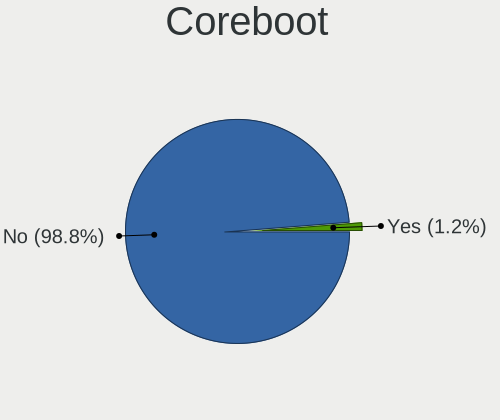
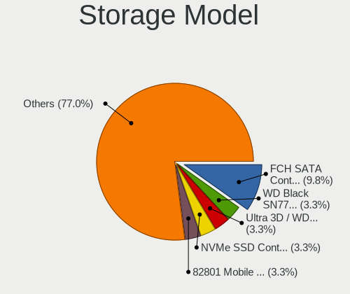
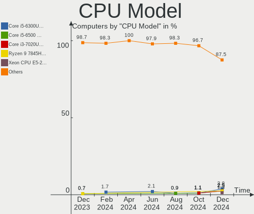
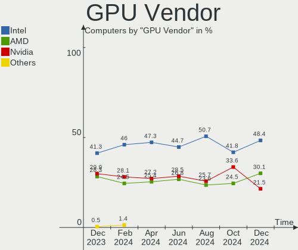
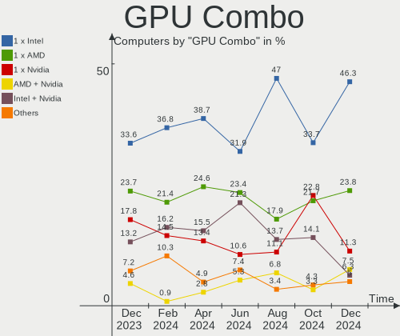
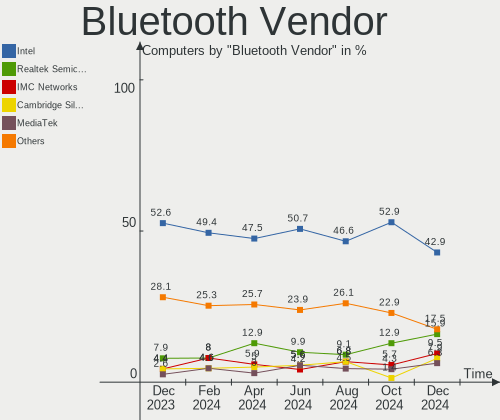
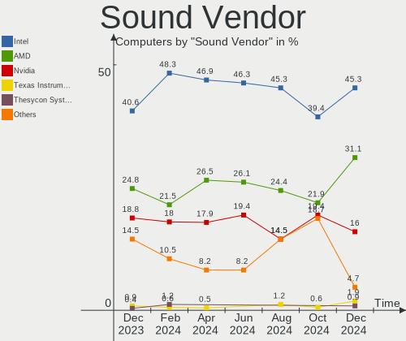
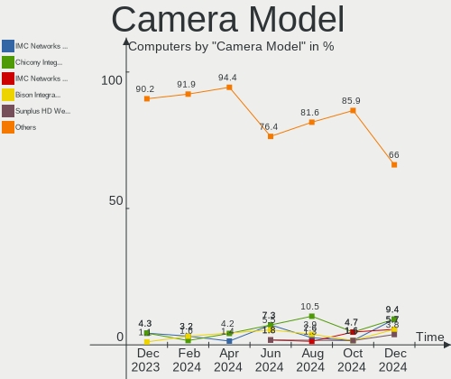

ArcoLinux Hardware Trends
-------------------------

A project to identify most popular hardware characteristics and track their change
over time based on data collected by ArcoLinux users at https://Linux-Hardware.org.

Anyone can contribute to this report by the [hw-probe](https://github.com/linuxhw/hw-probe) tool:

    sudo -E hw-probe -all -upload

This is a report for all computer types. See also reports for [desktops](/Dist/ArcoLinux/Desktop/README.md) and [notebooks](/Dist/ArcoLinux/Notebook/README.md).

Full-feature report is available here: https://linux-hardware.org/?view=trends

Period: Nov, 2021.

Contents
--------

* [ System ](#system)
  - [ OS                       ](#os)
  - [ OS Family                ](#os-family)
  - [ Kernel                   ](#kernel)
  - [ Kernel Family            ](#kernel-family)
  - [ Kernel Major Ver.        ](#kernel-major-ver)
  - [ Arch                     ](#arch)
  - [ DE                       ](#de)
  - [ Display Server           ](#display-server)
  - [ Display Manager          ](#display-manager)
  - [ OS Lang                  ](#os-lang)
  - [ Boot Mode                ](#boot-mode)
  - [ Filesystem               ](#filesystem)
  - [ Part. scheme             ](#part-scheme)
  - [ Dual Boot with Linux/BSD ](#dual-boot-with-linuxbsd)
  - [ Dual Boot (Win)          ](#dual-boot-win)

* [ Board ](#board)
  - [ Vendor                   ](#vendor)
  - [ Model                    ](#model)
  - [ Model Family             ](#model-family)
  - [ MFG Year                 ](#mfg-year)
  - [ Form Factor              ](#form-factor)
  - [ Secure Boot              ](#secure-boot)
  - [ Coreboot                 ](#coreboot)
  - [ RAM Size                 ](#ram-size)
  - [ RAM Used                 ](#ram-used)
  - [ Total Drives             ](#total-drives)
  - [ Has CD-ROM               ](#has-cd-rom)
  - [ Has Ethernet             ](#has-ethernet)
  - [ Has WiFi                 ](#has-wifi)
  - [ Has Bluetooth            ](#has-bluetooth)

* [ Location ](#location)
  - [ Country                  ](#country)
  - [ City                     ](#city)

* [ Drives ](#drives)
  - [ Drive Vendor             ](#drive-vendor)
  - [ Drive Model              ](#drive-model)
  - [ HDD Vendor               ](#hdd-vendor)
  - [ SSD Vendor               ](#ssd-vendor)
  - [ Drive Kind               ](#drive-kind)
  - [ Drive Connector          ](#drive-connector)
  - [ Drive Size               ](#drive-size)
  - [ Space Total              ](#space-total)
  - [ Space Used               ](#space-used)
  - [ Malfunc. Drives          ](#malfunc-drives)
  - [ Malfunc. Drive Vendor    ](#malfunc-drive-vendor)
  - [ Malfunc. HDD Vendor      ](#malfunc-hdd-vendor)
  - [ Malfunc. Drive Kind      ](#malfunc-drive-kind)
  - [ Failed Drives            ](#failed-drives)
  - [ Failed Drive Vendor      ](#failed-drive-vendor)
  - [ Drive Status             ](#drive-status)

* [ Storage controller ](#storage-controller)
  - [ Storage Vendor           ](#storage-vendor)
  - [ Storage Model            ](#storage-model)
  - [ Storage Kind             ](#storage-kind)

* [ Processor ](#processor)
  - [ CPU Vendor               ](#cpu-vendor)
  - [ CPU Model                ](#cpu-model)
  - [ CPU Model Family         ](#cpu-model-family)
  - [ CPU Cores                ](#cpu-cores)
  - [ CPU Sockets              ](#cpu-sockets)
  - [ CPU Threads              ](#cpu-threads)
  - [ CPU Op-Modes             ](#cpu-op-modes)
  - [ CPU Microcode            ](#cpu-microcode)
  - [ CPU Microarch            ](#cpu-microarch)

* [ Graphics ](#graphics)
  - [ GPU Vendor               ](#gpu-vendor)
  - [ GPU Model                ](#gpu-model)
  - [ GPU Combo                ](#gpu-combo)
  - [ GPU Driver               ](#gpu-driver)
  - [ GPU Memory               ](#gpu-memory)

* [ Monitor ](#monitor)
  - [ Monitor Vendor           ](#monitor-vendor)
  - [ Monitor Model            ](#monitor-model)
  - [ Monitor Resolution       ](#monitor-resolution)
  - [ Monitor Diagonal         ](#monitor-diagonal)
  - [ Monitor Width            ](#monitor-width)
  - [ Aspect Ratio             ](#aspect-ratio)
  - [ Monitor Area             ](#monitor-area)
  - [ Pixel Density            ](#pixel-density)
  - [ Multiple Monitors        ](#multiple-monitors)

* [ Network ](#network)
  - [ Net Controller Vendor    ](#net-controller-vendor)
  - [ Net Controller Model     ](#net-controller-model)
  - [ Wireless Vendor          ](#wireless-vendor)
  - [ Wireless Model           ](#wireless-model)
  - [ Ethernet Vendor          ](#ethernet-vendor)
  - [ Ethernet Model           ](#ethernet-model)
  - [ Net Controller Kind      ](#net-controller-kind)
  - [ Used Controller          ](#used-controller)
  - [ NICs                     ](#nics)
  - [ IPv6                     ](#ipv6)

* [ Bluetooth ](#bluetooth)
  - [ Bluetooth Vendor         ](#bluetooth-vendor)
  - [ Bluetooth Model          ](#bluetooth-model)

* [ Sound ](#sound)
  - [ Sound Vendor             ](#sound-vendor)
  - [ Sound Model              ](#sound-model)

* [ Memory ](#memory)
  - [ Memory Vendor            ](#memory-vendor)
  - [ Memory Model             ](#memory-model)
  - [ Memory Kind              ](#memory-kind)
  - [ Memory Form Factor       ](#memory-form-factor)
  - [ Memory Size              ](#memory-size)
  - [ Memory Speed             ](#memory-speed)

* [ Printers & scanners ](#printers--scanners)
  - [ Printer Vendor           ](#printer-vendor)
  - [ Printer Model            ](#printer-model)
  - [ Scanner Vendor           ](#scanner-vendor)
  - [ Scanner Model            ](#scanner-model)

* [ Camera ](#camera)
  - [ Camera Vendor            ](#camera-vendor)
  - [ Camera Model             ](#camera-model)

* [ Security ](#security)
  - [ Fingerprint Vendor       ](#fingerprint-vendor)
  - [ Fingerprint Model        ](#fingerprint-model)
  - [ Chipcard Vendor          ](#chipcard-vendor)
  - [ Chipcard Model           ](#chipcard-model)

* [ Unsupported ](#unsupported)
  - [ Unsupported Devices      ](#unsupported-devices)
  - [ Unsupported Device Types ](#unsupported-device-types)

System
------

OS
--

Installed operating systems

| Name              | Computers | Percent |
|-------------------|-----------|---------|
| ArcoLinux Rolling | 85        | 94.44%  |
| ArcoLinux         | 4         | 4.44%   |
| ArcoLinux 20.6.5  | 1         | 1.11%   |

OS Family
---------

OS without a version

| Name      | Computers | Percent |
|-----------|-----------|---------|
| ArcoLinux | 90        | 100%    |

Kernel
------

Version of the Linux kernel

| Version                      | Computers | Percent |
|------------------------------|-----------|---------|
| 5.15.4-arch1-1               | 14        | 15.56%  |
| 5.15.2-arch1-1               | 12        | 13.33%  |
| 5.15.5-arch1-1               | 8         | 8.89%   |
| 5.14.16-arch1-1              | 7         | 7.78%   |
| 5.14.15-arch1-1              | 5         | 5.56%   |
| 5.14.14-arch1-1              | 5         | 5.56%   |
| 5.15.4-zen1-1-zen            | 4         | 4.44%   |
| 5.14.16-zen1-1-zen           | 4         | 4.44%   |
| 5.15.3-zen1-1-zen            | 3         | 3.33%   |
| 5.10.78-1-lts                | 3         | 3.33%   |
| 5.15.5-zen1-1-zen            | 2         | 2.22%   |
| 5.15.3-arch1-1               | 2         | 2.22%   |
| 5.15.3-1-clear               | 2         | 2.22%   |
| 5.14.15-zen1-1-zen           | 2         | 2.22%   |
| 5.10.82-1-lts                | 2         | 2.22%   |
| 5.10.80-1-lts                | 2         | 2.22%   |
| 5.10.79-1-lts                | 2         | 2.22%   |
| 5.15.4-AMD                   | 1         | 1.11%   |
| 5.15.2-zen1-1-zen            | 1         | 1.11%   |
| 5.15.1-arch1-1               | 1         | 1.11%   |
| 5.15.0-arch1-1               | 1         | 1.11%   |
| 5.15.0-214-tkg-bmq           | 1         | 1.11%   |
| 5.14.5-arch1-1               | 1         | 1.11%   |
| 5.14.14-hardened1-1-hardened | 1         | 1.11%   |
| 5.13.13-arch1-1              | 1         | 1.11%   |
| 5.10.81-1-lts                | 1         | 1.11%   |
| 5.10.77-3-lts                | 1         | 1.11%   |
| 5.10.6-arch1-1               | 1         | 1.11%   |

Kernel Family
-------------

Linux kernel without a distro release

| Version | Computers | Percent |
|---------|-----------|---------|
| 5.15.4  | 19        | 21.11%  |
| 5.15.2  | 13        | 14.44%  |
| 5.14.16 | 11        | 12.22%  |
| 5.15.5  | 10        | 11.11%  |
| 5.15.3  | 7         | 7.78%   |
| 5.14.15 | 7         | 7.78%   |
| 5.14.14 | 6         | 6.67%   |
| 5.10.78 | 3         | 3.33%   |
| 5.15.0  | 2         | 2.22%   |
| 5.10.82 | 2         | 2.22%   |
| 5.10.80 | 2         | 2.22%   |
| 5.10.79 | 2         | 2.22%   |
| 5.15.1  | 1         | 1.11%   |
| 5.14.5  | 1         | 1.11%   |
| 5.13.13 | 1         | 1.11%   |
| 5.10.81 | 1         | 1.11%   |
| 5.10.77 | 1         | 1.11%   |
| 5.10.6  | 1         | 1.11%   |

Kernel Major Ver.
-----------------

Linux kernel major version

| Version | Computers | Percent |
|---------|-----------|---------|
| 5.15    | 52        | 57.78%  |
| 5.14    | 25        | 27.78%  |
| 5.10    | 12        | 13.33%  |
| 5.13    | 1         | 1.11%   |

Arch
----

OS architecture (x86_64, i586, etc.)

| Name   | Computers | Percent |
|--------|-----------|---------|
| x86_64 | 90        | 100%    |

DE
--

Desktop Environment

| Name         | Computers | Percent |
|--------------|-----------|---------|
| XFCE         | 30        | 33.33%  |
| KDE5         | 18        | 20%     |
| i3           | 7         | 7.78%   |
| xmonad       | 5         | 5.56%   |
| qtile        | 5         | 5.56%   |
| awesome      | 5         | 5.56%   |
| X-Cinnamon   | 4         | 4.44%   |
| bspwm        | 4         | 4.44%   |
| dwm          | 3         | 3.33%   |
| LeftWM       | 2         | 2.22%   |
| GNOME        | 2         | 2.22%   |
| Unknown      | 2         | 2.22%   |
| MATE         | 1         | 1.11%   |
| herbstluftwm | 1         | 1.11%   |
| dusk         | 1         | 1.11%   |

Display Server
--------------

X11 or Wayland

| Name    | Computers | Percent |
|---------|-----------|---------|
| X11     | 82        | 91.11%  |
| Tty     | 6         | 6.67%   |
| Wayland | 2         | 2.22%   |

Display Manager
---------------

SDDM, LightDM, etc.

| Name    | Computers | Percent |
|---------|-----------|---------|
| SDDM    | 61        | 67.78%  |
| LightDM | 23        | 25.56%  |
| Unknown | 6         | 6.67%   |

OS Lang
-------

Language

| Lang  | Computers | Percent |
|-------|-----------|---------|
| en_US | 54        | 60%     |
| en_GB | 5         | 5.56%   |
| en_ZA | 4         | 4.44%   |
| ru_RU | 3         | 3.33%   |
| en_IN | 3         | 3.33%   |
| de_DE | 3         | 3.33%   |
| pl_PL | 2         | 2.22%   |
| es_CL | 2         | 2.22%   |
| es_AR | 2         | 2.22%   |
| en_IL | 2         | 2.22%   |
| sv_SE | 1         | 1.11%   |
| nl_NL | 1         | 1.11%   |
| nb_NO | 1         | 1.11%   |
| fr_FR | 1         | 1.11%   |
| fi_FI | 1         | 1.11%   |
| es_PY | 1         | 1.11%   |
| es_ES | 1         | 1.11%   |
| es_EC | 1         | 1.11%   |
| en_CA | 1         | 1.11%   |
| bg_BG | 1         | 1.11%   |

Boot Mode
---------

EFI or BIOS

| Mode | Computers | Percent |
|------|-----------|---------|
| EFI  | 68        | 75.56%  |
| BIOS | 22        | 24.44%  |

Filesystem
----------

Type of filesystem

| Type    | Computers | Percent |
|---------|-----------|---------|
| Ext4    | 60        | 66.67%  |
| Btrfs   | 25        | 27.78%  |
| Overlay | 3         | 3.33%   |
| Xfs     | 2         | 2.22%   |

Part. scheme
------------

Scheme of partitioning

| Type    | Computers | Percent |
|---------|-----------|---------|
| GPT     | 71        | 78.89%  |
| MBR     | 14        | 15.56%  |
| Unknown | 5         | 5.56%   |

Dual Boot with Linux/BSD
------------------------

Hosting more than one Linux/BSD

| Dual boot | Computers | Percent |
|-----------|-----------|---------|
| No        | 70        | 77.78%  |
| Yes       | 20        | 22.22%  |

Dual Boot (Win)
---------------

Hosting Linux and Windows

| Dual boot | Computers | Percent |
|-----------|-----------|---------|
| No        | 53        | 58.89%  |
| Yes       | 37        | 41.11%  |

Board
-----

Vendor
------

Motherboard manufacturer

| Name                | Computers | Percent |
|---------------------|-----------|---------|
| ASUSTek Computer    | 24        | 26.67%  |
| Dell                | 11        | 12.22%  |
| MSI                 | 10        | 11.11%  |
| Lenovo              | 10        | 11.11%  |
| Hewlett-Packard     | 9         | 10%     |
| Gigabyte Technology | 8         | 8.89%   |
| ASRock              | 7         | 7.78%   |
| Acer                | 4         | 4.44%   |
| Apple               | 3         | 3.33%   |
| HUAWEI              | 2         | 2.22%   |
| Notebook            | 1         | 1.11%   |
| Biostar             | 1         | 1.11%   |

Model
-----

Motherboard model

| Name                                    | Computers | Percent |
|-----------------------------------------|-----------|---------|
| MSI MS-7C91                             | 3         | 3.33%   |
| ASUS TUF GAMING X570-PLUS               | 3         | 3.33%   |
| HP Laptop 15s-eq2xxx                    | 2         | 2.22%   |
| ASUS ROG STRIX B550-F GAMING            | 2         | 2.22%   |
| ASUS PRIME H310M-K R2.0                 | 2         | 2.22%   |
| ASRock B450M Pro4                       | 2         | 2.22%   |
| Notebook NV4XMB,ME,MZ                   | 1         | 1.11%   |
| MSI MS-7D22                             | 1         | 1.11%   |
| MSI MS-7C88                             | 1         | 1.11%   |
| MSI MS-7C02                             | 1         | 1.11%   |
| MSI MS-7B89                             | 1         | 1.11%   |
| MSI MS-7B85                             | 1         | 1.11%   |
| MSI MS-7A15                             | 1         | 1.11%   |
| MSI Modern 14 B4MW                      | 1         | 1.11%   |
| Lenovo V14-ADA 82C6                     | 1         | 1.11%   |
| Lenovo ThinkPad T550 20CJS0S800         | 1         | 1.11%   |
| Lenovo ThinkPad T470 W10DG 20JNS0QC0F   | 1         | 1.11%   |
| Lenovo ThinkPad T470 20HES01100         | 1         | 1.11%   |
| Lenovo ThinkPad T440p 20AWS3DD1Z        | 1         | 1.11%   |
| Lenovo ThinkPad E15 Gen 2 20TD002RRT    | 1         | 1.11%   |
| Lenovo Legion 5 15ARH05H 82B1           | 1         | 1.11%   |
| Lenovo IdeaPadFlex 5-1570 81CA          | 1         | 1.11%   |
| Lenovo IdeaPad 320-15ISK 80XH           | 1         | 1.11%   |
| Lenovo IdeaPad 3 14IML05 81WA           | 1         | 1.11%   |
| HUAWEI WRT-WX9                          | 1         | 1.11%   |
| HUAWEI KPL-W0X                          | 1         | 1.11%   |
| HP Z820 Workstation                     | 1         | 1.11%   |
| HP Pavilion g7                          | 1         | 1.11%   |
| HP Laptop 15-bw0xx                      | 1         | 1.11%   |
| HP Laptop 14q-cs0xxx                    | 1         | 1.11%   |
| HP EliteDesk 800 G2 DM 35W              | 1         | 1.11%   |
| HP EliteBook 840 G1                     | 1         | 1.11%   |
| HP 630                                  | 1         | 1.11%   |
| Gigabyte X570 AORUS MASTER              | 1         | 1.11%   |
| Gigabyte H81M-S                         | 1         | 1.11%   |
| Gigabyte F2A68HM-H                      | 1         | 1.11%   |
| Gigabyte B560M DS3H                     | 1         | 1.11%   |
| Gigabyte B550I AORUS PRO AX             | 1         | 1.11%   |
| Gigabyte B450M DS3H                     | 1         | 1.11%   |
| Gigabyte B365M GAMING HD                | 1         | 1.11%   |
| Gigabyte 970A-DS3P                      | 1         | 1.11%   |
| Dell Precision 7510                     | 1         | 1.11%   |
| Dell Precision 5550                     | 1         | 1.11%   |
| Dell Latitude E6440                     | 1         | 1.11%   |
| Dell Latitude E5450                     | 1         | 1.11%   |
| Dell Inspiron 5721                      | 1         | 1.11%   |
| Dell Inspiron 5579                      | 1         | 1.11%   |
| Dell Inspiron 3670                      | 1         | 1.11%   |
| Dell Inspiron 3581                      | 1         | 1.11%   |
| Dell Inspiron 3558                      | 1         | 1.11%   |
| Dell Inspiron 3505                      | 1         | 1.11%   |
| Dell Inspiron 15-3552                   | 1         | 1.11%   |
| Biostar J3060NH                         | 1         | 1.11%   |
| ASUS ZenBook UX425JA_UX425JA            | 1         | 1.11%   |
| ASUS X556UQK                            | 1         | 1.11%   |
| ASUS VivoBook_ASUSLaptop X712DAP_M712DA | 1         | 1.11%   |
| ASUS VivoBook_ASUSLaptop X510QR_X510QR  | 1         | 1.11%   |
| ASUS ROG STRIX X570-E GAMING            | 1         | 1.11%   |
| ASUS ROG STRIX B450-F GAMING II         | 1         | 1.11%   |
| ASUS Rampage III GENE                   | 1         | 1.11%   |

Model Family
------------

Motherboard model prefix

| Name               | Computers | Percent |
|--------------------|-----------|---------|
| Dell Inspiron      | 7         | 7.78%   |
| Lenovo ThinkPad    | 5         | 5.56%   |
| HP Laptop          | 4         | 4.44%   |
| ASUS ROG           | 4         | 4.44%   |
| ASUS PRIME         | 4         | 4.44%   |
| MSI MS-7C91        | 3         | 3.33%   |
| ASUS TUF           | 3         | 3.33%   |
| ASRock B450M       | 3         | 3.33%   |
| Lenovo IdeaPad     | 2         | 2.22%   |
| Dell Precision     | 2         | 2.22%   |
| Dell Latitude      | 2         | 2.22%   |
| ASUS VivoBook      | 2         | 2.22%   |
| ASUS P8Z77-V       | 2         | 2.22%   |
| Notebook NV4XMB    | 1         | 1.11%   |
| MSI MS-7D22        | 1         | 1.11%   |
| MSI MS-7C88        | 1         | 1.11%   |
| MSI MS-7C02        | 1         | 1.11%   |
| MSI MS-7B89        | 1         | 1.11%   |
| MSI MS-7B85        | 1         | 1.11%   |
| MSI MS-7A15        | 1         | 1.11%   |
| MSI Modern         | 1         | 1.11%   |
| Lenovo V14-ADA     | 1         | 1.11%   |
| Lenovo Legion      | 1         | 1.11%   |
| Lenovo IdeaPadFlex | 1         | 1.11%   |
| HUAWEI WRT-WX9     | 1         | 1.11%   |
| HUAWEI KPL-W0X     | 1         | 1.11%   |
| HP Z820            | 1         | 1.11%   |
| HP Pavilion        | 1         | 1.11%   |
| HP EliteDesk       | 1         | 1.11%   |
| HP EliteBook       | 1         | 1.11%   |
| HP 630             | 1         | 1.11%   |
| Gigabyte X570      | 1         | 1.11%   |
| Gigabyte H81M-S    | 1         | 1.11%   |
| Gigabyte F2A68HM-H | 1         | 1.11%   |
| Gigabyte B560M     | 1         | 1.11%   |
| Gigabyte B550I     | 1         | 1.11%   |
| Gigabyte B450M     | 1         | 1.11%   |
| Gigabyte B365M     | 1         | 1.11%   |
| Gigabyte 970A-DS3P | 1         | 1.11%   |
| Biostar J3060NH    | 1         | 1.11%   |
| ASUS ZenBook       | 1         | 1.11%   |
| ASUS X556UQK       | 1         | 1.11%   |
| ASUS Rampage       | 1         | 1.11%   |
| ASUS P8Z68-V       | 1         | 1.11%   |
| ASUS P8Z68         | 1         | 1.11%   |
| ASUS K72Jr         | 1         | 1.11%   |
| ASUS K53E          | 1         | 1.11%   |
| ASUS ASUS          | 1         | 1.11%   |
| ASUS All           | 1         | 1.11%   |
| ASRock H81M-DG4    | 1         | 1.11%   |
| ASRock FM2A78M     | 1         | 1.11%   |
| ASRock B450        | 1         | 1.11%   |
| ASRock A55M-VS     | 1         | 1.11%   |
| Apple MacBookPro11 | 1         | 1.11%   |
| Apple MacBookPro10 | 1         | 1.11%   |
| Apple MacBook5     | 1         | 1.11%   |
| Acer Swift         | 1         | 1.11%   |
| Acer Predator      | 1         | 1.11%   |
| Acer Nitro         | 1         | 1.11%   |
| Acer Aspire        | 1         | 1.11%   |

MFG Year
--------

Motherboard manufacture year

| Year | Computers | Percent |
|------|-----------|---------|
| 2021 | 32        | 35.56%  |
| 2020 | 15        | 16.67%  |
| 2019 | 11        | 12.22%  |
| 2018 | 7         | 7.78%   |
| 2014 | 5         | 5.56%   |
| 2015 | 4         | 4.44%   |
| 2012 | 4         | 4.44%   |
| 2017 | 3         | 3.33%   |
| 2013 | 3         | 3.33%   |
| 2011 | 3         | 3.33%   |
| 2016 | 2         | 2.22%   |
| 2009 | 1         | 1.11%   |

Form Factor
-----------

Physical design of the computer

| Name        | Computers | Percent |
|-------------|-----------|---------|
| Desktop     | 46        | 51.11%  |
| Notebook    | 42        | 46.67%  |
| Convertible | 1         | 1.11%   |
| All in one  | 1         | 1.11%   |

Secure Boot
-----------

Enabled or disabled

| State    | Computers | Percent |
|----------|-----------|---------|
| Disabled | 90        | 100%    |

Coreboot
--------

Have coreboot on board

| Used | Computers | Percent |
|------|-----------|---------|
| No   | 90        | 100%    |

RAM Size
--------

Total RAM memory

| Size in GB  | Computers | Percent |
|-------------|-----------|---------|
| 4.01-8.0    | 27        | 30%     |
| 16.01-24.0  | 24        | 26.67%  |
| 8.01-16.0   | 19        | 21.11%  |
| 32.01-64.0  | 10        | 11.11%  |
| 3.01-4.0    | 4         | 4.44%   |
| 24.01-32.0  | 3         | 3.33%   |
| 64.01-256.0 | 3         | 3.33%   |

RAM Used
--------

Used RAM memory

| Used GB   | Computers | Percent |
|-----------|-----------|---------|
| 2.01-3.0  | 28        | 31.11%  |
| 1.01-2.0  | 26        | 28.89%  |
| 4.01-8.0  | 13        | 14.44%  |
| 3.01-4.0  | 12        | 13.33%  |
| 0.51-1.0  | 6         | 6.67%   |
| 8.01-16.0 | 5         | 5.56%   |

Total Drives
------------

Number of drives on board

| Drives | Computers | Percent |
|--------|-----------|---------|
| 1      | 41        | 45.56%  |
| 2      | 22        | 24.44%  |
| 3      | 13        | 14.44%  |
| 4      | 10        | 11.11%  |
| 0      | 2         | 2.22%   |
| 9      | 1         | 1.11%   |
| 5      | 1         | 1.11%   |

Has CD-ROM
----------

Has CD-ROM on board

| Presented | Computers | Percent |
|-----------|-----------|---------|
| No        | 69        | 76.67%  |
| Yes       | 21        | 23.33%  |

Has Ethernet
------------

Has Ethernet on board

| Presented | Computers | Percent |
|-----------|-----------|---------|
| Yes       | 79        | 87.78%  |
| No        | 11        | 12.22%  |

Has WiFi
--------

Has WiFi module

| Presented | Computers | Percent |
|-----------|-----------|---------|
| Yes       | 65        | 72.22%  |
| No        | 25        | 27.78%  |

Has Bluetooth
-------------

Has Bluetooth module

| Presented | Computers | Percent |
|-----------|-----------|---------|
| Yes       | 65        | 72.22%  |
| No        | 25        | 27.78%  |

Location
--------

Country
-------

Geographic location (country)

| Country      | Computers | Percent |
|--------------|-----------|---------|
| USA          | 20        | 22.22%  |
| India        | 7         | 7.78%   |
| Germany      | 7         | 7.78%   |
| South Africa | 4         | 4.44%   |
| Belgium      | 4         | 4.44%   |
| UK           | 3         | 3.33%   |
| Russia       | 3         | 3.33%   |
| Poland       | 3         | 3.33%   |
| Chile        | 3         | 3.33%   |
| Bulgaria     | 3         | 3.33%   |
| Argentina    | 3         | 3.33%   |
| Thailand     | 2         | 2.22%   |
| Slovakia     | 2         | 2.22%   |
| Morocco      | 2         | 2.22%   |
| Israel       | 2         | 2.22%   |
| Greece       | 2         | 2.22%   |
| Vietnam      | 1         | 1.11%   |
| Ukraine      | 1         | 1.11%   |
| Tunisia      | 1         | 1.11%   |
| Sweden       | 1         | 1.11%   |
| Spain        | 1         | 1.11%   |
| Singapore    | 1         | 1.11%   |
| Romania      | 1         | 1.11%   |
| Paraguay     | 1         | 1.11%   |
| Norway       | 1         | 1.11%   |
| Netherlands  | 1         | 1.11%   |
| Indonesia    | 1         | 1.11%   |
| France       | 1         | 1.11%   |
| Finland      | 1         | 1.11%   |
| Estonia      | 1         | 1.11%   |
| Ecuador      | 1         | 1.11%   |
| Canada       | 1         | 1.11%   |
| Brazil       | 1         | 1.11%   |
| Belarus      | 1         | 1.11%   |
| Barbados     | 1         | 1.11%   |
| Albania      | 1         | 1.11%   |

City
----

Geographic location (city)

| City                   | Computers | Percent |
|------------------------|-----------|---------|
| Wilrijk                | 3         | 3.33%   |
| Benoni                 | 3         | 3.33%   |
| Tel Aviv               | 2         | 2.22%   |
| Santiago               | 2         | 2.22%   |
| Chicago                | 2         | 2.22%   |
| Bengaluru              | 2         | 2.22%   |
| Athens                 | 2         | 2.22%   |
| Windsor                | 1         | 1.11%   |
| West Covina            | 1         | 1.11%   |
| West Columbia          | 1         | 1.11%   |
| Warsaw                 | 1         | 1.11%   |
| Volkach                | 1         | 1.11%   |
| Tulsa                  | 1         | 1.11%   |
| Timi?™oara             | 1         | 1.11%   |
| Tigre                  | 1         | 1.11%   |
| Tallinn                | 1         | 1.11%   |
| Svelvik                | 1         | 1.11%   |
| Stockholm              | 1         | 1.11%   |
| St. Petersburg         | 1         | 1.11%   |
| Springfield            | 1         | 1.11%   |
| Spokane                | 1         | 1.11%   |
| Southampton            | 1         | 1.11%   |
| Sofia                  | 1         | 1.11%   |
| Singapore              | 1         | 1.11%   |
| Sindanglaya            | 1         | 1.11%   |
| Shetland Islands       | 1         | 1.11%   |
| Sein?¤joki             | 1         | 1.11%   |
| Seattle                | 1         | 1.11%   |
| S??o Paulo             | 1         | 1.11%   |
| Sarafovo               | 1         | 1.11%   |
| San Miguel de Tucum??n | 1         | 1.11%   |
| Rouans                 | 1         | 1.11%   |
| Pune                   | 1         | 1.11%   |
| Plano                  | 1         | 1.11%   |
| Piekary Slaskie        | 1         | 1.11%   |
| Pfafftown              | 1         | 1.11%   |
| Perm                   | 1         | 1.11%   |
| Pearl City             | 1         | 1.11%   |
| Novi Pazar             | 1         | 1.11%   |
| New York               | 1         | 1.11%   |
| New Delhi              | 1         | 1.11%   |
| Nakhon Ratchasima      | 1         | 1.11%   |
| Munich                 | 1         | 1.11%   |
| Mumbai                 | 1         | 1.11%   |
| Moscow                 | 1         | 1.11%   |
| Miami                  | 1         | 1.11%   |
| Madrid                 | 1         | 1.11%   |
| Los ??ngeles           | 1         | 1.11%   |
| London                 | 1         | 1.11%   |
| Las Vegas              | 1         | 1.11%   |
| Kolkata                | 1         | 1.11%   |
| Klin                   | 1         | 1.11%   |
| Kharkiv                | 1         | 1.11%   |
| Jendouba               | 1         | 1.11%   |
| Hilton                 | 1         | 1.11%   |
| Hanoi                  | 1         | 1.11%   |
| Hamburg                | 1         | 1.11%   |
| Gomel                  | 1         | 1.11%   |
| Giessen                | 1         | 1.11%   |
| G?¶ttingen             | 1         | 1.11%   |

Drives
------

Drive Vendor
------------

Hard drive vendors

| Vendor              | Computers | Drives | Percent |
|---------------------|-----------|--------|---------|
| Samsung Electronics | 31        | 45     | 21.68%  |
| WDC                 | 27        | 35     | 18.88%  |
| Seagate             | 20        | 27     | 13.99%  |
| Toshiba             | 13        | 13     | 9.09%   |
| Kingston            | 11        | 11     | 7.69%   |
| Intel               | 5         | 5      | 3.5%    |
| Crucial             | 5         | 8      | 3.5%    |
| SK Hynix            | 4         | 4      | 2.8%    |
| SanDisk             | 3         | 4      | 2.1%    |
| LITEON              | 2         | 2      | 1.4%    |
| Corsair             | 2         | 2      | 1.4%    |
| Apple               | 2         | 2      | 1.4%    |
| A-DATA Technology   | 2         | 2      | 1.4%    |
| Unknown             | 1         | 1      | 0.7%    |
| Transcend           | 1         | 1      | 0.7%    |
| SPCC                | 1         | 1      | 0.7%    |
| PNY                 | 1         | 1      | 0.7%    |
| Phison              | 1         | 1      | 0.7%    |
| Patriot             | 1         | 1      | 0.7%    |
| OSCOO               | 1         | 1      | 0.7%    |
| Mushkin             | 1         | 1      | 0.7%    |
| KIOXIA              | 1         | 1      | 0.7%    |
| JMicron             | 1         | 1      | 0.7%    |
| Hitachi             | 1         | 1      | 0.7%    |
| GOODRAM             | 1         | 1      | 0.7%    |
| Gigabyte Technology | 1         | 1      | 0.7%    |
| China               | 1         | 1      | 0.7%    |
| addlink             | 1         | 1      | 0.7%    |
| Unknown             | 1         | 1      | 0.7%    |

Drive Model
-----------

Hard drive models

| Model                                | Computers | Percent |
|--------------------------------------|-----------|---------|
| Samsung SSD 860 EVO 500GB            | 6         | 3.61%   |
| WDC WD5000AAKX-001CA0 500GB          | 3         | 1.81%   |
| Seagate ST1000DM010-2EP102 1TB       | 3         | 1.81%   |
| Samsung SSD 970 EVO 1TB              | 3         | 1.81%   |
| Samsung SSD 860 EVO 1TB              | 3         | 1.81%   |
| Kingston SA400S37240G 240GB SSD      | 3         | 1.81%   |
| WDC WDS500G2B0A-00SM50 500GB SSD     | 2         | 1.2%    |
| WDC WDS100T3X0C-00SJG0 1TB           | 2         | 1.2%    |
| Toshiba MQ01ABD100 1TB               | 2         | 1.2%    |
| Seagate ST2000DM001-1ER164 2TB       | 2         | 1.2%    |
| Seagate ST1000LM035-1RK172 1TB       | 2         | 1.2%    |
| Seagate ST1000DM003-1CH162 1TB       | 2         | 1.2%    |
| SanDisk SDSSDA240G 240GB             | 2         | 1.2%    |
| Samsung SSD 980 PRO 500GB            | 2         | 1.2%    |
| Samsung SSD 850 EVO 500GB            | 2         | 1.2%    |
| Kingston SA400S37120G 120GB SSD      | 2         | 1.2%    |
| Kingston SA2000M8500G 500GB          | 2         | 1.2%    |
| Intel SSDPEKNW010T8 1TB              | 2         | 1.2%    |
| Crucial CT1000P1SSD8 1TB             | 2         | 1.2%    |
| Crucial CT1000MX500SSD1 1TB          | 2         | 1.2%    |
| WDC WDS240G2G0B-00EPW0 240GB SSD     | 1         | 0.6%    |
| WDC WDS240G2G0A-00JH30 240GB SSD     | 1         | 0.6%    |
| WDC WDS100T2G0A-00JH30 1TB SSD       | 1         | 0.6%    |
| WDC WDS100T2B0A-00SM50 1TB SSD       | 1         | 0.6%    |
| WDC WD6400BEVT-60A0RT0 640GB         | 1         | 0.6%    |
| WDC WD5000LPVX-22V0TT0 500GB         | 1         | 0.6%    |
| WDC WD5000LPCX-75VHAT0 500GB         | 1         | 0.6%    |
| WDC WD5000AAKX-603CA0 500GB          | 1         | 0.6%    |
| WDC WD5000AAKX-00ERMA0 500GB         | 1         | 0.6%    |
| WDC WD40EZRX-22SPEB0 4TB             | 1         | 0.6%    |
| WDC WD40EFRX-68N32N0 4TB             | 1         | 0.6%    |
| WDC WD3200BUCT-63TWBY0 320GB         | 1         | 0.6%    |
| WDC WD20EARX-00PASB0 2TB             | 1         | 0.6%    |
| WDC WD1600AVVS-63L2B0 160GB          | 1         | 0.6%    |
| WDC WD10JPVX-60JC3T1 1TB             | 1         | 0.6%    |
| WDC WD10EZEX-75WN4A0 1TB             | 1         | 0.6%    |
| WDC WD10EZEX-22MFCA0 1TB             | 1         | 0.6%    |
| WDC WD10EZEX-08M2NA0 1TB             | 1         | 0.6%    |
| WDC WD10EARS-00Y5B1 1TB              | 1         | 0.6%    |
| WDC PC SN720 SDAPNTW-512G-1027 512GB | 1         | 0.6%    |
| WDC PC SN530 SDBPNPZ-512G-1006 512GB | 1         | 0.6%    |
| WDC PC SN530 SDBPNPZ-256G-1014 256GB | 1         | 0.6%    |
| WDC PC SN530 SDBPNPZ-256G-1002 256GB | 1         | 0.6%    |
| Unknown MMC Card  4GB                | 1         | 0.6%    |
| Transcend TS480GSSD220S 480GB        | 1         | 0.6%    |
| Toshiba TR150 240GB SSD              | 1         | 0.6%    |
| Toshiba MQ04ABF100 1TB               | 1         | 0.6%    |
| Toshiba MQ01ACF050 500GB             | 1         | 0.6%    |
| Toshiba MQ01ABD100M 1TB              | 1         | 0.6%    |
| Toshiba MK6475GSX 640GB              | 1         | 0.6%    |
| Toshiba MK1237GSX 120GB              | 1         | 0.6%    |
| Toshiba KBG40ZNT256G MEMORY 256GB    | 1         | 0.6%    |
| Toshiba HDWE140 4TB                  | 1         | 0.6%    |
| Toshiba HDWD120 2TB                  | 1         | 0.6%    |
| Toshiba DT01ACA200 2TB               | 1         | 0.6%    |
| Toshiba DT01ACA100 1TB               | 1         | 0.6%    |
| SPCC M.2 PCIe SSD 1TB                | 1         | 0.6%    |
| SK Hynix SC311 SATA 128GB SSD        | 1         | 0.6%    |
| SK Hynix PC711 NVMe 512GB            | 1         | 0.6%    |
| SK Hynix NVMe SSD Drive 512GB        | 1         | 0.6%    |

HDD Vendor
----------

Hard disk drive vendors

| Vendor              | Computers | Drives | Percent |
|---------------------|-----------|--------|---------|
| WDC                 | 17        | 22     | 35.42%  |
| Seagate             | 17        | 24     | 35.42%  |
| Toshiba             | 11        | 11     | 22.92%  |
| Samsung Electronics | 2         | 2      | 4.17%   |
| Hitachi             | 1         | 1      | 2.08%   |

SSD Vendor
----------

Solid state drive vendors

| Vendor              | Computers | Drives | Percent |
|---------------------|-----------|--------|---------|
| Samsung Electronics | 18        | 23     | 31.58%  |
| Kingston            | 7         | 7      | 12.28%  |
| WDC                 | 6         | 7      | 10.53%  |
| Crucial             | 5         | 6      | 8.77%   |
| SanDisk             | 2         | 2      | 3.51%   |
| LITEON              | 2         | 2      | 3.51%   |
| Intel               | 2         | 2      | 3.51%   |
| Apple               | 2         | 2      | 3.51%   |
| Transcend           | 1         | 1      | 1.75%   |
| Toshiba             | 1         | 1      | 1.75%   |
| SK Hynix            | 1         | 1      | 1.75%   |
| PNY                 | 1         | 1      | 1.75%   |
| Patriot             | 1         | 1      | 1.75%   |
| Mushkin             | 1         | 1      | 1.75%   |
| JMicron             | 1         | 1      | 1.75%   |
| GOODRAM             | 1         | 1      | 1.75%   |
| Gigabyte Technology | 1         | 1      | 1.75%   |
| Corsair             | 1         | 1      | 1.75%   |
| China               | 1         | 1      | 1.75%   |
| addlink             | 1         | 1      | 1.75%   |
| A-DATA Technology   | 1         | 1      | 1.75%   |

Drive Kind
----------

HDD or SSD

| Kind    | Computers | Drives | Percent |
|---------|-----------|--------|---------|
| SSD     | 48        | 64     | 36.36%  |
| NVMe    | 40        | 48     | 30.3%   |
| HDD     | 40        | 60     | 30.3%   |
| MMC     | 2         | 2      | 1.52%   |
| Unknown | 2         | 2      | 1.52%   |

Drive Connector
---------------

SATA, SAS, NVMe, etc.

| Type | Computers | Drives | Percent |
|------|-----------|--------|---------|
| SATA | 70        | 118    | 58.82%  |
| NVMe | 40        | 48     | 33.61%  |
| SAS  | 7         | 8      | 5.88%   |
| MMC  | 2         | 2      | 1.68%   |

Drive Size
----------

Size of hard drive

| Size in TB | Computers | Drives | Percent |
|------------|-----------|--------|---------|
| 0.01-0.5   | 48        | 57     | 49.48%  |
| 0.51-1.0   | 32        | 43     | 32.99%  |
| 1.01-2.0   | 11        | 13     | 11.34%  |
| 3.01-4.0   | 4         | 9      | 4.12%   |
| 4.01-10.0  | 2         | 2      | 2.06%   |

Space Total
-----------

Amount of disk space available on the file system

| Size in GB     | Computers | Percent |
|----------------|-----------|---------|
| 101-250        | 17        | 18.89%  |
| 1001-2000      | 17        | 18.89%  |
| 501-1000       | 17        | 18.89%  |
| 251-500        | 12        | 13.33%  |
| More than 3000 | 11        | 12.22%  |
| 2001-3000      | 8         | 8.89%   |
| 1-20           | 6         | 6.67%   |
| 51-100         | 1         | 1.11%   |
| Unknown        | 1         | 1.11%   |

Space Used
----------

Amount of used disk space

| Used GB        | Computers | Percent |
|----------------|-----------|---------|
| 1-20           | 18        | 20%     |
| 21-50          | 15        | 16.67%  |
| 101-250        | 15        | 16.67%  |
| 251-500        | 10        | 11.11%  |
| 51-100         | 10        | 11.11%  |
| 1001-2000      | 7         | 7.78%   |
| 501-1000       | 6         | 6.67%   |
| 2001-3000      | 5         | 5.56%   |
| More than 3000 | 3         | 3.33%   |
| Unknown        | 1         | 1.11%   |

Malfunc. Drives
---------------

Drive models with a malfunction

| Model                               | Computers | Drives | Percent |
|-------------------------------------|-----------|--------|---------|
| WDC WD6400BEVT-60A0RT0 640GB        | 1         | 1      | 7.14%   |
| WDC WD5000AAKX-603CA0 500GB         | 1         | 1      | 7.14%   |
| WDC WD5000AAKX-001CA0 500GB         | 1         | 1      | 7.14%   |
| WDC WD40EFRX-68N32N0 4TB            | 1         | 4      | 7.14%   |
| WDC WD1600AVVS-63L2B0 160GB         | 1         | 1      | 7.14%   |
| Toshiba MQ01ACF050 500GB            | 1         | 1      | 7.14%   |
| Toshiba MK1237GSX 120GB             | 1         | 1      | 7.14%   |
| Seagate ST3320813AS 320GB           | 1         | 1      | 7.14%   |
| Seagate ST31000528AS 1TB            | 1         | 1      | 7.14%   |
| Seagate ST2000DM001-9YN164 2TB      | 1         | 1      | 7.14%   |
| Seagate ST1000LM014-1EJ164 1TB      | 1         | 1      | 7.14%   |
| Samsung Electronics SSD 870 EVO 1TB | 1         | 1      | 7.14%   |
| Samsung Electronics HD154UI 1TB     | 1         | 1      | 7.14%   |
| Intel SSDSA2M160G2GC 160GB          | 1         | 1      | 7.14%   |

Malfunc. Drive Vendor
---------------------

Vendors of faulty drives

| Vendor              | Computers | Drives | Percent |
|---------------------|-----------|--------|---------|
| WDC                 | 5         | 8      | 35.71%  |
| Seagate             | 4         | 4      | 28.57%  |
| Toshiba             | 2         | 2      | 14.29%  |
| Samsung Electronics | 2         | 2      | 14.29%  |
| Intel               | 1         | 1      | 7.14%   |

Malfunc. HDD Vendor
-------------------

Vendors of faulty HDD drives

| Vendor              | Computers | Drives | Percent |
|---------------------|-----------|--------|---------|
| WDC                 | 5         | 8      | 41.67%  |
| Seagate             | 4         | 4      | 33.33%  |
| Toshiba             | 2         | 2      | 16.67%  |
| Samsung Electronics | 1         | 1      | 8.33%   |

Malfunc. Drive Kind
-------------------

Kinds of faulty drives

| Kind | Computers | Drives | Percent |
|------|-----------|--------|---------|
| HDD  | 12        | 15     | 85.71%  |
| SSD  | 2         | 2      | 14.29%  |

Failed Drives
-------------

Failed drive models

Zero info for selected period =(

Failed Drive Vendor
-------------------

Failed drive vendors

Zero info for selected period =(

Drive Status
------------

Number of failed and malfunc. drives

| Status   | Computers | Drives | Percent |
|----------|-----------|--------|---------|
| Works    | 73        | 136    | 71.57%  |
| Detected | 16        | 23     | 15.69%  |
| Malfunc  | 13        | 17     | 12.75%  |

Storage controller
------------------

Storage Vendor
--------------

Storage controller vendors

| Vendor                      | Computers | Percent |
|-----------------------------|-----------|---------|
| Intel                       | 45        | 33.83%  |
| AMD                         | 34        | 25.56%  |
| Samsung Electronics         | 19        | 14.29%  |
| Sandisk                     | 7         | 5.26%   |
| Marvell Technology Group    | 5         | 3.76%   |
| Kingston Technology Company | 4         | 3.01%   |
| SK Hynix                    | 3         | 2.26%   |
| Phison Electronics          | 3         | 2.26%   |
| Micron/Crucial Technology   | 2         | 1.5%    |
| KIOXIA                      | 2         | 1.5%    |
| JMicron Technology          | 2         | 1.5%    |
| ASMedia Technology          | 2         | 1.5%    |
| Silicon Motion              | 1         | 0.75%   |
| Seagate Technology          | 1         | 0.75%   |
| Nvidia                      | 1         | 0.75%   |
| Broadcom / LSI              | 1         | 0.75%   |
| ADATA Technology            | 1         | 0.75%   |

Storage Model
-------------

Storage controller models

| Model                                                                            | Computers | Percent |
|----------------------------------------------------------------------------------|-----------|---------|
| AMD FCH SATA Controller [AHCI mode]                                              | 20        | 13.99%  |
| Samsung NVMe SSD Controller SM981/PM981/PM983                                    | 9         | 6.29%   |
| AMD 400 Series Chipset SATA Controller                                           | 9         | 6.29%   |
| AMD Starship/Matisse Chipset SATA Controller [AHCI mode]                         | 6         | 4.2%    |
| Intel 8 Series/C220 Series Chipset Family 6-port SATA Controller 1 [AHCI mode]   | 5         | 3.5%    |
| Samsung NVMe SSD Controller 980                                                  | 4         | 2.8%    |
| Intel Sunrise Point-LP SATA Controller [AHCI mode]                               | 4         | 2.8%    |
| Intel 82801 Mobile SATA Controller [RAID mode]                                   | 4         | 2.8%    |
| Sandisk WD Blue SN550 NVMe SSD                                                   | 3         | 2.1%    |
| Samsung NVMe SSD Controller SM961/PM961/SM963                                    | 3         | 2.1%    |
| Samsung NVMe SSD Controller PM9A1/PM9A3/980PRO                                   | 3         | 2.1%    |
| Kingston Company A2000 NVMe SSD                                                  | 3         | 2.1%    |
| Intel SSD 660P Series                                                            | 3         | 2.1%    |
| Intel Q170/Q150/B150/H170/H110/Z170/CM236 Chipset SATA Controller [AHCI Mode]    | 3         | 2.1%    |
| Intel 200 Series PCH SATA controller [AHCI mode]                                 | 3         | 2.1%    |
| AMD FCH IDE Controller                                                           | 3         | 2.1%    |
| Sandisk WD Black SN750 / PC SN730 NVMe SSD                                       | 2         | 1.4%    |
| Phison E12 NVMe Controller                                                       | 2         | 1.4%    |
| Micron/Crucial P1 NVMe PCIe SSD                                                  | 2         | 1.4%    |
| KIOXIA Non-Volatile memory controller                                            | 2         | 1.4%    |
| JMicron JMB362 SATA Controller                                                   | 2         | 1.4%    |
| Intel Wildcat Point-LP SATA Controller [AHCI Mode]                               | 2         | 1.4%    |
| Intel Atom/Celeron/Pentium Processor x5-E8000/J3xxx/N3xxx Series SATA Controller | 2         | 1.4%    |
| Intel 7 Series/C210 Series Chipset Family 6-port SATA Controller [AHCI mode]     | 2         | 1.4%    |
| Intel 7 Series Chipset Family 6-port SATA Controller [AHCI mode]                 | 2         | 1.4%    |
| Intel 6 Series/C200 Series Chipset Family 6 port Desktop SATA AHCI Controller    | 2         | 1.4%    |
| Intel 500 Series Chipset Family SATA AHCI Controller                             | 2         | 1.4%    |
| Intel 5 Series/3400 Series Chipset 4 port SATA AHCI Controller                   | 2         | 1.4%    |
| ASMedia ASM1062 Serial ATA Controller                                            | 2         | 1.4%    |
| SK Hynix Gold P31 SSD                                                            | 1         | 0.7%    |
| SK Hynix BC511                                                                   | 1         | 0.7%    |
| SK Hynix BC501 NVMe Solid State Drive                                            | 1         | 0.7%    |
| Silicon Motion SM2263EN/SM2263XT SSD Controller                                  | 1         | 0.7%    |
| Seagate FireCuda 520 SSD                                                         | 1         | 0.7%    |
| Sandisk WD Black 2018/SN750 / PC SN720 NVMe SSD                                  | 1         | 0.7%    |
| Sandisk Non-Volatile memory controller                                           | 1         | 0.7%    |
| Samsung Apple PCIe SSD                                                           | 1         | 0.7%    |
| Phison E16 PCIe4 NVMe Controller                                                 | 1         | 0.7%    |
| Nvidia MCP79 AHCI Controller                                                     | 1         | 0.7%    |
| Marvell Group 88SE9215 PCIe 2.0 x1 4-port SATA 6 Gb/s Controller                 | 1         | 0.7%    |
| Marvell Group 88SE91A3 SATA-600 Controller                                       | 1         | 0.7%    |
| Marvell Group 88SE9172 SATA 6Gb/s Controller                                     | 1         | 0.7%    |
| Marvell Group 88SE9128 PCIe SATA 6 Gb/s RAID controller with HyperDuo            | 1         | 0.7%    |
| Marvell Group 88SE9120 SATA 6Gb/s Controller                                     | 1         | 0.7%    |
| Kingston Company U-SNS8154P3 NVMe SSD                                            | 1         | 0.7%    |
| Intel SATA Controller [RAID mode]                                                | 1         | 0.7%    |
| Intel Comet Lake SATA AHCI Controller                                            | 1         | 0.7%    |
| Intel Comet Lake PCH-H RAID                                                      | 1         | 0.7%    |
| Intel C602 chipset 4-Port SATA Storage Control Unit                              | 1         | 0.7%    |
| Intel C600/X79 series chipset 6-Port SATA AHCI Controller                        | 1         | 0.7%    |
| Intel Atom Processor E3800 Series SATA AHCI Controller                           | 1         | 0.7%    |
| Intel 82801JI (ICH10 Family) SATA AHCI Controller                                | 1         | 0.7%    |
| Intel 8 Series/C220 Series Chipset Family 4-port SATA Controller 1 [IDE mode]    | 1         | 0.7%    |
| Intel 8 Series SATA Controller 1 [AHCI mode]                                     | 1         | 0.7%    |
| Intel 6 Series/C200 Series Chipset Family 6 port Mobile SATA AHCI Controller     | 1         | 0.7%    |
| Intel 300 Series Chipset Family SATA RAID Controller                             | 1         | 0.7%    |
| Broadcom / LSI SAS2308 PCI-Express Fusion-MPT SAS-2                              | 1         | 0.7%    |
| AMD SB7x0/SB8x0/SB9x0 SATA Controller [IDE mode]                                 | 1         | 0.7%    |
| AMD SB7x0/SB8x0/SB9x0 IDE Controller                                             | 1         | 0.7%    |
| AMD FCH SATA Controller [IDE mode]                                               | 1         | 0.7%    |

Storage Kind
------------

Kind of storage controller (IDE, SATA, NVMe, SAS, ...)

| Kind | Computers | Percent |
|------|-----------|---------|
| SATA | 71        | 56.8%   |
| NVMe | 40        | 32%     |
| RAID | 7         | 5.6%    |
| IDE  | 6         | 4.8%    |
| SAS  | 1         | 0.8%    |

Processor
---------

CPU Vendor
----------

Processor vendors

| Vendor | Computers | Percent |
|--------|-----------|---------|
| Intel  | 51        | 56.67%  |
| AMD    | 39        | 43.33%  |

CPU Model
---------

Processor models

| Model                                    | Computers | Percent |
|------------------------------------------|-----------|---------|
| AMD Ryzen 9 5950X 16-Core Processor      | 3         | 3.33%   |
| AMD Ryzen 7 2700X Eight-Core Processor   | 3         | 3.33%   |
| AMD Ryzen 5 5500U with Radeon Graphics   | 3         | 3.33%   |
| AMD Ryzen 5 3600 6-Core Processor        | 3         | 3.33%   |
| Intel Core i7-2600K CPU @ 3.40GHz        | 2         | 2.22%   |
| Intel Core i5-9400F CPU @ 2.90GHz        | 2         | 2.22%   |
| Intel Core i5-8400 CPU @ 2.80GHz         | 2         | 2.22%   |
| Intel Core i5-7200U CPU @ 2.50GHz        | 2         | 2.22%   |
| Intel Core i5-4300M CPU @ 2.60GHz        | 2         | 2.22%   |
| Intel Core i3-7020U CPU @ 2.30GHz        | 2         | 2.22%   |
| AMD Ryzen 9 5900X 12-Core Processor      | 2         | 2.22%   |
| AMD Ryzen 9 3900X 12-Core Processor      | 2         | 2.22%   |
| AMD Ryzen 5 5600X 6-Core Processor       | 2         | 2.22%   |
| AMD Ryzen 3 3250U with Radeon Graphics   | 2         | 2.22%   |
| Intel Xeon CPU X5687 @ 3.60GHz           | 1         | 1.11%   |
| Intel Xeon CPU E5-2667 v2 @ 3.30GHz      | 1         | 1.11%   |
| Intel Pentium CPU N3540 @ 2.16GHz        | 1         | 1.11%   |
| Intel Pentium CPU G4560 @ 3.50GHz        | 1         | 1.11%   |
| Intel Pentium CPU G3260 @ 3.30GHz        | 1         | 1.11%   |
| Intel Pentium CPU 6405U @ 2.40GHz        | 1         | 1.11%   |
| Intel Core i7-8565U CPU @ 1.80GHz        | 1         | 1.11%   |
| Intel Core i7-8550U CPU @ 1.80GHz        | 1         | 1.11%   |
| Intel Core i7-6820HQ CPU @ 2.70GHz       | 1         | 1.11%   |
| Intel Core i7-6700T CPU @ 2.80GHz        | 1         | 1.11%   |
| Intel Core i7-4770HQ CPU @ 2.20GHz       | 1         | 1.11%   |
| Intel Core i7-3770K CPU @ 3.50GHz        | 1         | 1.11%   |
| Intel Core i7-3615QM CPU @ 2.30GHz       | 1         | 1.11%   |
| Intel Core i7-3537U CPU @ 2.00GHz        | 1         | 1.11%   |
| Intel Core i7-10750H CPU @ 2.60GHz       | 1         | 1.11%   |
| Intel Core i7-10700K CPU @ 3.80GHz       | 1         | 1.11%   |
| Intel Core i7-1065G7 CPU @ 1.30GHz       | 1         | 1.11%   |
| Intel Core i5-8250U CPU @ 1.60GHz        | 1         | 1.11%   |
| Intel Core i5-6300U CPU @ 2.40GHz        | 1         | 1.11%   |
| Intel Core i5-5300U CPU @ 2.30GHz        | 1         | 1.11%   |
| Intel Core i5-4670K CPU @ 3.40GHz        | 1         | 1.11%   |
| Intel Core i5-4460 CPU @ 3.20GHz         | 1         | 1.11%   |
| Intel Core i5-4310U CPU @ 2.00GHz        | 1         | 1.11%   |
| Intel Core i5-3570 CPU @ 3.40GHz         | 1         | 1.11%   |
| Intel Core i5-2410M CPU @ 2.30GHz        | 1         | 1.11%   |
| Intel Core i5-10400F CPU @ 2.90GHz       | 1         | 1.11%   |
| Intel Core i5 CPU M 450 @ 2.40GHz        | 1         | 1.11%   |
| Intel Core i3-6006U CPU @ 2.00GHz        | 1         | 1.11%   |
| Intel Core i3-5015U CPU @ 2.10GHz        | 1         | 1.11%   |
| Intel Core i3-5010U CPU @ 2.10GHz        | 1         | 1.11%   |
| Intel Core i3-4130 CPU @ 3.40GHz         | 1         | 1.11%   |
| Intel Core i3 CPU M 380 @ 2.53GHz        | 1         | 1.11%   |
| Intel Core 2 Duo CPU P7350 @ 2.00GHz     | 1         | 1.11%   |
| Intel Celeron CPU N3050 @ 1.60GHz        | 1         | 1.11%   |
| Intel Celeron CPU J3060 @ 1.60GHz        | 1         | 1.11%   |
| Intel 11th Gen Core i7-1165G7 @ 2.80GHz  | 1         | 1.11%   |
| Intel 11th Gen Core i5-11600KF @ 3.90GHz | 1         | 1.11%   |
| Intel 11th Gen Core i5-11400 @ 2.60GHz   | 1         | 1.11%   |
| Intel 11th Gen Core i5-1135G7 @ 2.40GHz  | 1         | 1.11%   |
| AMD Ryzen 7 5800X 8-Core Processor       | 1         | 1.11%   |
| AMD Ryzen 7 5700G with Radeon Graphics   | 1         | 1.11%   |
| AMD Ryzen 7 4800H with Radeon Graphics   | 1         | 1.11%   |
| AMD Ryzen 7 3700X 8-Core Processor       | 1         | 1.11%   |
| AMD Ryzen 5 4600H with Radeon Graphics   | 1         | 1.11%   |
| AMD Ryzen 5 4500U with Radeon Graphics   | 1         | 1.11%   |
| AMD Ryzen 5 3600X 6-Core Processor       | 1         | 1.11%   |

CPU Model Family
----------------

Processor model prefix

| Model            | Computers | Percent |
|------------------|-----------|---------|
| Intel Core i5    | 18        | 20%     |
| AMD Ryzen 5      | 15        | 16.67%  |
| Intel Core i7    | 13        | 14.44%  |
| Intel Core i3    | 7         | 7.78%   |
| AMD Ryzen 9      | 7         | 7.78%   |
| AMD Ryzen 7      | 7         | 7.78%   |
| Other            | 4         | 4.44%   |
| Intel Pentium    | 4         | 4.44%   |
| AMD Ryzen 3      | 3         | 3.33%   |
| Intel Xeon       | 2         | 2.22%   |
| Intel Celeron    | 2         | 2.22%   |
| AMD A6           | 2         | 2.22%   |
| AMD A10          | 2         | 2.22%   |
| Intel Core 2 Duo | 1         | 1.11%   |
| AMD FX           | 1         | 1.11%   |
| AMD A4           | 1         | 1.11%   |
| AMD A12          | 1         | 1.11%   |

CPU Cores
---------

Number of processor cores

| Number | Computers | Percent |
|--------|-----------|---------|
| 2      | 29        | 32.22%  |
| 4      | 24        | 26.67%  |
| 6      | 19        | 21.11%  |
| 8      | 8         | 8.89%   |
| 16     | 4         | 4.44%   |
| 12     | 4         | 4.44%   |
| 1      | 2         | 2.22%   |

CPU Sockets
-----------

Number of sockets

| Number | Computers | Percent |
|--------|-----------|---------|
| 1      | 89        | 98.89%  |
| 2      | 1         | 1.11%   |

CPU Threads
-----------

Threads per core (Hyper-Threading)

| Number | Computers | Percent |
|--------|-----------|---------|
| 2      | 74        | 82.22%  |
| 1      | 16        | 17.78%  |

CPU Op-Modes
------------

CPU Operation Modes (32-bit, 64-bit)

| Op mode        | Computers | Percent |
|----------------|-----------|---------|
| 32-bit, 64-bit | 90        | 100%    |

CPU Microcode
-------------

Microcode number

| Number     | Computers | Percent |
|------------|-----------|---------|
| 0x08701021 | 7         | 7.78%   |
| 0x306c3    | 6         | 6.67%   |
| 0x0a201016 | 5         | 5.56%   |
| Unknown    | 5         | 5.56%   |
| 0x306a9    | 4         | 4.44%   |
| 0x906ea    | 3         | 3.33%   |
| 0x806ea    | 3         | 3.33%   |
| 0x806e9    | 3         | 3.33%   |
| 0x306d4    | 3         | 3.33%   |
| 0x206a7    | 3         | 3.33%   |
| 0x0a201009 | 3         | 3.33%   |
| 0x08108109 | 3         | 3.33%   |
| 0x0800820d | 3         | 3.33%   |
| 0xa0671    | 2         | 2.22%   |
| 0x806c1    | 2         | 2.22%   |
| 0x506e3    | 2         | 2.22%   |
| 0x406e3    | 2         | 2.22%   |
| 0x20655    | 2         | 2.22%   |
| 0x08608103 | 2         | 2.22%   |
| 0xa0655    | 1         | 1.11%   |
| 0xa0653    | 1         | 1.11%   |
| 0xa0652    | 1         | 1.11%   |
| 0x906e9    | 1         | 1.11%   |
| 0x806ec    | 1         | 1.11%   |
| 0x806eb    | 1         | 1.11%   |
| 0x706e5    | 1         | 1.11%   |
| 0x406c4    | 1         | 1.11%   |
| 0x406c3    | 1         | 1.11%   |
| 0x40661    | 1         | 1.11%   |
| 0x40651    | 1         | 1.11%   |
| 0x306e4    | 1         | 1.11%   |
| 0x30678    | 1         | 1.11%   |
| 0x206c2    | 1         | 1.11%   |
| 0x10676    | 1         | 1.11%   |
| 0x0a50000c | 1         | 1.11%   |
| 0x08608102 | 1         | 1.11%   |
| 0x08600104 | 1         | 1.11%   |
| 0x08600103 | 1         | 1.11%   |
| 0x08101016 | 1         | 1.11%   |
| 0x0810100b | 1         | 1.11%   |
| 0x08101007 | 1         | 1.11%   |
| 0x0600611a | 1         | 1.11%   |
| 0x06003106 | 1         | 1.11%   |
| 0x06003104 | 1         | 1.11%   |
| 0x0600081f | 1         | 1.11%   |
| 0x03000027 | 1         | 1.11%   |

CPU Microarch
-------------

Microarchitecture

| Name        | Computers | Percent |
|-------------|-----------|---------|
| KabyLake    | 13        | 14.44%  |
| Zen 2       | 10        | 11.11%  |
| Zen 3       | 9         | 10%     |
| Haswell     | 8         | 8.89%   |
| Zen+        | 7         | 7.78%   |
| IvyBridge   | 5         | 5.56%   |
| Skylake     | 4         | 4.44%   |
| Zen         | 3         | 3.33%   |
| Westmere    | 3         | 3.33%   |
| Silvermont  | 3         | 3.33%   |
| SandyBridge | 3         | 3.33%   |
| Icelake     | 3         | 3.33%   |
| CometLake   | 3         | 3.33%   |
| Broadwell   | 3         | 3.33%   |
| Unknown     | 3         | 3.33%   |
| TigerLake   | 2         | 2.22%   |
| Steamroller | 2         | 2.22%   |
| Piledriver  | 2         | 2.22%   |
| Excavator   | 2         | 2.22%   |
| Penryn      | 1         | 1.11%   |
| K10 Llano   | 1         | 1.11%   |

Graphics
--------

GPU Vendor
----------

Vendors of graphics cards

| Vendor | Computers | Percent |
|--------|-----------|---------|
| Intel  | 37        | 37%     |
| AMD    | 32        | 32%     |
| Nvidia | 31        | 31%     |

GPU Model
---------

Graphics card models

| Model                                                                                    | Computers | Percent |
|------------------------------------------------------------------------------------------|-----------|---------|
| AMD Ellesmere [Radeon RX 470/480/570/570X/580/580X/590]                                  | 5         | 4.81%   |
| AMD Picasso/Raven 2 [Radeon Vega Series / Radeon Vega Mobile Series]                     | 4         | 3.85%   |
| Intel HD Graphics 620                                                                    | 3         | 2.88%   |
| Intel HD Graphics 5500                                                                   | 3         | 2.88%   |
| Intel 2nd Generation Core Processor Family Integrated Graphics Controller                | 3         | 2.88%   |
| AMD Raven Ridge [Radeon Vega Series / Radeon Vega Mobile Series]                         | 3         | 2.88%   |
| AMD Navi 10 [Radeon RX 5600 OEM/5600 XT / 5700/5700 XT]                                  | 3         | 2.88%   |
| AMD Lucienne                                                                             | 3         | 2.88%   |
| Nvidia TU116 [GeForce GTX 1650 SUPER]                                                    | 2         | 1.92%   |
| Nvidia TU106 [GeForce RTX 2060 Rev. A]                                                   | 2         | 1.92%   |
| Nvidia GP107 [GeForce GTX 1050 Ti]                                                       | 2         | 1.92%   |
| Nvidia GP106 [GeForce GTX 1060 6GB]                                                      | 2         | 1.92%   |
| Nvidia GM204 [GeForce GTX 970]                                                           | 2         | 1.92%   |
| Nvidia GK104 [GeForce GTX 770]                                                           | 2         | 1.92%   |
| Intel UHD Graphics 620                                                                   | 2         | 1.92%   |
| Intel TigerLake-LP GT2 [Iris Xe Graphics]                                                | 2         | 1.92%   |
| Intel HD Graphics 530                                                                    | 2         | 1.92%   |
| Intel CoffeeLake-S GT2 [UHD Graphics 630]                                                | 2         | 1.92%   |
| Intel Atom/Celeron/Pentium Processor x5-E8000/J3xxx/N3xxx Integrated Graphics Controller | 2         | 1.92%   |
| Intel 4th Gen Core Processor Integrated Graphics Controller                              | 2         | 1.92%   |
| Intel 3rd Gen Core processor Graphics Controller                                         | 2         | 1.92%   |
| AMD Wani [Radeon R5/R6/R7 Graphics]                                                      | 2         | 1.92%   |
| AMD Topaz XT [Radeon R7 M260/M265 / M340/M360 / M440/M445 / 530/535 / 620/625 Mobile]    | 2         | 1.92%   |
| AMD Renoir                                                                               | 2         | 1.92%   |
| Nvidia TU117M [GeForce MX450]                                                            | 1         | 0.96%   |
| Nvidia TU117M [GeForce GTX 1650 Ti Mobile]                                               | 1         | 0.96%   |
| Nvidia TU117M                                                                            | 1         | 0.96%   |
| Nvidia TU117GLM [Quadro T1000 Mobile]                                                    | 1         | 0.96%   |
| Nvidia TU106M [GeForce RTX 2060 Mobile]                                                  | 1         | 0.96%   |
| Nvidia GP108M [GeForce MX150]                                                            | 1         | 0.96%   |
| Nvidia GP108 [GeForce GT 1030]                                                           | 1         | 0.96%   |
| Nvidia GP104 [GeForce GTX 1080]                                                          | 1         | 0.96%   |
| Nvidia GM204 [GeForce GTX 980]                                                           | 1         | 0.96%   |
| Nvidia GM108M [GeForce MX130]                                                            | 1         | 0.96%   |
| Nvidia GM108M [GeForce 940MX]                                                            | 1         | 0.96%   |
| Nvidia GM107GLM [Quadro M1000M]                                                          | 1         | 0.96%   |
| Nvidia GM107 [GeForce GTX 750 Ti]                                                        | 1         | 0.96%   |
| Nvidia GM107 [GeForce GTX 745]                                                           | 1         | 0.96%   |
| Nvidia GK208B [GeForce GT 710]                                                           | 1         | 0.96%   |
| Nvidia GK107M [GeForce GT 650M Mac Edition]                                              | 1         | 0.96%   |
| Nvidia GK106 [GeForce GTX 660]                                                           | 1         | 0.96%   |
| Nvidia GA102 [GeForce RTX 3080 Ti]                                                       | 1         | 0.96%   |
| Nvidia C79 [GeForce 9400M]                                                               | 1         | 0.96%   |
| Intel Xeon E3-1200 v3/4th Gen Core Processor Integrated Graphics Controller              | 1         | 0.96%   |
| Intel WhiskeyLake-U GT2 [UHD Graphics 620]                                               | 1         | 0.96%   |
| Intel Skylake GT2 [HD Graphics 520]                                                      | 1         | 0.96%   |
| Intel RocketLake-S GT1 [UHD Graphics 730]                                                | 1         | 0.96%   |
| Intel Kaby Lake-U GT2f HD 620 Graphics Controller                                        | 1         | 0.96%   |
| Intel Iris Plus Graphics G7                                                              | 1         | 0.96%   |
| Intel HD Graphics 520                                                                    | 1         | 0.96%   |
| Intel Haswell-ULT Integrated Graphics Controller                                         | 1         | 0.96%   |
| Intel Crystal Well Integrated Graphics Controller                                        | 1         | 0.96%   |
| Intel Core Processor Integrated Graphics Controller                                      | 1         | 0.96%   |
| Intel CometLake-H GT2 [UHD Graphics]                                                     | 1         | 0.96%   |
| Intel Comet Lake UHD Graphics                                                            | 1         | 0.96%   |
| Intel Atom Processor Z36xxx/Z37xxx Series Graphics & Display                             | 1         | 0.96%   |
| Intel 4th Generation Core Processor Family Integrated Graphics Controller                | 1         | 0.96%   |
| AMD Trinity 2 [Radeon HD 7520G]                                                          | 1         | 0.96%   |
| AMD Thames [Radeon HD 7500M/7600M Series]                                                | 1         | 0.96%   |
| AMD SuperSumo [Radeon HD 6410D]                                                          | 1         | 0.96%   |

GPU Combo
---------

Combinations of graphics cards

| Name           | Computers | Percent |
|----------------|-----------|---------|
| 1 x Intel      | 26        | 28.89%  |
| 1 x AMD        | 26        | 28.89%  |
| 1 x Nvidia     | 22        | 24.44%  |
| Intel + Nvidia | 8         | 8.89%   |
| 2 x AMD        | 4         | 4.44%   |
| Other          | 2         | 2.22%   |
| Intel + AMD    | 1         | 1.11%   |
| AMD + Nvidia   | 1         | 1.11%   |

GPU Driver
----------

Free vs proprietary

| Driver      | Computers | Percent |
|-------------|-----------|---------|
| Free        | 64        | 71.11%  |
| Proprietary | 21        | 23.33%  |
| Unknown     | 5         | 5.56%   |

GPU Memory
----------

Total video memory

| Size in GB | Computers | Percent |
|------------|-----------|---------|
| Unknown    | 42        | 46.67%  |
| 7.01-8.0   | 11        | 12.22%  |
| 3.01-4.0   | 9         | 10%     |
| 1.01-2.0   | 9         | 10%     |
| 0.01-0.5   | 9         | 10%     |
| 5.01-6.0   | 4         | 4.44%   |
| 0.51-1.0   | 4         | 4.44%   |
| 8.01-16.0  | 2         | 2.22%   |

Monitor
-------

Monitor Vendor
--------------

Monitor vendors

| Vendor               | Computers | Percent |
|----------------------|-----------|---------|
| Samsung Electronics  | 9         | 9%      |
| LG Display           | 9         | 9%      |
| BOE                  | 9         | 9%      |
| AU Optronics         | 9         | 9%      |
| Dell                 | 8         | 8%      |
| Chimei Innolux       | 8         | 8%      |
| Goldstar             | 7         | 7%      |
| Ancor Communications | 5         | 5%      |
| BenQ                 | 4         | 4%      |
| Acer                 | 4         | 4%      |
| Philips              | 3         | 3%      |
| Apple                | 3         | 3%      |
| AOC                  | 3         | 3%      |
| Toshiba              | 2         | 2%      |
| Sony                 | 2         | 2%      |
| Panasonic            | 2         | 2%      |
| Iiyama               | 2         | 2%      |
| ViewSonic            | 1         | 1%      |
| Sharp                | 1         | 1%      |
| Sceptre Tech         | 1         | 1%      |
| PEGA                 | 1         | 1%      |
| PANDA                | 1         | 1%      |
| Onkyo                | 1         | 1%      |
| Lenovo               | 1         | 1%      |
| Insignia             | 1         | 1%      |
| Gigabyte Technology  | 1         | 1%      |
| Eizo                 | 1         | 1%      |
| Denver               | 1         | 1%      |

Monitor Model
-------------

Monitor models

| Model                                                                   | Computers | Percent |
|-------------------------------------------------------------------------|-----------|---------|
| LG Display LCD Monitor LGD045E 1366x768 309x174mm 14.0-inch             | 2         | 2%      |
| BenQ GW2780 BNQ78E6 1920x1080 598x336mm 27.0-inch                       | 2         | 2%      |
| AU Optronics LCD Monitor AUO243D 1920x1080 309x173mm 13.9-inch          | 2         | 2%      |
| ViewSonic VX3276-UHD VSC5138 3840x2160 697x392mm 31.5-inch              | 1         | 1%      |
| Toshiba TV TSB0114 1920x1080 882x498mm 39.9-inch                        | 1         | 1%      |
| Toshiba LCD-MONITOR LCD1885 1366x768 410x230mm 18.5-inch                | 1         | 1%      |
| Sony TV SNYE903 1920x1080 1600x900mm 72.3-inch                          | 1         | 1%      |
| Sony TV SNY9600 1920x540 735x420mm 33.3-inch                            | 1         | 1%      |
| Sharp LCD Monitor SHP14D1 1920x1200 336x210mm 15.6-inch                 | 1         | 1%      |
| Sceptre Tech Sceptre P30 SPT0BCC 2560x1080 690x291mm 29.5-inch          | 1         | 1%      |
| Samsung Electronics SMBX1950 SAM0714 1366x768 410x230mm 18.5-inch       | 1         | 1%      |
| Samsung Electronics S27D390 SAM0B67 1920x1080 600x340mm 27.2-inch       | 1         | 1%      |
| Samsung Electronics S27C350 SAM0A3D 1920x1080 598x336mm 27.0-inch       | 1         | 1%      |
| Samsung Electronics S19B150 SAM0980 1366x768 410x230mm 18.5-inch        | 1         | 1%      |
| Samsung Electronics LCD Monitor SAM0DFA 3840x2160 890x500mm 40.2-inch   | 1         | 1%      |
| Samsung Electronics LCD Monitor SAM090B 1920x1080 1020x570mm 46.0-inch  | 1         | 1%      |
| Samsung Electronics C32HG7x SAM0E14 2560x1440 700x390mm 31.5-inch       | 1         | 1%      |
| Samsung Electronics C27F390 SAM0D32 1920x1080 600x340mm 27.2-inch       | 1         | 1%      |
| Samsung Electronics C24FG7x SAM0E43 1920x1080 532x304mm 24.1-inch       | 1         | 1%      |
| Philips PHL 246V5 PHLC0C5 1920x1080 530x300mm 24.0-inch                 | 1         | 1%      |
| Philips PHL 223V5 PHLC0CF 1920x1080 480x270mm 21.7-inch                 | 1         | 1%      |
| Philips PHL 193V5 PHLC0CD 1366x768 410x230mm 18.5-inch                  | 1         | 1%      |
| PEGA Dell 2710 PEG0108 1920x1080                                        | 1         | 1%      |
| PANDA LCD Monitor NCP0050 1920x1080 309x174mm 14.0-inch                 | 1         | 1%      |
| Panasonic VVX13F009G00 MEI96A2 1920x1080 290x170mm 13.2-inch            | 1         | 1%      |
| Panasonic TV MEIC306 1920x540                                           | 1         | 1%      |
| Onkyo TX-NR515 ONK0C51 1920x1080 1210x680mm 54.6-inch                   | 1         | 1%      |
| LG Display M5401WUA LGD0700 1920x1080 527x296mm 23.8-inch               | 1         | 1%      |
| LG Display LCD Monitor LGD05F6 1920x1080 309x174mm 14.0-inch            | 1         | 1%      |
| LG Display LCD Monitor LGD04B9 1920x1080 344x194mm 15.5-inch            | 1         | 1%      |
| LG Display LCD Monitor LGD03D3 1600x900 309x174mm 14.0-inch             | 1         | 1%      |
| LG Display LCD Monitor LGD02F1 1366x768 344x194mm 15.5-inch             | 1         | 1%      |
| LG Display LCD Monitor LGD02DC 1366x768 344x194mm 15.5-inch             | 1         | 1%      |
| LG Display LCD Monitor LGD02DA 1920x1080 380x220mm 17.3-inch            | 1         | 1%      |
| Lenovo LCD Monitor LEN40BA 1920x1080 344x194mm 15.5-inch                | 1         | 1%      |
| Insignia NS19D220NA16A BBY0019 1680x1050 640x384mm 29.4-inch            | 1         | 1%      |
| Iiyama PL2792Q IVM6637 2560x1440 597x336mm 27.0-inch                    | 1         | 1%      |
| Iiyama PL2783Q IVM661F 2560x1440 597x336mm 27.0-inch                    | 1         | 1%      |
| Goldstar W1942 GSM4B6F 1440x900 408x255mm 18.9-inch                     | 1         | 1%      |
| Goldstar W1642 GSM3E86 1360x768 344x194mm 15.5-inch                     | 1         | 1%      |
| Goldstar LG ULTRAGEAR GSM5BB4 2560x1440 600x340mm 27.2-inch             | 1         | 1%      |
| Goldstar HDR QHD GSM5B96 2560x1440 698x392mm 31.5-inch                  | 1         | 1%      |
| Goldstar HDR 4K GSM7707 3840x2160 600x340mm 27.2-inch                   | 1         | 1%      |
| Goldstar HD GSM5ACB 1366x768 410x230mm 18.5-inch                        | 1         | 1%      |
| Goldstar FULL HD GSM5B55 1920x1080 480x270mm 21.7-inch                  | 1         | 1%      |
| Gigabyte Technology AORUS FI27Q-P GBT2707 2560x1440 596x335mm 26.9-inch | 1         | 1%      |
| Eizo EV2450 ENC2530 1920x1080 528x297mm 23.9-inch                       | 1         | 1%      |
| Denver N27QW LHC2700 2560x1440 597x336mm 27.0-inch                      | 1         | 1%      |
| Dell SX2210 DELA046 1920x1080 477x268mm 21.5-inch                       | 1         | 1%      |
| Dell S2409W DELA039 1920x1080 531x298mm 24.0-inch                       | 1         | 1%      |
| Dell P2720DC DELD0FD 2560x1440 597x336mm 27.0-inch                      | 1         | 1%      |
| Dell P2720DC DELD0FC 2560x1440 597x336mm 27.0-inch                      | 1         | 1%      |
| Dell P2314H DEL4099 1920x1080 510x290mm 23.1-inch                       | 1         | 1%      |
| Dell P2010H DEL4055 1600x900 443x249mm 20.0-inch                        | 1         | 1%      |
| Dell E2420HS DELF11D 1920x1080 527x296mm 23.8-inch                      | 1         | 1%      |
| Dell E2414H DEL4091 1920x1080 530x300mm 24.0-inch                       | 1         | 1%      |
| Chimei Innolux P130ZDZ-EF1 CMN8201 2160x1440 275x183mm 13.0-inch        | 1         | 1%      |
| Chimei Innolux LCD Monitor CMN1733 1600x900 382x215mm 17.3-inch         | 1         | 1%      |
| Chimei Innolux LCD Monitor CMN15E7 1920x1080 344x193mm 15.5-inch        | 1         | 1%      |
| Chimei Innolux LCD Monitor CMN15E6 1366x768 344x193mm 15.5-inch         | 1         | 1%      |

Monitor Resolution
------------------

Monitor screen resolution

| Resolution         | Computers | Percent |
|--------------------|-----------|---------|
| 1920x1080 (FHD)    | 46        | 50%     |
| 1366x768 (WXGA)    | 16        | 17.39%  |
| 2560x1440 (QHD)    | 9         | 9.78%   |
| 3840x2160 (4K)     | 6         | 6.52%   |
| 1600x900 (HD+)     | 3         | 3.26%   |
| 2880x1800          | 2         | 2.17%   |
| 1920x540           | 2         | 2.17%   |
| 1680x1050 (WSXGA+) | 2         | 2.17%   |
| 1360x768           | 2         | 2.17%   |
| 2560x1080          | 1         | 1.09%   |
| 2160x1440          | 1         | 1.09%   |
| 1920x1200 (WUXGA)  | 1         | 1.09%   |
| 1280x800 (WXGA)    | 1         | 1.09%   |

Monitor Diagonal
----------------

Diagonal size in inches

| Inches  | Computers | Percent |
|---------|-----------|---------|
| 15      | 22        | 22.92%  |
| 27      | 14        | 14.58%  |
| 24      | 11        | 11.46%  |
| 14      | 9         | 9.38%   |
| 13      | 7         | 7.29%   |
| 18      | 5         | 5.21%   |
| 23      | 4         | 4.17%   |
| 21      | 4         | 4.17%   |
| 17      | 4         | 4.17%   |
| 31      | 3         | 3.13%   |
| 54      | 2         | 2.08%   |
| 29      | 2         | 2.08%   |
| 22      | 2         | 2.08%   |
| 84      | 1         | 1.04%   |
| 72      | 1         | 1.04%   |
| 39      | 1         | 1.04%   |
| 33      | 1         | 1.04%   |
| 26      | 1         | 1.04%   |
| 20      | 1         | 1.04%   |
| Unknown | 1         | 1.04%   |

Monitor Width
-------------

Physical width

| Width in mm | Computers | Percent |
|-------------|-----------|---------|
| 301-350     | 35        | 37.63%  |
| 501-600     | 27        | 29.03%  |
| 401-500     | 12        | 12.9%   |
| 601-700     | 5         | 5.38%   |
| 351-400     | 4         | 4.3%    |
| 201-300     | 3         | 3.23%   |
| 1501-2000   | 2         | 2.15%   |
| 1001-1500   | 2         | 2.15%   |
| 801-900     | 1         | 1.08%   |
| 701-800     | 1         | 1.08%   |
| Unknown     | 1         | 1.08%   |

Aspect Ratio
------------

Proportional relationship between the width and the height

| Ratio | Computers | Percent |
|-------|-----------|---------|
| 16/9  | 78        | 89.66%  |
| 16/10 | 7         | 8.05%   |
| 3/2   | 1         | 1.15%   |
| 21/9  | 1         | 1.15%   |

Monitor Area
------------

Area in inch²

| Area in inch² | Computers | Percent |
|----------------|-----------|---------|
| 101-110        | 22        | 23.4%   |
| 201-250        | 17        | 18.09%  |
| 301-350        | 15        | 15.96%  |
| 81-90          | 14        | 14.89%  |
| 351-500        | 5         | 5.32%   |
| 141-150        | 5         | 5.32%   |
| More than 1000 | 4         | 4.26%   |
| 121-130        | 3         | 3.19%   |
| 71-80          | 2         | 2.13%   |
| 251-300        | 2         | 2.13%   |
| 151-200        | 2         | 2.13%   |
| 131-140        | 1         | 1.06%   |
| 501-1000       | 1         | 1.06%   |
| Unknown        | 1         | 1.06%   |

Pixel Density
-------------

Pixels per inch

| Density       | Computers | Percent |
|---------------|-----------|---------|
| 51-100        | 36        | 37.89%  |
| 101-120       | 26        | 27.37%  |
| 121-160       | 23        | 24.21%  |
| 161-240       | 4         | 4.21%   |
| 1-50          | 3         | 3.16%   |
| More than 240 | 2         | 2.11%   |
| Unknown       | 1         | 1.05%   |

Multiple Monitors
-----------------

Total monitors connected

| Total | Computers | Percent |
|-------|-----------|---------|
| 1     | 68        | 75.56%  |
| 2     | 15        | 16.67%  |
| 0     | 5         | 5.56%   |
| 3     | 2         | 2.22%   |

Network
-------

Net Controller Vendor
---------------------

Controller vendors

| Vendor                | Computers | Percent |
|-----------------------|-----------|---------|
| Realtek Semiconductor | 60        | 46.15%  |
| Intel                 | 44        | 33.85%  |
| Qualcomm Atheros      | 12        | 9.23%   |
| Ralink Technology     | 3         | 2.31%   |
| Broadcom              | 3         | 2.31%   |
| D-Link System         | 2         | 1.54%   |
| TP-Link               | 1         | 0.77%   |
| Ralink                | 1         | 0.77%   |
| Qualcomm              | 1         | 0.77%   |
| Nvidia                | 1         | 0.77%   |
| Microsoft             | 1         | 0.77%   |
| Broadcom Limited      | 1         | 0.77%   |

Net Controller Model
--------------------

Controller models

| Model                                                             | Computers | Percent |
|-------------------------------------------------------------------|-----------|---------|
| Realtek RTL8111/8168/8411 PCI Express Gigabit Ethernet Controller | 38        | 24.68%  |
| Intel Wi-Fi 6 AX200                                               | 11        | 7.14%   |
| Realtek RTL810xE PCI Express Fast Ethernet controller             | 6         | 3.9%    |
| Realtek RTL8153 Gigabit Ethernet Adapter                          | 5         | 3.25%   |
| Realtek RTL8125 2.5GbE Controller                                 | 5         | 3.25%   |
| Intel Wireless 8265 / 8275                                        | 5         | 3.25%   |
| Intel I211 Gigabit Network Connection                             | 5         | 3.25%   |
| Realtek RTL8822CE 802.11ac PCIe Wireless Network Adapter          | 3         | 1.95%   |
| Qualcomm Atheros QCA9377 802.11ac Wireless Network Adapter        | 3         | 1.95%   |
| Qualcomm Atheros QCA6174 802.11ac Wireless Network Adapter        | 3         | 1.95%   |
| Intel Wireless-AC 9260                                            | 3         | 1.95%   |
| Intel Ethernet Controller I225-V                                  | 3         | 1.95%   |
| Realtek RTL8821AE 802.11ac PCIe Wireless Network Adapter          | 2         | 1.3%    |
| Realtek RTL8723DE Wireless Network Adapter                        | 2         | 1.3%    |
| Realtek RTL8192EE PCIe Wireless Network Adapter                   | 2         | 1.3%    |
| Ralink MT7601U Wireless Adapter                                   | 2         | 1.3%    |
| Qualcomm Atheros QCA9565 / AR9565 Wireless Network Adapter        | 2         | 1.3%    |
| Intel Wireless 8260                                               | 2         | 1.3%    |
| Intel Wireless 7265                                               | 2         | 1.3%    |
| Intel Ethernet Connection I217-LM                                 | 2         | 1.3%    |
| Intel Ethernet Connection (3) I218-LM                             | 2         | 1.3%    |
| Intel Ethernet Connection (2) I219-LM                             | 2         | 1.3%    |
| Intel Centrino Advanced-N 6235                                    | 2         | 1.3%    |
| Intel 82579V Gigabit Network Connection                           | 2         | 1.3%    |
| D-Link System DGE-528T Gigabit Ethernet Adapter                   | 2         | 1.3%    |
| TP-Link AC600 wireless Realtek RTL8811AU [Archer T2U Nano]        | 1         | 0.65%   |
| Realtek RTL8821CE 802.11ac PCIe Wireless Network Adapter          | 1         | 0.65%   |
| Realtek RTL8723BE PCIe Wireless Network Adapter                   | 1         | 0.65%   |
| Realtek RTL8188CE 802.11b/g/n WiFi Adapter                        | 1         | 0.65%   |
| Realtek RTL8152 Fast Ethernet Adapter                             | 1         | 0.65%   |
| Realtek Killer E2600 Gigabit Ethernet Controller                  | 1         | 0.65%   |
| Realtek 802.11ac NIC                                              | 1         | 0.65%   |
| Ralink RT5370 Wireless Adapter                                    | 1         | 0.65%   |
| Ralink RT3290 Wireless 802.11n 1T/1R PCIe                         | 1         | 0.65%   |
| Qualcomm SM6150-IDP _SN:86979BB5                                  | 1         | 0.65%   |
| Qualcomm Atheros QCA8171 Gigabit Ethernet                         | 1         | 0.65%   |
| Qualcomm Atheros AR9485 Wireless Network Adapter                  | 1         | 0.65%   |
| Qualcomm Atheros AR9285 Wireless Network Adapter (PCI-Express)    | 1         | 0.65%   |
| Qualcomm Atheros AR8151 v2.0 Gigabit Ethernet                     | 1         | 0.65%   |
| Qualcomm Atheros AR8131 Gigabit Ethernet                          | 1         | 0.65%   |
| Nvidia MCP79 Ethernet                                             | 1         | 0.65%   |
| Microsoft XBOX ACC                                                | 1         | 0.65%   |
| Intel Wireless 7260                                               | 1         | 0.65%   |
| Intel Wireless 3160                                               | 1         | 0.65%   |
| Intel Wi-Fi 6 AX201                                               | 1         | 0.65%   |
| Intel Ice Lake-LP PCH CNVi WiFi                                   | 1         | 0.65%   |
| Intel Ethernet Connection I219-LM                                 | 1         | 0.65%   |
| Intel Ethernet Connection I218-LM                                 | 1         | 0.65%   |
| Intel Ethernet Connection I217-V                                  | 1         | 0.65%   |
| Intel Ethernet Connection (4) I219-V                              | 1         | 0.65%   |
| Intel Ethernet Connection (10) I219-V                             | 1         | 0.65%   |
| Intel Comet Lake PCH-LP CNVi WiFi                                 | 1         | 0.65%   |
| Intel Comet Lake PCH CNVi WiFi                                    | 1         | 0.65%   |
| Intel Centrino Wireless-N 2230                                    | 1         | 0.65%   |
| Intel Centrino Wireless-N 1030 [Rainbow Peak]                     | 1         | 0.65%   |
| Intel Cannon Point-LP CNVi [Wireless-AC]                          | 1         | 0.65%   |
| Intel 82579LM Gigabit Network Connection (Lewisville)             | 1         | 0.65%   |
| Intel 82574L Gigabit Network Connection                           | 1         | 0.65%   |
| Intel 82567V-2 Gigabit Network Connection                         | 1         | 0.65%   |
| Broadcom NetXtreme BCM57786 Gigabit Ethernet PCIe                 | 1         | 0.65%   |

Wireless Vendor
---------------

Wireless vendors

| Vendor                | Computers | Percent |
|-----------------------|-----------|---------|
| Intel                 | 34        | 51.52%  |
| Realtek Semiconductor | 13        | 19.7%   |
| Qualcomm Atheros      | 10        | 15.15%  |
| Ralink Technology     | 3         | 4.55%   |
| Broadcom              | 2         | 3.03%   |
| TP-Link               | 1         | 1.52%   |
| Ralink                | 1         | 1.52%   |
| Microsoft             | 1         | 1.52%   |
| Broadcom Limited      | 1         | 1.52%   |

Wireless Model
--------------

Wireless models

| Model                                                          | Computers | Percent |
|----------------------------------------------------------------|-----------|---------|
| Intel Wi-Fi 6 AX200                                            | 11        | 16.67%  |
| Intel Wireless 8265 / 8275                                     | 5         | 7.58%   |
| Realtek RTL8822CE 802.11ac PCIe Wireless Network Adapter       | 3         | 4.55%   |
| Qualcomm Atheros QCA9377 802.11ac Wireless Network Adapter     | 3         | 4.55%   |
| Qualcomm Atheros QCA6174 802.11ac Wireless Network Adapter     | 3         | 4.55%   |
| Intel Wireless-AC 9260                                         | 3         | 4.55%   |
| Realtek RTL8821AE 802.11ac PCIe Wireless Network Adapter       | 2         | 3.03%   |
| Realtek RTL8723DE Wireless Network Adapter                     | 2         | 3.03%   |
| Realtek RTL8192EE PCIe Wireless Network Adapter                | 2         | 3.03%   |
| Ralink MT7601U Wireless Adapter                                | 2         | 3.03%   |
| Qualcomm Atheros QCA9565 / AR9565 Wireless Network Adapter     | 2         | 3.03%   |
| Intel Wireless 8260                                            | 2         | 3.03%   |
| Intel Wireless 7265                                            | 2         | 3.03%   |
| Intel Centrino Advanced-N 6235                                 | 2         | 3.03%   |
| TP-Link AC600 wireless Realtek RTL8811AU [Archer T2U Nano]     | 1         | 1.52%   |
| Realtek RTL8821CE 802.11ac PCIe Wireless Network Adapter       | 1         | 1.52%   |
| Realtek RTL8723BE PCIe Wireless Network Adapter                | 1         | 1.52%   |
| Realtek RTL8188CE 802.11b/g/n WiFi Adapter                     | 1         | 1.52%   |
| Realtek 802.11ac NIC                                           | 1         | 1.52%   |
| Ralink RT5370 Wireless Adapter                                 | 1         | 1.52%   |
| Ralink RT3290 Wireless 802.11n 1T/1R PCIe                      | 1         | 1.52%   |
| Qualcomm Atheros AR9485 Wireless Network Adapter               | 1         | 1.52%   |
| Qualcomm Atheros AR9285 Wireless Network Adapter (PCI-Express) | 1         | 1.52%   |
| Microsoft XBOX ACC                                             | 1         | 1.52%   |
| Intel Wireless 7260                                            | 1         | 1.52%   |
| Intel Wireless 3160                                            | 1         | 1.52%   |
| Intel Wi-Fi 6 AX201                                            | 1         | 1.52%   |
| Intel Ice Lake-LP PCH CNVi WiFi                                | 1         | 1.52%   |
| Intel Comet Lake PCH-LP CNVi WiFi                              | 1         | 1.52%   |
| Intel Comet Lake PCH CNVi WiFi                                 | 1         | 1.52%   |
| Intel Centrino Wireless-N 2230                                 | 1         | 1.52%   |
| Intel Centrino Wireless-N 1030 [Rainbow Peak]                  | 1         | 1.52%   |
| Intel Cannon Point-LP CNVi [Wireless-AC]                       | 1         | 1.52%   |
| Broadcom Limited BCM4331 802.11a/b/g/n                         | 1         | 1.52%   |
| Broadcom BCM4360 802.11ac Wireless Network Adapter             | 1         | 1.52%   |
| Broadcom BCM4322 802.11a/b/g/n Wireless LAN Controller         | 1         | 1.52%   |

Ethernet Vendor
---------------

Ethernet vendors

| Vendor                | Computers | Percent |
|-----------------------|-----------|---------|
| Realtek Semiconductor | 54        | 63.53%  |
| Intel                 | 23        | 27.06%  |
| Qualcomm Atheros      | 3         | 3.53%   |
| D-Link System         | 2         | 2.35%   |
| Qualcomm              | 1         | 1.18%   |
| Nvidia                | 1         | 1.18%   |
| Broadcom              | 1         | 1.18%   |

Ethernet Model
--------------

Ethernet models

| Model                                                             | Computers | Percent |
|-------------------------------------------------------------------|-----------|---------|
| Realtek RTL8111/8168/8411 PCI Express Gigabit Ethernet Controller | 38        | 43.18%  |
| Realtek RTL810xE PCI Express Fast Ethernet controller             | 6         | 6.82%   |
| Realtek RTL8153 Gigabit Ethernet Adapter                          | 5         | 5.68%   |
| Realtek RTL8125 2.5GbE Controller                                 | 5         | 5.68%   |
| Intel I211 Gigabit Network Connection                             | 5         | 5.68%   |
| Intel Ethernet Controller I225-V                                  | 3         | 3.41%   |
| Intel Ethernet Connection I217-LM                                 | 2         | 2.27%   |
| Intel Ethernet Connection (3) I218-LM                             | 2         | 2.27%   |
| Intel Ethernet Connection (2) I219-LM                             | 2         | 2.27%   |
| Intel 82579V Gigabit Network Connection                           | 2         | 2.27%   |
| D-Link System DGE-528T Gigabit Ethernet Adapter                   | 2         | 2.27%   |
| Realtek RTL8152 Fast Ethernet Adapter                             | 1         | 1.14%   |
| Realtek Killer E2600 Gigabit Ethernet Controller                  | 1         | 1.14%   |
| Qualcomm SM6150-IDP _SN:86979BB5                                  | 1         | 1.14%   |
| Qualcomm Atheros QCA8171 Gigabit Ethernet                         | 1         | 1.14%   |
| Qualcomm Atheros AR8151 v2.0 Gigabit Ethernet                     | 1         | 1.14%   |
| Qualcomm Atheros AR8131 Gigabit Ethernet                          | 1         | 1.14%   |
| Nvidia MCP79 Ethernet                                             | 1         | 1.14%   |
| Intel Ethernet Connection I219-LM                                 | 1         | 1.14%   |
| Intel Ethernet Connection I218-LM                                 | 1         | 1.14%   |
| Intel Ethernet Connection I217-V                                  | 1         | 1.14%   |
| Intel Ethernet Connection (4) I219-V                              | 1         | 1.14%   |
| Intel Ethernet Connection (10) I219-V                             | 1         | 1.14%   |
| Intel 82579LM Gigabit Network Connection (Lewisville)             | 1         | 1.14%   |
| Intel 82574L Gigabit Network Connection                           | 1         | 1.14%   |
| Intel 82567V-2 Gigabit Network Connection                         | 1         | 1.14%   |
| Broadcom NetXtreme BCM57786 Gigabit Ethernet PCIe                 | 1         | 1.14%   |

Net Controller Kind
-------------------

Ethernet, WiFi or modem

| Kind     | Computers | Percent |
|----------|-----------|---------|
| Ethernet | 79        | 54.86%  |
| WiFi     | 65        | 45.14%  |

Used Controller
---------------

Currently used network controller

| Kind     | Computers | Percent |
|----------|-----------|---------|
| Ethernet | 49        | 51.58%  |
| WiFi     | 46        | 48.42%  |

NICs
----

Total network controllers on board

| Total | Computers | Percent |
|-------|-----------|---------|
| 2     | 47        | 52.22%  |
| 1     | 41        | 45.56%  |
| 3     | 2         | 2.22%   |

IPv6
----

IPv6 vs IPv4

| Used | Computers | Percent |
|------|-----------|---------|
| No   | 70        | 77.78%  |
| Yes  | 20        | 22.22%  |

Bluetooth
---------

Bluetooth Vendor
----------------

Controller vendors

| Vendor                          | Computers | Percent |
|---------------------------------|-----------|---------|
| Intel                           | 32        | 47.06%  |
| Realtek Semiconductor           | 7         | 10.29%  |
| Cambridge Silicon Radio         | 7         | 10.29%  |
| ASUSTek Computer                | 6         | 8.82%   |
| Qualcomm Atheros Communications | 5         | 7.35%   |
| IMC Networks                    | 3         | 4.41%   |
| Lite-On Technology              | 2         | 2.94%   |
| Apple                           | 2         | 2.94%   |
| Ralink                          | 1         | 1.47%   |
| HTC (High Tech Computer)        | 1         | 1.47%   |
| Dynex                           | 1         | 1.47%   |
| Broadcom                        | 1         | 1.47%   |

Bluetooth Model
---------------

Controller models

| Model                                                                | Computers | Percent |
|----------------------------------------------------------------------|-----------|---------|
| Intel Bluetooth wireless interface                                   | 10        | 14.71%  |
| Intel AX200 Bluetooth                                                | 10        | 14.71%  |
| Cambridge Silicon Radio Bluetooth Dongle (HCI mode)                  | 7         | 10.29%  |
| Intel Bluetooth Device                                               | 6         | 8.82%   |
| Realtek Bluetooth Radio                                              | 4         | 5.88%   |
| Qualcomm Atheros  Bluetooth Device                                   | 4         | 5.88%   |
| Intel Wireless-AC 9260 Bluetooth Adapter                             | 3         | 4.41%   |
| ASUS Broadcom BCM20702A0 Bluetooth                                   | 3         | 4.41%   |
| Realtek 802.11n WLAN Adapter                                         | 2         | 2.94%   |
| Intel Bluetooth 9460/9560 Jefferson Peak (JfP)                       | 2         | 2.94%   |
| IMC Networks Bluetooth Radio                                         | 2         | 2.94%   |
| ASUS Bluetooth Adapter                                               | 2         | 2.94%   |
| Apple Bluetooth Host Controller                                      | 2         | 2.94%   |
| Realtek RTL8821A Bluetooth                                           | 1         | 1.47%   |
| Ralink RT3290 Bluetooth                                              | 1         | 1.47%   |
| Qualcomm Atheros QCA61x4 Bluetooth 4.0                               | 1         | 1.47%   |
| Lite-On Bluetooth Device                                             | 1         | 1.47%   |
| Lite-On Atheros AR3012 Bluetooth                                     | 1         | 1.47%   |
| Intel Centrino Advanced-N 6230 Bluetooth adapter                     | 1         | 1.47%   |
| IMC Networks Bluetooth Device                                        | 1         | 1.47%   |
| HTC (High Tech Computer) Vive Hub Bluetooth 4.1 (Broadcom BCM920703) | 1         | 1.47%   |
| Dynex Bluetooth 4.0 Adapter [Broadcom, 1.12, BCM20702A0]             | 1         | 1.47%   |
| Broadcom BCM20702A0 Bluetooth 4.0                                    | 1         | 1.47%   |
| ASUS BT-270 Bluetooth Adapter                                        | 1         | 1.47%   |

Sound
-----

Sound Vendor
------------

Sound card vendors

| Vendor                    | Computers | Percent |
|---------------------------|-----------|---------|
| Intel                     | 50        | 34.97%  |
| AMD                       | 42        | 29.37%  |
| Nvidia                    | 25        | 17.48%  |
| C-Media Electronics       | 6         | 4.2%    |
| Kingston Technology       | 5         | 3.5%    |
| Logitech                  | 2         | 1.4%    |
| Sony                      | 1         | 0.7%    |
| Sennheiser Communications | 1         | 0.7%    |
| SAVITECH                  | 1         | 0.7%    |
| RODE Microphones          | 1         | 0.7%    |
| Razer USA                 | 1         | 0.7%    |
| Mark of the Unicorn       | 1         | 0.7%    |
| Lautsprecher Teufel       | 1         | 0.7%    |
| JMTek                     | 1         | 0.7%    |
| GS3                       | 1         | 0.7%    |
| Focusrite-Novation        | 1         | 0.7%    |
| Corsair                   | 1         | 0.7%    |
| Cooler Master             | 1         | 0.7%    |
| Blue Microphones          | 1         | 0.7%    |

Sound Model
-----------

Sound card models

| Model                                                                                             | Computers | Percent |
|---------------------------------------------------------------------------------------------------|-----------|---------|
| AMD Starship/Matisse HD Audio Controller                                                          | 15        | 8.38%   |
| AMD Family 17h (Models 10h-1fh) HD Audio Controller                                               | 14        | 7.82%   |
| Intel Sunrise Point-LP HD Audio                                                                   | 8         | 4.47%   |
| Intel 8 Series/C220 Series Chipset High Definition Audio Controller                               | 7         | 3.91%   |
| AMD Raven/Raven2/Fenghuang HDMI/DP Audio Controller                                               | 7         | 3.91%   |
| AMD Renoir Radeon High Definition Audio Controller                                                | 5         | 2.79%   |
| AMD Ellesmere HDMI Audio [Radeon RX 470/480 / 570/580/590]                                        | 5         | 2.79%   |
| Intel 7 Series/C216 Chipset Family High Definition Audio Controller                               | 4         | 2.23%   |
| AMD Navi 10 HDMI Audio                                                                            | 4         | 2.23%   |
| AMD FCH Azalia Controller                                                                         | 4         | 2.23%   |
| Nvidia TU106 High Definition Audio Controller                                                     | 3         | 1.68%   |
| Nvidia GM204 High Definition Audio Controller                                                     | 3         | 1.68%   |
| Nvidia GM107 High Definition Audio Controller [GeForce 940MX]                                     | 3         | 1.68%   |
| Kingston Technology HyperX 7.1 Audio                                                              | 3         | 1.68%   |
| Intel Xeon E3-1200 v3/4th Gen Core Processor HD Audio Controller                                  | 3         | 1.68%   |
| Intel Wildcat Point-LP High Definition Audio Controller                                           | 3         | 1.68%   |
| Intel Broadwell-U Audio Controller                                                                | 3         | 1.68%   |
| Intel 6 Series/C200 Series Chipset Family High Definition Audio Controller                        | 3         | 1.68%   |
| Intel 200 Series PCH HD Audio                                                                     | 3         | 1.68%   |
| Intel 100 Series/C230 Series Chipset Family HD Audio Controller                                   | 3         | 1.68%   |
| AMD Family 17h (Models 00h-0fh) HD Audio Controller                                               | 3         | 1.68%   |
| Nvidia TU116 High Definition Audio Controller                                                     | 2         | 1.12%   |
| Nvidia GP107GL High Definition Audio Controller                                                   | 2         | 1.12%   |
| Nvidia GP106 High Definition Audio Controller                                                     | 2         | 1.12%   |
| Nvidia GK104 HDMI Audio Controller                                                                | 2         | 1.12%   |
| Intel Tiger Lake-LP Smart Sound Technology Audio Controller                                       | 2         | 1.12%   |
| Intel Tiger Lake-H HD Audio Controller                                                            | 2         | 1.12%   |
| Intel Comet Lake PCH cAVS                                                                         | 2         | 1.12%   |
| Intel Atom/Celeron/Pentium Processor x5-E8000/J3xxx/N3xxx Series High Definition Audio Controller | 2         | 1.12%   |
| Intel 5 Series/3400 Series Chipset High Definition Audio                                          | 2         | 1.12%   |
| C-Media Electronics Blue Snowball                                                                 | 2         | 1.12%   |
| AMD Kaveri HDMI/DP Audio Controller                                                               | 2         | 1.12%   |
| AMD Kabini HDMI/DP Audio                                                                          | 2         | 1.12%   |
| AMD Family 15h (Models 60h-6fh) Audio Controller                                                  | 2         | 1.12%   |
| Sony DualShock 4 [CUH-ZCT2x]                                                                      | 1         | 0.56%   |
| Sennheiser Communications Sennheiser USB headset                                                  | 1         | 0.56%   |
| SAVITECH SA9023 audio controller                                                                  | 1         | 0.56%   |
| SAVITECH ODAC-revB                                                                                | 1         | 0.56%   |
| RODE Microphones RODE NT-USB                                                                      | 1         | 0.56%   |
| Razer USA Razer Seiren Mini                                                                       | 1         | 0.56%   |
| Nvidia TU107 GeForce GTX 1650 High Definition Audio Controller                                    | 1         | 0.56%   |
| Nvidia MCP79 High Definition Audio                                                                | 1         | 0.56%   |
| Nvidia GP108 High Definition Audio Controller                                                     | 1         | 0.56%   |
| Nvidia GP104 High Definition Audio Controller                                                     | 1         | 0.56%   |
| Nvidia GK208 HDMI/DP Audio Controller                                                             | 1         | 0.56%   |
| Nvidia GK107 HDMI Audio Controller                                                                | 1         | 0.56%   |
| Nvidia GK106 HDMI Audio Controller                                                                | 1         | 0.56%   |
| Nvidia GA102 High Definition Audio Controller                                                     | 1         | 0.56%   |
| Mark of the Unicorn M Series                                                                      | 1         | 0.56%   |
| Logitech USB Headset                                                                              | 1         | 0.56%   |
| Logitech H570e Stereo                                                                             | 1         | 0.56%   |
| Lautsprecher Teufel Teufel Gaming Headset                                                         | 1         | 0.56%   |
| Kingston Technology HyperX QuadCast                                                               | 1         | 0.56%   |
| Kingston Technology HyperX Cloud II Wireless                                                      | 1         | 0.56%   |
| JMTek USB PnP Audio Device                                                                        | 1         | 0.56%   |
| Intel Ice Lake-LP Smart Sound Technology Audio Controller                                         | 1         | 0.56%   |
| Intel Haswell-ULT HD Audio Controller                                                             | 1         | 0.56%   |
| Intel Crystal Well HD Audio Controller                                                            | 1         | 0.56%   |
| Intel Comet Lake PCH-V cAVS                                                                       | 1         | 0.56%   |
| Intel Comet Lake PCH-LP cAVS                                                                      | 1         | 0.56%   |

Memory
------

Memory Vendor
-------------

Memory module vendors

| Vendor              | Computers | Percent |
|---------------------|-----------|---------|
| Samsung Electronics | 25        | 23.15%  |
| SK Hynix            | 15        | 13.89%  |
| Kingston            | 14        | 12.96%  |
| Corsair             | 12        | 11.11%  |
| Crucial             | 8         | 7.41%   |
| Micron Technology   | 7         | 6.48%   |
| G.Skill             | 6         | 5.56%   |
| A-DATA Technology   | 6         | 5.56%   |
| Unknown             | 3         | 2.78%   |
| Patriot             | 3         | 2.78%   |
| Team                | 2         | 1.85%   |
| Saikano             | 1         | 0.93%   |
| Ramaxel Technology  | 1         | 0.93%   |
| Lexar Co Limited    | 1         | 0.93%   |
| Kingmax             | 1         | 0.93%   |
| CSX                 | 1         | 0.93%   |
| AMD                 | 1         | 0.93%   |
| Unknown             | 1         | 0.93%   |

Memory Model
------------

Memory module models

| Model                                                           | Computers | Percent |
|-----------------------------------------------------------------|-----------|---------|
| Samsung RAM M471A5244CB0-CTD 4GB SODIMM DDR4 3266MT/s           | 3         | 2.65%   |
| Samsung RAM M471A1K43BB1-CRC 8GB SODIMM DDR4 2667MT/s           | 3         | 2.65%   |
| SK Hynix RAM HMT451S6BFR8A-PB 4GB SODIMM DDR3 1600MT/s          | 2         | 1.77%   |
| Samsung RAM M471B5273CH0-CH9 4096MB SODIMM DDR3 1334MT/s        | 2         | 1.77%   |
| Samsung RAM M471B1G73DB0-YK0 8GB SODIMM DDR3 1600MT/s           | 2         | 1.77%   |
| Samsung RAM M471A5244CB0-CWE 4GB Row Of Chips DDR4 3200MT/s     | 2         | 1.77%   |
| Samsung RAM M471A1K43DB1-CWE 8GB SODIMM DDR4 3200MT/s           | 2         | 1.77%   |
| Patriot RAM PSD48G266681 8GB DIMM DDR4 2934MT/s                 | 2         | 1.77%   |
| G.Skill RAM F4-3000C16-8GISB 8GB DIMM DDR4 3200MT/s             | 2         | 1.77%   |
| Corsair RAM CML8GX3M2A1600C9 4GB DIMM DDR3 1867MT/s             | 2         | 1.77%   |
| Corsair RAM CML16GX3M2A1600C10 8GB DIMM DDR3 1600MT/s           | 2         | 1.77%   |
| A-DATA RAM Module 4GB SODIMM DDR4 2400MT/s                      | 2         | 1.77%   |
| Unknown RAM Module 8GB DIMM DDR3 1333MT/s                       | 1         | 0.88%   |
| Unknown RAM Module 4GB DIMM 1333MT/s                            | 1         | 0.88%   |
| Unknown RAM 3000 C16 Series 8192MB DIMM DDR4 2133MT/s           | 1         | 0.88%   |
| Team RAM TEAMGROUP-UD4-3200 8192MB DIMM DDR4 3200MT/s           | 1         | 0.88%   |
| Team RAM TEAMGROUP-UD4-2400 8GB DIMM DDR4 2400MT/s              | 1         | 0.88%   |
| SK Hynix RAM Module 8GB SODIMM DDR3 1600MT/s                    | 1         | 0.88%   |
| SK Hynix RAM Module 4GB SODIMM DDR3 1600MT/s                    | 1         | 0.88%   |
| SK Hynix RAM Module 4GB DIMM DDR3 1333MT/s                      | 1         | 0.88%   |
| SK Hynix RAM HMT42GR7BFR4C-RD 16GB DIMM DDR3 1867MT/s           | 1         | 0.88%   |
| SK Hynix RAM HMT351S6EFR8C-PB 4GB SODIMM DDR3 1600MT/s          | 1         | 0.88%   |
| SK Hynix RAM HMT351S6BFR8C-H9 4GB SODIMM DDR3 1334MT/s          | 1         | 0.88%   |
| SK Hynix RAM HMAA1GS6CJR6N-XN 8GB SODIMM DDR4 3200MT/s          | 1         | 0.88%   |
| SK Hynix RAM HMA851S6JJR6N-VK 4GB SODIMM DDR4 2667MT/s          | 1         | 0.88%   |
| SK Hynix RAM HMA851S6DJR6N-VK 4GB SODIMM DDR4 2667MT/s          | 1         | 0.88%   |
| SK Hynix RAM HMA851S6CJR6N-VK 4GB SODIMM DDR4 2667MT/s          | 1         | 0.88%   |
| SK Hynix RAM HMA851S6AFR6N-UH 4GB Row Of Chips DDR4 2400MT/s    | 1         | 0.88%   |
| SK Hynix RAM HMA451S6AFR8N-TF 4GB SODIMM DDR4 2133MT/s          | 1         | 0.88%   |
| SK Hynix RAM HMA41GS6AFR8N-TF 8192MB SODIMM DDR4 2667MT/s       | 1         | 0.88%   |
| Samsung RAM Module 4GB SODIMM DDR3 1067MT/s                     | 1         | 0.88%   |
| Samsung RAM M471B5273DH0-CH9 4096MB SODIMM DDR3 1334MT/s        | 1         | 0.88%   |
| Samsung RAM M471B5173QH0-YK0 4096MB SODIMM DDR3 1600MT/s        | 1         | 0.88%   |
| Samsung RAM M471B5173EB0-YK0 4096MB SODIMM DDR3 1600MT/s        | 1         | 0.88%   |
| Samsung RAM M471B5173DB0-YK0 4GB SODIMM DDR3 1600MT/s           | 1         | 0.88%   |
| Samsung RAM M471A5244CB0-CRC 4GB SODIMM DDR4 2667MT/s           | 1         | 0.88%   |
| Samsung RAM M471A2K43DB1-CWE 16GB SODIMM DDR4 3200MT/s          | 1         | 0.88%   |
| Samsung RAM M471A2K43CB1-CRC 16GB SODIMM DDR4 2667MT/s          | 1         | 0.88%   |
| Samsung RAM M471A1K43EB1-CWE 8192MB SODIMM DDR4 3200MT/s        | 1         | 0.88%   |
| Samsung RAM M378A5244CB0-CTD 4GB DIMM DDR4 3334MT/s             | 1         | 0.88%   |
| Samsung RAM M378A1K43DB2-CTD 8GB DIMM DDR4 4333MT/s             | 1         | 0.88%   |
| Samsung RAM K4UBE3D4AA-MGCL 8GB Row Of Chips LPDDR4 4267MT/s    | 1         | 0.88%   |
| Samsung RAM K4E6E304EC-EGCG 4GB Row Of Chips LPDDR3 2133MT/s    | 1         | 0.88%   |
| Saikano RAM Memory 4GB SODIMM DDR3 1333MT/s                     | 1         | 0.88%   |
| Ramaxel RAM RMSA3260MB78HAF2400 8192MB SODIMM DDR4 2400MT/s     | 1         | 0.88%   |
| Patriot RAM PSD38G16002 8GB DIMM DDR3 1600MT/s                  | 1         | 0.88%   |
| Micron RAM 8KTF51264HZ-1G6E1 4GB DIMM DDR3 1600MT/s             | 1         | 0.88%   |
| Micron RAM 8ATF51264HZ-2G1B1 4GB SODIMM DDR4 2667MT/s           | 1         | 0.88%   |
| Micron RAM 8ATF1G64HZ-3G2J1 8GB SODIMM DDR4 3200MT/s            | 1         | 0.88%   |
| Micron RAM 8ATF1G64HZ-2G6H1 8GB SODIMM DDR4 2667MT/s            | 1         | 0.88%   |
| Micron RAM 8ATF1G64HZ-2G6E1 8GB SODIMM DDR4 2667MT/s            | 1         | 0.88%   |
| Micron RAM 4ATF51264HZ-2G3E1 4096MB SODIMM DDR4 2667MT/s        | 1         | 0.88%   |
| Micron RAM 16ATF1G64AZ-2G3A2 8GB DIMM DDR4 2400MT/s             | 1         | 0.88%   |
| Lexar Co Limited RAM LD4AU016G-H3200GST 16GB DIMM DDR4 2666MT/s | 1         | 0.88%   |
| Kingston RAM TSB16D3LS1KBG/4G 4GB SODIMM DDR3 1600MT/s          | 1         | 0.88%   |
| Kingston RAM KY7N41-MIE 8GB DIMM DDR4 2666MT/s                  | 1         | 0.88%   |
| Kingston RAM KHX3200C16D4/8GX 8GB DIMM DDR4 3533MT/s            | 1         | 0.88%   |
| Kingston RAM KHX2400C15/8G 8GB DIMM DDR4 2933MT/s               | 1         | 0.88%   |
| Kingston RAM KHX1866C10D3/8G 8GB DIMM DDR3 1867MT/s             | 1         | 0.88%   |
| Kingston RAM KF3600C16D4/16GX 16GB DIMM DDR4 3600MT/s           | 1         | 0.88%   |

Memory Kind
-----------

Memory module kinds

| Kind    | Computers | Percent |
|---------|-----------|---------|
| DDR4    | 53        | 62.35%  |
| DDR3    | 29        | 34.12%  |
| LPDDR4  | 1         | 1.18%   |
| LPDDR3  | 1         | 1.18%   |
| Unknown | 1         | 1.18%   |

Memory Form Factor
------------------

Physical design of the memory module

| Name         | Computers | Percent |
|--------------|-----------|---------|
| DIMM         | 44        | 50.57%  |
| SODIMM       | 38        | 43.68%  |
| Row Of Chips | 5         | 5.75%   |

Memory Size
-----------

Memory module size

| Size  | Computers | Percent |
|-------|-----------|---------|
| 8192  | 44        | 47.83%  |
| 4096  | 31        | 33.7%   |
| 16384 | 12        | 13.04%  |
| 32768 | 4         | 4.35%   |
| 64    | 1         | 1.09%   |

Memory Speed
------------

Memory module speed

| Speed | Computers | Percent |
|-------|-----------|---------|
| 3200  | 23        | 22.12%  |
| 1600  | 19        | 18.27%  |
| 2667  | 10        | 9.62%   |
| 2400  | 10        | 9.62%   |
| 1333  | 7         | 6.73%   |
| 3600  | 5         | 4.81%   |
| 2133  | 4         | 3.85%   |
| 1334  | 4         | 3.85%   |
| 3266  | 3         | 2.88%   |
| 2666  | 3         | 2.88%   |
| 1867  | 3         | 2.88%   |
| 2934  | 2         | 1.92%   |
| 4333  | 1         | 0.96%   |
| 4267  | 1         | 0.96%   |
| 3800  | 1         | 0.96%   |
| 3733  | 1         | 0.96%   |
| 3533  | 1         | 0.96%   |
| 3400  | 1         | 0.96%   |
| 3334  | 1         | 0.96%   |
| 3100  | 1         | 0.96%   |
| 2933  | 1         | 0.96%   |
| 1067  | 1         | 0.96%   |
| 800   | 1         | 0.96%   |

Printers & scanners
-------------------

Printer Vendor
--------------

Printer device vendors

| Vendor          | Computers | Percent |
|-----------------|-----------|---------|
| Hewlett-Packard | 1         | 33.33%  |
| Dymo-CoStar     | 1         | 33.33%  |
| Canon           | 1         | 33.33%  |

Printer Model
-------------

Printer device models

| Model                                  | Computers | Percent |
|----------------------------------------|-----------|---------|
| HP Deskjet 4640 series                 | 1         | 33.33%  |
| Dymo-CoStar DYMO LabelWriter 450 Turbo | 1         | 33.33%  |
| Canon CanoScan LiDE 300                | 1         | 33.33%  |

Scanner Vendor
--------------

Scanner device vendors

Zero info for selected period =(

Scanner Model
-------------

Scanner device models

Zero info for selected period =(

Camera
------

Camera Vendor
-------------

Camera device vendors

| Vendor                        | Computers | Percent |
|-------------------------------|-----------|---------|
| Chicony Electronics           | 11        | 20%     |
| IMC Networks                  | 9         | 16.36%  |
| Microdia                      | 6         | 10.91%  |
| Sunplus Innovation Technology | 4         | 7.27%   |
| Quanta                        | 4         | 7.27%   |
| Logitech                      | 4         | 7.27%   |
| Realtek Semiconductor         | 3         | 5.45%   |
| Acer                          | 3         | 5.45%   |
| Apple                         | 2         | 3.64%   |
| Z-Star Microelectronics       | 1         | 1.82%   |
| Syntek                        | 1         | 1.82%   |
| Razer USA                     | 1         | 1.82%   |
| OmniVision Technologies       | 1         | 1.82%   |
| Microsoft                     | 1         | 1.82%   |
| KYE Systems (Mouse Systems)   | 1         | 1.82%   |
| GEMBIRD                       | 1         | 1.82%   |
| Aveo Technology               | 1         | 1.82%   |
| ARC International             | 1         | 1.82%   |

Camera Model
------------

Camera device models

| Model                                          | Computers | Percent |
|------------------------------------------------|-----------|---------|
| Chicony Integrated Camera                      | 4         | 7.27%   |
| IMC Networks USB2.0 HD UVC WebCam              | 3         | 5.45%   |
| Sunplus Integrated_Webcam_HD                   | 2         | 3.64%   |
| Realtek Integrated_Webcam_HD                   | 2         | 3.64%   |
| Quanta HP TrueVision HD Camera                 | 2         | 3.64%   |
| Microdia Integrated_Webcam_HD                  | 2         | 3.64%   |
| Microdia Integrated Webcam                     | 2         | 3.64%   |
| Logitech HD Pro Webcam C920                    | 2         | 3.64%   |
| IMC Networks USB2.0 VGA UVC WebCam             | 2         | 3.64%   |
| Acer Integrated Camera                         | 2         | 3.64%   |
| Z-Star A4 TECH USB2.0 PC Camera J              | 1         | 1.82%   |
| Syntek Integrated Camera                       | 1         | 1.82%   |
| Sunplus HP TrueVision HD Camera                | 1         | 1.82%   |
| Sunplus FHD Camera Microphone                  | 1         | 1.82%   |
| Realtek HD WebCam                              | 1         | 1.82%   |
| Razer USA Gaming Webcam [Kiyo]                 | 1         | 1.82%   |
| Quanta hm1091_techfront                        | 1         | 1.82%   |
| Quanta HD User Facing                          | 1         | 1.82%   |
| OmniVision Monitor Webcam                      | 1         | 1.82%   |
| Microsoft LifeCam Cinema                       | 1         | 1.82%   |
| Microdia USB Live camera                       | 1         | 1.82%   |
| Microdia Laptop_Integrated_Webcam_HD           | 1         | 1.82%   |
| Logitech Webcam C930e                          | 1         | 1.82%   |
| Logitech C922 Pro Stream Webcam                | 1         | 1.82%   |
| KYE Systems (Mouse Systems) Genius FaceCam 320 | 1         | 1.82%   |
| IMC Networks USB 2.0 Camera                    | 1         | 1.82%   |
| IMC Networks Integrated Webcam                 | 1         | 1.82%   |
| IMC Networks Integrated Camera                 | 1         | 1.82%   |
| IMC Networks HD Camera                         | 1         | 1.82%   |
| GEMBIRD USB2.0 PC CAMERA                       | 1         | 1.82%   |
| Chicony USB2.0 Camera                          | 1         | 1.82%   |
| Chicony HP Webcam-101                          | 1         | 1.82%   |
| Chicony HP TrueVision HD Camera                | 1         | 1.82%   |
| Chicony HP Truevision HD                       | 1         | 1.82%   |
| Chicony HP HD Webcam                           | 1         | 1.82%   |
| Chicony HD WebCam                              | 1         | 1.82%   |
| Chicony EasyCamera                             | 1         | 1.82%   |
| Aveo USB2.0 Camera                             | 1         | 1.82%   |
| ARC International Camera                       | 1         | 1.82%   |
| Apple FaceTime HD Camera (Built-in)            | 1         | 1.82%   |
| Apple Built-in iSight                          | 1         | 1.82%   |
| Acer EasyCamera                                | 1         | 1.82%   |

Security
--------

Fingerprint Vendor
------------------

Fingerprint sensor vendors

| Vendor                     | Computers | Percent |
|----------------------------|-----------|---------|
| Validity Sensors           | 4         | 57.14%  |
| Synaptics                  | 1         | 14.29%  |
| Shenzhen Goodix Technology | 1         | 14.29%  |
| LighTuning Technology      | 1         | 14.29%  |

Fingerprint Model
-----------------

Fingerprint sensor models

| Model                                        | Computers | Percent |
|----------------------------------------------|-----------|---------|
| Validity Sensors VFS 5011 fingerprint sensor | 2         | 28.57%  |
| Validity Sensors VFS495 Fingerprint Reader   | 1         | 14.29%  |
| Validity Sensors Synaptics WBDI              | 1         | 14.29%  |
| Synaptics  WBDI                              | 1         | 14.29%  |
| Shenzhen Goodix FingerPrint                  | 1         | 14.29%  |
| LighTuning EgisTec Touch Fingerprint Sensor  | 1         | 14.29%  |

Chipcard Vendor
---------------

Chipcard module vendors

| Vendor   | Computers | Percent |
|----------|-----------|---------|
| Broadcom | 2         | 100%    |

Chipcard Model
--------------

Chipcard module models

| Model                                                                        | Computers | Percent |
|------------------------------------------------------------------------------|-----------|---------|
| Broadcom BCM5880 Secure Applications Processor with fingerprint swipe sensor | 1         | 50%     |
| Broadcom 5880                                                                | 1         | 50%     |

Unsupported
-----------

Unsupported Devices
-------------------

Total unsupported devices on board

| Total | Computers | Percent |
|-------|-----------|---------|
| 0     | 69        | 76.67%  |
| 1     | 17        | 18.89%  |
| 2     | 4         | 4.44%   |

Unsupported Device Types
------------------------

Types of unsupported devices

| Type                  | Computers | Percent |
|-----------------------|-----------|---------|
| Fingerprint reader    | 7         | 28%     |
| Multimedia controller | 5         | 20%     |
| Graphics card         | 5         | 20%     |
| Chipcard              | 2         | 8%      |
| Camera                | 2         | 8%      |
| Net/wireless          | 1         | 4%      |
| Net/ethernet          | 1         | 4%      |
| Card reader           | 1         | 4%      |
| Bluetooth             | 1         | 4%      |

